# خواننده تلگرام

<!-- MSG START -->

---
📅 بروزرسانی: 1405/02/18 13:12
---

## VahidOOnLine — post 238846

🔻ضربه سنگین به حزب کارگر در انتخابات محلی بریتانیا و پیروزی گسترده حزب اصلاح بریتانیا

حزب کارگر بریتانیا به رهبری کی‌یر استارمر در انتخابات محلی این کشور با شکست‌های سنگین روبه‌رو شد. خبرگزاری رویترز نوشت این نتایج عمق نارضایتی از نخست‌وزیر بریتانیا را نشان داد و تنها دو سال پس از پیروزی قاطع او در انتخابات سراسری، تردیدها را درباره آینده سیاسی‌اش افزایش داد.

حزب کارگر جمعه ۱۸ اردیبهشت در مناطقی که نتایج اولیه اعلام شد، بخش قابل توجهی از آرای خود را از دست داد؛ از جمله در پایگاه‌های سنتی‌اش در مناطق صنعتی سابق در مرکز و شمال انگلستان و همچنین در بخش‌هایی از لندن.

بیشترین سود را حزب راست‌گرای «ریفورم یو کی» (اصلاح بریتانیا) به رهبری نایجل فاراژ برد. حزبی که بیش از ۳۵۰ کرسی شوراهای محلی در انگلستان را به دست آورد و اکنون می‌تواند به اپوزیسیون اصلی در اسکاتلند و ولز در برابر حزب ملی‌گرای اسکاتلند و حزب پلاید کامری تبدیل شود.

رویترز نوشت نتایج اولیه نشان داد نظام سنتی دو‌حزبی بریتانیا در حال فروپاشی و تبدیل شدن به یک دموکراسی چند‌حزبی است. تحولی که به گفته تحلیل‌گران، یکی از بزرگ‌ترین دگرگونی‌های سیاست بریتانیا در یک قرن گذشته به شمار می‌رود.

جان کرتیس، از شناخته‌شده‌ترین کارشناسان افکارسنجی در بریتانیا، گفت: «اوضاع تقریبا به همان اندازه‌ای که برای حزب کارگر پیش‌بینی می‌شد بد بوده؛ یا حتی بدتر.»

فشار بر استارمر افزایش یافت

انتخابات ۱۳۶ شورای محلی در انگلستان، در کنار انتخابات پارلمان‌های محلی اسکاتلند و ولز، مهم‌ترین آزمون افکار عمومی پیش از انتخابات سراسری ۲۰۲۹ محسوب می‌شود.

برخی نمایندگان حزب کارگر هشدار داده‌اند اگر این حزب در اسکاتلند عملکرد ضعیفی داشته باشد، قدرت را در ولز از دست بدهد و نتواند بخش زیادی از حدود ۲۵۰۰ کرسی تحت دفاع خود در انگلستان را حفظ کند، فشارها بر استارمر برای کناره‌گیری یا دست‌کم تعیین جدول زمانی خروجش از قدرت افزایش خواهد یافت.

با این حال، متحدان استارمر به سرعت از او حمایت کردند و گفتند اکنون زمان مناسبی برای اقدام علیه نخست‌وزیر نیست.

جان هیلی، وزیر دفاع بریتانیا، گفت آخرین چیزی که رای‌دهندگان می‌خواهند «آشوب احتمالی ناشی از رقابت در رهبری حزب» است.

او گفت: «فکر می‌کنم استارمر هنوز می‌تواند اوضاع را تغییر دهد.»

فروپاشی نظم سنتی

دو حزب سنتی کارگر و محافظه‌کار، بخشی از آرای خود را به حزب اصلاح بریتانیا و در سوی دیگر طیف سیاسی، به حزب سبز واگذار کردند.

هم‌زمان انتظار می‌رود احزاب ملی‌گرا در اسکاتلند و ولز نیز پیروز شوند.

فاراژ، نتایج به دست آمده را «تغییری تاریخی در سیاست بریتانیا» توصیف کرد.

حزب کارگر در برخی از مهم‌ترین حوزه‌های مورد توجه، تقریبا از صحنه حذف شد.

این حزب برای نخستین بار در حدود ۵۰ سال گذشته، کنترل شورای منطقه تیم‌ساید در منچستر بزرگ را از دست داد؛ پس از آن‌که حزب اصلاح بریتانیا هر ۱۴ کرسی تحت دفاع حزب کارگر را تصاحب کرد.

در ویگان، منطقه‌ای معدنی که حزب کارگر بیش از نیم‌قرن آن را در اختیار داشت، این حزب هر ۲۰ کرسی خود را به حزب اصلاح بریتانیا واگذار کرد.

در سالفورد نیز حزب کارگر تنها سه کرسی از ۱۶ کرسی تحت دفاع خود را حفظ کرد.

ربکا لانگ بیلی، نماینده حزب کارگر از سالفورد، این نتایج را «ویران‌کننده روحیه» توصیف کرد.

سقوط آرای احزاب سنتی

اگرچه دولت‌های مستقر معمولا در انتخابات میان‌دوره‌ای با افت محبوبیت مواجه می‌شوند، اما نظرسنجی‌ها نشان می‌دهد حزب کارگر ممکن است بیشترین تعداد کرسی شوراهای محلی از زمان شکست سنگین دولت جان میجر، نخست‌وزیر محافظه‌کار بریتانیا، در سال ۱۹۹۵ را از دست بدهد. زمانی که دولت او درگیر رسوایی‌های مکرر فساد شد.

حزب اصلاح بریتانیا در نتایج اولیه ۳۳۵ کرسی شوراهای محلی در انگلستان را به دست آورد، در حالی که حزب کارگر ۲۴۷ کرسی و حزب محافظه‌کار ۱۲۷ کرسی از دست دادند.

قرار است بیشتر نتایج، از جمله انتخابات اسکاتلند و ولز، تا پایان روز جمعه اعلام شود.

تغییر مواضع و رسوایی‌ها؛ تضعیف جایگاه استارمر

استارمر، وکیل پیشین، در سال ۲۰۲۴ با یکی از بزرگ‌ترین اکثریت‌های پارلمانی تاریخ معاصر بریتانیا به قدرت رسید؛ با این وعده که پس از سال‌ها آشفتگی سیاسی، ثبات را به کشور بازگرداند.

اما دوران نخست‌وزیری او با مجموعه‌ای از عقب‌نشینی‌های سیاسی، تغییر مداوم مشاوران و انتصاب پیتر مندلسون به‌عنوان سفیر بریتانیا در آمریکا همراه شد. فردی که تنها ۹ ماه پس از آغاز کارش، به‌دلیل ارتباط با جفری اپستین، مجرم جنسی آمریکایی، برکنار شد.

استارمر تاکید کرد قصد دارد حزب کارگر را در انتخابات بعدی نیز رهبری کند.
‌🏁 🇬🇧 IranintlTV

🤖 @VahidOOnLine

## VahidOOnLine — post 238845

  <a href="telegram/content/VahidOOnLine_238845_1778233349.mp4">🎬 Download video</a>

نتایج اولیه انتخابات محلی در بریتانیا نشان می‌دهد حزب کارگر به رهبری کی‌یر استارمر با شکست‌های سنگینی روبه‌رو شده و حزب راست‌گرای «رفرم یو‌کی» به رهبری نایجل فاراژ در حال پیشروی در مناطق مختلف کشور است.
تا صبح جمعه، حزب کارگر بیش از ۲۵۸ کرسی شورا را از دست داده و حزب رفرم یو‌کی ۳۸۲ کرسی به دست آورده بود. برخی از بزرگ‌ترین شکست‌های حزب کارگر در مناطق موسوم به «دیوار قرمز» رخ داده؛ مناطقی صنعتی در شمال انگلستان که به‌طور سنتی از پایگاه‌های اصلی رأی این حزب به شمار می‌روند.
کی‌یر استارمر با وجود این نتایج اعلام کرد استعفا نخواهد داد و انتظار دارد در انتخابات سراسری بعدی در سال ۲۰۲۹ نیز رهبر حزب باقی بماند. او گفت: «من قرار نیست به سادگی کنار بکشم.

کنار بکشم.»
‌🏁 🇬🇧 ManotoTV

🤖 @VahidOOnLine

## ManotoTV — post 105126

  <a href="telegram/content/ManotoTV_105126_1778233350.mp4">🎬 Download video</a>

نتایج اولیه انتخابات محلی در بریتانیا نشان می‌دهد حزب کارگر به رهبری کی‌یر استارمر با شکست‌های سنگینی روبه‌رو شده و حزب راست‌گرای «رفرم یو‌کی» به رهبری نایجل فاراژ در حال پیشروی در مناطق مختلف کشور است.
تا صبح جمعه، حزب کارگر بیش از ۲۵۸ کرسی شورا را از دست داده و حزب رفرم یو‌کی ۳۸۲ کرسی به دست آورده بود. برخی از بزرگ‌ترین شکست‌های حزب کارگر در مناطق موسوم به «دیوار قرمز» رخ داده؛ مناطقی صنعتی در شمال انگلستان که به‌طور سنتی از پایگاه‌های اصلی رأی این حزب به شمار می‌روند.
کی‌یر استارمر با وجود این نتایج اعلام کرد استعفا نخواهد داد و انتظار دارد در انتخابات سراسری بعدی در سال ۲۰۲۹ نیز رهبر حزب باقی بماند. او گفت: «من قرار نیست به سادگی کنار بکشم.

کنار بکشم.»

## FarsiVOA — post 217177

  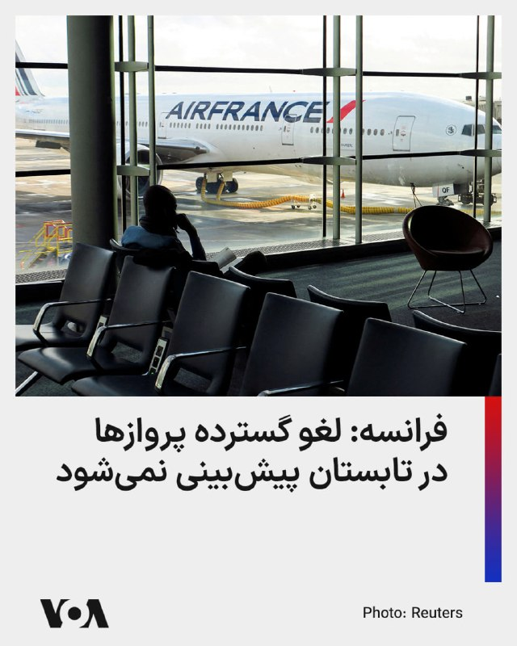

وزیر حمل‌ونقل فرانسه اعلام کرد که این کشور که انتظار ندارد شرکت‌های هواپیمایی در تابستان امسال به دلیل کمبود سوخت جت، به طور گسترده پروازهای خود را لغو کنند.

فیلیپ تابارو روز جمعه افزود بیشتر شرکت‌های هواپیمایی علاقه‌ای به لغو پروازها در تابستان ندارند، زیرا در این فصل بیشترین درآمد خود را کسب می‌کنند، هرچند برخی از آن‌ها اندکی میزان پروازهای خود را کاهش داده‌اند.

یک سخنگوی شرکت فرانسوی ترانساویا جمعه اعلام کرد که در ماه‌های مه و ژوئن ۲ درصد از پروازهای خود را لغو کرده است.

دولت فرانسه در حال آماده‌سازی تدابیر حمایتی برای پشتیبانی از شرکت‌های هواپیمایی از جمله تعویق پرداخت‌های حق بیمه اجتماعی، تمدید مهلت‌های پرداخت مالیات و انعطاف‌پذیری در میزان بارگیری سوخت است. همزمان مقامات اروپایی در تلاش هستند راه‌حل‌هایی برای جلوگیری از اختلالات گسترده در صنعت هوانوردی در تابستان امسال پیدا کنند.

پیشتر شرکت‌های اروپایی درباره کمبود سوخت جت طی چند هفته آینده به دلیل جنگ خاورمیانه هشدار داده‌ بودند. اروپا بیش از هر نوع سوخت دیگری به واردات سوخت جت وابسته است و حدود ۷۵ درصد آن را از خاورمیانه تأمین می‌کند.
@FarsiVOA

## FarsiVOA — post 217176

  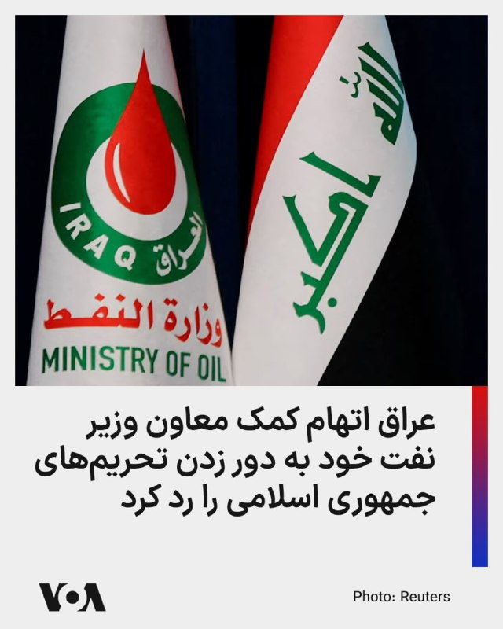

وزارت نفت عراق اتهامات مطرح شده علیه علی معارج البهادلی، معاون وزیر عراق را رد کرده است.

وزارت خزانه‌داری آمریکا روز پنجشنبه اعلام کرد که البهادلی را تحریم کرده، زیرا او «از موقعیت دولتی خود سوءاستفاده کرده تا نفت عراق را در حمایت از رژیم ایران و نیروهای نیابتی تروریستی آن منحرف کند.»

واشنگتن می‌گوید این مقام عراقی «پنهانی و در قالب طرحی برای کمک به جمهوری اسلامی جهت دور زدن تحریم‌ها»، نفت عراق و ایران را با هم مخلوط کرده است.

بر اساس گزارش خبرگزاری دولتی عراق، وزارت نفت این کشور جمعه اعلام کرد که «این اتهامات علیه البهادلی را رد می‌کند» و بر «اهمیت شفافیت در رسیدگی به همه این اتهامات بر اساس شواهد و واقعیت‌ها» تأکید دارد.

این وزارتخانه افزوده که «عملیات صادرات نفت خام، بازاریابی، بارگیری در نفتکش‌ها و رویه‌های مرتبط» جزو وظایف البهادلی نیست.
@FarsiVOA

## RadioFarda — post 156959

  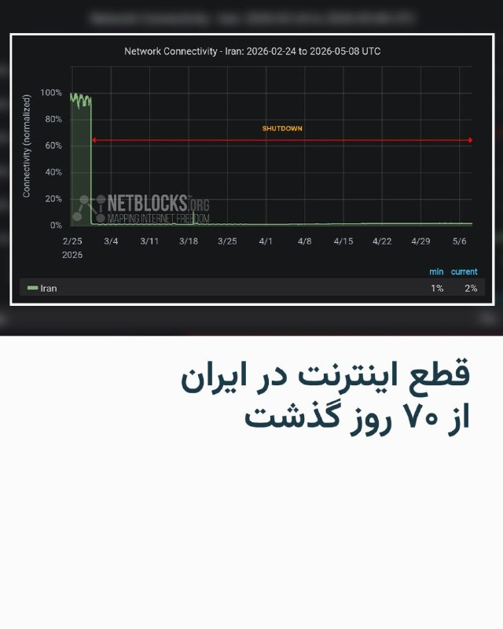

🔸امروز هفتادمین روز قطع اینترنت در ایران است و به‌گزارش نت‌بلاکس این اختلال صبح جمعه ۱۸ اردیبهشت از یک هزار ۶۵۶ ساعت فراتر رفت.

🔸قطع اینترنت در ایران در حالی است که به‌نوشتهٔ نت‌بلاکس، دسترسی دیجیتال در زمان بحران حیاتی است و محدود کردن خدمات، بیش از همه به کسانی آسیب می‌زند که بیشترین نیاز را دارند؛ افراد دارای معلولیت، دانشجویان، کسب‌وکارهای کوچک و عموم مردم.

🔸حکومت ایران ادعا می‌کند قطع اینترنت به‌دلیل شرایط امنیتی ناشی از جنگ با آمریکا و اسرائیل بوده که از نهم اسفند آغاز شد و ۳۹ روز ادامه یافت. منتقدان و کارشناسان اما تأکید دارند که جنگ دلیل مسدود کردن اینترنت نبوده و صرفاً بهانه‌ای برای مجبور کردن مردم به استفاده از شبکه ملی اطلاعات به‌جای اینترنت بوده است.

🔸این در حالی است که مقامات و افراد نزدیک به حکومت یا کسانی که حکومت خود با واگذاری «سیم‌کارت سفید» انتخاب می‌کند، هم‌چنان به اینترنت دسترسی دارند. علاوه بر آن، اخیراً برخی اپارتورهای نیز اینترنت موسوم به طبقاتی را باقیمت‌های گزاف در اختیار برخی مشاغل و طبقات قرار داده‌اند.

@RadioFarda

## Dirty_Kids — post 389090

  

بخدا من دیگه دارم ناراحت میشم انقدر مرگ خامنه‌ای به تخم بسیجیاست و هی عروسی میکنن:)

@Dirty_Kids 👻

## Dirty_Kids — post 389089

  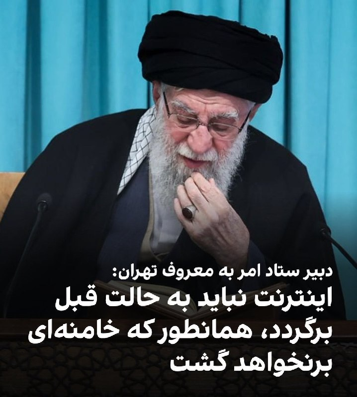

شما اگه خیلی دوسش داشتین چالش می‌کردین؛ الکی فیلم بازی نکنید، دردتون پوله.

@Dirty_Kids 👻

## Dirty_Kids — post 389088

دوشکا پشت وانت دیگه تبدیل به مبلمان شهری تهران شده

@Dirty_Kids 👻

## manototv — post 105126

  <a href="telegram/content/manototv_105126_1778233354.mp4">🎬 Download video</a>

نتایج اولیه انتخابات محلی در بریتانیا نشان می‌دهد حزب کارگر به رهبری کی‌یر استارمر با شکست‌های سنگینی روبه‌رو شده و حزب راست‌گرای «رفرم یو‌کی» به رهبری نایجل فاراژ در حال پیشروی در مناطق مختلف کشور است.
تا صبح جمعه، حزب کارگر بیش از ۲۵۸ کرسی شورا را از دست داده و حزب رفرم یو‌کی ۳۸۲ کرسی به دست آورده بود. برخی از بزرگ‌ترین شکست‌های حزب کارگر در مناطق موسوم به «دیوار قرمز» رخ داده؛ مناطقی صنعتی در شمال انگلستان که به‌طور سنتی از پایگاه‌های اصلی رأی این حزب به شمار می‌روند.
کی‌یر استارمر با وجود این نتایج اعلام کرد استعفا نخواهد داد و انتظار دارد در انتخابات سراسری بعدی در سال ۲۰۲۹ نیز رهبر حزب باقی بماند. او گفت: «من قرار نیست به سادگی کنار بکشم.

کنار بکشم.»

## alonews — post 118622

  <a href="telegram/content/alonews_118622_1778233354.webm">🎬 Download video</a>

👈ترامپ: روزی هشت تا قایق تندرو ایرانی رو میزنیم

✅ @AloNews خبر جنگ

## alonews — post 118621

  <a href="telegram/content/alonews_118621_1778233355.webm">🎬 Download video</a>

👈تانکرترکرز: در طول ۲ روز گذشته، ۳ فروند نفتکش خالی از شرکت ملی نفت ایران (NITC)، با عبور از منطقه انحصاری اقتصادی پاکستان، موفق شدند از محاصره ارتش آمریکا عبور کنند و خود را به ایران برسانند.

🔴ظرفیت این ۳ نفتکش، حدود ۵ میلیون بشکه نفت خام است.

✅ @AloNews خبر جنگ

---
📅 بروزرسانی: 1405/02/18 13:02
---

## VahidOOnLine — post 238844

  

ابوالقاسم جراره، دبیرکل جبهه شریان و نماینده پیشین مجلس، گفت پیام ما به «دشمنان، همراهان دشمن و دیگر کشورها» این است که تنگه هرمز مانند گذشته باز نمی‌شود. او افزود مدیریت تنگه هرمز خواسته مجتبی خامنه‌ای است و در پیام او آمده این تنگه راهبردی با «مدیریت و روش جدیدی» اداره خواهد شد.

او از نهادهای امنیتی جمهوری اسلامی خواست «کودتاچیان» و کسانی را که به گفته او بر مذاکره با آمریکا و دیگر «دشمنان» اصرار دارند، دستگیر و به مردم معرفی کنند.
‌🏁 🇬🇧 IranintlTV

🤖 @VahidOOnLine

## VahidOOnLine — post 238843

  <a href="telegram/content/VahidOOnLine_238843_1778232757.mp4">🎬 Download video</a>

نتایج اولیه انتخابات محلی در بریتانیا نشان می‌دهد حزب کارگر به رهبری کی‌یر استارمر با شکست‌های سنگینی روبه‌رو شده و حزب راست‌گرای «رفرم یو‌کی» به رهبری نایجل فاراژ در حال پیشروی در مناطق مختلف کشور است.
تا صبح جمعه، حزب کارگر بیش از ۲۵۸ کرسی شورا را از دست داده و حزب رفرم یو‌کی ۳۸۲ کرسی به دست آورده بود. برخی از بزرگ‌ترین شکست‌های حزب کارگر در مناطق موسوم به «دیوار قرمز» رخ داده؛ مناطقی صنعتی در شمال انگلستان که به‌طور سنتی از پایگاه‌های اصلی رأی این حزب به شمار می‌روند.
کی‌یر استارمر با وجود این نتایج اعلام کرد استعفا نخواهد داد و انتظار دارد در انتخابات سراسری بعدی در سال ۲۰۲۹ نیز رهبر حزب باقی بماند. او گفت: «من قرار نیست به سادگی کنار بکشم.
‌🏁 🇬🇧 ManotoTV

🤖 @VahidOOnLine

## DEJradio — post 4516

  <a href="telegram/content/DEJradio_4516_1778232758.webm">🎬 Download video</a>

🚨📢 نماینده آمریکا در سازمان ملل: جمهوری اسلامی به یک کشتی چینی حمله کرده است مایک والتز، سفیر ایالات متحده در سازمان ملل، تأیید کرد یک کشتی متعلق به چین روز دوشنبه در جریان حملات جمهوری اسلامی در تنگ هرمز هدف قرار گرفته است. رسانه‌های چینی گزارش دادند این…

## IranIntlTV — post 336109

  <a href="telegram/content/IranIntlTV_336109_1778232759.mp4">🎬 Download video</a>

وزارت دفاع ملی ترکیه ابراز امیدواری کرد جمهوری اسلامی و آمریکا با رویکردی خویشتندارانه و سازنده، زمینه دائمی شدن آتش‌بس را فراهم کنند.
جزییات بیشتر با نرگس هورخش، خبرنگار ایران‌اینترنشنال
@iranintltv

## IranIntlTV — post 336108

  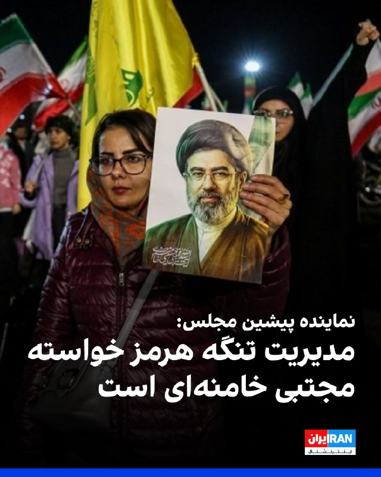

ابوالقاسم جراره، دبیرکل جبهه شریان و نماینده پیشین مجلس، گفت پیام ما به «دشمنان، همراهان دشمن و دیگر کشورها» این است که تنگه هرمز مانند گذشته باز نمی‌شود. او افزود مدیریت تنگه هرمز خواسته مجتبی خامنه‌ای است و در پیام او آمده این تنگه راهبردی با «مدیریت و روش جدیدی» اداره خواهد شد.

او از نهادهای امنیتی جمهوری اسلامی خواست «کودتاچیان» و کسانی را که به گفته او بر مذاکره با آمریکا و دیگر «دشمنان» اصرار دارند، دستگیر و به مردم معرفی کنند.
https://iranintl.com/202605085394

## ManotoTV — post 105125

  <a href="telegram/content/ManotoTV_105125_1778232761.mp4">🎬 Download video</a>

نتایج اولیه انتخابات محلی در بریتانیا نشان می‌دهد حزب کارگر به رهبری کی‌یر استارمر با شکست‌های سنگینی روبه‌رو شده و حزب راست‌گرای «رفرم یو‌کی» به رهبری نایجل فاراژ در حال پیشروی در مناطق مختلف کشور است.
تا صبح جمعه، حزب کارگر بیش از ۲۵۸ کرسی شورا را از دست داده و حزب رفرم یو‌کی ۳۸۲ کرسی به دست آورده بود. برخی از بزرگ‌ترین شکست‌های حزب کارگر در مناطق موسوم به «دیوار قرمز» رخ داده؛ مناطقی صنعتی در شمال انگلستان که به‌طور سنتی از پایگاه‌های اصلی رأی این حزب به شمار می‌روند.
کی‌یر استارمر با وجود این نتایج اعلام کرد استعفا نخواهد داد و انتظار دارد در انتخابات سراسری بعدی در سال ۲۰۲۹ نیز رهبر حزب باقی بماند. او گفت: «من قرار نیست به سادگی کنار بکشم.

## DW_Farsi — post 124423

🔶 شبکه کان اسرائیل: حماس در ترکیه برای حملات علیه اسرائیل آموزش می‌بیند

شبکه "کان" اسرائیل گزارش داد که نیروهای گروه تروریستی حماس، "در ترکیه برای انجام حملات علیه اسرائیل آموزش می‌بینند".

بر اساس این گزارش، این نیروها که لباس غیرنظامی به تن دارند، "به طور منظم در دوره‌های آموزشی مربوط به استفاده از سلاح‌های سبک و تاکتیک‌ها در باشگاه‌های تیراندازی عمومی، و همچنین آموزش‌های مربوط به کار با پهپادها شرکت می‌کنند."

این گزارش می‌افزاید که آن‌ها حتی مجوز رسمی پرواز پهپاد در ترکیه را نیز دریافت کرده‌اند. بر اساس این گزارش، هدف این است که آموزش آن‌ها پیش از انتقال به لبنان، اردن و کرانه باختری تکمیل شود تا در درگیری‌های آینده با اسرائیل حملاتی انجام دهند.

این نخستین مورد از اخبار مربوط به هماهنگی افشا شده میان ترکیه و حماس نیست. در دسامبر گذشته، ارتش اسرائیل و شین‌بت، سازمان امنیت داخلی اسرائیل، یک شبکه پولشویی تحت حمایت جمهوری اسلامی را که حماس آن را در ترکیه اداره می‌کرد، افشا کردند.

بر اساس بیانیه ارتش اسرائیل، اسناد به‌دست‌آمده از این سازمان نشان می‌دهد که "حماس شبکه‌ای از صرافی‌های مالی مرتبط با افراد اهل غزه مستقر در ترکیه را اداره می‌کند و از نهادهای مالی این کشور برای اهداف تروریستی استفاده می‌کند".

بر اساس این گزارش، این افراد اهل غزه که موفق به انتقال صدها میلیون دلار شده‌اند، ارتباط مستقیم با ایران و اعضای ارشد حکومت جمهوری اسلامی دارند. بر اساس بیانیه ارتش اسرائیل، این پولشویان همچنین فعالیت اقتصادی گسترده‌ای در ترکیه انجام می‌دهند که شامل انتقال پول از ایران به حماس می‌شود.
@dw_farsi

## Persian_Trend_Official — post 13674

  <a href="telegram/content/Persian_Trend_Official_13674_1778232762.webm">🎬 Download video</a>

🔴 بازداشت ۴ نفر در اسرائیل با اتهام جاسوسی برای ایران

▪️رسانه عبری Ynet گزارش داده ۳ سرباز و ۱ غیرنظامی در اسرائیل به اتهام همکاری با اطلاعات ایران بازداشت شده‌اند؛ برخی از آن‌ها در زمان شروع ارتباط زیر سن قانونی بوده‌اند.

▪️بر اساس ادعای سرویس امنیت داخلی اسرائیل Shin Bet و پلیس، این افراد متهم‌اند از اماکن حساس از جمله یک پایگاه مرتبط با نیروی هوایی فیلم‌برداری کرده‌اند.

▪️گزارش‌ها می‌گویند برخی از متهمان به‌صورت داوطلبانه با عوامل ایرانی تماس گرفته‌اند.

▪️این افراد در ماه مارس بازداشت شده‌اند و اکنون دادستانی اسرائیل علیه آن‌ها کیفرخواست صادر کرده است.

🫆:Tony

📌 @persian_trend_official
پرشین ترند | متفاوت‌ ترین کانال نظامی

## manototv — post 105125

  <a href="telegram/content/manototv_105125_1778232762.mp4">🎬 Download video</a>

نتایج اولیه انتخابات محلی در بریتانیا نشان می‌دهد حزب کارگر به رهبری کی‌یر استارمر با شکست‌های سنگینی روبه‌رو شده و حزب راست‌گرای «رفرم یو‌کی» به رهبری نایجل فاراژ در حال پیشروی در مناطق مختلف کشور است.
تا صبح جمعه، حزب کارگر بیش از ۲۵۸ کرسی شورا را از دست داده و حزب رفرم یو‌کی ۳۸۲ کرسی به دست آورده بود. برخی از بزرگ‌ترین شکست‌های حزب کارگر در مناطق موسوم به «دیوار قرمز» رخ داده؛ مناطقی صنعتی در شمال انگلستان که به‌طور سنتی از پایگاه‌های اصلی رأی این حزب به شمار می‌روند.
کی‌یر استارمر با وجود این نتایج اعلام کرد استعفا نخواهد داد و انتظار دارد در انتخابات سراسری بعدی در سال ۲۰۲۹ نیز رهبر حزب باقی بماند. او گفت: «من قرار نیست به سادگی کنار بکشم.

## alonews — post 118620

  <a href="telegram/content/alonews_118620_1778232763.webm">🎬 Download video</a>

👈حمله فعالان بسیجی سیمکارت سفید به پرزیدنت پزشکیان!

✅ @AloNews خبر جنگ

## alonews — post 118619

  <a href="telegram/content/alonews_118619_1778232764.mp4">🎬 Download video</a>

ترامپ در هفته های گذشته

[@AloTweet]

---
📅 بروزرسانی: 1405/02/18 12:52
---

## VahidOOnLine — post 238842

  

پایگاه خبری ارم‌نیوز امارات متحده عربی گزارش داد نسخه فاش‌شده تفاهم تهران و واشینگتن، بیش از آنکه یک توافق جامع باشد، به یادداشتی برای کاهش تنش‌ها شباهت دارد.

ارم‌نیوز افزود این تفاهم بر توقف درگیری‌ها، حل‌وفصل بحران تنگه هرمز و آغاز مسیری کوتاه برای مذاکرات متمرکز است و پرونده‌های هسته‌ای، موشکی و نیروهای نیابتی را به مراحل بعدی موکول می‌کند.
iranintl
‌🏁 🇬🇧 IranintlTV

🤖 @VahidOOnLine

## DEJradio — post 4515

  <a href="telegram/content/DEJradio_4515_1778232171.webm">🎬 Download video</a>

🚨📢 منابع دژ گزارش دادند که ماموران امنیتی، پس از دستیابی به پرونده شماری از دانش‌آموزان دبیرستان دخترانه «شرافت» در تهران منطقه ۱۳، به صورت تلفنی آنها را تهدید جنسی کرده‌اند.
خانواده این دانش‌آموزان نگران از وضعیت فرزندانشان با پلیس تماس گرفتند اما پیگیری آنها به نتیجه نرسیده است.

آنها نمی‌دانند چرا دختران آنها مورد تهدید قرار گرفته‌اند، اما متوجه شدند مسئولان مدرسه پرونده دانش‌آموزان را در اختیار ماموران امنیتی قرار دادند.

این افراد با حرف‌های زشت و رکیک دختران را خطاب قرار دادند و گفته‌اند ترددشان را زیر نظر دارند: "حواسمون بهتون هست."

#دبیرستان_شرافت #تهران
@DEJradio

## IranIntlTV — post 336107

  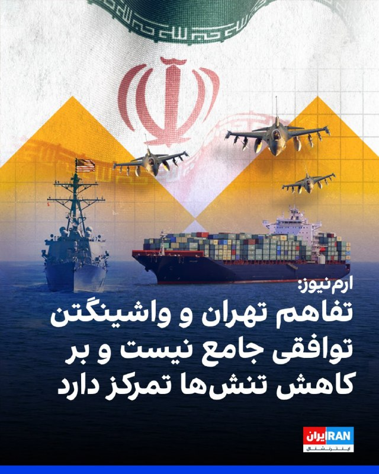

پایگاه خبری ارم‌نیوز امارات متحده عربی گزارش داد نسخه فاش‌شده تفاهم تهران و واشینگتن، بیش از آنکه یک توافق جامع باشد، به یادداشتی برای کاهش تنش‌ها شباهت دارد.

ارم‌نیوز افزود این تفاهم بر توقف درگیری‌ها، حل‌وفصل بحران تنگه هرمز و آغاز مسیری کوتاه برای مذاکرات متمرکز است و پرونده‌های هسته‌ای، موشکی و نیروهای نیابتی را به مراحل بعدی موکول می‌کند.
iranintl.com/202605088965

---
📅 بروزرسانی: 1405/02/18 12:48
---

## VahidOOnLine — post 238841

  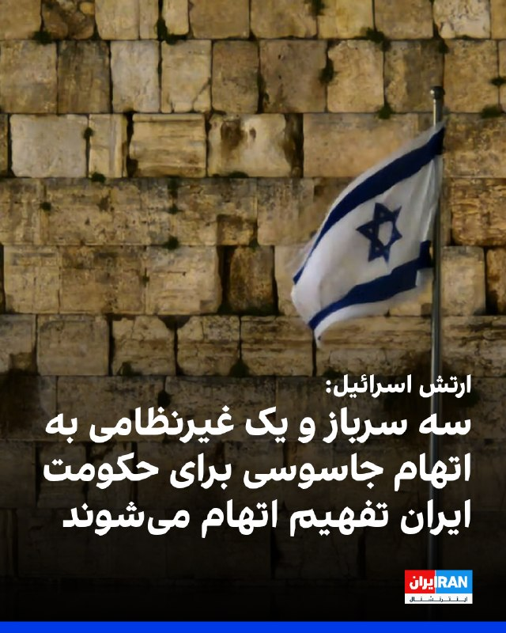

ارتش و سازمان امنیت داخلی اسرائیل اعلام کردند سه سرباز و یک شهروند غیرنظامی جمعه به اتهام جاسوسی برای جمهوری اسلامی در دادگاه تفهیم اتهام خواهند شد.

بر اساس این گزارش، این سربازان که در یک مدرسه فنی وابسته به نیروی هوایی اسرائیل آموزش می‌دیدند، از تاسیسات نظامی عکس‌برداری کرده‌اند.

مقام‌های اسرائیلی همچنین اعلام کردند این سه سرباز پیش از اعزام به خدمت و زمانی که هنوز به سن قانونی نرسیده بودند، با ماموران امنیتی جمهوری اسلامی در ارتباط بودند و ماموریت‌های جاسوسی انجام دادند.
‌🏁 🇬🇧 IranintlTV

🤖 @VahidOOnLine

## VahidOOnLine — post 238840

  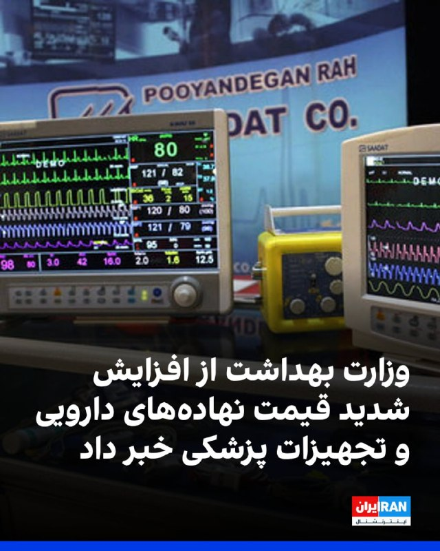

مهدی پیرصالحی، معاون وزیر بهداشت، از کمبود و افزایش شدید قیمت نهاده‌های دارویی، تجهیزات پزشکی، مقوا، فویل‌های آلومینیومی و بسته‌بندی‌های پت خبر داد.

او افزود: «برای جبران هزینه‌های تولید و حفظ پایداری زنجیره تامین دارو، افزایش قیمت‌ها ضروری ارزیابی شده است.»

پیرصالحی ادامه داد: «فعالان و تولیدکنندگان صنعت دارو با ارائه مستندات هزینه‌ای، افزایش بسیار بیشتری را برای پوشش کامل هزینه‌های تحمیل‌شده پیشنهاد کرده‌اند.»
iranintl
‌🏁 🇬🇧 IranintlTV

🤖 @VahidOOnLine

## VahidOOnLine — post 238839

  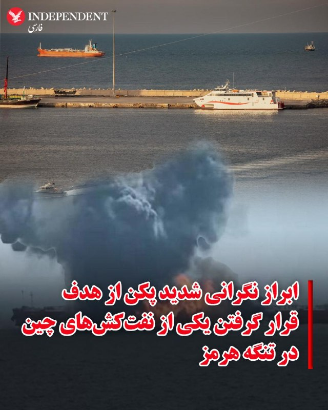

♦️چین روز جمعه تایید کرد یک نفتکش حامل خدمه چینی در تنگه هرمز هدف حمله قرار گرفته است. لین جیان، سخنگوی وزارت خارجه چین، با ابراز نگرانی عمیق درباره کشتی‌های آسیب‌دیده در جریان درگیری‌های خاورمیانه گفت چند شهروند چینی در این نفتکش حضور دارند اما تاکنون گزارشی از تلفات خدمه منتشر نشده است.
رسانه چینی «کایشین» پیش‌تر گزارش داده بود یک نفتکش متعلق به چین روز دوشنبه در نزدیکی تنگه هرمز هدف حمله قرار گرفته است.
‌🇸🇦 Indypersian

🤖 @VahidOOnLine

## VahidOOnLine — post 238838

  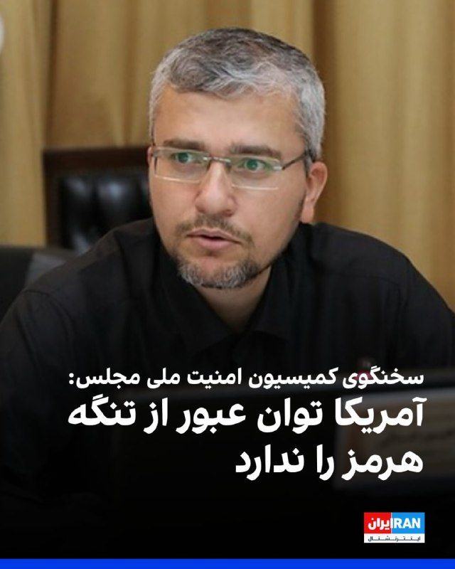

ابراهیم رضایی، سخنگوی کمیسیون امنیت ملی مجلس گفت که آمریکا «با چند ناوچه و ناوشکن»، قادر به عبور از تنگه هرمز نیست.

رضایی خطاب به مقام‌های ایالات متحده افزود: «با کل نیروی دریایی‌تان هم توان عبور از تنگه هرمز را نخواهید داشت. فقط مثل یک بچه لوس، کتک می‌خورید و برمی‌گردید.» iranintl
‌🏁 🇬🇧 IranintlTV

🤖 @VahidOOnLine

## VahidOOnLine — post 238837

  <a href="telegram/content/VahidOOnLine_238837_1778231904.mp4">🎬 Download video</a>

ارتش و سازمان امنیت داخلی این کشور اعلام کردند یک شهروند و سه سرباز سابق به اتهام جاسوسی برای جمهوری اسلامی تحت پیگرد قرار گرفته‌اند و قرار است علیه آن‌ها در دادگاه حیفا کیفرخواست صادر شود.
بر اساس این گزارش، متهمان به دستور یک عامل اطلاعاتی جمهوری اسلامی از مکان‌هایی مانند مدرسه فنی نیروی هوایی، ایستگاه‌های قطار، مراکز خرید و دوربین‌های امنیتی تصویربرداری کرده و تصاویر و ویدیوها را ارسال کرده‌اند.
مقام‌های اسرائیلی همچنین اعلام کردند این افراد پیش از خدمت سربازی جذب شده بودند و یکی از متهمان دیگر افراد را برای همکاری با عامل اطلاعاتی جمهوری اسلامی جذب کرده است.
‌🏁 🇬🇧 ManotoTV

🤖 @VahidOOnLine

## VahidOOnLine — post 238836

  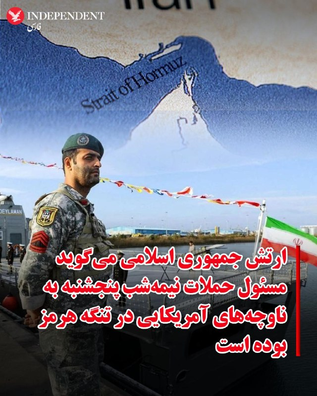

♦️نیروی دریایی ارتش جمهوری اسلامی با صدور بیانیه‌‌ای اعلام کرد حمله شامگاه پنجشنبه به ناوشکن‌های آمریکایی در زمان خروج از تنگه هرمز با موشک‌ها و پهپادهای ارتش انجام شده است.
در این بیانیه آمده است: «نیروی دریایی ارتش، با انواع موشک، پهپاد رزمی و راکت، ناوشکن‌های آمریکایی را که با نقض آتش‌بس، به نفتکش‌های ایرانی در نزدیکی تنگه هرمز و در آب‌های سرزمینی تعرض کرده بودند، مورد حمله قرار داد.»
این خبر در حالی منتشر می‌شود که به گفته مقام‌های آمریکایی و ازجمله دونالد ترامپ، رئیس جمهوری ایالات متحده، قایق‌های کوچک هم در این حمله نقش داشتند؛ تاکتیک رزمی که براساس داده‌ها، منحصر به نیروهای سپاه پاسداران است.
‌🇸🇦 Indypersian

🤖 @VahidOOnLine

## VahidOOnLine — post 238835

  

روح‌الله مومن‌نسب، دبیر ستاد امر به معروف تهران نوشت نمی‌شود نیروهای مسلح، مرزهای ما و تنگه هرمز را به روی دشمنان ببندند اما دولت فضای مجازی را در اختیار آنان قرار دهد.

او افزود که «فضای مجازی به هیچ وجه نباید به حالت قبل برگردد؛ همان‌طور که امام شهید ما به حالت قبل برنمی‌گردد.»
‌🏁 🇬🇧 IranintlTV

🤖 @VahidOOnLine

## VahidOOnLine — post 238834

  

روح‌الله مومن‌نسب، دبیر ستاد امر به معروف تهران نوشت نمی‌شود نیروهای مسلح، مرزهای ما و تنگه هرمز را به روی دشمنان ببندند اما دولت فضای مجازی را در اختیار آنان قرار دهد.

او افزود که «فضای مجازی به هیچ وجه نباید به حالت قبل برگردد؛ همان‌طور که امام شهید ما به حالت قبل برنمی‌گردد.»
‌🏁 🇬🇧 IranintlTV

🤖 @VahidOOnLine

## VahidOOnLine — post 238833

  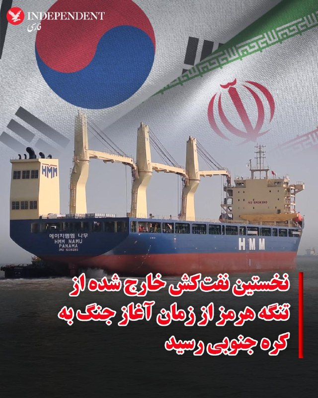

♦️خبرگزاری فرانسه روز جمعه ۱۸ اردیبهشت ماه به نقل از منابع آگاه گزارش کرد یک کشتی حامل نفت خام کره جنوبی پس از خروج از تنگه هرمز، به سواحل این کشور رسیده است.

براساس این گزارش، کشتی اودسا تحت پرچم مالت حامل یک میلیون بشکه نفت خام است و در ۲۸ فروردین در دوره کوتاه کاهش تنش‌ها، تنگه هرمز را ترک کرده بود.
سازمان بین‌المللی دریانوردی سازمان ملل، اعلام کرد حدود ۱۵۰۰ کشتی و ۲۰ هزار خدمه در منطقه خلیج فارس گرفتار شده‌اند.
‌🇸🇦 Indypersian

🤖 @VahidOOnLine

## VahidOOnLine — post 238832

  

طبق اطلاعات رسیده به ایران اینترنشنال، روز پنجشنبه خانواده جاویدنام ابوالفضل پایدار، ۱۷ ساله که در اعتراضات دی‌ماه کشته شد، در سبزوار برای او جشن تولد گرفته بودند، اما ماموران حکومت این شهر به مراسم او با باتوم و شوکر حمله کردند.

طبق این گزارش، ماموران مادر، خواهرزاده و دایی جاویدنام پایدار رو با خود بردند و آن‌ها را به اردوگاه تربت حیدریه منتقل کردند. در مراسم او ، ۵ زن دیگر هم بازداشت شده‌اند.
‌🏁 🇬🇧 IranintlTV

🤖 @VahidOOnLine

## VahidOOnLine — post 238831

  <a href="telegram/content/VahidOOnLine_238831_1778231909.mp4">🎬 Download video</a>

⭕️شعار اعتراضی بر مزار جاویدنام ساسان آزادوار جونقانی: «ساسان جونقانی، افتخار جهانی»

♦️تصاویری که روز پنجشنبه ۱۷ اردیبهشت در شبکه‌های اجتماعی منتشر شده نشان می‌دهد، تعدادی از بستگان و خانواده جاویدنام ساسان آزادوار جونقانی بر مزار او شعار می‌دهند: «ساسان جونقانی، افتخار جهانی».

حکم اعدام جاویدنام ساسان آزادوار روز ۳۱ فروردین در شعبه یکم دادگاه انقلاب استان اصفهان صادر شده بود.
دادستانی اصفهان مدعی شده بود که این جوان کاراته‌کار ۲۱ ساله، در جریان انقلاب ملی شیروخورشید در دی‌ماه ۱۴۰۴ قصد حمله به ماموران نیروی انتظامی را داشته است؛ ادعایی که به گفته اعضای خانواده، مدارکی برای آن ارائه نشده بود.

ساسان سابقه قهرمانی در مسابقات استانی اصفهان را در کارنامه دارد.
‌🇸🇦 Indypersian

🤖 @VahidOOnLine

## VahidOOnLine — post 238830

  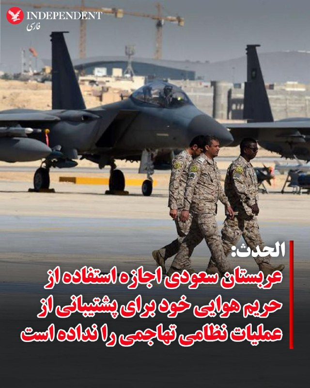

♦️یک منبع مطلع سعودی در گفتگو با شبکه الحدث اعلام کرد پادشاهی عربستان سعودی به هیچ عنوان اجازه استفاده از حریم هوایی خود را جهت پشتیبانی از عملیات نظامی تهاجمی علیه جمهوری اسلامی صادر نکرده است.

این موضع‌گیری ریاض پس از تبادل آتش پنجشنبه شب میان نیروهای مسلح جمهوری اسلامی ایران و آمریکا صورت می‌گیرد.

 درگیری پنجشنبه شب در تنگه هرمز از زمان آتش‌بس میان دو طرف از ۱۹ فروردین، جدی‌ترین و خطرناک‌ترین مورد نقض آتش‌بس به شمار می‌رود. این در حالی است که دونالد ترامپ، رئیس جمهوری آمریکا با کم‌اهمیت خواندن درگیری نیمه‌شب پنجشنبه، اعلام کرد آتش‌بس به قوت خود باقی است.
‌🇸🇦 Indypersian

🤖 @VahidOOnLine

## VahidOOnLine — post 238829

  <a href="telegram/content/VahidOOnLine_238829_1778231913.mp4">🎬 Download video</a>

وزارت خارجه چین اعلام کرد شهروندان چینی در نفتکش هدف قرارگرفته در تنگه هرمز حضور دارند، اما تاکنون گزارشی از زخمی یا کشته شدن خدمه این کشتی دریافت نشده است.
پکن همچنین اعلام کرد وضعیت خدمه و جزئیات حادثه را از نزدیک دنبال می‌کند.
‌🏁 🇬🇧 ManotoTV

🤖 @VahidOOnLine

## VahidOOnLine — post 238828

  <a href="telegram/content/VahidOOnLine_238828_1778231914.mp4">🎬 Download video</a>

گروه ناظر اینترنتی نت‌بلاکس اعلام کرد قطعی اینترنت در ایران امروز وارد هفتادمین روز خود شده و از مرز ۱۶۵۶ ساعت گذشته است.
نت‌بلاکس هشدار داده در شرایط بحرانی، دسترسی به اینترنت یک نیاز حیاتی است و محدودیت‌های گسترده بیشترین آسیب را به افراد دارای معلولیت، دانشجویان، کسب‌وکارهای کوچک و عموم شهروندان وارد می‌‌کند.
‌🏁 🇬🇧 ManotoTV

🤖 @VahidOOnLine

## VahidOOnLine — post 238827

  <a href="telegram/content/VahidOOnLine_238827_1778231915.mp4">🎬 Download video</a>

یک شهروند روز جمعه ۱۸ اردیبهشت ویدیویی به ایران اینترنشنال ارسال کرده و می‌گوید که پس از شنیده شدن صدای یک جنگنده در آسمان نقطه‌ای در جنوب غربی تهران هدف قرار گرفته و از آن دود بلند می‌شوند.
‌🏁 🇬🇧 IranintlTV

🤖 @VahidOOnLine

## VahidOOnLine — post 238826

  <a href="telegram/content/VahidOOnLine_238826_1778231918.mp4">🎬 Download video</a>

♦️اینستاگرام در یکی از بزرگ‌ترین پاکسازی‌های تاریخ خود، میلیون‌ها حساب جعلی، ربات و حساب غیرفعال را حذف کرد. این اقدام باعث شد تعداد دنبال‌کنندگان بسیاری از چهره‌های مشهور و تولیدکنندگان محتوا به‌طور ناگهانی کاهش پیدا کند.
به گزارش تلگراف، این پاکسازی گسترده شرکت متا، فقط در چند ساعت میلیون‌ها دنبال‌کننده را از حساب‌های مشهور حذف کرده و موجی از واکنش‌ها را در میان کاربران شبکه‌های اجتماعی به راه انداخته است.
کریستیانو رونالدو حدود هشت میلیون دنبال‌کننده، لیونل مسی حدود پنج میلیون، کایلی جنر بیش از ۱۴ میلیون، سلنا گومز حدود شش میلیون و آریانا گرانده بیش از پنج میلیون دنبال‌کننده از دست دادند. همچنین شمار دنبال‌کنندگان کیم کارداشیان، نیمار، گروه بلک‌پینک و بی‌تی‌اس نیز به شکل قابل توجهی کاهش یافت.
در ابتدا بسیاری از کاربران تصور کردند این کاهش ناگهانی ناشی از اختلال فنی یا کمپین گسترده آنفالو کردن حساب‌های مشهور است، اما بعدا مشخص شد متا در حال حذف حساب‌های جعلی و غیرفعال بوده است.
متا در بیانیه‌ای اعلام کرد: «در چارچوب روند معمول حذف حساب‌های غیرفعال، برخی حساب‌های اینستاگرام ممکن است تغییراتی در تعداد دنبال‌کنندگان خود مشاهده کرده باشند. دنبال‌کنندگان فعال تحت تاثیر قرار نمی‌گیرند.»
‌🇸🇦 Indypersian

🤖 @VahidOOnLine

## VahidOOnLine — post 238825

⭕️سالگرد اعدام فرخ‌رو پارسا؛ وزیری با کارنامه تحول در آموزش‌ و پرورش ایران

📌هویدا وقتی وزارت آموزش‌ و پرورش را به فرخ‌رو پارسا سپرد به او گفت انتظار دارد همه بچه‌های ایران را همچون فرزندان خود بداند

♦️سحرگاه هجدهم اردیبهشت ۱۳۵۹ در آن‌سوی دیوارهای زندان اوین به دستور صادق خلخالی و حکم دادگاه انقلاب اسلامی، زنی اعدام شد که عمری را برای اعتلای فرهنگ، آموزش و برابری در جامعه صرف کرده بود و باور داشت هیچ جرمی مرتکب نشده است و نباید از محاکمه در جمهوری تازه تاسیس اسلامی بهراسد.

بیشتر بخوانید...

✍️سایه رحیمی
‌🇸🇦 Indypersian

🤖 @VahidOOnLine

## VahidOOnLine — post 238824

  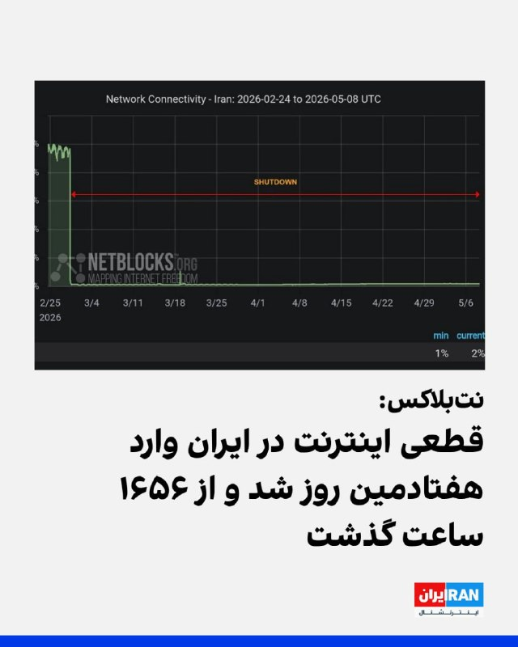

نت‌بلاکس، نهاد ناظر بر اختلال‌های اینترنتی در جهان، صبح جمعه ۱۸ اردیبهشت اعلام کرد قطعی اینترنت در ایران وارد هفتادمین روز شده و مدت این اختلال از ۱۶۵۶ ساعت گذشته است.
نت‌بلاکس تاکید کرد ارتباطات دیجیتال در زمان بحران حیاتی است و محدود کردن خدمات اینترنتی به افراد دارای معلولیت، دانشجویان، کسب‌وکارهای کوچک و عموم مردم آسیب می‌زند. iranintl
‌🏁 🇬🇧 IranintlTV

🤖 @VahidOOnLine

## VahidOOnLine — post 238823

  <a href="telegram/content/VahidOOnLine_238823_1778231921.mp4">🎬 Download video</a>

بلومبرگ گزارش داد شرکت هواپیمایی ایر ایندیا در پی جنگ ایران در حال بررسی اجرای اقداماتی برای کاهش هزینه‌ها و کاهش تعداد پروازهاست.
بر اساس این گزارش، مرخصی اجباری برای کارکنان غیر فنی و کاهش بیش از ۲۰ درصدی ظرفیت پروازها در سه ماه آینده از جمله گزینه‌های مورد بررسی است.
‌🏁 🇬🇧 ManotoTV

🤖 @VahidOOnLine

## VahidOOnLine — post 238822

  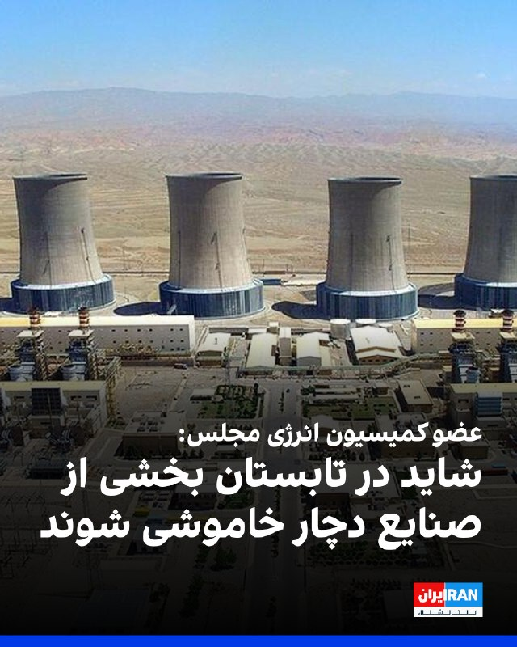

رضا سپهوند، عضو کمیسیون انرژی مجلس، گفت که ممکن است در تابستان خاموشی‌هایی رخ دهد، اما تلاش بر این است که در بخش برق خانگی خاموشی اعمال نشود.

او افزود ممکن است بخشی از صنایع دچار خاموشی شوند، اما میزان آن کمتر از سال گذشته خواهد بود.
این نماینده مجلس ادامه داد: «برخی از توان ما در فولاد مبارکه و پتروشیمی‌های منطقه عسلویه آسیب دیده‌اند و بازسازی آن‌ها هم مدتی زمان خواهد برد.»
‌🏁 🇬🇧 IranintlTV

🤖 @VahidOOnLine

## mwarmonitor — post 8673

🔴در دو روز گذشته، سه نفتکشِ خالی از محموله متعلق به (NITC) پس از بازگشت به ایران از مسیر منطقه انحصاری اقتصادی (EEZ) پاکستان، موفق شدند از خط محاصره نیروی دریایی آمریکا عبور کنند.

🔴 مجموع ظرفیت حمل این سه نفتکش حدود ۵ میلیون بشکه نفت خام ایران است.

🔹تأییدشده: دو فروند از این سه نفتکش در تصاویر ماهواره‌ای مشاهده شده‌اند.
🔸تأییدنشده: نفتکش سومی شب گذشته (۷ مه ۲۰۲۶) در داده‌های AIS در سواحل عمان دیده شد؛ حدود ۲۵۴ مایل دریایی (۴۷۰ کیلومتر) در غرب خط محاصره. نام این نفتکش HASNA (9212917) است. توجه داشته باشید که هنوز تأیید بصری HASNA انجام نشده است. هویت دو نفتکش دیگر که به‌طور بصری شناسایی شده‌اند، با مشتریان ما به اشتراک گذاشته شده است.

📌بر اساس اعلام (CENTCOM) در ۶ مه ۲۰۲۶:
«پس از آن‌که خدمه نفتکش Hasna به هشدارهای مکرر توجه نکردند، نیروهای آمریکا با شلیک چند گلوله از توپ ۲۰ میلی‌متری یک جنگنده نیروی دریایی ایالات متحده که از ناو به پرواز درآمده بود، سکان (rudder) این نفتکش را از کار انداختند. Hasna دیگر به سمت ایران در حال تردد نیست.»

@mwarmonitor

## mwarmonitor — post 8671

✈️هواپیمای E-11A BACN (یک هواپیمای گره ارتباطی میدان نبرد) نیروی هوایی ایالات متحده (USAF) با شماره 24-9049 که از پایگاه هوایی شاهزاده سلطان 🇸🇦 به پرواز درآمده بود، امروز صبح برای چندین ساعت بر فراز عراق فعال بود.

🔸همچنین پهپاد MQ-4C Triton نیروی دریایی ایالات متحده (US Navy) با شماره 169804 که از پایگاه هوایی موفق السلطي 🇯🇴 عملیات می‌کند، بر فراز خلیج فارس فعال است (ترانسپوندرها خاموش هستند).

@mwarmonitor

## mwarmonitor — post 8669

🇮🇱ارتش اسرائیل ‼️ هشدار فوری به ساکنان لبنانِ حاضر در روستای العباسیة

🔸 در پی نقض توافق آتش‌بس توسط حزب‌الله، ارتش دفاعی اسرائیل ناچار است با قدرت علیه آن اقدام کند. ارتش دفاعی اسرائیل قصد آسیب رساندن به شما را ندارد.

🔸 برای حفظ امنیت شما، باید فوراً منازل خود را تخلیه کرده و حداقل تا فاصله ۱۰۰۰ متر از روستا به مناطق باز و غیرمسکونی منتقل شوید.

🔸 هر فردی که در نزدیکی نیروها، تأسیسات یا تجهیزات رزمی حزب‌الله حضور داشته باشد، جان خود را در معرض خطر قرار می‌دهد!

📍 محل هشدار: العباسیة

@mwarmonitor

## mwarmonitor — post 8668

🔰دیوید آلبرایت ؛ گزارش جدید ما: تحلیل جامع تأسیسات هسته‌ای ایران که در جریان جنگ اخیر هدف قرار گرفتند – فاز دوم جنگ ایران

مایلم گزارش جامع خود را به اشتراک بگذارم که شامل توضیحات تفصیلی و تصاویر ماهواره‌ای با وضوح بالا از تأسیسات مرتبط با برنامه هسته‌ای است که در جریان جنگ ایران ـ که از ۲۸ فوریه آغاز شد و در ۷/۸ آوریل ۲۰۲۶ با آتش‌بس پایان یافت ـ توسط اسرائیل و ایالات متحده هدف قرار گرفته و منهدم شده‌اند. این مؤسسه توانسته است دست‌کم شش سایت هسته‌ای را که مورد حمله قرار گرفته‌اند شناسایی کند. سه سایت دیگر نیز هدف حمله بوده‌اند که ممکن است به فعالیت‌های هسته‌ای مرتبط باشند، اما اطلاعات موجود برای قطعیت کافی نیست. در مجموع، شش تا نه سایت که اخیراً مورد حمله قرار گرفته‌اند، ماهیت هسته‌ای داشته‌اند.

چهار تصویر از مجموع ۳۳ تصویر این گزارش پیوست شده‌اند. توضیحات (کپشن) این تصاویر در انتهای این متن آمده است.

به نظر می‌رسد اولویت اسرائیل در فاز دوم جنگ، بیش از هر چیز، تضعیف بیشتر توانایی ایران برای ساخت خودِ سلاح هسته‌ای بوده است؛ فرایندی که «تسلیحاتی‌سازی هسته‌ای» نامیده می‌شود. برخی از این سایت‌های هدف‌گرفته‌شده مرتبط با تسلیحاتی‌سازی، برای نخستین بار به‌صورت عمومی افشا شده‌اند و ابعاد تازه‌ای از گستره فعالیت‌های مرتبط با سلاح هسته‌ای ایران را روشن می‌کنند. از میان شش تا نه سایتی که در بالا ذکر شد، چهار تا هفت سایت ـ یعنی تقریباً همه آن‌ها ـ به‌طور مستقیم به ساخت سلاح هسته‌ای مربوط بوده‌اند یا احتمالاً چنین نقشی داشته‌اند. در مجموع، پنج سایت مرتبط با تسلیحاتی‌سازی هسته‌ای در ژوئن ۲۰۲۵ هدف حمله قرار گرفتند. در هر دو فاز جنگ، در مجموع نه تا دوازده سایت درگیر در توسعه و ساخت سلاح هسته‌ای هدف قرار داده شده‌اند.

حملات فاز دوم، توانایی ایران برای ساخت سلاح هسته‌ای را بیش از پیش عقب انداخته است. گزارش‌های اخیر رسانه‌ای مبنی بر این‌که جامعه اطلاعاتی آمریکا به این نتیجه رسیده که فاز دوم جنگ، جدول زمانی ایران برای ساخت سلاح هسته‌ای را به عقب نینداخته، با میزان تخریب مشهود در تأسیسات تسلیحاتی‌سازی هسته‌ای همخوانی ندارد و نیازمند توضیح و بررسی دقیق‌تری است.

این حملات شایسته اعتبار دادن هستند، زیرا هم زمان لازم برای تکمیل یک سلاح هسته‌ای را به‌طور قابل توجهی افزایش داده‌اند و هم احتمال شکست در صورت تلاش برای ساخت آن را بالا برده‌اند. اگرچه رژیم جدید ایران به‌طور گسترده به‌عنوان رژیمی با انگیزه بیشتر برای تصمیم‌گیری جهت ساخت سلاح هسته‌ای تلقی می‌شود، اما ابزارها و توانمندی‌های آن برای انجام این کار به‌شدت تضعیف شده و اعتمادبه‌نفسش برای اقدام نیز کاهش یافته است. در حالی که پیش از جنگ ژوئن ۲۰۲۵ ایران می‌توانست با تقریباً ۱۰۰ درصد قطعیت، در کمتر از شش ماه از آستانه عبور کرده و یک سلاح هسته‌ای غیرقابل‌حمل با موشک بسازد، اکنون اگر در ماه‌های آینده چنین تلاشی کند، با مسیر بسیار دشوارتری روبه‌رو خواهد بود. احتمال موفقیت ـ چه در نه ماه، چه یک سال یا دو سال ـ از نظر فنی بسیار نامطمئن‌تر و به‌طور معناداری کمتر از ۱۰۰ درصد است. همین خطر واقعیِ شکست در ساخت موفق یک سلاح هسته‌ای می‌تواند عاملی بازدارنده در تصمیم‌گیری برای تلاش در این مسیر باشد.

📝مطالعه گزارش کامل تصویربرداری ماهواره‌ای:

1. مین‌زدایی (Min-Zadayi): سایتی که پیش‌تر ناشناخته بود و مظنون است که نقشی کلیدی در تلاش ایران برای بازسازی توانمندی‌های سلاح هسته‌ای پس از ژوئن ۲۰۲۵ داشته باشد. نمای نزدیک از دهانه بزرگ ایجادشده در دامنه تپه و دهانه‌های کوچک‌تر روی سطح بتنی مجاور که ظاهراً سقف یک بخش نیمه‌مدفون بوده است.

2. دو ساختمان تازه هدف‌گرفته‌شده: این ساختمان‌ها در نزدیکی سایت پیش‌تر هدف قرار گرفته‌شدهٔ (ژوئن ۲۰۲۵) «مُجده» وابسته به SPND قرار دارند و از طریق مسیرهای پیاده‌رو به آن متصل‌اند. هر سه در توسعه سلاح هسته‌ای نقش داشته‌اند.

3. دانشگاه مالک‌اشتر: نمای قبل و بعد از ساختمان کارگاهی بزرگ که در اثر حمله هوایی اسرائیل منهدم شده است.

4. ساختمان آزمایشگاهی ـ مهندسی: نمای قبل و بعد از تخریب ساختمان آزمایشگاهی ـ مهندسی متصل به دانشگاه مالک‌اشتر و سایت مُجده.

@mwarmonitor

## iaghapour — post 2590

مومن‌نسب: فضای مجازی به هیچ وجه نباید به حالت قبل برگردد

حالا این آدم انقدر مهم نیست که دربارش صحبت کنیم ولی خواستم بگم این همون آدمیه که چندسال پیش تو صداوسیما میگفت من خطرات اینترنت رو میدونم و اطلاع دارم یک نفر با 2 گیگ اینترنت حامله شده و پدر دختره با گریه اینو برای من تعریف می‌کرد...

🆔 @iaghapour

## DEJradio — post 4514

  <a href="telegram/content/DEJradio_4514_1778231923.webm">🎬 Download video</a>

🔺📢 خبرگزاری تسنیم بامداد جمعه ۱۸ اردیبهشت ۱۴۰۵ وابسته به سـ.ـپاه پاسداران ادعا کرد سه ناوشکن آمریکایی در نزدیکی تنگه هرمز هدف حمله نیروی دریایی قرار گرفت. ادعا شد: «ناوشکن‌های آمریکا به سمت دریای عمان در حال فرار هستند.»
گفته شد حمله به ناوشکن‌های آمریکایی از طریق موشک و پ‍هپادهای انتحاری صورت گرفته است.
ساعاتی پیش از مراکزی در قشم و بندرعباس توسط آمریکا [یا به گفته برخی منابع امارات] هدف قرار گرفت.

#تنگه_هرمز
@DEJradio

## DEJradio — post 4513

  <a href="telegram/content/DEJradio_4513_1778231924.mp4">🎬 Download video</a>

🔺🎥 پنجشنبه شب ۱۷ اردیبهشت ۱۴۰۵ با پرواز پهپادها در آسمان تهران توپ‌های پدافند فعال شد.

#پدافند #تهران
@DEJradio

## DEJradio — post 4512

  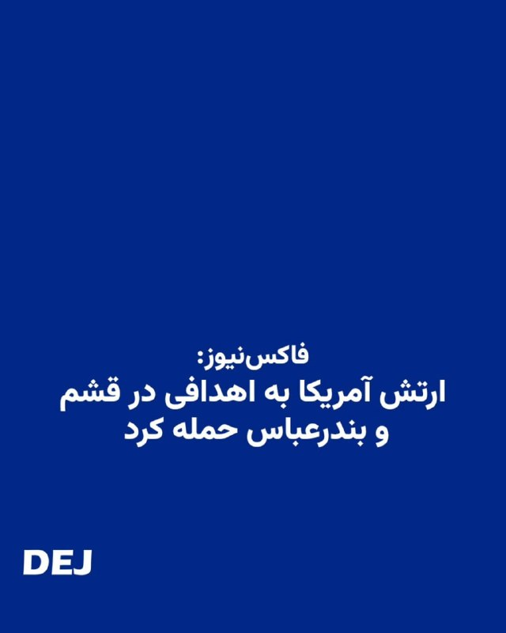

🛩️
🔥 فاکس‌نیوز گزارش داد ارتش آمریکا اهدافی را در بندرعباس و جزیره قشم هدف حمله قرار داده است. منابع داخلی گزارش داده بودند امارات به این مراکز حمله کرده است.
همزمان رسانه‌های ایران از فعال شدن پدافند هوایی و وقوع درگیری در اطراف قشم و بندرعباس خبر می‌دهند.
این تحولات در شرایطی رخ می‌دهد که تنش‌ها در خلیج فارس و اطراف تنگه هرمز وارد مرحله‌ای تازه و پرتنش شده است.

#تنگه_هرمز #جمهوری_اسلامی
@DEJradio

## DEJradio — post 4511

  <a href="telegram/content/DEJradio_4511_1778231926.webm">🎬 Download video</a>

🚨📢 نماینده آمریکا در سازمان ملل: جمهوری اسلامی به یک کشتی چینی حمله کرده است

مایک والتز، سفیر ایالات متحده در سازمان ملل، تأیید کرد یک کشتی متعلق به چین روز دوشنبه در جریان حملات جمهوری اسلامی در تنگ هرمز هدف قرار گرفته است.
رسانه‌های چینی گزارش دادند این نخستین بار از زمان آغاز درگیری‌های اخیر در منطقه است که یک شناور چینی در این تنش‌ها آسیب می‌بیند.

#تنگه_هرمز #جمهوری_اسلامی
@DEJradio

## DEJradio — post 4510

  <a href="telegram/content/DEJradio_4510_1778231927.webm">🎬 Download video</a>

🤡
🔺 خضریان عضو کمیسیون امنیت ملی مجلس:
نیروهای مسلح ما برای هیچ غنیمتی، تنگه اُحد جمهوری اسلامی را رها نخواهند کرد

علی خضریان عضو کمیسیون امنیت ملی مجلس شورای اسلامی با اشاره به جلسه‌ای که با عباس عراقچی داشته است گفت، «من به شما اطمینان می‌دهم نیروهای مسلح ما برای هیچ غنیمتی، تنگه احد جمهوری اسلامی را رها نخواهند کرد. فرمان نائب امام زمان مبنی بر حفظ این تنگه که حق ماست، رها نخواهد شد.»

#تنگه_هرمز #نیروهای_مسلح
@DEJradio

## DEJradio — post 4509

  <a href="telegram/content/DEJradio_4509_1778231928.webm">🎬 Download video</a>

🔺📢 منابع میدانی:
هیچکدام از موشک‌ها و پهپادهای نیروهای مسلح جمهوری اسلامی به ناوشکن‌های آمریکا اصابت نکرده است

ناوشکن‌های آمریکایی که برای اسکورت کشتی‌های تجاری بعد از عبور از تنگه هرمز وارد خلیج فارس شده بودند، پنجشنبه ۱۷ اردیبهشت از تنگه عبور کردند و وارد دریای عمان شدند. در هر دو بار تعدادی موشک کروز و بالستیک ضد کشتی و پهپاد انتحاری به سمت آنها شلیک شد اما هیچ کدام از آنها به ناوشکن‌ها اصابت نکرد و عملاً این حملات بی‌نتیجه بود زیرا سیستم‌های پدافنی این ناوشکن‌ها در بالاترین سطح با پرتابه‌ها مقابله کرد.

برخی منابع غیررسمی داخلی با انتقاد از عملکرد نیروهای مسلح جمهوری اسلامی گفته‌اند این وضعیت نه تنها موجب افزایش اعتماد به نفس آمریکایی‌ها و کشتی‌های تجاری برای عبور از تنگه شد بلکه آنها را برای ورود به جزایر و حتی سواحل جنوبی ایران راسخ‌تر می‌کند.

سخنگوی قرارگاه خاتم‌الانبیا ادعا کرده بود نیروهای مسلح شناورهای نظامی آمریکا در شرق تنگه هرمز را «هدف» قرار دادند. این در حالیست که آمریکا حداقل دو نفتکش جمهوری اسلامی را که قصد داشتند از محاصره دریایی عبور کنند هدف قرار دادند.

#تنگه_هرمز #حملات_هدفمند
@DEJradio

## DEJradio — post 4508

  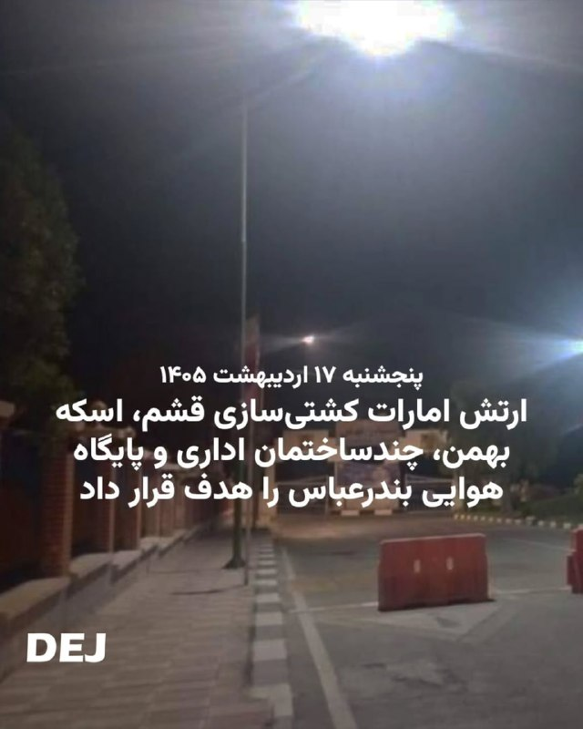

🛩️
🔥 بر اساس گزارش‌ رسانه‌های داخل ایران، پنجشنبه شب ۱۷ اردیبهشت ۱۴۰۵ ارتش امارات کشتی‌سازی قشم، اسکله بهمن، چندساختمان اداری و پایگاه هوایی بندرعباس را هدف قرار داد.

#قشم #حملات_هدفمند
@DEJradio

## mamlekate — post 103477

📝 قطعی اینترنت در ایران وارد هفتادمین روز شد

🧠 جهت یادآوری: لوکیشن علی لاریجانی در تاریک‌ترین قطعی اینترنت لو رفت و ترور شد.

Arash
@mamlekate

## mamlekate — post 103476

  <a href="telegram/content/mamlekate_103476_1778231929.mp4">🎬 Download video</a>

💬 لیلاز: «نوار ظریف که منتشر شد پالسی بود به آمریکایی‌ها، اما آنها حاضر نشدند چیزی حتی سمبلیک به دولت روحانی بدهند»

💬 این عرزشی‌ها الکی نمیگن ظریف رو اعدام کنید

⬆️ فایل مثلا لو رفته ظریف (۵ سال پیش)
t.me/mamlekate/57448

@mamlekate

## IranIntlTV — post 336106

  

ارتش و سازمان امنیت داخلی اسرائیل اعلام کردند سه سرباز و یک شهروند غیرنظامی جمعه به اتهام جاسوسی برای جمهوری اسلامی در دادگاه تفهیم اتهام خواهند شد.

بر اساس این گزارش، این سربازان که در یک مدرسه فنی وابسته به نیروی هوایی اسرائیل آموزش می‌دیدند، از تاسیسات نظامی عکس‌برداری کرده‌اند.

مقام‌های اسرائیلی همچنین اعلام کردند این سه سرباز پیش از اعزام به خدمت و زمانی که هنوز به سن قانونی نرسیده بودند، با ماموران امنیتی جمهوری اسلامی در ارتباط بودند و ماموریت‌های جاسوسی انجام دادند.
https://iranintl.com/202605086185

## IranIntlTV — post 336105

🔻قلعه‌نویی در گفت‌وگو با سایت فیفا: تیم ملی در جام‌جهانی می‌تواند کاری حماسی انجام دهد

امیر قلعه‌نویی، سرمربی تیم ملی، در گفت‌وگو با سایت فیفا گفت: «بازیکنانم می‌توانند در جام جهانی کاری حماسی انجام دهند. این توانایی را دارند و از نظر فنی می‌توانند جام جهانی متفاوتی برای ایران رقم بزنند.»

قلعه‌نویی گفت: «می‌خواهیم در این جام جهانی خاطرات بزرگی خلق کنیم. با تجربه‌ای که بازیکنان از جام‌های جهانی قبلی دارند، آماده‌ایم برای نخستین بار به مرحله حذفی صعود کنیم.»

او گفت: «تنها دو ماه تا جام جهانی باقی مانده، اما همچنان در شرایط سختی قرار داریم. تنها به حضور در مرحله گروهی راضی نخواهیم بود. می‌خواهم فوتبال خوبی ارائه دهیم، نه فقط برای گرفتن نتیجه بازی کنیم.»

تیم ملی ایران در مرحله گروهی جام جهانی با بلژیک، مصر و نیوزیلند هم‌گروه است.

به‌دلیل جنگ و انزوای جمهوری اسلامی، تیم ایران نتوانسته بازی تدارکاتی مناسبی برگزار کند و حتی تیم‌های آنگولا و مقدونیه هم حاضر به بازی با تیم امیر قلعه‌نویی نشدند.

🔗وب‌سایت ایران‌اینترنشنال

@iranintltv

## IranIntlTV — post 336104

  

مهدی پیرصالحی، معاون وزیر بهداشت، از کمبود و افزایش شدید قیمت نهاده‌های دارویی، تجهیزات پزشکی، مقوا، فویل‌های آلومینیومی و بسته‌بندی‌های پت خبر داد.

او افزود: «برای جبران هزینه‌های تولید و حفظ پایداری زنجیره تامین دارو، افزایش قیمت‌ها ضروری ارزیابی شده است.»

پیرصالحی ادامه داد: «فعالان و تولیدکنندگان صنعت دارو با ارائه مستندات هزینه‌ای، افزایش بسیار بیشتری را برای پوشش کامل هزینه‌های تحمیل‌شده پیشنهاد کرده‌اند.»
iranintl.com/202605080781

## IranIntlTV — post 336103

  

ابراهیم رضایی، سخنگوی کمیسیون امنیت ملی مجلس گفت که آمریکا «با چند ناوچه و ناوشکن»، قادر به عبور از تنگه هرمز نیست.

رضایی خطاب به مقام‌های ایالات متحده افزود: «با کل نیروی دریایی‌تان هم توان عبور از تنگه هرمز را نخواهید داشت. فقط مثل یک بچه لوس، کتک می‌خورید و برمی‌گردید.»
iranintl.com/202605083622

## IranIntlTV — post 336102

یک دانش‌آموز با ارسال پیامی به ایران اینترنشنال از کیفیت بسیار پایین آموزش مجازی در دوره قطع اینترنت در ایران روایت کرده و می‌گوید کیفیت آن افتضاح و سرعتش کمتر از لاک‌پشت است.

## IranIntlTV — post 336100

  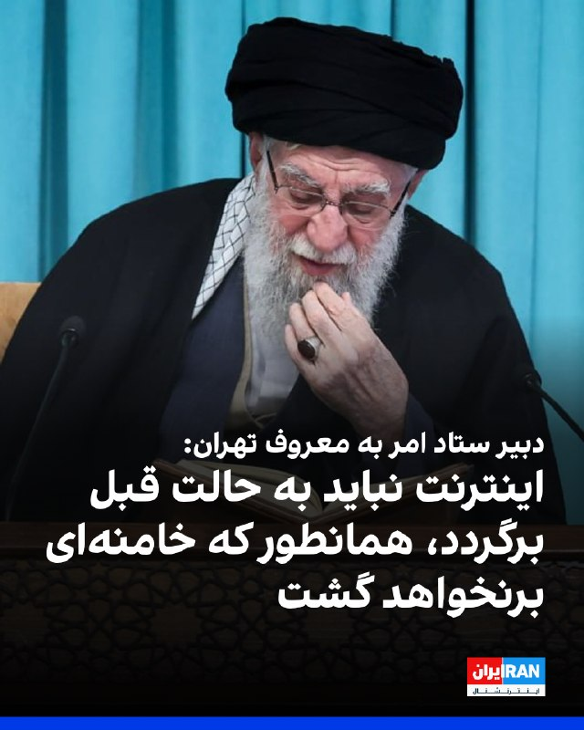

روح‌الله مومن‌نسب، دبیر ستاد امر به معروف تهران نوشت نمی‌شود نیروهای مسلح، مرزهای ما و تنگه هرمز را به روی دشمنان ببندند اما دولت فضای مجازی را در اختیار آنان قرار دهد.

او افزود که «فضای مجازی به هیچ وجه نباید به حالت قبل برگردد؛ همان‌طور که امام شهید ما به حالت قبل برنمی‌گردد.»
https://iranintl.com/202605082859

## IranIntlTV — post 336099

  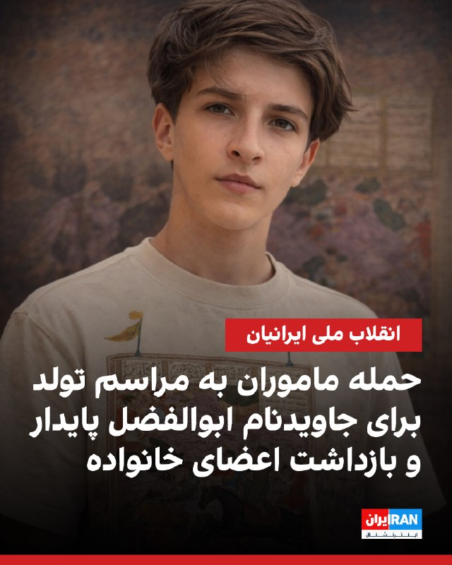

طبق اطلاعات رسیده به ایران اینترنشنال، روز پنجشنبه خانواده جاویدنام ابوالفضل پایدار، ۱۷ ساله که در اعتراضات دی‌ماه کشته شد، در سبزوار برای او جشن تولد گرفته بودند، اما ماموران حکومت این شهر به مراسم او با باتوم و شوکر حمله کردند.

طبق این گزارش، ماموران مادر، خواهرزاده و دایی جاویدنام پایدار رو با خود بردند و آن‌ها را به اردوگاه تربت حیدریه منتقل کردند. در مراسم او ، ۵ زن دیگر هم بازداشت شده‌اند.
https://iranintl.com/202605087859

## IranIntlTV — post 336098

  <a href="telegram/content/IranIntlTV_336098_1778231936.mp4">🎬 Download video</a>

نتایج اولیه انتخابات شوراهای محلی در انگلستان نشان می‌دهد حزب راستگرای ریفورم پیشروی قابل توجهی داشته و حزب کارگر در چندین منطقه کرسی‌های خود را از دست داده است.
گفت‌وگو با علی رشید، عضو تحریریه ایران‌اینترنشنال
@iranintltv

## IranIntlTV — post 336097

  <a href="telegram/content/IranIntlTV_336097_1778231938.mp4">🎬 Download video</a>

یک شهروند روز جمعه ۱۸ اردیبهشت ویدیویی به ایران اینترنشنال ارسال کرده و می‌گوید که پس از شنیده شدن صدای یک جنگنده در آسمان نقطه‌ای در جنوب غربی تهران هدف قرار گرفته و از آن دود بلند می‌شوند.

## IranIntlTV — post 336096

  <a href="telegram/content/IranIntlTV_336096_1778231941.mp4">🎬 Download video</a>

در پی افزایش نگرانی‌ها در اسرائیل درباره احتمال دستیابی آمریکا و جمهوری اسلامی به توافقی ضعیف، نخست‌وزیر اسرائیل شامگاه گذشته نشستی ویژه برگزار کرد. کانال ۱۲ تلویزیون اسرائیل گزارش داد این جلسه پس از دومین گفت‌وگوی تلفنی بنیامین نتانیاهو با دونالد ترامپ، رییس‌جمهوری آمریکا، برگزار شد.

بابک اسحاقی و نیلوفر پورابراهیم، خبرنگاران ایران‌اینترنشنال، گزارش می‌دهند
@iranintltv

## IranIntlTV — post 336095

🔻کشورها مسافران کشتی تفریحی آلوده به هانتاویروس را ردیابی می‌کنند

پس از شیوع هانتاویروس در یک کشتی تفریحی، کشورهای مختلف جهان از روز پنج‌شنبه تلاش کردند مانع گسترش بیشتر این ویروس شوند؛ از جمله با ردیابی افرادی که پیش از شناسایی ویروس از این کشتی پیاده شده‌اند و همچنین کسانی که از آن زمان با آن‌ها تماس نزدیک داشته‌اند.

خبرگزاری رویترز جمعه ۱۸ اردیبهشت نوشت که در این شیوع، سه نفر - یک زوج هلندی و یک شهروند آلمانی - جان خود را از دست داده‌اند.

سازمان بهداشت جهانی اعلام کرد تاکنون ابتلای پنج نفر به این ویروس تایید شده و سه مورد مشکوک دیگر نیز در دست بررسی است.

هانتاویروس معمولا از طریق جوندگان منتقل می‌شود، اما در موارد نادر می‌تواند از انسان به انسان نیز سرایت کند.

شرکت بهره‌بردار کشتی ام‌و هاندییوس (MV Hondius) اعلام کرد با همه مسافرانی که در جزیره سنت هلنا در اقیانوس اطلس جنوبی پیاده شدند - جایی که کشتی در چهارم اردیبهشت ۱۴۰۵ توقف کرده بود - تماس گرفته شده است.

این افراد از دست‌کم ۱۲ کشور هستند؛ از جمله هفت شهروند بریتانیایی و شش شهروند آمریکایی.

نخستین مورد تاییدشده هانتاویروس در این شیوع، اوایل اردیبهشت شناسایی شد.

این کووید نیست!

سازمان بهداشت جهانی بار دیگر تاکید کرد خطر این ویروس برای عموم مردم پایین است؛ هرچند سویه آندین این ویروس که در چند قربانی شناسایی شده، در موارد نادر می‌تواند میان انسان‌ها منتقل شود.

ماریا ون کرخوف، مدیر بخش مدیریت همه‌گیری‌ها و پاندمی‌های سازمان بهداشت جهانی، در یک نشست خبری گفت: «این ویروس کرونا نیست. ویروسی کاملا متفاوت است.»

او افزود: «ما در شرایطی مشابه شش سال پیش نیستیم.»

سازمان بهداشت جهانی اعلام کرد در حال تهیه دستورالعمل مرحله به مرحله برای زمانی است که ده‌ها مسافر باقی‌مانده در کشتی - که اکنون به سمت جزایر قناری حرکت می‌کند - در روز شنبه یا یک‌شنبه پیاده شوند و به کشورهای خود بازگردند.

هیچ یک از این مسافران در حال حاضر علائمی ندارند.

ردیابی تماس‌ها و نظارت پزشکی

مرکز کنترل و پیشگیری بیماری‌های آمریکا (سی‌دی‌سی) اعلام کرد وضعیت را از نزدیک زیر نظر دارد و خطر برای مردم ایالات متحده در حال حاضر «بسیار پایین» است.

شبکه ای‌بی‌سی نیوز گزارش داد سی‌دی‌سی این شیوع را در سطح «واکنش اضطراری سطح ۳» طبقه‌بندی کرده است.

دونالد ترامپ، رییس‌جمهوری آمریکا، گفت درباره هانتاویروس به او گزارش داده شده و ابراز امیدواری کرد وضعیت تحت کنترل باشد.

او به خبرنگاران گفت: «امیدواریم کاملا تحت کنترل باشد.»

ترامپ در پاسخ به این پرسش که آیا آمریکایی‌ها باید نگران گسترش ویروس باشند، گفت: «امیدوارم نه.»

او همچنین بدون ارائه جزییات گفت جمعه گزارشی درباره این ویروس منتشر خواهد شد.

اداره بهداشت ایالت جورجیا اعلام کرد دو نفر از ساکنان این ایالت که پس از پیاده شدن از کشتی به خانه بازگشته‌اند، تحت نظارت قرار دارند، هر چند هیچ علامتی ندارند.

اداره خدمات بهداشتی آریزونا نیز گفت یک شهروند این ایالت که در کشتی حضور داشته و بدون علامت است، تحت مراقبت قرار دارد.

روزنامه نیویورک‌تایمز گزارش داد مقام‌های ایالت کالیفرنیا نیز تعدادی از ساکنان خود را که در این کشتی بوده‌اند، زیر نظر گرفته‌اند.

مقام‌های تگزاس اعلام کردند دو شهروند این ایالت پیش از شناسایی شیوع بیماری به آمریکا بازگشته بودند.

در فرانسه نیز مقام‌ها گفتند یک شهروند فرانسوی با فردی که بیمار شده بود تماس داشته، اما خود او علائمی ندارد.

سازمان بیماری‌های واگیردار سنگاپور اعلام کرد دو نفر از ساکنان این کشور که در کشتی حضور داشتند، قرنطینه و آزمایش شده‌اند.

🔗متن کامل گزارش را اینجا بخوانید

@iranintltv

## IranIntlTV — post 336094

  

نت‌بلاکس، نهاد ناظر بر اختلال‌های اینترنتی در جهان، صبح جمعه ۱۸ اردیبهشت اعلام کرد قطعی اینترنت در ایران وارد هفتادمین روز شده و مدت این اختلال از ۱۶۵۶ ساعت گذشته است.
نت‌بلاکس تاکید کرد ارتباطات دیجیتال در زمان بحران حیاتی است و محدود کردن خدمات اینترنتی به افراد دارای معلولیت، دانشجویان، کسب‌وکارهای کوچک و عموم مردم آسیب می‌زند. iranintl.com/202605084765

## IranIntlTV — post 336092

  

رضا سپهوند، عضو کمیسیون انرژی مجلس، گفت که ممکن است در تابستان خاموشی‌هایی رخ دهد، اما تلاش بر این است که در بخش برق خانگی خاموشی اعمال نشود.

او افزود ممکن است بخشی از صنایع دچار خاموشی شوند، اما میزان آن کمتر از سال گذشته خواهد بود.
این نماینده مجلس ادامه داد: «برخی از توان ما در فولاد مبارکه و پتروشیمی‌های منطقه عسلویه آسیب دیده‌اند و بازسازی آن‌ها هم مدتی زمان خواهد برد.»
https://iranintl.com/202605080425

## ManotoTV — post 105124

  <a href="telegram/content/ManotoTV_105124_1778231946.mp4">🎬 Download video</a>

ارتش و سازمان امنیت داخلی این کشور اعلام کردند یک شهروند و سه سرباز سابق به اتهام جاسوسی برای جمهوری اسلامی تحت پیگرد قرار گرفته‌اند و قرار است علیه آن‌ها در دادگاه حیفا کیفرخواست صادر شود.
بر اساس این گزارش، متهمان به دستور یک عامل اطلاعاتی جمهوری اسلامی از مکان‌هایی مانند مدرسه فنی نیروی هوایی، ایستگاه‌های قطار، مراکز خرید و دوربین‌های امنیتی تصویربرداری کرده و تصاویر و ویدیوها را ارسال کرده‌اند.
مقام‌های اسرائیلی همچنین اعلام کردند این افراد پیش از خدمت سربازی جذب شده بودند و یکی از متهمان دیگر افراد را برای همکاری با عامل اطلاعاتی جمهوری اسلامی جذب کرده است.

## ManotoTV — post 105123

  <a href="telegram/content/ManotoTV_105123_1778231947.mp4">🎬 Download video</a>

وزارت خارجه چین اعلام کرد شهروندان چینی در نفتکش هدف قرارگرفته در تنگه هرمز حضور دارند، اما تاکنون گزارشی از زخمی یا کشته شدن خدمه این کشتی دریافت نشده است.
پکن همچنین اعلام کرد وضعیت خدمه و جزئیات حادثه را از نزدیک دنبال می‌کند.

## ManotoTV — post 105122

  <a href="telegram/content/ManotoTV_105122_1778231948.mp4">🎬 Download video</a>

گروه ناظر اینترنتی نت‌بلاکس اعلام کرد قطعی اینترنت در ایران امروز وارد هفتادمین روز خود شده و از مرز ۱۶۵۶ ساعت گذشته است.
نت‌بلاکس هشدار داده در شرایط بحرانی، دسترسی به اینترنت یک نیاز حیاتی است و محدودیت‌های گسترده بیشترین آسیب را به افراد دارای معلولیت، دانشجویان، کسب‌وکارهای کوچک و عموم شهروندان وارد می‌‌کند.

## FarsiVOA — post 217175

  <a href="telegram/content/FarsiVOA_217175_1778231949.mp4">🎬 Download video</a>

ارتش اسرائیل اعلام کرد که نیروهای این کشور یک زیرساخت نظامی متعلق به حزب‌الله را در منطقه جویا در جنوب لبنان هدف قرار داده‌اند.

طبق بیانیه ارتش، نیروهای حزب‌الله از داخل یک ساختمان غیرنظامی اقدام به شلیک راکت کرده بودند.

در این بیانیه آمده «نیروهای ارتش اسرائیل در واکنشی سریع، این سازه را هدف قرار داده و نیروی تروریستی مستقر در آن را به منظور رفع تهدید از بین بردند.»

این حمله در چارچوب عملیات‌های جاری برای پاکسازی مناطق مرزی از تهدیدات موشکی و راکتی علیه شهروندان اسرائیلی انجام شده است.
@FarsiVOA

## FarsiVOA — post 217174

  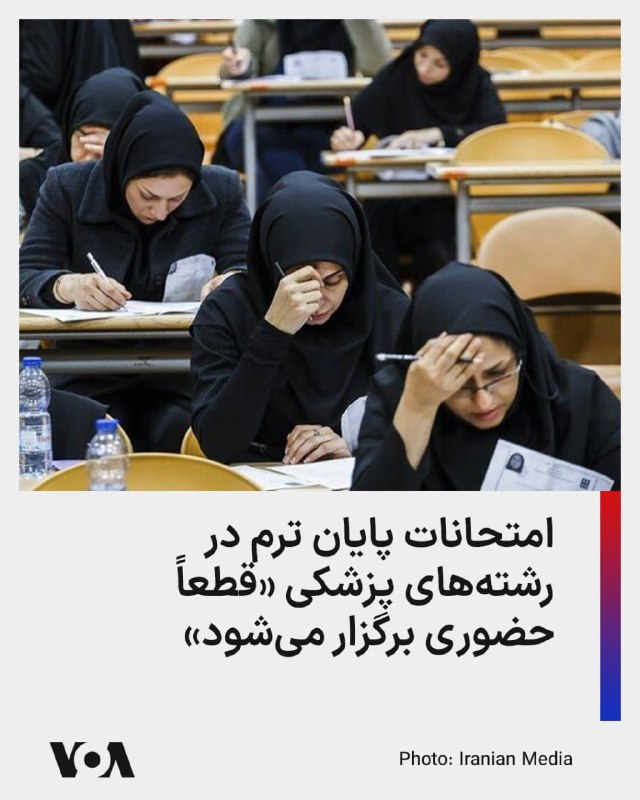

رئیس دانشکده پزشکی دانشگاه علوم پزشکی تهران از برگزاری حضوری امتحانات پایان ترم دانشجویان خبر داد، اما زمان دقیق برگزاری امتحانات را اعلام نکرد.

علیرضا استقامتی در گفت‌وگو با ایسنا، با بیان اینکه «زیرساخت و سازوکار لازم برای برگزاری دقیق آزمون مجازی وجود ندارد» گفت که در وزارت بهداشت به هیچ عنوان آزمون مجازی مورد قبول نیست و آزمون‌‌ها به ‌صورت حضوری برگزار می‌‌شود.

رئیس دانشکده پزشکی دانشگاه علوم پزشکی تهران برای نخستین بار افشا کرد که به دلیل اعتراضات دی ماه ۱۴۰۴، برخی از دانشجویان علوم پزشکی در امتحانات شرکت نکردند.

به گفته استقامتی «به دلیل اتفاقات دی‌ماه، بسیاری از آزمون‌ها در زمان مقرر برگزار نشد و برخی دانشجویان نیز در امتحانات شرکت نکردند؛ به همین دلیل بخشی از آزمون‌‌ها به بهمن و اسفند ماه منتقل شد که آنها نیز به دلیل شرایط جنگی برگزار نشدند.»

او یادآور شد «با توجه به آزمون‌‌های عقب‌ افتاده، زمان‌بندی برگزاری امتحانات به چالش تبدیل شده و ممکن است که طول ترم دانشجویان با افزایش یک ماهه تا اواخر تیرماه یا حتی مرداد ادامه پیدا کند.»
@FarsiVOA

## FarsiVOA — post 217173

  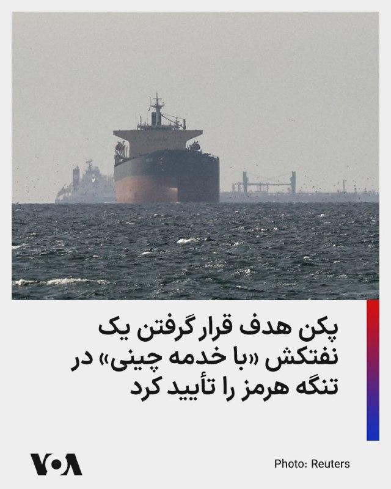

وزارت خارجه چین تأیید کرد که یک نفتکش حامل فرآورده‌های نفتی «با خدمه چینی» در تنگه هرمز مورد حمله قرار گرفته است.

لین جیان، سخنگوی وزارت امور خارجه، روز جمعه در یک نشست خبری گفت: «شهروندان چینی در میان خدمه این کشتی حضور دارند، اما تاکنون هیچ گزارشی از تلفات خدمه دریافت نشده است.» او نسبت به کشتی‌هایی که متأثر از درگیری‌های جاری در خاورمیانه هستند، ابراز نگرانی عمیق کرد.

بر اساس گزارش رسانه‌های چینی، این کشتی که نام آن اعلام نشده، با عبارت «مالک و خدمه چینی» علامت‌گذاری شده بود.

مایک والتز، سفیر آمریکا در سازمان ملل متحد روز پنج‌شنبه ۱۷ اردیبهشت تأیید کرد که یک نفتکش متعلق به چین در تنگه هرمز ساعاتی قبل هدف حمله موشکی جمهوری اسلامی ایران قرار گرفت.

در حالی که چین یکی از خریداران اصلی نفت از جمهوری اسلامی ایران به شمار می‌رود، آقای والتز به طعنه نوشت: «با چنین دوستانی...»

این برای نخستین‌بار از زمان آغاز درگیری میان آمریکا و جمهوری اسلامی است که یک نفتکش متعلق به چین در نزدیکی تنگه هرمز هدف حمله قرار گرفت. در پی این حمله، عرشه کشتی دچار آتش‌سوزی شد.
@FarsiVOA

## FarsiVOA — post 217172

🔺یک نماینده مجلس می‌گوید وزارت خارجه با بستن تنگه هرمز مخالف است

▪️عضو کمیسیون اقتصادی مجلس شورای اسلامی، اعلام کرد که وزارت خارجه جمهوری اسلامی اساساً مخالف رویکرد کنونی حکومت جمهوری اسلامی برای مسدود کردن تنگه هرمز است.

▪️پیشتر دونالد ترامپ، رئیس‌جمهور آمریکا، بارها به اختلاف میان رهبران جمهوری اسلامی در زمینه انجام توافق با واشنگتن اشاره کرده است.

▪️مارکو روبیو، وزیر خارجه آمریکا هم تلاش جمهوری اسلامی برای بسته نگاه داشتن تنگه هرمز را رد کرده و گفته بود: «تنگه هرمز اساساً معادل یک سلاح هسته‌ای اقتصادی است که [جمهوری اسلامی] ایران تلاش می‌کند از آن علیه جهان استفاده کند.»

⬇️ بیشتر بخوانید:
https://ir.voanews.com/a/8147955.html

## FarsiVOA — post 217171

  <a href="telegram/content/FarsiVOA_217171_1778231953.mp4">🎬 Download video</a>

ویدیوهایی از فعالیت پدافند در نقاط مختلف تهران منتشر شده که گفته می‌شود به دنبال حملات ارتش آمریکا در خلیج فارس آغاز شده است.

پنج‌شنبه شب ۱۷ اردیبهشت، ایالات متحده حملات هدفمندی را علیه مواضع نظامی سپاه در منطقه انجام داد.
@FarsiVOA

## FarsiVOA — post 217170

🔺هفتاد روز خاموشی اینترنت؛ هشدار درباره اختلال در مستندسازی نقض حقوق بشر

▪️خاموشی دیجیتال ایران وارد هفتادمین روز خود شد. پیش از این نیز ایرانیان در جریان اعتراضات دی‌ماه قطعی اینترنت را تجربه کردند، از این رو می‌توان گفت ایران، سال ۲۰۲۶ را بیش از هر زمان دیگری با محدودیت و اختلال اینترنت سپری کرده است.

▪️این در حالی است که اعتراضات دی‌ماه هزاران کشته و زندانی بر جای گذاشته است و ناظران حقوق بشر نسبت به افزایش اعدام زندانیان سیاسی هشدار می‌دهند.

▪️در چنین شرایطی، قطع اینترنت افزون بر آسیب‌های گسترده‌ای که به کسب‌وکارها و ارتباطات شهروندان داخل و خارج از کشور وارد کرده، پیامد دیگری نیز داشته است: ایجاد مانعی بزرگ بر سر راه مستندسازی و ثبت موارد نقض حقوق بشر.

⬇️ بیشتر بخوانید:
https://ir.voanews.com/a/8147953.html

## FarsiVOA — post 217169

  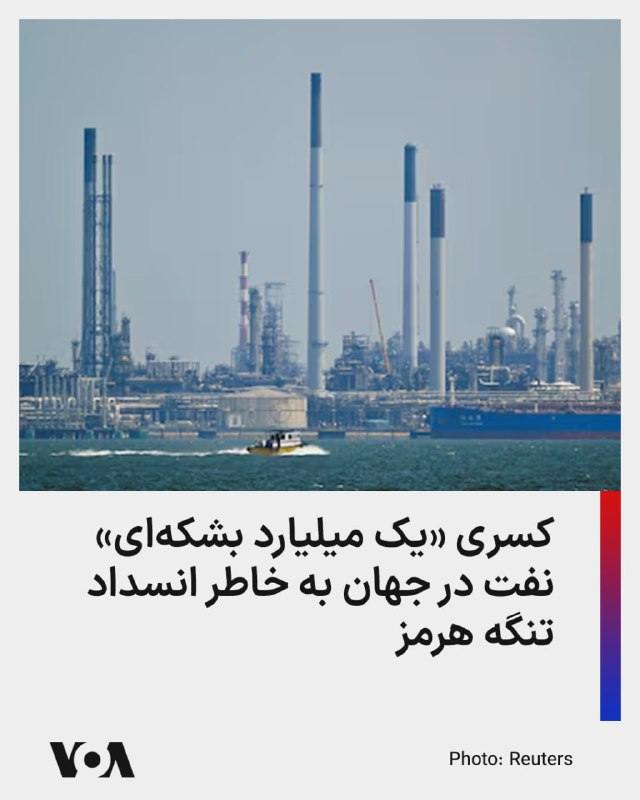

▪️مدیرعامل شرکت غول نفتی «شِل» می‌گوید بازار نفت با کمبودی نزدیک به یک میلیارد بشکه روبه‌رو است؛ رقمی که معادل ۱۰ روز مصرف جهانی نفت است.

▪️خبرگزاری بلومبرگ روز پنج‌شنبه گزارش داده بود که تولید روزانه نفت اوپک در ماه گذشته به حدود ۲۰ میلیون بشکه سقوط کرده که کمترین سطح طی ۳۶ سال گذشته است.

▪️قیمت‌های جهانی نفت نیز از زمان انسداد تنگه هرمز توسط جمهوری اسلامی و حملات گسترده به کشورهای عرب منطقه بیش از ۳۰ درصد افزایش یافته است.

▪️تنگه هرمز پیش از انسداد، محل عبور ۲۰ درصد از نفت، محصولات نفتی و گاز مایع مصرفی جهان بود.

⬇️ بیشتر بخوانید:
https://ir.voanews.com/a/8147954.html

## FarsiVOA — post 217168

  <a href="telegram/content/FarsiVOA_217168_1778231957.mp4">🎬 Download video</a>

نخستین ویدیوها از وقوع انفجارهای گسترده در بندرعباس منتشر شده که گفته می‌شود نتیجه حملات هدفمند ایالات متحده به مواضع نظامی در این منطقه است.

این اقدام در شامگاه پنج‌شنبه ۱۷ اردیبهشت و پس از حملات اخیر سپاه پاسداران به ناوهای جنگی آمریکا که منجر به تشدید بحران در تنگه هرمز شده، صورت گرفته است.
@FarsiVOA

## FarsiVOA — post 217167

  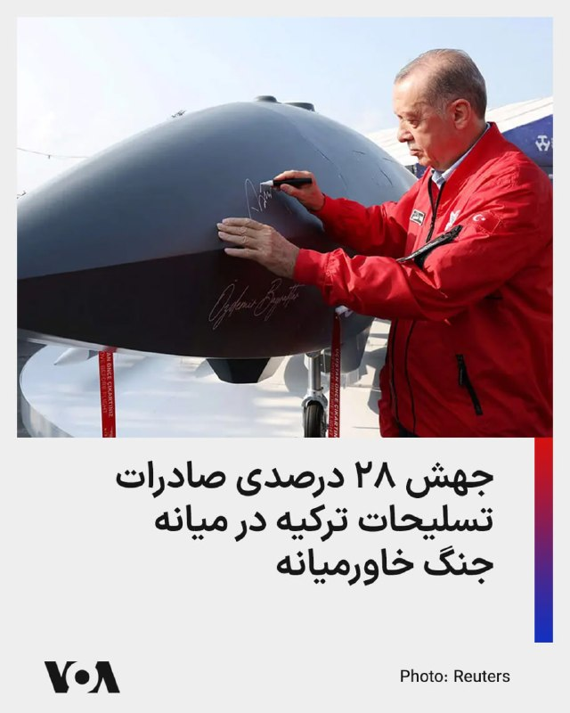

عمر بولات وزیر بازرگانی ترکیه از جهش ۲۸ درصدی صادرات تسلیحات دفاعی و حوزه فضایی این کشور در چهار ماه ابتدایی سال جاری میلادی خبر داد.

حوزه تسلیحات نظامی و فضایی ترکیه در دوره یاد شده ۲.۸ میلیارد دلار صادرات داشته است که ۲۸ درصد بالاتر از دور مشابه پارسال است. این رقم در کل سال ۲۰۲۵ حدود ۱۰ میلیارد دلار بود و بیش از نیمی از آن را تسلیحات موشکی و پهپادی تشکیل می‌داد. پاکستان، امارات، قطر و اوکراین بزرگترین خریداران تسلیحات ترکیه هستند.

طبق گفته بولات، حدود ۱۰۰ هزار نیروی متخصص در ۳۵۰۰ شرکت فعال در حوزه دفاعی و فضایی ترکیه مشغول به کار هستند.
@FarsiVOA

## FarsiVOA — post 217166

  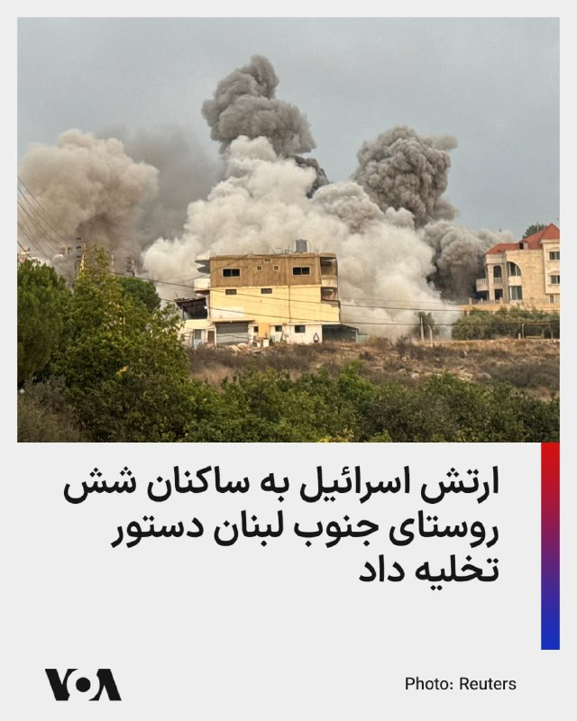

ارتش اسرائیل روز جمعه ۱۸ اردیبهشت هشدارهای تخلیه برای شش روستا در جنوب لبنان صادر کرد. این هشدارها در آستانه حملات هوایی که اسرائیل می‌گوید هدف آن‌ها حزب‌الله، گروه تحت حمایت جمهوری اسلامی است، صادر می‌شود.

در هشدار صادر شده به ساکنان این روستاها دستور داده شده که حداقل یک کیلومتر از محل سکونت خود فاصله بگیرند و منطقه را تخلیه کنند.

سرهنگ آویخای ادرعی، سخنگوی ارتش اسرائیل هشدار داد: «با توجه به نقض‌های انجام‌شده از سوی سازمان تروریستی حزب‌الله در توافق آتش‌بس، ارتش اسرائیل ناچار است با قدرت علیه آن اقدام کند و قصدی برای آسیب رساندن به شما ندارد.»

ارتش اسرائیل پیشتر اعلام کرد که از زمان آغاز آتش‌بس، بیش از ۲۲۰ عضو و فرمانده از حزب‌الله «که تهدیدی علیه نیروهای ارتش اسرائیل و شهروندان این کشور بودند»، کشته شدند.

ارتش اسرائیل نوشت که فقط طی هفته گذشته «بیش از ۸۵ عضو» حزب‌الله کشته شدند و بیش از ۱۸۰ زیرساخت نظامی این گروه تحت حمایت جمهوری اسلامی، از جمله مراکز فرماندهی، انبارهای تسلیحات و سکوهای پرتاب آماده شلیک در سراسر جنوب لبنان هدف حمله قرار گرفتند.
@FarsiVOA

## DW_Farsi — post 124422

🔶 نفتکش کره‌ جنوبی پس از چند هفته به سواحل غربی این کشور رسید

یک پالایشگاه کره جنوبی اعلام کرد نفتکش با پرچم مالت متعلق به این کشور که ۱ میلیون بشکه نفت خام حمل می‌کرد، جمعه پس از عبور از تنگه هرمز در اواسط آوریل، به سواحل غربی کره جنوبی رسید.

کره جنوبی نیز مانند بسیاری دیگر از کشورهای آسیایی، بخش زیادی از نفت خام خود را از خاورمیانه وارد می‌کند. آخرین محموله ۱ میلیون بشکه‌ای، بر اساس گزارش‌ها، معادل ۳۵ تا ۵۰ درصد مصرف روزانه نفت خام کره جنوبی است.

به گفته اچ‌دی هیوندای اویل‌بانک، نفتکش مذکور به نام اودسا، صبح جمعه، چند هفته پس از عبور از تنگه هرمز در دوره گفت‌وگوهای آتش‌بس میان جمهوری اسلامی و ایالات متحده آمریکا، به آب‌های نزدیک شهر بندری سئوسان در غرب کره جنوبی رسید.

این نفتکش قرار است اواخر جمعه در تاسیسات پهلوگیری فراساحلی این شرکت پهلو بگیرد تا نفت خام خود را تخلیه کند. اچ‌دی هیوندای اویل‌بانک اعلام کرد این شرکت قصد دارد نفت خام را به فرآورده‌های نفتی مانند بنزین، دیزل و نفتا پالایش کند. این شرکت همچنین اعلام کرد تاسیساتی دارد که می‌تواند روزانه تا ۶۹۰ هزار بشکه نفت خام را پالایش کند.

کره جنوبی سال گذشته بیش از ۶۰ درصد نفت خام و ۵۰ درصد نفتای خود را، که خوراک مهم پتروشیمی و مورد استفاده در تولید پلاستیک است، از طریق تنگه هرمز وارد کرد.

تلاطم اقتصاد جهان به دلیل اقدامات جمهوری اسلامی در تنگه هرمز و به دنبال آن، افزایش شدید قیمت سوخت، نگرانی‌ها درباره بحران انرژی قریب‌الوقوع در کره جنوبی را افزایش داده است.

این کشور برای جلوگیری از جهش هزینه‌ها، برای نخستین بار در چند دهه اخیر سقف قیمتی برای بنزین و دیگر فرآورده‌های نفتی اعمال کرده و به پالایشگاه‌ها دستور داده است که صادرات نفتا را برای مصرف داخلی منحرف کنند. کره جنوبی در عین حال، با شتاب در تلاش است منابع جایگزین نفت و مسیرهای کشتیرانی جایگزین را تأمین کند.
@dw_farsi

## DW_Farsi — post 124421

🔶 "۱۵۰۰ کشتی به همراه خدمه در محاصره تنگه هرمز گرفتار شده‌اند"

آرسنیو دومینگز، دبیرکل سازمان بین‌المللی دریانوردی سازمان ملل متحد (IMO) اعلام کرد که حدود هزار و ۵۰۰ کشتی و خدمه آن‌ها به دلیل بستن تنگه هرمز از سوی جمهوری اسلامی در خلیج فارس گرفتار شده‌اند.

جمهوری اسلامی از زمان آغاز جنگ با ایالات متحده آمریکا و اسرائیل در اواخر فوریه، تنگه هرمز را که یکی از مسیرهای مهم انتقال جهانی نفت و گاز به شمار می‌رود، مسدود کرده است.

آرسنیو دومینگز در کنوانسیون دریایی قاره آمریکا در پاناما با اشاره به این که "حمل‌ونقل دریایی بیش از ۸۰ درصد کالاهای مصرفی جهان را جابه‌جا می‌کند" گفت: «در حال حاضر حدود ۲۰ هزار نفر از خدمه کشتی‌ها و حدود هزار و ۵۰۰ کشتی گرفتار شده‌اند.»

دومینگز در این گردهمایی متشکل از مدیران صنعت دریایی و نمایندگان سازمان بین‌المللی دریانوردی گفت که خدمه گرفتار شده در منطقه، "افراد بی‌گناهی هستند که هر روز برای منفعت کشورهای دیگر، کار خود را انجام می‌دهند، اما به دلیل وضعیت‌های ژئوپولیتیکی خارج از کنترل خود گرفتار شده‌اند".

دومینگز همچنین به خبرنگاران گفت: «۱۰ ملوان جان خود را از دست داده‌اند.»

برخی منابع اعلام کرده‌اند که این تلفات در جریان بیش از ۳۰ حمله به کشتی‌ها رخ داده است. دبیرکل سازمان بین‌المللی دریانوردی از کشورها خواست از اعزام کشتی‌ها به خلیج فارس خودداری کنند تا شمار قربانیان در میان ملوانان افزایش پیدا نکند و خسارت‌های اقتصادی بیشتری وارد نشود.
@dw_farsi

## Persian_Trend_Official — post 13673

  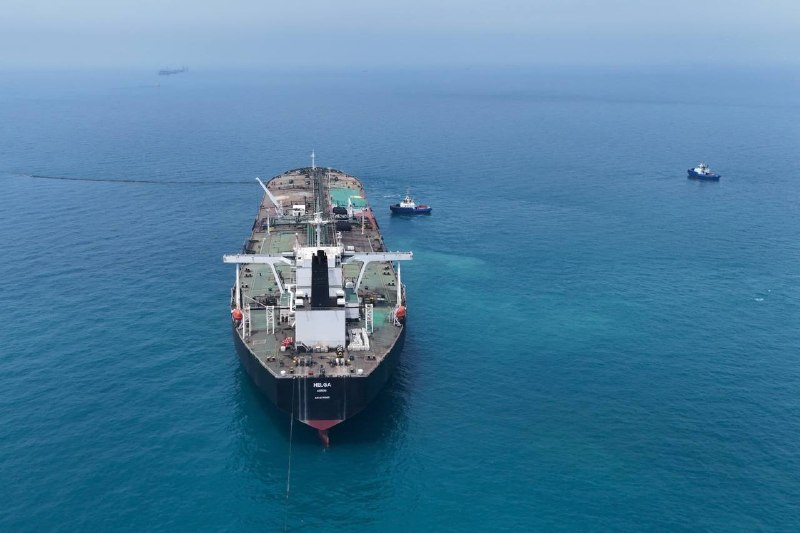

🔴 انرژی جهانی زیر فشار ‌بحران

▪️بر اساس تحلیل‌های Cfr تنش‌های ژئوپلیتیکی اخیر (از جمله در خاورمیانه) باعث اختلال در بازار انرژی و افزایش قیمت نفت و LNG شده‌اند و این وضعیت هنوز به ثبات نرسیده است.

▪️در کوتاه‌مدت، کشورها با ابزارهای اضطراری مثل آزادسازی ذخایر استراتژیک، سهمیه‌بندی سوخت و تغییر موقت منابع انرژی (مثل جایگزینی گاز با زغال‌سنگ) تلاش می‌کنند شوک را مدیریت کنند؛ اما این‌ها فقط نقش «ضربه‌گیر» دارند و بحران را حل نمی‌کنند.

▪️سیستم انرژی جهانی هنوز به‌شدت به منابع فسیلی و مسیرهای محدود عرضه وابسته است؛ بنابراین هر بحران ژئوپلیتیکی می‌تواند اثرات زنجیره‌ای در اقتصاد جهانی ایجاد کند.

▪️در نگاه بلندمدت تنها راه پایدار عبور از این چرخه بحران، «نوآوری انرژی» است؛ از توسعه انرژی هسته‌ای و تجدیدپذیر تا فناوری‌های جدید ذخیره‌سازی، شبکه برق و استخراج کارآمدتر.

▪️همچنین اشاره می‌شود رقابت جهانی در نوآوری انرژی نابرابر است؛ برخی کشورها پیشرو هستند و برخی دیگر در حال عقب‌ماندن، موضوعی که می‌تواند در آینده توازن اقتصادی و سیاسی را تغییر دهد.
🫆:Tony
📌 @persian_trend_official
پرشین ترند | متفاوت‌ترین کانال نظامی

## Persian_Trend_Official — post 13672

  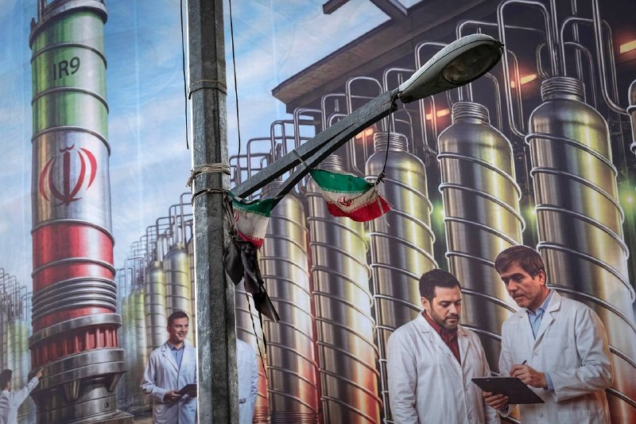

گزارش جدید Cfr با عنوان «سه درس از جنگ ایران برای مذاکره‌کنندگان هسته‌ای» می‌گوید جنگ اخیر نشان داده توافق‌های آینده میان تهران و واشنگتن دیگر صرفاً درباره غنی‌سازی نیست، بلکه به مسئله امنیت منطقه‌ای، بازدارندگی و حتی اعتبار نظام عدم اشاعه هسته‌ای گره خورده است.

سه نتیجه اصلی این تحلیل:

▪️ حملات گسترده آمریکا و اسرائیل هم نتوانسته تمام زیرساخت و دانش هسته‌ای ایران را از بین ببرد و بدون بازرسی و توافق، «ابهام هسته‌ای» ایران بیشتر می‌شود.

▪️ جنگ می‌تواند ایران را به سمت مدل «ابهام هسته‌ای کره شمالی» سوق دهد
در گزارش آمده اگر توافق جدید شامل نظارت‌های گسترده نباشد، تهران ممکن است بخشی از فعالیت‌ها را مخفی کرده و در آینده به سمت آستانه‌ هسته‌ای حرکت کند.

▪️ مذاکرات جدید احتمالاً فراتر از برجام خواهد بود
طبق گزارش، آمریکا احتمالاً علاوه بر غنی‌سازی، درباره موشک‌های بالستیک، حمایت منطقه‌ای ایران و امنیت تنگه هرمز هم خواهان محدودیت خواهد شد؛ موضوعی که مذاکرات را بسیار پیچیده‌تر از برجام می‌کند.

🫆:Tony

📌 @persian_trend_official
پرشین ترند | متفاوت‌ترین کانال نظامی

## Persian_Trend_Official — post 13671

🔴 وقوع انفجار پهپاد انتحاری در رأس‌الناقوره

🔹رسانه‌های اسرائیلی گزارش می‌دهند در پی انفجار یک پهپاد انتحاری در منطقه «رأس‌الناقوره» در الجلیل غربی، دست‌کم ۴ نفر به‌شدت زخمی شده‌اند/نقل از نایا

🔹جزئیات بیشتری درباره هویت هدف یا منشأ پهپاد منتشر نشده، اما این منطقه در نزدیکی مرز لبنان قرار دارد و طی هفته‌های اخیر بارها هدف حملات متقابل قرار گرفته است

🫆:Tony

📌 @persian_trend_official
پرشین ترند | متفاوت‌ترین کانال نظامی

## Persian_Trend_Official — post 13670

🔴 تشدید درگیری‌ها در خلیج فارس و جنوب لبنان

💢آخرین اخبار نظامی ۲۴ساعت گذشته

▪️ ارتش جمهوری اسلامی اعلام کرد نیروهای آمریکایی یک نفتکش ایرانی را در آب‌های ساحلی هدف قرار داده‌اند و شناور دیگری نیز در نزدیکی بندر فجیره امارات مورد حمله قرار گرفته است.

▪️ همچنین به گفته منابع ایرانی، حملات هوایی آمریکا مناطق غیرنظامی در بندر خمیر، سیریک و جزیره قشم را هدف قرار داده و پدافند هوایی ایران نیز در غرب تهران فعال شده است.

▪️ ارتش آمریکا اعلام کرد نیروهایش در تنگه هرمز هدف حملات موشکی، پهپادی و قایق‌های تندروی جمهوری اسلامی قرار گرفته‌اند و در پاسخ، «تهدیدات ورودی» و تأسیسات نظامی مرتبط با حملات را منهدم کرده‌اند.

▪️ دونالد ترامپ حملات آمریکا به اهداف ایرانی را یک «ضربه کوچک دوستانه» توصیف کرد و مدعی شد:
«آتش‌بس برقرار است؛ در حال اجراست.»

▪️ هم‌زمان حملات اسرائیل به جنوب لبنان ادامه دارد. طبق گزارش‌ها، دست‌کم ۱۱ نفر از جمله چند کودک در شهرهای «دویر»، «حاروف» و «حبوش» در منطقه نبطیه کشته شده‌اند/الجزیره

🫆:Tony

📌 @persian_trend_official
پرشین ترند | متفاوت‌ترین کانال نظامی

## Persian_Trend_Official — post 13669

🔴 ارتش اسرائیل دستور تخلیه اجباری روستایی در جنوب لبنان را صادر کرد

ارتش اسرائیل از ساکنان روستای «العباسیه» در جنوب لبنان، در شرق شهر صور، خواست فوراً خانه‌های خود را ترک کنند.

آویخای ادرعی، سخنگوی عرب‌زبان ارتش اسرائیل، در پیامی در X اعلام کرد ساکنان باید «بدون تأخیر» منطقه را تخلیه کرده و حداقل تا شعاع ۱۰۰۰ متری از روستا فاصله بگیرند و به مناطق باز منتقل شوند.

این دستور در حالی صادر شده که با وجود آتش‌بس اعلام‌شده در لبنان، درگیری‌ها میان حزب‌الله و ارتش اسرائیل همچنان رو به تشدید است و حملات و جابه‌جایی اجباری ساکنان مناطق جنوبی ادامه دارد.

🫆:Tony

📌 @persian_trend_official
پرشین ترند | متفاوت‌ترین کانال نظامی

## Persian_Trend_Official — post 13668

🔴 چین: به‌شدت نگران وضعیت کشتی‌ها در تنگه هرمز هستیم

🔹وزارت خارجه چین اعلام کرد پکن نسبت به افزایش شمار کشتی‌های آسیب‌دیده در پی تنش‌های تنگه هرمز «به‌شدت نگران» است.

🔹مقام‌های چینی همچنین تأیید کردند یک نفتکش چینی در تنگه هرمز هدف حمله قرار گرفته و تعدادی شهروند چینی در این کشتی حضور داشته‌اند، اما تاکنون گزارشی از تلفات خدمه منتشر نشده است.

🔹این نخستین تأیید رسمی پکن درباره آسیب‌دیدن یک شناور چینی در جریان تنش‌های اخیر منطقه محسوب می‌شود.

🫆:Tony

📌 @persian_trend_official
پرشین ترند | متفاوت‌ترین کانال نظامی

## Persian_Trend_Official — post 13667

مومن‌نسب: فضای مجازی به هیچ وجه نباید به حالت قبل برگردد.

حالا این آدم انقدر مهم نیست که دربارش صحبت کنیم ولی خواستم بگم این همون آدمیه که چندسال پیش تو صداوسیما میگفت من خطرات اینترنت رو میدونم و اطلاع دارم یک نفر با 2 گیگ اینترنت حامله شده و پدر دختره با گریه اینو برای من تعریف می‌کرد...

📝 Nick

📌 @persian_trend_official
پرشین ترند | متفاوت‌ترین کانال نظامی

## Persian_Trend_Official — post 13666

  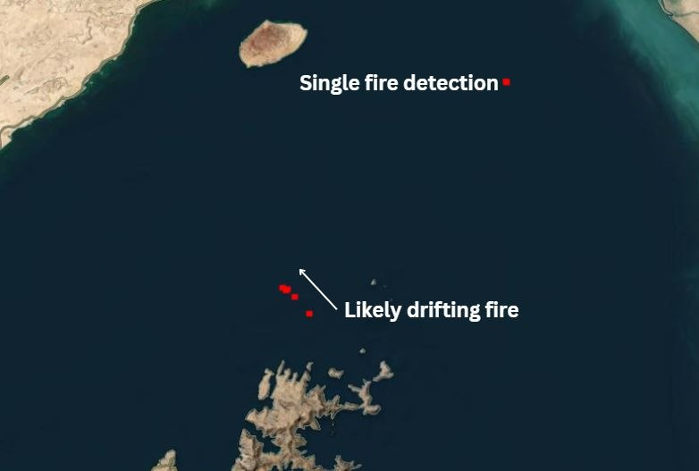

⭕️ ناسا چندین آتش سوزی در تنگه هرمز پس از نبرد روز گذشته بین ایران و ایالات ثبت کرده است.

📝 Nick

📌 @persian_trend_official
پرشین ترند | متفاوت‌ترین کانال نظامی

## RadioFarda — post 156958

همزمان با سکوت قوه قضاییه، درخواست‌ها برای رسیدگی پزشکی و آزادی نرگس محمدی ادامه دارد

🔸همزمان با سکوت قوه قضاییه جمهوری اسلامی درباره وضعیت نگران‌کننده نرگس محمدی، برنده نوبل و زندانی سیاسی، درخواست‌ها از سراسر جهان برای رسیدگی پزشکی فوری و آزادی او از زندان ادامه دارد.

🔸بنیاد نرگس محمدی روز جمعه، ۱۱ اردیبهشت، خبر داد این فعال حقوق بشر و برندهٔ جایزهٔ صلح نوبل به‌دلیل وخامت شدید وضعیت جسمی به‌طور فوری به بیمارستانی در زنجان منتقل شده است.

🔸حال، یک هفته پس از انتقال او به بیمارستان، بنیاد نرگس محمدی روز پنج‌شنبه، ۱۷ اردیبهشت، در شبکه ایکس نوشته است که او «همچنان در وضعیت جسمانی ناپایدار به سر می‌برد و نگرانی‌ها دربارهٔ وضعیت قلبی او به‌طور جدی افزایش یافته است.»

🔸این بنیاد همچنین می‌گوید: «پزشکانی که پیش از بستری وضعیت او را بررسی کرده بودند، تأکید دارند که هرگونه تأخیر در سپردن روند درمان به پزشک معالج قبلی او می‌تواند خطرات جانی جبران‌ناپذیری به همراه داشته باشد و انجام عمل فوری آنژیوگرافی تخصصی، ضروری است.»

🔸با وجود تمام این گزارش‌ها و ابراز نگرانی در گوشه‌وکنار جهان دربارهٔ وضعیت سلامت این زندانی سیاسی سرشناس، قوه قضاییه جمهوری اسلامی هنوز هیچ واکنشی نشان نداده و در برابر این اخبار سکوت اختیار کرده است.

🔸این در حالی است که درخواست‌ها از سراسر جهان برای رسیدگی پزشکی درخور و فوری به وضعیت خانم محمدی و در نهایت آزادی بی قید و شرط او از زندان برای ادامه درمان در یک هفته گذشته قطع نشده است.

🔸نسخه کامل این گزارش را در وب‌سایت رادیوفردا بخوانید.

@RadioFarda

## RadioFarda — post 156957

  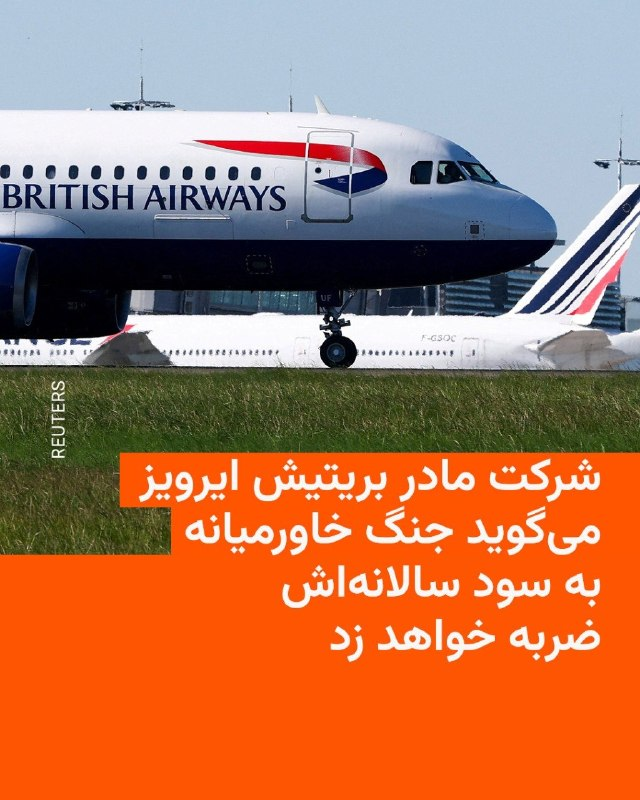

🔸آی ای جی (IAG)، گروه مادر بریتیش ایرویز و شرکت اسپانیایی ایبریا، روز جمعه ۱۸ اردیبهشت اعلام کرد که جنگ خاورمیانه، سود سالانه‌اش را کاهش خواهد داد.

🔸این شرکت در بیانیه درآمد خود گفت: «اگرچه سه ماهه اول نسبتاً تحت تأثیر درگیری خاورمیانه قرار نگرفت، اما انتظار داریم که افزایش هزینه سوخت، تأثیر قابل توجهی در ادامه سال داشته باشد.»

🔸قیمت نفت از زمان آغاز جنگ آمریکا و ایران در اواخر فوریه افزایش یافته و منجر به افزایش بسیار زیاد هزینه‌های سوخت جت شده است.

🔸آی ای جی گفت که سود خالص این شرکت در سه ماهه اول در مقایسه با دوره ژانویه-مارس سال گذشته، ۷۱ درصد افزایش یافته و به ۳۰۱ میلیون یورو (۳۵۴ میلیون دلار) رسیده است، با این حال انتظار دارد سودی کمتر از پیش‌بینی اولیه در ابتدای سال داشته باشد.

🔸 به نوشته رویترز، قیمت سوخت جت از زمان آغاز جنگ آمریکا و اسرائیل با ایران در ۹ اسفند ۱۴۰۴ حدود ۸۴ درصد افزایش یافته، اما تاکنون کمبودی در سوخت هواپیما در کشورهای اتحادیه اروپا گزارش نشده است.

@RadioFarda

## RadioFarda — post 156956

  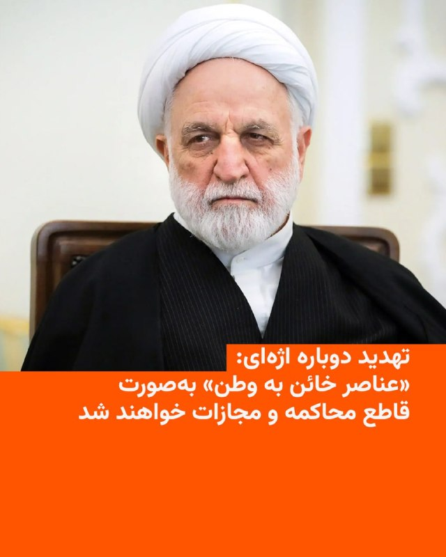

🔸هم‌زمان با هشدار سازمان دیده‌بان حقوق بشر در خصوص اعدام‌ها با «اتهامات سیاسی» در ایران رییس قوه قضاییه جمهوری اسلامی، اعلام کرد که با «عناصر خائن به وطن» به‌صورت قاطع برخورد خواهد شد.

🔸غلامحسین محسنی اژه‌ای، روز جمعه ۱۸ اردیبهشت گفت: «عناصر خائن به وطن به‌صورت قاطع محاکمه و مجازات خواهند شد و دستگاه قضایی در این مسیر از سرزنش سرزنشگران ابایی ندارد.»

🔸بهار صبا، پژوهشگر سازمان دیده‌بان حقوق بشر، در ویدئویی که شامگاه پنج‌شنبه ۱۷ اردیبهشت در حساب این نهاد در شبکه ایکس منتشر شد، اعلام کرد که تنها در یک ماه و نیم گذشته «دست‌کم ۲۸ نفر» در ایران با «اتهامات سیاسی» اعدام شده‌اند.

🔸بر اساس اعلام این سازمان، این افراد همگی در دادگاه‌هایی محکوم شده‌اند که در آن‌ها «حقوق اساسی و اولیه متهمان زیر پا گذاشته می‌شود».

@RadioFarda

## BBCPersian — post 280487

🔻نتبلاکس: قطع اینترنت ایران وارد هفتادمین روز متوالی شد

نتبلاکس که وضعیت اینترنت در جهان را ارزیابی می‌کند، می‌گوید قطع اینترنت در ایران امروز وارد هفتادمین روز خود شده و مدت این اختلال اکنون از ۱۶۵۶ ساعت فراتر رفته است.

نتبلاکس می‌گوید «اتصال دیجیتال در زمان بحران اهمیتی حیاتی دارد و محدود کردن دسترسی به اینترنت بیشترین آسیب را به افرادی وارد می‌کند که بیش از دیگران به آن نیاز دارند؛ از جمله افراد دارای معلولیت، دانشجویان، کسب‌وکارهای کوچک و عموم مردم.»

جمهوری اسلامی ایران از نهم اسفند همزمان با شروع حملات آمریکا و اسرائیل دسترسی عموم شهروندان به اینترنت را قطع کرده است. از آن زمان فقط برخی از افراد و گروه های نزدیک به حکومت که به دارندگان «سیم کارت سفید» مشهور هستند، به اینترنت دسترسی داشته‌اند.

در عین حال شورای عالی امنیت ملی اخیرا طرحی موسوم به «اینترنت پرو» را تصویب کرده است که براساس آن برخی اهالی کسب‌وکار یا دانشگاهیان می‌توانند با پرداخت مبلغی بیشتر، با دسترسی محدود به اینترنت بین‌المللی وصل شوند. اما برخی از مشاغل همچون گروهی از پرستاران و وکلای دادگستری پیشنهاد دریافت چنین انیترنتی را رد کرده‌اند.

ایران استفاده از اینترنت ماهواره ای همچون استارلینک را هم جرم انگاری کرده و کاربران آن را تحت تعقیب قرار می‌دهد.

@BBCPersian

## BBCPersian — post 280486

🔻پکن حمله به یک نفتکش با خدمه چینی در تنگه هرمز را تایید کرد

وزارت خارجه چین تایید کرد که یک کشتی حامل فرآورده‌های نفتی با خدمه چینی در تنگه هرمز هدف حمله قرار گرفته است؛ این وزارتخانه همچنین در مورد وضعیت شناورهایی که تحت تاثیر جنگ در خاورمیانه قرار گرفته‌اند، ابراز نگرانی کرد.

لین جیان، سخنگوی وزارت خارجه چین، در کنفرانس خبری گفت که این نفتکش خدمه چینی داشته است، اما افزود که تاکنون مجروح یا کشته‌ای گزارش نشده است.

دیروز رسانه چینی سایشین گزارش داده بود که یک نفتکش چینی روز دوشنبه در نزدیکی تنگه هرمز هدف حمله قرار گرفته است.

@BBCPersian

## Dirty_Kids — post 389087

  <a href="telegram/content/Dirty_Kids_389087_1778231966.mp4">🎬 Download video</a>

انقدر خامنه‌ای رو خاک نکردید که ویروس موش کل دنیا رو قراره بگا بده

ویدیویی تو شبکه‌های مجازی داره وایرال میشه که گفته میشه علائم  ترسناک پوستی فردی رو که به «هانتا ویروس» مبتلا شده رو نشون‌میده:

@Dirty_Kids 👻

## Dirty_Kids — post 389086

  <a href="telegram/content/Dirty_Kids_389086_1778231969.mp4">🎬 Download video</a>

توی فیلم نورنبرگ نشون میده آمریکایی‌ها به این نتیجه می‌رسند که برای برگزاری دادگاه نورنبرگ و اعدام رهبران نازی آلمان، باید تأیید یک نفر که بالاتر از رئیس جمهور آمریکاست را بگیرند تا تمام جهان همراهی کنه و اون کسی نیست جز پاپ…! پاپ موافق دادگاه و اعدام نبود و سیاستمدار آمریکایی به او گفت: «ما در هر صورت نازی‌ها را از بین می‌بریم، ولی تاریخ یادش می‌مونه که کلیسای کاتولیک علیه نازی‌ها بودی یا طرفدارشون!». و اینجوری پاپ مجبور میشه به مسیحی‌های جهان بگه برگزاری دادگاه نورنبرگ و اعدام رهبران نازی برای دنیا خوب هست.

ماروکو روبیو امروز وسط جنگ با جمهوری اسلامی برای دیدار با پاپ، به واتیکان سفر کرد.

@Dirty_Kids 👻

## Dirty_Kids — post 389085

  <a href="telegram/content/Dirty_Kids_389085_1778231970.mp4">🎬 Download video</a>

“به مارکو روبیو گفتم خیلی محترمانه به پاپ بگه ایران ۴۲ هزار نفر از مردم بیگناه و غیرمسلح رو کشته! همینطور گفتم بهش بگه ایران نباید سلاح هسته ای داشته باشه!!”

@Dirty_Kids 👻

## Hranews — post 112829

  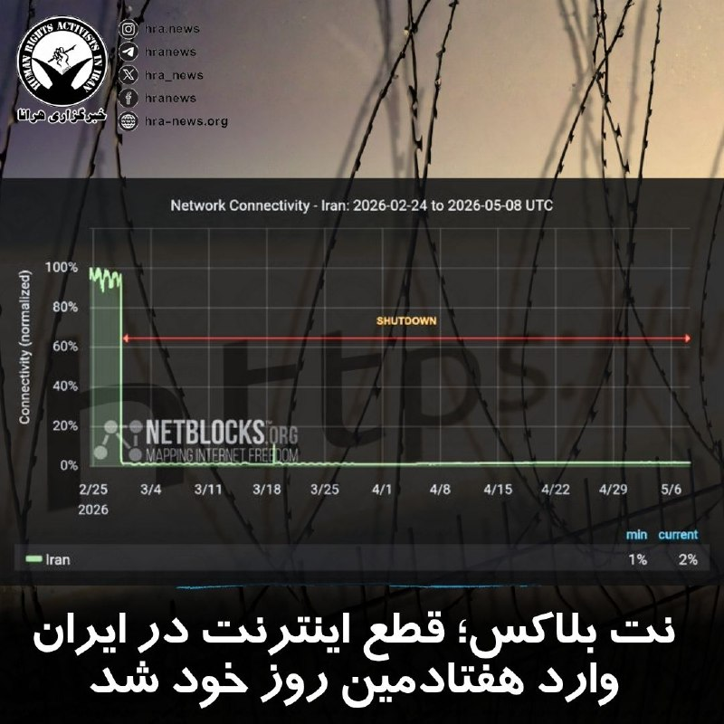

نت‌بلاکس، که محدودیت دسترسی به #اینترنت در جهان را رصد می‌کند، اعلام کرد قطع اینترنت در ایران وارد هفتادمین روز خود شده است و این وضعیت اکنون از ۱۶۵۶ ساعت گذشته است. به گفته این وبسایت؛ اتصال دیجیتال در شرایط بحرانی اهمیت حیاتی دارد و محدود کردن خدمات به نیازمندترین افراد، شامل افراد دارای معلولیت، دانشجویان، مشاغل کوچک و عموم مردم، آسیب می‌رساند.

↘️
@hranews_bot تماس ✉️ - @Hranews کانال هرانا 🆑

## Hranews — post 112828

  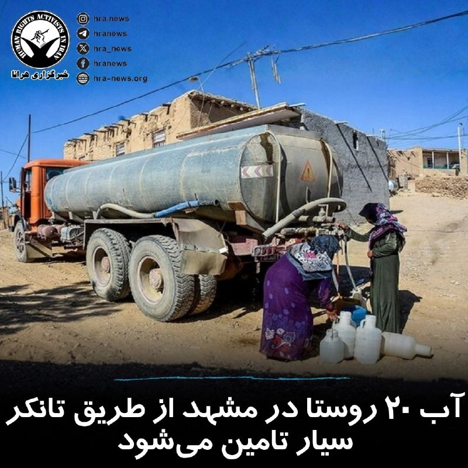

حسین اسماعیلیان، مدیرعامل شرکت آب و فاضلاب مشهد، با اشاره به تنش آبی در روستاهای این شهرستان اعلام کرد هم‌اکنون ۲۰ روستا به صورت تانکری آبرسانی می‌شوند و تعداد آن‌ها در ایام اوج مصرف تابستان به ۳۵ روستا افزایش می‌یابد.

حسین اسماعیلیان افزود: در سال ۱۳۹۹ بیش از ۵۰٪ روستاهای این شهرستان با تنش آبی شدید مواجه بودند که این میزان با وجود خشکسالی در سال‌های اخیر کاهش یافته است.

↘️
@hranews_bot تماس ✉️ - @Hranews کانال هرانا 🆑

## Hranews — post 112827

مردی که پنج عضو خانواده‌اش را به قتل رسانده بود، بازداشت شد

❗️
❗️
❗️
❗️
❗️– مردی در شهریورماه سال گذشته، با استفاده از سلاح گرم پنج نفر از اعضای خانواده خود را به قتل رساند. متهم توسط نیروی انتظامی در شهرستان رودبار جنوب بازداشت شده و به این قتل‌ها اعتراف کرده است.

ادامه مطلب

↘️
@hranews_bot تماس ✉️ - @Hranews کانال هرانا 🆑

## configx2ray — post 38635

  <a href="https://t.me/ConfigX2ray/38635">📎 Download file</a>

کانفیگ برای Npv tunnel ⭕️

به هیچ وج دانلود نزنید باهاش
❤️

رمز فایل : @ConfigX2ray

Channel : https://t.me/ConfigX2ray

## configx2ray — post 38634

  <a href="telegram/content/configx2ray_38634_1778231974.webm">🎬 Download video</a>

دوستان یدونه ربات ساختیم که با زیر مجموعه گیری ( دعوت دوستانتون با لینکی که ربات بهتون میده به ربات ) میتونید سرور اختصاصی 600 مگابایتی رو رایگان بگیرید
❤️ ربات : Bot : @Startraygannetbot 
✅

## configx2ray — post 38633

  <a href="telegram/content/configx2ray_38633_1778231974.webm">🎬 Download video</a>

دوستان یدونه ربات ساختیم که با زیر مجموعه گیری ( دعوت دوستانتون با لینکی که ربات بهتون میده به ربات ) میتونید سرور اختصاصی 600 مگابایتی رو رایگان بگیرید
❤️

ربات :
Bot : @Startraygannetbot 
✅

## configx2ray — post 38632

  <a href="telegram/content/configx2ray_38632_1778231975.webm">🎬 Download video</a>

vless://dae2ddc6-a892-495f-a001-181cec56ad12@snapp.ir:2052?path=%2F&security=none&encryption=none&host=p1.razstar.ir&type=ws#https://t.me/ConfigX2ray

ترکیبی با سایفون وصله 
✅

آموزش استفادع : 
👇
https://t.me/ConfigX2ray0/1665

Channel : https://t.me/ConfigX2ray

## manototv — post 105124

  <a href="telegram/content/manototv_105124_1778231975.mp4">🎬 Download video</a>

ارتش و سازمان امنیت داخلی این کشور اعلام کردند یک شهروند و سه سرباز سابق به اتهام جاسوسی برای جمهوری اسلامی تحت پیگرد قرار گرفته‌اند و قرار است علیه آن‌ها در دادگاه حیفا کیفرخواست صادر شود.
بر اساس این گزارش، متهمان به دستور یک عامل اطلاعاتی جمهوری اسلامی از مکان‌هایی مانند مدرسه فنی نیروی هوایی، ایستگاه‌های قطار، مراکز خرید و دوربین‌های امنیتی تصویربرداری کرده و تصاویر و ویدیوها را ارسال کرده‌اند.
مقام‌های اسرائیلی همچنین اعلام کردند این افراد پیش از خدمت سربازی جذب شده بودند و یکی از متهمان دیگر افراد را برای همکاری با عامل اطلاعاتی جمهوری اسلامی جذب کرده است.

## manototv — post 105123

  <a href="telegram/content/manototv_105123_1778231976.mp4">🎬 Download video</a>

وزارت خارجه چین اعلام کرد شهروندان چینی در نفتکش هدف قرارگرفته در تنگه هرمز حضور دارند، اما تاکنون گزارشی از زخمی یا کشته شدن خدمه این کشتی دریافت نشده است.
پکن همچنین اعلام کرد وضعیت خدمه و جزئیات حادثه را از نزدیک دنبال می‌کند.

## manototv — post 105122

  <a href="telegram/content/manototv_105122_1778231977.mp4">🎬 Download video</a>

گروه ناظر اینترنتی نت‌بلاکس اعلام کرد قطعی اینترنت در ایران امروز وارد هفتادمین روز خود شده و از مرز ۱۶۵۶ ساعت گذشته است.
نت‌بلاکس هشدار داده در شرایط بحرانی، دسترسی به اینترنت یک نیاز حیاتی است و محدودیت‌های گسترده بیشترین آسیب را به افراد دارای معلولیت، دانشجویان، کسب‌وکارهای کوچک و عموم شهروندان وارد می‌‌کند.

## alonews — post 118618

  <a href="telegram/content/alonews_118618_1778231978.webm">🎬 Download video</a>

👈نیویورک‌تایمز: اعراب خلیج فارس به تازگی سفارش خرید ۴۲۰۰ موشک رهگیر پاتریوت به ارزش ۱۷ میلیارد دلار از آمریکا را داده‌اند؛ این تعداد برابر با کل تولید سالانه آمریکا برای این موشک‌ها در ۷ سال آینده است

✅ @AloNews خبر جنگ

## alonews — post 118617

  <a href="telegram/content/alonews_118617_1778231978.webm">🎬 Download video</a>

👈گزارش‌های جدید نشان می‌دهد که از ماه ژوئن تا سپتامبر، بیش از ۷۵ هزار پرواز در سطح بین‌المللی به دلیل هزینه‌های گزاف سوخت لغو شده‌اند؛ بحرانی که می‌تواند برنامه‌های سفر میلیون‌ها مسافر را در تابستان پیش رو مختل کند.

✅ @AloNews خبر جنگ

## alonews — post 118616

  <a href="telegram/content/alonews_118616_1778231979.webm">🎬 Download video</a>

👈یک منبع دیپلماتیک به العربیه: پیشرفت در پرونده‌های برنامه هسته‌ای و تنگه هرمز کند است. تمرکز فعلی بر یادداشت تفاهم برای توقف جنگ، بازگشایی هرمز و کاهش محاصره است

✅ @AloNews خبر جنگ

## alonews — post 118615

  <a href="telegram/content/alonews_118615_1778231979.webm">🎬 Download video</a>

👈رویترز: کاهش ذخایر سوخت آمریکا، ترامپ را در موقعیتی آسیب‌پذیر قرار داده است

✅ @AloNews خبر جنگ

## alonews — post 118614

  <a href="telegram/content/alonews_118614_1778231979.webm">🎬 Download video</a>

👈هم اکنون قدرتنمایی جنگنده ارتش در آسمان تهران

✅ @AloNews خبر جنگ

## alonews — post 118613

  <a href="telegram/content/alonews_118613_1778231979.webm">🎬 Download video</a>

👈ارتش اسرائیل به ساکنان روستای العباسیه در جنوب لبنان هشدار داد تا منطقه‌ای به شعاع حداقل ۱۰۰۰ متر را تخلیه کنند.

✅ @AloNews خبر جنگ

## alonews — post 118612

  <a href="telegram/content/alonews_118612_1778231980.webm">🎬 Download video</a>

👈سخنگوی کمیسیون امنیت ملی خطاب به آمریکا: با کل نیروی دریایی‌تان هم توان عبور از تنگه هرمز را نخواهید داشت

✅ @AloNews خبر جنگ

## alonews — post 118611

  <a href="telegram/content/alonews_118611_1778231980.webm">🎬 Download video</a>

👈فائو: شاخص قیمت جهانی مواد غذایی در ماه آوریل نسبت به ماه مارس ۱.۶ درصد افزایش یافت

✅ @AloNews خبر جنگ

## alonews — post 118610

  <a href="telegram/content/alonews_118610_1778231980.webm">🎬 Download video</a>

👈 عربستان بازگشایی حریم هوایی‌اش به‌روی آمریکا را تکذیب کرد

🔴 درحالی‌که روزنامهٔ وال استریت ژورنال از بازشدن حریم هوایی عربستان و کویت به‌روی هواپیماهای آمریکایی خبر داده بود، مسئولان سعودی این ادعا را رد کردند.

🔴 شبکهٔ العربیه به‌نقل از یکی از مقامات سعودی تأکید کرده که پادشاهی عربستان سعودی اجازهٔ استفاده از حریم هوایی خود برای حمایت از عملیات نظامی تهاجمی را نداده است.

🔴 ریاض همچنین بر عزم خود برای کاهش تنش‌ها تأکید کرده و اعلام کرده که از تلاش‌های پاکستان برای دستیابی به توافقی که به جنگ آمریکا و ایران پایان دهد، حمایت می‌کند.

🔴 منبع آگاه سعودی در گفتگو با العربیه، با اشاره به اخبار منتشر شده در مورد آزادشدن حریم هوایی عربستان به روی آمریکا، گفته است: «برخی طرف‌ها به‌دلایل مشکوک، در تلاش‌اند تصویری گمراه‌کننده از موضع پادشاهی عربستان سعودی ارائه کنند.»

✅ @AloNews خبر جنگ

## alonews — post 118609

  <a href="telegram/content/alonews_118609_1778231981.webm">🎬 Download video</a>

👈ژنرال دان کین، رئیس ستاد مشترک ارتش آمریکا مدعی شد این کشور به توقیف دریایی کشتی‌های ایرانی و شناورهای «ناوگان سایه» در اقیانوس‌های آرام و هند ادامه خواهد داد. اظهارات او پس از توقیف چند نفتکش صورت گرفت.

✅ @AloNews خبر جنگ

## alonews — post 118608

  <a href="telegram/content/alonews_118608_1778231981.webm">🎬 Download video</a>

👈بلومبرگ نوشت: ایران در حال گسترش تجارت خود با چین از طریق خطوط ریلی است تا اثرات محاصره دریایی بنادرش از سوی آمریکا را خنثی کند.

🔴 تعداد قطارهایی که از چین به ایران حرکت می‌کنند، از هفته‌ای ۱ قطار در قبل از جنگ به یک قطار در هر سه روز از بعد محاصره دریایی آمریکا افزایش یافته است

✅ @AloNews خبر جنگ

## alonews — post 118607

  <a href="telegram/content/alonews_118607_1778231981.webm">🎬 Download video</a>

👈درحالیکه هفتاد روز است دسترسی مردم به اینترنت بین الملل قطع شده است؛ برخی کاربران از افزایش تعرفه اینترنت ثابت در سکوت خبری گزارش می دهند

✅ @AloNews خبر جنگ

## alonews — post 118606

  <a href="telegram/content/alonews_118606_1778231981.webm">🎬 Download video</a>

👈آسه‌آن: جنگ ایران هرگز نباید رخ می‌داد و باید پایان یابد

✅ @AloNews خبر جنگ

## alonews — post 118605

  <a href="telegram/content/alonews_118605_1778231982.webm">🎬 Download video</a>

👈خبرنگار: چرا «پروژه آزادی» متوقف شد؟

🔴ترامپ: چون رهبری فوق‌العاده در پاکستان از ما خواست که این کار را نکنیم

✅ @AloNews خبر جنگ

## alonews — post 118604

  <a href="telegram/content/alonews_118604_1778231982.webm">🎬 Download video</a>

👈فرماندهی پلیس یزد : یک نفر که ادعا میکرد عیسی مسیحه رو بازداشت کردیم.

✅ @AloNews خبر جنگ

## alonews — post 118603

  <a href="telegram/content/alonews_118603_1778231982.webm">🎬 Download video</a>

👈روح الله مومن‌نسب (دبیر ستاد امر به معروف تهران) و شخصی که یکی از اقوامش با ۲گیگ اینترنت حامله شده بود:

🔴«فضای مجازی به‌هیچ‌وجه نباید به حالت قبل برگردد؛ همان‌طور که ‎امام شهید، دانش‌آموزان مینابی و هزاران جانِ عزیزتر از جان‌مان به حالت قبل بر نمی‌گردد.»

✅ @AloNews خبر جنگ

## alonews — post 118602

  <a href="telegram/content/alonews_118602_1778231983.webm">🎬 Download video</a>

👈شبکه 12 اسرائیل، به نقل از یه مقام : یه شهروند و ۳ سرباز رو به ظن جاسوسی برای ایران بازداشت کردیم

✅ @AloNews خبر جنگ

## alonews — post 118601

  <a href="telegram/content/alonews_118601_1778231983.webm">🎬 Download video</a>

👈شرکت ژاپنی «میتسویی» با انتشار بیانیه‌ای اعلام کرد که در ماه آوریل، سه نفتکش متعلق به این شرکت بدون پرداخت هیچ‌گونه عوارضی به ایران، با موفقیت از تنگه هرمز عبور کرده‌اند

✅ @AloNews خبر جنگ

## alonews — post 118600

  <a href="telegram/content/alonews_118600_1778231983.webm">🎬 Download video</a>

👈نخستین نفتکش کره جنوبی پس از عبور از تنگه هرمز به مقصد رسید

✅ @AloNews خبر جنگ

## alonews — post 118599

  <a href="telegram/content/alonews_118599_1778231983.webm">🎬 Download video</a>

👈عضو کمیسیون امنیت ملی مجلس:
عراقچی در جلسه گفت بعد از کنترل تنگه هرمز، رفتار کشورها با ایران عوض شده و کشورهایی که سالی یک بار حال ما را نمی‌پرسیدند حالا مدام زنگ می‌زنند

✅ @AloNews خبر جنگ

---
📅 بروزرسانی: 1405/02/18 11:02
---

## VahidOOnLine — post 238821

  <a href="telegram/content/VahidOOnLine_238821_1778225555.mp4">🎬 Download video</a>

بریتانیا اعلام کرد یک مورد مشکوک دیگر از هانتا ویروس در یک شهروند این کشور در جزیره تریستان دا کونا در جنوب اقیانوس اطلس شناسایی شده است. پیش‌تر ابتلای دو شهروند بریتانیایی به این ویروس تأیید شده بود.
مقام‌های بریتانیایی اعلام کردند مسافران و خدمه کشتی تفریحی «ام‌وی هوندیوس» که علائمی از بیماری ندارند، پس از پهلو گرفتن کشتی در تنریف اسپانیا با پرواز اختصاصی و رایگان به بریتانیا بازگردانده خواهند شد.
‌🏁 🇬🇧 ManotoTV

🤖 @VahidOOnLine

## VahidOOnLine — post 238820

  <a href="telegram/content/VahidOOnLine_238820_1778225556.mp4">🎬 Download video</a>

در پی دستور ارتش اسرائیل برای تخلیه چند روستا در لبنان، یک نفر در حمله اسرائیل به خودرویی در مسیر میان کفرحمام و کفرشوبا کشته شد.
ارتش اسرائیل همزمان از ساکنان روستاهای نُمیریه، طیر فلسه، حلوسیه، حلوسیه الفوقا، طورا و معرکه خواسته بود فوراً منطقه را ترک کنند و دست‌کم تا شعاع یک کیلومتری دور شوند.
آویخای ادرعی، سخنگوی عرب‌زبان ارتش اسرائیل، اعلام کرد این حملات در واکنش به «نقض توافق آتش‌بس از سوی حزب‌الله» انجام شده است
‌🏁 🇬🇧 ManotoTV

🤖 @VahidOOnLine

## ManotoTV — post 105121

  <a href="telegram/content/ManotoTV_105121_1778225556.mp4">🎬 Download video</a>

بلومبرگ گزارش داد شرکت هواپیمایی ایر ایندیا در پی جنگ ایران در حال بررسی اجرای اقداماتی برای کاهش هزینه‌ها و کاهش تعداد پروازهاست.
بر اساس این گزارش، مرخصی اجباری برای کارکنان غیر فنی و کاهش بیش از ۲۰ درصدی ظرفیت پروازها در سه ماه آینده از جمله گزینه‌های مورد بررسی است.

## ManotoTV — post 105120

  <a href="telegram/content/ManotoTV_105120_1778225557.mp4">🎬 Download video</a>

بریتانیا اعلام کرد یک مورد مشکوک دیگر از هانتا ویروس در یک شهروند این کشور در جزیره تریستان دا کونا در جنوب اقیانوس اطلس شناسایی شده است. پیش‌تر ابتلای دو شهروند بریتانیایی به این ویروس تأیید شده بود.
مقام‌های بریتانیایی اعلام کردند مسافران و خدمه کشتی تفریحی «ام‌وی هوندیوس» که علائمی از بیماری ندارند، پس از پهلو گرفتن کشتی در تنریف اسپانیا با پرواز اختصاصی و رایگان به بریتانیا بازگردانده خواهند شد.

## ManotoTV — post 105119

  <a href="telegram/content/ManotoTV_105119_1778225558.mp4">🎬 Download video</a>

در پی دستور ارتش اسرائیل برای تخلیه چند روستا در لبنان، یک نفر در حمله اسرائیل به خودرویی در مسیر میان کفرحمام و کفرشوبا کشته شد.
ارتش اسرائیل همزمان از ساکنان روستاهای نُمیریه، طیر فلسه، حلوسیه، حلوسیه الفوقا، طورا و معرکه خواسته بود فوراً منطقه را ترک کنند و دست‌کم تا شعاع یک کیلومتری دور شوند.
آویخای ادرعی، سخنگوی عرب‌زبان ارتش اسرائیل، اعلام کرد این حملات در واکنش به «نقض توافق آتش‌بس از سوی حزب‌الله» انجام شده است

## Persian_Trend_Official — post 13665

💢سعید لیلاز: صلح موردپسند آمریکا، ایران را مانند مصر و عراق می‌کند، نه ژاپن

🔸احساس آمریکایی‌ها این است که اگر با ایران دعوا راه بیندازند، بیشتر در خلیج فارس و جهان عرب می‌توانند پول در بیاورند تا وقتی که بخواهند در روابط با ایران تنش‌زدایی کنند؛ مگر اینکه یک «ایرانِ برده» به آن‌ها بدهیم.

🔸آن‌وقت خواهید دید که خسارت و ضرری که آن ایرانِ برده متحمل می‌شود، به‌مراتب بیشتر از ایران مستقل است.

🔸همه فکر می‌کنند اگر ما با آمریکا مصالحه کنیم، مطابق با آن چیزی که آن‌ها می‌خواهند، ایران مثل ژاپن می‌شود اما من همیشه می‌گویم ایران مثل عراق و مصر خواهد شد.

🔸یگانه راهی که می‌بینم این است که ما پنجره دیپلماسی را باز نگه داریم، ولی دستمان روی ماشه باشد؛ جز مقاومت مؤثر و نیرومند، هیچ راهی وجود ندارد.

🔸خطاب به امت شهیدپرورِ همیشه در صحنه می‌گویم که یک مثلث یا پدیده‌ سه‌ضلعی وجود دارد؛ که در راس آن، «قدرت نظامی» قرار دارد؛ قدرت نظامی‌ که به‌شدت و به‌ طرز قاطعی بازدارنده است.

📝 Nick

📌 @persian_trend_official
پرشین ترند | متفاوت‌ترین کانال نظامی

## RadioFarda — post 156955

  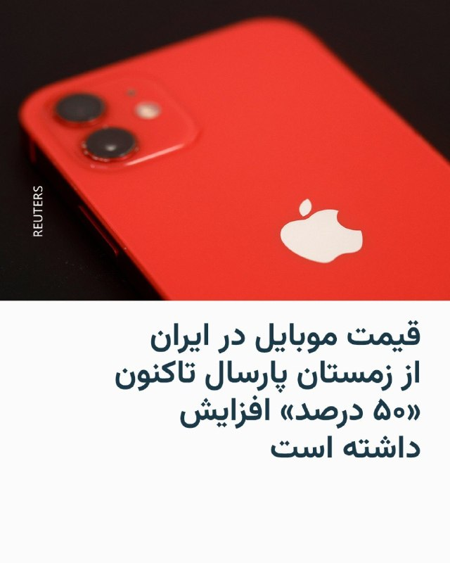

🔸یک گزارش میدانی از بازار موبایل در ایران حاکی است قیمت موبایل‌ها از زمستان ۱۴۰۴ تاکنون نزدیک به ۵۰ درصد رشد کرده و در هفته‌های اخیر نیز این بازار بار دیگر با جهش مجدد قیمت‌ها مواجه شده است.

🔸بر اساس این گزارش که جمعه ۱۸ اردیبهشت در خبرگزاری حکومتی مهر منتشر شد، گوشی‌های اقتصادی و میان‌رده که مورد استفادهٔ عموم مردم است، بیشترین افزایش قیمت را تجربه کرده‌اند.

🔸برای نمونه، قیمت گلکسی A۰۶ که اوایل فروردین کمتر از ۲۰ میلیون تومان بود، اکنون به حدود ۲۵ میلیون تومان رسیده است. همچنین گلکسی A۵۶ در بازه ۹۵ تا ۱۰۱ میلیون تومان و ردمی نوت ۱۴ پرو حدود ۶۹ میلیون تومان قیمت‌گذاری شده‌اند.

🔸در بخش گوشی‌های پرچمدار نیز شکاف قیمتی افزایش یافته است، به‌طوری‌ که گلکسی S۲۵ Ultra حدود ۲۸۴ میلیون تومان و آیفون ۱۷ پرو مکس بین ۳۶۷ تا ۴۵۰ میلیون تومان در بازار عرضه می‌شود.

🔸این گزارش به‌نقل از فعالان بازار موبایل سه عامل اصلی را در التهاب بازار برشمرده است: مشکلات زنجیرهٔ تأمین و واردات؛ نوسانات نرخ ارز و انتظارات تورمی؛ و نااطمینانی اقتصادی بازار.

@RadioFarda

## configx2ray — post 38627

  <a href="telegram/content/configx2ray_38627_1778225559.webm">🎬 Download video</a>

socks://Og@62.220.126.56:30170#https://t.me/ConfigX2ray

ترکیبی با سایفون وصله 
✅

آموزش استفادع : 
👇
https://t.me/ConfigX2ray0/1665

Channel : https://t.me/ConfigX2ray

## manototv — post 105121

  <a href="telegram/content/manototv_105121_1778225560.mp4">🎬 Download video</a>

بلومبرگ گزارش داد شرکت هواپیمایی ایر ایندیا در پی جنگ ایران در حال بررسی اجرای اقداماتی برای کاهش هزینه‌ها و کاهش تعداد پروازهاست.
بر اساس این گزارش، مرخصی اجباری برای کارکنان غیر فنی و کاهش بیش از ۲۰ درصدی ظرفیت پروازها در سه ماه آینده از جمله گزینه‌های مورد بررسی است.

## manototv — post 105120

  <a href="telegram/content/manototv_105120_1778225561.mp4">🎬 Download video</a>

بریتانیا اعلام کرد یک مورد مشکوک دیگر از هانتا ویروس در یک شهروند این کشور در جزیره تریستان دا کونا در جنوب اقیانوس اطلس شناسایی شده است. پیش‌تر ابتلای دو شهروند بریتانیایی به این ویروس تأیید شده بود.
مقام‌های بریتانیایی اعلام کردند مسافران و خدمه کشتی تفریحی «ام‌وی هوندیوس» که علائمی از بیماری ندارند، پس از پهلو گرفتن کشتی در تنریف اسپانیا با پرواز اختصاصی و رایگان به بریتانیا بازگردانده خواهند شد.

## manototv — post 105119

  <a href="telegram/content/manototv_105119_1778225562.mp4">🎬 Download video</a>

در پی دستور ارتش اسرائیل برای تخلیه چند روستا در لبنان، یک نفر در حمله اسرائیل به خودرویی در مسیر میان کفرحمام و کفرشوبا کشته شد.
ارتش اسرائیل همزمان از ساکنان روستاهای نُمیریه، طیر فلسه، حلوسیه، حلوسیه الفوقا، طورا و معرکه خواسته بود فوراً منطقه را ترک کنند و دست‌کم تا شعاع یک کیلومتری دور شوند.
آویخای ادرعی، سخنگوی عرب‌زبان ارتش اسرائیل، اعلام کرد این حملات در واکنش به «نقض توافق آتش‌بس از سوی حزب‌الله» انجام شده است

## alonews — post 118594

  <a href="telegram/content/alonews_118594_1778225562.webm">🎬 Download video</a>

👈بلومبرگ: پاکستان از خرید فوری ال‌ان‌جی به دلیل امید به کاهش تنش در هرمز، خودداری می‌کند

🔴پاکستان تصمیم گرفته است محموله‌های فوری گاز طبیعی مایع‌شده (ال‌ان‌جی) را در بازار نقدی خریداری نکند، به این امید که درگیری‌های منجر به بسته شدن تنگه هرمز کاهش یابد و محموله‌های ارزان‌تر قطر به زودی وارد شوند.

🔴شرکت دولتی پاکستان ال‌ان‌جی لمیتد، مناقصه اضطراری خود را برای خرید دو محموله برای تحویل در ماه مه که روز پنجشنبه بسته شد، به هیچ فروشنده‌ای واگذار نکرد، این مطلب را بازرگانان آگاه از موضوع گفتند. آنها افزودند که دولت این تصمیم را با این دیدگاه اتخاذ کرده که درگیری بین آمریکا و ایران در حال کاهش است

✅ @AloNews خبر جنگ

## alonews — post 118593

  <a href="telegram/content/alonews_118593_1778225562.webm">🎬 Download video</a>

👈 تلگرام با ۱۱ قابلیت تازه؛ تلگرام در آپدیت جدید خودش، تمرکز ویژه‌ای روی هوش مصنوعی و ربات‌ها گذاشته:

🔴 صدا زدن ربات‌های هوش مصنوعی داخل هر چت

🔴 گفتگو و همکاری ربات‌ها با همدیگر

🔴 نمایش زنده جواب ربات هنگام تایپ‌شدن

🔴اتصال ربات به پروفایل برای پاسخ‌گویی خودکار

🔴 ساخت سبک اختصاصی برای ویرایش متن با هوش مصنوعی

🔴 جست‌وجو بین بیش از ۱۰۰ میلیون استیکر و ایموجی

🔴 پشتیبانی جست‌وجوی استیکر در ۳۶ زبان

🔴 محدود کردن رأی‌گیری بر اساس کشور یا عضویت در کانال

🔴 آمار پیشرفته نظرسنجی‌ها برای مدیران

🔴 ارسال پیام زمان‌بندی‌شده به‌صورت بی‌صدا

🔴 حذف ری‌اکشن کاربران توسط مدیران گروه

🔴 بیش از ۲۰۰ بهبود و رفع باگ

✅ @AloNews خبر جنگ

## alonews — post 118592

  <a href="telegram/content/alonews_118592_1778225563.webm">🎬 Download video</a>

👈داده‌های جدید سامانه ماهواره‌ای FIRMS ناسا نشان می‌دهد که در منطقه‌ای که ناوشکن‌های آمریکایی هدف نیروهای دریایی سپاه قرار گرفتند، آتش‌سوزی‌هایی دیده می‌شود

✅ @AloNews خبر جنگ

---
📅 بروزرسانی: 1405/02/18 10:52
---

## VahidOOnLine — post 238819

  

فداحسین مالکی، عضو کمیسیون امنیت ملی مجلس، با اشاره به محاصره دریایی بنادر جنوب ایران، گفت: «با توجه به اینکه این جنگ اقتصادی فشار سنگینی بر مردم وارد می‌کند، چه از طریق تنگه هرمز و چه در داخل کشور از طریق گرانی و تورم، آسیب‌پذیری در این زمینه بالاست و باید بسیار مراقب باشیم.»

او ادامه داد: «اکنون دشمنان وارد جنگ اقتصادی شده‌اند؛ زیرا دیده‌اند که در جنگ نظامی نمی‌توانند ضربه وارد کنند، دست به این جنگ زده است.»
‌🏁 🇬🇧 IranintlTV

🤖 @VahidOOnLine

## IranIntlTV — post 336091

  <a href="telegram/content/IranIntlTV_336091_1778224966.mp4">🎬 Download video</a>

دونالد ترامپ، رییس‌جمهوری آمریکا، در تروث سوشال نوشت: «رهبران ایران دیوانگانی هستند که اگر به سلاح هسته‌ای دست پیدا می‌کردند، حتما از آن استفاده می‌کردند.»

گفت‌وگو با مرتضی کاظمیان، عضو تحریریه ایران‌اینترنشنال
@iranintltv

## IranIntlTV — post 336090

  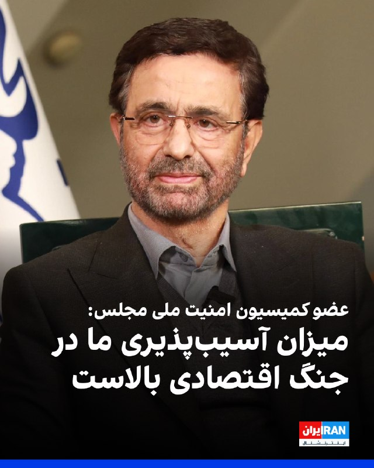

فداحسین مالکی، عضو کمیسیون امنیت ملی مجلس، با اشاره به محاصره دریایی بنادر جنوب ایران، گفت: «با توجه به اینکه این جنگ اقتصادی فشار سنگینی بر مردم وارد می‌کند، چه از طریق تنگه هرمز و چه در داخل کشور از طریق گرانی و تورم، آسیب‌پذیری در این زمینه بالاست و باید بسیار مراقب باشیم.»

او ادامه داد: «اکنون دشمنان وارد جنگ اقتصادی شده‌اند؛ زیرا دیده‌اند که در جنگ نظامی نمی‌توانند ضربه وارد کنند، دست به این جنگ زده است.»
https://iranintl.com/202605086098

## FarsiVOA — post 217165

  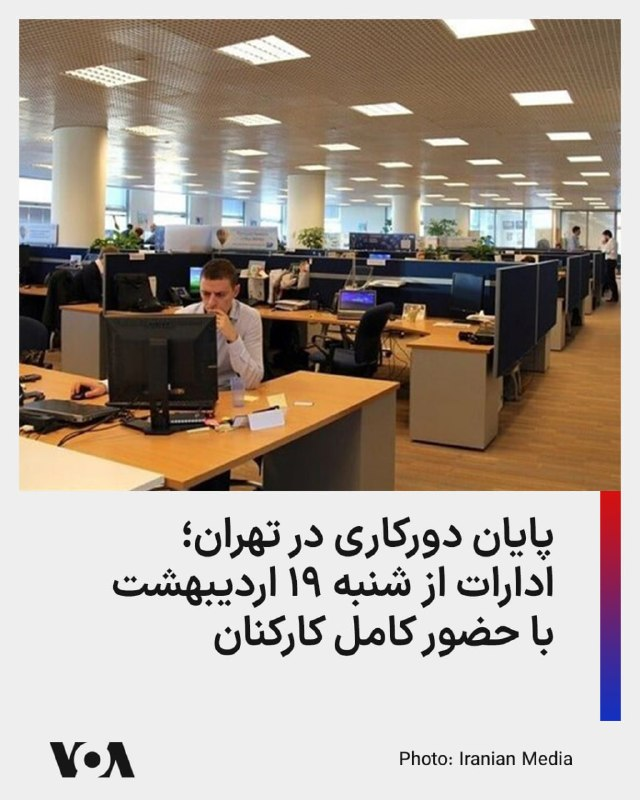

استاندار تهران اعلام کرد از شنبه ۱۹ اردیبهشت، حضور کارکنان تمامی وزارتخانه‌ها، سازمان‌ها و دستگاه‌های اجرایی مستقر در استان تهران تا اطلاع ثانوی به ‌صورت ۱۰۰ درصدی خواهد بود.

محمدصادق معتمدیان اعلام کرد فعالیت مدارس و دانشگاه‌ها نیز طبق اعلام وزارت آموزش‌ و پرورش و وزارت علوم، تحقیقات و فناوری ادامه خواهد داشت. در حال حاضر کلاس‌های مدارس و دانشگاه‌های تا پایان سال تحصیلی جاری غیرحضوری برگزار می‌شود.

دورکاری ادارات از ۱۴ اسفند سال گذشته به دلیل شرایط جنگی آغاز شده بود.
@FarsiVOA

## BBCPersian — post 280485

🔻وزارت نفت عراق اتهامات آمریکا علیه معاون این وزارتخانه در کمک به ایران در دور زدن تحریم‌ها را رد کرد

وزارت نفت عراق اتهامات آمریکا علیه معاون وزیر نفت این کشور را رد کرده است. اتهاماتی که در آن آمریکا او را به دلیل حمایت از ایران تحریم کرده است.

واشنگتن فشار بر عراق را برای فاصله گرفتن از گروه‌های نزدیک به ایران افزایش داده است.

وزارت خارجه آمریکا روز پنجشنبه اعلام کرد که علی معارج بهادلی، معاون وزیر نفت عراق را تحریم کرده است و مدعی شد که او از «موقعیت دولتی خود سوءاستفاده کرده تا نفت عراق را به نفع ایران و گروه‌های نیابتی آن به طورغیرقانونی جابجا کند»

آمریکا همچنین او را متهم کرده است که «در قالب طرحی برای کمک به ایران در دور زدن تحریم‌ها، نفت ایران را به طور غیرقانونی با نفت عراق مخلوط کرده تا به نفع ایران فروخته شود.»

با این حال، وزارت نفت عراق در بیانیه‌ای این اتهامات را رد کرده و تأکید کرده است که «اهمیت زیادی برای شفافیت در برخورد با همه اتهامات بر اساس مدارک و حقایق قائل است.»

این وزارتخانه اعلام کرده که آماده بررسی موضوع است، اما تأکید کرده که عملیات صادرات نفت خام، بازاریابی، بارگیری کشتی‌ها و فرآیندهای مرتبط در حوزه وظایف این مقام نبوده است.

پیش‌تر نیز شرکت بازاریابی نفت عراق هرگونه عملیات ترکیب نفت در بنادر یا آب‌های سرزمینی عراق برای کمک به ایران را رد کرده بود.

آمریکا در سال‌های اخیر تحریم‌هایی را علیه فروش نفت ایران اعمال کرده و تلاش دارد هر کشوری را که به خرید یا تسهیل فروش نفت ایران کمک کند مجازات کند.

https://bbc.in/3QNUa8b
@BBCPersian

## configx2ray — post 38626

بعد از سالیان سال ما هم یه سرور اختصاصی بدیم بهتون 
😈 چهار عدد سرور اختصاصی 6 گیگابایتی موجوده 
👍 بدونه ضریب و بدونه قطعی 
⚡️ همراه با ساب اختصاصی
⚡️ اینم با معذرت کامل تقدیم میشه 1500 تومان 
💖 کسی نیاز داشت میتونه پیام بده بفرستم بهش 
❤️ ایدی جهت خرید : Id…

## alonews — post 118591

  <a href="telegram/content/alonews_118591_1778224971.webm">🎬 Download video</a>

👈دقایقی پیش زمین لرزه ۴/۵ ریشتری در آذربایجان شرقی

🔴 خسارتی گزارش نشده است

✅ @AloNews خبر جنگ

## alonews — post 118590

  <a href="telegram/content/alonews_118590_1778224971.webm">🎬 Download video</a>

👈وزارت امور خارجه چین: برای کاهش تنش‌ها در خاورمیانه با همه طرف‌ها در ارتباط هستیم

✅ @AloNews خبر جنگ

## alonews — post 118589

  <a href="telegram/content/alonews_118589_1778224972.webm">🎬 Download video</a>

👈روزنامه هاآرتص مدعی شد که دونالد ترامپ خواهان پایان جنگ است و به اسرائیل این پیام را القا می‌کند که تمایلی به مداخله ندارد.

✅ @AloNews خبر جنگ

---
📅 بروزرسانی: 1405/02/18 10:42
---

## IranIntlTV — post 336089

  

🔻دونالد ترامپ، رییس‌جمهوری آمریکا، در مصاحبه با روزنامه نیویورک‌پست از قیمت بالای بلیت مسابقات جام جهانی ۲۰۲۶ انتقاد کرد و گفت حتی خودش هم حاضر نیست چنین مبلغی بپردازد.

🔹او پس از شنیدن این‌که قیمت بلیت بازی افتتاحیه تیم ملی آمریکا مقابل پاراگوئه به هزار دلار رسیده، ابراز تعجب کرد و گفت با وجود علاقه به حضور در ورزشگاه، حاضر نیست چنین هزینه‌ای برای تماشای مسابقه پرداخت کند.

🔹جیانی اینفانتینو، رییس فیفا، چند روز پیش در دفاع از قیمت بالای بلیت‌ها، با لحنی طنزآمیز گفت: «اگر کسی بلیت فینال را در بازار فروش مجدد با قیمت ۲ میلیون دلار بخرد، شخصا برای او هات‌داگ و کوکاکولا می‌آورم تا مطمين شوم تجربه فوق‌العاده‌ای دارد.»

🔹هواداران فوتبال برای تماشای مسابقات در ورزشگاه‌هایی مانند سوفای کالیفرنیا باید دست‌کم ۱۰۷۹ دلار بپردازند؛ رقمی که نسبت به دوره‌های گذشته افزایش چشمگیری داشته است. گزارش‌ها نشان می‌دهد میانگین قیمت بلیت فینال به حدود ۱۳ هزار دلار رسیده؛ در حالی که بلیت فینال جام جهانی ۲۰۲۲ حدود ۱۶۰۰ دلار بود.

@iranintltvsport

## FarsiVOA — post 217164

  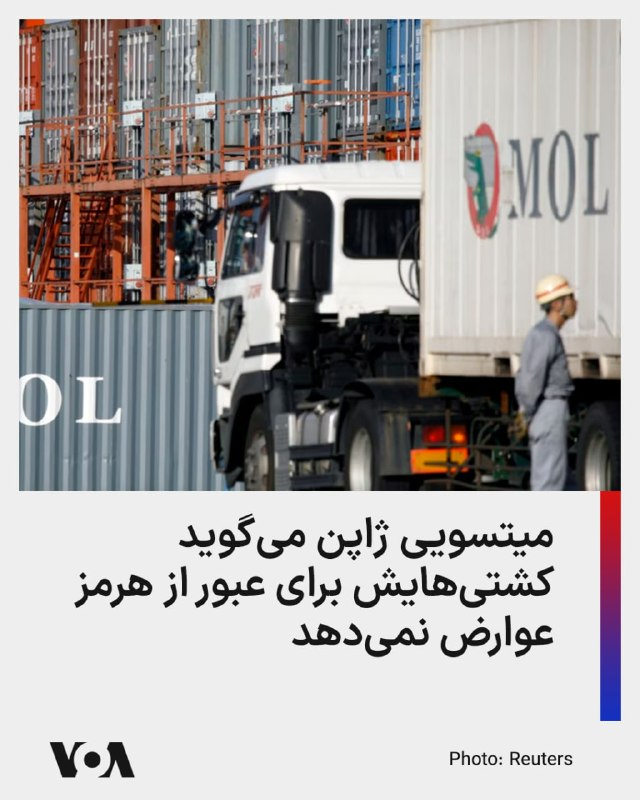

کشتی‌رانی میتسویی ژاپن می‌گوید برای عبور سه کشتی این شرکت از تنگه هرمز در ماه گذشته عوارضی به جمهوری اسلامی پرداخت نکرده و به قوانین دریانوردی بین‌المللی متعهد مانده است.

سخنگوی شرکت میتسویی او.اس.کی. لاینز ژاپن به رویترز گفته است هنوز هم چندین کشتی متعلق به آن در خلیج فارس گرفتار هستند، اما این شرکت در آینده نیز قصد پرداخت هیچ عوارضی به جمهوری اسلامی ندارد.

جمهوری اسلامی تنگه هرمز را مسدود کرده و از کشتی‌های عبوری عوارض طلب می‌کند؛ موضوعی که سازمان بین‌المللی دریانوردی آن را «رویه‌ای خطرناک» خوانده و دولت آمریکا تهدید کرده کشتی‌هایی که به رژیم حکم ایران عوارض و باج دهند، تحریم خواهند شد.
@FarsiVOA

## configx2ray — post 38625

بعد از سالیان سال ما هم یه سرور اختصاصی بدیم بهتون 
😈 چهار عدد سرور اختصاصی 6 گیگابایتی موجوده 
👍 بدونه ضریب و بدونه قطعی 
⚡️ همراه با ساب اختصاصی
⚡️ اینم با معذرت کامل تقدیم میشه 1500 تومان 
💖 کسی نیاز داشت میتونه پیام بده بفرستم بهش 
❤️ ایدی جهت خرید : Id…

## configx2ray — post 38624

بعد از سالیان سال ما هم یه سرور اختصاصی بدیم بهتون 
😈

چهار عدد سرور اختصاصی 6 گیگابایتی موجوده 
👍
بدونه ضریب و بدونه قطعی 
⚡️

همراه با ساب اختصاصی
⚡️

اینم با معذرت کامل تقدیم میشه 1500 تومان 
💖

کسی نیاز داشت میتونه پیام بده بفرستم بهش 
❤️

ایدی جهت خرید :

Id : @Mehrabhabo 
🌟

## alonews — post 118588

  <a href="telegram/content/alonews_118588_1778224360.webm">🎬 Download video</a>

👈هشدار سازمان جهانی بهداشت درباره احتمال گسترش محدود هانتاویروس پس از مرگ چند مسافر در کشتی کروز

✅ @AloNews خبر جنگ

---
📅 بروزرسانی: 1405/02/18 10:34
---

## VahidOOnLine — post 238818

  <a href="telegram/content/VahidOOnLine_238818_1778223884.mp4">🎬 Download video</a>

ویدیویی به ایران اینترنشنال رسیده که نشان می‌دهد بستگان و خانواده ساسان آزادوار جونقانی، جوان ورزشکار معترض که در انقلاب دی‌ماه بازداشت و روز پنجشنبه اخیر اعدام شد، بر مزار او شعار می‌دهند: «ساسان جونقانی، افتخار جهانی». حکم در تاریخ ۳۱ فروردین به وکیل او ابلاغ شده و آزادور در زندان دستگرد اصفهان نگهداری می‌شود.
او سابقه قهرمانی در مسابقات استانی اصفهان را در کارنامه دارد.
‌🏁 🇬🇧 IranintlTV

🤖 @VahidOOnLine

## VahidOOnLine — post 238817

  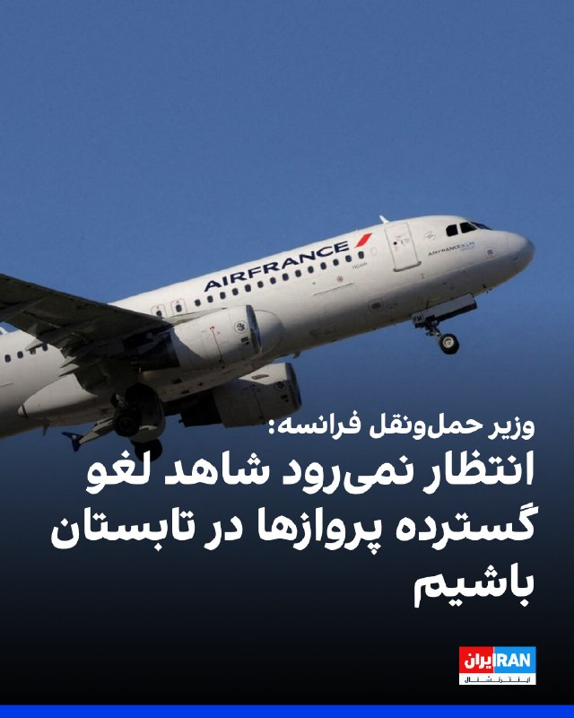

فیلیپ تابارو، وزیر حمل‌ونقل فرانسه، در واکنش به ادامه بحران انرژی ناشی از جنگ ایران اعلام کرد انتظار نمی‌رود در تابستان موج گسترده‌ای از لغو پروازها رخ دهد.

بونگ‌بونگ مارکوس، رییس‌جمهوری فیلیپین، نیز خبر داد سران کشورهای جنوب شرق آسیا جمعه در نشستی غیرعلنی، درباره توانایی بلوک آسه‌آن برای کاهش اختلال در عرضه نفت و مهار نوسان قیمت‌ها گفت‌وگو کردند.
‌🏁 🇬🇧 IranintlTV

🤖 @VahidOOnLine

## IranIntlTV — post 336088

  <a href="telegram/content/IranIntlTV_336088_1778223887.mp4">🎬 Download video</a>

ویدیویی به ایران اینترنشنال رسیده که نشان می‌دهد بستگان و خانواده ساسان آزادوار جونقانی، جوان ورزشکار معترض که در انقلاب دی‌ماه بازداشت و روز پنجشنبه اخیر اعدام شد، بر مزار او شعار می‌دهند: «ساسان جونقانی، افتخار جهانی». حکم در تاریخ ۳۱ فروردین به وکیل او ابلاغ شده و آزادور در زندان دستگرد اصفهان نگهداری می‌شود.
او سابقه قهرمانی در مسابقات استانی اصفهان را در کارنامه دارد.

## IranIntlTV — post 336087

  <a href="https://t.me/IranintlTV/336087">📎 Download file</a>

🎧نسخه صوتی اخبار بامدادی | جمعه ۱۸ اردیبهشت
@iranintlTV

## FarsiVOA — post 217163

🔺تلاش پاکستان برای بازگرداندن خدمه دیگر کشتی‌های توقیف‌شده به ایران

▪️وزیر خارجه پاکستان از تلاش برای بازگرداندن خدمه کشتی‌های توقیف‌شده از سوی آمریکا در نزدیکی آب‌های سنگاپور خبر داد.

▪️محمد اسحاق دار روز جمعه گفت که در گفت‌وگو با همتای سنگاپوری‌اش خواستار «تسهیل رسیدگی به وضعیت رفاهی و بازگرداندن ۱۱ ملوان پاکستانی و ۲۰ ملوان ایرانی» شده که در این کشتی‌ها حضور دارند.

▪️وزیر خارجه پاکستان نامی از کشتی‌هایی که اکنون مورد بحث است، ذکر نکرده، اما اوایل اردیبهشت، وزارت جنگ آمریکا از ورود نیروهای نظامی ایالات متحده به عرشه نفتکش «تیفانی» مرتبط با جمهوری اسلامی در منطقه هند-آرام و توقیف کشتی و خدمه آن خبر داد.

⬇️ بیشتر بخوانید:
https://ir.voanews.com/a/8147952.html

## BBCPersian — post 280484

  <a href="telegram/content/BBCPersian_280484_1778223889.mov">🎬 Download video</a>

🔻این هفته در پرگار: شکل نظام سیاسی، موضوعی فرعی؟

🔻آیا شکل یک نظام سیاسی مهم نیست و آنچه اهمیت دارد مضمون آن است؟ آیا مفهوم مشروطه جواب این سوال را می‌دهد؟

میهمان‌ها:
فرزانه بذرپور، تحلیل‌گر سیاسی
دامون گلریز، تحلیل‌گر سیاسی
 
@BBCPersian

## BBCPersian — post 280483

  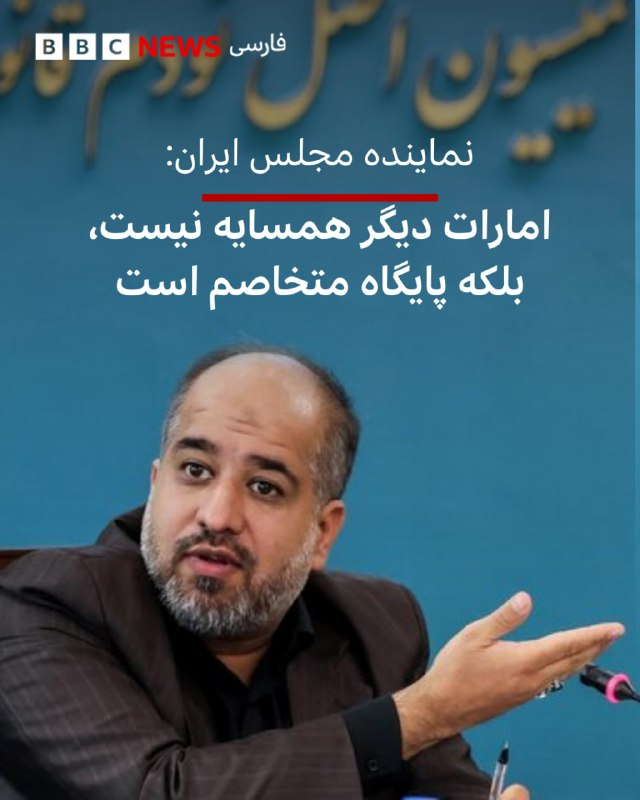

🔻علی خضریان، عضو کمیسیون امنیت ملی مجلس ایران گفته است که امارات متحده عربی همکارهای نظامی و اطلاعاتی مهمی را در جریان جنگ علیه ایران انجام داد و حتی «شائبه جدی وجود دارد که هواپیماهای امارات متحده عربی، با پاک کردن پرچم، مستقیما به خاک ایران حمله کرده‌اند.»

این نماینده مجلس گفته است که «معادله امنیتی جمهوری اسلامی در مورد اقلیم کردستان، مشمول امارات هم شده است و آن‌ها باید هر لحظه منتظر باشند همان طور که پایگاه‌های دشمن در اربیل هدف قرار می‌گیرد، پایگاه‌های متخاصم هم در امارات هدف حمله قرار بگیرد.»

به گفته او جمهوری اسلامی دیگر امارات را به چشم همسایه نمی‌بیند، بلکه آن‌ها «پایگاه متخاصم» هستند.

ایران از زمان شروع جنگ در بیش از دو ماه گذشته بارها پایگاه‌ها و مناطق دیگر امارات را هدف حملات پهپادی و موشکی قرار داده است.

📷Isna
@BBCPersian

## configx2ray — post 38623

هرچیزی که رایگانه براتون وصله رو دایرکت چنل بفرستید تا متود برداری کنیم و از روش سرور بسازیم بزاریم چنل استفادع کنید فقط رایگان هارو بفرستید دمتون گرم دایرکت چنل : http://t.me/ConfigX2ray?direct

## configx2ray — post 38622

هرچیزی که رایگانه براتون وصله رو دایرکت چنل بفرستید تا متود برداری کنیم و از روش سرور بسازیم بزاریم چنل استفادع کنید

فقط رایگان هارو بفرستید دمتون گرم
دایرکت چنل :
http://t.me/ConfigX2ray?direct

## configx2ray — post 38621

  <a href="telegram/content/configx2ray_38621_1778223891.webm">🎬 Download video</a>

vless://7ef9fbc7-0fd8-475b-8a84-1c87e7d37dd1@94.182.157.70:8080?path=%2F&security=none&encryption=none&host=s11.mn-g.ir&type=ws#https://t.me/ConfigX2ray

ترکیبی با سایفون وصله 
✅

آموزش استفادع : 
👇
https://t.me/ConfigX2ray0/1665

Channel : https://t.me/ConfigX2ray

## configx2ray — post 38620

😈

## alonews — post 118587

  <a href="telegram/content/alonews_118587_1778223892.webm">🎬 Download video</a>

👈یک توییت میلیونی جالب که در سال ۲۰۲۲، منتشر شده بود مورد توجه کاربران قرار گرفت:

🔴۲۰۲۳: کرونا تموم شد

🔴۲۰۲۶: هانتاویروس

✅ @AloNews خبر جنگ

## alonews — post 118586

  <a href="telegram/content/alonews_118586_1778223892.webm">🎬 Download video</a>

👈ان‌بی‌سی نیوز درباره وزارت خارجه آمریکا: از دولت جدید عراق می‌خواهیم روابط خود را با گروه‌های مرتبط با ایران قطع کند.

🔴در حال حاضر یک خط جدایی نامشخص بین دولت عراق و شبه‌نظامیان مرتبط با ایران وجود دارد

✅ @AloNews خبر جنگ

---
📅 بروزرسانی: 1405/02/18 10:22
---

## VahidOOnLine — post 238816

  <a href="https://raw.githubusercontent.com/ali-exifit/aio-downloader/refs/heads/main/telegram/content/VahidOOnLine_238816_1778223146.mp4">🎬 Download video</a>

دونالد ترامپ در پیامی در شبکه اجتماعی تروث سوشال اعلام کرد سه ناوشکن آمریکایی «با موفقیت کامل» از تنگه هرمز عبور کرده‌اند؛ در حالی که به گفته او، تحت حمله نیروهای ایرانی قرار داشتند.
ترامپ مدعی شد هیچ آسیبی به ناوشکن‌های آمریکایی وارد نشده، اما «حمله‌کنندگان ایرانی به‌طور کامل نابود شدند» و چندین قایق تندرو نیز غرق شده‌اند.
او همچنین گفت موشک‌های شلیک‌شده به سمت ناوشکن‌ها رهگیری و پهپادهای مهاجم در آسمان منهدم شده‌اند.
رئیس‌جمهوری آمریکا در ادامه رهبران جمهوری اسلامی را «دیوانه» توصیف کرد و هشدار داد اگر تهران توافق مورد نظر واشینگتن را «سریع» امضا نکند، آمریکا در آینده «بسیار شدیدتر و خشن‌تر» پاسخ دادیم.
‌🏁 🇬🇧 ManotoTV

🤖 @VahidOOnLine

## VahidOOnLine — post 238815

  

غلامحسین محسنی اژه‌ای، رییس قوه قضاییه جمهوری اسلامی، در اظهاراتی تهدیدآمیز نوشت «عناصر خائن به وطن» قاطعانه محاکمه و مجازات خواهند شد و افزود در این مسیر «از سرزنش سرزنشگران» ابایی ندارد.

او اضافه کرد: «با جدیت تمام از نیروهای جان بر کف امنیتی و اطلاعاتی کشور و عموم ضابطین در تعقیب و دستگیری جواسیس، نفوذی‌ها و خائنین، حمایت و پشتیبانی می‌کنیم.»
‌🏁 🇬🇧 IranintlTV

🤖 @VahidOOnLine

## VahidOOnLine — post 238814

  

♦️قیمت نفت در معاملات روز جمعه ۱۸ اردیبهشت ماه و پس از درگیری تازه میان نیروهای آمریکا و جمهوری اسلامی ایران در تنگه هرمز، افزایش یافت.
به گزارش آسوشیتدپرس، بهای نفت برنت (شاخص بین‌المللی نفت) با افزایش ۱.۱">۱.۱ درصدی به ۱۰۱ دلار و ۱۳ سنت در هر بشکه رسید. قیمت نفت برنت پیش از آغاز جنگ ایران در اواخر ماه فوریه، حدود ۷۰ دلار در هر بشکه بود.
نفت خام آمریکا نیز ۰.۷ درصد افزایش یافت و به ۹۵ دلار و ۴۷ سنت در هر بشکه رسید.
همزمان بازارهای سهام آسیا نیز تحت تاثیر تحولات شب گذشته در تنگه هرمز سقوط کردند. شاخص نیکی ژاپن ۱.۱">۱.۱ درصد افت کرد و سهام سافت‌بنک بیش از پنج درصد کاهش یافت. شاخص‌های کوسپی کره جنوبی، هنگ‌سنگ هنگ‌کنگ، شانگهای چین، تایکس تایوان، سنسکس هند و اس‌اندپی/ای‌اس‌ایکس ۲۰۰ استرالیا نیز بین ۰.۳ تا ۱.۷ درصد کاهش داشتند.
‌🇸🇦 Indypersian

🤖 @VahidOOnLine

## IranIntlTV — post 336086

  

فیلیپ تابارو، وزیر حمل‌ونقل فرانسه، در واکنش به ادامه بحران انرژی ناشی از جنگ ایران اعلام کرد انتظار نمی‌رود در تابستان موج گسترده‌ای از لغو پروازها رخ دهد.

بونگ‌بونگ مارکوس، رییس‌جمهوری فیلیپین، نیز خبر داد سران کشورهای جنوب شرق آسیا جمعه در نشستی غیرعلنی، درباره توانایی بلوک آسه‌آن برای کاهش اختلال در عرضه نفت و مهار نوسان قیمت‌ها گفت‌وگو کردند.
https://iranintl.com/202605086536

## IranIntlTV — post 336085

  <a href="https://raw.githubusercontent.com/ali-exifit/aio-downloader/refs/heads/main/telegram/content/IranIntlTV_336085_1778223149.mp4">🎬 Download video</a>

یک شبکه خبری چینی تایید کرد یک نفتکش این کشور در سواحل امارات هدف حمله قرار گرفته است. این نخستین حمله به یک نفتکش چینی در منطقه به شمار می‌رود. آمریکا پیش‌تر جمهوری اسلامی را عامل رویداد مشابه معرفی کرده بود.

توماج طاهباز، خبرنگار ایران‌اینترنشنال، گزارش می‌دهد
@iranintltv

## IranIntlTV — post 336084

  

غلامحسین محسنی اژه‌ای، رییس قوه قضاییه جمهوری اسلامی، در اظهاراتی تهدیدآمیز نوشت «عناصر خائن به وطن» قاطعانه محاکمه و مجازات خواهند شد و افزود در این مسیر «از سرزنش سرزنشگران» ابایی ندارد.

او اضافه کرد: «با جدیت تمام از نیروهای جان بر کف امنیتی و اطلاعاتی کشور و عموم ضابطین در تعقیب و دستگیری جواسیس، نفوذی‌ها و خائنین، حمایت و پشتیبانی می‌کنیم.»
https://iranintl.com/202605080524

## ManotoTV — post 105118

  <a href="https://raw.githubusercontent.com/ali-exifit/aio-downloader/refs/heads/main/telegram/content/ManotoTV_105118_1778223151.mp4">🎬 Download video</a>

دونالد ترامپ در پیامی در شبکه اجتماعی تروث سوشال اعلام کرد سه ناوشکن آمریکایی «با موفقیت کامل» از تنگه هرمز عبور کرده‌اند؛ در حالی که به گفته او، تحت حمله نیروهای ایرانی قرار داشتند.
ترامپ مدعی شد هیچ آسیبی به ناوشکن‌های آمریکایی وارد نشده، اما «حمله‌کنندگان ایرانی به‌طور کامل نابود شدند» و چندین قایق تندرو نیز غرق شده‌اند.
او همچنین گفت موشک‌های شلیک‌شده به سمت ناوشکن‌ها رهگیری و پهپادهای مهاجم در آسمان منهدم شده‌اند.
رئیس‌جمهوری آمریکا در ادامه رهبران جمهوری اسلامی را «دیوانه» توصیف کرد و هشدار داد اگر تهران توافق مورد نظر واشینگتن را «سریع» امضا نکند، آمریکا در آینده «بسیار شدیدتر و خشن‌تر» پاسخ دادیم.

## Persian_Trend_Official — post 13664

🔴 خلاصه آخرین تحولات منطقه و تنگه هرمز

▪️ وزارت دفاع امارات اعلام کرد صداهای انفجار شنیده‌شده در نقاط مختلف کشور ناشی از عملیات رهگیری و مقابله با موشک‌ها و پهپادهای شلیک‌شده از سوی ایران بوده است.

▪️ رسانه‌های ایرانی گزارش دادند پس از درگیری دریایی میان نیروهای ایران و آمریکا و حملات هوایی آمریکا، وضعیت در جزایر و مناطق ساحلی اطراف تنگه هرمز «تثبیت شده» است.

▪️ دونالد ترامپ درباره درگیری‌های اخیر گفت:
«آن‌ها با ما درافتادند؛ ما هم نابودشان کردیم.»
او در عین حال مدعی شد مذاکرات برای پایان جنگ «بسیار خوب» پیش می‌رود.

▪️ رئیس‌جمهور فیلیپین، «فردیناند مارکوس جونیور»، اعلام کرد اتحادیه آسه‌آن در برابر بی‌ثباتی ناشی از جنگ خاورمیانه، موضعی متحد و هماهنگ حفظ کرده است.

▪️ قیمت نفت پس از درگیری‌های آمریکا و ایران در تنگه هرمز جهش کرد؛ به‌طوری‌که نفت برنت در معاملات پرتلاطم پنج‌شنبه تا ۷.۵٪ افزایش یافت، هرچند با آغاز بازارهای آسیایی بخشی از رشد خود را از دست داد.

▪️ بازار سهام کره‌جنوبی نیز صبح جمعه تحت تأثیر افزایش تنش‌های نظامی میان ایران و آمریکا وارد فاز نزولی شد.

🫆:Tony

📌 @persian_trend_official
پرشین ترند | متفاوت‌ترین کانال نظامی

## manototv — post 105118

  <a href="https://raw.githubusercontent.com/ali-exifit/aio-downloader/refs/heads/main/telegram/content/manototv_105118_1778223152.mp4">🎬 Download video</a>

دونالد ترامپ در پیامی در شبکه اجتماعی تروث سوشال اعلام کرد سه ناوشکن آمریکایی «با موفقیت کامل» از تنگه هرمز عبور کرده‌اند؛ در حالی که به گفته او، تحت حمله نیروهای ایرانی قرار داشتند.
ترامپ مدعی شد هیچ آسیبی به ناوشکن‌های آمریکایی وارد نشده، اما «حمله‌کنندگان ایرانی به‌طور کامل نابود شدند» و چندین قایق تندرو نیز غرق شده‌اند.
او همچنین گفت موشک‌های شلیک‌شده به سمت ناوشکن‌ها رهگیری و پهپادهای مهاجم در آسمان منهدم شده‌اند.
رئیس‌جمهوری آمریکا در ادامه رهبران جمهوری اسلامی را «دیوانه» توصیف کرد و هشدار داد اگر تهران توافق مورد نظر واشینگتن را «سریع» امضا نکند، آمریکا در آینده «بسیار شدیدتر و خشن‌تر» پاسخ دادیم.

## alonews — post 118585

  <a href="https://raw.githubusercontent.com/ali-exifit/aio-downloader/refs/heads/main/telegram/content/alonews_118585_1778223152.webm">🎬 Download video</a>

👈وزارت دفاع امارات: پدافند هوایی امارات در حال حاضر با حملات موشکی و پهپادی از ایران مقابله می‌کند

🔴 صداهای شنیده شده در مناطق مختلف امارات نتیجه مقابله سامانه‌های پدافند هوایی امارات با موشک‌های بالستیک، کروز و پهپادها است.

✅ @AloNews خبر جنگ

<!-- MSG END -->
<!-- NAV START -->
[صفحه بعد](https://github.com/ali-exifit/aio-downloader/blob/main/telegram/content/archive_1.md)
<!-- NAV END -->
