# خواننده تلگرام

<!-- MSG START -->
## 1405/02/17 19:59 — VahidOOnLine
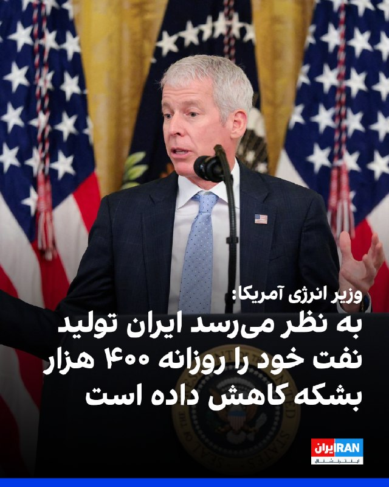

> کریس رایت، وزیر انرژی آمریکا، در مصاحبه با فاکس نیوز اعلام کرد به نظر می‌رسد ایران تولید نفت خود را روزانه ۴۰۰ هزار بشکه کاهش داده است.
> 
> پیشتر مارکو روبیو، وزیر خارجه آمریکا اعلام کرد که اقدامات این کشور علیه جمهوری اسلامی مستقیما منابع اصلی درآمدی رژیم را هدف قرار می‌دهد.
> 
> او درباره محاصره دریایی علیه جمهوری اسلامی گفت که این کار «به‌تنهایی روزانه تا ۵۰۰ میلیون دلار از درآمد ایران را از بین می‌برد.»
> ‌🏁 🇬🇧 IranintlTV
> 
> 🤖 @VahidOOnLine

## 1405/02/17 19:56 — VahidOOnLine

> واشینگتن‌پست گزارش داد که یک ارزیابی محرمانه جامعه اطلاعاتی که به کاخ سفید ارائه شده، نتیجه گرفته که جمهوری اسلامی می‌تواند ماه‌ها در برابر محاصره دوام بیاورد و همچنان زرادخانه قابل‌توجهی از موشک‌ها و پهپادها را حفظ کرده است.
> 
> چهار فرد آگاه به این روزنامه گفته‌اند که یک تحلیل محرمانه سازمان سیا که این هفته به سیاست‌گذاران دولت آمریکا ارائه شد، نتیجه گرفته است که ایران می‌تواند دست‌کم سه تا چهار ماه در برابر محاصره دریایی آمریکا دوام بیاورد، پیش از آنکه با دشواری‌های اقتصادی شدیدتر روبه‌رو شود.
> 
> واشینگتن‌پست نوشت که این ارزیابی ظاهرا پرسش‌های تازه‌ای درباره خوش‌بینی دونالد ترامپ، رییس‌جمهور آمریکا نسبت به پایان دادن به جنگ مطرح می‌کند.
> 
> یک مقام آمریکایی گفت جمهوری اسلامی حدود ۷۵ درصد از موجودی پرتابگرهای متحرک خود و حدود ۷۰ درصد از ذخایر موشکی پیش از جنگش را حفظ کرده است.
> 
> این مقام گفت شواهدی وجود دارد که حکومت ایران توانسته تقریبا همه تاسیسات ذخیره‌سازی زیرزمینی خود را بازیابی و بازگشایی کند، برخی موشک‌های آسیب‌دیده را تعمیر کند و حتی تعدادی موشک جدید را که هنگام آغاز جنگ تقریبا تکمیل شده بودند، مونتاژ کند.
> ‌🏁 🇬🇧 IranintlTV
> 
> 🤖 @VahidOOnLine

## 1405/02/17 19:55 — VahidOOnLine
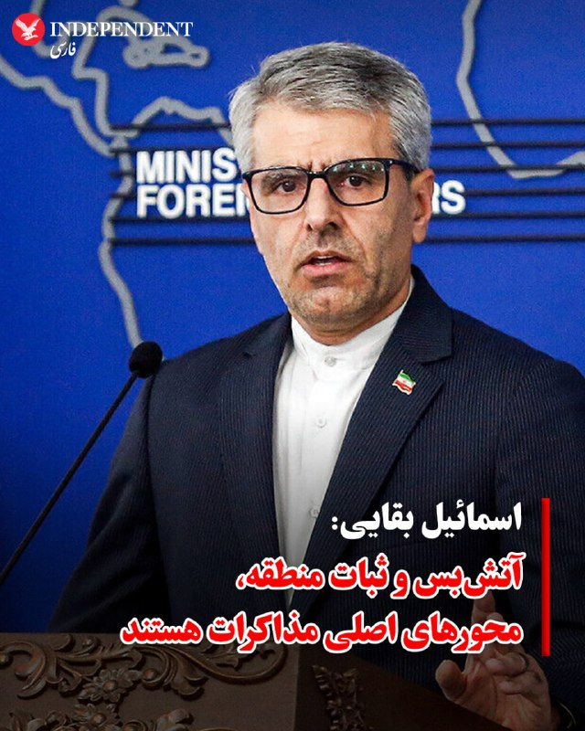

> ♦️ اسماعیل بقایی، سخنگوی وزارت امور خارجه ایران، روز پنجشنبه، ۱۷ اردیبهشت، اعلام کرد که مهم‌ترین موضوعات مورد بحث در حال حاضر، برقراری آتش‌بس، تلاش برای پایان دادن به جنگ و «صلح و ثبات در منطقه» است. این در حالی است که ایالات متحده، تاکید دارد که مسئله برنامه هسته‌ای جمهوری اسلامی و ذخایر اورانیوم غنی‌سازی شده ۶۰ درصدی باید در دستور کار مذاکرات قرار گیرد.
> 
> بقایی در گفتگو با خبرگزاری دولتی ایرنا گفت که جمهوری اسلامی همچنان در حال بررسی پیشنهاد ایالات متحده است و پس از نهایی شدن بررسی‌ها، تصمیم مقتضی اتخاذ خواهد شد. او افزود پس از اتخاذ تصمیم، مراتب به میانجی‌های پاکستانی ابلاغ می‌شود و بر اساس نتایج این تبادل پیام‌ها، گام‌های بعدی تعیین خواهد شد.
> ‌🇸🇦 Indypersian
> 
> 🤖 @VahidOOnLine

## 1405/02/17 19:53 — mwarmonitor

> 🇮🇱پس از تحقیقات اطلاعاتی، ارتش اسرائیل (IDF) تأیید کرد که یکی از تروریست‌هایی که در ربودن «مایا شم» در کشتار خونین ۷ اکتبر مشارکت داشت، کشته شده است.
> 
> ❌این تروریست، ابراهیم ابو زَکَر، که عضو حماس بود و هم‌زمان به‌عنوان امدادگر فعالیت می‌کرد، در یک حمله هوایی از پای درآمد.
> 
> 🔸به گفته ارتش اسرائیل، ابو زکر در جریان کشتار خونین ۷ اکتبر وارد خاک اسرائیل شد و پس از آنکه مایا شم از جشنواره نووا گریخته بود، در منطقه پَلسیم در ربودن او مشارکت داشت.
> 
> @mwarmonitor

## 1405/02/17 19:57 — pm_afshaa
> 🔴رویترز: توقف حملات اسرائیل در لبنان یکی از خواسته‌های کلیدی ایران در مذاکرات با واشنگتن است
> 
> 
> 💧 Rainbet.com the #1 Non-KYC Crypto Casino & Sportsbook @rainbetcom
> 
> 😁 @Pm_Afshaa

## 1405/02/17 19:52 — pm_afshaa
> 🔴وزارت خزانه‌داری آمریکا: محاصره دریایی به ما اجازه می‌دهد تا مستقیماً منبع اصلی درآمد رژیم ایران را هدف قرار دهیم
> 
> 
> 💧 Rainbet.com the #1 Non-KYC Crypto Casino & Sportsbook @rainbetcom
> 
> 😁 @Pm_Afshaa

## 1405/02/17 19:59 — IranIntlTV

> کریس رایت، وزیر انرژی آمریکا، در مصاحبه با فاکس نیوز اعلام کرد به نظر می‌رسد ایران تولید نفت خود را روزانه ۴۰۰ هزار بشکه کاهش داده است.
> 
> پیشتر مارکو روبیو، وزیر خارجه آمریکا اعلام کرد که اقدامات این کشور علیه جمهوری اسلامی مستقیما منابع اصلی درآمدی رژیم را هدف قرار می‌دهد.
> 
> او درباره محاصره دریایی علیه جمهوری اسلامی گفت که این کار «به‌تنهایی روزانه تا ۵۰۰ میلیون دلار از درآمد ایران را از بین می‌برد.»
> https://iranintl.com/202605074916

## 1405/02/17 19:55 — IranIntlTV
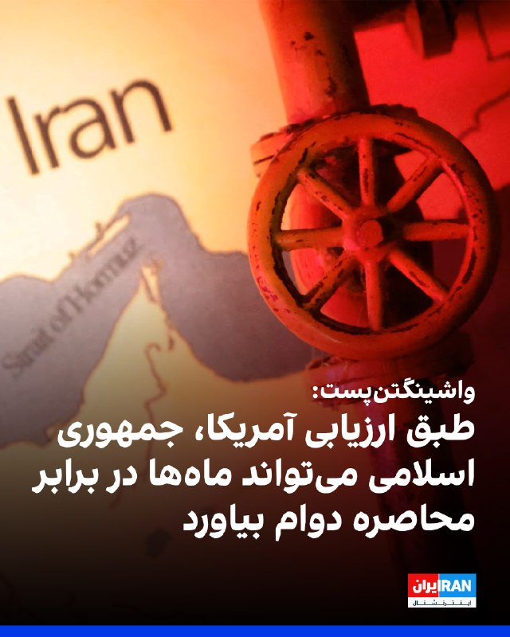

> واشینگتن‌پست گزارش داد که یک ارزیابی محرمانه جامعه اطلاعاتی که به کاخ سفید ارائه شده، نتیجه گرفته که جمهوری اسلامی می‌تواند ماه‌ها در برابر محاصره دوام بیاورد و همچنان زرادخانه قابل‌توجهی از موشک‌ها و پهپادها را حفظ کرده است.
> 
> چهار فرد آگاه به این روزنامه گفته‌اند که یک تحلیل محرمانه سازمان سیا که این هفته به سیاست‌گذاران دولت آمریکا ارائه شد، نتیجه گرفته است که ایران می‌تواند دست‌کم سه تا چهار ماه در برابر محاصره دریایی آمریکا دوام بیاورد، پیش از آنکه با دشواری‌های اقتصادی شدیدتر روبه‌رو شود.
> 
> واشینگتن‌پست نوشت که این ارزیابی ظاهرا پرسش‌های تازه‌ای درباره خوش‌بینی دونالد ترامپ، رییس‌جمهور آمریکا نسبت به پایان دادن به جنگ مطرح می‌کند.
> 
> یک مقام آمریکایی گفت جمهوری اسلامی حدود ۷۵ درصد از موجودی پرتابگرهای متحرک خود و حدود ۷۰ درصد از ذخایر موشکی پیش از جنگش را حفظ کرده است.
> 
> این مقام گفت شواهدی وجود دارد که حکومت ایران توانسته تقریبا همه تاسیسات ذخیره‌سازی زیرزمینی خود را بازیابی و بازگشایی کند، برخی موشک‌های آسیب‌دیده را تعمیر کند و حتی تعدادی موشک جدید را که هنگام آغاز جنگ تقریبا تکمیل شده بودند، مونتاژ کند.

## 1405/02/17 19:57 — Shin_Persian
> Shin ✓ @hey_itsmyturn
> Thu, 07 May 2026 16:27:46 UTC
> 
> NOW @ 1627Z -
> Jet activity over Baghdad, #Iraq 🇮🇶
> 
> فارسی
> 
> هم‌اکنون در ۱۶۲۷ زولو (۱۹:۵۷ به وقت تهران) -
> فعالیت جت‌ها بر فراز بغداد، #Iraq 🇮🇶
> 
> 𝕏 · @shin_persian

## 1405/02/17 20:00 — Persian_Trend_Official
> نایا🔴 نخستین مورد ابتلا به ویروس هانتا در اسرائیل ثبت شد مقام‌های اسرائیلی اعلام کردند نخستین مورد ابتلا به ویروس «هانتا» در این کشور شناسایی شده است. بر اساس گزارش‌ها، فرد مبتلا اخیراً به اروپای شرقی سفر کرده بود و نتیجه آزمایش او برای این ویروس مثبت اعلام…

## ???-??-?? ??:?? (post 13602) — Persian_Trend_Official
[🎬 Video](telegram/content/Persian_Trend_Official_13602_1778171545.mp4)

> 💢استقبال دونالد ترامپ از رئیس حمهور برزیل در کاخ سفید
> 
> 🫆:Tony
> 
> 📌 @persian_trend_official
> پرشین ترند | متفاوت‌ترین کانال نظامی

## 1405/02/17 19:59 — BBCPersian

> ⭕️دیروز و امروز صفحه اینستاگرام بسیاری از چهره‌های پرطرفدار و حساب‌های پرمخاطب شاهد افت میلیونی دنبال‌کننده بود.
> 
> ‏اینستاگرام کریستیانو رونالدو که با ۶۶۶ میلیون دنبال‌کننده، پرطرفدارترین چهره در اینستاگرام است با افت بیش از ۶ میلیون فالوور و لیونل مسی و سلنا گومز پس از او هر کدام با ریزش حدود ۵ و ۶ میلیون فالوور روبرو شدند.
> 
> ‏بی‌بی سی درباره این تغییرات با متا، شرکت مادر اینستاگرام تماس گرفته است. میزان فالوورهای حساب خود اینستاگرام در این پلتفرم که پردنبال‌کننده‌ترین صفحه در اینستاگرام است، حدود ۱۱ میلیون ریزش کرده است.
> 
> ‏اینستاگرام دو روز پیش طرح بزرگی برای معرفی حساب‌های ویژه نوجوانان را راه‌ انداخت. این اقدام، همزمان شد با فشار ناشی از حکم «قانون خدمات دیجیتال» اتحادیه اروپا، ممنوعیت استفاده زیر ۱۶ سال در استرالیا و همچنین قطع دسترسی ده‌ها میلیون کاربر ایرانی و گزارش درآمد سه‌ماهه اول متا که نشان‌دهنده اولین کاهش کاربران روزانه در تاریخ این شرکت بود.
> 
> ‏به نظر می‌رسد این تحولات موجب شده تا متا یک پاکسازی گسترده انجام دهد و حساب‌های کاربری زیر سن، غیرفعال، بات و غیرواقعی را حذف کند.
> @bbcpersian

## 1405/02/17 19:50 — VahidOOnLine

> بنا به اطلاعات و گزارش‌های رسیده به ایران اینترنشنال، سپاه پاسداران سطح حفاظت استانداران و فرمانداران را در سراسر کشور در پی اعتراضات انقلاب ملی دی‌ماه و همچنین نگرانی ناشی از دور جدید اعتراضات افزایش داده است.
> طبق این اطلاعات، تعداد نیرو، سطح مراقبت و ساعات پوشش حفاظت استانداران در استان‌ها افزایش یافته است. همچنین برای فرمانداران تعداد محافظان در برخی موارد به دست کم دو نفر افزایش یافته است. این مسئله در مراسم و برنامه‌های عمومی که شهروندان در آن حضور داشته‌اند، مورد توجه قرار گرفته و واکنش داشته است.
> در جریان سرکوب‌های انقلاب دی‌ماه و شلیک ماموران به مردم از درون ساختمان‌های دولتی و عمومی، تعدادی از فرمانداری‌ها از جمله در گرگان، طارم، رامهرمز و آشخانه به آتش کشیده شدند.
> ‌🏁 🇬🇧 IranintlTV
> 
> 🤖 @VahidOOnLine

## 1405/02/17 19:43 — VahidOOnLine
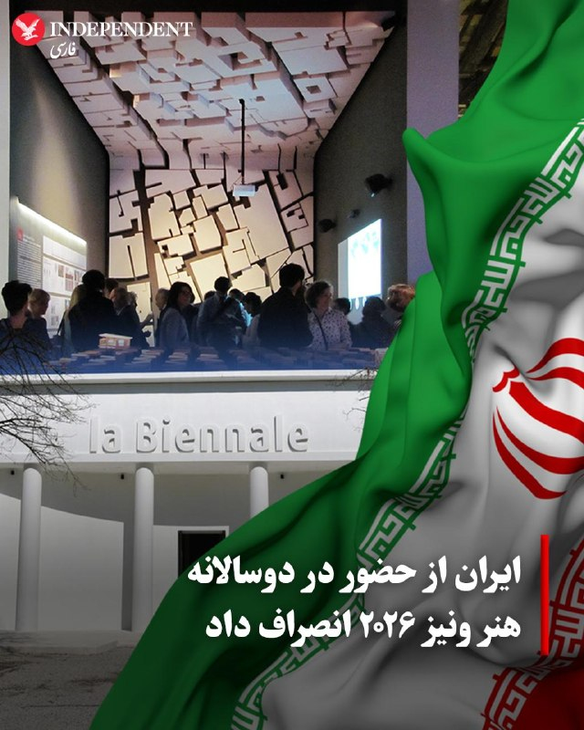

> ♦️در آستانه آغاز پیش‌نمایش‌های رسمی این دوره از دوسالانه هنر ونیز، مقامات این نمایشگاه اعلام کردند ایران از برپایی پاویون ملی خود انصراف داده است.
> 
> دوسالانه هنر ونیز ۲۰۲۶، یکی از مهم‌ترین رویدادهای هنر معاصر جهان، امسال از ۹ مه در ونیز ایتالیا آغاز می‌شود و تا ۲۲ نوامبر ادامه خواهد داشت؛ رویدادی که با حضور بیش از ۱۰۰ کشور و ده‌ها نمایشگاه و برنامه جانبی، از آن به‌عنوان «المپیک هنر معاصر» یاد می‌شود.
> 
> برگزارکنندگان اعلام کرده‌اند با وجود انصراف ایران، این دوره همچنان شامل ۱۰۰ مشارکت ملی خواهد بود.
> 
> ایران در دو دهه گذشته تقریبا به‌طور مداوم در دوسالانه ونیز حضور داشته و آخرین‌بار نیز در دوره ۲۰۲۴ پاویون ملی خود را برگزار کرده بود.
> 
> در دوسالانه ونیز، هر کشور در غرفه یا پاویون اختصاصی خود آثار هنرمندان منتخبش را به نمایش می‌گذارد. نمایشگاه‌ها در نقاط مختلف شهر برگزار می‌شوند.
> 
> موضوع اصلی دوسالانه امسال «در گام‌های آرام» اعلام شده و بر مفاهیمی چون سکوت، حافظه، ظرافت و روایت‌های کمتر دیده‌شده تمرکز دارد.
> ‌🇸🇦 Indypersian
> 
> 🤖 @VahidOOnLine

## ???-??-?? ??:?? (post 8638) — mwarmonitor
[🎬 Video](telegram/content/mwarmonitor_8638_1778170953.mp4)

> ✈️🇺🇸عملیات بسیار گسترده ترابری هوایی نیروی هوایی ایالات متحده برای انتقال نیروهای بیشتر، مهمات و تجهیزات به خاورمیانه، امروز نیز با شدت بالا ادامه یافت؛ آن هم با وجود مطرح شدن صحبت‌ها درباره صلح و مذاکرات.
> 
> @mwarmonitor

## 1405/02/17 19:44 — pm_afshaa
> 🔴وزیر انرژی آمریکا : ایران تولید نفتش رو حدود 400 هزار بشکه در روز کم کرده
> 
> 
> 💧 Rainbet.com the #1 Non-KYC Crypto Casino & Sportsbook @rainbetcom
> 
> 😁 @Pm_Afshaa

## ???-??-?? ??:?? (post 87215) — kianmeli1
[🎬 Video](telegram/content/kianmeli1_87215_1778170957.mp4)

> 🔴فرمانده ارشد سپاه : ما از موشک‌های ده سال پیش استفاده کردیم
> https://t.me/kianmeli1

## 1405/02/17 19:50 — IranIntlTV

> بنا به اطلاعات و گزارش‌های رسیده به ایران اینترنشنال، سپاه پاسداران سطح حفاظت استانداران و فرمانداران را در سراسر کشور در پی اعتراضات انقلاب ملی دی‌ماه و همچنین نگرانی ناشی از دور جدید اعتراضات افزایش داده است.
> طبق این اطلاعات، تعداد نیرو، سطح مراقبت و ساعات پوشش حفاظت استانداران در استان‌ها افزایش یافته است. همچنین برای فرمانداران تعداد محافظان در برخی موارد به دست کم دو نفر افزایش یافته است. این مسئله در مراسم و برنامه‌های عمومی که شهروندان در آن حضور داشته‌اند، مورد توجه قرار گرفته و واکنش داشته است.
> در جریان سرکوب‌های انقلاب دی‌ماه و شلیک ماموران به مردم از درون ساختمان‌های دولتی و عمومی، تعدادی از فرمانداری‌ها از جمله در گرگان، طارم، رامهرمز و آشخانه به آتش کشیده شدند.
> https://iranintl.com/202605078132

## 1405/02/17 19:51 — DW_Farsi
> 🔶 سی‌‌ان‌ان: ایران برای عبور از تنگه هرمز قوانین جدیدی وضع کرده است
> 
> "سی‌ان‌ان" می‌گوید، بنا بر سندی که به رؤیت این شبکه خبری آمریکایی رسیده، ایران دستورالعمل و قوانین جدیدی را برای کشتی‌هایی که قصد عبور از تنگه هرمز دارند وضع کرده است.
> 
> طبق خبری که سی‌ان‌ان روز پنج‌شنبه ۱۷ اردیبهشت منتشر کرده، این سند شامل یک فرم درخواستی است که توسط مرجع تنگه خلیج فارس (Persian Gulf Strait Authority - PGSA) صادر شده و تمام کشتی‌های عبوری از این تنگه را ملزم می‌کند، به منظور تضمین تردد ایمن آن را پر کنند.
> 
> سی‌ان‌ان می‌گوید، این سند را از ریچارد مید، سردبیر خبرگزاری تحلیل داده‌های دریایی "لویدز لیست" و یک منبع دیگر که نخواست نامش فاش شود دریافت کرده است.
> 
> این فرم شامل بیش از ۴۰ پرسش است و هر کشتی را ملزم می‌کند تا علاوه بر برخی جزئیات، نام، شماره شناسایی، نام قبلی و کشور مبدأ و مقصد خود را اعلام کند. همچنین در مورد ملیت مالک ثبت‌شده، مدیر و خدمه کشتی نیز سئوالاتی مطرح شده است.
> 
> در پی دور دوم حملات اسرائيل و آمریکا که از نهم اسفند در ایران آغاز شد جمهوری اسلامی اعلام کرد که عبور از تنگه هرمز را برای کشتی‌های مرتبط با این دو کشور محدود خواهد کرد.
> 
> ریچارد مید با اشاره به فهرست پرسش‌های مندرج در فرم یادشده به سی‌ان‌‌ان گفت، این فهرست "بسیار شبیه به سئوالاتی است که می‌دانستیم، پیش از این هم از مالکان کشتی‌ها پرسیده می‌شد."
> 
> او ادامه داد: «اما این اقدام به این ساختار رسمیت می‌بخشد و به نظر می‌رسد حرکتی از سوی ایران برای عادی‌سازی اقتدار خود بر رفت‌وآمدهای دریایی باشد.»
> 
> این در حالیست که پیش از نهم اسفند و شروع دور دوم جنگ اسرائيل و آمریکا علیه جمهوری اسلامی، کشتی‌ها برای عبور از تنگه هرمز مجبور به اشتراک‌گذاری هیچ‌گونه اطلاعاتی نبودند.
> 
> سی‌ان‌ان با اشاره به این که مرجع تنگه خلیج فارس (PGSA) به‌تازگی راه‌اندازی شده به گزارش شبکه "پرس‌تی‌وی" ایران اشاره می‌کند که در آن گفته شده که تحت این سیستم جدید، تمامی کشتی‌های عبوری از تنگه هرمز ایمیلی از آدرسی متعلق به PGSA دریافت می‌کنند که آن‌ها را از مقررات عبور مطلع می‌سازد.
> 
> در این ایمیل که توسط مید و یک منبع دیگر در اختیار سی‌ان‌ان گذاشته شده به کشتی‌های عبوری هشدار داده شده است که "ارائه اطلاعات کامل و دقیق برای پردازش درخواست عبور کشتی ضروری است" و "دستورالعمل‌های بعدی از طریق ایمیل ابلاغ خواهد شد."
> @dw_farsi

## 1405/02/17 19:46 — Persian_Trend_Official
> 🔴سید محمود نبویان عضو کمیسیون امنیت ملی مجلس:
> 
> 🔹با وجود سابقه‌ی بدعهدی آمریکا و به ویژه حضور اصحاب توافق ذلت بار برجام به‌همراه آقای قالیباف در مذاکرات، هیچ امیدی به مذاکره و توافق مطلوب برای ایران وجود ندارد.
> 
> 🔹لازم است آقای قالیباف اصحاب توافق خسارت بار برجام را از تیم مذاکره کننده کاملا حذف نماید.
> 
> 🫆:Tony
> 
> 📌 @persian_trend_official
> پرشین ترند | متفاوت‌ترین کانال نظامی

## 1405/02/17 19:44 — Persian_Trend_Official
> 🔴 شیوع مرموز هانتاویروس در کشتی کروز؛ نگرانی از انتقال انسان‌به‌انسان رسانه‌های بین‌المللی گزارش داده‌اند شیوع یک سویه خطرناک هانتاویروس در کشتی کروز «MV Hondius» در اقیانوس اطلس تاکنون دست‌کم ۳ کشته و چندین مبتلا بر جای گذاشته است. حدود ۱۵۰ نفر در این کشتی…

## 1405/02/17 19:43 — Persian_Trend_Official
> 🔴 شیوع مرموز هانتاویروس در کشتی کروز؛ نگرانی از انتقال انسان‌به‌انسان
> 
> رسانه‌های بین‌المللی گزارش داده‌اند شیوع یک سویه خطرناک هانتاویروس در کشتی کروز «MV Hondius» در اقیانوس اطلس تاکنون دست‌کم ۳ کشته و چندین مبتلا بر جای گذاشته است. حدود ۱۵۰ نفر در این کشتی حضور داشته‌اند.
> 
> بر اساس گزارش WHO و منابع درمانی:
> 
> ▪️ سویه شناسایی‌شده احتمالاً «Andes hantavirus» است؛ نادرترین و خطرناک‌ترین نوع هانتا که برخلاف اغلب سویه‌ها، در موارد محدود قابلیت انتقال انسان‌به‌انسان دارد.
> 
> ▪️ بازرسی‌های اولیه روی کشتی تاکنون شواهد مشخصی از حضور جوندگان پیدا نکرده؛ موضوعی که فرضیه انتقال مستقیم میان افراد را تقویت کرده است.
> 
> ▪️ چند کشور از پهلوگیری کامل کشتی جلوگیری کرده‌اند و عملیات ردیابی مسافران در چندین کشور آغاز شده است.
> 
> ▪️ سازمان جهانی بهداشت تأکید کرده خطر برای عموم مردم فعلاً «پایین» ارزیابی می‌شود و این وضعیت در حد یک پاندمی شبیه کووید نیست.
> 
> 
> 🫆:Tony
> 
> 📌 @persian_trend_official
> پرشین ترند | متفاوت‌ترین کانال نظامی

## 1405/02/17 19:49 — RadioFarda
> 🔸روزنامه واشینگتن‌پست روز پنجشنبه با انتشار گزارشی اعلام کرد که ارزیابی محرمانه سازمان اطلاعات مرکزی آمریکا (سی‌آی‌ای) نشان می‌دهد ایران پیش از آن که با مشکلات اقتصادی شدیدی روبرو شود، می‌تواند دست‌کم سه تا چهار ماه محاصره دریایی ایالات متحده را تحمل کند.…

## 1405/02/17 19:49 — RadioFarda
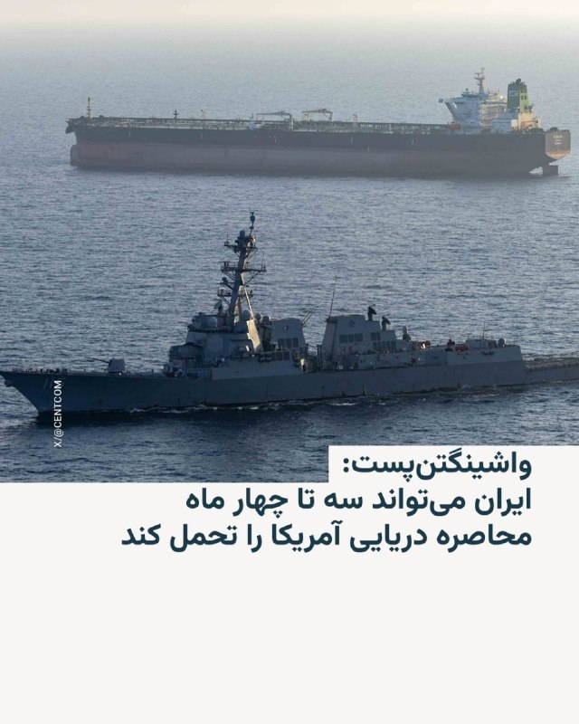

> 🔸روزنامه واشینگتن‌پست روز پنجشنبه با انتشار گزارشی اعلام کرد که ارزیابی محرمانه سازمان اطلاعات مرکزی آمریکا (سی‌آی‌ای) نشان می‌دهد ایران پیش از آن که با مشکلات اقتصادی شدیدی روبرو شود، می‌تواند دست‌کم سه تا چهار ماه محاصره دریایی ایالات متحده را تحمل کند.
> 
> 🔸این روزنامه به نقل از چهار منبع مطلع از جمله تعدادی از مقام‌های دولت آمریکا گفته است که این ارزیابی هفته جاری به دولت آمریکا ارائه شده است.
> 
> 🔸سه نفر از افراد مطلع گفتند که در این ارزیابی گفته شده است که تهران به رغم هفته‌ها بمباران شدید ایالات متحده و اسرائیل، تا حد قابل توجهی قابلیت‌های موشکی بالستیک خود را حفظ کرده است.
> 
> 🔸یک مقام آمریکایی به واشینگتن‌پست گفته است که ایران حدود ۷۵ درصد از موجودی پرتابگرهای متحرک موشکی خود و حدود ۷۰ درصد از ذخایر موشکی‌اش را که از قبل از جنگ داشته، حفظ کرده است.
> 
> @RadioFarda

## 1405/02/17 19:43 — BBCPersian
> 🔻اخراج سه عضو شیعه پارلمان بحرین به‌‎خاطر مخالفت با سلب تابعیت بعد از حمایت از ایران
> 
> پارلمان بحرین روز پنج‌شنبه سه نماینده را که با فرمان سلطنتی در مورد پرونده‌های تابعیت مخالفت کرده بودند، اخراج کرد.
> 
> این اقدام پس از آن صورت گرفت که ده‌ها نفر در جریان جنگ خاورمیانه به دلیل حمایت از ایران از تابعیت خود محروم شده بودند.
> 
> مجلس نمایندگان بحرین به اتفاق آراء به اخراج عبدالنبی سلمان، ممدوح الصالح و مهدی الشویخ رای داد. این سه نماینده در زمان رای‌گیری حضور نداشتند.
> 
> بحرین که کشوری با حاکمیت سنی و جمعیت قابل توجه شیعه است، در ماه مارس (اسفند-فروردین) به شدت از حملات ایران آسیب دید.
> 
> ماه گذشته، این کشور ۶۹ نفر را به دلیل ابراز حمایت از تهران از تابعیت خود محروم کرد.
> 
> این سه قانونگذار که همگی شیعه هستند، از رای‌دادن به فرمان سلطنتی لغو حق اعتراض به تصمیمات دولت در مورد تابعیت خودداری کردند.
> 
> به گزارش خبرگزاری رسمی بحرین، حمد بن عیسی آل خلیفه، پادشاه بحرین، پیشتر از «برخی از اعضای قوه مقننه که با خائنان همسو شده‌اند» به شدت انتقاد کرده بود، بدون اینکه نامی از آنها ببرد.
> 
> رأی‌گیری روز پنج‌شنبه به‌رغم نامه عذرخواهی این سه نماینده به پادشاه انجام شد.
> 
> سید احمد الوداعی، مدیر بخش حمایت از حقوق در موسسه حقوق و دموکراسی بحرین مستقر در بریتانیا، این اقدام را محکوم کرد. او گفت: «این که آنها مجبور شدند از پادشاه عذرخواهی کنند و اینکه عذرخواهی‌شان آنها را از نابودی حرفه و آینده‌شان نجات نداد، واقعیت زندگی سیاسی در بحرین را نشان می‌دهد.»
> 
> https://bbc.in/496G5Jl
> @BBCPersian

## 1405/02/17 19:32 — pm_afshaa
> از چنل خوب و مردمی FIGHTER RADAR حمایت کنید
> 
> @Fighter_Radar
> @Fighter_Radar
> 
> حتما جوین باشید !

## 1405/02/17 19:39 — kianmeli1
> ⚠️سازمان بهداشت جهانی به دلیل احتمال ابتلا به هانتاویروس با ۱۲ کشور تماس گرفته است.
> 
> آلمان
> دانمارک
> کانادا
> ترکیه
> هلند
> نیوزیلند
> سوئد
> سوئیس
> انگلستان
> ایالات متحده آمریکا
> سنگاپور
> سنت کیتس و نویس
> https://t.me/kianmeli1

## 1405/02/17 19:39 — FarsiVOA
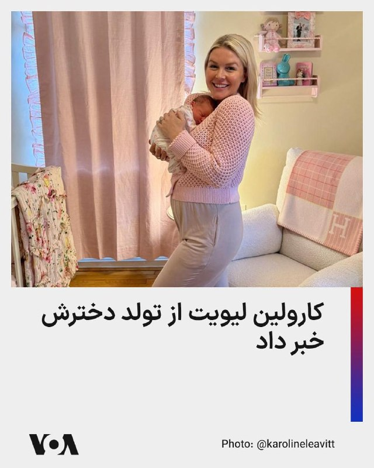

> کارولین لیویت سخنگوی کاخ سفید، اعلام کرد دخترش «ویویانا» اول ماه مه، یازده اردیبهشت، به دنیا آمده است. او در پیامی در شبکه ایکس نوشت نوزادش سالم است و خانواده‌اش روزهای شادی را با عضو جدید خانواده سپری می‌کنند. لیویت همچنین از افرادی که در دوران بارداری برای او دعا کرده بودند قدردانی کرد.

## 1405/02/17 19:38 — Persian_Trend_Official
> 🔴 حزب‌الله مدعی انهدام سامانه گنبد آهنین شد
> 
> 🔹حزب‌الله اعلام کرد با استفاده از یک پهپاد انتحاری، یک سکوی تازه‌استقرار‌یافته «گنبد آهنین» را در نزدیکی موضع «جلّ العلّام» هدف قرار داده و منهدم کرده است.
> 
> 🔹تا این لحظه ارتش اسرائیل واکنشی رسمی به این ادعا منتشر نکرده و امکان تأیید مستقل جزئیات حمله وجود ندارد.
> 
> 
> 
> 🫆:Tony
> 
> 📌 @persian_trend_official
> پرشین ترند | متفاوت‌ترین کانال نظامی

## 1405/02/17 19:41 — RadioFarda
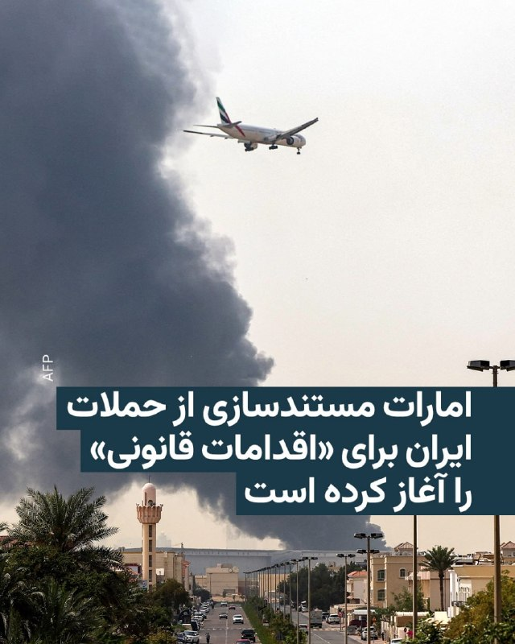

> 🔸خبرگزاری رسمی امارات متحده عربی روز پنج‌شنبه خبر داد که این کشور کمیته‌ای را برای مستندسازی حملات ایران علیه خود برای «اقدامات قانونی» تشکیل داده است.
> 
> 🔸خبرگزاری وام اعلام کرد که یک کمیته ملی جدید وظیفه «مستندسازی تمام حملات و اقدامات نظامی مرتبط با تجاوز ایران» را بر عهده گرفته است.
> 
> 🔸این خبرگزاری افزود: «نتایج کار این کمیته با تهیه یک پرونده مستندسازی جامع، به حمایت از تلاش‌های قانونی امارات متحده عربی در سطح ملی و بین‌المللی کمک خواهد کرد.»
> 
> 🔸امارات متحده عربی در طول جنگ اخیر در خاورمیانه هدف بیش از ۲۸۰۰ حمله پهپادی و موشکی از جانب ایران قرار گرفت. اتفاقی که باعث تیرگی شدید روابط این کشور حاشیه خلیج فارس با ایران شده است. اماکن مهم از جمله مجتمع لوکس پالم دبی و همچنین فرودگاه‌ها و تأسیسات انرژی، از جمله مکان‌هایی بودند که هدف حملات ایران قرار گرفتند.
> 
> 🔸امارات متحده عربی پیشتر خواستار دریافت غرامت از ایران شده بود.
> 
> @RadioFarda

## 1405/02/17 19:39 — RadioFarda
> 🔸 در این کافه فردا به حمله امام جمعه رشت به حضور زنان بی‌حجاب در تجمعات حکومتی، صحبت‌های عجیب کارشناسان صدا و سیما در مورد شکست آمریکا و اسراییل، حواشی آخرین اثر هنری بنکسی در لندن، زندگی و هنر مایکل جکسون به بهانه اکران فیلم زندگی‌اش و صحبت‌های جالب عضو بیت رهبری در مورد وضعیت مجتبی خامنه‌ای می‌پردازیم.
> 
> 🔸 برای تماس با ما می‌توانید به شناسه کافه فردا در تلگرام صوت و متن بفرستید.
> 
> 📻 کافه فردا

## 1405/02/17 19:32 — BBCPersian
> 🔻وزارت خارجه ایران: هنوز پاسخی به طرف آمریکایی داده نشده است
> 
> اسماعیل بقایی، سخنگوی وزارت خارجه ایران به خبرگزاری ایرنا گفت که ایران در حال بررسی پیام‌ها با میانجیگری پاکستان است و «هنوز ایران به جمع‌بندی نرسیده و پاسخی به طرف آمریکایی داده نشده است.»
> 
> مقام‌های پاکستانی پیش از این اعلام کرده بودند در انتظار پاسخ ایران به آخرین پیشنهادات آمریکا هستند.
> 
> طاهر اندرآبی، سخنگوی وزارت خارجه پاکستان امروز ابراز امیدواری کرده بود که توافق میان آمریکا و ایران به‌زودی اعلام خواهد شد.
> 
> پیشتر دونالد ترامپ گفته بود که دولتش گفت‌وگوهای «بسیار خوبی» با ایران داشته است. اما مسعود پزشکیان، گفت که اقدامات آمریکا مسیر دیپلماسی را به سمت «تهدید و تحریم منحرف کرده است.»
> 
> https://bbc.in/496G5Jl
> @BBCPersian

## 1405/02/17 19:36 — Hranews
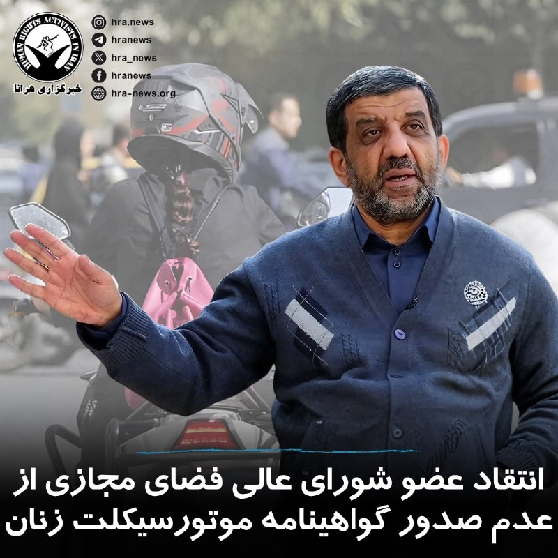

> عضو شورای عالی فضای مجازی، در برنامه «منشور» که با اجرای بهاره افشاری از شبکه نمایش خانگی پخش می‌شود، از عدم صدور گواهینامه موتورسیکلت برای زنان انتقاد کرد.
> 
> عزت‌الله ضرغامی، با اشاره به ممنوعیت صدور گواهینامه موتورسیکلت برای زنان اظهار داشت که در نتیجه این محدودیت، زنان مسافر ناچارند از موتورسیکلت‌هایی استفاده کنند که راکب آن مرد است؛ وضعیتی که به گفته وی، با معیارهای مورد استناد مخالفان #موتورسواری_زنان در تعارض قرار دارد و عملاً به انجام آنچه «غیرشرعی» خوانده می‌شود، منجر شده است.
> 
> ↘️
> @hranews_bot تماس ✉️ - @Hranews کانال هرانا 🆑

## ???-??-?? ??:?? (post 238677) — VahidOOnLine
[🎬 Video](telegram/content/VahidOOnLine_238677_1778169729.mp4)

> کریس رایت، وزیر انرژی آمریکا، گفته است به نظر می‌رسد ایران تولید نفت خود را روزانه حدود ۴۰۰ هزار بشکه کاهش داده باشد.
> او در گفت‌وگو با شبکه «فاکس نیوز» افزود که احتمال می‌رود تولید نفت ایران باز هم کاهش پیدا کند.
> ‌🏁 🇬🇧 ManotoTV
> 
> 🤖 @VahidOOnLine

## ???-??-?? ??:?? (post 238676) — VahidOOnLine
[🎬 Video](telegram/content/VahidOOnLine_238676_1778169730.mp4)

> ‌
> سخنگوی وزارت خارجه جمهوری اسلامی اعلام کرد تهران هنوز به جمع‌بندی نرسیده و پاسخی به آمریکا ارائه نکرده است.
> 
> خبرگزاری حکومتی تسنیم با انتشار این نقل قول از اسماعیل بقایی نوشت جمهوری اسلامی در حال بررسی پیام‌ها با میانجیگری طرف پاکستانی است.
> ‌🏁 🇬🇧 ManotoTV
> 
> 🤖 @VahidOOnLine

## ???-??-?? ??:?? (post 238675) — VahidOOnLine
[🎬 Video](telegram/content/VahidOOnLine_238675_1778169730.mp4)

> ‌
> وزارت خزانه‌داری ایالات متحده آمریکا اعلام کرد در ادامه فشار بر ایران، چند مقام و نهاد مرتبط با شبکه‌های نفتی و شبه‌نظامیان در عراق را تحریم کرده است.
> 
> بر اساس این بیانیه، علی معارج البهادلی، معاون وزیر نفت عراق، به‌دلیل کمک به انتقال و فروش نفت به نفع جمهوری اسلامی و گروه‌های همسو با آن، در فهرست تحریم‌ها قرار گرفته است.
> 
> هم‌زمان، چند عضو ارشد گروه‌های عصائب اهل الحق و کتائب سیدالشهدا نیز به‌اتهام قاچاق نفت، تامین مالی و همکاری با سپاه پاسداران انقلاب اسلامی و حزب‌الله لبنان تحریم شده‌اند.
> 
> به گفته وزارت خزانه‌داری، این شبکه با جعل اسناد و مخلوط کردن نفت ایران با نفت عراق، آن را به بازار جهانی عرضه می‌کرد.
> 
> واشینگتن تاکید کرده دارایی‌های افراد تحریم‌شده مسدود می‌شود و هرگونه همکاری با آنها، از جمله برای نهادهای مالی خارجی، می‌تواند منجر به تحریم‌های ثانویه شود.
> ‌🏁 🇬🇧 ManotoTV
> 
> 🤖 @VahidOOnLine

## ???-??-?? ??:?? (post 238674) — VahidOOnLine
[🎬 Video](telegram/content/VahidOOnLine_238674_1778169731.mp4)

> هم‌زمان با آماده‌سازی برای دور دوم مذاکرات لبنان و اسرائیل در واشنگتن؛ یک مقام لبنانی به الجزیره عربی گفته است آمریکا تلاش کرده تنش‌ها و اقدامات اسرائیل در لبنان را کاهش دهد.
> به گفته این مقام، مذاکرات هفته آینده بر مسائل امنیتی و سیاسی، از جمله خروج کامل نیروهای اسرائیلی از لبنان، آزادی زندانیان و بازسازی متمرکز خواهد بود.
> او همچنین حمله روز گذشته اسرائیل به ضاحیه جنوبی بیروت، که یکی از فرماندهان نیروی رضوان حزب‌الله را هدف قرار داد، «پیامی برای برهم زدن مذاکرات» توصیف کرد.
> این مقام لبنانی تأکید کرد لبنان به دنبال امضای توافق صلح با اسرائیل نیست، بلکه خواهان «بازگرداندن حقوق در برابر توافق عدم تجاوز» است.
> او همچنین گفت تلاش‌های جمهوری‌اسلامی برای حمایت از موضع لبنان در صورتی قابل تقدیر است که به برقراری آتش‌بس منجر شود و از طریق نهادهای رسمی لبنان دنبال شود.
> ‌🏁 🇬🇧 ManotoTV
> 
> 🤖 @VahidOOnLine

## 1405/02/17 19:26 — VahidOOnLine
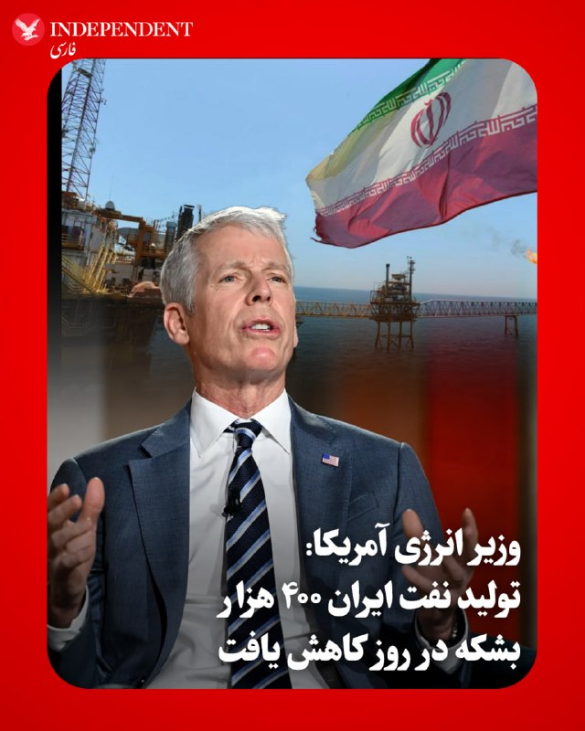

> ♦️ کریس رایت، وزیر انرژی ایالات متحده، روز پنجشنبه ۱۷ اردیبهشت، در گفتگو با فاکس نیوز اعلام کرد که به دلیل محاصره دریایی و ناتوانی در صادرات، تولید نفت ایران احتمالا ۴۰۰ هزار بشکه در روز کاهش یافته است. او پیش‌بینی کرد که با پر شدن ظرفیت مخازن ذخیره‌سازی، روند کاهش تولید ایران همچنان ادامه یابد.
> 
> داده‌های شرکت‌های ردیابی نفتکش‌ها از جمله «ورتکسا» و «LSEG» نشان می‌دهد که صادرات نفت ایران در نیمه دوم آوریل نسبت به مدت مشابه در ماه مارس، بیش از ۸۰ درصد کاهش یافته است. در حالی که ایران در ماه مارس ۲۳.۴ میلیون بشکه نفت صادر کرده بود، در هفته‌های اخیر تنها تعداد اندکی از نفتکش‌ها موفق به خروج از دریای عمان شده‌اند.
> 
> وزیر انرژی آمریکا تاکید کرد که فشار اقتصادی ناشی از توقف صادرات، انگیزه‌ای اضافی برای تهران است تا به توافقی برای پایان دادن به برنامه هسته‌ای و بازگشایی تنگه هرمز دست یابد. رایت خاطرنشان کرد که پایان این وضعیت قطعی است و تنها سوال باقی‌مانده این است که آیا این امر با همکاری جمهوری اسلامی محقق خواهد شد یا خیر.
> ‌🇸🇦 Indypersian
> 
> 🤖 @VahidOOnLine

## ???-??-?? ??:?? (post 238672) — VahidOOnLine
> ♦️اسماعیل بقایی، سخنگوی وزارت خارجه جمهوری اسلامی روز پنجشنبه ۱۷ اردیبهشت گفت: ایران در حال بررسی پیام‌های طرف آمریکایی با میانجیگری پاکستان است.
> 
> بقایی تاکید کرد که ایران هنوز به جمع‌بندی نرسیده و پاسخی به طرف آمریکایی داده نشده است.
> 
> دونالد ترامپ، رئیس‌جمهوری آمریکا، روز چهارشنبه اعلام کرد که آمریکا و ایران طی ۲۴ ساعت گذشته «گفتگوهای خوبی» داشتند و ابراز اطمینان کرد که دستیابی به توافق در روزهای آینده ممکن است.
> 
> مقام‌های آمریکایی گفته‌اند انتظار دارند پاسخ تهران طی ۲۴ تا ۴۸ ساعت آینده دریافت شود. یکی از مقام‌های آمریکایی گفت: «اختلاف‌ها چندان زیاد نیست اما هنوز توافقی حاصل نشده است.»
> ‌🇸🇦 Indypersian
> 
> 🤖 @VahidOOnLine

## 1405/02/17 19:24 — mwarmonitor
> 🔴واشنگتن‌پست:
> ارزیابی‌های اطلاعاتی آمریکا می‌گویند ایران می‌تواند محاصره اعمال‌شده از سوی ترامپ را برای ماه‌ها دوام بیاورد.
> 
> @mwarmonitor

## 1405/02/17 19:30 — kianmeli1
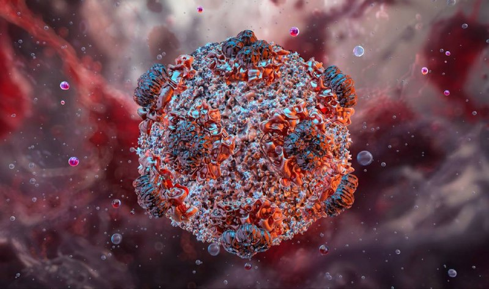

> 🔴سازمان بهداشت جهانی اعلام کرد که تاکنون ۵ مورد ابتلا به هانتاویروس تایید شده است.
> https://t.me/kianmeli1

## ???-??-?? ??:?? (post 335993) — IranIntlTV
[🎬 Video](telegram/content/IranIntlTV_335993_1778169732.mp4)

> منابع دیپلماتیک به نقل از مقام‌های عربستان سعودی گزارش دادند ریاض تا زمانی که آمریکا حفاظت کافی در برابر حملات جمهوری اسلامی فراهم نکند، دسترسی واشینگتن به پایگاه‌ها و حریم هوایی خود را محدود خواهد کرد.
> گفت‌وگو با علی‌ صدرزاده، تحلیل‌گر مسایل خاورمیانه
> @iranintltv

## ???-??-?? ??:?? (post 335992) — IranIntlTV
[🎬 Video](telegram/content/IranIntlTV_335992_1778169734.mp4)

> رسانه‌های اسرائیلی گزارش دادند دونالد ترامپ، رییس‌جمهوری آمریکا، به بنیامین نتانیاهو گفته بدون خروج اورانیوم غنی‌شده از ایران، هیچ توافقی با جمهوری اسلامی امضا نخواهد شد.
> سمیرا قرایی، خبرنگار ایران‌اینترنشنال، گزارش می‌دهد
> @iranintltv

## ???-??-?? ??:?? (post 105094) — ManotoTV
[🎬 Video](telegram/content/ManotoTV_105094_1778169735.mp4)

> کریس رایت، وزیر انرژی آمریکا، گفته است به نظر می‌رسد ایران تولید نفت خود را روزانه حدود ۴۰۰ هزار بشکه کاهش داده باشد.
> او در گفت‌وگو با شبکه «فاکس نیوز» افزود که احتمال می‌رود تولید نفت ایران باز هم کاهش پیدا کند.

## ???-??-?? ??:?? (post 105093) — ManotoTV
[🎬 Video](telegram/content/ManotoTV_105093_1778169736.mp4)

> ‌
> سخنگوی وزارت خارجه جمهوری اسلامی اعلام کرد تهران هنوز به جمع‌بندی نرسیده و پاسخی به آمریکا ارائه نکرده است.
> 
> خبرگزاری حکومتی تسنیم با انتشار این نقل قول از اسماعیل بقایی نوشت جمهوری اسلامی در حال بررسی پیام‌ها با میانجیگری طرف پاکستانی است.

## ???-??-?? ??:?? (post 105092) — ManotoTV
[🎬 Video](telegram/content/ManotoTV_105092_1778169736.mp4)

> ‌
> وزارت خزانه‌داری ایالات متحده آمریکا اعلام کرد در ادامه فشار بر ایران، چند مقام و نهاد مرتبط با شبکه‌های نفتی و شبه‌نظامیان در عراق را تحریم کرده است.
> 
> بر اساس این بیانیه، علی معارج البهادلی، معاون وزیر نفت عراق، به‌دلیل کمک به انتقال و فروش نفت به نفع جمهوری اسلامی و گروه‌های همسو با آن، در فهرست تحریم‌ها قرار گرفته است.
> 
> هم‌زمان، چند عضو ارشد گروه‌های عصائب اهل الحق و کتائب سیدالشهدا نیز به‌اتهام قاچاق نفت، تامین مالی و همکاری با سپاه پاسداران انقلاب اسلامی و حزب‌الله لبنان تحریم شده‌اند.
> 
> به گفته وزارت خزانه‌داری، این شبکه با جعل اسناد و مخلوط کردن نفت ایران با نفت عراق، آن را به بازار جهانی عرضه می‌کرد.
> 
> واشینگتن تاکید کرده دارایی‌های افراد تحریم‌شده مسدود می‌شود و هرگونه همکاری با آنها، از جمله برای نهادهای مالی خارجی، می‌تواند منجر به تحریم‌های ثانویه شود.

## ???-??-?? ??:?? (post 105091) — ManotoTV
[🎬 Video](telegram/content/ManotoTV_105091_1778169737.mp4)

> هم‌زمان با آماده‌سازی برای دور دوم مذاکرات لبنان و اسرائیل در واشنگتن؛ یک مقام لبنانی به الجزیره عربی گفته است آمریکا تلاش کرده تنش‌ها و اقدامات اسرائیل در لبنان را کاهش دهد.
> به گفته این مقام، مذاکرات هفته آینده بر مسائل امنیتی و سیاسی، از جمله خروج کامل نیروهای اسرائیلی از لبنان، آزادی زندانیان و بازسازی متمرکز خواهد بود.
> او همچنین حمله روز گذشته اسرائیل به ضاحیه جنوبی بیروت، که یکی از فرماندهان نیروی رضوان حزب‌الله را هدف قرار داد، «پیامی برای برهم زدن مذاکرات» توصیف کرد.
> این مقام لبنانی تأکید کرد لبنان به دنبال امضای توافق صلح با اسرائیل نیست، بلکه خواهان «بازگرداندن حقوق در برابر توافق عدم تجاوز» است.
> او همچنین گفت تلاش‌های جمهوری‌اسلامی برای حمایت از موضع لبنان در صورتی قابل تقدیر است که به برقراری آتش‌بس منجر شود و از طریق نهادهای رسمی لبنان دنبال شود.

## ???-??-?? ??:?? (post 217119) — FarsiVOA
> بسیاری از ناظران و تحلیلگران روسیه را از منتفعان و برندگانِ بحران میان ایران و آمریکا و وضعیت جنگی و ابهام سیاسی موجود در ایران می‌دانند. ‌آیا روسیه برنده این جنگ است؟

## 1405/02/17 19:26 — IranianMinds

> 🔴 حملات اسرائیل به جنوب لبنان
> 
> @IranianMinds

## 1405/02/17 19:29 — BBCPersian

> 🔻فدراسیون بین‌المللی روزنامه‌نگاران، فشارهای جمهوری اسلامی بر خبرنگاران در داخل و خارج از ایران را محکوم کرد و خواهان رفع محدودیت فعالیت‌ صنفی روزنامه‌نگاران در ایران شد.
> 
> در قطعنامه‌ای که در کنگره جهانی این نهاد به مناسبت صد سالگی تأسیس آن در پاریس به تصویب رسید، با انتقاد شدید از کارنامه جمهوری اسلامی در محدود کردن آزادی مطبوعات، گفته شده «خبرنگاران در موج‌های پیاپی زندانی شده‌اند و خیلی‌ها هم مجبور به ترک کشور شده‌اند. مقام‌ها ده‌ها روزنامه و مجله را توقیف کرده‌اند و در نتیجه صدها روزنامه‌نگار شغلشان را از دست داده‌اند.»
> 
> در این قطعنامه با اشاره به ممنوعیت فعالیت انجمن صنفی روزنامه‌نگاران ایران از سال ۱۳۸۸ و مانع‌تراشی برای یک نهاد صنفی جایگزین آن در سال‌های اخیر، از هیئت مدیره فدراسیون بین‌المللی روزنامه‌نگاران خواسته شد که از طریق سازمان ملل و نهادهای بین‌المللی، تلاش کند راه را برای فعالیت یک نهاد صنفی نماینده روزنامه‌نگاران در ایران باز کند.
> 
> 📸 BBC
> 
> @BBCPersian

## 1405/02/17 19:17 — VahidOOnLine

> اسماعیل بقائی، سخنگوی وزارت امور خارجه جمهوری اسلامی، با توضیح اینکه جمهوری اسلامی در حال بررسی پیام‌ها با میانجیگری طرف پاکستانی است، به ایرنا گفت که تهران هنوز به جمع‌بندی نرسیده و پاسخی به طرف آمریکایی داده نشده است.
> 
> بقائی گفت: «به محض اینکه جمع‌بندی صورت بگیرد، به میانجی پاکستانی منعکس خواهد شد و بر اساس نتایج تبادل پیام‌ها، در مورد گام بعدی تصمیم‌گیری خواهد شد.»
> ‌🏁 🇬🇧 IranintlTV
> 
> 🤖 @VahidOOnLine

## 1405/02/17 19:15 — VahidOOnLine
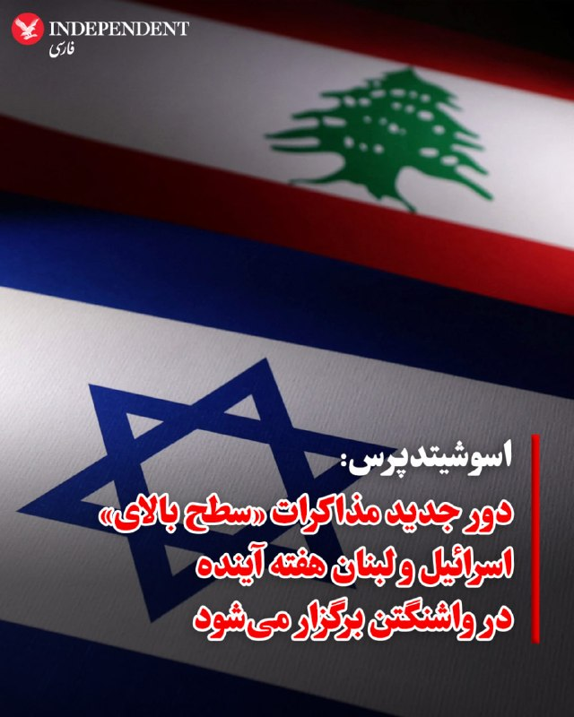

> ♦️ یک مقام وزارت امور خارجه آمریکا که به دلیل حساسیت مذاکراتِ پشت درهای بسته خواست نامش فاش نشود، روز پنجشنبه ۱۷ اردیبهشت، در گفتگو با اسوشیتدپرس اعلام کرد که مذاکرات «سطح بالا» میان اسرائیل و لبنان در روزهای پنجشنبه و جمعه هفته آینده، ۲۴ و ۲۵ اردیبهشت (۱۴ و ۱۵ می) در واشنگتن از سر گرفته خواهد شد. اگرچه این مقام به محل دقیق برگزاری نشست اشاره نکرد، اما دو دور قبلی این مذاکرات در وزارت امور خارجه و کاخ سفید برگزار شده بود.
> 
> دورهای پیشین این گفتگوها با هدایت سفیر ایالات متحده در لبنان و سفرای اسرائیل و لبنان در واشنگتن انجام شد؛ هرچند مارکو روبیو، وزیر امور خارجه، در هر دو دور حضور داشت و دونالد ترامپ، رئیس‌جمهوری آمریکا نیز در دور دوم با شرکت‌کنندگان دیدار کرد.
> ‌🇸🇦 Indypersian
> 
> 🤖 @VahidOOnLine

## 1405/02/17 19:13 — VahidOOnLine

> کریس رایت، وزیر انرژی آمریکا، در مصاحبه با فاکس نیوز اعلام کرد به نظر می‌رسد ایران تولید نفت خود را روزانه ۴۰۰ هزار بشکه کاهش داده است.
> 
> پیشتر مارکو روبیو، وزیر خارجه آمریکا اعلام کرد که اقدامات این کشور علیه جمهوری اسلامی مستقیما منابع اصلی درآمدی رژیم را هدف قرار می‌دهد.
> 
> او درباره محاصره دریایی علیه جمهوری اسلامی گفت که این کار «به‌تنهایی روزانه تا ۵۰۰ میلیون دلار از درآمد ایران را از بین می‌برد.»
> ‌🏁 🇬🇧 IranintlTV
> 
> 🤖 @VahidOOnLine

## 1405/02/17 19:16 — IranIntlTV

> اسماعیل بقائی، سخنگوی وزارت امور خارجه جمهوری اسلامی، با توضیح اینکه جمهوری اسلامی در حال بررسی پیام‌ها با میانجیگری طرف پاکستانی است، به ایرنا گفت که تهران هنوز به جمع‌بندی نرسیده و پاسخی به طرف آمریکایی داده نشده است.
> 
> بقائی گفت: «به محض اینکه جمع‌بندی صورت بگیرد، به میانجی پاکستانی منعکس خواهد شد و بر اساس نتایج تبادل پیام‌ها، در مورد گام بعدی تصمیم‌گیری خواهد شد.»
> https://iranintl.com/202605074838

## 1405/02/17 19:12 — IranIntlTV
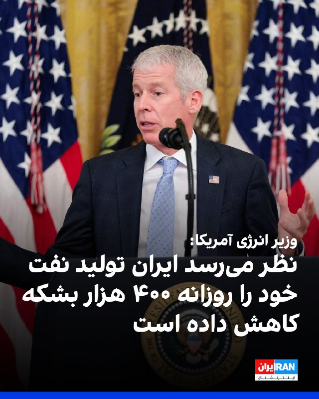

> کریس رایت، وزیر انرژی آمریکا، در مصاحبه با فاکس نیوز اعلام کرد به نظر می‌رسد ایران تولید نفت خود را روزانه ۴۰۰ هزار بشکه کاهش داده است.
> 
> پیشتر مارکو روبیو، وزیر خارجه آمریکا اعلام کرد که اقدامات این کشور علیه جمهوری اسلامی مستقیما منابع اصلی درآمدی رژیم را هدف قرار می‌دهد.
> 
> او درباره محاصره دریایی علیه جمهوری اسلامی گفت که این کار «به‌تنهایی روزانه تا ۵۰۰ میلیون دلار از درآمد ایران را از بین می‌برد.»
> https://iranintl.com/202605074916

## 1405/02/17 19:18 — FarsiVOA
> 🔺آمریکا فشار اقتصادی بر رژیم ایران و شبه‌نظامیان وابسته‌اش در عراق را افزایش داد
> 
> ▪️وزارت خزانه‌داری ایالات متحده روز پنجشنبه ۱۷ اردیبهشت از دور تازه‌ای از تحریم‌ها علیه افراد و شرکت‌های مرتبط با رژیم ایران و شبه‌نظامیان مورد حمایت جمهوری اسلامی در عراق خبر داد؛ اقدامی که بخشی از کارزار «فشار حداکثری» و برنامه «خشم اقتصادی» دولت ترامپ علیه جمهوری اسلامی است.
> 
> ⬇️ بیشتر بخوانید:
> 
> https://ir.voanews.com/a/ofac-treasury-iran-iraq-oil-sanction-economic-fury/8147596.html/?nocach=1

## ???-??-?? ??:?? (post 124409) — DW_Farsi
> 🎥 کارل مارکس و انگلس در هند؛ کودکان روستایی با نام رهبران کمونیست
> 
> در روستای وانی‌ولامپاتی در جنوب هند، برخی روستاییان نام چهره‌های مشهور کمونیست، از کارل مارکس و انگلس تا فیدل کاسترو و چه‌گوارا را روی فرزندان خود می‌گذارند. این سنت نسل‌هاست در روستا ادامه دارد و به گفته ساکنان آن، ریشه در جنبشی محلی علیه تبعیض طبقاتی و نظام کاستی در هند دارد.
> 
> @dw_farsi

## ???-??-?? ??:?? (post 13595) — Persian_Trend_Official
[🎬 Video](telegram/content/Persian_Trend_Official_13595_1778169148.mp4)

> 💢ویدئویی جذاب از رهگیری یک فروند پهپاد انتحاری شاهد-۱۳۶/گران-۲ روسیه توسط جنگنده میگ-۲۹ نیروی هوایی اوکراین در منطقه Rivne در غرب اوکراین
> 
> 
> 🫆:Tony
> 
> 📌 @persian_trend_official
> پرشین ترند | متفاوت‌ترین کانال نظامی

## 1405/02/17 19:19 — RadioFarda
> آمریکا معاون وزیر نفت عراق و شبه‌نظامیان شیعه را به اتهام کمک به ایران تحریم کرد
> 
> 🔸وزارت خزانه‌داری و وزارت امور خارجه ایالات متحده روز پنجشنبه ۱۷ اردیبهشت اعلام کردند که واشینگتن معاون وزیر نفت عراق و چند شبه‌نظامی شیعه را به‌دلیل حمایت از حکومت ایران تحریم کرده است.
> 
> 🔸وزارتخانه خزانه‌داری علی معارج البهادلی، معاون وزیر نفت عراق، را متهم کرد که از «موقعیت خود برای تسهیل انتقال نفت به‌منظور فروش به نفع حکومت ایران و شبه‌نظامیان نیابتی آن در عراق» سوءاستفاده کرده است.
> 
> 🔸این وزارتخانه همچنین اعلام کرد که سه تن از رهبران ارشد شبه‌نظامیان همسو با ایران، یعنی «کتائب سید الشهداء» و «عصائب اهل الحق»، را نیز تحریم می‌کند.
> 
> 🔸اسکات بسنت، وزیر خزانه‌داری آمریکا، در بیانیه‌ای گفت: «حکومت ایران مانند یک باند یاغی، منابعی را که به‌حق متعلق به مردم عراق است غارت می‌کند. وزارت خزانه‌داری دست روی دست نخواهد گذاشت در حالی که ارتش ایران از نفت عراق برای تأمین مالی تروریسم علیه ایالات متحده و شرکای ما سوءاستفاده می‌کند.»
> 
> 🔸این تحریم‌ها هرگونه دارایی این افراد در آمریکا را مسدود می‌کند و به‌طور کلی آمریکایی‌ها را از معامله با آن‌ها منع می‌کند.
> 
> 🔸وزارت خارجه آمریکا نیز در بیانیه جداگانه‌ای اعلام کرد معاون وزیر نفت عراق در طرحی دست داشته که بر اساس آن «برای دور زدن تحریم‌ها، نفت ایران به‌طور متقلبانه با نفت عراق مخلوط و به سود ایران فروخته می‌شد».
> 
> 🔸در این بیانیه همچنین «کتائب سید الشهداء» و «عصائب اهل الحق» و شرکت‌های فعال در بخش نفت که از این شبه‌نظامیان حمایت می‌کنند و تحریم شده‌اند، متهم به «سوءاستفاده از اقتصاد عراق برای تأمین مالی فعالیت‌های تروریستی خود» شده‌اند.
> 
> 🔸گزارش کامل را در وب‌سایت رادیوفردا بخوانید.
> 
> @RadioFarda

## 1405/02/17 19:20 — IranianMinds
> 🔴 سخنگوی وزارت خارجه :
> 
> پیام ‌هایی که از طریق میانجی‌گری طرف پاکستانی به ما ارسال شده، در حال بررسی است.
> 
> ما هنوز به نتیجه‌ای نرسیدیم و پاسخی به طرف آمریکایی ندادیم!
> 
> @IranianMinds

## 1405/02/17 19:06 — VahidOOnLine

> خبرگزاری رویترز پنج‌شنبه به نقل از یک مقام وزارت خارجه ایالات متحده اعلام کرد که اسرائیل و لبنان در روزهای ۱۴ و ۱۵ مه (۲۴ و ۲۵ اردیبهشت) در واشینگتن مذاکراتی برگزار خواهند کرد.
> ‌🏁 🇬🇧 IranintlTV
> 
> 🤖 @VahidOOnLine

## 1405/02/17 19:12 — DEJradio

> 🚨📢 فرانسه ناو هواپیمابر «شارل دوگل» را راهی خاورمیانه کرد
> 
> فرانسه اعلام کرد که با توجه به ادامه بسته نگه داشتن تنگه هرمز و طرح اخذ عوارض توسط جمهوری اسلامی، ناو هواپیمابر این کشور، موسوم به «شارل دوگل» را برای هر گونه واکنش لازم به منطقه خاورمیانه اعزام کرده است.
> 
> #فرانسه #تنگه_هرمز
> @DEJradio

## ???-??-?? ??:?? (post 217117) — FarsiVOA
> در ادامه بازداشت و سرکوب شهروندان، قوه قضاییه برای معترضان دی و زندانیان سیاسی احکام سنگین صادر می‌کند. چهار معترض دیگر در خطر اعدام‌اند.

## 1405/02/17 19:06 — IranIntlTV
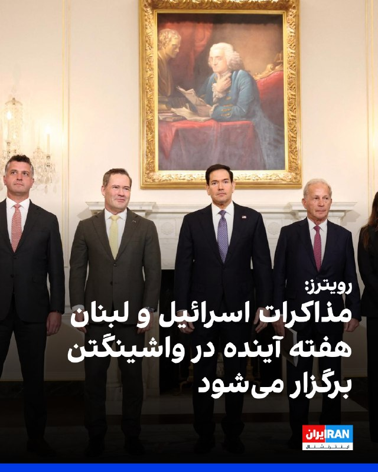

> خبرگزاری رویترز پنج‌شنبه به نقل از یک مقام وزارت خارجه ایالات متحده اعلام کرد که اسرائیل و لبنان در روزهای ۱۴ و ۱۵ مه (۲۴ و ۲۵ اردیبهشت) در واشینگتن مذاکراتی برگزار خواهند کرد.
> https://iranintl.com/202605073841

## 1405/02/17 19:06 — Persian_Trend_Official
> ⭕️سخنگوی وزارت امور خارجه اسماعیل بقائی:
> 
> ▪️ایران در حال بررسی پیام‌ها از طریق میانجی‌گری پاکستان است.
> 
> ▪️ایران هنوز به نتیجه‌ای نرسیده و پاسخی به طرف آمریکایی نداده است.
> 
> 🫆:Tony
> 
> 📌 @persian_trend_official
> پرشین ترند | متفاوت‌ترین کانال نظامی

## 1405/02/17 19:04 — BBCPersian
> 🔻آلمان جنگ ایران را عامل خسارت به اقتصادش می‌داند
> 
> آلمان روز پنجشنبه در پی پیش‌بینی کاهش درآمدهای مالیاتی چهار سال آینده، با فشار مالی بیشتری روبه‌رو شد.
> 
> شورای کارشناسان مالیاتی آلمان پیش‌بینی درآمدهای مالیاتی برای دوره ۲۰۲۶ تا ۲۰۳۰ را نسبت به برآورد اکتبر، ۸۷/۵ میلیارد یورو کاهش داد.
> 
> این کاهش در حالی است که دولت آلمان همزمان با کسری بودجه، با شوک انرژی ناشی از جنگ ایران و افزایش هزینه‌های دفاعی، دست‌وپنجه نرم می‌کند.
> 
> بر اساس این گزارش، درآمد مالیاتی دولت فدرال در سال ۲۰۲۷ حدود ۳۹۵ میلیارد یورو پیش‌بینی شده که ۱۰/۱ میلیارد یورو کمتر از برآورد قبلی است.
> 
> لارس کلینگبایل، وزیر دارایی آلمان، گفت که این پیش‌بینی نشان می‌دهد، جنگ ایران چه میزان آسیب اقتصادی ایجاد کرده است.
> 
> او در بیانیه‌ای افزود: «جنگ غیرمسئولانه ترامپ و شوک ناشی از افزایش جهانی قیمت انرژی، به‌طور موقت روند مثبت اقتصاد را کند کرده است.»
> 
> این کاهش پیش‌بینی تنها یک هفته پس از تصویب اهداف اصلی بودجه ۲۰۲۷ است؛ بودجه‌ای که شامل ۱۹۶/۵ میلیارد یورو بدهی جدید، افزایش هزینه‌های دفاعی به ۳/۱ درصد تولید ناخالص داخلی و سرمایه‌گذاری بی‌سابقه در حمل‌ونقل، دیجیتالی‌سازی و بیمارستان‌هاست.
> 
> دولت آلمان همچنین رشد اقتصادی سال ۲۰۲۶ را تنها ۰/۵ درصد پیش‌بینی کرده است و شمار بیکاران از ۳ میلیون نفر فراتر رفته است؛ موضوعی که می‌تواند توافق بر سر اصلاحات مالیاتی، رفاهی و هزینه‌های دولتی را دشوارتر کند.
> 
> https://bbc.in/496G5Jl
> @BBCPersian

## 1405/02/17 18:58 — VahidOOnLine
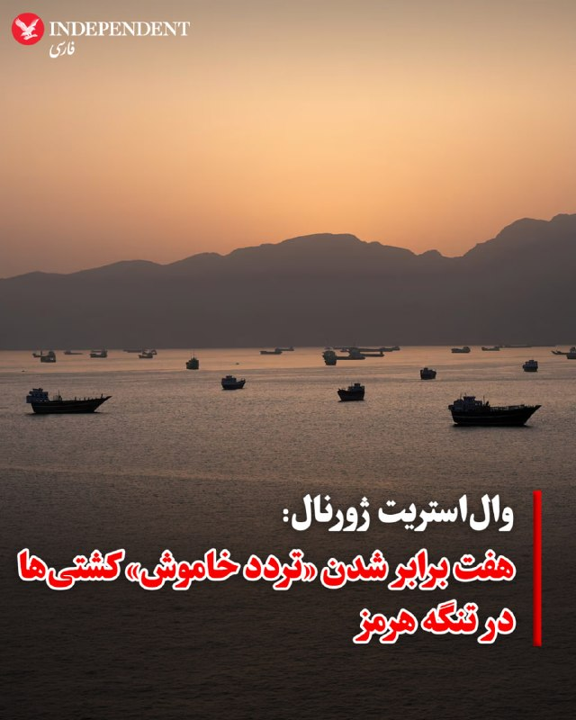

> ♦️ بر اساس داده‌های شرکت اطلاعات دریایی «ویندوارد» (Windward)، اکثر کشتی‌هایی که در تنگه هرمز و نواحی اطراف آن تردد می‌کنند، از سیستم شناسایی خودکار (AIS) که هویت، موقعیت و سرعت آن‌ها را مخابره می‌کند، استفاده نمی‌کنند. به گزارش وال‌استریت ژورنال، داده‌های روز پنجشنبه ۱۷ اردیبهشت این شرکت، تعداد شناورهایی که بدون سیگنال AIS از این تنگه عبور کرده‌اند، در بازه دو هفته‌ای ۳۰ فروردین تا ۱۳ اردیبهشت (۱۹ آوریل تا ۳ می) نسبت به بازه‌های مشابه پیش از آن، هفت برابر شده است.
> 
> ویندوارد اعلام کرد که تعداد شناورهایی که همچنان از سیگنال‌های شناسایی استفاده می‌کنند، تقریبا به صفر رسیده است. اوج این فعالیت‌ها روز پنجشنبه به ثبت رسید که در آن پنج کشتی خروجی و چهار کشتی ورودی بدون سیگنال AIS در منطقه شناسایی شدند؛ این در حالی است که روز چهارشنبه تنها دو کشتی خروجی با رادار خاموش تردد کرده بودند. این شناورهای تجاری شامل نفتکش‌ها، تانکرهای حمل مواد شیمیایی و کشتی‌های کانتینربر هستند. این شناورها که ارتباطی با جمهوری اسلامی یا بنادر ایران ندارند، بدون مشکل از سد محاصره نیروهای آمریکایی می‌گذرند.
> ‌🇸🇦 Indypersian
> 
> 🤖 @VahidOOnLine

## ???-??-?? ??:?? (post 217116) — FarsiVOA
> دونالد ترامپ: پیش‌بینی میکنم که جنگ در ایران به سرعت پایان خواهد یافت

## 1405/02/17 18:53 — FarsiVOA
> 🔺مارکو روبیو با پاپ دیدار کرد؛ تاکید بر رابطه قوی و تعهد مشترک به صلح
> 
> ▪️مارکو روبیو، وزیر خارجه آمریکا پنجشنبه ۱۷ اردیبهشت در آغاز سفر خود به ایتالیا پیش از دیدار با جورجیا ملونی نخست وزیر ایتالیا، با پاپ چهاردهم لئو، در واتیکان دیدار کرد.
> 
> ⬇️ بیشتر بخوانید:
> 
> https://ir.voanews.com/a/iran-us-rubio-italy-pop-leo-melony-trump-/8147578.html/?nocach=1

## 1405/02/17 19:01 — DW_Farsi
> 🔶 ابراز آمادگی سه‌چهارم مردان ۱۸ ساله آلمانی برای خدمت سربازی
> 
> از میان مردان ۱۸ ساله‌ای که در چارچوب مدل جدیدخدمت سربازی در آلمان از سوی ارتش نامه دریافت کرده‌اند، حدود ۷۲ درصد پرسش‌نامه مربوط به آمادگی و تمایل برای خدمت را تکمیل کرده‌اند. در مقابل، ۲۸ درصد به این نامه پاسخ نداده‌اند؛ این در حالی است که برای مردان متولد سال ۲۰۰۸، پاسخ‌دادن به این پرسش‌نامه الزامی است.
> 
> این پرسش‌نامه شامل سوال‌هایی درباره آمادگی جسمی، صلاحیت و تمایل افراد برای خدمت در ارتش است. زنان، برخلاف مردان، ملزم به پاسخ‌گویی نیستند.
> 
> بر اساس اطلاعات منتشرشده از محافل ارتش، حدود نیمی از کسانی که پاسخ داده‌اند، به انجام خدمت داوطلبانه حداقل شش‌ماهه ابراز علاقه کرده‌اند. با این حال، ارتش آلمان تاکید کرده این به آن معنا نیست که همه این افراد در نهایت وارد خدمت خواهند شد. یکی از عوامل مهم، امکان ارائه محل خدمت نزدیک به محل زندگی داوطلبان است، زیرا فاصله بیشتر می‌تواند احتمال پیوستن آن‌ها را کاهش دهد.
> 
> وزارت دفاع آلمان گفته است نادیده گرفتن این الزام بدون پیامد نخواهد بود و موارد عدم پاسخ‌گویی پیگیری خواهد شد. برای کسانی که به‌طور مداوم از پاسخ دادن خودداری کنند، احتمال جریمه نقدی وجود دارد.
> 
> افرادی که این نامه را دریافت کرده‌اند، یک ماه فرصت دارند پرسش‌نامه را تکمیل کنند. وزارت دفاع پیش‌تر اعلام کرده بود در چهار ماهه نخست سال ۲۰۲۶، حدود ۱۹۴ هزار مرد و زن این نامه را همراه با اطلاعات دسترسی به فرم دریافت کرده‌اند.
> @dw_farsi

## 1405/02/17 18:56 — Persian_Trend_Official
[🎬 Video](telegram/content/Persian_Trend_Official_13593_1778168027.jpg)

> 💢رویترز:
> 
> 🔹ایالات متحده و ایران در حال حرکت به سمت یک توافق موقت برای توقف درگیری‌ها هستند، اگرچه اختلافات عمده‌ای هنوز حل نشده باقی مانده‌اند.
> 
> 🔹 تهران در حال بررسی یک پیشنهاد یک صفحه‌ای است که بر پایان جنگ، بازگشایی تنگه هرمز و آغاز ۳۰ روز مذاکرات گسترده‌تر تمرکز دارد.
> 
> 🔹پیش‌نویس از خواسته‌های کلیدی آمریکا درباره برنامه هسته‌ای ایران، موشک‌ها و نیروهای نیابتی منطقه‌ای اجتناب می‌کند.
> 
> 🔹مقامات ایرانی همچنان بدبین هستند و این پیشنهاد را بیشتر «فهرست آرزوهای آمریکایی تا واقعیت» می‌نامند.
> 
> 🫆:Tony
> 
> 📌 @persian_trend_official
> پرشین ترند | متفاوت‌ترین کانال نظامی

## 1405/02/17 18:48 — VahidOOnLine

> رسانه‌های دولتی امارات متحده عربی گزارش دادند که این کشور برای مستندسازی حملات جمهوری اسلامی به منظور حمایت از اقدام حقوقی، کمیته‌ای تشکیل خواهد داد.
> 
> خبرگزاری رسمی امارات متحده عربی، اعلام کرد یک کمیته ملی جدید مامور شده تا «تمام رویدادهای مربوط به حملات و اقدامات نظامی مرتبط با تجاوز ایران را مستندسازی و رصد کند.»
> 
> بر اساس این گزارش، نشانه‌ها و مکان‌های مهم، از جمله مجموعه لوکس «پالم» دبی، همچنین فرودگاه‌ها و تاسیسات انرژی، در میان اهدافی بودند که در جریان حملات جمهوری اسلامی به کشورهای حاشیه خلیج فارس مورد اصابت قرار گرفتند.
> 
> امارات متحده عربی بیشترین آسیب را در بین این کشورها متحمل شد و هدف بیش از ۲۸۰۰ پهپاد و موشک قرار گرفت.
> 
> ماه گذشته، ابوظبی تاکید کرده بود که تهران باید خساراتی را که ایجاد کرده است جبران کند.
> ‌🏁 🇬🇧 IranintlTV
> 
> 🤖 @VahidOOnLine

## ???-??-?? ??:?? (post 4475) — DEJradio
[🎬 Video](telegram/content/DEJradio_4475_1778167365.mp4)

> 🔺📢 شرایط اقتصادی غیر قابل تحمل است؛
> دیگر ساکت نمی‌نشینیم!
> 
> #تورم #اعتراضات_سراسری
> @DEJradio

## 1405/02/17 18:48 — IranIntlTV
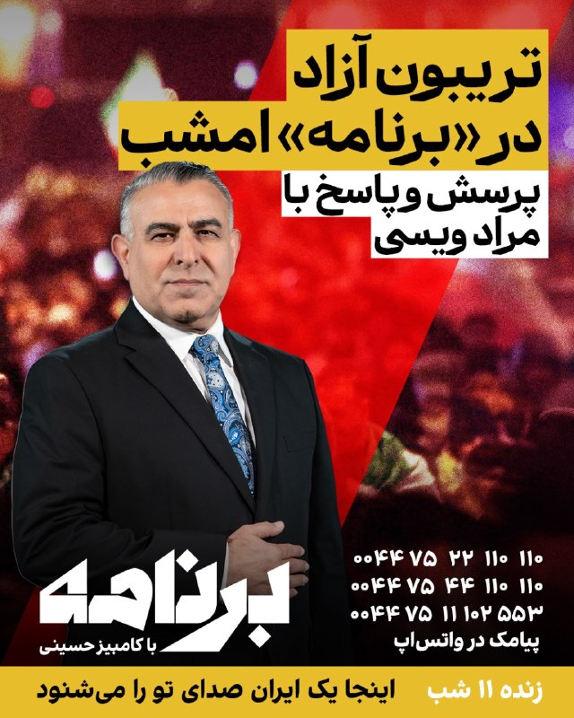

> مراد ویسی امشب مهمان «برنامه با کامبیز حسینی» است و به پرسش‌های شما پاسخ می‌دهد.اگر حرفی در دلتان مانده، اگر سؤالی دارید یا می‌خواهید دو دقیقه با یک ایران حرف بزنید، امشب نوبت شماست.
> 
> سؤالی داشته‌اید که هیچ‌وقت فرصت پرسیدنش را پیدا نکرده‌اید؟
> امشب نوبت شماست و آقای ویسی در طول برنامه با ماست.
> 
> از امیدها، خشم‌ها، دلتنگی‌ها و واقعیت زندگی‌تان بگویید.
> 
> 
> اگر در ایران هستید، بدون نوبت مستقیم روی خط می‌آیید.
> تاریخ با صدای شما نوشته می‌شود.
> 
> برای حضور در برنامه، در واتس‌اپ پیام بدهید:
> ۰۰۴۴۷۵۲۲۱۱۰۱۱۰
> ۰۰۴۴۷۵۴۴۱۱۰۱۱۰
> ۰۰۴۴۷۵۱۱۱۰۲۵۵۳
> 
> «برنامه با کامبیز حسینی»
> «یک ایران صدای شما را می‌شنود»
> @iranintltv

## 1405/02/17 18:48 — IranIntlTV
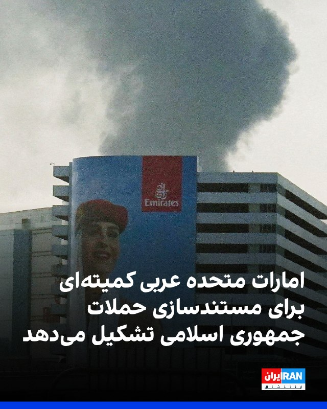

> رسانه‌های دولتی امارات متحده عربی گزارش دادند که این کشور برای مستندسازی حملات جمهوری اسلامی به منظور حمایت از اقدام حقوقی، کمیته‌ای تشکیل خواهد داد.
> 
> خبرگزاری رسمی امارات متحده عربی، اعلام کرد یک کمیته ملی جدید مامور شده تا «تمام رویدادهای مربوط به حملات و اقدامات نظامی مرتبط با تجاوز ایران را مستندسازی و رصد کند.»
> 
> بر اساس این گزارش، نشانه‌ها و مکان‌های مهم، از جمله مجموعه لوکس «پالم» دبی، همچنین فرودگاه‌ها و تاسیسات انرژی، در میان اهدافی بودند که در جریان حملات جمهوری اسلامی به کشورهای حاشیه خلیج فارس مورد اصابت قرار گرفتند.
> 
> امارات متحده عربی بیشترین آسیب را در بین این کشورها متحمل شد و هدف بیش از ۲۸۰۰ پهپاد و موشک قرار گرفت.
> 
> ماه گذشته، ابوظبی تاکید کرده بود که تهران باید خساراتی را که ایجاد کرده است جبران کند.
> https://iranintl.com/202605077759

## ???-??-?? ??:?? (post 335985) — IranIntlTV
[🎬 Video](telegram/content/IranIntlTV_335985_1778167369.mp4)

> از زمان آغاز جنگ آمریکا و اسرائیل با جمهوری اسلامی، مقام‌های حکومت ایران قطعی اینترنت را با بهانه امنیت توجیه کرده‌اند. همزمان بازاری پرسود شکل گرفته که در آن دسترسی به اینترنت با پرداخت مبالغ میلیونی فراهم می‌شود.
> آیه دریس، عضو تحریریه ایران‌اینترنشنال، در «پیوست» به این موضوع می‌پردازد
> @iranintltv

## 1405/02/17 18:51 — DW_Farsi
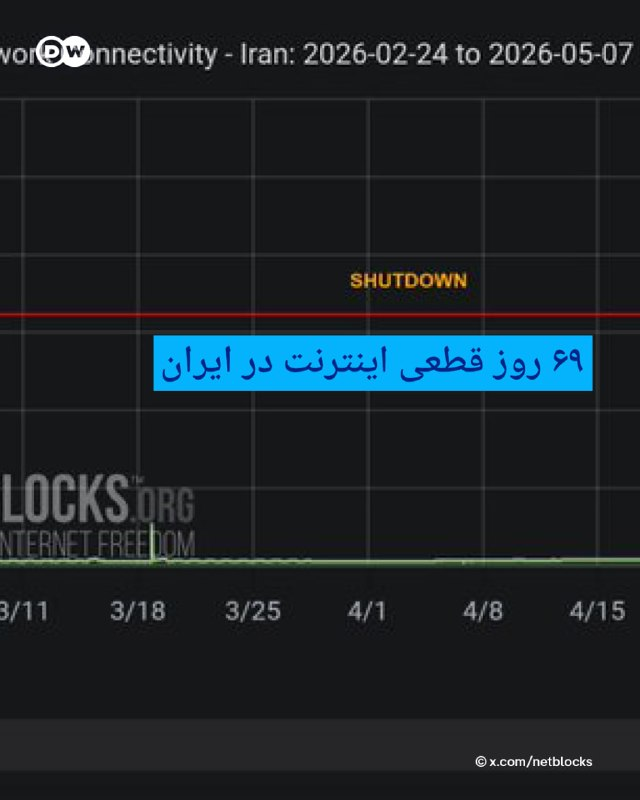

> 🔶 ۶۹ روز قطعی اینترنت در ایران
> 
> نت بلاکس روز پنج‌شنبه ۱۷ اردیبهشت گزارش داد ۶۹ روز از قطعی سراسری اینترنت در ایران می‌گذرد.
> 
> به گفته این نهاد ناظر بر وضعیت دسترسی به اینترنت در جهان، این وضعیت که سبب قطع دسترسی بخش بزرگی در ایران به شبکه‌های بین‌المللی شده تا کنون دست کم ۱۶۳۲ ساعت را دربر گرفته است.
> 
> نت بلاکس در پیامی در حساب کاربری خود در شبکه ایکس نوشت این خاموشی دیجیتال "باعث از دست رفتن گسترده مشاغل در ایران شده و تأثیر ناعادلانه شدیدی بر صاحبان مشاغل مستقل [آزاد] گذاشته، روندی که در عمل ثروت را به سوی گروه‌های وابسته به رژیم [ایران] سوق داده است."
> @dw_farsi

## 1405/02/17 18:50 — IranianMinds
> 🔴 حملات ارتش اسرائیل به لبنان امروز خیلی شدید شده و بد داره میزنه لبنانو
> 
> @IranianMinds

## 1405/02/17 18:46 — IranianMinds

> 🔴 کارولین لیویت سخنگوی کاخ سفید هم یه پست گذاشت و گفت بچم صحیح و سالم به دنیا اومده و اسمشم ویویانا
> 
> @IranianMinds

## 1405/02/17 18:50 — BBCPersian
> 🔻دو وزیر دفاع سابق چین به اعدام تعلیقی محکوم شدند
> 
> به گزارش رسانه‌های دولتی چین، دو وزیر دفاع سابق آن کشور به جرم رشوه خواری و فساد به اعدام تعلیقی محکوم شدند. وی فنگه و لی شانگفو که در دادگاه نظامی چین، محاکمه شدند روز پنجشنبه به اعدام با دو سال تعلیق محکوم شدند.
> 
> https://bbc.in/4tTt6CT
> @BBCPersian

## 1405/02/17 18:40 — IranianMinds

> 🔴 پست جدید ترامپ که دوباره اومده گرفته رو این بایدن یتیم :
> 
> تصویری بسیار دقیق از دولت جو بایدن خواب‌آلود. خسارت عظیم وارد شده، اما ما برگشتیم!
> 
> @IranianMinds

## 1405/02/17 18:31 — VahidOOnLine
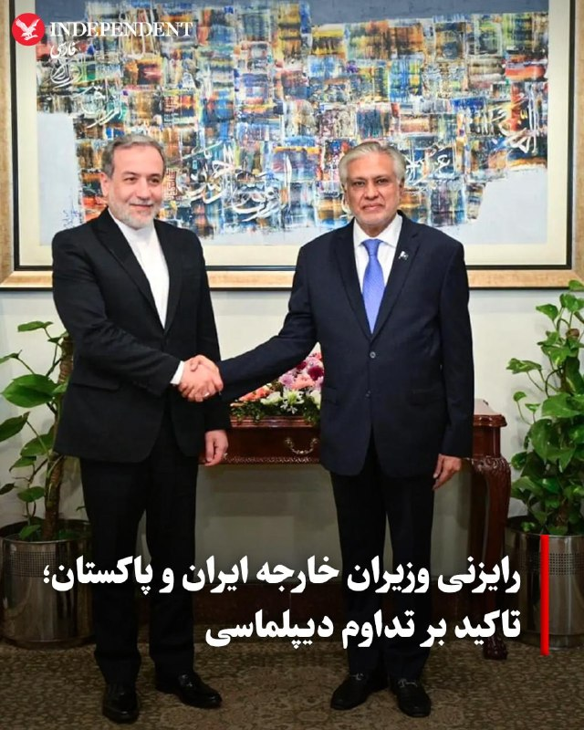

> ♦️عباس عراقچی، وزیر امور خارجه جمهوری اسلامی، روز پنجشنبه، ۱۷ اردیبهشت، در تماسی تلفنی با همتای پاکستانی خود، اسحاق دار، آخرین تحولات منطقه را مورد بحث و بررسی قرار داد.
> 
> بر اساس گزارشی که در کانال تلگرامی عراقچی منتشر شده، هر دو طرف بر ضرورت تداوم مسیر «گفتگو و دیپلماسی» و همچنین تقویت همکاری‌ها میان کشورهای منطقه تاکید کردند. این گفتگو در حالی انجام می‌شود که جمهوری اسلامی در حال بررسی پیشنهاد جدید ایالات متحده برای پایان دادن به جنگ است و اسلام‌آباد نیز نسبت به دستیابی به یک توافق احتمالی ابراز خوش‌بینی کرده است.
> ‌🇸🇦 Indypersian
> 
> 🤖 @VahidOOnLine

## ???-??-?? ??:?? (post 238664) — VahidOOnLine
[🎬 Video](telegram/content/VahidOOnLine_238664_1778166507.mp4)

> «قطع اینترنت خاموش کردن صدای مردم است»
> ‌🏁 🇬🇧 ManotoTV
> 
> 🤖 @VahidOOnLine

## ???-??-?? ??:?? (post 238663) — VahidOOnLine
[🎬 Video](telegram/content/VahidOOnLine_238663_1778166508.mp4)

> مسعود پزشکیان در نشست اصناف و بازاریان مدعی شد با مجتبی خامنه‌ای دیدار داشته است.
> 
> پزشکیان گفت آن‌چه در دیدار با مجتبی خامنه‌ای بیش از هر موضوع دیگری برای او برجسته شد، برخورد «متواضعانه و صمیمی رهبر» بوده است .
> ‌🏁 🇬🇧 ManotoTV
> 
> 🤖 @VahidOOnLine

## 1405/02/17 18:21 — VahidOOnLine
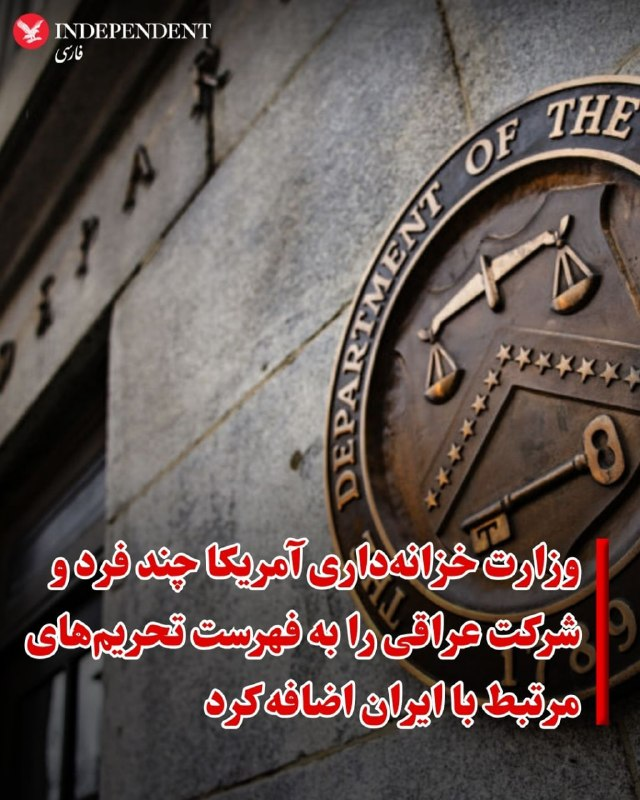

> ♦️وزارت خزانه‌داری آمریکا روز پنجشنبه ۱۷ اردیبهشت اعلام کرد ایالات متحده تحریم‌های جدیدی مرتبط با ایران را در چارچوب مقابله با تروریسم اعمال کرده است.
> 
> بر اساس بیانیه وزارت خزانه‌داری آمریکا، مقامات گروه‌های شبه‌نظامی تحت حمایت جمهوری اسلامی در عراق از جمله احمد خضیر مکسوس، معاون دبیرکل سابق «کتائب سید الشهدا» و محمد عیسی کاظم الشویلی، که با نام مستعار ابو مریم فعالیت می‌کند به فهرست تحریم‌شدگان مرتبط با ایران اضافه شده‌اند.
> 
> این وزارت خانه تاکید کرده است که در حال حفظ حداکثر فشار بر تهران است و توانایی رژیم در تولید، جابجایی و بازگرداندن وجوه را هدف قرار می‌دهد.
> 
> در این بسته تحریمی جدید، نام تعدادی از افراد و شرکت‌های عراقی و کوبایی که با افراد تحریم‌شده ارتباط داشته‌اند نیز درج شده است.
> ‌🇸🇦 Indypersian
> 
> 🤖 @VahidOOnLine

## 1405/02/17 18:29 — mwarmonitor
> 🇺🇸🇮🇱🇱🇧 یک مقام وزارت خارجه آمریکا تأیید کرده است که مذاکرات بعدی لبنان و اسرائیل روزهای پنج‌شنبه و جمعه آینده در واشنگتن برگزار خواهد شد.
> 
> @mwarmonitor

## 1405/02/17 18:22 — pm_afshaa

> آیت الله خرازی: عراقچی مکان آقا رو لو داده
> 
> 
> 
> 💧 Rainbet.com the #1 Non-KYC Crypto Casino & Sportsbook @rainbetcom
> 
> 😁 @Pm_Afshaa

## 1405/02/17 18:34 — VahidOnline

> mahshids979
> 
> 📡 @VahidOnline

## 1405/02/17 18:31 — VahidOnline

> SheykhSharzin
> 
> 📡 @VahidOnline

## 1405/02/17 18:29 — VahidOnline
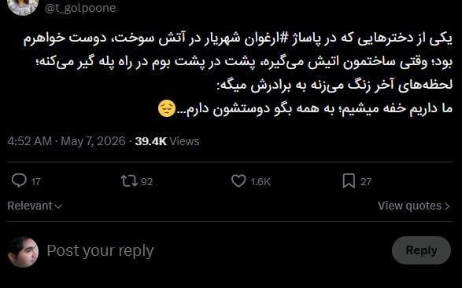

> t_golpoone
> 
> 📡 @VahidOnline

## 1405/02/17 18:29 — kianmeli1
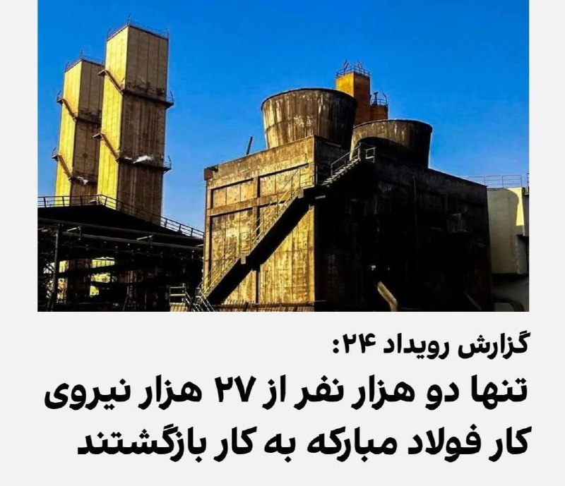

> 🔴تنها ٢ هزار نفر از ٢٧ هزار نيروي كار فولاد به كار بازكشتند
> 
> پس از حملات آمریکا و اسرائیل به فولاد مبارکه اصفهان، از بیش از ۲۷ هزار نیروی این مجموعه تنها حدود دو هزار نفر، عمدتا در بخش‌های اداری و مدیریتی، به محل کار بازگشته‌اند و بخش تولید همچنان در توقف به‌سر می‌برد.
> 
> بر اساس این گزارش، بخشی از کارگران و نیروهای سابق فولاد مبارکه پس از توقف تولید، به رانندگی در اسنپ و تپسی روی آورده‌اند و برخی نیروهای فنی به دلیل کاهش حقوق یا بلاتکلیفی در روند بازسازی، به کارخانه‌های فولاد یزد و خراسان مهاجرت کرده‌اند
> https://t.me/kianmeli1

## ???-??-?? ??:?? (post 335984) — IranIntlTV
[🎬 Video](telegram/content/IranIntlTV_335984_1778166512.mp4)

> یک روان‌شناس در پیامی به ایران‌اینترنشنال گفت قطعی اینترنت سلامت روان شهروندان را تحت تاثیر قرار داده است. مخاطب دیگری نیز با اشاره به حضور شماری از مقام‌های جمهوری اسلامی در فهرست تروریستی آمریکا، هرگونه توافق آمریکا با این افراد را تناقض‌آمیز توصیف کرد.
> منصوره حسینی‌یگانه، عضو تحریریه ایران‌اینترنشنال، گزارش می‌دهد
> @iranintltv

## ???-??-?? ??:?? (post 335983) — IranIntlTV
[🎬 Video](telegram/content/IranIntlTV_335983_1778166513.mp4)

> بر اساس اطلاعات رسیده به ایران‌اینترنشنال، خبر دیدار مسعود پزشکیان و مجتبی خامنه‌ای صحت ندارد و چنین ملاقاتی انجام نشده است. مقام‌های ارشد سپاه نیز با ابراز تعجب از انتشار این خبر از سوی دفتر ریاست‌جمهوری گفته‌اند درخواست دیدار پزشکیان با مجتبی خامنه‌ای تاکنون پنج بار مطرح و هر بار رد شده است.
> گفت‌وگو با علی‌حسین قاضی‌زاده، عضو تحریریه ایران‌اینترنشنال
> @iranintltv

## ???-??-?? ??:?? (post 105090) — ManotoTV
[🎬 Video](telegram/content/ManotoTV_105090_1778166515.mp4)

> «قطع اینترنت خاموش کردن صدای مردم است»

## ???-??-?? ??:?? (post 105089) — ManotoTV
[🎬 Video](telegram/content/ManotoTV_105089_1778166516.mp4)

> مسعود پزشکیان در نشست اصناف و بازاریان مدعی شد با مجتبی خامنه‌ای دیدار داشته است.
> 
> پزشکیان گفت آن‌چه در دیدار با مجتبی خامنه‌ای بیش از هر موضوع دیگری برای او برجسته شد، برخورد «متواضعانه و صمیمی رهبر» بوده است .

## 1405/02/17 18:31 — FarsiVOA
> 🔺جمهوری اسلامی در کمین جان‏ سه تن دیگر از بازداشت‌شدگان اعتراضات دی‌ ۱۴۰۴
> 
> ▪️وب‌سایت حقوقی دادمان روز پنجشنبه ۱۷ اردیبهشت، اعلام کرد که ‏برای سه تن از بازداشت‌شدگان خیزش دی‌ماه ۱۴۰۴ که در زندان قزل‌حصار محبوس هستند ‏حکم اعدام صادر و این حکم در شعبه نهم دیوان عالی کشور به ریاست قاسم مزینانی تأیید شده است.
> 
> ⬇️ بیشتر بخوانید:
> 
> https://ir.voanews.com/a/dey-protests-ghezal-hesar-prisoners-execution-of-protesters-iran/8147589.html/?nocach=1

## 1405/02/17 18:23 — BBCPersian
> 🔻اولین کنسرت رسمی تهران پس از جنگ؛ چرا اجرای کینگ‌رام بحث‌برانگیز شد؟
> 
> 🖌حسام گرشاسبی، بی‌بی‌سی
> 
> پس از ماه‌ها سکوت موسیقایی در تهران در سایه جنگ و پیامدهای آن، در اردیبهشت ماه ۱۴۰۵ چراغ اجراهای زنده بار دیگر روشن شد؛ بازگشتی که با کنسرت رامین سیدامامی، معروف به «کینگ رام» در مجموعه تئاتر لبخند، به‌عنوان اولین اجرای رسمی پس از جنگ رقم خورد.
> 
> https://bbc.in/42lcqIw
> @BBCPersian

## 1405/02/17 18:20 — mwarmonitor
> 🇺🇸روبیو تحریم‌های جدیدی را علیه کوبا اعلام کرد
> 
> 📝مارک کاپوتو AXIOS
> 
> 🔰مارکو روبیو، وزیر امور خارجه، روز پنجشنبه تحریم‌های جدیدی را علیه شرکت‌های صنایع نظامی کوبا، رهبر آن و یک شرکت دولتی منابع طبیعی اعلام کرد.
> 
> 
> چرا این موضوع مهم است؟
> این تحریم‌های جدید نشان‌دهنده آن است که دولت ترامپ در حال پیشبرد هدف «تغییر رژیم» در کوباست؛ هدفی که مدت‌هاست مورد حمایت روبیو و پرزیدنت ترامپ بوده است.
> جزئیات تحریم‌ها
> روبیو این تحریم‌ها را تحت فرمان اجرایی اول ماه مه ترامپ، که «مسئولین سرکوب در کوبا و تهدیدکنندگان امنیت ملی و سیاست خارجی ایالات متحده» را هدف قرار می‌دهد، اعمال کرد.
> فهرست تحریم‌شدگان:
> گروه مدیریت تجاری (GAESA): این سازمان، مجموعه چتری تحت کنترل ارتش کوبا است که روبیو آن را «قلب تپنده سیستم کمونیستی و غارتگر کوبا» نامید. این نهاد بخش‌های عمده‌ای از اقتصاد کشور، از جمله هتل‌ها را در کنترل دارد.
> آنیا گی‌یرمینا لاسترس موررا: لاسترس یکی از رهبران ارشد یا اعضای هیئت مدیره GAESA است (یا بوده است).
> شرکت نیکل موآ (MNSA): این شرکت در بخش فلزات و معدن اقتصاد کوبا فعالیت می‌کند. روبیو گفت این شرکت «از منابع طبیعی کوبا برای نفع رساندن به رژیم و به قیمت آسیب به مردم کوبا بهره‌برداری کرده است. این شرکت از دارایی‌هایی سود می‌برد که در اصل توسط رژیم کوبا از اشخاص و شرکت‌های آمریکایی مصادره شده بود.»
> نگاه کلی
> طبق گفته یک منبع آگاه، اعلامیه روبیو تنها چند روز پس از آن صادر شد که وزارت امور خارجه فرستادن پرسنل خود به «فرماندهی جنوبی ایالات متحده» در میامی را آغاز کرد؛ اقدامی که در پیش‌بینی درگیری‌های احتمالی بیشتر با کوبا صورت گرفته است. همچنین وزارت امور خارجه در حال تقویت مرکز تدارکات آمادگی در برابر بلایا در جنوب فلوریدا است.
> آنچه گفته شده است
> در بیانیه روبیو آمده است: «این تحریم‌ها بخشی از کارزار جامع دولت ترامپ برای مقابله با تهدیدات مبرم امنیت ملی از سوی رژیم کمونیستی کوبا و پاسخگو کردن رژیم و حامیان مالی و مادی آن است.»
> وی افزود: «تنها در ۹۰ مایلی خاک آمریکا، رژیم کوبا جزیره را به ویرانی کشانده و آن را به عنوان بستری برای عملیات‌های اطلاعاتی، نظامی و تروریستی خارجی به حراج گذاشته است.»
> 
> 🔸گام بعدی چیست؟
> ترامپ و روبیو گزینه نظامی را رد نکرده‌اند و روبیو اظهار داشت: «می‌توان در روزها و هفته‌های آینده انتظار تعیین تحریم‌های بیشتری را داشت.»
> 
> @mwarmonitor

## 1405/02/17 18:16 — mwarmonitor
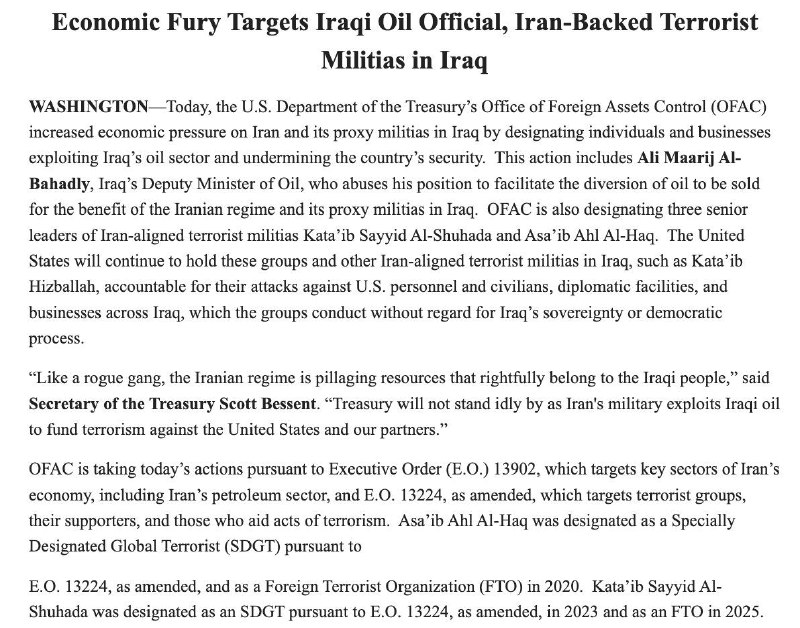

> 🇺🇸🇮🇶وزارت خزانه‌داری آمریکا معاون وزیر نفت عراق را تحریم کرده و می‌گوید او «از موقعیت خود سوءاستفاده می‌کند تا انتقال و انحراف نفت را تسهیل کند؛ نفتی که برای فروش به نفع رژیم ایران و شبه‌نظامیان نیابتی آن در عراق استفاده می‌شود.»
> 
> 
> @mwarmonitor

## ???-??-?? ??:?? (post 8633) — mwarmonitor
[🎬 Video](telegram/content/mwarmonitor_8633_1778165550.mp4)

> 🇺🇸با تشکر از بودجه دفاعی ۱.۵ تریلیون دلاری رئیس‌جمهور ترامپ، این وزارت جنگ از یک ساختار بوروکراتیک به یک ساختار تجاری تبدیل شده است.
> 
> 📈این یک سرمایه‌گذاری از نظر مالی مسئولانه در «زرادخانه آزادی» ما است—که تضمین می‌کند ارتش ما همچنان مرگبارترین نیروی رزمی در جهان باقی بماند.
> 
> @mwarmonitor

## 1405/02/17 18:19 — pm_afshaa
> 🔴یک منبع پاکستانی به العربیه : ترامپ خواستار پاسخ فوری ایران است
> 
> 
> 💧 Rainbet.com the #1 Non-KYC Crypto Casino & Sportsbook @rainbetcom
> 
> 😁 @Pm_Afshaa

## 1405/02/17 18:20 — VahidOnline

> محمود نبویان، عضو کمیسیون امنیت ملی مجلس، در شبکه ایکس نوشت: «با وجود سابقه بدعهدی آمریکا و به ویژه حضور اصحاب توافق ذلت بار برجام به‌همراه قالیباف در مذاکرات، هیچ امیدی به مذاکره و توافق مطلوب برای ایران وجود ندارد.»
> 
> او افزود: «لازم است قالیباف اصحاب توافق خسارت‌بار برجام را از تیم مذاکره‌کننده کاملا حذف نماید.»
> 
> نبویان در پست دیگری نیز نوشت که برخی از «مسئولین و سیاسیون ترسو و غیرهمسو با ملت مقاوم ایران»، به دنبال آمارسازی‌های غلط برای تسلیم هستند، اگر اصلاح نکنند، اسامی‌شان افشا خواهد شد.
> @VahidOOnLine
> 
> 📡 @VahidOnline

## 1405/02/17 18:17 — VahidOnline
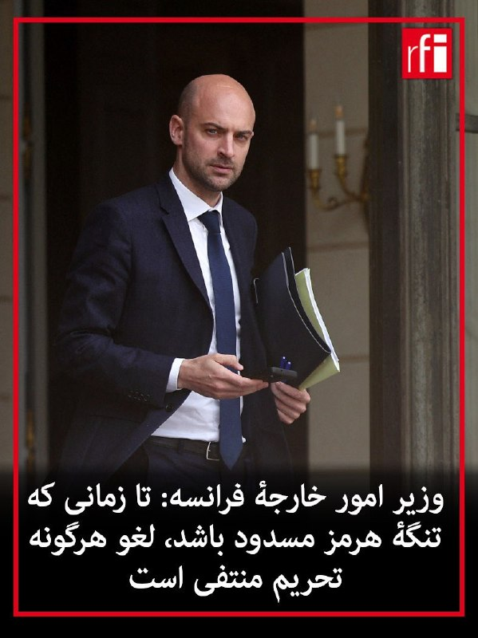

> ژان-نوئل بارو، وزیر خارجه فرانسه اعلام کرد تا زمانی که تنگه هرمز توسط نیروهای جمهوری اسلامی مسدود باشد، هیچ تحریمی علیه تهران لغو نخواهد شد.
> 
> او در گفت‌وگو با شبکه «آر‌ال‌تی» گفت: «ما خودمان تحریم‌های مهمی علیه ایران اعمال کرده‌ایم. اما تا زمانی که تنگه هرمز مسدود باشد، لغو هیچ‌گونه تحریمی قابل تصور نیست.»
> بارو افزود: «این تنگه نمی‌تواند بسته شود، مشمول عوارض گردد یا به‌عنوان ابزار فشار و باج‌گیری استفاده شود.»
> 
> او همچنین تأکید کرد فرانسه نباید دوباره در موقعیتی قرار بگیرد که مجبور شود هزینه جنگ‌هایی را بپردازد که خود آغاز نکرده است.
> به گفته او، اروپا باید وابستگی خود به نفت، هیدروکربن‌ها و فناوری‌های دیجیتال را کاهش دهد تا کمتر درگیر بحران‌ها و درگیری‌هایی شود که مستقیماً طرف آن نیست.
> @VahidOOnLine
> 
> 📡 @VahidOnline

## 1405/02/17 18:14 — VahidOnline
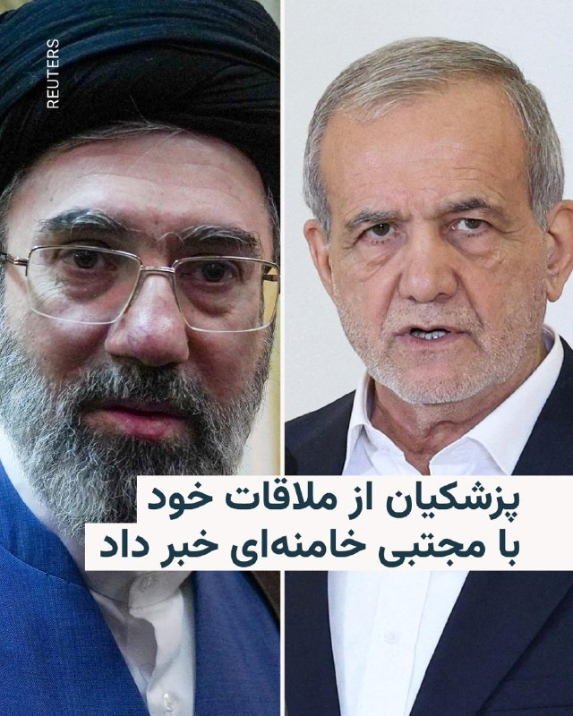

> مسعود پزشکیان، رئیس‌جمهور ایران، از ملاقات اخیر خود با مجتبی خامنه‌ای، رهبر جمهوری اسلامی، خبر داد و گفت با گفت‌وگوی مفصلی داشته است.
> 
> مسعود پزشکیان که روز پنجشنبه ۱۷ اردیبهشت در نشستی در وزارت صمت سخن می‌گفت، به ملاقات دو ساعت و نیمه با مجتبی خامنه‌ای اشاره کرد اما در مورد موضوع و جزئیات ملاقات و اظهارات مطرح‌شده چیزی نگفت و صرفاً او را به‌دلیل «صمیمی و متواضع بودن»، «الگویی برای نظام مدیریتی و اداری» کشور توصیف کرد.
> 
> پس از کشته شدن علی خامنه‌ای، رهبر پیشین جمهوری اسلامی، در روز نخست جنگ با آمریکا و اسرائیل، مجلس خبرگان رهبری پسرش مجتبی را به‌عنوان رهبر جدید معرفی کرد. با این حال از آن زمان هیچ تصویر، صوت یا دستخطی از او منتشر نشده و رسانه‌های ایران فقط شماری پیام مکتوب منسوب به او را منتشر کرده‌اند.
> @VahidHeadline
> 
> 📡 @VahidOnline

## 1405/02/17 18:20 — DW_Farsi
> 🔶 پزشکیان از "دیدار دو و نیم ساعته" خود با مجتبی خامنه‌ای خبر داد
> 
> مسعود پزشکیان، رئیس‌جمهور ایران، در نشستی با نمایندگان اصناف از دیدار اخیرش با مجتبی‌ خامنه‌ای، رهبر جدید جمهوری اسلامی، خبر داد.
> 
> به گزارش رسانه‌های ایران پزشکیان روز پنج‌شنبه ۱۷ اردیبهشت گفت در این دیدار که "نزدیک به دو و نیم ساعت" طول کشیده، از ضرورت "وحدت و انسجام" در ساختار رهبری کشور با مجتبی خامنه‌ای سخن گفته است.
> 
> او با این حال به زمان دقیق این ملاقات اشاره‌ای نکرد.
> 
> مجتبی خامنه‌ای در پی کشته شدن پدرش علی خامنه‌ای در حملات اسرائيل و آمریکا به رهبری رسید اما از آن زمان تا کنون در انظار عمومی ظاهر نشده و در رسانه‌ها نیز تنها پیام‌های کتبی منتسب به او منتشر شده‌اند.
> 
> مقام‌های ایرانی می‌گویند، او نهم اسفند ۱۴۰۴ در زمان حمله هوایی به بیت رهبری در این مکان حضور داشت، اما از حمله جان سالم بدر برد و تنها به‌شدت زخمی شده است. با این حال عدم پخش تصاویر زنده یا پیام صوتی از مجتبی خامنه‌ای به گمانه‌زنی‌ها در مورد سلامتی‌ و وخامت وضعیت جسمانی‌اش دامن زده است. این نخستین بار است که گفته می‌شود، یک مقام عالی‌رتبه دولت ایران با او ملاقات کرده است.
> 
> شبکه سی‌ان‌ان در خبری که درباره "دیدار" پزشکیان با مجتبی خامنه‌ای منتشر کرده، زمان پخش چنین خبری را با توجه به احتمال رسیدن به توافق در مذاکرات ایران و آمریکا، مهم دانسته است.
> 
> پزشکیان گفته است که مجتبی خامنه‌ای در این ملاقات با روحیه "مبتنی بر سادگی، تواضع، صمیمیت و احترام متقابل خود" باعث می‌شد که "فضای گفت‌وگو کاملا بی‌واسطه، صریح و همراه با احساس نزدیکی و اعتماد باشد."
> 
> او افزود: «وقتی عالی‌ترین مقام کشور با چنین منش اخلاقی، تواضع و روحیه مردمی با مسئولان و افراد مواجه می‌شود، این رفتار به‌صورت طبیعی می‌تواند الگویی برای نظام مدیریتی و اداری کشور نیز باشد.»
> 
> @dw_farsi

## 1405/02/17 18:14 — DW_Farsi
> 🔶 حماس از کشته شدن پسر خلیل الحیه، یکی از رهبران ارشد این گروه، خبر داد
> 
> عزام الحیه، پسر خلیل الحیه، مذاکره‌کننده ارشد حماس در امور نوار غزه در حمله هوایی اسرائيل به محله‌ای در غزه کشته شد.
> 
> در حالی‌که پیش‌تر خبر زخمی‌ شدن عزام الحیه منتشر شده بود، گروه تروریستی حماس روز پنج‌شنبه هفتم مه (۱۷ اردیبهشت) کشته شدن او را تأیید کرد.
> 
> باسم نعیم، سخنگوی دفتر سیاسی حماس اعلام کرد که عزام الحیه بر اثر شدت جراحات وارده ناشی از حمله‌ای که شامگاه چهارشنبه صورت گرفت، جان باخته است.
> 
> ارتش اسرائيل هنوز به درخواست برای اظهارنظر در این باره پاسخی نداده است.
> 
> خلیل الحیه هدایت مذاکرات حماس با اسرائیل درباره آینده نوار غزه را که با میانجی‌گری آمریکا انجام می‌شود، بر عهده دارد. او که پدر هفت فرزند است سال گذشته سه پسر دیگر خود را در حملات اسرائيل از دست داده بود.
> 
> اسرائيل بارها برای ترور خلیل الحیه اقدام کرده است که این تلاش‌ها ناموفق مانده‌اند. سال گذشته این مقام حماس که در تبعید زندگی می‌کند از حمله‌ای در دوحه، پایتخت قطر جان سالم به در برد. در آن حمله یکی از پسرانش کشته شد. دو پسر دیگر خلیل الحیه پیش‌تر کشته شده بودند.
> 
> طبق گزارش رسانه‌ها، در حملات مختلف، چند عضو دیگر این خانواده، از جمله همسر او نیز جان خود را از دست داده‌اند.
> 
> @dw_farsi

## 1405/02/17 18:21 — Persian_Trend_Official
> 🔥 چندین بار تراست VPN رو معرفی کردیم و بازخورد کاربرا واقعاً عالی بوده 🙌
> 
> اگر دنبال یه VPN سریع، پایدار و بدون دردسر هستین، تراست VPN یکی از بهترین انتخاب‌هاست 👌
> 
> 📱 سرعتش واقعاً خوراک اینستاگرام و یوتیوبه
> 
> ✅ تمامی سرورهاشون به‌صورت کامل ارتقا پیدا کرده
> ⚡️ سرعت فوق‌العاده بالا
> 🛡 پایداری عالی بدون قطعی
> 💸قیمت مناسب نسبت به کیفیتی که ارائه میدن
> 
> اگر خواستین استعلام بگیرین یا اطلاعات بیشتری بخواین، بهشون پیام بدین
> 
> 👇👇
> @trusstvpnn_admin
> @trusstvpnn_admin

## 1405/02/17 18:18 — RadioFarda
> الفک: ریاض با احیای اعتماد از سوی تهران آماده برقراری توازن قوا در خاورمیانه است
> 
> 🔸نقش عربستان سعودی در دستیابی تهران و واشینگتن به یک تفاهم برای پایان جنگ چیست و این کشور چه اهرم‌هایی برای استفاده در این عرصه دارد؟ شبکه ان‌بی‌سی نیوز می‌گوید «پروژه آزادی» دونالد ترامپ در تنگه هرمز پس از آن متوقف شد که عربستان سعودی اجازهٔ‌ استفاده از پایگاه هوایی و حریم هوایی این کشور برای پشتیبانی از عملیات را نداد. این گزارش که هنوز مقام‌های رسمی این کشورها اظهارنظر درباره آن نکرده‌اند، یک روز پس از آن منتشر شده که عباس عراقچی، وزیر امور خارجه ایران، از پکن به صورت تلفنی با همتای عربستانی خود به صورت تلفنی گفت‌وگو کرده بود. ارزیابی مسعود الفک، تحلیلگر امور خاورمیانه در ریاض، را درباره نقش‌آفرینی عربستان و فرصت‌های در اختیار این کشور در این عرصه بشنوید.
> 
> @RadioFarda

## 1405/02/17 18:20 — IranianMinds
> 🔴 صداوسیما :
> 
> اکثر مردم همیشه خبرهای مارو میبینن حدود 75 درصد و هیچکس به شبکه های دیگه اعتمادی نداره !
> 
> @IranianMinds

## 1405/02/17 18:14 — IranianMinds
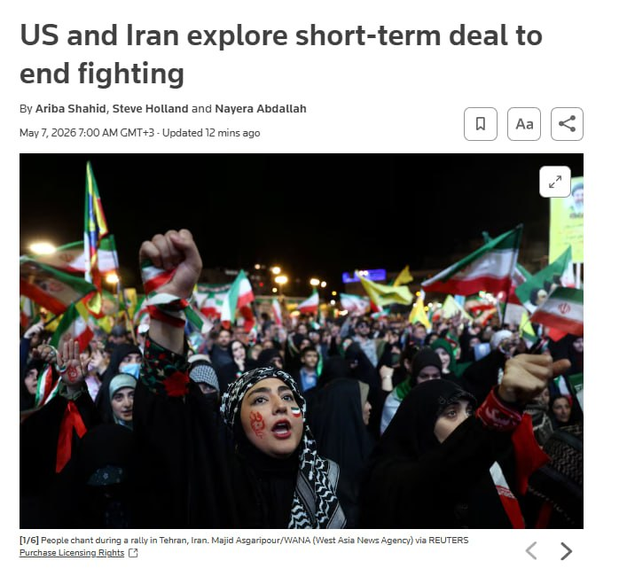

> 🔴 رویترز :
> 
> ایالات متحده و ایران در حال نزدیک شدن به یک توافق موقت برای توقف درگیری‌ها هستند، هرچند اختلافات عمده همچنان حل‌نشده باقی مانده‌اند. تهران در حال بررسی یک پیشنهاد یک‌صفحه‌ای است که بر پایان جنگ، بازگشایی تنگه هرمز، و شروع ۳۰ روز مذاکرات گسترده‌تر تمرکز دارد.
> 
> پیش‌نویس از خواسته‌های کلیدی آمریکا در مورد برنامه هسته‌ای ایران، موشک‌ها، و نیروهای نیابتی منطقه‌ای اجتناب می‌کند.
> 
> مسئولان ایرانی همچنان مشکوک هستند و پیشنهاد را بیشتر «فهرست آرزوهای آمریکایی» تا «واقعیت» میبینن.
> 
> @IranianMinds

## 1405/02/17 18:14 — BBCPersian
> 🔻منبع سعودی: آمریکا همچنان به پایگاه‌ها و حریم هوایی عربستان دسترسی دارد
> 
> یک منبع سعودی روز پنجشنبه گزارش رسانه‌های آمریکایی در مورد نقش ریاض در دستور توقف عملیات نظامی آمریکا در تنگه هرمز را رد کرد.
> 
> پیشتر رسانه‌های آمریکایی گزارش دادند که دونالد ترامپ پس از دخالت عربستان سعودی، دستور توقف عملیات نظامی آمریکا برای هدایت کشتی‌های سرگردان در تنگه هرمز را صادر کرده است.
> 
> بر اساس گزارشی از شبکه خبری ان‌بی‌سی، این عقب‌نشینی آقای ترامپ پس از آن بود که گفته می‌شود محمد بن سلمان در تماس مستقیم با دونالد ترامپ، اجازه استفاده از حریم هوایی و پایگاه‌های خود را برای این عملیات به نیروهای آمریکایی نداد.
> 
> اما یک منبع نزدیک به دولت عربستان به خبرگزاری فرانسه گفت: «این موضوع صحت ندارد.»
> 
> این منبع می‌گوید که آمریکا همچنان به‌طور معمول به پایگاه‌ها و حریم هوایی عربستان دسترسی دارد.
> 
> https://bbc.in/496G5Jl
> @BBCPersian

## 1405/02/17 18:12 — VahidOOnLine
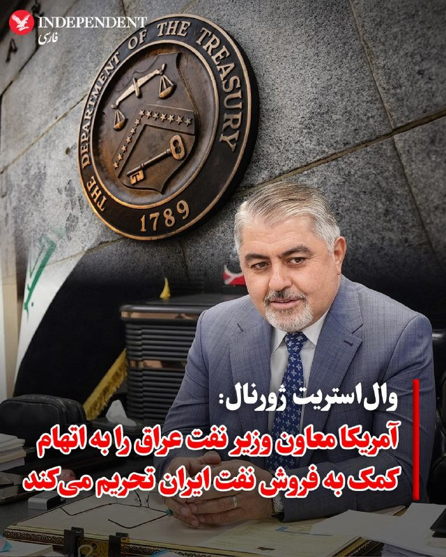

> ♦️وزارت خزانه‌داری ایالات متحده در نظر دارد روز پنجشنبه، ۱۷ اردیبهشت، علی معارج البهادلی، معاون وزیر نفت عراق را به اتهام تسهیل فروش نفت ایران از طریق ترکیب آن با نفت خام عراق، در لیست تحریم‌های خود قرار دهد. به گزارش وال استریت ژورنال، مقامات آمریکایی معتقدند البهادلی با جعل اسناد، محموله‌های نفتی قاچاق را به عنوان محصول خالص عراق راهی بازار جهانی می‌کرده است.
> 
> این اقدام بی‌سابقه علیه یک مقام بلندپایه دولتی در حال خدمت، نشان‌دهنده تشدید فشارهای دولت ترامپ بر بغداد برای قطع پیوندهای اقتصادی با تهران است. واشنگتن بر این باور است که ایران از همسایه خود به عنوان مسیری برای دور زدن تحریم‌های بین‌المللی و تامین ارز استفاده می‌کند.
> 
> این تحریم‌ها در حالی وضع می‌شود که عراق در دوره انتقال قدرت به سر می‌برد. علی الزیدی، نخست‌وزیر مامور تشکیل کابینه، هم‌اکنون در حال رایزنی برای چیدمان وزرای خود و کسب رای اعتماد از پارلمان است.
> ‌🇸🇦 Indypersian
> 
> 🤖 @VahidOOnLine

## ???-??-?? ??:?? (post 238660) — VahidOOnLine
[🎬 Video](telegram/content/VahidOOnLine_238660_1778165064.mp4)

> رسانه‌های حکومتی گزارش داده‌اند عباس عراقچی، وزیر امور خارجه جمهوری‌اسلامی، و محمد اسحاق دار، وزیر خارجه پاکستان، عصر پنج‌شنبه در تماس تلفنی درباره آخرین تحولات منطقه گفت‌وگو کردند.
> در این گزارش‌ها آمده، دو طرف بر اهمیت ادامه مسیر گفت‌وگو و دیپلماسی تأکید کرده و خواستار گسترش همکاری‌های منطقه‌ای برای حفظ ثبات و جلوگیری از تشدید تنش‌ها شدند.
> ‌🏁 🇬🇧 ManotoTV
> 
> 🤖 @VahidOOnLine

## 1405/02/17 18:08 — VahidOOnLine

> خبرگزاری تسنیم، وابسته به سپاه پاسداران، در واکنش به گزارش المیادین درباره سفر عراقچی به پاکستان در بازگشت از چین، نوشت که عراقچی به ایران برگشته و در راه بازگشت دیداری از اسلام‌آباد نداشته است.
> ‌🏁 🇬🇧 IranintlTV
> 
> 🤖 @VahidOOnLine

## 1405/02/17 18:05 — mwarmonitor

> 📝خیلی ها نگران خانم کرولاین لویت بودن
> 
> در ۱ مه، ویویانا (که ما به او «ویوی» می‌گوییم) به خانواده‌مان اضافه شد و قلب‌های ما همان لحظه از عشق سرشار شد. 💕
> 
> او کاملاً سالم و بی‌نقص است و برادر بزرگ‌ترش هم با شادی در حال عادت کردن به زندگی با خواهر کوچکش است. ما از تمام لحظات این دنیای آرام و شیرینِ نوزادی لذت می‌بریم.
> 
> از همه کسانی که در طول دوران بارداری برایم دعا کردند و پیام محبت‌آمیز فرستادند سپاسگزارم—واقعاً حضورشان را در تمام این مسیر احساس کردم. خداوند خوب است. 🙏
> 
> @mwarmonitor

## ???-??-?? ??:?? (post 90277) — pm_afshaa
[🎬 Video](telegram/content/pm_afshaa_90277_1778165067.mp4)

> حملات سنگین اسراییل به جنوب لبنان
> 
> 
> 
> 💧 Rainbet.com the #1 Non-KYC Crypto Casino & Sportsbook @rainbetcom
> 
> 😁 @Pm_Afshaa

## 1405/02/17 18:12 — VahidOnline

> ♦️وال استریت ژورنال در گزارشی درباره توافق آمریکا با رژیم ایران نوشت که ایالات متحده می‌خواهد همه ذخایر اورانیوم غنی‌شده از ایران خارج شود. به این معنی که هم ذخایر اورانیوم با غنای ۶۰ درصد و هم ۲۰ درصد و هر میزان اورانیوم غنی‌شده دیگری که ایران در اختیار دارد نیز باید تحویل دهد. این در حالی است که مفامات تهران همچنان می‌گویند موضوع خروج ذخایر اورانیوم غنی‌شده از ایران، از دستور کار خارج شده است.
> @VahidOOnLine
> 
> 📡 @VahidOnline

## 1405/02/17 18:11 — VahidOnline

> ان‌بی‌سی نیوز به نقل از دو مقام آمریکایی گزارش داد چرخش ناگهانی ترامپ از «پروژه آزادی» تنگه هرمز پس از آن رخ داد که متحدان خلیج فارس از این تصمیم غافلگیر شدند و عربستان سعودی امکان استفاده ارتش آمریکا از پایگاه‌ها و حریم هوایی خود جهت اجرای این عملیات را به حالت تعلیق درآورد.
> به گفته این مقام‌ها، ترامپ بعدازظهر یکشنبه با اعلام «پروژه آزادی» در شبکه‌های اجتماعی، متحدان خلیج فارس را غافلگیر کرد و این اقدام موجب نارضایتی رهبران عربستان سعودی شد. در واکنش، عربستان سعودی به آمریکا اطلاع داد که اجازه نخواهد داد ارتش آمریکا از پایگاه هوایی پرنس سلطان در جنوب‌شرقی ریاض پرواز کند یا برای پشتیبانی از این تلاش از حریم هوایی عربستان عبور کند.
> این دو مقام آمریکایی گفتند تماس تلفنی میان ترامپ و محمد بن سلمان، ولیعهد عربستان سعودی، این اختلاف را حل نکرد و رییس‌جمهوری آمریکا ناچار شد «پروژه آزادی» را متوقف کند تا دسترسی ارتش آمریکا به این حریم هوایی حیاتی را احیا کند.
> دیگر متحدان نزدیک خلیج فارس نیز غافلگیر شدند؛ رییس‌جمهوری آمریکا پس از آغاز این اقدام با رهبران قطر گفت‌وگو کرد.
> 
> @VahidOOnLine
> 
> 📡 @VahidOnline

## 1405/02/17 18:08 — IranIntlTV
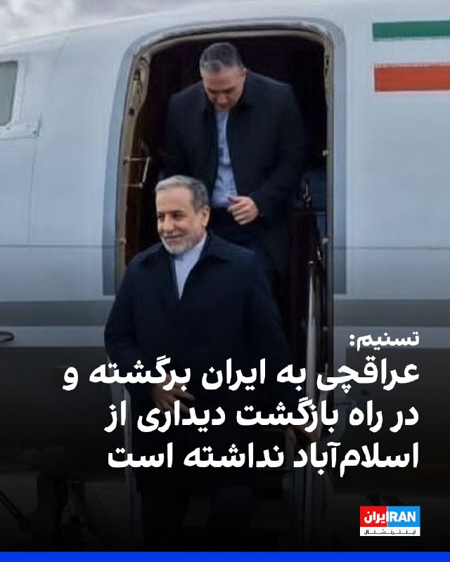

> خبرگزاری تسنیم، وابسته به سپاه پاسداران، در واکنش به گزارش المیادین درباره سفر عراقچی به پاکستان در بازگشت از چین، نوشت که عراقچی به ایران برگشته و در راه بازگشت دیداری از اسلام‌آباد نداشته است.
> https://iranintl.com/202605071984

## ???-??-?? ??:?? (post 335981) — IranIntlTV
[🎬 Video](telegram/content/IranIntlTV_335981_1778165072.mp4)

> سرخط خبرهای پنجشنبه ۱۷ اردیبهشت
> @iranintltv

## ???-??-?? ??:?? (post 105088) — ManotoTV
[🎬 Video](telegram/content/ManotoTV_105088_1778165074.mp4)

> رسانه‌های حکومتی گزارش داده‌اند عباس عراقچی، وزیر امور خارجه جمهوری‌اسلامی، و محمد اسحاق دار، وزیر خارجه پاکستان، عصر پنج‌شنبه در تماس تلفنی درباره آخرین تحولات منطقه گفت‌وگو کردند.
> در این گزارش‌ها آمده، دو طرف بر اهمیت ادامه مسیر گفت‌وگو و دیپلماسی تأکید کرده و خواستار گسترش همکاری‌های منطقه‌ای برای حفظ ثبات و جلوگیری از تشدید تنش‌ها شدند.

## 1405/02/17 18:13 — RadioFarda

> 🔸بر اساس پیش‌نویس دستورالعمل‌های اتحادیه اروپا که خبرگزاری رویترز مشاهده کرده، بروکسل معتقد است پیامدهای جنگ ایران برای صنعت گردشگری هنوز به حدی نرسیده که اقدامات اضطراری، مانند معاف کردن شرکت‌های هواپیمایی از پرداخت غرامت بابت لغو پروازها، ضروری باشد.
> 
> 🔸در این سند آمده است که برخلاف دوران همه‌گیری کووید-۱۹، داده‌های موجود نشان می‌دهد تأثیر کلی بحران بر گردشگری «محدود» بوده و تقاضا برای سفر همچنان تا حد زیادی حفظ شده است.
> 
> 🔸این دستورالعمل‌ها همچنین تأکید می‌کند افزایش قیمت سوخت هواپیما به‌تنهایی «شرایط فوق‌العاده» محسوب نمی‌شود که شرکت‌های هواپیمایی بتوانند با استناد به آن از پرداخت غرامت به مسافران خودداری کنند؛ هرچند کمبود واقعی سوخت ممکن است شامل این استثنا شود.
> 
> 🔸به نوشته رویترز، قیمت سوخت جت از زمان آغاز جنگ آمریکا و اسرائیل با ایران در ۹ اسفند ۱۴۰۴ حدود ۸۴ درصد افزایش یافته، اما تاکنون کمبودی در سوخت هواپیما در کشورهای اتحادیه اروپا گزارش نشده است.
> 
> @RadioFarda

## 1405/02/17 18:14 — IranianMinds
> 📲#اپلیکیشن اندروید سایت جهانی دربی بت
> 
> 👍اسپانسر لیگ انگلیس
> 👍
> 🔥امکان شارژ امن از طریق کارت بانکی
> ➖➖➖➖➖➖➖➖➖
> 
> 🪙همین حالا عضو شوید 👇
> https://t.me/+aCbq7yy8QY80NzQ0

## 1405/02/17 18:14 — IranianMinds

> 😤دنبال یه سایت شرط بندی بین المللی بودی که به ایرانیا خدمات بده؟!
> ⛔
> 
> 
> 👍دربی بت همون انتخاب  100%
> 
> 
> 💎ویژگی های سایت جهانی Derby Bet:
> 
> ⬅️امکان شارژ امن با کارت بانکی
> 
> ⬅️واریز اول دوبل شارژ می شوید(بونوس۱۰۰٪)
> 
> ⬅️پر اپشن ترین سایت فعال در ایران
> 
> ⬅️تسویه حساب کمتر از 5 دقیقه
> 
> ⬅️برگشت بخشی از باخت به صورت هفتگی
> 
> 
> 🚨کد هدیه ثبت نام:GG007
> 
> ⚠️برای دانلود اپلکیشن کلیک کنید
> 👉
> ge17
> 
> 🔔کانال دربی بت :
> 
> 🪙https://t.me/+aCbq7yy8QY80NzQ0

## 1405/02/17 17:56 — VahidOOnLine

> وزارت خزانه‌داری آمریکا اعلام کرد ایالات متحده تحریم‌های جدیدی مرتبط با ایران اعمال کرده است. این وزارتخانه گفت این اقدام در چارچوب مقابله با تروریسم و تحریم‌های مرتبط با جمهوری اسلامی انجام شده است.
> 
> بر اساس بیانیه وزارت خزانه‌داری آمریکا، چند فرد و شرکت به فهرست تحریم‌شدگان اضافه شده‌اند که برخی از آن‌ها به‌طور مشخص تحت تحریم‌های مرتبط با تهران قرار گرفته‌اند.
> 
> در این بسته تحریمی، نام شماری از افراد و شرکت‌های عراقی و کوبایی که با افراد تحریم‌شده ارتباط داشته‌اند نیز درج شده است.
> ‌🏁 🇬🇧 IranintlTV
> 
> 🤖 @VahidOOnLine

## 1405/02/17 17:59 — mwarmonitor
> 🔴 صحبت‌های دکتر تدروس، مدیرکل سازمان جهانی بهداشت (WHO) 🔹«هشت مورد گزارش شده است که شامل سه مورد مرگ می‌شود. پنج مورد از این هشت مورد به عنوان هانت‌ویروس تایید شده‌اند و سه مورد دیگر مشکوک هستند. هانت‌ویروس‌ها گروهی از ویروس‌ها هستند که توسط جوندگان منتقل…

## 1405/02/17 17:54 — mwarmonitor
> 🔴 صحبت‌های دکتر تدروس، مدیرکل سازمان جهانی بهداشت (WHO)
> 
> 🔹«هشت مورد گزارش شده است که شامل سه مورد مرگ می‌شود. پنج مورد از این هشت مورد به عنوان هانت‌ویروس تایید شده‌اند و سه مورد دیگر مشکوک هستند.
> هانت‌ویروس‌ها گروهی از ویروس‌ها هستند که توسط جوندگان منتقل می‌شوند و می‌توانند باعث بیماری‌های شدید در انسان شوند. افراد معمولاً از طریق تماس با جوندگان آلوده یا ادرار، فضولات و بزاق آن‌ها مبتلا می‌شوند. گونه‌ی هانت‌ویروس درگیر در این پرونده، ویروس آند (Andes virus) است که در آمریکای لاتین یافت می‌شود و تنها گونه‌ی شناخته شده‌ای است که توانایی انتقال محدود بین انسان‌ها را دارد.
> 🔹در شیوع‌های قبلی ویروس آند، انتقال بین افراد با تماس نزدیک و طولانی‌مدت، به‌ویژه میان اعضای خانواده، شریک‌های زندگی و افرادی که مراقبت‌های پزشکی ارائه می‌دهند، مرتبط بوده است. به نظر می‌رسد در وضعیت فعلی نیز همین‌طور باشد.
> 🔸اولین مورد مربوط به مردی بود که در تاریخ ۶ آوریل علائم بیماری در او بروز کرد و در تاریخ ۱۱ آوریل روی کشتی درگذشت. هیچ نمونه‌ای از او گرفته نشد و چون علائم او مشابه سایر بیماری‌های تنفسی بود، به هانت‌ویروس مشکوک نشدند.
> 🔸همسر این مرد زمانی که کشتی در جزیره سنت هلن پهلو گرفت، به ساحل رفت و او نیز دارای علائم بود. وضعیت او در حین پرواز به ژوهانسبورگ در ۲۵ آوریل رو به وخامت گذاشت و روز بعد درگذشت. نمونه‌هایی از او گرفته شد که در مؤسسه ملی بیماری‌های واگیر آفریقای جنوبی آزمایش و ابتلای او به هانت‌ویروس تایید شد.
> 🔹سومین مورد مرگ مربوط به زنی در همان کشتی بود که علائمش در ۲۸ آوریل ظاهر شد و در تاریخ ۲ می درگذشت.»
> 
> @mwarmonitor

## ???-??-?? ??:?? (post 8629) — mwarmonitor
[🎬 Video](telegram/content/mwarmonitor_8629_1778164370.mp4)

> 🚨فوری: مدیرکل World Health Organization (WHO) سازمان جهانی بهداشت امروز یک نشست خبری درباره ویروس هانتاویروس برگزار خواهد کرد. قضیه داره جدی میشه @mwarmonitor

## 1405/02/17 17:59 — pm_afshaa
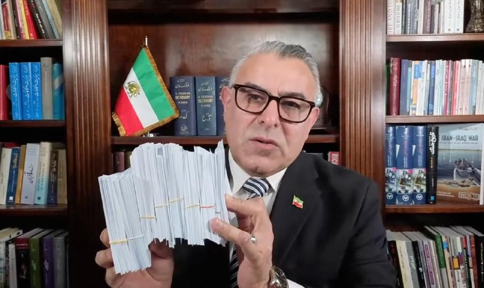

> اسامی هزار نفر دیگر از جاویدنامان ‌دی‌ماه، روز جمعه از ساعت 8 توسط مراد ویسی خوانده می‌شود
> 
> 
> 💧 Rainbet.com the #1 Non-KYC Crypto Casino & Sportsbook @rainbetcom
> 
> 😁 @Pm_Afshaa

## 1405/02/17 17:57 — pm_afshaa
> [
> ⭕️] کانفیگ ها با تضمین کامل ارائه میشن، بدون قطعی و با سرعت بالا همراه با پشتیبانی کامل تا اخرین لحظه • امکان مشاهده حجم به صورت انی • تضمین بازگشت وجه درصورت قطعی • تضمین کیفیت ، سرعت و پایداری 
> 💵قیمت هر گیگ از 280 هزارتمن شروع میشه ، میتونید از طریق…

## 1405/02/17 17:55 — pm_afshaa
> [
> ⭕️] کانفیگ ها با تضمین کامل ارائه میشن، بدون قطعی و با سرعت بالا همراه با پشتیبانی کامل تا اخرین لحظه
> 
> • امکان مشاهده حجم به صورت انی
> • تضمین بازگشت وجه درصورت قطعی
> • تضمین کیفیت ، سرعت و پایداری
> 
> 
> 💵قیمت هر گیگ از 280 هزارتمن شروع میشه ، میتونید از طریق ربات ثبت سفارش کنید یا پلن های مختلف مارو مشاهده کنید [ @qiutinfreedombot ] 
> 💭
> 
> 
> 👀 دوستانی که کار با ربات براشون مقدور نیست و دوست دارن مستقیم از خودم خرید انجام بدن میتونید از طریق پیویم باهام در ارتباط باشی
> 
> ارتباط با پشتیبانی
> 💬 @Uverdzi
> 
> ایدی چنلمون 
> 📣 @QiutinVPN

## 1405/02/17 18:00 — kianmeli1

> 🔴به گزارش رویترز، به نقل از گزارش رسانه چینی سیاشین، یک نفتکش بزرگ چینی حامل فرآورده‌های نفتی، دوشنبه گذشته در نزدیکی بندر الجیر امارات متحده عربی مورد اصابت یک موشک ایرانی قرار گرفت.
> 
> به گفته منبعی از مالک کشتی، این اولین بار است که از زمان آغاز درگیری، یک کشتی چینی مورد اصابت آتش ایرانی‌ها قرار می‌گیرد.
> 
> طبق گزارش‌ها، این کشتی با عنوان «مالک و خدمه چینی» علامت‌گذاری شده بود و همچنان هدف قرار گرفته است.
> https://t.me/kianmeli1

## 1405/02/17 17:58 — IranIntlTV
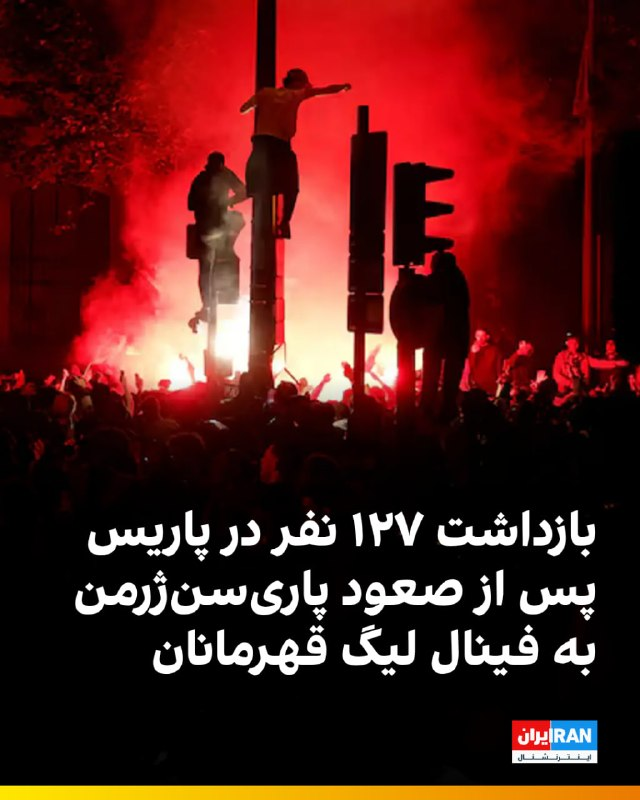

> 🔻لوران نونز، وزیر کشور فرانسه، اعلام کرد در جریان جشن هواداران پاری‌سن‌ژرمن پس از صعود این تیم به فینال لیگ قهرمانان اروپا، ۱۲۷ نفر در پاریس و حومه آن بازداشت شدند. به گزارش آسوشیتدپرس، این درگیری‌ها پس از پیروزی پاری‌سن‌ژرمن مقابل بایرن مونیخ و صعود این تیم به دومین فینال پیاپی لیگ قهرمانان رخ داد.
> 
> 🔹نونز گفت در این ناآرامی‌ها ۱۱ نفر زخمی شدند که حال یکی از آنها وخیم گزارش شده است. همچنین ۲۳ مامور پلیس جراحات سطحی برداشتند. درگیری‌ها در اطراف ورزشگاه پارک دو پرنس و خیابان شانزه‌لیزه رخ داد و پلیس برای جلوگیری از بسته شدن جاده کمربندی پاریس وارد عمل شد.
> 
> 🔹وزیر کشور فرانسه ضمن محکوم کردن خشونت‌ها، اعلام کرد تدابیر امنیتی برای دیدار فینال ۳۰ مه میان پاری‌سن‌ژرمن و آرسنال در بوداپست افزایش خواهد یافت. او همچنین از اعلام زودهنگام ایجاد منطقه ویژه هواداران از سوی امانوئل گرگوار، شهردار تازه‌منتخب پاریس، بدون هماهنگی با پلیس انتقاد کرد.
> 
> @iranintltvsport

## 1405/02/17 17:56 — IranIntlTV
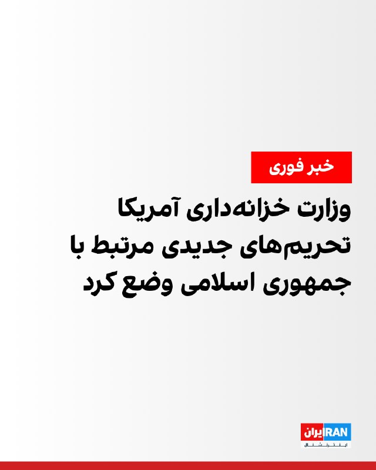

> وزارت خزانه‌داری آمریکا اعلام کرد ایالات متحده تحریم‌های جدیدی مرتبط با ایران اعمال کرده است. این وزارتخانه گفت این اقدام در چارچوب مقابله با تروریسم و تحریم‌های مرتبط با جمهوری اسلامی انجام شده است.
> 
> بر اساس بیانیه وزارت خزانه‌داری آمریکا، چند فرد و شرکت به فهرست تحریم‌شدگان اضافه شده‌اند که برخی از آن‌ها به‌طور مشخص تحت تحریم‌های مرتبط با تهران قرار گرفته‌اند.
> 
> در این بسته تحریمی، نام شماری از افراد و شرکت‌های عراقی و کوبایی که با افراد تحریم‌شده ارتباط داشته‌اند نیز درج شده است.
> https://iranintl.com/202605073766

## ???-??-?? ??:?? (post 217113) — FarsiVOA
> مارکو روبیو، وزیر خارجه آمریکا، در سفر به ایتالیا با پاپ لئو چهاردهم در واتیکان دیدار کرد و قرار است با مقام‌های ارشد دولت ایتالیا نیز گفت‌وگو کند

## ???-??-?? ??:?? (post 124404) — DW_Farsi
[🎬 Video](telegram/content/DW_Farsi_124404_1778164377.mp4)

> 🎥 سایه جنگ خاورمیانه بر صنعت هوانوردی؛ پارک هواپیماها در اسپانیا
> 
> یک فرودگاه نظامی سابق در اسپانیا، نشان می‌دهد چطور خطوط هوایی به جنگ خاورمیانه واکنش نشان داده‌اند. فرودگاه تروئل یکی از بزرگ‌ترین مراکز نگهداری هواپیماهای زمین‌گیرشده در اروپاست.
> 
> @dw_farsi

## 1405/02/17 18:01 — RadioFarda
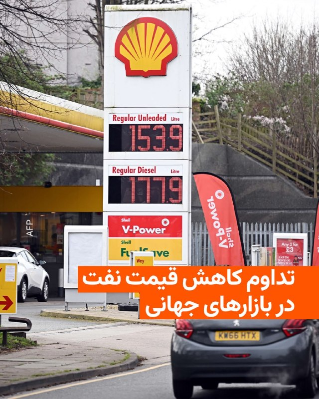

> 🔸به دنبال افزایش خوش‌بینی‌ها در بازارهای مالی نسبت به دستیابی ایران و آمریکا به توافقی دربارهٔ پایان جنگ و بازگشایی تنگه هرمز، قیمت نفت خام روز پنج‌شنبه ۱۷ اردیبهشت برای دومین روز پیاپی کاهش یافت و شاخص سهام کشورهای مختلف افزایش پیدا کرد.
> 
> 🔸قیمت نفت روز پنج‌شنبه حدود پنج درصد دیگر کاهش یافت و قیمت نفت خام برنت به زیر ۱۰۰ دلار در هر بشکه رسید. قیمت نفت روز چهارشنبه هم حدود ۱۰ درصد کم شده بود.
> 
> 🔸ارزش سهام نیز در بازارهای مختلف آسیا و اروپا افزایش یافت. این در حالی است که شاخص‌های عمده سهام بازار بورس نیویورک از جمله ای اند پی و داوجونز تا حد رسیدن به رکوردهای پیشین افزایش یافتند.
> 
> 🔸دونالد ترامپ، رئیس‌جمهور ایالات متحده، شامگاه چهارشنبه اعلام کرد که پس از «گفت‌وگوهای بسیار خوب» در ۲۴ ساعت گذشته، دستیابی به توافقی با ایران برای پایان دادن به جنگ «بسیار محتمل» است.
> 
> 🔸پیش‌تر رسانه‌هایی مانند اکسیوس و رویترز خبر داده بودند واشینگتن و تهران به یک یادداشت تفاهم یک‌صفحه‌ای برای پایان دادن به جنگ نزدیک شده‌اند.
> 
> @RadioFarda

## 1405/02/17 17:55 — BBCPersian
> 🔻گفت‌وگوی تلفنی وزرای خارجه عمان و روسیه درباره تحولات منطقه
> 
> 🔻وزارت خارجه عمان از گفت‌وگوی تلفنی بدر بوسعیدی،‌ وزیر خارجه عمان و سرگئی لاوروف، وزیر خارجه روسیه خبر داد.
> 
> بر اساس این گزارش در این تماس تلفنی که روز پنجشنبه ۱۷ اردیبهشت ماه انجام شد دو طرف درباره راه‌های کنترل تنش‌های موجود و پیشبرد رویکردهای سیاسی و راه حل‌های سیاسی و دیپلماتیک برای رسیدگی به مسائل و بحران‌ها تبادل نظر کردند.
> 
> عمان در مذاکرات پیشین ایران و آمریکا نقش میانجی داشت و آقای بوسعیدی در چند جلسه پیام‌های هیئت ایرانی را به هیئت آمریکایی منتقل می‌کرد.
> 
> وزارت خارجه عمان می‌گوید که تاکید دو طرف بر یافتن راه حل‌های توافقی است که باعث تقویت پایه‌های امنیت و ثبات شود و منطقه و جهان را از پیامدها و تنش‌های بیشتر دور نگه دارد.
> 
> https://bbc.in/496G5Jl
> @BBCPersian

## 1405/02/17 17:55 — Hranews
> سقز؛ یک جوان ۲۱ ساله در پی انفجار مین جان‌باخت
> 
> 
> ❗️
> ❗️
> ❗️
> ❗️
> ❗️– انفجار یک مین برجای مانده از جنگ ایران و عراق در یکی از روستاهای شهرستان سقز، منجر به کشته شدن یک جوان ۲۱ ساله شد.
> 
> ادامه مطلب
> 
> #انفجار_مین
> 
> ↘️
> @hranews_bot تماس ✉️ - @Hranews کانال هرانا 🆑

## 1405/02/17 17:43 — VahidOOnLine
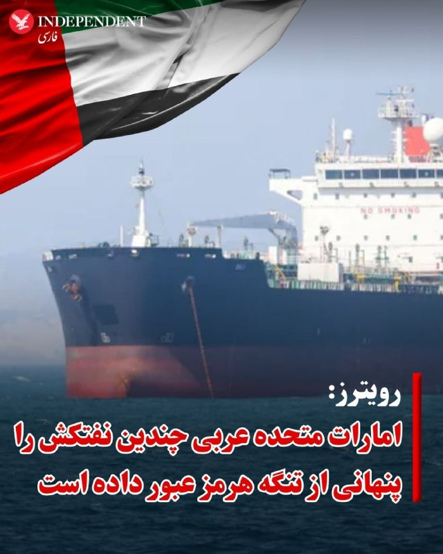

> ♦️رویترز روز پنجشنبه ۱۷ اردیبهشت بنا بر داده‌های کشتیرانی گزارش داد که امارات متحده عربی با خاموش کردن ردیاب‌های موقعیت مکانی برای جلوگیری از حمله‌های جمهوری اسلامی، چندین نفتکش را از تنگه هرمز عبور داده است.
> 
> بنا بر این گزارش حجم این صادرات تنها بخشی از میزان معمول صادرات امارات متحده عربی پیش از جنگ است، اما نشان دهنده خطراتی است که تولیدکننده و خریداران حاضرند برای آزاد کردن فروش نفت بپذیرند.
> 
>  سایر تولیدکنندگان خلیج فارس - عراق، کویت و قطر - یا فروش را متوقف کرده‌اند، قیمت‌ها را به شدت کاهش داده‌اند تا خریداران بی‌علاقه را جذب کنند یا در مورد عربستان سعودی فقط از طریق دریای سرخ حمل می‌کنند.
> 
> صداوسیمای جمهوری اسلامی روز پنجشنبه یک روز پس از توقف عملیات «پروژه آزادی» دونالد ترامپ با انتشار گزارشی از جزیره قشم، بار دیگر تاکید کرد که عبور کشتی‌ها از این آبراه، در انحصار ایران و سپاه پاسداران است.
> ‌🇸🇦 Indypersian
> 
> 🤖 @VahidOOnLine

## 1405/02/17 17:48 — pm_afshaa
> 🔴وزارت خزانه‌داری آمریکا: تحریم‌هایی علیه 4 عراقی و 4 شرکت عراقی مرتبط با جمهوری اسلامی اعمال کرد
> 
> 
> 💧 Rainbet.com the #1 Non-KYC Crypto Casino & Sportsbook @rainbetcom
> 
> 😁 @Pm_Afshaa

## 1405/02/17 17:44 — kianmeli1
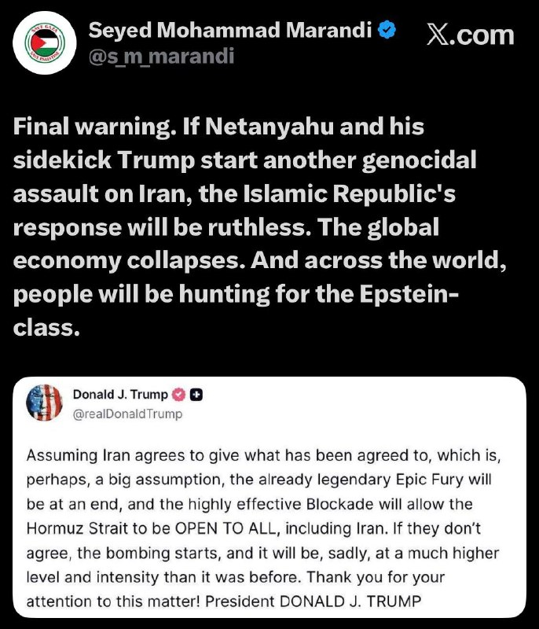

> 🔴مرندی در پاسخ به ترامپ که گفته بود اگر توافق نشود بمباران بزرگتر در راه است گفت
> 
> هشدار نهایی. اگر نتانیاهو و دستیارش ترامپ حمله نسل‌کشی دیگری را علیه ایران آغاز کنند، پاسخ جمهوری اسلامی بی‌رحمانه خواهد بود. اقتصاد جهانی فرو می‌پاشد. و در سراسر جهان، مردم به دنبال افرادی مانند اپستین خواهند گشت.
> https://t.me/kianmeli1

## ???-??-?? ??:?? (post 335978) — IranIntlTV
[🎬 Video](telegram/content/IranIntlTV_335978_1778163822.mp4)

> صابر رمضانی، معترض ۳۱ ساله، ۱۸ دی‌ماه در لاهیجان با شلیک نیروهای سرکوبگر به صورتش کشته شد. ماموران امنیتی پیکر او را از بیمارستان به رشت منتقل کردند و خانواده‌اش پس از سه روز توانستند آن را تحویل بگیرند.
> جزییات بیشتر با فرنوش فرجی، عضو تحریریه ایران‌اینترنشنال
> @iranintltv

## ???-??-?? ??:?? (post 335977) — IranIntlTV
[🎬 Video](telegram/content/IranIntlTV_335977_1778163823.mp4)

> مهدی اسکندریان، ۴۴ ساله و پدر دو فرزند، شامگاه ۱۹ دی‌ماه در فردیس استان البرز، زمانی‌که مشغول امدادرسانی به معترضان مجروح بود، با ضربات باتوم و شلیک گلوله ماموران سرکوب کشته شد.
> فرنوش فرجی، عضو تحریریه ایران‌اینترنشنال، گزارش می‌دهد
> @iranintltv

## 1405/02/17 17:49 — FarsiVOA
> 🔺گزارش ویژه | عرفان کیانی، روایتی از یک اعدام سیاسی در سایه ابهامات بی‌شمار
> 
> ▪️نامش‌ عرفان کیانی بود، از معترضان اعتراضات دی‌ماه ۱۴۰۴ که شنبه پنجم اردیبهشت ۱۴۰۵ در ایران اعدام شد. خبر اعدام عرفان کیانی در اطلاعیه‌ای از سوی قوه قضاییه جمهوری اسلامی ایران منتشر شد.
> 
> ⬇️ بیشتر بخوانید:
> 
> https://ir.voanews.com/a/erfan-kiani-political-execution-aegean/8147304.html/?nocach=1

## 1405/02/17 17:48 — Persian_Trend_Official
> 🔴 گزارش‌ها از سفر احتمالی عراقچی به اسلام‌آباد در مسیر بازگشت از چین 🔹برخی منابع در پاکستان گزارش می‌دهند عباس عراقچی، وزیر خارجه ایران، ممکن است در مسیر بازگشت از چین وارد اسلام‌آباد شود. 🔹تا این لحظه مقام‌های رسمی ایران یا پاکستان جزئیاتی درباره هدف احتمالی…

## 1405/02/17 17:41 — pm_afshaa
> 🔴منابع آمریکایی به CNN:انتظار می‌رود جمهوری اسلامی امروز به پیشنهاد آمریکا برای پایان دادن به جنگ پاسخ دهد
> 
> 
> 💧 Rainbet.com the #1 Non-KYC Crypto Casino & Sportsbook @rainbetcom
> 
> 😁 @Pm_Afshaa

## ???-??-?? ??:?? (post 217111) — FarsiVOA
> جمهوری اسلامی در جریان جنگ اخیر با وعده‌های مالی، فشارهای امنیتی و اسکان جنگ‌زدگان در هتل‌ها، عده‌ای را برای شبگردی‌ها و تجمعات خیابانی بسیج کرده؛ تجمعاتی که به‌جای نمایش وحدت، به ابزاری برای تسویه‌حساب‌های سیاسی و حمله به صداهای منتقد و حامیان دیپلماسی تبدیل شده است.

## 1405/02/17 17:38 — DW_Farsi
> 🔶 گزارش نیویورک تایمز از فشار محاصره آمریکا بر اقتصاد ایران
> 
> یکی از اصلی‌ترین انگیزه‌های تهران برای پیشبرد گفت‌‌وگوها با آمریکا، رفع محاصره بنادر و کاهش فشار بر صنعت نفت ایران است. محاصره دریایی آمریکا علیه بنادر ایران عملا صادرات نفت را متوقف کرده، درآمدهای حیاتی کشور را کاهش داده و خطر پر شدن کامل ظرفیت ذخیره‌سازی نفت را بالا برده است؛ وضعیتی که در کنار اختلال در واردات و تشدید بحران معیشتی، فشار اقتصادی بر جمهوری اسلامی را به‌مراتب سنگین‌تر کرده است.
> 
> نیویورک‌تایمز روز چهارشنبه ششم مه (۱۶ اردیبهشت) در گزارشی به قلم فرناز فصیحی نوشت، پیش از آغاز محاصره، حدود ۹۸ درصد صادرات نفت ایران از تنگه هرمز عبور می‌کرد. با این حال، از زمان آغاز محاصره آمریکا، نفتکش‌های حامل نفت ایران دیگر نتوانسته‌اند از این مسیر خارج شوند.
> 
> ایران به‌طور معمول روزانه حدود ۴ میلیون بشکه نفت تولید می‌کند که نزدیک به نیمی از آن در داخل مصرف و بقیه صادر می‌شود. نفت آماده صادرات در مخازن زمینی و نفتکش‌های مستقر در خلیج فارس ذخیره می‌شود، اما حالا این ظرفیت به‌سرعت در حال پر شدن است. در گزارش آمده که اگر محاصره ادامه پیدا کند، ایران ممکن است ظرف چند هفته آینده با کمبود جدی فضای ذخیره‌سازی روبه‌رو شود.
> 
> این وضعیت تهران را ناچار کرده تولید برخی چاه‌ها را کاهش دهد. در صورت ادامه فشار، احتمال بسته شدن بعضی چاه‌های قدیمی نیز وجود دارد؛ اقدامی که بازگرداندن آنها به مدار تولید، پرهزینه و در برخی موارد حتی غیراقتصادی خواهد بود.
> @dw_farsi

## 1405/02/17 17:36 — RadioFarda
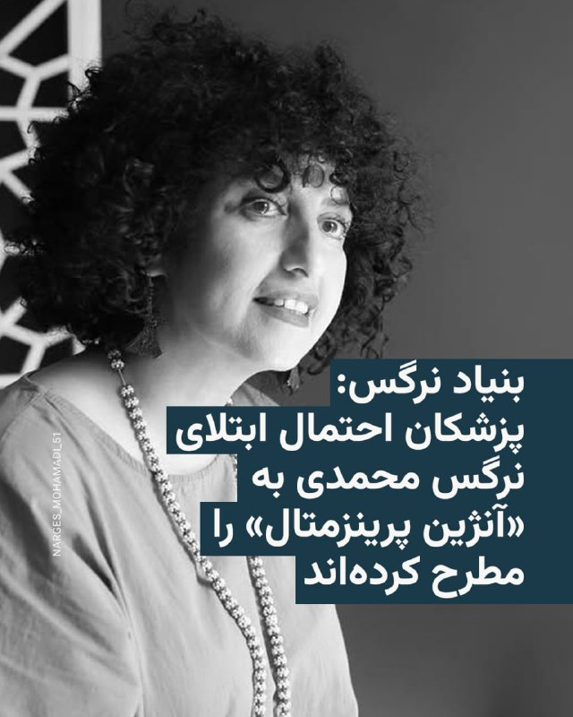

> 🔸بنیاد نرگس محمدی اعلام کرد پزشکان معالج این فعال حقوق بشر و برنده جایزه صلح نوبل، احتمال داده‌اند او به «آنژین پرینزمتال» یا اسپاسم عروق کرونر مبتلا شده باشد؛ عارضه‌ای قلبی که می‌تواند باعث اختلال جدی در خون‌رسانی به قلب شود.
> 
> 🔸بر اساس بیانیه بنیاد نرگس، خانم محمدی در هفتمین روز بستری در بخش مراقبت‌های ویژه قلب بیمارستانی در زنجان همچنان در وضعیت جسمانی ناپایدار قرار دارد و نگرانی‌ها درباره شرایط قلبی او افزایش یافته است.
> 
> 🔸در این بیانیه آمده است که آنژین پرینزمتال ناشی از گرفتگی یا اسپاسم شریان‌های کرونری است و می‌تواند عوارضی مانند حملات شدید قلبی، آریتمی‌های خطرناک، نوسانات شدید فشار خون و کاهش اکسیژن‌رسانی به عضله قلب ایجاد کند.
> 
> 🔸به گفته بنیاد نرگس، او از پنجم اردیبهشت تقریباً هر روز با درد شدید قفسه سینه، تپش قلب، اضطراب و افت‌وخیز شدید فشار خون از خواب بیدار شده و پزشکان انجام فوری آنژیوگرافی تخصصی را ضروری دانسته‌اند.
> 
> 🔸این بنیاد همچنین اعلام کرد خانواده و پزشکان خواهان انتقال فوری نرگس محمدی به تهران هستند، اما دادستان تهران همچنان با این درخواست مخالفت کرده است.
> 
> @RadioFarda

## ???-??-?? ??:?? (post 238656) — VahidOOnLine
[🎬 Video](telegram/content/VahidOOnLine_238656_1778162665.mp4)

> ای۲۴ نیوز اسرائیل از قول منابعی در خلیج فارس گزارش داده عربستان سعودی اعلام کرده تا زمانی که ایالات متحده «حفاظت مناسب» در برابر حملات جمهوری‌اسلامی را تضمین نکند، دسترسی ارتش آمریکا به پایگاه‌ها و حریم هوایی این کشور محدود خواهد شد.
> بر اساس این گزارش، ریاض به واشنگتن اطلاع داده که استفاده از پایگاه‌های نظامی و همچنین عبور هواپیماهای آمریکایی از حریم هوایی عربستان برای عملیات‌های مرتبط با جنگ در منطقه، متوقف یا محدود می‌شود.منابع این رسانه اسرائیلی گفته‌اند عربستان خواستار «تضمین امنیتی جدی‌تر» از سوی آمریکا در برابر تهدیدات جمهوری‌اسلامی شده و تا زمان دریافت این تضمین‌ها، همکاری‌های نظامی را کاهش می‌دهد.
> ‌🏁 🇬🇧 ManotoTV
> 
> 🤖 @VahidOOnLine

## 1405/02/17 17:24 — VahidOOnLine
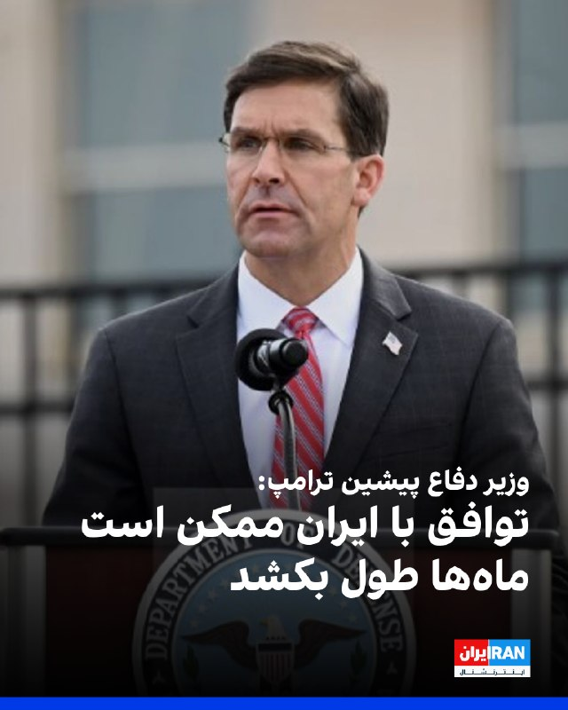

> مارک اسپر، وزیر دفاع پیشین آمریکا، در یک پادکست در یاهو فاینانس درباره جنگ این کشور علیه جمهوری اسلامی گفت: «من هم پایان [جنگ] را به این زودی‌ها نمی‌بینم»
> 
> به گفته اسپر، رسیدن به توافقی برای پایان جنگ از طریق تماس تلفنی بسیار بعید است؛ امری که دونالد ترامپ، رییس‌جمهور آمریکا گفته ممکن است.
> 
> او گفت: «با توجه به اینکه ایالات متحده به ایران اعتماد ندارد و اینکه این کشور مذاکره‌کنندگان ماهری دارد، مسیر طولانی‌ تا رسیدن به توافق در پیش خواهد بود.»
> 
> اسپر توضیح داد: «این موضوع زمان زیادی با کارشناسان حوزه هسته‌ای و در زمینه سازوکارهای راستی‌آزمایی خواهد برد. ما به آژانس بین‌المللی انرژی اتمی نیاز خواهیم داشت. در آنجا، کارهای بسیار دقیقی لازم است تا جزئیات آنچه شاید مقامات ارشد در اصل بر سر آن توافق کرده‌اند، مشخص شود. و حتی در آن صورت هم، این کار دست‌کم ماه‌ها زمان خواهد برد.»
> 
> اسپر بیش از سه دهه در سمت‌های مختلفی فعالیت داشته و به‌ویژه از ۲۰۱۹ تا ۲۰۲۰ در دوره نخست ریاست‌جمهوری ترامپ به عنوان وزیر دفاع آمریکا خدمت کرده است.
> ‌🏁 🇬🇧 IranintlTV
> 
> 🤖 @VahidOOnLine

## 1405/02/17 17:26 — mwarmonitor

> ✈️🇮🇷«هواپیمای تسلیحاتی» ایران از نوع بوئینگ ۷۴۷ (جامبو)، با رجیستر EP-FAB، که درست پیش از آغاز عملیات در ماه فوریه در چارچوب «عملیات غرش شیران» از تهران به سمت مسکو پرواز کرده بود، امروز به فرودگاه مهرآباد تهران بازگشت.
> 
> ✈️این هواپیما سال‌ها توسط نیروی قدس سپاه پاسداران استفاده می‌شد و محموله‌های تسلیحاتی را از ایران به نیروهای وابسته‌اش در منطقه منتقل می‌کرد: در عراق، لبنان و سوریه (پیش از سقوط حکومت اسد).
> 
> ❗️به یاد می‌آید که اسرائیل در جریان عملیات اخیر، ناوگان هواپیماهای نیروی قدس سپاه پاسداران را که حدود ۲۰ فروند هواپیمای ایرانی بودند، منهدم کرد؛ اما این هواپیما که در مسکو بود، سالم باقی ماند.
> 
> 🔸اکنون و در سایه مذاکرات میان آمریکا و ایران، این هواپیمای ترابری ایران به تهران بازگشته است.
> 
> @mwarmonitor

## 1405/02/17 17:29 — pm_afshaa
> 🔴فاکس نیوز: ترامپ به فکر مردم ایرانه و هیچوقت نمیخواد شاهد این باشه که یه کشتار دیگه مثل اعتراضات دی‌ماه تکرار شه
> 
> 
> 💧 Rainbet.com the #1 Non-KYC Crypto Casino & Sportsbook @rainbetcom
> 
> 😁 @Pm_Afshaa

## 1405/02/17 17:25 — kianmeli1
> ‏🔴شرق الاوسط:
> 
> ‏«تصویر جسد علی خامنه‌ای، رهبر جمهوری اسلامی ، ساعاتی پیش از اعلام رسمی خبر کشته شدنش توسط دونالد ترامپ، به تلفن همراه رهبران چارچوب هماهنگی وابستە بە جمهوری اسلامی در عراق ارسال شده بود».
> https://t.me/kianmeli1

## ???-??-?? ??:?? (post 335976) — IranIntlTV
[🎬 Video](telegram/content/IranIntlTV_335976_1778162668.mp4)

> مسعود پزشکیان، رییس دولت جمهوری اسلامی، از دیدار بی‌واسطه با مجتبی خامنه‌ای، رهبر سوم جمهوری اسلامی خبر داد. دیداری که پس از موافقت فرماندهان سپاه انجام شده است.
> گفت‌وگو با جمشید برزگر، روزنامه‌نگار و تحلیل‌گر سیاسی
> @iranintltv

## 1405/02/17 17:23 — IranIntlTV

> مارک اسپر، وزیر دفاع پیشین آمریکا، در یک پادکست در یاهو فاینانس درباره جنگ این کشور علیه جمهوری اسلامی گفت: «من هم پایان [جنگ] را به این زودی‌ها نمی‌بینم»
> 
> به گفته اسپر، رسیدن به توافقی برای پایان جنگ از طریق تماس تلفنی بسیار بعید است؛ امری که دونالد ترامپ، رییس‌جمهور آمریکا گفته ممکن است.
> 
> او گفت: «با توجه به اینکه ایالات متحده به ایران اعتماد ندارد و اینکه این کشور مذاکره‌کنندگان ماهری دارد، مسیر طولانی‌ تا رسیدن به توافق در پیش خواهد بود.»
> 
> اسپر توضیح داد: «این موضوع زمان زیادی با کارشناسان حوزه هسته‌ای و در زمینه سازوکارهای راستی‌آزمایی خواهد برد. ما به آژانس بین‌المللی انرژی اتمی نیاز خواهیم داشت. در آنجا، کارهای بسیار دقیقی لازم است تا جزئیات آنچه شاید مقامات ارشد در اصل بر سر آن توافق کرده‌اند، مشخص شود. و حتی در آن صورت هم، این کار دست‌کم ماه‌ها زمان خواهد برد.»
> 
> اسپر بیش از سه دهه در سمت‌های مختلفی فعالیت داشته و به‌ویژه از ۲۰۱۹ تا ۲۰۲۰ در دوره نخست ریاست‌جمهوری ترامپ به عنوان وزیر دفاع آمریکا خدمت کرده است.
> https://iranintl.com/202605078236

## ???-??-?? ??:?? (post 105087) — ManotoTV
[🎬 Video](telegram/content/ManotoTV_105087_1778162671.mp4)

> ای۲۴ نیوز اسرائیل از قول منابعی در خلیج فارس گزارش داده عربستان سعودی اعلام کرده تا زمانی که ایالات متحده «حفاظت مناسب» در برابر حملات جمهوری‌اسلامی را تضمین نکند، دسترسی ارتش آمریکا به پایگاه‌ها و حریم هوایی این کشور محدود خواهد شد.
> بر اساس این گزارش، ریاض به واشنگتن اطلاع داده که استفاده از پایگاه‌های نظامی و همچنین عبور هواپیماهای آمریکایی از حریم هوایی عربستان برای عملیات‌های مرتبط با جنگ در منطقه، متوقف یا محدود می‌شود.منابع این رسانه اسرائیلی گفته‌اند عربستان خواستار «تضمین امنیتی جدی‌تر» از سوی آمریکا در برابر تهدیدات جمهوری‌اسلامی شده و تا زمان دریافت این تضمین‌ها، همکاری‌های نظامی را کاهش می‌دهد.

## 1405/02/17 17:22 — DW_Farsi
> 🔶 آوار گرانی بر مردم؛ جهنم معیشتی در ایران
> 
> 🔻 گزارشی از آبان سرایی
> 
> امیر ۵۱ ساله تا دو ماه پیش در یک شرکت نرم‌افزاری برنامه‌نویس شاغل بود، حالا بیشتر ساعات روز پشت فرمان پرایدی است که با آن در اسنپ کار می‌کند. امیر می‌گوید: "با مدرک فوق‌لیسانس، روزی ده ساعت مسافربری می‌کنم تا فقط اجاره خانه در بیاید. اقتصاد ایران شبیه آسانسوری شده که با سرعت فقط به سمت پایین می‌رود."
> 
> این تصویر در ایرانِ امروز، دیگر یک استثنا نیست؛ آمارها به‌وضوح حاکی از عقب‌نشینی تدریجی زندگی روزمره مردم از شرایط معمول معیشتی هستند. تورم مواد غذایی از ۱۱۰ درصد عبور کرده، قیمت برخی اقلام خوراکی طی چند ماه بیش از دو برابر شده و بهای گوشت قرمز در تهران از یک میلیون و چهارصد هزار تومان گذشته است.
> 
> حداقل دستمزد رسمی، تنها کفاف بخشی از هزینه خوراک یک خانواده را می‌دهد و هم‌زمان سقوط ارزش ریال، موج تازه‌ای از گرانی در بازار دارو، اجاره، حمل‌ونقل و کالاهای مصرفی ایجاد کرده است.
> 
> در این شرایط امنیت روانی، ثبات اجتماعی و تصور زندگی عادی برای بخش بزرگی از جامعه در حال محو شدن است. از رانندگان تاکسی اینترنتی تا نیروهای متخصص، از کارگران تا صاحبان کسب‌وکارهای کوچک، روایتی مشترک در حال شکل‌گیری است: تلاش بیشتر، درآمد بی‌ارزش‌تر و آینده‌ای که هر روز تاریک‌تر و هراس‌آورتر به نظر می‌رسد.
> @dw_farsi

## 1405/02/17 17:17 — pm_afshaa
> 🔴اسرائیل هیوم: سومین دور مذاکرات بین اسرائیل و لبنان هفته آینده در واشنگتن برگزار خواهد شد
> 
> 
> 💧 Rainbet.com the #1 Non-KYC Crypto Casino & Sportsbook @rainbetcom
> 
> 😁 @Pm_Afshaa

## ???-??-?? ??:?? (post 4474) — DEJradio
[🎬 Video](telegram/content/DEJradio_4474_1778161932.mp4)

> 🤡
> 🔺 خاطرات آخوند آشپز از گعده‌های شبانه؛ بزن که خوب می‌زنی!
> 
> #آخوند #شیفت_شب
> @DEJradio

## 1405/02/17 17:16 — FarsiVOA
> مارکو روبیو، وزیر امور خارجه ایالات متحده، با پاپ لئو چهاردهم دیدار و گفتگو کرد. او این دیدار را فرصتی برای هم‌سویی بیشتر میان واشینگتن و واتیکان در مقابله با چالش‌های جهانی توصیف کرد. روبیو تأکید کرد که ترویج ارزش‌های بنیادین و حقوق بشر، هسته اصلی گفتگوهای او با رهبر کاتولیک‌های جهان را تشکیل داده است.

## 1405/02/17 17:15 — RadioFarda
> دیدار روبیو و پاپ لئو؛ آمریکا می‌گوید رابطه‌اش با واتیکان «قوی» است
> 
> 🔸پاپ لئو، رهبر کاتولیک‌های جهان، و مارکو روبیو، وزیر خارجه آمریکا، روز پنج‌شنبه ۱۷ اردیبهشت در واتیکان با یکدیگر دیدار کردند.
> 
> 🔸این دیدار پس از هفته‌ها تنش بین واتیکان و کاخ سفید بر سر جنگ با ایران انجام شد و وزارت خارجه آمریکا گفته است که دو طرف در این دیدار درباره «وضعیت خاورمیانه» بحث و گفت‌وگو کردند.
> 
> 🔸پاپ لئو، منتقد صریح جنگ آمریکا و اسرائیل با ایران بوده و خواستار آتش‌بس شده است. دونالد ترامپ در پاسخ، پاپِ متولد آمریکا را به حمایت از تلاش تهران برای دستیابی به سلاح‌های هسته‌ای متهم کرد و او را «ضعیف در برابر جرم و جنایت» خواند.
> 
> 🔸رئیس‌جمهور آمریکا همچنین از رهبر کاتولیک‌های جهان انتقاد کرد که کشتار معترضان ایرانی در دی‌ماه توسط نیروهای امنیتی جمهوری اسلامی را محکوم نکرد.
> 
> 🔸در پی این انتقادها، پاپ لئو با تأخیر زیاد و در اوایل اردیبهشت این کشتار را محکوم کرد و دربارهٔ گزارش‌ها مبنی بر کشته شدن هزاران معترض در ایران گفت: «من همه اقداماتی را که ناعادلانه هستند محکوم می‌کنم. من گرفتن جان انسان‌ها را محکوم می‌کنم.»
> 
> 🔸تامی پیگوت، سخنگوی وزارت امور خارجه آمریکا، روز پنجشنبه دیدار آقای روبیو و پاپ را نشان دهنده رابطه «قوی» بین واتیکان و ایالات متحده دانست و گفت: «این دیدار بر روابط قوی بین ایالات متحده و واتیکان و تعهد مشترک آنها به ترویج صلح و کرامت انسانی تأکید کرد.»
> 
> 🔸او گفت که وزیر خارجه آمریکا با پی‌یترو پارولین، وزیر امور خارجه واتیکان، درباره «تلاش‌ها برای دستیابی به صلح پایدار در خاورمیانه» گفت‌وگو کرد. به گفته سخنگوی وزارت خارجه آمریکا «این بحث منعکس کننده همکاری پایدار بین ایالات متحده و واتیکان در پیشبرد آزادی مذهبی بود.»
> 
> 🔸خبرگزاری فرانسه به نقل از یک مقام وزارت امور خارجه گفت که «گفتگوهای روبیو و پاپ دوستانه و سازنده بود».
> 
> 🔸گزارش کامل را در وب‌سایت رادیوفردا بخوانید.
> 
> @RadioFarda

## 1405/02/17 17:17 — IranianMinds
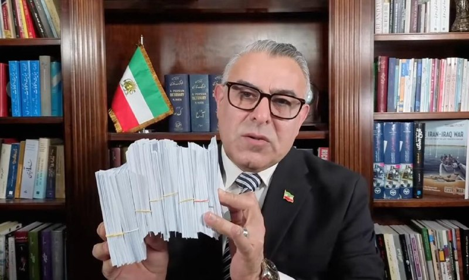

> 🖤اسامی هزار نفر دیگر از جاویدنامان ‌دی‌ماه، روز جمعه از ساعت ۸ توسط مراد ویسی خوانده می‌شود.
> 
> @IranianMinds

## 1405/02/17 17:18 — BBCPersian
> 🔻احضار یکی از اپراتورها برای ارائه توضیحات در مورد تخلفات در اجرای «اینترنت پرو»
> 
> 🔻سازمان بازرسی ایران، مدیرعامل یکی از اپراتورها رابرای ارائه توضیحات در مورد روند اجرای «اینترنت پرو» احضار کرده است.
> 
> شورای عالی امنیت ملی اخیرا طرحی موسوم به «اینترنت پرو» را تصویب کرده است. براساس این طرح، اهالی کسب‌وکار یا دانشگاهیان می‌توانند با پرداخت مبلغی بیشتر، با دسترسی محدود به اینترنت بین‌المللی وصل شوند.
> 
> به گزارش فارس در زمان اجرای این طرح دو تخلف از سوی اپراتورها باعث شده که این طرح از مسیر خود منحرف شود.
> 
> براساس این گزارش تخلف اول مربوط به افزایش قیمت اینترنت به میزان هر گیگ، ۴۰ هزار تومان و تخلف دوم هم ارائه این نوع اینترنت به افرادی در کسب و کارهای غیرضروری است.
> 
> گفته شده است که ارائه این طرح با انتقادات گسترده‌ای روبرو شده است.
> 
> گروهی دسترسی آزاد به اینترنت را «حق مسلم»‌ همه شهروندان می‌دانند و می‌گویند که این حق نباید به ابزار تشویق و تنبیه بدل شود.
> 
> گروهی نیز این طرح را ابزاری برای اعمال کنترل بیشتر روی مردم و محدود کردن آزادی بیان می‌دانند.
> 
> https://bbc.in/4to91no
> @BBCPersian

## 1405/02/17 17:06 — VahidOOnLine
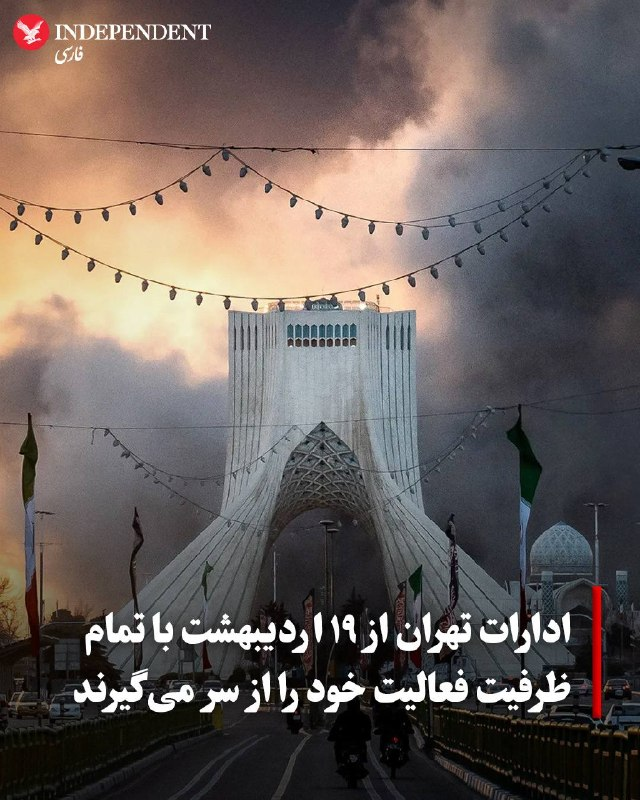

> ♦️استاندار تهران اعلام کرد که از روز شنبه ۱۹ اردیبهشت، تمامی وزارتخانه‌ها، سازمان‌های دولتی و دستگاه‌های اجرایی در استان تهران با ۱۰۰ درصد ظرفیت فعالیت خود را از سر خواهند گرفت.
> 
> خبرگزاری مهر به نقل از محمدصادق معتمدیان، استاندار تهران، نوشت: «فعالیت‌های آموزشی در مدارس و دانشگاه‌ها نیز بر اساس اطلاعیه‌های وزارت آموزش و پرورش و وزارت علوم، تحقیقات و فناوری انجام خواهد شد.»
> ‌🇸🇦 Indypersian
> 
> 🤖 @VahidOOnLine

## 1405/02/17 17:10 — FarsiVOA
> 🔺واکنش تند دبیرکل شورای همکاری خلیج فارس به جمهوری اسلامی: در کنار امارات می‌ایستیم
> 
> ▪️دبیرکل شورای همکاری خلیج فارس می‌گوید رژیم ایران به حملات تجاوزکارانه خود به خاک امارات متحده عربی بسنده نکرده و به تلاش‌های رسوا شده خود برای تحریف حقایق ادامه می‌دهد.
> 
> ⬇️ بیشتر بخوانید:
> 
> https://ir.voanews.com/a/iran-arab-countries-proxy-war/8147564.html/?nocach=1

## ???-??-?? ??:?? (post 280413) — BBCPersian
[🎬 Video](telegram/content/BBCPersian_280413_1778161359.mp4)

> 🔻سرخط خبرهای روز پنجشنبه ۱۷ اردیبهشت ۱۴۰۵
> @BBCPersian

## ???-??-?? ??:?? (post 238653) — VahidOOnLine
[🎬 Video](telegram/content/VahidOOnLine_238653_1778160945.mp4)

> رویترز در گزارشی اختصاصی نوشته منابع کشتیرانی می‌گویند امارات همچنان بخشی از نفت خود را از تنگه هرمز عبور می‌دهد؛ آن هم با کشتی‌هایی که برای جلوگیری از هدف قرار گرفتن، سیستم‌های ردیابی‌شان خاموش شده است.
> بر اساس داده‌های ردیابی، شرکت ملی نفت ابوظبی در ماه آوریل چندین میلیون بشکه نفت خام را از پایانه‌های داخل خلیج فارس صادر کرده که بخشی از آن از طریق انتقال کشتی‌به‌کشتی یا تخلیه در عمان به مقصد پالایشگاه‌های آسیایی منتقل شده است.
> این روش صادراتی در حالی انجام می‌شود که صادرات نفت امارات از آغاز جنگ کاهش یافته و ریسک حمل‌ونقل دریایی در منطقه به‌شدت افزایش پیدا کرده است.
> ‌🏁 🇬🇧 ManotoTV
> 
> 🤖 @VahidOOnLine

## ???-??-?? ??:?? (post 238652) — VahidOOnLine
[🎬 Video](telegram/content/VahidOOnLine_238652_1778160946.mp4)

> قیمت نفت کاهش یافت و بازارهای جهانی سهام در معاملات روز پنج‌شنبه عملکردی متضاد داشتند؛ در حالی که سرمایه‌گذاران در انتظار به‌روزرسانی درباره طرح آمریکا برای پایان جنگ با ایران و بازگشایی تنگه هرمز هستند.
> پس از آنکه قیمت نفت روز چهارشنبه در پی امید به صلح تا بیش از ۱۰ درصد سقوط کرده بود، روز پنج‌شنبه افت آن ملایم‌تر شد و حدود ۲ درصد کاهش ثبت کرد. در بازارهای سهام، بورس‌های اروپایی پس از رشد قابل توجه روز قبل کاهش یافتند، در حالی که بازارهای اصلی آسیا روند صعودی داشتند.
> استراتژیست‌ها باور دارند هیجان شدیدی که با امید به کاهش تنش‌ها در بازارها ایجاد شده بود، در حال فروکش کردن است و این واقعیت در حال شکل‌گیری است که برای رسیدن به یک توافق پایدار، موانع بیشتری وجود دارد؛ حتی با وجود اینکه گزارش شده جمهوری‌اسلامی در حال بررسی یک پیشنهاد صلح آمریکا برای پایان رسمی درگیری است.
> ‌🏁 🇬🇧 ManotoTV
> 
> 🤖 @VahidOOnLine

## ???-??-?? ??:?? (post 238651) — VahidOOnLine
[🎬 Video](telegram/content/VahidOOnLine_238651_1778160946.mp4)

> استاندار تهران اعلام کرد از روز شنبه ۱۹ اردیبهشت ۱۴۰۵، حضور کارکنان همه وزارتخانه‌ها، سازمان‌ها و دستگاه‌های اجرایی مستقر در استان تهران به‌صورت ۱۰۰ درصدی خواهد بود.
> محمدصادق معتمدیان همچنین گفت فعالیت مدارس و دانشگاه‌ها نیز طبق تصمیم وزارت آموزش و پرورش و وزارت علوم، به شکل حضوری و طبق روال اعلام‌شده ادامه خواهد داشت.
> ‌🏁 🇬🇧 ManotoTV
> 
> 🤖 @VahidOOnLine

## 1405/02/17 16:55 — VahidOOnLine

> گزارش‌های رسیده به ایران‌اینترنشنال نشان می‌دهد ماموران حکومت از نصب سنگ بر مزار جاویدنام محسن رشیدی خانی‌آبادی در مراسم چهلم او جلوگیری کرده‌اند.
> 
> محسن ۴۲ ساله شامگاه ۱۹‌ دی در اعتراضات منطقه بهارستان شهر اصفهان کشته شد. به‌گفته بستگان این جاویدنام، اگرچه سنگ قبر او برای نصب در باغ رضوان آماده بود، اما ماموران به بهانه درج بیت شعری مشابه آنچه بر مزار پدرش نوشته شده بود، جلوگیری کردند.
> 
> نوشتن عبارتی با عنوان «تا ابد در من و سرزمینم» بر بالای این سنگ، از دیگر دلایل مخالفت با نصب آن بود.
> 
> پیکر محسن اکنون در قبری دوطبقه به همراه مادربزرگش به خاک سپرده شده است.
> 
> روی این سنگ مزار پیش‌تر عبارت «مگر کانون مهرماه می‌شود خاموش بماند»، نوشته شده بود اما اکنون با وجود مخالفت اعضای خانواده، ماموران امنیتی اجازه ندادند بار دیگر این عبارت را بر سنگ مزار دو نفره آنان حک کنند.
> 
> با گذشت حدود چهار ماه از کشته شدن محسن، همچنان سنگی بر مزار او نصب نشده است.
> ‌🏁 🇬🇧 IranintlTV
> 
> 🤖 @VahidOOnLine

## 1405/02/17 16:53 — VahidOOnLine

> ♦️عدوان الأحمری، رئیس انجمن روزنامه‌نگاران عربستان سعودی، در کنگره بین‌المللی مطبوعات در پاریس به‌عنوان عضو کمیته اجرایی فدراسیون بین‌المللی روزنامه‌نگاران انتخاب شد؛ رخدادی که نخستین حضور عربستان سعودی در این نهاد جهانی به شمار می‌رود.
> 
> الأحمری این انتخاب را نشانه اعتماد اتحادیه‌ها و نهادهای حرفه‌ای بین‌المللی به انجمن روزنامه‌نگاران عربستان سعودی دانست و گفت این موفقیت حاصل تلاش اعضای هیئت‌مدیره و دبیرخانه انجمن است.
> 
> او افزود عربستان سعودی پیش‌تر نیز از طریق ریاست دفتر اجرایی روزنامه‌نگاران غرب آسیا حضور بین‌المللی خود را تقویت کرده بود و اکنون این حضور وارد مرحله تازه‌ای شده است.
> 
> کمیته اجرایی این فدراسیون از میان نمایندگان بیش از ۱۴۸ کشور انتخاب شد و تنها ۱۶ نامزد موفق به کسب کرسی شدند.
> 
> فدراسیون بین‌المللی روزنامه‌نگاران که در سال ۱۹۲۶ تاسیس شده، بزرگ‌ترین نهاد جهانی روزنامه‌نگاران است و حدود ۶۰۰ هزار فعال رسانه‌ای را در بیش از ۱۴۰ کشور نمایندگی می‌کند.
> ‌🇸🇦 Indypersian
> 
> 🤖 @VahidOOnLine

## 1405/02/17 16:55 — mwarmonitor
> 🔘یک اختلاف شدید بین ارتش و موساد بر سر هدف نهایی جنگ در ایران شکل گرفته و همچنان ادامه دارد. ارتش اسرائیل (IDF) حذف اورانیوم از خاک ایران را دستاورد نهایی می‌داند. اما موساد معتقد است هدف باید سرنگونی حکومت باشد. حتی امروز نیز، برخلاف فرهنگ «توجیه و بازنویسی گذشته» که در منطقه رایج است، موساد همچنان بر این دیدگاه پافشاری می‌کند. در حالی که ارتش به تعریف مبهم «ایجاد شرایط برای سرنگونی حکومت» بسنده کرده، موساد چهار کلمه اول را حذف کرده و مستقیماً بر هدف سرنگونی تأکید دارد.
> 
> 🔸از اینجا به بعد، واقعیت به دو دیدگاه متفاوت و گاهی کاملاً متضاد تقسیم می‌شود. برخی مقامات ارشد ارتش اسرائیل از تصمیم آمریکا برای عدم تصرف اورانیوم غنی‌شده در یک عملیات نظامی به‌شدت ناراضی هستند. به همین دلیل، عملیات «Roaring Lion» با تقریباً هیچ پیشرفت قابل توجهی نسبت به برنامه هسته‌ای ایران در مقایسه با عملیات «Rising Lion» متوقف شد. آن‌ها مدام تکرار می‌کنند: «اورانیوم، اورانیوم، اورانیوم؛ اگر آن را بگیری، برنامه هسته‌ای را از بین برده‌ای.»
> 
> 🔹دیدگاه دوم این است که: چه فایده‌ای دارد اورانیوم را از طریق عملیات یا توافق خارج کنیم؟ اگر حکومت باقی بماند، حتی با وجود باقی ماندن چند تن اورانیوم ۳ درصدی، تنها چند سال تأخیر ایجاد شده—در مقیاس ژئوپولیتیک، یک چشم به هم زدن. حکومتی که تحت تحریم نباشد، ثروتمندتر و خطرناک‌تر خواهد شد و همچنان مانند قبل خواهان نابودی اسرائیل خواهد بود. تنها تغییر حکومت می‌تواند این هدف را از ریشه از بین ببرد. این دیدگاه در مقابل برخی مقامات امنیتی است که هرچند از آزادی میلیون‌ها ایرانی از دیکتاتوری استقبال می‌کنند، اما اولویت اصلی‌شان همچنان «اسرائیل در اولویت اول» است.
> 
> 🔸تجلی عملی این اختلاف در یک سؤال فرضی دیده می‌شود: اگر رئیس‌جمهور ترامپ به اسرائیل بگوید «برای یک عملیات چراغ سبز دارید»، چه می‌شود؟ بیشتر ساختار دفاعی می‌گویند تشکر کرده و نیروی هوایی را برای حمله به ذخایر اورانیوم اعزام می‌کنند. اما موساد احتمالاً از نابودی زیرساخت‌های انرژی و پالایشگاه‌ها حمایت می‌کند تا ایران را عملاً در تاریکی کامل فرو ببرد. این کار می‌تواند روند شورش داخلی را به‌طور چشمگیری تسریع کند. آستانه خشم مردم از سطح اعتراضات ژانویه عبور کرده، اما هم‌زمان ترس نیز افزایش یافته است. وقتی برق نباشد—و انتظار می‌رود ظرف دو ماه در ایران کمبود غذا آغاز شود—این دیوار ترس فرو خواهد ریخت.
> 
> 🔘کدام هدف بلندپروازانه‌تر است؟ در نگاه اول، سرنگونی حکومت یک هدف بسیار بزرگ به نظر می‌رسد، در حالی که نابودی اورانیوم یک اقدام محدود و قابل مدیریت است. اما تاریخ نشان می‌دهد حکومت‌ها در طول زمان سقوط کرده‌اند، در حالی که هیچ کشوری هرگز داوطلبانه مواد هسته‌ای غنی‌شده خود را در حالی که حکومتش پابرجاست واگذار نکرده است. همان‌طور که در یک مثل قدیمی تلمودی آمده، این یک انتخاب بین «راه کوتاهی که طولانی است»—یک ضربه سریع که مشکل ریشه‌ای را حل نمی‌کند—و «راه طولانی که کوتاه است»—مسیر دشوار تغییر حکومت که تهدید را برای همیشه از بین می‌برد.
> ( آمیت سیگال خبرنگار کانال ۱۲ اسرائیل)
> 
> 
> @mwarmonitor

## ???-??-?? ??:?? (post 335974) — IranIntlTV
[🎬 Video](telegram/content/IranIntlTV_335974_1778160948.mp4)

> در حالی که بحث احتمال مذاکره میان تهران و واشینگتن دوباره مطرح شده است، بسیاری از کاربران ایرانی در شبکه‌های اجتماعی این روند را با نگرانی دنبال می‌کنند.
> عادله بورنگ، عضو تحریریه ایران‌اینترنشنال، از واکنش کاربران رسانه‌های اجتماعی می‌گوید
> @iranintltv

## ???-??-?? ??:?? (post 335973) — IranIntlTV
> یک شهروند از بابلسر با ارسال پیامی به ایران اینترنشنال از افزایش اجاره خانه‌ها به میزان دو تا سه برابر می‌گوید و خواستار همکاری بیشتر شهروندان بایکدیگر در اوضاع بد اقتصادی می‌شود.

## 1405/02/17 16:55 — IranIntlTV

> گزارش‌های رسیده به ایران‌اینترنشنال نشان می‌دهد ماموران حکومت از نصب سنگ بر مزار جاویدنام محسن رشیدی خانی‌آبادی در مراسم چهلم او جلوگیری کرده‌اند.
> 
> محسن ۴۲ ساله شامگاه ۱۹‌ دی در اعتراضات منطقه بهارستان شهر اصفهان کشته شد. به‌گفته بستگان این جاویدنام، اگرچه سنگ قبر او برای نصب در باغ رضوان آماده بود، اما ماموران به بهانه درج بیت شعری مشابه آنچه بر مزار پدرش نوشته شده بود، جلوگیری کردند.
> 
> نوشتن عبارتی با عنوان «تا ابد در من و سرزمینم» بر بالای این سنگ، از دیگر دلایل مخالفت با نصب آن بود.
> 
> پیکر محسن اکنون در قبری دوطبقه به همراه مادربزرگش به خاک سپرده شده است.
> 
> روی این سنگ مزار پیش‌تر عبارت «مگر کانون مهرماه می‌شود خاموش بماند»، نوشته شده بود اما اکنون با وجود مخالفت اعضای خانواده، ماموران امنیتی اجازه ندادند بار دیگر این عبارت را بر سنگ مزار دو نفره آنان حک کنند.
> 
> با گذشت حدود چهار ماه از کشته شدن محسن، همچنان سنگی بر مزار او نصب نشده است.
> https://iranintl.com/202605073178

## ???-??-?? ??:?? (post 105086) — ManotoTV
[🎬 Video](telegram/content/ManotoTV_105086_1778160950.mp4)

> رویترز در گزارشی اختصاصی نوشته منابع کشتیرانی می‌گویند امارات همچنان بخشی از نفت خود را از تنگه هرمز عبور می‌دهد؛ آن هم با کشتی‌هایی که برای جلوگیری از هدف قرار گرفتن، سیستم‌های ردیابی‌شان خاموش شده است.
> بر اساس داده‌های ردیابی، شرکت ملی نفت ابوظبی در ماه آوریل چندین میلیون بشکه نفت خام را از پایانه‌های داخل خلیج فارس صادر کرده که بخشی از آن از طریق انتقال کشتی‌به‌کشتی یا تخلیه در عمان به مقصد پالایشگاه‌های آسیایی منتقل شده است.
> این روش صادراتی در حالی انجام می‌شود که صادرات نفت امارات از آغاز جنگ کاهش یافته و ریسک حمل‌ونقل دریایی در منطقه به‌شدت افزایش پیدا کرده است.

## ???-??-?? ??:?? (post 105085) — ManotoTV
[🎬 Video](telegram/content/ManotoTV_105085_1778160951.mp4)

> قیمت نفت کاهش یافت و بازارهای جهانی سهام در معاملات روز پنج‌شنبه عملکردی متضاد داشتند؛ در حالی که سرمایه‌گذاران در انتظار به‌روزرسانی درباره طرح آمریکا برای پایان جنگ با ایران و بازگشایی تنگه هرمز هستند.
> پس از آنکه قیمت نفت روز چهارشنبه در پی امید به صلح تا بیش از ۱۰ درصد سقوط کرده بود، روز پنج‌شنبه افت آن ملایم‌تر شد و حدود ۲ درصد کاهش ثبت کرد. در بازارهای سهام، بورس‌های اروپایی پس از رشد قابل توجه روز قبل کاهش یافتند، در حالی که بازارهای اصلی آسیا روند صعودی داشتند.
> استراتژیست‌ها باور دارند هیجان شدیدی که با امید به کاهش تنش‌ها در بازارها ایجاد شده بود، در حال فروکش کردن است و این واقعیت در حال شکل‌گیری است که برای رسیدن به یک توافق پایدار، موانع بیشتری وجود دارد؛ حتی با وجود اینکه گزارش شده جمهوری‌اسلامی در حال بررسی یک پیشنهاد صلح آمریکا برای پایان رسمی درگیری است.

## ???-??-?? ??:?? (post 105084) — ManotoTV
[🎬 Video](telegram/content/ManotoTV_105084_1778160951.mp4)

> استاندار تهران اعلام کرد از روز شنبه ۱۹ اردیبهشت ۱۴۰۵، حضور کارکنان همه وزارتخانه‌ها، سازمان‌ها و دستگاه‌های اجرایی مستقر در استان تهران به‌صورت ۱۰۰ درصدی خواهد بود.
> محمدصادق معتمدیان همچنین گفت فعالیت مدارس و دانشگاه‌ها نیز طبق تصمیم وزارت آموزش و پرورش و وزارت علوم، به شکل حضوری و طبق روال اعلام‌شده ادامه خواهد داشت.

## 1405/02/17 16:51 — ManotoTV

> https://youtube.com/live/cPjJ1JkeQaw?feature=share

## ???-??-?? ??:?? (post 124401) — DW_Farsi
[🎬 Video](telegram/content/DW_Farsi_124401_1778160952.mp4)

> 🎥 بازسازی پل B1 در شرایط ناپایدار جنگی و اقتصادی
> 
> ویدئویی از آغاز بازسازی پل بی‌یک (B1) یا پل بیلقان در عظیمیه کرج در شبکه‌های اجتماعی منتشر شده که در جریان جنگ با ایالات متحده و اسرائيل مورد هدف قرار گرفته بود. هوشنگ بازوند، مدیرعامل شرکت ساخت و توسعه زیربناهای حمل‌ونقل، مدعی شده بازسازی این پل کمتر از یک سال زمان می‌برد و حدود ۳.۷ هزار میلیارد تومان هزینه خواهد داشت.
> 
> بازسازی سریع این پل در حالی مطرح می‌شود که جمهوری اسلامی همچنان در شرایط ناپایدار و تنش‌های جنگی قرار دارد و هم‌زمان کشور دستخوش بحران اقتصادی گسترده است. همین موضوع این پرسش را مطرح می‌کند که بازسازی زیرساخت‌های تخریب‌شده تا چه اندازه در عمل امکان‌پذیر است و چه میزان از این وعده‌ها ممکن است در حد برنامه‌ها و برآوردهای اولیه باقی بمانند.
> 
> 
> @dw_farsi

## 1405/02/17 16:52 — Persian_Trend_Official
> 🔴 گزارش‌ها از سفر احتمالی عراقچی به اسلام‌آباد در مسیر بازگشت از چین
> 
> 🔹برخی منابع در پاکستان گزارش می‌دهند عباس عراقچی، وزیر خارجه ایران، ممکن است در مسیر بازگشت از چین وارد اسلام‌آباد شود.
> 
> 🔹تا این لحظه مقام‌های رسمی ایران یا پاکستان جزئیاتی درباره هدف احتمالی این سفر یا دیدارهای برنامه‌ریزی‌شده منتشر نکرده‌اند.
> 
> 🫆:Tony
> 
> 📌 @persian_trend_official
> پرشین ترند | متفاوت‌ترین کانال نظامی

## 1405/02/17 16:56 — BBCPersian
> 🔻هشدار کمیسیون فدرال برق سوئیس در مورد تاثیر احتمالی جنگ ایران در تامین گاز و برق اروپا
> 
> کمیسیون فدرال برق سوئیس روز پنجشنبه اعلام کرد که جنگ در ایران باعث ایجاد عدم اطمینان در مورد تامین گاز برای زمستان پیش رو شده است.
> 
> این کمیسیون می‌گوید که این اوضاع در بدترین حالت ممکن است حتی بر ثبات تامین برق اروپا و سوئیس نیز تأثیر بگذارد.
> 
> جنگ آمریکا و اسرائیل علیه ایران و بسته شدن تنگه هرمز باعث مختل شدن کشتیرانی در خلیج فارس شد و قیمت نفت به بالاترین سطح خود از زمان جنگ اوکراین در سال ۲۰۲۲ رسید.
> 
> پیش از این هم کارشناسان هشدار داده‌اند که ادامه اختلال در تحویل سوخت به دلیل جنگ ایران می‌تواند ظرف چند هفته کمبود سوخت را به همراه داشته باشد.
> 
> آژانس بین‌المللی انرژی هشدار داده است که اگر سوخت بیشتری از جای دیگری وارد نشود، کل اروپا تا ماه ژوئن با کمبود سوخت مواجه خواهد شد.
> 
> https://bbc.in/496G5Jl
> @BBCPersian

## ???-??-?? ??:?? (post 238648) — VahidOOnLine
[🎬 Video](telegram/content/VahidOOnLine_238648_1778160135.mp4)

> پاکستان اعلام کرده است که انتظار دارد توافقی میان آمریکا و جمهوری‌اسلامی در آینده نزدیک حاصل شود؛ در حالی که این کشور در طول جنگ علیه ایران نقش میانجی میان واشنگتن و تهران را ایفا کرده است.
> وزارت خارجه پاکستان با انتشار بیانیه‌ای جدید بر خوش‌بینی خود تأکید کرده است. تَحیر اندرابی، سخنگوی وزارت خارجه پاکستان، گفت: «انتظار داریم هرچه زودتر توافقی حاصل شود.»
> او افزود: «امیدواریم طرف‌ها به یک راه‌حل مسالمت‌آمیز و پایدار برسند که نه‌تنها به صلح در منطقه ما، بلکه به صلح بین‌المللی نیز کمک کند.»
> با این حال، او از ارائه زمان‌بندی خودداری کرد و گفت پاکستان جزئیات تلاش‌های دیپلماتیک در حال انجام را منتشر نخواهد کرد.
> او تأکید کرد: «آنچه می‌توانم بگویم این است که ما همچنان امیدوار و خوش‌بین هستیم و امیدواریم این توافق هرچه زودتر حاصل شود.»
> این موضع‌گیری در ادامه گزارش‌هایی است که از پیشرفت مذاکرات غیرمستقیم میان آمریکا و جمهوری‌اسلامی حکایت دارد؛ مذاکراتی که گفته می‌شود بر موضوع هسته‌ای و تنگه هرمز متمرکز است.
> ‌🏁 🇬🇧 ManotoTV
> 
> 🤖 @VahidOOnLine

## ???-??-?? ??:?? (post 105082) — ManotoTV
[🎬 Video](telegram/content/ManotoTV_105082_1778160136.mp4)

> پاکستان اعلام کرده است که انتظار دارد توافقی میان آمریکا و جمهوری‌اسلامی در آینده نزدیک حاصل شود؛ در حالی که این کشور در طول جنگ علیه ایران نقش میانجی میان واشنگتن و تهران را ایفا کرده است.
> وزارت خارجه پاکستان با انتشار بیانیه‌ای جدید بر خوش‌بینی خود تأکید کرده است. تَحیر اندرابی، سخنگوی وزارت خارجه پاکستان، گفت: «انتظار داریم هرچه زودتر توافقی حاصل شود.»
> او افزود: «امیدواریم طرف‌ها به یک راه‌حل مسالمت‌آمیز و پایدار برسند که نه‌تنها به صلح در منطقه ما، بلکه به صلح بین‌المللی نیز کمک کند.»
> با این حال، او از ارائه زمان‌بندی خودداری کرد و گفت پاکستان جزئیات تلاش‌های دیپلماتیک در حال انجام را منتشر نخواهد کرد.
> او تأکید کرد: «آنچه می‌توانم بگویم این است که ما همچنان امیدوار و خوش‌بین هستیم و امیدواریم این توافق هرچه زودتر حاصل شود.»
> این موضع‌گیری در ادامه گزارش‌هایی است که از پیشرفت مذاکرات غیرمستقیم میان آمریکا و جمهوری‌اسلامی حکایت دارد؛ مذاکراتی که گفته می‌شود بر موضوع هسته‌ای و تنگه هرمز متمرکز است.

## ???-??-?? ??:?? (post 19687) — IranianMinds
[🎬 Video](telegram/content/IranianMinds_19687_1778160137.mp4)

> 🤣🤣🤣
> 
> @IranianMinds

## ???-??-?? ??:?? (post 280411) — BBCPersian
[🎬 Video](telegram/content/BBCPersian_280411_1778160138.mp4)

> 🔻در پی حملات هوایی اسرائیل به مناطق جنوبی لبنان، دود غلیظی از مناطق شهری و روستایی به آسمان برخاست. بنابر گزارش‌‌ها مناطقی مانند نبطیه فوقا، زوطر شرقی و یوحمر در این حملات هدف قرار گرفته‌اند.
> 
> این حملات در حالی ادامه دارد که با پافشاری ایران، از ۱۷ آوریل ۲۰۲۶ (۲۸ فروردین ۱۴۰۵) آتش‌بسی میان اسرائیل و حزب‌الله اعلام شده بود اما به گفته منابع محلی، اسرائیل همچنان به حملات هوایی به مناطق مختلف لبنان به‌ویژه در جنوب این کشور ادامه داده است. در مقابل، حزب‌الله هم که گفته بود آتش‌بس را مشروط پذیرفته است، با انجام حملاتی به این اقدامات پاسخ داده است.
> 
> بر اساس آمار منتشرشده، از دوم مارس ۲۰۲۶ (۱۱ اسفند ۱۴۰۴) تاکنون بیش از ۲۷۰۰ نفر در لبنان نتیجه حملات اسرائیل کشته و بیش از یک میلیون نفر آواره شده‌اند. بخش قابل توجهی از این آوارگان از مناطق جنوبی و شرقی لبنان و همچنین حومه جنوبی بیروت هستند.
> 
> ادامه درگیری‌ها نگرانی‌ها درباره تشدید بحران انسانی و گسترش تنش در منطقه را افزایش داده است.
> 
> پیشتر و در آستانه مذاکرات در پاکستان، ایران، صلح با آمریکا را به آتش‌بس در لبنان گره زده بود.
> 
> https://bbc.in/4usmfAe
> @BBCPersian

## 1405/02/17 16:50 — BBCPersian
> 🔻حضور ۱۰۰ درصدی کارکنان وزراتخانه و سازمان‌ها از روز شنبه
> 
> محمدصادق معتمدیان، استاندارتهران گفته است که فعالیت تمامی وزارتخانه‌ها، سازمان‌ها و دستگاه‌های اجرایی مستقر در استان تهران از روز شنبه ۱۹ اردیبهشت‌ تا اطلاع ثانوی با حضور همۀ کارکنان، به‌صورت ۱۰۰ درصدی، انجام خواهد شد.
> 
> براساس این گزارش فعالیت آموزشی مدارس و دانشگاه‌ها هم مطابق اعلام وزارتخانه های آموزش و پرورش و علوم خواهد بود.
> 
> https://bbc.in/496G5Jl
> @BBCPersian

## ???-??-?? ??:?? (post 238647) — VahidOOnLine
[🎬 Video](telegram/content/VahidOOnLine_238647_1778159549.mp4)

> ♦️مسعود پزشکیان، رئیس جمهوری اسلامی، روز پنجشنبه ۱۷ اردیبهشت در نشستی با صناف و بازاریان از دیدار خود با مجتبی خامنه‌ای، رهبر جدید جمهوری اسلامی خبر داد و گفت: «این دیدار نزدیک به دو ساعت و نیم ادامه داشت.»
> پزشکیان گفت: «نحوه مواجهه، نوع نگاه و شیوه برخورد مجتبی خامنه‌ای متواضعانه و عمیقا صمیمی» بود.
> او به زمان دیدار با مجتبی خامنه‌ای اشاره‌ای نکرده است.
> مجتبی خامنه‌ای ۹ روز پس از کشته شدن علی خامنه‌ای در موج اول حملات آمریکا و اسرائیل، به‌عنوان رهبر جدید جمهوری اسلامی منصوب شد و گزارش‌های غیررسمی حاکی از مجروحیت شدید او در ناحیه پا و صورت است.
> این اظهارات در حالی مطرح می‌شود که از زمان انتصاب مجتبی خامنه‌ای به جانشینی پدرش، هیچ تصویر یا صدایی از او منتشر نشده است.
> ‌🇸🇦 Indypersian
> 
> 🤖 @VahidOOnLine

## 1405/02/17 16:38 — VahidOOnLine

> بنیاد نرگس اعلام کرد نرگس محمدی، برنده جایزه صلح نوبل و زندانی سیاسی، در هفتمین روز بستری در بخش مراقبت‌های ویژه قلب بیمارستانی در زنجان، همچنان در وضعیت جسمانی ناپایدار قرار دارد و نگرانی‌ها درباره وضعیت قلبی او افزایش یافته است.
> 
> بر اساس گزارش بنیاد نرگس، تشخیص محتمل تیم پزشکی درباره نرگس محمدی «پرینزمتال آنژینا» عنوان شده؛ وضعیتی ناشی از اسپاسم شریان‌های کرونری که می‌تواند باعث حملات شدید قلبی، آریتمی‌های مرگ‌بار، نوسانات جدی فشار خون و اختلال در خون‌رسانی به قلب شود.
> 
> بنیاد نرگس افزود پزشکانی که پیش از بستری وضعیت او را بررسی کرده بودند، انجام فوری آنژیوگرافی تخصصی را ضروری دانسته‌اند و خانواده و پزشکان خواستار انتقال فوری نرگس محمدی به تهران هستند، اما دادستان تهران همچنان با این انتقال مخالفت کرده است.
> ‌🏁 🇬🇧 IranintlTV
> 
> 🤖 @VahidOOnLine

## ???-??-?? ??:?? (post 335971) — IranIntlTV
[🎬 Video](telegram/content/IranIntlTV_335971_1778159553.mp4)

> مسعود پزشکیان از دیدار خود با مجتبی خامنه‌ای، رهبر سوم جمهوری اسلامی خبر داد و گفت این نشست در فضایی صمیمی، صریح و همراه با احساس نزدیکی و اعتماد برگزار شده و نزدیک به دو ساعت و نیم ادامه داشته است.
> گفت‌وگو با محمدجواد اکبرین، عضو تحریریه ایران‌اینترنشنال
> @iranintltv

## 1405/02/17 16:37 — IranIntlTV

> بنیاد نرگس اعلام کرد نرگس محمدی، برنده جایزه صلح نوبل و زندانی سیاسی، در هفتمین روز بستری در بخش مراقبت‌های ویژه قلب بیمارستانی در زنجان، همچنان در وضعیت جسمانی ناپایدار قرار دارد و نگرانی‌ها درباره وضعیت قلبی او افزایش یافته است.
> 
> بر اساس گزارش بنیاد نرگس، تشخیص محتمل تیم پزشکی درباره نرگس محمدی «پرینزمتال آنژینا» عنوان شده؛ وضعیتی ناشی از اسپاسم شریان‌های کرونری که می‌تواند باعث حملات شدید قلبی، آریتمی‌های مرگ‌بار، نوسانات جدی فشار خون و اختلال در خون‌رسانی به قلب شود.
> 
> بنیاد نرگس افزود پزشکانی که پیش از بستری وضعیت او را بررسی کرده بودند، انجام فوری آنژیوگرافی تخصصی را ضروری دانسته‌اند و خانواده و پزشکان خواستار انتقال فوری نرگس محمدی به تهران هستند، اما دادستان تهران همچنان با این انتقال مخالفت کرده است.
> https://iranintl.com/202605077561

## ???-??-?? ??:?? (post 217106) — FarsiVOA
> آیا لغو تابعیت ایرانی برای ایرانیان مخالف «جمهوری اسلامی» ممکن و قانونی است؟ گفت‌وگو با حسین رئیسی، حقوقدان

## 1405/02/17 16:35 — DW_Farsi
> 🔶 پافشاری روسیه بر تخلیه سفارت‌خانه‌های خارجی در کی‌یف
> 
> روسیه از سفارت‌خانه‌های واقع در کی‌یف، پایتخت اوکراین خواسته تا در صورت حمله این کشور به این شهر کارکنان خود را به مکان‌های امن منتقل کنند.
> 
> وزارت خارجه روسیه روز پنج‌شنبه هفتم مه با ارسال یادداشتی به سفارت‌خانه‌های واقع در کی‌یف اعلام کرد که باید "تخلیه‌ به‌هنگام کارکنان نمایندگانی‌های دیپلماتیک و سایر نهادها و همچنین شهروندان خود را از کی‌یف تضمین کنند."
> 
> این وزارت‌خانه هشدار داد، در صورتی که روسیه در مراسم یادبود پیروزی این کشور بر آلمان نازی در روز شنبه نهم مه از سوی اوکراین هدف حمله قرار گیرد ممکن است دست به اقدامی تلافی‌جویانه بزند.
> 
> روسیه پیش از این به صورت یک‌جانبه پیشنهاد آتش‌بس در جنگ اوکراین داده و خواسته بود تا این آتش‌بس در روزهای هشتم و نهم مه برقرار شود.
> 
> پیش از این وزارت دفاع روسیه تهدید کرده بود که در صورت نقض آتش‌بس در این روزها از سوی اوکراین، شهر کی‌یف را هدف حملات تلافی‌جویانه خود قرار خواهد داد.
> 
> اوکراین نیز در مقابل، از تاریخی متفاوت (ششم مه) اعلام آتش‌بس یک‌سویه کرده بود که به گفته این کشور، با حملات پیاپی روسیه نقض شد.
> @dw_farsi

## ???-??-?? ??:?? (post 19686) — IranianMinds
[🎬 Video](telegram/content/IranianMinds_19686_1778159557.mp4)

> 🔴سقوط خودرو روی سر پلیس روسی، حین اجرای نمایش.
> 
> @IranianMinds

## 1405/02/17 16:28 — VahidOOnLine

> رویترز خبر داد که امارات متحده عربی با استفاده از تاکتیک‌هایی مانند خاموش کردن ردیاب‌های موقعیت مکانی برای جلوگیری از حمله‌های جمهوری اسلامی، اخیرا چند نفتکش را از تنگه هرمز عبور داده است.
> 
> رویترز نوشت که حجم این صادرات تنها بخشی از میزان معمول صادرات امارات متحده عربی پیش از جنگ است، اما نشان می‌دهد تولیدکننده و خریداران حاضرند برای خرید و فروش نفت ریسک کنند.
> ‌🏁 🇬🇧 IranintlTV
> 
> 🤖 @VahidOOnLine

## 1405/02/17 16:24 — VahidOOnLine

> مهدی فضائلی، عضو دفتر علی خامنه‌ای، گفت: «مجتبی خامنه‌ای به‌قدری مشغول پیگیری مسائل و موضوعات مختلف کشور است که افرادی که برای پیگیری امور در کنار او هستند، جا می‌مانند. او آن‌قدر پرکار است که مسئولان پیگیری این امور نمی‌توانند پا‌به‌پای او حرکت کنند.»
> 
> فضائلی افزود: «باید مطمئن باشید که مجتبی خامنه‌ای در ادامه راه پدرش، با انرژی، انگیزه، اراده‌ای قوی و اشراف بر مسائل مختلف کشور، کشور را هدایت می‌کند.»
> ‌🏁 🇬🇧 IranintlTV
> 
> 🤖 @VahidOOnLine

## 1405/02/17 16:27 — IranIntlTV

> رویترز خبر داد که امارات متحده عربی با استفاده از تاکتیک‌هایی مانند خاموش کردن ردیاب‌های موقعیت مکانی برای جلوگیری از حمله‌های جمهوری اسلامی، اخیرا چند نفتکش را از تنگه هرمز عبور داده است.
> 
> رویترز نوشت که حجم این صادرات تنها بخشی از میزان معمول صادرات امارات متحده عربی پیش از جنگ است، اما نشان می‌دهد تولیدکننده و خریداران حاضرند برای خرید و فروش نفت ریسک کنند.
> https://iranintl.com/202605074906

## 1405/02/17 16:23 — IranIntlTV

> مهدی فضائلی، عضو دفتر علی خامنه‌ای، گفت: «مجتبی خامنه‌ای به‌قدری مشغول پیگیری مسائل و موضوعات مختلف کشور است که افرادی که برای پیگیری امور در کنار او هستند، جا می‌مانند. او آن‌قدر پرکار است که مسئولان پیگیری این امور نمی‌توانند پا‌به‌پای او حرکت کنند.»
> 
> فضائلی افزود: «باید مطمئن باشید که مجتبی خامنه‌ای در ادامه راه پدرش، با انرژی، انگیزه، اراده‌ای قوی و اشراف بر مسائل مختلف کشور، کشور را هدایت می‌کند.»
> https://iranintl.com/202605075974

## ???-??-?? ??:?? (post 335967) — IranIntlTV
[🎬 Video](telegram/content/IranIntlTV_335967_1778158931.mp4)

> وزیر خارجه فرانسه اعلام کرد تا زمانی که تنگه هرمز مسدود باقی بماند هیچ‌ یک از تحریم‌های بین‌المللی علیه جمهوری اسلامی لغو نخواهد شد.
> جزییات بیشتر با نیلوفر پورابراهیم، خبرنگار ایران‌اینترنشنال
> @iranintltv

## 1405/02/17 16:23 — Persian_Trend_Official
> سلام به همراهان عزیز کانال پرشین ترند! ✌️ ​امروز قصد دارم یک پروژه فوق‌العاده و کاربردی رو برای گذر از فیلترینگ بهتون معرفی کنم. یکی از پروژه‌هایی که خودم شخصاً تست کردم و در حال حاضر داره کار می‌کنه، پروژه mhr-cfw هست. با راه‌اندازی این ابزار می‌تونید با…

## 1405/02/17 16:23 — BBCPersian
> 🔻شصت و نهمین روز قطع اینترنت در ایران
> 
> اکنون در شصت و نهمین روز قطع اینترنت، مردم در داخل ایران ۱۶۳۲ ساعت است که به طور گسترده امکان دسترسی به اینترنت بین‌المللی را ندارند.
> 
> نت‌بلاکس که وضعیت اینترنت در جهان را بررسی می‌کند گفته است که قطعی اینترنت باعث از دست رفتن مشاغل وتوقف کسب و کارهای مردم عادی شده و فرصت‌های اقتصادی بیشتری را به نهادهای نزدیک به حکومت می‌دهد.
> 
> حکومت ایران از زمان شروع جنگ در نهم اسفند ماه سال گذشته اینترنت بین المللی را قطع کرده است.
> 
> اخیرا مقامات و نهادهای ایران طرح «اینترنت پرو» را فعال کرده‌اند که اهالی کسب‌وکار یا دانشگاهیان بتوانند با پرداخت مبلغی بیشتر، با دسترسی محدود به اینترنت بین‌المللی وصل شوند.
> 
> این موضوع واکنش‌ کاربران شبکه‌های اجتماعی را به دنبال داشته است.
> 
> https://bbc.in/496G5Jl
> @BBCPersian

## 1405/02/17 16:09 — VahidOOnLine

> ♦️ مارکو روبیو، وزیر امور خارجه ایالات متحده، روز پنجشنبه ۱۷ اردیبهشت، در واتیکان با پاپ لئو چهاردهم، نخستین پاپ آمریکایی تاریخ، دیدار و گفتگو کرد. این نشست پشت درهای بسته در حالی برگزار شد که روابط میان کاخ سفید و واتیکان به دلیل انتقادهای تند دونالد ترامپ از مواضع پاپ در قبال جنگ ایران، به پایین‌ترین سطح خود رسیده است.
> 
> روبیو که خود یک کاتولیک است، پیش از این دیدار اعلام کرده بود که اگرچه این سفر از قبل برنامه‌ریزی شده بود، اما «اتفاقات اخیر» موضوعات زیادی را برای بحث ایجاد کرده است. علاوه بر تنش‌های مربوط به جنگ، طرفین درباره موضوعاتی نظیر آزادی‌های مذهبی در جهان و ارسال کمک‌های بشردوستانه به کوبا از طریق کانال‌های کلیسا گفتگو کردند.
> 
> این دیدار نخستین ملاقات یک مقام ارشد کابینه ترامپ با پاپ در یک سال گذشته محسوب می‌شود. در حالی که پاپ لئو به عنوان منتقد جدی جنگ و سیاست‌های مهاجرتی واشنگتن شناخته می‌شود، سفیر آمریکا در واتیکان این گفتگوها را «صریح» توصیف کرد.
> ‌🇸🇦 Indypersian
> 
> 🤖 @VahidOOnLine

## ???-??-?? ??:?? (post 238642) — VahidOOnLine
[🎬 Video](telegram/content/VahidOOnLine_238642_1778158257.mp4)

> رسانه‌های دولتی چین گزارش داده‌اند که دو وزیر پیشین دفاع این کشور در پرونده‌های فساد مالی به اعدام با تعلیق دو ساله محکوم شده‌اند.
> یک دادگاه نظامی روز پنج‌شنبه «وی فنگه» و «لی شانگ‌فو» را به اعدام با تعلیق دو‌ساله محکوم کرد؛ به این معنا که در صورت عدم ارتکاب جرم جدید طی این مدت، حکم آن‌ها به حبس ابد تبدیل می‌شود، بدون امکان تخفیف یا آزادی مشروط.
> به گزارش شینهوا، هر دو مقام به دریافت رشوه مجرم شناخته شده و تمامی دارایی‌های شخصی آن‌ها نیز مصادره شده است.
> این حکم در ادامه موج گسترده پاکسازی در ارتش چین و در چارچوب کارزار ضدفساد دولت پکن صادر شده است؛ کارزاری که طی آن چندین مقام ارشد نظامی از سمت خود برکنار شده‌اند.
> شی از زمان به قدرت رسیدن، چندین موج گسترده مبارزه با فساد را آغاز کرده است؛ اقداماتی که منتقدان می‌گویند گاهی برای حذف رقبای سیاسی نیز به کار رفته است.
> ‌🏁 🇬🇧 ManotoTV
> 
> 🤖 @VahidOOnLine

## ???-??-?? ??:?? (post 238641) — VahidOOnLine
[🎬 Video](telegram/content/VahidOOnLine_238641_1778158258.mp4)

> مارکو روبیو، وزیر امور خارجه آمریکا، با پاپ لئون چهاردهم؛ اولین پاپ آمریکایی؛ در واتیکان دیدار کرد. ملاقات ساعت ۱۱:۳۰ صبح به وقت رم در کاخ آپوستولیک واتیکان برگزار شد. این دیدار در حالی انجام شد که اخیرا تنش‌هایی بین دولت دونالد ترامپ و واتیکان به وجود آمده بود. پاپ لئون از جنگ آمریکا و اسرائیل علیه ایران انتقاد کرده بود و ترامپ هم به او حمله کرده بود. روبیو که خودش کاتولیک است پیش از این دیدار گفته بود این ملاقات صریح خواهد بود. جزئیات بیش‌تری از این دیدار تا کنون منتشر نشده است.
> ‌🏁 🇬🇧 ManotoTV
> 
> 🤖 @VahidOOnLine

## 1405/02/17 15:56 — VahidOOnLine

> محمود نبویان، عضو کمیسیون امنیت ملی مجلس، در شبکه ایکس نوشت: «با وجود سابقه بدعهدی آمریکا و به ویژه حضور اصحاب توافق ذلت بار برجام به‌همراه قالیباف در مذاکرات، هیچ امیدی به مذاکره و توافق مطلوب برای ایران وجود ندارد.»
> 
> او افزود: «لازم است قالیباف اصحاب توافق خسارت‌بار برجام را از تیم مذاکره‌کننده کاملا حذف نماید.»
> 
> نبویان در پست دیگری نیز نوشت که برخی از «مسئولین و سیاسیون ترسو و غیرهمسو با ملت مقاوم ایران»، به دنبال آمارسازی‌های غلط برای تسلیم هستند، اگر اصلاح نکنند، اسامی‌شان افشا خواهد شد.
> ‌🏁 🇬🇧 IranintlTV
> 
> 🤖 @VahidOOnLine

## 1405/02/17 15:56 — VahidOOnLine
> 🗣روایت شما از اقتصاد و زندگی در آتش‌بس- پنج‌شنبه ۱۷ اردیبهشت:
> 
> 🔹حیوانات هم در ایران بدبخت هستن، لطفا کسانی که می‌تونن به پناهگاه حیوانات که با کمک مردمی اداره می‌شن کمک کنن. قیمت اسکلت و غذای خشک برای سگ و گربه به شدت گرون شده، از وقتی اینترنت قطع شده کمکی بهشون نشده. خیلی‌هاشون نیاز به درمان دارند!
> 
> 🔹قطعات یدکی خودرو به راحتی پیدا نمی‌شه، اگه پیدا بشه هم قیمتش خیلی زیاده. چهار حلقه لاستیک پراید ۱۶ میلیون شده، فوم صندلی خودرو از ۲۰۰ الی ۳۰۰ هزار تومان شده ۲ میلیون تومان.
> 
> 🔹من پژوهشگر حوزه بیولوژی در دانشگاه شیراز هستم. متاسفانه تمام فعالیت‌های پژوهشی ما به خاطر نبود اینترنت آزاد کاملا تعطیل شده.
> 
> 🔹از تهران پیام می‌دم: اینترنت گیگی ۵۰۰ تومانه، اونم کند و با قطع و وصلیِ شدید. قیمت اجناس نجومی شده؛ یک بطری روغن سرخ‌کردنی ۹۰۰ هزار تومان.
> 
> 🔹با این گرانی و فقر نبود اینترنت و قطعی آب و برق، زندگی واقعا سخت شده. امیدوارم که واقعا نور بر تاریکی پیروز بشه، چون دیگه چیزی برای از دست دادن نداریم.
> 
> 🔹باوجود تعطیلی مدارس از ۹ اسفند و برگزاری مجازی کلاس‌ها، مدارس غیرانتفاعی کل شهریه‌ سال را یک‌جا می‌گیرند. در حالی‌که والدین برای جلوگیری از افت تحصیلی فرزندانشان بعضی از دروس را سمت معلم یا آموزشگاه خصوصی برده‌اند.
> 
> 🔹از بندرعباس پیام می‌دم: خیلی از کارگرهای بندر رجایی بیکار شدن و کسانی که موندن هم هنوز حقوق نگرفتن. جایی که از مهم‌ترین بنادر ایرانه، خیلی خلوت شده.
> 
> 🔹از سیرجان پیام می‌دم: یک کیلو تخمه کدو برشته شده ۸۰۰ هزار تومان، یک کیلو تخمه آفتاب‌گردان برشته شده ۶۰۰ هزار تومن.
> ‌🏁 🇬🇧 IranintlTV
> 
> 🤖 @VahidOOnLine

## 1405/02/17 16:16 — mwarmonitor

> 🔸ترامپ در سوشال تروث
> 
> 🔹«یک نمایش بسیار دقیق از دولت جو بایدنِ خواب‌آلود. آسیب‌های فوق‌العاده‌ای وارد شده اما، ما برگشتیم!!! رئیس‌جمهور (دونالد جی. ترامپ)»
> 
> @mwarmonitor

## 1405/02/17 16:14 — mwarmonitor
> 🔰وزارت دادگستری آمریکا در حال بررسی ۲.۶ میلیارد دلار معاملات نفتی مرتبط با جنگ ایران است - ABC News
> 
> @mwarmonitor

## 1405/02/17 16:13 — mwarmonitor

> ⏱ساعت 13:26 — یک فروند بمب‌افکن استراتژیک FONDU 11 x1 USAF B-1/B Lancer
> از پایگاه RAF Fairford برای یک مأموریت جهت آمادگی به پرواز درآمده است.
> 
> FONDU11 در حال تماس با Swanwick
> Military روی فرکانس 278.600
> 
> @mwarmonitor

## 1405/02/17 16:10 — mwarmonitor
> 🔴(رویترز) - یک مقام ارشد حماس روز پنج‌شنبه اعلام کرد که در یک حمله هوایی اسرائیل، پسر «مذاکره‌کننده ارشد حماس» در گفت‌وگوهای تحت میانجی‌گری آمریکا درباره آینده غزه کشته شده است؛ در حالی که رهبران این گروه شبه‌نظامی در قاهره برای حفظ آتش‌بس با اسرائیل در حال مذاکره بودند.
> 
> «باسم نعیم»، مقام ارشد حماس، گفت «عزام الحیه»، فرزند «خلیل الحیه»، روز پنج‌شنبه بر اثر جراحات وارده در حمله اسرائیل در شب چهارشنبه جان باخته است. او چهارمین پسر از رئیس تبعیدی حماس در غزه است که در حملات اسرائیل کشته می‌شود.
> 
> @mwarmonitor

## 1405/02/17 15:46 — mwarmonitor
> 🔴(رویترز) - به گفته یک منبع آگاه، مسعود پزشکیان، رئیس‌جمهور ایران، روز پنج‌شنبه در گزارش رسانه‌های دولتی اعلام کرد که اخیراً با مجتبی خامنه‌ای، رهبر عالی، دیدار کرده است؛ این نخستین گزارش علنی از دیدار او با خامنه‌ای پس از آن است که گفته می‌شود وی در آغاز جنگ ایران و اسرائیل-آمریکا دچار جراحات شدید شده بود.
> 
> 🔸پزشکیان گفته است که این دیدار در فضایی «متواضعانه و بسیار صمیمی» انجام شده است.
> 
> @mwarmonitor

## 1405/02/17 15:45 — mwarmonitor
> 🔴(رویترز) - یک منبع آگاه به رویترز گفته است که «رستم عمروف»، مذاکره‌کننده ارشد اوکراین، برای گفت‌وگو با نمایندگان ایالات متحده درباره پایان دادن به جنگ روسیه در اوکراین، وارد میامی شده است.
> 
> @mwarmonitor

## 1405/02/17 15:52 — pm_afshaa
> 🔴کانال 12 اسرائیل: ترامپ بدون خروج اورانیوم غنی‌شده از ایران، توافق نخواهد کرد
> 
> 
> 💧 Rainbet.com the #1 Non-KYC Crypto Casino & Sportsbook @rainbetcom
> 
> 😁 @Pm_Afshaa

## 1405/02/17 15:56 — IranIntlTV

> محمود نبویان، عضو کمیسیون امنیت ملی مجلس، در شبکه ایکس نوشت: «با وجود سابقه بدعهدی آمریکا و به ویژه حضور اصحاب توافق ذلت بار برجام به‌همراه قالیباف در مذاکرات، هیچ امیدی به مذاکره و توافق مطلوب برای ایران وجود ندارد.»
> 
> او افزود: «لازم است قالیباف اصحاب توافق خسارت‌بار برجام را از تیم مذاکره‌کننده کاملا حذف نماید.»
> 
> نبویان در پست دیگری نیز نوشت که برخی از «مسئولین و سیاسیون ترسو و غیرهمسو با ملت مقاوم ایران»، به دنبال آمارسازی‌های غلط برای تسلیم هستند، اگر اصلاح نکنند، اسامی‌شان افشا خواهد شد.
> https://iranintl.com/202605073172

## 1405/02/17 15:56 — IranIntlTV
> 🗣روایت شما از اقتصاد و زندگی در آتش‌بس- پنج‌شنبه ۱۷ اردیبهشت:
> 
> 🔹حیوانات هم در ایران بدبخت هستن، لطفا کسانی که می‌تونن به پناهگاه حیوانات که با کمک مردمی اداره می‌شن کمک کنن. قیمت اسکلت و غذای خشک برای سگ و گربه به شدت گرون شده، از وقتی اینترنت قطع شده کمکی بهشون نشده. خیلی‌هاشون نیاز به درمان دارند!
> 
> 🔹قطعات یدکی خودرو به راحتی پیدا نمی‌شه، اگه پیدا بشه هم قیمتش خیلی زیاده. چهار حلقه لاستیک پراید ۱۶ میلیون شده، فوم صندلی خودرو از ۲۰۰ الی ۳۰۰ هزار تومان شده ۲ میلیون تومان.
> 
> 🔹من پژوهشگر حوزه بیولوژی در دانشگاه شیراز هستم. متاسفانه تمام فعالیت‌های پژوهشی ما به خاطر نبود اینترنت آزاد کاملا تعطیل شده.
> 
> 🔹از تهران پیام می‌دم: اینترنت گیگی ۵۰۰ تومانه، اونم کند و با قطع و وصلیِ شدید. قیمت اجناس نجومی شده؛ یک بطری روغن سرخ‌کردنی ۹۰۰ هزار تومان.
> 
> 🔹با این گرانی و فقر نبود اینترنت و قطعی آب و برق، زندگی واقعا سخت شده. امیدوارم که واقعا نور بر تاریکی پیروز بشه، چون دیگه چیزی برای از دست دادن نداریم.
> 
> 🔹باوجود تعطیلی مدارس از ۹ اسفند و برگزاری مجازی کلاس‌ها، مدارس غیرانتفاعی کل شهریه‌ سال را یک‌جا می‌گیرند. در حالی‌که والدین برای جلوگیری از افت تحصیلی فرزندانشان بعضی از دروس را سمت معلم یا آموزشگاه خصوصی برده‌اند.
> 
> 🔹از بندرعباس پیام می‌دم: خیلی از کارگرهای بندر رجایی بیکار شدن و کسانی که موندن هم هنوز حقوق نگرفتن. جایی که از مهم‌ترین بنادر ایرانه، خیلی خلوت شده.
> 
> 🔹از سیرجان پیام می‌دم: یک کیلو تخمه کدو برشته شده ۸۰۰ هزار تومان، یک کیلو تخمه آفتاب‌گردان برشته شده ۶۰۰ هزار تومن.

## 1405/02/17 15:44 — Shin_Persian

> DefenceGeek 🇬🇧 ✓ @DefenceGeek Thu, 07 May 2026 12:08:11 UTC Search Continues for missing US troops off coast of Morocco Two US troops who went missing while on leave from Exercise AFRICAN LION 2026 are still unaccounted for, with P-8A "Poseidon" maritime…

## 1405/02/17 15:44 — Shin_Persian
> DefenceGeek 🇬🇧 ✓ @DefenceGeek
> Thu, 07 May 2026 12:08:11 UTC
> 
> Search Continues for missing US troops off coast of Morocco
> 
> Two US troops who went missing while on leave from Exercise AFRICAN LION 2026 are still unaccounted for, with P-8A "Poseidon" maritime patrol aircraft flying from Sigonella NAS still being used to search the coastline and waters for the personnel.
> 
> The P-8A is designed for search and rescue operations at sea as part of the maritime patrol role
> 
> @MATA_osint
> https://www.independent.co.uk/bulletin/news/missing-soldiers-us-army-morocco-b2970928.html
> 
> فارسی
> 
> تداوم جستجو برای نیروهای مفقود شده آمریکایی در سواحل مراکش
> 
> دو نیروی آمریکایی که در زمان مرخصی از رزمایش «شیر آفریقا ۲۰۲۶» (AFRICAN LION 2026) ناپدید شده‌اند، همچنان مفقودالاثر هستند. هواپیماهای گشت دریایی P-8A «پوسایدون» که از پایگاه هوایی سیگونلا (Sigonella NAS) به پرواز درآمده‌اند، همچنان برای جستجوی خط ساحلی و آب‌ها جهت یافتن این پرسنل مورد استفاده قرار می‌گیرند.
> 
> هواپیمای P-8A به عنوان بخشی از نقش گشت‌زنی دریایی، برای عملیات جستجو و نجات در دریا طراحی شده است.
> 
> @MATA_osint
> https://www.independent.co.uk/bulletin/news/missing-soldiers-us-army-morocco-b2970928.html
> 
> 𝕏 · @shin_persian

## 1405/02/17 15:43 — Shin_Persian

> Emanuel (Mannie) Fabian ✓ @manniefabian Thu, 07 May 2026 12:05:17 UTC The chief of the Ground Forces, Maj. Gen. Nadav Lotan has appointed a senior officer to be responsible for finding solutions for the drone threat troops are facing in southern Lebanon.…

## 1405/02/17 15:43 — Shin_Persian
> Emanuel (Mannie) Fabian ✓ @manniefabian
> Thu, 07 May 2026 12:05:17 UTC
> 
> The chief of the Ground Forces, Maj. Gen. Nadav Lotan has appointed a senior officer to be responsible for finding solutions for the drone threat troops are facing in southern Lebanon.
> 
> The officer, a brigadier general and a pilot, heads the Ground Forces' Strike Division, which is normally tasked with developing doctrine for combined air, intelligence, and ground operations.
> 
> Several officers are working under the general to find solutions for first-person view (FPV) drones, especially those guided by fiber-optic cables, which are immune to electronic jamming and difficult to detect.
> 
> To counter the fiber optic FPV drones, the IDF has deployed passive physical defenses in southern Lebanon, such as netting above troops, vehicles, and outposts. According to the military, these measures have proven effective when troops "maintain operational discipline."
> 
> The IDF has also deployed mobile radars to southern Lebanon, which are adapted to identify drones flying at different ranges and alert forces, who can then attempt to shoot them down.
> 
> The military is examining and implementing several methods of shooting down the drones by ground troops, including shotguns at short ranges, special ammunition that disperses in the air, and automated turrets.
> 
> The Ground Forces is also experimenting with other technological solutions for the drones, and cooperating with international partners as part of the effort, according to the military.
> 
> ترجمه فارسی در بخش نظرات
> 
> 𝕏 · @shin_persian

## ???-??-?? ??:?? (post 105081) — ManotoTV
[🎬 Video](telegram/content/ManotoTV_105081_1778158263.mp4)

> رسانه‌های دولتی چین گزارش داده‌اند که دو وزیر پیشین دفاع این کشور در پرونده‌های فساد مالی به اعدام با تعلیق دو ساله محکوم شده‌اند.
> یک دادگاه نظامی روز پنج‌شنبه «وی فنگه» و «لی شانگ‌فو» را به اعدام با تعلیق دو‌ساله محکوم کرد؛ به این معنا که در صورت عدم ارتکاب جرم جدید طی این مدت، حکم آن‌ها به حبس ابد تبدیل می‌شود، بدون امکان تخفیف یا آزادی مشروط.
> به گزارش شینهوا، هر دو مقام به دریافت رشوه مجرم شناخته شده و تمامی دارایی‌های شخصی آن‌ها نیز مصادره شده است.
> این حکم در ادامه موج گسترده پاکسازی در ارتش چین و در چارچوب کارزار ضدفساد دولت پکن صادر شده است؛ کارزاری که طی آن چندین مقام ارشد نظامی از سمت خود برکنار شده‌اند.
> شی از زمان به قدرت رسیدن، چندین موج گسترده مبارزه با فساد را آغاز کرده است؛ اقداماتی که منتقدان می‌گویند گاهی برای حذف رقبای سیاسی نیز به کار رفته است.

## ???-??-?? ??:?? (post 105080) — ManotoTV
[🎬 Video](telegram/content/ManotoTV_105080_1778158264.mp4)

> مارکو روبیو، وزیر امور خارجه آمریکا، با پاپ لئون چهاردهم؛ اولین پاپ آمریکایی؛ در واتیکان دیدار کرد. ملاقات ساعت ۱۱:۳۰ صبح به وقت رم در کاخ آپوستولیک واتیکان برگزار شد. این دیدار در حالی انجام شد که اخیرا تنش‌هایی بین دولت دونالد ترامپ و واتیکان به وجود آمده بود. پاپ لئون از جنگ آمریکا و اسرائیل علیه ایران انتقاد کرده بود و ترامپ هم به او حمله کرده بود. روبیو که خودش کاتولیک است پیش از این دیدار گفته بود این ملاقات صریح خواهد بود. جزئیات بیش‌تری از این دیدار تا کنون منتشر نشده است.

## 1405/02/17 15:51 — DW_Farsi
> 🔶 وزیر خارجه اسرائیل: سرنوشت ایران را مردم این کشور رقم می‌زنند نه اسرائیل
> 
> گیدئون ساعر، وزیر خارجه اسرائیل در مصاحبه با رسانه‌ آلمانی "دی ولت" در پاسخ به پرسشی در خصوص هدف جنگآمریکا و اسرائیل علیه جمهوری اسلامی گفت: «ما در وضعیت آتش‌بس قرار داریم، اما همزمان برای هر وضعیتی آماده هستیم. مهم‌ترین موضوع این است که مانع از آن شویم که ایران به سلاح هسته‌ای دست پیدا کند.»
> 
> ساعر با اشاره به مسیر دیپلماسی کنونی و مذاکرات جاری بین آمریکا و جمهوری اسلامی گفت: «ما از تلاش‌های دیپلماتیک دونالد ترامپ، رئیس ‌جمهور ایالات متحده آمریکا، حمایت می‌کنیم. مهم‌ترین خواسته‌ها این است که ایران تمام مواد غنی‌شده را از کشور خارج کند و متعهد شود که در خاک ایران هیچ اورانیومی غنی‌سازی نکند. اما تا این لحظه هیچ آمادگی‌ای در این زمینه نمی‌بینم. اشتباه ایرانی‌ها این است که فکر می‌کنند مسلح شدن به سلاح هسته‌ای می‌تواند بقای حکومت آن‌ها را تضمین کند.»
> 
> وزیر خارجه اسرائیل در پاسخ به پرسشی مبنی بر این که آتش‌بس از نظر او تا چه مدت می‌تواند دوام داشته باشد گفت: «سقوط حکومت در دست مردم ایران است، نه در دست ما. ما از همان ابتدا این را می‌دانستیم. حکومت ایران اعتراض‌ها مردم را به‌طرزی وحشیانه سرکوب کرده است. آن‌ها ده‌ها هزار نفر را کشته‌اند و حدود ۱۰۰ هزار نفر را بازداشت کرده‌اند.»
> 
> ساعر افزود: «بخش بزرگی از مردم شجاعی که در ماه ژانویه به خیابان‌ها آمدند، اکنون یا کشته شده‌اند یا در زندان هستند. بنابراین در حال حاضر برای مردم ایران دشوار است که دوباره برای آزادی خود مبارزه کنند. اما من احتمال واکنش با تأخیر را رد نمی‌کنم. معمولا مردم در میانه بحران به خیابان‌ها نمی‌آیند. ما معتقدیم که حکومت‌های استبدادی دوام همیشگی ندارند. و ایران به‌سمت یک بحران اقتصادی عظیم حرکت می‌کند.»
> 
> او در پاسخ به سوالی مبنی بر این که در این جنگ، غرب نیز از نظر اقتصادی تحت فشار قرار دارد و آیا اسرائیل نگران است که این فشار آن‌قدر بزرگ شود که متحدانش دیگر از تقابل با ایران حمایت نکنند، گفت: «افکار عمومی در اروپا از همان ابتدا نگاه چندان مثبتی به این جنگ نداشت. اما این اشتباه است. من معتقدم مقابله با این حکومت دیوانه‌وار در راستای منافع دنیای آزاد است.»
> 
> وزیر خارجه اسرائیل افزود: «نگاه کنید که ایران چگونه بدون هیچ تحریک قبلی به امارات متحده عربی حمله کرد. ایران فقط تهدیدی برای موجودیت اسرائیل نیست. بسیاری از کشورهای عربی، به‌ویژه کشورهای حاشیه خلیج فارس، این موضوع را به‌روشنی درک کرده‌اند. در ضمن، این جنگ، اسرائیل و امارات متحده عربی را بسیار به یکدیگر نزدیک‌تر کرده است.»
> @dw_farsi

## 1405/02/17 16:19 — Persian_Trend_Official
> ⚠️ حتمی پیام بعد که یک سری نکات بسیار مهم رو میخوام بگم رو با دقت مطالعه کنید.

## 1405/02/17 16:19 — Persian_Trend_Official
> سلام به همراهان عزیز کانال پرشین ترند! ✌️
> 
> ​امروز قصد دارم یک پروژه فوق‌العاده و کاربردی رو برای گذر از فیلترینگ بهتون معرفی کنم.
> 
> یکی از پروژه‌هایی که خودم شخصاً تست کردم و در حال حاضر داره کار می‌کنه، پروژه mhr-cfw هست. با راه‌اندازی این ابزار می‌تونید با سرعت خوب به یوتیوب و سایر سرویس‌ها دسترسی داشته باشید.
> 
> ​🔗 منابع اصلی پروژه:
> 
> 🌐 لینک پروژه در گیت‌هاب:
> github.com/denuitt1/mhr-cfw
> 
> ​🎥 لینک ویدئوی اصلی سازنده (آموزش جامع متد MHR-CFW از Matin SenPai):
> youtu.be/L3lJZrAqqUQ
> 
> ​📂 فایل‌ها و پیش‌نیازهای پروژه (آپلود شده روی هاست داخلی)
> 
> ​برای راحتی شما عزیزان، ویدیو و تمامی پیش‌نیازها رو روی هاست خودمون آپلود کردم تا بتوانید بدون دردسر و مستقیماً دانلود کنید:
> 
> ​🎬 ویدیوی آموزش mhr-cfw:
> 👉 dl.persiantrend.com/MHR-CFW/MHR-CFW.mp4
> 
> ​🐍 دانلود پایتون (نسخه ۶۴ بیت):
> 👉 dl.persiantrend.com/MHR-CFW/python-3.13.13-amd64.exe
> 
> ​🐍 دانلود پایتون (نسخه ۳۲ بیت):
> 👉 dl.persiantrend.com/MHR-CFW/python-3.13.13-32bit.exe
> 
> ​📦 فایل مورد نیاز برای پروژه:
> 👉 dl.persiantrend.com/MHR-CFW/mhr-cfw-main.zip
> 
> ​📑 مستندات گیت‌هاب پروژه:
> 👉 dl.persiantrend.com/MHR-CFW/mhr-cfw%20-%20GitHub.pdf
> 
> ​⚠️ حتمی پیام بعد که یک سری نکات بسیار مهم رو میخوام بگم رو با دقت مطالعه کنید.
> 
> 📝 Nick
> 
> 📌 @persian_trend_official
> پرشین ترند | متفاوت‌ترین کانال نظامی

## 1405/02/17 15:38 — Persian_Trend_Official

> 💢پست جدید دونالد ترامپ در تروث
> 
> «تصویری بسیار دقیق از دولت خواب‌آلود جو بایدن.
> خسارت عظیمی وارد شد، اما ما برگشته‌ایم!!!»
> 
> — دونالد جی. ترامپ
> 
> 🫆:Tony
> 
> 📌 @persian_trend_official
> پرشین ترند | متفاوت‌ترین کانال نظامی

## 1405/02/17 16:06 — IranianMinds
> 🔴کانال ۱۲ اسرائیل:
> 
> ترامپ بدون خروج اورانیوم غنی‌شده از ایران، توافق نخواهد کرد.
> 
> @IranianMinds

## 1405/02/17 15:49 — IranianMinds

> 🔴مدیر کل سازمان بهداشت WHO امروز یک نشست خبری درباره ویروس هانتاویروس برگزار خواهد کرد.
> 
> خامنه‌ای هنوز دفن نشده.
> 
> @IranianMinds

## 1405/02/17 16:01 — BBCPersian
> 🔻در نبود اینترنت کسب و کارهای آنلاین در ایران به روش قدیمی ارسال پیامک روی آورده‌اند
> 
> سایت اقتصادنیوز در ایران در گزارشی درباره تاثیر قطعی دو ماه و نیم اینترنت می‌گوید که «بسیاری از فروشگاه‌ها، رستوران‌ها، کافه‌ها، مراکز آموزشی، آرایشگاه‌ها، داروخانه‌ها، کلینیک‌ها و کسب‌وکارهای خدماتی»دوباره سراغ روش قدیمی ارسال «پیامک تبلیغاتی» رفتند.
> 
> در این گزارش به قلم مطهره خردمندان، این یک نوع «عقبگرد اجباری بازار» در ایران توصیف شده و آمده: «فقط بازگشت به یک ابزار بازاریابی نیست؛ تصویری از عقب‌گرد اجباری بازاردر شرایطی است که اینترنت، به جای یک امکان اضافه، به زیرساخت حیاتی کسب‌وکار تبدیل شده بود.»
> 
> در این گزارش از «تهدید معیشت» مردم نوشته شده و آمده: «کسب‌وکاری که با مشتری بین‌المللی کار می‌کند، فروشنده‌ای که روی اینستاگرام زندگی اقتصادی ساخته، معلمی که کلاس آنلاین دارد، پزشکی که نوبت‌دهی دیجیتال کرده و تولیدکننده‌ای که بازارش را از شبکه‌های اجتماعی پیدا کرده، در چنین شرایطی فقط با کندی اینترنت مواجه نیست؛ با قطعی اینترنت و در نتیجه آن تهدید معیشت روبه‌روست.»
> 
> در این گزارش آمده که پیامک تبلیغاتی نمی‌تواند جایگزین ارتباط از طریق شبکه‌های اجتماعی با مشتریان شود: «بسیاری از کاربران، پیامک‌های ناشناس یا تبلیغاتی را حتی باز نمی‌کنند. بخشی از شماره‌ها در فهرست سیاه تبلیغاتی قرار دارند. بخشی از مخاطبان از دریافت پیامک‌های ناخواسته ناراضی‌اند و بخشی دیگر اساساً اعتماد چندانی به متن‌های کوتاه تبلیغاتی ندارند.»
> 
> https://bbc.in/496G5Jl
> @BBCPersian

## 1405/02/17 15:58 — BBCPersian
> 🔻بازسازی پل «بی‌۱» کرج آغاز شد
> 
> هوشنگ بازوند، مدیرعامل شرکت ساخت و توسعه حمل و نقل ایران اعلام کرد که بازسازی پل بی‌۱ کرج، امروز ۱۷ اردیبهشت آغاز شده است. او گفت که بازسازی این پل «کمتر از یک سال» زمان خواهد برد و هزینۀ بازسازی حدود ۳/۷ هزار میلیارد تومان برآورد شده است.
> 
> در جریان جنگ آمریکا و اسرائیل با ایران، پل بی‌۱ کرج، در ۱۳ فروردین ۱۴۰۵، دو بار هدف حمله هوایی قرار گرفت و بخش‌هایی از آن فروریخت.
> 
> بر اساس گزارش‌ها، در هنگام حمله عده زیادی در فضاهای سبز زیر و اطراف این پل مرتفع در حال گردش و گذراندن روز سیزده‌بدر بوده‌اند. بنا بر اعلام بنیاد شهید و ایثارگران در ایران در این حمله «۱۳ نفر کشته و ۹۵ نفر زخمی» شدند.
> 
> این پل که جاده چالوس را به آزادراه تهران-شمال متصل می‌کند، قرار بود که رکورددار «بلندترین» پل خاورمیانه باشد و اواخر فروردین و اوایل اردیبهشت امسال افتتاح شود.
> 
> https://bbc.in/496G5Jl
> @BBCPersian

## 1405/02/17 15:59 — Hranews

> اعتراضات دی‌ماه ۱۴۰۴؛ تداوم بازداشت سمیرا رضوانی‌فر در زندان وکیل‌آباد مشهد
> 
> 
> ❗️
> ❗️
> ❗️
> ❗️
> ❗️– سمیرا (فاطمه) رضوانی‌فر، از بازداشت شدگان اعتراضات سراسری ۱۴۰۴ در مشهد، نزدیک به چهار ماه است که به‌ صورت بلاتکلیف در زندان وکیل‌آباد این شهر نگهداری می‌شود.
> 
> به گزارش خبرگزاری هرانا، ارگان خبری مجموعه فعالان حقوق بشر در ایران، سمیرا (فاطمه) رضوانی‌فر در #بازداشت است.
> 
> بر اساس اطلاعات دریافتی هرانا، خانم رضوانی‌فر در تاریخ ۲۷ دی‌ماه ۱۴۰۴، در جریان اعتراضات سراسری در مشهد توسط نیروهای امنیتی بازداشت شد. او پس از دستگیری به قرنطینه زندان وکیل‌آباد مشهد منتقل شده و با گذشت ۱۱۱ روز، همچنان در بلاتکلیفی قضایی به‌سر می‌برد.
> 
> ادامه مطلب
> 
> #سمیرا_رضوانی‌فر #فاطمه_رضوانی‌فر
> 
> ↘️
> @hranews_bot تماس ✉️ - @Hranews کانال هرانا 🆑
<!-- MSG END -->
<!-- NAV START -->
*پایان پیام‌ها*
<!-- NAV END -->
