## 1405/02/16 19:58 — mwarmonitor
> 🔴ناوهای هواپیمابر ائتلاف که در حال حاضر در منطقه، نزدیک منطقه، یا درگیر عملیات در خاورمیانه هستند (تا تاریخ ۶ مه):
> 
> ناوهای هواپیمابر بزرگ:
> 
> 🇺🇸 یو‌اس‌اس ابراهام لینکلن (دریای عرب)
> 
> 🇺🇸 یو‌اس‌اس جرج اچ. دبلیو. بوش (دریای عرب)
> 
> 🇫🇷 اف‌اس شارل دو گل (کانال سوئز، در حال حرکت به سمت خلیج عدن)
> 
> 
> ناوهای سبک / تهاجمی آبی-خاکی:
> 
> 🇺🇸 یو‌اس‌اس تریپولی (دریای عرب)
> 
> 🇺🇸 یو‌اس‌اس باکسر (در حال حرکت، اقیانوس هند)
> 
> 🇫🇷 اف‌اس میسترال (دریای مدیترانه)
> 
> 🇫🇷 اف‌اس تونر (تولون، مدیترانه)
> 
> 🇫🇷 اف‌اس دیکس‌مود (اقیانوس اطلس)
> 
> 
> در حال خروج از منطقه:
> 
> 🇺🇸 یو‌اس‌اس جرالد آر. فورد (اقیانوس اطلس، منطقه جبل‌الطارق)
> 
> 
> 📌تمام سه ناو آبی-خاکی فرانسه (میسترال، تونر و دیکس‌مود) به دلیل جنگ در خاورمیانه، تغییراتی در استقرار خود داشته‌اند. ناو «دیکس‌مود» به‌طور مشخص حضور خود در رزمایش چندملیتی بالیکاتان در فیلیپین را لغو کرده است، زیرا احتمال نیاز عملیاتی در خاورمیانه وجود داشته. این ناو در حال حاضر در اقیانوس اطلس و نزدیک یا در آب‌های برزیل قرار دارد. ناوهای «میسترال» و «تونر» نیز پیش‌تر همراه با ناو «شارل دو گل» در شرق مدیترانه پس از حملات ایران به قبرس مستقر بودند، اما اکنون به بندر تولون بازگشته‌اند و ناو «میسترال» نیز روز ۵ مه از بندر خارج شده است.
> 
> @mwarmonitor

## 1405/02/16 19:53 — kianmeli1
> 🔴ناوهای هواپیمابر ائتلاف که در حال حاضر در منطقه، نزدیکی آن یا در عملیات خاورمیانه از تاریخ ۶ مه حضور دارند:
> 
> ناوهای بزرگ:
> - 🇺🇸یو اس اس آبراهام لینکلن (دریای عرب)
> - 🇺🇸یو اس اس جورج اچ. دبلیو. بوش (دریای عرب)
> - 🇫🇷ناو هواپیمابر شارل دوگل (کانال سوئز، در حال حرکت به سمت خلیج عدن)
> 
> ناوهای سبک:
> - 🇺🇸یو اس اس تریپولی (دریای عرب)
> - 🇺🇸یو اس اس باکسر (در حال حرکت، اقیانوس هند)
> - 🇫🇷ناو میسترال (مدیترانه)
> - 🇫🇷ناو هواپیمابر تونر (تولون، مدیترانه)
> - 🇫🇷ناو هواپیمابر دیکسمود (اقیانوس اطلس)
> 
> در حال ترک صحنه نبرد:
> - 🇺🇸 ناو هواپیمابر جرالد آر. فورد (اقیانوس اطلس، جبل الطارق)
> 
> هر سه ناو هواپیمابر بزرگ فرانسه، میسترال، تونر و دیکسمود، به دلیل جنگ در خاورمیانه، محل استقرارشان تغییر کرده است، به طوری که ناو هواپیمابر دیکسمود به طور خاص نقش خود را در رزمایش‌های چندملیتی بالیکتان در فیلیپین به دلیل نیازهای عملیاتی بالقوه در خاورمیانه لغو کرده است.
> 
> این ناو در حال حاضر در اقیانوس اطلس، نزدیک یا در آب‌های برزیل قرار دارد.
> 
> ناو هواپیمابر میسترال و تونر هر دو پیش از این پس از حملات ایران به قبرس، در کنار ناو هواپیمابر شارل دوگل به مدیترانه شرقی اعزام شده بودند، اما از آن زمان به بندر تولون بازگشته‌اند و ناو هواپیمابر میسترال دیروز در تاریخ ۵ مه بندر را ترک کرد.
> https://t.me/kianmeli1

## 1405/02/16 19:50 — VahidOOnLine
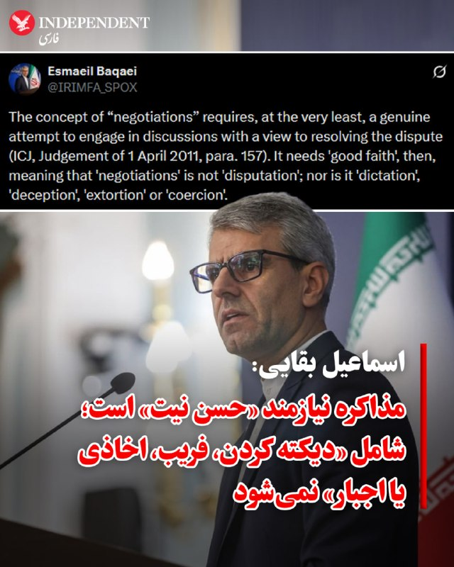

> ♦️ اسماعیل بقایی، سخنگوی وزارت امور خارجه جمهوری اسلامی، روز چهارشنبه ۱۶ اردیبهشت، در پیامی در شبکه اجتماعی ایکس با استناد به تعریف ارائه شده در یکی از مصوبات دیوان بین‌المللی دادگستری تاکید کرد که مفهوم «مذاکرات» مستلزم تلاشی واقعی برای حل اختلافات است. او خاطرنشان کرد که مذاکره لزوما نیازمند «حسن نیت» است و نباید با مشاجره اشتباه گرفته شود.
> 
> بقایی در ادامه تصریح کرد که فرآیند مذاکره به معنای «دیکته کردن»، «فریب»، «اخاذی» یا «اجبار» نیست. این اظهارات در حالی مطرح می‌شود که تلاش‌های بین‌المللی برای بازگرداندن تهران و واشنگتن به میز مذاکره ادامه دارد و طرفین با واسطه‌گری پاکستان، طرح‌هایی را برای پایان دادن به جنگ و ادامه مذاکرات موثر به یکدیگر ارائه داده‌اند اما هنوز توافقی روی این طرح‌ها صورت نگرفته است.
> ‌🇸🇦 Indypersian
> 
> 🤖 @VahidOOnLine

## 1405/02/16 19:49 — kianmeli1
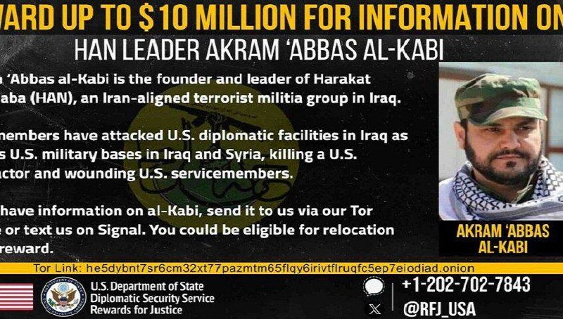

> 🔴جایزه 10 میلیون دلاری امریکا برای شناسایی محل دبیرکل جنبش النجباء
> 
> وزارت خارجه امریکا برای اطلاعاتی که موجب شناسایی شیخ اکرم الکعبی دبیرکل جنبش النجباء عراق شود یا محل اقامت او را مشخص کند، 10 میلیون دلار پاداش در نظر گرفت.
> https://t.me/kianmeli1

## 1405/02/16 19:49 — VahidOOnLine

> روزنامه «تایمز اسرائیل» به نقل از دفتر یکی از وزیران گزارش داد که بنیامین نتانیاهو، نخست‌وزیر اسرائیل، چهارشنبه کابینه امنیتی تشکیل خواهد داد.
> 
> به نوشته این رسانه، برگزاری این نشست در شرایطی انجام می‌شود که گزارش‌هایی از نزدیک شدن آمریکا و جمهوری اسلامی به توافق بر سر یک یادداشت تفاهم برای پایان جنگ و بازگشایی تنگه هرمز منتشر شده است.
> ‌🏁 🇬🇧 IranintlTV
> 
> 🤖 @VahidOOnLine

## 1405/02/16 19:48 — kianmeli1

> 🔴بر اساس بیانیه‌ای که از سوی ستاد فرماندهی مرکزی ایالات متحده منتشر شده است، از زمان آغاز محاصره تنگه هرمز توسط ایالات متحده، ۵۲ کشتی از عبور از این تنگه منع شده یا به بنادر ایران بازگردانده شده‌اند.
> https://t.me/kianmeli1

## 1405/02/16 19:47 — VahidOnline

> ♦️ دونالد ترامپ، رئیس‌جمهوری ایالات متحده روز چهارشنبه ۱۶ اردیبهشت، در تماس تلفنی با شبکه پی‌بی‌اس اعلام کرد ایالات متحده به توافقی برای پایان جنگ با ایران نزدیک شده است. او اشاره کرد که این توافق ممکن است شامل انتقال ذخیره اورانیوم با غنای بالای ایران به آمریکا باشد. ترامپ با ابراز خوش‌بینی نسبت به توقف جنگ پیش از سفر هفته آینده‌اش به چین، هشدار داد که در صورت شکست مذاکرات، حملات سنگین هوایی از سر گرفته خواهد شد.
> @VahidOOnLine
> 
> 📡 @VahidOnline

## 1405/02/16 19:46 — mwarmonitor
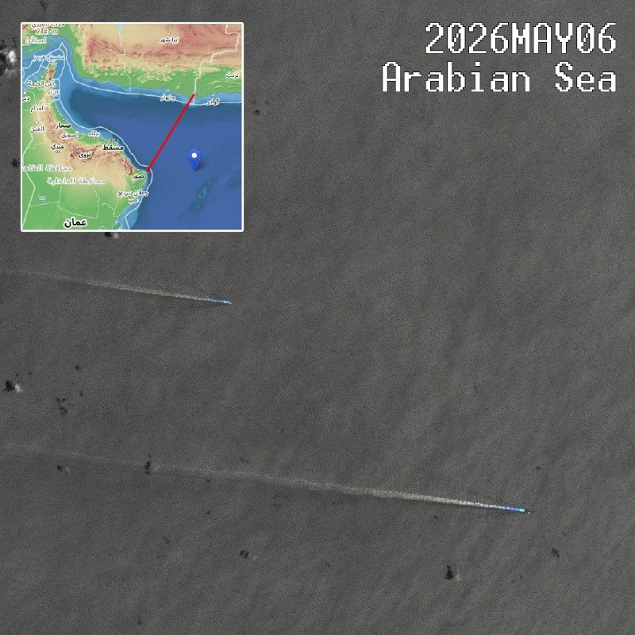

> ناو یو‌اس‌اس لینکلن 🇺🇸 امروز در مختصات 22.530، 61.612 مشاهده شد، همراه با یک ناوشکن اسکورت در حال حرکت در دریای عرب. این گروه به سمت شرق در حرکت است و حدود ۱۸۵ کیلومتر با خط محاصره آمریکا 🇺🇸🇮🇷 علیه ایران فاصله دارد.
> 
> @mwarmonitor

## 1378/10/11 03:30 — VahidOOnLine
[🎬 Video](telegram/content/VahidOOnLine_238477_1778085390.mp4)

> ⭕️ روسای جمهوری چک و فنلاند در پراگ پا به پای هم دویدند
> 
> ♦️پتر پاول، رئیس‌جمهوری چک و الکساندر استوب، رئیس‌جمهوری فنلاند در حرکتی متفاوت و غیررسمی، روز خود را با یک دوی صبحگاهی در خیابان‌های مرکزی پراگ آغاز کردند. این برنامه در جریان سفر دو روزه رئیس‌جمهوری فنلاند به پایتخت جمهوری چک برگزار شد.
> آن‌ها در این برنامه ورزشی با همراهی کان کایرینن، بازیکن باشگاه اسپارتا پراگ و همچنین کریستینا ساسینک ماکی، دونده فنلاندی، حضور داشتند.
> پتر پاول پس از این دویدن در اینستاگرام نوشت: «شروع روز با کمی سرعت بیشتر!»
> ‌🇸🇦 Indypersian
> 
> 🤖 @VahidOOnLine

## 1378/10/11 03:30 — VahidOOnLine
[🎬 Video](telegram/content/VahidOOnLine_238475_1778085393.mp4)

> یک صاحب کارخانه تولیدی در اراک در پیامی به ایران اینترنشنال از بحران کارش در تامین مواد اولیه برای تولید می‌گوید. او اضافه کرد نمی‌تواند حقوق کارگران را بدهد.
> ‌🏁 🇬🇧 IranintlTV
> 
> 🤖 @VahidOOnLine

## 1378/10/11 03:30 — VahidOOnLine
> ♦️محمدباقر قالیباف، رئیس مجلس شورای اسلامی، در یک پیام صوتی خطاب به «مردم ایران» با اشاره به شرایط حساس ایران، خواستار افزایش شفافیت عملکرد مسئولان در حوزه اقتصادی شد و تاکید کرد که دولت باید اقدامات خود برای مهار گرانی‌ها را به‌صورت مستمر به مردم گزارش دهد.
> قالیباف با توصیف شرایط کنونی به‌عنوان «دوره جدیدی از جنگ»، اظهار داشت که دشمن با تمرکز بر فشارهای اقتصادی به‌دنبال تضعیف و تسلیم ایران است و احتمال تهدیدات امنیتی از جمله حملات نظامی و «تروریستی» نیز همچنان وجود دارد. او در عین حال تاکید کرد که عبور موفق از این شرایط می‌تواند جایگاه ایران را به‌عنوان یکی از بازیگران موثر در نظام بین‌الملل تثبیت کند.
> رئیس مجلس با اشاره به مسئولیت‌های متقابل دولت و مردم، از مسئولان اجرایی خواست با برنامه‌ریزی دقیق و «مدیریت جهادی» برای کاهش فشار اقتصادی اقدام کنند و در مقابل، مردم نیز با «صرفه‌جویی» نقش موثری در این مسیر ایفا کنند، اقدامی که به گفته او «موثرترین موشک» در برابر دشمن است.
> ‌🇸🇦 Indypersian
> 
> 🤖 @VahidOOnLine

## 1378/10/11 03:30 — mwarmonitor
[🎬 Video](telegram/content/mwarmonitor_8578_1778085396.mp4)

> 📝 این انگلِ بدذات که تا دیروز با مکیدن خون مردم در لجن‌زار سایت‌های شرط‌بندی غوطه‌ور بود، حالا که تیپای قانون را خورده و بوی دیپورت و بی‌پولی بالا گرفته، ناگهان ردای زهد به تن کرده تا وقاحت را به سقف بچسباند. این آفتاب‌پرستِ بی‌ریشه که تمام زندگی‌اش بر پایه‌ی کلاهبرداری و مال‌حرام بنا شده، حالا با ریشِ نفاق و تظاهر به معنویت، قصد دارد از اعتقادات مردم هم نردبانی برای فرار از رسوایی بسازد. پویان مختاری نماد بارز یک جانورِ فرصت‌طلب است که وقتی بوی زندان می‌شنود، از جکوزیِ فساد به هیئتِ ریا پناه می‌برد؛ اما نه آن محاسنِ قلابی و نه این نمایش‌های تهوع‌آور، بوی تعفنِ دزدی‌هایش را پاک نخواهد کرد. این حرامزاده‌ی نان‌به‌نرخ‌روز‌خور باید بداند که با «یا حسین» گفتن، پرونده‌ی سیاه غارتگری‌اش بسته نمی‌شود و جز نفرت و تفِ لعنتِ ملت، نصیبی نخواهد داشت.
> 
> @mwarmonitor

## 1405/02/16 19:31 — VahidOOnLine

> وزیر کشور بحرین اعلام کرد افرادی که در ارتباط با پرونده‌های امنیتی اخیر بازداشت شده‌اند، «ارتباط نزدیکی با سپاه پاسداران انقلاب اسلامی و ایدئولوژی ولایت فقیه» داشته‌اند.
> به گفته وزارت کشور بحرین، این بازداشت‌ها در چارچوب یک بررسی «جامع امنیتی و حقوقی» و در پی آنچه «تجاوز آشکار ایران» خوانده شده، انجام شده است.
> این وزارتخانه افزود در این روند، جرائم و فعالیت‌های غیرقانونی مرتبط با این افراد نیز مورد بررسی قرار گرفته است.
> ‌🏁 🇬🇧 ManotoTV
> 
> 🤖 @VahidOOnLine

## 1405/02/16 19:30 — DEJradio
[🎬 Video](telegram/content/DEJradio_4461_1778083450.jpg)

> 🚨
> ⭕️ دونالد ترامپ، رئیس جمهوری آمریکا به شبکه PBS:
> «اورانیوم غنی‌شده در چارچوب توافق احتمالی به آمریکا منتقل خواهد شد و جمهوری اسلامی از تأسیسات زیرزمینی استفاده نخواهد کرد. اما اگر توافقی حاصل نشود، جهنم را به روی آنها باز خواهیم کرد.»
> 
> #مذاکرات #ترامپ
> @DEJradio

## 1405/02/16 19:28 — VahidOOnLine

> ♦️ دونالد ترامپ، رئیس‌جمهوری ایالات متحده روز چهارشنبه ۱۶ اردیبهشت، در تماس تلفنی با شبکه پی‌بی‌اس اعلام کرد ایالات متحده به توافقی برای پایان جنگ با ایران نزدیک شده است. او اشاره کرد که این توافق ممکن است شامل انتقال ذخیره اورانیوم با غنای بالای ایران به آمریکا باشد. ترامپ با ابراز خوش‌بینی نسبت به توقف جنگ پیش از سفر هفته آینده‌اش به چین، هشدار داد که در صورت شکست مذاکرات، حملات سنگین هوایی از سر گرفته خواهد شد.
> ‌🇸🇦 Indypersian
> 
> 🤖 @VahidOOnLine

## 1405/02/16 19:24 — VahidOOnLine
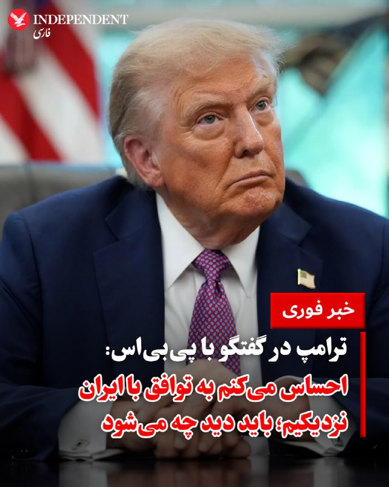

> ♦️ دونالد ترامپ، رئیس‌جمهور آمریکا، روز چهارشنبه، ۱۶ اردیبهشت در تماسی تلفنی با شبکه «پی‌بی‌اس» (PBS) نسبت به دستیابی به توافقی با جمهوری اسلامی ابراز خوش‌بینی کرد. ترامپ با بیان اینکه احساس می‌کند آمریکا به توافق نزدیک شده است، افزود: «پیش از این هم چنین حسی داشتم، پس باید منتظر ماند و دید چه می‌شود».
> 
> رئیس‌جمهوری آمریکا احتمال اعزام فرستادگان ویژه از جمله استیو ویتکاف و جرد کوشنر به مذاکرات را بعید دانست اما تاکید کرد که احتمال پایان یافتن جنگ پیش از سفر هفته آینده‌اش به چین وجود دارد. او هشدار داد: «فکر می‌کنم شانس بسیار خوبی برای پایان جنگ وجود دارد، اما اگر تمام نشود، باید به بمباران شدید آن‌ها بازگردیم».
> 
> این گفتگو ساعاتی پس از آن انجام شد که ترامپ در «تروث سوشال» اعلام کرد به دلیل نزدیک شدن به توافق، ماموریت اسکورت کشتی‌های تجاری در تنگه هرمز به‌صورت موقت «متوقف» خواهد شد. ترامپ پیش‌تر نیز بر استفاده از اهرم فشار محاصره برای بازگشایی این آبراه حیاتی تاکید کرده بود.
> ‌🇸🇦 Indypersian
> 
> 🤖 @VahidOOnLine

## 1405/02/16 19:09 — VahidOOnLine
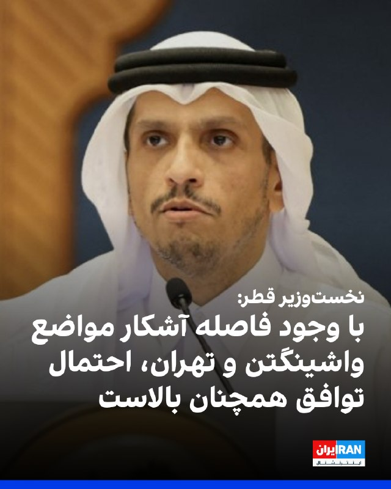

> نخست‌وزیر و وزیر خارجه قطر اعلام کرد با وجود فاصله مواضع آمریکا و ایران، احتمال دستیابی دو طرف به راه‌حل دیپلماتیک همچنان بالاست.
> 
> شیخ محمد بن عبدالرحمن آل ثانی در گفت‌وگو با «العربی الجدید» تاکید کرد هر توافقی باید منافع کشورهای منطقه و جامعه جهانی را در نظر بگیرد و دوحه با استفاده از تنگه هرمز به‌عنوان ابزار فشار مخالف است.
> 
> او با اشاره به تحولات اخیر منطقه گفت همزیستی بر پایه احترام به حاکمیت، حسن همجواری و عدم تهدید امنیت دیگران ضروری است و حاکمیت قطر خط قرمز این کشور به شمار می‌رود.
> آل ثانی همچنین تاکید کرد تاسیسات غیرنظامی نباید هدف حمله قرار گیرند، زیرا بخش مهمی از اقتصاد و امنیت انرژی جهان هستند.
> 
> نخست‌وزیر قطر درباره پیامدهای اقتصادی حملات اخیر گفت اقتصاد این کشور توان جذب شوک‌ها را دارد و از ذخایر مالی و برنامه‌های مشخص برخوردار است، هرچند اقداماتی برای بهبود بهره‌وری و مدیریت هزینه‌ها در پیش خواهد بود.
> او امنیت کشورهای شورای همکاری خلیج فارس را تجزیه‌ناپذیر دانست و روابط با آمریکا را راهبردی توصیف کرد.
> 
> ‌🏁 🇬🇧 IranintlTV
> 
> 🤖 @VahidOOnLine

## 1405/02/16 19:08 — VahidOOnLine

> محمدباقر قالیباف، رییس مجلس، گفت احتمال حمله نظامی کم نیست، اما «دشمن» به فشار اقتصادی امید بسته و بر اساس گزارش‌های «غلط» تصمیم‌گیری کرده است.
> 
> او افزود ملت ایران حتی در شرایط فشار اقتصادی، به خاطر دین و اعتقادات خود مشکلات را تحمل می‌کنند.
> 
> قالیباف گفت باید از ظرفیت ایرانیان خارج از کشور برای شکست «دشمن» استفاده شود و نخبگان نیز منتظر مراجعه مسئولان نمانند و راه‌حل‌ها و پیشنهادهای خود را ارائه دهند.
> 
> او همچنین خواستار راه‌اندازی پویش «ایران همدل» مانند دوران کرونا شد.
> ‌🏁 🇬🇧 IranintlTV
> 
> 🤖 @VahidOOnLine

## 1405/02/16 19:06 — VahidOnline
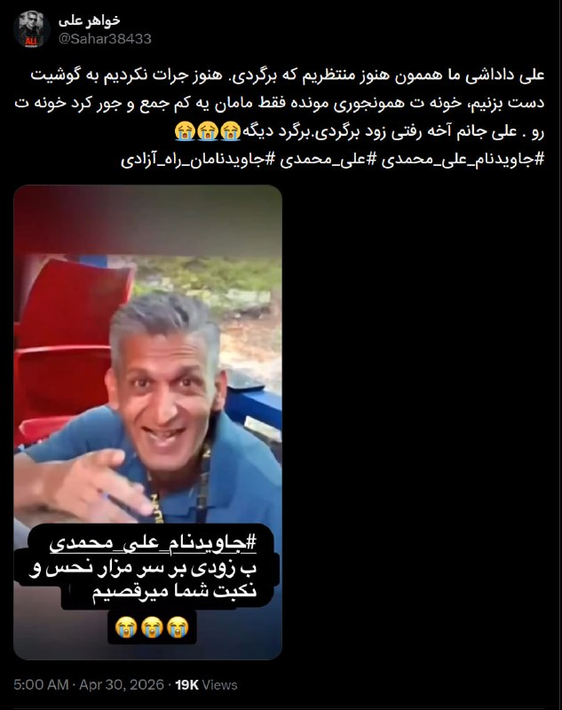

> خواهر علی محمدی: Sahar38433
> 
> 📡 @VahidOnline

## 1405/02/16 19:03 — VahidOnline

> دونالد ترامپ، رییس‌جمهوری آمریکا، در گفت‌وگو با شبکه پی‌بی‌اس نیوز اعلام کرد جنگ با ایران «شانس بسیار خوبی برای پایان یافتن» دارد و ابراز امیدواری کرد واشینگتن به توافقی با تهران نزدیک شده باشد. او گفت این توافق می‌تواند شامل صادرات اورانیوم با غنای بالا از سوی ایران به آمریکا باشد.
> 
> ترامپ با اشاره به روند مذاکرات افزود: «احساس می‌کنم به توافق نزدیک شده‌ایم، اما قبلاً هم چنین احساسی داشتم، بنابراین باید دید چه می‌شود.» او احتمال اعزام استیو ویتکاف و جرد کوشنر به مذاکرات را بعید دانست و گفت ممکن است پیش از سفر هفته آینده‌اش به چین، توافقی برای پایان جنگ حاصل شود.
> 
> رییس‌جمهوری آمریکا هشدار داد در صورت شکست مذاکرات، گزینه نظامی همچنان روی میز خواهد بود. او گفت اگر جنگ پایان نیابد «باید دوباره آن‌ها را به‌شدت بمباران کنیم.»
> 
> این اظهارات ساعاتی پس از آن مطرح شد که ترامپ در شبکه تروث سوشال اعلام کرد ماموریت اسکورت کشتی‌های تجاری در تنگه هرمز موقتاً متوقف می‌شود، زیرا کشورها به توافق نزدیک‌تر شده‌اند.
> @VahidOOnLine
> 
> 📡 @VahidOnline

## 1405/02/16 19:02 — mwarmonitor
> 🔵 (رویترز) - وزارت حمل‌ونقل آمریکا اعلام کرد شرکت‌های بزرگ هواپیمایی این کشور در ماه مارس بیش از ۵ میلیارد دلار برای سوخت جت هزینه کردند که ۵۶ درصد افزایش داشته و ۱.۸ میلیارد دلار بیشتر از هزینه‌های ماه فوریه بوده است.
> 
> @mwarmonitor

## 1405/02/16 19:02 — VahidOnline
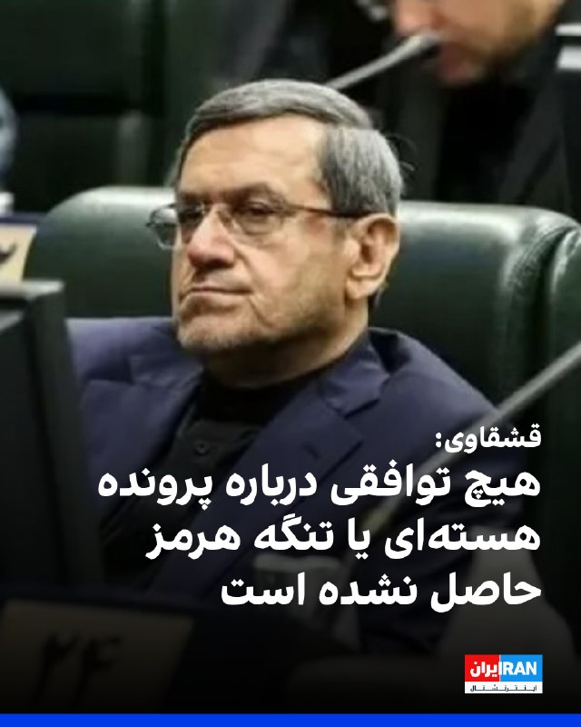

> حسن قشقاوی، عضو کمیسیون امنیت ملی مجلس اعلام کرد جمهوری اسلامی تاکنون پاسخی به پیام آمریکا نداده و هیچ توافقی درباره پرونده هسته‌ای یا تنگه هرمز حاصل نشده است.
> @VahidOOnLine
> 
> 📡 @VahidOnline

## 1405/02/16 19:01 — pm_afshaa
> 🔴ترامپ به شبکه پی‌بی‌اس: این توافق تصریح می‌کند که ایران اورانیوم غنی‌شده با غلظت بالا را به ایالات متحده صادر خواهد کرد
> 
> 
> 💧 Rainbet.com the #1 Non-KYC Crypto Casino & Sportsbook @rainbetcom
> 
> 😁 @Pm_Afshaa

## 1405/02/16 19:00 — mwarmonitor
> 🔴 (رویترز) - یک عضو ارشد پارلمان ایران روز چهارشنبه گفت گزارشی از Axios که شامل متن یک پیشنهاد آمریکا برای توافق با ایران جهت پایان دادن به جنگ است، بیشتر شبیه یک «فهرست آرزوها» است تا واقعیت.
> 
> @mwarmonitor

## 1405/02/16 18:57 — VahidOOnLine

> یک منبع اسرائیلی به خبرگزاری رویترز گفته است که اسرائیل از نزدیک شدن احتمالی توافق میان آمریکا و جمهوری اسلامی اطلاعی نداشته است.
> این منبع همچنین افزوده که اسرائیل خود را برای احتمال تشدید درگیری‌ها آماده کرده است.
> اسرائیل همچنان به حملات خود در جنوب لبنان ادامه می‌دهد و مواضع گروه حزب‌الله مورد حمایت تهران را هدف قرار می‌دهد.
> این گزارش در حالی منتشر شده که پیش‌تر یک منبع پاکستانی به رویترز گفته بود آمریکا و جمهوری اسلامی به توافق بر سر یک یادداشت تفاهم یک‌صفحه‌ای برای پایان جنگ نزدیک شده‌اند.
> به نقل از سخنگوی وزارت خارجه جمهوری اسلامی نیز گزارش شده که تهران در حال بررسی این پیشنهاد است و نظرات خود را از طریق پاکستان به طرف مقابل منتقل خواهد کرد.
> ‌🏁 🇬🇧 ManotoTV
> 
> 🤖 @VahidOOnLine

## 1405/02/16 18:57 — mwarmonitor
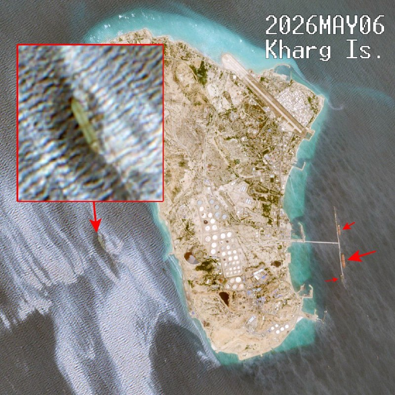

> «روز شلوغ خارگ 🇮🇷 جزیره خارگ امروز. دو نفتکش VLCC، یک نفتکش Suezmax و یک نفتکش ساحلی در حال بارگیری مشاهده شدند. یک خطا - حادثه در یکی از VLCCها در مختصات 29.2309, 50.2837 منجر به نشت نفت خام شد.
> 
> ❗️معلوم نیست میزان نشت چقدر است، چون بیشتر چیزی که دیده می‌شود یک لایه بسیار نازک و نقره‌ای‌رنگ است، نه نفت خام غلیظ و سیاه.»
> 
> @mwarmonitor

## 1405/02/16 18:56 — kianmeli1
> 🔴منبع اسرائیلی به سی‌ان‌ان گفت: نتانیاهو نگران و مضطرب از مذاکرات ایران و آمریکا است و قرار است امروز با دولت ترامپ مذاکره کند تا «آخرین تحولات مذاکرات را بهتر درک کند».
> https://t.me/kianmeli1

## 1405/02/16 18:56 — pm_afshaa
> 🔴بر اساس گزارش رسانه‌ Ynet، رئیس کل ستاد ارتش اسرائیل اعلام کرد که ارتش اسرائیل اهداف اضافی را آماده کرده و در حالت آماده‌باش کامل برای از سرگیری عملیات علیه ایران است
> 
> 
> 💧 Rainbet.com the #1 Non-KYC Crypto Casino & Sportsbook @rainbetcom
> 
> 😁 @Pm_Afshaa

## 1405/02/16 18:56 — kianmeli1
> ‏🔴محمدباقر قالیباف، رییس مجلس: احتمال حمله نظامی کم نیست
> https://t.me/kianmeli1

## 1405/02/16 18:53 — kianmeli1

> 🔴روایت جانسوز کشته شدن پرهام آقامحمدی
> https://t.me/kianmeli1

## 1405/02/16 18:52 — kianmeli1

> عارف جعفرزاده در ۱۸ دی ۱۴۰۴ توسط حکومت اهریمنی خامنه ای کشته شد
> https://t.me/kianmeli1

## 1405/02/16 18:52 — mwarmonitor
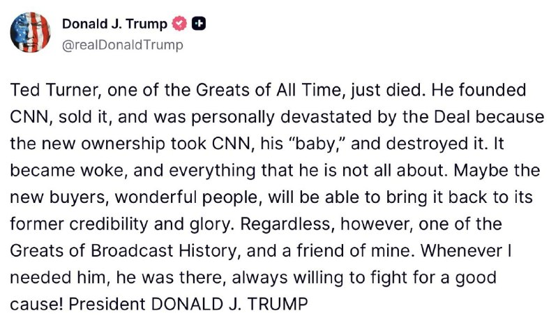

> تدی ترنر، یکی از بزرگترین‌های تمام دوران، همین حالا درگذشت. او سی‌ان‌ان (CNN) را تأسیس کرد، آن را فروخت و شخصاً از این معامله ویران شد، زیرا مدیریت جدید، سی‌ان‌ان را که «بچه» او بود گرفتند و نابودش کردند. این شبکه «ووک» (دچار تفکرات افراطی چپ) شد و تبدیل به هر آن چیزی شد که او اصلاً به آن‌ها اعتقاد نداشت. شاید خریداران جدید که افراد فوق‌العاده‌ای هستند، بتوانند آن را به اعتبار و شکوه سابقش بازگردانند. با این وجود، او یکی از بزرگان تاریخ پخش [برنامه‌های تلویزیونی] و دوست من بود. هر زمان که به او نیاز داشتم، حضور داشت و همیشه مایل بود برای یک هدف خوب مبارزه کند!
> 
> رئیس‌جمهور دونالد جی. ترامپ
> 
> @mwarmonitor

## 1378/10/11 03:30 — VahidOOnLine
[🎬 Video](telegram/content/VahidOOnLine_238467_1778083461.mp4)

> ♦️سخنگوی وزارت امور خارجه چین روز چهارشنبه، ۱۶ اردیبهشت اعلام کرد که پایان دادن کامل به جنگ ایالات متحده و اسرائیل علیه جمهوری اسلامی امری حیاتی است و بر تداوم مذاکرات تاکید کرد. لین جیان این سخنان را در پاسخ به پرسشی درباره جزئیات دیدار وانگ یی، وزیر امور خارجه چین، با همتای ایرانی خود، عباس عراقچی، در پکن بیان کرد.
> 
> به گفته این سخنگو، طرفین در این نشست تبادل نظر عمیقی درباره روابط دوجانبه و مسائل منطقه‌ای و بین‌المللی مورد علاقه طرفین داشتند. چین همچنین بر حمایت خود از حاکمیت ملی و امنیت ایران تاکید کرده و تمایل تهران برای حل‌وفصل سیاسی بحران از طریق دیپلماسی را مورد ستایش قرار داد.
> 
> در رابطه با بحران تنگه هرمز، پکن ضمن اشاره به نگرانی‌های جهانی درباره امنیت کشتیرانی، ابراز امیدواری کرد که طرف‌های درگیر به خواسته‌های جامعه بین‌المللی پاسخ دهند. چین همچنین تأکید کرد که کشورهای منطقه باید سرنوشت خود را در دست گرفته و با ایجاد یک چارچوب امنیتی مشترک، به سمت حسن همجواری و توسعه پایدار حرکت کنند.
> ‌🇸🇦 Indypersian
> 
> 🤖 @VahidOOnLine

## 1405/02/16 18:48 — mwarmonitor
> 🔴پیش‌نویس جدیدِ پیشنهادیِ یادداشت تفاهم میان آمریکا و ایران برای پایان دادن به جنگ، مسائل مربوط به تنگه هرمز را حل‌وفصل نخواهد کرد و تنها «از ایران می‌خواهد که کنترل خود بر تنگه را کاهش دهد».
> 
> 🔹در این پیش‌نویس همچنین از ایالات متحده خواسته شده است که محاصره دریایی خود را به‌تدریج کاهش دهد — وال‌استریت ژورنال (WSJ).
> 
> @mwarmonitor

## 1405/02/16 18:47 — mwarmonitor
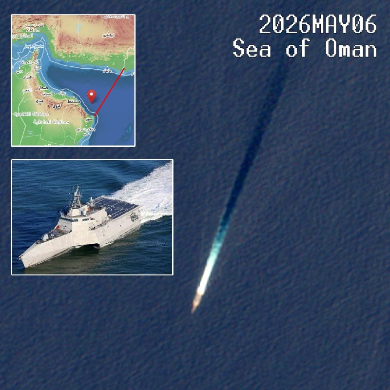

> 🔴 احتمالاً ناو ساحلی USS Canberra (LCS) 🇺🇸 امروز در مختصات زیر مشاهده شده است:
> 
> 23.2241, 59.6542
> 
> 🔸این شناور در خلیج عمان و درون خط محاصره دریایی آمریکا در حال گشت‌زنی بوده و مأموریت‌های مقابله با مین‌های دریایی را با استفاده از پهپادهای مجهز به هوش مصنوعی انجام می‌دهد؛ با هدف حفاظت از مسیرهای تجاری و رهگیری شناورهای غیرمجاز.
> 
> @mwarmonitor

## 1405/02/16 18:43 — VahidOnline
> توییت یک خانم دیگر: "امروز امین ما باید شمع ۳۴ سالگی‌ش رو فوت میکرد و به‌جاش زیر خروارها خاک‌ه، تولدت مبارک امین، فراموش‌ت نمیکنیم.❤️
> #امین_حیدری_گودرزی"
> eheyllo
> ۱۸ دی ماه در عظیمیه کرج با شلیک مستقیم نیروهای سرکوب کشته شد.
> eheyllo
> 
> 📡 @VahidOnline

## 1405/02/16 18:42 — kianmeli1
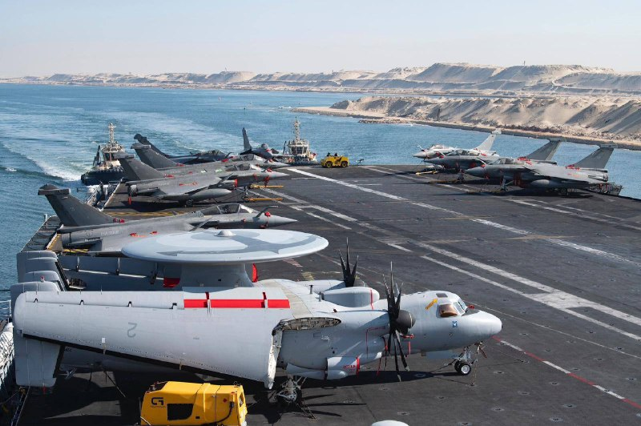

> 🔴وزارت دفاع فرانسه اعلام کرد ناو هواپیمابر شارل دوگل با عبور از کانال سوئز به سمت جنوب حرکت کرده تا در دریای سرخ و خلیج عدن مستقر شود و برای ماموریت اعلام شده قبلی بریتانیا و فرانسه در تنگه هرمز آماده شود.
> https://t.me/kianmeli1

## 1405/02/16 18:41 — mwarmonitor
> 🇺🇸ناو هواپیمابر USS George H.W. Bush (CVN-77) در میان بخش بزرگی از ناوهای جنگی، هواپیماها و نیروهای آمریکایی قرار دارد که به‌طور کامل در حال اجرای محاصره دریایی ایالات متحده علیه ایران هستند.
> 
> ❌تاکنون ۵۲ فروند کشتی تجاری برای رعایت این محاصره، ملزم شده‌اند مسیر خود را تغییر دهند یا به بندر بازگردند.
> 
> @mwarmonitor

## 1405/02/16 18:41 — VahidOOnLine

> دونالد ترامپ، رییس‌جمهوری آمریکا، در گفت‌وگو با شبکه پی‌بی‌اس نیوز اعلام کرد جنگ با ایران «شانس بسیار خوبی برای پایان یافتن» دارد و ابراز امیدواری کرد واشینگتن به توافقی با تهران نزدیک شده باشد. او گفت این توافق می‌تواند شامل صادرات اورانیوم با غنای بالا از سوی ایران به آمریکا باشد.
> 
> ترامپ با اشاره به روند مذاکرات افزود: «احساس می‌کنم به توافق نزدیک شده‌ایم، اما قبلاً هم چنین احساسی داشتم، بنابراین باید دید چه می‌شود.» او احتمال اعزام استیو ویتکاف و جرد کوشنر به مذاکرات را بعید دانست و گفت ممکن است پیش از سفر هفته آینده‌اش به چین، توافقی برای پایان جنگ حاصل شود.
> 
> رییس‌جمهوری آمریکا هشدار داد در صورت شکست مذاکرات، گزینه نظامی همچنان روی میز خواهد بود. او گفت اگر جنگ پایان نیابد «باید دوباره آن‌ها را به‌شدت بمباران کنیم.»
> 
> این اظهارات ساعاتی پس از آن مطرح شد که ترامپ در شبکه تروث سوشال اعلام کرد ماموریت اسکورت کشتی‌های تجاری در تنگه هرمز موقتاً متوقف می‌شود، زیرا کشورها به توافق نزدیک‌تر شده‌اند.
> ‌🏁 🇬🇧 IranintlTV
> 
> 🤖 @VahidOOnLine

## 1405/02/16 18:40 — mwarmonitor
> 🔴آکسیوس اختصاصی به گفته مقام‌ها: آمریکا و ایران در آستانه توافق بر سر یک یادداشت تفاهم یک‌صفحه‌ای برای پایان دادن به جنگ هستند 📝باراک راوید کاخ سفید بر این باور است که به توافقی با ایران بر سر یک یادداشت تفاهم (MOU) یک‌صفحه‌ای نزدیک می‌شود؛ توافقی که هدف…

## 1405/02/16 18:37 — mwarmonitor
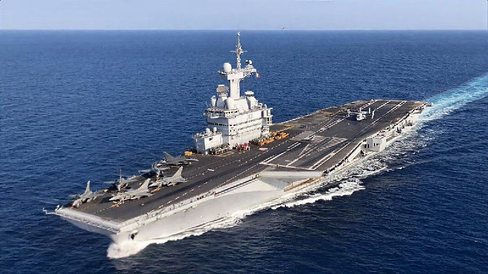

> 🇫🇷ناو هواپیمابر شارل دوگل (FS Charles de Gaulle)، تنها ناو هواپیمابر فرانسه، از کانال سوئز عبور کرده و در مسیر ورود به دریای سرخ قرار دارد.
> 
> 🇫🇷وزارت دفاع فرانسه اعلام کرده است که گروه رزمی این ناو در منطقه جنوب دریای سرخ / خلیج عدن مستقر خواهد شد تا خود را برای اجرای یک عملیات احتمالی «آزادی ناوبری» در تنگه هرمز آماده کند.
> 
> @mwarmonitor

## 1405/02/16 18:36 — VahidOnline

> گفتگوی سه خواهر ایرانی درباره‌ی برادرهاشون که وقتی تو ایران «جنگ» نبود کشته شدند! lazy_haniye خواهر سینا کاظمی: sh_i_i_i خواهر سیاوش فرخی: Ferijan69 خواهر احمد خسروانی: Ahmad19101404 📡 @VahidOnline

## 1405/02/16 18:36 — VahidOnline
> 🔴مقامات ایران با هدف قرار دادن وکلای مدافع از طریق بازداشت و ارعاب، در حال تخریب آخرین خط حفاظتی از حقوق زندانیان هستند.
> ‏در این سیستم قضایی غیرشفاف، وکلای مستقل با اتهامات واهی، محدودیت‌های شدید و تهدید همیشگی بازداشت روبرو هستند.
> ‏ترکیب "سرکوبِ وکلا"، "قطع اینترنت" و "تهدید خانواده‌ها"، و جرم‌انگاری هرگونه اطلاع‌رسانی، زنگ خطر فاجعه‌ای انسانی در تضییع حقوق زندانیان را به صدا درآورده است.
> ‏⁧ #مدافعان_حقوق‌بشر
> #سرکوب_وکلا
> 
> @IranRights⁩

## 1405/02/16 18:30 — VahidOOnLine

> دادبان جزئیات تازه‌ای از یکی از سه بازداشتی دی ۱۴۰۴ اعدام شده در مشهد منتشر کرده است. بر اساس این گزارش، محمدرضا میری، کارگر ۲۱ ساله‌ای که اخیراً خدمت سربازی خود را به پایان رسانده بود، بامداد یکشنبه ۱۳ اردیبهشت ۱۴۰۵ در تماس تلفنی با خانواده‌اش از انتقال خود برای اجرای حکم اعدام خبر داده است.
> به گفته منابع نزدیک به خانواده، او در این تماس با صدایی لرزان گفته است: «دارن منو می‌برن برای اعدام، من کاری نکردم، بیاین منو نجات بدین.»
> ساعاتی بعد، حکم اعدام او اجرا شد.
> محمدرضا میری یکی از سه معترض بازداشت‌شده در جریان اعتراضات دی‌ماه ۱۴۰۴ بوده که به همراه ابراهیم دولت‌آبادی و مهدی رسولی به اتهام «محاربه» و «مشارکت در قتل یک مأمور نیروی انتظامی» به اعدام محکوم شده بودند.
> دادبان می‌نویسد این احکام در حالی اجرا شده که به گفته منابع حقوقی، روند رسیدگی به پرونده‌ها با ابهامات جدی همراه بوده است.
> همچنین گزارش شده اجرای این احکام بدون اطلاع قبلی به خانواده‌ها انجام شده و به آن‌ها گفته شده بود پرونده در کمیسیون عفو در حال بررسی است.
> ‌🏁 🇬🇧 ManotoTV
> 
> 🤖 @VahidOOnLine

## 1405/02/16 18:29 — kianmeli1
> 🔴فوری
> بر اساس گزارش رسانه اسرائیلی Ynet،
> رئیس ستاد کل ارتش اسرائیل، اعلام کرد که ارتش اسرائیل اهداف اضافی را آماده کرده و در حالت آماده‌باش کامل برای از سرگیری عملیات شدید علیه ایران است.
> https://t.me/kianmeli1

## 1405/02/16 18:29 — VahidOOnLine

> حسن قشقاوی، عضو کمیسیون امنیت ملی مجلس اعلام کرد جمهوری اسلامی تاکنون پاسخی به پیام آمریکا نداده و هیچ توافقی درباره پرونده هسته‌ای یا تنگه هرمز حاصل نشده است.
> 
> او با اشاره به برخی گمانه‌زنی‌ها درباره مذاکرات، تاکید کرد در موضوع هسته‌ای و همچنین مساله تنگه هرمز، توافقی میان دو طرف شکل نگرفته است.
> 
> ساعاتی پیش آکسیوس گزارش داد آمریکا و جمهوری اسلامی در آستانه توافق بر سر یک یادداشت تفاهم تک‌صفحه‌ای برای پایان دادن به جنگ هستند.
> 
> آکسیوس به نقل از دو مقام آمریکایی و دو منبع آگاه نوشت هدف از این یادداشت تفاهم، خاتمه درگیری نظامی و «تعیین چارچوبی برای مذاکرات هسته‌ای مفصل‌تر» است.
> 
> بر اساس این گزارش، کاخ سفید انتظار دارد حکومت ایران طی ۴۸ ساعت آینده، به «چند نکته کلیدی» در ارتباط با مذاکرات پاسخ دهد.
> 
> به گفته منابع آگاه، هنوز هیچ توافقی حاصل نشده است، اما دو طرف از زمان آغاز جنگ تاکنون هرگز تا این اندازه به توافق نزدیک نبوده‌اند.
> 
> 
> ‌🏁 🇬🇧 IranintlTV
> 
> 🤖 @VahidOOnLine

## 1405/02/16 18:28 — DEJradio

> 🛩️
> 🔥 فرمانده ارتش اسرائیل: در صورت حمله به جمهوری اسلامی، لیست جدیدی از اهداف داریم
> 
> ژنرال ایال زمیر، فرمانده ارتش اسرائیل، در جریان بازدید از نیروهای مستقر در جنوب لبنان اعلام کرد اسرائیل در بحبوحه نبرد چندجبهه‌ای، فرصتی تاریخی برای تغییر معادلات منطقه‌ای در اختیار دارد.
> او با اشاره به ادامه هماهنگی و همکاری نظامی با ایالات متحده گفت ارتش اسرائیل همچنان اهدافی آماده برای حمله در داخل ایران در اختیار دارد و در آمادگی کامل برای ازسرگیری عملیات گسترده و پرقدرت علیه جمهوری اسلامی قرار دارد.
> 
> به گفته زمیر، چنین عملیاتی می‌تواند دستاوردهای اسرائیل را گسترش داده و حکومت ایران را بیش از پیش تضعیف کند.
> 
> #حملات_هدفمند #جمهوری_اسلامی
> @DEJradio

## 1405/02/16 18:18 — VahidOOnLine
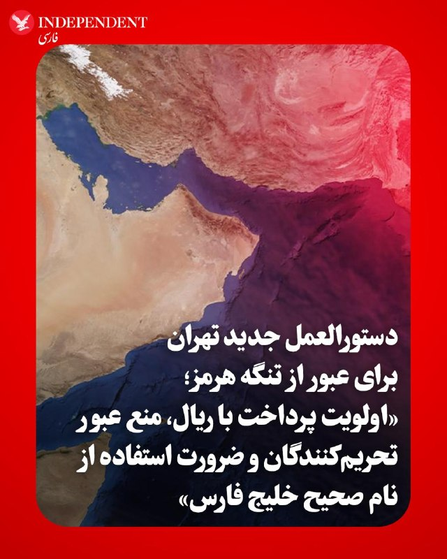

> ♦️جمهوری اسلامی سامانه جدیدی را برای مدیریت تردد در تنگه هرمز، یکی از حیاتی‌ترین آبراه‌های نفتی جهان، به اجرا گذاشته است. بر اساس گزارش پرس‌تی‌وی، تمامی شناورهایی که قصد عبور از این تنگه را دارند، باید پیش از تردد، چارچوب‌های عملیاتی خود را با قوانین جدید تطبیق داده و مجوز عبور دریافت کنند. این دستورالعمل‌ها از طریق آدرس رسمی ایمیل نهاد موسوم به «مقامات تنگه خلیج فارس» (PGSA) برای شرکت‌های کشتیرانی ارسال شده است.
> 
> طبق جزئیات این ابلاغیه، مکانیسم جدید عبور شامل شروط سختگیرانه‌ای است:
> 
> 
> اولویت مالی: پرداخت‌ها باید با اولویت ارز ملی ایران (ریال) انجام شود و ضمانت‌نامه‌ها در بانک‌های ایرانی صادر گردند.
> تسویه غرامت و محدودیت سیاسی: کشورهایی که در جنگ اخیر به ایران خسارت وارد کرده‌اند، ملزم به پرداخت غرامت پیش از دریافت مجوز هستند. همچنین، شناورهای متعلق به کشورهایی که ایران را تحریم کرده یا دارایی‌های آن را مسدود کرده‌اند، حق عبور ندارند.
> الزامات حاکمیتی: استفاده از نام صحیح «خلیج فارس» در تمامی اسناد رسمی الزامی است.
> ‌🇸🇦 Indypersian
> 
> 🤖 @VahidOOnLine

## 1405/02/16 18:07 — pm_afshaa
> 🔴سی ان ان به نقل از مقامات دولت ترامپ: کاخ سفید دیروز بازخورد مثبتی از پاکستان در مورد پیشرفت ایران در جهت سازش دریافت کرد‌‌
> 
> 
> 💧 Rainbet.com the #1 Non-KYC Crypto Casino & Sportsbook @rainbetcom
> 
> 😁 @Pm_Afshaa

## 1405/02/16 18:05 — VahidOnline

> خبرگزاری تسنیم به نقل از یک منبع مطلع گزارش داد با وجود ادعای برخی رسانه‌های آمریکایی درباره نزدیک شدن ایران و آمریکا به یک توافق یک‌صفحه‌ای برای پایان جنگ، جمهوری اسلامی هنوز پاسخ رسمی به آخرین متن پیشنهادی آمریکا نداده است؛ متنی که به گفته این منبع «حاوی بندهای غیرقابل‌قبول» است.
> 
> به نوشته تسنیم، این منبع تاکید کرده تبلیغات رسانه‌های آمریکایی بیشتر با هدف توجیه عقب‌نشینی اخیر دونالد ترامپ انجام می‌شود و اقدام اخیر او از ابتدا «نادرست» بوده است.
> 
> این منبع همچنین به تسنیم گفته پس از ارائه پیشنهاد ۱۴ بندی ایران از طریق میانجی پاکستانی، آمریکا طرحی ارسال کرد که تهران در حال بررسی آن بود، اما اقدام جدید واشینگتن موجب وقفه در روند بررسی شد. به گفته او، پس از عقب‌نشینی ترامپ، بررسی‌ها از سر گرفته شده و نتیجه پس از جمع‌بندی به میانجی اعلام خواهد شد.
> @VahidOOnLine
> 
> 📡 @VahidOnline

## 1405/02/16 18:04 — VahidOnline
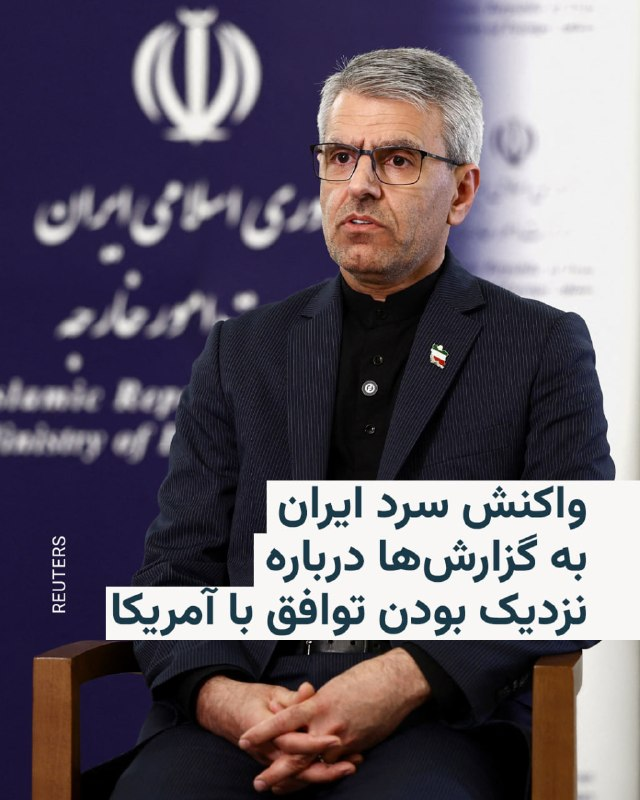

> در پی انتشار گزارش‌هایی درباره قریب‌الوقوع بودن توافق میان آمریکا و ایران برای پایان دادن به جنگ، سخنگوی وزارت خارجه جمهوری اسلامی گفت که تهران هنوز در حال بررسی پیشنهاد آمریکا است.
> 
> اسماعیل بقائی روز چهارشنبه به خبرگزاری ایسنا گفت: «طرح و پیشنهاد آمریکا از سوی ایران همچنان در حال بررسی است و ایران پس از جمع‌بندی نقطه نظرات خود را به طرف پاکستانی منتقل می‌کند.»
> 
> همزمان خبرگزاری تسنیم، نزدیک به سپاه پاسداران، به نقل از یک «منبع مطلع» نوشت که آخرین پیشنهاد آمریکا «حاوی برخی بندهای غیرقابل قبول» است و ایران هنوز به آن پاسخ نداده است.
> 
> خبرگزاری فارس، دیگر رسانه نزدیک به سپاه، نیز مدعی شد که «هیچ پیام مکتوب جدیدی میان ایران و آمریکا ردوبدل نشده» و گزارش‌های رسانه‌ای درباره نزدیک بودن تفاهم را رد کرد.
> 
> در ساعات گذشته وب‌سایت اکسیوس و خبرگزاری رویترز اعلام کردند که ایران و آمریکا به توافق با ایران بر سر یک یادداشت تفاهم یک‌صفحه‌ای برای پایان جنگ اخیر نزدیک شده‌اند.
> 
> فارس می‌گوید این گزارش‌ها برای «تأثیرگذاری بر بازارهای جهانی، به‌ویژه کاهش قیمت نفت» منتشر شده‌اند.
> @VahidHeadline
> 
> 📡 @VahidOnline

## 1405/02/16 18:03 — VahidOnline
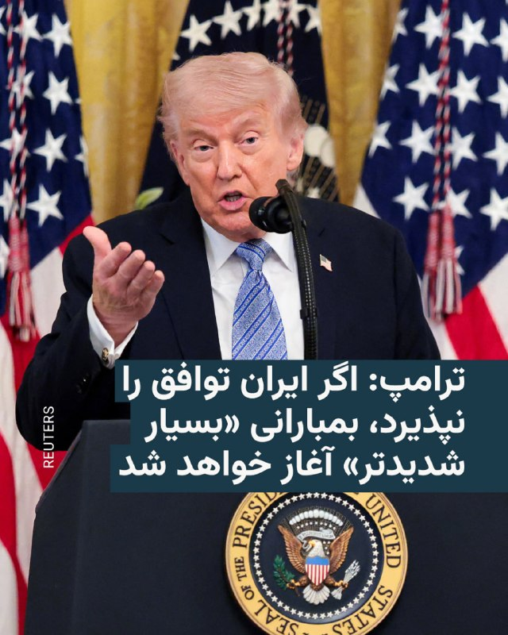

> دونالد ترامپ رئیس جمهوری آمریکا در پیامی تازه در شبکه اجتماعی خود، تروث سوشال نوشت: «با این فرض که ایران با آنچه توافق شده موافقت کند—که البته شاید فرض بزرگی باشد—عملیات «خشم حماسی» که همین حالا هم زبانزد شده، به پایان می‌رسد و محاصرۀ بسیار کارساز کنونی اجازه خواهد داد که تنگۀ هرمز برای همگان، از جمله خود ایران، باز باشد.»
> 
> او در این پیام افزود: «اگر موافقت نکنند، بمباران آغاز می‌شود و متأسفانه این بار با سطح و شدتی بسیار فراتر از گذشته خواهد بود.»
> 
> پیام دونالد ترامپ ساعاتی پس از انتشار گزارش‌هایی از نزدیک شدن احتمالی ایران و آمریکا به یک یادداشت تفاهم یک صفحه‌ای برای پایان جنگ منتشر شد.
> 
> پیشتر وب‌سایت اکسیوس به نقل از «دو مقام آمریکایی و دو منبع آگاه دیگر» گزارش داده بود که واشینگتن انتظار دارد طی ۴۸ ساعت آینده پاسخ ایران را درباره چند مسئله کلیدی دریافت کند. این گزارش با تأکید بر این‌که هنوز توافقی نهایی نشده، افزوده است که دو طرف از زمان آغاز جنگ تاکنون هرگز تا این اندازه به توافق نزدیک نبوده‌اند.
> 
> یک «منبع آگاه» پاکستانی هم به خبرگزاری رویترز گفته است که گزارش وب‌سایت اکسیوس درباره این توافق احتمالی «دقیق» است. او افزوده است که «خیلی زود این پرونده را خواهیم بست. به توافق نزدیک شده‌ایم».
> @VahidHeadline
> 
> 📡 @VahidOnline

## 1405/02/16 18:02 — VahidOnline
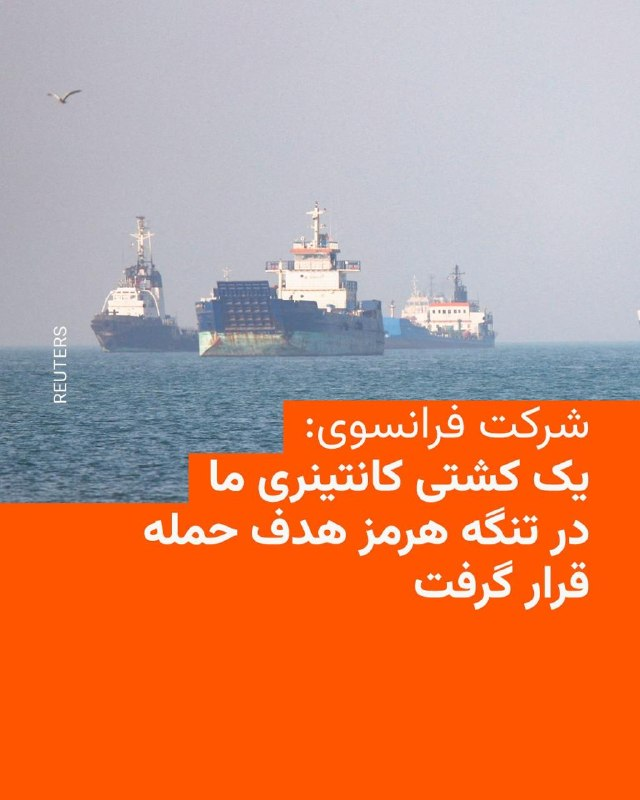

> شرکت کشتیرانی فرانسوی CMA CGM اعلام کرد یکی از کشتی‌های کانتینری‌اش در تنگه هرمز «هدف حمله» قرار گرفته است.
> 
> این شرکت کشتیرانی به خبرگزاری فرانسه گفت که یکی از کشتی‌هایش با نام «سن آنتونیو» روز سه‌شنبه هنگام عبور از تنگه هرمز هدف حمله قرار گرفت و در اثر آن جراحاتی به خدمه و خساراتی به کشتی وارد شد. این شرکت گفته که مجروحان برای درمان تخلیه شده‌اند و در حال پیگیری وضعیت است.
> 
> سه‌شنبه شب سازمان امنیت تجارت دریایی بریتانیا از وقوع حادثه‌ای برای یک کشتی در آب‌های اطراف امارات خبر داده بود.
> @VahidHeadline
> 
> 📡 @VahidOnline

## 1405/02/16 18:01 — VahidOnline
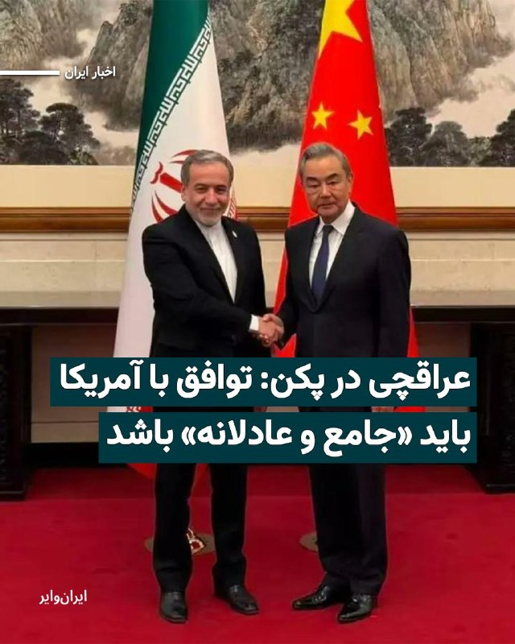

> عباس عراقچی، وزیر امور خارجه جمهوری اسلامی، در جریان سفر رسمی به پکن با وانگ یی، وزیر خارجه چین دیدار کرد و با اشاره به مذاکرات ایران و آمریکا تاکید کرده است که جمهوری اسلامی تنها «یک توافق جامع و عادلانه» را می‌پذیرد و بر حفظ حقوق و منافع خود تاکید دارد.
> @VahidHeadline
> 
> 📡 @VahidOnline

## 1405/02/16 18:00 — VahidOnline
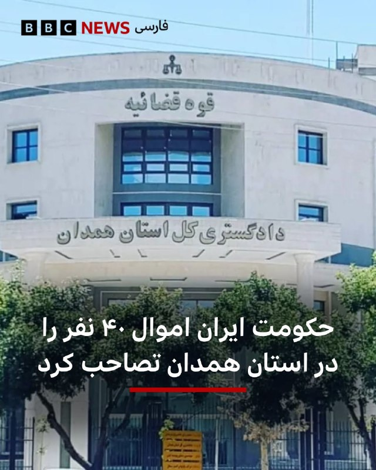

> دادگستری استان همدان از توقیف گسترده اموال ۴۰ نفر در این استان خبر داده و مدعی شده است این افراد با اتهام «خیانت به وطن» و «همکاری با شبکه‌های معاند» تحت پیگرد قرار گرفته‌اند؛ اقدامی که با دستور مقام قضایی و در چارچوب پرونده‌های امنیتی اخیر انجام شده است.
> @VahidHeadline
> 
> 📡 @VahidOnline

## 1405/02/16 17:58 — pm_afshaa
[🎬 Video](telegram/content/pm_afshaa_90248_1778080805.jpg)

> 🔥 ربات فروشگاه مردمی وینستون در خدمت شماست 
> 🔥 فروش کانفیگ ویتوری 
> 🏳 گیگی 220.000 تومان
> ☄️ گیگی 250.000 تومان 
> ☄️ گیگی 280.000 تومان 
> ☄️ 
> 🔥 سرعت موشکی 
> 💎 ( پنل مشاهده حجم در ربات ) لوکیشن بلغارستان و آلمان و ترکیه 
> 🇧🇬
> 🇩🇪
> 🇹🇷 
> ‼️ برای خرید ربات رو استارت کنید 
> ‼️ BOT…

## 1405/02/16 17:58 — pm_afshaa

> 🔥 ربات فروشگاه مردمی وینستون در خدمت شماست 
> 🔥
> 
> فروش کانفیگ ویتوری 
> 🏳
> 
> گیگی 220.000 تومان
> ☄️
> گیگی 250.000 تومان 
> ☄️
> گیگی 280.000 تومان 
> ☄️
> 
> 
> 🔥 سرعت موشکی
> 
> 💎 ( پنل مشاهده حجم در ربات )
> لوکیشن بلغارستان و آلمان و ترکیه 
> 🇧🇬
> 🇩🇪
> 🇹🇷
> 
> 
> ‼️ برای خرید ربات رو استارت کنید 
> ‼️
> 
> BOT 
> 📎 @WinstonLite_bot
> 
> PV 
> ✉️ @mosadeveloper
> 
> CH 
> 📣 https://t.me/winstonservice

## 1405/02/16 17:56 — VahidOOnLine
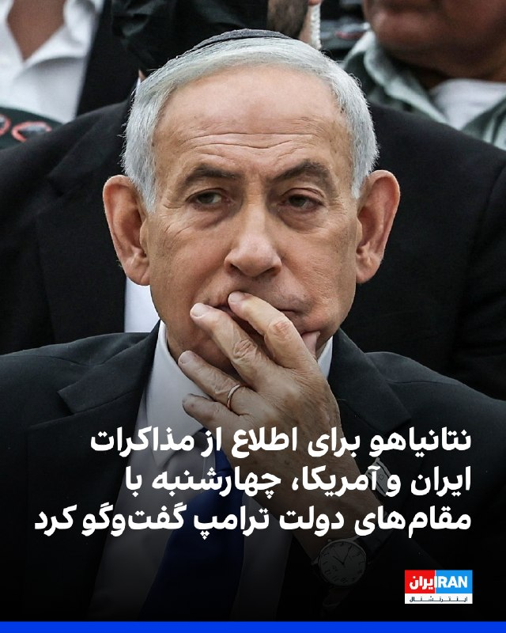

> به گفته یک منبع اسرائیلی آگاه، بنیامین نتانیاهو، نخست‌وزیر اسرائیل، روز چهارشنبه با مقام‌هایی در دولت دونالد ترامپ گفت‌وگو کرده است تا از آخرین تحولات مذاکرات میان آمریکا و جمهوری اسلامی مطلع شود.
> 
> این منبع به شبکه سی‌ان‌ان گفت نتانیاهو در پی دریافت گزارشی به‌روز از روند مذاکرات و آگاهی از مفاد مطرح‌شده در گفت‌وگوهاست. به گفته او، اسرائیل نگران آن است که آمریکا برای دستیابی به توافقی جهت پایان جنگ با ایران، در لحظات پایانی امتیازهایی بدهد.
> 
> در همین حال، یک مقام آمریکایی نیز به سی‌ان‌ان گفته است نتانیاهو به‌طور منظم با مقام‌های ایالات متحده در تماس است تا در جریان روند مذاکرات قرار گیرد. هنوز مشخص نیست او با چه مقام‌هایی گفت‌وگو کرده و کاخ سفید نیز در این باره اظهار نظر نکرده است.
> 
> بر اساس این گزارش، اسرائیل به‌ویژه نسبت به احتمال لغو تحریم‌های اقتصادی علیه جمهوری اسلامی نگران است و خواستار اعمال محدودیت بر شبکه نیروهای نیابتی تهران و برنامه موشک‌های بالستیک این کشور شده است.
> 
> همچنین تل‌آویو تاکید دارد هر توافقی باید آزادی عمل نظامی اسرائیل در برابر تهدیدهای منطقه‌ای را حفظ کند.
> ‌🏁 🇬🇧 IranintlTV
> 
> 🤖 @VahidOOnLine

## 1405/02/16 17:43 — VahidOOnLine
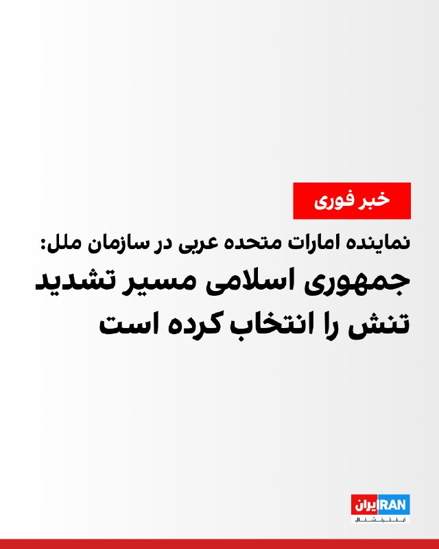

> نماینده امارات متحده عربی در سازمان ملل متحد اعلام کرد اقدامات جمهوری اسلامی در تنگه هرمز تاثیر منفی بر بازارهای انرژی گذاشته است.
> او هدف قرار دادن غیرنظامیان و زیرساخت‌های غیرنظامی را غیرقانونی و غیرقابل قبول خواند و گفت حکومت ایران مسیر تشدید تنش را انتخاب کرده است.
> نماینده امارات افزود عدم پایبندی جمهوری اسلامی به قوانین بین‌المللی کاملا آشکار است و باید تهران را وادار به رعایت این قوانین کرد.
> او همچنین گفت جمهوری اسلامی در حال باج‌گیری از اقتصاد جهانی است.
> ‌🏁 🇬🇧 IranintlTV
> 
> 🤖 @VahidOOnLine

## 1405/02/16 17:36 — pm_afshaa
> 🔴کانال 11 اسرائیل:آمریکا و اسرائیل در حال هماهنگی برای از سرگیری جنگ با ایران هستن
> 
> 
> 💧 Rainbet.com the #1 Non-KYC Crypto Casino & Sportsbook @rainbetcom
> 
> 😁 @Pm_Afshaa

## 1405/02/16 17:35 — VahidOOnLine

> یک پژوهش تازه نشان می‌دهد ممکن است در آینده بتوان خطر ابتلا به آلزایمر را با یک آزمایش ساده در خانه پیش‌بینی کرد.
> این روش ترکیبی از یک آزمون آنلاین برای سنجش عملکرد مغز و یک آزمایش خون با نمونه‌گیری از نوک انگشت است که به‌دنبال نشانگرهای زیستی مرتبط با آلزایمر می‌گردد.
> پژوهشگران می‌گویند این ابزار می‌تواند افراد را بر اساس میزان خطر بیماری دسته‌بندی کند تا کسانی که در معرض خطر بیشتری هستند، زودتر برای بررسی‌های دقیق‌تر و درمان‌های احتمالی ارجاع داده شوند.
> پروفسور آن کربت از دانشگاه اکستر گفته است این تحقیق ادامه مطالعات قبلی درباره دقت آزمایش خون‌های نوک انگشتی است و ترکیب این آزمایش‌ها با تست‌های شناختی می‌تواند راهی مؤثر برای پیش‌بینی خطر زوال عقل باشد.
> به گفته او، مزیت این روش در این است که می‌تواند بدون نیاز به مراجعه به کلینیک یا انجام آزمایش‌های پیچیده، غربالگری گسترده‌تری انجام دهد و افراد پرخطر را سریع‌تر شناسایی کند.
> در این مطالعه بیش از ۱۷۰ نفر شرکت کردند. نمونه خون آن‌ها برای بررسی نشانگرهای p-tau217 و GFAP که با آلزایمر و کاهش عملکرد مغز مرتبط هستند؛ حلیل شد و هم‌زمان آزمون‌های شناختی آنلاین نیز انجام گرفت.
> 
> پژوهشگران این فناوری را بسیار امیدوارکننده توصیف کرده و گفته‌اند آزمایش خون با نمونه‌گیری از انگشت می‌تواند تحول بزرگی در تشخیص زودهنگام زوال عقل ایجاد کند، هرچند برای تأیید نهایی به مطالعات بزرگ‌تر و متنوع‌تری نیاز است.
> ‌🏁 🇬🇧 ManotoTV
> 
> 🤖 @VahidOOnLine

## 1405/02/16 17:34 — VahidOOnLine
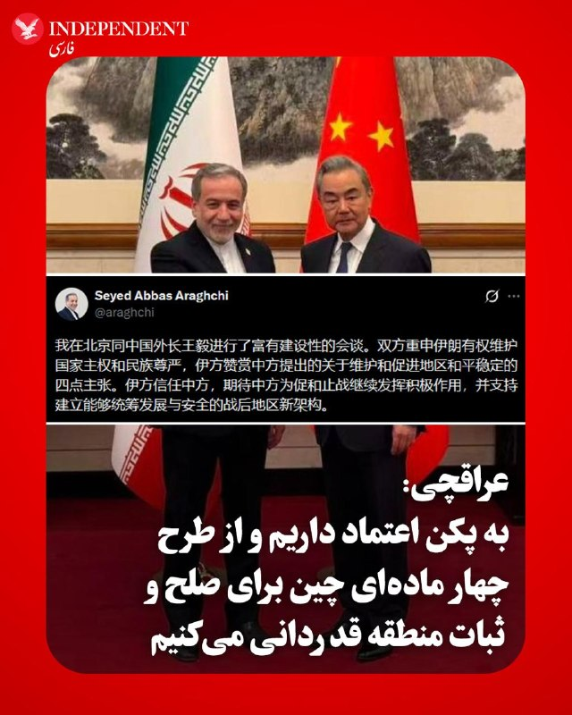

> ♦️سید عباس عراقچی، وزیر امور خارجه جمهوری اسلامی، در پیامی به زبان چینی در شبکه اجتماعی ایکس، نتایج گفتگوهای خود با وانگ یی، همتای چینی‌اش در پکن را «سازنده» توصیف کرد. او با تاکید بر اینکه هر دو طرف بر حق ایران برای حفاظت از حاکمیت و عزت ملی خود تاکید دارند، از پیشنهاد چهار ماده‌ای پکن برای حفظ و ارتقای صلح و ثبات منطقه‌ای قدردانی کرد.
> 
> عراقچی با ابراز اعتماد به مواضع چین، تصریح کرد که تهران انتظار دارد پکن به ایفای نقش مثبت خود در توقف جنگ و ترویج صلح ادامه دهد. او همچنین خاطرنشان کرد که جمهوری اسلامی از ایجاد یک معماری منطقه‌ای جدید در دوران پس از جنگ که قادر به هماهنگی میان توسعه و امنیت باشد، حمایت می‌کند.
> 
> طرحی که شی جین پینگ، رئیس‌جمهوری چین برای صلح و ثبات در منطقه مطرح کرد، شامل چهار ماده است که بر «همزیستی مسالمت‌آمیز، حاکمیت ملی، حاکمیت حقوق بین‌الملل و توسعه و امنیت به‌صورت متوازن» تاکید دارد. در این طرح، ایجاد یک «معماری امنیتی مشترک، جامعه، مشارکتی و پایدار برای منطقه» مطرح شده است.
> ‌🇸🇦 Indypersian
> 
> 🤖 @VahidOOnLine

## 1405/02/16 17:33 — VahidOOnLine
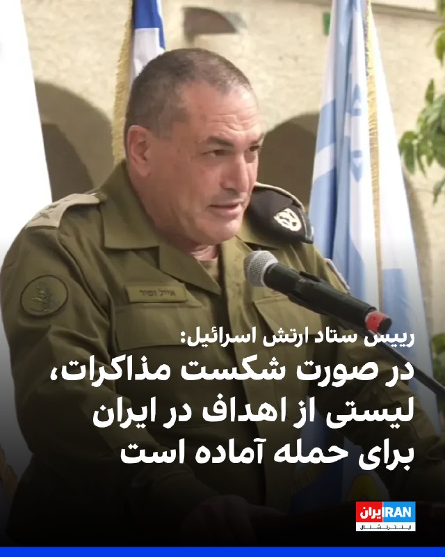

> رییس ستاد ارتش اسرائیل اعلام کرد این کشور در صورت ازسرگیری جنگ، فهرستی از اهداف آماده برای حمله در ایران در اختیار دارد.
> به گزارش ارتش اسرائیل، سپهبد ایال زمیر در بازدید از جنوب لبنان گفت هماهنگی و همکاری با ارتش آمریکا به‌طور مستمر ادامه دارد و تحولات به‌دقت رصد می‌شود.
> او تاکید کرد ارتش اسرائیل در «آماده‌باش کامل» برای بازگشت به یک عملیات گسترده قرار دارد؛ عملیاتی که به گفته او می‌تواند به تعمیق دستاوردها و تضعیف بیشتر حکومت ایران منجر شود.
> زمیر همچنین خطاب به نیروهای مستقر در منطقه خیام اعلام کرد تمامی توانمندی‌های ارتش در اختیار آن‌هاست و برای انجام ماموریت‌ها محدودیتی در استفاده از نیرو وجود ندارد.
> رییس ستاد ارتش اسرائیل افزود از زمان آغاز جنگ با ایران، بیش از دوهزار نیروی حزب‌الله در لبنان کشته شده‌اند و ارتش اسرائیل هر فرصتی را برای وارد کردن ضربات بیشتر به این گروه دنبال خواهد کرد.
> ‌🏁 🇬🇧 IranintlTV
> 
> 🤖 @VahidOOnLine

## 1405/02/16 17:13 — VahidOOnLine
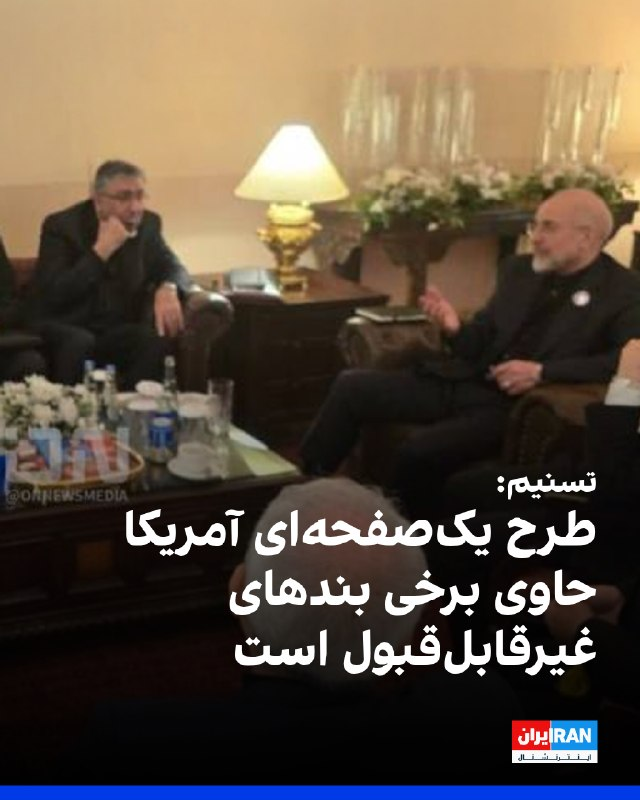

> خبرگزاری تسنیم به نقل از یک منبع مطلع گزارش داد با وجود ادعای برخی رسانه‌های آمریکایی درباره نزدیک شدن ایران و آمریکا به یک توافق یک‌صفحه‌ای برای پایان جنگ، جمهوری اسلامی هنوز پاسخ رسمی به آخرین متن پیشنهادی آمریکا نداده است؛ متنی که به گفته این منبع «حاوی بندهای غیرقابل‌قبول» است.
> 
> به نوشته تسنیم، این منبع تاکید کرده تبلیغات رسانه‌های آمریکایی بیشتر با هدف توجیه عقب‌نشینی اخیر دونالد ترامپ انجام می‌شود و اقدام اخیر او از ابتدا «نادرست» بوده است.
> 
> این منبع همچنین به تسنیم گفته پس از ارائه پیشنهاد ۱۴ بندی ایران از طریق میانجی پاکستانی، آمریکا طرحی ارسال کرد که تهران در حال بررسی آن بود، اما اقدام جدید واشینگتن موجب وقفه در روند بررسی شد. به گفته او، پس از عقب‌نشینی ترامپ، بررسی‌ها از سر گرفته شده و نتیجه پس از جمع‌بندی به میانجی اعلام خواهد شد.
> ‌🏁 🇬🇧 IranintlTV
> 
> 🤖 @VahidOOnLine

## 1405/02/16 17:10 — DEJradio

> 🔺📢 “مکانیکی دارم، قیمت لوازم استوک تازه‌تولید داخلی دو-سه برابر شده، یعنی یکی بیاد لنت‌ترمز عوض کنه خودش موتور می‌سوزنه...
> 
> پیام دریافتی
> 
> #تورم #جمهوری_اسلامی
> @DEJradio

## 1405/02/16 17:02 — kianmeli1

> 🔴حملات ایران ۲۲۸ سازه و قطعه از تجهیزات را در سایت‌های نظامی ایالات متحده در سراسر خاورمیانه آسیب دیده یا نابود کرده است - واشنگتن پست
> 
> این گزارش می‌گوید که حملات به آشیانه‌ها، سربازخانه‌ها، سیستم‌های راداری، انبارهای سوخت، زیرساخت‌های ارتباطی و تجهیزات دفاع هوایی آسیب رسانده است.
> https://t.me/kianmeli1

## 1405/02/16 16:59 — VahidOOnLine
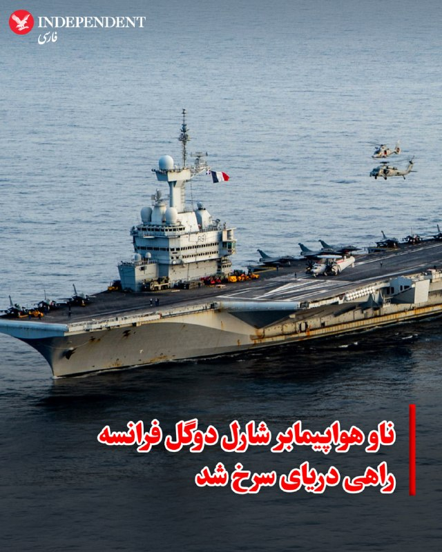

> ♦️ گروه ضربت ناو هواپیمابر «شارل دوگل» فرانسه در حالی که این کشور و بریتانیا به آماده‌سازی برای ماموریت احتمالی جهت بازگشایی تنگه هرمز ادامه می‌دهند، در حال حرکت به سمت دریای سرخ و خلیج عدن است.
> 
> وزارت نیروهای مسلح فرانسه در بیانیه‌ای اعلام کرد که این گروه ناو هواپیمابر روز چهارشنبه، ۱۶ اردیبهشت از کانال سوئز عبور کرده و در مسیر جنوب دریای سرخ قرار گرفته است.
> 
> این گروه ضربت فرانسوی مدت کوتاهی پس از آغاز حملات هوایی آمریکا و اسرائیل به ایران در نهم اسفند سال گذشته، در شرق مدیترانه مستقر شده بود و توانایی ماندن در دریا به مدت چهار تا پنج ماه را دارد.
> ‌🇸🇦 Indypersian
> 
> 🤖 @VahidOOnLine

## 1405/02/16 16:57 — VahidOOnLine
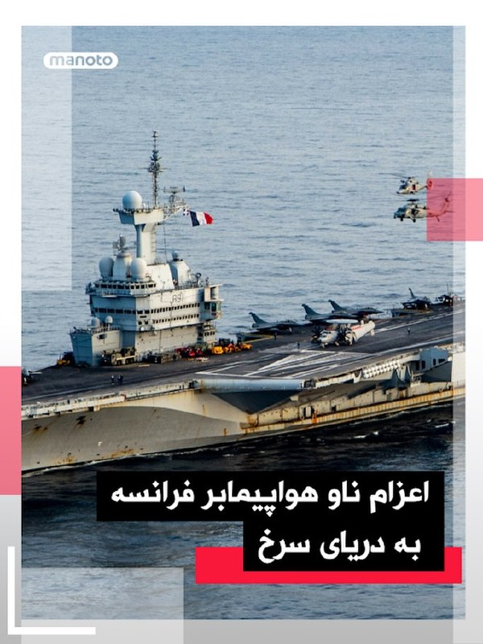

> همزمان با ادامه آماده‌سازی‌های فرانسه و بریتانیا برای یک مأموریت احتمالی با هدف بازگشایی تنگه هرمز، گروه ناو هواپیمابر شارل دوگل فرانسه در حال حرکت به سمت دریای سرخ و خلیج عدن است.
> وزارت نیروهای مسلح فرانسه اعلام کرده این ناوگروه روز چهارشنبه از کانال سوئز عبور کرده و در مسیر جنوب دریای سرخ قرار دارد.
> این گروه رزمی فرانسه اندکی پس از حملات هوایی آمریکا و اسرائیل به ایران در ۲۸ فوریه، به شرق مدیترانه اعزام شده بود و می‌تواند بین چهار تا پنج ماه در دریا باقی بماند.
> ‌🏁 🇬🇧 ManotoTV
> 
> 🤖 @VahidOOnLine

## 1405/02/16 16:57 — VahidOOnLine
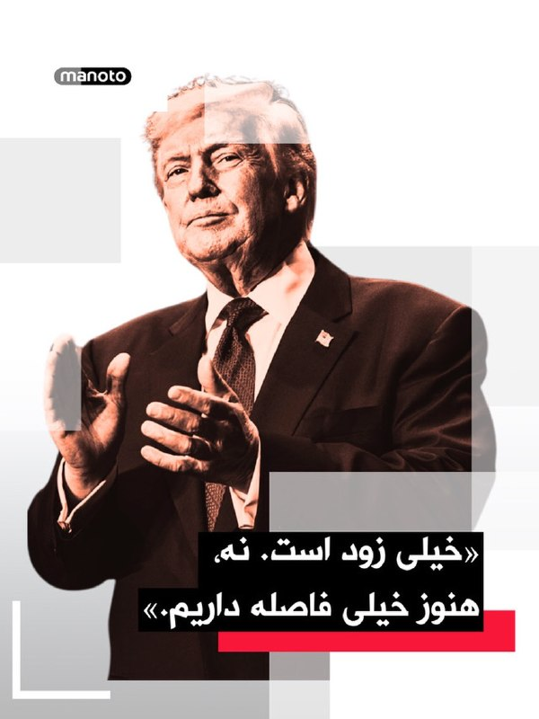

> دونالد ترامپ، رئیس‌جمهور آمریکا به روزنامه نیویورک پست گفته با وجود گزارش‌های خوش‌بینانه درباره نزدیک شدن واشنگتن و تهران به یک چارچوب احتمالی برای پایان دادن به جنگ ۶۷ روزه، «هنوز خیلی زود است» که درباره مذاکرات حضوری صلح میان دو کشور فکر شود.
> وقتی از او پرسیده شد آیا این رسانه باید برای پوشش دور جدیدی از مذاکرات به پاکستان خبرنگار اعزام کند؛ در حالی که منابعی در اسلام‌آباد از نزدیک بودن یک توافق اولیه خبر داده‌اند؛ ترامپ پاسخ داد: «فکر نمی‌کنم.» او گفت: «خیلی زود است. نه، هنوز خیلی فاصله داریم.»
> ترامپ پیش‌تر گفته بود در صورت نهایی شدن توافق، برای امضای آن به پاکستان خواهد رفت، اما تأکید کرد هنوز به آن مرحله نرسیده‌اند.
> در ادامه گزارش نیویورک پست آمده در حالی که مذاکره‌کنندگان روی چارچوب کلی کار می‌کنند، جزئیات همچنان محل اختلاف است و منابع پاکستانی می‌گویند چندین نسخه از یک سند احتمالی یک‌صفحه‌ای که می‌تواند به توافق منجر شود، در حال بررسی است.
> ‌🏁 🇬🇧 ManotoTV
> 
> 🤖 @VahidOOnLine

## 1405/02/16 16:43 — kianmeli1
> 🔴سپاه: تا امریکا عقب نشینی نکند٫ پاسخی به متن پیشنهادی نمی دهیم
> https://t.me/kianmeli1

## 1405/02/16 16:30 — kianmeli1
> 🔴 منابع اسرائیلی تأیید می کنند که عربستان سعودی و امارات متحده عربی اکنون ترامپ و اسرائیل را برای شروع مجدد جنگ تمام عیار علیه ایران تحت فشار قرار می دهند.
> https://t.me/kianmeli1

## 1405/02/16 16:20 — kianmeli1
> ‏🔴ترامپ در پاسخ به این پرسش نیویورک‌پست که آیا باید برای دور تازه‌ای از مذاکرات خبرنگاری را به پاکستان اعزام کند، گفت: فکر نمی‌کنم
> https://t.me/kianmeli1

## 1405/02/16 16:17 — VahidOOnLine
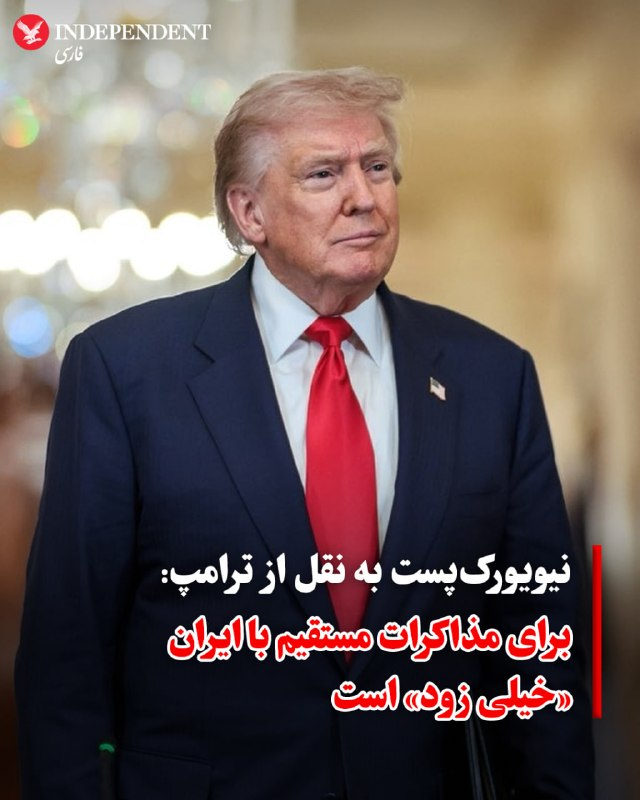

> ♦️ دونالد ترامپ، رئیس‌جمهوری آمریکا، صبح چهارشنبه ۱۶ اردیبهشت، در گفتگو با نیویورک‌پست اعلام کرد که هنوز برای فکر کردن به مذاکرات صلح حضوری میان ایالات متحده و جمهوری اسلامی «خیلی زود» است. علیرغم گزارش‌های خوش‌بینانه مبنی بر نزدیک شدن دو کشور به چارچوبی برای پایان دادن به جنگ ۶۷ روزه، ترامپ در پاسخ به احتمال اعزام خبرنگاران به پاکستان برای دور جدید گفتگوها گفت: «فکر نمی‌کنم؛ هنوز خیلی زود است».
> 
> او لحظاتی پیش از این تماس، در «تروث سوشال» نوشت: «به شرط آنکه ایران با آنچه توافق شده موافقت کند—که البته فرض بزرگی است—عملیات حماسی خشم (Epic Fury) به پایان می‌رسد و محاصره پایان یافته تا تنگه هرمز به روی همه، از جمله ایران، باز شود». او با این حال هشدار داد که در صورت موافقت نکردن تهران، بمباران‌ها با «شدت و سطحی بسیار بالاتر از قبل» آغاز خواهد شد.
> 
> ترامپ که پیش‌تر برای سفر به پاکستان جهت امضای توافق ابراز تمایل کرده بود، تماس خود را با این جمله که قراری با «ژنرال‌ها» دارد، به طور ناگهانی قطع کرد.
> ‌🇸🇦 Indypersian
> 
> 🤖 @VahidOOnLine

## 1405/02/16 16:17 — kianmeli1
> 🔴فوری
> کانال 11 اسرائیل گزارش داد آمریکا و اسرائیل در حال هماهنگی برای از سرگیری جنگ با ایران هستند.
> https://t.me/kianmeli1

## 1405/02/16 16:14 — kianmeli1
> 🔴فوری
> ترامپ به خبرنگار نیویورک پست:
> هم اکنون قرار ملاقاتی با ژنرال های ارتش در مورد موضوع ایران دارم.
> https://t.me/kianmeli1

## 1405/02/16 16:05 — DEJradio

> 🚨
> ⭕️ واکنش ترامپ به احتمال تفاهم با جمهوری اسلامی؛ توافق نکنید بمباران را از سر می‌گیریم!
> 
> دونالد ترامپ، رئیس‌جمهوری ایالات متحده، با انتشار پیامی تازه در تروث سوشال، جمهوری اسلامی را میان پذیرش توافق یا روبه‌رو شدن با دور تازه‌ای از حملات سنگین قرار داد. ترامپ اعلام کرد اگر تهران با مفادی که به گفته او پیش‌تر مورد توافق قرار گرفته موافقت کند، عملیات نظامی آمریکا موسوم به «خشم حماسی» پایان خواهد یافت و مسیر بازگشایی تنگه هرمز برای همۀ کشورها، از جمله ایران، فراهم می‌شود.
> ترامپ در عین حال هشدار داد که مخالفت جمهوری اسلامی با این شروط، به ازسرگیری بمباران‌ها منجر خواهد شد؛ حملاتی که به گفتۀ او این بار «بسیار شدیدتر» از مراحل پیشین خواهد بود.
> این اظهارات در حالی مطرح می‌شود که رسانه اکسیوس گزارش داده کاخ سفید و جمهوری اسلامی به یک تفاهم‌نامۀ ۱۴بندی نزدیک شده‌اند.
> 
> #ترامپ #مذاکرات #جمهوری_اسلامی
> @DEJradio

## 1405/02/16 16:03 — mwarmonitor
> 🔴ترامپ می‌گوید «برای شروع فکر کردن به مذاکرات مستقیم صلح بین آمریکا و ایران خیلی زود است.»
> 
> 🔴وقتی از او پرسیده شد که آیا روزنامه نیویورک پست باید یک خبرنگار به اسلام‌آباد بفرستد، گفت: «فکر نمی‌کنم.»
> 
> 🔴ترامپ به‌طور ناگهانی تماسش با نیویورک پست را پایان داد و گفت که با «ژنرال‌ها» یک قرار ملاقات دارد.
> 
> @mwarmonitor

## 1405/02/16 16:01 — DEJradio
[🎬 Video](telegram/content/DEJradio_4453_1778080814.jpg)

> 🔺📷 خسارت سنگین به هواپیماهای خطوط هوایی تحریم‌شده در جنگ چهل روزه
> 
> بر اساس تصاویر تازه منتشر شده از سوی رسانه‌های داخلی، تعدادی از هواپیماهای خطوط هوایی، از جمله ماهان‌ایر و ایران‌ایر که در انتقال تسلیحات نظامی و نیرو به نیابتی‌های جمهوری اسلامی نقش به‌سزایی داشتند، در طول جنگ چهل روزه متحمل خسارات سنگینی شده‌اند.
> 
> #جنگ۴۰روزه #جمهوری_اسلامی
> @DEJradio

## 1405/02/16 15:57 — DEJradio
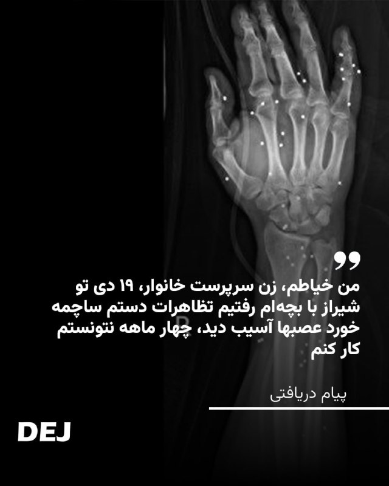

> 🔺📷 “من خیاطم، زن سرپرست خانوار، ۱۹ دی تو شیراز با بچه‌ام رفتیم تظاهرات دستم ساچمه خورد عصب‍ها آسیب دید، چهار ماهه نتونستم کار کنم...
> 
> پیام دریافتی
> 
> #دی۱۴۰۴ #ساچمه
> @DEJradio

## 1405/02/16 15:48 — pm_afshaa
> قالیباف: امنیت کشتیرانی و ترانزیت انرژی به دست آمریکا و متحدانش با نقض آتش‌بس و اعمال محاصره به خطر افتاده است؛ البته شرّشان کم خواهد شد
> 
> 
> 💧 Rainbet.com the #1 Non-KYC Crypto Casino & Sportsbook @rainbetcom
> 
> 😁 @Pm_Afshaa

## 1405/02/16 15:40 — kianmeli1
> 🔴ترامپ با کشتن خامنه ای به جمهوری اسلامی این جسارت را داد که تنگه هرمز را ببندند و جنگ نامتقارن را عملی کنند
> 
> برنامه بعدی نیز این است برای حملات بزرگتر امریکا به ایران٫ جنگ نامتقارن به دو نقطه ادامه پیدا میکند
> تنگه باب المندب و درون خاک امارات
> 
> ترامپ متوجه این موضوع است دوسال فرصت دارد و جنگ نامتقارن به مثابه باتلاق است برای ابرقدرتها
> 
> مبتکر جنگ نامتقارن ایرانیان بوده اند چه در دوران هخامنشیان و چه اشکانیان ووو
> https://t.me/kianmeli1

## 1405/02/16 15:32 — pm_afshaa
> 🔴سپاه:اورانیوم تحویل داده نمیشود
> 
> 
> 💧 Rainbet.com the #1 Non-KYC Crypto Casino & Sportsbook @rainbetcom
> 
> 😁 @Pm_Afshaa

## 1405/02/16 15:31 — mwarmonitor
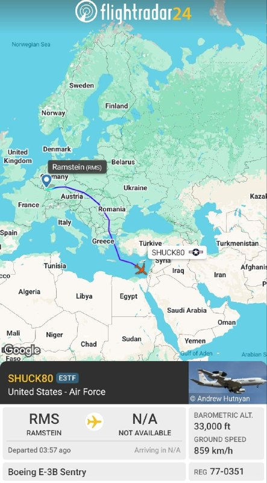

> USAF نیروی هوایی ایالات متحده✈️🇺🇸 ✈️یک فروند هواپیمای Boeing E-3 Sentry (۱ فروند) AE11DF 77-0351 - SHUCK 80 امروز صبح از رامشتاین به سمت خاورمیانه پرواز کرده است. @mwarmonitor

## 1405/02/16 15:25 — pm_afshaa
> 🔴ارتش اسرائیل در حال بمباران زیرساخت‌های مرتبط با حزب‌الله در مناطق مختلف لبنانه
> 
> 
> 💧 Rainbet.com the #1 Non-KYC Crypto Casino & Sportsbook @rainbetcom
> 
> 😁 @Pm_Afshaa

## 1405/02/16 15:21 — pm_afshaa

> پست جدید ترامپ اگر جمهوری اسلامی با پیش‌نویس توافق مطرح موافقت کند، عملیات پایان خواهد یافت و اگر موافقت نکند، بمباران با شدت بیشتر از سر گرفته خواهد شد
> 
> 
> 💧 Rainbet.com the #1 Non-KYC Crypto Casino & Sportsbook @rainbetcom
> 
> 😁 @Pm_Afshaa

## 1405/02/16 15:19 — pm_afshaa
> سیدمحمد مرندی، تحلیلگر جمهوری‌اسلامی: آکسیوس ابزاری برای دستکاری بازار کاخ‌سفید است. جمهوری‌اسلامی قبل از سفر ترامپ به چین، کاملا برای یک حمله بزرگ احتمالی آماده‌ست
> 
> 
> 💧 Rainbet.com the #1 Non-KYC Crypto Casino & Sportsbook @rainbetcom
> 
> 😁 @Pm_Afshaa

## 1405/02/16 15:18 — kianmeli1

> 🔴 ‏پست جدید ترامپ
> 
> ترامپ اعلام کرد که اگر جمهوری اسلامی با پیش‌نویس توافق مطرح موافقت کند، عملیات پایان خواهد یافت و اگر موافقت نکند، بمباران با شدت بیشتر از سر گرفته خواهد شد
> https://t.me/kianmeli1

## 1405/02/16 15:14 — mwarmonitor
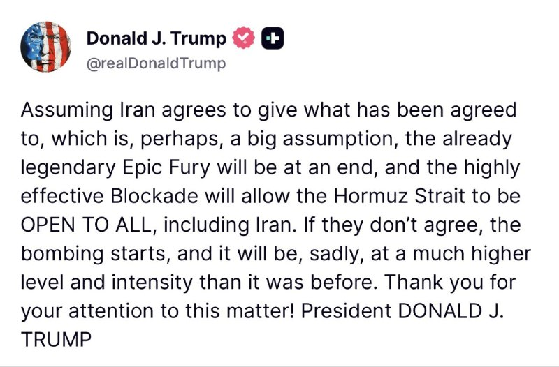

> با فرض اینکه ایران موافقت کند آنچه را که بر سر آن توافق شده است واگذار کند - که شاید فرض بزرگی باشد - عملیات در حال حاضر افسانه‌ای «خشم حماسی» (Epic Fury) به پایان خواهد رسید و محاصره بسیار مؤثر اجازه خواهد داد که تنگه هرمز برای همه، از جمله ایران، باز باشد. اگر آن‌ها موافقت نکنند، بمباران شروع می‌شود و متأسفانه، در سطح و شدتی بسیار بالاتر از قبل خواهد بود. با تشکر از توجه شما به این موضوع!
> 
> رئیس‌جمهور دونالد جی. ترامپ
> 
> @mwarmonitor

## 1405/02/16 15:13 — pm_afshaa
> 🔴اکسیوس: بسیاری از شرایط ذکر شده تو این یادداشت منوط به دستیابی به توافق نهاییه و احتمال جنگ مجدد یا وضعیت طولانی‌ای که تو اون جنگ متوقف شده اما هیچ چیز واقعاً حل نشده رو باقی می‌ذاره
> 
> 
> 💧 Rainbet.com the #1 Non-KYC Crypto Casino & Sportsbook @rainbetcom
> 
> 😁 @Pm_Afshaa

## 1405/02/16 15:12 — mwarmonitor
> 🛳کشتی MV Hondius در پی یک شیوع مشکوک به هانتاویروس در داخل کشتی، در نزدیکی Praia در کشور کیپ‌ورد لنگر انداخته است. 📌داده‌های MarineTraffic نشان می‌دهد این کشتی مسافربری با پرچم هلند، اوایل آوریل از اوشوآیا در آرژانتین حرکت کرده و حدود هفت هفته در دریا بوده…

## 1405/02/16 15:11 — pm_afshaa
> دلار 170

## 1405/02/16 15:11 — pm_afshaa
> قیمت هر بشکه نفت به 97 دلار رسید
> 
> 
> 💧 Rainbet.com the #1 Non-KYC Crypto Casino & Sportsbook @rainbetcom
> 
> 😁 @Pm_Afshaa

## 1405/02/16 15:03 — DEJradio

> 🚨📢 تاکید اسرائیل بر اتحاد با امارات متحده در برابر جمهوری اسلامی
> 
> سفارت اسرائیل در امارات متحده عربی اعلام کرد بنیامین نتانیاهو، نخست‌وزیر اسرائیل، در گفت‌وگوی تلفنی با رئیس امارات متحده عربی تأکید کرده است که اسرائیل همانند گذشته در کنار نزدیک‌ترین متحدان خود خواهد ایستاد و به تلاش مشترک برای حفظ صلح و امنیت پایبند می‌ماند. بنا بر این گزارش، نتانیاهو در این تماس، حملات جمهوری اسلامی به امارات متحده عربی را تهدیدی علیه ثبات منطقه توصیف کرده است.
> بر اساس گزارشات منتشر شده در حملات چند روز گذشته جمهوری اسلامی به امارات متحده عربی، سامانه‌های رهگیر و ضد موشکی اسرائیلی، مستقر در امارات کمک شایانی به مهار این حملات ترکیبی پهپادی و موشکی کرده است.
> 
> #امارات #جمهوری_اسلامی
> @DEJradio

## 1405/02/16 15:03 — mwarmonitor
> 🔴«از کاپیتان‌ها و مالکان کشتی‌ها در خلیج فارس و خلیج عمان به خاطر رعایت مقررات ایران در تنگه هرمز و کمک به امنیت دریایی منطقه تشکر می‌کنیم. با خنثی شدن تهدیدهای طرف مهاجم و اجرای پروتکل‌های جدید، عبور امن و پایدار از تنگه هرمز تضمین خواهد شد.» نیروی دریایی سپاه
> 
> @mwarmonitor

## 1405/02/16 15:00 — mwarmonitor
> 📑«یک ایمیل که توسط “سازمان تنگه خلیج فارس” برای چندین شرکت کشتیرانی ارسال شده است، شرکت‌هایی که کشتی‌هایشان در خلیج فارس سرگردان مانده‌اند:
> 
> 🗓دستورالعمل‌هایی برای عبور از تنگه هرمز.
> 
> 🔴کشتی‌هایی که قصد عبور از تنگه هرمز را دارند باید به آدرس info@PGSA.ir ایمیل ارسال کنند.
> 
> 🔸مهم‌ترین نکات در نظر گرفته‌شده در سازوکار عبور:
> 
> 1. اولویت پرداخت با واحد پول ملی ایران است.
> 2. صدور ضمانت‌نامه در بانک‌های ایرانی الزامی است.
> 3. اگر کشوری در جنگ اخیر به ایران خسارت وارد کرده باشد، باید ابتدا خسارت را پرداخت کند تا اجازه عبور دریافت کند. کشورهایی که ایران را تحریم کرده‌اند یا دارایی‌های ایران را بلوکه کرده‌اند اجازه عبور ندارند.
> 4. در تمام اسناد باید عنوان صحیح “خلیج فارس” نوشته شود.
> 5. عدم رعایت موارد فوق منجر به توقیف کشتی و جریمه ۲۰ درصدی ارزش محموله خواهد شد.»
> 
> علی هاشم خبرنگار الجزیره
> 
> @mwarmonitor

## 1405/02/16 14:59 — DEJradio

> 🔺📢 ادعای آکسیوس درباره تفاهم یک صفحه‌ای برای پایان جنگ
> آمریکا برای رسیدن به توافق مطمئن نیست
> 
> آکسیوس به نقل از دو مقام آمریکایی و چند منبع آگاه مدعی شده است که کاخ سفید معتقد است به دستیابی به یک تفاهم اولیه با جمهوری اسلامی برای پایان جنگ و آغاز مذاکرات هسته‌ای نزدیک شده است. بر پایه این گزارش، واشینگتن انتظار دارد تهران ظرف۴۸ساعت آینده به چند موضوع کلیدی پاسخ دهد.
> بنا بر این گزارش، تفاهم‌نامۀ پیشنهادی شامل تعلیق غنی‌سازی اورانیوم، لغو تدریجی بخشی از تحریم‌ها و کاهش محدودیت‌ها در تنگۀ هرمز خواهد بود. منابع آگاه می‌گویند مذاکرات برای توافق نهایی ممکن است در اسلام‌آباد یا ژنو ادامه پیدا کند.
> با این حال، مقام‌های آمریکایی می‌گویند اختلافات و شکاف درون حاکمیت جمهوری اسلامی، رسیدن به توافق را همچنان نامطمئن کرده است. مارکو روبیو، وزیر امور خارجۀ آمریکا، تأکید کرد واشینگتن همچنان به دنبال یک راه‌حل دیپلماتیک است، هرچند هنوز هیچ توافق نهایی حاصل نشده است.
> 
> #مذاکرات #جمهوری_اسلامی #توافق
> @DEJradio

## 1405/02/16 14:46 — mwarmonitor
> 🔴محمد مرندی «آکسیوس ابزاری برای دست‌کاری بازار توسط کاخ سفید است. جمهوری اسلامی کاملاً برای یک حمله بزرگ احتمالی قبل از سفر ترامپ به چین آماده است.» @mwarmonitor

## 1405/02/16 14:43 — mwarmonitor
> 🔴آکسیوس اختصاصی به گفته مقام‌ها: آمریکا و ایران در آستانه توافق بر سر یک یادداشت تفاهم یک‌صفحه‌ای برای پایان دادن به جنگ هستند 📝باراک راوید کاخ سفید بر این باور است که به توافقی با ایران بر سر یک یادداشت تفاهم (MOU) یک‌صفحه‌ای نزدیک می‌شود؛ توافقی که هدف…

## 1405/02/16 14:33 — iaghapour
> 🔻 تسنیم: درآمد طرح اینترنت «پرو» در سال به ۹۶ هزار میلیارد تومن می‌رسه!
> 
> 🔹خب با این رقم‌های نجومی و پول هنگفتی که درمیاد، معلومه که از این تبعیضی که راه انداختن حسابی راضی‌ان. وقتی محدودیت و فیلترینگ این‌قدر براشون سود داره، چرا نباید اینترنت داخلی و بسته رو بیشتر تحویل بگیرن؟
> 
> 🔸این وسط یه تشکر ویژه و خسته نباشید هم باید بگیم به اون دسته از دوستانی که رفتن تو صف اینترنت پرو و این سیستم طبقاتی رو خیلی راحت پذیرفتن. از رئیس فلان اتحادیه و مدیر فلان اداره بگیر تا نماینده صنف لاستیک‌فروش‌ها و یه سری کسب‌وکارهایی که واقعاً بدون اینترنت آزاد هم کارشون لنگ نمی‌موند. تو شرایطی که ۹۹ درصد مردم هیچ دسترسیِ عادی به اینترنت آزاد ندارن، مرسی از شماها که رفتین این اینترنت رو گرفتین و با این کارتون، قشنگ به این تبعیض و نابرابری رسمیت دادین!
> 
> پ.ن: البته به این نکته هم توجه کنید که خبرگذاری داخلی اینو گفته و ممکنه دقیقا مقصودشون از این حرف هم همین باشه که بگن چقدر این طرح خوب و سودآور هستش و...
> 
> 🆔 @iaghapour

## 1405/02/16 14:31 — mwarmonitor
> 🔴نخست وزیر نتانیاهو امروز با رئیس امارات متحده عربی شیخ محمد بن زاید آل نهیان تلفنی گفتگو کرد.
> 
> 🔰در این تماس، نخست وزیر نتانیاهو محکومیت قاطع اسرائیل از حملات تروریستی جمهوری اسلامی که غیرنظامیان و زیرساخت‌های غیرنظامی در امارات را هدف قرار داده است، ابراز کرد و آنها را نقض آشکار حاکمیت و تهدیدی برای ثبات منطقه‌ای توصیف کرد. نخست وزیر نتانیاهو بار دیگر بر همبستگی تزلزل‌ناپذیر اسرائیل با امارات و حمایت کامل از تمام اقدامات انجام شده برای حفظ امنیت کشور و شهروندانش تأکید کرد.
> 
> 🔸اسرائیل همانند گذشته در کنار نزدیک‌ترین متحدان خود می‌ایستد و بر تعهد خود به پیگیری مشترک صلح و امنیت تاکید دارد.
> 
> 
> @mwarmonitor

## 1405/02/16 14:28 — mwarmonitor
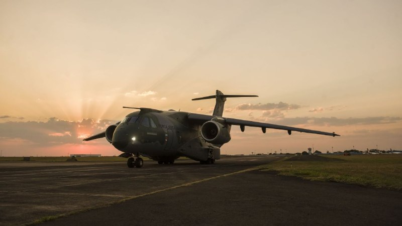

> ✈️خرید ۲۰ فروند هواپیمای امبرائر C-390 توسط امارات متحده عربی
> 
> 🔴امارات متحده عربی در حال خرید ۱۰ فروند هواپیمای C-390 ساخت شرکت امبرائر (Embraer) است و گزینه خرید ۱۰ فروند دیگر را نیز برای آینده روی میز نگه داشته است.
> 
> 🔸چرا این موضوع اهمیت دارد؟
> این یک معامله بزرگ و اولین قرارداد فروش هواپیمای ترابری «میلیتیوم» (Millennium) در منطقه خاورمیانه است. سایر مشتریان امبرائر شامل برزیل، مجارستان، لیتوانی و هلند هستند.
> جزئیات خبر
> 🔹زمان اعلام: قرارداد با نیروی هوایی امارات روز دوشنبه، همزمان با کنفرانس «Make it in the Emirates 2026» اعلام شد.
> 🔹ارزش قرارداد: جزئیات مالی این معامله فاش نشده است.
> 🔸نگاه نزدیک‌تر
> شرکت امبرائر اعلام کرد که C-390 توانایی‌های امارات را در زمینه‌های زیر تقویت خواهد کرد:
> جابجایی نیرو و محموله
> انجام عملیات چتربازی و پرتاب محموله (Airdrop)
> تخلیه مجروحان
> عملیات در باندهای ناهموار و خاکی
> آنچه در نظر داریم
> 🔸باید دید که آیا این موفقیت باعث نفوذ بیشتر امبرائر در بازارهای آمریکایی خواهد شد یا خیر.
> 
> @mwarmonitor

## 1405/02/16 14:27 — mamlekate
> 📝 عراقچی در چین: توافقی جامع با آمریکا می‌خواهیم
> 
> عباس عراقچی، وزیر امور خارجه جمهوری اسلامی، که به پکن رفته است، روز چهارشنبه اعلام کرد در مذاکرات با ایالات متحده، تنها «یک توافق عادلانه و جامع» را خواهد پذیرفت. این در حالی است که دونالد ترامپ، رئیس‌جمهوری آمریکا، از «پیشرفت بزرگ» در این روند خبر داده است.
> 
> عراقچی پس از دیدار با وانگ یی، همتای چینی‌اش در پکن، به رسانه‌های ایرانی گفت: «ما تمام تلاشمان را برای حفظ حقوق و منافع مشروعمان در مذاکرات به کار خواهیم گرفت و فقط یک توافق عادلانه و جامع را می‌پذیریم.»
> 
> 
> 📝 منابع آمریکایی و پاکستانی: واشینگتن و تهران به چارچوبی برای پایان جنگ نزدیک شده‌اند
> 
> 📝 جزئیات تفاهم احتمالی یک‌صفحه‌ای آمریکا و ایران برای پایان جنگ به روایت اکسیوس
> 
> هم‌زمان با اعلام تعلیق «پروژه آزادی» و اظهارات دونالد ترامپ درباره این توقف کوتاه‌مدت این طرح به منظور مشخص شدن اینکه تهران و واشنگتن به توافق نهایی می‌رسند یا نه، برخی رسانه‌ها از نزدیک شدن دو کشور به تفاهم برای پایان جنگ خبر دادند.
> 
> رسانه آمریکایی اکسیوس روز چهارشنبه به نقل از منابع آگاه نوشت که ایالات متحده و جمهوری اسلامی به یک «یادداشت تفاهم کوتاه» نزدیک شده‌اند که هدفش توقف جنگ و شروع مذاکرات گسترده‌تر است، هرچند هنوز توافق نهایی نشده است.
> 
> @mamlekate

## 1405/02/16 14:27 — kianmeli1
> 🔴اکسیوس: امریکا فقط اورانیوم ها را میخواهد تا جنگ تمام شود
> 
> سپاه: اورانیوم نمی دهیم
> 
> نتیجه مذاکرات: شکست مجدد
> https://t.me/kianmeli1

## 1405/02/16 14:24 — kianmeli1
> ‏🔴زمین‌لرزه‌ای به بزرگی ۴.۷ حوالی سرگز در استان هرمزگان را لرزاند
> https://t.me/kianmeli1

## 1405/02/16 14:23 — mwarmonitor
> بمباران مداوم قایق‌ها توسط ایالات متحده در دریای کارائیب؛ عملیاتی در سایه و به دور از نظارت عمومی
> 
> 📝نویسنده: کالین دمارست (Colin Demarest) AXIOS
> 
> 🔴ایالات متحده طی هشت ماه گذشته، بیش از ۱۸۰ نفر را در دریای کارائیب و اقیانوس آرام به قتل رسانده است. در حالی که تب سرخط خبرها فروکش کرده، حملات موسوم به «نیزه جنوبی» (Southern Spear) علیه کسانی که ادعا می‌شود قاچاقچی مواد مخدر هستند، همچنان ادامه دارد.
> 
> 
> چرا این موضوع اهمیت دارد؟
> دولت ترامپ اعلام کرده است که در حال اولویت‌بندی مجدد امنیت در «همسایگی آمریکا» است. در مقابل، منتقدان می‌گویند این اقدامات یک کارزار نامحدود از «قتل‌های فراقضایی» است. در این میان، نظارت عمومی بر این عملیات تا حد زیادی کم‌رنگ شده است.
> تحولات اخیر
> نارضایتی دموکرات‌ها هفته گذشته طی شهادت‌های پیاپی در کنگره توسط پیت هگست (وزیر دفاع)، ژنرال دن کین (رئیس ستاد مشترک) و ژول هرست (حسابرس پنتاگون) به سطح آمد:
> سناتور جک رید (رود آیلند): این حملات را «غیرقانونی» خواند.
> سناتور تیم کین (ویرجینیا): معیارهای هدف‌گیری در این حملات را زیر سوال برد.
> نماینده بیل کیتینگ (ماساچوست): این عملیات را «دزدی دریایی علیه ارزش‌های آمریکایی» توصیف کرد که بر پایه «منطق دروغین» بنا شده و نیازمند تحقیقات بیشتر است.
> در مقابل، هگست اظهارات کیتینگ را «مجموعه‌ای باورنکردنی از اتهامات کذب» نامید.
> جزئیات عملیاتی (نگاه نزدیک)
> ارتش همچنان تقریباً هیچ اطلاعاتی درباره هویت کشته‌شدگان، مبنای هدف‌گیری یا تسلیحات مورد استفاده منتشر نمی‌کند.
> آمار حملات: فرماندهی جنوبی ایالات متحده (SOUTHCOM) در ماه آوریل هفت مورد، در ماه مارس سه مورد و در ژانویه تنها یک مورد حمله را اعلام کرده است.
> تجهیزات: گزارش نیویورک تایمز از افزایش به‌کارگیری پهپادهای MQ-9 Reaper (ساخت شرکت جنرال اتمیکس) و هواپیماهای تهاجمی بال‌ثابت که از السالوادور و پورتوریکو برخاسته‌اند، خبر می‌دهد.
> هزینه‌ها: طبق تحلیل پروژه «هزینه‌های جنگ»، ایالات متحده بین ۱۲ تا ۵۰ میلیون دلار مهمات در این حملات مصرف کرده است. همچنین کل بودجه صرف شده برای دو عملیات «نیزه جنوبی» و «عزم مطلق» (که منجر به بازداشت نیکولاس مادورو در ونزوئلا شد) بالغ بر ۴.۷ میلیارد دلار برآورد می‌شود.
> در گزارش پروژه هزینه‌های جنگ آمده است: «بدون پاسخگویی بیشتر، تلفات انسانی افزایش خواهد یافت و شهروندان آمریکایی همچنان بار مالی این عملیات را به دوش خواهند کشید.»
> دورنمای کلی (نگاه کلان)
> هیچ نشانه‌ای مبنی بر توقف قریب‌الوقوع عملیات «نیزه جنوبی» وجود ندارد. تداوم این مسیر در بلندمدت می‌تواند منابع نظامی را تحت فشار قرار دهد.
> 
> مارک کانسیان، مشاور ارشد مرکز مطالعات استراتژیک و بین‌المللی (CSIS) به اکسیوس گفت:
> 🔸«اگر دولت می‌خواهد با چین رقابت کند — که به نظر می‌رسد هدف محوری آن‌هاست — و همزمان حضور در این نیمکره و درگیری در یک منازعه خارجی را حفظ کند، به نیروی دریایی بزرگ‌تری نیاز دارد. آن‌ها در حال حرکت به این سمت هستند، اما تحقق آن سال‌ها زمان می‌برد.»
> 
> @mwarmonitor

## 1405/02/16 13:59 — mwarmonitor
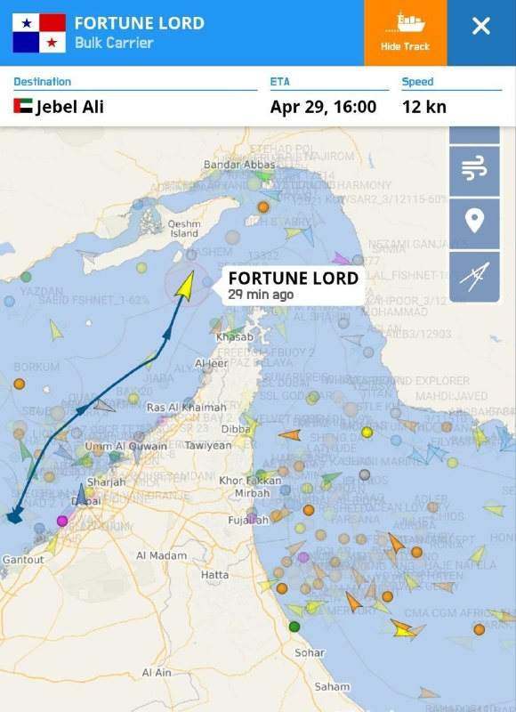

> 🇺🇸آمریکا: «چندین میلیون دلار برای “پروژه آزادی” هزینه می‌کند، دو کشتی تجاری هدف قرار می‌گیرند و پروژه بعد از دو روز شکست می‌خورد.»
> 
> 🇨🇳چین: «هیچ اقدامی انجام نمی‌دهد. دومین کشتی طی ۲۴ ساعت از تنگه عبور می‌کند و از مسیرهای مورد استفاده سپاه پاسداران عبور می‌کند.»
> 
> @mwarmonitor

## 1405/02/16 13:53 — kianmeli1
> 🔴مرندی-مذاکرات شوخی است
> 
> اکسیوس ابزاری برای دستکاری بازار کاخ سفید است.
> جمهوری اسلامی قبل از سفر ترامپ به چین، کاملاً برای یک حمله بزرگ احتمالی آماده است.
> https://t.me/kianmeli1

## 1405/02/16 13:51 — DEJradio

> 🔺📢 صدر اعظم آلمان:
> جمهوری اسلامی باید از گروگان گیری و وقت‌کشی دست بردارد
> 
> صدراعظم آلمان می‌گوید رژیم ایران دیگر نباید منطقه و کل جهان را به گروگان بگیرد و برنامه نظامی - هسته‌ای آنها نیز باید برای همیشه متوقف شود.
> فردریش مرتس با تاکید بر این موضوع که جمهوری اسلامی نمی‌بایست به حملات خود علیه اسرائیل و شرکای آلمان در منطقه ادامه دهد، گفت: «جمهوری اسلامی باید به مذاکره بازگردد و از وقت‌کشی دست بردارد.»
> 
> #مذکرات #جمهوری_اسلامی
> @DEJradio

## 1405/02/16 13:42 — pm_afshaa
> 🔴رویترز: در توافق پیش رو، ایران اورانیوم غنی شده را تحویل خواهد داد
> 
> 
> 💧 Rainbet.com the #1 Non-KYC Crypto Casino & Sportsbook @rainbetcom
> 
> 😁 @Pm_Afshaa

## 1405/02/16 13:37 — pm_afshaa
> 🔴اکسیوس: ایران با تعلیق 12 تا 15 ساله غنی سازی موافقت کرد
> 
> 
> 💧 Rainbet.com the #1 Non-KYC Crypto Casino & Sportsbook @rainbetcom
> 
> 😁 @Pm_Afshaa

## 1405/02/16 13:35 — DEJradio
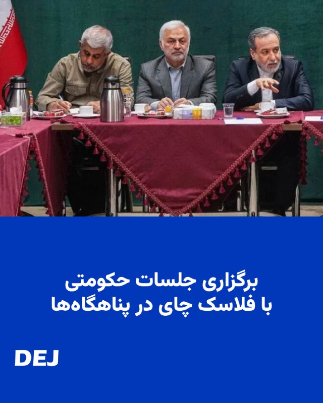

> 🔺📷 برگزاری جلسات حکومتی با فلاسک چای در پناهگاه‌ها
> 
> در حالیکه سخنگوی وزارت خارجه جمهوری اسلامی ادعا می‌کند که این رژیم یک «ابر قدرت»! است، تصاویر منتشر شده نشان میدهد که همچنان مقامات ارشد حکومتی جلسات خود را در پناهگاه‌ها و در اماکن نا معلوم برگزار می کنند.
> 
> #ابرقدرت #جمهوری_اسلامی
> @DEJradio

## 1405/02/16 13:07 — pm_afshaa
> 🔴اکسیوس: آمریکا انتظار داره ظرف 48 ساعت آینده پاسخی از طرف تهران من‌باب چند نکته کلیدی دریافت کنه
> 
> 
> 💧 Rainbet.com the #1 Non-KYC Crypto Casino & Sportsbook @rainbetcom
> 
> 😁 @Pm_Afshaa

## 1405/02/16 13:05 — pm_afshaa
> 🔴اکسیوس: آمریکا و ایران به تدوین یک یادداشت یک صفحه‌ای برای پایان دادن به جنگ نزدیک شدن
> 
> 
> 💧 Rainbet.com the #1 Non-KYC Crypto Casino & Sportsbook @rainbetcom
> 
> 😁 @Pm_Afshaa

## 1405/02/16 13:04 — pm_afshaa
> 🔴اکسیوس: به گفته یک مقام آمریکایی، محدودیت‌های اعمال‌شده از سوی ایران در تنگه و محاصره دریایی آمریکا در طول آن دوره 30 روزه به‌تدریج برداشته خواهد شد
> 
> 
> 💧 Rainbet.com the #1 Non-KYC Crypto Casino & Sportsbook @rainbetcom
> 
> 😁 @Pm_Afshaa

## 1405/02/16 13:03 — pm_afshaa
> 🔴اکسیوس: ایران قراره برنامه هسته‌ای و غنی‌سازی اورانیومش رو تعلیق کنه و در عوض آمریکا تحریم‌هارو لغو می‌کنه و میلیاردها دلار پول بلوکه شده‌ی ایران رو بهش برمی‌گردونه
> 
> 
> 💧 Rainbet.com the #1 Non-KYC Crypto Casino & Sportsbook @rainbetcom
> 
> 😁 @Pm_Afshaa

## 1405/02/16 12:36 — DEJradio

> 👑📢 دفتر ارتباطات شاهزاده رضا پهلوی در پستی در شبکه اجتماعی ایکس اعلام کرد:
> " شاهزاده رضا پهلوی همراه با کارآفرینان برجسته ایرانی-آمریکایی به بحث و بررسی راهبردهای بازیابی و شکوفایی تجارت، صنعت و تکنولوژی در ایران خواهند پرداخت."
> شنبه ۲۶ اردیبهشت - سان‌فرانسیسکو، کالیفرنیا
> 
> #شاهزاده_رضا_پهلوی
> @DEJradio

## 1405/02/16 12:25 — DEJradio

> 🔺📢 جیب خالی سرکوبگران
> بشار اسد وقتی سقوط کرد که نارضایتی در نیروهای مسلح اوج گرفت
> 
> بررسی‌های میدانی نشان می‌دهد برخلاف نمایش‌های خیابانی، جنگ از یک سو و بحران اقتصادی از سوی دیگر به ماشین سرکوب جمهوری اسلامی آسیب جدی وارد کرده است.
> وضعیت دشوار اقتصادی در ایران، عناصر سرکوب را در امان نگذاشته است. جیب نیروهای عملیاتی و خانواده‌هایشان خالی است. در ساختار سرکوب اکنون آن‌هایی پول بیشتری گیرشان می‌آید که مستقیم و غیرمستقیم با پروپاگاندا و بنگاه‌های مالی در ارتباط هستند، اما نیروهای یونیفرم‌پوش به‌شدت در مضیقه هستند و برای تهیه مایحتاج روزانه مشکل دارند.
> در جنگ ۴۰ روزه، بخش عمده‌ای از ساختار نظامی و امنیتی جمهوری اسلامی نابود شد. از یک سو فرماندهی کل قوا، لایه‌ای از فرماندهان رده‌بالا و نیروها و از سوی دیگر مراکز نظامی، پادگان‌ها، مقرهای سرکوب و کلانتری‌ها.
> 
> اگرچه حکومت همچنان بقا کرده، اما آواربرداری و بازسازی ویرانه‌های جنگ کاری زمان‌بر و پرخرج است.
> 
> بعد از جنگ مردم در خیابان، با وضعیتی شبیه حکومت نظامی روبه‌رو شدند.
> تجمعات شبانه و ایست‌های بازرسی در عمل اقدامات امنیتی برای مقابله با تهدیدات خیابانی است. مأموران امنیتی تا دندان مسلح‌اند و حکومت نشان داده که روی مسلح شدن بخشی از هوادارانش برای مقابله با عملیات زمینی احتمالی یا خیزش‌های خیابانی حساب می‌کند.
> 
> حکومت برای بقای خود با چند تهدید روبه‌روست: تکرار حذف‌های هدفمند، فروپاشی اقتصادی، جنگ مجدد، آغاز اعتراضات، خیانت و بی‌تفاوتی در رده‌های فرماندهی، ریزش نظامی‌ها ناشی از خستگی، ناامیدی و ترس، بی‌پولی.
> 
> به‌ظاهر تاکنون حکومت انسجام در ساختار نظامی و امنیتی خود را حفظ کرده است، اما هر آن احتمال فروپاشی این ساختار شبیه آنچه برای بشار اسد در سوریه رخ داد وجود دارد.
> 
> رژیم اسد ناشی از تداوم شرایط بحرانی، پوسیده شده بود اما بقا کرد. حکومتی که بارها حملات به‌مراتب سنگین‌تر از عملیات منجر به فروپاشی را از سر گذرانده بود طی دو هفته فروپاشید. مشکل آنجا شروع شد که بخشی از فرماندهان و نیروها تصمیم گرفتند دیگر نجنگند و سرکوب نکنند. آنها می‌دیدند نظامیان و فرماندهان وابسته به اسد پول‌های هنگفت دارند، اما جیب خودشان خالی‌ست. وفاداری آنها به مرور در اثر خستگی، ناامیدی، بی‌اعتمادی و بی‌پولی از بین رفت.
> 
> #نیروهای_مسلح #سرکوبگران #سقوط
> @DEJradio

## 1405/02/16 12:03 — pm_afshaa
> 🔴نت بلاکس : قطعی نت تو ایران وارد 68 مین روز خودش شده طوری که مردم ایران 70 درصد از سال 2026 رو بدون اینترنت سپری کردن
> 
> 
> 💧 Rainbet.com the #1 Non-KYC Crypto Casino & Sportsbook @rainbetcom
> 
> 😁 @Pm_Afshaa

## 1405/02/16 11:45 — DEJradio
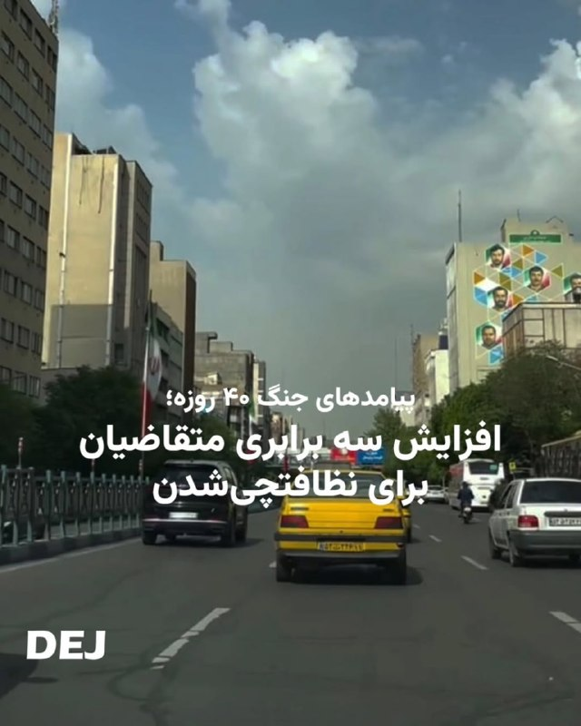

> 🚨📢 کمتر از دو ماه پس از اعلام آتش‌بس موقت، بیکاری و گرانی مردم را عاصی کرده است. گزارش روزنامه «شرق» نشان می‌دهد تقاضا برای مشاغل خدماتی بدون نیاز به تخصص، به‌ویژه نظافت و پذیرایی، در ایران به‌شدت افزایش یافته است.
> 
> بر اساس آمار پلتفرم «آچاره»، ثبت‌نام متقاضیان این مشاغل در اردیبهشت امسال نسبت به سال گذشته ۲۳۹ درصد رشد کرده و هم‌زمان سن متقاضیان و شمار افراد بازگشته به بازار کار نیز افزایش یافته است.
> 
> #آتشبس #بیکاری
> @DEJradio

## 1405/02/16 11:44 — pm_afshaa
> 🔴یاشار سلطانی:سود اینترنت پرو مستقیم میره توی جیب ستاد اجرایی فرمان امام و بنیاد تعاون سپاه
> 
> 
> 💧 Rainbet.com the #1 Non-KYC Crypto Casino & Sportsbook @rainbetcom
> 
> 😁 @Pm_Afshaa

## 1405/02/16 11:38 — DEJradio
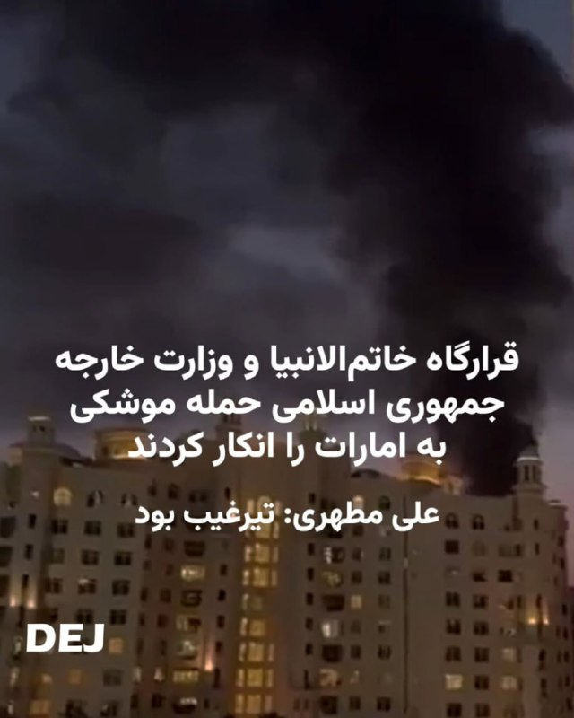

> 🤡
> 🔺 جمهوری اسلامی، حمله موشکی و پهپادی به امارات انکار می‌کند. قرارگاه مرکزی خاتم‌الانبیا سه‌شنبه شب ۱۵ اردیبهشت ۱۴۰۵ رسماً اعلام کرد نیروهای مسلح جمهوری اسلامی در روزهای گذشته هیچ‌گونه عملیات موشکی و پهپادی علیه کشور امارات انجام نداده‌اند. این در حالیست که وزارت دفاع امارات اعلام کرد چندین موشک و پهپاد از ایران به آن کشور پرتاب شد و برخی از آنها نیز باعث انفجار در تاسیسات نفتی و بنادر امارات شد.
> 
> وزارت خارجه جمهوری اسلامی روزچهارشنبه ۱۶ اردیبهشت ۱۴۰۵ در اطلاعیه‌ای حملات موشکی و پهپادی ایران به امارات را «ادعاهای بی‌اساس» خواند و هشدار داد این کشور «از ادامه هم‌دستی با آمریکا و اسرائیل خودداری کند.»
> 
> سخنگوی قرارگاه مرکزی خاتم‌الانبیا تأکید کرد، «چنانچه اقدامی [علیه امارات] صورت می‌گرفت، با قاطعیت و صراحت آن را اعلام می‌کردیم؛ لذا گزارش وزارت دفاع آن کشور به‌طور مطلق تکذیب می‌شود و عاری از هرگونه صحت است.»
> 
> علی مطهری نایب رئیس پیشین مجلس شورای اسلامی در برنامه «سپهر سیاست»، حمله به امارات را «تیر غیب» خواند و گفت: «منشأ دقیق این حادثه مشخص نیست، اینکه از کجا بوده، دقیق نمی‌دانیم، اما به نظر من حقش بود.»
> 
> #امارات #جمهوری_اسلامی
> @DEJradio

## 1405/02/16 10:25 — kianmeli1
> ‏🔴کشتی سی‌ام‌ای سی‌جی‌ام، شرکت فرانسوی مالک کشتی سان آنتونیو، تایید کرد که این کشتی روز سه‌شنبه هنگام عبور از تنگه هرمز هدف حمله قرار گرفته است
> https://t.me/kianmeli1

## 1405/02/16 08:20 — kianmeli1
> ‏🔴وای نت: گزارش‌ها حاکی است به رغم اعلام توقف عملیات آمریکا برای هدایت کشتی‌ها در تنگه هرمز، اسراییل در وضعیت آماده‌باش بالا قرار گرفته و نیروهای ذخیره خود را فراخوانده است
> https://t.me/kianmeli1

## 1405/02/16 08:20 — kianmeli1

> 🔴تلگراف
> 
> لغو ۱۳۰۰۰ پرواز توسط خطوط هوایی اروپا به دلیل کمبود سوخت جت
> https://t.me/kianmeli1

## 1405/02/16 02:38 — kianmeli1
> 🔴حمله موشکی کروز به کشتی فرانسوی
> 
> به گزارش سی‌بی‌اس، به نقل از مقامات آمریکایی، حمله موشکی کروز ایران به یک کشتی فرانسوی به نام سی‌جی‌ام سن آنتونیو، تعدادی از خدمه فیلیپینی این کشتی را زخمی کرد.
> 
> از آن زمان، سه حادثه جداگانه توسط UKMTO گزارش شده است.
> https://t.me/kianmeli1

## 1405/02/16 01:58 — kianmeli1
> 🔴دقایقی پیش شنیده شدن صدای دو انفجار در جزیره قشم، استان هرمزگان
> 
> [دلیل انفجار نامشخص است].
> https://t.me/kianmeli1

## 1405/02/16 01:43 — mamlekate
> 📝 الو قشم ۱۶ اردیبهشت ساعد ۰۱:۲۷ دو انفجار کم صدا در مدت زمان ۳۰ ثانیه ولی پرلرزش شنیده شد
> 
> 
> 
> ❓ آپدیت: استانداری هرمزگان می‌گوید ریز‌پرنده‌ها رهگیری شدند
> 
>  @mamlekate

## 1405/02/16 01:15 — mamlekate
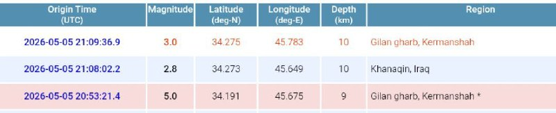

> ساعت ۰۰:۲۳ بامداد زلزله در کرمانشاه (۵ ریشتری ثبت شده که زلزله قابل توجهی محسوب میشه)
> 
> @mamlekate

## 1405/02/15 21:12 — iaghapour
[🎬 Video](telegram/content/iaghapour_2586_1778080823.jpg)

> اکانت های هوش مصنوعیو با یک دهم قیمت بخر 
> ✈️
> 
> 
> 🏳️‍🌈 Gemini Pro :
> - پلن مشابه ChatGPT Plus از شرکت گوگل
> - پشتیبانی از antigravity ( دستیار کد نویسی مشابه کدکس )
> - ساخت عکس و ویدیو + تحقیق عمیق + تجزیه و تحلیل
> - فعالسازی روی ایمیل شما
> - کاملا اختصاصی ( فمیلی نیست )
> - فعالسازی روی ایمیل شما
> 
> 🔆 ChatGPT Go :
> - پلن اقتصادی OpenAI
> - مناسب استفاده روزمره
> - 10 برابر محدودیت کمتر نسبت به نسخه ی رایگان
> - مناسب برنامه نویسی نیست
> 
> 📲 SuperGrok :
> - پلن مشابه ChatGPT Plus
> - تجزیه تحلیل قوی
> - پاسخ های کاملا هوشمند و طبیعی
> - بدون جواب های کلیشه ای
> 
> خرید و توضیحات بیشتر از ربات :
> 
> 🤖 @ChatGPT_StoreBOT

## 1405/02/15 21:12 — iaghapour
> ⭕️ وعده بازگشت به وضعیت عادی؛ توجیه محدودیت‌ها یا امید به بهبود اینترنت؟
> 
> معاون ارتباطات دفتر رئیس‌جمهور به تازگی اعلام کرده که وضعیت فعلی اینترنت مورد تایید دولت نیست و رئیس‌جمهور، محمدرضا عارف را مامور ساماندهی این شرایط کرده است. به گفته او، این محدودیت‌های شدید و قطعی‌ها صرفا تصمیماتی از سوی شورای عالی امنیت ملی و به دلیل شرایط خاص امنیتی و جنگی بوده‌اند.
> 
> 🔹 وعده روزهای بهتر: این مقام مسئول قول داده که با عبور از این شرایط ویژه، اینترنت نه تنها به حالت قبل برمی‌گردد، بلکه وضعیتی بهتر از گذشته پیدا خواهد کرد و وعده‌های انتخاباتی رئیس‌جمهور در این زمینه همچنان پیگیری می‌شوند.
> 
> 🔸 دفاع از اینترنت پرو: در واکنش به انتقادات، دولت ادعا می‌کند طرح «اینترنت پرو» صرفا برای نجات کسب‌وکارها در روزهای محدودیت ایجاد شده و نباید به آن برچسب اینترنت طبقاتی زد؛ چرا که به گفته آن‌ها، در شرایط عادی اصلا نیازی به چنین طرحی نخواهد بود.
> 
> 🔹 کاهش محدودیت‌های عمومی: خبر دیگر این است که قرار شده تدابیر جدیدی برای دسترسی بهتر سایر شهروندان به اینترنت اتخاذ شود تا فشار محدودیت‌های فعلی روی مردم کاهش یابد.
> 
> در حالی که دولت تلاش می‌کند قطعی‌ها و طرح‌های بحث‌برانگیزی مثل اینترنت پرو را صرفا به شرایط اضطراری گره بزند، کاربران و کسب‌وکارها همچنان منتظرند تا ببینند آیا این وعده‌ها در عمل به یک اینترنت آزاد و بدون محدودیت ختم می‌شود یا صرفا وعده‌ای برای کنترل نارضایتی‌های فعلی است.
> 
> 🆔 @iaghapour

## 1405/02/15 19:36 — iaghapour
> ⭕️ ایده عجیب در مجلس: تاسیس «اینستاگرام دولتی» و مدیریت کامل اینترنت!
> 
> نمایندگان مجلس در تازه‌ترین نشست خود با وزیر ارتباطات، از طرح‌ها و نگاه‌های جدیدی برای کنترل بیشتر فضای مجازی پرده برداشتند. در این جلسه، پیشنهاد ایجاد یک پلتفرم کاملا دولتی مشابه اینستاگرام مطرح شد تا به زعم آن‌ها، نیاز کشور برطرف شود.
> 
> 🔹 اینستاگرام دولتی: یکی از نمایندگان با اشاره به بازار سیاه و چند میلیونی فیلترشکن‌ها، رسما پیشنهاد ساخت یک سکوی دولتی شبیه اینستاگرام را برای پر کردن جای خالی این پلتفرم ارائه داده است.
> 
> 🔸 رویای مدیریت اینترنت: نایب رئیس مجلس تاکید کرده که مشکل آن‌ها اصل اینترنت نیست، بلکه می‌خواهند در صحنه بین‌المللی، مدیریت اینترنت کاملا در دست خودشان باشد و این فضا را به یک جبهه تقابل تشبیه کرده است.
> 
> 🔹 فرصت‌سازی از بحران: بخش قابل توجهی از صحبت‌های نمایندگان، حسرت خوردن برای از دست رفتن فرصت در شرایط ملتهب و جنگی است؛ آن‌ها معتقدند باید از این شرایط استفاده می‌کردند تا مردم و کسب‌وکارها به اجبار به سمت سکوهای داخلی کوچ کنند.
> 
> این صحبت‌ها به وضوح نشان می‌دهد که دغدغه اصلی، کاهش نارضایتی مردم از قیمت و کیفیت اینترنت نیست؛ بلکه تلاش برای بومی‌سازی اجباری، قطع ارتباط با شبکه‌های اجتماعی بین‌المللی و کشاندن کاربران به پلتفرم‌های تحت کنترل و نظارت است. / زومیت
> 
> ✍🏻 پ.ن: از سوپر اپلیکیشن های ایتا و سروش و گپ و بله که از تلگرام کپی کردین مشخصه توانایی اینکار رو دارید.
> 
> 🆔 @iaghapour

## 1405/02/15 19:29 — iaghapour
> ⭕️ مرگ خاموش اقتصاد خرد: نابودی ۴۰ درصد از کسب‌وکارهای اینستاگرامی!
> 
> قطعی‌ها و محدودیت‌های اینترنتی فقط حق دسترسی آزاد ما به شبکه‌های اجتماعی را سلب نکرده، بلکه تیشه به ریشه‌ی اقتصاد خرد و معیشت مردم زده است. طبق اعلام پشوتن پورپزشک، عضو هیئت‌مدیره اتحادیه کسب‌وکارهای مجازی، فیلترینگ و اختلالات باعث نابودی بخش عظیمی از مشاغل آنلاین شده است.
> 
> 🔹 فاجعه‌ی آماری: نزدیک به ۴۰ درصد از کسب‌وکارهای اینستاگرامی برای همیشه از بین رفته‌اند؛ این یعنی مرگ مستقیم بیش از ۴۰۰ هزار شغل!
> 
> 🔸 دومینوی ویرانی: وقتی شوکی مثل محدودیت اینترنت وارد می‌شود، ابتدا کسب‌وکارهای کوچک و آسیب‌پذیر می‌میرند، اما این نابودی با کمی تاخیر گریبان شرکت‌های بزرگ اقتصادی را هم خواهد گرفت.
> 
> 🔹 زنجیره‌ی به هم پیوسته: کسب‌وکارهای بزرگ در تولید، تامین و توزیع به شدت به همین کسب‌وکارهای خرد وابسته‌اند. توهم مصونیت برای شرکت‌های بزرگ، در نهایت منجر به فروپاشی خود آن‌ها می‌شود. منبع: زومیت
> 
> 🆔 @iaghapour

## 1405/02/15 18:08 — mamlekate

> 📝 امارات متحده عربی: در حال مقابله با حملات موشکی و پهپادی جمهوری اسلامی هستیم
> 
> وزارت دفاع امارات متحده عربی اعلام کرد سامانه های پدافند هوایی این کشور در حال مقابله با حملات موشکی و پهپادی هستند که از سوی ایران انجام می شود و صداهای شنیده شده در سراسر کشور ناشی از عملیات سامانه های پدافندی امارات برای مقابله با موشک های بالستیک، کروز و پهپادها است.
> 
> @mamlekate

## 1405/02/15 17:04 — mamlekate
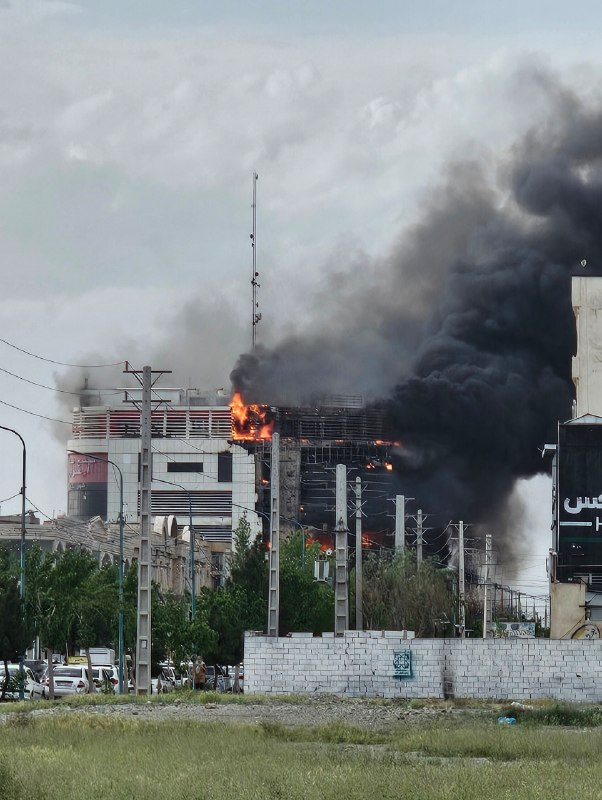

> الو متاسفانه پاساژ تجاری ارغوان فاز۴ اندیشه آتیش گرفته. امیدوارم مردم زودتر تخلیه که کرده باشن اونجا فقط تو دو طبقه ی آخر ۶ و ۷ حداقل ۴تا باشگاه بدنسازی داره
> 
> @mamlekate

## 1405/02/15 14:08 — mamlekate
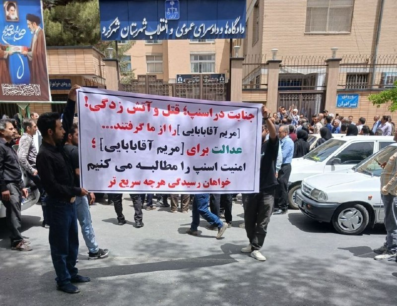

> الو یه راننده اسنپ تو شهرکرد به یه دختر به اسم مریم تجاوز کرده بعد هم آتیشش زده. مردم ریختن دم فرمانداری و استانداری. [عکس از دیروز جلوی دادسرا]
> 
> @mamlekate

## 1405/02/15 10:33 — mamlekate
> 📝 ارزیابی اطلاعاتی آمریکا: حملات اخیر تأثیر محدودی بر برنامه هسته‌ای ایران داشته است
> 
> ارزیابی‌های اطلاعاتی آمریکا نشان می‌دهد حملات اخیر آمریکا و اسرائیل تأثیر محدودی بر برنامه هسته‌ای جمهوری اسلامی داشته و زمان مورد نیاز تهران برای ساخت سلاح هسته‌ای نسبت به تابستان گذشته تغییری نکرده است. خبرگزاری رویترز این موضوع را به نقل از سه منبع آگاه گزارش داده است.
> 
> @mamlekate

## 1405/02/14 22:15 — mamlekate
> 📝 ایران در واکنش به «پروژه آزادی»، شماری از کشتی‌ها و بندر فجیره امارات را هدف قرار داد
> 
> رئیس‌جمهور ایالات متحده تهدید کرد اگر جمهوری اسلامی به کشتی‌های آمریکایی که در حال هدایت شناورها از تنگهٔ هرمز هستند حمله کند، ایران «از صفحه روزگار محو خواهد شد».
> 
> 
> 📝 امارات متحده عربی: ۱۵ موشک و ۴ پهپاد پرتاب‌شده از سوی ایران را رهگیری کردیم
> 
> وزارت دفاع امارات متحده عربی اعلام کرد سامانه‌های پدافند هوایی این کشور روز دوشنبه ۱۲ موشک بالستیک، ۳ موشک کروز و ۴ پهپاد پرتاب‌شده از سوی ایران را رهگیری کرده‌اند که در نتیجه آن ۳ نفر به‌طور متوسط زخمی شدند.
> 
> @mamlekate

## 1405/02/14 19:09 — iaghapour
> اسم این زندگــــــی نبود
> یک مبارزه تمام عیار بود...
> 
> #جوانی #زندگی #جنگ #اینترنت

## 1405/02/14 18:54 — mamlekate
> 📝 سنتکام: دو کشتی تجاری با پرچم آمریکا از تنگه هرمز عبور کردند
> 
> ساعاتی پس از آغاز عملیات  «پروژه آزادی» به منظور تأمین امنیت کشتیرانی تجاری در تنگه هرمز، سنتکام از عبور دو کشتی با پرچم ایالات متحده از تنگه هرمز خبر داد.
> 
> 
> 📝 دو حادثه دریایی در اطراف هرمز، در آستانه اقدام سنتکام برای پشتیبانی از کشتی‌های گرفتار در منطقه
> 
> در کمتر از ۲۴ ساعت، دو حادثه امنیتی برای کشتی‌های تجاری در مسیرهای منتهی به تنگه هرمز گزارش شد؛ همزمان با آنکه ستاد فرماندهی مرکزی آمریکا، سنتکام، اعلام کرد از روز دوشنبه ۱۴ اردیبهشت پشتیبانی از «پروژه آزادی» را با هدف بازگرداندن آزادی کشتیرانی تجاری در تنگه هرمز آغاز می‌کند.
> 
> 
> 📝 احتمال حمله به کشتی کره جنوبی در تنگه هرمز؛ سئول: در حال بررسی هستیم
> 
> 
> 📝 امارات در واکنش به حمله به نفتکش خود در تنگه هرمز: «حمله تروریستی» رژیم ایران نوعی «دزدی دریایی» است
> 
> 
> 
> 📝 دبی ساعت ۱۷ به وقت محلی دوبار هشدار موشک اومده
> 
> 
> 🚀 امروز ۱۴ اردیبهشت دوشنبه عصر حدود ساعت ۶، سه تا موشک از دشتستان بوشهر لانچ کردن
> 
> 📝 سی‌ان‌ان: سامانه گنبد آهنین اسرائیل در امارات متحده عربی یک موشک ایرانی را منهدم کرد
> 
> 
> 📝 قیمت دلار در بازار آزاد ایران به ۱۹۰ هزار تومان رسید
> 
> 
> @mamlekate

## 1405/02/14 16:09 — iaghapour
> ⭕️ حل مشکل دانلود از ریلیز گیت‌هاب با LatestReleaseMirror
> 
> اگر در دانلود فایل‌ها از بخش ریلیزهای (Releases) گیت‌هاب به دلیل محدودیت‌های اینترنت مشکل دارید، این اسکریپت کاربردی دقیقاً برای شما ساخته شده است!
> 
> ابزار LatestReleaseMirror به صورت خودکار فایل‌های آخرین آپدیتِ ریپازیتوری‌های دلخواه شما را دریافت کرده و آن‌ها را به عنوان فایل‌های عادی در ساختار پوشه‌های گیت‌هاب ذخیره می‌کند؛ در نتیجه می‌توانید آن‌ها را به راحتی و حتی با اینترنت داخلی دانلود کنید.
> 
> 🔹 دریافت و آپدیت خودکار آخرین نسخه با استفاده از GitHub Actions.
> 🔸 امکان فیلتر کردن فایل‌های مورد نیاز (مثلاً فقط نسخه‌های ویندوز یا اندروید)
> 🔹 دسته‌بندی تمیز فایل‌های خروجی در مسیرهای مشخص.
> 
> 🔗 لینک ریپازیتوری و راهنمای استفاده
> 
> 🆔 @iaghapour

## 1405/02/14 13:56 — iaghapour
> ركورد جديد سرعت اينترنت ژاپن:
> 
> با سرعت 1.02 پتابيت بر ثانيه، كل نتفليكس را در 1 ثانيه دانلود مى‌كند.
> 
> ✍ ما هم اینجا باید با DNStt وصل بشیم تا بزور بتونیم فقط این خبر رو بخونیم...
> 
> 🆔 @iaghapour

## 1405/02/14 01:10 — mamlekate
> 📝 ترامپ: «پروژه آزادی» از دوشنبه برای خارج کردن کشتی‌های گرفتار از تنگه هرمز آغاز می‌شود؛ هشدار اقدام نظامی علیه کسانی که مانع این تلاش شوند
> 
> دونالد ترامپ، رئیس جمهوری آمریکا روز یکشنبه ۱۳ اردیبهشت گفت که آمریکا از فردا دوشنبه «به وقت خاورمیانه» با اجرای «پروژه آزادی» به کشتی‌ها و خدمه آن‌ها که به خاطر بسته‌بودن تنگه هرمز در منطقه گرفتار شده‌اند کمک خواهد کرد که از آنجا خارج شوند.
> 
> @mamlekate

## 1405/02/13 22:28 — iaghapour
> ⭕️ اسکریپت بهینه شده XHTTP Relay ECO برای Vercel Pro
> 
> 🔹 نسخه ECO طوری تیون شده که علاوه بر امنیت سفت‌وسخت v1.3، کم‌هزینه‌ترین رفتار ممکن روی Vercel Pro رو داشته باشه؛ یعنی با کنترل هوشمند Timeout، Inflight، Throttle و Logها، مصرف منابع و هزینه نهایی تا جای ممکن پایین نگه داشته میشه.
> 
> 🔸فقط با GET، HEAD و POST کار می‌کنه تا امنیت بالاتر بره.
> 🔹 احراز هویت فقط از طریق هدر x-relay-key انجام میشه
> 🔸هدرهای اضافی پلتفرم و hop-by-hop رو بی‌رحمانه فیلتر می‌کنیم.
> 🔹روی آپلود و دانلود محدودیت سرعت (Throttling) واقعی گذاشتیم.
> 🔸بردیمش روی Node runtime با لیمیت ۱۲۸ مگابایت رم و مدیریت کانکشن‌های همزمان.
> 
> 🔗 اطلاعات بیشتر در گیت‌هاب پروژه
> 
> 🆔 @iaghapour

## 1405/02/13 14:05 — iaghapour
> ⭕️ ورژن جدید کلاینت اندروید GooseRelayVPN منتشر شد
> 
> کلاینت اندروید GooseRelayVPN که هسته GooseRelay را از طریق Go mobile اجرا می‌کند و رابط کاربری کامل برای مدیریت VPN، پروفایل‌ها، لاگ‌ها و تنظیمات ارائه می‌دهد. این اپ یک SOCKS5 محلی روی اندروید ایجاد می‌کند و ترافیک TCP را از معماری GooseRelay عبور می‌دهد.
> 
> 🔹هسته پروژه به ورژن 1.5.0 آپدیت شد.
> 🔸قابلیت fake dns اضافه شد.
> 🔹باگ ها در این نسخه برطرف شدن.
> 
> 🔗 آدرس گیت‌هاب پروژه
> 
> 🆔 @iaghapour

## 1405/02/12 19:53 — iaghapour

> ⭕️ آموزش ساخت فیلترشکن رایگان و شخصی به 2 روش با نت ملی
> 
> 🔹با استفاده از دو ابزار قدرتمند MHRV و Nova-Proxy، دیگه نیازی به خرید کانفیگ‌ها و سرورهای گرون‌قیمت ندارید. تو این آموزش قدم‌به‌قدم به ۲ روش مختلف پیش میریم تا بتونید یه اتصال پایدار و بدون قطعی داشته باشید. حتماً تا آخر ویدیو همراه من باشید.
> 
> 🔗 لینک ویدیو در یوتیوب
> 
> 🔗 دانلود ویدیو با لینک مستقیم
> 
> 🔹 دانلود کلاینت ویندوز
> 
> 🔸 دانلود کلاینت اندروید
> 
> 
> #آموزش #فیلترشکن #mhrv #novaproxy #رایگان
> برای دور زدن فیلترینگ و آموزش تکنولوژی و هوش مصنوعی ما رو دنبال کنید 💚
> 🆔@iaghapour

## 1405/02/11 15:30 — iaghapour

> ⭕️ پشت‌پرده‌ی «اینترنت پرو»؛ امتیاز ویژه یا تله‌ی نظارتی؟
> 
> این روزها سیم‌کارت‌های بدون فیلتر با نام «اینترنت پرو» در ازای دریافت هزینه و ثبت کامل مشخصات هویتی به فروش می‌رسند. اما هدف اصلی این طرح، دلسوزی برای نیاز اینترنتی اقشار مختلف نیست.
> 
> هدف اصلی و پنهان این ماجرا، چیزی جز «تشخیص هویت دقیق و رصد لحظه‌ایِ کاربر» نیست. 👁‍🗨
> 
> وقتی اینترنت آزاد را مستقیماً با نام و کد ملی خودتان دریافت می‌کنید دقیقاً چه اتفاقی می‌افتد؟
> 
> 🔹 پایان گمنامی: تمام سایت‌هایی که سر می‌زنید و محتوایی که می‌بینید، مستقیماً و شفاف روی نام خودتان ثبت و مانیتور می‌شود.
> 
> 🔸 تزریق خودسانسوری: وقتی می‌دانید هر کلیک شما رصد می‌شود، ناخودآگاه وارد یک «زندان شیشه‌ای» می‌شوید که خودتان هزینه‌اش را داده‌اید!
> 
> 🔹 تجارت با حقوق اولیه: حق بدیهی دسترسی به اینترنت آزاد را مسدود کرده‌اند و حالا همان را به قیمت نقض حریم خصوصی، به عنوان یک «آپشن ویژه» به خودمان می‌فروشند.
> 
> «اینترنت پرو» یک امکان رفاهی نیست؛ ابزاری برای کنترل نقطه‌ای و عادی‌سازیِ اینترنت طبقاتی است. بهای اصلی این سیم‌کارت‌ها پول نیست؛ حریم خصوصی ماست.
> 
> 🆔 @iaghapour

## 1405/02/10 20:06 — iaghapour

> ⭕️ کلاینت اندروید GooseRelayVPN
> 
> 🔹کلاینت اندروید GooseRelayVPN که هسته GooseRelay را از طریق Go mobile اجرا می‌کند و رابط کاربری کامل برای مدیریت VPN، پروفایل‌ها، لاگ‌ها و تنظیمات ارائه می‌دهد. این اپ یک SOCKS5 محلی روی اندروید ایجاد می‌کند و ترافیک TCP را از معماری GooseRelay عبور می‌دهد.
> 
> 🔹پیکربندی مبتنی بر پروفایل
> 🔸وضعیت و تله‌متری در صفحه Home
> 🔹تب Logs برای عیب‌یابی Android/Core
> 🔸قابلیت Split Tunneling و Internet Sharing
> 
> 🔗 آدرس گیت‌هاب پروژه
> 
> 🆔 @iaghapour

## 1405/02/10 13:23 — iaghapour
> 💢 رئیس اتحادیه کسب‌وکارهای مجازی:
> به شرکت‌ها زنگ می‌زنند و پیشنهاد فروش اینترنت بدون فیلتر(پرو) برای کارمندانشان را می‌دهند.
> 
> ⁉️ اگر موضوع واقعاً امنیت ملی است، چطور با پرداخت پول، امنیت تأمین می‌شود؟!
> 
> منبع: کانال خبری
> 
> 🆔 @iaghapour

## 1405/02/10 00:25 — iaghapour
> 

## 1405/02/10 00:24 — iaghapour
> ✍🏻 دوستان، همان‌طور که خودتون در جریان هستید، من در این چند ماه حتی یک مورد تبلیغ فیلترشکن، اوتباند و موارد مشابه قرار ندادم. الان هم واقعاً تمایلی به این کار ندارم، چون شرایط اصلاً به‌گونه‌ای نیست که بشه کسی را معرفی کرد.
> 
> با این حال، در همین چند ماه پیام‌های بسیار زیادی داشتیم که درخواست می‌کردند حتماً یک شخص معتبر را معرفی کنیم؛ چرا که خیلی‌ها از کلاهبرداری‌های پیاپی خسته شدن و ارسال این دست پیام‌ها تا به همین امروز هم ادامه داره.
> 
> به همین دلیل، اگه خودتون موافق باشید، افرادی رو که از قبل با ما همکاری می‌کردند و تا حدودی قابل‌اطمینان هستند، یکی‌یکی به شما معرفی کنیم. در این مورد ذکر چند نکته ضروری هستش:
> 
> 🔸عدم تضمین صددرصدی: ناگفته نماند ما واقعاً نمیتونیم کسی را با اطمینان ۱۰۰ درصدی تأیید کنیم، اما افرادی که معرفی میشن همگی سابقه همکاری با ما را دارن.
> 
> 🔹عدم پذیرش تبلیغ جدید و اوتباند: تا زمانی که شرایط استیبل و پایدار نشود، تبلیغ هیچ فرد جدیدی را قبول نمی‌کنیم. در ضمن، تبلیغ فروش اوتباند هم به‌هیچ‌وجه پذیرفته نمی‌شود.
> 
> 🔸قیمت‌های منصفانه: تمام سعی ما بر اینه افرادی را معرفی کنیم که در این زمینه منصف باشند و قیمت‌های بالایی ارائه ندهند. ولی خب، طبیعتاً نمیشه انتظار قیمت‌های قدیمی را داشت؛ چون همان‌طور که خودتون میدونید در حال حاضر هیچ‌کس با اون قیمت‌های قبلی فروشی نداره.
> 
> اگه تمایل دارید، لطفاً در نظرسنجی زیر شرکت کنید. البته نظر شخصی خودم اینه که اگه در حال حاضر واقعاً مشکل خاصی ندارید، در نظرسنجی همان گزینه (خیر) را انتخاب کنید.

## 1405/02/09 19:21 — iaghapour
> ⚠️ هشدار مهم درباره اسکریپت VPN Over GitHub
> 
> ▪️لطفاً از این ابزار به عنوان فیلترشکن استفاده نکنید!
> 
> 🚫 بن شدن اکانت: تبدیل گیت‌هاب به تونل ترافیک، خلاف قوانین این سایت است و خیلی زود باعث مسدود شدن حساب شما می‌شود.
> 
> 🐢 سرعت بسیار پایین: برای هر ارتباط به یک بار push و pull نیاز دارد که آن را عملاً غیرقابل استفاده می‌کند.
> 
> 🔻خطر برای برنامه‌نویس‌ها: گیت‌هاب یک سایت حیاتی برای توسعه‌دهندگان است؛ سوءاستفاده از آن ممکن است باعث حساسیت شده و دسترسی به این پلتفرم مهم را دوباره از کار بیندازد. (خارج شدن از لیست سفید و...)
> 
> 🆔@iaghapour

## 1405/02/09 16:34 — iaghapour
> ای بابا روش Vercel چرا بسته شد؟ هنوز آموزش نداده بودم که.😁
> 
> سازمان فیلترینگ زرنگ شده ها. فک کنم خودشون رو آپدیت کردن دیگه به کانال من نگاه نمیکنن :)

## 1405/02/09 11:10 — iaghapour
> ‼️دلار 177 و طلا 19,400,000
> 
> شب میخوابی صبح بلند میشی یه پله بدبخت تر میشی!

## 1405/02/08 20:52 — iaghapour
> حالا نیاز نیست پول بدین ری اکشن فیک بزنید.😁

## 1378/10/11 03:30 — VahidOOnLine
> مهدی اسکندریان، ۴۴ ساله و پدر دو فرزند، شامگاه ۱۹ دی ۱۴۰۴ با ضربات باتون و شلیک گلوله ماموران سرکوب در فردیس استان البرز کشته شد. او در حالی هدف قرار گرفت که مشغول کمک به معترضان مجروح بود.
> ‌🏁 🇬🇧 IranintlTV
> 
> 🤖 @VahidOOnLine

## 1378/10/11 03:30 — VahidOOnLine
[🎬 Video](telegram/content/VahidOOnLine_238461_1778080826.mp4)

> ⭕️ مرمت زیگورات باستانی اور؛
> بازسازی نماد تمدن بین‌النهرین با روش سنتی
> 
> ♦️خبرگزاری فرانسه گزارش داد که تیم نگهداری آثار باستانی عراق پروژه مرمت یکی از شاخص‌ترین بناهای تاریخی جهان، یعنی زیگورات باستانی شهر اور را با استفاده از مصالح بومی و روش‌های سنتی آغاز کرده است. این سازه عظیم پلکانی که در شهر باستانی اور و در نزدیکی ناصریه قرار دارد، یکی از مهم‌ترین یادگارهای تمدن سومری به شمار می‌رود.
> در این پروژه، نیروهای محلی با بهره‌گیری از آجرهای دست‌ساز و مشابه نمونه‌های تاریخی، تلاش می‌کنند اصالت معماری این بنای چند هزار ساله را حفظ کنند. کاظم حسون، سرپرست تیم نگهداری زیگورات، با اشاره به روند مطلوب کار اعلام کرد: «در حال حاضر عملیات به خوبی پیش می‌رود و امیدواریم این مجموعه در ابتدای ماه جولای برای بازگشایی آماده شود.»
> این اقدام بخشی از تلاش‌های گسترده عراق برای احیای میراث فرهنگی و جذب گردشگران به مناطق تاریخی این کشور است، اقدامی که می‌تواند نقش مهمی در بازشناسی هویت تمدنی بین‌النهرین و رونق گردشگری فرهنگی ایفا کند.
> ‌🇸🇦 Indypersian
> 
> 🤖 @VahidOOnLine

## 1378/10/11 03:30 — VahidOOnLine
[🎬 Video](telegram/content/VahidOOnLine_238460_1778080828.mp4)

> سجاد برنجی، فرماندار شهریار اعلام کرد حادثه آتش‌سوزی در پاساژ ارغوان در شهر اندیشه ماهیت امنیتی نداشته است. او همچنین گفت تاکنون ۸ نفر در این آتش‌سوزی جان خود را از دست داده‌اند و آمار ۱۱ کشته از سوی او تایید نمی‌شود.
> به گفته فرماندار شهریار، این حادثه ۳۶ مصدوم بر جای گذاشته که بخشی از آن‌ها به‌صورت سرپایی درمان شده‌اند و تعدادی نیز به مراکز درمانی منتقل شده‌اند.
> ‌🏁 🇬🇧 ManotoTV
> 
> 🤖 @VahidOOnLine

## 1378/10/11 03:30 — VahidOOnLine
[🎬 Video](telegram/content/VahidOOnLine_238454_1778080829.mp4)

> یک شهروند با ارسال پیام می‌گوید: «سهمیه بنزین آزاد که پارسال ۱۵۰ لیتر در ماه بود و شده بود ۱۰۰ لیتر، ۷۰ لیتر شده. این مقدار با این کیفیت بنزین‌ها و ماشین‌ها، برای هیچکس کافی نیست. اگر بنزین کم است، چرا اوباش‌های جمهوری اسلامی شب‌ها این‌قدر با ماشین‌های خود بنزین هدر می‌دهند؟»
> ‌🏁 🇬🇧 IranintlTV
> 
> 🤖 @VahidOOnLine

## 1378/10/11 03:30 — VahidOOnLine
[🎬 Video](telegram/content/VahidOOnLine_238453_1778080830.mp4)

> ⭕️ تصاویر جدید از آثار حمله آمریکا و اسرائیل به دانشگاه صنعتی شریف
> 
> ♦️رسانه‌های داخلی ایران تصاویری جدید از آثار حمله آمریکا و اسرائیل به دانشگاه صنعتی شریف را منتشر کردند.
> آسوشیتدپرس صبح روز دوشنبه ۱۷ فروردین گزارش داده بود که در حملات هوایی به پایتخت ایران، دانشگاه صنعتی شریف هدف قرار گرفته است.
> اسرائیل یا آمریکا درباره دلیل هدف قرار دادن این دانشگاه گزارش رسمی منتشر نکردند.
> با این حال خبرگزاری آسوشیتدپرس خبر حمله هوایی به دانشگاه شریف را با عنوان «حملات هوایی به دانشگاه شریف مرتبط با فعالیت‌های تسلیحاتی» منتشر کرده بود.
> ‌🇸🇦 Indypersian
> 
> 🤖 @VahidOOnLine

## 1378/10/11 03:30 — VahidOOnLine
[🎬 Video](telegram/content/VahidOOnLine_238451_1778080833.mp4)

> ⭕️ عراقچی:
> چینی‌ها گفتند وضعیت بین‌المللی جمهوری اسلامی نسبت به قبل از جنگ ارتقا پیدا کرده است
> 
> ♦️عباس عراقچی، وزیر امور خارجه جمهوری اسلامی که روز چهارشنبه ۱۶ اردیبهشت با وانگ یی، وزیر امور خارجه چین دیدار کرد گفت: «ایران تنها توافقی جامع و عادلانه» با آمریکا را می‌پذیرد.
> عراقچی افزود: «دوستان چینی ما هم اعتقاد دارند که ایران بعد از جنگ متفاوت از ایران قبل از جنگ است و وضعیت بین‌المللی‌اش ارتقا پیدا کرده، ‌توانمندی‌ و اقتدارش را به اثبات رسانده است، بنابراین دوره جدیدی از همکاری بین ایران و کشورهای دیگر در پیش است.»
> عراقچی همچنین تاکید کرد که همه مسائل فعلی از جمله جنگ، نحوه خاتمه جنگ، موضوعات مرتبط با برنامه هسته‌ای ایران، تحریم‌ها، تنگه هرمز و مذاکراتی که الان در جریان است را با همتای چینی خود مرور کردیم.
> ‌🇸🇦 Indypersian
> 
> 🤖 @VahidOOnLine

## 1378/10/11 03:30 — mwarmonitor
[🎬 Video](telegram/content/mwarmonitor_8558_1778080835.mp4)

> 🇺🇸ناو هواپیمابر USS Gerald R. Ford امروز از تنگه جبل‌الطارق به سمت غرب عبور کرد. سرانجام پس از یک استقرار طولانی و سنگین، در حال بازگشت به خانه است — در حال حاضر ۳۱۶ روز از زمان خروجش از آمریکا گذشته است.
> 
> @mwarmonitor

## 1378/10/11 03:30 — DEJradio
[🎬 Video](telegram/content/DEJradio_4449_1778080836.mp4)

> 🔺🎥 پرواز ریز پرنده‌ها و پهپادهای شناسایی در قشم
> 
> بامداد روز چهارشنبه ۱۶ اردیبهشت پدافند شهرستان قشم فعال شده و با ریزپرنده‌ها مقابله کرده است.
> 
> به گزارش خبرگزاری مهر، طبق اعلام استانداری هرمزگان صدای شنیده شده در جزیره قشم، ناشی از مقابله با ریزپرنده‌ها و پهپادهای شناسایی بوده است و هیچ برخورد، خسارت و یا انفجاری در قشم اتفاق نیافتاده است.
> 
> #قشم #ریزپرنده
> @DEJradio

## 1378/10/11 03:30 — DEJradio
[🎬 Video](telegram/content/DEJradio_4446_1778080838.mp4)

> 🎥
> ⭕️ مارکو روبیو در بخشی از نشستی که روز سه‌شنبه در کاخ سفید برگزار شد گفت : "ایران در بسیاری از جهات کشوری مدرن است و میراث و تاریخ فوق‌العاده‌ای دارد[...] مردم ایران خواهان یک زندگی طبیعی هستند."
> 
> #مارکو_روبیو #ایران
> @DEJradio

## 1378/10/11 03:30 — DEJradio
[🎬 Video](telegram/content/DEJradio_4444_1778080840.mp4)

> 🔺📢 “بـ.ـسیجی، سـ.ـپاهی شما از همه دزدها دزدترید
> 
> یک شهروند با ارسال یک ویدیو خطاب به نیروهای بـ.ـسیج و سـ.ـپاه گفت که «شما از همه دزدها دزدترید.»
> 
> #بسیج #IRGCterrorists
> @DEJradio

## 1378/10/11 03:30 — mamlekate
[🎬 Video](telegram/content/mamlekate_103458_1778080841.mp4)

> 📝 دونالد ترامپ: «پروژه آزادی» مدت کوتاهی متوقف می‌شود؛ محاصره دریایی جمهوری اسلامی ادامه دارد
> 
> 
> دونالد ترامپ، رئیس‌جمهوری آمریکا عصر سه‌شنبه اعلام کرد که به دلیل دستیابی به «پیشرفت بزرگ» در مذاکرات با ایران در جهت حصول توافق برای پایان دادن به جنگ و بازگشایی تنگه هرمز، عملیات نظامی جدید آمریکا، موسوم به «پروژه آزادی» را که در این تنگه در حال اجرا بود، موقتا تعلیق می‌کند.
> 
> آقای ترامپ در شبکه اجتماعی «تروت‌سوشال» نوشت: «بنا بر درخواست پاکستان و دیگر کشورها و با توجه به موفقیت نظامی چشمگیری که در جریان کارزار علیه کشور ایران داشته‌ایم و همچنین با توجه به این واقعیت که پیشرفت بزرگی در مسیر دستیابی به توافق کامل و نهایی با نمایندگان ایران حاصل شده است، ما متقابلا توافق کرده‌ایم که در حالی که محاصره با قوت کامل برقرار خواهد بود، «پروژه آزادی» برای مدت کوتاهی متوقف شود تا مشخص شود آیا توافق می‌تواند نهایی و امضا شود یا نه.»
> 
> euronewspe
> @mamlekate

## 1378/10/11 03:30 — mamlekate
[🎬 Video](telegram/content/mamlekate_103456_1778080843.mp4)

> مهدی تاج، رییس فدراسیون فوتبال در گفتگویی با صدا و سیمای جمهوری اسلامی که ۱۵ اردیبهشت در حاشیه تجمعات شبانه هواداران حکومت در تهران انجام شده است، گفت که جیانی اینفانتینو، رییس فیفا باید تضمین بدهد که مشابه اتفاقی که برای او در فرودگاه ونکوور کانادا افتاد، برای تیم ملی نیفتد: «اینفانتینو باید تضمین جدی به ما بدهد؛ حق توهین به سپاه پاسداران ندارند. ضمانتی به ما داده شود که ماجرایی مثل کانادا پیش نیاید، اگر توهین کنند، تیم ممکن است برگردد.»
> IranintlTV
> 
> از حضور پرتعداد مردم ایران با پرچم شیروخورشید توی پر بیننده ترین رخداد ورزشی جهان بشدت وحشت دارند. چون خوب می‌دونن اون بخش بزرگی از مردم جهان که پیگیر مسائل سیاسی نیستن، از این طریق می‌فهمن که مردم ایران این حکومت اسلامی رو نمی‌خوان. این دست و پا زدن و "تضمین" خواستن، فقط واسه اینه که نذارن صدای مردم در پرایم‌تایم رسانه‌ای به گوش دنیا برسه. انگار جام جهانی لیگ آزادگانه بدون تماشاگر برگزار کنند.
> 
> @mamlekate

## 1378/10/11 03:30 — mamlekate
[🎬 Video](telegram/content/mamlekate_103454_1778080844.mp4)

> طبق پیام‌های توی الو متاسفانه توی حادثه آتش‌سوزی امروز تعداد زیادی از جمله چند زن داخل یکی از باشگاه‌های ورزشی زنانه برج ارغوان کشته شدند. پاساژ ۶ تا باشگاه بزرگ داره. «الکی میگن کسی نمرده.»
> 
> @mamlekate

## 1378/10/11 03:30 — mamlekate
[🎬 Video](telegram/content/mamlekate_103453_1778080845.mp4)

> 🔥 علی انصاری، جوان ۲۵ ساله ایرانی، از برکت AI میلیاردر شد.
> 
> او زاده ایران ، بنیان‌گذار micro1 هست. شرکتش داده‌های تخصصی را برای آموزش مدل‌های هوش مصنوعی لیبل می‌زند و سریع رشد کرد.
> 
> اکنون شرکت اش در حال مذاکره برای ارزش ۲.۵ میلیارد دالری هست.
> 
> DaneshParwar_
> @mamlekate

## 1378/10/11 03:30 — mamlekate
[🎬 Video](telegram/content/mamlekate_103452_1778080847.mp4)

> ‌
> دونالد ترامپ، رئیس‌جمهور آمریکا، در پاسخ به پرسشی درباره احتمال مسلح‌کردن معترضان در ایران گفت آن‌ها «می‌خواهند اعتراض کنند، اما سلاحی ندارند».
> 
> او گفت در تجمع‌های گسترده، حضور چند فرد مسلح می‌تواند باعث شود معترضان غیرمسلح با مشاهده کشته‌شدن افراد «عقب‌نشینی کنند».
> 
> ترامپ همچنین با اشاره به اعتراضات دیماه گفت «۴۲ هزار معترض غیرمسلح» در یک ماه کشته شده‌اند و افزود در این تجمع‌ها از تک‌تیراندازها استفاده شده است.
> 
> او در عین حال گفت نمی‌خواهد چنین شرایطی تکرار شود، اما تاکید کرد نبود سلاح یکی از دلایل کاهش تداوم اعتراضات است.
> 
> ManotoTV
> @mamlekate

## 1378/10/11 03:30 — mamlekate
[🎬 Video](telegram/content/mamlekate_103448_1778080848.mp4)

> پاساژ تجاری ارغوان فاز۴ اندیشه
> 
> @mamlekate مملکته

## 1378/10/11 03:30 — mamlekate
[🎬 Video](telegram/content/mamlekate_103444_1778080850.mp4)

> دونالد ترامپ، رئیس‌جمهور آمریکا، در گفت‌وگو با هیو هیویت گفت آمریکا «عمدا» ارتش ایران را زیاد هدف قرار نداده، زیرا ارتش را «بسیار میانه‌روتر» از نیروهای وفادار به جمهوری اسلامی می‌داند.
> 
> او با اشاره به تجربه عراق گفت یکی از بدترین اشتباه‌ها در آن کشور کنار گذاشتن همه رهبران بود، زیرا پس از آن «هیچ‌کس نمی‌دانست رهبر کیست» و در نهایت داعش پدید آمد. ترامپ افزود آمریکا نمی‌خواهد چنین سناریویی در ایران تکرار شود.
> 
> ManotoTV
> @mamlekate

## 1378/10/11 03:30 — mamlekate
[🎬 Video](telegram/content/mamlekate_103443_1778080851.mp4)

> حسین‌علی حاجی دلیگانی، عضو مجلس شورای اسلامی، شامگاه دوشنبه ۱۴ اردیبهشت در یک برنامه تلویزیونی ادعا کرد که توان تخریب همزمان ۱۶ جفت موشک سجیل، به اندازه یک «بمب اتمی» است.
> 
> این عضو پیشین سپاه پاسداران در همین برنامه مدعی شد که نیروهای مسلح جمهوری اسلامی «هنوز» از موشک رستاخیز در جنگ استفاده نکرده‌اند.
> 
> Indypersian
> @mamlekate

## 1378/10/11 03:30 — VahidOnline
[🎬 Video](telegram/content/VahidOnline_75260_1778080852.mp4)

> حوالی قشم و بندرعباس در هرمزگان حدود ساعت ۱:۳۰ پیام‌های دریافتی تاییدنشده: #قشم دو انفجار کم صدا در مدت زمان 30 ثانیه ولی پرلرزش . 01:27 سلام داداش الان ساعت ۱ و ۲۶ دقیقه بامداد قشم دوبار صدای انفجار اومد، به فاصله ی ۵ ثانیه پشت سر هم البته صدا دور بود…

## 1378/10/11 03:30 — VahidOnline
[🎬 Video](telegram/content/VahidOnline_75253_1778080852.mp4)

> مقام‌های امدادی ایران صبح روز چهارشنبه، ۱۶ اردیبهشت شمار کشته‌های آتش‌سوزی گسترده در مجتمع تجاری ارغوان در شهریار تهران را ۸ نفر اعلام کردند و گفتند ۴۰ نفر هم در این حادثه مصدوم شدند.
> به گفته رئیس اورژانس شمال غرب تهران اکثر مصدومان این حادثه «زخم‌های سطحی داشتند که در محل درمان شدند و فقط یک نفر به بیمارستان منتقل شد.»
> دلیل این آتش‌سوزی اعلام نشده اما رسانه‌های ایران گزارش داده بودند که دادستان شهریار دستور شناسایی و دستگیری مقصرین این حادثه و بازداشت سازنده ملک را صادر کرده است.
> گفته شده که این مجتمع تجاری بیش از ۲۵۰ واحد تجاری از جمله چند باشگاه ورزشی و ۵۰ واحد اداری داشت.
> @VahidHeadline
> 
> 🔄 آپدیت:
> شمار قربانیان [اعلام شده] این حادثه به ۱۱ نفر افزایش یافت.
> فرماندار شهریار روز چهارشنبه ۱۶ اردیبهشت اعلام کرد که دست‌کم ۴۱ نفر نیز در جریان این حادثه زخمی شده‌اند.
> @VahidHeadline
> 
> 📡 @VahidOnline

## 1378/10/11 03:30 — kianmeli1
[🎬 Video](telegram/content/kianmeli1_87167_1778080853.mp4)

> 🔴فوری
> گزارش های اولیه از شلیک موشک یا پهپاد از بندر عباس به سمت تنگه هرمز.
> https://t.me/kianmeli1

## 1378/10/11 03:30 — kianmeli1
[🎬 Video](telegram/content/kianmeli1_87165_1778080854.mp4)

> 🔴 آخرین فیلم مخفی وحید بنی عامریان، نخبه ریاضی در زندان اوین که از دفاعیه اش در مقابل بیدادگاه آخوندی می گوید.
> وحید روز 15 فروردین 1405 اعدام شد
> https://t.me/kianmeli1

# Telegram Channel Archive

