# خواننده تلگرام

<!-- TOP_NAV START -->

<a href="https://github.com/ali-exifit/aio-downloader/blob/main/telegram/content/archive_1.md" style="display:inline-block; padding:6px 12px; margin:0 4px; background-color:#2ea44f; color:white; text-decoration:none; border-radius:4px; font-weight:bold;">صفحه بعد</a>

<!-- TOP_NAV END -->

<!-- MSG START -->

---
📅 بروزرسانی: 1405/02/26 17:31
---

## VahidOOnLine — post 240479

  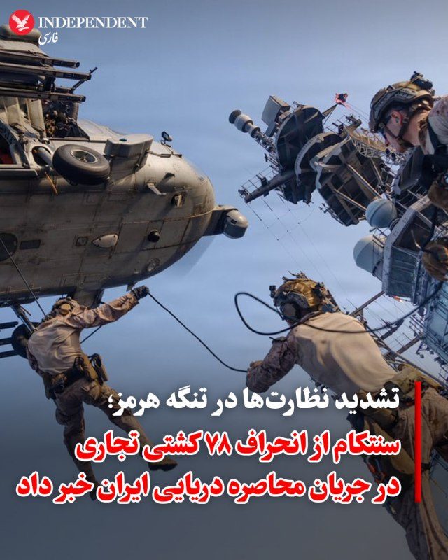

♦️ ستاد فرماندهی مرکزی ارتش آمریکا، سنتکام، روز شنبه ۲۶ اردیبهشت، گزارشی از آخرین فعالیت‌های این نیروها در تنگه هرمز و محاصره دریایی بنادر ایران ارائه کرد.

بر اساس این گزارش تا تاریخ ۲۶ اردیبهشت، نیروهای آمریکایی در راستای تضمین پایبندی به این محاصره نظامی، مسیر ۷۸ کشتی تجاری را که به سمت بنادر ایران در حرکت بودند تغییر داده و ۴ کشتی دیگر را نیز به دلیل تلاش برای نقض این خطوط ممنوعه، متوقف و زمین‌گیر کرده‌اند. سنتکام تاکید کرده است که این تدابیر سخت‌گیرانه تنها علیه شناورهای ورودی و خروجی به بنادر ایران اعمال می‌شود.
‌🇸🇦 Indypersian

🤖 @VahidOOnLine

## VahidOOnLine — post 240478

  <a href="telegram/content/VahidOOnLine_240478_1778940093.mp4" target="_blank">🎬 Download video</a>

ایرانیان آلمان روز شنبه همزمان با سایر کشورها در حمایت از انقلاب ملی علیه جمهوری اسلامی در شهر کاسل تجمع کردند.
‌🏁 🇬🇧 IranintlTV

🤖 @VahidOOnLine

## VahidOOnLine — post 240477

  

معاریو گزارش داد که حوثی‌ها ابزارهای مدرن، از جمله دستگاه‌های جی‌پی‌اس را در اختیار دزدان دریایی سومالی قرار داده‌اند که به آنها کمک می‌کند مسیرهای حرکت کشتی‌های تجاری را با دقت بیشتری ردیابی کنند.

پیش‌تر محمد موسی ابوله، معاون رییس اطلاعات پلیس دریایی پونتلند، در ژانویه ۲۰۲۶ گفته بود که نیروهای امنیتی برآورد می‌کنند برخی اعضای این گروه‌ها حتی آموزش‌های نظامی را در یمن گذرانده‌اند.

به گفته او، فناوری جدید برنامه‌ریزی حملات در فاصله‌ای دور از سواحل سومالی را بسیار آسان‌تر کرده است. یک ماه پیش از آن، در دسامبر ۲۰۲۵، نیروهای امنیتی پونتلند یک شناور حامل مواد منفجره و مواد شیمیایی مورد استفاده در ساخت بمب را در نزدیکی سواحل ایل متوقف کردند. در این قایق هفت نفر شامل دو شهروند یمنی و پنج شهروند سومالیایی حضور داشتند.
‌🏁 🇬🇧 IranintlTV

🤖 @VahidOOnLine

## VahidOOnLine — post 240476

♦️ارتش آمریکا با انتشار تصاویری اعلام کرد در پی یک عملیات نظامی در شمال‌شرق نیجریه، مواضع گروه داعش هدف حمله قرار گرفت و چندین عضو ارشد این گروه کشته شدند.
این عملیات یک تجمع مهم از نیروهای داعش را هدف قرار داده و در جریان آن، تعدادی از افراد باارزش بالا از جمله فردی به نام «ابو بلال المینوکی» از بین رفته‌اند.
جزئیات بیشتری درباره زمان دقیق، نحوه اجرای عملیات و تلفات کلی منتشر نشده، اما منابع محلی این حمله را ضربه‌ای قابل‌توجه به فعالیت‌های داعش در این منطقه توصیف کرده‌اند.
‌🇸🇦 Indypersian

🤖 @VahidOOnLine

## VahidOOnLine — post 240475

  <a href="telegram/content/VahidOOnLine_240475_1778940096.mp4" target="_blank">🎬 Download video</a>

سوییس، تجمع مقابل سفارت جمهوری اسلامی، ۲۶ اردیبهشت ۱۴۰۵
‌🏁 🇬🇧 ManotoTV

🤖 @VahidOOnLine

## VahidOOnLine — post 240474

  <a href="telegram/content/VahidOOnLine_240474_1778940097.mp4" target="_blank">🎬 Download video</a>

فرماندهی آفریقای ارتش آمریکا تصاویری از هدف قرار دادن مواضع داعش در نیجریه را منتشر کرده است. آفریکام گفته است عملیات شامگاه گذشته، حضور قابل توجهی از نیروهای داعش را هدف گرفت و به کشته شدن چند فرد مهم این گروه منجر شد.

شمال شرق نیجریه سال‌هاست صحنه فعالیت گروه‌های جهادی، از جمله شاخه غرب آفریقای داعش و بوکوحرام است. مرکز ملی مبارزه با تروریسم آمریکا می‌گوید شاخه غرب آفریقای داعش یکی از بزرگ‌ترین و مرگبارترین شاخه‌های این گروه است و در نیجریه و کشورهای همسایه باعث کشته یا آواره شدن هزاران نفر شده است.
‌🏁 🇬🇧 ManotoTV

🤖 @VahidOOnLine

## VahidOOnLine — post 240473

♦️صداوسیمای جمهوری اسلامی روز شنبه ۲۶ اردیبهشت، با انتشار تصاویری، لحظه توقیف یک نفتکش حامل ۴۵۰هزار بشکه نفت که به گفته خبرنگار، به صورت قاچاق از کشور خارج شده بود را نشان داد. کشور صاحب این نفتکش در گزارش معرفی نشده اما تاکید شده که غیرایرانی بوده است. نفتکش «اوشن کوی» برای جلوگیری از شناسایی شدن، نام خود را روی بدنه مخدوش کرده بود.

یک مقام نیروی دریایی ارتش در گفتگو با صداوسیما اعلام کرد که محموله این نفتکش توقیف شده و با انتقال به یک نفتکش ایرانی، به مخازن بندرعباس بازگردانده می‌شود.

پیش از این اعلام شده بود که کنترل تنگه هرمز به دو بخش شرقی و غربی تقسیم شده و نیروی دریایی سپاه و ارتش، هر کدام مسئولیت یک بخش را به‌عهده دارند.
‌🇸🇦 Indypersian

🤖 @VahidOOnLine

## VahidOOnLine — post 240472

  <a href="telegram/content/VahidOOnLine_240472_1778940099.mp4" target="_blank">🎬 Download video</a>

یک شهروند در پیامی به ایران اینترنشنال با اشاره به بحران معیشتی می‌گوید که سه ماه است مجلس با خاک یکی شده و نباید آن‌ها «حقوق آن‌چنانی»‌ بگیرند. پیام این مخاطب با هوش مصنوعی بازخوانی شده است.
‌🏁 🇬🇧 IranintlTV

🤖 @VahidOOnLine

## VahidOOnLine — post 240471

  <a href="telegram/content/VahidOOnLine_240471_1778940101.mp4" target="_blank">🎬 Download video</a>

ایرانیان فنلاند روز شنبه در حمایت از انقلاب ملی علیه جمهوری اسلامی در هلسینکی تجمع کردند و شعار «تغییر رژیم» سر دادند.
‌🏁 🇬🇧 IranintlTV

🤖 @VahidOOnLine

## mwarmonitor — post 9160

  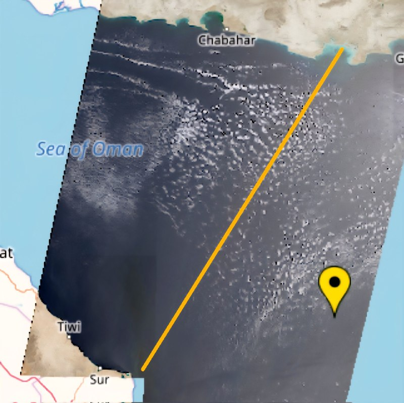

‼️من همین حالا یک ناو هواپیمابر کلاس نیمیتز (احتمالاً USS George H. W. Bush یا USS Abraham Lincoln) را در تصاویر ماهواره‌ای Sentinel-2 مربوط به 16/05/2026 پیدا کردم. 🔸این ناو با سرعت به سمت شمال دریای عمان در حال حرکت است. @mwarmonitor

## mwarmonitor — post 9159

  

🇺🇸یک فروند بالگرد ارتش ایالات متحده هنگام پرواز بر فراز آب‌های منطقه‌ای نزدیک تنگه هرمز، بر حرکت کشتی‌های تجاری نظارت می‌کند. این اقدام در چارچوب اجرای محاصره دریایی آمریکا علیه ایران انجام می‌شود.

🔸تا تاریخ ۱۶ مه، ۷۸ کشتی تجاری تغییر مسیر داده شده‌اند و ۴ کشتی برای تضمین تبعیت از دستورها از کار افتاده‌اند.

@mwarmonitor

## mwarmonitor — post 9158

  <a href="telegram/content/mwarmonitor_9158_1778940106.mp4" target="_blank">🎬 Download video</a>

📝تحلیل اختصاصی کانال

🇵🇰🇮🇷سفر از پیش‌اعلام‌نشده وزیر کشور پاکستان به تهران، بیش از آنکه یک رایزنی سنتی باشد، یک آفند دیپلماتیک پیشگیرانه است. در عرف بین‌الملل، حضور فیزیکی یک مقام ارشد از کشوری غیردرگیر در پایتختِ هدف، به عنوان یک ضربه‌گیر امنیتی عمل می‌کند؛ چرا که واشنگتن برای اجتناب از تصاعد بحران و درگیر کردن پای اسلام‌آباد، دست به اقدام نظامی ناگهانی نخواهد زد.

🔸این تحرک در کوتاه‌مدت به شدت تأثیرگذار است و عملاً زمان حیاتی برای تنش‌زدایی یا بازدارندگی موقت ایجاد می‌کند. با این حال، کارآمدی بلندمدت آن بستگی به این دارد که تهران و اسلام‌آباد از این فرصتِ تنفس و «سپر دیپلماتیک» برای تغییر محاسبات واشنگتن بهره ببرند، یا اینکه این سفر تنها یک مسکن موقت برای به تعویق انداختن بحران باشد.

@mwarmonitor

## mwarmonitor — post 9157

  <a href="telegram/content/mwarmonitor_9157_1778940108.mp4" target="_blank">🎬 Download video</a>

🇺🇸با ورود وزیر جنگ آمریکا، پیت هگست، به نورفولک، ویرجینیا، ناو هواپیمابر «یو‌اس‌اس جرالد آر. فورد» پس از یک استقرار بیش از ۳۰۰ روزه به پایگاه خانگی خود بازگشت. این ناو و شناورهای همراه آن در طول این مدت در عملیات‌های رزمی در دو فرماندهی رزمی (COCOM) شامل SOUTHCOM و CENTCOM شرکت داشتند.

@mwarmonitor

## mwarmonitor — post 9156

  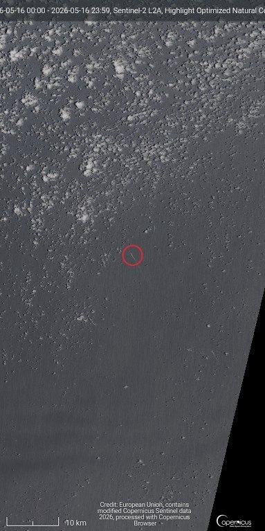

‼️من همین حالا یک ناو هواپیمابر کلاس نیمیتز (احتمالاً USS George H. W. Bush یا USS Abraham Lincoln) را در تصاویر ماهواره‌ای Sentinel-2 مربوط به 16/05/2026 پیدا کردم.

🔸این ناو با سرعت به سمت شمال دریای عمان در حال حرکت است.

@mwarmonitor

## mwarmonitor — post 9155

  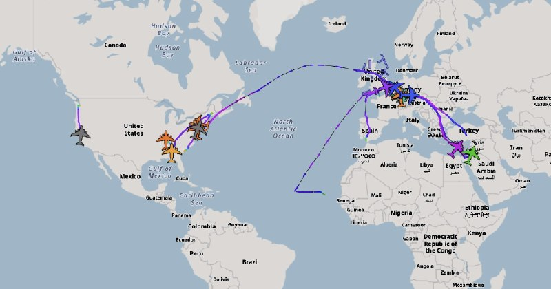

✈️🇺🇸نیروی هوایی آمریکا (USAF) – جنگ ایران ۲۰۲۶ | ۱۶ مه

✈️تعداد پروازهای ورودی هواپیماهای ترابری C-17 به منطقه فرماندهی مرکزی آمریکا (CENTCOM) و پایگاه‌های مرتبط به دست‌کم 1,320 پرواز رسیده و 10 پرواز دیگر نیز در حال انجام است.

✈️8 مورد از این پروازهای جدید از پایگاه هوایی Pope Army Airfield آمریکا انجام شده‌اند و مقصد مشخصی برای آن‌ها قابل شناسایی نیست.

✈️حداقل 6 پرواز جدید نیز به‌نظر می‌رسد حرکت‌های خروجی از CENTCOM به سمت پایگاه‌هایی در خاک آمریکا (CONUS) باشند؛ همان پایگاه‌هایی که بیشتر پروازها از آن‌ها آغاز شده‌اند.

@mwarmonitor

## mwarmonitor — post 9154

⚠️اطلاعیه فوری ⚠️

⚠️"با نزدیک شدن به لحظه درگیری‌های مجدد، ثانیه‌ها سرنوشت‌ساز شده‌اند. اکنون زمان انتخاب میان بقا یا قربانی شدن در راه منافع سران است. از پادگان‌ها و مراکز نظامی فاصله بگیرید و جان خود را فدای وعده‌های توخالی نکنید."

⚠️با توجه به نشانه‌های موجود و احتمال آغاز مجدد درگیری‌های نظامی، حفظ هوشیاری و اتخاذ تصمیمات درست در این لحظات بحرانی برای تمامی گروه‌های جامعه، از شهروندان عادی تا بدنه نیروهای مسلح، امری حیاتی و سرنوشت‌ساز است.

⚠️در همین راستا، به سربازان وظیفه و کادر نظامی توصیه می‌شود که از حضور در پادگان‌ها و مراکز نظامی خودداری کنند. تجربه و تاریخ نشان داده است که در اوج بحران‌ها، سران و تصمیم‌گیرندگان اصلی ساختار با تضمین مسیرهای خروج خود به کشورهای هم‌پیمان مانند چین و روسیه، بدنه رده‌پایین و نیروهای فریب‌خورده را به عنوان سپر بلا در میدان رها می‌کنند؛ بنابراین عاقلانه‌ترین راه، فاصله گرفتن از نظام و ایستادن در سمت درست تاریخ یعنی در کنار مردم است.

⚠️همچنین از تمامی شهروندان و غیرنظامیان تقاضا می‌شود برای حفظ جان خود، فوراً از نزدیکی زیرساخت‌های انرژی از جمله پالایشگاه‌ها و نیروگاه‌ها و همچنین مراکز و پادگان‌های نظامی فاصله بگیرند. در نهایت، با توجه به پیش‌بینی‌ها مبنی بر احتمال تمرکز حملات بر روی امارات متحده عربی، از هموطنان مقیم این کشور درخواست می‌شود که در بالاترین سطح آمادگی و هوشیاری قرار داشته و مراقبت‌های لازم را به عمل آورند.

@mwarmonitor

## FoxNewsTwitter — post 341813

  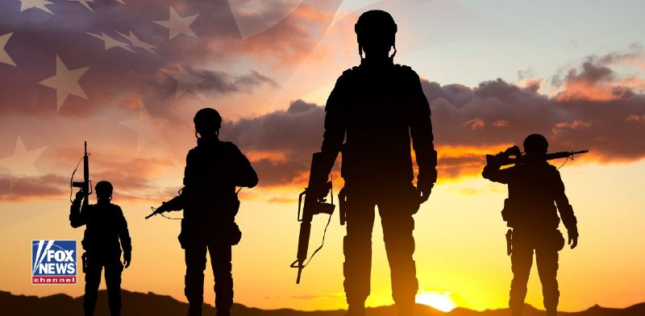

Fox News (Twitter/X)

Today, the nation honors the brave men and women of the United States Armed Forces, recognizing their courage, sacrifice, and unwavering commitment to defending America.

"As we celebrate 250 glorious years of American independence this year, we acknowledge that our precious freedom, enjoyed and embraced by generation after generation, has been secured for all citizens by the providence and grace of Almighty God and the service and sacrifice of every member of our military," a White House statement reads.

## FoxNewsTwitter — post 341812

  <a href="telegram/content/FoxNewsTwitter_341812_1778940112.mp4" target="_blank">🎬 Download video</a>

Fox News (Twitter/X)

NEW: U.S. Africa Command releases video of the airstrike that targeted and eliminated ISIS fighters in Nigeria, including ISIS second-in-command Abu-Bilal al-Minuki.

President Trump called the “meticulously planned and very complex mission” a complete success.

## FoxNewsTwitter — post 341811

  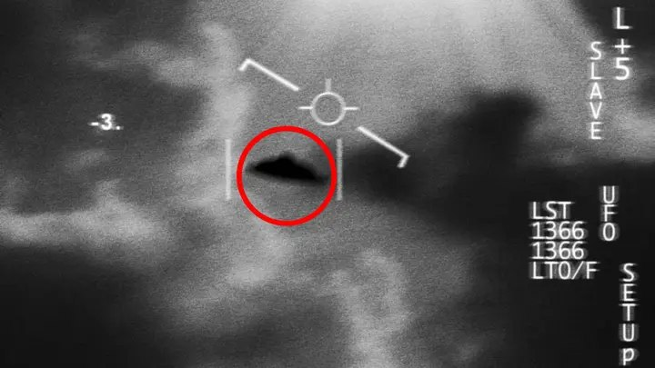

Fox News (Twitter/X)

A retired Navy admiral warns UFOs may be controlled by a “higher-order non-human intelligence.”

Tim Gallaudet, considered to be one of America’s leading voices on the UAP phenomenon, says he’s seen “data videos” showing craft moving seamlessly between the ocean and atmosphere at speeds beyond known technology.

“I know we are aware of higher order non-human intelligence that direct the movement of these phenomena,” he said.

## FoxNewsTwitter — post 341810

  

Fox News (Twitter/X)

A retired Navy admiral warns UFOs may be controlled by a “higher-order non-human intelligence.”

Tim Gallaudet, considered to be one of America’s leading voices on the UAP phenomenon, says he’s seen “data videos” showing craft moving seamlessly between the ocean and atmosphere at speeds beyond known technology.

“I know we are aware of higher order non-human intelligence that direct the movement
of these phenomena,” he said.

## pm_afshaa — post 90849

  <a href="telegram/content/pm_afshaa_90849_1778940115.webm" target="_blank">🎬 Download video</a>

🔴الحدث به نقل از منابع پاکستانی:
اسلام آباد به دنبال ادامه روند میانجیگری با جدییت است. اسلام آباد به دنبال متقاعد کردن تهران و واشنگتن به انعطاف پذیری در مذاکراته

💧 Rainbet.com the #1 Non-KYC Crypto Casino & Sportsbook @rainbetcom

😁 @Pm_Afshaa

## pm_afshaa — post 90848

  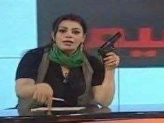

مجری‌های صداوسیما در چند برنامه زنده، با اسلحه کلاشینکف حضور پیدا کردن : 
💧 Rainbet.com the #1 Non-KYC Crypto Casino & Sportsbook @rainbetcom 
😁 @Pm_Afshaa

## pm_afshaa — post 90847

🔴کانال 12 اسرائیل: اسرائیل در حال آماده شدن برای یک جنگ چند روزه یا چند هفته‌ای با ایران است

💧 Rainbet.com the #1 Non-KYC Crypto Casino & Sportsbook @rainbetcom

😁 @Pm_Afshaa

## VahidOnline — post 75501

  <a href="telegram/content/VahidOnline_75501_1778940117.mp4" target="_blank">🎬 Download video</a>

دختر جمیله شفیعی: JamilehShafiei

📡 @VahidOnline

## VahidOnline — post 75500

  <a href="telegram/content/VahidOnline_75500_1778940117.mp4" target="_blank">🎬 Download video</a>

"مجری شبکه سه تلویزیون: یک راکت ۲۰۰ دلاری می‌تواند کل ارتش آمریکا را در منطقه به زانو درآورد" ویدیو با تیتر بالا در منابع جمهوری اسلامی منتشر شده و خانعلی‌زاده متوهم رو نشون میده که مطابق معمول چرندیاتی در سطح خودش میگه. 📡 @VahidOnline

## VahidOnline — post 75499

  <a href="telegram/content/VahidOnline_75499_1778940118.mp4" target="_blank">🎬 Download video</a>

در یک برنامه زنده تلویزیونی که از شبکه افق صداوسیما پخش شده است، مجری برنامه با اسلحه واقعی به پرچم امارات متحده عربی شلیک می‌کند.
در این برنامه که موضوع آن درباره آموزش شلیک با اسلحه کلاشنیکف است، فردی که لباس نظامی به تن دارد و صورت خود را با ماسک پوشانده است مراحل آماده‌سازی اسلحه و شلیک گلوله را به مجری آموزش می‌دهد.
مجری برنامه هم در مرحله شلیک تصمیم می‌گیرد به پرچم امارات که در بنر مربوط به دکور استودیو، شلیک کند.
@VahidHeadline
صدا و سیمای جمهوری اسلامی جمعه چند برنامه پخش کرد که در آنها مجریان در بخش‌های استودیویی با در دست داشتن تفنگ ظاهر شدند و کار با سلاح‌های سبک آموزش داده شد. مجریان در این برنامه‌ها اعلام کردند که در صورت لزوم به جنگ خواهند پیوست.
این برنامه‌ها که دست‌کم در سه بخش پخش شد، در رسانه‌های داخلی بازنشر و در شبکه‌های اجتماعی با واکنش‌هایی همراه شد. برخی کاربران شبکه‌های اجتماعی این بخش‌ها را نشانه‌ای از بسیج در شرایط جنگی توصیف کردند.
جکسون هینکل، مفسر سیاسی آمریکایی، در شبکه اجتماعی ایکس نوشت تلویزیون دولتی ایران نحوه استفاده و شلیک با کلاشینکف را به‌عنوان «آمادگی برای تهاجم زمینی آمریکا» نشان می‌دهد.
@VahidOOnLine

📡 @VahidOnline

## VahidOnline — post 75498

  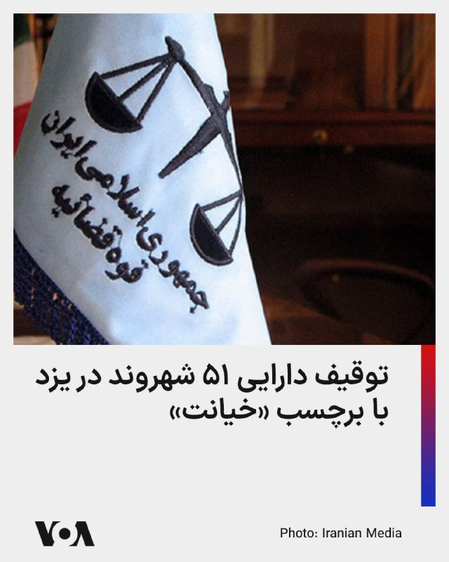

رسانه وابسته به قوه قضائیه جمهوری اسلامی اعلام کرد اموال ۵۱ نفر در استان یزد، با دستور قضایی و به اتهام آنچه «خیانت به وطن» و «همکاری با دشمن» خوانده شده، توقیف شده است.

بر اساس این گزارش، پرونده این افراد در ارتباط با قانون موسوم به «تشدید مجازات جاسوسی و همکاری با رژیم صهیونیستی علیه امنیت و منافع ملی» در حال رسیدگی است و مقام‌های قضایی مدعی شده‌اند دارایی‌های توقیف‌شده قرار است برای «حفظ حقوق عامه» و بازسازی اماکن آسیب‌دیده از جنگ هزینه شود.

اموال توقیف‌شده شامل حساب‌های بانکی، دارایی‌های منقول و غیرمنقول، سهام شرکت‌ها و حتی اموال وکالتی عنوان شده است.

طبق گزارش میزان، از میان این ۵۱ نفر، ۲۰ نفر در داخل کشور حضور دارند و ۳۱ نفر دیگر در خارج از کشور به سر می‌برند.

این اقدام در ادامه موج تازه‌ای از مصادره و توقیف اموال شهروندان و مخالفان سیاسی صورت می‌گیرد؛ روندی که در عمل به ابزاری برای فشار، ارعاب و مصادره دارایی افراد تحت عنوان‌های سنگینی مانند «خیانت» و «همکاری با دشمن» تبدیل شده است.
@VahidHeadline

📡 @VahidOnline

## IranIntlTV — post 337481

  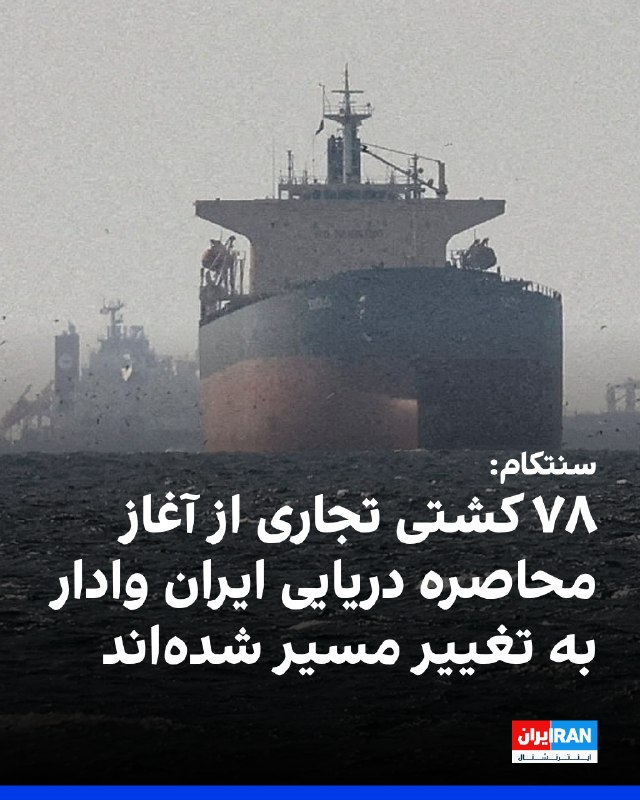

سنتکام، مرکز فرماندهی ایالات متحده، اعلام کرد که از آغاز محاصره سواحل جنوب ایران تا کنون، ۷۸ کشتی تجاری وادار به تغییر مسیر شده‌اند و ۴ کشتی برای تضمین اجرای محاصره از کار افتاده‌اند.

سنتکام با انتشار نمایی از داخل یک بالگرد بر فراز آب‌های منطقه‌ای نزدیک تنگه هرمز، نوشت که این بالگرد ارتش آمریکا کشتی‌های تجاری را در جریان اجرای محاصره دریایی ایران زیر نظر دارد.
https://iranintl.com/202605164791

## IranIntlTV — post 337480

  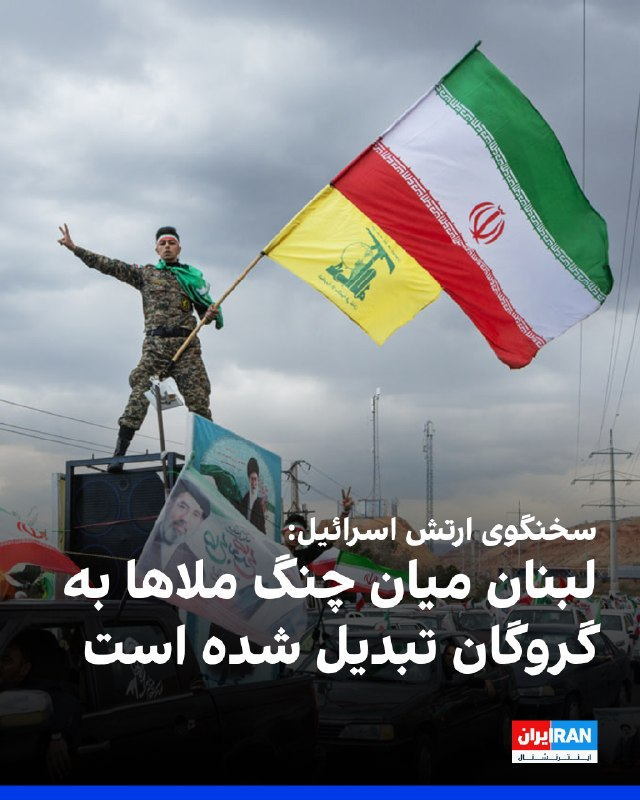

ایلا واویه، سخنگوی ارتش اسرائیل برای رسانه‌های عربی، در پیامی نوشت لبنان «میان چنگ ملایان و رشته‌های وابستگی» از یک کشور به گروگان تبدیل شده است.

او نوشت زمانی که جنگ‌ها «با انگشتان ایرانی اداره می‌شود»، مردم لبنان بهای آن را با «ویرانی و خاکستر» می‌پردازند.

واویه همچنین اعلام کرد لبنان به سکویی تبدیل شده و حزب‌الله «رشته‌هایی است که از سوی تهران حرکت داده می‌شود» و نتیجه این وضعیت، به گفته او، «کشوری که سیاه‌پوش می‌شود و بی‌گناهانی که جز آینده‌ای نامعلوم سهمی ندارند» است.

سخنگوی ارتش اسرائیل در پایان پرسید: «لبنان به کجا می‌رود؟ و تا کی؟»
https://iranintl.com/202605163963

## IranIntlTV — post 337479

  <a href="telegram/content/IranIntlTV_337479_1778940121.mp4" target="_blank">🎬 Download video</a>

ایرانیان سوئیس روز شنبه با تجمع در شهر برن به حمایت از انقلاب ملی و شاهزاده رضا پهلوی پرداختند و شعار «جاوید شاه» سر دادند.

## IranIntlTV — post 337478

  <a href="telegram/content/IranIntlTV_337478_1778940123.mp4" target="_blank">🎬 Download video</a>

در واکنش به نمایش و آموزش کار با سلاح در صداوسیما یک شهروند در پیامی به ایران اینترنشنال این اقدام را نشانه سقوط حکومت خواند و مخاطبی دیگر به حرکت مشابه در لیبی قبل از سقوط حکومت معمر قذافی اشاره کرد.

پیام این مخاطبان با هوش مصنوعی بازخوانی شده است.

## IranIntlTV — post 337477

  <a href="telegram/content/IranIntlTV_337477_1778940126.mp4" target="_blank">🎬 Download video</a>

ایرانیان آلمان روز شنبه همزمان با سایر کشورها در حمایت از انقلاب ملی علیه جمهوری اسلامی در شهر کاسل تجمع کردند.

## IranIntlTV — post 337476

  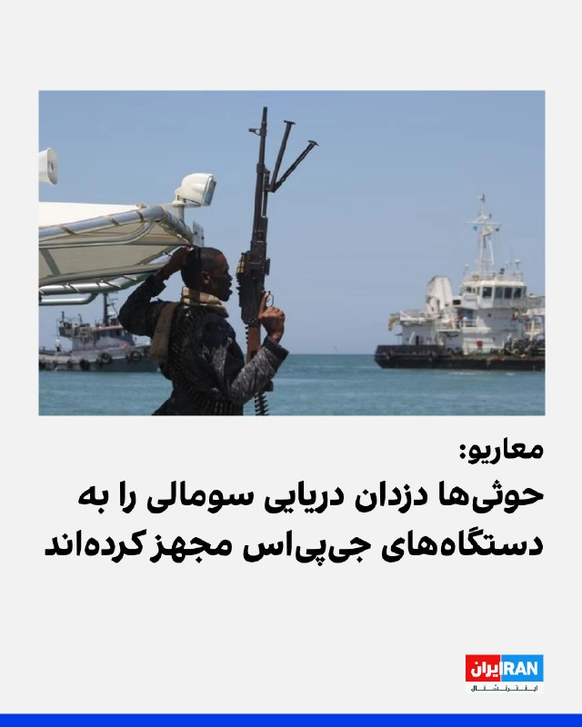

معاریو گزارش داد که حوثی‌ها ابزارهای مدرن، از جمله دستگاه‌های جی‌پی‌اس را در اختیار دزدان دریایی سومالی قرار داده‌اند که به آنها کمک می‌کند مسیرهای حرکت کشتی‌های تجاری را با دقت بیشتری ردیابی کنند.

پیش‌تر محمد موسی ابوله، معاون رییس اطلاعات پلیس دریایی پونتلند، در ژانویه ۲۰۲۶ گفته بود که نیروهای امنیتی برآورد می‌کنند برخی اعضای این گروه‌ها حتی آموزش‌های نظامی را در یمن گذرانده‌اند.

به گفته او، فناوری جدید برنامه‌ریزی حملات در فاصله‌ای دور از سواحل سومالی را بسیار آسان‌تر کرده است. یک ماه پیش از آن، در دسامبر ۲۰۲۵، نیروهای امنیتی پونتلند یک شناور حامل مواد منفجره و مواد شیمیایی مورد استفاده در ساخت بمب را در نزدیکی سواحل ایل متوقف کردند. در این قایق هفت نفر شامل دو شهروند یمنی و پنج شهروند سومالیایی حضور داشتند.
https://iranintl.com/202605167159

## IranIntlTV — post 337475

  <a href="telegram/content/IranIntlTV_337475_1778940129.mp4" target="_blank">🎬 Download video</a>

در تجمعی که به فراخوان تامی رابینسون، فعال راست‌گرای بریتانیا، در لندن برگزار شد، شماری از ایرانیان با پرچم شیر و خورشید حضور پیدا کردند. رابینسون این تجمع را «بزرگ‌ترین گردهمایی ملی‌گرایانه» توصیف کرده است.
گفت‌وگو با تاج‌الدین سروش، عضو تحریریه ایران‌اینترنشنال
@iranintltv

## IranIntlTV — post 337474

  <a href="telegram/content/IranIntlTV_337474_1778940130.mp4" target="_blank">🎬 Download video</a>

خبرگزاری مهر از وقوع آتش‌سوزی در «کارخانه روغن موتور» در مراغه خبر داد. رییس آتش‌نشانی شهرستان مراغه بعد از ظهر شنبه اعلام کرد این کارخانه از ساعاتی پیش دچار آتش‌سوزی شده است و نیروهای امدادی و آتش‌نشانی در حال اطفای حریق هستند.
@iranintltv

## IranIntlTV — post 337473

  <a href="telegram/content/IranIntlTV_337473_1778940131.mp4" target="_blank">🎬 Download video</a>

خبرگزاری مهر از وقوع آتش‌سوزی در «کارخانه روغن موتور» در مراغه خبر داد. رییس آتش‌نشانی شهرستان مراغه بعد از ظهر شنبه اعلام کرد این کارخانه از ساعاتی پیش دچار آتش‌سوزی شده است و نیروهای امدادی و آتش‌نشانی در حال اطفای حریق هستند.
@iranintltv

## IranIntlTV — post 337472

  <a href="telegram/content/IranIntlTV_337472_1778940132.mp4" target="_blank">🎬 Download video</a>

یک شهروند در پیامی به ایران اینترنشنال با اشاره به بحران معیشتی می‌گوید که سه ماه است مجلس با خاک یکی شده و نباید آن‌ها «حقوق آن‌چنانی»‌ بگیرند. پیام این مخاطب با هوش مصنوعی بازخوانی شده است.

## IranIntlTV — post 337471

  <a href="telegram/content/IranIntlTV_337471_1778940135.mp4" target="_blank">🎬 Download video</a>

صداوسیمای جمهوری اسلامی روز جمعه برنامه‌ای پخش کرد که در آن یک نظامی به مجری استفاده از سلاح گرم را آموزش می‌داد. این برنامه در شبکه‌های اجتماعی موجی از واکنش‌ها را به همراه داشت. مجری در این برنامه به پرچم امارات متحده عربی شلیک کرد.
جزییات بیشتر با محسن مهیمنی، عضو تحریریه ایران‌اینترنشنال
@iranintltv

## IranIntlTV — post 337470

  <a href="telegram/content/IranIntlTV_337470_1778940136.mp4" target="_blank">🎬 Download video</a>

ایرانیان فنلاند روز شنبه در حمایت از انقلاب ملی علیه جمهوری اسلامی در هلسینکی تجمع کردند و شعار «تغییر رژیم» سر دادند.

## IranIntlTV — post 337469

  <a href="telegram/content/IranIntlTV_337469_1778940139.mp4" target="_blank">🎬 Download video</a>

یکی از شرکت‌کنندگان در تجمع استکهلم در گفت‌وگو با مهران عباسیان، خبرنگار ایران‌اینترنشنال، گفت: «ما پشت مردم داخل کشور هستیم و تا روز آزادی ایران به خیابان‌ها می‌آییم.»
@iranintltv

## IranIntlTV — post 337468

  <a href="telegram/content/IranIntlTV_337468_1778940141.mp4" target="_blank">🎬 Download video</a>

ایرانیان مقیم کره جنوبی و ژاپن بار دیگر در پاسخ به فراخوان حمایت از انقلاب ملی و در راستای جلب توجه دولت سئول و توکیو به نقض گسترده حقوق بشر و اعدام‌‌ها توسط جمهوری اسلامی تجمع کردند.

گزارش توماج طاهباز، خبرنگار ایران‌اینترنشنال، از پیام شرکت‌کنندگان در این تجمع‌ها

@iranintltv

## Shin_Persian — post 6030

  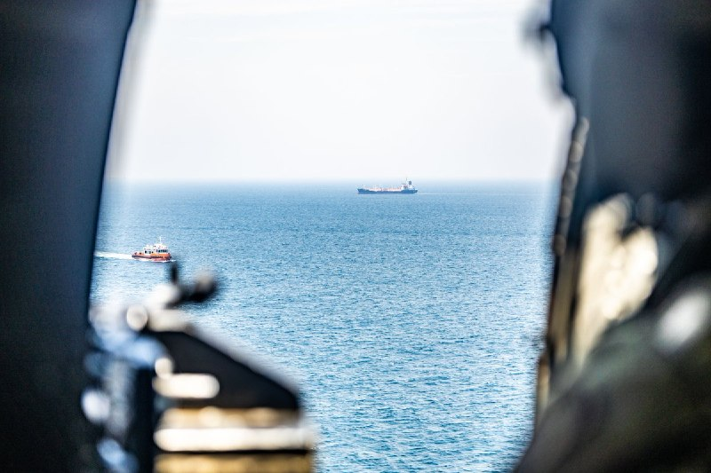

U.S. Central Command ✓ @CENTCOM Sat, 16 May 2026 13:24:31 UTC A U.S. Army helicopter observes commercial ships while flying over regional waters near the Strait of Hormuz during U.S. enforcement of the maritime blockade against Iran. As of May 16, 78…

## Shin_Persian — post 6029

U.S. Central Command ✓ @CENTCOM
Sat, 16 May 2026 13:24:31 UTC

A U.S. Army helicopter observes commercial ships while flying over regional waters near the Strait of Hormuz during U.S. enforcement of the maritime blockade against Iran.

As of May 16, 78 commercial ships have been redirected, and 4 have been disabled to ensure compliance.

فارسی

یک هلیکوپتر ارتش ایالات متحده در حالی که در جریان اجرای محاصره دریایی علیه ایران توسط ایالات متحده بر فراز آب‌های منطقه در نزدیکی تنگه هرمز پرواز می‌کند، کشتی‌های تجاری را زیر نظر دارد.

تا تاریخ ۱۶ می، ۷۸ کشتی تجاری تغییر مسیر داده شده‌اند و ۴ کشتی برای اطمینان از انطباق، از کار افتاده‌اند.

𝕏 · @shin_persian

## ManotoTV — post 105516

  <a href="telegram/content/ManotoTV_105516_1778940143.mp4" target="_blank">🎬 Download video</a>

سوییس، تجمع مقابل سفارت جمهوری اسلامی، ۲۶ اردیبهشت ۱۴۰۵

## ManotoTV — post 105515

  <a href="telegram/content/ManotoTV_105515_1778940145.mp4" target="_blank">🎬 Download video</a>

لندن، حضور ایرانیان با پرچم بریتانیا و شیر و خوشید و تصاویر شاهزاده رضا پهلوی در راهپیمایی ملی‌گرایان بریتانیا، ۲۶ اردیبهشت ۱۴۰۵

## ManotoTV — post 105514

  <a href="telegram/content/ManotoTV_105514_1778940147.mp4" target="_blank">🎬 Download video</a>

فرماندهی آفریقای ارتش آمریکا تصاویری از هدف قرار دادن مواضع داعش در نیجریه را منتشر کرده است. آفریکام گفته است عملیات شامگاه گذشته، حضور قابل توجهی از نیروهای داعش را هدف گرفت و به کشته شدن چند فرد مهم این گروه منجر شد.

شمال شرق نیجریه سال‌هاست صحنه فعالیت گروه‌های جهادی، از جمله شاخه غرب آفریقای داعش و بوکوحرام است. مرکز ملی مبارزه با تروریسم آمریکا می‌گوید شاخه غرب آفریقای داعش یکی از بزرگ‌ترین و مرگبارترین شاخه‌های این گروه است و در نیجریه و کشورهای همسایه باعث کشته یا آواره شدن هزاران نفر شده است.

## FarsiVOA — post 217896

  <a href="telegram/content/FarsiVOA_217896_1778940148.mp4" target="_blank">🎬 Download video</a>

رسانه‌های جمهوری اسلامی از وقوع آتش‌سوزی در یک کارخانه روغن موتور، ‌روز شنبه، ۲۶ اردیبهشت ۱۴۰۵، در مراغه خبر دادند و اعلام کردند اطفای حریق ادامه دارد. تا این لحظه جزئیاتی از علت آتش‌سوزی و تلفات احتمالی منتشر نشده است.

## FarsiVOA — post 217895

  <a href="telegram/content/FarsiVOA_217895_1778940151.mp4" target="_blank">🎬 Download video</a>

در ادامه تنش‌ها میان امارات متحده عربی و جمهوری اسلامی، آموزش استفاده از اسلحه برای حامیان حکومت در برنامه‌های زنده صداوسیما و تیراندازی به پرچم امارات، واکنش کاربران را در شبکه‌های اجتماعی برانگیخته است.

روز جمعه، ۲۵ اردیبهشت، چگونگی استفاده از کلاشنیکف، حداقل در سه شبکه جمهوری اسلامی، با حضور مجریان مسلح آموزش داده شد.

در یکی از این برنامه‌ها مجری صداوسیما به تصویر پرچم امارات متحده عربی شلیک می‌کند.

## FarsiVOA — post 217894

فرماندهی آفریقای ایالات متحده، آفریکام، اعلام کرد در عملیاتی در شمال‌شرق نیجریه چند عضو ارشد گروه داعش کشته شدند.

به گفته آفریکام، ابو بلال المنوکی، از چهره‌های کلیدی داعش در منطقه، در این عملیات کشته شده است.

ارتش آمریکا می‌گوید این حمله با هدف تضعیف توان عملیاتی داعش در غرب آفریقا انجام شده است.

@FarsiVOA

## FarsiVOA — post 217889

تصاویر پرواز جنگنده اف-۳۵بی از ناو «یو‌اس‌اس تریپولی»

فرماندهی مرکزی ایالات متحده، سنتکام، تصاویری از پرواز جنگنده اف-۳۵بی تفنگداران دریایی آمریکا از ناو آبی‌خاکی «یو‌اس‌اس تریپولی» در دریای عرب منتشر کرد.

جنگنده اف-۳۵بی به دلیل قابلیت برخاستن کوتاه و فرود عمودی می‌تواند از بزرگ‌ترین ناوهای آبی‌خاکی نیروی دریایی آمریکا عملیات انجام دهد.

@FarsiVOA

## DW_Farsi — post 124762

🔶 کاخ کرملین: پوتین روز سه‌شنبه به چین سفر می‌کند

تنها ساعاتی پس از پایان سفر دونالد ترامپ، رئيس‌جمهور آمریکا به پکن، کرملین اعلام کرد ولادیمیر پوتین هفته آینده راهی چین خواهد شد؛ سفری که بار دیگر توجه‌ها را به نزدیکی فزاینده مسکو و پکن در میانه بحران‌های جهانی جلب کرده است.

بر اساس اعلام کرملین، رئیس‌جمهور روسیه روزهای سه‌شنبه و چهارشنبه آینده به دعوت شی جین‌پینگ، رئیس‌جمهور چین، به پکن سفر می‌کند. دو طرف قرار است درباره روابط دوجانبه، مسائل منطقه‌ای و تحولات بین‌المللی گفت‌وگو کنند و چندین سند و توافق‌نامه مشترک نیز امضا شود.

قرار است پوتین علاوه بر دیدار با شی جین‌پینگ، با لی چیانگ، نخست‌وزیر چین، نیز ملاقات کند.

روسیه و چین در سال‌های اخیر روابط اقتصادی و سیاسی خود را به شکل کم‌سابقه‌ای گسترش داده‌اند؛ رابطه‌ای که پس از آغاز جنگ اوکراین در سال ۲۰۲۲ عمیق‌تر شد.

چین هرگز حمله روسیه به اوکراین را محکوم نکرده و هم‌زمان، آمریکا و کشورهای غربی را به طولانی کردن جنگ از طریق ارسال تسلیحات متهم کرده است. در مقابل، روسیه نیز بیش از پیش به بازار و حمایت اقتصادی چین وابسته شده است؛ به‌ویژه در حوزه صادرات انرژی.

پکن اکنون بزرگ‌ترین خریدار نفت و گاز روسیه در جهان به شمار می‌رود.

اعلام سفر پوتین اما فقط یک دیدار دیپلماتیک معمولی تلقی نمی‌شود، بلکه زمان‌بندی آن نیز مورد توجه تحلیلگران قرار گرفته است.

این خبر دقیقا پس از سفر دونالد ترامپ، رئیس جمهور آمریکا به چین منتشر شد؛ سفری که در آن دونالد ترامپ و شی جین‌پینگ درباره جنگ اوکراین، بحران ایران و امنیت تجارت جهانی گفت‌وگو کردند.

در حالی که ولادیمیر پوتین آخرین‌بار در ماه سپتامبر به‌صورت حضوری با شی جین‌پینگ دیدار کرده و از آن زمان تنها یک گفت‌وگوی ویدئویی میان دو رهبر انجام شده است، ترامپ در این سفر حتی اجازه یافت در باغ محل اقامت رئیس‌جمهور چین قدم بزند.

در جریان دیدار ترامپ و شی، دو طرف بر ضرورت پایان هرچه سریع‌تر جنگ اوکراین تاکید کردند. همچنین هر دو نسبت به تاثیر جنگ ایران و احتمال تاثیر بسته شدن تنگه هرمز بر تجارت جهانی ابراز نگرانی کردند.

با این حال، همین تنش‌ها، به‌ویژه در ارتباط با ایران، اخیرا باعث افزایش قیمت نفت شده؛ موضوعی که به اقتصاد روسیه کمک کرده و هم‌زمان روند ارسال بخشی از تسلیحات آمریکا به اوکراین را کند کرده است.

با وجود این تحولات، به نظر نمی‌رسد روسیه نگران تضعیف روابطش با چین باشد، چرا که دیدار میان آمریکا و چین به تصمیم مشخصی درباره این بحران‌ها منجر نشد.

چین همچنان بزرگ‌ترین خریدار نفت و گاز روسیه در جهان باقی مانده و علاوه بر این، پکن هیچ‌گاه حمله روسیه به اوکراین را محکوم نکرده است. چین همچنین کشورهای غربی را به طولانی‌کردن جنگ از طریق ارسال تسلیحات متهم می‌کند.

برای چین، روابط با روسیه فقط یک همکاری اقتصادی نیست، بلکه بخشی از موازنه بزرگ‌تر قدرت با آمریکاست.

پکن در سال‌های اخیر تلاش کرده در برابر فشارهای غرب، به‌ویژه در حوزه تجارت، فناوری و امنیت، روابط خود با مسکو را حفظ و تقویت کند؛ هرچند هم‌زمان نمی‌خواهد به‌طور کامل وارد تقابل مستقیم با غرب می‌شود.
@dw_farsi

## Persian_Trend_Official — post 14239

  <a href="telegram/content/Persian_Trend_Official_14239_1778940153.webm" target="_blank">🎬 Download video</a>

‼️ دوستان توجه داشته باشید که تیم «پرشین ترند» در هیچ‌یک از پلتفرم‌های داخلی، کانال یا گروه رسمی ندارد و هیچ‌گونه فعالیتی در این بسترها انجام نمی‌دهد. ⚠️ لطفاً نسبت به سوءاستفاده افراد سودجو و صفحات جعلی هوشیار باشید. 📝 Nick 📌 @persian_trend_official پرشین…

## Persian_Trend_Official — post 14238

  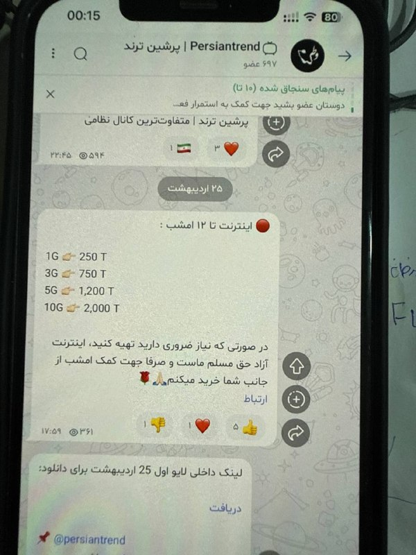

‼️ دوستان توجه داشته باشید که تیم «پرشین ترند» در هیچ‌یک از پلتفرم‌های داخلی، کانال یا گروه رسمی ندارد و هیچ‌گونه فعالیتی در این بسترها انجام نمی‌دهد.

⚠️ لطفاً نسبت به سوءاستفاده افراد سودجو و صفحات جعلی هوشیار باشید.

📝 Nick

📌 @persian_trend_official
پرشین ترند | متفاوت‌ترین کانال نظامی

## Persian_Trend_Official — post 14237

⭕️ آسوشیتدپرس: بازگشت ناو هواپیمابر جرالد فورد به پایگاه پس از ۱۱ ماه مأموریت.

وزارت‌جنگ آمریکا اعلام کرد پیت هگست، وزیر جنگ، روز شنبه در پایگاه دریایی نورفولک در ویرجینیا از ناو هواپیمابر جرالد فورد و ۴۵۰۰ ملوان آن پس از ۱۱ ماه مأموریت استقبال می‌کند.

این ناو ۳۲۶ روز در دریا بوده که طولانی‌ترین استقرار یک ناو هواپیمابر آمریکایی در ۵۰ سال گذشته و سومین رکورد از زمان جنگ ویتنام است.

پ.ن: آخرین باری که این ناو هواپیمابر در پایگاه خشکی مستقر بود، هنوز جنگ ۱۲ روزه نیز آغاز نشده بود.

📝 Nick

📌 @persian_trend_official
پرشین ترند | متفاوت‌ترین کانال نظامی

## RadioFarda — post 157260

  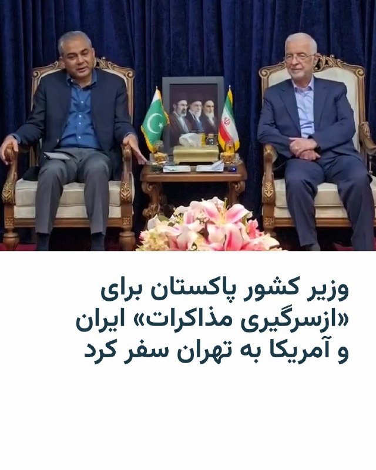

🔸رسانه‌های ایران روز شنبه ۲۶ اردیبهشت اعلام کردند وزیر کشور پاکستان در سفر به تهران درباره «ازسرگیری مذاکرات» بین ایران و آمریکا با همتای ایرانی خود گفت‌وگو کرده است.

🔸محسن نقوی، وزیر کشور پاکستان، که برای دیداری دو روزه به ایران سفر کرده، به نوشته رسانه‌های نزدیک به حکومت ایران با اسکندر مومنی دیدار کرد و «درباره روابط ایران و پاکستان و چشم‌انداز ازسرگیری مذاکرات صلح، گفت‌وگوهای مفصلی انجام شد».

🔸پاکستان از زمان برقراری آتش‌بس بین ایران و آمریکا به عنوان میانجی عمل کرده و یک دور مذاکره میان مقام‌های ارشد واشینگتن و تهران در اسلام‌آباد برگزار شد که به نتیجه نرسید.

🔸طی هفته‌های اخیر پاکستان وظیفه انتقال طرح‌ها و پیشنهادهای ایران و آمریکا برای رسیدن به توافق پایان جنگ را بر عهده داشته است. دونالد ترامپ، رئیس‌جمهور ایالات متحده، پیشنهادهای مطرح‌شده از سوی ایران را غیر قابل قبول خوانده است.

🔸این در حالی است که عباس عراقچی، وزیر خارجه ایران، روز جمعه مدعی شد تهران پیام‌هایی از ایالات متحده دریافت کرده که نشان می‌دهد دولت دونالد ترامپ آمادهٔ ادامه مذاکرات با هدف پایان دادن به جنگ خاورمیانه است.
@RadioFarda

## RadioFarda — post 157259

  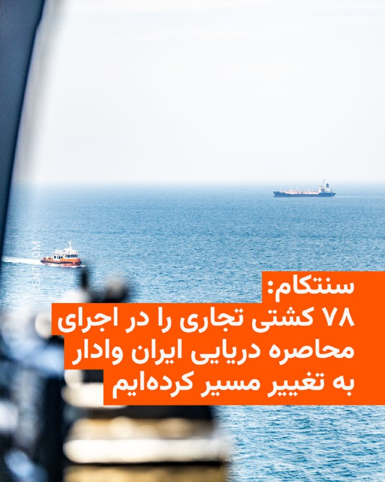

🔸ستاد فرماندهی مرکزی ایالات متحده، سنتکام، روز جمعه ۲۶ اردیبهشت با انتشار تصویری از پرواز یک بالگرد ارتش آمریکا بر فراز آب‌های نزدیک تنگه هرمز اعلام کرد که تاکنون ۷۸ کشتی تجاری در چارچوب محاصره دریایی ایران وادار به تغییر مسیر شده‌اند.

🔸سنتکام همچنین اعلام کرد چهار شناور نیز برای «اطمینان از اجرای محاصره» از کار انداخته شده‌اند.

🔸این فرماندهی پیش‌تر گفته بود به ۱۵ کشتی حامل کمک‌های بشردوستانه اجازه عبور داده شده و نیروهای آمریکایی در برخی موارد با تماس رادیویی و شلیک تیر هشدار، کشتی‌ها را به تغییر مسیر وادار کرده‌اند.

🔸آمریکا پس از بی‌نتیجه ماندن مذاکرات مستقیم با ایران، محاصره دریایی بنادر جمهوری اسلامی را آغاز کرد؛ در حالی که ایران از ابتدای جنگ تنگه هرمز را مسدود کرده است.

@RadioFarda

## IranianMinds — post 20245

🔴 منبع پاکستانی به الحدث: ما از آمریکا و ایران می‌خوایم برای جلوگیری از جنگ انعطاف بیشتری از خودشون نشون بدن.

@IranianMinds

## IranianMinds — post 20244

🔴 ارتش اسرائیل هامر ایاد محمد آلماتوک و خالد محمد سالم گودا، دو تروریست سازمان تروریستی حماس را که در 7 اکتبر به خاک اسرائیل حمله کردند و توطئه های تروریستی را علیه نیروهای ما ترویج کردند، کشتند.

@IranianMinds

## IranianMinds — post 20243

🔴 ارتش اسرائیل اعلام کرد نیروی هوایی این کشور با هدایت لشکر ۹۱، دو عضو حزب‌الله رو در ساختمانی در جنوب لبنان هدف قرار دادن. بعد از حمله انفجارهای ثانویه دیده شد که نشون‌دهنده وجود سلاح داخل سازه بود. علاوه بر این، سربازان اسرائیلی یک انبار تسلیحات حزب‌الله…

## IranianMinds — post 20242

🔴 ارتش اسرائیل اعلام کرد نیروی هوایی این کشور با هدایت لشکر ۹۱، دو عضو حزب‌الله رو در ساختمانی در جنوب لبنان هدف قرار دادن. بعد از حمله انفجارهای ثانویه دیده شد که نشون‌دهنده وجود سلاح داخل سازه بود.

علاوه بر این، سربازان اسرائیلی یک انبار تسلیحات حزب‌الله شامل کلاهک، جلیقه، کلاه ایمنی و تجهیزات دیگه رو در جنوب لبنان کشف کردن.

ارتش اسرائیل گفته به عملیات علیه تهدیدات ادامه میده

@IranianMinds

## IranianMinds — post 20241

  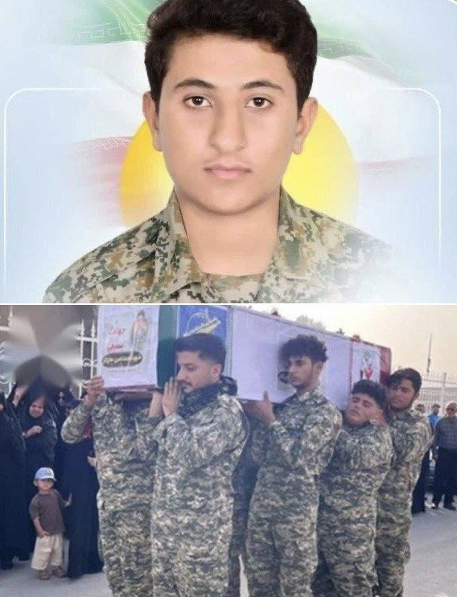

🔴محمد‌امین صابرکار، ۱۶ ساله، در جریان آموزش‌های نظامی، در بخش بردخون شهرستان دیر بر اثر شلیک خودی کشته شد.

@IranianMinds

## IranianMinds — post 20238

  <a href="telegram/content/IranianMinds_20238_1778940156.mp4" target="_blank">🎬 Download video</a>

🔴ویدئویی که ارتش آمریکا از عملیات ترور ابوبلال المینوکی نفر دوم داعش در نیجریه، منتشر کرد.

@IranianMinds

## IranianMinds — post 20237

🔴ایرنا:

سید محسن نقوی وزیر کشور پاکستان برای دیدار با مسؤولان جمهوری اسلامی، ساعاتی قبل وارد تهران شد.

@IranianMinds

## IranianMinds — post 20236

  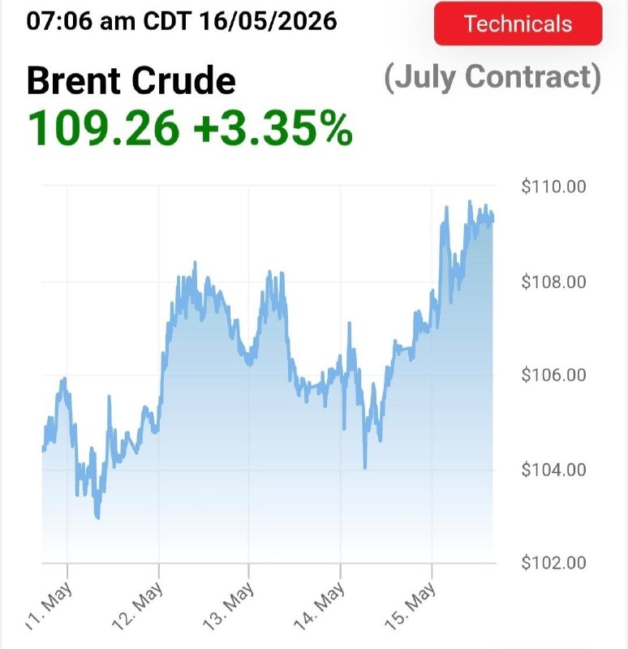

🔴 آخرین قیمت نفت:
۱۰۹.۲۶ دلار

@IranianMinds

## BBCPersian — post 281220

🔻هشدار مقام‌های ایران به آمریکا و کشورهای منطقه درباره احتمال آغاز مجدد جنگ

برخی از مقام‌های جمهوری اسلامی ایران امروز درباره احتمال آغاز مجدد جنگ، به آمریکا و کشورهای منطقه هشدار دادند.

محمد مخبر، مشاور رهبر جمهوری اسلامی ایران با اشاره به حملات متقابل ایران به برخی از کشورهای منطقه در جریان جنگ اخیر گفته است «پاسخ جمهوری اسلامی به سنگرهای استیجاری سنتکام (فرماندهی مرکزی آمریکا) در جنگ اخیر تمام‌عیار نبود اما قطعا این خویشتنداری همیشگی نیست.»

آقای مخبر گفته است «ایران سال‌ها به چشم دوست و برادر به آنها نگاه کرد ولی آنها با پیش‌فروش استقلال خود، حتی خاک و خانه‌هایشان را در اختیار دشمنان فلسطین و ایران قرار دادند.»

نورنیوز، رسانه نزدیک به دبیرخانه شورای عالی امنیت ملی ایران هم به نقل از «یک مقام ارشد نظامی» که نامش آورده نشد، هشدار داده است که در صورت حمله مجدد به ایران «اهدافی که در جریان جنگ ۴۰ روزه، بنا بر ملاحظاتی مورد اصابت قرار نگرفتند، این‌بار در اولویت عملیاتی قرار گرفته‌اند.»

https://bbc.in/4uytDuB
@BBCPersian

## BBCPersian — post 281219

  <a href="telegram/content/BBCPersian_281219_1778940160.mp4" target="_blank">🎬 Download video</a>

⭕️ سرخط خبرها، شنبه ۲۶ اردیبهشت ۱۴۰۵
@BBCPersian

## BBCPersian — post 281218

هزاران مامور پلیس در لندن مستقر شده‌اند تا دو راهپیمایی بزرگ با گرایش‌های مخالف هم را مدیریت کنند؛ تظاهرات طرفداران فلسطینیان و راهپیمایی‌ای که تامی رابینسون، فعال راست افراطی ضد اسلام سازماندهی کرده است.

قرار است مقامات منطقه حائلی را برای جدا کردن راهپیمایی‌های این دو گروه ایجاد کنند؛ همچنین از دوربین‌های تشخیص چهره برای ردیابی مظنونان استفاده خواهد شد و دادستان‌ها به پلیس توصیه کرده‌اند که شعارها را زیر نظر داشته باشند تا در صورت نقض قوانین مربوط به جرایم مبتنی بر نفرت‌پراکنی، مداخله کند.

پرهام قبادی، خبرنگار بی‌بی‌سی از محل تظاهرات توضیحات بیشتری می‌دهد.
@BBCPersian

## BBCPersian — post 281217

🔺استقرار هزاران مامور پلیس در لندن برای مدیریت دو تظاهرات بزرگ با گرایش‌های مخالف

هزاران مامور پلیس در لندن مستقر شده‌اند تا دو راهپیمایی بزرگ با گرایش‌های مخالف هم را مدیریت کنند؛ تظاهرات طرفداران فلسطینیان و راهپیمایی‌ای که تامی رابینسون، فعال راست افراطی ضد اسلام سازماندهی کرده است.

پلیس لندن می‌گوید که امروز با یکی از مهم‌ترین عملیات‌‌های خود در سال‌های اخیر روبرو است.

قرار است مقامات منطقه حائلی را برای جدا کردن راهپیمایی‌های این دو گروه ایجاد کنند؛ همچنین از دوربین‌های تشخیص چهره برای ردیابی مظنونان استفاده خواهد شد و دادستان‌ها به پلیس توصیه کرده‌اند که شعارها را زیر نظر داشته باشند تا در صورت نقض قوانین مربوط به جرایم مبتنی بر نفرت‌پراکنی، مداخله کند.

پیش از این رویدادها، ورود یازده سخنران برجسته راست افراطی به بریتانیا ممنوع شده است.

دولت اعلام کرده است که از ورود یازده «آشوبگر راست افراطی» خارجی به کشور برای شرکت در تجمعی که توسط تامی رابینسون، فعال ضد اسلام، سازماندهی شده بود، جلوگیری شده است.

https://bbc.in/4nuSJrc
@BBCPersian

## BBCPersian — post 281215

🔻ایرنا: وزیر کشور پاکستان در یک سفر از پیش اعلام نشده در تهران است

خبرگزاری رسمی ایرنا گزارش داده است که وزیر کشور پاکستان «در یک سفر از پیش اعلام نشده» در تهران است.

ایرنا از قول منابع خود خبر داده است که محسن نقوی ساعاتی پیش وارد تهران شده و قرار است با برخی از مقام‌های جمهوری اسلامی ایران دیدار کند.

پاکستان میانجی آتش‌بس کنونی بین ایران و آمریکاست و یک بار هم میزبان مقام‌های ارشد ایرانی و آمریکایی برای مذاکرات صلح شده که تاکنون بی‌نتیجه مانده است.

وزیر کشور پاکستان یک ماه پیش همراه عاصم منیر، فرمانده ارتش این کشور به ایران سفر کرده بود.

پاکستان یک روز پیش اعلام کرده بود که روند بازگرداندن بیست ملوان ایرانی و یازده پاکستانی که پس از توقیف کشتی آنان توسط آمریکا در آب‌های سنگاپور بودند در جریان است و وعده داده بود که همه آنها از تایلند به اسلام‌آباد منتقل می‌شوند.

https://bbc.in/4nzZJmQ
@BBCPersian

## Dirty_Kids — post 389557

  <a href="telegram/content/Dirty_Kids_389557_1778940162.mp4" target="_blank">🎬 Download video</a>

اطلاعات داره کم‌کم رو می‌شه. به خامنه‌ای گفته بودند جنگ نمی‌شه از لونه بیا بیرون که یک دفعه با یه تق... به هلاکت می‌رسه
گوش کنید حتما

@Dirty_Kids 👻

## Dirty_Kids — post 389556

  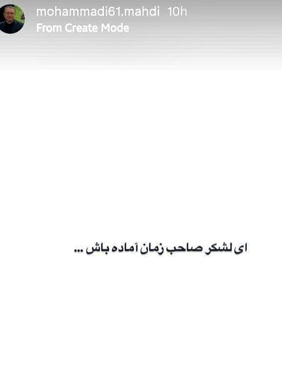

استوری جدید مشاور قالیباف :

ای لشکر صاحب زمان آماده باش...

@Dirty_Kids 👻

## Dirty_Kids — post 389555

  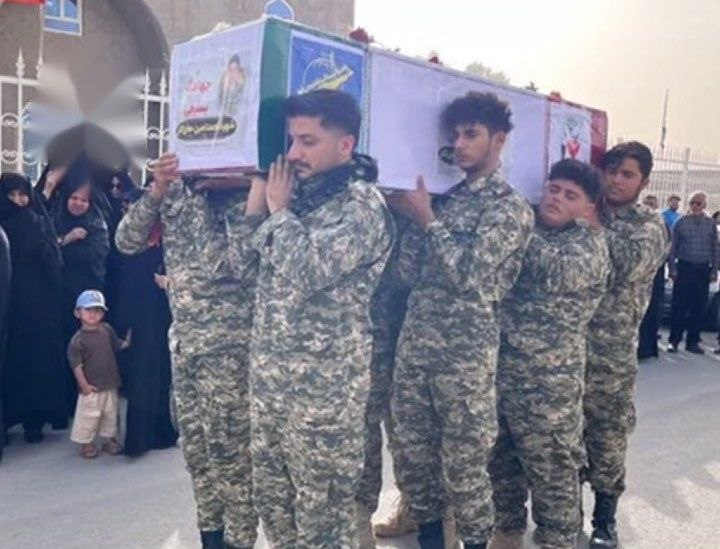

🔴 سپاه یه فراخوان داد که افراد بالای 12 سال به عنوان رزمنده بیان دوره فعالیت دفاعی ببینن. یه دانش آموز 16 ساله به اسم محمدامین صابرکار میره توی دوره آموزشی شرکت کنه که در حین آموزش بر اثر شلیک خودی کشته میشه!

@Dirty_Kids 👻

## Dirty_Kids — post 389554

  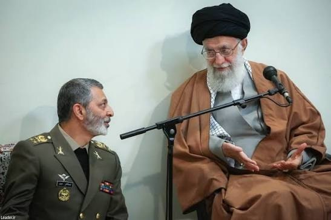

تراپی @Dirty_Kids 👻

## Hranews — post 112970

بازداشت یک شهروند در تهران به دلیل انتشار مطالبی در فضای مجازی

❗️
❗️
❗️
❗️
❗️– پلیس فتا تهران بزرگ از بازداشت یک شهروند به دلیل آنچه «انتشار اخبار نادرست در فضای مجازی» عنوان شده، خبر داد.

ادامه مطلب

↘️
@hranews_bot تماس ✉️ - @Hranews کانال هرانا 🆑

## manototv — post 105516

  <a href="telegram/content/manototv_105516_1778940165.mp4" target="_blank">🎬 Download video</a>

سوییس، تجمع مقابل سفارت جمهوری اسلامی، ۲۶ اردیبهشت ۱۴۰۵

## manototv — post 105515

  <a href="telegram/content/manototv_105515_1778940166.mp4" target="_blank">🎬 Download video</a>

لندن، حضور ایرانیان با پرچم بریتانیا و شیر و خوشید و تصاویر شاهزاده رضا پهلوی در راهپیمایی ملی‌گرایان بریتانیا، ۲۶ اردیبهشت ۱۴۰۵

## manototv — post 105514

  <a href="telegram/content/manototv_105514_1778940168.mp4" target="_blank">🎬 Download video</a>

فرماندهی آفریقای ارتش آمریکا تصاویری از هدف قرار دادن مواضع داعش در نیجریه را منتشر کرده است. آفریکام گفته است عملیات شامگاه گذشته، حضور قابل توجهی از نیروهای داعش را هدف گرفت و به کشته شدن چند فرد مهم این گروه منجر شد.

شمال شرق نیجریه سال‌هاست صحنه فعالیت گروه‌های جهادی، از جمله شاخه غرب آفریقای داعش و بوکوحرام است. مرکز ملی مبارزه با تروریسم آمریکا می‌گوید شاخه غرب آفریقای داعش یکی از بزرگ‌ترین و مرگبارترین شاخه‌های این گروه است و در نیجریه و کشورهای همسایه باعث کشته یا آواره شدن هزاران نفر شده است.

## alonews — post 120395

  <a href="telegram/content/alonews_120395_1778940169.mp4" target="_blank">🎬 Download video</a>

⭕️به گواهی تاریخی هاشمی رفسنجانی، خون کودکان میناب و تمام قربانیان جنگ ایران و آمریکا به گردن علی خامنه‌ای است.

🔴هاشمی رفسنجانی: «نظرم آن بود که باید مسائل با آمریکا را حل کنیم. با آقای خامنه‌ای یکی دو ساعت بحث کردیم، ولی به نتیجه نرسیدیم.

🔴من گفتم: ما حرف دیگری به شما نمی‌توانیم بزنیم، فقط مساله‌ی ما هست و خدا؛ بالاخره روز قیامت از ما می‌پرسند این همه ضرری که این طرف (به مردم ایران) هست، اگر این‌ها را شما به عهده می‌گیرید من دیگر حرفی ندارم.»

🔴علی خامنه‌ای گفت: «بله جواب خدا با من».

✅@AloNews

## alonews — post 120393

  <a href="telegram/content/alonews_120393_1778940171.webm" target="_blank">🎬 Download video</a>

👈حمله‌ی‌ نیروی هوایی اسرائیل به المنصوری، جنوب لبنان

✅ @AloNews خبر جنگ

## alonews — post 120392

  <a href="telegram/content/alonews_120392_1778940172.webm" target="_blank">🎬 Download video</a>

👈فرماندهی مرکزی ایالات متحده:
تا امروز، ۷۸ کشتی تجاری تغییر مسیر داده‌اند و ۴ کشتی غیرفعال شده‌اند تا اطمینان حاصل شود که قوانین محاصره رعایت می‌شوند.

✅ @AloNews خبر جنگ

## alonews — post 120391

  <a href="telegram/content/alonews_120391_1778940172.mp4" target="_blank">🎬 Download video</a>

👈عارف: ما از حق حاکمیت خود در تنگه هرمز گذشته بودیم و اجازه دادیم از تنگه‌ای که متعلق به ایران است تجهیزات نظامی که قرار بود علیه ما استفاده کنند، عبور دهند؛ دیگر این کار را نمی‌کنیم

✅ @AloNews خبر جنگ

## alonews — post 120390

  <a href="telegram/content/alonews_120390_1778940174.mp4" target="_blank">🎬 Download video</a>

👈دفتر ریاست جمهوری تایوان:

جمهوری چین یک کشور دموکراتیک مستقل و دارای حاکمیت است.

پکن هیچ حقی برای ادعا نسبت به تایوان ندارد.

✅ @AloNews خبر جنگ

## alonews — post 120389

  <a href="telegram/content/alonews_120389_1778940176.webm" target="_blank">🎬 Download video</a>

👈رسانه‌های رسمی ایران: کشورهای اروپایی در حال گفتگو با تهران درباره تنگه هرمز هستند

✅ @AloNews خبر جنگ

## alonews — post 120388

  <a href="telegram/content/alonews_120388_1778940176.mp4" target="_blank">🎬 Download video</a>

فیلم تهران کنارت، جدیدترین فیلمیه که بعد از جنگ توی سینماها اکران شده

حجاب به طرز قابل توجهی کنار رفته و در تیزر رسمی فیلم، خواننده زن یعنی سوگند داره میخونه!

[@AloTweet]

## alonews — post 120385

  <a href="telegram/content/alonews_120385_1778940178.webm" target="_blank">🎬 Download video</a>

⭕️شب گذشته در بسیاری از برنامه های صداوسیما، مجریان با تفنگ حاضر شدند.

🔴نظرتون رو در کامنت حتما بگید

✅@AloNews

## alonews — post 120384

  <a href="telegram/content/alonews_120384_1778940179.webm" target="_blank">🎬 Download video</a>

👈منابع رسمی پاکستانی به الحدث: اسلام‌آباد به دنبال قانع کردن تهران و واشنگتن به «انعطاف» در مذاکره است.

🔴اسلام‌آباد به دنبال ادامه روند میانجی‌گری با تمام «جدیّت» است.

✅ @AloNews خبر جنگ

## alonews — post 120383

  <a href="telegram/content/alonews_120383_1778940179.webm" target="_blank">🎬 Download video</a>

👈قطعی اینترنت وارد روز ۷۸ام شد

✅ @AloNews خبر جنگ

## alonews — post 120382

  <a href="telegram/content/alonews_120382_1778940179.mp4" target="_blank">🎬 Download video</a>

👈ویدیو منتشرشده توسط ارتش آمریکا از عملیات کشتن ابوبلال المینوکی، نفر دوم داعش در نیجریه

✅ @AloNews خبر جنگ

## alonews — post 120381

  <a href="telegram/content/alonews_120381_1778940181.mp4" target="_blank">🎬 Download video</a>

👈از عجایب روزگار اینه تو مراسم بزرگداشت فردوسی نوحه پخش کردن

✅ @AloNews خبر جنگ

## alonews — post 120380

  <a href="telegram/content/alonews_120380_1778940184.mp4" target="_blank">🎬 Download video</a>

👈شلیک رگباری در پخش مستقیم صداسیما

✅ @AloNews خبر جنگ

## alonews — post 120379

  <a href="telegram/content/alonews_120379_1778940185.webm" target="_blank">🎬 Download video</a>

👈اردوغان:
مطالبات ما روشن است. ما اف-۳۵ ها را می‌خواهیم

🔴همکاران ما به تماس‌های خود با همتایان آمریکایی‌شان ادامه می‌دهند و امیدواریم نتیجه مثبتی به دست آوریم.

✅ @AloNews خبر جنگ

---
📅 بروزرسانی: 1405/02/26 15:44
---

## VahidOOnLine — post 240470

  <a href="telegram/content/VahidOOnLine_240470_1778933689.mp4" target="_blank">🎬 Download video</a>

«تجمع ایرانیان در سیدنی استرالیا»
‌🏁 🇬🇧 ManotoTV

🤖 @VahidOOnLine

## VahidOOnLine — post 240469

  <a href="telegram/content/VahidOOnLine_240469_1778933691.mp4" target="_blank">🎬 Download video</a>

یک شهروند در پیامی به ایران اینترنشنال درباره بحران سوخت می‌گوید که در مشهد بعد از مراجعه به چند جایگاه نهایتا بعد از یک ساعت انتظار توانست با کارت سه‌هزار تومانی ۱۵ لیتر بزنین بزند. پیام مخاطب با هوش مصنوعی خوانده شده است.
‌🏁 🇬🇧 IranintlTV

🤖 @VahidOOnLine

## VahidOOnLine — post 240468

  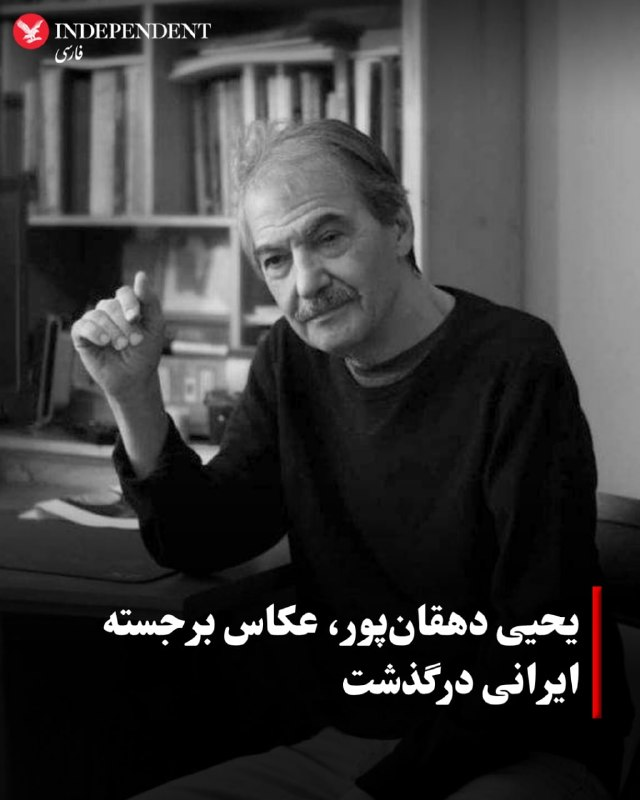

♦️یحیی دهقان‌پور، عکاس برجسته، مدرس باسابقه عکاسی و یکی از چهره‌های تاثیرگذار عکاسی معاصر ایران، روز جمعه ۲۵ اردیبهشت‌ماه در سن ۸۶ سالگی درگذشت.
دهقان‌پور متولد سال ۱۳۱۹ در تهران بود و فعالیت حرفه‌ای و آموزشی او، نقش مهمی در تربیت نسل‌های مختلف عکاسان ایرانی داشت. او تدریس عکاسی را از سال ۱۳۵۷ و همزمان با فعالیت در مدرسه عالی تلویزیون آغاز کرد و طی بیش از سه دهه، در دانشگاه‌ها و مراکز آموزشی مختلف به تدریس این رشته پرداخت.
این عکاس پیشکسوت علاوه بر فعالیت آموزشی، نمایشگاه‌های انفرادی متعددی برگزار کرد و آثارش در نمایشگاه‌های گروهی بسیاری به نمایش درآمد. از ماندگارترین تصاویر او، مجموعه عکس‌های مراسم تشییع پیکر فروغ فرخزاد در گورستان ظهیرالدوله تهران است؛ تصاویری تاریخی که در ۲۵ بهمن ۱۳۴۵ و زمانی که دهقان‌پور تنها ۲۶ سال داشت، با دوربین مدیوم‌فرمت ثبت شدند.
او سال‌ها بعد این مجموعه را در نمایشگاهی با عنوان «آن روز فروغ را در باغچه کاشتند» ارائه کرد؛ مجموعه‌ای که به یکی از روایت‌های تصویری مهم از بدرقه فروغ فرخزاد تبدیل شد.
‌🇸🇦 Indypersian

🤖 @VahidOOnLine

## VahidOOnLine — post 240467

  <a href="telegram/content/VahidOOnLine_240467_1778933693.mp4" target="_blank">🎬 Download video</a>

«تجمع ایرانیان در بریزبن استرالیا»
‌🏁 🇬🇧 ManotoTV

🤖 @VahidOOnLine

## VahidOOnLine — post 240466

  <a href="telegram/content/VahidOOnLine_240466_1778933694.mp4" target="_blank">🎬 Download video</a>

⭕️ دست‌کم ۸ کشته در برخورد مرگبار قطار و اتوبوس در بانکوک

♦️برخورد مرگبار قطار با یک اتوبوس شهری در بانکوک، پایتخت تایلند، دست‌کم ۸ کشته و ۲۵ زخمی برجای گذاشت.
ویدیوهای منتشرشده توسط شاهدان عینی، ستون‌های دود غلیظ را در محل حادثه نشان می‌دهد، جایی که پس از برخورد قطار با وسایل نقلیه، یک اتوبوس عمومی دچار حریق شد و شعله‌های آتش به خودروها و موتورسیکلت‌های اطراف نیز سرایت کرد.
تیم‌های امداد و آتش‌نشانی بلافاصله به محل اعزام شدند و عملیات نجات و انتقال مجروحان را آغاز کردند.
‌🇸🇦 Indypersian

🤖 @VahidOOnLine

## VahidOOnLine — post 240465

ویدیوی رسیده به ایران اینترنشنال نشان می‌دهد ایرانیان روز شنبه در تجمعی که به فراخوان تامی رابینسون،‌ فعال راست‌گرای بریتانیا،‌ در لندن برگزار شده حاضر شده و پرچم شیروخورشید به دست گرفتند.
‌🏁 🇬🇧 IranintlTV

🤖 @VahidOOnLine

## VahidOOnLine — post 240464

  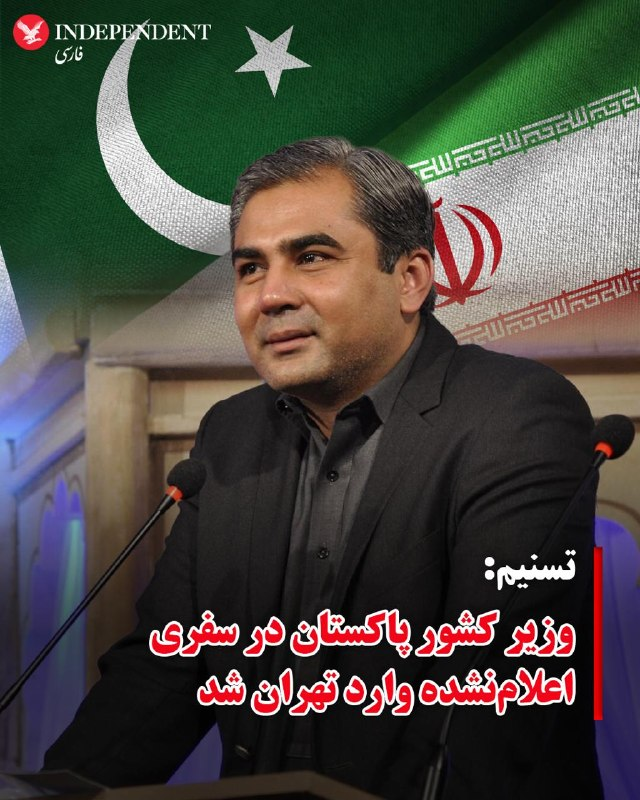

♦️خبرگزاری تسنیم، روز شنبه ۲۶ اردیبهشت ماه، به مقل از منابع آگاه از سفر سید محسن نقوی، وزیر کشور پاکستان به تهران خبر داد.
به گزارش تسنیم، گفته می‌شود وزیر کشور پاکستان طی این سفر از پیش اعلام نشده قرار است با شماری از مقام‌های جمهوری اسلامی، از جمله وزیر کشور، دیدار کند.
‌🇸🇦 Indypersian

🤖 @VahidOOnLine

## VahidOOnLine — post 240463

روایت شما از زندگی در آتش‌بس- شنبه ۲۶ اردیبهشت ۱۴۰۵

🔹 ابوقراضه‌ای به نام کوییک، سال ۱۴۰۱ قیمتش ۱۷۰ میلیون بود، الان شده یک میلیارد و ۲۷۰ میلیون تومان، در حالی که حقوق کارمند سال ۱۴۰۱ پانزده میلیون بود و الان شده ۳۰ میلیون.
🔹 فقط وصل شدم بگم مرگ بر اصل ولایت فقیه. مرگ بر جمهوری اسلامی، لعنت بر تک‌تک عاملان فساد در ایران‌مون. یه گیگ اینترنت خریدیم ۵۰۰ هزار تومان! خسته شدیم، بزنید، اصلاً هم ما راحت شیم هم اینا برن.
🔹 از نیشابور پیام می‌دیم، نظام فاسد با گرون کردن بنزین منتظر باشه دوباره ملت بریزن تو خیابون ریشه‌شون رو بکنن.
🔹 همه‌چیز سرسام‌آور گرون شده، دارو نیست، بنزین رو می‌خوان سه برابر گرون کنن و آزاد رو سه برابر بیشتر بفروشن. ترامپ زودتر تصمیمتو بگیر، کشتی ما رو با قیمت نفت، ما این‌ها رو نمی‌خواهیم، تحت هیچ شرایطی.
🔹 از تهران پیام می‌دم، من یک دانش‌آموز هستم و ما برای مدرسه‌ای که نرفتیم باید ۱۵۰ میلیون برای مدارس غیردولتی که هیچ کاری برامون نکردن شهریه بدیم. به بی‌بی و ترامپ بگین خیلی حواسشون جمع باشه، تغییر رژیم کار سختیه، باید حمایت زیاد بشیم، خسته شدیم به خدا.
‌🏁 🇬🇧 IranintlTV

🤖 @VahidOOnLine

## VahidOOnLine — post 240462

  

ابراهیم عزیزی، رییس کمیسیون امنیت ملی مجلس، با اشاره به طرح مجلس برای تنگه هرمز نوشت که جمهوری اسلامی سازوکاری برای مدیریت ترافیک این آبراه در مسیر تعیین‌شده تهیه کرده است که به‌زودی رونمایی می‌شود. عزیزی نوشت: «این مسیر کماکان برای عاملان پروژه به اصطلاح آزادی بسته خواهد ماند.»

او در ایکس نوشت: «ایران در چارچوب حق حاکمیت ملی و تضمین امنیت تجارت بین‌الملل، سازوکاری حرفه‌ای برای مدیریت ترافیک تنگه هرمز در مسیر تعیین‌شده تهیه کرده است که به‌زودی رونمایی می‌شود.»

او افزود: «در این فرآیند، فقط کشتی‌های تجاری و طرف‌های همکار با ایران از آن بهره‌مند خواهند شد. حقوق لازم در ازای خدمات تخصصی ارائه‌شده، با این سازوکار برای ایران اخذ می‌شود.»
‌🏁 🇬🇧 IranintlTV

🤖 @VahidOOnLine

## VahidOOnLine — post 240461

  <a href="telegram/content/VahidOOnLine_240461_1778933698.mp4" target="_blank">🎬 Download video</a>

ایرانیان استرالیا روز شنبه در حمایت از انقلاب ملی در بریزبن تجمع کرده و بخش‌هایی از پیام شاهزاده رضا پهلوی را پخش کردند.
‌🏁 🇬🇧 IranintlTV

🤖 @VahidOOnLine

## mwarmonitor — post 9153

  <a href="telegram/content/mwarmonitor_9153_1778933699.mp4" target="_blank">🎬 Download video</a>

🔴اختصاصی ‌CNN از پل ویران‌شده کرج در ایران بازدید می‌کند؛ هم‌زمان با تجدید تهدیدها از سوی دونالد ترامپ.

@mwarmonitor

## mwarmonitor — post 9152

🇺🇸امشب با دستور من، نیروهای شجاع آمریکایی و نیروهای مسلح نیجریه، ماموریتی به‌دقت برنامه‌ریزی‌شده و بسیار پیچیده را برای حذف فعال‌ترین تروریست جهان از صحنه نبرد، به‌طور بی‌نقصی اجرا کردند. «ابوبلال المینوکی»، شخص دوم در فرماندهی جهانی داعش، فکر می‌کرد که می‌تواند…

## farsi_fox_news — post 89363

  <a href="telegram/content/farsi_fox_news_89363_1778933701.mp4" target="_blank">🎬 Download video</a>

♦️ توقیف نفتکش متخلف در تنگه هرمز

🔹 محمولۀ ۴۵۰ هزار بشکه‌ای نفتکش متخلف به مخازن ساحلی استان هرمزگان بازگردانده شد.
🌐 @farsi_fox_news

## FoxNewsTwitter — post 341809

  <a href="telegram/content/FoxNewsTwitter_341809_1778933703.mp4" target="_blank">🎬 Download video</a>

Fox News (Twitter/X)

Empty Waymo cars swarm an Atlanta neighborhood, repeatedly circling cul-de-sacs and leaving residents frustrated and confused.

One local estimated nearly 50 self-driving cars rolled through the area in a single morning, with several clogging the road as they struggled to maneuver around one another.

Waymo said it had “already addressed this routing behavior.”

## FoxNewsTwitter — post 341808

  <a href="telegram/content/FoxNewsTwitter_341808_1778933704.mp4" target="_blank">🎬 Download video</a>

Fox News (Twitter/X)

Bodycam video captures the terrifying moment officials say a Florida deputy was attacked almost instantly after arriving on-scene.

Marion County Sheriff's Office Deputy Robert Fitch had just stopped to investigate a suspicious-person call on a residential street in Ocala, Florida on May 13. After exiting his vehicle, a man lunges at him and Fitch falls to the ground.

Fitch was stabbed several times in his bulletproof vest, suffering minor injuries, before the man fled into the woods, officials say.

The suspect, Heriberto Medina Marquez, was apprehended a short time later and reportedly faces charges of attempted murder of a law enforcement officer.

## pm_afshaa — post 90846

  <a href="telegram/content/pm_afshaa_90846_1778933706.webm" target="_blank">🎬 Download video</a>

🔴ایسنا: وزیر کشور پاکستان برای دیدار با مسئولان جمهوری اسلامی ساعاتی قبل به تهران سفر کرده.

💧 Rainbet.com the #1 Non-KYC Crypto Casino & Sportsbook @rainbetcom

😁 @Pm_Afshaa

## pm_afshaa — post 90845

  <a href="telegram/content/pm_afshaa_90845_1778933706.webm" target="_blank">🎬 Download video</a>

🔴کانال 12 اسرائیل: برآورد اسرائیل نشون میده تصمیم برای اقدام نظامی بسیار زود گرفته میشه. ترامپ طی 24 ساعت آینده جلسه‌ای با تیم نزدیک خود برای تصمیم‌گیری نهایی درباره ایران برگزار خواهد کرد.

به گفته یک مقام ارشد اسرائیلی، ازسرگیری درگیری نزدیکه و اسرائیل خودش رو برای چند روز تا چند هفته جنگ آماده میکنه.

💧 Rainbet.com the #1 Non-KYC Crypto Casino & Sportsbook @rainbetcom

😁 @Pm_Afshaa

## iaghapour — post 2615

  

⭕️ آموزش نصب ساده و آفلاین 3X-UI روی سرور ایران + SSL (+ معرفی قابلیت های جدید)

🔹در این ویدیو به سراغ یکی از بزرگترین چالش‌های این روزها رفتیم: نصب پنل 3X-UI روی سرورهای ایران همراه با سرتیفیکیت به صورت کاملاً آفلاین و بدون نیاز به اینترنت آزاد! همینطور سعی کردیم یک معرفی ساده از قابلیت های جدید این پنل داشته باشیم.

🔗 لینک ویدیو در یوتیوب

🔗 دانلود ویدیو با لینک مستقیم (بزودی)

#آموزش #فیلترشکن #پنل #xui #3xui
برای دور زدن فیلترینگ و آموزش تکنولوژی و هوش مصنوعی ما رو دنبال کنید 💚
🆔@iaghapour

## DEJradio — post 4666

  <a href="telegram/content/DEJradio_4666_1778933707.webm" target="_blank">🎬 Download video</a>

🔺📢 اسکات بسنت وزیرخزانه‌داری آمریکا:
رژیم ایران دستمزد سربازایش را هم نمی‌تواند پرداخت کند

‏اسکات بسنت وزیرخزانه‌داری آمریکا
در مصاحبه با سی‌ان‌بی‌سی درباره جمهوری اسلامی گفت، فقط تا اینجای امسال، آن‌ها سی تا چهل هزار تن را اعدام کرده‌اند؛ خیلی از آن‌ها هم معترضان مسالمت‌آمیز بوده‌اند. خب، با چنین رژیمی چطور باید برخورد کرد؟

او افزود: باید از نظر اقتصادی حکومت ایران را تحت فشار گذاشت و ما معتقدیم به جایی رسیده‌اند که حتی دستمزد سربازهایشان هم پرداخت نمی‌شود.
دیگر نمی‌توانند ذخایر تسلیحاتی‌شان را از خارج تأمین کنند. بنابراین فکر می‌کنم در آخرین نفس‌هایشان هستند.

#نیروهای_مسلح #جنگ
@DEJradio

## IranIntlTV — post 337467

  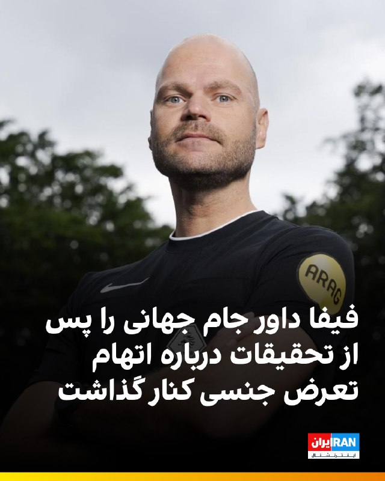

🔻فدراسیون جهانی فوتبال، فیفا، نام راب دیپرینک، داور هلندی حاضر در فهرست داوران جام جهانی ۲۰۲۶، را پس از بازداشت او توسط پلیس متروپولیتن بریتانیا در ماه گذشته میلادی، از فهرست رسمی داوران این رقابت‌ها حذف کرد.

🔹به نوشته سایت اتلتیک، دیپرینک که به‌عنوان داور VAR برای جام جهانی آمریکا، کانادا و مکزیک امسال انتخاب شده بود، پس از مطرح شدن اتهام تعرض جنسی به یک پسر نوجوان در لندن بازداشت شده بود.

🔹با این حال، دیپرینک اعلام کرده که پلیس متروپولیتن پرونده را مختومه کرده و هیچ اتهامی علیه او مطرح نخواهد شد. سخنگوی پلیس متروپولیتن نیز به اتلتیک گفته که شواهد و مدارک به اندازه کافی علیه او وجود نداشته است و در نتیجه «اقدام بیشتری انجام نخواهد شد».

🔹فیفا در بیانیه‌ای به اتلتیک اعلام کرد: «فیفا تأیید می‌کند که راب دیپرینک از فهرست داوران جام جهانی حذف شده است.»

🔹در بیانیه‌ای از سوی فدراسیون فوتبال هلند (KNVB)، از این داور حمایت شده است.

🔹با وجود مختومه شدن پرونده، منابع آگاه به اتلتیک گفته‌اند انتظار می‌رود فیفا ویلی دلاژو، داور فرانسوی، را جایگزین دیپرینک کند.

🔹گزارش کامل را در سایت بخوانید
@iranintltvsport

## IranIntlTV — post 337466

  <a href="telegram/content/IranIntlTV_337466_1778933708.mp4" target="_blank">🎬 Download video</a>

یک شهروند در پیامی به ایران اینترنشنال درباره بحران سوخت می‌گوید که در مشهد بعد از مراجعه به چند جایگاه نهایتا بعد از یک ساعت انتظار توانست با کارت سه‌هزار تومانی ۱۵ لیتر بزنین بزند. پیام مخاطب با هوش مصنوعی خوانده شده است.

## IranIntlTV — post 337465

  <a href="telegram/content/IranIntlTV_337465_1778933709.mp4" target="_blank">🎬 Download video</a>

مهتاب قلی‌زاده، روزنامه‌نگار اقتصادی، درباره تورم بهای خوراکی‌ها در ایران گفت نرخ ارز تاثیر شدیدی بر قیمت مواد غذایی دارد. او افزود: «برخلاف تصویری از خودکفایی که سال‌ها برای آن تبلیغ شده، ساختار تولید مواد غذایی در ایران به‌طور کامل داخلی نیست.»
@iranintltv

## IranIntlTV — post 337464

ویدیوی رسیده به ایران اینترنشنال نشان می‌دهد ایرانیان روز شنبه در تجمعی که به فراخوان تامی رابینسون،‌ فعال راست‌گرای بریتانیا،‌ در لندن برگزار شده حاضر شده و پرچم شیروخورشید به دست گرفتند.

## IranIntlTV — post 337463

روایت شما از زندگی در آتش‌بس- شنبه ۲۶ اردیبهشت ۱۴۰۵

🔹 ابوقراضه‌ای به نام کوییک، سال ۱۴۰۱ قیمتش ۱۷۰ میلیون بود، الان شده یک میلیارد و ۲۷۰ میلیون تومان، در حالی که حقوق کارمند سال ۱۴۰۱ پانزده میلیون بود و الان شده ۳۰ میلیون.
🔹 فقط وصل شدم بگم مرگ بر اصل ولایت فقیه. مرگ بر جمهوری اسلامی، لعنت بر تک‌تک عاملان فساد در ایران‌مون. یه گیگ اینترنت خریدیم ۵۰۰ هزار تومان! خسته شدیم، بزنید، اصلاً هم ما راحت شیم هم اینا برن.
🔹 از نیشابور پیام می‌دیم، نظام فاسد با گرون کردن بنزین منتظر باشه دوباره ملت بریزن تو خیابون ریشه‌شون رو بکنن.
🔹 همه‌چیز سرسام‌آور گرون شده، دارو نیست، بنزین رو می‌خوان سه برابر گرون کنن و آزاد رو سه برابر بیشتر بفروشن. ترامپ زودتر تصمیمتو بگیر، کشتی ما رو با قیمت نفت، ما این‌ها رو نمی‌خواهیم، تحت هیچ شرایطی.
🔹 از تهران پیام می‌دم، من یک دانش‌آموز هستم و ما برای مدرسه‌ای که نرفتیم باید ۱۵۰ میلیون برای مدارس غیردولتی که هیچ کاری برامون نکردن شهریه بدیم. به بی‌بی و ترامپ بگین خیلی حواسشون جمع باشه، تغییر رژیم کار سختیه، باید حمایت زیاد بشیم، خسته شدیم به خدا.

## IranIntlTV — post 337462

  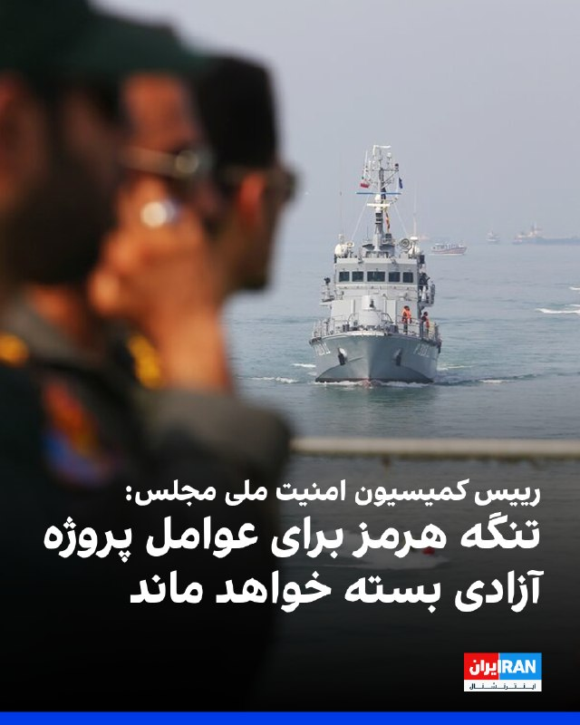

ابراهیم عزیزی، رییس کمیسیون امنیت ملی مجلس، با اشاره به طرح مجلس برای تنگه هرمز نوشت که جمهوری اسلامی سازوکاری برای مدیریت ترافیک این آبراه در مسیر تعیین‌شده تهیه کرده است که به‌زودی رونمایی می‌شود. عزیزی نوشت: «این مسیر کماکان برای عاملان پروژه به اصطلاح آزادی بسته خواهد ماند.»

او در ایکس نوشت: «ایران در چارچوب حق حاکمیت ملی و تضمین امنیت تجارت بین‌الملل، سازوکاری حرفه‌ای برای مدیریت ترافیک تنگه هرمز در مسیر تعیین‌شده تهیه کرده است که به‌زودی رونمایی می‌شود.»

او افزود: «در این فرآیند، فقط کشتی‌های تجاری و طرف‌های همکار با ایران از آن بهره‌مند خواهند شد. حقوق لازم در ازای خدمات تخصصی ارائه‌شده، با این سازوکار برای ایران اخذ می‌شود.»
https://iranintl.com/202605164109

## IranIntlTV — post 337461

  <a href="telegram/content/IranIntlTV_337461_1778933711.mp4" target="_blank">🎬 Download video</a>

ایرانیان استرالیا روز شنبه در حمایت از انقلاب ملی در بریزبن تجمع کرده و بخش‌هایی از پیام شاهزاده رضا پهلوی را پخش کردند.

## IranIntlTV — post 337460

  <a href="telegram/content/IranIntlTV_337460_1778933713.mp4" target="_blank">🎬 Download video</a>

مروری بر روزنامه‌های ایران، شنبه ۲۶ اردیبهشت، با مجتبی هاشمی، روزنامه‌نگار
@iranintltv

## ManotoTV — post 105513

  <a href="telegram/content/ManotoTV_105513_1778933715.mp4" target="_blank">🎬 Download video</a>

«تجمع ایرانیان در سیدنی استرالیا»

## ManotoTV — post 105512

  <a href="telegram/content/ManotoTV_105512_1778933716.mp4" target="_blank">🎬 Download video</a>

«تجمع ایرانیان در بریزبن استرالیا»

## FarsiVOA — post 217888

🔺اسرائیل کشته‌شدن «مانع اصلی اجرای طرح صلح ترامپ در غزه» را تأیید کرد

▪️ارتش اسرائیل کشته‌شدن عزالدین حداد، رهبر حماس در نوار غزه و رئیس شاخه نظامی این گروه، را در حمله هوایی به شهر غزه تأیید کرد. هم‌زمان، یک مقام ارشد اسرائیلی گفت حداد از موانع اصلی اجرای طرح ۲۰ ماده‌ای دونالد ترامپ برای پایان جنگ غزه بوده؛ طرحی که یکی از محورهای اصلی آن خلع سلاح حماس است.

⬇️ بیشتر بخوانید:

https://ir.voanews.com/a/8150664.html/?nocach=1

## FarsiVOA — post 217887

  <a href="telegram/content/FarsiVOA_217887_1778933718.mp4" target="_blank">🎬 Download video</a>

اعتراض گسترده شهروندان ژاپنی علیه ساخت مسجد در شهر فوجیساوا؛

صدها نفر از شهروندان ژاپنی در شهر ساحلی فوجیساوا، در جنوب توکیو، در اعتراض به پروژه ساخت اولین مسجد بزرگ این شهر دست به تجمع زدند.

معترضان نگران تغییر بافت فرهنگی محله و تأثیر آن بر هویت سنتی منطقه هستند. آن‌ها معتقدند مقیاس این مسجد بزرگ‌تر از زیارتگاه‌های شینتو در نزدیکی آن است.

علاوه بر مسائل فرهنگی، نگرانی‌هایی درباره ترافیک، سر و صدا و عدم آشنایی با آداب مذهبی جدید مطرح شده است.

شهرداری فوجیساوا اعلام کرده که این پروژه تمامی استانداردهای قانونی و شهرسازی را رعایت کرده و مجوزهای لازم را دارد، بنابراین روند ساخت از نظر قانونی مانعی ندارد. شهروندان به تجمعات گسترده در مسیر تردد مقامات شهرداری در این شهر ادامه دادند.

شهر فوجیساوا به دلیل قرار گرفتن بین کلانشهر توکیو و مناظر طبیعی و آرام از موقعیت خاصی برخوردار است.

این تنش‌ها در حالی رخ می‌دهد که جمعیت مسلمانان ژاپن در سال‌های اخیر رشد چشمگیری داشته و به بیش از ۴۰۰ هزار نفر رسیده است، موضوعی که بحث‌های گسترده‌ای را درباره نحوه همزیستی و تنوع فرهنگی در این کشور برانگیخته است.
@FarsiVOA

## FarsiVOA — post 217886

🔺وام یک میلیاردی مسکن فقط کفاف خرید ۱۰ متر از یک خانه را می‌دهد

◾️رئیس گروه مالی بانک مسکن، گفته است در شرایط فعلی، تسهیلات یک میلیارد تومانی خرید مسکن فقط امکان خرید حدود ۱۰ متر خانه را فراهم می‌کند.

◾️میانگین قیمت هر متر واحد مسکونی اکنون بین ۱۰۰ تا ۱۵۰ میلیون تومان برآورد شده است؛ یعنی وام یک میلیارد تومانی، حتی اگر کامل پرداخت شود، فقط بخش کوچکی از قیمت یک آپارتمان معمولی را پوشش می‌دهد.

◾️در بازار اجاره نیز هرچند گزارش مرکز آمار از کاهش سرعت رشد اجاره در فروردین حکایت دارد، فشار بر مستأجران همچنان بالاست. طبق گزارش بازنشرشده از داده‌های مرکز آمار، تورم نقطه‌به‌نقطه اجاره در فروردین ۳۱.۱ درصد و تورم سالانه اجاره ۳۳.۷ درصد بوده است.

⬇️ بیشتر بخوانید:
https://ir.voanews.com/a/8150657.html

## DW_Farsi — post 124761

  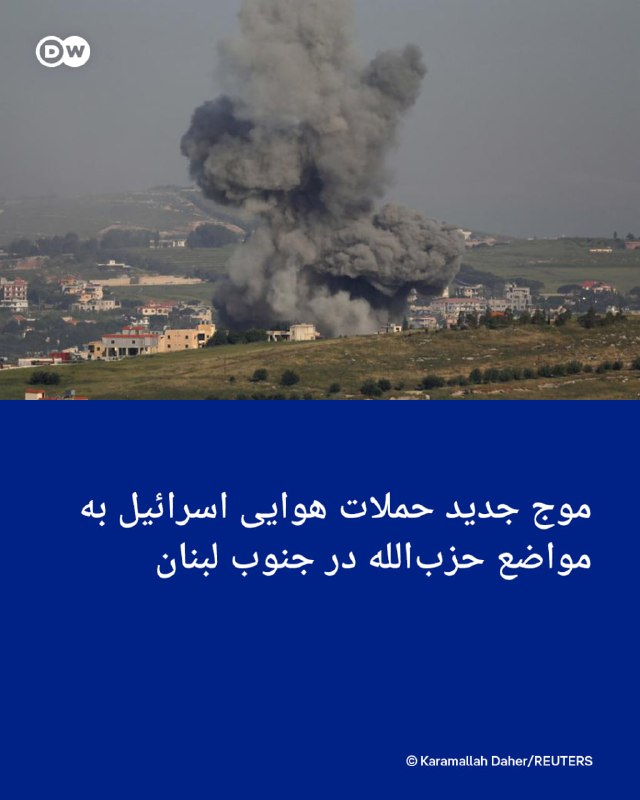

🔶 موج جدید حملات هوایی اسرائیل به مواضع حزب‌الله در جنوب لبنان

ارتش اسرائیل روز شنبه ۲۶ اردیبهشت (۱۶ مه) اعلام کرد موجی از حملات هوایی را علیه زیرساخت‌های حزب‌الله در جنوب لبنان آغاز کرده است.

پیش از این، ارتش به ساکنان ۹ روستا در جنوب لبنان هشدار تخلیه داده بود.

این حملات نخستین عملیات پس از تمدید ۴۵ روزه آتش‌بس در لبنان در شب گذشته محسوب می‌شود.

وزارت خارجه آمریکا روز جمعه ۲۵ اردیبهشت (۱۵ مه) اعلام کرد که اسرائیل و لبنان با میانجی‌گری آمریکا درباره تمدید ۴۵ روزه آتش‌بس به توافق رسیدند.

در مذاکرات آتش‌بس میان دو کشور همسایه، حزب‌الله لبنان حضور ندارد.

لبنان در اوایل ماه مارس به جنگ ایران کشیده شد. در آن زمان، حزب‌الله لبنان در واکنش به کشته‌شدن علی خامنه‌ای، رهبر جمهوری اسلامی موشک‌هایی به سمت اسرائیل شلیک کرد. در پی آن، اسرائیل زیرساخت‌های حزب‌الله را هدف قرار داد.

@dw_farsi

## DW_Farsi — post 124760

🔶 دولت ترامپ اعزام ۴۰۰۰ سرباز آمریکایی به لهستان را متوقف کرد

پس از اعلام خروج بخشی از نیروهای آمریکایی از آلمان، ایالات متحده به شکلی غیرمنتظره برنامه اعزام چهار هزار سرباز به لهستان را لغو کرد.

کریستوفر لانو، رئیس موقت ستاد ارتش ایالات متحده، این تصمیم را در برابر کمیته نیروهای مسلح مجلس نمایندگان آمریکا تأیید کرد.

این مقام بلندپایه ارتش آمریکا، بدون ارائه جزئیات بیشتر، اعلام کرد: «معقول‌ترین تصمیم این بود که این تیپ در منطقه عملیاتی مستقر نشود.»

دموکرات‌ها و جمهوری‌خواهان بلندپایه از این اقدام انتقاد کردند و خشم خود را از این موضوع ابراز داشتند که برخلاف الزامات قانونی، کنگره نه از این تصمیم مطلع شده و نه مورد مشورت قرار گرفته است.

@dw_farsi

## RadioFarda — post 157258

آزادی برای خارجی‌ها، محدودیت برای محلی‌ها؛ ترکمنستان درها را به روی گردشگری می‌گشاید

🔸الیز ویلیامز، گردشگر کانادایی، اندکی پیش از ورودش به ترکمنستان در اوایل سال ۲۰۲۶، از شرکت گردشگری خود هشداری دریافت کرد مبنی بر این‌که در این کشور استبدادی از هتل خود زیاد دور نشود و هنگام تنها بودن در خیابان‌ها از گرفتن عکس خودداری کند.

🔸اما واقعیتی که هنگام ورود با آن مواجه شد بسیار کمتر از حد انتظار محدودکننده بود.

🔸او به رادیو اروپای آزاد/رادیو آزادی می‌گوید: «همان‌طور که از عکس‌هایم می‌توانید ببینید، واضح است که این‌طور نبود [که عکاسی به‌شدت محدود شده باشد]. احساس می‌کردم کاملاً آزادم که در مکان‌های مختلف عکس‌های زیادی بگیرم».

🔸نسخه کامل این گزارش را در وب‌سایت رادیوفردا بخوانید.

@RadioFarda

## RadioFarda — post 157257

  <a href="https://t.me/radiofarda/157257" target="_blank">📎 Download file</a>

📻بشنوید: ساعت ۱۴ با رادیوفردا، ۲۶ اردیبهشت ۱۴۰۵‌

@Radiofarda

## IranianMinds — post 20235

🔴نیویورک‌تایمز:

آمریکا و اسرائیل احتمالأ هفته آینده به ایران حمله خواهند کرد.

بعضی از رسانه‌ها هم احتمال حمله را تا ۲۴ ساعت آینده تخمین می‌زنند.

@IranianMinds

## IranianMinds — post 20234

🔴جسی واترز، مجری فاکس‌نیوز:

ترامپ در حال آماده شدن برای دور جدیدی از حملات به ایران است.

@IranianMinds

## BBCPersian — post 281214

🔺نت‌بلاکس: قطع اینترنت ایران وارد هفته دوازدهم شد

نت‌بلاکس که وضعیت اینترنت در جهان را بررسی می کند، می‌گوید قطعی اینترنت در ایران اکنون وارد دوازدهمین هفته خود شده و به هفتاد و هشتمین روز رسیده است.

قطع اینرنت ایران که برای چهارمین بار به صورت گسترده ادامه دارد از زمان حمله آمریکا و اسرائیل به ایران در نهم اسفند (۲۸ فوریه) آغاز شده و تاکنون ادامه دارد. تماس تلفنی با ایران هم در همین مدت محدود و با اختلال همراه شده است.

نت‌بلاکس می گوید «این قطع اینترنت، که کشوری ۹۰ میلیونی را برای مدتی بی‌سابقه تا حد زیادی از دسترسی آنلاین محروم کرده، همچنان در مقیاسی گسترده به فرسایش حقوق بشر، اقتصاد و آزادی‌های اساسی ادامه می‌دهد.»

ایران هرگونه استفاده از اینترنت ماهواره‌ای همچون استارلینک را هم ممنوع کرده و کاربران آن را تحت تعقیب قرار می‌دهد.

https://bbc.in/496jyMz
@BBCPersian

## BBCPersian — post 281210

🔻حماس و ارتش اسرائیل تأیید کرده‌اند که عزالدین حداد، فرمانده گردان‌های قسام، شاخه نظامی این گروه، شامگاه جمعه در حمله‌ اسرائیل در شهر غزه کشته شده است.

اسرائیل او را یکی از طراحان حملات هفتم اکتبر ۲۰۲۳ خوانده است.

مراسم تشییع عزالدین حداد امروز در شهر غزه برگزار شد.

اعضای خانواده‌ آقای حداد هم در حمله هوایی شبانه اسرائیل کشته شدند.

سازمان‌های امدادی در غزه اعلام کردند که در این حملات دست‌کم هفت نفر کشته و ده‌ها نفر هم زخمی شده‌اند.

اگرچه از ماه اکتبر آتش‌بس در این منطقه برقرار بوده، اما دولت اسرائیل می‌گوید همچنان اختیار هدف قرار دادن اعضای حماس را دارد.
📷 Getty Images

## Dirty_Kids — post 389553

  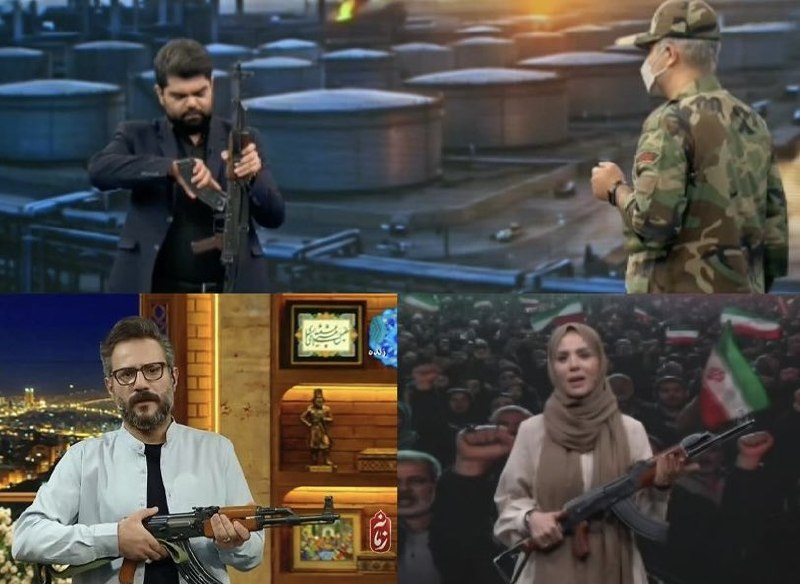

به اونایی که می‌گفتن تو کوله سرباز خارجی آزادی پیدا نمی‌شه بگید مجری‌های صداوسیما واستون اسلحه کشیدن.

@Dirty_Kids 👻

## Dirty_Kids — post 389552

بمونم خونه overthink ميكنم، برم بيرون overpay.

@Dirty_Kids 👻

## Dirty_Kids — post 389551

  <a href="telegram/content/Dirty_Kids_389551_1778933721.mp4" target="_blank">🎬 Download video</a>

مامانم وقتی میگم از عمه خبری نیست:

@Dirty_Kids 👻

## Dirty_Kids — post 389550

  <a href="https://t.me/Dirty_Kids/389550" target="_blank">📎 Download file</a>

✅ اپلیکیشن اندروید سایت جهانی دربی بت

💰اولین سایت جهانی با امکان شارژ و برداشت ریالی(کارت به کارت)

🔗 برای ورود فیلترشکن روی کشور مناسب قرار دهید مانند فنلاند و المان و....

😀Telegram Channel
👇
https://t.me/+bcynkEgSW2dlYTc0

## Dirty_Kids — post 389549

  

😤دنبال یه سایت شرط بندی بین المللی بودی که به ایرانیا خدمات بده؟!
⛔

👍دربی بت همون انتخاب  100%

💎ویژگی های سایت جهانی Derby Bet:

⬅️امکان شارژ امن با کارت بانکی

⬅️واریز اول دوبل شارژ می شوید(بونوس۱۰۰٪)

⬅️پر اپشن ترین سایت فعال در ایران

⬅️تسویه حساب کمتر از 5 دقیقه

⬅️برگشت بخشی از باخت به صورت هفتگی

🚨کد هدیه ثبت نام:GG007

⚠️برای دانلود اپلکیشن کلیک کنید
👉

🔔کانال دربی بت :

🪙https://t.me/+bcynkEgSW2dlYTc0

## Dirty_Kids — post 389548

  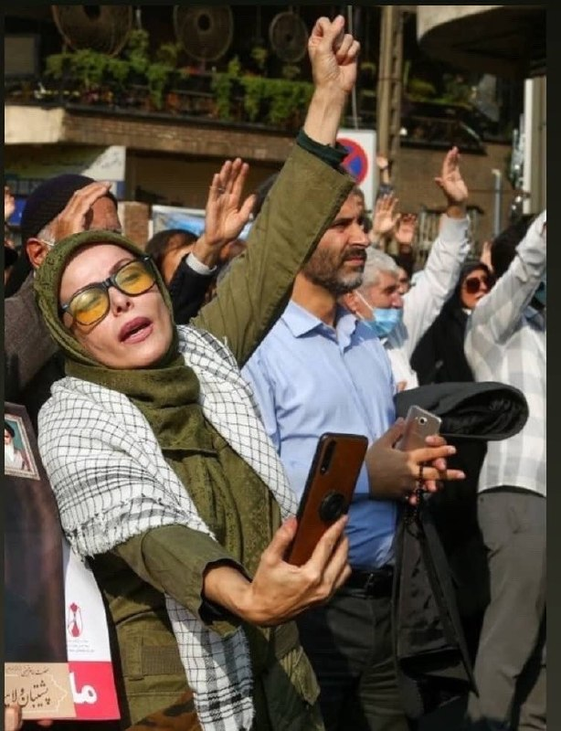

#کص_فدا 😂😂😂😂
فاکتور داره میکنه بره پولشو بگیره

@Dirty_Kids 👻

## Hranews — post 112969

  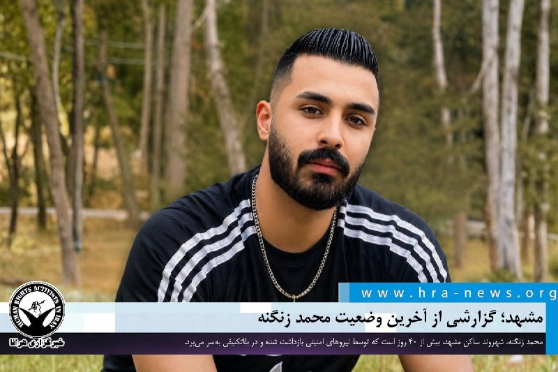

تداوم بازداشت؛ گزارشی از آخرین وضعیت محمد زنگنه

❗️
❗️
❗️
❗️
❗️– محمد زنگنه، شهروند ساکن مشهد، بیش از ۴۰ روز است که توسط نیروهای امنیتی بازداشت شده است. چندی پیش جلسه دادگاه رسیدگی به اتهامات وی در دادگاه انقلاب مشهد برگزار شده بود.

به گزارش خبرگزاری هرانا، ارگان خبری مجموعه فعالان حقوق بشر در ایران، محمد زنگنه کماکان در بازداشت به‌سر می‌برد.

بر اساس اطلاعات دریافتی هرانا، جلسه دادگاه رسیدگی به اتهامات آقای زنگنه در تاریخ ۱۹ اردیبهشت ماه، در شعبه اول دادگاه انقلاب شهرستان مشهد برگزار شده است. در این جلسه، وی از بابت اتهامات اجتماع و تبانی برای ارتکاب جرم بر ضد امنیت داخلی/خارجی و تبلیغ علیه نظام به دفاع از خود پرداخته بود.

#محمد_زنگنه

ادامه مطلب

↘️
@hranews_bot تماس ✉️ - @Hranews کانال هرانا 🆑

## manototv — post 105513

  <a href="telegram/content/manototv_105513_1778933723.mp4" target="_blank">🎬 Download video</a>

«تجمع ایرانیان در سیدنی استرالیا»

## manototv — post 105512

  <a href="telegram/content/manototv_105512_1778933725.mp4" target="_blank">🎬 Download video</a>

«تجمع ایرانیان در بریزبن استرالیا»

## alonews — post 120378

  <a href="telegram/content/alonews_120378_1778933727.webm" target="_blank">🎬 Download video</a>

👈آخرین قیمت نفت ۱۰۹.۲۶ دلار

✅ @AloNews خبر جنگ

## alonews — post 120377

  <a href="telegram/content/alonews_120377_1778933727.webm" target="_blank">🎬 Download video</a>

🔴فوری/شبکه ۱۲ اسرائیل :
اسرائیل در حال آماده شدن برای یک جنگ چند روزه یا چند هفته‌ای با ایران است

✅ @AloNews خبر جنگ

## alonews — post 120376

⚠️ توجه 
⚠️

بچه ها فیلترینگ خیلیی شدید شده همین الان که اینترنت دارین حتما جوین بشید و از کانفینگاش استفاده کنید که موقع قطعی خیلی به کارتون میاد
⏬

https://t.me/+WgqzouUHJ1U3OTY0
https://t.me/+WgqzouUHJ1U3OTY0
https://t.me/+WgqzouUHJ1U3OTY0

## alonews — post 120375

  <a href="telegram/content/alonews_120375_1778933727.webm" target="_blank">🎬 Download video</a>

👈جاده چالوس از فردا به مدت ۴روز مسدود می‌شود

✅ @AloNews خبر جنگ

## alonews — post 120374

  <a href="telegram/content/alonews_120374_1778933727.webm" target="_blank">🎬 Download video</a>

👈دقایقی پیش وزیر کشور پاکستان برای دیدار با مقامات ایرانی، در سفری از پیش اعلام نشده وارد تهران شد 
✅ @AloNews خبر جنگ

## alonews — post 120373

  <a href="telegram/content/alonews_120373_1778933727.webm" target="_blank">🎬 Download video</a>

👈مخبر: این خویشتنداری همیشگی نیست

✅ @AloNews خبر جنگ

## alonews — post 120372

  <a href="telegram/content/alonews_120372_1778933728.webm" target="_blank">🎬 Download video</a>

👈 ارتش دفاعی اسرائیل اعلام کرده است که حملات به سایت‌های زیرساختی حزب‌الله در چندین منطقه در جنوب لبنان را آغاز کرده است

✅ @AloNews خبر جنگ

## alonews — post 120371

  <a href="telegram/content/alonews_120371_1778933728.webm" target="_blank">🎬 Download video</a>

👈دقایقی پیش وزیر کشور پاکستان برای دیدار با مقامات ایرانی، در سفری از پیش اعلام نشده وارد تهران شد

✅ @AloNews خبر جنگ

## alonews — post 120370

  <a href="telegram/content/alonews_120370_1778933728.webm" target="_blank">🎬 Download video</a>

👈رئیس کمیسیون امنیت ملی مجلس :
یه سیستم طراحی کردیم که رفت‌وآمد کشتی‌ها تو تنگه هرمز رو با یه مسیر مشخص کنترل کنیم و به‌زودی هم اعلامش می‌کنیم

✅ @AloNews خبر جنگ

---
📅 بروزرسانی: 1405/02/26 14:50
---

## VahidOOnLine — post 240460

  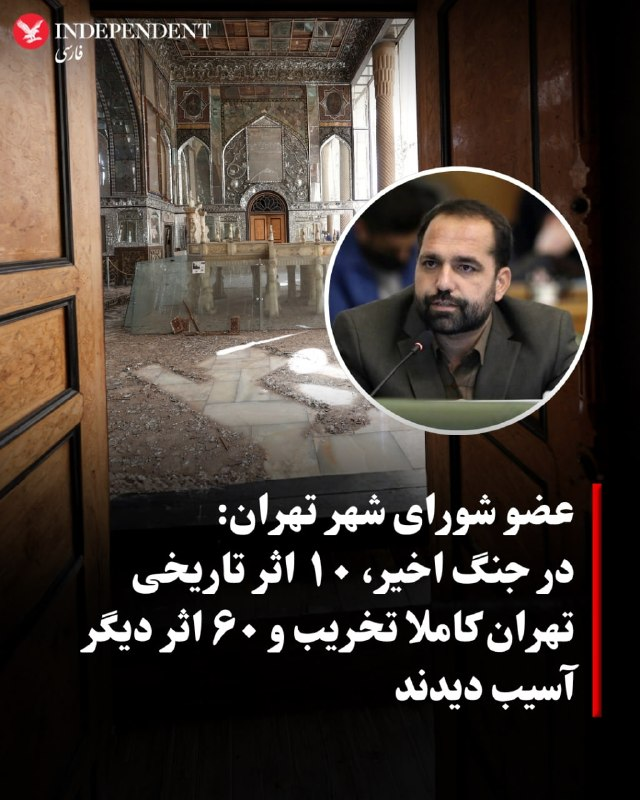

⭕️ عضو شورای شهر تهران:
در جنگ اخیر، ۱۰ اثر تاریخی تهران کاملا تخریب و ۶۰ اثر دیگر آسیب دیدند

♦️سید احمد علوی، عضو شورای شهر تهران از آسیب دیدن حدود ۶۰ اثر و تخریب کامل ۱۰ اثر تاریخی پایتخت در جریان جنگ چهل روزه آمریکا و اسرائیل علیه جمهوری اسلامی خبر داد.
او گفت برنامه‌ریزی برای بازسازی بناهای تخریب‌شده با همکاری شهرداری مناطق، اداره‌کل میراث فرهنگی استان تهران و همچنین بخش خصوصی در دستور کار قرار گرفته است.
به گفته این عضو شورای شهر، بناهای تخریب‌شده قرار است با همان کاربری پیشین و در محل اصلی خود بازسازی شوند. با این حال هنوز جزئیات دقیقی از نام آثار تخریب‌شده، میزان خسارت‌ها و زمان آغاز پروژه‌های مرمت منتشر نشده است.
‌🇸🇦 Indypersian

🤖 @VahidOOnLine

## VahidOOnLine — post 240459

  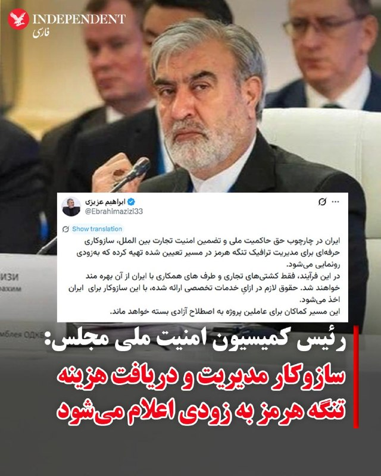

♦️ابراهیم عزیزی، رئیس کمیسیون امنیت ملی مجلس ایران، روز شنبه با انتشار پیامی در شبکه اجتماعی ایکس اعلام کرد تهران سازوکاری «حرفه‌ای» برای مدیریت تردد در تنگه هرمز از طریق یک مسیر تعیین‌شده آماده کرده است که به‌زودی جزئیات آن را اعلام می‌کند.
عزیزی در توضیح این طرح با تکرار دریافت پول در ازای گذر از تنگه هرمز نوشت: «فقط کشتی‌های تجاری و طرف‌های همکاری با ایران از آن بهره‌مند خواهند شد. حقوق لازم در ازایِ خدمات تخصصی ارائه شده، با این سازوکار برای ایران اخذ می‌شود.»
عزیزی در پایان گفت: «این مسیر کماکان برای عاملین پروژهٔ به اصطلاح آزادی بسته خواهد ماند.»
«پروژه آزادی» طرح آمریکا برای اسکورت کشتی‌ها در تنگه هرمز بود که طی آن، جمهوری اسلامی به کشتی‌ها و مناطقی در امارات متحده آتش گشود.
‌🇸🇦 Indypersian

🤖 @VahidOOnLine

## VahidOOnLine — post 240458

  <a href="telegram/content/VahidOOnLine_240458_1778930443.mp4" target="_blank">🎬 Download video</a>

کریس رایت، وزیر انرژی آمریکا گفته است انتظار دارد تنگه هرمز «حداکثر تا مقطعی در تابستان» بازگشایی شود.

رایت همچنین گفت اگر ایران به «گروگان گرفتن اقتصاد جهان» ادامه دهد، ارتش آمریکا می‌تواند برای بازگشایی تنگه هرمز مداخله کند.
‌🏁 🇬🇧 ManotoTV

🤖 @VahidOOnLine

## VahidOOnLine — post 240457

  <a href="telegram/content/VahidOOnLine_240457_1778930444.mp4" target="_blank">🎬 Download video</a>

در برنامه‌های شامگاه گذشته تلویزیون جمهوری اسلامی، بخش‌هایی با محور آموزش کار با سلاح پخش شد.

در این برنامه‌ها، مجریان یا کارشناسان حاضر در استودیو، شیوه گرفتن و استفاده از سلاح را توضیح دادند. پخش چنین محتوایی از تلویزیون حکومتی در شرایطی صورت می‌گیرد که رسانه‌های وابسته به جمهوری اسلامی در هفته‌های اخیر بر ادبیات نظامی، آمادگی دفاعی و بسیج حامیان خود تاکید بیشتری داشته‌اند.
‌🏁 🇬🇧 ManotoTV

🤖 @VahidOOnLine

## VahidOOnLine — post 240456

  <a href="telegram/content/VahidOOnLine_240456_1778930445.mp4" target="_blank">🎬 Download video</a>

‌
«دریک»، رپر، خواننده و بازیگر کانادایی، در یکی از قطعه‌های تازه خود با نام «Don’t Worry» به دختری ایرانی اشاره کرده که فارسی حرف می‌زند. این قطعه در آلبوم تازه او منتشر شده است. در متن ترانه نیز بندی آمده که در آن زن مورد اشاره خود را ایرانی معرفی می‌کند که فارسی حرف می‌‌زند.

دریک با نام کامل «آبری دریک گراهام» زاده تورنتو است و پیش از ورود جدی به موسیقی، با بازی در مجموعه تلویزیونی نوجوانانه «دگراسی، نسل بعدی» شناخته شد. او سپس به یکی از چهره‌های اصلی موسیقی هیپ‌هاپ و پاپ معاصر تبدیل شد و سبک ترکیبی او میان رپ‌خوانی و خوانندگی، جایگاه گسترده‌ای در بازار جهانی موسیقی برایش به همراه آورد.
‌🏁 🇬🇧 ManotoTV

🤖 @VahidOOnLine

## VahidOOnLine — post 240455

  <a href="telegram/content/VahidOOnLine_240455_1778930446.mp4" target="_blank">🎬 Download video</a>

ایرانیان نیوزیلند روز شنبه ۲۶ اردیبهشت‌ماه در حمایت از شاهزاده رضا پهلوی و علیه قطع اینترنت و اعدام‌های جمهوری اسلامی در اوکلند تجمع برگزار کردند.
‌🏁 🇬🇧 IranintlTV

🤖 @VahidOOnLine

## VahidOOnLine — post 240454

  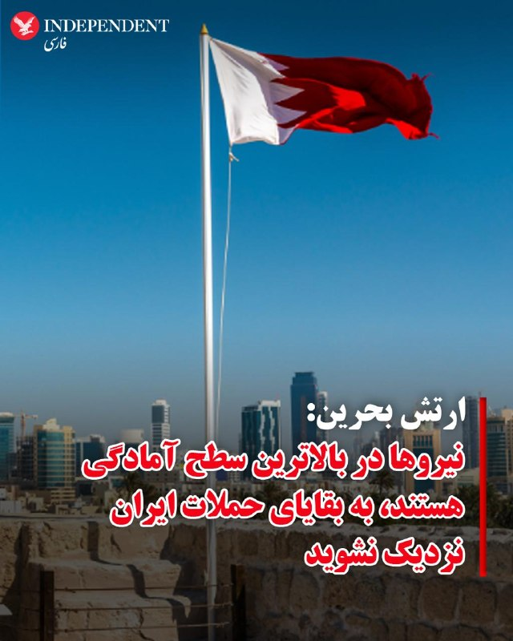

♦️فرماندهی کل نیروی دفاع بحرین، روز شنبه با انتشار بیانیه‌ای اعلام کرد تمامی یگان‌ها و تسلیحات این کشور در بالاترین سطح آمادگی و آماده‌باش دفاعی قرار دارند.
در این بیانیه آمده است، فرماندهی کل به سطح آمادگی رزمی و هوشیاری نیروهای نظامی این کشور در انجام وظایف خود ابراز افتخار کرده و بر آمادگی آن‌ها برای دفاع از کشور تاکید می‌کند.
نیروی دفاع بحرین همچنین از شهروندان و ساکنان این کشور خواست از نزدیک شدن یا دست زدن به هرگونه اجسام ناشناس یا مشکوک که ممکن است بقایای حملات ایران باشد، خودداری کنند.
در این بیانیه آمده است نیروهای واحد مهندسی میدان سلطنتی بحرین در آمادگی کامل قرار دارند تا برای حفظ امنیت عمومی، این اجسام را به‌صورت ایمن بررسی و خنثی کنند.
‌🇸🇦 Indypersian

🤖 @VahidOOnLine

## VahidOOnLine — post 240453

  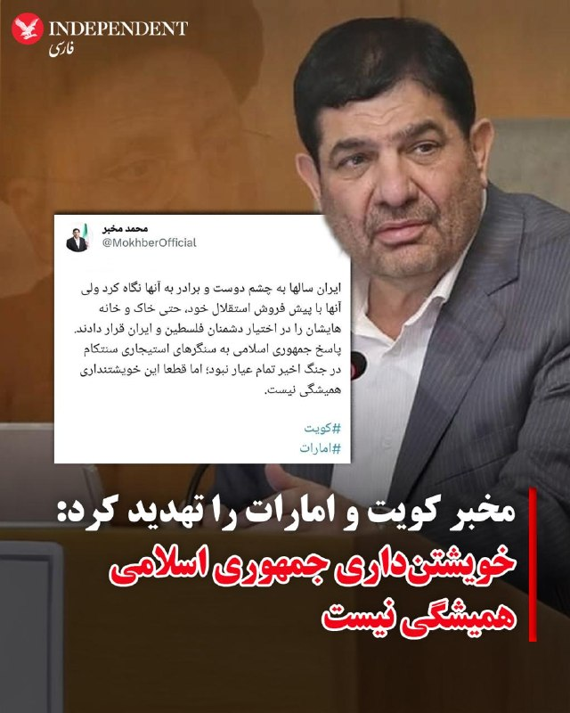

♦️محمد مخبر، مشاور رهبر جمهوری اسلامی، روز شنبه با انتشار متنی در شبکه اجتماعی ایکس با استفاده از هشتگ کویت و امارات نوشت: «ایران سال‌ها به چشم دوست و برادر به آنها نگاه کرد، ولی آنها با پیش‌فروش استقلال خود، حتی خاک و خانه‌هایشان را در اختیار دشمنان فلسطین و ایران قرار دادند.»

مخبر در این پیام با اشاره به حضور نیروهای آمریکایی در کشورهای منطقه، تهدید کرد: «پاسخ جمهوری اسلامی به سنگرهای استیجاری سنتکام در جنگ اخیر تمام‌عیار نبود، اما قطعا این خویشتن‌داری همیشگی نیست.»
‌🇸🇦 Indypersian

🤖 @VahidOOnLine

## VahidOOnLine — post 240452

  <a href="telegram/content/VahidOOnLine_240452_1778930450.mp4" target="_blank">🎬 Download video</a>

ایرانیان استرالیا روز شنبه در حمایت از انقلاب ملی علیه جمهوری اسلامی تجمع کرده و با حمل پرچم شیروخورشید ترانه‌های ملی را هم‌خوانی کردند.
‌🏁 🇬🇧 IranintlTV

🤖 @VahidOOnLine

## VahidOOnLine — post 240451

  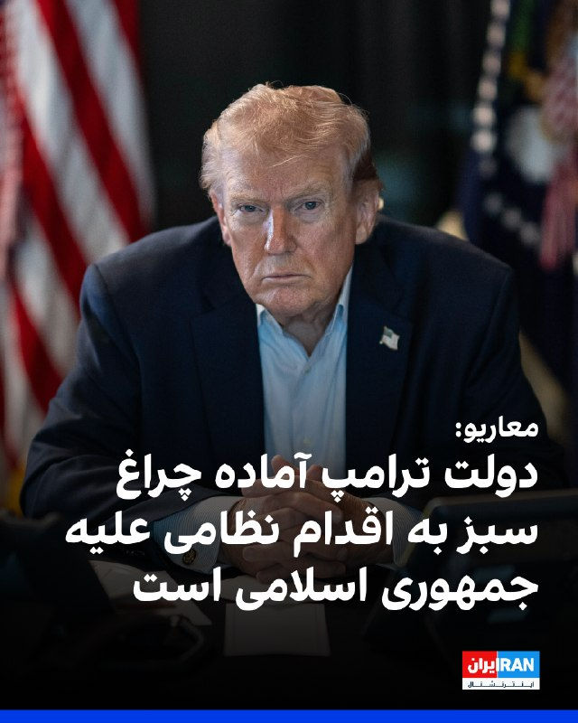

روزنامه معاریو به نقل از منابع آگاه گزارش داد که دولت دونالد ترامپ در روزهای اخیر آمادگی خود را برای دادن «چراغ سبز» به اقدام نظامی در صورت شکست نهایی تلاش‌های دیپلماتیک با جمهوری اسلامی نشان داده است.

بر اساس این گزارش، با وجود این رویکرد، هنوز تصمیم نهایی برای آغاز عملیات نظامی اتخاذ نشده است.

این منابع افزودند که «پنجره دیپلماتیک به سرعت در حال بسته شدن است» و روزهای آینده می‌تواند در تعیین مسیر تحولات سرنوشت‌ساز باشد.
‌🏁 🇬🇧 IranintlTV

🤖 @VahidOOnLine

## VahidOOnLine — post 240450

  <a href="telegram/content/VahidOOnLine_240450_1778930454.mp4" target="_blank">🎬 Download video</a>

مخاطبان ایران اینترنشنال طی روزهای اخیر با ارسال پیام‌هایی درباره سلامت و جان نرگس محمدی، زندانی سیاسی، ابراز نگرانی کرده و از ایرانیان خواستند در خارج از کشور صدای او باشند. پیام مخاطبان با هوش مصنوعی بازخوانی شده است.
‌🏁 🇬🇧 IranintlTV

🤖 @VahidOOnLine

## VahidOOnLine — post 240449

  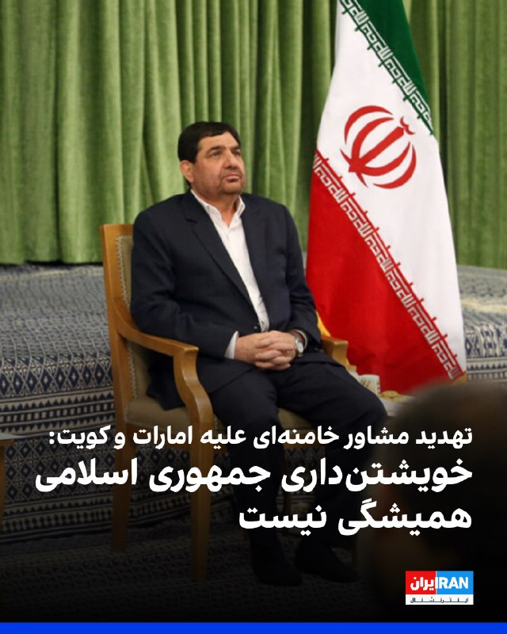

محمد مخبر، مشاور رهبر جمهوری اسلامی، با انتشار مطلبی در ایکس با هشتگ کویت و امارات نوشت: «ایران سال‌ها به چشم دوست و برادر به آنها نگاه کرد، ولی آنها با پیش‌فروش استقلال خود، حتی خاک و خانه‌هایشان را در اختیار دشمنان فلسطین و ایران قرار دادند.»

او تهدید کرد: «پاسخ جمهوری اسلامی به سنگرهای استیجاری سنتکام در جنگ اخیر تمام‌عیار نبود، اما قطعا این خویشتن‌داری همیشگی نیست.»
‌🏁 🇬🇧 IranintlTV

🤖 @VahidOOnLine

## VahidOOnLine — post 240448

  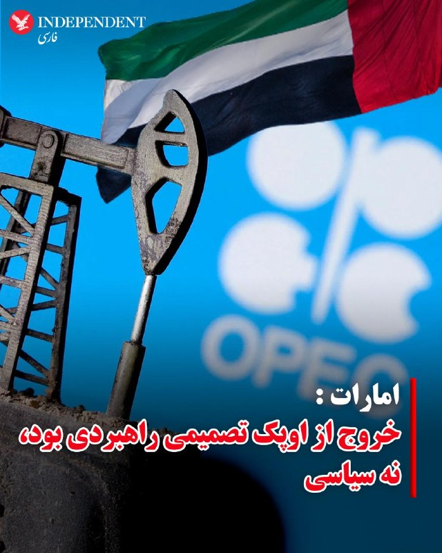

♦️امارات: خروج از اوپک تصمیمی راهبردی بود، نه سیاسی
وزیر انرژی امارات متحده عربی اعلام کرد تصمیم ابوظبی برای خروج از اوپک و اوپک‌پلاس، اقدامی «حاکمیتی و راهبردی» بوده و انگیزه سیاسی نداشته است.
به گزارش رویترز، مقام‌های اماراتی تاکید کردند این تصمیم بر پایه ارزیابی جامع از سیاست تولید نفت و ظرفیت‌های آینده این کشور اتخاذ شده و نشانه اختلاف با دیگر شرکای اوپک نیست.
وزیر انرژی امارات گفت خروج از اوپک بخشی از راهبرد بلندمدت ابوظبی برای مدیریت مستقل‌تر ظرفیت‌های تولید انرژی و برنامه‌های توسعه آینده است و نباید به‌عنوان نشانه تنش سیاسی در داخل ائتلاف تولیدکنندگان نفت تفسیر شود.
تصمیم امارات در شرایطی اعلام شده که بازار جهانی انرژی همچنان تحت تاثیر جنگ ایران، بحران تنگه هرمز و نوسان شدید قیمت نفت قرار دارد و برخی تحلیلگران، خروج ابوظبی را نشانه تغییرات ساختاری در آینده اوپک و بازار جهانی انرژی می‌دانند.
‌🇸🇦 Indypersian

🤖 @VahidOOnLine

## mwarmonitor — post 9151

  <a href="telegram/content/mwarmonitor_9151_1778930459.mp4" target="_blank">🎬 Download video</a>

📝این نمایش مشمئزکننده و دست‌وپا زدن‌های فضاحت‌بار این جیره‎خواران و فاحشه‌های ولایت با اسلحه روی آنتن زنده، تقلاهای رو به موتی است که تنها بوی گندِ زوال و سقوط می‌دهد. وقتی این جانورانِ تروریست کلمات مقدسی مثل «وطن» و «خاک» را در آن دهان‌های نجس می‌چرخانند، دقیقاً یادآور روزهای آخر، درماندگی و توهماتِ جنون‌آمیز قذافی در تفدانِ تاریخ هستند.

🔸به این تئاترِ تهوع‌آور و خط‌ونشان کشیدن‌های مضحک ادامه بدهید؛ اما بدانید که هر ثانیه از این تصویر، جرقه‌ای است بر انبارِ باروت. چنان خشمِ لجام‌گسیخته، سیاه و ویرانگری در اعماق این جامعه‌ی زجرکشیده در حال انباشت شدن است که هیچ دیواری مانع آن نخواهد شد. این غده‌های چرکینی که امروز جلوی دوربین مانورِ قدرت می‌دهند، فردا در سیلابِ خشمِ مردم غرق خواهند شد. روزی که این دیگِ بجوش‌آمده سرریز کند، دیگر هیچ راه فراری نیست؛ این ملتِ کاردبه‌استخوان‌رسیده، زنده زنده روی همین آنتن زنده تلویزیون، خرخره‌ی تو و امثالِ کثیف تو را خواهند جوید و این بساطِ پر از خون و جنایت را برای همیشه در هم خواهند کوبید.

@mwarmonitor

## mwarmonitor — post 9150

  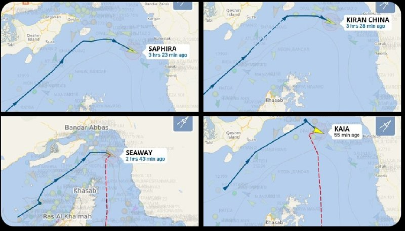

📍تنگه هرمز، کشتی‌های در حال خروج از خلیج فارس:

🚢کشتی حمل دام «SAPHIRA» (متعلق به ترکیه)

🚢کشتی فله‌بر «KIRAN CHINA» (متعلق به ترکیه)

🚢نفتکش «SEAWAY» (متعلق به چین)

🚢کشتی فله‌بر «KAIA» (با پرچم جزایر مارشال)

@mwarmonitor

## pm_afshaa — post 90844

  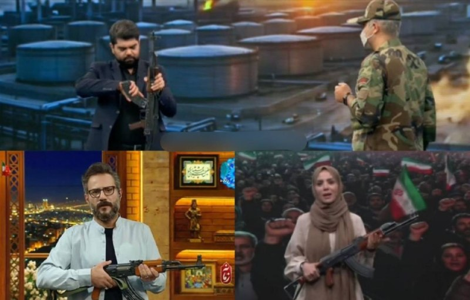

مجری‌های صداوسیما در چند برنامه زنده، با اسلحه کلاشینکف حضور پیدا کردن :

💧 Rainbet.com the #1 Non-KYC Crypto Casino & Sportsbook @rainbetcom

😁 @Pm_Afshaa

## pm_afshaa — post 90843

  <a href="telegram/content/pm_afshaa_90843_1778930462.webm" target="_blank">🎬 Download video</a>

🔴سی‌ان‌ان: مقام‌های آمریکایی منتظر بودن ببینن در سفر ترامپ به چین پیشرفتی در مذاکرات مربوط به ایران شکل میگیره یا خیر، که بعد از سفر بنظر میرسه هیچ پیشرفت قابل توجهی صورت نگرفته.

💧 Rainbet.com the #1 Non-KYC Crypto Casino & Sportsbook @rainbetcom

😁 @Pm_Afshaa

## pm_afshaa — post 90842

  <a href="telegram/content/pm_afshaa_90842_1778930463.webm" target="_blank">🎬 Download video</a>

🔴نیویورک تایمز:
نیروهای نظامی آمریکا در حال آماده‌سازی برای دور دیگری از حملات هستن؛ این بار با شدت بیشتر. این حملات ممکنه از روز دوشنبه آغاز شود. اهداف نظامی بیشتری از ایران در نظر گرفته شده که شامل زیرساخت‌ها هم میشه.

💧 Rainbet.com the #1 Non-KYC Crypto Casino & Sportsbook @rainbetcom

😁 @Pm_Afshaa

## pm_afshaa — post 90841

  <a href="telegram/content/pm_afshaa_90841_1778930463.webm" target="_blank">🎬 Download video</a>

🔴روزنامه معاریو: دولت ترامپ آماده چراغ سبز به اقدام نظامی علیه جمهوری اسلامیه.

💧 Rainbet.com the #1 Non-KYC Crypto Casino & Sportsbook @rainbetcom

😁 @Pm_Afshaa

## pm_afshaa — post 90840

  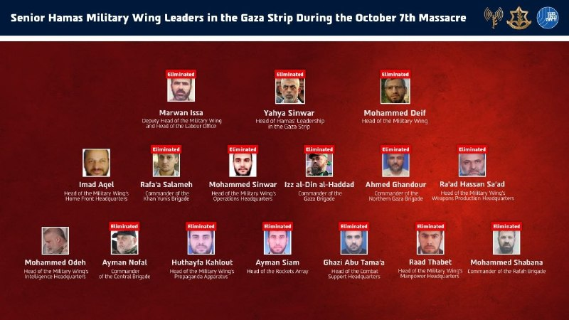

ارتش اسرائیل با بیانیه‌ای خبر ترور عزالدین حداد را تایید کرد و اعلام کرد تنها دو فرمانده ارشد حماس از زمان هفت اکتبر باقی مانده

💧 Rainbet.com the #1 Non-KYC Crypto Casino & Sportsbook @rainbetcom

😁 @Pm_Afshaa

## pm_afshaa — post 90839

🔴فرماندهی کل نیروی دفاعی بحرین : برای حمله احتمالی جمهوری اسلامی، تو آماده‌باش سطح بالا قرار داریم

💧 Rainbet.com the #1 Non-KYC Crypto Casino & Sportsbook @rainbetcom

😁 @Pm_Afshaa

## DEJradio — post 4665

  <a href="telegram/content/DEJradio_4665_1778930465.mp4" target="_blank">🎬 Download video</a>

🚨
🔸 خبر ۲۱
آدینه ۲۵ اردیبهشت ۱۴۰۵

#خبر۲۱
@DEJradio

## kianmeli1 — post 87435

  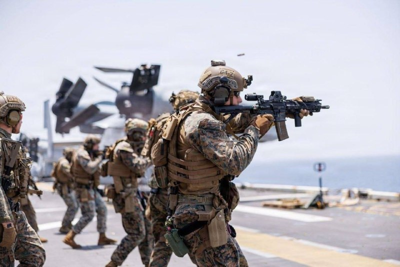

🔴نیویورک تایمز به نقل از مقامات نظامی آمریکا: اگر جزیره خارگ تصرف شود، نیروهای زمینی برای حفظ آن لازم خواهند بود.
https://t.me/kianmeli1

## kianmeli1 — post 87434

‏🔴نماینده خامنه‌ای در سپاه در کردستان: امروز نظام «استکبار» در موضع ضعف قرار گرفته و در این مرحله پایانی وارد آوردن ضربه نهایی برای «اضمحلال دشمن» ضرورتی حیاتی دارد
https://t.me/kianmeli1

## kianmeli1 — post 87430

  <a href="telegram/content/kianmeli1_87430_1778930469.mp4" target="_blank">🎬 Download video</a>

🔴شب گذشته در بسیاری از برنامه های صداوسیما، مجریان با تفنگ حاضر شدند

یکی از مجریان در برنامه زنده پرچم امارات را نشانه گرفت و شلیک کرد
https://t.me/kianmeli1

## kianmeli1 — post 87429

‏🔴محمد مخبر، مشاور مجتبی خامنه‌ای، مطلبی را با هشتگ امارات و کویت در ایکس منتشر کرد و نوشت «آن‌ها با پیش‌فروش استقلال خود، حتی خاک و خانه‌هایشان را در اختیار دشمنان فلسطین و جمهوری اسلامی قرار دادند و پاسخ ما به سنگرهای استیجاری سنتکام در جنگ اخیر تمام‌عیار نبود؛ اما این خویشتنداری همیشگی نیست.»
https://t.me/kianmeli1

## kianmeli1 — post 87428

‏🔴وزارت دفاع بریتانیا افزود چهار جنگنده تایفون را در هفته‌های پس از آغاز جنگ به قطر اعزام کرد تا حضور هوایی این کشور در منطقه را تقویت کند
https://t.me/kianmeli1

## IranIntlTV — post 337459

  <a href="telegram/content/IranIntlTV_337459_1778930472.mp4" target="_blank">🎬 Download video</a>

گزارش‌ها حاکی از بحران جدی بهداشت و درمان در زندان فشافویه تهران است. بر اساس روایت زندانیان، شیوع بیماری پوستی گال، تراکم بالای جمعیت و نبود دسترسی به پزشک و دارو، وضعیت زندانیان را بحرانی کرده است.

گفت‌وگو با محمد مقیمی، وکیل دادگستری و کارشناس ارشد حقوق بشر
@iranintltv

## IranIntlTV — post 337458

  <a href="telegram/content/IranIntlTV_337458_1778930474.mp4" target="_blank">🎬 Download video</a>

عطا حسینیان، روزنامه‌نگار اقتصادی و حوزه انرژی، گفت ایران در حال حاضر در زمینه تولید بنزین با مشکلات جدی مواجه است. او «حملات به پارس جنوبی، محاصره دریایی، روابط مخدوش جمهوری اسلامی با امارات و کمبود منابع مالی» را از جمله عوامل موثر بر تولید و عرضه بنزین در کشور دانست.
@iranintltv

## IranIntlTV — post 337457

  <a href="telegram/content/IranIntlTV_337457_1778930477.mp4" target="_blank">🎬 Download video</a>

ایرانیان نیوزیلند روز شنبه ۲۶ اردیبهشت‌ماه در حمایت از شاهزاده رضا پهلوی و علیه قطع اینترنت و اعدام‌های جمهوری اسلامی در اوکلند تجمع برگزار کردند.

## IranIntlTV — post 337450

🔻اریک کانتونا، اسطوره فوتبال فرانسه و یکی از عوامل مستند «کانتونا»، در جریان فوتوکال این فیلم که در بخش «نمایش‌های ویژه» هفتاد و نهمین جشنواره فیلم کن ارائه شد، روز شنبه ۲۶ اردیبهشت مقابل دوربین عکاسان ژست گرفت.

🔹مستند «کانتونا» که در جشنواره فیلم کن رونمایی شد، پرتره‌ای از اریک کانتونا، ستاره فرانسوی دهه ۹۰ منچستریونایتد، ارائه می‌دهد؛ فوتبالیستی جذاب اما تندخو که هم به‌واسطه نبوغ فوتبالی‌اش و هم به دلیل جنجال‌هایش به چهره‌ای اسطوره‌ای بدل شد.

🔹این فیلم به کارگردانی دیوید تری‌هورن و بن نیکلاس، سازندگان مستند «پله»، با ترکیبی از گفت‌وگوهای تازه با کانتونا و روایت‌هایی از الکس فرگوسن، دیوید بکام و گی رو، تلاش می‌کند تصویری کامل از «مرد، اسطوره، افسانه» بسازد.

@iranintltvsport

## IranIntlTV — post 337449

  <a href="telegram/content/IranIntlTV_337449_1778930479.mp4" target="_blank">🎬 Download video</a>

سرخط خبرهای شنبه ۲۶ اردیبهشت
@iranintltv

## IranIntlTV — post 337448

  <a href="telegram/content/IranIntlTV_337448_1778930481.mp4" target="_blank">🎬 Download video</a>

ایرانیان استرالیا روز شنبه در حمایت از انقلاب ملی علیه جمهوری اسلامی تجمع کرده و با حمل پرچم شیروخورشید ترانه‌های ملی را هم‌خوانی کردند.

## IranIntlTV — post 337447

  

روزنامه معاریو به نقل از منابع آگاه گزارش داد که دولت دونالد ترامپ در روزهای اخیر آمادگی خود را برای دادن «چراغ سبز» به اقدام نظامی در صورت شکست نهایی تلاش‌های دیپلماتیک با جمهوری اسلامی نشان داده است.

بر اساس این گزارش، با وجود این رویکرد، هنوز تصمیم نهایی برای آغاز عملیات نظامی اتخاذ نشده است.

این منابع افزودند که «پنجره دیپلماتیک به سرعت در حال بسته شدن است» و روزهای آینده می‌تواند در تعیین مسیر تحولات سرنوشت‌ساز باشد.
https://iranintl.com/202605162346

## IranIntlTV — post 337446

  <a href="telegram/content/IranIntlTV_337446_1778930484.mp4" target="_blank">🎬 Download video</a>

همزمان با افزایش تنش‌ها میان امارات متحده عربی و جمهوری اسلامی، یک مجری صدا و سیمای جمهوری اسلامی در برنامه‌ای با محور آموزش کار با سلاح، پرچم امارات متحده عربی را به‌عنوان هدف انتخاب کرد و به سوی آن شلیک کرد.

این بخش از برنامه در حالی پخش شد که روابط تهران و ابوظبی در هفته‌های اخیر با تنش‌هایی همراه بوده است.

صدا و سیمای جمهوری اسلامی جمعه چند برنامه پخش کرد که در آنها مجریان در بخش‌های استودیویی با در دست داشتن تفنگ ظاهر شدند و اعلام کردند در حال یادگیری کار با سلاح‌های سبک هستند و در صورت لزوم به جنگ خواهند پیوست.
@iranintltv

## IranIntlTV — post 337445

  <a href="telegram/content/IranIntlTV_337445_1778930486.mp4" target="_blank">🎬 Download video</a>

مخاطبان ایران اینترنشنال طی روزهای اخیر با ارسال پیام‌هایی درباره سلامت و جان فاطمه سپهری، زندانی سیاسی، ابراز نگرانی کرده و از ایرانیان خواستند در خارج از کشور صدای او باشند. پیام مخاطبان با هوش مصنوعی بازخوانی شده است.

## IranIntlTV — post 337444

  <a href="telegram/content/IranIntlTV_337444_1778930490.mp4" target="_blank">🎬 Download video</a>

بنا بر گزارش کانال۱۲ اسرائیل، رییس‌جمهور آمریکا قرار است ظرف ۲۴ ساعت آینده نشستی ویژه با مشاورانش برگزار کند تا تصمیم نهایی درباره جمهوری اسلامی را اتخاذ کند.

گفت‌وگو با منشه امیر، کارشناس امور خاورمیانه
@iranintltv

## IranIntlTV — post 337443

  

محمد مخبر، مشاور رهبر جمهوری اسلامی، با انتشار مطلبی در ایکس با هشتگ کویت و امارات نوشت: «ایران سال‌ها به چشم دوست و برادر به آنها نگاه کرد، ولی آنها با پیش‌فروش استقلال خود، حتی خاک و خانه‌هایشان را در اختیار دشمنان فلسطین و ایران قرار دادند.»

او تهدید کرد: «پاسخ جمهوری اسلامی به سنگرهای استیجاری سنتکام در جنگ اخیر تمام‌عیار نبود، اما قطعا این خویشتن‌داری همیشگی نیست.»
https://iranintl.com/202605169610

## ManotoTV — post 105511

  <a href="telegram/content/ManotoTV_105511_1778930493.mp4" target="_blank">🎬 Download video</a>

کریس رایت، وزیر انرژی آمریکا گفته است انتظار دارد تنگه هرمز «حداکثر تا مقطعی در تابستان» بازگشایی شود.

رایت همچنین گفت اگر ایران به «گروگان گرفتن اقتصاد جهان» ادامه دهد، ارتش آمریکا می‌تواند برای بازگشایی تنگه هرمز مداخله کند.

## ManotoTV — post 105510

  <a href="telegram/content/ManotoTV_105510_1778930494.mp4" target="_blank">🎬 Download video</a>

در برنامه‌های شامگاه گذشته تلویزیون جمهوری اسلامی، بخش‌هایی با محور آموزش کار با سلاح پخش شد.

در این برنامه‌ها، مجریان یا کارشناسان حاضر در استودیو، شیوه گرفتن و استفاده از سلاح را توضیح دادند. پخش چنین محتوایی از تلویزیون حکومتی در شرایطی صورت می‌گیرد که رسانه‌های وابسته به جمهوری اسلامی در هفته‌های اخیر بر ادبیات نظامی، آمادگی دفاعی و بسیج حامیان خود تاکید بیشتری داشته‌اند.

## ManotoTV — post 105509

  <a href="telegram/content/ManotoTV_105509_1778930494.mp4" target="_blank">🎬 Download video</a>

‌
«دریک»، رپر، خواننده و بازیگر کانادایی، در یکی از قطعه‌های تازه خود با نام «Don’t Worry» به دختری ایرانی اشاره کرده که فارسی حرف می‌زند. این قطعه در آلبوم تازه او منتشر شده است. در متن ترانه نیز بندی آمده که در آن زن مورد اشاره خود را ایرانی معرفی می‌کند که فارسی حرف می‌‌زند.

دریک با نام کامل «آبری دریک گراهام» زاده تورنتو است و پیش از ورود جدی به موسیقی، با بازی در مجموعه تلویزیونی نوجوانانه «دگراسی، نسل بعدی» شناخته شد. او سپس به یکی از چهره‌های اصلی موسیقی هیپ‌هاپ و پاپ معاصر تبدیل شد و سبک ترکیبی او میان رپ‌خوانی و خوانندگی، جایگاه گسترده‌ای در بازار جهانی موسیقی برایش به همراه آورد.

## FarsiVOA — post 217885

  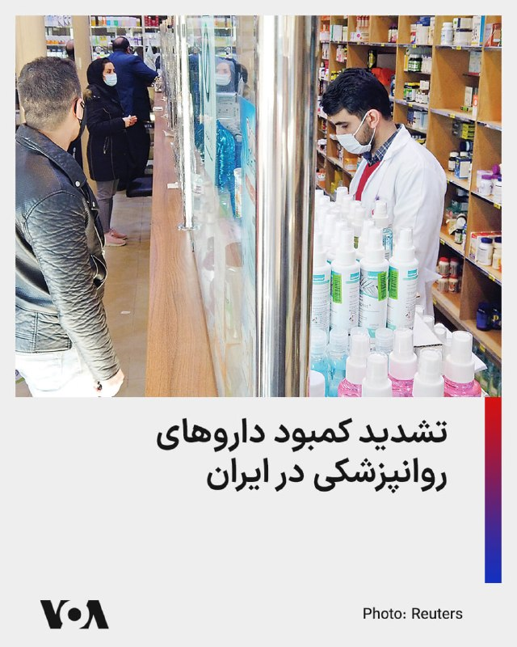

رئیس انجمن روانپزشکان ایران می‌گوید کمبود دارو در حوزه روانپزشکی جدی است و نسبت به شرایط پیش از جنگ، به «طور قابل توجهی» تشدید شده است.

وحید شریعت به ایلنا گفته است در ماه‌های اخیر، کمبود قابل توجهی در برخی اقلام دارویی مشاهده شده است که برخی از آن‌ها از پیش از آغاز جنگ تشدید یافته و برخی دیگر کاملاً جدید هستند.

به گفته او احتمالاً مسئله به اختلال در روند تولید به خاطر نبود مواد اولیه یا نوعی دست نگه داشتن در توزیع، به منظور آماده‌سازی شرایط بازار برای افزایش قیمت مرتبط باشد.

حسین‌علی شهریاری رئیس کمیسیون بهداشت و درمان مجلس نیز روز پنج‌شنبه از افزایش قیمت برخی داروها بین ۵۰ تا ۳۰۰ درصد خبر داد و گفت بر اساس برآورد وزارت بهداشت، حدود ۱۵۰ هزار میلیارد تومان منابع نیاز است تا بتوان فشار هزینه‌های دارویی بر مردم را کاهش داد.
@FarsiVOA

## FarsiVOA — post 217884

  <a href="telegram/content/FarsiVOA_217884_1778930497.mp4" target="_blank">🎬 Download video</a>

حرکات مخصوص ایلان ماسک حین عکس گرفتن با تیم کوک در پکن؛

ایلان ماسک، مدیرعامل تسلا و اسپیس‌اکس، در سفر اخیر دونالد ترامپ، رئیس جمهوری آمریکا به پکن، به عنوان یکی از چهره‌های کلیدی هیئت همراه حضور داشت.

حضور او در کنار سایر مدیران فناوری نظیر تیم کوک، مدیرعامل اپل و جنسن هوانگ، مدیرعامل انویدیا، بر اهمیت مذاکرات پیرامون هوش مصنوعی در این سفر تأکید داشت.

این حضور نشان‌دهنده نزدیکی دوباره ماسک به تیم ترامپ، پس از وقفه‌ای در همکاری‌های مستقیم دولتی آن‌ها در سال گذشته است.
@FarsiVOA

## FarsiVOA — post 217883

  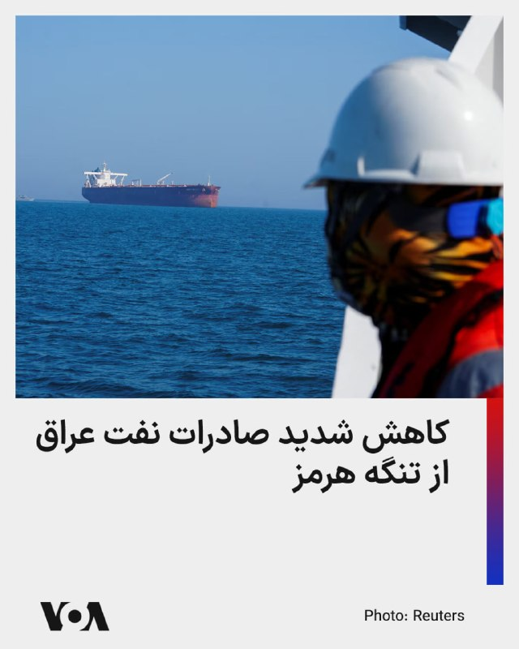

عراق در ماه آوریل تنها ۱۰ میلیون بشکه نفت از مسیر تنگه هرمز صادر کرده است؛ رقمی که به گفته باسم محمد، وزیر نفت جدید عراق، پیش از جنگ ایران به طور معمول حدود ۹۳ میلیون بشکه در ماه بود.

وزیر نفت عراق همچنین گفت صادرات نفت خام این کشور از خط لوله کرکوک-جیهان در ماه مارس، پس از توافق بغداد و اقلیم کردستان برای ازسرگیری جریان نفت، دوباره آغاز شده است.

به گفته او، عراق اکنون روزانه ۲۰۰ هزار بشکه از بندر جیهان صادر می‌کند و برنامه دارد این رقم را به ۵۰۰ هزار بشکه در روز افزایش دهد. بغداد همچنین قصد دارد با اوپک برای افزایش ظرفیت تولید و صادرات خود رایزنی کند.

تنگه هرمز در هفته‌های اخیر، هم‌زمان با جنگ آمریکا و جمهوری اسلامی و افزایش تنش‌های نظامی در خلیج فارس، به یکی از نقاط اصلی بحران انرژی تبدیل شده است.

این مسیر، گذرگاه حیاتی صادرات نفت و گاز کشورهای حاشیه خلیج فارس از جمله عراق، قطر، عربستان سعودی، امارات و کویت است.
@FarsiVOA

## FarsiVOA — post 217882

🔺بلومبرگ: ادامه جنگ نگرانی از بازگشت تورم جهانی را تشدید کرد

◾️پیامدهای جنگ در خاورمیانه همچنان در اقتصاد جهانی گسترش می‌یابد و چشم‌انداز رشد، تورم و بازارهای مالی را پیچیده‌تر کرده است.

◾️بر اساس این گزارش، جنگ دیگر فقط یک بحران منطقه‌ای نیست؛ اثر آن از مسیر نفت، هزینه حمل‌ونقل، قیمت کالاها و انتظارات تورمی به اقتصادهای بزرگ و کوچک منتقل شده است.

◾️صندوق بین‌المللی پول اخیراً اعلام کرد که جنگ در خاورمیانه اقتصاد جهانی را با شوک تازه‌ای روبه‌رو کرده و حتی با فرض محدود ماندن درگیری، رشد جهانی در سال ۲۰۲۶ به ۳.۱ درصد کاهش می‌یابد.

◾️سازمان همکاری و توسعه اقتصادی نیز پیش‌بینی کرده رشد جهانی در سال ۲۰۲۶ به ۲.۹ درصد برسد و تورم اقتصادهای گروه ۲۰ به ۴ درصد افزایش یابد.

⬇️ بیشتر بخوانید:
https://ir.voanews.com/a/8150656.html

## DW_Farsi — post 124758

  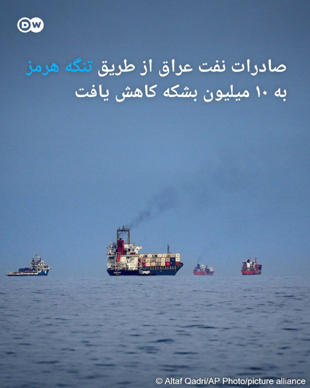

🔶 صادرات نفت عراق از طریق تنگه هرمز به ۱۰ میلیون بشکه کاهش یافت

عراق اعلام کرد صادرات نفت این کشور از طریق تنگه هرمز در ماه آوریل به ۱۰ میلیون بشکه کاهش یافته؛ رقمی که پیش از جنگ ایران ماهانه حدود ۹۳ میلیون بشکه بوده است.

باسم محمد خزیر، وزیر نفت عراق روز شنبه ۲۶ اردیبهشت (۱۶ مه) در یک کنفرانس مطبوعاتی اعلام کرد بسته‌شدن تنگه هرمز در پی جنگ ایران، صادرات نفت عربستان سعودی، امارات، کویت و عراق را محدود کرده و باعث افزایش شدید قیمت‌ها شده است.

او همچنین اعلام کرد صادرات نفت عراق از طریق خط لوله کرکوک-جیهان از ماه مارس از سر گرفته شده و بغداد قصد دارد صادرات از بندر جیهان ترکیه را از ۲۰۰ هزار بشکه به ۵۰۰ هزار بشکه در روز افزایش دهد.

به گفته وزیر نفت عراق، این کشور همچنین در حال رایزنی با سازمان کشورهای صادر‌کننده نفت "اوپک" برای افزایش ظرفیت تولید و صادرات نفت است. عراق قصد دارد ظرفیت تولید خود را به ۵ میلیون بشکه در روز برساند.

بسته‌شدن تنگه هرمز نه‌تنها صادرکنندگان نفت، بلکه واردکنندگان آن از جمله چین را نیز با مشکل مواجه کرده است.

دونالد ترامپ، رئیس‌جمهور آمریکا، پس از سفر دو روزه خود به چین اعلام کرد که شی جین‌پینگ، رئیس جمهور این کشور با ضرورت بازگشایی تنگه هرمز موافقت کرده است، هرچند چین به‌طور رسمی چنین موضعی را تائید نکرده است.

ترامپ همچنین گفت در حال بررسی لغو تحریم‌ها علیه شرکت‌های نفتی چین است که نفت ایران را خریداری می‌کنند و تاکید کرد که در این زمینه از پکن درخواست امتیاز خاصی نکرده است.

در مقابل، شی جین‌پینگ در اظهارات عمومی درباره ایران و تنگه هرمز موضعی نگرفت، اما وزارت خارجه چین نسبت به جنگ ایران ابراز نگرانی کرده و آن را درگیری‌‌ای توصیف کرد که "نباید رخ می‌داد و نباید ادامه یابد".

@dw_farsi

## Persian_Trend_Official — post 14236

https://castbox.fm/vi/945846191

لطفا چک کنید ببنید دسترسی دارید ؟

## Persian_Trend_Official — post 14235

کانال رسمی پرشین ترند pinned «از همراهی و توجه شما واقعاً ممنونیم ❤️ اینکه با رأی‌ها، نظرات و مشارکت‌تون مسیر پرشین ترند رو دقیق‌تر می‌کنید، برای ما خیلی ارزشمنده. بر اساس همین بازخوردها، از این به بعد نسخه صوتی برنامه‌ها در «کست‌باکس» و سایر پادگیر ها مثل اسپاتیفای، اپل موزیک و ...…»

## Persian_Trend_Official — post 14234

از همراهی و توجه شما واقعاً ممنونیم ❤️
اینکه با رأی‌ها، نظرات و مشارکت‌تون مسیر پرشین ترند رو دقیق‌تر می‌کنید، برای ما خیلی ارزشمنده.

بر اساس همین بازخوردها، از این به بعد نسخه صوتی برنامه‌ها در «کست‌باکس» و سایر پادگیر ها مثل اسپاتیفای، اپل موزیک و ... منتشر میشه 🎧

با توجه به اینکه هم تلگرام و هم کست‌باکس فیلتر هستند، از نظر دسترسی تفاوت خاصی وجود نداره؛
اما برای کسانی که استفاده از فیلترشکن براشون سخت‌تره، نسخه تصویری برنامه‌ها طبق روال قبل در هاست داخلی و وب‌سایت قرار می‌گیره 📥

در عین حال تلاش می‌کنیم وب‌سایت پرشین ترند رو هم حرفه‌ای‌تر و کامل‌تر توسعه بدیم تا دسترسی به محتوا راحت‌تر بشه.

مثل همیشه ممنون از همراهی‌تون 🙏

📌 @persian_trend_official
پرشین ترند | متفاوت‌ترین کانال نظامی

## RadioFarda — post 157256

  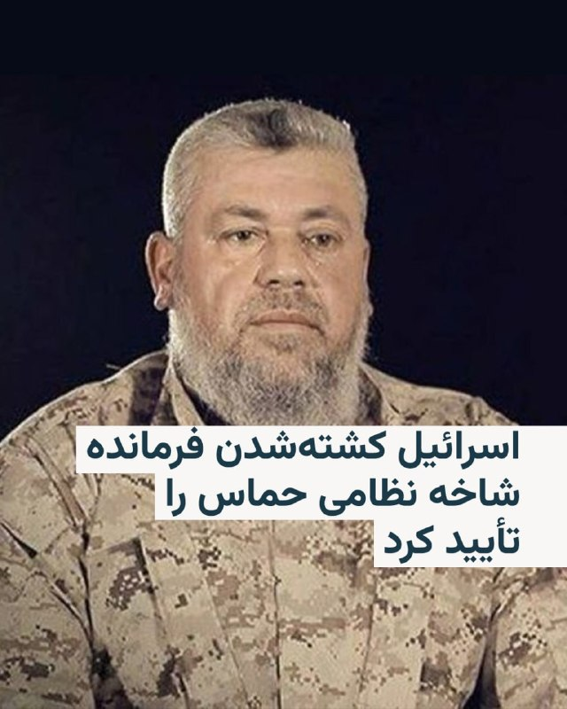

🔸ارتش اسرائیل روز شنبه تأیید کرد که عزالدین الحداد، فرمانده شاخه نظامی گروه افراطی حماس، در غزه کشته شده است.

🔸بر اساس بیانیه ارتش، الحداد در یک حمله هوایی که روز جمعه، ۲۵ اردیبهشت، انجام شد کشته شده است.

🔸به نوشته خبرگزاری فرانسه، دو مقام حماس هم تأیید کرده‌اند که این فرمانده حماس در «حمله به یک ساختمان مسکونی و یک وسیله نقلیه» توسط اسرائیل جان خود را از دست داده است.

🔸اسرائیل و آمریکا گروه حماس را تروریستی تلقی می‌کنند.

🔸ارتش اسرائیل عزالدین الحداد را یکی از «برنامه‌ریزان و مجریان» حمله روز هفتم اکتبر سال ۲۰۲۳ به خاک اسرائیل معرفی کرده و می‌گوید که او در نگه داشتن گروگان‌های اسرائیلی پس از این حمله نیز دست داشته است.

@RadioFarda

## RadioFarda — post 157255

  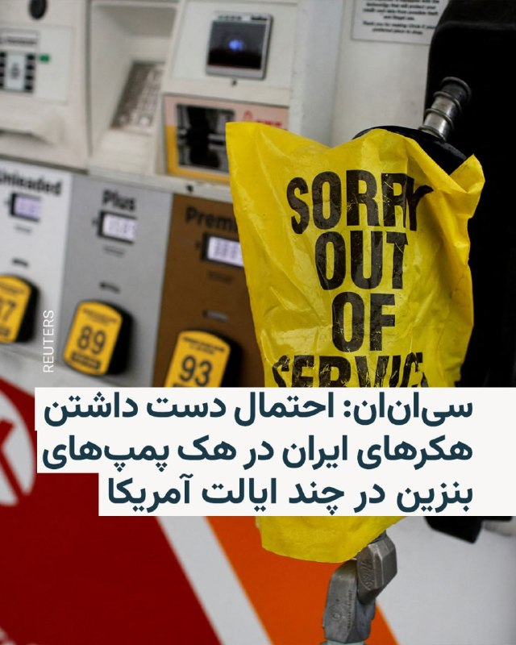

🔸شبکه تلویزیونی سی‌ان‌ان روز شنبه در گزارشی اختصاصی از هک شدن سیستمی در چند ایالت آمریکا خبر داد که میزان سوخت موجود در پمپ‌های بنزین را کنترل می‌کند.

🔸این شبکه به نقل از چند مقام آمریکایی که به نام‌شان اشاره نکرد نوشته است که این ظن وجود دارد که هکرهای ایرانی در نفوذ به این سیستم در آمریکا دست داشته‌اند.

🔸نفوذ سایبری در این سیستم سوخت‌رسانی در پمپ بنزین‌ها تاکنون به آسیب فیزیکی در این ایالت‌ها منجر نشده، اما به نگرانی دامن زده است، چرا که یک هکر با دسترسی به این سیستم می‌تواند به طور مثال نشت سوخت در یک پمپ بنزین را پنهان کند.

🔸از زمان آغاز جنگ در ابتدای اسفندماه ۱۴۰۴، هکرهای مرتبط با حکومت ایران از جمله در چند سایت نفت و گاز آمریکا اخلال ایجاد کرده‌اند و ایمیل‌های شخصی کَش پاتل،‌ مدیر اف‌بی‌آی، را درز داده‌اند.

@RadioFarda

## IranianMinds — post 20233

  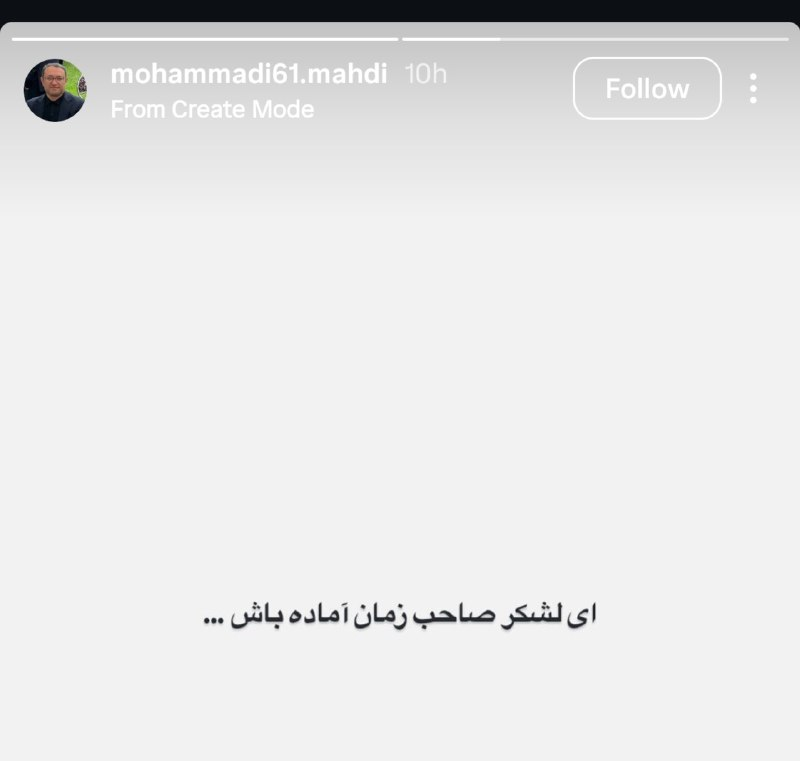

🔴استوری مشاور قالیباف😂

@IranianMinds

## IranianMinds — post 20232

  

🔴۱۹ روز قبل از سقوط رژیم جنایتکار قذافی، به دست مجریان تلویزیون اسلحه داده بودند.

@IranianMinds

## IranianMinds — post 20231

🔴کانال ۱۲ اسرائیل:

جنگ سوم با ایران نزدیک است.

@IranianMinds

## BBCPersian — post 281209

سخنگوی وزارت کشور ایران در نشست خبری روز ۲۶ اردیبهشت گفت: شعارهای تند بعضی در میادین درباره بی‌حجابی،سیاست رسمی نظام و حاکمیت نیست.

علی زینی‌وند گفت: «سیاست کلی نظام جلوگیری قاطع از هر شعار، سخنرانی و اقدامی است که باعث اختلال در انسجام کشور شود.»

پس از اظهارات چهره‌هایی چون امام جمعه رشت که زنان بی‌حجاب را «همراستا با اسکتبار جهانی» خواند، در یکی از تجمع‌های شبانه از زنان کم‌حجاب حاضر به عنوان «نورچشم» یاد شد. 

حجاب اجباری از اصولی است که حکومت ایران برای حفظ آن هزینه‌های بسیاری را کرده و زنان در ایران برای رعایت حجاب اجباری تحت فشار‌های بسیاری بوده‌اند.

بعد از کشته شدن مهسا امینی در بازداشت گشت ارشاد و شکل گرفتن اعترضات سراسری «زن، زندگی، آزادی» که منجر به کشته شدن بسیاری از معترضان شد، گشت ارشاد دیگر به طور رسمی فعالیتی نداشت. گرچه همچنان گزارش‌هایی از بازداشت زنان به دلیل عدم رعایت حجاب اجباری منتشر شد.

حکومت ایران پیش از این هم از زنانی که بدون حجاب اجباری در مراسم حکومتی شرکت می‌کنند، به عنوان نشانه‌ای از «وحدت بین اقشار مختلف مردم برای حفظ نظام» استفاده کرده است.
@BBCPersian

## BBCPersian — post 281208

🔻عضو هیئت رئيسه مجلس: تشکیل ستاد ویژه فضای مجازی خلاف قانون است

علیرضا سلیمی، عضو هیئت رئيسه مجلس ایران، تشکیل ستاد ویژه فضای مجازی از سوی مسعود پزشکیان را «خلاف قانون برنامه هفتم» و «مغایر با سیاست‌های کلی نظام» خواند.

آقای سلیمی گفت: «با توجه به اینکه شورای عالی فضای مجازی و مرکز ملی فضای مجازی نیز هر دو وجود دارند و وظایف آنها کاملاً روشن است، چگونه ممکن است رئیس‌جمهور که خود رئیس شورای عالی فضای مجازی است، اختیارات مربوط به شورا را به ستادی خارج از شورا واگذار کند؟»

تشکیل ویژه فضای مجازی پیش از این هم با انتقادهایی همراه بوده است. مصطفی پوردهقان، دبیر دوم کمیسیون صنایع و معادن مجلس، تشکیل این ستاد را اقدامی «تزئینی» خوانده و گفته بود که «این تصمیم‌ها بیشتر جنبه روانی دارد و قرار نیست تغییر مشخصی ایجاد شود.»

آقای پزشکیان چند روز پیش از تشکیل ستادی ویژه برای ساماندهی فضای مجازی خبر داد و محمدرضا عارف، معاون اول خود، را به سمت رئیس این ستاد انتخاب کرد.

در حکم آقای پزشکیان بر «حکمرانی یکپارچه» در فضای مجازی و پایان دادن به «چندصدایی» و جلوگیری از «موازی‌کاری» میان نهادهای مسئول تأکید شده است.

این ستاد در حالی تشکیل شده است که اینترنت در بیش از ۷۰ روز گذشته یعنی از زمان شروع جنگ آمریکا و اسرائیل با ایران عملا قطع است.

https://bbc.in/4tEavKe
@BBCPersian

## BBCPersian — post 281207

🔻مهدی چمران، رئیس شورای شهر تهران، درباره تمدید رایگان شدن اتوبوس و مترو در پایتخت گفت کار احساسی نمی‌توان انجام داد و قرار نیست تمدید شود.

او در گفت‌وگو با باشگاه خبرنگاران جوان گفت اجرای چنین تصمیمی نیازمند ارائه طرح یا لایحه است، اما تاکنون هیچ‌یک از این دو به شورای شهر ارائه نشده است.

اتوبوس‌های درون‌شهری در تهران اولین‌بار نهم اسفند ۱۴۰۴ و به دنبال شروع جنگ و مترو از ۲۴ اسفند رایگان شد. پس از آن شورای شهر بصورت هفتگی این طرح را تمدید کرد.

پرویز سروری، نایب رئیس شورای شهر تهران پنجم اردیبهشت در تلویزیون ایران اعلام کرد: براساس برنامه‌ریزی صورت گرفته قرار است اتوبوس و مترو با تصویب شورای اسلامی شهر تهران برای همیشه رایگان شود.
او گفت در حال برنامه‌ریزی با نمایندگان و مدیریت شهرداری هستیم تا امکان دائمی‌شدن خدمات رایگان مترو و اتوبوس در تهران انجام شود.

https://bbc.in/4dNI8o4

@BBCPersian

## Hranews — post 112968

  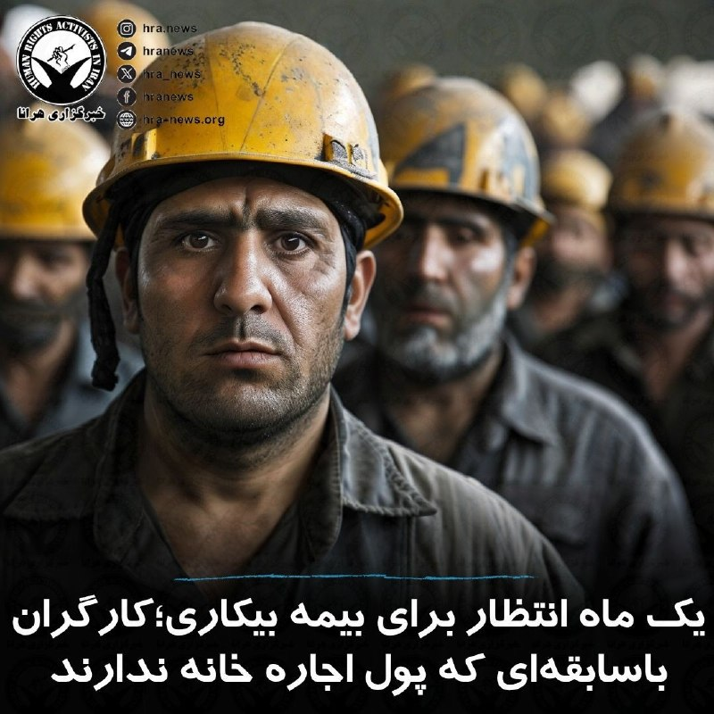

خبرگزاری کار ایران در گزارشی نوشت: در روزهایی که #بیکاری فشار بی‌سابقه‌ای بر زندگی کارگران وارد کرده، مراجعه به واحد شمال‌شرق اداره کار تهران بیش از هر چیز روایت انسان‌هایی است که میان امید و ناامیدی سرگردان مانده‌اند. جایی که باید پناهگاه کارگران بیکار باشد، امروز با انباشت پرونده‌ها و تأخیرهای طولانی در رسیدگی مواجه است؛ به‌طوری‌که شکایت‌های ثبت‌شده از اسفندماه سال گذشته همچنان بلاتکلیف باقی مانده‌اند.

در میان این انتظارهای طولانی، صدای #کارگران بیش از هر آمار و گزارشی شنیده می‌شود. یکی از آن‌ها با چشمانی خسته می‌گوید: «از کار بیکارم کردند، با هزار امید آمدم تا دست‌کم بیمه بیکاری‌ام برقرار شود و شرمنده صاحب‌خانه نشم… یک ماهه هر بار میام میگن در دست بررسیه.» کارگر دیگری که ۱۵ سال در یک کارخانه کار کرده، با تلخی اضافه می‌کند: «همه جوانی‌م رو اونجا گذاشتم، آخرش گفتن به مشکل خوردیم، نیازی به شما نیست… حالا یک ماهه فقط دارم می‌دوم دنبال بیمه بیکاری، بی‌جواب.»

در کنار این روایت‌ها، پرونده‌هایی دیده می‌شود که از اواخر فروردین ثبت شده‌اند اما هنوز در وضعیت «در دست بررسی» باقی مانده‌اند؛ در حالی که بسیاری از این کارگران با اجاره‌خانه عقب‌افتاده، بدهی و بیکاری ناگهانی دست‌وپنجه نرم می‌کنند.

↘️
@hranews_bot تماس ✉️ - @Hranews کانال هرانا 🆑

## manototv — post 105511

  <a href="telegram/content/manototv_105511_1778930504.mp4" target="_blank">🎬 Download video</a>

کریس رایت، وزیر انرژی آمریکا گفته است انتظار دارد تنگه هرمز «حداکثر تا مقطعی در تابستان» بازگشایی شود.

رایت همچنین گفت اگر ایران به «گروگان گرفتن اقتصاد جهان» ادامه دهد، ارتش آمریکا می‌تواند برای بازگشایی تنگه هرمز مداخله کند.

## manototv — post 105510

  <a href="telegram/content/manototv_105510_1778930505.mp4" target="_blank">🎬 Download video</a>

در برنامه‌های شامگاه گذشته تلویزیون جمهوری اسلامی، بخش‌هایی با محور آموزش کار با سلاح پخش شد.

در این برنامه‌ها، مجریان یا کارشناسان حاضر در استودیو، شیوه گرفتن و استفاده از سلاح را توضیح دادند. پخش چنین محتوایی از تلویزیون حکومتی در شرایطی صورت می‌گیرد که رسانه‌های وابسته به جمهوری اسلامی در هفته‌های اخیر بر ادبیات نظامی، آمادگی دفاعی و بسیج حامیان خود تاکید بیشتری داشته‌اند.

## manototv — post 105509

  <a href="telegram/content/manototv_105509_1778930505.mp4" target="_blank">🎬 Download video</a>

‌
«دریک»، رپر، خواننده و بازیگر کانادایی، در یکی از قطعه‌های تازه خود با نام «Don’t Worry» به دختری ایرانی اشاره کرده که فارسی حرف می‌زند. این قطعه در آلبوم تازه او منتشر شده است. در متن ترانه نیز بندی آمده که در آن زن مورد اشاره خود را ایرانی معرفی می‌کند که فارسی حرف می‌‌زند.

دریک با نام کامل «آبری دریک گراهام» زاده تورنتو است و پیش از ورود جدی به موسیقی، با بازی در مجموعه تلویزیونی نوجوانانه «دگراسی، نسل بعدی» شناخته شد. او سپس به یکی از چهره‌های اصلی موسیقی هیپ‌هاپ و پاپ معاصر تبدیل شد و سبک ترکیبی او میان رپ‌خوانی و خوانندگی، جایگاه گسترده‌ای در بازار جهانی موسیقی برایش به همراه آورد.

## alonews — post 120369

  <a href="telegram/content/alonews_120369_1778930507.webm" target="_blank">🎬 Download video</a>

👈به گزارش کانال ۱۲ اسرائیل : ترامپ بزودی با اعضای کابینه خود جلسه اضطراری برای پایان دادن به اوضاع ایران برگزار میکند ، حمله و تقابل سوم قریب الوقوع و بسیار نزدیک است

✅ @AloNews خبر جنگ

## alonews — post 120368

  <a href="telegram/content/alonews_120368_1778930507.webm" target="_blank">🎬 Download video</a>

👈الجزیره: وزیر انرژی امارات می‌گوید خروج از اوپک یک «انتخاب استراتژیک مستقل» است

✅ @AloNews خبر جنگ

## alonews — post 120367

  <a href="telegram/content/alonews_120367_1778930507.webm" target="_blank">🎬 Download video</a>

👈از دقایقی قبل سوپراپلیکیشن بله با اختلال مواجه شده و کار نمی کنه

✅ @AloNews خبر جنگ

## alonews — post 120366

  <a href="telegram/content/alonews_120366_1778930508.webm" target="_blank">🎬 Download video</a>

👈فارس مدعی شد: یک نفتکش غول‌پیکر چینی که از تنگهٔ هرمز عبور کرده بود، خارج از خط محاصرهٔ آمریکا رویت شد.

🔴این نفتکش پیش از آغاز مذاکرات رئیس‌جمهور چین و ترامپ درحال عبور از مسیر تعیین‌شدهٔ ایران در تنگهٔ هرمز در کنار جزیرهٔ لارک دیده شده بود.

✅ @AloNews خبر جنگ

## alonews — post 120365

  <a href="telegram/content/alonews_120365_1778930508.webm" target="_blank">🎬 Download video</a>

👈ناو شارل دوگل فرانسه، خروجی خلیج عدن - ورودی دریای عرب دیده شده

✅ @AloNews خبر جنگ

## alonews — post 120364

  <a href="telegram/content/alonews_120364_1778930508.webm" target="_blank">🎬 Download video</a>

👈فرماندهی کل نیروی دفاعی بحرین : برای حمله احتمالی جمهوری اسلامی، تو آماده‌باش سطح بالا قرار داریم

✅ @AloNews خبر جنگ

## alonews — post 120362

  <a href="telegram/content/alonews_120362_1778930508.webm" target="_blank">🎬 Download video</a>

🔴فوری / شبکه فاکس نیوز: ارتش آمریکا درحال آماده شدن برای دور جدیدی از درگیری های نظامی در ایران است

✅ @AloNews خبر جنگ

## alonews — post 120361

  <a href="telegram/content/alonews_120361_1778930509.webm" target="_blank">🎬 Download video</a>

👈امارات مدعی شد: خروج از اوپک و اوپک‌پلاس نشانه اختلاف با شرکا نیست

✅ @AloNews خبر جنگ

## alonews — post 120360

  <a href="telegram/content/alonews_120360_1778930509.webm" target="_blank">🎬 Download video</a>

👈یک مقام مطلع نظامی به نورنیوز: در صورت وقوع جنگ، اهدافی که قبلاً مصون ماندند این‌بار در تیررس‌اند

✅ @AloNews خبر جنگ

## alonews — post 120359

  <a href="telegram/content/alonews_120359_1778930509.webm" target="_blank">🎬 Download video</a>

👈سی‌ان‌ان: مشاوران ترامپ خواهان پایان فوری جنگ هستند؛ فشار اقتصادی رای‌دهندگان را نگران کرده

✅ @AloNews خبر جنگ

## alonews — post 120358

  <a href="telegram/content/alonews_120358_1778930509.webm" target="_blank">🎬 Download video</a>

👈مهاجرانی: نگاه دولت به اینترنت دسترسی برابر برای همه شهروندان است!

✅ @AloNews خبر جنگ

<!-- MSG END -->

<!-- NAV START -->

<a href="https://github.com/ali-exifit/aio-downloader/blob/main/telegram/content/archive_1.md" style="display:inline-block; padding:6px 12px; margin:0 4px; background-color:#2ea44f; color:white; text-decoration:none; border-radius:4px; font-weight:bold;">صفحه بعد</a>

<!-- NAV END -->
