## 1405/02/16 20:34 — DW_Farsi
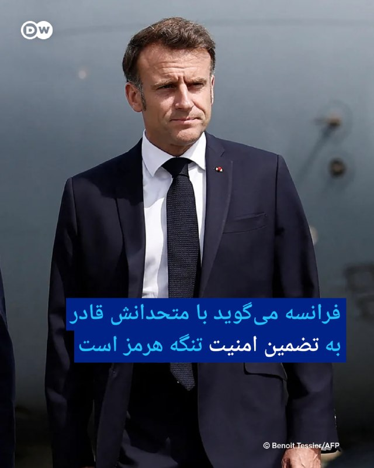

> 🔶 فرانسه می‌گوید با متحدانش قادر به تضمین امنیت تنگه هرمز است
> 
> کاخ الیزه، دفتر ریاست جمهوری فرانسه، روز چهارشنبه ۶ مه (۱۶ اردیبهشت) اعلام کرد که فرانسه و شرکایش قادرند امنیت تنگه هرمز را تضمین کنند.
> 
> کاخ الیزه همچنین افزود که فرانسه مایل است موضوع تنگه هرمز از گفت‌وگوهای جاری میان ایالات متحده و جمهوری اسلامی جدا نگه داشته شود.
> 
> ارتش فرانسه پیش‌تر اعلام کرده بود که ناوگروه هواپیمابر شارل دوگل در حال حرکت به سمت دریای سرخ و خلیج عدن است.
> 
> به گفته ارتش فرانسه، این اقدام بخشی از تلاش‌های فرانسه و بریتانیا برای آمادگی در صورت ماموریتی احتمالی در آینده با هدف کمک به آزادی کشتیرانی در تنگه هرمز است.
> @dw_farsi

## 1405/02/16 20:33 — Hranews
> زرندیه؛ ۵ شهروند توسط نیروی انتظامی بازداشت شدند
> 
> 
> ❗️
> ❗️
> ❗️
> ❗️
> ❗️– فرمانده انتظامی شهرستان زرندیه از بازداشت پنج شهروند به دلیل آنچه «ارسال اطلاعات و همکاری با شبکه معاند» عنوان کرده است، خبر داد.
> 
> ادامه مطلب
> 
> ↘️
> @hranews_bot تماس ✉️ - @Hranews کانال هرانا 🆑

## 1405/02/16 20:32 — Persian_Trend_Official
> فوری🔴 سنتکام: متوقف‌سازی نفتکش ایرانی در دریای عمان
> 
> نیروهای آمریکایی اعلام کردند در چارچوب اجرای محاصره دریایی، یک نفتکش با پرچم ایران را در دریای عمان از ادامه مسیر بازداشته‌اند.
> 
> بر اساس بیانیه منتشرشده:
> 
> ▪️ نفتکش «M/T Hasna» در حال حرکت به‌سوی یکی از بنادر ایران بوده است
> 
> ▪️ نیروهای آمریکا چندین بار هشدار داده‌اند و اعلام کرده‌اند این کشتی ناقض محاصره است
> 
> ▪️ پس از عدم تمکین، یک جنگنده F/A-18 از ناو هواپیمابر «USS Abraham Lincoln» با شلیک توپ ۲۰ میلی‌متری، سکان کشتی را هدف قرار داده و آن را از حرکت بازداشته است
> 
> در نتیجه، این نفتکش دیگر قادر به ادامه مسیر به سمت ایران نیست.
> 
> سنتکام تأکید کرده محاصره دریایی همچنان به‌طور کامل برقرار است و نیروهای آمریکایی برای اجرای آن به عملیات ادامه خواهند داد.
> 
> 🫆:Tony
> 
> 📌 @persian_trend_official
> پرشین ترند | متفاوت‌ترین کانال نظامی

## 1405/02/16 20:23 — mwarmonitor
> 🇮🇷ایران طی ۴۰ تا ۴۵ روز آینده ذخایر نفتی خشکی و فراساحلی خود را به پایان خواهد رساند و در نتیجه شروع به بستن چاه‌های نفت خواهد کرد؛ برخی از این تعطیلی‌ها ممکن است دائمی باشند، یک مقام وزارت نفت ایران به روزنامه نیویورک تایمز گفته است.
> 
> @mwarmonitor

## 1405/02/16 20:22 — iaghapour
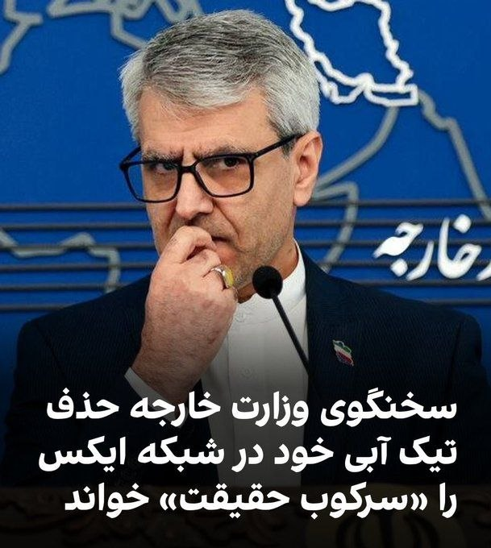

> 💢 سخنگو وزارت خارجه حذف تیک آبی خود در شبکه X را (سرکوب حقیقت) خواند.
> 
> ۶۷ روزه اینترنت مردم ایران رو قطع کردن، بعد یه تیک آبی‌شو گرفتن میگه حقیقت سرکوب شد.
> 
> 🆔 @iaghapour

## 1405/02/16 20:18 — BBCPersian
> 🔻بقایی: مذاکره نیازمند حسن نیت است نه اجبار
> 
> اسماعیل بقایی، سخنگوی وزارت خارجه ایران در پیامی در شبکه اجتماعی ایکس، بدون اشاره به آمریکا، نوشت که مذاکره نیازمند «حسن نیت» است.
> 
> او نوشت: «مفهوم مذاکره، دست‌کم، مستلزم تلاش واقعی برای گفتگو با هدف حل اختلاف است (دیوان بین‌المللی دادگستری، رأی مورخ اول آوریل ۲۰۱۱).
> 
> به گفته او مذاکره نیازمند حسن نیت است؛ «به این معنی که مذاکره نه 'جدل' است، نه 'دیکته'، نه 'فریب'، نه 'اخاذی' و نه 'اجبار'.»
> 
> دونالد ترامپ، رئیس جمهور آمریکا ساعاتی پیش در شبکه اجتماعی خود، تروث سوشیال، نوشت: «اگر ایران با آنچه مورد توافق قرار گرفته، موافقت کند -که البته شاید فرض بزرگی باشد- عملیات افسانه‌ای 'خشم حماسی' ، پایان خواهد یافت و محاصره بسیار موثر نیز این امکان را می‌دهد که تنگه هرمز به روی همه، از جمله ایران، باز شود.»
> 
> آقای ترامپ در ادامه نوشت: «اما اگر موافقت نکنند، بمباران‌ها آغاز خواهد شد و متأسفانه در سطح و شدتی بسیار بیشتر از قبل خواهد بود.»
> 
> https://bbc.in/42iCKTG
> @BBCPersian

## 1405/02/16 20:16 — VahidOOnLine
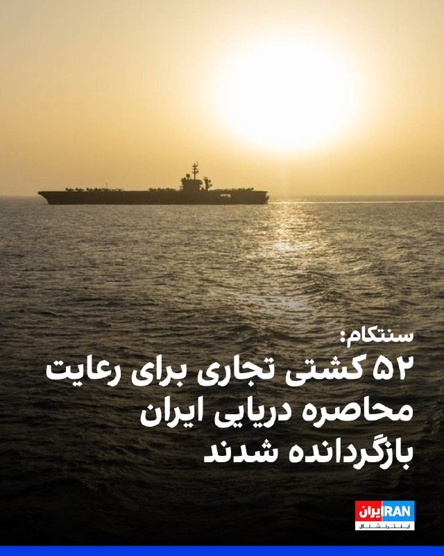

> فرماندهی مرکزی ارتش آمریکا، سنتکام، در پستی در شبکه اجتماعی ایکس اعلام کرد تاکنون ۵۲ کشتی تجاری برای رعایت محاصره دریایی آمریکا علیه جمهوری اسلامی مجبور به بازگشت شده‌اند یا مسیرشان را به سوی بندر مبدا هدایت کرده‌اند.
> 
> سنتکام افزود ناو هواپیمابر یواس‌اس جورج اچ. دبلیو. بوش در میان شمار گسترده‌ای از کشتی‌های جنگی، هواپیماها و نیروهای آمریکایی است که به گفته این فرماندهی، «به‌طور کامل» محاصره دریایی بندرهای جنوب ایران را اجرا می‌کنند.
> ‌🏁 🇬🇧 IranintlTV
> 
> 🤖 @VahidOOnLine

## 1405/02/16 20:16 — IranIntlTV

> فرماندهی مرکزی ارتش آمریکا، سنتکام، در پستی در شبکه اجتماعی ایکس اعلام کرد تاکنون ۵۲ کشتی تجاری برای رعایت محاصره دریایی آمریکا علیه جمهوری اسلامی مجبور به بازگشت شده‌اند یا مسیرشان را به سوی بندر مبدا هدایت کرده‌اند.
> 
> سنتکام افزود ناو هواپیمابر یواس‌اس جورج اچ. دبلیو. بوش در میان شمار گسترده‌ای از کشتی‌های جنگی، هواپیماها و نیروهای آمریکایی است که به گفته این فرماندهی، «به‌طور کامل» محاصره دریایی بندرهای جنوب ایران را اجرا می‌کنند.
> https://iranintl.com/202605066194

## 1405/02/16 20:15 — VahidOOnLine

> ♦️محمدباقر قالیباف، رئیس مجلس شورای اسلامی، در بخشی از پیام صوتی خود که روز چهارشنبه ۱۶ اردیبهشت منتشر شد، جنگ جمهوری اسلامی با آمریکا و اسرائیل را «بزرگ‌ترین جنگ تاریخ معاصر ایران» دانست و گفت: «پیروزی در این جنگ ایران را به مهره‌ای موثر در جهان تبدیل کند و این موفقیت با مشقت همراه خواهد بود.»
> 
> قالیباف در ادامه از مردم کشور خواست که به یکدیگر کمک کنند تا پیروزی با «کمترین رنج» حاصل شود.
> 
> این اظهارات قالیباف در حالی مطرح می‌شود که گزارش‌ها از ایران حاکی از گرانی شدید اقلام اساسی و حداقل‌های معیشتی است. پیش‌تر ایندیپندنت فارسی به نقل از منابع خود در ایران گزارش داده بود که قیمت گوشت گرم به یک میلیون و نهصدهزار تومان و گوشت یخ‌زده گوسفندی به یک میلیون و ۲۱۲ هزار تومان رسیده است. این افزایش قیمت سرسام‌آور اقلام دیگری چون پنیر، گوشت مرغ و تخم مرغ را نیز در بر گرفته است. همزمان جمهوری اسلامی نیز با قطع اینترنت به کسب و کارهای کوچک آسیب زده و منبع درآمد بسیاری از مردم را قطع کرده است.
> ‌🇸🇦 Indypersian
> 
> 🤖 @VahidOOnLine

## 1405/02/16 20:13 — BBCPersian
> 🔻تد ترنر، بنیان‌گذار شبکه خبری سی‌ان‌ان، در ۸۷ سالگی درگذشت. او در سال ۱۹۸۰ اولین شبکه خبری ۲۴ ساعته اختصاصی را راه‌اندازی کرد که به سرعت الگوی تازه‌ای در پوشش مداوم رویدادها ایجاد کرد، مدلی که بعدها به استاندارد صنعت خبر بدل شد.
> 
> دونالد ترامپ در واکنش به خبر درگذشت او در شبکه تروث سوشال خود نوشت که تد ترنر یکی از بزرگان تاریخ رسانه و دوست من بود. هر زمان به او نیاز داشتم حضور داشت و همیشه آماده بود که برای یک هدف خوب بجنگد.
> 
> سی‌ان‌ان با وجود تردیدهای اولیه و تمسخر منتقدان، با پوشش زنده رویدادهایی چون سوءقصد به رونالد ریگان در سال ۱۹۸۱ و انفجار شاتل چلنجر در سال ۱۹۸۶ جایگاه خود را تثبیت کرد.
> 
> همچنین پوشش پیوسته جنگ خلیج فارس در سال‌های ۱۹۹۰ و ۱۹۹۱ نقطه عطفی در نفوذ جهانی این شبکه بود.
> 
> تد ترنر فعالیت حرفه‌ای خود را با اداره کسب‌وکار تبلیغاتی خانوادگی آغاز کرد و سپس با خرید یک ایستگاه رادیویی در آتلانتا، پایه‌های امپراتوری رسانه‌ای خود را بنا گذاشت.
> 
> آقای ترنر در سال ۲۰۱۸ از ابتلا به نوعی از زوال عقل خبر داده بود.
> 
> جین فوندا بازیگر سرشناس از سال ۱۹۹۱ تا ۲۰۰۱ همسر آقای ترنر بود.
> 
> 
> 📷Getty Images
> @BBCPersian

## 1405/02/16 20:06 — RadioFarda
> توقف «پروژه آزادی» در تنگه هرمز و کورسوی دیپلماسی؛ گفت‌وگو با کامران متین
> 
> 🔸وضعیت خاورمیانه همچنان دستخوش تغییرات پی‌درپی است. اکنون با توقف عملیات «پروژه آزادی» به دستور دونالد ترامپ، رئیس‌جمهور ایالات متحده، و انتشار گزارش‌هایی درباره پیشرفت در مسیر دیپلماسی، بار دیگر امیدها به دستیابی تهران و واشینگتن به یک راه‌حل سیاسی افزایش یافته است. آیا رسیدن به یک تفاهم اولیه ممکن است، یا اینکه آتش‌بس همچنان ناپایدار است و خطر بازگشت به درگیری نظامی وجود دارد؟ ارزیابی کامران متین، تحلیلگر روابط بین‌الملل در بریتانیا را در این‌باره بشنوید.
> 
> @RadioFarda

## 1405/02/16 20:01 — RadioFarda
> 🔸 در این کافه فردا به صبحت‌های یک نماینده مجلس در مورد جایگزینی بمب اتم با موشک سجیل، صحبت‌های یک آخوند صدا و سیما در مورد لزوم اعدام ظریف و روحانی، گزارش رویترز در مورد تراکنش‌های مشکوک در صرافی نوبیتکس و حواشی انتشار یک ویدیو مربوط به سواحل کیش می‌پردازیم.
> 
> 🔸 برای تماس با ما می‌توانید به شناسه کافه فردا در تلگرام صوت و متن بفرستید.
> 
> 📻 کافه فردا

## 1405/02/16 20:00 — DW_Farsi
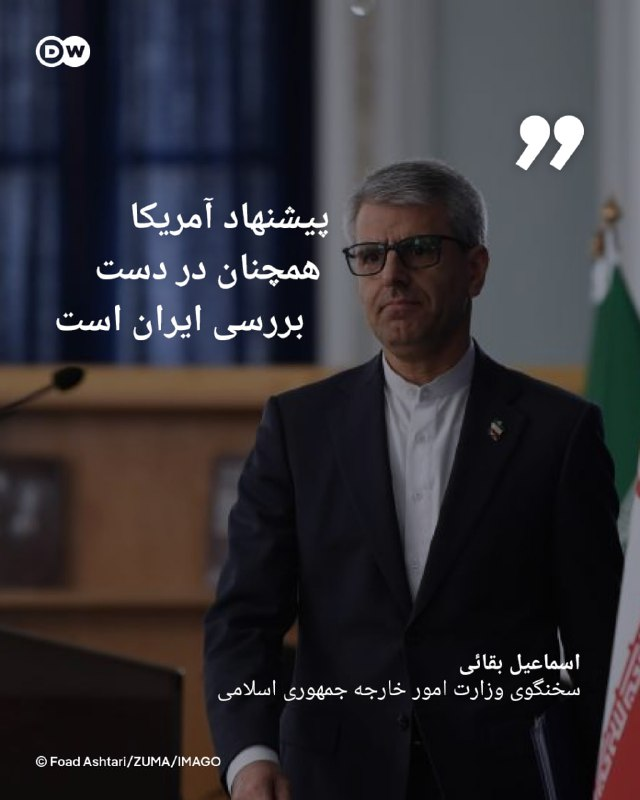

> 🔶 بقائی: پیشنهاد آمریکا همچنان در دست بررسی ایران است
> 
> اسماعیل بقائی، سخنگوی وزارت امور خارجه جمهوری اسلامی، گفت که تهران در حال بررسی پیشنهاد آمریکا برای پایان دادن به جنگی است که بیش از دو ماه از آغاز آن می‌گذرد.
> 
> بقائی در گفت‌وگو با ایسنا مطرح کرد: «طرح و پیشنهاد آمریکا از سوی ایران همچنان در حال بررسی است و ایران پس از جمع‌بندی، نقطه‌نظرهای خود را به طرف پاکستانی منتقل می‌کند.»
> 
> ایسنا همچنین نوشت، رسانه‌های آمریکایی در ساعت‌های گذشته، در چارچوب پوشش آنچه این خبرگزاری "شکست پروژه آزادی" رئیس جمهور آمریکا خواند، در تلاش بوده‌اند با "انتشار گمانه‌زنی‌ها و اخبار نادرست"، فضا را به سود دونالد ترامپ، رئیس‌جمهور آمریکا و این کشور تغییر دهند.
> 
> در همین ارتباط، این خبرگزاری به گزارشی از رسانه آمریکایی اکسیوس اشاره کرد که بخش‌هایی از توافق مدنظر آمریکا با جمهوری اسلامی را منتشر کرده است.
> 
> ایسنا مدعی شده که در این پیشنهادها خواسته‌هایی "زیاده‌خواهانه و غیرواقعی" مطرح شده که در روزهای اخیر از سوی مقام‌های جمهوری اسلامی به شدت رد شده‌اند.
> @dw_farsi

## 1405/02/16 19:53 — BBCPersian
> 🔻در واشنگتن، پرسش‌هایی در باره توافق احتمالی مطرح است
> 
> 🖊برند دبوسمن، خبرنگار بی‌بی‌سی در واشنگتن
> گزارش‌ها حاکی از آن است که ایالات متحده و ایران به تدریج به یک تفاهم‌نامه یک صفحه‌ای با هدف پایان دادن به جنگ نزدیک می‌شوند.
> 
> با این حال، کارشناسان هشدار می‌دهند که هرگونه مذاکره‌ای با هدف پایان دادن به جنگ، فوق‌العاده پیچیده است و در مورد برنامه هسته‌ای ایران بسیار فنی است.
> 
> هالی دگرس، متخصص ایران در موسسه واشنگتن در سیاست خاور نزدیک، به بی‌بی‌سی گفت که اگر ایرانی‌ها به عنوان بخشی از تفاهم‌نامه پیشنهادی به برنامه هسته‌ای خود نپردازند، «بسیار بعید» است دولت دونالد ترامپ راضی شود.
> 
> تفاهم‌نامه یک صفحه‌ای گزارش شده ، یک دوره ۳۰ روزه برای مذاکره در مورد این موضوع و همچنین تنگه هرمز و لغو تحریم‌ها تعیین می‌کند، اما هالی دگرس گفت که این جدول زمانی ممکن است غیرواقع‌بینانه باشد.
> 
> او گفت: « باید توجه داشت که برنامه جامع اقدام مشترک (برجام)، که دونالد ترامپ در دوره اول ریاست جمهوری خود از آن خارج شد، ۱۵۰ صفحه بود و شامل جزئیات فنی می‌شد.»
> 
> همچنین سردرگمی قابل توجهی در مورد توقف «پروژه آزادی» وجود دارد و اینکه آیا آزادی دریانوردی در تنگه هرمز واقعا دو طرف را به یک توافق نزدیک‌تر خواهد کرد.
> 
> یک مقام ارشد سابق پنتاگون به من گفت: «اگر این تفاهم‌نامه نهایی شود، کشتی‌ها باید آزاد شوند و این گامی بزرگ در پایان دادن به این جنگ است.
> 
> اگر این اتفاق نیفتد، ایران ممکن است جسورتر شود.»
> 
> به نظر می‌رسد که خود دونالد ترامپ هم تا حدودی در مورد رسیدن به یک توافق محتاط است. او امروز در یک مصاحبه تلفنی کوتاه با آربی‌اس گفت که در گذشته هم تصور می‌شد که حصول توافق نزدیک است اما اینطور نشد.
> 
> او گفت: «بنابر این باید ببینیم چه می‌شود.»
> 
> @BBCPersian

## 1405/02/16 19:52 — RadioFarda
> 🔸محمدباقر قالیباف، رئیس‌ مجلس شورای اسلامی و مذاکره‌کننده ارشد ایران در مذاکرات با آمریکا، می‌گوید واشینگتن با اجرای محاصره دریایی و فشار اقتصادی قصد دارد «ما را تسلیم کند» و درباره تأثیر این فشارها بر وضعیت جامعه ابراز نگرانی کرد. 🔸او در یک فایل صوتی که…

## 1405/02/16 19:52 — RadioFarda
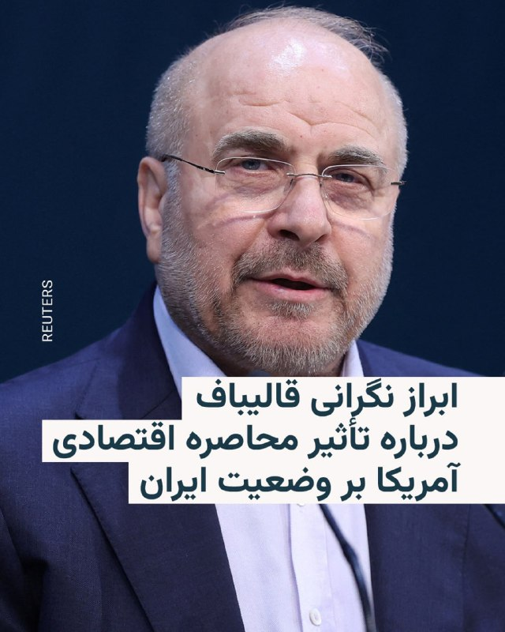

> 🔸محمدباقر قالیباف، رئیس‌ مجلس شورای اسلامی و مذاکره‌کننده ارشد ایران در مذاکرات با آمریکا، می‌گوید واشینگتن با اجرای محاصره دریایی و فشار اقتصادی قصد دارد «ما را تسلیم کند» و درباره تأثیر این فشارها بر وضعیت جامعه ابراز نگرانی کرد.
> 
> 🔸او در یک فایل صوتی که رسانه‌های ایران روز چهارشنبه منتشر کردند، گفت: «ما احتمال حمله نظامی و مخصوصاً حملات تروریستی را کم نمی‌دانیم اما آن بخشی از طراحی دشمن که به جامعه باز می‌گردد، ضعیف‌کردن ایران از درون است.»
> 
> 🔸وزیر خزانه‌داری آمریکا روز یکشنبه اعلام کرد که دولت دونالد ترامپ همزمان با جنگ، «محاصره اقتصادی» علیه ایران را ترتیب داده و در حال «خفه کردن» حکومت ایران است. او مدعی شد که جمهوری اسلامی حتی قادر نیست حقوق سربازان خود را بپردازد.
> 
> 🔸قالیباف در فایل صوتی خود جنگ اخیر را «یکی از بزرگ‌ترین جنگ‌های معاصر ایران» خواند و با طرح این ادعا که پیروزی در این جنگ، «ایران را به یک بازیگر مؤثر در نظام بین‌المللی تبدیل می‌کند» افزود که رسیدن به چنین هدفی «با سختی‌هایی همراه است.»
> 
> @RadioFarda

## 1405/02/16 19:52 — BBCPersian
> 🔻رئیس ستاد ارتش اسرائیل: در صورت لزوم برای یک عملیات جدید علیه ایران آماده‌ایم
> 
> رئیس ستاد ارتش اسرائیل می‌گوید که در صورت لزوم ارتش آن کشور برای آغاز یک عملیات جدید علیه ایران آماده است.
> 
> سپهبد ایال زمیر در بازدید از نیروهای ارتش اسرائیل در جنوب لبنان گفت: «ارتش اسرائیل در حالت آماده‌باش کامل قرار دارد تا در صورت نیاز به یک عملیات قدرتمند و گسترده بازگردد.»
> 
> او گفت چنین عملیاتی «به ما امکان می‌دهد دستاوردهای خود را ثبت و رژیم ایران را بیش از پیش تضعیف کنیم.»
> 
> سپهید زمیر همچنین تاکید کرد: «از هر فرصتی برای تعمیق روند برچیدن حزب‌الله استفاده خواهیم کرد و به تضعیف آن ادامه می‌دهیم.»
> 
> @BBCPersian

## 1405/02/16 19:50 — BBCPersian
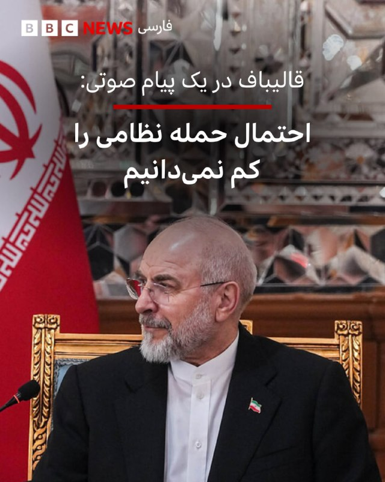

> 🔻قالیباف: احتمال حمله نظامی را کم نمی‌دانیم
> 
> محمدباقر قالیباف، رئیس مجلس ایران در یک پیام صوتی گفته است که احتمال حمله نظامی، «مخصوصا حملات تروریستی را کم نمی‌دانیم.»
> 
> رئیس مجلس ایران که از او به عنوان یکی از رهبران اصلی مدیریت امور کشور در زمان حملات نظامی اسرائیل و آمریکا یاد می‌شود گفته است که «جنگ وارد دوره جدیدی شده و مسئولان اجرایی توجه دارند که نقش‌شان موثرتر از قبل شده و باید با برنامه‌ریزی و مدیریت جهادی پای کار باشیم.»
> 
> آقای قالیباف می‌گوید که «در جلسات غیررسانه‌ای پیگیر گرانی‌ها هستیم.»
> 
> او پس از حملات نظامی اخیر در انظار عمومی ظاهرا نشده اما در یک مصاحبه با تلویزیون ایران شرکت کرده است.
> 
> مسعود پزشکیان، رئیس جمهور ایران هم امروز در پیامی که در ایکس منتشر کرد گفت که از وضعیت گرانی مطلع است و به اعضای دولتش از جمله وزیر دادگستری برای پیگیری و مقابله با «گرانفروشی» دستوراتی داده است.
> 
> 
> 📷MEHR
> @BBCPersian

## 1405/02/16 19:48 — IranIntlTV
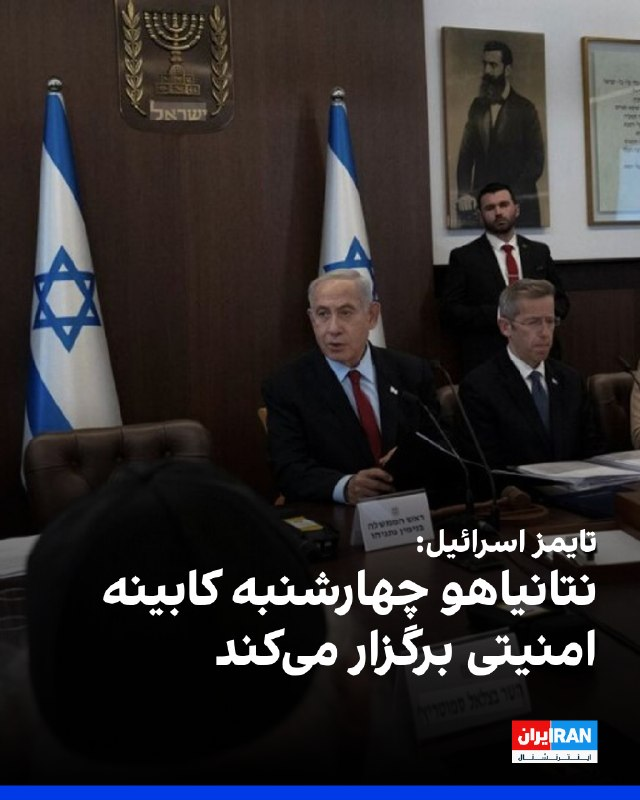

> روزنامه «تایمز اسرائیل» به نقل از دفتر یکی از وزیران گزارش داد که بنیامین نتانیاهو، نخست‌وزیر اسرائیل، چهارشنبه کابینه امنیتی تشکیل خواهد داد.
> 
> به نوشته این رسانه، برگزاری این نشست در شرایطی انجام می‌شود که گزارش‌هایی از نزدیک شدن آمریکا و جمهوری اسلامی به توافق بر سر یک یادداشت تفاهم برای پایان جنگ و بازگشایی تنگه هرمز منتشر شده است.
> https://iranintl.com/202605061198

## 1405/02/16 19:45 — Hranews

> حبس بدون تصمیم؛ ادامه بلاتکلیفی آزاده یعقوبی در زندان وکیل‌آباد مشهد
> 
> 
> ❗️
> ❗️
> ❗️
> ❗️
> ❗️– آزاده (معصومه) یعقوبی، شهروند ساکن مشهد، بیش از سه ماه است که در جریان اعتراضات سراسری توسط نیروهای امنیتی بازداشت شده و همچنان به‌ صورت بلاتکلیف در زندان وکیل‌آباد مشهد نگهداری می‌شود.
> 
> به گزارش خبرگزاری هرانا، ارگان خبری مجموعه فعالان حقوق بشر در ایران، آزاده (معصومه) یعقوبی کماکان در بازداشت به‌سر می‌برد.
> 
> بر اساس اطلاعات دریافتی هرانا، بازداشت آزاده یعقوبی در تاریخ ۱۴ بهمن ماه ۱۴۰۴، توسط نیروهای امنیتی در مشهد صورت گرفته است. او هم اکنون در قرنطینه زندان وکیل‌آباد مشهد نگهداری می‌شود.
> 
> #آزاده_یعقوبی #معصومه_یعقوبی
> #اعتراضات۱۴۰۴ #اعتراضات_بازار
> 
> ادامه مطلب
> 
> ↘️
> @hranews_bot تماس ✉️ - @Hranews کانال هرانا 🆑

## 1405/02/16 19:45 — FarsiVOA
> 🔺اتحادیه جهانی پزشکی: دسترسی فوری نرگس محمدی به مراقبت‌های پزشکی تخصصی فراهم شود
> 
> ▪️اتحادیه جهانی پزشکی ضمن ابراز نگرانی عمیق نسبت به گزارش‌های مربوط به وضعیت وخیم سلامتی نرگس محمدی، فعال حقوق بشر زندانی در ایران و برنده جایزه نوبل، از مقامات حکومت ایران خواست دسترسی فوری و اقدامات درمانی مناسب، از جمله انتقال او به بیمارستانی مجهز برای درمان تخصصی، را فراهم کنند.
> 
> ⬇️ بیشتر بخوانید:
> 
> https://ir.voanews.com/a/narges-mohammadi-health-hospital-wold-health-organiztaion-/8147251.html/?nocach=1

## 1405/02/16 19:38 — FarsiVOA
> 🔺آتش زیر خاکستر؛ اعتراضات در شهرکرد در پی تعرض و قتل یک زن
> 
> ▪️تعرض یک راننده تاکسی اینترنتی «اسنپ» به یک زن ۳۰ ساله به نام مریم آقابابایی در شهرکرد و قتل این زن، موجی از خشم و اعتراض را در میان مردم این شهر و اهالی استان چهارمحال و بختیاری برانگیخته است.
> 
> ⬇️ بیشتر بخوانید:
> 
> https://ir.voanews.com/a/iran-women-rape-killed-protest-rights-/8147241.html/?nocach=1

## 1405/02/16 19:38 — Hranews
> حامد دلاوری به زندان قروه منتقل شد
> 
> 
> ❗️
> ❗️
> ❗️
> ❗️
> ❗️– حامد دلاوری، شهروند بازداشتی اهل سقز، از یکی از بازداشتگاه‌های امنیتی در این شهر به زندان قروه منتقل شد.
> 
> #حامد_دلاوری
> 
> ادامه مطلب
> 
> ↘️
> @hranews_bot تماس ✉️ - @Hranews کانال هرانا 🆑

## 1405/02/16 19:32 — DW_Farsi
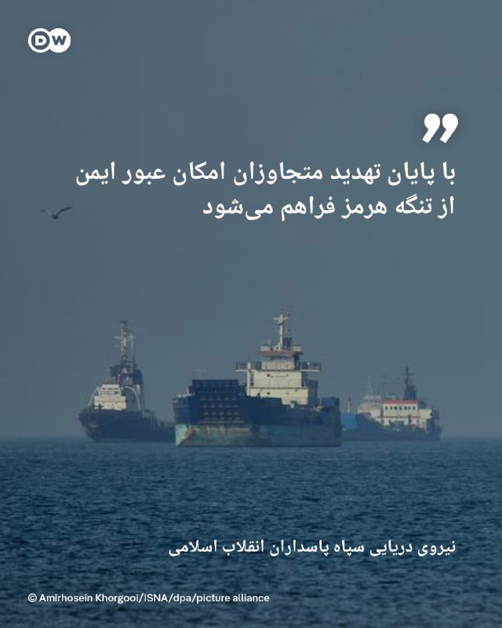

> 🔶 سپاه: با پایان تهدید متجاوزان امکان عبور ایمن از تنگه هرمز فراهم می‌شود
> 
> رسانه‌های ایران گزارش دادند که نیروی دریایی سپاه پاسداران انقلاب اسلامی از امکان عبور ایمن از تنگه هرمز سخن گفته است.
> 
> به نقل از خبرگزاری فارس، فرماندهی نیروی دریایی سپاه اعلام کرده که "با پایان تهدیدهای متجاوزان و در سایه رویه‌های جدید امکان عبور و مرور ایمن و پایدار از تنگه هرمز فراهم خواهد شد."
> 
> این اظهارات نخستین واکنش جمهوری اسلامی به تصمیم آمریکا برای توقف موقت ماموریت‌هایش در حمایت از کشتی‌های متوقف‌شده در این آبراه حیاتی به شمار می‌رود.
> 
> فرماندهی نیروی دریایی سپاه پاسداران انقلاب اسلامی همچنین "از همکاری کاپیتان‌ها و مالکان کشتی‌های مستقر در خلیج فارس و دریای عمان برای عبور و مرور از تنگه هرمز مطابق ضوابط ایران و مشارکت شناورها در امنیت دریانوردی منطقه" تشکر کرده است.
> @dw_farsi

## 1405/02/16 19:30 — IranianMinds
> 🔴 ترامپ : ممکنه قبل از سفرم به چین در هفته آینده با ایران به توافق برسیم.
> 
> @IranianMinds

## 1405/02/16 19:30 — BBCPersian
> 🔻عراقچی: دوستان چینی می‌گویند وضعیت بین‌المللی ایران بعد از جنگ ارتقا پیدا کرده است
> 
> عباس عراقچی، وزیر خارجه ایران، پس از پایان دیدارش با وانگ یی، وزیر خارجه چین در پکن، به تلویزیون رسمی ایران گفته است که «دوستان چینی ما هم اعتقاد دارند که ایران بعد از جنگ متفاوت از ایران قبل از جنگ است و وضعیت بین المللی‌اش ارتقا پیدا کرده است.»
> 
> وزیر خارجه ایران درباره محتوای مذاکراتش با وزیر خارجه چین گفت: «همه مسائل فعلی از جمله جنگ، نحوه خاتمه جنگ، موضوعات مرتبط با برنامه صلح آمیز هسته‌ای ایران، تحریم‌ها، تنگه هرمز و مذاکراتی که الان در جریان است را مرور کردیم.»
> 
> آقای عراقچی گفت: «دوره جدیدی از همکاری بین ایران و کشورهای دیگر در پیش است.»
> 
> @BBCPersian

## 1405/02/16 19:30 — ManotoTV
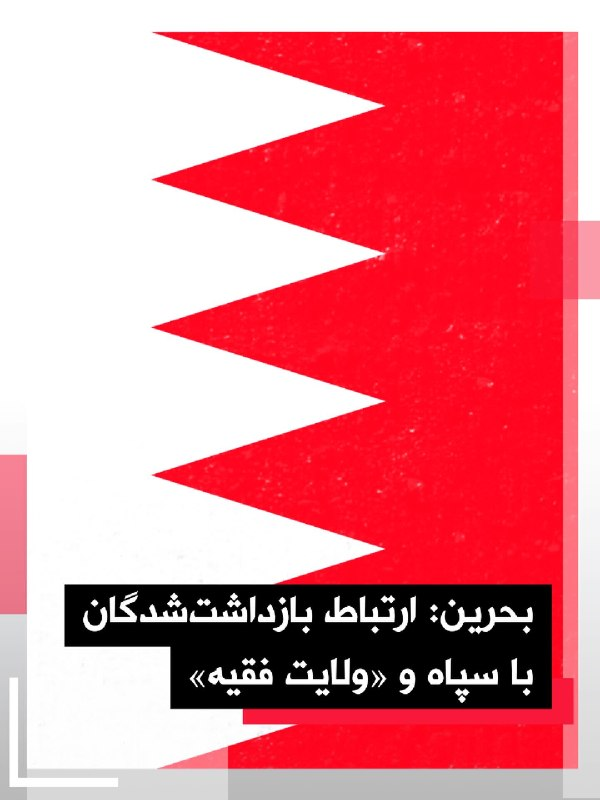

> وزیر کشور بحرین اعلام کرد افرادی که در ارتباط با پرونده‌های امنیتی اخیر بازداشت شده‌اند، «ارتباط نزدیکی با سپاه پاسداران انقلاب اسلامی و ایدئولوژی ولایت فقیه» داشته‌اند.
> به گفته وزارت کشور بحرین، این بازداشت‌ها در چارچوب یک بررسی «جامع امنیتی و حقوقی» و در پی آنچه «تجاوز آشکار ایران» خوانده شده، انجام شده است.
> این وزارتخانه افزود در این روند، جرائم و فعالیت‌های غیرقانونی مرتبط با این افراد نیز مورد بررسی قرار گرفته است.

## 1405/02/16 19:29 — IranianMinds

> روبرت ادوارد تد ترنر، بنیانگذار شبکه CNN امروز در سن ۸۷ سالگی درگذشت.
> 
> @IranianMinds

## 1405/02/16 19:17 — RadioFarda
> بغداد میان ایران و آمریکا؛ آیا توازن ممکن است؟ گفت‌وگو با فرزین کرباسی
> 
> 🔸عراق در آستانه شکل‌گیری دولتی تازه با نخست وزیری علی الزیدی است؛ در چنین فضایی یک مقام ارشد وزارت خارجه آمریکا که نامش فاش نشده به خبرگزاری فرانسه گفته است واشینگتن از نخست‌وزیر آینده عراق انتظار دارد برای دور کردن نهادهای دولتی از گروه‌های مسلح نزدیک به ایران «اقدام‌های ملموس» انجام دهد و در غیر این صورت کمک‌های مالی و امنیتی آمریکا از سر گرفته نخواهد شد. واشینگتن پیش‌تر انتقال نقدی درآمدهای نفتی عراق و بخشی از کمک‌های امنیتی به این کشور را متوقف کرده بود. «اقدام‌های ملموس» مورد نظر واشینگتن چیست و بغداد چگونه می‌تواند در روابطش با دو کشور آمریکا و ایران توازن برقرار کند؟ ارزیابی فرزین کرباسی، تحلیلگر مسائل خاورمیانه در سلیمانیه در اقلیم کردستان عراق، را در این‌باره بشنوید.
> 
> @RadioFarda

## 1405/02/16 19:13 — DW_Farsi
> DW Persian دویچه‌‌وله فارسی pinned Deleted message

## 1405/02/16 19:09 — IranIntlTV

> نخست‌وزیر و وزیر خارجه قطر اعلام کرد با وجود فاصله مواضع آمریکا و ایران، احتمال دستیابی دو طرف به راه‌حل دیپلماتیک همچنان بالاست.
> 
> شیخ محمد بن عبدالرحمن آل ثانی در گفت‌وگو با «العربی الجدید» تاکید کرد هر توافقی باید منافع کشورهای منطقه و جامعه جهانی را در نظر بگیرد و دوحه با استفاده از تنگه هرمز به‌عنوان ابزار فشار مخالف است.
> 
> او با اشاره به تحولات اخیر منطقه گفت همزیستی بر پایه احترام به حاکمیت، حسن همجواری و عدم تهدید امنیت دیگران ضروری است و حاکمیت قطر خط قرمز این کشور به شمار می‌رود.
> آل ثانی همچنین تاکید کرد تاسیسات غیرنظامی نباید هدف حمله قرار گیرند، زیرا بخش مهمی از اقتصاد و امنیت انرژی جهان هستند.
> 
> نخست‌وزیر قطر درباره پیامدهای اقتصادی حملات اخیر گفت اقتصاد این کشور توان جذب شوک‌ها را دارد و از ذخایر مالی و برنامه‌های مشخص برخوردار است، هرچند اقداماتی برای بهبود بهره‌وری و مدیریت هزینه‌ها در پیش خواهد بود.
> او امنیت کشورهای شورای همکاری خلیج فارس را تجزیه‌ناپذیر دانست و روابط با آمریکا را راهبردی توصیف کرد.
> 
> https://iranintl.com/202605066743

## 1405/02/16 19:08 — IranIntlTV
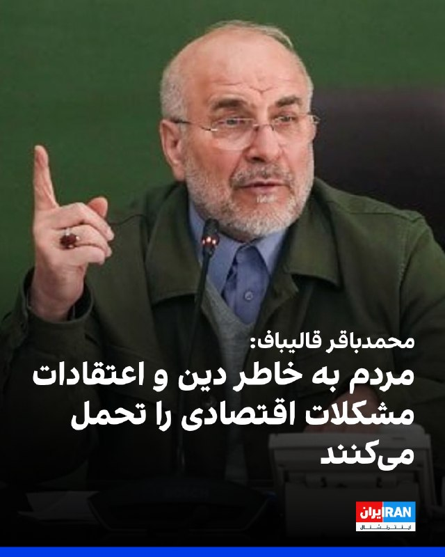

> محمدباقر قالیباف، رییس مجلس، گفت احتمال حمله نظامی کم نیست، اما «دشمن» به فشار اقتصادی امید بسته و بر اساس گزارش‌های «غلط» تصمیم‌گیری کرده است.
> 
> او افزود ملت ایران حتی در شرایط فشار اقتصادی، به خاطر دین و اعتقادات خود مشکلات را تحمل می‌کنند.
> 
> قالیباف گفت باید از ظرفیت ایرانیان خارج از کشور برای شکست «دشمن» استفاده شود و نخبگان نیز منتظر مراجعه مسئولان نمانند و راه‌حل‌ها و پیشنهادهای خود را ارائه دهند.
> 
> او همچنین خواستار راه‌اندازی پویش «ایران همدل» مانند دوران کرونا شد.
> https://iranintl.com/202605063276

## 1405/02/16 19:06 — RadioFarda
> 🔸دونالد ترامپ، رئیس‌جمهور آمریکا، روز چهارشنبه اعلام کرد که ممکن است توافق با ایران برای پایان دادن به جنگ پیش از سفر پیش‌روی او به چین حاصل شود. 🔸او که قرار است هفته آینده به چین برود، در گفت‌‌وگوی تلفنی با شبکه پی‌بی‌اس گفت احساس می‌کند آمریکا به یک توافق…

## 1405/02/16 19:06 — RadioFarda
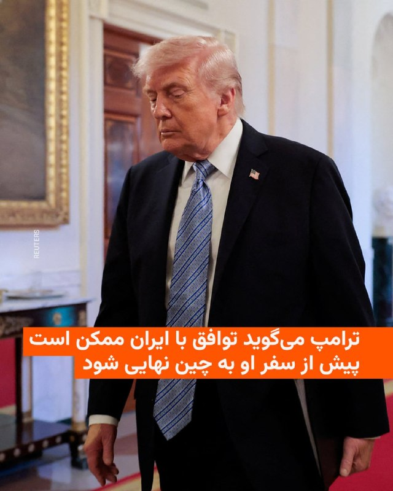

> 🔸دونالد ترامپ، رئیس‌جمهور آمریکا، روز چهارشنبه اعلام کرد که ممکن است توافق با ایران برای پایان دادن به جنگ پیش از سفر پیش‌روی او به چین حاصل شود.
> 
> 🔸او که قرار است هفته آینده به چین برود، در گفت‌‌وگوی تلفنی با شبکه پی‌بی‌اس گفت احساس می‌کند آمریکا به یک توافق نزدیک شده است، «اما قبلاً هم چنین احساسی درباره آن‌ها داشته‌ام، پس ببینیم چه می‌شود.»
> 
> 🔸رئیس‌جمهور ایلات متحده اعزام استیو ویتکاف و جرد کوشنر، نمایندگان ویژه‌اش، به مذاکرات مستقیم و رو در رو با ایران را «بعید» دانست.
> 
> 🔸ترامپ به لیز لندرز، خبرنگار پی‌بی‌اس، گفت: «فکر می‌کنم شانس بسیار خوبی برای پایان یافتن آن وجود دارد، و اگر پایان نیابد، مجبوریم دوباره آن‌ها را به‌شدت بمباران کنیم.»
> 
> 🔸او ساعتی پیش نیز با انتشار پیامی در شبکه اجتماعی خود این تهدید را اعلام کرده و نوشته بود اگر ایران تن به توافق ندهد، «بمباران آغاز می‌شود و متأسفانه این بار با سطح و شدتی بسیار فراتر از گذشته خواهد بود».
> 
> @RadioFarda

## 1405/02/16 19:02 — FarsiVOA
> 🔺مقام ارشد بازرگانی آمریکا: خریداران نفت رژیم ایران به بزرگترین حامی حکومتی تروریسم کمک می‌کنند
> 
> ▪️جیمیسون گریر، از مقامات ارشد تجاری دولت آمریکا، روز چهارشنبه ۱۶ اردیبهشت، در گفت‌و‌گو با خبرگزاری بلومبرگ با اشاره به سفر پیش روی دونالد ترامپ، رئیس جمهوری آمریکا، به چین گفت: «[رژیم] ایران بزرگترین حامی حکومتی تروریسم در جهان است و هر کسی که از [رژیم] ایران نفت می‌خرد، به این امر کمک می‌کند.»
> 
> ⬇️ بیشتر بخوانید:
> 
> https://ir.voanews.com/a/us-trade-representative-jamison-greer-trump-travel-china-iran/8147238.html/?nocach=1

## 1405/02/16 18:59 — FarsiVOA
> 📷ستاد فرماندهی مرکزی ایالات متحده آمریکا، سنتکام، با انتشار تصاویری از ناو هواپیمابر «یو‌اس‌اس جورج اچ. دبلیو. بوش» اعلام کرد از آغاز عملیات محاصره دریایی جمهوری اسلامی تاکنون، از رفت‌وآمد ۵۲ کشتی تجاری به بنادر ایران جلوگیری شده است.

## 1405/02/16 18:57 — ManotoTV

> یک منبع اسرائیلی به خبرگزاری رویترز گفته است که اسرائیل از نزدیک شدن احتمالی توافق میان آمریکا و جمهوری اسلامی اطلاعی نداشته است.
> این منبع همچنین افزوده که اسرائیل خود را برای احتمال تشدید درگیری‌ها آماده کرده است.
> اسرائیل همچنان به حملات خود در جنوب لبنان ادامه می‌دهد و مواضع گروه حزب‌الله مورد حمایت تهران را هدف قرار می‌دهد.
> این گزارش در حالی منتشر شده که پیش‌تر یک منبع پاکستانی به رویترز گفته بود آمریکا و جمهوری اسلامی به توافق بر سر یک یادداشت تفاهم یک‌صفحه‌ای برای پایان جنگ نزدیک شده‌اند.
> به نقل از سخنگوی وزارت خارجه جمهوری اسلامی نیز گزارش شده که تهران در حال بررسی این پیشنهاد است و نظرات خود را از طریق پاکستان به طرف مقابل منتقل خواهد کرد.

## 1405/02/16 18:54 — IranianMinds
> 🔴وزارت امور خارجه ایالات متحده اعلام کرد که کنسولگری کل ایالات متحده در پیشاور پاکستان به صورت مرحله‌ای تعطیل خواهد شد.
> 
> این اقدام برای حفظ امنیت کارکنان دیپلماتیک است.
> 
> @IranianMinds

## 1405/02/16 18:53 — BBCPersian
> 🔻گزارش اطلاعاتی آمریکا: احتمالا انگیزه مظنون تیراندازی شام ترامپ، جنگ ایران بود
> 
> به گزارش رویترز، ارزیابی اطلاعاتی آمریکا نشان داده است که جنگ آمریکا و اسرائیل علیه ایران ممکن است انگیزه بالقوه مردی بوده که متهم به تلاش برای ترور دونالد ترامپ و اعضای ارشد دولت او در ضیافت شام خبرنگاران در کاخ سفید در ماه گذشته بوده باشد.
> 
> این گزارش که برای نیروهای انتظامی ایالتی و محلی در سراسر آمریکا و سایر اداره‌های فدرال ارسال شده است، ارزیابی اولیه دفتر اطلاعات و تحلیل وزارت امنیت داخلی به تاریخ ۲۷ آوریل است.
> 
> در این گزارش آمده است که کول آلن، فرد مظنون، «نارضایتی‌های اجتماعی و سیاسی متعددی» داشت اما با استناد به پست‌های شبکه‌های اجتماعی او که از اقدامات آمریکا در جنگ علیه ایران انتقاد می‌کرد، می‌توان نتیجه گرفت که جنگ ایران «ممکن است در تصمیم او برای انجام این حمله نقش داشته باشد.»
> 
> این ارزیابی، زوایای جدیدی را در مورد یافتن انگیزه حمله خنثی شده به شام ​​خبرنگاران کاخ سفید در ۲۵ آوریل روشن می‌کند.
> 
> نتیجه‌گیری‌های این ارزیابی، اگرچه مقدماتی است، قطعی‌ترین شواهد تا به امروز را ارائه می‌دهد و نشان می‌دهد که این جنگ با هزاران کشته در خاورمیانه و تزلزل در اقتصاد جهانی، شاید انگیزه مهاجم باشد.
> 
> این گزارش در چارچوب مقررات شفافیت و دسترسی آزاد به اطلاعات به دست آمده و با رویترز به اشتراک گذاشته شده است.
> 
> به گزارش رویترز سخنگویان وزارت امنیت داخلی و وزارت دادگستری ایالات متحده هنوز به درخواست‌های اظهار نظر در این باره پاسخ نداده اند و اف‌بی‌آی هم از صحبت در این باره خودداری کرده است.
> 
> https://bbc.in/4utjPkR
> @BBCPersian

## 1405/02/16 18:49 — DW_Farsi
> 🔶 "سیاست بی‌طرفی"؛ چگونه سوریه در جنگ ایران در حال پیروزی است؟
> 
> توصیف‌ها از سوریه در طول سال گذشته به‌شدت تغییر کرده است: از دولتی منفور و حامی تروریسم، به کشوری ویران‌شده بر اثر جنگ داخلی و اکنون به‌عنوان یک قطب بالقوه انرژی که خاورمیانه را به اروپا متصل می‌کند و می‌تواند به جهان در کاهش اثرات تورمی ناشی از محاصره تنگه هرمز کمک کند.
> 
> این توصیف مثبت به دلیل جنگ کنونی ایران پدید آمده است. پس از آنکه اسرائیل و ایالات متحده در ۲۸ فوریه (۹ اسفند۱۴۰۴) حمله کردند و ایران در واکنش، تنگه هرمز را که یکی از مهم‌ترین آبراه‌های جهان برای انتقال نفت خام از عراق، عربستان سعودی، کویت و امارات متحده عربی است را بست.
> 
> سوریه حالا خود را به‌عنوان جایگزینی احتمالی برای تولیدکنندگان نفت و گاز معرفی می‌کند که هیچ راهی برای رساندن کالاهای خود به بازار ندارند. موقعیت جغرافیایی این کشور در قلب منطقه و سیاست خارجی‌ای که عمدا آن را از جنگ ایران دور نگه داشته است، باعث شده این ایده با استقبال روبه‌رو شود.
> 
> در برخی جنبه‌ها، این ایده هم‌اکنون در حال اجر است. در اوایل ماه آوریل سال جاری میلادی، سوریه و عراق مرز خود را بازگشایی کردند تا تانکرهای نفت عراق بتوانند به سمت بنادر مدیترانه حرکت کنند.
> 
> در این زمان، "المجله" (Al Majalla) رسانه عربی مستقر در لندن به سندی افشا شده استناد کرد که به تام باراک، فرستاده ویژه ایالات متحده در امور سوریه نسبت داده شده بود و در آن او نیز از ایجاد "یک پل زمینی از طریق سوریه" حمایت کرده بود.
> 
> این رسانه عربی در این سند به هزاران کیلومتر خط لوله اشاره داشت که می‌تواند، کشورهای حاشیه خلیج فارس و عراق را به بازارهای اروپایی متصل کند.
> 
> این تنها یکی از راه‌هایی است که سوریه از طریق آن، از موضعی که ناظران آن را "بی‌طرفی استراتژیک" در جنگ ایران توصیف کرده‌اند، سود می‌برد.
> 
> دولت موقت سوریه متشکل از گروه‌های شورشی است که در اواخر سال ۲۰۲۴ بشار اسد، دیکتاتور دیرینه این کشور را سرنگون کردند. ایران و گروه‌های نیابتی مختلف در منطقه، از جمله حزب‌الله لبنان از حکومت اسد حمایت کرده و علیه این گروه‌های شورشی جنگیده بودند.
> 
> خضر خادور، پژوهشگر غیرمقیم در مرکز خاورمیانه کارنگی (Carnegie Middle East Center) در بیروت در نشستی در ماه مارس سال جاری گفت: «مقامات جدید در دمشق با یک دغدغه اصلی و حیاتی به قدرت رسیدند؛ جلوگیری از تبدیل شدن دوباره‌ سوریه به جبهه‌ای برای درگیری‌های منطقه‌ای.»
> 
> او افزود: «مقامات سوریه به همین دلیل، از زمان آغاز درگیری با ایران، بیش از آنکه بر مداخله مستقیم در این نبرد تمرکز کنند، بر مدیریت تبعات این درگیری متمرکز شده‌اند.»
> 
> @dw_farsi

## 1405/02/16 18:42 — IranianMinds
> 🔴فوری:
> 
> بر اساس گزارش رسانه‌ای Ynet، رئیس کل ستاد ارتش اسرائیل اعلام کرد که ارتش اسرائیل اهداف اضافی را آماده کرده و در حالت آماده‌باش کامل برای از سرگیری عملیات علیه ایران است.
> 
> @IranianMinds

## 1405/02/16 18:42 — IranIntlTV
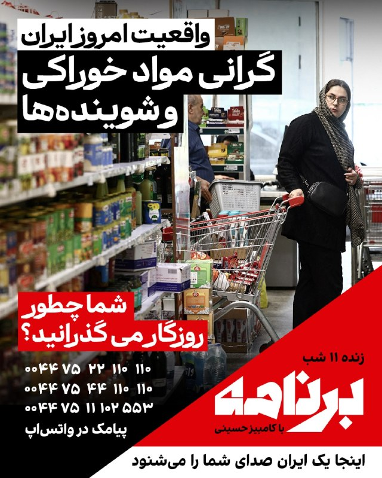

> تورم خوراکی‌ها در ایران از کنترل خارج شده؛ قیمت مواد غذایی، دارو و حتی ساده‌ترین اقلام روزمره چند برابر شده و فشار معیشتی زندگی مردم را خرد کرده است.
> 
> 
> امشب در «برنامه با کامبیز حسینی» از واقعیت زندگی در ایران می‌گوییم.
> 
> 
> اگر در ایران به اینترنت دسترسی دارید، روایت خودتان را برای ما بفرستید. شما را، بدون نوبت، مستقیم از ایران روی خط می‌آوریم.
> 
> واتس‌اپ:
> ۰۰۴۴۷۵۲۲۱۱۰۱۱۰
> ۰۰۴۴۷۵۴۴۱۱۰۱۱۰
> ۰۰۴۴۷۵۱۱۱۰۲۵۵۳
> 
> «برنامه با کامبیز حسینی»
> «یک ایران صدای شما را می‌شنود»
> @iranintltv

## 1405/02/16 18:40 — IranIntlTV
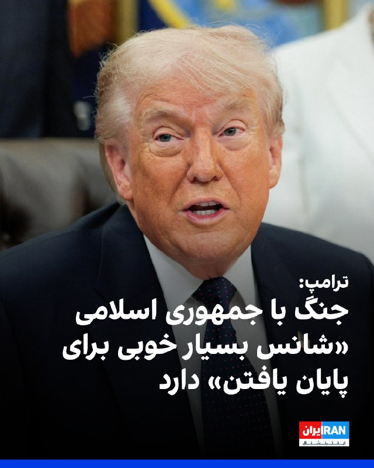

> دونالد ترامپ، رییس‌جمهوری آمریکا، در گفت‌وگو با شبکه پی‌بی‌اس نیوز اعلام کرد جنگ با ایران «شانس بسیار خوبی برای پایان یافتن» دارد و ابراز امیدواری کرد واشینگتن به توافقی با تهران نزدیک شده باشد. او گفت این توافق می‌تواند شامل انتقال اورانیوم با غنای بالا از سوی ایران به آمریکا باشد.
> 
> ترامپ با اشاره به روند مذاکرات افزود: «احساس می‌کنم به توافق نزدیک شده‌ایم، اما قبلاً هم چنین احساسی داشتم، بنابراین باید دید چه می‌شود.» او احتمال اعزام استیو ویتکاف و جرد کوشنر به مذاکرات را بعید دانست و گفت ممکن است پیش از سفر هفته آینده‌اش به چین، توافقی برای پایان جنگ حاصل شود.
> 
> رییس‌جمهوری آمریکا هشدار داد در صورت شکست مذاکرات، گزینه نظامی همچنان روی میز خواهد بود. او گفت اگر جنگ پایان نیابد «باید دوباره آن‌ها را به‌شدت بمباران کنیم.»
> 
> این اظهارات ساعاتی پس از آن مطرح شد که ترامپ در شبکه تروث سوشال اعلام کرد ماموریت اسکورت کشتی‌های تجاری در تنگه هرمز موقتاً متوقف می‌شود، زیرا کشورها به توافق نزدیک‌تر شده‌اند.
> https://iranintl.com/202605060227

## 1405/02/16 18:32 — IranianMinds
> 📲#اپلیکیشن اندروید سایت جهانی دربی بت
> 
> 👍اسپانسر لیگ انگلیس
> 👍
> 🔥امکان شارژ امن از طریق کارت بانکی
> ➖➖➖➖➖➖➖➖➖
> 
> 🪙همین حالا عضو شوید 👇
> https://t.me/+aCbq7yy8QY80NzQ0

## 1405/02/16 18:32 — IranianMinds

> 😤دنبال یه سایت شرط بندی بین المللی بودی که به ایرانیا خدمات بده؟!
> ⛔
> 
> 
> 👍دربی بت همون انتخاب  100%
> 
> 
> 💎ویژگی های سایت جهانی Derby Bet:
> 
> ⬅️امکان شارژ امن با کارت بانکی
> 
> ⬅️واریز اول دوبل شارژ می شوید(بونوس۱۰۰٪)
> 
> ⬅️پر اپشن ترین سایت فعال در ایران
> 
> ⬅️تسویه حساب کمتر از 5 دقیقه
> 
> ⬅️برگشت بخشی از باخت به صورت هفتگی
> 
> 
> 🚨کد هدیه ثبت نام:GG007
> 
> ⚠️برای دانلود اپلکیشن کلیک کنید
> 👉
> ge16
> 
> 🔔کانال دربی بت :
> 
> 🪙https://t.me/+aCbq7yy8QY80NzQ0

## 1405/02/16 18:29 — ManotoTV
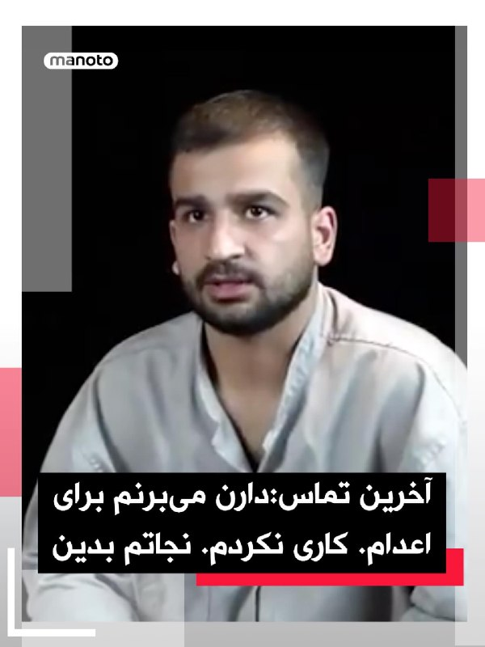

> دادبان جزئیات تازه‌ای از یکی از سه بازداشتی دی ۱۴۰۴ اعدام شده در مشهد منتشر کرده است. بر اساس این گزارش، محمدرضا میری، کارگر ۲۱ ساله‌ای که اخیراً خدمت سربازی خود را به پایان رسانده بود، بامداد یکشنبه ۱۳ اردیبهشت ۱۴۰۵ در تماس تلفنی با خانواده‌اش از انتقال خود برای اجرای حکم اعدام خبر داده است.
> به گفته منابع نزدیک به خانواده، او در این تماس با صدایی لرزان گفته است: «دارن منو می‌برن برای اعدام، من کاری نکردم، بیاین منو نجات بدین.»
> ساعاتی بعد، حکم اعدام او اجرا شد.
> محمدرضا میری یکی از سه معترض بازداشت‌شده در جریان اعتراضات دی‌ماه ۱۴۰۴ بوده که به همراه ابراهیم دولت‌آبادی و مهدی رسولی به اتهام «محاربه» و «مشارکت در قتل یک مأمور نیروی انتظامی» به اعدام محکوم شده بودند.
> دادبان می‌نویسد این احکام در حالی اجرا شده که به گفته منابع حقوقی، روند رسیدگی به پرونده‌ها با ابهامات جدی همراه بوده است.
> همچنین گزارش شده اجرای این احکام بدون اطلاع قبلی به خانواده‌ها انجام شده و به آن‌ها گفته شده بود پرونده در کمیسیون عفو در حال بررسی است.

## 1405/02/16 18:29 — IranIntlTV

> حسن قشقاوی، عضو کمیسیون امنیت ملی مجلس اعلام کرد جمهوری اسلامی تاکنون پاسخی به پیام آمریکا نداده و هیچ توافقی درباره پرونده هسته‌ای یا تنگه هرمز حاصل نشده است.
> 
> او با اشاره به برخی گمانه‌زنی‌ها درباره مذاکرات، تاکید کرد در موضوع هسته‌ای و همچنین مساله تنگه هرمز، توافقی میان دو طرف شکل نگرفته است.
> 
> ساعاتی پیش آکسیوس گزارش داد آمریکا و جمهوری اسلامی در آستانه توافق بر سر یک یادداشت تفاهم تک‌صفحه‌ای برای پایان دادن به جنگ هستند.
> 
> آکسیوس به نقل از دو مقام آمریکایی و دو منبع آگاه نوشت هدف از این یادداشت تفاهم، خاتمه درگیری نظامی و «تعیین چارچوبی برای مذاکرات هسته‌ای مفصل‌تر» است.
> 
> بر اساس این گزارش، کاخ سفید انتظار دارد حکومت ایران طی ۴۸ ساعت آینده، به «چند نکته کلیدی» در ارتباط با مذاکرات پاسخ دهد.
> 
> به گفته منابع آگاه، هنوز هیچ توافقی حاصل نشده است، اما دو طرف از زمان آغاز جنگ تاکنون هرگز تا این اندازه به توافق نزدیک نبوده‌اند.
> 
> 
> https://iranintl.com/202605064378

## 1405/02/16 18:26 — Hranews
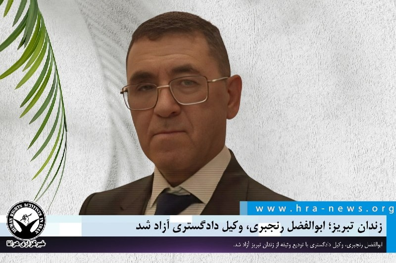

> زندان تبریز؛ ابوالفضل رنجبری، وکیل دادگستری با تودیع وثیقه آزاد شد
> 
> 
> ❗️
> ❗️
> ❗️
> ❗️
> ❗️– امروز چهارشنبه ۱۶ اردیبهشت ماه، ابوالفضل رنجبری، وکیل دادگستری با تودیع وثیقه از زندان تبریز آزاد شد.
> 
> به گزارش خبرگزاری هرانا، ارگان خبری مجموعه فعالان حقوق بشر در ایران، ابوالفضل رنجبری، وکیل دادگستری آزاد شد.
> 
> آزادی ابوالفضل رنجبری امروز چهارشنبه ۱۶ اردیبهشت ۱۴۰۵ با تودیع وثیقه ۵۰ میلیارد تومانی و از زندان تبریز صورت گرفته است.
> 
> #ابوالفضل_رنجبری
> 
> ادامه مطلب
> 
> ↘️
> @hranews_bot تماس ✉️ - @Hranews کانال هرانا 🆑

## 1405/02/16 18:18 — Persian_Trend_Official
[🎬 Video](telegram/content/Persian_Trend_Official_13542_1778087159.jpg)

> 💢تسنیم:
> 
> 🔹جمهوری‌اسلامی هنوز به متن پیشنهادی آمریکا که «بندهای غیرقابل‌قبول» داره، جواب رسمی نداده. تبلیغات رسانه‌های آمریکایی فقط برای توجیهِ عقب‌نشینیِ ترامپه و تهران بعد از جمع‌بندی، نتیجه رو به میانجیِ پاکستانی اعلام می‌کنه.
> 
> 
> 🫆:Tony
> 
> 📌 @persian_trend_official
> پرشین ترند | متفاوت‌ترین کانال نظامی

## 1405/02/16 18:13 — IranianMinds
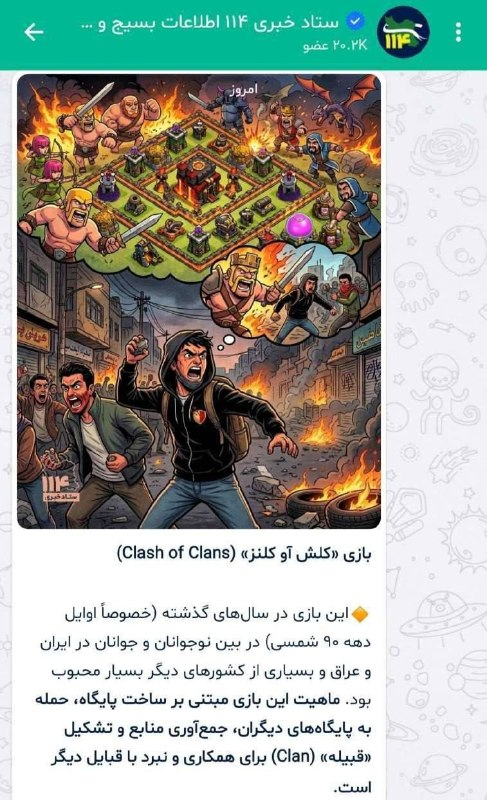

> 🔴 سپاه :
> 
> دلیل اعتراضات اخیر و ناآمنی کشور بازی کلش اف کلنز بوده و این بازی باعث شده جوونا ناآروم و خشمگین بشن !
> 
> @IranianMinds

## 1405/02/16 18:12 — Shin_Persian
> U.S. Central Command ✓ @CENTCOM Wed, 06 May 2026 14:35:13 UTC Aircraft carrier USS George H.W. Bush (CVN 77) is among the large contingent of U.S. warships, aircraft, and personnel fully enforcing the U.S. naval blockade against Iran. So far, 52 commercial…

## 1405/02/16 18:12 — Shin_Persian
> U.S. Central Command ✓ @CENTCOM
> Wed, 06 May 2026 14:35:13 UTC
> 
> Aircraft carrier USS George H.W. Bush (CVN 77) is among the large contingent of U.S. warships, aircraft, and personnel fully enforcing the U.S. naval blockade against Iran. So far, 52 commercial vessels have been directed to turn around or return to port in order to comply.
> 
> فارسی
> 
> ناو هواپیمابر یواس‌اس جورج اچ. دبلیو. بوش (CVN 77) در میان گروه بزرگی از کشتی‌های جنگی، هواپیماها و پرسنل ایالات متحده است که به‌طور کامل در حال اجرای محاصره دریایی آمریکا علیه ایران هستند. تا این لحظه، به ۵۲ شناور تجاری دستور داده شده است تا جهت پایبندی [به این محاصره]، تغییر مسیر داده یا به بندر بازگردند.
> 
> 𝕏 · @shin_persian

## 1405/02/16 18:05 — DW_Farsi
> 🔶 قطع اینترنت در ایران؛ از اختلال فنی تا موج بیکاری
> 
> 🔻گزارشی از دانیال عمری
> 
> در اقتصاد امروز، اینترنت دیگر یک ابزار جانبی نیست؛ زیرساخت زندگی روزمره و کار است. خرید و فروش، پرداخت قبوض، آموزش، سرگرمی، ارتباطات و طیفی وسیع از مشاغل به آن وابسته‌اند. برای بسیاری از افرادی که از مراکز اقتصادی دورند یا توان اجاره مغازه و دفتر ندارند، اینترنت به تنها بستر ممکن برای کسب درآمد تبدیل شده است. به همین دلیل، قطع اینترنت بین‌الملل در ایران فقط یک محدودیت ارتباطی نیست؛ ضربه‌ای مستقیم به نان، کار و آینده میلیون‌ها نفر است. حتی مقام‌های رسمی نیز پذیرفته‌اند که حدود ۱۰ میلیون نفر به‌طور مستقیم درگیر فعالیت‌هایی هستند که به ارتباطات پایدار دیجیتال وابسته است و تداوم ناپایداری اینترنت، اشتغال این جمعیت را تهدید می‌کند.
> 
> از ۹ اسفند سال گذشته و هم‌زمان با آغاز جنگ، دسترسی به اینترنت بین‌الملل با تصمیم مراجع مسئول محدود شده است. حتی مقام‌های دولتی از جمله وزیر ارتباطات نیز، اینترنت پایدار و باکیفیت را "حق عمومی" دانسته‌اند.
> 
> اما فاصله میان این توصیف رسمی و تجربه واقعی مردم، همان‌جایی است که بحران آغاز می‌شود. اگر اینترنت "حق عمومی" و "زیرساخت حیاتی" است، قطع آن فقط به معنای محدود شدن واتس‌اپ و اینستاگرام نیست؛ به معنای مختل شدن بازار کار، توقف فروش، از بین رفتن مشتری، قطع آموزش و فروپاشی بخشی از اقتصاد روزمره است. همین تناقض باعث شده برخی منتقدان بپرسند اگر توجیه اصلی این تصمیم، امنیت ناشی از جنگ است، چرا در بسیاری از کشورهای درگیر جنگ اینترنت به شکل فراگیر قطع نمی‌شود، و اگر تهدیدهای امنیتی حتما در بستر اینترنت شکل می‌گیرند، چرا برخی افراد و نهادها همچنان به اینترنت کم‌محدودیت یا بدون فیلتر دسترسی دارند.
> 
> بر اساس گفته های وزیر کار، تنها در دو ماه گذشته حدود ۲۵۰ هزار نفر از کارگرانبرای دریافت بیمه بیکاری ثبت‌نام کرده‌اند. روزنامه "دنیای اقتصاد" در گزارشی درباره پیامدهای جنگ و قطع اینترنت نوشت که موجی از بیکاری، بازار کار ایران را فراگرفته است. برآوردهای اولیه، از بین رفتن بیش از یک میلیون شغل از ابتدای جنگ را نشان می‌دهد. این روزنامه همچنین از افزایش شدید شمار متقاضیان کار، به‌ویژه در پلتفرم‌های آنلاین، خبر داده است.
> @dw_farsi

## 1405/02/16 18:04 — BBCPersian
> 🔻آیا جنگ ایران رو به پایان است؟
> 
> 🖊فرانک گاردنر، خبرنگار امور امنیتی بی‌بی‌سی
> در پی تحولات روزهای اخیر حالا این سوال مطرح است که آیا جنگ ایران به پایان رسیده است؟
> 
> هنوز نه، اما نشانه‌های امروز شاید دلگرم‌کننده‌تر از روزهای گذشته باشند.
> 
> هم ایران و هم ایالات متحده، خواهان پایان دائمی خصومت‌ها هستند، اما با شرایط خودشان، شرایطی که تاکنون برای مصالحه بسیار دور از هم بوده‌اند.
> 
> این امر ممکن است در شرف تغییر باشد.
> 
> دونالد ترامپ بارها سعی کرده است از نیروی نظامی برای واداشتن ایران به انجام خواسته‌هایش استفاده کند.
> 
> در ابتدا، این به معنای پیوستن به اسرائیل در جنگ انتخابی در آخر فوریه «برای جلوگیری از دستیابی ایران به سلاح هسته‌ای» بود، هدفی که تهران همیشه پیگیری آن را انکار کرده است.
> 
> اخیرا، ایالات متحده در تلاشی ناموفق برای شکستن بن‌بست تنگه هرمز، محاصره دریایی را بر بنادر ایران در خلیج فارس اعمال کرد. وقتی این تلاش شکست خورد، ایالات متحده «پروژه آزادی» را برای کمک به عبور کشتی‌ها از تنگه اعلام کرد.
> 
> اما کارشناسان دریایی می‌گویند که تا وقتی ایران بتواند کشتیرانی را تهدید کند، این طرح هیچ شانسی برای موفقیت ندارد. این طرح اکنون متوقف شده است.
> 
> بنابر این، توافق ایالات متحده و ایران، احتمالا تنها راه حل مناسب برای خروج از این بن‌بست مخرب در خلیج فارس است.
> @BBCPersian

## 1405/02/16 18:01 — RadioFarda
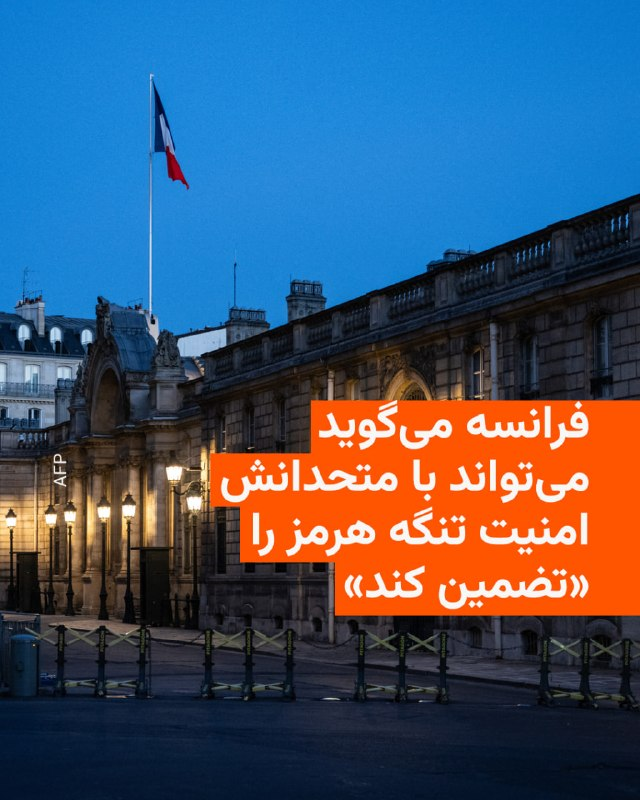

> 🔸دفتر امانوئل مکرون، رئیس‌جمهور فرانسه، روز چهارشنبه اعلام کرد که این کشور و شرکایش قادرند امنیت تنگه هرمز را تضمین کنند.
> 
> 🔸کاخ الیزه افزود که فرانسه مایل است موضوع تنگه هرمز از مذاکرات جاری میان ایالات متحده و ایران جدا نگه داشته شود.
> 
> 🔸فرانسه ساعتی پیش‌تر اعلام کرده بود که ناو هواپیمابر «شارل دوگل» به‌همراه گروه رزمی آن در حال حرکت به سوی دریای سرخ و خلیج عدن است؛ این اقدام در چارچوب تلاش‌های فرانسه و بریتانیا برای آمادگی انجام مأموریت در آینده به‌منظور کمک به آزادی کشتیرانی در تنگه هرمز صورت می‌گیرد.
> 
> 🔸وزارت نیروهای مسلح فرانسه در بیانیه‌ای اعلام کرد که این گروه ناو هواپیمابر روز چهارشنبه از کانال سوئز عبور کرده و در مسیر جنوب دریای سرخ قرار گرفته است.
> 
> 🔸این گروه رزمی ناو هواپیمابر فرانسه اندکی پس از آن‌که آمریکا و اسرائیل حملات هوایی به ایران را آغاز کردند، در شرق مدیترانه مستقر شده بود و می‌تواند بین چهار تا پنج ماه در دریا باقی بماند.
> 
> @RadioFarda

## 1405/02/16 17:50 — RadioFarda
> شیرین اردکانی در گفت‌وگو با رادیو فردا: حقوق بنیادین نرگس محمدی هر روز نقض می‌شود
> 
> 🔸در روزهایی که ایران با قطعی سراسری اینترنت مواجه است و گزارش‌ها از داخل کشور به‌سختی به بیرون درز می‌کند، خبرهایی از وضعیت جسمی نرگس محمدی، برندهٔ جایزهٔ صلح نوبل و زندانی سیاسی، منتشر شده که نگرانی فعالان حقوق بشر را برانگیخته و توجه رسانه‌ها را به خود جلب کرده است.
> 
> 🔸خانم محمدی که از ماه‌ها پیش در زندان زنجان نگهداری می‌شود، در روزهای اخیر پس از وخامت شدید وضعیت جسمانی‌اش، به‌طور اضطراری به بیمارستان منتقل شد؛ جایی که بنا بر گزارش‌ها، پس از دو حمله قلبی، از دست دادن هوشیاری و افت شدید فشار خون، در بخش مراقبت‌های ویژه بستری شده است.
> 
> 🔸خانواده، وکلا و نهادهای حقوق بشری می‌گویند که وضعیت نرگس «میان مرگ و زندگی» است. برادرش از استفاده او از دستگاه اکسیژن و حال «وخیم» خواهرش سخن می‌گوید، و پزشکان توصیه کرده‌اند که او باید حداقل برای مدتی طولانی از شرایط زندان دور بماند.
> 
> 🔸در این میان، شیرین اردکانی، وکیل نرگس محمدی در پاریس، که روز سه‌شنبه ۱۵ اردیبهشت نشستی خبری در این شهر درباره وضعیت موکلش برگزار کرد، نسبت به وخامت شرایط جسمانی موکلش هشدار داد.
> 
> 🔸خانم اردکانی پس از این نشست خبری در گفت‌وگو با رادیو فردا، در مورد رفتار حکومت جمهوری اسلامی با این زندانی سیاسی، به موضوعی کلیدی اشاره می‌کند: این‌که انتقال نرگس محمدی از زندان اوین به زندان زنجان، نه‌تنها یک جابه‌جایی ساده نبوده، بلکه بخشی از یک سیاست فشار علیه این فعال حقوق بشر است و محمدی را از شبکه حمایتی و شرایط نسبتاً متفاوت زندان اوین جدا کرده و در محیطی آسیب‌پذیرتر قرار داده است.
> 
> 🔸متن این گفت‌وگو را در وب‌سایت رادیوفردا بخوانید.
> 
> @RadioFarda

## 1405/02/16 17:49 — IranianMinds
> 🔴 سی ان ان به نقل از مقامات دولت ترامپ:
> 
> کاخ سفید دیروز بازخورد مثبتی از پاکستان در رابطه با پیشرفت ایران به سمت سازش دریافت کرد.
> 
> @IranianMinds

## 1405/02/16 17:48 — IranianMinds
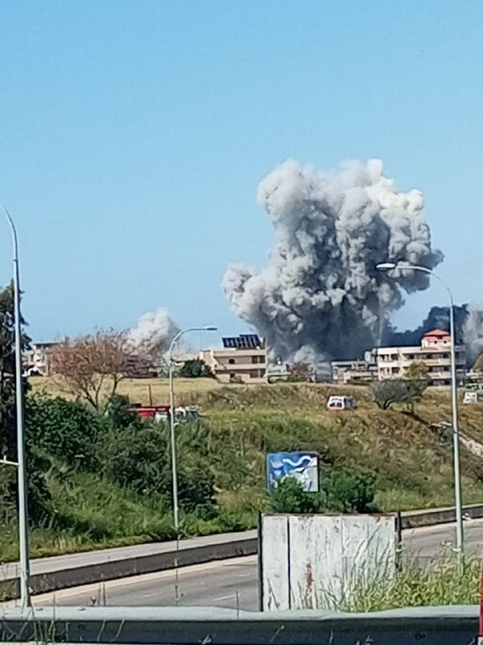

> 🔴 حملات هوایی شدید اسرائیل به جنوب لبنان
> 
> @IranianMinds

## 1405/02/16 17:45 — Persian_Trend_Official
[🎬 Video](telegram/content/Persian_Trend_Official_13541_1778087163.jpg)

> ⭕️ علی‌حسین قاضی‌زاده:
> 
> مسیری که ج.ا. از چند ماه پیش آغاز کرده این است که به جای رد پیشنهادهای آمریکا، ابتدا با کلیات طرح موافقت می‌کند و سپس با رد کلیدی‌ترین بخش‌های آن، پیشنهاد جایگزین ارائه می‌کند.
> آمریکا این تغییر رویکرد را نشانه نرمش و تلاش برای رسیدن به توافق تلقی می‌کند اما این حربه تازه مذاکراتی ج.ا. تفاوتی ماهوی با شیوه پیشین حکومت ندارد و در نهایت به رد طرح‌های پیشنهادی آمریکا منجر می‌شود.
> 
> برعکس تلقی ترامپ، نسخه کنونی ج.ا. مذاکره‌ناپذیرتر از عصر خامنه‌ای است و برخی از دلایل این تغییر به تغییرات ژئوپلتیک منطقه پس از جنگ اخیر بازمی‌گردد.
> آمریکایی‌ها دیر یا زود می‌پذیرند که این بازی تنها یک برنده دارد و اگر بخواهند بازنده نباشند، باید به میدان نبرد بازگردند.
> 
> 📝 Nick
> 
> 📌 @persian_trend_official
> پرشین ترند | متفاوت‌ترین کانال نظامی

## 1405/02/16 17:41 — IranianMinds
> 🔴 سی ‌ان ‌ان به نقل از یک منبع اسرائیلی:
> 
> اسرائیل از احتمال امتیاز دادن واشنگتن برای دستیابی به توافق برای پایان دادن به جنگ با ایران نگران است.
> 
> @IranianMinds

## 1405/02/16 17:37 — BBCPersian
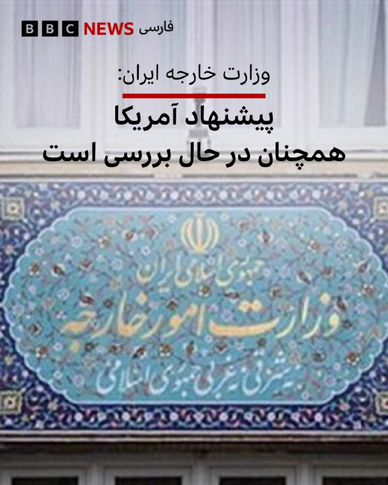

> 🔻وزارت خارجه ایران اعلام کرده است که پیشنهاد آمریکا «هم‌چنان در حال بررسی است.»
> 
> اسماعیل بقائی، سخنگوی وزارت خارجه ایران می‌گوید که کشورش «پس از جمع‌بندی، نقطه نظرات خود را به طرف پاکستانی منتقل می‌کند.»
> 
> پیشتر گزارش کردیم که وب‌سایت خبری اکسیوس به نقل از برخی منابع آگاه از نزدیک بودن توافق اولیه با ایران خبر داد و خبرگزاری رویترزهم به نقل از یک منبع پاکستانی دخیل در مذاکرات گزارش داد که آمریکا و ایران به دستیابی به یک تفاهم‌نامه یک‌صفحه‌ای برای پایان دادن به جنگ نزدیک شده‌اند.
> 
> خبرگزاری ایسنا به نقل از منابع خود مدعی شد که بخش‌هایی از محتوای گزارش آکسیوس در مورد توافق ایران و آمریکا، «گمانه‌زنی رسانه‌ای و جوسازی است.»
> 
> 📷وزارت امورخارجه ایران
> @BBCPersian

## 1405/02/16 17:34 — ManotoTV
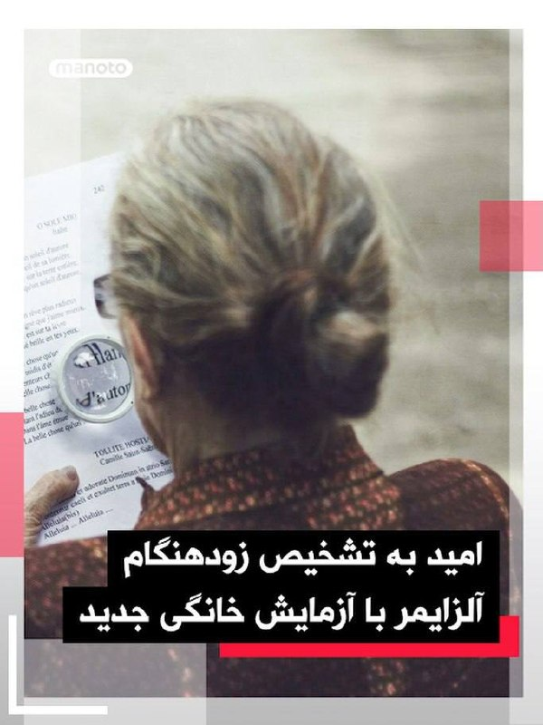

> یک پژوهش تازه نشان می‌دهد ممکن است در آینده بتوان خطر ابتلا به آلزایمر را با یک آزمایش ساده در خانه پیش‌بینی کرد.
> این روش ترکیبی از یک آزمون آنلاین برای سنجش عملکرد مغز و یک آزمایش خون با نمونه‌گیری از نوک انگشت است که به‌دنبال نشانگرهای زیستی مرتبط با آلزایمر می‌گردد.
> پژوهشگران می‌گویند این ابزار می‌تواند افراد را بر اساس میزان خطر بیماری دسته‌بندی کند تا کسانی که در معرض خطر بیشتری هستند، زودتر برای بررسی‌های دقیق‌تر و درمان‌های احتمالی ارجاع داده شوند.
> پروفسور آن کربت از دانشگاه اکستر گفته است این تحقیق ادامه مطالعات قبلی درباره دقت آزمایش خون‌های نوک انگشتی است و ترکیب این آزمایش‌ها با تست‌های شناختی می‌تواند راهی مؤثر برای پیش‌بینی خطر زوال عقل باشد.
> به گفته او، مزیت این روش در این است که می‌تواند بدون نیاز به مراجعه به کلینیک یا انجام آزمایش‌های پیچیده، غربالگری گسترده‌تری انجام دهد و افراد پرخطر را سریع‌تر شناسایی کند.
> در این مطالعه بیش از ۱۷۰ نفر شرکت کردند. نمونه خون آن‌ها برای بررسی نشانگرهای p-tau217 و GFAP که با آلزایمر و کاهش عملکرد مغز مرتبط هستند؛ حلیل شد و هم‌زمان آزمون‌های شناختی آنلاین نیز انجام گرفت.
> 
> پژوهشگران این فناوری را بسیار امیدوارکننده توصیف کرده و گفته‌اند آزمایش خون با نمونه‌گیری از انگشت می‌تواند تحول بزرگی در تشخیص زودهنگام زوال عقل ایجاد کند، هرچند برای تأیید نهایی به مطالعات بزرگ‌تر و متنوع‌تری نیاز است.

## 1405/02/16 17:31 — Persian_Trend_Official
[🎬 Video](telegram/content/Persian_Trend_Official_13540_1778087165.jpg)

> فقط اومدم یادآوری کنم که علی خامنه‌ای بعد از 68 روز هنوز دفن نشده. 🗿🚶‍♂️ 📝 Nick 📌 @persian_trend_official پرشین ترند | متفاوت‌ترین کانال نظامی

## 1405/02/16 17:26 — BBCPersian
> 🔻آمریکا و ایران، کدام کشور زودتر عقب‌نشینی می‌کند؟
> 
> 🖊ژیار گل، خبرنگار ارشد بی‌بی‌سی در امور بین‌الملل
> 
> دونالد ترامپ، رئیس‌جمهور آمریکا و رهبران جمهوری اسلامی ایران یک ویژگی مشترک دارند: هر دو حاضر نیستند اذعان کنند که تمایلی به بازگشت به جنگ ندارند.
> 
> پس از آتش‌بس، ایالات متحده آمریکا به‌دنبال راهی برای خروج از بحران کنونی و باز شدن تنگه هرمز است. افزایش قیمت نفت و گاز، نارضایتی در میان حامیان آقای ترامپ را هم افزایش داده است.
> 
> وقتی ایران خواسته‌های آمریکا را رد کرد، دونالد ترامپ آتش‌بس را تمدید کرد، اما همزمان محاصره‌ای را بر تنگه هرمز اعمال کرد. سپس «پروژه آزادی» را برای اسکورت کشتی‌هایی که گیر کرده‌اند، برای عبور امن از تنگه هرمز مطرح کرد. این طرح را هم هم پس از ۴۸ ساعت تعلیق کرد تا به گفته او شانسی به مذاکرات داده شود.
> 
> حالا آکسیوس گزارش داده که دو طرف روی طرحی موقت یک صفحه‌ای برای رفع محاصره تنگه هرمز و تعلیق موقت برنامه هسته‌ای ایران کار می‌کنند تا زمینه برای بازگشت دوطرف با میانجی پاکستان فراهم شود.
> 
> حکومت ایران هم با چالش‌های بسیار جدی روبروست. آنها هم مانند دونالد ترامپ، از پذیرش فشارها خودداری می‌کنند. اگرچه ایران توانایی در ایجاد اختلال در کشتیرانی در تنگه هرمز و وارد کردن فشار اقتصادی در سطح جهانی را نشان داده، اما در نهایت بیشترین هزینه را خود متحمل شده است.
> 
> مقامات حکومت ایران می گویند حملات آمریکا و اسرائیل بیش از ۲۷۰ میلیارد دلار به زیرساخت‌های ایران آسیب وارد کرده است. بسیاری از کارخانه‌ها کارگران را تعدیل کرده‌اند. دسترسی به اینترنت محدود شده و صدها هزار نفری که به اقتصاد دیجیتال وابسته بودند اکنون برای بقا تلاش می‌کنند. بسیاری از خانوارها فقط بر نیازهای اساسی تمرکز دارند و از خرید کالاهای غیر ضروری خودداری می کنند که این به افزایش تورم و فشار اقتصادی دامن زده است.
> 
> تندروهای حکومت با انگیزه‌های ایدئولوژیک بارها گفته اند که حاضرند هزینه ادامه جنگ را بدهند. اما هزینه‌های سنگین انسانی و اقتصادی بر مردم ایران وارد می‌شود. برخی از وابستگان به حکومت می‌گویند برای حفظ نظام اگر صد هزار نفر هم کشته شوند، باز هم ارزش دارد.
> 
> دو هفته پیش، مسعود پزشکیان رئیس‌جمهور ایران از شهروندان خواست مصرف برق و انرژی را کاهش دهند، او گفت کشور با فشار فزاینده بر زیرساخت‌های خود مواجه است. او هشدار داد که « حملات آمریکا و اسرائیل سیستم‌های حیاتی را هدف قرار داده، کمبودها را تشدید کرده و بحران اقتصادی گسترده‌تری ایجاد کرده است.»
> 
> آقای پزشکیان گفت این فشارها با هدف افزایش نارضایتی عمومی و احتمالاً ایجاد ناآرامی طراحی شده‌اند، که نشان‌دهنده نگرانی‌ها درباره بی‌ثباتی داخلی است.
> 
> در عین حال سرکوب در حال افزایش است. تنها در یک ماه گذشته، بیش از ۲۰ زندانی سیاسی اعدام شده‌اند که بسیاری از آن‌ها از معترضان بازداشت‌شده در جریان خیزش دیماه گذشته بودند. سرعت این محاکمه‌ها و اعدام‌ها نشان می‌دهد که حکومت عمیقاً نگران ناآرامی‌هاست و تلاش می‌کند با این اعدام‌ها جوانان را از بازگشت به خیابان‌ها بازدارد.
> 
> @BBCPersian

## 1405/02/16 17:25 — BBCPersian
> 🔻از حمله به کشتی فرانسوی در تنگه هرمز چه می‌دانیم؟
> 
> 🖊پل براون، بی‌بی‌سی وریفای
> 
> پس از آنکه شرکت کشتیرانی فرانسوی «سی‌ام‌ای سی‌جی‌ام» اعلام کرد یکی از کشتی‌هایش هدف قرار گرفته است، بخش راستی‌آزمایی بی‌بی سی، حرکت این کشتی باری در تنگه هرمز را بررسی کرده است.
> 
> اطلاعات ردیابی نشان می‌دهد که کشتی سن آنتونیو در تاریخ ۲ مه/ ۱۲ اردیبهشت، بندر خلیفه در امارات متحده عربی را به مقصد بندر موندرا در هند ترک کرده است.
> 
> فرستنده‌های موقعیت جغرافیایی کشتی، روز سه‌شنبه ۵ مه در ساعت ۰۹:۵۴ به وقت محلی خاموش شدند. کشتی سن آنتونیو در آن زمان حدود ۱۵ مایل دریایی (۲۸ کیلومتر) از ساحل امارات متحده عربی فاصله داشت.
> 
> سازمان عملیات تجارت دریایی بریتانیا (UKMTO) گزارش داد که یک کشتی دیروز ساعت ۲۱:۰۰ به وقت محلی با «یک پرتابه ناشناخته» در تنگه هرمز مورد اصابت قرار گرفته است.
> 
> گروه کشتیرانی فرانسوی «سی‌ام‌ای سی‌جی‌ام» امروز صبح اعلام کرد که کشتی‌ سن آنتونیو، روز گذشته، هنگام عبور از تنگه هرمز هدف قرار گرفته و علاوه بر جراحت برخی خدمه، خساراتی نیز به کشتی وارد شده است.
> 
> این شرکت در بیانیه‌ خود اعلام کرد که خدمه مجروح، از کشتی منتقل شدند و تحت مراقبت‌های پزشکی قرار گرفتند.
> 
> @BBCPersian

## 1405/02/16 17:18 — DW_Farsi
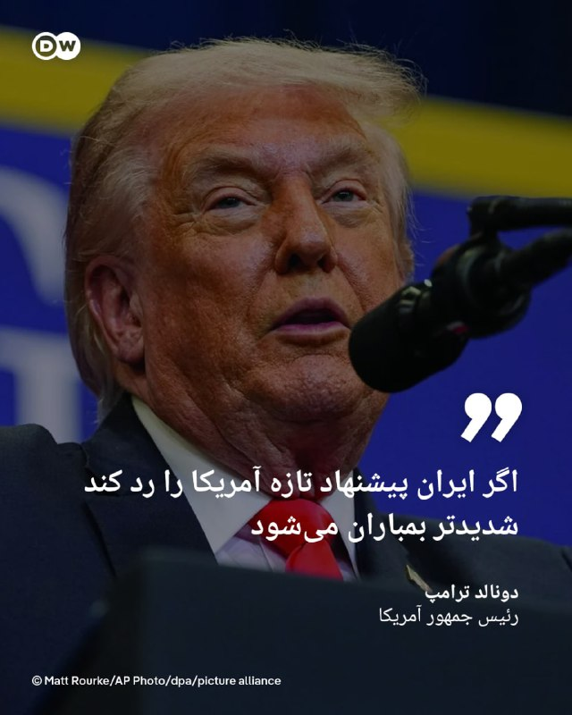

> 🔶 ترامپ: اگر ایران پیشنهاد تازه آمریکا را رد کند شدیدتر بمباران می‌شود
> 
> دونالد ترامپ، رئیس جمهور آمریکا، گفت چنانچه جمهوری اسلامی تازه‌ترین پیشنهاد آمریکا را بپذیرد، جنگ آمریکا علیه ایران و محاصره دریایی این کشور پایان خواهد یافت.
> 
> او هم‌زمان تهدید کرد که در صورت رد این پیشنهاد، حملات هوایی از سر گرفته می‌شود.
> 
> ترامپ در شبکه اجتماعی تروث سوشال نوشت: «با فرض این که ایران با آنچه توافق شده موافقت کند، که البته شاید فرض بزرگی باشد، عملیات خشم حماسی که همین حالا هم افسانه‌ای است به پایان خواهد رسید و محاصره بسیار کارآمد ما اجازه خواهد داد که تنگه هرمز به روی همه، از جمله ایران باشد.»
> 
> این در حالیست که مارکو روبیو، وزیر امور خارجه آمریکا، روز گذشته گفته بود که این عملیات "به پایان رسیده" و آمریکا "به اهداف خود در این عملیات دست یافته است".
> 
> ترامپ در ادامه نوشت: «اگر آن‌ها نپذیرند، بمباران آغاز می‌شود و متاسفانه این بار در سطح و شدتی بسیار بالاتر از قبل خواهد بود.»
> @dw_farsi

## 1405/02/16 17:15 — FarsiVOA
> 🔺اسرائیل: به تامین «سوخت جت» مورد نیاز آلمان کمک می‌کنیم
> 
> ▪️در پی بحران تنگه هرمز و به درخواست آلمان برای کمک در زمینه سوخت جت و گاز طبیعی، اسرائیل اعلام کرد که سوخت مورد نیاز جت‌های آلمان را تأمین خواهد کرد.
> 
> ⬇️ بیشتر بخوانید:
> 
> https://ir.voanews.com/a/iran-germany-israel-jet-gas-fuel-energy/8147215.html/?nocach=1

## 1405/02/16 17:15 — IranianMinds
> 🔴 خبرگزاری تسنیم :
> 
> آمریکاییا دروغ میگن که به توافق نزدیکن ما اصلا جوابشونم ندادیم هنوز !
> 
> @IranianMinds

## 1405/02/16 17:09 — Persian_Trend_Official
> کانال 12 اسرائیل ادعا کرده علی خامنه ای کشته شده !!! البته هنوز برای من قابل تایید نیست ...

## 1405/02/16 17:06 — RadioFarda

> 🔸در پی انتشار گزارش‌هایی درباره قریب‌الوقوع بودن توافق میان آمریکا و ایران برای پایان دادن به جنگ، سخنگوی وزارت خارجه جمهوری اسلامی گفت که تهران هنوز در حال بررسی پیشنهاد آمریکا است.
> 
> 🔸اسماعیل بقائی روز چهارشنبه به خبرگزاری ایسنا گفت: «طرح و پیشنهاد آمریکا از سوی ایران همچنان در حال بررسی است و ایران پس از جمع‌بندی نقطه نظرات خود را به طرف پاکستانی منتقل می‌کند.»
> 
> 🔸همزمان خبرگزاری تسنیم، نزدیک به سپاه پاسداران، به نقل از یک «منبع مطلع» نوشت که آخرین پیشنهاد آمریکا «حاوی برخی بندهای غیرقابل قبول» است و ایران هنوز به آن پاسخ نداده است.
> 
> 🔸خبرگزاری فارس، دیگر رسانه نزدیک به سپاه، نیز مدعی شد که «هیچ پیام مکتوب جدیدی میان ایران و آمریکا ردوبدل نشده» و گزارش‌های رسانه‌ای درباره نزدیک بودن تفاهم را رد کرد.
> 
> 🔸در ساعات گذشته وب‌سایت اکسیوس و خبرگزاری رویترز اعلام کردند که ایران و آمریکا به توافق با ایران بر سر یک یادداشت تفاهم یک‌صفحه‌ای برای پایان جنگ اخیر نزدیک شده‌اند.
> 
> 🔸فارس می‌گوید این گزارش‌ها برای «تأثیرگذاری بر بازارهای جهانی، به‌ویژه کاهش قیمت نفت» منتشر شده‌اند.
> 
> @RadioFarda

## 1405/02/16 17:01 — IranianMinds
> 🔴وزیر انرژی آمریکا به فاکس بیزینس:
> 
> ترس ایران از اقدام نظامی ما برای بازگشایی تنگه هرمز ، این کشور را به این درک رساند که باید به مذاکرات بازگردد.
> 
> @IranianMinds

## 1405/02/16 17:00 — DW_Farsi
> 🔶 اوکراین روسیه را به نقض آتش‌بس متهم کرد
> 
> آتش‌بسی که اخیرا کی‌یف به صورت یک‌جانبه اعلام کرده بود، با ادامه حملات روسیه به این کشور نقض شده است.
> 
> آندری سیبیها، وزیر امور خارجه اوکراین، روز چهارشنبه ۶ مه (۱۶ اردیبهشت) در شبکه ایکس نوشت: «این نشان می‌دهد که روسیه صلح را رد می‌کند و فراخوان‌های دروغین آن برای آتش‌بس در ۹ مه هیچ ارتباطی با دیپلماسی ندارد.»
> 
> آتش‌بسی که ولودیمیر زلنسکی، رئیس جمهور اوکراین، اعلام کرده بود، از ۶ مه اجرایی شد.
> 
> ولادیمیر پوتین، رئیس جمهور روسیه، پیش‌تر خود نیز آتش‌بسی را برای روزهای ۸ و ۹ مه اعلام کرده بود. روسیه روز ۹ مه را به طور سنتی به عنوان روز پیروزی بر آلمان نازی با یک رژه نظامی گرامی می‌دارد.
> 
> در همین حال سیبیها اظهار داشت: «پوتین فقط به رژه‌های نظامی اهمیت می‌دهد، نه به جان انسان‌ها.»
> 
> زلنسکی یک آتش‌بس بدون محدودیت زمانی پیشنهاد کرده و از روسیه خواسته بود به آن بپیوندد. او در عین حال گفته بود که اوکراین از زمان آغاز آتش‌بس، "به‌طور متناسب" عمل خواهد کرد.
> 
> مقام‌های اوکراینی پیش‌تر اعلام کرده بودند که روز سه‌شنبه، تنها چند ساعت پیش از پایان مهلت پیشنهاد اوکراین، دست‌کم ۲۷ نفر در چندین حمله روسیه کشته شدند.
> 
> ولودیمیر زلنسکی گفت، نباید این‌گونه باشد که روسیه فقط به دلیل یک رژه نظامی، پس از آنکه پیش‌تر اوکراین را به شدت بمباران کرده، حملات خود را برای مدتی کوتاه متوقف کند.
> 
> وزیر امور خارجه اوکراین روز چهارشنبه همچنین گفت که روسیه در طول شب نیز به حملات خود ادامه داده است. به گفته او، شهرهای خارکیف و زاپوریژیا صبح همان روز نیز هدف حمله قرار گرفتند.
> 
> در همین رابطه نیروی هوایی اوکراین نیز اعلام کرد که روسیه از شامگاه سه‌شنبه ۱۰۸ پهپاد، دو موشک بالستیک و یک موشک کروز به سوی این کشور شلیک کرده است.
> 
> به گفته فرماندار منطقه سومی در شمال اوکراین، یک خودروی غیرنظامی در این منطقه هدف یک پهپاد قرار گرفت که در نتیجه آن یکی از سرنشینان کشته و راننده نیز زخمی شد.
> 
> در خارکیف، دومین شهر بزرگ اوکراین، حمله پهپادی به هفت ساختمان مسکونی آسیب رساند.
> 
> در زاپوریژیا در جنوب شرق کشور، نیروهای روسیه یک تاسیسات صنعتی را هدف قرار دادند. تنها در زاپوریژیا، روز سه‌شنبه ۱۲ نفر در یک حمله کشته شدند.
> 
> شهر "کریوی‌ ریه" اوکراین نیز روز چهارشنبه از وارد شدن خسارت به زیرساخت‌ها بر اثر حملات پهپادی خبر داد.
> @dw_farsi

## 1405/02/16 16:57 — ManotoTV

> همزمان با ادامه آماده‌سازی‌های فرانسه و بریتانیا برای یک مأموریت احتمالی با هدف بازگشایی تنگه هرمز، گروه ناو هواپیمابر شارل دوگل فرانسه در حال حرکت به سمت دریای سرخ و خلیج عدن است.
> وزارت نیروهای مسلح فرانسه اعلام کرده این ناوگروه روز چهارشنبه از کانال سوئز عبور کرده و در مسیر جنوب دریای سرخ قرار دارد.
> این گروه رزمی فرانسه اندکی پس از حملات هوایی آمریکا و اسرائیل به ایران در ۲۸ فوریه، به شرق مدیترانه اعزام شده بود و می‌تواند بین چهار تا پنج ماه در دریا باقی بماند.

## 1405/02/16 16:57 — ManotoTV

> دونالد ترامپ، رئیس‌جمهور آمریکا به روزنامه نیویورک پست گفته با وجود گزارش‌های خوش‌بینانه درباره نزدیک شدن واشنگتن و تهران به یک چارچوب احتمالی برای پایان دادن به جنگ ۶۷ روزه، «هنوز خیلی زود است» که درباره مذاکرات حضوری صلح میان دو کشور فکر شود.
> وقتی از او پرسیده شد آیا این رسانه باید برای پوشش دور جدیدی از مذاکرات به پاکستان خبرنگار اعزام کند؛ در حالی که منابعی در اسلام‌آباد از نزدیک بودن یک توافق اولیه خبر داده‌اند؛ ترامپ پاسخ داد: «فکر نمی‌کنم.» او گفت: «خیلی زود است. نه، هنوز خیلی فاصله داریم.»
> ترامپ پیش‌تر گفته بود در صورت نهایی شدن توافق، برای امضای آن به پاکستان خواهد رفت، اما تأکید کرد هنوز به آن مرحله نرسیده‌اند.
> در ادامه گزارش نیویورک پست آمده در حالی که مذاکره‌کنندگان روی چارچوب کلی کار می‌کنند، جزئیات همچنان محل اختلاف است و منابع پاکستانی می‌گویند چندین نسخه از یک سند احتمالی یک‌صفحه‌ای که می‌تواند به توافق منجر شود، در حال بررسی است.

## 1405/02/16 16:47 — BBCPersian
> 🔻تردد کشتی‌های حامل کالا از تنگه هرمز «این هفته به پایین‌ترین سطح خود از نهم اسفند رسید»
> 
> بر اساس داده‌های شرکت تحلیل دریایی کپلر، تردد کشتی‌های حامل کالا از تنگه هرمز در این هفته به پایین‌ترین سطح خود از زمان آغاز جنگ در نهم اسفند رسید.
> 
> این شرکت که فقط تردد کشتی‌های حامل کالا را ارزیابی می‌کند، دو روز پیش فقط یک عبور را ثبت کرد در حالی که می گوید سه‌شنبه (دیروز) هیچ عبوری از این تنگه ثبت نشد.
> 
> کیپلر می‌گوید این وضعیت کمترین میزان عبور کشتی از تنگه هرمز از زمان آغاز حملات آمریکا و اسرائیل به ایران در نهم اسفند است.
> 
> پیش از این حمله، حدود ۱۲۰ فرودند کشتی روزانه از این تنگه عبور می‌کرد.
> 
> پیش از جنگ، حدود یک‌پنجم صادرات جهانی انرژی فسیلی، در کنار سایر کالاهای مهم، از مسیر تنگه هرمز جابه‌جا می‌شد.
> 
> https://bbc.in/4utjPkR
> @BBCPersian

## 1405/02/16 16:41 — Hranews
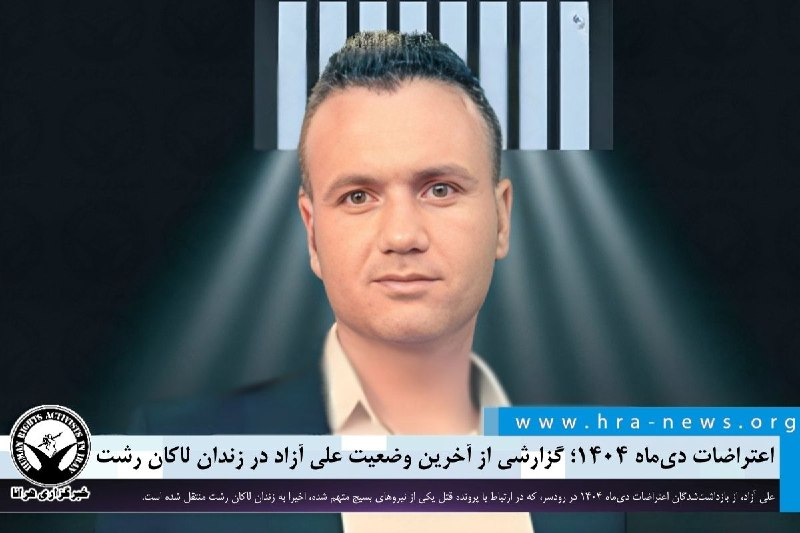

> اعتراضات دی‌ماه ۱۴۰۴؛ گزارشی از آخرین وضعیت علی آزاد در زندان لاکان رشت
> 
> 
> ❗️
> ❗️
> ❗️
> ❗️
> ❗️– علی آزاد، از بازداشت‌شدگان اعتراضات دی‌ماه ۱۴۰۴ در رودسر، به‌تازگی به زندان لاکان رشت منتقل شده است. وی با اتهاماتی از جمله «قتل» یکی از نیروهای بسیج در جریان این اعتراضات مواجه است.
> 
> به گزارش خبرگزاری هرانا، ارگان خبری مجموعه فعالان حقوق بشر در ایران، علی آزاد در زندان لاکان رشت به سر می‌برد.
> 
> براساس اطلاعات دریافتی هرانا، آقای آزاد در جریان اعتراضات دی‌ماه ۱۴۰۴، در رودسر بازداشت و پس از پایان مراحل بازجویی در دادسرای شهرستان املش، در روزهای اخیر به زندان لاکان رشت منتقل شده است. او با اتهاماتی از جمله «قتل» یکی از نیروهای بسیج به نام محمد میرزایی در جریان این اعتراضات در املش مواجه است؛ موضوعی که نگرانی خانواده و نزدیکان وی را نسبت به احتمال صدور احکام سنگین افزایش داده است.
> 
> ادامه مطلب
> 
> #علی_آزاد #اعتراضات۱۴۰۴ #اعتراضات_بازار
> 
> ↘️
> @hranews_bot تماس ✉️ - @Hranews کانال هرانا 🆑

## 1405/02/16 16:36 — IranianMinds
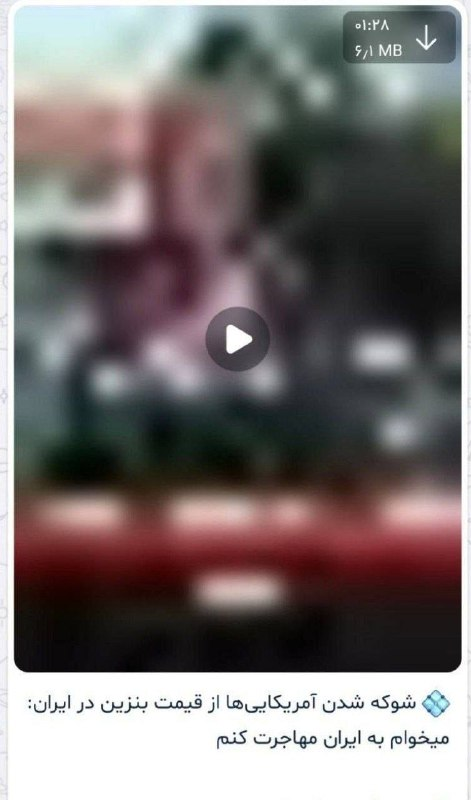

> @IranianMinds

## 1405/02/16 16:32 — DW_Farsi
> 📸 ویروس هانتا چیست؟
> 
> پس از مرگ سه مسافر یک کشتی در اقیانوس اطلس، نام "ویروس هانتا" دوباره مطرح شده است. این ویروس چگونه منتقل می‌شود، چه علائمی دارد و چرا برخی گونه‌های آن خطرناک هستند؟
> @dw_farsi

## 1405/02/16 16:26 — Persian_Trend_Official
> «ناو هواپیمابر فرانسوی(شارل دوگل) به سمت دریای سرخ حرکت می‌کند تا مأموریتی احتمالی در چارچوب طرح فرانسه-بریتانیا برای تنگه هرمز انجام دهد.»
> 
> کاترین ووترن،وزیر دفاع فرانسه
> 
> 🫆:Tony
> 
> 📌 @persian_trend_official
> پرشین ترند | متفاوت‌ترین کانال نظامی

## 1405/02/16 16:24 — IranianMinds
> 🔴فوری/ کانال ۱۱ اسرائیل:
> 
> آمریکا و اسرائیل در حال هماهنگی برای از سرگیری جنگ با ایران هستند.
> 
> @IranianMinds

## 1405/02/16 16:17 — IranianMinds
> 🔴سپاه هم گفته اورانیوم تحویل داده نخواهد شد.
> 
> @IranianMinds

## 1405/02/16 16:16 — BBCPersian
> 🔻معاون وزیر علوم ایران: اعطای سهمیه به داوطلبان کنکور که در جنگ آسیب دیدند در حال بررسی است
> 
> معاون وزیر علوم ایران گفته است که اعطای سهمیه به داوطلبان کنکور که در جنگ آسیب دیدند، در حال بررسی است.
> 
> ابوالفضل واحدی، به خبرگزاری ایسنا گفته است که این موضوع از سوی وزیر علوم مطرح و به گفته او «دسته‌بندی‌هایی از سهمیه برای این افراد در نظر گرفته شده است.»
> 
> آقای واحدی گفت: «باید مشخص شود چه تعداد از دانشجویان، همچنین داوطلبان کنکور مشمول این شرایط می‌شوند.»
> 
> به گفته معاون وزیر علوم ایران تغییری در کنکور امسال دانشگاه‌ها به دلیل شرایط جنگی فعلا پیش‌بینی نشده اما او احتمال چنین تغییری را هم منتفی ندانسته است.
> 
> @BBCPersian

## 1405/02/16 16:13 — IranianMinds
> 🔴مرندی، همراه تیم مذاکره کننده جمهوری اسلامی:
> 
> اکسیوس ابزاری برای دستکاری بازار توسط کاخ سفید است.
> جمهوری اسلامی قبل از سفر ترامپ به چین، کاملأ برای یک حمله بزرگ احتمالی آماده است.
> 
> @IranianMinds

## 1405/02/16 15:56 — ManotoTV
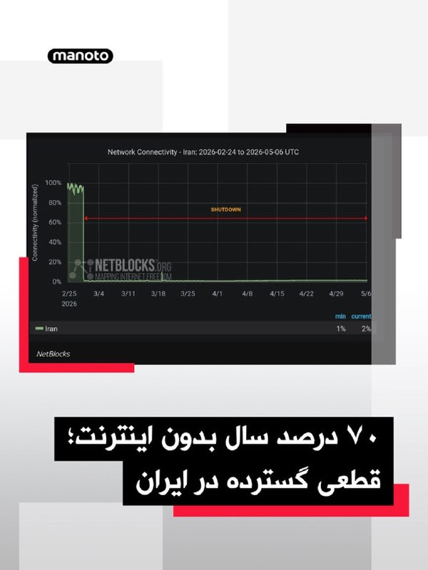

> بر اساس گزارش سرویس پایش اینترنت نت بلاکس، قطعی اینترنت اعمال‌شده از سوی جمهوری‌اسلای در حالی وارد شصت‌وهشتمین روز خود شده که شهروندان ایرانی از ابتدای سال ۲۰۲۶ تاکنون در حدود ۷۰ درصد از زمان، به‌طور گسترده از دسترسی به اینترنت محروم بوده‌اند. بر پایه این گزارش برخی ایرانیان گزارش داده‌اند از زمان نخستین قطع سراسری همزمان با اعتراضات دی ماه ۱۴۰۴، هیچ ارتباطی نداشته‌اند.
> در حالی‌ که بسیاری از شهروندان برای دسترسی به اینترنت با مشکل مواجه‌اند، مقام‌های ارشد و چهره‌های حکومتی همچنان به‌طور منظم در شبکه‌های اجتماعی فعالیت دارند؛ موضوعی که تصویر مخدوشی از واقعیت‌های داخل ایران به جهان مخابره می‌کند.

## 1405/02/16 15:54 — DW_Farsi
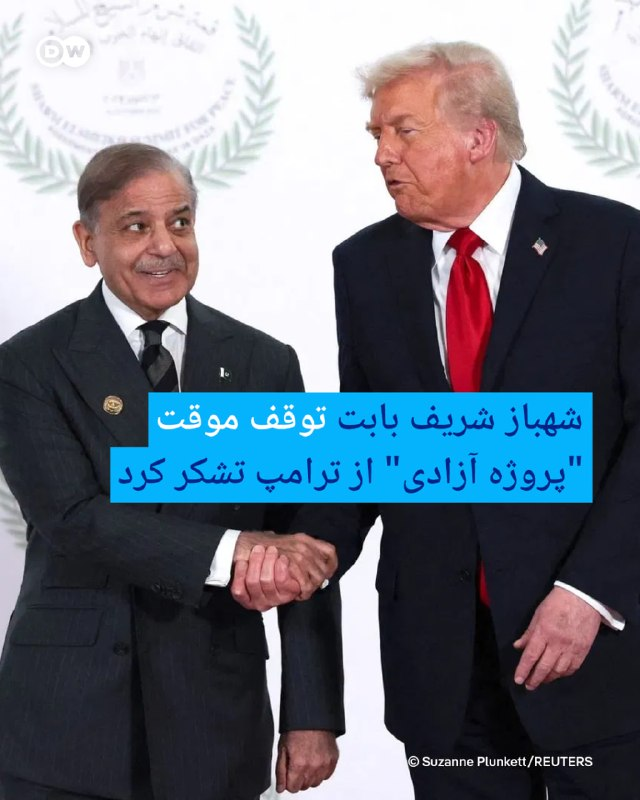

> 🔶 شهباز شریف بابت توقف موقت "پروژه آزادی" از ترامپ تشکر کرد
> 
> شهباز شریف، نخست‌وزیر پاکستان که یکی از میانجی‌های اصلی در جنگ میان ایران و آمریکا و اسرائیل است، روز چهارشنبه ۱۶ اردیبهشت (۶ مه) اعلام کرد که نسبت به روند کنونی مذاکرات برای صلح در خاورمیانه "امیدوار" است.
> 
> او همچنین از دونالد ترامپ، رئیس‌ جمهور آمریکا، به دلیل توقف "پروژه آزادی" که طرحی برای همراهی و اسکورت کشتی‌های تجاری در تنگه هرمز توسط آمریکا بود، قدردانی کرد.
> 
> شریف گفته است "پاسخ مثبت ترامپ به درخواست پاکستان و برخی کشورهای دوست، به‌ویژه عربستان سعودی و محمد بن سلمان، ولیعهد این کشور، می‌تواند نقش مهمی در پیشبرد صلح، ثبات و آشتی منطقه‌ای در این دوره حساس داشته باشد".
> 
> شریف در پیامی در شبکه اجتماعی ایکس نوشت: «از رهبری شجاعانه و اعلام به‌موقع رئیس‌ جمهور ترامپ درباره توقف پروژه آزادی در تنگه هرمز سپاسگزارم.»
> 
> نخست‌وزیر پاکستان همچنین اظهار داشت که بسیار امیدوار است روند فعلی به یک توافق دائمی منجر شود که صلح و ثباتی پایدار را برای منطقه و فراتر از آن تضمین کند.
> @dw_farsi

## 1405/02/16 15:54 — RadioFarda
> فرمانده پیشین ناتو: بحران ایران نشان داد غرب چندپاره‌تر از دشمنان خود است
> 
> 🔸همزمان با افزایش تنش‌ها در تنگهٔ هرمز و فشار واشینگتن به متحدانش برای افزایش مشارکت در بازگشایی آن، اکنون بحث تنها درباره این نیست که آیا ناتو قابلیت لازم برای دخالت دارد یا خیر، بلکه مسئله این است که آیا این پیمان می‌تواند بدون تشدید اختلافات در دو سوی اقیانوس اطلس، یک آزمون امنیتی بزرگ دیگر را مدیریت کند؟
> 
> 🔸در قلب این بحث، سازوکاری قرار دارد که تاکنون عمدتاً در این گفت‌وگوها غایب بوده است: مادهٔ چهار ناتو؛ بندی که به متحدان اجازه می‌دهد در صورتی که یکی از اعضا احساس کند امنیت، یکپارچکی سرزمینی یا استقلال سیاسی آن تحت تهدید قرار گرفته، به طور رسمی برای مشورت گرد هم آیند.
> 
> 🔸به عقیدۀ فیلیپ بریدلاو، ژنرال بازنشستهٔ چهارستاره و فرمانده پیشین ناتو در اروپا، انجام نشدن این مشورت‌ها بخشی از مشکل است.
> 
> 🔸او در مصاحبه با رادیو اروپای آزاد در روز ۱۵ اردیبهشت تأکید کرد، آنچه برخی به عنوان «آزمون تعیین‌کنندهٔ ایران» برای ناتو ترسیم می‌کنند، در واقع فرصتی برای بازتعریف رویکرد این پیمان در مدیریت بحران‌هایی است که اگرچه خارج از حوزۀ سنتی عملیات‌های ناتو قرار دارند، اما تبعات راهبردی مستقیمی ایجاد می‌کنند.
> 
> 🔸متن کامل این مصاحبه را در وب‌سایت رادیوفردا بخوانید.
> 
> @RadioFarda

## 1405/02/16 15:46 — Persian_Trend_Official
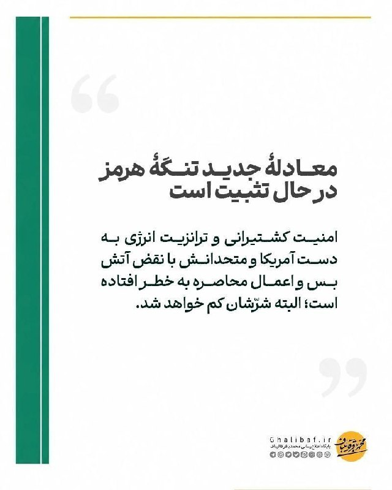

> قالیباف: امنیت کشتیرانی و ترانزیت انرژی به دست آمریکا و متحدانش با نقض آتش‌بس و اعمال محاصره به خطر افتاده است؛ البته شرّشان
> کم خواهد شد.
> 
> ☆Phantom☆
> 
> 📌 @persian_trend_official
> پرشین ترند | متفاوت‌ترین کانال نظامی

## 1405/02/16 15:40 — Persian_Trend_Official
[🎬 Video](telegram/content/Persian_Trend_Official_13535_1778087173.jpg)

> سپاه پاسداران :
> اورانیوم تحویل داده نمیشود.
> 
> 
> غیر رسمی....تایید یا تکذيب نمیشود
> 
> ☆Phantom☆
> 
> 📌 @persian_trend_official
> پرشین ترند | متفاوت‌ترین کانال نظامی

## 1405/02/16 15:32 — RadioFarda
> 🔸دونالد ترامپ رئیس جمهوری آمریکا در پیامی تازه در شبکه اجتماعی خود، تروث سوشال نوشت: «با این فرض که ایران با آنچه توافق شده موافقت کند—که البته شاید فرض بزرگی باشد—عملیات «خشم حماسی» که همین حالا هم زبانزد شده، به پایان می‌رسد و محاصرۀ بسیار کارساز کنونی اجازه…

## 1405/02/16 15:32 — RadioFarda

> 🔸دونالد ترامپ رئیس جمهوری آمریکا در پیامی تازه در شبکه اجتماعی خود، تروث سوشال نوشت: «با این فرض که ایران با آنچه توافق شده موافقت کند—که البته شاید فرض بزرگی باشد—عملیات «خشم حماسی» که همین حالا هم زبانزد شده، به پایان می‌رسد و محاصرۀ بسیار کارساز کنونی اجازه خواهد داد که تنگۀ هرمز برای همگان، از جمله خود ایران، باز باشد.»
> 
> 🔸او در این پیام افزود: «اگر موافقت نکنند، بمباران آغاز می‌شود و متأسفانه این بار با سطح و شدتی بسیار فراتر از گذشته خواهد بود.»
> 
> 🔸پیام دونالد ترامپ ساعاتی پس از انتشار گزارش‌هایی از نزدیک شدن احتمالی ایران و آمریکا به یک یادداشت تفاهم یک صفحه‌ای برای پایان جنگ منتشر شد.
> 
> @RadioFarda

## 1405/02/16 15:30 — ManotoTV
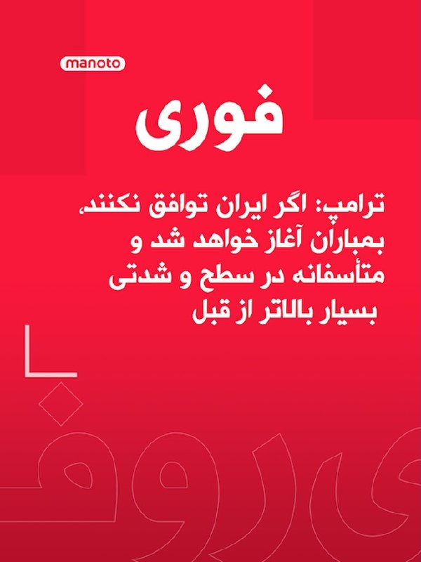

> ترامپ در شبکه تروث سوشال دقایقی پیش نوشت: «با فرض اینکه ایران با آنچه مورد توافق قرار گرفته موافقت کند که البته شاید فرض بزرگی باشد عملیات معروف «خشم حماسی» پایان خواهد یافت و محاصره بسیار مؤثر اجازه خواهد داد تنگه هرمز به روی همه، از جمله ایران، باز شود. اما اگر توافق نکنند، بمباران آغاز خواهد شد و متأسفانه در سطح و شدتی بسیار بالاتر از قبل خواهد بود.»

## 1405/02/16 15:30 — ManotoTV
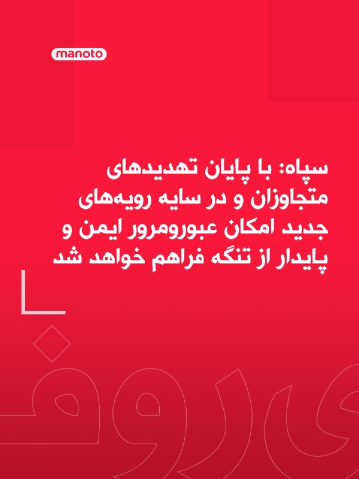

> حساب فرماندهی نیروی دریایی سپاه در شبکه اکس به دو زبان فارسی و انگلیس مطلبی منتشر و از جمله نوشته است با پایان تهدیدهای متجاوزان و در سایه رویه‌های جدید امکان عبورومرور ایمن و پایدار از تنگه فراهم خواهد شد. در این مطلب همچنین از «همکاری کاپیتان‌ها و مالکین کشتی‌های مستقر در خلیج فارس و دریای عمان برای عبور و مرور از تنگه هرمز مطابق ضوابط ایران و مشارکت مطلوب شناورها در امنیت دریانوردی منطقه» تشکر شده است.
> تغییر لحن مطالب منتشر شده از سوی نیروی دریایی سپاه جلب توجه می‌کند.
> تا دیروز مطالب منتشر شده حاوی هشدار شدید و تهدید برخورد بود؛ که در آخرین پست به نوعی چرخش از آن فضا را شاهد هستیم.

## 1405/02/16 15:30 — ManotoTV
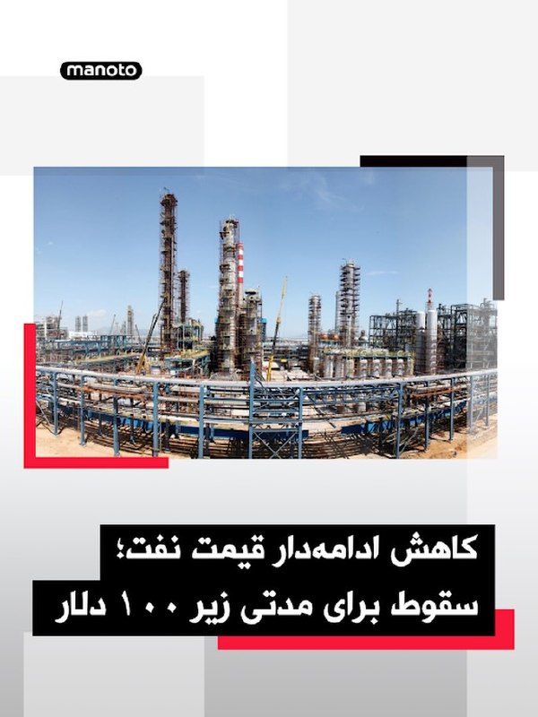

> قیمت نفت پس از آن‌که رئیس‌جمهور آمریکا دونالد ترامپ از احتمال دستیابی به توافق برای پایان دادن به جنگ با ایران خبر داد، به روند نزولی خود ادامه داد تا نهایتا افزایش خوش‌بینی نسبت به احتمال دستیابی به توافق صلح میان آمریکا و جمهوری‌اسلامی، باعث کاهش قابل توجه قیمت نفت شد.
> قیمت هر بشکه نفت برنت برای مدتی کوتاه به زیر ۱۰۰ دلار سقوط کرد؛ رقمی که بیش از ۸ درصد کمتر از قیمت بسته‌شدن شب گذشته است.
> در همین حال، بازارهای سهام اروپا نیز رشد قابل توجهی را تجربه کرده و بخشی از افت‌های اوایل هفته را جبران کرده‌اند.
> شاخص FTSE 100 در لندن در معاملات اواخر صبح حدود ۲.۲ درصد افزایش یافت.
> سهام شرکت‌هایی که به وضعیت اقتصاد جهانی وابسته هستند از جمله بخش‌های معدن و مالی در میان بیشترین رشدها قرار گرفتند.
> در مقابل، سهام بخش انرژی بیشترین آسیب را دید، زیرا همزمان با کاهش قیمت نفت و گاز طبیعی، فشار فروش در این حوزه افزایش یافت.

## 1405/02/16 15:27 — Persian_Trend_Official
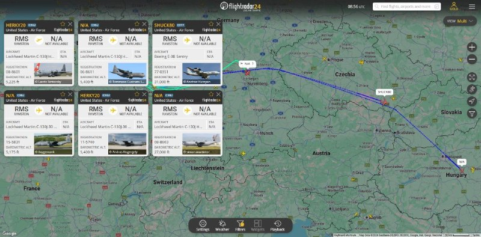

> یک پرشین ترندی اصیل هیچوقت باور نمیکنه توافقی بین ایالات متحده و جمهوری اسلامی شکل بگیره ! حتی اگر امضا کنند ! حالا هرجور صلاحه …

## 1405/02/16 15:24 — Persian_Trend_Official
> رویترز: ارتش اسرائیل در حال بمباران زیرساخت‌های مرتبط با حزب‌الله در مناطق مختلف لبنان است. ☆Phantom☆ 📌 @persian_trend_official پرشین ترند | متفاوت‌ترین کانال نظامی

## 1405/02/16 15:17 — Persian_Trend_Official
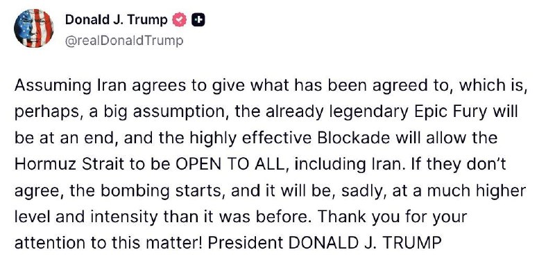

> پست جدید ترامپ درتروث سوشال:
> 
> با فرض اینکه ایران موافقت کند آنچه توافق شده است را بدهد، که شاید فرض بزرگی باشد، خشم حماسی که اکنون افسانه‌ای شده به پایان خواهد رسید و محاصره بسیار مؤثر اجازه خواهد داد تنگه هرمز برای همه، از جمله ایران، باز باشد.
> 
> اگر موافقت نکنند، بمباران آغاز می‌شود و متأسفانه در سطح و شدت بسیار بالاتری نسبت به قبل خواهد بود. از توجه شما به این موضوع سپاسگزار
> 
> 
> ☆Phantom☆
> 
> 📌 @persian_trend_official
> پرشین ترند | متفاوت‌ترین کانال نظامی

## 1405/02/16 15:09 — RadioFarda
> 📻بشنوید: ساعت ۱۴ با رادیوفردا،۱۶ اردیبهشت ۱۴۰۵‌
> 
> @Radiofarda

## 1405/02/16 15:08 — Persian_Trend_Official
> کانال رسمی پرشین ترند pinned «یک پرشین ترندی اصیل هیچوقت باور نمیکنه توافقی بین ایالات متحده و جمهوری اسلامی شکل بگیره ! حتی اگر امضا کنند ! حالا هرجور صلاحه …»

## 1405/02/16 15:05 — Persian_Trend_Official
> یک پرشین ترندی اصیل هیچوقت باور نمیکنه توافقی بین ایالات متحده و جمهوری اسلامی شکل بگیره !
> حتی اگر امضا کنند !
> 
> حالا هرجور صلاحه …

## 1405/02/16 15:04 — Persian_Trend_Official
[🎬 Video](telegram/content/Persian_Trend_Official_13528_1778087178.jpg)

> 🔺توییت انگلیسی و فارسی نیروی دریایی به کشتی‌های مستقر در خلیج فارس
> 
> متن انگلیسی:
> 
> We thank captains & shipowners in Persian Gulf & Gulf of Oman for complying with Iran’s Strait of Hormuz regulations & contributing to regional maritime security.
> 
> With aggressor's threats neutralized & new protocols in place, safe, stable passage through SOH will be ensured.
> 
> متن فارسی:
> 
> از همکاری کاپیتان‌ها و مالکین کشتی‌های مستقر در خلیج فارس و دریای عمان برای عبور و مرور از تنگه هرمز مطابق ضوابط ایران و مشارکت مطلوب شناورها در امنیت دریانوردی منطقه، تشکر می‌کنیم.
> 
> با پایان تهدیدهای متجاوزان و در سایه رویه‌های جدید امکان عبورومرور ایمن و پایدار از تنگه فراهم خواهد شد.
> 
> ☆Phantom☆
> 
> 📌 @persian_trend_official
> پرشین ترند | متفاوت‌ترین کانال نظامی

## 1405/02/16 14:59 — DW_Farsi
> 🔶 روبیو: صلح لبنان و اسرائیل ممکن است اما حزب‌الله مانع است
> 
> وزرای خارجه ایالات متحده آمریکا و آلمان روز سه‌شنبه ۵ مه (۱۵ اردیبهشت) هر یک جداگانه با اشاره به رابطه پیچیده میان لبنان و اسرائیل، حزب‌الله را مانعی برای دستیابی به صلح دانستند.
> 
> مارکو روبیو، وزیر امور خارجه آمریکا در کاخ سفید به خبرنگاران گفت: «صلح میان اسرائیل و لبنان قابل دستیابی است اما گروه شبه‌نظامی حزب‌الله لبنان یک مشکل محسوب می‌شود. در مجموع فکر می‌کنم این توافق صلح به‌زودی دست‌یافتنی باشد.»
> 
> دولت لبنان خواهان یک توافق دائمی با اسرائیل است که متحد ایالات متحده محسوب می‌شود. این کشور از اسرائیل خواسته است، به چرخه تکراری تهاجم‌ها و حملات پایان دهد، در عین حال تا کنون از بیان اینکه خواهان یک "پیمان صلح" است، خودداری کرده و البته در مقابل، اسرائیل هم می‌گوید، هرگونه توافقی باید منجر به خلع سلاح دائمی حزب‌الله، گروه تحت حمایت حکومت ایران شود.
> 
> روبیو در این رابطه گفت: «آنچه باید در لبنان اتفاق بیفتد و آنچه همه می‌خواهند شاهدش باشند، این است که دولتی در لبنان باشد که توانایی مقابله با حزب‌الله و متلاشی کردن آن را داشته باشد.»
> 
> حزب‌الله سه روز پس از آغاز جنگ مشترک اسرائیل و ایالات متحده علیه جمهوری اسلامی ایرانبه سمت اسرائیل موشک شلیک کرد و اسرائیل نیز در مقابل، حملات هوایی و تهاجم زمینی خود به لبنان را تشدید کرد.
> 
> هر چند اسرائیل و لبنان در اواسط آوریل سال جاری بر سر یک آتش‌بس شکننده توافق کردند اما اسرائیل، اشغال جنوب لبنان و تخریب روستاها در آن منطقه را ادامه داده و البته حزب‌الله هم همچنان به نیروهای اسرائیلی حمله می‌کند.
> 
> این در حالی است که پس از وضع آتش بس میان ایران و آمریکا، تهران اعلام کرد، هرگونه توافق برای پایان دادن به جنگ باید شامل توقف حملات اسرائیل در لبنان نیز باشد اما واشنگتن تاکید دارد که این موضوعات از یکدیگر جدا هستند.
> @dw_farsi

## 1405/02/16 14:56 — Persian_Trend_Official
[🎬 Video](telegram/content/Persian_Trend_Official_13527_1778087179.jpg)

> رویترز: ارتش اسرائیل در حال بمباران زیرساخت‌های مرتبط با حزب‌الله در مناطق مختلف لبنان است. ☆Phantom☆ 📌 @persian_trend_official پرشین ترند | متفاوت‌ترین کانال نظامی

## 1405/02/16 14:53 — RadioFarda
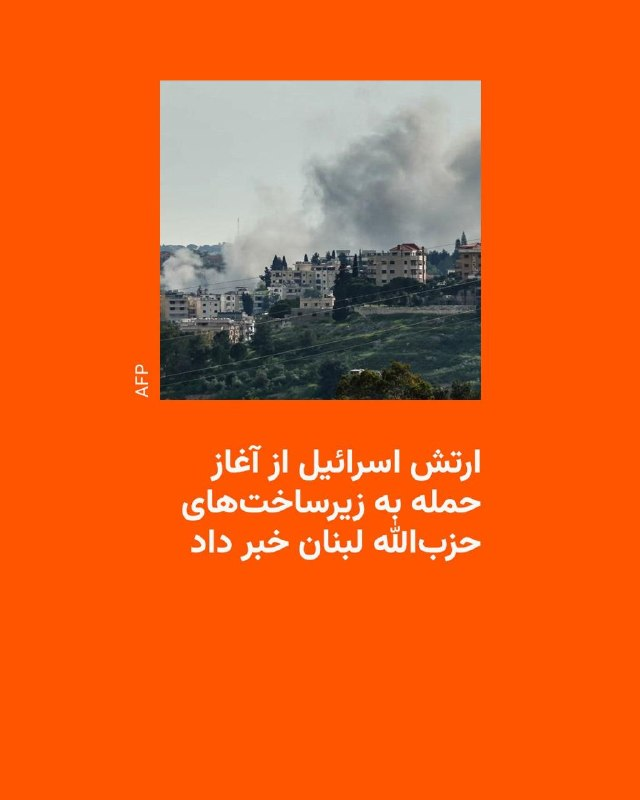

> 🔸ارتش اسرائیل روز چهارشنبه پس از صدور هشدار تخلیه برای ده‌ها روستا در جنوب لبنان از آغاز حمله به زیرساخت‌های گروه حزب‌الله در چندین منطقه از لبنان خبر داد.
> 
> 🔸بیانیه ارتش اسرائیل به دنبال شدت گرفتن درگیری‌ها طی روزهای اخیر در مناطق جنوبی لبنان میان نظامیان اسرائیل و شبه‌نظامیان حزب‌الله به‌رغم وجود آتش‌بس صادر شد. ساعتی پیش از صدور این بیانیه، ارتش اسرائیل از «چندین حادثه» ناشی از حملات پهپادی خبر داده بود که در اثر آن دو سرباز اسرائیل مجروح شدند.
> 
> 🔸در همین حال وزارت بهداشت لبنان اعلام کرد که حمله هوایی اسرائیل در دره بقاع شرقی لبنان در روز چهارشنبه منجر به کشته شدن چهار نفر از جمله دو زن شد. رسانه‌های محلی گزارش دادند که این حمله پیش از هشدار ارتش اسرائیل برای تخلیه این منطقه رخ داده است.
> 
> 🔸رسانه‌های دولتی لبنان اعلام کردند که این حمله به خانه شهردار دهکده «زلایا» اصابت کرده و او و سه نفر از اعضای خانواده‌اش را کشته است.
> 
> 🔸حزب‌الله در فهرست سازمان‌های تروریستی آمریکا قرار دارد. اتحادیه اروپا شاخه نظامی این گروه را در فهرست تروریستی قرارداده است.
> @RadioFarda

## 1405/02/16 14:51 — Persian_Trend_Official

> رویترز: ارتش اسرائیل در حال بمباران زیرساخت‌های مرتبط با حزب‌الله در مناطق مختلف لبنان است.
> 
> ☆Phantom☆
> 
> 📌 @persian_trend_official
> پرشین ترند | متفاوت‌ترین کانال نظامی

## 1405/02/16 14:49 — Persian_Trend_Official
> دقایقی پیش حملات سنگین نیروی هوایی اسرائیل به جنوب لبنان.... ☆Phantom☆ 📌 @persian_trend_official پرشین ترند | متفاوت‌ترین کانال نظامی .

## 1405/02/16 14:49 — RadioFarda
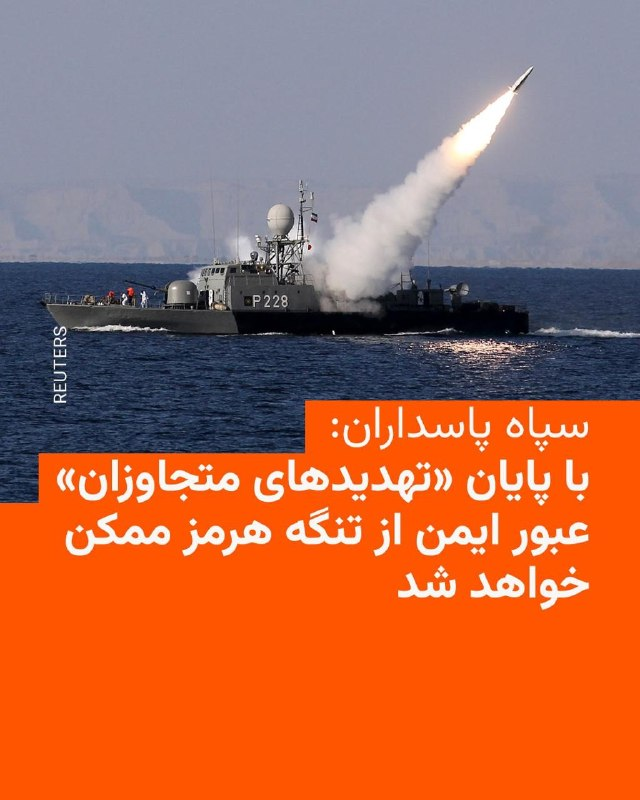

> 🔸سپاه پاسداران روز چهارشنبه، در نخستین واکنش رسمی ایران به توقف عملیات دریایی آمریکا در تنگه هرمز، اعلام کرد با پایان «تهدیدهای متجاوزان» و اجرای «رویه‌های جدید»، عبور و مرور ایمن از این آبراه «فراهم خواهد شد.»
> 
> 🔸فرماندهی نیروی دریایی سپاه در بیانیه‌ای که رسانه‌های دولتی ایران منتشر کردند، از همکاری کاپیتان‌ها و مالکان کشتی‌ها برای عبور از تنگه هرمز «مطابق ضوابط ایران» قدردانی کرد و گفت شناورها در «امنیت دریانوردی منطقه مشارکت مطلوبی داشته‌اند.»
> 
> 🔸در این بیانیه توضیحی درباره «رویه‌های جدید» ارائه نشده است.
> 
> 🔸این اظهارات پس از آن بیان می‌شود که دونالد ترامپ، رئیس‌جمهور آمریکا، روز سه‌شنبه اعلام کرد عملیات «پروژه آزادی» برای اسکورت کشتی‌ها در تنگه هرمز به‌طور موقت متوقف می‌شود تا فرصت برای نهایی شدن توافق احتمالی با ایران فراهم شود.
> 
> @RadioFarda

## 1405/02/16 14:35 — ManotoTV
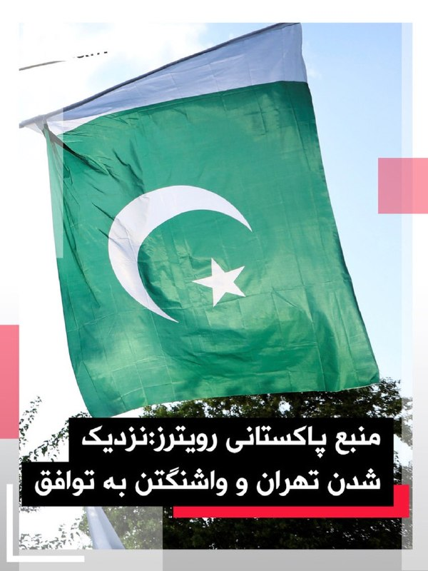

> یک منبع پاکستانی به خبرگزاری رویترز گفته است که جمهوری‌اسلامی و ایالات متحده به دستیابی به یک یادداشت تفاهم یک‌صفحه‌ای برای پایان دادن به جنگ نزدیک شده‌اند.
> این اظهارات در پی گزارشی از رسانه آمریکایی آکسیوس منتشر شده که اعلام کرده واشنگتن و تهران در حال نزدیک شدن به یک توافق هستند.

## 1405/02/16 14:35 — ManotoTV
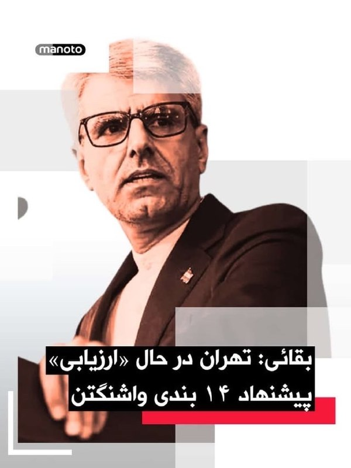

> سی‌ان‌بی‌سی آمریکا از قول اسماعیل بقائی، سخنگوی وزارت خارجه جمهوری‌اسلامی گزارش داده تهران در حال «ارزیابی» پیشنهاد صلح ۱۴ بندی ارائه‌شده از سوی واشنگتن است. اسماعیل بقایی، پیش‌تر نیز تأیید کرده بود که پاسخ آمریکا به طرح پیشنهادی تهران از طریق میانجی‌ها دریافت شده و در حال بررسی است و پس از نهایی شدن، پاسخ جمهوری‌اسلامی اعلام خواهد شد.

## 1405/02/16 14:33 — RadioFarda

> 📷 Photo

## 1405/02/16 14:20 — Hranews
> بازداشت و پخش اعترافات اجباری چند شهروند در تهران
> 
> 
> ❗️
> ❗️
> ❗️
> ❗️
> ❗️– چند شهروند در تهران از بابت آنچه «ارتباط با رسانه‌های معاند خارج از کشور» عنوان شده است، توسط پلیس امنیت استان تهران بازداشت شدند. ویدیویی از #اعترافات_اجباری دستکم سه تن از این افراد نیز منتشر شده که شرایط ضبط آن مشخص نیست.
> 
> ادامه مطلب
> 
> ↘️
> @hranews_bot تماس ✉️ - @Hranews کانال هرانا 🆑

## 1405/02/16 14:03 — ManotoTV
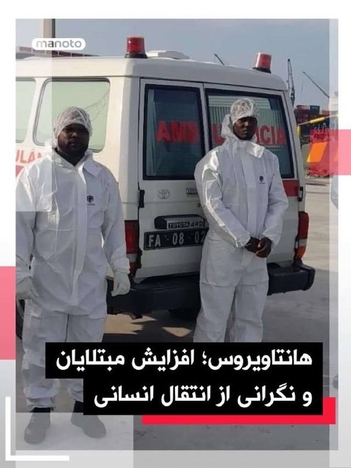

> سازمان جهانی بهداشت اعلام کرد مقامات سوئیس یک مورد جدید از هانتاویروس را تایید کرده‌اند؛ موردی که شمار کل مبتلایان مشکوک یا تاییدشده را به ۸ نفر رسانده است. این فرد پس از دریافت اطلاعیه‌ای از سوی شرکت برگزارکننده یک سفر دریایی درباره بروز یک رویداد بهداشتی، به بیمارستانی در زوریخ مراجعه کرده و هم‌اکنون تحت درمان قرار دارد.
> به گفته سازمان جهانی بهداشت، گونه شناسایی‌شده در این شیوع «آندِس» است؛ نوعی از هانتاویروس که قابلیت انتقال از انسان به انسان را دارد. با این حال، این سازمان تأکید کرده که انتقال تنها در تماس نزدیک رخ می‌دهد و خطر برای عموم مردم پایین ارزیابی می‌شود.
> 
> بر اساس اطلاعات منتشرشده، از مجموع ۸ مورد ثبت‌شده، ۳ نفر جان خود را از دست داده‌اند و ۵ نفر دیگر دارای علائم بیماری هستند. در میان جان‌باختگان، یک مرد ۶۹ ساله هلندی قرار دارد که ۱۱ آوریل در کشتی جان باخت و پیکر او به همراه همسرش در ۲۴ آوریل در سنت هلنا از کشتی خارج شد. همسر او نیز که هم‌سن او بود، در مسیر بازگشت بیمار شد و بعداً جان باخت؛ آزمایش‌ها ابتلای او به هانتاویروس را تأیید کرده‌اند. همچنین یک شهروند آلمانی در ۲ مه در همان کشتی جان خود را از دست داد.
> 
> در میان افراد دارای علائم، یک شهروند بریتانیایی در ۲۷ آوریل به‌شدت بیمار شد و به بخش مراقبت‌های ویژه در ژوهانسبورگ آفریقای جنوبی منتقل شده و وضعیت او همچنان وخیم اما پایدار گزارش شده است. دو نفر از خدمه کشتی، یکی بریتانیایی و دیگری هلندی، نیز دچار علائم حاد تنفسی هستند و همچنان در کشتی حضور دارند. علاوه بر این، یک فرد دیگر نیز علائم دارد، اما جزئیات بیشتری درباره او منتشر نشده است. یک مرد سوئیسی نیز که در اواخر آوریل از آمریکای جنوبی بازگشته بود، پس از مشاهده علائم به پزشک مراجعه کرده است.
> مقامات بهداشتی ضمن ادامه بررسی‌ها، تأکید دارند که با وجود قابلیت انتقال انسانی این گونه از ویروس، خطر شیوع گسترده در حال حاضر پایین است، اما وضعیت همچنان تحت نظارت دقیق قرار دارد.

## 1405/02/16 13:49 — Shin_Persian
> ایران اینترنشنال - خبر فوری ✓ @IranIntlbrk
> Wed, 06 May 2026 10:03:09 UTC
> 
> سخنگوی وزارت خارجه جمهوری اسلامی گفت که تهران در حال بررسی پیشنهاد صلح ۱۴ بندی آمریکا است
> 
> English
> 
> The spokesperson for the Ministry of Foreign Affairs of the Islamic Republic stated that Tehran is reviewing the U.S. 14-point peace proposal.
> 
> 𝕏 · @shin_persian

## 1405/02/16 13:40 — Shin_Persian
> Emanuel (Mannie) Fabian ✓ @manniefabian
> Wed, 06 May 2026 10:10:29 UTC
> 
> The IDF says it has launched a wave of airstrikes on Hezbollah infrastructure sites in several areas of southern Lebanon.
> 
> فارسی
> 
> ارتش دفاعی اسرائیل اعلام کرد که موجی از حملات هوایی را علیه سایت‌های زیرساختی حزب‌الله در چندین منطقه در جنوب لبنان آغاز کرده است.
> 
> 𝕏 · @shin_persian

## 1405/02/16 13:15 — Hranews
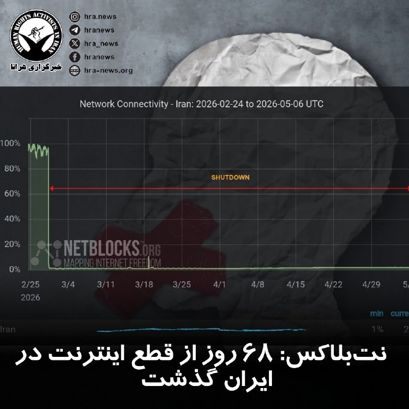

> بر اساس آخرین داده‌های نت بلاکس، قطع اینترنت در ایران با گذشت ۱۶۰۸ ساعت، وارد شصت و هشتمین روز خود شده است. این نهاد ناظر بر وضعیت دسترسی به #اینترنت در جهان همچنین اعلام کرد: عموم مردم ایران اکنون ۷۰٪ از سال ۲۰۲۶ را از اینترنت جهانی محروم بوده‌اند و برخی از مردم از آغاز اولین قطعی دیجیتال در ژانویه هیچ ارتباطی با اینترنت نداشته‌اند.
> 
> ↘️
> @hranews_bot تماس ✉️ - @Hranews کانال هرانا 🆑

## 1405/02/16 13:06 — Hranews
> شناسایی ۲۱ کودک کار در شهرستان کهگیلویه
> 
> 
> ❗️
> ❗️
> ❗️
> ❗️
> ❗️– معاون سیاسی فرماندار کهگیلویه، از شناسایی ۲۱ #کودک_کار در این شهرستان خبر داد.
> 
> ادامه مطلب
> 
> ↘️
> @hranews_bot تماس ✉️ - @Hranews کانال هرانا 🆑

## 1405/02/16 12:59 — ManotoTV
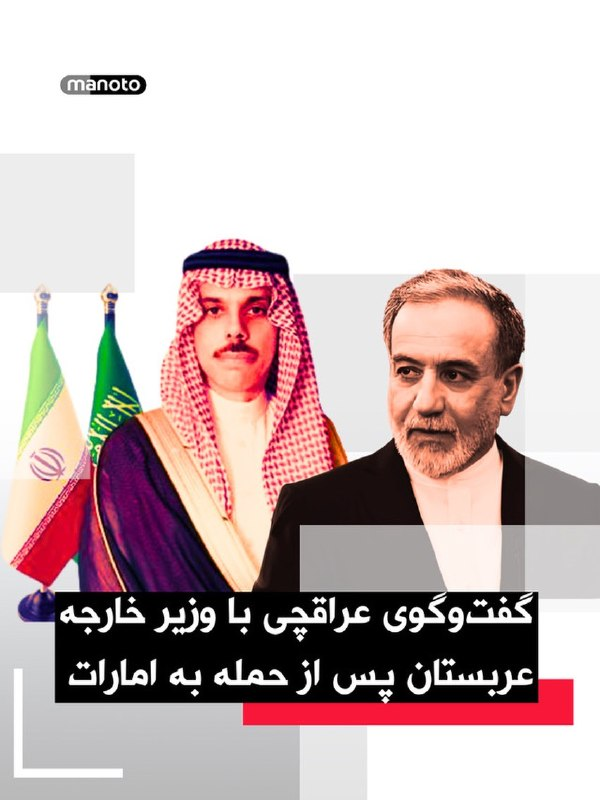

> عباس عراقچی، وزیر خارجه جمهوری اسلامی، امروز با همتای سعودی خود گفت‌وگو کرده است.
> 
> بر اساس گزارش منتشرشده در کانال تلگرام عراقچی، دو طرف آخرین تحولات منطقه را بررسی کرده و بر ادامه رایزنی‌های دیپلماتیک میان کشورهای منطقه برای جلوگیری از افزایش تنش‌ها تأکید کرده‌اند.
> 
> این گفت‌وگو پس از آن انجام می‌شود که امارات متحده عربی، از متحدان کلیدی آمریکا در خاورمیانه، اعلام کرد این هفته هدف حمله پهپادی و موشکی جمهوری اسلامی قرار گرفته؛ حمله‌ای که نخستین مورد از این نوع از زمان آغاز آتش‌بس توصیف شده است.

## 1405/02/16 12:53 — RadioFarda
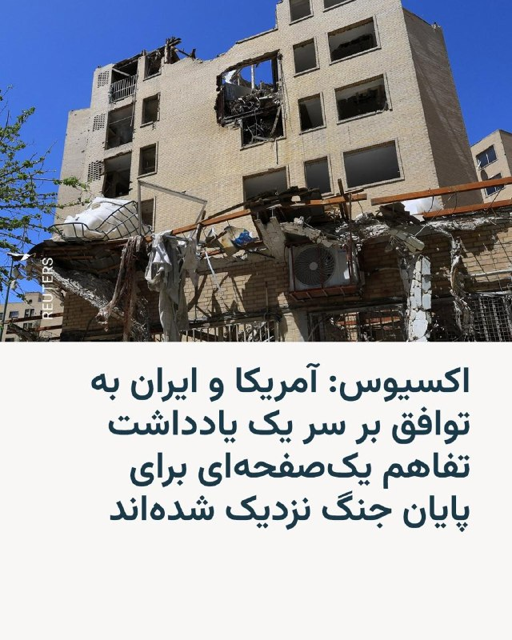

> 🔸وب‌سایت خبری اکسیوس گزارش داد کاخ سفید معتقد است به دستیابی به توافق با ایران بر سر یک یادداشت تفاهم یک‌صفحه‌ای برای پایان جنگ و تعیین چارچوب مذاکرات مفصل‌تر هسته‌ای نزدیک شده است.
> 
> 🔸اکسیوس روز چهارشنبه به نقل از «دو مقام آمریکایی و دو منبع آگاه دیگر» گزارش داد واشینگتن انتظار دارد طی ۴۸ ساعت آینده پاسخ ایران را درباره چند مسئله کلیدی دریافت کند. این گزارش با تأکید بر این‌که هنوز توافقی نهایی نشده، افزوده است که دو طرف از زمان آغاز جنگ تاکنون هرگز تا این اندازه به توافق نزدیک نبوده‌اند.
> 
> 🔸بر اساس این گزارش، این توافق احتمالی شامل تعهد ایران به توقف غنی‌سازی اورانیوم، موافقت آمریکا با لغو تحریم‌ها و آزادسازی میلیاردها دلار از دارایی‌های بلوکه‌شده ایران، و همچنین رفع محدودیت‌های دو طرف در زمینه عبور و مرور از تنگه هرمز خواهد بود.
> 
> 🔸خبرگزاری رویترز اعلام کرد هنوز نتوانسته است این گزارش را به‌طور مستقل تأیید کند. وزارت خارجه و کاخ سفید نیز هنوز به درخواست برای اظهار نظر پاسخ نداده‌اند.
> 
> @RadioFarda

## 1405/02/16 12:41 — RadioFarda
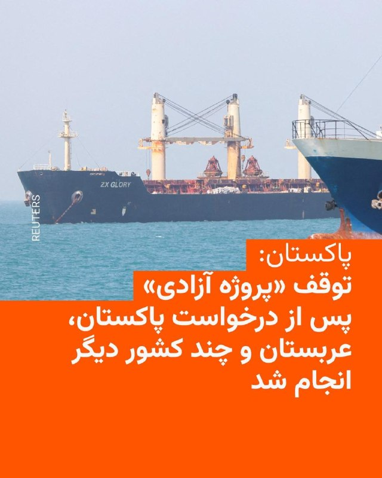

> 🔸شهباز شریف، نخست وزیر پاکستان از دونالد ترامپ، رئیس جمهور آمریکا به خاطر آنچه او «رهبری شجاعانه و اعلام به‌موقع توقف «پروژه آزادی در تنگه هرمز» خواند تشکر کرد.
> 
> 🔸در پیامی که شهباز شریف در شبکه اجتماعی ایکس منتشر کرد آمده که «پاسخ سخاوتمندانه رئیس جمهور ترامپ به درخواست پاکستان و سایر کشورهای برادر، به‌ویژه پادشاهی عربستان سعودی و برادر عزیزم، ولیعهد و نخست وزیر عربستان سعودی، شاهزاده محمد بن سلمان، در این دوره حساس، به پیشبرد صلح، ثبات و آشتی منطقه‌ای کمک زیادی خواهد کرد.»
> 
> 🔸او ابراز امیدواری کرد که «روند فعلی به توافقی پایدار منجر شود و صلح و ثبات پایدار را برای منطقه و فراتر از آن تضمین کند.»
> 
> @RadioFarda

## 1405/02/16 12:28 — RadioFarda
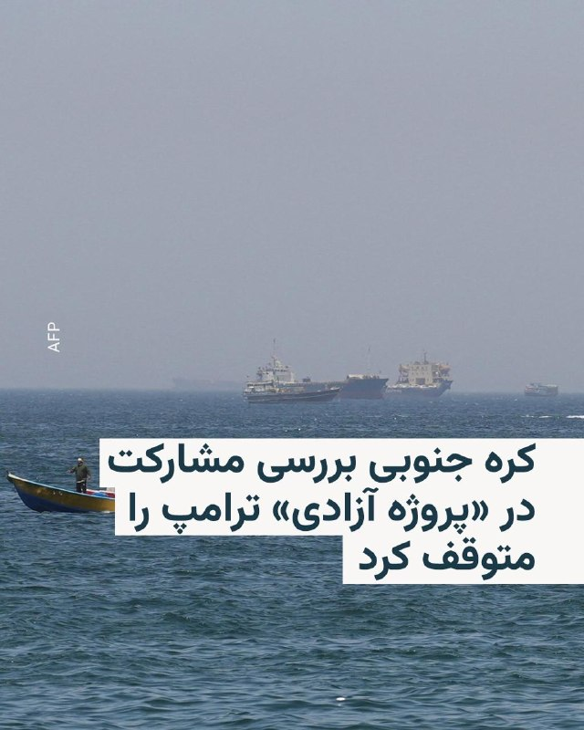

> 🔸دفتر ریاست‌جمهوری کره جنوبی روز چهارشنبه اعلام کرد سئول پس از توقف عملیات اسکورت کشتی‌ها در تنگه هرمز از سوی دونالد ترامپ، بررسی مشارکت در «پروژه آزادی» آمریکا را متوقف کرده است.
> 
> 🔸وی سونگ‌لاک، مشاور امنیت ملی رئیس‌جمهور کره جنوبی، همچنین گفت هنوز مشخص نیست انفجار و آتش‌سوزی در یک کشتی تحت مدیریت کره جنوبی در روز دوشنبه ناشی از حمله بوده یا حادثه‌ای فنی. به گفته او، آتش‌سوزی از موتورخانه آغاز شد و هیچ‌یک از ۲۴ خدمه کشتی آسیب ندیدند.
> 
> 🔸دونالد ترامپ پیش‌تر از سئول خواسته بود به عملیات آمریکا برای بازگشایی مسیر کشتیرانی در تنگه هرمز بپیوندد و مدعی شده بود ایران به یک کشتی تحت مدیریت کره جنوبی شلیک کرده است.
> 
> 🔸کره جنوبی همچنین در حال بررسی پیوستن به چارچوب بین‌المللی دیگری به رهبری آمریکا با نام «سازوکار آزادی دریایی» بود، اما مقام‌های سئول می‌گویند فعلاً نیازی به بررسی مشارکت در «پروژه آزادی» نمی‌بینند.
> 
> 🔸دولت کره جنوبی اعلام کرده است که ۲۶ کشتی با پرچم این کشور در اطراف تنگه هرمز گرفتار شده‌اند.
> 
> @RadioFarda

## 1405/02/16 12:20 — Hranews
> گزارشی از آخرین وضعیت مجید جمشیدزاده در زندان اوین
> 
> 
> ❗️
> ❗️
> ❗️
> ❗️
> ❗️– مجید جمشیدزاده، دانشجوی دانشگاه علم و صنعت و از بازداشت شدگان اعتراضات دی ماه ۱۴۰۴، دوران محکومیت حبس خود در زندان اوین سپری می‌کند. وی پیشتر توسط شعبه ۱۵ دادگاه انقلاب تهران به پنج سال حبس محکوم شده بود.
> 
> ادامه مطلب
> 
> #مجید_جمشیدزاده #اعتراضات۱۴۰۴ #اعتراضات_بازار
> 
> ↘️
> @hranews_bot تماس ✉️ - @Hranews کانال هرانا 🆑

## 1405/02/16 11:45 — Hranews
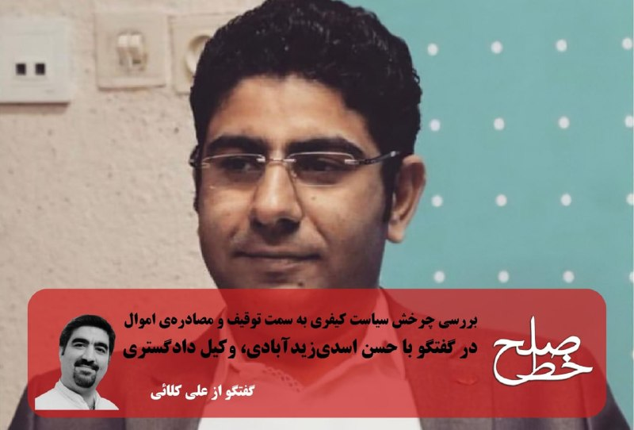

> بررسی چرخش سیاست کیفری به سمت توقیف و مصادره‌ی اموال؛ گفتگو با حسن اسدی‌زیدآبادی/ علی کلائی
> 
> 
> 📡
> 📡
> 📡
> 📡
> 📡– تحولات پرتنش و جنگ آمریکا و اسرائیل با ایران، فضای داخلی کشور را دستخوش تغییرات محسوسی کرده است. این تغییرات صرفاً به حوزه‌های امنیتی و سیاسی محدود نمانده، بلکه آثار آن در عرصه‌ی حقوقی و قضایی نیز به‌وضوح قابل مشاهده است. خبرها از ضبط و توقیف اموال، محدودیت‌های دسترسی مالی و اعمال فشارهای حقوقی و اقتصادی علیه شهروندانی منتشر شده که به‌نوعی در زمره‌ی منتقدان یا معترضان قرار گرفته‌اند؛ به‌ویژه برخی از ایرانیان خارج از کشور، از جمله بازیگران و چهره‌های رسانه‌ای، که با محدودیت‌های تازه‌ای در مدیریت دارایی‌های خود مواجه شده‌اند یا اموالشان به‌کلی توسط قوه‌ی قضاییه‌ی جمهوری اسلامی توقیف شده است.
> 
> همین وضعیت است که ماهنامه‌ی «خط صلح» را بر آن داشته تا به سراغ آقای «حسن اسدی‌زیدآبادی»، وکیل دادگستری و فعال سیاسی، برود و در خصوص مبانی حقوقی توقیف‌ها و تمایز آن با مصادره، استناد به قوانین اخیر از جمله قانون تشدید مجازات جاسوسی، و نسبت این اقدامات با اصول دادرسی عادلانه و حق دسترسی به وکیل، گفتگویی انجام دهد. همچنین، پیامدهای این روندها بر امنیت حقوقی و اعتماد عمومی به نظام قضایی، در گفتگو با این وکیل دادگستری و زندانی سیاسی سابق، مورد بررسی قرار گرفته است.
> 
> مشروح گفتگوی ماهنامه‌ی «خط صلح» با آقای حسن اسدی‌زیدآبادی را در ادامه می‌خوانید:
> 
> 
> ادامه مطلب
> 
> ادامه مطلب در وبسایت خط صلح
> 
> #حسن_اسدی‌زیدآبادی
> #علی_کلائی
> 
> 
> 
> ↘️
> @hranews_bot تماس ✉️ - @Hranews کانال هرانا 🆑

## 1405/02/16 11:29 — Hranews
> قوه قضاییه از توقیف اموال ۴۰ نفر در همدان خبر داد
> 
> 
> ❗️
> ❗️
> ❗️
> ❗️
> ❗️– اموال و دارایی ۴۰ نفر در استان همدان، به دستور مقام قضایی مصادره شد. قوه قضاییه این افراد را به «همکاری با دولت‌های متخاصم» و اقدام علیه امنیت کشور متهم کرده است.
> 
> ادامه مطلب
> 
> ↘️
> @hranews_bot تماس ✉️ - @Hranews کانال هرانا 🆑

## 1405/02/16 10:42 — Hranews
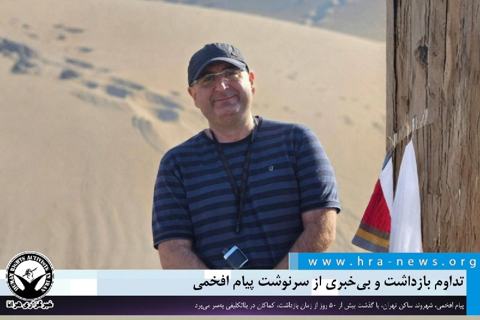

> بیش از ۵۰ روز بازداشت؛ بی‌خبری از سرنوشت پیام افخمی ادامه دارد
> 
> 
> ❗️
> ❗️
> ❗️
> ❗️
> ❗️– پیام افخمی، شهروند ساکن تهران، با گذشت بیش از ۵۰ روز از زمان بازداشت، کماکان در بلاتکلیفی به‌سر می‌برد. بی خبری از سرنوشت آقای افخمی، منجر به افزایش نگرانی‌های خانواده وی شده است.
> 
> به گزارش خبرگزاری هرانا، ارگان خبری مجموعه فعالان حقوق بشر در ایران، بلاتکلیفی پیام افخمی، شهروند بازداشتی ساکن تهران، وارد پنجاه‌ودومین روز شد.
> 
> یک منبع نزدیک به خانواده آقای افخمی، ضمن تایید این موضوع به هرانا گفت: «از زمان بازداشت، پیام تنها یک تماس کوتاه با خانواده داشته و در این تماس نیز نتوانسته توضیحی درباره وضعیت یا محل نگهداری خود ارائه دهد. بی‌اطلاعی از وضعیت این شهروند در حالی ادامه دارد که وی سرپرستی مادر بیمار خود را بر عهده داشته و غیبت او موجب افزایش نگرانی‌ها و فشار مضاعف بر خانواده‌اش شده است.»
> 
> #پیام_افخمی
> 
> ادامه مطلب
> 
> ↘️
> @hranews_bot تماس ✉️ - @Hranews کانال هرانا 🆑

## 1405/02/16 01:30 — Shin_Persian
> Shin ✓ @hey_itsmyturn
> Tue, 05 May 2026 22:00:45 UTC
> 
> NOW -
> 2 blasts heard in Qeshm
> Hormozgan Province, #Iran
> 
> فارسی
> 
> فوری -
> شنیده شدن صدای ۲ انفجار در قشم
> استان هرمزگان، #Iran_
> 
> 𝕏 · @shin_persian

## 1405/02/15 23:16 — Shin_Persian
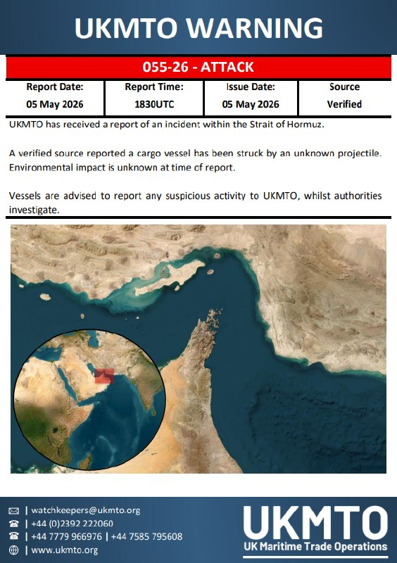

> UKMTO Operations Centre @UK_MTO
> Tue, 05 May 2026 19:43:57 UTC
> 
> UKMTO WARNING 055-26
> 
> Click here to read the full warning⤵️
> http://www.ukmto.org/-/media/ukmto/products/20260505-ukmto_warning_055-26.pdf?rev=a3c137a5b14848ea8f7992b0720e3117
> 
> #MaritimeSecurity #MarSec
> 
> فارسی
> 
> هشدار UKMTO 055-26
> 
> برای خواندن متن کامل هشدار اینجا کلیک کنید⤵️
> http://www.ukmto.org/-/media/ukmto/products/20260505-ukmto_warning_055-26.pdf?rev=a3c137a5b14848ea8f7992b0720e3117
> 
> #MaritimeSecurity #MarSec_
> 
> 𝕏 · @shin_persian

## 1405/02/15 23:05 — Hranews
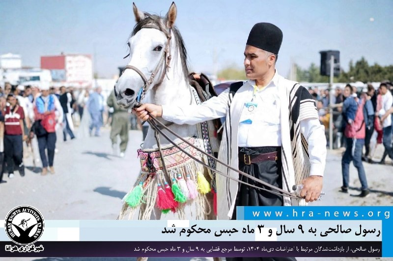

> اعتراضات دی‌ماه ۱۴۰۴؛ رسول صالحی به ۹ سال و ۳ ماه حبس محکوم شد
> 
> 
> ❗️
> ❗️
> ❗️
> ❗️
> ❗️ – رسول صالحی، از بازداشت‌شدگان مرتبط با اعتراضات دی‌ماه ۱۴۰۴، با حکم دادگاه انقلاب به ۹ سال و ۳ ماه #حبس محکوم شد.
> 
> به گزارش خبرگزاری هرانا، ارگان خبری مجموعه فعالان حقوق بشر در ایران، رسول صالحی به حبس محکوم شد.
> 
> بر اساس رای صادره توسط دادگاه انقلاب، وی از بابت اتهام «فراهم نمودن وسایل ارتکاب اجتماع و تبانی» به پنج سال حبس، به اتهام «توهین به رهبری» به دو سال زندان، از بابت اتهام «فعالیت تبلیغی علیه نظام» به یک سال و سه ماه حبس و همچنین به اتهام «نشر اکاذیب» به یک سال زندان محکوم شده است.
> 
> ادامه مطلب
> 
> #رسول_صالحی
> 
> ↘️
> @hranews_bot تماس ✉️ -  @Hranews  کانال هرانا 🆑

## 1405/02/15 22:41 — Hranews
> دستکم ۲ تجمع اعتراضی برگزار شد
> 
> 
> ❗️
> ❗️
> ❗️
> ❗️
> ❗️ – تعدادی از #کارگران پیمانکاری پالایشگاه گاز ایلام که پس از اتمام قرارداد بیکار شده‌اند، با برگزاری #تجمع اعتراضی خواستار بازگشت به کار و رسیدگی به وضعیت شغلی خود شدند. همچنین، خانواده مریم آقابابایی، زن جوانی که مدتی پیش پس از سوار شدن به یک خودرو ناپدید و سپس به قتل رسید، روز گذشته با تجمع مقابل دادسرای عمومی شهرکرد خواستار سرعت در رسیدگی به این پرونده شدند.
> 
> ادامه مطلب
> 
> #مریم_آقابابایی
> 
> ↘️
> @hranews_bot تماس ✉️ -  @Hranews  کانال هرانا 🆑

## 1405/02/15 22:13 — Hranews
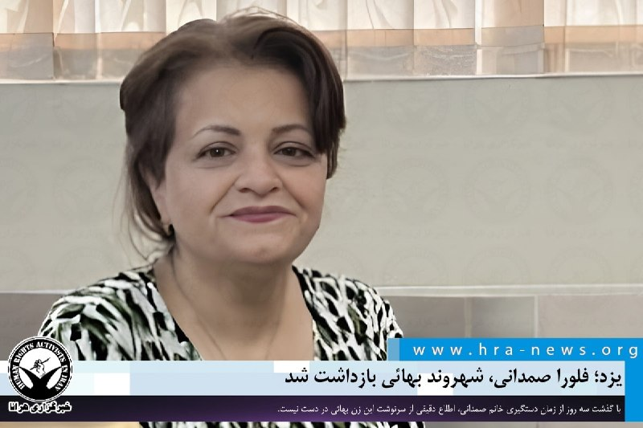

> یزد؛ فلورا صمدانی، شهروند بهائی بازداشت شد
> 
> 
> ❗️
> ❗️
> ❗️
> ❗️
> ❗️ – فلورا صمدانی، شهروند بهائی، روز یکشنبه ۱۳ اردیبهشت‌ماه، توسط نیروهای امنیتی در یزد #بازداشت شد. با گذشت سه روز از زمان دستگیری خانم صمدانی، اطلاع دقیقی از سرنوشت این زن بهائی در دست نیست.
> 
> به گزارش هرانا، ارگان خبری مجموعه فعالان حقوق بشر در ایران، تداوم بازداشت و بلاتکلیفی فلورا صمدانی وارد سومین روز شد.
> 
> بر اساس اطلاعات دریافتی هرانا، این شهروند بهائی روز یکشنبه ۱۳ اردیبهشت‌ماه توسط نیروهای امنیتی در یزد بازداشت شده و همچنان اطلاعی از سرنوشت او در دست نیست. بی خبری از وضعیت وی، منجر به افزایش نگرانی های خانواده صمدانی شده است.
> 
> ادامه مطلب
> 
> #فلورا_صمدانی
> 
> ↘️
> @hranews_bot تماس ✉️ -  @Hranews  کانال هرانا 🆑

## 1405/02/15 21:59 — Hranews
> مرگ یک پاکبان در سایه فقدان ایمنی کار
> 
> 
> ❗️
> ❗️
> ❗️
> ❗️
> ❗️ – در سایه فقدان ایمنی محیط و شرایط نامناسب کار، یک #کارگر پاکبان در قم حین انجام کار دچار حادثه شد و جان خود را از دست داد.
> 
> ادامه مطلب
> 
> ↘️
> @hranews_bot تماس ✉️ -  @Hranews  کانال هرانا 🆑

## 1405/02/15 21:08 — Hranews
> معوقات مزدی و بیمه‌ای کارگران کارخانه کیش چوب
> 
> 
> ❗️
> ❗️
> ❗️
> ❗️
> ❗️ – بیش از ۱۲۰ #کارگر کارخانه کیش چوب، پنج ماه است که حقوق خود را دریافت نکرده‌اند. همچنین چهار ماه حق بیمه این کارگران نیز توسط کارفرما پرداخت نشده است.
> 
> ادامه مطلب
> 
> ↘️
> @hranews_bot تماس ✉️ -  @Hranews  کانال هرانا 🆑

## 1405/02/15 19:49 — Shin_Persian
> 📦 mhrv-rs v1.9.14 released
> 
> • Fix v1.9.13 perceived-slowness regression on upgrade (#773)
> 
> Files (Android APKs, Windows, macOS, Linux, OpenWRT) on the files channel:
> 
> 👉 v1.9.14 — all files with SHA-256
> 
> Channel:
> https://t.me/mhrv_rs
> or: https://t.me/+R1OyoHX2boA1ZDgx
> 
> #v1914

## 1405/02/15 19:47 — Shin_Persian
> ↩️ Quoted tweet: The Golden Days ✓ @TheGoldenDays Mon, 04 May 2026 20:20:27 UTC Kids today will never understand this feeling ↩️ توییت نقل‌قول شده — برای پاسخ، پست زیر را ببینید. فارسی بچه‌های امروز هیچ‌وقت این حس را درک نخواهند کرد 𝕏 · @shin_persian

## 1405/02/15 19:47 — Shin_Persian

> ↩️ Quoted tweet:
> The Golden Days ✓ @TheGoldenDays
> Mon, 04 May 2026 20:20:27 UTC
> 
> Kids today will never understand this feeling
> 
> ↩️ توییت نقل‌قول شده — برای پاسخ، پست زیر را ببینید.
> 
> فارسی
> 
> بچه‌های امروز هیچ‌وقت این حس را درک نخواهند کرد
> 
> 𝕏 · @shin_persian

## 1405/02/15 19:16 — Hranews
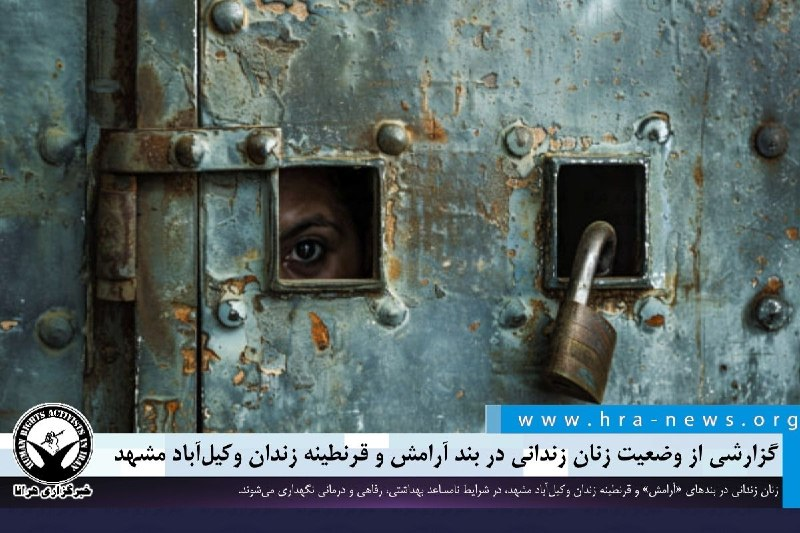

> گزارشی از وضعیت زنان زندانی در بند آرامش و قرنطینه زندان وکیل‌آباد مشهد
> 
> 
> ❗️
> ❗️
> ❗️
> ❗️
> ❗️– دست‌کم ۳۰ زن که در جریان اعتراضات دی‌ماه و همزمان با آغاز درگیری‌های نظامی و تشدید فضای امنیتی ناشی از آن بازداشت شده‌اند، در بند «آرامش» و قرنطینه زندان وکیل‌آباد مشهد، نگهداری می‌شوند؛ بندهایی که با کمبود امکانات اولیه از جمله تهویه مناسب، سرویس بهداشتی و حمام استاندارد، تخت و دسترسی مناسب به خدمات پزشکی مواجه‌اند. در این گزارش، به وضعیت نگهداری #زنان بازداشت‌شده در بند آرامش و قرنطینه زندان وکیل‌آباد مشهد پرداخته شده است.
> 
> به گزارش خبرگزاری هرانا، ارگان خبری مجموعه فعالان حقوق بشر در ایران، زنان زندانی در بند آرامش و قرنطینه #زندان_وکیل‌آباد_مشهد، در شرایط نامناسب نگهداری می‌شوند.
> 
> بر اساس اطلاعات دریافتی هرانا، بند «آرامش» در زندان وکیل‌آباد مشهد محل نگهداری بخشی از زندانیان زن است. در حال حاضر دست‌کم ۲۳ زن در این بند نگهداری می‌شوند که شماری از آنان از بازداشت‌شدگان اعتراضات دی‌ماه ۱۴۰۴ و همچنین بازداشت‌شدگان همزمان با آغاز درگیری‌های نظامی و تشدید فضای امنیتی ناشی از آن هستند.
> 
> همچنین دست‌کم ۷ زندانی زن دیگر در بند قرنطینه این زندان نگهداری می‌شوند. بر این اساس، شمار زنان زندانی در بند آرامش و قرنطینه زندان وکیل‌آباد مشهد دست‌کم به ۳۰ نفر می‌رسد.
> 
> ادامه مطلب
> 
> ↘️
> @hranews_bot تماس ✉️ - @Hranews کانال هرانا 🆑

## 1405/02/15 19:05 — Shin_Persian
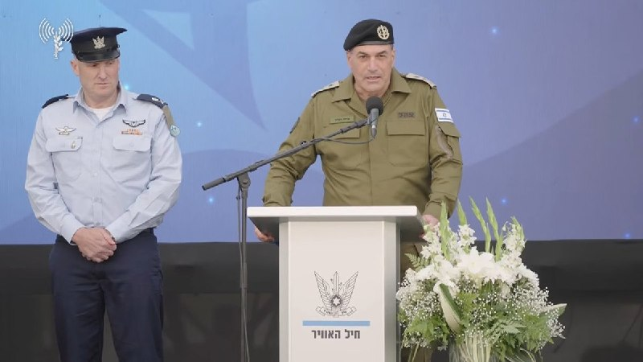

> Emanuel (Mannie) Fabian ✓ @manniefabian Tue, 05 May 2026 15:35:18 UTC IDF Chief of Staff Lt. Gen. Eyal Zamir says the military is "prepared to respond with force" if Iran targets Israel amid the escalation in the Gulf. "Our forces are deployed across all…

## 1405/02/15 19:05 — Shin_Persian
> Emanuel (Mannie) Fabian ✓ @manniefabian
> Tue, 05 May 2026 15:35:18 UTC
> 
> IDF Chief of Staff Lt. Gen. Eyal Zamir says the military is "prepared to respond with force" if Iran targets Israel amid the escalation in the Gulf.
> 
> "Our forces are deployed across all sectors, fighting and prepared in immediate readiness for any scenario — from near and from far," Zamir says at a handover ceremony for the chief of the Israeli Air Force.
> 
> "The IDF, in all its systems, maintains high readiness," he says.
> 
> Zamir says the military is "closely monitoring developments in the Persian Gulf" and is "prepared to respond with force against any attempt to harm Israel.”
> 
> فارسی
> 
> سپهبد ایال زامیر، رئیس ستاد کل ارتش دفاعی اسرائیل (IDF)، می‌گوید در صورت هدف قرار گرفتن اسرائیل توسط ایران در بحبوحه تنش‌ها در خلیج [فارس]، ارتش «آماده پاسخ با قدرت است».
> 
> زامیر در مراسم تودیع و معارفه فرمانده نیروی هوایی اسرائیل گفت: «نیروهای ما در تمامی بخش‌ها مستقر هستند، در حال نبرد می‌باشند و با آمادگی فوری برای هر سناریویی - از نزدیک و دور - آماده‌اند.»
> 
> او می‌گوید: «ارتش دفاعی اسرائیل (IDF) در تمامی سیستم‌های خود، آمادگی بالایی را حفظ کرده است.»
> 
> زامیر گفت ارتش «از نزدیک تحولات خلیج فارس را زیر نظر دارد» و «آماده است تا با قدرت در برابر هرگونه تلاش برای آسیب رساندن به اسرائیل پاسخ دهد.»
> 
> 𝕏 · @shin_persian

## 1405/02/15 18:43 — Hranews
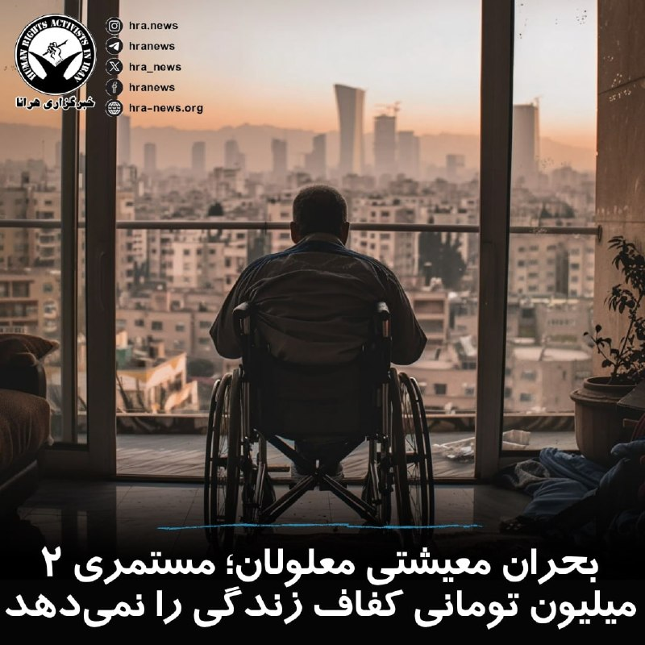

> بهروز مروتی، فعال حوزه معلولان، در گفت‌وگو با خبرآنلاین با اشاره به افزایش فشارهای معیشتی بر افراد دارای معلولیت گفت حدود ۳۰۰ هزار نفر در صف دریافت مستمری و دست‌کم ۱۶۰ هزار نفر در انتظار حق پرستاری هستند.
> 
> او با انتقاد از تعیین مستمری حدود دو میلیون تومانی تأکید کرد این رقم با توجه به تورم بالا و فاصله قابل توجه با خط فقر، حتی پاسخگوی هزینه‌های حداقلی زندگی نیست. به گفته وی، این وضعیت در حالی ادامه دارد که دولت موظف است طبق قانون، سطح حمایت‌ها را به حداقل دستمزد نزدیک کند.
> 
> مروتی همچنین تأخیر در پرداخت کمک‌هزینه‌های حمایتی را نشانه ضعف جدی در نظام حمایتی دانست و گفت تداوم این شرایط، #افراد_دارای_معلولیت را با بحران جدی در تأمین نیازهای اولیه مواجه کرده است.
> #معلولان
> 
> ↘️
> @hranews_bot تماس ✉️ - @Hranews کانال هرانا 🆑

## 1405/02/15 17:49 — Shin_Persian
> Shin ✓ @hey_itsmyturn
> Tue, 05 May 2026 14:19:24 UTC
> 
> 1st: 1412Z
> 2nd: 1416Z
> Qeshm, Hormozgan Province, #Iran
> 
> فارسی
> 
> اول: ۱۴۱۲ زولو (۱۷:۴۲ به وقت تهران)
> دوم: ۱۴۱۶ زولو (۱۷:۴۶ به وقت تهران)
> قشم، استان هرمزگان، #Iran
> 
> 𝕏 · @shin_persian

## 1405/02/15 17:48 — Shin_Persian
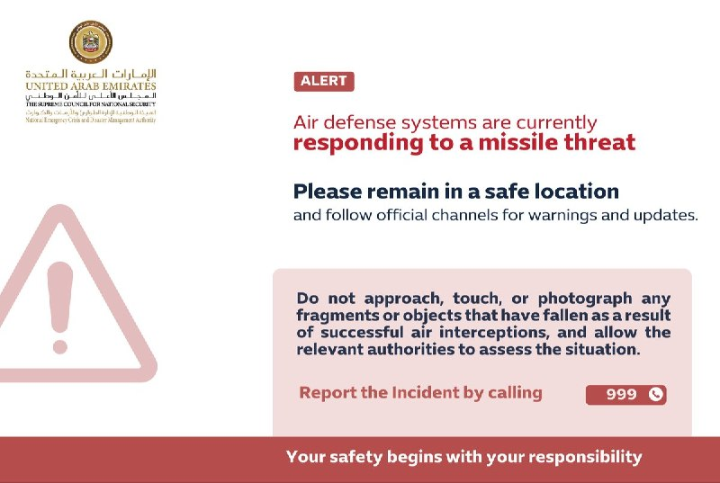

> NCEMA UAE ✓ @NCEMAUAE
> Tue, 05 May 2026 14:13:51 UTC
> 
> Air defense systems are currently responding to a missile threat. Please remain in a safe location and follow official channels for warnings and updates.
> 
> فارسی
> 
> سامانه‌های پدافند هوایی در حال حاضر در حال پاسخگویی به یک تهدید موشکی هستند. لطفاً در مکان امن بمانید و کانال‌های رسمی را برای هشدارها و به‌روزرسانی‌ها دنبال کنید.
> 
> 𝕏 · @shin_persian

## 1405/02/15 17:47 — Shin_Persian
> Shin ✓ @hey_itsmyturn
> Tue, 05 May 2026 14:17:51 UTC
> 
> NOW -
> Seek shelter alert in Dubai, #UAE 🇦🇪
> 
> فارسی
> 
> فوری - هشدار پناه گرفتن در دبی، امارات متحده عربی #UAE 🇦🇪
> 
> 𝕏 · @shin_persian

## 1405/02/15 17:47 — Shin_Persian
> Shin ✓ @hey_itsmyturn
> Tue, 05 May 2026 14:17:01 UTC
> 
> 2 blasts were heard in Qeshm, Hormozgan Province, #Iran
> 
> فارسی
> 
> ۲ انفجار در قشم، استان هرمزگان، #Iran شنیده شد.
> 
> 𝕏 · @shin_persian

## 1405/02/15 17:25 — Hranews
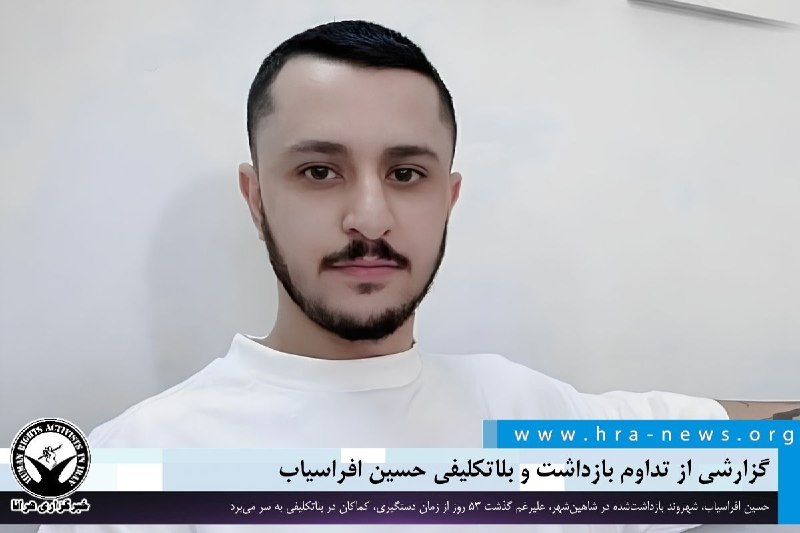

> گزارشی از تداوم بازداشت و بلاتکلیفی حسین افراسیاب
> 
> 
> ❗️
> ❗️
> ❗️
> ❗️
> ❗️– حسین افراسیاب، شهروند بازداشت‌شده در شاهین‌شهر، علیرغم گذشت ۵۳ روز از زمان دستگیری، کماکان در بلاتکلیفی به سر می‌برد.
> 
> به گزارش خبرگزاری هرانا، ارگان خبری مجموعه فعالان حقوق بشر در ایران، حسین افراسیاب کماکان در بازداشت به سر می‌برد.
> 
> حسین افراسیاب علیرغم گذشت ۵۳ روز از زمان بازداشت، کماکان در بلاتکلیفی به سر می‌برد و پرونده وی اخیراً جهت رسیدگی به دادگاه ارسال شده است.
> 
> ادامه مطلب
> 
> #حسین_افراسیاب
> 
> ↘️
> @hranews_bot تماس ✉️ - @Hranews کانال هرانا 🆑

## 1405/02/15 15:43 — Shin_Persian
> 📦 mhrv-rs v1.9.13 released
> 
> • Hotfix v1.9.11 / v1.9.12 build failure
> 
> Files (Android APKs, Windows, macOS, Linux, OpenWRT) on the files channel:
> 
> 👉 v1.9.13 — all files with SHA-256
> 
> Channel:
> https://t.me/mhrv_rs
> or: https://t.me/+R1OyoHX2boA1ZDgx
> 
> #v1913

## 1405/02/15 15:00 — Shin_Persian
> U.S. Embassy Baghdad ✓ @USEmbBaghdad
> Tue, 05 May 2026 11:16:50 UTC
> 
> Security Alert – U.S. Embassy Baghdad, Iraq – May 5, 2026
> 
> Location: Iraq
> 
> Iraqi airspace has reopened and limited commercial flights are operating. Those considering air travel in Iraq should be aware of the ongoing potential risk of missiles, drones, and rockets in Iraqi airspace. The U.S. Embassy in Iraq reminds U.S. citizens of the Level 4: Do Not Travel warning for Iraq. U.S. citizens are advised: “Do not travel to Iraq for any reason. Leave now if you are there.”
> 
> Iraqi terrorist militias aligned with Iran continue to plot additional attacks against U.S. citizens and targets associated with the United States throughout Iraq, including in the Iraqi Kurdistan Region (IKR). Some elements associated with the Iraqi government continue to actively provide political, financial, and operational cover for these terrorist militias.
> 
> U.S. Mission Iraq remains open while on ordered departure to assist U.S. citizens in Iraq. Do not attempt to come to the Embassy in Baghdad or the Consulate General in Erbil in light of significant security risks. If you are a U.S. citizen and need assistance, contact U.S. Embassy Baghdad at BaghdadACS@state.gov, or Consulate General Erbil at ErbilACS@state.gov.
> 
> Iraqi airport information:
> • Baghdad International Airport: https://www.flightradar24.com/data/airports/bgw
> • Erbil International Airport: https://www.eia.krd/english/flight-information
> • Basrah International Airport: https://www.flightradar24.com/data/airports/bsr
> • Jalal Talabani International Airport (Sulaymaniyah): https://www.sulairport.krd/
> 
> Commercial flights are operating out of neighboring countries, including Jordan, Kuwait, Saudi Arabia, and Türkiye. Overland routes to those countries remain open, and local ground transportation options are functioning. Local entry and exit requirements apply. U.S. citizens wishing to travel via land crossings should check security alerts and travel advisories for those countries at official U.S. Embassy websites.
> 
> Consular Operations
> Routine consular services in Iraq remain suspended, including all visa services. Americans should contact BaghdadACS@state.gov or ErbilACS@state.gov in case of emergency.
> 
> ترجمه فارسی در بخش نظرات
> 
> 𝕏 · @shin_persian

## 1405/02/14 20:20 — Iliaen
> سنتکام: نیروی دریایی ایالات متحده ۶ قایق کوچک (تندرو) جمهوری اسلامی را غرق کرد.
> 
> @iliaen

## 1405/02/14 19:43 — Iliaen
> ساعت ۱۹:۴۳ دوشنبه؛ چند موشک دیگر از جنوب هرمزگان به سمت خلیج فارس شلیک شد.
> 
> @iliaen

## 1405/02/14 19:36 — Iliaen
> آماده دور جدید حملات باشید.

## 1405/02/14 19:19 — Iliaen
> ساعت ۱۹:۱۹ دوشنبه؛ ساکنان دوبی از دریافت پیام هشدار چهارم خبر می‌دهند.
> 
> @iliaen

## 1405/02/14 19:15 — Iliaen

> دو موشک در آسمان سیریک (هرمزگان)
> 
> @iliaen

## 1405/02/14 19:09 — Iliaen
> ساعت حدود ۱۹:۰۰ دوشنبه؛ یک موشک شلیک شده از سمت سیریک (هرمزگان) چند لحظه بعد در آسمان ایران منفجر شد.
> 
> همچنین گزارش‌ها از شنیده شدن یک انفجار مهیب از سمت دریای عمان حکایت دارد.
> 
> @iliaen

## 1405/02/14 19:03 — Iliaen
> جمهوری اسلامی درحال حمله پهپادی و موشکی به مکانی در نزدیک دوبی است.
> 
> تاکنون ۴ موشک کروز توسط پدافند امارات رهگیری و خنثی شدند؛ همچنین یک نقطه در منطقه نفت فجیره (امارات) هدف اصابت پهپاد قرار گرفت.
> 
> @iliaen

## 1405/02/14 18:56 — Iliaen
> ساعت ۱۸:۵۰ دوشنبه؛ برای سومین بار در یک ساعت اخیر هشدار حملات موشکی به ساکنان دوبی ارسال شد.
> 
> @iliaen

## 1405/02/14 18:29 — Iliaen
> ساعت حدود ۱۸:۲۰ دوشنبه؛ یک موشک از سمت روستای کرپان (جنوب هرمزگان) به سمت مکانی در خلیج فارس شلیک شد.
> 
> @iliaen

## 1405/02/14 16:39 — Iliaen
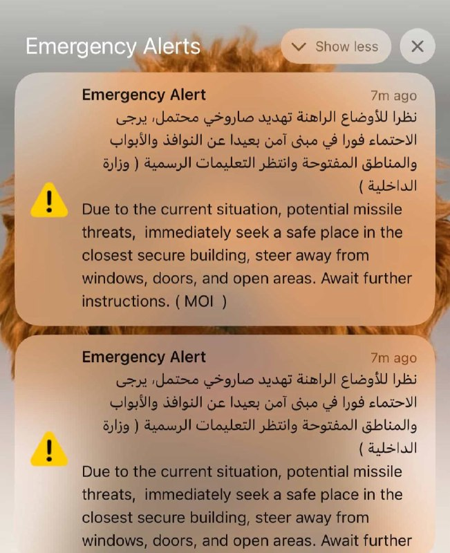

> به تلفن‌های همراه ساکنان امارات، پیام هشدار احتمال حملات موشکی و حضور در پناهگاه ارسال شد.
> 
> @iliaen

## 1405/02/14 16:24 — Iliaen
> ساعت حدود ۱۶:۲۰ دوشنبه؛ ساکنان جزیره قشم یک جنگنده را در آسمان مشاهده کردند.
> 
> @iliaen

## 1405/02/14 16:15 — Iliaen
> سنتکام از ورود ۲ کشتی آمریکا به تنگه هرمز خبر داد.
> 
> @iliaen

## 1405/02/14 15:20 — Iliaen
> از دقایقی دیگر، عملیات نیروی دریایی ایالات متحده تحت عنوان “پروژه آزادی” با بیش از ۱۵۰۰۰ نیرو نظامی و ۱۰۰ هواپیما در تنگه هرمز آغاز خواهد شد.
> 
> این عملیات جهت کمک به عبور امن کشتی‌هایی است که این مدت و پس از مسدود شدن تنگه هرمز در خلیج فارس گیر کردند.
> 
> سپاه پاسداران نیز تهدید کرد هرگونه عبور هماهنگ نشده و حضور نظامی برای عبور از تنگه هرمز را با موشک و پهپاد پاسخ خواهد داد.
> 
> قیمت جهانی نفت درحال افزایش است و ساکنان نزدیک به خط ساحلی هرمزگان همچنان از شنیده شدن صداهایی مانند شلیک رگبار در دریا خبر می‌دهند.
> 
> @iliaen

## 1405/02/14 15:00 — Iliaen
> سپاه پاسداران یک نفتکش متعلق به امارات را با دو پهپاد هدف قرار داد.
> 
> @iliaen

## 1405/02/14 14:47 — Iliaen

> رسانه‌های جمهوری اسلامی ادعا کردند تعداد ۲ موشک با یک ناوچه متعلق به ارتش آمریکا برخورد کرد، اما سنتکام با انتشار یک پیام رسمی، تاکید کرد هیچکدام از موشک‌ها با ناوگان ایالات متحده برخورد نکردند.
> 
> @iliaen

## 1405/02/14 13:49 — Iliaen
> ساعت ۱۳:۴۹ دوشنبه؛ ساکنان در نوار ساحلی جنوب استان هرمزگان از شنیده شدن صدایی مانند تیراندازی (اما بسیار بلندتر) از داخل آب‌های خلیج فارس (محدوده‌ی تنگه هرمز) گزارش می‌دهند.
> 
> @iliaen

## 1405/02/14 13:41 — Iliaen
> ساعت ۱۳:۴۱ دوشنبه؛ گزارش‌ها از شلیک موشک دوم و سوم از سایت موشکی سپاه در سیریک (هرمزگان) به سمت تنگه هرمز حکایت دارد.
> 
> @iliaen

## 1405/02/14 13:38 — Iliaen
> ساعت حدود ۱۳:۳۰ دوشنبه؛ گزارش‌ها از شلیک یک موشک از سایت نظامی سیریک (هرمزگان) به سمت خلیج فارس در موقعیت تنگه هرمز حکایت دارد.
> 
> @iliaen

## 1405/02/11 00:02 — Iliaen
> ساعت ۰۰:۰۲ بامداد جمعه؛ دو پهپاد در آسمان شرق تهران مشاهده شد.
> 
> @iliaen

## 1404/12/27 18:20 — IranWire
> قیمت بیت کوین به ۷۲ هزار دلار کاهش یافت، زیرا نرخ تورم شاخص قیمت تولیدکننده در ایالات متحده بسیار بالا بود - بیت کوین خبر
> https://btckhabar.com/395/

## 1404/12/21 10:10 — CNNfarsiCHANNEL

> ترامپ : هیچ هدف مهمی تو ایران باقی نمونده
> 
> 💢 @CNNfarsiCHANNEL | Король

## 1404/12/21 10:10 — CNNfarsiCHANNEL
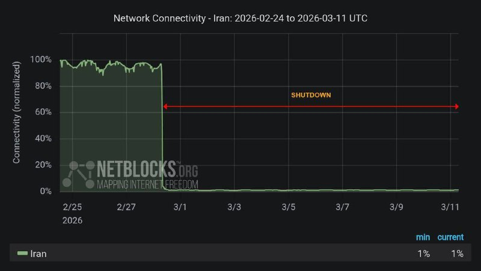

> 💢 به گزارش از نتبلاکس قطعی اینترنت به ۲۶۴ ساعت رسید:
> 
> قطعی اینترنت در ایران وارد دوازدهمین روز خود شده است؛ پس از گذشت ۲۶۴ ساعت، میزان اتصال به شبکه همچنان در سطح ۱ درصد از حد معمول قرار دارد.
> 
> در همین حال، سخنگوی رژیم، مشاهدات و گزارشها مبنی بر اعمال سیستم "فهرست سفید" (whitelisting) را تأیید کرده و اعلام داشته که تنها "افراد یا نهادهای مورد تأیید" اجازه دسترسی به اینترنت و حق اظهار نظر دارند.
> 
> 
> 💢 @CNNfarsiCHANNEL | MDZ

## 1404/12/21 10:09 — CNNfarsiCHANNEL
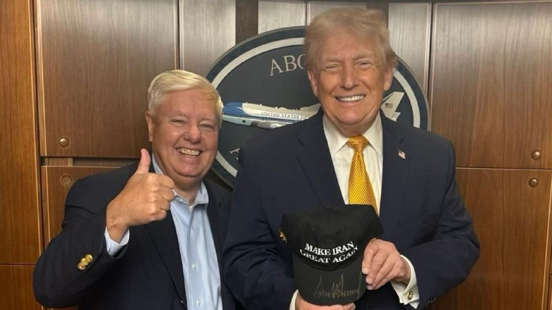

> ترامپ؛
> ما که نمیخوایم زود ول کنیم و بریم درسته؟ باید کار رو کامل تموم کنیم.
> طی ۱۱ روز گذشته ارتش ما تقریباً ایران رو نابود کرده ، ما نمیخوایم هر دو سال یه بار دوباره برگردیم و همین کار رو بكنيم.
> 
> چون یه روزی میرسه که من دیگه رئیس جمهور نیستم و شاید اون موقع به آدم ضعیف و بی عرضه مثل بعضی از رئیس جمهورهای قبلی سر کار بیاد.
> قیمت نفت الان داره پایین میاد و باز هم پایین تر میاد.، ولی ما تا وقتی کار کامل تموم نشه نمیریم
> خیلی سریع تموم میشه،وخیلی سريع ولی نمیتونیم مطمئن باشیم که در آینده همیشه رئیس جمهورهای کاربلد سر کار باشن
> 
> 
> 💢 @CNNfarsiCHANNEL | Король

## 1404/12/10 05:41 — reutersworldchannel
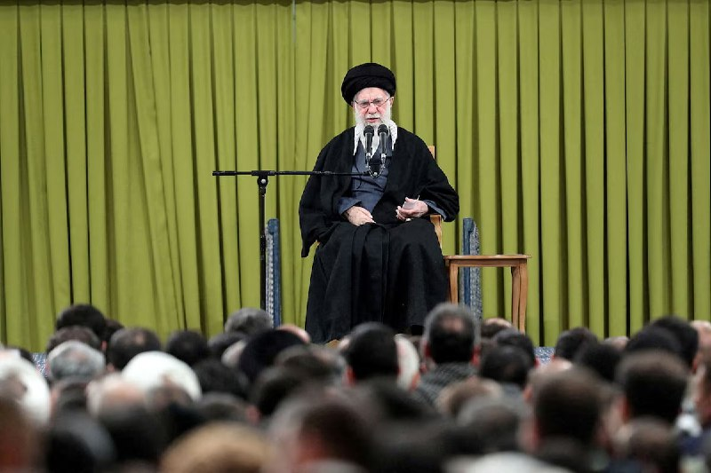

> Iran confirms supreme leader Khamenei is dead after US, Israeli attacks
> 
> Iranian state media reported that Khamenei "was carrying out his assigned duties and was present at his workplace (his office)".
> 
> "This cowardly attack occurred in the early hours of Saturday morning", state media said.
> 
> "We have lost a great leader and we are mourning him, a leader who was unique in in terms of purity of spirit, strength of faith, resourcefulness in affairs, courage in the face of the arrogant, and jihad in the path of God", a statement from Iran's Revolutionary Guards said. read more

## 1404/12/09 11:08 — CNNfarsiCHANNEL
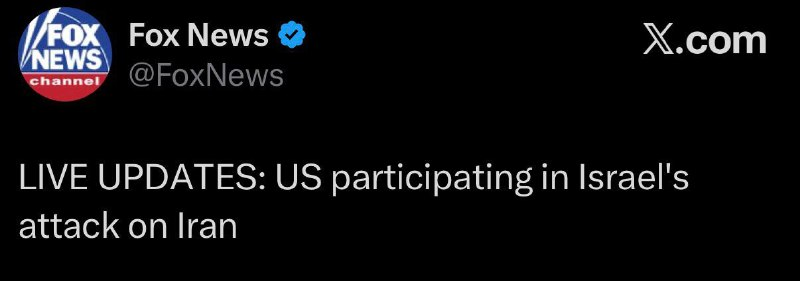

> 🔴فوری | فاکسنیوز:
> 
> ایالات متحده در حال مشارکت با اسراییل در حملات علیه ایران است.
> 
> @CNNfarsiCHANNEL

## 1404/12/09 11:08 — CNNfarsiCHANNEL
> 🔴فوری | ترامپ:
> 
> 🔸️ما تازه عملیات رزمی گسترده در ایران را آغاز کردهایم.
> 
> @CNNfarsiCHANNEL

## 1404/12/09 11:07 — CNNfarsiCHANNEL
> 🔴فوری | نیویورک تایمز به نقل از یک مقام آمریکایی:
> 
> 🔸️حملات فعلی آمریکا بر دستگاه نظامی ایران متمرکز است.
> 
> @CNNfarsiCHANNEL

## 1404/12/09 11:07 — CNNfarsiCHANNEL
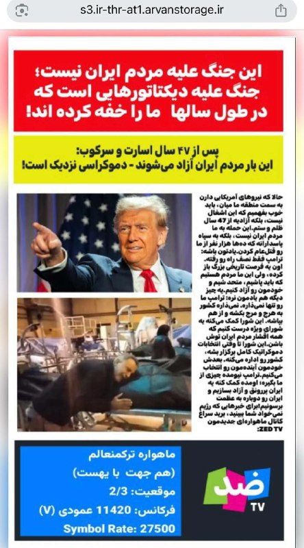

> 🔴تصویر اطلاعیهای که در سایتهای هک شده خبرگزاری های داخلی و دولتی ایران نشان داده میشود.
> 
> 
> @CNNfarsiCHANNEL

## 1404/12/09 11:07 — CNNfarsiCHANNEL
> 🔴رادیو اسرائیل:
> 
> 🔸️نتانیاهو تصمیم گرفته است نام حمله اسرائیل به ایران را به «غرش شیر» تغییر دهد.
> 
> @CNNfarsiCHANNEL

## 1404/12/09 11:07 — CNNfarsiCHANNEL
> 🔴فوری | کانال ۱۲ اسرائیل به نقل از یک منبع:
> 
> 🔸️همه مقامات حکومت ایران هدف حمله هستند.
> 
> @CNNfarsiCHANNEL

## 1404/12/09 11:06 — CNNfarsiCHANNEL
> 🔴یک مقام آمریکایی به الجزیره:
> 
> 🔸️حملات هوایی با هدف از بین بردن دستگاه امنیتی ایران انجام میشود
> 
> 🔸️ حملات آمریکا و اسرائیل علیه ایران اهداف گسترده و ملموسی دارد
> 
> 🔸️ما انتظار داریم حملات هوایی علیه ایران گسترده باشد
> 
> 🔸️ما حملات هوایی گستردهای را علیه ایران از هوا و دریا آغاز میکنیم.
> 
> @CNNfarsiCHANNEL

## 1404/12/09 11:06 — CNNfarsiCHANNEL
> 🔴نیویورک تایمز، به نقل از مقامات آمریکایی:
> 
> 🔸️ما انتظار داریم حمله به ایران بسیار گستردهتر از حملات ژوئن گذشته باشد.
> 
> 🔸️دهها حمله توسط هواپیماهای آمریکایی از پایگاههای سراسر خاورمیانه و از یک ناو هواپیمابر انجام میشود.
> 
> @CNNfarsiCHANNEL

## 1404/12/09 10:45 — CNNfarsiCHANNEL
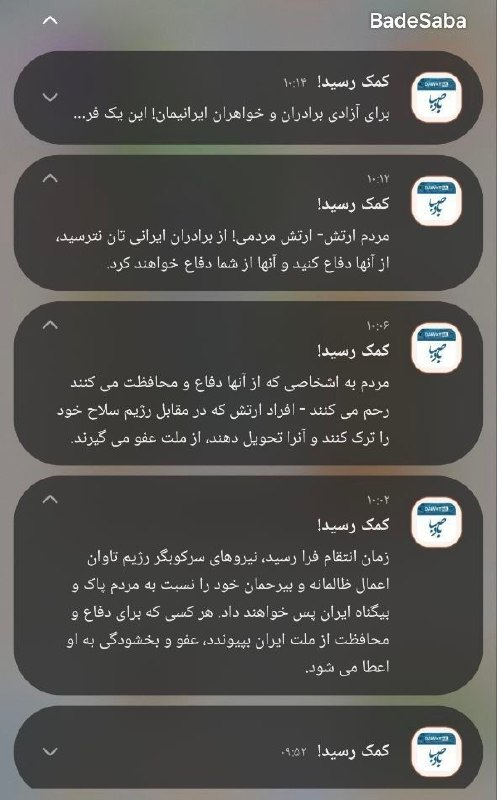

> وضعیت گوشیم:
> 
> 💢 @CNNfarsiCHANNEL | 𝓝𝓪𝓝𝓪

## 1404/12/09 10:45 — CNNfarsiCHANNEL
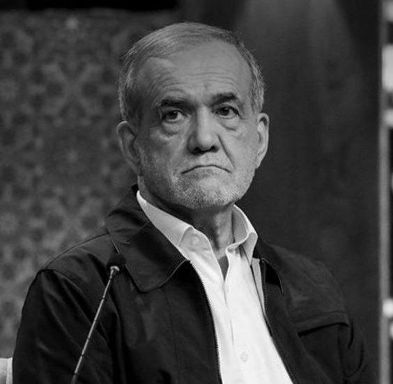

> 👀گزارش اولیه از تلاش برای ترور رئیسجمهور ایران، مسعود پزشکیان‼️
> 
> 💢 @CNNfarsiCHANNEL | Король

## 1404/12/09 10:45 — CNNfarsiCHANNEL
> طبق ادعای یک منبع ارشد اسرائیلی: تعداد زیادی ترور هدفمند در ایران انجام شده است. هر موشک یک داشت‼️‼️
> 
> 💢 @CNNfarsiCHANNEL | Король

## 1404/12/09 10:44 — CNNfarsiCHANNEL
> 🚨چندین سکوی پهبادی سپاه پاسداران قبل از شلیک منهدم شدند.‼️‼️
> 
> 💢 @CNNfarsiCHANNEL | 𝓝𝓪𝓝𝓪

## 1404/12/09 10:44 — CNNfarsiCHANNEL
> 💢 مراکز مورد هدف قرار گرفته در تهران
> 
> 🔴وزارت اطلاعات
> 🔴وزارت دفاع
> 🔴بین رهبری
> 🔴آژانس انرژی اتمی
> 🔴پارچین
> 
> 💢 @CNNfarsiCHANNEL | MDZ

## 1404/12/09 10:44 — CNNfarsiCHANNEL
> 💢 نیویورک تایمز:
> 
> تا دقایقی دیگر حملات ارتش امریکا نیز اغاز خواهد شد.‼️‼️
> 
> 💢 @CNNfarsiCHANNEL | Noll

## 1404/12/07 21:24 — IranWire
> https://khabarkhan.com/article/7203

## 1404/12/05 20:30 — reutersworldchannel
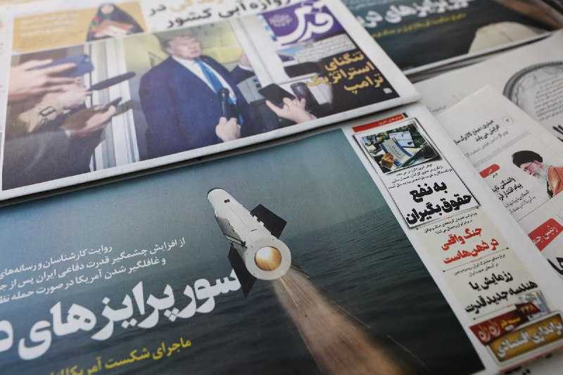

> Exclusive: Iran nears deal to buy supersonic anti-ship missiles from China
> 
> Iran is close to a deal with China to purchase anti‑ship cruise missiles, according to six people with knowledge of the negotiations, just as the United States deploys a vast naval force near the Iranian coast ahead of possible strikes on the Islamic Republic.
> 
> The deal for the Chinese‑made CM‑302 missiles is near completion, though no delivery date has been agreed, the people said. The supersonic missiles have a range of about 290 kilometres and are designed to evade shipborne defences by flying low and fast. Their deployment would significantly enhance Iran’s strike capabilities and pose a threat to U.S. naval forces in the region, two weapons experts said. read more

## 1404/11/30 16:30 — reutersworldchannel

> Police arrest King Charles' brother Andrew over misconduct relating to Epstein
> 
> King Charles' younger brother Andrew Mountbatten-Windsor was on Thursday arrested on suspicion of misconduct in public office over allegations he sent confidential government documents to Jeffrey Epstein.
> 
> Mountbatten-Windsor, celebrating his 66th birthday on Thursday, was arrested and questioned by detectives from Thames Valley Police, which this month said it was looking into allegations that he had passed documents to the late convicted sex offender while working as a trade envoy. read more

## 1404/11/24 08:30 — reutersworldchannel

> North Korea says South Korea should take steps to prevent violation of its sovereignty
> 
> The sister of North Korea's ruler said on Friday that South Korean authorities should take steps to prevent "reoccurrence of provocative sovereignty violation," state media KCNA reported, referring to a drone flown into its airspace recently.
> 
> Kim Yo Jong, the powerful sister of North Korean leader Kim Jong Un, said in a statement she appreciates the South Korean Unification Minister Chung Dong-young's expression of his regret over the "drone intrusion" as "sensible behavior," KCNA reported. read more

## 1404/11/17 08:30 — reutersworldchannel
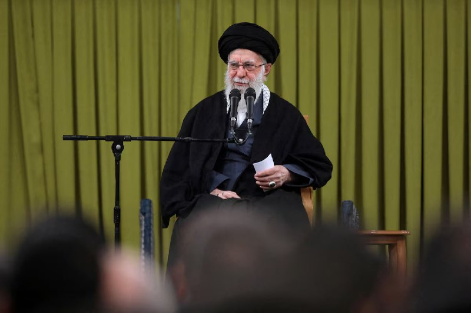

> Iran, US to negotiate in Oman amid deep rifts and mounting war fears
> 
> Iran and the United States are set to hold high-stakes negotiations in Oman on Friday over Tehran's nuclear programme, but a dispute over the agenda suggests progress will be hard won amid the threat of a regional Middle East war.
> 
> While both sides have signalled readiness to revive diplomacy over Tehran's long-running nuclear dispute with the West, Washington wants the talks to cover Iran's nuclear programme, its ballistic missiles, support for armed groups around the region and its "treatment of their own people", U.S. Secretary of State Marco Rubio said on Wednesday. read more

## 1404/11/16 14:55 — IranWire
> https://khabarkhan.com/article/4956

## 1404/11/14 18:30 — reutersworldchannel

> Paris prosecutor's cybercrime unit searches X office, Musk summoned
> 
> French police raided the offices of Elon Musk's social media network X and prosecutors ordered the tech billionaire to face questions in April related to a widening investigation into the platform, the Paris prosecutor's office said on Tuesday.
> 
> The raid and the summoning of Musk - which could further increase tensions between Europe and the U.S. over big tech and free speech - are linked to a year-long investigation into suspected abuse of algorithms and fraudulent data extraction by X or its executives. read more

## 1404/11/12 14:19 — IranWire
> https://khabarkhan.com/article/4567

## 1404/11/11 19:30 — reutersworldchannel
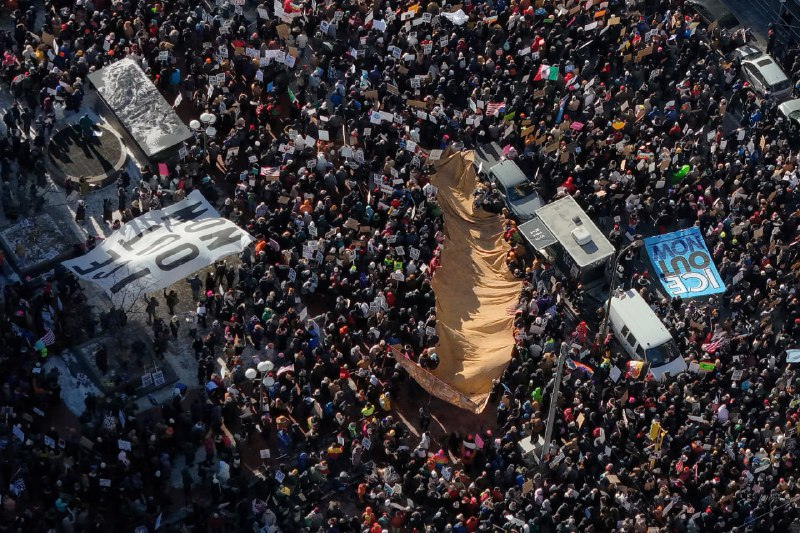

> Thousands demonstrate in Minnesota and across US to protest ICE
> 
> Thousands of protesters took to the streets in Minneapolis and students across the United States staged walkouts on Friday to demand the withdrawal of federal immigration agents from Minnesota following the fatal shootings of two U.S. citizens.
> 
> Students and teachers abandoned classes from California to New York on a national day of protest, which came amid mixed messages from the Trump administration about whether it would de-escalate Operation Metro Surge. read more

## 1404/11/10 19:30 — reutersworldchannel

> Gaza’s Rafah crossing with Egypt to reopen on Sunday, Israel says
> 
> Israel will reopen the Rafah border crossing on Sunday for people to travel between Gaza and Egypt, a government agency said, the first opening of effectively the sole route in or out of the Palestinian territory since May 2024.
> 
> The Israeli government agency that coordinates civilian policy in Gaza, COGAT, did not say how many of Gaza's more than 2 million people would be allowed to cross the border per day. read more

## 1404/10/27 18:30 — reutersworldchannel

> Iran's leader Khamenei blames Trump for inciting deadly protests
> 
> Iran's Supreme Leader Ayatollah Ali Khamenei on Saturday blamed President Donald Trump for weeks of protests after rights groups said a violent crackdown by security forces had claimed thousands of lives.
> 
> The protests erupted on December 28 over economic hardship and swelled into widespread demonstrations calling for the end of clerical rule in the Islamic Republic. read more

## 1404/10/13 21:03 — IranWire
> https://khabarkhan.com/article/3318

## 1404/09/28 16:21 — IranWire
> وضعیت بازار رمز ارز
> https://khabarkhan.com/crypto

## 1404/09/26 14:27 — IranWire
> https://khabarkhan.com/article/1804

## 1404/09/24 15:52 — IranWire
> https://khabarkhan.com/article/1638

## 1404/09/01 17:08 — IranWire
> اولین خبرخوان مبتنی بر هوش مصنوعی
> https://khabarkhan.com/

## 1404/08/30 17:43 — IranWire
> https://khabarkhan.com/article/558

## 1404/08/28 19:23 — IranWire
> https://khabarkhan.com/article/496

## 1404/08/20 22:18 — IranWire
> https://khabarkhan.com/article/200

## 1404/08/20 17:54 — IranWire
> https://khabarkhan.com/article/184

## 1404/08/19 20:45 — IranWire
> https://khabarkhan.com/article/150

## 1404/08/19 16:23 — IranWire
> https://khabarkhan.com/article/147

## 1404/08/15 18:30 — reutersworldchannel
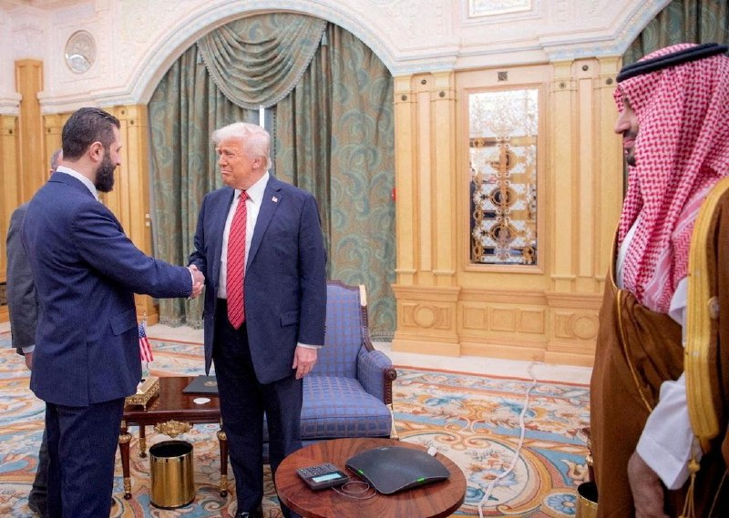

> Exclusive: US military to establish presence at Damascus airbase, sources say
> 
> The United States is preparing to establish a military presence at an airbase in Damascus to help enable a security pact that Washington is brokering between Syria and Israel, six sources familiar with the matter told Reuters.
> 
> The U.S. plans for the presence in the Syrian capital, which have not previously been reported, would be a sign of Syria's strategic realignment with the U.S. following the fall last year of longtime leader Bashar al-Assad, an ally of Iran. read more

## 1404/08/15 11:01 — IranWire
> https://khabarkhan.com/article/90

## 1404/08/15 09:30 — reutersworldchannel

> US orders 10% flights cut at major US airports due to shutdown
> 
> U.S. Transportation Secretary Sean Duffy said on Wednesday that he would order a 10% cut in flights at 40 major U.S. airports, citing air traffic control safety concerns as a government shutdown hit a record 36th day.
> 
> The drastic plan sent airlines scrambling to make significant reductions in flights in just 36 hours and passengers flooded airline customer service hotlines with concerns about air travel in the coming days. read more

## 1404/08/13 17:01 — IranWire
> https://khabarkhan.com/article/78

## 1404/07/23 16:30 — reutersworldchannel

> Aid trucks roll into Gaza as dispute over hostage bodies is paused
> 
> Aid trucks rolled into Gaza on Wednesday and Israel resumed preparations to open the main Rafah crossing after a dispute over the return of the bodies of dead hostages that had threatened to derail the fragile ceasefire deal with Hamas.
> 
> Israel had threatened to keep Rafah shut and reduce aid supplies because Hamas was returning bodies too slowly, showing the risks to a truce that has stopped two years of devastating warfare in Gaza and freed all living hostages held by Hamas. read more

## 1404/07/22 17:30 — reutersworldchannel

> Hamas fighters tighten grip in Gaza, clouding future of ceasefire
> 
> Hamas fighters tightened their grip in Gaza on Tuesday after carrying out public executions, defying Israel's assertion that war cannot end under U.S. President Donald Trump's plan until the militants are disarmed.
> 
> In a stark assertion of the group's return, fighters executed men they accused of collaborating with Israeli forces. In one video circulated late on Monday, Hamas fighters dragged seven men into a circle of people in Gaza City, forced them to their knees and shot them from behind. A Hamas source confirmed the authenticity of the video. read more

## 1404/07/17 08:30 — reutersworldchannel

> Israel and Hamas agree to Gaza ceasefire and return of hostages
> 
> Israel and Hamas said they had agreed to a long-awaited ceasefire and hostage deal, the first phase of U.S. President Donald Trump's plan to end a war in Gaza that has killed more than 67,000 people and reshaped the Middle East.
> 
> Just a day after the second anniversary of Hamas militants' cross-border attack that triggered Israel's devastating assault on Gaza, indirect talks in Egypt yielded an agreement on the initial stage of Trump’s 20-point framework to bring peace to the Palestinian enclave. read more

## 1404/07/16 18:30 — reutersworldchannel
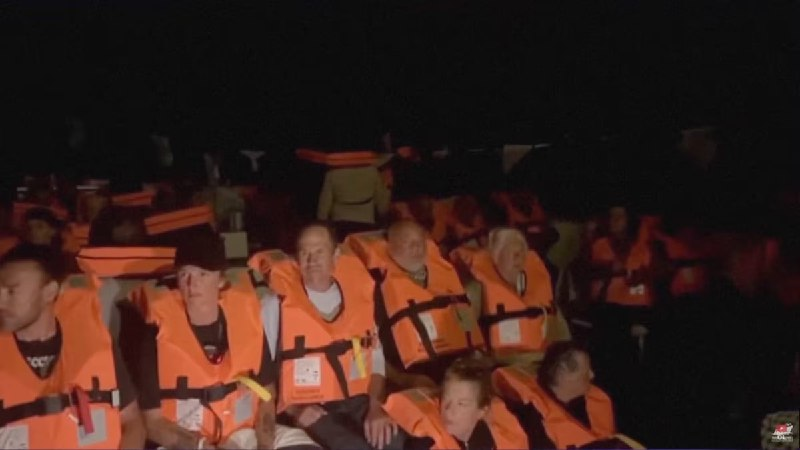

> Gaza aid flotilla says Israeli forces intercepted its boats
> 
> A group of vessels attempting to deliver aid to the war-ravaged Gaza Strip was intercepted by Israeli forces in international waters on Wednesday, the coalition behind the convoy said, the second such interception in the past week.
> 
> The Freedom Flotilla Coalition (FFC) is an international network of pro-Palestinian activist groups that organises civilian maritime missions aimed at breaking Israel's blockade of Gaza to deliver humanitarian aid to Palestinians in the enclave. read more

## 1404/07/15 18:30 — reutersworldchannel
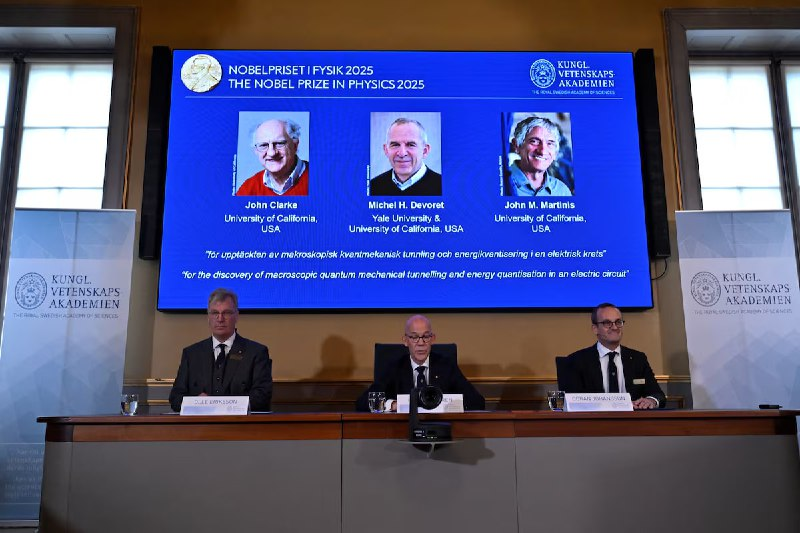

> Trio win Nobel prize for revealing quantum physics in action
> 
> U.S.-based scientists John Clarke, Michel Devoret and John Martinis won the 2025 Nobel Prize in Physics for "experiments that revealed quantum physics in action", paving the way for the development of the next generation of digital technologies.
> 
> "My feelings are that I'm completely stunned. Of course it had never occurred to me in any way that this might be the basis of a Nobel Prize," Clarke told the Nobel press conference by telephone on Tuesday. read more

## 1404/07/14 09:30 — reutersworldchannel

> Hamas readies for Gaza talks that US hopes will halt war, free hostages
> 
> Hamas officials arrived in Egypt on Sunday ahead of talks with Israel that the U.S. hopes will lead to a halt in fighting and the freeing of hostages in Gaza, with Washington's top diplomat saying the next days are critical.
> 
> Israeli negotiators led by Strategic Affairs Minister Ron Dermer were to travel to Egypt on Monday for negotiations in the Red Sea resort of Sharm el-Sheikh about the release of hostages, part of U.S. President Donald Trump's plan to end the nearly two-year Gaza war. read more

## 1404/07/07 09:30 — reutersworldchannel

> UN arms embargo, other sanctions reimposed on Iran over nuclear programme
> 
> The United Nations has reinstated an arms embargo and other sanctions on Iran over its nuclear programme following a process triggered by European powers that Tehran has warned will be met with a harsh response.
> 
> Britain, France and Germany initiated the return of sanctions on Iran at the U.N. Security Council over accusations it had violated a 2015 deal that aimed to stop it developing a nuclear bomb. Iran denies seeking nuclear weapons. read more

## 1404/06/28 09:30 — reutersworldchannel

> US casts 6th veto at United Nations over war in Gaza
> 
> The United States vetoed on Thursday a draft United Nations Security Council resolution that would have demanded an immediate, unconditional and permanent ceasefire in Gaza and that Israel lift all restrictions on aid deliveries to the Palestinian enclave.
> 
> The text, drafted by the elected 10 members of the 15-member council, would also have demanded the immediate, dignified and unconditional release of all hostages held by Hamas and other groups. read more

## 1404/06/05 09:30 — reutersworldchannel
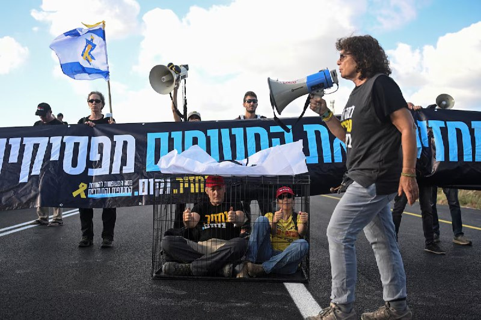

> Families leave Gaza City after night of bombardment, Israelis protest
> 
> More Palestinian families left Gaza City on Tuesday after a night of Israeli shelling on its outskirts, as Israelis launched a day of nationwide protests calling for hostages to be released and the war in Gaza to end.
> 
> Residents said Israeli aerial and tank shelling continued throughout the night and early on Tuesday in the eastern Gaza City suburbs of Sabra, Shejaia, and Tuffah, as well as in Jabalia town to the north, destroying roads and houses. read more

## 1403/08/19 12:31 — IranWire
> Channel name was changed to «خبرخوان»

## 1403/08/19 12:13 — IranWire
> Channel photo removed

## 1403/03/24 14:18 — IranWire
> Channel name was changed to «Khabarkhan»

## 1378/10/11 03:30 — VahidOnline
[🎬 Video](telegram/content/VahidOnline_75277_1778087227.mp4)

> محمدباقر قالیباف، رئیس‌ مجلس شورای اسلامی و مذاکره‌کننده ارشد ایران در مذاکرات با آمریکا، می‌گوید واشینگتن با اجرای محاصره دریایی و فشار اقتصادی قصد دارد «ما را تسلیم کند» و درباره تأثیر این فشارها بر وضعیت جامعه ابراز نگرانی کرد.
> او در یک فایل صوتی که رسانه‌های ایران روز چهارشنبه منتشر کردند، گفت: «ما احتمال حمله نظامی و مخصوصاً حملات تروریستی را کم نمی‌دانیم اما آن بخشی از طراحی دشمن که به جامعه باز می‌گردد، ضعیف‌کردن ایران از درون است.»
> وزیر خزانه‌داری آمریکا روز یکشنبه اعلام کرد که دولت دونالد ترامپ همزمان با جنگ، «محاصره اقتصادی» علیه ایران را ترتیب داده و در حال «خفه کردن» حکومت ایران است. او مدعی شد که جمهوری اسلامی حتی قادر نیست حقوق سربازان خود را بپردازد.
> قالیباف در فایل صوتی خود جنگ اخیر را «یکی از بزرگ‌ترین جنگ‌های معاصر ایران» خواند و با طرح این ادعا که پیروزی در این جنگ، «ایران را به یک بازیگر مؤثر در نظام بین‌المللی تبدیل می‌کند» افزود که رسیدن به چنین هدفی «با سختی‌هایی همراه است.»
> او با اذعان به «فشارهای اقتصادی» به مردم ایران خواستار «انجام وظیفه» همه مسئولان اجرایی کشور شد و افزود مردم هم باید «اقداماتی» انجام دهند.
> رئیس مجلس شورای اسلامی در ادامه «صرفه‌جویی» را مهم‌ترین خواسته از مردم خواند و همچنین خطاب به نیروهای «بسیج» گفت که «واسطه میان مردم و مسئولان دولتی و خیران» شوند.
> 
> ساعتی پیش از قالیباف، مسعود پزشکیان، رئیس‌جمهور ایران، نیز در پیامی در شبکه ایکس نوشت که «از افزایش قیمت‌ها مطلع هستم» و در توضیح دلیل آن گفت: «بخشی از آن مربوط به تغییر قیمت‌های مواد اولیه یا مشکلات مرتبط با جنگ ظالمانه‌ای است که مردم می‌دانند.»
> این مواضع در حالی اتخاذ شده که قیمت ارز در روزهای اخیر به ارقام بی‌سابقه‌ای رسیده و گزارش‌های رسانه‌های ایران حاکی از افزایش شدید قیمت‌ها و گرانی شدید کالاها در کشور است.
> @VahidHeadline
> محمدباقر قالیباف، رییس مجلس، گفت احتمال حمله نظامی کم نیست، اما «دشمن» به فشار اقتصادی امید بسته و بر اساس گزارش‌های «غلط» تصمیم‌گیری کرده است.
> او افزود ملت ایران حتی در شرایط فشار اقتصادی، به خاطر دین و اعتقادات خود مشکلات را تحمل می‌کنند.
> قالیباف گفت باید از ظرفیت ایرانیان خارج از کشور برای شکست «دشمن» استفاده شود و نخبگان نیز منتظر مراجعه مسئولان نمانند و راه‌حل‌ها و پیشنهادهای خود را ارائه دهند.
> او همچنین خواستار راه‌اندازی پویش «ایران همدل» مانند دوران کرونا شد.
> @VahidOOnLine
> فایل صوتی ۱۰ دقیقه‌ای و متن منتشرشده در منابع حکومتی رو گذاشتم اینجا
> 
> 📡 @VahidOnline

## 1378/10/11 03:30 — kianmeli1
[🎬 Video](telegram/content/kianmeli1_87192_1778087228.mp4)

> 🔴سامانه ضد پهپاد لیزری Guangjian-21A چین که روی کامیون نصب می‌شود، در فرودگاه بین‌المللی دبی مشاهده شده است که احتمالاً برای دفاع در برابر حملات پهپادی احتمالی ایران مستقر شده است.
> https://t.me/kianmeli1

## 1378/10/11 03:30 — IranIntlTV
[🎬 Video](telegram/content/IranIntlTV_335834_1778087229.mp4)

> سوئد همزمان با عضویت در ناتو، طرح انتقال اسرای جنگی از مرز شرقی ناتو به داخل خاک این کشور را تمرین می‌کند. مقام‌های نظامی می‌گویند جنگ اوکراین نگاه اروپا به امنیت و آمادگی نظامی را تغییر داده است.
> مهران عباسیان، خبرنگار ایران‌اینترنشنال، گزارش می‌دهد
> @iranintltv

## 1378/10/11 03:30 — IranIntlTV
[🎬 Video](telegram/content/IranIntlTV_335833_1778087231.mp4)

> دونالد ترامپ در گفت‌وگو با پی‌بی‌اس‌نیوز نسبت به احتمال دستیابی به توافق با جمهوری اسلامی ابراز خوش‌بینی کرد اما گفت باید منتظر نتیجه ماند.
> جزییات بیشتر با سمیرا قرایی، خبرنگار ایران‌اینترنشنال
> @iranintltv

## 1378/10/11 03:30 — IranIntlTV
[🎬 Video](telegram/content/IranIntlTV_335831_1778087234.mp4)

> تیتر اول با نیوشا صارمی، چهارشنبه ۱۶ اردیبهشت
> @iranintltv

## 1378/10/11 03:30 — IranIntlTV
[🎬 Video](telegram/content/IranIntlTV_335829_1778087235.mp4)

> ساعاتی پس از افشای جزئیات طرح یک صفحه‌ای آمریکا برای توافق با جمهوری اسلامی، خبرگزاری تسنیم، وابسته به سپاه‌، به نقل از یک منبع مطلع نوشت بعضی از بندهای طرح غیرقابل قبول است. سخنگوی کمیسیون امنیت ملی هم گفته این بندها فهرست آرزوهای آمریکاست نه توافق.
> 
> گزارشی از مجتبا پورمحسن
> @iranintltv

## 1378/10/11 03:30 — IranIntlTV
[🎬 Video](telegram/content/IranIntlTV_335828_1778087238.mp4)

> یک صاحب کارخانه تولیدی در اراک در پیامی به ایران اینترنشنال از بحران کارش در تامین مواد اولیه برای تولید می‌گوید. او اضافه کرد نمی‌تواند حقوق کارگران را بدهد.

## 1378/10/11 03:30 — IranIntlTV
[🎬 Video](telegram/content/IranIntlTV_335825_1778087241.mp4)

> به گزارش روزنامه دنیای اقتصاد، جنگ و قطعی اینترنت باعث کاهش تقاضای سفر و تضعیف زنجیره ارزش گردشگری شده و خسارات این بخش حدود دو میلیارد دلار برآورد می‌شود.
> 
> گفت‌وگو با آرزو کریمی، خبرنگار اقتصادی و عضو تحریریه ایران‌وایر
> @iranintltv

## 1378/10/11 03:30 — IranIntlTV
[🎬 Video](telegram/content/IranIntlTV_335824_1778087244.mp4)

> 🔻مهدی تاج، رییس فدراسیون فوتبال گفت که جیانی اینفانتینو، رییس فیفا باید تضمین بدهد که در جام جهانی به سپاه پاسداران توهین نمی‌شود. او شرط حضور تیم ملی در جام جهانی را تضمین‌های سیاسی فیفا اعلام کرد.
> 
> 🔹گفتگو با مزدک میرزایی، عضو تحریریه ایران اینترنشنال
> 
> @iranintltvsport

## 1378/10/11 03:30 — IranIntlTV
[🎬 Video](telegram/content/IranIntlTV_335821_1778087247.mp4)

> دونالد ترامپ، رییس‌جمهوری آمریکا، در گفت‌وگو با نیویورک پست گفت بحث درباره ازسرگیری مذاکرات با جمهوری اسلامی در اسلام‌آباد، زودهنگام است و افزود هرچند احتمال آن در آینده وجود دارد، اما اکنون این موضوعی «زیاده‌روی» محسوب می‌شود.
> 
> گفت‌وگو با جمشید برزگر، روزنامه‌نگار و تحلیل‌گر سیاسی
> @iranintltv

## 1378/10/11 03:30 — IranIntlTV
[🎬 Video](telegram/content/IranIntlTV_335820_1778087249.mp4)

> ترکیبی از تنش‌های منطقه‌ای، تغییر سیاست‌های ارزی، فشار بر بیمه‌ها و ناکارآمدی سیاست‌گذاری در جمهوری اسلامی، بازار دارو را با کمبود و افزایش قیمت مواجه کرده و زندگی روزمره بیماران را تحت تاثیر قرار داده است.
> آیه دریس، عضو تحریریه ایران‌اینترنشنال، در «پیوست» به این موضوع می‌پردازد
> @iranintltv

## 1378/10/11 03:30 — IranIntlTV
> مهدی اسکندریان، ۴۴ ساله و پدر دو فرزند، شامگاه ۱۹ دی ۱۴۰۴ با ضربات باتون و شلیک گلوله ماموران سرکوب در فردیس استان البرز کشته شد. او در حالی هدف قرار گرفت که مشغول کمک به معترضان مجروح بود.

## 1378/10/11 03:30 — IranIntlTV
[🎬 Video](telegram/content/IranIntlTV_335818_1778087252.mp4)

> نشست شورای امنیت سازمان ملل برای بررسی تحولات و اقدامات جمهوری اسلامی در خاورمیانه آغاز شد. این نشست در پی حملات اخیر ایران به امارات متحده عربی و تشدید تنش‌ها در تنگه هرمز، به درخواست بحرین برگزار می‌شود.
> مریم رحمتی، خبرنگار ایران‌اینترنشنال، گزارش می‌دهد
> @iranintltv

## 1378/10/11 03:30 — IranIntlTV
[🎬 Video](telegram/content/IranIntlTV_335816_1778087254.mp4)

> یک شهروند با ارسال پیامی به ایران اینترنشنال به احتمال توافق میان جمهوری اسلامی با آمریکا و اسرائیل واکنش نشان داد و آن را فروختن مردم ایران به جمهوری اسلامی دانست.

## 1378/10/11 03:30 — IranIntlTV
[🎬 Video](telegram/content/IranIntlTV_335815_1778087257.mp4)

> با انتشار اخباری مبنی‌بر احتمال توافق میان جمهوری اسلامی و آمریکا، نرخ انواع ارز در بازار آزاد ایران نزولی شد و همزمان نرخ‌های دولتی ارز، رکوردهای تاریخی جدیدی ثبت کردند.
> 
> گفت‌وگو با آرش آزرمی، دبیر بخش اقتصادی ایران‌اینترنشنال
> @iranintltv

## 1378/10/11 03:30 — FoxNews
> Journalist who EXPOSED 'Quality Learing Center': 'MIND BLOWING'
> @foxnews

## 1378/10/11 03:30 — FoxNews
> DEVELOPING: Trump does 180, demands ALL Epstein files be released
> @foxnews

## 1378/10/11 03:30 — FoxNews
[🎬 Video](telegram/content/FoxNews_21815_1778087260.mp4)

> Charles Payne explains how there is more than one economy
> @foxnews

## 1378/10/11 03:30 — FoxNews
> EXCLUSIVE: Israeli gov't gives first reaction to peace deal
> @foxnews

## 1378/10/11 03:30 — FoxNews
> Lawrence Jones: This won't end well for Democrats
> @foxnews

## 1378/10/11 03:30 — FoxNews
> Zelenskyy: Putin lied to Trump ‘so many times’
> @foxnews

## 1378/10/11 03:30 — FoxNews
> ‘The Five’: Kamala Harris tells all
> @foxnews

## 1378/10/11 03:30 — FoxNews
> TALK OR NO TALK?: Bill Maher warns Rob Reiner about this ‘slippery slope’
> @foxnews

## 1378/10/11 03:30 — FoxNews
[🎬 Video](telegram/content/FoxNews_21792_1778087263.mp4)

> BREAKING: Trump reacts to would-be Trump assassin Ryan Routh’s guilty verdict
> @foxnews

## 1378/10/11 03:30 — FoxNews
> Harris Faulkner: Trump REALLY stuck it to them
> @foxnews

## 1378/10/11 03:30 — FoxNews
> JUST IN: Ryan Routh tried to stab himself in the neck with a pen as verdict was read
> @foxnews

## 1378/10/11 03:30 — FoxNews
> BREAKING: Would-be Trump assassin Ryan Routh convicted on all charges
> @foxnews

## 1378/10/11 03:30 — FoxNews
> McEnany: This is a VERY bizarre claim
> @foxnews

## 1378/10/11 03:30 — FoxNews
> Kamala Harris mocked for 'word salad' answer to Maddow
> @foxnews

## 1378/10/11 03:30 — FoxNews
> JUST IN: Secret Service shuts down covert telecom threat in New York
> @foxnews

## 1378/10/11 03:30 — FoxNews
> Ex-Antifa member praises Trump's latest move against group: 'LONG TIME COMING'
> @foxnews

## 1378/10/11 03:30 — FoxNews
> 'CLEARLY ANNOYED': Hosts react to Kamala Harris' interview on bombshell book
> @foxnews

## 1378/10/11 03:30 — FoxNews
> Newsom accused of 'shielding' criminal migrants with latest anti-ICE move
> @foxnews

## 1378/10/11 03:30 — FoxNews
> Rubio: Even Hamas knows this is true
> @foxnews

## 1378/10/11 03:30 — FoxNews
> This is a HUGE reward for Hamas, expert says: 'Defies good sense'
> @foxnews

## 1378/10/11 03:30 — Shin_Persian
[🎬 Video](telegram/content/Shin_Persian_5822_1778087265.mp4)

> Rapid Response 47 ✓ @RapidResponse47
> Tue, 05 May 2026 19:54:43 UTC
> 
> .@SecRubio on the Iranian people: "I don't know of any country in the world where there's a bigger difference between the people and the people who run the country."
> 
> فارسی
> 
> .@SecRubio درباره مردم ایران: «من هیچ کشوری را در جهان نمی‌شناسم که در آن تفاوتی بزرگ‌تر از آنچه میان مردم و کسانی که کشور را اداره می‌کنند وجود داشته باشد، وجود داشته باشد.»
> 
> 𝕏 · @shin_persian

## 1378/10/11 03:30 — Iliaen
[🎬 Video](telegram/content/Iliaen_4404_1778087267.mp4)

> ساعت ۰۳:۳۵ صبح شنبه؛ مشاهده حرکت پهپاد (نقطه‌ی کم‌نور متحرک) در آسمان قزوین به سمت تهران.
> 
> @iliaen

## 1378/10/11 03:30 — CNNfarsiCHANNEL
[🎬 Video](telegram/content/CNNfarsiCHANNEL_51271_1778087269.mp4)

> حملات پهپادی امشب به ایست بازرسی‼️
> 
> 💢 @CNNfarsiCHANNEL | Король

## 1378/10/11 03:30 — CNNfarsiCHANNEL
[🎬 Video](telegram/content/CNNfarsiCHANNEL_51261_1778087270.mp4)

> 🔴گله موشکهای کروز شلیک شده توسط اسرائیل و آمریکا به سمت ایران در آسمان عراق مشاهده شدند.
> 
> 
> @CNNfarsiCHANNEL

## 1378/10/11 03:30 — CNNfarsiCHANNEL
[🎬 Video](telegram/content/CNNfarsiCHANNEL_51260_1778087273.mp4)

> 🔴فوری| لحظه حمله به بیت رهبری
> 
> 
> @CNNfarsiCHANNEL

## 1378/10/11 03:30 — ManotoTV
[🎬 Video](telegram/content/ManotoTV_105041_1778087275.mp4)

> سجاد برنجی، فرماندار شهریار اعلام کرد حادثه آتش‌سوزی در پاساژ ارغوان در شهر اندیشه ماهیت امنیتی نداشته است. او همچنین گفت تاکنون ۸ نفر در این آتش‌سوزی جان خود را از دست داده‌اند و آمار ۱۱ کشته از سوی او تایید نمی‌شود.
> به گفته فرماندار شهریار، این حادثه ۳۶ مصدوم بر جای گذاشته که بخشی از آن‌ها به‌صورت سرپایی درمان شده‌اند و تعدادی نیز به مراکز درمانی منتقل شده‌اند.

## 1378/10/11 03:30 — ManotoTV
[🎬 Video](telegram/content/ManotoTV_105030_1778087277.mp4)

> «قطع اینترنت، تلاش برای خاموش کردن یک ملت»

## 1378/10/11 03:30 — ManotoTV
[🎬 Video](telegram/content/ManotoTV_105029_1778087279.mp4)

> قطعی اینترنت؛ «صدای مردم ایران باشید»

## 1378/10/11 03:30 — ManotoTV
[🎬 Video](telegram/content/ManotoTV_105027_1778087282.mp4)

> قطعی اینترنت؛ «صدای مردم ایران باشید»

## 1378/10/11 03:30 — ManotoTV
[🎬 Video](telegram/content/ManotoTV_105026_1778087284.mp4)

> «قطع اینترنت، تلاش برای خاموش کردن یک ملت»

## 1378/10/11 03:30 — ManotoTV
[🎬 Video](telegram/content/ManotoTV_105025_1778087287.mp4)

> مایک والتز، سفیر آمریکا در سازمان ملل، در گفت‌وگو با شبکه خبری فاکس‌نیوز و برنامه «هنیتی»، با اشاره به تنش‌ها در خلیج فارس، گفته است واشینگتن انتظار دارد سازمان ملل همانند ماه گذشته، اقدامات جمهوری اسلامی را محکوم کند.
> 
> او گفته ۱۳۶ کشور پیش‌تر حمله به زیرساخت‌های غیرنظامی را محکوم کرده بودند و تأکید کرده است: «فارغ از اینکه درباره یک درگیری چه احساسی دارید، نمی‌توان با پرتاب مین‌های دریایی به آبراه‌های بین‌المللی پاسخ داد.»
> 
> والتز همچنین گفته آمریکا و متحدانش از آزادی کشتیرانی در آبراه‌های بین‌المللی دفاع خواهند کرد.
> 
> این اظهارات در حالی مطرح می‌شود که تنش‌ها در تنگه هرمز و حملات به کشتی‌ها، نگرانی‌ها درباره امنیت کشتیرانی و تجارت جهانی را افزایش داده است.

## 1378/10/11 03:30 — FarsiVOA
> هشدار آلمان به جمهوری اسلامی؛ تلاش اروپا برای حفظ تعادل با آمریکا و استقلال خود

## 1378/10/11 03:30 — FarsiVOA
> مصادره و توقیف اموال مخالفان حکومت ایران «غیر قانونی» است؛ گفت‌وگو با سعید دهقان

## 1378/10/11 03:30 — FarsiVOA
> بعد از جلوگیری از ورود مهدی تاج به کانادا، حالا رئیس فدراسیون فوتبال جمهوری اسلامی مدعی است از فیفا خواسته تضمین بدهد که به سپاه پاسداران «بی‌احترامی» نشود

## 1378/10/11 03:30 — FarsiVOA
> خط فقر در ایران به بیش از ۷۰ میلیون تومان رسیده است؛ گفت‌وگو با رضا غیبی

## 1378/10/11 03:30 — FarsiVOA
> از حملات پهپادی به اقلیم کردستان تا فشار بر شبه‌نظامیان؛ چالش‌های امنیتی پیش‌روی دولت آینده عراق

## 1378/10/11 03:30 — FarsiVOA
> سفیر آمریکا در سازمان‌ ملل: جمهوری اسلامی از سر درماندگی‌ به مذاکرات برگشته

## 1378/10/11 03:30 — FarsiVOA
> در گفت‌وگو با امیر چاهکی به نقش پنهان چین و روسیه در نزدیک‌کردن واشینگتن و تهران پرداختیم؛ از تماس ناگهانی لاوروف و سفر عراقچی به پکن گفتیم و بررسی کردیم آیا بحث ترک مخاصمه با اسرائیل بخشی از این چیدمان دیپلماتیک چندلایه است؟

## 1378/10/11 03:30 — FarsiVOA
> سفر پرزیدنت ترامپ به چین و تلاش برای حفظ ثبات در روابط تجاری دو کشور

## 1378/10/11 03:30 — FarsiVOA
> دونالد ترامپ جمهوری اسلامی را تهدید کرد که اگر توافق نکند، بمباران دوباره شروع می‌شود

## 1378/10/11 03:30 — FarsiVOA
[🎬 Video](telegram/content/FarsiVOA_217035_1778087289.mp4)

> رسانه‌های جمهوری اسلامی «برای نخستین‌بار» ویدیویی با عنوان «خسارت فرودگاه‌ها و هواپیماهای مسافری ایران در حملات آمریکا و اسرائیل» منتشر کرده‌اند. این ویدیو شامل تصاویری از هواپیماهای خسارت دیده در فرودگاه مشهد و لحظه‌هایی از حملات هوایی به فرودگاه مهرآباد است.

## 1378/10/11 03:30 — FarsiVOA
> در گفت‌وگو با شاهین مدرس به تعلیق ناگهانی «پروژه آزادی» آمریکا در تنگه هرمز پرداختیم؛ از گزارش اکسیوس درباره نزدیک‌شدن تهران و واشینگتن به یک یادداشت تفاهم گفتیم و بررسی کردیم تداوم محاصره دریایی و تمدید آماده‌باش اسرائیل، سرنوشت توافق احتمالی دو کشور را به چه مسیری می‌برد؟

## 1378/10/11 03:30 — DW_Farsi
[🎬 Video](telegram/content/DW_Farsi_124356_1778087292.mp4)

> 🎥 تاج: فیفا تضمین کند در آمریکا به سپاه توهین نشود
> 
> مهدی تاج، رئیس فدراسیون فوتبال جمهوری اسلامی، درباره حضور تیم ملی فوتبال در جام جهانی ۲۰۲۶ گفت که حضور ایران در این رقابت‌ها منوط به دریافت "تضمین جدی" از فدراسیون جهانی فوتبال است.
> تاج تأکید کرد رئیس فیفا باید تضمین دهد که در آمریکا به نهادهای نظامی جمهوری اسلامی، به‌ویژه سپاه پاسداران، و همچنین مقام‌های حکومت توهین نشود.
> این درخواست پس از آن مطرح شد که تاج از حضور در کنگره فیفا در کانادا بازماند.
> @dw_farsi

## 1378/10/11 03:30 — Persian_Trend_Official
[🎬 Video](telegram/content/Persian_Trend_Official_13543_1778087295.mp4)

> 💢 لاشهٔ پهپاد ساقط‌شده در تنگهٔ هرمز
> 
> 🔹اولین تصویر از لاشهٔ پهپاد شناسایی رزمی دشمن که شب گذشته توسط پدافند ایران در روی تنگهٔ هرمز ساقط شد.
> 
> 🫆:Tony
> 
> 📌 @persian_trend_official
> پرشین ترند | متفاوت‌ترین کانال نظامی

## 1378/10/11 03:30 — Persian_Trend_Official
[🎬 Video](telegram/content/Persian_Trend_Official_13538_1778087297.mp4)

> 💢هدف قرار گرفتن 3 سرباز اسراییلی توسط FPV حزب الله لبنان
> 
> 🫆:Tony
> 
> 📌 @persian_trend_official
> پرشین ترند | متفاوت‌ترین کانال نظامی

## 1378/10/11 03:30 — IranianMinds
[🎬 Video](telegram/content/IranianMinds_19644_1778087299.mp4)

> به این بچه یاد دادن بگه: حالا همگی قاتل اولاد یهودیم.
> 
> دخترک،
> نفرت، تو رو قوی نمی‌کنه. فقط حماقت والدينت را ثابت می‌کنه. بزرگ شو، کتاب بخون، فکر کن. شاید یه روز بفهمی که اون کسایی‌ که نفرت را به جای انسانیت به تو یاد دادن، چه جنایتی در حقت کردن.
> 
> @IranianMinds

## 1378/10/11 03:30 — IranianMinds
[🎬 Video](telegram/content/IranianMinds_19639_1778087301.mp4)

> 🔴 بخشی از سخنرانی دیشب مارکو روبیو وزیر امور خارجه ایالات متحده :
> 
> ببینید دنیا قربانی رژیم ایران است بخاطر اینکه اونا تروریستن ولی مردم ایران هر روز قربانی این رژیم هستند و رئیس‌جمهور همدردی عمیقی با شرایطی که آن‌ها با آن روبه‌رو هستند دارد.
> 
> این کشوری نیست که باید منزوی باشد، زیرا مردمش فوق‌العاده هستند.
> 
> @IranianMinds

## 1378/10/11 03:30 — IranianMinds
[🎬 Video](telegram/content/IranianMinds_19632_1778087303.mp4)

> 🔴 اسرائیل داره جنوب لبنان رو شخم میزنه دوباره
> 
> @IranianMinds

## 1378/10/11 03:30 — BBCPersian
[🎬 Video](telegram/content/BBCPersian_280310_1778087305.mp4)

> 🔻دختر کیم جونگ اون به طور فزاینده‌ای با لباس‌های برندهای مشهور و طراحان غربی که به دلیل ضدسوسیالیستی بودن در کره شمالی ممنوع هستند، عکس می‌گیرد.
> 
> اما انتخاب‌های مد کیم جو آئه، از لباس‌های چرمی تا مدل موی مشهور به «کاکلی» و حتی بلوز بدن‌نما، نه یک شورش نوجوانانه بلکه نشانه‌ای از آماده شدن او برای جانشینی رهبر کشور است.
> 
> @BBCPersian

## 1378/10/11 03:30 — BBCPersian
[🎬 Video](telegram/content/BBCPersian_280305_1778087308.mp4)

> 🔻سرخط خبرهای چهارشنبه ۱۶ اردیبهشت ۱۴۰۵
> 
> @BBCPersian

## 1378/10/11 03:30 — BBCPersian
[🎬 Video](telegram/content/BBCPersian_280302_1778087310.mp4)

> 🔻پس از آن که روز سه‌شنبه پاساژ تجاری ارغوان در شهرک اندیشه شهریار - حومه جنوبی تهران - دچار آتش سوزی گسترده شد، فرماندار شهریار از کشته شدن دست کم سه نفر خبر داده و گفته است: «با توجه به در جریان بودن عملیات امداد و نجات احتمال افزایش متوفیان جدی است.» در…

## 1405/02/16 19:58 — mwarmonitor
> 🔴ناوهای هواپیمابر ائتلاف که در حال حاضر در منطقه، نزدیک منطقه، یا درگیر عملیات در خاورمیانه هستند (تا تاریخ ۶ مه):
> 
> ناوهای هواپیمابر بزرگ:
> 
> 🇺🇸 یو‌اس‌اس ابراهام لینکلن (دریای عرب)
> 
> 🇺🇸 یو‌اس‌اس جرج اچ. دبلیو. بوش (دریای عرب)
> 
> 🇫🇷 اف‌اس شارل دو گل (کانال سوئز، در حال حرکت به سمت خلیج عدن)
> 
> 
> ناوهای سبک / تهاجمی آبی-خاکی:
> 
> 🇺🇸 یو‌اس‌اس تریپولی (دریای عرب)
> 
> 🇺🇸 یو‌اس‌اس باکسر (در حال حرکت، اقیانوس هند)
> 
> 🇫🇷 اف‌اس میسترال (دریای مدیترانه)
> 
> 🇫🇷 اف‌اس تونر (تولون، مدیترانه)
> 
> 🇫🇷 اف‌اس دیکس‌مود (اقیانوس اطلس)
> 
> 
> در حال خروج از منطقه:
> 
> 🇺🇸 یو‌اس‌اس جرالد آر. فورد (اقیانوس اطلس، منطقه جبل‌الطارق)
> 
> 
> 📌تمام سه ناو آبی-خاکی فرانسه (میسترال، تونر و دیکس‌مود) به دلیل جنگ در خاورمیانه، تغییراتی در استقرار خود داشته‌اند. ناو «دیکس‌مود» به‌طور مشخص حضور خود در رزمایش چندملیتی بالیکاتان در فیلیپین را لغو کرده است، زیرا احتمال نیاز عملیاتی در خاورمیانه وجود داشته. این ناو در حال حاضر در اقیانوس اطلس و نزدیک یا در آب‌های برزیل قرار دارد. ناوهای «میسترال» و «تونر» نیز پیش‌تر همراه با ناو «شارل دو گل» در شرق مدیترانه پس از حملات ایران به قبرس مستقر بودند، اما اکنون به بندر تولون بازگشته‌اند و ناو «میسترال» نیز روز ۵ مه از بندر خارج شده است.
> 
> @mwarmonitor

## 1405/02/16 19:53 — kianmeli1
> 🔴ناوهای هواپیمابر ائتلاف که در حال حاضر در منطقه، نزدیکی آن یا در عملیات خاورمیانه از تاریخ ۶ مه حضور دارند:
> 
> ناوهای بزرگ:
> - 🇺🇸یو اس اس آبراهام لینکلن (دریای عرب)
> - 🇺🇸یو اس اس جورج اچ. دبلیو. بوش (دریای عرب)
> - 🇫🇷ناو هواپیمابر شارل دوگل (کانال سوئز، در حال حرکت به سمت خلیج عدن)
> 
> ناوهای سبک:
> - 🇺🇸یو اس اس تریپولی (دریای عرب)
> - 🇺🇸یو اس اس باکسر (در حال حرکت، اقیانوس هند)
> - 🇫🇷ناو میسترال (مدیترانه)
> - 🇫🇷ناو هواپیمابر تونر (تولون، مدیترانه)
> - 🇫🇷ناو هواپیمابر دیکسمود (اقیانوس اطلس)
> 
> در حال ترک صحنه نبرد:
> - 🇺🇸 ناو هواپیمابر جرالد آر. فورد (اقیانوس اطلس، جبل الطارق)
> 
> هر سه ناو هواپیمابر بزرگ فرانسه، میسترال، تونر و دیکسمود، به دلیل جنگ در خاورمیانه، محل استقرارشان تغییر کرده است، به طوری که ناو هواپیمابر دیکسمود به طور خاص نقش خود را در رزمایش‌های چندملیتی بالیکتان در فیلیپین به دلیل نیازهای عملیاتی بالقوه در خاورمیانه لغو کرده است.
> 
> این ناو در حال حاضر در اقیانوس اطلس، نزدیک یا در آب‌های برزیل قرار دارد.
> 
> ناو هواپیمابر میسترال و تونر هر دو پیش از این پس از حملات ایران به قبرس، در کنار ناو هواپیمابر شارل دوگل به مدیترانه شرقی اعزام شده بودند، اما از آن زمان به بندر تولون بازگشته‌اند و ناو هواپیمابر میسترال دیروز در تاریخ ۵ مه بندر را ترک کرد.
> https://t.me/kianmeli1

## 1405/02/16 19:50 — VahidOOnLine

> ♦️ اسماعیل بقایی، سخنگوی وزارت امور خارجه جمهوری اسلامی، روز چهارشنبه ۱۶ اردیبهشت، در پیامی در شبکه اجتماعی ایکس با استناد به تعریف ارائه شده در یکی از مصوبات دیوان بین‌المللی دادگستری تاکید کرد که مفهوم «مذاکرات» مستلزم تلاشی واقعی برای حل اختلافات است. او خاطرنشان کرد که مذاکره لزوما نیازمند «حسن نیت» است و نباید با مشاجره اشتباه گرفته شود.
> 
> بقایی در ادامه تصریح کرد که فرآیند مذاکره به معنای «دیکته کردن»، «فریب»، «اخاذی» یا «اجبار» نیست. این اظهارات در حالی مطرح می‌شود که تلاش‌های بین‌المللی برای بازگرداندن تهران و واشنگتن به میز مذاکره ادامه دارد و طرفین با واسطه‌گری پاکستان، طرح‌هایی را برای پایان دادن به جنگ و ادامه مذاکرات موثر به یکدیگر ارائه داده‌اند اما هنوز توافقی روی این طرح‌ها صورت نگرفته است.
> ‌🇸🇦 Indypersian
> 
> 🤖 @VahidOOnLine

## 1405/02/16 19:49 — kianmeli1

> 🔴جایزه 10 میلیون دلاری امریکا برای شناسایی محل دبیرکل جنبش النجباء
> 
> وزارت خارجه امریکا برای اطلاعاتی که موجب شناسایی شیخ اکرم الکعبی دبیرکل جنبش النجباء عراق شود یا محل اقامت او را مشخص کند، 10 میلیون دلار پاداش در نظر گرفت.
> https://t.me/kianmeli1

## 1405/02/16 19:49 — VahidOOnLine

> روزنامه «تایمز اسرائیل» به نقل از دفتر یکی از وزیران گزارش داد که بنیامین نتانیاهو، نخست‌وزیر اسرائیل، چهارشنبه کابینه امنیتی تشکیل خواهد داد.
> 
> به نوشته این رسانه، برگزاری این نشست در شرایطی انجام می‌شود که گزارش‌هایی از نزدیک شدن آمریکا و جمهوری اسلامی به توافق بر سر یک یادداشت تفاهم برای پایان جنگ و بازگشایی تنگه هرمز منتشر شده است.
> ‌🏁 🇬🇧 IranintlTV
> 
> 🤖 @VahidOOnLine

## 1405/02/16 19:48 — kianmeli1

> 🔴بر اساس بیانیه‌ای که از سوی ستاد فرماندهی مرکزی ایالات متحده منتشر شده است، از زمان آغاز محاصره تنگه هرمز توسط ایالات متحده، ۵۲ کشتی از عبور از این تنگه منع شده یا به بنادر ایران بازگردانده شده‌اند.
> https://t.me/kianmeli1

## 1405/02/16 19:47 — VahidOnline

> ♦️ دونالد ترامپ، رئیس‌جمهوری ایالات متحده روز چهارشنبه ۱۶ اردیبهشت، در تماس تلفنی با شبکه پی‌بی‌اس اعلام کرد ایالات متحده به توافقی برای پایان جنگ با ایران نزدیک شده است. او اشاره کرد که این توافق ممکن است شامل انتقال ذخیره اورانیوم با غنای بالای ایران به آمریکا باشد. ترامپ با ابراز خوش‌بینی نسبت به توقف جنگ پیش از سفر هفته آینده‌اش به چین، هشدار داد که در صورت شکست مذاکرات، حملات سنگین هوایی از سر گرفته خواهد شد.
> @VahidOOnLine
> 
> 📡 @VahidOnline

## 1405/02/16 19:46 — mwarmonitor

> ناو یو‌اس‌اس لینکلن 🇺🇸 امروز در مختصات 22.530، 61.612 مشاهده شد، همراه با یک ناوشکن اسکورت در حال حرکت در دریای عرب. این گروه به سمت شرق در حرکت است و حدود ۱۸۵ کیلومتر با خط محاصره آمریکا 🇺🇸🇮🇷 علیه ایران فاصله دارد.
> 
> @mwarmonitor

## 1378/10/11 03:30 — VahidOOnLine
[🎬 Video](telegram/content/VahidOOnLine_238477_1778085390.mp4)

> ⭕️ روسای جمهوری چک و فنلاند در پراگ پا به پای هم دویدند
> 
> ♦️پتر پاول، رئیس‌جمهوری چک و الکساندر استوب، رئیس‌جمهوری فنلاند در حرکتی متفاوت و غیررسمی، روز خود را با یک دوی صبحگاهی در خیابان‌های مرکزی پراگ آغاز کردند. این برنامه در جریان سفر دو روزه رئیس‌جمهوری فنلاند به پایتخت جمهوری چک برگزار شد.
> آن‌ها در این برنامه ورزشی با همراهی کان کایرینن، بازیکن باشگاه اسپارتا پراگ و همچنین کریستینا ساسینک ماکی، دونده فنلاندی، حضور داشتند.
> پتر پاول پس از این دویدن در اینستاگرام نوشت: «شروع روز با کمی سرعت بیشتر!»
> ‌🇸🇦 Indypersian
> 
> 🤖 @VahidOOnLine

## 1378/10/11 03:30 — VahidOOnLine
[🎬 Video](telegram/content/VahidOOnLine_238475_1778085393.mp4)

> یک صاحب کارخانه تولیدی در اراک در پیامی به ایران اینترنشنال از بحران کارش در تامین مواد اولیه برای تولید می‌گوید. او اضافه کرد نمی‌تواند حقوق کارگران را بدهد.
> ‌🏁 🇬🇧 IranintlTV
> 
> 🤖 @VahidOOnLine

## 1378/10/11 03:30 — VahidOOnLine
> ♦️محمدباقر قالیباف، رئیس مجلس شورای اسلامی، در یک پیام صوتی خطاب به «مردم ایران» با اشاره به شرایط حساس ایران، خواستار افزایش شفافیت عملکرد مسئولان در حوزه اقتصادی شد و تاکید کرد که دولت باید اقدامات خود برای مهار گرانی‌ها را به‌صورت مستمر به مردم گزارش دهد.
> قالیباف با توصیف شرایط کنونی به‌عنوان «دوره جدیدی از جنگ»، اظهار داشت که دشمن با تمرکز بر فشارهای اقتصادی به‌دنبال تضعیف و تسلیم ایران است و احتمال تهدیدات امنیتی از جمله حملات نظامی و «تروریستی» نیز همچنان وجود دارد. او در عین حال تاکید کرد که عبور موفق از این شرایط می‌تواند جایگاه ایران را به‌عنوان یکی از بازیگران موثر در نظام بین‌الملل تثبیت کند.
> رئیس مجلس با اشاره به مسئولیت‌های متقابل دولت و مردم، از مسئولان اجرایی خواست با برنامه‌ریزی دقیق و «مدیریت جهادی» برای کاهش فشار اقتصادی اقدام کنند و در مقابل، مردم نیز با «صرفه‌جویی» نقش موثری در این مسیر ایفا کنند، اقدامی که به گفته او «موثرترین موشک» در برابر دشمن است.
> ‌🇸🇦 Indypersian
> 
> 🤖 @VahidOOnLine

## 1378/10/11 03:30 — mwarmonitor
[🎬 Video](telegram/content/mwarmonitor_8578_1778085396.mp4)

> 📝 این انگلِ بدذات که تا دیروز با مکیدن خون مردم در لجن‌زار سایت‌های شرط‌بندی غوطه‌ور بود، حالا که تیپای قانون را خورده و بوی دیپورت و بی‌پولی بالا گرفته، ناگهان ردای زهد به تن کرده تا وقاحت را به سقف بچسباند. این آفتاب‌پرستِ بی‌ریشه که تمام زندگی‌اش بر پایه‌ی کلاهبرداری و مال‌حرام بنا شده، حالا با ریشِ نفاق و تظاهر به معنویت، قصد دارد از اعتقادات مردم هم نردبانی برای فرار از رسوایی بسازد. پویان مختاری نماد بارز یک جانورِ فرصت‌طلب است که وقتی بوی زندان می‌شنود، از جکوزیِ فساد به هیئتِ ریا پناه می‌برد؛ اما نه آن محاسنِ قلابی و نه این نمایش‌های تهوع‌آور، بوی تعفنِ دزدی‌هایش را پاک نخواهد کرد. این حرامزاده‌ی نان‌به‌نرخ‌روز‌خور باید بداند که با «یا حسین» گفتن، پرونده‌ی سیاه غارتگری‌اش بسته نمی‌شود و جز نفرت و تفِ لعنتِ ملت، نصیبی نخواهد داشت.
> 
> @mwarmonitor

## 1405/02/16 19:31 — VahidOOnLine

> وزیر کشور بحرین اعلام کرد افرادی که در ارتباط با پرونده‌های امنیتی اخیر بازداشت شده‌اند، «ارتباط نزدیکی با سپاه پاسداران انقلاب اسلامی و ایدئولوژی ولایت فقیه» داشته‌اند.
> به گفته وزارت کشور بحرین، این بازداشت‌ها در چارچوب یک بررسی «جامع امنیتی و حقوقی» و در پی آنچه «تجاوز آشکار ایران» خوانده شده، انجام شده است.
> این وزارتخانه افزود در این روند، جرائم و فعالیت‌های غیرقانونی مرتبط با این افراد نیز مورد بررسی قرار گرفته است.
> ‌🏁 🇬🇧 ManotoTV
> 
> 🤖 @VahidOOnLine

## 1405/02/16 19:30 — DEJradio
[🎬 Video](telegram/content/DEJradio_4461_1778083450.jpg)

> 🚨
> ⭕️ دونالد ترامپ، رئیس جمهوری آمریکا به شبکه PBS:
> «اورانیوم غنی‌شده در چارچوب توافق احتمالی به آمریکا منتقل خواهد شد و جمهوری اسلامی از تأسیسات زیرزمینی استفاده نخواهد کرد. اما اگر توافقی حاصل نشود، جهنم را به روی آنها باز خواهیم کرد.»
> 
> #مذاکرات #ترامپ
> @DEJradio

## 1405/02/16 19:28 — VahidOOnLine

> ♦️ دونالد ترامپ، رئیس‌جمهوری ایالات متحده روز چهارشنبه ۱۶ اردیبهشت، در تماس تلفنی با شبکه پی‌بی‌اس اعلام کرد ایالات متحده به توافقی برای پایان جنگ با ایران نزدیک شده است. او اشاره کرد که این توافق ممکن است شامل انتقال ذخیره اورانیوم با غنای بالای ایران به آمریکا باشد. ترامپ با ابراز خوش‌بینی نسبت به توقف جنگ پیش از سفر هفته آینده‌اش به چین، هشدار داد که در صورت شکست مذاکرات، حملات سنگین هوایی از سر گرفته خواهد شد.
> ‌🇸🇦 Indypersian
> 
> 🤖 @VahidOOnLine

## 1405/02/16 19:24 — VahidOOnLine

> ♦️ دونالد ترامپ، رئیس‌جمهور آمریکا، روز چهارشنبه، ۱۶ اردیبهشت در تماسی تلفنی با شبکه «پی‌بی‌اس» (PBS) نسبت به دستیابی به توافقی با جمهوری اسلامی ابراز خوش‌بینی کرد. ترامپ با بیان اینکه احساس می‌کند آمریکا به توافق نزدیک شده است، افزود: «پیش از این هم چنین حسی داشتم، پس باید منتظر ماند و دید چه می‌شود».
> 
> رئیس‌جمهوری آمریکا احتمال اعزام فرستادگان ویژه از جمله استیو ویتکاف و جرد کوشنر به مذاکرات را بعید دانست اما تاکید کرد که احتمال پایان یافتن جنگ پیش از سفر هفته آینده‌اش به چین وجود دارد. او هشدار داد: «فکر می‌کنم شانس بسیار خوبی برای پایان جنگ وجود دارد، اما اگر تمام نشود، باید به بمباران شدید آن‌ها بازگردیم».
> 
> این گفتگو ساعاتی پس از آن انجام شد که ترامپ در «تروث سوشال» اعلام کرد به دلیل نزدیک شدن به توافق، ماموریت اسکورت کشتی‌های تجاری در تنگه هرمز به‌صورت موقت «متوقف» خواهد شد. ترامپ پیش‌تر نیز بر استفاده از اهرم فشار محاصره برای بازگشایی این آبراه حیاتی تاکید کرده بود.
> ‌🇸🇦 Indypersian
> 
> 🤖 @VahidOOnLine

## 1405/02/16 19:09 — VahidOOnLine

> نخست‌وزیر و وزیر خارجه قطر اعلام کرد با وجود فاصله مواضع آمریکا و ایران، احتمال دستیابی دو طرف به راه‌حل دیپلماتیک همچنان بالاست.
> 
> شیخ محمد بن عبدالرحمن آل ثانی در گفت‌وگو با «العربی الجدید» تاکید کرد هر توافقی باید منافع کشورهای منطقه و جامعه جهانی را در نظر بگیرد و دوحه با استفاده از تنگه هرمز به‌عنوان ابزار فشار مخالف است.
> 
> او با اشاره به تحولات اخیر منطقه گفت همزیستی بر پایه احترام به حاکمیت، حسن همجواری و عدم تهدید امنیت دیگران ضروری است و حاکمیت قطر خط قرمز این کشور به شمار می‌رود.
> آل ثانی همچنین تاکید کرد تاسیسات غیرنظامی نباید هدف حمله قرار گیرند، زیرا بخش مهمی از اقتصاد و امنیت انرژی جهان هستند.
> 
> نخست‌وزیر قطر درباره پیامدهای اقتصادی حملات اخیر گفت اقتصاد این کشور توان جذب شوک‌ها را دارد و از ذخایر مالی و برنامه‌های مشخص برخوردار است، هرچند اقداماتی برای بهبود بهره‌وری و مدیریت هزینه‌ها در پیش خواهد بود.
> او امنیت کشورهای شورای همکاری خلیج فارس را تجزیه‌ناپذیر دانست و روابط با آمریکا را راهبردی توصیف کرد.
> 
> ‌🏁 🇬🇧 IranintlTV
> 
> 🤖 @VahidOOnLine

## 1405/02/16 19:08 — VahidOOnLine

> محمدباقر قالیباف، رییس مجلس، گفت احتمال حمله نظامی کم نیست، اما «دشمن» به فشار اقتصادی امید بسته و بر اساس گزارش‌های «غلط» تصمیم‌گیری کرده است.
> 
> او افزود ملت ایران حتی در شرایط فشار اقتصادی، به خاطر دین و اعتقادات خود مشکلات را تحمل می‌کنند.
> 
> قالیباف گفت باید از ظرفیت ایرانیان خارج از کشور برای شکست «دشمن» استفاده شود و نخبگان نیز منتظر مراجعه مسئولان نمانند و راه‌حل‌ها و پیشنهادهای خود را ارائه دهند.
> 
> او همچنین خواستار راه‌اندازی پویش «ایران همدل» مانند دوران کرونا شد.
> ‌🏁 🇬🇧 IranintlTV
> 
> 🤖 @VahidOOnLine

## 1405/02/16 19:06 — VahidOnline

> خواهر علی محمدی: Sahar38433
> 
> 📡 @VahidOnline

## 1405/02/16 19:03 — VahidOnline

> دونالد ترامپ، رییس‌جمهوری آمریکا، در گفت‌وگو با شبکه پی‌بی‌اس نیوز اعلام کرد جنگ با ایران «شانس بسیار خوبی برای پایان یافتن» دارد و ابراز امیدواری کرد واشینگتن به توافقی با تهران نزدیک شده باشد. او گفت این توافق می‌تواند شامل صادرات اورانیوم با غنای بالا از سوی ایران به آمریکا باشد.
> 
> ترامپ با اشاره به روند مذاکرات افزود: «احساس می‌کنم به توافق نزدیک شده‌ایم، اما قبلاً هم چنین احساسی داشتم، بنابراین باید دید چه می‌شود.» او احتمال اعزام استیو ویتکاف و جرد کوشنر به مذاکرات را بعید دانست و گفت ممکن است پیش از سفر هفته آینده‌اش به چین، توافقی برای پایان جنگ حاصل شود.
> 
> رییس‌جمهوری آمریکا هشدار داد در صورت شکست مذاکرات، گزینه نظامی همچنان روی میز خواهد بود. او گفت اگر جنگ پایان نیابد «باید دوباره آن‌ها را به‌شدت بمباران کنیم.»
> 
> این اظهارات ساعاتی پس از آن مطرح شد که ترامپ در شبکه تروث سوشال اعلام کرد ماموریت اسکورت کشتی‌های تجاری در تنگه هرمز موقتاً متوقف می‌شود، زیرا کشورها به توافق نزدیک‌تر شده‌اند.
> @VahidOOnLine
> 
> 📡 @VahidOnline

## 1405/02/16 19:02 — mwarmonitor
> 🔵 (رویترز) - وزارت حمل‌ونقل آمریکا اعلام کرد شرکت‌های بزرگ هواپیمایی این کشور در ماه مارس بیش از ۵ میلیارد دلار برای سوخت جت هزینه کردند که ۵۶ درصد افزایش داشته و ۱.۸ میلیارد دلار بیشتر از هزینه‌های ماه فوریه بوده است.
> 
> @mwarmonitor

## 1405/02/16 19:02 — VahidOnline

> حسن قشقاوی، عضو کمیسیون امنیت ملی مجلس اعلام کرد جمهوری اسلامی تاکنون پاسخی به پیام آمریکا نداده و هیچ توافقی درباره پرونده هسته‌ای یا تنگه هرمز حاصل نشده است.
> @VahidOOnLine
> 
> 📡 @VahidOnline

## 1405/02/16 19:01 — pm_afshaa
> 🔴ترامپ به شبکه پی‌بی‌اس: این توافق تصریح می‌کند که ایران اورانیوم غنی‌شده با غلظت بالا را به ایالات متحده صادر خواهد کرد
> 
> 
> 💧 Rainbet.com the #1 Non-KYC Crypto Casino & Sportsbook @rainbetcom
> 
> 😁 @Pm_Afshaa

## 1405/02/16 19:00 — mwarmonitor
> 🔴 (رویترز) - یک عضو ارشد پارلمان ایران روز چهارشنبه گفت گزارشی از Axios که شامل متن یک پیشنهاد آمریکا برای توافق با ایران جهت پایان دادن به جنگ است، بیشتر شبیه یک «فهرست آرزوها» است تا واقعیت.
> 
> @mwarmonitor

## 1405/02/16 18:57 — VahidOOnLine

> یک منبع اسرائیلی به خبرگزاری رویترز گفته است که اسرائیل از نزدیک شدن احتمالی توافق میان آمریکا و جمهوری اسلامی اطلاعی نداشته است.
> این منبع همچنین افزوده که اسرائیل خود را برای احتمال تشدید درگیری‌ها آماده کرده است.
> اسرائیل همچنان به حملات خود در جنوب لبنان ادامه می‌دهد و مواضع گروه حزب‌الله مورد حمایت تهران را هدف قرار می‌دهد.
> این گزارش در حالی منتشر شده که پیش‌تر یک منبع پاکستانی به رویترز گفته بود آمریکا و جمهوری اسلامی به توافق بر سر یک یادداشت تفاهم یک‌صفحه‌ای برای پایان جنگ نزدیک شده‌اند.
> به نقل از سخنگوی وزارت خارجه جمهوری اسلامی نیز گزارش شده که تهران در حال بررسی این پیشنهاد است و نظرات خود را از طریق پاکستان به طرف مقابل منتقل خواهد کرد.
> ‌🏁 🇬🇧 ManotoTV
> 
> 🤖 @VahidOOnLine

## 1405/02/16 18:57 — mwarmonitor

> «روز شلوغ خارگ 🇮🇷 جزیره خارگ امروز. دو نفتکش VLCC، یک نفتکش Suezmax و یک نفتکش ساحلی در حال بارگیری مشاهده شدند. یک خطا - حادثه در یکی از VLCCها در مختصات 29.2309, 50.2837 منجر به نشت نفت خام شد.
> 
> ❗️معلوم نیست میزان نشت چقدر است، چون بیشتر چیزی که دیده می‌شود یک لایه بسیار نازک و نقره‌ای‌رنگ است، نه نفت خام غلیظ و سیاه.»
> 
> @mwarmonitor

## 1405/02/16 18:56 — kianmeli1
> 🔴منبع اسرائیلی به سی‌ان‌ان گفت: نتانیاهو نگران و مضطرب از مذاکرات ایران و آمریکا است و قرار است امروز با دولت ترامپ مذاکره کند تا «آخرین تحولات مذاکرات را بهتر درک کند».
> https://t.me/kianmeli1

## 1405/02/16 18:56 — pm_afshaa
> 🔴بر اساس گزارش رسانه‌ Ynet، رئیس کل ستاد ارتش اسرائیل اعلام کرد که ارتش اسرائیل اهداف اضافی را آماده کرده و در حالت آماده‌باش کامل برای از سرگیری عملیات علیه ایران است
> 
> 
> 💧 Rainbet.com the #1 Non-KYC Crypto Casino & Sportsbook @rainbetcom
> 
> 😁 @Pm_Afshaa

## 1405/02/16 18:56 — kianmeli1
> ‏🔴محمدباقر قالیباف، رییس مجلس: احتمال حمله نظامی کم نیست
> https://t.me/kianmeli1

## 1405/02/16 18:53 — kianmeli1

> 🔴روایت جانسوز کشته شدن پرهام آقامحمدی
> https://t.me/kianmeli1

## 1405/02/16 18:52 — kianmeli1

> عارف جعفرزاده در ۱۸ دی ۱۴۰۴ توسط حکومت اهریمنی خامنه ای کشته شد
> https://t.me/kianmeli1

## 1405/02/16 18:52 — mwarmonitor

> تدی ترنر، یکی از بزرگترین‌های تمام دوران، همین حالا درگذشت. او سی‌ان‌ان (CNN) را تأسیس کرد، آن را فروخت و شخصاً از این معامله ویران شد، زیرا مدیریت جدید، سی‌ان‌ان را که «بچه» او بود گرفتند و نابودش کردند. این شبکه «ووک» (دچار تفکرات افراطی چپ) شد و تبدیل به هر آن چیزی شد که او اصلاً به آن‌ها اعتقاد نداشت. شاید خریداران جدید که افراد فوق‌العاده‌ای هستند، بتوانند آن را به اعتبار و شکوه سابقش بازگردانند. با این وجود، او یکی از بزرگان تاریخ پخش [برنامه‌های تلویزیونی] و دوست من بود. هر زمان که به او نیاز داشتم، حضور داشت و همیشه مایل بود برای یک هدف خوب مبارزه کند!
> 
> رئیس‌جمهور دونالد جی. ترامپ
> 
> @mwarmonitor

## 1378/10/11 03:30 — VahidOOnLine
[🎬 Video](telegram/content/VahidOOnLine_238467_1778083461.mp4)

> ♦️سخنگوی وزارت امور خارجه چین روز چهارشنبه، ۱۶ اردیبهشت اعلام کرد که پایان دادن کامل به جنگ ایالات متحده و اسرائیل علیه جمهوری اسلامی امری حیاتی است و بر تداوم مذاکرات تاکید کرد. لین جیان این سخنان را در پاسخ به پرسشی درباره جزئیات دیدار وانگ یی، وزیر امور خارجه چین، با همتای ایرانی خود، عباس عراقچی، در پکن بیان کرد.
> 
> به گفته این سخنگو، طرفین در این نشست تبادل نظر عمیقی درباره روابط دوجانبه و مسائل منطقه‌ای و بین‌المللی مورد علاقه طرفین داشتند. چین همچنین بر حمایت خود از حاکمیت ملی و امنیت ایران تاکید کرده و تمایل تهران برای حل‌وفصل سیاسی بحران از طریق دیپلماسی را مورد ستایش قرار داد.
> 
> در رابطه با بحران تنگه هرمز، پکن ضمن اشاره به نگرانی‌های جهانی درباره امنیت کشتیرانی، ابراز امیدواری کرد که طرف‌های درگیر به خواسته‌های جامعه بین‌المللی پاسخ دهند. چین همچنین تأکید کرد که کشورهای منطقه باید سرنوشت خود را در دست گرفته و با ایجاد یک چارچوب امنیتی مشترک، به سمت حسن همجواری و توسعه پایدار حرکت کنند.
> ‌🇸🇦 Indypersian
> 
> 🤖 @VahidOOnLine

## 1405/02/16 18:48 — mwarmonitor
> 🔴پیش‌نویس جدیدِ پیشنهادیِ یادداشت تفاهم میان آمریکا و ایران برای پایان دادن به جنگ، مسائل مربوط به تنگه هرمز را حل‌وفصل نخواهد کرد و تنها «از ایران می‌خواهد که کنترل خود بر تنگه را کاهش دهد».
> 
> 🔹در این پیش‌نویس همچنین از ایالات متحده خواسته شده است که محاصره دریایی خود را به‌تدریج کاهش دهد — وال‌استریت ژورنال (WSJ).
> 
> @mwarmonitor

## 1405/02/16 18:47 — mwarmonitor

> 🔴 احتمالاً ناو ساحلی USS Canberra (LCS) 🇺🇸 امروز در مختصات زیر مشاهده شده است:
> 
> 23.2241, 59.6542
> 
> 🔸این شناور در خلیج عمان و درون خط محاصره دریایی آمریکا در حال گشت‌زنی بوده و مأموریت‌های مقابله با مین‌های دریایی را با استفاده از پهپادهای مجهز به هوش مصنوعی انجام می‌دهد؛ با هدف حفاظت از مسیرهای تجاری و رهگیری شناورهای غیرمجاز.
> 
> @mwarmonitor

## 1405/02/16 18:43 — VahidOnline
> توییت یک خانم دیگر: "امروز امین ما باید شمع ۳۴ سالگی‌ش رو فوت میکرد و به‌جاش زیر خروارها خاک‌ه، تولدت مبارک امین، فراموش‌ت نمیکنیم.❤️
> #امین_حیدری_گودرزی"
> eheyllo
> ۱۸ دی ماه در عظیمیه کرج با شلیک مستقیم نیروهای سرکوب کشته شد.
> eheyllo
> 
> 📡 @VahidOnline

## 1405/02/16 18:42 — kianmeli1

> 🔴وزارت دفاع فرانسه اعلام کرد ناو هواپیمابر شارل دوگل با عبور از کانال سوئز به سمت جنوب حرکت کرده تا در دریای سرخ و خلیج عدن مستقر شود و برای ماموریت اعلام شده قبلی بریتانیا و فرانسه در تنگه هرمز آماده شود.
> https://t.me/kianmeli1

## 1405/02/16 18:41 — mwarmonitor
> 🇺🇸ناو هواپیمابر USS George H.W. Bush (CVN-77) در میان بخش بزرگی از ناوهای جنگی، هواپیماها و نیروهای آمریکایی قرار دارد که به‌طور کامل در حال اجرای محاصره دریایی ایالات متحده علیه ایران هستند.
> 
> ❌تاکنون ۵۲ فروند کشتی تجاری برای رعایت این محاصره، ملزم شده‌اند مسیر خود را تغییر دهند یا به بندر بازگردند.
> 
> @mwarmonitor

## 1405/02/16 18:41 — VahidOOnLine

> دونالد ترامپ، رییس‌جمهوری آمریکا، در گفت‌وگو با شبکه پی‌بی‌اس نیوز اعلام کرد جنگ با ایران «شانس بسیار خوبی برای پایان یافتن» دارد و ابراز امیدواری کرد واشینگتن به توافقی با تهران نزدیک شده باشد. او گفت این توافق می‌تواند شامل صادرات اورانیوم با غنای بالا از سوی ایران به آمریکا باشد.
> 
> ترامپ با اشاره به روند مذاکرات افزود: «احساس می‌کنم به توافق نزدیک شده‌ایم، اما قبلاً هم چنین احساسی داشتم، بنابراین باید دید چه می‌شود.» او احتمال اعزام استیو ویتکاف و جرد کوشنر به مذاکرات را بعید دانست و گفت ممکن است پیش از سفر هفته آینده‌اش به چین، توافقی برای پایان جنگ حاصل شود.
> 
> رییس‌جمهوری آمریکا هشدار داد در صورت شکست مذاکرات، گزینه نظامی همچنان روی میز خواهد بود. او گفت اگر جنگ پایان نیابد «باید دوباره آن‌ها را به‌شدت بمباران کنیم.»
> 
> این اظهارات ساعاتی پس از آن مطرح شد که ترامپ در شبکه تروث سوشال اعلام کرد ماموریت اسکورت کشتی‌های تجاری در تنگه هرمز موقتاً متوقف می‌شود، زیرا کشورها به توافق نزدیک‌تر شده‌اند.
> ‌🏁 🇬🇧 IranintlTV
> 
> 🤖 @VahidOOnLine

## 1405/02/16 18:40 — mwarmonitor
> 🔴آکسیوس اختصاصی به گفته مقام‌ها: آمریکا و ایران در آستانه توافق بر سر یک یادداشت تفاهم یک‌صفحه‌ای برای پایان دادن به جنگ هستند 📝باراک راوید کاخ سفید بر این باور است که به توافقی با ایران بر سر یک یادداشت تفاهم (MOU) یک‌صفحه‌ای نزدیک می‌شود؛ توافقی که هدف…

## 1405/02/16 18:37 — mwarmonitor

> 🇫🇷ناو هواپیمابر شارل دوگل (FS Charles de Gaulle)، تنها ناو هواپیمابر فرانسه، از کانال سوئز عبور کرده و در مسیر ورود به دریای سرخ قرار دارد.
> 
> 🇫🇷وزارت دفاع فرانسه اعلام کرده است که گروه رزمی این ناو در منطقه جنوب دریای سرخ / خلیج عدن مستقر خواهد شد تا خود را برای اجرای یک عملیات احتمالی «آزادی ناوبری» در تنگه هرمز آماده کند.
> 
> @mwarmonitor

## 1405/02/16 18:36 — VahidOnline

> گفتگوی سه خواهر ایرانی درباره‌ی برادرهاشون که وقتی تو ایران «جنگ» نبود کشته شدند! lazy_haniye خواهر سینا کاظمی: sh_i_i_i خواهر سیاوش فرخی: Ferijan69 خواهر احمد خسروانی: Ahmad19101404 📡 @VahidOnline

## 1405/02/16 18:36 — VahidOnline
> 🔴مقامات ایران با هدف قرار دادن وکلای مدافع از طریق بازداشت و ارعاب، در حال تخریب آخرین خط حفاظتی از حقوق زندانیان هستند.
> ‏در این سیستم قضایی غیرشفاف، وکلای مستقل با اتهامات واهی، محدودیت‌های شدید و تهدید همیشگی بازداشت روبرو هستند.
> ‏ترکیب "سرکوبِ وکلا"، "قطع اینترنت" و "تهدید خانواده‌ها"، و جرم‌انگاری هرگونه اطلاع‌رسانی، زنگ خطر فاجعه‌ای انسانی در تضییع حقوق زندانیان را به صدا درآورده است.
> ‏⁧ #مدافعان_حقوق‌بشر
> #سرکوب_وکلا
> 
> @IranRights⁩

## 1405/02/16 18:30 — VahidOOnLine

> دادبان جزئیات تازه‌ای از یکی از سه بازداشتی دی ۱۴۰۴ اعدام شده در مشهد منتشر کرده است. بر اساس این گزارش، محمدرضا میری، کارگر ۲۱ ساله‌ای که اخیراً خدمت سربازی خود را به پایان رسانده بود، بامداد یکشنبه ۱۳ اردیبهشت ۱۴۰۵ در تماس تلفنی با خانواده‌اش از انتقال خود برای اجرای حکم اعدام خبر داده است.
> به گفته منابع نزدیک به خانواده، او در این تماس با صدایی لرزان گفته است: «دارن منو می‌برن برای اعدام، من کاری نکردم، بیاین منو نجات بدین.»
> ساعاتی بعد، حکم اعدام او اجرا شد.
> محمدرضا میری یکی از سه معترض بازداشت‌شده در جریان اعتراضات دی‌ماه ۱۴۰۴ بوده که به همراه ابراهیم دولت‌آبادی و مهدی رسولی به اتهام «محاربه» و «مشارکت در قتل یک مأمور نیروی انتظامی» به اعدام محکوم شده بودند.
> دادبان می‌نویسد این احکام در حالی اجرا شده که به گفته منابع حقوقی، روند رسیدگی به پرونده‌ها با ابهامات جدی همراه بوده است.
> همچنین گزارش شده اجرای این احکام بدون اطلاع قبلی به خانواده‌ها انجام شده و به آن‌ها گفته شده بود پرونده در کمیسیون عفو در حال بررسی است.
> ‌🏁 🇬🇧 ManotoTV
> 
> 🤖 @VahidOOnLine

## 1405/02/16 18:29 — kianmeli1
> 🔴فوری
> بر اساس گزارش رسانه اسرائیلی Ynet،
> رئیس ستاد کل ارتش اسرائیل، اعلام کرد که ارتش اسرائیل اهداف اضافی را آماده کرده و در حالت آماده‌باش کامل برای از سرگیری عملیات شدید علیه ایران است.
> https://t.me/kianmeli1

## 1405/02/16 18:29 — VahidOOnLine

> حسن قشقاوی، عضو کمیسیون امنیت ملی مجلس اعلام کرد جمهوری اسلامی تاکنون پاسخی به پیام آمریکا نداده و هیچ توافقی درباره پرونده هسته‌ای یا تنگه هرمز حاصل نشده است.
> 
> او با اشاره به برخی گمانه‌زنی‌ها درباره مذاکرات، تاکید کرد در موضوع هسته‌ای و همچنین مساله تنگه هرمز، توافقی میان دو طرف شکل نگرفته است.
> 
> ساعاتی پیش آکسیوس گزارش داد آمریکا و جمهوری اسلامی در آستانه توافق بر سر یک یادداشت تفاهم تک‌صفحه‌ای برای پایان دادن به جنگ هستند.
> 
> آکسیوس به نقل از دو مقام آمریکایی و دو منبع آگاه نوشت هدف از این یادداشت تفاهم، خاتمه درگیری نظامی و «تعیین چارچوبی برای مذاکرات هسته‌ای مفصل‌تر» است.
> 
> بر اساس این گزارش، کاخ سفید انتظار دارد حکومت ایران طی ۴۸ ساعت آینده، به «چند نکته کلیدی» در ارتباط با مذاکرات پاسخ دهد.
> 
> به گفته منابع آگاه، هنوز هیچ توافقی حاصل نشده است، اما دو طرف از زمان آغاز جنگ تاکنون هرگز تا این اندازه به توافق نزدیک نبوده‌اند.
> 
> 
> ‌🏁 🇬🇧 IranintlTV
> 
> 🤖 @VahidOOnLine

## 1405/02/16 18:28 — DEJradio

> 🛩️
> 🔥 فرمانده ارتش اسرائیل: در صورت حمله به جمهوری اسلامی، لیست جدیدی از اهداف داریم
> 
> ژنرال ایال زمیر، فرمانده ارتش اسرائیل، در جریان بازدید از نیروهای مستقر در جنوب لبنان اعلام کرد اسرائیل در بحبوحه نبرد چندجبهه‌ای، فرصتی تاریخی برای تغییر معادلات منطقه‌ای در اختیار دارد.
> او با اشاره به ادامه هماهنگی و همکاری نظامی با ایالات متحده گفت ارتش اسرائیل همچنان اهدافی آماده برای حمله در داخل ایران در اختیار دارد و در آمادگی کامل برای ازسرگیری عملیات گسترده و پرقدرت علیه جمهوری اسلامی قرار دارد.
> 
> به گفته زمیر، چنین عملیاتی می‌تواند دستاوردهای اسرائیل را گسترش داده و حکومت ایران را بیش از پیش تضعیف کند.
> 
> #حملات_هدفمند #جمهوری_اسلامی
> @DEJradio

## 1405/02/16 18:18 — VahidOOnLine

> ♦️جمهوری اسلامی سامانه جدیدی را برای مدیریت تردد در تنگه هرمز، یکی از حیاتی‌ترین آبراه‌های نفتی جهان، به اجرا گذاشته است. بر اساس گزارش پرس‌تی‌وی، تمامی شناورهایی که قصد عبور از این تنگه را دارند، باید پیش از تردد، چارچوب‌های عملیاتی خود را با قوانین جدید تطبیق داده و مجوز عبور دریافت کنند. این دستورالعمل‌ها از طریق آدرس رسمی ایمیل نهاد موسوم به «مقامات تنگه خلیج فارس» (PGSA) برای شرکت‌های کشتیرانی ارسال شده است.
> 
> طبق جزئیات این ابلاغیه، مکانیسم جدید عبور شامل شروط سختگیرانه‌ای است:
> 
> 
> اولویت مالی: پرداخت‌ها باید با اولویت ارز ملی ایران (ریال) انجام شود و ضمانت‌نامه‌ها در بانک‌های ایرانی صادر گردند.
> تسویه غرامت و محدودیت سیاسی: کشورهایی که در جنگ اخیر به ایران خسارت وارد کرده‌اند، ملزم به پرداخت غرامت پیش از دریافت مجوز هستند. همچنین، شناورهای متعلق به کشورهایی که ایران را تحریم کرده یا دارایی‌های آن را مسدود کرده‌اند، حق عبور ندارند.
> الزامات حاکمیتی: استفاده از نام صحیح «خلیج فارس» در تمامی اسناد رسمی الزامی است.
> ‌🇸🇦 Indypersian
> 
> 🤖 @VahidOOnLine

## 1405/02/16 18:07 — pm_afshaa
> 🔴سی ان ان به نقل از مقامات دولت ترامپ: کاخ سفید دیروز بازخورد مثبتی از پاکستان در مورد پیشرفت ایران در جهت سازش دریافت کرد‌‌
> 
> 
> 💧 Rainbet.com the #1 Non-KYC Crypto Casino & Sportsbook @rainbetcom
> 
> 😁 @Pm_Afshaa

## 1405/02/16 18:05 — VahidOnline

> خبرگزاری تسنیم به نقل از یک منبع مطلع گزارش داد با وجود ادعای برخی رسانه‌های آمریکایی درباره نزدیک شدن ایران و آمریکا به یک توافق یک‌صفحه‌ای برای پایان جنگ، جمهوری اسلامی هنوز پاسخ رسمی به آخرین متن پیشنهادی آمریکا نداده است؛ متنی که به گفته این منبع «حاوی بندهای غیرقابل‌قبول» است.
> 
> به نوشته تسنیم، این منبع تاکید کرده تبلیغات رسانه‌های آمریکایی بیشتر با هدف توجیه عقب‌نشینی اخیر دونالد ترامپ انجام می‌شود و اقدام اخیر او از ابتدا «نادرست» بوده است.
> 
> این منبع همچنین به تسنیم گفته پس از ارائه پیشنهاد ۱۴ بندی ایران از طریق میانجی پاکستانی، آمریکا طرحی ارسال کرد که تهران در حال بررسی آن بود، اما اقدام جدید واشینگتن موجب وقفه در روند بررسی شد. به گفته او، پس از عقب‌نشینی ترامپ، بررسی‌ها از سر گرفته شده و نتیجه پس از جمع‌بندی به میانجی اعلام خواهد شد.
> @VahidOOnLine
> 
> 📡 @VahidOnline

## 1405/02/16 18:04 — VahidOnline

> در پی انتشار گزارش‌هایی درباره قریب‌الوقوع بودن توافق میان آمریکا و ایران برای پایان دادن به جنگ، سخنگوی وزارت خارجه جمهوری اسلامی گفت که تهران هنوز در حال بررسی پیشنهاد آمریکا است.
> 
> اسماعیل بقائی روز چهارشنبه به خبرگزاری ایسنا گفت: «طرح و پیشنهاد آمریکا از سوی ایران همچنان در حال بررسی است و ایران پس از جمع‌بندی نقطه نظرات خود را به طرف پاکستانی منتقل می‌کند.»
> 
> همزمان خبرگزاری تسنیم، نزدیک به سپاه پاسداران، به نقل از یک «منبع مطلع» نوشت که آخرین پیشنهاد آمریکا «حاوی برخی بندهای غیرقابل قبول» است و ایران هنوز به آن پاسخ نداده است.
> 
> خبرگزاری فارس، دیگر رسانه نزدیک به سپاه، نیز مدعی شد که «هیچ پیام مکتوب جدیدی میان ایران و آمریکا ردوبدل نشده» و گزارش‌های رسانه‌ای درباره نزدیک بودن تفاهم را رد کرد.
> 
> در ساعات گذشته وب‌سایت اکسیوس و خبرگزاری رویترز اعلام کردند که ایران و آمریکا به توافق با ایران بر سر یک یادداشت تفاهم یک‌صفحه‌ای برای پایان جنگ اخیر نزدیک شده‌اند.
> 
> فارس می‌گوید این گزارش‌ها برای «تأثیرگذاری بر بازارهای جهانی، به‌ویژه کاهش قیمت نفت» منتشر شده‌اند.
> @VahidHeadline
> 
> 📡 @VahidOnline

## 1405/02/16 18:03 — VahidOnline

> دونالد ترامپ رئیس جمهوری آمریکا در پیامی تازه در شبکه اجتماعی خود، تروث سوشال نوشت: «با این فرض که ایران با آنچه توافق شده موافقت کند—که البته شاید فرض بزرگی باشد—عملیات «خشم حماسی» که همین حالا هم زبانزد شده، به پایان می‌رسد و محاصرۀ بسیار کارساز کنونی اجازه خواهد داد که تنگۀ هرمز برای همگان، از جمله خود ایران، باز باشد.»
> 
> او در این پیام افزود: «اگر موافقت نکنند، بمباران آغاز می‌شود و متأسفانه این بار با سطح و شدتی بسیار فراتر از گذشته خواهد بود.»
> 
> پیام دونالد ترامپ ساعاتی پس از انتشار گزارش‌هایی از نزدیک شدن احتمالی ایران و آمریکا به یک یادداشت تفاهم یک صفحه‌ای برای پایان جنگ منتشر شد.
> 
> پیشتر وب‌سایت اکسیوس به نقل از «دو مقام آمریکایی و دو منبع آگاه دیگر» گزارش داده بود که واشینگتن انتظار دارد طی ۴۸ ساعت آینده پاسخ ایران را درباره چند مسئله کلیدی دریافت کند. این گزارش با تأکید بر این‌که هنوز توافقی نهایی نشده، افزوده است که دو طرف از زمان آغاز جنگ تاکنون هرگز تا این اندازه به توافق نزدیک نبوده‌اند.
> 
> یک «منبع آگاه» پاکستانی هم به خبرگزاری رویترز گفته است که گزارش وب‌سایت اکسیوس درباره این توافق احتمالی «دقیق» است. او افزوده است که «خیلی زود این پرونده را خواهیم بست. به توافق نزدیک شده‌ایم».
> @VahidHeadline
> 
> 📡 @VahidOnline

## 1405/02/16 18:02 — VahidOnline

> شرکت کشتیرانی فرانسوی CMA CGM اعلام کرد یکی از کشتی‌های کانتینری‌اش در تنگه هرمز «هدف حمله» قرار گرفته است.
> 
> این شرکت کشتیرانی به خبرگزاری فرانسه گفت که یکی از کشتی‌هایش با نام «سن آنتونیو» روز سه‌شنبه هنگام عبور از تنگه هرمز هدف حمله قرار گرفت و در اثر آن جراحاتی به خدمه و خساراتی به کشتی وارد شد. این شرکت گفته که مجروحان برای درمان تخلیه شده‌اند و در حال پیگیری وضعیت است.
> 
> سه‌شنبه شب سازمان امنیت تجارت دریایی بریتانیا از وقوع حادثه‌ای برای یک کشتی در آب‌های اطراف امارات خبر داده بود.
> @VahidHeadline
> 
> 📡 @VahidOnline

## 1405/02/16 18:01 — VahidOnline

> عباس عراقچی، وزیر امور خارجه جمهوری اسلامی، در جریان سفر رسمی به پکن با وانگ یی، وزیر خارجه چین دیدار کرد و با اشاره به مذاکرات ایران و آمریکا تاکید کرده است که جمهوری اسلامی تنها «یک توافق جامع و عادلانه» را می‌پذیرد و بر حفظ حقوق و منافع خود تاکید دارد.
> @VahidHeadline
> 
> 📡 @VahidOnline

## 1405/02/16 18:00 — VahidOnline

> دادگستری استان همدان از توقیف گسترده اموال ۴۰ نفر در این استان خبر داده و مدعی شده است این افراد با اتهام «خیانت به وطن» و «همکاری با شبکه‌های معاند» تحت پیگرد قرار گرفته‌اند؛ اقدامی که با دستور مقام قضایی و در چارچوب پرونده‌های امنیتی اخیر انجام شده است.
> @VahidHeadline
> 
> 📡 @VahidOnline

## 1405/02/16 17:58 — pm_afshaa
[🎬 Video](telegram/content/pm_afshaa_90248_1778080805.jpg)

> 🔥 ربات فروشگاه مردمی وینستون در خدمت شماست 
> 🔥 فروش کانفیگ ویتوری 
> 🏳 گیگی 220.000 تومان
> ☄️ گیگی 250.000 تومان 
> ☄️ گیگی 280.000 تومان 
> ☄️ 
> 🔥 سرعت موشکی 
> 💎 ( پنل مشاهده حجم در ربات ) لوکیشن بلغارستان و آلمان و ترکیه 
> 🇧🇬
> 🇩🇪
> 🇹🇷 
> ‼️ برای خرید ربات رو استارت کنید 
> ‼️ BOT…

## 1405/02/16 17:58 — pm_afshaa

> 🔥 ربات فروشگاه مردمی وینستون در خدمت شماست 
> 🔥
> 
> فروش کانفیگ ویتوری 
> 🏳
> 
> گیگی 220.000 تومان
> ☄️
> گیگی 250.000 تومان 
> ☄️
> گیگی 280.000 تومان 
> ☄️
> 
> 
> 🔥 سرعت موشکی
> 
> 💎 ( پنل مشاهده حجم در ربات )
> لوکیشن بلغارستان و آلمان و ترکیه 
> 🇧🇬
> 🇩🇪
> 🇹🇷
> 
> 
> ‼️ برای خرید ربات رو استارت کنید 
> ‼️
> 
> BOT 
> 📎 @WinstonLite_bot
> 
> PV 
> ✉️ @mosadeveloper
> 
> CH 
> 📣 https://t.me/winstonservice

## 1405/02/16 17:56 — VahidOOnLine

> به گفته یک منبع اسرائیلی آگاه، بنیامین نتانیاهو، نخست‌وزیر اسرائیل، روز چهارشنبه با مقام‌هایی در دولت دونالد ترامپ گفت‌وگو کرده است تا از آخرین تحولات مذاکرات میان آمریکا و جمهوری اسلامی مطلع شود.
> 
> این منبع به شبکه سی‌ان‌ان گفت نتانیاهو در پی دریافت گزارشی به‌روز از روند مذاکرات و آگاهی از مفاد مطرح‌شده در گفت‌وگوهاست. به گفته او، اسرائیل نگران آن است که آمریکا برای دستیابی به توافقی جهت پایان جنگ با ایران، در لحظات پایانی امتیازهایی بدهد.
> 
> در همین حال، یک مقام آمریکایی نیز به سی‌ان‌ان گفته است نتانیاهو به‌طور منظم با مقام‌های ایالات متحده در تماس است تا در جریان روند مذاکرات قرار گیرد. هنوز مشخص نیست او با چه مقام‌هایی گفت‌وگو کرده و کاخ سفید نیز در این باره اظهار نظر نکرده است.
> 
> بر اساس این گزارش، اسرائیل به‌ویژه نسبت به احتمال لغو تحریم‌های اقتصادی علیه جمهوری اسلامی نگران است و خواستار اعمال محدودیت بر شبکه نیروهای نیابتی تهران و برنامه موشک‌های بالستیک این کشور شده است.
> 
> همچنین تل‌آویو تاکید دارد هر توافقی باید آزادی عمل نظامی اسرائیل در برابر تهدیدهای منطقه‌ای را حفظ کند.
> ‌🏁 🇬🇧 IranintlTV
> 
> 🤖 @VahidOOnLine

## 1405/02/16 17:43 — VahidOOnLine

> نماینده امارات متحده عربی در سازمان ملل متحد اعلام کرد اقدامات جمهوری اسلامی در تنگه هرمز تاثیر منفی بر بازارهای انرژی گذاشته است.
> او هدف قرار دادن غیرنظامیان و زیرساخت‌های غیرنظامی را غیرقانونی و غیرقابل قبول خواند و گفت حکومت ایران مسیر تشدید تنش را انتخاب کرده است.
> نماینده امارات افزود عدم پایبندی جمهوری اسلامی به قوانین بین‌المللی کاملا آشکار است و باید تهران را وادار به رعایت این قوانین کرد.
> او همچنین گفت جمهوری اسلامی در حال باج‌گیری از اقتصاد جهانی است.
> ‌🏁 🇬🇧 IranintlTV
> 
> 🤖 @VahidOOnLine

## 1405/02/16 17:36 — pm_afshaa
> 🔴کانال 11 اسرائیل:آمریکا و اسرائیل در حال هماهنگی برای از سرگیری جنگ با ایران هستن
> 
> 
> 💧 Rainbet.com the #1 Non-KYC Crypto Casino & Sportsbook @rainbetcom
> 
> 😁 @Pm_Afshaa

## 1405/02/16 17:35 — VahidOOnLine

> یک پژوهش تازه نشان می‌دهد ممکن است در آینده بتوان خطر ابتلا به آلزایمر را با یک آزمایش ساده در خانه پیش‌بینی کرد.
> این روش ترکیبی از یک آزمون آنلاین برای سنجش عملکرد مغز و یک آزمایش خون با نمونه‌گیری از نوک انگشت است که به‌دنبال نشانگرهای زیستی مرتبط با آلزایمر می‌گردد.
> پژوهشگران می‌گویند این ابزار می‌تواند افراد را بر اساس میزان خطر بیماری دسته‌بندی کند تا کسانی که در معرض خطر بیشتری هستند، زودتر برای بررسی‌های دقیق‌تر و درمان‌های احتمالی ارجاع داده شوند.
> پروفسور آن کربت از دانشگاه اکستر گفته است این تحقیق ادامه مطالعات قبلی درباره دقت آزمایش خون‌های نوک انگشتی است و ترکیب این آزمایش‌ها با تست‌های شناختی می‌تواند راهی مؤثر برای پیش‌بینی خطر زوال عقل باشد.
> به گفته او، مزیت این روش در این است که می‌تواند بدون نیاز به مراجعه به کلینیک یا انجام آزمایش‌های پیچیده، غربالگری گسترده‌تری انجام دهد و افراد پرخطر را سریع‌تر شناسایی کند.
> در این مطالعه بیش از ۱۷۰ نفر شرکت کردند. نمونه خون آن‌ها برای بررسی نشانگرهای p-tau217 و GFAP که با آلزایمر و کاهش عملکرد مغز مرتبط هستند؛ حلیل شد و هم‌زمان آزمون‌های شناختی آنلاین نیز انجام گرفت.
> 
> پژوهشگران این فناوری را بسیار امیدوارکننده توصیف کرده و گفته‌اند آزمایش خون با نمونه‌گیری از انگشت می‌تواند تحول بزرگی در تشخیص زودهنگام زوال عقل ایجاد کند، هرچند برای تأیید نهایی به مطالعات بزرگ‌تر و متنوع‌تری نیاز است.
> ‌🏁 🇬🇧 ManotoTV
> 
> 🤖 @VahidOOnLine

## 1405/02/16 17:34 — VahidOOnLine

> ♦️سید عباس عراقچی، وزیر امور خارجه جمهوری اسلامی، در پیامی به زبان چینی در شبکه اجتماعی ایکس، نتایج گفتگوهای خود با وانگ یی، همتای چینی‌اش در پکن را «سازنده» توصیف کرد. او با تاکید بر اینکه هر دو طرف بر حق ایران برای حفاظت از حاکمیت و عزت ملی خود تاکید دارند، از پیشنهاد چهار ماده‌ای پکن برای حفظ و ارتقای صلح و ثبات منطقه‌ای قدردانی کرد.
> 
> عراقچی با ابراز اعتماد به مواضع چین، تصریح کرد که تهران انتظار دارد پکن به ایفای نقش مثبت خود در توقف جنگ و ترویج صلح ادامه دهد. او همچنین خاطرنشان کرد که جمهوری اسلامی از ایجاد یک معماری منطقه‌ای جدید در دوران پس از جنگ که قادر به هماهنگی میان توسعه و امنیت باشد، حمایت می‌کند.
> 
> طرحی که شی جین پینگ، رئیس‌جمهوری چین برای صلح و ثبات در منطقه مطرح کرد، شامل چهار ماده است که بر «همزیستی مسالمت‌آمیز، حاکمیت ملی، حاکمیت حقوق بین‌الملل و توسعه و امنیت به‌صورت متوازن» تاکید دارد. در این طرح، ایجاد یک «معماری امنیتی مشترک، جامعه، مشارکتی و پایدار برای منطقه» مطرح شده است.
> ‌🇸🇦 Indypersian
> 
> 🤖 @VahidOOnLine

## 1405/02/16 17:33 — VahidOOnLine

> رییس ستاد ارتش اسرائیل اعلام کرد این کشور در صورت ازسرگیری جنگ، فهرستی از اهداف آماده برای حمله در ایران در اختیار دارد.
> به گزارش ارتش اسرائیل، سپهبد ایال زمیر در بازدید از جنوب لبنان گفت هماهنگی و همکاری با ارتش آمریکا به‌طور مستمر ادامه دارد و تحولات به‌دقت رصد می‌شود.
> او تاکید کرد ارتش اسرائیل در «آماده‌باش کامل» برای بازگشت به یک عملیات گسترده قرار دارد؛ عملیاتی که به گفته او می‌تواند به تعمیق دستاوردها و تضعیف بیشتر حکومت ایران منجر شود.
> زمیر همچنین خطاب به نیروهای مستقر در منطقه خیام اعلام کرد تمامی توانمندی‌های ارتش در اختیار آن‌هاست و برای انجام ماموریت‌ها محدودیتی در استفاده از نیرو وجود ندارد.
> رییس ستاد ارتش اسرائیل افزود از زمان آغاز جنگ با ایران، بیش از دوهزار نیروی حزب‌الله در لبنان کشته شده‌اند و ارتش اسرائیل هر فرصتی را برای وارد کردن ضربات بیشتر به این گروه دنبال خواهد کرد.
> ‌🏁 🇬🇧 IranintlTV
> 
> 🤖 @VahidOOnLine

## 1405/02/16 17:13 — VahidOOnLine

> خبرگزاری تسنیم به نقل از یک منبع مطلع گزارش داد با وجود ادعای برخی رسانه‌های آمریکایی درباره نزدیک شدن ایران و آمریکا به یک توافق یک‌صفحه‌ای برای پایان جنگ، جمهوری اسلامی هنوز پاسخ رسمی به آخرین متن پیشنهادی آمریکا نداده است؛ متنی که به گفته این منبع «حاوی بندهای غیرقابل‌قبول» است.
> 
> به نوشته تسنیم، این منبع تاکید کرده تبلیغات رسانه‌های آمریکایی بیشتر با هدف توجیه عقب‌نشینی اخیر دونالد ترامپ انجام می‌شود و اقدام اخیر او از ابتدا «نادرست» بوده است.
> 
> این منبع همچنین به تسنیم گفته پس از ارائه پیشنهاد ۱۴ بندی ایران از طریق میانجی پاکستانی، آمریکا طرحی ارسال کرد که تهران در حال بررسی آن بود، اما اقدام جدید واشینگتن موجب وقفه در روند بررسی شد. به گفته او، پس از عقب‌نشینی ترامپ، بررسی‌ها از سر گرفته شده و نتیجه پس از جمع‌بندی به میانجی اعلام خواهد شد.
> ‌🏁 🇬🇧 IranintlTV
> 
> 🤖 @VahidOOnLine

## 1405/02/16 17:10 — DEJradio

> 🔺📢 “مکانیکی دارم، قیمت لوازم استوک تازه‌تولید داخلی دو-سه برابر شده، یعنی یکی بیاد لنت‌ترمز عوض کنه خودش موتور می‌سوزنه...
> 
> پیام دریافتی
> 
> #تورم #جمهوری_اسلامی
> @DEJradio

## 1405/02/16 17:02 — kianmeli1

> 🔴حملات ایران ۲۲۸ سازه و قطعه از تجهیزات را در سایت‌های نظامی ایالات متحده در سراسر خاورمیانه آسیب دیده یا نابود کرده است - واشنگتن پست
> 
> این گزارش می‌گوید که حملات به آشیانه‌ها، سربازخانه‌ها، سیستم‌های راداری، انبارهای سوخت، زیرساخت‌های ارتباطی و تجهیزات دفاع هوایی آسیب رسانده است.
> https://t.me/kianmeli1

## 1405/02/16 16:59 — VahidOOnLine

> ♦️ گروه ضربت ناو هواپیمابر «شارل دوگل» فرانسه در حالی که این کشور و بریتانیا به آماده‌سازی برای ماموریت احتمالی جهت بازگشایی تنگه هرمز ادامه می‌دهند، در حال حرکت به سمت دریای سرخ و خلیج عدن است.
> 
> وزارت نیروهای مسلح فرانسه در بیانیه‌ای اعلام کرد که این گروه ناو هواپیمابر روز چهارشنبه، ۱۶ اردیبهشت از کانال سوئز عبور کرده و در مسیر جنوب دریای سرخ قرار گرفته است.
> 
> این گروه ضربت فرانسوی مدت کوتاهی پس از آغاز حملات هوایی آمریکا و اسرائیل به ایران در نهم اسفند سال گذشته، در شرق مدیترانه مستقر شده بود و توانایی ماندن در دریا به مدت چهار تا پنج ماه را دارد.
> ‌🇸🇦 Indypersian
> 
> 🤖 @VahidOOnLine

## 1405/02/16 16:57 — VahidOOnLine

> همزمان با ادامه آماده‌سازی‌های فرانسه و بریتانیا برای یک مأموریت احتمالی با هدف بازگشایی تنگه هرمز، گروه ناو هواپیمابر شارل دوگل فرانسه در حال حرکت به سمت دریای سرخ و خلیج عدن است.
> وزارت نیروهای مسلح فرانسه اعلام کرده این ناوگروه روز چهارشنبه از کانال سوئز عبور کرده و در مسیر جنوب دریای سرخ قرار دارد.
> این گروه رزمی فرانسه اندکی پس از حملات هوایی آمریکا و اسرائیل به ایران در ۲۸ فوریه، به شرق مدیترانه اعزام شده بود و می‌تواند بین چهار تا پنج ماه در دریا باقی بماند.
> ‌🏁 🇬🇧 ManotoTV
> 
> 🤖 @VahidOOnLine

## 1405/02/16 16:57 — VahidOOnLine

> دونالد ترامپ، رئیس‌جمهور آمریکا به روزنامه نیویورک پست گفته با وجود گزارش‌های خوش‌بینانه درباره نزدیک شدن واشنگتن و تهران به یک چارچوب احتمالی برای پایان دادن به جنگ ۶۷ روزه، «هنوز خیلی زود است» که درباره مذاکرات حضوری صلح میان دو کشور فکر شود.
> وقتی از او پرسیده شد آیا این رسانه باید برای پوشش دور جدیدی از مذاکرات به پاکستان خبرنگار اعزام کند؛ در حالی که منابعی در اسلام‌آباد از نزدیک بودن یک توافق اولیه خبر داده‌اند؛ ترامپ پاسخ داد: «فکر نمی‌کنم.» او گفت: «خیلی زود است. نه، هنوز خیلی فاصله داریم.»
> ترامپ پیش‌تر گفته بود در صورت نهایی شدن توافق، برای امضای آن به پاکستان خواهد رفت، اما تأکید کرد هنوز به آن مرحله نرسیده‌اند.
> در ادامه گزارش نیویورک پست آمده در حالی که مذاکره‌کنندگان روی چارچوب کلی کار می‌کنند، جزئیات همچنان محل اختلاف است و منابع پاکستانی می‌گویند چندین نسخه از یک سند احتمالی یک‌صفحه‌ای که می‌تواند به توافق منجر شود، در حال بررسی است.
> ‌🏁 🇬🇧 ManotoTV
> 
> 🤖 @VahidOOnLine

## 1405/02/16 16:43 — kianmeli1
> 🔴سپاه: تا امریکا عقب نشینی نکند٫ پاسخی به متن پیشنهادی نمی دهیم
> https://t.me/kianmeli1

## 1405/02/16 16:30 — kianmeli1
> 🔴 منابع اسرائیلی تأیید می کنند که عربستان سعودی و امارات متحده عربی اکنون ترامپ و اسرائیل را برای شروع مجدد جنگ تمام عیار علیه ایران تحت فشار قرار می دهند.
> https://t.me/kianmeli1

## 1405/02/16 16:20 — kianmeli1
> ‏🔴ترامپ در پاسخ به این پرسش نیویورک‌پست که آیا باید برای دور تازه‌ای از مذاکرات خبرنگاری را به پاکستان اعزام کند، گفت: فکر نمی‌کنم
> https://t.me/kianmeli1

## 1405/02/16 16:17 — VahidOOnLine

> ♦️ دونالد ترامپ، رئیس‌جمهوری آمریکا، صبح چهارشنبه ۱۶ اردیبهشت، در گفتگو با نیویورک‌پست اعلام کرد که هنوز برای فکر کردن به مذاکرات صلح حضوری میان ایالات متحده و جمهوری اسلامی «خیلی زود» است. علیرغم گزارش‌های خوش‌بینانه مبنی بر نزدیک شدن دو کشور به چارچوبی برای پایان دادن به جنگ ۶۷ روزه، ترامپ در پاسخ به احتمال اعزام خبرنگاران به پاکستان برای دور جدید گفتگوها گفت: «فکر نمی‌کنم؛ هنوز خیلی زود است».
> 
> او لحظاتی پیش از این تماس، در «تروث سوشال» نوشت: «به شرط آنکه ایران با آنچه توافق شده موافقت کند—که البته فرض بزرگی است—عملیات حماسی خشم (Epic Fury) به پایان می‌رسد و محاصره پایان یافته تا تنگه هرمز به روی همه، از جمله ایران، باز شود». او با این حال هشدار داد که در صورت موافقت نکردن تهران، بمباران‌ها با «شدت و سطحی بسیار بالاتر از قبل» آغاز خواهد شد.
> 
> ترامپ که پیش‌تر برای سفر به پاکستان جهت امضای توافق ابراز تمایل کرده بود، تماس خود را با این جمله که قراری با «ژنرال‌ها» دارد، به طور ناگهانی قطع کرد.
> ‌🇸🇦 Indypersian
> 
> 🤖 @VahidOOnLine

## 1405/02/16 16:17 — kianmeli1
> 🔴فوری
> کانال 11 اسرائیل گزارش داد آمریکا و اسرائیل در حال هماهنگی برای از سرگیری جنگ با ایران هستند.
> https://t.me/kianmeli1

## 1405/02/16 16:14 — kianmeli1
> 🔴فوری
> ترامپ به خبرنگار نیویورک پست:
> هم اکنون قرار ملاقاتی با ژنرال های ارتش در مورد موضوع ایران دارم.
> https://t.me/kianmeli1

## 1405/02/16 16:05 — DEJradio

> 🚨
> ⭕️ واکنش ترامپ به احتمال تفاهم با جمهوری اسلامی؛ توافق نکنید بمباران را از سر می‌گیریم!
> 
> دونالد ترامپ، رئیس‌جمهوری ایالات متحده، با انتشار پیامی تازه در تروث سوشال، جمهوری اسلامی را میان پذیرش توافق یا روبه‌رو شدن با دور تازه‌ای از حملات سنگین قرار داد. ترامپ اعلام کرد اگر تهران با مفادی که به گفته او پیش‌تر مورد توافق قرار گرفته موافقت کند، عملیات نظامی آمریکا موسوم به «خشم حماسی» پایان خواهد یافت و مسیر بازگشایی تنگه هرمز برای همۀ کشورها، از جمله ایران، فراهم می‌شود.
> ترامپ در عین حال هشدار داد که مخالفت جمهوری اسلامی با این شروط، به ازسرگیری بمباران‌ها منجر خواهد شد؛ حملاتی که به گفتۀ او این بار «بسیار شدیدتر» از مراحل پیشین خواهد بود.
> این اظهارات در حالی مطرح می‌شود که رسانه اکسیوس گزارش داده کاخ سفید و جمهوری اسلامی به یک تفاهم‌نامۀ ۱۴بندی نزدیک شده‌اند.
> 
> #ترامپ #مذاکرات #جمهوری_اسلامی
> @DEJradio

## 1405/02/16 16:03 — mwarmonitor
> 🔴ترامپ می‌گوید «برای شروع فکر کردن به مذاکرات مستقیم صلح بین آمریکا و ایران خیلی زود است.»
> 
> 🔴وقتی از او پرسیده شد که آیا روزنامه نیویورک پست باید یک خبرنگار به اسلام‌آباد بفرستد، گفت: «فکر نمی‌کنم.»
> 
> 🔴ترامپ به‌طور ناگهانی تماسش با نیویورک پست را پایان داد و گفت که با «ژنرال‌ها» یک قرار ملاقات دارد.
> 
> @mwarmonitor

## 1405/02/16 16:01 — DEJradio
[🎬 Video](telegram/content/DEJradio_4453_1778080814.jpg)

> 🔺📷 خسارت سنگین به هواپیماهای خطوط هوایی تحریم‌شده در جنگ چهل روزه
> 
> بر اساس تصاویر تازه منتشر شده از سوی رسانه‌های داخلی، تعدادی از هواپیماهای خطوط هوایی، از جمله ماهان‌ایر و ایران‌ایر که در انتقال تسلیحات نظامی و نیرو به نیابتی‌های جمهوری اسلامی نقش به‌سزایی داشتند، در طول جنگ چهل روزه متحمل خسارات سنگینی شده‌اند.
> 
> #جنگ۴۰روزه #جمهوری_اسلامی
> @DEJradio

## 1405/02/16 15:57 — DEJradio

> 🔺📷 “من خیاطم، زن سرپرست خانوار، ۱۹ دی تو شیراز با بچه‌ام رفتیم تظاهرات دستم ساچمه خورد عصب‍ها آسیب دید، چهار ماهه نتونستم کار کنم...
> 
> پیام دریافتی
> 
> #دی۱۴۰۴ #ساچمه
> @DEJradio

## 1405/02/16 15:48 — pm_afshaa
> قالیباف: امنیت کشتیرانی و ترانزیت انرژی به دست آمریکا و متحدانش با نقض آتش‌بس و اعمال محاصره به خطر افتاده است؛ البته شرّشان کم خواهد شد
> 
> 
> 💧 Rainbet.com the #1 Non-KYC Crypto Casino & Sportsbook @rainbetcom
> 
> 😁 @Pm_Afshaa

## 1405/02/16 15:40 — kianmeli1
> 🔴ترامپ با کشتن خامنه ای به جمهوری اسلامی این جسارت را داد که تنگه هرمز را ببندند و جنگ نامتقارن را عملی کنند
> 
> برنامه بعدی نیز این است برای حملات بزرگتر امریکا به ایران٫ جنگ نامتقارن به دو نقطه ادامه پیدا میکند
> تنگه باب المندب و درون خاک امارات
> 
> ترامپ متوجه این موضوع است دوسال فرصت دارد و جنگ نامتقارن به مثابه باتلاق است برای ابرقدرتها
> 
> مبتکر جنگ نامتقارن ایرانیان بوده اند چه در دوران هخامنشیان و چه اشکانیان ووو
> https://t.me/kianmeli1

## 1405/02/16 15:32 — pm_afshaa
> 🔴سپاه:اورانیوم تحویل داده نمیشود
> 
> 
> 💧 Rainbet.com the #1 Non-KYC Crypto Casino & Sportsbook @rainbetcom
> 
> 😁 @Pm_Afshaa

## 1405/02/16 15:31 — mwarmonitor

> USAF نیروی هوایی ایالات متحده✈️🇺🇸 ✈️یک فروند هواپیمای Boeing E-3 Sentry (۱ فروند) AE11DF 77-0351 - SHUCK 80 امروز صبح از رامشتاین به سمت خاورمیانه پرواز کرده است. @mwarmonitor

## 1405/02/16 15:25 — pm_afshaa
> 🔴ارتش اسرائیل در حال بمباران زیرساخت‌های مرتبط با حزب‌الله در مناطق مختلف لبنانه
> 
> 
> 💧 Rainbet.com the #1 Non-KYC Crypto Casino & Sportsbook @rainbetcom
> 
> 😁 @Pm_Afshaa

## 1405/02/16 15:21 — pm_afshaa

> پست جدید ترامپ اگر جمهوری اسلامی با پیش‌نویس توافق مطرح موافقت کند، عملیات پایان خواهد یافت و اگر موافقت نکند، بمباران با شدت بیشتر از سر گرفته خواهد شد
> 
> 
> 💧 Rainbet.com the #1 Non-KYC Crypto Casino & Sportsbook @rainbetcom
> 
> 😁 @Pm_Afshaa

## 1405/02/16 15:19 — pm_afshaa
> سیدمحمد مرندی، تحلیلگر جمهوری‌اسلامی: آکسیوس ابزاری برای دستکاری بازار کاخ‌سفید است. جمهوری‌اسلامی قبل از سفر ترامپ به چین، کاملا برای یک حمله بزرگ احتمالی آماده‌ست
> 
> 
> 💧 Rainbet.com the #1 Non-KYC Crypto Casino & Sportsbook @rainbetcom
> 
> 😁 @Pm_Afshaa

## 1405/02/16 15:18 — kianmeli1

> 🔴 ‏پست جدید ترامپ
> 
> ترامپ اعلام کرد که اگر جمهوری اسلامی با پیش‌نویس توافق مطرح موافقت کند، عملیات پایان خواهد یافت و اگر موافقت نکند، بمباران با شدت بیشتر از سر گرفته خواهد شد
> https://t.me/kianmeli1

## 1405/02/16 15:14 — mwarmonitor

> با فرض اینکه ایران موافقت کند آنچه را که بر سر آن توافق شده است واگذار کند - که شاید فرض بزرگی باشد - عملیات در حال حاضر افسانه‌ای «خشم حماسی» (Epic Fury) به پایان خواهد رسید و محاصره بسیار مؤثر اجازه خواهد داد که تنگه هرمز برای همه، از جمله ایران، باز باشد. اگر آن‌ها موافقت نکنند، بمباران شروع می‌شود و متأسفانه، در سطح و شدتی بسیار بالاتر از قبل خواهد بود. با تشکر از توجه شما به این موضوع!
> 
> رئیس‌جمهور دونالد جی. ترامپ
> 
> @mwarmonitor

## 1405/02/16 15:13 — pm_afshaa
> 🔴اکسیوس: بسیاری از شرایط ذکر شده تو این یادداشت منوط به دستیابی به توافق نهاییه و احتمال جنگ مجدد یا وضعیت طولانی‌ای که تو اون جنگ متوقف شده اما هیچ چیز واقعاً حل نشده رو باقی می‌ذاره
> 
> 
> 💧 Rainbet.com the #1 Non-KYC Crypto Casino & Sportsbook @rainbetcom
> 
> 😁 @Pm_Afshaa

## 1405/02/16 15:12 — mwarmonitor
> 🛳کشتی MV Hondius در پی یک شیوع مشکوک به هانتاویروس در داخل کشتی، در نزدیکی Praia در کشور کیپ‌ورد لنگر انداخته است. 📌داده‌های MarineTraffic نشان می‌دهد این کشتی مسافربری با پرچم هلند، اوایل آوریل از اوشوآیا در آرژانتین حرکت کرده و حدود هفت هفته در دریا بوده…

## 1405/02/16 15:11 — pm_afshaa
> دلار 170

## 1405/02/16 15:11 — pm_afshaa
> قیمت هر بشکه نفت به 97 دلار رسید
> 
> 
> 💧 Rainbet.com the #1 Non-KYC Crypto Casino & Sportsbook @rainbetcom
> 
> 😁 @Pm_Afshaa

## 1405/02/16 15:03 — DEJradio

> 🚨📢 تاکید اسرائیل بر اتحاد با امارات متحده در برابر جمهوری اسلامی
> 
> سفارت اسرائیل در امارات متحده عربی اعلام کرد بنیامین نتانیاهو، نخست‌وزیر اسرائیل، در گفت‌وگوی تلفنی با رئیس امارات متحده عربی تأکید کرده است که اسرائیل همانند گذشته در کنار نزدیک‌ترین متحدان خود خواهد ایستاد و به تلاش مشترک برای حفظ صلح و امنیت پایبند می‌ماند. بنا بر این گزارش، نتانیاهو در این تماس، حملات جمهوری اسلامی به امارات متحده عربی را تهدیدی علیه ثبات منطقه توصیف کرده است.
> بر اساس گزارشات منتشر شده در حملات چند روز گذشته جمهوری اسلامی به امارات متحده عربی، سامانه‌های رهگیر و ضد موشکی اسرائیلی، مستقر در امارات کمک شایانی به مهار این حملات ترکیبی پهپادی و موشکی کرده است.
> 
> #امارات #جمهوری_اسلامی
> @DEJradio

## 1405/02/16 15:03 — mwarmonitor
> 🔴«از کاپیتان‌ها و مالکان کشتی‌ها در خلیج فارس و خلیج عمان به خاطر رعایت مقررات ایران در تنگه هرمز و کمک به امنیت دریایی منطقه تشکر می‌کنیم. با خنثی شدن تهدیدهای طرف مهاجم و اجرای پروتکل‌های جدید، عبور امن و پایدار از تنگه هرمز تضمین خواهد شد.» نیروی دریایی سپاه
> 
> @mwarmonitor

## 1405/02/16 15:00 — mwarmonitor
> 📑«یک ایمیل که توسط “سازمان تنگه خلیج فارس” برای چندین شرکت کشتیرانی ارسال شده است، شرکت‌هایی که کشتی‌هایشان در خلیج فارس سرگردان مانده‌اند:
> 
> 🗓دستورالعمل‌هایی برای عبور از تنگه هرمز.
> 
> 🔴کشتی‌هایی که قصد عبور از تنگه هرمز را دارند باید به آدرس info@PGSA.ir ایمیل ارسال کنند.
> 
> 🔸مهم‌ترین نکات در نظر گرفته‌شده در سازوکار عبور:
> 
> 1. اولویت پرداخت با واحد پول ملی ایران است.
> 2. صدور ضمانت‌نامه در بانک‌های ایرانی الزامی است.
> 3. اگر کشوری در جنگ اخیر به ایران خسارت وارد کرده باشد، باید ابتدا خسارت را پرداخت کند تا اجازه عبور دریافت کند. کشورهایی که ایران را تحریم کرده‌اند یا دارایی‌های ایران را بلوکه کرده‌اند اجازه عبور ندارند.
> 4. در تمام اسناد باید عنوان صحیح “خلیج فارس” نوشته شود.
> 5. عدم رعایت موارد فوق منجر به توقیف کشتی و جریمه ۲۰ درصدی ارزش محموله خواهد شد.»
> 
> علی هاشم خبرنگار الجزیره
> 
> @mwarmonitor

## 1405/02/16 14:59 — DEJradio

> 🔺📢 ادعای آکسیوس درباره تفاهم یک صفحه‌ای برای پایان جنگ
> آمریکا برای رسیدن به توافق مطمئن نیست
> 
> آکسیوس به نقل از دو مقام آمریکایی و چند منبع آگاه مدعی شده است که کاخ سفید معتقد است به دستیابی به یک تفاهم اولیه با جمهوری اسلامی برای پایان جنگ و آغاز مذاکرات هسته‌ای نزدیک شده است. بر پایه این گزارش، واشینگتن انتظار دارد تهران ظرف۴۸ساعت آینده به چند موضوع کلیدی پاسخ دهد.
> بنا بر این گزارش، تفاهم‌نامۀ پیشنهادی شامل تعلیق غنی‌سازی اورانیوم، لغو تدریجی بخشی از تحریم‌ها و کاهش محدودیت‌ها در تنگۀ هرمز خواهد بود. منابع آگاه می‌گویند مذاکرات برای توافق نهایی ممکن است در اسلام‌آباد یا ژنو ادامه پیدا کند.
> با این حال، مقام‌های آمریکایی می‌گویند اختلافات و شکاف درون حاکمیت جمهوری اسلامی، رسیدن به توافق را همچنان نامطمئن کرده است. مارکو روبیو، وزیر امور خارجۀ آمریکا، تأکید کرد واشینگتن همچنان به دنبال یک راه‌حل دیپلماتیک است، هرچند هنوز هیچ توافق نهایی حاصل نشده است.
> 
> #مذاکرات #جمهوری_اسلامی #توافق
> @DEJradio

## 1405/02/16 14:46 — mwarmonitor
> 🔴محمد مرندی «آکسیوس ابزاری برای دست‌کاری بازار توسط کاخ سفید است. جمهوری اسلامی کاملاً برای یک حمله بزرگ احتمالی قبل از سفر ترامپ به چین آماده است.» @mwarmonitor

## 1405/02/16 14:43 — mwarmonitor
> 🔴آکسیوس اختصاصی به گفته مقام‌ها: آمریکا و ایران در آستانه توافق بر سر یک یادداشت تفاهم یک‌صفحه‌ای برای پایان دادن به جنگ هستند 📝باراک راوید کاخ سفید بر این باور است که به توافقی با ایران بر سر یک یادداشت تفاهم (MOU) یک‌صفحه‌ای نزدیک می‌شود؛ توافقی که هدف…

## 1405/02/16 14:33 — iaghapour
> 🔻 تسنیم: درآمد طرح اینترنت «پرو» در سال به ۹۶ هزار میلیارد تومن می‌رسه!
> 
> 🔹خب با این رقم‌های نجومی و پول هنگفتی که درمیاد، معلومه که از این تبعیضی که راه انداختن حسابی راضی‌ان. وقتی محدودیت و فیلترینگ این‌قدر براشون سود داره، چرا نباید اینترنت داخلی و بسته رو بیشتر تحویل بگیرن؟
> 
> 🔸این وسط یه تشکر ویژه و خسته نباشید هم باید بگیم به اون دسته از دوستانی که رفتن تو صف اینترنت پرو و این سیستم طبقاتی رو خیلی راحت پذیرفتن. از رئیس فلان اتحادیه و مدیر فلان اداره بگیر تا نماینده صنف لاستیک‌فروش‌ها و یه سری کسب‌وکارهایی که واقعاً بدون اینترنت آزاد هم کارشون لنگ نمی‌موند. تو شرایطی که ۹۹ درصد مردم هیچ دسترسیِ عادی به اینترنت آزاد ندارن، مرسی از شماها که رفتین این اینترنت رو گرفتین و با این کارتون، قشنگ به این تبعیض و نابرابری رسمیت دادین!
> 
> پ.ن: البته به این نکته هم توجه کنید که خبرگذاری داخلی اینو گفته و ممکنه دقیقا مقصودشون از این حرف هم همین باشه که بگن چقدر این طرح خوب و سودآور هستش و...
> 
> 🆔 @iaghapour

## 1405/02/16 14:31 — mwarmonitor
> 🔴نخست وزیر نتانیاهو امروز با رئیس امارات متحده عربی شیخ محمد بن زاید آل نهیان تلفنی گفتگو کرد.
> 
> 🔰در این تماس، نخست وزیر نتانیاهو محکومیت قاطع اسرائیل از حملات تروریستی جمهوری اسلامی که غیرنظامیان و زیرساخت‌های غیرنظامی در امارات را هدف قرار داده است، ابراز کرد و آنها را نقض آشکار حاکمیت و تهدیدی برای ثبات منطقه‌ای توصیف کرد. نخست وزیر نتانیاهو بار دیگر بر همبستگی تزلزل‌ناپذیر اسرائیل با امارات و حمایت کامل از تمام اقدامات انجام شده برای حفظ امنیت کشور و شهروندانش تأکید کرد.
> 
> 🔸اسرائیل همانند گذشته در کنار نزدیک‌ترین متحدان خود می‌ایستد و بر تعهد خود به پیگیری مشترک صلح و امنیت تاکید دارد.
> 
> 
> @mwarmonitor

## 1405/02/16 14:28 — mwarmonitor

> ✈️خرید ۲۰ فروند هواپیمای امبرائر C-390 توسط امارات متحده عربی
> 
> 🔴امارات متحده عربی در حال خرید ۱۰ فروند هواپیمای C-390 ساخت شرکت امبرائر (Embraer) است و گزینه خرید ۱۰ فروند دیگر را نیز برای آینده روی میز نگه داشته است.
> 
> 🔸چرا این موضوع اهمیت دارد؟
> این یک معامله بزرگ و اولین قرارداد فروش هواپیمای ترابری «میلیتیوم» (Millennium) در منطقه خاورمیانه است. سایر مشتریان امبرائر شامل برزیل، مجارستان، لیتوانی و هلند هستند.
> جزئیات خبر
> 🔹زمان اعلام: قرارداد با نیروی هوایی امارات روز دوشنبه، همزمان با کنفرانس «Make it in the Emirates 2026» اعلام شد.
> 🔹ارزش قرارداد: جزئیات مالی این معامله فاش نشده است.
> 🔸نگاه نزدیک‌تر
> شرکت امبرائر اعلام کرد که C-390 توانایی‌های امارات را در زمینه‌های زیر تقویت خواهد کرد:
> جابجایی نیرو و محموله
> انجام عملیات چتربازی و پرتاب محموله (Airdrop)
> تخلیه مجروحان
> عملیات در باندهای ناهموار و خاکی
> آنچه در نظر داریم
> 🔸باید دید که آیا این موفقیت باعث نفوذ بیشتر امبرائر در بازارهای آمریکایی خواهد شد یا خیر.
> 
> @mwarmonitor

## 1405/02/16 14:27 — mamlekate
> 📝 عراقچی در چین: توافقی جامع با آمریکا می‌خواهیم
> 
> عباس عراقچی، وزیر امور خارجه جمهوری اسلامی، که به پکن رفته است، روز چهارشنبه اعلام کرد در مذاکرات با ایالات متحده، تنها «یک توافق عادلانه و جامع» را خواهد پذیرفت. این در حالی است که دونالد ترامپ، رئیس‌جمهوری آمریکا، از «پیشرفت بزرگ» در این روند خبر داده است.
> 
> عراقچی پس از دیدار با وانگ یی، همتای چینی‌اش در پکن، به رسانه‌های ایرانی گفت: «ما تمام تلاشمان را برای حفظ حقوق و منافع مشروعمان در مذاکرات به کار خواهیم گرفت و فقط یک توافق عادلانه و جامع را می‌پذیریم.»
> 
> 
> 📝 منابع آمریکایی و پاکستانی: واشینگتن و تهران به چارچوبی برای پایان جنگ نزدیک شده‌اند
> 
> 📝 جزئیات تفاهم احتمالی یک‌صفحه‌ای آمریکا و ایران برای پایان جنگ به روایت اکسیوس
> 
> هم‌زمان با اعلام تعلیق «پروژه آزادی» و اظهارات دونالد ترامپ درباره این توقف کوتاه‌مدت این طرح به منظور مشخص شدن اینکه تهران و واشنگتن به توافق نهایی می‌رسند یا نه، برخی رسانه‌ها از نزدیک شدن دو کشور به تفاهم برای پایان جنگ خبر دادند.
> 
> رسانه آمریکایی اکسیوس روز چهارشنبه به نقل از منابع آگاه نوشت که ایالات متحده و جمهوری اسلامی به یک «یادداشت تفاهم کوتاه» نزدیک شده‌اند که هدفش توقف جنگ و شروع مذاکرات گسترده‌تر است، هرچند هنوز توافق نهایی نشده است.
> 
> @mamlekate

## 1405/02/16 14:27 — kianmeli1
> 🔴اکسیوس: امریکا فقط اورانیوم ها را میخواهد تا جنگ تمام شود
> 
> سپاه: اورانیوم نمی دهیم
> 
> نتیجه مذاکرات: شکست مجدد
> https://t.me/kianmeli1

## 1405/02/16 14:24 — kianmeli1
> ‏🔴زمین‌لرزه‌ای به بزرگی ۴.۷ حوالی سرگز در استان هرمزگان را لرزاند
> https://t.me/kianmeli1

## 1405/02/16 14:23 — mwarmonitor
> بمباران مداوم قایق‌ها توسط ایالات متحده در دریای کارائیب؛ عملیاتی در سایه و به دور از نظارت عمومی
> 
> 📝نویسنده: کالین دمارست (Colin Demarest) AXIOS
> 
> 🔴ایالات متحده طی هشت ماه گذشته، بیش از ۱۸۰ نفر را در دریای کارائیب و اقیانوس آرام به قتل رسانده است. در حالی که تب سرخط خبرها فروکش کرده، حملات موسوم به «نیزه جنوبی» (Southern Spear) علیه کسانی که ادعا می‌شود قاچاقچی مواد مخدر هستند، همچنان ادامه دارد.
> 
> 
> چرا این موضوع اهمیت دارد؟
> دولت ترامپ اعلام کرده است که در حال اولویت‌بندی مجدد امنیت در «همسایگی آمریکا» است. در مقابل، منتقدان می‌گویند این اقدامات یک کارزار نامحدود از «قتل‌های فراقضایی» است. در این میان، نظارت عمومی بر این عملیات تا حد زیادی کم‌رنگ شده است.
> تحولات اخیر
> نارضایتی دموکرات‌ها هفته گذشته طی شهادت‌های پیاپی در کنگره توسط پیت هگست (وزیر دفاع)، ژنرال دن کین (رئیس ستاد مشترک) و ژول هرست (حسابرس پنتاگون) به سطح آمد:
> سناتور جک رید (رود آیلند): این حملات را «غیرقانونی» خواند.
> سناتور تیم کین (ویرجینیا): معیارهای هدف‌گیری در این حملات را زیر سوال برد.
> نماینده بیل کیتینگ (ماساچوست): این عملیات را «دزدی دریایی علیه ارزش‌های آمریکایی» توصیف کرد که بر پایه «منطق دروغین» بنا شده و نیازمند تحقیقات بیشتر است.
> در مقابل، هگست اظهارات کیتینگ را «مجموعه‌ای باورنکردنی از اتهامات کذب» نامید.
> جزئیات عملیاتی (نگاه نزدیک)
> ارتش همچنان تقریباً هیچ اطلاعاتی درباره هویت کشته‌شدگان، مبنای هدف‌گیری یا تسلیحات مورد استفاده منتشر نمی‌کند.
> آمار حملات: فرماندهی جنوبی ایالات متحده (SOUTHCOM) در ماه آوریل هفت مورد، در ماه مارس سه مورد و در ژانویه تنها یک مورد حمله را اعلام کرده است.
> تجهیزات: گزارش نیویورک تایمز از افزایش به‌کارگیری پهپادهای MQ-9 Reaper (ساخت شرکت جنرال اتمیکس) و هواپیماهای تهاجمی بال‌ثابت که از السالوادور و پورتوریکو برخاسته‌اند، خبر می‌دهد.
> هزینه‌ها: طبق تحلیل پروژه «هزینه‌های جنگ»، ایالات متحده بین ۱۲ تا ۵۰ میلیون دلار مهمات در این حملات مصرف کرده است. همچنین کل بودجه صرف شده برای دو عملیات «نیزه جنوبی» و «عزم مطلق» (که منجر به بازداشت نیکولاس مادورو در ونزوئلا شد) بالغ بر ۴.۷ میلیارد دلار برآورد می‌شود.
> در گزارش پروژه هزینه‌های جنگ آمده است: «بدون پاسخگویی بیشتر، تلفات انسانی افزایش خواهد یافت و شهروندان آمریکایی همچنان بار مالی این عملیات را به دوش خواهند کشید.»
> دورنمای کلی (نگاه کلان)
> هیچ نشانه‌ای مبنی بر توقف قریب‌الوقوع عملیات «نیزه جنوبی» وجود ندارد. تداوم این مسیر در بلندمدت می‌تواند منابع نظامی را تحت فشار قرار دهد.
> 
> مارک کانسیان، مشاور ارشد مرکز مطالعات استراتژیک و بین‌المللی (CSIS) به اکسیوس گفت:
> 🔸«اگر دولت می‌خواهد با چین رقابت کند — که به نظر می‌رسد هدف محوری آن‌هاست — و همزمان حضور در این نیمکره و درگیری در یک منازعه خارجی را حفظ کند، به نیروی دریایی بزرگ‌تری نیاز دارد. آن‌ها در حال حرکت به این سمت هستند، اما تحقق آن سال‌ها زمان می‌برد.»
> 
> @mwarmonitor

## 1405/02/16 13:59 — mwarmonitor

> 🇺🇸آمریکا: «چندین میلیون دلار برای “پروژه آزادی” هزینه می‌کند، دو کشتی تجاری هدف قرار می‌گیرند و پروژه بعد از دو روز شکست می‌خورد.»
> 
> 🇨🇳چین: «هیچ اقدامی انجام نمی‌دهد. دومین کشتی طی ۲۴ ساعت از تنگه عبور می‌کند و از مسیرهای مورد استفاده سپاه پاسداران عبور می‌کند.»
> 
> @mwarmonitor

## 1405/02/16 13:53 — kianmeli1
> 🔴مرندی-مذاکرات شوخی است
> 
> اکسیوس ابزاری برای دستکاری بازار کاخ سفید است.
> جمهوری اسلامی قبل از سفر ترامپ به چین، کاملاً برای یک حمله بزرگ احتمالی آماده است.
> https://t.me/kianmeli1

## 1405/02/16 13:51 — DEJradio

> 🔺📢 صدر اعظم آلمان:
> جمهوری اسلامی باید از گروگان گیری و وقت‌کشی دست بردارد
> 
> صدراعظم آلمان می‌گوید رژیم ایران دیگر نباید منطقه و کل جهان را به گروگان بگیرد و برنامه نظامی - هسته‌ای آنها نیز باید برای همیشه متوقف شود.
> فردریش مرتس با تاکید بر این موضوع که جمهوری اسلامی نمی‌بایست به حملات خود علیه اسرائیل و شرکای آلمان در منطقه ادامه دهد، گفت: «جمهوری اسلامی باید به مذاکره بازگردد و از وقت‌کشی دست بردارد.»
> 
> #مذکرات #جمهوری_اسلامی
> @DEJradio

## 1405/02/16 13:42 — pm_afshaa
> 🔴رویترز: در توافق پیش رو، ایران اورانیوم غنی شده را تحویل خواهد داد
> 
> 
> 💧 Rainbet.com the #1 Non-KYC Crypto Casino & Sportsbook @rainbetcom
> 
> 😁 @Pm_Afshaa

## 1405/02/16 13:37 — pm_afshaa
> 🔴اکسیوس: ایران با تعلیق 12 تا 15 ساله غنی سازی موافقت کرد
> 
> 
> 💧 Rainbet.com the #1 Non-KYC Crypto Casino & Sportsbook @rainbetcom
> 
> 😁 @Pm_Afshaa

## 1405/02/16 13:35 — DEJradio

> 🔺📷 برگزاری جلسات حکومتی با فلاسک چای در پناهگاه‌ها
> 
> در حالیکه سخنگوی وزارت خارجه جمهوری اسلامی ادعا می‌کند که این رژیم یک «ابر قدرت»! است، تصاویر منتشر شده نشان میدهد که همچنان مقامات ارشد حکومتی جلسات خود را در پناهگاه‌ها و در اماکن نا معلوم برگزار می کنند.
> 
> #ابرقدرت #جمهوری_اسلامی
> @DEJradio

## 1405/02/16 13:07 — pm_afshaa
> 🔴اکسیوس: آمریکا انتظار داره ظرف 48 ساعت آینده پاسخی از طرف تهران من‌باب چند نکته کلیدی دریافت کنه
> 
> 
> 💧 Rainbet.com the #1 Non-KYC Crypto Casino & Sportsbook @rainbetcom
> 
> 😁 @Pm_Afshaa

## 1405/02/16 13:05 — pm_afshaa
> 🔴اکسیوس: آمریکا و ایران به تدوین یک یادداشت یک صفحه‌ای برای پایان دادن به جنگ نزدیک شدن
> 
> 
> 💧 Rainbet.com the #1 Non-KYC Crypto Casino & Sportsbook @rainbetcom
> 
> 😁 @Pm_Afshaa

## 1405/02/16 13:04 — pm_afshaa
> 🔴اکسیوس: به گفته یک مقام آمریکایی، محدودیت‌های اعمال‌شده از سوی ایران در تنگه و محاصره دریایی آمریکا در طول آن دوره 30 روزه به‌تدریج برداشته خواهد شد
> 
> 
> 💧 Rainbet.com the #1 Non-KYC Crypto Casino & Sportsbook @rainbetcom
> 
> 😁 @Pm_Afshaa

## 1405/02/16 13:03 — pm_afshaa
> 🔴اکسیوس: ایران قراره برنامه هسته‌ای و غنی‌سازی اورانیومش رو تعلیق کنه و در عوض آمریکا تحریم‌هارو لغو می‌کنه و میلیاردها دلار پول بلوکه شده‌ی ایران رو بهش برمی‌گردونه
> 
> 
> 💧 Rainbet.com the #1 Non-KYC Crypto Casino & Sportsbook @rainbetcom
> 
> 😁 @Pm_Afshaa

## 1405/02/16 12:36 — DEJradio

> 👑📢 دفتر ارتباطات شاهزاده رضا پهلوی در پستی در شبکه اجتماعی ایکس اعلام کرد:
> " شاهزاده رضا پهلوی همراه با کارآفرینان برجسته ایرانی-آمریکایی به بحث و بررسی راهبردهای بازیابی و شکوفایی تجارت، صنعت و تکنولوژی در ایران خواهند پرداخت."
> شنبه ۲۶ اردیبهشت - سان‌فرانسیسکو، کالیفرنیا
> 
> #شاهزاده_رضا_پهلوی
> @DEJradio

## 1405/02/16 12:25 — DEJradio

> 🔺📢 جیب خالی سرکوبگران
> بشار اسد وقتی سقوط کرد که نارضایتی در نیروهای مسلح اوج گرفت
> 
> بررسی‌های میدانی نشان می‌دهد برخلاف نمایش‌های خیابانی، جنگ از یک سو و بحران اقتصادی از سوی دیگر به ماشین سرکوب جمهوری اسلامی آسیب جدی وارد کرده است.
> وضعیت دشوار اقتصادی در ایران، عناصر سرکوب را در امان نگذاشته است. جیب نیروهای عملیاتی و خانواده‌هایشان خالی است. در ساختار سرکوب اکنون آن‌هایی پول بیشتری گیرشان می‌آید که مستقیم و غیرمستقیم با پروپاگاندا و بنگاه‌های مالی در ارتباط هستند، اما نیروهای یونیفرم‌پوش به‌شدت در مضیقه هستند و برای تهیه مایحتاج روزانه مشکل دارند.
> در جنگ ۴۰ روزه، بخش عمده‌ای از ساختار نظامی و امنیتی جمهوری اسلامی نابود شد. از یک سو فرماندهی کل قوا، لایه‌ای از فرماندهان رده‌بالا و نیروها و از سوی دیگر مراکز نظامی، پادگان‌ها، مقرهای سرکوب و کلانتری‌ها.
> 
> اگرچه حکومت همچنان بقا کرده، اما آواربرداری و بازسازی ویرانه‌های جنگ کاری زمان‌بر و پرخرج است.
> 
> بعد از جنگ مردم در خیابان، با وضعیتی شبیه حکومت نظامی روبه‌رو شدند.
> تجمعات شبانه و ایست‌های بازرسی در عمل اقدامات امنیتی برای مقابله با تهدیدات خیابانی است. مأموران امنیتی تا دندان مسلح‌اند و حکومت نشان داده که روی مسلح شدن بخشی از هوادارانش برای مقابله با عملیات زمینی احتمالی یا خیزش‌های خیابانی حساب می‌کند.
> 
> حکومت برای بقای خود با چند تهدید روبه‌روست: تکرار حذف‌های هدفمند، فروپاشی اقتصادی، جنگ مجدد، آغاز اعتراضات، خیانت و بی‌تفاوتی در رده‌های فرماندهی، ریزش نظامی‌ها ناشی از خستگی، ناامیدی و ترس، بی‌پولی.
> 
> به‌ظاهر تاکنون حکومت انسجام در ساختار نظامی و امنیتی خود را حفظ کرده است، اما هر آن احتمال فروپاشی این ساختار شبیه آنچه برای بشار اسد در سوریه رخ داد وجود دارد.
> 
> رژیم اسد ناشی از تداوم شرایط بحرانی، پوسیده شده بود اما بقا کرد. حکومتی که بارها حملات به‌مراتب سنگین‌تر از عملیات منجر به فروپاشی را از سر گذرانده بود طی دو هفته فروپاشید. مشکل آنجا شروع شد که بخشی از فرماندهان و نیروها تصمیم گرفتند دیگر نجنگند و سرکوب نکنند. آنها می‌دیدند نظامیان و فرماندهان وابسته به اسد پول‌های هنگفت دارند، اما جیب خودشان خالی‌ست. وفاداری آنها به مرور در اثر خستگی، ناامیدی، بی‌اعتمادی و بی‌پولی از بین رفت.
> 
> #نیروهای_مسلح #سرکوبگران #سقوط
> @DEJradio

## 1405/02/16 12:03 — pm_afshaa
> 🔴نت بلاکس : قطعی نت تو ایران وارد 68 مین روز خودش شده طوری که مردم ایران 70 درصد از سال 2026 رو بدون اینترنت سپری کردن
> 
> 
> 💧 Rainbet.com the #1 Non-KYC Crypto Casino & Sportsbook @rainbetcom
> 
> 😁 @Pm_Afshaa

## 1405/02/16 11:45 — DEJradio

> 🚨📢 کمتر از دو ماه پس از اعلام آتش‌بس موقت، بیکاری و گرانی مردم را عاصی کرده است. گزارش روزنامه «شرق» نشان می‌دهد تقاضا برای مشاغل خدماتی بدون نیاز به تخصص، به‌ویژه نظافت و پذیرایی، در ایران به‌شدت افزایش یافته است.
> 
> بر اساس آمار پلتفرم «آچاره»، ثبت‌نام متقاضیان این مشاغل در اردیبهشت امسال نسبت به سال گذشته ۲۳۹ درصد رشد کرده و هم‌زمان سن متقاضیان و شمار افراد بازگشته به بازار کار نیز افزایش یافته است.
> 
> #آتشبس #بیکاری
> @DEJradio

## 1405/02/16 11:44 — pm_afshaa
> 🔴یاشار سلطانی:سود اینترنت پرو مستقیم میره توی جیب ستاد اجرایی فرمان امام و بنیاد تعاون سپاه
> 
> 
> 💧 Rainbet.com the #1 Non-KYC Crypto Casino & Sportsbook @rainbetcom
> 
> 😁 @Pm_Afshaa

## 1405/02/16 11:38 — DEJradio

> 🤡
> 🔺 جمهوری اسلامی، حمله موشکی و پهپادی به امارات انکار می‌کند. قرارگاه مرکزی خاتم‌الانبیا سه‌شنبه شب ۱۵ اردیبهشت ۱۴۰۵ رسماً اعلام کرد نیروهای مسلح جمهوری اسلامی در روزهای گذشته هیچ‌گونه عملیات موشکی و پهپادی علیه کشور امارات انجام نداده‌اند. این در حالیست که وزارت دفاع امارات اعلام کرد چندین موشک و پهپاد از ایران به آن کشور پرتاب شد و برخی از آنها نیز باعث انفجار در تاسیسات نفتی و بنادر امارات شد.
> 
> وزارت خارجه جمهوری اسلامی روزچهارشنبه ۱۶ اردیبهشت ۱۴۰۵ در اطلاعیه‌ای حملات موشکی و پهپادی ایران به امارات را «ادعاهای بی‌اساس» خواند و هشدار داد این کشور «از ادامه هم‌دستی با آمریکا و اسرائیل خودداری کند.»
> 
> سخنگوی قرارگاه مرکزی خاتم‌الانبیا تأکید کرد، «چنانچه اقدامی [علیه امارات] صورت می‌گرفت، با قاطعیت و صراحت آن را اعلام می‌کردیم؛ لذا گزارش وزارت دفاع آن کشور به‌طور مطلق تکذیب می‌شود و عاری از هرگونه صحت است.»
> 
> علی مطهری نایب رئیس پیشین مجلس شورای اسلامی در برنامه «سپهر سیاست»، حمله به امارات را «تیر غیب» خواند و گفت: «منشأ دقیق این حادثه مشخص نیست، اینکه از کجا بوده، دقیق نمی‌دانیم، اما به نظر من حقش بود.»
> 
> #امارات #جمهوری_اسلامی
> @DEJradio

## 1405/02/16 10:25 — kianmeli1
> ‏🔴کشتی سی‌ام‌ای سی‌جی‌ام، شرکت فرانسوی مالک کشتی سان آنتونیو، تایید کرد که این کشتی روز سه‌شنبه هنگام عبور از تنگه هرمز هدف حمله قرار گرفته است
> https://t.me/kianmeli1

## 1405/02/16 08:20 — kianmeli1
> ‏🔴وای نت: گزارش‌ها حاکی است به رغم اعلام توقف عملیات آمریکا برای هدایت کشتی‌ها در تنگه هرمز، اسراییل در وضعیت آماده‌باش بالا قرار گرفته و نیروهای ذخیره خود را فراخوانده است
> https://t.me/kianmeli1

## 1405/02/16 08:20 — kianmeli1

> 🔴تلگراف
> 
> لغو ۱۳۰۰۰ پرواز توسط خطوط هوایی اروپا به دلیل کمبود سوخت جت
> https://t.me/kianmeli1

## 1405/02/16 02:38 — kianmeli1
> 🔴حمله موشکی کروز به کشتی فرانسوی
> 
> به گزارش سی‌بی‌اس، به نقل از مقامات آمریکایی، حمله موشکی کروز ایران به یک کشتی فرانسوی به نام سی‌جی‌ام سن آنتونیو، تعدادی از خدمه فیلیپینی این کشتی را زخمی کرد.
> 
> از آن زمان، سه حادثه جداگانه توسط UKMTO گزارش شده است.
> https://t.me/kianmeli1

## 1405/02/16 01:58 — kianmeli1
> 🔴دقایقی پیش شنیده شدن صدای دو انفجار در جزیره قشم، استان هرمزگان
> 
> [دلیل انفجار نامشخص است].
> https://t.me/kianmeli1

## 1405/02/16 01:43 — mamlekate
> 📝 الو قشم ۱۶ اردیبهشت ساعد ۰۱:۲۷ دو انفجار کم صدا در مدت زمان ۳۰ ثانیه ولی پرلرزش شنیده شد
> 
> 
> 
> ❓ آپدیت: استانداری هرمزگان می‌گوید ریز‌پرنده‌ها رهگیری شدند
> 
>  @mamlekate

## 1405/02/16 01:15 — mamlekate

> ساعت ۰۰:۲۳ بامداد زلزله در کرمانشاه (۵ ریشتری ثبت شده که زلزله قابل توجهی محسوب میشه)
> 
> @mamlekate

## 1405/02/15 21:12 — iaghapour
[🎬 Video](telegram/content/iaghapour_2586_1778080823.jpg)

> اکانت های هوش مصنوعیو با یک دهم قیمت بخر 
> ✈️
> 
> 
> 🏳️‍🌈 Gemini Pro :
> - پلن مشابه ChatGPT Plus از شرکت گوگل
> - پشتیبانی از antigravity ( دستیار کد نویسی مشابه کدکس )
> - ساخت عکس و ویدیو + تحقیق عمیق + تجزیه و تحلیل
> - فعالسازی روی ایمیل شما
> - کاملا اختصاصی ( فمیلی نیست )
> - فعالسازی روی ایمیل شما
> 
> 🔆 ChatGPT Go :
> - پلن اقتصادی OpenAI
> - مناسب استفاده روزمره
> - 10 برابر محدودیت کمتر نسبت به نسخه ی رایگان
> - مناسب برنامه نویسی نیست
> 
> 📲 SuperGrok :
> - پلن مشابه ChatGPT Plus
> - تجزیه تحلیل قوی
> - پاسخ های کاملا هوشمند و طبیعی
> - بدون جواب های کلیشه ای
> 
> خرید و توضیحات بیشتر از ربات :
> 
> 🤖 @ChatGPT_StoreBOT

## 1405/02/15 21:12 — iaghapour
> ⭕️ وعده بازگشت به وضعیت عادی؛ توجیه محدودیت‌ها یا امید به بهبود اینترنت؟
> 
> معاون ارتباطات دفتر رئیس‌جمهور به تازگی اعلام کرده که وضعیت فعلی اینترنت مورد تایید دولت نیست و رئیس‌جمهور، محمدرضا عارف را مامور ساماندهی این شرایط کرده است. به گفته او، این محدودیت‌های شدید و قطعی‌ها صرفا تصمیماتی از سوی شورای عالی امنیت ملی و به دلیل شرایط خاص امنیتی و جنگی بوده‌اند.
> 
> 🔹 وعده روزهای بهتر: این مقام مسئول قول داده که با عبور از این شرایط ویژه، اینترنت نه تنها به حالت قبل برمی‌گردد، بلکه وضعیتی بهتر از گذشته پیدا خواهد کرد و وعده‌های انتخاباتی رئیس‌جمهور در این زمینه همچنان پیگیری می‌شوند.
> 
> 🔸 دفاع از اینترنت پرو: در واکنش به انتقادات، دولت ادعا می‌کند طرح «اینترنت پرو» صرفا برای نجات کسب‌وکارها در روزهای محدودیت ایجاد شده و نباید به آن برچسب اینترنت طبقاتی زد؛ چرا که به گفته آن‌ها، در شرایط عادی اصلا نیازی به چنین طرحی نخواهد بود.
> 
> 🔹 کاهش محدودیت‌های عمومی: خبر دیگر این است که قرار شده تدابیر جدیدی برای دسترسی بهتر سایر شهروندان به اینترنت اتخاذ شود تا فشار محدودیت‌های فعلی روی مردم کاهش یابد.
> 
> در حالی که دولت تلاش می‌کند قطعی‌ها و طرح‌های بحث‌برانگیزی مثل اینترنت پرو را صرفا به شرایط اضطراری گره بزند، کاربران و کسب‌وکارها همچنان منتظرند تا ببینند آیا این وعده‌ها در عمل به یک اینترنت آزاد و بدون محدودیت ختم می‌شود یا صرفا وعده‌ای برای کنترل نارضایتی‌های فعلی است.
> 
> 🆔 @iaghapour

## 1405/02/15 19:36 — iaghapour
> ⭕️ ایده عجیب در مجلس: تاسیس «اینستاگرام دولتی» و مدیریت کامل اینترنت!
> 
> نمایندگان مجلس در تازه‌ترین نشست خود با وزیر ارتباطات، از طرح‌ها و نگاه‌های جدیدی برای کنترل بیشتر فضای مجازی پرده برداشتند. در این جلسه، پیشنهاد ایجاد یک پلتفرم کاملا دولتی مشابه اینستاگرام مطرح شد تا به زعم آن‌ها، نیاز کشور برطرف شود.
> 
> 🔹 اینستاگرام دولتی: یکی از نمایندگان با اشاره به بازار سیاه و چند میلیونی فیلترشکن‌ها، رسما پیشنهاد ساخت یک سکوی دولتی شبیه اینستاگرام را برای پر کردن جای خالی این پلتفرم ارائه داده است.
> 
> 🔸 رویای مدیریت اینترنت: نایب رئیس مجلس تاکید کرده که مشکل آن‌ها اصل اینترنت نیست، بلکه می‌خواهند در صحنه بین‌المللی، مدیریت اینترنت کاملا در دست خودشان باشد و این فضا را به یک جبهه تقابل تشبیه کرده است.
> 
> 🔹 فرصت‌سازی از بحران: بخش قابل توجهی از صحبت‌های نمایندگان، حسرت خوردن برای از دست رفتن فرصت در شرایط ملتهب و جنگی است؛ آن‌ها معتقدند باید از این شرایط استفاده می‌کردند تا مردم و کسب‌وکارها به اجبار به سمت سکوهای داخلی کوچ کنند.
> 
> این صحبت‌ها به وضوح نشان می‌دهد که دغدغه اصلی، کاهش نارضایتی مردم از قیمت و کیفیت اینترنت نیست؛ بلکه تلاش برای بومی‌سازی اجباری، قطع ارتباط با شبکه‌های اجتماعی بین‌المللی و کشاندن کاربران به پلتفرم‌های تحت کنترل و نظارت است. / زومیت
> 
> ✍🏻 پ.ن: از سوپر اپلیکیشن های ایتا و سروش و گپ و بله که از تلگرام کپی کردین مشخصه توانایی اینکار رو دارید.
> 
> 🆔 @iaghapour

## 1405/02/15 19:29 — iaghapour
> ⭕️ مرگ خاموش اقتصاد خرد: نابودی ۴۰ درصد از کسب‌وکارهای اینستاگرامی!
> 
> قطعی‌ها و محدودیت‌های اینترنتی فقط حق دسترسی آزاد ما به شبکه‌های اجتماعی را سلب نکرده، بلکه تیشه به ریشه‌ی اقتصاد خرد و معیشت مردم زده است. طبق اعلام پشوتن پورپزشک، عضو هیئت‌مدیره اتحادیه کسب‌وکارهای مجازی، فیلترینگ و اختلالات باعث نابودی بخش عظیمی از مشاغل آنلاین شده است.
> 
> 🔹 فاجعه‌ی آماری: نزدیک به ۴۰ درصد از کسب‌وکارهای اینستاگرامی برای همیشه از بین رفته‌اند؛ این یعنی مرگ مستقیم بیش از ۴۰۰ هزار شغل!
> 
> 🔸 دومینوی ویرانی: وقتی شوکی مثل محدودیت اینترنت وارد می‌شود، ابتدا کسب‌وکارهای کوچک و آسیب‌پذیر می‌میرند، اما این نابودی با کمی تاخیر گریبان شرکت‌های بزرگ اقتصادی را هم خواهد گرفت.
> 
> 🔹 زنجیره‌ی به هم پیوسته: کسب‌وکارهای بزرگ در تولید، تامین و توزیع به شدت به همین کسب‌وکارهای خرد وابسته‌اند. توهم مصونیت برای شرکت‌های بزرگ، در نهایت منجر به فروپاشی خود آن‌ها می‌شود. منبع: زومیت
> 
> 🆔 @iaghapour

## 1405/02/15 18:08 — mamlekate

> 📝 امارات متحده عربی: در حال مقابله با حملات موشکی و پهپادی جمهوری اسلامی هستیم
> 
> وزارت دفاع امارات متحده عربی اعلام کرد سامانه های پدافند هوایی این کشور در حال مقابله با حملات موشکی و پهپادی هستند که از سوی ایران انجام می شود و صداهای شنیده شده در سراسر کشور ناشی از عملیات سامانه های پدافندی امارات برای مقابله با موشک های بالستیک، کروز و پهپادها است.
> 
> @mamlekate

## 1405/02/15 17:04 — mamlekate

> الو متاسفانه پاساژ تجاری ارغوان فاز۴ اندیشه آتیش گرفته. امیدوارم مردم زودتر تخلیه که کرده باشن اونجا فقط تو دو طبقه ی آخر ۶ و ۷ حداقل ۴تا باشگاه بدنسازی داره
> 
> @mamlekate

## 1405/02/15 14:08 — mamlekate

> الو یه راننده اسنپ تو شهرکرد به یه دختر به اسم مریم تجاوز کرده بعد هم آتیشش زده. مردم ریختن دم فرمانداری و استانداری. [عکس از دیروز جلوی دادسرا]
> 
> @mamlekate

## 1405/02/15 10:33 — mamlekate
> 📝 ارزیابی اطلاعاتی آمریکا: حملات اخیر تأثیر محدودی بر برنامه هسته‌ای ایران داشته است
> 
> ارزیابی‌های اطلاعاتی آمریکا نشان می‌دهد حملات اخیر آمریکا و اسرائیل تأثیر محدودی بر برنامه هسته‌ای جمهوری اسلامی داشته و زمان مورد نیاز تهران برای ساخت سلاح هسته‌ای نسبت به تابستان گذشته تغییری نکرده است. خبرگزاری رویترز این موضوع را به نقل از سه منبع آگاه گزارش داده است.
> 
> @mamlekate

## 1405/02/14 22:15 — mamlekate
> 📝 ایران در واکنش به «پروژه آزادی»، شماری از کشتی‌ها و بندر فجیره امارات را هدف قرار داد
> 
> رئیس‌جمهور ایالات متحده تهدید کرد اگر جمهوری اسلامی به کشتی‌های آمریکایی که در حال هدایت شناورها از تنگهٔ هرمز هستند حمله کند، ایران «از صفحه روزگار محو خواهد شد».
> 
> 
> 📝 امارات متحده عربی: ۱۵ موشک و ۴ پهپاد پرتاب‌شده از سوی ایران را رهگیری کردیم
> 
> وزارت دفاع امارات متحده عربی اعلام کرد سامانه‌های پدافند هوایی این کشور روز دوشنبه ۱۲ موشک بالستیک، ۳ موشک کروز و ۴ پهپاد پرتاب‌شده از سوی ایران را رهگیری کرده‌اند که در نتیجه آن ۳ نفر به‌طور متوسط زخمی شدند.
> 
> @mamlekate

## 1405/02/14 19:09 — iaghapour
> اسم این زندگــــــی نبود
> یک مبارزه تمام عیار بود...
> 
> #جوانی #زندگی #جنگ #اینترنت

## 1405/02/14 18:54 — mamlekate
> 📝 سنتکام: دو کشتی تجاری با پرچم آمریکا از تنگه هرمز عبور کردند
> 
> ساعاتی پس از آغاز عملیات  «پروژه آزادی» به منظور تأمین امنیت کشتیرانی تجاری در تنگه هرمز، سنتکام از عبور دو کشتی با پرچم ایالات متحده از تنگه هرمز خبر داد.
> 
> 
> 📝 دو حادثه دریایی در اطراف هرمز، در آستانه اقدام سنتکام برای پشتیبانی از کشتی‌های گرفتار در منطقه
> 
> در کمتر از ۲۴ ساعت، دو حادثه امنیتی برای کشتی‌های تجاری در مسیرهای منتهی به تنگه هرمز گزارش شد؛ همزمان با آنکه ستاد فرماندهی مرکزی آمریکا، سنتکام، اعلام کرد از روز دوشنبه ۱۴ اردیبهشت پشتیبانی از «پروژه آزادی» را با هدف بازگرداندن آزادی کشتیرانی تجاری در تنگه هرمز آغاز می‌کند.
> 
> 
> 📝 احتمال حمله به کشتی کره جنوبی در تنگه هرمز؛ سئول: در حال بررسی هستیم
> 
> 
> 📝 امارات در واکنش به حمله به نفتکش خود در تنگه هرمز: «حمله تروریستی» رژیم ایران نوعی «دزدی دریایی» است
> 
> 
> 
> 📝 دبی ساعت ۱۷ به وقت محلی دوبار هشدار موشک اومده
> 
> 
> 🚀 امروز ۱۴ اردیبهشت دوشنبه عصر حدود ساعت ۶، سه تا موشک از دشتستان بوشهر لانچ کردن
> 
> 📝 سی‌ان‌ان: سامانه گنبد آهنین اسرائیل در امارات متحده عربی یک موشک ایرانی را منهدم کرد
> 
> 
> 📝 قیمت دلار در بازار آزاد ایران به ۱۹۰ هزار تومان رسید
> 
> 
> @mamlekate

## 1405/02/14 16:09 — iaghapour
> ⭕️ حل مشکل دانلود از ریلیز گیت‌هاب با LatestReleaseMirror
> 
> اگر در دانلود فایل‌ها از بخش ریلیزهای (Releases) گیت‌هاب به دلیل محدودیت‌های اینترنت مشکل دارید، این اسکریپت کاربردی دقیقاً برای شما ساخته شده است!
> 
> ابزار LatestReleaseMirror به صورت خودکار فایل‌های آخرین آپدیتِ ریپازیتوری‌های دلخواه شما را دریافت کرده و آن‌ها را به عنوان فایل‌های عادی در ساختار پوشه‌های گیت‌هاب ذخیره می‌کند؛ در نتیجه می‌توانید آن‌ها را به راحتی و حتی با اینترنت داخلی دانلود کنید.
> 
> 🔹 دریافت و آپدیت خودکار آخرین نسخه با استفاده از GitHub Actions.
> 🔸 امکان فیلتر کردن فایل‌های مورد نیاز (مثلاً فقط نسخه‌های ویندوز یا اندروید)
> 🔹 دسته‌بندی تمیز فایل‌های خروجی در مسیرهای مشخص.
> 
> 🔗 لینک ریپازیتوری و راهنمای استفاده
> 
> 🆔 @iaghapour

## 1405/02/14 13:56 — iaghapour
> ركورد جديد سرعت اينترنت ژاپن:
> 
> با سرعت 1.02 پتابيت بر ثانيه، كل نتفليكس را در 1 ثانيه دانلود مى‌كند.
> 
> ✍ ما هم اینجا باید با DNStt وصل بشیم تا بزور بتونیم فقط این خبر رو بخونیم...
> 
> 🆔 @iaghapour

## 1405/02/14 01:10 — mamlekate
> 📝 ترامپ: «پروژه آزادی» از دوشنبه برای خارج کردن کشتی‌های گرفتار از تنگه هرمز آغاز می‌شود؛ هشدار اقدام نظامی علیه کسانی که مانع این تلاش شوند
> 
> دونالد ترامپ، رئیس جمهوری آمریکا روز یکشنبه ۱۳ اردیبهشت گفت که آمریکا از فردا دوشنبه «به وقت خاورمیانه» با اجرای «پروژه آزادی» به کشتی‌ها و خدمه آن‌ها که به خاطر بسته‌بودن تنگه هرمز در منطقه گرفتار شده‌اند کمک خواهد کرد که از آنجا خارج شوند.
> 
> @mamlekate

## 1405/02/13 22:28 — iaghapour
> ⭕️ اسکریپت بهینه شده XHTTP Relay ECO برای Vercel Pro
> 
> 🔹 نسخه ECO طوری تیون شده که علاوه بر امنیت سفت‌وسخت v1.3، کم‌هزینه‌ترین رفتار ممکن روی Vercel Pro رو داشته باشه؛ یعنی با کنترل هوشمند Timeout، Inflight، Throttle و Logها، مصرف منابع و هزینه نهایی تا جای ممکن پایین نگه داشته میشه.
> 
> 🔸فقط با GET، HEAD و POST کار می‌کنه تا امنیت بالاتر بره.
> 🔹 احراز هویت فقط از طریق هدر x-relay-key انجام میشه
> 🔸هدرهای اضافی پلتفرم و hop-by-hop رو بی‌رحمانه فیلتر می‌کنیم.
> 🔹روی آپلود و دانلود محدودیت سرعت (Throttling) واقعی گذاشتیم.
> 🔸بردیمش روی Node runtime با لیمیت ۱۲۸ مگابایت رم و مدیریت کانکشن‌های همزمان.
> 
> 🔗 اطلاعات بیشتر در گیت‌هاب پروژه
> 
> 🆔 @iaghapour

## 1405/02/13 14:05 — iaghapour
> ⭕️ ورژن جدید کلاینت اندروید GooseRelayVPN منتشر شد
> 
> کلاینت اندروید GooseRelayVPN که هسته GooseRelay را از طریق Go mobile اجرا می‌کند و رابط کاربری کامل برای مدیریت VPN، پروفایل‌ها، لاگ‌ها و تنظیمات ارائه می‌دهد. این اپ یک SOCKS5 محلی روی اندروید ایجاد می‌کند و ترافیک TCP را از معماری GooseRelay عبور می‌دهد.
> 
> 🔹هسته پروژه به ورژن 1.5.0 آپدیت شد.
> 🔸قابلیت fake dns اضافه شد.
> 🔹باگ ها در این نسخه برطرف شدن.
> 
> 🔗 آدرس گیت‌هاب پروژه
> 
> 🆔 @iaghapour

## 1405/02/12 19:53 — iaghapour

> ⭕️ آموزش ساخت فیلترشکن رایگان و شخصی به 2 روش با نت ملی
> 
> 🔹با استفاده از دو ابزار قدرتمند MHRV و Nova-Proxy، دیگه نیازی به خرید کانفیگ‌ها و سرورهای گرون‌قیمت ندارید. تو این آموزش قدم‌به‌قدم به ۲ روش مختلف پیش میریم تا بتونید یه اتصال پایدار و بدون قطعی داشته باشید. حتماً تا آخر ویدیو همراه من باشید.
> 
> 🔗 لینک ویدیو در یوتیوب
> 
> 🔗 دانلود ویدیو با لینک مستقیم
> 
> 🔹 دانلود کلاینت ویندوز
> 
> 🔸 دانلود کلاینت اندروید
> 
> 
> #آموزش #فیلترشکن #mhrv #novaproxy #رایگان
> برای دور زدن فیلترینگ و آموزش تکنولوژی و هوش مصنوعی ما رو دنبال کنید 💚
> 🆔@iaghapour

## 1405/02/11 15:30 — iaghapour

> ⭕️ پشت‌پرده‌ی «اینترنت پرو»؛ امتیاز ویژه یا تله‌ی نظارتی؟
> 
> این روزها سیم‌کارت‌های بدون فیلتر با نام «اینترنت پرو» در ازای دریافت هزینه و ثبت کامل مشخصات هویتی به فروش می‌رسند. اما هدف اصلی این طرح، دلسوزی برای نیاز اینترنتی اقشار مختلف نیست.
> 
> هدف اصلی و پنهان این ماجرا، چیزی جز «تشخیص هویت دقیق و رصد لحظه‌ایِ کاربر» نیست. 👁‍🗨
> 
> وقتی اینترنت آزاد را مستقیماً با نام و کد ملی خودتان دریافت می‌کنید دقیقاً چه اتفاقی می‌افتد؟
> 
> 🔹 پایان گمنامی: تمام سایت‌هایی که سر می‌زنید و محتوایی که می‌بینید، مستقیماً و شفاف روی نام خودتان ثبت و مانیتور می‌شود.
> 
> 🔸 تزریق خودسانسوری: وقتی می‌دانید هر کلیک شما رصد می‌شود، ناخودآگاه وارد یک «زندان شیشه‌ای» می‌شوید که خودتان هزینه‌اش را داده‌اید!
> 
> 🔹 تجارت با حقوق اولیه: حق بدیهی دسترسی به اینترنت آزاد را مسدود کرده‌اند و حالا همان را به قیمت نقض حریم خصوصی، به عنوان یک «آپشن ویژه» به خودمان می‌فروشند.
> 
> «اینترنت پرو» یک امکان رفاهی نیست؛ ابزاری برای کنترل نقطه‌ای و عادی‌سازیِ اینترنت طبقاتی است. بهای اصلی این سیم‌کارت‌ها پول نیست؛ حریم خصوصی ماست.
> 
> 🆔 @iaghapour

## 1405/02/10 20:06 — iaghapour

> ⭕️ کلاینت اندروید GooseRelayVPN
> 
> 🔹کلاینت اندروید GooseRelayVPN که هسته GooseRelay را از طریق Go mobile اجرا می‌کند و رابط کاربری کامل برای مدیریت VPN، پروفایل‌ها، لاگ‌ها و تنظیمات ارائه می‌دهد. این اپ یک SOCKS5 محلی روی اندروید ایجاد می‌کند و ترافیک TCP را از معماری GooseRelay عبور می‌دهد.
> 
> 🔹پیکربندی مبتنی بر پروفایل
> 🔸وضعیت و تله‌متری در صفحه Home
> 🔹تب Logs برای عیب‌یابی Android/Core
> 🔸قابلیت Split Tunneling و Internet Sharing
> 
> 🔗 آدرس گیت‌هاب پروژه
> 
> 🆔 @iaghapour

## 1405/02/10 13:23 — iaghapour
> 💢 رئیس اتحادیه کسب‌وکارهای مجازی:
> به شرکت‌ها زنگ می‌زنند و پیشنهاد فروش اینترنت بدون فیلتر(پرو) برای کارمندانشان را می‌دهند.
> 
> ⁉️ اگر موضوع واقعاً امنیت ملی است، چطور با پرداخت پول، امنیت تأمین می‌شود؟!
> 
> منبع: کانال خبری
> 
> 🆔 @iaghapour

## 1405/02/10 00:25 — iaghapour
> 

## 1405/02/10 00:24 — iaghapour
> ✍🏻 دوستان، همان‌طور که خودتون در جریان هستید، من در این چند ماه حتی یک مورد تبلیغ فیلترشکن، اوتباند و موارد مشابه قرار ندادم. الان هم واقعاً تمایلی به این کار ندارم، چون شرایط اصلاً به‌گونه‌ای نیست که بشه کسی را معرفی کرد.
> 
> با این حال، در همین چند ماه پیام‌های بسیار زیادی داشتیم که درخواست می‌کردند حتماً یک شخص معتبر را معرفی کنیم؛ چرا که خیلی‌ها از کلاهبرداری‌های پیاپی خسته شدن و ارسال این دست پیام‌ها تا به همین امروز هم ادامه داره.
> 
> به همین دلیل، اگه خودتون موافق باشید، افرادی رو که از قبل با ما همکاری می‌کردند و تا حدودی قابل‌اطمینان هستند، یکی‌یکی به شما معرفی کنیم. در این مورد ذکر چند نکته ضروری هستش:
> 
> 🔸عدم تضمین صددرصدی: ناگفته نماند ما واقعاً نمیتونیم کسی را با اطمینان ۱۰۰ درصدی تأیید کنیم، اما افرادی که معرفی میشن همگی سابقه همکاری با ما را دارن.
> 
> 🔹عدم پذیرش تبلیغ جدید و اوتباند: تا زمانی که شرایط استیبل و پایدار نشود، تبلیغ هیچ فرد جدیدی را قبول نمی‌کنیم. در ضمن، تبلیغ فروش اوتباند هم به‌هیچ‌وجه پذیرفته نمی‌شود.
> 
> 🔸قیمت‌های منصفانه: تمام سعی ما بر اینه افرادی را معرفی کنیم که در این زمینه منصف باشند و قیمت‌های بالایی ارائه ندهند. ولی خب، طبیعتاً نمیشه انتظار قیمت‌های قدیمی را داشت؛ چون همان‌طور که خودتون میدونید در حال حاضر هیچ‌کس با اون قیمت‌های قبلی فروشی نداره.
> 
> اگه تمایل دارید، لطفاً در نظرسنجی زیر شرکت کنید. البته نظر شخصی خودم اینه که اگه در حال حاضر واقعاً مشکل خاصی ندارید، در نظرسنجی همان گزینه (خیر) را انتخاب کنید.

## 1405/02/09 19:21 — iaghapour
> ⚠️ هشدار مهم درباره اسکریپت VPN Over GitHub
> 
> ▪️لطفاً از این ابزار به عنوان فیلترشکن استفاده نکنید!
> 
> 🚫 بن شدن اکانت: تبدیل گیت‌هاب به تونل ترافیک، خلاف قوانین این سایت است و خیلی زود باعث مسدود شدن حساب شما می‌شود.
> 
> 🐢 سرعت بسیار پایین: برای هر ارتباط به یک بار push و pull نیاز دارد که آن را عملاً غیرقابل استفاده می‌کند.
> 
> 🔻خطر برای برنامه‌نویس‌ها: گیت‌هاب یک سایت حیاتی برای توسعه‌دهندگان است؛ سوءاستفاده از آن ممکن است باعث حساسیت شده و دسترسی به این پلتفرم مهم را دوباره از کار بیندازد. (خارج شدن از لیست سفید و...)
> 
> 🆔@iaghapour

## 1405/02/09 16:34 — iaghapour
> ای بابا روش Vercel چرا بسته شد؟ هنوز آموزش نداده بودم که.😁
> 
> سازمان فیلترینگ زرنگ شده ها. فک کنم خودشون رو آپدیت کردن دیگه به کانال من نگاه نمیکنن :)

## 1405/02/09 11:10 — iaghapour
> ‼️دلار 177 و طلا 19,400,000
> 
> شب میخوابی صبح بلند میشی یه پله بدبخت تر میشی!

## 1405/02/08 20:52 — iaghapour
> حالا نیاز نیست پول بدین ری اکشن فیک بزنید.😁

## 1378/10/11 03:30 — VahidOOnLine
> مهدی اسکندریان، ۴۴ ساله و پدر دو فرزند، شامگاه ۱۹ دی ۱۴۰۴ با ضربات باتون و شلیک گلوله ماموران سرکوب در فردیس استان البرز کشته شد. او در حالی هدف قرار گرفت که مشغول کمک به معترضان مجروح بود.
> ‌🏁 🇬🇧 IranintlTV
> 
> 🤖 @VahidOOnLine

## 1378/10/11 03:30 — VahidOOnLine
[🎬 Video](telegram/content/VahidOOnLine_238461_1778080826.mp4)

> ⭕️ مرمت زیگورات باستانی اور؛
> بازسازی نماد تمدن بین‌النهرین با روش سنتی
> 
> ♦️خبرگزاری فرانسه گزارش داد که تیم نگهداری آثار باستانی عراق پروژه مرمت یکی از شاخص‌ترین بناهای تاریخی جهان، یعنی زیگورات باستانی شهر اور را با استفاده از مصالح بومی و روش‌های سنتی آغاز کرده است. این سازه عظیم پلکانی که در شهر باستانی اور و در نزدیکی ناصریه قرار دارد، یکی از مهم‌ترین یادگارهای تمدن سومری به شمار می‌رود.
> در این پروژه، نیروهای محلی با بهره‌گیری از آجرهای دست‌ساز و مشابه نمونه‌های تاریخی، تلاش می‌کنند اصالت معماری این بنای چند هزار ساله را حفظ کنند. کاظم حسون، سرپرست تیم نگهداری زیگورات، با اشاره به روند مطلوب کار اعلام کرد: «در حال حاضر عملیات به خوبی پیش می‌رود و امیدواریم این مجموعه در ابتدای ماه جولای برای بازگشایی آماده شود.»
> این اقدام بخشی از تلاش‌های گسترده عراق برای احیای میراث فرهنگی و جذب گردشگران به مناطق تاریخی این کشور است، اقدامی که می‌تواند نقش مهمی در بازشناسی هویت تمدنی بین‌النهرین و رونق گردشگری فرهنگی ایفا کند.
> ‌🇸🇦 Indypersian
> 
> 🤖 @VahidOOnLine

## 1378/10/11 03:30 — VahidOOnLine
[🎬 Video](telegram/content/VahidOOnLine_238460_1778080828.mp4)

> سجاد برنجی، فرماندار شهریار اعلام کرد حادثه آتش‌سوزی در پاساژ ارغوان در شهر اندیشه ماهیت امنیتی نداشته است. او همچنین گفت تاکنون ۸ نفر در این آتش‌سوزی جان خود را از دست داده‌اند و آمار ۱۱ کشته از سوی او تایید نمی‌شود.
> به گفته فرماندار شهریار، این حادثه ۳۶ مصدوم بر جای گذاشته که بخشی از آن‌ها به‌صورت سرپایی درمان شده‌اند و تعدادی نیز به مراکز درمانی منتقل شده‌اند.
> ‌🏁 🇬🇧 ManotoTV
> 
> 🤖 @VahidOOnLine

## 1378/10/11 03:30 — VahidOOnLine
[🎬 Video](telegram/content/VahidOOnLine_238454_1778080829.mp4)

> یک شهروند با ارسال پیام می‌گوید: «سهمیه بنزین آزاد که پارسال ۱۵۰ لیتر در ماه بود و شده بود ۱۰۰ لیتر، ۷۰ لیتر شده. این مقدار با این کیفیت بنزین‌ها و ماشین‌ها، برای هیچکس کافی نیست. اگر بنزین کم است، چرا اوباش‌های جمهوری اسلامی شب‌ها این‌قدر با ماشین‌های خود بنزین هدر می‌دهند؟»
> ‌🏁 🇬🇧 IranintlTV
> 
> 🤖 @VahidOOnLine

## 1378/10/11 03:30 — VahidOOnLine
[🎬 Video](telegram/content/VahidOOnLine_238453_1778080830.mp4)

> ⭕️ تصاویر جدید از آثار حمله آمریکا و اسرائیل به دانشگاه صنعتی شریف
> 
> ♦️رسانه‌های داخلی ایران تصاویری جدید از آثار حمله آمریکا و اسرائیل به دانشگاه صنعتی شریف را منتشر کردند.
> آسوشیتدپرس صبح روز دوشنبه ۱۷ فروردین گزارش داده بود که در حملات هوایی به پایتخت ایران، دانشگاه صنعتی شریف هدف قرار گرفته است.
> اسرائیل یا آمریکا درباره دلیل هدف قرار دادن این دانشگاه گزارش رسمی منتشر نکردند.
> با این حال خبرگزاری آسوشیتدپرس خبر حمله هوایی به دانشگاه شریف را با عنوان «حملات هوایی به دانشگاه شریف مرتبط با فعالیت‌های تسلیحاتی» منتشر کرده بود.
> ‌🇸🇦 Indypersian
> 
> 🤖 @VahidOOnLine

## 1378/10/11 03:30 — VahidOOnLine
[🎬 Video](telegram/content/VahidOOnLine_238451_1778080833.mp4)

> ⭕️ عراقچی:
> چینی‌ها گفتند وضعیت بین‌المللی جمهوری اسلامی نسبت به قبل از جنگ ارتقا پیدا کرده است
> 
> ♦️عباس عراقچی، وزیر امور خارجه جمهوری اسلامی که روز چهارشنبه ۱۶ اردیبهشت با وانگ یی، وزیر امور خارجه چین دیدار کرد گفت: «ایران تنها توافقی جامع و عادلانه» با آمریکا را می‌پذیرد.
> عراقچی افزود: «دوستان چینی ما هم اعتقاد دارند که ایران بعد از جنگ متفاوت از ایران قبل از جنگ است و وضعیت بین‌المللی‌اش ارتقا پیدا کرده، ‌توانمندی‌ و اقتدارش را به اثبات رسانده است، بنابراین دوره جدیدی از همکاری بین ایران و کشورهای دیگر در پیش است.»
> عراقچی همچنین تاکید کرد که همه مسائل فعلی از جمله جنگ، نحوه خاتمه جنگ، موضوعات مرتبط با برنامه هسته‌ای ایران، تحریم‌ها، تنگه هرمز و مذاکراتی که الان در جریان است را با همتای چینی خود مرور کردیم.
> ‌🇸🇦 Indypersian
> 
> 🤖 @VahidOOnLine

## 1378/10/11 03:30 — mwarmonitor
[🎬 Video](telegram/content/mwarmonitor_8558_1778080835.mp4)

> 🇺🇸ناو هواپیمابر USS Gerald R. Ford امروز از تنگه جبل‌الطارق به سمت غرب عبور کرد. سرانجام پس از یک استقرار طولانی و سنگین، در حال بازگشت به خانه است — در حال حاضر ۳۱۶ روز از زمان خروجش از آمریکا گذشته است.
> 
> @mwarmonitor

## 1378/10/11 03:30 — DEJradio
[🎬 Video](telegram/content/DEJradio_4449_1778080836.mp4)

> 🔺🎥 پرواز ریز پرنده‌ها و پهپادهای شناسایی در قشم
> 
> بامداد روز چهارشنبه ۱۶ اردیبهشت پدافند شهرستان قشم فعال شده و با ریزپرنده‌ها مقابله کرده است.
> 
> به گزارش خبرگزاری مهر، طبق اعلام استانداری هرمزگان صدای شنیده شده در جزیره قشم، ناشی از مقابله با ریزپرنده‌ها و پهپادهای شناسایی بوده است و هیچ برخورد، خسارت و یا انفجاری در قشم اتفاق نیافتاده است.
> 
> #قشم #ریزپرنده
> @DEJradio

## 1378/10/11 03:30 — DEJradio
[🎬 Video](telegram/content/DEJradio_4446_1778080838.mp4)

> 🎥
> ⭕️ مارکو روبیو در بخشی از نشستی که روز سه‌شنبه در کاخ سفید برگزار شد گفت : "ایران در بسیاری از جهات کشوری مدرن است و میراث و تاریخ فوق‌العاده‌ای دارد[...] مردم ایران خواهان یک زندگی طبیعی هستند."
> 
> #مارکو_روبیو #ایران
> @DEJradio

## 1378/10/11 03:30 — DEJradio
[🎬 Video](telegram/content/DEJradio_4444_1778080840.mp4)

> 🔺📢 “بـ.ـسیجی، سـ.ـپاهی شما از همه دزدها دزدترید
> 
> یک شهروند با ارسال یک ویدیو خطاب به نیروهای بـ.ـسیج و سـ.ـپاه گفت که «شما از همه دزدها دزدترید.»
> 
> #بسیج #IRGCterrorists
> @DEJradio

## 1378/10/11 03:30 — mamlekate
[🎬 Video](telegram/content/mamlekate_103458_1778080841.mp4)

> 📝 دونالد ترامپ: «پروژه آزادی» مدت کوتاهی متوقف می‌شود؛ محاصره دریایی جمهوری اسلامی ادامه دارد
> 
> 
> دونالد ترامپ، رئیس‌جمهوری آمریکا عصر سه‌شنبه اعلام کرد که به دلیل دستیابی به «پیشرفت بزرگ» در مذاکرات با ایران در جهت حصول توافق برای پایان دادن به جنگ و بازگشایی تنگه هرمز، عملیات نظامی جدید آمریکا، موسوم به «پروژه آزادی» را که در این تنگه در حال اجرا بود، موقتا تعلیق می‌کند.
> 
> آقای ترامپ در شبکه اجتماعی «تروت‌سوشال» نوشت: «بنا بر درخواست پاکستان و دیگر کشورها و با توجه به موفقیت نظامی چشمگیری که در جریان کارزار علیه کشور ایران داشته‌ایم و همچنین با توجه به این واقعیت که پیشرفت بزرگی در مسیر دستیابی به توافق کامل و نهایی با نمایندگان ایران حاصل شده است، ما متقابلا توافق کرده‌ایم که در حالی که محاصره با قوت کامل برقرار خواهد بود، «پروژه آزادی» برای مدت کوتاهی متوقف شود تا مشخص شود آیا توافق می‌تواند نهایی و امضا شود یا نه.»
> 
> euronewspe
> @mamlekate

## 1378/10/11 03:30 — mamlekate
[🎬 Video](telegram/content/mamlekate_103456_1778080843.mp4)

> مهدی تاج، رییس فدراسیون فوتبال در گفتگویی با صدا و سیمای جمهوری اسلامی که ۱۵ اردیبهشت در حاشیه تجمعات شبانه هواداران حکومت در تهران انجام شده است، گفت که جیانی اینفانتینو، رییس فیفا باید تضمین بدهد که مشابه اتفاقی که برای او در فرودگاه ونکوور کانادا افتاد، برای تیم ملی نیفتد: «اینفانتینو باید تضمین جدی به ما بدهد؛ حق توهین به سپاه پاسداران ندارند. ضمانتی به ما داده شود که ماجرایی مثل کانادا پیش نیاید، اگر توهین کنند، تیم ممکن است برگردد.»
> IranintlTV
> 
> از حضور پرتعداد مردم ایران با پرچم شیروخورشید توی پر بیننده ترین رخداد ورزشی جهان بشدت وحشت دارند. چون خوب می‌دونن اون بخش بزرگی از مردم جهان که پیگیر مسائل سیاسی نیستن، از این طریق می‌فهمن که مردم ایران این حکومت اسلامی رو نمی‌خوان. این دست و پا زدن و "تضمین" خواستن، فقط واسه اینه که نذارن صدای مردم در پرایم‌تایم رسانه‌ای به گوش دنیا برسه. انگار جام جهانی لیگ آزادگانه بدون تماشاگر برگزار کنند.
> 
> @mamlekate

## 1378/10/11 03:30 — mamlekate
[🎬 Video](telegram/content/mamlekate_103454_1778080844.mp4)

> طبق پیام‌های توی الو متاسفانه توی حادثه آتش‌سوزی امروز تعداد زیادی از جمله چند زن داخل یکی از باشگاه‌های ورزشی زنانه برج ارغوان کشته شدند. پاساژ ۶ تا باشگاه بزرگ داره. «الکی میگن کسی نمرده.»
> 
> @mamlekate

## 1378/10/11 03:30 — mamlekate
[🎬 Video](telegram/content/mamlekate_103453_1778080845.mp4)

> 🔥 علی انصاری، جوان ۲۵ ساله ایرانی، از برکت AI میلیاردر شد.
> 
> او زاده ایران ، بنیان‌گذار micro1 هست. شرکتش داده‌های تخصصی را برای آموزش مدل‌های هوش مصنوعی لیبل می‌زند و سریع رشد کرد.
> 
> اکنون شرکت اش در حال مذاکره برای ارزش ۲.۵ میلیارد دالری هست.
> 
> DaneshParwar_
> @mamlekate

## 1378/10/11 03:30 — mamlekate
[🎬 Video](telegram/content/mamlekate_103452_1778080847.mp4)

> ‌
> دونالد ترامپ، رئیس‌جمهور آمریکا، در پاسخ به پرسشی درباره احتمال مسلح‌کردن معترضان در ایران گفت آن‌ها «می‌خواهند اعتراض کنند، اما سلاحی ندارند».
> 
> او گفت در تجمع‌های گسترده، حضور چند فرد مسلح می‌تواند باعث شود معترضان غیرمسلح با مشاهده کشته‌شدن افراد «عقب‌نشینی کنند».
> 
> ترامپ همچنین با اشاره به اعتراضات دیماه گفت «۴۲ هزار معترض غیرمسلح» در یک ماه کشته شده‌اند و افزود در این تجمع‌ها از تک‌تیراندازها استفاده شده است.
> 
> او در عین حال گفت نمی‌خواهد چنین شرایطی تکرار شود، اما تاکید کرد نبود سلاح یکی از دلایل کاهش تداوم اعتراضات است.
> 
> ManotoTV
> @mamlekate

## 1378/10/11 03:30 — mamlekate
[🎬 Video](telegram/content/mamlekate_103448_1778080848.mp4)

> پاساژ تجاری ارغوان فاز۴ اندیشه
> 
> @mamlekate مملکته

## 1378/10/11 03:30 — mamlekate
[🎬 Video](telegram/content/mamlekate_103444_1778080850.mp4)

> دونالد ترامپ، رئیس‌جمهور آمریکا، در گفت‌وگو با هیو هیویت گفت آمریکا «عمدا» ارتش ایران را زیاد هدف قرار نداده، زیرا ارتش را «بسیار میانه‌روتر» از نیروهای وفادار به جمهوری اسلامی می‌داند.
> 
> او با اشاره به تجربه عراق گفت یکی از بدترین اشتباه‌ها در آن کشور کنار گذاشتن همه رهبران بود، زیرا پس از آن «هیچ‌کس نمی‌دانست رهبر کیست» و در نهایت داعش پدید آمد. ترامپ افزود آمریکا نمی‌خواهد چنین سناریویی در ایران تکرار شود.
> 
> ManotoTV
> @mamlekate

## 1378/10/11 03:30 — mamlekate
[🎬 Video](telegram/content/mamlekate_103443_1778080851.mp4)

> حسین‌علی حاجی دلیگانی، عضو مجلس شورای اسلامی، شامگاه دوشنبه ۱۴ اردیبهشت در یک برنامه تلویزیونی ادعا کرد که توان تخریب همزمان ۱۶ جفت موشک سجیل، به اندازه یک «بمب اتمی» است.
> 
> این عضو پیشین سپاه پاسداران در همین برنامه مدعی شد که نیروهای مسلح جمهوری اسلامی «هنوز» از موشک رستاخیز در جنگ استفاده نکرده‌اند.
> 
> Indypersian
> @mamlekate

## 1378/10/11 03:30 — VahidOnline
[🎬 Video](telegram/content/VahidOnline_75260_1778080852.mp4)

> حوالی قشم و بندرعباس در هرمزگان حدود ساعت ۱:۳۰ پیام‌های دریافتی تاییدنشده: #قشم دو انفجار کم صدا در مدت زمان 30 ثانیه ولی پرلرزش . 01:27 سلام داداش الان ساعت ۱ و ۲۶ دقیقه بامداد قشم دوبار صدای انفجار اومد، به فاصله ی ۵ ثانیه پشت سر هم البته صدا دور بود…

## 1378/10/11 03:30 — VahidOnline
[🎬 Video](telegram/content/VahidOnline_75253_1778080852.mp4)

> مقام‌های امدادی ایران صبح روز چهارشنبه، ۱۶ اردیبهشت شمار کشته‌های آتش‌سوزی گسترده در مجتمع تجاری ارغوان در شهریار تهران را ۸ نفر اعلام کردند و گفتند ۴۰ نفر هم در این حادثه مصدوم شدند.
> به گفته رئیس اورژانس شمال غرب تهران اکثر مصدومان این حادثه «زخم‌های سطحی داشتند که در محل درمان شدند و فقط یک نفر به بیمارستان منتقل شد.»
> دلیل این آتش‌سوزی اعلام نشده اما رسانه‌های ایران گزارش داده بودند که دادستان شهریار دستور شناسایی و دستگیری مقصرین این حادثه و بازداشت سازنده ملک را صادر کرده است.
> گفته شده که این مجتمع تجاری بیش از ۲۵۰ واحد تجاری از جمله چند باشگاه ورزشی و ۵۰ واحد اداری داشت.
> @VahidHeadline
> 
> 🔄 آپدیت:
> شمار قربانیان [اعلام شده] این حادثه به ۱۱ نفر افزایش یافت.
> فرماندار شهریار روز چهارشنبه ۱۶ اردیبهشت اعلام کرد که دست‌کم ۴۱ نفر نیز در جریان این حادثه زخمی شده‌اند.
> @VahidHeadline
> 
> 📡 @VahidOnline

## 1378/10/11 03:30 — kianmeli1
[🎬 Video](telegram/content/kianmeli1_87167_1778080853.mp4)

> 🔴فوری
> گزارش های اولیه از شلیک موشک یا پهپاد از بندر عباس به سمت تنگه هرمز.
> https://t.me/kianmeli1

## 1378/10/11 03:30 — kianmeli1
[🎬 Video](telegram/content/kianmeli1_87165_1778080854.mp4)

> 🔴 آخرین فیلم مخفی وحید بنی عامریان، نخبه ریاضی در زندان اوین که از دفاعیه اش در مقابل بیدادگاه آخوندی می گوید.
> وحید روز 15 فروردین 1405 اعدام شد
> https://t.me/kianmeli1

# Telegram Channel Archive

