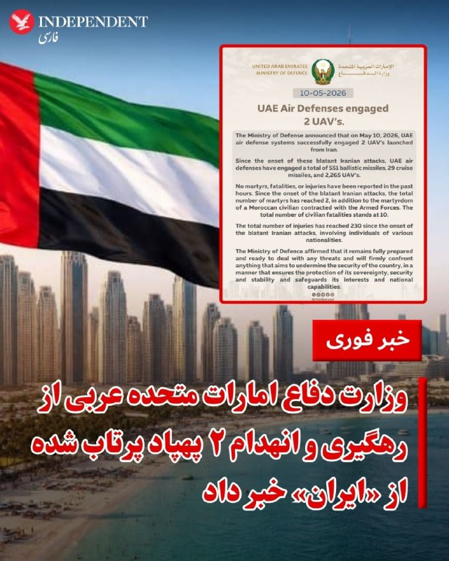
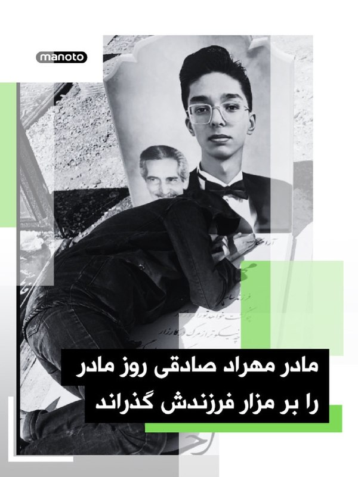
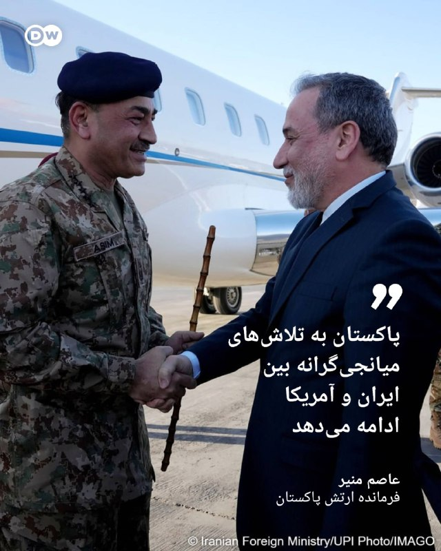
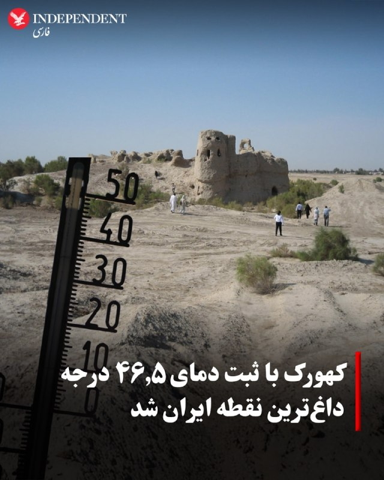
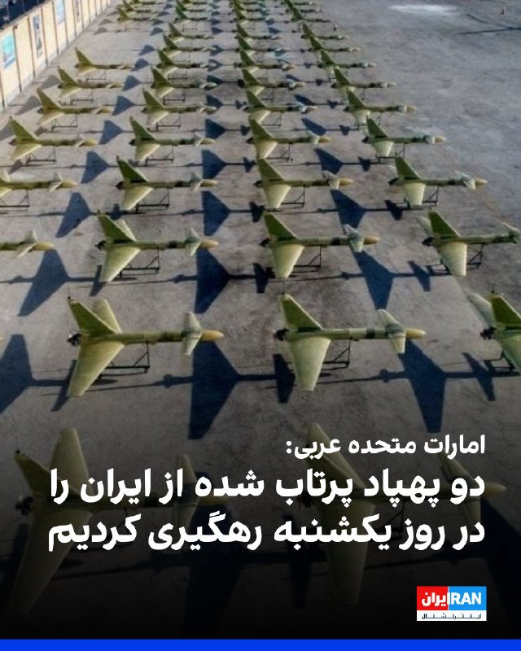
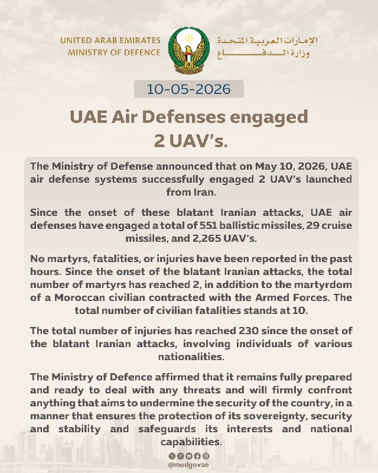
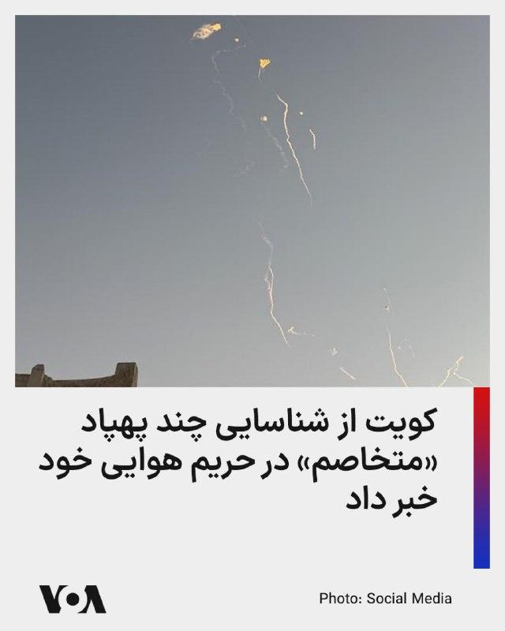
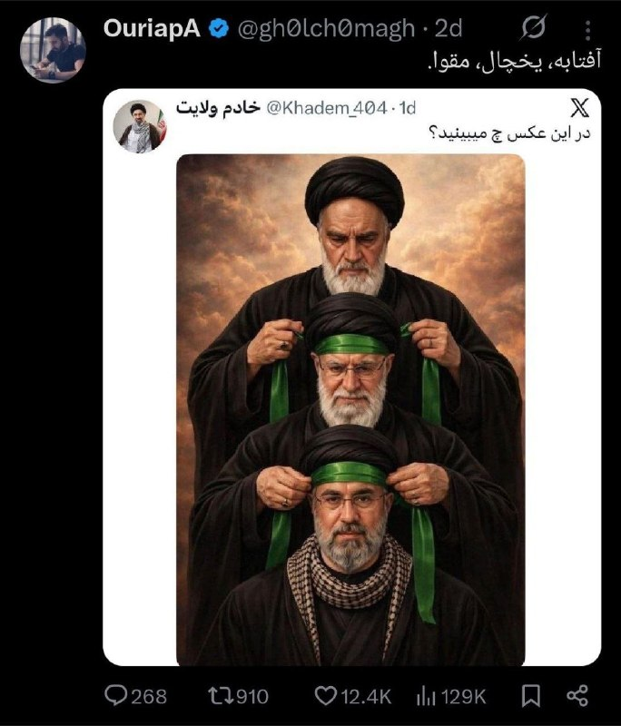
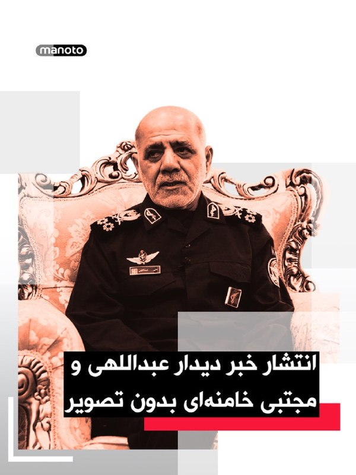

# خواننده تلگرام

<!-- TOP_NAV START -->

<a href="https://github.com/ali-exifit/aio-downloader/blob/main/telegram/content/archive_1.md" style="display:inline-block; padding:6px 12px; margin:0 4px; background-color:#2ea44f; color:white; text-decoration:none; border-radius:4px; font-weight:bold;">صفحه بعد</a>

<!-- TOP_NAV END -->

<!-- MSG START -->

---
📅 بروزرسانی: 1405/02/20 14:43
---

## VahidOOnLine — post 239262

  

♦️وزارت دفاع امارات متحده عربی روز یکشنبه ۲۰ اردیبهشت اعلام کرد که سامانه‌های پدافند هوایی این کشور با موفقیت دو پهپاد پرتاب شده از «ایران» را منهدم کردند.
این وزارتخانه تاکید کرده است که از زمان ««شروع حملات آشکار ایران، پدافند هوایی امارات متحده عربی در مجموع ۵۵۱ موشک بالستیک، ۲۹ موشک کروز و ۲۲۶۵ پهپاد را منهدم کرده است.»
وزارت دفاع امارات همچنین گزارش داده است که از زمان شروع حملات آشکار ایران، تعداد کل جانباختگان نظامی به ۳ نفر رسیده و تلفات غیرنظامی هم ۱۰ نفر از ملیت‌های پاکستانی، نپالی، بنگلادشی، فلسطینی، هندی و مصری است.
وزارت دفاع امارات متحده عربی همچنین بر آمادگی کامل این کشور برای مقابله با هرگونه تهدیدی تاکید کرده و اعلام کرده است که قاطعانه با هر چیزی که قصد تضعیف امنیت کشور را داشته باشد، مقابله خواهد کرد.

در روزهای گذشته مقام‌های جمهوری اسلامی بارها امارات متحده عربی را تهدید به «برخورد قاطع نظامی» کرده‌اند.
‌🇸🇦 Indypersian

🤖 @VahidOOnLine

## VahidOOnLine — post 239261

  

همزمان با «روز مادر» که در بسیاری از کشورهای جهان در دومین یکشنبه ماه مه گرامی داشته می‌شود، تصویری از مادر مهراد صادقی، نوجوان جان‌باخته اعتراضات ۱۴۰۴، بر مزار فرزندش منتشر شده است. جهان مناسبت می‌سازد، سیاستمدارها پیام تبریک می‌دهند، و بعضی مادرها کنار سنگ قبر فرزندشان دراز می‌کشند. تمدن بشر، شاهکار تناقض.

متن خبر:

مهراد صادقی، نوجوان اصفهانی و نقاش، در جریان اعتراضات سال ۱۴۰۴ با اصابت گلوله نیروهای امنیتی از ناحیه پهلو جان باخت.

بنا بر روایت خانواده، مادر مهراد پس از بی‌پاسخ ماندن تماس‌هایش، سرانجام با فردی ناشناس روبه‌رو شد که با تلفن همراه فرزندش پاسخ داده و گفته بود: «فرزندتان تیر خورده، بیایید او را ببرید.»

خانواده می‌گویند مهراد را در حالی به خانه منتقل کردند که دیگر جان باخته بود و پیکر او به مدت دو روز در بالکن خانه نگهداری شد.

به گفته نزدیکان خانواده، پس از انتقال پیکر به باغ رضوان اصفهان، جسد برای مدتی به خانواده تحویل داده نشد و در نهایت حدود یک هفته بعد، پیکر مهراد تحویل و در همان‌جا به خاک سپرده شد.
‌🏁 🇬🇧 ManotoTV

🤖 @VahidOOnLine

## VahidOOnLine — post 239260

  

رسانه‌های جمهوری اسلامی گفته‌اند علی عبداللهی، فرمانده قرارگاه مرکزی خاتم‌الانبیا، با مجتبی خامنه‌ای دیدار کرده و گزارشی از آمادگی نیروهای مسلح، از جمله ارتش، سپاه، نیروی انتظامی، نهادهای امنیتی، مرزبانی، وزارت دفاع و بسیج ارائه داده است.

بر اساس این گزارش‌ها، عبداللهی گفته نیروهای مسلح از نظر روحیه رزمی، آمادگی دفاعی و هجومی، طرح‌های راهبردی و تجهیزات لازم برای مقابله با «دشمنان» در سطح بالایی از آمادگی قرار دارند.

این رسانه‌ها همچنین نوشتند مجتبی خامنه‌ای در این دیدار تدابیر تازه‌ای برای ادامه اقدامات و مقابله با دشمنان ابلاغ کرده است. با وجود انتشار متن این خبر، رسانه‌های جمهوری اسلامی تصویری از این دیدار منتشر نکردند.
‌🏁 🇬🇧 ManotoTV

🤖 @VahidOOnLine

## pm_afshaa — post 90471

  <a href="telegram/content/pm_afshaa_90471_1778411620.webm" target="_blank">🎬 Download video</a>

🔴وزارت دفاع امارات: امروز دوتا موشک که از سمت ایران پرتاب شده بود رو رهگیری کردیم. 
💧 Rainbet.com the #1 Non-KYC Crypto Casino & Sportsbook @rainbetcom 
😁 @Pm_Afshaa

## pm_afshaa — post 90470

سخنگوی کمیسیون امنیت ملی: از امروز خویشتن‌داری ما تمام شد

💧 Rainbet.com the #1 Non-KYC Crypto Casino & Sportsbook @rainbetcom

😁 @Pm_Afshaa

## IranIntlTV — post 336445

🔻هرج‌ومرج در پراگ؛ هواداران اسلاویا به زمین یورش بردند و بازی در شب قهرمانی نیمه‌تمام ماند

دربی شهر پراگ میان دو تیم فوتبال اسلاویا پراگ و اسپارتا پراگ در هفته سرنوشت‌ساز لیگ برتر جمهوری چک، به دلیل هجوم تماشاگران میزبان در دقایق پایانی بازی، نیمه‌تمام ماند. رییس باشگاه اسلاویا پراگ، ضمن عذرخواهی از تیم میهمان اعلام کرد هواداران خاطی مادام‌العمر محروم می‌شوند.

اسلاویا در این دیدار حساس صدر جدول با نتیجه ۳ بر ۲ از رقیب سنتی خود پیش بود و پیروزی می‌توانست قهرمانی را برای میزبان قطعی کند. اما در دقیقه هفتم از ۱۰ دقیقه وقت‌های تلف‌شده پایان مسابقه، بازی به هرج و مرج و اتفاقات غیرقابل‌کنترل کشیده شد.

صدها نفر از هواداران اسلاویا ناگهان وارد زمین شدند. بسیاری از آنها مشعل‌های روشن در دست داشتند و آنها را به داخل زمین پرتاب کردند. برخی نیز به سمت جایگاه هواداران تیم میهمان رفتند و مواد آتش‌بازی را به سوی آنها پرتاب کردند.

تصاویر منتشرشده نشان می‌دهد بازیکنان دو تیم با عجله به سمت تونل ورزشگاه دویدند تا به محل امن برسند.

یاکوب سوروچیک، دروازه‌بان اسپارتا پراگ، پس از آنچه گفته می‌شود برخورد با یکی از مهاجمان بود، روی زمین افتاد و بعدا هواداران میزبان را به حمله متهم کرد. او در اینستاگرام نوشت: «اینکه کسی هنگام مسابقه به سمت من بدود، روبه‌رویم تهدیدم کند و به من حمله کند، کاملا غیرقابل قبول است. این موضوع را از نظر حقوقی پیگیری خواهم کرد.»

بر اساس گزارش‌ها، ماتیاس وویتا، هم‌تیمی او، و یکی از اعضای کادر پزشکی اسپارتا نیز مورد حمله قرار گرفتند.

داور ابتدا مسابقه را متوقف کرد و سپس بازی به طور کامل لغو شد. بازیکنان اسپارتا به سرعت ورزشگاه ادن آرنا را ترک کردند.

یاروسلاو توردیک، رییس باشگاه اسلاویا پراگ، اعلام کرد هوادارانی که در دقایق پایانی دیدار برابر اسپارتا پراگ به زمین مسابقه یورش بردند، با محرومیت مادام‌العمر مواجه خواهند شد.

توردیک صبح یکشنبه در بیانیه‌ای در شبکه‌های اجتماعی از «اسپارتا پراگ، هواداران میهمان، داوران، جامعه فوتبال و همه هواداران شرافتمند اسلاویا که دیروز با قلبی شکسته ورزشگاه را ترک کردند» عذرخواهی کرد.

او گفت: «ارزش‌های اسلاویا نفرت و خشونت نیست. ما مسئولیت را می‌پذیریم و پیامدها را اجرا می‌کنیم. آنچه در پایان دربی دیروز در فورتونا آرنا رخ داد، دشوارترین لحظه در تاریخ معاصر باشگاه است. این فوتبال نیست. این اسلاویا نیست. این ننگی است که همه ما در آن سهیم هستیم.»

رییس اسلاویا اعلام کرد جایگاه شمالی ورزشگاه تا اطلاع ثانوی بسته خواهد شد و تا زمانی که عاملان شناسایی و پاسخگو نشوند، بازگشایی نخواهد شد. او افزود باشگاه با پلیس و سایر نهادهای مربوطه «حداکثر همکاری» را خواهد داشت.

به گفته او، تمامی تصاویر دوربین‌های مداربسته، نتایج ارزیابی نیروهای اجرایی و اطلاعات هویتی دارندگان بلیت و کارت فصلی جایگاه شمالی در اختیار مقامات قرار خواهد گرفت: «عاملان شناسایی‌شده طبق مقررات ورود تماشاگران، با محرومیت مادام‌العمر از ورود به فورتونا آرنا مواجه خواهند شد. اسلاویا همچنین جبران کامل خسارات، از جمله هرگونه مجازات اعمال‌شده از سوی نهادهای فوتبالی، را مطالبه خواهد کرد.»

اتحادیه لیگ فوتبال جمهوری چک هم در این‌باره اعلام کرد: «چنین رفتاری تحت هیچ شرایطی قابل تحمل نیست. فضای احساسی یا رقابت ورزشی هرگز نمی‌تواند بهانه‌ای برای چنین رفتارهایی باشد. فوتبال حرفه‌ای باید محیطی امن برای همه افراد حاضر در مسابقه و تماشاگران ورزشگاه باقی بماند.»

این نهاد افزود آماده است حداکثر همکاری را با پلیس جمهوری چک برای شناسایی افراد دخیل در حمله به بازیکنان انجام دهد و از اعمال قاطع مسیولیت علیه همه عاملان حمایت می‌کند.

اسلاویا پراگ قرار است چهارشنبه آینده در خانه به مصاف اف‌کی یابلونتس برود.

اسلاویا پراگ با ۷۷ امتیاز در صدر جدول است و اسپارتا، رقیب سنتی، با ۶۶ امتیاز در رده دوم جدول قرار دارد. این پیروزی، تثبیت‌کننده قهرمانی اسلاویا بود،‌ اما یورش هواداران، جشن قهرمانی را به تعویق انداخت.

🔗وب‌سایت ایران‌اینترنشنال
@iranintltv

## FarsiVOA — post 217334

  <a href="telegram/content/FarsiVOA_217334_1778411621.mp4" target="_blank">🎬 Download video</a>

ارتش اسرائیل اعلام کرد نیروهای تیپ کفیر، تحت فرماندهی لشکر غزه، در ادامه عملیات پاکسازی در محدوده اردوگاه‌های مرکزی نوار غزه، در شرق خط زرد، دو مسیر زیرزمینی را منهدم کردند.

بر اساس اعلام ارتش اسرائیل، این دو مسیر تونلی در مجموع حدود دو کیلومتر طول داشتند و در جریان عملیات، چند اتاق اقامت و مقادیر مختلفی سلاح در داخل آنها شناسایی شد.

ارتش اسرائیل همچنین اعلام کرد نیروهایش در جریان جست‌وجوهای میدانی در این منطقه، ده‌ها راکت و مواد انفجاری را نیز کشف کرده‌اند.

طبق بیانیه ارتش اسرائیل، نیروهای فرماندهی جنوب همچنان بر اساس چارچوب توافق آتش‌بس در منطقه مستقر هستند و به عملیات برای رفع هرگونه تهدید فوری ادامه خواهند داد.
@FarsiVOA

## DW_Farsi — post 124517

  

🔸عاصم منیر: پاکستان به تلاش‌های میانجی‌گرانه بین ایران و آمریکا ادامه می‌دهد

عاصم منیر، فرمانده ارتش پاکستان، روز یکشنبه اظهار داشت، اسلام‌آباد به تلاش‌های میانجی‌گرانه خود میان تهران و واشنگتن ادامه خواهد داد.

او در جریان یک سخنرانی به مناسبت اولین سالگرد جنگ سه‌‌روزه میان پاکستان و هند گفت: «ما تمام تلاش خود را برای موفقیت این میانجی‌گری به کار خواهیم گرفت و به این کار ادامه خواهیم داد.»

عاصم منیر که گفته می‌شود روابط دوستانه‌ای با دونالد ترامپ، رئیس جمهور آمریکا دارد، تأکید کرد پاکستان در تلاش است به صلحی پایدار در جنگ آمریکا و اسرائیل علیه ایران که بخش بزرگی از منطقه را درگیر کرده، دست یابد.

در همین حال پاکستان و قطر با انتشار بیانیه‌هایی از گفت‌وگوی تلفنی میان نخست‌وزیر قطر و نخست‌وزیر پاکستان خبر دادند. در این بیانیه گفته شده است که دو طرف درباره آخرین تحولات منطقه و همچنین تلاش‌های میانجی‌گرانه پاکستان رایزنی کرده‌اند.

@dw_farsi

## Persian_Trend_Official — post 13818

  <a href="telegram/content/Persian_Trend_Official_13818_1778411625.webm" target="_blank">🎬 Download video</a>

💢 سخنگوی کمیسیون امنیت ملی: از امروز خویشتن‌داری ما تمام شد

▪️هرتعرضی به شناورهای ما،با پاسخ سنگین و قاطع به شناور ها و پایگاه های آمریکایی مواجه خواهد شد

🫆:Tony

📌 @persian_trend_official
پرشین ترند | متفاوت‌ترین کانال نظامی

## RadioFarda — post 157027

🔸 در مراسم آغاز به کار «پیتر مجیار» به‌عنوان نخست‌وزیر جدید مجارستان، «ژولت هگدوش» سیاستمدار شناخته‌شده مجارستانی بار دیگر با اجرای رقص معروف خود روی پله‌های پارلمان، توجه رسانه‌ها و حاضران را به خود جلب کرد. 🔸 هگدوش که پس از پیروزی انتخاباتی حزب مخالف «تیسا»…

## RadioFarda — post 157026

🔸 در مراسم آغاز به کار «پیتر مجیار» به‌عنوان نخست‌وزیر جدید مجارستان، «ژولت هگدوش» سیاستمدار شناخته‌شده مجارستانی بار دیگر با اجرای رقص معروف خود روی پله‌های پارلمان، توجه رسانه‌ها و حاضران را به خود جلب کرد.

🔸 هگدوش که پس از پیروزی انتخاباتی حزب مخالف «تیسا» در ۱۲ آوریل و انتشار ویدئوی رقص پرشور او در فضای مجازی به شهرت رسیده بود، این بار نیز مقابل جمعیتی که در میدان پارلمان بوداپست گرد آمده بودند، حرکات نمایشی و «گیتار خیالی» اجرا کرد.

🔸 همزمان اعضای جدید پارلمان و حاضران او را تشویق می‌کردند و بسیاری با تلفن‌های همراه خود از این صحنه فیلم می‌گرفتند.

@RadioFarda

## BBCPersian — post 280647

  <a href="telegram/content/BBCPersian_280647_1778411626.mp4" target="_blank">🎬 Download video</a>

این صحنه‌ای است که بی‌بی‌سی به اشتباه به جای گای کوینی، روزنامه‌نگار حوزه فناوری، با گای گوما، که برای یک مصاحبه شغلی آمده بود، به صورت زنده مصاحبه کرد.

۲۰ سال پیش، در تاریخ ۸ مه ۲۰۰۶، گوما برای مصاحبه‌ای به بی‌بی‌سی دعوت شد. اما در پذیرش، او را با کوینی اشتباه گرفتند و از یک برنامه زنده از کانال خبری بی‌بی‌سی سردرآورد. گوما در این موقعیت عجیب جا نزد و با وجود اینکه از موضوع خبر نداشت، به سوالات مجری پاسخ داد. او شغلی را که تقاضا کرده بود، نگرفت.

@BBCPersian
https://bbc.in/48RTMeY

## alonews — post 119044

  <a href="telegram/content/alonews_119044_1778411628.webm" target="_blank">🎬 Download video</a>

👈وزارت خارجه قطر: حمله به کشتی باری در آب های قطر را محکوم می کنیم

✅ @AloNews خبر جنگ

## alonews — post 119043

  <a href="telegram/content/alonews_119043_1778411628.webm" target="_blank">🎬 Download video</a>

👈پزشکیان: خاموش کردن هر یک چراغ مثل شلیک تیر به سمت دشمنه

✅ @AloNews خبر جنگ

## alonews — post 119042

  <a href="telegram/content/alonews_119042_1778411629.webm" target="_blank">🎬 Download video</a>

👈سخنگوی وزارت خارجه: وظیفه آژانس بین‌المللی انرژی اتمی، راستی‌آزمایی است، نه ارسال پیام‌های سیاسی در مورد تنگه هرمز، موشک‌های ایران یا نحوه رفتار تهران.

🔴وقتی بی‌طرفی حرفه‌ای قربانی رفتارهای سیاسی یا جاه‌طلبی‌های شخصی بشود، اعتبار نهادها دچار فرسایش می‌شود و بعد از جندی اثربخشی آنها نیز مخدوش می‌گردد.

✅ @AloNews خبر جنگ

---
📅 بروزرسانی: 1405/02/20 14:33
---

## VahidOOnLine — post 239259

  

وزارت دفاع امارات متحده عربی اعلام کرد که روز یکشنبه، دو پهپاد پرتاب شده از ایران را رهگیری کرده است.

در روزهای گذشته امارات متحده عربی چندین بار هدف موشک‌ها و پهپادهای پرتاب شده از سوی جمهوری اسلامی قرار گرفت.

حملات جمهوری اسلامی به امارات متحده عربی پس از برقراری آتش‌بس، با موج محکومیت گسترده بین‌المللی مواجه شده است.
‌🏁 🇬🇧 IranintlTV

🤖 @VahidOOnLine

## VahidOOnLine — post 239258

  

♦️مدیرکل هواشناسی سیستان و بلوچستان اعلام کرد ایستگاه تازه‌تاسیس کهورک با ثبت دمای ۴۶.۵ درجه سلسیوس، عنوان گرم‌ترین نقطه ایران را به خود اختصاص داده است.
بر اساس اعلام هواشناسی، پس از کهورک، شهرستان دلگان با دمای ۴۵ درجه سلسیوس در رتبه دوم گرم‌ترین نقاط کشور قرار گرفت. همچنین شهر زاهدان با ثبت دمای ۳۹ درجه، گرم‌ترین مرکز استان ایران در روز شنبه ١٩ اردیبهشت بود.
به گفته مسئولان هواشناسی، موج گرمای شدید در سیستان و بلوچستان باعث شده ۲۳ ایستگاه هواشناسی در سطح استان دمای بالاتر از ۴۰ درجه سلسیوس را ثبت کنند، موضوعی که نشان‌دهنده تداوم شرایط بسیار گرم و خشک در جنوب شرق کشور است.
کارشناسان هشدار داده‌اند با ادامه روند افزایش دما، احتمال تشدید تنش‌های گرمایی، افزایش مصرف آب و برق و بروز مشکلات برای گروه‌های حساس وجود دارد و شهروندان باید توصیه‌های ایمنی و بهداشتی را جدی بگیرند.
کهورک، روستایی از توابع بخش نصرت‌آباد شهرستان زاهدان در استان سیستان و بلوچستان است که براساس سرشماری سال ۱۳۸۵ مرکز آمار ایران، تنها ۷۱ نفر جمعیت در قالب ۹ خانوار داشته است.
‌🇸🇦 Indypersian

🤖 @VahidOOnLine

## mwarmonitor — post 8803

🔴گزارش ویژه فاکس نیوز: تخلیه کشتی تفریحی به دلیل شیوع ویروس هانتا

مجری: خبر فوری فاکس نیوز؛ مسافران کشتی تفریحی که به شیوع مرگبار ویروس هانتا مرتبط شده است، پس از پهلو گرفتن در نزدیکی سواحل جزایر قناری، شبانه در حال پیاده شدن از کشتی هستند.
مجری : دست‌کم ۱۷ آمریکایی در میان کسانی هستند که در حال تخلیه می‌باشند، در حالی که مقامات برای مهار این ویروس تلاش می‌کنند. "چانلی پینتر" با جزئیات بیشتر همراه ماست. چانلی، بفرمایید.
​چانلی پینتر: سلام، صبح بخیر. بله، ۱۴۰ مسافر کشتی "ام‌وی هوندیوس" که گرفتار ویروس هانتا شده، اکنون در گروه‌هایی بر اساس ملیت و با قایق‌های کوچک (تا ظرفیت ۱۰ نفر) در حال پیاده شدن هستند.
​این اتفاق پس از آن رخ داد که کشتی تفریحی چند ساعت پیش در جزایر قناری، در نزدیکی سواحل آفریقا، پهلو گرفت. سازمان جهانی بهداشت به ساکنان جزیره اطمینان داده است که هیچ خطری برای عموم مردم وجود ندارد و مقامات بهداشتی اسپانیا می‌گویند تمام مسافران فعلاً بدون علامت هستند.
​اگرچه هیچ‌یک از مسافران فعلی تست مثبت ویروس هانتا نداشته‌اند، اما این شیوع پیش‌تر باعث مرگ سه نفر در کشتی شده و تست چندین نفر دیگر نیز مثبت اعلام شده بود. بنابراین، مسافران و خدمه باقی‌مانده پس از انجام غربالگری‌های بهداشتی در حال ترک کشتی هستند و پس از خروج، با اتوبوس برای پروازهای خود به فرودگاه منتقل خواهند شد.

@mwarmonitor

## mwarmonitor — post 8802

  <a href="telegram/content/mwarmonitor_8802_1778411000.mp4" target="_blank">🎬 Download video</a>

🎬 Video

## pm_afshaa — post 90469

  <a href="telegram/content/pm_afshaa_90469_1778411001.webm" target="_blank">🎬 Download video</a>

🔴تسنیم: از اونجایی که کابل‌های فیبر نوری حیاتی از کف تنگه هرمز عبور میکنه، ما باید هزینه سالانه از کمپانی‌های بزرگ بگیریم و آمازون، مایکروسافت و متا رو موظف کنیم تحت قوانین ایران کار کنن!

💧 Rainbet.com the #1 Non-KYC Crypto Casino & Sportsbook @rainbetcom

😁 @Pm_Afshaa

## pm_afshaa — post 90468

  <a href="telegram/content/pm_afshaa_90468_1778411002.webm" target="_blank">🎬 Download video</a>

🔴وزارت دفاع امارات:
امروز دوتا موشک که از سمت ایران پرتاب شده بود رو رهگیری کردیم.

💧 Rainbet.com the #1 Non-KYC Crypto Casino & Sportsbook @rainbetcom

😁 @Pm_Afshaa

## IranIntlTV — post 336444

  

وزارت دفاع امارات متحده عربی اعلام کرد که روز یکشنبه، دو پهپاد پرتاب شده از ایران را رهگیری کرده است.

در روزهای گذشته امارات متحده عربی چندین بار هدف موشک‌ها و پهپادهای پرتاب شده از سوی جمهوری اسلامی قرار گرفت.

حملات جمهوری اسلامی به امارات متحده عربی پس از برقراری آتش‌بس، با موج محکومیت گسترده بین‌المللی مواجه شده است.
https://iranintl.com/202605100564

## IranIntlTV — post 336443

  <a href="telegram/content/IranIntlTV_336443_1778411003.mp4" target="_blank">🎬 Download video</a>

مروری بر روزنامه‌های ایران، یکشنبه ۲۰ اردیبهشت، با مجتبی هاشمی، روزنامه‌نگار
@iranintltv

## Shin_Persian — post 5922

  

وزارة الدفاع |MOD UAE ✓ @modgovae Sun, 10 May 2026 10:44:56 UTC UAE Air Defenses engaged 2 UAV’s. The Ministry of Defense announced that on May 10, 2026, UAE air defense systems successfully engaged 2 UAV’s launched from Iran. Since the onset of these…

## Shin_Persian — post 5921

وزارة الدفاع |MOD UAE ✓ @modgovae
Sun, 10 May 2026 10:44:56 UTC

UAE Air Defenses engaged 2 UAV’s.

The Ministry of Defense announced that on May 10, 2026, UAE air defense systems successfully engaged 2 UAV’s launched from Iran.

Since the onset of these blatant Iranian attacks, UAE air defenses have engaged a total of 551 ballistic missiles, 29 cruise missiles, and 2,265 UAV’s.

No martyrs, fatalities, or injuries have been reported in the past hours. Since the onset of the blatant Iranian attacks, the total number of martyrs has reached 2, in addition to the martyrdom of a Moroccan civilian contracted with the Armed Forces. The total number of civilian fatalities stands at 10, from Pakistani, Nepalese, Bangladeshi, Palestinian, Indian, and Egyptian nationalities.

The total number of injuries has reached 230 since the onset of the blatant Iranian attacks, involving individuals of various nationalities, including Emirati, Egyptian, Sudanese, Ethiopian, Filipino, Pakistani, Iranian, Indian, Bangladeshi, Sri Lankan, Azerbaijani, Yemeni, Ugandan, Eritrean, Lebanese, Afghan, Bahraini, Comorian, Turkish, Iraqi, Nepalese, Nigerian, Omani, Jordanian, Palestinian, Ghanaian, Indonesian, Swedish, Tunisian, Moroccan, and Russian.

The Ministry of Defence affirmed that it remains fully prepared and ready to deal with any threats and will firmly confront anything that aims to undermine the security of the country, in a manner that ensures the protection of its sovereignty, security and stability and safeguards its interests and national capabilities.

#وزارة_الدفاع
#وزارة_الدفاع_الإماراتية
#MOD
#UAEMinistryOfDefence

ترجمه فارسی در بخش نظرات

𝕏 · @shin_persian

## ManotoTV — post 105233

  

همزمان با «روز مادر» که در بسیاری از کشورهای جهان در دومین یکشنبه ماه مه گرامی داشته می‌شود، تصویری از مادر مهراد صادقی، نوجوان جان‌باخته اعتراضات ۱۴۰۴، بر مزار فرزندش منتشر شده است. جهان مناسبت می‌سازد، سیاستمدارها پیام تبریک می‌دهند، و بعضی مادرها کنار سنگ قبر فرزندشان دراز می‌کشند. تمدن بشر، شاهکار تناقض.

متن خبر:

مهراد صادقی، نوجوان اصفهانی و نقاش، در جریان اعتراضات سال ۱۴۰۴ با اصابت گلوله نیروهای امنیتی از ناحیه پهلو جان باخت.

بنا بر روایت خانواده، مادر مهراد پس از بی‌پاسخ ماندن تماس‌هایش، سرانجام با فردی ناشناس روبه‌رو شد که با تلفن همراه فرزندش پاسخ داده و گفته بود: «فرزندتان تیر خورده، بیایید او را ببرید.»

خانواده می‌گویند مهراد را در حالی به خانه منتقل کردند که دیگر جان باخته بود و پیکر او به مدت دو روز در بالکن خانه نگهداری شد.

به گفته نزدیکان خانواده، پس از انتقال پیکر به باغ رضوان اصفهان، جسد برای مدتی به خانواده تحویل داده نشد و در نهایت حدود یک هفته بعد، پیکر مهراد تحویل و در همان‌جا به خاک سپرده شد.

## ManotoTV — post 105232

  <a href="telegram/content/ManotoTV_105232_1778411006.mp4" target="_blank">🎬 Download video</a>

گزارشگرمنوتو: «گردهمایی و راهپیمایی امروز ملبورن در پاسخ به فراخوان شاهزاده رضا پهلوی

تا زمان آزادی پا پس نمی‌کشیم و صدای ایران خواهیم بود.»

شماری از ایرانیان ساکن ملبورن امروز با حضور در این گردهمایی، حمایت خود را از انقلاب شیروخورشید و مردم داخل ایران اعلام کردند.

فراخوان این تجمع با محوریت اعتراض به «خاموشی سراسری اینترنت»، «اعدام‌های بی‌وقفه» و حمایت از زندانیان سیاسی منتشر شده بود.

## ManotoTV — post 105231

  

رسانه‌های جمهوری اسلامی گفته‌اند علی عبداللهی، فرمانده قرارگاه مرکزی خاتم‌الانبیا، با مجتبی خامنه‌ای دیدار کرده و گزارشی از آمادگی نیروهای مسلح، از جمله ارتش، سپاه، نیروی انتظامی، نهادهای امنیتی، مرزبانی، وزارت دفاع و بسیج ارائه داده است.

بر اساس این گزارش‌ها، عبداللهی گفته نیروهای مسلح از نظر روحیه رزمی، آمادگی دفاعی و هجومی، طرح‌های راهبردی و تجهیزات لازم برای مقابله با «دشمنان» در سطح بالایی از آمادگی قرار دارند.

این رسانه‌ها همچنین نوشتند مجتبی خامنه‌ای در این دیدار تدابیر تازه‌ای برای ادامه اقدامات و مقابله با دشمنان ابلاغ کرده است. با وجود انتشار متن این خبر، رسانه‌های جمهوری اسلامی تصویری از این دیدار منتشر نکردند.

## FarsiVOA — post 217333

  

ارتش کویت اعلام کرد بامداد یکشنبه چند پهپاد «متخاصم» را در حریم هوایی این کشور شناسایی و با آن‌ها مقابله کرده است. رویترز نوشته این نخستین حادثه از این نوع در کویت از زمان اجرای آتش‌بس جنگ با جمهوری اسلامی است. به گزارش رویترز، ارتش کویت جزئیات بیشتری درباره منشأ این پهپادها یا خسارت احتمالی منتشر نکرده است.

این حادثه در حالی رخ می‌دهد که آتش‌بس میان آمریکا و جمهوری اسلامی از ابتدا شکننده بوده است. رویترز در هشتم آوریل نوشته بود با وجود توافق دو هفته‌ای آتش‌بس، در همان روز نخست همچنان درگیری‌هایی جریان داشت و کشورهای حاشیه خلیج فارس، از جمله کویت، بحرین و امارات، از حملات موشکی و پهپادی گزارش داده بودند.

کویت پیش‌تر نیز گفته بود پدافند هوایی این کشور در جریان جنگ با موشک‌ها و پهپادهای جمهوری اسلامی مقابله کرده؛ از جمله موجی از پهپادها در هشتم آوریل که به گفته رویترز زیرساخت‌های حیاتی را هدف گرفته بود.

در روزهای اخیر نیز امارات متحده عربی از مقابله پدافند هوایی خود با دو موشک بالستیک و سه پهپاد جمهوری اسلامی خبر داده بود؛ حملاتی که به نوشته رویترز سه زخمی بر جا گذاشت.
@FarsiVOA

## IranianMinds — post 19874

  

🔴در این عکس چه می‌بینید؟

آفتابه، یخچال، مقوا.

@IranianMinds

## manototv — post 105233

  

همزمان با «روز مادر» که در بسیاری از کشورهای جهان در دومین یکشنبه ماه مه گرامی داشته می‌شود، تصویری از مادر مهراد صادقی، نوجوان جان‌باخته اعتراضات ۱۴۰۴، بر مزار فرزندش منتشر شده است. جهان مناسبت می‌سازد، سیاستمدارها پیام تبریک می‌دهند، و بعضی مادرها کنار سنگ قبر فرزندشان دراز می‌کشند. تمدن بشر، شاهکار تناقض.

متن خبر:

مهراد صادقی، نوجوان اصفهانی و نقاش، در جریان اعتراضات سال ۱۴۰۴ با اصابت گلوله نیروهای امنیتی از ناحیه پهلو جان باخت.

بنا بر روایت خانواده، مادر مهراد پس از بی‌پاسخ ماندن تماس‌هایش، سرانجام با فردی ناشناس روبه‌رو شد که با تلفن همراه فرزندش پاسخ داده و گفته بود: «فرزندتان تیر خورده، بیایید او را ببرید.»

خانواده می‌گویند مهراد را در حالی به خانه منتقل کردند که دیگر جان باخته بود و پیکر او به مدت دو روز در بالکن خانه نگهداری شد.

به گفته نزدیکان خانواده، پس از انتقال پیکر به باغ رضوان اصفهان، جسد برای مدتی به خانواده تحویل داده نشد و در نهایت حدود یک هفته بعد، پیکر مهراد تحویل و در همان‌جا به خاک سپرده شد.

## manototv — post 105232

  <a href="telegram/content/manototv_105232_1778411010.mp4" target="_blank">🎬 Download video</a>

گزارشگرمنوتو: «گردهمایی و راهپیمایی امروز ملبورن در پاسخ به فراخوان شاهزاده رضا پهلوی

تا زمان آزادی پا پس نمی‌کشیم و صدای ایران خواهیم بود.»

شماری از ایرانیان ساکن ملبورن امروز با حضور در این گردهمایی، حمایت خود را از انقلاب شیروخورشید و مردم داخل ایران اعلام کردند.

فراخوان این تجمع با محوریت اعتراض به «خاموشی سراسری اینترنت»، «اعدام‌های بی‌وقفه» و حمایت از زندانیان سیاسی منتشر شده بود.

## manototv — post 105231

  

رسانه‌های جمهوری اسلامی گفته‌اند علی عبداللهی، فرمانده قرارگاه مرکزی خاتم‌الانبیا، با مجتبی خامنه‌ای دیدار کرده و گزارشی از آمادگی نیروهای مسلح، از جمله ارتش، سپاه، نیروی انتظامی، نهادهای امنیتی، مرزبانی، وزارت دفاع و بسیج ارائه داده است.

بر اساس این گزارش‌ها، عبداللهی گفته نیروهای مسلح از نظر روحیه رزمی، آمادگی دفاعی و هجومی، طرح‌های راهبردی و تجهیزات لازم برای مقابله با «دشمنان» در سطح بالایی از آمادگی قرار دارند.

این رسانه‌ها همچنین نوشتند مجتبی خامنه‌ای در این دیدار تدابیر تازه‌ای برای ادامه اقدامات و مقابله با دشمنان ابلاغ کرده است. با وجود انتشار متن این خبر، رسانه‌های جمهوری اسلامی تصویری از این دیدار منتشر نکردند.

## alonews — post 119041

  <a href="telegram/content/alonews_119041_1778411012.webm" target="_blank">🎬 Download video</a>

👈گفت‌وگوی تلفنی وزرای خارجه ایران و قطر

✅ @AloNews خبر جنگ

<!-- MSG END -->

<!-- NAV START -->

<a href="https://github.com/ali-exifit/aio-downloader/blob/main/telegram/content/archive_1.md" style="display:inline-block; padding:6px 12px; margin:0 4px; background-color:#2ea44f; color:white; text-decoration:none; border-radius:4px; font-weight:bold;">صفحه بعد</a>

<!-- NAV END -->
