# خواننده تلگرام

<!-- TOP_NAV START -->

<a href="https://github.com/ali-exifit/aio-downloader/blob/main/telegram/content/archive_1.md" style="display:inline-block; padding:6px 12px; margin:0 4px; background-color:#2ea44f; color:white; text-decoration:none; border-radius:4px; font-weight:bold;">صفحه بعد</a>

<!-- TOP_NAV END -->

<!-- MSG START -->

---
📅 بروزرسانی: 1405/02/23 22:34
---

## mwarmonitor — post 9054

🇺🇸کوین وارش با رأی ۵۴ موافق در برابر ۴۵ مخالف توسط سنای آمریکا به عنوان رئیس فدرال رزرو تأیید شد. سناتور جان فترمن تنها دموکراتی بود که به این تأیید رأی مثبت داد.

🔸کوین وارش یک اقتصاددان آمریکایی است که قبلاً عضو هیئت‌مدیره فدرال رزرو هم بوده و بیشتر به دیدگاه‌های نسبتاً محافظه‌کارانه در سیاست پولی مثل سخت‌گیری در کنترل تورم و تمایل به نرخ بهره بالاتر در بعضی شرایط شناخته می‌شود.

🔹 او از چهره‌هایی است که معمولاً به جریان‌های اقتصادی نزدیک به جمهوری‌خواهان یا اقتصاد بازار آزاد نسبت داده می‌شود، هرچند نقش رسمی حزبی ندارد.

@mwarmonitor

## FoxNewsTwitter — post 341670

  <a href="telegram/content/FoxNewsTwitter_341670_1778699098.mp4" target="_blank">🎬 Download video</a>

Fox News (Twitter/X)

BREAKING: Vice President JD Vance shuts down talk of a "joint ticket" with Secretary of State Marco Rubio, insisting he is focused solely on the job the American people already elected him to do:

"There are a few topics that I want to talk about less than what office I'm going to run for years down the road when I'm having a good time and trying to do good work in the job that the American people already elected me to do.”

“I've answered this question, probably in any number of ways, I love Marco. I think he's a great secretary of state. He's become a very, very dear friend. But I think both of us are very much focused on accomplishing the American people's business right now.”

## FoxNewsTwitter — post 341669

  <a href="telegram/content/FoxNewsTwitter_341669_1778699100.mp4" target="_blank">🎬 Download video</a>

Fox News (Twitter/X)

BREAKING: "We believe that at least half of the hospices in the entire area around Los Angeles are fraudulent."

"Today we announce 800 of those hospices have been suspended. 800 hospices that last year charged the federal taxpayer $1.4 billion will no longer be paid." - CMS Administrator Dr. Mehmet Oz

## FoxNewsTwitter — post 341668

  <a href="telegram/content/FoxNewsTwitter_341668_1778699103.mp4" target="_blank">🎬 Download video</a>

Fox News (Twitter/X)

VP VANCE: "So you're saying that we kicked off 800 fraudulent healthcare providers off of the Medicare system, and not a single one of them called the government and said, 'hey, you made a mistake?'"

DR. OZ: "We've had a handful of calls. We're not sure they're legitimate yet, but it's less than 20 out of 800 and we're auditing them."

VP VANCE:" Unbelievable... At least 780 are not even trying to claim that they're not fraudulent?"

"Those are businesses that we were giving hundreds of millions, in some cases billions of dollars to, not to provide services, but to make a fraudster rich. It's just completely insane."

## kianmeli1 — post 87387

  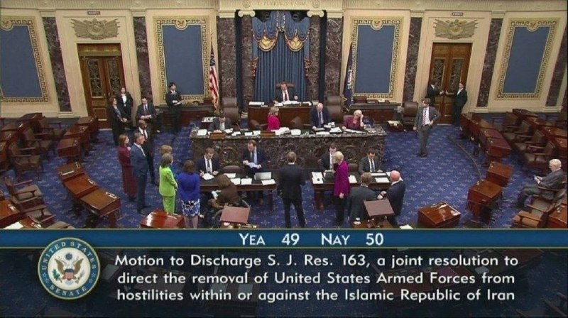

🔴هفتمین رأی‌گیری سنای آمریکا برای پایان جنگ با ایران شکست خورد

مجلس سنا برای هفتمین‌بار قطعنامهٔ پیشنهادی برای توقف جنگ با ایران را رد کرد.

جمهوری‌خواهان تقریباً متحد عمل کردند تا اولین تلاش از زمان عبور ترامپ از ضرب‌الاجل ۶۰ روزه برای دریافت مجوز جنگ از کنگره را ناکام بگذارند
https://t.me/kianmeli1

## kianmeli1 — post 87386

  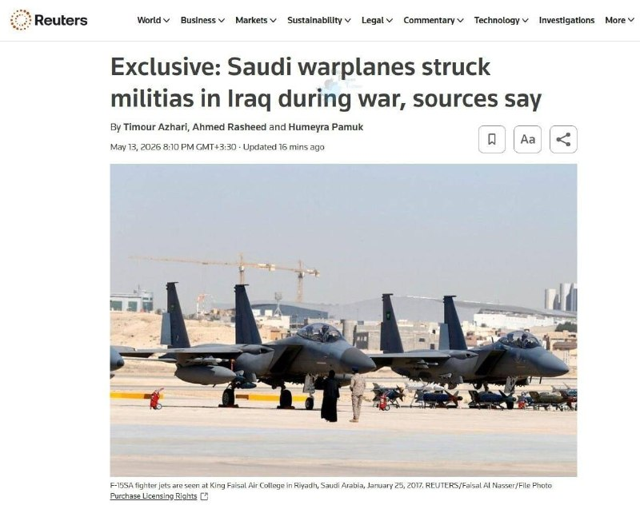

🔴رویترز؛

منابع متعددی که از جزئیات ماجرا آگاه هستند، اعلام کردند که در جریان جنگ با ایران، جنگنده‌های عربستان سعودی اهدافی مرتبط با شبه‌نظامیان تحت حمایت تهران را در عراق بمباران کردند. بعلاوه، حملات تلافی‌جویانه‌ای نیز از کویت به داخل خاک عراق انجام شد.
https://t.me/kianmeli1

## kianmeli1 — post 87385

  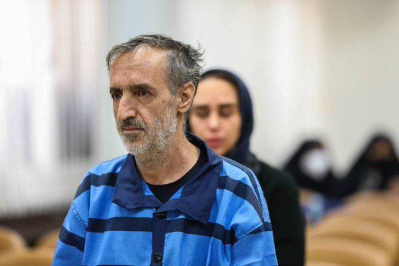

‏🔴خبرگزاری میزان، رسانه قوه قضاییه جمهوری اسلامی، از اعدام محمد عباسی از بازداشت‌شدگان اعتراضات سراسری دی‌ماه ۱۴۰۴ خبر داد
https://t.me/kianmeli1

## FarsiVOA — post 217657

🔺هشدار بنیاد نرگس: جسم نرگس محمدی توان تحمل هیچ «فشار مضاعفی» را ندارد

◾️بنیاد نرگس، روز چهارشنبه ۲۳ اردیبهشت، در بیانیه‌ای ضمن تشریح روند درمانی نرگس محمدی در زنجان و تهران، اعلام کرد: «این زندانی سیاسی، نیازمند درمان دست‌کم ۸ ماهه است و بدنش در وضعیت فعلی توان تحمل هیچ‌گونه فشار مضاعف و بازگشت به شرایط حبس را ندارد.»

⬇️ بیشتر بخوانید:

https://ir.voanews.com/a/narges-mohammadi-prison-pressure-endurance-/8149626.html?withmediaplayer=1

## DW_Farsi — post 124667

  <a href="telegram/content/DW_Farsi_124667_1778699108.mp4" target="_blank">🎬 Download video</a>

🎥 صد روز در انزوا؛ آزمایش انسان برای سفر به مریخ

شش داوطلب در پروژه "سولیس ۱۰۰" صد روز را در انزوای کامل سپری می‌کنند تا دانشمندان تاثیرات روانی و جسمی سفرهای طولانی فضایی را بررسی کنند؛ آزمایشی که می‌تواند به آمادگی بشر برای ماموریت‌های آینده به مریخ کمک کند.
#dwscience #dwhealth
@dw_farsi

## Dirty_Kids — post 389399

  

امانوئل تو زن داری؟

@Dirty_Kids 👻

## Dirty_Kids — post 389398

رفته بودیم ماسال. به صاحب‌ ویلا گفتم اینجا محلیا چه‌جوری‌ند؟ به حجاب گیرن یا زنا راحت بتابن؟
گفت: زنا هر جور دوست دارن بپوشن، اما مردا شلوارک نپوشن، اهالی حساسن به شلوارک:))))))

@Dirty_Kids 👻

## alonews — post 119806

  <a href="telegram/content/alonews_119806_1778699111.webm" target="_blank">🎬 Download video</a>

👈سوپراپلیکیشن ایتا اعلام کرد امکان ارسال فایل تا حجم ۲۰ مگابایت مجدداً برای همه کاربران فراهم شده است

✅ @AloNews خبر جنگ

## alonews — post 119805

  <a href="telegram/content/alonews_119805_1778699111.webm" target="_blank">🎬 Download video</a>

👈ادعای ونس، معاون رئیس‌جمهور آمریکا: ما درگیر یک فرایند دیپلماتیک فعال برای اطمینان از نداشتن سلاح هسته‌ای توسط ایران هستیم

🔴رئیس‌جمهور گزینه‌های متعددی دیپلماتیک و نظامی پیش رو دارد.

✅ @AloNews خبر جنگ

---
📅 بروزرسانی: 1405/02/23 22:25
---

## VahidOOnLine — post 239968

  <a href="telegram/content/VahidOOnLine_239968_1778698528.mp4" target="_blank">🎬 Download video</a>

♦️رونمایی از پیراهن جدید تیم ملی فوتبال ایران برای جام جهانی ۲۰۲۶ با حضور مهدی تاج، امیر قلعه‌نویی و احسان حاج‌صفی در میدان انقلاب تهران برگزار شد؛ پیراهنی که با طرح «یوز ایرانی» و شماره ۱۲ معرفی شد و قرار است تیم ملی با آن در جام جهانی به میدان برود.
این رونمایی در شرایطی انجام می‌شود که طی هفته‌های اخیر، بحث حضور تیم ملی ایران در جام جهانی ۲۰۲۶ و مسائل مرتبط با ویزا، امنیت و تنش‌های سیاسی منطقه‌ای بار دیگر خبرساز شده است.
پیش‌تر مهدی تاج اعلام کرده بود فدراسیون فوتبال جمهوری اسلامی «قطعا» در جام جهانی ۲۰۲۶ شرکت خواهد کرد و در عین حال گفته بود ایران برای حضور در این رقابت‌ها ۱۰ شرط را مطرح کرده است. به گفته او، جلوگیری از مصاحبه‌های تنش‌زا، تضمین امنیت کاروان تیم ملی، رعایت پروتکل‌های امنیتی فیفا در فرودگاه و ورزشگاه‌ها، تعیین تکلیف ویزای خبرنگاران و هواداران و همچنین جلوگیری از ورود پرچم‌هایی غیر از پرچم رسمی جمهوری اسلامی به ورزشگاه‌ها، از جمله این شروط هستند.
مسابقات جام جهانی فوتبال ۲۰۲۶ از ۲۱ خرداد تا ۲۸ تیر ۱۴۰۵ برگزار خواهد شد.
‌🇸🇦 Indypersian

🤖 @VahidOOnLine

## VahidOOnLine — post 239967

  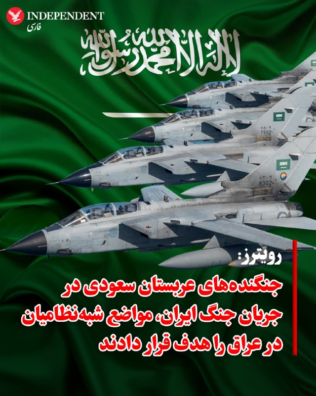

♦️ خبرگزاری رویترز روز چهارشنبه ۲۳ اردیبهشت به نقل از منابع آگاه گزارش داد که در جریان جنگ ایران، جنگنده‌های نیروی هوایی عربستان سعودی، اهداف متعلق به شبه‌نظامیان تحت حمایت تهران را در نزدیکی مرزهای شمالی خود با عراق بمباران کرده‌اند. این حملات که بخشی از آن در نزدیکی زمان شروع آتش‌بس رخ داده، مراکزی را هدف قرار داده است که از آن‌ها برای حملات پهپادی و موشکی به خاک عربستان سعودی و دیگر کشورهای خلیج فارس استفاده می‌شد.

هم‌زمان، منابع نظامی و امنیتی عراق از شلیک راکت از خاک کویت به سمت مواضع شبه‌نظامیان در جنوب عراق در حداقل دو نوبت خبر داده‌اند. در یکی از این حملات که در ماه آوریل انجام شد، چندین شبه‌نظامی کشته شده و یک مرکز ارتباطاتی و عملیات پهپادی متعلق به «کتائب حزب‌الله» منهدم شده است. رویترز اشاره کرد که هنوز مشخص نیست این پرتاب‌ها توسط ارتش کویت انجام شده یا نیروهای آمریکایی مستقر در این کشور؛ چرا که ارتش آمریکا از اظهارنظر در این باره خودداری کرده و دولت‌های کویت و عراق نیز به درخواست‌ها برای شفاف‌سازی پاسخ نداده‌اند.
‌🇸🇦 Indypersian

🤖 @VahidOOnLine

## VahidOOnLine — post 239966

  

خبرگزاری رویترز اعلام کرد که عربستان سعودی در جریان جنگ ایران، به مواضع شبه‌نظامیان مورد حمایت جمهوری اسلامی در عراق حمله کرده است.
بر اساس این گزارش، حملات عربستان سعودی توسط جنگنده‌های نیروی هوایی این کشور و علیه مواضع شبه‌نظامی وابسته به جمهوری اسلامی در نزدیکی مرز شمالی عربستان سعودی با عراق انجام شده است. بخشی از این حملات نیز هم‌زمان با آتش‌بس ۱۸ فروردین میان تهران و واشینگتن صورت گرفته است.
همچنین بر اساس ارزیابی‌های نظامی، منابع عراقی گفته‌اند در دست‌کم دو مورد، از خاک کویت حملات راکتی به عراق انجام شده است. رویترز نتوانسته مشخص کند این راکت‌ها توسط نیروهای مسلح کویت یا نیروهای آمریکایی مستقر در این کشور شلیک شده‌اند.
‌🏁 🇬🇧 IranintlTV

🤖 @VahidOOnLine

## FoxNewsTwitter — post 341667

  <a href="telegram/content/FoxNewsTwitter_341667_1778698531.mp4" target="_blank">🎬 Download video</a>

Fox News (Twitter/X)

JUST IN: Vice President JD Vance rips the Biden administration’s failure to prevent medical identity theft after a California psychotherapist was stripped of her benefits.

Vance highlights the doctor's case — 40 years in the medical field only to have her Medicare "turned off" because a fraudster exploited the system.

"A fraudster had stolen her identity and signed her up for healthcare services that she didn't need, and so she had been turned off of the healthcare services that she did need."

“This happens way too much in the United States of America. And it happens because until recently, we did not have a government or an administration that actually took the fraud program and took anti-fraud prevention seriously."

## IranIntlTV — post 337048

  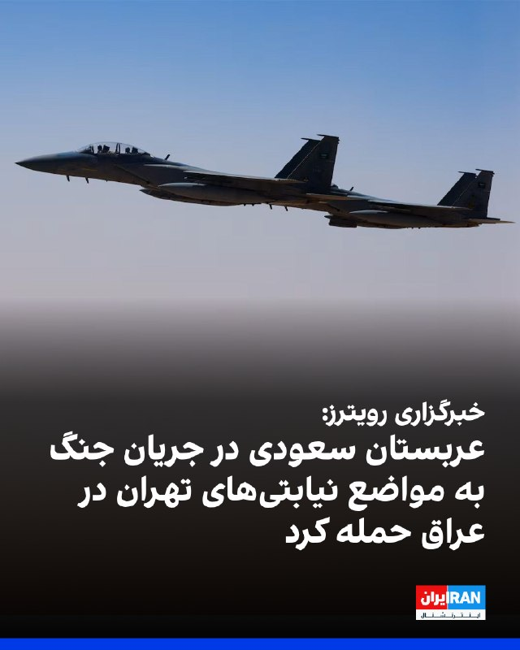

خبرگزاری رویترز اعلام کرد که عربستان سعودی در جریان جنگ ایران، به مواضع شبه‌نظامیان مورد حمایت جمهوری اسلامی در عراق حمله کرده است.
بر اساس این گزارش، حملات عربستان سعودی توسط جنگنده‌های نیروی هوایی این کشور و علیه مواضع شبه‌نظامی وابسته به جمهوری اسلامی در نزدیکی مرز شمالی عربستان سعودی با عراق انجام شده است. بخشی از این حملات نیز هم‌زمان با آتش‌بس ۱۸ فروردین میان تهران و واشینگتن صورت گرفته است.
همچنین بر اساس ارزیابی‌های نظامی، منابع عراقی گفته‌اند در دست‌کم دو مورد، از خاک کویت حملات راکتی به عراق انجام شده است. رویترز نتوانسته مشخص کند این راکت‌ها توسط نیروهای مسلح کویت یا نیروهای آمریکایی مستقر در این کشور شلیک شده‌اند.
https://iranintl.com/202605137468

## FarsiVOA — post 217656

اروپا در دو مسیر؛ از اعزام ناوهای ایتالیا و بریتانیا به تنگه هرمز تا ابتکار دیپلماتیک فرانسه

## FarsiVOA — post 217655

  <a href="telegram/content/FarsiVOA_217655_1778698533.mp4" target="_blank">🎬 Download video</a>

علم صالح در برنامه تفسیر خبر: جنگ باعث شد جمهوری اسلامی نفت خود را با قیمت ۱۰۳ دلار بفروشد

## Hranews — post 112936

اجرای حکم اعدام ۵ زندانی در زندان‌های مختلف کشور

❗️
❗️
❗️
❗️
❗️– طی روزهای اخیر، حکم پنج زندانی که پیشتر در پرونده‌های جداگانه از بابت اتهامات مرتبط با جرائم مواد مخدر و قتل به #اعدام محکوم شده بودند، در زندان‌های کرمان، تبریز، بیرجند و گرگان به اجرا درآمد.

ادامه مطلب

#یونس_براهویی
#ناصر_لنگرانی
#امید_صادقی_سوری
#حیدر_بامری
#مهدی_بامری

↘️
@hranews_bot تماس ✉️ -  @Hranews  کانال هرانا 🆑

## alonews — post 119804

  <a href="telegram/content/alonews_119804_1778698534.webm" target="_blank">🎬 Download video</a>

👈خبرنگار: آیا شما با موضع ترامپ موافقید که وضعیت مالی آمریکایی‌ها نباید در فرآیند تصمیم‌گیری درباره [ایران] مد نظر قرار گیرد؟

🔴جی‌دی ونس: خب، فکر نمی‌کنم رئیس‌جمهور چنین چیزی گفته باشد. به نظرم این تحریف سخنان رئیس‌جمهور است.

🔴اما ببینید، من با رئیس‌جمهور موافقم که ایران نباید سلاح هسته‌ای داشته باشد.

🔴هدف اساسی این است که رئیس‌جمهور می‌خواهد جهان را ایمن کند، اما به طور خاص، مردم آمریکا را از داشتن سلاح هسته‌ای توسط ایران ایمن نگه دارد.

🔴ما به وضعیت اقتصادی مردم آمریکا اهمیت می‌دهیم. ما همچنین چالش‌های متعدد دیگری هم داریم. طبیعتاً رئیس‌جمهور باید به طور همزمان با همه این چالش‌ها مواجه شود.

✅ @AloNews خبر جنگ

---
📅 بروزرسانی: 1405/02/23 22:14
---

## VahidOOnLine — post 239965

  <a href="telegram/content/VahidOOnLine_239965_1778697857.mp4" target="_blank">🎬 Download video</a>

واتس‌اپ قابلیت جدیدی به نام «حالت ناشناس» برای چت با هوش مصنوعی متا معرفی کرده که در آن، گفتگوها ذخیره یا قابل مشاهده نخواهند بود؛ حتی برای خود شرکت متا.
واتس‌اپ می‌گوید این قابلیت برای گفتگو درباره موضوعات حساسی مثل سلامت، روابط و مسائل مالی طراحی شده است.
با این حال، کارشناسان هشدار داده‌اند حذف کامل تاریخچه چت‌ها می‌تواند در صورت بروز آسیب یا سوءاستفاده، پیگیری مسئولیت را دشوار کند.
‌🏁 🇬🇧 ManotoTV

🤖 @VahidOOnLine

## VahidOOnLine — post 239964

  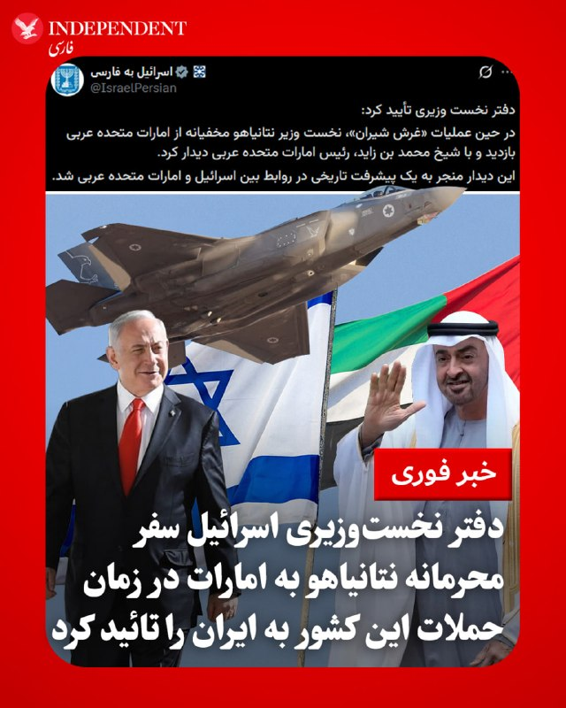

♦️ حساب رسمی وزارت امور خارجه اسرائیل، روز چهارشنبه ۲۳ اردیبهشت، در شبکه اجتماعی ایکس با انتشار پیامی به نقل از دفتر نخست‌وزیری این کشور، سفر محرمانه بنیامین نتانیاهو به امارات متحده در زمان حملات به ایران را تایید کرد. دفتر نتانیاهو اعلام کرد که نخست‌وزیر اسرائیل در این سفر با شیخ محمد بن زاید، رئیس امارات متحده عربی دیدار کرده و این دیدار منجر به «یک پیشرفت تاریخی» در روابط دو کشور شده است.

پیش از این گزارش‌هایی از انتقال سامانه دفاعی گنبد آهنین اسرائیل به امارات متحده نیز مطرح شده بود که از سوی مایک هاکبی، سفیر آمریکا در اسرائیل نیز تایید شد. همچنین گزارش‌هایی نیز از انجام حملاتی علیه جمهوری اسلامی از سوی امارات متحده منتشر شده است.
‌🇸🇦 Indypersian

🤖 @VahidOOnLine

## mwarmonitor — post 9053

  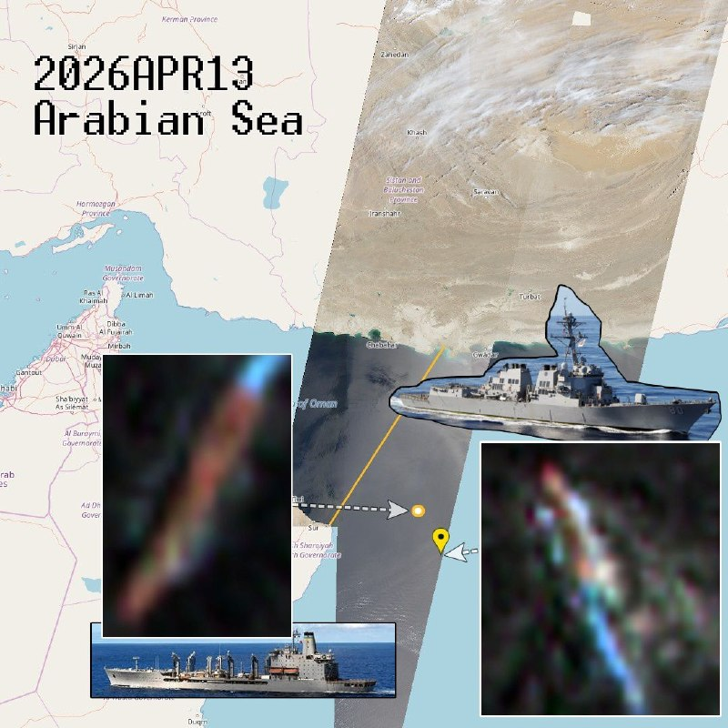

🇺🇸کشتی USNS Henry J. Kaiser (T-AO-187) متعلق به نیروی دریایی آمریکا و یک ناوشکن آمریکایی امروز در دریای عرب در مختصات زیر مشاهده شده‌اند:

📍22.7488, 61.2222 و 22.0751, 61.5995

🚢نفتکش گروه ضربتی ناو هواپیمابر ۳ (CSG-3) در حال انجام عملیات سوخت‌رسانی در دریا (Replenishment-at-sea) بوده و ناوشکن نیز در حال انجام عملیات دفاع چندبُعدی و مأموریت‌های امنیت دریایی است.

@mwarmonitor

## farsi_fox_news — post 89292

♦️ رویترز: عربستان و کویت در میانه جنگ ایران، حملاتی به عراق انجام دادند و پایگاه برخی گروه‌های عراقی را بمباران کردند
🌐 @farsi_fox_news

## FoxNewsTwitter — post 341666

  <a href="telegram/content/FoxNewsTwitter_341666_1778697859.mp4" target="_blank">🎬 Download video</a>

Fox News (Twitter/X)

NEW: VP Vance calls out officials in Hawaii for refusing to crack down on Medicaid fraud in the state:

"Guess how many convictions or indictments has Hawaii had over the last few years in its Medicaid fraud program? The answer is zero."

"Not a single indictment, not a single conviction, because the administrators of the Hawaii program just don't take it seriously. They don't think that fraud is a big enough problem."

## FoxNewsTwitter — post 341665

  <a href="telegram/content/FoxNewsTwitter_341665_1778697861.mp4" target="_blank">🎬 Download video</a>

Fox News (Twitter/X)

JUST IN: Vice President JD Vance reveals how fraudulent healthcare providers are taking advantage of patients and exploiting the American taxpayer:

"You have people who've been prescribed medications that they don't even need.

“Sometimes they've had drugs put into their bodies that they don't need because fraudsters have actually encouraged false prescriptions and false administration to medications.”

“It's a defrauding of the American taxpayer, but it's a violation of the trust that should exist between every American and the people who prescribe the medications."

## pm_afshaa — post 90708

  <a href="telegram/content/pm_afshaa_90708_1778697862.webm" target="_blank">🎬 Download video</a>

🔴علی‌آبادی، وزیر نیرو: با همکاری مردم و افزایش ظرفیت تولید، وضعیت امسال از سال گذشته به مراتب بهتر خواهد بود و امیدواریم تابستان بدون خاموشی سپری بشه.

💧 Rainbet.com the #1 Non-KYC Crypto Casino & Sportsbook @rainbetcom

😁 @Pm_Afshaa

## pm_afshaa — post 90707

  <a href="telegram/content/pm_afshaa_90707_1778697863.webm" target="_blank">🎬 Download video</a>

🔴بلومبرگ: صادرات نفت ایران از جزیره خارک برای اولین بار از زمان شروع جنگ متوقف شده و تصاویر ماهواره‌ای نشان میده که مخازن ذخیره‌سازی نفت تقریباً به ظرفیت کامل خود رسیدن.

💧 Rainbet.com the #1 Non-KYC Crypto Casino & Sportsbook @rainbetcom

😁 @Pm_Afshaa

## iaghapour — post 2607

✍🏻 دوستان عزیز، همون‌طور که احتمالاً متوجه شدید، در یک هفته گذشته به دلایل مختلفی فعالیت ما کمتر شده.

🔹در این مدت پیام‌های زیادی داشتیم که درخواست آموزش «روش جدید سنایی» رو داشتن. وقتی بررسی کردیم، متوجه شدیم خود ایشون زحمت تهیه ویدیوی آموزشی رو کشیدن؛ بنابراین نیازی به آموزش مجدد نبود.

🔸برای اطمینان بیشتر، این آموزش رو به چند نفر از دوستان دادیم تا تست کنن. بیشتر افراد موفق به اجرا نشدن، اما یکی از کاربران تونست متصل بشه. طبق بررسی‌های ایشون، این روش به‌شدت به رنج آی‌پی‌ها (هم سرور ایران و هم خارج) وابسته است. مشکل اصلی اینجاست که بعد از اتصال و مصرف حجم کمی از اینترنت، ارتباط قطع می‌شه و باید آی‌پی رو عوض کرد؛ هرچند آی‌پی قبلی بعد از ۱ تا ۲ ساعت دوباره قابل استفاده می‌شه.

🔻متأسفانه در این بین، عده‌ای بدون این‌که تست درستی از پایداری تانل بگیرن، شروع به آموزش کردن که نتیجه‌اش فقط ضرر مالی برای کاربران بوده. چون کاربرا رفتن سرورهای گرون قیمت رو خریداری کردن که البته تعداد این افراد اصلا کم نبوده. (نمونه‌اش رو در عکس ضمیمه می‌بینید).

🟢 در مجموع، به نظر می‌رسه این روش هنوز پایدار نیست، اما از بچه‌های تیم خواستیم تست‌های بیشتری روش انجام بدن. اگر خودتون هم مایلید آموزش رو ببینید، می‌تونید مستقیماً به کانال یا گروه سنایی مراجعه کنید.

🆔 @iaghapour

## VahidOnline — post 75452

  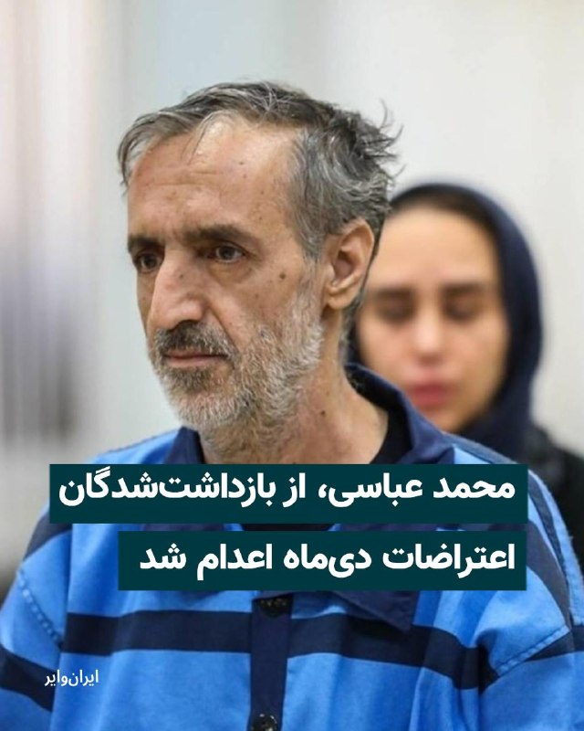

محمد عباسی، از بازداشت‌شدگان اعتراضات سراسری دی‌ماه ۱۴۰۴، سحرگاه روز چهارشنبه ۲۳ اردیبهشت در زندان قزلحصار اعدام شد.

یک منبع مطلع نزدیک به خانواده محمد عباسی با اعلام این خبر به خبرگزاری هرانا گفت مسوولان زندان قزلحصار از خانواده او خواسته بودند برای ملاقات به زندان مراجعه کنند، اما پس از حضور خانواده، امکان ملاقات از آن‌ها سلب شد.
به گفته این منبع، خانواده عباسی پس از ترک زندان، در تماس تلفنی از اجرای حکم اعدام او مطلع شدند.
@VahidHeadline

📡 @VahidOnline

## IranIntlTV — post 337047

  <a href="telegram/content/IranIntlTV_337047_1778697863.mp4" target="_blank">🎬 Download video</a>

۲۴ با فرداد فرحزاد

@iranintltv

## ManotoTV — post 105414

  <a href="telegram/content/ManotoTV_105414_1778697864.mp4" target="_blank">🎬 Download video</a>

واتس‌اپ قابلیت جدیدی به نام «حالت ناشناس» برای چت با هوش مصنوعی متا معرفی کرده که در آن، گفتگوها ذخیره یا قابل مشاهده نخواهند بود؛ حتی برای خود شرکت متا.
واتس‌اپ می‌گوید این قابلیت برای گفتگو درباره موضوعات حساسی مثل سلامت، روابط و مسائل مالی طراحی شده است.
با این حال، کارشناسان هشدار داده‌اند حذف کامل تاریخچه چت‌ها می‌تواند در صورت بروز آسیب یا سوءاستفاده، پیگیری مسئولیت را دشوار کند.

## FarsiVOA — post 217654

  <a href="telegram/content/FarsiVOA_217654_1778697865.mp4" target="_blank">🎬 Download video</a>

مهدی عربشاهی در برنامه تفسیر خبر: علی خامنه‌ای با کلمه توسعه مشکل داشت

## FarsiVOA — post 217653

اعدام احسان افراشته، زندانی سیاسی، توسط جمهوری اسلامی؛ گفت‌وگو با حسین احمدی‌نیاز

## FarsiVOA — post 217652

🔺تشدید فضای امنیتی در بند زنان زندان اوین؛ محرومیت شماری از زندانیان سیاسی از حق تماس و ملاقات

◾️ در‌پی تشدید فضای امنیتی در بند زنان زندان اوین، هشت زندانی سیاسی زن، به بهانه حضور در «برنامه‌های اعتراضی»، از حق تماس و ملاقات با خانواده و وکلای خود محروم شدند.

⬇️ بیشتر بخوانید:

https://ir.voanews.com/a/evin-prison-women-prisoners-political-prisoners-iran-deprivation/8149620.html

## FarsiVOA — post 217651

امیر سلطانی در برنامه تفسیر خبر: ما دوباره نیاز به ملی کردن نفت ایران داریم

## FarsiVOA — post 217650

اشکان خسروپور، پژوهشگر سیاست‌گذاری اینترنت، می‌گوید بر اساس سند راهبردی جمهوری اسلامی، مدیریت اینترنت اساساً خارج از کنترل دولت‌ها است و ایجاد «ستاد ویژه» به ریاست محمدرضا عارف، معاون مسعود پزشکیان، صرفا جنبه نمایشی دارد.

## FarsiVOA — post 217649

  <a href="telegram/content/FarsiVOA_217649_1778697866.mp4" target="_blank">🎬 Download video</a>

ارتش اسرائیل تصاویری از هدف‌گیری نیروها و مواضع حزب‌الله در جنوب لبنان منتشر کرده است.

این ارتش اعلام کرد از ابتدای درگیری‌ها، «بیش از ۴۰۰ تروریست از جمله اعضای یگان «رضوان» را به هلاکت رسانده و بیش از ۱۰۰۰ سلاح» متعلق به حزب‌الله را شناسایی کرده‌اند.

بنابر بیانیه ارتش اسرائیل نیروهای واحد جمع‌آوری اطلاعات «شَحَف» (۸۶۹) بیش از ۱۲۰ تروریست را شناسایی و حذف کرده و ده‌ها زیرساخت تروریستی، از جمله مقرهای سازمان تروریستی حزب‌الله را نابود کرده‌اند.

این ویدیو بی‌صدا است.

## IranianMinds — post 20087

  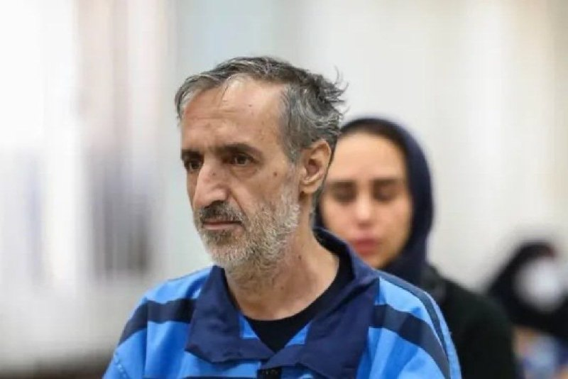

🔴 اکانت اسرائیل به فارسی:

محمد عباسی و دخترش فاطمه در دی‌ماه دستگیر شدند.
محمد را بدون ملاقات آخر، امروز صبح اعدام کردند.
جمهوری اسلامی روی خون مردمش حکومت می‌کند.

@IranianMinds

## Dirty_Kids — post 389397

  <a href="telegram/content/Dirty_Kids_389397_1778697868.webm" target="_blank">🎬 Download video</a>

🔴بلومبرگ: صادرات نفت ایران از جزیره خارک برای اولین بار از زمان شروع جنگ متوقف شده و تصاویر ماهواره‌ای نشان میده که مخازن ذخیره‌سازی نفت تقریباً به ظرفیت کامل خود رسیدن.

@Dirty_Kids 👻

## Dirty_Kids — post 389396

  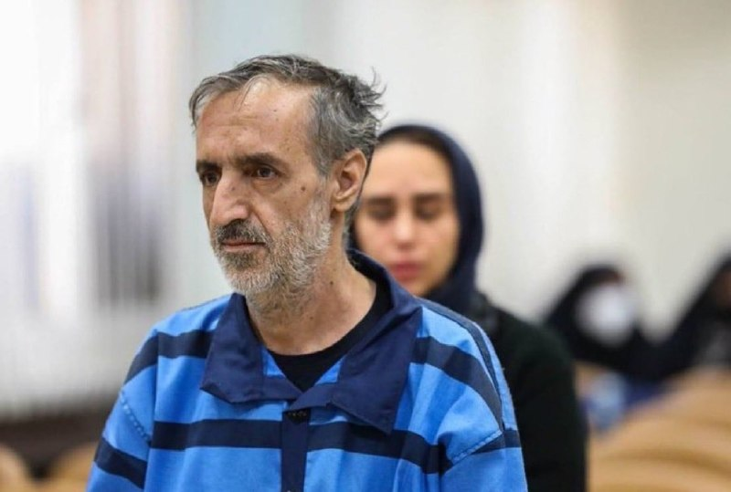

صلواتی خونخوار حکم اعدام ‎#محمد_عباسی رو داد و جمهوری اسلامی امروز مخفیانه طناب دار رو دور گردنش انداخت.

@Dirty_Kids 👻

## Dirty_Kids — post 389395

  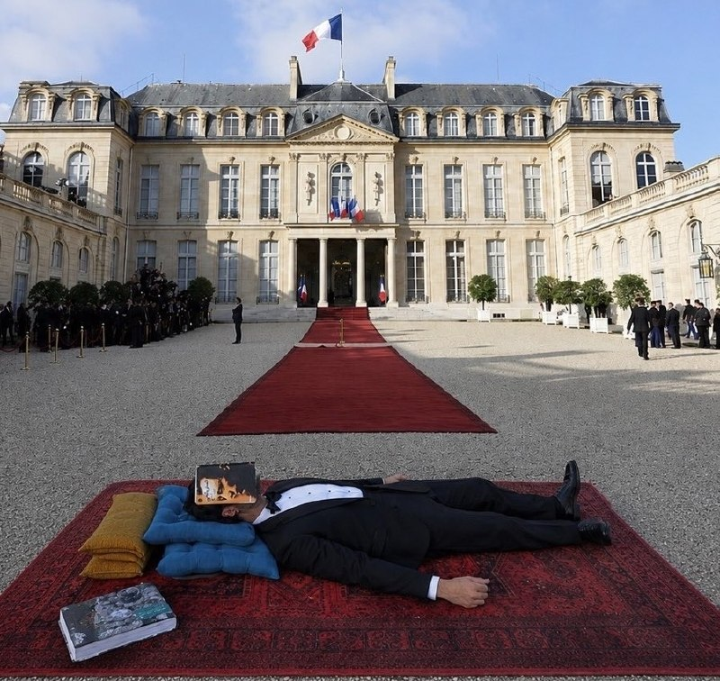

علی قمصری در کاخ الیزه در واکنش به رابطه «گلشیفته و مکرون»

@Dirty_Kids 👻

## Dirty_Kids — post 389394

  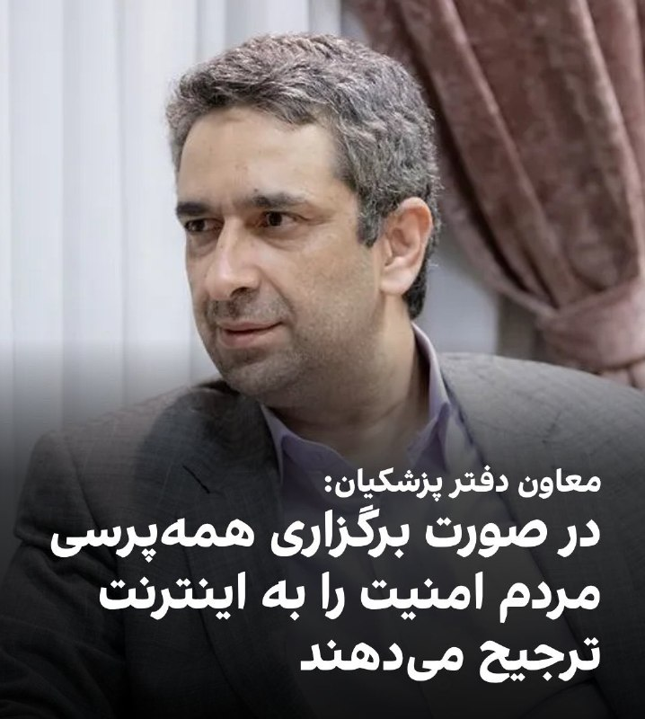

شما غلط کردی با صاحابت.
از طرف مردم گه نخور.

@Dirty_Kids 👻

## manototv — post 105414

  <a href="telegram/content/manototv_105414_1778697869.mp4" target="_blank">🎬 Download video</a>

واتس‌اپ قابلیت جدیدی به نام «حالت ناشناس» برای چت با هوش مصنوعی متا معرفی کرده که در آن، گفتگوها ذخیره یا قابل مشاهده نخواهند بود؛ حتی برای خود شرکت متا.
واتس‌اپ می‌گوید این قابلیت برای گفتگو درباره موضوعات حساسی مثل سلامت، روابط و مسائل مالی طراحی شده است.
با این حال، کارشناسان هشدار داده‌اند حذف کامل تاریخچه چت‌ها می‌تواند در صورت بروز آسیب یا سوءاستفاده، پیگیری مسئولیت را دشوار کند.

## alonews — post 119803

  <a href="telegram/content/alonews_119803_1778697870.webm" target="_blank">🎬 Download video</a>

👈ادعای نیویورک تایمز: شرکت‌‌های چینی به دنبال فروش سلاح به ایران هستند و قصد دارند آنها را از طریق کشورهای دیگر ارسال کنند تا منبع خود را پنهان کنند

✅ @AloNews خبر جنگ

## alonews — post 119802

  <a href="telegram/content/alonews_119802_1778697870.webm" target="_blank">🎬 Download video</a>

👈کانال ۱۲ اسرائیل به نقل از یک منبع نظامی گزارش داد: حزب‌الله از ابتدای جنگ ۴۵۰ پهپاد پرتاب کرده است که شامل ۱۲۰ پهپادی است که با استفاده از فیبر نوری عمل می‌کنند

✅ @AloNews خبر جنگ

<!-- MSG END -->

<!-- NAV START -->

<a href="https://github.com/ali-exifit/aio-downloader/blob/main/telegram/content/archive_1.md" style="display:inline-block; padding:6px 12px; margin:0 4px; background-color:#2ea44f; color:white; text-decoration:none; border-radius:4px; font-weight:bold;">صفحه بعد</a>

<!-- NAV END -->
