## 1405/02/16 23:20 — VahidOOnLine
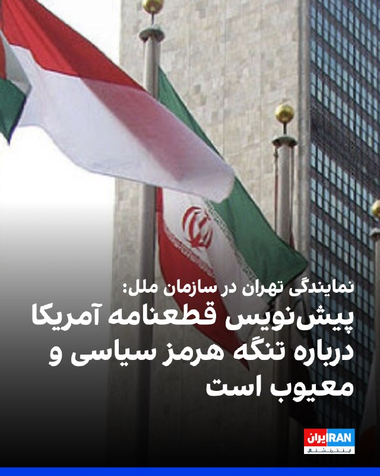

> همزمان با پایان نشست غیرعلنی شورای امنیت درباره بحران خاورمیانه، حساب رسمی نمایندگی دائم جمهوری اسلامی در سازمان ملل در شبکه اجتماعی ایکس، آمریکا را به مانع‌تراشی در مسیر حل بحران متهم کرد و پیش‌نویس قطعنامه پیشنهادی در این جلسه را «معیوب» و متاثر از «انگیزه‌های سیاسی» خواند.
> 
> در این پست آمده است: «آمریکا با پیش کشیدن پیش‌نویس قطعنامه‌ای معیوب و با انگیزه‌های سیاسی در شورای امنیت سازمان ملل، آن هم به بهانه «آزادی کشتیرانی»، در پی پیشبرد دستور کار سیاسی خود و مشروعیت‌بخشی به اقدامات غیرقانونی است؛ نه حل بحران.»
> 
> نمایندگی دائم جمهوری اسلامی در سازمان ملل «تنها راه‌حل عملی» برای پایان دادن به بحران کشتیرانی در تنگه هرمز را «پایان دائمی جنگ و، رفع محاصره دریایی» خواند.
> 
> این نمایندگی همچنین از کشورهای عضو شورای امنیت خواست بر پایه «منطق، انصاف و اصول» عمل کنند، این پیش‌نویس را رد کنند و از حمایت از آن بپرهیزند.
> ‌🏁 🇬🇧 IranintlTV
> 
> 🤖 @VahidOOnLine

## 1405/02/16 23:19 — IranIntlTV

> همزمان با پایان نشست غیرعلنی شورای امنیت درباره بحران خاورمیانه، حساب رسمی نمایندگی دائم جمهوری اسلامی در سازمان ملل در شبکه اجتماعی ایکس، آمریکا را به مانع‌تراشی در مسیر حل بحران متهم کرد و پیش‌نویس قطعنامه پیشنهادی در این جلسه را «معیوب» و متاثر از «انگیزه‌های سیاسی» خواند.
> 
> در این پست آمده است: «آمریکا با پیش کشیدن پیش‌نویس قطعنامه‌ای معیوب و با انگیزه‌های سیاسی در شورای امنیت سازمان ملل، آن هم به بهانه «آزادی کشتیرانی»، در پی پیشبرد دستور کار سیاسی خود و مشروعیت‌بخشی به اقدامات غیرقانونی است؛ نه حل بحران.»
> 
> نمایندگی دائم جمهوری اسلامی در سازمان ملل «تنها راه‌حل عملی» برای پایان دادن به بحران کشتیرانی در تنگه هرمز را «پایان دائمی جنگ و، رفع محاصره دریایی» خواند.
> 
> این نمایندگی همچنین از کشورهای عضو شورای امنیت خواست بر پایه «منطق، انصاف و اصول» عمل کنند، این پیش‌نویس را رد کنند و از حمایت از آن بپرهیزند.
> https://iranintl.com/202605063241

## 1405/02/16 23:19 — IranianMinds
> 🔴منابع عربی:
> 
> ایران پیامی فوری به واسطه پاکستانی درباره ترور در بیروت ارسال کرد.
> 
> @IranianMinds

## 1405/02/16 23:15 — IranIntlTV
> 🎧نسخه صوتی ‌‌‏۲۴ با فرداد فرحزاد: پیام‌های متناقض ترامپ در میانه جنگ و صلح با جمهوری اسلامی
> @iranintlTV

## 1405/02/16 23:14 — VahidOOnLine

> به گزارش کانال ۱۲ اسرائیل، دیوید آلبرایت، بازرس پیشین هسته‌ای سازمان ملل و رییس موسسه «علوم و امنیت بین‌الملل»، گفت هرگونه توافق هسته‌ای با جمهوری اسلامی باید شامل خروج کامل همه ذخایر اورانیوم غنی‌شده باشد، نه فقط ذخایر با غنای بالا.
> 
> او هم‌زمان با افزایش تلاش‌های آمریکا برای دستیابی به توافق با تهران افزود هدف باید خارج کردن تمام ۱۰ تن اورانیوم غنی‌شده از ایران باشد و تاکید کرد باقی ماندن بخش قابل توجهی از این ذخایر به معنای توافقی بد خواهد بود.
> ‌🏁 🇬🇧 IranintlTV
> 
> 🤖 @VahidOOnLine

## 1405/02/16 23:13 — IranIntlTV
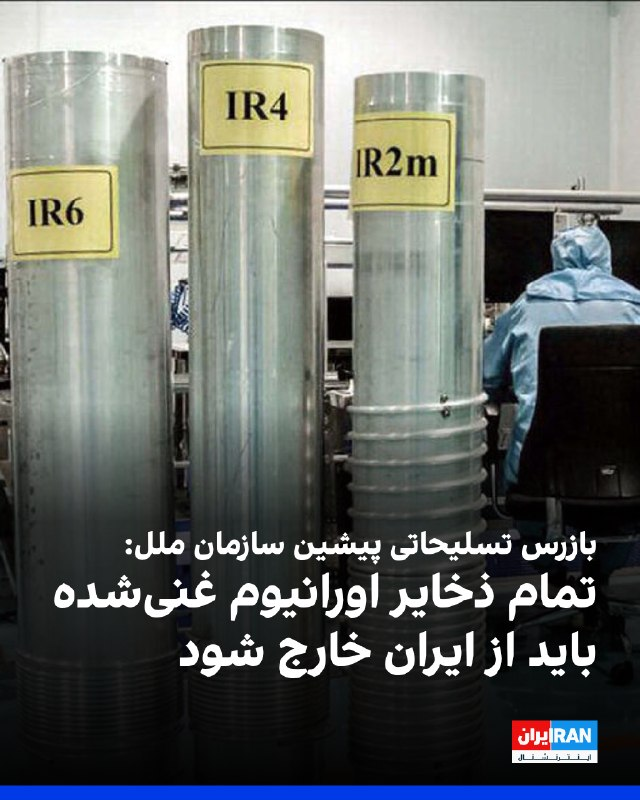

> به گزارش کانال ۱۲ اسرائیل، دیوید آلبرایت، بازرس پیشین هسته‌ای سازمان ملل و رییس موسسه «علوم و امنیت بین‌الملل»، گفت هرگونه توافق هسته‌ای با جمهوری اسلامی باید شامل خروج کامل همه ذخایر اورانیوم غنی‌شده باشد، نه فقط ذخایر با غنای بالا.
> 
> او هم‌زمان با افزایش تلاش‌های آمریکا برای دستیابی به توافق با تهران افزود هدف باید خارج کردن تمام ۱۰ تن اورانیوم غنی‌شده از ایران باشد و تاکید کرد باقی ماندن بخش قابل توجهی از این ذخایر به معنای توافقی بد خواهد بود.
> https://iranintl.com/202605065384

## 1405/02/16 23:10 — VahidOOnLine
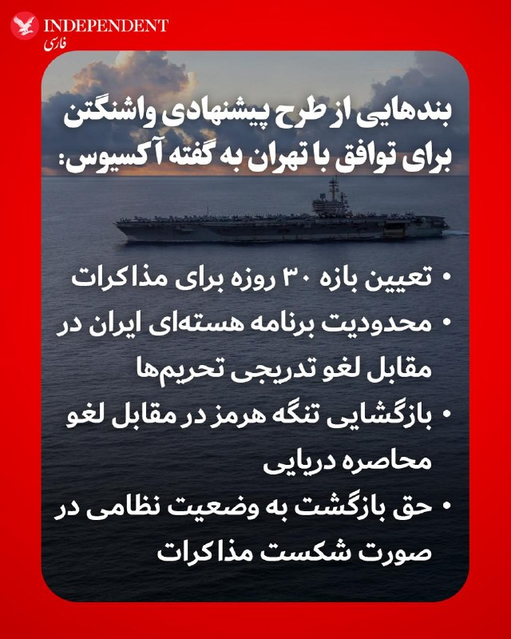

> ♦️وبسایت آکسیوس، روز چهارشنبه ۱۶ اردیبهشت در گزارشی اختصاصی جزئیاتی از یادداشت تفاهمی که از سوی واشنگتن به تهران پیشنهاد شده را ارائه داد.
> 
> به گفته آکسیوس، این یادداشت تفاهم (MOU) تک‌صفحه‌ای و ۱۴ ماده‌ای، بین فرستادگان ترامپ، استیو ویتکوف و جرد کوشنر، و چندین مقام جمهوری اسلامی به‌صورت مستقیم و از طریق میانجی‌ها در حال مذاکره است.
> 
> در شکل فعلی، این یادداشت تفاهم پایان جنگ در منطقه و آغاز یک دوره ۳۰ روزه مذاکره برای دستیابی به توافقی دقیق جهت بازگشایی تنگه، محدود کردن برنامه هسته‌ای ایران و لغو تحریم‌های ایالات متحده را اعلام می‌کند. به گفته دو منبع آگاه، این مذاکرات ممکن است در اسلام‌آباد یا ژنو برگزار شود.
> 
> یک مقام آمریکایی به آکسیوس گفت که محدودیت‌های ایران بر کشتیرانی در تنگه و محاصره دریایی ایالات متحده، در طول این دوره ۳۰ روزه به تدریج لغو خواهند شد. این مقام افزود در صورت شکست مذاکرات، نیروهای آمریکایی قادر خواهند بود محاصره را بازگردانده یا اقدامات نظامی را از سر بگیرند.
> ‌🇸🇦 Indypersian
> 
> 🤖 @VahidOOnLine

## 1405/02/16 23:09 — DEJradio

> 🤡
> 🔺 محسن رضایی: باید در میدان جنگ با آمریکایی‌ها به تنیجه برسیم
> 
> محسن رضایی در گفتگویی با اشاره به تحولات اخیر منطقه، مدعی شد که جمهوری اسلامی اجازه نخواهد داد واشنگتن بدون پرداخت هزینه از بحران خارج شود.
> 
> رضایی افزود: «اینجا میدان جنگ است و باید در مواجهه با آمریکایی‌ها به نتیجه نهایی برسیم و دستاوردهای خود را از این جنگ برداشت کنیم.»
> 
> پیش از این ترامپ گفته بود لحن و گفتار مقامات جمهوری اسلامی در صحبت‌های تلفنی با او بسیار متفاوت از حرف های آنها در رسانه هاست. او تاکید کرده بود که مقامات جمهوری اسلامی از هر راهی تلاش می‌کنند تا با دولت ترامپ به توافق برسند.
> 
> #حملات_هدفمند #جمهوری_اسلامی
> @DEJradio

## 1405/02/16 23:07 — VahidOOnLine

> نمایندگی امارات متحده عربی در سازمان ملل، چهارشنبه ۱۶ اردیبهشت، با انتشار پستی در شبکه اجتماعی ایکس، با اشاره به مباحث کمیته‌های اول و دوم کنفرانس بازنگری پیمان منع گسترش سلاح‌های هسته‌ای، ان‌پی‌تی، اعلام کرد برنامه هسته‌ای ایران را نمی‌توان از «رفتارهای خصمانه و تروریستی» تهران در منطقه جدا دانست.
> 
> امارات متحده عربی تاکید کرد هرگونه گفت‌وگو درباره پرونده هسته‌ای جمهوری اسلامی باید تهدیدهای موجود را به‌طور کامل در نظر بگیرد.
> 
> این کشور همچنین حملات اخیر منتسب به حکومت ایران علیه تاسیسات حیاتی غیرنظامی را محکوم کرد و آن را «تشدیدی خطرناک» خواند.
> 
> نمایندگی امارات متحده عربی از جامعه جهانی خواست رویکردی جامع در قبال تهران در پیش بگیرد؛ رویکردی که هم‌زمان برنامه هسته‌ای، برنامه موشکی و رفتارهای بی‌ثبات‌کننده جمهوری اسلامی را شامل شود.
> 
> امارات متحده عربی همچنین درباره غنی‌سازی ۶۰ درصدی اورانیوم هشدار داد و گفت این سطح از غنی‌سازی تهدیدی برای امنیت منطقه‌ای و بین‌المللی است.
> ‌🏁 🇬🇧 IranintlTV
> 
> 🤖 @VahidOOnLine

## 1405/02/16 23:06 — IranIntlTV
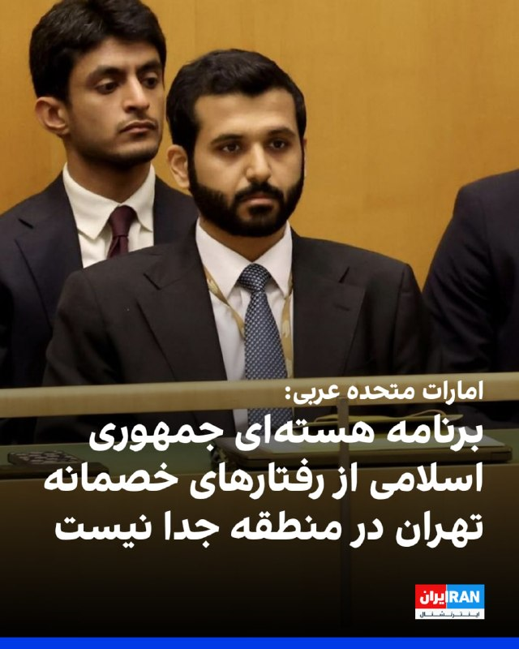

> نمایندگی امارات متحده عربی در سازمان ملل، چهارشنبه ۱۶ اردیبهشت، با انتشار پستی در شبکه اجتماعی ایکس، با اشاره به مباحث کمیته‌های اول و دوم کنفرانس بازنگری پیمان منع گسترش سلاح‌های هسته‌ای، ان‌پی‌تی، اعلام کرد برنامه هسته‌ای ایران را نمی‌توان از «رفتارهای خصمانه و تروریستی» تهران در منطقه جدا دانست.
> 
> امارات متحده عربی تاکید کرد هرگونه گفت‌وگو درباره پرونده هسته‌ای جمهوری اسلامی باید تهدیدهای موجود را به‌طور کامل در نظر بگیرد.
> 
> این کشور همچنین حملات اخیر منتسب به حکومت ایران علیه تاسیسات حیاتی غیرنظامی را محکوم کرد و آن را «تشدیدی خطرناک» خواند.
> 
> نمایندگی امارات متحده عربی از جامعه جهانی خواست رویکردی جامع در قبال تهران در پیش بگیرد؛ رویکردی که هم‌زمان برنامه هسته‌ای، برنامه موشکی و رفتارهای بی‌ثبات‌کننده جمهوری اسلامی را شامل شود.
> 
> امارات متحده عربی همچنین درباره غنی‌سازی ۶۰ درصدی اورانیوم هشدار داد و گفت این سطح از غنی‌سازی تهدیدی برای امنیت منطقه‌ای و بین‌المللی است.

## 1405/02/16 23:04 — Persian_Trend_Official
> حدود نیم ساعت دیگه لایو داریم

## 1405/02/16 23:03 — IranianMinds
> 🔴یسرائیل کاتز وزیر دفاع اسرائیل ، از ترور هدفمند فرمانده گردان رضوان، مالک بلوت در بیروت خبر داد.
> 
> @IranianMinds

## 1405/02/16 22:57 — Hranews

> فدراسیون مدیریت و مشاوران کسب‌وکار ایران با انتشار بیانیه‌ای نسبت به تداوم محدودیت‌ها و سیاست‌های تبعیض‌آمیز اینترنتی هشدار داد و اعلام کرد که اینترنت دیگر صرفاً یک ابزار ارتباطی نیست، بلکه زیرساخت حیاتی اقتصاد دیجیتال محسوب می‌شود. در این بیانیه تأکید شده که اختلال و بی‌ثباتی در دسترسی به #اینترنت، مستقیماً بر تولید، اشتغال، سرمایه‌گذاری و رقابت‌پذیری اقتصاد کشور تأثیر می‌گذارد و بسیاری از کسب‌وکارهای دیجیتال را با کوچک شدن یا نابودی مواجه کرده است. به گفته این فدراسیون، وضعیت موجود می‌تواند به شکل‌گیری موجی از بیکاری تدریجی منجر شود که از لایه‌های پنهان آغاز شده و به‌مرور به سطح جامعه منتقل می‌شود.
> 
> در بخش دیگری از این بیانیه، نسبت به پیامدهای بلندمدت این وضعیت بر سرمایه انسانی هشدار داده شده و آمده است که بی‌ثباتی مداوم اینترنت، فعالیت نیروهای متخصص را مختل کرده و تصمیم آنها برای ماندن در کشور را تغییر می‌دهد. این فدراسیون همچنین تأکید کرده که سیاست‌هایی مانند «اینترنت طبقاتی» نه‌تنها مشکلات موجود را حل نمی‌کند، بلکه به تشدید نابرابری، افزایش رانت و تضعیف رقابت در اقتصاد دیجیتال منجر خواهد شد.
> 
> ↘️
> @hranews_bot تماس ✉️ -  @Hranews  کانال هرانا 🆑

## 1405/02/16 22:56 — VahidOOnLine
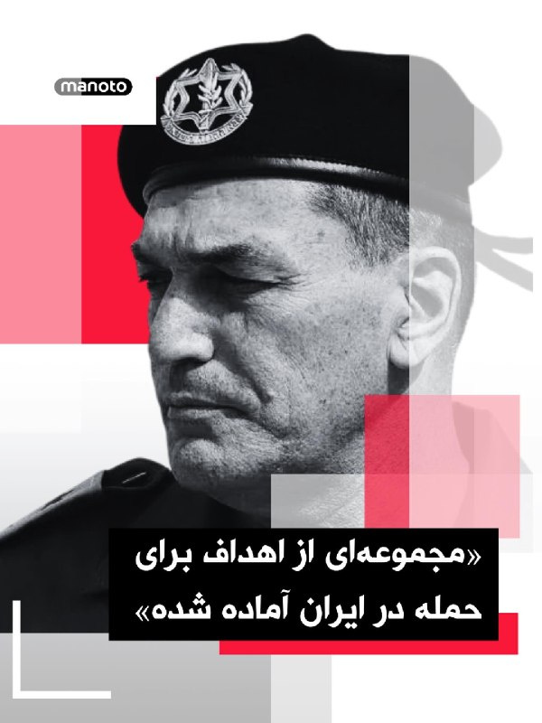

> ایال زمیر، رئیس ستاد ارتش اسرائیل گفت مجموعه‌ای از اهداف بیشتری برای حمله در ایران آماده شده است و این کشور در «بالاترین سطح آماده‌باش» قرار دارد تا در صورت لزوم عملیات گسترده‌تری را از سر بگیرد.
> 
> رئیس ستاد ارتش اسرائیل پس از بازدید از جنوب لبنان به کشته شدن «بیش از ۲ هزار» عضو حزب‌الله اشاره کرد و گفت:
> «ما یک فرصت تاریخی برای تغییر واقعیت منطقه‌ای در چارچوب یک عملیات چندجبهه‌ای داریم. همکاری و هماهنگی با ارتش آمریکا ادامه دارد و ما وضعیت را زیر نظر داریم.»
> ‌🏁 🇬🇧 ManotoTV
> 
> 🤖 @VahidOOnLine

## 1405/02/16 22:56 — VahidOOnLine

> وزارت امور خارجه امارات متحده عربی در بیانیه‌ای اظهارات اخیر وزارت امور خارجه جمهوری اسلامی را «خصمانه» خواند و آن را به‌شدت محکوم کرد.
> 
> در این بیانیه تأکید شده امارات هرگونه ادعا یا تهدید علیه حاکمیت، امنیت ملی و استقلال تصمیم‌گیری خود را «به‌طور قاطع» رد می‌کند.
> 
> این وزارتخانه اعلام کرد روابط بین‌المللی و دفاعی امارات موضوعی «کاملاً حاکمیتی» است و هیچ کشوری حق ندارد از آن برای تهدید یا دخالت استفاده کند.
> 
> در ادامه آمده هرگونه تهدید علیه امنیت کشور، تأسیسات حیاتی یا شهروندان «غیرقابل قبول» است و با اصول حقوق بین‌الملل و منشور سازمان ملل مغایرت دارد.
> 
> وزارت امور خارجه امارات همچنین اعلام کرد این کشور همه حقوق خود را برای پاسخ به هرگونه اقدام خصمانه محفوظ می‌داند و تأکید کرد فشارها و اتهامات، مواضع امارات را تغییر نخواهد داد.
> ‌🏁 🇬🇧 ManotoTV
> 
> 🤖 @VahidOOnLine

## 1405/02/16 22:56 — VahidOOnLine

> در شرایطی که برنامه‌های تدارکاتی تیم فوتبال ایران پیش از جام جهانی با اختلال روبه‌رو شده، این تیم دومین دیدار درون‌تیمی خود را در ورزشگاه پاس قوامین برگزار کرد.
> 
> این مسابقه بدون حضور تماشاگر انجام شد، اما به‌صورت زنده از صداوسیمای جمهوری اسلامی پخش شد و با استفاده از سیستم کمک‌داور ویدیویی نیز همراه بود.
> 
> در این دیدار، تیم سفید با نتیجه سه بر یک پیروز شد. اسماعیل بقایی، سخنگوی وزارت امور خارجه، از جمله افرادی بود که این بازی را از نزدیک تماشا کرد.
> 
> پیش از این قرار بود تیم فوتبال ایران در اردوی ترکیه به مصاف تیم‌های مقدونیه و آنگولا برود، اما این دو تیم از انجام این دیدارها انصراف دادند.
> ‌🏁 🇬🇧 ManotoTV
> 
> 🤖 @VahidOOnLine

## 1405/02/16 22:55 — ManotoTV

> ایال زمیر، رئیس ستاد ارتش اسرائیل گفت مجموعه‌ای از اهداف بیشتری برای حمله در ایران آماده شده است و این کشور در «بالاترین سطح آماده‌باش» قرار دارد تا در صورت لزوم عملیات گسترده‌تری را از سر بگیرد.
> 
> رئیس ستاد ارتش اسرائیل پس از بازدید از جنوب لبنان به کشته شدن «بیش از ۲ هزار» عضو حزب‌الله اشاره کرد و گفت:
> «ما یک فرصت تاریخی برای تغییر واقعیت منطقه‌ای در چارچوب یک عملیات چندجبهه‌ای داریم. همکاری و هماهنگی با ارتش آمریکا ادامه دارد و ما وضعیت را زیر نظر داریم.»

## 1405/02/16 22:55 — ManotoTV
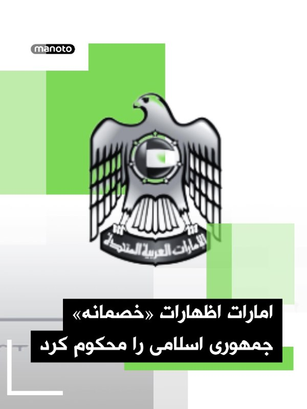

> وزارت امور خارجه امارات متحده عربی در بیانیه‌ای اظهارات اخیر وزارت امور خارجه جمهوری اسلامی را «خصمانه» خواند و آن را به‌شدت محکوم کرد.
> 
> در این بیانیه تأکید شده امارات هرگونه ادعا یا تهدید علیه حاکمیت، امنیت ملی و استقلال تصمیم‌گیری خود را «به‌طور قاطع» رد می‌کند.
> 
> این وزارتخانه اعلام کرد روابط بین‌المللی و دفاعی امارات موضوعی «کاملاً حاکمیتی» است و هیچ کشوری حق ندارد از آن برای تهدید یا دخالت استفاده کند.
> 
> در ادامه آمده هرگونه تهدید علیه امنیت کشور، تأسیسات حیاتی یا شهروندان «غیرقابل قبول» است و با اصول حقوق بین‌الملل و منشور سازمان ملل مغایرت دارد.
> 
> وزارت امور خارجه امارات همچنین اعلام کرد این کشور همه حقوق خود را برای پاسخ به هرگونه اقدام خصمانه محفوظ می‌داند و تأکید کرد فشارها و اتهامات، مواضع امارات را تغییر نخواهد داد.

## 1405/02/16 22:55 — ManotoTV
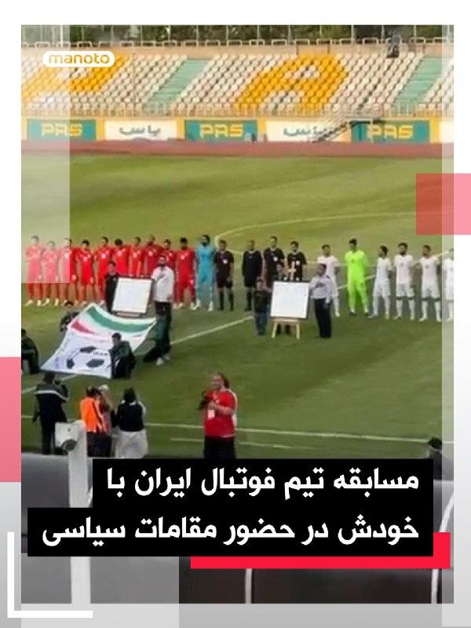

> در شرایطی که برنامه‌های تدارکاتی تیم فوتبال ایران پیش از جام جهانی با اختلال روبه‌رو شده، این تیم دومین دیدار درون‌تیمی خود را در ورزشگاه پاس قوامین برگزار کرد.
> 
> این مسابقه بدون حضور تماشاگر انجام شد، اما به‌صورت زنده از صداوسیمای جمهوری اسلامی پخش شد و با استفاده از سیستم کمک‌داور ویدیویی نیز همراه بود.
> 
> در این دیدار، تیم سفید با نتیجه سه بر یک پیروز شد. اسماعیل بقایی، سخنگوی وزارت امور خارجه، از جمله افرادی بود که این بازی را از نزدیک تماشا کرد.
> 
> پیش از این قرار بود تیم فوتبال ایران در اردوی ترکیه به مصاف تیم‌های مقدونیه و آنگولا برود، اما این دو تیم از انجام این دیدارها انصراف دادند.

## 1405/02/16 22:48 — Hranews
> اجرای حکم اعدام یک زندانی در زندان کرمانشاه
> 
> 
> ❗️
> ❗️
> ❗️
> ❗️
> ❗️– سحرگاه امروز چهارشنبه ۱۶ اردیبهشت ماه، حکم یک زندانی که پیشتر از بابت اتهام قتل به #اعدام محکوم شده بود، در زندان کرمانشاه به اجرا درآمد.
> 
> ادامه مطلب
> 
> #محمدتقی_شاه‌ویسی
> 
> ↘️
> @hranews_bot تماس ✉️ -  @Hranews  کانال هرانا 🆑

## 1405/02/16 22:46 — DW_Farsi

> 🔶 ارزش پول اسرائيل به بالاترین سطح خود از سال ۱۹۹۳ رسید
> 
> بر اساس گزارش‌ها، ارزش شِکِل، واحد پول ملی اسرائيل، روز چهارشنبه ۶ مه (۱۶ اردیبهشت) با ۱.۱ درصد افزایش در برابر دلار آمریکا، به بالاترین سطح خود در ۳۳ سال گذشته رسید.
> 
> این رشد در پی امید سرمایه‌گذاران به دستیابی به توافق صلح میان آمریکا و ایران رخ داد.
> 
> شِکِل که از ابتدای سال ۲۰۲۶ تا کنون ۹درصد افزایش ارزش داشته به نرخ به ۲.۹۰ در برابر هر دلار رسید که قوی‌ترین سطح ارزش این واحد پولی از اکتبر ۱۹۹۳ تاکنون محسوب می‌شود.
> @dw_farsi

## 1405/02/16 22:44 — VahidOOnLine
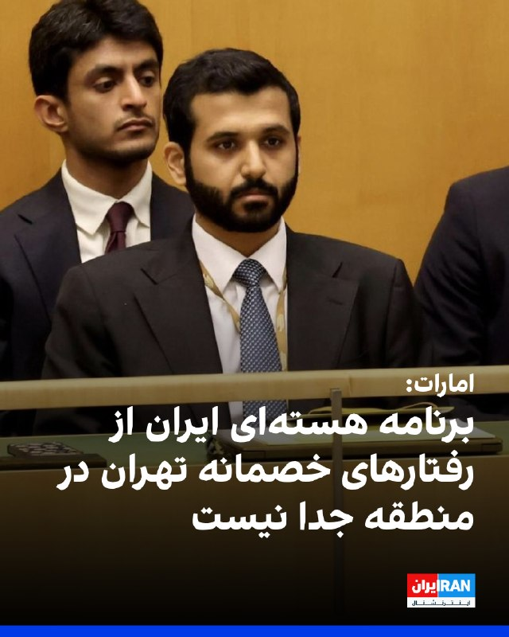

> نمایندگی امارات متحده عربی در سازمان ملل، چهارشنبه ۱۶ اردیبهشت، با انتشار پستی در شبکه اجتماعی ایکس، با اشاره به مباحث کمیته‌های اول و دوم کنفرانس بازنگری پیمان منع گسترش سلاح‌های هسته‌ای، ان‌پی‌تی، اعلام کرد برنامه هسته‌ای ایران را نمی‌توان از «رفتارهای خصمانه و تروریستی» تهران در منطقه جدا دانست.
> 
> امارات تاکید کرد هرگونه گفت‌وگو درباره پرونده هسته‌ای جمهوری اسلامی باید تهدیدهای موجود را به‌طور کامل در نظر بگیرد.
> 
> این کشور همچنین حملات اخیر منتسب به حکومت ایران علیه تاسیسات حیاتی غیرنظامی را محکوم کرد و آن را «تشدیدی خطرناک» خواند.
> 
> نمایندگی امارات از جامعه جهانی خواست رویکردی جامع در قبال تهران در پیش بگیرد؛ رویکردی که هم‌زمان برنامه هسته‌ای، برنامه موشکی و رفتارهای بی‌ثبات‌کننده جمهوری اسلامی را شامل شود.
> 
> امارات همچنین درباره غنی‌سازی ۶۰ درصدی اورانیوم هشدار داد و گفت این سطح از غنی‌سازی تهدیدی برای امنیت منطقه‌ای و بین‌المللی است.
> ‌🏁 🇬🇧 IranintlTV
> 
> 🤖 @VahidOOnLine

## 1405/02/16 22:43 — Hranews
> گزارشی از قطع بیمه بازنشستگان فولاد و ۴۰ هزار کارگر ساختمانی
> 
> 
> ❗️
> ❗️
> ❗️
> ❗️
> ❗️– کارگران بازنشسته صنعت فولاد در اصفهان و تهران نسبت به قطع بیمه درمان تکمیلی خود اعتراض دارند. همچنین، رئیس انجمن صنفی #کارگران ساختمانی آمل از قطع بیمه ۴۰ هزار کارگر ساختمانی در استان مازندران خبر داد.
> 
> ادامه مطلب
> ↘️
> @hranews_bot تماس ✉️ -  @Hranews  کانال هرانا 🆑

## 1378/10/11 03:30 — VahidOOnLine
[🎬 Video](telegram/content/VahidOOnLine_238521_1778097402.mp4)

> ⭕️ معترض به جنگ ایران که روی پلی در آمریکا تحصن کرده بود، بعد از پنج روز پایین آمد
> 
> ♦️یک معترض به نام گیدو رایخشتاتر که در اقدامی اعتراضی از یک پل در واشنگتن دی‌سی بالا رفته بود، پس از پنج روز حضور در ارتفاع، سرانجام روز چهارشنبه ۱۶ اردیبهشت ماه پایین آمد. او گفته بود به‌دلیل تمام شدن آب، ناچار به پایان دادن به این اقدام شده است.
> بر اساس تصاویر منتشرشده، این فرد با کمک نیروهای پلیس وارد فضای داخلی پل شد و دقایقی بعد از یک دریچه خروجی خارج شد. ماموران با استفاده از بالابر او را به پایین منتقل کرده و بلافاصله بازداشت کردند. رسانه‌های محلی گزارش داده‌اند که او با اتهاماتی مواجه خواهد شد، هرچند جزئیات دقیق آن هنوز اعلام نشده است.
> گزارش‌ها همچنین حاکی است که این معترض با برانکارد به آمبولانس منتقل شده، اما اطلاعاتی درباره وضعیت جسمانی او منتشر نشده است.
> رایخشتاتر انگیزه خود از این اقدام را اعتراض به جنگ در ایران، سیاست‌های دولت دونالد ترامپ و همچنین نگرانی‌ها درباره هوش مصنوعی عنوان کرده است.
> ‌🇸🇦 Indypersian
> 
> 🤖 @VahidOOnLine

## 1378/10/11 03:30 — VahidOOnLine
[🎬 Video](telegram/content/VahidOOnLine_238517_1778097404.mp4)

> ‌
> رسانه‌های اسرائیلی گزارش دادند توافقی که به گفته مقام‌های آمریکایی در آستانه نهایی شدن با جمهوری اسلامی است، بندی برای پایان درگیری‌ها در لبنان را نیز شامل می‌شود.
> 
> شبکه ۱۲ اسرائیل گزارش داد آتش‌بس جدید با توافق فعلی در لبنان متفاوت خواهد بود؛ توافقی که تا کنون تنها باعث کاهش درگیری‌ها شده اما به آن پایان نداده است.
> 
> بر اساس این گزارش، این توافق «جنگ را در سراسر منطقه، از جمله در لبنان، پایان خواهد داد.»
> 
> هم‌زمان، ارتش اسرائیل اعلام کرد حمله‌ای را به حومه جنوبی بیروت با هدف قرار دادن فرمانده نیروی رضوان حزب‌الله انجام داده است.
> 
> این نخستین حمله به این منطقه از زمان اجرایی شدن آتش‌بس در ۱۶ آوریل به شمار می‌رود.
> 
> اسرائیل در هفته‌های اخیر حملات خود به جنوب لبنان را در چارچوب هدف قرار دادن حزب‌الله، گروه مورد حمایت جمهوری اسلامی، ادامه داده است.
> ‌🏁 🇬🇧 ManotoTV
> 
> 🤖 @VahidOOnLine

## 1378/10/11 03:30 — VahidOOnLine
[🎬 Video](telegram/content/VahidOOnLine_238516_1778097404.mp4)

> تماسی از ایران:
> «می‌گفت پدرِ جاویدنامم…
> شب آخر گفت “بابا حلالم کن” و رفت.
> برای همه جاویدنام‌ها اشک می‌ریزم…
> با تمام این دردها، هنوز محکم و سرپا ایستادم.»
> ‌🏁 🇬🇧 ManotoTV
> 
> 🤖 @VahidOOnLine

## 1378/10/11 03:30 — mwarmonitor
[🎬 Video](telegram/content/mwarmonitor_8593_1778097406.mp4)

> 🔴خبرنگار: آقای رئیس‌جمهور، شما اخیراً گفتگوهایی با پاپ داشتید و تا آنجا که من متوجه شدم، وزیر امور خارجه، مارکو روبیو، قرار است فردا با پاپ دیدار کند. چه پیامی امیدوارید که او به پاپ برساند؟
> 🔵دونالد ترامپ: خب، می‌توانم این را به شما بگویم که تا جایی که به پاپ مربوط می‌شود، موضوع بسیار ساده است؛ چه او را خوشحال کنم و چه نکنم، ایران نباید سلاح هسته‌ای داشته باشد. به نظر می‌رسد او می‌گوید آن‌ها می‌توانند داشته باشند، اما من می‌گویم نمی‌توانند. زیرا اگر چنین اتفاقی بیفتد، کل جهان به گروگان گرفته خواهد شد و ما اجازه نمی‌دهیم این اتفاق بیفتد. این حرف من است.
> 
> @mwarmonitor

## 1378/10/11 03:30 — mwarmonitor
[🎬 Video](telegram/content/mwarmonitor_8592_1778097408.mp4)

> 🔴خبرنگار: «شما الان با حریفی در ایران روبرو هستید که از تسلیم شدن امتناع کرده است. شما حالا خوش‌بین به نظر می‌رسید که شاید به توافق نزدیک شده‌اید. چه چیزی در این لحظه با لحظات دیگر که توافق نزدیک به نظر می‌رسید، متفاوت است؟»
> 🔵دونالد ترامپ: «خب، چرا می‌گویی آن‌ها از تسلیم شدن امتناع کرده‌اند؟ تو که این را نمی‌دانی. تو نمی‌دانی چه خبر است. اونا چند روز پیش شناورهای آمریکایی رو رهگیری کردن.»
> 🔴خبرنگار: «بله، چند روز پیش.»
> 🔵دونالد ترامپ: «بله، چند روز پیش زمان زیادی است. می‌دانی، در دنیای جنگ، چند روز پیش... نه، آن‌ها به شدت می‌خواهند توافق کنند و خواهیم دید که به آنجا می‌رسیم یا نه. اگر برسیم، آن‌ها نمی‌توانند سلاح هسته‌ای داشته باشند. خیلی ساده است. اما چه چیزی به معنای تسلیم نشدن است؟ آن‌ها نیروی دریایی با ۱۵۹ کشتی داشتند و حالا تک‌تکِ آن کشتی‌ها منفجر شده‌اند.»
> 
> @mwarmonitor

## 1378/10/11 03:30 — IranIntlTV
[🎬 Video](telegram/content/IranIntlTV_335859_1778097410.mp4)

> رسانه‌های نزدیک به سپاه گزارش دادند با وجود خبرهایی مبنی‌بر نزدیک‌شدن جمهوری اسلامی و آمریکا به توافق، بخش‌هایی از طرح جدید آمریکا برای حکومت ایران غیرقابل‌قبول است. در همین حال، اسماعیل بقایی، سخنگوی وزارت خارجه جمهوری اسلامی، اعلام کرد این پیشنهاد همچنان در حال بررسی است.
> @iranintltv

## 1378/10/11 03:30 — IranIntlTV
[🎬 Video](telegram/content/IranIntlTV_335856_1778097411.mp4)

> با تشدید تنش‌ها، فرانسه و بریتانیا ناوگروه «شارل دوگل» را به خلیج عدن اعزام کردند. همزمان، حمله به یک کشتی فرانسوی در تنگه هرمز نگرانی‌ها را افزایش داده است.
> @iranintltv

## 1378/10/11 03:30 — IranIntlTV
[🎬 Video](telegram/content/IranIntlTV_335854_1778097413.mp4)

> 🔻امیر قلعه‌نویی، سرمربی تیم ملی درباره لغو شدن بازی تدارکاتی برابر تیم‌های مقدونیه و آنگولا گفت: «بازی‌های تدارکاتی هماهنگ شده بود و قرارداد بستند؛ ولی در دقیقه ۹۰ کنسل شد.»
> 
> @iranintltvsport

## 1378/10/11 03:30 — ManotoTV
[🎬 Video](telegram/content/ManotoTV_105057_1778097414.mp4)

> ‌
> رسانه‌های اسرائیلی گزارش دادند توافقی که به گفته مقام‌های آمریکایی در آستانه نهایی شدن با جمهوری اسلامی است، بندی برای پایان درگیری‌ها در لبنان را نیز شامل می‌شود.
> 
> شبکه ۱۲ اسرائیل گزارش داد آتش‌بس جدید با توافق فعلی در لبنان متفاوت خواهد بود؛ توافقی که تا کنون تنها باعث کاهش درگیری‌ها شده اما به آن پایان نداده است.
> 
> بر اساس این گزارش، این توافق «جنگ را در سراسر منطقه، از جمله در لبنان، پایان خواهد داد.»
> 
> هم‌زمان، ارتش اسرائیل اعلام کرد حمله‌ای را به حومه جنوبی بیروت با هدف قرار دادن فرمانده نیروی رضوان حزب‌الله انجام داده است.
> 
> این نخستین حمله به این منطقه از زمان اجرایی شدن آتش‌بس در ۱۶ آوریل به شمار می‌رود.
> 
> اسرائیل در هفته‌های اخیر حملات خود به جنوب لبنان را در چارچوب هدف قرار دادن حزب‌الله، گروه مورد حمایت جمهوری اسلامی، ادامه داده است.

## 1378/10/11 03:30 — ManotoTV
[🎬 Video](telegram/content/ManotoTV_105056_1778097415.mp4)

> تماسی از ایران:
> «می‌گفت پدرِ جاویدنامم…
> شب آخر گفت “بابا حلالم کن” و رفت.
> برای همه جاویدنام‌ها اشک می‌ریزم…
> با تمام این دردها، هنوز محکم و سرپا ایستادم.»

## 1378/10/11 03:30 — FarsiVOA
[🎬 Video](telegram/content/FarsiVOA_217067_1778097417.mp4)

> ⚡️مهدی عربشاهی در برنامه تفسیر خبر: بحث اصلی برای جمهوری اسلامی هزینه عقب نشینی است
> @FarsiVOA

## 1378/10/11 03:30 — Persian_Trend_Official
[🎬 Video](telegram/content/Persian_Trend_Official_13557_1778097418.mp4)

> 💢گزارشگر: شما در ایران با رقیبی روبرو هستید که از تسلیم شدن خودداری کرده است.
> 
> ▪️ترامپ: چرا می‌گویید آن‌ها از تسلیم شدن خودداری می‌کنند؟ شما این را نمی‌دانید.
> 
> 💢گزارشگر: آن‌ها چند روز پیش به کشتی‌های آمریکایی شلیک کردند.
> 
> ▪️ترامپ: چند روز پیش زمان زیادی است. آن‌ها به شدت می‌خواهند معامله کنند.
> 
> 🫆:Tony
> 
> 📌 @persian_trend_official
> پرشین ترند | متفاوت‌ترین کانال نظامی

## 1378/10/11 03:30 — BBCPersian
[🎬 Video](telegram/content/BBCPersian_280330_1778097419.mp4)

> 🔻آخرین خبرهای مهم روز چهارشنبه ۱۶ اردیبهشت ۱۴۰۵
> @BBCPersian

## 1405/02/16 22:41 — FarsiVOA
> 🔺نخست‌وزیر اسرائیل از حذف یکی از فرماندهان حزب‌الله در بیروت خبر داد
> 
> ◾️بنیامین نتانیاهو، نخست‌وزیر اسرائیل، شامگاه چهارشنبه ۱۶ اردبیهشت با صدور بیانیه‌ای اعلام کرد که در پی حمله اسرائیل به محله ضاحیه بیروت، «فرمانده بلندپایه‌ای» از حزب‌الله را به قتل رسانده است.
> 
> ⬇️ بیشتر بخوانید:
> https://ir.voanews.com/a/hezbollah-lebanon-war-iran-proxy/8147318.html
> @FarsiVOA

## 1405/02/16 22:41 — VahidOOnLine

> دونالد ترامپ، رییس‌جمهوری آمریکا، روز چهارشنبه به خبرنگاران گفت ایالات متحده در ۲۴ ساعت گذشته گفت‌وگوهای بسیار خوبی با ایران داشته است و افزود بسیار محتمل است که واشینگتن و تهران به توافق برسند.
> 
> او پیش‌تر گفت اگر جمهوری اسلامی با شرایط مورد نظر واشینگتن موافقت نکند، «خیلی زود مجبور به موافقت خواهد شد» و تاکید کرد که اوضاع تحت کنترل ایالات متحده است.
> ‌🏁 🇬🇧 IranintlTV
> 
> 🤖 @VahidOOnLine

## 1405/02/16 22:40 — IranIntlTV
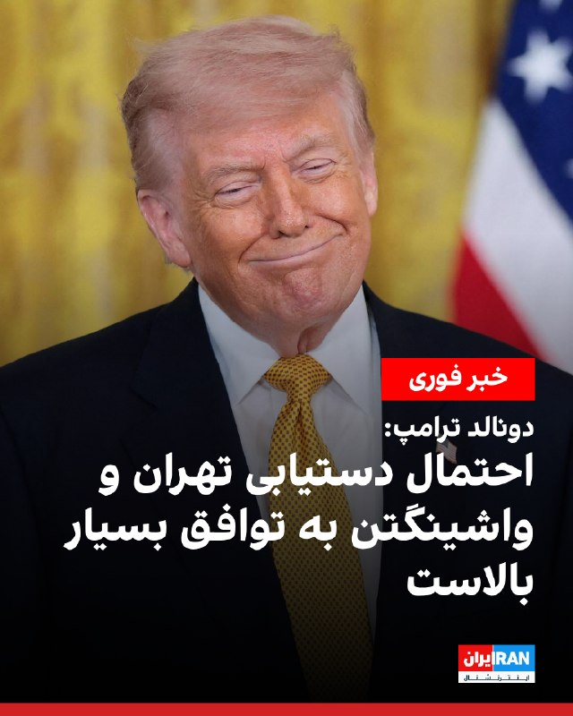

> دونالد ترامپ، رییس‌جمهوری آمریکا، روز چهارشنبه به خبرنگاران گفت ایالات متحده در ۲۴ ساعت گذشته گفت‌وگوهای بسیار خوبی با ایران داشته است و افزود بسیار محتمل است که واشینگتن و تهران به توافق برسند.
> 
> او پیش‌تر گفت اگر جمهوری اسلامی با شرایط مورد نظر واشینگتن موافقت نکند، «خیلی زود مجبور به موافقت خواهد شد» و تاکید کرد که اوضاع تحت کنترل ایالات متحده است.
> https://iranintl.com/202605063899

## 1405/02/16 22:38 — VahidOnline
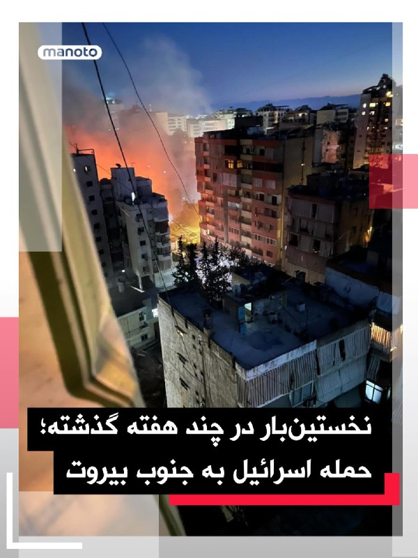

> ارتش اسرائیل عصر روز چهارشنبه در حمله هوایی به منطقه ضاحیه، حومه جنوبی بیروت، که تحت نفوذ حزب‌الله است، فرمانده یگان نخبه «رضوان» این گروه را هدف قرار داد.
> 
> این نخستین حمله به حومه بیروت از زمان آتش‌بسی بود که روز ۲۷ فروردین بین اسرائیل و حزب‌الله برقرار شد، هرچند درگیری‌ها در جنوب لبنان متوقف نشده است.
> 
> در بیانیه مشترک بنیامین نتانیاهو، نخست‌وزیر اسرائیل، و یسرائیل کاتس، وزیر دفاع، آمده است: «عوامل رضوان به رهبری این فرمانده مسئول شلیک به مناطق مسکونی اسرائیل و آسیب رساندن به نیروهای ارتش اسرائیل بودند.»
> خبرگزاری فرانسه به نقل از یک منبع نزدیک به حزب‌الله اعلام کرد که «مالک بلّوط، فرمانده عملیات در یگان رضوان» در این حمله کشته شده است.
> @VahidHeadline
> 
> 📡 @VahidOnline

## 1405/02/16 22:38 — mwarmonitor
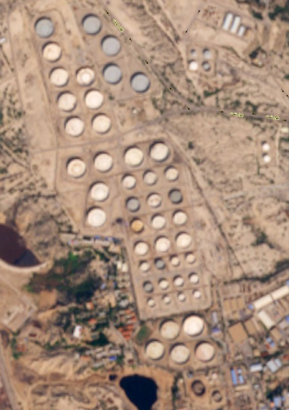

> «روز شلوغ خارگ 🇮🇷 جزیره خارگ امروز. دو نفتکش VLCC، یک نفتکش Suezmax و یک نفتکش ساحلی در حال بارگیری مشاهده شدند. یک خطا - حادثه در یکی از VLCCها در مختصات 29.2309, 50.2837 منجر به نشت نفت خام شد. ❗️معلوم نیست میزان نشت چقدر است، چون بیشتر چیزی که دیده می‌شود…

## 1405/02/16 22:38 — IranianMinds
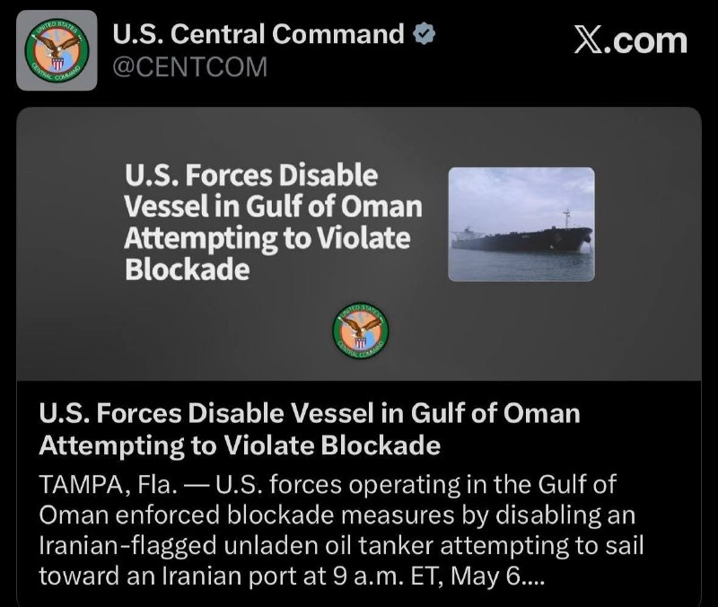

> 🔴 سنتکام خبر داد که ساعاتی پیش یه نفتکش ایرانی رو تو دریای مکران با جنگنده F-18 موردهدف قرار داده و نذاشته به بنادر ایران برسه. @IranianMinds

## 1405/02/16 22:36 — IranianMinds
> 🔴 سنتکام خبر داد که ساعاتی پیش یه نفتکش ایرانی رو تو دریای مکران با جنگنده F-18 موردهدف قرار داده و نذاشته به بنادر ایران برسه.
> 
> @IranianMinds

## 1405/02/16 22:33 — mwarmonitor
> 🔴اختصاصی: سه زندانی ایرانی جزئیات شکنجه‌ای را که به دست حکومت متحمل شده‌اند با « جوروزالم پست » در میان گذاشتند.
> 
> 📝این گزارش که توسط «اورشلیم پست» منتشر شده، به جزئیات شکنجه و بدرفتاری با سه زندانی در ایران پیش از اعدام آن‌ها در زندان مرکزی ارومیه می‌پردازد.
> 
> 🔸طبق اطلاعاتی که «شبکه حقوق بشر کردستان» در اختیار این رسانه قرار داده، این افراد پیش از مرگ در تماس‌های تلفنی و نامه‌های خود، شرایط دشوارشان را تشریح کرده بودند.
> 
> 
> 🔰خلاصه متن خبر به شرح زیر است:
> ۱. مشخصات زندانیان اعدام شده:
> یعقوب کریم‌پور (۴۳ ساله): شهروند ترک آذربایجانی و پیرو آیین یارسان، دارای معلولیت جسمی.
> ناصر باقرزاده (۲۶ ساله): شهروند کُرد اهل سنت.
> محراب عبدالله‌زاده (۲۸ ساله): بازداشت شده در جریان اعتراضات «زن، زندگی، آزادی».
> (کریم‌پور و باقرزاده روز شنبه و عبدالله‌زاده روز یکشنبه اعدام شدند.)
> ۲. اتهامات و شکنجه‌ها:
> یعقوب کریم‌پور و ناصر باقرزاده: به اتهام جاسوسی برای موساد اعدام شدند. کریم‌پور در نامه‌ای نوشته بود که تحت فشارهای شدید روانی و جسمی و تهدید به آزار همسرش مجبور به اعترافات اجباری شده است. او همچنین تأکید کرده بود که به دلیل معلولیت شدید جسمی و مشکلات ریوی، از دسترسی به دارو محروم بوده تا برای اعتراف تحت فشار قرار گیرد.
> ناصر باقرزاده: او در فایل صوتی گفته بود که فعالیت‌هایش صرفاً در حوزه گردشگری بوده و پیش‌تر حکم اعدامش دو بار نقض شده بود، اما در نهایت با تغییر اتهامات اعدام شد.
> محراب عبدالله‌زاده: او متهم به قتل یک نیروی امنیتی (عباس فاطمیه) در اعتراضات سال ۱۴۰۱ بود. او در تماس‌های خود تأکید کرده بود که بی‌گناه است و تنها به دلیل رد درخواست همکاری با سپاه پاسداران و تحت شکنجه‌های وحشتناک (از جمله ضرب و شتم و استفاده از مواد توهم‌زا) مجبور به اعتراف شده است.
> ۳. نقض حقوق قانونی:
> در این گزارش آمده است که خانواده‌های این افراد از زمان اعدام مطلع نشده و حق آخرین ملاقات از آن‌ها سلب شده بود.
> همچنین به مواردی نظیر عدم دسترسی به وکیل، دادگاه‌های نمایشی و کوتاه (کمتر از ۱۵ دقیقه)، و نادیده گرفتن ادعای شکنجه توسط قضات اشاره شده است.
> ۴. تحلیل شبکه حقوق بشر کردستان:
> رابین رحمانی از این سازمان معتقد است که رژیم ایران اعدام زندانیان با پرونده‌های امنیتی را به عنوان نوعی «انتقام‌جویی» و برای ایجاد ترس و ارعاب در جامعه، به ویژه در شرایط تنش با اسرائیل و آمریکا، افزایش داده است.
> 
> 📌در پایان ذکر شده که خانواده‌ها همچنان برای دریافت پیکر عزیزانشان و برگزاری مراسم مذهبی با محدودیت و ممنوعیت مواجه هستند.
> 
> @mwarmonitor

## 1405/02/16 22:31 — DW_Farsi

> 🔶 نگرانی شدید برادر نرگس محمدی از وضعیت سلامت خواهرش
> 
> حمیدرضا محمدی، برادر نرگس محمدی، برنده زندانی جایزه نوبل صلح، ابراز امیدواری کرد که این فعال سیاسی زندانی که به گفته خانواده‌اش، به شدت بیمار است پس از معاینات تکمیلی به تهران منتقل شود.
> 
> او به خبرگزاری آسوشیتدپرس گفت، خواهرش امروز ۱۶ اردیبهشت همراه با اعضای خانواده از بیمارستانی در زنجان به پزشکان وابسته به قوه قضائیه ارجاع داده شده است.
> 
> او با ابراز امیدواری در این باره که این معاینات مجدد به انتقال خواهرش منجر شود افزود: «اگر این اتفاق نیفتد، یعنی واقعا قصد دارند نرگس را بکشند.»
> 
> پیش‌تر مایک والتز، سفیر آمریکا در سازمان ملل، در پیامی در شبکه ایکس نسبت به وضعیت نرگس محمدی ابراز نگرانی کرده بود.
> 
> والتز نوشته بود که حکومت ایران "سال‌هاست که او را به‌خاطر گفتن حقیقت درباره بدرفتاری حکومت با زنان و مخالفان سیاسی" در زندان بدنام اوین نگه داشته است.
> 
> والتز با تأکید بر لزوم آزادی فوری این زندانی افزوده بود، وضعیت جسمی نرگس محمدی "به شدت رو به وخامت رفته" و حکومت جمهوری اسلامی مانع از دسترسی او به مراقبت‌های پزشکی ضروری شده است.
> @dw_farsi

## 1405/02/16 22:28 — VahidOOnLine
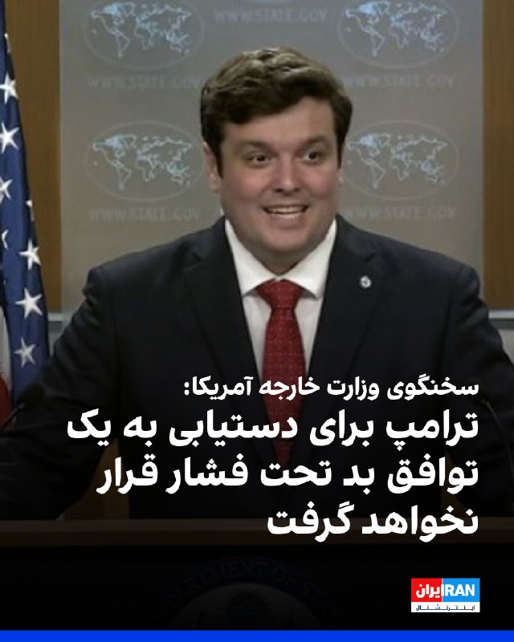

> سخنگوی وزارت خارجه آمریکا در گفت‌وگو با الجزیره اعلام کرد که دونالد ترامپ «برای دستیابی به یک توافق بد تحت فشار قرار نخواهد گرفت.
> 
> او افزود که ترامپ تاکید کرده مسیر دیپلماتیک را ترجیح می‌دهد، اما حاضر نیست شتاب‌زده وارد توافقی نامطلوب شود. سخنگوی وزارت خارجه آمریکا همچنین گفت که ترامپ توافقی خوب برای مردم آمریکا به دست خواهد آورد.
> 
> تردیدی نیست که ترامپ در گفته خود جدی است که رژیم ایران هرگز نباید به سلاح هسته‌ای دست پیدا کند
> ‌🏁 🇬🇧 IranintlTV
> 
> 🤖 @VahidOOnLine

## 1405/02/16 22:27 — IranIntlTV

> سخنگوی وزارت خارجه آمریکا در گفت‌وگو با الجزیره اعلام کرد که دونالد ترامپ «برای دستیابی به یک توافق بد تحت فشار قرار نخواهد گرفت.
> 
> او افزود که ترامپ تاکید کرده مسیر دیپلماتیک را ترجیح می‌دهد، اما حاضر نیست شتاب‌زده وارد توافقی نامطلوب شود. سخنگوی وزارت خارجه آمریکا همچنین گفت که ترامپ توافقی خوب برای مردم آمریکا به دست خواهد آورد.
> 
> تردیدی نیست که ترامپ در گفته خود جدی است که رژیم ایران هرگز نباید به سلاح هسته‌ای دست پیدا کند
> https://iranintl.com/202605067394

## 1405/02/16 22:24 — BBCPersian
> 🔻اسرائیل با حمله به بیروت، فرمانده ارشد حزب‌الله را هدف قرار داد
> 
> بنیامین نتانیاهو، نخست وزیر اسرائیل، اعلام کرد که ارتش این کشور پس از حمله به بیروت، یکی از فرماندهان ارشد حزب‌الله لبنان را هدف قرار داده است.
> 
> آقای نتانیاهو می‌گوید او و وزیر دفاع اسرائیل، به ارتش این کشور دستور دادند «همین حالا در بیروت فرمانده نیروی رضوان در سازمان تروریستی حزب‌الله را هدف قرار دهند تا او را خنثی کنند.»
> 
> او در پیامی که در رسانه‌های اجتماعی منتشر کرده، گفته است که نیروی رضوان «مسئول تیراندازی به شهرک‌های اسرائیلی و آسیب رساندن به سربازان ارتش اسرائیل است.»
> 
> آقای نتانیاهو گفت که «بازوی بلند اسرائیل به هر دشمن و قاتلی خواهد رسید» و افزود: «اینگونه شده و اینگونه خواهد شد.»
> 
> https://bbc.in/4d4Qh61
> @BBCPersian

## 1405/02/16 22:22 — Hranews
> مرگ دو کارگر در سایه فقدان ایمنی کار
> 
> 
> ❗️
> ❗️
> ❗️
> ❗️
> ❗️– در سایه فقدان ایمنی محیط و شرایط نامناسب کار، دو #کارگر در مشهد و اراک حین انجام کار طی حوادثی جان خود را از دست دادند.
> 
> ادامه مطلب
> 
> ↘️
> @hranews_bot تماس ✉️ -  @Hranews  کانال هرانا 🆑

## 1405/02/16 22:20 — DW_Farsi
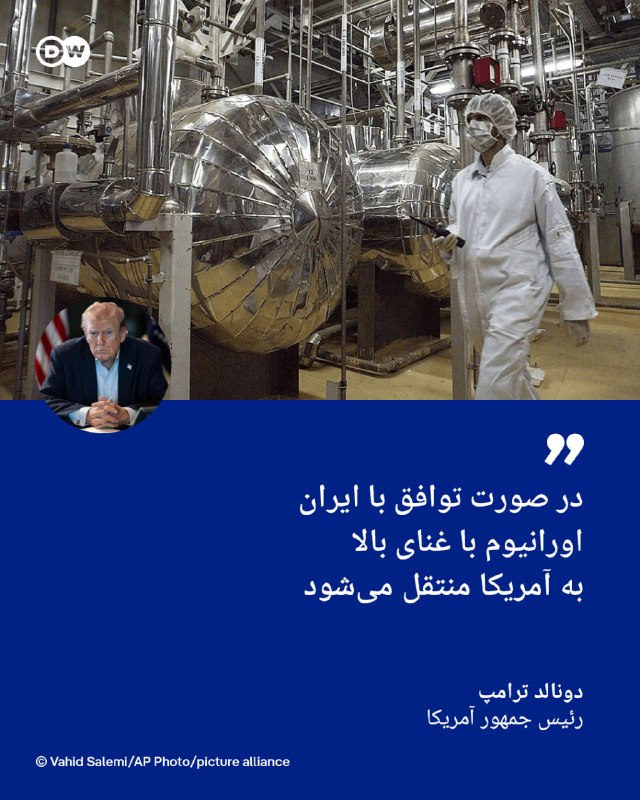

> 🔶 ترامپ: در صورت توافق با ایران اورانیوم با غنای بالا به آمریکا منتقل می‌شود
> 
> دونالد ترامپ، رئیس جمهور آمریکا، گفت، در صورت دستیابی به یک توافق احتمالی، ایران اورانیوم با غنای بالای خود را تحویل خواهد داد تا به ایالات متحده منتقل شود.
> 
> او در گفت‌وگو با شبکه پی‌بی‌اس گفت: «این [اورانیوم] به ایالات متحده می‌رود.» ترامپ افزود که جمهوری اسلامی همچنین موافقت خواهد کرد از تاسیسات هسته‌ای زیرزمینی خود استفاده نکند.
> 
> او با گفتن این که "شانس بسیار خوبی برای رسیدن به یک توافق وجود دارد" افزود: «اگر این اتفاق نیفتد، به روش‌های قبلی خود بازمی‌گردیم.»
> 
> ترامپ همچنین گفت، بعید است که فرستادگان ارشد خود، استیو ویتکاف و جرد کوشنر، را برای گفت‌وگو با ایران به پاکستان بفرستد.
> 
> او تصریح کرد: «فکر می‌کنم می‌توانیم این کار را همین‌جا انجام دهیم و شاید برای نشست نهایی، در جایی مراسم امضا داشته باشیم.»
> 
> ترامپ ادامه داد: «اگر آنها موافقت کنند، همه چیز تمام است و اگر موافقت نکنند، بمباران می‌کنیم.»
> 
> او با این اظهارات، تهدیدی را که در هفته‌های اخیر بارها مطرح کرده بود، تکرار کرد.
> @dw_farsi

## 1405/02/16 22:19 — FarsiVOA
> 🔺آمریکا از متحدانش می‌خواهد اقدامات ضدتروریستی علیه رژیم ایران را افزایش دهند
> 
> ◾️یک مقام‌ کاخ سفید روز چهارشنبه ۱۶ اردیبهشت اعلام کرد که مقامات آمریکایی مسئول مبارزه با تروریسم روز جمعه با شرکای بین‌المللی خود دیدار خواهند کرد تا بررسی کنند که متحدان آمریکا چگونه می‌توانند تلاش‌های خود را برای مقابله با تهدیدهای تروریستی، به‌ویژه ناشی از اقدامات حکومت ایران و در تنگه هرمز، افزایش دهند.
> 
> ⬇️ بیشتر بخوانید:
> 
> https://ir.voanews.com/a/sebastian-gorka-national-security-jihadism-iran-muslim-brotherhood/8147306.html

## 1405/02/16 22:17 — BBCPersian
> 🔻واکنش نمایندگی ایران در سازمان ملل به پیش‌نویس قطعنامه آمریکا درباره کشتیرانی در تنگه هرمز
> 
> نمایندگی ایران در سازمان ملل متحد می‌گوید که «تنها راه‌حل عملی در تنگه هرمز روشن است: پایان دائمی جنگ، رفع محاصره دریایی و بازگشت عبور و مرور عادی.»
> 
> این نمایندگی در پستی در شبکه اجتماعی ایکس افزوده است اما آمریکا «در حال انجام پیش‌نویس قطعنامه‌ای معیوب و با انگیزه‌های سیاسی در شورای امنیت سازمان ملل تحت عنوان "آزادی کشتیرانی" است، تا دستورکار سیاسی و اقدامات غیرقانونی راپیش ببرد، نه اینکه بحران را حل کند.»
> 
> ایران از کشورهای عضو خواسته است تا براساس «منطق» و نه «تحت فشار» عمل کرده و آن را رد کنند.
> 
> این پیش‌نویس قطعنامه می‌گوید اگر ایران حملات به کشتی‌ها در تنگه هرمز را متوقف نکند، دریافت «عوارض غیرقانونی» را پایان ندهد و محل تمامی مین‌ها را برای تضمین آزادی کشتیرانی اعلام نکند، با تحریم‌ها یا اقدامات دیگر روبه‌رو خواهد شد.
> 
> 
> @BBCPersian

## 1405/02/16 22:09 — kianmeli1

> 🔴ترامپ به فاکس نیوز:
> 
> ایران یک هفته فرصت دارد تا به توافق برسد
> 
> شانس دستیابی به توافق صلح بین ایالات متحده و ایران قبل از سال ۲۰۲۶ در حال حاضر در پلی مارکت 77 درصد است.
> https://t.me/kianmeli1

## 1405/02/16 22:07 — RadioFarda
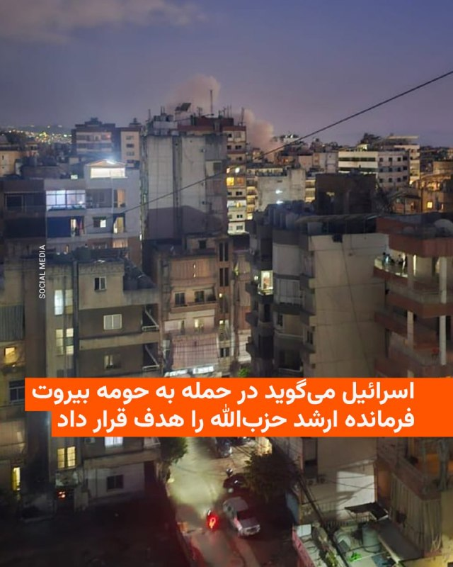

> 🔸ارتش اسرائیل عصر روز چهارشنبه در حمله هوایی به منطقه ضاحیه، حومه جنوبی بیروت، که تحت نفوذ حزب‌الله است، فرمانده یگان نخبه «رضوان» این گروه را هدف قرار داد.
> 
> 🔸این نخستین حمله به حومه بیروت از زمان آتش‌بسی بود که روز ۲۷ فروردین بین اسرائیل و حزب‌الله برقرار شد، هرچند درگیری‌ها در جنوب لبنان متوقف نشده است.
> 
> 🔸در بیانیه مشترک بنیامین نتانیاهو، نخست‌وزیر اسرائیل، و یسرائیل کاتس، وزیر دفاع، آمده است: «عوامل رضوان به رهبری این فرمانده مسئول شلیک به مناطق مسکونی اسرائیل و آسیب رساندن به نیروهای ارتش اسرائیل بودند.»
> 
> 🔸خبرگزاری فرانسه به نقل از یک منبع نزدیک به حزب‌الله اعلام کرد که فرمانده ارشد گروه یگان رضوان در حمله اسرائیل به ضاحیه کشته شده است.
> 
> 🔸این منبع که نخواست نامش فاش شود، به این خبرگزاری گفت: «مالک بلّوط، فرمانده عملیات در یگان رضوان» در این حمله کشته شده است.
> 
> 🔸حزب‌الله که از سوی آمریکا سازمان تروریستی شناخته می‌شود، هنوز به شکل رسمی کشته شدن این عضو ارشد خود را تأیید نکرده است.
> 
> @RadioFarda

## 1405/02/16 22:07 — Persian_Trend_Official
[🎬 Video](telegram/content/Persian_Trend_Official_13555_1778094726.jpg)

> یک منبع لبنانی مدعی است در هنگام ترور صدای پرواز جنگنده های اسرائیلی شنیده نشده و حمله از دریا توسط ناوچه‌های اسرائیلی (موشک کروز) انجام شده است. ۳موشک کروز از یک ناو شکن اسرائیلی شلیک شده است. ☆Phantom☆ 📌 @persian_trend_official پرشین ترند | متفاوت‌ترین…

## 1405/02/16 22:05 — IranIntlTV
> 🎧نسخه صوتی تیتراول با نیوشا صارمی: ارتش اسرائیل: در آماده باش کاملیم و فهرست جدید اهداف در ایران مشخص شده
> @iranintlTV

## 1405/02/16 22:04 — mwarmonitor
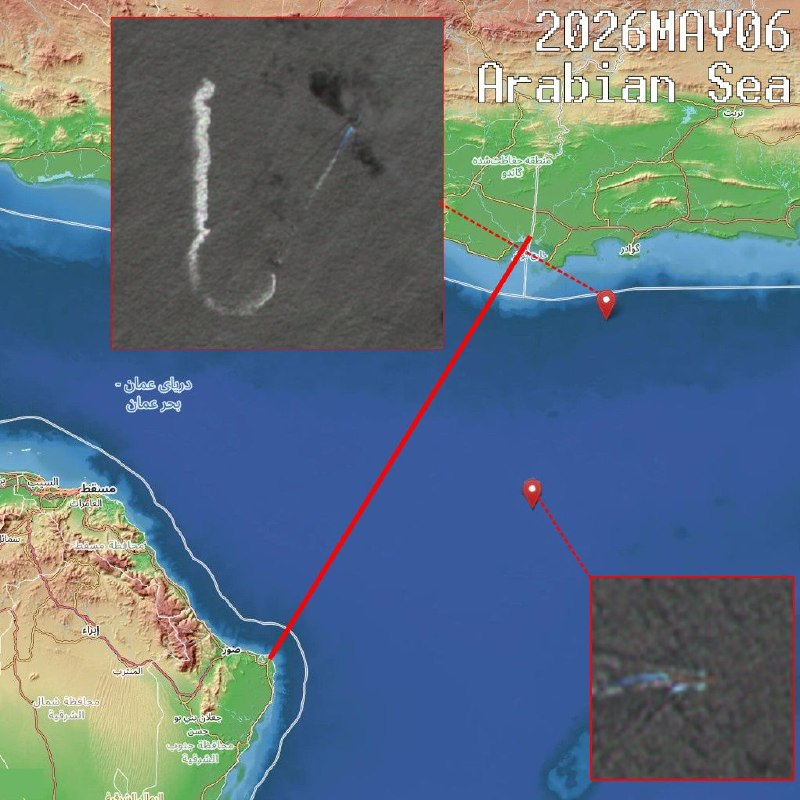

> ۲ فروند دیگر از ناوشکن‌های آمریکا 🇺🇸 امروزدر مختصات زیر مشاهده شدند:
> 🔸تنها ۴۸ کیلومتر از پاکستان فاصله دارد
> 
> 📍 24.6809, 62.1570
> 📍 22.9680, 61.3696
> 
> این ناوشکن‌ها در حال اجرای «خط قرمز محاصره آمریکا علیه ایران » در دریای عرب هستند.
> 
> @mwarmonitor

## 1405/02/16 22:03 — Persian_Trend_Official

> ایران پیامی فوری به میانجی پاکستانی درباره حمله اسرائیل به بیروت ارسال کرد.
> 
> ☆Phantom☆
> 
> 📌 @persian_trend_official
> پرشین ترند | متفاوت‌ترین کانال نظامی

## 1405/02/16 22:02 — VahidOOnLine
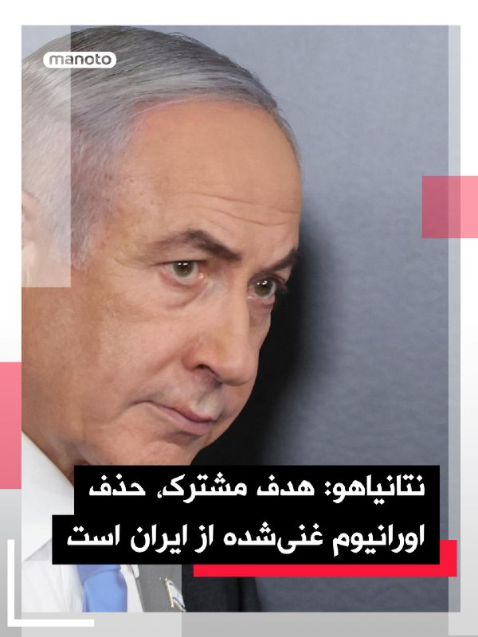

> بنیامین نتانیاهو، نخست‌وزیر اسرائیل، در آغاز نشست کابینه امنیتی گفت که ارتباط میان اسرائیل و آمریکا «مداوم» است و او تقریباً هر روز با ترامپ صحبت می‌کند و علام کرد که امشب با دونالد ترامپ، رئیس‌جمهور آمریکا، گفت‌وگو خواهد کرد.
> او با رد گزارش‌ها درباره غافلگیری اسرائیل از توافق احتمالی، تأکید کرد: «هماهنگی کامل میان ما وجود دارد و هیچ غافلگیری‌ای در کار نیست.»
> به گفته نتانیاهو، هدف مشترک دو کشور، حذف کامل مواد غنی‌شده از ایران و برچیدن توانایی‌های غنی‌سازی جمهوری‌اسلامی است.
> نخست‌وزیر اسرائیل همچنین گفت ترامپ معتقد است این هدف «به هر شکلی» قابل تحقق است، اما اسرائیل خود را برای هر سناریویی آماده کرده است.
> ‌🏁 🇬🇧 ManotoTV
> 
> 🤖 @VahidOOnLine

## 1405/02/16 22:02 — Persian_Trend_Official
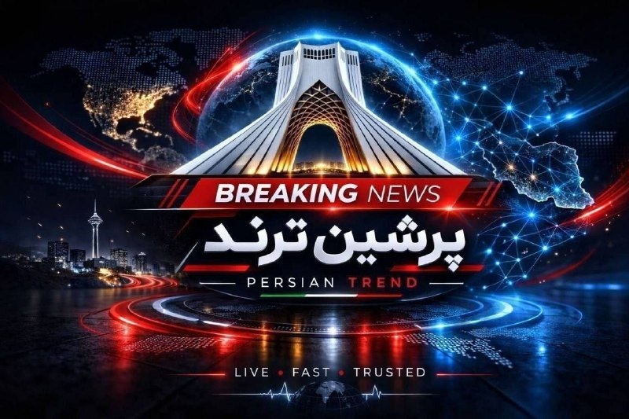

> ترامپ به فاکس نیوز گفت که یک مهلت یک هفته‌ای برای رسیدن به توافق با ایران تعیین کرده است.
> 
> ☆Phantom☆
> 
> 📌 @persian_trend_official
> پرشین ترند | متفاوت‌ترین کانال نظامی

## 1405/02/16 22:02 — ManotoTV

> بنیامین نتانیاهو، نخست‌وزیر اسرائیل، در آغاز نشست کابینه امنیتی گفت که ارتباط میان اسرائیل و آمریکا «مداوم» است و او تقریباً هر روز با ترامپ صحبت می‌کند و علام کرد که امشب با دونالد ترامپ، رئیس‌جمهور آمریکا، گفت‌وگو خواهد کرد.
> او با رد گزارش‌ها درباره غافلگیری اسرائیل از توافق احتمالی، تأکید کرد: «هماهنگی کامل میان ما وجود دارد و هیچ غافلگیری‌ای در کار نیست.»
> به گفته نتانیاهو، هدف مشترک دو کشور، حذف کامل مواد غنی‌شده از ایران و برچیدن توانایی‌های غنی‌سازی جمهوری‌اسلامی است.
> نخست‌وزیر اسرائیل همچنین گفت ترامپ معتقد است این هدف «به هر شکلی» قابل تحقق است، اما اسرائیل خود را برای هر سناریویی آماده کرده است.

## 1405/02/16 22:01 — Persian_Trend_Official
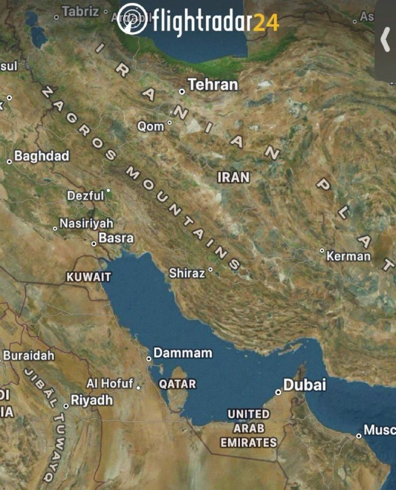

> ‏تمام فرستنده‌های نیروی هوایی ایالات متحده در خلیج فارس خاموش هستند.
> 
> ☆Phantom☆
> 
> 📌 @persian_trend_official
> پرشین ترند | متفاوت‌ترین کانال نظامی

## 1405/02/16 22:01 — mwarmonitor
> 🇦🇪بیانیه: امارات اظهارات خصمانه ایران را محکوم می‌کند
> 
> 🇦🇪دولت امارات متحده عربی، بیانیه وزارت امور خارجه ایران را با شدیدترین لحن محکوم کرده و بر مخالفت قاطع خود با هرگونه ادعا یا تهدیدی که حاکمیت، امنیت ملی یا استقلال تصمیم‌گیری این کشور را هدف قرار دهد، تأکید کرد.
> 🇦🇪وزارت امور خارجه در بیانیه‌ای اعلام کرد که روابط بین‌المللی و شراکت‌های دفاعی دولت امارات، یک مسئله کاملاً حاکمیتی است و هیچ طرفی حق ندارد از آن به عنوان بهانه‌ای برای تهدید، مداخله یا تحریک استفاده کند.
> 🇦🇪این وزارتخانه تأکید کرد که هرگونه گفتمانی که شامل تهدید مستقیم یا غیرمستقیم علیه امنیت دولت، تأسیسات غیرنظامی و حیاتی، یا شهروندان، ساکنان و زائران در خاک این کشور باشد، رفتاری غیرقابل قبول تلقی می‌شود که با اصول حسن همجواری، قواعد حقوق بین‌الملل و منشور سازمان ملل متحد در تضاد است.
> 🇦🇪وزارت امور خارجه در پایان خاطرنشان کرد که دولت امارات تمامی حقوق حاکمیتی، قانونی، دیپلماتیک و نظامی خود را برای مقابله با هرگونه تهدید، ادعا یا اقدام خصمانه محفوظ می‌دارد. همچنین تأکید کرد که تلاش‌ها برای فشار، اتهام‌زنی یا ترویج ادعاهای مغرضانه، هرگز از مواضع ثابت این کشور نخواهد کاست و آن را از حفاظت از منافع عالی ملی و صیانت از حاکمیت و استقلال در تصمیم‌گیری باز نخواهد داشت.
> 
> @mwarmonitor

## 1405/02/16 21:58 — FarsiVOA
> 🔺دیدار دونالد ترامپ و شی جین‌ پینگ در پکن در گرماگرم تنش‌ها بر سر جمهوری اسلامی، کره شمالی، و تایوان
> 
> ▪️در حالی که تنها چند روز به سفر دونالد ترامپ، رئیس جمهوری آمریکا، به پکن در روزهای ۲۴ و ۲۵ اردیبهشت باقی مانده، نشست سران این دو ابرقدرت جهان همچنان با تنش‌هایی در رویکرد آنها نسبت به جمهوری اسلامی، کره شمالی، و تایوان روبرو است.
> 
> ⬇️ بیشتر بخوانید:
> 
> https://ir.voanews.com/a/iran-china-trump-visit-oil-taiwan-xi/8147278.html/?nocach=1

## 1405/02/16 21:57 — VahidOOnLine

> امانوئل مکرون، رییس‌جمهوری فرانسه، با انتشار پستی در شبکه اجتماعی ایکس از گفت‌وگو با مسعود پزشکیان، رییس دولت در جمهوری اسلامی خبر داد و گفت نگرانی عمیق خود را از «تشدید تنش‌های جاری» ابراز کرده است.
> مکرون در این پیام حملات به زیرساخت‌های غیرنظامی امارات و چند کشتی را «توجیه‌ناپذیر» خواند و محکوم کرد.
> او تاکید کرد همه طرف‌ها باید «بدون تاخیر و بدون قیدوشرط» محاصره تنگه را بردارند و وضعیت آزادی کامل کشتیرانی را که پیش از درگیری برقرار بود، دوباره برقرار کنند.
> رییس‌جمهوری فرانسه همچنین نوشت ماموریت چندملیتی فرانسه و بریتانیا می‌تواند به بازسازی اعتماد میان مالکان کشتی‌ها و شرکت‌های بیمه کمک کند و استقرار ناو هواپیمابر شارل دو گل نیز در همین چارچوب انجام شده است.
> ‌🏁 🇬🇧 IranintlTV
> 
> 🤖 @VahidOOnLine

## 1405/02/16 21:57 — IranIntlTV
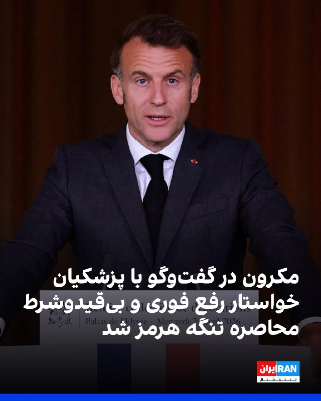

> امانوئل مکرون، رییس‌جمهوری فرانسه، با انتشار پستی در شبکه اجتماعی ایکس از گفت‌وگو با مسعود پزشکیان، رییس دولت در جمهوری اسلامی خبر داد و گفت نگرانی عمیق خود را از «تشدید تنش‌های جاری» ابراز کرده است.
> مکرون در این پیام حملات به زیرساخت‌های غیرنظامی امارات و چند کشتی را «توجیه‌ناپذیر» خواند و محکوم کرد.
> او تاکید کرد همه طرف‌ها باید «بدون تاخیر و بدون قیدوشرط» محاصره تنگه را بردارند و وضعیت آزادی کامل کشتیرانی را که پیش از درگیری برقرار بود، دوباره برقرار کنند.
> رییس‌جمهوری فرانسه همچنین نوشت ماموریت چندملیتی فرانسه و بریتانیا می‌تواند به بازسازی اعتماد میان مالکان کشتی‌ها و شرکت‌های بیمه کمک کند و استقرار ناو هواپیمابر شارل دو گل نیز در همین چارچوب انجام شده است.
> https://iranintl.com/202605064400

## 1405/02/16 21:56 — VahidOOnLine
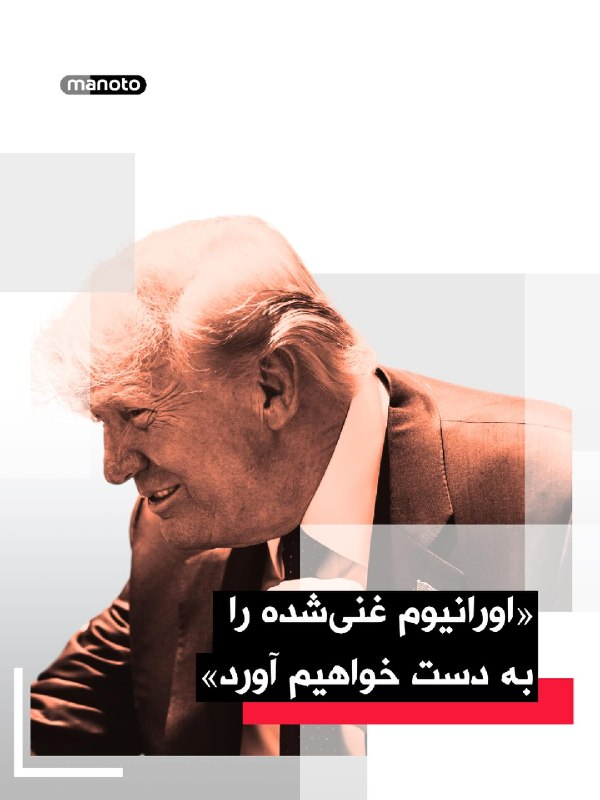

> ترامپ در پاسخ به پرسشی پیرامون دریافت اورانیوم غنی‌شده از ایران پاسخ داد و به خبرنگار گفت: «ما آن را به دست خواهیم آورد.» او همچنین پیش از این رویداد در کاخ سفید با پی‌بی‌نیوز گفتگویی داشته و نسبت به دستیابی به توافقی با جمهوری‌اسلامی ابراز خوش‌بینی کرد، اما گفت: «قبلاً هم چنین احساسی درباره آن‌ها داشتم، بنابراین باید ببینیم چه اتفاقی می‌افتد.» او همچنین گفت «بعید است» وتیکاف و کوشنر را به مذاکرات بفرستد. ترامپ هشدار داد: «فکر می‌کنم شانس بسیار خوبی برای پایان یافتن آن وجود دارد، و اگر پایان نیابد، مجبوریم دوباره به شدت آن‌ها را بمباران کنیم.»
> ‌🏁 🇬🇧 ManotoTV
> 
> 🤖 @VahidOOnLine

## 1405/02/16 21:56 — ManotoTV

> ترامپ در پاسخ به پرسشی پیرامون دریافت اورانیوم غنی‌شده از ایران پاسخ داد و به خبرنگار گفت: «ما آن را به دست خواهیم آورد.» او همچنین پیش از این رویداد در کاخ سفید با پی‌بی‌نیوز گفتگویی داشته و نسبت به دستیابی به توافقی با جمهوری‌اسلامی ابراز خوش‌بینی کرد، اما گفت: «قبلاً هم چنین احساسی درباره آن‌ها داشتم، بنابراین باید ببینیم چه اتفاقی می‌افتد.» او همچنین گفت «بعید است» وتیکاف و کوشنر را به مذاکرات بفرستد. ترامپ هشدار داد: «فکر می‌کنم شانس بسیار خوبی برای پایان یافتن آن وجود دارد، و اگر پایان نیابد، مجبوریم دوباره به شدت آن‌ها را بمباران کنیم.»

## 1405/02/16 21:54 — BBCPersian
> 🔻دفتر مکرون: فرانسه می‌خواهد موضوع مذاکرات ایران و آمریکا از تنگه هرمز جدا باشد
> 
> دفتر ریاست جمهوری فرانسه، اعلام کرد که فرانسه و شرکایش قادرند از امنیت تنگه هرمز اطمینان حاصل کنند.
> 
> در این اطلاعیه آمده است که فرانسه مایل است مسئله تنگه هرمز از مذاکرات فعلی بین ایالات متحده و جمهوری اسلامی جدا باشد.
> 
> ارتش فرانسه پیش‌تر اعلام کرده بود که گروه ناو هواپیمابر «شارل دوگل» در حال حرکت به سمت دریای سرخ و خلیج عدن است، که بخشی از تلاش‌های فرانسه و بریتانیا برای آمادگی در صورت انجام ماموریتی در آینده برای کمک به آزادی دریانوردی در تنگه هرمز است.
> 
> گروه کشتیرانی فرانسوی «سی‌ام‌ای سی‌جی‌ام» اعلام کرده است که یکی از کشتی‌هایش با نام سن آنتونیو، روز سه‌شنبه ۱۵ اردیبهشت، هنگام عبور از تنگه هرمز هدف قرار گرفت و علاوه بر جراحت برخی خدمه، خساراتی نیز به کشتی وارد شد.
> 
> بر اساس داده‌های شرکت کپلر، که تردد کشتی‌ها را ردیابی می‌کند، عبور کشتی‌های حامل کالا از تنگه هرمز در این هفته به پایین‌ترین سطح خود از زمان آغاز جنگ در نهم اسفند رسید.
> 
> این شرکت که فقط تردد کشتی‌های حامل کالا را ارزیابی می‌کند، دو روز پیش فقط یک عبور را ثبت کرد در حالی که می گوید سه‌شنبه (دیروز) هیچ عبوری از این تنگه ثبت نشد.
> 
> پیش از جنگ، حدود ۱۲۰ فرودند کشتی روزانه از این تنگه عبور می‌کرد.
> 
> https://bbc.in/42kAI5h
> @BBCPersian

## 1405/02/16 21:53 — FarsiVOA
> 🔺سنتکام: به یک نفتکش جمهوری اسلامی در دریای عمان شلیک و آن را متوقف کردیم
> 
> ▪️ستاد فرماندهی مرکزی ایالات متحده اعلام کرد نیروهای آمریکایی پس از بی‌‌اعتنایی یک نفتکش جمهوری اسلامی به هشدارها و تلاش برای شکستن محاصره دریایی جمهوری اسلامی، در دریای عمان به آن شناور شلیک و آن را متوقف کرده‌اند.
> 
> ⬇️ بیشتر بخوانید:
> 
> https://ir.voanews.com/a/iran-us-centcom-tanker-hormuz/8147286.html/?nocach=1

## 1405/02/16 21:44 — VahidOOnLine

> نبیه بری، رییس مجلس لبنان، به الجزیره گفت که جمهوری اسلامی به مقام‌های لبنانی اطلاع داده است که هر توافق احتمالی با آمریکا، لبنان را نیز در بر خواهد گرفت.
> 
> او افزود عباس عراقچی، وزیر امور خارجه جمهوری اسلامی، به او اطمینان داده که لبنان بخشی از هر توافق با واشینگتن برای برقراری آتش‌بس خواهد بود.
> 
> بری گفت که هرگونه توافق لبنان با اسرائیل نیازمند تضمین است، زیرا به گفته او، اسرائیل «به تعهدات خود پایبند نمی‌ماند».
> 
> رییس مجلس لبنان که به جمهوری اسلامی نزدیک است و گفته می‌شود برای تحقق اهداف حکومت ایران مقرری سالانه دریافت می‌کند، اسرائیل را متهم کرد که با وجود پایبندی حزب‌الله به توافق، آتش‌بس و توقف درگیری‌ها را نقض کرده است.
> ‌🏁 🇬🇧 IranintlTV
> 
> 🤖 @VahidOOnLine

## 1405/02/16 21:44 — DW_Farsi
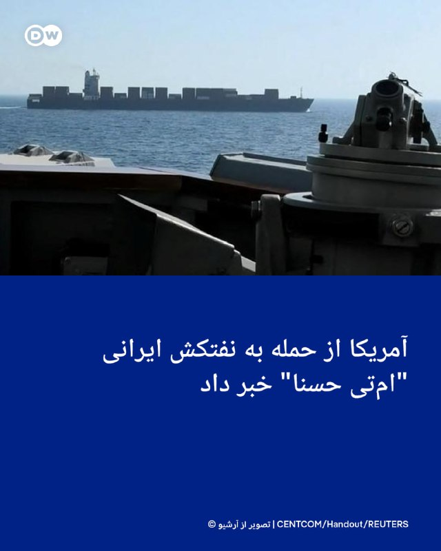

> 🔶 آمریکا از حمله به نفتکش ایرانی "ام‌تی حسنا" خبر داد
> 
> فرماندهی مرکزی ارتش آمریکا، سنتکام، اعلام کرد نیروهای آمریکایی چندین گلوله به سوی نفتکش بدون بار "ام‌تی حسنا" (M/T Hasna) شلیک کرده و این کشتی را از حرکت انداخته‌اند.
> 
> سنتکام در شبکه ایکس شرح داد، این نفتکش که با پرچم ایران در حال حرکت بود، تلاش کرده بود محاصره دریایی آمریکا را بشکند و خود را به یکی از بنادر ایران برساند.
> 
> به گفته سنتکام، نیروهای آمریکایی چندین بار به این شناور هشدار دادند که در حال نقض محاصره آمریکا است.
> 
> در بیانیه سنتکام آمده است، پس از آنکه خدمه "حسنا" به هشدارهای مکرر توجه نکردند، نیروهای آمریکا با شلیک چند گلوله از توپ ۲۰ میلی‌متری یک جنگنده اف/ای-۱۸ سوپر هورنت (برخاسته از ناو هواپیمابر "یواس‌اس آبراهام لینکلن") سکان این نفتکش را از کار انداختند.
> 
> بر اساس این بیانیه، "حسنا" دیگر به سمت ایران در حرکت نیست.
> 
> سنتکام همچنین تاکید کرد که محاصره آمریکا علیه کشتی‌هایی که تلاش می‌کنند وارد بنادر ایران شوند یا از آنها خارج شوند، همچنان به طور کامل برقرار است.
> @dw_farsi

## 1405/02/16 21:44 — IranIntlTV
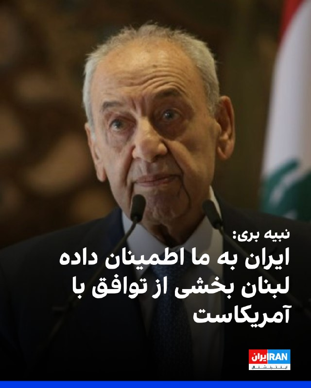

> نبیه بری، رییس مجلس لبنان، به الجزیره گفت که جمهوری اسلامی به مقام‌های لبنانی اطلاع داده است که هر توافق احتمالی با آمریکا، لبنان را نیز در بر خواهد گرفت.
> 
> او افزود عباس عراقچی، وزیر امور خارجه جمهوری اسلامی، به او اطمینان داده که لبنان بخشی از هر توافق با واشینگتن برای برقراری آتش‌بس خواهد بود.
> 
> بری گفت که هرگونه توافق لبنان با اسرائیل نیازمند تضمین است، زیرا به گفته او، اسرائیل «به تعهدات خود پایبند نمی‌ماند».
> 
> رییس مجلس لبنان که به جمهوری اسلامی نزدیک است و گفته می‌شود برای تحقق اهداف حکومت ایران مقرری سالانه دریافت می‌کند، اسرائیل را متهم کرد که با وجود پایبندی حزب‌الله به توافق، آتش‌بس و توقف درگیری‌ها را نقض کرده است.
> https://iranintl.com/202605061638

## 1405/02/16 21:42 — FarsiVOA
> 🔺پرزیدنت ترامپ:‌ رژیم ایران شکست‌ خورده است، هرچند شاید خودشان خبر نداشته باشند
> 
> ▪️پرزیدنت ترامپ می‌گوید که رژیم ایران از لحاظ نظامی شکست‌ خورده است، هرچند «شاید خودشان خبر نداشته باشند.»
> 
> ⬇️ بیشتر بخوانید:
> 
> https://ir.voanews.com/a/trump-nuclear-energy-new-targets-attack/8147264.html/?nocach=1

## 1405/02/16 21:40 — Hranews
> گزارشی از اعدام یک زندانی در زندان دستگرد اصفهان/ تایید یک حکم اعدام در تهران
> 
> 
> ❗️
> ❗️
> ❗️
> ❗️
> ❗️– سحرگاه روز دوشنبه، حکم یک زندانی که پیشتر از بابت اتهامات مرتبط با جرائم مواد مخدر به #اعدام محکوم شده بود، در زندان دستگرد اصفهان به اجرا درآمد. از سوی دیگر، حکم اعدام مردی که متهم به قتل یک مرد دیگر بود، توسط دیوان عالی کشور تایید شد.
> 
> ادامه مطلب
> 
> #مسعود_شیرزاد
> 
> ↘️
> @hranews_bot تماس ✉️ -  @Hranews  کانال هرانا 🆑

## 1405/02/16 21:39 — IranIntlTV
> 🎧نسخه صوتی اخبار شبانگاهی | چهارشنبه ۱۶ اردیبهشت
> @iranintlTV

## 1405/02/16 21:39 — VahidOnline
> بنیامین نتانیاهو، نخست‌وزیر اسرائیل در آغاز جلسه کابینه خود امروز(چهارشنبه) به موضوع ایران و همکاری با آمریکا در این زمینه اشاره کرده است.
> آقای نتانیاهو درباره ارتباط با ایالات متحده گفته است: «هماهنگی کاملی بین ما وجود دارد؛ هیچ غافلگیری وجود ندارد. ما اهداف مشترکی داریم و مهمترین هدف، خارج کردن تمام مواد غنی‌شده از ایران و برچیدن قابلیت‌های غنی‌سازی ایران است.»
> نخست وزیر اسرائیل گفته است:«رئیس جمهور ترامپ معتقد است که می‌تواند به هر طریقی به این هدف دست یابد. با این حال، ما برای هر سناریویی آماده هستیم و این دستورالعملی است که من به ارتش اسرائیل و سازمان‌های امنیتی‌مان داده‌ام. اسرائیل از همیشه قوی‌تر است؛ ایران و نیروهای نیابتی آن از همیشه ضعیف‌تر هستند.»
> او گفته است: «ما در حال حفظ ارتباط مداوم با دوستانمان در ایالات متحده هستیم. من تقریبا هر روز با رئیس جمهور ترامپ صحبت می‌کنم. مردم من و مردم او روزانه، از جمله امروز، با هم صحبت می‌کنند. و من امشب دوباره با رئیس جمهور ترامپ صحبت خواهم کرد.»
> @VahidHeadline
> دونالد ترامپ، رئیس‌جمهور ایالات متحده، روز چهارشنبه و همزمان با تلاش‌ها برای دستیابی به توافق پایان جنگ در خاورمیانه، بار دیگر تأکید کرد که آمریکا اورانیوم غنی‌شده ایران را خواهد گرفت.
> او هنگام ترک یک رویداد در کاخ سفید به خبرنگاران گفت: «ما آن را خواهیم گرفت.»
> آقای ترامپ در جریان سخنرانی خود در کاخ سفید همچنین گفت «ما در ایران خیلی خوب عمل می‌کنیم. همه‌چیز خیلی روان پیش می‌رود و خواهیم دید چه اتفاقی می‌افتد. آن‌ها می‌خواهند به توافق برسند، می‌خواهند مذاکره کنند.»
> رئیس‌جمهور آمریکا درباره وضعیت مذاکرات توضیح داد: «ما با افرادی سر و کار داریم که بسیار خواهان رسیدن به توافق هستند و خواهیم دید آیا می‌توانند توافقی ارائه دهند که برای ما رضایت‌بخش باشد یا نه.»
> @VahidHeadline
> 
> 📡 @VahidOnline

## 1405/02/16 21:39 — IranianMinds
> 🔴 حملات شدید اسرائیل به جنوب لبنان
> 
> @IranianMinds

## 1405/02/16 21:38 — VahidOOnLine
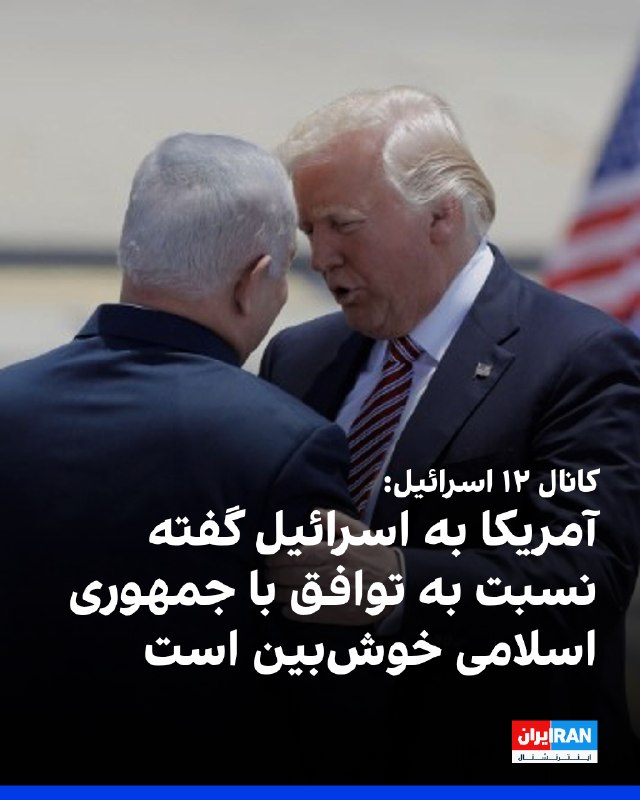

> رسانه‌های اسرائیلی گزارش دادند بنیامین نتانیاهو، نخست‌وزیر اسرائیل، در آغاز نشست کابینه امنیتی این کشور گفت که قرار است شامگاه چهارشنبه ۱۶ اردیبهشت با دونالد ترامپ، رییس‌جمهوری آمریکا، تلفنی گفت‌وگو کند.
> 
> نتانیاهو گفت او و ترامپ «تقریبا هر روز» با یکدیگر صحبت می‌کنند و تیم‌های دو طرف نیز به‌طور روزانه در تماس هستند.
> 
> او با تاکید بر «هماهنگی کامل» میان اسرائیل و آمریکا افزود: «هیچ غافلگیری‌ای در کار نیست. ما اهداف مشترکی داریم و مهم‌ترین هدف، خارج کردن همه مواد غنی‌شده از ایران و برچیدن توانایی‌های غنی‌سازی ایران است.»
> 
> نخست‌وزیر اسرائیل گفت ترامپ معتقد است می‌تواند این هدف را «به‌شکلی» محقق کند، اما اسرائیل برای «هر سناریویی» آماده است و همین دستور را به ارتش و نهادهای امنیتی این کشور داده است.
> ‌🏁 🇬🇧 IranintlTV
> 
> 🤖 @VahidOOnLine

## 1405/02/16 21:37 — IranIntlTV

> رسانه‌های اسرائیلی گزارش دادند بنیامین نتانیاهو، نخست‌وزیر اسرائیل، در آغاز نشست کابینه امنیتی این کشور گفت که قرار است شامگاه چهارشنبه ۱۶ اردیبهشت با دونالد ترامپ، رییس‌جمهوری آمریکا، تلفنی گفت‌وگو کند.
> 
> نتانیاهو گفت او و ترامپ «تقریبا هر روز» با یکدیگر صحبت می‌کنند و تیم‌های دو طرف نیز به‌طور روزانه در تماس هستند.
> 
> او با تاکید بر «هماهنگی کامل» میان اسرائیل و آمریکا افزود: «هیچ غافلگیری‌ای در کار نیست. ما اهداف مشترکی داریم و مهم‌ترین هدف، خارج کردن همه مواد غنی‌شده از ایران و برچیدن توانایی‌های غنی‌سازی ایران است.»
> 
> نخست‌وزیر اسرائیل گفت ترامپ معتقد است می‌تواند این هدف را «به‌شکلی» محقق کند، اما اسرائیل برای «هر سناریویی» آماده است و همین دستور را به ارتش و نهادهای امنیتی این کشور داده است.
> https://iranintl.com/202605068411

## 1378/10/11 03:30 — VahidOOnLine
[🎬 Video](telegram/content/VahidOOnLine_238510_1778094735.mp4)

> ♦️اسرائیل چهارشنبه‌شب، ۱۶ اردیبهشت، در نخستین حمله به بیروت پس از برقراری آتش‌بس در لبنان، یکی از فرماندهان ارشد نیروهای نخبه «رضوان» حزب‌الله را هدف قرار داد. بنیامین نتانیاهو، نخست‌وزیر اسرائیل، در بیانیه‌ای اعلام کرد که این حمله علیه فرمانده‌ای انجام شده که مسئول هدایت حملات علیه شهرک‌ها و سربازان اسرائیلی بوده است.
> 
> به گزارش سی‌ان‌ان، یک منبع اسرائیلی تایید کرد که این عملیات از پیش با ایالات متحده هماهنگ شده بود. اگرچه نام هدف این حمله فاش نشده و کشته شدن قطعی او هنوز رسما تایید نشده است، اما مقامات اسرائیلی معتقدند که جانشین فرمانده نیروهای رضوان نیز در این حمله مجروح شده است.
> 
> این حمله در حالی صورت می‌گیرد که دولت ترامپ در تلاش است تا دیداری مستقیم میان نتانیاهو و ژوزف عون، رئیس‌جمهوری لبنان، ترتیب دهد. با این حال، عون پیش‌شرط چنین دیداری را توقف حملات اسرائیل به لبنان اعلام کرده است. نتانیاهو همچنین اعلام کرد که انتظار دارد اواخر وقت چهارشنبه با دونالد ترامپ درباره آخرین تحولات گفتگو کند.
> ‌🇸🇦 Indypersian
> 
> 🤖 @VahidOOnLine

## 1378/10/11 03:30 — VahidOOnLine
[🎬 Video](telegram/content/VahidOOnLine_238509_1778094737.mp4)

> ⭕️ ملانیا ترامپ:
> مردم همسرم را به‌عنوان فرمانده قدرتمند کل قوا می‌شناسند اما او رهبری دلسوز است
> 
> ♦️ملانیا ترامپ، بانوی نخست ایالات متحده، روز چهارشنبه ۱۶ اردیبهشت در جمع مادران نظامیان در کاخ سفید رو به ترامپ گفت: «بیشتر مردم، همسر من را به‌عنوان فرمانده کل قوا می‌شناسند که فردی قدرتمند است، اما همدلی او فراتر از این جایگاه است و او را به رهبری دلسوز تبدیل کرده که همواره به یاد دارد هر یک از سربازان آمریکایی فرزند کسی است.»
> دونالد ترامپ در این دیدار اعلام کرد که ایالات متحده وضعیت ایران را «کاملا تحت کنترل» دارد و درباره احتمال دستیابی به توافق ابراز خوش‌بینی کرد.
> ‌🇸🇦 Indypersian
> 
> 🤖 @VahidOOnLine

## 1378/10/11 03:30 — VahidOOnLine
[🎬 Video](telegram/content/VahidOOnLine_238506_1778094739.mp4)

> ♦️دونالد ترامپ، رئیس‌جمهوری آمریکا، روز چهارشنبه ۱۶ اردیبهشت در جمع مادران نظامیان در کاخ سفید اعلام کرد که ایالات متحده وضعیت ایران را «کاملا تحت کنترل» دارد و درباره احتمال دستیابی به توافق ابراز خوش‌بینی کرد.
> 
> ترامپ گفت: «ما با افرادی طرف هستیم که بسیار مایل به انجام معامله هستند. خواهیم دید که آیا آن‌ها می‌توانند به توافقی که برای ما رضایت‌بخش باشد دست یابند یا خیر.» او همچنین محاصره دریایی ایران توسط نیروی دریایی آمریکا را که مانع ورود و خروج کشتی‌ها از بنادر این کشور می‌شود، به یک «دیوار فولادی» تشبیه کرد که «هیچ‌کس نمی‌تواند از آن عبور کند.»
> 
> رئیس‌جمهوری آمریکا بار دیگر تاکید کرد که اگر تهران با توافقی برای پایان دادن به جنگ موافقت نکند، در نهایت مجبور به انجام این کار خواهد شد. او افزود: «باید دید که آیا آن‌ها موافقت می‌کنند یا نه؛ اگر اکنون موافقت نکنند، مدت کوتاهی پس از آن مجبور به توافق خواهند شد. وضعیت این‌گونه است.»
> ‌🇸🇦 Indypersian
> 
> 🤖 @VahidOOnLine

## 1378/10/11 03:30 — VahidOOnLine
[🎬 Video](telegram/content/VahidOOnLine_238503_1778094741.mp4)

> ♦️بنیامین نتانیاهو، نخست‌وزیر اسرائیل، در اظهاراتی اعلام کرد که تماس‌ها و هماهنگی‌های مستمر و روزانه‌ای میان تل‌آویو و واشنگتن در جریان است و او تقریبا هر روز با رئیس‌جمهور آمریکا گفتگو می‌کند.
> نتانیاهو با اشاره به هماهنگی کامل میان دو طرف گفت هیچ غافلگیری در روابط دو کشور وجود ندارد و تاکید کرد که گفتگوها با آمریکا حتی در روز جاری نیز ادامه داشته و او قرار است شب نیز با رئیس‌جمهور آمریکا تماس داشته باشد.
> او در بخش دیگری از سخنان خود تاکید کرد که یکی از اهداف مشترک دو طرف، خارج کردن تمام مواد غنی‌شده از ایران و برچیدن توانمندی‌های هسته‌ای مرتبط با غنی‌سازی است. او افزود که رئیس‌جمهور آمریکا معتقد است این هدف می‌تواند از هر طریقی محقق شود و اسرائیل نیز برای «هر سناریویی» آماده است، موضوعی که به گفته او دستور آن به ارتش اسرائیل و نهادهای امنیتی این کشور ابلاغ شده است.
> نتانیاهو در پایان تاکید کرد که اسرائیل در قوی‌ترین وضعیت خود قرار دارد، در حالی که ایران و نیروهای نیابتی آن را ضعیف‌تر از گذشته توصیف کرد.
> ‌🇸🇦 Indypersian
> 
> 🤖 @VahidOOnLine

## 1378/10/11 03:30 — IranIntlTV
[🎬 Video](telegram/content/IranIntlTV_335850_1778094742.mp4)

> ۲۴ با فرداد فرحزاد، چهارشنبه ۱۶ اردیبهشت
> @iranintltv

## 1378/10/11 03:30 — IranIntlTV
[🎬 Video](telegram/content/IranIntlTV_335848_1778094744.mp4)

> مهدی‌ مهدوی‌آزاد در برنامه «چشم‌انداز» گفت همان‌طور که دونالد ترامپ با وجود تهدیدهای بسیار درباره پایان آتش‌بس و حمله به زیرساخت‌های ایران، ناگهان موضع خود را تغییر داد و آتش‌بس را به‌صورت یک‌طرفه تمدید کرد، امروز نیز در خصوص تنگه هرمز رفتار مشابهی از خود نشان داد.
> @iranintlTV

## 1378/10/11 03:30 — FarsiVOA
> ⚡️افزایش قیمت‌ها و تورم افسارگسیخته؛ واکنش کاربران در شبکه‌های اجتماعی
> @FarsiVOA

## 1378/10/11 03:30 — FarsiVOA
> دلایل خروج امارات
> از اوپک و اوپک پلاس

## 1378/10/11 03:30 — FarsiVOA
> در گفت‌وگو با منصور فرهنگ به ابعاد پیش‌نویس قطعنامه پیشنهادی آمریکا و کشورهای خلیج فارس درباره تنگه هرمز پرداختیم و بررسی کردیم این اقدام ذیل فصل هفتم منشور سازمان ملل در صورت تصویب چه تأثیری بر مذاکرات پیش‌روی تهران و واشینگتن و آینده تنش‌ها خواهد گذاشت.

## 1378/10/11 03:30 — FarsiVOA
> درباره آنچه احتمال توافق بر سر یک تفاهم بین آمریکا و ایران است در حالی که تحرکات دیپلماتیک تهران به شدت افزایش یافته، گفتگو می‌کند

## 1378/10/11 03:30 — FarsiVOA
> در حالی که گزارش‌ها از ادامه انفجارها، بازداشت شهروندان عرب اهل‌سنت و خاموشی اینترنت در ایران منتشر شده، اظهارات علی مطهری درباره کشته شدن علی لاریجانی و همچنین خبر «اینترنت طبقاتی» برای دانشجویان، بازتاب گسترده‌ای داشته است

## 1378/10/11 03:30 — FarsiVOA
> ملانیا ترامپ، بانوی اول ایالات متحده به همراه پرزیدنت ترامپ، در مراسمی که به میزبانی کاخ سفید برگزار شد، ضمن ادای احترام به مادران نظامی، از ایثار و فداکاری خانواده‌های نیروهای مسلح قدردانی کرد.

## 1378/10/11 03:30 — Persian_Trend_Official
[🎬 Video](telegram/content/Persian_Trend_Official_13551_1778094745.jpg)

> دومین پیام صوتی قالیباف به مردم منتشر شد
> 
> 🔹 ۵ درخواست رئیس مجلس از مردم در دوره جدید جنگ
> 🔹 مسئولان از اقدامات خود درباره گرانی‌ها به مردم گزارش دهند
> 
> ☆Phantom☆
> 
> 📌 @persian_trend_official
> پرشین ترند | متفاوت‌ترین کانال نظامی

## 1378/10/11 03:30 — Persian_Trend_Official
[🎬 Video](telegram/content/Persian_Trend_Official_13550_1778094746.mp4)

> دومین پیام صوتی قالیباف به مردم منتشر شد.
> 
> ۵ درخواست رئیس مجلس از مردم در دوره جدید جنگ
> مسئولان از اقدامات خود درباره گرانی‌ها به مردم گزارش دهند.
> 
> ☆Phantom☆
> 
> 📌 @persian_trend_official
> پرشین ترند | متفاوت‌ترین کانال نظامی

## 1405/02/16 21:32 — BBCPersian
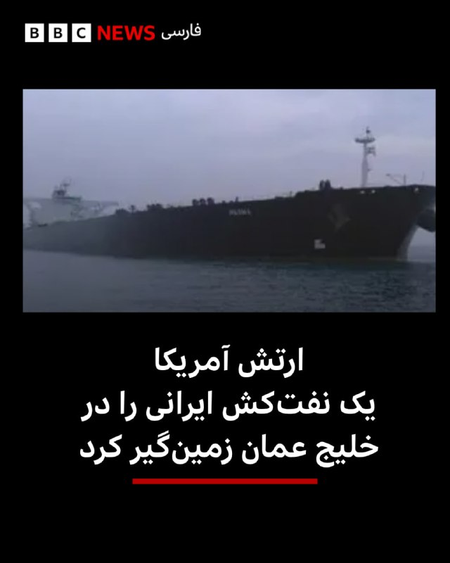

> 🔻فرماندهی مرکزی ایالات متحده در اطلاعیه‌ دیگری اعلام کرده است که نیروهای نظامی ایالات متحده روز چهارشنبه در خلیج عمان چندین بار به سمت یک نفتکش بدون بار ایرانی شلیک کردند و این کشتی(ام‌تی‌حسنا) که تلاش می‌کرد با نقض محاصره دریایی به سمت بندری در ایران حرکت کند، را از کار انداختند.
> 
> سنتکام گفته است که خدمه این کشتی هشدارهای مکرر را نادیده گرفتند و نیروهای آمریکایی به این کشتی شلیک کردند.
> 
> فرماندهی مرکزی ایالات متحده همچنین گفته است کشتی «حسنا» دیگر بسوی ایران در حرکت نیست.
> 
> این نهاد می‌گوید محاصره کشتی‌هایی که قصد ورود یا خروج از بنادر ایران را دارند، همچنان به طور کامل توسط ایالات متحده پابرجاست.
> 
> 📷CENTCOM
> @BBCPersian

## 1405/02/16 21:29 — VahidOOnLine

> اسرائیل اعلام کرده که نیروهای نظامی‌اش حمله‌ای را در حومه جنوبی پایتخت لبنان انجام داده‌اند که هدف آن فرمانده نیروی رضوان حزب‌الله بوده است.
> منابع امنیتی در ابتدا این حمله را به خبرگزاری رویترز گزارش دادند و گفتند که این نخستین حمله در حومه جنوبی بیروت طی چند هفته اخیر بوده است.
> پیش‌تر گزارش شده بود اسرائیل از توافق احتمالی میان آمریکا و جمهوری اسلامی بی‌اطلاع بوده و برای تشدید تنش‌ها آماده است.
> اسرائیل در حالی به حملات خود در جنوب لبنان ادامه می‌دهد که حزب‌الله گروه مورد حمایت جمهوری اسلامی را هدف قرار داده است.
> ‌🏁 🇬🇧 ManotoTV
> 
> 🤖 @VahidOOnLine

## 1405/02/16 21:29 — VahidOnline
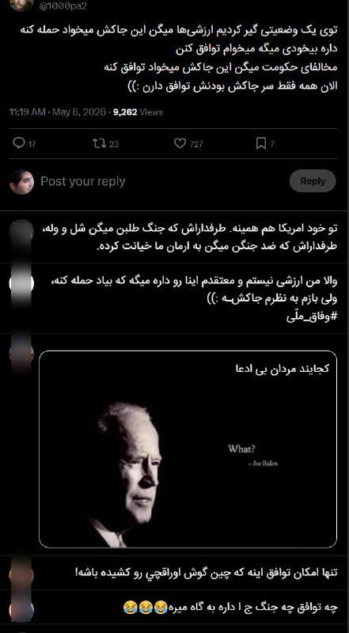

> 1000pa2
> 
> 📡 @VahidOnline

## 1405/02/16 21:29 — ManotoTV

> اسرائیل اعلام کرده که نیروهای نظامی‌اش حمله‌ای را در حومه جنوبی پایتخت لبنان انجام داده‌اند که هدف آن فرمانده نیروی رضوان حزب‌الله بوده است.
> منابع امنیتی در ابتدا این حمله را به خبرگزاری رویترز گزارش دادند و گفتند که این نخستین حمله در حومه جنوبی بیروت طی چند هفته اخیر بوده است.
> پیش‌تر گزارش شده بود اسرائیل از توافق احتمالی میان آمریکا و جمهوری اسلامی بی‌اطلاع بوده و برای تشدید تنش‌ها آماده است.
> اسرائیل در حالی به حملات خود در جنوب لبنان ادامه می‌دهد که حزب‌الله گروه مورد حمایت جمهوری اسلامی را هدف قرار داده است.

## 1405/02/16 21:27 — mamlekate

> 📝 پخش مستقیم بازی تیم ملی با خودش، همراه با وی‌ای‌آر و حضور مقامات سیاسی
> 
> در حالی که فوتبال ایران در تعطیلی مطلق به سر می‌برد و حریفان تدارکاتی تیم ملی، در آستانه جام جهانی، بازی با ایران را لغو کرده‌اند، تیم ملی فوتبال دومین بازی‌ تدارکاتی درون تیمی را در استادیوم پاس قوامین، وابسته به نیروی انتظامی، برگزار کرد.
> 
> این دیدار علاوه بر اینکه از صدا و سیمای جمهوری اسلامی به طور مستقیم پخش شد، وی ای آر هم داشت.
> 
> اسماعیل بقایی، سخنگوی وزارت امور خارجه، این بازی بدون تماشاگر را که با نتیجه سه بر یک به سود تیم سفید به پایان رسید، از نزدیک تماشا کرد.
> 
> قرار بود تیم ملی فوتبال در اردوی ترکیه با تیم های مقدونیه و آنگولا دیدار کند که این دو تیم به دلیل شرایط فعلی در ایران از بازی با تیم ملی انصراف دادند.
> 
> @mamlekate

## 1405/02/16 21:27 — Persian_Trend_Official
> 🔴فرمانده یگان رضوان حزب الله ترور شد ‼️ ▪️بر اساس چند گزارش، نیروهای اسرائیلی “مالک بلوت” فرمانده نیروی رضوان حزب‌الله، را به همراه چند نیروی دیگر هدف قرار داده و کشته‌اند 🫆:Tony 📌 @persian_trend_official پرشین ترند | متفاوت‌ترین کانال نظامی

## 1405/02/16 21:27 — RadioFarda
> 📻بشنوید: ایستگاه ۱۹ با رادیوفردا، ۱۶ اردیبهشت ۱۴۰۵
> 
> @RadioFarda

## 1405/02/16 21:25 — DW_Farsi
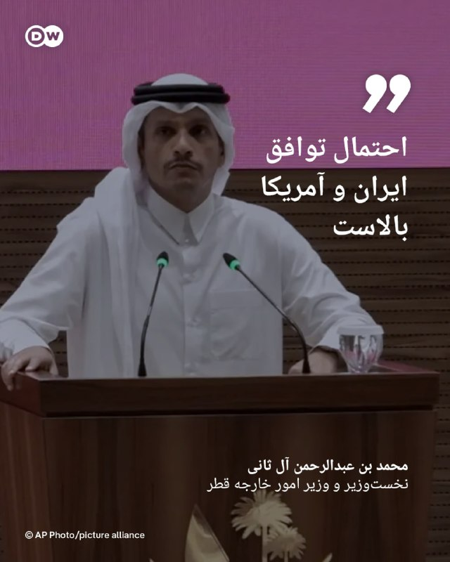

> 🔶 نخست‌وزیر قطر: احتمال توافق ایران و آمریکا بالاست
> 
> محمد بن عبدالرحمن آل ثانی، نخست‌وزیر و وزیر امور خارجه قطر در گفت‌وگو با رسانه "العربی الجدید" گفت، احتمال آن که آمریکا و جمهوری اسلامی به توافق دست یابند، "بالا" است.
> 
> عبدالرحمن آل ثانی با انتقاد از استفاده از تنگه هرمز به عنوان اهرم فشار افزود، هر توافقی باید منافع منطقه را نیز در نظر بگیرد.
> 
> نخست‌وزیر قطر همچنین خواستار "همگرایی" میان کشورهای خلیج فارس برای مقابله با تهدیدهای مشترک شد؛ اشاره‌ای که به نظر می‌رسد به ایران مربوط باشد.
> 
> او در عین حال از اتحاد کشورش با آمریکا دفاع کرد و گفت، این رابطه بر پایه منافع مشترک و تفاهم‌های همه‌جانبه بنا شده است.
> @dw_farsi

## 1405/02/16 21:25 — Persian_Trend_Official

> فرزند خلیل الحیه فرمانده نظامی ارشد حماس در غزه نیز کشته شده است.
> 
> ☆Phantom☆
> 
> 📌 @persian_trend_official
> پرشین ترند | متفاوت‌ترین کانال نظامی

## 1405/02/16 21:25 — RadioFarda
> 🔸دونالد ترامپ، رئیس‌جمهور ایالات متحده، روز چهارشنبه و همزمان با تلاش‌ها برای دستیابی به توافق پایان جنگ در خاورمیانه، بار دیگر تأکید کرد که آمریکا اورانیوم غنی‌شده ایران را خواهد گرفت. 🔸او هنگام ترک یک رویداد در کاخ سفید به خبرنگاران گفت: «ما آن را خواهیم…

## 1405/02/16 21:25 — RadioFarda
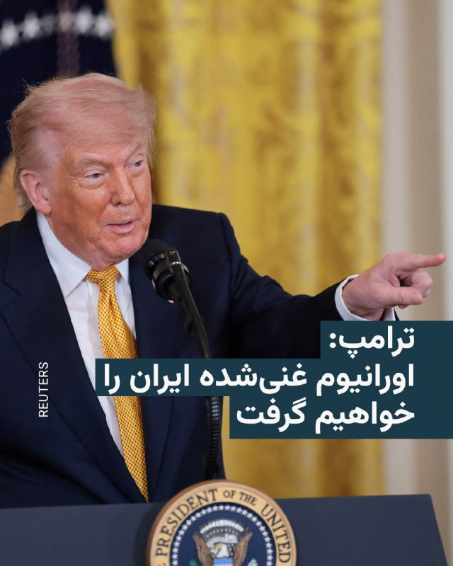

> 🔸دونالد ترامپ، رئیس‌جمهور ایالات متحده، روز چهارشنبه و همزمان با تلاش‌ها برای دستیابی به توافق پایان جنگ در خاورمیانه، بار دیگر تأکید کرد که آمریکا اورانیوم غنی‌شده ایران را خواهد گرفت.
> 
> 🔸او هنگام ترک یک رویداد در کاخ سفید به خبرنگاران گفت: «ما آن را خواهیم گرفت.»
> 
> 🔸یکی از اهداف اصلی دونالد ترامپ از آغاز حملات نظامی علیه ایران این بوده است که اطمینان حاصل کند تهران به سلاح هسته‌ای دست پیدا نمی‌کند.
> 
> 🔸ایران هنوز بیش از چهارصد کیلوگرم اورانیوم با غنای ۶۰ درصدی دارد که به گفته مدیرکل آژانس بین‌المللی انرژی اتمی به احتمال زیاد در تأسیسات بمباران‌شده طی جنگ ۱۲ روزه در سال گذشته مدفون شده است.
> 
> 🔸آقای ترامپ در جریان سخنرانی خود در کاخ سفید همچنین گفت که ایران می‌خواهد مذاکره کند و به یک توافق برسد و افزود که آمریکا در ایران «خیلی خوب» عمل می‌کند و اوضاع «به‌خوبی پیش می‌رود.»
> 
> @RadioFarda

## 1405/02/16 21:23 — VahidOOnLine
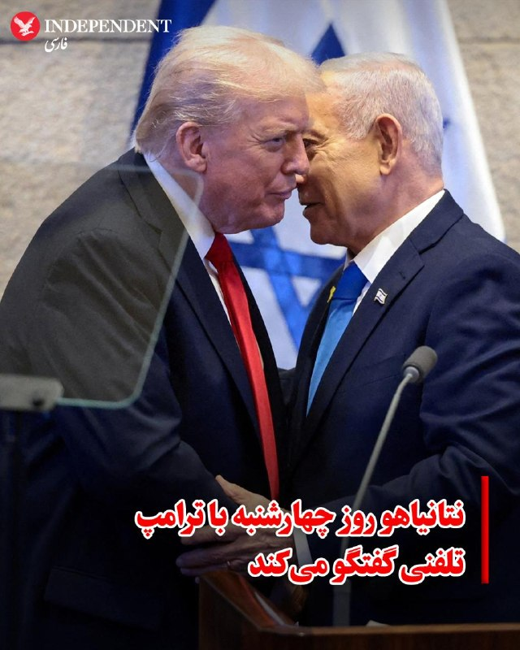

> ♦️بنیامین نتانیاهو، نخست‌وزیر اسرائیل، در پیامی ویدیویی اعلام کرد که اواخر امروز، چهارشنبه ۱۶ اردیبهشت، با دونالد ترامپ، رئیس‌جمهوری آمریکا درباره مذاکرات جاری میان ایالات متحده و ایران برای پایان دادن به جنگ گفتگو خواهد کرد. او با تاکید بر هماهنگی کامل میان دو طرف اظهار داشت که هیچ غافلگیری در کار نیست.
> 
> نتانیاهو تصریح کرد: «ما اهداف مشترکی داریم و مهم‌ترین هدف ما، خروج تمامی مواد غنی‌شده از ایران و برچیدن کامل توانمندی‌های غنی‌سازی این کشور است». این اظهارات در حالی مطرح می‌شود که پیش‌تر سی‌ان‌ان به نقل از منابع خود از تلاش‌های نتانیاهو برای کسب اطلاع از مفاد پیشنهاد واشنگتن برای مذاکره با تهران خبر داده بود.
> ‌🇸🇦 Indypersian
> 
> 🤖 @VahidOOnLine

## 1405/02/16 21:23 — VahidOOnLine
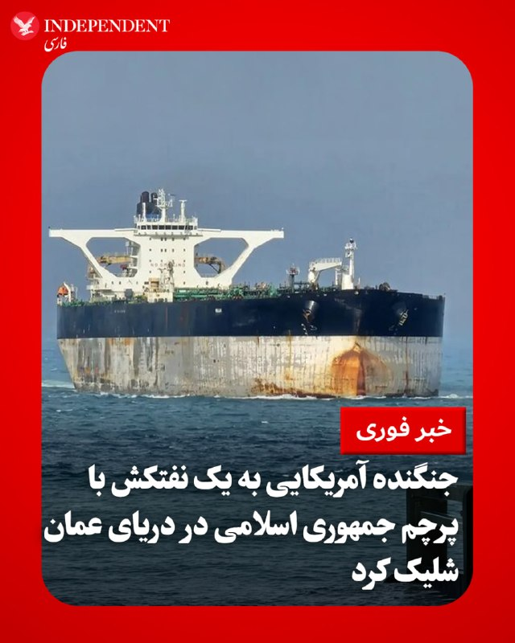

> ♦️ ستاد فرماندهی مرکزی ایالات متحده (سنتکام) اعلام کرد که نیروهای این کشور در راستای اجرای محاصره دریایی علیه ایران، یک نفتکش با پرچم جمهوری اسلامی را در دریای عمان متوقف کرده‌اند. این حادثه در ساعت ۹ صبح به وقت شرق آمریکا در روز ۶ می رخ داد؛ زمانی که نفتکش خالی«حسنا» در حال حرکت به سمت یکی از بنادر ایران بود.
> 
> به گفته سنتکام، نیروهای آمریکایی پس از مشاهده این شناور در آب‌های بین‌المللی، هشدارهای متعددی مبنی بر نقض محاصره صادر کردند. پس از بی‌توجهی خدمه نفتکش به اخطارهای مکرر، یک جنگنده F/A-18 سوپر هورنت برخاسته از ناو هواپیمابر «یواس‌اس آبراهام لینکلن» با شلیک چندین گلوله از توپ ۲۰ میلی‌متری خود، سکان این تانکر را از کار انداخت.
> 
> سنتکام تاکید کرده است که نفتکش «حسنا» دیگر به سمت ایران در حرکت نیست و محاصره دریایی علیه تمامی کشتی‌هایی که قصد ورود یا خروج از بنادر ایران را دارند، با قاطعیت ادامه خواهد یافت.
> ‌🇸🇦 Indypersian
> 
> 🤖 @VahidOOnLine

## 1405/02/16 21:20 — Persian_Trend_Official

> آنلاین/گزارش ها از درگیری زمینی میان حزب الله و نیروهای اسرائیل در جنوب لبنان
> 
> ☆Phantom☆
> 
> 📌 @persian_trend_official
> پرشین ترند | متفاوت‌ترین کانال نظامی

## 1405/02/16 21:20 — VahidOOnLine
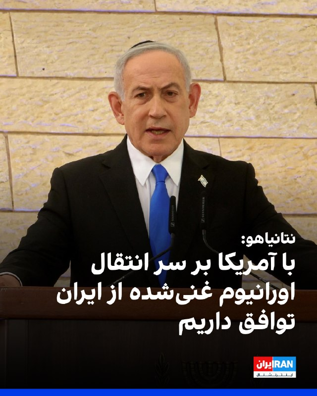

> رسانه‌های اسرائیلی گزارش دادند بنیامین نتانیاهو، نخست‌وزیر اسرائیل، در آغاز نشست کابینه امنیتی این کشور گفت که قرار است شامگاه چهارشنبه ۱۶ اردیبهشت با دونالد ترامپ، رییس‌جمهوری آمریکا، تلفنی گفت‌وگو کند.
> 
> نتانیاهو گفت او و ترامپ «تقریبا هر روز» با یکدیگر صحبت می‌کنند و تیم‌های دو طرف نیز به‌طور روزانه در تماس هستند.
> 
> او با تاکید بر «هماهنگی کامل» میان اسرائیل و آمریکا افزود: «هیچ غافلگیری‌ای در کار نیست. ما اهداف مشترکی داریم و مهم‌ترین هدف، خارج کردن همه مواد غنی‌شده از ایران و برچیدن توانایی‌های غنی‌سازی ایران است.»
> 
> نخست‌وزیر اسرائیل گفت ترامپ معتقد است می‌تواند این هدف را «به‌شکلی» محقق کند، اما اسرائیل برای «هر سناریویی» آماده است و همین دستور را به ارتش و نهادهای امنیتی این کشور داده است.
> ‌🏁 🇬🇧 IranintlTV
> 
> 🤖 @VahidOOnLine

## 1405/02/16 21:20 — IranIntlTV

> رسانه‌های اسرائیلی گزارش دادند بنیامین نتانیاهو، نخست‌وزیر اسرائیل، در آغاز نشست کابینه امنیتی این کشور گفت که قرار است شامگاه چهارشنبه ۱۶ اردیبهشت با دونالد ترامپ، رییس‌جمهوری آمریکا، تلفنی گفت‌وگو کند.
> 
> نتانیاهو گفت او و ترامپ «تقریبا هر روز» با یکدیگر صحبت می‌کنند و تیم‌های دو طرف نیز به‌طور روزانه در تماس هستند.
> 
> او با تاکید بر «هماهنگی کامل» میان اسرائیل و آمریکا افزود: «هیچ غافلگیری‌ای در کار نیست. ما اهداف مشترکی داریم و مهم‌ترین هدف، خارج کردن همه مواد غنی‌شده از ایران و برچیدن توانایی‌های غنی‌سازی ایران است.»
> 
> نخست‌وزیر اسرائیل گفت ترامپ معتقد است می‌تواند این هدف را «به‌شکلی» محقق کند، اما اسرائیل برای «هر سناریویی» آماده است و همین دستور را به ارتش و نهادهای امنیتی این کشور داده است.
> https://iranintl.com/202605064178

## 1378/10/11 03:30 — VahidOOnLine
[🎬 Video](telegram/content/VahidOOnLine_238499_1778090864.mp4)

> ‌
> دونالد ترامپ گفت ایالات متحده اجازه نخواهد داد جمهوری اسلامی به سلاح هسته‌ای دست پیدا کند و تأکید کرد: «نخواهیم گذاشت چنین چیزی اتفاق بیفتد.»
> 
> او افزود واشینگتن در حال تعامل با مقام‌هایی است که «بسیار تمایل دارند توافقی انجام دهند» و گفت باید دید آیا این توافق می‌تواند برای آمریکا قابل قبول باشد یا نه.
> 
> ترامپ در ادامه گفت: «ما اوضاع را کاملاً تحت کنترل داریم.»
> 
> او با اشاره به محاصره اعمال‌شده علیه جمهوری اسلامی گفت: «محاصره فوق‌العاده است. نیروی دریایی کار فوق‌العاده‌ای انجام داده؛ مثل یک دیوار فولادی.»
> 
> رئیس‌جمهور آمریکا افزود: «هیچ‌کس عبور نمی‌کند، به‌ویژه ایرانی‌ها؛ آن‌ها به هیچ شکلی نمی‌توانند چیزی را عبور دهند و عملاً از کار افتاده‌اند.»
> 
> ترامپ همچنین گفت: «خواهیم دید آیا آن‌ها موافقت می‌کنند یا نه، و اگر موافقت نکنند، خیلی زود بعد از آن مجبور به موافقت خواهند شد.»
> 
> او در پایان تأکید کرد: «وضعیت به همین شکل است.»
> ‌🏁 🇬🇧 ManotoTV
> 
> 🤖 @VahidOOnLine

## 1378/10/11 03:30 — VahidOOnLine
[🎬 Video](telegram/content/VahidOOnLine_238498_1778090865.mp4)

> ⭕️ انفجار کهنز شهریار از دوربین خودرو؛
> ویدیویی که به‌دلیل قطعی اینترنت با دو ماه تاخیر منتشر شد
> 
> ♦️در ویدیوی منتشر شده که مربوط به یکشنبه ۱۰ اسفندماه است، از دوربین یک خودرو در حال عبور، انفجار در کهنز شهریار ضبط شده است.
> در توضیح همراه این ویدیو که از سوی حساب کاربری «وحید آنلاین» منتشر شده، آمده است: «انفجار حمله به سپاه کهنز شهریار از دوربین ماشین. تازه تونستم به اینترنت وصل بشم.»
> پس از قطع کامل اینترنت در ایران، برخی کاربران که توانسته‌اند از روش‌های مختلف به اینترنت جهانی متصل شوند، اقدام به انتشار ویدیوها و تصاویر پراکنده‌ای از چهل روز جنگ آمریکا و اسرائیل علیه جمهوری اسلامی در شبکه‌های اجتماعی کرده‌اند.
> ‌🇸🇦 Indypersian
> 
> 🤖 @VahidOOnLine

## 1378/10/11 03:30 — IranIntlTV
[🎬 Video](telegram/content/IranIntlTV_335843_1778090867.mp4)

> دونالد ترامپ هشدار داد اگر جمهوری اسلامی توافق نکند، بمباران آغاز می‌شود و این بار شدت و سطح آن بسیار فراتر از گذشته خواهد بود. او در عین حال گفت نسبت به رسیدن به توافق خوش‌بین است.
> 
> همزمان ارتش اسرائیل اعلام کرد اهداف جدیدی برای ازسرگیری حملات در ایران آماده شده است.
> 
> گفت‌وگو با مسعود کاظمی، روزنامه‌نگار و بابک اسحاقی و سمیرا قرایی، خبرنگاران ایران‌اینترنشنال
> @iranintltv

## 1378/10/11 03:30 — IranIntlTV
[🎬 Video](telegram/content/IranIntlTV_335842_1778090869.mp4)

> دونالد ترامپ، رییس‌جمهوری آمریکا، به جمهوری اسلامی هشدار داد که در صورت نرسیدن به توافق، حملات نظامی شدیدتری را آغاز خواهد کرد. همزمان آکسیوس از نزدیک‌شدن آمریکا و جمهوری اسلامی به یک تفاهم برای توقف جنگ خبر داد.
> 
> گفت‌وگو با نجات بهرامی، تحلیل‌گر سیاسی
> @iranintltv

## 1378/10/11 03:30 — ManotoTV
[🎬 Video](telegram/content/ManotoTV_105049_1778090871.mp4)

> ‌
> دونالد ترامپ گفت ایالات متحده اجازه نخواهد داد جمهوری اسلامی به سلاح هسته‌ای دست پیدا کند و تأکید کرد: «نخواهیم گذاشت چنین چیزی اتفاق بیفتد.»
> 
> او افزود واشینگتن در حال تعامل با مقام‌هایی است که «بسیار تمایل دارند توافقی انجام دهند» و گفت باید دید آیا این توافق می‌تواند برای آمریکا قابل قبول باشد یا نه.
> 
> ترامپ در ادامه گفت: «ما اوضاع را کاملاً تحت کنترل داریم.»
> 
> او با اشاره به محاصره اعمال‌شده علیه جمهوری اسلامی گفت: «محاصره فوق‌العاده است. نیروی دریایی کار فوق‌العاده‌ای انجام داده؛ مثل یک دیوار فولادی.»
> 
> رئیس‌جمهور آمریکا افزود: «هیچ‌کس عبور نمی‌کند، به‌ویژه ایرانی‌ها؛ آن‌ها به هیچ شکلی نمی‌توانند چیزی را عبور دهند و عملاً از کار افتاده‌اند.»
> 
> ترامپ همچنین گفت: «خواهیم دید آیا آن‌ها موافقت می‌کنند یا نه، و اگر موافقت نکنند، خیلی زود بعد از آن مجبور به موافقت خواهند شد.»
> 
> او در پایان تأکید کرد: «وضعیت به همین شکل است.»

## 1405/02/16 21:18 — Persian_Trend_Official
[🎬 Video](telegram/content/Persian_Trend_Official_13546_1778089818.jpg)

> 🔴فرمانده یگان رضوان حزب الله ترور شد ‼️ ▪️بر اساس چند گزارش، نیروهای اسرائیلی “مالک بلوت” فرمانده نیروی رضوان حزب‌الله، را به همراه چند نیروی دیگر هدف قرار داده و کشته‌اند 🫆:Tony 📌 @persian_trend_official پرشین ترند | متفاوت‌ترین کانال نظامی

## 1405/02/16 21:17 — VahidOOnLine

> دونالد ترامپ گفت اگر جمهوری اسلامی با شرایط مورد نظر واشینگتن موافقت نکند، «خیلی زود مجبور به موافقت خواهد شد» و تاکید کرد که اوضاع تحت کنترل ایالات متحده است.
> 
> او با تاکید بر اینکه «اجازه نمی‌دهیم ایران سلاح هسته‌ای داشته باشد»، افزود: «ما اورانیوم غنی‌شده را از ایران خواهیم گرفت.»
> ‌🏁 🇬🇧 IranintlTV
> 
> 🤖 @VahidOOnLine

## 1405/02/16 21:17 — IranIntlTV
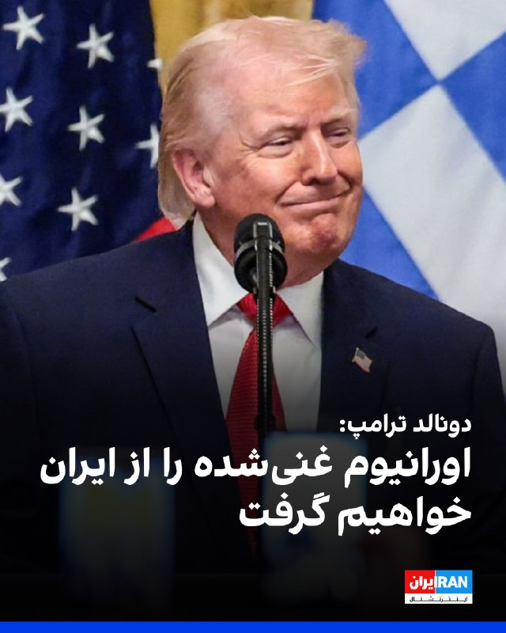

> دونالد ترامپ گفت اگر جمهوری اسلامی با شرایط مورد نظر واشینگتن موافقت نکند، «خیلی زود مجبور به موافقت خواهد شد» و تاکید کرد که اوضاع تحت کنترل ایالات متحده است.
> 
> او با تاکید بر اینکه «اجازه نمی‌دهیم ایران سلاح هسته‌ای داشته باشد»، افزود: «ما اورانیوم غنی‌شده را از ایران خواهیم گرفت.»
> https://iranintl.com/202605063051

## 1405/02/16 21:16 — BBCPersian
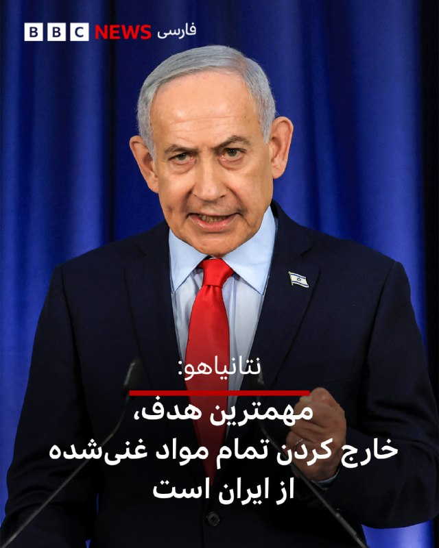

> 🔻بنیامین نتانیاهو، نخست‌وزیر اسرائیل در آغاز جلسه کابینه خود امروز(چهارشنبه) به موضوع ایران و همکاری با آمریکا در این زمینه اشاره کرده است.
> 
> آقای نتانیاهو درباره ارتباط با ایالات متحده گفته است: «هماهنگی کاملی بین ما وجود دارد؛ هیچ غافلگیری وجود ندارد. ما اهداف مشترکی داریم و مهمترین هدف، خارج کردن تمام مواد غنی‌شده از ایران و برچیدن قابلیت‌های غنی‌سازی ایران است.»
> 
> نخست وزیر اسرائیل گفته است:«رئیس جمهور ترامپ معتقد است که می‌تواند به هر طریقی به این هدف دست یابد. با این حال، ما برای هر سناریویی آماده هستیم و این دستورالعملی است که من به ارتش اسرائیل و سازمان‌های امنیتی‌مان داده‌ام. اسرائیل از همیشه قوی‌تر است؛ ایران و نیروهای نیابتی آن از همیشه ضعیف‌تر هستند.»
> 
> او گفته است: «ما در حال حفظ ارتباط مداوم با دوستانمان در ایالات متحده هستیم. من تقریبا هر روز با رئیس جمهور ترامپ صحبت می‌کنم. مردم من و مردم او روزانه، از جمله امروز، با هم صحبت می‌کنند. و من امشب دوباره با رئیس جمهور ترامپ صحبت خواهم کرد.»
> 
> 📷Getty Images
> @BBCPersian

## 1405/02/16 21:15 — IranianMinds
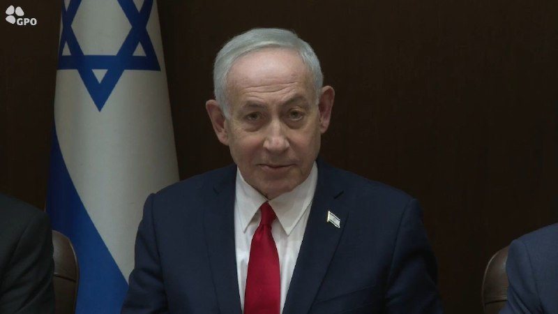

> نخست‌وزیر نتانیاهو در آغاز کابینه سیاسی-امنیتی :
> 
> «ما با دوستانمان در ایالات متحده در تماس مداوم هستیم. من تقریباً هر روز با پرزیدنت ترامپ صحبت می‌کنم.
> مقامات ما هر روز، از جمله امروز با هم صحبت می‌کنند. و من امشب نیز با پرزیدنت ترامپ صحبت خواهم کرد.
> 
> ما هماهنگی کامل داریم، هیچ غافلگیری وجود ندارد. ما اهداف مشترکی داریم و مهمترین هدف، خارج کردن مواد غنی‌شده از ایران، تمام مواد غنی‌شده، و برچیدن قابلیت‌های غنی‌سازی جمهوری اسلامی است.
> 
> پرزیدنت ترامپ معتقد است که می‌تواند به هر طریقی به این هدف دست یابد. اما ما برای هر سناریویی آماده‌ایم و این دستورالعمل من به ارتش اسرائیل و نیروهای امنیتی ما است. اسرائیل از همیشه قوی‌تر است، جمهوری اسلامی و نیروهای نیابتی آن از همیشه ضعیف‌تر هستند.»
> 
> @IranianMinds

## 1405/02/16 21:15 — mwarmonitor
> 🚨خبر فوری: به گفته یک بیانیه مشترک از سوی نتانیاهو و وزیر دفاع کاتس، ارتش اسرائیل (IDF) در بیروت حمله‌ای را انجام داده که هدف آن «فرمانده نیروی رضوان حزب‌الله» بوده است. @mwarmonitor

## 1405/02/16 21:12 — pm_afshaa
> فقط گیگی 250 با تست رایگان ✅ اول تست کن، بعد با خیال راحت خرید کن! ❌ دیگه چرا گیگی ۵۰۰ تا ۶۰۰ بدی؟! اونم بدون اینکه بدونی کیفیتش چطوره 😐 ⚡️ تخفیف ویژه محدود ⏳ فقط تا پایان امشب 🌍 آی‌پی استار واقعی + پینگ عالی 🛡 ضمانت بازگشت وجه بدون شرط 🚀 اتصال پایدار…

## 1405/02/16 21:12 — pm_afshaa

> فقط گیگی 250 با تست رایگان ✅
> اول تست کن، بعد با خیال راحت خرید کن!
> 
> ❌ دیگه چرا گیگی ۵۰۰ تا ۶۰۰ بدی؟!
> اونم بدون اینکه بدونی کیفیتش چطوره 😐
> 
> ⚡️ تخفیف ویژه محدود ⏳
> فقط تا پایان امشب
> 
> 🌍 آی‌پی استار واقعی + پینگ عالی
> 🛡 ضمانت بازگشت وجه بدون شرط
> 🚀 اتصال پایدار و بدون قطعی
> 
> خرید آنی از ربات :
> 
> @Lexvpnbot
> @Lexvpnbot
> تایم سرورامون نامحدوده❤️
> 
> Link chanel : @lex_server

## 1405/02/16 21:11 — VahidOnline

> سنتکام در بیانیه‌ای اعلام کرده نیروهای آمریکایی در دریای عمان «در چارچوب اجرای محاصره»، یک نفتکش خالی با پرچم ایران را که در حال حرکت به سمت یکی از بنادر ایران بود، از کار انداختند.
> سنتکام اعلام کرد پیش از این اقدام، چندین هشدار به این نفتکش داده شده، اما خدمه از دستورات تبعیت نکرده‌اند.
> در ادامه آمده است که نیروهای آمریکایی با شلیک چند گلوله از توپ ۲۰ میلی‌متری یک جنگنده اف/ای-۱۸ سوپر هورنت سکان نفتکش را از کار انداختند.
> @VahidOOnLine
> فکر کنم ترامپ قانون گذاشته از یه حدی بیشتر نباید خرج محاصره دریایی بشه. نفتکش قبلی را با توپ ناوشکن متوقف کردند این یکی را با تیربار اف-۱۸ زدند به سکانش.
> _KhodaBiamorz
> 
> 📡 @VahidOnline

## 1405/02/16 21:10 — VahidOOnLine
> ♦️ امانوئل مکرون، رئیس‌جمهوری فرانسه، روز چهارشنبه ۱۶ اردیبهشت در پیامی در شبکه اجتماعی ایکس از گفتگوی خود با مسعود پزشکیان، رئیس‌جمهوری اسلامی، خبر داد. او ضمن ابراز نگرانی شدید از تشدید تنش‌ها، حملات به زیرساخت‌های غیرنظامی امارات و کشتی‌های تجاری را محکوم کرد و خواستار لغو بدون قید و شرط محاصره تنگه هرمز، از سوی «همه طرف‌ها» شد. مکرون تاکید کرد که باید به رژیم آزادی کامل کشتیرانی که پیش از درگیری‌ها برقرار بود، بازگشت.
> 
> رئیس‌جمهوری فرانسه با اشاره به ماموریت چندملیتی پاریس و لندن برای بازگرداندن اعتماد به شرکت‌های کشتیرانی و بیمه، اعلام کرد که استقرار ناو هواپیمابر «شارل دوگل» در همین راستا صورت گرفته است. او این ماموریت را از طرف‌های درگیر در جنگ متمایز دانست و از پزشکیان خواست از این فرصت استفاده کند. مکرون همچنین اعلام کرد که قصد دارد در این باره با دونالد ترامپ نیز گفتگو کند. او خاطرنشان کرد که بازگشت آرامش به منطقه می‌تواند به پیشرفت در مذاکرات هسته‌ای و موشکی کمک کند و اروپایی‌ها نقش خود را در زمینه لغو تحریم‌ها ایفا خواهند کرد.
> ‌🇸🇦 Indypersian
> 
> 🤖 @VahidOOnLine

## 1405/02/16 21:09 — VahidOOnLine

> بنیامین نتانیاهو، نخست‌وزیر اسرائیل، در پیام ویدئویی اعلام کرد این کشور برای هر سناریویی آماده است و به گفته او، این دستور به ارتش و نهادهای امنیتی ابلاغ شده است.
> 
> نتانیاهو با تاکید بر آمادگی کامل اسرائیل افزود کشورش «از هر زمان دیگری قوی‌تر» است و جمهوری اسلامی و نیروهای نیابتی آن «از هر زمان دیگری ضعیف‌تر» شده‌اند.
> 
> او همچنین گفت میان اسرائیل و ایالات متحده «هماهنگی کامل» وجود دارد و «هیچ غافلگیری در کار نیست»، زیرا دو طرف اهداف مشترکی را دنبال می‌کنند.
> 
> ‌🏁 🇬🇧 IranintlTV
> 
> 🤖 @VahidOOnLine

## 1405/02/16 21:09 — IranIntlTV
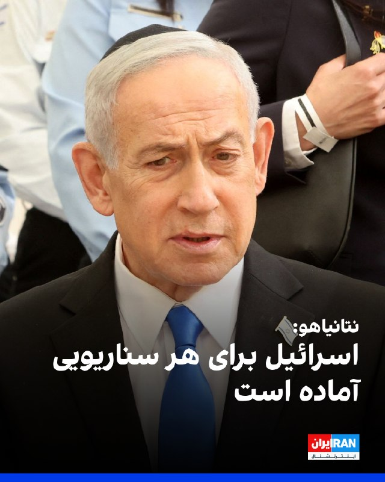

> بنیامین نتانیاهو، نخست‌وزیر اسرائیل، در پیام ویدئویی اعلام کرد این کشور برای هر سناریویی آماده است و به گفته او، این دستور به ارتش و نهادهای امنیتی ابلاغ شده است.
> 
> نتانیاهو با تاکید بر آمادگی کامل اسرائیل افزود کشورش «از هر زمان دیگری قوی‌تر» است و جمهوری اسلامی و نیروهای نیابتی آن «از هر زمان دیگری ضعیف‌تر» شده‌اند.
> 
> او همچنین گفت میان اسرائیل و ایالات متحده «هماهنگی کامل» وجود دارد و «هیچ غافلگیری در کار نیست»، زیرا دو طرف اهداف مشترکی را دنبال می‌کنند.
> 
> https://iranintl.com/202605063640

## 1405/02/16 21:08 — BBCPersian
> 🔻سنتکام: آمریکا تا کنون ۵۲ کشتی را بازگردانده است
> 
> فرماندهی مرکزی ارتش ایالات متحده سنتکام، در پیامی که در شبکه اجتماعی ایکس منتشر کرده، اعلام کرده است که در چارچوب محاصره دریایی ایران، «۵۲ کشتی تجاری» مجبور به بازگشت شده یا به بندر برگشته‌اند.»
> 
> دونالد ترامپ، رئیس جمهور آمریکا، دیروز ضمن اعلام توقف عملیات محاصره دریایی ایران موسوم به «پروژه آزادی» در تنگه هرمز، در خصوص توافق با ایران برای پایان دادن به جنگ ابراز امیدواری کرد.
> 
> سنتکام عکس‌هایی را هم از ناو هواپیمابر یو‌اس‌اس‌ جورج اچ‌دبلیو‌بوش (سی‌وی‌ان- ۷۷) هم منتشر کرده است و در توضیح آنها آورده است که این ناو «یکی از بزرگترین ناوگان‌های کشتی‌های جنگی، هواپیماها و پرسنل آمریکایی است که محاصره دریایی ایالات متحده علیه ایران را به طور کامل اجرا می‌کند.»
> 
> @BBCPersian

## 1405/02/16 21:08 — VahidOnline
> خواهر مصطفی حیدری‌تبار: Akitakii731
> 
> 📡 @VahidOnline

## 1405/02/16 21:08 — pm_afshaa
> 🔴آکسیوس: اسرائیل آماده بازگشت به درگیری با ایران است
> 
> 
> 💧 Rainbet.com the #1 Non-KYC Crypto Casino & Sportsbook @rainbetcom
> 
> 😁 @Pm_Afshaa

## 1405/02/16 21:07 — VahidOOnLine
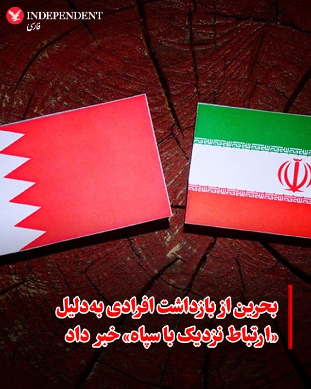

> ♦️وزارت کشور بحرین، روز چهارشنبه ۱۶ اردیبهشت اعلام کرد که تعداد نامشخصی از افراد دارای «ارتباطات نزدیک» با سپاه پاسداران انقلاب اسلامی اخیرا در این کشور بازداشت شده‌اند که برخی از آن‌ها مظنون به جاسوسی هستند.
> 
> این خبر پس از آن منتشر می‌شود که بحرین در اواخر آوریل اعلام کرد تابعیت ۶۹ نفر را به دلیل حمایت از حملات جمهوری اسلامی به این کشور سلب کرده است. منامه این افراد را به همدلی با تهران و «تبانی با نهادهای خارجی» متهم کرده است.
> ‌🇸🇦 Indypersian
> 
> 🤖 @VahidOOnLine

## 1405/02/16 21:03 — Persian_Trend_Official
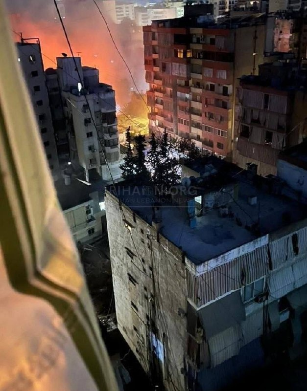

> 🔴فرمانده یگان رضوان حزب الله ترور شد ‼️
> 
> ▪️بر اساس چند گزارش، نیروهای اسرائیلی “مالک بلوت” فرمانده نیروی رضوان حزب‌الله، را به همراه چند نیروی دیگر هدف قرار داده و کشته‌اند
> 
> 🫆:Tony
> 
> 📌 @persian_trend_official
> پرشین ترند | متفاوت‌ترین کانال نظامی

## 1405/02/16 21:02 — VahidOOnLine

> سنتکام در بیانیه‌ای اعلام کرده نیروهای آمریکایی در دریای عمان «در چارچوب اجرای محاصره»، یک نفتکش خالی با پرچم ایران را که در حال حرکت به سمت یکی از بنادر ایران بود، از کار انداختند.
> سنتکام اعلام کرد پیش از این اقدام، چندین هشدار به این نفتکش داده شده، اما خدمه از دستورات تبعیت نکرده‌اند.
> در ادامه آمده است که نیروهای آمریکایی با شلیک چند گلوله از توپ ۲۰ میلی‌متری یک جنگنده اف/ای-۱۸ سوپر هورنت سکان نفتکش را از کار انداختند.
> ‌🏁 🇬🇧 ManotoTV
> 
> 🤖 @VahidOOnLine

## 1405/02/16 21:02 — ManotoTV
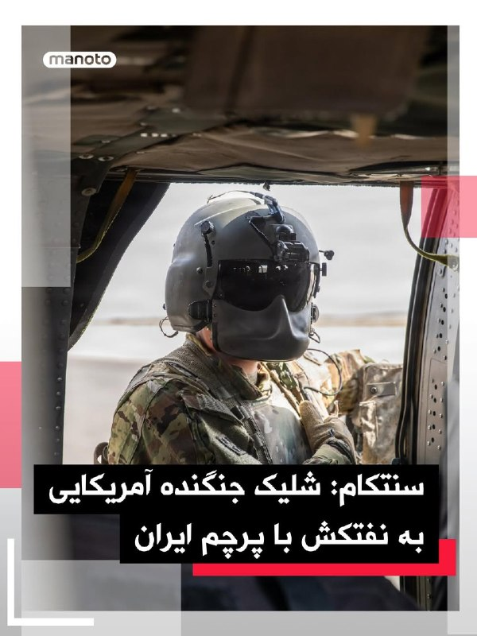

> سنتکام در بیانیه‌ای اعلام کرده نیروهای آمریکایی در دریای عمان «در چارچوب اجرای محاصره»، یک نفتکش خالی با پرچم ایران را که در حال حرکت به سمت یکی از بنادر ایران بود، از کار انداختند.
> سنتکام اعلام کرد پیش از این اقدام، چندین هشدار به این نفتکش داده شده، اما خدمه از دستورات تبعیت نکرده‌اند.
> در ادامه آمده است که نیروهای آمریکایی با شلیک چند گلوله از توپ ۲۰ میلی‌متری یک جنگنده اف/ای-۱۸ سوپر هورنت سکان نفتکش را از کار انداختند.

## 1405/02/16 21:02 — VahidOOnLine
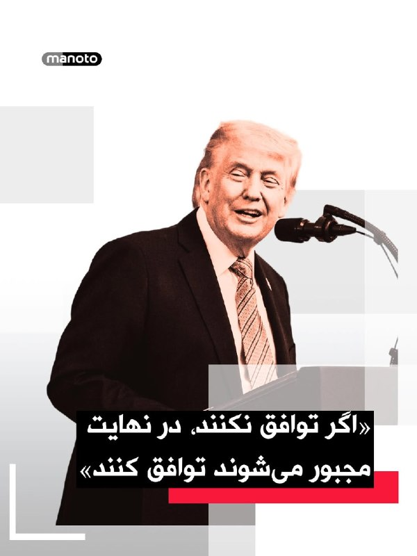

> دونالد ترامپ بار دیگر از احتمال دستیابی به توافق با جمهوری‌اسلامی برای پایان دادن به جنگ ابراز اطمینان کرد و گفت: «اگر توافق نکنند، در نهایت مجبور می‌شوند توافق کنند.»
> او در مراسمی در کاخ سفید با حضور مادران نظامیان آمریکایی، جنگ با ایران را «درگیری محدود» توصیف کرد و افزود: «اوضاع خیلی خوب پیش می‌رود.» ترامپ گفت: «همه‌چیز خیلی روان جلو می‌رود و باید دید چه اتفاقی می‌افتد. آن‌ها می‌خواهند توافق کنند و وارد مذاکره شوند.»
> او بار دیگر تأکید کرد که آمریکا «به‌مراتب قدرتمندترین ارتش جهان» را دارد و افزود: «الان داریم آن‌ها را کاملاً تحت فشار قرار می‌دهیم… اجازه نخواهیم داد ایران به سلاح هسته‌ای دست پیدا کند.»
> رئیس‌جمهور آمریکا همچنین با اشاره به محاصره دریایی ایران گفت: «همه‌چیز را کاملاً تحت کنترل داریم؛ این محاصره بی‌سابقه است و نیروی دریایی عملکرد فوق‌العاده‌ای داشته.»
> او افزود: «هیچ چیزی وارد یا خارج نمی‌شود… آن‌ها عملاً از کار افتاده‌اند و باید دید آیا با توافق موافقت می‌کنند یا نه.»
> او در پایان تاکید کرد: «اگر توافق نکنند، خیلی زود مجبور خواهند شد توافق کنند.»
> ‌🏁 🇬🇧 ManotoTV
> 
> 🤖 @VahidOOnLine

## 1405/02/16 21:02 — ManotoTV

> دونالد ترامپ بار دیگر از احتمال دستیابی به توافق با جمهوری‌اسلامی برای پایان دادن به جنگ ابراز اطمینان کرد و گفت: «اگر توافق نکنند، در نهایت مجبور می‌شوند توافق کنند.»
> او در مراسمی در کاخ سفید با حضور مادران نظامیان آمریکایی، جنگ با ایران را «درگیری محدود» توصیف کرد و افزود: «اوضاع خیلی خوب پیش می‌رود.» ترامپ گفت: «همه‌چیز خیلی روان جلو می‌رود و باید دید چه اتفاقی می‌افتد. آن‌ها می‌خواهند توافق کنند و وارد مذاکره شوند.»
> او بار دیگر تأکید کرد که آمریکا «به‌مراتب قدرتمندترین ارتش جهان» را دارد و افزود: «الان داریم آن‌ها را کاملاً تحت فشار قرار می‌دهیم… اجازه نخواهیم داد ایران به سلاح هسته‌ای دست پیدا کند.»
> رئیس‌جمهور آمریکا همچنین با اشاره به محاصره دریایی ایران گفت: «همه‌چیز را کاملاً تحت کنترل داریم؛ این محاصره بی‌سابقه است و نیروی دریایی عملکرد فوق‌العاده‌ای داشته.»
> او افزود: «هیچ چیزی وارد یا خارج نمی‌شود… آن‌ها عملاً از کار افتاده‌اند و باید دید آیا با توافق موافقت می‌کنند یا نه.»
> او در پایان تاکید کرد: «اگر توافق نکنند، خیلی زود مجبور خواهند شد توافق کنند.»

## 1405/02/16 20:59 — VahidOOnLine
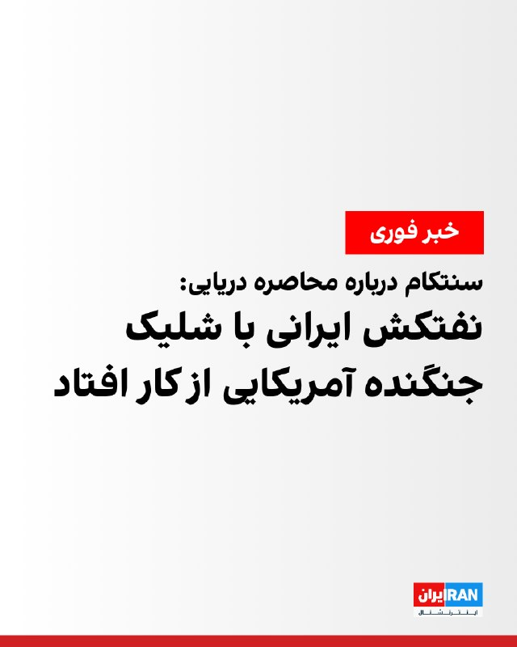

> فرماندهی مرکزی آمریکا، سنتکام، در شبکه ایکس اعلام کرد نیروهای نظامی آمریکا روز چهارشنبه چندین گلوله به سوی نفتکش بدون بار با پرچم ایران «ام‌تی حسنا» شلیک کردند و این شناور را هنگام تلاش برای حرکت به سوی یک بندر ایرانی در نقض محاصره، از کار انداختند.
> 
> بر اساس گزارش سنتکام، نفتکش «حسنا» پس از آنکه به هشدار نیروهای آمریکایی توجه نکرد، یک جنگنده نیروی دریایی آمریکا از ناو هواپیمابر «لینکلن» به پرواز درآمد و با شلیک چند گلوله ۲۰ میلی‌متری به سمت سکان کشتی، آن را از کار انداخت. در نتیجه، نفتکش دیگر قادر به ادامه مسیر به سمت ایران نبود.
> ‌🏁 🇬🇧 IranintlTV
> 
> 🤖 @VahidOOnLine

## 1405/02/16 20:58 — IranIntlTV

> فرماندهی مرکزی آمریکا، سنتکام، در شبکه ایکس اعلام کرد نیروهای نظامی آمریکا روز چهارشنبه چندین گلوله به سوی نفتکش بدون بار با پرچم ایران «ام‌تی حسنا» شلیک کردند و این شناور را هنگام تلاش برای حرکت به سوی یک بندر ایرانی در نقض محاصره، از کار انداختند.
> 
> بر اساس گزارش سنتکام، نفتکش «حسنا» پس از آنکه به هشدار نیروهای آمریکایی توجه نکرد، یک جنگنده نیروی دریایی آمریکا از ناو هواپیمابر «لینکلن» به پرواز درآمد و با شلیک چند گلوله ۲۰ میلی‌متری به سمت سکان کشتی، آن را از کار انداخت. در نتیجه، نفتکش دیگر قادر به ادامه مسیر به سمت ایران نبود.
> https://iranintl.com/202605062914

## 1405/02/16 20:58 — VahidOOnLine
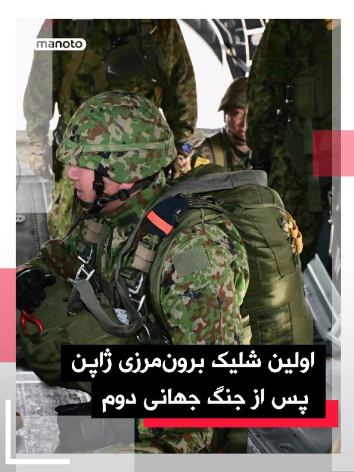

> برای نخستین‌بار از زمان جنگ جهانی دوم، ژاپن نیروهای رزمی خود را در خاک فیلیپین مستقر کرد؛ حدود ۱۴۰۰ نیروی نظامی در چارچوب رزمایش «بالیکاتان ۲۰۲۶» که بزرگ‌ترین دوره این مانور مشترک میان آمریکا و فیلیپین تا امروز به‌شمار می‌رود.
> در جریان این رزمایش، نیروهای زمینی دفاع از خود ژاپن با شلیک موشک‌های ضدکشتی Type 88 از منطقه ایلوکوس نورته، یک ناو از رده خارج فیلیپینی به نام BRP Quezon را در فاصله حدود ۵۰ تا ۷۵ کیلومتری از ساحل غرق کردند. این نخستین‌بار است که ژاپن از این سامانه خارج از قلمرو خود استفاده می‌کند.
> این مانور با مشارکت نیروهای آمریکا، فیلیپین و استرالیا برگزار می‌شود و سناریوی آن شبیه‌سازی مقابله با یک تهاجم آبی‌-خاکی در دریای جنوبی چین است. چین این رزمایش را «نظامی‌سازی مجدد» و «بازی با آتش» توصیف کرده است.
> رزمایش از ۲۰ آوریل آغاز شده و تا ۸ مه ادامه دارد و حدود ۱۷ هزار نیروی نظامی از هفت کشور در آن حضور دارند.
> ‌🏁 🇬🇧 ManotoTV
> 
> 🤖 @VahidOOnLine

## 1405/02/16 20:57 — ManotoTV

> برای نخستین‌بار از زمان جنگ جهانی دوم، ژاپن نیروهای رزمی خود را در خاک فیلیپین مستقر کرد؛ حدود ۱۴۰۰ نیروی نظامی در چارچوب رزمایش «بالیکاتان ۲۰۲۶» که بزرگ‌ترین دوره این مانور مشترک میان آمریکا و فیلیپین تا امروز به‌شمار می‌رود.
> در جریان این رزمایش، نیروهای زمینی دفاع از خود ژاپن با شلیک موشک‌های ضدکشتی Type 88 از منطقه ایلوکوس نورته، یک ناو از رده خارج فیلیپینی به نام BRP Quezon را در فاصله حدود ۵۰ تا ۷۵ کیلومتری از ساحل غرق کردند. این نخستین‌بار است که ژاپن از این سامانه خارج از قلمرو خود استفاده می‌کند.
> این مانور با مشارکت نیروهای آمریکا، فیلیپین و استرالیا برگزار می‌شود و سناریوی آن شبیه‌سازی مقابله با یک تهاجم آبی‌-خاکی در دریای جنوبی چین است. چین این رزمایش را «نظامی‌سازی مجدد» و «بازی با آتش» توصیف کرده است.
> رزمایش از ۲۰ آوریل آغاز شده و تا ۸ مه ادامه دارد و حدود ۱۷ هزار نیروی نظامی از هفت کشور در آن حضور دارند.

## 1405/02/16 20:57 — FarsiVOA
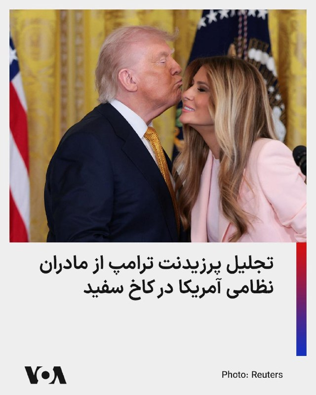

> دونالد ترامپ، رئیس جمهوری آمریکا میزبان گروهی از مادران نظامی بود و ضمن تجلیل از آن‌ها به عنوان نمادهای استقامت و «بهترین‌های کشور» گفت: «شما از تعطیلات، جشن‌های تولد، مراسم فارغ‌التحصیلی و حتی شنیدن اولین کلمات فرزندانتان چشم‌پوشی کرده‌اید. بسیاری از شما بیش از آنچه کسی بتواند تصورش را بکند، جابه‌جا شده و تغییر مکان داده‌اید؛ اما همه این کارها را به خاطر عشق به آمریکا انجام می‌دهید.»
> پرزیدنت ترامپ ترامپ که به همراه بانوی اول ملانیا در این مراسم حضور داشت، از عملکرد ملانیا ترامپ قدردانی کرد و افزود: «او در جایگاه بانوی اول عملکردی باورنکردنی داشته و مادری فوق‌العاده است.»

## 1405/02/16 20:57 — VahidOOnLine
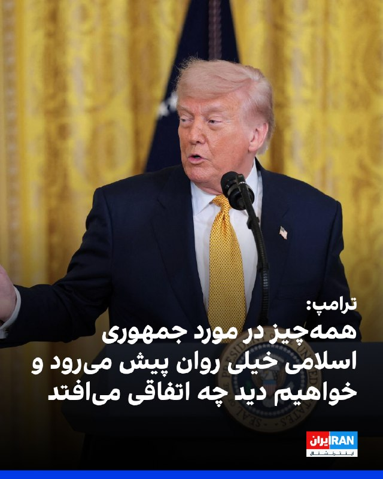

> دونالد ترامپ، رییس‌جمهوری آمریکا، در مراسمی نظامی به مناسبت روز مادر درباره تحولات مرتبط با جمهوری اسلامی گفت ایالات متحده «در ایران بسیار خوب عمل می‌کند» و اوضاع «به‌طور روان پیش می‌رود». او با اشاره به مذاکرات احتمالی افزود: «آن‌ها می‌خواهند به توافق برسند و مذاکره کنند، و خواهیم دید آیا می‌توانند توافقی ارائه دهند که برای ما رضایت‌بخش باشد یا نه.»
> 
> ترامپ تاکید کرد آمریکا اجازه نخواهد داد جمهوری اسلامی به سلاح هسته‌ای دست یابد و مدعی شد بزرگ‌ترین و قوی‌ترین ارتش جهان را در اختیار دارد. او همچنین محاصره دریایی اعمال‌شده علیه ایران را «فوق‌العاده» توصیف کرد و گفت نیروی دریایی آمریکا همچون «دیوار فولادی» عمل کرده و مانع هرگونه عبور شده است.
> 
> رییس‌جمهوری آمریکا در پایان افزود اگر جمهوری اسلامی با شرایط مورد نظر واشینگتن موافقت نکند، «خیلی زود مجبور به موافقت خواهد شد» و تاکید کرد که اوضاع تحت کنترل ایالات متحده است.
> 
> ‌🏁 🇬🇧 IranintlTV
> 
> 🤖 @VahidOOnLine

## 1405/02/16 20:57 — IranIntlTV

> دونالد ترامپ، رییس‌جمهوری آمریکا، در مراسمی نظامی به مناسبت روز مادر درباره تحولات مرتبط با جمهوری اسلامی گفت ایالات متحده «در ایران بسیار خوب عمل می‌کند» و اوضاع «به‌طور روان پیش می‌رود». او با اشاره به مذاکرات احتمالی افزود: «آن‌ها می‌خواهند به توافق برسند و مذاکره کنند، و خواهیم دید آیا می‌توانند توافقی ارائه دهند که برای ما رضایت‌بخش باشد یا نه.»
> 
> ترامپ تاکید کرد آمریکا اجازه نخواهد داد جمهوری اسلامی به سلاح هسته‌ای دست یابد و مدعی شد بزرگ‌ترین و قوی‌ترین ارتش جهان را در اختیار دارد. او همچنین محاصره دریایی اعمال‌شده علیه ایران را «فوق‌العاده» توصیف کرد و گفت نیروی دریایی آمریکا همچون «دیوار فولادی» عمل کرده و مانع هرگونه عبور شده است.
> 
> رییس‌جمهوری آمریکا در پایان افزود اگر جمهوری اسلامی با شرایط مورد نظر واشینگتن موافقت نکند، «خیلی زود مجبور به موافقت خواهد شد» و تاکید کرد که اوضاع تحت کنترل ایالات متحده است.
> 
> https://iranintl.com/202605069772

## 1405/02/16 20:55 — BBCPersian
> 📻پادکست رادیویی جام جهان‌نما چهارشنبه ۱۶ اردیبهشت ۱۴۰۵
> 
> در پی تحولات اخیر ایران و قطع و اختلال در اینترنت که امکان دسترسی مخاطبان در ایران به رسانه‌ها را با مشکل مواجه کرده است، بی‌بی‌سی فارسی از ۱۵ بهمن پخش رادیویی برنامه‌های خود را دوباره آغاز کرده است.
> 
> برنامه‌ جام جهان‌نما از این پس همه روزه از ساعت ۱۶:۳۰ گرینویچ (۲۰:۰۰ ایران) روی موج متوسط ۷۰۲ کیلوهرتز و موج کوتاه ۹۴۶۵ کیلوهرتز پخش می‌شود.
> 
> تکرار این برنامه از ساعت ۱۸:۰۰ گرینویچ (۲۱:۳۰ ایران) روی موج متوسط ۷۰۲ کیلوهرتز و موج کوتاه ۵۹۳۵ کیلوهرتز پخش می‌شود.
> 
> @BBCPersian

## 1405/02/16 20:54 — mwarmonitor
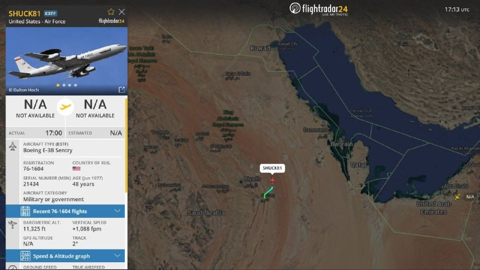

> ✈️🇺🇸📡 نیروی هوایی آمریکا یک فروند E-3G سنتری AWACS اضافی (با شماره 77-0351) را به منطقه اعزام کرده است؛ احتمالاً به پایگاه هوایی «پرینس سلطان» منتقل می‌شود. @mwarmonitor

## 1405/02/16 20:51 — kianmeli1
> 🔴فوری
> وزیر دفاع اسرائیل از ترور فرمانده کل نیرو های ویژه رضوان حزب الله در جنوب بیروت خبر داد
> https://t.me/kianmeli1

## 1405/02/16 20:51 — RadioFarda
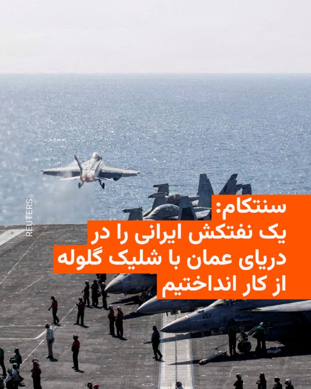

> 🔸ستاد فرماندهی مرکزی ایالات متحده اعلام کرد نیروهای آمریکایی یک نفتکش خالی با پرچم ایران را که به گفته واشینگتن در حال نقض محاصره دریایی بنادر ایران بوده، در دریای عمان با شلیک گلوله از کار انداخته‌اند.
> 
> 🔸بر اساس بیانیه سنتکام، نفتکش «ام‌تی حسنا» صبح چهارشنبه ۱۶ اردیبهشت در آب‌های بین‌المللی در مسیر یکی از بنادر ایران شناسایی شد و نیروهای آمریکایی چندین بار به آن هشدار دادند که در حال نقض محاصره دریایی است.
> 
> 🔸به گفته این فرماندهی، پس از آن‌که خدمه کشتی به هشدارها توجه نکردند، یک جنگنده اف-۱۸ نیروی دریایی آمریکا که از ناو هواپیمابر آبراهام لینکلن به پرواز درآمده بود، با شلیک گلوله‌های ۲۰ میلی‌متری سکان نفتکش را هدف قرار داد.
> 
> 🔸سنتکام اعلام کرد این کشتی دیگر به سمت ایران حرکت نمی‌کند و محاصره دریایی بنادر ایران همچنان برقرار است.
> 
> @RadioFarda

## 1405/02/16 20:51 — mwarmonitor
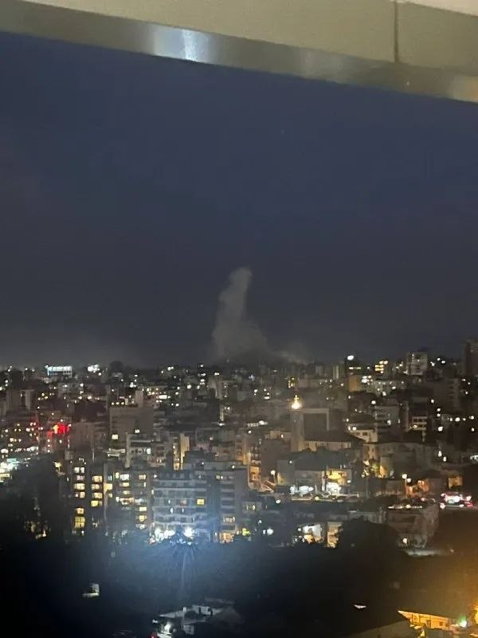

> 🚨خبر فوری: به گفته یک بیانیه مشترک از سوی نتانیاهو و وزیر دفاع کاتس، ارتش اسرائیل (IDF) در بیروت حمله‌ای را انجام داده که هدف آن «فرمانده نیروی رضوان حزب‌الله» بوده است.
> 
> @mwarmonitor

## 1405/02/16 20:49 — mwarmonitor
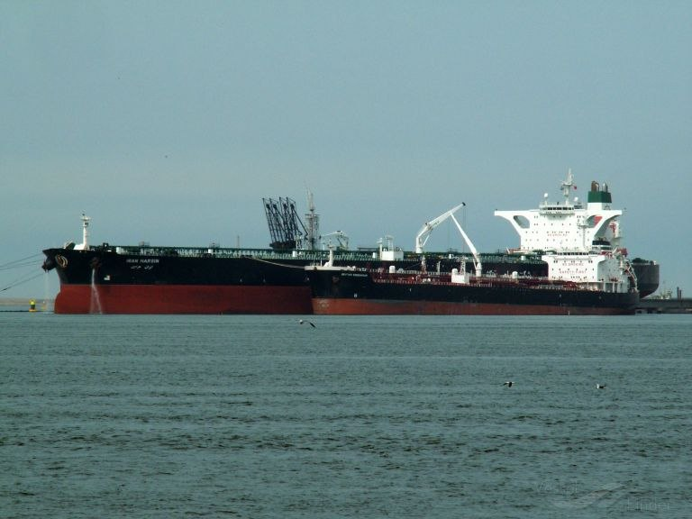

> 🇺🇸نیروهای ایالات متحده یک کشتی را در دریای عمان که قصد شکستن محاصره را داشت، از کار انداختند 🔴فرماندهی مرکزی ایالات متحده (سنتکام) 📌تامپا، فلوریدا — نیروهای ایالات متحده مستقر در دریای عمان، با از کار انداختن یک نفتکش خالی با پرچم ایران که در ساعت ۹ صبح…

## 1405/02/16 20:47 — FarsiVOA
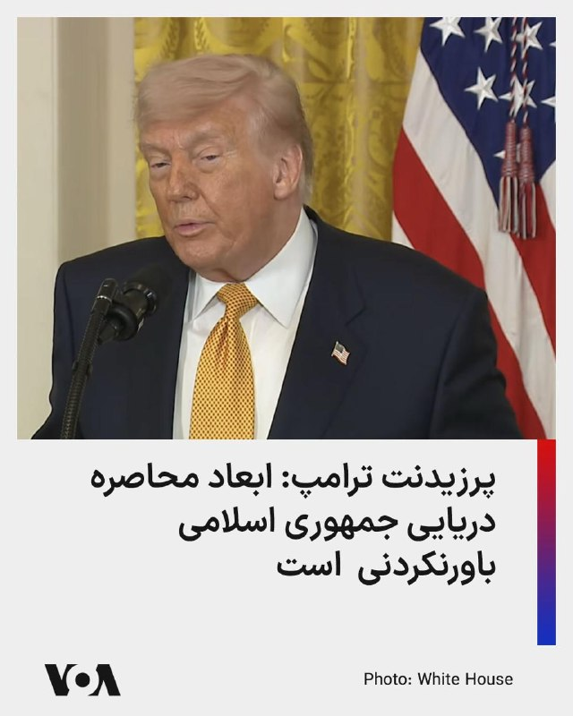

> دونالد ترامپ، رئیس جمهوری آمریکا با اشاره به محاصره دریایی جمهوری اسلامی گفت: «ما اوضاع را کاملاً تحت کنترل داریم. این محاصره باورنکردنی است... درست مثل یک دیوار فولادی عمل می‌کند.»
> پرزیدنت ترامپ در مراسم «روز مادر» نظامیان در کاخ سفید، بار دیگر به تلاش مقامات جمهوری اسلامی برای توافق با آمریکا اشاره کرد و گفت: «ما با افرادی طرف هستیم که بسیار مشتاق به دستیابی به یک توافق هستند. باید منتظر بمانیم و ببینیم آیا آن‌ها می‌توانند به توافقی برسند که برای ما رضایت‌بخش باشد یا خیر.»

## 1405/02/16 20:46 — DW_Farsi
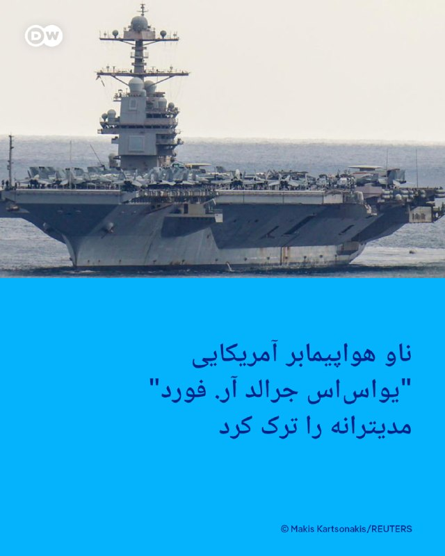

> 🔸 ناو هواپیمابر آمریکایی "یواس‌اس جرالد آر. فورد" مدیترانه را ترک کرد
> 
> بر اساس داده‌های ناوبری وبسایت "مارین ترافیک" و نیز گزارش‌های شاهدان عینی، ناو هواپیمابر آمریکایی "یواس‌اس جرالد آر. فورد" که از مأموریت برای جنگ ایران فراخوانده شده بود، از طریق تنگه جبل‌الطارق دریای مدیترانه را ترک کرده است.
> 
> تصاویر منتشرشده در شبکه‌های اجتماعی نشان می‌دهند، این ناو که بزرگ‌ترین ناو هواپیمابر جهان با ده‌ها جنگنده بر عرشه به شمار می‌رود این تنگه را به سمت غرب پشت سر گذاشته است.
> 
> این کشتی هفته گذشته پس از آنکه پیش‌تر در عملیات نظامی علیه جمهوری اسلامی مشارکت داشت، منطقه خلیج فارس را ترک کرد.
> 
> ناو "یواس‌اس جرالد آر. فورد" اکنون ۱۰ ماه است که در دریا به سر می‌برد. بنا بر گزارش رسانه‌های آمریکایی، قرار است این ناو به بندر خانگی خود در نورفولک در ایالت ویرجینیای آمریکا بازگردد.
> @dw_farsi

## 1405/02/16 20:46 — VahidOOnLine
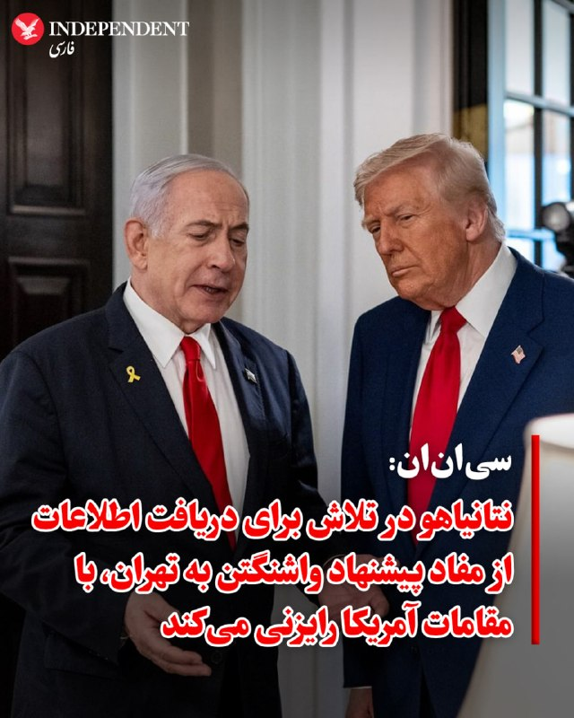

> ♦️ سی‌ان‌ان روز چهارشنبه ۱۶ اردیبهشت به نقل از منابع خود گزارش داد که بنیامین نتانیاهو، نخست‌وزیر اسرائیل، در حال گفتگو با مقامات دولت ترامپ است تا از آخرین تحولات مذاکرات میان ایالات متحده و ایران مطلع شود. یک منبع آگاه به سی‌ان‌ان اعلام کرد که نتانیاهو به دنبال دریافت به‌روزرسانی‌هایی درباره مفاد پیشنهادی روی میز است.
> 
> ارزیابی این منابع این است که اسرائیل نگران امتیازات احتمالی و لحظه‌آخری واشنگتن برای دستیابی به توافقی جهت پایان دادن به جنگ با ایران است. بر اساس این گزارش، نگرانی اصلی تل‌آویو معطوف به لغو احتمالی تحریم‌های اقتصادی علیه تهران است. اسرائیل علاوه بر پافشاری بر اعمال محدودیت بر برنامه موشک‌های بالستیک و شبکه گروه‌های نیابتی جمهوری اسلامی، خواهان تضمین این مسئله است که هرگونه توافق، «آزادی عمل نظامی اسرائیل» را در مقابله با تهدیدات منطقه‌ای حفظ کند.
> 
> مقامات آمریکایی در پاسخ به پیگیری‌های سی‌ان‌ان تایید کرده‌اند که نتانیاهو به طور منظم برای پیگیری روند مذاکرات با آن‌ها در تماس است، هرچند کاخ سفید هنوز در این باره اظهارنظر رسمی نکرده است.
> ‌🇸🇦 Indypersian
> 
> 🤖 @VahidOOnLine

## 1405/02/16 20:44 — BBCPersian
> 🔻كميسيون امنيت ملی و سياست خارجی مجلس شورای اسلامی: متن اکسیوس لیست آرزوهای آمریکایی‌هاست
> 
> ابراهیم رضایی، سخنگوی كميسيون امنيت ملی و سياست خارجی مجلس شورای اسلامی گزارش آکسیوس را «لیست آرزوهای آمریکایی‌‌ها» خوانده است.
> 
> او در شبکه اجتماعی ایکس نوشته است: «متن اکسیوس لیست آرزوهای آمریکایی‌هاست تا یک واقعیت.»
> 
> «آمریکایی‌ها چیزی که در مذاکرات رودررو بدست نیاورده‌اند در یک جنگ شکست خورده به دست نخواهند آورد، ایران دست به ماشه و آماده است، اگر تسلیم نشوند و امتیازات لازم را ندهند یا بخواهند خودشان یا سگهای پادوشان شیطنتی کنند پاسخ سخت و پشیمان‌کننده خواهیم داد.»
> 
> پیشتر وب‌سایت خبری اکسیوس به نقل از برخی منابع آگاه از نزدیک بودن توافق اولیه با ایران خبر داد و خبرگزاری رویترزهم به نقل از یک منبع پاکستانی دخیل در مذاکرات گزارش داد که آمریکا و ایران به دستیابی به یک تفاهم‌نامه یک‌صفحه‌ای برای پایان دادن به جنگ «نزدیک شده‌اند.»
> 
> اسماعیل بقایی، سخنگوی وزارت امور خارجه ایران می‌گوید که «پیشنهاد آمریکا هنوز توسط ایران در دست بررسی است و پس از جمع‌بندی، نظر خود را به طرف پاکستانی اطلاع خواهد داد.»
> 
> @BBCPersian

## 1405/02/16 20:42 — mwarmonitor
> 🇺🇸نیروهای ایالات متحده یک کشتی را در دریای عمان که قصد شکستن محاصره را داشت، از کار انداختند
> 
> 🔴فرماندهی مرکزی ایالات متحده (سنتکام)
> 
> 📌تامپا، فلوریدا — نیروهای ایالات متحده مستقر در دریای عمان، با از کار انداختن یک نفتکش خالی با پرچم ایران که در ساعت ۹ صبح (به وقت منطقه زمانی شرقی) ۶ می قصد حرکت به سمت یکی از بنادر ایران را داشت، اقدامات مربوط به محاصره را به اجرا گذاشتند.
> 🔸نیروهای فرماندهی مرکزی ایالات متحده (CENTCOM) نفتکش M/T Hasna را در حالی که در آب‌های بین‌المللی به سمت بندری در ایران در دریای عمان در حال حرکت بود، شناسایی کردند. نیروهای آمریکایی هشدارهای متعددی صادر کرده و به این شناور با پرچم ایران اطلاع دادند که در حال نقض محاصره ایالات متحده است.
> 🔹پس از آنکه خدمه کشتی «حسنا» از امتثال به هشدارهای مکرر خودداری کردند، نیروهای آمریکایی با شلیک چندین گلوله از توپ ۲۰ میلی‌متری یک جنگنده F/A-18 Super Hornet نیروی دریایی آمریکا (برخاسته از ناو هواپیمابر یواس‌اس آبراهام لینکلن - CVN 72)، سکان نفتکش را از کار انداختند. نفتکش حسنا دیگر به سمت ایران در حرکت نیست.
> 🔸محاصره ایالات متحده علیه کشتی‌هایی که قصد ورود به بنادر ایران یا خروج از آن‌ها را دارند، همچنان با قوت کامل در حال اجراست. نیروهای سنتکام به اقدامات سنجیده و حرفه‌ای خود برای اطمینان از پایبندی به این محاصره ادامه می‌دهند.
> 
> @mwarmonitor

## 1405/02/16 20:42 — IranIntlTV
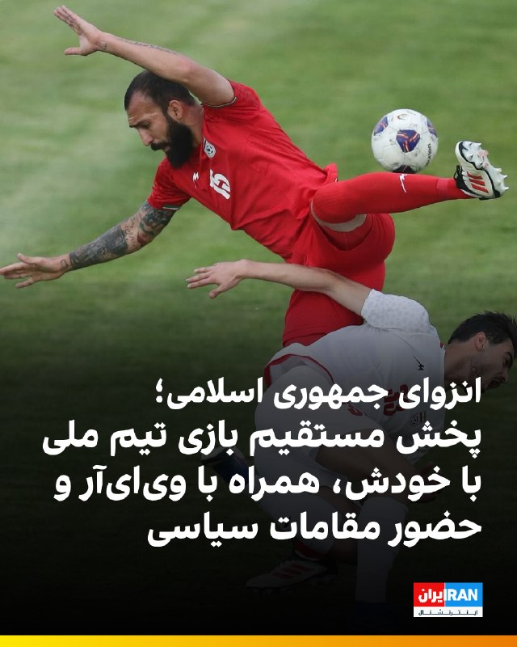

> 🔻در حالی که فوتبال ایران در تعطیلی مطلق به سر می‌برد و حریفان تدارکاتی تیم ملی، در آستانه جام جهانی، بازی با ایران را لغو کرده‌اند، تیم ملی فوتبال دومین بازی‌ تدارکاتی درون تیمی را در استادیوم پاس قوامین، وابسته به نیروی انتظامی، برگزار کرد. این دیدار علاوه بر اینکه از صدا و سیمای جمهوری اسلامی به طور مستقیم پخش شد، وی‌ای‌آر هم داشت.
> 
> 🔹اسماعیل بقایی، سخنگوی وزارت امور خارجه، این بازی بدون تماشاگر را که با نتیجه سه بر یک به سود تیم سفید به پایان رسید، از نزدیک تماشا کرد.
> 
> 🔹قرار بود تیم ملی فوتبال در اردوی ترکیه با تیم‌های مقدونیه و آنگولا دیدار کند که این دو تیم به دلیل شرایط فعلی در ایران از بازی با تیم ملی انصراف دادند.
> 
> @iranintltvsport

## 1405/02/16 20:37 — VahidOOnLine
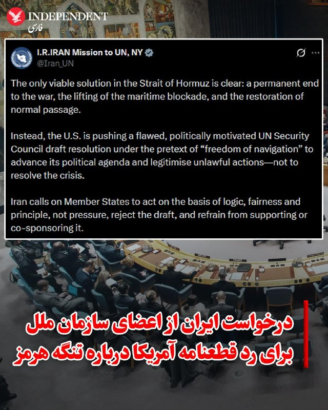

> ♦️نمایندگی دائم جمهوری اسلامی در سازمان ملل متحد از کشورهای عضو خواست تا پیش‌نویس قطعنامه ارائه‌شده توسط ایالات متحده و متحدانش در خلیج فارس را که ایران را برای تضمین امنیت کشتیرانی در تنگه هرمز تحت فشار قرار می‌دهد، رد کنند. این نمایندگی، قطعنامه مذکور را «ناقص» و دارای «انگیزه‌های سیاسی» توصیف کرد.
> 
> نمایندگی ایران در پیامی در شبکه اجتماعی ایکس اعلام کرد: «تنها راهکار عملی در تنگه هرمز روشن است: پایان دائمی جنگ، رفع محاصره دریایی و بازگرداندن شرایط عادی برای عبور و مرور». این نهاد در ادامه، ایالات متحده را متهم کرد که از این قطعنامه برای «پیشبرد دستور کار سیاسی خود و مشروعیت بخشیدن به اقدامات غیرقانونی» استفاده می‌کند، نه برای حل بحران.
> 
> مارکو روبیو، وزیر امور خارجه آمریکا، روز سه‌شنبه اعلام کرد که دولت ترامپ در حال تدوین و پیش‌برد قطعنامه‌ای در شورای امنیت سازمان ملل متحد است که هدف آن محکومیت اقدام رژیم ایران در مسدود کردن تنگه هرمز و فراخوان برای بازگشایی این مسیر حیاتی کشتیرانی است.
> ‌🇸🇦 Indypersian
> 
> 🤖 @VahidOOnLine

## 1405/02/16 20:22 — iaghapour

> 💢 سخنگو وزارت خارجه حذف تیک آبی خود در شبکه X را (سرکوب حقیقت) خواند.
> 
> 68 روزه اینترنت مردم ایران رو قطع کردن، بعد یه تیک آبی‌شو گرفتن میگه حقیقت سرکوب شد.
> 
> 🆔 @iaghapour

## 1405/02/16 20:16 — VahidOOnLine

> فرماندهی مرکزی ارتش آمریکا، سنتکام، در پستی در شبکه اجتماعی ایکس اعلام کرد تاکنون ۵۲ کشتی تجاری برای رعایت محاصره دریایی آمریکا علیه جمهوری اسلامی مجبور به بازگشت شده‌اند یا مسیرشان را به سوی بندر مبدا هدایت کرده‌اند.
> 
> سنتکام افزود ناو هواپیمابر یواس‌اس جورج اچ. دبلیو. بوش در میان شمار گسترده‌ای از کشتی‌های جنگی، هواپیماها و نیروهای آمریکایی است که به گفته این فرماندهی، «به‌طور کامل» محاصره دریایی بندرهای جنوب ایران را اجرا می‌کنند.
> ‌🏁 🇬🇧 IranintlTV
> 
> 🤖 @VahidOOnLine

## 1405/02/16 20:15 — VahidOOnLine
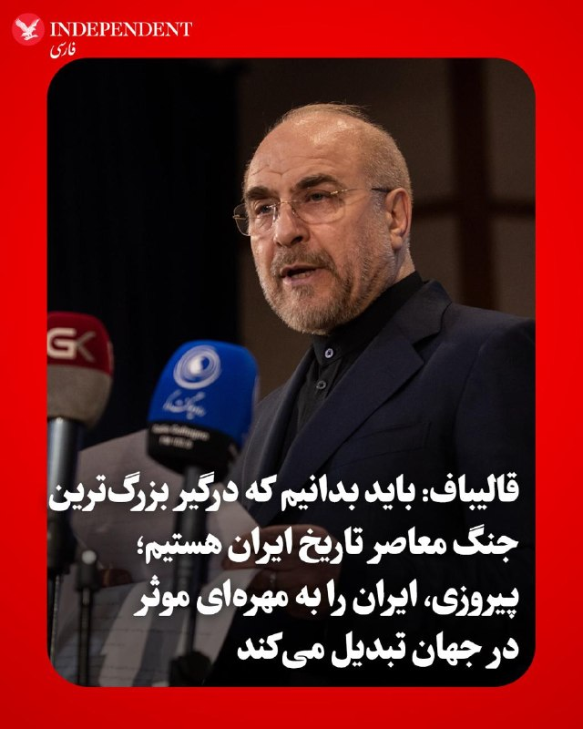

> ♦️محمدباقر قالیباف، رئیس مجلس شورای اسلامی، در بخشی از پیام صوتی خود که روز چهارشنبه ۱۶ اردیبهشت منتشر شد، جنگ جمهوری اسلامی با آمریکا و اسرائیل را «بزرگ‌ترین جنگ تاریخ معاصر ایران» دانست و گفت: «پیروزی در این جنگ ایران را به مهره‌ای موثر در جهان تبدیل کند و این موفقیت با مشقت همراه خواهد بود.»
> 
> قالیباف در ادامه از مردم کشور خواست که به یکدیگر کمک کنند تا پیروزی با «کمترین رنج» حاصل شود.
> 
> این اظهارات قالیباف در حالی مطرح می‌شود که گزارش‌ها از ایران حاکی از گرانی شدید اقلام اساسی و حداقل‌های معیشتی است. پیش‌تر ایندیپندنت فارسی به نقل از منابع خود در ایران گزارش داده بود که قیمت گوشت گرم به یک میلیون و نهصدهزار تومان و گوشت یخ‌زده گوسفندی به یک میلیون و ۲۱۲ هزار تومان رسیده است. این افزایش قیمت سرسام‌آور اقلام دیگری چون پنیر، گوشت مرغ و تخم مرغ را نیز در بر گرفته است. همزمان جمهوری اسلامی نیز با قطع اینترنت به کسب و کارهای کوچک آسیب زده و منبع درآمد بسیاری از مردم را قطع کرده است.
> ‌🇸🇦 Indypersian
> 
> 🤖 @VahidOOnLine

## 1405/02/16 19:53 — kianmeli1
> 🔴ناوهای هواپیمابر ائتلاف که در حال حاضر در منطقه، نزدیکی آن یا در عملیات خاورمیانه از تاریخ ۶ مه حضور دارند:
> 
> ناوهای بزرگ:
> - 🇺🇸یو اس اس آبراهام لینکلن (دریای عرب)
> - 🇺🇸یو اس اس جورج اچ. دبلیو. بوش (دریای عرب)
> - 🇫🇷ناو هواپیمابر شارل دوگل (کانال سوئز، در حال حرکت به سمت خلیج عدن)
> 
> ناوهای سبک:
> - 🇺🇸یو اس اس تریپولی (دریای عرب)
> - 🇺🇸یو اس اس باکسر (در حال حرکت، اقیانوس هند)
> - 🇫🇷ناو میسترال (مدیترانه)
> - 🇫🇷ناو هواپیمابر تونر (تولون، مدیترانه)
> - 🇫🇷ناو هواپیمابر دیکسمود (اقیانوس اطلس)
> 
> در حال ترک صحنه نبرد:
> - 🇺🇸 ناو هواپیمابر جرالد آر. فورد (اقیانوس اطلس، جبل الطارق)
> 
> هر سه ناو هواپیمابر بزرگ فرانسه، میسترال، تونر و دیکسمود، به دلیل جنگ در خاورمیانه، محل استقرارشان تغییر کرده است، به طوری که ناو هواپیمابر دیکسمود به طور خاص نقش خود را در رزمایش‌های چندملیتی بالیکتان در فیلیپین به دلیل نیازهای عملیاتی بالقوه در خاورمیانه لغو کرده است.
> 
> این ناو در حال حاضر در اقیانوس اطلس، نزدیک یا در آب‌های برزیل قرار دارد.
> 
> ناو هواپیمابر میسترال و تونر هر دو پیش از این پس از حملات ایران به قبرس، در کنار ناو هواپیمابر شارل دوگل به مدیترانه شرقی اعزام شده بودند، اما از آن زمان به بندر تولون بازگشته‌اند و ناو هواپیمابر میسترال دیروز در تاریخ ۵ مه بندر را ترک کرد.
> https://t.me/kianmeli1

## 1405/02/16 19:50 — VahidOOnLine

> ♦️ اسماعیل بقایی، سخنگوی وزارت امور خارجه جمهوری اسلامی، روز چهارشنبه ۱۶ اردیبهشت، در پیامی در شبکه اجتماعی ایکس با استناد به تعریف ارائه شده در یکی از مصوبات دیوان بین‌المللی دادگستری تاکید کرد که مفهوم «مذاکرات» مستلزم تلاشی واقعی برای حل اختلافات است. او خاطرنشان کرد که مذاکره لزوما نیازمند «حسن نیت» است و نباید با مشاجره اشتباه گرفته شود.
> 
> بقایی در ادامه تصریح کرد که فرآیند مذاکره به معنای «دیکته کردن»، «فریب»، «اخاذی» یا «اجبار» نیست. این اظهارات در حالی مطرح می‌شود که تلاش‌های بین‌المللی برای بازگرداندن تهران و واشنگتن به میز مذاکره ادامه دارد و طرفین با واسطه‌گری پاکستان، طرح‌هایی را برای پایان دادن به جنگ و ادامه مذاکرات موثر به یکدیگر ارائه داده‌اند اما هنوز توافقی روی این طرح‌ها صورت نگرفته است.
> ‌🇸🇦 Indypersian
> 
> 🤖 @VahidOOnLine

## 1405/02/16 19:49 — kianmeli1

> 🔴جایزه 10 میلیون دلاری امریکا برای شناسایی محل دبیرکل جنبش النجباء
> 
> وزارت خارجه امریکا برای اطلاعاتی که موجب شناسایی شیخ اکرم الکعبی دبیرکل جنبش النجباء عراق شود یا محل اقامت او را مشخص کند، 10 میلیون دلار پاداش در نظر گرفت.
> https://t.me/kianmeli1

## 1405/02/16 19:49 — VahidOOnLine

> روزنامه «تایمز اسرائیل» به نقل از دفتر یکی از وزیران گزارش داد که بنیامین نتانیاهو، نخست‌وزیر اسرائیل، چهارشنبه کابینه امنیتی تشکیل خواهد داد.
> 
> به نوشته این رسانه، برگزاری این نشست در شرایطی انجام می‌شود که گزارش‌هایی از نزدیک شدن آمریکا و جمهوری اسلامی به توافق بر سر یک یادداشت تفاهم برای پایان جنگ و بازگشایی تنگه هرمز منتشر شده است.
> ‌🏁 🇬🇧 IranintlTV
> 
> 🤖 @VahidOOnLine

## 1405/02/16 19:48 — kianmeli1
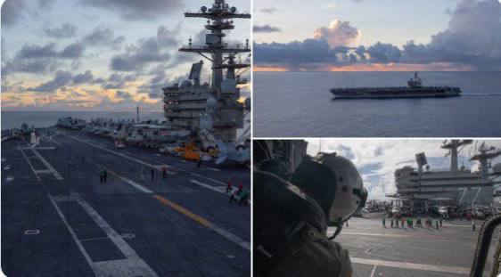

> 🔴بر اساس بیانیه‌ای که از سوی ستاد فرماندهی مرکزی ایالات متحده منتشر شده است، از زمان آغاز محاصره تنگه هرمز توسط ایالات متحده، ۵۲ کشتی از عبور از این تنگه منع شده یا به بنادر ایران بازگردانده شده‌اند.
> https://t.me/kianmeli1

## 1405/02/16 19:30 — DEJradio
[🎬 Video](telegram/content/DEJradio_4461_1778089838.jpg)

> 🚨
> ⭕️ دونالد ترامپ، رئیس جمهوری آمریکا به شبکه PBS:
> «اورانیوم غنی‌شده در چارچوب توافق احتمالی به آمریکا منتقل خواهد شد و جمهوری اسلامی از تأسیسات زیرزمینی استفاده نخواهد کرد. اما اگر توافقی حاصل نشود، جهنم را به روی آنها باز خواهیم کرد.»
> 
> #مذاکرات #ترامپ
> @DEJradio

## 1405/02/16 19:01 — pm_afshaa
> 🔴ترامپ به شبکه پی‌بی‌اس: این توافق تصریح می‌کند که ایران اورانیوم غنی‌شده با غلظت بالا را به ایالات متحده صادر خواهد کرد
> 
> 
> 💧 Rainbet.com the #1 Non-KYC Crypto Casino & Sportsbook @rainbetcom
> 
> 😁 @Pm_Afshaa

## 1405/02/16 18:56 — kianmeli1
> 🔴منبع اسرائیلی به سی‌ان‌ان گفت: نتانیاهو نگران و مضطرب از مذاکرات ایران و آمریکا است و قرار است امروز با دولت ترامپ مذاکره کند تا «آخرین تحولات مذاکرات را بهتر درک کند».
> https://t.me/kianmeli1

## 1405/02/16 18:56 — pm_afshaa
> 🔴بر اساس گزارش رسانه‌ Ynet، رئیس کل ستاد ارتش اسرائیل اعلام کرد که ارتش اسرائیل اهداف اضافی را آماده کرده و در حالت آماده‌باش کامل برای از سرگیری عملیات علیه ایران است
> 
> 
> 💧 Rainbet.com the #1 Non-KYC Crypto Casino & Sportsbook @rainbetcom
> 
> 😁 @Pm_Afshaa

## 1405/02/16 18:56 — kianmeli1
> ‏🔴محمدباقر قالیباف، رییس مجلس: احتمال حمله نظامی کم نیست
> https://t.me/kianmeli1

## 1405/02/16 18:53 — kianmeli1
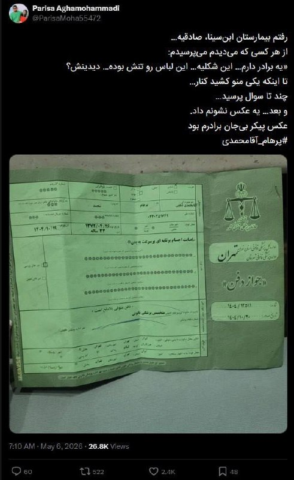

> 🔴روایت جانسوز کشته شدن پرهام آقامحمدی
> https://t.me/kianmeli1

## 1405/02/16 18:52 — kianmeli1
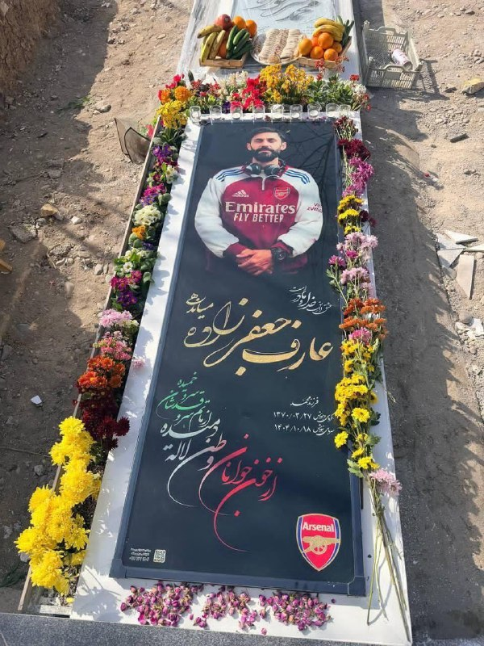

> عارف جعفرزاده در ۱۸ دی ۱۴۰۴ توسط حکومت اهریمنی خامنه ای کشته شد
> https://t.me/kianmeli1

## 1405/02/16 18:42 — kianmeli1

> 🔴وزارت دفاع فرانسه اعلام کرد ناو هواپیمابر شارل دوگل با عبور از کانال سوئز به سمت جنوب حرکت کرده تا در دریای سرخ و خلیج عدن مستقر شود و برای ماموریت اعلام شده قبلی بریتانیا و فرانسه در تنگه هرمز آماده شود.
> https://t.me/kianmeli1

## 1405/02/16 18:29 — kianmeli1
> 🔴فوری
> بر اساس گزارش رسانه اسرائیلی Ynet،
> رئیس ستاد کل ارتش اسرائیل، اعلام کرد که ارتش اسرائیل اهداف اضافی را آماده کرده و در حالت آماده‌باش کامل برای از سرگیری عملیات شدید علیه ایران است.
> https://t.me/kianmeli1

## 1405/02/16 18:28 — DEJradio

> 🛩️
> 🔥 فرمانده ارتش اسرائیل: در صورت حمله به جمهوری اسلامی، لیست جدیدی از اهداف داریم
> 
> ژنرال ایال زمیر، فرمانده ارتش اسرائیل، در جریان بازدید از نیروهای مستقر در جنوب لبنان اعلام کرد اسرائیل در بحبوحه نبرد چندجبهه‌ای، فرصتی تاریخی برای تغییر معادلات منطقه‌ای در اختیار دارد.
> او با اشاره به ادامه هماهنگی و همکاری نظامی با ایالات متحده گفت ارتش اسرائیل همچنان اهدافی آماده برای حمله در داخل ایران در اختیار دارد و در آمادگی کامل برای ازسرگیری عملیات گسترده و پرقدرت علیه جمهوری اسلامی قرار دارد.
> 
> به گفته زمیر، چنین عملیاتی می‌تواند دستاوردهای اسرائیل را گسترش داده و حکومت ایران را بیش از پیش تضعیف کند.
> 
> #حملات_هدفمند #جمهوری_اسلامی
> @DEJradio

## 1405/02/16 18:07 — pm_afshaa
> 🔴سی ان ان به نقل از مقامات دولت ترامپ: کاخ سفید دیروز بازخورد مثبتی از پاکستان در مورد پیشرفت ایران در جهت سازش دریافت کرد‌‌
> 
> 
> 💧 Rainbet.com the #1 Non-KYC Crypto Casino & Sportsbook @rainbetcom
> 
> 😁 @Pm_Afshaa

## 1405/02/16 17:36 — pm_afshaa
> 🔴کانال 11 اسرائیل:آمریکا و اسرائیل در حال هماهنگی برای از سرگیری جنگ با ایران هستن
> 
> 
> 💧 Rainbet.com the #1 Non-KYC Crypto Casino & Sportsbook @rainbetcom
> 
> 😁 @Pm_Afshaa

## 1405/02/16 17:10 — DEJradio

> 🔺📢 “مکانیکی دارم، قیمت لوازم استوک تازه‌تولید داخلی دو-سه برابر شده، یعنی یکی بیاد لنت‌ترمز عوض کنه خودش موتور می‌سوزنه...
> 
> پیام دریافتی
> 
> #تورم #جمهوری_اسلامی
> @DEJradio

## 1405/02/16 17:02 — kianmeli1
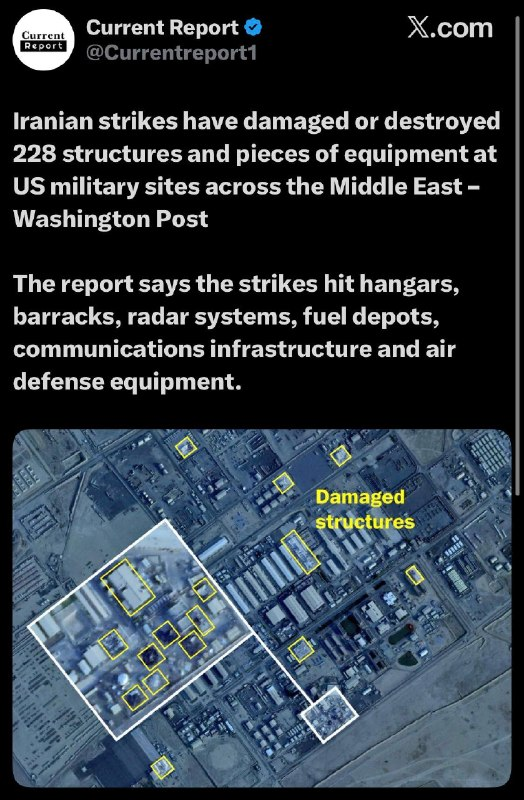

> 🔴حملات ایران ۲۲۸ سازه و قطعه از تجهیزات را در سایت‌های نظامی ایالات متحده در سراسر خاورمیانه آسیب دیده یا نابود کرده است - واشنگتن پست
> 
> این گزارش می‌گوید که حملات به آشیانه‌ها، سربازخانه‌ها، سیستم‌های راداری، انبارهای سوخت، زیرساخت‌های ارتباطی و تجهیزات دفاع هوایی آسیب رسانده است.
> https://t.me/kianmeli1

## 1405/02/16 16:43 — kianmeli1
> 🔴سپاه: تا امریکا عقب نشینی نکند٫ پاسخی به متن پیشنهادی نمی دهیم
> https://t.me/kianmeli1

## 1405/02/16 16:30 — kianmeli1
> 🔴 منابع اسرائیلی تأیید می کنند که عربستان سعودی و امارات متحده عربی اکنون ترامپ و اسرائیل را برای شروع مجدد جنگ تمام عیار علیه ایران تحت فشار قرار می دهند.
> https://t.me/kianmeli1

## 1405/02/16 16:20 — kianmeli1
> ‏🔴ترامپ در پاسخ به این پرسش نیویورک‌پست که آیا باید برای دور تازه‌ای از مذاکرات خبرنگاری را به پاکستان اعزام کند، گفت: فکر نمی‌کنم
> https://t.me/kianmeli1

## 1405/02/16 16:17 — kianmeli1
> 🔴فوری
> کانال 11 اسرائیل گزارش داد آمریکا و اسرائیل در حال هماهنگی برای از سرگیری جنگ با ایران هستند.
> https://t.me/kianmeli1

## 1405/02/16 16:14 — kianmeli1
> 🔴فوری
> ترامپ به خبرنگار نیویورک پست:
> هم اکنون قرار ملاقاتی با ژنرال های ارتش در مورد موضوع ایران دارم.
> https://t.me/kianmeli1

## 1405/02/16 16:05 — DEJradio

> 🚨
> ⭕️ واکنش ترامپ به احتمال تفاهم با جمهوری اسلامی؛ توافق نکنید بمباران را از سر می‌گیریم!
> 
> دونالد ترامپ، رئیس‌جمهوری ایالات متحده، با انتشار پیامی تازه در تروث سوشال، جمهوری اسلامی را میان پذیرش توافق یا روبه‌رو شدن با دور تازه‌ای از حملات سنگین قرار داد. ترامپ اعلام کرد اگر تهران با مفادی که به گفته او پیش‌تر مورد توافق قرار گرفته موافقت کند، عملیات نظامی آمریکا موسوم به «خشم حماسی» پایان خواهد یافت و مسیر بازگشایی تنگه هرمز برای همۀ کشورها، از جمله ایران، فراهم می‌شود.
> ترامپ در عین حال هشدار داد که مخالفت جمهوری اسلامی با این شروط، به ازسرگیری بمباران‌ها منجر خواهد شد؛ حملاتی که به گفتۀ او این بار «بسیار شدیدتر» از مراحل پیشین خواهد بود.
> این اظهارات در حالی مطرح می‌شود که رسانه اکسیوس گزارش داده کاخ سفید و جمهوری اسلامی به یک تفاهم‌نامۀ ۱۴بندی نزدیک شده‌اند.
> 
> #ترامپ #مذاکرات #جمهوری_اسلامی
> @DEJradio

## 1405/02/16 16:01 — DEJradio
[🎬 Video](telegram/content/DEJradio_4453_1778089842.jpg)

> 🔺📷 خسارت سنگین به هواپیماهای خطوط هوایی تحریم‌شده در جنگ چهل روزه
> 
> بر اساس تصاویر تازه منتشر شده از سوی رسانه‌های داخلی، تعدادی از هواپیماهای خطوط هوایی، از جمله ماهان‌ایر و ایران‌ایر که در انتقال تسلیحات نظامی و نیرو به نیابتی‌های جمهوری اسلامی نقش به‌سزایی داشتند، در طول جنگ چهل روزه متحمل خسارات سنگینی شده‌اند.
> 
> #جنگ۴۰روزه #جمهوری_اسلامی
> @DEJradio

## 1405/02/16 15:57 — DEJradio

> 🔺📷 “من خیاطم، زن سرپرست خانوار، ۱۹ دی تو شیراز با بچه‌ام رفتیم تظاهرات دستم ساچمه خورد عصب‍ها آسیب دید، چهار ماهه نتونستم کار کنم...
> 
> پیام دریافتی
> 
> #دی۱۴۰۴ #ساچمه
> @DEJradio

## 1405/02/16 15:48 — pm_afshaa
> قالیباف: امنیت کشتیرانی و ترانزیت انرژی به دست آمریکا و متحدانش با نقض آتش‌بس و اعمال محاصره به خطر افتاده است؛ البته شرّشان کم خواهد شد
> 
> 
> 💧 Rainbet.com the #1 Non-KYC Crypto Casino & Sportsbook @rainbetcom
> 
> 😁 @Pm_Afshaa

## 1405/02/16 15:40 — kianmeli1
> 🔴ترامپ با کشتن خامنه ای به جمهوری اسلامی این جسارت را داد که تنگه هرمز را ببندند و جنگ نامتقارن را عملی کنند
> 
> برنامه بعدی نیز این است برای حملات بزرگتر امریکا به ایران٫ جنگ نامتقارن به دو نقطه ادامه پیدا میکند
> تنگه باب المندب و درون خاک امارات
> 
> ترامپ متوجه این موضوع است دوسال فرصت دارد و جنگ نامتقارن به مثابه باتلاق است برای ابرقدرتها
> 
> مبتکر جنگ نامتقارن ایرانیان بوده اند چه در دوران هخامنشیان و چه اشکانیان ووو
> https://t.me/kianmeli1

## 1405/02/16 15:32 — pm_afshaa
> 🔴سپاه:اورانیوم تحویل داده نمیشود
> 
> 
> 💧 Rainbet.com the #1 Non-KYC Crypto Casino & Sportsbook @rainbetcom
> 
> 😁 @Pm_Afshaa

## 1405/02/16 15:25 — pm_afshaa
> 🔴ارتش اسرائیل در حال بمباران زیرساخت‌های مرتبط با حزب‌الله در مناطق مختلف لبنانه
> 
> 
> 💧 Rainbet.com the #1 Non-KYC Crypto Casino & Sportsbook @rainbetcom
> 
> 😁 @Pm_Afshaa

## 1405/02/16 15:21 — pm_afshaa
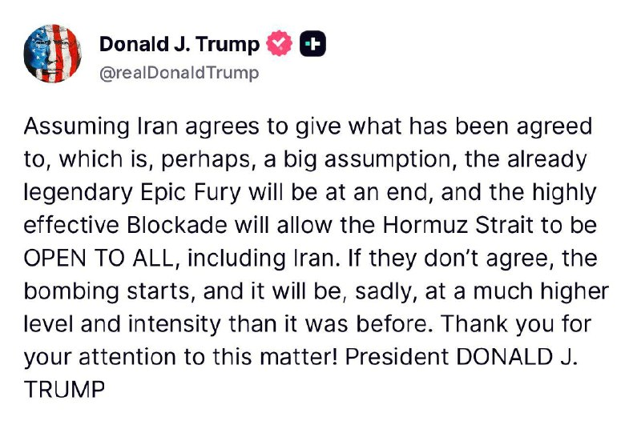

> پست جدید ترامپ اگر جمهوری اسلامی با پیش‌نویس توافق مطرح موافقت کند، عملیات پایان خواهد یافت و اگر موافقت نکند، بمباران با شدت بیشتر از سر گرفته خواهد شد
> 
> 
> 💧 Rainbet.com the #1 Non-KYC Crypto Casino & Sportsbook @rainbetcom
> 
> 😁 @Pm_Afshaa

## 1405/02/16 15:19 — pm_afshaa
> سیدمحمد مرندی، تحلیلگر جمهوری‌اسلامی: آکسیوس ابزاری برای دستکاری بازار کاخ‌سفید است. جمهوری‌اسلامی قبل از سفر ترامپ به چین، کاملا برای یک حمله بزرگ احتمالی آماده‌ست
> 
> 
> 💧 Rainbet.com the #1 Non-KYC Crypto Casino & Sportsbook @rainbetcom
> 
> 😁 @Pm_Afshaa

## 1405/02/16 15:18 — kianmeli1

> 🔴 ‏پست جدید ترامپ
> 
> ترامپ اعلام کرد که اگر جمهوری اسلامی با پیش‌نویس توافق مطرح موافقت کند، عملیات پایان خواهد یافت و اگر موافقت نکند، بمباران با شدت بیشتر از سر گرفته خواهد شد
> https://t.me/kianmeli1

## 1405/02/16 15:13 — pm_afshaa
> 🔴اکسیوس: بسیاری از شرایط ذکر شده تو این یادداشت منوط به دستیابی به توافق نهاییه و احتمال جنگ مجدد یا وضعیت طولانی‌ای که تو اون جنگ متوقف شده اما هیچ چیز واقعاً حل نشده رو باقی می‌ذاره
> 
> 
> 💧 Rainbet.com the #1 Non-KYC Crypto Casino & Sportsbook @rainbetcom
> 
> 😁 @Pm_Afshaa

## 1405/02/16 15:11 — pm_afshaa
> دلار 170

## 1405/02/16 15:11 — pm_afshaa
> قیمت هر بشکه نفت به 97 دلار رسید
> 
> 
> 💧 Rainbet.com the #1 Non-KYC Crypto Casino & Sportsbook @rainbetcom
> 
> 😁 @Pm_Afshaa

## 1405/02/16 15:03 — DEJradio
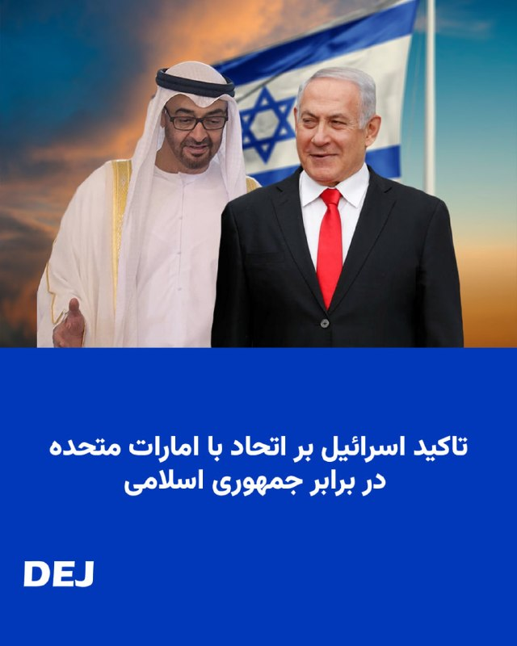

> 🚨📢 تاکید اسرائیل بر اتحاد با امارات متحده در برابر جمهوری اسلامی
> 
> سفارت اسرائیل در امارات متحده عربی اعلام کرد بنیامین نتانیاهو، نخست‌وزیر اسرائیل، در گفت‌وگوی تلفنی با رئیس امارات متحده عربی تأکید کرده است که اسرائیل همانند گذشته در کنار نزدیک‌ترین متحدان خود خواهد ایستاد و به تلاش مشترک برای حفظ صلح و امنیت پایبند می‌ماند. بنا بر این گزارش، نتانیاهو در این تماس، حملات جمهوری اسلامی به امارات متحده عربی را تهدیدی علیه ثبات منطقه توصیف کرده است.
> بر اساس گزارشات منتشر شده در حملات چند روز گذشته جمهوری اسلامی به امارات متحده عربی، سامانه‌های رهگیر و ضد موشکی اسرائیلی، مستقر در امارات کمک شایانی به مهار این حملات ترکیبی پهپادی و موشکی کرده است.
> 
> #امارات #جمهوری_اسلامی
> @DEJradio

## 1405/02/16 14:59 — DEJradio
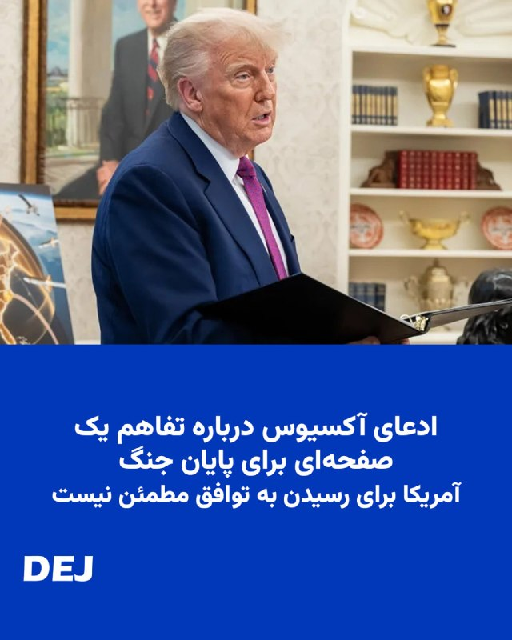

> 🔺📢 ادعای آکسیوس درباره تفاهم یک صفحه‌ای برای پایان جنگ
> آمریکا برای رسیدن به توافق مطمئن نیست
> 
> آکسیوس به نقل از دو مقام آمریکایی و چند منبع آگاه مدعی شده است که کاخ سفید معتقد است به دستیابی به یک تفاهم اولیه با جمهوری اسلامی برای پایان جنگ و آغاز مذاکرات هسته‌ای نزدیک شده است. بر پایه این گزارش، واشینگتن انتظار دارد تهران ظرف۴۸ساعت آینده به چند موضوع کلیدی پاسخ دهد.
> بنا بر این گزارش، تفاهم‌نامۀ پیشنهادی شامل تعلیق غنی‌سازی اورانیوم، لغو تدریجی بخشی از تحریم‌ها و کاهش محدودیت‌ها در تنگۀ هرمز خواهد بود. منابع آگاه می‌گویند مذاکرات برای توافق نهایی ممکن است در اسلام‌آباد یا ژنو ادامه پیدا کند.
> با این حال، مقام‌های آمریکایی می‌گویند اختلافات و شکاف درون حاکمیت جمهوری اسلامی، رسیدن به توافق را همچنان نامطمئن کرده است. مارکو روبیو، وزیر امور خارجۀ آمریکا، تأکید کرد واشینگتن همچنان به دنبال یک راه‌حل دیپلماتیک است، هرچند هنوز هیچ توافق نهایی حاصل نشده است.
> 
> #مذاکرات #جمهوری_اسلامی #توافق
> @DEJradio

## 1405/02/16 14:33 — iaghapour
> 🔻 تسنیم: درآمد طرح اینترنت «پرو» در سال به ۹۶ هزار میلیارد تومن می‌رسه!
> 
> 🔹خب با این رقم‌های نجومی و پول هنگفتی که درمیاد، معلومه که از این تبعیضی که راه انداختن حسابی راضی‌ان. وقتی محدودیت و فیلترینگ این‌قدر براشون سود داره، چرا نباید اینترنت داخلی و بسته رو بیشتر تحویل بگیرن؟
> 
> 🔸این وسط یه تشکر ویژه و خسته نباشید هم باید بگیم به اون دسته از دوستانی که رفتن تو صف اینترنت پرو و این سیستم طبقاتی رو خیلی راحت پذیرفتن. از رئیس فلان اتحادیه و مدیر فلان اداره بگیر تا نماینده صنف لاستیک‌فروش‌ها و یه سری کسب‌وکارهایی که واقعاً بدون اینترنت آزاد هم کارشون لنگ نمی‌موند. تو شرایطی که ۹۹ درصد مردم هیچ دسترسیِ عادی به اینترنت آزاد ندارن، مرسی از شماها که رفتین این اینترنت رو گرفتین و با این کارتون، قشنگ به این تبعیض و نابرابری رسمیت دادین!
> 
> پ.ن: البته به این نکته هم توجه کنید که خبرگذاری داخلی اینو گفته و ممکنه دقیقا مقصودشون از این حرف هم همین باشه که بگن چقدر این طرح خوب و سودآور هستش و...
> 
> 🆔 @iaghapour

## 1405/02/16 13:51 — DEJradio
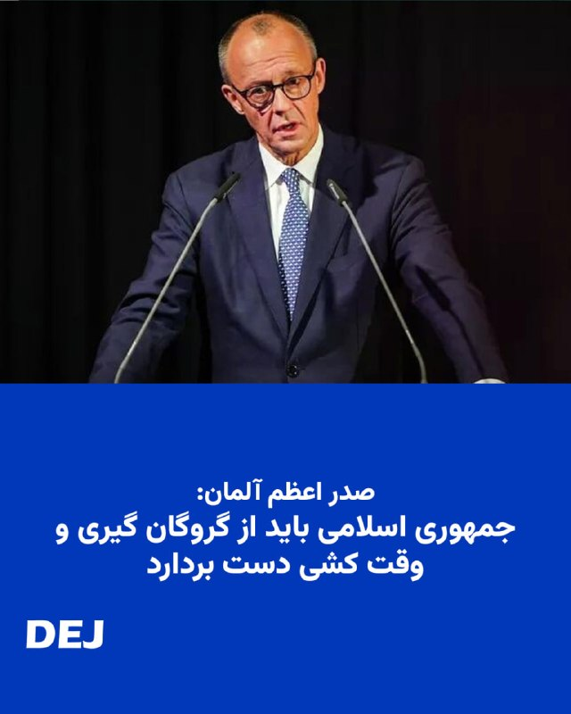

> 🔺📢 صدر اعظم آلمان:
> جمهوری اسلامی باید از گروگان گیری و وقت‌کشی دست بردارد
> 
> صدراعظم آلمان می‌گوید رژیم ایران دیگر نباید منطقه و کل جهان را به گروگان بگیرد و برنامه نظامی - هسته‌ای آنها نیز باید برای همیشه متوقف شود.
> فردریش مرتس با تاکید بر این موضوع که جمهوری اسلامی نمی‌بایست به حملات خود علیه اسرائیل و شرکای آلمان در منطقه ادامه دهد، گفت: «جمهوری اسلامی باید به مذاکره بازگردد و از وقت‌کشی دست بردارد.»
> 
> #مذکرات #جمهوری_اسلامی
> @DEJradio

## 1405/02/16 13:42 — pm_afshaa
> 🔴رویترز: در توافق پیش رو، ایران اورانیوم غنی شده را تحویل خواهد داد
> 
> 
> 💧 Rainbet.com the #1 Non-KYC Crypto Casino & Sportsbook @rainbetcom
> 
> 😁 @Pm_Afshaa

## 1405/02/16 13:37 — pm_afshaa
> 🔴اکسیوس: ایران با تعلیق 12 تا 15 ساله غنی سازی موافقت کرد
> 
> 
> 💧 Rainbet.com the #1 Non-KYC Crypto Casino & Sportsbook @rainbetcom
> 
> 😁 @Pm_Afshaa

## 1405/02/16 13:35 — DEJradio

> 🔺📷 برگزاری جلسات حکومتی با فلاسک چای در پناهگاه‌ها
> 
> در حالیکه سخنگوی وزارت خارجه جمهوری اسلامی ادعا می‌کند که این رژیم یک «ابر قدرت»! است، تصاویر منتشر شده نشان میدهد که همچنان مقامات ارشد حکومتی جلسات خود را در پناهگاه‌ها و در اماکن نا معلوم برگزار می کنند.
> 
> #ابرقدرت #جمهوری_اسلامی
> @DEJradio

## 1405/02/16 13:07 — pm_afshaa
> 🔴اکسیوس: آمریکا انتظار داره ظرف 48 ساعت آینده پاسخی از طرف تهران من‌باب چند نکته کلیدی دریافت کنه
> 
> 
> 💧 Rainbet.com the #1 Non-KYC Crypto Casino & Sportsbook @rainbetcom
> 
> 😁 @Pm_Afshaa

## 1405/02/16 13:05 — pm_afshaa
> 🔴اکسیوس: آمریکا و ایران به تدوین یک یادداشت یک صفحه‌ای برای پایان دادن به جنگ نزدیک شدن
> 
> 
> 💧 Rainbet.com the #1 Non-KYC Crypto Casino & Sportsbook @rainbetcom
> 
> 😁 @Pm_Afshaa

## 1405/02/16 13:04 — pm_afshaa
> 🔴اکسیوس: به گفته یک مقام آمریکایی، محدودیت‌های اعمال‌شده از سوی ایران در تنگه و محاصره دریایی آمریکا در طول آن دوره 30 روزه به‌تدریج برداشته خواهد شد
> 
> 
> 💧 Rainbet.com the #1 Non-KYC Crypto Casino & Sportsbook @rainbetcom
> 
> 😁 @Pm_Afshaa

## 1405/02/16 12:36 — DEJradio

> 👑📢 دفتر ارتباطات شاهزاده رضا پهلوی در پستی در شبکه اجتماعی ایکس اعلام کرد:
> " شاهزاده رضا پهلوی همراه با کارآفرینان برجسته ایرانی-آمریکایی به بحث و بررسی راهبردهای بازیابی و شکوفایی تجارت، صنعت و تکنولوژی در ایران خواهند پرداخت."
> شنبه ۲۶ اردیبهشت - سان‌فرانسیسکو، کالیفرنیا
> 
> #شاهزاده_رضا_پهلوی
> @DEJradio

## 1405/02/16 12:25 — DEJradio
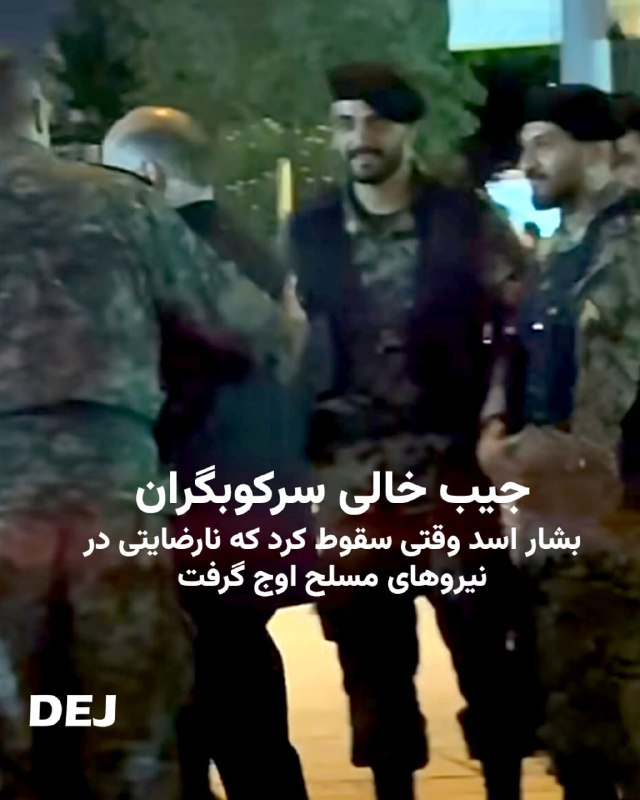

> 🔺📢 جیب خالی سرکوبگران
> بشار اسد وقتی سقوط کرد که نارضایتی در نیروهای مسلح اوج گرفت
> 
> بررسی‌های میدانی نشان می‌دهد برخلاف نمایش‌های خیابانی، جنگ از یک سو و بحران اقتصادی از سوی دیگر به ماشین سرکوب جمهوری اسلامی آسیب جدی وارد کرده است.
> وضعیت دشوار اقتصادی در ایران، عناصر سرکوب را در امان نگذاشته است. جیب نیروهای عملیاتی و خانواده‌هایشان خالی است. در ساختار سرکوب اکنون آن‌هایی پول بیشتری گیرشان می‌آید که مستقیم و غیرمستقیم با پروپاگاندا و بنگاه‌های مالی در ارتباط هستند، اما نیروهای یونیفرم‌پوش به‌شدت در مضیقه هستند و برای تهیه مایحتاج روزانه مشکل دارند.
> در جنگ ۴۰ روزه، بخش عمده‌ای از ساختار نظامی و امنیتی جمهوری اسلامی نابود شد. از یک سو فرماندهی کل قوا، لایه‌ای از فرماندهان رده‌بالا و نیروها و از سوی دیگر مراکز نظامی، پادگان‌ها، مقرهای سرکوب و کلانتری‌ها.
> 
> اگرچه حکومت همچنان بقا کرده، اما آواربرداری و بازسازی ویرانه‌های جنگ کاری زمان‌بر و پرخرج است.
> 
> بعد از جنگ مردم در خیابان، با وضعیتی شبیه حکومت نظامی روبه‌رو شدند.
> تجمعات شبانه و ایست‌های بازرسی در عمل اقدامات امنیتی برای مقابله با تهدیدات خیابانی است. مأموران امنیتی تا دندان مسلح‌اند و حکومت نشان داده که روی مسلح شدن بخشی از هوادارانش برای مقابله با عملیات زمینی احتمالی یا خیزش‌های خیابانی حساب می‌کند.
> 
> حکومت برای بقای خود با چند تهدید روبه‌روست: تکرار حذف‌های هدفمند، فروپاشی اقتصادی، جنگ مجدد، آغاز اعتراضات، خیانت و بی‌تفاوتی در رده‌های فرماندهی، ریزش نظامی‌ها ناشی از خستگی، ناامیدی و ترس، بی‌پولی.
> 
> به‌ظاهر تاکنون حکومت انسجام در ساختار نظامی و امنیتی خود را حفظ کرده است، اما هر آن احتمال فروپاشی این ساختار شبیه آنچه برای بشار اسد در سوریه رخ داد وجود دارد.
> 
> رژیم اسد ناشی از تداوم شرایط بحرانی، پوسیده شده بود اما بقا کرد. حکومتی که بارها حملات به‌مراتب سنگین‌تر از عملیات منجر به فروپاشی را از سر گذرانده بود طی دو هفته فروپاشید. مشکل آنجا شروع شد که بخشی از فرماندهان و نیروها تصمیم گرفتند دیگر نجنگند و سرکوب نکنند. آنها می‌دیدند نظامیان و فرماندهان وابسته به اسد پول‌های هنگفت دارند، اما جیب خودشان خالی‌ست. وفاداری آنها به مرور در اثر خستگی، ناامیدی، بی‌اعتمادی و بی‌پولی از بین رفت.
> 
> #نیروهای_مسلح #سرکوبگران #سقوط
> @DEJradio

## 1405/02/16 11:45 — DEJradio

> 🚨📢 کمتر از دو ماه پس از اعلام آتش‌بس موقت، بیکاری و گرانی مردم را عاصی کرده است. گزارش روزنامه «شرق» نشان می‌دهد تقاضا برای مشاغل خدماتی بدون نیاز به تخصص، به‌ویژه نظافت و پذیرایی، در ایران به‌شدت افزایش یافته است.
> 
> بر اساس آمار پلتفرم «آچاره»، ثبت‌نام متقاضیان این مشاغل در اردیبهشت امسال نسبت به سال گذشته ۲۳۹ درصد رشد کرده و هم‌زمان سن متقاضیان و شمار افراد بازگشته به بازار کار نیز افزایش یافته است.
> 
> #آتشبس #بیکاری
> @DEJradio

## 1405/02/15 21:12 — iaghapour
[🎬 Video](telegram/content/iaghapour_2586_1778089848.jpg)

> اکانت های هوش مصنوعیو با یک دهم قیمت بخر 
> ✈️
> 
> 
> 🏳️‍🌈 Gemini Pro :
> - پلن مشابه ChatGPT Plus از شرکت گوگل
> - پشتیبانی از antigravity ( دستیار کد نویسی مشابه کدکس )
> - ساخت عکس و ویدیو + تحقیق عمیق + تجزیه و تحلیل
> - فعالسازی روی ایمیل شما
> - کاملا اختصاصی ( فمیلی نیست )
> - فعالسازی روی ایمیل شما
> 
> 🔆 ChatGPT Go :
> - پلن اقتصادی OpenAI
> - مناسب استفاده روزمره
> - 10 برابر محدودیت کمتر نسبت به نسخه ی رایگان
> - مناسب برنامه نویسی نیست
> 
> 📲 SuperGrok :
> - پلن مشابه ChatGPT Plus
> - تجزیه تحلیل قوی
> - پاسخ های کاملا هوشمند و طبیعی
> - بدون جواب های کلیشه ای
> 
> خرید و توضیحات بیشتر از ربات :
> 
> 🤖 @ChatGPT_StoreBOT

## 1405/02/15 21:12 — iaghapour
> ⭕️ وعده بازگشت به وضعیت عادی؛ توجیه محدودیت‌ها یا امید به بهبود اینترنت؟
> 
> معاون ارتباطات دفتر رئیس‌جمهور به تازگی اعلام کرده که وضعیت فعلی اینترنت مورد تایید دولت نیست و رئیس‌جمهور، محمدرضا عارف را مامور ساماندهی این شرایط کرده است. به گفته او، این محدودیت‌های شدید و قطعی‌ها صرفا تصمیماتی از سوی شورای عالی امنیت ملی و به دلیل شرایط خاص امنیتی و جنگی بوده‌اند.
> 
> 🔹 وعده روزهای بهتر: این مقام مسئول قول داده که با عبور از این شرایط ویژه، اینترنت نه تنها به حالت قبل برمی‌گردد، بلکه وضعیتی بهتر از گذشته پیدا خواهد کرد و وعده‌های انتخاباتی رئیس‌جمهور در این زمینه همچنان پیگیری می‌شوند.
> 
> 🔸 دفاع از اینترنت پرو: در واکنش به انتقادات، دولت ادعا می‌کند طرح «اینترنت پرو» صرفا برای نجات کسب‌وکارها در روزهای محدودیت ایجاد شده و نباید به آن برچسب اینترنت طبقاتی زد؛ چرا که به گفته آن‌ها، در شرایط عادی اصلا نیازی به چنین طرحی نخواهد بود.
> 
> 🔹 کاهش محدودیت‌های عمومی: خبر دیگر این است که قرار شده تدابیر جدیدی برای دسترسی بهتر سایر شهروندان به اینترنت اتخاذ شود تا فشار محدودیت‌های فعلی روی مردم کاهش یابد.
> 
> در حالی که دولت تلاش می‌کند قطعی‌ها و طرح‌های بحث‌برانگیزی مثل اینترنت پرو را صرفا به شرایط اضطراری گره بزند، کاربران و کسب‌وکارها همچنان منتظرند تا ببینند آیا این وعده‌ها در عمل به یک اینترنت آزاد و بدون محدودیت ختم می‌شود یا صرفا وعده‌ای برای کنترل نارضایتی‌های فعلی است.
> 
> 🆔 @iaghapour

## 1405/02/15 19:36 — iaghapour
> ⭕️ ایده عجیب در مجلس: تاسیس «اینستاگرام دولتی» و مدیریت کامل اینترنت!
> 
> نمایندگان مجلس در تازه‌ترین نشست خود با وزیر ارتباطات، از طرح‌ها و نگاه‌های جدیدی برای کنترل بیشتر فضای مجازی پرده برداشتند. در این جلسه، پیشنهاد ایجاد یک پلتفرم کاملا دولتی مشابه اینستاگرام مطرح شد تا به زعم آن‌ها، نیاز کشور برطرف شود.
> 
> 🔹 اینستاگرام دولتی: یکی از نمایندگان با اشاره به بازار سیاه و چند میلیونی فیلترشکن‌ها، رسما پیشنهاد ساخت یک سکوی دولتی شبیه اینستاگرام را برای پر کردن جای خالی این پلتفرم ارائه داده است.
> 
> 🔸 رویای مدیریت اینترنت: نایب رئیس مجلس تاکید کرده که مشکل آن‌ها اصل اینترنت نیست، بلکه می‌خواهند در صحنه بین‌المللی، مدیریت اینترنت کاملا در دست خودشان باشد و این فضا را به یک جبهه تقابل تشبیه کرده است.
> 
> 🔹 فرصت‌سازی از بحران: بخش قابل توجهی از صحبت‌های نمایندگان، حسرت خوردن برای از دست رفتن فرصت در شرایط ملتهب و جنگی است؛ آن‌ها معتقدند باید از این شرایط استفاده می‌کردند تا مردم و کسب‌وکارها به اجبار به سمت سکوهای داخلی کوچ کنند.
> 
> این صحبت‌ها به وضوح نشان می‌دهد که دغدغه اصلی، کاهش نارضایتی مردم از قیمت و کیفیت اینترنت نیست؛ بلکه تلاش برای بومی‌سازی اجباری، قطع ارتباط با شبکه‌های اجتماعی بین‌المللی و کشاندن کاربران به پلتفرم‌های تحت کنترل و نظارت است. / زومیت
> 
> ✍🏻 پ.ن: از سوپر اپلیکیشن های ایتا و سروش و گپ و بله که از تلگرام کپی کردین مشخصه توانایی اینکار رو دارید.
> 
> 🆔 @iaghapour

## 1405/02/15 19:29 — iaghapour
> ⭕️ مرگ خاموش اقتصاد خرد: نابودی ۴۰ درصد از کسب‌وکارهای اینستاگرامی!
> 
> قطعی‌ها و محدودیت‌های اینترنتی فقط حق دسترسی آزاد ما به شبکه‌های اجتماعی را سلب نکرده، بلکه تیشه به ریشه‌ی اقتصاد خرد و معیشت مردم زده است. طبق اعلام پشوتن پورپزشک، عضو هیئت‌مدیره اتحادیه کسب‌وکارهای مجازی، فیلترینگ و اختلالات باعث نابودی بخش عظیمی از مشاغل آنلاین شده است.
> 
> 🔹 فاجعه‌ی آماری: نزدیک به ۴۰ درصد از کسب‌وکارهای اینستاگرامی برای همیشه از بین رفته‌اند؛ این یعنی مرگ مستقیم بیش از ۴۰۰ هزار شغل!
> 
> 🔸 دومینوی ویرانی: وقتی شوکی مثل محدودیت اینترنت وارد می‌شود، ابتدا کسب‌وکارهای کوچک و آسیب‌پذیر می‌میرند، اما این نابودی با کمی تاخیر گریبان شرکت‌های بزرگ اقتصادی را هم خواهد گرفت.
> 
> 🔹 زنجیره‌ی به هم پیوسته: کسب‌وکارهای بزرگ در تولید، تامین و توزیع به شدت به همین کسب‌وکارهای خرد وابسته‌اند. توهم مصونیت برای شرکت‌های بزرگ، در نهایت منجر به فروپاشی خود آن‌ها می‌شود. منبع: زومیت
> 
> 🆔 @iaghapour

## 1405/02/14 19:09 — iaghapour
> اسم این زندگــــــی نبود
> یک مبارزه تمام عیار بود...
> 
> #جوانی #زندگی #جنگ #اینترنت

## 1405/02/14 16:09 — iaghapour
> ⭕️ حل مشکل دانلود از ریلیز گیت‌هاب با LatestReleaseMirror
> 
> اگر در دانلود فایل‌ها از بخش ریلیزهای (Releases) گیت‌هاب به دلیل محدودیت‌های اینترنت مشکل دارید، این اسکریپت کاربردی دقیقاً برای شما ساخته شده است!
> 
> ابزار LatestReleaseMirror به صورت خودکار فایل‌های آخرین آپدیتِ ریپازیتوری‌های دلخواه شما را دریافت کرده و آن‌ها را به عنوان فایل‌های عادی در ساختار پوشه‌های گیت‌هاب ذخیره می‌کند؛ در نتیجه می‌توانید آن‌ها را به راحتی و حتی با اینترنت داخلی دانلود کنید.
> 
> 🔹 دریافت و آپدیت خودکار آخرین نسخه با استفاده از GitHub Actions.
> 🔸 امکان فیلتر کردن فایل‌های مورد نیاز (مثلاً فقط نسخه‌های ویندوز یا اندروید)
> 🔹 دسته‌بندی تمیز فایل‌های خروجی در مسیرهای مشخص.
> 
> 🔗 لینک ریپازیتوری و راهنمای استفاده
> 
> 🆔 @iaghapour

## 1405/02/14 13:56 — iaghapour
> ركورد جديد سرعت اينترنت ژاپن:
> 
> با سرعت 1.02 پتابيت بر ثانيه، كل نتفليكس را در 1 ثانيه دانلود مى‌كند.
> 
> ✍ ما هم اینجا باید با DNStt وصل بشیم تا بزور بتونیم فقط این خبر رو بخونیم...
> 
> 🆔 @iaghapour

## 1405/02/13 22:28 — iaghapour
> ⭕️ اسکریپت بهینه شده XHTTP Relay ECO برای Vercel Pro
> 
> 🔹 نسخه ECO طوری تیون شده که علاوه بر امنیت سفت‌وسخت v1.3، کم‌هزینه‌ترین رفتار ممکن روی Vercel Pro رو داشته باشه؛ یعنی با کنترل هوشمند Timeout، Inflight، Throttle و Logها، مصرف منابع و هزینه نهایی تا جای ممکن پایین نگه داشته میشه.
> 
> 🔸فقط با GET، HEAD و POST کار می‌کنه تا امنیت بالاتر بره.
> 🔹 احراز هویت فقط از طریق هدر x-relay-key انجام میشه
> 🔸هدرهای اضافی پلتفرم و hop-by-hop رو بی‌رحمانه فیلتر می‌کنیم.
> 🔹روی آپلود و دانلود محدودیت سرعت (Throttling) واقعی گذاشتیم.
> 🔸بردیمش روی Node runtime با لیمیت ۱۲۸ مگابایت رم و مدیریت کانکشن‌های همزمان.
> 
> 🔗 اطلاعات بیشتر در گیت‌هاب پروژه
> 
> 🆔 @iaghapour

## 1405/02/13 14:05 — iaghapour
> ⭕️ ورژن جدید کلاینت اندروید GooseRelayVPN منتشر شد
> 
> کلاینت اندروید GooseRelayVPN که هسته GooseRelay را از طریق Go mobile اجرا می‌کند و رابط کاربری کامل برای مدیریت VPN، پروفایل‌ها، لاگ‌ها و تنظیمات ارائه می‌دهد. این اپ یک SOCKS5 محلی روی اندروید ایجاد می‌کند و ترافیک TCP را از معماری GooseRelay عبور می‌دهد.
> 
> 🔹هسته پروژه به ورژن 1.5.0 آپدیت شد.
> 🔸قابلیت fake dns اضافه شد.
> 🔹باگ ها در این نسخه برطرف شدن.
> 
> 🔗 آدرس گیت‌هاب پروژه
> 
> 🆔 @iaghapour

## 1405/02/12 19:53 — iaghapour

> ⭕️ آموزش ساخت فیلترشکن رایگان و شخصی به 2 روش با نت ملی
> 
> 🔹با استفاده از دو ابزار قدرتمند MHRV و Nova-Proxy، دیگه نیازی به خرید کانفیگ‌ها و سرورهای گرون‌قیمت ندارید. تو این آموزش قدم‌به‌قدم به ۲ روش مختلف پیش میریم تا بتونید یه اتصال پایدار و بدون قطعی داشته باشید. حتماً تا آخر ویدیو همراه من باشید.
> 
> 🔗 لینک ویدیو در یوتیوب
> 
> 🔗 دانلود ویدیو با لینک مستقیم
> 
> 🔹 دانلود کلاینت ویندوز
> 
> 🔸 دانلود کلاینت اندروید
> 
> 
> #آموزش #فیلترشکن #mhrv #novaproxy #رایگان
> برای دور زدن فیلترینگ و آموزش تکنولوژی و هوش مصنوعی ما رو دنبال کنید 💚
> 🆔@iaghapour

## 1405/02/11 15:30 — iaghapour

> ⭕️ پشت‌پرده‌ی «اینترنت پرو»؛ امتیاز ویژه یا تله‌ی نظارتی؟
> 
> این روزها سیم‌کارت‌های بدون فیلتر با نام «اینترنت پرو» در ازای دریافت هزینه و ثبت کامل مشخصات هویتی به فروش می‌رسند. اما هدف اصلی این طرح، دلسوزی برای نیاز اینترنتی اقشار مختلف نیست.
> 
> هدف اصلی و پنهان این ماجرا، چیزی جز «تشخیص هویت دقیق و رصد لحظه‌ایِ کاربر» نیست. 👁‍🗨
> 
> وقتی اینترنت آزاد را مستقیماً با نام و کد ملی خودتان دریافت می‌کنید دقیقاً چه اتفاقی می‌افتد؟
> 
> 🔹 پایان گمنامی: تمام سایت‌هایی که سر می‌زنید و محتوایی که می‌بینید، مستقیماً و شفاف روی نام خودتان ثبت و مانیتور می‌شود.
> 
> 🔸 تزریق خودسانسوری: وقتی می‌دانید هر کلیک شما رصد می‌شود، ناخودآگاه وارد یک «زندان شیشه‌ای» می‌شوید که خودتان هزینه‌اش را داده‌اید!
> 
> 🔹 تجارت با حقوق اولیه: حق بدیهی دسترسی به اینترنت آزاد را مسدود کرده‌اند و حالا همان را به قیمت نقض حریم خصوصی، به عنوان یک «آپشن ویژه» به خودمان می‌فروشند.
> 
> «اینترنت پرو» یک امکان رفاهی نیست؛ ابزاری برای کنترل نقطه‌ای و عادی‌سازیِ اینترنت طبقاتی است. بهای اصلی این سیم‌کارت‌ها پول نیست؛ حریم خصوصی ماست.
> 
> 🆔 @iaghapour

## 1405/02/10 20:06 — iaghapour

> ⭕️ کلاینت اندروید GooseRelayVPN
> 
> 🔹کلاینت اندروید GooseRelayVPN که هسته GooseRelay را از طریق Go mobile اجرا می‌کند و رابط کاربری کامل برای مدیریت VPN، پروفایل‌ها، لاگ‌ها و تنظیمات ارائه می‌دهد. این اپ یک SOCKS5 محلی روی اندروید ایجاد می‌کند و ترافیک TCP را از معماری GooseRelay عبور می‌دهد.
> 
> 🔹پیکربندی مبتنی بر پروفایل
> 🔸وضعیت و تله‌متری در صفحه Home
> 🔹تب Logs برای عیب‌یابی Android/Core
> 🔸قابلیت Split Tunneling و Internet Sharing
> 
> 🔗 آدرس گیت‌هاب پروژه
> 
> 🆔 @iaghapour

## 1405/02/10 13:23 — iaghapour
> 💢 رئیس اتحادیه کسب‌وکارهای مجازی:
> به شرکت‌ها زنگ می‌زنند و پیشنهاد فروش اینترنت بدون فیلتر(پرو) برای کارمندانشان را می‌دهند.
> 
> ⁉️ اگر موضوع واقعاً امنیت ملی است، چطور با پرداخت پول، امنیت تأمین می‌شود؟!
> 
> منبع: کانال خبری
> 
> 🆔 @iaghapour

## 1405/02/10 00:25 — iaghapour
> 

## 1405/02/10 00:24 — iaghapour
> ✍🏻 دوستان، همان‌طور که خودتون در جریان هستید، من در این چند ماه حتی یک مورد تبلیغ فیلترشکن، اوتباند و موارد مشابه قرار ندادم. الان هم واقعاً تمایلی به این کار ندارم، چون شرایط اصلاً به‌گونه‌ای نیست که بشه کسی را معرفی کرد.
> 
> با این حال، در همین چند ماه پیام‌های بسیار زیادی داشتیم که درخواست می‌کردند حتماً یک شخص معتبر را معرفی کنیم؛ چرا که خیلی‌ها از کلاهبرداری‌های پیاپی خسته شدن و ارسال این دست پیام‌ها تا به همین امروز هم ادامه داره.
> 
> به همین دلیل، اگه خودتون موافق باشید، افرادی رو که از قبل با ما همکاری می‌کردند و تا حدودی قابل‌اطمینان هستند، یکی‌یکی به شما معرفی کنیم. در این مورد ذکر چند نکته ضروری هستش:
> 
> 🔸عدم تضمین صددرصدی: ناگفته نماند ما واقعاً نمیتونیم کسی را با اطمینان ۱۰۰ درصدی تأیید کنیم، اما افرادی که معرفی میشن همگی سابقه همکاری با ما را دارن.
> 
> 🔹عدم پذیرش تبلیغ جدید و اوتباند: تا زمانی که شرایط استیبل و پایدار نشود، تبلیغ هیچ فرد جدیدی را قبول نمی‌کنیم. در ضمن، تبلیغ فروش اوتباند هم به‌هیچ‌وجه پذیرفته نمی‌شود.
> 
> 🔸قیمت‌های منصفانه: تمام سعی ما بر اینه افرادی را معرفی کنیم که در این زمینه منصف باشند و قیمت‌های بالایی ارائه ندهند. ولی خب، طبیعتاً نمیشه انتظار قیمت‌های قدیمی را داشت؛ چون همان‌طور که خودتون میدونید در حال حاضر هیچ‌کس با اون قیمت‌های قبلی فروشی نداره.
> 
> اگه تمایل دارید، لطفاً در نظرسنجی زیر شرکت کنید. البته نظر شخصی خودم اینه که اگه در حال حاضر واقعاً مشکل خاصی ندارید، در نظرسنجی همان گزینه (خیر) را انتخاب کنید.

## 1405/02/09 19:21 — iaghapour
> ⚠️ هشدار مهم درباره اسکریپت VPN Over GitHub
> 
> ▪️لطفاً از این ابزار به عنوان فیلترشکن استفاده نکنید!
> 
> 🚫 بن شدن اکانت: تبدیل گیت‌هاب به تونل ترافیک، خلاف قوانین این سایت است و خیلی زود باعث مسدود شدن حساب شما می‌شود.
> 
> 🐢 سرعت بسیار پایین: برای هر ارتباط به یک بار push و pull نیاز دارد که آن را عملاً غیرقابل استفاده می‌کند.
> 
> 🔻خطر برای برنامه‌نویس‌ها: گیت‌هاب یک سایت حیاتی برای توسعه‌دهندگان است؛ سوءاستفاده از آن ممکن است باعث حساسیت شده و دسترسی به این پلتفرم مهم را دوباره از کار بیندازد. (خارج شدن از لیست سفید و...)
> 
> 🆔@iaghapour

## 1405/02/09 16:34 — iaghapour
> ای بابا روش Vercel چرا بسته شد؟ هنوز آموزش نداده بودم که.😁
> 
> سازمان فیلترینگ زرنگ شده ها. فک کنم خودشون رو آپدیت کردن دیگه به کانال من نگاه نمیکنن :)

## 1405/02/09 11:10 — iaghapour
> ‼️دلار 177 و طلا 19,400,000
> 
> شب میخوابی صبح بلند میشی یه پله بدبخت تر میشی!

## 1402/09/11 02:33 — CnnBrk
> For sale. From $50 in USDT to the best and first offer I get

## 1402/09/01 01:23 — FoxNewsChannel
> Channel photo removed

## 1402/08/30 23:33 — FoxNewsChannel
> Channel created

## 1402/03/02 19:49 — CnnBrk
> A Russian court extends US journalist Evan Gershkovich's pre-trial detention by three months, state media reports. Follow live updates. https://t.co/1kSWVjtS7s — CNN Breaking News (@cnnbrk) May 23, 2023
> 
> May 23, 2023 at 04:43PM
> via Twitter https://twitter.com/cnnbrk

## 1402/03/02 14:48 — CnnBrk
> Prince Harry cannot pay for his own police security while in the UK, after losing High Court challengehttps://t.co/AWMBnitDaO — CNN Breaking News (@cnnbrk) May 23, 2023
> 
> May 23, 2023 at 11:39AM
> via Twitter https://twitter.com/cnnbrk

## 1402/03/02 01:47 — CnnBrk
> E. Jean Carroll asks judge to amend her initial defamation case to seek further damages for what Donald Trump said at a CNN town hall https://t.co/FnCHP34sKr — CNN Breaking News (@cnnbrk) May 22, 2023
> 
> May 22, 2023 at 10:50PM
> via Twitter https://twitter.com/cnnbrk

## 1402/03/02 00:47 — CnnBrk
> Treasury Secretary Janet Yellen reinforces her warning to Congress that it has only a little time left to address the debt ceiling https://t.co/KyjRZSLsds — CNN Breaking News (@cnnbrk) May 22, 2023
> 
> May 22, 2023 at 09:39PM
> via Twitter https://twitter.com/cnnbrk

## 1402/03/02 00:47 — CnnBrk
> TikTok sues Montana over a bill that would ban the popular short-form video app in the state starting early next year, alleging the state's ban violates the US Constitution, including the First Amendment, as well as other federal laws https://t.co/6wrmVVsLeE — CNN Breaking News (@cnnbrk) May 22, 2023
> 
> May 22, 2023 at 09:25PM
> via Twitter https://twitter.com/cnnbrk

## 1402/03/01 22:47 — CnnBrk
> Nebraska bill that bans most abortions at 12 weeks and gender-affirming care for those under 19 is signed into law by Republican Gov. Jim Pillen https://t.co/9Ri72Vtv4o — CNN Breaking News (@cnnbrk) May 22, 2023
> 
> May 22, 2023 at 07:26PM
> via Twitter https://twitter.com/cnnbrk

## 1402/03/01 20:48 — CnnBrk
> Judge enters not guilty pleas on behalf of Bryan Kohberger, the man charged with first-degree murder in the fatal stabbings of four Idaho college students https://t.co/4rTXSb8PDY — CNN Breaking News (@cnnbrk) May 22, 2023
> 
> May 22, 2023 at 05:35PM
> via Twitter https://twitter.com/cnnbrk

## 1402/03/01 19:47 — CnnBrk
> Longtime Democratic Sen. Tom Carper of Delaware announces he won't seek reelection in 2024, says it's an "opportune time to step aside"https://t.co/6FvQuhUfv3 — CNN Breaking News (@cnnbrk) May 22, 2023
> 
> May 22, 2023 at 04:55PM
> via Twitter https://twitter.com/cnnbrk

## 1402/03/01 18:47 — CnnBrk
> Turkey's third-placed presidential election candidate backs frontrunner Erdogan in a boost ahead of crucial second-round votehttps://t.co/CBMZE80jnv — CNN Breaking News (@cnnbrk) May 22, 2023
> 
> May 22, 2023 at 04:01PM
> via Twitter https://twitter.com/cnnbrk

## 1402/03/01 13:47 — CnnBrk
> At least 20 people have been killed and several others injured in a school dormitory fire in Guyana, officials sayhttps://t.co/OMIiXXJKDO — CNN Breaking News (@cnnbrk) May 22, 2023
> 
> May 22, 2023 at 11:05AM
> via Twitter https://twitter.com/cnnbrk

## 1402/03/01 13:47 — CnnBrk
> Meta receives a record-breaking $1.3 billion fine from European regulators for transferring Facebook's EU user data to servers in the UShttps://t.co/I9Po2ZgjtU — CNN Breaking News (@cnnbrk) May 22, 2023
> 
> May 22, 2023 at 10:46AM
> via Twitter https://twitter.com/cnnbrk

## 1402/02/31 21:47 — CnnBrk
> President Biden and House Speaker McCarthy are set to meet Monday to discuss the debt ceiling as staff-level talks resume https://t.co/qg1bRjJArf — CNN Breaking News (@cnnbrk) May 21, 2023
> 
> May 21, 2023 at 06:51PM
> via Twitter https://twitter.com/cnnbrk

## 1402/02/31 02:46 — CnnBrk
> National Treasure was first across the finish line in the 2023 Preakness Stakeshttps://t.co/ZPxpOShkHY — CNN Breaking News (@cnnbrk) May 20, 2023
> 
> May 21, 2023 at 12:13AM
> via Twitter https://twitter.com/cnnbrk

## 1402/02/30 18:46 — CnnBrk
> Head of Russian private military group Wagner claims complete capture of embattled eastern Ukrainian city of Bakhmut. Ukraine partially disputed it. https://t.co/UCZMdTb9ce — CNN Breaking News (@cnnbrk) May 20, 2023
> 
> May 20, 2023 at 03:31PM
> via Twitter https://twitter.com/cnnbrk

## 1402/02/30 01:47 — CnnBrk
> Nebraska lawmakers pass a 12-week abortion ban and restrictions on gender-affirming care for those under 19. The governor has said he'll sign the bill. https://t.co/1GTrCBgjFQ — CNN Breaking News (@cnnbrk) May 19, 2023
> 
> May 19, 2023 at 11:11PM
> via Twitter https://twitter.com/cnnbrk

## 1402/02/30 00:47 — CnnBrk
> The Justice Department wins its antitrust lawsuit that sought to end an alliance between JetBlue and American Airlines https://t.co/pUnXCCNOtN — CNN Breaking News (@cnnbrk) May 19, 2023
> 
> May 19, 2023 at 09:27PM
> via Twitter https://twitter.com/cnnbrk

## 1402/02/30 00:47 — CnnBrk
> Jim Brown, former fullback for the Cleveland Browns and a prominent activist in the civil rights movement, has died at age 87, his former team tweeted https://t.co/zyICI3bBYA — CNN Breaking News (@cnnbrk) May 19, 2023
> 
> May 19, 2023 at 09:16PM
> via Twitter https://twitter.com/cnnbrk

## 1402/02/29 19:47 — CnnBrk
> Republican Sen. Tim Scott of South Carolina has filed to run for president in 2024, according to the FEC website https://t.co/aGPEBzzHBu — CNN Breaking News (@cnnbrk) May 19, 2023
> 
> May 19, 2023 at 04:43PM
> via Twitter https://twitter.com/cnnbrk

## 1402/02/29 18:48 — CnnBrk
> A DC metro police officer is accused of misleading investigators about communications with Proud Boys leader Enrique Tarrio and tipping him off about his arrest https://t.co/KsCYVBHB64 — CNN Breaking News (@cnnbrk) May 19, 2023
> 
> May 19, 2023 at 03:57PM
> via Twitter https://twitter.com/cnnbrk

## 1378/10/11 03:30 — VahidOOnLine
[🎬 Video](telegram/content/VahidOOnLine_238483_1778089849.mp4)

> ⭕️ وقوع آتش‌سوزی در جاده اندیمشک–اهواز
> 
> ♦️ویدیویی که در شبکه‌های اجتماعی منتشر شده، صحنه‌هایی از وقوع آتش‌سوزی و برخاستن دود غلیظ در روز چهارشنبه ۱۶ اردیبهشت‌ماه در محدوده جاده اندیمشک – اهواز را نشان می‌دهد.
> بر اساس تصاویر منتشرشده، دود سیاه و گسترده‌ای از محل حادثه به آسمان برخاسته است. با این حال، تاکنون اطلاعات رسمی درباره علت وقوع این آتش‌سوزی و میزان خسارات احتمالی منتشر نشده است.
> ‌🇸🇦 Indypersian
> 
> 🤖 @VahidOOnLine

## 1378/10/11 03:30 — VahidOOnLine
[🎬 Video](telegram/content/VahidOOnLine_238477_1778089851.mp4)

> ⭕️ روسای جمهوری چک و فنلاند در پراگ پا به پای هم دویدند
> 
> ♦️پتر پاول، رئیس‌جمهوری چک و الکساندر استوب، رئیس‌جمهوری فنلاند در حرکتی متفاوت و غیررسمی، روز خود را با یک دوی صبحگاهی در خیابان‌های مرکزی پراگ آغاز کردند. این برنامه در جریان سفر دو روزه رئیس‌جمهوری فنلاند به پایتخت جمهوری چک برگزار شد.
> آن‌ها در این برنامه ورزشی با همراهی کان کایرینن، بازیکن باشگاه اسپارتا پراگ و همچنین کریستینا ساسینک ماکی، دونده فنلاندی، حضور داشتند.
> پتر پاول پس از این دویدن در اینستاگرام نوشت: «شروع روز با کمی سرعت بیشتر!»
> ‌🇸🇦 Indypersian
> 
> 🤖 @VahidOOnLine

## 1378/10/11 03:30 — VahidOOnLine
[🎬 Video](telegram/content/VahidOOnLine_238475_1778089852.mp4)

> یک صاحب کارخانه تولیدی در اراک در پیامی به ایران اینترنشنال از بحران کارش در تامین مواد اولیه برای تولید می‌گوید. او اضافه کرد نمی‌تواند حقوق کارگران را بدهد.
> ‌🏁 🇬🇧 IranintlTV
> 
> 🤖 @VahidOOnLine

## 1378/10/11 03:30 — VahidOOnLine
> ♦️محمدباقر قالیباف، رئیس مجلس شورای اسلامی، در یک پیام صوتی خطاب به «مردم ایران» با اشاره به شرایط حساس ایران، خواستار افزایش شفافیت عملکرد مسئولان در حوزه اقتصادی شد و تاکید کرد که دولت باید اقدامات خود برای مهار گرانی‌ها را به‌صورت مستمر به مردم گزارش دهد.
> قالیباف با توصیف شرایط کنونی به‌عنوان «دوره جدیدی از جنگ»، اظهار داشت که دشمن با تمرکز بر فشارهای اقتصادی به‌دنبال تضعیف و تسلیم ایران است و احتمال تهدیدات امنیتی از جمله حملات نظامی و «تروریستی» نیز همچنان وجود دارد. او در عین حال تاکید کرد که عبور موفق از این شرایط می‌تواند جایگاه ایران را به‌عنوان یکی از بازیگران موثر در نظام بین‌الملل تثبیت کند.
> رئیس مجلس با اشاره به مسئولیت‌های متقابل دولت و مردم، از مسئولان اجرایی خواست با برنامه‌ریزی دقیق و «مدیریت جهادی» برای کاهش فشار اقتصادی اقدام کنند و در مقابل، مردم نیز با «صرفه‌جویی» نقش موثری در این مسیر ایفا کنند، اقدامی که به گفته او «موثرترین موشک» در برابر دشمن است.
> ‌🇸🇦 Indypersian
> 
> 🤖 @VahidOOnLine

## 1378/10/11 03:30 — DEJradio
[🎬 Video](telegram/content/DEJradio_4449_1778089854.mp4)

> 🔺🎥 پرواز ریز پرنده‌ها و پهپادهای شناسایی در قشم
> 
> بامداد روز چهارشنبه ۱۶ اردیبهشت پدافند شهرستان قشم فعال شده و با ریزپرنده‌ها مقابله کرده است.
> 
> به گزارش خبرگزاری مهر، طبق اعلام استانداری هرمزگان صدای شنیده شده در جزیره قشم، ناشی از مقابله با ریزپرنده‌ها و پهپادهای شناسایی بوده است و هیچ برخورد، خسارت و یا انفجاری در قشم اتفاق نیافتاده است.
> 
> #قشم #ریزپرنده
> @DEJradio

## 1378/10/11 03:30 — DEJradio
[🎬 Video](telegram/content/DEJradio_4446_1778089855.mp4)

> 🎥
> ⭕️ مارکو روبیو در بخشی از نشستی که روز سه‌شنبه در کاخ سفید برگزار شد گفت : "ایران در بسیاری از جهات کشوری مدرن است و میراث و تاریخ فوق‌العاده‌ای دارد[...] مردم ایران خواهان یک زندگی طبیعی هستند."
> 
> #مارکو_روبیو #ایران
> @DEJradio

## 1378/10/11 03:30 — DEJradio
[🎬 Video](telegram/content/DEJradio_4444_1778089857.mp4)

> 🔺📢 “بـ.ـسیجی، سـ.ـپاهی شما از همه دزدها دزدترید
> 
> یک شهروند با ارسال یک ویدیو خطاب به نیروهای بـ.ـسیج و سـ.ـپاه گفت که «شما از همه دزدها دزدترید.»
> 
> #بسیج #IRGCterrorists
> @DEJradio

## 1378/10/11 03:30 — VahidOnline
[🎬 Video](telegram/content/VahidOnline_75282_1778089858.mp4)

> 'یکشنبه ۱۰ اسفند'
> ویدیوی دریافتی با شرح: 'انفجار حمله به سپاه کهنز #شهریار از دوربین ماشین. تازه تونستم به اینترنت وصل بشم.'
> Vahid
> 
> 📡 @VahidOnline

## 1378/10/11 03:30 — kianmeli1
[🎬 Video](telegram/content/kianmeli1_87193_1778089859.mp4)

> 🔴ترامپ : اگه الان قبول نکنن، خیلی زود یه جوری می‌کنیم که خودشون بیان قبول کنن
> 
> دورشون یه “دیوار فولادی” کشیدیم
> https://t.me/kianmeli1

## 1378/10/11 03:30 — kianmeli1
[🎬 Video](telegram/content/kianmeli1_87192_1778089860.mp4)

> 🔴سامانه ضد پهپاد لیزری Guangjian-21A چین که روی کامیون نصب می‌شود، در فرودگاه بین‌المللی دبی مشاهده شده است که احتمالاً برای دفاع در برابر حملات پهپادی احتمالی ایران مستقر شده است.
> https://t.me/kianmeli1

## 1378/10/11 03:30 — IranIntlTV
[🎬 Video](telegram/content/IranIntlTV_335838_1778089861.mp4)

> 🔻اسماعیل بقایی، سخنگوی وزارت امور خارجه پس از بازی تدارکاتی تیم ملی با خودش گفت: «طبق قوانین فیفا، دولت‌های میزبان جام جهانی موظفند ویزا صادر کنند. امیدواریم فیفا برای اعتبار خودش هم که شده، تدابیر لازم را اتخاذ کند.»
> 
> @iranintltvsport

## 1378/10/11 03:30 — ManotoTV
[🎬 Video](telegram/content/ManotoTV_105046_1778089862.mp4)

> تماسی از مشهد:
> از جاویدنامان رضا قلی‌پور و علی صالح گفت
> اسم‌هایی که رفتن، اما فراموش نمی‌شن.
> و از بازداشت و رنج حامد حسینی که هنوز ادامه داره

## 1378/10/11 03:30 — FarsiVOA
[🎬 Video](telegram/content/FarsiVOA_217055_1778089864.mp4)

> ویدیوی تازه منتشر شده در کانال «وحید آنلاین» لحظه حمله هوایی به سپاه کهنز در شهریار را نشان می‌دهد که توسط دوربین خودرو در یکشنبه ۱۰ اسفند ۱۴۰۴ ثبت شده است.

## 1378/10/11 03:30 — BBCPersian
> ‌
> بازی تدارکاتی تیم ملی فوتبال ایران با خودش (درون‌تیمی)، با نتیجه ۳ بر یک تمام شد.
> 
> بازیکنان تیم ملی به دو گروه سفید و قرمز تقسیم شدند و مقابل یکدیگر قرار گرفتند که تیم قرمز با ۳ گل توانست تیم سفید را شکست دهد.
> 
> پیش از این بازی تدارکاتی برای جام‌جهانی ۲۰۲۶ آمریکا که در ورزشگاه دستگردی انجام شد، مراسم بزرگداشت کشته‌شدگان ناو دنا با حضور اسماعیل بقائی، سخنگوی دولت ایران برگزار شد.
> 
> تیم ملی ایران قرار بود در یک سفر به ترکیه با تیم‌های آنگولا و مقدونیه دو بازی تدارکاتی داشته باشد که این دو تیم بازی‌ها را لغو کردند.
> 
> براساس گزارش‌ها تیم ملی ایران قرار است در ترکیه هم با خودش مسابقه تدارکاتی برگزار کند.
> 
> هر سه مسابقه گروهی ایران در جام‌جهانی ۲۰۲۶ در آمریکا برگزار می‌شود که باعث نگرانی‌هایی درباره صدور ویزا برای همراهان تیم ایجاد کرده است.
> 
> آمریکا اعلام کرده ویزای بازیکنان صادر خواهد شد و درباره ویزای همراهان تیم، قوانین صدور ویزا با در نظر گرفتن وابستگی آنها به سپاه پاسداران اعمال خواهد شد.
> @BBCPersian

## 1378/10/11 03:30 — BBCPersian
> یک مخاطب که تازه از ایران خارج شده است از مشاهدات خود در ایران و هنگام خروج از مرز می‌گوید.
> 
> او می‌گوید هر شب حامیان حکومت با شرایط رفاهی و تشویقی در خیابان‌ها و میدان‌ها جمع می‌شوند و در حالی که پرچم به دست دارند شعار می‌دهند و فریاد «حیدر، حیدر» سر می‌دهند.
> 
> تصاویر منتشر شده از خبرگزاری‌های داخل ایران هم نشان می‌دهد که حامیان حکومت شب‌های بسیاری است که در خیابان‌ها هستند. سایر شهروندان می‌گویند فریادهای آنها از ساعت ۹ شب تا نیمه‌شب، آسایش آنها را بر هم زده است.
> 
> مخاطبی که پیامش را فرستاده می‌گوید نزدیک مرز اگر به کسی شک کنند همه چیز را کنترل می‌کنند، حتی احتمال تماس او با اسرائیل را هم چک می‌کنند.
> @BBCPersian

# Telegram Channel Archive

