# خواننده تلگرام

<!-- TOP_NAV START -->

<a href="https://github.com/ali-exifit/aio-downloader/blob/main/telegram/content/archive_1.md" style="display:inline-block; padding:6px 12px; margin:0 4px; background-color:#2ea44f; color:white; text-decoration:none; border-radius:4px; font-weight:bold;">صفحه بعد</a>

<!-- TOP_NAV END -->

<!-- MSG START -->

---
📅 بروزرسانی: 1405/02/22 15:45
---

## VahidOOnLine — post 239689

  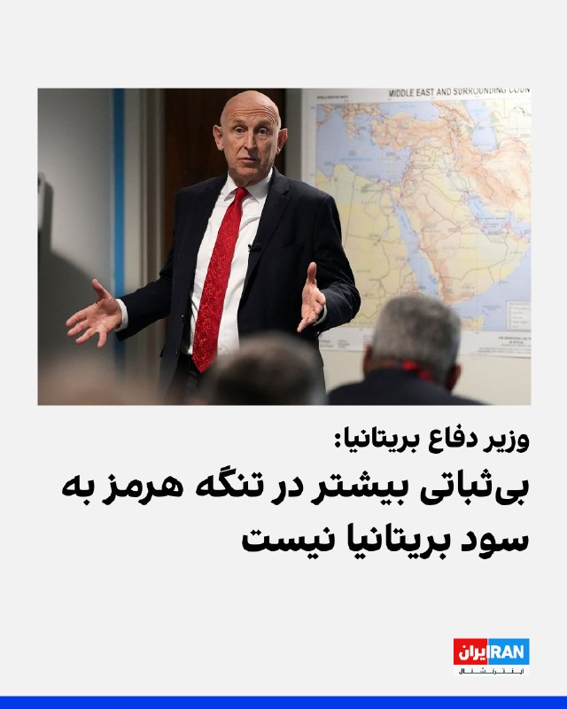

جان هیلی، وزیر دفاع بریتانیا، با اشاره به برگزاری نشستی درباره تامین امنیت کشتیرانی در تنگه هرمز گفت: «بی‌ثباتی بیشتر به سود بریتانیا نیست. اکنون باید تمام تمرکز ما بر رسیدگی به چالش‌های فوری اقتصادی و امنیتی باشد.»

او افزود سه‌شنبه ریاست مشترک نشست ۴۰ وزیر دفاع را با هدف جلب حمایت از ماموریت تحت رهبری بریتانیا برای تامین امنیت کشتیرانی در تنگه هرمز بر عهده خواهد داشت.

جان هیلی در شبکه ایکس نوشت مردم نگران درگیری‌های کنونی و بحران‌های جهانی پیش‌رو هستند و انتظار دارند دولت، همان‌گونه که نخست‌وزیر عمل می‌کند، کشور را از این شرایط عبور دهد.

او تاکید کرد بریتانیا مشارکت‌های نظامی خود در این ماموریت را اعلام خواهد کرد و افزود بی‌ثباتی بیشتر به سود بریتانیا نیست و دولت باید بر چالش‌های فوری اقتصادی و امنیتی تمرکز کند.

وزیر دفاع بریتانیا همچنین نوشت دولت باید برای بازگرداندن امنیت اقتصادی خانواده‌ها در داخل کشور اقدام کند.
‌🏁 🇬🇧 IranintlTV

🤖 @VahidOOnLine

## mwarmonitor — post 8966

  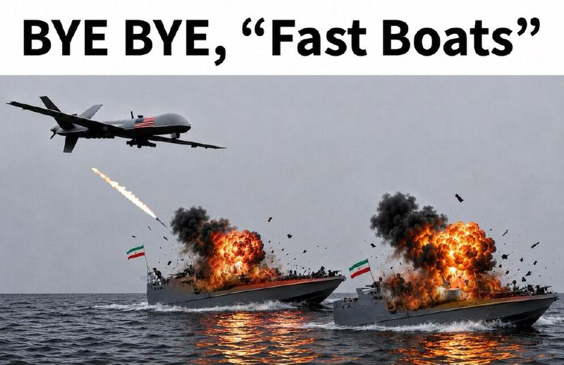

‼️یکی دیگه

## mwarmonitor — post 8964

🔸ترامپ دوباره این دو عکس در سوشال تروث منتشر کرده

@mwarmonitor

## FoxNewsTwitter — post 341576

  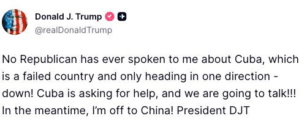

Fox News (Twitter/X)

NEW: President Trump announces plans to talk to Cuba as the country asks the United States for help:

"No Republican has ever spoken to me about Cuba, which is a failed country and only heading in one direction - down! Cuba is asking for help, and we are going to talk!!!"

## FoxNewsTwitter — post 341575

  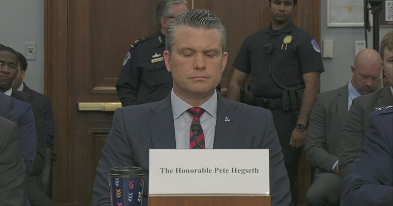

Fox News (Twitter/X)

WATCH LIVE: Secretary Hegseth testifies on Pentagon budget before House panel https://twitter.com/i/broadcasts/1DGleErLAldJL

## pm_afshaa — post 90617

🔴ترامپ در Truth Social:هیچ جمهوری‌خواهی تاکنون درباره کوبا با من صحبت نکرده است، کشوری شکست‌خورده که فقط در یک جهت حرکت می‌کند - به سمت پایین

💧 Rainbet.com the #1 Non-KYC Crypto Casino & Sportsbook @rainbetcom

😁 @Pm_Afshaa

## IranIntlTV — post 336808

  

جان هیلی، وزیر دفاع بریتانیا، با اشاره به برگزاری نشستی درباره تامین امنیت کشتیرانی در تنگه هرمز گفت: «بی‌ثباتی بیشتر به سود بریتانیا نیست. اکنون باید تمام تمرکز ما بر رسیدگی به چالش‌های فوری اقتصادی و امنیتی باشد.»

او افزود سه‌شنبه ریاست مشترک نشست ۴۰ وزیر دفاع را با هدف جلب حمایت از ماموریت تحت رهبری بریتانیا برای تامین امنیت کشتیرانی در تنگه هرمز بر عهده خواهد داشت.

جان هیلی در شبکه ایکس نوشت مردم نگران درگیری‌های کنونی و بحران‌های جهانی پیش‌رو هستند و انتظار دارند دولت، همان‌گونه که نخست‌وزیر عمل می‌کند، کشور را از این شرایط عبور دهد.

او تاکید کرد بریتانیا مشارکت‌های نظامی خود در این ماموریت را اعلام خواهد کرد و افزود بی‌ثباتی بیشتر به سود بریتانیا نیست و دولت باید بر چالش‌های فوری اقتصادی و امنیتی تمرکز کند.

وزیر دفاع بریتانیا همچنین نوشت دولت باید برای بازگرداندن امنیت اقتصادی خانواده‌ها در داخل کشور اقدام کند.
https://iranintl.com/202605123953

## IranianMinds — post 20004

  <a href="telegram/content/IranianMinds_20004_1778588106.mp4" target="_blank">🎬 Download video</a>

🔴دختر طهرانی مقدم: همسرم باور نمی‌کرد یک فرمانده ارشد نظامی اینقدر در خانه لطیف و عاطفی باشد.

ناباوری همسرش بی‌جا نبوده، دلیلش هم اینه که بیرون از خانه وحشی، خونخوار و قاتل هستن.

@IranianMinds

## BBCPersian — post 280847

  <a href="telegram/content/BBCPersian_280847_1778588110.mp4" target="_blank">🎬 Download video</a>

🔻‌در جریان اجلاس «آفریقا فوروارد» که روز دوشنبه ۱۱ مه ۲۰۲۶ در نایروبی کنیا برگزار شد، امانوئل مکرون، رئیس‌جمهور فرانسه، با قطع کردن صحبت‌های سخنران از حاضران خواست سکوت کرده و سر و صدا نکنند .

او با اشاره به «غیرممکن» شدن شنیدن صحبتهای سخنرانان به حاضران گفت: «این کاملا بی‌احترامی است.»

اجلاس «آفریقا فوروارد» نشستی است که بیش از ۳۰ رهبر آفریقایی، مدیران تجاری و کارآفرینان جوان را گرد هم آورده است.

فرانسه در تلاش است روابط خود را با کشورهای این قاره تقویت کند.

@‌‌BBCPersian

## Hranews — post 112901

  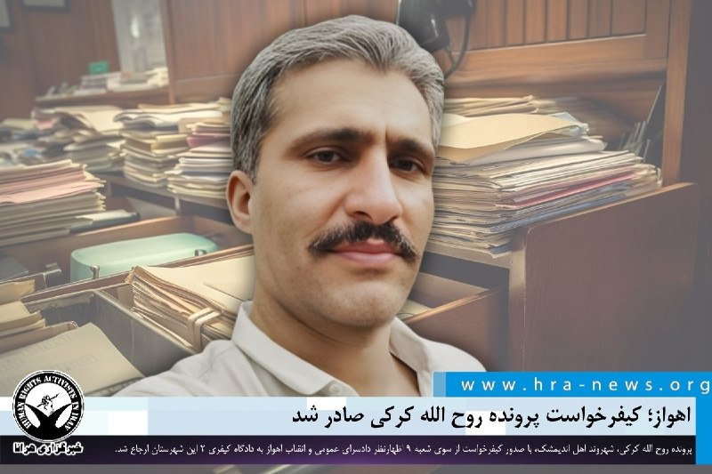

کیفرخواست پرونده روح الله کرکی صادر شد

❗️
❗️
❗️
❗️
❗️– پرونده روح الله کرکی، شهروند اهل اندیمشک، با صدور کیفرخواست توسط شعبه ۹ دادسرای عمومی و انقلاب اهواز به دادگاه کیفری ۲ این شهرستان ارجاع شد.

به گزارش خبرگزاری هرانا، ارگان خبری مجموعه فعالان حقوق بشر در ایران، کیفرخواست پرونده روح الله کرکی صادر شد.

براساس اطلاعات دریافتی هرانا، پرونده آقای کرکی با صدور کیفرخواست از بابت اتهامات «انتشار و افشای اسناد محرمانه»، «همکاری با سازمان مجاهدین خلق»، «جاسوسی برای اسرائیل و تبادل اطلاعات نظامی و امنیتی»، «توهین به مقدسات و مقامات» و «اقدام علیه امنیت ملی» توسط شعبه ۹ اظهارنظر دادسرای عمومی و انقلاب اهواز صادر و به دادگاه کیفری ۲ این شهرستان ارجاع شده است.

ادامه مطلب

#روح_الله_کرکی

↘️
@hranews_bot تماس ✉️ -  @Hranews  کانال هرانا 🆑

## alonews — post 119489

  <a href="telegram/content/alonews_119489_1778588115.webm" target="_blank">🎬 Download video</a>

👈 پزشکیان: اجازه نخواهیم داد عده‌ای از شرایط جنگ سوءاستفاده کرده و با ایجاد اختلال اقتصادی، به معیشت مردم ضربه بزنند.

✅ @AloNews خبر جنگ

## alonews — post 119488

  <a href="telegram/content/alonews_119488_1778588115.webm" target="_blank">🎬 Download video</a>

👈پست ترامپ درباره ایران

✅ @AloNews خبر جنگ

## alonews — post 119487

  <a href="telegram/content/alonews_119487_1778588116.webm" target="_blank">🎬 Download video</a>

👈وزارت خارجه کویت: ما از ایران می‌خواهیم که فوراً و بدون قید و شرط اقدامات غیرقانونی و خصمانه خود را که امنیت منطقه را تهدید می‌کند، متوقف کند

🔴 اقدامات خصمانه ایران نقض آشکار حاکمیت کویت و نقض جدی قوانین بین‌المللی است.

✅ @AloNews خبر جنگ

---
📅 بروزرسانی: 1405/02/22 15:35
---

## VahidOOnLine — post 239688

  <a href="telegram/content/VahidOOnLine_239688_1778587523.mp4" target="_blank">🎬 Download video</a>

مونترال‌ | کانادا؛ گردهمایی ایرانیان
‌🏁 🇬🇧 ManotoTV

🤖 @VahidOOnLine

## mwarmonitor — post 8963

🇨🇺🇺🇸ترامپ: «کوبا درخواست کمک کرده و ما قرار است گفت‌وگو کنیم.»

@mwarmonitor

## mwarmonitor — post 8962

  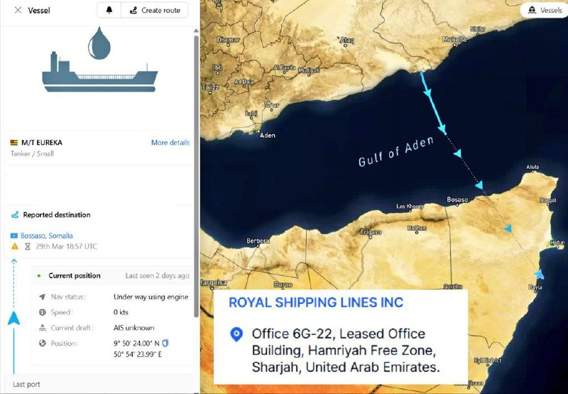

🔴دو هفته پیش، پس از آن‌که نفتکش M/T EUREKA هنگام عبور از Gulf of Aden توسط دزدان دریایی ناشناس ربوده شد، هشت ملوان مصری ربوده شدند.

📌این نفتکش متعلق به شرکت مستقر در امارات Royal Shipping Lines است و تحت پرچم Togo تردد می‌کند. همچنین مالک و مدیر آن در امارات متحده عربی مستقر است.

@mwarmonitor

## mwarmonitor — post 8960

🚨 (رویترز) — قیمت نفت روز سه‌شنبه بیش از ۳ درصد افزایش یافت، زیرا اختلافات شدید میان آمریکا و ایران بر سر پیشنهادی برای پایان دادن به جنگ در خاورمیانه، نگرانی‌ها درباره عرضه را بار دیگر به کانون توجه بازگرداند.

@mwarmonitor

## FoxNewsTwitter — post 341574

‌Fox News (Twitter/X)

Read more:

## FoxNewsTwitter — post 341573

  

Fox News (Twitter/X)

NEW: California mayor resigns after being charged with acting as an illegal agent of China.

Eileen Wang has agreed to plead guilty as she faces up to 10 years in prison, according to federal prosecutors.

They say she secretly worked to advance pro-Beijing messaging in the U.S., allegedly spreading propaganda tied to the Chinese government.

## pm_afshaa — post 90616

سفیر آمریکا تو اسرائیل : ترامپ قبل از انتخابات پیشرو به اسرائیل سفر میکنه

💧 Rainbet.com the #1 Non-KYC Crypto Casino & Sportsbook @rainbetcom

😁 @Pm_Afshaa

## pm_afshaa — post 90615

  <a href="telegram/content/pm_afshaa_90615_1778587533.webm" target="_blank">🎬 Download video</a>

فیلترشکن v2rayپرسرعت ‼️
                                                    

✅ مناسب برای تمام اینترنت‌ها (همراه اول ایرانسل رایتل اینترنت خانگی و ..)

✅ قابل استفاده برای تمام سیستم عامل ها 

😎 ضمانت بازگشت وجه در صورت عدم اتصال

✅ پشتیبانی ۲۴ ساعته تا آخرین مدت اعتبار اشتراک   
  

😎 اشتراک 10 گیگ 😎

✅ فقط و فقط 1/500/000 ✅

👩‍💻 آیدی ثبت سفارش✨پشتیبانی #خریدوفروش : 👇
@SuportSevenStarsVpn

لینک ورود به کانال اصلی:
            
 https://t.me/sevenstars_VPN

## IranIntlTV — post 336807

  <a href="telegram/content/IranIntlTV_336807_1778587534.mp4" target="_blank">🎬 Download video</a>

وزارت کشور کویت اعلام کرد چهار عضو وابسته به سپاه پاسداران انقلاب اسلامی را که از راه دریا به جزیره بوبیان در خاک این کشور نفوذ کرده بودند، بازداشت کرد. در جریان درگیری با این افراد نیز یک عضو نیروهای مسلح کویت زخمی شده است.
جزییات بیشتر با تروسکه صادقی، خبرنگار ایران‌اینترنشنال
@iranintltv

## ManotoTV — post 105344

  <a href="telegram/content/ManotoTV_105344_1778587536.mp4" target="_blank">🎬 Download video</a>

مونترال‌ | کانادا؛ گردهمایی ایرانیان

## FarsiVOA — post 217525

  <a href="telegram/content/FarsiVOA_217525_1778587539.mp4" target="_blank">🎬 Download video</a>

ورود گروهی از اوگاندا به جمع حامیان حکومت در تجمعات شبانه تهران؛

ویدیوهای منتشر شده در شبکه‌های اجتماعی حاکی از ورود شماری از شیعیان اوگاندا به ایران و شرکت آنها در تجمعات شبانه حامیان حکومت در خیابان‌های تهران است.
@FarsiVOA

## FarsiVOA — post 217524

  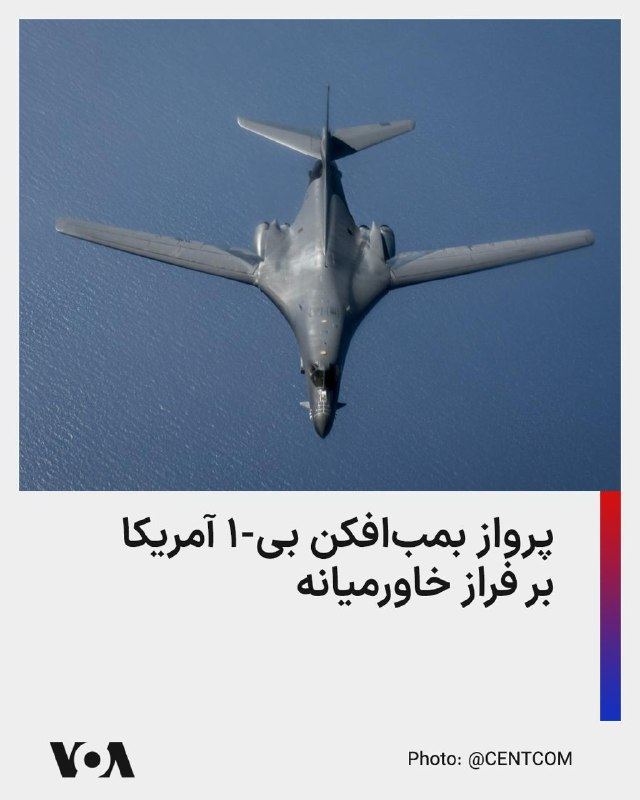

فرماندهی مرکزی ایالات متحده، سنتکام، تصویری از پرواز یک بمب‌افکن بی-۱ لنسر نیروی هوایی آمریکا بر فراز خاورمیانه در جریان یک ماموریت آموزشی را منتشر کرد. سنتکام اعلام کرد این پرواز روز ۹ مه انجام شد.

@FarsiVOA

## BBCPersian — post 280846

در نشست خبری روز ۲۲ اردیبهشت فاطمه مهاجرانی، سخنگوی دولت، بر سر اینترنت پرو و شرایط واگذاری آن بگو مگویی بین او و خبرنگاران پیش آمد.

خانم مهاجرانی گفت اینترنت پرو مصوبه شورای عالی امنیت ملی را دارد که رئیس‌جمهور رئیس آن است. او با تاکید بر اینکه اینترنت پرو ویژه کسب و کارهاست، در ادامه گفت وقتی سایه جنگ از کشور رفع شد به حالت عادی برمی‌گردد.

در ادامه خبرنگاران سوال‌های متعددی پرسیدند که در ویدیو به درستی شنیده نمی‌شود و سخنگوی دولت گفت کشور در جنگ است و ویژگی جنگ امنیت مردم است.

او در ادامه گفت اینترنت حق مردم و یکی از حقوق شهروندی است و خشم مردم به حق است اما بدانند «عامل این خشم دشمنانی هستند که باعث می‌شوند امنیت ما مخدوش شود.»

همزمان وزیر ارتباطات در گفتگویی که با خبرنگاران داشت اعلام کرد در واگذاری اینترنت پرو تخلف‌هایی صورت گرفته که در حال بررسی است و قوه قضائیه هم ورود کرده است.

غلامحسین محسنی اژه‌ای، رئیس قوه قضائیه هم درباره اینترنت پرو و واگذاری آن گفت: اگر موضوع درستی است باید آن را تبیین کرد و اگر تخلف هست باید برخورد شود. نباید مسائل را مبهم رها کرد.
@BBCPersian

## Hranews — post 112900

  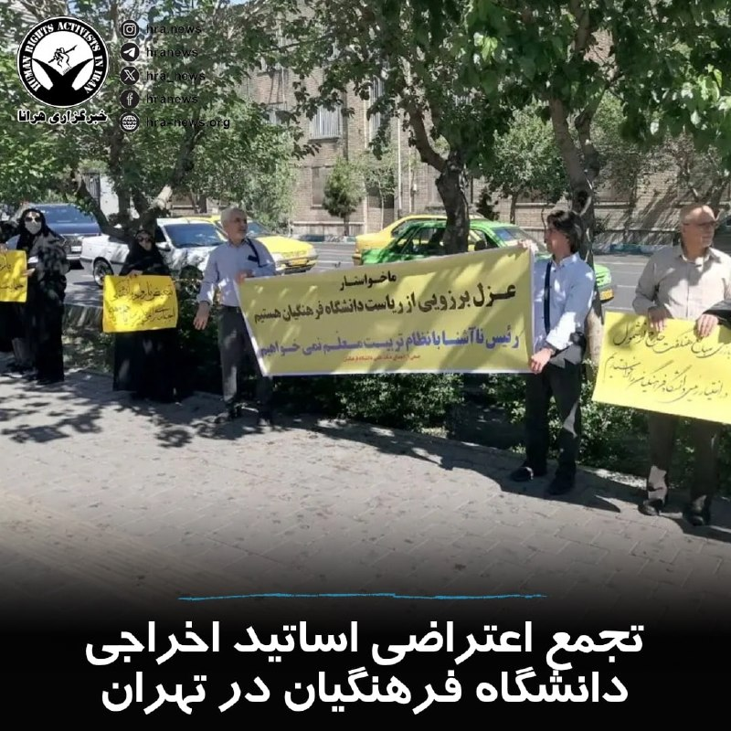

روز یکشنبه ۲۰ اردیبهشت‌ماه، شماری از اساتید اخراجی دانشگاه فرهنگیان در مقابل ساختمان های سازمان بازرسی کل کشور و وزارت آموزش و پرورش دست به #تجمع اعتراضی زدند.

این اساتید نسبت به اخراج بیش از ۳۰۰ عضو هیئت علمی دانشگاه و قطع حدود ۱۰ ماه از حقوق و مزایای‌شان اعتراض کرده و خواستار رسیدگی به مطالبات خود و عزل رئیس دانشگاه فرهنگیان شدند.

↘️
@hranews_bot تماس ✉️ - @Hranews کانال هرانا 🆑

## manototv — post 105344

  <a href="telegram/content/manototv_105344_1778587546.mp4" target="_blank">🎬 Download video</a>

مونترال‌ | کانادا؛ گردهمایی ایرانیان

## alonews — post 119486

  <a href="telegram/content/alonews_119486_1778587550.webm" target="_blank">🎬 Download video</a>

👈فیدان : به خاطر جهان، تنگه هرمز باید باز شود

✅ @AloNews خبر جنگ

## alonews — post 119484

  <a href="telegram/content/alonews_119484_1778587550.webm" target="_blank">🎬 Download video</a>

👈ترامپ به بازنشر تصاویر تولیدشده توسط هوش مصنوعی مرتبط با ایران ادامه می‌دهد.

🔴او قبلاً همین تصاویر را منتشر کرده است

✅ @AloNews خبر جنگ

## alonews — post 119483

  <a href="telegram/content/alonews_119483_1778587550.webm" target="_blank">🎬 Download video</a>

👈توییت جدید ترامپ

✅ @AloNews خبر جنگ

## alonews — post 119482

  <a href="telegram/content/alonews_119482_1778587551.webm" target="_blank">🎬 Download video</a>

👈 ترامپ از طریق Truth Social:
هیچ جمهوری‌خواهی تاکنون درباره کوبا با من صحبت نکرده است، کشوری شکست‌خورده که فقط در یک جهت حرکت می‌کند - به سمت پایین!

🔴کوبا درخواست کمک می‌کند و ما قرار است صحبت کنیم!!!

🔴در این میان، من به چین می‌روم!

✅ @AloNews خبر جنگ

---
📅 بروزرسانی: 1405/02/22 15:24
---

## VahidOOnLine — post 239687

  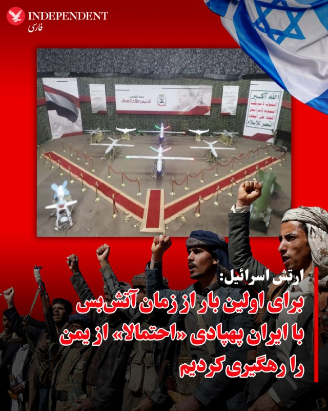

⭕️ارتش اسرائیل: برای اولین بار از زمان آتش‌بس با ایران پهپادی «احتمالا» از یمن را رهگیری کردیم

♦️ارتش اسرائیل بعدازظهر سه‌شنبه ۲۲ اردیبهشت اعلام کرد پدافند هوایی این کشور برای نخستین بار از زمان آتش‌بس با ایران، یک پهپاد که احتملا از یمن به‌پرواز درآمده را در آسمان بندر ایلات در جنوب این کشور رهگیری کرده است.

تایمز اسرائیل با انتشار این خبر از فعالیت پدافند هوایی بندر ایلات برای مقابله با این پهپاد خبر داد.

حوثی‌های یمن در هفته‌های پایانی پیش از آتش‌بس آمریکا و جمهوری اسلامی، پس از ماه‌ها شلیک موشک و پهپاد به اسرائیل را از سر گرفتند.
‌🇸🇦 Indypersian

🤖 @VahidOOnLine

## mwarmonitor — post 8959

🔴بر اساس گزارش Financial Times، خسارات واردشده به بزرگ‌ترین تأسیسات فرآوری گاز امارات متحده عربی در پی حملات ایران در ماه گذشته، ممکن است به‌طور کامل تا سال ۲۰۲۷ ترمیم نشود.

@mwarmonitor

## IranIntlTV — post 336806

  <a href="telegram/content/IranIntlTV_336806_1778586873.mp4" target="_blank">🎬 Download video</a>

به گفته باستان شناسان عراق روند مرمت زیگورات باستانی اور در استان ذی‌قار همچنان ادامه دارد. در این مرحله ابتدا نمای بیرونی این بنای تاریخی و سه راه‌پله طبقه اول در حال بازسازی است و مرمت طبقه دوم، به‌ویژه بخش‌های شمال‌غربی و جنوب‌شرقی، به‌صورت کامل انجام می‌شود.
@iranintltv

## IranIntlTV — post 336805

  <a href="telegram/content/IranIntlTV_336805_1778586875.mp4" target="_blank">🎬 Download video</a>

سازمان بهداشت جهانی اعلام کرد چند مورد ابتلا به ویروس هانتا در یک کشتی تفریحی تایید شده و ۳ نفر جان باختند. هانتاویروس خانواده‌ای از ویروس‌هاست که معمولا در جوندگان، از جمله موش‌ها، دیده می‌شود. این ویروس‌ها می‌توانند از طریق فضولات، ادرار یا بزاق جوندگان آلوده وارد محیط شوند و انسان را مبتلا کنند.
@iranintltv

## FarsiVOA — post 217522

  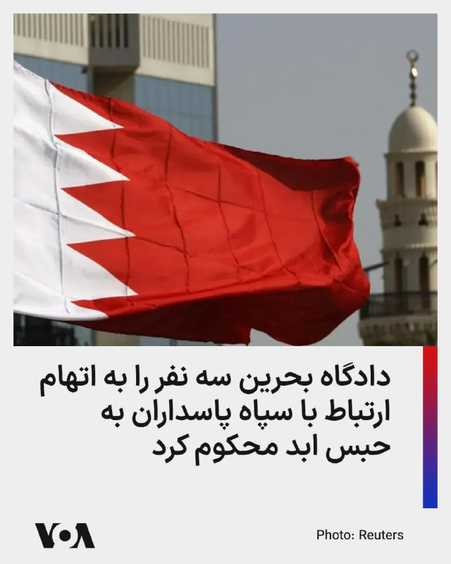

دادگاه عالی کیفری بحرین سه نفر، شامل دو مرد و یک زن، را در دو پرونده جداگانه به اتهام ارتباط با سپاه پاسداران جمهوری اسلامی و تلاش برای انجام اقدامات «خصمانه و تروریستی» علیه بحرین، به حبس ابد محکوم کرد.

خبرگزاری رسمی بحرین اعلام کرد دو متهم مرد به ارتباط با سپاه پاسداران با هدف اجرای عملیات علیه بحرین محکوم شده‌اند. دادگاه همچنین هر یک از آنان را به پرداخت ۱۰ هزار دینار بحرین جریمه و دستور مصادره اقلام ضبط‌شده را صادر کرده است.

دادستانی بحرین می‌گوید تحقیقات نشان داده سرویس‌های اطلاعاتی ایران و سپاه پاسداران از اعضای گروه‌هایی مستقر در ایران خواسته بودند تأسیسات حیاتی در بحرین را برای حملات احتمالی و بی‌ثبات‌سازی این کشور شناسایی کنند.

در پرونده‌ای جداگانه، یک زن نیز به اتهام تلاش برای همکاری با سپاه پاسداران محکوم شده است. دادستانی می‌گوید او با استفاده از حسابی در شبکه‌های اجتماعی، تصاویر و مختصات مراکز حساس بحرین را منتشر کرده بود. جزئیات مستقل درباره روند دادرسی و هویت متهمان منتشر نشده است.
@FarsiVOA

## RadioFarda — post 157089

  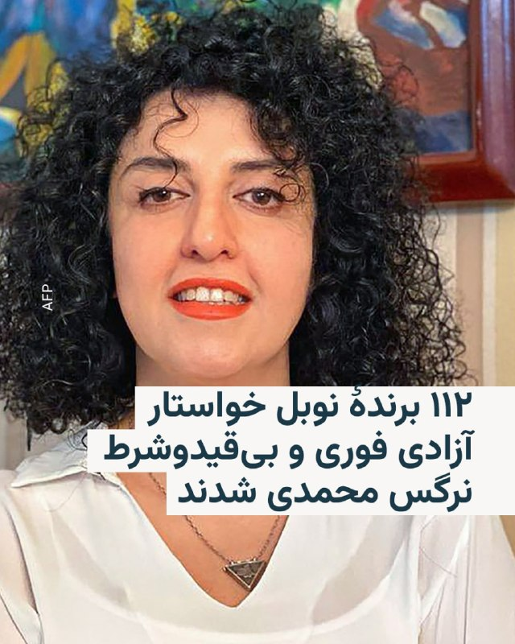

🔸در پی انتقال نرگس محمدی، برندهٔ جایزهٔ صلح نوبل و زندانی سیاسی، به بیمارستان، ۱۱۲ برندهٔ جایزهٔ نوبل از رشته‌های مختلف با انتشار بیانیه‌ای مشترک خواستار آزادی فوری و بی‌قیدوشرط او و لغو همهٔ اتهام‌ها علیه این فعال حقوق بشر شدند.

🔸این بیانیه روز سه‌شنبه ۲۲ اردیبهشت، با هماهنگی «ابتکار زنان نوبل» و همکاری «بنیاد نرگس» منتشر شد. امضاکنندگان شامل برندگان نوبل در رشته‌های شیمی، اقتصاد، ادبیات، پزشکی، صلح و فیزیک هستند.

🔸در این بیانیه آمده است که گزارش‌های منتشرشده از سوی بنیاد نرگس و دیگر منابع معتبر نشان می‌دهد وضعیت جسمانی خانم محمدی «بحرانی» شده و او با کاهش شدید وزن، ناپایداری فشار خون و علائم جدی قلبی روبه‌رو است.

🔸برندگان نوبل هشدار داده‌اند که جان نرگس محمدی ممکن است در معرض «خطر فوری» باشد و تأکید کرده‌اند که او ماه‌ها از دسترسی به خدمات تخصصی پزشکی محروم بوده است.

🔸نرگس محمدی روز ۲۰ اردیبهشت با آمبولانس به بیمارستان تهرانپارس منتقل شد و اکنون تحت درمان یک تیم تخصصی پزشکی قرار دارد.

@Radiofarda

## Dirty_Kids — post 389311

  <a href="telegram/content/Dirty_Kids_389311_1778586878.mp4" target="_blank">🎬 Download video</a>

ایده خوب 👌

@Dirty_Kids 👻

## Dirty_Kids — post 389310

از یه سنی به بعد کمتر کص‌ میگی و بیشتر بلاک میکنی.

@Dirty_Kids 👻

## Dirty_Kids — post 389309

  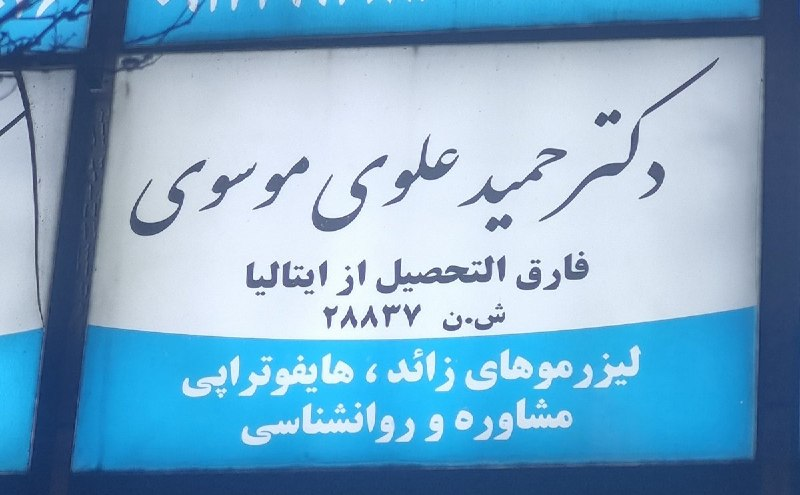

فارق‌التحصیل از ایتالیا

- وقت تراپی داشتین؟
+ بله
- دکتر یه مراجع داره که پشماشو می‌زنه؛ ۵ دقیقه دیگه می‌فرستمتون داخل.

@Dirty_Kids 👻

## Hranews — post 112899

  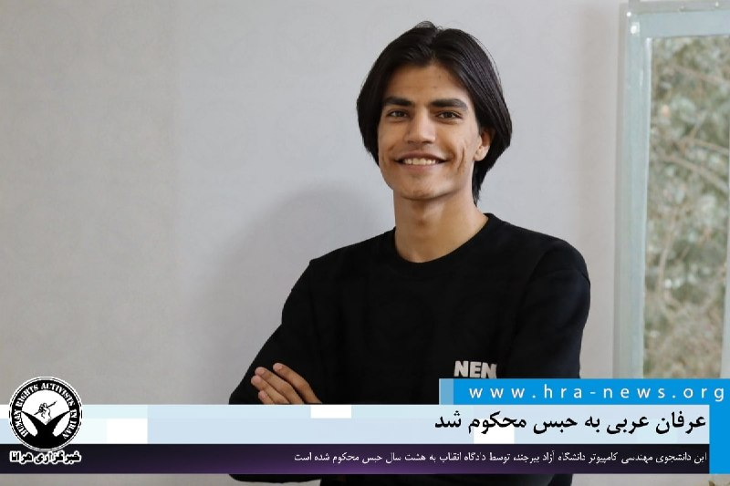

عرفان عربی به ۸ سال حبس محکوم شد

❗️
❗️
❗️
❗️
❗️– عرفان عربی، دانشجوی مهندسی کامپیوتر دانشگاه آزاد بیرجند، توسط دادگاه انقلاب به هشت سال حبس محکوم شد. آقای عربی، در بهمن ماه سال گذشته در رابطه با اعتراضات سراسری بازداشت شده بود.

به گزارش خبرگزاری هرانا، ارگان خبری مجموعه فعالان حقوق بشر در ایران، عرفان عربی به حبس محکوم شد.

یک منبع مطلع نزدیک به خانواده این دانشجوی دانشگاه آزاد بیرجند، میزان حبس صادر شده علیه آقای عربی را ۸ سال عنوان کرد. به گفته وی، دادگاه انقلاب حکم مذکور را امروز سه‌شنبه، به صورت شفاهی به عرفان عربی ابلاغ کرده است. با اعمال ماده ۱۳۴ قانون مجازات اسلامی، مجازات اشد یعنی ۵ سال حبس در خصوص وی قابل اجرا خواهد بود.

ادامه مطلب

#عرفان_عربی

↘️
@hranews_bot تماس ✉️ -  @Hranews  کانال هرانا 🆑

## alonews — post 119481

  <a href="telegram/content/alonews_119481_1778586881.webm" target="_blank">🎬 Download video</a>

👈سفیر آمریکا تو اسرائیل : ترامپ قبل از انتخابات پیشرو به اسرائیل سفر میکنه

✅ @AloNews خبر جنگ

## alonews — post 119480

  <a href="telegram/content/alonews_119480_1778586882.webm" target="_blank">🎬 Download video</a>

👈ایالات متحده و اوکراین پیش‌نویس یادداشتی را تهیه کرده‌اند که یک توافق دفاعی جدید احتمالی را ترسیم می‌کند و به اوکراین اجازه می‌دهد فناوری نظامی را به آمریکا صادر کند و به‌طور مشترک با شرکت‌های آمریکایی پهپاد تولید کند، طبق گزارش CBS News.

🔴این پیش‌نویس که بین وزارت امور خارجه آمریکا و سفیر اوکراین، اولگا استفانیشینا، مذاکره شده است، پس از افزایش علاقه آمریکا به فناوری پهپاد اوکراینی که در طول جنگ با روسیه توسعه یافته، شکل گرفته است.

🔴 این توافق با مقاومت‌هایی در داخل پنتاگون و کاخ سفید مواجه شد، به‌ویژه پس از آغاز جنگ ایران، که ترامپ قبلاً نیاز به تخصص پهپاد اوکراینی را رد کرده بود. اما یادداشت جدید نشان می‌دهد که این موانع سیاسی ممکن است اکنون در حال کاهش باشند.

✅ @AloNews خبر جنگ

---
📅 بروزرسانی: 1405/02/22 15:14
---

## VahidOOnLine — post 239686

  <a href="telegram/content/VahidOOnLine_239686_1778586279.mp4" target="_blank">🎬 Download video</a>

جانان الماسی، شاعر حماسی و رقصنده، در گردهمایی سراسری ایرانیان در شهر کلن آلمان، قطعه‌ «سوگ سیاوش» را اجرا کرد.
این برنامه روز یکشنبه ۱۰ می برگزار شد.
‌🏁 🇬🇧 ManotoTV

🤖 @VahidOOnLine

## VahidOOnLine — post 239685

  <a href="telegram/content/VahidOOnLine_239685_1778586284.mp4" target="_blank">🎬 Download video</a>

آیلین وانگ، شهردار شهر آرکادیا در جنوب کالیفرنیا، پس از متهم شدن از سوی وزارت دادگستری آمریکا به فعالیت مخفیانه برای دولت چین، از سمت خود استعفا داد.
دادستانی آمریکا اعلام کرد وانگ متهم است به دستور مقام‌های چینی، مطالبی در حمایت از پکن را بدون ثبت رسمی به‌عنوان «عامل خارجی» منتشر کرده است. او پذیرفته که به اتهام جنایی مطرح‌شده اعتراف کند و ممکن است تا ۱۰ سال زندان محکوم شود.
به گفته مقام‌های آمریکایی، وانگ همراه با فردی دیگر سایتی خبری برای جامعه چینی‌تبارهای آمریکا اداره می‌کرده و برخی مطالب ارسالی مقام‌های چینی، از جمله درباره رد اتهام نقض حقوق بشر در سین‌کیانگ، را منتشر کرده است.
مدیر شهر آرکادیا گفت این پرونده مربوط به «رفتار فردی» وانگ بوده و هیچ‌یک از منابع یا تصمیم‌گیری‌های رسمی شهرداری درگیر این ماجرا نبوده‌اند.
‌🏁 🇬🇧 ManotoTV

🤖 @VahidOOnLine

## DEJradio — post 4590

  <a href="telegram/content/DEJradio_4590_1778586286.mp4" target="_blank">🎬 Download video</a>

🤡
🔺 ظهره‌وند نماینده مجلس:
میشه کارهایی کرد که بمب اتم جلوش بچه‌بازیه!

ابوالفضل ظهره‌وند عضو دیگر کمیسیون امنیت ملی مجلس شورای اسلامی، مدعی شده است، «تولید بمب کاری نداره، وقتی شما اراده داشته باشی می‌توانی پلاسما و سلاح‌هایی داشته باشی که بمب اتم جلوش ترقه باشه؛ تاثیر تنگه هرمز، باب المندب و جبهه مقاومت از صد تا بمب اتم بیشتره، البته این تضادی هم با دیگر مسائل ندارد.»

او همچنین گفته «من جاها و ظرفیت‌هایی رو دیدم که اتفاقی میوفته که بمب اتم جلوش ترقه است، شما میتونید زمان رو پشت سر بزارید، چیزی که در چند ثانیه از تهران تا واشنگتن برود، میشه یه کارهایی کرد که بمب اتم جلوش بچه بازیه!»

#بمب_اتم #تنگه_هرمز
@DEJradio

## IranIntlTV — post 336804

  <a href="telegram/content/IranIntlTV_336804_1778586292.mp4" target="_blank">🎬 Download video</a>

تحریم‌های جدید استرالیا، بریتانیا و آمریکا علیه افراد و نهادهای مرتبط با سپاه پاسداران

@iranintltv

## ManotoTV — post 105343

  <a href="telegram/content/ManotoTV_105343_1778586297.mp4" target="_blank">🎬 Download video</a>

جانان الماسی، شاعر حماسی و رقصنده، در گردهمایی سراسری ایرانیان در شهر کلن آلمان، قطعه‌ «سوگ سیاوش» را اجرا کرد.
این برنامه روز یکشنبه ۱۰ می برگزار شد.

## DW_Farsi — post 124590

  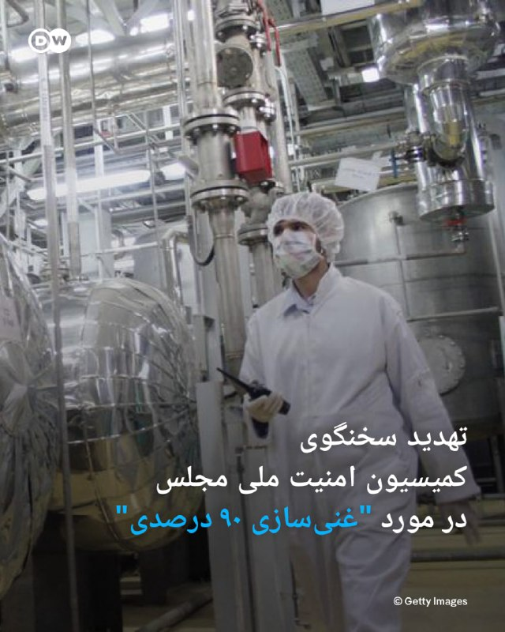

🔶 تهدید سخنگوی کمیسیون امنیت ملی مجلس در مورد "غنی‌سازی ۹۰ درصدی"

همزمان با ابراز ناخشنودی ترامپ از پاسخ ایران و بالا گرفتن گمانه‌زنی‌ها نسبت به از سرگیری جنگ آمریکا و اسرائیل علیه ایران، ابراهیم رضایی، سخنگوی كميسيون امنيت ملی و سياست خارجی مجلس شورای اسلامی، تهدید کرد ایران به حمله مجدد پاسخ می‌دهد.

او روز سه‌شنبه ۲۲ اردیبهشت (۱۲ مه) در پیامی در ایکس نوشت: «یکی از گزینه‌های ایران در صورت حمله مجدد می‌تواند غنی‌سازی ۹۰ درصد باشد. در مجلس بررسی می‌کنیم.»

ایران هم‌اکنون اورانیوم را تا سطح ۶۰ درصد غنی‌سازی کرده‌ است. این سطح فاصله فنی کوتاهی با غنی‌سازی ۹۰ درصدی دارد که درجه مورد نیاز برای ساخت سلاح هسته‌ای به شمار می‌رود. کارشناسان می‌گویند عبور از مرز ۹۰ درصد، به‌طور گسترده به‌عنوان ورود به محدوده "تسلیحاتی" تلقی می‌شود.

@dw_farsi

## Persian_Trend_Official — post 13975

غرق شدن کشتی روسی حامل تجهیزات هسته‌ای به مقصد احتمالی کره شمالی

🔹 تحقیقات شبکه سی‌ان‌ان نشان می‌دهد یک کشتی باری روسی که احتمالاً دو راکتور هسته‌ای ویژه زیردریایی‌ها را حمل می‌کرد و ممکن بود مقصد آن کره شمالی باشد، پس از وقوع چند انفجار مشکوک در دریای مدیترانه غرق شده است.

☆Phantom☆

📌 @persian_trend_official
پرشین ترند | متفاوت‌ترین کانال نظامی

🔹این کشتی با نام Ursa Major در تاریخ 23 دسامبر 2024، حدود 60 مایلی سواحل اسپانیا، در شرایطی نامشخص غرق شد. به گفته منابع آگاه، سرنوشت این کشتی از زمان حادثه در هاله‌ای از ابهام قرار داشته و جزئیات مربوط به محموله و مأموریت آن محرمانه نگه داشته شده است.

## RadioFarda — post 157088

🔸تنها ساعاتی تا افتتاح هفتاد‌و‌نهمین جشنواره فیلم کن باقی است و رسانه‌های جهان تصاویری از آماده‌سازی‌ نهایی کاخ جشنواره‌ کن را منتشر کرده‌اند.

🔸فرش قرمز روز افتتاحیه هفتاد‌و‌نهمین دوره این جشنواره روز سه‌شنبه ۲۲ اردیبهشت پهن شد و بزرگترین رویداد سینمایی جهان در انتظار حضور چهره‌های سرشناس سینماست که قرار است تا دوم خرداد در این جشنواره حضور داشته باشند.

🔸از جمله چهره‌های سرشناسی که امسال فیلم‌هایشان برای اولین بار اکران می‌شود می‌توان به اسکارلت جوهانسون، رامی مالک، خاویر باردم، جان تراولتا و لیا سیدو اشاره کرد.

🔸۲۲ فیلم هم برای دریافت جایزه نخل طلا در مراسم اختتامیه رقابت می‌کنند که در میان آنها چهره‌هایی از جمله پدرو آلمودوار،‌ اصغر فرهادی و لاسلو نمش حضور دارند.

@Radiofarda

## RadioFarda — post 157087

  <a href="https://t.me/radiofarda/157087" target="_blank">📎 Download file</a>

📻بشنوید: ساعت ۱۴ با رادیوفردا، ۲۲ اردیبهشت ۱۴۰۵‌

@Radiofarda

## IranianMinds — post 20003

🔴 اژه‌ای:
داستان اینترنت پرو و سیمکارت سفید باعث خشم مردم شده و باید با موارد خلاف قانون در این موضوع برخورد بشه.

@IranianMinds

## manototv — post 105343

  <a href="telegram/content/manototv_105343_1778586301.mp4" target="_blank">🎬 Download video</a>

جانان الماسی، شاعر حماسی و رقصنده، در گردهمایی سراسری ایرانیان در شهر کلن آلمان، قطعه‌ «سوگ سیاوش» را اجرا کرد.
این برنامه روز یکشنبه ۱۰ می برگزار شد.

## alonews — post 119479

  <a href="telegram/content/alonews_119479_1778586305.webm" target="_blank">🎬 Download video</a>

👈 سخنگوی ریاست جمهوری روسیه: پوتین اعلام کرده که آماده است با زلنسکی در مسکو یا هر جای دیگری دیدار کند.

✅ @AloNews خبر جنگ

## alonews — post 119478

  <a href="telegram/content/alonews_119478_1778586305.webm" target="_blank">🎬 Download video</a>

👈تحلیل نشریه هیل:ترامپ به احتمال زیاد پیروزی در جنگ علیه ایران را صرف نظر از نتیجه واقعی اعلام خواهد کرد، اما متقاعد کردن آمریکایی‌ها به شایستگی آن جنگ ممکن است از نظر سیاسی تقریباً غیرممکن باشد

🔴جمهوری خواهان بین وفاداری به ترامپ و افزایش نارضایتی عمومی گیر افتاده‌اند و بنابراین ارائه جنگ به عنوان یک موفقیت استراتژیک «عملاً غیرممکن خواهد بود»، به خصوص اگر توافق نهایی بسیار کمتر از وعده های اولیه دولت باشد.

✅ @AloNews خبر جنگ

## alonews — post 119477

  <a href="telegram/content/alonews_119477_1778586306.mp4" target="_blank">🎬 Download video</a>

👈نخست‌وزیر قطر درباره ایران: ایران نباید از این تنگه به عنوان سلاحی برای فشار یا باج‌گیری از کشورهای خلیج فارس استفاده کند.

🔴این یک گذرگاه آبی بین‌المللی است که باید همیشه محافظت شود.

🔴وضعیت کنونی تنگه و آنچه در آنجا اتفاق می‌افتد نباید هرگز تکرار شود، و باید کاملاً روشن شود که اگر در آینده هر کشوری به تنگه آسیبی برساند، باید برای انجام چنین کاری فلج شود.

✅ @AloNews خبر جنگ

---
📅 بروزرسانی: 1405/02/22 15:04
---

## VahidOOnLine — post 239684

  <a href="telegram/content/VahidOOnLine_239684_1778585692.mp4" target="_blank">🎬 Download video</a>

⭕️وزیر خارجه ترکیه در قطر: از تلاش‌ها برای بازگشایی تنگه هرمز حمایت می‌کنیم

♦️هاکان فیدان، وزیر امور خارجه ترکیه روز سه‌شنبه ۲۲ اردیبهشت در نشست خبری مشترک با وزیر امور خارجه قطر در دوحه گفت نباید از تنگه هرمز به‌عنوان سلاح استفاده شود.
فیدان تاکید کرد که این کشور از تلاش‌ها برای بازگشایی این آبراه راهبردی بین‌المللی استقبال می‌کند.
وزیر امور خارجه ترکیه همچنین گفت که آنکارا و دوحه از روند مذاکرات اسلام‌آباد برای پایان دادن به جنگ حمایت می‌کنند.
‌🇸🇦 Indypersian

🤖 @VahidOOnLine

## VahidOOnLine — post 239683

  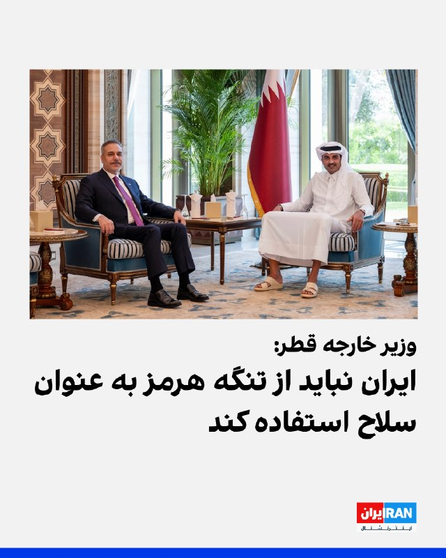

محمد بن عبدالرحمن آل ثانی، وزیر خارجه قطر، در نشست خبری با وزیر خارجه ترکیه گفت آنچه در تنگه هرمز در جریان است به کاهش تنش کمک نمی‌کند و جمهوری اسلامی نباید از این تنگه به‌عنوان سلاح استفاده کند.

او در ادامه با اشاره به سفر خود به آمریکا افزود این سفر عمدتا بر حمایت و همراهی با تلاش‌های پاکستان متمرکز بوده و نقش پاکستان برای منطقه و جهان بسیار مهم و تعیین‌کننده است.

محمد بن عبدالرحمن آل ثانی همچنین گفت قطر و ترکیه در حال هماهنگی تلاش‌ها هستند و از دیپلماسی پاکستان برای دستیابی به توافق در سریع‌ترین زمان ممکن حمایت می‌کنند.
‌🏁 🇬🇧 IranintlTV

🤖 @VahidOOnLine

## mwarmonitor — post 8958

🇺🇸🇺🇦بر اساس یک یادداشت تفاهم میان United States و Ukraine، چارچوب‌های یک توافق دفاعی جدید مشخص شده است که به اوکراین اجازه می‌دهد فناوری‌های نظامی خود را به آمریکا صادر کند و از طریق سرمایه‌گذاری‌های مشترک با شرکت‌های آمریکایی، پهپاد تولید کند. — CBS

@mwarmonitor

## FoxNewsTwitter — post 341572

  

Fox News (Twitter/X)

A one-vote margin just changed the conversation around ICE in Minnesota.

In a razor-thin 34–33 vote, the state Senate backed a bill banning ICE agents from wearing masks during operations, and giving residents the right to sue if they believe their constitutional rights were violated.

## ManotoTV — post 105342

  <a href="telegram/content/ManotoTV_105342_1778585698.mp4" target="_blank">🎬 Download video</a>

آیلین وانگ، شهردار شهر آرکادیا در جنوب کالیفرنیا، پس از متهم شدن از سوی وزارت دادگستری آمریکا به فعالیت مخفیانه برای دولت چین، از سمت خود استعفا داد.
دادستانی آمریکا اعلام کرد وانگ متهم است به دستور مقام‌های چینی، مطالبی در حمایت از پکن را بدون ثبت رسمی به‌عنوان «عامل خارجی» منتشر کرده است. او پذیرفته که به اتهام جنایی مطرح‌شده اعتراف کند و ممکن است تا ۱۰ سال زندان محکوم شود.
به گفته مقام‌های آمریکایی، وانگ همراه با فردی دیگر سایتی خبری برای جامعه چینی‌تبارهای آمریکا اداره می‌کرده و برخی مطالب ارسالی مقام‌های چینی، از جمله درباره رد اتهام نقض حقوق بشر در سین‌کیانگ، را منتشر کرده است.
مدیر شهر آرکادیا گفت این پرونده مربوط به «رفتار فردی» وانگ بوده و هیچ‌یک از منابع یا تصمیم‌گیری‌های رسمی شهرداری درگیر این ماجرا نبوده‌اند.

## FarsiVOA — post 217521

  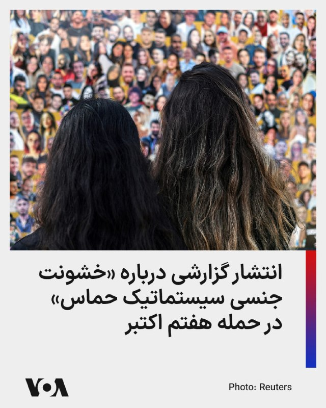

«کمیته مدنی برای مستندسازی و بررسی جنایات حماس» گزارشی تکان‌دهنده بر اساس ۱۰ هزار مدرک درباره «وحشیگری و خشونت جنسی سیستماتیک حماس» را منتشر کرد.

این گزارش ۲۵۰ صفحه‌ای، جزئیات جنایات جنسی و فجایع هولناکی را که شبه‌نظامیان حماس علیه قربانیان در جریان حمله ۷ اکتبر و دوره‌های اسارت پس از آن مرتکب شده‌اند، شرح می‌دهد.

این گزارش بر پایه مدارکی از جمله عکس، فیلم و شهادت آسیب‌شناسان و امدادگران تدوین شده و تصویری هولناک از خشونت سیستماتیک و وحشیانه‌ای که توسط اعضای حماس علیه زنان، مردان و کودکان انجام شده، ارائه می‌دهد.

همچنین این گزارش تأیید می‌کند که عاملان، مرتکب تخلفات تصادفی نشده‌اند، بلکه ۱۳ الگوی خشونت جنسی، از جمله تجاوز گروهی، برهنگی اجباری و مثله کردن عمدی اجساد را به کار گرفته‌اند.

در یکی از وحشتناک‌ترین شهادت‌های مستند شده در این گزارش، اعضای یک خانواده مجبور شدند با زور اسلحه و در تلاشی سادیستی برای خرد کردن کرامت انسانی، اعمال جنسی علیه یکدیگر انجام دهند.

بر اساس این گزارش، این وحشیگری محدود به یک مکان واحد نبود، بلکه در جشنواره‌های موسیقی، کیبوتص‌ها و پایگاه‌های نظامی نیز رخ داد.
@FarsiVOA

## IranianMinds — post 20002

🔴 اسرائیل هیوم:

هزاران اسرائیلی پیام‌های تهدیدآمیز از هکرهای وابسته به ج‌آ دریافت کردن که از شهروندان خواسته شده با جمهوری اسلامی همکاری اطلاعاتی کنند.

@IranianMinds

## manototv — post 105342

  <a href="telegram/content/manototv_105342_1778585700.mp4" target="_blank">🎬 Download video</a>

آیلین وانگ، شهردار شهر آرکادیا در جنوب کالیفرنیا، پس از متهم شدن از سوی وزارت دادگستری آمریکا به فعالیت مخفیانه برای دولت چین، از سمت خود استعفا داد.
دادستانی آمریکا اعلام کرد وانگ متهم است به دستور مقام‌های چینی، مطالبی در حمایت از پکن را بدون ثبت رسمی به‌عنوان «عامل خارجی» منتشر کرده است. او پذیرفته که به اتهام جنایی مطرح‌شده اعتراف کند و ممکن است تا ۱۰ سال زندان محکوم شود.
به گفته مقام‌های آمریکایی، وانگ همراه با فردی دیگر سایتی خبری برای جامعه چینی‌تبارهای آمریکا اداره می‌کرده و برخی مطالب ارسالی مقام‌های چینی، از جمله درباره رد اتهام نقض حقوق بشر در سین‌کیانگ، را منتشر کرده است.
مدیر شهر آرکادیا گفت این پرونده مربوط به «رفتار فردی» وانگ بوده و هیچ‌یک از منابع یا تصمیم‌گیری‌های رسمی شهرداری درگیر این ماجرا نبوده‌اند.

## alonews — post 119476

  <a href="telegram/content/alonews_119476_1778585701.webm" target="_blank">🎬 Download video</a>

👈وزارت دفاع کویت از دستگیری چهار نفری خبر داد که تلاش کردند با یک قایق ماهیگیری اجاره‌ای وارد کویت شوند.

🔴 وزارت کشور بعداً اعلام کرد مظنونان اعتراف کردند که به دستور سپاه پاسداران انقلاب اسلامی برای نفوذ به جزیره بوبیان و انجام عملیات خرابکارانه هدایت شده‌اند.

🔴 مقامات گفتند این گروه پس از فرود در جزیره با نیروهای امنیتی کویت درگیر شدند که در نتیجه یک نفر از آنها مجروح و دو نفر دیگر فرار کردند.

✅ @AloNews خبر جنگ

---
📅 بروزرسانی: 1405/02/22 14:54
---

## pm_afshaa — post 90614

  <a href="telegram/content/pm_afshaa_90614_1778585054.webm" target="_blank">🎬 Download video</a>

🔴فاکس‌نیوز: در صورت شکست مذاکرات و تشدید بحران، برخی مقام‌های ارشد جمهوری اسلامی ممکنه به روسیه فرار کنن و مقام‌های رده‌پایین‌تر به کشورهایی مثل عراق یا افغانستان پناه ببرن.

💧 Rainbet.com the #1 Non-KYC Crypto Casino & Sportsbook @rainbetcom

😁 @Pm_Afshaa

## IranIntlTV — post 336803

  

محمد بن عبدالرحمن آل ثانی، وزیر خارجه قطر، در نشست خبری با وزیر خارجه ترکیه گفت آنچه در تنگه هرمز در جریان است به کاهش تنش کمک نمی‌کند و جمهوری اسلامی نباید از این تنگه به‌عنوان سلاح استفاده کند.

او در ادامه با اشاره به سفر خود به آمریکا افزود این سفر عمدتا بر حمایت و همراهی با تلاش‌های پاکستان متمرکز بوده و نقش پاکستان برای منطقه و جهان بسیار مهم و تعیین‌کننده است.

محمد بن عبدالرحمن آل ثانی همچنین گفت قطر و ترکیه در حال هماهنگی تلاش‌ها هستند و از دیپلماسی پاکستان برای دستیابی به توافق در سریع‌ترین زمان ممکن حمایت می‌کنند.
https://iranintl.com/202605125826

## IranIntlTV — post 336802

  <a href="telegram/content/IranIntlTV_336802_1778585055.mp4" target="_blank">🎬 Download video</a>

هفتادونهمین دوره جشنواره فیلم کن، سه‌شنبه در جنوب فرانسه آغاز می‌شود. اصغر فرهادی نیز با فیلم «داستان‌های موازی» در بخش مسابقه اصلی این جشنواره حضور دارد.

لی‌لی نیکفر، خبرنگار ایران‌اینترنشنال، گزارش می‌دهد
@iranintltv

## IranIntlTV — post 336801

🔻آیا عملیات ویژه اسرائیل در سوریه می‌تواند الگوی انتقال ذخایر اورانیوم از ایران باشد؟

روزنامه معاریو در مطلبی با اشاره به اظهارات اخیر بنیامین نتانیاهو، احتمال انجام شدن عملیاتی از سوی اسرائیل برای خارج کردن ذخایر اورانیوم جمهوری اسلامی را مورد بررسی قرار داد و به جزییات یکی از نمونه‌های تاریخی مشابه پرداخت.

نخست‌وزیر اسرائیل ۲۱ اردیبهشت در گفت‌وگو با شبکه سی‌بی‌اس اعلام کرد در صورت دستیابی به توافقی با تهران، خارج کردن مواد هسته‌ای جمهوری اسلامی «کاملا امکان‌پذیر» است.

نتانیاهو در پاسخ به پرسشی درباره احتمال استفاده از زور برای جابه‌جایی ذخایر اورانیوم حکومت ایران در صورت شکست مذاکرات گفت نمی‌تواند درباره گزینه‌ها و عملیات نظامی احتمالی اظهار نظر کند.

معاریو سه‌شنبه ۲۲ اردیبهشت نوشت با وجود پاسخ مبهم نتانیاهو، ارتش اسرائیل سابقه اجرای «عملیات‌های ویژه در عمق خاک دشمن» را در کارنامه خود دارد.

بر اساس این گزارش، نیروهای واحد شلدگ هشتم سپتامبر ۲۰۲۴ در عملیاتی ویژه در خاک سوریه، به یک سایت زیرزمینی تولید موشک در منطقه مصیاف یورش بردند و آن را منهدم کردند.

واحد شلدگ، نیروی ویژه نخبه وابسته به نیروی هوایی اسرائیل است که ماموریت‌هایی چون نفوذ، شناسایی و عملیات مخفی در عمق خاک دشمن را انجام می‌دهد.

۲۱ اردیبهشت، دونالد ترامپ، رییس‌جمهوری آمریکا، پاسخ تهران به پیشنهاد واشینگتن را «آشغال» و «بسیار ضعیف» توصیف کرد و شانس پایداری آتش‌بس موقت را «حدود یک درصد» دانست.

در روزهای اخیر گمانه‌زنی‌ها درباره احتمال ازسرگیری کارزار نظامی ایالات متحده و اسرائیل علیه جمهوری اسلامی بالا گرفته است.
جزییات عملیات پیچیده ارتش اسرائیل در مصیاف

معاریو نوشت سازمان اطلاعات نظامی اسرائیل طی سال‌ها رصد، این سایت زیرزمینی را شناسایی کرد. تاسیساتی که با حمایت مالی جمهوری اسلامی برای تولید موشک‌های دقیق و راکت‌های دوربرد ساخته شده بود.

این تاسیسات زیرزمینی، پروژه‌ای راهبردی در چارچوب تلاش تهران برای تجهیز حزب‌الله و دیگر نیروهای نیابتی خود در مرز شمالی اسرائیل بود که در جریان این عملیات منهدم شد.

در ماه‌های منتهی به عملیات، طرح نابودی این مجموعه با مشارکت نیروی هوایی اسرائیل تدوین شد و نیروها با بالگرد، تحت پوشش آتش و پشتیبانی پهپادها، جنگنده‌ها و شناورهای نیروی دریایی، در منطقه فرود آمدند.

دقایقی پیش از فرود نیروهای اسرائیلی در خاک سوریه، تاسیسات تولید موشک‌های زمین‌به‌زمین هدف قرار گرفت و مواضع امنیتی اطراف آن از بین رفت.

بالگردهای حامل بیش از ۱۰۰ نیروی واحد شلدگ در فاصله حدود ۷۰۰ متری هدف به زمین نشستند و پس از درگیری با نیروهای دشمن، مسیر ورود به تونل‌ها و اتاق‌های حفرشده در دل کوه هموار شد.

این مجموعه که ساخت آن از اواخر سال ۲۰۱۷ کلید خورده بود، در عمق یک کوه و در میان دره‌ای با عمق حدود ۱۰۰ متر بنا شده بود و ساختاری نعل‌اسبی با دو خروجی اصلی داشت.
به‌دلیل موقعیت جغرافیایی و عوارض طبیعی منطقه مصیاف سوریه، نیروهای اسرائیلی توانستند به سرعت محدوده عملیات را تحت کنترل درآورند و از هر گونه دخالت نیروهای متخاصم جلوگیری کنند.

نیروهای اسرائیلی پس از شکستن درها، حجم زیادی از مواد منفجره را در اتاق‌های مجموعه کار گذاشتند. در مجموع، ۳۰۰ کیلوگرم مواد منفجره به‌همراه مهمات موجود در سایت، انفجاری معادل حدود یک تُن مهمات ایجاد کرد.

در این عملیات، نظامیان اسرائیلی به تجهیزات کلیدی در تولید موشک‌های دقیق، از جمله یک میکسر سیاره‌ای، دست یافتند و همچنین مقادیری سلاح و اسناد اطلاعاتی را ضبط کردند.

پس از انفجار گسترده‌ای که به نابودی کامل سایت انجامید و شدت آن همچون زمین‌لرزه احساس شد، نیروها از مسیر تخلیه به سوی بالگردها حرکت کردند.
🔗 ادامه گزارش را اینجا بخوانید
@iranintltv

## FarsiVOA — post 217520

  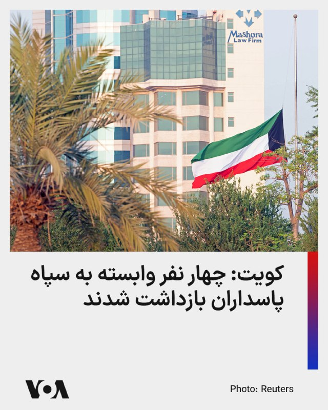

وزارت کشور کویت از بازداشت چهار نفر وابسته به سپاه پاسداران خبر داد و اعلام کرد که این افراد در تلاش بودند از راه دریا وارد کویت شوند.

وزارت کشور کویت روز سه‌شنبه اعلام کرد در جریان درگیری با این نفوذی‌ها، یکی از نیروهای مسلح کویت زخمی شده است.

چند روز پیش نیز با وجود برقراری آتش‌بس، کویت از شناسایی چند پهپاد «متخاصم» در حریم هوایی خود و مقابله با آن‌ها خبر داد.

رویترز پیشتر نوشت با وجود توافق آتش‌بس، در همان روز نخست همچنان درگیری‌هایی جریان داشت و کشورهای حاشیه خلیج فارس، از جمله کویت، بحرین و امارات، از حملات موشکی و پهپادی گزارش داده بودند.
@FarsiVOA

## FarsiVOA — post 217519

  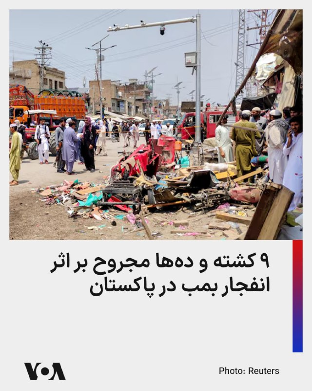

خبرگزاری رویترز به نقل از سازمان خدمات اضطراری پاکستان اعلام کرد که در پی انفجاری مهیب در یک بازار شلوغ در شمال‌غرب این کشور، ۹ نفر کشته و ده‌ها تن دیگر زخمی شدند.

این رویداد روز سه‌شنبه ۲۲ اردیبهشت رخ داد و رویترز معتقد است که می‌تواند خطر شعله‌ور شدن دوباره درگیری‌ها میان پاکستان و افغانستان را افزایش دهد.

مقامات بیمارستانی در پاکستان اعلام کردند که تاکنون ۳۷ مجروح به مراکز درمانی منتقل شده و حال برخی از آنها وخیم است.

این حمله پس از آن رخ داد که روز شنبه ۱۹ اردیبهشت، انفجار یک خودرو بمب‌گذاری شده در پاکستان، جان دست‌کم ۱۵ افسر پلیس این کشور را گرفت.

پاکستان، شبه‌نظامیان مستقر در افغانستان را مسئول حمله روز شنبه می‌داند و در مقابل افغانستان اعلام کرده که فعلاً درباره اتهام پاکستان، اظهارنظر نمی‌کند.

روابط کابل و اسلام‌آباد، پس از حملات هوایی پاکستان علیه پایگاه‌های شبه‌نظامیان مستقر در افغانستان، وارد تنش و درگیری شده است.
@FarsiVOA

## DW_Farsi — post 124589

  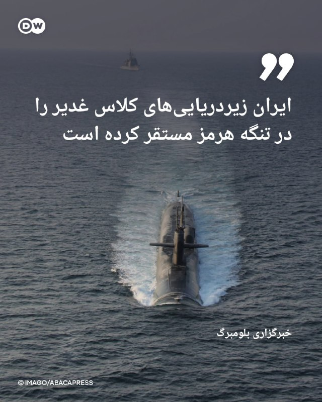

🔶 بلومبرگ: ایران زیردریایی‌های کلاس غدیر را در تنگه هرمز مستقر کرده است

به گزارش خبرگزاری بلومبرگ همزمان با افزایش تنش‌ها میان تهران و واشنگتن، ایران چندین زیردریایی کوچک از کلاس "غدیر" را در تنگه هرمز مستقر کرده است.

شهرام ایرانی، فرمانده نیروی دریایی ارتش‌، ۲۰ اردیبهشت (۱۰ مه) از استقرار زیردریایی‌های "سبک" ایران در آب‌های تنگه هرمز خبر داده و گفته بود این زیردریایی‌ها موسوم به "دلفین‌های خلیج فارس" متناسب با "تهدید‌ها و ظرفیت‌ها و نیاز‌ها در آب‌های تنگه هرمز دست به ماشه در حال گسترش و کف‌نشینی هستند".

او به نوع این زیردریایی‌ها اشاره نکرده بود اما خبرگزاری تسنیم همان زمان در گزارشی نوشته بود اشاره به "کف‌نشینی در بستر دریا مشخص می‌کند که این مأموریت احتمالاً با استفاده از زیردریایی غدیر صورت گرفته است".

@dw_farsi

## RadioFarda — post 157086

  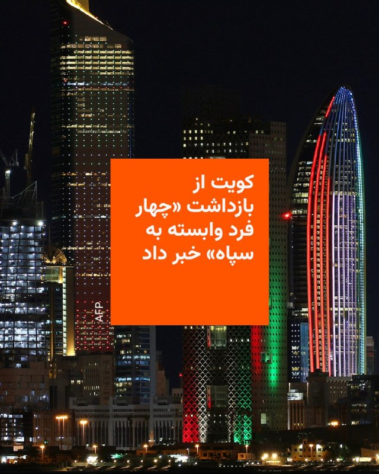

🔸وزارت کشور کویت اعلام کرد که «چهار نفوذی» وابسته به سپاه پاسداران انقلاب اسلامی ایران را پس از تلاش برای ورود دریایی به این کشور حوزه خلیج فارس بازداشت کرده است.

🔸خبرگزاری رسمی دولت کویت، کونا، این خبر را منتشر کرده است.

🔸این وزارتخانه افزود که در جریان درگیری با این این افراد، یکی از نیروهای مسلح کویت زخمی شد و «دو نفوذی‌» موفق به فرار شدند.

🔸کونا همچنین به نقل از وزارت کشور کویت نوشته که بازداشت‌شدگان در جریان بازجویی «اعتراف» کردند که وابسته به سپاه پاسداران هستند.

🔸بر اساس این گزارش، آنها «اعتراف کردند که مأموریت داشتند با یک قایق ماهیگیری که به‌طور ویژه برای انجام اقدامات خصمانه علیه کویت اجاره شده بود، به جزیره بوبیان نفوذ کنند».

🔸پیش از این وزارت دفاع کویت خبر اولیه‌ای از تلاش این چهار نفر برای ورود به این کشور از راه دریا منتشر کرده بود.

@RadioFarda

## BBCPersian — post 280845

🔻کویت: چهار نفوذی وابسته به سپاه پاسداران را دستگیر کردیم

وزارت کشور کویت می‌گوید که «چهار نفوذی وابسته به سپاه پاسداران» را حین تلاش برای ورود به کشور از طریق دریا بازداشت کرده است.

خبرگزاری دولتی کونا به نقل از این وزارتخانه گزارش داده است که یک نفر از نیروهای مسلح کویت در درگیری با این چهار نفر مجروح شده است.

بر اساس بیانیه وزارت کشور کویت، دستگیرشدگان دو سرهنگ، یک سروان و یک ستوان نیروی دریایی سپاه بوده‌اند که «اذعان» کرده‌اند ماموریت داشتند به جزیره بوبیان «نفوذ» کنند.

در این بیانیه آمده است که این چهار نفر در اول ماه مه (۱۱ روز پیش) سعی کردند «سوار بر یک قایق ماهیگیری که مخصوص انجام اقدامات خصمانه علیه کویت تدارک داده شده بود» وارد کویت شوند.

بوبیان بزرگترین جزیره کویت است و با سواحل ایران و عراق فاصله کمی دارد.

رسانه‌های ایران در زمان جنگ گفتند که پس از حمله ایران به پایگاه آمریکا در کویت، نظامیان آمریکا در جزیره بوبیان مستقر شدند.

https://bbc.in/4drNww2
@BBCPersian

## alonews — post 119475

  <a href="telegram/content/alonews_119475_1778585058.webm" target="_blank">🎬 Download video</a>

👈 نورالدین الدغیر خبرنگار الجزیره در تهران: شواهد و قرائن حاکی از آن است که چین تمایلی به میانجی‌گری بین تهران و واشنگتن ندارد، و دو طرف نیز از این موضوع آگاه هستند. 
✅ @AloNews خبر جنگ

## alonews — post 119474

  <a href="telegram/content/alonews_119474_1778585059.webm" target="_blank">🎬 Download video</a>

👈 نورالدین الدغیر خبرنگار الجزیره در تهران: شواهد و قرائن حاکی از آن است که چین تمایلی به میانجی‌گری بین تهران و واشنگتن ندارد، و دو طرف نیز از این موضوع آگاه هستند.

✅ @AloNews خبر جنگ

## alonews — post 119473

  <a href="telegram/content/alonews_119473_1778585059.mp4" target="_blank">🎬 Download video</a>

👈فعالیت پدافند اسرائیل برای رهگیری پهپاد یمنی

✅ @AloNews خبر جنگ

---
📅 بروزرسانی: 1405/02/22 14:45
---

## pm_afshaa — post 90613

🔴اسرائیل هیوم: هزاران اسرائیلی پیام‌های تهدیدآمیزی از هکرهای وابسته به جمهوری اسلامی ایران دریافت کردن که از شهروندان خواسته شده با جمهوری اسلامی ایران همکاری اطلاعاتی کنن

💧 Rainbet.com the #1 Non-KYC Crypto Casino & Sportsbook @rainbetcom

😁 @Pm_Afshaa

## IranIntlTV — post 336800

  <a href="telegram/content/IranIntlTV_336800_1778584506.mp4" target="_blank">🎬 Download video</a>

دفتر کنترل دارایی‌های خارجی وزارت خزانه‌داری آمریکا ۱۲ فرد و شرکت را به‌دلیل نقش داشتن در تسهیل فروش و انتقال نفت ایران از سوی سپاه پاسداران انقلاب اسلامی به جمهوری خلق چین تحریم کرد.

گفت‌وگو با آرش آزرمی، دبیر بخش اقتصادی ایران‌اینترنشنال

@iranintltv

## IranIntlTV — post 336799

  <a href="telegram/content/IranIntlTV_336799_1778584508.mp4" target="_blank">🎬 Download video</a>

مروری بر روزنامه‌های ایران، سه‌شنبه ۲۲ اردیبهشت، با مجتبی هاشمی، روزنامه‌نگار
@iranintltv

## Persian_Trend_Official — post 13974

دقایقی قبل ارتش اسرائیل از رهگیری یک پهپاد که از سمت ایران یا حوثی ها به سمت جنوب اسرائیل شلیک شده بود خبر داد. ☆Phantom☆ 📌 @persian_trend_official پرشین ترند | متفاوت‌ترین کانال نظامی

## Persian_Trend_Official — post 13973

  <a href="telegram/content/Persian_Trend_Official_13973_1778584510.mp4" target="_blank">🎬 Download video</a>

دقایقی قبل ارتش اسرائیل از رهگیری یک پهپاد که از سمت ایران یا حوثی ها به سمت جنوب اسرائیل شلیک شده بود خبر داد.

☆Phantom☆

📌 @persian_trend_official
پرشین ترند | متفاوت‌ترین کانال نظامی

## RadioFarda — post 157085

  <a href="https://t.me/radiofarda/157085" target="_blank">📎 Download file</a>

🔸روز اقدام جهانی با هدف اعتراض به ادامه حبس زندانیان سیاسی، اعدام‌های گسترده و همچنین قطع اینترنت روز بیستم اردیبهشت در چندین شهر برگزار شد.

🔸 هواداران شاهزاده رضا پهلوی در شهرهای مختلف دنیا، از جمله در اروپا و آمریکا شمالی به خیابان آمدند و به این حرکت پیوستند؛ برخی شهرها مثل برلین و هامبورگ و استکهلم جمعیت قابل توجهی به این فراخوان پاسخ دادند و در برخی شهرهای دیگر تجمعات به نسبت موارد پیشین کوچکتر برگزار شد.

🔸پس از انتشار تصاویر برخی از تجمعات، بحثی پیرامون آن شکل گرفته است؛ مشخصا تجمع در شهر رگنسبورگ در آلمان، معترضان با لباس‌های متحدالشکل با نشان ساواک (سازمان اطلاعات و امنیت کشور) و پرچم‌هایی با همین نشان به خیابان آمدند.

🔸در نمونه‌ای دیگر شرکت‌کنندگان در تجمع با یونیفرم نظامی به خیابان آمده بودند. تصاویری که بسیار متفاوت از تصاویر تجمعاتِ معمول ایرانیان خارج از کشور بود.

🔸 درباره این روز اقدام جهانی و بحث‌های پیرامون آن ارزیابی عبدالرضا احمدی عضو حزب ایران نوین در آلمان را بشنوید.

@RadioFarda

## IranianMinds — post 20001

🔴سپاه اصفهان:

امروز از ساعت ۱۵ تا ۱۸ در محدوده زردنجان، احتمال شنیده شدن صدای انفجار هست که کنترل شده هست.

@IranianMinds

## BBCPersian — post 280837

🖊میشل رابرتس
دبیر سلامت دیجیتال

مسافران کشتی تفریحی که دچار شیوع ویروس هانتا شده، در حال تخلیه و اعزام به کشورهای خود هستند تا در صورت لزوم خود را قرنطینه کنند و تحت درمان پزشکی قرار بگیرند.

برخی دیگر از مسافران کشتی ام‌وی هوندیوس با پروازها یا مسیرهای ارتباطی قبلی، کشتی را ترک کرده‌اند و اکنون برای احتیاط، افرادی که با آن‌ها در تماس بوده‌اند در حال شناسایی هستند.

مقام‌ها می‌گویند خطر گسترش این عفونت به عموم مردم همچنان پایین است.

خدمه و مسافران اکنون باید برای جلوگیری از هرگونه گسترش احتمالی این بیماری، بیش از یک ماه خود را قرنطینه کنند.

سه نفر یا در خود کشتی یا پس از سفر با آن، جان باختند. این کشتی‌ یک ماه پیش از آرژانتین حرکت کرده بود. چهار نفر دیگر نیز برای درمان، به شکل اورژانسی از کشتی خارج شدند.

با این وصف ما باید چقدر نگران باشیم؟
ادامه مطلب در لینک زیر:

https://bbc.in/4dgH0Ie
📸GettyImages/ Reuters/ Anadolu
via Getty Images/ EPA/ LightRocket via Getty Images/ AFP via Getty
Images
@BBCPersian

## alonews — post 119472

  <a href="telegram/content/alonews_119472_1778584513.webm" target="_blank">🎬 Download video</a>

👈سخنگوی وزارت خارجه: مطمئن هستم هر کسی که جرأت کند پا به خاک ایران بگذارد، به‌شدت آسیب خواهد دید

✅ @AloNews خبر جنگ

## alonews — post 119471

  <a href="telegram/content/alonews_119471_1778584513.webm" target="_blank">🎬 Download video</a>

🔴فوری/هم اکنون ارتش اسرائیل از رهگیری یک پهپاد که از سمت ایران یا حوثی ها به سمت جنوب اسرائیل شلیک شده بود خبر داد

✅ @AloNews خبر جنگ

---
📅 بروزرسانی: 1405/02/22 14:34
---

## VahidOOnLine — post 239682

  <a href="telegram/content/VahidOOnLine_239682_1778583864.mp4" target="_blank">🎬 Download video</a>

محمد بن عبدالرحمن آل‌ثانی، نخست‌وزیر و وزیرخارجه قطر، در نشست خبری مشترک با هاکان فیدان، وزیر خارجه ترکیه، گفت دو کشور درباره شرایط بحرانی خاورمیانه در پی جنگ ایران گفت‌وگو کرده‌اند.
او گفت بحران تنگه هرمز باعث محدود شدن آزادی تردد دریایی شده و این آبراه عملاً به «سلاحی در این جنگ» تبدیل شده است.
نخست‌وزیر قطر افزود این وضعیت پیامدهای سنگینی، به‌ویژه اقتصادی، برای کشورهای حوزه خلیج فارس به همراه داشته است.
‌🏁 🇬🇧 ManotoTV

🤖 @VahidOOnLine

## VahidOOnLine — post 239681

  <a href="telegram/content/VahidOOnLine_239681_1778583864.mp4" target="_blank">🎬 Download video</a>

وزارت کشور کویت اعلام کرد چهار نفوذی وابسته به سپاه پاسداران جمهوری‌اسلامی را که قصد ورود دریایی به این کشور را داشتند، بازداشت کرده است.
خبرگزاری رسمی کویت گزارش داد در درگیری با این افراد، یکی از نیروهای مسلح کویت زخمی شده است.
‌🏁 🇬🇧 ManotoTV

🤖 @VahidOOnLine

## VahidOOnLine — post 239680

  <a href="telegram/content/VahidOOnLine_239680_1778583864.mp4" target="_blank">🎬 Download video</a>

شرکت ژاپنی «کالبی»، بزرگ‌ترین تولیدکننده چیپس در ژاپن، اعلام کرد به‌دلیل اختلال در زنجیره تأمین ناشی از جنگ آمریکا و اسرائیل با ایران، بسته‌بندی محصولاتش را تغییر می‌دهد.
این شرکت گفته از اواخر ماه جاری، بسته‌بندی ۱۴ محصول خود را به‌جای رنگ‌های معروف نارنجی و زرد، فقط با دو رنگ سیاه و سفید تولید خواهد کرد.
کالبی دلیل این تصمیم را «بی‌ثباتی در تأمین برخی مواد اولیه به‌دلیل تنش‌های فزاینده در خاورمیانه» اعلام کرده است.
رسانه‌های ژاپنی گزارش دادند کمبود نفتا، یکی از فرآورده‌های نفتی مورد استفاده در تولید جوهر چاپ، باعث اختلال در تأمین جوهر بسته‌بندی این شرکت شده است.
‌🏁 🇬🇧 ManotoTV

🤖 @VahidOOnLine

## VahidOOnLine — post 239679

  <a href="telegram/content/VahidOOnLine_239679_1778583865.mp4" target="_blank">🎬 Download video</a>

مایک هاکبی، سفیر آمریکا در اسرائیل، اعلام کرد اسرائیل برای کمک به دفاع امارات در جریان جنگ ایران، سامانه‌های پدافندی گنبد آهنین را به این کشور منتقل کرده است.
به گفته او، باتری‌های ضد موشکی و نیروهای عملیاتی این سامانه به امارات اعزام شده‌اند. امارات در سال ۲۰۲۰ و در چارچوب توافق ابراهیم، روابط دیپلماتیک با اسرائیل برقرار کرد.
هاکبی همچنین گفت نسبت به پیوستن کشورهای بیشتر منطقه به توافق عادی‌سازی روابط با اسرائیل خوش‌بین است.
او افزود کشورهای خلیج فارس اکنون باید انتخاب کنند که «احتمال حمله از سوی ایران بیشتر است یا اسرائیل». به گفته هاکبی، «اسرائیل به ما کمک کرد و ایران به ما حمله کرد».
‌🏁 🇬🇧 ManotoTV

🤖 @VahidOOnLine

## DEJradio — post 4589

  <a href="telegram/content/DEJradio_4589_1778583865.mp4" target="_blank">🎬 Download video</a>

🔺🎥 “این قیافه پیروزیه که سـ.ـپاه میگه، هیچی نداریم!

#IRGCterrorists #تورم
@DEJradio

## DEJradio — post 4588

  <a href="telegram/content/DEJradio_4588_1778583867.webm" target="_blank">🎬 Download video</a>

🚨📢 ادعای وزارت خارجه پاکستان:
هواپیماهای ایرانی «موقت» در پاکستان مستقر هستند

سی‌بی‌اس گزارش داده بود که جمهوری اسلامی بخشی از ناوگان نیروی هوایی [تجاری و نظامی] خود را در طی جنگ ۴۰ روزه به پایگاه هوایی «نورخان» پاکستان منتقل کرده بود. در واکنش به این گزارش وزارت خارجه پاکستان به طور رسمی این گزارش را «گمراه‌کننده» خواند و تأکید کرد که این هواپیماها صرفاً برای تسهیل رفت‌وآمد دیپلمات‌ها و به صورت موقت مستقر شده‌اند.
در بیانیه وزارت خارجه پاکستان آمده «هواپیماهای نظامی ایران نه برای مصون ماندن از حملات آمریکا که در انتظار دورهای بعدی مذاکرات، در پایگاه نورخان مانده‌اند.»

همچنین تأکید شده، «هواپیماهای ایرانی که هم‌اکنون در خاک ما هستند، به هیچ گونه ترتیبات نظامی مرتبط نمی‌باشند». پاکستان همچنین تصریح کرد که ارتباط منظم خود را با همه طرف‌های ذی‌نفع حفظ کرده و متعهد است از تمامی تلاش‌هایی که به تقویت گفت‌وگو، کاهش تنش و پیشبرد صلح کمک می‌کند، حمایت کند.
در جریان جنگ ۱۲ روزه نیز نیروی هوایی جمهوری اسلامی بخشی از ناوگان خود را به پاکستان منتقل کرده بود تا کمتر آسیب ببینند.

#جنگ۴۰روزه #جمهوری_اسلامی #جنگ۱۲روزه
@DEJradio

## IranIntlTV — post 336798

  <a href="telegram/content/IranIntlTV_336798_1778583868.mp4" target="_blank">🎬 Download video</a>

سرخط خبرهای سه‌شنبه ۲۲ اردیبهشت
@iranintltv

## IranIntlTV — post 336797

  <a href="telegram/content/IranIntlTV_336797_1778583869.mp4" target="_blank">🎬 Download video</a>

یک شهروند با ارسال پیامی به ایران‌اینترنشنال می‌گوید هزینه برق در کمتر از یک سال حدود ۲۰۰ درصد افزایش یافته است.

## ManotoTV — post 105341

  <a href="telegram/content/ManotoTV_105341_1778583870.mp4" target="_blank">🎬 Download video</a>

محمد بن عبدالرحمن آل‌ثانی، نخست‌وزیر و وزیرخارجه قطر، در نشست خبری مشترک با هاکان فیدان، وزیر خارجه ترکیه، گفت دو کشور درباره شرایط بحرانی خاورمیانه در پی جنگ ایران گفت‌وگو کرده‌اند.
او گفت بحران تنگه هرمز باعث محدود شدن آزادی تردد دریایی شده و این آبراه عملاً به «سلاحی در این جنگ» تبدیل شده است.
نخست‌وزیر قطر افزود این وضعیت پیامدهای سنگینی، به‌ویژه اقتصادی، برای کشورهای حوزه خلیج فارس به همراه داشته است.

## ManotoTV — post 105340

  <a href="telegram/content/ManotoTV_105340_1778583871.mp4" target="_blank">🎬 Download video</a>

وزارت کشور کویت اعلام کرد چهار نفوذی وابسته به سپاه پاسداران جمهوری‌اسلامی را که قصد ورود دریایی به این کشور را داشتند، بازداشت کرده است.
خبرگزاری رسمی کویت گزارش داد در درگیری با این افراد، یکی از نیروهای مسلح کویت زخمی شده است.

## ManotoTV — post 105339

  <a href="telegram/content/ManotoTV_105339_1778583871.mp4" target="_blank">🎬 Download video</a>

شرکت ژاپنی «کالبی»، بزرگ‌ترین تولیدکننده چیپس در ژاپن، اعلام کرد به‌دلیل اختلال در زنجیره تأمین ناشی از جنگ آمریکا و اسرائیل با ایران، بسته‌بندی محصولاتش را تغییر می‌دهد.
این شرکت گفته از اواخر ماه جاری، بسته‌بندی ۱۴ محصول خود را به‌جای رنگ‌های معروف نارنجی و زرد، فقط با دو رنگ سیاه و سفید تولید خواهد کرد.
کالبی دلیل این تصمیم را «بی‌ثباتی در تأمین برخی مواد اولیه به‌دلیل تنش‌های فزاینده در خاورمیانه» اعلام کرده است.
رسانه‌های ژاپنی گزارش دادند کمبود نفتا، یکی از فرآورده‌های نفتی مورد استفاده در تولید جوهر چاپ، باعث اختلال در تأمین جوهر بسته‌بندی این شرکت شده است.

## ManotoTV — post 105338

  <a href="telegram/content/ManotoTV_105338_1778583872.mp4" target="_blank">🎬 Download video</a>

مایک هاکبی، سفیر آمریکا در اسرائیل، اعلام کرد اسرائیل برای کمک به دفاع امارات در جریان جنگ ایران، سامانه‌های پدافندی گنبد آهنین را به این کشور منتقل کرده است.
به گفته او، باتری‌های ضد موشکی و نیروهای عملیاتی این سامانه به امارات اعزام شده‌اند. امارات در سال ۲۰۲۰ و در چارچوب توافق ابراهیم، روابط دیپلماتیک با اسرائیل برقرار کرد.
هاکبی همچنین گفت نسبت به پیوستن کشورهای بیشتر منطقه به توافق عادی‌سازی روابط با اسرائیل خوش‌بین است.
او افزود کشورهای خلیج فارس اکنون باید انتخاب کنند که «احتمال حمله از سوی ایران بیشتر است یا اسرائیل». به گفته هاکبی، «اسرائیل به ما کمک کرد و ایران به ما حمله کرد».

## manototv — post 105341

  <a href="telegram/content/manototv_105341_1778583872.mp4" target="_blank">🎬 Download video</a>

محمد بن عبدالرحمن آل‌ثانی، نخست‌وزیر و وزیرخارجه قطر، در نشست خبری مشترک با هاکان فیدان، وزیر خارجه ترکیه، گفت دو کشور درباره شرایط بحرانی خاورمیانه در پی جنگ ایران گفت‌وگو کرده‌اند.
او گفت بحران تنگه هرمز باعث محدود شدن آزادی تردد دریایی شده و این آبراه عملاً به «سلاحی در این جنگ» تبدیل شده است.
نخست‌وزیر قطر افزود این وضعیت پیامدهای سنگینی، به‌ویژه اقتصادی، برای کشورهای حوزه خلیج فارس به همراه داشته است.

## manototv — post 105340

  <a href="telegram/content/manototv_105340_1778583873.mp4" target="_blank">🎬 Download video</a>

وزارت کشور کویت اعلام کرد چهار نفوذی وابسته به سپاه پاسداران جمهوری‌اسلامی را که قصد ورود دریایی به این کشور را داشتند، بازداشت کرده است.
خبرگزاری رسمی کویت گزارش داد در درگیری با این افراد، یکی از نیروهای مسلح کویت زخمی شده است.

## manototv — post 105339

  <a href="telegram/content/manototv_105339_1778583873.mp4" target="_blank">🎬 Download video</a>

شرکت ژاپنی «کالبی»، بزرگ‌ترین تولیدکننده چیپس در ژاپن، اعلام کرد به‌دلیل اختلال در زنجیره تأمین ناشی از جنگ آمریکا و اسرائیل با ایران، بسته‌بندی محصولاتش را تغییر می‌دهد.
این شرکت گفته از اواخر ماه جاری، بسته‌بندی ۱۴ محصول خود را به‌جای رنگ‌های معروف نارنجی و زرد، فقط با دو رنگ سیاه و سفید تولید خواهد کرد.
کالبی دلیل این تصمیم را «بی‌ثباتی در تأمین برخی مواد اولیه به‌دلیل تنش‌های فزاینده در خاورمیانه» اعلام کرده است.
رسانه‌های ژاپنی گزارش دادند کمبود نفتا، یکی از فرآورده‌های نفتی مورد استفاده در تولید جوهر چاپ، باعث اختلال در تأمین جوهر بسته‌بندی این شرکت شده است.

## manototv — post 105338

  <a href="telegram/content/manototv_105338_1778583874.mp4" target="_blank">🎬 Download video</a>

مایک هاکبی، سفیر آمریکا در اسرائیل، اعلام کرد اسرائیل برای کمک به دفاع امارات در جریان جنگ ایران، سامانه‌های پدافندی گنبد آهنین را به این کشور منتقل کرده است.
به گفته او، باتری‌های ضد موشکی و نیروهای عملیاتی این سامانه به امارات اعزام شده‌اند. امارات در سال ۲۰۲۰ و در چارچوب توافق ابراهیم، روابط دیپلماتیک با اسرائیل برقرار کرد.
هاکبی همچنین گفت نسبت به پیوستن کشورهای بیشتر منطقه به توافق عادی‌سازی روابط با اسرائیل خوش‌بین است.
او افزود کشورهای خلیج فارس اکنون باید انتخاب کنند که «احتمال حمله از سوی ایران بیشتر است یا اسرائیل». به گفته هاکبی، «اسرائیل به ما کمک کرد و ایران به ما حمله کرد».

## alonews — post 119470

  <a href="telegram/content/alonews_119470_1778583874.webm" target="_blank">🎬 Download video</a>

👈وزیر امور خارجه قطر: قطر و ترکیه در حال هماهنگی تلاش‌ها و حمایت از دیپلماسی پاکستان برای دستیابی به توافق در اسرع وقت هستند.

🔴 ما مسئولیت داریم که اطمینان حاصل کنیم جنگ از سر گرفته نمی‌شود و دیپلماسی راه پیش رو است.

✅ @AloNews خبر جنگ

---
📅 بروزرسانی: 1405/02/22 14:24
---

## pm_afshaa — post 90612

بقایی:اول باید داستان تنگه هرمز و پایان جنگ مشخص بشود تا راهی برای مذاکره در مورد انرژی هسته‌ای هم به وجود بیاید

💧 Rainbet.com the #1 Non-KYC Crypto Casino & Sportsbook @rainbetcom

😁 @Pm_Afshaa

## iaghapour — post 2601

⭕️ عصبانیت سخنگوی دولت از انتقاد خبرنگاران از قطع اینترنت

فاطمه مهاجرانی در نشست خبری امروز خود به اعتراض خبرنگاران بابت ادامه قطعی اینترنت واکنش نشان داد.
سخنگوی دولت گفت: «در شرایطی که رئیس جمهور آمریکا اعلام می‌کند آتش بس به دستگاه تنفس مصنوعی وصل است، پاسخ شما چیست؟ کشور در جنگ است. بپذیریم که ویژگی جنگ، امنیت مردم است.»

✍🏻 پ.ن: خانم مهاجرانی اگه دوباره عصبی نمیشید خواستم بگم کاش به فکر امنیت اقتصادی مردم هم بودید! کاش به فکر امنیت ذهنی و روانی مردم هم بودید! کاش یه فکری برای چند میلیون آدمی که با قطعی اینترنت بیکار و ناامید کردین هم بودید!

🆔 @iaghapour

## DEJradio — post 4586

  <a href="telegram/content/DEJradio_4586_1778583252.webm" target="_blank">🎬 Download video</a>

🔺📢 "نظامی‌های وطن‌دوست به مردم آموزش میدانی بدهند

شهاب عنایتی از پرسنل پیشین ارتش

#ارتش #گارد_جاویدان
@DEJradio

## mamlekate — post 103512

  <a href="telegram/content/mamlekate_103512_1778583253.mp4" target="_blank">🎬 Download video</a>

📝 حسین افشین، معاون علمی و فناوری مسعود پزشکیان، با اشاره به اینکه «در شرایط جنگی هم بستن اینترنت نمی‌تواند راهکار باشد» گفت: «دیدیم وقتی اینترنت کاملا بسته بود، ترورها همچنان وجود داشت.»

💎 پیشتر: ترور لاریجانی:
t.me/mamlekate/103477

## IranIntlTV — post 336796

  <a href="telegram/content/IranIntlTV_336796_1778583254.mp4" target="_blank">🎬 Download video</a>

شمار نمایندگان حزب کارگر که خواهان کناره‌گیری کی‌یر استارمر از سمت نخست‌وزیری بریتانیا شدند، به بیش از ۸۰ نفر رسید. این درخواست‌ پس از شکست سنگین این حزب در انتخابات شوراهای محلی بریتانیا مطرح شد.

گفت‌وگو با تاج‌الدین سروش، عضو تحریریه ایران‌اینترنشنال

@iranintltv

## FarsiVOA — post 217518

  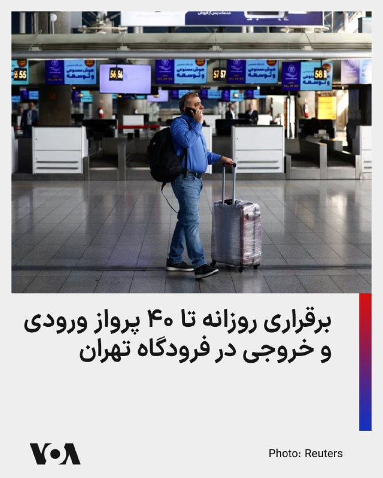

مدیر روابط عمومی فرودگاه خمینی تهران اعلام کرد پروازهای خارجی از این فرودگاه به بیش از ۲۰ مقصد بین‌المللی به ‌صورت عادی در حال انجام است. به گفته اهورا محمدی، بیشترین پروازها به استانبول، مسقط، نجف، مدینه، شانگهای، گوانگژو، بغداد و پکن است.

بر اساس این اعلام، روزانه بین ۳۵ تا ۴۰ پرواز ورودی و خروجی از این فرودگاه انجام می‌شود، و ایروان، مسکو، اربیل، کابل، آنکارا، بانکوک و باکو مقاصد مسافران است.

مدیرعامل شرکت شهر فرودگاهی فرودگاه خمینی نیز آمار پروازهای خارجی انجام شده در این فرودگاه را تا ۲۱ اردیبهشت ۵۳۴ مورد و تعداد مسافران جابه‌جا شده را هم بیش از ۴۸ هزار نفر اعلام کرد.

از زمان آغاز دیگری نظامی با آمریکا و اسرائیل، حریم هوایی ایران به روی پروازهای تجاری و مسافری بسته بود و فرودگاه‌های کشور هم تعطیل بودند اما در روزهای آخر فروردین، مقام‌ها مسئول از ازسرگیری تدریجی پروازها در برخی فرودگاه‌ها خبر دادند.
@FarsiVOA

## RadioFarda — post 157084

صنعت گردشگری ایران طی دو ماه اخیر «حدود پنج هزار میلیارد تومان» زیان دیده است

🔸گزارش‌ها از ایران حاکی از «تعطیل عملی» صنعت گردشگری کشور به‌دلیل ماه‌ها رکود، بی‌ثباتی اقتصادی، جنگ و اختلال و قطع اینترنت است.

🔸رئیس انجمن صنفی دفاتر خدمات مسافرت هوایی و جهانگردی ایران می‌گوید «دفاتر مسافرتی از نوروز سال گذشته تاکنون تقریباً هیچ فعالیت اقتصادی نداشته‌اند» و دست‌اندرکاران صنعت گردشگری هشدار می‌دهند در شرایط «نه جنگ نه صلح» و تبعات آن، عملاً کسب‌و‌کارهای مرتبط با این صنعت خوابیده است.

🔸حرمت‌الله رفیعی، روز سه‌شنبه ۲۲ اردیبهشت، گفت براساس برآوردهای ارائه‌شده به وزارت میراث‌ فرهنگی، گردشگری و صنایع‌دستی، صنعت گردشگری «تنها طی دو ماه اخیر حدود پنج هزار میلیارد تومان زیان دیده است».

🔸ایران از خرداد سال گذشته و در پی جنگ ۱۲ روزه با اسرائیل درگیر جنگ و یا سرکوب اعتراضات و پیامدهای آن‌ها بوده است. جنگ ۳۹ روزه‌ای هم که از نهم اسفند پارسال با حملات مشترک آمریکا و اسرائیل آغاز شد، همچنان در وضعیت آتش‌بس شکننده قرار دارد.

🔸خروج نیروی انسانی متخصص از حوزهٔ گردشگری در حال حاضر یکی دیگر از بحران‌های اصلی است که این صنعت با آن مواجه شده است.

🔸آن‌طور که آقای رفیعی خبر داده، «بسیاری از کارکنان آموزش‌دیدهٔ دفاتر مسافرتی به‌دلیل نبود درآمد، جذب مشاغل دیگری مانند آرایشگری و فعالیت‌های غیرمرتبط شده‌اند».

🔸روزنامه دنیای اقتصاد نیز نوشته است که برآوردها نشان می‌دهد حدود «یک ‌میلیون شغل» در این صنعت تحت‌تأثیر شرایط جنگی و قطع اینترنت قرار گرفته است.

🔸نسخه کامل این گزارش را در وب‌سایت رادیوفردا بشنوید.

@RadioFarda

## IranianMinds — post 20000

  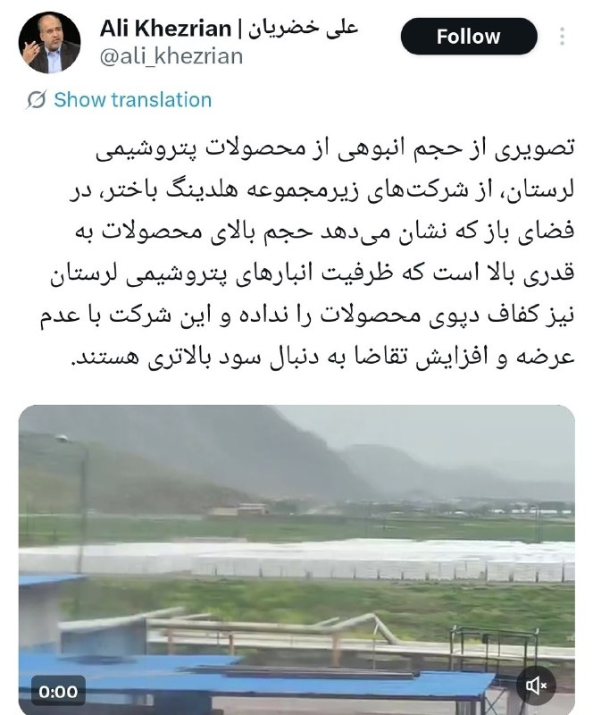

🔴علی خضریان نمایند مجلس، خیلی شیک و مجلسی یه پتروشیمی بسیار مهم کشور را رو کرد.

@IranianMinds

## BBCPersian — post 280836

🔻فیدان در قطر: از تنگه هرمز نباید به‌عنوان سلاح استفاده شود

وزیر خارجه ترکیه که به قطر سفر کرده است، می‌گوید آنکارا از تلاش‌ها برای باز کردن تنگه هرمز حمایت می‌کند.

هاکان فیدان در کنفرانس خبری مشترک با همتای قطری خود در دوحه در عین حال گفت که از تنگه هرمز به‌عنوان «سلاح» استفاده شود.

محمد بن عبدالرحمن آل ثانی، نخست‌وزیر و وزیر خارجه قطر، هم گفت که ایران نباید از تنگه هرمز به‌عنوان ابزاری برای اعمال فشار یا «باج‌گیری» از کشورهای منطقه خلیج فارس استفاده کند.

وزیر خارجه قطر همچنین گفت که سفر اخیرش به آمریکا برای کمک به پایان دادن جنگ با ایران بوده است.

@BBCPersian

## Dirty_Kids — post 389308

بعد از ۸۸ تنها کسی که تونست اشک خامنه‌ای رو دربیاره ترامپ بود با کتلت کردن سلیمانی، چندسال بعدشم خودش رو فرستاد یخچال. واقعا چه مادری این بزرگمرد از شیعه گایید ما خیلی قدرنشناسیم

@Dirty_Kids 👻

## Dirty_Kids — post 389306

گه تو قبر بابات. چه قدر چرک و بی‌پرنسیپی

کاسبی‌ کردن با دردهای مردم، فقط از یه ذهن مریض‌ و هرزه برمیاد که توی زندگی شخصیشم‌‌ بویی از اخلاق نبرده و مرزهای وقاحت رو جابجا کرده‌ و عجیب نیست که‌بخواد از عمیق‌ترین زخم‌های‌ این مردم هم پول‌دربیاره.‌ این تیشرت‌ها برند نیست، نشان بی‌شرفی‌سازنده‌شه. پول دادن به این انگل‌بی‌ریشه، توهین به‌انسانیته.

@Dirty_Kids 👻

## Hranews — post 112898

  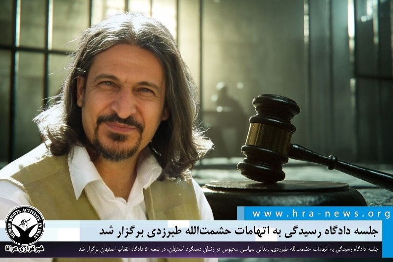

جلسه دادگاه رسیدگی به اتهامات حشمت‌الله طبرزدی برگزار شد

❗️
❗️
❗️
❗️
❗️– جلسه دادگاه رسیدگی به اتهامات حشمت‌الله طبرزدی، زندانی سیاسی محبوس در زندان دستگرد اصفهان، روز شنبه ۱۹ اردیبهشت ماه، در شعبه ۵ دادگاه انقلاب اصفهان برگزار شد.

به گزارش خبرگزاری هرانا، ارگان خبری مجموعه فعالان حقوق بشر در ایران، جلسه دادگاه رسیدگی به اتهامات حشمت‌الله طبرزدی برگزار شد.

روز شنبه ۱۹ اردیبهشت ماه جلسه دادگاه آقای طبرزدی در شعبه ۵ دادگاه انقلاب اصفهان به ریاست قاضی شاهینی برگزار شد. در جریان این جلسه این زندانی سیاسی از بابت اتهامات تبلیغ علیه نظام، توهین به رهبری و تشویش و تحریک به خشونت و کشتار از خود دفاع کرده است.

ادامه مطلب

#حشمت‌الله_طبرزدی

↘️
@hranews_bot تماس ✉️ -  @Hranews  کانال هرانا 🆑

## alonews — post 119469

  <a href="telegram/content/alonews_119469_1778583258.webm" target="_blank">🎬 Download video</a>

👈هاکان فیدان: بازگشت به جنگ جز خسارت و ویرانی چیزی به بار نمیاره.

✅ @AloNews خبر جنگ

## alonews — post 119468

  <a href="telegram/content/alonews_119468_1778583258.webm" target="_blank">🎬 Download video</a>

👈پنج پیش شرط ایران برای مذاکره

🔴این 5 شرط که هم در ویراست رئیس سازمان تبلیغات امده است و هم در مصاحبه سردار جعفری بدین شرح است:

🔴یکم : پایان جنگ در تمام جبهه مقاومت،

🔴دوم : رفع تحریم

🔴سوم: آزادسازی اموال

🔴چهارم: پرداخت غرامت

🔴پنجم : حاکمیت بر هرمز

✅ @AloNews خبر جنگ

---
📅 بروزرسانی: 1405/02/22 14:14
---

## FarsiVOA — post 217517

🔺جمهوری اسلامی منشأ لکه نفتی اطراف خارک را «نفتکش خارجی» اعلام کرد

▪️رئیس سازمان حفاظت محیط زیست ایران درباره لکه نفتی دیده شده در آب‌های اطراف جزیره خارک در خلیج فارس گفت که منشأ آلودگی مربوط به نشت «آب توازن آلوده به مواد نفتی مربوط به یک نفتکش غیرایرانی» بوده است.

▪️او جزئیات دقیق‌تری در این زمینه ارائه نکرد و اسم این نفتکش یا کشوری را که به آن تعلق دارد، اعلام نکرد.

▪️همچنین مشخص نیست که این نفتکش بر اثر چه حادثه‌ای آسیب دیده است.

▪️در حالی که پیشتر مقامات جمهوری اسلامی آلودگی آب‌های اطراف جزیره خارک را تکذیب کرده بودند، سازمان حفاظت محیط‌زیست ایران، دوشنبه ۲۱ اردیبهشت وجود این آلودگی را تأیید و اعلام کرد که ناشی از «نشت آب توازن یک نفتکش» بوده است.

⬇️ بیشتر بخوانید:
https://ir.voanews.com/a/8149155.html

## IranianMinds — post 19999

🔴اسماعیل بقایی، سخنگوی وزارت امور خارجه:

اول باید داستان تنگه هرمز و پایان جنگ مشخص بشود تا راهی برای مذاکره در مورد انرژی هسته‌ای هم به وجود بیاید.

@IranianMinds

---
📅 بروزرسانی: 1405/02/22 14:04
---

## VahidOOnLine — post 239678

🗣روایت شما از بحران اقتصادی و زندگی در آتش‌بس- سه‌شنبه ۲۲ اردیبهشت:

🔹بهار پارسال قبض برق ۲۸۰ هزار تومان می‌آمد الان با چند کیلووات تفاوت، شده ۸۹۰ هزار تومان! چطور می‌شود در کمتر از یک سال بالای ۲۰۰ درصد افزایش هزینه برق داشته باشیم، اما حقوق فقط ۲۵ درصد اضافه شود؟

🔹کاش فکری به حال بازنشسته‌های فولاد و ذوب آهن شود که چند ماهه بیمه‌شان قطع شده. درحالی‌که بسیاری از بازنشسته‌ها دچار مشکلات سلامتی هستند و نیاز به بیمه برای روند درمانی‌شان دارند.

🔹از نیشابور پیام می‌دهم؛ وضعیت ‌آن‌چنان اسفناک شده که با سه شیفت کار کردن نمی‌شود حتی شکم را هم سیر کرد.

🔹تهیه مواد خوراکی سخت شده و تورم و بیکاری بیداد می‌کند. اکثر شرکت‌ها نیروهایشان را تعلیق کرده‌اند. کسب‌وکارهای آزاد هم خوابیده‌اند و مشتری ندارند، حتی در بخش خدمات.

🔹بازار خرید و فروش ماشین و ملک نوسان لحظه‌ای دارد. یک خودروی ۵۰۰ میلیون تومانی این هفته حدود ۲۰۰ میلیون تومان افزایش قیمت داشته.

🔹یک جعبه قرص مدیسن برای نقرس که قیمتش ۳۶۰ هزار تومان است را چون در داروخانه‌ها پیدا نمی‌شد، در بازار آزاد به قیمت ۵ میلیون تومان خریدم.

🔹داروی اربیتوکس برای بیماران مبتلا به سرطان از حدود ۵ میلیون تومان به هر ویال ۲۵ میلیون تومان افزایش یافته. برای یکی جلسه شیمی‌درمانی حدود شش ویال نیاز است.

🔹قیمت مسکن‌های نوافن، ریفن و آسیفن از ۳۰ هزار تومن برای هر ورق ۱۰تایی به ۶۸ هزار تومن افزایش یافته است.
‌🏁 🇬🇧 IranintlTV

🤖 @VahidOOnLine

## VahidOOnLine — post 239677

  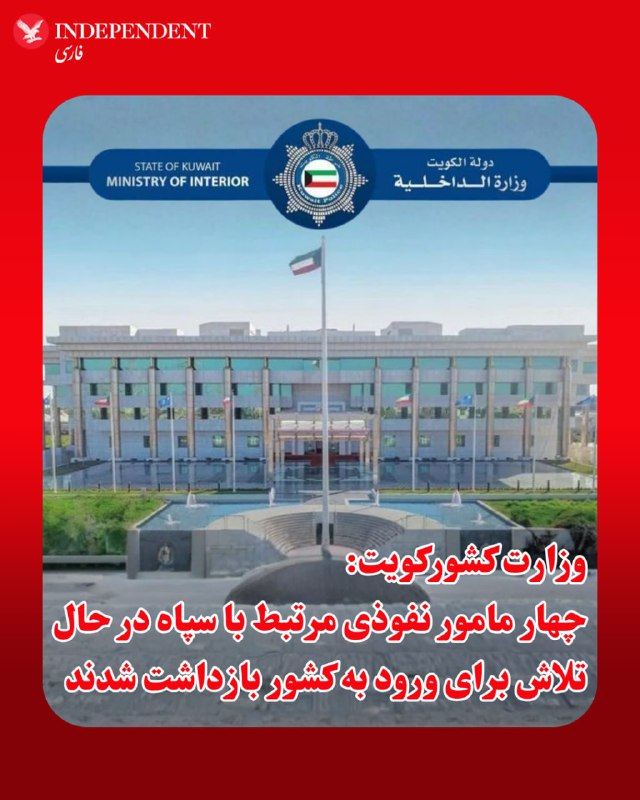

♦️وزارت کشور کویت روز سه‌شنبه ۲۲ اردیبهشت اعلام کرد چهار مامور «نفوذی» مرتبط با سپاه پاسداران در زمان تلاش برای ورود به خاک این کشور از طریق دریا بازداشت شدند.

به گزارش خبرگزاری دولتی کویت، یکی از نیروهای امنیتی این کشور در جریان درگیری با «ماموران نفوذی» مرتبط با سپاه بازداشت شده است.

در جریان جنگ اخیر بین جمهوری اسلامی ایران با آمریکا و اسرائیل، کویت بارها هدف حملات موشکی و پهپادی سپاه و شبه‌نظامیان عراقی حامی حکومت ایران قرار گرفت.
‌🇸🇦 Indypersian

🤖 @VahidOOnLine

## FoxNewsTwitter — post 341571

  <a href="telegram/content/FoxNewsTwitter_341571_1778582060.mp4" target="_blank">🎬 Download video</a>

Fox News (Twitter/X)

NEW: Confirmed hantavirus cases climb to 9 as WHO officials say they expect to see that number increase even more while insisting containment plans are being followed.

In the U.S., officials report 1 confirmed case and 1 person showing symptoms, while 16 others remain isolated in Nebraska.

Eight states are now monitoring for potential symptoms as the White House says it’s tracking the situation closely. The incubation period remains long, raising continued caution.

@AlexHoganTV

## IranIntlTV — post 336795

🗣روایت شما از بحران اقتصادی و زندگی در آتش‌بس- سه‌شنبه ۲۲ اردیبهشت:

🔹بهار پارسال قبض برق ۲۸۰ هزار تومان می‌آمد الان با چند کیلووات تفاوت، شده ۸۹۰ هزار تومان! چطور می‌شود در کمتر از یک سال بالای ۲۰۰ درصد افزایش هزینه برق داشته باشیم، اما حقوق فقط ۲۵ درصد اضافه شود؟

🔹کاش فکری به حال بازنشسته‌های فولاد و ذوب آهن شود که چند ماهه بیمه‌شان قطع شده. درحالی‌که بسیاری از بازنشسته‌ها دچار مشکلات سلامتی هستند و نیاز به بیمه برای روند درمانی‌شان دارند.

🔹از نیشابور پیام می‌دهم؛ وضعیت ‌آن‌چنان اسفناک شده که با سه شیفت کار کردن نمی‌شود حتی شکم را هم سیر کرد.

🔹تهیه مواد خوراکی سخت شده و تورم و بیکاری بیداد می‌کند. اکثر شرکت‌ها نیروهایشان را تعلیق کرده‌اند. کسب‌وکارهای آزاد هم خوابیده‌اند و مشتری ندارند، حتی در بخش خدمات.

🔹بازار خرید و فروش ماشین و ملک نوسان لحظه‌ای دارد. یک خودروی ۵۰۰ میلیون تومانی این هفته حدود ۲۰۰ میلیون تومان افزایش قیمت داشته.

🔹یک جعبه قرص مدیسن برای نقرس که قیمتش ۳۶۰ هزار تومان است را چون در داروخانه‌ها پیدا نمی‌شد، در بازار آزاد به قیمت ۵ میلیون تومان خریدم.

🔹داروی اربیتوکس برای بیماران مبتلا به سرطان از حدود ۵ میلیون تومان به هر ویال ۲۵ میلیون تومان افزایش یافته. برای یکی جلسه شیمی‌درمانی حدود شش ویال نیاز است.

🔹قیمت مسکن‌های نوافن، ریفن و آسیفن از ۳۰ هزار تومن برای هر ورق ۱۰تایی به ۶۸ هزار تومن افزایش یافته است.

## DW_Farsi — post 124588

  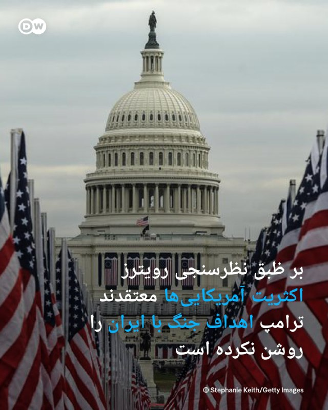

🔶نظرسنجی رویترز: اکثریت آمریکایی‌ها معتقدند ترامپ اهداف جنگ با ایران را روشن نکرده است

طبق یک نظرسنجی که توسط خبرگزاری رویترز و مؤسسه ایپسوس انجام شده، از هر سه آمریکایی دو نفر معتقدند دونالد ترامپ اهداف جنگ با ایران را به طور شفاف توضیح نداده است.

در این نظرسنجی که نتایج آن روز دوشنبه ۱۱ مه (۲۱ اردیبهشت) منتشر شد، حدود ۶۶ درصد پاسخ‌دهندگان گفته‌اند که رئیس جمهور آمریکا اهداف مداخله نظامی ایالات متحده در ایران را به روشنی توضیح نداده است.

همچنین ۶۳ درصد گفته‌اند که افزایش هزینه‌های انرژی به وضعیت مالی خانوارهایشان فشار وارد آورده است. این رقم در نظرسنجی دیگری که اواسط ماه مارس انجام شده بود ۵۵ درصد بود.

@dw_farsi

## Dirty_Kids — post 389305

‏یه وی‌پی‌ان ارزون دارم با نفت کار میکنه اول تلگرامو باز میکنم یکم گُر گرفت میرم توییتر و اینستا

@Dirty_Kids 👻

## Dirty_Kids — post 389304

  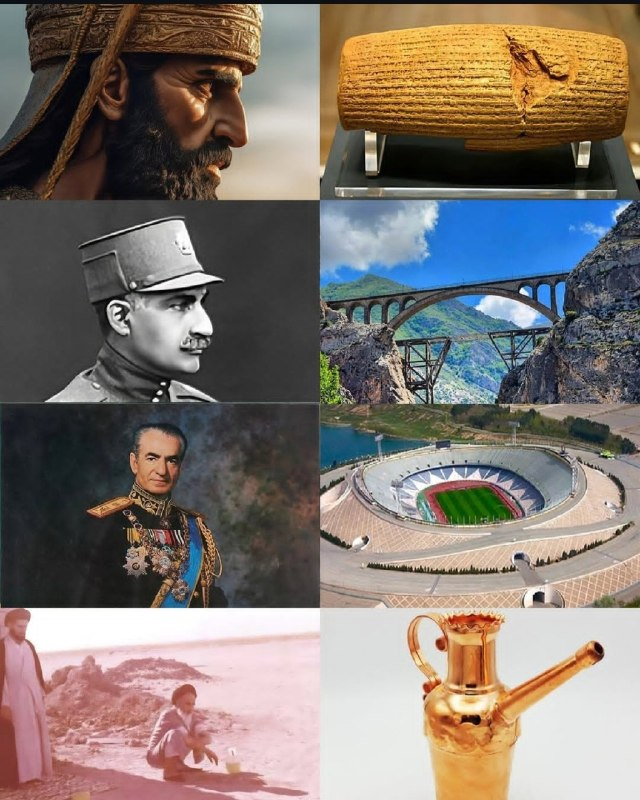

بالاخره هر رهبری یک اثری از خودش بجا میزاره

@Dirty_Kids 👻

## Dirty_Kids — post 389303

  <a href="https://t.me/Dirty_Kids/389303" target="_blank">📎 Download file</a>

✅ اپلیکیشن اندروید سایت جهانی دربی بت

💰اولین سایت جهانی با امکان شارژ و برداشت ریالی(کارت به کارت)

🔗 برای ورود فیلترشکن روی کشور مناسب قرار دهید مانند فنلاند و المان و....

😀Telegram Channel
👇
https://t.me/+bcynkEgSW2dlYTc0

## Dirty_Kids — post 389302

  

😤دنبال یه سایت شرط بندی بین المللی بودی که به ایرانیا خدمات بده؟!
⛔

👍دربی بت همون انتخاب  100%

💎ویژگی های سایت جهانی Derby Bet:

⬅️امکان شارژ امن با کارت بانکی

⬅️واریز اول دوبل شارژ می شوید(بونوس۱۰۰٪)

⬅️پر اپشن ترین سایت فعال در ایران

⬅️تسویه حساب کمتر از 5 دقیقه

⬅️برگشت بخشی از باخت به صورت هفتگی

🚨کد هدیه ثبت نام:GG007

⚠️برای دانلود اپلکیشن کلیک کنید
👉

🔔کانال دربی بت :

🪙https://t.me/+bcynkEgSW2dlYTc0

## Dirty_Kids — post 389301

  <a href="telegram/content/Dirty_Kids_389301_1778582065.mp4" target="_blank">🎬 Download video</a>

🐁🐀خواهران جان فدا .V.S موش🐭🐁

@Dirty_Kids 👻

## alonews — post 119467

  <a href="telegram/content/alonews_119467_1778582066.webm" target="_blank">🎬 Download video</a>

👈علیرضا دبیر عکس‌ کارولین لیویت سخنگوی کاخ سفید با بچش رو گذاشت و نوشت الهی داغشو ببینی

✅ @AloNews خبر جنگ

## alonews — post 119466

  <a href="telegram/content/alonews_119466_1778582067.webm" target="_blank">🎬 Download video</a>

👈سپاه اصفهان: امروز از ساعت ۱۵ تا ۱۸ در محدودهٔ زردنجان احتمال شنیدن صدای انفجار کنترل‌شده وجود خواهد داشت.

✅ @AloNews خبر جنگ

---
📅 بروزرسانی: 1405/02/22 13:54
---

## VahidOOnLine — post 239676

  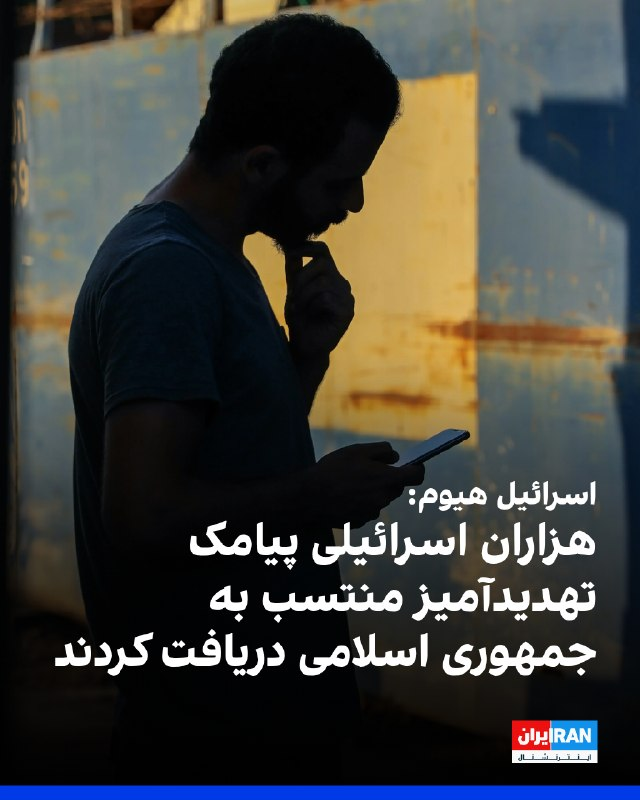

اسرائیل هیوم گزارش داد هزاران اسرائیلی از شامگاه ۲۲ اردیبهشت پیامک‌های تهدیدآمیز به زبان عبری دریافت کردند که در آن‌ها از سوی هکرهای منتسب به تهران خواسته شده با جمهوری اسلامی همکاری کنند.

در این پیام‌ها آمده است: «جمهوری اسلامی شما را به همکاری اطلاعاتی دعوت می‌کند و به‌زودی خورشید را در آسمان شب خواهید دید.»

اداره ملی سایبری اسرائیل اعلام کرد این پیام‌ها با هدف ایجاد هراس و جمع‌آوری اطلاعات شخصی ارسال شده و از شهروندان خواست آن‌ها را نادیده بگیرند و گزارش دهند.
‌🏁 🇬🇧 IranintlTV

🤖 @VahidOOnLine

## VahidOOnLine — post 239675

  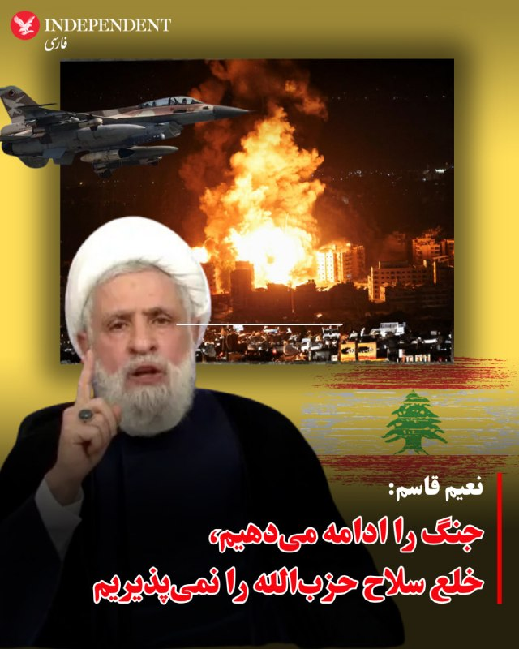

♦️نعیم قاسم، دبیر کل حزب‌الله لبنان روز سه‌شنبه ۲۲ اردیبهشت و در آستانه برگزاری دور سوم مذاکرات میان نمایندگان اسرائیل و دولت لبنان در واشنگتن، با صدور بیانیه‌ای بار دیگر تاکید کرد که خلع سلاح این گروه را نمی‌پذیرد.

نعیم قاسم با تشکر از جمهوری اسلامی برای «نگرانی از شرایط لبنان» در این بیانیه نوشت بهترین راه پایان جنگ با اسرائیل، آتش‌بس میان ایران و آمریکا است که لبنان هم جزئی از آن باشد.

دبیرکل حزب‌الله لبنان که از حدود یک ماه پیش دیگر پیام ویدیویی صادر نمی‌کند اعلام کرد اعضای این گروه با وجود تجهیزات اندک، در برابر ارتش اسرائیل به خوبی مقاومت می‌کنند و جنگ را ادامه می‌دهند.
‌🇸🇦 Indypersian

🤖 @VahidOOnLine

## mwarmonitor — post 8957

🇮🇱«احزاب فوق‌ارتدوکس اسرائیل تهدید کرده‌اند که پارلمان را منحل کرده و احتمالاً انتخابات جدیدی را به جریان بیندازند، پس از آنکه بنیامین نتانیاهو، نخست‌وزیر، به آن‌ها اعلام کرد در حال حاضر اکثریتی برای تصویب قانونی که بسیاری از دانشجویان مذهبی را از خدمت سربازی معاف کند وجود ندارد.

🔸گزارش‌ها حاکی از آن است که یک بحران سیاسی میان دفتر نتانیاهو و موشه گافنی، یکی از رهبران ارشد جریان فوق‌ارتدوکس، در حال شکل‌گیری است و گفته می‌شود او تماس‌های نخست‌وزیر را پاسخ نمی‌دهد.»

@mwarmonitor

## mwarmonitor — post 8956

🔴« (رویترز) - مایک هاکبی، سفیر آمریکا در اسرائیل، روز سه‌شنبه گفت اسرائیل سامانه‌های باتری دفاع هوایی گنبد آهنین به همراه نیروهای عملیاتی آن را به امارات متحده عربی ارسال کرده است.»

@mwarmonitor

## mwarmonitor — post 8955

🔴«گروهی از مردان که به اتهام تلاش برای ورود به کشور از طریق دریا بازداشت شده بودند، در جریان بازجویی اعتراف کردند که عضو سپاه پاسداران انقلاب اسلامی ایران هستند، به گفته وزارت کشور کویت.»

@mwarmonitor

## farsi_fox_news — post 89255

پاکستان: مذاکرات رسمی هنوز از سر گرفته نشده، اما تماس‌های دیپلماتیک در سطح بالا ادامه دارد

وزارت خارجه پاکستان اعلام کرد:
🔹اگرچه مذاکرات رسمی هنوز از سر گرفته نشده است، اما تماس‌های دیپلماتیک در سطح بالا ادامه دارد.
🌐 @farsi_fox_news

## IranIntlTV — post 336794

  <a href="telegram/content/IranIntlTV_336794_1778581492.mp4" target="_blank">🎬 Download video</a>

هم‌زمان با ادامه قطع سراسری اینترنت در ایران و افزایش انتقادها به دسترسی طبقاتی، فاطمه مهاجرانی، سخنگوی دولت جمهوری اسلامی، اعلام کرد طرح اینترنت پرو مصوبه شورای عالی امنیت ملی است و تا شرایط عادی نشود این طرح ادامه خواهد داشت.
گفت‌وگو با نیما اکبرپور، کارشناس فناوری
@iranintltv

## IranIntlTV — post 336793

  

اسرائیل هیوم گزارش داد هزاران اسرائیلی از شامگاه ۲۲ اردیبهشت پیامک‌های تهدیدآمیز به زبان عبری دریافت کردند که در آن‌ها از سوی هکرهای منتسب به تهران خواسته شده با جمهوری اسلامی همکاری کنند.

در این پیام‌ها آمده است: «جمهوری اسلامی شما را به همکاری اطلاعاتی دعوت می‌کند و به‌زودی خورشید را در آسمان شب خواهید دید.»

اداره ملی سایبری اسرائیل اعلام کرد این پیام‌ها با هدف ایجاد هراس و جمع‌آوری اطلاعات شخصی ارسال شده و از شهروندان خواست آن‌ها را نادیده بگیرند و گزارش دهند.
https://iranintl.com/202605121388

## IranianMinds — post 19998

🔴حریم هوای عراق کلیر شد.

@IranianMinds

## BBCPersian — post 280835

🔻سفیر آمریکا در سازمان ملل: اسرائیل در جریان جنگ، به امارات گنبد آهنین داد

روزنامه «اسرائیل هیوم» به نقل از سفیر آمریکا در سازمان ملل نوشت که اسرائیل در جریان جنگ اخیر، سامانه پدافند گنبد آهنین در اختیار امارات متحده عربی قرار داده است.

پیش از گزارش این روزنامه راستگرا، سایت خبری اکسیوس هم به نقل از مقام‌های آمریکایی و اسرائیلی بدون ذکر نام این خبر را داده بود.

اسرائیل هیوم از مایک والتس، سفیر آمریکا در سازمان ملل، نقل کرده است که «ما شاهد استفاده امارات از (سامانه) گنبد آهنین بودیم که اسرائیل در اختیار آنها قرار داده است.»

این روزنامه می‌گوید که آقای والتس از جزئیاتی پرده برداشته است که نشانگر «تعمیق» روابط اسرائیل و امارات است.

پیشتر روزنامه آمریکایی وال‌استریت جورنال گزارش داده بود که امارات متحده عربی مخفیانه در اوايل ماه آوريل گذشته و هم‌زمان با اعلام آتش‌بس، چند حمله هوایی به تاسیسات نفتی ایران انجام داده است.

بنیامین نتانیاهو، نخست‌وزیر اسرائیل، مکررا وعده «خاورمیانه‌ جدید» را داده است که به گفته او شاهد افزایش همکاری اسرائیل و کشورهای منطقه خلیج فارس علیه ایران خواهد بود.

رسانه‌های اسرائیل هم در جریان جنگ اخیر بارها از «همکاری بی‌سابقه» با کشورهای منطقه خلیج فارس خبر داده بودند.

با آغاز حملات آمریکا و اسرائیل به ایران در نهم اسفند، سپاه پاسداران پایگاه‌های آمریکا و برخی نقاط را در برخی کشورهای حاشیه خلیج فارس هدف قرار داد.

ایران این کشورها را به همکاری با آمریکا و اسرائیل در حمله به ایران متهم می‌کند.

@BBCPersian

## Hranews — post 112897

  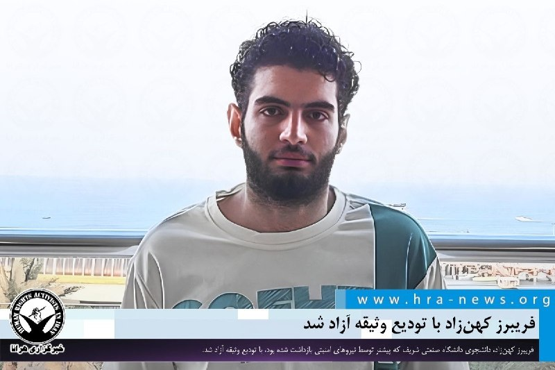

فریبرز کهن‌زاد با تودیع وثیقه آزاد شد

❗️
❗️
❗️
❗️
❗️– فریبرز کهن‌زاد، دانشجوی دانشگاه صنعتی شریف که پیشتر توسط نیروهای امنیتی بازداشت شده بود، روز یکشنبه ۲۰ اردیبهشت‌ماه با تودیع وثیقه آزاد شد.

به گزارش خبرگزاری هرانا، ارگان خبری مجموعه فعالان حقوق بشر در ایران، فریبرز کهن‌زاد آزاد شد.

آزادی آقای کهن‌زاد روز یکشنبه ۲۰ اردیبهشت ۱۴۰۴، با تودیع وثیقه صورت گرفته است.

ادامه مطلب

#فریبرز_کهن‌زاد

↘️
@hranews_bot تماس ✉️ -  @Hranews  کانال هرانا 🆑

<!-- MSG END -->

<!-- NAV START -->

<a href="https://github.com/ali-exifit/aio-downloader/blob/main/telegram/content/archive_1.md" style="display:inline-block; padding:6px 12px; margin:0 4px; background-color:#2ea44f; color:white; text-decoration:none; border-radius:4px; font-weight:bold;">صفحه بعد</a>

<!-- NAV END -->
