# خواننده تلگرام

<!-- TOP_NAV START -->

<a href="https://github.com/ali-exifit/aio-downloader/blob/main/telegram/content/archive_1.md" style="display:inline-block; padding:6px 12px; margin:0 4px; background-color:#2ea44f; color:white; text-decoration:none; border-radius:4px; font-weight:bold;">صفحه بعد</a>

<!-- TOP_NAV END -->

<!-- MSG START -->

---
📅 بروزرسانی: 1405/02/22 18:44
---

## FarsiVOA — post 217538

  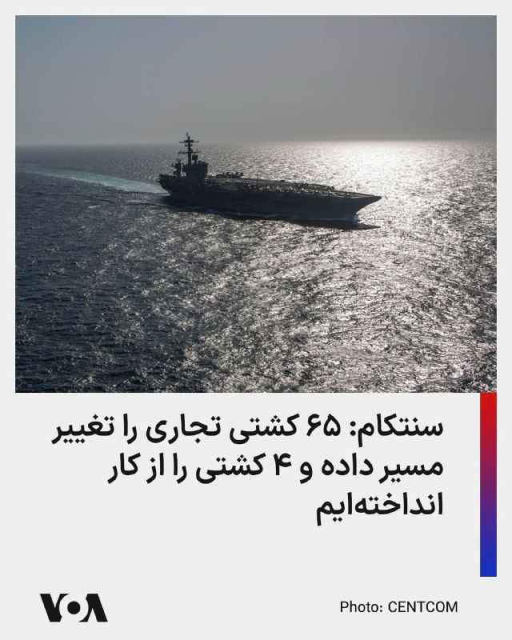

ستاد فرماندهی ارتش ایالات متحده آمریکا، روز سه‌شنبه ۲۲ اردیبهشت در شبکه اجتماعی ایکس با انتشار عکسی از ناو هواپیمابر آبراهام لینکلن (سی‌وی‌ان ۷۲) نوشت: « نیروهای سنتکام ۶۵ کشتی تجاری را تغییر مسیر داده و ۴ کشتی را از کار انداخته‌اند.»

در ادامه سنتکام افزوده است که ناو هواپیمابر آبراهام لینکلن به عملیات خود در دریای عرب، از جمله اعمال محاصره دریایی ایالات متحده علیه ایران، ادامه می‌دهد.

## alonews — post 119517

  <a href="telegram/content/alonews_119517_1778598871.webm" target="_blank">🎬 Download video</a>

👈آکسیوس:
احتمال حمله قریب‌الوقوع آمریکا به کوبا

🔴تشدید تهدیدهای ترامپ و روبیو نشان می‌دهد که حمله به کوبا می‌تواند قریب‌الوقوع باشد.

✅ @AloNews خبر جنگ

---
📅 بروزرسانی: 1405/02/22 18:36
---

## VahidOOnLine — post 239726

  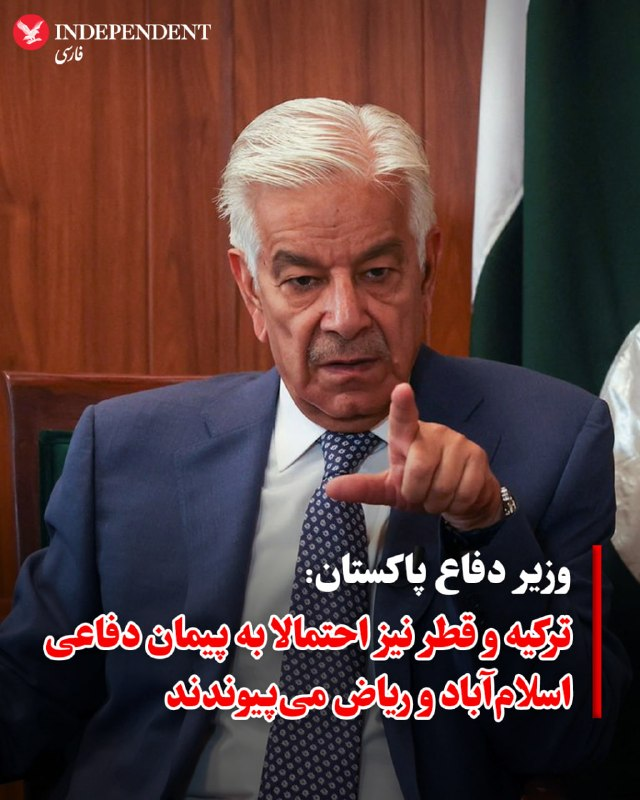

♦️ خواجه محمد آصف، وزیر دفاع پاکستان، از احتمال گسترش پیمان دفاعی مشترک این کشور با عربستان سعودی و پیوستن ترکیه و قطر به عنوان شرکای جدید خبر داد. به گفته او، سازوکار حضور این اعضای جدید تا حد زیادی نهایی شده و هدف آن شکل‌گیری یک ائتلاف قدرتمند دفاعی و اقتصادی در منطقه است.

وزیر دفاع پاکستان تاکید کرد که چنین ائتلافی می‌تواند وابستگی به قدرت‌های فرامنطقه‌ای را به حداقل رسانده و صلح و ثبات را در منطقه تقویت کند. آصف تصریح کرد: «این پیمان علیه هیچ کشوری نیست، اما تاثیری حیاتی در محافظت از صلح ایفا خواهد کرد.»

پاکستان و عربستان سعودی در سپتامبر ۲۰۲۵ پیمانی را امضا کردند که طبق آن، حمله به هر یک از دو کشور، حمله به طرف دیگر تلقی می‌شود. پیوستن ترکیه و قطر به این پیمان، می‌تواند منجر به تشکیل یک «برادری بین‌المللی» با توان نظامی و اقتصادی بالا شود که معادلات امنیتی منطقه را تغییر خواهد داد.
‌🇸🇦 Indypersian

🤖 @VahidOOnLine

## VahidOOnLine — post 239725

  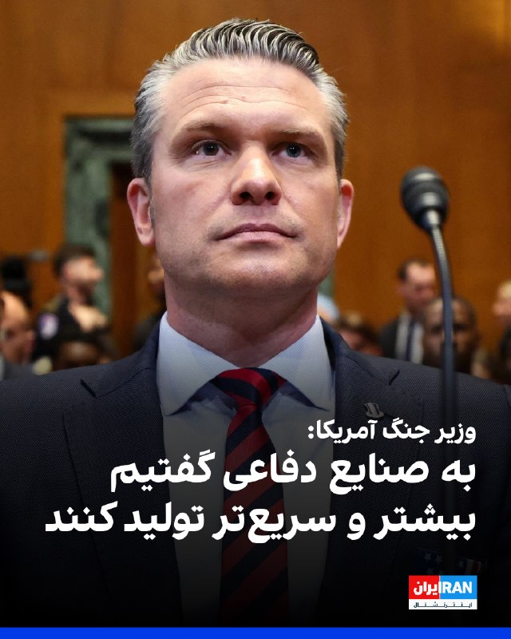

پیت هگست، وزیر جنگ آمریکا، سه‌شنبه در کنگره این کشور درباره جنگ علیه جمهوری اسلامی اعلام کرد که ارتش ایالات متحده برنامه‌ای برای خروج نیروها از منطقه خاورمیانه دارد، اما در عین حال برای تشدید درگیری یا جابه‌جایی تجهیزات در صورت لزوم نیز برنامه‌ریزی کرده است.
او افزود: «ما دقیقا می‌دانیم چه چیزی در اختیار داریم. هر آنچه نیاز داریم به اندازه کافی داریم.»
او گفت به صنایع دفاعی گفته شده است که «بیشتر و سریع‌تر تولید کنند»، و در عین حال ظرفیت ناکافی مجتمع‌های صنعتی-نظامی را ناشی از دولت‌های پیشین و کمک‌های آمریکا به اوکراین در جنگش با روسیه دانست.
‌🏁 🇬🇧 IranintlTV

🤖 @VahidOOnLine

## farsi_fox_news — post 89259

  <a href="telegram/content/farsi_fox_news_89259_1778598390.mp4" target="_blank">🎬 Download video</a>

♦️ روسیه از یک موشک عجیب و قدرتمند رونمایی می‌کند

🔹 روسیه می‌گوید که موشک جدید «Sarmat» با قابلیت حمل کلاهک هسته‌ای را با موفقیت آزمایش کرده و قصد دارد آن را تا پایان سال جاری در حالت آماده‌باش رزمی قرار دهد.
🔹 پوتین می‌گوید برد این موشک می‌تواند از ۳۵,۰۰۰ کیلومتر فراتر رود.
🔹 پوتین: «قدرت کل موشک سارمات بیش از چهار برابر هر نمونهٔ معادل غربی است.»
🌐 @farsi_fox_news

## FoxNewsTwitter — post 341588

‌Fox News (Twitter/X)

https://www.foxnews.com/us/dali-ship-operator-foreign-employee-charged-francis-scott-key-bridge-collapse-unsealed-indictment-shows

## pm_afshaa — post 90632

شهبازی مجری کونیه صداوسیما:
اگه خیلی به اینترنت علاقه دارید برید سوریه و افغانستان و عراق زندگی کنید

💧 Rainbet.com the #1 Non-KYC Crypto Casino & Sportsbook @rainbetcom

😁 @Pm_Afshaa

## iaghapour — post 2602

🚀 آپدیت بزرگ و انقلابی پنل 3x-ui (نسخه‌های 3.0.0 و 3.0.1)

بالاخره یکی از مهم‌ترین آپدیت‌های پنل محبوب 3x-ui منتشر شد! در این نسخه‌ها شاهد بازنویسی کامل رابط کاربری، اضافه شدن قابلیت‌های مدیریتی کلان و بهبودهای چشمگیر امنیتی هستیم.

🌐 ۱. بازنویسی کامل و سریع‌تر شدن پنل (مهاجرت به Vue 3) رابط کاربری از پایه بازنویسی شده است! این یعنی سرعت لود بسیار بالاتر، طراحی مدرن‌تر، صفحه لاگین جدید و بهبود چشمگیر تم دارک.

⚡️ ۲. آمار زنده و در لحظه: با جایگزینی سیستم قدیمی با WebSocket، از این پس تمام آمارهای داشبورد، مصرف حجم کلاینت‌ها و وضعیت سرور به صورت «زنده» آپدیت می‌شوند و دیگر نیازی به رفرش کردن صفحه نیست!

🌍 ۳. مدیریت چند سروره (Multi-Node Deployment) - 🌟 ویژگی طلایی یکی از مورد انتظارترین قابلیت‌ها اضافه شد! حالا می‌توانید از طریق یک پنل مرکزی (Manager)، کانفیگ‌ها و اینباندها را روی چندین سرور دیگر (Remote Nodes) مستقر و مدیریت کنید.

📱 ۴. رابط کاربری کاملاً سازگار با موبایل: داشبورد، لیست کلاینت‌ها و بخش لاگ‌ها حالا به صورت "کارتی" و کاملاً بهینه برای نمایشگرهای موبایل طراحی شده‌اند تا مدیریت پنل با گوشی بسیار راحت‌تر شود.

⚙️ ۵. خداحافظی با کدهای JSON و تنظیمات آسان‌تر فرم‌های ساخت کانفیگ (Inbounds) کاملاً ساختاریافته و گرافیکی شده‌اند. دیگر برای تنظیمات پایه نیازی به دستکاری JSON خام نیست (البته تب Advanced برای حرفه‌ای‌ها همچنان وجود دارد). همچنین مدیریت DNSها بسیار پیشرفته‌تر شده است.

👥 ۶. مدیریت گروهی کلاینت‌ها (Bulk Actions) امکان انتخاب گروهی کلاینت‌ها برای حذف یا اعمال تغییرات اضافه شده که کار ادمین‌ها را بسیار راحت می‌کند.

🛠 ۷. امکانات جدید Xray و Outboundها اضافه شدن پروتکل Loopback، دکمه Test All برای تست همزمان همه Outboundها و ارائه گزارش دقیق از تایم‌اوت‌ها، و همچنین خاموش شدن امن هسته Xray.

🔒 ۸. ارتقاء امنیت و نصب راحت‌تر ➖ اضافه شدن سیستم امنیتی CSRF Protection برای جلوگیری از حملات. ➖ اضافه شدن گزینه skip-SSL در اسکریپت نصب (بسیار کاربردی برای کسانی که از ریورس‌پروکسی یا تانل استفاده می‌کنند و نیازی به سرتیفیکیت روی خود سرور ندارند). ➖ اضافه شدن صفحه مستندات API (API Docs) در داخل خود پنل برای برنامه‌نویسان.

و بسیاری از تغییرات دیگه که میتونید در این لینک مطالعه کنید.

💡 نکته: برای تجربه این تغییرات فوق‌العاده، پیشنهاد می‌شود هرچه سریع‌تر پنل خود را آپدیت کنید. (توصیه همیشگی: قبل از آپدیت بکاپ فراموش نشود!)

✍🏻 با تشکر از ثنایی عزیز.

🆔 @iaghapour

## DEJradio — post 4593

  <a href="telegram/content/DEJradio_4593_1778598394.webm" target="_blank">🎬 Download video</a>

🤡
🔺 یک سرگرد نیروی انتظامی با ابعاد چاق و بدفرم در تجمعات شبانه طرفداران حکومت خطاب به سلطنت‌طلب‌ها می‌گوید، مجتبی را تنها نمی‌گذاریم!

این در حالی‌ست که مجتبی خامنه‌ای وضعیت نامشخص دارد و اصلا معلوم نیست توان حرکت یا تصمیم‌گیری دارد یاصرفا یک جسم بی‌تحرک در خدمت سرداران است.

#موشتبا #جمهوری_اسلامی
@DEJradio

## IranIntlTV — post 336837

  <a href="telegram/content/IranIntlTV_336837_1778598395.mp4" target="_blank">🎬 Download video</a>

بررسی‌های ایران‌اینترنشنال نشان می‌دهد سپاه پاسداران انقلاب اسلامی برای دور زدن تحریم‌های آمریکا، از صرافی‌های ترکیه و هواپیماهای خصوصی استفاده می‌کند. این اقدامات پس از آن صورت گرفت که مسیرهای پیشین تامین ارز جمهوری اسلامی در امارات متحده عربی قطع شده است.
جزییات بیشتر با آرش آزرمی، دبیر بخش اقتصادی ایران‌اینترنشنال
@iranintltv

## IranIntlTV — post 336836

  

پیت هگست، وزیر جنگ آمریکا، سه‌شنبه در کنگره این کشور درباره جنگ علیه جمهوری اسلامی اعلام کرد که ارتش ایالات متحده برنامه‌ای برای خروج نیروها از منطقه خاورمیانه دارد، اما در عین حال برای تشدید درگیری یا جابه‌جایی تجهیزات در صورت لزوم نیز برنامه‌ریزی کرده است.
او افزود: «ما دقیقا می‌دانیم چه چیزی در اختیار داریم. هر آنچه نیاز داریم به اندازه کافی داریم.»
او گفت به صنایع دفاعی گفته شده است که «بیشتر و سریع‌تر تولید کنند»، و در عین حال ظرفیت ناکافی مجتمع‌های صنعتی-نظامی را ناشی از دولت‌های پیشین و کمک‌های آمریکا به اوکراین در جنگش با روسیه دانست.
https://iranintl.com/202605122781

## FarsiVOA — post 217537

انتقال پنهانی هواپیماهای جمهوری اسلامی به پاکستان و افغانستان؛ کویت چند عضو سپاه را بازداشت کرد

## BBCPersian — post 280852

🔻رزمایش اعلام نشده سپاه در تهران

سپاه پاسداران یک همایش اعلام نشده به نام «قائد شهید» در تهران بزرگ برگزار کرد.

به گزارش رسانه‌های ایران، این رزمایش برای «تمرین سناریوهای مقابله با دشمن و ارزیابی تاکتیک‌های رزمی» در سطح سپاه محمد رسول الله تهران بزرگ برگزار شد.

سرتیپ حسن حسن‌زاده، فرمانده این سپاه گفت در این رزمایش برای «ارتقای توان رزمی برای مقابله با هرگونه تحرک دشمن» همه «تاکتیک‌ها و تکنیک‌های تیمی و فردی با موفقیت» تمرین شد.

سپاه محمد رسول‌الله تهران بزرگ که گفته می‌شود بزرگترین یگان نظامی امنیتی سپاه است مسئولیت امنیت شهر تهران را به عهده دارد. مسئولیت امنیت استان تهران جز تهران بزرگ با سپاه سیدالشهداست.

https://bbc.in/4drNww2
@BBCPersian

## Dirty_Kids — post 389319

  

قل أعوذ برب الناس
آدم خارکسه از دور پیداس!

@Dirty_Kids 👻

## Dirty_Kids — post 389318

  <a href="telegram/content/Dirty_Kids_389318_1778598399.mp4" target="_blank">🎬 Download video</a>

یه قشری هم هستن توی اینستا این شکلی دارن با وصل بودنشون پز میدن.

@Dirty_Kids 👻

---
📅 بروزرسانی: 1405/02/22 18:24
---

## VahidOOnLine — post 239724

  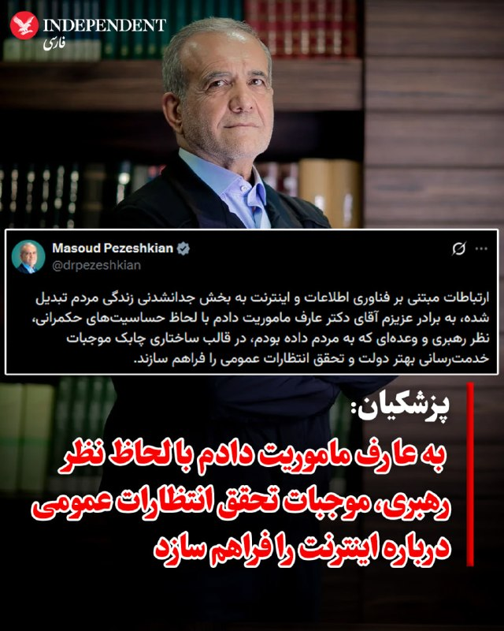

♦️ مسعود پزشکیان، رئیس جمهوری اسلامی، روز سه‌شنبه ۲۲ اردیبهشت، در حالی که ۷۴ روز از قطع کامل اینترنت و ارتباطات مردم ایران با خارج از کشور گذشته، با انتشار پیامی در شبکه اجتماعی ایکس اعلام کرد که محمدرضا عارف، معاون رئیس‌جمهوری اسلامی را مامور کرده که با در نظر گرفتن «حساسیت‌های حکمرانی و نظر رهبری»، در قالب «ساختاری چابک»، موجبات خدمت‌رسانی بهتر دولت و تحقق انتظارات عمومی را فراهم کند.

پزشکیان توضیح نداد که ساختار چابک مورد نظر او، شامل وصل کامل اینترنت و ارتباطات می‌شود یا قصد دارد خدمات الکترونیکی دولت را روی شبکه ملی اینترنت (نسخه محدود داخلی) گسترده‌تر کند.
‌🇸🇦 Indypersian

🤖 @VahidOOnLine

## VahidOOnLine — post 239723

  <a href="telegram/content/VahidOOnLine_239723_1778597689.mp4" target="_blank">🎬 Download video</a>

تماسی از ایران؛ «می‌گفت تو این شرایط، به دور و برمون نگاه کنیم و دستِ همدیگه رو بگیریم…
تو هر خانواده و آشنایی یکی هست که بی‌صدا به کمک نیاز داره.»
‌🏁 🇬🇧 ManotoTV

🤖 @VahidOOnLine

## VahidOOnLine — post 239722

  <a href="telegram/content/VahidOOnLine_239722_1778597692.mp4" target="_blank">🎬 Download video</a>

دونالد ترامپ، رئیس‌جمهور آمریکا، با وجود توقف مذاکرات با جمهوری‌اسلامی، در یک گفتگو، اعلام کرده تهران صددرصد غنی‌سازی اورانیوم و هرگونه تلاش برای ساخت سلاح هسته‌ای را متوقف خواهد کرد.
ترامپ در گفت‌وگو با رادیوی WABC گفت شخصاً با مقام‌های جمهوری‌اسلامی در تماس بوده و افزود: «آن‌ها گفتند ما غبار هسته‌ای را تحویل خواهیم گرفت.»
او همچنین تأکید کرد آمریکا برای رسیدن به توافق عجله‌ای ندارد و گفت: «ما محاصره را در اختیار داریم.»
‌🏁 🇬🇧 ManotoTV

🤖 @VahidOOnLine

## VahidOOnLine — post 239721

  <a href="telegram/content/VahidOOnLine_239721_1778597693.mp4" target="_blank">🎬 Download video</a>

تماسی از تجربه‌اش با بهزیستی
می‌گفت برای بیمه و تأیید مشکلش هزار تا ایراد گرفتن
اما وقتی پای کمک رسید، گفتن هیچ مشکلی نداری
‌🏁 🇬🇧 ManotoTV

🤖 @VahidOOnLine

## VahidOOnLine — post 239720

  <a href="telegram/content/VahidOOnLine_239720_1778597695.mp4" target="_blank">🎬 Download video</a>

در جلسه استماع کنگره آمریکا، مقام‌های ارشد پنتاگون اعلام کردند هزینه تسلیحات و تجهیزات مصرف‌شده آمریکا در جنگ با ایران تاکنون به حدود ۲۴ میلیارد دلار رسیده است.
پیت هگست، وزیر دفاع آمریکا، به همراه رئیس ستاد مشترک ارتش و مقام مالی وزارت جنگ در این جلسه حضور داشتند. به گفته جولز هرست، این رقم شامل مهمات، موشک‌ها و سایر تجهیزات نظامی استفاده‌شده در جنگ است.
پنتاگون ماه گذشته نیز اعلام کرده بود مجموع هزینه‌های جنگ با ایران تاکنون به ۲۹ میلیارد دلار رسیده است.
‌🏁 🇬🇧 ManotoTV

🤖 @VahidOOnLine

## FoxNewsTwitter — post 341587

  

Fox News (Twitter/X)

Elon Musk is joining President Trump on a major trip to Beijing, signaling a notable shift after the pair’s well-documented falling out in 2025.

The Tesla CEO will be traveling alongside other corporate heavyweights like Apple's Tim Cook and BlackRock’s Larry Fink as part of the U.S. delegation, as more than a dozen business leaders from Wall Street to Silicon Valley join the trip.

Trump is preparing for a high-profile meeting with President Xi, with economic cooperation and corporate ties expected to take center stage in a rare show of business alignment alongside a presidential visit.

The trip could shape the tone of economic relations between the two countries going forward, as U.S. officials say the president wants to discuss the creation of a board of investment and a board of trade with China, as business leaders may prove to be just as much in the spotlight as the bilateral meeting itself.

## pm_afshaa — post 90631

  <a href="telegram/content/pm_afshaa_90631_1778597697.webm" target="_blank">🎬 Download video</a>

🔴نفتکش حامل نفت عراق به دلیل اینکه چند روز پیش با اجازه ایران از تنگه هرمز عبور کرده بود، امروز توسط نیروی دریایی آمریکا بازگردانده شد.

💧 Rainbet.com the #1 Non-KYC Crypto Casino & Sportsbook @rainbetcom

😁 @Pm_Afshaa

## DEJradio — post 4592

  <a href="telegram/content/DEJradio_4592_1778597698.mp4" target="_blank">🎬 Download video</a>

🚨
🔸 شکستن تابوی سکوت

*غنچه استوارنیا

#تابوشکنی #جمهوری_اسلامی
@DEJradio

## IranIntlTV — post 336835

  <a href="telegram/content/IranIntlTV_336835_1778597701.mp4" target="_blank">🎬 Download video</a>

دونالد ترامپ، رییس‌جمهوری آمریکا، اعلام کرد اطمینان دارد جمهوری اسلامی غنی‌سازی اورانیوم را به‌طور کامل متوقف خواهد کرد. او همچنین گفت آمریکا برای رسیدن به توافق عجله‌ای ندارد، زیرا جمهوری اسلامی از بخش مهمی از درآمدهایش محروم شده است.
گفت‌وگو با شایان سمیعی، کارشناس امنیت ملی
@iranintltv

## IranIntlTV — post 336834

🔻پالایشگاه‌های «مستقل» چینی چگونه به بقای اقتصادی جمهوری اسلامی کمک می‌کنند؟

سی‌ان‌ان گزارش داد یک شبکه پنهان نفتی در چین سال‌هاست میلیاردها دلار به اقتصاد ایران تزریق کرده و اکنون نیز هم‌زمان با تشدید فشارهای آمریکا، به بقای مالی جمهوری اسلامی کمک می‌کند.

در استان شاندونگ چین و مناطق پیرامونی آن، بنادر، خطوط انتقال و پالایشگاه‌های موسوم به «تی‌پات» نقش کلیدی در این چرخه ایفا می‌کنند.

این پالایشگاه‌های کوچک و مستقل که با مجوز دولت چین فعالیت دارند، به‌صورت غیرعلنی نفت خام تحریم‌شده ایران را به فرآورده‌هایی مانند بنزین، گازوئیل و محصولات پتروشیمی تبدیل می‌کنند تا نیاز دومین اقتصاد بزرگ جهان تامین شود.

سی‌ان‌ان با اشاره به سفر قریب‌الوقوع دونالد ترامپ به چین نوشت هم‌زمان با تشدید تنش‌ها بر سر تجارت نفت ایران، پکن در موقعیتی پیچیده قرار گرفته است؛ از یک سو به دنبال برقراری رابطه‌ای باثبات با واشینگتن است و از سوی دیگر، همکاری‌های اقتصادی و دیپلماتیک نزدیک خود با تهران را ادامه می‌دهد.

در آستانه این سفر، وزارت خزانه‌داری آمریکا ۱۲ فرد و نهاد را به اتهام نقش‌آفرینی در تسهیل فروش و انتقال نفت ایران به چین تحریم کرد.

اسکات بسنت، وزیر خزانه‌داری آمریکا، به‌تازگی چین را متهم کرده است که با خرید انرژی از ایران، به تامین مالی «شبکه‌های تروریستی» جمهوری اسلامی کمک می‌کند.

۲۱ اردیبهشت، روزنامه فایننشال‌تایمز گزارش داد ترامپ در سفر به پکن خواستار کاهش حمایت چین از حکومت ایران خواهد شد.
تشدید فشارهای آمریکا بر شرکت‌های چینی

ایالات متحده حدود یک سال پیش، شرکت «هِبِی شینهای» چین را به خرید محموله‌های نفتی مرتبط با نیروهای مسلح جمهوری اسلامی متهم کرد. واشینگتن همچنین اعلام کرد این شرکت صدها میلیون دلار نفت خام را از طریق نفتکش‌های موسوم به «ناوگان سایه» وارد کرده است.

«هِبِی شینهای» اکنون به فهرست رو‌ به‌ گسترش تحریم‌های آمریکا علیه شرکت‌های فعال در تجارت نفت ایران اضافه شده است.

از سال گذشته تاکنون، چهار پالایشگاه دیگر در چین نیز در فهرست تحریم‌های واشینگتن قرار گرفته‌اند؛ تاسیساتی که اغلب در یک منطقه ساحلی و قطب مهم انرژی چین، در فاصله‌ای نزدیک به یکدیگر قرار دارند.

صنعت پالایش نفت در استان شاندونگ که دهه‌ها پیش با تکیه بر میدان‌های نفتی شِنگلی در دلتای رود زرد شکل گرفت، اکنون به واردات گسترده نفت خام وابسته شده و حدود ۲۰ درصد از نفت مصرفی چین را فرآوری می‌کند.

به گفته تحلیلگران، بخش قابل‌توجهی از نفت خام وارداتی این صنعت را محموله‌های تحت تحریم تشکیل می‌دهد.
اریکا داونز، پژوهشگر ارشد مرکز سیاست جهانی انرژی در دانشگاه کلمبیا، گفت: «اینها پالایشگاه‌های کوچکی هستند که با حاشیه سود اندک فعالیت می‌کنند. تخفیف‌هایی که طی سال‌های گذشته برای خرید نفت خام ونزوئلا، روسیه و ایران دریافت کرده‌اند، به بقای آنها کمک کرده است.»

با این حال، تحریم‌های آمریکا تنها به شرکت‌های کوچک چینی محدود نمی‌شوند. واشینگتن پیش‌تر شرکت پتروشیمی «هنگلی» را تحریم کرد، پالایشگاهی بسیار بزرگ‌تر در شهر بندری دالیان. این اقدام نشان می‌دهد ایالات متحده آماده است بازیگران بزرگ‌تر این صنعت را نیز هدف قرار دهد.

چین در آمار رسمی گمرکی خود واردات نفت خام ایران را ثبت نمی‌کند و منشا این محموله‌ها نیز در مسیر تجارت پنهان می‌شود.

با این حال، پکن تحریم‌های آمریکا را به رسمیت نمی‌شناسد و به شرکت‌های داخلی دستور داده است از تبعیت از تحریم‌های واشینگتن علیه پالایشگاه‌ها خودداری کنند.
نقش پالایشگاه‌های تی‌پات در تامین انرژی چین

سی‌ان‌ان‌ در ادامه نوشت ساختار صنعت نفت چین به شرکت‌های مستقل و پالایشگاه‌های موسوم به «تی‌پات» اجازه می‌دهد ریسک خرید نفت تحریمی را بپذیرند و با وجود تحریم‌های آمریکا، به فعالیت‌های عمدتا داخلی خود ادامه دهند.

این در حالی است که به گفته داونز، شرکت‌های بزرگ دولتی انرژی چین به‌دلیل پیوند گسترده با نظام مالی بین‌المللی، عموما از تحریم‌ها تبعیت می‌کنند.

با تداوم بحران جهانی نفت ناشی از جنگ ایران، نقش پالایشگاه‌های مستقل چین در تامین امنیت انرژی این کشور پررنگ‌تر شده است. این روند در شرایطی شدت گرفته که آمریکا با اعمال محاصره دریایی، در تلاش است از خروج نفتکش‌های حامل نفت ایران جلوگیری کند.
🔗ادامه این گزارش را اینجا بخوانید
@iranintltv

## IranIntlTV — post 336833

  <a href="telegram/content/IranIntlTV_336833_1778597704.mp4" target="_blank">🎬 Download video</a>

بازیکنان تیم ملی فوتبال ایران در مسیر آماده‌سازی برای جام جهانی ۲۰۲۶، برای سومین بار در دیداری درون‌تیمی به مصاف هم رفتند. این مسابقه در شرایطی برگزار شد که چند حریف تدارکاتی از بازی با شاگردان امیر قلعه‌نویی انصراف داده‌اند.
گفت‌وگو با محمد تقوی، عضو تحریریه ایران‌اینترنشنال
@iranintltv

## ManotoTV — post 105356

  <a href="telegram/content/ManotoTV_105356_1778597706.mp4" target="_blank">🎬 Download video</a>

تماسی از ایران؛ «می‌گفت تو این شرایط، به دور و برمون نگاه کنیم و دستِ همدیگه رو بگیریم…
تو هر خانواده و آشنایی یکی هست که بی‌صدا به کمک نیاز داره.»

## ManotoTV — post 105355

  <a href="telegram/content/ManotoTV_105355_1778597709.mp4" target="_blank">🎬 Download video</a>

دونالد ترامپ، رئیس‌جمهور آمریکا، با وجود توقف مذاکرات با جمهوری‌اسلامی، در یک گفتگو، اعلام کرده تهران صددرصد غنی‌سازی اورانیوم و هرگونه تلاش برای ساخت سلاح هسته‌ای را متوقف خواهد کرد.
ترامپ در گفت‌وگو با رادیوی WABC گفت شخصاً با مقام‌های جمهوری‌اسلامی در تماس بوده و افزود: «آن‌ها گفتند ما غبار هسته‌ای را تحویل خواهیم گرفت.»
او همچنین تأکید کرد آمریکا برای رسیدن به توافق عجله‌ای ندارد و گفت: «ما محاصره را در اختیار داریم.»

## ManotoTV — post 105354

  <a href="telegram/content/ManotoTV_105354_1778597710.mp4" target="_blank">🎬 Download video</a>

تماسی از تجربه‌اش با بهزیستی
می‌گفت برای بیمه و تأیید مشکلش هزار تا ایراد گرفتن
اما وقتی پای کمک رسید، گفتن هیچ مشکلی نداری

## ManotoTV — post 105353

  <a href="telegram/content/ManotoTV_105353_1778597712.mp4" target="_blank">🎬 Download video</a>

در جلسه استماع کنگره آمریکا، مقام‌های ارشد پنتاگون اعلام کردند هزینه تسلیحات و تجهیزات مصرف‌شده آمریکا در جنگ با ایران تاکنون به حدود ۲۴ میلیارد دلار رسیده است.
پیت هگست، وزیر دفاع آمریکا، به همراه رئیس ستاد مشترک ارتش و مقام مالی وزارت جنگ در این جلسه حضور داشتند. به گفته جولز هرست، این رقم شامل مهمات، موشک‌ها و سایر تجهیزات نظامی استفاده‌شده در جنگ است.
پنتاگون ماه گذشته نیز اعلام کرده بود مجموع هزینه‌های جنگ با ایران تاکنون به ۲۹ میلیارد دلار رسیده است.

## BBCPersian — post 280851

  <a href="https://t.me/bbcpersian/280851" target="_blank">📎 Download file</a>

پادکست برنامه شصت دقیقه سه‌شنبه ۲۲ اردیبهشت ۱۴۰۵
این نسخه رادیویی برنامه شصت دقیقه تلویزیون فارسی بی‌بی‌سی است که هرشب بعد از پخش، با حجم کم از اپلیکیشن‌های پادگیر و صفحه تلگرام بی‌بی‌سی فارسی در دسترس است.
در تلگرام بی‌بی‌سی فارسی می‌توانید با هشتگ #BBCPersianRadio با ما در ارتباط باشید.

پیامگیر تلگرام بی‌بی‌سی فارسی:
@BBCShoma

## manototv — post 105356

  <a href="telegram/content/manototv_105356_1778597714.mp4" target="_blank">🎬 Download video</a>

تماسی از ایران؛ «می‌گفت تو این شرایط، به دور و برمون نگاه کنیم و دستِ همدیگه رو بگیریم…
تو هر خانواده و آشنایی یکی هست که بی‌صدا به کمک نیاز داره.»

## manototv — post 105355

  <a href="telegram/content/manototv_105355_1778597717.mp4" target="_blank">🎬 Download video</a>

دونالد ترامپ، رئیس‌جمهور آمریکا، با وجود توقف مذاکرات با جمهوری‌اسلامی، در یک گفتگو، اعلام کرده تهران صددرصد غنی‌سازی اورانیوم و هرگونه تلاش برای ساخت سلاح هسته‌ای را متوقف خواهد کرد.
ترامپ در گفت‌وگو با رادیوی WABC گفت شخصاً با مقام‌های جمهوری‌اسلامی در تماس بوده و افزود: «آن‌ها گفتند ما غبار هسته‌ای را تحویل خواهیم گرفت.»
او همچنین تأکید کرد آمریکا برای رسیدن به توافق عجله‌ای ندارد و گفت: «ما محاصره را در اختیار داریم.»

## manototv — post 105354

  <a href="telegram/content/manototv_105354_1778597717.mp4" target="_blank">🎬 Download video</a>

تماسی از تجربه‌اش با بهزیستی
می‌گفت برای بیمه و تأیید مشکلش هزار تا ایراد گرفتن
اما وقتی پای کمک رسید، گفتن هیچ مشکلی نداری

## manototv — post 105353

  <a href="telegram/content/manototv_105353_1778597720.mp4" target="_blank">🎬 Download video</a>

در جلسه استماع کنگره آمریکا، مقام‌های ارشد پنتاگون اعلام کردند هزینه تسلیحات و تجهیزات مصرف‌شده آمریکا در جنگ با ایران تاکنون به حدود ۲۴ میلیارد دلار رسیده است.
پیت هگست، وزیر دفاع آمریکا، به همراه رئیس ستاد مشترک ارتش و مقام مالی وزارت جنگ در این جلسه حضور داشتند. به گفته جولز هرست، این رقم شامل مهمات، موشک‌ها و سایر تجهیزات نظامی استفاده‌شده در جنگ است.
پنتاگون ماه گذشته نیز اعلام کرده بود مجموع هزینه‌های جنگ با ایران تاکنون به ۲۹ میلیارد دلار رسیده است.

## alonews — post 119516

  <a href="telegram/content/alonews_119516_1778597721.webm" target="_blank">🎬 Download video</a>

👈حاج علی دبیر: تو جنگ بالای ۱۰۰تا موشک اطراف من خورد اما شهید نشیدم، اما من عاشق شهادتم

✅ @AloNews خبر جنگ

---
📅 بروزرسانی: 1405/02/22 18:16
---

## VahidOOnLine — post 239719

  

حرمت‌الله رفیعی، رییس انجمن صنفی دفاتر خدمات مسافرتی، گفت: «دفاتر مسافرتی پس از ماه‌ها رکود، جنگ، بی‌ثباتی اقتصادی و اختلال اینترنت، دیگر توان تاب‌آوری ندارند و در صورت ادامه شرایط فعلی، بخش مهمی از نیروی انسانی متخصص این صنعت از بین خواهد رفت.»

او افزود: «در شرایطی که عملا کسب‌وکاری وجود ندارد، فشارهای مالیاتی و بیمه‌ای همچنان ادامه دارد و صنعت گردشگری ایران قفل شده است.»

رفیعی اضافه کرد: «بسیاری از کارکنان آموزش‌دیده دفاتر مسافرتی که سال‌ها برای آموزش آن‌ها هزینه شده است، به دلیل نبود درآمد، جذب مشاغلی مثل آرایشگری و فعالیت‌های غیرمرتبط شده‌اند.»
‌🏁 🇬🇧 IranintlTV

🤖 @VahidOOnLine

## VahidOOnLine — post 239718

  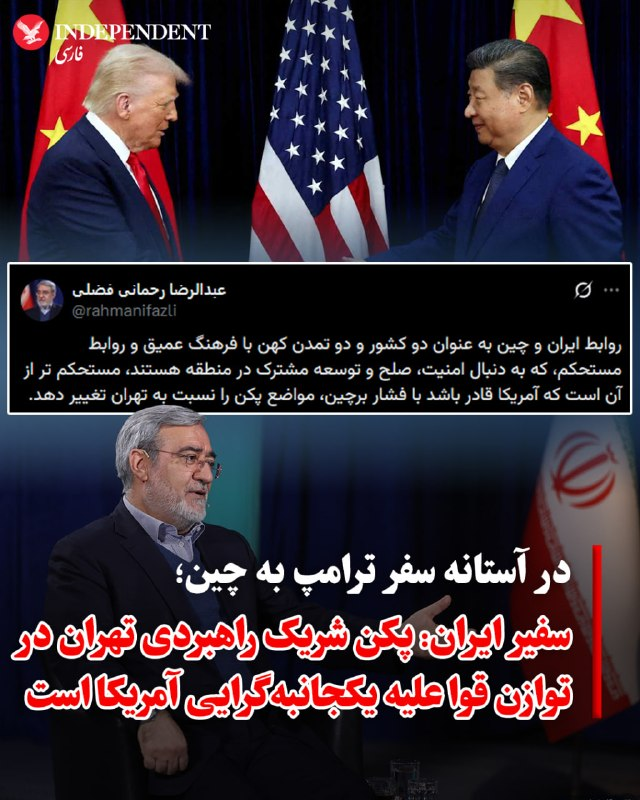

♦️ عبدالرضا رحمانی‌فضلی، سفیر جمهوری اسلامی در چین، روز سه‌شنبه ۲۲ اردیبهشت، در گفتگو با خبرگزاری ایرنا و در آستانه سفر دونالد ترامپ به پکن، بر استحکام پیوندهای راهبردی میان تهران و پکن تاکید کرد. او تصریح کرد که چین برای ایران تنها یک شریک اقتصادی یا خریدار انرژی نیست، بلکه بخشی کلیدی از «توازن سیاسی» جمهوری اسلامی در مقابله با فشارها، تهدیدها و یکجانبه‌گرایی قدرت‌های خارجی محسوب می‌شود.

سفیر ایران در پکن همچنین در حساب کاربری خود در شبکه اجتماعی ایکس، روابط دو کشور را ریشه‌دار در تمدن و فرهنگ کهن توصیف کرد و نوشت: «روابط ایران و چین مستحکم‌تر از آن است که آمریکا قادر باشد با فشار بر پکن، مواضع این کشور را نسبت به تهران تغییر دهد.»

به گفته رحمانی‌فضلی، سفر اخیر عباس عراقچی، وزیر امور خارجه جمهوری اسلامی به چین، نشان‌دهنده تلاش فعالانه تهران برای بازسازی جایگاه دیپلماتیک خود پس از درگیری‌های اخیر با ایالات متحده و اسرائیل است. او تاکید کرد که ایران به جای واکنش‌های صرفا نظامی، به دنبال تثبیت موقعیت خود از طریق ائتلاف‌های راهبردی با قدرت‌های منطقه‌ای و جهانی برای تامین امنیت و توسعه مشترک است.
‌🇸🇦 Indypersian

🤖 @VahidOOnLine

## mwarmonitor — post 8973

🔴«ترامپ که از بن‌بست در مذاکرات ناراضی است، اکنون با جدیت بیشتری به ازسرگیری عملیات نظامی در ایران فکر می‌کند، هرچند به گفته منابع، تصمیم مهمی پیش از سفر او به چین بعید است گرفته شود.» CNN

@mwarmonitor

## FoxNewsTwitter — post 341586

  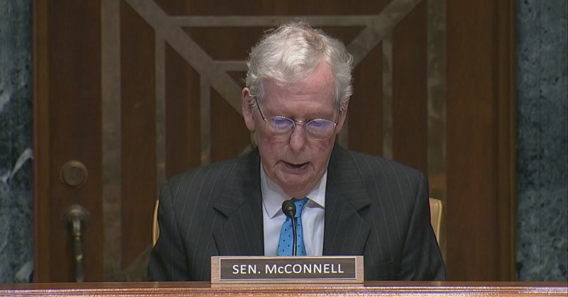

Fox News (Twitter/X)

WATCH LIVE: Secretary Hegseth testifies on Pentagon budget before Senate panel https://twitter.com/i/broadcasts/1PKqrEVLXpeGb

## IranIntlTV — post 336832

  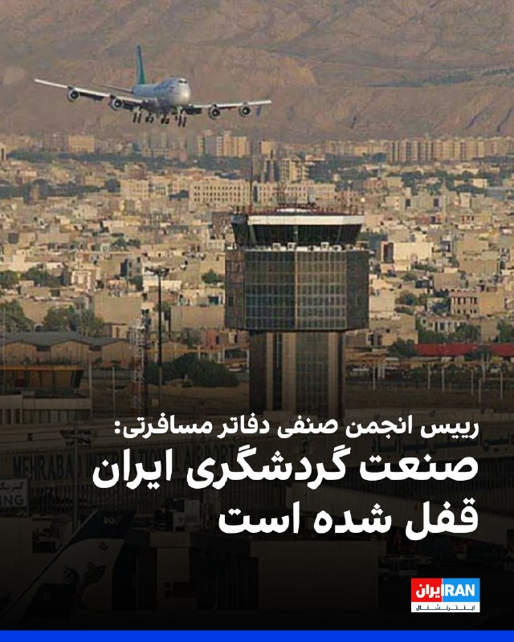

حرمت‌الله رفیعی، رییس انجمن صنفی دفاتر خدمات مسافرتی، گفت: «دفاتر مسافرتی پس از ماه‌ها رکود، جنگ، بی‌ثباتی اقتصادی و اختلال اینترنت، دیگر توان تاب‌آوری ندارند و در صورت ادامه شرایط فعلی، بخش مهمی از نیروی انسانی متخصص این صنعت از بین خواهد رفت.»

او افزود: «در شرایطی که عملا کسب‌وکاری وجود ندارد، فشارهای مالیاتی و بیمه‌ای همچنان ادامه دارد و صنعت گردشگری ایران قفل شده است.»

رفیعی اضافه کرد: «بسیاری از کارکنان آموزش‌دیده دفاتر مسافرتی که سال‌ها برای آموزش آن‌ها هزینه شده است، به دلیل نبود درآمد، جذب مشاغلی مثل آرایشگری و فعالیت‌های غیرمرتبط شده‌اند.»
https://iranintl.com/202605126945

## IranIntlTV — post 336831

  <a href="telegram/content/IranIntlTV_336831_1778597203.mp4" target="_blank">🎬 Download video</a>

ویدیویی از یک ربات غول‌پیکر سرنشین‌دار که قابلیت تغییر شکل دارد، در شبکه‌های اجتماعی مورد توجه قرار گرفته است. این ربات با الهام از آثار علمی‌تخیلی طراحی شده و می‌تواند در حالت‌های مختلف تغییر وضعیت دهد. هدایت این سازه پیشرفته از داخل کابین توسط یک اپراتور انجام می‌شود.
این ربات که با نام GD01 معرفی شده، ساخت چین است و توسط شرکت Unitree Robotics توسعه یافته است.
@iranintltv

## IranIntlTV — post 336830

  <a href="telegram/content/IranIntlTV_336830_1778597205.mp4" target="_blank">🎬 Download video</a>

سرخط خبرهای سه‌شنبه ۲۲ اردیبهشت
@iranintltv

## FarsiVOA — post 217536

🔺پرزیدنت ترامپ: رژیم ایران بسیار ضعیف شده و «محاصره» دریایی منابع مالی آنها را محدود کرده است

▪️پرریدنت ترامپ با اشاره به موثر بودن محاصره دریایی بر محدود کردن دسترسی رژیم ایران به منابع مالی، بار دیگر تاکید کرد که آمریکا اجازه نخواهد داد رژیم ایران به سلاح هسته‌ای دست یابد.

⬇️ بیشتر بخوانید:

https://ir.voanews.com/a/president-trump-iran/8149184.html/?nocach=1

## Persian_Trend_Official — post 13987

🔴 دو وزیر دولت بریتانیا در اعتراض به استارمر استعفا دادند

💢گزارش‌ها حاکی است دو وزیر دولت بریتانیا در مخالفت با سیاست‌ها و عملکرد «کی یر استارمر» از سمت خود استعفا داده‌اند.

💢این استعفاها در حالی رخ می‌دهد که فشارهای سیاسی بر نخست‌وزیر بریتانیا افزایش یافته و پیش‌تر نیز گزارش‌هایی درباره نارضایتی گسترده در حزب کارگر منتشر شده بود.

🫆:Tony

📌 @persian_trend_official
پرشین ترند | متفاوت‌ترین کانال نظامی

## Hranews — post 112906

یک شهروند توسط نیروهای اداره اطلاعات در ازنا بازداشت شد

❗️
❗️
❗️
❗️
❗️– یک شهروند در شهرستان ازنا به دلیل آنچه ارتباط و همکاری با یکی از گروه‌های مخالف نظام عنوان شده است، توسط نیروهای اداره اطلاعات #بازداشت شد.

ادامه مطلب

↘️
@hranews_bot تماس ✉️ -  @Hranews  کانال هرانا 🆑

---
📅 بروزرسانی: 1405/02/22 18:05
---

## Shin_Persian — post 5968

  

Shin ✓ @hey_itsmyturn Tue, 12 May 2026 14:29:01 UTC #Kuwait 🇰🇼 #Iran Kuwait Thwarts IRGC Infiltration & Hostile Plot Kuwait’s Ministry of Interior has released chilling details regarding the 4 infiltrators captured earlier this month. Interrogations confirm…

## Shin_Persian — post 5967

Shin ✓ @hey_itsmyturn
Tue, 12 May 2026 14:29:01 UTC

#Kuwait 🇰🇼 #Iran
Kuwait Thwarts IRGC Infiltration & Hostile Plot

Kuwait’s Ministry of Interior has released chilling details regarding the 4 infiltrators captured earlier this month. Interrogations confirm they are members of IRGC sent to carry out "hostile acts" within the country.

The Arrested IRGC Members:
Naval Colonel: Amir Hussein Abd Muhammad Zarai
Naval Colonel: Abdul Samad Yadollah Qanawati
Naval Captain: Ahmed Jamshid Ghulam Reza Zulfiqari
First Lieutenant: Muhammad Hussein Sohrab Foroughi Rad

Two others, Captain Mansour Qambari and boat pilot Abdulali Siamari, fled the scene during the initial skirmish

The incident has happened Bubiyan Island. The group used a rented fishing boat to enter Kuwaiti territorial waters illegally.

Upon discovery, the group opened fire on Kuwaiti Armed Forces. One Kuwaiti soldier was injured in the line of duty before the 4 suspects were neutralized and detained.

Source: https://24.ae/article/957997/

فارسی

#کوییت 🇰🇼 #ایران
کوییت نفوذ سپاه پاسداران (سپاه پاسداران انقلاب اسلامی) و توطئه‌ای خصمانه را خنثی کرد

وزارت کشور کوییت جزئیات تکان‌دهنده‌ای را در مورد ۴ نفوذی که اوایل این ماه دستگیر شده بودند، منتشر کرده است. بازجویی‌ها تأیید می‌کند که آن‌ها اعضای سپاه پاسداران هستند که برای انجام «اعمال خصمانه» در داخل کشور اعزام شده بودند.

اعضای دستگیر شده سپاه پاسداران:
سرهنگ دریایی: امیرحسین عبدالمحمد زارعی
سرهنگ دریایی: عبدالصمد یدالله قنواتی
ناخدا: احمد جمشید غلامرضا ذوالفقاری
ستوان یکم: محمدحسین سهراب فروغی راد

دو نفر دیگر، ناخدا منصور قنبری و هدایت‌کننده قایق، عبدالعلی سیامری، در جریان درگیری اولیه از صحنه گریختند.

این حادثه در جزیره بوبیان رخ داده است. این گروه از یک قایق ماهیگیری اجاره‌ای برای ورود غیرقانونی به آب‌های سرزمینی کوییت استفاده کرده بودند.

پس از شناسایی، این گروه به سوی نیروهای مسلح کوییت آتش گشودند. یک سرباز کویتی در حین انجام وظیفه مجروح شد و پس از آن، ۴ مظنون مهار و بازداشت شدند.

منبع: https://24.ae/article/957997/

𝕏 · @shin_persian

## DW_Farsi — post 124614

  

🔶 قوه قضاییه از توقیف اموال بیش از ۴۰۰ چهره خارج از کشور خبر داد

خبرگزاری مهر وابسته به سازمان تبلیغات اسلامی، به نقل از قوه قضاییه از توقیف اموال و دارایی‌های بیش از ۴۰۰ نفر از جمله خبرنگاران شبکه‌های "اینترنشنال" و "من‌وتو" خبر داد و مدعی شد که این افراد، "در همکاری با رژیم‌های متخاصم خسارت به زیرساخت‌ها و امنیت ملی وارد کردند".

بر اساس این گزارش، این اقدام در ادامه "دستور مقام قضایی و در راستای قانون تشدید مجازات جاسوسی" صورت گرفته و خبرنگاران یادشده، به همکاری با اسرائیل و "کشورهای متخاصم علیه امنیت و منافع ملی" متهم شده‌اند.

این گزارش، با اشاره به توقیف اموال ثبتی و دارایی‌های این افراد، آن‌ها را بیش از ۴۰۰ نفر از ایرانیان خارج از جمله "عده‌ای از بازیگران، ورزشکاران، مدیران و خبرنگاران" شبکه اینترنشنال و شبکه من‌وتو عنوان کرده است.

قوه قضاییه مدعی شده است که این افراد "در همکاری با دولت‌های متخاصم موجبات ایجاد خسارات گسترده‌ای به زیرساخت‌ها و مکان‌های عمومی نظیر مدارس، دانشگاه‌ها، مراکز تحقیقاتی، مراکز صنعتی و ... را فراهم کرده‌اند."

از زمان آغاز حملات نظامی آمریکا و اسرائیل به ایران در روز ۹ اسفندماه ۱۴۰۴، گزارش‌ها از افزایش بازداشت‌ها، اعدام‌ها و فشار بر فعالان رسانه‌ای و مدنی حکایت دارد. سازمان‌های حقوق بشری نیز نسبت به استفاده از مجازات‌هایی چون اعدام و مصادره اموال به عنوان ابزار سرکوب هشدار داده‌اند.

در این چارچوب، مصادره گسترده اموال را می‌توان بخشی از راهبردی دانست که در آن، جنگ خارجی بهانه‌ای برای بازتعریف و تشدید فشار داخلی شده است. در حالی که حکومت از "مذاکره" و "آتش‌بس" سخن می‌گوید، اقدامات عملی نشان می‌دهد که سطح تقابل با منتقدان و مخالفان نه تنها کاهش نیافته، بلکه در حال گسترش است.

@dw_farsi

## alonews — post 119515

  <a href="telegram/content/alonews_119515_1778596504.webm" target="_blank">🎬 Download video</a>

👈تانکر ترکز: امکان ایجاد مسیر جایگزین برای تنگه هرمز در خاک عمان وجود دارد

✅ @AloNews خبر جنگ

---
📅 بروزرسانی: 1405/02/22 17:58
---

## VahidOOnLine — post 239717

  <a href="telegram/content/VahidOOnLine_239717_1778596105.mp4" target="_blank">🎬 Download video</a>

♦️دونالد ترامپ در آستانه سفر به چین، در گفتگو با برنامه پادکست «سید و دوستان در صبح» سید روزنبرگ گفت محاصره ایران ادامه دارد و تهران به منابع مالی دسترسی ندارد. او همچنین گفت نیروی دریایی و نیروی هوایی ایران نابود شده‌اند و افزود: «فقط مسئله زمان است.»

ترامپ افزود آمریکا اجازه نخواهد داد ایران به سلاح هسته‌ای دست پیدا کند، چون به گفته او، جمهوری اسلامی از آن استفاده خواهد کرد. رئیس‌جمهوری آمریکا همچنین گفت اگر ایران به سلاح هسته‌ای دست پیدا کند، «فاجعه‌ای باورنکردنی» رخ خواهد داد.
‌🇸🇦 Indypersian

🤖 @VahidOOnLine

## farsi_fox_news — post 89258

  <a href="telegram/content/farsi_fox_news_89258_1778596106.mp4" target="_blank">🎬 Download video</a>

♦️ وزیر جنگ آمریکا: اگر لازم شد برای تشدید تنش با ایران طرح داریم

🔹 پیت هگزث در نشستی درباره بودجه دفاعی آمریکا در کنگره این کشور درباره جنگ علیه ایران گفت، ما در صورت لزوم، همانطور که طرحی برای کاهش تنش داریم، طرحی برای تشدید تنش علیه ایران نیز داریم که اگر لازم شد آن را اجرا می‌کنیم.
🔹 وی افزود، به دلیل جدیت ماموریتی که رئیس جمهور ترامپ بر عهده گرفته است و در راستای عدم دستیابی ایران به سلاح هسته‌ای، گام بعدی علیه ایران را فاش نخواهیم کرد.
🔹 اظهارات وزیر جنگ آمریکا در این باره درحالیست که بسیاری از ناظران سیاسی و تحلیلگران غربی استراتژی واشنگتن در جنگ ایران را یک شکست تمام عیار خوانده‌اند و می‌گویند که پنتاگون به هیچ یک از اهداف خود در جنگ دست نیافته است.
🌐 @farsi_fox_news

## farsi_fox_news — post 89257

  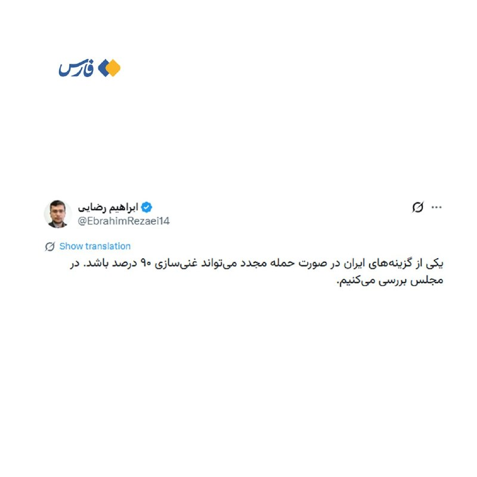

♦️ سخنگوی کمیسیون امنیت ملی: یکی از گزینه‌های ایران در صورت حملهٔ مجدد می‌تواند غنی‌سازی ۹۰ درصد باشد. در مجلس بررسی می‌کنیم
🌐 @farsi_fox_news

## farsi_fox_news — post 89256

  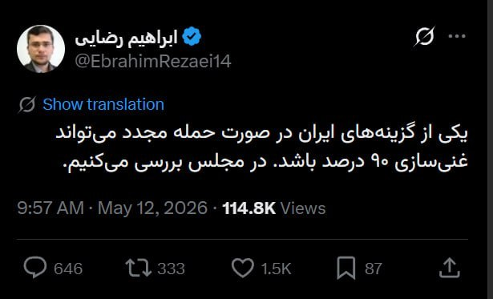

♦️ غنی‌سازی ۹۰ درصدی اورانیوم در مجلس بررسی خواهد شد

🔹 سخنگوی كميسيون امنيت ملی مجلس
🌐 @farsi_fox_news

## FoxNewsTwitter — post 341585

  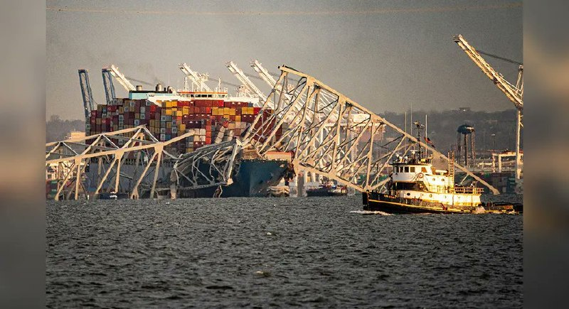

Fox News (Twitter/X)

BREAKING: Foreign crew of container ship Dali charged over deadly Francis Scott Key bridge collision, newly unsealed indictment shows

## FoxNewsTwitter — post 341584

  <a href="telegram/content/FoxNewsTwitter_341584_1778596109.mp4" target="_blank">🎬 Download video</a>

Fox News (Twitter/X)

WATCH: Three people arrested as another protest outside a New York synagogue turns violent.

Hundreds gathered in Brooklyn as anti-Israel demonstrators clashed with police near the site, escalating into chaos.

Police say those taken into custody were seen throwing items during the confrontation. It follows a similar protest at a historic Manhattan synagogue just weeks ago, raising concerns as tensions continue to spill into the streets.

## pm_afshaa — post 90630

سخنگوی دولت: تا سایه‌ جنگ دور نشه اینترنت وصل نمیشه، وقتی دور شد به تدریج وصل میشه

💧 Rainbet.com the #1 Non-KYC Crypto Casino & Sportsbook @rainbetcom

😁 @Pm_Afshaa

## VahidOnline — post 75432

  

دونالد ترامپ در گفت‌وگو با برنامه رادیویی «سید رازبرگ» گفت: انتظار داریم اقتصاد ایران زیر فشارهای ناشی از محاصره بنادرش فرو بپاشد.
او افزود این درگیری بدون نیاز به شتاب‌زدگی حل‌وفصل خواهد شد و جمهوری اسلامی با انزوایی روبه‌رو است که آن را از منابع درآمدی محروم می‌کند.
ترامپ گفت ایالات متحده در حال انجام ارتباطات مستقیم با مقام‌های تهران است و برای رسیدن به توافق عجله‌ای ندارد و او اطمینان دارد که تهران غنی‌سازی اورانیوم را به‌طور کامل متوقف خواهد کرد.
@VahidOOnLine
دونالد ترامپ گفت حکومت ایران با انزاویی روبه‌روست که آن را از منابع درآمدش محروم می‌کند و انتظار می‌رود اقتصاد ایران زیر فشارهای ناشی از محاصره بندرها دچار فروپاشی شود.
او افزود: «این درگیری بدون نیاز به شتاب‌زدگی حل‌وفصل خواهد شد و جمهوری اسلامی با انزوایی روبه‌رو است که آن را از منابع درآمدی محروم می‌کند.»
دونالد ترامپ درباره اورانیوم غنی‌شده در ایران گفت مقام‌های جمهوری اسلامی به او گفته‌اند قرار است آنچه او «گردوغبار هسته‌ای» می‌نامد در اختیار آمریکا قرار گیرد، اما بعدا نظرشان را تغییر داده‌اند. او تاکید کرد در نهایت این مواد را به دست خواهند آورد و موضوع را جمع‌وجور می‌کنند.
@VahidOOnLine

📡 @VahidOnline

## VahidOnline — post 75431

  

یک مقام ارشد پنتاگون روز سه‌شنبه ۲۲ اردیبهشت اعلام کرد که جنگ ایالات متحده با ایران تاکنون ۲۹ میلیارد دلار هزینه داشته است، رقمی که نسبت به برآورد ارائه‌شده در اواخر ماه گذشته، چهار میلیارد دلار افزایش نشان می‌دهد.

به گزارش خبرگزاری رویترز، در حالی که تنها شش ماه تا انتخابات میان‌دوره‌ای کنگره آمریکا باقی مانده است، دموکرات‌ها در نظرسنجی‌های عمومی موقعیت بهتری پیدا کرده‌اند و تلاش می‌کنند این جنگ را به مسائل مربوط به هزینه‌های زندگی پیوند بزنند.
@VahidHeadline

📡 @VahidOnline

## Persian_Trend_Official — post 13986

  <a href="telegram/content/Persian_Trend_Official_13986_1778596112.mp4" target="_blank">🎬 Download video</a>

🔴 وزارت دفاع روسیه تصاویر آزمایش موشک «سارمات» را منتشر کرد

وزارت دفاع روسیه ویدئویی از آزمایش موشک بالستیک قاره‌پیمای «سارمات» منتشر کرده است؛ موشکی که از آن به‌عنوان یکی از قدرتمندترین تسلیحات راهبردی هسته‌ای روسیه یاد می‌شود.

بر اساس گزارش‌ها:

▪️ «سارمات» یک موشک بالستیک قاره‌پیما با قابلیت حمل چندین کلاهک هسته‌ای است

▪️ ناتو این موشک را با نام «شیطان ۲» می‌شناسد

▪️ روسیه اعلام کرده این سامانه برای عبور از سپرهای موشکی طراحی شده است

️▪️ برد این موشک بین ۱۰ تا ۱۸ هزار
کیلومتر اعلام شده است

🫆:Tony

📌 @persian_trend_official
پرشین ترند | متفاوت‌ترین کانال نظامی

## IranianMinds — post 20008

🔴وزیر دوم بریتانیا از دولت کی‌ر استارمر استعفاء داد.

@IranianMinds

## Hranews — post 112905

  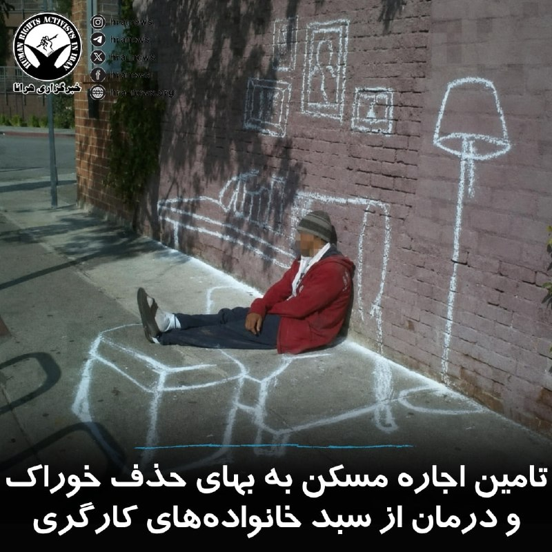

افزایش هزینه مسکن و اجاره‌بها، فشار معیشتی بر خانوارهای کارگری را تشدید کرده و سهم مسکن را به بخش عمده سبد هزینه خانواده‌ها در برخی کلان‌شهرها رسانده است. خبرگزاری ایلنا با انتشار گزارشی در این رابطه، به پیامدهای رشد #تورم، افزایش هزینه ساخت‌وساز و کاهش قدرت خرید پرداخته است. بر اساس این گزارش، بسیاری از خانواده‌ها ناچار شده‌اند برای تامین هزینه سرپناه، از مخارج ضروری مانند خوراک، درمان و آموزش بکاهند.

کارشناسان اقتصادی همچنین از گسترش فقر مسکن، افزایش جابه‌جایی اجباری مستاجران به مناطق پایین‌تر و تشدید فشار بر خانوارهای کم‌درآمد خبر می‌دهند. به گفته آنان، ادامه رکود اقتصادی و #بیکاری، در کنار ناکارآمدی سیاست‌های حمایتی دولت، موجب شده بخش قابل توجهی از مستاجران با دشواری بیشتری در تامین هزینه‌های زندگی روبه‌رو شوند.

↘️
@hranews_bot تماس ✉️ - @Hranews کانال هرانا 🆑

## alonews — post 119514

  <a href="telegram/content/alonews_119514_1778596114.webm" target="_blank">🎬 Download video</a>

👈تورم در آمریکا 3.8% اعلام شد

✅ @AloNews خبر جنگ

---
📅 بروزرسانی: 1405/02/22 17:44
---

## VahidOOnLine — post 239716

  

دونالد ترامپ گفت حکومت ایران با انزاویی روبه‌روست که آن را از منابع درآمدش محروم می‌کند و انتظار می‌رود اقتصاد ایران زیر فشارهای ناشی از محاصره بندرها دچار فروپاشی شود.

او افزود: «این درگیری بدون نیاز به شتاب‌زدگی حل‌وفصل خواهد شد و جمهوری اسلامی با انزوایی روبه‌رو است که آن را از منابع درآمدی محروم می‌کند.»

دونالد ترامپ درباره اورانیوم غنی‌شده در ایران گفت مقام‌های جمهوری اسلامی به او گفته‌اند قرار است آنچه او «گردوغبار هسته‌ای» می‌نامد در اختیار آمریکا قرار گیرد، اما بعدا نظرشان را تغییر داده‌اند. او تاکید کرد در نهایت این مواد را به دست خواهند آورد و موضوع را جمع‌وجور می‌کنند.
‌🏁 🇬🇧 IranintlTV

🤖 @VahidOOnLine

## mwarmonitor — post 8972

🇮🇷«ایران به‌طور قابل توجهی تعریف خود از تنگه هرمز را گسترش داده و اکنون منطقه‌ای بسیار بزرگ‌تر از قبل از جنگ را ادعا می‌کند. یک مقام نیروی دریایی سپاه پاسداران هشدار داده است که ایران «اجازه هیچ‌گونه تعرض به آب‌ها و منافع خود را نخواهد داد» - وال‌استریت ژورنال»

@mwarmonitor

## IranIntlTV — post 336829

  <a href="telegram/content/IranIntlTV_336829_1778595254.mp4" target="_blank">🎬 Download video</a>

ادامه جنگ ایران و بن‌بست در مذاکرات تهران و واشینگتن، نگرانی‌ها درباره پیامدهای اقتصادی این بحران در آلمان را افزایش داده است. گزارش‌ها نشان می‌دهد حدود دو سوم شهروندان آلمانی به دلیل افزایش قیمت انرژی، مصرف برق، گرمایش و استفاده از خودرو را کاهش داده‌اند.
علی حسن‌پور، خبرنگار ایران‌اینترنشنال، گزارش می‌دهد
@iranintltv

## IranIntlTV — post 336828

  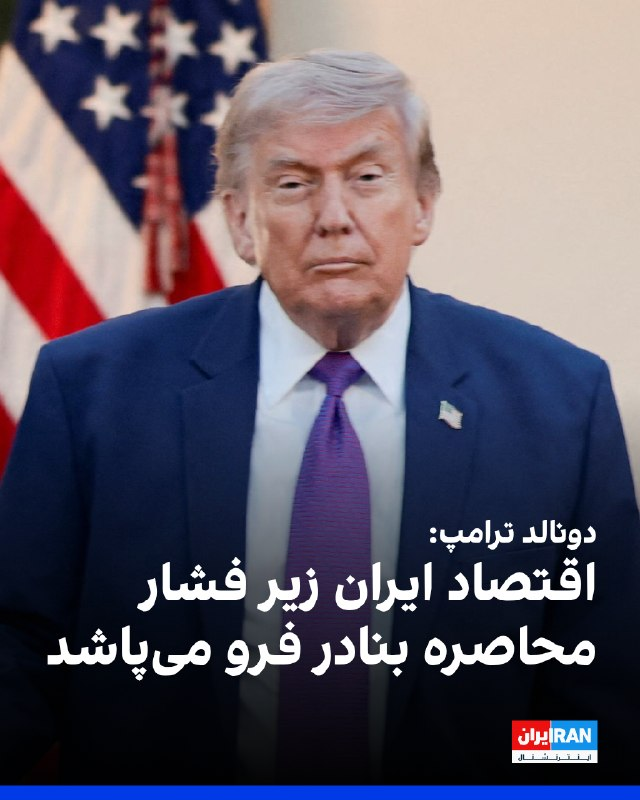

دونالد ترامپ گفت حکومت ایران با انزاویی روبه‌روست که آن را از منابع درآمدش محروم می‌کند و انتظار می‌رود اقتصاد ایران زیر فشارهای ناشی از محاصره بندرها دچار فروپاشی شود.

او افزود: «این درگیری بدون نیاز به شتاب‌زدگی حل‌وفصل خواهد شد و جمهوری اسلامی با انزوایی روبه‌رو است که آن را از منابع درآمدی محروم می‌کند.»

دونالد ترامپ درباره اورانیوم غنی‌شده در ایران گفت مقام‌های جمهوری اسلامی به او گفته‌اند قرار است آنچه او «گردوغبار هسته‌ای» می‌نامد در اختیار آمریکا قرار گیرد، اما بعدا نظرشان را تغییر داده‌اند. او تاکید کرد در نهایت این مواد را به دست خواهند آورد و موضوع را جمع‌وجور می‌کنند.
https://iranintl.com/202605128362

## FarsiVOA — post 217535

  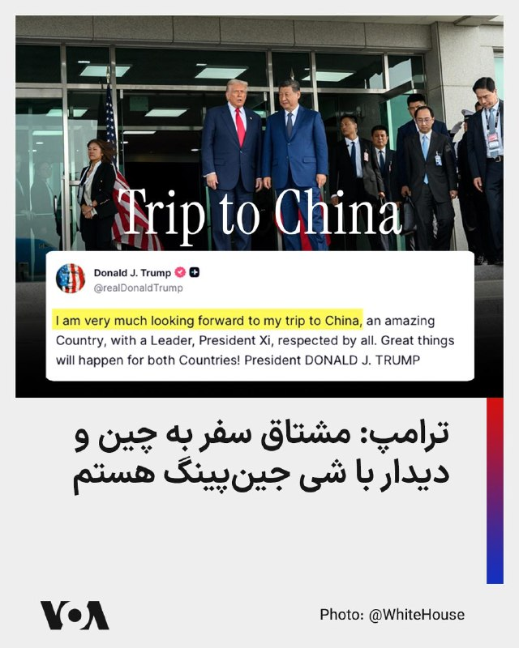

دونالد ترامپ، رئیس ‌جمهوری آمریکا، در پیامی در شبکه اجتماعی تروت سوشال اعلام کرد که مشتاق سفر به چین است.

ترامپ در این پیام، چین را «کشوری شگفت‌انگیز» توصیف کرد و از شی جین‌پینگ به عنوان رهبری یاد کرد که به گفته او مورد احترام همگان است.

او افزود که این سفر می‌تواند به دستاوردهای مهمی برای هر دو کشور منجر شود.

@FarsiVOA

## Persian_Trend_Official — post 13984

🔴 عبور نفتکش‌های قطری از تنگه هرمز تأیید شد

در حالی که روز گذشته برخی گزارش‌ها مدعی شده بودند نفتکش قطری «مهزم» توسط ایران از تنگه هرمز بازگردانده شده، داده‌های جدید نشان می‌دهد این نفتکش دقایقی پیش موقعیت خود را در دریای عمان ثبت کرده و از مسیر تعیین‌شده عبور کرده است.

بر اساس گزارش‌ها:

▪️ نفتکش «مهزم» موفق به عبور از تنگه هرمز شده است
▪️ بلومبرگ نیز عبور دومین نفتکش حامل گاز طبیعی قطر از مسیر تعیین‌شده ایران را تأیید کرده است
▪️ عبور این کشتی‌ها در شرایط تنش شدید امنیتی در منطقه انجام شده است

🫆:Tony

📌 @persian_trend_official
پرشین ترند | متفاوت‌ترین کانال نظامی

## BBCPersian — post 280850

🔻دولت جمهوری اسلامی به دیوان داوری ایران و آمریکا شکایت کرد

دولت جمهوری اسلامی می‌گوید از ایالات متحده به دیوان داوری ایران و آمریکا، مستقر در لاهه هلند، شکایت کرده است.

به گزارش خبرگزاری‌های ایران، این شکایت دولت آمریکا را به نقض مفاد بیانیه‌های الجزایر متهم کرده است؛ توافقی که در دی ۱۳۵۹ با میانجی‌گری الجزایر حاصل شد و به بحران گروگان‌گیری دیپلمات‌های آمریکایی در ایران پایان داد.

«جنگ ۱۲ روزه، حملاتی که از ۹ اسفند (۲۸ فوریه) آغاز شد و همچنین تحریم‌های اقتصادی ایالات متحده» از جمله شکایت‌های ایران هستند.

بر اساس عهدنامه الجزایر آمریکا متعهد شده در امور داخلی، سیاسی و نظامی مستقیم یا غیرمستقیم ایران دخالت نکند.

در حال حاضر، دو شکایت دیگر ایران از آمریکا در دیوان دادگستری بین‌المللی در جریان است که یکی مربوط به خروج آمریکا از توافق هسته‌ای موسوم به برجام و دیگری درباره مصادره نزدیک به دو میلیارد دلار از اموال بانک مرکزی ایران است.

@BBCPersian

## alonews — post 119513

  <a href="telegram/content/alonews_119513_1778595256.webm" target="_blank">🎬 Download video</a>

👈جایزهٔ ۱۵ میلیون دلاری آمریکا برای مختل کردن سیستم مالی ایران

🔴وزارت خارجهٔ آمریکا از برنامهٔ «پاداش برای عدالت» خود برای پرداخت تا سقف ۱۵ میلیون دلار به افراد همکار با این کشور، با هدف اختلال در سازوکارهای مالی سپاه پاسداران خبر داد.

✅ @AloNews خبر جنگ

---
📅 بروزرسانی: 1405/02/22 17:34
---

## VahidOOnLine — post 239715

  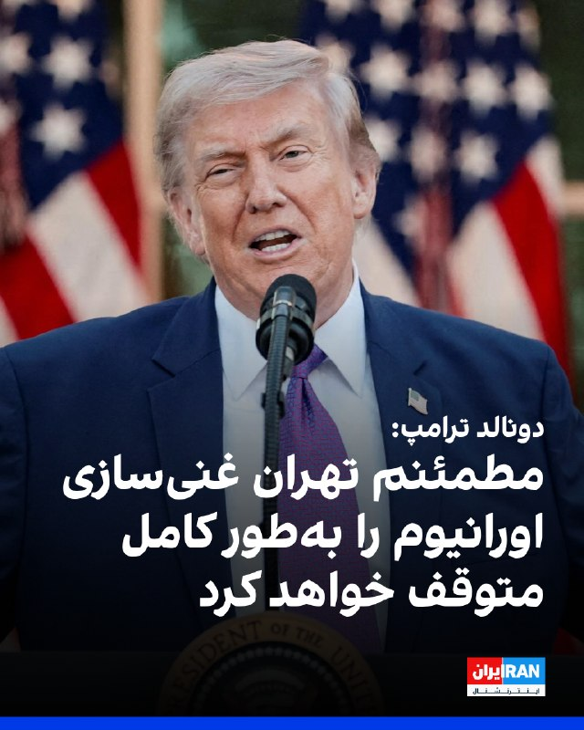

دونالد ترامپ در گفت‌وگو با برنامه رادیویی «سید رازبرگ» گفت: انتظار داریم اقتصاد ایران زیر فشارهای ناشی از محاصره بنادرش فرو بپاشد.
او افزود این درگیری بدون نیاز به شتاب‌زدگی حل‌وفصل خواهد شد و جمهوری اسلامی با انزوایی روبه‌رو است که آن را از منابع درآمدی محروم می‌کند.
ترامپ گفت ایالات متحده در حال انجام ارتباطات مستقیم با مقام‌های تهران است و برای رسیدن به توافق عجله‌ای ندارد و او اطمینان دارد که تهران غنی‌سازی اورانیوم را به‌طور کامل متوقف خواهد کرد.
‌🏁 🇬🇧 IranintlTV

🤖 @VahidOOnLine

## mwarmonitor — post 8971

🚢غول حمل‌ونقل دریایی مِرسک (Maersk)، دومین شرکت بزرگ کانتینری جهان، اعلام کرده است که همچنان از عبور از تنگه هرمز خودداری می‌کند.

@mwarmonitor

## FoxNewsTwitter — post 341583

  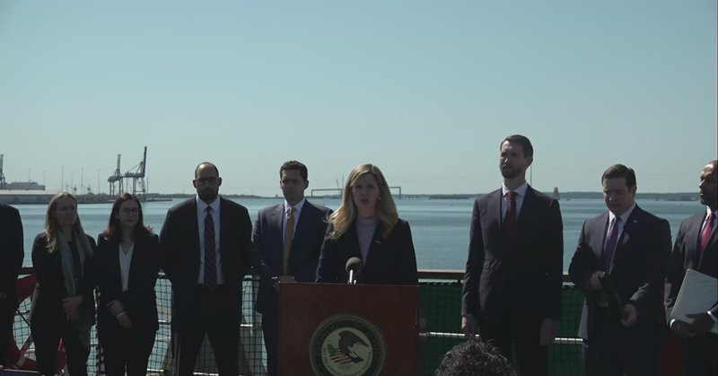

Fox News (Twitter/X)

WATCH LIVE: Federal officials deliver update on probe into Baltimore bridge vessel crash https://twitter.com/i/broadcasts/1nKOLEqNaNVGR

## pm_afshaa — post 90629

  <a href="telegram/content/pm_afshaa_90629_1778594687.webm" target="_blank">🎬 Download video</a>

🔴دونالد ترامپ: چین قوی است، اما ما قوی‌تر از چین هستیم. ما از نظر نظامی قوی تر از هر کشور دیگری هستیم.

این رو در مورد ونزوئلا دیدید. این برای اکثر کشورهای دیگر کار سختی بود. ما این کار رو در یک روز انجام دادیم.
نگاهی به ایران بندازید، آنها چیز های بزرگی داشتن و همه چیز از بین رفته.

💧Rainbet.com the #1 Non-KYC Crypto Casino & Sportsbook @rainbetcom

😁 @Pm_Afshaa

## pm_afshaa — post 90628

  <a href="telegram/content/pm_afshaa_90628_1778594688.webm" target="_blank">🎬 Download video</a>

🔴ترامپ: من رابطه خیلی خوبی با بی‌بی نتانیاهو دارم. ما واقعاً مثل دو شریک واقعی کنار هم بودیم؛ اگه ما دوتا نبودیم، اسرائیلی هم وجود نداشت؛ مخصوصاً بدون من قطعاً چنین چیزی ممکن نبود.

💧 Rainbet.com the #1 Non-KYC Crypto Casino & Sportsbook @rainbetcom

😁 @Pm_Afshaa

## pm_afshaa — post 90627

  <a href="telegram/content/pm_afshaa_90627_1778594688.webm" target="_blank">🎬 Download video</a>

🔴ترامپ: آمریکا در تماس مستقیم با مقامات ایرانی است و عجله‌ای برای رسیدن به توافق نداریم!

💧 Rainbet.com the #1 Non-KYC Crypto Casino & Sportsbook @rainbetcom

😁 @Pm_Afshaa

## pm_afshaa — post 90626

  <a href="telegram/content/pm_afshaa_90626_1778594689.mp4" target="_blank">🎬 Download video</a>

🔴دونالد ترامپ: ما لازم نیست عجله کنیم، ما یک محاصره داریم که بهشون اجازه نمیده پولی داشته باشن.

این یه چیز بسیار سادست؛ ما نمیتونیم بهشون اجازه بدیم سلاح هسته‌ای داشته باشن چون صدرصد ازش استفاده میکنن.

ایرانی‌ها به من گفتن غبار هسته‌ای مال تو میشه، اما بعد نظرشون عوض شد.

ما 100 درصد گرد و غبار هسته‌ای و همه چیز رو به دست خواهیم آورد.

💧 Rainbet.com the #1 Non-KYC Crypto Casino & Sportsbook @rainbetcom

😁 @Pm_Afshaa

## pm_afshaa — post 90625

  <a href="telegram/content/pm_afshaa_90625_1778594690.webm" target="_blank">🎬 Download video</a>

🔴هگست، وزیر جنگ آمریکا:
ما مهمات و قابلیت‌های کافی برای تضمین دستیابی به آنچه میخوایم در ایران به دست بیاریم، داریم. وزارت جنگ در آمادگی کامله و در صورت لزوم آماده اقدام علیه ایرانه.

💧 Rainbet.com the #1 Non-KYC Crypto Casino & Sportsbook @rainbetcom

😁 @Pm_Afshaa

## IranIntlTV — post 336827

  <a href="https://t.me/IranintlTV/336827" target="_blank">📎 Download file</a>

🎧نسخه صوتی دومینو: ایرانیان در میانه اعدام و جنگ
@iranintlTV

## IranIntlTV — post 336826

  

دونالد ترامپ در گفت‌وگو با برنامه رادیویی «سید رازبرگ» گفت: انتظار داریم اقتصاد ایران زیر فشارهای ناشی از محاصره بنادرش فرو بپاشد.
او افزود این درگیری بدون نیاز به شتاب‌زدگی حل‌وفصل خواهد شد و جمهوری اسلامی با انزوایی روبه‌رو است که آن را از منابع درآمدی محروم می‌کند.
ترامپ گفت ایالات متحده در حال انجام ارتباطات مستقیم با مقام‌های تهران است و برای رسیدن به توافق عجله‌ای ندارد و او اطمینان دارد که تهران غنی‌سازی اورانیوم را به‌طور کامل متوقف خواهد کرد.
https://iranintl.com/202605127397

## IranIntlTV — post 336825

  <a href="telegram/content/IranIntlTV_336825_1778594691.mp4" target="_blank">🎬 Download video</a>

ناتو از ابتکار فرانسه و بریتانیا برای گردهمایی بیش از ۴۰ کشور به‌منظور آماده‌سازی فعالیت‌ها در نزدیکی تنگه هرمز استقبال کرد. مارک روته گفت این اقدامات نه در داخل تنگه، بلکه در اطراف آن انجام خواهد شد و اروپایی‌ها در حال پاسخ به درخواست رییس‌جمهوری آمریکا هستند.
گفت‌وگو با علی صدرزاده، تحلیل‌گر مسایل خاورمیانه
@iranintltv

## RadioFarda — post 157094

  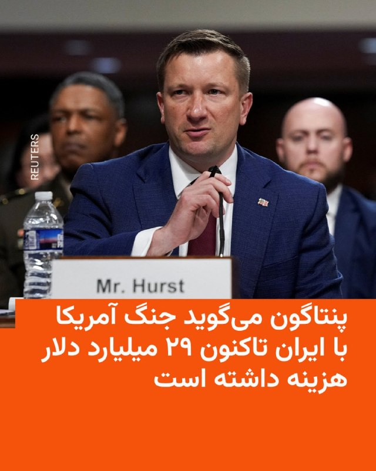

🔸یک مقام ارشد پنتاگون روز سه‌شنبه ۲۲ اردیبهشت اعلام کرد که جنگ ایالات متحده با ایران تاکنون ۲۹ میلیارد دلار هزینه داشته است، رقمی که نسبت به برآورد ارائه‌شده در اواخر ماه گذشته، چهار میلیارد دلار افزایش نشان می‌دهد.

🔸به گزارش خبرگزاری رویترز، در حالی که تنها شش ماه تا انتخابات میان‌دوره‌ای کنگره آمریکا باقی مانده است، دموکرات‌ها در نظرسنجی‌های عمومی موقعیت بهتری پیدا کرده‌اند و تلاش می‌کنند این جنگ را به مسائل مربوط به هزینه‌های زندگی پیوند بزنند.

🔸پنتاگون در ۲۹ آوریل اعلام کرده بود که هزینه جنگ تا آن زمان ۲۵ میلیارد دلار بوده است.

🔸جولز هرست، که به‌طور موقت وظایف حسابرس ارشد را بر عهده دارد، روز سه‌شنبه به قانون‌گذاران گفت که برآورد جدید شامل هزینه‌های به‌روزشده تعمیر و جایگزینی تجهیزات و همچنین هزینه‌های عملیاتی است.

🔸او گفت: «تیم ستاد مشترک و تیم حسابرسی به‌طور مداوم این برآورد را بررسی می‌کنند».

🔸هرست در کنار پیت هگست، وزیر دفاع، و ژنرال دن کین، رئیس ستاد مشترک نیروهای مسلح، سخن می‌گفت.

@RadioFarda

## alonews — post 119512

  <a href="telegram/content/alonews_119512_1778594693.webm" target="_blank">🎬 Download video</a>

👈ترامپ: من با نتانیاهو خیلی خوب کنار می‌آیم. ما شریک‌هایی واقعی بوده‌ایم.

🔴بدون ما دو نفر، اسرائیل وجود نداشت و بدون من هم وجود نداشت.

🔴چین قوی است، اما ما از چین قوی‌تر هستیم. ما از هر کشور دیگری از نظر نظامی قوی‌تر هستیم.

🔴شما این را در ونزوئلا دیدید. این کار برای اکثر کشورهای دیگر سخت بود. ما آن را در یک روز انجام دادیم، و حالا به آن نگاه کنید.

🔴به ایران نگاه کنید... آنها همه چیز بزرگی داشتند، و حالا همه چیزشان رفته است.

🔴ایران از نظر نظامی شکست خورده است و احتمالاً هنوز خودشان این را نمی‌دانند.

🔴اگر روزنامه نیویورک تایمز را بخوانید، فکر می‌کنید که ایران وضعیت خوبی دارد.

✅ @AloNews خبر جنگ

---
📅 بروزرسانی: 1405/02/22 17:24
---

## VahidOOnLine — post 239714

  

پیت هگست، وزیر جنگ آمریکا، گفت که این کشور برای تشدید، عقب‌نشینی یا جابه‌جایی نیروها برنامه‌ریزی کرده است، اما جزئیات ماموریت جلوگیری از دستیابی جمهوری اسلامی به بمب هسته‌ای را علنی نمی‌کند.
پیش‌تر اکسیوس به نقل از سه منبع آمریکایی گزارش داد که دونالد ترامپ روز دوشنبه با تیم امنیت ملی خود دیدار می‌کند تا درباره مسیر پیش رو در جنگ با جمهوری اسلامی، از جمله احتمال ازسرگیری اقدام نظامی، گفت‌وگو کند.
‌🏁 🇬🇧 IranintlTV

🤖 @VahidOOnLine

## VahidOOnLine — post 239713

  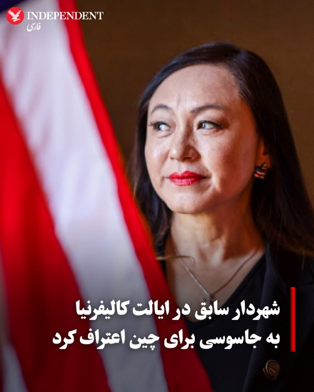

♦️ آیلین وانگ، شهردار سابق شهر آرکادیا در ایالت کالیفرنیا، به اتهام فعالیت غیرقانونی به عنوان عامل دولت چین (PRC) و انتشار پروپاگاندای پکن در خاک آمریکا، گناهکار شناخته شد.

بر اساس بیانیه وزارت دادگستری ایالات متحده، وانگ اعتراف کرده است که بین سال‌های ۲۰۲۰ تا ۲۰۲۲ تحت «هدایت و کنترل» مقامات چینی فعالیت کرده است. او متهم است که پیش از ورود به شورای شهر، با همکاری یک عامل محکوم‌شده چینی، وب‌سایتی را تحت پوشش یک رسانه محلی چینی-آمریکایی مدیریت می‌کرد که مستقیما محتوای ارسالی از سوی مقامات حزب کمونیست چین را منتشر می‌کرد.

دادستان‌ها اعلام کردند که وانگ حتی با چهره‌های مرتبط با دستگاه اطلاعاتی چین نیز در ارتباط بوده تا پیام‌های مورد نظر وزارت امور خارجه این کشور را توزیع کند. وانگ اکنون با خطر ۱۰ سال حبس در زندان فدرال و جریمه‌ای معادل ۲۵۰ هزار دلار روبرو است.

مقامات شهر آرکادیا با تاکید بر استعفای او، خاطرنشان کردند که این اقدامات مربوط به رفتارهای شخصی او بوده و تاثیری بر عملیات جاری شهرداری نداشته است. وزارت دادگستری این پرونده را «نقض جدی اعتماد عمومی» توصیف کرده است.
‌🇸🇦 Indypersian

🤖 @VahidOOnLine

## IranIntlTV — post 336824

🔻ترامپ و سفر چین؛ دیپلماسی در سایه بحران

🖋تحلیل - نعیمه دوستدار

مذاکره نیست و ما اینه که پیام کتبی دریافت شد، این به معنی مذاکره نیست و ما تا الان که دارم با شما صحبت می‌کنم هنوز جوابی ندادیم داریم بررسی می‌کنیم، ممکنه مثلا جوابی رو بدیم اما تا الان، علیرغم ادعایی که شده ایران مثلا موافقت کرده درباره هسته‌ای اینجور، درباره هرمز اینجور چنین چیزی نیست. حتی یک خبری هم داشتیم که منابع آگاه تکذیب کردن خبر عکسیس رو بله یعنی پیامی از طریق واسطه پاکستانی آمریکایی‌ها دادن به ما و ما الان در حال بررسی هستیم اینه که پیام کتبی دریافت شد، این به معنی مذاکرات نیست.

قرار است دونالد ترامپ در نخستین سفر یک رییس‌جمهوری آمریکا به چین در نزدیک به یک دهه گذشته، چهارشنبه ۲۳ اردیبهشت وارد پکن شود. شی جین‌پینگ، رییس‌جمهوری چین، میزبان ترامپ خواهد بود. این سفر در سایه «جنگ ایران» و بحران تنگه هرمز، جنگ تعرفه‌‌ها و تنش بر سر تایوان، انجام می‌شود.

ترامپ سال‌هاست تمرکز ویژه‌ای بر چین دارد. او که دست‌کم از اوایل دهه ۲۰۱۰ استدلال می‌کرد پکن از طریق تجارت «در حال سوءاستفاده» از ایالات متحده است، در دوره نخست ریاست‌جمهوری خود جنگ تجاری گسترده‌ای را آغاز کرد، بر صدها میلیارد دلار از واردات چین تعرفه وضع کرد و نهادهای دولتی آمریکا را به سمت برخورد با پکن به‌عنوان یک «رقیب راهبردی» سوق داد.

این دوره با تشدید مکرر تعرفه‌ها و شکل‌گیری چارچوبی وسیع‌تر از «رقابت» در حوزه‌های نظامی، فناوری و اقتصادی همراه بود.

در دوره دوم ریاست‌جمهوری او، روابط دو کشور میان تقابل و همکاری تاکتیکی در نوسان بوده است. ترامپ دوباره فشار تعرفه‌ای را آغاز کرد و در مقطعی برخی تعرفه‌ها را تا ۱۴۰ درصد افزایش داد. اقدامی که با واکنش تلافی‌جویانه چین روبه‌رو شد.

هنگامی که این سیاست نتوانست امتیازهای عمده‌ای از پکن بگیرد، ترامپ لحن خود را تغییر داد و بر شراکت «جی۲» (Group of Two) تاکید کرد، شخصا به تمجید از شی پرداخت و در نشست اکتبر ۲۰۲۵ در بوسان با یک آتش‌بس یک‌ساله در جنگ تجاری موافقت کرد.

در این مرحله، او نگرانی‌های مربوط به حقوق بشر در سین‌کیانگ، هنگ‌کنگ و تبت را کم‌اهمیت جلوه داد و در عین حال، با وجود تایید فروش تسلیحات به تایوان، لحن خود را درباره این جزیره نیز تعدیل کرد تا از تحریک بیش از حد پکن جلوگیری کند.

سفر روسای‌جمهوری آمریکا به چین

سفر روسای‌جمهوری آمریکا به چین از دهه ۱۹۷۰ به یکی از ابزارهای مهم دیپلماتیک تبدیل شده است.

سفر ریچارد نیکسون در سال ۱۹۷۲ نمونه کلاسیک این روند به شمار می‌رود. رویدادی که به احیای روابط دو کشور پس از دهه‌ها خصومت دوران جنگ سرد کمک کرد و به صدور «بیانیه شانگهای» انجامید.

جرالد فورد در سال ۱۹۷۵ به چین رفت و تعهدات آمریکا در چارچوب آن توافق را تایید کرد.

پس از برقراری کامل روابط دیپلماتیک در سال ۱۹۷۹، روسای‌جمهوری بعدی آمریکا از سفر به چین برای مدیریت همکاری‌ها و بحران‌ها استفاده کردند.

رونالد ریگان در سال ۱۹۸۴ راهی چین شد و ضمن امضای بیانیه‌ای دیگر، بر توسعه روابطی «سازنده» تاکید کرد؛ هر‌چند همچنان از کمونیسم انتقاد می‌کرد.

جورج اچ دبلیو بوش در سال ۱۹۸۹ به چین سفر کرد و بر سیاست «چین واحد» تاکید داشت.

بیل کلینتون در سفر سال ۱۹۹۸ خود، در سخنرانی‌هایی در شهرهای مختلف چین از جمله پکن، بر تعامل، تجارت و حقوق بشر تمرکز کرد.

جورج بوش پسر و باراک اوباما چندین بار به چین سفر کردند. سفرهایی که اغلب با موضوعات اقتصادی، گفت‌وگوهای امنیتی و رویدادهای مهمی مانند المپیک ۲۰۰۸ پکن و نشست آپک ۲۰۱۴ پیوند داشت.

خود ترامپ نیز در سال ۲۰۱۷ به چین رفت. زمانی که روابط دو کشور هنوز نسبتا دوستانه بود و تمرکز اصلی بر مذاکرات تجاری و تشریفات گسترده میزبانی از سوی شی جین‌پینگ قرار داشت.
چرا ترامپ به چین سفر می‌کند؟

سفر کنونی ترامپ نخستین سفر یک رییس‌جمهوری آمریکا به چین در نزدیک به یک دهه گذشته است و اندکی پس از آتش‌بس تعرفه‌ای سال ۲۰۲۵ انجام می‌شود.

🔗 ادامه این تحلیل را اینجا بخوانید
@iranintltv

## IranIntlTV — post 336823

  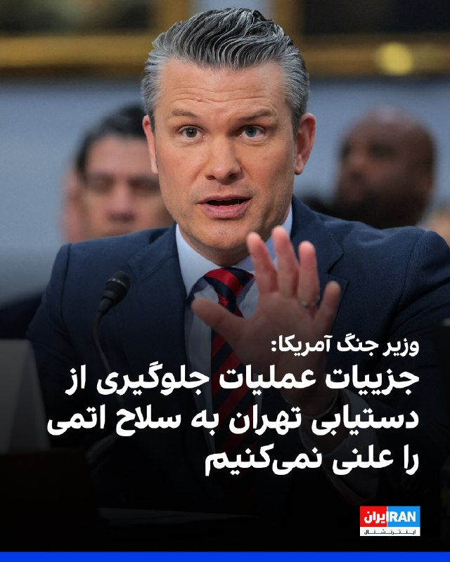

پیت هگست، وزیر جنگ آمریکا، گفت که این کشور برای تشدید، عقب‌نشینی یا جابه‌جایی نیروها برنامه‌ریزی کرده است، اما جزئیات ماموریت جلوگیری از دستیابی جمهوری اسلامی به بمب هسته‌ای را علنی نمی‌کند.
پیش‌تر اکسیوس به نقل از سه منبع آمریکایی گزارش داد که دونالد ترامپ روز دوشنبه با تیم امنیت ملی خود دیدار می‌کند تا درباره مسیر پیش رو در جنگ با جمهوری اسلامی، از جمله احتمال ازسرگیری اقدام نظامی، گفت‌وگو کند.
https://iranintl.com/202605127244

## IranIntlTV — post 336822

🔻کوچ اجباری نیروهای متخصص به رانندگی در اسنپ

پیام‌های رسیده به ایران‌اینترنشنال نشان می‌دهند با تعطیلی کارخانه‌ها، واحدهای تولیدی و کسب‌وکارهای کوچک، بسیاری از نیروهای فنی متخصص و تحصیل‌کرده برای تامین هزینه‌های زندگی به رانندگی در تاکسی‌های اینترنتی روی آورده‌اند.

در هفته‌های اخیر موج گسترده‌ای از اخراج، تعدیل نیرو، بیکار‌سازی و تغییر اجباری در طیف گسترده‌ای از شغل‌ها شکل گرفته است.

هزاران شهروند از صاحبان فروشگاه‌های مجازی و حقیقی تا کارکنان پتروشیمی و صنایع فولاد، شغل خود را از دست داده‌اند و با از بین رفتن منبع درآمد، ناچار به روی آوردن به مشاغل جایگزین و موقتی شده‌اند.
مسافرکشی هم دیگر صرف نمی‌کند

بر اساس گزارش‌ها، رانندگی در تاکسی‌های اینترنتی به آخرین راه بقا برای بسیاری از خانواده‌ها بدل شده است.

یک مخاطب در پیامی نوشت حقوق ۳۰ میلیون تومانی پدر بازنشسته‌اش پس از۳۰ سال کار کردن، کفاف زندگی را نمی‌دهد و این پدر سالخورده ناچار است برای کسب درآمد بیشتر از صبح تا شب در اسنپ مسافرکشی کند.

پیش‌تر نیز پیام‌هایی به ایران‌اینترنشنال رسیده بود که نشان می‌دادند حقوق، سنوات و حق بیمه بازنشستگان به‌ویژه از سوی تامین اجتماعی، فولاد مبارکه و ذوب‌آهن، با تاخیر پرداخت می‌شود.

یک فرد که به‌دلیل قطع اینترنت شغلش را از دست داده است، گفت برای پرداخت وام‌هایش راننده تاکسی اینترنتی شده اما هر بار اسنپ حقوقش را واریز می‌کند، تمامی آن صرف پرداخت قسط وام می‌شود و پولی برای خرجی خانواده باقی نمی‌ماند.

زنی ساکن اصفهان نیز در پیامی گفت پس از اخراج از شرکتی که در آن کار می‌کرد، به رانندگی در اسنپ روی آورده است، اما درآمدش حتی به خرید خوراکی هم نمی‌رسد.
هر راننده اسنپ، یک نیروی متخصص

موج بیکاری پای نیروهای متخصص و دانشگاهی را هم به تاکسی‌های اینترنتی باز کرده است.

پایگاه خبری رویداد۲۴ پیش‌تر در گزارشی از اشتغال نیروهای فنی خط تولید فولاد مبارکه اصفهان به رانندگی در تاکسی‌های اینترنتی پس از حملات اسرائیل و آمریکا به این مجموعه خبر داده بود.

یک زن با اشاره به تحصیلات تکمیلی، مدارک و مهارت‌های متعدد خود، گفت سال‌ها برای رشد حرفه‌ای در شغل تخصصی‌اش زمان سپری کرده، اما با قطع دو ماهه اینترنت کسب‌وکار آنلاین او تعطیل شده و ناچار است به‌عنوان راننده در اسنپ کار کند.

به گفته او، شرکت اسنپ نرخ سفرها را به شدت کاهش داد‌ه‌ و درآمد حاصل از مسافرکشی حتی به هزینه کارواش ماشین هم نمی‌رسد، چه برسد به تعمیر آن.

پیش از این و در سال‌های اخیر نیز گزارش‌هایی درباره اشتغال نیروهای فنی متخصص و فارغ‌التحصیلان دانشگاهی در شرکت‌های تاکسی‌رانی و مشاغل غیر‌مرتبط به دلیل نبود بازار کار مناسب منتشر شده بود.

زوجی جوان که یکی از آن‌ها فوق‌لیسانس برق قدرت و دیگری فوق لیسانس معماری از دانشگاه بهشتی دارد، به ایران‌اینترنشنال گفتند پس از بیکاری، برای سیر کردن دو فرزند خردسالشان در دو شرکت تاکسی‌رانی اسنپ و تپسی مشغول به کار شده‌اند.

جوانی ۲۶ ساله و دارای مدرک دکتری هم در پیامی نوشت از سر ناچاری و پس از اخراج از محل کارش، اکنون به‌عنوان پیک در اسنپ‌فود مشغول است.

هم‌زمان با افزایش شمار رانندگان تاکسی‌های اینترنتی، اطلاعات دیگری مبنی بر آغاز موج تعدیل نیرو در زیرمجموعه‌های اسنپ نیز به دست ایران‌اینترنشنال رسیده است.

به گفته کارکنان، این شرکت ده‌ها نفر از نیروهای خود در اسنپ و اسنپ‌فود را طی هفته‌های اخیر تعدیل کرده است.

🔗وب‌سایت ایران‌اینترنشنال
@iranintltv

## FarsiVOA — post 217534

  <a href="telegram/content/FarsiVOA_217534_1778594080.mp4" target="_blank">🎬 Download video</a>

ارتش اسرائیل اعلام کرد امروز ۲۲ اردیبهشت، بعد از اینکه در تلاشی ناموفق، یک موشک کوچک زمین به هوا به سمت یک هواپیمای ارتش شلیک شد، نیروی هوایی فرد مظنون را که بلافاصله پس از شلیک با موتورسیکلت فرار کرده بود، هدف قرار داد.

علاوه بر این، نیروی هوایی اهداف مشکوکی را که در منطقه عملیات نیروهای ارتش اسرائیل در جنوب لبنان شناسایی شده بودند، رهگیری کرد.

## DW_Farsi — post 124613

🔶 هک با قدرت هوش مصنوعی؛ تهدیدی جدی در ابعاد جهانی

بر اساس یک گزارش گوگل، اقدامات هکرها با استفاده از قدرت هوش مصنوعی ، تنها در عرض سه ماه، از یک مشکل نوظهور به یک تهدید جدی در مقیاس وسیع تبدیل شده است.

گزارش‌های پیشین نشان داده بودند که جدیدترین مدل‌های هوش مصنوعی فراتر از حد تصور در کدنویسی توانمند هستند. این مدل‌ها در حال حاضر، به ابزارهایی بسیار قدرتمند برای سوءاستفاده از آسیب‌پذیری‌ سیستم‌ها تبدیل شده‌اند و طیف گسترده‌ای از سامانه‌های نرم‌افزاری را به خطر انداخته‌اند.

این گزارش همچنین دریافته است که گروه‌های تبهکار، همراه با عوامل بین‌المللی وابسته به دولت‌های چین، کره شمالی و روسیه، به طور گسترده از مدل‌های تجاری از جمله جمینای، کلود و ابزارهای شرکت اوپن‌ای‌آی برای بهبود و گسترش حملات استفاده می‌کنند.

به گزارش گاردین، یک کارشناس که در تدوین این گزارش نقش داشته می‌گوید این که چنین چیزی در آینده نزدیک رخ خواهد داد، تصوری اشتباه است. به گفته او "واقعیت این است که این روند همین حالا آغاز شده است".

@dw_farsi

## IranianMinds — post 20007

🔴سنتکام:

ناو هواپیمابر امریکایی آبراهام لینکلن به عملیات دریایی خود در دریای عرب ادامه می‌دهد که این عملیات شامل محاصره دریایی ایران نیز می‌شود.

@IranianMinds

## Dirty_Kids — post 389317

  <a href="telegram/content/Dirty_Kids_389317_1778594082.mp4" target="_blank">🎬 Download video</a>

ابداع عبارت جدید برای توصیف شرایط فعلی لازم بود ! 😆✋

@Dirty_Kids 👻

## Dirty_Kids — post 389316

  <a href="telegram/content/Dirty_Kids_389316_1778594084.mp4" target="_blank">🎬 Download video</a>

کلیپ چقدر عرزشیا رو سوزونده

@Dirty_Kids 👻

## Hranews — post 112904

پخش اعترافات اجباری؛ گزارشی از بازداشت سه شهروند توسط ماموران اطلاعات سپاه

❗️
❗️
❗️
❗️
❗️– سه شهروند در استان کهگیلویه و بویراحمد به دلایلی همچون استفاده از استارلینک برای ارتباط با گروه‌های مخالف نظام و تصویربرداری از اماکن خاص و ارسال تصاویر آن به رسانه‌های خارج از کشور توسط ماموران سازمان اطلاعات سپاه #بازداشت شدند. ویدیویی از اعترافات اجباری این افراد نیز منتشر شده که شرایط ضبط آن مشخص نیست.

ادامه مطلب

↘️
@hranews_bot تماس ✉️ -  @Hranews  کانال هرانا 🆑

---
📅 بروزرسانی: 1405/02/22 17:14
---

## VahidOOnLine — post 239712

  <a href="telegram/content/VahidOOnLine_239712_1778593457.mp4" target="_blank">🎬 Download video</a>

♦️ خبرگزاری ایرنا روز سه‌شنبه ۲۲ اردیبهشت‌ماه گزارش داد آندریاس کراویک، معاون وزیر خارجه نروژ، که برای رایزنی با مقام‌های جمهوری اسلامی به تهران سفر کرده است، عصر سه‌شنبه با عباس عراقچی، وزیر خارجه جمهوری اسلامی، دیدار کرد.

جزئیاتی درباره محورهای این دیدار منتشر نشده است.
‌🇸🇦 Indypersian

🤖 @VahidOOnLine

## VahidOOnLine — post 239711

  <a href="telegram/content/VahidOOnLine_239711_1778593457.mp4" target="_blank">🎬 Download video</a>

ابراهیم رضایی، سخنگوی کمیسیون امنیت ملی و سیاست خارجی مجلس شورای اسلامی در شبکه اکس تهدید کرده، غنی سازی ۹۰ درصد به عنوان یکی از گزینه‌های جمهوری‌اسلامی در صورت حمله مجدد، بررسی می‌شود.
‌🏁 🇬🇧 ManotoTV

🤖 @VahidOOnLine

## VahidOOnLine — post 239710

  <a href="telegram/content/VahidOOnLine_239710_1778593458.mp4" target="_blank">🎬 Download video</a>

متاثر از پیچیده‌تر شدن سرنوشت مذاکرات جمهوری‌اسلامی و آمریکا، قیمت جهانی نفت، بیش از ۳ درصد افزایش یافت.
بهای نفت برنت به حدود ۱۰۸ دلار و نفت وست‌تگزاس آمریکا به بیش از ۱۰۱ دلار در هر بشکه رسید. تحلیلگران می‌گویند رد پیشنهادهای دو طرف، نگرانی‌ها درباره اختلال در عرضه نفت را دوباره افزایش داده است.
مدیرعامل آرامکوی عربستان هشدار داد هرگونه اختلال در صادرات نفت از تنگه هرمز می‌تواند بازگشت ثبات به بازار را تا سال ۲۰۲۷ به تعویق بیندازد.
کارشناسان همچنین گفته‌اند در صورت توافق واقعی میان تهران و واشنگتن، قیمت نفت ممکن است ۸ تا ۱۲ دلار کاهش پیدا کند، اما تشدید تنش‌ها می‌تواند قیمت نفت برنت را دوباره به بالای ۱۱۵ دلار برساند.
‌🏁 🇬🇧 ManotoTV

🤖 @VahidOOnLine

## VahidOOnLine — post 239709

  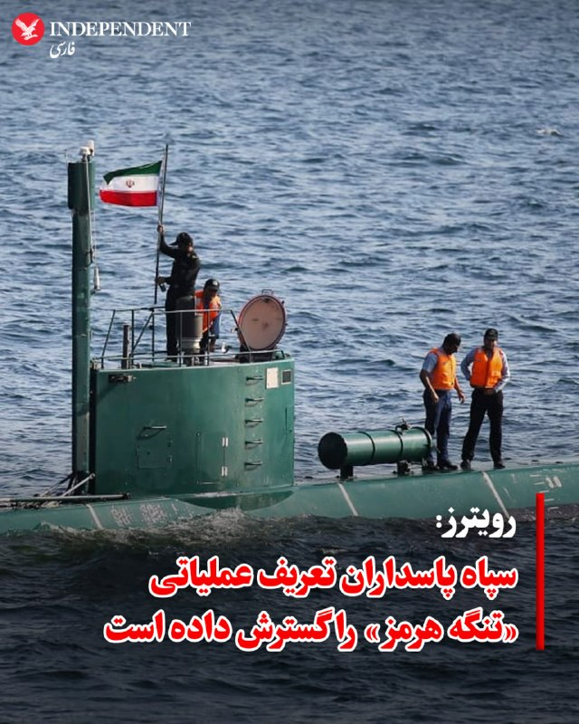

♦️ طبق گزارش خبرگزاری رویترز، یک مقام ارشد نیروی دریایی سپاه پاسداران انقلاب اسلامی اعلام کرد که ایران تعریف خود از تنگه هرمز را به یک «منطقه عملیاتی وسیع»، بسیار گسترده‌تر از دوران پیش از جنگ، تغییر داده است.

خبرگزاری دولتی فارس روز سه‌شنبه ۲۲ اردیبهشت، به نقل از محمد اکبرزاده، معاون سیاسی نیروی دریایی سپاه، گزارش داد که این تنگه دیگر تنها به عنوان یک آبراه باریک در اطراف چند جزیره شناخته نمی‌شود، بلکه دامنه و اهمیت نظامی آن به شدت افزایش یافته است.

اکبرزاده در این باره گفت: «در گذشته، تنگه هرمز به عنوان منطقه‌ای محدود در اطراف جزایری نظیر هرمز و هنگام تعریف می‌شد، اما امروز این دیدگاه تغییر کرده است.»

مقامات رسمی ایران هنوز به درخواست رویترز برای توضیح بیشتر در این زمینه پاسخی نداده‌اند.
‌🇸🇦 Indypersian

🤖 @VahidOOnLine

## mamlekate — post 103514

  

📞 الو یه سری قایق های تیز رو مال مردم جنوب هست که سالهاست دارن از خصب عمان کالا میارن (قایق های شوتی) توی این هفته گذشته تا الان دارم که پیام مینویسم پهپادهای آمریکایی چندتا از این قایق‌ها رو زدند ۱۰ تا ۱۲ نفر تلفات دادند. هر قایق دونفر سرنشین دارند یک ناخدا یک ملوان. این آگهی مربوط به یکی از این قایق‌هاست.

آمریکایی ها فکر می‌کنند اینا مال نیروی دریایی هستش. جمهوری اسلامی هم مهم نیست براش خوشحالم میشه تلفات غیرنظامی بره بالا.

@mamlekate

## IranIntlTV — post 336821

🔻آتش‌بس در آستانه فروپاشی؛ نعیم قاسم خلع سلاح حزب‌الله را رد و بر نبرد با اسرائیل تاکید کرد

هم‌زمان با ادامه درگیری‌های مرزی و عملیات ارتش اسرائیل در جنوب لبنان، نعیم قاسم، دبیرکل حزب‌الله، خلع سلاح این گروه را رد کرد و گفت آمریکا و اسرائیل به‌دنبال «سلطه بر لبنان» هستند.

قاسم سه‌شنبه ۲۲ اردیبهشت با انتشار بیانیه‌ای در آستانه مذاکرات دولت لبنان و اسرائیل، بر ادامه نبرد با اسرائیل تاکید کرد و گفت این گروه نیابتی جمهوری اسلامی خلع سلاح را نخواهد پذیرفت.

در این بیانیه کتبی آمده است: «هیچ‌کس خارج از لبنان هیچ ارتباطی با سلاح‌ها و مقاومت ندارد. این مساله داخلی لبنان است و بخشی از مذاکرات با دشمن نیست.»

قاسم خواستار توقف مذاکرات مستقیم میان دولت لبنان و اسرائیل شد و این گفت‌وگوها را «به سود اسرائیل و به معنای امتیازدهی رایگان از سوی دولت لبنان» توصیف کرد.

دبیرکل حزب‌الله با تاکید بر ضرورت انجام «مذاکرات غیرمستقیم» افزود توافق آتش‌بس میان جمهوری اسلامی و آمریکا که شامل «توقف تجاوز به لبنان» می‌شود، مهم‌ترین اهرم برای جلوگیری از حملات اسرائیل به شمار می‌رود.

قاسم همچنین تهدید کرد نیروهای حزب‌الله میدان نبرد را برای نظامیان اسرائیلی به «جهنم» تبدیل خواهند کرد.

نمایندگان اسرائیل و لبنان قرار است ۲۴ و ۲۵ اردیبهشت برای دور تازه مذاکرات در واشینگتن دیدار کنند.

شبکه کان اسرائیل پیش‌تر گزارش داد در این نشست، موضوع خلع سلاح حزب‌الله و ترسیم مرز میان دو کشور بررسی خواهد شد.

بر اساس این گزارش، حزب‌الله تسلیحاتش را پایه قدرت نظامی، راهبردی و سیاسی خود در لبنان می‌داند و به‌دلیل نگرانی از احتمال از دست دادن پشتیبانی حکومت ایران، به خلع سلاح تن نمی‌دهد.
تداوم آتش‌باری متقابل حزب‌الله و اسرائیل

تنش‌ها میان اسرائیل و حزب‌الله همچنان ادامه دارد و دو طرف یکدیگر را به نقض آتش‌بس متهم می‌کنند.

وب‌سایت تایمز اسرائیل ۲۲ اردیبهشت از حمله پهپادی حزب‌الله به نیروهای اسرائیلی مستقر در جنوب لبنان خبر داد.

بر اساس این گزارش، ارتش اسرائیل چند پهپاد انفجاری حزب‌الله را رهگیری و سرنگون کرد و این حملات تلفات یا خسارات جانی به همراه نداشت.

شب گذشته نیز حزب‌الله چند راکت به سوی نظامیان اسرائیلی در جنوب لبنان شلیک کرد.

این پرتابه‌ها در مناطق باز و غیرمسکونی فرود آمدند و خسارتی گزارش نشد.

در سوی دیگر، ارتش اسرائیل ۲۲ اردیبهشت اعلام کرد از زمان برقراری آتش‌بس، بیش از ۱۱۰۰ موضع حزب‌الله را هدف قرار داده و بیش از ۳۵۰ نفر از نیروهای این گروه نیابتی جمهوری اسلامی را در جنوب لبنان از پا درآورده است.

ارتش اسرائیل افزود حملات به ساختمان‌های نظامی، انبارهای سلاح و پرتابگرهای حزب‌الله ادامه دارد و عملیات طبق دستور مقام‌های سیاسی اسرائیل انجام می‌گیرد.

روزنامه هاآرتص پیش‌تر گزارش داده بود خلع سلاح حزب‌الله همچنان گره اصلی در مذاکرات میان لبنان و اسرائیل به شمار می‌رود.

مقام‌های جمهوری اسلامی، به‌عنوان پشتیبان اصلی حزب‌الله، تاکنون به‌طور جدی با خلع سلاح این گروه مخالفت کرده‌اند.

تامین مالی و تسلیحاتی گروه‌های نیابتی حکومت ایران در منطقه در شرایطی ادامه دارد که مردم ایران در سال‌های اخیر با مشکلات متعدد اقتصادی، از جمله تورم افسارگسیخته، افزایش نرخ ارز و بیکاری، دست‌به‌گریبان بوده‌اند.
عملیات ویژه ارتش اسرائیل با عبور از رود لیتانی

ارتش اسرائیل ۲۲ اردیبهشت اعلام کرد نیروهای این کشور به‌تازگی در جریان عملیاتی علیه حزب‌الله، از رودخانه لیتانی در حومه شهر زوطر الشرقیه در جنوب لبنان عبور کردند. منطقه‌ای که حدود ۱۰ کیلومتر با مرز اسرائیل فاصله دارد.

ارتش اسرائیل اعلام کرد نیروهای تیپ گولانی تحت فرماندهی لشکر ۳۶، عملیات ویژه «پاکسازی» در منطقه را به پایان رسانده و کنترل عملیاتی آن را به دست آورده‌اند.

بر اساس بیانیه ارتش اسرائیل، در جریان این عملیات، مواضع حزب‌الله، تونل‌ها و مسیرهای زیرزمینی، انبارهای تسلیحاتی و پرتابگرهای موشکی شناسایی و منهدم شد. همچنین نیروی هوایی اسرائیل بیش از ۱۰۰ هدف رزمی را «در حمایت از نیروهای مستقر در منطقه» مورد حمله قرار داد.

در جریان این عملیات «پاکسازی»، ده‌ها عضو مسلح حزب‌الله «در درگیری‌های رو در رو و با پشتیبانی هوایی» کشته شدند.

🔗وب‌سایت ایران‌اینترنشنال
@iranintltv

## IranIntlTV — post 336820

  <a href="telegram/content/IranIntlTV_336820_1778593459.mp4" target="_blank">🎬 Download video</a>

معاون وزیر خارجه نروژ، آندریاس کراویک، روز سه‌شنبه با عباس عراقچی، وزیر خارجه ایران، دیدار کرد. دو طرف در این دیدار درباره روابط دوجانبه و تحولات منطقه‌ای، از جمله حملات آمریکا و اسرائیل به ایران، گفت‌وگو کردند.
@iranintltv

## Shin_Persian — post 5966

📦 mhrv-rs v1.9.23 released

• Fix: stream range-parallel downloads larger than Apps Script's 50 MiB cap (#1042 + PR #1085).

Files (Android APKs, Windows, macOS, Linux, OpenWRT) on the files channel:

👉 v1.9.23 — all files with SHA-256

Channel:
https://t.me/mhrv_rs
or: https://t.me/+R1OyoHX2boA1ZDgx

#v1923

## ManotoTV — post 105352

  <a href="telegram/content/ManotoTV_105352_1778593460.mp4" target="_blank">🎬 Download video</a>

ابراهیم رضایی، سخنگوی کمیسیون امنیت ملی و سیاست خارجی مجلس شورای اسلامی در شبکه اکس تهدید کرده، غنی سازی ۹۰ درصد به عنوان یکی از گزینه‌های جمهوری‌اسلامی در صورت حمله مجدد، بررسی می‌شود.

## ManotoTV — post 105351

  <a href="telegram/content/ManotoTV_105351_1778593461.mp4" target="_blank">🎬 Download video</a>

متاثر از پیچیده‌تر شدن سرنوشت مذاکرات جمهوری‌اسلامی و آمریکا، قیمت جهانی نفت، بیش از ۳ درصد افزایش یافت.
بهای نفت برنت به حدود ۱۰۸ دلار و نفت وست‌تگزاس آمریکا به بیش از ۱۰۱ دلار در هر بشکه رسید. تحلیلگران می‌گویند رد پیشنهادهای دو طرف، نگرانی‌ها درباره اختلال در عرضه نفت را دوباره افزایش داده است.
مدیرعامل آرامکوی عربستان هشدار داد هرگونه اختلال در صادرات نفت از تنگه هرمز می‌تواند بازگشت ثبات به بازار را تا سال ۲۰۲۷ به تعویق بیندازد.
کارشناسان همچنین گفته‌اند در صورت توافق واقعی میان تهران و واشنگتن، قیمت نفت ممکن است ۸ تا ۱۲ دلار کاهش پیدا کند، اما تشدید تنش‌ها می‌تواند قیمت نفت برنت را دوباره به بالای ۱۱۵ دلار برساند.

## Persian_Trend_Official — post 13983

  <a href="telegram/content/Persian_Trend_Official_13983_1778593461.mp4" target="_blank">🎬 Download video</a>

🔴 رزمایش ضد هلی‌برن سپاه؛ بدون وجود پدافند هوایی

💢تصاویر منتشرشده از رزمایش «قائد شهید» سپاه تهران، استفاده از:
▪️ پهپادهای انتحاری
▪️ تک‌تیراندازها
▪️ مسلسل‌های سنگین سوار بر وانتتجاری
▪️ آرپی‌جی ۷
▪️ و توپ بدون لگد

را نشان می‌دهد.

💢اما یک سؤال مهم مطرح است:

اگر هدف رزمایش مقابله با عملیات هلی‌برن دشمن بوده، چرا تمرینی برای هدف‌گیری بالگردها و اهداف پروازی با موشک‌های دوش‌پرتاب دیده نمی‌شود؟

💢قاعدتاً جلوگیری از رسیدن و فرود دشمن، بسیار مؤثرتر از ورود به نبرد زمینی پس از پیاده‌سازی نیروهاست.

💢نکته مهم دیگر این است که ارتش آمریکا در صورت اجرای چنین عملیاتی، تنها از بالگرد ترابری استفاده نمی‌کند و عملیات معمولاً با:
▪️ پوشش هوایی
▪️ پهپادهای شناسایی
▪️ جنگ الکترونیک
▪️ و پشتیبانی آتش

همراه خواهد بود.

💢به همین دلیل برخی تحلیلگران معتقدند این رزمایش بیشتر بر درگیری زمینی پس از فرود دشمن تمرکز داشته تا مقابله کامل با یک عملیات هوابرد مدرن.

🫆:Tony

📌 @persian_trend_official
پرشین ترند | متفاوت‌ترین کانال نظامی

## Persian_Trend_Official — post 13982

  

سخنگوی كميسيون امنيت ملی مجلس: غنی‌سازی ۹۰ درصدی اورانیوم در مجلس بررسی خواهد شد.

☆Phantom☆

📌 @persian_trend_official
پرشین ترند | متفاوت‌ترین کانال نظامی

## RadioFarda — post 157093

رکوردشکنی شمار نویسندگان زندانی در جهان؛ ایران با ۵۳ نویسندهٔ زندانی در رده دوم

🔸انجمن قلم آمریکا در تازه‌ترین گزارش سالانهٔ خود دربارهٔ وضعیت آزادی بیان در جهان اعلام کرد شمار نویسندگان زندانی در سال ۲۰۲۵ برای نخستین بار از سال ۲۰۱۹ که این شاخص منتشر می‌شود، از مرز ۴۰۰ نفر عبور کرده است.

🔸این گزارش از افزایش چشمگیر بازداشت نویسندگان و فعالان فرهنگی در ایران نیز خبر می‌دهد.

🔸این گزارش که روز سه‌شنبه ۲۲ اردیبهشت منتشر شد، می‌گوید در سال ۲۰۲۵ میلادی در مجموع ۴۰۱ نویسنده در ۴۴ کشور زندانی بوده‌اند، در حالی‌که این رقم در سال پیش ۳۷۵ نفر در ۴۰ کشور بود.

🔸انجمن قلم آمریکا در شاخص «آزادی نوشتن» خود تأکید کرده است که طی هفت سال گذشته شمار نویسندگان زندانی در جهان ۶۸ درصد افزایش یافته و این روند نشان‌دهندهٔ تشدید مداوم سرکوب آزادی بیان و خاموش‌کردن صداهای منتقد در کشورهای مختلف است.

🔸بر اساس این گزارش، چین همچنان بزرگ‌ترین زندان نویسندگان در جهان است و با ۱۱۹ مورد در صدر فهرست قرار دارد. ایران با ۵۳ نویسندهٔ زندانی در رتبهٔ دوم ایستاده و به‌گفتۀ پن آمریکا، شدیدترین افزایش بازداشت‌ها در ایران طی سال گذشته رخ داده است.

🔸این سازمان می‌گوید مقام‌های جمهوری اسلامی در سال ۲۰۲۵ دست‌کم ۱۷ بازداشت تازه انجام دادند و شمار نویسندگان زندانی را بار دیگر به سطح دوران اعتراض‌های «زن، زندگی، آزادی» در سال ۱۴۰۱ نزدیک کرده‌اند.

🔸کارین دویچ کارلکار، مدیر برنامهٔ نویسندگان در معرض خطر در پن آمریکا، در این‌باره گفت مقام‌های جمهوری اسلامی در میان کشورهای جهان «کارزاری به‌ویژه خشن علیه صداهای مستقل» به راه انداخته‌اند.

🔸او افزود شاعران، مترجمان، پژوهشگران، ترانه‌سرایان، تحلیلگران آنلاین، مدافعان حقوق بشر و ستون‌نویسان همگی هدف بازداشت و سرکوب قرار گرفته‌اند، زیرا حکومت ایران در تلاش است «بحث و مخالفت» را خاموش کند.

🔸گزارش کامل را در وب‌سایت رادیوفردا بخوانید.

@RadioFarda

## BBCPersian — post 280849

  <a href="telegram/content/BBCPersian_280849_1778593464.mp4" target="_blank">🎬 Download video</a>

🔻سرخط خبرهای سه‌شنبه ۲۲ اردیبهشت ۱۴۰۵

## manototv — post 105352

  <a href="telegram/content/manototv_105352_1778593465.mp4" target="_blank">🎬 Download video</a>

ابراهیم رضایی، سخنگوی کمیسیون امنیت ملی و سیاست خارجی مجلس شورای اسلامی در شبکه اکس تهدید کرده، غنی سازی ۹۰ درصد به عنوان یکی از گزینه‌های جمهوری‌اسلامی در صورت حمله مجدد، بررسی می‌شود.

## manototv — post 105351

  <a href="telegram/content/manototv_105351_1778593466.mp4" target="_blank">🎬 Download video</a>

متاثر از پیچیده‌تر شدن سرنوشت مذاکرات جمهوری‌اسلامی و آمریکا، قیمت جهانی نفت، بیش از ۳ درصد افزایش یافت.
بهای نفت برنت به حدود ۱۰۸ دلار و نفت وست‌تگزاس آمریکا به بیش از ۱۰۱ دلار در هر بشکه رسید. تحلیلگران می‌گویند رد پیشنهادهای دو طرف، نگرانی‌ها درباره اختلال در عرضه نفت را دوباره افزایش داده است.
مدیرعامل آرامکوی عربستان هشدار داد هرگونه اختلال در صادرات نفت از تنگه هرمز می‌تواند بازگشت ثبات به بازار را تا سال ۲۰۲۷ به تعویق بیندازد.
کارشناسان همچنین گفته‌اند در صورت توافق واقعی میان تهران و واشنگتن، قیمت نفت ممکن است ۸ تا ۱۲ دلار کاهش پیدا کند، اما تشدید تنش‌ها می‌تواند قیمت نفت برنت را دوباره به بالای ۱۱۵ دلار برساند.

## alonews — post 119511

  <a href="telegram/content/alonews_119511_1778593466.webm" target="_blank">🎬 Download video</a>

👈عبور نفتکش قطری از تنگه هرمز

🔴در حالی که روز گذشته اعلام شده بود نفتکش قطری MIHZEM  توسط ایران از تنگه هرمز برگردانده شده است. این نفتکش دقایقی پیش موقعیت خود را در دریای عمان ثبت کرده و از مسیر تعیین شده ایران از تنگه هرمز عبور کرده است.

🔴دقایقی پیش بلومبرگ هم خبر عبور دومین نفتکش قطری که حامل گاز طبیعی قطر است از مسیر  تعیین شده ایران را تأیید کرد.

✅ @AloNews خبر جنگ

## alonews — post 119510

  <a href="telegram/content/alonews_119510_1778593467.webm" target="_blank">🎬 Download video</a>

👈ترامپ درباره «گرد و غبار هسته‌ای» ایران: ایرانی‌ها به من گفتند، «این مال تو خواهد بود.» اما بعد نظرشان را عوض کردند

✅ @AloNews خبر جنگ

## alonews — post 119509

  <a href="telegram/content/alonews_119509_1778593467.mp4" target="_blank">🎬 Download video</a>

👈هگست، وزیر جنگ آمریکا : ایران عملاً تلاش کرده از الگوی کره شمالی استفاده کنه؛

🔴یعنی با داشتن توانایی‌های نظامی متعارف بسیار زیاد، طوری قدرت‌نمایی کنه که کسی جرأت نکنه جلوش رو برای رفتن به سمت سلاح هسته‌ای بگیره

🔴ولی رئیس‌جمهور آمریکا ترامپ جاعت این تصمیم تاریخی رو داشته و حالا امیدواریم بتوانیم از طریق مذاکره‌های جاری، این موضوع رو به نتیجه نهایی برسانیم

✅ @AloNews خبر جنگ

---
📅 بروزرسانی: 1405/02/22 17:04
---

## VahidOOnLine — post 239708

  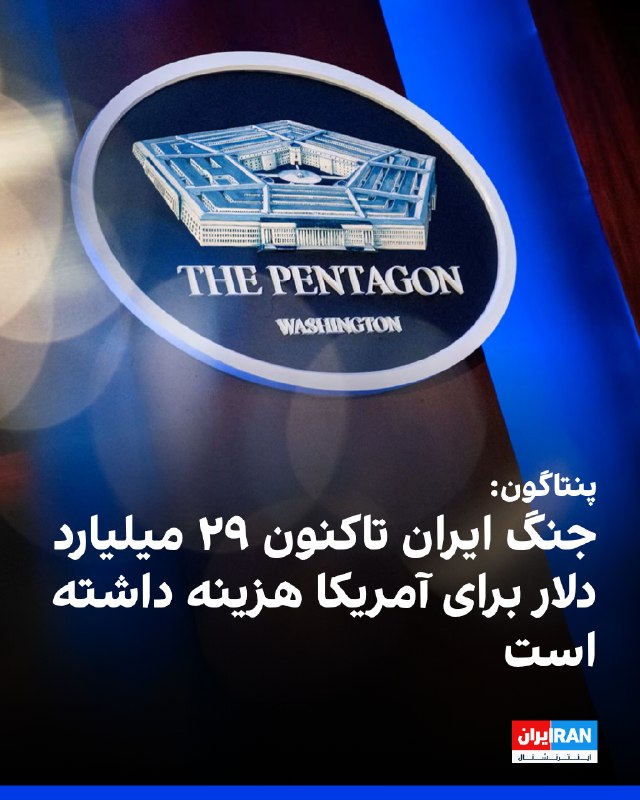

یک مقام ارشد پنتاگون سه‌شنبه اعلام کرد که جنگ آمریکا در ایران تاکنون ۲۹ میلیارد دلار هزینه داشته است؛ رقمی که نسبت به برآورد ارائه‌شده در اواخر ماه گذشته، چهار میلیارد دلار افزایش یافته است.

او افزود که این هزینه شامل تعمیر و جایگزینی به‌روزشده تجهیزات و هزینه‌های عملیاتی است.
‌🏁 🇬🇧 IranintlTV

🤖 @VahidOOnLine

## DEJradio — post 4591

  <a href="telegram/content/DEJradio_4591_1778592843.mp4" target="_blank">🎬 Download video</a>

🚨
🔸 افزایش شمار اعدام‌ها در جمهوری اسلامی؛ انتقام نظام از شهروندان؟

گفت‌وگو با سامان گنجی، زندانی سابق کهریزک

شمار اعدام‌ها در جمهوری اسلامی همچنان رو به افزایش است. اغلب این زندانیان به «ارتباط و همکاری با اسرائیل» و «محاربه» متهم شده‌اند. سامان گنجی، زندانی سیاسی جان‌به‌دربرده از کهریزک در سال ۱۳۸۸، در گفت‌وگو با «دژ» درباره هدف جمهوری اسلامی از اجرای فزاینده احکام اعدام در ایران توضیح می‌دهد.

#اعدام #جمهوری_اسلامی
@DEJradio

## mamlekate — post 103513

  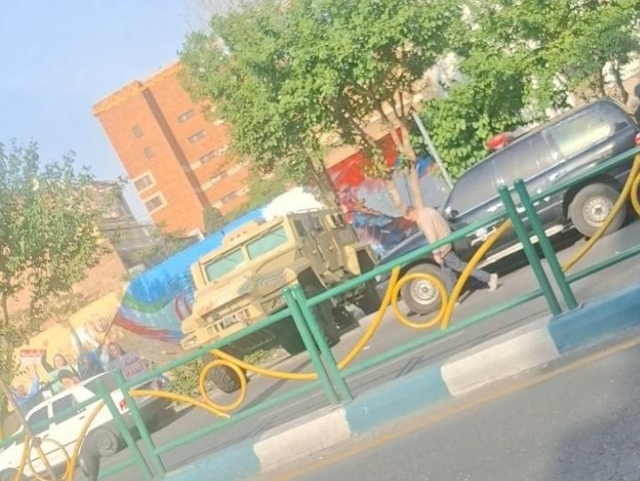

📞 تهران بالاتر از چهارراه ولیعصر ۲۲ اردیبهشت ساعت ۱۲ نفربر نوپو گذاشتن!

@mamlekate

## IranIntlTV — post 336819

  

یک مقام ارشد پنتاگون سه‌شنبه اعلام کرد که جنگ آمریکا در ایران تاکنون ۲۹ میلیارد دلار هزینه داشته است؛ رقمی که نسبت به برآورد ارائه‌شده در اواخر ماه گذشته، چهار میلیارد دلار افزایش یافته است.

او افزود که این هزینه شامل تعمیر و جایگزینی به‌روزشده تجهیزات و هزینه‌های عملیاتی است.
https://iranintl.com/202605121080

## FarsiVOA — post 217533

در میدان پرسیدیم: امروز قدرت سیاسی در ایران دست کیست؟ چه کسی ایران را اداره می‌کند؟ خامنه‌ای دوم که تا به حال نه دیده و نه شنیده شده؟ سپاه پاسداران؟ مجموعه‌ای از حلقه‌ها و چهره‌های واسط یا هر کس که زورش بر دیگران می‌چربد؟

## Persian_Trend_Official — post 13981

  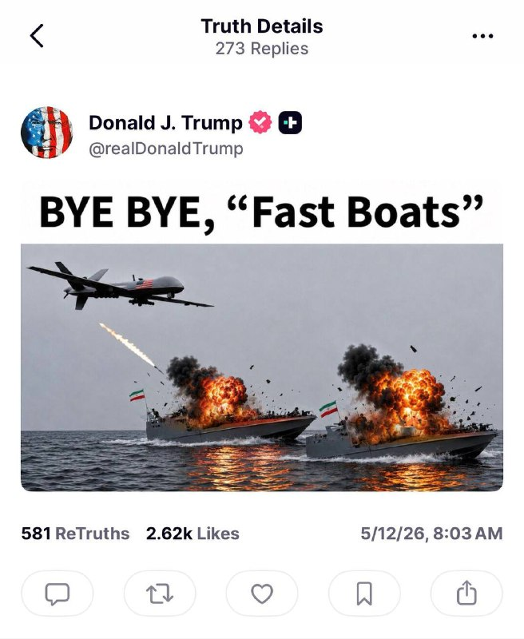

🚨🇺🇸🇮🇷 آخرین مقاومت سپاه پاسداران: این قایق‌ها تنها چیزی بود که برایشان باقی مانده بود.

☆Phantom☆

📌 @persian_trend_official
پرشین ترند | متفاوت‌ترین کانال نظامی

## alonews — post 119508

  <a href="telegram/content/alonews_119508_1778592847.webm" target="_blank">🎬 Download video</a>

👈 ترامپ: آمریکا در تماس مستقیم با مقامات ایرانی است و عجله ای برای رسیدن به توافق نداریم

✅ @AloNews خبر جنگ

## alonews — post 119507

  <a href="telegram/content/alonews_119507_1778592847.webm" target="_blank">🎬 Download video</a>

👈ترامپ: ما انتظار داریم اقتصاد ایران تحت فشار ناشی از محاصره بنادرش فرو بپاشد.

🔴این مناقشه بدون نیاز به عجله حل خواهد شد و ایران با انزوایی روبرو است که آن را از منابع درآمدی محروم می‌کند.

✅ @AloNews خبر جنگ

## alonews — post 119506

  <a href="telegram/content/alonews_119506_1778592847.mp4" target="_blank">🎬 Download video</a>

👈پیت هگست درباره ایران: ما پیروزیم؛ در هر بخش از این درگیری که جنگیدیم، پیروز شده‌ایم.

🔴ایران می‌داند که بر اساس تخریب فوق‌العاده توانایی‌هایشان، به همین دلیل دیدیم که آنها می‌خواستند به میز مذاکره بیایند.

🔴چگونگی حل این موضوع بر اساس شرایط ما و شرایط رئیس‌جمهور ترامپ خواهد بود و ما تمام مهمات و توانایی‌های لازم برای تحقق این امر را داریم

✅ @AloNews خبر جنگ

## alonews — post 119505

  <a href="telegram/content/alonews_119505_1778592849.webm" target="_blank">🎬 Download video</a>

👈وزیر جنگ آمریکا: ما مهمات و قابلیت‌های کافی برای تضمین دستیابی به آنچه می‌خواهیم در ایران به دست آوریم، داریم.

🔴وزارت جنگ در آمادگی کامل است و در صورت لزوم آماده اقدام علیه ایران است

✅ @AloNews خبر جنگ

---
📅 بروزرسانی: 1405/02/22 16:54
---

## VahidOOnLine — post 239707

♦️مایک هاکبی، سفیر آمریکا در اسرائیل، روز سه‌شنبه ۲۲ اردیبهشت در یک کنفرانس در دانشگاه تل‌آویو گفت کشورهای خلیج فارس حالا فهمیده‌اند که باید انتخاب کنند؛ احتمال حمله از سوی ایران بیشتر است یا اسرائیل.

او با اشاره به حملات جمهوری اسلامی به کشورهای خلیج فارس گفت این کشورها باید به این موضوع فکر کنند که «اسرائیل به ما کمک کرد، اما ایران به ما حمله کرد.» هاکبی همچنین گفت اسرائیل دشمن طبیعی کشورهای منطقه نیست و به‌دنبال نابودی آن‌ها یا حمله به مناطق غیرنظامی نیست.

سفیر آمریکا در اسرائیل تاکید کرد: «یک طرف آمریکا و اسرائیل هستند و طرف دیگر جمهوری اسلامی و افراط‌گرایی شیعه.»
‌🇸🇦 Indypersian

🤖 @VahidOOnLine

## VahidOOnLine — post 239706

یک شهروند ساکن اصفهان در پیامی به ایران‌اینترنشنال گفت پس از آنکه بانک از او خواست وام سه‌ساله‌اش را به‌صورت فوری تسویه کند، مجبور شده کارگاه خیاطی کوچک خود را تعطیل کند. او می‌گوید برای بازپرداخت وام، وسایل کارگاه را فروخته و حالا خودش و شش زن دیگری که در آنجا کار می‌کردند بیکار شده‌اند. پیام این شهروند با هوش مصنوعی خوانده شده است.
‌🏁 🇬🇧 IranintlTV

🤖 @VahidOOnLine

## IranIntlTV — post 336818

یک شهروند ساکن اصفهان در پیامی به ایران‌اینترنشنال گفت پس از آنکه بانک از او خواست وام سه‌ساله‌اش را به‌صورت فوری تسویه کند، مجبور شده کارگاه خیاطی کوچک خود را تعطیل کند. او می‌گوید برای بازپرداخت وام، وسایل کارگاه را فروخته و حالا خودش و شش زن دیگری که در آنجا کار می‌کردند بیکار شده‌اند. پیام این شهروند با هوش مصنوعی خوانده شده است.

## FarsiVOA — post 217532

  <a href="telegram/content/FarsiVOA_217532_1778592265.mp4" target="_blank">🎬 Download video</a>

ارتش اسرائیل اعلام کرد از ابتدای آتش‌بس نیروی هوایی به بیش از ۱۱۰۰ هدف متعلق به حزب‌الله حمله کرده و بیش از ۳۵۰ تروریست را در جنوب لبنان از پای درآورده است.

اهداف مورد حمله شامل ساختمان‌هایی که برای اهداف نظامی حزب‌الله استفاده می‌شدند، انبارهای سلاح، پرتابگرهای آماده و مسلح به موشک و زیرساخت‌های دیگر اعلام شده است.

## DW_Farsi — post 124612

🔶 تشکیل دادگاه نظامی در اسرائیل برای عاملان حمله هفت اکتبر

پارلمان اسرائیل شامگاه دوشنبه ۱۱ مه (۲۱ اردیبهشت) قانونی را تصویب کرد که بر اساس آن، یک دادگاه نظامی ویژه تشکیل خواهد شد تا صدها جنگجوی فلسطینی، به دلیل مشارکت در حمله تروریستی هفتم اکتبر ۲۰۲۳، در آن محاکمه شوند.

این قانون جدید با اکثریت ۹۳ رأی موافق، از مجموع ۱۲۰ نماینده کنست، تصویب شد. این طرح از سوی نمایندگانی از هر دو جناح ائتلاف حاکم و اپوزیسیون ارائه شده بود. نمایندگان پارلمان گفتند که این اقدام به التیام "ضربه روحی ملی" ناشی از آن حمله کمک خواهد کرد.

هدف این قانون آن است که تمامی مهاجمان ۷ اکتبر، بر اساس قوانین کیفری موجود اسرائیل، به اتهام‌هایی چون "جنایت علیه ملت یهود"، "جنایت علیه بشریت" و "جنایت جنگی" تحت پیگرد قرار گیرند.

به گفته اسرائیل، در حمله غافلگیرانه نیروهای موسوم به "نخبه" حماس در هفتم اکتبر ۲۰۲۳، دست‌کم ۱۲۰۰ نفر کشته شدند که بیشتر آنها غیرنظامی بودند. مهاجمان همچنین ۲۵۱ گروگان را به نوار غزه منتقل کردند. این روز، مرگبارترین روز تاریخ اسرائیل و شدیدترین حمله علیه یهودیان از زمان هولوکاست تاکنون توصیف شده است.

@dw_farsi

## Persian_Trend_Official — post 13979

  <a href="telegram/content/Persian_Trend_Official_13979_1778592266.webm" target="_blank">🎬 Download video</a>

اگر اینترنت غزه، اوکراین یا هرجایی که حمایت از آن برای حامی‌نماهای حقوق بشر "ویترین اخلاقی" داشته باشد فقط ۷ روز قطع میشد، دنیا را روی سرشان خراب می‌کردند؛ اما اینترنت ایران ۷۴ روز است عملاً قطع شده و آب از آب تکان نخورده است.

فکر می‌کنید اتفاق خاصی افتاده؟ خیر.
ضریب دسترسی واقعی به اینترنت آزاد در ایران به گواه نت‌بلاکس به حدود ۲ درصد رسیده؛ میلیون‌ها انسان نه ۷ روز، بلکه ۷۴ روز عملاً در یک زندان دیجیتال گروگان گرفته شده‌اند و همزمان که جمهوری اسلامی در پشت پرده به سرکوب، بازداشت و اعدام مشغول است، آشغالی به نام "اینترنت پرو" را به‌عنوان راه‌حل به مردم می‌فروشد، که عقیم‌سازی عمدی دسترسی آزاد به اطلاعات و نقض آشکار حقوق انسانی و حریم خصوصی شهروندان است.

ظاهراً برای جهان مدعی آزادی، فقط آن دسته از رنج‌هایی دیده می‌شوند که موضع‌گیری برایش هزینه‌ای نداشته باشد، یا چشم‌های مردمانش رنگی باشد.

📝 Nick

📌 @persian_trend_official
پرشین ترند | متفاوت‌ترین کانال نظامی

## Persian_Trend_Official — post 13978

💢خلاصه اخرین تحولات مهم

▪️دونالد ترامپ، رئیس‌جمهور آمریکا، اعلام کرد آتش‌بس با ایران «روی دستگاه حفظ حیات» قرار دارد و پیشنهاد اخیر تهران برای پایان جنگ را «کاملاً غیرقابل قبول» و «مزخرف» توصیف کرد.

▪️ قطر ایران را متهم کرد که از تنگه هرمز به‌عنوان ابزار فشار و «باج‌گیری» علیه کشورهای خلیج فارس استفاده می‌کند؛ در حالی که صادرات انرژی و کالاها همچنان با اختلال مواجه است

▪️ محمدباقر قالیباف، رئیس مجلس ایران، گفت تهران برای پاسخ به «هرگونه تجاوز» آماده است و واکنش ایران آمریکا را «غافلگیر» خواهد کرد

▪️ اتحادیه اروپا با اعمال تحریم‌های جدید علیه شهرک‌نشینان اسرائیلی به‌دلیل خشونت علیه فلسطینیان در کرانه باختری موافقت کرد؛ اقدامی که نتانیاهو گفته «موفق نخواهد شد»

▪️ شمار قربانیان جنگ غزه به ۷۲ هزار و ۷۴۰ نفر رسیده است

▪️ لبنان نیز اعلام کرد حملات اسرائیل از دوم مارس تاکنون ۲۸۶۹ کشته در این کشور برجای گذاشته است

🫆:Tony

📌 @persian_trend_official
پرشین ترند | متفاوت‌ترین کانال نظامی

## Persian_Trend_Official — post 13977

  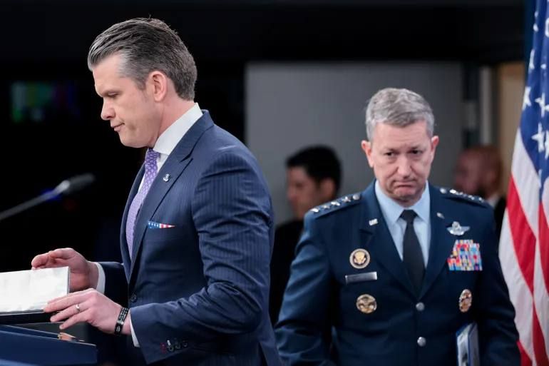

🔴 وزیر جنگ آمریکا درباره جنگ با ایران در کنگره بازخواست می‌شود

«پیت هگست» وزیر جنگ آمریکا قرار است در دور تازه‌ای از جلسات کنگره، درباره جنگ آمریکا و اسرائیل با ایران مورد پرسش نمایندگان قرار گیرد.

بر اساس گزارش‌ها:

▪️ برخی نمایندگان جمهوری‌خواه نیز نسبت به طولانی‌شدن جنگ و نبود مجوز رسمی کنگره ابراز نگرانی کرده‌اند
▪️ کمیته‌های بودجه دفاعی مجلس نمایندگان و سنا نشست‌هایی برای بررسی بودجه نظامی سال ۲۰۲۷ برگزار می‌کنند
▪️ دولت ترامپ بودجه‌ای تاریخی به ارزش ۱.۵ تریلیون دلار برای بخش دفاعی پیشنهاد داده است

گزارش‌ها حاکی است محور اصلی بحث‌ها علاوه بر بودجه، نحوه مدیریت جنگ با ایران خواهد بود؛ جنگی که به‌گفته رسانه‌های آمریکایی وارد وضعیت فرسایشی شده است.

همچنین انتظار می‌رود:

▪️ وزیر جنگ آمریکا و رئیس ستاد مشترک ارتش بر نیاز به افزایش پهپادها
ناوهای جنگی
سامانه‌های رهگیر موشکی
تأکید کنند؛ زیرا ذخایر این تجهیزات در جریان درگیری با ایران کاهش یافته است.

🫆:Tony

📌 @persian_trend_official
پرشین ترند | متفاوت‌ترین کانال نظامی

## RadioFarda — post 157092

🔸رسانه‌های ایران روز سه‌شنبه ۲۲ اردیبهشت مدعی شدند که هیئت‌های نمایندگی جمهوری اسلامی و عمان در مسقط دیدار کردند و «آخرین تحولات مربوط به تنگه هرمز و ترتیبات مربوط به عبور ایمن کشتی‌ها» را مورد بررسی قرار دادند. 🔸بر اساس این گزارش، عباس باقرپور مدیرکل حقوقی…

## RadioFarda — post 157091

  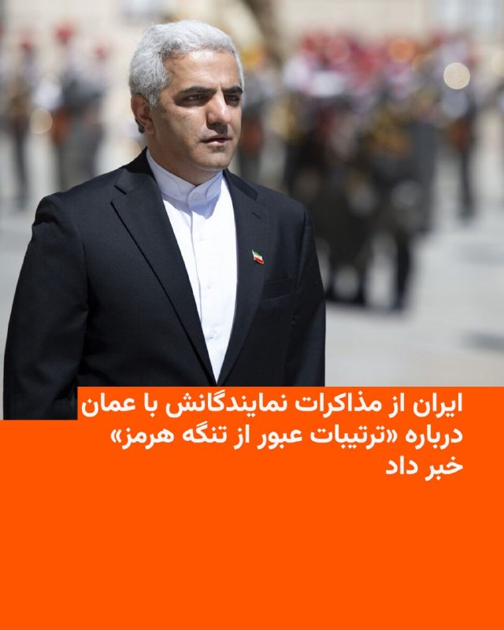

🔸رسانه‌های ایران روز سه‌شنبه ۲۲ اردیبهشت مدعی شدند که هیئت‌های نمایندگی جمهوری اسلامی و عمان در مسقط دیدار کردند و «آخرین تحولات مربوط به تنگه هرمز و ترتیبات مربوط به عبور ایمن کشتی‌ها» را مورد بررسی قرار دادند.

🔸بر اساس این گزارش، عباس باقرپور مدیرکل حقوقی بین‌المللی وزارت خارجه، ریاست هیئت نمایندگی ایران را برعهده داشت و «نمایندگان دستگاه‌های ذیربط» جمهوری اسلامی نیز در آن حضور داشتند.

🔸به ادعای این رسانه‌ها، «دو طرف بر حقوق و صلاحیت‌های حاکمیتی خود بر این تنگه به عنوان بخشی از آب‌های سرزمینی ایران و عمان تأکید کردند».

🔸تنگه هرمز از ۹ اسفند پارسال که آمریکا و اسرائیل به ایران حمله کردند، از سوی سپاه پاسداران عملاً مسدود شده است؛ آبراهی حیاتی که حدود ۲۰ درصد از نفت و گاز جهان از این مسیر عبور می‌کند.

@RadioFarda

## BBCPersian — post 280848

🔻نیروی دریایی سپاه: محدوده تنگه هرمز را از ۲۰ مایل، به بیش از ۲۰۰ مایل گسترش دادیم

معاون سیاسی نیروی دریایی سپاه پاسداران می‌گوید که ایران پس از جنگ اخیر با آمریکا و اسرائیل، محدوده تنگه هرمز را «به‌طور قابل‌توجهی» گسترش داده است.

محمد اکبرزاده به تلویزیون ایران گفت که این محدوده اکنون «از سواحل جاسک و سیری تا فراتر از جزایر تنب بزرگ، به‌عنوان یک پهنه راهبردی تعریف شده است؛ به‌عبارت دیگر، تنگه هرمز بزرگ‌تر شده و به یک منطقه وسیع عملیاتی تبدیل شده است.»

به گفته معاون سیاسی نیروی دریایی سپاه، محدوده تنگه هرمز از نظر وسعت «از ۲۰ الی ۳۰ مایل در گذشته به بیش از ۲۰۰ الی ۳۰۰ مایل، یعنی ۵۰۰ کیلومتر» گسترش پیدا کرده است.

محمد اکبرزاده گفت: «در یکی از موارد اخیر، یک ناوچه آمریکایی قصد عبور از این محدوده را داشت که با رصد دقیق نیروهای مسلح مواجه شد و پس از مشاهده برخی رفتارهای تحریک‌آمیز، نیروی دریایی ارتش با شلیک‌های هشداردهنده و هدفمند، پیام لازم را منتقل کرد و این شناور نیز بلافاصله مسیر خود را تغییر داد.»

https://bbc.in/4drNww2
@BBCPersian

## Dirty_Kids — post 389315

اسراییل تو خاک عراق پایگاه مخفی زده
باند فرودگاه ساخته
ارتش آورده
ماشین آلات و‌ تجهیزات آورده
چند سال اونجا فعالیت کرده

پارسال به خاطر بارندگی‌ محبور شده پایگاه مخفی رو رها کنه

تازه امسال فهمیدن 😂😂😂

همینجوری روز عاشورا شکست خودناااا

@Dirty_Kids 👻

## alonews — post 119504

  <a href="telegram/content/alonews_119504_1778592268.mp4" target="_blank">🎬 Download video</a>

👈مجری : واقعاً فکر می‌کنی می‌تونی ایران رو از غنی‌سازی اورانیوم و در نهایت ساخت سلاح هسته‌ای متوقف کنی؟

🔴 ترامپ : ۱۰۰٪. اونا قراره متوقف کنن خودشون به من گفتن،ایرانی‌ها گفتن ما قراره تحویل بدیم.

✅ @AloNews خبر جنگ

## alonews — post 119503

  <a href="telegram/content/alonews_119503_1778592270.webm" target="_blank">🎬 Download video</a>

👈مقام پنتاگون : جنگ با ایران ۲۹ میلیارد دلار هزینه داشته

✅ @AloNews خبر جنگ

---
📅 بروزرسانی: 1405/02/22 16:44
---

## VahidOOnLine — post 239705

  <a href="telegram/content/VahidOOnLine_239705_1778591651.mp4" target="_blank">🎬 Download video</a>

دونالد ترامپ در پیامی در شبکه اجتماعی تروث سوشال گفت کوبا از آمریکا درخواست کمک کرده و واشینگتن با هاوانا گفت‌وگو خواهد کرد.

ترامپ در این پیام نوشت هیچ جمهوری‌خواهی تاکنون درباره کوبا با او صحبت نکرده و این کشور را «شکست‌خورده» توصیف کرد که به گفته او تنها در مسیر «سقوط» حرکت می‌کند.

او افزود: «کوبا درخواست کمک کرده و ما گفت‌وگو خواهیم کرد.» ترامپ در پایان این پیام نوشت همزمان عازم چین است.
‌🏁 🇬🇧 ManotoTV

🤖 @VahidOOnLine

## VahidOOnLine — post 239704

  <a href="telegram/content/VahidOOnLine_239704_1778591651.mp4" target="_blank">🎬 Download video</a>

«حکومت بقای خود را در طناب دار می‌بیند»
‌🏁 🇬🇧 ManotoTV

🤖 @VahidOOnLine

## VahidOOnLine — post 239703

  <a href="telegram/content/VahidOOnLine_239703_1778591653.mp4" target="_blank">🎬 Download video</a>

مارک روته، دبیرکل ناتو، اعلام کرد موضوع جمهوری‌اسلامی و نحوه کمک کشورهای اروپایی برای مدیریت وضعیت تنگه هرمز، محور اصلی گفت‌وگوهای کنونی این ائتلاف است.
روته در نشست خبری در مونته‌نگرو گفت کشورهای عضو در حال بررسی راه‌هایی هستند تا متحدان اروپایی بتوانند در شرایط مرتبط با تنگه هرمز کمک کنند.
او با اشاره به افزایش بودجه دفاعی کشورهای اروپایی و کانادا، تأکید کرد نسبت به آینده ناتو «بسیار خوش‌بین» است.
‌🏁 🇬🇧 ManotoTV

🤖 @VahidOOnLine

## VahidOOnLine — post 239702

  <a href="telegram/content/VahidOOnLine_239702_1778591653.mp4" target="_blank">🎬 Download video</a>

دکتر حمید گیلوری فعال سیاسی و عضو حزب ایران نوین در گردهمایی ایرانیان روبروی دادگاه لاهه در هلند گفت: «اروپا نباید با جمهوری اسلامی مماشات کند».
‌🏁 🇬🇧 ManotoTV

🤖 @VahidOOnLine

## VahidOOnLine — post 239701

  <a href="telegram/content/VahidOOnLine_239701_1778591655.mp4" target="_blank">🎬 Download video</a>

وزارت خارجه امارات متحده عربی در بیانیه‌ای نفوذ اعضایی از سپاه از سوی نیروی دریایی جمهوری اسلامی به جزیره بوبیان کویت را محکوم کرد و آن را اقدامی در چارچوب «طرحی تروریستی» برای انجام عملیات خصمانه خواند.

در این بیانیه آمده است شیخ عبدالله بن زاید آل نهیان، وزیر خارجه امارات، در پیامی به عبدالله علی الیحیا، وزیر خارجه کویت، همبستگی کامل ابوظبی را با کویت اعلام کرده است.

بوبیان دومین جزیره بزرگ خلیج فارس بعد از جزیره قشم است.
‌🏁 🇬🇧 ManotoTV

🤖 @VahidOOnLine

## VahidOOnLine — post 239700

  <a href="telegram/content/VahidOOnLine_239700_1778591655.mp4" target="_blank">🎬 Download video</a>

دولت بریتانیا اعلام کرد از آوریل ۲۰۲۶، میزان کمک‌هزینه هفتگی برای «همسران اضافی» در ازدواج‌های چندهمسریِ ثبت‌شده در خارج از کشور، به ۱۲۵ پوند و ۲۵ پنس افزایش یافته است.
این مبلغ نسبت به سال گذشته ۴.۸ درصد افزایش داشته و شامل افرادی می‌شود که به سن بازنشستگی رسیده و از مزایایی مانند «پنشـن کردیت» یا کمک‌هزینه مسکن استفاده می‌کنند.
چندهمسری در بریتانیا غیرقانونی است، اما برخی ازدواج‌های چندهمسری که به‌طور قانونی در خارج از کشور ثبت شده‌اند، برای دریافت بعضی مزایای رفاهی به رسمیت شناخته می‌شوند.
دولت بریتانیا تأکید کرده «یونیورسال کردیت» شامل این نوع خانوارها نمی‌شود و قوانین مهاجرتی نیز اجازه حمایت برای ورود همسر دوم را نمی‌دهد، اگر ازدواج اول همچنان پابرجا باشد.
‌🏁 🇬🇧 ManotoTV

🤖 @VahidOOnLine

## VahidOOnLine — post 239699

  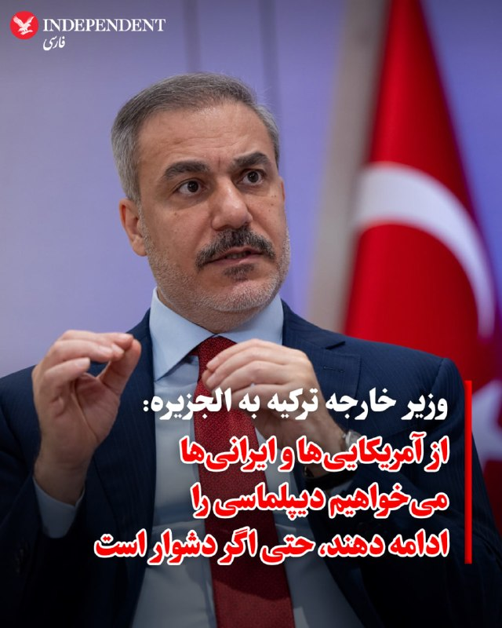

♦️ هاکان فیدان، وزیر امور خارجه ترکیه، روز سه‌شنبه ۲۲ اردیبهشت، در گفتگو با شبکه الجزیره بر ضرورت ادامه مسیر دیپلماسی میان جمهوری اسلامی و آمریکا تاکید کرد و گفت پیام آنکارا به هر دو طرف، تداوم دیپلماسی و گفتگو حتی در شرایط دشوار کنونی است. فیدان بار دیگر حمایت کامل ترکیه را از تلاش‌های میانجی‌گرانه پاکستان برای پایان دادن به جنگ ایالات متحده و اسرائیل علیه ایران اعلام کرد.

وزیر خارجه ترکیه با «وخیم» توصیف کردن تاثیر بحران تنگه هرمز بر جهان، بر لزوم توقف فوری درگیری‌ها تاکید کرد. او همچنین با محکوم کردن سیاست‌های توسعه‌طلبانه اسرائیل در غزه و لبنان، نسبت به پیامدهای ویرانگر این اقدامات بر زندگی غیرنظامیان هشدار داد. ترکیه معتقد است تنها راه خروج از بحران فعلی، بازگشت به میز مذاکره و جلوگیری از گسترش بیشتر آتش جنگ در منطقه است.
‌🇸🇦 Indypersian

🤖 @VahidOOnLine

## FoxNewsTwitter — post 341582

  <a href="telegram/content/FoxNewsTwitter_341582_1778591656.mp4" target="_blank">🎬 Download video</a>

Fox News (Twitter/X)

NEW: "President Trump's War Department has begun to turn the lights back on in manufacturing towns across this country."

Secretary Pete Hegseth touting a push to steer federal agencies toward buying American and investing in domestic manufacturing:

"We are firing up the American economic engine at every level of the defense industrial base."

"This is admittedly a historic budget. It is a fiscally responsible budget, and it is a warfighting budget."

## pm_afshaa — post 90624

  <a href="telegram/content/pm_afshaa_90624_1778591658.webm" target="_blank">🎬 Download video</a>

🔴هگست، وزیر جنگ آمریکا:
به دلیل حساسیت عملیاتی که رئیس‌جمهور ترامپ بر عهده داره و همچنین برای اطمینان از عدم دستیابی ایران به بمب هسته‌ای، گام بعدی خود علیه این کشور رو فاش نخواهیم کرد.

💧 Rainbet.com the #1 Non-KYC Crypto Casino & Sportsbook @rainbetcom

😁 @Pm_Afshaa

## VahidOnline — post 75430

  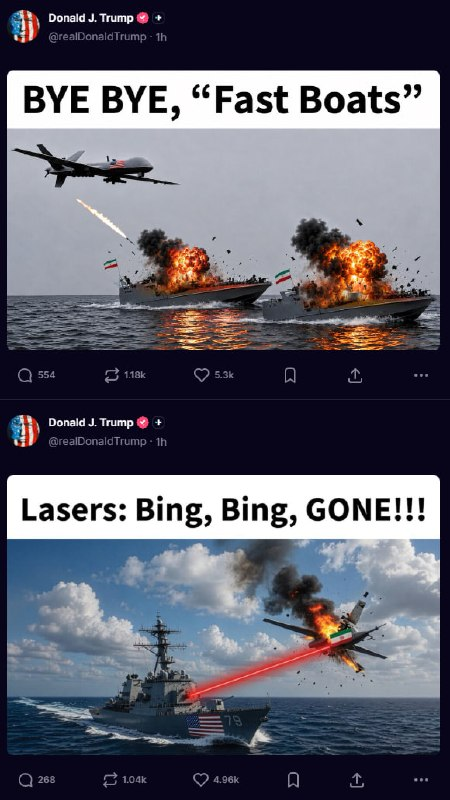

دونالد ترامپ، رییس‌جمهوری آمریکا، روز سه‌شنبه در تروث سوشال دو تصویر گرافیکی منتشر کرد که صحنه‌هایی از حمله به پهپادها و قایق‌های جمهوری اسلامی را نشان می‌دهد.

در یکی از این تصاویر، یک ناو آمریکایی با استفاده از سلاح لیزری یک پهپاد جمهوری اسلامی را هدف قرار داده و نابود می‌کند. در تصویر دیگر، یک پهپاد آمریکایی دو قایق جمهوری اسلامی را هدف قرار داده و منهدم می‌کند.
@VahidOOnLine

📡 @VahidOnline

## VahidOnline — post 75429

  <a href="telegram/content/VahidOnline_75429_1778591658.mp4" target="_blank">🎬 Download video</a>

نشست خبری سخنگوی دولت مسعود پزشکیان روز سه‌شنبه ۲۲ اردیبهشت به دلیل وضعیت اینترنت به بگومگوی خبرنگاران با فاطمه مهاجرانی منجر شد.
سخنگوی دولت تاکید کرد که «اینترنت پرو» با مصوبه شورای عالی امنیت ملی که ریاست آن را مسعود پزشکیان بر عهده دارد،‌ مورد استفاده قرار می‌گیرد.
او در عین حال تاکید کرد که این اینترنت ویژه کسب و کارها است. [در حالیکه خیلی از مردم بدون کسب و کار هم پیامک گرفتند بیاید پرو بخرید]
@VahidHeadline
فاطمه مهاجرانی گفت با توجه به وضعیت جنگی، فعلا اینترنت عمومی وصل نخواهد شد.
مهاجرانی در پاسخ به پرسش‌های متعدد خبرنگاران درباره وضعیت اینترنت و به‌ویژه «اینترنت پرو» گفت ما در وضعیت جنگی هستیم. رئیس جمهوری به‌عنوان رئیس شورای عالی امنیت ملی پیگیر حقوق مردم است اما وضعیت جنگی است و بعد از پایان شرایط ویژه، اینترنت به‌حالت قبل بازخواهد گشت.»
پس از این سخنان، چند خبرنگار تلاش کردند تا با یادآوری تعهدات دولت پیگیر وضعیت وصل اینترنت شوند. مهاجرانی خطاب به آن‌ها گفت: «وقتی رئیس جمهوری آمریکا می‌گوید آتش‌بس به تنفس مصنوعی وصل است، انتظار شما چیست؟»
@VahidOOnLine
فاطمه مهاجرانی، سخنگوی دولت جمهوری اسلامی، با اشاره به قطعی طولانی‌مدت اینترنت در ایران گفت اینترنت حق مردم است و عصبانیت مردم کاملا درست است. اما در ادامه تاکید کرد: «عامل این عصبانیت دشمنانی هستند که باعث می‌شوند فضای امنیتی ما مخدوش شود.»
او افزود: «رسانه‌ها کمک کنند که این ادبیات را جا بیندازند. دولت طرفدار دسترسی آزاد است.»
@VahidOOnLine

📡 @VahidOnline

## VahidOnline — post 75428

  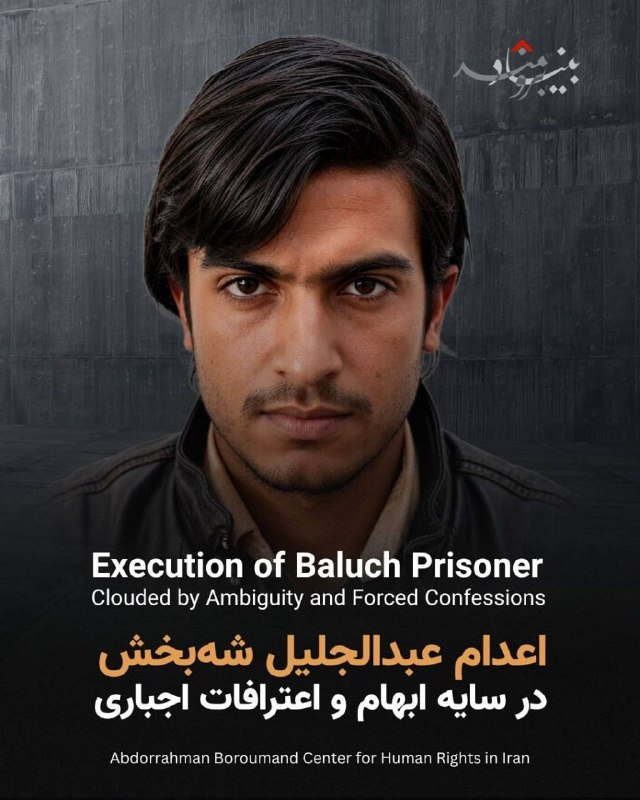

قوه قضائیه از اجرای حکم اعدام یک زندانی دیگر به نام عبدالجلیل شه‌بخش در بامداد سه‌شنبه ۲۲ اردیبهشت خبر داد.

ارگان رسمی نهاد قضایی ایران، شه‌بخش را «تروریست آموزش‌دیده» گروه «انصارالفرقان» معرفی کرده است.

از زمان حملات آمریکا و اسرائیل به ایران، جمهوری اسلامی اجرای احکام اعدام را افزایش داده است و در برخی روزها چند نفر را اعدام کرده است.
@VahidHeadline

📡 @VahidOnline

## ManotoTV — post 105350

  <a href="telegram/content/ManotoTV_105350_1778591659.mp4" target="_blank">🎬 Download video</a>

دونالد ترامپ در پیامی در شبکه اجتماعی تروث سوشال گفت کوبا از آمریکا درخواست کمک کرده و واشینگتن با هاوانا گفت‌وگو خواهد کرد.

ترامپ در این پیام نوشت هیچ جمهوری‌خواهی تاکنون درباره کوبا با او صحبت نکرده و این کشور را «شکست‌خورده» توصیف کرد که به گفته او تنها در مسیر «سقوط» حرکت می‌کند.

او افزود: «کوبا درخواست کمک کرده و ما گفت‌وگو خواهیم کرد.» ترامپ در پایان این پیام نوشت همزمان عازم چین است.

## ManotoTV — post 105349

  <a href="telegram/content/ManotoTV_105349_1778591660.mp4" target="_blank">🎬 Download video</a>

«حکومت بقای خود را در طناب دار می‌بیند»

## ManotoTV — post 105348

  <a href="telegram/content/ManotoTV_105348_1778591661.mp4" target="_blank">🎬 Download video</a>

مارک روته، دبیرکل ناتو، اعلام کرد موضوع جمهوری‌اسلامی و نحوه کمک کشورهای اروپایی برای مدیریت وضعیت تنگه هرمز، محور اصلی گفت‌وگوهای کنونی این ائتلاف است.
روته در نشست خبری در مونته‌نگرو گفت کشورهای عضو در حال بررسی راه‌هایی هستند تا متحدان اروپایی بتوانند در شرایط مرتبط با تنگه هرمز کمک کنند.
او با اشاره به افزایش بودجه دفاعی کشورهای اروپایی و کانادا، تأکید کرد نسبت به آینده ناتو «بسیار خوش‌بین» است.

## ManotoTV — post 105347

  <a href="telegram/content/ManotoTV_105347_1778591662.mp4" target="_blank">🎬 Download video</a>

دکتر حمید گیلوری فعال سیاسی و عضو حزب ایران نوین در گردهمایی ایرانیان روبروی دادگاه لاهه در هلند گفت: «اروپا نباید با جمهوری اسلامی مماشات کند».

## ManotoTV — post 105346

  <a href="telegram/content/ManotoTV_105346_1778591663.mp4" target="_blank">🎬 Download video</a>

وزارت خارجه امارات متحده عربی در بیانیه‌ای نفوذ اعضایی از سپاه از سوی نیروی دریایی جمهوری اسلامی به جزیره بوبیان کویت را محکوم کرد و آن را اقدامی در چارچوب «طرحی تروریستی» برای انجام عملیات خصمانه خواند.

در این بیانیه آمده است شیخ عبدالله بن زاید آل نهیان، وزیر خارجه امارات، در پیامی به عبدالله علی الیحیا، وزیر خارجه کویت، همبستگی کامل ابوظبی را با کویت اعلام کرده است.

بوبیان دومین جزیره بزرگ خلیج فارس بعد از جزیره قشم است.

## ManotoTV — post 105345

  <a href="telegram/content/ManotoTV_105345_1778591664.mp4" target="_blank">🎬 Download video</a>

دولت بریتانیا اعلام کرد از آوریل ۲۰۲۶، میزان کمک‌هزینه هفتگی برای «همسران اضافی» در ازدواج‌های چندهمسریِ ثبت‌شده در خارج از کشور، به ۱۲۵ پوند و ۲۵ پنس افزایش یافته است.
این مبلغ نسبت به سال گذشته ۴.۸ درصد افزایش داشته و شامل افرادی می‌شود که به سن بازنشستگی رسیده و از مزایایی مانند «پنشـن کردیت» یا کمک‌هزینه مسکن استفاده می‌کنند.
چندهمسری در بریتانیا غیرقانونی است، اما برخی ازدواج‌های چندهمسری که به‌طور قانونی در خارج از کشور ثبت شده‌اند، برای دریافت بعضی مزایای رفاهی به رسمیت شناخته می‌شوند.
دولت بریتانیا تأکید کرده «یونیورسال کردیت» شامل این نوع خانوارها نمی‌شود و قوانین مهاجرتی نیز اجازه حمایت برای ورود همسر دوم را نمی‌دهد، اگر ازدواج اول همچنان پابرجا باشد.

## FarsiVOA — post 217531

در داده‌نمای این برنامه از میدان برای بازگشایی بحث مهمانان درارتباط با اینکه «قدرت سیاسی در ایران دست کیست؟» به نقش کلیدی تعدادی از مطرح‌ترین چهره‌های باقیمانده در ساختار قدرت، در نظام جمهوری اسلامی اشاره کرده‌ایم

## FarsiVOA — post 217530

  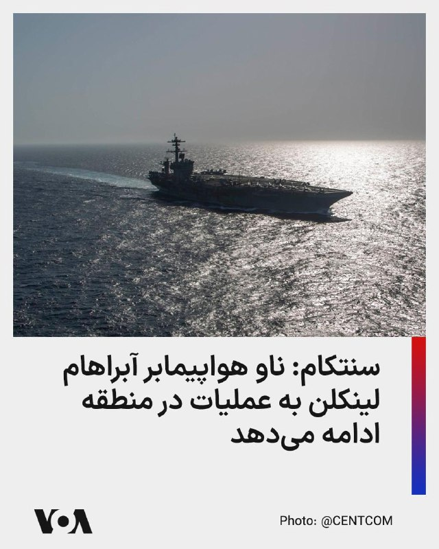

فرماندهی مرکزی ایالات متحده، سنتکام، اعلام کرد ناو هواپیمابر «یو‌اس‌اس آبراهام لینکلن» به عملیات خود در دریای عرب ادامه می‌دهد.

به گفته سنتکام، این عملیات شامل اجرای محاصره دریایی علیه جمهوری اسلامی ایران است.

سنتکام همچنین اعلام کرد نیروهای آمریکایی تاکنون مسیر ۶۵ کشتی تجاری را تغییر داده و چهار شناور را برای اطمینان از اجرای این اقدامات از کار انداخته‌اند.

@FarsiVOA

## DW_Farsi — post 124611

🔶 تبعیض دیجیتال در ایران زیر سایه جنگ؛ جدال بر سر اینترنت پرو

بیش از هفتاد روز پس از آغاز قطع گسترده اینترنت در ایران هم‌زمان با شروع جنگ آمریکا و اسرائیل علیه جمهوری اسلامی در نهم اسفند ۱۴۰۴، بحران دسترسی به شبکه جهانی از سطح محدودیتی امنیتی فراتر رفته و به مسئله‌ای سیاسی، اقتصادی و طبقاتی تبدیل شده است.

نت‌بلاکس پیش‌تر اعلام کرده بود که این قطعی در ششم اردیبهشت وارد پنجاه و هشتمین روز پیاپی شده و تا هشتم ماه مه از مرز هفتاد روز گذشته است؛ وضعیتی که به گفته این نهاد، گزارش‌دهی مستقل، ارتباطات عمومی و دسترسی مردم به اطلاعات جهانی را مختل کرده است.

هم‌زمان با این قطعی گسترده، موضوع "اینترنت پرو"، "خط سفید" و "سیم‌کارت سفید" نیز به نشانه‌ای آشکار از تبعیض دیجیتال بدل شده است. اکثریت شهروندان با اینترنت محدود، فیلترشکن‌های پرهزینه و اختلال دائمی روبرو هستند، اما گروه‌هایی خاص، از کسب‌وکارهای منتخب تا برخی چهره‌های رسانه‌ای و سیاسی، به مسیرهایی جداگانه برای دسترسی به اینترنت جهانی دست یافته‌اند.

@dw_farsi

## Hranews — post 112903

  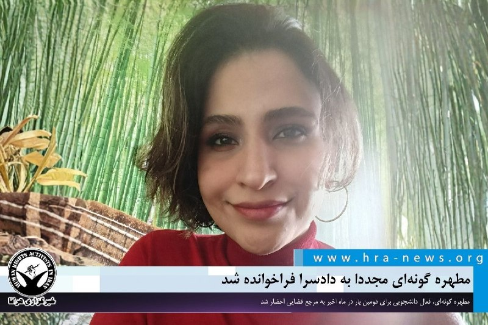

مطهره گونه‌ای مجددا به دادسرا فراخوانده شد

❗️
❗️
❗️
❗️
❗️– مطهره گونه‌ای، فعال دانشجویی، برای دومین بار طی یک ماه اخیر به دادسرای عمومی و انقلاب ناحیه ۳۱ تهران احضار شد.

به گزارش خبرگزاری هرانا، ارگان خبری مجموعه فعالان حقوق بشر در ایران، مطهره گونه‌ای، فعال دانشجویی احضار شد.

وی با انتشار مطلبی در این خصوص نوشت: «امروز احضاریه جدید آمد. این بار، جهت دفاع از اتهام انتسابی نشر اکاذیب باید به دادسرای عمومی و انقلاب ناحیه ۳۱ تهران مراجعه کنم.»

ادامه مطلب

#مطهره_گونه‌ای

↘️
@hranews_bot تماس ✉️ -  @Hranews  کانال هرانا 🆑

## manototv — post 105350

  <a href="telegram/content/manototv_105350_1778591665.mp4" target="_blank">🎬 Download video</a>

دونالد ترامپ در پیامی در شبکه اجتماعی تروث سوشال گفت کوبا از آمریکا درخواست کمک کرده و واشینگتن با هاوانا گفت‌وگو خواهد کرد.

ترامپ در این پیام نوشت هیچ جمهوری‌خواهی تاکنون درباره کوبا با او صحبت نکرده و این کشور را «شکست‌خورده» توصیف کرد که به گفته او تنها در مسیر «سقوط» حرکت می‌کند.

او افزود: «کوبا درخواست کمک کرده و ما گفت‌وگو خواهیم کرد.» ترامپ در پایان این پیام نوشت همزمان عازم چین است.

## manototv — post 105349

  <a href="telegram/content/manototv_105349_1778591666.mp4" target="_blank">🎬 Download video</a>

«حکومت بقای خود را در طناب دار می‌بیند»

## manototv — post 105348

  <a href="telegram/content/manototv_105348_1778591667.mp4" target="_blank">🎬 Download video</a>

مارک روته، دبیرکل ناتو، اعلام کرد موضوع جمهوری‌اسلامی و نحوه کمک کشورهای اروپایی برای مدیریت وضعیت تنگه هرمز، محور اصلی گفت‌وگوهای کنونی این ائتلاف است.
روته در نشست خبری در مونته‌نگرو گفت کشورهای عضو در حال بررسی راه‌هایی هستند تا متحدان اروپایی بتوانند در شرایط مرتبط با تنگه هرمز کمک کنند.
او با اشاره به افزایش بودجه دفاعی کشورهای اروپایی و کانادا، تأکید کرد نسبت به آینده ناتو «بسیار خوش‌بین» است.

## manototv — post 105347

  <a href="telegram/content/manototv_105347_1778591668.mp4" target="_blank">🎬 Download video</a>

دکتر حمید گیلوری فعال سیاسی و عضو حزب ایران نوین در گردهمایی ایرانیان روبروی دادگاه لاهه در هلند گفت: «اروپا نباید با جمهوری اسلامی مماشات کند».

## manototv — post 105346

  <a href="telegram/content/manototv_105346_1778591669.mp4" target="_blank">🎬 Download video</a>

وزارت خارجه امارات متحده عربی در بیانیه‌ای نفوذ اعضایی از سپاه از سوی نیروی دریایی جمهوری اسلامی به جزیره بوبیان کویت را محکوم کرد و آن را اقدامی در چارچوب «طرحی تروریستی» برای انجام عملیات خصمانه خواند.

در این بیانیه آمده است شیخ عبدالله بن زاید آل نهیان، وزیر خارجه امارات، در پیامی به عبدالله علی الیحیا، وزیر خارجه کویت، همبستگی کامل ابوظبی را با کویت اعلام کرده است.

بوبیان دومین جزیره بزرگ خلیج فارس بعد از جزیره قشم است.

## manototv — post 105345

  <a href="telegram/content/manototv_105345_1778591670.mp4" target="_blank">🎬 Download video</a>

دولت بریتانیا اعلام کرد از آوریل ۲۰۲۶، میزان کمک‌هزینه هفتگی برای «همسران اضافی» در ازدواج‌های چندهمسریِ ثبت‌شده در خارج از کشور، به ۱۲۵ پوند و ۲۵ پنس افزایش یافته است.
این مبلغ نسبت به سال گذشته ۴.۸ درصد افزایش داشته و شامل افرادی می‌شود که به سن بازنشستگی رسیده و از مزایایی مانند «پنشـن کردیت» یا کمک‌هزینه مسکن استفاده می‌کنند.
چندهمسری در بریتانیا غیرقانونی است، اما برخی ازدواج‌های چندهمسری که به‌طور قانونی در خارج از کشور ثبت شده‌اند، برای دریافت بعضی مزایای رفاهی به رسمیت شناخته می‌شوند.
دولت بریتانیا تأکید کرده «یونیورسال کردیت» شامل این نوع خانوارها نمی‌شود و قوانین مهاجرتی نیز اجازه حمایت برای ورود همسر دوم را نمی‌دهد، اگر ازدواج اول همچنان پابرجا باشد.

## alonews — post 119502

  <a href="telegram/content/alonews_119502_1778591670.webm" target="_blank">🎬 Download video</a>

👈سخنگوی وزارت امور خارجه ایران: آمریکا به دنبال تسلیم کامل ایران است، نه مذاکره

✅ @AloNews خبر جنگ

## alonews — post 119501

  <a href="telegram/content/alonews_119501_1778591670.webm" target="_blank">🎬 Download video</a>

👈دبیرکل سازمان جهانی بهداشت: کشورها برای موارد بیشتر ابتلا به هانتاویروس آماده باشند

🔴در حال حاضر، هیچ نشانه‌ای مبنی بر آغاز شیوع گسترده‌تر بیماری وجود ندارد اما مطمئناً وضعیت می‌تواند تغییر کند.

✅ @AloNews خبر جنگ

---
📅 بروزرسانی: 1405/02/22 16:34
---

## pm_afshaa — post 90623

  <a href="telegram/content/pm_afshaa_90623_1778591096.webm" target="_blank">🎬 Download video</a>

🔴ترامپ با انتشار این پست از اوباما، بایدن و پلوسی نوشت: دموکرات‌ها عاشق این مکان هستن (فاضلاب)

💧 Rainbet.com the #1 Non-KYC Crypto Casino & Sportsbook @rainbetcom

😁 @Pm_Afshaa

## pm_afshaa — post 90622

🔴پیت هگست : اگه لازم باشه، برای تشدید درگیری با ایران یه برنامه داریم

💧 Rainbet.com the #1 Non-KYC Crypto Casino & Sportsbook @rainbetcom

😁 @Pm_Afshaa

## IranIntlTV — post 336817

  <a href="telegram/content/IranIntlTV_336817_1778591097.mp4" target="_blank">🎬 Download video</a>

هم‌زمان با افزایش گزارش‌ها درباره کمبود بنزین در ایران، سخنگوی اتحادیه صادرکنندگان فرآورده‌های نفتی اعلام کرد برای جلوگیری از شکل‌گیری صف‌های طولانی، صرفه‌جویی در مصرف بنزین اجتناب‌ناپذیر است.
گفت‌وگو با مهدی مصلحی، کارشناس بازار نفت
@iranintltv

## IranIntlTV — post 336816

  <a href="telegram/content/IranIntlTV_336816_1778591099.mp4" target="_blank">🎬 Download video</a>

وزرای خارجه ترکیه و قطر در نشستی مشترک درباره بحران تنگه هرمز گفت‌وگو کردند. هاکان فیدان با اعلام حمایت آنکارا از تلاش‌ها برای توافق میان جمهوری اسلامی و آمریکا، تاکید کرد تنگه هرمز نباید به‌عنوان سلاح استفاده شود.
نرگس هورخش، خبرنگار ایران‌اینترنشنال، گزارش می‌دهد
@iranintltv

## Shin_Persian — post 5965

Shin ✓ @hey_itsmyturn
Tue, 12 May 2026 12:54:39 UTC

State-owned Mehr News:
Islamic Regime files complaint against US at The Hague over "military aggression on nuclear facilities", economic sanctions, and "threat of force" during 12-day conflict. Case A-34 registered under 1981 Algiers Accords.

[😂]

فارسی

خبرگزاری دولتی مهر:
رژیم اسلامی شکایتی را علیه ایالات متحده در لاهه به دلیل «تجاوز نظامی به تاسیسات هسته‌ای»، تحریم‌های اقتصادی و «تهدید به استفاده از زور» در طول درگیری ۱۲ روزه تنظیم کرد. پرونده A-34 تحت بیانیه‌های الجزایر ۱۹۸۱ ثبت شده است.

[😂]

𝕏 · @shin_persian

## RadioFarda — post 157090

  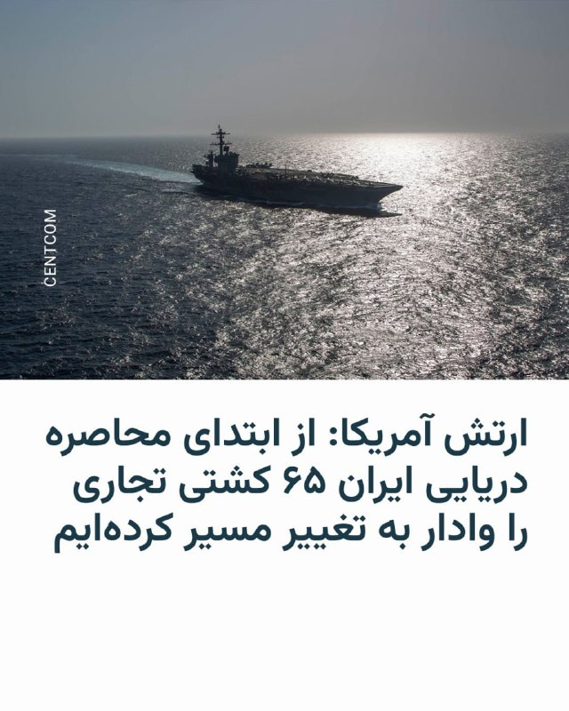

🔸فرماندهی مرکزی ایالات متحده، سنتکام، روز سه‌شنبه خبر داد از ابتدای محاصره دریایی علیه بنادر ایران تاکنون، ۶۵ کشتی تجاری را وادار به «تغییر مسیر» کرده است.

🔸در اطلاعیه سنتکام که در حساب شبکه ایکس آن منتشر شده است، آمده که نیروهای نظامی آمریکا در خاورمیانه در این مدت چهار کشتی ایرانی را هم «از کار انداخته‌اند».

🔸ارتش آمریکا جمعه از شلیک به دو نفتکش ایرانی «ام‌تی سی استار» و «ام‌تی سودا» و از کار انداختن آنها خبر داد و روز چهارشنبه نیز نفتکش «ام‌تی حسنا» با پرچم ایران هدف قرار گرفته بود.

🔸ماه گذشته نیز نیروهای آمریکایی یک کشتی باری ایرانی را توقیف کرده بودند.

🔸آمریکا و ایران بعد از یک دور مذاکره حضوری در پاکستان که چند روز بعد از برقراری آتش‌بس در اسلام‌آباد برگزار شد، با ارسال طرح‌های پیشنهادی متقابل مشغول مذاکره بودند. آمریکا بعد از بی‌نتیجه ماندن مذاکره حضوری، محاصره دریایی بنادر ایران را آغاز کرد، در حالی که ایران از ابتدای جنگ تنگهٔ هرمز را مسدود کرده است.

@RadioFarda

## IranianMinds — post 20006

  <a href="telegram/content/IranianMinds_20006_1778591103.mp4" target="_blank">🎬 Download video</a>

🔴چندتا از بستگان موشعلی خامنه‌ای در بیمارستان هند دیده شده‌اند.

@IranianMinds

## alonews — post 119500

  <a href="telegram/content/alonews_119500_1778591105.webm" target="_blank">🎬 Download video</a>

👈پیت هگست وزیر جنگ آمریکا: به دلیل حساسیت مموریتی که رئیس‌جمهور ترامپ بر عهده دارد و همچنین برای اطمینان از عدم دستیابی ایران به بمب هسته‌ای، گام بعدی خود علیه این کشور را فاش نخواهیم کرد

✅ @AloNews خبر جنگ

## alonews — post 119499

  <a href="telegram/content/alonews_119499_1778591106.webm" target="_blank">🎬 Download video</a>

👈وزیر دوم بریتانیا از دولت کیر استارمر استعفا داد

✅ @AloNews خبر جنگ

---
📅 بروزرسانی: 1405/02/22 16:24
---

## VahidOOnLine — post 239698

  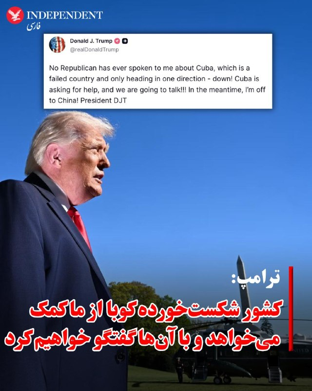

♦️ دونالد ترامپ، رئیس‌جمهوری آمریکا، روز سه‌شنبه ۲۲ اردیبهشت‌ماه، با انتشار پیامی در شبکه اجتماعی «تروث سوشال» و در آستانه سفر به پکن نوشت: «هیچ جمهوری‌خواهی تاکنون درباره کوبا با من صحبت نکرده است؛ کشوری شکست‌خورده که فقط در یک مسیر حرکت می‌کند: سقوط!»

ترامپ در ادامه افزود: «کوبا درخواست کمک کرده و ما گفتگو خواهیم کرد!!! در همین حال، من عازم چین هستم!»
‌🇸🇦 Indypersian

🤖 @VahidOOnLine

## VahidOOnLine — post 239697

  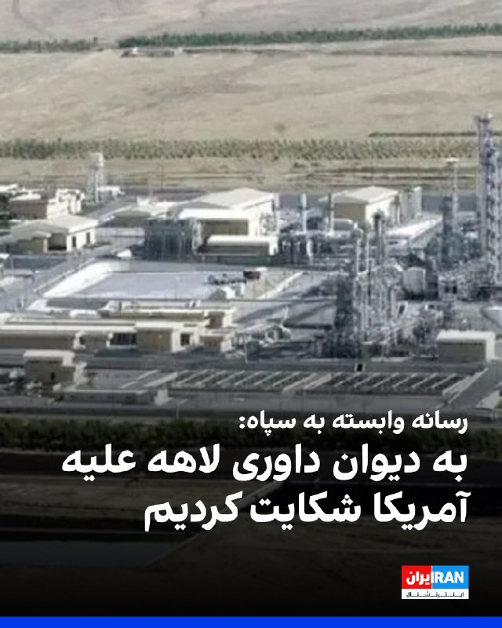

خبرگزاری تسنیم، وابسته به سپاه پاسداران، از شکایت جمهوری اسلامی علیه آمریکا به دیوان داوری لاهه خبر داد.

این رسانه وابسته به سپاه، «تجاوز نظامی به تاسیسات هسته‌ای»، «اعمال تحریم‌های اقتصادی» و «تهدید به توسل به زور» را از موضوعات این شکایت عنوان کرد.
‌🏁 🇬🇧 IranintlTV

🤖 @VahidOOnLine

## FoxNewsTwitter — post 341581

  

Fox News (Twitter/X)

President Trump announcing plans to move toward suspending the federal gasoline tax as the Iran war continues to drive up energy costs.

The president noting that while the current ceasefire is "on life support," the tax pause is necessary to provide immediate financial relief to American families.

## FoxNewsTwitter — post 341580

  <a href="telegram/content/FoxNewsTwitter_341580_1778590446.mp4" target="_blank">🎬 Download video</a>

Fox News (Twitter/X)

NEW: Tensions in the Middle East are rising as Iran warns it is ready to respond to any aggression after President Trump dismissed its response to a U.S. peace proposal and suggested the ongoing ceasefire is close to collapse.

Military preparations are increasing across the region amid conflicting claims and reports of recent strikes, @TreyYingst reports.

## FoxNewsTwitter — post 341579

‌Fox News (Twitter/X)

https://www.foxbusiness.com/economy/cpi-inflation-april-2026

## FoxNewsTwitter — post 341578

Fox News (Twitter/X)

BREAKING: Inflation jumps to 3.8%, highest increase since 2023, feds report

## pm_afshaa — post 90621

وزارت خارجه کویت: ما از ایران می‌خواهیم که فوراً و بدون قید و شرط اقدامات غیرقانونی و خصمانه خود را که امنیت منطقه را تهدید می‌کند، متوقف کند

💧 Rainbet.com the #1 Non-KYC Crypto Casino & Sportsbook @rainbetcom

😁 @Pm_Afshaa

## pm_afshaa — post 90620

🔴فیدان : به خاطر جهان، تنگه هرمز باید باز شود

💧 Rainbet.com the #1 Non-KYC Crypto Casino & Sportsbook @rainbetcom

😁 @Pm_Afshaa

## IranIntlTV — post 336815

  

خبرگزاری تسنیم، وابسته به سپاه پاسداران، از شکایت جمهوری اسلامی علیه آمریکا به دیوان داوری لاهه خبر داد.

این رسانه وابسته به سپاه، «تجاوز نظامی به تاسیسات هسته‌ای»، «اعمال تحریم‌های اقتصادی» و «تهدید به توسل به زور» را از موضوعات این شکایت عنوان کرد.
https://iranintl.com/202605122290

## DW_Farsi — post 124601

📸 مروری بر مهم‌ترین حضورهای ایران در جشنواره سینمایی کن

هم‌زمان با آغاز جشنواره فیلم کن ۲۰۲۶ و نمایش دو فیلم ایرانی "داستان‌های موازی" ساخته اصغر فرهادی و "تمرین‌هایی برای یک انقلاب" به کارگردانی پگاه آهنگرانی، نگاهی داریم به مهم‌ترین فیلم‌های ایرانی که در سال‌های گذشته در این جشنواره حضور داشته‌اند.

از نخل طلای "طعم گیلاس" عباس کیارستمی تا موفقیت‌های اصغر فرهادی، جعفر پناهی و محمد رسول‌اف، سینمای ایران بارها در کن دیده شده و جوایز مهمی به دست آورده است.

این گالری مروری است بر فیلم‌ها، بازیگران و لحظه‌هایی که نام ایران را در یکی از مهم‌ترین جشنواره‌های سینمایی جهان ماندگار کردند.

@dw_farsi

## alonews — post 119498

  <a href="telegram/content/alonews_119498_1778590449.mp4" target="_blank">🎬 Download video</a>

👈انفجار در پالایشگاه نفت در اوکلاهما، آمریکا

✅ @AloNews خبر جنگ

## alonews — post 119497

  <a href="telegram/content/alonews_119497_1778590451.webm" target="_blank">🎬 Download video</a>

👈هگست : اگه لازم باشه، برای تشدید درگیری با ایران یه برنامه داریم

✅ @AloNews خبر جنگ

## alonews — post 119496

  <a href="telegram/content/alonews_119496_1778590451.webm" target="_blank">🎬 Download video</a>

👈پیت هگست، وزیر جنگ آمریکا : ما داریم یه ارتش رو دوباره می‌سازیم که مردم آمریکا بهش افتخار کنن

🔴 ارتشی که تو دل دشمن‌ها چیزی جز ترس بی‌وقفه نمی‌ندازه و به متحدها هم اعتمادبه‌نفس می‌ده

🔴 ما تو هر سناریویی برای بردن می‌جنگیم

✅ @AloNews خبر جنگ

## alonews — post 119495

  <a href="telegram/content/alonews_119495_1778590451.webm" target="_blank">🎬 Download video</a>

👈دبیرکل ناتو مارک روته: من به آینده ناتو بسیار خوشبین هستم به خاطر رئیس‌جمهور ترامپ

🔴می‌توان استدلال کرد که ناتو در حال حاضر بسیار قوی است

✅ @AloNews خبر جنگ

---
📅 بروزرسانی: 1405/02/22 16:14
---

## VahidOOnLine — post 239696

  

سنتکام روز سه‌شنبه اعلام کرد‌ ارتش آمریکا از زمان آغاز محاصره دریایی تاکنون، ۶۵ کشتی تجاری را تغییر مسیر داده و چهار کشتی را از کار انداخته است.

فرماندهی مرکزی آمریکا همچنین اعلام کرد ناو آبراهام لینکلن در دریای عرب اجرای محاصره علیه ایران را ادامه می‌دهد.
‌🏁 🇬🇧 IranintlTV

🤖 @VahidOOnLine

## VahidOOnLine — post 239695

  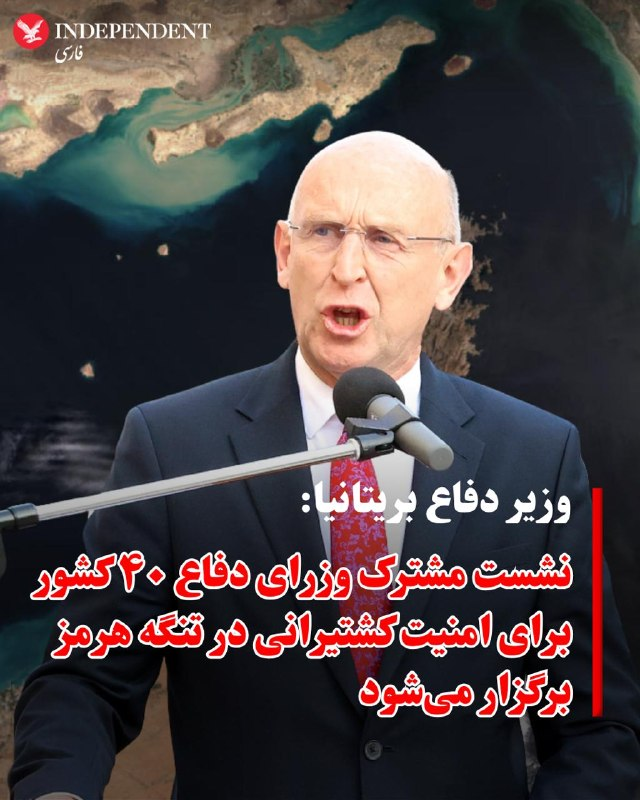

♦️فرانسه و بریتانیا روز سه‌شنبه ۲۲ اردیبهشت ماه میزبان نشست مشترک وزاری دفاع ۴۰ کشور برای بازگرداندن امنیت به کشتیرانی در تنگه هرمز هستند.

کاترین ووترین، وزیر دفاع فرانسه، و جان هیلی، همتای بریتانیایی او، روز سه‌شنبه ریاست مشترک یک نشست چندملیتی را در مورد برنامه‌های نظامی برای بازگرداندن جریان تجارت از طریق تنگه هرمز مسدود شده پس از پایان جنگ ایران بر عهده خواهند داشت.

جان هیلی، وزیر دفاع بریتانیا با انتشار پیامی در شبکه‌های اجتماعی نوشت: «مردم نگران مخاصمات جاری و بحران‌های جهانی پیش‌رو هستند و انتظار دارند دولت، همان‌گونه که نخست‌وزیر عمل می‌کند، کشور را از این شرایط عبور دهد.»

بریتانیا و فرانسه بارها اعلام کرده‌اند که وارد جنگ آمریکا و اسرائیل با جمهوری اسلامی نمی‌شوند اما برای بازگرداندن امنیت به تنگه هرمز پس از آتش‌بس آماده‌اند.
‌🇸🇦 Indypersian

🤖 @VahidOOnLine

## VahidOOnLine — post 239693

دونالد ترامپ، رییس‌جمهوری آمریکا، روز سه‌شنبه در تروث سوشال دو تصویر گرافیکی منتشر کرد که صحنه‌هایی از حمله به پهپادها و قایق‌های جمهوری اسلامی را نشان می‌دهد.

در یکی از این تصاویر، یک ناو آمریکایی با استفاده از سلاح لیزری یک پهپاد جمهوری اسلامی را هدف قرار داده و نابود می‌کند. در تصویر دیگر، یک پهپاد آمریکایی دو قایق جمهوری اسلامی را هدف قرار داده و منهدم می‌کند.
‌🏁 🇬🇧 IranintlTV

🤖 @VahidOOnLine

## VahidOOnLine — post 239692

  

مسیح علی‌نژاد، روزنامه‌نگار و فعال حقوق بشر ایرانی، در نشست دموکراسی در کپنهاگ، گفت که من اینجا در دانمارک هستم تا درباره جنگ واقعی‌ای صحبت کنم که جمهوری اسلامی علیه ما ایرانیان به راه انداخته است.

او افزود: «آمریکایی‌ها و اروپایی‌ها می‌توانند به مردم ایران کمک کنند، اما آیا حاضرید به خودتان کمک کنید؟ در ۴۷ سال گذشته ۸۶۰ ایرانی و غیرایرانی در خاک اروپا هدف جمهوری اسلامی بوده‌اند.»

او ادامه داد: «جمهوری اسلامی بدون پاسخ‌گویی، اینترنت را قطع و اعدام‌ها را تسریع می‌کند، بدون آنکه حتی رسانه‌ها درباره آن سخن بگویند.»
‌🏁 🇬🇧 IranintlTV

🤖 @VahidOOnLine

## VahidOOnLine — post 239691

  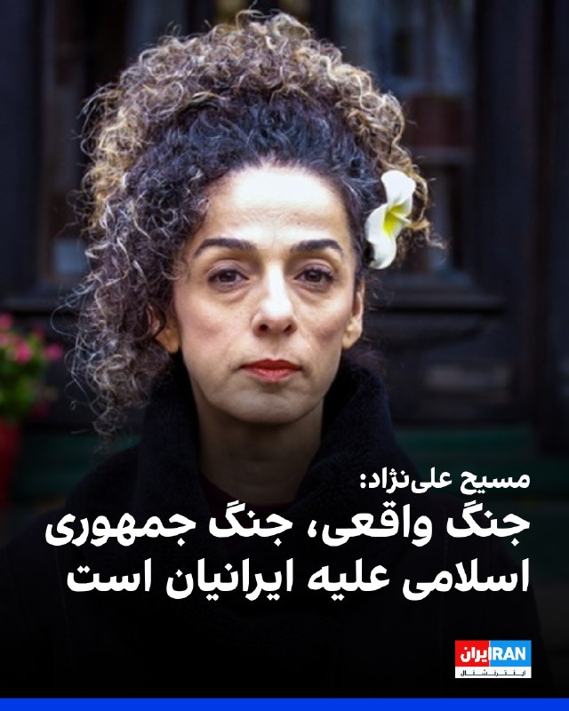

مسیح علی‌نژاد، روزنامه‌نگار و فعال حقوق بشر ایرانی، در نشست دموکراسی در کپنهاگ، گفت که من اینجا در دانمارک هستم تا درباره جنگ واقعی‌ای صحبت کنم که جمهوری اسلامی علیه ما ایرانیان به راه انداخته است.

او افزود: «آمریکایی‌ها و اروپایی‌ها می‌توانند به مردم ایران کمک کنند، اما آیا حاضرید به خودتان کمک کنید؟ در ۴۷ سال گذشته ۸۶۰ ایرانی و غیرایرانی در خاک اروپا هدف جمهوری اسلامی بوده‌اند.»

او ادامه داد: «جمهوری اسلامی بدون پاسخ‌گویی، اینترنت را قطع و اعدام‌ها را تسریع می‌کند، بدون آنکه حتی رسانه‌ها درباره آن سخن بگویند.»
‌🏁 🇬🇧 IranintlTV

🤖 @VahidOOnLine

## FoxNewsTwitter — post 341577

  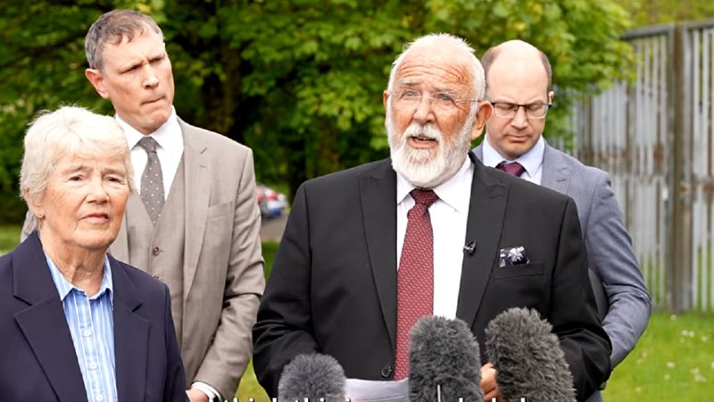

Fox News (Twitter/X)

"At 78 years old, I never imagined I would leave a courtroom with a criminal conviction for preaching the Christian gospel."

Retired pastor Clive Johnston reacting after being convicted for reading John 3:16 outside a hospital in Northern Ireland.

He says the case raises serious concerns about free speech and religious expression.

## pm_afshaa — post 90619

  <a href="telegram/content/pm_afshaa_90619_1778589875.webm" target="_blank">🎬 Download video</a>

🔥 ربات فروشگاه مردمی وینستون در خدمت شماست 
🔥 فروش کانفیگ ویتوری 
🏳 گیگی 210.000 تومان 
☄️ گیگی 250.000 تومان 
☄️ گیگی 280.000 تومان 
☄️ 
🔥 سرعت موشکی 
💎 ( پنل مشاهده حجم در ربات ) لوکیشن بلغارستان و آلمان و ترکیه 
🇧🇬
🇩🇪
🇹🇷 
‼️ برای خرید ربات رو استارت کنید 
‼️ …

## pm_afshaa — post 90618

  <a href="telegram/content/pm_afshaa_90618_1778589876.webm" target="_blank">🎬 Download video</a>

🔥 ربات فروشگاه مردمی وینستون در خدمت شماست 
🔥

فروش کانفیگ ویتوری 
🏳

گیگی 210.000 تومان 
☄️
گیگی 250.000 تومان 
☄️
گیگی 280.000 تومان 
☄️

🔥 سرعت موشکی

💎 ( پنل مشاهده حجم در ربات )
لوکیشن بلغارستان و آلمان و ترکیه 
🇧🇬
🇩🇪
🇹🇷

‼️ برای خرید ربات رو استارت کنید 
‼️

BOT 
📎 @WinstonLite_bot

PV 
✉️ @mosadeveloper

CH 
📣 https://t.me/winstonservice

## IranIntlTV — post 336814

  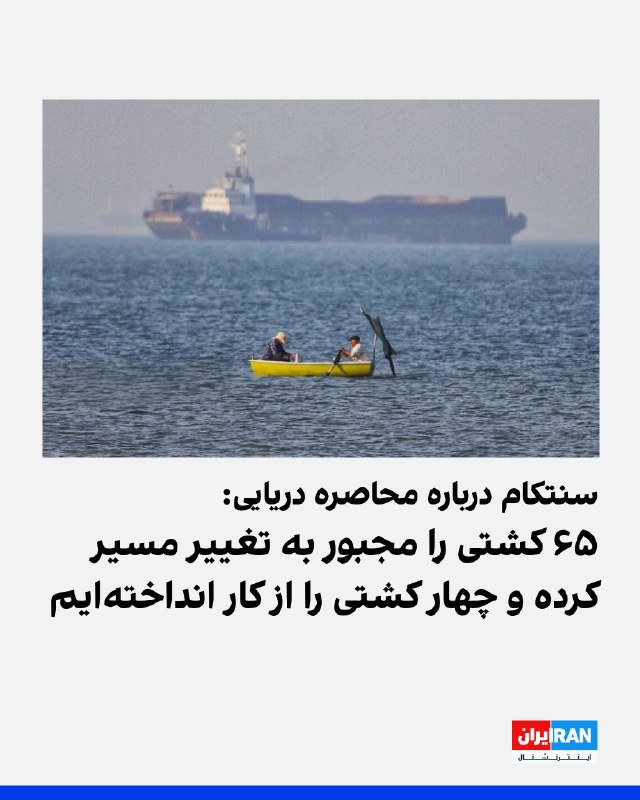

سنتکام روز سه‌شنبه اعلام کرد‌ ارتش آمریکا از زمان آغاز محاصره دریایی تاکنون، ۶۵ کشتی تجاری را تغییر مسیر داده و چهار کشتی را از کار انداخته است.

فرماندهی مرکزی آمریکا همچنین اعلام کرد ناو آبراهام لینکلن در دریای عرب اجرای محاصره علیه ایران را ادامه می‌دهد.
https://iranintl.com/202605120568

## IranIntlTV — post 336812

دونالد ترامپ، رییس‌جمهوری آمریکا، روز سه‌شنبه در تروث سوشال دو تصویر گرافیکی منتشر کرد که صحنه‌هایی از حمله به پهپادها و قایق‌های جمهوری اسلامی را نشان می‌دهد.

در یکی از این تصاویر، یک ناو آمریکایی با استفاده از سلاح لیزری یک پهپاد جمهوری اسلامی را هدف قرار داده و نابود می‌کند. در تصویر دیگر، یک پهپاد آمریکایی دو قایق جمهوری اسلامی را هدف قرار داده و منهدم می‌کند.

## IranIntlTV — post 336809

  

مسیح علی‌نژاد، روزنامه‌نگار و فعال حقوق بشر ایرانی، در نشست دموکراسی در کپنهاگ، گفت که من اینجا در دانمارک هستم تا درباره جنگ واقعی‌ای صحبت کنم که جمهوری اسلامی علیه ما ایرانیان به راه انداخته است.

او افزود: «آمریکایی‌ها و اروپایی‌ها می‌توانند به مردم ایران کمک کنند، اما آیا حاضرید به خودتان کمک کنید؟ در ۴۷ سال گذشته ۸۶۰ ایرانی و غیرایرانی در خاک اروپا هدف جمهوری اسلامی بوده‌اند.»

او ادامه داد: «جمهوری اسلامی بدون پاسخ‌گویی، اینترنت را قطع و اعدام‌ها را تسریع می‌کند، بدون آنکه حتی رسانه‌ها درباره آن سخن بگویند.»
https://iranintl.com/202605125222

## FarsiVOA — post 217529

مهدیه گلرو معتقد است گروه‌های اپوزیسیون که سیاست فشار حداکثری بر مردم در داخل ایران را دنبال می‌کنند فرقی با حجتیه که می‌گوید ظلم باید به نهایت برسد تا امام زمان ظهور کند ندارند! فرج سرکوهی نیز اپوزیسیونی را که دنبال رهبر برای معترضان داخل کشور باشد معتبر نمی‌داند

## DW_Farsi — post 124592

  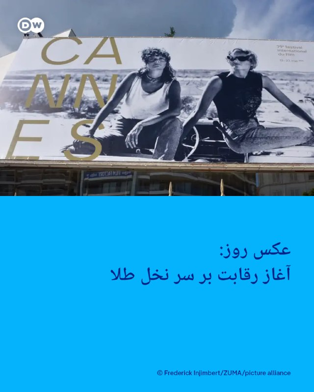

📸 عکس روز: آغاز رقابت بر سر نخل طلا

هفتاد و نهمین دوره از جشنواره سینمایی کن از روز ۱۲ تا ۲۳ مه برگزار می‌شود.

در بخش رقابتی این دوره سینماگران مطرح جهان حضور دارند، از پدرو آمودوار تا اصغر فرهادی که با آثار جدید خود در تلاش کسب نخل طلایی این فستیوال هستند. مجموعا ۲۲ فیلم برای دریافت نخل طلا با یکدیگر رقابت می‌کنند.

"ونوس الکتریکی"، ساخته جدید پیر سالوادوری، فیلم افتتاحیه این دوره خواهد بود.

@dw_farsi

## alonews — post 119494

  <a href="telegram/content/alonews_119494_1778589879.mp4" target="_blank">🎬 Download video</a>

👈 دبیرکل ناتو مارک روت درباره تنگه هرمز: بحث‌هایی در جریان است.

🔴آنچه در حال حاضر می‌بینم این است که فعالیت گسترده‌ای برای پیش‌قرار دادن—نه در خود تنگه، بلکه نزدیک به منطقه عملیاتی—توانمندی‌های حیاتی لازم برای مرحله بعدی انجام می‌شود.

🔴ما به وضوح می‌بینیم که اروپایی‌ها صدای رئیس‌جمهور آمریکا را شنیده‌اند و پاسخ می‌دهند.

✅ @AloNews خبر جنگ

## alonews — post 119493

  <a href="telegram/content/alonews_119493_1778589882.webm" target="_blank">🎬 Download video</a>

👈فرماندهی مرکزی ایالات متحده: نیروهای سنتکام ۶۵ کشتی تجاری را تغییر مسیر داده و ۴ کشتی را از کار انداخته‌اند.

✅ @AloNews خبر جنگ

## alonews — post 119492

  <a href="telegram/content/alonews_119492_1778589882.webm" target="_blank">🎬 Download video</a>

👈نرخ تورم تو آمریکا ۳/۸ درصد اعلام شد

✅ @AloNews خبر جنگ

---
📅 بروزرسانی: 1405/02/22 16:04
---

## mwarmonitor — post 8970

  

🇺🇸ناو هواپیمابر USS Abraham Lincoln (CVN 72) به عملیات خود در دریای عرب ادامه می‌دهد، از جمله اجرای محاصره آمریکا علیه ایران. به گفته سنتکام، نیروهای آمریکایی ۶۵ کشتی تجاری را تغییر مسیر داده و ۴ کشتی را از کار انداخته‌اند.

@mwarmonitor

## FarsiVOA — post 217528

🔺انتشار گزارشی از «وحشیگری جنسی» حماس علیه شهروندان اسرائیل در حمله تروریستی ۷ اکتبر

▪️اسرائیل با انتشار گزارشی هزاران سند و مدرک از اقدامات جنایت‌کارانه حماس در حمله تروریستی ۷ اکتبر علیه شهروندان اسرائیلی را منتشر کرد.

⬇️ بیشتر بخوانید:

https://ir.voanews.com/a/hamas-israel-crime-hostage-iran/8149158.html/?nocach=1

## DW_Farsi — post 124591

  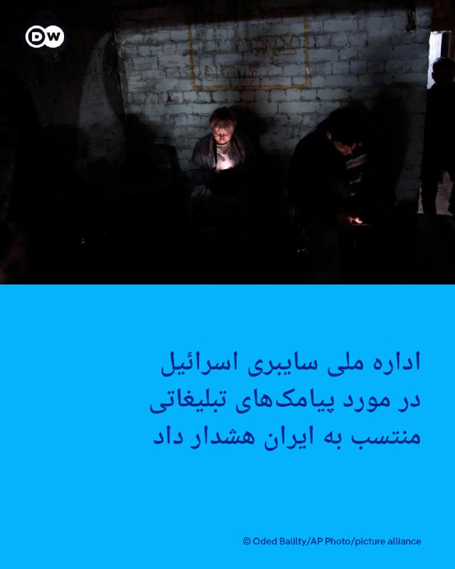

🔶 اداره ملی سایبری اسرائیل در مورد پیامک‌های تبلیغاتی منتسب به ایران هشدار داد

اداره ملی سایبری اسرائیل روز سه‌شنبه ۱۲ مه (۲۲ اردیبهشت) اعلام کرد هزاران اسرائیلی در ساعات گذشته پیام‌های "هراس‌آفرینی" را دریافت کرده‌اند که با هدف "ایجاد وحشت و تضعیف احساس امنیت" ارسال شده‌اند.

پیش‌تر روزنامه "اسرائیل هیوم" گزارش داده بود موجی از پیامک‌های تبلیغاتی به زبان عبری از شامگاه دوشنبه تا صبح سه‌شنبه ۱۲ مه (۲۲ اردیبهشت) از سوی هکرهای منتسب به جمهوری‌ اسلامی برای شمار زیادی از شهروندان اسرائیلی ارسال شده است که آنها را به همکاری با ایران فرامی‌خواند. به نوشته این روزنامه در یکی از این پیام‌ها آمده بود: «جمهوری اسلامی ایران از شما دعوت می‌کند در حوزه اطلاعاتی همکاری کنید. برای همکاری، با سفارت‌های ایران در کشورهای مختلف یا یکی از عوامل سایبری ایرانی به‌صورت آنلاین تماس بگیرید.»

در پیامی دیگر گفته شده بود: «ما به شما وعده داده بودیم که به‌زودی ستاره‌هایی را در آسمان شب خواهید دید که ستاره نیستند... به‌زودی خورشید را در آسمان شب خواهید دید.»

پلیس اسرائیل نیز تصاویری از این پیام‌ها را منتشر کرد.

اداره ملی سایبری اسرائیل ارسال این پیامک‌ها را "یک تلاش آشنا برای عملیات تأثیرگذاری در فضای دیجیتال" خوانده و گفت این پیام‌ها با محتوایی "تهدید‌آمیز، جنجالی یا تنش‌زا که مستقیماً برای شهروندان ارسال می‌شوند، سعی دارند آن‌ها را از روی ترس وادار به واکنش کنند".

این سازمان به شهروندان اسرائیلی هشدار داده است تا این پیام‌ها را بی‌پاسخ گذاشته، روی هیچ‌ لینکی کلیک نکنند و از ارسال آن برای دیگران خودداری کنند.

نهادهای امنیتی اسرائیل می‌گویند جمهوری اسلامی در ماه‌های اخیر تلاش‌های خود برای جذب شهروندان اسرائیلی به‌عنوان جاسوس را افزایش داده است. به گفته مقام‌های اسرائیلی، این ارتباط‌ها عمدتاً از طریق شبکه‌های اجتماعی، پیام‌رسان‌ها و پیشنهادهای مالی آغاز می‌شود. اسرائیل به شهروندانش نسبت به هرگونه همکاری اطلاعاتی با عوامل جمهوری اسلامی هشدار داده و تا کنون نیز چندین شهروند اسرائیلی به اتهام جاسوسی برای ایران محاکمه شده‌اند.

@dw_farsi

## Dirty_Kids — post 389313

شیر بازیگوش و AIبه‌باسن با انتشار هفت هشتا از این تصاویر در تروث سوشال دوباره شروع کرد.

صبور باشید و پنیک نکنید.

@Dirty_Kids 👻

## Dirty_Kids — post 389312

  <a href="telegram/content/Dirty_Kids_389312_1778589275.mp4" target="_blank">🎬 Download video</a>

واکنش شهبازی (اسکل نظام) به وضعیت اینترنت مردم ایران و کشورهای منطقه:

اگه خیلی این چیزها مهمه، برید همون افغانستان و سوریه زندگی کنید! هاهاهاها

+ هاهاها و ک...خر

@Dirty_Kids 👻

## Hranews — post 112902

  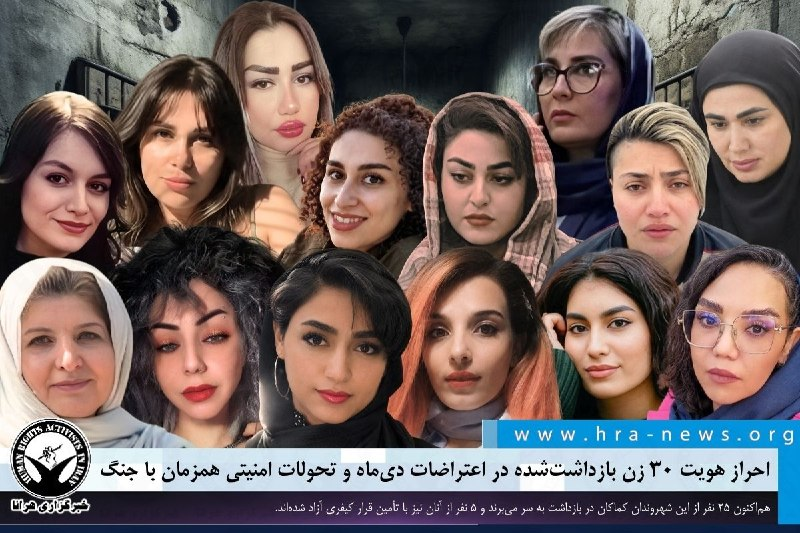

زندان وکیل‌آباد؛ احراز هویت ۳۰ زن بازداشت‌شده در اعتراضات و تحولات امنیتی همزمان با جنگ

❗️
❗️
❗️
❗️
❗️– دست‌کم ۳۰ زن در جریان اعتراضات دی‌ماه ۱۴۰۴ و همچنین تحولات امنیتی همزمان با جنگ، در استان خراسان رضوی بازداشت و به بند «آرامش» و قرنطینه زندان وکیل‌آباد مشهد منتقل شدند. هم‌اکنون ۲۵ نفر از این شهروندان کماکان در این زندان نگهداری می‌شوند و ۵ نفر از آنها نیز با تأمین قرار کیفری آزاد شده‌اند. گزارش پیش رو، به هویت و جزئیات پرونده آنان میپردازد.

به گزارش خبرگزاری هرانا، ارگان خبری مجموعه فعالان حقوق بشر در ایران، هویت ۳۰ زن بازداشت‌شده در استان خراسان رضوی احراز شده است.

بر اساس اطلاعات دریافتی هرانا، این شهروندان در جریان اعتراضات دی‌ماه ۱۴۰۴ و همچنین تحولات امنیتی همزمان با جنگ بازداشت شده‌اند و ۲۵ تن از آنها همچنان در زندان به سر می‌برند. مریم نوری، آرزو دهقان، نادیا صدق‌علی، سهیلا حسینی، نجمه امینی، مهدیه افقهی، حدیثه مرواریدی، فائره صالح‌آبادی، شهرزاد ضمیری، طاهره دهقان، آذر یاهو، آسیه نعیمی، عادله نعیمی، مهسا بهداری، محبوبه شعبانی، مرضیه مشهدی، سیما انبایی، زهرا موسوی، معصومه یعقوبی، فاطمه رضوانی‌فر، سیده زینب موسوی، حدیثه بابازاده، ملیکا خاوری خراسانی، مینا زارعی و ریحانه کفشکنان ۲۵ زندانی هستند که هویتشان توسط هرانا احراز شده و کماکان در زندان وکیل‌آباد مشهد محبوس هستند.
همچنین هویت پنج بازداشتی که اخیراً از این زندان آزاد شده‌اند، سمیرا بیات، نگار فرهمند، فاطمه ارم، نجمه روحند و الناز اقبالی نیز توسط هرانا احراز شده است.

ادامه مطلب

↘️
@hranews_bot تماس ✉️ -  @Hranews  کانال هرانا 🆑

## alonews — post 119491

  <a href="telegram/content/alonews_119491_1778589277.webm" target="_blank">🎬 Download video</a>

👈ساعات کاری دستگاه‌های اجرایی از شنبه به ۷ تا ۱۳ تغییر می‌کند

✅ @AloNews خبر جنگ

---
📅 بروزرسانی: 1405/02/22 15:54
---

## mwarmonitor — post 8969

✈️🇺🇸«یونایتد ایرلاینز اعلام کرد که پروازهای خود به ونزوئلا را از ۱۱ آگوست از سر خواهد گرفت.»

@mwarmonitor

## mwarmonitor — post 8968

🇺🇸نیروی دریایی آمریکا روز دوشنبه اعلام کرد که ناو جنگی جدیدی که به نام رئیس‌جمهور ترامپ نام‌گذاری شده، هسته‌ای خواهد بود؛ اقدامی که انتظار می‌رود هزینه و پیچیدگی این پروژه چند میلیارد دلاری را افزایش دهد، پروژه‌ای که پیش‌تر نیز درباره عملی شدن ساخت آن تردیدهایی وجود داشت. WSJ

@mwarmonitor

## mwarmonitor — post 8967

  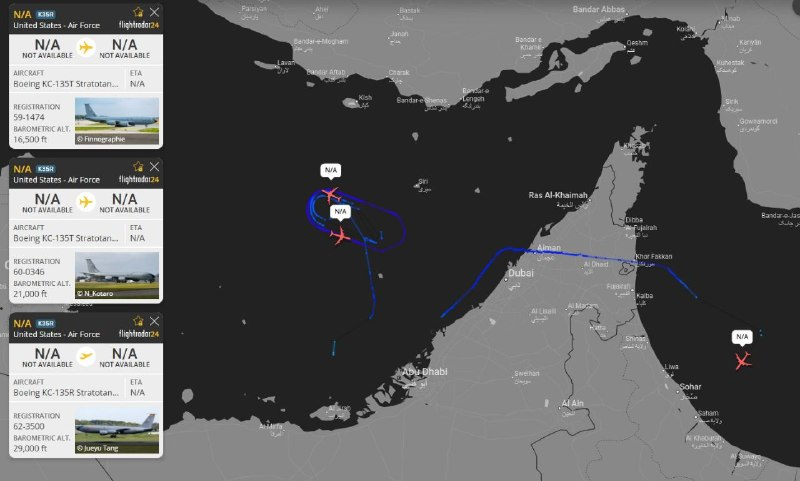

✈️۳ فروند هواپیمای سوخت‌رسان هوایی KC-135R/T نیروی هوایی آمریکا در حال حاضر در نزدیکی تنگه هرمز در حال عملیات هستند.

@mwarmonitor

## Shin_Persian — post 5964

  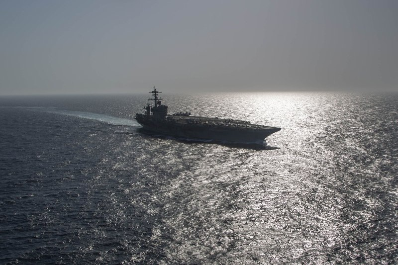

U.S. Central Command ✓ @CENTCOM
Tue, 12 May 2026 12:23:13 UTC

USS Abraham Lincoln (CVN 72) continues operations in the Arabian Sea, including enforcement of the U.S. blockade against Iran. CENTCOM forces have redirected 65 commercial vessels and disabled 4.

فارسی

ناو هواپیمابر یواس‌اس آبراهام لینکلن (سی‌وی‌ان ۷۲) به عملیات‌های خود در دریای عرب، از جمله اجرای محاصره ایالات متحده علیه ایران، ادامه می‌دهد. نیروهای سنتکام (فرماندهی مرکزی ایالات متحده) ۶۵ کشتی تجاری را تغییر مسیر داده و ۴ کشتی را از کار انداخته‌اند.

𝕏 · @shin_persian

## FarsiVOA — post 217527

  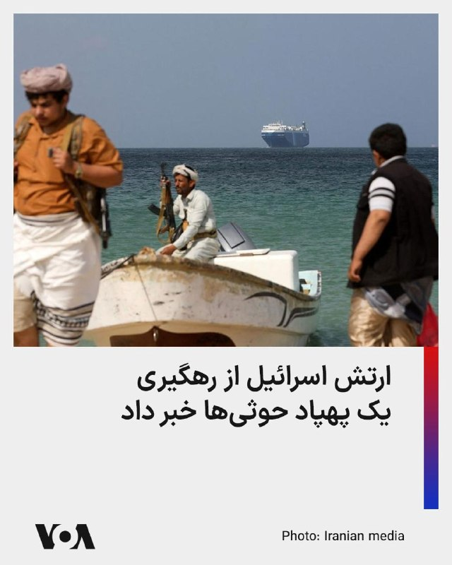

ارتش اسرائیل اعلام کرد نیروی هوایی این کشور یک پهپاد را که به گفته آن «از شرق» به سمت اسرائیل پرتاب شده بود، در نزدیکی شهر ایلات رهگیری کرده است.
تایمز اسرائیل به نقل از ارتش اسرائیل گزارش داد منشأ این پهپاد هنوز در دست بررسی است، اما مقام‌های نظامی اسرائیل احتمال می‌دهند از یمن شلیک شده باشد.
بر اساس این گزارش، در جریان این رهگیری آژیر خطر در ایلات فعال نشد و ارتش اسرائیل گفته است این اقدام «بر اساس پروتکل» انجام شده است.
تایمز اسرائیل نوشت این نخستین حمله پهپادی به سمت ایلات از زمان اجرایی شدن آتش‌بس‌های مربوط به ایران و لبنان در ماه گذشته است. حوثی‌های مورد حمایت جمهوری اسلامی در جریان جنگ، چندین موشک و پهپاد به سمت اسرائیل شلیک کرده بودند.

## FarsiVOA — post 217526

  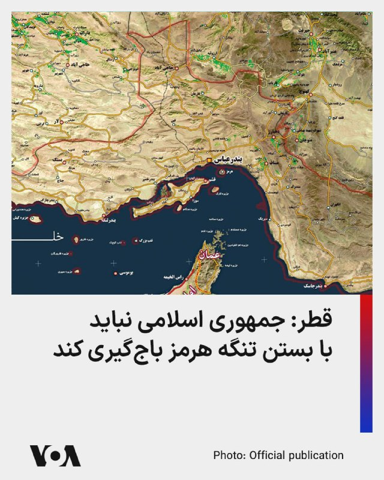

⚡️محمد بن عبدالرحمن آل ثانی، نخست‌وزیر و وزیر امور خارجه قطر، گفت جمهوری اسلامی نباید از تنگه هرمز به عنوان ابزاری برای فشار یا «باج‌گیری» از کشورهای خلیج فارس استفاده کند.

او روز سه‌شنبه در نشست خبری مشترک با هاکان فیدان، وزیر امور خارجه ترکیه، در دوحه گفت: «ایران نباید از این تنگه به عنوان سلاحی برای فشار یا باج‌گیری از کشورهای خلیج فارس استفاده کند.» وزیر خارجه قطر افزود آنچه در تنگه هرمز در جریان است، به کاهش تنش در منطقه کمک نمی‌کند.

هاکان فیدان نیز در همین نشست گفت ترکیه از تلاش‌ها برای بازگشایی تنگه هرمز حمایت می‌کند و این گذرگاه نباید در جریان جنگ ایران به عنوان «سلاح» استفاده شود.

وزیر خارجه ترکیه همچنین گفت آنکارا در تلاش‌هایی که به رهبری پاکستان برای یافتن راه‌حل مذاکره‌شده میان ایران و آمریکا جریان دارد، مشارکت می‌کند.

## Persian_Trend_Official — post 13976

  <a href="telegram/content/Persian_Trend_Official_13976_1778588674.webm" target="_blank">🎬 Download video</a>

کویت مدعی بازداشت ۴ افسر نیروی دریایی سپاه شد
وزارت کشور کویت اعلام کرد چهار نفر وابسته به سپاه پاسداران را هنگام تلاش برای ورود دریایی به جزیره بوبیان بازداشت کرده است.
طبق بیانیه رسمی، بازداشت‌شدگان شامل دو سرهنگ، یک کاپیتان و یک ستوان نیروی دریایی سپاه هستند که به گفته کویت، مأموریت «نفوذ» به جزیره بوبیان و انجام «اقدامات خصمانه» را داشته‌اند. در جریان درگیری، یک نیروی مسلح کویتی نیز زخمی شده است. �
Arab News +1
اسامی اعلام‌شده از سوی کویت: ▪️ امیرحسین عبدالمحمد زیرایی — سرهنگ نیروی دریایی
▪️ عبدالصمد یدالله قنواتی — سرهنگ نیروی دریایی
▪️ احمد جمشید غلامرضا ذوالفقاری — کاپیتان نیروی دریایی
▪️ محمدحسین سهراب فاروقی‌راد — ستوان یکم
کویت می‌گوید این افراد اول ماه مه با یک قایق ماهیگیری وارد آب‌های این کشور شده بودند و دو نفر دیگر نیز موفق به فرار شده‌اند. �
Arab News +1
جزیره بوبیان بزرگ‌ترین جزیره کویت و در نزدیکی مرزهای دریایی ایران و عراق قرار دارد. ایران تاکنون واکنش رسمی به این ادعاها نشان نداده است.

## IranianMinds — post 20005

  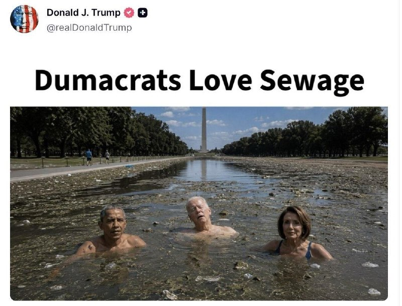

🔴پست ترامپ:
دموکرات‌ها عاشق فاضلاب هستند.

@IranianMinds

## alonews — post 119490

  <a href="telegram/content/alonews_119490_1778588675.webm" target="_blank">🎬 Download video</a>

👈الجزیره: با محدود شدن مسیرهای کشتیرانی در خلیج فارس، شبکه‌ای از جاده‌ها و راه‌آهن که ایران را به همسایگانش متصل می‌کرد، به عنوان جایگزینی رو به رشد برای حمل و نقل کالا و صادرات ظهور کرد

✅ @AloNews خبر جنگ

---
📅 بروزرسانی: 1405/02/22 15:45
---

## VahidOOnLine — post 239689

  

جان هیلی، وزیر دفاع بریتانیا، با اشاره به برگزاری نشستی درباره تامین امنیت کشتیرانی در تنگه هرمز گفت: «بی‌ثباتی بیشتر به سود بریتانیا نیست. اکنون باید تمام تمرکز ما بر رسیدگی به چالش‌های فوری اقتصادی و امنیتی باشد.»

او افزود سه‌شنبه ریاست مشترک نشست ۴۰ وزیر دفاع را با هدف جلب حمایت از ماموریت تحت رهبری بریتانیا برای تامین امنیت کشتیرانی در تنگه هرمز بر عهده خواهد داشت.

جان هیلی در شبکه ایکس نوشت مردم نگران درگیری‌های کنونی و بحران‌های جهانی پیش‌رو هستند و انتظار دارند دولت، همان‌گونه که نخست‌وزیر عمل می‌کند، کشور را از این شرایط عبور دهد.

او تاکید کرد بریتانیا مشارکت‌های نظامی خود در این ماموریت را اعلام خواهد کرد و افزود بی‌ثباتی بیشتر به سود بریتانیا نیست و دولت باید بر چالش‌های فوری اقتصادی و امنیتی تمرکز کند.

وزیر دفاع بریتانیا همچنین نوشت دولت باید برای بازگرداندن امنیت اقتصادی خانواده‌ها در داخل کشور اقدام کند.
‌🏁 🇬🇧 IranintlTV

🤖 @VahidOOnLine

## mwarmonitor — post 8966

  

‼️یکی دیگه

## mwarmonitor — post 8964

🔸ترامپ دوباره این دو عکس در سوشال تروث منتشر کرده

@mwarmonitor

## FoxNewsTwitter — post 341576

  

Fox News (Twitter/X)

NEW: President Trump announces plans to talk to Cuba as the country asks the United States for help:

"No Republican has ever spoken to me about Cuba, which is a failed country and only heading in one direction - down! Cuba is asking for help, and we are going to talk!!!"

## FoxNewsTwitter — post 341575

  

Fox News (Twitter/X)

WATCH LIVE: Secretary Hegseth testifies on Pentagon budget before House panel https://twitter.com/i/broadcasts/1DGleErLAldJL

## pm_afshaa — post 90617

🔴ترامپ در Truth Social:هیچ جمهوری‌خواهی تاکنون درباره کوبا با من صحبت نکرده است، کشوری شکست‌خورده که فقط در یک جهت حرکت می‌کند - به سمت پایین

💧 Rainbet.com the #1 Non-KYC Crypto Casino & Sportsbook @rainbetcom

😁 @Pm_Afshaa

## IranIntlTV — post 336808

  

جان هیلی، وزیر دفاع بریتانیا، با اشاره به برگزاری نشستی درباره تامین امنیت کشتیرانی در تنگه هرمز گفت: «بی‌ثباتی بیشتر به سود بریتانیا نیست. اکنون باید تمام تمرکز ما بر رسیدگی به چالش‌های فوری اقتصادی و امنیتی باشد.»

او افزود سه‌شنبه ریاست مشترک نشست ۴۰ وزیر دفاع را با هدف جلب حمایت از ماموریت تحت رهبری بریتانیا برای تامین امنیت کشتیرانی در تنگه هرمز بر عهده خواهد داشت.

جان هیلی در شبکه ایکس نوشت مردم نگران درگیری‌های کنونی و بحران‌های جهانی پیش‌رو هستند و انتظار دارند دولت، همان‌گونه که نخست‌وزیر عمل می‌کند، کشور را از این شرایط عبور دهد.

او تاکید کرد بریتانیا مشارکت‌های نظامی خود در این ماموریت را اعلام خواهد کرد و افزود بی‌ثباتی بیشتر به سود بریتانیا نیست و دولت باید بر چالش‌های فوری اقتصادی و امنیتی تمرکز کند.

وزیر دفاع بریتانیا همچنین نوشت دولت باید برای بازگرداندن امنیت اقتصادی خانواده‌ها در داخل کشور اقدام کند.
https://iranintl.com/202605123953

## IranianMinds — post 20004

  <a href="telegram/content/IranianMinds_20004_1778588106.mp4" target="_blank">🎬 Download video</a>

🔴دختر طهرانی مقدم: همسرم باور نمی‌کرد یک فرمانده ارشد نظامی اینقدر در خانه لطیف و عاطفی باشد.

ناباوری همسرش بی‌جا نبوده، دلیلش هم اینه که بیرون از خانه وحشی، خونخوار و قاتل هستن.

@IranianMinds

## BBCPersian — post 280847

  <a href="telegram/content/BBCPersian_280847_1778588110.mp4" target="_blank">🎬 Download video</a>

🔻‌در جریان اجلاس «آفریقا فوروارد» که روز دوشنبه ۱۱ مه ۲۰۲۶ در نایروبی کنیا برگزار شد، امانوئل مکرون، رئیس‌جمهور فرانسه، با قطع کردن صحبت‌های سخنران از حاضران خواست سکوت کرده و سر و صدا نکنند .

او با اشاره به «غیرممکن» شدن شنیدن صحبتهای سخنرانان به حاضران گفت: «این کاملا بی‌احترامی است.»

اجلاس «آفریقا فوروارد» نشستی است که بیش از ۳۰ رهبر آفریقایی، مدیران تجاری و کارآفرینان جوان را گرد هم آورده است.

فرانسه در تلاش است روابط خود را با کشورهای این قاره تقویت کند.

@‌‌BBCPersian

## Hranews — post 112901

  

کیفرخواست پرونده روح الله کرکی صادر شد

❗️
❗️
❗️
❗️
❗️– پرونده روح الله کرکی، شهروند اهل اندیمشک، با صدور کیفرخواست توسط شعبه ۹ دادسرای عمومی و انقلاب اهواز به دادگاه کیفری ۲ این شهرستان ارجاع شد.

به گزارش خبرگزاری هرانا، ارگان خبری مجموعه فعالان حقوق بشر در ایران، کیفرخواست پرونده روح الله کرکی صادر شد.

براساس اطلاعات دریافتی هرانا، پرونده آقای کرکی با صدور کیفرخواست از بابت اتهامات «انتشار و افشای اسناد محرمانه»، «همکاری با سازمان مجاهدین خلق»، «جاسوسی برای اسرائیل و تبادل اطلاعات نظامی و امنیتی»، «توهین به مقدسات و مقامات» و «اقدام علیه امنیت ملی» توسط شعبه ۹ اظهارنظر دادسرای عمومی و انقلاب اهواز صادر و به دادگاه کیفری ۲ این شهرستان ارجاع شده است.

ادامه مطلب

#روح_الله_کرکی

↘️
@hranews_bot تماس ✉️ -  @Hranews  کانال هرانا 🆑

## alonews — post 119489

  <a href="telegram/content/alonews_119489_1778588115.webm" target="_blank">🎬 Download video</a>

👈 پزشکیان: اجازه نخواهیم داد عده‌ای از شرایط جنگ سوءاستفاده کرده و با ایجاد اختلال اقتصادی، به معیشت مردم ضربه بزنند.

✅ @AloNews خبر جنگ

## alonews — post 119488

  <a href="telegram/content/alonews_119488_1778588115.webm" target="_blank">🎬 Download video</a>

👈پست ترامپ درباره ایران

✅ @AloNews خبر جنگ

## alonews — post 119487

  <a href="telegram/content/alonews_119487_1778588116.webm" target="_blank">🎬 Download video</a>

👈وزارت خارجه کویت: ما از ایران می‌خواهیم که فوراً و بدون قید و شرط اقدامات غیرقانونی و خصمانه خود را که امنیت منطقه را تهدید می‌کند، متوقف کند

🔴 اقدامات خصمانه ایران نقض آشکار حاکمیت کویت و نقض جدی قوانین بین‌المللی است.

✅ @AloNews خبر جنگ

---
📅 بروزرسانی: 1405/02/22 15:35
---

## VahidOOnLine — post 239688

  <a href="telegram/content/VahidOOnLine_239688_1778587523.mp4" target="_blank">🎬 Download video</a>

مونترال‌ | کانادا؛ گردهمایی ایرانیان
‌🏁 🇬🇧 ManotoTV

🤖 @VahidOOnLine

## mwarmonitor — post 8963

🇨🇺🇺🇸ترامپ: «کوبا درخواست کمک کرده و ما قرار است گفت‌وگو کنیم.»

@mwarmonitor

## mwarmonitor — post 8962

  

🔴دو هفته پیش، پس از آن‌که نفتکش M/T EUREKA هنگام عبور از Gulf of Aden توسط دزدان دریایی ناشناس ربوده شد، هشت ملوان مصری ربوده شدند.

📌این نفتکش متعلق به شرکت مستقر در امارات Royal Shipping Lines است و تحت پرچم Togo تردد می‌کند. همچنین مالک و مدیر آن در امارات متحده عربی مستقر است.

@mwarmonitor

## mwarmonitor — post 8960

🚨 (رویترز) — قیمت نفت روز سه‌شنبه بیش از ۳ درصد افزایش یافت، زیرا اختلافات شدید میان آمریکا و ایران بر سر پیشنهادی برای پایان دادن به جنگ در خاورمیانه، نگرانی‌ها درباره عرضه را بار دیگر به کانون توجه بازگرداند.

@mwarmonitor

## FoxNewsTwitter — post 341574

‌Fox News (Twitter/X)

Read more:

## FoxNewsTwitter — post 341573

  

Fox News (Twitter/X)

NEW: California mayor resigns after being charged with acting as an illegal agent of China.

Eileen Wang has agreed to plead guilty as she faces up to 10 years in prison, according to federal prosecutors.

They say she secretly worked to advance pro-Beijing messaging in the U.S., allegedly spreading propaganda tied to the Chinese government.

## pm_afshaa — post 90616

سفیر آمریکا تو اسرائیل : ترامپ قبل از انتخابات پیشرو به اسرائیل سفر میکنه

💧 Rainbet.com the #1 Non-KYC Crypto Casino & Sportsbook @rainbetcom

😁 @Pm_Afshaa

## pm_afshaa — post 90615

  <a href="telegram/content/pm_afshaa_90615_1778587533.webm" target="_blank">🎬 Download video</a>

فیلترشکن v2rayپرسرعت ‼️
                                                    

✅ مناسب برای تمام اینترنت‌ها (همراه اول ایرانسل رایتل اینترنت خانگی و ..)

✅ قابل استفاده برای تمام سیستم عامل ها 

😎 ضمانت بازگشت وجه در صورت عدم اتصال

✅ پشتیبانی ۲۴ ساعته تا آخرین مدت اعتبار اشتراک   
  

😎 اشتراک 10 گیگ 😎

✅ فقط و فقط 1/500/000 ✅

👩‍💻 آیدی ثبت سفارش✨پشتیبانی #خریدوفروش : 👇
@SuportSevenStarsVpn

لینک ورود به کانال اصلی:
            
 https://t.me/sevenstars_VPN

## IranIntlTV — post 336807

  <a href="telegram/content/IranIntlTV_336807_1778587534.mp4" target="_blank">🎬 Download video</a>

وزارت کشور کویت اعلام کرد چهار عضو وابسته به سپاه پاسداران انقلاب اسلامی را که از راه دریا به جزیره بوبیان در خاک این کشور نفوذ کرده بودند، بازداشت کرد. در جریان درگیری با این افراد نیز یک عضو نیروهای مسلح کویت زخمی شده است.
جزییات بیشتر با تروسکه صادقی، خبرنگار ایران‌اینترنشنال
@iranintltv

## ManotoTV — post 105344

  <a href="telegram/content/ManotoTV_105344_1778587536.mp4" target="_blank">🎬 Download video</a>

مونترال‌ | کانادا؛ گردهمایی ایرانیان

## FarsiVOA — post 217525

  <a href="telegram/content/FarsiVOA_217525_1778587539.mp4" target="_blank">🎬 Download video</a>

ورود گروهی از اوگاندا به جمع حامیان حکومت در تجمعات شبانه تهران؛

ویدیوهای منتشر شده در شبکه‌های اجتماعی حاکی از ورود شماری از شیعیان اوگاندا به ایران و شرکت آنها در تجمعات شبانه حامیان حکومت در خیابان‌های تهران است.
@FarsiVOA

## FarsiVOA — post 217524

  

فرماندهی مرکزی ایالات متحده، سنتکام، تصویری از پرواز یک بمب‌افکن بی-۱ لنسر نیروی هوایی آمریکا بر فراز خاورمیانه در جریان یک ماموریت آموزشی را منتشر کرد. سنتکام اعلام کرد این پرواز روز ۹ مه انجام شد.

@FarsiVOA

## BBCPersian — post 280846

در نشست خبری روز ۲۲ اردیبهشت فاطمه مهاجرانی، سخنگوی دولت، بر سر اینترنت پرو و شرایط واگذاری آن بگو مگویی بین او و خبرنگاران پیش آمد.

خانم مهاجرانی گفت اینترنت پرو مصوبه شورای عالی امنیت ملی را دارد که رئیس‌جمهور رئیس آن است. او با تاکید بر اینکه اینترنت پرو ویژه کسب و کارهاست، در ادامه گفت وقتی سایه جنگ از کشور رفع شد به حالت عادی برمی‌گردد.

در ادامه خبرنگاران سوال‌های متعددی پرسیدند که در ویدیو به درستی شنیده نمی‌شود و سخنگوی دولت گفت کشور در جنگ است و ویژگی جنگ امنیت مردم است.

او در ادامه گفت اینترنت حق مردم و یکی از حقوق شهروندی است و خشم مردم به حق است اما بدانند «عامل این خشم دشمنانی هستند که باعث می‌شوند امنیت ما مخدوش شود.»

همزمان وزیر ارتباطات در گفتگویی که با خبرنگاران داشت اعلام کرد در واگذاری اینترنت پرو تخلف‌هایی صورت گرفته که در حال بررسی است و قوه قضائیه هم ورود کرده است.

غلامحسین محسنی اژه‌ای، رئیس قوه قضائیه هم درباره اینترنت پرو و واگذاری آن گفت: اگر موضوع درستی است باید آن را تبیین کرد و اگر تخلف هست باید برخورد شود. نباید مسائل را مبهم رها کرد.
@BBCPersian

## Hranews — post 112900

  

روز یکشنبه ۲۰ اردیبهشت‌ماه، شماری از اساتید اخراجی دانشگاه فرهنگیان در مقابل ساختمان های سازمان بازرسی کل کشور و وزارت آموزش و پرورش دست به #تجمع اعتراضی زدند.

این اساتید نسبت به اخراج بیش از ۳۰۰ عضو هیئت علمی دانشگاه و قطع حدود ۱۰ ماه از حقوق و مزایای‌شان اعتراض کرده و خواستار رسیدگی به مطالبات خود و عزل رئیس دانشگاه فرهنگیان شدند.

↘️
@hranews_bot تماس ✉️ - @Hranews کانال هرانا 🆑

## manototv — post 105344

  <a href="telegram/content/manototv_105344_1778587546.mp4" target="_blank">🎬 Download video</a>

مونترال‌ | کانادا؛ گردهمایی ایرانیان

## alonews — post 119486

  <a href="telegram/content/alonews_119486_1778587550.webm" target="_blank">🎬 Download video</a>

👈فیدان : به خاطر جهان، تنگه هرمز باید باز شود

✅ @AloNews خبر جنگ

## alonews — post 119484

  <a href="telegram/content/alonews_119484_1778587550.webm" target="_blank">🎬 Download video</a>

👈ترامپ به بازنشر تصاویر تولیدشده توسط هوش مصنوعی مرتبط با ایران ادامه می‌دهد.

🔴او قبلاً همین تصاویر را منتشر کرده است

✅ @AloNews خبر جنگ

## alonews — post 119483

  <a href="telegram/content/alonews_119483_1778587550.webm" target="_blank">🎬 Download video</a>

👈توییت جدید ترامپ

✅ @AloNews خبر جنگ

## alonews — post 119482

  <a href="telegram/content/alonews_119482_1778587551.webm" target="_blank">🎬 Download video</a>

👈 ترامپ از طریق Truth Social:
هیچ جمهوری‌خواهی تاکنون درباره کوبا با من صحبت نکرده است، کشوری شکست‌خورده که فقط در یک جهت حرکت می‌کند - به سمت پایین!

🔴کوبا درخواست کمک می‌کند و ما قرار است صحبت کنیم!!!

🔴در این میان، من به چین می‌روم!

✅ @AloNews خبر جنگ

---
📅 بروزرسانی: 1405/02/22 15:24
---

## VahidOOnLine — post 239687

  

⭕️ارتش اسرائیل: برای اولین بار از زمان آتش‌بس با ایران پهپادی «احتمالا» از یمن را رهگیری کردیم

♦️ارتش اسرائیل بعدازظهر سه‌شنبه ۲۲ اردیبهشت اعلام کرد پدافند هوایی این کشور برای نخستین بار از زمان آتش‌بس با ایران، یک پهپاد که احتملا از یمن به‌پرواز درآمده را در آسمان بندر ایلات در جنوب این کشور رهگیری کرده است.

تایمز اسرائیل با انتشار این خبر از فعالیت پدافند هوایی بندر ایلات برای مقابله با این پهپاد خبر داد.

حوثی‌های یمن در هفته‌های پایانی پیش از آتش‌بس آمریکا و جمهوری اسلامی، پس از ماه‌ها شلیک موشک و پهپاد به اسرائیل را از سر گرفتند.
‌🇸🇦 Indypersian

🤖 @VahidOOnLine

## mwarmonitor — post 8959

🔴بر اساس گزارش Financial Times، خسارات واردشده به بزرگ‌ترین تأسیسات فرآوری گاز امارات متحده عربی در پی حملات ایران در ماه گذشته، ممکن است به‌طور کامل تا سال ۲۰۲۷ ترمیم نشود.

@mwarmonitor

## IranIntlTV — post 336806

  <a href="telegram/content/IranIntlTV_336806_1778586873.mp4" target="_blank">🎬 Download video</a>

به گفته باستان شناسان عراق روند مرمت زیگورات باستانی اور در استان ذی‌قار همچنان ادامه دارد. در این مرحله ابتدا نمای بیرونی این بنای تاریخی و سه راه‌پله طبقه اول در حال بازسازی است و مرمت طبقه دوم، به‌ویژه بخش‌های شمال‌غربی و جنوب‌شرقی، به‌صورت کامل انجام می‌شود.
@iranintltv

## IranIntlTV — post 336805

  <a href="telegram/content/IranIntlTV_336805_1778586875.mp4" target="_blank">🎬 Download video</a>

سازمان بهداشت جهانی اعلام کرد چند مورد ابتلا به ویروس هانتا در یک کشتی تفریحی تایید شده و ۳ نفر جان باختند. هانتاویروس خانواده‌ای از ویروس‌هاست که معمولا در جوندگان، از جمله موش‌ها، دیده می‌شود. این ویروس‌ها می‌توانند از طریق فضولات، ادرار یا بزاق جوندگان آلوده وارد محیط شوند و انسان را مبتلا کنند.
@iranintltv

## FarsiVOA — post 217522

  

دادگاه عالی کیفری بحرین سه نفر، شامل دو مرد و یک زن، را در دو پرونده جداگانه به اتهام ارتباط با سپاه پاسداران جمهوری اسلامی و تلاش برای انجام اقدامات «خصمانه و تروریستی» علیه بحرین، به حبس ابد محکوم کرد.

خبرگزاری رسمی بحرین اعلام کرد دو متهم مرد به ارتباط با سپاه پاسداران با هدف اجرای عملیات علیه بحرین محکوم شده‌اند. دادگاه همچنین هر یک از آنان را به پرداخت ۱۰ هزار دینار بحرین جریمه و دستور مصادره اقلام ضبط‌شده را صادر کرده است.

دادستانی بحرین می‌گوید تحقیقات نشان داده سرویس‌های اطلاعاتی ایران و سپاه پاسداران از اعضای گروه‌هایی مستقر در ایران خواسته بودند تأسیسات حیاتی در بحرین را برای حملات احتمالی و بی‌ثبات‌سازی این کشور شناسایی کنند.

در پرونده‌ای جداگانه، یک زن نیز به اتهام تلاش برای همکاری با سپاه پاسداران محکوم شده است. دادستانی می‌گوید او با استفاده از حسابی در شبکه‌های اجتماعی، تصاویر و مختصات مراکز حساس بحرین را منتشر کرده بود. جزئیات مستقل درباره روند دادرسی و هویت متهمان منتشر نشده است.
@FarsiVOA

## RadioFarda — post 157089

  

🔸در پی انتقال نرگس محمدی، برندهٔ جایزهٔ صلح نوبل و زندانی سیاسی، به بیمارستان، ۱۱۲ برندهٔ جایزهٔ نوبل از رشته‌های مختلف با انتشار بیانیه‌ای مشترک خواستار آزادی فوری و بی‌قیدوشرط او و لغو همهٔ اتهام‌ها علیه این فعال حقوق بشر شدند.

🔸این بیانیه روز سه‌شنبه ۲۲ اردیبهشت، با هماهنگی «ابتکار زنان نوبل» و همکاری «بنیاد نرگس» منتشر شد. امضاکنندگان شامل برندگان نوبل در رشته‌های شیمی، اقتصاد، ادبیات، پزشکی، صلح و فیزیک هستند.

🔸در این بیانیه آمده است که گزارش‌های منتشرشده از سوی بنیاد نرگس و دیگر منابع معتبر نشان می‌دهد وضعیت جسمانی خانم محمدی «بحرانی» شده و او با کاهش شدید وزن، ناپایداری فشار خون و علائم جدی قلبی روبه‌رو است.

🔸برندگان نوبل هشدار داده‌اند که جان نرگس محمدی ممکن است در معرض «خطر فوری» باشد و تأکید کرده‌اند که او ماه‌ها از دسترسی به خدمات تخصصی پزشکی محروم بوده است.

🔸نرگس محمدی روز ۲۰ اردیبهشت با آمبولانس به بیمارستان تهرانپارس منتقل شد و اکنون تحت درمان یک تیم تخصصی پزشکی قرار دارد.

@Radiofarda

## Dirty_Kids — post 389311

  <a href="telegram/content/Dirty_Kids_389311_1778586878.mp4" target="_blank">🎬 Download video</a>

ایده خوب 👌

@Dirty_Kids 👻

## Dirty_Kids — post 389310

از یه سنی به بعد کمتر کص‌ میگی و بیشتر بلاک میکنی.

@Dirty_Kids 👻

## Dirty_Kids — post 389309

  

فارق‌التحصیل از ایتالیا

- وقت تراپی داشتین؟
+ بله
- دکتر یه مراجع داره که پشماشو می‌زنه؛ ۵ دقیقه دیگه می‌فرستمتون داخل.

@Dirty_Kids 👻

## Hranews — post 112899

  

عرفان عربی به ۸ سال حبس محکوم شد

❗️
❗️
❗️
❗️
❗️– عرفان عربی، دانشجوی مهندسی کامپیوتر دانشگاه آزاد بیرجند، توسط دادگاه انقلاب به هشت سال حبس محکوم شد. آقای عربی، در بهمن ماه سال گذشته در رابطه با اعتراضات سراسری بازداشت شده بود.

به گزارش خبرگزاری هرانا، ارگان خبری مجموعه فعالان حقوق بشر در ایران، عرفان عربی به حبس محکوم شد.

یک منبع مطلع نزدیک به خانواده این دانشجوی دانشگاه آزاد بیرجند، میزان حبس صادر شده علیه آقای عربی را ۸ سال عنوان کرد. به گفته وی، دادگاه انقلاب حکم مذکور را امروز سه‌شنبه، به صورت شفاهی به عرفان عربی ابلاغ کرده است. با اعمال ماده ۱۳۴ قانون مجازات اسلامی، مجازات اشد یعنی ۵ سال حبس در خصوص وی قابل اجرا خواهد بود.

ادامه مطلب

#عرفان_عربی

↘️
@hranews_bot تماس ✉️ -  @Hranews  کانال هرانا 🆑

## alonews — post 119481

  <a href="telegram/content/alonews_119481_1778586881.webm" target="_blank">🎬 Download video</a>

👈سفیر آمریکا تو اسرائیل : ترامپ قبل از انتخابات پیشرو به اسرائیل سفر میکنه

✅ @AloNews خبر جنگ

## alonews — post 119480

  <a href="telegram/content/alonews_119480_1778586882.webm" target="_blank">🎬 Download video</a>

👈ایالات متحده و اوکراین پیش‌نویس یادداشتی را تهیه کرده‌اند که یک توافق دفاعی جدید احتمالی را ترسیم می‌کند و به اوکراین اجازه می‌دهد فناوری نظامی را به آمریکا صادر کند و به‌طور مشترک با شرکت‌های آمریکایی پهپاد تولید کند، طبق گزارش CBS News.

🔴این پیش‌نویس که بین وزارت امور خارجه آمریکا و سفیر اوکراین، اولگا استفانیشینا، مذاکره شده است، پس از افزایش علاقه آمریکا به فناوری پهپاد اوکراینی که در طول جنگ با روسیه توسعه یافته، شکل گرفته است.

🔴 این توافق با مقاومت‌هایی در داخل پنتاگون و کاخ سفید مواجه شد، به‌ویژه پس از آغاز جنگ ایران، که ترامپ قبلاً نیاز به تخصص پهپاد اوکراینی را رد کرده بود. اما یادداشت جدید نشان می‌دهد که این موانع سیاسی ممکن است اکنون در حال کاهش باشند.

✅ @AloNews خبر جنگ

---
📅 بروزرسانی: 1405/02/22 15:14
---

## VahidOOnLine — post 239686

  <a href="telegram/content/VahidOOnLine_239686_1778586279.mp4" target="_blank">🎬 Download video</a>

جانان الماسی، شاعر حماسی و رقصنده، در گردهمایی سراسری ایرانیان در شهر کلن آلمان، قطعه‌ «سوگ سیاوش» را اجرا کرد.
این برنامه روز یکشنبه ۱۰ می برگزار شد.
‌🏁 🇬🇧 ManotoTV

🤖 @VahidOOnLine

## VahidOOnLine — post 239685

  <a href="telegram/content/VahidOOnLine_239685_1778586284.mp4" target="_blank">🎬 Download video</a>

آیلین وانگ، شهردار شهر آرکادیا در جنوب کالیفرنیا، پس از متهم شدن از سوی وزارت دادگستری آمریکا به فعالیت مخفیانه برای دولت چین، از سمت خود استعفا داد.
دادستانی آمریکا اعلام کرد وانگ متهم است به دستور مقام‌های چینی، مطالبی در حمایت از پکن را بدون ثبت رسمی به‌عنوان «عامل خارجی» منتشر کرده است. او پذیرفته که به اتهام جنایی مطرح‌شده اعتراف کند و ممکن است تا ۱۰ سال زندان محکوم شود.
به گفته مقام‌های آمریکایی، وانگ همراه با فردی دیگر سایتی خبری برای جامعه چینی‌تبارهای آمریکا اداره می‌کرده و برخی مطالب ارسالی مقام‌های چینی، از جمله درباره رد اتهام نقض حقوق بشر در سین‌کیانگ، را منتشر کرده است.
مدیر شهر آرکادیا گفت این پرونده مربوط به «رفتار فردی» وانگ بوده و هیچ‌یک از منابع یا تصمیم‌گیری‌های رسمی شهرداری درگیر این ماجرا نبوده‌اند.
‌🏁 🇬🇧 ManotoTV

🤖 @VahidOOnLine

## DEJradio — post 4590

  <a href="telegram/content/DEJradio_4590_1778586286.mp4" target="_blank">🎬 Download video</a>

🤡
🔺 ظهره‌وند نماینده مجلس:
میشه کارهایی کرد که بمب اتم جلوش بچه‌بازیه!

ابوالفضل ظهره‌وند عضو دیگر کمیسیون امنیت ملی مجلس شورای اسلامی، مدعی شده است، «تولید بمب کاری نداره، وقتی شما اراده داشته باشی می‌توانی پلاسما و سلاح‌هایی داشته باشی که بمب اتم جلوش ترقه باشه؛ تاثیر تنگه هرمز، باب المندب و جبهه مقاومت از صد تا بمب اتم بیشتره، البته این تضادی هم با دیگر مسائل ندارد.»

او همچنین گفته «من جاها و ظرفیت‌هایی رو دیدم که اتفاقی میوفته که بمب اتم جلوش ترقه است، شما میتونید زمان رو پشت سر بزارید، چیزی که در چند ثانیه از تهران تا واشنگتن برود، میشه یه کارهایی کرد که بمب اتم جلوش بچه بازیه!»

#بمب_اتم #تنگه_هرمز
@DEJradio

## IranIntlTV — post 336804

  <a href="telegram/content/IranIntlTV_336804_1778586292.mp4" target="_blank">🎬 Download video</a>

تحریم‌های جدید استرالیا، بریتانیا و آمریکا علیه افراد و نهادهای مرتبط با سپاه پاسداران

@iranintltv

## ManotoTV — post 105343

  <a href="telegram/content/ManotoTV_105343_1778586297.mp4" target="_blank">🎬 Download video</a>

جانان الماسی، شاعر حماسی و رقصنده، در گردهمایی سراسری ایرانیان در شهر کلن آلمان، قطعه‌ «سوگ سیاوش» را اجرا کرد.
این برنامه روز یکشنبه ۱۰ می برگزار شد.

## DW_Farsi — post 124590

  

🔶 تهدید سخنگوی کمیسیون امنیت ملی مجلس در مورد "غنی‌سازی ۹۰ درصدی"

همزمان با ابراز ناخشنودی ترامپ از پاسخ ایران و بالا گرفتن گمانه‌زنی‌ها نسبت به از سرگیری جنگ آمریکا و اسرائیل علیه ایران، ابراهیم رضایی، سخنگوی كميسيون امنيت ملی و سياست خارجی مجلس شورای اسلامی، تهدید کرد ایران به حمله مجدد پاسخ می‌دهد.

او روز سه‌شنبه ۲۲ اردیبهشت (۱۲ مه) در پیامی در ایکس نوشت: «یکی از گزینه‌های ایران در صورت حمله مجدد می‌تواند غنی‌سازی ۹۰ درصد باشد. در مجلس بررسی می‌کنیم.»

ایران هم‌اکنون اورانیوم را تا سطح ۶۰ درصد غنی‌سازی کرده‌ است. این سطح فاصله فنی کوتاهی با غنی‌سازی ۹۰ درصدی دارد که درجه مورد نیاز برای ساخت سلاح هسته‌ای به شمار می‌رود. کارشناسان می‌گویند عبور از مرز ۹۰ درصد، به‌طور گسترده به‌عنوان ورود به محدوده "تسلیحاتی" تلقی می‌شود.

@dw_farsi

## Persian_Trend_Official — post 13975

غرق شدن کشتی روسی حامل تجهیزات هسته‌ای به مقصد احتمالی کره شمالی

🔹 تحقیقات شبکه سی‌ان‌ان نشان می‌دهد یک کشتی باری روسی که احتمالاً دو راکتور هسته‌ای ویژه زیردریایی‌ها را حمل می‌کرد و ممکن بود مقصد آن کره شمالی باشد، پس از وقوع چند انفجار مشکوک در دریای مدیترانه غرق شده است.

☆Phantom☆

📌 @persian_trend_official
پرشین ترند | متفاوت‌ترین کانال نظامی

🔹این کشتی با نام Ursa Major در تاریخ 23 دسامبر 2024، حدود 60 مایلی سواحل اسپانیا، در شرایطی نامشخص غرق شد. به گفته منابع آگاه، سرنوشت این کشتی از زمان حادثه در هاله‌ای از ابهام قرار داشته و جزئیات مربوط به محموله و مأموریت آن محرمانه نگه داشته شده است.

## RadioFarda — post 157088

🔸تنها ساعاتی تا افتتاح هفتاد‌و‌نهمین جشنواره فیلم کن باقی است و رسانه‌های جهان تصاویری از آماده‌سازی‌ نهایی کاخ جشنواره‌ کن را منتشر کرده‌اند.

🔸فرش قرمز روز افتتاحیه هفتاد‌و‌نهمین دوره این جشنواره روز سه‌شنبه ۲۲ اردیبهشت پهن شد و بزرگترین رویداد سینمایی جهان در انتظار حضور چهره‌های سرشناس سینماست که قرار است تا دوم خرداد در این جشنواره حضور داشته باشند.

🔸از جمله چهره‌های سرشناسی که امسال فیلم‌هایشان برای اولین بار اکران می‌شود می‌توان به اسکارلت جوهانسون، رامی مالک، خاویر باردم، جان تراولتا و لیا سیدو اشاره کرد.

🔸۲۲ فیلم هم برای دریافت جایزه نخل طلا در مراسم اختتامیه رقابت می‌کنند که در میان آنها چهره‌هایی از جمله پدرو آلمودوار،‌ اصغر فرهادی و لاسلو نمش حضور دارند.

@Radiofarda

## RadioFarda — post 157087

  <a href="https://t.me/radiofarda/157087" target="_blank">📎 Download file</a>

📻بشنوید: ساعت ۱۴ با رادیوفردا، ۲۲ اردیبهشت ۱۴۰۵‌

@Radiofarda

## IranianMinds — post 20003

🔴 اژه‌ای:
داستان اینترنت پرو و سیمکارت سفید باعث خشم مردم شده و باید با موارد خلاف قانون در این موضوع برخورد بشه.

@IranianMinds

## manototv — post 105343

  <a href="telegram/content/manototv_105343_1778586301.mp4" target="_blank">🎬 Download video</a>

جانان الماسی، شاعر حماسی و رقصنده، در گردهمایی سراسری ایرانیان در شهر کلن آلمان، قطعه‌ «سوگ سیاوش» را اجرا کرد.
این برنامه روز یکشنبه ۱۰ می برگزار شد.

## alonews — post 119479

  <a href="telegram/content/alonews_119479_1778586305.webm" target="_blank">🎬 Download video</a>

👈 سخنگوی ریاست جمهوری روسیه: پوتین اعلام کرده که آماده است با زلنسکی در مسکو یا هر جای دیگری دیدار کند.

✅ @AloNews خبر جنگ

## alonews — post 119478

  <a href="telegram/content/alonews_119478_1778586305.webm" target="_blank">🎬 Download video</a>

👈تحلیل نشریه هیل:ترامپ به احتمال زیاد پیروزی در جنگ علیه ایران را صرف نظر از نتیجه واقعی اعلام خواهد کرد، اما متقاعد کردن آمریکایی‌ها به شایستگی آن جنگ ممکن است از نظر سیاسی تقریباً غیرممکن باشد

🔴جمهوری خواهان بین وفاداری به ترامپ و افزایش نارضایتی عمومی گیر افتاده‌اند و بنابراین ارائه جنگ به عنوان یک موفقیت استراتژیک «عملاً غیرممکن خواهد بود»، به خصوص اگر توافق نهایی بسیار کمتر از وعده های اولیه دولت باشد.

✅ @AloNews خبر جنگ

## alonews — post 119477

  <a href="telegram/content/alonews_119477_1778586306.mp4" target="_blank">🎬 Download video</a>

👈نخست‌وزیر قطر درباره ایران: ایران نباید از این تنگه به عنوان سلاحی برای فشار یا باج‌گیری از کشورهای خلیج فارس استفاده کند.

🔴این یک گذرگاه آبی بین‌المللی است که باید همیشه محافظت شود.

🔴وضعیت کنونی تنگه و آنچه در آنجا اتفاق می‌افتد نباید هرگز تکرار شود، و باید کاملاً روشن شود که اگر در آینده هر کشوری به تنگه آسیبی برساند، باید برای انجام چنین کاری فلج شود.

✅ @AloNews خبر جنگ

---
📅 بروزرسانی: 1405/02/22 15:04
---

## VahidOOnLine — post 239684

  <a href="telegram/content/VahidOOnLine_239684_1778585692.mp4" target="_blank">🎬 Download video</a>

⭕️وزیر خارجه ترکیه در قطر: از تلاش‌ها برای بازگشایی تنگه هرمز حمایت می‌کنیم

♦️هاکان فیدان، وزیر امور خارجه ترکیه روز سه‌شنبه ۲۲ اردیبهشت در نشست خبری مشترک با وزیر امور خارجه قطر در دوحه گفت نباید از تنگه هرمز به‌عنوان سلاح استفاده شود.
فیدان تاکید کرد که این کشور از تلاش‌ها برای بازگشایی این آبراه راهبردی بین‌المللی استقبال می‌کند.
وزیر امور خارجه ترکیه همچنین گفت که آنکارا و دوحه از روند مذاکرات اسلام‌آباد برای پایان دادن به جنگ حمایت می‌کنند.
‌🇸🇦 Indypersian

🤖 @VahidOOnLine

## VahidOOnLine — post 239683

  

محمد بن عبدالرحمن آل ثانی، وزیر خارجه قطر، در نشست خبری با وزیر خارجه ترکیه گفت آنچه در تنگه هرمز در جریان است به کاهش تنش کمک نمی‌کند و جمهوری اسلامی نباید از این تنگه به‌عنوان سلاح استفاده کند.

او در ادامه با اشاره به سفر خود به آمریکا افزود این سفر عمدتا بر حمایت و همراهی با تلاش‌های پاکستان متمرکز بوده و نقش پاکستان برای منطقه و جهان بسیار مهم و تعیین‌کننده است.

محمد بن عبدالرحمن آل ثانی همچنین گفت قطر و ترکیه در حال هماهنگی تلاش‌ها هستند و از دیپلماسی پاکستان برای دستیابی به توافق در سریع‌ترین زمان ممکن حمایت می‌کنند.
‌🏁 🇬🇧 IranintlTV

🤖 @VahidOOnLine

## mwarmonitor — post 8958

🇺🇸🇺🇦بر اساس یک یادداشت تفاهم میان United States و Ukraine، چارچوب‌های یک توافق دفاعی جدید مشخص شده است که به اوکراین اجازه می‌دهد فناوری‌های نظامی خود را به آمریکا صادر کند و از طریق سرمایه‌گذاری‌های مشترک با شرکت‌های آمریکایی، پهپاد تولید کند. — CBS

@mwarmonitor

## FoxNewsTwitter — post 341572

  

Fox News (Twitter/X)

A one-vote margin just changed the conversation around ICE in Minnesota.

In a razor-thin 34–33 vote, the state Senate backed a bill banning ICE agents from wearing masks during operations, and giving residents the right to sue if they believe their constitutional rights were violated.

## ManotoTV — post 105342

  <a href="telegram/content/ManotoTV_105342_1778585698.mp4" target="_blank">🎬 Download video</a>

آیلین وانگ، شهردار شهر آرکادیا در جنوب کالیفرنیا، پس از متهم شدن از سوی وزارت دادگستری آمریکا به فعالیت مخفیانه برای دولت چین، از سمت خود استعفا داد.
دادستانی آمریکا اعلام کرد وانگ متهم است به دستور مقام‌های چینی، مطالبی در حمایت از پکن را بدون ثبت رسمی به‌عنوان «عامل خارجی» منتشر کرده است. او پذیرفته که به اتهام جنایی مطرح‌شده اعتراف کند و ممکن است تا ۱۰ سال زندان محکوم شود.
به گفته مقام‌های آمریکایی، وانگ همراه با فردی دیگر سایتی خبری برای جامعه چینی‌تبارهای آمریکا اداره می‌کرده و برخی مطالب ارسالی مقام‌های چینی، از جمله درباره رد اتهام نقض حقوق بشر در سین‌کیانگ، را منتشر کرده است.
مدیر شهر آرکادیا گفت این پرونده مربوط به «رفتار فردی» وانگ بوده و هیچ‌یک از منابع یا تصمیم‌گیری‌های رسمی شهرداری درگیر این ماجرا نبوده‌اند.

## FarsiVOA — post 217521

  

«کمیته مدنی برای مستندسازی و بررسی جنایات حماس» گزارشی تکان‌دهنده بر اساس ۱۰ هزار مدرک درباره «وحشیگری و خشونت جنسی سیستماتیک حماس» را منتشر کرد.

این گزارش ۲۵۰ صفحه‌ای، جزئیات جنایات جنسی و فجایع هولناکی را که شبه‌نظامیان حماس علیه قربانیان در جریان حمله ۷ اکتبر و دوره‌های اسارت پس از آن مرتکب شده‌اند، شرح می‌دهد.

این گزارش بر پایه مدارکی از جمله عکس، فیلم و شهادت آسیب‌شناسان و امدادگران تدوین شده و تصویری هولناک از خشونت سیستماتیک و وحشیانه‌ای که توسط اعضای حماس علیه زنان، مردان و کودکان انجام شده، ارائه می‌دهد.

همچنین این گزارش تأیید می‌کند که عاملان، مرتکب تخلفات تصادفی نشده‌اند، بلکه ۱۳ الگوی خشونت جنسی، از جمله تجاوز گروهی، برهنگی اجباری و مثله کردن عمدی اجساد را به کار گرفته‌اند.

در یکی از وحشتناک‌ترین شهادت‌های مستند شده در این گزارش، اعضای یک خانواده مجبور شدند با زور اسلحه و در تلاشی سادیستی برای خرد کردن کرامت انسانی، اعمال جنسی علیه یکدیگر انجام دهند.

بر اساس این گزارش، این وحشیگری محدود به یک مکان واحد نبود، بلکه در جشنواره‌های موسیقی، کیبوتص‌ها و پایگاه‌های نظامی نیز رخ داد.
@FarsiVOA

## IranianMinds — post 20002

🔴 اسرائیل هیوم:

هزاران اسرائیلی پیام‌های تهدیدآمیز از هکرهای وابسته به ج‌آ دریافت کردن که از شهروندان خواسته شده با جمهوری اسلامی همکاری اطلاعاتی کنند.

@IranianMinds

## manototv — post 105342

  <a href="telegram/content/manototv_105342_1778585700.mp4" target="_blank">🎬 Download video</a>

آیلین وانگ، شهردار شهر آرکادیا در جنوب کالیفرنیا، پس از متهم شدن از سوی وزارت دادگستری آمریکا به فعالیت مخفیانه برای دولت چین، از سمت خود استعفا داد.
دادستانی آمریکا اعلام کرد وانگ متهم است به دستور مقام‌های چینی، مطالبی در حمایت از پکن را بدون ثبت رسمی به‌عنوان «عامل خارجی» منتشر کرده است. او پذیرفته که به اتهام جنایی مطرح‌شده اعتراف کند و ممکن است تا ۱۰ سال زندان محکوم شود.
به گفته مقام‌های آمریکایی، وانگ همراه با فردی دیگر سایتی خبری برای جامعه چینی‌تبارهای آمریکا اداره می‌کرده و برخی مطالب ارسالی مقام‌های چینی، از جمله درباره رد اتهام نقض حقوق بشر در سین‌کیانگ، را منتشر کرده است.
مدیر شهر آرکادیا گفت این پرونده مربوط به «رفتار فردی» وانگ بوده و هیچ‌یک از منابع یا تصمیم‌گیری‌های رسمی شهرداری درگیر این ماجرا نبوده‌اند.

## alonews — post 119476

  <a href="telegram/content/alonews_119476_1778585701.webm" target="_blank">🎬 Download video</a>

👈وزارت دفاع کویت از دستگیری چهار نفری خبر داد که تلاش کردند با یک قایق ماهیگیری اجاره‌ای وارد کویت شوند.

🔴 وزارت کشور بعداً اعلام کرد مظنونان اعتراف کردند که به دستور سپاه پاسداران انقلاب اسلامی برای نفوذ به جزیره بوبیان و انجام عملیات خرابکارانه هدایت شده‌اند.

🔴 مقامات گفتند این گروه پس از فرود در جزیره با نیروهای امنیتی کویت درگیر شدند که در نتیجه یک نفر از آنها مجروح و دو نفر دیگر فرار کردند.

✅ @AloNews خبر جنگ

---
📅 بروزرسانی: 1405/02/22 14:54
---

## pm_afshaa — post 90614

  <a href="telegram/content/pm_afshaa_90614_1778585054.webm" target="_blank">🎬 Download video</a>

🔴فاکس‌نیوز: در صورت شکست مذاکرات و تشدید بحران، برخی مقام‌های ارشد جمهوری اسلامی ممکنه به روسیه فرار کنن و مقام‌های رده‌پایین‌تر به کشورهایی مثل عراق یا افغانستان پناه ببرن.

💧 Rainbet.com the #1 Non-KYC Crypto Casino & Sportsbook @rainbetcom

😁 @Pm_Afshaa

## IranIntlTV — post 336803

  

محمد بن عبدالرحمن آل ثانی، وزیر خارجه قطر، در نشست خبری با وزیر خارجه ترکیه گفت آنچه در تنگه هرمز در جریان است به کاهش تنش کمک نمی‌کند و جمهوری اسلامی نباید از این تنگه به‌عنوان سلاح استفاده کند.

او در ادامه با اشاره به سفر خود به آمریکا افزود این سفر عمدتا بر حمایت و همراهی با تلاش‌های پاکستان متمرکز بوده و نقش پاکستان برای منطقه و جهان بسیار مهم و تعیین‌کننده است.

محمد بن عبدالرحمن آل ثانی همچنین گفت قطر و ترکیه در حال هماهنگی تلاش‌ها هستند و از دیپلماسی پاکستان برای دستیابی به توافق در سریع‌ترین زمان ممکن حمایت می‌کنند.
https://iranintl.com/202605125826

## IranIntlTV — post 336802

  <a href="telegram/content/IranIntlTV_336802_1778585055.mp4" target="_blank">🎬 Download video</a>

هفتادونهمین دوره جشنواره فیلم کن، سه‌شنبه در جنوب فرانسه آغاز می‌شود. اصغر فرهادی نیز با فیلم «داستان‌های موازی» در بخش مسابقه اصلی این جشنواره حضور دارد.

لی‌لی نیکفر، خبرنگار ایران‌اینترنشنال، گزارش می‌دهد
@iranintltv

## IranIntlTV — post 336801

🔻آیا عملیات ویژه اسرائیل در سوریه می‌تواند الگوی انتقال ذخایر اورانیوم از ایران باشد؟

روزنامه معاریو در مطلبی با اشاره به اظهارات اخیر بنیامین نتانیاهو، احتمال انجام شدن عملیاتی از سوی اسرائیل برای خارج کردن ذخایر اورانیوم جمهوری اسلامی را مورد بررسی قرار داد و به جزییات یکی از نمونه‌های تاریخی مشابه پرداخت.

نخست‌وزیر اسرائیل ۲۱ اردیبهشت در گفت‌وگو با شبکه سی‌بی‌اس اعلام کرد در صورت دستیابی به توافقی با تهران، خارج کردن مواد هسته‌ای جمهوری اسلامی «کاملا امکان‌پذیر» است.

نتانیاهو در پاسخ به پرسشی درباره احتمال استفاده از زور برای جابه‌جایی ذخایر اورانیوم حکومت ایران در صورت شکست مذاکرات گفت نمی‌تواند درباره گزینه‌ها و عملیات نظامی احتمالی اظهار نظر کند.

معاریو سه‌شنبه ۲۲ اردیبهشت نوشت با وجود پاسخ مبهم نتانیاهو، ارتش اسرائیل سابقه اجرای «عملیات‌های ویژه در عمق خاک دشمن» را در کارنامه خود دارد.

بر اساس این گزارش، نیروهای واحد شلدگ هشتم سپتامبر ۲۰۲۴ در عملیاتی ویژه در خاک سوریه، به یک سایت زیرزمینی تولید موشک در منطقه مصیاف یورش بردند و آن را منهدم کردند.

واحد شلدگ، نیروی ویژه نخبه وابسته به نیروی هوایی اسرائیل است که ماموریت‌هایی چون نفوذ، شناسایی و عملیات مخفی در عمق خاک دشمن را انجام می‌دهد.

۲۱ اردیبهشت، دونالد ترامپ، رییس‌جمهوری آمریکا، پاسخ تهران به پیشنهاد واشینگتن را «آشغال» و «بسیار ضعیف» توصیف کرد و شانس پایداری آتش‌بس موقت را «حدود یک درصد» دانست.

در روزهای اخیر گمانه‌زنی‌ها درباره احتمال ازسرگیری کارزار نظامی ایالات متحده و اسرائیل علیه جمهوری اسلامی بالا گرفته است.
جزییات عملیات پیچیده ارتش اسرائیل در مصیاف

معاریو نوشت سازمان اطلاعات نظامی اسرائیل طی سال‌ها رصد، این سایت زیرزمینی را شناسایی کرد. تاسیساتی که با حمایت مالی جمهوری اسلامی برای تولید موشک‌های دقیق و راکت‌های دوربرد ساخته شده بود.

این تاسیسات زیرزمینی، پروژه‌ای راهبردی در چارچوب تلاش تهران برای تجهیز حزب‌الله و دیگر نیروهای نیابتی خود در مرز شمالی اسرائیل بود که در جریان این عملیات منهدم شد.

در ماه‌های منتهی به عملیات، طرح نابودی این مجموعه با مشارکت نیروی هوایی اسرائیل تدوین شد و نیروها با بالگرد، تحت پوشش آتش و پشتیبانی پهپادها، جنگنده‌ها و شناورهای نیروی دریایی، در منطقه فرود آمدند.

دقایقی پیش از فرود نیروهای اسرائیلی در خاک سوریه، تاسیسات تولید موشک‌های زمین‌به‌زمین هدف قرار گرفت و مواضع امنیتی اطراف آن از بین رفت.

بالگردهای حامل بیش از ۱۰۰ نیروی واحد شلدگ در فاصله حدود ۷۰۰ متری هدف به زمین نشستند و پس از درگیری با نیروهای دشمن، مسیر ورود به تونل‌ها و اتاق‌های حفرشده در دل کوه هموار شد.

این مجموعه که ساخت آن از اواخر سال ۲۰۱۷ کلید خورده بود، در عمق یک کوه و در میان دره‌ای با عمق حدود ۱۰۰ متر بنا شده بود و ساختاری نعل‌اسبی با دو خروجی اصلی داشت.
به‌دلیل موقعیت جغرافیایی و عوارض طبیعی منطقه مصیاف سوریه، نیروهای اسرائیلی توانستند به سرعت محدوده عملیات را تحت کنترل درآورند و از هر گونه دخالت نیروهای متخاصم جلوگیری کنند.

نیروهای اسرائیلی پس از شکستن درها، حجم زیادی از مواد منفجره را در اتاق‌های مجموعه کار گذاشتند. در مجموع، ۳۰۰ کیلوگرم مواد منفجره به‌همراه مهمات موجود در سایت، انفجاری معادل حدود یک تُن مهمات ایجاد کرد.

در این عملیات، نظامیان اسرائیلی به تجهیزات کلیدی در تولید موشک‌های دقیق، از جمله یک میکسر سیاره‌ای، دست یافتند و همچنین مقادیری سلاح و اسناد اطلاعاتی را ضبط کردند.

پس از انفجار گسترده‌ای که به نابودی کامل سایت انجامید و شدت آن همچون زمین‌لرزه احساس شد، نیروها از مسیر تخلیه به سوی بالگردها حرکت کردند.
🔗 ادامه گزارش را اینجا بخوانید
@iranintltv

## FarsiVOA — post 217520

  

وزارت کشور کویت از بازداشت چهار نفر وابسته به سپاه پاسداران خبر داد و اعلام کرد که این افراد در تلاش بودند از راه دریا وارد کویت شوند.

وزارت کشور کویت روز سه‌شنبه اعلام کرد در جریان درگیری با این نفوذی‌ها، یکی از نیروهای مسلح کویت زخمی شده است.

چند روز پیش نیز با وجود برقراری آتش‌بس، کویت از شناسایی چند پهپاد «متخاصم» در حریم هوایی خود و مقابله با آن‌ها خبر داد.

رویترز پیشتر نوشت با وجود توافق آتش‌بس، در همان روز نخست همچنان درگیری‌هایی جریان داشت و کشورهای حاشیه خلیج فارس، از جمله کویت، بحرین و امارات، از حملات موشکی و پهپادی گزارش داده بودند.
@FarsiVOA

## FarsiVOA — post 217519

  

خبرگزاری رویترز به نقل از سازمان خدمات اضطراری پاکستان اعلام کرد که در پی انفجاری مهیب در یک بازار شلوغ در شمال‌غرب این کشور، ۹ نفر کشته و ده‌ها تن دیگر زخمی شدند.

این رویداد روز سه‌شنبه ۲۲ اردیبهشت رخ داد و رویترز معتقد است که می‌تواند خطر شعله‌ور شدن دوباره درگیری‌ها میان پاکستان و افغانستان را افزایش دهد.

مقامات بیمارستانی در پاکستان اعلام کردند که تاکنون ۳۷ مجروح به مراکز درمانی منتقل شده و حال برخی از آنها وخیم است.

این حمله پس از آن رخ داد که روز شنبه ۱۹ اردیبهشت، انفجار یک خودرو بمب‌گذاری شده در پاکستان، جان دست‌کم ۱۵ افسر پلیس این کشور را گرفت.

پاکستان، شبه‌نظامیان مستقر در افغانستان را مسئول حمله روز شنبه می‌داند و در مقابل افغانستان اعلام کرده که فعلاً درباره اتهام پاکستان، اظهارنظر نمی‌کند.

روابط کابل و اسلام‌آباد، پس از حملات هوایی پاکستان علیه پایگاه‌های شبه‌نظامیان مستقر در افغانستان، وارد تنش و درگیری شده است.
@FarsiVOA

## DW_Farsi — post 124589

  

🔶 بلومبرگ: ایران زیردریایی‌های کلاس غدیر را در تنگه هرمز مستقر کرده است

به گزارش خبرگزاری بلومبرگ همزمان با افزایش تنش‌ها میان تهران و واشنگتن، ایران چندین زیردریایی کوچک از کلاس "غدیر" را در تنگه هرمز مستقر کرده است.

شهرام ایرانی، فرمانده نیروی دریایی ارتش‌، ۲۰ اردیبهشت (۱۰ مه) از استقرار زیردریایی‌های "سبک" ایران در آب‌های تنگه هرمز خبر داده و گفته بود این زیردریایی‌ها موسوم به "دلفین‌های خلیج فارس" متناسب با "تهدید‌ها و ظرفیت‌ها و نیاز‌ها در آب‌های تنگه هرمز دست به ماشه در حال گسترش و کف‌نشینی هستند".

او به نوع این زیردریایی‌ها اشاره نکرده بود اما خبرگزاری تسنیم همان زمان در گزارشی نوشته بود اشاره به "کف‌نشینی در بستر دریا مشخص می‌کند که این مأموریت احتمالاً با استفاده از زیردریایی غدیر صورت گرفته است".

@dw_farsi

## RadioFarda — post 157086

  

🔸وزارت کشور کویت اعلام کرد که «چهار نفوذی» وابسته به سپاه پاسداران انقلاب اسلامی ایران را پس از تلاش برای ورود دریایی به این کشور حوزه خلیج فارس بازداشت کرده است.

🔸خبرگزاری رسمی دولت کویت، کونا، این خبر را منتشر کرده است.

🔸این وزارتخانه افزود که در جریان درگیری با این این افراد، یکی از نیروهای مسلح کویت زخمی شد و «دو نفوذی‌» موفق به فرار شدند.

🔸کونا همچنین به نقل از وزارت کشور کویت نوشته که بازداشت‌شدگان در جریان بازجویی «اعتراف» کردند که وابسته به سپاه پاسداران هستند.

🔸بر اساس این گزارش، آنها «اعتراف کردند که مأموریت داشتند با یک قایق ماهیگیری که به‌طور ویژه برای انجام اقدامات خصمانه علیه کویت اجاره شده بود، به جزیره بوبیان نفوذ کنند».

🔸پیش از این وزارت دفاع کویت خبر اولیه‌ای از تلاش این چهار نفر برای ورود به این کشور از راه دریا منتشر کرده بود.

@RadioFarda

## BBCPersian — post 280845

🔻کویت: چهار نفوذی وابسته به سپاه پاسداران را دستگیر کردیم

وزارت کشور کویت می‌گوید که «چهار نفوذی وابسته به سپاه پاسداران» را حین تلاش برای ورود به کشور از طریق دریا بازداشت کرده است.

خبرگزاری دولتی کونا به نقل از این وزارتخانه گزارش داده است که یک نفر از نیروهای مسلح کویت در درگیری با این چهار نفر مجروح شده است.

بر اساس بیانیه وزارت کشور کویت، دستگیرشدگان دو سرهنگ، یک سروان و یک ستوان نیروی دریایی سپاه بوده‌اند که «اذعان» کرده‌اند ماموریت داشتند به جزیره بوبیان «نفوذ» کنند.

در این بیانیه آمده است که این چهار نفر در اول ماه مه (۱۱ روز پیش) سعی کردند «سوار بر یک قایق ماهیگیری که مخصوص انجام اقدامات خصمانه علیه کویت تدارک داده شده بود» وارد کویت شوند.

بوبیان بزرگترین جزیره کویت است و با سواحل ایران و عراق فاصله کمی دارد.

رسانه‌های ایران در زمان جنگ گفتند که پس از حمله ایران به پایگاه آمریکا در کویت، نظامیان آمریکا در جزیره بوبیان مستقر شدند.

https://bbc.in/4drNww2
@BBCPersian

## alonews — post 119475

  <a href="telegram/content/alonews_119475_1778585058.webm" target="_blank">🎬 Download video</a>

👈 نورالدین الدغیر خبرنگار الجزیره در تهران: شواهد و قرائن حاکی از آن است که چین تمایلی به میانجی‌گری بین تهران و واشنگتن ندارد، و دو طرف نیز از این موضوع آگاه هستند. 
✅ @AloNews خبر جنگ

## alonews — post 119474

  <a href="telegram/content/alonews_119474_1778585059.webm" target="_blank">🎬 Download video</a>

👈 نورالدین الدغیر خبرنگار الجزیره در تهران: شواهد و قرائن حاکی از آن است که چین تمایلی به میانجی‌گری بین تهران و واشنگتن ندارد، و دو طرف نیز از این موضوع آگاه هستند.

✅ @AloNews خبر جنگ

## alonews — post 119473

  <a href="telegram/content/alonews_119473_1778585059.mp4" target="_blank">🎬 Download video</a>

👈فعالیت پدافند اسرائیل برای رهگیری پهپاد یمنی

✅ @AloNews خبر جنگ

---
📅 بروزرسانی: 1405/02/22 14:45
---

## pm_afshaa — post 90613

🔴اسرائیل هیوم: هزاران اسرائیلی پیام‌های تهدیدآمیزی از هکرهای وابسته به جمهوری اسلامی ایران دریافت کردن که از شهروندان خواسته شده با جمهوری اسلامی ایران همکاری اطلاعاتی کنن

💧 Rainbet.com the #1 Non-KYC Crypto Casino & Sportsbook @rainbetcom

😁 @Pm_Afshaa

## IranIntlTV — post 336800

  <a href="telegram/content/IranIntlTV_336800_1778584506.mp4" target="_blank">🎬 Download video</a>

دفتر کنترل دارایی‌های خارجی وزارت خزانه‌داری آمریکا ۱۲ فرد و شرکت را به‌دلیل نقش داشتن در تسهیل فروش و انتقال نفت ایران از سوی سپاه پاسداران انقلاب اسلامی به جمهوری خلق چین تحریم کرد.

گفت‌وگو با آرش آزرمی، دبیر بخش اقتصادی ایران‌اینترنشنال

@iranintltv

## IranIntlTV — post 336799

  <a href="telegram/content/IranIntlTV_336799_1778584508.mp4" target="_blank">🎬 Download video</a>

مروری بر روزنامه‌های ایران، سه‌شنبه ۲۲ اردیبهشت، با مجتبی هاشمی، روزنامه‌نگار
@iranintltv

## Persian_Trend_Official — post 13974

دقایقی قبل ارتش اسرائیل از رهگیری یک پهپاد که از سمت ایران یا حوثی ها به سمت جنوب اسرائیل شلیک شده بود خبر داد. ☆Phantom☆ 📌 @persian_trend_official پرشین ترند | متفاوت‌ترین کانال نظامی

## Persian_Trend_Official — post 13973

  <a href="telegram/content/Persian_Trend_Official_13973_1778584510.mp4" target="_blank">🎬 Download video</a>

دقایقی قبل ارتش اسرائیل از رهگیری یک پهپاد که از سمت ایران یا حوثی ها به سمت جنوب اسرائیل شلیک شده بود خبر داد.

☆Phantom☆

📌 @persian_trend_official
پرشین ترند | متفاوت‌ترین کانال نظامی

## RadioFarda — post 157085

  <a href="https://t.me/radiofarda/157085" target="_blank">📎 Download file</a>

🔸روز اقدام جهانی با هدف اعتراض به ادامه حبس زندانیان سیاسی، اعدام‌های گسترده و همچنین قطع اینترنت روز بیستم اردیبهشت در چندین شهر برگزار شد.

🔸 هواداران شاهزاده رضا پهلوی در شهرهای مختلف دنیا، از جمله در اروپا و آمریکا شمالی به خیابان آمدند و به این حرکت پیوستند؛ برخی شهرها مثل برلین و هامبورگ و استکهلم جمعیت قابل توجهی به این فراخوان پاسخ دادند و در برخی شهرهای دیگر تجمعات به نسبت موارد پیشین کوچکتر برگزار شد.

🔸پس از انتشار تصاویر برخی از تجمعات، بحثی پیرامون آن شکل گرفته است؛ مشخصا تجمع در شهر رگنسبورگ در آلمان، معترضان با لباس‌های متحدالشکل با نشان ساواک (سازمان اطلاعات و امنیت کشور) و پرچم‌هایی با همین نشان به خیابان آمدند.

🔸در نمونه‌ای دیگر شرکت‌کنندگان در تجمع با یونیفرم نظامی به خیابان آمده بودند. تصاویری که بسیار متفاوت از تصاویر تجمعاتِ معمول ایرانیان خارج از کشور بود.

🔸 درباره این روز اقدام جهانی و بحث‌های پیرامون آن ارزیابی عبدالرضا احمدی عضو حزب ایران نوین در آلمان را بشنوید.

@RadioFarda

## IranianMinds — post 20001

🔴سپاه اصفهان:

امروز از ساعت ۱۵ تا ۱۸ در محدوده زردنجان، احتمال شنیده شدن صدای انفجار هست که کنترل شده هست.

@IranianMinds

## BBCPersian — post 280837

🖊میشل رابرتس
دبیر سلامت دیجیتال

مسافران کشتی تفریحی که دچار شیوع ویروس هانتا شده، در حال تخلیه و اعزام به کشورهای خود هستند تا در صورت لزوم خود را قرنطینه کنند و تحت درمان پزشکی قرار بگیرند.

برخی دیگر از مسافران کشتی ام‌وی هوندیوس با پروازها یا مسیرهای ارتباطی قبلی، کشتی را ترک کرده‌اند و اکنون برای احتیاط، افرادی که با آن‌ها در تماس بوده‌اند در حال شناسایی هستند.

مقام‌ها می‌گویند خطر گسترش این عفونت به عموم مردم همچنان پایین است.

خدمه و مسافران اکنون باید برای جلوگیری از هرگونه گسترش احتمالی این بیماری، بیش از یک ماه خود را قرنطینه کنند.

سه نفر یا در خود کشتی یا پس از سفر با آن، جان باختند. این کشتی‌ یک ماه پیش از آرژانتین حرکت کرده بود. چهار نفر دیگر نیز برای درمان، به شکل اورژانسی از کشتی خارج شدند.

با این وصف ما باید چقدر نگران باشیم؟
ادامه مطلب در لینک زیر:

https://bbc.in/4dgH0Ie
📸GettyImages/ Reuters/ Anadolu
via Getty Images/ EPA/ LightRocket via Getty Images/ AFP via Getty
Images
@BBCPersian

## alonews — post 119472

  <a href="telegram/content/alonews_119472_1778584513.webm" target="_blank">🎬 Download video</a>

👈سخنگوی وزارت خارجه: مطمئن هستم هر کسی که جرأت کند پا به خاک ایران بگذارد، به‌شدت آسیب خواهد دید

✅ @AloNews خبر جنگ

## alonews — post 119471

  <a href="telegram/content/alonews_119471_1778584513.webm" target="_blank">🎬 Download video</a>

🔴فوری/هم اکنون ارتش اسرائیل از رهگیری یک پهپاد که از سمت ایران یا حوثی ها به سمت جنوب اسرائیل شلیک شده بود خبر داد

✅ @AloNews خبر جنگ

---
📅 بروزرسانی: 1405/02/22 14:34
---

## VahidOOnLine — post 239682

  <a href="telegram/content/VahidOOnLine_239682_1778583864.mp4" target="_blank">🎬 Download video</a>

محمد بن عبدالرحمن آل‌ثانی، نخست‌وزیر و وزیرخارجه قطر، در نشست خبری مشترک با هاکان فیدان، وزیر خارجه ترکیه، گفت دو کشور درباره شرایط بحرانی خاورمیانه در پی جنگ ایران گفت‌وگو کرده‌اند.
او گفت بحران تنگه هرمز باعث محدود شدن آزادی تردد دریایی شده و این آبراه عملاً به «سلاحی در این جنگ» تبدیل شده است.
نخست‌وزیر قطر افزود این وضعیت پیامدهای سنگینی، به‌ویژه اقتصادی، برای کشورهای حوزه خلیج فارس به همراه داشته است.
‌🏁 🇬🇧 ManotoTV

🤖 @VahidOOnLine

## VahidOOnLine — post 239681

  <a href="telegram/content/VahidOOnLine_239681_1778583864.mp4" target="_blank">🎬 Download video</a>

وزارت کشور کویت اعلام کرد چهار نفوذی وابسته به سپاه پاسداران جمهوری‌اسلامی را که قصد ورود دریایی به این کشور را داشتند، بازداشت کرده است.
خبرگزاری رسمی کویت گزارش داد در درگیری با این افراد، یکی از نیروهای مسلح کویت زخمی شده است.
‌🏁 🇬🇧 ManotoTV

🤖 @VahidOOnLine

## VahidOOnLine — post 239680

  <a href="telegram/content/VahidOOnLine_239680_1778583864.mp4" target="_blank">🎬 Download video</a>

شرکت ژاپنی «کالبی»، بزرگ‌ترین تولیدکننده چیپس در ژاپن، اعلام کرد به‌دلیل اختلال در زنجیره تأمین ناشی از جنگ آمریکا و اسرائیل با ایران، بسته‌بندی محصولاتش را تغییر می‌دهد.
این شرکت گفته از اواخر ماه جاری، بسته‌بندی ۱۴ محصول خود را به‌جای رنگ‌های معروف نارنجی و زرد، فقط با دو رنگ سیاه و سفید تولید خواهد کرد.
کالبی دلیل این تصمیم را «بی‌ثباتی در تأمین برخی مواد اولیه به‌دلیل تنش‌های فزاینده در خاورمیانه» اعلام کرده است.
رسانه‌های ژاپنی گزارش دادند کمبود نفتا، یکی از فرآورده‌های نفتی مورد استفاده در تولید جوهر چاپ، باعث اختلال در تأمین جوهر بسته‌بندی این شرکت شده است.
‌🏁 🇬🇧 ManotoTV

🤖 @VahidOOnLine

## VahidOOnLine — post 239679

  <a href="telegram/content/VahidOOnLine_239679_1778583865.mp4" target="_blank">🎬 Download video</a>

مایک هاکبی، سفیر آمریکا در اسرائیل، اعلام کرد اسرائیل برای کمک به دفاع امارات در جریان جنگ ایران، سامانه‌های پدافندی گنبد آهنین را به این کشور منتقل کرده است.
به گفته او، باتری‌های ضد موشکی و نیروهای عملیاتی این سامانه به امارات اعزام شده‌اند. امارات در سال ۲۰۲۰ و در چارچوب توافق ابراهیم، روابط دیپلماتیک با اسرائیل برقرار کرد.
هاکبی همچنین گفت نسبت به پیوستن کشورهای بیشتر منطقه به توافق عادی‌سازی روابط با اسرائیل خوش‌بین است.
او افزود کشورهای خلیج فارس اکنون باید انتخاب کنند که «احتمال حمله از سوی ایران بیشتر است یا اسرائیل». به گفته هاکبی، «اسرائیل به ما کمک کرد و ایران به ما حمله کرد».
‌🏁 🇬🇧 ManotoTV

🤖 @VahidOOnLine

## DEJradio — post 4589

  <a href="telegram/content/DEJradio_4589_1778583865.mp4" target="_blank">🎬 Download video</a>

🔺🎥 “این قیافه پیروزیه که سـ.ـپاه میگه، هیچی نداریم!

#IRGCterrorists #تورم
@DEJradio

## DEJradio — post 4588

  <a href="telegram/content/DEJradio_4588_1778583867.webm" target="_blank">🎬 Download video</a>

🚨📢 ادعای وزارت خارجه پاکستان:
هواپیماهای ایرانی «موقت» در پاکستان مستقر هستند

سی‌بی‌اس گزارش داده بود که جمهوری اسلامی بخشی از ناوگان نیروی هوایی [تجاری و نظامی] خود را در طی جنگ ۴۰ روزه به پایگاه هوایی «نورخان» پاکستان منتقل کرده بود. در واکنش به این گزارش وزارت خارجه پاکستان به طور رسمی این گزارش را «گمراه‌کننده» خواند و تأکید کرد که این هواپیماها صرفاً برای تسهیل رفت‌وآمد دیپلمات‌ها و به صورت موقت مستقر شده‌اند.
در بیانیه وزارت خارجه پاکستان آمده «هواپیماهای نظامی ایران نه برای مصون ماندن از حملات آمریکا که در انتظار دورهای بعدی مذاکرات، در پایگاه نورخان مانده‌اند.»

همچنین تأکید شده، «هواپیماهای ایرانی که هم‌اکنون در خاک ما هستند، به هیچ گونه ترتیبات نظامی مرتبط نمی‌باشند». پاکستان همچنین تصریح کرد که ارتباط منظم خود را با همه طرف‌های ذی‌نفع حفظ کرده و متعهد است از تمامی تلاش‌هایی که به تقویت گفت‌وگو، کاهش تنش و پیشبرد صلح کمک می‌کند، حمایت کند.
در جریان جنگ ۱۲ روزه نیز نیروی هوایی جمهوری اسلامی بخشی از ناوگان خود را به پاکستان منتقل کرده بود تا کمتر آسیب ببینند.

#جنگ۴۰روزه #جمهوری_اسلامی #جنگ۱۲روزه
@DEJradio

## IranIntlTV — post 336798

  <a href="telegram/content/IranIntlTV_336798_1778583868.mp4" target="_blank">🎬 Download video</a>

سرخط خبرهای سه‌شنبه ۲۲ اردیبهشت
@iranintltv

## IranIntlTV — post 336797

  <a href="telegram/content/IranIntlTV_336797_1778583869.mp4" target="_blank">🎬 Download video</a>

یک شهروند با ارسال پیامی به ایران‌اینترنشنال می‌گوید هزینه برق در کمتر از یک سال حدود ۲۰۰ درصد افزایش یافته است.

## ManotoTV — post 105341

  <a href="telegram/content/ManotoTV_105341_1778583870.mp4" target="_blank">🎬 Download video</a>

محمد بن عبدالرحمن آل‌ثانی، نخست‌وزیر و وزیرخارجه قطر، در نشست خبری مشترک با هاکان فیدان، وزیر خارجه ترکیه، گفت دو کشور درباره شرایط بحرانی خاورمیانه در پی جنگ ایران گفت‌وگو کرده‌اند.
او گفت بحران تنگه هرمز باعث محدود شدن آزادی تردد دریایی شده و این آبراه عملاً به «سلاحی در این جنگ» تبدیل شده است.
نخست‌وزیر قطر افزود این وضعیت پیامدهای سنگینی، به‌ویژه اقتصادی، برای کشورهای حوزه خلیج فارس به همراه داشته است.

## ManotoTV — post 105340

  <a href="telegram/content/ManotoTV_105340_1778583871.mp4" target="_blank">🎬 Download video</a>

وزارت کشور کویت اعلام کرد چهار نفوذی وابسته به سپاه پاسداران جمهوری‌اسلامی را که قصد ورود دریایی به این کشور را داشتند، بازداشت کرده است.
خبرگزاری رسمی کویت گزارش داد در درگیری با این افراد، یکی از نیروهای مسلح کویت زخمی شده است.

## ManotoTV — post 105339

  <a href="telegram/content/ManotoTV_105339_1778583871.mp4" target="_blank">🎬 Download video</a>

شرکت ژاپنی «کالبی»، بزرگ‌ترین تولیدکننده چیپس در ژاپن، اعلام کرد به‌دلیل اختلال در زنجیره تأمین ناشی از جنگ آمریکا و اسرائیل با ایران، بسته‌بندی محصولاتش را تغییر می‌دهد.
این شرکت گفته از اواخر ماه جاری، بسته‌بندی ۱۴ محصول خود را به‌جای رنگ‌های معروف نارنجی و زرد، فقط با دو رنگ سیاه و سفید تولید خواهد کرد.
کالبی دلیل این تصمیم را «بی‌ثباتی در تأمین برخی مواد اولیه به‌دلیل تنش‌های فزاینده در خاورمیانه» اعلام کرده است.
رسانه‌های ژاپنی گزارش دادند کمبود نفتا، یکی از فرآورده‌های نفتی مورد استفاده در تولید جوهر چاپ، باعث اختلال در تأمین جوهر بسته‌بندی این شرکت شده است.

## ManotoTV — post 105338

  <a href="telegram/content/ManotoTV_105338_1778583872.mp4" target="_blank">🎬 Download video</a>

مایک هاکبی، سفیر آمریکا در اسرائیل، اعلام کرد اسرائیل برای کمک به دفاع امارات در جریان جنگ ایران، سامانه‌های پدافندی گنبد آهنین را به این کشور منتقل کرده است.
به گفته او، باتری‌های ضد موشکی و نیروهای عملیاتی این سامانه به امارات اعزام شده‌اند. امارات در سال ۲۰۲۰ و در چارچوب توافق ابراهیم، روابط دیپلماتیک با اسرائیل برقرار کرد.
هاکبی همچنین گفت نسبت به پیوستن کشورهای بیشتر منطقه به توافق عادی‌سازی روابط با اسرائیل خوش‌بین است.
او افزود کشورهای خلیج فارس اکنون باید انتخاب کنند که «احتمال حمله از سوی ایران بیشتر است یا اسرائیل». به گفته هاکبی، «اسرائیل به ما کمک کرد و ایران به ما حمله کرد».

## manototv — post 105341

  <a href="telegram/content/manototv_105341_1778583872.mp4" target="_blank">🎬 Download video</a>

محمد بن عبدالرحمن آل‌ثانی، نخست‌وزیر و وزیرخارجه قطر، در نشست خبری مشترک با هاکان فیدان، وزیر خارجه ترکیه، گفت دو کشور درباره شرایط بحرانی خاورمیانه در پی جنگ ایران گفت‌وگو کرده‌اند.
او گفت بحران تنگه هرمز باعث محدود شدن آزادی تردد دریایی شده و این آبراه عملاً به «سلاحی در این جنگ» تبدیل شده است.
نخست‌وزیر قطر افزود این وضعیت پیامدهای سنگینی، به‌ویژه اقتصادی، برای کشورهای حوزه خلیج فارس به همراه داشته است.

## manototv — post 105340

  <a href="telegram/content/manototv_105340_1778583873.mp4" target="_blank">🎬 Download video</a>

وزارت کشور کویت اعلام کرد چهار نفوذی وابسته به سپاه پاسداران جمهوری‌اسلامی را که قصد ورود دریایی به این کشور را داشتند، بازداشت کرده است.
خبرگزاری رسمی کویت گزارش داد در درگیری با این افراد، یکی از نیروهای مسلح کویت زخمی شده است.

## manototv — post 105339

  <a href="telegram/content/manototv_105339_1778583873.mp4" target="_blank">🎬 Download video</a>

شرکت ژاپنی «کالبی»، بزرگ‌ترین تولیدکننده چیپس در ژاپن، اعلام کرد به‌دلیل اختلال در زنجیره تأمین ناشی از جنگ آمریکا و اسرائیل با ایران، بسته‌بندی محصولاتش را تغییر می‌دهد.
این شرکت گفته از اواخر ماه جاری، بسته‌بندی ۱۴ محصول خود را به‌جای رنگ‌های معروف نارنجی و زرد، فقط با دو رنگ سیاه و سفید تولید خواهد کرد.
کالبی دلیل این تصمیم را «بی‌ثباتی در تأمین برخی مواد اولیه به‌دلیل تنش‌های فزاینده در خاورمیانه» اعلام کرده است.
رسانه‌های ژاپنی گزارش دادند کمبود نفتا، یکی از فرآورده‌های نفتی مورد استفاده در تولید جوهر چاپ، باعث اختلال در تأمین جوهر بسته‌بندی این شرکت شده است.

## manototv — post 105338

  <a href="telegram/content/manototv_105338_1778583874.mp4" target="_blank">🎬 Download video</a>

مایک هاکبی، سفیر آمریکا در اسرائیل، اعلام کرد اسرائیل برای کمک به دفاع امارات در جریان جنگ ایران، سامانه‌های پدافندی گنبد آهنین را به این کشور منتقل کرده است.
به گفته او، باتری‌های ضد موشکی و نیروهای عملیاتی این سامانه به امارات اعزام شده‌اند. امارات در سال ۲۰۲۰ و در چارچوب توافق ابراهیم، روابط دیپلماتیک با اسرائیل برقرار کرد.
هاکبی همچنین گفت نسبت به پیوستن کشورهای بیشتر منطقه به توافق عادی‌سازی روابط با اسرائیل خوش‌بین است.
او افزود کشورهای خلیج فارس اکنون باید انتخاب کنند که «احتمال حمله از سوی ایران بیشتر است یا اسرائیل». به گفته هاکبی، «اسرائیل به ما کمک کرد و ایران به ما حمله کرد».

## alonews — post 119470

  <a href="telegram/content/alonews_119470_1778583874.webm" target="_blank">🎬 Download video</a>

👈وزیر امور خارجه قطر: قطر و ترکیه در حال هماهنگی تلاش‌ها و حمایت از دیپلماسی پاکستان برای دستیابی به توافق در اسرع وقت هستند.

🔴 ما مسئولیت داریم که اطمینان حاصل کنیم جنگ از سر گرفته نمی‌شود و دیپلماسی راه پیش رو است.

✅ @AloNews خبر جنگ

---
📅 بروزرسانی: 1405/02/22 14:24
---

## pm_afshaa — post 90612

بقایی:اول باید داستان تنگه هرمز و پایان جنگ مشخص بشود تا راهی برای مذاکره در مورد انرژی هسته‌ای هم به وجود بیاید

💧 Rainbet.com the #1 Non-KYC Crypto Casino & Sportsbook @rainbetcom

😁 @Pm_Afshaa

## iaghapour — post 2601

⭕️ عصبانیت سخنگوی دولت از انتقاد خبرنگاران از قطع اینترنت

فاطمه مهاجرانی در نشست خبری امروز خود به اعتراض خبرنگاران بابت ادامه قطعی اینترنت واکنش نشان داد.
سخنگوی دولت گفت: «در شرایطی که رئیس جمهور آمریکا اعلام می‌کند آتش بس به دستگاه تنفس مصنوعی وصل است، پاسخ شما چیست؟ کشور در جنگ است. بپذیریم که ویژگی جنگ، امنیت مردم است.»

✍🏻 پ.ن: خانم مهاجرانی اگه دوباره عصبی نمیشید خواستم بگم کاش به فکر امنیت اقتصادی مردم هم بودید! کاش به فکر امنیت ذهنی و روانی مردم هم بودید! کاش یه فکری برای چند میلیون آدمی که با قطعی اینترنت بیکار و ناامید کردین هم بودید!

🆔 @iaghapour

## DEJradio — post 4586

  <a href="telegram/content/DEJradio_4586_1778583252.webm" target="_blank">🎬 Download video</a>

🔺📢 "نظامی‌های وطن‌دوست به مردم آموزش میدانی بدهند

شهاب عنایتی از پرسنل پیشین ارتش

#ارتش #گارد_جاویدان
@DEJradio

## mamlekate — post 103512

  <a href="telegram/content/mamlekate_103512_1778583253.mp4" target="_blank">🎬 Download video</a>

📝 حسین افشین، معاون علمی و فناوری مسعود پزشکیان، با اشاره به اینکه «در شرایط جنگی هم بستن اینترنت نمی‌تواند راهکار باشد» گفت: «دیدیم وقتی اینترنت کاملا بسته بود، ترورها همچنان وجود داشت.»

💎 پیشتر: ترور لاریجانی:
t.me/mamlekate/103477

## IranIntlTV — post 336796

  <a href="telegram/content/IranIntlTV_336796_1778583254.mp4" target="_blank">🎬 Download video</a>

شمار نمایندگان حزب کارگر که خواهان کناره‌گیری کی‌یر استارمر از سمت نخست‌وزیری بریتانیا شدند، به بیش از ۸۰ نفر رسید. این درخواست‌ پس از شکست سنگین این حزب در انتخابات شوراهای محلی بریتانیا مطرح شد.

گفت‌وگو با تاج‌الدین سروش، عضو تحریریه ایران‌اینترنشنال

@iranintltv

## FarsiVOA — post 217518

  

مدیر روابط عمومی فرودگاه خمینی تهران اعلام کرد پروازهای خارجی از این فرودگاه به بیش از ۲۰ مقصد بین‌المللی به ‌صورت عادی در حال انجام است. به گفته اهورا محمدی، بیشترین پروازها به استانبول، مسقط، نجف، مدینه، شانگهای، گوانگژو، بغداد و پکن است.

بر اساس این اعلام، روزانه بین ۳۵ تا ۴۰ پرواز ورودی و خروجی از این فرودگاه انجام می‌شود، و ایروان، مسکو، اربیل، کابل، آنکارا، بانکوک و باکو مقاصد مسافران است.

مدیرعامل شرکت شهر فرودگاهی فرودگاه خمینی نیز آمار پروازهای خارجی انجام شده در این فرودگاه را تا ۲۱ اردیبهشت ۵۳۴ مورد و تعداد مسافران جابه‌جا شده را هم بیش از ۴۸ هزار نفر اعلام کرد.

از زمان آغاز دیگری نظامی با آمریکا و اسرائیل، حریم هوایی ایران به روی پروازهای تجاری و مسافری بسته بود و فرودگاه‌های کشور هم تعطیل بودند اما در روزهای آخر فروردین، مقام‌ها مسئول از ازسرگیری تدریجی پروازها در برخی فرودگاه‌ها خبر دادند.
@FarsiVOA

## RadioFarda — post 157084

صنعت گردشگری ایران طی دو ماه اخیر «حدود پنج هزار میلیارد تومان» زیان دیده است

🔸گزارش‌ها از ایران حاکی از «تعطیل عملی» صنعت گردشگری کشور به‌دلیل ماه‌ها رکود، بی‌ثباتی اقتصادی، جنگ و اختلال و قطع اینترنت است.

🔸رئیس انجمن صنفی دفاتر خدمات مسافرت هوایی و جهانگردی ایران می‌گوید «دفاتر مسافرتی از نوروز سال گذشته تاکنون تقریباً هیچ فعالیت اقتصادی نداشته‌اند» و دست‌اندرکاران صنعت گردشگری هشدار می‌دهند در شرایط «نه جنگ نه صلح» و تبعات آن، عملاً کسب‌و‌کارهای مرتبط با این صنعت خوابیده است.

🔸حرمت‌الله رفیعی، روز سه‌شنبه ۲۲ اردیبهشت، گفت براساس برآوردهای ارائه‌شده به وزارت میراث‌ فرهنگی، گردشگری و صنایع‌دستی، صنعت گردشگری «تنها طی دو ماه اخیر حدود پنج هزار میلیارد تومان زیان دیده است».

🔸ایران از خرداد سال گذشته و در پی جنگ ۱۲ روزه با اسرائیل درگیر جنگ و یا سرکوب اعتراضات و پیامدهای آن‌ها بوده است. جنگ ۳۹ روزه‌ای هم که از نهم اسفند پارسال با حملات مشترک آمریکا و اسرائیل آغاز شد، همچنان در وضعیت آتش‌بس شکننده قرار دارد.

🔸خروج نیروی انسانی متخصص از حوزهٔ گردشگری در حال حاضر یکی دیگر از بحران‌های اصلی است که این صنعت با آن مواجه شده است.

🔸آن‌طور که آقای رفیعی خبر داده، «بسیاری از کارکنان آموزش‌دیدهٔ دفاتر مسافرتی به‌دلیل نبود درآمد، جذب مشاغل دیگری مانند آرایشگری و فعالیت‌های غیرمرتبط شده‌اند».

🔸روزنامه دنیای اقتصاد نیز نوشته است که برآوردها نشان می‌دهد حدود «یک ‌میلیون شغل» در این صنعت تحت‌تأثیر شرایط جنگی و قطع اینترنت قرار گرفته است.

🔸نسخه کامل این گزارش را در وب‌سایت رادیوفردا بشنوید.

@RadioFarda

## IranianMinds — post 20000

  

🔴علی خضریان نمایند مجلس، خیلی شیک و مجلسی یه پتروشیمی بسیار مهم کشور را رو کرد.

@IranianMinds

## BBCPersian — post 280836

🔻فیدان در قطر: از تنگه هرمز نباید به‌عنوان سلاح استفاده شود

وزیر خارجه ترکیه که به قطر سفر کرده است، می‌گوید آنکارا از تلاش‌ها برای باز کردن تنگه هرمز حمایت می‌کند.

هاکان فیدان در کنفرانس خبری مشترک با همتای قطری خود در دوحه در عین حال گفت که از تنگه هرمز به‌عنوان «سلاح» استفاده شود.

محمد بن عبدالرحمن آل ثانی، نخست‌وزیر و وزیر خارجه قطر، هم گفت که ایران نباید از تنگه هرمز به‌عنوان ابزاری برای اعمال فشار یا «باج‌گیری» از کشورهای منطقه خلیج فارس استفاده کند.

وزیر خارجه قطر همچنین گفت که سفر اخیرش به آمریکا برای کمک به پایان دادن جنگ با ایران بوده است.

@BBCPersian

## Dirty_Kids — post 389308

بعد از ۸۸ تنها کسی که تونست اشک خامنه‌ای رو دربیاره ترامپ بود با کتلت کردن سلیمانی، چندسال بعدشم خودش رو فرستاد یخچال. واقعا چه مادری این بزرگمرد از شیعه گایید ما خیلی قدرنشناسیم

@Dirty_Kids 👻

## Dirty_Kids — post 389306

گه تو قبر بابات. چه قدر چرک و بی‌پرنسیپی

کاسبی‌ کردن با دردهای مردم، فقط از یه ذهن مریض‌ و هرزه برمیاد که توی زندگی شخصیشم‌‌ بویی از اخلاق نبرده و مرزهای وقاحت رو جابجا کرده‌ و عجیب نیست که‌بخواد از عمیق‌ترین زخم‌های‌ این مردم هم پول‌دربیاره.‌ این تیشرت‌ها برند نیست، نشان بی‌شرفی‌سازنده‌شه. پول دادن به این انگل‌بی‌ریشه، توهین به‌انسانیته.

@Dirty_Kids 👻

## Hranews — post 112898

  

جلسه دادگاه رسیدگی به اتهامات حشمت‌الله طبرزدی برگزار شد

❗️
❗️
❗️
❗️
❗️– جلسه دادگاه رسیدگی به اتهامات حشمت‌الله طبرزدی، زندانی سیاسی محبوس در زندان دستگرد اصفهان، روز شنبه ۱۹ اردیبهشت ماه، در شعبه ۵ دادگاه انقلاب اصفهان برگزار شد.

به گزارش خبرگزاری هرانا، ارگان خبری مجموعه فعالان حقوق بشر در ایران، جلسه دادگاه رسیدگی به اتهامات حشمت‌الله طبرزدی برگزار شد.

روز شنبه ۱۹ اردیبهشت ماه جلسه دادگاه آقای طبرزدی در شعبه ۵ دادگاه انقلاب اصفهان به ریاست قاضی شاهینی برگزار شد. در جریان این جلسه این زندانی سیاسی از بابت اتهامات تبلیغ علیه نظام، توهین به رهبری و تشویش و تحریک به خشونت و کشتار از خود دفاع کرده است.

ادامه مطلب

#حشمت‌الله_طبرزدی

↘️
@hranews_bot تماس ✉️ -  @Hranews  کانال هرانا 🆑

## alonews — post 119469

  <a href="telegram/content/alonews_119469_1778583258.webm" target="_blank">🎬 Download video</a>

👈هاکان فیدان: بازگشت به جنگ جز خسارت و ویرانی چیزی به بار نمیاره.

✅ @AloNews خبر جنگ

## alonews — post 119468

  <a href="telegram/content/alonews_119468_1778583258.webm" target="_blank">🎬 Download video</a>

👈پنج پیش شرط ایران برای مذاکره

🔴این 5 شرط که هم در ویراست رئیس سازمان تبلیغات امده است و هم در مصاحبه سردار جعفری بدین شرح است:

🔴یکم : پایان جنگ در تمام جبهه مقاومت،

🔴دوم : رفع تحریم

🔴سوم: آزادسازی اموال

🔴چهارم: پرداخت غرامت

🔴پنجم : حاکمیت بر هرمز

✅ @AloNews خبر جنگ

---
📅 بروزرسانی: 1405/02/22 14:14
---

## FarsiVOA — post 217517

🔺جمهوری اسلامی منشأ لکه نفتی اطراف خارک را «نفتکش خارجی» اعلام کرد

▪️رئیس سازمان حفاظت محیط زیست ایران درباره لکه نفتی دیده شده در آب‌های اطراف جزیره خارک در خلیج فارس گفت که منشأ آلودگی مربوط به نشت «آب توازن آلوده به مواد نفتی مربوط به یک نفتکش غیرایرانی» بوده است.

▪️او جزئیات دقیق‌تری در این زمینه ارائه نکرد و اسم این نفتکش یا کشوری را که به آن تعلق دارد، اعلام نکرد.

▪️همچنین مشخص نیست که این نفتکش بر اثر چه حادثه‌ای آسیب دیده است.

▪️در حالی که پیشتر مقامات جمهوری اسلامی آلودگی آب‌های اطراف جزیره خارک را تکذیب کرده بودند، سازمان حفاظت محیط‌زیست ایران، دوشنبه ۲۱ اردیبهشت وجود این آلودگی را تأیید و اعلام کرد که ناشی از «نشت آب توازن یک نفتکش» بوده است.

⬇️ بیشتر بخوانید:
https://ir.voanews.com/a/8149155.html

## IranianMinds — post 19999

🔴اسماعیل بقایی، سخنگوی وزارت امور خارجه:

اول باید داستان تنگه هرمز و پایان جنگ مشخص بشود تا راهی برای مذاکره در مورد انرژی هسته‌ای هم به وجود بیاید.

@IranianMinds

---
📅 بروزرسانی: 1405/02/22 14:04
---

## VahidOOnLine — post 239678

🗣روایت شما از بحران اقتصادی و زندگی در آتش‌بس- سه‌شنبه ۲۲ اردیبهشت:

🔹بهار پارسال قبض برق ۲۸۰ هزار تومان می‌آمد الان با چند کیلووات تفاوت، شده ۸۹۰ هزار تومان! چطور می‌شود در کمتر از یک سال بالای ۲۰۰ درصد افزایش هزینه برق داشته باشیم، اما حقوق فقط ۲۵ درصد اضافه شود؟

🔹کاش فکری به حال بازنشسته‌های فولاد و ذوب آهن شود که چند ماهه بیمه‌شان قطع شده. درحالی‌که بسیاری از بازنشسته‌ها دچار مشکلات سلامتی هستند و نیاز به بیمه برای روند درمانی‌شان دارند.

🔹از نیشابور پیام می‌دهم؛ وضعیت ‌آن‌چنان اسفناک شده که با سه شیفت کار کردن نمی‌شود حتی شکم را هم سیر کرد.

🔹تهیه مواد خوراکی سخت شده و تورم و بیکاری بیداد می‌کند. اکثر شرکت‌ها نیروهایشان را تعلیق کرده‌اند. کسب‌وکارهای آزاد هم خوابیده‌اند و مشتری ندارند، حتی در بخش خدمات.

🔹بازار خرید و فروش ماشین و ملک نوسان لحظه‌ای دارد. یک خودروی ۵۰۰ میلیون تومانی این هفته حدود ۲۰۰ میلیون تومان افزایش قیمت داشته.

🔹یک جعبه قرص مدیسن برای نقرس که قیمتش ۳۶۰ هزار تومان است را چون در داروخانه‌ها پیدا نمی‌شد، در بازار آزاد به قیمت ۵ میلیون تومان خریدم.

🔹داروی اربیتوکس برای بیماران مبتلا به سرطان از حدود ۵ میلیون تومان به هر ویال ۲۵ میلیون تومان افزایش یافته. برای یکی جلسه شیمی‌درمانی حدود شش ویال نیاز است.

🔹قیمت مسکن‌های نوافن، ریفن و آسیفن از ۳۰ هزار تومن برای هر ورق ۱۰تایی به ۶۸ هزار تومن افزایش یافته است.
‌🏁 🇬🇧 IranintlTV

🤖 @VahidOOnLine

## VahidOOnLine — post 239677

  

♦️وزارت کشور کویت روز سه‌شنبه ۲۲ اردیبهشت اعلام کرد چهار مامور «نفوذی» مرتبط با سپاه پاسداران در زمان تلاش برای ورود به خاک این کشور از طریق دریا بازداشت شدند.

به گزارش خبرگزاری دولتی کویت، یکی از نیروهای امنیتی این کشور در جریان درگیری با «ماموران نفوذی» مرتبط با سپاه بازداشت شده است.

در جریان جنگ اخیر بین جمهوری اسلامی ایران با آمریکا و اسرائیل، کویت بارها هدف حملات موشکی و پهپادی سپاه و شبه‌نظامیان عراقی حامی حکومت ایران قرار گرفت.
‌🇸🇦 Indypersian

🤖 @VahidOOnLine

## FoxNewsTwitter — post 341571

  <a href="telegram/content/FoxNewsTwitter_341571_1778582060.mp4" target="_blank">🎬 Download video</a>

Fox News (Twitter/X)

NEW: Confirmed hantavirus cases climb to 9 as WHO officials say they expect to see that number increase even more while insisting containment plans are being followed.

In the U.S., officials report 1 confirmed case and 1 person showing symptoms, while 16 others remain isolated in Nebraska.

Eight states are now monitoring for potential symptoms as the White House says it’s tracking the situation closely. The incubation period remains long, raising continued caution.

@AlexHoganTV

## IranIntlTV — post 336795

🗣روایت شما از بحران اقتصادی و زندگی در آتش‌بس- سه‌شنبه ۲۲ اردیبهشت:

🔹بهار پارسال قبض برق ۲۸۰ هزار تومان می‌آمد الان با چند کیلووات تفاوت، شده ۸۹۰ هزار تومان! چطور می‌شود در کمتر از یک سال بالای ۲۰۰ درصد افزایش هزینه برق داشته باشیم، اما حقوق فقط ۲۵ درصد اضافه شود؟

🔹کاش فکری به حال بازنشسته‌های فولاد و ذوب آهن شود که چند ماهه بیمه‌شان قطع شده. درحالی‌که بسیاری از بازنشسته‌ها دچار مشکلات سلامتی هستند و نیاز به بیمه برای روند درمانی‌شان دارند.

🔹از نیشابور پیام می‌دهم؛ وضعیت ‌آن‌چنان اسفناک شده که با سه شیفت کار کردن نمی‌شود حتی شکم را هم سیر کرد.

🔹تهیه مواد خوراکی سخت شده و تورم و بیکاری بیداد می‌کند. اکثر شرکت‌ها نیروهایشان را تعلیق کرده‌اند. کسب‌وکارهای آزاد هم خوابیده‌اند و مشتری ندارند، حتی در بخش خدمات.

🔹بازار خرید و فروش ماشین و ملک نوسان لحظه‌ای دارد. یک خودروی ۵۰۰ میلیون تومانی این هفته حدود ۲۰۰ میلیون تومان افزایش قیمت داشته.

🔹یک جعبه قرص مدیسن برای نقرس که قیمتش ۳۶۰ هزار تومان است را چون در داروخانه‌ها پیدا نمی‌شد، در بازار آزاد به قیمت ۵ میلیون تومان خریدم.

🔹داروی اربیتوکس برای بیماران مبتلا به سرطان از حدود ۵ میلیون تومان به هر ویال ۲۵ میلیون تومان افزایش یافته. برای یکی جلسه شیمی‌درمانی حدود شش ویال نیاز است.

🔹قیمت مسکن‌های نوافن، ریفن و آسیفن از ۳۰ هزار تومن برای هر ورق ۱۰تایی به ۶۸ هزار تومن افزایش یافته است.

## DW_Farsi — post 124588

  

🔶نظرسنجی رویترز: اکثریت آمریکایی‌ها معتقدند ترامپ اهداف جنگ با ایران را روشن نکرده است

طبق یک نظرسنجی که توسط خبرگزاری رویترز و مؤسسه ایپسوس انجام شده، از هر سه آمریکایی دو نفر معتقدند دونالد ترامپ اهداف جنگ با ایران را به طور شفاف توضیح نداده است.

در این نظرسنجی که نتایج آن روز دوشنبه ۱۱ مه (۲۱ اردیبهشت) منتشر شد، حدود ۶۶ درصد پاسخ‌دهندگان گفته‌اند که رئیس جمهور آمریکا اهداف مداخله نظامی ایالات متحده در ایران را به روشنی توضیح نداده است.

همچنین ۶۳ درصد گفته‌اند که افزایش هزینه‌های انرژی به وضعیت مالی خانوارهایشان فشار وارد آورده است. این رقم در نظرسنجی دیگری که اواسط ماه مارس انجام شده بود ۵۵ درصد بود.

@dw_farsi

## Dirty_Kids — post 389305

‏یه وی‌پی‌ان ارزون دارم با نفت کار میکنه اول تلگرامو باز میکنم یکم گُر گرفت میرم توییتر و اینستا

@Dirty_Kids 👻

## Dirty_Kids — post 389304

  

بالاخره هر رهبری یک اثری از خودش بجا میزاره

@Dirty_Kids 👻

## Dirty_Kids — post 389303

  <a href="https://t.me/Dirty_Kids/389303" target="_blank">📎 Download file</a>

✅ اپلیکیشن اندروید سایت جهانی دربی بت

💰اولین سایت جهانی با امکان شارژ و برداشت ریالی(کارت به کارت)

🔗 برای ورود فیلترشکن روی کشور مناسب قرار دهید مانند فنلاند و المان و....

😀Telegram Channel
👇
https://t.me/+bcynkEgSW2dlYTc0

## Dirty_Kids — post 389302

  

😤دنبال یه سایت شرط بندی بین المللی بودی که به ایرانیا خدمات بده؟!
⛔

👍دربی بت همون انتخاب  100%

💎ویژگی های سایت جهانی Derby Bet:

⬅️امکان شارژ امن با کارت بانکی

⬅️واریز اول دوبل شارژ می شوید(بونوس۱۰۰٪)

⬅️پر اپشن ترین سایت فعال در ایران

⬅️تسویه حساب کمتر از 5 دقیقه

⬅️برگشت بخشی از باخت به صورت هفتگی

🚨کد هدیه ثبت نام:GG007

⚠️برای دانلود اپلکیشن کلیک کنید
👉

🔔کانال دربی بت :

🪙https://t.me/+bcynkEgSW2dlYTc0

## Dirty_Kids — post 389301

  <a href="telegram/content/Dirty_Kids_389301_1778582065.mp4" target="_blank">🎬 Download video</a>

🐁🐀خواهران جان فدا .V.S موش🐭🐁

@Dirty_Kids 👻

## alonews — post 119467

  <a href="telegram/content/alonews_119467_1778582066.webm" target="_blank">🎬 Download video</a>

👈علیرضا دبیر عکس‌ کارولین لیویت سخنگوی کاخ سفید با بچش رو گذاشت و نوشت الهی داغشو ببینی

✅ @AloNews خبر جنگ

## alonews — post 119466

  <a href="telegram/content/alonews_119466_1778582067.webm" target="_blank">🎬 Download video</a>

👈سپاه اصفهان: امروز از ساعت ۱۵ تا ۱۸ در محدودهٔ زردنجان احتمال شنیدن صدای انفجار کنترل‌شده وجود خواهد داشت.

✅ @AloNews خبر جنگ

---
📅 بروزرسانی: 1405/02/22 13:54
---

## VahidOOnLine — post 239676

  

اسرائیل هیوم گزارش داد هزاران اسرائیلی از شامگاه ۲۲ اردیبهشت پیامک‌های تهدیدآمیز به زبان عبری دریافت کردند که در آن‌ها از سوی هکرهای منتسب به تهران خواسته شده با جمهوری اسلامی همکاری کنند.

در این پیام‌ها آمده است: «جمهوری اسلامی شما را به همکاری اطلاعاتی دعوت می‌کند و به‌زودی خورشید را در آسمان شب خواهید دید.»

اداره ملی سایبری اسرائیل اعلام کرد این پیام‌ها با هدف ایجاد هراس و جمع‌آوری اطلاعات شخصی ارسال شده و از شهروندان خواست آن‌ها را نادیده بگیرند و گزارش دهند.
‌🏁 🇬🇧 IranintlTV

🤖 @VahidOOnLine

## VahidOOnLine — post 239675

  

♦️نعیم قاسم، دبیر کل حزب‌الله لبنان روز سه‌شنبه ۲۲ اردیبهشت و در آستانه برگزاری دور سوم مذاکرات میان نمایندگان اسرائیل و دولت لبنان در واشنگتن، با صدور بیانیه‌ای بار دیگر تاکید کرد که خلع سلاح این گروه را نمی‌پذیرد.

نعیم قاسم با تشکر از جمهوری اسلامی برای «نگرانی از شرایط لبنان» در این بیانیه نوشت بهترین راه پایان جنگ با اسرائیل، آتش‌بس میان ایران و آمریکا است که لبنان هم جزئی از آن باشد.

دبیرکل حزب‌الله لبنان که از حدود یک ماه پیش دیگر پیام ویدیویی صادر نمی‌کند اعلام کرد اعضای این گروه با وجود تجهیزات اندک، در برابر ارتش اسرائیل به خوبی مقاومت می‌کنند و جنگ را ادامه می‌دهند.
‌🇸🇦 Indypersian

🤖 @VahidOOnLine

## mwarmonitor — post 8957

🇮🇱«احزاب فوق‌ارتدوکس اسرائیل تهدید کرده‌اند که پارلمان را منحل کرده و احتمالاً انتخابات جدیدی را به جریان بیندازند، پس از آنکه بنیامین نتانیاهو، نخست‌وزیر، به آن‌ها اعلام کرد در حال حاضر اکثریتی برای تصویب قانونی که بسیاری از دانشجویان مذهبی را از خدمت سربازی معاف کند وجود ندارد.

🔸گزارش‌ها حاکی از آن است که یک بحران سیاسی میان دفتر نتانیاهو و موشه گافنی، یکی از رهبران ارشد جریان فوق‌ارتدوکس، در حال شکل‌گیری است و گفته می‌شود او تماس‌های نخست‌وزیر را پاسخ نمی‌دهد.»

@mwarmonitor

## mwarmonitor — post 8956

🔴« (رویترز) - مایک هاکبی، سفیر آمریکا در اسرائیل، روز سه‌شنبه گفت اسرائیل سامانه‌های باتری دفاع هوایی گنبد آهنین به همراه نیروهای عملیاتی آن را به امارات متحده عربی ارسال کرده است.»

@mwarmonitor

## mwarmonitor — post 8955

🔴«گروهی از مردان که به اتهام تلاش برای ورود به کشور از طریق دریا بازداشت شده بودند، در جریان بازجویی اعتراف کردند که عضو سپاه پاسداران انقلاب اسلامی ایران هستند، به گفته وزارت کشور کویت.»

@mwarmonitor

## farsi_fox_news — post 89255

پاکستان: مذاکرات رسمی هنوز از سر گرفته نشده، اما تماس‌های دیپلماتیک در سطح بالا ادامه دارد

وزارت خارجه پاکستان اعلام کرد:
🔹اگرچه مذاکرات رسمی هنوز از سر گرفته نشده است، اما تماس‌های دیپلماتیک در سطح بالا ادامه دارد.
🌐 @farsi_fox_news

## IranIntlTV — post 336794

  <a href="telegram/content/IranIntlTV_336794_1778581492.mp4" target="_blank">🎬 Download video</a>

هم‌زمان با ادامه قطع سراسری اینترنت در ایران و افزایش انتقادها به دسترسی طبقاتی، فاطمه مهاجرانی، سخنگوی دولت جمهوری اسلامی، اعلام کرد طرح اینترنت پرو مصوبه شورای عالی امنیت ملی است و تا شرایط عادی نشود این طرح ادامه خواهد داشت.
گفت‌وگو با نیما اکبرپور، کارشناس فناوری
@iranintltv

## IranIntlTV — post 336793

  

اسرائیل هیوم گزارش داد هزاران اسرائیلی از شامگاه ۲۲ اردیبهشت پیامک‌های تهدیدآمیز به زبان عبری دریافت کردند که در آن‌ها از سوی هکرهای منتسب به تهران خواسته شده با جمهوری اسلامی همکاری کنند.

در این پیام‌ها آمده است: «جمهوری اسلامی شما را به همکاری اطلاعاتی دعوت می‌کند و به‌زودی خورشید را در آسمان شب خواهید دید.»

اداره ملی سایبری اسرائیل اعلام کرد این پیام‌ها با هدف ایجاد هراس و جمع‌آوری اطلاعات شخصی ارسال شده و از شهروندان خواست آن‌ها را نادیده بگیرند و گزارش دهند.
https://iranintl.com/202605121388

## IranianMinds — post 19998

🔴حریم هوای عراق کلیر شد.

@IranianMinds

## BBCPersian — post 280835

🔻سفیر آمریکا در سازمان ملل: اسرائیل در جریان جنگ، به امارات گنبد آهنین داد

روزنامه «اسرائیل هیوم» به نقل از سفیر آمریکا در سازمان ملل نوشت که اسرائیل در جریان جنگ اخیر، سامانه پدافند گنبد آهنین در اختیار امارات متحده عربی قرار داده است.

پیش از گزارش این روزنامه راستگرا، سایت خبری اکسیوس هم به نقل از مقام‌های آمریکایی و اسرائیلی بدون ذکر نام این خبر را داده بود.

اسرائیل هیوم از مایک والتس، سفیر آمریکا در سازمان ملل، نقل کرده است که «ما شاهد استفاده امارات از (سامانه) گنبد آهنین بودیم که اسرائیل در اختیار آنها قرار داده است.»

این روزنامه می‌گوید که آقای والتس از جزئیاتی پرده برداشته است که نشانگر «تعمیق» روابط اسرائیل و امارات است.

پیشتر روزنامه آمریکایی وال‌استریت جورنال گزارش داده بود که امارات متحده عربی مخفیانه در اوايل ماه آوريل گذشته و هم‌زمان با اعلام آتش‌بس، چند حمله هوایی به تاسیسات نفتی ایران انجام داده است.

بنیامین نتانیاهو، نخست‌وزیر اسرائیل، مکررا وعده «خاورمیانه‌ جدید» را داده است که به گفته او شاهد افزایش همکاری اسرائیل و کشورهای منطقه خلیج فارس علیه ایران خواهد بود.

رسانه‌های اسرائیل هم در جریان جنگ اخیر بارها از «همکاری بی‌سابقه» با کشورهای منطقه خلیج فارس خبر داده بودند.

با آغاز حملات آمریکا و اسرائیل به ایران در نهم اسفند، سپاه پاسداران پایگاه‌های آمریکا و برخی نقاط را در برخی کشورهای حاشیه خلیج فارس هدف قرار داد.

ایران این کشورها را به همکاری با آمریکا و اسرائیل در حمله به ایران متهم می‌کند.

@BBCPersian

## Hranews — post 112897

  

فریبرز کهن‌زاد با تودیع وثیقه آزاد شد

❗️
❗️
❗️
❗️
❗️– فریبرز کهن‌زاد، دانشجوی دانشگاه صنعتی شریف که پیشتر توسط نیروهای امنیتی بازداشت شده بود، روز یکشنبه ۲۰ اردیبهشت‌ماه با تودیع وثیقه آزاد شد.

به گزارش خبرگزاری هرانا، ارگان خبری مجموعه فعالان حقوق بشر در ایران، فریبرز کهن‌زاد آزاد شد.

آزادی آقای کهن‌زاد روز یکشنبه ۲۰ اردیبهشت ۱۴۰۴، با تودیع وثیقه صورت گرفته است.

ادامه مطلب

#فریبرز_کهن‌زاد

↘️
@hranews_bot تماس ✉️ -  @Hranews  کانال هرانا 🆑

<!-- MSG END -->

<!-- NAV START -->

<a href="https://github.com/ali-exifit/aio-downloader/blob/main/telegram/content/archive_1.md" style="display:inline-block; padding:6px 12px; margin:0 4px; background-color:#2ea44f; color:white; text-decoration:none; border-radius:4px; font-weight:bold;">صفحه بعد</a>

<!-- NAV END -->
