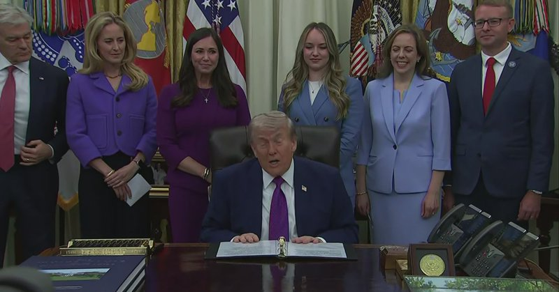
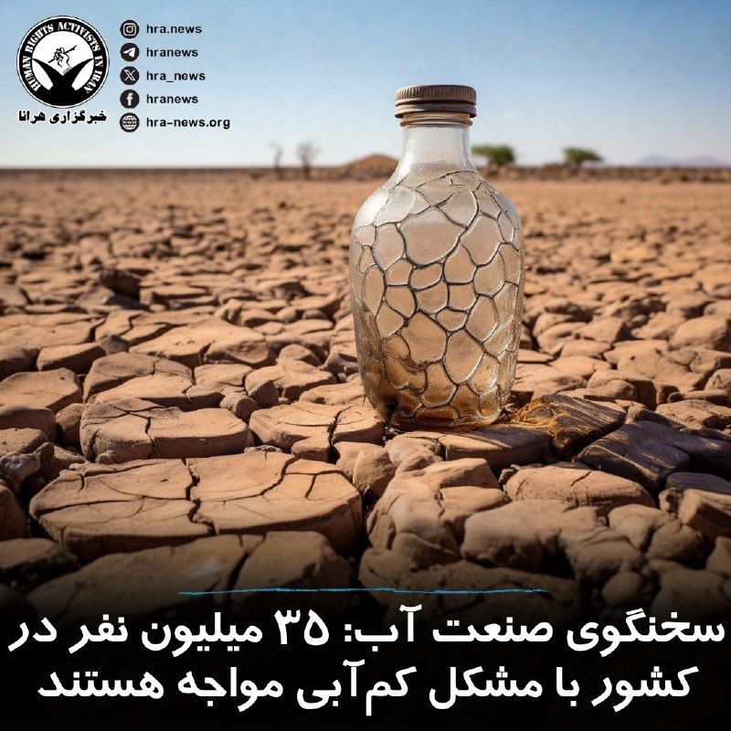

# خواننده تلگرام

<!-- TOP_NAV START -->

<a href="https://github.com/ali-exifit/aio-downloader/blob/main/telegram/content/archive_1.md" style="display:inline-block; padding:6px 12px; margin:0 4px; background-color:#2ea44f; color:white; text-decoration:none; border-radius:4px; font-weight:bold;">صفحه بعد</a>

<!-- TOP_NAV END -->

<!-- MSG START -->

---
📅 بروزرسانی: 1405/02/21 18:43
---

## mwarmonitor — post 8901

⚪️ (رویترز) - JPMorgan Chase انتظار دارد قیمت نفت برنت در بیشتر سال ۲۰۲۶ در محدوده پایین ۱۰۰ دلار باقی بماند، حتی اگر تنگه هرمز در ماه ژوئن دوباره باز شود، زیرا کاهش سریع ذخایر و گلوگاه‌های لجستیکی باعث می‌شود بازار نفت همچنان محدود و تحت فشار باقی بماند، این بانک در یک یادداشت اعلام کرد.

@mwarmonitor

## mwarmonitor — post 8900

🔵شبکه CBS به نقل از ترامپ:
می‌خواهم مالیات فدرال ۱۸ سنتی روی بنزین را برای مدتی به حالت تعلیق درآورم.

@mwarmonitor

## mwarmonitor — post 8899

🔴 ترامپ به فاکس‌نیوز: در حال بررسی ازسرگیری «پروژه آزادی» هستم، اما با دامنه‌ای گسترده‌تر که صرفاً به اسکورت کشتی‌ها از طریق تنگه هرمز محدود نباشد. @mwarmonitor

## mwarmonitor — post 8898

🔴 آسوشیتدپرس به نقل از یک منبع دیپلماتیک:

🔹اسلام‌آباد در تلاش است تا یک تفاهم‌نامه برای پایان جنگ تنظیم کند و مسیر گفت‌وگوی گسترده‌تری میان واشنگتن و تهران را باز کند.

@mwarmonitor

## FoxNewsTwitter — post 341535

  

Fox News (Twitter/X)

WATCH LIVE: Trump highlights new maternal healthcare initiatives at the White House https://twitter.com/i/broadcasts/1wxWjadDZwwJQ

## FoxNewsTwitter — post 341534

  <a href="telegram/content/FoxNewsTwitter_341534_1778512411.mp4" target="_blank">🎬 Download video</a>

Fox News (Twitter/X)

REPORTER: "Can you guarantee that no American will catch this virus from the passengers who returned to the United States?"

DR BRENDAN JACKSON: "Our top priority across all levels of government here and partners is the health and safety of the of the passengers and their communities."

REPORTER: "So there's – you can guarantee no American will catch this virus from these returning passengers?"

DR BRENDAN JACKSON: "There are no guarantees in life."

## FoxNewsTwitter — post 341533

  <a href="telegram/content/FoxNewsTwitter_341533_1778512413.mp4" target="_blank">🎬 Download video</a>

Fox News (Twitter/X)

NEW: The New York City man accused of murdering a 76-year-old teacher by shoving him down the steps of a subway station was released from a psych ward just hours before the deadly attack.

@AlexisMcAdamsTV reports the latest.

## pm_afshaa — post 90555

  <a href="telegram/content/pm_afshaa_90555_1778512416.webm" target="_blank">🎬 Download video</a>

🔴ترامپ به فاکس نیوز:
در حال بررسی از سرگیری پروژه آزادی هستم، اما در مقیاسی وسیع تر که فقط به اسکورت کشتی‌ها از طریق تنگه هرمز محدود نمیشه.

آنها تسلیم خواهند شد؛ من با آنها معامله خواهم کرد تا زمانی که به توافق برسن.

💧 Rainbet.com the #1 Non-KYC Crypto Casino & Sportsbook @rainbetcom

😁 @Pm_Afshaa

## BBCPersian — post 280771

🖋جیوان نروان
بی‌بی‌سی، لندن

کسب‌وکارهای فعال در لندن می‌گویند قیمت زعفران به دلیل جنگ ایران به شدت افزایش یافته است. زعفران یکی از گران‌ترین ادویه‌های جهان است و حدود ۹۰ درصد از ذخیره جهانی آن در ایران تولید می‌شود.

در پی بسته شدن تنگه هرمز، عرضه زعفران کاهش یافته و این محدودیت شامل برخی اقلام اساسی دیگر مانند نخود و زرشک نیز شده است؛ موادی که در بسیاری از غذاهای ایرانی و خاورمیانه‌ای کاربرد گسترده‌ای دارند.

دیلمان محمود، صاحب رستوران ایرانی صدف در غرب لندن، به بی‌بی‌سی عربی گفت با وجود فشارهای اقتصادی تلاش کرده قیمت‌ها را برای مشتریان ثابت نگه دارد. در همین حال، معین طیاری، تامین‌کننده زعفران، می‌گوید برای خرید عمده این ادویه با مشکل روبه‌رو شده است.

آقای محمود گفت: «هر غذایی که در آشپزخانه همراه برنج سرو می‌شود، روی آن یک لایه زعفران دارد.»

آلبوم را ورق بزنید و ادامه مطلب را از لینک زیر در وبسایت بی‌بی‌سی فارسی بخوانید.

📸GettyImages/ Reuters/ Anadolu via Getty Images/ Bloomberg via Getty Images/ NurPhoto via Getty Images
https://bbc.in/4eFVzYg
@BBCPersian

## alonews — post 119308

  <a href="telegram/content/alonews_119308_1778512417.webm" target="_blank">🎬 Download video</a>

👈آسوشیتدپرس: پاکستان هنوز در تلاش برای مذاکره برای رسیدن به توافق است

🔴دو دیپلمات منطقه‌ای که با مذاکرات جاری آشنا هستند، گفتند که پاکستان به تلاش‌های خود برای میانجیگری و رسیدن به سازش ادامه می‌دهد.

🔴یکی از دیپلمات‌ها گفت پاکستان در تلاش است تا یادداشت تفاهمی را با هدف پایان دادن به جنگ و هموار کردن راه برای گفتگوی گسترده‌تر در مورد مسائلی که دو طرف همچنان در مورد آنها اختلاف نظر دارند، تنظیم کند.

🔴این دیپلمات گفت پاکستان امیدوار بود که هفته گذشته به نهایی شدن این تفاهم‌نامه کمک کند، اما این تلاش محقق نشد و میانجی‌ها هنوز روی پیشنهادهای مختلف کار می‌کنند.

✅ @AloNews خبر جنگ

---
📅 بروزرسانی: 1405/02/21 18:33
---

## VahidOOnLine — post 239536

  

کول آلن، متهم به تلاش برای ترور دونالد ترامپ در مراسم شام خبرنگاران کاخ سفید، در دادگاه اتهامات علیه خود را رد کرد.
او متهم است ۲۵ آوریل با عبور از ایست بازرسی امنیتی، به سمت یکی از مأموران سرویس مخفی آمریکا شلیک کرده باشد.

در زمان حادثه، ترامپ، ملانیا ترامپ و شماری از مقام‌های ارشد دولت آمریکا در محل حضور داشتند و پس از شنیده شدن صدای تیراندازی از سالن خارج شدند.

دادستان‌ها می‌گویند هنگام بازداشت، چند چاقو و یک اسلحه کمری نیز همراه آلن بوده است. او در صورت محکومیت با احتمال حبس ابد روبه‌رو خواهد شد.
‌🏁 🇬🇧 ManotoTV

🤖 @VahidOOnLine

## VahidOOnLine — post 239535

♦️آریانا سعید، خواننده مشهور افغان، در ایالت ویرجینیای آمریکا کنسرتی ویژه زنان برگزار کرد؛ برنامه‌ای که با استقبال گسترده افغان‌های ساکن آمریکا همراه شد و فضای پرشوری را برای حاضران رقم زد.

او در این کنسرت مجموعه‌ای از ترانه‌ها را به زبان‌های فارسی، پشتو، ازبکی و اردو اجرا کرد و ویدیوهای منتشرشده از این برنامه نیز به‌سرعت در شبکه‌های اجتماعی مورد توجه کاربران قرار گرفت و به شکل گسترده بازنشر شد.

آریانا سعید از شناخته‌شده‌ترین چهره‌های موسیقی افغانستان به شمار می‌رود که پیش از بازگشت طالبان، بارها در کابل و دیگر شهرهای افغانستان روی صحنه رفته بود. اما پس از تسلط دوباره طالبان بر افغانستان، اجرای موسیقی و فعالیت بسیاری از هنرمندان با محدودیت‌های شدید روبه‌رو شد و شماری از خوانندگان و موسیقیدان‌ها ناچار به ترک کشور شدند.

در ماه‌های اخیر، تعدادی از هنرمندان افغان مقیم خارج از کشور تلاش کرده‌اند با برگزاری کنسرت‌ها و برنامه‌های موسیقی، فعالیت هنری خود را ادامه دهند و ارتباطشان را با مخاطبان افغان حفظ کنند.
‌🇸🇦 Indypersian

🤖 @VahidOOnLine

## mwarmonitor — post 8897

  <a href="telegram/content/mwarmonitor_8897_1778511806.mp4" target="_blank">🎬 Download video</a>

🇮🇱نیروهای لشکر ۱۴۶ یک انبار تسلیحاتی را هدف قرار داده و نیروهای حزب‌الله را که تهدیدی برای نیروهای ما بودند، به‌ هلاکت ‌رساندند

نیروهای لشکر ۱۴۶ دیروز (یکشنبه) دو تروریست وابسته به سازمان تروریستی حزب‌الله را که وارد ساختمانی در نزدیکی نیروهای ما در جنوب لبنان شده بودند، شناسایی کردند. از داخل این ساختمان، این تروریست ها برای پیشبرد طرحی تروریستی علیه نیروهای ارتش اسرائیل که در منطقه فعالیت می‌کنند، اقدام می‌کردند.

بلافاصله پس از شناسایی، نیروی هوایی با هدایت نیروهای لشکر، این تروریست ها را که در ساختمان فعالیت داشتند، هدف قرار داده و به هلاکت رساند.

همچنین زیرساخت‌ها و یک انبار تسلیحاتی که مورد استفاده سازمان تروریستی حزب‌الله بود، هدف قرار گرفت و تروریست های دیگری که تهدیدی برای نیروهای ما بودند نیز به هلاکت رسیدند.

علاوه بر این، در ساعات اخیر سازمان تروریستی حزب‌الله چندین راکت و پهپاد انفجاری به سوی نیروهای ارتش اسرائیل در جنوب لبنان شلیک کرد.
در جریان این رویدادها، دو پهپاد انفجاری به تجهیزات مهندسی بدون سرنشین اصابت کردند.

@mwarmonitor

## FoxNewsTwitter — post 341532

  <a href="telegram/content/FoxNewsTwitter_341532_1778511808.mp4" target="_blank">🎬 Download video</a>

Fox News (Twitter/X)

NEW: "The data that we have now all suggest that transmission that spread between people happens when people are symptomatic."

"That gives us one layer of added protection to know when the risk is going to be greatest and how we can best protect the health and safety of the passenger and the American public."

## pm_afshaa — post 90554

🔴ترامپ به فاکس نیوز: تا زمانی که معامله‌ای صورت نگیرد با ایران برخورد خواهیم کرد. ایران عقب‌نشینی خواهد کرد

💧 Rainbet.com the #1 Non-KYC Crypto Casino & Sportsbook @rainbetcom

😁 @Pm_Afshaa

## pm_afshaa — post 90553

🔴رئیس شرکت رافائل اسرائیل : اسرائیل هیچ کمبودی در موشک‌های رهگیر سامانه گنبد آهنین ندارد

💧 Rainbet.com the #1 Non-KYC Crypto Casino & Sportsbook @rainbetcom

😁 @Pm_Afshaa

## pm_afshaa — post 90552

🔴ترامپ: تیم مذاکره‌کننده جمهوری اسلامی به ما گفت که آمریکا باید اورانیوم غنی‌شده را خارج کند، زیرا جمهوری اسلامی فناوری انجام این کار را ندارد

💧 Rainbet.com the #1 Non-KYC Crypto Casino & Sportsbook @rainbetcom

😁 @Pm_Afshaa

## VahidOnline — post 75406

AmirKh1982

📡 @VahidOnline

## IranIntlTV — post 336668

  <a href="telegram/content/IranIntlTV_336668_1778511810.mp4" target="_blank">🎬 Download video</a>

سرخط خبرهای دوشنبه ۲۱ اردیبهشت
@iranintltv

## IranIntlTV — post 336667

  <a href="telegram/content/IranIntlTV_336667_1778511811.mp4" target="_blank">🎬 Download video</a>

پس از رد پیشنهاد دیپلماتیک جدید جمهوری اسلامی از سوی دونالد ترامپ، سناتورها در کنگره آمریکا به ابراز نظر و واکنش پرداختند. سناتور لیندسی گراهام از احیای پروژه آزادی پلاس حمایت کرد.

مرضیه حسینی، خبرنگار ایران‌اینترنشنال، گزارش می‌دهد
@iranintltv

## ManotoTV — post 105309

  

کول آلن، متهم به تلاش برای ترور دونالد ترامپ در مراسم شام خبرنگاران کاخ سفید، در دادگاه اتهامات علیه خود را رد کرد.
او متهم است ۲۵ آوریل با عبور از ایست بازرسی امنیتی، به سمت یکی از مأموران سرویس مخفی آمریکا شلیک کرده باشد.

در زمان حادثه، ترامپ، ملانیا ترامپ و شماری از مقام‌های ارشد دولت آمریکا در محل حضور داشتند و پس از شنیده شدن صدای تیراندازی از سالن خارج شدند.

دادستان‌ها می‌گویند هنگام بازداشت، چند چاقو و یک اسلحه کمری نیز همراه آلن بوده است. او در صورت محکومیت با احتمال حبس ابد روبه‌رو خواهد شد.

## FarsiVOA — post 217445

🔺آمادگی اسرائیل برای اقدام نظامی علیه جمهوری اسلامی؛ تمرکز بر ضربه به حزب‌الله و حماس با حذف بیش از ۲۲۰ تروریست

▪️بنا بر اطلاعاتی که در اختیار بخش فارسی صدای آمریکا قرار گرفته، اسرائیل در حالی‌که آمادگی کامل خود را برای هرگونه پاسخ به حملات احتمالی جمهوری اسلامی حفظ کرده، تمرکز عملیاتی خود را بر ادامه ضربه‌زدن به گروه‌های نیابتی جمهوری اسلامی، به‌ویژه حزب‌الله لبنان و حماس، ادامه خواهد داد.

⬇️ بیشتر بخوانید:

https://ir.voanews.com/a/8148806.html/?nocach=1

## Persian_Trend_Official — post 13923

  <a href="telegram/content/Persian_Trend_Official_13923_1778511814.webm" target="_blank">🎬 Download video</a>

🔴 ترامپ: ایران از آمریکا خواسته «گرد و غبار هسته‌ای» را جمع‌آوری کند

💢دونالد ترامپ مدعی شد مذاکره‌کنندگان ایرانی به او گفته‌اند آمریکا باید مواد رادیواکتیو باقی‌مانده در تأسیسات هسته‌ای تخریب‌شده ایران را خارج کند، زیرا تهران فناوری لازم برای استخراج و پاکسازی آن را در اختیار ندارد.

ترامپ در توصیف این مواد از عبارت «گرد و غبار هسته‌ای» استفاده کرده است.

📌 این ادعا تاکنون از سوی منابع رسمی ایران تأیید نشده است.

🫆:Tony

📌 @persian_trend_official
پرشین ترند | متفاوت‌ترین کانال نظامی

## Persian_Trend_Official — post 13922

🔴 ترامپ: احتمال ازسرگیری «پروژه آزادی» با ابعادی گسترده‌تر

💢دونالد ترامپ اعلام کرد در حال بررسی ازسرگیری «پروژه آزادی» است، اما این بار نه فقط برای اسکورت کشتی‌ها در تنگه هرمز، بلکه در قالبی گسترده‌تر.

💢او همچنین مدعی شد:
«رهبران تندروی ایران در نهایت تسلیم خواهند شد.»

«با ایران تعامل خواهیم کرد تا زمانی که به توافق برسیم.»

📌 این اظهارات در حالی مطرح می‌شود که فضای مذاکرات و تنش‌های منطقه‌ای همچنان ناپایدار و مبهم باقی مانده است.

🫆:Tony

📌 @persian_trend_official
پرشین ترند | متفاوت‌ترین کانال نظامی

## IranianMinds — post 19946

🔴 ترامپ به فاکس نیوز :

در حال بررسی تمدید عملیات پروژه آزادی اما گسترده‌تر کردن آن، نه محدود به اسکورت کشتی‌ها در تنگه هرمز

@IranianMinds

## IranianMinds — post 19945

  <a href="https://t.me/IranianMinds/19945" target="_blank">📎 Download file</a>

📲#اپلیکیشن اندروید سایت جهانی دربی بت

👍اسپانسر لیگ انگلیس
👍
🔥امکان شارژ امن از طریق کارت بانکی
➖➖➖➖➖➖➖➖➖

🪙همین حالا عضو شوید 👇
https://t.me/+aCbq7yy8QY80NzQ0

## IranianMinds — post 19944

  

😤دنبال یه سایت شرط بندی بین المللی بودی که به ایرانیا خدمات بده؟!
⛔

👍دربی بت همون انتخاب  100%

💎ویژگی های سایت جهانی Derby Bet:

⬅️امکان شارژ امن با کارت بانکی

⬅️واریز اول دوبل شارژ می شوید(بونوس۱۰۰٪)

⬅️پر اپشن ترین سایت فعال در ایران

⬅️تسویه حساب کمتر از 5 دقیقه

⬅️برگشت بخشی از باخت به صورت هفتگی

🚨کد هدیه ثبت نام:GG007

⚠️برای دانلود اپلکیشن کلیک کنید
👉
ge21

🔔کانال دربی بت :

🪙https://t.me/+aCbq7yy8QY80NzQ0

## Hranews — post 112884

  

سخنگوی صنعت آب کشور، اعلام کرد که ۳۵ میلیون نفر در ایران با مشکل #کم‌آبی مواجه هستند و ۱۱ استان همچنان شرایط بارشی زیر نرمال دارند. وی با اشاره به نامتوازن بودن بارش‌ها گفت که با وجود بارندگی مناسب در استان‌هایی مانند بوشهر، هرمزگان و ایلام، استان‌هایی از جمله تهران، قم، یزد، مرکزی و اصفهان همچنان با کاهش شدید بارش روبه‌رو هستند و تهران در صدر مناطق بحرانی قرار دارد.

عیسی بزرگ‌زاده، با تاکید بر اینکه مدیریت منابع آبی باید «کاملا محلی» باشد، گفت افزایش بارش یا سرریز سدها در برخی مناطق تاثیری در تامین آب استان‌های دچار تنش آبی ندارد. او با اشاره به ادامه بحران آب در بخش‌هایی از کشور، بر ضرورت مدیریت مصرف و اصلاح الگوی مصرف آب تاکید کرد.

↘️
@hranews_bot تماس ✉️ -  @Hranews  کانال هرانا 🆑

## manototv — post 105309

  

کول آلن، متهم به تلاش برای ترور دونالد ترامپ در مراسم شام خبرنگاران کاخ سفید، در دادگاه اتهامات علیه خود را رد کرد.
او متهم است ۲۵ آوریل با عبور از ایست بازرسی امنیتی، به سمت یکی از مأموران سرویس مخفی آمریکا شلیک کرده باشد.

در زمان حادثه، ترامپ، ملانیا ترامپ و شماری از مقام‌های ارشد دولت آمریکا در محل حضور داشتند و پس از شنیده شدن صدای تیراندازی از سالن خارج شدند.

دادستان‌ها می‌گویند هنگام بازداشت، چند چاقو و یک اسلحه کمری نیز همراه آلن بوده است. او در صورت محکومیت با احتمال حبس ابد روبه‌رو خواهد شد.

## alonews — post 119307

  <a href="telegram/content/alonews_119307_1778511818.webm" target="_blank">🎬 Download video</a>

👈ترامپ: رهبران تندرو ایران را تسلیم میکنیم

✅ @AloNews خبر جنگ

## alonews — post 119306

  <a href="telegram/content/alonews_119306_1778511818.webm" target="_blank">🎬 Download video</a>

👈ترامپ به فاکس نیوز: تا زمانی که معامله‌ای صورت نگیرد با ایران برخورد خواهیم کرد. ایران عقب‌نشینی خواهد کرد

✅ @AloNews خبر جنگ

## alonews — post 119305

  <a href="telegram/content/alonews_119305_1778511819.webm" target="_blank">🎬 Download video</a>

👈ترامپ به فاکس نیوز گفت که او «به طور جدی در حال بررسی» انتقال ونزوئلا به عنوان ایالت ۵۱ام است.

✅ @AloNews خبر جنگ

<!-- MSG END -->

<!-- NAV START -->

<a href="https://github.com/ali-exifit/aio-downloader/blob/main/telegram/content/archive_1.md" style="display:inline-block; padding:6px 12px; margin:0 4px; background-color:#2ea44f; color:white; text-decoration:none; border-radius:4px; font-weight:bold;">صفحه بعد</a>

<!-- NAV END -->
