## 1405/02/17 12:53 — VahidOOnLine
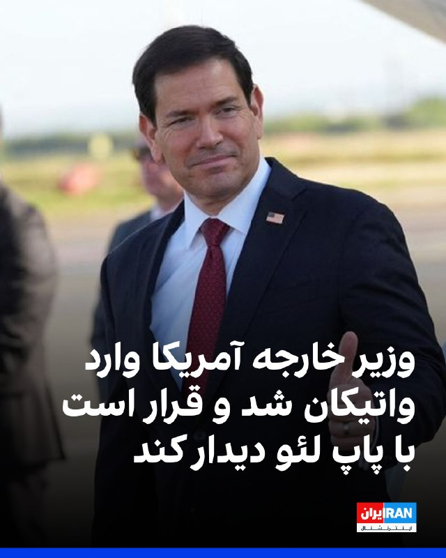

> وزیر خارجه آمریکا وارد واتیکان شد و قرار است با پاپ لئو دیدار کند.
> 
> سفر مارکو روبیو پس از حملات ترامپ به پاپ به دلیل مواضع او درباره جنگ ایران انجام شده است.
> 
> دونالد ترامپ اخیرا گفته بود پاپ، «داشتن سلاح هسته‌ای برای جمهوری اسلامی را کاملا بی‌اشکال می‌داند و فکر می‌کنم او جان بسیاری از کاتولیک‌ها و افراد دیگر را به خطر می‌اندازد.»
> ‌🏁 🇬🇧 IranintlTV
> 
> 🤖 @VahidOOnLine

## 1405/02/17 12:53 — IranIntlTV

> وزیر خارجه آمریکا وارد واتیکان شد و قرار است با پاپ لئو دیدار کند.
> 
> سفر مارکو روبیو پس از حملات ترامپ به پاپ به دلیل مواضع او درباره جنگ ایران انجام شده است.
> 
> دونالد ترامپ اخیرا گفته بود پاپ، «داشتن سلاح هسته‌ای برای جمهوری اسلامی را کاملا بی‌اشکال می‌داند و فکر می‌کنم او جان بسیاری از کاتولیک‌ها و افراد دیگر را به خطر می‌اندازد.»
> https://iranintl.com/202605071000

## 1405/02/17 12:51 — DEJradio

> 🔺📢 وزیر خارجه فرانسه: تا وقتی تنگه هرمز مسدود است، تحریم‌های ایران برداشته نخواهد شد
> 
> ژان‌نوئل بارو وزیر خارجه فرانسه اعلام کرد تا زمانی که تنگه هرمز مسدود است، «حتی کوچک‌ترین تحریم» مرتبط با ایران لغو نخواهد شد.
> 
> پیش‌تر امانوئل ماکرون رئیس جمهوری فرانسه در گفت‌وگو با مسعود پزشکیان رئیس جمهور ایران خواستار رفع فوری محاصره تنگه شده بود.
> 
> فرانسه روز چهارشنبه ناوگروه هواپیمابر «شارل دوگل» را به دریای سرخ اعزام کرد. این اقدام بخشی از برنامه‌ریزی اروپا برای انجام یک مأموریت چندملیتی جهت تأمین امنیت تردد کشتی‌ها در تنگه هرمز به شمار می‌رود.
> 
> به گزارش «رویترز»، این اقدام در حالی صورت می‌گیرد که تنش میان ایران و آمریکا بر سر کنترل این آبراه راهبردی همچنان ادامه دارد، و تبادل آتش‌های اخیر نشان داده که آتش‌بس شکننده موجود می‌تواند به‌سرعت فروبپاشد.
> 
> #تنگه_هرمز #تحریم
> @DEJradio

## 1405/02/17 12:48 — DEJradio

> 🚨📢 کانال ۱۲ اسرائیل:
> ترامپ بدون خروج اورانیوم غنی‌شده از ایران، توافق نخواهد کرد
> 
> کانال ۱۲ اسرائیل نوشت که بر اساس ارزیابی مقامات این کشور، ترامپ بر یکی از اصلی‌ترین خواسته‌های خود یعنی خروج اورانیوم غنی‌شده از ایران پافشاری خواهد کرد و بدون اجرای این شرط، توافقی در کار نخواهد بود.
> 
> بنا بر این گزارش ترامپ به نتانیاهو اعلام کرده بدون خروج اورانیوم غنی‌شده از ایران، هیچ توافقی را امضا نخواهد کرد.
> 
> کانال ۱۲ اسرائیل همچنین نوشت که بر اساس ارزیابی‌های امنیتی در این کشور، جمهوری اسلامی درباره انتقال ذخایر اورانیوم ۶۰ درصدی به کشور ثالث، تا حدی انعطاف نشان داده اما هنوز اختلاف بر سر این است که این مواد به کدام کشور منتقل شوند.
> 
> #مذاکرات #ترامپ
> @DEJradio

## 1405/02/17 12:40 — Persian_Trend_Official
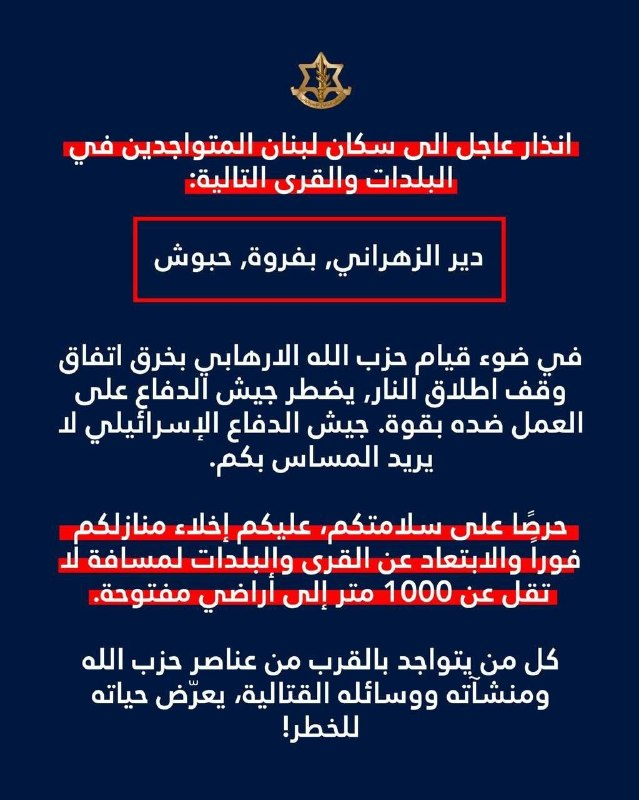

> 🔴 ارتش اسرائیل دستور تخلیه فوری ۳ روستا در جنوب لبنان را صادر کرد
> 
> ▪️ارتش اسرائیل با انتشار هشدار جدیدی از ساکنان سه روستا در جنوب لبنان خواست فوراً منطقه را ترک کنند.
> 
> 🔹تا این لحظه جزئیات بیشتری درباره اهداف احتمالی یا زمان عملیات منتشر نشده است.
> 
> 🫆:Tony
> 
> 📌 @persian_trend_official
> پرشین ترند | متفاوت‌ترین کانال نظامی

## 1405/02/17 12:39 — Hranews
> استان سمنان؛ ۱۲ متهم به تحمل ضربات شلاق محکوم شدند
> 
> 
> ❗️
> ❗️
> ❗️
> ❗️
> ❗️– ۱۲ متهم در یک پرونده مشترک مرتبط با سرقت مسلحانه از خطوط لوله نفت در محدوده شهرستان‌های ایوانکی و آرادان، با حکم شعبه اول دادگاه کیفری یک استان سمنان علاوه بر حبس، به تحمل ضربات #شلاق محکوم شدند. حکم صادره در دیوان عالی کشور نیز به تایید رسیده است.
> 
> ادامه مطلب
> 
> ↘️
> @hranews_bot تماس ✉️ - @Hranews کانال هرانا 🆑

## 1405/02/17 12:38 — DEJradio
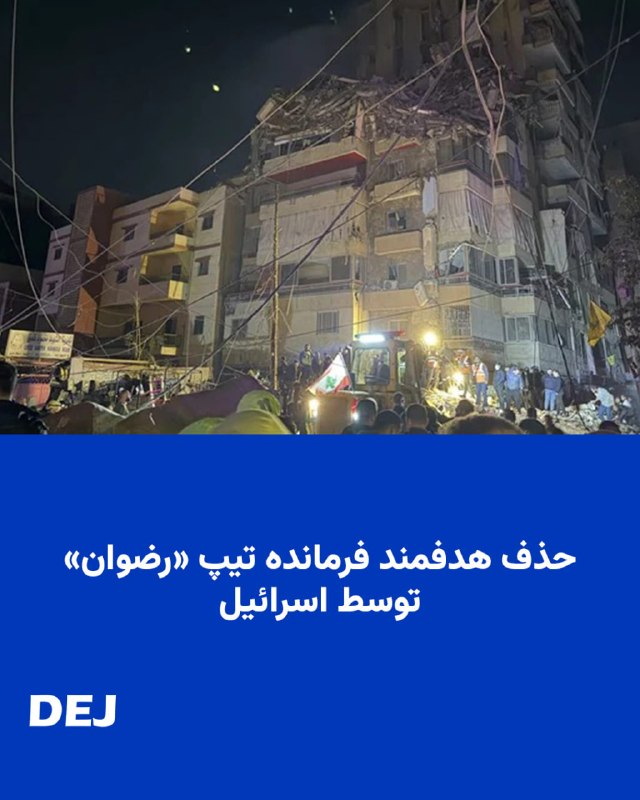

> 💀
> 🚨 حذف هدفمند فرمانده تیپ «رضوان» توسط اسرائیل
> 
> ارتش اسرائیل اعلام کرد احمد غالب بلوط، فرمانده واحد «نیروی رضوان» وابسته به گروه حـ.زب‌الله لبنان، در حمله‌ای در ضاحیه بیروت کشته شده است. ارتش اسرائیل اعلام کرد او از فرماندهان ارشد عملیاتی این واحد کماندویی بوده و در سال‌های گذشته مسئولیت‌هایی از جمله فرماندهی عملیات و آمادگی نیروها برای مقابله با ارتش اسرائیل را برعهده داشته است.
> بر اساس گزارش ارتش اسرائیل، احمد غالب بلوط علاوه بر فرمانده عملیات‌های اخیر این گروه تحت هدایت، حمایت و آموزش سپـ.اه پاسـ.داران، در بازسازی توان رزمی «نیروی رضوان» و پیشبرد «طرح تصرف الجلیل» نقش کلیدی ایفا می‌کرد.
> 
> #حذف_هدفمند #لبنان
> @DEJradio

## 1405/02/17 12:34 — VahidOOnLine

> ارتش اسرائیل اعلام کرد که محمدعلی بزی، رییس بخش اطلاعات واحد نصر و حسین حسن رومانی، از فرماندهان پدافند هوایی حزب‌الله در حملات چهارشنبه کشته شده‌اند.
> پیش‌تر نیز اعلام شده بود که فرمانده یگان رضوان حزب‌الله در حملات به ضاحیه بیروت کشته شده است.
> 
> همچنین ارتش اسرائیل اعلام کرد که در هفته گذشته، ۸۵ نیروی حزب‌الله و از زمان اجرایی شدن توافق‌های آتش‌بس، بیش از ۲۲۰ عضو این گروه را کشته‌اند.
> 
> ارتش اسرائیل اعلام کرد که این نیروها تهدیدی برای نیروهای ارتش و شهروندان اسرائیل بودند.
> ‌🏁 🇬🇧 IranintlTV
> 
> 🤖 @VahidOOnLine

## 1405/02/17 12:34 — IranIntlTV
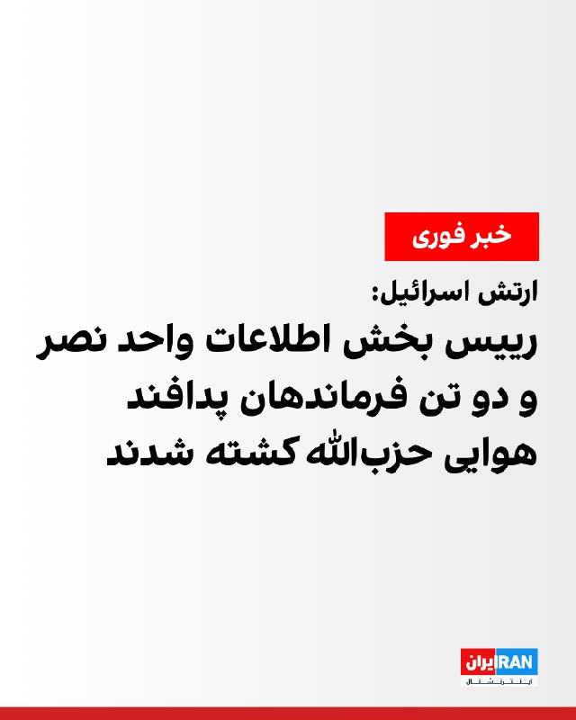

> ارتش اسرائیل اعلام کرد که محمدعلی بزی، رییس بخش اطلاعات واحد نصر و حسین حسن رومانی، از فرماندهان پدافند هوایی حزب‌الله در حملات چهارشنبه کشته شده‌اند.
> پیش‌تر نیز اعلام شده بود که فرمانده یگان رضوان حزب‌الله در حملات به ضاحیه بیروت کشته شده است.
> 
> همچنین ارتش اسرائیل اعلام کرد که در هفته گذشته، ۸۵ نیروی حزب‌الله و از زمان اجرایی شدن توافق‌های آتش‌بس، بیش از ۲۲۰ عضو این گروه را کشته‌اند.
> 
> ارتش اسرائیل اعلام کرد که این نیروها تهدیدی برای نیروهای ارتش و شهروندان اسرائیل بودند.
> https://iranintl.com/202605077181

## 1405/02/17 12:31 — RadioFarda
> پاراگراف اول؛ پدیده «اعدام درمانی» در ایران و فراگیر نشدن کارزارهای لغو این مجازات
> 
> 🔸اعدام در جمهوری اسلامی صرفاً یک حکم قضایی نیست؛ بخشی از زبان قدرت است. زبانی که از نخستین سال‌های پس از انقلاب ۱۳۵۷، با بازداشت‌های گسترده، دادگاه‌های شتاب‌زده و موج اعدام‌ها شکل گرفت و به‌تدریج تثبیت شد.
> 
> 🔸از اعدام هزاران زندانی و مخالف سیاسی در دههٔ ۶۰ تا دهه‌های بعد، این چرخه نه متوقف شد و نه محدود ماند؛ بلکه دایرهٔ آن از محکومان جرائم مواد مخدر به مخالفان سیاسی، معترضان خیابانی، اقلیت‌ها و متهمان امنیتی گسترش یافت.
> 
> 🔸در این میان، پرسش‌های بنیادین همچنان مطرح‌اند: چرا در پرونده‌های سیاسی، به‌ویژه مواردی که با حکم اعدام همراه‌اند، دادگاه‌های شفاف، علنی و منصفانه برگزار نمی‌شود؟ اگر حکومت به مستندات خود اطمینان دارد، چرا روند رسیدگی از چشم جامعه پنهان می‌ماند؟ و اگر هدف اجرای عدالت است، چرا خانواده‌ها، وکلا، رسانه‌ها و افکار عمومی اغلب در برابر ساختارهای بسته امنیتی قرار می‌گیرند؟
> 
> 🔸در برنامهٔ رادیویی «پاراگراف اول»، نادر وهابی، جامعه‌شناس دانشگاه تولوز در فرانسه همراه با فرج سرکوهی دانش‌آموخته علوم اجتماعی، نویسنده و روزنامه‌نگار از آلمان به پدیده «اعدام درمانی» در جمهوری اسلامی ایران و دلایل فراگیر نشدن کارزارهای درخواست لغو این مجازات پرداخته‌اند.
> 
> 🔸 گزارش کامل را در وب‌سایت رادیوفردا بخوانید.
> 
> @RadioFarda

## 1405/02/17 12:28 — mwarmonitor
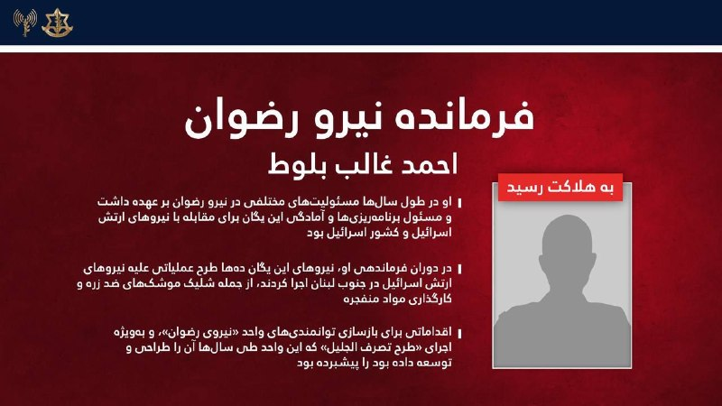

> 🔴«فوری: فرمانده نیروی ویژه رضوان حزب‌الله و معاون او در حمله ارتش اسرائیل (IDF) امشب کشته شدند.» @mwarmonitor

## 1378/10/11 03:30 — VahidOOnLine
[🎬 Video](telegram/content/VahidOOnLine_238610_1778145983.mp4)

> شبکه خبری ان‌بی‌سی به نقل از دو مقام آمریکایی گزارش داد تصمیم دونالد ترامپ برای توقف عملیات آمریکا جهت هدایت کشتی‌ها در تنگه هرمز، در پی فشار عربستان سعودی اتخاذ شده است.
> بر اساس این گزارش، مقام‌های سعودی به واشینگتن اطلاع داده‌اند اجازه استفاده از پایگاه هوایی عربستان یا عبور هواپیماهای نظامی آمریکا از حریم هوایی عربستان برای اجرای این عملیات را نخواهند داد. گفته می‌شود این عملیات با نام «پروژه آزادی» قرار بود برای همراهی و خروج کشتی‌های گرفتار در تنگه هرمز انجام شود.
> ان‌بی‌سی همچنین گزارش داد ترامپ در تماس با محمد بن سلمان، ولیعهد عربستان، تلاش کرده این موضوع را حل کند، اما این تماس نتیجه‌ای نداشته است. در نهایت، رئیس‌جمهوری آمریکا برای حفظ دسترسی نظامی واشینگتن به حریم هوایی راهبردی عربستان، این عملیات را متوقف کرده است.
> ‌🏁 🇬🇧 ManotoTV
> 
> 🤖 @VahidOOnLine

## 1378/10/11 03:30 — DEJradio
[🎬 Video](telegram/content/DEJradio_4469_1778145983.mp4)

> 🔺🎥 استقرار سامانه‌های پدافندی چینی در امارات
> 
> سامانه پدافند هوایی لیزری Light Arrow-21A ساخت چین در امارات متحده عربی دیده شده است. این کلاس از سیستم های پدافندی بیشتر برای مقابله با پهپادهای انتحاری کاربرد دارند.
> 
> #پدافند_هوایی #امارات
> @DEJradio

## 1378/10/11 03:30 — IranIntlTV
[🎬 Video](telegram/content/IranIntlTV_335940_1778145985.mp4)

> ابراهیم رضایی، سخنگوی کمیسیون امنیت ملی مجلس، اعلام کرد جمهوری اسلامی و آمریکا درباره طرح پیشنهادی صلح در حال تبادل پیام هستند، اما تهران تاکنون پاسخی رسمی به پیشنهاد واشینگتن ارائه نکرده است.
> گفت‌وگو با علی شیرازی، عضو تحریریه ایران‌اینترنشنال
> @iranintltv

## 1378/10/11 03:30 — ManotoTV
[🎬 Video](telegram/content/ManotoTV_105071_1778145987.mp4)

> شبکه خبری ان‌بی‌سی به نقل از دو مقام آمریکایی گزارش داد تصمیم دونالد ترامپ برای توقف عملیات آمریکا جهت هدایت کشتی‌ها در تنگه هرمز، در پی فشار عربستان سعودی اتخاذ شده است.
> بر اساس این گزارش، مقام‌های سعودی به واشینگتن اطلاع داده‌اند اجازه استفاده از پایگاه هوایی عربستان یا عبور هواپیماهای نظامی آمریکا از حریم هوایی عربستان برای اجرای این عملیات را نخواهند داد. گفته می‌شود این عملیات با نام «پروژه آزادی» قرار بود برای همراهی و خروج کشتی‌های گرفتار در تنگه هرمز انجام شود.
> ان‌بی‌سی همچنین گزارش داد ترامپ در تماس با محمد بن سلمان، ولیعهد عربستان، تلاش کرده این موضوع را حل کند، اما این تماس نتیجه‌ای نداشته است. در نهایت، رئیس‌جمهوری آمریکا برای حفظ دسترسی نظامی واشینگتن به حریم هوایی راهبردی عربستان، این عملیات را متوقف کرده است.

## 1405/02/17 12:23 — mwarmonitor
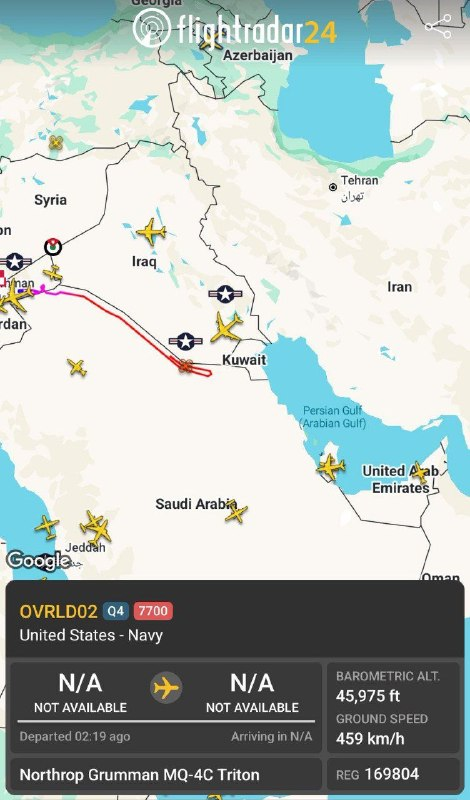

> 🇺🇸پهپاد شناسایی Northrop Grumman MQ-4C Triton متعلق به نیروی دریایی آمریکا که از پایگاه هوایی Muwaffaq Salti Air Base پرواز کرده بود، کد اضطراری 7700 را ارسال کرده است.
> 
> 🚨کد 7700 در هوانوردی به معنای اعلام وضعیت اضطراری عمومی از سوی هواگرد است. شماره 169804 نیز احتمالاً شناسه یا سریال این پهپاد است.
> 
> @mwarmonitor

## 1405/02/17 12:19 — VahidOOnLine
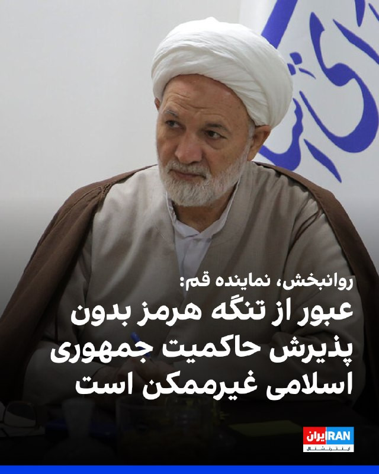

> قاسم روانبخش، نماینده قم در مجلس گفت که عبور از تنگه هرمز بدون پذیرش حاکمیت جمهوری اسلامی را غیرممکن دانست و گفت آمریکا راهی جز پذیرش حق حاکمیت ما و تن دادن به «رژیم حقوقی جدید» در این آبراه راهبردی ندارد.
> 
> او افزود: «ماجراجویی» در تنگه هرمز برای آمریکا و اسرائیل «هزینه‌ای سنگین و شکستی غیرقابل جبران» خواهد داشت و افزود آن‌ها از هرگونه درگیری نظامی با جمهوری اسلامی هراس دارند.
> 
> روانبخش اضافه کرد کاخ سفید با استفاده از نیروهای نیابتی و ظرفیت امارات متحده عربی تلاش کرد مسیری جایگزین برای تامین انرژی آمریکا و اروپا ایجاد کند، اما این اقدام به گفته او با «قدرت» جمهوری اسلامی روبه‌رو شد.
> ‌🏁 🇬🇧 IranintlTV
> 
> 🤖 @VahidOOnLine

## 1405/02/17 12:19 — IranIntlTV

> قاسم روانبخش، نماینده قم در مجلس گفت که عبور از تنگه هرمز بدون پذیرش حاکمیت جمهوری اسلامی را غیرممکن دانست و گفت آمریکا راهی جز پذیرش حق حاکمیت ما و تن دادن به «رژیم حقوقی جدید» در این آبراه راهبردی ندارد.
> 
> او افزود: «ماجراجویی» در تنگه هرمز برای آمریکا و اسرائیل «هزینه‌ای سنگین و شکستی غیرقابل جبران» خواهد داشت و افزود آن‌ها از هرگونه درگیری نظامی با جمهوری اسلامی هراس دارند.
> 
> روانبخش اضافه کرد کاخ سفید با استفاده از نیروهای نیابتی و ظرفیت امارات متحده عربی تلاش کرد مسیری جایگزین برای تامین انرژی آمریکا و اروپا ایجاد کند، اما این اقدام به گفته او با «قدرت» جمهوری اسلامی روبه‌رو شد.
> https://iranintl.com/202605071040

## 1405/02/17 12:18 — Hranews

> آخرین داده‌های نت‌ بلاکس نشان می‌دهد که #قطع_اینترنت در ایران، پس از گذشت ۱۶۳۲ ساعت محدودیت گسترده در دسترسی به شبکه‌های بین‌المللی، وارد شصت‌ونهمین روز خود شده است. این نهاد ناظر بر وضعیت دسترسی به اینترنت در جهان اعلام کرد که تداوم این اختلال‌ها، موجب افزایش بیکاری و آسیب گسترده به معیشت شهروندان، به‌ویژه کسب‌وکارهای مستقل شده است.
> 
> نت‌ بلاکس همچنین تاکید کرد که ادامه خاموشی اینترنت، با ایجاد محدودیت برای فعالیت آزاد اقتصادی و دیجیتال، عملا به «بازتوزیع منابع و فرصت‌های اقتصادی به سود گروه‌های نزدیک به حاکمیت» منجر شده است.
> 
> ↘️
> @hranews_bot تماس ✉️ - @Hranews کانال هرانا 🆑

## 1405/02/17 12:16 — Persian_Trend_Official
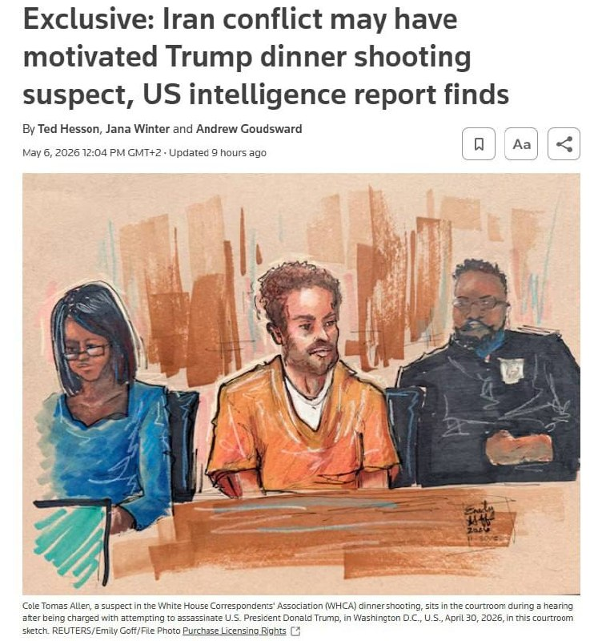

> 🔴 رویترز: جنگ با ایران یکی از انگیزه‌های احتمالی مظنون تیراندازی در شام خبرنگاران کاخ سفید
> 
> ▪️طبق گزارش رویترز، وزارت امنیت داخلی آمریکا در ارزیابی اولیه خود اعلام کرده جنگ آمریکا و اسرائیل علیه جمهوری اسلامی ممکن است یکی از عوامل مؤثر در اقدام «کول آلن»مظنون تیراندازی در مراسم شام خبرنگاران کاخ سفیدبوده باشد.
> 
> ▪️بر اساس این ارزیابی، محققان معتقدند آلن دارای «نارضایتی‌ها و شکایات متعدد اجتماعی و سیاسی» بوده و پست‌های منتشرشده در شبکه‌های اجتماعی او نیز حاوی انتقاد از نقش آمریکا در جنگ علیه ایران بوده است.
> 
> 🔹در گزارش تأکید شده که تحقیقات همچنان ادامه دارد و مقام‌های آمریکایی هنوز درباره انگیزه نهایی مهاجم به جمع‌بندی قطعی نرسیده‌اند.
> 
> 🫆:Tony
> 
> 📌 @persian_trend_official
> پرشین ترند | متفاوت‌ترین کانال نظامی

## 1405/02/17 12:14 — VahidOOnLine
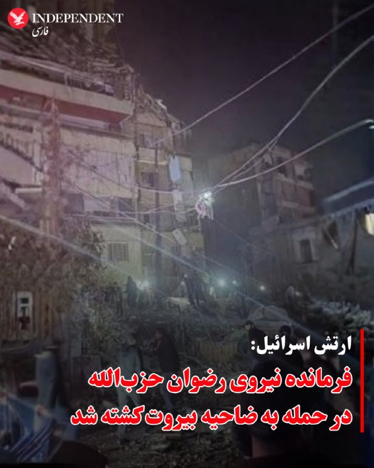

> ♦️ارتش اسرائیل روز پنجشنبه ۱۷ اردیبهشت ماه کشته شدن احمد غالب بلوط، فرمانده نیروی رضوان، یگان کماندویی حزب‌الله لبنان را تائید کرد.
> 
> ارتش اسرائیل شامگاه چهارشنبه اعلام کرد ساختمان محل حضور این فرمانده ارشد نظامی و چند عضو دیگر حزب‌الله را در ضاحیه بیروت هدف قرار داده است.
> ‌🇸🇦 Indypersian
> 
> 🤖 @VahidOOnLine

## 1405/02/17 12:13 — VahidOOnLine
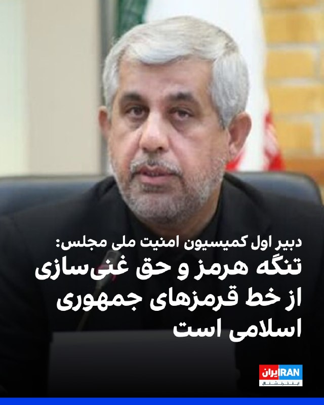

> بهنام سعیدی، دبیر اول کمیسیون امنیت ملی مجلس، گفت: «تنگه هرمز و حق غنی‌سازی از خط قرمزهای جمهوری اسلامی در مذاکرات با آمریکا است و اگر حق غنی‌سازی ما پذیرفته نشود، مذاکرات با شکست مواجه خواهد شد.»
> 
> دبیر اول کمیسیون امنیت ملی مجلس، افزود: «بازگرداندن اموال بلوکه‌شده ایران مهم است و محاصره دریایی و تحریم‌های اولیه و ثانویه علیه جمهوری اسلامی باید برداشته شود.»
> ‌🏁 🇬🇧 IranintlTV
> 
> 🤖 @VahidOOnLine

## 1405/02/17 12:12 — IranIntlTV

> بهنام سعیدی، دبیر اول کمیسیون امنیت ملی مجلس، گفت: «تنگه هرمز و حق غنی‌سازی از خط قرمزهای جمهوری اسلامی در مذاکرات با آمریکا است و اگر حق غنی‌سازی ما پذیرفته نشود، مذاکرات با شکست مواجه خواهد شد.»
> 
> دبیر اول کمیسیون امنیت ملی مجلس، افزود: «بازگرداندن اموال بلوکه‌شده ایران مهم است و محاصره دریایی و تحریم‌های اولیه و ثانویه علیه جمهوری اسلامی باید برداشته شود.»
> https://iranintl.com/202605070026

## 1405/02/17 12:07 — RadioFarda
> گزارش ان‌بی‌سی نیوز از نقش عربستان در توقف عملیات «پروژه آزادی» در تنگه هرمز
> 
> 🔸شبکه ان‌بی‌سی نیوز می‌گوید «پروژه آزادی» دونالد ترامپ در تنگه هرمز پس از آن متوقف شد که عربستان سعودی اجازهٔ‌ استفاده از پایگاه هوایی و حریم هوایی این کشور برای پشتیبانی از عملیات را نداد.
> 
> 🔸ان‌بی‌سی در گزارشی اختصاصی که روز پنجشنبه ۱۷ اردیبهشت منتشر شد، به نقل از دو مقام آمریکایی نوشت طرح دونالد ترامپ تحت عنوان «پروژه آزادی» برای باز کردن تنگه هرمز، «عربستان سعودی و دیگر متحدان آمریکا در خلیج فارس را غافلگیر کرد».
> 
> 🔸مقام‌های آمریکایی به ان‌بی‌سی گفته‌اند پس از اعلام اجرای این طرح، عربستان سعودی به واشینگتن اطلاع داد اجازهٔ‌ استفاده از پایگاه هوایی شاهزاده سلطان در نزدیکی ریاض و یا حریم هوایی این کشور برای پشتیبانی از این عملیات را نمی‌دهد.
> 
> 🔸بر اساس این گزارش، تماس تلفنی دونالد ترامپ و محمد بن سلمان، ولیعهد عربستان سعودی، نیز نتوانست اختلاف را حل کند و رئیس‌جمهور آمریکا «ناچار شد برای بازگرداندن دسترسی نظامی به این حریم هوایی، عملیات را متوقف کند».
> 
> 🔸این گزارش می‌گوید دیگر متحدان آمریکا در منطقه، از جمله قطر، نیز از آغاز این عملیات از پیش مطلع نشده بودند و ترامپ پس از شروع طرح با امیر قطر تماس گرفت. با این حال، یک مقام کاخ سفید به ان‌بی‌سی نیوز گفته است که «متحدان منطقه‌ای از قبل در جریان قرار گرفته بودند.»
> 
> 🔸رئیس‌جمهور آمریکا دوشنبهٔ هفتهٔ جاری «پروژه آزادی» را به‌عنوان اقدامی برای باز کردن تنگه هرمز اعلام کرده بود، اما حدود ۳۶ ساعت بعد آن را متوقف کرد.
> 
> 🔸او در پیامی نوشت این عملیات «برای مدت کوتاهی متوقف می‌شود» تا مشخص شود آیا توافقی برای پایان جنگ می‌تواند نهایی و امضا شود یا نه.
> 
> 🔸پیشتر، شهباز شریف، نخست‌وزیر پاکستان، در پیامی که پس از توقف «پروژه آزادی» منتشر کرد، به تأثیر درخواست پاکستان و «به‌ویژه عربستان سعودی» از دونالد ترامپ برای توقف این طرح اشاره کرده بود.
> 
> 🔸به‌نوشتهٔ ان‌بی‌سی نیوز، ارتش آمریکا برای حفاظت از کشتی‌ها در جریان این عملیات به استفاده از جنگنده‌ها، هواپیماهای سوخت‌رسان و دسترسی به حریم هوایی کشورهای منطقه نیاز داشت.
> 
> @RadioFarda

## 1405/02/17 12:07 — VahidOOnLine

> ارتش اسرائیل تایید کرد احمد غالب بلوط، معروف به «مالک»، فرمانده یگان رضوان (نیروی ویژه) حزب‌الله، در حمله روز گذشته به ضاحیه بیروت کشته شده است.
> 
> نتانیاهو و وزیر دفاع اسرائیل، چهارشنبه در بیانیه‌ای مشترک اعلام کرده بودند فرمانده یگان رضوان حزب‌الله در حمله‌ اسرائیل در بیروت هدف قرار گرفته است.
> ‌🏁 🇬🇧 IranintlTV
> 
> 🤖 @VahidOOnLine

## 1405/02/17 12:06 — IranIntlTV
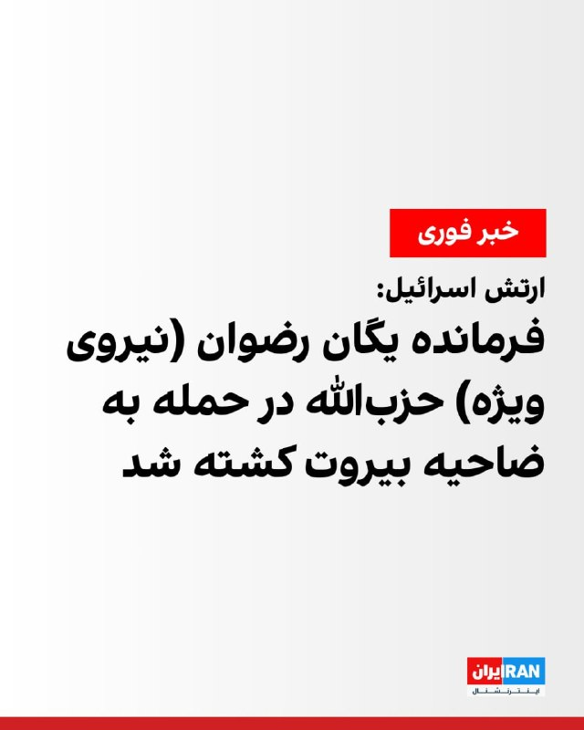

> ارتش اسرائیل تایید کرد احمد غالب بلوط، معروف به «مالک»، فرمانده یگان رضوان (نیروی ویژه) حزب‌الله، در حمله روز گذشته به ضاحیه بیروت کشته شده است.
> 
> نتانیاهو و وزیر دفاع اسرائیل، چهارشنبه در بیانیه‌ای مشترک اعلام کرده بودند فرمانده یگان رضوان حزب‌الله در حمله‌ اسرائیل در بیروت هدف قرار گرفته است.
> https://iranintl.com/202605076655

## 1405/02/17 12:04 — DEJradio
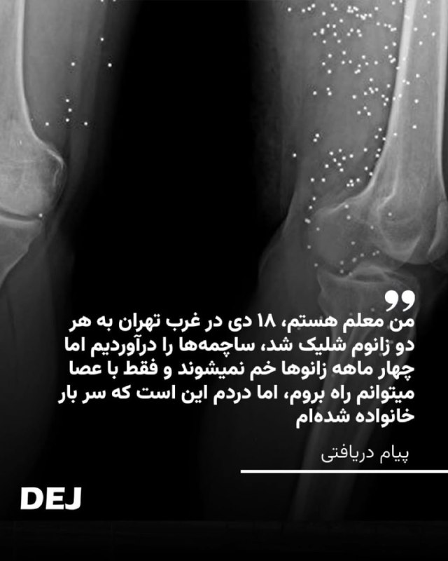

> 🔺📢 “من معلم هستم، ۱۸ دی در غرب تهران به هر دو زانوم شلیک شد، ساچمه‌ها را درآوردیم اما چهار ماهه زانو خم نمیشود و فقط با عصا میتوانم راه بروم، اما دردم این است که سر بار خانواده‌ شده‌ام.
> 
> پیام دریافتی
> 
> #دی۱۴۰۴ #جمهوری_اسلامی
> @DEJradio

## 1405/02/17 12:02 — Hranews
> گزارشی از بازداشت و پخش اعترافات اجباری یک زن در زنجان
> 
> 
> ❗️
> ❗️
> ❗️
> ❗️
> ❗️– زنی در زنجان به اتهامات توهین به مقدسات، ارتباط با رسانه‌های خارج از کشور و ارسال تصاویر و اطلاعات نظامی به این رسانه‌ ها، #بازداشت شد. هم‌زمان ویدئویی از اعترافات اجباری این شهروند منتشر شده که مشخص نیست در چه شرایطی ضبط شده است.
> 
> ادامه مطلب
> 
> ↘️
> @hranews_bot تماس ✉️ - @Hranews کانال هرانا 🆑

## 1405/02/17 11:56 — RadioFarda
> رابرت مورت، دریاسالار آمریکایی: امنیت تنگهٔ هرمز چالشی بسیار دشوار است
> 
> 🔸پس از اعلام «پروژهٔ آزادی» از سوی دونالد ترامپ، رئیس‌جمهور آمریکا، برای تضمین عبور کشتی‌های تجاری از تنگهٔ هرمز، تنش‌ها در این آبراه راهبردی بار دیگر شدت گرفته و آتش‌بس شکننده میان تهران و واشینگتن با ابهام بیشتری روبه‌رو شده است.
> 
> 🔸شرکت کشتیرانی مرسک اعلام کرده یکی از کشتی‌هایش روز ۱۴ اردیبهشت با حمایت نظامی آمریکا از تنگهٔ هرمز عبور کرده است، اما نگرانی‌ها دربارهٔ امنیت کشتیرانی در منطقه همچنان ادامه دارد. در همین حال، پرسش‌ها دربارهٔ توانایی نیروی دریایی آمریکا برای حفاظت از مسیرهای دریایی و جلوگیری از گسترش درگیری افزایش یافته است. رادیو اروپای آزاد/رادیو آزادی در همین زمینه با رابرت مورِت، دریاسالار بازنشسته آمریکایی، گفت‌وگو کرده است.
> 
> 🔸لازم به یادآوری است که این مصاحبه قبل از متوقف شدن «پروژهٔ آزادی» به دستور دونالد ترامپ برای مدت کوتاهی، انجام شده است.
> 
> 🔸رابرت مورت، مدیر پیشین «آژانس ملی اطلاعات مکانی» آمریکا و مقام ارشد اطلاعاتی در فرماندهی نیروهای مشترک آمریکا، اکنون استاد دانشکده مکسوِل دانشگاه سیراکیوز و معاون مؤسسه سیاست و حقوق امنیتی این دانشگاه است.
> 
> 
> 🔸 گزارش کامل را در وب‌سایت رادیوفردا بخوانید.
> 
> @RadioFarda

## 1405/02/17 11:56 — VahidOOnLine
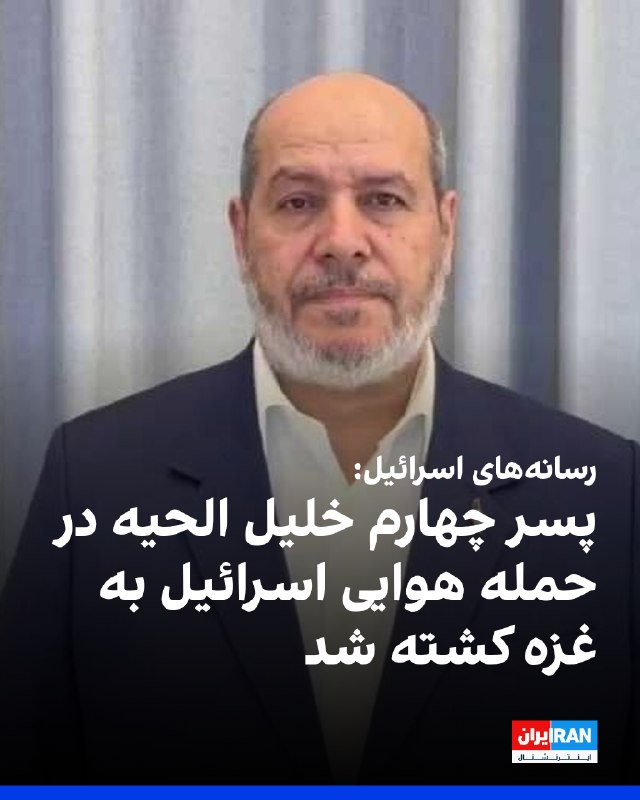

> رسانه‌های اسرائیل و برخی رسانه‌های عربی خبر دادند که عزام، پسر چهارم خلیل الحیه، از رهبران ارشد حماس، در حمله هوایی چهارشنبه اسرائیل به غزه کشته شده است.
> 
> بر اساس گزارش‌ها، پیش‌تر نیز سه فرزند خلیل الحیه کشته شده بودند.
> ‌🏁 🇬🇧 IranintlTV
> 
> 🤖 @VahidOOnLine

## 1405/02/17 11:56 — IranIntlTV

> رسانه‌های اسرائیل و برخی رسانه‌های عربی خبر دادند که عزام، پسر چهارم خلیل الحیه، از رهبران ارشد حماس، در حمله هوایی چهارشنبه اسرائیل به غزه کشته شده است.
> 
> بر اساس گزارش‌ها، پیش‌تر نیز سه فرزند خلیل الحیه کشته شده بودند.
> https://iranintl.com/202605072690

## 1405/02/17 11:50 — Hranews

> وزیر علوم، تحقیقات و فناوری، با انتقاد از تداوم قطع اینترنت اعلام کرد که کاهش دسترسی به اینترنت، ارتباطات علمی و پژوهشی کشور را مختل کرده و تداوم اختلال اینترنت برای عموم مردم، «ضد امنیت ملی» است. حسین سیمایی، خواستار بازگشت هرچه سریع‌تر شرایط به وضعیت عادی و فراهم شدن دسترسی آزاد و پایدار به #اینترنت برای دانشگاهیان و شهروندان شد.
> 
> وزیر علوم همچنین با اشاره به پیامدهای تبعیض در دسترسی به اینترنت گفت که ایجاد اینترنت‌های طبقاتی و محدود، احساس نابرابری و نارضایتی اجتماعی را تشدید می‌کند. سیمایی در ادامه هشدار داد که محدودیت‌های اینترنتی علاوه بر آسیب به فعالیت‌های علمی و پژوهشی، تبعات اجتماعی گسترده‌ای نیز به همراه دارد.
> 
> ↘️
> @hranews_bot تماس ✉️ - @Hranews کانال هرانا 🆑

## 1405/02/17 11:40 — VahidOOnLine
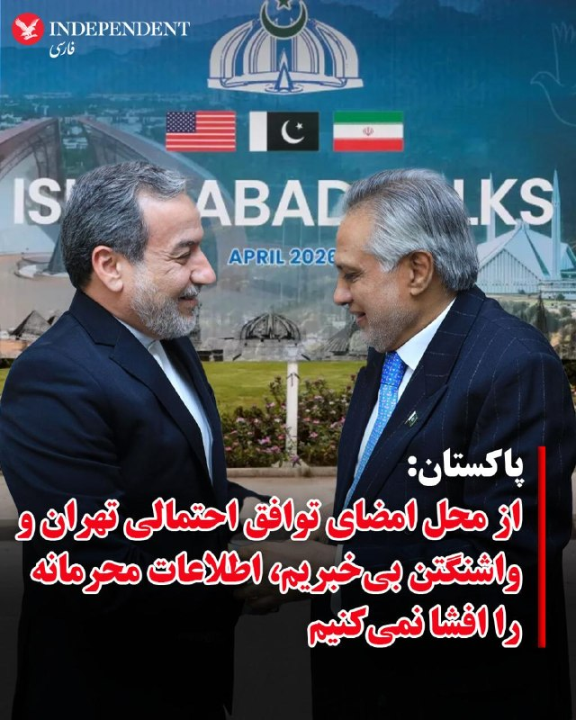

> ♦️سخنگوی وزارت امور خارجه پاکستان، روز پنجشنبه ۱۷ اردیبهشت ماه ‌ابراز امیدواری کرد توافق احتمالی میان ایالات متحده و ایران «هرچه زودتر» حاصل شود.
> طاهر حسین اندرابی، سخنگوی وزارت خارجه پاکستان، در نشست خبری هفتگی در اسلام‌آباد و در پاسخ به پرسشی درباره مذاکرات تهران و واشنگتن گفت: «ما انتظار داریم توافق هرچه زودتر حاصل شود.»
> اندرابی همچنین با توصیف کشورش به عنوان «تسهیل‌گری صادق» از ارائه جزئیات بیشتر در مورد مذاکرات خودداری کرد: «به عنوان یک تسهیل‌گر و میانجی صادق، بر ما واجب است که اطلاعات را محرمانه نگه داریم و از همه اطلاعات محافظت خواهیم کرد.»
> سخنگوی وزارت خارجه پاکستان افزود اسلام‌آباد از هرگونه توافق، صرف‌نظر از محل برگزاری آن، استقبال می‌کند و گفت: «اگر این توافق در اسلام‌آباد حاصل شود، برای ما مایه افتخار و امتیاز خواهد بود.»
> پیشتر خبرگزاری تاس به نقل از سخنگوی وزارت امورخارجه سوییس، از آمادگی این کشور برای میزبانی مذاکرات احتمالی آینده جمهوری اسلامی ایران و آمریکا خبر داده بود.
> ‌🇸🇦 Indypersian
> 
> 🤖 @VahidOOnLine

## 1405/02/17 11:36 — VahidOOnLine

> العربیه به نقل از منابعی نوشت که مذاکرات برای دستیابی به تفاهم درباره کاهش محاصره آمریکا در ازای بازگشایی تدریجی تنگه هرمز در جریان است و در ساعات آینده گشایشی در وضعیت کشتی‌های متوقف‌شده در محدوده این تنگه رخ خواهد داد.
> 
> یک منبع پاکستانی به العربیه گفت گفت‌وگوها درباره وضعیت تنگه هرمز ادامه دارد و دستیابی به تفاهم همچنان ممکن است.
> ‌🏁 🇬🇧 IranintlTV
> 
> 🤖 @VahidOOnLine

## 1405/02/17 11:36 — IranIntlTV
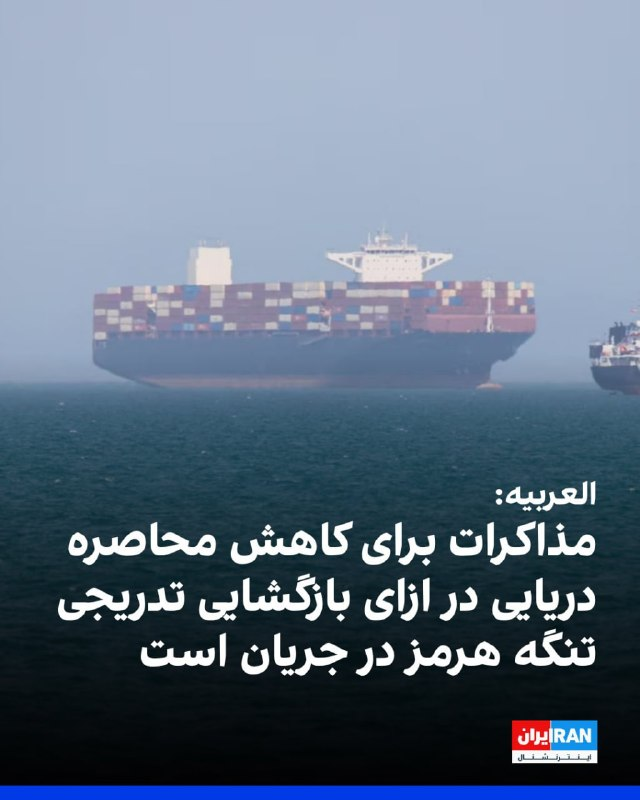

> العربیه به نقل از منابعی نوشت که مذاکرات برای دستیابی به تفاهم درباره کاهش محاصره آمریکا در ازای بازگشایی تدریجی تنگه هرمز در جریان است و در ساعات آینده گشایشی در وضعیت کشتی‌های متوقف‌شده در محدوده این تنگه رخ خواهد داد.
> 
> یک منبع پاکستانی به العربیه گفت گفت‌وگوها درباره وضعیت تنگه هرمز ادامه دارد و دستیابی به تفاهم همچنان ممکن است.
> https://iranintl.com/202605072476

## 1405/02/17 11:35 — VahidOOnLine
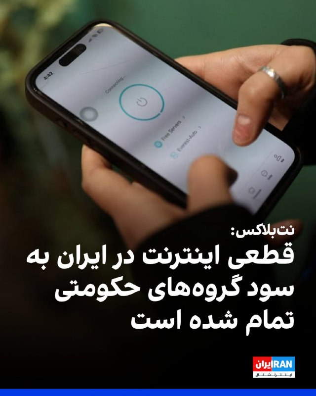

> وب‌سایت نت‌بلاکس، صبح پنج‌شنبه اعلام کرد قطعی اینترنت در ایران پس از ۱۶۳۲ ساعت قطع گسترده از شبکه‌های بین‌المللی، وارد شصت‌ونهمین روز خود شده است.
> 
> نت‌بلاکس نوشت این قطعی اینترنت همچنان به افزایش بیکاری، به‌ویژه در میان کارگران مستقل، دامن می‌زند و عملا به بازتوزیع ثروت به نفع گروه‌های همسو با حکومت منجر شده است.
> ‌🏁 🇬🇧 IranintlTV
> 
> 🤖 @VahidOOnLine

## 1405/02/17 11:35 — IranIntlTV

> وب‌سایت نت‌بلاکس، صبح پنج‌شنبه اعلام کرد قطعی اینترنت در ایران پس از ۱۶۳۲ ساعت قطع گسترده از شبکه‌های بین‌المللی، وارد شصت‌ونهمین روز خود شده است.
> 
> نت‌بلاکس نوشت این قطعی اینترنت همچنان به افزایش بیکاری، به‌ویژه در میان کارگران مستقل، دامن می‌زند و عملا به بازتوزیع ثروت به نفع گروه‌های همسو با حکومت منجر شده است.
> https://iranintl.com/202605070566

## 1405/02/17 11:33 — FarsiVOA
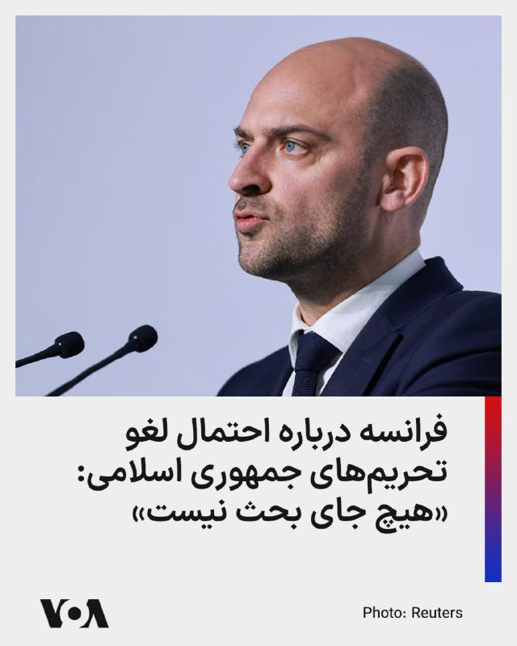

> وزیر خارجه فرانسه احتمال لغو «کوچک‌ترین» تحریم‌های بین‌المللی علیه جمهوری اسلامی را رد کرد و گفت چنین موضوعی اکنون «هیچ جای بحث نیست».
> 
> ژان-نوئل بارو، پنجشنبه به رسانه‌های فرانسوی گفت که تا زمانی که تنگه‌ای مانند هرمز مسدود باشد، «هیچ جای بحثی نیست که حتی کوچک‌ترین تحریم بتواند لغو شود». او تأکید کرد: « ضروری است که تنگه هرمز بتواند در کوتاه‌مدت دوباره باز شود».
> 
> وزیر خارجه فرانسه هشدار داد: «تنگه [هرمز] یک موجودی مشترک بشریت است. نباید مسدود شود، یا موضوع عوارض یا باج‌خواهی قرار گیرد.»
> 
> بارو استقرار ناو هواپیمابر فرانسوی شارل دو گل در منطقه خلیج فارس را نیز یک «پیام» قوی دیپلماتیک و حملات علیه کشتی شرکت‌های کشتیرانی فرانسوی را «غیرقابل قبول و محکوم» دانست. او تأکید کرد: «هرگونه حمله به زیرساخت‌های غیرنظامی محکوم است.»
> @FarsiVOA

## 1405/02/17 11:28 — RadioFarda
> ترامپ: توافق با ایران «بسیار محتمل» است؛ ایران: پیشنهاد را بررسی می‌کنیم
> 
> 🔸در ادامهٔ چانه‌زنی ایران و آمریکا بر سر راه‌حلی برای پایان جنگ، رئیس‌جمهور آمریکا رسیدن به توافق را «بسیار محتمل» توصیف کرده و تهران هنوز از بررسی پیشنهاد سخن می‌گوید.
> 
> 🔸دونالد ترامپ، رئیس‌جمهور ایالات متحده، شامگاه چهارشنبه، ۱۶ اردیبهشت، گفت که پس از «گفت‌وگوهای بسیار خوب» در ۲۴ ساعت گذشته، دستیابی به توافقی با ایران برای پایان دادن به جنگ «بسیار محتمل» است.
> 
> 🔸این چندمین موضع‌گیری رئیس‌جمهور آمریکا دربارهٔ روند مذاکرات با ایران در این روز بود. او ساعتی پیش‌تر در سخنرانی خود در کاخ سفید گفته بود: «ما با افرادی (در ایران) سر و کار داریم که بسیار خواهان رسیدن به توافق هستند.»
> 
> 🔸این در حالی است که سخنگوی وزارت خارجهٔ جمهوری اسلامی در همین روز گفت که تهران هنوز در حال بررسی پیشنهاد آمریکا است.
> 
> 🔸 گزارش کامل را در وب‌سایت رادیوفردا بخوانید.
> 
> @RadioFarda

## 1405/02/17 11:27 — RadioFarda
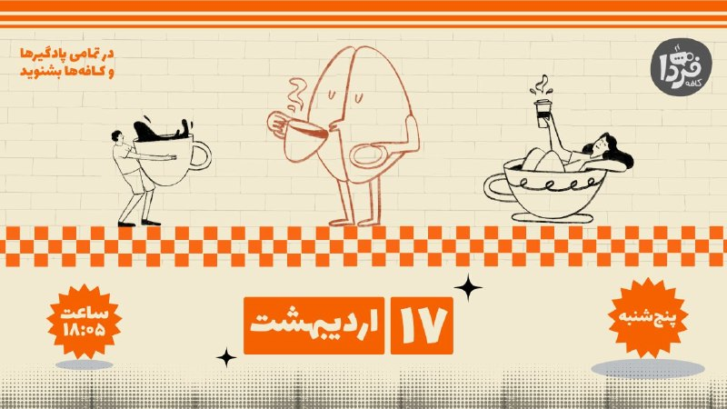

> 📷 Photo

## 1405/02/17 11:26 — DEJradio
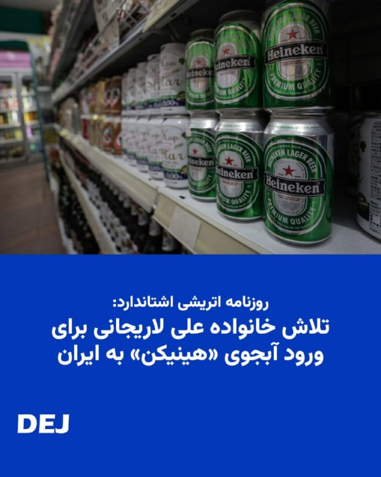

> 🔸
> 🔺 روزنامه «اشتاندارد» اتریش چهارشنبه ۱۶اردیبهشت ۱۴۰۵ در گزارشی مدعی شد که شرکت هلندی «هینیکن»، دومین شرکت بزرگ آبجوسازی جهان، چند سال پیش تلاش داشته با کمک یکی از بستگان علی لاریجانی وارد بازار ایران شود.
> محمد محقق داماد، خواهرزاده علی لاریجانی، در پروژه‌ای مشترک میان هینیکن و یک شرکت ایرانی نقش مشاور اصلی را برعهده داشته و قرار بوده زمینه ورود این برند مشهور آبجو به بازار ایران را فراهم کند.
> اشتاندارد نوشته است که این همکاری در قالب یک مشارکت اقتصادی مشترک طراحی شده بود.
> این روزنامه اتریشی در گزارش خود، خانواده لاریجانی را یکی از بانفوذترین خانواده‌های جمهوری اسلامی توصیف کرده و نوشته است که اعضای این خاندان طی دهه‌های گذشته در بخش‌های کلیدی حکومت حضور داشته‌اند.
> علی لاریجانی از چهره های قدرتمند جمهوری اسلامی و با خانواده پرنفوذی است که برادرش «صادق لاریجانی» نیز ریاست قوه قضاییه را برعهده داشت و هم اکنون رئیس مجمع تشخیص مصلحت است.
> برخی اعضای خانواده لاریجانی در کشورهای غربی فعالیت حرفه‌ای دارند.
> از جمله دختر علی لاریجانی که در آمریکا به عنوان پزشک کار می‌کرده ولی به ایران برگردانده شده، و دختر دیگر او که هنوز یک استارت‌آپ پزشکی را در لندن اداره می‌کند.
> مشخص نیست این فرد به دنبال واردات آبجوی بدون الکل بوده یا مصمم بوده از مجاری خاص آبجوی الکی برای بازار خاص در ایران وارد کند.
> 
> #لاریجانی
> @DEJradio

## 1405/02/17 11:21 — RadioFarda
> بهای سبد کالاهای خوراکی به ۳.۸ میلیون تومان رسید؛ رقم کالابرگ ثابت ماند
> 
> 🔸با گذشت حدود پنج ماه از اجرای طرح حذف ارز ترجیحی ۲۸ هزار و ۵۰۰ تومانیِ برخی کالاهای اساسی و پرداخت کالابرگ الکترونیکی به مردم، گزارش‌ها و آمار نشان می‌دهد که افزایش قیمت اقلام مشمول کالابرگ از رقم یارانهٔ پرداختی به‌شکل چشمگیری پیشی گرفته است.
> 
> 🔸بر اساس گزارش رسانه‌های اقتصادی چاپ تهران، مجموع قیمت اقلام مشمول سبد کالابرگ از حدود دو میلیون و ۱۸۰ هزار تومان پیش از حذف ارز ترجیحی به حدود سه میلیون و ۷۸۰ هزار تومان رسیده است.
> 
> 🔸اقلام مشمول سبد کالابرگ شامل مرغ، روغن، تخم‌مرغ، برنج، قند و شکر، ماکارونی، شیر کم‌چرب، پنیر، ماست، گوشت قرمز و حبوبات است.
> 
> 🔸آمار و ارقام منتشرشده در روز پنجشنبه ۱۷ اردیبهشت نشان می‌دهد هزینهٔ این سبد در ماه‌های اخیر حدود یک میلیون و ۶۰۰ هزار تومان افزایش یافته، در حالی که مبلغ کالابرگ پرداختی به خانوارهای مشمول همچنان یک میلیون تومان باقی مانده است.
> 
> 🔸 گزارش کامل را در وب‌سایت رادیوفردا بخوانید.
> 
> @RadioFarda

## 1405/02/17 11:18 — pm_afshaa
> 🔴رسانه‌های پاکستان: ایران ممکن است امروز پاسخ خود را به پیشنهاد آمریکایی برای واسطه پاکستانی تحویل دهد
> 
> 
> 💧 Rainbet.com the #1 Non-KYC Crypto Casino & Sportsbook @rainbetcom
> 
> 😁 @Pm_Afshaa

## 1405/02/17 11:15 — VahidOOnLine

> کانال ۱۲ اسرائیل نوشت که بر اساس ارزیابی مقامات این کشور، ترامپ بر یکی از اصلی‌ترین خواسته‌های خود یعنی خروج اورانیوم غنی‌شده از ایران پافشاری خواهد کرد و بدون اجرای این شرط، توافقی در کار نخواهد بود.
> 
> بنا بر این گزارش ترامپ به نتانیاهو اعلام کرده بدون خروج اورانیوم غنی‌شده از ایران، هیچ توافقی را امضا نخواهد کرد.
> 
> کانال ۱۲ اسرائیل نوشت که بر اساس ارزیابی‌های امنیتی در این کشور، جمهوری اسلامی درباره انتقال ذخایر اورانیوم ۶۰ درصدی به کشور ثالث، تا حدی انعطاف نشان داده اما هنوز اختلاف بر سر این است که این مواد به کدام کشور منتقل شوند.
> ‌🏁 🇬🇧 IranintlTV
> 
> 🤖 @VahidOOnLine

## 1405/02/17 11:15 — IranIntlTV
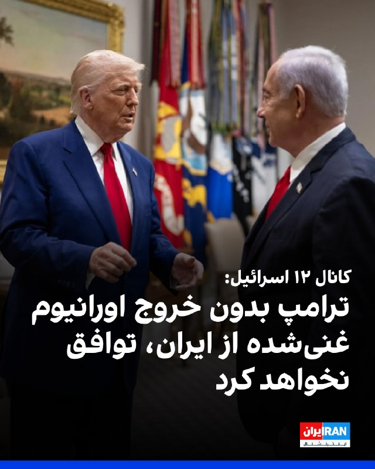

> کانال ۱۲ اسرائیل نوشت که بر اساس ارزیابی مقامات این کشور، ترامپ بر یکی از اصلی‌ترین خواسته‌های خود یعنی خروج اورانیوم غنی‌شده از ایران پافشاری خواهد کرد و بدون اجرای این شرط، توافقی در کار نخواهد بود.
> 
> بنا بر این گزارش ترامپ به نتانیاهو اعلام کرده بدون خروج اورانیوم غنی‌شده از ایران، هیچ توافقی را امضا نخواهد کرد.
> 
> کانال ۱۲ اسرائیل نوشت که بر اساس ارزیابی‌های امنیتی در این کشور، جمهوری اسلامی درباره انتقال ذخایر اورانیوم ۶۰ درصدی به کشور ثالث، تا حدی انعطاف نشان داده اما هنوز اختلاف بر سر این است که این مواد به کدام کشور منتقل شوند.
> https://iranintl.com/202605074573

## 1405/02/17 11:13 — FarsiVOA
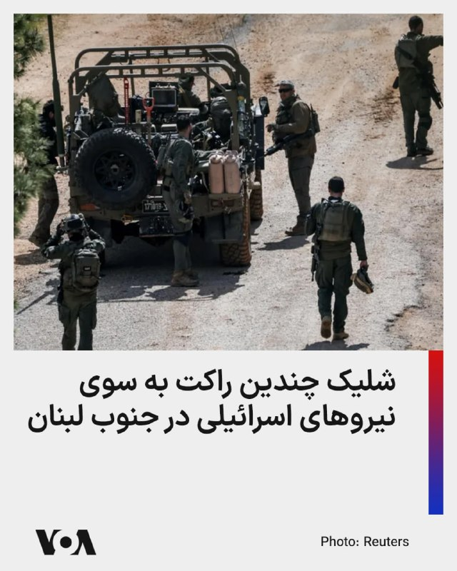

> ارتش اسرائیل اعلام کرد که حزب‌الله صبح پنجشنبه چندین راکت به سوی نیروهای اسرائیلی مستقر در جنوب لبنان شلیک کرده است. بر اساس اعلام ارتش اسرائیل، این راکت‌ها در نزدیکی نیروهای اسرائیلی فرود آمدند اما هیچ زخمی بر جای نگذاشتند.
> 
> پیشتر ارتش اسرائیل اعلام کرده بود یک هدف هوایی مشکوک را که از لبنان به سمت اسرائیل شلیک شده بود، رهگیری و منهدم کرده است؛ این اتفاق پس از به صدا درآمدن آژیرها در مناطق شمال اسرائیل رخ داد. ارتش اسرائیل اعلام کرد آژیرهای هشدار مربوط به «نفوذ یک پرنده متخاصم» در منطقه کریات شمونه به صدا درآمده و جزئیات این حادثه در حال بررسی است.
> 
> همچنین پنجشنبه، ارتش اسرائیل اعلام کرد که روز گذشته بیش از ۱۵ موضع حزب‌الله را در جنوب لبنان هدف حمله قرار داده است. ارتش اسرائیل می‌گوید این اهداف شامل انبارهای تسلیحات، مراکز تولید سلاح، مراکز فرماندهی، مواضع پرتاب راکت و ساختمان‌هایی بوده که توسط این گروه استفاده می‌شدند.
> @FarsiVOA

## 1405/02/17 11:11 — Hranews
> دادستان همدان از مصادره اموال ۵۲ نفر خبر داد
> 
> 
> ❗️
> ❗️
> ❗️
> ❗️
> ❗️– دادستان عمومی و انقلاب همدان از توقیف اموال ۵۲ نفر در این استان خبر داد. دستگاه قضایی این افراد را به «ارتباط با جریان اسرائیلی و آمریکایی» و همکاری با «شبکه‌های وابسته به دشمن» متهم کرده است.
> 
> ادامه مطلب
> 
> #مصادره_اموال
> 
> ↘️
> @hranews_bot تماس ✉️ - @Hranews کانال هرانا 🆑

## 1405/02/17 11:09 — VahidOOnLine
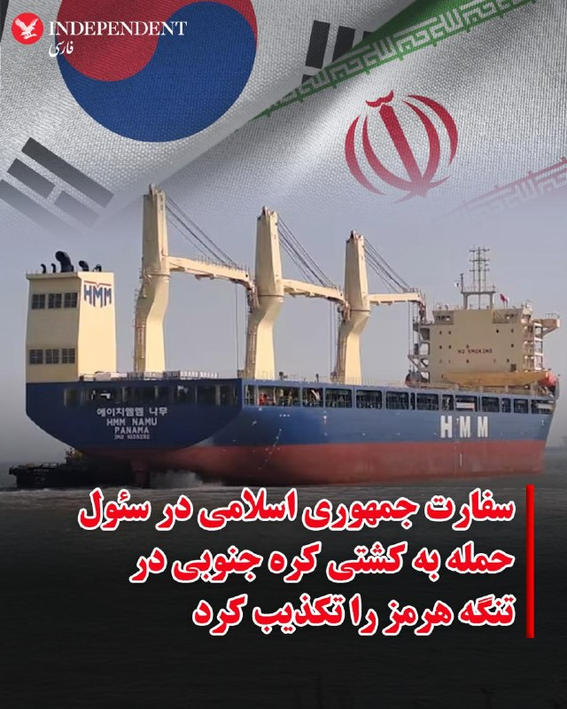

> ♦️سفارت ایران در سئول، روز سه‌شنبه ۱۷ اردیبهشت ماه، گزارش‌ها در مورد حمله نیروهای مسلح جمهوری اسلامی ایران به کشتی باری کره‌ جنوبی در تنگه هرمز را رد کرد.
> سفارت ایران در بیانیه‌ای اعلام کرد: «ایران قاطعانه و به‌طور کامل هرگونه ادعا درباره دخالت نیروهای مسلح جمهوری اسلامی ایران در حادثه آسیب‌دیدن یک کشتی کره‌ای در تنگه هرمز را رد می‌کند.»
> روز دوشنبه ۱۴ اردیبهشت ماه و همزمان با شروع عملیات آزادی تنگه هرمز از سوی ارتش آمریکا در خلیج فارس، دولت کره‌جنوبی از وقوع انفجار و آتش‌سوزی در یک کشتی‌باری با پرچم این کشور در نزدیکی سواحل امارات متحده عربی خبر داده بود.
> 
> در پی بروز این حادثه، دونالد ترامپ، رئیس جمهوری آمریکا اعلام کرد «شاید وقت آن رسیده که کره جنوبی به پروژه آزادی تنگه هرمز بپیوندد.» سیول در روز سه‌شنبه اعلام کرد مشارکت در این عملیات را بررسی می‌کند. با این حال روز چهارشنبه ۱۶ اردیبهشت و پس از اعلام توقف «پروژه آزادی» کره جنوبی اعلام کرد دلیلی درباره «بازبینی سیاست‌های این کشور در تنگه هرمز» وجود ندارد.
> ‌🇸🇦 Indypersian
> 
> 🤖 @VahidOOnLine

## 1405/02/17 11:08 — DW_Farsi
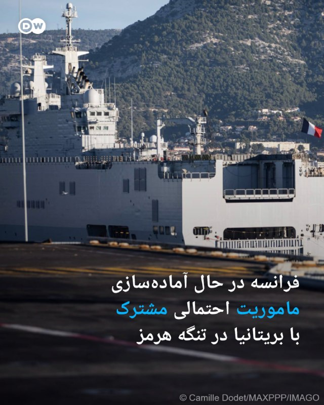

> 🔸فرانسه در حال آماده‌سازی ماموریت احتمالی مشترک با بریتانیا در تنگه هرمز
> 
> ارتش فرانسه در حال آماده‌سازی برای یک ماموریت احتمالی مشترک فرانسه و بریتانیا در تنگه هرمز است.
> 
> در همین راستا امانوئل مکرون، رئیس‌ جمهور فرانسه، اعلام کرد ناو هواپیمابر هسته‌ای شارل دوگل و کشتی‌های همراه آن، اکنون در جنوب کانال سوئز به سمت دریای سرخ در حرکت هستند و در نتیجه به تنگه هرمز نزدیک‌تر می‌شوند.
> 
> هدف این ماموریت آن است که در زمان مناسب، امنیت رفت‌وآمد کشتی‌ها در تنگه هرمز را دوباره برقرار کند.
> 
> مکرون در شبکه اجتماعی ایکس توضیح داد این ماموریت می‌تواند "اعتماد شرکت‌های کشتیرانی و شرکت‌های بیمه را دوباره احیا کند". او در عین حال تاکید کرده است که فرانسه مستقل از طرف‌های درگیر در جنگ عمل می‌کند.
> 
> به گفته ارتش فرانسه، اعزام ناوگروه هواپیمابر شارل دوگل به سمت دریای سرخ و خلیج عدن، بخشی از تلاش‌های فرانسه و بریتانیا برای آمادگی در صورت ماموریتی احتمالی در آینده با هدف کمک به آزادی کشتیرانی در تنگه هرمز است.
> 
> @dw_farsi

## 1405/02/17 11:03 — pm_afshaa
> 🔴یدیعوت احارونوت: در اسرائیل نگرانی وجود دارد که توافق در حال شکل‌گیری بین ایالات متحده و ایران ممکن است تهران را در توسعه موشک‌های بالستیک محدود نکند
> 
> 
> 💧 Rainbet.com the #1 Non-KYC Crypto Casino & Sportsbook @rainbetcom
> 
> 😁 @Pm_Afshaa

## 1405/02/17 10:52 — VahidOOnLine
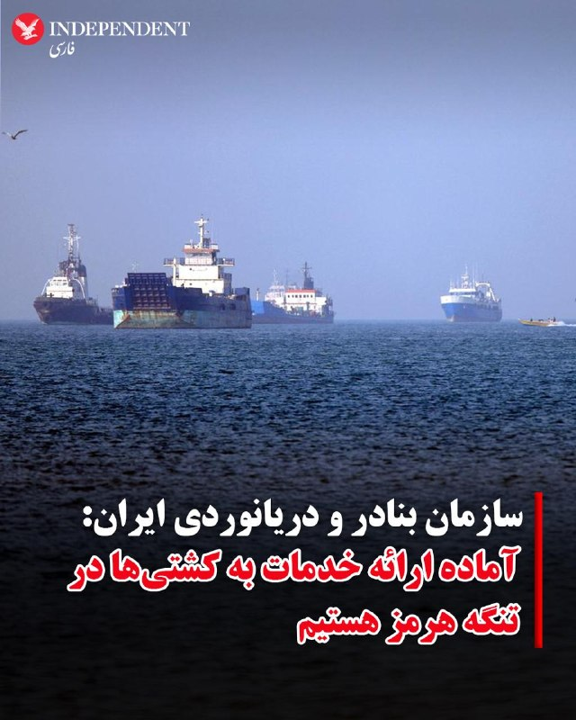

> ♦️رسانه‌های ایران بامداد پنجشنبه ۱۷ اردیبهشت از اعلام آمادگی سازمان بنادر و دریانوردی جمهوری اسلامی برای کمک به کشتی‌های گرفتار در تنگه هرمز خبر دادند.
> 
> به گزارش خبرگزاری صداوسیما سازمان بنادر و دریانوردی جمهوری اسلامی  پس از بیش از دو ماه بسته بودن تنگه هرمز «با ارسال پیامی به کشتی‌های تجاری حاضر در تنگۀ هرمز و آب‌های منطقه، آمادگی کامل برای ارائه خدماتی نظیر تامین آذوقه، سوخت، خدمات بهداشتی و پزشکی و همچنین اقلام مجاز مورد نیاز تعمیراتی آنان را اعلام کرد.»
> 
>  براساس این گزارش «این سازمان تأکید کرده که این اقدام در چارچوب مسئولیت‌های حاکمیتی جمهوری اسلامی ایران در حوزه ایمنی دریانوردی و ارائه خدمات بندری و دریایی انجام می‌شود و بیانگر آمادگی کامل بنادر کشور برای پشتیبانی از تردد ایمن و پایدار کشتی‌های تجاری در یکی از مهم‌ترین گذرگاه‌های راهبردی جهان است.»
> 
> این خبر در حالی اعلام می‌شود که با وجود توقف عملیات «پروژه آزادی» ترامپ پس از دو روز، محاصره دریایی ایران کماکان ادامه دارد و تردد از تنگه هرمز عملا انجام نمی‌شود.
> ‌🇸🇦 Indypersian
> 
> 🤖 @VahidOOnLine

## 1405/02/17 10:52 — BBCPersian
> 🔻رئیس انجمن وارد کنندگان سم و کود ایران: جنگ و دشواری در واردات باعث کمبود و گرانی کود شده است
> 
> 🔻رئیس انجمن واردکنندگان سم و کود ایران، جنگ، دشواری واردات از چین و هند و نبود ثبت سفارش و تخصیص ارز را از دلایل گرانی و کمبود کود مورد نیاز کشاورزان خواند.
> 
> مهدی حسین‌یزدی با اشاره به کمبود کود در فصل زراعت و آسیب به بخش کشاورزی گفت که واردات کود به داخل کشور متوقف شده است.
> 
> او همچنین گفت که آسیب وارد آمدن به برخی از پتروشیمی‌ها در این کمبود نقش دارد.
> 
> به گفته آقای حسین‌یزدی در سه ماه گذشته وارد کنندگان کود نتوانسته‌اند همان کودهایی را که قبلا خریداری کرده بودند، وارد کشور کنند.
> 
> https://bbc.in/4f79DtV
> @BBCPersian

## 1405/02/17 10:50 — pm_afshaa
> 🔴شاهزاده رضا پهلوی، خواستار مشارکت گسترده در تجمعات جهانی یکشنبه در حمایت از مردم ایران شد.
> ایرانیان در سراسر جهان روز یکشنبه 20 اردیبهشت در اعتراض به قطع اینترنت، بازداشت‌های گسترده و افزایش اعدام‌ها در ایران، در شهرهای مختلف جهان به طور همزمان تجمعاتی برگزار می کنن
> 
> 
> 💧 Rainbet.com the #1 Non-KYC Crypto Casino & Sportsbook @rainbetcom
> 
> 😁 @Pm_Afshaa

## 1405/02/17 10:48 — VahidOOnLine

> سفارت جمهوری اسلامی در سئول هرگونه دخالت سپاه پاسداران در آسیب به یک کشتی کره جنوبی در تنگه هرمز را رد کرد.
> 
> پیش‌تر کره جنوبی اعلام کرده بود مشخص نیست انفجار دوشنبه در یک کشتی باری تحت مدیریت شرکت کشتیرانی کره‌ای اچ‌ام‌ام در آب‌های منطقه خلیج فارس، ناشی از حمله بوده است یا نه.
> 
> دونالد ترامپ این حادثه را به حمله‌ای از سوی جمهوری اسلامی نسبت داده است.
> ‌🏁 🇬🇧 IranintlTV
> 
> 🤖 @VahidOOnLine

## 1405/02/17 10:48 — IranIntlTV
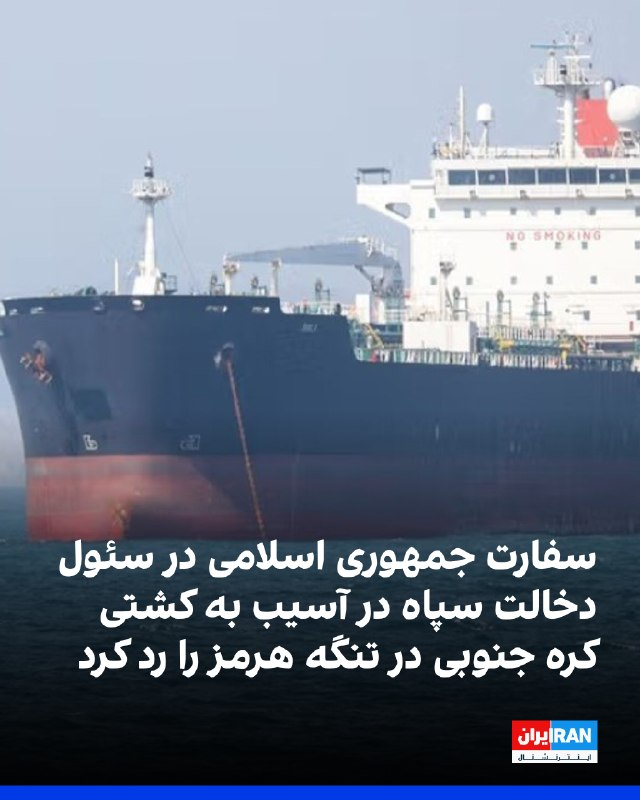

> سفارت جمهوری اسلامی در سئول هرگونه دخالت سپاه پاسداران در آسیب به یک کشتی کره جنوبی در تنگه هرمز را رد کرد.
> 
> پیش‌تر کره جنوبی اعلام کرده بود مشخص نیست انفجار دوشنبه در یک کشتی باری تحت مدیریت شرکت کشتیرانی کره‌ای اچ‌ام‌ام در آب‌های منطقه خلیج فارس، ناشی از حمله بوده است یا نه.
> 
> دونالد ترامپ این حادثه را به حمله‌ای از سوی جمهوری اسلامی نسبت داده است.
> https://iranintl.com/202605070961

## 1405/02/17 10:42 — mamlekate
> 📝 وال‌استریت ژورنال جزئیات تازه‌ای از چارچوب پیشنهادی آمریکا به جمهوری اسلامی منتشر کرد
> 
> وال‌استریت ژورنال جزئیات تازه‌ای از چارچوب پیشنهادی آمریکا به جمهوری اسلامی منتشر کرد که به نوشته این روزنامه، در صورت پذیرش تهران، به مذاکرات ۳۰ روزه برای توافق نهایی منجر خواهد شد.
> 
> 
> 📝 سی‌ان‌ان: ایران پنجشنبه پاسخ خود به پیشنهاد آمریکا را ارائه می‌کند
> 
> یک منبع منطقه‌ای به خبرگزاری سی‌اِن‌اِن گفته است که انتظار می‌رود جمهوری اسلامی روز پنجشنبه پاسخ خود به پیشنهاد ایالات متحده برای پایان دادن به جنگ را به میانجی‌ها ارائه کند.
> 
> 
> @mamlekate

## 1405/02/17 10:41 — DW_Farsi
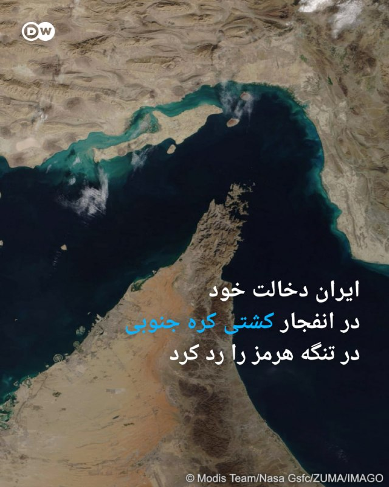

> 🔸ایران دخالت خود در انفجار در کشتی کره‌ جنوبی در تنگه هرمز را رد کرد
> 
> سفارت جمهوری اسلامی در سئول هرگونه ارتباط نیروهای مسلح خود با حادثه انفجار در یک کشتی متعلق به کره جنوبی در تنگه هرمز را رد کرد.
> 
> به گزارش خبرگزاری‌ها این انفجار که به آتش‌سوزی در کشتی منجر شد، روز دوشنبه در کشتی باری "اچ‌ام‌ام" با پرچم پاناما رخ داده بود.
> 
> دونالد ترامپ‌، رئیس‌ جمهور آمریکا در پی این حادثه گفته بود که جمهوری اسلامی چند پرتابه به سمت این کشتی شلیک کرده است. او همچنین از کره‌جنوبی خواسته بود که به عملیات امریکا به منظور بازگرداندن تردد عادی کشتی‌ها در تنگه هرمز بپیوندد.
> 
> سفارت جمهوری اسلامی در کره جنوبی در بیانیه خود همچنین مدعی شده که "مسئولیت پیامدهای چنین حوادثی بر عهده طرف‌هایی است که بدون در نظر گرفتن این ملاحظات، به عملیات حمل‌ونقل یا فعالیت در منطقه ادامه می‌دهند".
> 
> @dw_farsi

## 1405/02/17 10:39 — FarsiVOA
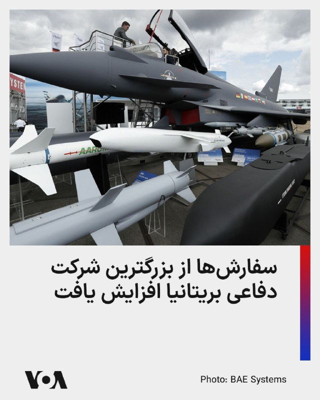

> بی‌ای‌ئی سیستمز، بزرگترین شرکت دفاعی بریتانیا، اعلام کرد در مسیر تحقق پیش‌بینی‌های خود برای رشد سود بین ۹ تا ۱۱ درصد در سال جاری قرار دارد.
> 
> در حالی که به نظر می‌رسد جنگ علیه جمهوری اسلامی باعث افزایش سفارش‌ها از بی‌ای‌ئی سیستمز شده، این شرکت روز پنج‌شنبه در بیانیه‌ای گفت: «در سراسر جهان، تهدیدهای امنیتی همچنان در حال افزایش هستند و همین امر دولت‌ها را به افزایش هزینه‌های دفاعی سوق می‌دهد.»
> 
> این شرکت که جنگنده‌های تایفون، زیردریایی‌های هسته‌ای و ناوهای جنگی را در بریتانیا تولید می‌کند و برای بزرگ‌ترین مشتری خود یعنی ایالات متحده تجهیزات فضایی و ماهواره‌ای، خودروهای رزمی و مهمات فراهم می‌سازد، اعلام کرد که آغاز قدرتمندی در سال ۲۰۲۶ داشته است.
> 
> سفارش‌های بی‌ای‌ئی از زمان حمله روسیه به اوکراین در سال ۲۰۲۲ تقریباً دو برابر شده و ارزش سهام این شرکت نیز نزدیک به ۳۰۰ درصد جهش کرده است؛ امری که به دلیل چشم‌انداز افزایش بیشتر هزینه‌های دفاعی اعضای ناتو تقویت شده است.
> @FarsiVOA

## 1405/02/17 10:39 — mamlekate
> 📝 بلومبرگ: چین از بانک‌هایش خواست اعطای وام‌های جدید به پالایشگاه‌های تحریم‌شده را متوقف کنند
> 
> در آستانه سفر ترامپ به چین، بلومبرگ بر اساس اظهارات منابع آگاه گزارش داد که نهاد ناظر مالی چین به بزرگ‌ترین بانک‌های این کشور توصیه کرده است که به طور موقت اعطای وام‌های جدید به پنج پالایشگاهی را که اخیراً به دلیل ارتباطشان با نفت ایران از سوی آمریکا تحریم شده‌اند، متوقف کنند.
> 
> @mamlekate

## 1405/02/17 10:36 — VahidOOnLine
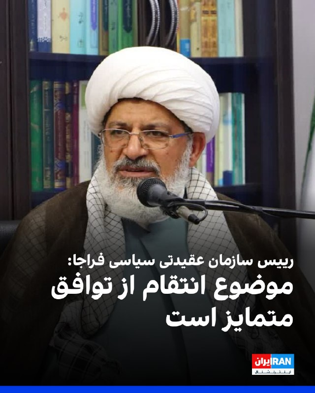

> علی شیرازی، رییس سازمان عقیدتی سیاسی فراجا گفت: «ملتی که ۴۷ سال پای انقلاب ایستاده و امروز در خون‌خواهی از امام شهید خود، محکم‌تر از همیشه قرار دارد، تا انتقام خود را نگیرد، میدان را ترک نخواهد کرد و باید توجه کرد که انتقام از توافق متمایز است.»
> 
> او افزود: «امروز می‌خواهیم بندهایی را برای ترامپ تبیین کنیم و بدانید جمهوری اسلامی با قبل متفاوت بوده و نیروهای مسلح و مسئولان کشور با حمایت و پشتوانه مردم محکم در صحنه ایستاده‌اند.»
> ‌🏁 🇬🇧 IranintlTV
> 
> 🤖 @VahidOOnLine

## 1405/02/17 10:36 — IranIntlTV

> علی شیرازی، رییس سازمان عقیدتی سیاسی فراجا گفت: «ملتی که ۴۷ سال پای انقلاب ایستاده و امروز در خون‌خواهی از امام شهید خود، محکم‌تر از همیشه قرار دارد، تا انتقام خود را نگیرد، میدان را ترک نخواهد کرد و باید توجه کرد که انتقام از توافق متمایز است.»
> 
> او افزود: «امروز می‌خواهیم بندهایی را برای ترامپ تبیین کنیم و بدانید جمهوری اسلامی با قبل متفاوت بوده و نیروهای مسلح و مسئولان کشور با حمایت و پشتوانه مردم محکم در صحنه ایستاده‌اند.»
> https://iranintl.com/202605070514

## 1405/02/17 10:23 — FarsiVOA
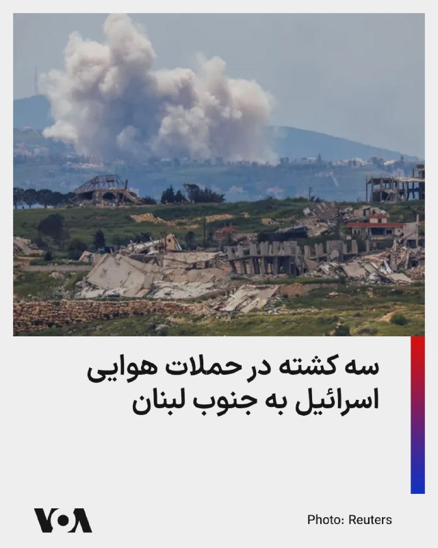

> رسانه‌های لبنانی گزارش دادند که در حملات هوایی اسرائیل به جنوب لبنان در صبح پنجشنبه سه نفر کشته شدند.
> 
> بر اساس گزارش خبرگزاری ملی لبنان، یک نفر در حمله‌ای که خودرویی را در نزدیکی میفدون هدف قرار داد کشته شد و دو نفر دیگر نیز در حمله‌ای به یک وانت در نزدیکی حبوش جان باختند.
> 
> ارتش اسرائیل هنوز درباره این حملات اظهار نظری نکرده است.
> 
> اسرائیل روز چهارشنبه برای نخستین بار از زمان توافق آتش‌بس با حزب‌الله در ماه گذشته، بیروت را هدف حمله قرار داد.
> 
> اسرائیل اعلام کرد که در این حمله یکی از فرماندهان نیروی نخبه رضوان، وابسته به گروه شبه‌نظامی حزب‌الله، را در حومه جنوب بیروت هدف قرار داده است.
> @FarsiVOA

## 1405/02/17 10:22 — BBCPersian
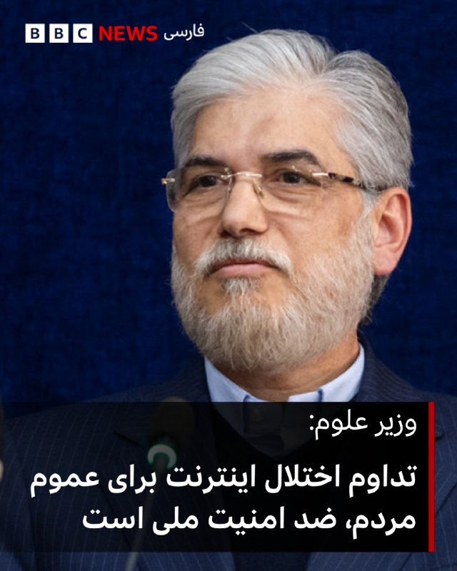

> 🔻حسین سیمایی، وزیر علوم، تحقیقات و فناوری ضمن انتقاد از ادامه قطع اینترنت گفته است که «کاهش دسترسی به اینترنت، ارتباطات علمی و پژوهشی کشور را مختل کرده و تداومِ اختلال اینترنت برای عموم مردم، ضد امنیت ملی است.»
> 
> آقای سیمایی با اشاره به این که دولت هم موافق قطع اینترنت نیست گفت که «شخص رئیس جمهور هم قانع نشده که چرا این وضعیت باید ادامه پیدا کند.»
> 
> به گفته او «تبعیض در دسترسی به اینترنت از قطع اینترنت خطرناک‌تر است و ایجاد انواع اینترنت‌های طبقاتی و محدود، احساس نابرابری و نارضایتی اجتماعی را تشدید می‌کند.»
> 
> از زمان شروع جنگ در نهم اسفند ماه سال گذشته در بیش از دو ماه گذشته اینترنت بین‌المللی در ایران قطع است.
> 
> اخیرا مقامات و نهادهای ایران طرح «اینترنت پرو» را فعال کرده‌اند که اهالی کسب‌وکار یا دانشگاهیان بتوانند با پرداخت مبلغی بیشتر، با دسترسی محدود به اینترنت بین‌المللی وصل شوند.
> 
> این موضوع واکنش‌ کاربران شبکه‌های اجتماعی را به دنبال داشته است.
> 
> لینک خبر کامل:
> 
> 📷Mehr News
> https://bbc.in/4uzgXTG
> @BBCPersian

## 1378/10/11 03:30 — VahidOOnLine
> ♦️غلامحسین محسنی اژه‌ای، رئیس قوه قضائیه جمهوری اسلامی روز پنجشنبه ۱۷ شهریور با هشدار به منتقدان و مخالفان جمهوری اسلامی گفت: «با خناسان تفرقه‌انداز طبق قانون برخورد می‌کنیم.»
> 
> اژه‌ای در جلسه‌ای به مسئولان قضایی گفت ابتدا با «تفرقه‌اندازان» در محله‌ها صحبت کنید و اگر لازم شد «دعوتشان» کنید و پس از آن اگر تغییری نکردند و لازم بود، برایشان پرونده تشکیل دهید.
> 
> قوه قضائیه جمهوری اسلامی از زمان آغاز جنگ، سرکوب مخالفان و منتقدان حکومت را تشدید کرده است. سازمان ملل متحد هفته پیش از اعدام دست‌کم ۲۱ نفر به‌اتهام سیاسی و امنیتی از زمان آغاز جنگ خبر داده و از نقض گسترده حقوق بشر در ایران، ابراز نگرانی شدید کرده بود.
> ‌🇸🇦 Indypersian
> 
> 🤖 @VahidOOnLine

## 1378/10/11 03:30 — VahidOOnLine
[🎬 Video](telegram/content/VahidOOnLine_238605_1778144366.mp4)

> محمد اسحاق‌دار، وزیر خارجه پاکستان، درباره تماس‌ها میان آمریکا و ایران اعلام کرد اسلام‌آباد از ارائه جزئیات درباره توافق احتمالی میان دو طرف خودداری می‌کند.
> او گفت: «ما از خبر احتمال دستیابی به توافق استقبال می‌کنیم، اما به‌عنوان میانجی، اعتماد طرف‌ها را با افشای جزئیات به خطر نخواهیم انداخت.»
> وزارت خارجه پاکستان همچنین اعلام کرد هنوز نمی‌توان مشخص کرد دو طرف تا چه اندازه به امضای توافق نزدیک یا از آن دور هستند، اما نسبت به روند مذاکرات خوش‌بین است.
> ‌🏁 🇬🇧 ManotoTV
> 
> 🤖 @VahidOOnLine

## 1378/10/11 03:30 — VahidOOnLine
> ⭕️تصاویری از عبور ناو هواپیمابر «شارل دوگل» فرانسه از کانال سوئز
> 
> ♦️تصاویر منتشرشده از سوی ارتش فرانسه، عبور ناو هواپیمابر «شارل دوگل» از کانال سوئز به‌سمت جنوب دریای سرخ را نشان می‌دهد.
> 
> این ناو قرار است در چارچوب آمادگی برای یک ماموریت چندملیتی احتمالی با هدف بازگرداندن امنیت کشتیرانی در تنگه هرمز، در منطقه مستقر شود.
> 
> ابتکار این ائتلاف با هدایت امانوئل مکرون، رئیس‌جمهوری فرانسه، و کی‌یر استارمر، نخست‌وزیر بریتانیا دنبال می‌شود و بیش از ۴۰ کشور در برنامه‌ریزی نظامی آن مشارکت دارند.
> ‌🇸🇦 Indypersian
> 
> 🤖 @VahidOOnLine

## 1378/10/11 03:30 — VahidOOnLine
[🎬 Video](telegram/content/VahidOOnLine_238598_1778144367.mp4)

> گروه ناظر اینترنتی نت‌بلاکس اعلام کرد قطعی گسترده اینترنت در ایران پس از ۱۶۳۲ ساعت همچنان ادامه دارد و بخش بزرگی از مردم همچنان از دسترسی به اینترنت جهانی محروم هستند.
> بر اساس این گزارش، ادامه این محدودیت‌ها باعث افزایش بیکاری و فشار اقتصادی، به‌ویژه بر کسب‌وکارهای مستقل و مشاغل آزاد شده است. نت‌بلاکس می‌گوید این وضعیت عملاً به انتقال منابع و فرصت‌های اقتصادی به گروه‌های نزدیک به حکومت منجر شده است.
> ‌🏁 🇬🇧 ManotoTV
> 
> 🤖 @VahidOOnLine

## 1378/10/11 03:30 — VahidOOnLine
[🎬 Video](telegram/content/VahidOOnLine_238595_1778144367.mp4)

> ارتش اسرائیل اعلام کرد بیش از ۱۵ زیرساخت وابسته به حزب‌الله را در جنوب لبنان هدف قرار داده است. به گفته ارتش اسرائیل، انبارهای سلاح، مراکز تولید تسلیحات، مقرهای فرماندهی و سکوهای پرتاب راکت در میان اهداف این حملات بوده‌اند.
> ارتش اسرائیل همچنین مدعی شد پرتابگرهایی که برای شلیک راکت به سمت اسرائیل استفاده شده بود، نابود شده‌اند. در مقابل، حزب‌الله نیز چندین راکت به سمت نیروهای اسرائیلی در جنوب لبنان شلیک کرده که به گفته ارتش اسرائیل تلفاتی نداشته است.
> ‌🏁 🇬🇧 ManotoTV
> 
> 🤖 @VahidOOnLine

## 1378/10/11 03:30 — VahidOOnLine
[🎬 Video](telegram/content/VahidOOnLine_238594_1778144369.mp4)

> روزنامه وال‌استریت ژورنال گزارش داد ایران و آمریکا با میانجی‌گری طرف‌های واسطه در حال تدوین یک تفاهم‌نامه ۱۴ بندی هستند که می‌تواند زمینه‌ساز مذاکراتی ۳۰ روزه برای پایان جنگ و دستیابی به توافق نهایی شود.
> بر اساس این گزارش، آمریکا خواهان برچیدن کامل تأسیسات هسته‌ای فردو، نطنز و اصفهان، توقف ۲۰ ساله غنی‌سازی اورانیوم و تحویل ذخایر اورانیوم غنی‌شده ایران شده است. همچنین واشینگتن خواستار بازرسی‌های فوری و بدون محدودیت از مکان‌های مشکوک مرتبط با برنامه هسته‌ای جمهوری اسلامی است.
> وال‌استریت ژورنال نوشته در مقابل، بخشی از تحریم‌ها و محاصره دریایی به‌تدریج کاهش خواهد یافت و برخی دارایی‌های بلوکه‌شده ایران نیز ممکن است آزاد شود. به گفته منابع آگاه، مذاکرات جدید ممکن است از هفته آینده در اسلام‌آباد از سر گرفته شود و تهران نیز آمادگی بیشتری برای گفت‌وگو درباره برنامه هسته‌ای خود نشان داده است.
> ‌🏁 🇬🇧 ManotoTV
> 
> 🤖 @VahidOOnLine

## 1378/10/11 03:30 — VahidOOnLine
[🎬 Video](telegram/content/VahidOOnLine_238591_1778144369.mp4)

> ‌🏁 🇬🇧 IranintlTV
> 
> 🤖 @VahidOOnLine

## 1378/10/11 03:30 — pm_afshaa
[🎬 Video](telegram/content/pm_afshaa_90261_1778144372.mp4)

> حملات ارتش اسرائیل به لبنان
> 
> 
> 💧 Rainbet.com the #1 Non-KYC Crypto Casino & Sportsbook @rainbetcom
> 
> 😁 @Pm_Afshaa

## 1378/10/11 03:30 — DEJradio
[🎬 Video](telegram/content/DEJradio_4466_1778144373.mp4)

> 🎥
> 🚨 تعدادی از دریانوردان و ملوان که تجربه مزاحمت قایق‌های تندرو سـ.ـپاه پاسداران در تنگه هرمز برای کشتی‌های تجاری را دارند، ویدیوهای خود را در اینستاگرام به اشتراک گذاشته‌اند.
> آمریکا طی قطعنامه‌ای که پیش‌نویس آن به شورای امنیت ارائه شده است از جمهوری اسلامی خواسته انسداد تنگه هرمز و مین ریزی در بستر دریا را متوقف کند.
> 
> #تنگه_هرمز #محاصره_دریایی
> @DEJradio

## 1378/10/11 03:30 — IranIntlTV
[🎬 Video](telegram/content/IranIntlTV_335938_1778144376.mp4)

> وال‌استریت ژورنال گزارش داد دولت ترامپ برای توافق با جمهوری اسلامی، توقف ۲۰ ساله غنی‌سازی، تحویل کامل اورانیوم غنی‌شده، برچیدن تاسیسات فردو، نطنز و اصفهان و پذیرش بازرسی‌های بدون محدودیت را مطالبه کرده است.
> جزییات بیشتر با احمد صمدی، خبرنگار ایران‌اینترنشنال
> @iranintltv

## 1378/10/11 03:30 — IranIntlTV
[🎬 Video](telegram/content/IranIntlTV_335933_1778144379.mp4)

> بازیکنان تیم فوتبال ایران در دومین بازی تدارکاتی درون‌تیمی، در دیداری بدون تماشاگر و با استفاده از کمک‌داور ویدیویی به مصاف هم رفتند؛ مسابقه‌ای که در پی انصراف چند تیم از بازی دوستانه با شاگردان امیر قلعه‌نویی برگزار شد.
> گفت‌وگو با مزدک میرزایی، عضو تحریریه ورزشی ایران‌اینترنشنال
> @iranintltv

## 1378/10/11 03:30 — IranIntlTV
[🎬 Video](telegram/content/IranIntlTV_335932_1778144381.mp4)

> هاکان فیدان، وزیر خارجه ترکیه، در آنکارا با فیصل بن فرحان، وزیر خارجه عربستان سعودی، دیدار و گفت‌وگو کرد. این دیدار در چارچوب سومین نشست شورای هماهنگی ریاض و آنکارا برگزار شد.
> 
> نرگس هورخش، خبرنگار ایران‌اینترنشنال، گزارش می‌دهد
> @iranintltv

## 1378/10/11 03:30 — IranIntlTV
[🎬 Video](telegram/content/IranIntlTV_335931_1778144383.mp4)

> حسین آقایی، عضو تحریریه ایران‌اینترنشنال، گفت ترجیح اسرائیل و کشورهای عربی این است که جمهوری اسلامی در یک روند دیپلماتیک، خواسته‌های آمریکا را بپذیرد؛ اما اگر این مسیر به نتیجه نرسد، آن‌ها خواهان اقدام نظامی خواهند بود.
> @iranintltv

## 1378/10/11 03:30 — IranIntlTV
[🎬 Video](telegram/content/IranIntlTV_335926_1778144386.mp4)

> صابر رمضانی، ۳۰ ساله و فارغ‌التحصیل مهندسی مکانیک، ۱۸ دی‌ماه در جریان اعتراضات لاهیجان کشته شد. به گفته دوستانش او جوانی خوش‌قلب، عاشق ایران و سرشار از عشق به زندگی بود. او پیش از حضور در فراخوان ۱۸ دی در شبکه‌های اجتماعی نوشته بود: «اگر برنگشتم، در جشن‌های پیش‌ رو شادی کنید.» این ویدیو، روایتی کوتاه از زندگی اوست.
> 
> @iranintltv

## 1378/10/11 03:30 — IranIntlTV
[🎬 Video](telegram/content/IranIntlTV_335924_1778144388.mp4)

> در میانه تنش‌ها میان تهران و واشینگتن و در آستانه سفر دونالد ترامپ به چین، بلومبرگ گزارش داد نهاد ناظر مالی چین به بزرگ‌ترین بانک‌های این کشور توصیه کرده است اعطای وام‌های جدید به ۵ پالایشگاهی را که به‌ دلیل ارتباط با نفت ایران هدف تحریم‌های آمریکا قرار گرفته‌اند، به‌طور موقت تعلیق کنند.
> 
> توماج طاهباز، خبرنگار ایران‌اینترنشنال، گزارش می‌دهد
> @iranintltv

## 1378/10/11 03:30 — IranIntlTV
[🎬 Video](telegram/content/IranIntlTV_335923_1778144390.mp4)

> منابعی در اسلام‌آباد نسبت به توافق میان تهران و واشینگتن ابراز خوش‌بینی کرده‌اند. بر اساس گزارش‌ها، در صورت رسیدن به توافق بر سر تفاهم‌نامه یک‌صفحه‌ای، جنگ در خلیج فارس پایان خواهد یافت.
> 
> 
> جزییات بیشتر با جواد همدانی، خبرنگار ایران‌اینترنشنال
> @iranintltv

## 1378/10/11 03:30 — ManotoTV
[🎬 Video](telegram/content/ManotoTV_105070_1778144393.mp4)

> محمد اسحاق‌دار، وزیر خارجه پاکستان، درباره تماس‌ها میان آمریکا و ایران اعلام کرد اسلام‌آباد از ارائه جزئیات درباره توافق احتمالی میان دو طرف خودداری می‌کند.
> او گفت: «ما از خبر احتمال دستیابی به توافق استقبال می‌کنیم، اما به‌عنوان میانجی، اعتماد طرف‌ها را با افشای جزئیات به خطر نخواهیم انداخت.»
> وزارت خارجه پاکستان همچنین اعلام کرد هنوز نمی‌توان مشخص کرد دو طرف تا چه اندازه به امضای توافق نزدیک یا از آن دور هستند، اما نسبت به روند مذاکرات خوش‌بین است.

## 1378/10/11 03:30 — ManotoTV
[🎬 Video](telegram/content/ManotoTV_105069_1778144393.mp4)

> گروه ناظر اینترنتی نت‌بلاکس اعلام کرد قطعی گسترده اینترنت در ایران پس از ۱۶۳۲ ساعت همچنان ادامه دارد و بخش بزرگی از مردم همچنان از دسترسی به اینترنت جهانی محروم هستند.
> بر اساس این گزارش، ادامه این محدودیت‌ها باعث افزایش بیکاری و فشار اقتصادی، به‌ویژه بر کسب‌وکارهای مستقل و مشاغل آزاد شده است. نت‌بلاکس می‌گوید این وضعیت عملاً به انتقال منابع و فرصت‌های اقتصادی به گروه‌های نزدیک به حکومت منجر شده است.

## 1378/10/11 03:30 — ManotoTV
[🎬 Video](telegram/content/ManotoTV_105068_1778144394.mp4)

> ارتش اسرائیل اعلام کرد بیش از ۱۵ زیرساخت وابسته به حزب‌الله را در جنوب لبنان هدف قرار داده است. به گفته ارتش اسرائیل، انبارهای سلاح، مراکز تولید تسلیحات، مقرهای فرماندهی و سکوهای پرتاب راکت در میان اهداف این حملات بوده‌اند.
> ارتش اسرائیل همچنین مدعی شد پرتابگرهایی که برای شلیک راکت به سمت اسرائیل استفاده شده بود، نابود شده‌اند. در مقابل، حزب‌الله نیز چندین راکت به سمت نیروهای اسرائیلی در جنوب لبنان شلیک کرده که به گفته ارتش اسرائیل تلفاتی نداشته است.

## 1378/10/11 03:30 — ManotoTV
[🎬 Video](telegram/content/ManotoTV_105067_1778144395.mp4)

> روزنامه وال‌استریت ژورنال گزارش داد ایران و آمریکا با میانجی‌گری طرف‌های واسطه در حال تدوین یک تفاهم‌نامه ۱۴ بندی هستند که می‌تواند زمینه‌ساز مذاکراتی ۳۰ روزه برای پایان جنگ و دستیابی به توافق نهایی شود.
> بر اساس این گزارش، آمریکا خواهان برچیدن کامل تأسیسات هسته‌ای فردو، نطنز و اصفهان، توقف ۲۰ ساله غنی‌سازی اورانیوم و تحویل ذخایر اورانیوم غنی‌شده ایران شده است. همچنین واشینگتن خواستار بازرسی‌های فوری و بدون محدودیت از مکان‌های مشکوک مرتبط با برنامه هسته‌ای جمهوری اسلامی است.
> وال‌استریت ژورنال نوشته در مقابل، بخشی از تحریم‌ها و محاصره دریایی به‌تدریج کاهش خواهد یافت و برخی دارایی‌های بلوکه‌شده ایران نیز ممکن است آزاد شود. به گفته منابع آگاه، مذاکرات جدید ممکن است از هفته آینده در اسلام‌آباد از سر گرفته شود و تهران نیز آمادگی بیشتری برای گفت‌وگو درباره برنامه هسته‌ای خود نشان داده است.

## 1378/10/11 03:30 — Persian_Trend_Official
[🎬 Video](telegram/content/Persian_Trend_Official_13574_1778144396.mp4)

> 💢ویدیویی دیگر از لحظات حمله به پل در کرج
> 
> 🫆:Tony
> 
> 📌 @persian_trend_official
> پرشین ترند | متفاوت‌ترین کانال نظامی

## 1405/02/17 10:15 — FarsiVOA
> 🔺جهش دو برابری صادرات نفت ونزوئلا بعد از بازداشت مادورو
> 
> ▪️گزارش‌ها حاکی از دو برابر شدن صادرات نفت ونزوئلا بعد از بازداشت نیکلاس مادورو رئیس‌جمهور سابق این کشور به دست نیروهای ویژه آمریکایی در ماه ژانویه است.
> 
> ▪️با بازداشت مادورو و تغییرات در دولت ونزوئلا، آمریکا تحریم‌ها علیه این کشور را کاهش داد و شرکت‌های آمریکایی مجوز ورود به پروژه‌های نفتی و خرید نفت ونزوئلا را دریافت کردند.
> 
> ▪️آمارهای شرکت اطلاعات کالا، کپلر، نشان می‌دهد ونزوئلا ماه گذشته روزانه به‌طور متوسط یک میلیون و ۵۰ هزار بشکه صادرات نفت خام داشته که دو برابر سطح ماه ژانویه است.
> 
> ⬇️ بیشتر بخوانید:
> https://ir.voanews.com/a/8147551.html

## 1405/02/17 10:14 — VahidOOnLine
> 🗣روایت شما از اقتصاد و زندگی در آتش‌بس- پنج‌شنبه ۱۷ اردیبهشت:
> 
> 🔹برای اینکه بفهمید تورم چقدر روی همه چیز تاثیر داره: ۱۲ اردیبهشت یک کتاب از آموزشگاه زبان قیمت کردم ۶۵۰ هزار تومان، ۱۶ اردیبهشت همان کتاب شده بود ۸۰۰ هزار تومان!
> 
> 🔹از کاشان: اکثر کسب‌وکارها نابود شده‌ان، کارخانه‌های فروش فرش که در شهر ما زیادن، دارن نیروهاشون رو تعدیل می‌کنن. وضعیت واقعا فاجعه‌ست.
> 
> 🔹من از اراک پیام می‌دم و کارم گل‌فروشیه: ابزار کار گل‌فروشی‌ها مثل کاغذ، چسب، روبان، باکس، اسفنج و... به شدت گرون شده و قیمتش تو دو ماه اخیر چهار برابر شده.
> 
> 🔹حدود سه ماهه که بیکار شدم. کارم تو لاله‌زار بود و با انگیزه زیاد در حال یادگیری بودم، اما توان مالی به شدت پایین اومده و تحمل زندگی روزمره سخت شده.
> 
> 🔹هرچی کار می‌کنم، تمام درآمدم واسه اجاره خونه و رفت‌وآمد و یه ذره خوراکی که باید بذارم تو یخچال می‌ره. نمی‌خوام زندگی‌ام با حساب‌وکتاب بگذره. خیلی خسته‌ام.
> 
> 🔹هزینه ثبت‌نام آزمون سازمان نظام مهندسی طی چهار ماه گذشته در سراسر کشور از ۳۹۰ هزار تومان به ۶۹۰ هزار تومان رسیده و تقریبا دو برابر شده.
> 
> 🔹حتی بازی‌های فوتبال رو هم دیگه از شبکه‌های صداوسیما نمی‌بینم. چهار پنج گیگ اینترنت بابت یه بازی فوتبال مصرف می‌کنم که صدای اینا رو نشنوم.
> 
> 🔹من یه دهه‌شصتی‌ام، دخترم الان ۲۰ سالشه. اسم ازدواجش که میاد، همه بدنم می‌لرزه. با کارگری باید حداقل ۲ میلیارد جهیزیه بگیرم، فکر می‌کنم اصلا برام امکان‌پذیر نیست.
> ‌🏁 🇬🇧 IranintlTV
> 
> 🤖 @VahidOOnLine

## 1405/02/17 10:14 — IranIntlTV
> 🗣روایت شما از اقتصاد و زندگی در آتش‌بس- پنج‌شنبه ۱۷ اردیبهشت:
> 
> 🔹برای اینکه بفهمید تورم چقدر روی همه چیز تاثیر داره: ۱۲ اردیبهشت یک کتاب از آموزشگاه زبان قیمت کردم ۶۵۰ هزار تومان، ۱۶ اردیبهشت همان کتاب شده بود ۸۰۰ هزار تومان!
> 
> 🔹از کاشان: اکثر کسب‌وکارها نابود شده‌ان، کارخانه‌های فروش فرش که در شهر ما زیادن، دارن نیروهاشون رو تعدیل می‌کنن. وضعیت واقعا فاجعه‌ست.
> 
> 🔹من از اراک پیام می‌دم و کارم گل‌فروشیه: ابزار کار گل‌فروشی‌ها مثل کاغذ، چسب، روبان، باکس، اسفنج و... به شدت گرون شده و قیمتش تو دو ماه اخیر چهار برابر شده.
> 
> 🔹حدود سه ماهه که بیکار شدم. کارم تو لاله‌زار بود و با انگیزه زیاد در حال یادگیری بودم، اما توان مالی به شدت پایین اومده و تحمل زندگی روزمره سخت شده.
> 
> 🔹هرچی کار می‌کنم، تمام درآمدم واسه اجاره خونه و رفت‌وآمد و یه ذره خوراکی که باید بذارم تو یخچال می‌ره. نمی‌خوام زندگی‌ام با حساب‌وکتاب بگذره. خیلی خسته‌ام.
> 
> 🔹هزینه ثبت‌نام آزمون سازمان نظام مهندسی طی چهار ماه گذشته در سراسر کشور از ۳۹۰ هزار تومان به ۶۹۰ هزار تومان رسیده و تقریبا دو برابر شده.
> 
> 🔹حتی بازی‌های فوتبال رو هم دیگه از شبکه‌های صداوسیما نمی‌بینم. چهار پنج گیگ اینترنت بابت یه بازی فوتبال مصرف می‌کنم که صدای اینا رو نشنوم.
> 
> 🔹من یه دهه‌شصتی‌ام، دخترم الان ۲۰ سالشه. اسم ازدواجش که میاد، همه بدنم می‌لرزه. با کارگری باید حداقل ۲ میلیارد جهیزیه بگیرم، فکر می‌کنم اصلا برام امکان‌پذیر نیست.

## 1405/02/17 10:11 — DW_Farsi
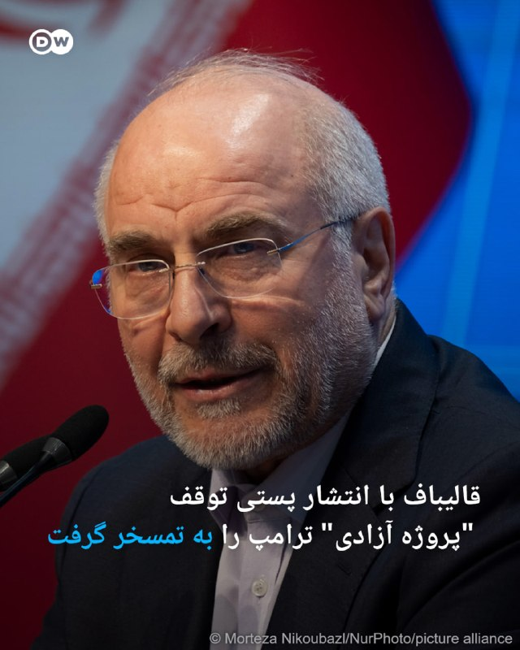

> 🔸قالیباف با انتشار پستی توقف "پروژه آزادی" ترامپ را به تمسخر گرفت
> 
> محمدباقر قالیباف، رئیس مجلس شورای اسلامی، که تا کنون نقش مذاکره‌کننده ارشد جمهوری اسلامی در گفت‌وگوها با ایالات متحده را بر عهده داشته، با انتشار پستی در ایکس، دولت ترامپ را به دلیل متوقف کردن عملیات دریایی برای کمک به خروج کشتی‌ها از تنگه هرمز به تمسخر گرفت.
> 
> دونالد ترامپ، رئیس ‌جمهور ایالات متحده آمریکا، بدون اشاره به دلیل توقف عملیات اسکورت کشتی‌ها در تنگه هرمز در روز سه‌شنبه گفته بود که این اقدام را بنا به درخواست پاکستان و برخی طرف‌های دیگر انجام داده است.
> 
> این نخستین باری نیست که اظهارات قالیباف در ایکس به زبان انگلیسی منتشر می‌شود.
> 
> پیش از این، بسیاری از کاربران با تحلیل ادبیات و کلمات به کار گرفته شده در پست‌های انگلیسی منسوب به قالیباف به خصوص درباره تحولات بورس و رسانه، اعلام کرده بودند که این پست‌ها احتمالا از سوی فرد یا افرادی مطلع از فضای رسانه‌ای آمریکا منتشر می‌شوند که به اصطلاحات زبان انگلیسی تسلط دارند.
> 
> @dw_farsi

## 1405/02/17 10:10 — VahidOOnLine
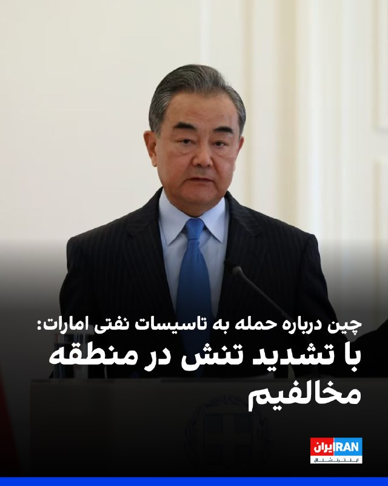

> وزارت خارجه چین درباره حمله به تاسیسات نفتی امارات متحده عربی اعلام کرد که با اقداماتی که به افزایش تنش در منطقه منجر می‌شود، قاطعانه مخالفت می‌کند.
> 
> امارات متحده عربی در روزهای دوشنبه و سه‌شنبه اعلام کرده بود هدف حملات موشکی و پهپادی از سوی جمهوری اسلامی قرار گرفته است.
> 
> مقام‌های جمهوری اسلامی اما انجام هرگونه حمله به این کشور را تکذیب کردند.
> ‌🏁 🇬🇧 IranintlTV
> 
> 🤖 @VahidOOnLine

## 1405/02/17 10:10 — IranIntlTV

> وزارت خارجه چین درباره حمله به تاسیسات نفتی امارات متحده عربی اعلام کرد که با اقداماتی که به افزایش تنش در منطقه منجر می‌شود، قاطعانه مخالفت می‌کند.
> 
> امارات متحده عربی در روزهای دوشنبه و سه‌شنبه اعلام کرده بود هدف حملات موشکی و پهپادی از سوی جمهوری اسلامی قرار گرفته است.
> 
> مقام‌های جمهوری اسلامی اما انجام هرگونه حمله به این کشور را تکذیب کردند.
> https://iranintl.com/202605076028

## 1405/02/17 10:08 — Persian_Trend_Official
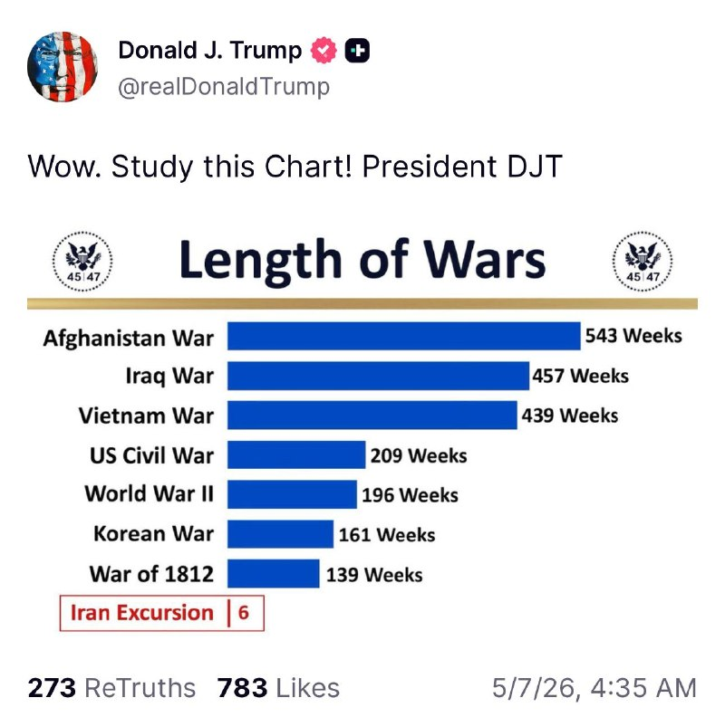

> ⭕️ ترامپ نموداری را منتشر کرد که در آن به مقایسه مدت زمان جنگ‌های ایالات متحده پرداخته و تأکید کرده که «عملیات علیه ایران» تنها شش هفته به طول انجامید. وی ضمن اشاره به این موضوع گفته: «وای، لطفاً این نمودار را بررسی نمایید.»
> 
> 📝 Nick
> 
> 📌 @persian_trend_official
> پرشین ترند | متفاوت‌ترین کانال نظامی

## 1405/02/17 10:03 — DW_Farsi
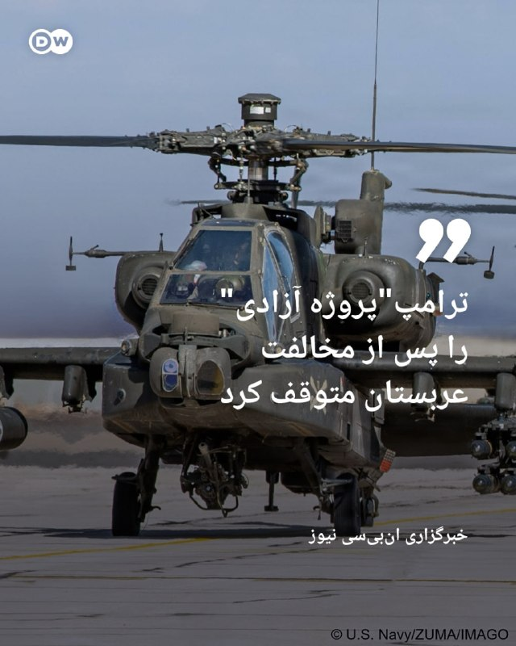

> 🔸ان‌بی‌سی: ترامپ "پروژه آزادی" را پس از مخالفت عربستان متوقف کرد
> 
> خبرگزاری ان‌بی‌سی نیوز با انتشار گزارشی مدعی شد که رئیس ‌جمهور ایالات متحده آمریکا "پروژه آ زادی"، عملیات دریایی برنامه‌ریزی شده برای اسکورت کشتی‌ها در تنگه هرمز راپس از آن‌ متوقف کرد که عربستان سعودی به ایالات متحده گفت اجازه نخواهد داد هواپیماهای آمریکایی که در این عملیات مشارکت دارند، از خاک عربستان بلند شوند یا از حریم هوایی این کشور در خلیج فارس عبور کنند.
> 
> این گزارش به نقل از مقام‌های آمریکایی می‌گوید عربستان سعودی و سایر کشورهای حاشیه خلیج فارس از اعلام"پروژه آزادی" در روز یکشنبه از سوی ترامپ غافلگیر شدند. این گزارش همچنین می‌افزاید که رئیس ‌جمهور ایالات متحده بعدا درباره این موضوع با محمد بن سلمان، ولیعهد عربستان سعودی، گفت‌وگو کرد اما نتوانست به راه‌حل برسد.
> 
> ان‌بی‌سی در گزارش خود می‌افزاید که این موضوع را با یک منبع سعودی طرح کرده و پرسیده که آیا این عملیات، رهبران عربستان را غافلگیر کرده بود یا نه، این منبع به این خبرگزاری گفته است: «مشکل این فرض این است که اتفاقات، با سرعت و به‌صورت لحظه‌ای در حال رخ دادن هستند.»
> 
> @dw_farsi

## 1405/02/17 10:02 — VahidOOnLine

> ژان نوئل بارو، وزیر خارجه فرانسه در پاسخ به پرسشی اعلام کرد که تا زمانی که تنگه هرمز مسدود باشد، لغو «حتی کوچک‌ترین تحریم» مربوط به جمهوری اسلامی امکان‌پذیر نیست.
> 
> پیش‌تر امانوئل مکرون اعلام کرد در گفت‌وگو با مسعود پزشکیان نگرانی خود را از تشدید تنش‌ها ابراز و حملات به زیرساخت‌های امارات و کشتی‌ها را محکوم کرده است.
> او خواستار رفع فوری محاصره تنگه شده بود.
> ‌🏁 🇬🇧 IranintlTV
> 
> 🤖 @VahidOOnLine

## 1405/02/17 10:01 — IranIntlTV
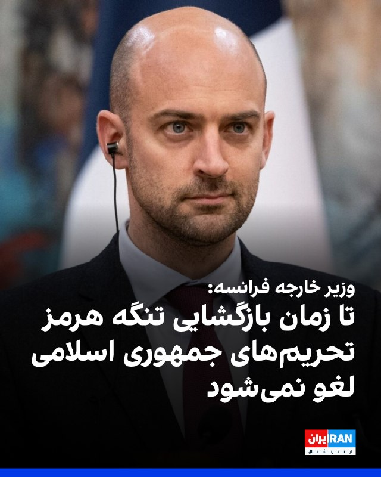

> ژان نوئل بارو، وزیر خارجه فرانسه در پاسخ به پرسشی اعلام کرد که تا زمانی که تنگه هرمز مسدود باشد، لغو «حتی کوچک‌ترین تحریم» مربوط به جمهوری اسلامی امکان‌پذیر نیست.
> 
> پیش‌تر امانوئل مکرون اعلام کرد در گفت‌وگو با مسعود پزشکیان نگرانی خود را از تشدید تنش‌ها ابراز و حملات به زیرساخت‌های امارات و کشتی‌ها را محکوم کرده است.
> او خواستار رفع فوری محاصره تنگه شده بود.
> https://iranintl.com/202605070324

## 1405/02/17 10:01 — VahidOOnLine
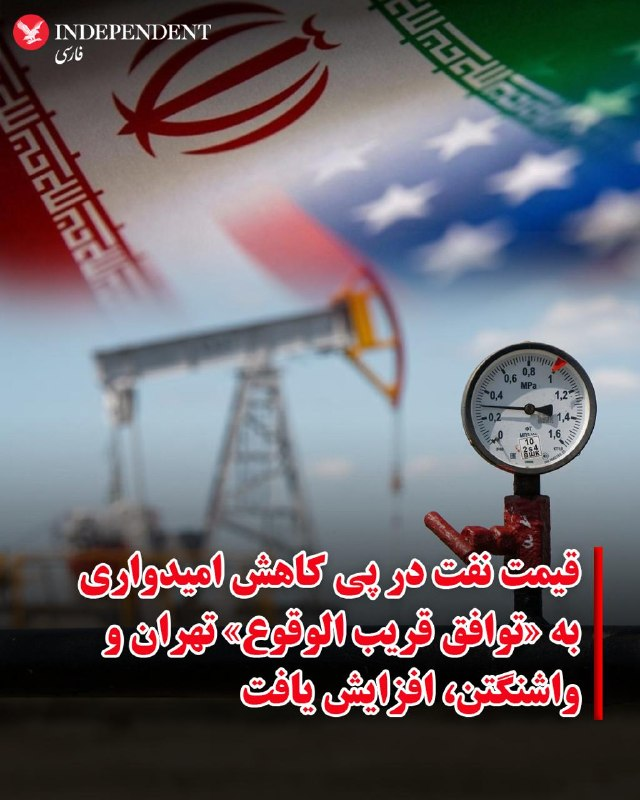

> ♦️قیمت نفت در بازارهای جهانی روز پنجشنبه ۱۷ اردیبهشت و در پی کاهش خوش‌بینی‌ به گزارش‌ها درباره احتمال توافق قریب‌الوقوع تهران و واشنگتن برای پایان جنگ، افزایش یافت.
> 
> صبح پنجشنبه و در پایان ساعت کار بازارهای آسیایی و پیش از بازگشایی بورس‌های اروپا، بهای هر بشکه نفت خام برنت با نزدیک به سه دلار افزایش، به بیش از ۱۰۱ دلار رسید. نفت خام روز گذشته و پس از انتشار گزارش آکسیوس و رویترز، به ۹۸ دلار رسیده بود.
> 
> گفته‌های دونالد ترامپ و مقام‌های جمهوری اسلامی ایران، خوشبینی نسبت به دستیابی به توافق را کمرنگ کرده است.
> ‌🇸🇦 Indypersian
> 
> 🤖 @VahidOOnLine

## 1405/02/17 09:56 — BBCPersian
> ‌🖊کریس باکمن
> بی‌بی‌سی در,پاریس
> 
> 🔻زاویه کرتیه، استاد دانشگاه قبول دارد که نام واقعی بسیاری از دانشجویانش را نمی‌داند.
> 
> این وضعیت در دنیای دانشگاهی بسیار نامعمول است، اما کار پروفسور کرتیه به هیچ وجه معمولی نیست.
> 
> او به آموزش جاسوسان فرانسه کمک می‌کند.
> 
> او می‌گوید: «به‌ندرت پیش می‌آید که پیشینه ماموران اطلاعاتی را که به این دوره فرستاده می‌شوند بدانم و تردید دارم که نام‌هایی که به من داده می‌شود اصلا واقعی باشند.»
> 
> اگر می‌خواستید محیطی برای یک مدرسه جاسوسی بسازید، محوطه دانشگاه «ساینس پو سن‌ژرمن» در حاشیه پاریس انتخاب مناسبی به نظر می‌رسد.
> 
> آنچه آن را متمایز می‌کند، مدرک تحصیلی منحصربه‌فردی است که دانشجویانی در اوایل دهه دوم زندگی را در کنار اعضای شاغلِ سرویس‌های مخفی فرانسه، که معمولا بین ۳۵ تا ۵۰ سال سن دارند، گرد هم می‌آورد.
> 
> نام این دوره «دیپلم اطلاعات و تهدیدهای جهانی» است.
> 
> متن کامل خبر را از لینک زیر بخوانید:
> https://bbc.in/4tnDvWC
> 📷GettyImages/ Sciences Po Saint-Germain
> 
> @BBCPersian

## 1405/02/17 09:38 — VahidOOnLine
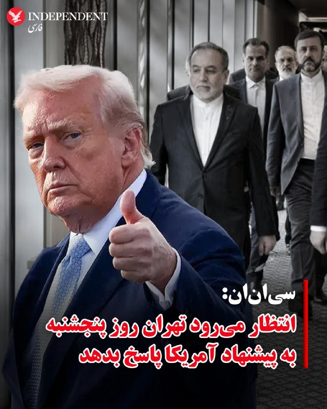

> ♦️سی‌ان‌ان به نقل از منبعی در منطقه گزارش داد که انتظار می‌رود پاسخ تهران به پیشنهاد آمریکا برای پایان دادن به جنگ، روز پنجشنبه ارسال شود. بر اساس این گزارش، ایران در حال بررسی پیشنهاد ارائه‌شده از سوی ایالات متحده است که از طریق میانجی‌ها به رژیم ایران ارایه شده است.  یک منبع گفته است که دو طرف در حال پیشرفت به سمت توافقی برای پایان دادن به جنگ هستند. ترامپ پیش‌تر به بازه زمانی یک هفته‌ای برای دریافت پیشنهاد اشاره کرده بود اما مهلت قطعی تعیین نکرد و هشدار داد اگر توافق نشود، بمباران از سرگرفته می‌شود. منابع دیگر مانند اکسیوس نیز با بازه زمانی ۴۸ ساعته برای دریافت پاسخ تهران اشاره کرده‌اند.
> ‌🇸🇦 Indypersian
> 
> 🤖 @VahidOOnLine

## 1405/02/17 09:38 — VahidOOnLine
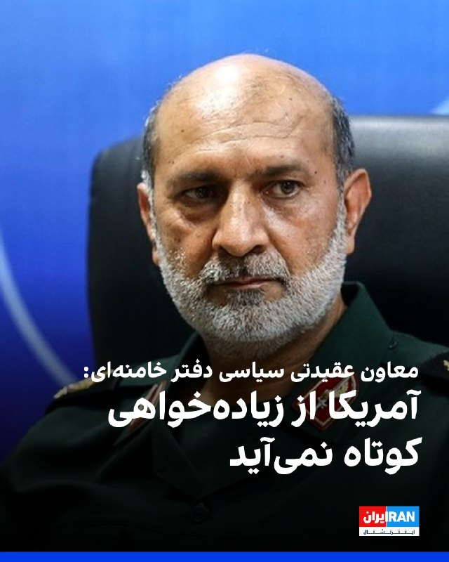

> رسول سنایی‌راد، معاون عقیدتی سیاسی دفتر خامنه‌ای، با اشاره به مذاکرات با آمریکا گفت: «آمریکایی‌ها هنوز بر اساس تصورات قبلی و مفروضات غلط خود عمل می‌کنند، از زیاده‌خواهی کوتاه نمی‌آیند و حاضر به پذیرش واقعیت‌ها نیستند. این مسئله موجب نوعی بن‌بست برای آن‌ها شده و برای جبران آن، امروز به زبان تهدید و اقداماتی نظیر لشکرکشی روی آورده‌اند.»
> 
> او اضافه کرد: «جمهوری اسلامی با توجه به سابقه بدعهدی، عهدشکنی و سوءاستفاده طرف مقابل از مذاکرات، آمادگی کامل دارد و اگر آمریکا دست به اشتباهی بزند با واکنش قاطع و سیلی سخت جمهوری اسلامی مواجه خواهد شد.»
> ‌🏁 🇬🇧 IranintlTV
> 
> 🤖 @VahidOOnLine

## 1405/02/17 09:37 — IranIntlTV

> رسول سنایی‌راد، معاون عقیدتی سیاسی دفتر خامنه‌ای، با اشاره به مذاکرات با آمریکا گفت: «آمریکایی‌ها هنوز بر اساس تصورات قبلی و مفروضات غلط خود عمل می‌کنند، از زیاده‌خواهی کوتاه نمی‌آیند و حاضر به پذیرش واقعیت‌ها نیستند. این مسئله موجب نوعی بن‌بست برای آن‌ها شده و برای جبران آن، امروز به زبان تهدید و اقداماتی نظیر لشکرکشی روی آورده‌اند.»
> 
> او اضافه کرد: «جمهوری اسلامی با توجه به سابقه بدعهدی، عهدشکنی و سوءاستفاده طرف مقابل از مذاکرات، آمادگی کامل دارد و اگر آمریکا دست به اشتباهی بزند با واکنش قاطع و سیلی سخت جمهوری اسلامی مواجه خواهد شد.»
> https://iranintl.com/202605078869

## 1405/02/17 09:33 — VahidOOnLine
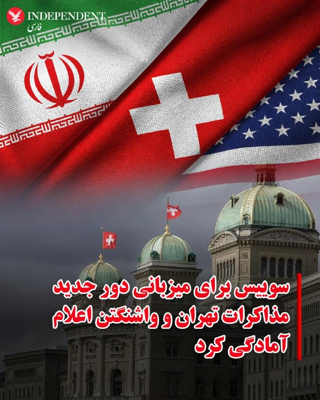

> ♦️ملانی گوگلمن، سخنگوی وزارت امور خارجه سوییس، روز پنجشنبه ۱۷ اردیبهشت به خبرگزاری تاس روسیه گفت این کشور آماده میزبانی مذاکرات برای حل و فصل مناقشه میان ایالات متحده و جمهوری اسلامی ایران است.
> 
> به گزارش تاس، این مقام دستگاه دیپلماسی سوییس در پاسخ به سوالی مبنی بر اینکه ژنو محل احتمالی مذاکرات است، گفت: «سوییس همیشه آماده ارائه خدمات خوب خود است.»
> 
> گوگلمن افزود که سوئیس مایل است «از هرگونه ابتکار دیپلماتیک با هدف تسهیل صلح حمایت کند و وزارت امور خارجه ما با همه طرف‌های درگیر در تماس است.»
> 
> پیش از حمله نظامی آمریکا و اسرائیل در نهم اسفند، مذاکرات نمایندگان جمهوری اسلامی ایران و آمریکا در یکی از ساختمان‌های دیپلماتیک سلطنت عمان در ژنو برگزار شده بود.
> 
> با توجه به قطع روابط دیپلماتیک جمهوری اسلامی ایران و آمریکا از سال ۱۳۵۸، سفارت سوییس در تهران، دفتر حفظ منافع آمریکا در ایران است و سفارت پاکستان در واشنگتن، دفتر حفظ منافع ایران در آمریکا.
> 
> وب‌سایت خبری آکسیوس روز گذشته به نقل از منابعی گزارش داده بود که واشنگتن و تهران در آستانه امضای یک یادداشت یک صفحه‌ای برای پایان دادن به درگیری مسلحانه هستند. به گفته این منابع، مذاکرات در مورد جزئیات توافق می‌تواند در اسلام‌آباد یا ژنو انجام شود.
> ‌🇸🇦 Indypersian
> 
> 🤖 @VahidOOnLine

## 1405/02/17 09:27 — BBCPersian
> 🔻ایران هر گونه دخالت در انفجار و آتش‌سوزی در کشتی کره جنوبی را رد کرد
> 
> 🔻ایران هرگونه دخالت نیروهای این کشور را در انفجار و آتش‌سوزی در یک کشتی کره‌جنوبی در آب‌های خلیج فارس رد کرد.
> 
> سفارت ایران در سئول در بیانیه‌ای گفته است: «ایران قاطعانه و به‌طور کامل هرگونه ادعا درباره دخالت نیروهای مسلح جمهوری اسلامی ایران در حادثه آسیب‌دیدن یک کشتی کره‌ای در تنگه هرمز را رد می‌کند.»
> 
> سه روز پیش یک کشتی باری کره‌ای در تنگه هرمز دچار انفجار و آتش سوزی شد. این حادثه تلفات جانی به همراه نداشت.
> 
> به گزارش رویترز وی سونگلاک، مشاور امنیت ملی رئیس جمهورکره جنوبی، در نشست خبری دیروز گفت که هنوز مشخص نیست انفجار دوشنبه در یک کشتی این کشور در آب‌های منطقه خلیج فارس، ناشی از حمله بوده است یا نه.
> 
> https://bbc.in/42S1XnV
> @BBCPersian

## 1405/02/17 09:25 — FarsiVOA
> 🔺بلومبرگ: چین از بانک‌هایش خواست اعطای وام‌های جدید به پالایشگاه‌های تحریم‌شده را متوقف کنند
> 
> ▪️چین به بزرگ‌ترین بانک‌های این کشور توصیه کرده به طور موقت اعطای وام‌های جدید به پنج پالایشگاهی را که اخیراً به دلیل ارتباطشان با نفت ایران از سوی آمریکا تحریم شده‌اند، متوقف کنند.
> 
> ▪️وزارت خزانه‌داری ایالات متحده، روز چهارم اردیبهشت تحریم‌های تازه‌ای را علیه پالایشگاه‌های نفت چین که به گفته واشنگتن مشتری نفت ایران بودند، اعمال کرد.
> 
> ▪️آمریکا، همچنین به بانک‌های چینی که نامشان برده نشده هشدار داد که در صورت تراکنش‌های مالی با جمهوری اسلامی، آن‌ها را مورد تحریم قرار خواهد داد.
> 
> ⬇️ بیشتر بخوانید:
> https://ir.voanews.com/a/8147550.html

## 1405/02/17 09:25 — IranIntlTV
> 🎧نسخه صوتی اخبار بامدادی | پنجشنبه ۱۷ اردیبهشت
> @iranintlTV

## 1405/02/17 09:24 — IranianMinds
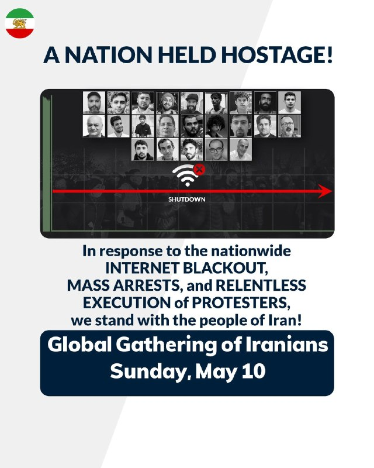

> دفتر شاهزاده رضا پهلوی، خواستار مشارکت گسترده در تجمعات جهانی یکشنبه در حمایت از مردم ایران شد.
> ایرانیان در سراسر جهان روز یکشنبه ۲۰ اردیبهشت در اعتراض به قطع اینترنت، بازداشت‌های گسترده و افزایش اعدام‌ها در ایران، در شهرهای مختلف جهان به طور همزمان تجمعاتی برگزار می کنن.
> 
> @IranianMinds

## 1405/02/17 09:22 — kianmeli1
> 🔴وال استریت ژورنال به نقل از مقامات آمریکایی لیست درخواست های جدید آمریکایی ها را برای توافق با ایران منتشر کرد:
> 
> 1- ممنوعیت غنی‌سازی اورانیوم به مدت 20 سال
> 
> 2- تحویل تمام مواد غنی‌شده (یعنی نه فقط 400 کیلوگرم با غلظت 60٪، بلکه صدها کیلوگرم با غلظت 20٪)
> 
> 3- اعلام رسمی اینکه ایران به دنبال دستیابی به سلاح‌های هسته‌ای نیست
> 
> 4- تعطیلی تأسیسات هسته‌ای فردو، نطنز و اصفهان
> 
> 5- ممنوعیت تمام فعالیت‌های هسته‌ای زیرزمینی
> 
> 6- بازرسی های فوری به درخواست‌های آژانس بین‌المللی انرژی اتمی
> https://t.me/kianmeli1

## 1405/02/17 09:18 — VahidOOnLine

> سایت رویداد ۲۴ گزارش داد پس از حملات آمریکا و اسرائیل به فولاد مبارکه اصفهان، از بیش از ۲۷ هزار نیروی این مجموعه تنها حدود دو هزار نفر، عمدتا در بخش‌های اداری و مدیریتی، به محل کار بازگشته‌اند و بخش تولید همچنان در توقف به‌سر می‌برد.
> 
> بر اساس این گزارش، بخشی از کارگران و نیروهای سابق فولاد مبارکه پس از توقف تولید، به رانندگی در اسنپ و تپسی روی آورده‌اند و برخی نیروهای فنی به دلیل کاهش حقوق یا بلاتکلیفی در روند بازسازی، به کارخانه‌های فولاد یزد و خراسان مهاجرت کرده‌اند.
> ‌🏁 🇬🇧 IranintlTV
> 
> 🤖 @VahidOOnLine

## 1405/02/17 09:18 — IranIntlTV
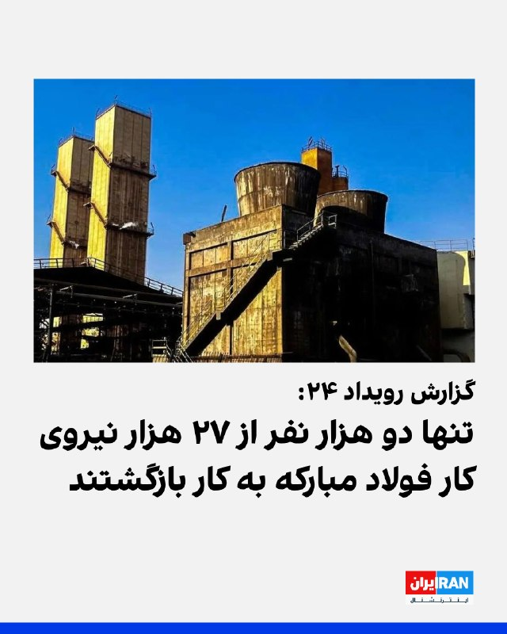

> سایت رویداد ۲۴ گزارش داد پس از حملات آمریکا و اسرائیل به فولاد مبارکه اصفهان، از بیش از ۲۷ هزار نیروی این مجموعه تنها حدود دو هزار نفر، عمدتا در بخش‌های اداری و مدیریتی، به محل کار بازگشته‌اند و بخش تولید همچنان در توقف به‌سر می‌برد.
> 
> بر اساس این گزارش، بخشی از کارگران و نیروهای سابق فولاد مبارکه پس از توقف تولید، به رانندگی در اسنپ و تپسی روی آورده‌اند و برخی نیروهای فنی به دلیل کاهش حقوق یا بلاتکلیفی در روند بازسازی، به کارخانه‌های فولاد یزد و خراسان مهاجرت کرده‌اند.
> https://iranintl.com/202605075599

## 1405/02/17 09:16 — IranianMinds
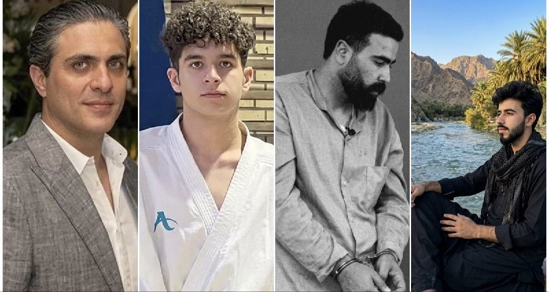

> آمریکا رهبرشونو کُشت، همه فرماندها رو از بین برد و هرچی تاسیسات نظامی بود را نابود کرد، اما این‌ها برای نشان دادنِ قدرت و ابهت‌شان هر صبح یک بچه ایرانی رو بالای دار می‌برند.
> 
> این‌ها جوک نیست، روش حکمرانی یک قبیله متحجر در ایران است؛
> 
> @IranianMinds

## 1405/02/17 09:10 — IranianMinds

> زیباترین لحظات تاریخ جهان٬ «لحظه ی پایان» دیکتاتورهاست! (برتولت برشت)
> 
> @IranianMinds

## 1405/02/17 09:05 — IranianMinds
> 📲#اپلیکیشن اندروید سایت جهانی دربی بت
> 
> 👍اسپانسر لیگ انگلیس
> 👍
> 🔥امکان شارژ امن از طریق کارت بانکی
> ➖➖➖➖➖➖➖➖➖
> 
> 🪙همین حالا عضو شوید 👇
> https://t.me/+aCbq7yy8QY80NzQ0

## 1405/02/17 09:05 — IranianMinds

> 😤دنبال یه سایت شرط بندی بین المللی بودی که به ایرانیا خدمات بده؟!
> ⛔
> 
> 
> 👍دربی بت همون انتخاب  100%
> 
> 
> 💎ویژگی های سایت جهانی Derby Bet:
> 
> ⬅️امکان شارژ امن با کارت بانکی
> 
> ⬅️واریز اول دوبل شارژ می شوید(بونوس۱۰۰٪)
> 
> ⬅️پر اپشن ترین سایت فعال در ایران
> 
> ⬅️تسویه حساب کمتر از 5 دقیقه
> 
> ⬅️برگشت بخشی از باخت به صورت هفتگی
> 
> 
> 🚨کد هدیه ثبت نام:GG007
> 
> ⚠️برای دانلود اپلکیشن کلیک کنید
> 👉
> re17
> 
> 🔔کانال دربی بت :
> 
> 🪙https://t.me/+aCbq7yy8QY80NzQ0

## 1405/02/17 09:00 — RadioFarda
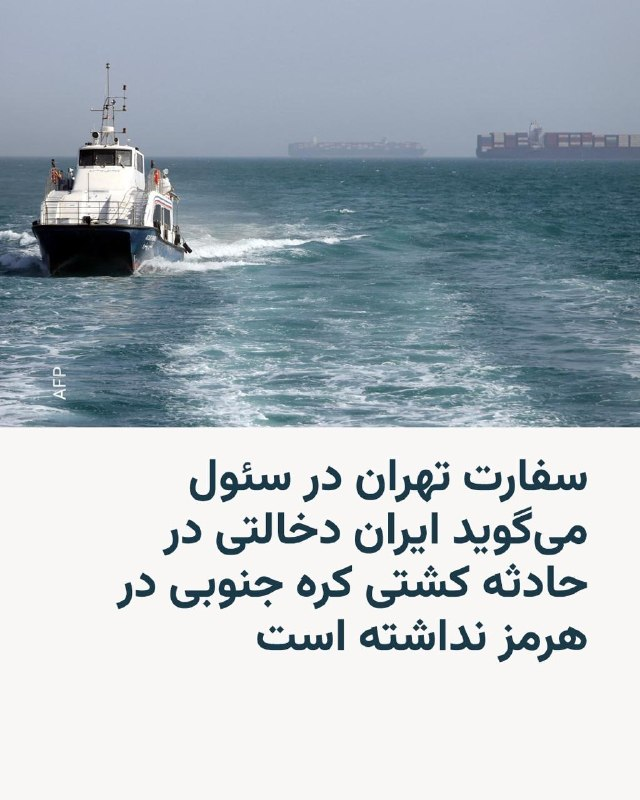

> 🔸سفارت تهران در سئول با انتشار بیانیه‌ای دخالت نیروهای مسلح جمهوری اسلامی ایران در حادثه آسیب دیدن یک کشتی کره‌ای در روز ۱۴ اردیبهشت در تنگه هرمز را رد کرد.
> 
> 🔸در بیانیه سفارتخانه که روز پنجشنبه ۱۷ اردیبهشت منتشر شد، در عین حال آمده است که عبور ایمن از تنگه هرمز مستلزم «هماهنگی با مقام‌های ذی‌صلاح جمهوری اسلامی ایران است» و بی‌توجهی به شرایط «ممکن است به حوادث ناخواسته منجر شود».
> 
> 🔸این تکذیب از سوی سفارت تهران در سئول در حالی است که ستاد نیروهای مسلح جمهوری اسلامی و دیگر مقامات مرتبط تهران تاکنون هیچ بیانیه‌ای در این باره صادر نکرده‌اند.
> 
> 🔸پیشتر، وی سونگ‌لاک، مشاور امنیت ملی رئیس‌جمهور کره جنوبی، گفته بود هنوز مشخص نیست انفجار و آتش‌سوزی در یک کشتی تحت مدیریت کره جنوبی در روز دوشنبه ناشی از حمله بوده یا حادثه‌ای فنی. به‌گفته او، آتش‌سوزی از موتورخانه آغاز شد و هیچ‌یک از ۲۴ خدمه کشتی آسیب ندیدند.
> 
> 🔸دفتر ریاست‌جمهوری کره جنوبی روز چهارشنبه اعلام کرد سئول پس از توقف عملیات اسکورت کشتی‌ها در تنگه هرمز از سوی دونالد ترامپ، بررسی مشارکت در «پروژه آزادی» آمریکا را متوقف کرده است.
> 
> @RadioFarda

## 1405/02/17 08:57 — BBCPersian
> 🔻سازمان بنادر و دریانوردی ایران از آمادگی برای خدمات به کشتی‌ها در تنگه‌ هرمز خبر داد
> 
> 🔻به گزارش رسانه‌های ایران،‌ سازمان بنادر و دریانوردی این کشور با ارسال پیامی به شناورهای حاضر در تنگه هرمز از آمادگی برای ارایه خدماتی چون ارسال آذوقه، سوخت، خدمات بهداشتی و پزشکی و تعمیرات، خبر داده است.
> 
> بنابر این گزارش این سازمان اعلام کرده است این خدمات «در چارچوب مسئولیت‌های حاکمیتی جمهوری اسلامی ایران در حوزه ایمنی دریانوردی و ارائه خدمات بندری و دریایی انجام می‌شود.»
> 
> https://bbc.in/49hk4r2
> @BBCPersian

## 1405/02/17 08:54 — IranianMinds
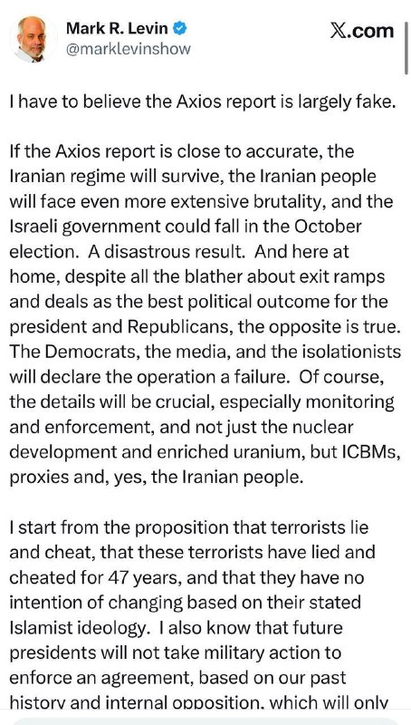

> 🔴 مارک لوین، از نزدیکان ترامپ:
> 
> باید باور کنم که گزارش آکسیوس تا حد زیادی جعلی است.
> اگر گزارش آکسیوس تقریباً دقیق باشد، رژیم ایران زنده خواهد ماند، مردم ایران با خشونت‌های گسترده‌تری روبرو خواهند شد و دولت اسرائیل ممکن است در انتخابات اکتبر سقوط کند. نتیجه‌ای فاجعه‌بار. و در داخل کشور، با وجود همه حرف‌ها درباره راه‌های خروج و توافق‌ها به عنوان بهترین نتیجه سیاسی برای رئیس‌جمهور و جمهوری‌خواهان، عکس این موضوع درست است. دموکرات‌ها، رسانه‌ها و انزواطلبان این عملیات را شکست‌خورده اعلام خواهند کرد. البته جزئیات بسیار مهم خواهد بود، به ویژه نظارت و اجرا، و نه فقط توسعه هسته‌ای و اورانیوم غنی‌شده، بلکه موشک‌های بالستیک قاره‌پیما، نیابتی‌ها و بله، مردم ایران.
> من از این فرض شروع می‌کنم که تروریست‌ها دروغ می‌گویند و تقلب می‌کنند، این تروریست‌ها ۴۷ سال است که دروغ گفته و تقلب کرده‌اند، و هیچ قصدی برای تغییر بر اساس ایدئولوژی اسلام‌گرایانه خود ندارند. همچنین می‌دانم که رؤسای جمهور آینده بر اساس تاریخ گذشته و مخالفت‌های داخلی، اقدام نظامی برای اجرای توافق انجام نخواهند داد.
> 
> @IranianMinds

## 1378/10/11 03:30 — VahidOOnLine
[🎬 Video](telegram/content/VahidOOnLine_238582_1778135377.mp4)

> به گزارش رسانه‌های داخلی، فرمانداری اراک اعلام کرد عملیات خنثی‌سازی و انفجار کنترل‌شده بمب‌ها و مهمات عمل‌نکرده باقی‌مانده از حملات اخیر، امروز پنج‌شنبه هفدهم اردیبهشت در حومه این شهر انجام می‌شود.
> بر اساس این اطلاعیه، این عملیات از ساعت ۱۰ تا ۱۲ ظهر ادامه خواهد داشت و مقام‌ها تأکید کرده‌اند شنیده شدن صدای انفجار در این بازه زمانی عادی و از پیش برنامه‌ریزی‌شده است.
> ‌🏁 🇬🇧 ManotoTV
> 
> 🤖 @VahidOOnLine

## 1378/10/11 03:30 — VahidOOnLine
> ♦️کمتر از دو ماه مانده به آغاز جام جهانی، تکلیف سفر تیم ملی فوتبال ایران به آمریکا هنوز مشخص نیست. در حالیکه مقام‌های جمهوری اسلامی می‌گویند تصمیم بر شرکت تیم ملی در جام جهانی است، مساله حضور سپاه در فهرست سازمان‌های تروریستی آمریکا و کانادا، بر سفر تیم ملی سایه افکنده است.
> 
> اسماعیل بقایی، سخنگوی وزارت امور خارجه جمهوری اسلامی که برای دیدار تیم‌ ملی با خودش به ورزشگاه شهید دستگردی تهران رفته بود به خبرنگاران گفت تهران تمام تلاشش را برای حضور تیم ملی در جام جهانی انجام می‌دهد. بقایی می‌گوید تیم ملی، مهمان فیفا است و فدراسیون بین‌المللی فوتبال باید تضمین دهد که بی‌احترامی با اعضای کاروان ورزشی ایران نخواهد شد. مهدی تاج و امیر قلعه‌نویی، رئیس فدراسیون و سرمربی تیم ملی که برای حضور در کنگره فیفا به کانادا سفر کرده بودند، به‌دلیل پرسیده شدن سوال درباره سابقه «حضور در سازمان تروریستی سپاه» از فرودگاه به ایران بازگشتند.
> 
> مهدی تاج هم روز گذشته به خبرنگاران گفت تلاش می‌کنیم به جام جهانی برویم اما فیفا باید تضمین بدهد که «بی‌احترامی» نخواهد شد و کار با «ایشالله ماشالله» جیانی اینفانتینو، درست نمی‌شد.
> ‌🇸🇦 Indypersian
> 
> 🤖 @VahidOOnLine

## 1378/10/11 03:30 — VahidOOnLine
[🎬 Video](telegram/content/VahidOOnLine_238579_1778135378.mp4)

> دونالد ترامپ با انتشار تصویری در شبکه اجتماعی «تروث سوشال»، طول جنگ ایران را در کنار چند جنگ مهم تاریخ آمریکا قرار داد و از کاربران خواست به این مقایسه توجه کنند.
> در این تصویر، مدت جنگ‌هایی مانند افغانستان، عراق، ویتنام، کره و جنگ جهانی دوم در کنار درگیری اخیر با ایران نمایش داده شده و جنگ ایران تنها شش هفته عنوان شده است؛ عددی که در مقایسه با دیگر جنگ‌های طولانی آمریکا بسیار کوتاه‌تر نشان داده می‌شود.
> ‌🏁 🇬🇧 ManotoTV
> 
> 🤖 @VahidOOnLine

## 1378/10/11 03:30 — IranIntlTV
[🎬 Video](telegram/content/IranIntlTV_335919_1778135378.mp4)

> سازمان حقوق بشر ایران به نقل از گزارش‌های رسیده اعلام کرد زندانیان در قزل‌حصار با خشونت شدید ماموران و کمبود اقلام خوراکی و دارویی مواجه هستند. بر اساس این گزارش، وضعیت شماری از زندانیان سیاسی در این زندان «نامشخص» اعلام شده است.
> 
> گفت‌وگو با پگاه بنی‌هاشمی، پژوهش‌گر ارشد حقوق
> @iranintltv

## 1378/10/11 03:30 — IranIntlTV
[🎬 Video](telegram/content/IranIntlTV_335918_1778135380.mp4)

> رهبران اتحادیه کشورهای جنوب شرق آسیا در حالی در نشست آسه‌آن در فیلیپین شرکت می‌کنند که جنگ ایران و اختلال در عبور امن از تنگه هرمز، بحران انرژی را به مهم‌ترین نگرانی در این منطقه تبدیل کرده است.
> 
> جزییات بیشتر در گفت‌وگو با علیرضا محبی، خبرنگار ایران‌اینترنشنال
> @iranintltv

## 1378/10/11 03:30 — IranIntlTV
[🎬 Video](telegram/content/IranIntlTV_335915_1778135381.mp4)

> سازمان حقوق بشری هانا گزارش داد جمهوری اسلامی با حمله موشکی، کمپ بالیسان، وابسته به حزب کومله کردستان ایران را در اقلیم کردستان عراق هدف قرار داده است.
> 
> گفت‌وگو با هژار برنجی، نماینده حزب دمکرات کردستان ایران در آمریکا
> @iranintltv

## 1378/10/11 03:30 — IranIntlTV
[🎬 Video](telegram/content/IranIntlTV_335914_1778135383.mp4)

> دونالد ترامپ، رییس‌جمهوری آمریکا، گفت: «در ۲۴ ساعت گذشته مذاکرات خوبی با جمهوری اسلامی انجام شده است.» او همچنین انتقال اورانیوم با غنای بالا به ایالات متحده را بخشی از توافق در حال بررسی با تهران توصیف کرد.
> 
> ارزیابی روزبه میرابراهیمی، عضو تحریریه ایران‌اینترنشنال
> @iranintltv

## 1378/10/11 03:30 — IranIntlTV
[🎬 Video](telegram/content/IranIntlTV_335912_1778135384.mp4)

> هم‌زمان با قطع اینترنت در ایران، بازداشت‌های گسترده و ادامه اعدام‌ها، ایرانیان خارج از کشور یکشنبه تجمعات اعتراضی برگزار خواهند کرد تا صدای مردم ایران را به جامعه بین‌المللی برسانند. دفتر شاهزاده رضا پهلوی نیز با بازنشر این فراخوان، از ایرانیان خواست در این گردهمایی‌ها شرکت کنند.
> 
> گفت‌وگو با نوید محبی، تحلیل‌گر سیاسی
> @iranintltv

## 1378/10/11 03:30 — IranIntlTV
[🎬 Video](telegram/content/IranIntlTV_335911_1778135386.mp4)

> موسسه علوم و امنیت بین‌الملل بر اساس تحلیل تصاویر تازه ماهواره‌ای اعلام کرد در مجموعه کوه کلنگ، در جنوب سایت هسته‌ای نطنز، دو دهانه شرقی تونل‌ها به‌طور عمدی با خاک و سنگ مسدود شده‌اند. تحلیل‌گران می‌گویند این اقدام می‌تواند نشانه‌ای از تقویت حفاظت از زیرساخت‌های زیرزمینی برای نگهداری تجهیزات و مواد هسته‌ای حساس باشد.
> 
> گفت‌وگو با فرزین ندیمی، پژوهش‌گر ارشد امور دفاعی و امنیتی
> @iranintltv

## 1378/10/11 03:30 — ManotoTV
[🎬 Video](telegram/content/ManotoTV_105066_1778135387.mp4)

> به گزارش رسانه‌های داخلی، فرمانداری اراک اعلام کرد عملیات خنثی‌سازی و انفجار کنترل‌شده بمب‌ها و مهمات عمل‌نکرده باقی‌مانده از حملات اخیر، امروز پنج‌شنبه هفدهم اردیبهشت در حومه این شهر انجام می‌شود.
> بر اساس این اطلاعیه، این عملیات از ساعت ۱۰ تا ۱۲ ظهر ادامه خواهد داشت و مقام‌ها تأکید کرده‌اند شنیده شدن صدای انفجار در این بازه زمانی عادی و از پیش برنامه‌ریزی‌شده است.

## 1378/10/11 03:30 — ManotoTV
[🎬 Video](telegram/content/ManotoTV_105065_1778135388.mp4)

> دونالد ترامپ با انتشار تصویری در شبکه اجتماعی «تروث سوشال»، طول جنگ ایران را در کنار چند جنگ مهم تاریخ آمریکا قرار داد و از کاربران خواست به این مقایسه توجه کنند.
> در این تصویر، مدت جنگ‌هایی مانند افغانستان، عراق، ویتنام، کره و جنگ جهانی دوم در کنار درگیری اخیر با ایران نمایش داده شده و جنگ ایران تنها شش هفته عنوان شده است؛ عددی که در مقایسه با دیگر جنگ‌های طولانی آمریکا بسیار کوتاه‌تر نشان داده می‌شود.

## 1378/10/11 03:30 — Persian_Trend_Official
[🎬 Video](telegram/content/Persian_Trend_Official_13570_1778135388.mp4)

> ⚡️ حمله پهپادی مشکوک در خاک لتونی؛ پس از ماه ها دوباره تنش امنیتی در مرزهای ناتو بالا گرفت.
> 
> 
> رسانه‌های لتونی گزارش دادند یک پهپاد ناشناس که از سمت روسیه وارد حریم هوایی لتونی شده بود، به یک تأسیسات ذخیره سوخت در شهر رِزِکنه حمله کرده است.
> به گفته مقامات، این پهپاد یک مخزن خالی سوخت را هدف قرار داده و تلفات یا خسارات گسترده‌ای گزارش نشده است.
> نیروهای مسلح ملی لتونی با تأیید این حادثه اعلام کردند تهدید احتمالی در فضای هوایی کشور پایان یافته، اما نظارت کامل بر مرزهای شرقی همچنان ادامه دارد.
> ارتش لتونی همچنین تأکید کرد با همکاری نیروهای ناتو، سامانه‌های دفاع هوایی در مرز شرقی تقویت شده‌اند و در صورت تکرار هرگونه تهدید، آمادگی پاسخ فوری وجود دارد.
> 
> ☆Phantom☆
> 
> 📌 @persian_trend_official
> پرشین ترند | متفاوت‌ترین کانال نظامی

## 1378/10/11 03:30 — IranianMinds
[🎬 Video](telegram/content/IranianMinds_19665_1778135389.mp4)

> واکنش «پرستوی ۴۰۰ هزارتومانی» شلغمدری به سخنان اخیر امام جمعه رشت درباره حجاب!
> 
> @IranianMinds

## 1378/10/11 03:30 — IranianMinds
[🎬 Video](telegram/content/IranianMinds_19662_1778135390.mp4)

> پلیس شریف پاریس و طرفداران چفیه پوش پالستین
> 
> @IranianMinds

## 1405/02/17 08:53 — BBCPersian
> 🖊بخش ترکی بی‌‌بی‌سی
> در,لندن
> 
> 🔻مرکز تحقیق و توسعه وزارت دفاع ملی ترکیه، اولین موشک بالستیک قاره‌پیمای این کشور با نام «ییلدیریم‌هان» را معرفی کرد.
> 
> این موشک در نخستین روز نمایشگاه بین‌المللی صنایع دفاعی، هوافضا و فضایی ساها-۲۰۲۶ در استانبول به نمایش درآمد.
> 
> روی بخشی از بدنه موشک، نقش بایزید یکم، سلطان عثمانی، مشهور به ییلدیریم (صاعقه) حک شده است.
> 
> در بخش دماغه موشک نیز امضای مصطفی کمال آتاتورک دیده می‌شود.
> 
> یاشار گولر، وزیر دفاع ملی ترکیه، در بیانیه مطبوعاتی اعلام کرد که این موشک نخستین مهمات در زرادخانه ترکیه است که از سوخت مایع راکتی استفاده می‌کند و قادر به پرواز با سرعت هایپرسونیک است.
> 
> او همچنین گفت که موشک «ییلدیریم‌هان» دوربردترین موشکی است که ترکیه تاکنون تولید کرده است.
> 
> اطلاعات فنی محدودی درباره این موشک منتشر شده است.
> 
> بر اساس اطلاعات نموداری که در مقابل مدل نمایش داده شده در نمایشگاه قرار دارد، ییلدیریم‌هان بردی معادل ۶۰۰۰ کیلومتر دارد.
> 
> متن کامل خبر را از لینک زیر بخوانید:
> 
> 📷GettyImages/ Anadolu via Getty Images
> https://bbc.in/4u1Omqc
> 
> @BBCPersian

## 1405/02/17 08:52 — IranianMinds
> 🔴 وال‌استریت ژورنال جزئیات تازه‌ای از چارچوب پیشنهادی آمریکا به جمهوری اسلامی منتشر کرد
> 
> به نوشته این روزنامه، در صورت پذیرش تهران، به مذاکرات ۳۰ روزه برای توافق نهایی منجر خواهد شد.
> بر اساس این گزارش، واشینگتن خواهان برچیدن کامل تأسیسات هسته‌ای فردو، نطنز و اصفهان و ممنوعیت هرگونه فعالیت هسته‌ای زیرزمینی در ایران است.
> آمریکا همچنین خواستار توقف ۲۰ ساله غنی‌سازی اورانیوم، تحویل همه ذخایر اورانیوم غنی‌شده و بازرسی‌های فوری و بدون محدودیت از هر مکان مشکوک مرتبط با برنامه هسته‌ای جمهوری اسلامی شده است.
> در چارچوب همین پیشنهاد، جمهوری اسلامی باید تنگه هرمز را به‌تدریج بازگشایی کند؛ هم‌زمان آمریکا نیز بخشی از محاصره دریایی را کاهش خواهد داد. بازگشایی کامل تنگه هرمز به توافق نهایی موکول شده است.
> طبق گزارش وال استریت ژورنال، لغو تحریم‌ها به «اجرای واقعی تعهدات» از سوی جمهوری اسلامی وابسته خواهد بود و نه صرفاً امضای یک توافقنامه. برخی دارایی‌های بلوکه‌شده نیز ممکن است در آغاز آزاد شوند.
> 
> @IranianMinds

## 1405/02/17 08:33 — VahidOOnLine
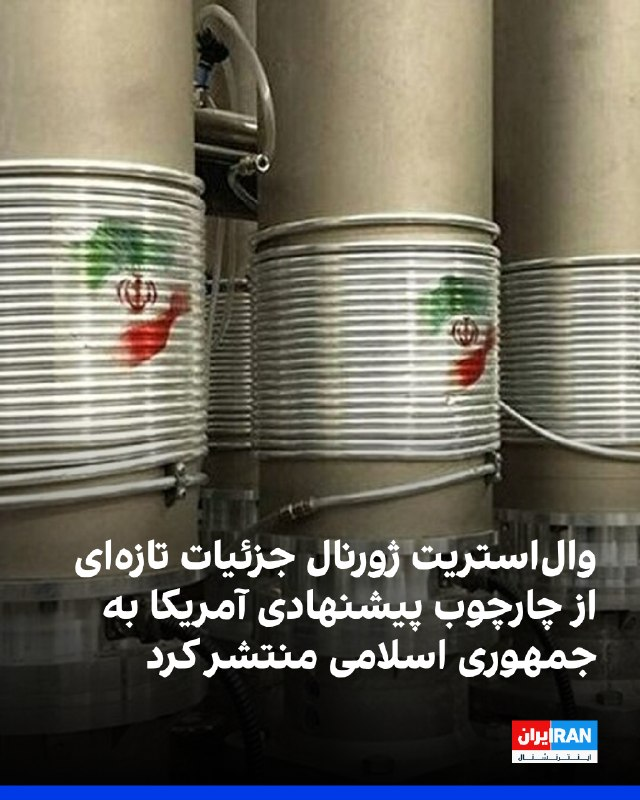

> وال‌استریت ژورنال جزئیات تازه‌ای از چارچوب پیشنهادی آمریکا به جمهوری اسلامی منتشر کرد که به نوشته این روزنامه، در صورت پذیرش تهران، به مذاکرات ۳۰ روزه برای توافق نهایی منجر خواهد شد.
> بر اساس این گزارش، واشینگتن خواهان برچیدن کامل تأسیسات هسته‌ای فردو، نطنز و اصفهان و ممنوعیت هرگونه فعالیت هسته‌ای زیرزمینی در ایران است.
> آمریکا همچنین خواستار توقف ۲۰ ساله غنی‌سازی اورانیوم، تحویل همه ذخایر اورانیوم غنی‌شده و بازرسی‌های فوری و بدون محدودیت از هر مکان مشکوک مرتبط با برنامه هسته‌ای جمهوری اسلامی شده است.
> در چارچوب همین پیشنهاد، جمهوری اسلامی باید تنگه هرمز را به‌تدریج بازگشایی کند؛ هم‌زمان آمریکا نیز بخشی از محاصره دریایی را کاهش خواهد داد. بازگشایی کامل تنگه هرمز به توافق نهایی موکول شده است.
> طبق گزارش وال استریت ژورنال، لغو تحریم‌ها به «اجرای واقعی تعهدات» از سوی جمهوری اسلامی وابسته خواهد بود و نه صرفاً امضای یک توافقنامه. برخی دارایی‌های بلوکه‌شده نیز ممکن است در آغاز آزاد شوند.
> ‌🏁 🇬🇧 IranintlTV
> 
> 🤖 @VahidOOnLine

## 1405/02/17 08:33 — IranIntlTV

> وال‌استریت ژورنال جزئیات تازه‌ای از چارچوب پیشنهادی آمریکا به جمهوری اسلامی منتشر کرد که به نوشته این روزنامه، در صورت پذیرش تهران، به مذاکرات ۳۰ روزه برای توافق نهایی منجر خواهد شد.
> بر اساس این گزارش، واشینگتن خواهان برچیدن کامل تأسیسات هسته‌ای فردو، نطنز و اصفهان و ممنوعیت هرگونه فعالیت هسته‌ای زیرزمینی در ایران است.
> آمریکا همچنین خواستار توقف ۲۰ ساله غنی‌سازی اورانیوم، تحویل همه ذخایر اورانیوم غنی‌شده و بازرسی‌های فوری و بدون محدودیت از هر مکان مشکوک مرتبط با برنامه هسته‌ای جمهوری اسلامی شده است.
> در چارچوب همین پیشنهاد، جمهوری اسلامی باید تنگه هرمز را به‌تدریج بازگشایی کند؛ هم‌زمان آمریکا نیز بخشی از محاصره دریایی را کاهش خواهد داد. بازگشایی کامل تنگه هرمز به توافق نهایی موکول شده است.
> طبق گزارش وال استریت ژورنال، لغو تحریم‌ها به «اجرای واقعی تعهدات» از سوی جمهوری اسلامی وابسته خواهد بود و نه صرفاً امضای یک توافقنامه. برخی دارایی‌های بلوکه‌شده نیز ممکن است در آغاز آزاد شوند.
> https://iranintl.com/202605074162

## 1405/02/17 08:30 — VahidOOnLine
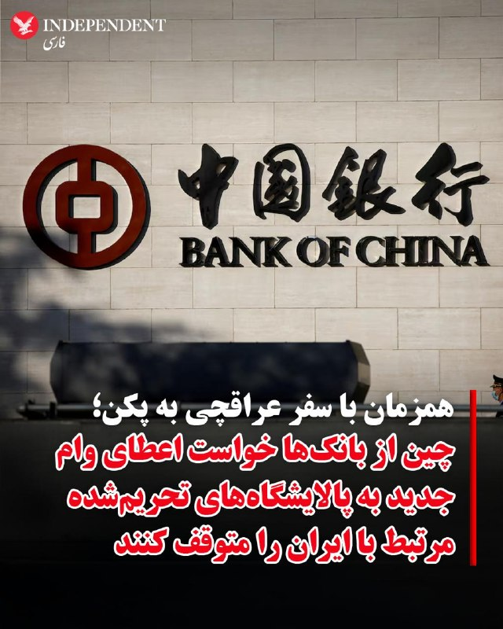

> ♦️درحالی که عباس عراقچی، وزیر خارجه جمهوری اسلامی به تازگی به چین سفر کرده، بلومبرگ گزارش داد نهاد ناظر مالی چین به بزرگ‌ترین بانک‌های این کشور توصیه کرده است اعطای وام‌های جدید به پنج پالایشگاهی را که اخیرا به‌دلیل ارتباط با نفت ایران از سوی آمریکا تحریم شده‌اند، به‌طور موقت متوقف کنند.
> بر اساس این گزارش، «اداره ملی تنظیم مقررات مالی» چین (NFRA) در یک دستور شفاهی از بانک‌ها خواسته است از اعطای وام‌های جدید به یوان خودداری کنند، اما اعتبارها و وام‌های موجود را لغو نکنند.
> به گفته منابع آگاه، به بانک‌ها همچنین دستور داده شده روابط تجاری خود با شرکت‌هایی از جمله پالایشگاه «هنگلی پتروکمیکال» در دالیان، بزرگ‌ترین پالایشگر خصوصی چین، را بازبینی کنند.
> اداره تنظیم مقررات مالی چین و شرکت «هنگلی» بلافاصله به درخواست رویترز برای اظهار نظر پاسخ ندادند.
> این دستور که پیش از اول مه صادر شده، در تضاد با اطلاعیه وزارت بازرگانی چین در دوم مه است؛ اطلاعیه‌ای که در آن دولت از شرکت‌ها خواسته بود تحریم‌های آمریکا را نادیده بگیرند.
> وزارت خزانه‌داری آمریکا در ماه آوریل شرکت «هنگلی پتروکمیکال» را تحریم و این شرکت را به خرید میلیاردها دلار نفت ایران متهم کرد؛ اقدامی که بخشی از تلاش‌های واشنگتن برای محدود کردن درآمدهای نفتی تهران توصیف شده است.
> اسکات بسنت، وزیر خزانه‌داری آمریکا، ماه گذشته گفت واشنگتن به دو بانک چینی هشدار داده است که در صورت پردازش تراکنش‌های مرتبط با ایران، با تحریم‌های ثانویه مواجه خواهند شد، هرچند نام این بانک‌ها اعلام نشد.
> این تحریم‌ها برای پالایشگاه‌های چینی مشکلاتی ایجاد کرده، از جمله دشواری در دریافت نفت خام و ناچار شدن به فروش فرآورده‌های پالایش‌شده با نام‌های دیگر.
> ‌🇸🇦 Indypersian
> 
> 🤖 @VahidOOnLine

## 1405/02/17 08:13 — VahidOOnLine
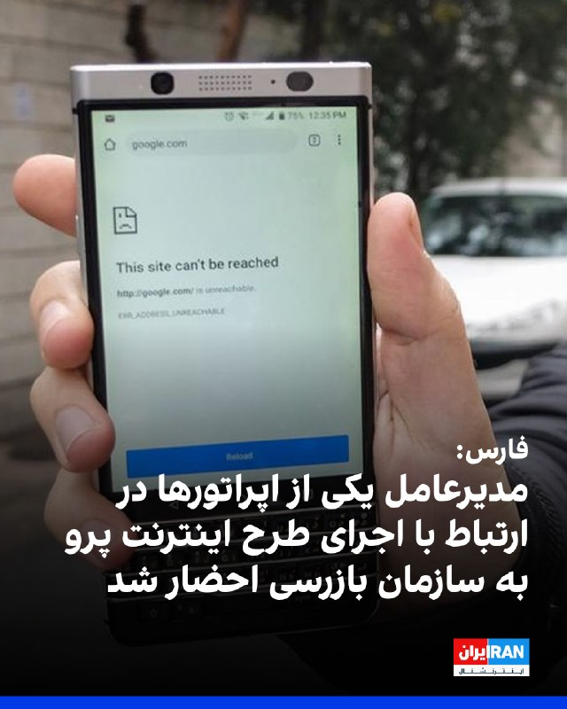

> خبرگزاری فارس، وابسته به سپاه، گزارش داد به دستور قوه قضاییه، مدیرعامل یکی از اپراتورها برای ارائه توضیحات درباره اینترنت پرو به سازمان بازرسی احضار شده و درباره روند اجرای این طرح و انطباق آن با چارچوب‌های قانونی توضیحاتی ارائه کرده است.
> به گزارش فارس، در زمان اجرای طرح اینترنت پرو، دو تخلف اپراتورها باعث شد این مصوبه از مسیر خود منحرف شده و به ضد خودش تبدیل شود.
> این گزارش افزود: تخلف اول افزایش قیمت اینترنت به میزان هر گیگ، ۴۰ هزارتومان و تخلف دوم ارائۀ اینترنت اضطراری به افراد در دسته‌های غیر ضروری بود.
> 
> ‌🏁 🇬🇧 IranintlTV
> 
> 🤖 @VahidOOnLine

## 1405/02/17 08:13 — IranIntlTV

> خبرگزاری فارس، وابسته به سپاه، گزارش داد به دستور قوه قضاییه، مدیرعامل یکی از اپراتورها برای ارائه توضیحات درباره اینترنت پرو به سازمان بازرسی احضار شده و درباره روند اجرای این طرح و انطباق آن با چارچوب‌های قانونی توضیحاتی ارائه کرده است.
> به گزارش فارس، در زمان اجرای طرح اینترنت پرو، دو تخلف اپراتورها باعث شد این مصوبه از مسیر خود منحرف شده و به ضد خودش تبدیل شود.
> این گزارش افزود: تخلف اول افزایش قیمت اینترنت به میزان هر گیگ، ۴۰ هزارتومان و تخلف دوم ارائۀ اینترنت اضطراری به افراد در دسته‌های غیر ضروری بود.
> 
> https://iranintl.com/202605079226

## 1405/02/17 08:09 — BBCPersian
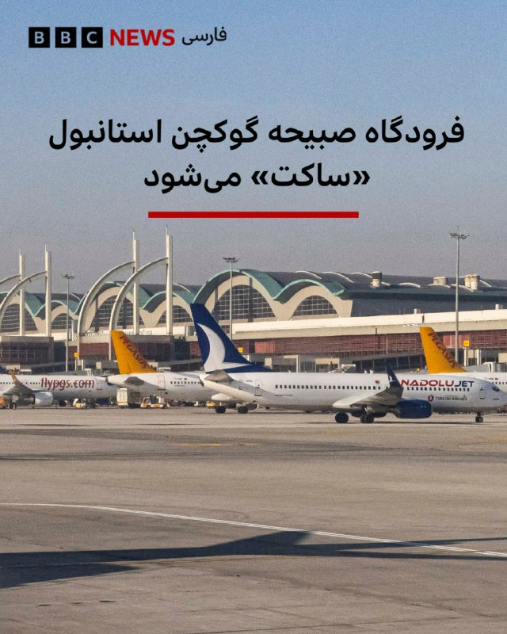

> 🔻فرودگاه بين‌المللی صبيحه گوکچن استانبول از يکشنبه ۱۰ مه اجرای مدل «فرودگاه ساکت» را آغاز خواهد کرد. اقدامی که در راستای افزايش آسايش مسافران و نوسازی سامانه‌های اطلاع‌رسانی در ترمينال انجام می‌شود.
> 
> بر اساس اين طرح جديد، اعلاميه‌هایی که معمولا از طريق بلندگوهای فرودگاه خوانده می‌شد، به‌طور چشمگيری کاهش خواهد يافت. تنها پيام‌های اضطراری، هشدارهای مهم ايمنی و اطلاع‌رسانی‌های ضروری عملياتی از سيستم صوتی پخش خواهند شد.
> 
> مسئولان فرودگاه اعلام کردند اين طرح با هدف کاهش ميزان سروصدا در محيط ترمينال و بهبود تجربه کلی مسافران اجرا می‌شود.
> 
> به گفته آنها، مديريت فرودگاه صبيحه گوکچن با کاهش اعلاميه‌های تکراری و تقويت سامانه‌های اطلاع‌رسانی ديجيتال، در پی ايجاد روندی کارآمدتر و راحت‌تر برای سفر است.
> 
> با استفاده اکثر قریب به اتفاق مسافران از تلفن‌های هوشمند و بسیاری از هدفون، انتظار می‌رود که اطلاعیه‌های مهم پروازی از طریق تلفن و اپلیکیشن‌ها زودتر توجه مسافران را جلب کند.
> 
> 📷 NurPhoto via Getty Images
> @BBCPersian

## 1405/02/17 07:58 — RadioFarda
> 📻بشنوید: سرخط خبرها با رادیوفردا، ۱۷ اردیبهشت ۱۴۰۵‌
> 
> @RadioFarda

## 1405/02/17 07:52 — Persian_Trend_Official

> NBC News:
> ترامپ برنامه خود برای بازگشایی تنگه هرمز را پس از آنکه عربستان سعودی استفاده ارتش آمریکا از پایگاه‌ها و فضای هوایی خود برای این عملیات را مسدود کرد، متوقف کرد.
> 
> این محدودیت دسترسی حیاتی لازم برای هواپیماها، سوخت‌گیری و مأموریت‌های حفاظتی را قطع کرد و کاخ سفید را مجبور به توقف «پروژه آزادی» اندکی پس از آغاز آن کرد.
> ☆Phantom☆
> 
> 📌 @persian_trend_official
> پرشین ترند | متفاوت‌ترین کانال نظامی

## 1405/02/17 07:45 — Persian_Trend_Official
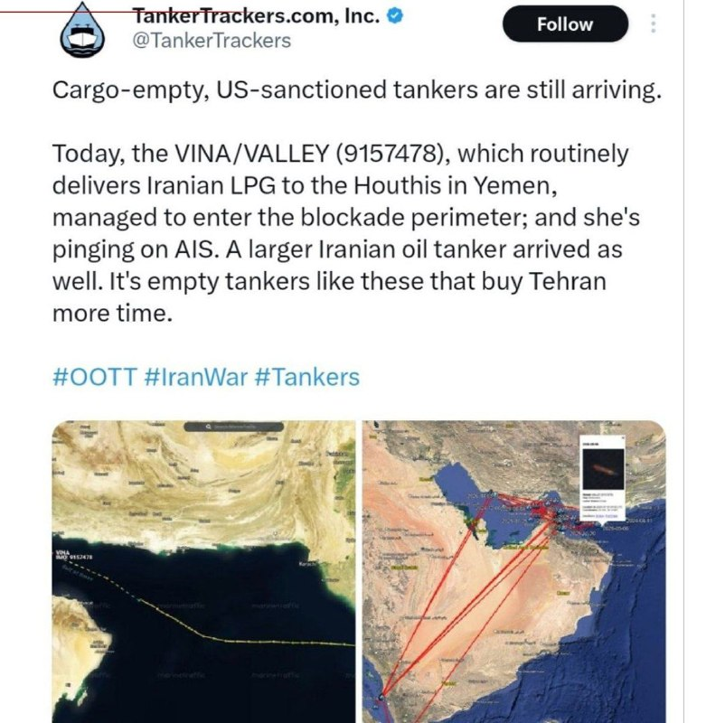

> عبور نفتکش‌های خالی ایران از محاصره آمریکا
> 
> تانکر ترکرز:
> 
> 🔹 نفتکش‌های خالی و تحریم‌شده ایرانی همچنان از محاصره آمریکا عبور می‌کنند.
> 
> 🔹 امروز، شناور VINA/VALLEY که مرتباً ال‌پی‌جی ایران را به یمن تحویل داده است، موفق شد از محاصره آمریکا عبور کند و با سیستم شناسایی فعال (AIS) وارد تنگه هرمز شود.
> 
> 🔹 همچنین یک ابر نفتکش دیگر ایران هم  وارد تنگه هرمز شده است. ورود نفتکش‌های خالی، زمان بیشتری را برای ذخیره‌سازی و تولید نفت ایران فراهم می‌کند.
> 
> ☆Phantom☆
> 
> 📌 @persian_trend_official
> پرشین ترند | متفاوت‌ترین کانال نظامی

## 1405/02/17 07:42 — BBCPersian
> 🔻سفیر آمریکا در سازمان ملل: ایران با کشتیرانی آزاد مثل «پادری» برخورد می‌کند
> 
> مایک والتز، سفیر آمریکا در سازمان ملل متحد، در ایکس نوشت که جمهوری اسلامی می‌خواهد یک آبراه بین‌المللی را «مال خودش بکند و مالیات‌های غیرقانونی وضع می‌کند.» او ادامه داد: «ایران به کشتی‌های تجاری حمله می‌کند و جلوی کمک‌های بشردوستانه را می‌گیرد. اما درخواست آمریکا از سازمان ملل برای توقف ایران را با انگیزه‌های سیاسی می‌داند.»
> 
> آقای والتز به گفته‌های دفتر نمایندگی ایران نزد سازمان ملل واکنش نشان می‌داد که پیش‌تر گفته بود تنها راه بازگشایی تنگه هرمز «پایان قطعی جنگ، رفع محاصره دریایی و بازسازی مسیر عبورومرور دریایی» است.
> 
> سفیر آمریکا در سازمان ملل نوشت که آزادی کشتیرانی رکن اساسی صلح و رفاه است، اما ایران با آن مثل «پادری» برخورد می‌کند.
> 
> https://bbc.in/4tVeaEe
> @BBCPersian

## 1405/02/17 07:35 — VahidOOnLine
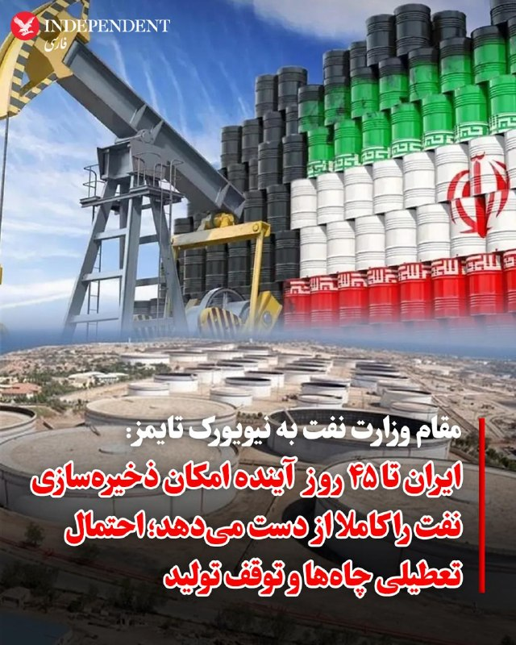

> ♦️یک مقام وزارت نفت ایران به نیویورک‌تایمز گفته است که ایران طی ۴۰ تا ۴۵ روز آینده ظرفیت ذخیره‌سازی نفت در خشکی و دریا را به طور کامل از دست خواهد داد و در نتیجه ناچار به تعطیلی برخی چاه‌های نفتی می‌شود؛ تعطیلی‌هایی که بخشی از آن‌ها می‌تواند دائمی باشد.
> بر اساس این گزارش، محدودیت شدید در ذخایر نفتی باعث شده نفت تولیدشده دیگر جایی برای ذخیره نداشته باشد و در صورت ادامه این وضعیت، ایران ناچار به کاهش یا توقف تولید در برخی میادین خواهد شد؛ اقدامی که می‌تواند به آسیب بلندمدت به زیرساخت‌های نفتی کشور منجر شود.
> این مقام همچنین هشدار داده است که ادامه فشار بر سیستم صادرات و ذخیره‌سازی، تهران را در موقعیتی قرار می‌دهد که برای جلوگیری از سرریز شدن ذخایر، مجبور به بستن چاه‌ها خواهد شد؛ تصمیمی که در برخی موارد ممکن است به از دست رفتن دائمی ظرفیت تولید برخی میادین بینجامد.
> گزارش‌های دیگر نیز در روزهای اخیر تصویر مشابهی ارائه داده‌اند و از پر شدن تدریجی مخازن نفتی ایران در نتیجه محدودیت‌های صادراتی و کاهش شدید دسترسی به مسیرهای فروش نفت خبر داده‌اند.
> ‌🇸🇦 Indypersian
> 
> 🤖 @VahidOOnLine

## 1378/10/11 03:30 — IranIntlTV
[🎬 Video](telegram/content/IranIntlTV_335909_1778131439.mp4)

> سرخط خبرهای پنجشنبه ۱۷ اردیبهشت
> @iranintltv

## 1405/02/17 07:24 — BBCPersian
> 🔻روزنامه آمریکایی واشنگتن پست در گزارش اختصاصی که روز چهارشنبه منتشر کرد نوشته بر اساس تحليل تصاوير ماهواره‌ای توسط این روزنامه حملات هوايی ايران از زمان آغاز جنگ «دست‌کم به ۲۲۸ سازه در پايگاه‌ها يا مراکز مورد استفاده ارتش ايالات متحده امريکا آسيب زده يا آنها…

## 1405/02/17 07:24 — BBCPersian
> 🔻روزنامه آمریکایی واشنگتن پست در گزارش اختصاصی که روز چهارشنبه منتشر کرد نوشته بر اساس تحليل تصاوير ماهواره‌ای توسط این روزنامه حملات هوايی ايران از زمان آغاز جنگ «دست‌کم به ۲۲۸ سازه در پايگاه‌ها يا مراکز مورد استفاده ارتش ايالات متحده امريکا آسيب زده يا آنها را نابود کرده است».
> 
> به گزارش واشنگتن پست، اين حملات «آشيانه‌های هواپيما، سربازخانه‌ها، انبارهای سوخت، هواگردها و تجهيزات اصلی راداری، ارتباطی و پدافند هوايی» را در پایگاه‌های آمریکا در منطقه هدف قرار داده‌اند.
> 
> این روزنامه آمریکایی نوشته است: «ميزان خسارات، بسيار فراتر از چيزی توصيف شده که دولت امريکا تاکنون به آن اذعان کرده يا پيش‌تر گزارش شده بود.»
> 
> چند روز پیش هم شبکه خبری سی‌ان‌ان آمریکا در گزارشی مشابه از «خسارات وسیع» به دست کم ۱۶ پایگاه آمریکایی در منطقه خبر داده بود.
> 
> 
> 📷 Washington Post / Reuters
> https://bbc.in/3PoRwVW
> @BBCPersian

## 1405/02/17 07:20 — VahidOOnLine
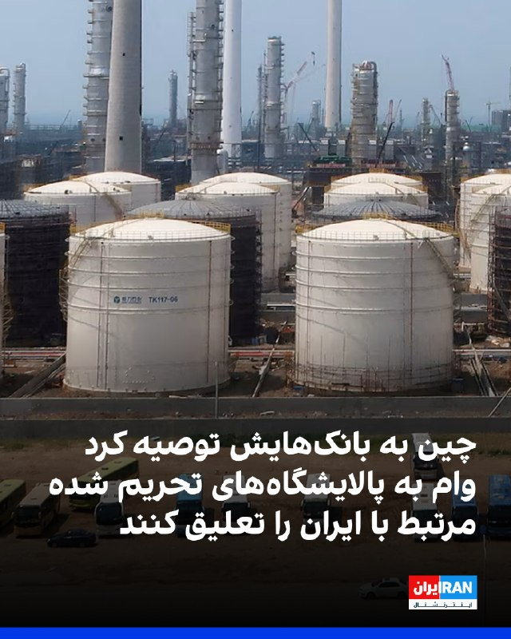

> بلومبرگ گزارش داد نهاد ناظر مالی چین به بزرگ‌ترین بانک‌های این کشور توصیه کرده است اعطای وام‌های جدید به پنج پالایشگاه که به دلیل ارتباط با نفت ایران هدف تحریم‌های آمریکا قرار گرفته‌اند را به‌طور موقت تعلیق کنند.
> بر اساس این گزارش، نهادهای ناظر به‌صورت شفاهی به بانک‌ها دستور داده‌اند در جریان بررسی روابط تجاری موجود، از اعطای وام‌های جدید به پنج پالایشگاه، از جمله هنگلی پتروشیمی، خودداری کنند.
> 
> ‌🏁 🇬🇧 IranintlTV
> 
> 🤖 @VahidOOnLine

## 1405/02/17 07:20 — IranIntlTV

> بلومبرگ گزارش داد نهاد ناظر مالی چین به بزرگ‌ترین بانک‌های این کشور توصیه کرده است اعطای وام‌های جدید به پنج پالایشگاه که به دلیل ارتباط با نفت ایران هدف تحریم‌های آمریکا قرار گرفته‌اند را به‌طور موقت تعلیق کنند.
> بر اساس این گزارش، نهادهای ناظر به‌صورت شفاهی به بانک‌ها دستور داده‌اند در جریان بررسی روابط تجاری موجود، از اعطای وام‌های جدید به پنج پالایشگاه، از جمله هنگلی پتروشیمی، خودداری کنند.
> 
> https://iranintl.com/202605078361

## 1405/02/17 07:11 — VahidOOnLine
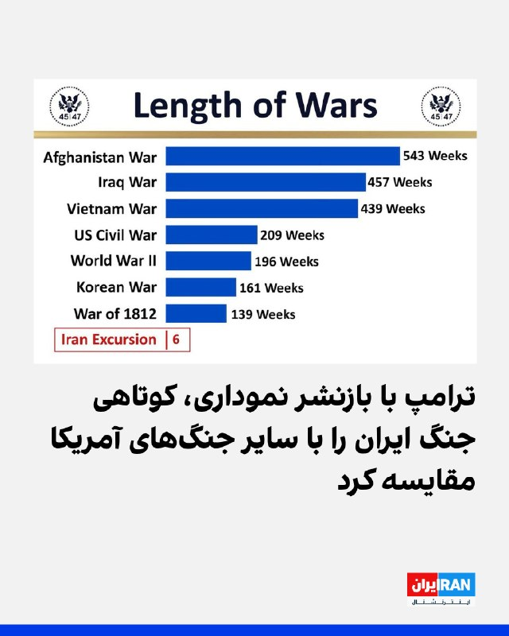

> ترامپ نموداری را درتروث سوشال منتشر کرد که در آن، مدت زمان شماری از جنگ‌های آمریکا، از جمله افغانستان، عراق و ویتنام را با جنگ ایران مقایسه می‌کرد. در این نمودار جنگ افغانستان ۵۴۳ هفته و جنگ ایران ۶ هفته نشان داده شده است. ترامپ نوشت: «وای. این نمودار را مطالعه کنید.»
> طبق این نمودار، جنگ افغانستان ۵۴۳ هفته، جنگ عراق ۴۵۷ هفته، جنگ ویتنام ۴۳۹ هفته، جنگ داخلی آمریکا ۲۰۹ هفته، جنگ دوم جهانی ۱۹۶ هفته، جنگ کره ۱۶۱ هفته، جنگ ۱۸۱۲ برای ۱۳۹ هفته و جنگ ایران شش هفته طول کشیده است.
> 
> ‌🏁 🇬🇧 IranintlTV
> 
> 🤖 @VahidOOnLine

## 1405/02/17 07:10 — IranIntlTV

> ترامپ نموداری را درتروث سوشال منتشر کرد که در آن، مدت زمان شماری از جنگ‌های آمریکا، از جمله افغانستان، عراق و ویتنام را با جنگ ایران مقایسه می‌کرد. در این نمودار جنگ افغانستان ۵۴۳ هفته و جنگ ایران ۶ هفته نشان داده شده است. ترامپ نوشت: «وای. این نمودار را مطالعه کنید.»
> طبق این نمودار، جنگ افغانستان ۵۴۳ هفته، جنگ عراق ۴۵۷ هفته، جنگ ویتنام ۴۳۹ هفته، جنگ داخلی آمریکا ۲۰۹ هفته، جنگ دوم جهانی ۱۹۶ هفته، جنگ کره ۱۶۱ هفته، جنگ ۱۸۱۲ برای ۱۳۹ هفته و جنگ ایران شش هفته طول کشیده است.
> 
> https://iranintl.com/202605075363

## 1405/02/17 07:00 — BBCPersian
> 🔻قالیباف: عملیات «به من اعتماد کن برادر» تمام شد
> 
> محمدباقر قالیباف، رئیس مجلس ایران، در ایکس نوشت: «عملیات داداش به من اعتماد کن تمام شده. برمی‌گردیم سرِ عملیات فاکس و اکسیوس.»
> 
> پست آقای قالیباف واکنشی است به گفته‌های مقامات آمریکا درباره «پایان عملیات نظامی پروژه آزادی». که تنها ۲۴ ساعت پس از آغاز آن به دستور آقای ترامپ تعلیق شد.
> 
> طعنه رئیس مجلس ایران به رسانه های فاکس و اکسیوس که او آنها را در ترکیبی «فاکسیوس» خوانده، به گزارش‌های این رسانه‌ها به نقل از مقام‌های - اغلب ناشناس - دولت آمریکاست که درباره جزییات و مواضع کاخ‌سفید سخن می‌گویند.
> 
> دیروز مارکو روبیو، وزیر خارجه آمریکا، گفته بود که «مرحله تهاجمی جنگ علیه ایران پایان یافته» و تنها ساعتی پس از آن، دونالد ترامپ، رئیس‌جمهور آمریکا، هم گفت که عملیات دریایی «پروژه آزادی» متوقف شده است.
> https://bbc.in/4toZ8Wm
> @BBCPersian

## 1405/02/17 06:55 — VahidOOnLine
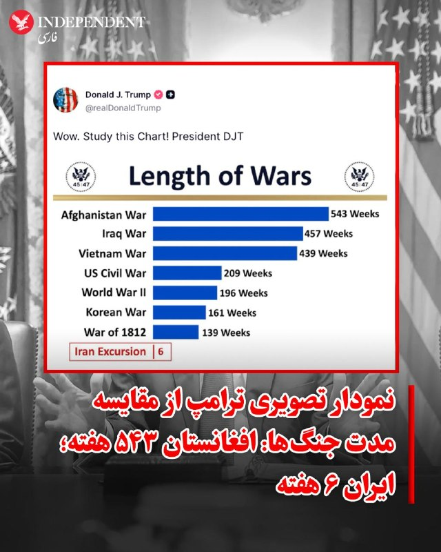

> ♦️دونالد ترامپ، رئیس‌جمهوری آمریکا، چهارشنبه شب با انتشار نمودار تصویری در تروث‌سوشال، مدت‌زمان جنگ‌های مختلف آمریکا را با عملیات نظامی علیه جمهوری اسلامی مقایسه کرد و از مخاطبانش خواست این نمودار را «بررسی کنند.»
> در این تصویر، جنگ افغانستان با ۵۴۳ هفته، جنگ عراق با ۴۵۷ هفته و جنگ ویتنام با ۴۳۹ هفته نمایش داده شده‌اند؛ در حالی که مقابل عبارت «عملیات علیه ایران» عدد ۶ هفته درج شده است.
> ترامپ پیش‌تر نیز در واکنش به منتقدانی که عملیات نظامی علیه جمهوری اسلامی را «طولانی» توصیف کرده بودند، گفته بود باید این درگیری با جنگ‌های پیشین آمریکا مقایسه شود.
> ‌🇸🇦 Indypersian
> 
> 🤖 @VahidOOnLine

## 1405/02/17 06:32 — VahidOOnLine
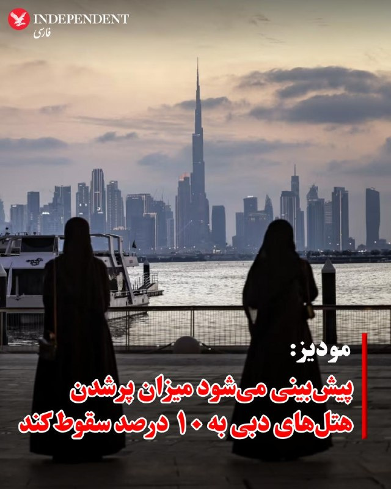

> ♦️وال استریت ژورنال در گزارشی درباره تاثیر حملات رژیم ایران به امارات متحده عربی بر بخش کردشگری این کشور به نقل از موسسه تحلیلی «مودیز » نوشت، این بخش در سال‌های اخیر یکی از قوی‌ترین صنایع رشد غیرنفتی امارات بوده است. در دبی، پیش‌بینی می‌شود میزان پر شدن هتل‌ها در سه‌ماهه دوم سال جاری میلادی از ۸۰ درصد پیش از آغاز درگیری در پایان فوریه، به ۱۰ درصد سقوط کند.
> مودیز گفته است: «این وضعیت عملا به معنای تعطیلی بخش‌های بزرگی از صنعت مهمان‌داری است.» به گفته این گزارش، حملات ایران در ابتدای درگیری، فرودگاه‌ها و برخی از شناخته‌شده‌ترین جاذبه‌های گردشگری امارات متحده عربی، از جمله هتل برج خلیفه دبی، را هدف قرار داده‌اند.
> ‌🇸🇦 Indypersian
> 
> 🤖 @VahidOOnLine

## 1405/02/17 06:28 — VahidOnline
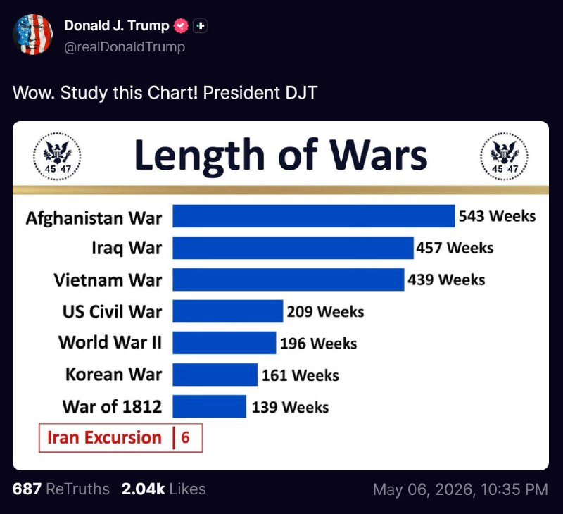

> دونالد ترامپ چهارشنبه شب در تروث‌سوشال تصویری منتشر کرد که مدت‌زمان جنگ‌های مختلف در آن نشان داده شده و از مخاطبانش خواست آن را ببینند.
> او بارها به کسانی که مدعی‌شده‌اند عملیات نظامی علیه جمهوری اسلامی «طولانی» شده، پاسخ داده‌است آن را با جنگ‌های پیشین آمریکا مقایسه کنند.
> @VahidHeadline
> 
> 📡 @VahidOnline

## 1405/02/17 06:18 — FarsiVOA
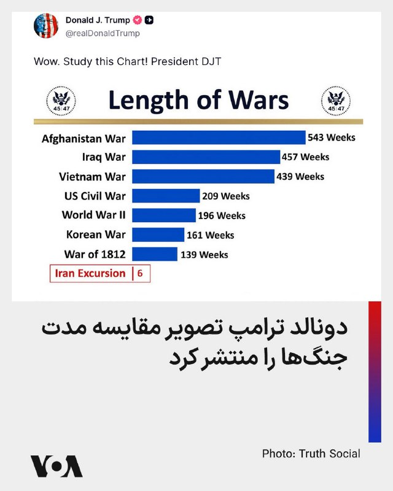

> ⚡️دونالد ترامپ چهارشنبه شب در تروت‌سوشال تصویری منتشر کرد که مدت‌زمان جنگ‌های مختلف در آن نشان داده شده و از مخاطبانش خواست آن را ببینند. او بارها به کسانی که مدعی‌شده‌اند عملیات نظامی علیه جمهوری اسلامی «طولانی» شده، پاسخ داده‌است آن را با جنگ‌های پیشین آمریکا مقایسه کنند.
> @FarsiVOA

## 1405/02/17 06:15 — BBCPersian
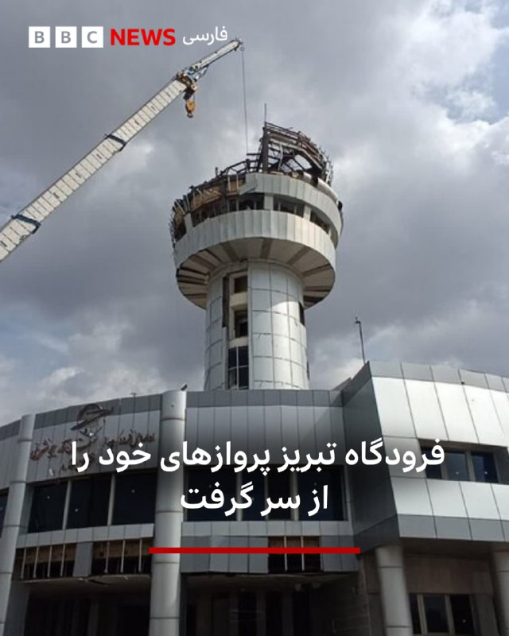

> 🔻رسانه‌های ایران از بازگشایی فرودگاه تبریز خبر دادند.
> 
> فرودگاه مدنی تبریز در جنگ آمریکا و اسرائیل با ایران مورد حمله قرار گرفته بود و به باند و مرکز کنترل و ارتباط آن آسیب وارد شده بود.
> 
> حالا با پایان کار بازسازی، فرودگاه «به طور کامل» بازگشایی شده و پروازهای خود را از سر گرفته است.
> 
> طی جنگ آمریکا و اسرائیل با ایران، چندین فرودگاه در شهرهای تهران، مشهد، تبریز، اهواز و... چندین بار هدف حمله قرار گرفت.
> 
> 📷 IRNA
> https://bbc.in/4toZ8Wm
> @BBCPersian

## 1405/02/17 05:56 — VahidOOnLine

> ان‌بی‌سی نیوز به نقل از دو مقام آمریکایی گزارش داد چرخش ناگهانی ترامپ از «پروژه آزادی» تنگه هرمز پس از آن رخ داد که متحدان خلیج فارس از این تصمیم غافلگیر شدند و عربستان سعودی امکان استفاده ارتش آمریکا از پایگاه‌ها و حریم هوایی خود جهت اجرای این عملیات را به حالت تعلیق درآورد.
> به گفته این مقام‌ها، ترامپ بعدازظهر یکشنبه با اعلام «پروژه آزادی» در شبکه‌های اجتماعی، متحدان خلیج فارس را غافلگیر کرد و این اقدام موجب نارضایتی رهبران عربستان سعودی شد. در واکنش، عربستان سعودی به آمریکا اطلاع داد که اجازه نخواهد داد ارتش آمریکا از پایگاه هوایی پرنس سلطان در جنوب‌شرقی ریاض پرواز کند یا برای پشتیبانی از این تلاش از حریم هوایی عربستان عبور کند.
> این دو مقام آمریکایی گفتند تماس تلفنی میان ترامپ و محمد بن سلمان، ولیعهد عربستان سعودی، این اختلاف را حل نکرد و رییس‌جمهوری آمریکا ناچار شد «پروژه آزادی» را متوقف کند تا دسترسی ارتش آمریکا به این حریم هوایی حیاتی را احیا کند.
> دیگر متحدان نزدیک خلیج فارس نیز غافلگیر شدند؛ رییس‌جمهوری آمریکا پس از آغاز این اقدام با رهبران قطر گفت‌وگو کرد.
> 
> ‌🏁 🇬🇧 IranintlTV
> 
> 🤖 @VahidOOnLine

## 1405/02/17 05:55 — IranIntlTV
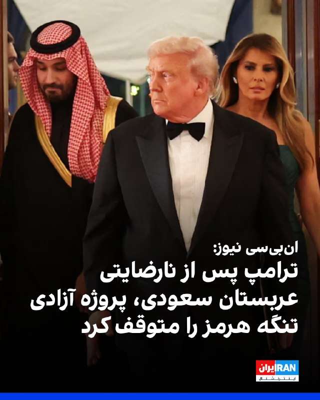

> ان‌بی‌سی نیوز به نقل از دو مقام آمریکایی گزارش داد چرخش ناگهانی ترامپ از «پروژه آزادی» تنگه هرمز پس از آن رخ داد که متحدان خلیج فارس از این تصمیم غافلگیر شدند و عربستان سعودی امکان استفاده ارتش آمریکا از پایگاه‌ها و حریم هوایی خود جهت اجرای این عملیات را به حالت تعلیق درآورد.
> به گفته این مقام‌ها، ترامپ بعدازظهر یکشنبه با اعلام «پروژه آزادی» در شبکه‌های اجتماعی، متحدان خلیج فارس را غافلگیر کرد و این اقدام موجب نارضایتی رهبران عربستان سعودی شد. در واکنش، عربستان سعودی به آمریکا اطلاع داد که اجازه نخواهد داد ارتش آمریکا از پایگاه هوایی پرنس سلطان در جنوب‌شرقی ریاض پرواز کند یا برای پشتیبانی از این تلاش از حریم هوایی عربستان عبور کند.
> این دو مقام آمریکایی گفتند تماس تلفنی میان ترامپ و محمد بن سلمان، ولیعهد عربستان سعودی، این اختلاف را حل نکرد و رییس‌جمهوری آمریکا ناچار شد «پروژه آزادی» را متوقف کند تا دسترسی ارتش آمریکا به این حریم هوایی حیاتی را احیا کند.
> دیگر متحدان نزدیک خلیج فارس نیز غافلگیر شدند؛ رییس‌جمهوری آمریکا پس از آغاز این اقدام با رهبران قطر گفت‌وگو کرد.
> یک منبع سعودی به ان‌بی‌سی نیوز گفت ترامپ و ولیعهد «به‌طور منظم با یکدیگر در تماس بوده‌اند». این منبع افزود مقام‌های سعودی همچنین با ترامپ، جی‌دی ونس، معاون رییس‌جمهوری آمریکا، فرماندهی مرکزی ایالات متحده و مارکو روبیو، وزیر خارجه آمریکا، در تماس بوده‌اند.
> 
> 
> https://iranintl.com/202605074677

## 1405/02/17 05:51 — BBCPersian
> 🔻رسانه‌های آمریکایی؛ به توافق نزدیک شده‌ایم، ایران: در حال بررسی هستیم
> 
> وزارت خارجه ایران اعلام کرده پيشنهاد آمريکا برای پايان دادن به جنگ «همچنان در دست بررسی» است؛ اين در حالی است که گزارش‌ها در رسانه‌های آمریکایی از نزديک شدن دو طرف به يک توافق احتمالی حکايت دارد.
> 
> نشریه اکسیوس آمریکا روز چهارشنبه گزارش داد کاخ‌سفيد معتقد است ممکن است به نهايی کردن يک يادداشت تفاهم ۱۴ بندی با ايران نزديک شده باشد.
> 
> محمدباقر قالیباف، رئیس مجلس ایران با طعنه به نشریه اکسیوس و شبکه فاکس نیوز که او «فاکسیوس» خطاب‌شان کرد گفت از نظر او با شکست در «پروژه آزادی» اکنون آمریکا به آنچه او عملیات اخبار جعلی خواند، بازگشته است.
> 
> يک عضو ارشد پارلمان ايران هم اين طرح ۱۴ ماده‌ای را «فهرست آرزوها» توصيف کرد، در حالی که سخنگوی وزارت خارجه ايران گفت تهران ديدگاه‌های خود درباره پيشنهاد امريکا را از طريق ميانجی‌های پاکستان منتقل خواهد کرد.
> 
> وزير خارجه پاکستان نيز گفت کشورش «تلاش می‌کند اين آتش‌بس را به پايانی دائمی برای جنگ تبديل کند».
> 
> دونالد ترامپ هم اعلام کرد امريکا «در ۲۴ ساعت گذشته گفت‌وگوهای بسيار خوبی با ايران داشته» و دستيابی به توافق ممکن است.
> 
> بر اساس گزارش اکسیوس، اين يادداشت تفاهم يک سند يک صفحه‌ای شامل ۱۴ بند است که می‌تواند چارچوبی برای مذاکرات جامع‌تر هسته‌ای فراهم کند.
> 
> از جمله مفاد مطرح‌شده در اين گزارش می‌توان به تعليق غنی‌سازی هسته‌ای ايران، لغو تحريم‌ها و بازگرداندن آزادی عبور و مرور در تنگه هرمز اشاره کرد.
> 
> اين رسانه به نقل از دو مقام امريکايی و دو منبع ديگر — که نامشان فاش نشده — گزارش داده است که بسياری از مفاد اين يادداشت به دستيابی به توافق نهايی وابسته خواهد بود.
> 
> خبرگزاری رویترز نيز گزارش داد دو منبع مطلع از روند ميانجيگری ميان امريکا و ايران اطلاعات منتشرشده از سوی اکسیوس را تأييد کرده‌اند، هرچند جزئيات اين پيشنهاد هنوز به‌طور عمومی منتشر نشده است.
> 
> https://bbc.in/4wexXjL
> @BBCPersian

## 1405/02/17 05:47 — FarsiVOA
> 🔺مایک والتز: جمهوری اسلامی با اصل جهانی آزادی کشتیرانی مانند «یک پادری» رفتار می‌کند
> 
> ▪️مایک والتز، سفیر آمریکا در سازمان ملل متحد، در بیانیه‌ای گفت جمهوری اسلامی با «آزادی کشتیرانی» که «یکی از پایه‌های اصلی صلح و رفاه جهانی است» مانند «یک پادری رفتار می‌کند.»
> 
> ⬇️ بیشتر بخوانید:
> https://ir.voanews.com/a/8147549.html
> @FarsiVOA

## 1405/02/17 05:36 — FarsiVOA
> ⚡️ستاد فرماندهی مرکزی آمریکا، سنتکام، روز چهارشنبه گفت نیروهای آمریکایی تاکنون به ۵۲ کشتی تجاری دستور داده‌اند که برای رعایت محاصره دریایی جمهوری اسلامی، مسیر خود را تغییر دهند یا به بندر بازگردند. سنتکام ضمن بیان این آمار، عکس‌هایی از ناو هواپیمابر یو‌اس‌اس جرج اچ. دبلیو. را منتشر کرد که یکی از ادوات جنگی پر شمار آمریکا برای اعمال محاصره دریایی علیه جمهوری اسلامی است.
> @FarsiVOA

## 1405/02/17 05:35 — FarsiVOA
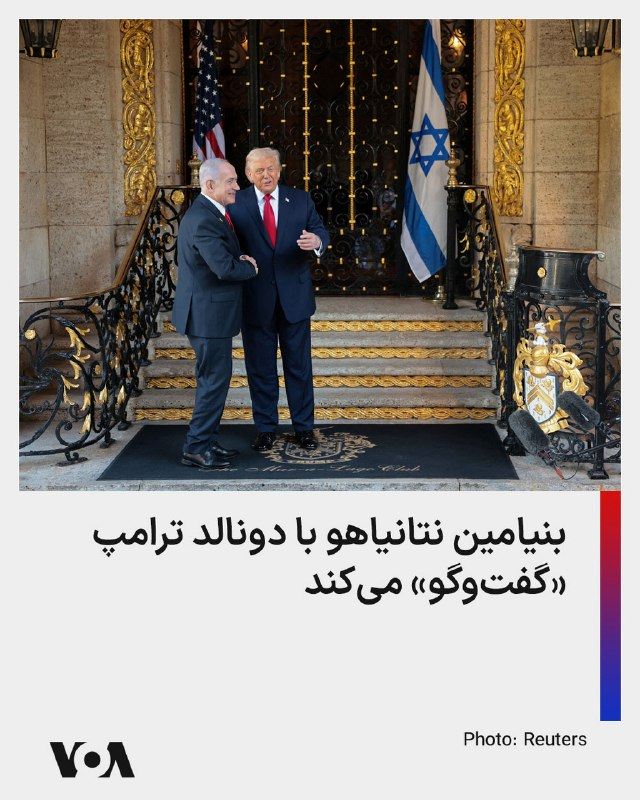

> ⚡️بنیامین نتانیاهو، نخست وزیر اسرائيل، روز چهارشنبه گفت «ما تماس مداومی با دوستان‌مان در آمریکا را حفظ کرده‌ایم. من تقریبا هر روز با رئیس‌جمهوری ترامپ صحبت می‌کنم. اعضای تیم من و تیم او نیز هر روز، از جمله امروز، با یکدیگر در ارتباط هستند. و امشب دوباره با رئیس‌جمهوری ترامپ گفت‌وگو خواهم کرد.»
> @FarsiVOA

## 1405/02/17 05:33 — VahidOOnLine
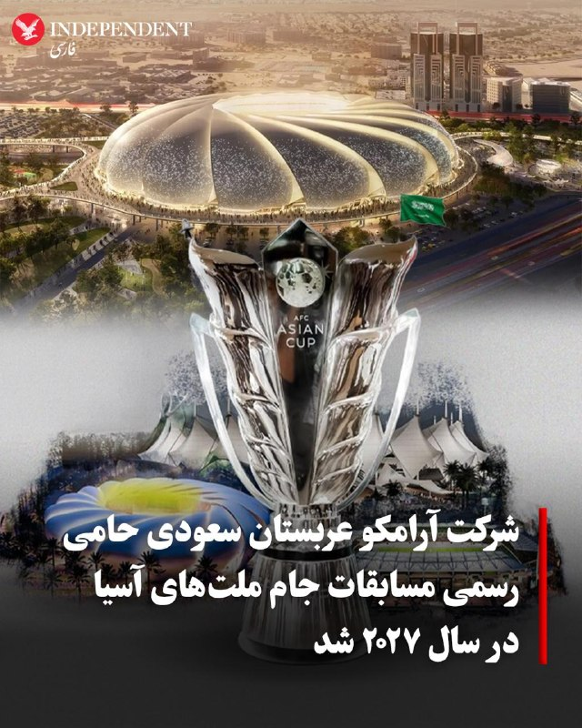

> ♦️کنفدراسیون فوتبال آسیا اعلام کرد شرکت نفتی آرامکو عربستان سعودی، یکی از بزرگ‌ترین شرکت‌های انرژی جهان، به‌عنوان حامی جهانی رسمی جام ملت‌های آسیا ۲۰۲۷ انتخاب شده است.
> بر اساس این توافق، ورزشگاه محل برگزاری مسابقات در شهر الخبر با نام «ورزشگاه آرامکو» شناخته خواهد شد؛ اقدامی که برای نخستین‌بار در تاریخ کنفدراسیون فوتبال آسیا، حق نام‌گذاری ورزشگاه را وارد ساختار تجاری این رقابت‌ها می‌کند.
> کنفدراسیون فوتبال آسیا اعلام کرد این همکاری بخشی از برنامه‌های جدید تجاری برای برگزاری «نوآورانه‌ترین» دوره جام ملت‌های آسیا است؛ مسابقاتی که سال ۲۰۲۷ برای نخستین‌بار در عربستان سعودی برگزار خواهد شد.
> داتوک سری ویندزور جان، دبیرکل کنفدراسیون فوتبال آسیا، گفت این همکاری «آغاز دوره‌ای تازه از نوآوری تجاری» در فوتبال آسیا است. خالد الزامل، معاون ارشد ارتباطات شرکتی آرامکو، نیز اعلام کرد این شرکت آماده میزبانی از هواداران در «ورزشگاه آرامکو» خواهد بود.
> ‌🇸🇦 Indypersian
> 
> 🤖 @VahidOOnLine

## 1405/02/17 05:31 — BBCPersian
> 🖋سوامیناتان ناتاراجان
> سرویس جهانی بی‌بی‌سی
> 
> هشدار: این داستان حاوی جزئیاتی است که ممکن است برای خوانندگان ناراحت‌کننده باشد.
> 
> در دهه ۱۹۹۰، زمانی که توشی کازاما، عکاس اهل توکیو، در نیویورک به‌عنوان عکاس تجاری فعالیت می‌کرد، یک خبر درباره یک زندانی نوجوان محکوم به اعدام توجه او را جلب کرد.
> 
> این داستان کنجکاوی او را برانگیخت و تصمیم گرفت با آن زندانی ملاقات کند. این تصمیم ناگهانی، مسیر حرفه‌ای او را به‌کلی تغییر داد.
> 
> او در ادامه از ۲۲ زندانی محکوم به اعدام عکس گرفت، یکی در تایوان و بقیه در ایالات متحده بودند. برخی از آن‌ها از آن زمان اعدام شده‌اند و برخی هنوز در زندان هستند. او همچنین با بستگان قربانیان دیدار کرده است.
> 
> او می‌گوید که کار عکاسی‌اش او را به یک مخالف سرسخت مجازات اعدام تبدیل کرده است.
> 
> آلبوم را ورق بزنید و ادامه مطلب را از لینک زیر در وبسایت بی‌بی‌سی فارسی بخوانید.
> 
> 📸Toshi Kazama/ GettyImages/ BBC INDONESIA
> https://bbc.in/4965H9d
> @BBCPersian

## 1405/02/17 05:19 — BBCPersian
> 🔻فرمانده سابق نیروی دریایی بریتانیا: «خشم حماسی در واقع یک فاجعه حماسی بود»
> 
> آلن وست، فرمانده سابق نيروی دريايی سلطنتی بريتانيا، می‌گويد انتظار ندارد ايران «کنترل خود بر تنگه هرمز را رها کند، مگر اينکه مجموعه‌ای از مسائل ديگر نيز حل‌وفصل شود».
> 
> او در گفت‌وگو با بی‌بی‌سی افزود وضعيت کنونی «کاملا قابل پيش‌بينی» بوده است.
> 
> آقای وست با اشاره به نام عملیاتی که دولت دونالد ترامپ برای حمله انتخاب کرده، گفت: «اگر به اهدافی که [امريکا] دنبال می‌کرد نگاه کنيد، "خشم حماسی" در واقع يک فاجعه حماسی بوده است.»
> 
> او ادامه داد: «کاملا روشن بود که به محض ورود به جنگ با ايران، آنها تنگه هرمز را می‌بندند يا تلاش می‌کنند آن را ببندند. به نظر می‌رسد امريکايی‌ها از اين موضوع غافلگير شدند و اين برای من بسيار عجيب است.»
> 
> به گفته این فرمانده سابق نیروی دریایی بریتانیا، بازگشايی اين آبراه حياتی در نهايت به تصميم تهران و ميزان رضايت آن از شرايط مطرح‌شده در مذاکرات بستگی دارد.
> 
> او افزود: «اگر ايرانی‌ها به کشتی‌ها حمله نکنند، تنگه هرمز می‌تواند باز شود.»
> 
> https://bbc.in/4uT60N5
> @BBCPersian

## 1405/02/17 05:14 — VahidOOnLine
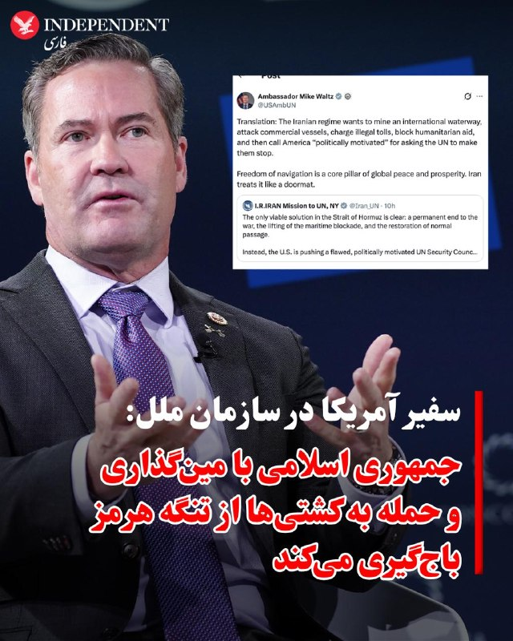

> ♦️مایک والتز، سفیر آمریکا در سازمان ملل، بامداد پنجشنبه ۱۷ اردیبهشت‌ماه، در واکنش به پیام نمایندگی جمهوری اسلامی درباره تنگه هرمز، نوشت جمهوری اسلامی در حال مین‌گذاری آبراه‌های بین‌المللی، حمله به کشتی‌های تجاری، دریافت عوارض غیرقانونی و جلوگیری از ارسال کمک‌های بشردوستانه است.
> 
> او با بازنشر پیام نمایندگی جمهوری اسلامی در سازمان ملل در شبکه اجتماعی اکس نوشت: «رژیم ایران می‌خواهد یک آبراه بین‌المللی را مین‌گذاری کند، به کشتی‌های تجاری حمله کند، عوارض غیرقانونی بگیرد و کمک‌های بشردوستانه را متوقف کند و سپس آمریکا را به انگیزه‌های سیاسی متهم کند.»
> 
> والتز همچنین افزود: «آزادی کشتیرانی یکی از پایه‌های اصلی صلح و رفاه جهانی است و جمهوری اسلامی برای آن ارزشی قائل نیست.»
> 
> نمایندگی جمهوری اسلامی در سازمان ملل پیش‌تر در پیامی نوشته بود تنها راه‌حل بحران در تنگه هرمز، پایان دائمی جنگ، لغو محاصره دریایی و بازگشت عبور و مرور عادی است و از کشورهای عضو سازمان ملل خواسته بود از پیش‌نویس قطعنامه آمریکا حمایت نکنند.
> ‌🇸🇦 Indypersian
> 
> 🤖 @VahidOOnLine

## 1405/02/17 05:10 — FarsiVOA
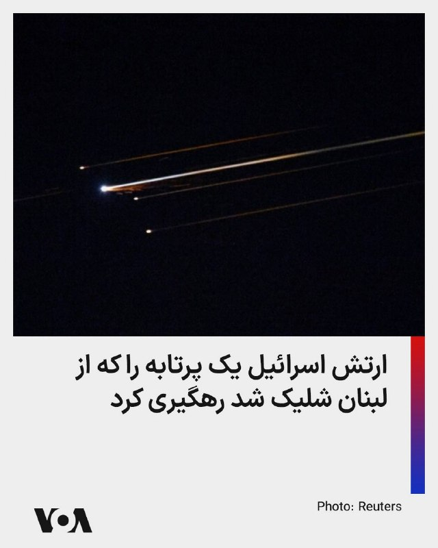

> ⚡️ارتش اسرائيل دقایقی پیش اعلام کرد که در پی هشدارهایی که مدت کوتاهی قبل در بخش‌هایی از شمال اسرائیل فعال شد، نیروی هوایی یک هدف هوایی مشکوک را که از لبنان به‌سوی اسرائيل پرتاب شده بود رهگیری کرد. ارتش اسرائيل گفت هشدارهای مربوط به شلیک راکت و موشک نیز به دلیل نگرانی از سقوط قطعات ناشی از رهگیری فعال شد.
> @FarsiVOA

## 1405/02/17 05:03 — FarsiVOA
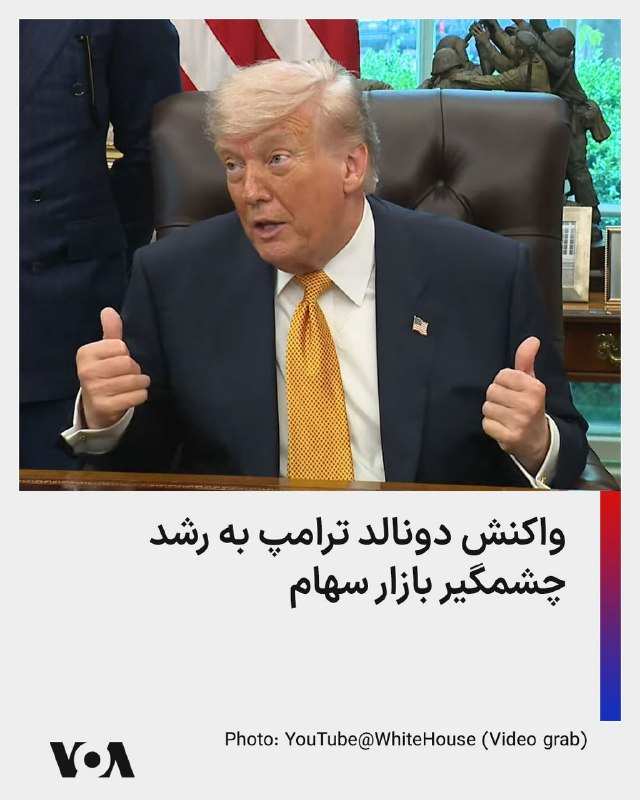

> ⚡️دونالد ترامپ، رئیس‌ جمهوری آمریکا، چهارشنبه شب به رشد چشمگیر بازار سهام در این روز واکنش نشان داد. او در شبکه تروت‌سوشال نوشت: «بازار سهام امروز به بالاترین رکورد تاریخ رسید. اشتغال و حساب‌های بازنشستگی '۴۰۱کی' در حال شکوفایی هستند.»
> @FarsiVOA

## 1405/02/17 04:59 — VahidOOnLine
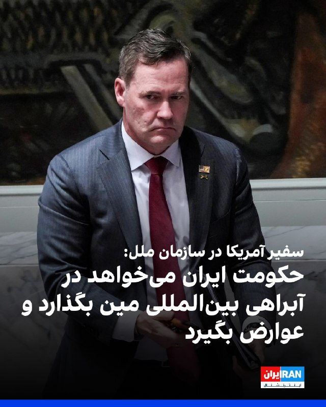

> مایک والتز، سفیر آمریکا در سازمان ملل متحد، در ایکس خود نوشت: «حکومت ایران قصد مین‌گذاری در آبراه بین‌المللی هرمز، حمله به کشتی‌های تجاری و دریافت عوارض غیرقانونی از کشتی‌ها دارد؛ اما همزمان آمریکا را برای پیشبرد آزادی کشتیرانی در این منطقه به داشتن انگیزه‌های سیاسی متهم می‌کند.»
> والتز گفت: آزادی ناوبری یکی از ارکان اصلی صلح و شکوفایی جهانی است اما حکومت ایران با آن مانند یک موضوع بی ارزش رفتار می‌کند.
> 
> ‌🏁 🇬🇧 IranintlTV
> 
> 🤖 @VahidOOnLine

## 1405/02/17 04:59 — IranIntlTV

> مایک والتز، سفیر آمریکا در سازمان ملل متحد، در ایکس خود نوشت: «حکومت ایران قصد مین‌گذاری در آبراه بین‌المللی هرمز، حمله به کشتی‌های تجاری و دریافت عوارض غیرقانونی از کشتی‌ها دارد؛ اما همزمان آمریکا را برای پیشبرد آزادی کشتیرانی در این منطقه به داشتن انگیزه‌های سیاسی متهم می‌کند.»
> والتز گفت: آزادی ناوبری یکی از ارکان اصلی صلح و شکوفایی جهانی است اما حکومت ایران با آن مانند یک موضوع بی ارزش رفتار می‌کند.
> 
> https://iranintl.com/202605079331

## 1405/02/17 04:54 — VahidOOnLine
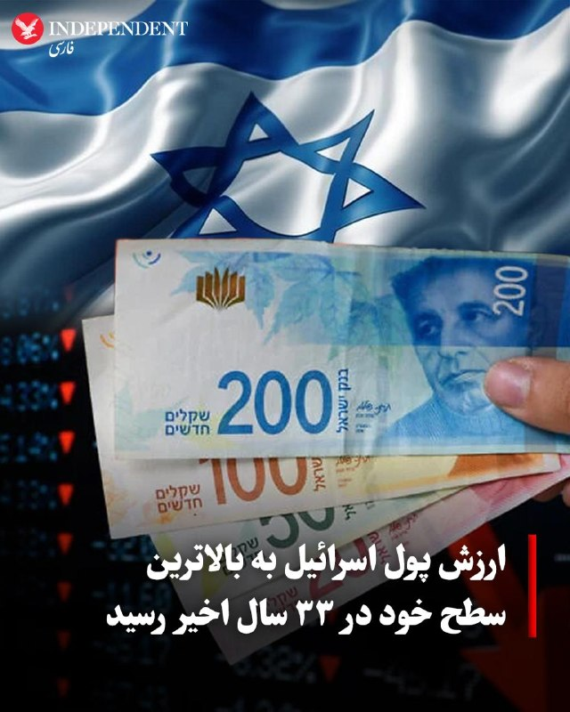

> ♦️ارزش شِکِل، واحد پول اسرائیل، روز چهارشنبه ۱۶ اردیبهشت با ۱.۱ درصد افزایش در برابر دلار آمریکا، به بالاترین سطح خود از سال ۱۹۹۳ رسید.
> به گزارش رویترز، افزایش ارزش شِکِل در پی امید سرمایه‌گذاران به دستیابی به توافق آتش‌بس و کاهش تنش میان آمریکا و جمهوری اسلامی رخ داده است.
> بر اساس این گزارش، شِکِل که از ابتدای سال ۲۰۲۶ تاکنون حدود ۹ درصد تقویت شده، به نرخ ۲.۹۰ در برابر هر دلار آمریکا رسید؛ سطحی که از اکتبر ۱۹۹۳ تاکنون بی‌سابقه بوده است.
> ‌🇸🇦 Indypersian
> 
> 🤖 @VahidOOnLine

## 1405/02/17 04:50 — VahidOOnLine
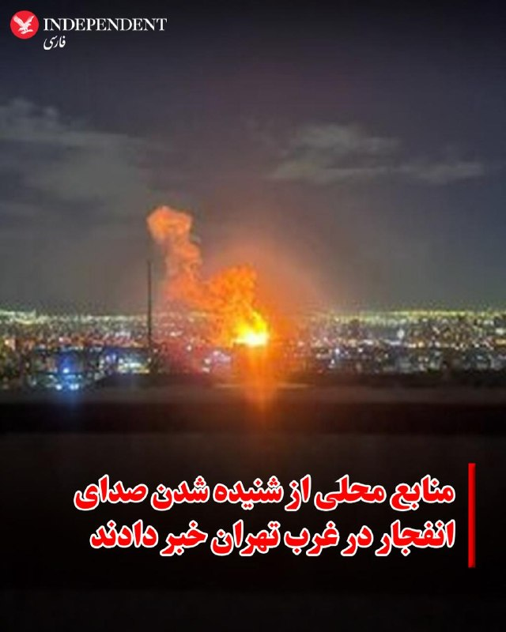

> ♦️کانال تلگرامی وحید آنلاین بامداد پنجشنبه ۱۷ اردیبهشت‌ماه به نقل از منابع محلی گزارش داد صدای چند انفجار در مناطق غربی تهران، از جمله جنت‌آباد، شهر زیبا، باغ فیض و شهران شنیده شده است.
> براساس این گزارش، صداهای انفجار در دو نوبت و حدود ساعت‌های ۲:۴۰ و ۳:۰۵ بوده است.
> 
> 
> 
> تا زمان انتشار این گزارش، مقام‌های جمهوری اسلامی درباره علت این انفجارها اظهارنظری نکرده‌اند.
> ‌🇸🇦 Indypersian
> 
> 🤖 @VahidOOnLine

## 1405/02/17 04:46 — BBCPersian
> آقای ظریف در ادامه حملاتی که در طول این جنگ از سوی ایران متوجه کشورهای حوزه خلیج فارس شد را مورد اشاره قرار داده و نوشته است: «نمی‌توان امنیت را به بهای ناامنی ایران تأمین کرد... همسایگان عرب ما به‌طور مستمر در سمت نادرست تاریخ ایستادند...ایران چاره‌ای جز پاسخی سنجیده و محدود به کشورهای شورای همکاری نداشت...تهران ابزارهای مقابله با تهدیدات وجودی را در اختیار دارد.»
> 
> وزیر خارجه اسبق ایران که در جریان دو ماه گذشته بارها مورد انتقاد چهره‌های تندرو حامی حکومت در داخل ایران هم قرار گرفته بود در الجزیره نوشته است از نظر او دولت‌های حوزه خلیج فارس «به جای اصرار بر اتحادهای دیروز، در رفتار خود بازنگری کنند.»
> 
> «اين جنگ به دوران توهمات راحت‌طلبانه پايان داده است. اکنون روشن شده که امنيت را نمی‌توان خريد يا برون‌سپاری کرد، و همچنين نمی‌توان آن را بر پايه ناامنی و تهديد عليه ايران به دست آورد. با اين جنگ، ديگر نمی‌توان واقعيت‌ها را ناديده گرفت يا مطالبات ايران را به حاشيه راند.»
> 
> آقای ظریف در پایان از کشورهای منطقه دعوت کرده است که برای آنچه او امنیت مبتنی بر «احترام و کرامت و رفاه متقابل» است با ایران تعامل کنند چرا که از نظر او:
> 
> «بيگانگان تنها برای بهره‌برداری حضور دارند و زمانی که برآورد هزينه‌ها از منافع بيشتر شود، منطقه را ترک خواهند کرد. اما ما تا روز قيامت محکوم به همزيستی با يکديگر هستيم. ايران نشان داده که با ماشين‌های جنگی بزرگ‌ترين قدرت‌های متخاصم، تسليم شدنی نیست، اما در عين حال تمايل دارد در صلح با برادران و خواهران مسلمان خود در منطقه زندگی کند.»
> 
> @BBCPersian

## 1405/02/17 04:45 — BBCPersian
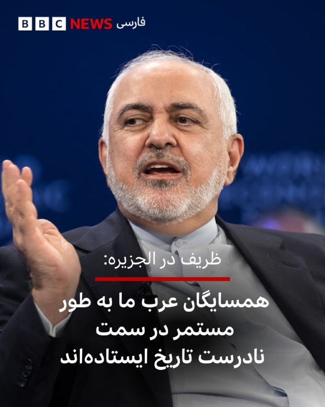

> 🔻محمدجواد ظریف، وزیر خارجه اسبق ایران که توافق هسته‌ای موسوم به برجام در دوران کاری او روی داد در یادداشت جدیدی که وبسایت شبکه الجزیره منتشر کرده به اوضاع منطقه و تحولات جنگ آمریکا و اسرائیل با کشورش پرداخته و با انتقاد از همسایگان ایران در حوزه خلیج فارس، آز آنها خواسته «در رفتار خود بازنگری» کنند.
> 
> آقای ظریف یادداشت خود را با این مقدمه آغاز کرده است که: «حمله غيرتحريک‌آميز عليه ايران نتيجه محاسبات نادرست و اشتباهات آشکار بود. اين اقدام بر اين تصور نادرست استوار بود که ايران تضعيف شده و در نتيجه قادر به مقاومت و پاسخ قاطع به يک حمله گسترده از سوی دو قدرت هسته‌ای، با حمايت بازيگران منطقه‌ای، نيست.»
> 
> او در ادامه مدعی شده که «سياست‌گذاران در واشنگتن و تل آويو و برخی پايتخت‌های منطقه‌ای» دچار اشتباه محاسباتی شده‌اند چرا که «پاسخ ايران، در عين سنجيدگی، قاطع بود و نه تنها تاب‌آوری نظامی آن را نشان داد، بلکه توانايی واکنش در مقياسی را به نمايش گذاشت که فراتر از منطقه بازتاب پيدا کرد.»
> 
> 📷 Getty Images
> https://bbc.in/4neq6i1
> @BBCPersian

## 1405/02/17 04:44 — FarsiVOA
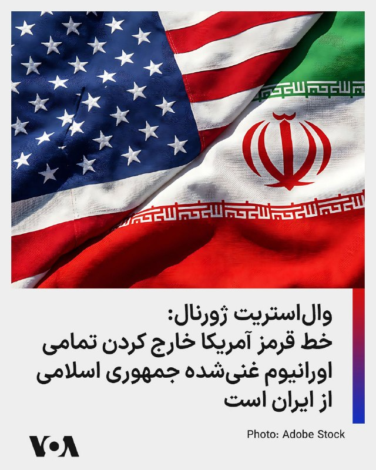

> ⚡️روزنامه آمریکایی وال‌استریت ژورنال در ارتباط با مذاکرات میان آمریکا و جمهوری اسلامی می‌گوید که واشنگتن خواستار خارج کردن تمام مواد هسته‌ای غنی‌شده جمهوری اسلامی است و این مواد فقط به اورانیوم ۶۰ درصد غنی‌شده و یا حتی به اورانیوم ۲۰ درصد غنی شده محدود نمی‌شود، بلکه «تمامی» مواد اورانیوم غنی‌شده را شامل می‌‌شود. این روزنامه نوشت که این موضوع یک «خط قرمز» است.
> 
> @FarsiVOA

## 1405/02/17 04:38 — VahidOOnLine
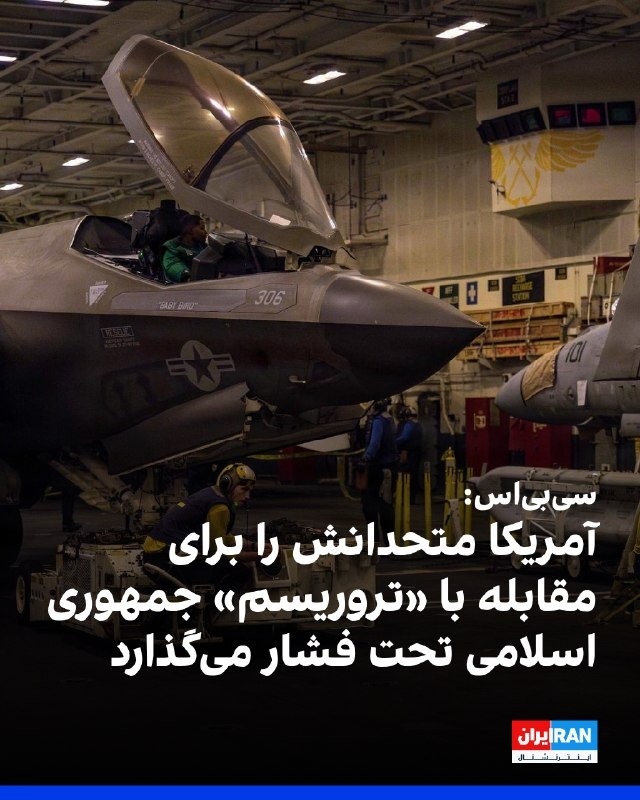

> یک مقام کاخ سفید به سی‌بی‌اس نیوز گفت مقام‌های آمریکایی مسئول مقابله با تروریسم روز جمعه با شرکای بین‌المللی دیدار خواهند کرد تا بپرسند متحدان چگونه می‌توانند تلاش‌ها برای مقابله با تهدیدهای «تروریستی»، به‌ویژه از سوی جمهوری اسلامی در تنگه هرمز را تقویت کنند.
> ترامپ سه‌شنبه یک راهبرد جدید مقابله با تروریسم را امضا کرد که هدف از آن مبارزه با گروه‌های «تروریستی» اسلام‌گرا، کارتل‌های مواد مخدر و گروه‌های سیاسی خشونت‌طلب داخلی است.
> سب گورکا، مدیر ارشد مقابله با تروریسم در شورای امنیت ملی کاخ سفید، به خبرنگاران گفت ایالات متحده از کشورهایی که می‌خواهند به‌عنوان کشورهایی «جدی» شناخته شوند، انتظار اقدامات بیشتری خواهد داشت.
> گورکا گفت: «ما یک معیار بسیار ساده داریم: اگر می‌خواهید به‌عنوان یک کشور جدی سنجیده شوید، چه در حفاظت از نفتکش‌ها در تنگه هرمز و چه در مقابله با تهدیدهای جهادی در منطقه ساحل آفریقا، ما از شما انتظار بیشتری داریم. این ایده که تنها یک ابرقدرت در جهان، یعنی آمریکا، وجود دارد و از همه در برابر هر تهدیدی محافظت خواهد کرد، قابل دوام نیست. ما مفهوم پلیس جهانی بودن را رد می‌کنیم.»
> 
> ‌🏁 🇬🇧 IranintlTV
> 
> 🤖 @VahidOOnLine

## 1405/02/17 04:38 — IranIntlTV

> یک مقام کاخ سفید به سی‌بی‌اس نیوز گفت مقام‌های آمریکایی مسئول مقابله با تروریسم روز جمعه با شرکای بین‌المللی دیدار خواهند کرد تا بپرسند متحدان چگونه می‌توانند تلاش‌ها برای مقابله با تهدیدهای «تروریستی»، به‌ویژه از سوی جمهوری اسلامی در تنگه هرمز را تقویت کنند.
> ترامپ سه‌شنبه یک راهبرد جدید مقابله با تروریسم را امضا کرد که هدف از آن مبارزه با گروه‌های «تروریستی» اسلام‌گرا، کارتل‌های مواد مخدر و گروه‌های سیاسی خشونت‌طلب داخلی است.
> سب گورکا، مدیر ارشد مقابله با تروریسم در شورای امنیت ملی کاخ سفید، به خبرنگاران گفت ایالات متحده از کشورهایی که می‌خواهند به‌عنوان کشورهایی «جدی» شناخته شوند، انتظار اقدامات بیشتری خواهد داشت.
> گورکا گفت: «ما یک معیار بسیار ساده داریم: اگر می‌خواهید به‌عنوان یک کشور جدی سنجیده شوید، چه در حفاظت از نفتکش‌ها در تنگه هرمز و چه در مقابله با تهدیدهای جهادی در منطقه ساحل آفریقا، ما از شما انتظار بیشتری داریم. این ایده که تنها یک ابرقدرت در جهان، یعنی آمریکا، وجود دارد و از همه در برابر هر تهدیدی محافظت خواهد کرد، قابل دوام نیست. ما مفهوم پلیس جهانی بودن را رد می‌کنیم.»
> 
> https://iranintl.com/2

## 1405/02/17 04:32 — VahidOOnLine
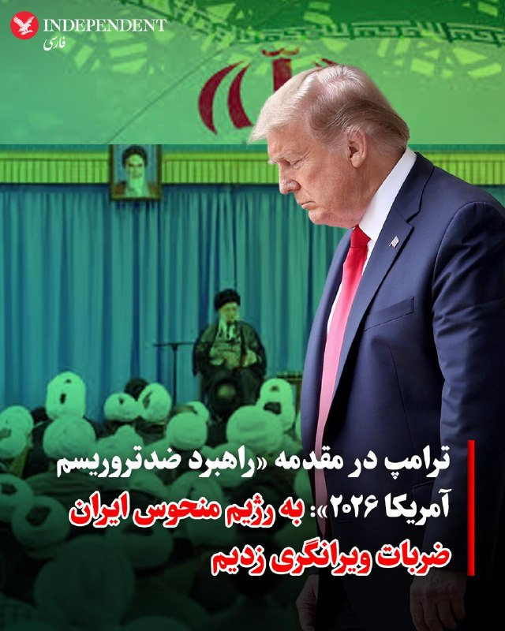

> ♦️دونالد ترامپ در مقدمه «راهبرد ضدتروریسم آمریکا ۲۰۲۶» نوشت، با بازگشت من به کاخ سفید در ۲۰ ژانویه ۲۰۲۵، «چهار سال ضعف، شکست، تسلیم و تحقیر» پایان یافته و آمریکا دوباره سیاست «اول آمریکا» را در پیش گرفته است. او تاکید می‌کند دولتش بار دیگر بر نابودی تهدید تروریسم متمرکز شده و در همین چارچوب، «عملیات چکش نیمه‌شب» و «عملیات خشم حماسی» «ضربات ویرانگری» به «رژیم منحوس» ایران، که بزرگ‌ترین حامی دولتی تروریسم در جهان است، وارد کرده‌اند تا اطمینان حاصل شود جمهوری اسلامی هرگز به سلاح هسته‌ای دست پیدا نکند.
> ترامپ همچنین می‌گوید دولتش جنگ غزه را پایان داده، آزادی همه گروگان‌های باقی‌مانده را تضمین کرده و روندی را آغاز کرده است که غزه دیگر «پناهگاه تروریسم و افراط‌گرایی» نباشد. او می‌گوید آمریکا دیگر اجازه نخواهد داد کارتل‌ها، جهادگرایان یا دولت‌های حامی آن‌ها علیه شهروندان آمریکایی بدون مجازات اقدام کنند.
> در بخش دیگری از این مقدمه آمده است که دولت ترامپ کارتل‌های مواد مخدر را سازمان‌های تروریستی اعلام کرده و از ارتش آمریکا برای نابودی آن‌ها استفاده کرده است. او همچنین از بازداشت نیکلاس مادورو، دیکتاتور ونزوئلا، به‌عنوان نمونه‌ای از قدرت نیروهای مسلح آمریکا یاد می‌کند.
> ترامپ در پایان تاکید می‌کند راهبرد جدید ضدتروریسم آمریکا بازگشتی به «عقل سلیم» و سیاست «صلح از طریق قدرت» است و هشدار می‌دهد: «اگر به آمریکایی‌ها آسیب بزنید یا قصد آسیب‌زدن داشته باشید، ما شما را پیدا می‌کنیم و خواهیم کشت.»
> ‌🇸🇦 Indypersian
> 
> 🤖 @VahidOOnLine

## 1405/02/17 04:27 — VahidOOnLine

> ماریا کورینا ماچادو، رهبر اپوزیسیون ونزوئلا و برنده نوبل صلح ۲۰۲۵، با انتشار متنی در ایکس نوشت: «زندگی نرگس محمدی، برنده جایزه صلح نوبل ۲۰۲۳، پس از ماه‌ها عدم دریافت مراقبت پزشکی مناسب و در پی سرکوب شدید حکومت ایران در خطر قرار دارد.»
> ماچادو از جامعه جهانی خواسته که در برابر این وضعیت سکوت نکنند و با اعمال فشار واقعی بر حکومت ایران به این وضعیت پایان دهند. ماچادو همچنین حال خواستار آزادی همه زندانیان سیاسی در ایران شد.
> 
> ‌🏁 🇬🇧 IranintlTV
> 
> 🤖 @VahidOOnLine

## 1405/02/17 04:27 — IranIntlTV
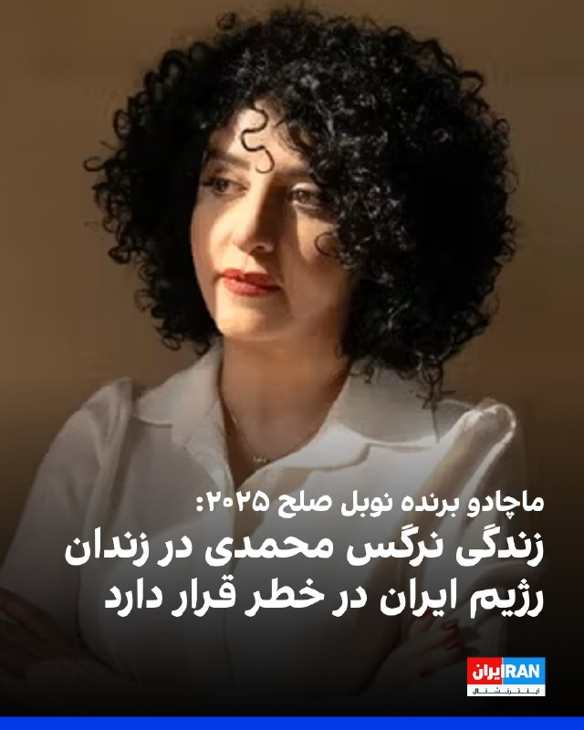

> ماریا کورینا ماچادو، رهبر اپوزیسیون ونزوئلا و برنده نوبل صلح ۲۰۲۵، با انتشار متنی در ایکس نوشت: «زندگی نرگس محمدی، برنده جایزه صلح نوبل ۲۰۲۳، پس از ماه‌ها عدم دریافت مراقبت پزشکی مناسب و در پی سرکوب شدید حکومت ایران در خطر قرار دارد.»
> ماچادو از جامعه جهانی خواسته که در برابر این وضعیت سکوت نکنند و با اعمال فشار واقعی بر حکومت ایران به این وضعیت پایان دهند. ماچادو همچنین حال خواستار آزادی همه زندانیان سیاسی در ایران شد.
> 
> https://iranintl.com/202605072782

## 1405/02/17 04:09 — VahidOOnLine
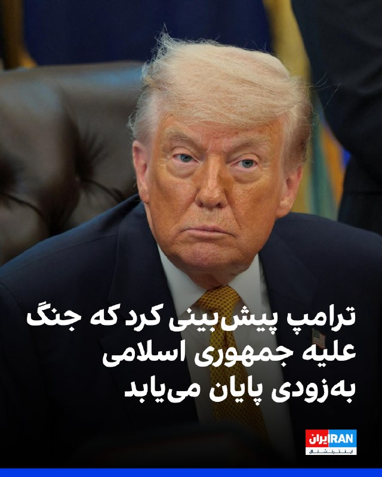

> ترامپ چهارشنبه در یک گردهمایی تلفنی جمهوری‌خواهان پیش‌بینی کرد که جنگ در ایران به‌زودی پایان خواهد یافت. او گفت: «وقتی به نوع اتفاقاتی که در حال رخ دادن است نگاه می‌کنید، ما این کار را به یک دلیل بسیار مهم انجام می‌دهیم: ما نمی‌توانیم اجازه دهیم آنها به سلاح هسته‌ای دست پیدا کنند.»
> ترامپ افزود: «بنابراین فکر می‌کنم بیشتر مردم این را درک می‌کنند. آنها می‌فهمند کاری که ما انجام می‌دهیم درست است و این موضوع به‌زودی پایان خواهد یافت.»
> 
> ‌🏁 🇬🇧 IranintlTV
> 
> 🤖 @VahidOOnLine

## 1405/02/17 04:08 — IranIntlTV

> ترامپ چهارشنبه در یک گردهمایی تلفنی جمهوری‌خواهان پیش‌بینی کرد که جنگ در ایران به‌زودی پایان خواهد یافت. او گفت: «وقتی به نوع اتفاقاتی که در حال رخ دادن است نگاه می‌کنید، ما این کار را به یک دلیل بسیار مهم انجام می‌دهیم: ما نمی‌توانیم اجازه دهیم آنها به سلاح هسته‌ای دست پیدا کنند.»
> ترامپ افزود: «بنابراین فکر می‌کنم بیشتر مردم این را درک می‌کنند. آنها می‌فهمند کاری که ما انجام می‌دهیم درست است و این موضوع به‌زودی پایان خواهد یافت.»
> 
> https://iranintl.com/202605076648

## 1405/02/17 04:08 — VahidOOnLine
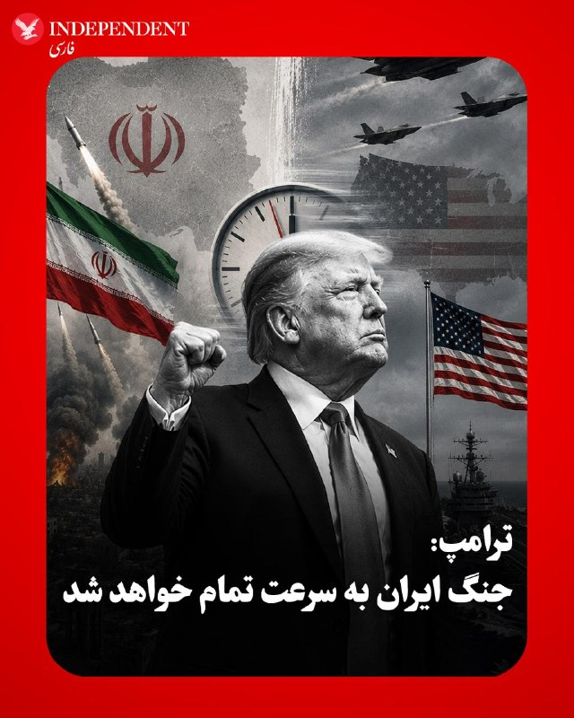

> ♦️به گزارش رویترز، دونالد ترامپ، رئیس‌جمهوری آمریکا، چهارشنبه شب در سخنانی درباره تنش با جمهوری اسلامی گفت این درگیری «به‌سرعت پایان خواهد یافت» و تاکید کرد آمریکا اجازه نخواهد داد جمهوری اسلامی به سلاح هسته‌ای دست پیدا کند.
> ترامپ در جریان یک گردهمایی برای حمایت از برت جونز، نامزد جمهوری‌خواه فرمانداری جورجیا، گفت اقدامات آمریکا با هدف جلوگیری از دستیابی جمهوری اسلامی به سلاح هسته‌ای انجام می‌شود و «بیشتر مردم درک می‌کنند که این اقدام درست است.»
> ‌🇸🇦 Indypersian
> 
> 🤖 @VahidOOnLine

## 1405/02/17 04:02 — BBCPersian
> 🔻گفتگوی تلفنی مکرون و پزشکیان در رابطه با تنگه هرمز و نقش اروپا
> امانوئل مکرون و مسعود پزشکیان، روسای جمهوری فرانسه و ایران در گفتگوی تلفنی درباره مواضع خود بر سر جنگ و وضعیت تنگه هرمز گفتگو کردند.
> 
> آقای مکرون روز چهارشنبه در شبکه ایکس درباره محتوای این تماس نوشت: «نگرانی عميق خود را از تشديد تنش‌های جاری ابراز کردم و حملات غيرقابل توجيه عليه زيرساخت‌های غيرنظامی امارات متحده عربی و چندين کشتی را محکوم کردم.همه طرف‌ها بايد بدون تأخير و بدون هيچ شرطی، محاصره تنگه هرمز را رفع کنند. بايد به‌طور پايدار به نظام آزادی کامل کشتيرانی که پيش از درگيری برقرار بود بازگرديم.»
> 
> در برابر رسانه‌های ایران هم نوشته‌اند آقای پزشکیان در این گفتگو به همتای فرانسوی خود گفته است: «هرگونه مذاکره در خصوص بازگشایی کامل تنگه هرمز، مستلزم رفع محاصره دریایی اعمال‌شده از سوی آمریکا است و اثربخشی این مذاکرات منوط به پایان جنگ و ارائه تضمین‌های لازم برای عدم تکرار اقدامات خصمانه است.»
> 
> آقای مکرون همچنین گفته در تماس تلفنی خود با همتای ایرانی‌اش به ائتلاف اروپایی که برای تردد در تنگه هرمز شکل گرفته اشاره کرده و گفته است: «ماموريت چندمليتی که فرانسه و بريتانيا ايجاد کرده‌اند می‌تواند به بازسازی اعتماد ميان مالکان کشتی و شرکت‌های بيمه کمک کند. اين ماموريت، به‌طور ذاتی، از طرف‌های درگير متمايز خواهد بود. استقرار از پيش ناو هواپيمابر شارل دوگل در همين چارچوب قرار می‌گيرد. من از رييس‌جمهور ايران دعوت کردم از اين فرصت استفاده کند و قصد دارم اين موضوع را با دونالد ترامپ نيز در ميان بگذارم.»
> 
> این در حالی است که شب گذشته گزارش شد یک کشتی باری فرانسوی در نزدیکی سواحل دوبی هدف حمله قرار گرفته و چند خدمه آن هم مجروح شده‌اند.
> 
> https://bbc.in/4dfDYEh
> @BBCPersian

## 1405/02/17 03:46 — VahidOOnLine
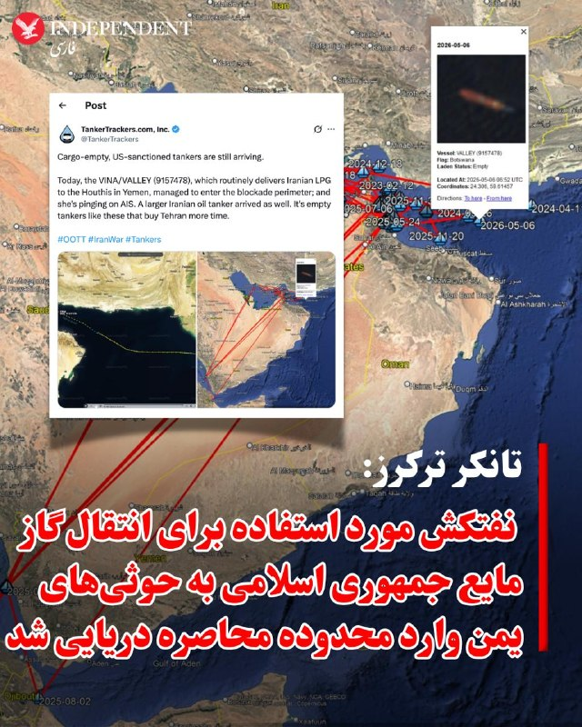

> ♦️تانکر ترکرز، سامانه رصد موقعیت نفتکش‌ها در جهان، اعلام کرد نفتکش‌های خالیِ تحت تحریم آمریکا همچنان وارد محدوده محاصره دریایی می‌شوند.
> 
> براساس این گزارش، بامداد پنجشنبه ۱۷ اردیبهشت‌‌ماه، نفتکش «وینا/ولی» به شماره (۹۱۵۷۴۷۸) که معمولا برای انتقال گاز مایع جمهوری اسلامی به حوثی‌های یمن استفاده می‌شود، وارد محدوده محاصره دریایی شد و سامانه ردیابی آن همچنان فعال است. یک نفتکش بزرگ‌تر ایرانی نیز وارد منطقه شده است.
> 
> روز چهارشنبه سنتکام اعلام کرد نیروهای آمریکایی در جریان اجرای محاصره دریایی، نفتکش خالی «حسنا» با پرچم جمهوری اسلامی را هنگام حرکت به‌سوی یکی از بنادر ایران در دریای عمان متوقف کرده‌اند.
> ‌🇸🇦 Indypersian
> 
> 🤖 @VahidOOnLine

## 1405/02/17 03:45 — VahidOOnLine
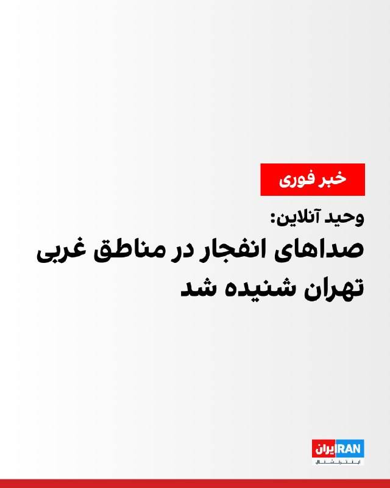

> وحید آنلاین از شنیده شدن صداهای انفجار در مناطق غربی تهران، از جمله در جنت‌آباد، شهر زیبا، باغ فیض و شهران در بامداد پنج‌شنبه حدود ساعت‌های ۲:۴۰ و ۳:۰۵ خبر داد.
> ‌🏁 🇬🇧 IranintlTV
> 
> 🤖 @VahidOOnLine

## 1405/02/17 03:45 — IranIntlTV

> وحید آنلاین از شنیده شدن صداهای انفجار در مناطق غربی تهران، از جمله در جنت‌آباد، شهر زیبا، باغ فیض و شهران در بامداد پنج‌شنبه حدود ساعت‌های ۲:۴۰ و ۳:۰۵ خبر داد.
> https://iranintl.com/202605072807

## 1405/02/17 03:34 — VahidOOnLine
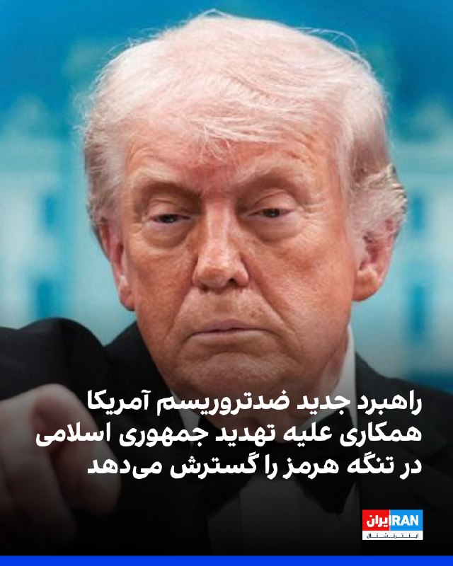

> ترامپ یک راهبرد جدید ملی مقابله با تروریسم را امضا کرده که هدف قرار دادن، کارتل‌ها، گروه‌های افراطی و مقابله با تهدیدهای «جهادگرایی» در سطح بین‌المللی تمرکز دارد. این طرح همچنین خواستار گسترش همکاری‌ها برای مقابله با تهدیدهای مرتبط با جمهوری اسلامی در تنگه هرمز شده است.
> سند «راهبرد ضدتروریسم ۲۰۲۶ آمریکا» جمهوری اسلامی را بزرگ‌ترین تهدید خاورمیانه برای ایالات متحده توصیف کرده و بر ادامه عملیات علیه توان هسته‌ای، موشکی و شبکه نیروهای نیابتی تهران تاکید کرده است. این سند [حکومت] حکومت ایران را در مرکز تهدیدهای امنیتی و تروریستی علیه آمریکا قرار می‌دهد.
> در پیشگفتار این سند که از سوی کاخ سفید منتشر شده، ترامپ جمهوری اسلامی را «حامی شماره یک دولتی تروریسم در جهان» توصیف می‌کند و می‌نویسد عملیات‌های «چکش نیمه‌شب» و «خشم حماسی» ضربه‌هایی ویرانگر به «رژیم منحوس ایران» وارد کرده‌اند تا اطمینان حاصل شود که تهران «هرگز به سلاح هسته‌ای دست پیدا نکند.»
> ادامه مطلب را اینجا بخوانید:
> ‌🏁 🇬🇧 IranintlTV
> 
> 🤖 @VahidOOnLine

## 1405/02/17 03:33 — IranIntlTV

> ترامپ یک راهبرد جدید ملی مقابله با تروریسم را امضا کرده که هدف قرار دادن، کارتل‌ها، گروه‌های افراطی و مقابله با تهدیدهای «جهادگرایی» در سطح بین‌المللی تمرکز دارد. این طرح همچنین خواستار گسترش همکاری‌ها برای مقابله با تهدیدهای مرتبط با جمهوری اسلامی در تنگه هرمز شده است.
> سند «راهبرد ضدتروریسم ۲۰۲۶ آمریکا» جمهوری اسلامی را بزرگ‌ترین تهدید خاورمیانه برای ایالات متحده توصیف کرده و بر ادامه عملیات علیه توان هسته‌ای، موشکی و شبکه نیروهای نیابتی تهران تاکید کرده است. این سند [حکومت] حکومت ایران را در مرکز تهدیدهای امنیتی و تروریستی علیه آمریکا قرار می‌دهد.
> در پیشگفتار این سند که از سوی کاخ سفید منتشر شده، ترامپ جمهوری اسلامی را «حامی شماره یک دولتی تروریسم در جهان» توصیف می‌کند و می‌نویسد عملیات‌های «چکش نیمه‌شب» و «خشم حماسی» ضربه‌هایی ویرانگر به «رژیم منحوس ایران» وارد کرده‌اند تا اطمینان حاصل شود که تهران «هرگز به سلاح هسته‌ای دست پیدا نکند.»
> ادامه مطلب را اینجا بخوانید:
> https://iranintl.com/202605060469

## 1378/10/11 03:30 — VahidOOnLine
[🎬 Video](telegram/content/VahidOOnLine_238572_1778126625.mp4)

> شهروندی در پیامی به ایران‌اینترنشنال می‌گوید در شرکتی استارت‌آپی و دانش‌بنیان در حوزه نرم‌افزار کار می‌کرده که پس از جنگ ۱۲ روزه، ۳۰ نفر از کارکنانش تعدیل شدند. او می‌افزاید بعد از جنگ اخیر، با قطع اینترنت، شمار بیشتری اخراج شدند و به بقیه نیروها نیز حقوق کامل پرداخت نشده است.
> ‌🏁 🇬🇧 IranintlTV
> 
> 🤖 @VahidOOnLine

## 1378/10/11 03:30 — VahidOOnLine
[🎬 Video](telegram/content/VahidOOnLine_238568_1778126627.mp4)

> شهروندی از اصفهان در پیامی به ایران‌اینترنشنال می‌گوید اوضاع اقتصادی و اجتماعی به‌شدت وخیم‌تر شده است. به گفته او، بنزین گیر نمی‌آید و تشدید سرکوب، فشار دوباره بر حجاب اجباری و گرانی اینترنت، زندگی مردم و به‌ویژه جوانان را نابود کرده و کسی هم صدای آن‌ها را نمی‌شنود.
> ‌🏁 🇬🇧 IranintlTV
> 
> 🤖 @VahidOOnLine

## 1378/10/11 03:30 — IranIntlTV
[🎬 Video](telegram/content/IranIntlTV_335905_1778126629.mp4)

> شهروندی در پیامی به ایران‌اینترنشنال می‌گوید در شرکتی استارت‌آپی و دانش‌بنیان در حوزه نرم‌افزار کار می‌کرده که پس از جنگ ۱۲ روزه، ۳۰ نفر از کارکنانش تعدیل شدند. او می‌افزاید بعد از جنگ اخیر، با قطع اینترنت، شمار بیشتری اخراج شدند و به بقیه نیروها نیز حقوق کامل پرداخت نشده است.

## 1378/10/11 03:30 — IranIntlTV
[🎬 Video](telegram/content/IranIntlTV_335903_1778126630.mp4)

> شهروندی از اصفهان در پیامی به ایران‌اینترنشنال می‌گوید اوضاع اقتصادی و اجتماعی به‌شدت وخیم‌تر شده است. به گفته او، بنزین گیر نمی‌آید و تشدید سرکوب، فشار دوباره بر حجاب اجباری و گرانی اینترنت، زندگی مردم و به‌ویژه جوانان را نابود کرده و کسی هم صدای آن‌ها را نمی‌شنود.

## 1378/10/11 03:30 — IranIntlTV
[🎬 Video](telegram/content/IranIntlTV_335901_1778126633.mp4)

> شهروندی با ارسال پیامی به ایران‌اینترنشنال درباره شرایط زندگی در ایران می‌گوید: «من پدر و مادر پیری دارم که فقط با دو میلیون تومانِ کمیته امداد زندگی می‌کنند. ما به آن‌ها کمک می‌کنیم تا فقط از گرسنگی نمیرند. شرایط خیلی سخت شده و مردم دیگر حتی نمی‌توانند چیزهای اولیه را بخرند.»

## 1378/10/11 03:30 — ManotoTV
[🎬 Video](telegram/content/ManotoTV_105064_1778126634.mp4)

> تماسی از ایران:
> «از جاویدنامان مجیدرضا رهنورد، نوید افکاری، ابول کورکور، امید سرلک و علی حسینی یاد کرد…
> اسم‌هایی که نباید فراموش بشن.
> و در کنار این دردها، گفت حال فرزندش بعد از شیمی‌درمانی بهتر شده…
> اما هنوز خیلی‌ها برای دارو در سختی‌اند.»

## 1378/10/11 03:30 — FarsiVOA
[🎬 Video](telegram/content/FarsiVOA_217080_1778126637.mp4)

> ⚡️هیمن سیدی در برنامه تفسیر خبر: پروژه مرگ هزار خنجر علیه جمهوری اسلامی در حال انجام است
> @FarsiVOA

## 1378/10/11 03:30 — FarsiVOA
[🎬 Video](telegram/content/FarsiVOA_217079_1778126638.mp4)

> ⚡️رضا پرچی‌زاده در برنامه تفسیر خبر: تفاهم می‌تواند پله‌ای باشد برای توافق نهایی
> @FarsiVOA

## 1405/02/17 03:30 — VahidOOnLine
> دی‌ماه بود؛
> روزی که بعضی خانواده‌ها هنوز منتظر برگشتن فرزندشان از خیابان بودند.
> ۲۲ ساله بودند؛
> در سنی که آدم بیشتر به ساختن آینده فکر می‌کند، نه به آخرین تماس، آخرین نفس، آخرین تصویر.
> علی‌محمد کرد کاظمی، مائده مرادی‌کیا، سینا کاظمی، پویا نوروزی، عارف آگاه قلندرآباد، محمدصادق عزمی، مجتبی محمدزاده یادگار، محمدامین محبوبی
> این روایت‌های کوتاه از زندگی جوانانی است که خشونت سرکوبگران، فرصت کامل شدن زندگی‌شان را گرفت.
> جاویدنامان انقلاب ملی ایرانیان؛ نام‌هایی که هنوز در خیابان‌های این سرزمین شنیده می‌شوند.
> #جاویدنامان_انقلاب_ملی_ایرانیان
> ‌🏁 🇬🇧 IranintlTV
> 
> 🤖 @VahidOOnLine

## 1405/02/17 03:29 — IranIntlTV
> دی‌ماه بود؛
> روزی که بعضی خانواده‌ها هنوز منتظر برگشتن فرزندشان از خیابان بودند.
> ۲۲ ساله بودند؛
> در سنی که آدم بیشتر به ساختن آینده فکر می‌کند، نه به آخرین تماس، آخرین نفس، آخرین تصویر.
> علی‌محمد کرد کاظمی، مائده مرادی‌کیا، سینا کاظمی، پویا نوروزی، عارف آگاه قلندرآباد، محمدصادق عزمی، مجتبی محمدزاده یادگار، محمدامین محبوبی
> این روایت‌های کوتاه از زندگی جوانانی است که خشونت سرکوبگران، فرصت کامل شدن زندگی‌شان را گرفت.
> جاویدنامان انقلاب ملی ایرانیان؛ نام‌هایی که هنوز در خیابان‌های این سرزمین شنیده می‌شوند.
> #جاویدنامان_انقلاب_ملی_ایرانیان

## 1405/02/17 03:24 — VahidOOnLine
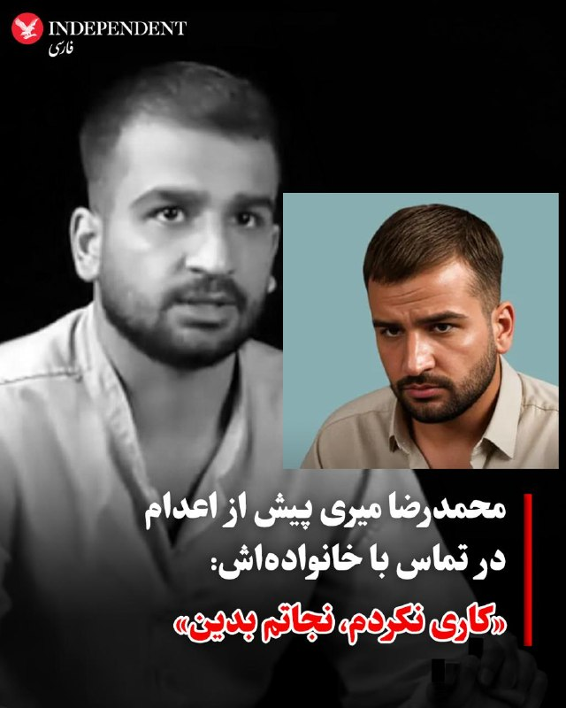

> ♦️به گزارش دادبان، محمدرضا میری، کارگر ۲۱ ساله‌ای که به‌تازگی خدمت سربازی خود را به پایان رسانده بود، بامداد روز یکشنبه ۱۳ اردیبهشت ۱۴۰۵ در تماس تلفنی با خانواده‌اش از انتقال خود برای اجرای حکم اعدام خبر داد.
> بر اساس این گزارش، او در این تماس با صدایی لرزان گفته است: «دارن منو می‌برن برای اعدام، من کاری نکردم، بیاین منو نجات بدین.» ساعاتی بعد، حکم اعدام او اجرا شد.
> محمدرضا میری یکی از سه معترض بازداشت‌شده در جریان اعتراضات دی‌ماه ۱۴۰۴ بود که همراه با ابراهیم دولت‌آبادی و مهدی رسولی به اعدام محکوم شده بودند.
> ‌🇸🇦 Indypersian
> 
> 🤖 @VahidOOnLine

## 1405/02/17 03:22 — Shin_Persian

> Shin ✓ @hey_itsmyturn
> Wed, 06 May 2026 23:52:32 UTC
> 
> Earlier @ ~ 2310Z
> Single blast was heard in western Tehran, #Tehran Province, #Iran
> 
> @Vahid also reports a loud blast sound.
> 
> فارسی
> 
> پیش‌تر در حدود ۲۳۱۰ زولو (۰۲:۴۰ به وقت تهران)
> صدای یک انفجار در غرب تهران، استان #تهران، #ایران شنیده شد.
> 
> @Vahid نیز گزارش یک صدای انفجار بلند را داده است.
> 
> 𝕏 · @shin_persian

## 1405/02/17 03:21 — BBCPersian
> 🔻با ورود به بامداد پنجشنبه - ۱۷ اردیبهشت - به وقت لندن، پوشش زنده را به صفحه جدید این روز منتقل می‌کنیم. لطفا با ما بمانید.
> 
> در ۲۴ ساعت گذشته، تحولات جنگ ميان آمريکا و ايران بار ديگر با تحولات سريع و غيرمنتظره همراه بوده و همزمان صحبت از احتمال دستيابی به يک توافق مطرح شده است.
> 
> در عرض چند دقيقه پس از آنکه فرماندهی مرکزی ايالات متحده اعلام کرد به يک نفتکش با پرچم ايران در دريای عمان شليک کرده و آن را از کار انداخته، اسرائيل حملاتی را عليه لبنان آغاز کرد.
> 
> مهمترین تحولات روز چهارشنبه اینها بودند:
> 
> نزديک شدن به توافقدر ابتدای روز، رسانه‌های امريکايی گزارش دادند مقام‌های دولت دونالد ترامپ به نهايی کردن يک يادداشت تفاهم نزديک شده‌اند و انتظار می‌رود پاسخ تهران ظرف ۴۸ ساعت آينده ارائه شود.دونالد ترامپ نيز به خبرنگاران گفت «در ۲۴ ساعت گذشته گفت‌وگوهای بسيار خوبی داشته‌ايم» و احتمال دستيابی به توافق وجود دارد.در همين حال، سخنگوی وزارت خارجه ايران اعلام کرد پيشنهاد آمريکا همچنان در دست بررسی است و نيروی دريايی ايران افزود در صورت «پايان تهديدهای متجاوزان»، تنگه هرمز می‌تواند بازگشايی شود.
> 
> از سرگيری حملات اسرائيل در لبناننيروهای اسرائيلی برای نخستين بار از زمان اعلام آتش‌بس در ۱۶ آوريل، پايتخت لبنان، بيروت را هدف قرار دادند. تصاوير منتشرشده خسارات گسترده در منطقه ضاحيه در جنوب پایتخت لبنان را نشان می‌دهد. بنيامين نتانياهو اعلام کرد هدف اين حملات يک فرمانده حزب‌الله بوده است.
> 
> نفیسه کوهنورد، خبرنگار ارشد خاورمیانه ما در بیروت می‌گوید حمله امشب به گمانه‌زنیها در رسانه‌های بین‌المللی و منطقه درباره تلاش احتمالی دولت اسرائیل برای بالا بردن تنش در منطقه «به قصد جلوگیری» از دسترسی به توافق میان ایران و آمریکا هم دامن زده است.
> 
> ادامه محاصره امريکامحاصره دريايی آمريکا در تنگه هرمز همچنان ادامه دارد؛ اين در حالی است که دونالد ترامپ روز گذشته اعلام کرده بود «پروژه آزادی» به‌طور موقت متوقف می‌شود. سنتکام - مجری این محاصره -اعلام کرد تاکنون ۵۲ کشتی مجبور به تغيير مسير شده‌اند و تأکيد کرد: «محاصره آمريکا عليه کشتی‌هايی که قصد ورود يا خروج از بنادر ايران را دارند همچنان به‌طور کامل برقرار است.
> 
> https://bbc.in/4uxjMEE
> @BBCPersian

## 1405/02/17 03:13 — kianmeli1
> 🔴گزارش‌های متعدد از غرب تهران؛
> از دقایقی پیش کاربران در جنت‌آباد، شهران، پونک و شهرزیبا از شنیده‌شدن صدای یک انفجار شدید حوالی ساعت ۲:۳۸ تا ۲:۴۰ بامداد خبر می‌دهند.
> 
> بر اساس پیام‌های دریافتی، شدت صدا بالا بوده اما تنها یک انفجار شنیده شده و هنوز توضیح درباره منشأ آن منتشر نشده
> https://t.me/kianmeli1

## 1405/02/17 03:02 — Persian_Trend_Official
[🎬 Video](telegram/content/Persian_Trend_Official_13567_1778112216.jpg)

> لینک داخلی لایو اول 16 اردبیبهشت برای دانلود: https://dl.persiantrend.com/PersianTrendLives/PersianTrend.1405.02.16.Live1.mp4

## 1405/02/17 02:57 — VahidOOnLine

> ♦️وال استریت ژورنال در گزارشی درباره توافق آمریکا با رژیم ایران نوشت که ایالات متحده می‌خواهد همه ذخایر اورانیوم غنی‌شده از ایران خارج شود. به این معنی که هم ذخایر اورانیوم با غنای ۶۰ درصد و هم ۲۰ درصد و هر میزان اورانیوم غنی‌شده دیگری که ایران در اختیار دارد نیز باید تحویل دهد. این در حالی است که مفامات تهران همچنان می‌گویند موضوع خروج ذخایر اورانیوم غنی‌شده از ایران، از دستور کار خارج شده است.
> ‌🇸🇦 Indypersian
> 
> 🤖 @VahidOOnLine

## 1405/02/17 02:53 — VahidOnline
> غرب تهران
> پیام‌های دریافتی:
> 
> صدای انفجار 2:38 دقیقه جنت اباد تهران
> 
> شهران صدای انفجار وحشتناک اومد ساعت ۲:۴۰
> 
> یک صدای انفجار خیلی بلند سمت شهرزیبا (غرب تهران) ، شبیه موشک نبود بیشتر انگار یه چیزی ترکید
> 
> پونک تهران
> دو صدای انفجار شنیدیم
> 
> همین چند دقیقه پیش غرب تهران یه صدای خیلی بلندی از انفجار اومد
> 
> سلام وحید جان دادش غرب تهران ۲:۳۸ اینا صدای یک تک انفجار اما سنگین اومد ولی هیچ جا نگفته کس دیگه!
> 
> 
> چند دقیقه اخیر راجع به صدای انفجار توی جنت اباد پیامی دریافت نکردید؟
> صدا شبیه انفجار پهپاد بود. موج نداشت اما شدید بود.
> [دریافت کرده بودم ولی چون تعدادشون کم بود صبر کرده بودم تا پیام‌‌های بیشتری برسه. چون پیام‌هایی که بعد از انتشار پست ارسال بشن اعتبار زیادی نخواهند داشت.]
> 
> 
> سلام منزل ما جنت آباد مرکزی هست محدوده خیابان بصارتی
> حدود ساعت ۲.۴۰ صدای انفجار شنیدم اما دقیق نمی دونم چی بود
> 
> شهران صدای انفجار بلندی اومد ولی یه دونه انفجار بیشتر نبود.
> 
> ما سمت باغ‌فیض هستیم؛ ساعت ۲:۴۰ صدای انفجار اومد، آنچنان نزدیک نبود اما بلند بود؛ بنظر نمیرسید شبیه به صدای برخورد باشه؛
> اما همین یکم پیش هم حدود ساعت ۳:۰۵ صداهایی شبیه به موتور اما تیزتر و ممتد اومد که حدود ۳،۴ دقیقه طول کشید؛ فکرمیکنم شاید پهباد بوده باشه؛ با صدای جگنده که در زمان جنگ میومد متفاوت بود.
> 
> 📡 @VahidOnline

## 1405/02/17 02:43 — VahidOOnLine
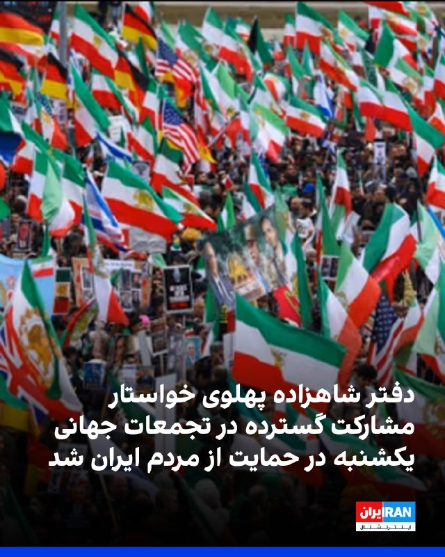

> حساب کاربری شاهزاده رضا پهلوی در ایکس اعلام کرد که ایرانیان در سراسر جهان روز یکشنبه ۲۰ اردیبهشت در اعتراض به قطع اینترنت، بازداشت‌های گسترده و افزایش اعدام‌ها در ایران، در شهرهای مختلف جهان به طور همزمان تجمعاتی برگزار می کنند.
> این بیانیه که هدف از این تجمعات را رساندن صدای مردم داخل کشور به جامعه بین‌المللی خوانده، از شهرهای کلن، ژنو، بولونیا، لس‌آنجلس، برلین، بروکسل، دالاس، دوبلین، فرانکفورت، و دهها شهر دیگر جهان برای این تجمعات نام برده است.
> 
> ‌🏁 🇬🇧 IranintlTV
> 
> 🤖 @VahidOOnLine

## 1405/02/17 02:42 — IranIntlTV

> حساب کاربری شاهزاده رضا پهلوی در ایکس اعلام کرد که ایرانیان در سراسر جهان روز یکشنبه ۲۰ اردیبهشت در اعتراض به قطع اینترنت، بازداشت‌های گسترده و افزایش اعدام‌ها در ایران، در شهرهای مختلف جهان به طور همزمان تجمعاتی برگزار می کنند.
> این بیانیه که هدف از این تجمعات را رساندن صدای مردم داخل کشور به جامعه بین‌المللی خوانده، از شهرهای کلن، ژنو، بولونیا، لس‌آنجلس، برلین، بروکسل، دالاس، دوبلین، فرانکفورت، و دهها شهر دیگر جهان برای این تجمعات نام برده است.
> 
> https://iranintl.com/202605066652

## 1405/02/17 02:38 — Persian_Trend_Official
> 🔴 ارتقای حیاتی برای B-52؛ موتورهای جدید، برد بیشتر و هزینه کمتر
> 
> 💢نیروی هوایی آمریکا و شرکت بویینگ اعلام کرده‌اند نصب موتورهای نسل جدید F-130 ساخت رولزرویس روی بمب‌افکن‌های B-52، جهش قابل‌توجهی در عملکرد این پرنده ایجاد می‌کند.
> 
> 🔹بر اساس اطلاعات منتشرشده:
> 
> ▪️ مصرف سوخت این موتورها حدود ۲۵ تا ۳۰ درصد کمتر از موتورهای قدیمی TF-33 است
> 
> ▪️ تراست به حدود ۲۰ هزار پوند افزایش یافته (در برابر ۱۷ هزار پوند قبلی)
> 
> ▪️ سطح نویز نیز بین ۱۰ تا ۱۵ دسی‌بل کاهش یافته است
> 
> 💢علاوه بر این، موتورهای TF-33 از دهه ۸۰ میلادی دیگر تولید نمی‌شوند؛ موضوعی که تأمین قطعات و نگهداری را دشوار کرده بود. جایگزینی با F-130 نه‌تنها این مشکل را حل می‌کند، بلکه هزینه‌های عملیاتی را هم به‌طور محسوسی کاهش می‌دهد.
> 
> 
> 🫆:Tony
> 
> 📌 @persian_trend_official
> پرشین ترند | متفاوت‌ترین کانال نظامی

## 1378/10/11 03:30 — VahidOOnLine
[🎬 Video](telegram/content/VahidOOnLine_238544_1778112219.mp4)

> ♦️ایال زمیر، رئیس ستاد کل ارتش اسرائیل، چهارشنبه ۱۶ اردیبهشت‌ماه، در جریان بازدید از جنوب لبنان اعلام کرد در صورت ازسرگیری جنگ با جمهوری اسلامی، ارتش اسرائیل فهرست تازه‌ای از اهداف را برای حمله آماده کرده است.
> 
> زمیر گفت: «همکاری و هماهنگی با ارتش آمریکا در همه زمان‌ها ادامه دارد و ما وضعیت را به‌طور مداوم زیر نظر داریم.»
> 
> او افزود ارتش اسرائیل در آماده‌باش کامل قرار دارد تا در صورت لزوم، عملیات «گسترده و شدید» علیه جمهوری اسلامی را از سر بگیرد.
> 
> رئیس ستاد ارتش اسرائیل همچنین گفت: «در ایران، مجموعه دیگری از اهداف برای حمله آماده کرده‌ایم. ما آماده بازگشت به کارزاری گسترده هستیم تا دستاوردهای خود را عمیق‌تر کرده و حکومت جمهوری اسلامی را بیشتر تضعیف کنیم.»
> 
> زمیر خطاب به نیروهای مستقر در منطقه خیام در جنوب لبنان نیز گفت: «تمام توانایی‌های ارتش اسرائیل در اختیار شما قرار دارد و برای استفاده از قدرت در این ماموریت هیچ محدودیتی ندارید.»
> 
> او گفت از زمان آغاز جنگ با جمهوری اسلامی، بیش از دو هزار نیروی حزب‌الله در لبنان کشته شده‌اند و تاکید کرد اسرائیل «از هر فرصتی برای وارد کردن ضربات بیشتر به حزب‌الله و ادامه تضعیف آن» استفاده خواهد کرد.
> ‌🇸🇦 Indypersian
> 
> 🤖 @VahidOOnLine

## 1378/10/11 03:30 — VahidOOnLine
[🎬 Video](telegram/content/VahidOOnLine_238540_1778112221.mp4)

> ♦️امیر قلعه‌نویی، سرمربی تیم ملی فوتبال ایران، چهارشنبه‌شب ۱۶ اردیبهشت‌ماه، در حاشیه دیدار دوستانه و درون‌تیمی تیم ملی، از تغییر در برنامه اردوها و زمان سفر ملی‌پوشان پیش از آغاز مسابقات خبر داد.
> 
> قلعه‌نویی در پاسخ به سوالی درباره تغییر زمان اردوهای مرحله بعدی تیم ملی گفت کاروان ایران به‌جای ۱۰ روز، ۱۴ روز پیش از آغاز مسابقات راهی آمریکا خواهد شد.
> 
> او همچنین اعلام کرد تیم ملی یک هفته بیشتر در ایران خواهد ماند و سپس احتمالا در روزهای ۲۵ یا ۲۶ اردیبهشت برای برگزاری اردویی دو هفته‌ای راهی ترکیه می‌شود.
> ‌🇸🇦 Indypersian
> 
> 🤖 @VahidOOnLine

## 1378/10/11 03:30 — IranIntlTV
[🎬 Video](telegram/content/IranIntlTV_335895_1778112222.mp4)

> سبا حیدرخانی در «برنامه»
> هزینه خرید سوپرمارکتی دو نیم برابر شده است
> 
> قیمت مواد غذایی، شوینده‌ها، دارو و کالاهای روزمره در ایران به‌صورت بی‌سابقه‌ای افزایش یافته و هزینه خرید سوپرمارکتی برای بسیاری از خانواده‌ها حدود ۲.۵ برابر شده است.
> 
> شهروندان از تورم شدید خوراکی‌ها، گرانی اقلامی مثل مرغ، گوشت، روغن، تخم‌مرغ و حتی کیسه پلاستیکی خبر داده‌اند و می‌گویند تأمین نیازهای اولیه زندگی برای بسیاری از مردم دشوار شده است.
> 
> هم‌زمان، هزینه دارو و درمان نیز چند برابر شده و برخی خدمات درمانی، بیشتر از حقوق یک ماه کارمندان هزینه دارد.
> 
> سبا حیدرخانی در «برنامه» به این موضوع می‌پردازد.
> 
> «یک ایران صدای شما را می‌شنود»
> دوشنبه تا پنجشنبه ۱۱ شب تهران
> از تلویزیون ایران اینترنشنال
> 
> تماشای نسخه کامل این قسمت از «برنامه» در یوتیوب:
> https://youtu.be/KC3ECIl42es
> @iranintltv

## 1378/10/11 03:30 — IranIntlTV
[🎬 Video](telegram/content/IranIntlTV_335885_1778112224.mp4)

> اختلال تردد کشتی‌ها در تنگه هرمز و جهش قیمت سوخت، بر فرودگاه‌ها و کارخانه‌ها تا سبد خرید مردم جهان اثر گذاشته است. هشدارها درباره نفت ۱۲۵ دلاری نشان می‌دهد ادامه بحران می‌تواند موج تازه‌ای از گرانی و فشار اقتصادی ایجاد کند.
> 
> آرین ریسباف گزارش می‌دهد.
> @iranintltv

## 1378/10/11 03:30 — IranIntlTV
[🎬 Video](telegram/content/IranIntlTV_335884_1778112226.mp4)

> امید از مشهد: اگر فقط تخم‌مرغ بخوری، ماهی هفت میلیون تومان هزینه دارد
> 
> «یک ایران صدای شما را می‌شنود»
> دوشنبه تا پنجشنبه ۱۱ شب تهران
> از تلویزیون ایران اینترنشنال
> 
> تماشای نسخه کامل این قسمت از «برنامه» در یوتیوب:
> https://youtu.be/KC3ECIl42es
> @iranintltv

## 1378/10/11 03:30 — IranIntlTV
[🎬 Video](telegram/content/IranIntlTV_335883_1778112228.mp4)

> باران از تهران: دارویی که دی‌ماه ۲۰۰ هزار تومان بود، الان شده یک میلیون تومان
> 
> «یک ایران صدای شما را می‌شنود»
> دوشنبه تا پنجشنبه ۱۱ شب تهران
> از تلویزیون ایران اینترنشنال
> 
> تماشای نسخه کامل این قسمت از «برنامه» در یوتیوب:
> https://youtu.be/KC3ECIl42es
> @iranintltv

## 1378/10/11 03:30 — IranIntlTV
[🎬 Video](telegram/content/IranIntlTV_335882_1778112230.mp4)

> حسین از اصفهان: من کارگرم؛ از اول جنگ بیکارم، هر روز سفره‌ها و آرزوهای ما را کوچک‌تر می‌کنند
> 
> «یک ایران صدای شما را می‌شنود»
> دوشنبه تا پنجشنبه ۱۱ شب تهران
> از تلوزیون ایران اینترنشنال
> 
> تماشای نسخه کامل این قسمت از «برنامه» در یوتیوب:
> https://youtu.be/KC3ECIl42es
> @iranintltv

## 1378/10/11 03:30 — IranIntlTV
[🎬 Video](telegram/content/IranIntlTV_335881_1778112232.mp4)

> فرهاد از تهران: مردم باید تکلیف خود را با جمهوری اسلامی مشخص کنند؛ می‌خواهند یا نمی‌خواهند
> 
> «یک ایران صدای شما را می‌شنود»
> دوشنبه تا پنجشنبه ۱۱ شب تهران
> از تلویزیون ایران اینترنشنال
> 
> تماشای نسخه کامل این قسمت از «برنامه» در یوتیوب:
> https://youtu.be/KC3ECIl42es
> @iranintltv

## 1378/10/11 03:30 — IranIntlTV
[🎬 Video](telegram/content/IranIntlTV_335880_1778112234.mp4)

> سپهر از اهواز: نباید به امید آمریکا باشیم؛ باید متحد بمانیم
> 
> «یک ایران صدای شما را می‌شنود»
> دوشنبه تا پنجشنبه ۱۱ شب تهران
> از تلویزیون ایران اینترنشنال
> 
> تماشای نسخه کامل این قسمت از «برنامه» در یوتیوب:
> https://youtu.be/KC3ECIl42es
> @iranintltv

## 1378/10/11 03:30 — IranIntlTV
[🎬 Video](telegram/content/IranIntlTV_335878_1778112236.mp4)

> مراد ویسی، تحلیل‌گر ارشد ایران‌اینترنشنال، گفت: «با وجود همه سرکوب‌ها، خشمی آگاهانه در جامعه دیده می شود، جامعه می‌داند چه نمی‌خواهد و چه می‌خواهد. جامعه ایران امروز به قدرت خیزش میلیونی خود باور دارد، هدفش را سرنگونی جمهوری اسلامی می داند؛ برای بعد از جمهوری اسلامی مبانی مشخصی دارد و رهبری مشخصی را نیز صدا می‌زند.»
> @iranintltv

## 1378/10/11 03:30 — FarsiVOA
[🎬 Video](telegram/content/FarsiVOA_217075_1778112238.mp4)

> ⚡️باب المندب یکی از شریان‌های اصلی تجارت جهانی است؛ اما سایه سنگین درگیر‌های نظامی اخیر امنیت آن را تهدید می‌کند
> @FarsiVOA

## 1378/10/11 03:30 — FarsiVOA
> ⚡️ترکیب تهدیدهای نظامی، آتش‌بس‌های شکننده و زخم‌های بازِ اعتراضات گذشته، در کنار موج فزاینده بیکاری و فقر، ایران را به نقطه‌ای رسانده که بحران اقتصادی به بخشی از یک وضعیت چندلایه و ناپایدار تبدیل شده است
> @FarsiVOA

## 1378/10/11 03:30 — FarsiVOA
> ⚡️بحران ایران و خاورمیانه؛ هند برای جلوگیری از شوک اقتصادی بسته حمایتی میلیارد دلاری تصویب کرد
> @FarsiVOA

## 1378/10/11 03:30 — FarsiVOA
> ⚡️عراق در دوراهی بقا؛ از دیوارکشی در مرز سوریه تا تلاش برای خروج از بن‌بست تنگه هرمز
> @FarsiVOA

## 1378/10/11 03:30 — FarsiVOA
> ⚡️ترامپ: در ۲۴ ساعت گذشته مذاکرات خیلی خوبی با جمهوری اسلامی داشتیم و به احتمال زیاد با هم توافق کنیم
> @FarsiVOA

## 1405/02/17 02:28 — IranIntlTV
> 🎧نسخه صوتی سیاست با مراد ویسی: جامعه ایران؛ خشمگین و در مسیر خیزش
> @iranintlTV

## 1405/02/17 02:28 — Persian_Trend_Official
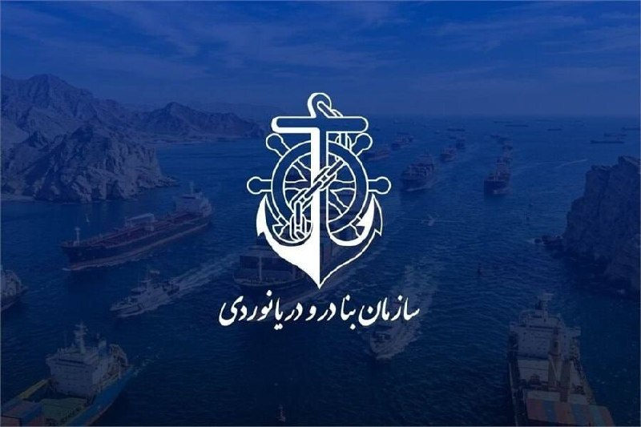

> 💢ایران با ارسال پیام به فرماندهان کشتی‌های تجاری در تنگه هرمز اعلام کرد آماده تامین نیازهای کشتی ها هست!
> 
> 🔹سازمان بنادر و دریانوردی جمهوری اسلامی ایران با صدور پیامی رسمی خطاب به فرماندهان کشتی‌های تجاری حاضر در تنگه هرمز و آب‌های منطقه، آمادگی کامل بنادر کشور برای ارائه خدمات عمومی دریایی، پشتیبانی فنی و خدمات بهداشتی و پزشکی را اعلام کرد
> 
> 🫆:Tony
> 
> 📌 @persian_trend_official
> پرشین ترند | متفاوت‌ترین کانال نظامی

## 1405/02/17 02:28 — BBCPersian
> 🖋نوال مغافی
> خبرنگار ارشد تحقیقات بین‌المللی، بی‌بی‌سی, لبنان
> 
> در حومه جنوبی بیروت، محله حی‌السلم دیگر به سختی قابل شناسایی است.
> 
> جایی که زمانی محله‌ای پرجمعیت و سرزنده بود، اکنون به چشم‌اندازی از بتن‌های فروریخته، فلزهای پیچ‌وتاب‌خورده و سیم‌های بیرون‌زده تبدیل شده است. خانه‌ها به لایه‌هایی از آوار بدل شده‌اند، راه‌پله‌ها به هیچ‌جا نمی‌رسند و صدای زندگی روزمره جای خود را به سکوت داده است.
> 
> ساکنان حی‌السلم می‌گویند از زمان آغاز جنگ ایران، با وجود حملات مکرر اسرائیل به دیگر بخش‌های ضاحیه جنوبی بیروت، این محله تا بعدازظهر روز ۸ آوریل آرام مانده بود.
> 
> 
> آلبوم را ورق بزنید و ادامه مطلب را از لینک زیر در وبسایت بی‌بی‌سی فارسی بخوانید.
> 
> 📸BBC/ GettyImages/ Supplied/ EPA/Shutterstock/ AFP via Getty Images/ Anadolu via Getty Images
> https://bbc.in/4d5GAUT
> @BBCPersian

## 1405/02/17 02:27 — VahidOOnLine
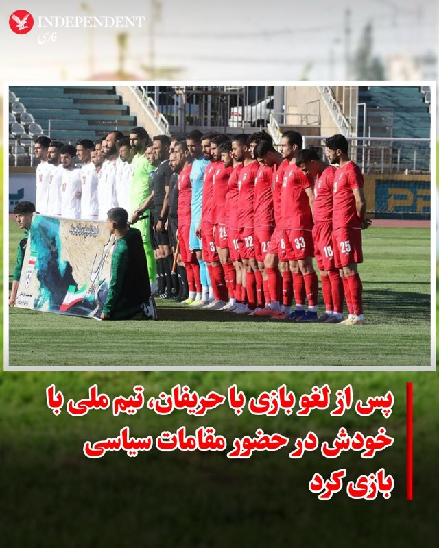

> ♦️در حالی که انصراف حریفان تدارکاتی از رویارویی با تیم ملی فوتبال در آستانه جام جهانی ۲۰۲۶ ادامه دارد، تیم ملی فوتبال دومین دیدار تدارکاتی خود را به‌صورت درون‌تیمی در ورزشگاه شهید دستگردی تهران برگزار کرد.
> این مسابقه روز چهارشنبه میان دو تیم سفید و قرمز برگزار شد و با پیروزی ۳ بر یک تیم قرمز به پایان رسید. دیداری که به‌صورت مستقیم از صدا و سیمای جمهوری اسلامی پخش شد و با وجود برگزار شدن میان بازیکنان یک تیم، از فناوری کمک‌داور ویدیویی (وی‌ای‌آر) نیز استفاده می‌کرد.
> پیش‌تر قرار بود تیم ملی جمهوری اسلامی ایران در اردوی ترکیه مقابل تیم‌های آنگولا و مقدونیه قرار بگیرد، اما این دو تیم بازی با ایران را لغو کردند.
> اسماعیل بقایی، سخنگوی وزارت امور خارجه جمهوری اسلامی، در کنار مهدی تاج، رییس فدراسیون فوتبال، از نزدیک این مسابقه را تماشا کرد.
> همزمان آمریکا اعلام کرده است ویزای بازیکنان تیم ملی برای حضور در جام جهانی صادر خواهد شد، اما درباره همراهان تیم، قوانین صدور ویزا با در نظر گرفتن وابستگی احتمالی آن‌ها به سپاه پاسداران اعمال می‌شود.
> ‌🇸🇦 Indypersian
> 
> 🤖 @VahidOOnLine

## 1405/02/17 02:25 — FarsiVOA
> 🔺ترامپ به پی‌بی‌اس: توافق با جمهوری اسلامی شامل انتقال اورانیوم غنی‌شده به آمریکا می‌شود؛ غنی‌سازی ۳.۶۷ درصدی در توافق نخواهد بود
> 
> ▪️دونالد ترامپ، رئیس جمهوری آمریکا در گفت‌وگویی تلفنی در صبح چهارشنبه با شبکه آمریکایی پی‌بی‌اس نیوز گفت توافق احتمالی با جمهوری اسلامی شامل انتقال حدود ۱۰۰۰ پوند اورانیوم غنی‌شده از ایران به آمریکا و همچنین عدم راه‌اندازی تأسیسات زیرزمینی هسته‌ای جمهوری اسلامی می‌شود.
> 
> ⬇️ بیشتر بخوانید:
> https://ir.voanews.com/a/8147337.html?dfdfd=
> @FarsiVOA

## 1405/02/17 02:24 — VahidOOnLine
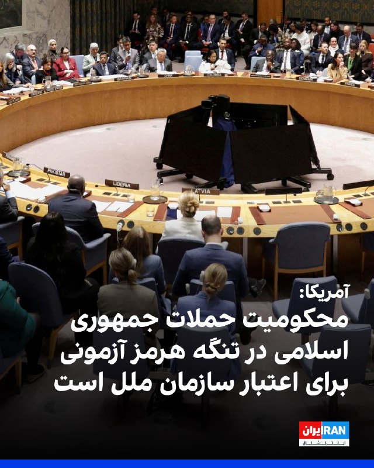

> وزارت خارجه آمریکا در پیامی در ایکس اعلام کرد اگر سازمان ملل نتواند تهدیدهای جمهوری اسلامی علیه کشتیرانی در تنگه هرمز را محکوم کند، این به آزمونی واقعی برای اعتبار این نهاد تبدیل خواهد شد.
> وزارت خارجه آمریکا سه‌شنبه اعلام کرده بود که این کشور در پی دستور دونالد ترامپ، رییس‌جمهوری ایالات متحده، همراه با بحرین، عربستان سعودی، امارات متحده عربی، کویت و قطر، قطعنامه‌ای را در شورای امنیت سازمان ملل متحد برای دفاع از آزادی دریانوردی در تنگه هرمز تدوین کرده است.
> در این ارتباط هم جلسه غیرعلنی شورای امنیت سازمان ملل متحد چهارشنبه آغاز به کار کرد.
> ‌🏁 🇬🇧 IranintlTV
> 
> 🤖 @VahidOOnLine

## 1405/02/17 02:23 — IranIntlTV

> وزارت خارجه آمریکا در پیامی در ایکس اعلام کرد اگر سازمان ملل نتواند تهدیدهای جمهوری اسلامی علیه کشتیرانی در تنگه هرمز را محکوم کند، این به آزمونی واقعی برای اعتبار این نهاد تبدیل خواهد شد.
> وزارت خارجه آمریکا سه‌شنبه اعلام کرده بود که این کشور در پی دستور دونالد ترامپ، رییس‌جمهوری ایالات متحده، همراه با بحرین، عربستان سعودی، امارات متحده عربی، کویت و قطر، قطعنامه‌ای را در شورای امنیت سازمان ملل متحد برای دفاع از آزادی دریانوردی در تنگه هرمز تدوین کرده است.
> در این ارتباط هم جلسه غیرعلنی شورای امنیت سازمان ملل متحد چهارشنبه آغاز به کار کرد.
> https://iranintl.com/202605061262

## 1405/02/17 02:09 — Persian_Trend_Official
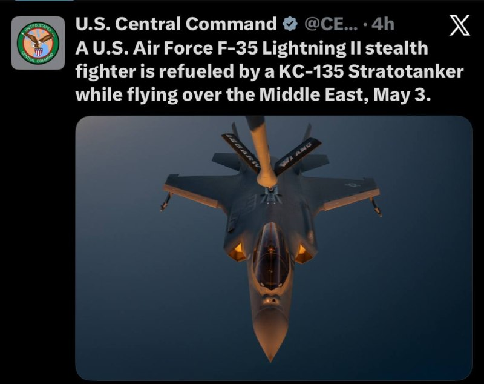

> 🔴 سنتکام عکسی منتشر کرده از یک جنگنده پنهان‌کار اف-۳۵ لایتنینگ II نیروی هوایی آمریکا که در حال دریافت سوخت‌گیری هوایی از یک هواپیمای تانکر KC-135 استراتوتنکر بر فراز خاورمیانه در تاریخ ۳ مه است
> 
> 🫆:Tony
> 
> 📌 @persian_trend_official
> پرشین ترند | متفاوت‌ترین کانال نظامی

## 1405/02/17 02:01 — Persian_Trend_Official

> 💢توییت قالیباف به ترامپ:
> 
> ▪️عملیات «به من اعتماد کن رفیق» شکست خورد. حالا برگشتیم به روال عادی با عملیات «فوکسیوس».
> 
> 🫆:Tony
> 
> 📌 @persian_trend_official
> پرشین ترند | متفاوت‌ترین کانال نظامی

## 1405/02/17 01:52 — Shin_Persian
> 📦 mhrv-rs v1.9.15 released
> 
> • HTTP/2 multiplexing on relay leg (#799)
> • Block QUIC by default (#805): QUIC over the TCP-based tunnel was causing TCP-over-TCP meltdown (<1 Mbps)
> • UI accessibility: enabled the accesskit feature on eframe
> • GitHub Actions Full tunnel docs (#783)
> • Tests: 197 lib + 35 tunnel-node tests passing.
> 
> Files (Android APKs, Windows, macOS, Linux, OpenWRT) on the files channel:
> 
> 👉 v1.9.15 — all files with SHA-256
> 
> Channel:
> https://t.me/mhrv_rs
> or: https://t.me/+R1OyoHX2boA1ZDgx
> 
> #v1915

## 1405/02/17 01:51 — Persian_Trend_Official
> https://youtube.com/live/jOAbCViny2E?feature=share

## 1405/02/17 01:49 — BBCPersian
> 🔻افزایش دو میلیارد دلاری هزینه سوخت جت شرکت‌های آمریکایی در پروازهای مسافربری
> بنابر اعلام وزارت حمل و نقل ایالات متحده، خطوط هوایی مسافربری اصلی این کشور در ماه مارس بیش از ۵ میلیارد دلار برای سوخت جت هزینه کردند که ۱‌/۸ میلیارد دلار یا ۵۶ درصد بیشتر از رقمی است که یک ماه پیشتر(فوریه) هزینه شده بود.
> 
> بر این اساس، هزینه هر گالن سوخت در ماه مارس ۳/۱۳ دلار بود که در مقایسه با ماه فوریه ۷۴ سنت(۳۱ درصد) افزایش داشت. هر گالن آمریکایی کمی بیشتر از سه لیتر و نیم است.
> 
> وزارت حمل و نقل آمریکا همچنین گفته است که مصرف سوخت در ماه مارس ۲۰ درصد افزایش یافته است.
> 
> از زمان آغاز جنگ آمریکا و اسرائیل با ایران، اختلال در کشتیرانی از طریق تنگه هرمز، قیمت نفت و به تبع آن هزینه سوخت را برای مصرف‌کنندگان بالا برده است.
> 
> افزایش اخیر قیمت سوخت جت، بزرگترین بحران صنعت سفر هوایی را از زمان همه‌گیری کووید-۱۹ دامن زده است.
> 
> در پی این تحولات، شرکت‌های هواپیمایی بزرگ آمریکایی، نرخ بلیط هواپیما و هزینه‌های حمل بار را افزایش داده‌اند، بعضی از مسیرها را حذف کرده و در بعضی دیگر در هزینه‌ها نیز صرفه‌جویی کرده‌اند.
> 
> سوخت هواپیما تا یک چهارم هزینه‌های عملیاتی خطوط هوایی را شامل می‌شود.
> 
> شرکت هواپیمایی ارزان‌قیمت «اسپیریت ایرلاینز» که روز شنبه فعالیت خود را متوقف کرد، اعلام کرد که در ماه‌های مارس و آوریل ۱۰۰ میلیون دلار هزینه اضافی سوخت پرداخت کرده است.
> 
> این شرکت افزایش ناگهانی قیمت سوخت را دلیل شکست طرح تجدید ساختار خود و پایان دادن اجباری به فعالیت‌های خود عنوان کرد.
> 
> https://bbc.in/49zT9a2
> @BBCPersian

## 1405/02/17 01:47 — VahidOOnLine
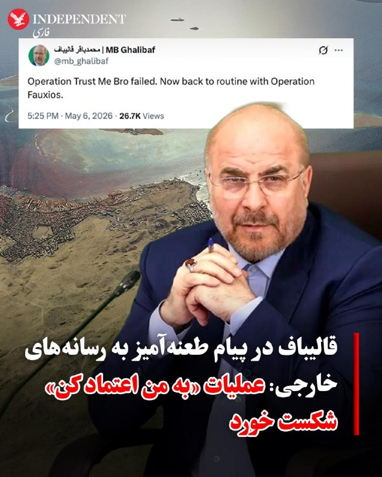

> ♦️محمدباقر قالیباف، رییس مجلس شورای اسلامی و رییس هیات جمهوری اسلامی در مذاکرات با آمریکا، روز چهارشنبه ۱۵ اردیبهشت با انتشار پیامی طعنه‌آمیز در اکس به عملیات آمریکا علیه جمهوری اسلامی و عملکرد رسانه‌های خارجی، از جمله آکسیوس، واکنش نشان داد.
> قالیباف نوشت: عملیات «به من اعتماد کن» شکست خورد. حالا برگشتیم به روال معمول با عملیات «فاکسیوس».
> ‌🇸🇦 Indypersian
> 
> 🤖 @VahidOOnLine

## 1378/10/11 03:30 — mwarmonitor
[🎬 Video](telegram/content/mwarmonitor_8603_1778108851.mp4)

> 📝این قابِ متعفن، غایتِ وقاحتِ رسانه‌ای است که در آن «دین» و «دنیا» در کثیف‌ترین شکل ممکن با هم هم‌بستر شده‌اند. آخوندی که با آن ردای مقدس‌نما، ملاقه به دست گرفته و میان جلز و ولز روغن، هرزه‌دری‌های شبِ زفاف و اراجیفِ جنسی را با نیشخندی وقیحانه به خورد ملت می‌دهد، تجسم عینی سقوط اخلاقی است؛ موجودی که منبر را به مطبخ آورده تا از کمر به پایینِ جوانان، قصه‌های خاک‌برسری برای «پر کردن آنتن» بسازد.
> 
> 🔸در آن سو، مجری زنی نشسته که با لبخندهای مشمئزکننده و تاییدهای تهوع‌آور، نقشِ کاتالیزورِ این خیمه‌شب‌بازیِ جنسی را بازی می‌کند؛ زنی که شرفِ رسانه‌ای‌اش را به پای اراجیفِ یک «ملا-آشپزِ» هرزه‌گو ریخته تا با هم، معجونی از ابتذال و حماقت بپزند. این نه یک برنامه‌ی آشپزی، که یک فاحشه‌خانه‌ی ذهنی است که در آن حرمت سفره و حیا، زیر پایِ نعلین‌هایی که از حجله می‌گویند، لگدمال شده است. تف بر این قاب که در آن، املت را با طعمِ هرزه‌دری و دین را با چاشنیِ وقاحت، به خوردِ سفره‌های خالی مردم می‌دهند.
> 
> @mwarmonitor

## 1378/10/11 03:30 — DEJradio
[🎬 Video](telegram/content/DEJradio_4464_1778108854.jpg)

> 🔺🎤 آیا توان دفاعی امارات پاسخگوی تهدیدات جمهوری اسلامی خواهد بود؟
> 
> گفت‌وگو با شایان سمیعی، کارشناس امنیت ملی
> 
> #امارات #جمهوری_اسلامی
> @DEJradio

## 1378/10/11 03:30 — DEJradio
[🎬 Video](telegram/content/DEJradio_4463_1778108854.jpg)

> 🚨
> 🔸 خبر ۲۱
> چهارشنبه ۱۶ اردیبهشت ۱۴۰۵
> 
> #خبر۲۱
> @DEJradio

## 1378/10/11 03:30 — IranIntlTV
[🎬 Video](telegram/content/IranIntlTV_335877_1778108855.mp4)

> براساس نظرسنجی موسسه دموکراسی اسرائیل، اکثریت اسرائیلی‌ها معتقدند پایان دادن به جنگ با جمهوری اسلامی با منافع امنیتی این کشور سازگار نیست.
> 
> همزمان ۶۲ درصد از پاسخ‌دهندگان احتمال بازگشت درگیری گسترده با ایران را بالا ارزیابی کرده‌اند.
> 
> گزارش راضیه دانش، خبرنگار ایران‌اینترنشنال
> @iranintltv

## 1378/10/11 03:30 — IranIntlTV
[🎬 Video](telegram/content/IranIntlTV_335876_1778108857.mp4)

> با تشدید تنش‌ها در منطقه، تحرکات نظامی بین‌المللی برای تضمین امنیت کشتیرانی در تنگه هرمز شدت گرفته است. سنتکام اعلام کرد تاکنون ۵۲ کشتی تجاری برای رعایت محاصره دریایی آمریکا علیه جمهوری اسلامی مجبور به بازگشت شده‌اند.
> 
> گزارش نیلوفر منصوری، خبرنگار ایران‌اینترنشنال
> @iranintltv

## 1378/10/11 03:30 — IranIntlTV
[🎬 Video](telegram/content/IranIntlTV_335875_1778108859.mp4)

> همزمان با افزایش خبرها درباره ادامه مذاکرات میان جمهوری اسلامی و آمریکا، محمدباقر قالیباف در یک فایل صوتی گفت جنگ وارد مرحله جدیدی شده و دشمن با فشار اقتصادی به‌دنبال حمله نظامی مجدد و انجام حملات تروریستی در ایران است.
> 
> گفت‌وگو با کامیار بهرنگ، عضو تحریریه ایران‌اینترنشنال
> @iranintltv

## 1378/10/11 03:30 — IranIntlTV
[🎬 Video](telegram/content/IranIntlTV_335874_1778108861.mp4)

> دونالد ترامپ گفت در ۲۴ ساعت گذشته مذاکرات خوبی با جمهوری اسلامی انجام شده و دستیابی به توافق میان واشینگتن و تهران محتمل است.
> 
> همزمان رسانه‌های آمریکایی به تغییر مواضع و جهت‌گیری‌های ناگهانی ترامپ واکنش نشان داده‌اند.
> 
> گفت‌وگو با امیر حمیدی، متخصص امنیت ملی
> @iranintltv

## 1378/10/11 03:30 — IranIntlTV
[🎬 Video](telegram/content/IranIntlTV_335872_1778108863.mp4)

> شهروندی با ارسال پیامی به ایران‌اینترنشنال درباره وضعیت اسفناک اقتصادی ایران می‌گوید: «من کارگر ساختمانی بودم و از زمان جنگ تا حالا بیکار شده‌ام. هزینه‌های درمان و هزینه‌های خرید از سوپرمارکت سرسام‌آور شده است. همه‌چیزم را فروخته‌ام. به خدا دیگر نمی‌دانم باید چه کار کنم.»

## 1378/10/11 03:30 — IranIntlTV
[🎬 Video](telegram/content/IranIntlTV_335870_1778108865.mp4)

> مراد ویسی، تحلیل‌گر ارشد ایران‌اینترشنال، گفت: «شرایط امروز ایران به نقطه‌ای رسیده که انباشت خشم عمومی می‌تواند با هر بحران و جرقه‌ای به خیزشی تازه تبدیل شود. از نانوایی و پمپ‌بنزین تا هر مکان دیگری که روزانه به محلی برای تولید نارضایتی و خشم مردم تبدیل شده، سراسر کشور در وضعیتی شبیه یک انبار باروت قرار گرفته‌اند.»
> @iranintltv

## 1378/10/11 03:30 — IranIntlTV
[🎬 Video](telegram/content/IranIntlTV_335869_1778108867.mp4)

> مراد ویسی، تحلیل‌گر ارشد ایران‌اینترنشنال، گفت: «جامعه ایران امروز در اوج خشم و عصبانیت قرار دارد؛ خشمی که از سرکوب خونین دی‌ماه، و کشتار معترضان و مواردی نظیر بیکاری و گرانی و قطع اینترنت ریشه می‌گیرد. مردم از مذاکرات، میانجی‌گری‌ها و آنچه مماشات اروپا با جمهوری اسلامی می‌دانند، به‌شدت خشمگین‌اند.»
> @iranintltv

## 1405/02/17 01:44 — mwarmonitor
> 🔴یک مقام از کشورهای خلیج فارس می‌گوید ترامپ «به‌شدت می‌خواهد جنگ با ایران پایان پیدا کند»، اما ایران حاضر نیست «آن چیزی را که او برای حفظ آبرو و خروج از این وضعیت نیاز دارد» به او بدهد. به گفته این مقام، توهین‌ها و اظهارات ترامپ مبنی بر اینکه آمریکا در جنگ پیروز شده، در حال به خطر انداختن مذاکرات است — پولیتیکو.
> 
> @mwarmonitor

## 1405/02/17 01:43 — Persian_Trend_Official
[🎬 Video](telegram/content/Persian_Trend_Official_13560_1778105767.jpg)

> فایل صوتی لایو اول
> نسخه کم حجم - 8.49 مگابایت
> 
> اتاق جنگ چهارشنبه 16 اردیبهشت | شرط توافق انتقال اورانیم غنی شده
> 
> 📝 Nick
> 
> 📌 @persian_trend_official
> پرشین ترند | متفاوت‌ترین کانال نظامی

## 1405/02/17 01:36 — IranianMinds

> 🔴 ترامپ :
> 
> کم کم داریم به جایی نزدیک میشیم که ایران میخواد اورانیوم غنی شدشو تحویل بده به ما و فعالیت تأسیسات هسته‌ای زیر زمینیش رو هم کاملا متوقف کنه
> 
> ما حتی غنی‌سازی ۳.۶۷ درصدی رو هم قبول نداریم و توی توافق جایی نداره , اگه اونا اینکارو بکنن جنگ تموم میشه و همه چیز آروم میشه
> 
> 
> اگه هم قبول نکنن دوباره میریم سراغ بمباران ولی ایندفه خیلی بدتر ولی من فکر میکنم داریم به یه نتیجه ای میرسیم و به توافق نزدیک شدیم.
> 
> @IranianMinds

## 1405/02/17 01:36 — IranianMinds
> فقط کافیه مرغ از خیابون رد کنی و‌پولت چند برابر کنی
> 💵👌

## 1405/02/17 01:24 — BBCPersian
> 🔻ترامپ - بدون تایید تهران - مدعی شد ایران با نداشتن سلاح هسته‌ای موافقت کرده است
> 
> 🖋برند دبوسمان جونیور - خبرنگار کاخ سفید
> 
> دونالد ترامپ مدعی شد ايران با نداشتن سلاح هسته‌ای «و موارد ديگر» موافقت کرده است؛ ادعايی که تاکنون از سوی تهران تأييد نشده است.
> 
> آقای ترامپ روز چهارشنبه در يک ديدار غيرمنتظره با خبرنگاران در اتاق بيضی کاخ سفید که دفتر اصلی کار روسای جمهوری آمریکاست گفت: «آنها می‌خواهند توافق کنند. در ۲۴ ساعت گذشته گفت‌وگوهای بسيار خوبی داشته‌ايم و بسيار محتمل است که به توافق برسيم.»
> 
> او بار ديگر تأکيد کرد که ايران پذيرفته هرگز به سلاح هسته‌ای دست پيدا نکند، اما هيچ تأييدی از سوی طرف ايرانی درباره اين ادعا وجود ندارد.
> 
> رييس‌جمهور آمريکا همچنين به‌طور ضمنی گفت ضرب‌الاجل ۳۰ روزه برای رسيدن به توافق انعطاف‌پذير است و افزود: «اصلا ضرب‌الاجلی وجود ندارد.»
> 
> با وجود کمبود اطلاعات رسمی درباره وضعيت مذاکرات، ترامپ و ديگر مقام‌های آمريکايی بارها گفته‌اند که روند گفت‌وگوها مثبت بوده است.
> 
> در عين حال، کاخ سفيد همچنان گزينه نظامی را — دست‌کم در سطح علنی — روی ميز نگه داشته، اما تأکيد می‌کند که اميدوار است نيازی به آن نباشد.
> 
> https://bbc.in/49zT9a2
> @BBCPersian

## 1405/02/17 01:22 — BBCPersian
> 🔻حمله پهپادی به اربیل عراق
> 
> خبرگزاری‌های ایران از حمله پهپادی به اربیل در کردستان عراق خبر دادند.
> 
> در ویدئویی که رسانه‌های ایران منتشر کرده‌اند نور انفجاری دیده می‌شود که گفته می‌شود پس از «حمله به مقر احزاب کرد» رخ داده است.
> 
> شب گذشته - سه شنبه - هم رسانه‌های داخل ایران حمله به نیروهای کرد در کردستان عراق را گزارش کرده بودند.
> https://bbc.in/49zT9a2
> @BBCPersian

## 1405/02/17 01:19 — mwarmonitor
> 🔘مارک لوین
> 
> ▫️من مجبورم باور کنم که گزارش آکسیوس تا حد زیادی جعلی است.
> 
> 🔸اگر گزارش آکسیوس حتی تا حدی هم دقیق باشد، رژیم ایران باقی خواهد ماند، مردم ایران با سرکوب و خشونت گسترده‌تری روبه‌رو خواهند شد و دولت اسرائیل ممکن است در انتخابات اکتبر سقوط کند؛ نتیجه‌ای فاجعه‌بار. و در داخل کشور خودمان هم، با وجود همه حرف‌ها درباره «راه‌های خروج» و «توافق» به‌عنوان بهترین نتیجه سیاسی برای رئیس‌جمهور و جمهوری‌خواهان، واقعیت برعکس است. دموکرات‌ها، رسانه‌ها و جریان‌های انزواطلب این عملیات را شکست‌خورده اعلام خواهند کرد. البته جزئیات بسیار تعیین‌کننده خواهد بود؛ به‌ویژه موضوع نظارت و اجرای تعهدات، و نه فقط توسعه هسته‌ای و اورانیوم غنی‌شده، بلکه موشک‌های بالستیک قاره‌پیما، نیروهای نیابتی و بله، وضعیت مردم ایران.
> 
> 🔹من از این فرض آغاز می‌کنم که تروریست‌ها دروغ می‌گویند و تقلب می‌کنند؛ اینکه این تروریست‌ها طی ۴۷ سال گذشته دروغ گفته و تقلب کرده‌اند و هیچ قصدی برای تغییر ندارند، آن هم بر اساس ایدئولوژی اسلام‌گرایانه اعلام‌شده‌شان. همچنین می‌دانم که رؤسای‌جمهور آینده برای اجرای یک توافق دست به اقدام نظامی نخواهند زد، بر پایه تجربه گذشته ما و مخالفت‌های داخلی؛ مخالفت‌هایی که با توجه به تحول حزب دموکرات و نفوذ مارکسیست‌ها و اسلام‌گرایان، فقط شدیدتر هم خواهد شد.
> 
> 🔸به همین دلایل و دلایل بیشتر، ناچارم باور کنم که این گزارش تا حد زیادی جعلی است.
> 
> @mwarmonitor

## 1405/02/17 01:19 — VahidOOnLine
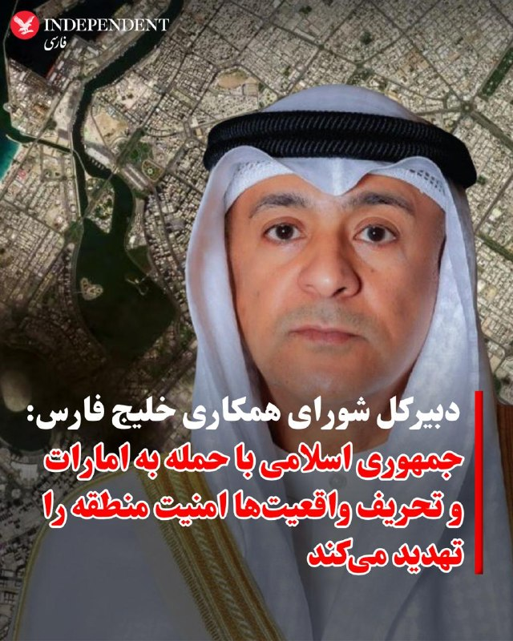

> ♦️ جاسم محمد البدیوی، دبیرکل شورای همکاری خلیج فارس، پنجشنبه‌شب ۱۷ اردیبهشت‌ماه، اظهارات مطرح‌شده در بیانیه وزارت خارجه جمهوری اسلامی علیه امارات متحده عربی را به‌شدت محکوم کرد و گفت شورای همکاری در برابر این «ادعاهای باطل و تجاوزها» کاملا در کنار ابوظبی ایستاده است.
> 
> او اعلام کرد ادعاهای جمهوری اسلامی ادامه رویکرد «تنش‌زا و تحریک‌آمیز» تهران علیه کشورهای منطقه است و افزود جمهوری اسلامی نه‌تنها به حملات علیه خاک امارات بسنده نکرده، بلکه با تحریف واقعیت‌ها تلاش کرده افکار عمومی را منحرف کند.
> 
> دبیرکل شورای همکاری خلیج فارس تاکید کرد بیانیه جمهوری اسلامی نشان‌دهنده اصرار تهران بر افزایش تنش‌ها و برهم زدن امنیت و ثبات منطقه است و رویکرد خصمانه جمهوری اسلامی، امنیت منطقه و ملت‌های آن را تهدید می‌کند.
> 
> البدیوی همچنین گفت کشورهای عضو شورای همکاری خلیج فارس در کنار امارات متحده عربی ایستاده‌اند و از تمامی اقدام‌های این کشور برای حفظ امنیت، ثبات و حاکمیتش حمایت می‌کنند.
> 
> وزارت خارجه جمهوری اسلامی سه‌شنبه ۱۵ اردیبهشت، گزارش‌های امارات درباره حملات موشکی و پهپادی از مبدا ایران را رد کرد و هشدار داد میزبانی از پایگاه‌ها و تجهیزات نظامی آمریکا می‌تواند پیامدهای خطرناکی برای ابوظبی داشته باشد.
> ‌🇸🇦 Indypersian
> 
> 🤖 @VahidOOnLine

## 1405/02/17 00:59 — kianmeli1
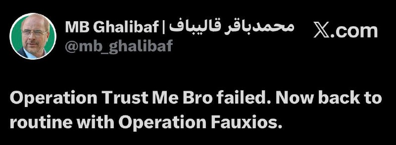

> 🔴قالیباف در حال مسخره کردن ترامپ
> 
> ‏عملیات «به من اعتماد کن برادر» شکست خورد. حالا با عملیات فاکسیوس به روال عادی برمی‌گردیم.
> https://t.me/kianmeli1

## 1405/02/17 00:53 — VahidOOnLine
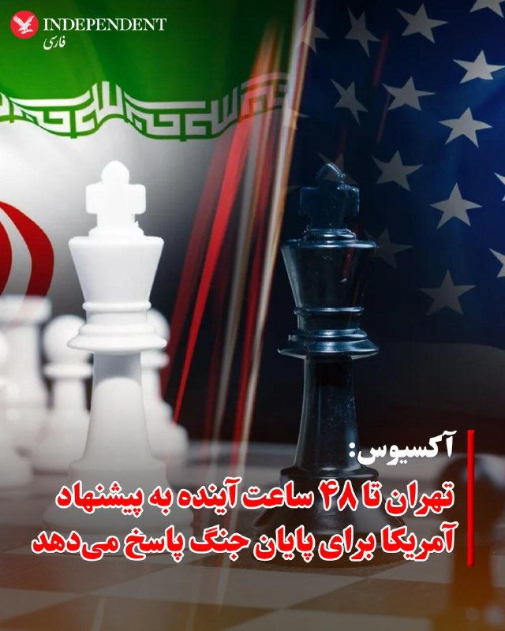

> ♦️آکسیوس پنجشنبه‌شب ۱۷ اردیبهشت‌ به نقل از مقام‌های آمریکایی گزارش داد که انتظار می‌رود تهران طی ۲۴ تا ۴۸ ساعت آینده به پیشنهاد آمریکا برای پایان جنگ و آغاز چارچوب جدید مذاکرات هسته‌ای پاسخ دهد.
> 
> یکی از مقام‌های آمریکایی به آکسیوس گفت: «ما خیلی دور نیستیم، اما هنوز توافقی حاصل نشده است.» با این حال، برخی دیگر از مقام‌های آمریکایی نسبت به دستیابی به توافق بدبین‌تر هستند.
> 
> براساس این گزارش، روند تبادل پیام‌ها میان واشنگتن و تهران کند پیش می‌رود، زیرا هر پیام باید از طریق عالی‌ترین سطوح تصمیم‌گیری در جمهوری اسلامی منتقل شود.
> 
> آکسیوس همچنین نوشت کاخ سفید امیدوار است پیش از پایان سفر دونالد ترامپ به چین در روز جمعه آینده، یک پیشرفت دیپلماتیک حاصل شود. در غیر این صورت، احتمال بررسی دوباره گزینه اقدام نظامی از سوی رئیس‌جمهوری آمریکا مطرح است.
> ‌🇸🇦 Indypersian
> 
> 🤖 @VahidOOnLine

## 1405/02/17 00:53 — BBCPersian

> 🔸تیم فوتبال پاری سن ژرمن با وجود تساوی یک بر یک برابر بایرن مونیخ، با توجه به بازی نتیجه بازی شگفت‌آور دور رفت توانست راهی فینال اروپا شود.
> 
> پاریسی‌ها که با گل دقیقه ۳ عثمان دمبله، در زمین بایرن جلو افتادند، موفق شدند تا آخرین لحظات وقت‌های تلف‌شده این برتری را حفظ کنند. اما در نهایت هری کین، «شاهزاده انگلیسی» بایرن، توانست گل تساوی را بزند تا تیم آلمانی دست کم برابر هزاران تماشاگر خود بازنده با جام خداحافظی نکند.
> 
> مسابقه رفت دو تیم که هفته پیش در پاریس برگزار شد یکی از جذاب‌ترین و پرگل‌ترین بازی‌های این فصل بود که با نتیجه ۵ بر ۴ به نفع پاری‌سن‌ژرمن تمام شده بود.
> 
> شاگردان لوئیز انریکه حالا در بازی فینال مقابل آرسنال قرار می‌گیرند.
> 
> آرسنال دیشب با برد ۱ بر صفر مقابل اتلتیکو مادرید، موفق شد پس از بیست سال دوباره به فینال جام قهرمانان اروپا برسد.
> 
> فینال این فصل ۹ خرداد در ورزشگاه پوشکاش در بوداپست برگزار می‌شود.
> 
> 📷 UEFA/UEFA via Getty Images
> @BBCPersian

## 1378/10/11 03:30 — VahidOOnLine
[🎬 Video](telegram/content/VahidOOnLine_238535_1778105771.mp4)

> دونالد ترامپ، رییس‌جمهوری ایالات متحده، چهارشنبه ۱۶ اردیبهشت در کاخ سفید، در پاسخ به سؤال خبرنگاری درباره احتمال توافق با جمهوری اسلامی گفت: «آن‌ها خیلی می‌خواهند توافق کنند و خواهیم دید که آیا به آن می‌رسیم یا نه. اگر به آن برسیم، آن‌ها نباید سلاح هسته‌ای داشته باشند. موضوع خیلی ساده است.»
> او در ادامه گفت: «رهبران آن‌ها همگی کشته شده‌اند. بنابراین فکر می‌کنم ما پیروز شدیم. حالا فقط مسئله این است که ... ببینید، اگر همین حالا ایران را ترک کنیم، ۲۰ سال طول می‌کشد تا خود را بازسازی کند.»
> ترامپ همچنین افزود: «ما در ۲۴ ساعت گذشته گفت‌وگوهای بسیار خوبی داشته‌ایم و کاملاً ممکن است که در آنجا به توافق برسیم.»
> ‌🏁 🇬🇧 IranintlTV
> 
> 🤖 @VahidOOnLine

## 1378/10/11 03:30 — VahidOOnLine
[🎬 Video](telegram/content/VahidOOnLine_238533_1778105773.mp4)

> رسانه‌ها و مقام‌های اسرائیلی اعلام کردند ارتش این کشور در حمله‌ای به حومه جنوبی بیروت، مالک بلوط، فرمانده نیروی رضوان حزب‌الله را هدف قرار داده است.
> 
> بنیامین نتانیاهو، نخست‌وزیر اسرائیل، گفت این حمله به دستور او و وزیر دفاع انجام شده تا «طرح‌های این فرمانده خنثی شود». او افزود: «نیروهای رضوان مسئول حمله به شهرک‌های اسرائیلی و آسیب رساندن به نیروهای ما هستند.»
> 
> نتانیاهو همچنین گفت: «هیچ‌کس مصونیت ندارد و دست بلند اسرائیل به هر دشمنی خواهد رسید.»
> 
> در همین حال، رسانه‌های اسرائیلی گزارش دادند ارزیابی اولیه حاکی از «موفقیت‌آمیز بودن» این عملیات است و برخی منابع گفتند مالک بلوط به همراه چند عضو دیگر کشته شده‌اند.
> 
> برخی گزارش‌ها نیز حاکی است این حمله با هماهنگی آمریکا انجام شده، هرچند جزئیات مستقلی در این باره منتشر نشده است.
> 
> رادیو ارتش اسرائیل نیز اعلام کرد ارزیابی‌ها نشان می‌دهد فرمانده نیروی رضوان کشته شده، اما معاون او در محل حضور نداشته و در این حمله آسیبی ندیده است.
> 
> به گزارش رسانه‌ها، این حمله با جنگنده‌ها و همچنین شلیک موشک به یک ساختمان مسکونی در منطقه حاره حریک در جنوب بیروت انجام شده است.
> ‌🏁 🇬🇧 ManotoTV
> 
> 🤖 @VahidOOnLine

## 1378/10/11 03:30 — VahidOOnLine
[🎬 Video](telegram/content/VahidOOnLine_238532_1778105774.mp4)

> تماسی از ایران:
> «می‌گفت عمهٔ یکی از جاویدنام‌ها هستم…
> نه گریه می‌کنم، نه عجز نشون می‌دم؛ با تمام صلابت ایستادم.
> می‌گفت تنها چیزی که حال ما رو خوب می‌کنه،
> دادخواهی خون عزیزانمونه، این حکومت باید بره»
> ‌🏁 🇬🇧 ManotoTV
> 
> 🤖 @VahidOOnLine

## 1378/10/11 03:30 — VahidOOnLine
[🎬 Video](telegram/content/VahidOOnLine_238531_1778105776.mp4)

> ‌
> امانوئل مکرون، رئیس‌جمهور فرانسه، اعلام کرد گفت‌وگوهای تازه‌ای با مسعود پزشکیان، رئیس‌جمهور جمهوری اسلامی، انجام داده است.
> 
> او گفت در این گفت‌وگو بر اهمیت بازگشایی مسیر کشتیرانی در تنگه هرمز تأکید کرده و پزشکیان را به بررسی طرح مشترک فرانسه و بریتانیا برای ایجاد یک مأموریت بین‌المللی جهت تأمین عبور امن کشتی‌ها در این آبراه تشویق کرده است.
> 
> مکرون در شبکه ایکس نوشت: «از رئیس‌جمهور ایران دعوت کردم از این فرصت استفاده کند و قصد دارم این موضوع را با رئیس‌جمهور ترامپ نیز مطرح کنم.»
> ‌🏁 🇬🇧 ManotoTV
> 
> 🤖 @VahidOOnLine

## 1378/10/11 03:30 — IranIntlTV
[🎬 Video](telegram/content/IranIntlTV_335868_1778105776.mp4)

> مراد ویسی، تحلیل‌گر ارشد ایران‌اینترنشنال، گفت: «موضع‌گیری سران اروپایی در قبال تحولات خلیج فارس و جنگ اخیر خشم گسترده‌ای ایجاد کرده است. آمریکا، اسرائیل، کشورهای عربی و حتی مردم ایران از این موضع‌گیری ناراضی‌اند. این باور در بین مردم ایران وجود دارد که بریتانیا، فرانسه و آلمان در برابر جمهوری اسلامی مماشات می‌کنند و همین مسئله خشم شدید افکار عمومی را برانگیخته است.»
> @iranintltv

## 1378/10/11 03:30 — IranIntlTV
[🎬 Video](telegram/content/IranIntlTV_335866_1778105778.mp4)

> دونالد ترامپ، رییس‌جمهوری ایالات متحده، چهارشنبه ۱۶ اردیبهشت در کاخ سفید، در پاسخ به سؤال خبرنگاری درباره احتمال توافق با جمهوری اسلامی گفت: «آن‌ها خیلی می‌خواهند توافق کنند و خواهیم دید که آیا به آن می‌رسیم یا نه. اگر به آن برسیم، آن‌ها نباید سلاح هسته‌ای داشته باشند. موضوع خیلی ساده است.»
> او در ادامه گفت: «رهبران آن‌ها همگی کشته شده‌اند. بنابراین فکر می‌کنم ما پیروز شدیم. حالا فقط مسئله این است که ... ببینید، اگر همین حالا ایران را ترک کنیم، ۲۰ سال طول می‌کشد تا خود را بازسازی کند.»
> ترامپ همچنین افزود: «ما در ۲۴ ساعت گذشته گفت‌وگوهای بسیار خوبی داشته‌ایم و کاملاً ممکن است که در آنجا به توافق برسیم.»

## 1378/10/11 03:30 — ManotoTV
[🎬 Video](telegram/content/ManotoTV_105063_1778105780.mp4)

> تماسی از تهران:
> «می‌گفت صحنه‌هایی که دیدیم شبیه جنگ بود…
> جنازه‌ها روی زمین، ترس، و زخمی که هنوز بعد از ماه‌ها خوب نشده؛ خشمش هم هنوز باهامونه.

## 1378/10/11 03:30 — ManotoTV
[🎬 Video](telegram/content/ManotoTV_105062_1778105783.mp4)

> رسانه‌ها و مقام‌های اسرائیلی اعلام کردند ارتش این کشور در حمله‌ای به حومه جنوبی بیروت، مالک بلوط، فرمانده نیروی رضوان حزب‌الله را هدف قرار داده است.
> 
> بنیامین نتانیاهو، نخست‌وزیر اسرائیل، گفت این حمله به دستور او و وزیر دفاع انجام شده تا «طرح‌های این فرمانده خنثی شود». او افزود: «نیروهای رضوان مسئول حمله به شهرک‌های اسرائیلی و آسیب رساندن به نیروهای ما هستند.»
> 
> نتانیاهو همچنین گفت: «هیچ‌کس مصونیت ندارد و دست بلند اسرائیل به هر دشمنی خواهد رسید.»
> 
> در همین حال، رسانه‌های اسرائیلی گزارش دادند ارزیابی اولیه حاکی از «موفقیت‌آمیز بودن» این عملیات است و برخی منابع گفتند مالک بلوط به همراه چند عضو دیگر کشته شده‌اند.
> 
> برخی گزارش‌ها نیز حاکی است این حمله با هماهنگی آمریکا انجام شده، هرچند جزئیات مستقلی در این باره منتشر نشده است.
> 
> رادیو ارتش اسرائیل نیز اعلام کرد ارزیابی‌ها نشان می‌دهد فرمانده نیروی رضوان کشته شده، اما معاون او در محل حضور نداشته و در این حمله آسیبی ندیده است.
> 
> به گزارش رسانه‌ها، این حمله با جنگنده‌ها و همچنین شلیک موشک به یک ساختمان مسکونی در منطقه حاره حریک در جنوب بیروت انجام شده است.

## 1378/10/11 03:30 — ManotoTV
[🎬 Video](telegram/content/ManotoTV_105061_1778105784.mp4)

> تماسی از ایران:
> «می‌گفت عمهٔ یکی از جاویدنام‌ها هستم…
> نه گریه می‌کنم، نه عجز نشون می‌دم؛ با تمام صلابت ایستادم.
> می‌گفت تنها چیزی که حال ما رو خوب می‌کنه،
> دادخواهی خون عزیزانمونه، این حکومت باید بره»

## 1378/10/11 03:30 — ManotoTV
[🎬 Video](telegram/content/ManotoTV_105060_1778105786.mp4)

> ‌
> امانوئل مکرون، رئیس‌جمهور فرانسه، اعلام کرد گفت‌وگوهای تازه‌ای با مسعود پزشکیان، رئیس‌جمهور جمهوری اسلامی، انجام داده است.
> 
> او گفت در این گفت‌وگو بر اهمیت بازگشایی مسیر کشتیرانی در تنگه هرمز تأکید کرده و پزشکیان را به بررسی طرح مشترک فرانسه و بریتانیا برای ایجاد یک مأموریت بین‌المللی جهت تأمین عبور امن کشتی‌ها در این آبراه تشویق کرده است.
> 
> مکرون در شبکه ایکس نوشت: «از رئیس‌جمهور ایران دعوت کردم از این فرصت استفاده کند و قصد دارم این موضوع را با رئیس‌جمهور ترامپ نیز مطرح کنم.»

## 1378/10/11 03:30 — IranianMinds
[🎬 Video](telegram/content/IranianMinds_19656_1778105786.mp4)

> بچه ها اسم این بازی عبور مرغ از خیابون  هست ویدئو نگاه کنید خیلی راحت 8 میلیون ازش سود گرفتیم😍
> 
> 
> 😤اگ توم دوس داری خیلی راحت از بازی های انلاین پول در بیاری حتما عضو کازینو شبانه شو
> ✅
> 
> توی کازینو شبانه بهت اموزش میدیم از بازی های انلاین پول دربیاری👌
> 
> کازینو شبانه راهی برای چند برابر کردن سرمایت 🤷‍♂
> 
> کسب درامد انلاین با یه ادم حرفه ای یاد بگیر و‌ پول دربیار 
> 💵
> ae16
> 🎯همین حالا عضو شو و شروع کن👇
> https://t.me/+OS-QBvyDO4M2ZGY0
> https://t.me/+OS-QBvyDO4M2ZGY0

## 1405/02/17 00:49 — IranIntlTV
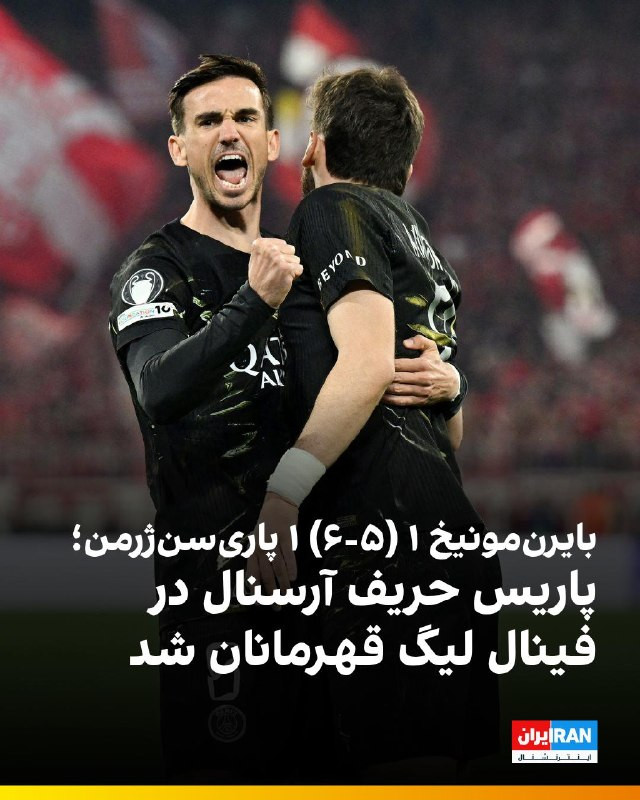

> 🔻تیم فوتبال پاری‌سن‌ژرمن با تساوی یک بر یک برابر بایرن مونیخ، حریف آرسنال در فینال لیگ قهرمانان اروپا شد. دو تیم در دیدار برگشت نیمه‌نهایی لیگ قهرمانان اروپا در ورزشگاه آلیانز آرنا به مصاف یکدیگر رفتند. شاگردان انریکه با توجه به برتری ۶ بر ۵ در مجموع دو بازی، به فینال صعود کردند.
> 
> 🔹عثمان دمبله در دقیقه ۳ تک‌گل پاری‌سن‌ژرمن را به ثمر رساند و هری کین هم در دقیقه ۴+۹۰ گل تساوی بایرن را زد.
> 
> 🔹شب گذشته آرسنال با پیروزی برابر اتلتیکو مادرید به دیدار پایانی این رقابت‌ها راه یافت.
> 
> @iranintltvsport

## 1405/02/17 00:45 — BBCPersian
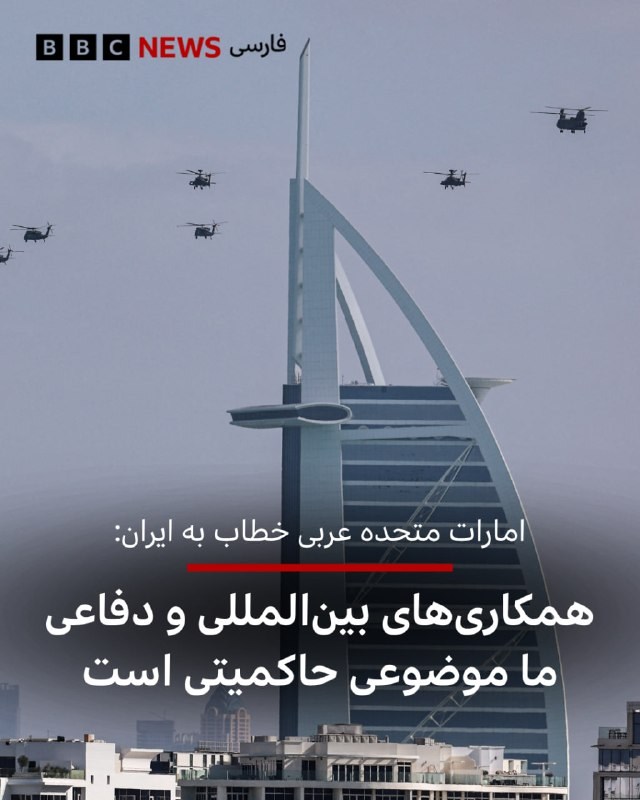

> 🔻امارات متحده عربی روز چهارشنبه با رد بیانیه جمهوری اسلامی ایران مبنی بر اینکه همکاری ابوظبی با ایالات متحده امنیت و منافع ملی ایران را تهدید می‌کند، اعلام کرد که روابط و همکاری‌های بین‌المللی و دفاعی این کشور «مسئله‌ای کاملا حاکمیتی» است.
> 
> وزارت خارجه امارات متحده عربی اعلام کرد که این کشور حقوق کامل حاکمیتی، قانونی، دیپلماتیک و نظامی خود را برای رسیدگی به هرگونه «تهدید، اتهام یا اقدام خصمانه» محفوظ می‌دارد.
> 
> همزمان نمایندگی این کشور در سازمان ملل گفته است برنامه هسته‌ای ایران نمی‌تواند از رفتار «خصمانه و تروریستی» جمهوری اسلامی در منطقه جدا در نظر گرفته شود.
> 
> تنش شدید میان امارات و جمهوری اسلامی پس از آن شدت گرفت که امارات متحده عربی پس از چهار هفته آرامش نسبی از زمان اعلام آتش‌بس توسط آمریکا، در روزهای گذشته از حمله جمهوری اسلامی خبر داد.
> 
> ایران انجام عملیات علیه امارات متحده عربی در روزهای اخیر را تکذیب کرد، اما هشدار داد که در صورت هرگونه اقدامی از سوی امارات علیه ایران، به آن«پاسخ کوبنده‌ای» به آن خواهد داد.
> 
> 📷 Getty Images
> https://bbc.in/4toGgH8
> @BBCPersian

## 1405/02/17 00:42 — FarsiVOA
> 🔺به دنبال نشانه‌های کاهش تنش میان آمریکا و جمهوری اسلامی قیمت نفت کاهش و شاخص‌های سهام افزایش یافت
> 
> ▪️قیمت نفت روز چهارشنبه در بحبوحه گزارش‌های احتمال شکل‌گیری توافق بین ایالات متحده و جمهوری اسلامی کاهش یافت؛ و همین امر باعث خوش‌بینی در بازار سهام شد.
> 
> ⬇️ بیشتر بخوانید:
> https://ir.voanews.com/a/8147330.html
> @FarsiVOA

## 1405/02/17 00:33 — kianmeli1
> ‏🔴رضایی، سخنگوی کمیسیون امنیت ملی مجلس: تمرکز ما بر مذاکرات نیست، بلکه بر قوی‌تر شدن است که اگر مجددا جنگی صورت گیرد، بتوانیم در کمترین زمان بیشترین آسیب را به «دشمن» بزنیم
> https://t.me/kianmeli1

## 1405/02/17 00:33 — kianmeli1
> ‏🔴وال‌استریت ژورنال گزارش داد دیپلمات‌های آمریکایی درباره استفاده از بازارهای پیش‌بینی آنلاین در بحبوحه مذاکرات غیرقابل‌پیش‌بینی با ایران هشدار دریافت کرده‌اند
> https://t.me/kianmeli1

## 1405/02/17 00:32 — mwarmonitor
> با فرض اینکه ایران موافقت کند آنچه را که بر سر آن توافق شده است واگذار کند - که شاید فرض بزرگی باشد - عملیات در حال حاضر افسانه‌ای «خشم حماسی» (Epic Fury) به پایان خواهد رسید و محاصره بسیار مؤثر اجازه خواهد داد که تنگه هرمز برای همه، از جمله ایران، باز باشد.…

## 1405/02/17 00:28 — kianmeli1
> 🔴آکسیوس به نقل از مقامات آمریکایی: ما انتظار داریم ظرف 24 تا 48 ساعت آینده از تهران پاسخی دریافت کنیم
> 
> ترامپ ممکن است در صورت عدم دستیابی به توافق تا پایان سفرش به چین، دستور اقدام نظامی را دوباره صادر کند.
> https://t.me/kianmeli1

## 1405/02/17 00:25 — pm_afshaa
> 🔴منابع خبری از کشته شدن «عزام الحیه» فرزند خلیل الحیه، از رهبران ارشد جنبش حماس، در حمله هوایی اسرائیل خبر دادن
> 
> 
> 💧 Rainbet.com the #1 Non-KYC Crypto Casino & Sportsbook @rainbetcom
> 
> 😁 @Pm_Afshaa

## 1405/02/17 00:25 — VahidOOnLine
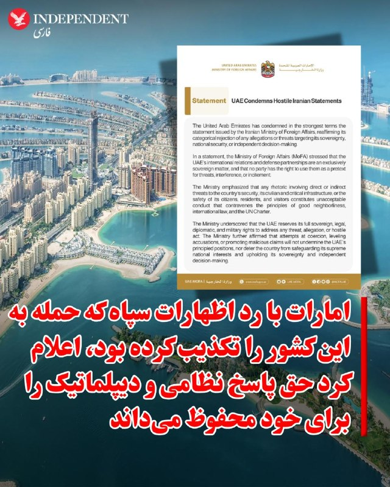

> ♦️وزارت خارجه امارات متحده عربی چهارشنبه ۱۶ اردیبهشت‌ماه، در بیانیه‌ای، اظهارات جمهوری اسلامی را که حمله یا تهدید علیه این کشور را رد کرده بود، محکوم کرد.
> 
> در این بیانیه آمده است روابط دفاعی و بین‌المللی امارات، موضوعی کاملا حاکمیتی است و هیچ طرفی حق ندارد از آن به‌عنوان بهانه‌ای برای تهدید، دخالت یا تحریک استفاده کند.
> 
> وزارت خارجه امارات همچنین تاکید کرد هرگونه تهدید مستقیم یا غیرمستقیم علیه امنیت کشور، زیرساخت‌های حیاتی و امنیت شهروندان و ساکنان، نقض اصول حسن همجواری و منشور سازمان ملل است.
> 
> این وزارتخانه افزود امارات تمامی حقوق حاکمیتی، حقوقی، دیپلماتیک و نظامی خود را برای مقابله با هرگونه تهدید یا اقدام خصمانه محفوظ می‌داند.
> 
> روز سه‌شنبه ۱۵ اردیبهشت، قرارگاه خاتم‌الانبیا ادعاهای امارات درباره حملات موشکی و پهپادی از مبدا ایران را تکذیب کرد و گفت جمهوری اسلامی در روزهای اخیر حمله‌ای علیه خاک امارات انجام نداده است.
> ‌🇸🇦 Indypersian
> 
> 🤖 @VahidOOnLine

## 1405/02/17 00:23 — pm_afshaa
> 🔴ترامپ درباره ایران:توافق انجام خواهد شد، اما هرگز ضرب‌الاجل وجود نخواهد داشت
> 
> 
> 💧 Rainbet.com the #1 Non-KYC Crypto Casino & Sportsbook @rainbetcom
> 
> 😁 @Pm_Afshaa

## 1405/02/17 00:18 — pm_afshaa
> 🔴وزیر دفاع اسرائیل از ترور فرمانده کل نیرو های ویژه رضوان حزب الله در جنوب بیروت خبر داد
> 
> 
> 💧 Rainbet.com the #1 Non-KYC Crypto Casino & Sportsbook @rainbetcom
> 
> 😁 @Pm_Afshaa

## 1405/02/17 00:16 — mwarmonitor
> ‼️جنگ فراموش کن ⚠️مقامات بهداشتی آفریقای جنوبی سویه «آندِس» از ویروس هانتا را در دو مسافری که در کشتی کروز MV Hondius حضور داشتند و دچار شیوع این عفونت شده بودند، شناسایی کرده‌اند. ⚠️مقامات سوئیسی نیز یک مورد ابتلا را در بیمارستانی در زوریخ تأیید کرده‌اند؛…

## 1405/02/17 00:14 — pm_afshaa
> 🔴سنتکام خبر داد که ساعاتی پیش یه نفتکش ایرانی رو تو دریای مکران با جنگنده F-18 موردهدف قرار داده و نذاشته به بنادر ایران برسه
> 
> 
> 💧 Rainbet.com the #1 Non-KYC Crypto Casino & Sportsbook @rainbetcom
> 
> 😁 @Pm_Afshaa

## 1405/02/17 00:12 — pm_afshaa
> 🔴ترامپ به فاکس نیوز: فقط یک هفته مهلت میدم که سرِ این معامله به نتیجه برسیم
> 
> 
> 💧 Rainbet.com the #1 Non-KYC Crypto Casino & Sportsbook @rainbetcom
> 
> 😁 @Pm_Afshaa

## 1405/02/17 00:08 — VahidOOnLine
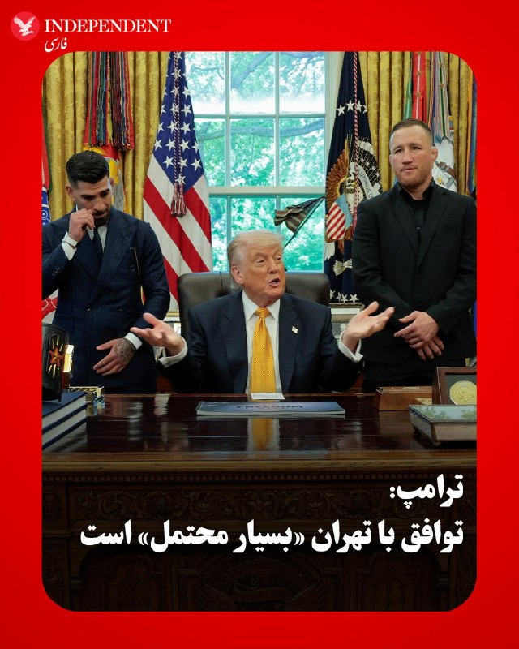

> ♦️دونالد ترامپ، رییس‌جمهوری آمریکا، روز چهارشنبه ۱۶ اردیبهشت در گفتگو با خبرنگاران در دفتر بیضی کاخ سفید گفت احتمال دستیابی به توافق با رژیم ایران «بسیار محتمل» است. ترامپ با اشاره به مذاکرات ۲۴ ساعت گذشته گفت: «گفتگوهای بسیار خوبی داشتیم و بسیار ممکن است که به توافق برسیم.»
> ترامپ تاکید کرد جمهوری اسلامی نباید به سلاح هسته‌ای دست پیدا کند و گفت: «آن‌ها به‌شدت می‌خواهند توافق کنند.»
> ‌🇸🇦 Indypersian
> 
> 🤖 @VahidOOnLine

## 1405/02/16 23:59 — mwarmonitor
> 🔴خوش‌بینی ترامپ همزمان با انتظار آمریکا برای پاسخ ایران به چارچوب صلح
> 
> 📝نوشته: باراک راوید
> 
> 🔰پرزیدنت ترامپ روز چهارشنبه اعلام کرد که ایالات متحده و ایران در ۲۴ ساعت گذشته «گفتگوهای خوبی» داشته‌اند و ابراز اطمینان کرد که دستیابی به یک توافق در روزهای آینده امکان‌پذیر است.
> 
> 
> چرا این موضوع مهم است؟
> همان‌طور که اکسیوس برای اولین بار گزارش داد، کاخ سفید در انتظار پاسخ ایران به یک یادداشت تفاهم (MOU) یک صفحه‌ای است که هدف آن پایان دادن به جنگ و تعیین چارچوبی برای مذاکرات هسته‌ای دقیق‌تر است.
> مقامات آمریکایی می‌گویند انتظار دارند تهران ظرف ۲۴ تا ۴۸ ساعت آینده پاسخ دهد.
> یک مقام آمریکایی گفت: «ما فاصله زیادی [با توافق] نداریم، اما هنوز توافقی حاصل نشده است.»
> اما: برخی دیگر از مقامات آمریکایی نسبت به نهایی شدن این توافق تردید بیشتری دارند.
> وضعیت موجود
> مقامات می‌گویند کاخ سفید خواهان یک گشایش دیپلماتیک تا پیش از پایان سفر ترامپ به چین در جمعه آینده است. اگر تا آن زمان توافقی حاصل نشود، رئیس‌جمهور ممکن است بار دیگر گزینه نظامی را مد نظر قرار دهد.
> ترامپ روز چهارشنبه در شبکه اجتماعی «تروث سوشال» نوشت: «اگر آن‌ها موافقت نکنند، بمباران آغاز خواهد شد و متأسفانه، سطح و شدت آن بسیار بالاتر از قبل خواهد بود.»
> جزئیات خبر
> این یادداشت تفاهم یک صفحه‌ای و ۱۴ ماده‌ای، توسط فرستادگان ترامپ یعنی استیو ویتکاف و جارد کوشنر با چندین مقام ایرانی (به صورت مستقیم و از طریق واسطه‌ها) در حال مذاکره است.
> محورهای احتمالی توافق:
> تعهد ایران به توقف (موراتوریوم) غنی‌سازی هسته‌ای.
> موافقت آمریکا با لغو تحریم‌ها و آزادسازی میلیاردها دلار دارایی مسدود شده ایران.
> لغو محدودیت‌های دوطرفه پیرامون تردد در تنگه هرمز.
> سخنگوی وزارت امور خارجه ایران روز چهارشنبه اعلام کرد که ایران همچنان در حال بررسی این پیشنهاد است و هنوز پاسخ خود را به واسطه‌های پاکستانی ارائه نکرده است. مقامات آمریکایی می‌گویند روند پیام‌رسانی به دلیل مسائل امنیتی و لزوم ارسال پیام‌ها به مجتبی خامنه‌ای (که در مخفیگاه به سر می‌برد) کند پیش می‌رود.
> اظهارات ترامپ
> ترامپ روز چهارشنبه لحنی خوش‌بینانه داشت، هرچند ضرب‌الاجل‌های اعلامی او کمی متغیر به نظر می‌رسید:
> او در یک مراسم در کاخ سفید گفت: «ما با افرادی طرف هستیم که بسیار مایل به توافق هستند. باید ببینیم موافقت می‌کنند یا نه؛ اگر الان موافقت نکنند، به زودی موافقت خواهند کرد.»
> او به «برت بایر» از شبکه فاکس نیوز گفت که فکر می‌کند توافق می‌تواند ظرف یک هفته حاصل شود.
> اما بعداً در دفتر بیضی به خبرنگاران گفت که ضرب‌الاجل خاصی ندارد.
> پشت صحنه
> بنیامین نتانیاهو، نخست‌وزیر اسرائیل و تیم او روز چهارشنبه چندین تماس تلفنی با ترامپ و مشاورانش برای بحث درباره مذاکرات آمریکا و ایران داشتند.
> نتانیاهو در بیانیه‌ای گفت: «هماهنگی کامل بین ما برقرار است و هیچ غافلگیری در کار نیست. ما اهداف مشترکی داریم و مهم‌ترین هدف، خروج تمامی مواد غنی‌شده از ایران و برچیدن توانمندی‌های غنی‌سازی این کشور است.»
> نکته قابل توجه
> در همین حال، ارتش اسرائیل (IDF) روز چهارشنبه حمله‌ای هوایی را در بیروت علیه دو فرمانده ارشد حزب‌الله انجام داد؛ این نخستین حمله اسرائیل به پایتخت لبنان در چند هفته اخیر بود.
> ترامپ هفته گذشته به اکسیوس گفته بود که از نتانیاهو خواسته است تنها حملات «جراحی‌شده» (دقیق و محدود) در لبنان انجام دهد.
> یک مقام ارشد اسرائیلی مدعی شد که حمله روز چهارشنبه «به صورت جراحی‌شده» انجام شده و هدف آن مقر حزب‌الله برای هدایت حملات نقض آتش‌بس بوده است.
> 
> 
> 📌چالش اصلی: ایران در مذاکرات با آمریکا خواستار توقف حملات اسرائیل به لبنان شده است. هنوز مشخص نیست که آیا حمله روز چهارشنبه بر روند مذاکرات تأثیر خواهد گذاشت یا خیر.
> 
> @mwarmonitor

## 1405/02/16 23:55 — IranIntlTV
> 🎧نسخه صوتی چشم‌انداز: تغییر جهت ناگهانی ترامپ در تنگه هرمز
> @iranintlTV

## 1405/02/16 23:53 — mwarmonitor
> 🚨به‌روزرسانی برنامه هسته‌ای ایران: مشاهده اقدامات دفاعیِ غیرفعالِ احتمالیِ جدید در کوه «پیک‌اکس»
> 
> 🔴بر اساس تصاویر ماهواره‌ای تازه‌در‌دسترس از مجموعه زیرزمینی کوه Pickaxe Mountain که درست در جنوب Natanz Nuclear Complex قرار دارد، به نظر می‌رسد که از حدود ۲۲ آوریل، دو دهانه شرقی تونل‌ها به‌طور جزئی با مواد خاکیِ خاکستری‌رنگ مسدود شده‌اند؛ موادی که برای جلوگیری از دسترسی وسایل نقلیه به هر دو دهانه به کار رفته است.
> 
> 🔴در ۱ آوریل ۲۰۲۶، ورودی‌های این تونل‌ها باز و بدون مانع بودند. برخلاف وضعیت ورودی‌های تونلی در Fordow و Esfahan، این مواد در کوه پیک‌اکس باعث انسداد کامل دهانه‌ها نشده‌اند. با این حال، به نظر می‌رسد همین میزان مسدودسازی نیز برای ایجاد اختلال جدی در ورود و خروج سریع وسایل نقلیه کافی باشد و برای بازگشایی کامل مسیر و دسترسی آزاد به داخل، نیاز به استفاده از ماشین‌آلات سنگین خاک‌برداری وجود داشته باشد.
> 
> 🔴در حال حاضر، نشانه‌ای از اجرای چنین مسدودسازی‌ای در دو دهانه غربی تونل‌ها مشاهده نمی‌شود. این فعالیت پرسش‌های مهمی را برمی‌انگیزد؛ زیرا این مجموعه تونلی در عمق زیادی قرار دارد و می‌تواند برای حفاظت از تجهیزات یا مواد ارزشمند مورد استفاده قرار گیرد.
> 
> 🔴شایان ذکر است که اوایل سال جاری مشاهده شد دهانه‌های قدیمی تونل‌های یک مجموعه مربوط به سال ۲۰۰۷ در کوه پیک‌اکس با خاک پر شده و با بتن تقویت شده‌اند؛ موضوعی که می‌تواند نشان دهد اقلام یا تجهیزات مهمی به داخل این تونل‌ها منتقل شده است.
> 
> @mwarmonitor

## 1405/02/16 23:52 — mwarmonitor
> 

## 1405/02/16 23:44 — FarsiVOA
> 🔺ترامپ: جمهوری اسلامی نمی‌تواند سلاح هسته‌ای داشته باشد و نخواهد داشت؛ رژیم خواهان توافق است
> 
> ▪️دونالد ترامپ، رئیس‌جمهوری آمریکا، روز چهارشنبه در مورد ایران با خبرنگاران در کاخ سفید گفت‌وگو کرد.
> 
> ⬇️ بیشتر بخوانید:
> https://ir.voanews.com/a/8147327.html?withmediaplayer=1
> @FarsiVOA

## 1405/02/16 23:37 — Shin_Persian
> Shin ✓ @hey_itsmyturn
> Wed, 06 May 2026 20:06:55 UTC
> 
> Jet activity over Baghdad #Iraq 🇮🇶
> 
> فارسی
> 
> فعالیت جت‌ها بر فراز بغداد #Iraq 🇮🇶
> 
> 𝕏 · @shin_persian

## 1405/02/16 23:34 — Persian_Trend_Official
> https://youtube.com/live/jOAbCViny2E?feature=share

## 1405/02/16 23:31 — VahidOOnLine
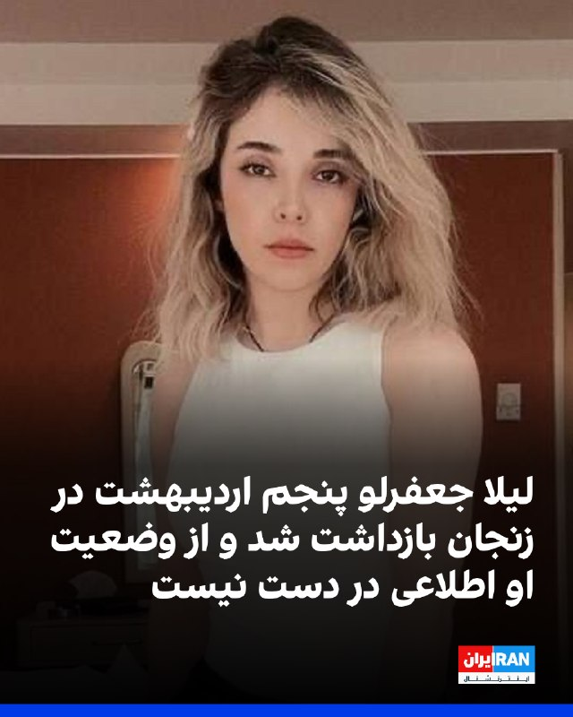

> لیلا جعفرلو، متولد سال ۱۳۶۹، پنجم اردیبهشت بازداشت شده است. تاکنون جزئیات بیشتری درباره علت بازداشت و وضعیت او منتشر نشده است. او، نخستین‌بار در بهمن‌ماه ۱۴۰۱ بازداشت شد و پس از ۴۰ روز انفرادی، در اسفندماه همان سال با وثیقه ۵۰۰ میلیون تومانی به‌طور موقت آزاد شد. پرونده لیلا جعفرلو در اواخر بهار ۱۴۰۲ به دادگاه ارجاع شد. او‌ به «تبلیغ علیه نظام» و «افشای اسناد محرمانه» متهم شد و در نهایت، دادگاه او را به سه سال حبس محکوم کرد که اجرای این حکم به مدت پنج سال به حالت تعلیق درآمد.
> ‌🏁 🇬🇧 IranintlTV
> 
> 🤖 @VahidOOnLine

## 1378/10/11 03:30 — VahidOOnLine
[🎬 Video](telegram/content/VahidOOnLine_238527_1778100935.mp4)

> ⭕️ ترامپ: جمهوری اسلامی موافقت کرده است به سمت سلاح هسته‌ای نرود
> 
> ♦️در حالی که گمانه‌زنی‌ها درباره محتوای پیشنهادهای متقابل تهران و واشنگتن برای ازسرگیری مذاکرات ادامه دارد، دونالد ترامپ در پاسخ به خبرنگاران تاکید کرد که جمهوری اسلامی با دست نیافتن به سلاح هسته‌ای «موافقت کرده است». او تاکید کرد که ایران «نمی‌تواند و نخواهد توانست» به سلاح هسته‌ای دست یابد و این موضوع را بخشی از تفاهمات مطرح‌شده دانست، هرچند جزئیات بیشتری ارائه نکرد.
> آکسیوس پیش‌تر گزارش داده بود که در یکی از بندهای پیشنهاد آمریکا، توقف غنی‌سازی در مقابل رفع تدریجی تحریم‌ها مطرح شده است.
> این در حالی است که پیش‌تر مقامات جمهوری اسلامی هرگونه مذاکره درباره توقف غنی‌سازی را رد کرده بودند و بر ادامه این برنامه در چارچوب سیاست‌های اعلامی تاکید داشتند.
> ‌🇸🇦 Indypersian
> 
> 🤖 @VahidOOnLine

## 1378/10/11 03:30 — VahidOOnLine
> ♦️دونالد ترامپ، رئیس‌جمهوری آمریکا، روز چهارشنبه ۱۶ اردیبهشت، در دفتر بیضی کاخ سفید با ابراز خوش‌بینی نسبت به پایان جنگ، از پیشرفت جدی در روند مذاکرات خبر داد. او تاکید کرد که در ۴۴ ساعت گذشته گفتگوهای بسیار مثبتی با مقام‌های جمهوری اسلامی انجام شده و دستیابی به یک توافق نهایی «بسیار محتمل» است.
> 
> ترامپ با اشاره به وضعیت نظامی کنونی گفت که توان دفاعی ایران به‌شدت کاهش یافته و نیروهای هوایی و دریایی این کشور عملا از کار افتاده‌اند. او با بیان اینکه «ما پیروز شده‌ایم»، اعلام کرد که جمهوری اسلامی اکنون تمایل زیادی برای دستیابی به توافق دارد.
> 
> رئیس‌جمهوری آمریکا شرط اصلی هرگونه توافق را دست نیافتن ایران به سلاح هسته‌ای و خروج ذخایر اورانیوم غنی‌شده از این کشور عنوان کرد. او هشدار داد که اگرچه به دیپلماسی امیدوار است، اما در صورت شکست مذاکرات، ایالات متحده آماده است تا گام‌های نظامی بسیار بزرگ‌تری بردارد.
> ‌🇸🇦 Indypersian
> 
> 🤖 @VahidOOnLine

## 1378/10/11 03:30 — VahidOOnLine
[🎬 Video](telegram/content/VahidOOnLine_238525_1778100937.mp4)

> ‌
> مقام‌های اسرائیلی اعلام کردند عزام الحیه، پسر خلیل الحیه، رهبر گروه تروریستی حماس در غزه، در حمله‌ای هوایی کشته شده است.
> 
> به گفته این مقام‌ها، عزام الحیه از اعضای یگان «نخبه» حماس بوده است.
> 
> پیش‌تر رسانه‌های فلسطینی گزارش داده بودند او در این حمله به‌شدت زخمی شده، اما مقام‌های اسرائیلی بعداً گفتند که او جان خود را از دست داده است.
> ‌🏁 🇬🇧 ManotoTV
> 
> 🤖 @VahidOOnLine

## 1378/10/11 03:30 — VahidOOnLine
[🎬 Video](telegram/content/VahidOOnLine_238524_1778100938.mp4)

> ‌
> دونالد ترامپ در اشاره به جنگ با جمهوری اسلامی گفت: «فکر می‌کنم ما پیروز شدیم» و افزود در صورت ترک منطقه، «بازسازی ایران ۲۰ سال زمان خواهد برد.»
> ترامپ در ادامه گفت: «ما در وضعیت خوبی هستیم و حالا باید آنچه را می‌خواهیم به دست بیاوریم؛ اگر این اتفاق نیفتد، باید یک گام بزرگ‌تر برداریم.»
> او همچنین از «گفت‌وگوهای بسیار خوب» در ۲۴ ساعت گذشته خبر داد و گفت احتمال دستیابی به توافق وجود دارد، هرچند به گفته او، طرف مقابل گاهی «مواضع خود را تغییر می‌دهد.»
> رئیس‌جمهور آمریکا با اشاره به شرایط اقتصادی و بازارها گفت برخلاف پیش‌بینی‌ها، بازار سهام به بالاترین سطح خود رسیده و قیمت نفت نیز کمتر از انتظار افزایش یافته است.
> ترامپ در پایان بار دیگر تأکید کرد: «ایران نمی‌تواند سلاح هسته‌ای داشته باشد» و گفت در مذاکرات، این موضوع از محورهای اصلی است.
> ‌🏁 🇬🇧 ManotoTV
> 
> 🤖 @VahidOOnLine

## 1378/10/11 03:30 — mamlekate
[🎬 Video](telegram/content/mamlekate_103461_1778100941.mp4)

> 📝 در حالی که گمانه‌زنی‌ها درباره محتوای پیشنهادهای متقابل تهران و واشنگتن برای ازسرگیری مذاکرات ادامه دارد، دونالد ترامپ در پاسخ به خبرنگاران تاکید کرد که جمهوری اسلامی با دست نیافتن به سلاح هسته‌ای «موافقت کرده است». او تاکید کرد که ایران «نمی‌تواند و نخواهد توانست» به سلاح هسته‌ای دست یابد و این موضوع را بخشی از تفاهمات مطرح‌شده دانست، هرچند جزئیات بیشتری ارائه نکرد.
> 
> آکسیوس پیش‌تر گزارش داده بود که در یکی از بندهای پیشنهاد آمریکا، توقف غنی‌سازی در مقابل رفع تدریجی تحریم‌ها مطرح شده است. این در حالی است که پیش‌تر مقامات جمهوری اسلامی هرگونه مذاکره درباره توقف غنی‌سازی را رد کرده بودند و بر ادامه این برنامه در چارچوب سیاست‌های اعلامی تاکید داشتند.
> 
> 📝 دونالد ترامپ، رئیس‌جمهوری آمریکا، روز چهارشنبه ۱۶ اردیبهشت، در دفتر بیضی کاخ سفید با ابراز خوش‌بینی نسبت به پایان جنگ، از پیشرفت جدی در روند مذاکرات خبر داد. او تاکید کرد که در ۴۴ ساعت گذشته گفتگوهای بسیار مثبتی با مقام‌های جمهوری اسلامی انجام شده و دستیابی به یک توافق نهایی «بسیار محتمل» است.
> 
> ترامپ با اشاره به وضعیت نظامی کنونی گفت که توان دفاعی ایران به‌شدت کاهش یافته و نیروهای هوایی و دریایی این کشور عملا از کار افتاده‌اند. او با بیان اینکه «ما پیروز شده‌ایم»، اعلام کرد که جمهوری اسلامی اکنون تمایل زیادی برای دستیابی به توافق دارد.
> 
> رئیس‌جمهوری آمریکا شرط اصلی هرگونه توافق را دست نیافتن ایران به سلاح هسته‌ای و خروج ذخایر اورانیوم غنی‌شده از این کشور عنوان کرد. او هشدار داد که اگرچه به دیپلماسی امیدوار است، اما در صورت شکست مذاکرات، ایالات متحده آماده است تا گام‌های نظامی بسیار بزرگ‌تری بردارد.
> 
> indypersian
> @mamlekate

## 1378/10/11 03:30 — VahidOnline
[🎬 Video](telegram/content/VahidOnline_75290_1778100943.mp4)

> دونالد ترامپ، رئیس‌جمهور ایالات متحده، شامگاه چهارشنبه گفت که پس از «گفت‌وگوهای بسیار خوب» در ۲۴ ساعت گذشته، دستیابی به توافقی با ایران برای پایان دادن به جنگ «بسیار محتمل» است.
> @VahidHeadline
> ترامپ با اشاره به وضعیت نظامی کنونی گفت که توان دفاعی ایران به‌شدت کاهش یافته و نیروهای هوایی و دریایی این کشور عملا از کار افتاده‌اند. او با بیان اینکه «ما پیروز شده‌ایم»، اعلام کرد که جمهوری اسلامی اکنون تمایل زیادی برای دستیابی به توافق دارد.
> رئیس‌جمهوری آمریکا شرط اصلی هرگونه توافق را دست نیافتن ایران به سلاح هسته‌ای و خروج ذخایر اورانیوم غنی‌شده از این کشور عنوان کرد.
> @VahidOOnLine
> او تاکید کرد که ایران «نمی‌تواند و نخواهد توانست» به سلاح هسته‌ای دست یابد و این موضوع را بخشی از تفاهمات مطرح‌شده دانست، هرچند جزئیات بیشتری ارائه نکرد.
> آکسیوس پیش‌تر گزارش داده بود که در یکی از بندهای پیشنهاد آمریکا، توقف غنی‌سازی در مقابل رفع تدریجی تحریم‌ها مطرح شده است.
> این در حالی است که پیش‌تر مقامات جمهوری اسلامی هرگونه مذاکره درباره توقف غنی‌سازی را رد کرده بودند و بر ادامه این برنامه در چارچوب سیاست‌های اعلامی تاکید داشتند.
> @VahidOOnLine
> ترامپ گفت: «ما در وضعیت خوبی هستیم و حالا باید آنچه را می‌خواهیم به دست بیاوریم؛ اگر این اتفاق نیفتد، باید یک گام بزرگ‌تر برداریم.»
> @VahidOOnLine
> 
> 📡 @VahidOnline

## 1378/10/11 03:30 — kianmeli1
[🎬 Video](telegram/content/kianmeli1_87196_1778100943.mp4)

> 🔴توهمات ترامپ همچنان ادامه دارد
> 
> ادعای ترامپ در مصاحبه با خبرنگاران: موشک‌های ایران عمدتا نابود شده‌اند. احتمالا حدود ۱۸ تا ۱۹ درصد از آنها باقی مانده است؛ در مقایسه با آنچه قبلا داشتند، مقدار زیادی نیست
> https://t.me/kianmeli1

## 1378/10/11 03:30 — IranIntlTV
[🎬 Video](telegram/content/IranIntlTV_335863_1778100945.mp4)

> بحرین و امارات متحده عربی خواهان واکنش قاطع جامعه جهانی در قبال حملات جمهوری اسلامی شدند و تهران را به باج‌گیری از اقتصاد جهانی متهم کردند. همزمان اختلاف رویکرد میان کشورهای عربی درباره نحوه مواجهه با جمهوری اسلامی افزایش یافته است.
> 
> گفت‌وگو با علی صدرزاده، تحلیل‌گر مسائل خاورمیانه
> @iranintltv

## 1378/10/11 03:30 — IranIntlTV
[🎬 Video](telegram/content/IranIntlTV_335862_1778100947.mp4)

> بر اساس تصاویر ماهواره‌ای که واشینگتن‌پست منتشر کرده، در حملات جمهوری اسلامی به مواضع آمریکا در منطقه خاورمیانه، دست‌کم ۲۲۸ هدف در کشورهایی مانند کویت، قطر و عراق آسیب دیده‌اند.
> گفت‌وگو با فرزین ندیمی، پژوهشگر ارشد امور دفاعی و امنیتی در موسسه واشینگتن
> @iranintltv

## 1378/10/11 03:30 — RadioFarda
> 🔸دونالد ترامپ، رئیس‌جمهور ایالات متحده، شامگاه چهارشنبه گفت که پس از «گفت‌وگوهای بسیار خوب» در ۲۴ ساعت گذشته، دستیابی به توافقی با ایران برای پایان دادن به جنگ «بسیار محتمل» است.
> 
> 🔸ترامپ در دفتر بیضی کاخ سفید به خبرنگاران گفت: «در ۲۴ ساعت گذشته گفت‌وگوهای بسیار خوبی داشته‌ایم و بسیار محتمل است که به یک توافق برسیم.»
> 
> 🔸این چندمین موضع‌گیری رئیس‌جمهور آمریکا درباره روند مذاکرات با ایران در این روز بود. او ساعتی پیش‌تر در سخنرانی خود در کاخ سفید گفت: «ما با افرادی (در ایران) سر و کار داریم که بسیار خواهان رسیدن به توافق هستند.»
> 
> 🔸ترامپ پیش از آن نیز با انتشار پیامی در شبکه اجتماعی خود تهدید کرد که اگر ایران تن به توافق ندهد، «بمباران آغاز می‌شود و متأسفانه این بار با سطح و شدتی بسیار فراتر از گذشته خواهد بود».
> 
> 🔸وب‌سایت اکسیوس و خبرگزاری رویترز روز چهارشنبه به شکل جداگانه به نقل از منابع آگاه اعلام کردند واشینگتن و تهران به یک یادداشت تفاهم یک‌صفحه‌ای برای پایان دادن به جنگ نزدیک شده‌اند.
> 
> 🔸این در حالی است که سخنگوی وزارت خارجه جمهوری اسلامی گفته است تهران هنوز در حال بررسی پیشنهاد آمریکا است.
> 
> @RadioFarda

## 1378/10/11 03:30 — IranianMinds
[🎬 Video](telegram/content/IranianMinds_19655_1778100950.mp4)

> 🔴 خبرنگار: شما در ایران با حریفی روبرو هستید که حاضر به تسلیم نشده است.
> 
> ترامپ: چرا می گویید آنها از تسلیم شدن خودداری می کنند؟ شما این را نمی دانید.
> 
> خبرنگار: آنها چند روز پیش به سمت کشتی های آمریکایی شلیک کردند.
> 
> ترامپ: چند روز پیش، زمان زیادی است. اونا الان خیلی به دنبال اینن معامله کنند.
> 
> @IranianMinds

## 1378/10/11 03:30 — IranianMinds
[🎬 Video](telegram/content/IranianMinds_19654_1778100953.mp4)

> 🔴 ترامپ:
> 
> چه من پاپ را خوشحال کنم یا نه، ایران نمی تواند سلاح هسته ای داشته باشد.
> 
> به نظر می رسید او می گفت که آنها می توانند. من می گویم آنها نمی توانند.
> 
> @IranianMinds

## 1378/10/11 03:30 — IranianMinds
[🎬 Video](telegram/content/IranianMinds_19653_1778100955.mp4)

> 🔴 ترامپ درباره ایران:
> 
> ما در 24 ساعت گذشته صحبت های بسیار خوبی داشته ایم.
> 
> @IranianMinds

## 1405/02/16 23:31 — IranIntlTV

> لیلا جعفرلو، متولد سال ۱۳۶۹، پنجم اردیبهشت بازداشت شده است. تاکنون جزئیات بیشتری درباره علت بازداشت و وضعیت او منتشر نشده است. او، نخستین‌بار در بهمن‌ماه ۱۴۰۱ بازداشت شد و پس از ۴۰ روز انفرادی، در اسفندماه همان سال با وثیقه ۵۰۰ میلیون تومانی به‌طور موقت آزاد شد. پرونده لیلا جعفرلو در اواخر بهار ۱۴۰۲ به دادگاه ارجاع شد. او‌ به «تبلیغ علیه نظام» و «افشای اسناد محرمانه» متهم شد و در نهایت، دادگاه او را به سه سال حبس محکوم کرد که اجرای این حکم به مدت پنج سال به حالت تعلیق درآمد.
> https://iranintl.com/202605069054

## 1405/02/16 23:29 — BBCPersian
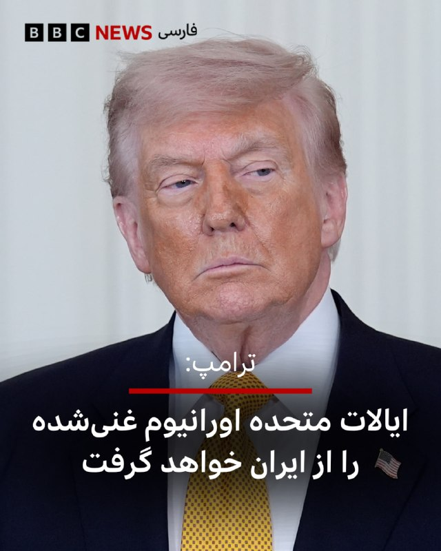

> 🔻دونالد ترامپ، رئیس جمهور آمریکا، روز چهارشنبه گفت که ایالات متحده اورانیوم غنی‌شده را از ایران خواهد گرفت. این در حالیست که دو کشور برای دستیابی به توافقی برای پایان دادن به جنگ در خلیج فارس تلاش می‌کنند.
> 
> آقای ترامپ هنگام ترک یک مراسم در کاخ سفید به خبرنگاری گفت: «ما آن را خواهیم گرفت.»
> 
> یکی از اهداف اصلی دونالد ترامپ در حملات نظامی به ایران، اطمینان از عدم توسعه سلاح هسته‌ای بود.
> 
> پیشتر بنیامین نتانیاهو، نخست‌وزیر اسرائیل، در آغاز جلسه کابینه خود امروز (چهارشنبه) به موضوع ایران و همکاری با آمریکا در این زمینه اشاره کرده بود.
> 
> آقای نتانیاهو با اشاره به آمریکا گفت: «ما اهداف مشترکی داریم و مهمترین هدف، خارج کردن تمام مواد غنی‌شده از ایران و برچیدن قابلیت‌های غنی‌سازی ایران است.»
> 
> ایران هنوز بیش از چهارصد کیلوگرم اورانیوم غنی‌شده با خلوص بالا را در اختیار دارد.
> 
> 📷 Bloomberg via Getty Images
> https://bbc.in/4cTCoJb
> @BBCPersian

## 1378/10/11 03:30 — ManotoTV
[🎬 Video](telegram/content/ManotoTV_105059_1778097756.mp4)

> ‌
> مقام‌های اسرائیلی اعلام کردند عزام الحیه، پسر خلیل الحیه، رهبر گروه تروریستی حماس در غزه، در حمله‌ای هوایی کشته شده است.
> 
> به گفته این مقام‌ها، عزام الحیه از اعضای یگان «نخبه» حماس بوده است.
> 
> پیش‌تر رسانه‌های فلسطینی گزارش داده بودند او در این حمله به‌شدت زخمی شده، اما مقام‌های اسرائیلی بعداً گفتند که او جان خود را از دست داده است.

## 1378/10/11 03:30 — ManotoTV
[🎬 Video](telegram/content/ManotoTV_105058_1778097757.mp4)

> ‌
> دونالد ترامپ در اشاره به جنگ با جمهوری اسلامی گفت: «فکر می‌کنم ما پیروز شدیم» و افزود در صورت ترک منطقه، «بازسازی ایران ۲۰ سال زمان خواهد برد.»
> ترامپ در ادامه گفت: «ما در وضعیت خوبی هستیم و حالا باید آنچه را می‌خواهیم به دست بیاوریم؛ اگر این اتفاق نیفتد، باید یک گام بزرگ‌تر برداریم.»
> او همچنین از «گفت‌وگوهای بسیار خوب» در ۲۴ ساعت گذشته خبر داد و گفت احتمال دستیابی به توافق وجود دارد، هرچند به گفته او، طرف مقابل گاهی «مواضع خود را تغییر می‌دهد.»
> رئیس‌جمهور آمریکا با اشاره به شرایط اقتصادی و بازارها گفت برخلاف پیش‌بینی‌ها، بازار سهام به بالاترین سطح خود رسیده و قیمت نفت نیز کمتر از انتظار افزایش یافته است.
> ترامپ در پایان بار دیگر تأکید کرد: «ایران نمی‌تواند سلاح هسته‌ای داشته باشد» و گفت در مذاکرات، این موضوع از محورهای اصلی است.

## 1405/02/16 23:20 — VahidOOnLine

> همزمان با پایان نشست غیرعلنی شورای امنیت درباره بحران خاورمیانه، حساب رسمی نمایندگی دائم جمهوری اسلامی در سازمان ملل در شبکه اجتماعی ایکس، آمریکا را به مانع‌تراشی در مسیر حل بحران متهم کرد و پیش‌نویس قطعنامه پیشنهادی در این جلسه را «معیوب» و متاثر از «انگیزه‌های سیاسی» خواند.
> 
> در این پست آمده است: «آمریکا با پیش کشیدن پیش‌نویس قطعنامه‌ای معیوب و با انگیزه‌های سیاسی در شورای امنیت سازمان ملل، آن هم به بهانه «آزادی کشتیرانی»، در پی پیشبرد دستور کار سیاسی خود و مشروعیت‌بخشی به اقدامات غیرقانونی است؛ نه حل بحران.»
> 
> نمایندگی دائم جمهوری اسلامی در سازمان ملل «تنها راه‌حل عملی» برای پایان دادن به بحران کشتیرانی در تنگه هرمز را «پایان دائمی جنگ و، رفع محاصره دریایی» خواند.
> 
> این نمایندگی همچنین از کشورهای عضو شورای امنیت خواست بر پایه «منطق، انصاف و اصول» عمل کنند، این پیش‌نویس را رد کنند و از حمایت از آن بپرهیزند.
> ‌🏁 🇬🇧 IranintlTV
> 
> 🤖 @VahidOOnLine

## 1405/02/16 23:19 — IranIntlTV

> همزمان با پایان نشست غیرعلنی شورای امنیت درباره بحران خاورمیانه، حساب رسمی نمایندگی دائم جمهوری اسلامی در سازمان ملل در شبکه اجتماعی ایکس، آمریکا را به مانع‌تراشی در مسیر حل بحران متهم کرد و پیش‌نویس قطعنامه پیشنهادی در این جلسه را «معیوب» و متاثر از «انگیزه‌های سیاسی» خواند.
> 
> در این پست آمده است: «آمریکا با پیش کشیدن پیش‌نویس قطعنامه‌ای معیوب و با انگیزه‌های سیاسی در شورای امنیت سازمان ملل، آن هم به بهانه «آزادی کشتیرانی»، در پی پیشبرد دستور کار سیاسی خود و مشروعیت‌بخشی به اقدامات غیرقانونی است؛ نه حل بحران.»
> 
> نمایندگی دائم جمهوری اسلامی در سازمان ملل «تنها راه‌حل عملی» برای پایان دادن به بحران کشتیرانی در تنگه هرمز را «پایان دائمی جنگ و، رفع محاصره دریایی» خواند.
> 
> این نمایندگی همچنین از کشورهای عضو شورای امنیت خواست بر پایه «منطق، انصاف و اصول» عمل کنند، این پیش‌نویس را رد کنند و از حمایت از آن بپرهیزند.
> https://iranintl.com/202605063241

## 1405/02/16 23:19 — IranianMinds
> 🔴منابع عربی:
> 
> ایران پیامی فوری به واسطه پاکستانی درباره ترور در بیروت ارسال کرد.
> 
> @IranianMinds

## 1405/02/16 23:15 — IranIntlTV
> 🎧نسخه صوتی ‌‌‏۲۴ با فرداد فرحزاد: پیام‌های متناقض ترامپ در میانه جنگ و صلح با جمهوری اسلامی
> @iranintlTV

## 1405/02/16 23:14 — VahidOOnLine

> به گزارش کانال ۱۲ اسرائیل، دیوید آلبرایت، بازرس پیشین هسته‌ای سازمان ملل و رییس موسسه «علوم و امنیت بین‌الملل»، گفت هرگونه توافق هسته‌ای با جمهوری اسلامی باید شامل خروج کامل همه ذخایر اورانیوم غنی‌شده باشد، نه فقط ذخایر با غنای بالا.
> 
> او هم‌زمان با افزایش تلاش‌های آمریکا برای دستیابی به توافق با تهران افزود هدف باید خارج کردن تمام ۱۰ تن اورانیوم غنی‌شده از ایران باشد و تاکید کرد باقی ماندن بخش قابل توجهی از این ذخایر به معنای توافقی بد خواهد بود.
> ‌🏁 🇬🇧 IranintlTV
> 
> 🤖 @VahidOOnLine

## 1405/02/16 23:13 — IranIntlTV

> به گزارش کانال ۱۲ اسرائیل، دیوید آلبرایت، بازرس پیشین هسته‌ای سازمان ملل و رییس موسسه «علوم و امنیت بین‌الملل»، گفت هرگونه توافق هسته‌ای با جمهوری اسلامی باید شامل خروج کامل همه ذخایر اورانیوم غنی‌شده باشد، نه فقط ذخایر با غنای بالا.
> 
> او هم‌زمان با افزایش تلاش‌های آمریکا برای دستیابی به توافق با تهران افزود هدف باید خارج کردن تمام ۱۰ تن اورانیوم غنی‌شده از ایران باشد و تاکید کرد باقی ماندن بخش قابل توجهی از این ذخایر به معنای توافقی بد خواهد بود.
> https://iranintl.com/202605065384

## 1405/02/16 23:10 — VahidOOnLine

> ♦️وبسایت آکسیوس، روز چهارشنبه ۱۶ اردیبهشت در گزارشی اختصاصی جزئیاتی از یادداشت تفاهمی که از سوی واشنگتن به تهران پیشنهاد شده را ارائه داد.
> 
> به گفته آکسیوس، این یادداشت تفاهم (MOU) تک‌صفحه‌ای و ۱۴ ماده‌ای، بین فرستادگان ترامپ، استیو ویتکوف و جرد کوشنر، و چندین مقام جمهوری اسلامی به‌صورت مستقیم و از طریق میانجی‌ها در حال مذاکره است.
> 
> در شکل فعلی، این یادداشت تفاهم پایان جنگ در منطقه و آغاز یک دوره ۳۰ روزه مذاکره برای دستیابی به توافقی دقیق جهت بازگشایی تنگه، محدود کردن برنامه هسته‌ای ایران و لغو تحریم‌های ایالات متحده را اعلام می‌کند. به گفته دو منبع آگاه، این مذاکرات ممکن است در اسلام‌آباد یا ژنو برگزار شود.
> 
> یک مقام آمریکایی به آکسیوس گفت که محدودیت‌های ایران بر کشتیرانی در تنگه و محاصره دریایی ایالات متحده، در طول این دوره ۳۰ روزه به تدریج لغو خواهند شد. این مقام افزود در صورت شکست مذاکرات، نیروهای آمریکایی قادر خواهند بود محاصره را بازگردانده یا اقدامات نظامی را از سر بگیرند.
> ‌🇸🇦 Indypersian
> 
> 🤖 @VahidOOnLine

## 1405/02/16 23:09 — DEJradio

> 🤡
> 🔺 محسن رضایی: باید در میدان جنگ با آمریکایی‌ها به تنیجه برسیم
> 
> محسن رضایی در گفتگویی با اشاره به تحولات اخیر منطقه، مدعی شد که جمهوری اسلامی اجازه نخواهد داد واشنگتن بدون پرداخت هزینه از بحران خارج شود.
> 
> رضایی افزود: «اینجا میدان جنگ است و باید در مواجهه با آمریکایی‌ها به نتیجه نهایی برسیم و دستاوردهای خود را از این جنگ برداشت کنیم.»
> 
> پیش از این ترامپ گفته بود لحن و گفتار مقامات جمهوری اسلامی در صحبت‌های تلفنی با او بسیار متفاوت از حرف های آنها در رسانه هاست. او تاکید کرده بود که مقامات جمهوری اسلامی از هر راهی تلاش می‌کنند تا با دولت ترامپ به توافق برسند.
> 
> #حملات_هدفمند #جمهوری_اسلامی
> @DEJradio

## 1405/02/16 23:07 — VahidOOnLine

> نمایندگی امارات متحده عربی در سازمان ملل، چهارشنبه ۱۶ اردیبهشت، با انتشار پستی در شبکه اجتماعی ایکس، با اشاره به مباحث کمیته‌های اول و دوم کنفرانس بازنگری پیمان منع گسترش سلاح‌های هسته‌ای، ان‌پی‌تی، اعلام کرد برنامه هسته‌ای ایران را نمی‌توان از «رفتارهای خصمانه و تروریستی» تهران در منطقه جدا دانست.
> 
> امارات متحده عربی تاکید کرد هرگونه گفت‌وگو درباره پرونده هسته‌ای جمهوری اسلامی باید تهدیدهای موجود را به‌طور کامل در نظر بگیرد.
> 
> این کشور همچنین حملات اخیر منتسب به حکومت ایران علیه تاسیسات حیاتی غیرنظامی را محکوم کرد و آن را «تشدیدی خطرناک» خواند.
> 
> نمایندگی امارات متحده عربی از جامعه جهانی خواست رویکردی جامع در قبال تهران در پیش بگیرد؛ رویکردی که هم‌زمان برنامه هسته‌ای، برنامه موشکی و رفتارهای بی‌ثبات‌کننده جمهوری اسلامی را شامل شود.
> 
> امارات متحده عربی همچنین درباره غنی‌سازی ۶۰ درصدی اورانیوم هشدار داد و گفت این سطح از غنی‌سازی تهدیدی برای امنیت منطقه‌ای و بین‌المللی است.
> ‌🏁 🇬🇧 IranintlTV
> 
> 🤖 @VahidOOnLine

## 1405/02/16 23:06 — IranIntlTV

> نمایندگی امارات متحده عربی در سازمان ملل، چهارشنبه ۱۶ اردیبهشت، با انتشار پستی در شبکه اجتماعی ایکس، با اشاره به مباحث کمیته‌های اول و دوم کنفرانس بازنگری پیمان منع گسترش سلاح‌های هسته‌ای، ان‌پی‌تی، اعلام کرد برنامه هسته‌ای ایران را نمی‌توان از «رفتارهای خصمانه و تروریستی» تهران در منطقه جدا دانست.
> 
> امارات متحده عربی تاکید کرد هرگونه گفت‌وگو درباره پرونده هسته‌ای جمهوری اسلامی باید تهدیدهای موجود را به‌طور کامل در نظر بگیرد.
> 
> این کشور همچنین حملات اخیر منتسب به حکومت ایران علیه تاسیسات حیاتی غیرنظامی را محکوم کرد و آن را «تشدیدی خطرناک» خواند.
> 
> نمایندگی امارات متحده عربی از جامعه جهانی خواست رویکردی جامع در قبال تهران در پیش بگیرد؛ رویکردی که هم‌زمان برنامه هسته‌ای، برنامه موشکی و رفتارهای بی‌ثبات‌کننده جمهوری اسلامی را شامل شود.
> 
> امارات متحده عربی همچنین درباره غنی‌سازی ۶۰ درصدی اورانیوم هشدار داد و گفت این سطح از غنی‌سازی تهدیدی برای امنیت منطقه‌ای و بین‌المللی است.

## 1405/02/16 23:04 — Persian_Trend_Official
> حدود نیم ساعت دیگه لایو داریم

## 1405/02/16 23:03 — IranianMinds
> 🔴یسرائیل کاتز وزیر دفاع اسرائیل ، از ترور هدفمند فرمانده گردان رضوان، مالک بلوت در بیروت خبر داد.
> 
> @IranianMinds

## 1405/02/16 22:57 — Hranews

> فدراسیون مدیریت و مشاوران کسب‌وکار ایران با انتشار بیانیه‌ای نسبت به تداوم محدودیت‌ها و سیاست‌های تبعیض‌آمیز اینترنتی هشدار داد و اعلام کرد که اینترنت دیگر صرفاً یک ابزار ارتباطی نیست، بلکه زیرساخت حیاتی اقتصاد دیجیتال محسوب می‌شود. در این بیانیه تأکید شده که اختلال و بی‌ثباتی در دسترسی به #اینترنت، مستقیماً بر تولید، اشتغال، سرمایه‌گذاری و رقابت‌پذیری اقتصاد کشور تأثیر می‌گذارد و بسیاری از کسب‌وکارهای دیجیتال را با کوچک شدن یا نابودی مواجه کرده است. به گفته این فدراسیون، وضعیت موجود می‌تواند به شکل‌گیری موجی از بیکاری تدریجی منجر شود که از لایه‌های پنهان آغاز شده و به‌مرور به سطح جامعه منتقل می‌شود.
> 
> در بخش دیگری از این بیانیه، نسبت به پیامدهای بلندمدت این وضعیت بر سرمایه انسانی هشدار داده شده و آمده است که بی‌ثباتی مداوم اینترنت، فعالیت نیروهای متخصص را مختل کرده و تصمیم آنها برای ماندن در کشور را تغییر می‌دهد. این فدراسیون همچنین تأکید کرده که سیاست‌هایی مانند «اینترنت طبقاتی» نه‌تنها مشکلات موجود را حل نمی‌کند، بلکه به تشدید نابرابری، افزایش رانت و تضعیف رقابت در اقتصاد دیجیتال منجر خواهد شد.
> 
> ↘️
> @hranews_bot تماس ✉️ -  @Hranews  کانال هرانا 🆑

## 1405/02/16 22:56 — VahidOOnLine

> ایال زمیر، رئیس ستاد ارتش اسرائیل گفت مجموعه‌ای از اهداف بیشتری برای حمله در ایران آماده شده است و این کشور در «بالاترین سطح آماده‌باش» قرار دارد تا در صورت لزوم عملیات گسترده‌تری را از سر بگیرد.
> 
> رئیس ستاد ارتش اسرائیل پس از بازدید از جنوب لبنان به کشته شدن «بیش از ۲ هزار» عضو حزب‌الله اشاره کرد و گفت:
> «ما یک فرصت تاریخی برای تغییر واقعیت منطقه‌ای در چارچوب یک عملیات چندجبهه‌ای داریم. همکاری و هماهنگی با ارتش آمریکا ادامه دارد و ما وضعیت را زیر نظر داریم.»
> ‌🏁 🇬🇧 ManotoTV
> 
> 🤖 @VahidOOnLine

## 1405/02/16 22:56 — VahidOOnLine

> وزارت امور خارجه امارات متحده عربی در بیانیه‌ای اظهارات اخیر وزارت امور خارجه جمهوری اسلامی را «خصمانه» خواند و آن را به‌شدت محکوم کرد.
> 
> در این بیانیه تأکید شده امارات هرگونه ادعا یا تهدید علیه حاکمیت، امنیت ملی و استقلال تصمیم‌گیری خود را «به‌طور قاطع» رد می‌کند.
> 
> این وزارتخانه اعلام کرد روابط بین‌المللی و دفاعی امارات موضوعی «کاملاً حاکمیتی» است و هیچ کشوری حق ندارد از آن برای تهدید یا دخالت استفاده کند.
> 
> در ادامه آمده هرگونه تهدید علیه امنیت کشور، تأسیسات حیاتی یا شهروندان «غیرقابل قبول» است و با اصول حقوق بین‌الملل و منشور سازمان ملل مغایرت دارد.
> 
> وزارت امور خارجه امارات همچنین اعلام کرد این کشور همه حقوق خود را برای پاسخ به هرگونه اقدام خصمانه محفوظ می‌داند و تأکید کرد فشارها و اتهامات، مواضع امارات را تغییر نخواهد داد.
> ‌🏁 🇬🇧 ManotoTV
> 
> 🤖 @VahidOOnLine

## 1405/02/16 22:56 — VahidOOnLine

> در شرایطی که برنامه‌های تدارکاتی تیم فوتبال ایران پیش از جام جهانی با اختلال روبه‌رو شده، این تیم دومین دیدار درون‌تیمی خود را در ورزشگاه پاس قوامین برگزار کرد.
> 
> این مسابقه بدون حضور تماشاگر انجام شد، اما به‌صورت زنده از صداوسیمای جمهوری اسلامی پخش شد و با استفاده از سیستم کمک‌داور ویدیویی نیز همراه بود.
> 
> در این دیدار، تیم سفید با نتیجه سه بر یک پیروز شد. اسماعیل بقایی، سخنگوی وزارت امور خارجه، از جمله افرادی بود که این بازی را از نزدیک تماشا کرد.
> 
> پیش از این قرار بود تیم فوتبال ایران در اردوی ترکیه به مصاف تیم‌های مقدونیه و آنگولا برود، اما این دو تیم از انجام این دیدارها انصراف دادند.
> ‌🏁 🇬🇧 ManotoTV
> 
> 🤖 @VahidOOnLine

## 1405/02/16 22:55 — ManotoTV

> ایال زمیر، رئیس ستاد ارتش اسرائیل گفت مجموعه‌ای از اهداف بیشتری برای حمله در ایران آماده شده است و این کشور در «بالاترین سطح آماده‌باش» قرار دارد تا در صورت لزوم عملیات گسترده‌تری را از سر بگیرد.
> 
> رئیس ستاد ارتش اسرائیل پس از بازدید از جنوب لبنان به کشته شدن «بیش از ۲ هزار» عضو حزب‌الله اشاره کرد و گفت:
> «ما یک فرصت تاریخی برای تغییر واقعیت منطقه‌ای در چارچوب یک عملیات چندجبهه‌ای داریم. همکاری و هماهنگی با ارتش آمریکا ادامه دارد و ما وضعیت را زیر نظر داریم.»

## 1405/02/16 22:55 — ManotoTV

> وزارت امور خارجه امارات متحده عربی در بیانیه‌ای اظهارات اخیر وزارت امور خارجه جمهوری اسلامی را «خصمانه» خواند و آن را به‌شدت محکوم کرد.
> 
> در این بیانیه تأکید شده امارات هرگونه ادعا یا تهدید علیه حاکمیت، امنیت ملی و استقلال تصمیم‌گیری خود را «به‌طور قاطع» رد می‌کند.
> 
> این وزارتخانه اعلام کرد روابط بین‌المللی و دفاعی امارات موضوعی «کاملاً حاکمیتی» است و هیچ کشوری حق ندارد از آن برای تهدید یا دخالت استفاده کند.
> 
> در ادامه آمده هرگونه تهدید علیه امنیت کشور، تأسیسات حیاتی یا شهروندان «غیرقابل قبول» است و با اصول حقوق بین‌الملل و منشور سازمان ملل مغایرت دارد.
> 
> وزارت امور خارجه امارات همچنین اعلام کرد این کشور همه حقوق خود را برای پاسخ به هرگونه اقدام خصمانه محفوظ می‌داند و تأکید کرد فشارها و اتهامات، مواضع امارات را تغییر نخواهد داد.

## 1405/02/16 22:55 — ManotoTV

> در شرایطی که برنامه‌های تدارکاتی تیم فوتبال ایران پیش از جام جهانی با اختلال روبه‌رو شده، این تیم دومین دیدار درون‌تیمی خود را در ورزشگاه پاس قوامین برگزار کرد.
> 
> این مسابقه بدون حضور تماشاگر انجام شد، اما به‌صورت زنده از صداوسیمای جمهوری اسلامی پخش شد و با استفاده از سیستم کمک‌داور ویدیویی نیز همراه بود.
> 
> در این دیدار، تیم سفید با نتیجه سه بر یک پیروز شد. اسماعیل بقایی، سخنگوی وزارت امور خارجه، از جمله افرادی بود که این بازی را از نزدیک تماشا کرد.
> 
> پیش از این قرار بود تیم فوتبال ایران در اردوی ترکیه به مصاف تیم‌های مقدونیه و آنگولا برود، اما این دو تیم از انجام این دیدارها انصراف دادند.

## 1405/02/16 22:48 — Hranews
> اجرای حکم اعدام یک زندانی در زندان کرمانشاه
> 
> 
> ❗️
> ❗️
> ❗️
> ❗️
> ❗️– سحرگاه امروز چهارشنبه ۱۶ اردیبهشت ماه، حکم یک زندانی که پیشتر از بابت اتهام قتل به #اعدام محکوم شده بود، در زندان کرمانشاه به اجرا درآمد.
> 
> ادامه مطلب
> 
> #محمدتقی_شاه‌ویسی
> 
> ↘️
> @hranews_bot تماس ✉️ -  @Hranews  کانال هرانا 🆑

## 1405/02/16 22:46 — DW_Farsi

> 🔶 ارزش پول اسرائيل به بالاترین سطح خود از سال ۱۹۹۳ رسید
> 
> بر اساس گزارش‌ها، ارزش شِکِل، واحد پول ملی اسرائيل، روز چهارشنبه ۶ مه (۱۶ اردیبهشت) با ۱.۱ درصد افزایش در برابر دلار آمریکا، به بالاترین سطح خود در ۳۳ سال گذشته رسید.
> 
> این رشد در پی امید سرمایه‌گذاران به دستیابی به توافق صلح میان آمریکا و ایران رخ داد.
> 
> شِکِل که از ابتدای سال ۲۰۲۶ تا کنون ۹درصد افزایش ارزش داشته به نرخ به ۲.۹۰ در برابر هر دلار رسید که قوی‌ترین سطح ارزش این واحد پولی از اکتبر ۱۹۹۳ تاکنون محسوب می‌شود.
> @dw_farsi

## 1405/02/16 22:44 — VahidOOnLine

> نمایندگی امارات متحده عربی در سازمان ملل، چهارشنبه ۱۶ اردیبهشت، با انتشار پستی در شبکه اجتماعی ایکس، با اشاره به مباحث کمیته‌های اول و دوم کنفرانس بازنگری پیمان منع گسترش سلاح‌های هسته‌ای، ان‌پی‌تی، اعلام کرد برنامه هسته‌ای ایران را نمی‌توان از «رفتارهای خصمانه و تروریستی» تهران در منطقه جدا دانست.
> 
> امارات تاکید کرد هرگونه گفت‌وگو درباره پرونده هسته‌ای جمهوری اسلامی باید تهدیدهای موجود را به‌طور کامل در نظر بگیرد.
> 
> این کشور همچنین حملات اخیر منتسب به حکومت ایران علیه تاسیسات حیاتی غیرنظامی را محکوم کرد و آن را «تشدیدی خطرناک» خواند.
> 
> نمایندگی امارات از جامعه جهانی خواست رویکردی جامع در قبال تهران در پیش بگیرد؛ رویکردی که هم‌زمان برنامه هسته‌ای، برنامه موشکی و رفتارهای بی‌ثبات‌کننده جمهوری اسلامی را شامل شود.
> 
> امارات همچنین درباره غنی‌سازی ۶۰ درصدی اورانیوم هشدار داد و گفت این سطح از غنی‌سازی تهدیدی برای امنیت منطقه‌ای و بین‌المللی است.
> ‌🏁 🇬🇧 IranintlTV
> 
> 🤖 @VahidOOnLine

## 1405/02/16 22:43 — Hranews
> گزارشی از قطع بیمه بازنشستگان فولاد و ۴۰ هزار کارگر ساختمانی
> 
> 
> ❗️
> ❗️
> ❗️
> ❗️
> ❗️– کارگران بازنشسته صنعت فولاد در اصفهان و تهران نسبت به قطع بیمه درمان تکمیلی خود اعتراض دارند. همچنین، رئیس انجمن صنفی #کارگران ساختمانی آمل از قطع بیمه ۴۰ هزار کارگر ساختمانی در استان مازندران خبر داد.
> 
> ادامه مطلب
> ↘️
> @hranews_bot تماس ✉️ -  @Hranews  کانال هرانا 🆑

## 1378/10/11 03:30 — VahidOOnLine
[🎬 Video](telegram/content/VahidOOnLine_238521_1778097402.mp4)

> ⭕️ معترض به جنگ ایران که روی پلی در آمریکا تحصن کرده بود، بعد از پنج روز پایین آمد
> 
> ♦️یک معترض به نام گیدو رایخشتاتر که در اقدامی اعتراضی از یک پل در واشنگتن دی‌سی بالا رفته بود، پس از پنج روز حضور در ارتفاع، سرانجام روز چهارشنبه ۱۶ اردیبهشت ماه پایین آمد. او گفته بود به‌دلیل تمام شدن آب، ناچار به پایان دادن به این اقدام شده است.
> بر اساس تصاویر منتشرشده، این فرد با کمک نیروهای پلیس وارد فضای داخلی پل شد و دقایقی بعد از یک دریچه خروجی خارج شد. ماموران با استفاده از بالابر او را به پایین منتقل کرده و بلافاصله بازداشت کردند. رسانه‌های محلی گزارش داده‌اند که او با اتهاماتی مواجه خواهد شد، هرچند جزئیات دقیق آن هنوز اعلام نشده است.
> گزارش‌ها همچنین حاکی است که این معترض با برانکارد به آمبولانس منتقل شده، اما اطلاعاتی درباره وضعیت جسمانی او منتشر نشده است.
> رایخشتاتر انگیزه خود از این اقدام را اعتراض به جنگ در ایران، سیاست‌های دولت دونالد ترامپ و همچنین نگرانی‌ها درباره هوش مصنوعی عنوان کرده است.
> ‌🇸🇦 Indypersian
> 
> 🤖 @VahidOOnLine

## 1378/10/11 03:30 — VahidOOnLine
[🎬 Video](telegram/content/VahidOOnLine_238517_1778097404.mp4)

> ‌
> رسانه‌های اسرائیلی گزارش دادند توافقی که به گفته مقام‌های آمریکایی در آستانه نهایی شدن با جمهوری اسلامی است، بندی برای پایان درگیری‌ها در لبنان را نیز شامل می‌شود.
> 
> شبکه ۱۲ اسرائیل گزارش داد آتش‌بس جدید با توافق فعلی در لبنان متفاوت خواهد بود؛ توافقی که تا کنون تنها باعث کاهش درگیری‌ها شده اما به آن پایان نداده است.
> 
> بر اساس این گزارش، این توافق «جنگ را در سراسر منطقه، از جمله در لبنان، پایان خواهد داد.»
> 
> هم‌زمان، ارتش اسرائیل اعلام کرد حمله‌ای را به حومه جنوبی بیروت با هدف قرار دادن فرمانده نیروی رضوان حزب‌الله انجام داده است.
> 
> این نخستین حمله به این منطقه از زمان اجرایی شدن آتش‌بس در ۱۶ آوریل به شمار می‌رود.
> 
> اسرائیل در هفته‌های اخیر حملات خود به جنوب لبنان را در چارچوب هدف قرار دادن حزب‌الله، گروه مورد حمایت جمهوری اسلامی، ادامه داده است.
> ‌🏁 🇬🇧 ManotoTV
> 
> 🤖 @VahidOOnLine

## 1378/10/11 03:30 — VahidOOnLine
[🎬 Video](telegram/content/VahidOOnLine_238516_1778097404.mp4)

> تماسی از ایران:
> «می‌گفت پدرِ جاویدنامم…
> شب آخر گفت “بابا حلالم کن” و رفت.
> برای همه جاویدنام‌ها اشک می‌ریزم…
> با تمام این دردها، هنوز محکم و سرپا ایستادم.»
> ‌🏁 🇬🇧 ManotoTV
> 
> 🤖 @VahidOOnLine

## 1378/10/11 03:30 — mwarmonitor
[🎬 Video](telegram/content/mwarmonitor_8593_1778097406.mp4)

> 🔴خبرنگار: آقای رئیس‌جمهور، شما اخیراً گفتگوهایی با پاپ داشتید و تا آنجا که من متوجه شدم، وزیر امور خارجه، مارکو روبیو، قرار است فردا با پاپ دیدار کند. چه پیامی امیدوارید که او به پاپ برساند؟
> 🔵دونالد ترامپ: خب، می‌توانم این را به شما بگویم که تا جایی که به پاپ مربوط می‌شود، موضوع بسیار ساده است؛ چه او را خوشحال کنم و چه نکنم، ایران نباید سلاح هسته‌ای داشته باشد. به نظر می‌رسد او می‌گوید آن‌ها می‌توانند داشته باشند، اما من می‌گویم نمی‌توانند. زیرا اگر چنین اتفاقی بیفتد، کل جهان به گروگان گرفته خواهد شد و ما اجازه نمی‌دهیم این اتفاق بیفتد. این حرف من است.
> 
> @mwarmonitor

## 1378/10/11 03:30 — mwarmonitor
[🎬 Video](telegram/content/mwarmonitor_8592_1778097408.mp4)

> 🔴خبرنگار: «شما الان با حریفی در ایران روبرو هستید که از تسلیم شدن امتناع کرده است. شما حالا خوش‌بین به نظر می‌رسید که شاید به توافق نزدیک شده‌اید. چه چیزی در این لحظه با لحظات دیگر که توافق نزدیک به نظر می‌رسید، متفاوت است؟»
> 🔵دونالد ترامپ: «خب، چرا می‌گویی آن‌ها از تسلیم شدن امتناع کرده‌اند؟ تو که این را نمی‌دانی. تو نمی‌دانی چه خبر است. اونا چند روز پیش شناورهای آمریکایی رو رهگیری کردن.»
> 🔴خبرنگار: «بله، چند روز پیش.»
> 🔵دونالد ترامپ: «بله، چند روز پیش زمان زیادی است. می‌دانی، در دنیای جنگ، چند روز پیش... نه، آن‌ها به شدت می‌خواهند توافق کنند و خواهیم دید که به آنجا می‌رسیم یا نه. اگر برسیم، آن‌ها نمی‌توانند سلاح هسته‌ای داشته باشند. خیلی ساده است. اما چه چیزی به معنای تسلیم نشدن است؟ آن‌ها نیروی دریایی با ۱۵۹ کشتی داشتند و حالا تک‌تکِ آن کشتی‌ها منفجر شده‌اند.»
> 
> @mwarmonitor

## 1378/10/11 03:30 — IranIntlTV
[🎬 Video](telegram/content/IranIntlTV_335859_1778097410.mp4)

> رسانه‌های نزدیک به سپاه گزارش دادند با وجود خبرهایی مبنی‌بر نزدیک‌شدن جمهوری اسلامی و آمریکا به توافق، بخش‌هایی از طرح جدید آمریکا برای حکومت ایران غیرقابل‌قبول است. در همین حال، اسماعیل بقایی، سخنگوی وزارت خارجه جمهوری اسلامی، اعلام کرد این پیشنهاد همچنان در حال بررسی است.
> @iranintltv

## 1378/10/11 03:30 — IranIntlTV
[🎬 Video](telegram/content/IranIntlTV_335856_1778097411.mp4)

> با تشدید تنش‌ها، فرانسه و بریتانیا ناوگروه «شارل دوگل» را به خلیج عدن اعزام کردند. همزمان، حمله به یک کشتی فرانسوی در تنگه هرمز نگرانی‌ها را افزایش داده است.
> @iranintltv

## 1378/10/11 03:30 — IranIntlTV
[🎬 Video](telegram/content/IranIntlTV_335854_1778097413.mp4)

> 🔻امیر قلعه‌نویی، سرمربی تیم ملی درباره لغو شدن بازی تدارکاتی برابر تیم‌های مقدونیه و آنگولا گفت: «بازی‌های تدارکاتی هماهنگ شده بود و قرارداد بستند؛ ولی در دقیقه ۹۰ کنسل شد.»
> 
> @iranintltvsport

## 1378/10/11 03:30 — ManotoTV
[🎬 Video](telegram/content/ManotoTV_105057_1778097414.mp4)

> ‌
> رسانه‌های اسرائیلی گزارش دادند توافقی که به گفته مقام‌های آمریکایی در آستانه نهایی شدن با جمهوری اسلامی است، بندی برای پایان درگیری‌ها در لبنان را نیز شامل می‌شود.
> 
> شبکه ۱۲ اسرائیل گزارش داد آتش‌بس جدید با توافق فعلی در لبنان متفاوت خواهد بود؛ توافقی که تا کنون تنها باعث کاهش درگیری‌ها شده اما به آن پایان نداده است.
> 
> بر اساس این گزارش، این توافق «جنگ را در سراسر منطقه، از جمله در لبنان، پایان خواهد داد.»
> 
> هم‌زمان، ارتش اسرائیل اعلام کرد حمله‌ای را به حومه جنوبی بیروت با هدف قرار دادن فرمانده نیروی رضوان حزب‌الله انجام داده است.
> 
> این نخستین حمله به این منطقه از زمان اجرایی شدن آتش‌بس در ۱۶ آوریل به شمار می‌رود.
> 
> اسرائیل در هفته‌های اخیر حملات خود به جنوب لبنان را در چارچوب هدف قرار دادن حزب‌الله، گروه مورد حمایت جمهوری اسلامی، ادامه داده است.

## 1378/10/11 03:30 — ManotoTV
[🎬 Video](telegram/content/ManotoTV_105056_1778097415.mp4)

> تماسی از ایران:
> «می‌گفت پدرِ جاویدنامم…
> شب آخر گفت “بابا حلالم کن” و رفت.
> برای همه جاویدنام‌ها اشک می‌ریزم…
> با تمام این دردها، هنوز محکم و سرپا ایستادم.»

## 1378/10/11 03:30 — FarsiVOA
[🎬 Video](telegram/content/FarsiVOA_217067_1778097417.mp4)

> ⚡️مهدی عربشاهی در برنامه تفسیر خبر: بحث اصلی برای جمهوری اسلامی هزینه عقب نشینی است
> @FarsiVOA

## 1378/10/11 03:30 — Persian_Trend_Official
[🎬 Video](telegram/content/Persian_Trend_Official_13557_1778097418.mp4)

> 💢گزارشگر: شما در ایران با رقیبی روبرو هستید که از تسلیم شدن خودداری کرده است.
> 
> ▪️ترامپ: چرا می‌گویید آن‌ها از تسلیم شدن خودداری می‌کنند؟ شما این را نمی‌دانید.
> 
> 💢گزارشگر: آن‌ها چند روز پیش به کشتی‌های آمریکایی شلیک کردند.
> 
> ▪️ترامپ: چند روز پیش زمان زیادی است. آن‌ها به شدت می‌خواهند معامله کنند.
> 
> 🫆:Tony
> 
> 📌 @persian_trend_official
> پرشین ترند | متفاوت‌ترین کانال نظامی

## 1378/10/11 03:30 — BBCPersian
[🎬 Video](telegram/content/BBCPersian_280330_1778097419.mp4)

> 🔻آخرین خبرهای مهم روز چهارشنبه ۱۶ اردیبهشت ۱۴۰۵
> @BBCPersian

## 1405/02/16 22:41 — FarsiVOA
> 🔺نخست‌وزیر اسرائیل از حذف یکی از فرماندهان حزب‌الله در بیروت خبر داد
> 
> ◾️بنیامین نتانیاهو، نخست‌وزیر اسرائیل، شامگاه چهارشنبه ۱۶ اردبیهشت با صدور بیانیه‌ای اعلام کرد که در پی حمله اسرائیل به محله ضاحیه بیروت، «فرمانده بلندپایه‌ای» از حزب‌الله را به قتل رسانده است.
> 
> ⬇️ بیشتر بخوانید:
> https://ir.voanews.com/a/hezbollah-lebanon-war-iran-proxy/8147318.html
> @FarsiVOA

## 1405/02/16 22:41 — VahidOOnLine

> دونالد ترامپ، رییس‌جمهوری آمریکا، روز چهارشنبه به خبرنگاران گفت ایالات متحده در ۲۴ ساعت گذشته گفت‌وگوهای بسیار خوبی با ایران داشته است و افزود بسیار محتمل است که واشینگتن و تهران به توافق برسند.
> 
> او پیش‌تر گفت اگر جمهوری اسلامی با شرایط مورد نظر واشینگتن موافقت نکند، «خیلی زود مجبور به موافقت خواهد شد» و تاکید کرد که اوضاع تحت کنترل ایالات متحده است.
> ‌🏁 🇬🇧 IranintlTV
> 
> 🤖 @VahidOOnLine

## 1405/02/16 22:40 — IranIntlTV

> دونالد ترامپ، رییس‌جمهوری آمریکا، روز چهارشنبه به خبرنگاران گفت ایالات متحده در ۲۴ ساعت گذشته گفت‌وگوهای بسیار خوبی با ایران داشته است و افزود بسیار محتمل است که واشینگتن و تهران به توافق برسند.
> 
> او پیش‌تر گفت اگر جمهوری اسلامی با شرایط مورد نظر واشینگتن موافقت نکند، «خیلی زود مجبور به موافقت خواهد شد» و تاکید کرد که اوضاع تحت کنترل ایالات متحده است.
> https://iranintl.com/202605063899

## 1405/02/16 22:38 — VahidOnline

> ارتش اسرائیل عصر روز چهارشنبه در حمله هوایی به منطقه ضاحیه، حومه جنوبی بیروت، که تحت نفوذ حزب‌الله است، فرمانده یگان نخبه «رضوان» این گروه را هدف قرار داد.
> 
> این نخستین حمله به حومه بیروت از زمان آتش‌بسی بود که روز ۲۷ فروردین بین اسرائیل و حزب‌الله برقرار شد، هرچند درگیری‌ها در جنوب لبنان متوقف نشده است.
> 
> در بیانیه مشترک بنیامین نتانیاهو، نخست‌وزیر اسرائیل، و یسرائیل کاتس، وزیر دفاع، آمده است: «عوامل رضوان به رهبری این فرمانده مسئول شلیک به مناطق مسکونی اسرائیل و آسیب رساندن به نیروهای ارتش اسرائیل بودند.»
> خبرگزاری فرانسه به نقل از یک منبع نزدیک به حزب‌الله اعلام کرد که «مالک بلّوط، فرمانده عملیات در یگان رضوان» در این حمله کشته شده است.
> @VahidHeadline
> 
> 📡 @VahidOnline

## 1405/02/16 22:38 — mwarmonitor

> «روز شلوغ خارگ 🇮🇷 جزیره خارگ امروز. دو نفتکش VLCC، یک نفتکش Suezmax و یک نفتکش ساحلی در حال بارگیری مشاهده شدند. یک خطا - حادثه در یکی از VLCCها در مختصات 29.2309, 50.2837 منجر به نشت نفت خام شد. ❗️معلوم نیست میزان نشت چقدر است، چون بیشتر چیزی که دیده می‌شود…

## 1405/02/16 22:38 — IranianMinds

> 🔴 سنتکام خبر داد که ساعاتی پیش یه نفتکش ایرانی رو تو دریای مکران با جنگنده F-18 موردهدف قرار داده و نذاشته به بنادر ایران برسه. @IranianMinds

## 1405/02/16 22:36 — IranianMinds
> 🔴 سنتکام خبر داد که ساعاتی پیش یه نفتکش ایرانی رو تو دریای مکران با جنگنده F-18 موردهدف قرار داده و نذاشته به بنادر ایران برسه.
> 
> @IranianMinds

## 1405/02/16 22:33 — mwarmonitor
> 🔴اختصاصی: سه زندانی ایرانی جزئیات شکنجه‌ای را که به دست حکومت متحمل شده‌اند با « جوروزالم پست » در میان گذاشتند.
> 
> 📝این گزارش که توسط «اورشلیم پست» منتشر شده، به جزئیات شکنجه و بدرفتاری با سه زندانی در ایران پیش از اعدام آن‌ها در زندان مرکزی ارومیه می‌پردازد.
> 
> 🔸طبق اطلاعاتی که «شبکه حقوق بشر کردستان» در اختیار این رسانه قرار داده، این افراد پیش از مرگ در تماس‌های تلفنی و نامه‌های خود، شرایط دشوارشان را تشریح کرده بودند.
> 
> 
> 🔰خلاصه متن خبر به شرح زیر است:
> ۱. مشخصات زندانیان اعدام شده:
> یعقوب کریم‌پور (۴۳ ساله): شهروند ترک آذربایجانی و پیرو آیین یارسان، دارای معلولیت جسمی.
> ناصر باقرزاده (۲۶ ساله): شهروند کُرد اهل سنت.
> محراب عبدالله‌زاده (۲۸ ساله): بازداشت شده در جریان اعتراضات «زن، زندگی، آزادی».
> (کریم‌پور و باقرزاده روز شنبه و عبدالله‌زاده روز یکشنبه اعدام شدند.)
> ۲. اتهامات و شکنجه‌ها:
> یعقوب کریم‌پور و ناصر باقرزاده: به اتهام جاسوسی برای موساد اعدام شدند. کریم‌پور در نامه‌ای نوشته بود که تحت فشارهای شدید روانی و جسمی و تهدید به آزار همسرش مجبور به اعترافات اجباری شده است. او همچنین تأکید کرده بود که به دلیل معلولیت شدید جسمی و مشکلات ریوی، از دسترسی به دارو محروم بوده تا برای اعتراف تحت فشار قرار گیرد.
> ناصر باقرزاده: او در فایل صوتی گفته بود که فعالیت‌هایش صرفاً در حوزه گردشگری بوده و پیش‌تر حکم اعدامش دو بار نقض شده بود، اما در نهایت با تغییر اتهامات اعدام شد.
> محراب عبدالله‌زاده: او متهم به قتل یک نیروی امنیتی (عباس فاطمیه) در اعتراضات سال ۱۴۰۱ بود. او در تماس‌های خود تأکید کرده بود که بی‌گناه است و تنها به دلیل رد درخواست همکاری با سپاه پاسداران و تحت شکنجه‌های وحشتناک (از جمله ضرب و شتم و استفاده از مواد توهم‌زا) مجبور به اعتراف شده است.
> ۳. نقض حقوق قانونی:
> در این گزارش آمده است که خانواده‌های این افراد از زمان اعدام مطلع نشده و حق آخرین ملاقات از آن‌ها سلب شده بود.
> همچنین به مواردی نظیر عدم دسترسی به وکیل، دادگاه‌های نمایشی و کوتاه (کمتر از ۱۵ دقیقه)، و نادیده گرفتن ادعای شکنجه توسط قضات اشاره شده است.
> ۴. تحلیل شبکه حقوق بشر کردستان:
> رابین رحمانی از این سازمان معتقد است که رژیم ایران اعدام زندانیان با پرونده‌های امنیتی را به عنوان نوعی «انتقام‌جویی» و برای ایجاد ترس و ارعاب در جامعه، به ویژه در شرایط تنش با اسرائیل و آمریکا، افزایش داده است.
> 
> 📌در پایان ذکر شده که خانواده‌ها همچنان برای دریافت پیکر عزیزانشان و برگزاری مراسم مذهبی با محدودیت و ممنوعیت مواجه هستند.
> 
> @mwarmonitor

## 1405/02/16 22:31 — DW_Farsi

> 🔶 نگرانی شدید برادر نرگس محمدی از وضعیت سلامت خواهرش
> 
> حمیدرضا محمدی، برادر نرگس محمدی، برنده زندانی جایزه نوبل صلح، ابراز امیدواری کرد که این فعال سیاسی زندانی که به گفته خانواده‌اش، به شدت بیمار است پس از معاینات تکمیلی به تهران منتقل شود.
> 
> او به خبرگزاری آسوشیتدپرس گفت، خواهرش امروز ۱۶ اردیبهشت همراه با اعضای خانواده از بیمارستانی در زنجان به پزشکان وابسته به قوه قضائیه ارجاع داده شده است.
> 
> او با ابراز امیدواری در این باره که این معاینات مجدد به انتقال خواهرش منجر شود افزود: «اگر این اتفاق نیفتد، یعنی واقعا قصد دارند نرگس را بکشند.»
> 
> پیش‌تر مایک والتز، سفیر آمریکا در سازمان ملل، در پیامی در شبکه ایکس نسبت به وضعیت نرگس محمدی ابراز نگرانی کرده بود.
> 
> والتز نوشته بود که حکومت ایران "سال‌هاست که او را به‌خاطر گفتن حقیقت درباره بدرفتاری حکومت با زنان و مخالفان سیاسی" در زندان بدنام اوین نگه داشته است.
> 
> والتز با تأکید بر لزوم آزادی فوری این زندانی افزوده بود، وضعیت جسمی نرگس محمدی "به شدت رو به وخامت رفته" و حکومت جمهوری اسلامی مانع از دسترسی او به مراقبت‌های پزشکی ضروری شده است.
> @dw_farsi

## 1405/02/16 22:28 — VahidOOnLine

> سخنگوی وزارت خارجه آمریکا در گفت‌وگو با الجزیره اعلام کرد که دونالد ترامپ «برای دستیابی به یک توافق بد تحت فشار قرار نخواهد گرفت.
> 
> او افزود که ترامپ تاکید کرده مسیر دیپلماتیک را ترجیح می‌دهد، اما حاضر نیست شتاب‌زده وارد توافقی نامطلوب شود. سخنگوی وزارت خارجه آمریکا همچنین گفت که ترامپ توافقی خوب برای مردم آمریکا به دست خواهد آورد.
> 
> تردیدی نیست که ترامپ در گفته خود جدی است که رژیم ایران هرگز نباید به سلاح هسته‌ای دست پیدا کند
> ‌🏁 🇬🇧 IranintlTV
> 
> 🤖 @VahidOOnLine

## 1405/02/16 22:27 — IranIntlTV

> سخنگوی وزارت خارجه آمریکا در گفت‌وگو با الجزیره اعلام کرد که دونالد ترامپ «برای دستیابی به یک توافق بد تحت فشار قرار نخواهد گرفت.
> 
> او افزود که ترامپ تاکید کرده مسیر دیپلماتیک را ترجیح می‌دهد، اما حاضر نیست شتاب‌زده وارد توافقی نامطلوب شود. سخنگوی وزارت خارجه آمریکا همچنین گفت که ترامپ توافقی خوب برای مردم آمریکا به دست خواهد آورد.
> 
> تردیدی نیست که ترامپ در گفته خود جدی است که رژیم ایران هرگز نباید به سلاح هسته‌ای دست پیدا کند
> https://iranintl.com/202605067394

## 1405/02/16 22:24 — BBCPersian
> 🔻اسرائیل با حمله به بیروت، فرمانده ارشد حزب‌الله را هدف قرار داد
> 
> بنیامین نتانیاهو، نخست وزیر اسرائیل، اعلام کرد که ارتش این کشور پس از حمله به بیروت، یکی از فرماندهان ارشد حزب‌الله لبنان را هدف قرار داده است.
> 
> آقای نتانیاهو می‌گوید او و وزیر دفاع اسرائیل، به ارتش این کشور دستور دادند «همین حالا در بیروت فرمانده نیروی رضوان در سازمان تروریستی حزب‌الله را هدف قرار دهند تا او را خنثی کنند.»
> 
> او در پیامی که در رسانه‌های اجتماعی منتشر کرده، گفته است که نیروی رضوان «مسئول تیراندازی به شهرک‌های اسرائیلی و آسیب رساندن به سربازان ارتش اسرائیل است.»
> 
> آقای نتانیاهو گفت که «بازوی بلند اسرائیل به هر دشمن و قاتلی خواهد رسید» و افزود: «اینگونه شده و اینگونه خواهد شد.»
> 
> https://bbc.in/4d4Qh61
> @BBCPersian

## 1405/02/16 22:22 — Hranews
> مرگ دو کارگر در سایه فقدان ایمنی کار
> 
> 
> ❗️
> ❗️
> ❗️
> ❗️
> ❗️– در سایه فقدان ایمنی محیط و شرایط نامناسب کار، دو #کارگر در مشهد و اراک حین انجام کار طی حوادثی جان خود را از دست دادند.
> 
> ادامه مطلب
> 
> ↘️
> @hranews_bot تماس ✉️ -  @Hranews  کانال هرانا 🆑

## 1405/02/16 22:20 — DW_Farsi

> 🔶 ترامپ: در صورت توافق با ایران اورانیوم با غنای بالا به آمریکا منتقل می‌شود
> 
> دونالد ترامپ، رئیس جمهور آمریکا، گفت، در صورت دستیابی به یک توافق احتمالی، ایران اورانیوم با غنای بالای خود را تحویل خواهد داد تا به ایالات متحده منتقل شود.
> 
> او در گفت‌وگو با شبکه پی‌بی‌اس گفت: «این [اورانیوم] به ایالات متحده می‌رود.» ترامپ افزود که جمهوری اسلامی همچنین موافقت خواهد کرد از تاسیسات هسته‌ای زیرزمینی خود استفاده نکند.
> 
> او با گفتن این که "شانس بسیار خوبی برای رسیدن به یک توافق وجود دارد" افزود: «اگر این اتفاق نیفتد، به روش‌های قبلی خود بازمی‌گردیم.»
> 
> ترامپ همچنین گفت، بعید است که فرستادگان ارشد خود، استیو ویتکاف و جرد کوشنر، را برای گفت‌وگو با ایران به پاکستان بفرستد.
> 
> او تصریح کرد: «فکر می‌کنم می‌توانیم این کار را همین‌جا انجام دهیم و شاید برای نشست نهایی، در جایی مراسم امضا داشته باشیم.»
> 
> ترامپ ادامه داد: «اگر آنها موافقت کنند، همه چیز تمام است و اگر موافقت نکنند، بمباران می‌کنیم.»
> 
> او با این اظهارات، تهدیدی را که در هفته‌های اخیر بارها مطرح کرده بود، تکرار کرد.
> @dw_farsi

## 1405/02/16 22:19 — FarsiVOA
> 🔺آمریکا از متحدانش می‌خواهد اقدامات ضدتروریستی علیه رژیم ایران را افزایش دهند
> 
> ◾️یک مقام‌ کاخ سفید روز چهارشنبه ۱۶ اردیبهشت اعلام کرد که مقامات آمریکایی مسئول مبارزه با تروریسم روز جمعه با شرکای بین‌المللی خود دیدار خواهند کرد تا بررسی کنند که متحدان آمریکا چگونه می‌توانند تلاش‌های خود را برای مقابله با تهدیدهای تروریستی، به‌ویژه ناشی از اقدامات حکومت ایران و در تنگه هرمز، افزایش دهند.
> 
> ⬇️ بیشتر بخوانید:
> 
> https://ir.voanews.com/a/sebastian-gorka-national-security-jihadism-iran-muslim-brotherhood/8147306.html

## 1405/02/16 22:17 — BBCPersian
> 🔻واکنش نمایندگی ایران در سازمان ملل به پیش‌نویس قطعنامه آمریکا درباره کشتیرانی در تنگه هرمز
> 
> نمایندگی ایران در سازمان ملل متحد می‌گوید که «تنها راه‌حل عملی در تنگه هرمز روشن است: پایان دائمی جنگ، رفع محاصره دریایی و بازگشت عبور و مرور عادی.»
> 
> این نمایندگی در پستی در شبکه اجتماعی ایکس افزوده است اما آمریکا «در حال انجام پیش‌نویس قطعنامه‌ای معیوب و با انگیزه‌های سیاسی در شورای امنیت سازمان ملل تحت عنوان "آزادی کشتیرانی" است، تا دستورکار سیاسی و اقدامات غیرقانونی راپیش ببرد، نه اینکه بحران را حل کند.»
> 
> ایران از کشورهای عضو خواسته است تا براساس «منطق» و نه «تحت فشار» عمل کرده و آن را رد کنند.
> 
> این پیش‌نویس قطعنامه می‌گوید اگر ایران حملات به کشتی‌ها در تنگه هرمز را متوقف نکند، دریافت «عوارض غیرقانونی» را پایان ندهد و محل تمامی مین‌ها را برای تضمین آزادی کشتیرانی اعلام نکند، با تحریم‌ها یا اقدامات دیگر روبه‌رو خواهد شد.
> 
> 
> @BBCPersian

## 1405/02/16 22:09 — kianmeli1

> 🔴ترامپ به فاکس نیوز:
> 
> ایران یک هفته فرصت دارد تا به توافق برسد
> 
> شانس دستیابی به توافق صلح بین ایالات متحده و ایران قبل از سال ۲۰۲۶ در حال حاضر در پلی مارکت 77 درصد است.
> https://t.me/kianmeli1

## 1405/02/16 22:07 — RadioFarda

> 🔸ارتش اسرائیل عصر روز چهارشنبه در حمله هوایی به منطقه ضاحیه، حومه جنوبی بیروت، که تحت نفوذ حزب‌الله است، فرمانده یگان نخبه «رضوان» این گروه را هدف قرار داد.
> 
> 🔸این نخستین حمله به حومه بیروت از زمان آتش‌بسی بود که روز ۲۷ فروردین بین اسرائیل و حزب‌الله برقرار شد، هرچند درگیری‌ها در جنوب لبنان متوقف نشده است.
> 
> 🔸در بیانیه مشترک بنیامین نتانیاهو، نخست‌وزیر اسرائیل، و یسرائیل کاتس، وزیر دفاع، آمده است: «عوامل رضوان به رهبری این فرمانده مسئول شلیک به مناطق مسکونی اسرائیل و آسیب رساندن به نیروهای ارتش اسرائیل بودند.»
> 
> 🔸خبرگزاری فرانسه به نقل از یک منبع نزدیک به حزب‌الله اعلام کرد که فرمانده ارشد گروه یگان رضوان در حمله اسرائیل به ضاحیه کشته شده است.
> 
> 🔸این منبع که نخواست نامش فاش شود، به این خبرگزاری گفت: «مالک بلّوط، فرمانده عملیات در یگان رضوان» در این حمله کشته شده است.
> 
> 🔸حزب‌الله که از سوی آمریکا سازمان تروریستی شناخته می‌شود، هنوز به شکل رسمی کشته شدن این عضو ارشد خود را تأیید نکرده است.
> 
> @RadioFarda

## 1405/02/16 22:07 — Persian_Trend_Official
[🎬 Video](telegram/content/Persian_Trend_Official_13555_1778094726.jpg)

> یک منبع لبنانی مدعی است در هنگام ترور صدای پرواز جنگنده های اسرائیلی شنیده نشده و حمله از دریا توسط ناوچه‌های اسرائیلی (موشک کروز) انجام شده است. ۳موشک کروز از یک ناو شکن اسرائیلی شلیک شده است. ☆Phantom☆ 📌 @persian_trend_official پرشین ترند | متفاوت‌ترین…

## 1405/02/16 22:05 — IranIntlTV
> 🎧نسخه صوتی تیتراول با نیوشا صارمی: ارتش اسرائیل: در آماده باش کاملیم و فهرست جدید اهداف در ایران مشخص شده
> @iranintlTV

## 1405/02/16 22:04 — mwarmonitor

> ۲ فروند دیگر از ناوشکن‌های آمریکا 🇺🇸 امروزدر مختصات زیر مشاهده شدند:
> 🔸تنها ۴۸ کیلومتر از پاکستان فاصله دارد
> 
> 📍 24.6809, 62.1570
> 📍 22.9680, 61.3696
> 
> این ناوشکن‌ها در حال اجرای «خط قرمز محاصره آمریکا علیه ایران » در دریای عرب هستند.
> 
> @mwarmonitor

## 1405/02/16 22:03 — Persian_Trend_Official

> ایران پیامی فوری به میانجی پاکستانی درباره حمله اسرائیل به بیروت ارسال کرد.
> 
> ☆Phantom☆
> 
> 📌 @persian_trend_official
> پرشین ترند | متفاوت‌ترین کانال نظامی

## 1405/02/16 22:02 — VahidOOnLine

> بنیامین نتانیاهو، نخست‌وزیر اسرائیل، در آغاز نشست کابینه امنیتی گفت که ارتباط میان اسرائیل و آمریکا «مداوم» است و او تقریباً هر روز با ترامپ صحبت می‌کند و علام کرد که امشب با دونالد ترامپ، رئیس‌جمهور آمریکا، گفت‌وگو خواهد کرد.
> او با رد گزارش‌ها درباره غافلگیری اسرائیل از توافق احتمالی، تأکید کرد: «هماهنگی کامل میان ما وجود دارد و هیچ غافلگیری‌ای در کار نیست.»
> به گفته نتانیاهو، هدف مشترک دو کشور، حذف کامل مواد غنی‌شده از ایران و برچیدن توانایی‌های غنی‌سازی جمهوری‌اسلامی است.
> نخست‌وزیر اسرائیل همچنین گفت ترامپ معتقد است این هدف «به هر شکلی» قابل تحقق است، اما اسرائیل خود را برای هر سناریویی آماده کرده است.
> ‌🏁 🇬🇧 ManotoTV
> 
> 🤖 @VahidOOnLine

## 1405/02/16 22:02 — Persian_Trend_Official

> ترامپ به فاکس نیوز گفت که یک مهلت یک هفته‌ای برای رسیدن به توافق با ایران تعیین کرده است.
> 
> ☆Phantom☆
> 
> 📌 @persian_trend_official
> پرشین ترند | متفاوت‌ترین کانال نظامی

## 1405/02/16 22:02 — ManotoTV

> بنیامین نتانیاهو، نخست‌وزیر اسرائیل، در آغاز نشست کابینه امنیتی گفت که ارتباط میان اسرائیل و آمریکا «مداوم» است و او تقریباً هر روز با ترامپ صحبت می‌کند و علام کرد که امشب با دونالد ترامپ، رئیس‌جمهور آمریکا، گفت‌وگو خواهد کرد.
> او با رد گزارش‌ها درباره غافلگیری اسرائیل از توافق احتمالی، تأکید کرد: «هماهنگی کامل میان ما وجود دارد و هیچ غافلگیری‌ای در کار نیست.»
> به گفته نتانیاهو، هدف مشترک دو کشور، حذف کامل مواد غنی‌شده از ایران و برچیدن توانایی‌های غنی‌سازی جمهوری‌اسلامی است.
> نخست‌وزیر اسرائیل همچنین گفت ترامپ معتقد است این هدف «به هر شکلی» قابل تحقق است، اما اسرائیل خود را برای هر سناریویی آماده کرده است.

## 1405/02/16 22:01 — Persian_Trend_Official

> ‏تمام فرستنده‌های نیروی هوایی ایالات متحده در خلیج فارس خاموش هستند.
> 
> ☆Phantom☆
> 
> 📌 @persian_trend_official
> پرشین ترند | متفاوت‌ترین کانال نظامی

## 1405/02/16 22:01 — mwarmonitor
> 🇦🇪بیانیه: امارات اظهارات خصمانه ایران را محکوم می‌کند
> 
> 🇦🇪دولت امارات متحده عربی، بیانیه وزارت امور خارجه ایران را با شدیدترین لحن محکوم کرده و بر مخالفت قاطع خود با هرگونه ادعا یا تهدیدی که حاکمیت، امنیت ملی یا استقلال تصمیم‌گیری این کشور را هدف قرار دهد، تأکید کرد.
> 🇦🇪وزارت امور خارجه در بیانیه‌ای اعلام کرد که روابط بین‌المللی و شراکت‌های دفاعی دولت امارات، یک مسئله کاملاً حاکمیتی است و هیچ طرفی حق ندارد از آن به عنوان بهانه‌ای برای تهدید، مداخله یا تحریک استفاده کند.
> 🇦🇪این وزارتخانه تأکید کرد که هرگونه گفتمانی که شامل تهدید مستقیم یا غیرمستقیم علیه امنیت دولت، تأسیسات غیرنظامی و حیاتی، یا شهروندان، ساکنان و زائران در خاک این کشور باشد، رفتاری غیرقابل قبول تلقی می‌شود که با اصول حسن همجواری، قواعد حقوق بین‌الملل و منشور سازمان ملل متحد در تضاد است.
> 🇦🇪وزارت امور خارجه در پایان خاطرنشان کرد که دولت امارات تمامی حقوق حاکمیتی، قانونی، دیپلماتیک و نظامی خود را برای مقابله با هرگونه تهدید، ادعا یا اقدام خصمانه محفوظ می‌دارد. همچنین تأکید کرد که تلاش‌ها برای فشار، اتهام‌زنی یا ترویج ادعاهای مغرضانه، هرگز از مواضع ثابت این کشور نخواهد کاست و آن را از حفاظت از منافع عالی ملی و صیانت از حاکمیت و استقلال در تصمیم‌گیری باز نخواهد داشت.
> 
> @mwarmonitor

## 1405/02/16 21:58 — FarsiVOA
> 🔺دیدار دونالد ترامپ و شی جین‌ پینگ در پکن در گرماگرم تنش‌ها بر سر جمهوری اسلامی، کره شمالی، و تایوان
> 
> ▪️در حالی که تنها چند روز به سفر دونالد ترامپ، رئیس جمهوری آمریکا، به پکن در روزهای ۲۴ و ۲۵ اردیبهشت باقی مانده، نشست سران این دو ابرقدرت جهان همچنان با تنش‌هایی در رویکرد آنها نسبت به جمهوری اسلامی، کره شمالی، و تایوان روبرو است.
> 
> ⬇️ بیشتر بخوانید:
> 
> https://ir.voanews.com/a/iran-china-trump-visit-oil-taiwan-xi/8147278.html/?nocach=1

## 1405/02/16 21:57 — VahidOOnLine

> امانوئل مکرون، رییس‌جمهوری فرانسه، با انتشار پستی در شبکه اجتماعی ایکس از گفت‌وگو با مسعود پزشکیان، رییس دولت در جمهوری اسلامی خبر داد و گفت نگرانی عمیق خود را از «تشدید تنش‌های جاری» ابراز کرده است.
> مکرون در این پیام حملات به زیرساخت‌های غیرنظامی امارات و چند کشتی را «توجیه‌ناپذیر» خواند و محکوم کرد.
> او تاکید کرد همه طرف‌ها باید «بدون تاخیر و بدون قیدوشرط» محاصره تنگه را بردارند و وضعیت آزادی کامل کشتیرانی را که پیش از درگیری برقرار بود، دوباره برقرار کنند.
> رییس‌جمهوری فرانسه همچنین نوشت ماموریت چندملیتی فرانسه و بریتانیا می‌تواند به بازسازی اعتماد میان مالکان کشتی‌ها و شرکت‌های بیمه کمک کند و استقرار ناو هواپیمابر شارل دو گل نیز در همین چارچوب انجام شده است.
> ‌🏁 🇬🇧 IranintlTV
> 
> 🤖 @VahidOOnLine

## 1405/02/16 21:57 — IranIntlTV

> امانوئل مکرون، رییس‌جمهوری فرانسه، با انتشار پستی در شبکه اجتماعی ایکس از گفت‌وگو با مسعود پزشکیان، رییس دولت در جمهوری اسلامی خبر داد و گفت نگرانی عمیق خود را از «تشدید تنش‌های جاری» ابراز کرده است.
> مکرون در این پیام حملات به زیرساخت‌های غیرنظامی امارات و چند کشتی را «توجیه‌ناپذیر» خواند و محکوم کرد.
> او تاکید کرد همه طرف‌ها باید «بدون تاخیر و بدون قیدوشرط» محاصره تنگه را بردارند و وضعیت آزادی کامل کشتیرانی را که پیش از درگیری برقرار بود، دوباره برقرار کنند.
> رییس‌جمهوری فرانسه همچنین نوشت ماموریت چندملیتی فرانسه و بریتانیا می‌تواند به بازسازی اعتماد میان مالکان کشتی‌ها و شرکت‌های بیمه کمک کند و استقرار ناو هواپیمابر شارل دو گل نیز در همین چارچوب انجام شده است.
> https://iranintl.com/202605064400

## 1405/02/16 21:56 — VahidOOnLine

> ترامپ در پاسخ به پرسشی پیرامون دریافت اورانیوم غنی‌شده از ایران پاسخ داد و به خبرنگار گفت: «ما آن را به دست خواهیم آورد.» او همچنین پیش از این رویداد در کاخ سفید با پی‌بی‌نیوز گفتگویی داشته و نسبت به دستیابی به توافقی با جمهوری‌اسلامی ابراز خوش‌بینی کرد، اما گفت: «قبلاً هم چنین احساسی درباره آن‌ها داشتم، بنابراین باید ببینیم چه اتفاقی می‌افتد.» او همچنین گفت «بعید است» وتیکاف و کوشنر را به مذاکرات بفرستد. ترامپ هشدار داد: «فکر می‌کنم شانس بسیار خوبی برای پایان یافتن آن وجود دارد، و اگر پایان نیابد، مجبوریم دوباره به شدت آن‌ها را بمباران کنیم.»
> ‌🏁 🇬🇧 ManotoTV
> 
> 🤖 @VahidOOnLine

## 1405/02/16 21:56 — ManotoTV

> ترامپ در پاسخ به پرسشی پیرامون دریافت اورانیوم غنی‌شده از ایران پاسخ داد و به خبرنگار گفت: «ما آن را به دست خواهیم آورد.» او همچنین پیش از این رویداد در کاخ سفید با پی‌بی‌نیوز گفتگویی داشته و نسبت به دستیابی به توافقی با جمهوری‌اسلامی ابراز خوش‌بینی کرد، اما گفت: «قبلاً هم چنین احساسی درباره آن‌ها داشتم، بنابراین باید ببینیم چه اتفاقی می‌افتد.» او همچنین گفت «بعید است» وتیکاف و کوشنر را به مذاکرات بفرستد. ترامپ هشدار داد: «فکر می‌کنم شانس بسیار خوبی برای پایان یافتن آن وجود دارد، و اگر پایان نیابد، مجبوریم دوباره به شدت آن‌ها را بمباران کنیم.»

## 1405/02/16 21:54 — BBCPersian
> 🔻دفتر مکرون: فرانسه می‌خواهد موضوع مذاکرات ایران و آمریکا از تنگه هرمز جدا باشد
> 
> دفتر ریاست جمهوری فرانسه، اعلام کرد که فرانسه و شرکایش قادرند از امنیت تنگه هرمز اطمینان حاصل کنند.
> 
> در این اطلاعیه آمده است که فرانسه مایل است مسئله تنگه هرمز از مذاکرات فعلی بین ایالات متحده و جمهوری اسلامی جدا باشد.
> 
> ارتش فرانسه پیش‌تر اعلام کرده بود که گروه ناو هواپیمابر «شارل دوگل» در حال حرکت به سمت دریای سرخ و خلیج عدن است، که بخشی از تلاش‌های فرانسه و بریتانیا برای آمادگی در صورت انجام ماموریتی در آینده برای کمک به آزادی دریانوردی در تنگه هرمز است.
> 
> گروه کشتیرانی فرانسوی «سی‌ام‌ای سی‌جی‌ام» اعلام کرده است که یکی از کشتی‌هایش با نام سن آنتونیو، روز سه‌شنبه ۱۵ اردیبهشت، هنگام عبور از تنگه هرمز هدف قرار گرفت و علاوه بر جراحت برخی خدمه، خساراتی نیز به کشتی وارد شد.
> 
> بر اساس داده‌های شرکت کپلر، که تردد کشتی‌ها را ردیابی می‌کند، عبور کشتی‌های حامل کالا از تنگه هرمز در این هفته به پایین‌ترین سطح خود از زمان آغاز جنگ در نهم اسفند رسید.
> 
> این شرکت که فقط تردد کشتی‌های حامل کالا را ارزیابی می‌کند، دو روز پیش فقط یک عبور را ثبت کرد در حالی که می گوید سه‌شنبه (دیروز) هیچ عبوری از این تنگه ثبت نشد.
> 
> پیش از جنگ، حدود ۱۲۰ فرودند کشتی روزانه از این تنگه عبور می‌کرد.
> 
> https://bbc.in/42kAI5h
> @BBCPersian

## 1405/02/16 21:53 — FarsiVOA
> 🔺سنتکام: به یک نفتکش جمهوری اسلامی در دریای عمان شلیک و آن را متوقف کردیم
> 
> ▪️ستاد فرماندهی مرکزی ایالات متحده اعلام کرد نیروهای آمریکایی پس از بی‌‌اعتنایی یک نفتکش جمهوری اسلامی به هشدارها و تلاش برای شکستن محاصره دریایی جمهوری اسلامی، در دریای عمان به آن شناور شلیک و آن را متوقف کرده‌اند.
> 
> ⬇️ بیشتر بخوانید:
> 
> https://ir.voanews.com/a/iran-us-centcom-tanker-hormuz/8147286.html/?nocach=1

## 1405/02/16 21:44 — VahidOOnLine

> نبیه بری، رییس مجلس لبنان، به الجزیره گفت که جمهوری اسلامی به مقام‌های لبنانی اطلاع داده است که هر توافق احتمالی با آمریکا، لبنان را نیز در بر خواهد گرفت.
> 
> او افزود عباس عراقچی، وزیر امور خارجه جمهوری اسلامی، به او اطمینان داده که لبنان بخشی از هر توافق با واشینگتن برای برقراری آتش‌بس خواهد بود.
> 
> بری گفت که هرگونه توافق لبنان با اسرائیل نیازمند تضمین است، زیرا به گفته او، اسرائیل «به تعهدات خود پایبند نمی‌ماند».
> 
> رییس مجلس لبنان که به جمهوری اسلامی نزدیک است و گفته می‌شود برای تحقق اهداف حکومت ایران مقرری سالانه دریافت می‌کند، اسرائیل را متهم کرد که با وجود پایبندی حزب‌الله به توافق، آتش‌بس و توقف درگیری‌ها را نقض کرده است.
> ‌🏁 🇬🇧 IranintlTV
> 
> 🤖 @VahidOOnLine

## 1405/02/16 21:44 — DW_Farsi

> 🔶 آمریکا از حمله به نفتکش ایرانی "ام‌تی حسنا" خبر داد
> 
> فرماندهی مرکزی ارتش آمریکا، سنتکام، اعلام کرد نیروهای آمریکایی چندین گلوله به سوی نفتکش بدون بار "ام‌تی حسنا" (M/T Hasna) شلیک کرده و این کشتی را از حرکت انداخته‌اند.
> 
> سنتکام در شبکه ایکس شرح داد، این نفتکش که با پرچم ایران در حال حرکت بود، تلاش کرده بود محاصره دریایی آمریکا را بشکند و خود را به یکی از بنادر ایران برساند.
> 
> به گفته سنتکام، نیروهای آمریکایی چندین بار به این شناور هشدار دادند که در حال نقض محاصره آمریکا است.
> 
> در بیانیه سنتکام آمده است، پس از آنکه خدمه "حسنا" به هشدارهای مکرر توجه نکردند، نیروهای آمریکا با شلیک چند گلوله از توپ ۲۰ میلی‌متری یک جنگنده اف/ای-۱۸ سوپر هورنت (برخاسته از ناو هواپیمابر "یواس‌اس آبراهام لینکلن") سکان این نفتکش را از کار انداختند.
> 
> بر اساس این بیانیه، "حسنا" دیگر به سمت ایران در حرکت نیست.
> 
> سنتکام همچنین تاکید کرد که محاصره آمریکا علیه کشتی‌هایی که تلاش می‌کنند وارد بنادر ایران شوند یا از آنها خارج شوند، همچنان به طور کامل برقرار است.
> @dw_farsi

## 1405/02/16 21:44 — IranIntlTV

> نبیه بری، رییس مجلس لبنان، به الجزیره گفت که جمهوری اسلامی به مقام‌های لبنانی اطلاع داده است که هر توافق احتمالی با آمریکا، لبنان را نیز در بر خواهد گرفت.
> 
> او افزود عباس عراقچی، وزیر امور خارجه جمهوری اسلامی، به او اطمینان داده که لبنان بخشی از هر توافق با واشینگتن برای برقراری آتش‌بس خواهد بود.
> 
> بری گفت که هرگونه توافق لبنان با اسرائیل نیازمند تضمین است، زیرا به گفته او، اسرائیل «به تعهدات خود پایبند نمی‌ماند».
> 
> رییس مجلس لبنان که به جمهوری اسلامی نزدیک است و گفته می‌شود برای تحقق اهداف حکومت ایران مقرری سالانه دریافت می‌کند، اسرائیل را متهم کرد که با وجود پایبندی حزب‌الله به توافق، آتش‌بس و توقف درگیری‌ها را نقض کرده است.
> https://iranintl.com/202605061638

## 1405/02/16 21:42 — FarsiVOA
> 🔺پرزیدنت ترامپ:‌ رژیم ایران شکست‌ خورده است، هرچند شاید خودشان خبر نداشته باشند
> 
> ▪️پرزیدنت ترامپ می‌گوید که رژیم ایران از لحاظ نظامی شکست‌ خورده است، هرچند «شاید خودشان خبر نداشته باشند.»
> 
> ⬇️ بیشتر بخوانید:
> 
> https://ir.voanews.com/a/trump-nuclear-energy-new-targets-attack/8147264.html/?nocach=1

## 1405/02/16 21:40 — Hranews
> گزارشی از اعدام یک زندانی در زندان دستگرد اصفهان/ تایید یک حکم اعدام در تهران
> 
> 
> ❗️
> ❗️
> ❗️
> ❗️
> ❗️– سحرگاه روز دوشنبه، حکم یک زندانی که پیشتر از بابت اتهامات مرتبط با جرائم مواد مخدر به #اعدام محکوم شده بود، در زندان دستگرد اصفهان به اجرا درآمد. از سوی دیگر، حکم اعدام مردی که متهم به قتل یک مرد دیگر بود، توسط دیوان عالی کشور تایید شد.
> 
> ادامه مطلب
> 
> #مسعود_شیرزاد
> 
> ↘️
> @hranews_bot تماس ✉️ -  @Hranews  کانال هرانا 🆑

## 1405/02/16 21:39 — IranIntlTV
> 🎧نسخه صوتی اخبار شبانگاهی | چهارشنبه ۱۶ اردیبهشت
> @iranintlTV

## 1405/02/16 21:39 — VahidOnline
> بنیامین نتانیاهو، نخست‌وزیر اسرائیل در آغاز جلسه کابینه خود امروز(چهارشنبه) به موضوع ایران و همکاری با آمریکا در این زمینه اشاره کرده است.
> آقای نتانیاهو درباره ارتباط با ایالات متحده گفته است: «هماهنگی کاملی بین ما وجود دارد؛ هیچ غافلگیری وجود ندارد. ما اهداف مشترکی داریم و مهمترین هدف، خارج کردن تمام مواد غنی‌شده از ایران و برچیدن قابلیت‌های غنی‌سازی ایران است.»
> نخست وزیر اسرائیل گفته است:«رئیس جمهور ترامپ معتقد است که می‌تواند به هر طریقی به این هدف دست یابد. با این حال، ما برای هر سناریویی آماده هستیم و این دستورالعملی است که من به ارتش اسرائیل و سازمان‌های امنیتی‌مان داده‌ام. اسرائیل از همیشه قوی‌تر است؛ ایران و نیروهای نیابتی آن از همیشه ضعیف‌تر هستند.»
> او گفته است: «ما در حال حفظ ارتباط مداوم با دوستانمان در ایالات متحده هستیم. من تقریبا هر روز با رئیس جمهور ترامپ صحبت می‌کنم. مردم من و مردم او روزانه، از جمله امروز، با هم صحبت می‌کنند. و من امشب دوباره با رئیس جمهور ترامپ صحبت خواهم کرد.»
> @VahidHeadline
> دونالد ترامپ، رئیس‌جمهور ایالات متحده، روز چهارشنبه و همزمان با تلاش‌ها برای دستیابی به توافق پایان جنگ در خاورمیانه، بار دیگر تأکید کرد که آمریکا اورانیوم غنی‌شده ایران را خواهد گرفت.
> او هنگام ترک یک رویداد در کاخ سفید به خبرنگاران گفت: «ما آن را خواهیم گرفت.»
> آقای ترامپ در جریان سخنرانی خود در کاخ سفید همچنین گفت «ما در ایران خیلی خوب عمل می‌کنیم. همه‌چیز خیلی روان پیش می‌رود و خواهیم دید چه اتفاقی می‌افتد. آن‌ها می‌خواهند به توافق برسند، می‌خواهند مذاکره کنند.»
> رئیس‌جمهور آمریکا درباره وضعیت مذاکرات توضیح داد: «ما با افرادی سر و کار داریم که بسیار خواهان رسیدن به توافق هستند و خواهیم دید آیا می‌توانند توافقی ارائه دهند که برای ما رضایت‌بخش باشد یا نه.»
> @VahidHeadline
> 
> 📡 @VahidOnline

## 1405/02/16 21:39 — IranianMinds
> 🔴 حملات شدید اسرائیل به جنوب لبنان
> 
> @IranianMinds

## 1405/02/16 21:38 — VahidOOnLine

> رسانه‌های اسرائیلی گزارش دادند بنیامین نتانیاهو، نخست‌وزیر اسرائیل، در آغاز نشست کابینه امنیتی این کشور گفت که قرار است شامگاه چهارشنبه ۱۶ اردیبهشت با دونالد ترامپ، رییس‌جمهوری آمریکا، تلفنی گفت‌وگو کند.
> 
> نتانیاهو گفت او و ترامپ «تقریبا هر روز» با یکدیگر صحبت می‌کنند و تیم‌های دو طرف نیز به‌طور روزانه در تماس هستند.
> 
> او با تاکید بر «هماهنگی کامل» میان اسرائیل و آمریکا افزود: «هیچ غافلگیری‌ای در کار نیست. ما اهداف مشترکی داریم و مهم‌ترین هدف، خارج کردن همه مواد غنی‌شده از ایران و برچیدن توانایی‌های غنی‌سازی ایران است.»
> 
> نخست‌وزیر اسرائیل گفت ترامپ معتقد است می‌تواند این هدف را «به‌شکلی» محقق کند، اما اسرائیل برای «هر سناریویی» آماده است و همین دستور را به ارتش و نهادهای امنیتی این کشور داده است.
> ‌🏁 🇬🇧 IranintlTV
> 
> 🤖 @VahidOOnLine

## 1405/02/16 21:37 — IranIntlTV

> رسانه‌های اسرائیلی گزارش دادند بنیامین نتانیاهو، نخست‌وزیر اسرائیل، در آغاز نشست کابینه امنیتی این کشور گفت که قرار است شامگاه چهارشنبه ۱۶ اردیبهشت با دونالد ترامپ، رییس‌جمهوری آمریکا، تلفنی گفت‌وگو کند.
> 
> نتانیاهو گفت او و ترامپ «تقریبا هر روز» با یکدیگر صحبت می‌کنند و تیم‌های دو طرف نیز به‌طور روزانه در تماس هستند.
> 
> او با تاکید بر «هماهنگی کامل» میان اسرائیل و آمریکا افزود: «هیچ غافلگیری‌ای در کار نیست. ما اهداف مشترکی داریم و مهم‌ترین هدف، خارج کردن همه مواد غنی‌شده از ایران و برچیدن توانایی‌های غنی‌سازی ایران است.»
> 
> نخست‌وزیر اسرائیل گفت ترامپ معتقد است می‌تواند این هدف را «به‌شکلی» محقق کند، اما اسرائیل برای «هر سناریویی» آماده است و همین دستور را به ارتش و نهادهای امنیتی این کشور داده است.
> https://iranintl.com/202605068411

## 1378/10/11 03:30 — VahidOOnLine
[🎬 Video](telegram/content/VahidOOnLine_238510_1778094735.mp4)

> ♦️اسرائیل چهارشنبه‌شب، ۱۶ اردیبهشت، در نخستین حمله به بیروت پس از برقراری آتش‌بس در لبنان، یکی از فرماندهان ارشد نیروهای نخبه «رضوان» حزب‌الله را هدف قرار داد. بنیامین نتانیاهو، نخست‌وزیر اسرائیل، در بیانیه‌ای اعلام کرد که این حمله علیه فرمانده‌ای انجام شده که مسئول هدایت حملات علیه شهرک‌ها و سربازان اسرائیلی بوده است.
> 
> به گزارش سی‌ان‌ان، یک منبع اسرائیلی تایید کرد که این عملیات از پیش با ایالات متحده هماهنگ شده بود. اگرچه نام هدف این حمله فاش نشده و کشته شدن قطعی او هنوز رسما تایید نشده است، اما مقامات اسرائیلی معتقدند که جانشین فرمانده نیروهای رضوان نیز در این حمله مجروح شده است.
> 
> این حمله در حالی صورت می‌گیرد که دولت ترامپ در تلاش است تا دیداری مستقیم میان نتانیاهو و ژوزف عون، رئیس‌جمهوری لبنان، ترتیب دهد. با این حال، عون پیش‌شرط چنین دیداری را توقف حملات اسرائیل به لبنان اعلام کرده است. نتانیاهو همچنین اعلام کرد که انتظار دارد اواخر وقت چهارشنبه با دونالد ترامپ درباره آخرین تحولات گفتگو کند.
> ‌🇸🇦 Indypersian
> 
> 🤖 @VahidOOnLine

## 1378/10/11 03:30 — VahidOOnLine
[🎬 Video](telegram/content/VahidOOnLine_238509_1778094737.mp4)

> ⭕️ ملانیا ترامپ:
> مردم همسرم را به‌عنوان فرمانده قدرتمند کل قوا می‌شناسند اما او رهبری دلسوز است
> 
> ♦️ملانیا ترامپ، بانوی نخست ایالات متحده، روز چهارشنبه ۱۶ اردیبهشت در جمع مادران نظامیان در کاخ سفید رو به ترامپ گفت: «بیشتر مردم، همسر من را به‌عنوان فرمانده کل قوا می‌شناسند که فردی قدرتمند است، اما همدلی او فراتر از این جایگاه است و او را به رهبری دلسوز تبدیل کرده که همواره به یاد دارد هر یک از سربازان آمریکایی فرزند کسی است.»
> دونالد ترامپ در این دیدار اعلام کرد که ایالات متحده وضعیت ایران را «کاملا تحت کنترل» دارد و درباره احتمال دستیابی به توافق ابراز خوش‌بینی کرد.
> ‌🇸🇦 Indypersian
> 
> 🤖 @VahidOOnLine

## 1378/10/11 03:30 — VahidOOnLine
[🎬 Video](telegram/content/VahidOOnLine_238506_1778094739.mp4)

> ♦️دونالد ترامپ، رئیس‌جمهوری آمریکا، روز چهارشنبه ۱۶ اردیبهشت در جمع مادران نظامیان در کاخ سفید اعلام کرد که ایالات متحده وضعیت ایران را «کاملا تحت کنترل» دارد و درباره احتمال دستیابی به توافق ابراز خوش‌بینی کرد.
> 
> ترامپ گفت: «ما با افرادی طرف هستیم که بسیار مایل به انجام معامله هستند. خواهیم دید که آیا آن‌ها می‌توانند به توافقی که برای ما رضایت‌بخش باشد دست یابند یا خیر.» او همچنین محاصره دریایی ایران توسط نیروی دریایی آمریکا را که مانع ورود و خروج کشتی‌ها از بنادر این کشور می‌شود، به یک «دیوار فولادی» تشبیه کرد که «هیچ‌کس نمی‌تواند از آن عبور کند.»
> 
> رئیس‌جمهوری آمریکا بار دیگر تاکید کرد که اگر تهران با توافقی برای پایان دادن به جنگ موافقت نکند، در نهایت مجبور به انجام این کار خواهد شد. او افزود: «باید دید که آیا آن‌ها موافقت می‌کنند یا نه؛ اگر اکنون موافقت نکنند، مدت کوتاهی پس از آن مجبور به توافق خواهند شد. وضعیت این‌گونه است.»
> ‌🇸🇦 Indypersian
> 
> 🤖 @VahidOOnLine

## 1378/10/11 03:30 — VahidOOnLine
[🎬 Video](telegram/content/VahidOOnLine_238503_1778094741.mp4)

> ♦️بنیامین نتانیاهو، نخست‌وزیر اسرائیل، در اظهاراتی اعلام کرد که تماس‌ها و هماهنگی‌های مستمر و روزانه‌ای میان تل‌آویو و واشنگتن در جریان است و او تقریبا هر روز با رئیس‌جمهور آمریکا گفتگو می‌کند.
> نتانیاهو با اشاره به هماهنگی کامل میان دو طرف گفت هیچ غافلگیری در روابط دو کشور وجود ندارد و تاکید کرد که گفتگوها با آمریکا حتی در روز جاری نیز ادامه داشته و او قرار است شب نیز با رئیس‌جمهور آمریکا تماس داشته باشد.
> او در بخش دیگری از سخنان خود تاکید کرد که یکی از اهداف مشترک دو طرف، خارج کردن تمام مواد غنی‌شده از ایران و برچیدن توانمندی‌های هسته‌ای مرتبط با غنی‌سازی است. او افزود که رئیس‌جمهور آمریکا معتقد است این هدف می‌تواند از هر طریقی محقق شود و اسرائیل نیز برای «هر سناریویی» آماده است، موضوعی که به گفته او دستور آن به ارتش اسرائیل و نهادهای امنیتی این کشور ابلاغ شده است.
> نتانیاهو در پایان تاکید کرد که اسرائیل در قوی‌ترین وضعیت خود قرار دارد، در حالی که ایران و نیروهای نیابتی آن را ضعیف‌تر از گذشته توصیف کرد.
> ‌🇸🇦 Indypersian
> 
> 🤖 @VahidOOnLine

## 1378/10/11 03:30 — IranIntlTV
[🎬 Video](telegram/content/IranIntlTV_335850_1778094742.mp4)

> ۲۴ با فرداد فرحزاد، چهارشنبه ۱۶ اردیبهشت
> @iranintltv

## 1378/10/11 03:30 — IranIntlTV
[🎬 Video](telegram/content/IranIntlTV_335848_1778094744.mp4)

> مهدی‌ مهدوی‌آزاد در برنامه «چشم‌انداز» گفت همان‌طور که دونالد ترامپ با وجود تهدیدهای بسیار درباره پایان آتش‌بس و حمله به زیرساخت‌های ایران، ناگهان موضع خود را تغییر داد و آتش‌بس را به‌صورت یک‌طرفه تمدید کرد، امروز نیز در خصوص تنگه هرمز رفتار مشابهی از خود نشان داد.
> @iranintlTV

## 1378/10/11 03:30 — FarsiVOA
> ⚡️افزایش قیمت‌ها و تورم افسارگسیخته؛ واکنش کاربران در شبکه‌های اجتماعی
> @FarsiVOA

## 1378/10/11 03:30 — FarsiVOA
> دلایل خروج امارات
> از اوپک و اوپک پلاس

## 1378/10/11 03:30 — FarsiVOA
> در گفت‌وگو با منصور فرهنگ به ابعاد پیش‌نویس قطعنامه پیشنهادی آمریکا و کشورهای خلیج فارس درباره تنگه هرمز پرداختیم و بررسی کردیم این اقدام ذیل فصل هفتم منشور سازمان ملل در صورت تصویب چه تأثیری بر مذاکرات پیش‌روی تهران و واشینگتن و آینده تنش‌ها خواهد گذاشت.

## 1378/10/11 03:30 — FarsiVOA
> درباره آنچه احتمال توافق بر سر یک تفاهم بین آمریکا و ایران است در حالی که تحرکات دیپلماتیک تهران به شدت افزایش یافته، گفتگو می‌کند

## 1378/10/11 03:30 — FarsiVOA
> در حالی که گزارش‌ها از ادامه انفجارها، بازداشت شهروندان عرب اهل‌سنت و خاموشی اینترنت در ایران منتشر شده، اظهارات علی مطهری درباره کشته شدن علی لاریجانی و همچنین خبر «اینترنت طبقاتی» برای دانشجویان، بازتاب گسترده‌ای داشته است

## 1378/10/11 03:30 — FarsiVOA
> ملانیا ترامپ، بانوی اول ایالات متحده به همراه پرزیدنت ترامپ، در مراسمی که به میزبانی کاخ سفید برگزار شد، ضمن ادای احترام به مادران نظامی، از ایثار و فداکاری خانواده‌های نیروهای مسلح قدردانی کرد.

## 1378/10/11 03:30 — Persian_Trend_Official
[🎬 Video](telegram/content/Persian_Trend_Official_13551_1778094745.jpg)

> دومین پیام صوتی قالیباف به مردم منتشر شد
> 
> 🔹 ۵ درخواست رئیس مجلس از مردم در دوره جدید جنگ
> 🔹 مسئولان از اقدامات خود درباره گرانی‌ها به مردم گزارش دهند
> 
> ☆Phantom☆
> 
> 📌 @persian_trend_official
> پرشین ترند | متفاوت‌ترین کانال نظامی

## 1378/10/11 03:30 — Persian_Trend_Official
[🎬 Video](telegram/content/Persian_Trend_Official_13550_1778094746.mp4)

> دومین پیام صوتی قالیباف به مردم منتشر شد.
> 
> ۵ درخواست رئیس مجلس از مردم در دوره جدید جنگ
> مسئولان از اقدامات خود درباره گرانی‌ها به مردم گزارش دهند.
> 
> ☆Phantom☆
> 
> 📌 @persian_trend_official
> پرشین ترند | متفاوت‌ترین کانال نظامی

## 1405/02/16 21:32 — BBCPersian

> 🔻فرماندهی مرکزی ایالات متحده در اطلاعیه‌ دیگری اعلام کرده است که نیروهای نظامی ایالات متحده روز چهارشنبه در خلیج عمان چندین بار به سمت یک نفتکش بدون بار ایرانی شلیک کردند و این کشتی(ام‌تی‌حسنا) که تلاش می‌کرد با نقض محاصره دریایی به سمت بندری در ایران حرکت کند، را از کار انداختند.
> 
> سنتکام گفته است که خدمه این کشتی هشدارهای مکرر را نادیده گرفتند و نیروهای آمریکایی به این کشتی شلیک کردند.
> 
> فرماندهی مرکزی ایالات متحده همچنین گفته است کشتی «حسنا» دیگر بسوی ایران در حرکت نیست.
> 
> این نهاد می‌گوید محاصره کشتی‌هایی که قصد ورود یا خروج از بنادر ایران را دارند، همچنان به طور کامل توسط ایالات متحده پابرجاست.
> 
> 📷CENTCOM
> @BBCPersian

## 1405/02/16 21:29 — VahidOOnLine

> اسرائیل اعلام کرده که نیروهای نظامی‌اش حمله‌ای را در حومه جنوبی پایتخت لبنان انجام داده‌اند که هدف آن فرمانده نیروی رضوان حزب‌الله بوده است.
> منابع امنیتی در ابتدا این حمله را به خبرگزاری رویترز گزارش دادند و گفتند که این نخستین حمله در حومه جنوبی بیروت طی چند هفته اخیر بوده است.
> پیش‌تر گزارش شده بود اسرائیل از توافق احتمالی میان آمریکا و جمهوری اسلامی بی‌اطلاع بوده و برای تشدید تنش‌ها آماده است.
> اسرائیل در حالی به حملات خود در جنوب لبنان ادامه می‌دهد که حزب‌الله گروه مورد حمایت جمهوری اسلامی را هدف قرار داده است.
> ‌🏁 🇬🇧 ManotoTV
> 
> 🤖 @VahidOOnLine

## 1405/02/16 21:29 — VahidOnline

> 1000pa2
> 
> 📡 @VahidOnline

## 1405/02/16 21:29 — ManotoTV

> اسرائیل اعلام کرده که نیروهای نظامی‌اش حمله‌ای را در حومه جنوبی پایتخت لبنان انجام داده‌اند که هدف آن فرمانده نیروی رضوان حزب‌الله بوده است.
> منابع امنیتی در ابتدا این حمله را به خبرگزاری رویترز گزارش دادند و گفتند که این نخستین حمله در حومه جنوبی بیروت طی چند هفته اخیر بوده است.
> پیش‌تر گزارش شده بود اسرائیل از توافق احتمالی میان آمریکا و جمهوری اسلامی بی‌اطلاع بوده و برای تشدید تنش‌ها آماده است.
> اسرائیل در حالی به حملات خود در جنوب لبنان ادامه می‌دهد که حزب‌الله گروه مورد حمایت جمهوری اسلامی را هدف قرار داده است.

## 1405/02/16 21:27 — mamlekate

> 📝 پخش مستقیم بازی تیم ملی با خودش، همراه با وی‌ای‌آر و حضور مقامات سیاسی
> 
> در حالی که فوتبال ایران در تعطیلی مطلق به سر می‌برد و حریفان تدارکاتی تیم ملی، در آستانه جام جهانی، بازی با ایران را لغو کرده‌اند، تیم ملی فوتبال دومین بازی‌ تدارکاتی درون تیمی را در استادیوم پاس قوامین، وابسته به نیروی انتظامی، برگزار کرد.
> 
> این دیدار علاوه بر اینکه از صدا و سیمای جمهوری اسلامی به طور مستقیم پخش شد، وی ای آر هم داشت.
> 
> اسماعیل بقایی، سخنگوی وزارت امور خارجه، این بازی بدون تماشاگر را که با نتیجه سه بر یک به سود تیم سفید به پایان رسید، از نزدیک تماشا کرد.
> 
> قرار بود تیم ملی فوتبال در اردوی ترکیه با تیم های مقدونیه و آنگولا دیدار کند که این دو تیم به دلیل شرایط فعلی در ایران از بازی با تیم ملی انصراف دادند.
> 
> @mamlekate

## 1405/02/16 21:27 — Persian_Trend_Official
> 🔴فرمانده یگان رضوان حزب الله ترور شد ‼️ ▪️بر اساس چند گزارش، نیروهای اسرائیلی “مالک بلوت” فرمانده نیروی رضوان حزب‌الله، را به همراه چند نیروی دیگر هدف قرار داده و کشته‌اند 🫆:Tony 📌 @persian_trend_official پرشین ترند | متفاوت‌ترین کانال نظامی

## 1405/02/16 21:27 — RadioFarda
> 📻بشنوید: ایستگاه ۱۹ با رادیوفردا، ۱۶ اردیبهشت ۱۴۰۵
> 
> @RadioFarda

## 1405/02/16 21:25 — DW_Farsi

> 🔶 نخست‌وزیر قطر: احتمال توافق ایران و آمریکا بالاست
> 
> محمد بن عبدالرحمن آل ثانی، نخست‌وزیر و وزیر امور خارجه قطر در گفت‌وگو با رسانه "العربی الجدید" گفت، احتمال آن که آمریکا و جمهوری اسلامی به توافق دست یابند، "بالا" است.
> 
> عبدالرحمن آل ثانی با انتقاد از استفاده از تنگه هرمز به عنوان اهرم فشار افزود، هر توافقی باید منافع منطقه را نیز در نظر بگیرد.
> 
> نخست‌وزیر قطر همچنین خواستار "همگرایی" میان کشورهای خلیج فارس برای مقابله با تهدیدهای مشترک شد؛ اشاره‌ای که به نظر می‌رسد به ایران مربوط باشد.
> 
> او در عین حال از اتحاد کشورش با آمریکا دفاع کرد و گفت، این رابطه بر پایه منافع مشترک و تفاهم‌های همه‌جانبه بنا شده است.
> @dw_farsi

## 1405/02/16 21:25 — Persian_Trend_Official

> فرزند خلیل الحیه فرمانده نظامی ارشد حماس در غزه نیز کشته شده است.
> 
> ☆Phantom☆
> 
> 📌 @persian_trend_official
> پرشین ترند | متفاوت‌ترین کانال نظامی

## 1405/02/16 21:25 — RadioFarda
> 🔸دونالد ترامپ، رئیس‌جمهور ایالات متحده، روز چهارشنبه و همزمان با تلاش‌ها برای دستیابی به توافق پایان جنگ در خاورمیانه، بار دیگر تأکید کرد که آمریکا اورانیوم غنی‌شده ایران را خواهد گرفت. 🔸او هنگام ترک یک رویداد در کاخ سفید به خبرنگاران گفت: «ما آن را خواهیم…

## 1405/02/16 21:25 — RadioFarda

> 🔸دونالد ترامپ، رئیس‌جمهور ایالات متحده، روز چهارشنبه و همزمان با تلاش‌ها برای دستیابی به توافق پایان جنگ در خاورمیانه، بار دیگر تأکید کرد که آمریکا اورانیوم غنی‌شده ایران را خواهد گرفت.
> 
> 🔸او هنگام ترک یک رویداد در کاخ سفید به خبرنگاران گفت: «ما آن را خواهیم گرفت.»
> 
> 🔸یکی از اهداف اصلی دونالد ترامپ از آغاز حملات نظامی علیه ایران این بوده است که اطمینان حاصل کند تهران به سلاح هسته‌ای دست پیدا نمی‌کند.
> 
> 🔸ایران هنوز بیش از چهارصد کیلوگرم اورانیوم با غنای ۶۰ درصدی دارد که به گفته مدیرکل آژانس بین‌المللی انرژی اتمی به احتمال زیاد در تأسیسات بمباران‌شده طی جنگ ۱۲ روزه در سال گذشته مدفون شده است.
> 
> 🔸آقای ترامپ در جریان سخنرانی خود در کاخ سفید همچنین گفت که ایران می‌خواهد مذاکره کند و به یک توافق برسد و افزود که آمریکا در ایران «خیلی خوب» عمل می‌کند و اوضاع «به‌خوبی پیش می‌رود.»
> 
> @RadioFarda

## 1405/02/16 21:23 — VahidOOnLine

> ♦️بنیامین نتانیاهو، نخست‌وزیر اسرائیل، در پیامی ویدیویی اعلام کرد که اواخر امروز، چهارشنبه ۱۶ اردیبهشت، با دونالد ترامپ، رئیس‌جمهوری آمریکا درباره مذاکرات جاری میان ایالات متحده و ایران برای پایان دادن به جنگ گفتگو خواهد کرد. او با تاکید بر هماهنگی کامل میان دو طرف اظهار داشت که هیچ غافلگیری در کار نیست.
> 
> نتانیاهو تصریح کرد: «ما اهداف مشترکی داریم و مهم‌ترین هدف ما، خروج تمامی مواد غنی‌شده از ایران و برچیدن کامل توانمندی‌های غنی‌سازی این کشور است». این اظهارات در حالی مطرح می‌شود که پیش‌تر سی‌ان‌ان به نقل از منابع خود از تلاش‌های نتانیاهو برای کسب اطلاع از مفاد پیشنهاد واشنگتن برای مذاکره با تهران خبر داده بود.
> ‌🇸🇦 Indypersian
> 
> 🤖 @VahidOOnLine

## 1405/02/16 21:23 — VahidOOnLine

> ♦️ ستاد فرماندهی مرکزی ایالات متحده (سنتکام) اعلام کرد که نیروهای این کشور در راستای اجرای محاصره دریایی علیه ایران، یک نفتکش با پرچم جمهوری اسلامی را در دریای عمان متوقف کرده‌اند. این حادثه در ساعت ۹ صبح به وقت شرق آمریکا در روز ۶ می رخ داد؛ زمانی که نفتکش خالی«حسنا» در حال حرکت به سمت یکی از بنادر ایران بود.
> 
> به گفته سنتکام، نیروهای آمریکایی پس از مشاهده این شناور در آب‌های بین‌المللی، هشدارهای متعددی مبنی بر نقض محاصره صادر کردند. پس از بی‌توجهی خدمه نفتکش به اخطارهای مکرر، یک جنگنده F/A-18 سوپر هورنت برخاسته از ناو هواپیمابر «یواس‌اس آبراهام لینکلن» با شلیک چندین گلوله از توپ ۲۰ میلی‌متری خود، سکان این تانکر را از کار انداخت.
> 
> سنتکام تاکید کرده است که نفتکش «حسنا» دیگر به سمت ایران در حرکت نیست و محاصره دریایی علیه تمامی کشتی‌هایی که قصد ورود یا خروج از بنادر ایران را دارند، با قاطعیت ادامه خواهد یافت.
> ‌🇸🇦 Indypersian
> 
> 🤖 @VahidOOnLine

## 1405/02/16 21:20 — Persian_Trend_Official

> آنلاین/گزارش ها از درگیری زمینی میان حزب الله و نیروهای اسرائیل در جنوب لبنان
> 
> ☆Phantom☆
> 
> 📌 @persian_trend_official
> پرشین ترند | متفاوت‌ترین کانال نظامی

## 1405/02/16 21:20 — VahidOOnLine

> رسانه‌های اسرائیلی گزارش دادند بنیامین نتانیاهو، نخست‌وزیر اسرائیل، در آغاز نشست کابینه امنیتی این کشور گفت که قرار است شامگاه چهارشنبه ۱۶ اردیبهشت با دونالد ترامپ، رییس‌جمهوری آمریکا، تلفنی گفت‌وگو کند.
> 
> نتانیاهو گفت او و ترامپ «تقریبا هر روز» با یکدیگر صحبت می‌کنند و تیم‌های دو طرف نیز به‌طور روزانه در تماس هستند.
> 
> او با تاکید بر «هماهنگی کامل» میان اسرائیل و آمریکا افزود: «هیچ غافلگیری‌ای در کار نیست. ما اهداف مشترکی داریم و مهم‌ترین هدف، خارج کردن همه مواد غنی‌شده از ایران و برچیدن توانایی‌های غنی‌سازی ایران است.»
> 
> نخست‌وزیر اسرائیل گفت ترامپ معتقد است می‌تواند این هدف را «به‌شکلی» محقق کند، اما اسرائیل برای «هر سناریویی» آماده است و همین دستور را به ارتش و نهادهای امنیتی این کشور داده است.
> ‌🏁 🇬🇧 IranintlTV
> 
> 🤖 @VahidOOnLine

## 1405/02/16 21:20 — IranIntlTV

> رسانه‌های اسرائیلی گزارش دادند بنیامین نتانیاهو، نخست‌وزیر اسرائیل، در آغاز نشست کابینه امنیتی این کشور گفت که قرار است شامگاه چهارشنبه ۱۶ اردیبهشت با دونالد ترامپ، رییس‌جمهوری آمریکا، تلفنی گفت‌وگو کند.
> 
> نتانیاهو گفت او و ترامپ «تقریبا هر روز» با یکدیگر صحبت می‌کنند و تیم‌های دو طرف نیز به‌طور روزانه در تماس هستند.
> 
> او با تاکید بر «هماهنگی کامل» میان اسرائیل و آمریکا افزود: «هیچ غافلگیری‌ای در کار نیست. ما اهداف مشترکی داریم و مهم‌ترین هدف، خارج کردن همه مواد غنی‌شده از ایران و برچیدن توانایی‌های غنی‌سازی ایران است.»
> 
> نخست‌وزیر اسرائیل گفت ترامپ معتقد است می‌تواند این هدف را «به‌شکلی» محقق کند، اما اسرائیل برای «هر سناریویی» آماده است و همین دستور را به ارتش و نهادهای امنیتی این کشور داده است.
> https://iranintl.com/202605064178

## 1378/10/11 03:30 — VahidOOnLine
[🎬 Video](telegram/content/VahidOOnLine_238499_1778090864.mp4)

> ‌
> دونالد ترامپ گفت ایالات متحده اجازه نخواهد داد جمهوری اسلامی به سلاح هسته‌ای دست پیدا کند و تأکید کرد: «نخواهیم گذاشت چنین چیزی اتفاق بیفتد.»
> 
> او افزود واشینگتن در حال تعامل با مقام‌هایی است که «بسیار تمایل دارند توافقی انجام دهند» و گفت باید دید آیا این توافق می‌تواند برای آمریکا قابل قبول باشد یا نه.
> 
> ترامپ در ادامه گفت: «ما اوضاع را کاملاً تحت کنترل داریم.»
> 
> او با اشاره به محاصره اعمال‌شده علیه جمهوری اسلامی گفت: «محاصره فوق‌العاده است. نیروی دریایی کار فوق‌العاده‌ای انجام داده؛ مثل یک دیوار فولادی.»
> 
> رئیس‌جمهور آمریکا افزود: «هیچ‌کس عبور نمی‌کند، به‌ویژه ایرانی‌ها؛ آن‌ها به هیچ شکلی نمی‌توانند چیزی را عبور دهند و عملاً از کار افتاده‌اند.»
> 
> ترامپ همچنین گفت: «خواهیم دید آیا آن‌ها موافقت می‌کنند یا نه، و اگر موافقت نکنند، خیلی زود بعد از آن مجبور به موافقت خواهند شد.»
> 
> او در پایان تأکید کرد: «وضعیت به همین شکل است.»
> ‌🏁 🇬🇧 ManotoTV
> 
> 🤖 @VahidOOnLine

## 1378/10/11 03:30 — VahidOOnLine
[🎬 Video](telegram/content/VahidOOnLine_238498_1778090865.mp4)

> ⭕️ انفجار کهنز شهریار از دوربین خودرو؛
> ویدیویی که به‌دلیل قطعی اینترنت با دو ماه تاخیر منتشر شد
> 
> ♦️در ویدیوی منتشر شده که مربوط به یکشنبه ۱۰ اسفندماه است، از دوربین یک خودرو در حال عبور، انفجار در کهنز شهریار ضبط شده است.
> در توضیح همراه این ویدیو که از سوی حساب کاربری «وحید آنلاین» منتشر شده، آمده است: «انفجار حمله به سپاه کهنز شهریار از دوربین ماشین. تازه تونستم به اینترنت وصل بشم.»
> پس از قطع کامل اینترنت در ایران، برخی کاربران که توانسته‌اند از روش‌های مختلف به اینترنت جهانی متصل شوند، اقدام به انتشار ویدیوها و تصاویر پراکنده‌ای از چهل روز جنگ آمریکا و اسرائیل علیه جمهوری اسلامی در شبکه‌های اجتماعی کرده‌اند.
> ‌🇸🇦 Indypersian
> 
> 🤖 @VahidOOnLine

## 1378/10/11 03:30 — IranIntlTV
[🎬 Video](telegram/content/IranIntlTV_335843_1778090867.mp4)

> دونالد ترامپ هشدار داد اگر جمهوری اسلامی توافق نکند، بمباران آغاز می‌شود و این بار شدت و سطح آن بسیار فراتر از گذشته خواهد بود. او در عین حال گفت نسبت به رسیدن به توافق خوش‌بین است.
> 
> همزمان ارتش اسرائیل اعلام کرد اهداف جدیدی برای ازسرگیری حملات در ایران آماده شده است.
> 
> گفت‌وگو با مسعود کاظمی، روزنامه‌نگار و بابک اسحاقی و سمیرا قرایی، خبرنگاران ایران‌اینترنشنال
> @iranintltv

## 1378/10/11 03:30 — IranIntlTV
[🎬 Video](telegram/content/IranIntlTV_335842_1778090869.mp4)

> دونالد ترامپ، رییس‌جمهوری آمریکا، به جمهوری اسلامی هشدار داد که در صورت نرسیدن به توافق، حملات نظامی شدیدتری را آغاز خواهد کرد. همزمان آکسیوس از نزدیک‌شدن آمریکا و جمهوری اسلامی به یک تفاهم برای توقف جنگ خبر داد.
> 
> گفت‌وگو با نجات بهرامی، تحلیل‌گر سیاسی
> @iranintltv

## 1378/10/11 03:30 — ManotoTV
[🎬 Video](telegram/content/ManotoTV_105049_1778090871.mp4)

> ‌
> دونالد ترامپ گفت ایالات متحده اجازه نخواهد داد جمهوری اسلامی به سلاح هسته‌ای دست پیدا کند و تأکید کرد: «نخواهیم گذاشت چنین چیزی اتفاق بیفتد.»
> 
> او افزود واشینگتن در حال تعامل با مقام‌هایی است که «بسیار تمایل دارند توافقی انجام دهند» و گفت باید دید آیا این توافق می‌تواند برای آمریکا قابل قبول باشد یا نه.
> 
> ترامپ در ادامه گفت: «ما اوضاع را کاملاً تحت کنترل داریم.»
> 
> او با اشاره به محاصره اعمال‌شده علیه جمهوری اسلامی گفت: «محاصره فوق‌العاده است. نیروی دریایی کار فوق‌العاده‌ای انجام داده؛ مثل یک دیوار فولادی.»
> 
> رئیس‌جمهور آمریکا افزود: «هیچ‌کس عبور نمی‌کند، به‌ویژه ایرانی‌ها؛ آن‌ها به هیچ شکلی نمی‌توانند چیزی را عبور دهند و عملاً از کار افتاده‌اند.»
> 
> ترامپ همچنین گفت: «خواهیم دید آیا آن‌ها موافقت می‌کنند یا نه، و اگر موافقت نکنند، خیلی زود بعد از آن مجبور به موافقت خواهند شد.»
> 
> او در پایان تأکید کرد: «وضعیت به همین شکل است.»

## 1405/02/16 21:18 — Persian_Trend_Official
[🎬 Video](telegram/content/Persian_Trend_Official_13546_1778089818.jpg)

> 🔴فرمانده یگان رضوان حزب الله ترور شد ‼️ ▪️بر اساس چند گزارش، نیروهای اسرائیلی “مالک بلوت” فرمانده نیروی رضوان حزب‌الله، را به همراه چند نیروی دیگر هدف قرار داده و کشته‌اند 🫆:Tony 📌 @persian_trend_official پرشین ترند | متفاوت‌ترین کانال نظامی

## 1405/02/16 21:17 — VahidOOnLine

> دونالد ترامپ گفت اگر جمهوری اسلامی با شرایط مورد نظر واشینگتن موافقت نکند، «خیلی زود مجبور به موافقت خواهد شد» و تاکید کرد که اوضاع تحت کنترل ایالات متحده است.
> 
> او با تاکید بر اینکه «اجازه نمی‌دهیم ایران سلاح هسته‌ای داشته باشد»، افزود: «ما اورانیوم غنی‌شده را از ایران خواهیم گرفت.»
> ‌🏁 🇬🇧 IranintlTV
> 
> 🤖 @VahidOOnLine

## 1405/02/16 21:17 — IranIntlTV

> دونالد ترامپ گفت اگر جمهوری اسلامی با شرایط مورد نظر واشینگتن موافقت نکند، «خیلی زود مجبور به موافقت خواهد شد» و تاکید کرد که اوضاع تحت کنترل ایالات متحده است.
> 
> او با تاکید بر اینکه «اجازه نمی‌دهیم ایران سلاح هسته‌ای داشته باشد»، افزود: «ما اورانیوم غنی‌شده را از ایران خواهیم گرفت.»
> https://iranintl.com/202605063051

## 1405/02/16 21:16 — BBCPersian

> 🔻بنیامین نتانیاهو، نخست‌وزیر اسرائیل در آغاز جلسه کابینه خود امروز(چهارشنبه) به موضوع ایران و همکاری با آمریکا در این زمینه اشاره کرده است.
> 
> آقای نتانیاهو درباره ارتباط با ایالات متحده گفته است: «هماهنگی کاملی بین ما وجود دارد؛ هیچ غافلگیری وجود ندارد. ما اهداف مشترکی داریم و مهمترین هدف، خارج کردن تمام مواد غنی‌شده از ایران و برچیدن قابلیت‌های غنی‌سازی ایران است.»
> 
> نخست وزیر اسرائیل گفته است:«رئیس جمهور ترامپ معتقد است که می‌تواند به هر طریقی به این هدف دست یابد. با این حال، ما برای هر سناریویی آماده هستیم و این دستورالعملی است که من به ارتش اسرائیل و سازمان‌های امنیتی‌مان داده‌ام. اسرائیل از همیشه قوی‌تر است؛ ایران و نیروهای نیابتی آن از همیشه ضعیف‌تر هستند.»
> 
> او گفته است: «ما در حال حفظ ارتباط مداوم با دوستانمان در ایالات متحده هستیم. من تقریبا هر روز با رئیس جمهور ترامپ صحبت می‌کنم. مردم من و مردم او روزانه، از جمله امروز، با هم صحبت می‌کنند. و من امشب دوباره با رئیس جمهور ترامپ صحبت خواهم کرد.»
> 
> 📷Getty Images
> @BBCPersian

## 1405/02/16 21:15 — IranianMinds

> نخست‌وزیر نتانیاهو در آغاز کابینه سیاسی-امنیتی :
> 
> «ما با دوستانمان در ایالات متحده در تماس مداوم هستیم. من تقریباً هر روز با پرزیدنت ترامپ صحبت می‌کنم.
> مقامات ما هر روز، از جمله امروز با هم صحبت می‌کنند. و من امشب نیز با پرزیدنت ترامپ صحبت خواهم کرد.
> 
> ما هماهنگی کامل داریم، هیچ غافلگیری وجود ندارد. ما اهداف مشترکی داریم و مهمترین هدف، خارج کردن مواد غنی‌شده از ایران، تمام مواد غنی‌شده، و برچیدن قابلیت‌های غنی‌سازی جمهوری اسلامی است.
> 
> پرزیدنت ترامپ معتقد است که می‌تواند به هر طریقی به این هدف دست یابد. اما ما برای هر سناریویی آماده‌ایم و این دستورالعمل من به ارتش اسرائیل و نیروهای امنیتی ما است. اسرائیل از همیشه قوی‌تر است، جمهوری اسلامی و نیروهای نیابتی آن از همیشه ضعیف‌تر هستند.»
> 
> @IranianMinds

## 1405/02/16 21:15 — mwarmonitor
> 🚨خبر فوری: به گفته یک بیانیه مشترک از سوی نتانیاهو و وزیر دفاع کاتس، ارتش اسرائیل (IDF) در بیروت حمله‌ای را انجام داده که هدف آن «فرمانده نیروی رضوان حزب‌الله» بوده است. @mwarmonitor

## 1405/02/16 21:12 — pm_afshaa
> فقط گیگی 250 با تست رایگان ✅ اول تست کن، بعد با خیال راحت خرید کن! ❌ دیگه چرا گیگی ۵۰۰ تا ۶۰۰ بدی؟! اونم بدون اینکه بدونی کیفیتش چطوره 😐 ⚡️ تخفیف ویژه محدود ⏳ فقط تا پایان امشب 🌍 آی‌پی استار واقعی + پینگ عالی 🛡 ضمانت بازگشت وجه بدون شرط 🚀 اتصال پایدار…

## 1405/02/16 21:12 — pm_afshaa

> فقط گیگی 250 با تست رایگان ✅
> اول تست کن، بعد با خیال راحت خرید کن!
> 
> ❌ دیگه چرا گیگی ۵۰۰ تا ۶۰۰ بدی؟!
> اونم بدون اینکه بدونی کیفیتش چطوره 😐
> 
> ⚡️ تخفیف ویژه محدود ⏳
> فقط تا پایان امشب
> 
> 🌍 آی‌پی استار واقعی + پینگ عالی
> 🛡 ضمانت بازگشت وجه بدون شرط
> 🚀 اتصال پایدار و بدون قطعی
> 
> خرید آنی از ربات :
> 
> @Lexvpnbot
> @Lexvpnbot
> تایم سرورامون نامحدوده❤️
> 
> Link chanel : @lex_server

## 1405/02/16 21:11 — VahidOnline

> سنتکام در بیانیه‌ای اعلام کرده نیروهای آمریکایی در دریای عمان «در چارچوب اجرای محاصره»، یک نفتکش خالی با پرچم ایران را که در حال حرکت به سمت یکی از بنادر ایران بود، از کار انداختند.
> سنتکام اعلام کرد پیش از این اقدام، چندین هشدار به این نفتکش داده شده، اما خدمه از دستورات تبعیت نکرده‌اند.
> در ادامه آمده است که نیروهای آمریکایی با شلیک چند گلوله از توپ ۲۰ میلی‌متری یک جنگنده اف/ای-۱۸ سوپر هورنت سکان نفتکش را از کار انداختند.
> @VahidOOnLine
> فکر کنم ترامپ قانون گذاشته از یه حدی بیشتر نباید خرج محاصره دریایی بشه. نفتکش قبلی را با توپ ناوشکن متوقف کردند این یکی را با تیربار اف-۱۸ زدند به سکانش.
> _KhodaBiamorz
> 
> 📡 @VahidOnline

## 1405/02/16 21:10 — VahidOOnLine
> ♦️ امانوئل مکرون، رئیس‌جمهوری فرانسه، روز چهارشنبه ۱۶ اردیبهشت در پیامی در شبکه اجتماعی ایکس از گفتگوی خود با مسعود پزشکیان، رئیس‌جمهوری اسلامی، خبر داد. او ضمن ابراز نگرانی شدید از تشدید تنش‌ها، حملات به زیرساخت‌های غیرنظامی امارات و کشتی‌های تجاری را محکوم کرد و خواستار لغو بدون قید و شرط محاصره تنگه هرمز، از سوی «همه طرف‌ها» شد. مکرون تاکید کرد که باید به رژیم آزادی کامل کشتیرانی که پیش از درگیری‌ها برقرار بود، بازگشت.
> 
> رئیس‌جمهوری فرانسه با اشاره به ماموریت چندملیتی پاریس و لندن برای بازگرداندن اعتماد به شرکت‌های کشتیرانی و بیمه، اعلام کرد که استقرار ناو هواپیمابر «شارل دوگل» در همین راستا صورت گرفته است. او این ماموریت را از طرف‌های درگیر در جنگ متمایز دانست و از پزشکیان خواست از این فرصت استفاده کند. مکرون همچنین اعلام کرد که قصد دارد در این باره با دونالد ترامپ نیز گفتگو کند. او خاطرنشان کرد که بازگشت آرامش به منطقه می‌تواند به پیشرفت در مذاکرات هسته‌ای و موشکی کمک کند و اروپایی‌ها نقش خود را در زمینه لغو تحریم‌ها ایفا خواهند کرد.
> ‌🇸🇦 Indypersian
> 
> 🤖 @VahidOOnLine

## 1405/02/16 21:09 — VahidOOnLine

> بنیامین نتانیاهو، نخست‌وزیر اسرائیل، در پیام ویدئویی اعلام کرد این کشور برای هر سناریویی آماده است و به گفته او، این دستور به ارتش و نهادهای امنیتی ابلاغ شده است.
> 
> نتانیاهو با تاکید بر آمادگی کامل اسرائیل افزود کشورش «از هر زمان دیگری قوی‌تر» است و جمهوری اسلامی و نیروهای نیابتی آن «از هر زمان دیگری ضعیف‌تر» شده‌اند.
> 
> او همچنین گفت میان اسرائیل و ایالات متحده «هماهنگی کامل» وجود دارد و «هیچ غافلگیری در کار نیست»، زیرا دو طرف اهداف مشترکی را دنبال می‌کنند.
> 
> ‌🏁 🇬🇧 IranintlTV
> 
> 🤖 @VahidOOnLine

## 1405/02/16 21:09 — IranIntlTV

> بنیامین نتانیاهو، نخست‌وزیر اسرائیل، در پیام ویدئویی اعلام کرد این کشور برای هر سناریویی آماده است و به گفته او، این دستور به ارتش و نهادهای امنیتی ابلاغ شده است.
> 
> نتانیاهو با تاکید بر آمادگی کامل اسرائیل افزود کشورش «از هر زمان دیگری قوی‌تر» است و جمهوری اسلامی و نیروهای نیابتی آن «از هر زمان دیگری ضعیف‌تر» شده‌اند.
> 
> او همچنین گفت میان اسرائیل و ایالات متحده «هماهنگی کامل» وجود دارد و «هیچ غافلگیری در کار نیست»، زیرا دو طرف اهداف مشترکی را دنبال می‌کنند.
> 
> https://iranintl.com/202605063640

## 1405/02/16 21:08 — BBCPersian
> 🔻سنتکام: آمریکا تا کنون ۵۲ کشتی را بازگردانده است
> 
> فرماندهی مرکزی ارتش ایالات متحده سنتکام، در پیامی که در شبکه اجتماعی ایکس منتشر کرده، اعلام کرده است که در چارچوب محاصره دریایی ایران، «۵۲ کشتی تجاری» مجبور به بازگشت شده یا به بندر برگشته‌اند.»
> 
> دونالد ترامپ، رئیس جمهور آمریکا، دیروز ضمن اعلام توقف عملیات محاصره دریایی ایران موسوم به «پروژه آزادی» در تنگه هرمز، در خصوص توافق با ایران برای پایان دادن به جنگ ابراز امیدواری کرد.
> 
> سنتکام عکس‌هایی را هم از ناو هواپیمابر یو‌اس‌اس‌ جورج اچ‌دبلیو‌بوش (سی‌وی‌ان- ۷۷) هم منتشر کرده است و در توضیح آنها آورده است که این ناو «یکی از بزرگترین ناوگان‌های کشتی‌های جنگی، هواپیماها و پرسنل آمریکایی است که محاصره دریایی ایالات متحده علیه ایران را به طور کامل اجرا می‌کند.»
> 
> @BBCPersian

## 1405/02/16 21:08 — VahidOnline
> خواهر مصطفی حیدری‌تبار: Akitakii731
> 
> 📡 @VahidOnline

## 1405/02/16 21:08 — pm_afshaa
> 🔴آکسیوس: اسرائیل آماده بازگشت به درگیری با ایران است
> 
> 
> 💧 Rainbet.com the #1 Non-KYC Crypto Casino & Sportsbook @rainbetcom
> 
> 😁 @Pm_Afshaa

## 1405/02/16 21:07 — VahidOOnLine

> ♦️وزارت کشور بحرین، روز چهارشنبه ۱۶ اردیبهشت اعلام کرد که تعداد نامشخصی از افراد دارای «ارتباطات نزدیک» با سپاه پاسداران انقلاب اسلامی اخیرا در این کشور بازداشت شده‌اند که برخی از آن‌ها مظنون به جاسوسی هستند.
> 
> این خبر پس از آن منتشر می‌شود که بحرین در اواخر آوریل اعلام کرد تابعیت ۶۹ نفر را به دلیل حمایت از حملات جمهوری اسلامی به این کشور سلب کرده است. منامه این افراد را به همدلی با تهران و «تبانی با نهادهای خارجی» متهم کرده است.
> ‌🇸🇦 Indypersian
> 
> 🤖 @VahidOOnLine

## 1405/02/16 21:03 — Persian_Trend_Official

> 🔴فرمانده یگان رضوان حزب الله ترور شد ‼️
> 
> ▪️بر اساس چند گزارش، نیروهای اسرائیلی “مالک بلوت” فرمانده نیروی رضوان حزب‌الله، را به همراه چند نیروی دیگر هدف قرار داده و کشته‌اند
> 
> 🫆:Tony
> 
> 📌 @persian_trend_official
> پرشین ترند | متفاوت‌ترین کانال نظامی

## 1405/02/16 21:02 — VahidOOnLine

> سنتکام در بیانیه‌ای اعلام کرده نیروهای آمریکایی در دریای عمان «در چارچوب اجرای محاصره»، یک نفتکش خالی با پرچم ایران را که در حال حرکت به سمت یکی از بنادر ایران بود، از کار انداختند.
> سنتکام اعلام کرد پیش از این اقدام، چندین هشدار به این نفتکش داده شده، اما خدمه از دستورات تبعیت نکرده‌اند.
> در ادامه آمده است که نیروهای آمریکایی با شلیک چند گلوله از توپ ۲۰ میلی‌متری یک جنگنده اف/ای-۱۸ سوپر هورنت سکان نفتکش را از کار انداختند.
> ‌🏁 🇬🇧 ManotoTV
> 
> 🤖 @VahidOOnLine

## 1405/02/16 21:02 — ManotoTV

> سنتکام در بیانیه‌ای اعلام کرده نیروهای آمریکایی در دریای عمان «در چارچوب اجرای محاصره»، یک نفتکش خالی با پرچم ایران را که در حال حرکت به سمت یکی از بنادر ایران بود، از کار انداختند.
> سنتکام اعلام کرد پیش از این اقدام، چندین هشدار به این نفتکش داده شده، اما خدمه از دستورات تبعیت نکرده‌اند.
> در ادامه آمده است که نیروهای آمریکایی با شلیک چند گلوله از توپ ۲۰ میلی‌متری یک جنگنده اف/ای-۱۸ سوپر هورنت سکان نفتکش را از کار انداختند.

## 1405/02/16 21:02 — VahidOOnLine

> دونالد ترامپ بار دیگر از احتمال دستیابی به توافق با جمهوری‌اسلامی برای پایان دادن به جنگ ابراز اطمینان کرد و گفت: «اگر توافق نکنند، در نهایت مجبور می‌شوند توافق کنند.»
> او در مراسمی در کاخ سفید با حضور مادران نظامیان آمریکایی، جنگ با ایران را «درگیری محدود» توصیف کرد و افزود: «اوضاع خیلی خوب پیش می‌رود.» ترامپ گفت: «همه‌چیز خیلی روان جلو می‌رود و باید دید چه اتفاقی می‌افتد. آن‌ها می‌خواهند توافق کنند و وارد مذاکره شوند.»
> او بار دیگر تأکید کرد که آمریکا «به‌مراتب قدرتمندترین ارتش جهان» را دارد و افزود: «الان داریم آن‌ها را کاملاً تحت فشار قرار می‌دهیم… اجازه نخواهیم داد ایران به سلاح هسته‌ای دست پیدا کند.»
> رئیس‌جمهور آمریکا همچنین با اشاره به محاصره دریایی ایران گفت: «همه‌چیز را کاملاً تحت کنترل داریم؛ این محاصره بی‌سابقه است و نیروی دریایی عملکرد فوق‌العاده‌ای داشته.»
> او افزود: «هیچ چیزی وارد یا خارج نمی‌شود… آن‌ها عملاً از کار افتاده‌اند و باید دید آیا با توافق موافقت می‌کنند یا نه.»
> او در پایان تاکید کرد: «اگر توافق نکنند، خیلی زود مجبور خواهند شد توافق کنند.»
> ‌🏁 🇬🇧 ManotoTV
> 
> 🤖 @VahidOOnLine

## 1405/02/16 21:02 — ManotoTV

> دونالد ترامپ بار دیگر از احتمال دستیابی به توافق با جمهوری‌اسلامی برای پایان دادن به جنگ ابراز اطمینان کرد و گفت: «اگر توافق نکنند، در نهایت مجبور می‌شوند توافق کنند.»
> او در مراسمی در کاخ سفید با حضور مادران نظامیان آمریکایی، جنگ با ایران را «درگیری محدود» توصیف کرد و افزود: «اوضاع خیلی خوب پیش می‌رود.» ترامپ گفت: «همه‌چیز خیلی روان جلو می‌رود و باید دید چه اتفاقی می‌افتد. آن‌ها می‌خواهند توافق کنند و وارد مذاکره شوند.»
> او بار دیگر تأکید کرد که آمریکا «به‌مراتب قدرتمندترین ارتش جهان» را دارد و افزود: «الان داریم آن‌ها را کاملاً تحت فشار قرار می‌دهیم… اجازه نخواهیم داد ایران به سلاح هسته‌ای دست پیدا کند.»
> رئیس‌جمهور آمریکا همچنین با اشاره به محاصره دریایی ایران گفت: «همه‌چیز را کاملاً تحت کنترل داریم؛ این محاصره بی‌سابقه است و نیروی دریایی عملکرد فوق‌العاده‌ای داشته.»
> او افزود: «هیچ چیزی وارد یا خارج نمی‌شود… آن‌ها عملاً از کار افتاده‌اند و باید دید آیا با توافق موافقت می‌کنند یا نه.»
> او در پایان تاکید کرد: «اگر توافق نکنند، خیلی زود مجبور خواهند شد توافق کنند.»

## 1405/02/16 20:59 — VahidOOnLine

> فرماندهی مرکزی آمریکا، سنتکام، در شبکه ایکس اعلام کرد نیروهای نظامی آمریکا روز چهارشنبه چندین گلوله به سوی نفتکش بدون بار با پرچم ایران «ام‌تی حسنا» شلیک کردند و این شناور را هنگام تلاش برای حرکت به سوی یک بندر ایرانی در نقض محاصره، از کار انداختند.
> 
> بر اساس گزارش سنتکام، نفتکش «حسنا» پس از آنکه به هشدار نیروهای آمریکایی توجه نکرد، یک جنگنده نیروی دریایی آمریکا از ناو هواپیمابر «لینکلن» به پرواز درآمد و با شلیک چند گلوله ۲۰ میلی‌متری به سمت سکان کشتی، آن را از کار انداخت. در نتیجه، نفتکش دیگر قادر به ادامه مسیر به سمت ایران نبود.
> ‌🏁 🇬🇧 IranintlTV
> 
> 🤖 @VahidOOnLine

## 1405/02/16 20:58 — IranIntlTV

> فرماندهی مرکزی آمریکا، سنتکام، در شبکه ایکس اعلام کرد نیروهای نظامی آمریکا روز چهارشنبه چندین گلوله به سوی نفتکش بدون بار با پرچم ایران «ام‌تی حسنا» شلیک کردند و این شناور را هنگام تلاش برای حرکت به سوی یک بندر ایرانی در نقض محاصره، از کار انداختند.
> 
> بر اساس گزارش سنتکام، نفتکش «حسنا» پس از آنکه به هشدار نیروهای آمریکایی توجه نکرد، یک جنگنده نیروی دریایی آمریکا از ناو هواپیمابر «لینکلن» به پرواز درآمد و با شلیک چند گلوله ۲۰ میلی‌متری به سمت سکان کشتی، آن را از کار انداخت. در نتیجه، نفتکش دیگر قادر به ادامه مسیر به سمت ایران نبود.
> https://iranintl.com/202605062914

## 1405/02/16 20:58 — VahidOOnLine

> برای نخستین‌بار از زمان جنگ جهانی دوم، ژاپن نیروهای رزمی خود را در خاک فیلیپین مستقر کرد؛ حدود ۱۴۰۰ نیروی نظامی در چارچوب رزمایش «بالیکاتان ۲۰۲۶» که بزرگ‌ترین دوره این مانور مشترک میان آمریکا و فیلیپین تا امروز به‌شمار می‌رود.
> در جریان این رزمایش، نیروهای زمینی دفاع از خود ژاپن با شلیک موشک‌های ضدکشتی Type 88 از منطقه ایلوکوس نورته، یک ناو از رده خارج فیلیپینی به نام BRP Quezon را در فاصله حدود ۵۰ تا ۷۵ کیلومتری از ساحل غرق کردند. این نخستین‌بار است که ژاپن از این سامانه خارج از قلمرو خود استفاده می‌کند.
> این مانور با مشارکت نیروهای آمریکا، فیلیپین و استرالیا برگزار می‌شود و سناریوی آن شبیه‌سازی مقابله با یک تهاجم آبی‌-خاکی در دریای جنوبی چین است. چین این رزمایش را «نظامی‌سازی مجدد» و «بازی با آتش» توصیف کرده است.
> رزمایش از ۲۰ آوریل آغاز شده و تا ۸ مه ادامه دارد و حدود ۱۷ هزار نیروی نظامی از هفت کشور در آن حضور دارند.
> ‌🏁 🇬🇧 ManotoTV
> 
> 🤖 @VahidOOnLine

## 1405/02/16 20:57 — ManotoTV

> برای نخستین‌بار از زمان جنگ جهانی دوم، ژاپن نیروهای رزمی خود را در خاک فیلیپین مستقر کرد؛ حدود ۱۴۰۰ نیروی نظامی در چارچوب رزمایش «بالیکاتان ۲۰۲۶» که بزرگ‌ترین دوره این مانور مشترک میان آمریکا و فیلیپین تا امروز به‌شمار می‌رود.
> در جریان این رزمایش، نیروهای زمینی دفاع از خود ژاپن با شلیک موشک‌های ضدکشتی Type 88 از منطقه ایلوکوس نورته، یک ناو از رده خارج فیلیپینی به نام BRP Quezon را در فاصله حدود ۵۰ تا ۷۵ کیلومتری از ساحل غرق کردند. این نخستین‌بار است که ژاپن از این سامانه خارج از قلمرو خود استفاده می‌کند.
> این مانور با مشارکت نیروهای آمریکا، فیلیپین و استرالیا برگزار می‌شود و سناریوی آن شبیه‌سازی مقابله با یک تهاجم آبی‌-خاکی در دریای جنوبی چین است. چین این رزمایش را «نظامی‌سازی مجدد» و «بازی با آتش» توصیف کرده است.
> رزمایش از ۲۰ آوریل آغاز شده و تا ۸ مه ادامه دارد و حدود ۱۷ هزار نیروی نظامی از هفت کشور در آن حضور دارند.

## 1405/02/16 20:57 — FarsiVOA

> دونالد ترامپ، رئیس جمهوری آمریکا میزبان گروهی از مادران نظامی بود و ضمن تجلیل از آن‌ها به عنوان نمادهای استقامت و «بهترین‌های کشور» گفت: «شما از تعطیلات، جشن‌های تولد، مراسم فارغ‌التحصیلی و حتی شنیدن اولین کلمات فرزندانتان چشم‌پوشی کرده‌اید. بسیاری از شما بیش از آنچه کسی بتواند تصورش را بکند، جابه‌جا شده و تغییر مکان داده‌اید؛ اما همه این کارها را به خاطر عشق به آمریکا انجام می‌دهید.»
> پرزیدنت ترامپ ترامپ که به همراه بانوی اول ملانیا در این مراسم حضور داشت، از عملکرد ملانیا ترامپ قدردانی کرد و افزود: «او در جایگاه بانوی اول عملکردی باورنکردنی داشته و مادری فوق‌العاده است.»

## 1405/02/16 20:57 — VahidOOnLine

> دونالد ترامپ، رییس‌جمهوری آمریکا، در مراسمی نظامی به مناسبت روز مادر درباره تحولات مرتبط با جمهوری اسلامی گفت ایالات متحده «در ایران بسیار خوب عمل می‌کند» و اوضاع «به‌طور روان پیش می‌رود». او با اشاره به مذاکرات احتمالی افزود: «آن‌ها می‌خواهند به توافق برسند و مذاکره کنند، و خواهیم دید آیا می‌توانند توافقی ارائه دهند که برای ما رضایت‌بخش باشد یا نه.»
> 
> ترامپ تاکید کرد آمریکا اجازه نخواهد داد جمهوری اسلامی به سلاح هسته‌ای دست یابد و مدعی شد بزرگ‌ترین و قوی‌ترین ارتش جهان را در اختیار دارد. او همچنین محاصره دریایی اعمال‌شده علیه ایران را «فوق‌العاده» توصیف کرد و گفت نیروی دریایی آمریکا همچون «دیوار فولادی» عمل کرده و مانع هرگونه عبور شده است.
> 
> رییس‌جمهوری آمریکا در پایان افزود اگر جمهوری اسلامی با شرایط مورد نظر واشینگتن موافقت نکند، «خیلی زود مجبور به موافقت خواهد شد» و تاکید کرد که اوضاع تحت کنترل ایالات متحده است.
> 
> ‌🏁 🇬🇧 IranintlTV
> 
> 🤖 @VahidOOnLine

## 1405/02/16 20:57 — IranIntlTV

> دونالد ترامپ، رییس‌جمهوری آمریکا، در مراسمی نظامی به مناسبت روز مادر درباره تحولات مرتبط با جمهوری اسلامی گفت ایالات متحده «در ایران بسیار خوب عمل می‌کند» و اوضاع «به‌طور روان پیش می‌رود». او با اشاره به مذاکرات احتمالی افزود: «آن‌ها می‌خواهند به توافق برسند و مذاکره کنند، و خواهیم دید آیا می‌توانند توافقی ارائه دهند که برای ما رضایت‌بخش باشد یا نه.»
> 
> ترامپ تاکید کرد آمریکا اجازه نخواهد داد جمهوری اسلامی به سلاح هسته‌ای دست یابد و مدعی شد بزرگ‌ترین و قوی‌ترین ارتش جهان را در اختیار دارد. او همچنین محاصره دریایی اعمال‌شده علیه ایران را «فوق‌العاده» توصیف کرد و گفت نیروی دریایی آمریکا همچون «دیوار فولادی» عمل کرده و مانع هرگونه عبور شده است.
> 
> رییس‌جمهوری آمریکا در پایان افزود اگر جمهوری اسلامی با شرایط مورد نظر واشینگتن موافقت نکند، «خیلی زود مجبور به موافقت خواهد شد» و تاکید کرد که اوضاع تحت کنترل ایالات متحده است.
> 
> https://iranintl.com/202605069772

## 1405/02/16 20:55 — BBCPersian
> 📻پادکست رادیویی جام جهان‌نما چهارشنبه ۱۶ اردیبهشت ۱۴۰۵
> 
> در پی تحولات اخیر ایران و قطع و اختلال در اینترنت که امکان دسترسی مخاطبان در ایران به رسانه‌ها را با مشکل مواجه کرده است، بی‌بی‌سی فارسی از ۱۵ بهمن پخش رادیویی برنامه‌های خود را دوباره آغاز کرده است.
> 
> برنامه‌ جام جهان‌نما از این پس همه روزه از ساعت ۱۶:۳۰ گرینویچ (۲۰:۰۰ ایران) روی موج متوسط ۷۰۲ کیلوهرتز و موج کوتاه ۹۴۶۵ کیلوهرتز پخش می‌شود.
> 
> تکرار این برنامه از ساعت ۱۸:۰۰ گرینویچ (۲۱:۳۰ ایران) روی موج متوسط ۷۰۲ کیلوهرتز و موج کوتاه ۵۹۳۵ کیلوهرتز پخش می‌شود.
> 
> @BBCPersian

## 1405/02/16 20:54 — mwarmonitor

> ✈️🇺🇸📡 نیروی هوایی آمریکا یک فروند E-3G سنتری AWACS اضافی (با شماره 77-0351) را به منطقه اعزام کرده است؛ احتمالاً به پایگاه هوایی «پرینس سلطان» منتقل می‌شود. @mwarmonitor

## 1405/02/16 20:51 — kianmeli1
> 🔴فوری
> وزیر دفاع اسرائیل از ترور فرمانده کل نیرو های ویژه رضوان حزب الله در جنوب بیروت خبر داد
> https://t.me/kianmeli1

## 1405/02/16 20:51 — RadioFarda

> 🔸ستاد فرماندهی مرکزی ایالات متحده اعلام کرد نیروهای آمریکایی یک نفتکش خالی با پرچم ایران را که به گفته واشینگتن در حال نقض محاصره دریایی بنادر ایران بوده، در دریای عمان با شلیک گلوله از کار انداخته‌اند.
> 
> 🔸بر اساس بیانیه سنتکام، نفتکش «ام‌تی حسنا» صبح چهارشنبه ۱۶ اردیبهشت در آب‌های بین‌المللی در مسیر یکی از بنادر ایران شناسایی شد و نیروهای آمریکایی چندین بار به آن هشدار دادند که در حال نقض محاصره دریایی است.
> 
> 🔸به گفته این فرماندهی، پس از آن‌که خدمه کشتی به هشدارها توجه نکردند، یک جنگنده اف-۱۸ نیروی دریایی آمریکا که از ناو هواپیمابر آبراهام لینکلن به پرواز درآمده بود، با شلیک گلوله‌های ۲۰ میلی‌متری سکان نفتکش را هدف قرار داد.
> 
> 🔸سنتکام اعلام کرد این کشتی دیگر به سمت ایران حرکت نمی‌کند و محاصره دریایی بنادر ایران همچنان برقرار است.
> 
> @RadioFarda

## 1405/02/16 20:51 — mwarmonitor

> 🚨خبر فوری: به گفته یک بیانیه مشترک از سوی نتانیاهو و وزیر دفاع کاتس، ارتش اسرائیل (IDF) در بیروت حمله‌ای را انجام داده که هدف آن «فرمانده نیروی رضوان حزب‌الله» بوده است.
> 
> @mwarmonitor

## 1405/02/16 20:49 — mwarmonitor

> 🇺🇸نیروهای ایالات متحده یک کشتی را در دریای عمان که قصد شکستن محاصره را داشت، از کار انداختند 🔴فرماندهی مرکزی ایالات متحده (سنتکام) 📌تامپا، فلوریدا — نیروهای ایالات متحده مستقر در دریای عمان، با از کار انداختن یک نفتکش خالی با پرچم ایران که در ساعت ۹ صبح…

## 1405/02/16 20:47 — FarsiVOA

> دونالد ترامپ، رئیس جمهوری آمریکا با اشاره به محاصره دریایی جمهوری اسلامی گفت: «ما اوضاع را کاملاً تحت کنترل داریم. این محاصره باورنکردنی است... درست مثل یک دیوار فولادی عمل می‌کند.»
> پرزیدنت ترامپ در مراسم «روز مادر» نظامیان در کاخ سفید، بار دیگر به تلاش مقامات جمهوری اسلامی برای توافق با آمریکا اشاره کرد و گفت: «ما با افرادی طرف هستیم که بسیار مشتاق به دستیابی به یک توافق هستند. باید منتظر بمانیم و ببینیم آیا آن‌ها می‌توانند به توافقی برسند که برای ما رضایت‌بخش باشد یا خیر.»

## 1405/02/16 20:46 — DW_Farsi

> 🔸 ناو هواپیمابر آمریکایی "یواس‌اس جرالد آر. فورد" مدیترانه را ترک کرد
> 
> بر اساس داده‌های ناوبری وبسایت "مارین ترافیک" و نیز گزارش‌های شاهدان عینی، ناو هواپیمابر آمریکایی "یواس‌اس جرالد آر. فورد" که از مأموریت برای جنگ ایران فراخوانده شده بود، از طریق تنگه جبل‌الطارق دریای مدیترانه را ترک کرده است.
> 
> تصاویر منتشرشده در شبکه‌های اجتماعی نشان می‌دهند، این ناو که بزرگ‌ترین ناو هواپیمابر جهان با ده‌ها جنگنده بر عرشه به شمار می‌رود این تنگه را به سمت غرب پشت سر گذاشته است.
> 
> این کشتی هفته گذشته پس از آنکه پیش‌تر در عملیات نظامی علیه جمهوری اسلامی مشارکت داشت، منطقه خلیج فارس را ترک کرد.
> 
> ناو "یواس‌اس جرالد آر. فورد" اکنون ۱۰ ماه است که در دریا به سر می‌برد. بنا بر گزارش رسانه‌های آمریکایی، قرار است این ناو به بندر خانگی خود در نورفولک در ایالت ویرجینیای آمریکا بازگردد.
> @dw_farsi

## 1405/02/16 20:46 — VahidOOnLine

> ♦️ سی‌ان‌ان روز چهارشنبه ۱۶ اردیبهشت به نقل از منابع خود گزارش داد که بنیامین نتانیاهو، نخست‌وزیر اسرائیل، در حال گفتگو با مقامات دولت ترامپ است تا از آخرین تحولات مذاکرات میان ایالات متحده و ایران مطلع شود. یک منبع آگاه به سی‌ان‌ان اعلام کرد که نتانیاهو به دنبال دریافت به‌روزرسانی‌هایی درباره مفاد پیشنهادی روی میز است.
> 
> ارزیابی این منابع این است که اسرائیل نگران امتیازات احتمالی و لحظه‌آخری واشنگتن برای دستیابی به توافقی جهت پایان دادن به جنگ با ایران است. بر اساس این گزارش، نگرانی اصلی تل‌آویو معطوف به لغو احتمالی تحریم‌های اقتصادی علیه تهران است. اسرائیل علاوه بر پافشاری بر اعمال محدودیت بر برنامه موشک‌های بالستیک و شبکه گروه‌های نیابتی جمهوری اسلامی، خواهان تضمین این مسئله است که هرگونه توافق، «آزادی عمل نظامی اسرائیل» را در مقابله با تهدیدات منطقه‌ای حفظ کند.
> 
> مقامات آمریکایی در پاسخ به پیگیری‌های سی‌ان‌ان تایید کرده‌اند که نتانیاهو به طور منظم برای پیگیری روند مذاکرات با آن‌ها در تماس است، هرچند کاخ سفید هنوز در این باره اظهارنظر رسمی نکرده است.
> ‌🇸🇦 Indypersian
> 
> 🤖 @VahidOOnLine

## 1405/02/16 20:44 — BBCPersian
> 🔻كميسيون امنيت ملی و سياست خارجی مجلس شورای اسلامی: متن اکسیوس لیست آرزوهای آمریکایی‌هاست
> 
> ابراهیم رضایی، سخنگوی كميسيون امنيت ملی و سياست خارجی مجلس شورای اسلامی گزارش آکسیوس را «لیست آرزوهای آمریکایی‌‌ها» خوانده است.
> 
> او در شبکه اجتماعی ایکس نوشته است: «متن اکسیوس لیست آرزوهای آمریکایی‌هاست تا یک واقعیت.»
> 
> «آمریکایی‌ها چیزی که در مذاکرات رودررو بدست نیاورده‌اند در یک جنگ شکست خورده به دست نخواهند آورد، ایران دست به ماشه و آماده است، اگر تسلیم نشوند و امتیازات لازم را ندهند یا بخواهند خودشان یا سگهای پادوشان شیطنتی کنند پاسخ سخت و پشیمان‌کننده خواهیم داد.»
> 
> پیشتر وب‌سایت خبری اکسیوس به نقل از برخی منابع آگاه از نزدیک بودن توافق اولیه با ایران خبر داد و خبرگزاری رویترزهم به نقل از یک منبع پاکستانی دخیل در مذاکرات گزارش داد که آمریکا و ایران به دستیابی به یک تفاهم‌نامه یک‌صفحه‌ای برای پایان دادن به جنگ «نزدیک شده‌اند.»
> 
> اسماعیل بقایی، سخنگوی وزارت امور خارجه ایران می‌گوید که «پیشنهاد آمریکا هنوز توسط ایران در دست بررسی است و پس از جمع‌بندی، نظر خود را به طرف پاکستانی اطلاع خواهد داد.»
> 
> @BBCPersian

## 1405/02/16 20:42 — mwarmonitor
> 🇺🇸نیروهای ایالات متحده یک کشتی را در دریای عمان که قصد شکستن محاصره را داشت، از کار انداختند
> 
> 🔴فرماندهی مرکزی ایالات متحده (سنتکام)
> 
> 📌تامپا، فلوریدا — نیروهای ایالات متحده مستقر در دریای عمان، با از کار انداختن یک نفتکش خالی با پرچم ایران که در ساعت ۹ صبح (به وقت منطقه زمانی شرقی) ۶ می قصد حرکت به سمت یکی از بنادر ایران را داشت، اقدامات مربوط به محاصره را به اجرا گذاشتند.
> 🔸نیروهای فرماندهی مرکزی ایالات متحده (CENTCOM) نفتکش M/T Hasna را در حالی که در آب‌های بین‌المللی به سمت بندری در ایران در دریای عمان در حال حرکت بود، شناسایی کردند. نیروهای آمریکایی هشدارهای متعددی صادر کرده و به این شناور با پرچم ایران اطلاع دادند که در حال نقض محاصره ایالات متحده است.
> 🔹پس از آنکه خدمه کشتی «حسنا» از امتثال به هشدارهای مکرر خودداری کردند، نیروهای آمریکایی با شلیک چندین گلوله از توپ ۲۰ میلی‌متری یک جنگنده F/A-18 Super Hornet نیروی دریایی آمریکا (برخاسته از ناو هواپیمابر یواس‌اس آبراهام لینکلن - CVN 72)، سکان نفتکش را از کار انداختند. نفتکش حسنا دیگر به سمت ایران در حرکت نیست.
> 🔸محاصره ایالات متحده علیه کشتی‌هایی که قصد ورود به بنادر ایران یا خروج از آن‌ها را دارند، همچنان با قوت کامل در حال اجراست. نیروهای سنتکام به اقدامات سنجیده و حرفه‌ای خود برای اطمینان از پایبندی به این محاصره ادامه می‌دهند.
> 
> @mwarmonitor

## 1405/02/16 20:42 — IranIntlTV

> 🔻در حالی که فوتبال ایران در تعطیلی مطلق به سر می‌برد و حریفان تدارکاتی تیم ملی، در آستانه جام جهانی، بازی با ایران را لغو کرده‌اند، تیم ملی فوتبال دومین بازی‌ تدارکاتی درون تیمی را در استادیوم پاس قوامین، وابسته به نیروی انتظامی، برگزار کرد. این دیدار علاوه بر اینکه از صدا و سیمای جمهوری اسلامی به طور مستقیم پخش شد، وی‌ای‌آر هم داشت.
> 
> 🔹اسماعیل بقایی، سخنگوی وزارت امور خارجه، این بازی بدون تماشاگر را که با نتیجه سه بر یک به سود تیم سفید به پایان رسید، از نزدیک تماشا کرد.
> 
> 🔹قرار بود تیم ملی فوتبال در اردوی ترکیه با تیم‌های مقدونیه و آنگولا دیدار کند که این دو تیم به دلیل شرایط فعلی در ایران از بازی با تیم ملی انصراف دادند.
> 
> @iranintltvsport

## 1405/02/16 20:37 — VahidOOnLine

> ♦️نمایندگی دائم جمهوری اسلامی در سازمان ملل متحد از کشورهای عضو خواست تا پیش‌نویس قطعنامه ارائه‌شده توسط ایالات متحده و متحدانش در خلیج فارس را که ایران را برای تضمین امنیت کشتیرانی در تنگه هرمز تحت فشار قرار می‌دهد، رد کنند. این نمایندگی، قطعنامه مذکور را «ناقص» و دارای «انگیزه‌های سیاسی» توصیف کرد.
> 
> نمایندگی ایران در پیامی در شبکه اجتماعی ایکس اعلام کرد: «تنها راهکار عملی در تنگه هرمز روشن است: پایان دائمی جنگ، رفع محاصره دریایی و بازگرداندن شرایط عادی برای عبور و مرور». این نهاد در ادامه، ایالات متحده را متهم کرد که از این قطعنامه برای «پیشبرد دستور کار سیاسی خود و مشروعیت بخشیدن به اقدامات غیرقانونی» استفاده می‌کند، نه برای حل بحران.
> 
> مارکو روبیو، وزیر امور خارجه آمریکا، روز سه‌شنبه اعلام کرد که دولت ترامپ در حال تدوین و پیش‌برد قطعنامه‌ای در شورای امنیت سازمان ملل متحد است که هدف آن محکومیت اقدام رژیم ایران در مسدود کردن تنگه هرمز و فراخوان برای بازگشایی این مسیر حیاتی کشتیرانی است.
> ‌🇸🇦 Indypersian
> 
> 🤖 @VahidOOnLine

## 1405/02/16 20:22 — iaghapour

> 💢 سخنگو وزارت خارجه حذف تیک آبی خود در شبکه X را (سرکوب حقیقت) خواند.
> 
> 68 روزه اینترنت مردم ایران رو قطع کردن، بعد یه تیک آبی‌شو گرفتن میگه حقیقت سرکوب شد.
> 
> 🆔 @iaghapour

## 1405/02/16 20:16 — VahidOOnLine

> فرماندهی مرکزی ارتش آمریکا، سنتکام، در پستی در شبکه اجتماعی ایکس اعلام کرد تاکنون ۵۲ کشتی تجاری برای رعایت محاصره دریایی آمریکا علیه جمهوری اسلامی مجبور به بازگشت شده‌اند یا مسیرشان را به سوی بندر مبدا هدایت کرده‌اند.
> 
> سنتکام افزود ناو هواپیمابر یواس‌اس جورج اچ. دبلیو. بوش در میان شمار گسترده‌ای از کشتی‌های جنگی، هواپیماها و نیروهای آمریکایی است که به گفته این فرماندهی، «به‌طور کامل» محاصره دریایی بندرهای جنوب ایران را اجرا می‌کنند.
> ‌🏁 🇬🇧 IranintlTV
> 
> 🤖 @VahidOOnLine

## 1405/02/16 20:15 — VahidOOnLine

> ♦️محمدباقر قالیباف، رئیس مجلس شورای اسلامی، در بخشی از پیام صوتی خود که روز چهارشنبه ۱۶ اردیبهشت منتشر شد، جنگ جمهوری اسلامی با آمریکا و اسرائیل را «بزرگ‌ترین جنگ تاریخ معاصر ایران» دانست و گفت: «پیروزی در این جنگ ایران را به مهره‌ای موثر در جهان تبدیل کند و این موفقیت با مشقت همراه خواهد بود.»
> 
> قالیباف در ادامه از مردم کشور خواست که به یکدیگر کمک کنند تا پیروزی با «کمترین رنج» حاصل شود.
> 
> این اظهارات قالیباف در حالی مطرح می‌شود که گزارش‌ها از ایران حاکی از گرانی شدید اقلام اساسی و حداقل‌های معیشتی است. پیش‌تر ایندیپندنت فارسی به نقل از منابع خود در ایران گزارش داده بود که قیمت گوشت گرم به یک میلیون و نهصدهزار تومان و گوشت یخ‌زده گوسفندی به یک میلیون و ۲۱۲ هزار تومان رسیده است. این افزایش قیمت سرسام‌آور اقلام دیگری چون پنیر، گوشت مرغ و تخم مرغ را نیز در بر گرفته است. همزمان جمهوری اسلامی نیز با قطع اینترنت به کسب و کارهای کوچک آسیب زده و منبع درآمد بسیاری از مردم را قطع کرده است.
> ‌🇸🇦 Indypersian
> 
> 🤖 @VahidOOnLine

## 1405/02/16 19:53 — kianmeli1
> 🔴ناوهای هواپیمابر ائتلاف که در حال حاضر در منطقه، نزدیکی آن یا در عملیات خاورمیانه از تاریخ ۶ مه حضور دارند:
> 
> ناوهای بزرگ:
> - 🇺🇸یو اس اس آبراهام لینکلن (دریای عرب)
> - 🇺🇸یو اس اس جورج اچ. دبلیو. بوش (دریای عرب)
> - 🇫🇷ناو هواپیمابر شارل دوگل (کانال سوئز، در حال حرکت به سمت خلیج عدن)
> 
> ناوهای سبک:
> - 🇺🇸یو اس اس تریپولی (دریای عرب)
> - 🇺🇸یو اس اس باکسر (در حال حرکت، اقیانوس هند)
> - 🇫🇷ناو میسترال (مدیترانه)
> - 🇫🇷ناو هواپیمابر تونر (تولون، مدیترانه)
> - 🇫🇷ناو هواپیمابر دیکسمود (اقیانوس اطلس)
> 
> در حال ترک صحنه نبرد:
> - 🇺🇸 ناو هواپیمابر جرالد آر. فورد (اقیانوس اطلس، جبل الطارق)
> 
> هر سه ناو هواپیمابر بزرگ فرانسه، میسترال، تونر و دیکسمود، به دلیل جنگ در خاورمیانه، محل استقرارشان تغییر کرده است، به طوری که ناو هواپیمابر دیکسمود به طور خاص نقش خود را در رزمایش‌های چندملیتی بالیکتان در فیلیپین به دلیل نیازهای عملیاتی بالقوه در خاورمیانه لغو کرده است.
> 
> این ناو در حال حاضر در اقیانوس اطلس، نزدیک یا در آب‌های برزیل قرار دارد.
> 
> ناو هواپیمابر میسترال و تونر هر دو پیش از این پس از حملات ایران به قبرس، در کنار ناو هواپیمابر شارل دوگل به مدیترانه شرقی اعزام شده بودند، اما از آن زمان به بندر تولون بازگشته‌اند و ناو هواپیمابر میسترال دیروز در تاریخ ۵ مه بندر را ترک کرد.
> https://t.me/kianmeli1

## 1405/02/16 19:50 — VahidOOnLine

> ♦️ اسماعیل بقایی، سخنگوی وزارت امور خارجه جمهوری اسلامی، روز چهارشنبه ۱۶ اردیبهشت، در پیامی در شبکه اجتماعی ایکس با استناد به تعریف ارائه شده در یکی از مصوبات دیوان بین‌المللی دادگستری تاکید کرد که مفهوم «مذاکرات» مستلزم تلاشی واقعی برای حل اختلافات است. او خاطرنشان کرد که مذاکره لزوما نیازمند «حسن نیت» است و نباید با مشاجره اشتباه گرفته شود.
> 
> بقایی در ادامه تصریح کرد که فرآیند مذاکره به معنای «دیکته کردن»، «فریب»، «اخاذی» یا «اجبار» نیست. این اظهارات در حالی مطرح می‌شود که تلاش‌های بین‌المللی برای بازگرداندن تهران و واشنگتن به میز مذاکره ادامه دارد و طرفین با واسطه‌گری پاکستان، طرح‌هایی را برای پایان دادن به جنگ و ادامه مذاکرات موثر به یکدیگر ارائه داده‌اند اما هنوز توافقی روی این طرح‌ها صورت نگرفته است.
> ‌🇸🇦 Indypersian
> 
> 🤖 @VahidOOnLine

## 1405/02/16 19:49 — kianmeli1

> 🔴جایزه 10 میلیون دلاری امریکا برای شناسایی محل دبیرکل جنبش النجباء
> 
> وزارت خارجه امریکا برای اطلاعاتی که موجب شناسایی شیخ اکرم الکعبی دبیرکل جنبش النجباء عراق شود یا محل اقامت او را مشخص کند، 10 میلیون دلار پاداش در نظر گرفت.
> https://t.me/kianmeli1

## 1405/02/16 19:49 — VahidOOnLine

> روزنامه «تایمز اسرائیل» به نقل از دفتر یکی از وزیران گزارش داد که بنیامین نتانیاهو، نخست‌وزیر اسرائیل، چهارشنبه کابینه امنیتی تشکیل خواهد داد.
> 
> به نوشته این رسانه، برگزاری این نشست در شرایطی انجام می‌شود که گزارش‌هایی از نزدیک شدن آمریکا و جمهوری اسلامی به توافق بر سر یک یادداشت تفاهم برای پایان جنگ و بازگشایی تنگه هرمز منتشر شده است.
> ‌🏁 🇬🇧 IranintlTV
> 
> 🤖 @VahidOOnLine

## 1405/02/16 19:48 — kianmeli1

> 🔴بر اساس بیانیه‌ای که از سوی ستاد فرماندهی مرکزی ایالات متحده منتشر شده است، از زمان آغاز محاصره تنگه هرمز توسط ایالات متحده، ۵۲ کشتی از عبور از این تنگه منع شده یا به بنادر ایران بازگردانده شده‌اند.
> https://t.me/kianmeli1

## 1405/02/16 19:30 — DEJradio
[🎬 Video](telegram/content/DEJradio_4461_1778089838.jpg)

> 🚨
> ⭕️ دونالد ترامپ، رئیس جمهوری آمریکا به شبکه PBS:
> «اورانیوم غنی‌شده در چارچوب توافق احتمالی به آمریکا منتقل خواهد شد و جمهوری اسلامی از تأسیسات زیرزمینی استفاده نخواهد کرد. اما اگر توافقی حاصل نشود، جهنم را به روی آنها باز خواهیم کرد.»
> 
> #مذاکرات #ترامپ
> @DEJradio

## 1405/02/16 19:01 — pm_afshaa
> 🔴ترامپ به شبکه پی‌بی‌اس: این توافق تصریح می‌کند که ایران اورانیوم غنی‌شده با غلظت بالا را به ایالات متحده صادر خواهد کرد
> 
> 
> 💧 Rainbet.com the #1 Non-KYC Crypto Casino & Sportsbook @rainbetcom
> 
> 😁 @Pm_Afshaa

## 1405/02/16 18:56 — kianmeli1
> 🔴منبع اسرائیلی به سی‌ان‌ان گفت: نتانیاهو نگران و مضطرب از مذاکرات ایران و آمریکا است و قرار است امروز با دولت ترامپ مذاکره کند تا «آخرین تحولات مذاکرات را بهتر درک کند».
> https://t.me/kianmeli1

## 1405/02/16 18:56 — pm_afshaa
> 🔴بر اساس گزارش رسانه‌ Ynet، رئیس کل ستاد ارتش اسرائیل اعلام کرد که ارتش اسرائیل اهداف اضافی را آماده کرده و در حالت آماده‌باش کامل برای از سرگیری عملیات علیه ایران است
> 
> 
> 💧 Rainbet.com the #1 Non-KYC Crypto Casino & Sportsbook @rainbetcom
> 
> 😁 @Pm_Afshaa

## 1405/02/16 18:56 — kianmeli1
> ‏🔴محمدباقر قالیباف، رییس مجلس: احتمال حمله نظامی کم نیست
> https://t.me/kianmeli1

## 1405/02/16 18:53 — kianmeli1

> 🔴روایت جانسوز کشته شدن پرهام آقامحمدی
> https://t.me/kianmeli1

## 1405/02/16 18:52 — kianmeli1

> عارف جعفرزاده در ۱۸ دی ۱۴۰۴ توسط حکومت اهریمنی خامنه ای کشته شد
> https://t.me/kianmeli1

## 1405/02/16 18:42 — kianmeli1

> 🔴وزارت دفاع فرانسه اعلام کرد ناو هواپیمابر شارل دوگل با عبور از کانال سوئز به سمت جنوب حرکت کرده تا در دریای سرخ و خلیج عدن مستقر شود و برای ماموریت اعلام شده قبلی بریتانیا و فرانسه در تنگه هرمز آماده شود.
> https://t.me/kianmeli1

## 1405/02/16 18:29 — kianmeli1
> 🔴فوری
> بر اساس گزارش رسانه اسرائیلی Ynet،
> رئیس ستاد کل ارتش اسرائیل، اعلام کرد که ارتش اسرائیل اهداف اضافی را آماده کرده و در حالت آماده‌باش کامل برای از سرگیری عملیات شدید علیه ایران است.
> https://t.me/kianmeli1

## 1405/02/16 18:28 — DEJradio

> 🛩️
> 🔥 فرمانده ارتش اسرائیل: در صورت حمله به جمهوری اسلامی، لیست جدیدی از اهداف داریم
> 
> ژنرال ایال زمیر، فرمانده ارتش اسرائیل، در جریان بازدید از نیروهای مستقر در جنوب لبنان اعلام کرد اسرائیل در بحبوحه نبرد چندجبهه‌ای، فرصتی تاریخی برای تغییر معادلات منطقه‌ای در اختیار دارد.
> او با اشاره به ادامه هماهنگی و همکاری نظامی با ایالات متحده گفت ارتش اسرائیل همچنان اهدافی آماده برای حمله در داخل ایران در اختیار دارد و در آمادگی کامل برای ازسرگیری عملیات گسترده و پرقدرت علیه جمهوری اسلامی قرار دارد.
> 
> به گفته زمیر، چنین عملیاتی می‌تواند دستاوردهای اسرائیل را گسترش داده و حکومت ایران را بیش از پیش تضعیف کند.
> 
> #حملات_هدفمند #جمهوری_اسلامی
> @DEJradio

## 1405/02/16 18:07 — pm_afshaa
> 🔴سی ان ان به نقل از مقامات دولت ترامپ: کاخ سفید دیروز بازخورد مثبتی از پاکستان در مورد پیشرفت ایران در جهت سازش دریافت کرد‌‌
> 
> 
> 💧 Rainbet.com the #1 Non-KYC Crypto Casino & Sportsbook @rainbetcom
> 
> 😁 @Pm_Afshaa

## 1405/02/16 17:36 — pm_afshaa
> 🔴کانال 11 اسرائیل:آمریکا و اسرائیل در حال هماهنگی برای از سرگیری جنگ با ایران هستن
> 
> 
> 💧 Rainbet.com the #1 Non-KYC Crypto Casino & Sportsbook @rainbetcom
> 
> 😁 @Pm_Afshaa

## 1405/02/16 17:10 — DEJradio

> 🔺📢 “مکانیکی دارم، قیمت لوازم استوک تازه‌تولید داخلی دو-سه برابر شده، یعنی یکی بیاد لنت‌ترمز عوض کنه خودش موتور می‌سوزنه...
> 
> پیام دریافتی
> 
> #تورم #جمهوری_اسلامی
> @DEJradio

## 1405/02/16 17:02 — kianmeli1

> 🔴حملات ایران ۲۲۸ سازه و قطعه از تجهیزات را در سایت‌های نظامی ایالات متحده در سراسر خاورمیانه آسیب دیده یا نابود کرده است - واشنگتن پست
> 
> این گزارش می‌گوید که حملات به آشیانه‌ها، سربازخانه‌ها، سیستم‌های راداری، انبارهای سوخت، زیرساخت‌های ارتباطی و تجهیزات دفاع هوایی آسیب رسانده است.
> https://t.me/kianmeli1

## 1405/02/16 16:43 — kianmeli1
> 🔴سپاه: تا امریکا عقب نشینی نکند٫ پاسخی به متن پیشنهادی نمی دهیم
> https://t.me/kianmeli1

## 1405/02/16 16:30 — kianmeli1
> 🔴 منابع اسرائیلی تأیید می کنند که عربستان سعودی و امارات متحده عربی اکنون ترامپ و اسرائیل را برای شروع مجدد جنگ تمام عیار علیه ایران تحت فشار قرار می دهند.
> https://t.me/kianmeli1

## 1405/02/16 16:20 — kianmeli1
> ‏🔴ترامپ در پاسخ به این پرسش نیویورک‌پست که آیا باید برای دور تازه‌ای از مذاکرات خبرنگاری را به پاکستان اعزام کند، گفت: فکر نمی‌کنم
> https://t.me/kianmeli1

## 1405/02/16 16:17 — kianmeli1
> 🔴فوری
> کانال 11 اسرائیل گزارش داد آمریکا و اسرائیل در حال هماهنگی برای از سرگیری جنگ با ایران هستند.
> https://t.me/kianmeli1

## 1405/02/16 16:14 — kianmeli1
> 🔴فوری
> ترامپ به خبرنگار نیویورک پست:
> هم اکنون قرار ملاقاتی با ژنرال های ارتش در مورد موضوع ایران دارم.
> https://t.me/kianmeli1

## 1405/02/16 16:05 — DEJradio

> 🚨
> ⭕️ واکنش ترامپ به احتمال تفاهم با جمهوری اسلامی؛ توافق نکنید بمباران را از سر می‌گیریم!
> 
> دونالد ترامپ، رئیس‌جمهوری ایالات متحده، با انتشار پیامی تازه در تروث سوشال، جمهوری اسلامی را میان پذیرش توافق یا روبه‌رو شدن با دور تازه‌ای از حملات سنگین قرار داد. ترامپ اعلام کرد اگر تهران با مفادی که به گفته او پیش‌تر مورد توافق قرار گرفته موافقت کند، عملیات نظامی آمریکا موسوم به «خشم حماسی» پایان خواهد یافت و مسیر بازگشایی تنگه هرمز برای همۀ کشورها، از جمله ایران، فراهم می‌شود.
> ترامپ در عین حال هشدار داد که مخالفت جمهوری اسلامی با این شروط، به ازسرگیری بمباران‌ها منجر خواهد شد؛ حملاتی که به گفتۀ او این بار «بسیار شدیدتر» از مراحل پیشین خواهد بود.
> این اظهارات در حالی مطرح می‌شود که رسانه اکسیوس گزارش داده کاخ سفید و جمهوری اسلامی به یک تفاهم‌نامۀ ۱۴بندی نزدیک شده‌اند.
> 
> #ترامپ #مذاکرات #جمهوری_اسلامی
> @DEJradio

## 1405/02/16 16:01 — DEJradio
[🎬 Video](telegram/content/DEJradio_4453_1778089842.jpg)

> 🔺📷 خسارت سنگین به هواپیماهای خطوط هوایی تحریم‌شده در جنگ چهل روزه
> 
> بر اساس تصاویر تازه منتشر شده از سوی رسانه‌های داخلی، تعدادی از هواپیماهای خطوط هوایی، از جمله ماهان‌ایر و ایران‌ایر که در انتقال تسلیحات نظامی و نیرو به نیابتی‌های جمهوری اسلامی نقش به‌سزایی داشتند، در طول جنگ چهل روزه متحمل خسارات سنگینی شده‌اند.
> 
> #جنگ۴۰روزه #جمهوری_اسلامی
> @DEJradio

## 1405/02/16 15:57 — DEJradio

> 🔺📷 “من خیاطم، زن سرپرست خانوار، ۱۹ دی تو شیراز با بچه‌ام رفتیم تظاهرات دستم ساچمه خورد عصب‍ها آسیب دید، چهار ماهه نتونستم کار کنم...
> 
> پیام دریافتی
> 
> #دی۱۴۰۴ #ساچمه
> @DEJradio

## 1405/02/16 15:48 — pm_afshaa
> قالیباف: امنیت کشتیرانی و ترانزیت انرژی به دست آمریکا و متحدانش با نقض آتش‌بس و اعمال محاصره به خطر افتاده است؛ البته شرّشان کم خواهد شد
> 
> 
> 💧 Rainbet.com the #1 Non-KYC Crypto Casino & Sportsbook @rainbetcom
> 
> 😁 @Pm_Afshaa

## 1405/02/16 15:40 — kianmeli1
> 🔴ترامپ با کشتن خامنه ای به جمهوری اسلامی این جسارت را داد که تنگه هرمز را ببندند و جنگ نامتقارن را عملی کنند
> 
> برنامه بعدی نیز این است برای حملات بزرگتر امریکا به ایران٫ جنگ نامتقارن به دو نقطه ادامه پیدا میکند
> تنگه باب المندب و درون خاک امارات
> 
> ترامپ متوجه این موضوع است دوسال فرصت دارد و جنگ نامتقارن به مثابه باتلاق است برای ابرقدرتها
> 
> مبتکر جنگ نامتقارن ایرانیان بوده اند چه در دوران هخامنشیان و چه اشکانیان ووو
> https://t.me/kianmeli1

## 1405/02/16 15:32 — pm_afshaa
> 🔴سپاه:اورانیوم تحویل داده نمیشود
> 
> 
> 💧 Rainbet.com the #1 Non-KYC Crypto Casino & Sportsbook @rainbetcom
> 
> 😁 @Pm_Afshaa

## 1405/02/16 15:25 — pm_afshaa
> 🔴ارتش اسرائیل در حال بمباران زیرساخت‌های مرتبط با حزب‌الله در مناطق مختلف لبنانه
> 
> 
> 💧 Rainbet.com the #1 Non-KYC Crypto Casino & Sportsbook @rainbetcom
> 
> 😁 @Pm_Afshaa

## 1405/02/16 15:21 — pm_afshaa

> پست جدید ترامپ اگر جمهوری اسلامی با پیش‌نویس توافق مطرح موافقت کند، عملیات پایان خواهد یافت و اگر موافقت نکند، بمباران با شدت بیشتر از سر گرفته خواهد شد
> 
> 
> 💧 Rainbet.com the #1 Non-KYC Crypto Casino & Sportsbook @rainbetcom
> 
> 😁 @Pm_Afshaa

## 1405/02/16 15:19 — pm_afshaa
> سیدمحمد مرندی، تحلیلگر جمهوری‌اسلامی: آکسیوس ابزاری برای دستکاری بازار کاخ‌سفید است. جمهوری‌اسلامی قبل از سفر ترامپ به چین، کاملا برای یک حمله بزرگ احتمالی آماده‌ست
> 
> 
> 💧 Rainbet.com the #1 Non-KYC Crypto Casino & Sportsbook @rainbetcom
> 
> 😁 @Pm_Afshaa

## 1405/02/16 15:18 — kianmeli1

> 🔴 ‏پست جدید ترامپ
> 
> ترامپ اعلام کرد که اگر جمهوری اسلامی با پیش‌نویس توافق مطرح موافقت کند، عملیات پایان خواهد یافت و اگر موافقت نکند، بمباران با شدت بیشتر از سر گرفته خواهد شد
> https://t.me/kianmeli1

## 1405/02/16 15:13 — pm_afshaa
> 🔴اکسیوس: بسیاری از شرایط ذکر شده تو این یادداشت منوط به دستیابی به توافق نهاییه و احتمال جنگ مجدد یا وضعیت طولانی‌ای که تو اون جنگ متوقف شده اما هیچ چیز واقعاً حل نشده رو باقی می‌ذاره
> 
> 
> 💧 Rainbet.com the #1 Non-KYC Crypto Casino & Sportsbook @rainbetcom
> 
> 😁 @Pm_Afshaa

## 1405/02/16 15:11 — pm_afshaa
> دلار 170

## 1405/02/16 15:11 — pm_afshaa
> قیمت هر بشکه نفت به 97 دلار رسید
> 
> 
> 💧 Rainbet.com the #1 Non-KYC Crypto Casino & Sportsbook @rainbetcom
> 
> 😁 @Pm_Afshaa

## 1405/02/16 15:03 — DEJradio

> 🚨📢 تاکید اسرائیل بر اتحاد با امارات متحده در برابر جمهوری اسلامی
> 
> سفارت اسرائیل در امارات متحده عربی اعلام کرد بنیامین نتانیاهو، نخست‌وزیر اسرائیل، در گفت‌وگوی تلفنی با رئیس امارات متحده عربی تأکید کرده است که اسرائیل همانند گذشته در کنار نزدیک‌ترین متحدان خود خواهد ایستاد و به تلاش مشترک برای حفظ صلح و امنیت پایبند می‌ماند. بنا بر این گزارش، نتانیاهو در این تماس، حملات جمهوری اسلامی به امارات متحده عربی را تهدیدی علیه ثبات منطقه توصیف کرده است.
> بر اساس گزارشات منتشر شده در حملات چند روز گذشته جمهوری اسلامی به امارات متحده عربی، سامانه‌های رهگیر و ضد موشکی اسرائیلی، مستقر در امارات کمک شایانی به مهار این حملات ترکیبی پهپادی و موشکی کرده است.
> 
> #امارات #جمهوری_اسلامی
> @DEJradio

## 1405/02/16 14:59 — DEJradio

> 🔺📢 ادعای آکسیوس درباره تفاهم یک صفحه‌ای برای پایان جنگ
> آمریکا برای رسیدن به توافق مطمئن نیست
> 
> آکسیوس به نقل از دو مقام آمریکایی و چند منبع آگاه مدعی شده است که کاخ سفید معتقد است به دستیابی به یک تفاهم اولیه با جمهوری اسلامی برای پایان جنگ و آغاز مذاکرات هسته‌ای نزدیک شده است. بر پایه این گزارش، واشینگتن انتظار دارد تهران ظرف۴۸ساعت آینده به چند موضوع کلیدی پاسخ دهد.
> بنا بر این گزارش، تفاهم‌نامۀ پیشنهادی شامل تعلیق غنی‌سازی اورانیوم، لغو تدریجی بخشی از تحریم‌ها و کاهش محدودیت‌ها در تنگۀ هرمز خواهد بود. منابع آگاه می‌گویند مذاکرات برای توافق نهایی ممکن است در اسلام‌آباد یا ژنو ادامه پیدا کند.
> با این حال، مقام‌های آمریکایی می‌گویند اختلافات و شکاف درون حاکمیت جمهوری اسلامی، رسیدن به توافق را همچنان نامطمئن کرده است. مارکو روبیو، وزیر امور خارجۀ آمریکا، تأکید کرد واشینگتن همچنان به دنبال یک راه‌حل دیپلماتیک است، هرچند هنوز هیچ توافق نهایی حاصل نشده است.
> 
> #مذاکرات #جمهوری_اسلامی #توافق
> @DEJradio

## 1405/02/16 14:33 — iaghapour
> 🔻 تسنیم: درآمد طرح اینترنت «پرو» در سال به ۹۶ هزار میلیارد تومن می‌رسه!
> 
> 🔹خب با این رقم‌های نجومی و پول هنگفتی که درمیاد، معلومه که از این تبعیضی که راه انداختن حسابی راضی‌ان. وقتی محدودیت و فیلترینگ این‌قدر براشون سود داره، چرا نباید اینترنت داخلی و بسته رو بیشتر تحویل بگیرن؟
> 
> 🔸این وسط یه تشکر ویژه و خسته نباشید هم باید بگیم به اون دسته از دوستانی که رفتن تو صف اینترنت پرو و این سیستم طبقاتی رو خیلی راحت پذیرفتن. از رئیس فلان اتحادیه و مدیر فلان اداره بگیر تا نماینده صنف لاستیک‌فروش‌ها و یه سری کسب‌وکارهایی که واقعاً بدون اینترنت آزاد هم کارشون لنگ نمی‌موند. تو شرایطی که ۹۹ درصد مردم هیچ دسترسیِ عادی به اینترنت آزاد ندارن، مرسی از شماها که رفتین این اینترنت رو گرفتین و با این کارتون، قشنگ به این تبعیض و نابرابری رسمیت دادین!
> 
> پ.ن: البته به این نکته هم توجه کنید که خبرگذاری داخلی اینو گفته و ممکنه دقیقا مقصودشون از این حرف هم همین باشه که بگن چقدر این طرح خوب و سودآور هستش و...
> 
> 🆔 @iaghapour

## 1405/02/16 13:51 — DEJradio

> 🔺📢 صدر اعظم آلمان:
> جمهوری اسلامی باید از گروگان گیری و وقت‌کشی دست بردارد
> 
> صدراعظم آلمان می‌گوید رژیم ایران دیگر نباید منطقه و کل جهان را به گروگان بگیرد و برنامه نظامی - هسته‌ای آنها نیز باید برای همیشه متوقف شود.
> فردریش مرتس با تاکید بر این موضوع که جمهوری اسلامی نمی‌بایست به حملات خود علیه اسرائیل و شرکای آلمان در منطقه ادامه دهد، گفت: «جمهوری اسلامی باید به مذاکره بازگردد و از وقت‌کشی دست بردارد.»
> 
> #مذکرات #جمهوری_اسلامی
> @DEJradio

## 1405/02/16 13:42 — pm_afshaa
> 🔴رویترز: در توافق پیش رو، ایران اورانیوم غنی شده را تحویل خواهد داد
> 
> 
> 💧 Rainbet.com the #1 Non-KYC Crypto Casino & Sportsbook @rainbetcom
> 
> 😁 @Pm_Afshaa

## 1405/02/16 13:37 — pm_afshaa
> 🔴اکسیوس: ایران با تعلیق 12 تا 15 ساله غنی سازی موافقت کرد
> 
> 
> 💧 Rainbet.com the #1 Non-KYC Crypto Casino & Sportsbook @rainbetcom
> 
> 😁 @Pm_Afshaa

## 1405/02/16 13:35 — DEJradio

> 🔺📷 برگزاری جلسات حکومتی با فلاسک چای در پناهگاه‌ها
> 
> در حالیکه سخنگوی وزارت خارجه جمهوری اسلامی ادعا می‌کند که این رژیم یک «ابر قدرت»! است، تصاویر منتشر شده نشان میدهد که همچنان مقامات ارشد حکومتی جلسات خود را در پناهگاه‌ها و در اماکن نا معلوم برگزار می کنند.
> 
> #ابرقدرت #جمهوری_اسلامی
> @DEJradio

## 1405/02/16 13:07 — pm_afshaa
> 🔴اکسیوس: آمریکا انتظار داره ظرف 48 ساعت آینده پاسخی از طرف تهران من‌باب چند نکته کلیدی دریافت کنه
> 
> 
> 💧 Rainbet.com the #1 Non-KYC Crypto Casino & Sportsbook @rainbetcom
> 
> 😁 @Pm_Afshaa

## 1405/02/16 13:05 — pm_afshaa
> 🔴اکسیوس: آمریکا و ایران به تدوین یک یادداشت یک صفحه‌ای برای پایان دادن به جنگ نزدیک شدن
> 
> 
> 💧 Rainbet.com the #1 Non-KYC Crypto Casino & Sportsbook @rainbetcom
> 
> 😁 @Pm_Afshaa

## 1405/02/16 13:04 — pm_afshaa
> 🔴اکسیوس: به گفته یک مقام آمریکایی، محدودیت‌های اعمال‌شده از سوی ایران در تنگه و محاصره دریایی آمریکا در طول آن دوره 30 روزه به‌تدریج برداشته خواهد شد
> 
> 
> 💧 Rainbet.com the #1 Non-KYC Crypto Casino & Sportsbook @rainbetcom
> 
> 😁 @Pm_Afshaa

## 1405/02/16 12:36 — DEJradio

> 👑📢 دفتر ارتباطات شاهزاده رضا پهلوی در پستی در شبکه اجتماعی ایکس اعلام کرد:
> " شاهزاده رضا پهلوی همراه با کارآفرینان برجسته ایرانی-آمریکایی به بحث و بررسی راهبردهای بازیابی و شکوفایی تجارت، صنعت و تکنولوژی در ایران خواهند پرداخت."
> شنبه ۲۶ اردیبهشت - سان‌فرانسیسکو، کالیفرنیا
> 
> #شاهزاده_رضا_پهلوی
> @DEJradio

## 1405/02/16 12:25 — DEJradio

> 🔺📢 جیب خالی سرکوبگران
> بشار اسد وقتی سقوط کرد که نارضایتی در نیروهای مسلح اوج گرفت
> 
> بررسی‌های میدانی نشان می‌دهد برخلاف نمایش‌های خیابانی، جنگ از یک سو و بحران اقتصادی از سوی دیگر به ماشین سرکوب جمهوری اسلامی آسیب جدی وارد کرده است.
> وضعیت دشوار اقتصادی در ایران، عناصر سرکوب را در امان نگذاشته است. جیب نیروهای عملیاتی و خانواده‌هایشان خالی است. در ساختار سرکوب اکنون آن‌هایی پول بیشتری گیرشان می‌آید که مستقیم و غیرمستقیم با پروپاگاندا و بنگاه‌های مالی در ارتباط هستند، اما نیروهای یونیفرم‌پوش به‌شدت در مضیقه هستند و برای تهیه مایحتاج روزانه مشکل دارند.
> در جنگ ۴۰ روزه، بخش عمده‌ای از ساختار نظامی و امنیتی جمهوری اسلامی نابود شد. از یک سو فرماندهی کل قوا، لایه‌ای از فرماندهان رده‌بالا و نیروها و از سوی دیگر مراکز نظامی، پادگان‌ها، مقرهای سرکوب و کلانتری‌ها.
> 
> اگرچه حکومت همچنان بقا کرده، اما آواربرداری و بازسازی ویرانه‌های جنگ کاری زمان‌بر و پرخرج است.
> 
> بعد از جنگ مردم در خیابان، با وضعیتی شبیه حکومت نظامی روبه‌رو شدند.
> تجمعات شبانه و ایست‌های بازرسی در عمل اقدامات امنیتی برای مقابله با تهدیدات خیابانی است. مأموران امنیتی تا دندان مسلح‌اند و حکومت نشان داده که روی مسلح شدن بخشی از هوادارانش برای مقابله با عملیات زمینی احتمالی یا خیزش‌های خیابانی حساب می‌کند.
> 
> حکومت برای بقای خود با چند تهدید روبه‌روست: تکرار حذف‌های هدفمند، فروپاشی اقتصادی، جنگ مجدد، آغاز اعتراضات، خیانت و بی‌تفاوتی در رده‌های فرماندهی، ریزش نظامی‌ها ناشی از خستگی، ناامیدی و ترس، بی‌پولی.
> 
> به‌ظاهر تاکنون حکومت انسجام در ساختار نظامی و امنیتی خود را حفظ کرده است، اما هر آن احتمال فروپاشی این ساختار شبیه آنچه برای بشار اسد در سوریه رخ داد وجود دارد.
> 
> رژیم اسد ناشی از تداوم شرایط بحرانی، پوسیده شده بود اما بقا کرد. حکومتی که بارها حملات به‌مراتب سنگین‌تر از عملیات منجر به فروپاشی را از سر گذرانده بود طی دو هفته فروپاشید. مشکل آنجا شروع شد که بخشی از فرماندهان و نیروها تصمیم گرفتند دیگر نجنگند و سرکوب نکنند. آنها می‌دیدند نظامیان و فرماندهان وابسته به اسد پول‌های هنگفت دارند، اما جیب خودشان خالی‌ست. وفاداری آنها به مرور در اثر خستگی، ناامیدی، بی‌اعتمادی و بی‌پولی از بین رفت.
> 
> #نیروهای_مسلح #سرکوبگران #سقوط
> @DEJradio

## 1405/02/16 11:45 — DEJradio

> 🚨📢 کمتر از دو ماه پس از اعلام آتش‌بس موقت، بیکاری و گرانی مردم را عاصی کرده است. گزارش روزنامه «شرق» نشان می‌دهد تقاضا برای مشاغل خدماتی بدون نیاز به تخصص، به‌ویژه نظافت و پذیرایی، در ایران به‌شدت افزایش یافته است.
> 
> بر اساس آمار پلتفرم «آچاره»، ثبت‌نام متقاضیان این مشاغل در اردیبهشت امسال نسبت به سال گذشته ۲۳۹ درصد رشد کرده و هم‌زمان سن متقاضیان و شمار افراد بازگشته به بازار کار نیز افزایش یافته است.
> 
> #آتشبس #بیکاری
> @DEJradio

## 1405/02/15 21:12 — iaghapour
[🎬 Video](telegram/content/iaghapour_2586_1778089848.jpg)

> اکانت های هوش مصنوعیو با یک دهم قیمت بخر 
> ✈️
> 
> 
> 🏳️‍🌈 Gemini Pro :
> - پلن مشابه ChatGPT Plus از شرکت گوگل
> - پشتیبانی از antigravity ( دستیار کد نویسی مشابه کدکس )
> - ساخت عکس و ویدیو + تحقیق عمیق + تجزیه و تحلیل
> - فعالسازی روی ایمیل شما
> - کاملا اختصاصی ( فمیلی نیست )
> - فعالسازی روی ایمیل شما
> 
> 🔆 ChatGPT Go :
> - پلن اقتصادی OpenAI
> - مناسب استفاده روزمره
> - 10 برابر محدودیت کمتر نسبت به نسخه ی رایگان
> - مناسب برنامه نویسی نیست
> 
> 📲 SuperGrok :
> - پلن مشابه ChatGPT Plus
> - تجزیه تحلیل قوی
> - پاسخ های کاملا هوشمند و طبیعی
> - بدون جواب های کلیشه ای
> 
> خرید و توضیحات بیشتر از ربات :
> 
> 🤖 @ChatGPT_StoreBOT

## 1405/02/15 21:12 — iaghapour
> ⭕️ وعده بازگشت به وضعیت عادی؛ توجیه محدودیت‌ها یا امید به بهبود اینترنت؟
> 
> معاون ارتباطات دفتر رئیس‌جمهور به تازگی اعلام کرده که وضعیت فعلی اینترنت مورد تایید دولت نیست و رئیس‌جمهور، محمدرضا عارف را مامور ساماندهی این شرایط کرده است. به گفته او، این محدودیت‌های شدید و قطعی‌ها صرفا تصمیماتی از سوی شورای عالی امنیت ملی و به دلیل شرایط خاص امنیتی و جنگی بوده‌اند.
> 
> 🔹 وعده روزهای بهتر: این مقام مسئول قول داده که با عبور از این شرایط ویژه، اینترنت نه تنها به حالت قبل برمی‌گردد، بلکه وضعیتی بهتر از گذشته پیدا خواهد کرد و وعده‌های انتخاباتی رئیس‌جمهور در این زمینه همچنان پیگیری می‌شوند.
> 
> 🔸 دفاع از اینترنت پرو: در واکنش به انتقادات، دولت ادعا می‌کند طرح «اینترنت پرو» صرفا برای نجات کسب‌وکارها در روزهای محدودیت ایجاد شده و نباید به آن برچسب اینترنت طبقاتی زد؛ چرا که به گفته آن‌ها، در شرایط عادی اصلا نیازی به چنین طرحی نخواهد بود.
> 
> 🔹 کاهش محدودیت‌های عمومی: خبر دیگر این است که قرار شده تدابیر جدیدی برای دسترسی بهتر سایر شهروندان به اینترنت اتخاذ شود تا فشار محدودیت‌های فعلی روی مردم کاهش یابد.
> 
> در حالی که دولت تلاش می‌کند قطعی‌ها و طرح‌های بحث‌برانگیزی مثل اینترنت پرو را صرفا به شرایط اضطراری گره بزند، کاربران و کسب‌وکارها همچنان منتظرند تا ببینند آیا این وعده‌ها در عمل به یک اینترنت آزاد و بدون محدودیت ختم می‌شود یا صرفا وعده‌ای برای کنترل نارضایتی‌های فعلی است.
> 
> 🆔 @iaghapour

## 1405/02/15 19:36 — iaghapour
> ⭕️ ایده عجیب در مجلس: تاسیس «اینستاگرام دولتی» و مدیریت کامل اینترنت!
> 
> نمایندگان مجلس در تازه‌ترین نشست خود با وزیر ارتباطات، از طرح‌ها و نگاه‌های جدیدی برای کنترل بیشتر فضای مجازی پرده برداشتند. در این جلسه، پیشنهاد ایجاد یک پلتفرم کاملا دولتی مشابه اینستاگرام مطرح شد تا به زعم آن‌ها، نیاز کشور برطرف شود.
> 
> 🔹 اینستاگرام دولتی: یکی از نمایندگان با اشاره به بازار سیاه و چند میلیونی فیلترشکن‌ها، رسما پیشنهاد ساخت یک سکوی دولتی شبیه اینستاگرام را برای پر کردن جای خالی این پلتفرم ارائه داده است.
> 
> 🔸 رویای مدیریت اینترنت: نایب رئیس مجلس تاکید کرده که مشکل آن‌ها اصل اینترنت نیست، بلکه می‌خواهند در صحنه بین‌المللی، مدیریت اینترنت کاملا در دست خودشان باشد و این فضا را به یک جبهه تقابل تشبیه کرده است.
> 
> 🔹 فرصت‌سازی از بحران: بخش قابل توجهی از صحبت‌های نمایندگان، حسرت خوردن برای از دست رفتن فرصت در شرایط ملتهب و جنگی است؛ آن‌ها معتقدند باید از این شرایط استفاده می‌کردند تا مردم و کسب‌وکارها به اجبار به سمت سکوهای داخلی کوچ کنند.
> 
> این صحبت‌ها به وضوح نشان می‌دهد که دغدغه اصلی، کاهش نارضایتی مردم از قیمت و کیفیت اینترنت نیست؛ بلکه تلاش برای بومی‌سازی اجباری، قطع ارتباط با شبکه‌های اجتماعی بین‌المللی و کشاندن کاربران به پلتفرم‌های تحت کنترل و نظارت است. / زومیت
> 
> ✍🏻 پ.ن: از سوپر اپلیکیشن های ایتا و سروش و گپ و بله که از تلگرام کپی کردین مشخصه توانایی اینکار رو دارید.
> 
> 🆔 @iaghapour

## 1405/02/15 19:29 — iaghapour
> ⭕️ مرگ خاموش اقتصاد خرد: نابودی ۴۰ درصد از کسب‌وکارهای اینستاگرامی!
> 
> قطعی‌ها و محدودیت‌های اینترنتی فقط حق دسترسی آزاد ما به شبکه‌های اجتماعی را سلب نکرده، بلکه تیشه به ریشه‌ی اقتصاد خرد و معیشت مردم زده است. طبق اعلام پشوتن پورپزشک، عضو هیئت‌مدیره اتحادیه کسب‌وکارهای مجازی، فیلترینگ و اختلالات باعث نابودی بخش عظیمی از مشاغل آنلاین شده است.
> 
> 🔹 فاجعه‌ی آماری: نزدیک به ۴۰ درصد از کسب‌وکارهای اینستاگرامی برای همیشه از بین رفته‌اند؛ این یعنی مرگ مستقیم بیش از ۴۰۰ هزار شغل!
> 
> 🔸 دومینوی ویرانی: وقتی شوکی مثل محدودیت اینترنت وارد می‌شود، ابتدا کسب‌وکارهای کوچک و آسیب‌پذیر می‌میرند، اما این نابودی با کمی تاخیر گریبان شرکت‌های بزرگ اقتصادی را هم خواهد گرفت.
> 
> 🔹 زنجیره‌ی به هم پیوسته: کسب‌وکارهای بزرگ در تولید، تامین و توزیع به شدت به همین کسب‌وکارهای خرد وابسته‌اند. توهم مصونیت برای شرکت‌های بزرگ، در نهایت منجر به فروپاشی خود آن‌ها می‌شود. منبع: زومیت
> 
> 🆔 @iaghapour

## 1405/02/14 19:09 — iaghapour
> اسم این زندگــــــی نبود
> یک مبارزه تمام عیار بود...
> 
> #جوانی #زندگی #جنگ #اینترنت

## 1405/02/14 16:09 — iaghapour
> ⭕️ حل مشکل دانلود از ریلیز گیت‌هاب با LatestReleaseMirror
> 
> اگر در دانلود فایل‌ها از بخش ریلیزهای (Releases) گیت‌هاب به دلیل محدودیت‌های اینترنت مشکل دارید، این اسکریپت کاربردی دقیقاً برای شما ساخته شده است!
> 
> ابزار LatestReleaseMirror به صورت خودکار فایل‌های آخرین آپدیتِ ریپازیتوری‌های دلخواه شما را دریافت کرده و آن‌ها را به عنوان فایل‌های عادی در ساختار پوشه‌های گیت‌هاب ذخیره می‌کند؛ در نتیجه می‌توانید آن‌ها را به راحتی و حتی با اینترنت داخلی دانلود کنید.
> 
> 🔹 دریافت و آپدیت خودکار آخرین نسخه با استفاده از GitHub Actions.
> 🔸 امکان فیلتر کردن فایل‌های مورد نیاز (مثلاً فقط نسخه‌های ویندوز یا اندروید)
> 🔹 دسته‌بندی تمیز فایل‌های خروجی در مسیرهای مشخص.
> 
> 🔗 لینک ریپازیتوری و راهنمای استفاده
> 
> 🆔 @iaghapour

## 1405/02/14 13:56 — iaghapour
> ركورد جديد سرعت اينترنت ژاپن:
> 
> با سرعت 1.02 پتابيت بر ثانيه، كل نتفليكس را در 1 ثانيه دانلود مى‌كند.
> 
> ✍ ما هم اینجا باید با DNStt وصل بشیم تا بزور بتونیم فقط این خبر رو بخونیم...
> 
> 🆔 @iaghapour

## 1405/02/13 22:28 — iaghapour
> ⭕️ اسکریپت بهینه شده XHTTP Relay ECO برای Vercel Pro
> 
> 🔹 نسخه ECO طوری تیون شده که علاوه بر امنیت سفت‌وسخت v1.3، کم‌هزینه‌ترین رفتار ممکن روی Vercel Pro رو داشته باشه؛ یعنی با کنترل هوشمند Timeout، Inflight، Throttle و Logها، مصرف منابع و هزینه نهایی تا جای ممکن پایین نگه داشته میشه.
> 
> 🔸فقط با GET، HEAD و POST کار می‌کنه تا امنیت بالاتر بره.
> 🔹 احراز هویت فقط از طریق هدر x-relay-key انجام میشه
> 🔸هدرهای اضافی پلتفرم و hop-by-hop رو بی‌رحمانه فیلتر می‌کنیم.
> 🔹روی آپلود و دانلود محدودیت سرعت (Throttling) واقعی گذاشتیم.
> 🔸بردیمش روی Node runtime با لیمیت ۱۲۸ مگابایت رم و مدیریت کانکشن‌های همزمان.
> 
> 🔗 اطلاعات بیشتر در گیت‌هاب پروژه
> 
> 🆔 @iaghapour

## 1405/02/13 14:05 — iaghapour
> ⭕️ ورژن جدید کلاینت اندروید GooseRelayVPN منتشر شد
> 
> کلاینت اندروید GooseRelayVPN که هسته GooseRelay را از طریق Go mobile اجرا می‌کند و رابط کاربری کامل برای مدیریت VPN، پروفایل‌ها، لاگ‌ها و تنظیمات ارائه می‌دهد. این اپ یک SOCKS5 محلی روی اندروید ایجاد می‌کند و ترافیک TCP را از معماری GooseRelay عبور می‌دهد.
> 
> 🔹هسته پروژه به ورژن 1.5.0 آپدیت شد.
> 🔸قابلیت fake dns اضافه شد.
> 🔹باگ ها در این نسخه برطرف شدن.
> 
> 🔗 آدرس گیت‌هاب پروژه
> 
> 🆔 @iaghapour

## 1405/02/12 19:53 — iaghapour

> ⭕️ آموزش ساخت فیلترشکن رایگان و شخصی به 2 روش با نت ملی
> 
> 🔹با استفاده از دو ابزار قدرتمند MHRV و Nova-Proxy، دیگه نیازی به خرید کانفیگ‌ها و سرورهای گرون‌قیمت ندارید. تو این آموزش قدم‌به‌قدم به ۲ روش مختلف پیش میریم تا بتونید یه اتصال پایدار و بدون قطعی داشته باشید. حتماً تا آخر ویدیو همراه من باشید.
> 
> 🔗 لینک ویدیو در یوتیوب
> 
> 🔗 دانلود ویدیو با لینک مستقیم
> 
> 🔹 دانلود کلاینت ویندوز
> 
> 🔸 دانلود کلاینت اندروید
> 
> 
> #آموزش #فیلترشکن #mhrv #novaproxy #رایگان
> برای دور زدن فیلترینگ و آموزش تکنولوژی و هوش مصنوعی ما رو دنبال کنید 💚
> 🆔@iaghapour

## 1405/02/11 15:30 — iaghapour

> ⭕️ پشت‌پرده‌ی «اینترنت پرو»؛ امتیاز ویژه یا تله‌ی نظارتی؟
> 
> این روزها سیم‌کارت‌های بدون فیلتر با نام «اینترنت پرو» در ازای دریافت هزینه و ثبت کامل مشخصات هویتی به فروش می‌رسند. اما هدف اصلی این طرح، دلسوزی برای نیاز اینترنتی اقشار مختلف نیست.
> 
> هدف اصلی و پنهان این ماجرا، چیزی جز «تشخیص هویت دقیق و رصد لحظه‌ایِ کاربر» نیست. 👁‍🗨
> 
> وقتی اینترنت آزاد را مستقیماً با نام و کد ملی خودتان دریافت می‌کنید دقیقاً چه اتفاقی می‌افتد؟
> 
> 🔹 پایان گمنامی: تمام سایت‌هایی که سر می‌زنید و محتوایی که می‌بینید، مستقیماً و شفاف روی نام خودتان ثبت و مانیتور می‌شود.
> 
> 🔸 تزریق خودسانسوری: وقتی می‌دانید هر کلیک شما رصد می‌شود، ناخودآگاه وارد یک «زندان شیشه‌ای» می‌شوید که خودتان هزینه‌اش را داده‌اید!
> 
> 🔹 تجارت با حقوق اولیه: حق بدیهی دسترسی به اینترنت آزاد را مسدود کرده‌اند و حالا همان را به قیمت نقض حریم خصوصی، به عنوان یک «آپشن ویژه» به خودمان می‌فروشند.
> 
> «اینترنت پرو» یک امکان رفاهی نیست؛ ابزاری برای کنترل نقطه‌ای و عادی‌سازیِ اینترنت طبقاتی است. بهای اصلی این سیم‌کارت‌ها پول نیست؛ حریم خصوصی ماست.
> 
> 🆔 @iaghapour

## 1405/02/10 20:06 — iaghapour

> ⭕️ کلاینت اندروید GooseRelayVPN
> 
> 🔹کلاینت اندروید GooseRelayVPN که هسته GooseRelay را از طریق Go mobile اجرا می‌کند و رابط کاربری کامل برای مدیریت VPN، پروفایل‌ها، لاگ‌ها و تنظیمات ارائه می‌دهد. این اپ یک SOCKS5 محلی روی اندروید ایجاد می‌کند و ترافیک TCP را از معماری GooseRelay عبور می‌دهد.
> 
> 🔹پیکربندی مبتنی بر پروفایل
> 🔸وضعیت و تله‌متری در صفحه Home
> 🔹تب Logs برای عیب‌یابی Android/Core
> 🔸قابلیت Split Tunneling و Internet Sharing
> 
> 🔗 آدرس گیت‌هاب پروژه
> 
> 🆔 @iaghapour

## 1405/02/10 13:23 — iaghapour
> 💢 رئیس اتحادیه کسب‌وکارهای مجازی:
> به شرکت‌ها زنگ می‌زنند و پیشنهاد فروش اینترنت بدون فیلتر(پرو) برای کارمندانشان را می‌دهند.
> 
> ⁉️ اگر موضوع واقعاً امنیت ملی است، چطور با پرداخت پول، امنیت تأمین می‌شود؟!
> 
> منبع: کانال خبری
> 
> 🆔 @iaghapour

## 1405/02/10 00:25 — iaghapour
> 

## 1405/02/10 00:24 — iaghapour
> ✍🏻 دوستان، همان‌طور که خودتون در جریان هستید، من در این چند ماه حتی یک مورد تبلیغ فیلترشکن، اوتباند و موارد مشابه قرار ندادم. الان هم واقعاً تمایلی به این کار ندارم، چون شرایط اصلاً به‌گونه‌ای نیست که بشه کسی را معرفی کرد.
> 
> با این حال، در همین چند ماه پیام‌های بسیار زیادی داشتیم که درخواست می‌کردند حتماً یک شخص معتبر را معرفی کنیم؛ چرا که خیلی‌ها از کلاهبرداری‌های پیاپی خسته شدن و ارسال این دست پیام‌ها تا به همین امروز هم ادامه داره.
> 
> به همین دلیل، اگه خودتون موافق باشید، افرادی رو که از قبل با ما همکاری می‌کردند و تا حدودی قابل‌اطمینان هستند، یکی‌یکی به شما معرفی کنیم. در این مورد ذکر چند نکته ضروری هستش:
> 
> 🔸عدم تضمین صددرصدی: ناگفته نماند ما واقعاً نمیتونیم کسی را با اطمینان ۱۰۰ درصدی تأیید کنیم، اما افرادی که معرفی میشن همگی سابقه همکاری با ما را دارن.
> 
> 🔹عدم پذیرش تبلیغ جدید و اوتباند: تا زمانی که شرایط استیبل و پایدار نشود، تبلیغ هیچ فرد جدیدی را قبول نمی‌کنیم. در ضمن، تبلیغ فروش اوتباند هم به‌هیچ‌وجه پذیرفته نمی‌شود.
> 
> 🔸قیمت‌های منصفانه: تمام سعی ما بر اینه افرادی را معرفی کنیم که در این زمینه منصف باشند و قیمت‌های بالایی ارائه ندهند. ولی خب، طبیعتاً نمیشه انتظار قیمت‌های قدیمی را داشت؛ چون همان‌طور که خودتون میدونید در حال حاضر هیچ‌کس با اون قیمت‌های قبلی فروشی نداره.
> 
> اگه تمایل دارید، لطفاً در نظرسنجی زیر شرکت کنید. البته نظر شخصی خودم اینه که اگه در حال حاضر واقعاً مشکل خاصی ندارید، در نظرسنجی همان گزینه (خیر) را انتخاب کنید.

## 1405/02/09 19:21 — iaghapour
> ⚠️ هشدار مهم درباره اسکریپت VPN Over GitHub
> 
> ▪️لطفاً از این ابزار به عنوان فیلترشکن استفاده نکنید!
> 
> 🚫 بن شدن اکانت: تبدیل گیت‌هاب به تونل ترافیک، خلاف قوانین این سایت است و خیلی زود باعث مسدود شدن حساب شما می‌شود.
> 
> 🐢 سرعت بسیار پایین: برای هر ارتباط به یک بار push و pull نیاز دارد که آن را عملاً غیرقابل استفاده می‌کند.
> 
> 🔻خطر برای برنامه‌نویس‌ها: گیت‌هاب یک سایت حیاتی برای توسعه‌دهندگان است؛ سوءاستفاده از آن ممکن است باعث حساسیت شده و دسترسی به این پلتفرم مهم را دوباره از کار بیندازد. (خارج شدن از لیست سفید و...)
> 
> 🆔@iaghapour

## 1405/02/09 16:34 — iaghapour
> ای بابا روش Vercel چرا بسته شد؟ هنوز آموزش نداده بودم که.😁
> 
> سازمان فیلترینگ زرنگ شده ها. فک کنم خودشون رو آپدیت کردن دیگه به کانال من نگاه نمیکنن :)

## 1405/02/09 11:10 — iaghapour
> ‼️دلار 177 و طلا 19,400,000
> 
> شب میخوابی صبح بلند میشی یه پله بدبخت تر میشی!

## 1402/09/11 02:33 — CnnBrk
> For sale. From $50 in USDT to the best and first offer I get

## 1402/09/01 01:23 — FoxNewsChannel
> Channel photo removed

## 1402/08/30 23:33 — FoxNewsChannel
> Channel created

## 1402/03/02 19:49 — CnnBrk
> A Russian court extends US journalist Evan Gershkovich's pre-trial detention by three months, state media reports. Follow live updates. https://t.co/1kSWVjtS7s — CNN Breaking News (@cnnbrk) May 23, 2023
> 
> May 23, 2023 at 04:43PM
> via Twitter https://twitter.com/cnnbrk

## 1402/03/02 14:48 — CnnBrk
> Prince Harry cannot pay for his own police security while in the UK, after losing High Court challengehttps://t.co/AWMBnitDaO — CNN Breaking News (@cnnbrk) May 23, 2023
> 
> May 23, 2023 at 11:39AM
> via Twitter https://twitter.com/cnnbrk

## 1402/03/02 01:47 — CnnBrk
> E. Jean Carroll asks judge to amend her initial defamation case to seek further damages for what Donald Trump said at a CNN town hall https://t.co/FnCHP34sKr — CNN Breaking News (@cnnbrk) May 22, 2023
> 
> May 22, 2023 at 10:50PM
> via Twitter https://twitter.com/cnnbrk

## 1402/03/02 00:47 — CnnBrk
> Treasury Secretary Janet Yellen reinforces her warning to Congress that it has only a little time left to address the debt ceiling https://t.co/KyjRZSLsds — CNN Breaking News (@cnnbrk) May 22, 2023
> 
> May 22, 2023 at 09:39PM
> via Twitter https://twitter.com/cnnbrk

## 1402/03/02 00:47 — CnnBrk
> TikTok sues Montana over a bill that would ban the popular short-form video app in the state starting early next year, alleging the state's ban violates the US Constitution, including the First Amendment, as well as other federal laws https://t.co/6wrmVVsLeE — CNN Breaking News (@cnnbrk) May 22, 2023
> 
> May 22, 2023 at 09:25PM
> via Twitter https://twitter.com/cnnbrk

## 1402/03/01 22:47 — CnnBrk
> Nebraska bill that bans most abortions at 12 weeks and gender-affirming care for those under 19 is signed into law by Republican Gov. Jim Pillen https://t.co/9Ri72Vtv4o — CNN Breaking News (@cnnbrk) May 22, 2023
> 
> May 22, 2023 at 07:26PM
> via Twitter https://twitter.com/cnnbrk

## 1402/03/01 20:48 — CnnBrk
> Judge enters not guilty pleas on behalf of Bryan Kohberger, the man charged with first-degree murder in the fatal stabbings of four Idaho college students https://t.co/4rTXSb8PDY — CNN Breaking News (@cnnbrk) May 22, 2023
> 
> May 22, 2023 at 05:35PM
> via Twitter https://twitter.com/cnnbrk

## 1402/03/01 19:47 — CnnBrk
> Longtime Democratic Sen. Tom Carper of Delaware announces he won't seek reelection in 2024, says it's an "opportune time to step aside"https://t.co/6FvQuhUfv3 — CNN Breaking News (@cnnbrk) May 22, 2023
> 
> May 22, 2023 at 04:55PM
> via Twitter https://twitter.com/cnnbrk

## 1402/03/01 18:47 — CnnBrk
> Turkey's third-placed presidential election candidate backs frontrunner Erdogan in a boost ahead of crucial second-round votehttps://t.co/CBMZE80jnv — CNN Breaking News (@cnnbrk) May 22, 2023
> 
> May 22, 2023 at 04:01PM
> via Twitter https://twitter.com/cnnbrk

## 1402/03/01 13:47 — CnnBrk
> At least 20 people have been killed and several others injured in a school dormitory fire in Guyana, officials sayhttps://t.co/OMIiXXJKDO — CNN Breaking News (@cnnbrk) May 22, 2023
> 
> May 22, 2023 at 11:05AM
> via Twitter https://twitter.com/cnnbrk

## 1402/03/01 13:47 — CnnBrk
> Meta receives a record-breaking $1.3 billion fine from European regulators for transferring Facebook's EU user data to servers in the UShttps://t.co/I9Po2ZgjtU — CNN Breaking News (@cnnbrk) May 22, 2023
> 
> May 22, 2023 at 10:46AM
> via Twitter https://twitter.com/cnnbrk

## 1402/02/31 21:47 — CnnBrk
> President Biden and House Speaker McCarthy are set to meet Monday to discuss the debt ceiling as staff-level talks resume https://t.co/qg1bRjJArf — CNN Breaking News (@cnnbrk) May 21, 2023
> 
> May 21, 2023 at 06:51PM
> via Twitter https://twitter.com/cnnbrk

## 1402/02/31 02:46 — CnnBrk
> National Treasure was first across the finish line in the 2023 Preakness Stakeshttps://t.co/ZPxpOShkHY — CNN Breaking News (@cnnbrk) May 20, 2023
> 
> May 21, 2023 at 12:13AM
> via Twitter https://twitter.com/cnnbrk

## 1402/02/30 18:46 — CnnBrk
> Head of Russian private military group Wagner claims complete capture of embattled eastern Ukrainian city of Bakhmut. Ukraine partially disputed it. https://t.co/UCZMdTb9ce — CNN Breaking News (@cnnbrk) May 20, 2023
> 
> May 20, 2023 at 03:31PM
> via Twitter https://twitter.com/cnnbrk

## 1402/02/30 01:47 — CnnBrk
> Nebraska lawmakers pass a 12-week abortion ban and restrictions on gender-affirming care for those under 19. The governor has said he'll sign the bill. https://t.co/1GTrCBgjFQ — CNN Breaking News (@cnnbrk) May 19, 2023
> 
> May 19, 2023 at 11:11PM
> via Twitter https://twitter.com/cnnbrk

## 1402/02/30 00:47 — CnnBrk
> The Justice Department wins its antitrust lawsuit that sought to end an alliance between JetBlue and American Airlines https://t.co/pUnXCCNOtN — CNN Breaking News (@cnnbrk) May 19, 2023
> 
> May 19, 2023 at 09:27PM
> via Twitter https://twitter.com/cnnbrk

## 1402/02/30 00:47 — CnnBrk
> Jim Brown, former fullback for the Cleveland Browns and a prominent activist in the civil rights movement, has died at age 87, his former team tweeted https://t.co/zyICI3bBYA — CNN Breaking News (@cnnbrk) May 19, 2023
> 
> May 19, 2023 at 09:16PM
> via Twitter https://twitter.com/cnnbrk

## 1402/02/29 19:47 — CnnBrk
> Republican Sen. Tim Scott of South Carolina has filed to run for president in 2024, according to the FEC website https://t.co/aGPEBzzHBu — CNN Breaking News (@cnnbrk) May 19, 2023
> 
> May 19, 2023 at 04:43PM
> via Twitter https://twitter.com/cnnbrk

## 1402/02/29 18:48 — CnnBrk
> A DC metro police officer is accused of misleading investigators about communications with Proud Boys leader Enrique Tarrio and tipping him off about his arrest https://t.co/KsCYVBHB64 — CNN Breaking News (@cnnbrk) May 19, 2023
> 
> May 19, 2023 at 03:57PM
> via Twitter https://twitter.com/cnnbrk

## 1378/10/11 03:30 — VahidOOnLine
[🎬 Video](telegram/content/VahidOOnLine_238483_1778089849.mp4)

> ⭕️ وقوع آتش‌سوزی در جاده اندیمشک–اهواز
> 
> ♦️ویدیویی که در شبکه‌های اجتماعی منتشر شده، صحنه‌هایی از وقوع آتش‌سوزی و برخاستن دود غلیظ در روز چهارشنبه ۱۶ اردیبهشت‌ماه در محدوده جاده اندیمشک – اهواز را نشان می‌دهد.
> بر اساس تصاویر منتشرشده، دود سیاه و گسترده‌ای از محل حادثه به آسمان برخاسته است. با این حال، تاکنون اطلاعات رسمی درباره علت وقوع این آتش‌سوزی و میزان خسارات احتمالی منتشر نشده است.
> ‌🇸🇦 Indypersian
> 
> 🤖 @VahidOOnLine

## 1378/10/11 03:30 — VahidOOnLine
[🎬 Video](telegram/content/VahidOOnLine_238477_1778089851.mp4)

> ⭕️ روسای جمهوری چک و فنلاند در پراگ پا به پای هم دویدند
> 
> ♦️پتر پاول، رئیس‌جمهوری چک و الکساندر استوب، رئیس‌جمهوری فنلاند در حرکتی متفاوت و غیررسمی، روز خود را با یک دوی صبحگاهی در خیابان‌های مرکزی پراگ آغاز کردند. این برنامه در جریان سفر دو روزه رئیس‌جمهوری فنلاند به پایتخت جمهوری چک برگزار شد.
> آن‌ها در این برنامه ورزشی با همراهی کان کایرینن، بازیکن باشگاه اسپارتا پراگ و همچنین کریستینا ساسینک ماکی، دونده فنلاندی، حضور داشتند.
> پتر پاول پس از این دویدن در اینستاگرام نوشت: «شروع روز با کمی سرعت بیشتر!»
> ‌🇸🇦 Indypersian
> 
> 🤖 @VahidOOnLine

## 1378/10/11 03:30 — VahidOOnLine
[🎬 Video](telegram/content/VahidOOnLine_238475_1778089852.mp4)

> یک صاحب کارخانه تولیدی در اراک در پیامی به ایران اینترنشنال از بحران کارش در تامین مواد اولیه برای تولید می‌گوید. او اضافه کرد نمی‌تواند حقوق کارگران را بدهد.
> ‌🏁 🇬🇧 IranintlTV
> 
> 🤖 @VahidOOnLine

## 1378/10/11 03:30 — VahidOOnLine
> ♦️محمدباقر قالیباف، رئیس مجلس شورای اسلامی، در یک پیام صوتی خطاب به «مردم ایران» با اشاره به شرایط حساس ایران، خواستار افزایش شفافیت عملکرد مسئولان در حوزه اقتصادی شد و تاکید کرد که دولت باید اقدامات خود برای مهار گرانی‌ها را به‌صورت مستمر به مردم گزارش دهد.
> قالیباف با توصیف شرایط کنونی به‌عنوان «دوره جدیدی از جنگ»، اظهار داشت که دشمن با تمرکز بر فشارهای اقتصادی به‌دنبال تضعیف و تسلیم ایران است و احتمال تهدیدات امنیتی از جمله حملات نظامی و «تروریستی» نیز همچنان وجود دارد. او در عین حال تاکید کرد که عبور موفق از این شرایط می‌تواند جایگاه ایران را به‌عنوان یکی از بازیگران موثر در نظام بین‌الملل تثبیت کند.
> رئیس مجلس با اشاره به مسئولیت‌های متقابل دولت و مردم، از مسئولان اجرایی خواست با برنامه‌ریزی دقیق و «مدیریت جهادی» برای کاهش فشار اقتصادی اقدام کنند و در مقابل، مردم نیز با «صرفه‌جویی» نقش موثری در این مسیر ایفا کنند، اقدامی که به گفته او «موثرترین موشک» در برابر دشمن است.
> ‌🇸🇦 Indypersian
> 
> 🤖 @VahidOOnLine

## 1378/10/11 03:30 — DEJradio
[🎬 Video](telegram/content/DEJradio_4449_1778089854.mp4)

> 🔺🎥 پرواز ریز پرنده‌ها و پهپادهای شناسایی در قشم
> 
> بامداد روز چهارشنبه ۱۶ اردیبهشت پدافند شهرستان قشم فعال شده و با ریزپرنده‌ها مقابله کرده است.
> 
> به گزارش خبرگزاری مهر، طبق اعلام استانداری هرمزگان صدای شنیده شده در جزیره قشم، ناشی از مقابله با ریزپرنده‌ها و پهپادهای شناسایی بوده است و هیچ برخورد، خسارت و یا انفجاری در قشم اتفاق نیافتاده است.
> 
> #قشم #ریزپرنده
> @DEJradio

## 1378/10/11 03:30 — DEJradio
[🎬 Video](telegram/content/DEJradio_4446_1778089855.mp4)

> 🎥
> ⭕️ مارکو روبیو در بخشی از نشستی که روز سه‌شنبه در کاخ سفید برگزار شد گفت : "ایران در بسیاری از جهات کشوری مدرن است و میراث و تاریخ فوق‌العاده‌ای دارد[...] مردم ایران خواهان یک زندگی طبیعی هستند."
> 
> #مارکو_روبیو #ایران
> @DEJradio

## 1378/10/11 03:30 — DEJradio
[🎬 Video](telegram/content/DEJradio_4444_1778089857.mp4)

> 🔺📢 “بـ.ـسیجی، سـ.ـپاهی شما از همه دزدها دزدترید
> 
> یک شهروند با ارسال یک ویدیو خطاب به نیروهای بـ.ـسیج و سـ.ـپاه گفت که «شما از همه دزدها دزدترید.»
> 
> #بسیج #IRGCterrorists
> @DEJradio

## 1378/10/11 03:30 — VahidOnline
[🎬 Video](telegram/content/VahidOnline_75282_1778089858.mp4)

> 'یکشنبه ۱۰ اسفند'
> ویدیوی دریافتی با شرح: 'انفجار حمله به سپاه کهنز #شهریار از دوربین ماشین. تازه تونستم به اینترنت وصل بشم.'
> Vahid
> 
> 📡 @VahidOnline

## 1378/10/11 03:30 — kianmeli1
[🎬 Video](telegram/content/kianmeli1_87193_1778089859.mp4)

> 🔴ترامپ : اگه الان قبول نکنن، خیلی زود یه جوری می‌کنیم که خودشون بیان قبول کنن
> 
> دورشون یه “دیوار فولادی” کشیدیم
> https://t.me/kianmeli1

## 1378/10/11 03:30 — kianmeli1
[🎬 Video](telegram/content/kianmeli1_87192_1778089860.mp4)

> 🔴سامانه ضد پهپاد لیزری Guangjian-21A چین که روی کامیون نصب می‌شود، در فرودگاه بین‌المللی دبی مشاهده شده است که احتمالاً برای دفاع در برابر حملات پهپادی احتمالی ایران مستقر شده است.
> https://t.me/kianmeli1

## 1378/10/11 03:30 — IranIntlTV
[🎬 Video](telegram/content/IranIntlTV_335838_1778089861.mp4)

> 🔻اسماعیل بقایی، سخنگوی وزارت امور خارجه پس از بازی تدارکاتی تیم ملی با خودش گفت: «طبق قوانین فیفا، دولت‌های میزبان جام جهانی موظفند ویزا صادر کنند. امیدواریم فیفا برای اعتبار خودش هم که شده، تدابیر لازم را اتخاذ کند.»
> 
> @iranintltvsport

## 1378/10/11 03:30 — ManotoTV
[🎬 Video](telegram/content/ManotoTV_105046_1778089862.mp4)

> تماسی از مشهد:
> از جاویدنامان رضا قلی‌پور و علی صالح گفت
> اسم‌هایی که رفتن، اما فراموش نمی‌شن.
> و از بازداشت و رنج حامد حسینی که هنوز ادامه داره

## 1378/10/11 03:30 — FarsiVOA
[🎬 Video](telegram/content/FarsiVOA_217055_1778089864.mp4)

> ویدیوی تازه منتشر شده در کانال «وحید آنلاین» لحظه حمله هوایی به سپاه کهنز در شهریار را نشان می‌دهد که توسط دوربین خودرو در یکشنبه ۱۰ اسفند ۱۴۰۴ ثبت شده است.

## 1378/10/11 03:30 — BBCPersian
> ‌
> بازی تدارکاتی تیم ملی فوتبال ایران با خودش (درون‌تیمی)، با نتیجه ۳ بر یک تمام شد.
> 
> بازیکنان تیم ملی به دو گروه سفید و قرمز تقسیم شدند و مقابل یکدیگر قرار گرفتند که تیم قرمز با ۳ گل توانست تیم سفید را شکست دهد.
> 
> پیش از این بازی تدارکاتی برای جام‌جهانی ۲۰۲۶ آمریکا که در ورزشگاه دستگردی انجام شد، مراسم بزرگداشت کشته‌شدگان ناو دنا با حضور اسماعیل بقائی، سخنگوی دولت ایران برگزار شد.
> 
> تیم ملی ایران قرار بود در یک سفر به ترکیه با تیم‌های آنگولا و مقدونیه دو بازی تدارکاتی داشته باشد که این دو تیم بازی‌ها را لغو کردند.
> 
> براساس گزارش‌ها تیم ملی ایران قرار است در ترکیه هم با خودش مسابقه تدارکاتی برگزار کند.
> 
> هر سه مسابقه گروهی ایران در جام‌جهانی ۲۰۲۶ در آمریکا برگزار می‌شود که باعث نگرانی‌هایی درباره صدور ویزا برای همراهان تیم ایجاد کرده است.
> 
> آمریکا اعلام کرده ویزای بازیکنان صادر خواهد شد و درباره ویزای همراهان تیم، قوانین صدور ویزا با در نظر گرفتن وابستگی آنها به سپاه پاسداران اعمال خواهد شد.
> @BBCPersian

## 1378/10/11 03:30 — BBCPersian
> یک مخاطب که تازه از ایران خارج شده است از مشاهدات خود در ایران و هنگام خروج از مرز می‌گوید.
> 
> او می‌گوید هر شب حامیان حکومت با شرایط رفاهی و تشویقی در خیابان‌ها و میدان‌ها جمع می‌شوند و در حالی که پرچم به دست دارند شعار می‌دهند و فریاد «حیدر، حیدر» سر می‌دهند.
> 
> تصاویر منتشر شده از خبرگزاری‌های داخل ایران هم نشان می‌دهد که حامیان حکومت شب‌های بسیاری است که در خیابان‌ها هستند. سایر شهروندان می‌گویند فریادهای آنها از ساعت ۹ شب تا نیمه‌شب، آسایش آنها را بر هم زده است.
> 
> مخاطبی که پیامش را فرستاده می‌گوید نزدیک مرز اگر به کسی شک کنند همه چیز را کنترل می‌کنند، حتی احتمال تماس او با اسرائیل را هم چک می‌کنند.
> @BBCPersian

# Telegram Channel Archive

