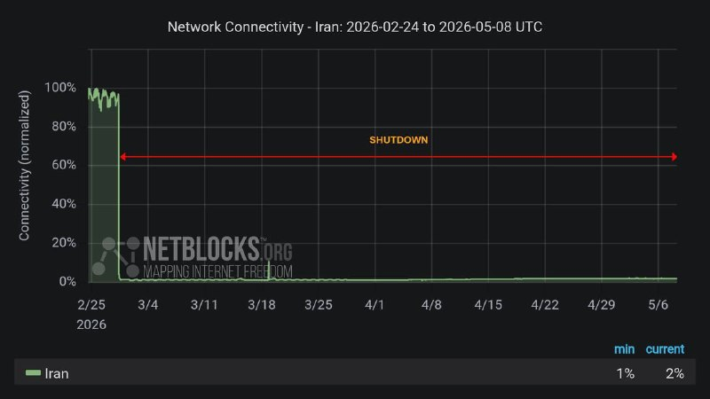

# خواننده تلگرام

<!-- TOP_NAV START -->

<!-- TOP_NAV END -->

<!-- MSG START -->

---
📅 بروزرسانی: 1405/02/18 13:52
---

## VahidOOnLine — post 238853

  <a href="telegram/content/VahidOOnLine_238853_1778235757.mp4" target="_blank">🎬 Download video</a>

♦️ارتش جمهوری اسلامی روز جمعه ۱۸ اردیبهشت ماه، اعلام کرد نفتکش اوشن کوی (OCEAN KOI) را در تنگه هرمز توقیف کرده است.

براساس کزارش خبرگزاری صداوسیما تکاوران ارتش جمهوری اسلامی این نفتکش را «که در صدد ایجاد اخلال در صادرات نفت و منافع ملت ایران بود، توقیف کردند.»

مقام‌های ارتش درباره اینکه این نفتکش تحت مالکیت کجاست و با پرچم چه کشوری در حرکت بوده و مبدا و مقصد حرکت آن کجا بوده است، توضحی نداده‌اند.
‌🇸🇦 Indypersian

🤖 @VahidOOnLine

## IranianMinds — post 19777

  

🔴 ۷۰ روز ، ۱۶۵۶ ساعته که اینترنت یکی از اصلی ترین حق یک انسان در عصر هوش مصنوعی و تکنولوژی توسط جمهوری اسلامی به روی مردم ایران قطع شده …

@IranianMinds

<!-- MSG END -->

<!-- NAV START -->

<!-- NAV END -->
