# خواننده تلگرام

<!-- MSG START -->

---
📅 بروزرسانی: 1405/02/18 07:12
---

## VahidOOnLine — post 238803

  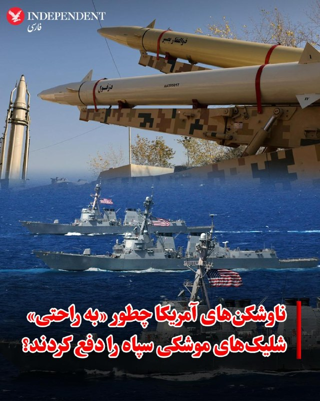

♦️ به گزارش سی‌ان‌ان، سه ناوشکن موشک‌انداز نیروی دریایی آمریکا روز پنج‌شنبه یک حمله چندجانبه رژیم ایران در تنگه هرمز را دفع کردند؛ موضوعی که فرماندهی مرکزی آمریکا (سنتکام) و دونالد ترامپ آن را اعلام کردند.
ترامپ در پیامی در شبکه تروث سوشال نوشت: «سه ناوشکن کلاس‌جهانی آمریکایی در حالی که زیر آتش بودند، با موفقیت کامل از تنگه هرمز عبور کردند. هیچ آسیبی به این سه ناوشکن وارد نشد، اما خسارت سنگینی به مهاجمان ایرانی وارد شد.»
ترامپ گفت رژیم ایران تلاش کرد این سه ناوشکن را با ترکیبی از پهپادها، قایق‌های تندرو و موشک‌ها هدف قرار دهد، اما این حملات به‌راحتی دفع شدند.
به نوشته سی‌ان‌ان، سه ناو جنگی آمریکایی حاضر در این درگیری «یو‌اس‌اس تراکستون»، «یو‌اس‌اس رافائل پرالتا» و «یو‌اس‌اس میسون» از کلاس ناوشکن‌های «آرلی برک» هستند.
ناوشکن‌های کلاس «آرلی برک» که طول آنها بیش از ۱۵۲ متر است و بین ۸۲۰۰ تا ۹۷۰۰ تُن وزن دارند، به مجموعه‌ای از تسلیحات دفاعی مجهز هستند.
این ناوشکن‌ها موشک‌های پیشرفته «استاندارد» را حمل می‌کنند که توان مقابله با موشک‌های بالستیک و کروز را دارند. سامانه موشکی «سی اسپارو» نیز برای مقابله با تهدیدهای کوتاه‌برد به‌کار گرفته می‌شود.
اگر اهداف مهاجم از این سامانه‌ها عبور کنند، ناوشکن‌های آمریکایی به سامانه دفاع نزدیک «فالانکس» نیز مجهز هستند؛ یک توپ گتلینگ ۲۰ میلی‌متری هدایت‌شونده با رادار که می‌تواند در هر دقیقه ۴۵۰۰ گلوله شلیک کند و به‌عنوان آخرین لایه دفاعی استفاده می‌شود.
این ناوشکن‌ها همچنین یک توپ ۱۲۷ میلی‌متری پنج اینچی در بخش جلویی خود دارند که می‌تواند اهداف سطحی مانند قایق‌های تندرو ایرانی را هدف قرار دهد.
سنتکام مشخص نکرد چه تسلیحاتی برای مقابله با حمله سپاه در روز پنج‌شنبه استفاده شده است.
‌🇸🇦 Indypersian

🤖 @VahidOOnLine

---
📅 بروزرسانی: 1405/02/18 07:02
---

## VahidOOnLine — post 238802

  

گاردین در گزارشی که براساس مستندات نهادهای حقوق بشری و منابع نزدیک به خانواده‌ها تهیه شده است، نوشت جمهوری اسلامی اعدام زندانیان را به‌صورت تقریبا روزانه و در برخی موارد، پنهانی ادامه می‌دهد.
بر اساس این گزارش‌، در سال ۲۰۲۵ دست‌کم «هزار و ۶۰۰» مورد اعدام ثبت شد که برخی از آن‌ها در جریان اعتراضات یا در چارچوب اتهامات امنیتی انجام شده‌اند. همزمان، خانواده‌ها نیز از فشارهای امنیتی و روانی شدید بر خود خبر می‌دهند.
این گزارش با استناد به اطلاعات «حقوق بشر ایران» که تعداد اعدام‌ها از اسفندماه تاکنون را دست‌کم ۲۴ تن اعلام کرده است، نوشت، برخی خانواده‌ها تنها پس از اجرای حکم، از اعدام وابستگان خود مطلع شده‌اند و در مواردی حتی پیکر جان‌باختگان نیز به خانواده‌هایشان، تحویل داده نمی‌شود.
همزمان با افزایش روند اعدام‌ها، قطع اینترنت در ایران نیز بیش از دو ماه است که هرگونه ارتباط جهان با داخل کشور را به‌شدت محدود کرده است.

‌🏁 🇬🇧 IranintlTV

🤖 @VahidOOnLine

## IranIntlTV — post 336071

  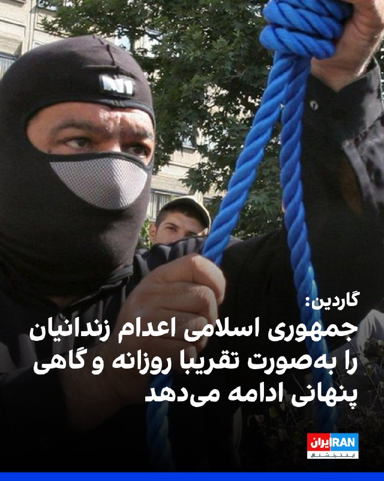

گاردین در گزارشی که براساس مستندات نهادهای حقوق بشری و منابع نزدیک به خانواده‌ها تهیه شده است، نوشت جمهوری اسلامی اعدام زندانیان را به‌صورت تقریبا روزانه و در برخی موارد، پنهانی ادامه می‌دهد.
بر اساس این گزارش‌، در سال ۲۰۲۵ دست‌کم «هزار و ۶۰۰» مورد اعدام ثبت شد که برخی از آن‌ها در جریان اعتراضات یا در چارچوب اتهامات امنیتی انجام شده‌اند. همزمان، خانواده‌ها نیز از فشارهای امنیتی و روانی شدید بر خود خبر می‌دهند.
این گزارش با استناد به اطلاعات «حقوق بشر ایران» که تعداد اعدام‌ها از اسفندماه تاکنون را دست‌کم ۲۴ تن اعلام کرده است، نوشت، برخی خانواده‌ها تنها پس از اجرای حکم، از اعدام وابستگان خود مطلع شده‌اند و در مواردی حتی پیکر جان‌باختگان نیز به خانواده‌هایشان، تحویل داده نمی‌شود.
همزمان با افزایش روند اعدام‌ها، قطع اینترنت در ایران نیز بیش از دو ماه است که هرگونه ارتباط جهان با داخل کشور را به‌شدت محدود کرده است.

https://iranintl.com/202605087246

## Shin_Persian — post 5888

📦 mhrv-rs v1.9.18 released

• Performance refactor of the full-tunnel mux hot data path (#881)

Files (Android APKs, Windows, macOS, Linux, OpenWRT) on the files channel:

👉 v1.9.18 — all files with SHA-256

Channel:
https://t.me/mhrv_rs
or: https://t.me/+R1OyoHX2boA1ZDgx

#v1918

---
📅 بروزرسانی: 1405/02/18 06:53
---

## VahidOOnLine — post 238801

  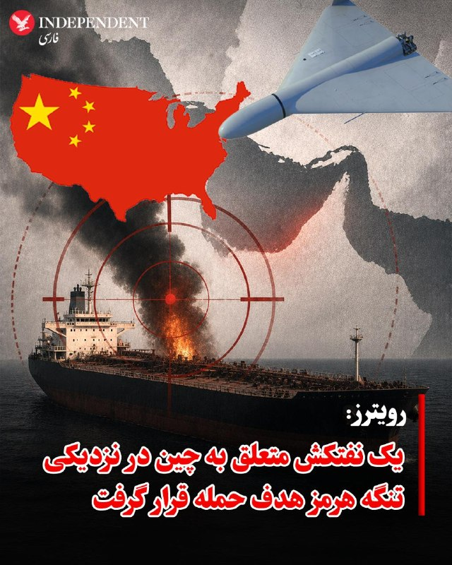

♦️خبرگزاری رویترز به نقل از رسانه چینی کایشین گزارش داد یک نفتکش حامل فرآورده‌های نفتی متعلق به چین روز دوشنبه در نزدیکی تنگه هرمز هدف حمله قرار گرفته است.
بر اساس این گزارش، آتش‌سوزی در عرشه این کشتی رخ داده و روی بدنه آن عبارت «مالک و خدمه چینی» نوشته شده بود. منابع امنیت دریایی گفته‌اند این کشتی احتمالا نفتکش و تانکر شیمیایی «جی‌وی اینوویشن» (JV Innovation) با پرچم جزایر مارشال بوده است.
این حادثه در نزدیکی سواحل امارات متحده عربی و حوالی بندر مینا صقر رخ داده و نخستین حمله گزارش‌شده به یک نفتکش چینی از زمان آغاز درگیری‌ها به شمار می‌رود.
رویترز همچنین گزارش داد تردد دریایی در تنگه هرمز پس از افزایش حملات در روزهای اخیر تقریبا متوقف شده و هزاران ملوان و صدها کشتی همچنان در خلیج فارس گرفتار مانده‌اند.
‌🇸🇦 Indypersian

🤖 @VahidOOnLine

## VahidOOnLine — post 238800

  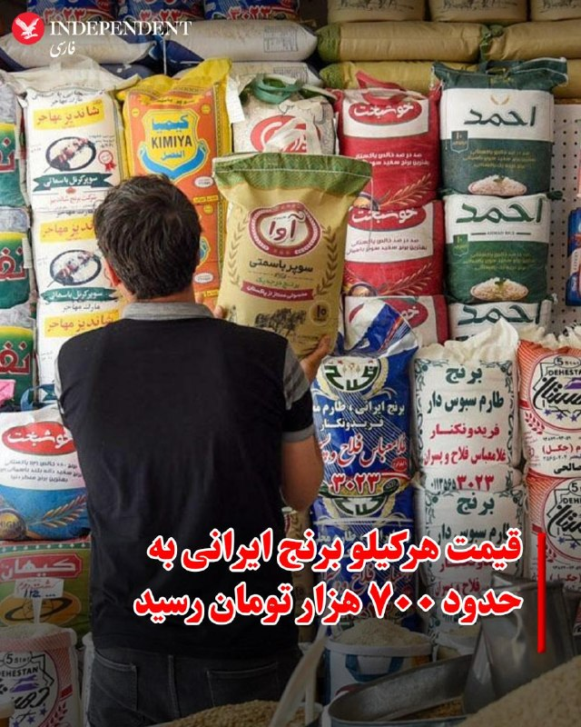

♦️ به موازات افزایش شدید قیمت کالاهای اساسی، قیمت هر کیلو برنج ایرانی به حدود ۷۰۰ هزار تومان رسیده است. پاسخ رئیس اتحادیه بنکداران مواد غذایی تهران به این افزایش شدید قیمت تنها این بوده است که «سیدن قیمت برنج ایرانی به حدود ۷۰۰ هزار تومان با شرایط فعلی عرضه و تقاضا همخوانی ندارد و واقع‌بینانه نیست.» نگاهی به فهرست قیمت‌ها در فروشگاه‌های آنلاین در ایران نشان می‌دهد که برنج طارم ممتاز دست‌کم کیلویی ۵۴۹ هزار تومان قیمت دارد و هر کیلو برنج ایرانی «بینام» کشت دوم، ۶۶۷ هزار تومان فروخته می‌شود. کف قیمت انواع دیگر برنج ایرانی نیز حدود ۴۰۰ هزار تومان است.
‌🇸🇦 Indypersian

🤖 @VahidOOnLine

## VahidOOnLine — post 238799

  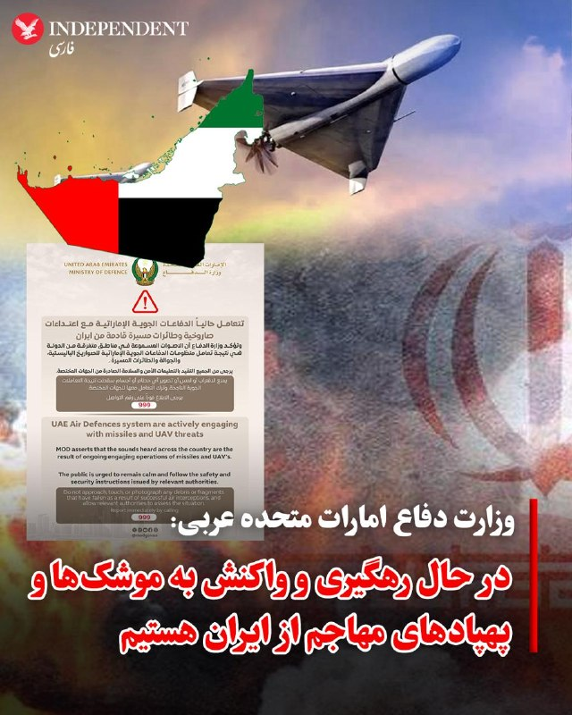

♦️وزارت دفاع امارات متحده عربی در ساعات اولیه بامداد جمعه اعلام کرد که نیروی هوایی در حال واکنش به تهدید‌های موشکی و پهپادی از سوی ایران است و تایید کرد که صداهایی که به گوش می‌رسد ناشی از عملیات رهگیری سیستم دفاعی است.
‌🇸🇦 Indypersian

🤖 @VahidOOnLine

## VahidOnline — post 75323

  

امارات متحده عربی اوایل روز جمعه اعلام کرد که سامانه‌های پدافند هوایی آن در حال مقابله با حملات پهپادی و موشکی از ایران هستند.
@VahidHeadline

📡 @VahidOnline

---
📅 بروزرسانی: 1405/02/18 06:42
---

## VahidOOnLine — post 238798

  

ترامپ پنج‌شنبه در واشینگتن‌دی‌سی به خبرنگاران گفت از وزیرخارجه آمریکا خواسته است در دیدار با پاپ خیلی محترمانه به او بگوید که اگر می‌خواهد از جمهوری اسلامی دفاع کند، باید بداند که حکومت ایران ۴۲ هزار معترض بی‌گناه را کشته است و همچنین باید بداند که تهران نباید سلاح هسته‌ای داشته باشد.
‌🏁 🇬🇧 IranintlTV

🤖 @VahidOOnLine

## mamlekate — post 103475

  <a href="telegram/content/mamlekate_103475_1778209953.mp4">🎬 Download video</a>

خبرنگار:بعد از حملات امروز، هنوز آتش‌بس با ایران برقراره؟
ترامپ: بله، برقراره! امروز خواستن به خورده بازی دربیارن، ما هم نابودشون کردیم. اگه آتش‌بس لغو شه خو‌دتون میفهمید!یه نور خیلی بزرگ از ایران بلند میشه که همه می‌بینن. بهتره زودتر توافق رو امضا کنن.

smn242424
@mamlekate

## IranIntlTV — post 336070

  

ترامپ پنج‌شنبه در واشینگتن‌دی‌سی به خبرنگاران گفت از وزیرخارجه آمریکا خواسته است در دیدار با پاپ خیلی محترمانه به او بگوید که اگر می‌خواهد از جمهوری اسلامی دفاع کند، باید بداند که حکومت ایران ۴۲ هزار معترض بی‌گناه را کشته است و همچنین باید بداند که تهران نباید سلاح هسته‌ای داشته باشد.
https://iranintl.com/202605081601

---
📅 بروزرسانی: 1405/02/18 06:32
---

## FarsiVOA — post 217160

  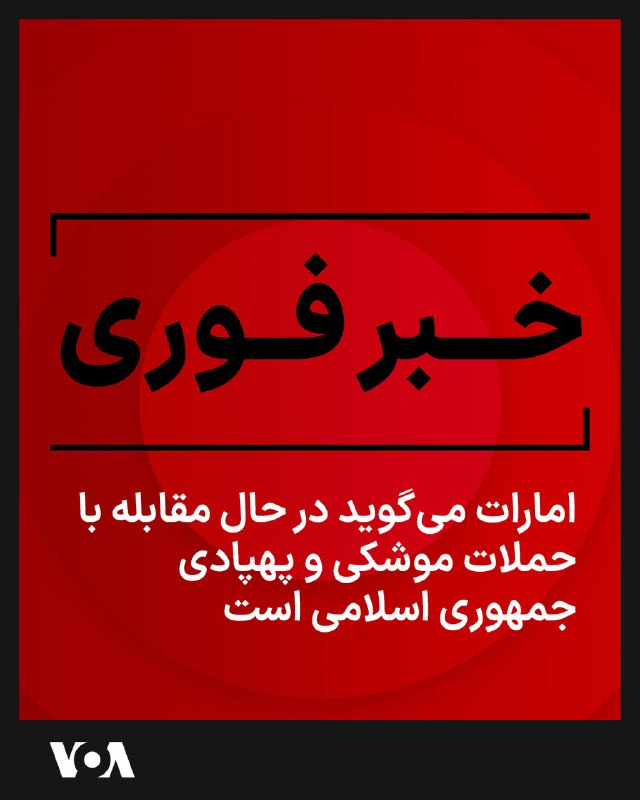

⚡️امارات متحده عربی اوایل روز جمعه اعلام کرد که سامانه‌های پدافند هوایی آن در حال مقابله با حملات پهپادی و موشکی از ایران هستند و صداهایی که شنیده می‌شود مربوط به رهگیری‌ها است.
@FarsiVOA

---
📅 بروزرسانی: 1405/02/18 06:22
---

## VahidOOnLine — post 238797

  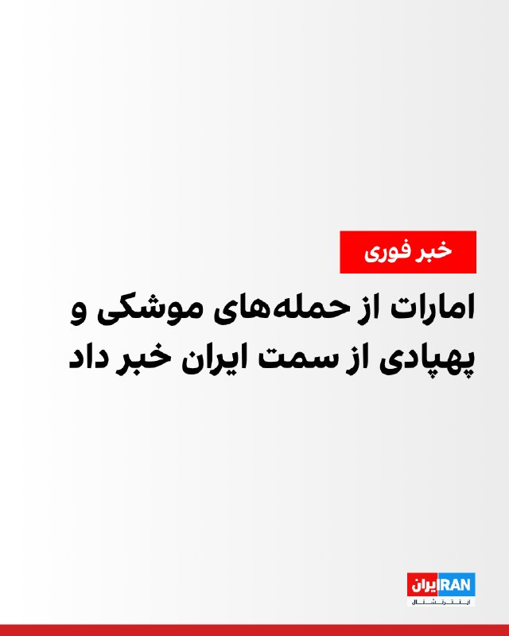

وزارت دفاع امارات بامداد جمعه اعلام کرد پدافند هوایی این کشور در حال مقابله با حمله‌های موشکی و پهپادی از سوی ایران است و صداهای انفجار که در مناطق مختلف این کشور شنیده می‌شود، نتیجه فعال شدن سامانه‌های پدافند هوایی است.
‌🏁 🇬🇧 IranintlTV

🤖 @VahidOOnLine

## mamlekate — post 103473

  <a href="telegram/content/mamlekate_103473_1778208748.mp4">🎬 Download video</a>

آنچه گذشت

@mamlekate

## VahidOnline — post 75315

  <a href="telegram/content/VahidOnline_75315_1778208749.mp4">🎬 Download video</a>

ترامپ در گفت‌وگو با خبرنگاران در واشینگتن، با اشاره به درگیری جدید آمریکا و جمهوری اسلامی در تنگه هرمز گفت نیروهای جمهوری اسلامی با آمریکا «شوخی» کردند، اما آن‌ها ظرف حدود دو دقیقه نابود شدند.
او گفت: «امروز سه ناوشکن درجه‌یک آمریکا از تنگه عبور کردند. هر کشور دیگری در چنین شرایطی چنین کاری نمی‌کرد. به آن‌ ناوشکن‌ها موشک و پهپاد شلیک کردند و این قایق‌های احمقانه را به سویشان فرستادند. آن‌ها ظرف حدود دو دقیقه نابود شدند. نفتکششان هدف قرار گرفت. می‌دانید با نفتکش چه کردیم؟ نمی‌خواستیم شرایط حادی ایجاد شود، بنابراین سکان آن را زدیم و نفتکش شروع کرد به چرخیدن دور خودش. نباید امروز این کار را می‌کردند.»
ترامپ افزود: «همه موشک‌هایشان سرنگون شد. همه پهپادهایشان سرنگون شد و کسانی که آن‌ها را شلیک کردند نیز دیگر در میان ما نیستند.»
@VahidOOnLine
دونالد ترامپ، رئیس‌جمهوری آمریکا، روز پنج‌شنبه گفت پیشنهاد واشنگتن برای پایان دادن به درگیری با ایران، بسیار فراتر از یک «پیشنهاد یک‌صفحه‌ای» بوده است. سی‌ان‌ان نوشت، تهران همچنان در حال بررسی پیام‌های ارسال‌شده از سوی آمریکا از طریق میانجی‌های پاکستان است.
ترامپ در پاسخ به پرسشی درباره اینکه آیا ایران به آنچه «پیشنهاد یک‌صفحه‌ای» توصیف شده پاسخ داده است یا نه، این توصیف را رد کرد.
او به خبرنگاران گفت: «خب، این بیشتر از یک پیشنهاد یک‌صفحه‌ای است. این پیشنهادی بود که اساسا می‌گفت آنها سلاح هسته‌ای نخواهند داشت، گردوغبار هسته‌ای را به ما تحویل خواهند داد و بسیاری چیزهای دیگری را که ما می‌خواهیم.»
وقتی از او پرسیده شد آیا ایران با این شروط موافقت کرده است، ترامپ گفت: «آنها موافقت کرده‌اند. اما وقتی موافقت می‌کنند، خیلی معنا ندارد، چون روز بعد فراموش می‌کنند که موافقت کرده بودند.»
او افزود: «و می‌دانید، ما با مجموعه‌های متفاوتی از رهبران طرف هستیم.»
@VahidOOnLine
ترامپ در واشینگتن به خبرنگاران گفت: «مقام‌های ایران بهتر است خیلی سریع توافقشان را امضا کنند. مذاکرات بسیار خوب پیش می‌رود، اما باید بفهمند اگر امضا نشود، درد زیادی خواهند داشت. آن‌ها خیلی بیشتر از من می‌خواهند امضا کنند.»
ترامپ گفت: «ما اکنون در ایران با مجموعه‌های متفاوتی از رهبران سروکار داریم. وقتی درباره تغییر حکومت صحبت می‌کنید، آن‌ها مدام از تغییر حکومت حرف می‌زنند. ما حکومت اول را کنار زدیم. حکومت دوم را کنار زدیم. بیشتر حکومت سوم را کنار زدیم. بعد می‌گویند آیا این تغییر حکومت است؟ من فکر می‌کنم این نهایت تغییر حکومت است.»
@VahidOOnLine
دونالد ترامپ عصر پنج‌شنبه گفت: «ما هرگز اجازه نخواهیم داد» جمهوری اسلامی به سلاح هسته‌ای دست پیدا کند. آقای ترامپ گفت: «احتمال آن صفر است. خودشان هم این را می‌دانند و با آن موافقت کرده‌اند. حالا باید ببینیم آیا حاضرند توافق را امضا کنند یا نه.»
@VahidHeadline
ترامپ پنج‌شنبه به خبرنگاران گفت آمریکا با وجود تازه‌ترین تبادل آتش با جمهوری‌اسلامی در نزدیکی تنگه هرمز، در حال مذاکره با حکومت ایران است و افزود پاکستان از واشینگتن خواسته است در طول این گفت‌وگوها، طرح او برای اسکورت کشتی‌ها به خارج از این آبراه را دنبال نکند.
@VahidOOnLine

📡 @VahidOnline

## IranIntlTV — post 336069

  

وزارت دفاع امارات بامداد جمعه اعلام کرد پدافند هوایی این کشور در حال مقابله با حمله‌های موشکی و پهپادی از سوی ایران است و صداهای انفجار که در مناطق مختلف این کشور شنیده می‌شود، نتیجه فعال شدن سامانه‌های پدافند هوایی است.
https://iranintl.com/202605080824

---
📅 بروزرسانی: 1405/02/18 06:12
---

## Shin_Persian — post 5887

  

NCEMA UAE ✓ @NCEMAUAE
Fri, 08 May 2026 02:35:52 UTC

Air defense systems are currently responding to a missile threat. Please remain in a safe location and follow official channels for warnings and updates.

فارسی

سامانه‌های پدافند هوایی در حال حاضر در حال مقابله با یک تهدید موشکی هستند. لطفاً در مکان امن بمانید و کانال‌های رسمی را برای هشدارها و به‌روزرسانی‌ها دنبال کنید.

𝕏 · @shin_persian

## Shin_Persian — post 5886

Shin ✓ @hey_itsmyturn
Fri, 08 May 2026 02:35:30 UTC

NOW -
Seek shelter alert in #UAE 🇦🇪

فارسی

فوری -
هشدار پناه گرفتن در امارات متحده عربی (#UAE) 🇦🇪

𝕏 · @shin_persian

## BBCPersian — post 280459

🔻سازمان بین‌المللی دریانوردی: ۲۰ هزار ملوان پشت تنگه هرمز گرفتار شده‌اند

سازمان بین‌المللی دریانوردی سازمان ملل می‌گوید حدود هزار و پانصد کشتی و بیست هزار ملوان به دلیل ایجاد محدودیت در عبور از این تنگه توسط ایران در منطقه خلیج فارس گرفتار شده‌اند.

آرسنیو دومینگوئز، دبیرکل سازمان بین‌المللی دریانوردی سازمان ملل روز پنج‌شنبه در پاناما این خبر را اعلام کرد.

جنگ در خاورمیانه که در ۲۸ فوریه (۹ اسفند) با حمله اسرائیل و آمریکا علیه ایران آغاز شد، با تلافی تهران در سراسر منطقه و قطع عبور کشتی‌ها از تنگه هرمز، این مسیر حیاتی تجارت جهانی، همراه شد.

آرسنیو دومینگوئز در جریان نشست دریایی قاره آمریکا در پاناما گفت: «در حال حاضر، حدود ۲۰ هزار خدمه و نزدیک به ۱۵۰۰ کشتی در این منطقه گرفتار شده‌اند.»

به گفته این مقام، این ملوانان افراد بی‌گناهی هستند که در شرایط ژئوپلیتیکی خارج از کنترل خود گرفتار شده‌اند.

آمریکا روز دوشنبه از عملیاتی برای اسکورت کشتی‌ها از طریق این تنگه خبر داد، اما پس از یک روز آن را لغو کرد.

بر اساس گزارش‌ها ایران در حال بررسی پیشنهادهای واشنگتن برای چگونگی پایان دادن به درگیری و بازگشایی این آبراه است.

https://bbc.in/49jmR2Y
@BBCPersian

## BBCPersian — post 280458

🔻افزایش بهای نفت بلافاصله بعد از درگیری دریایی ایران و آمریکا

قيمت نفت در معاملات صبح جمعه در آسيا، پس از تبادل آتش ميان ايالات متحده امريکا و ايران در تنگه هرمز افزايش يافت.

ارتش امريکا اعلام کرد حملات ايران — شامل موشک‌ها، پهپادها و قايق‌های کوچک — را رهگيری کرده و زمانی که کشتی‌هایش در حال خروج از خليج فارس از طريق تنگه بودند، حملات متقابلی انجام داده است.

بهای نفت برنت، شاخص جهانی نفت، ۲/۳ درصد افزايش يافت و به ۱۰۲/۴۰ دلار در هر بشکه رسيد، در حالی که نفت خام معامله‌شده در امريکا نيز با رشد ۲/۱ درصدی به ۹۶/۸۰ دلار رسيد.

اين تشديد تنش، آتش‌بس ميان امريکا و ايران را بيش از پيش در معرض خطر قرار داده است؛ آتش‌بسی که دونالد ترامپ در ۲۱ آوريل برای فراهم شدن زمان بيشتر جهت مذاکرات صلح، آن را به‌طور نامحدود تمديد کرده بود.

https://bbc.in/3QRRzKp
@BBCPersian

---
📅 بروزرسانی: 1405/02/18 06:02
---

## mamlekate — post 103472

📝 ترامپ پس از حمله متقابل به بنادر جنوبی ایران: نوازشی دوستانه بود، در حال مذاکره هستیم

ارتش آمریکا پنجشنبه شب به دنبال حمله موشکی سپاه پاسداران به سه ناو آمریکایی در حال عبور از تنگه هرمز بنادر جنوبی ایران را هدف قرار داد.

پیام قبلی کانال:
t.me/mamlekate/103468

@mamlekate

## mamlekate — post 103471

📝 الو اصفهان ۱۸ اردیبهشت ساعت ۱:۲۳ صدای چندتا انفجار پشت سرهم اومد ۱:۵۶ هم یه انفجار دیگه

@mamlekate

---
📅 بروزرسانی: 1405/02/18 05:52
---

## BBCPersian — post 280449

🖋سوربهی کول
بخش مانیتورینگ بی‌بی‌سی

نتایج انتخابات اخیر ایالتی در هند از چند تحول مهم سیاسی خبر می‌دهد؛ تحولاتی که فراتر از مرزهای ایالتی بازتاب یافته و به تقویت جایگاه حزب حاکم بهاراتیا جاناتا (بی‌جی‌پی) در سطح فدرال انجامیده است.

میلیون‌ها نفر در انتخابات مجلس ایالتی در چهار ایالت هند، بنگال غربی، تامیل نادو، آسام و کرالا، و همچنین قلمروی تحت اداره فدرال پودوچری رای دادند.

نتایج اعلام ‌شده نشان داد در حالی که حزب کنگره که مهم‌ترین حزب مخالف دولت است، در برخی مناطق به پیروزی‌هایی دست پیدا کرد، اما حزب بی‌جی‌پی دستاوردهای مهمی داشته است.

در ایالت شرقی بنگال غربی که یکی از پایگاه‌های مهم اپوزیسیون محسوب می‌شود و در ۱۵ سال گذشته در اختیار حزب منطقه‌ای کنگره ترینامول بوده، بی‌جی‌پی پیروزی قاطعی به دست آورد و موفق شد یکی از آخرین سنگرهای سیاسی‌ را که پیش‌تر در فتح آن ناکام مانده بود، تصرف کند.

ادامه مطلب⬇️

📸GettyImages/ Reuters/ Hindustan
Times via Getty Images/ AFP via Getty Images/ NurPhoto via Getty Images/ India n media
https://bbc.in/48PNzQG
@BBCPersian

---
📅 بروزرسانی: 1405/02/18 05:42
---

## mwarmonitor — post 8667

  <a href="telegram/content/mwarmonitor_8667_1778206339.mp4">🎬 Download video</a>

📝 در فیلم «نورنبرگ» سکانس تکان‌دهنده‌ای وجود دارد که عمق استراتژی سیاسی را نشان می‌دهد: سیاستمداران آمریکایی برای محاکمه و اعدام سران نازی، به این نتیجه می‌رسند که تایید رئیس‌جمهور کافی نیست؛ آن‌ها برای همراه کردن افکار عمومی جهان، به تایید پاپ نیاز دارند.
وقتی پاپ در ابتدا با اعدام‌ها مخالفت می‌کند، نماینده آمریکا با یک جمله او را در بن‌بست اخلاقی قرار می‌دهد:
«ما در هر صورت نازی‌ها را نابود می‌کنیم، اما تاریخ قضاوت خواهد کرد که کلیسای کاتولیک در کنار آن‌ها ایستاد یا در برابرشان!»

🔸این فشار دیپلماتیک، پاپ را ناچار می‌کند تا برای حفظ وجهه تاریخی کلیسا، با دادگاه نورنبرگ موافقت کرده و آن را عملی برای خیرِ جهان بنامد.

🔸پیوند با واقعیت امروز
امروز نیز در میانه تنش‌ها، شاهد سفر مارکو روبیو به واتیکان و دیدار او با پاپ هستیم. این حرکت یادآور همان الگوی قدیمی است؛ تلاشی برای کسب مشروعیت اخلاقی و مذهبی در سطح بین‌الملل، پیش از برداشتن گام‌های بزرگتر در شطرنج سیاست. گویا تاریخ بار دیگر در حال تکرار است و سیاستمداران به دنبال جلب نظر «بالاترین مرجع» هستند.

@mwarmonitor

---
📅 بروزرسانی: 1405/02/18 05:33
---

## VahidOOnLine — post 238796

♦️دونالد ترامپ، رئیس‌جمهوری آمریکا، روز پنج‌شنبه در گفتگو با خبرنگاران اعلام کرد که از مارکو روبیو، وزیر خارجه خود، خواسته است در دیدار با پاپ لئو چهاردهم پیام روشنی را منتقل کند که پاپ باید بداند جمهوری اسلامی نباید به سلاح هسته‌ای دست یابد. او همچنین افزود پاپ باید در جریان باشد که این رژیم ۴۲ هزار معترض بی‌گناه و غیرمسلح را کشته است.
‌🇸🇦 Indypersian

🤖 @VahidOOnLine

## VahidOOnLine — post 238795

  

ترامپ در گفت‌وگو با خبرنگاران در واشینگتن، با اشاره به درگیری جدید آمریکا و جمهوری اسلامی در تنگه هرمز گفت نیروهای جمهوری اسلامی با آمریکا «شوخی» کردند، اما آن‌ها ظرف حدود دو دقیقه نابود شدند.
او گفت: «امروز سه ناوشکن درجه‌یک آمریکا از تنگه عبور کردند. هر کشور دیگری در چنین شرایطی چنین کاری نمی‌کرد. به آن‌ ناوشکن‌ها موشک و پهپاد شلیک کردند و این قایق‌های احمقانه را به سویشان فرستادند. آن‌ها ظرف حدود دو دقیقه نابود شدند. نفتکششان هدف قرار گرفت. می‌دانید با نفتکش چه کردیم؟ نمی‌خواستیم شرایط حادی ایجاد شود، بنابراین سکان آن را زدیم و نفتکش شروع کرد به چرخیدن دور خودش. نباید امروز این کار را می‌کردند.»
ترامپ افزود: «همه موشک‌هایشان سرنگون شد. همه پهپادهایشان سرنگون شد و کسانی که آن‌ها را شلیک کردند نیز دیگر در میان ما نیستند.»

‌🏁 🇬🇧 IranintlTV

🤖 @VahidOOnLine

## IranIntlTV — post 336068

  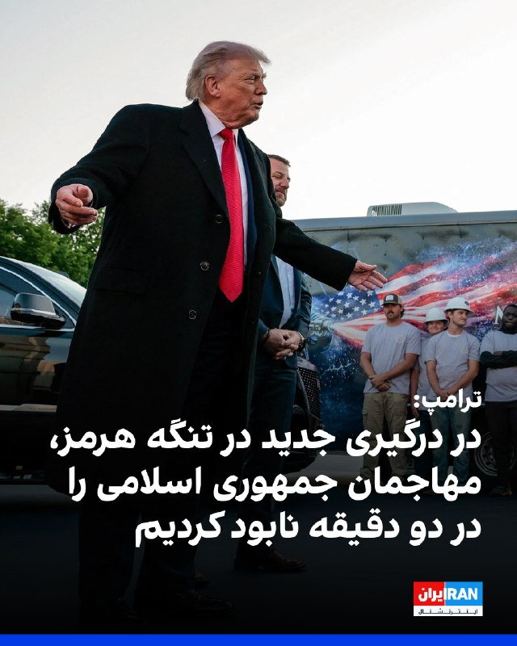

ترامپ در گفت‌وگو با خبرنگاران در واشینگتن، با اشاره به درگیری جدید آمریکا و جمهوری اسلامی در تنگه هرمز گفت نیروهای جمهوری اسلامی با آمریکا «شوخی» کردند، اما آن‌ها ظرف حدود دو دقیقه نابود شدند.
او گفت: «امروز سه ناوشکن درجه‌یک آمریکا از تنگه عبور کردند. هر کشور دیگری در چنین شرایطی چنین کاری نمی‌کرد. به آن‌ ناوشکن‌ها موشک و پهپاد شلیک کردند و این قایق‌های احمقانه را به سویشان فرستادند. آن‌ها ظرف حدود دو دقیقه نابود شدند. نفتکششان هدف قرار گرفت. می‌دانید با نفتکش چه کردیم؟ نمی‌خواستیم شرایط حادی ایجاد شود، بنابراین سکان آن را زدیم و نفتکش شروع کرد به چرخیدن دور خودش. نباید امروز این کار را می‌کردند.»
ترامپ افزود: «همه موشک‌هایشان سرنگون شد. همه پهپادهایشان سرنگون شد و کسانی که آن‌ها را شلیک کردند نیز دیگر در میان ما نیستند.»

https://iranintl.com/202605083988

---
📅 بروزرسانی: 1405/02/18 05:23
---

---
📅 بروزرسانی: 1405/02/18 05:12
---

## VahidOOnLine — post 238794

  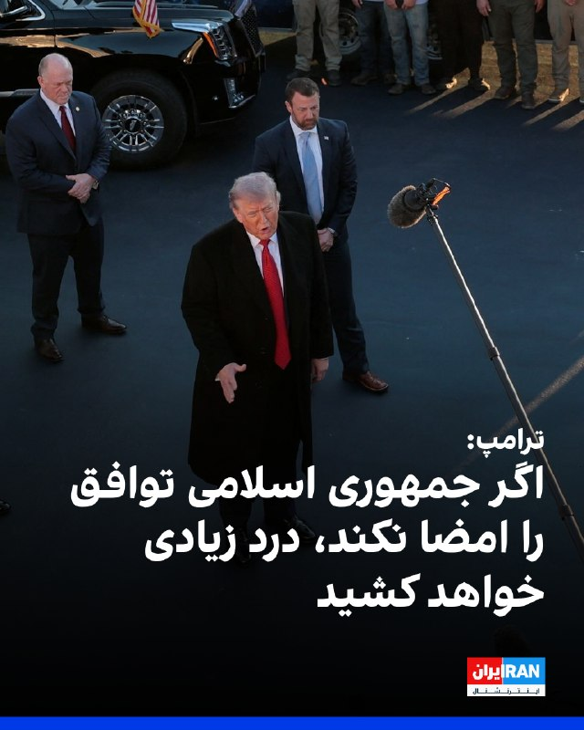

ترامپ در واشینگتن به خبرنگاران گفت: «مقام‌های ایران بهتر است خیلی سریع توافقشان را امضا کنند. مذاکرات بسیار خوب پیش می‌رود، اما باید بفهمند اگر امضا نشود، درد زیادی خواهند داشت. آن‌ها خیلی بیشتر از من می‌خواهند امضا کنند.»
او افزود: «این بیش از یک پیشنهاد یک‌صفحه‌ای است. پیشنهادی است که اساسا می‌گوید آن‌ها سلاح هسته‌ای نخواهند داشت و گرد و غبار هسته‌ای و بسیاری چیزهای دیگری که ما می‌خواهیم را به ما تحویل خواهند داد. اما آنها وقتی موافقت می‌کنند، معنای زیادی ندارد، چون روز بعد فراموش می‌کنند که موافقت کرده‌اند.»
ترامپ گفت: «ما اکنون در ایران با مجموعه‌های متفاوتی از رهبران سروکار داریم. وقتی درباره تغییر حکومت صحبت می‌کنید، آن‌ها مدام از تغییر حکومت حرف می‌زنند. ما حکومت اول را کنار زدیم. حکومت دوم را کنار زدیم. بیشتر حکومت سوم را کنار زدیم. بعد می‌گویند آیا این تغییر حکومت است؟ من فکر می‌کنم این نهایت تغییر حکومت است.»

‌🏁 🇬🇧 IranintlTV

🤖 @VahidOOnLine

## IranIntlTV — post 336067

  

ترامپ در واشینگتن به خبرنگاران گفت: «مقام‌های ایران بهتر است خیلی سریع توافقشان را امضا کنند. مذاکرات بسیار خوب پیش می‌رود، اما باید بفهمند اگر امضا نشود، درد زیادی خواهند داشت. آن‌ها خیلی بیشتر از من می‌خواهند امضا کنند.»
او افزود: «این بیش از یک پیشنهاد یک‌صفحه‌ای است. پیشنهادی است که اساسا می‌گوید آن‌ها سلاح هسته‌ای نخواهند داشت و گرد و غبار هسته‌ای و بسیاری چیزهای دیگری که ما می‌خواهیم را به ما تحویل خواهند داد. اما آنها وقتی موافقت می‌کنند، معنای زیادی ندارد، چون روز بعد فراموش می‌کنند که موافقت کرده‌اند.»
ترامپ گفت: «ما اکنون در ایران با مجموعه‌های متفاوتی از رهبران سروکار داریم. وقتی درباره تغییر حکومت صحبت می‌کنید، آن‌ها مدام از تغییر حکومت حرف می‌زنند. ما حکومت اول را کنار زدیم. حکومت دوم را کنار زدیم. بیشتر حکومت سوم را کنار زدیم. بعد می‌گویند آیا این تغییر حکومت است؟ من فکر می‌کنم این نهایت تغییر حکومت است.»

https://iranintl.com/202605082826

## BBCPersian — post 280448

🔻مهمترین تحولات روز پنجشنبه
با خلاصه‌ای از مهمترین تحولات ۲۴ ساعت گذشته، پوشش زنده خود از آخرین خبرهای ایران و منطقه را به صفحه جدید ویژه روز جمعه - ۱۸ اردیبهشت - منتقل می‌کنیم. از همراهی شما سپاسگزاریم.

سر خط تحولات روز پنجشنبه اینها بودند:

🔹قرارگاه خاتم الانبیاء: آمریکا با همکاری چند کشور منطقه حملاتی به نفتکش‌های ایرانی صورت داد که با آن مقابله کردیم.
🔹سنتکام: ناوشکن‌های ما «در پاسخ به حملات پهپادی و موشکی ایران» آتش گشودند
🔹ترامپ: سه ناو ما از تنگه هرمز عبور کردند، آتش‌بس همچنان پابرجاست
🔹واشنگتن‌پست: منابع اطلاعاتی آمریکا می‌گویند ایران ماه‌ها می‌تواند در برابر محاصره بنادرش مقاومت کند
آمریکا معاون وزیر نفت عراق را به خاطر کمک به دور زدن تحریم‌های ایران تحریم کرد
🔹طاهر اندرآبی، سخنگوی وزارت خارجه پاکستان ابراز امیدواری کرده است که توافق میان آمریکا و ایران به‌زودی اعلام خواهد شد
🔹مسعود پزشکیان، رئیس‌جمهور ایران، در سخنانی از دیدار خود با مجتبی خامنه‌ای،‌ رهبر جمهوری اسلامی، خبر داد
🔹در شصت و نهمین روز قطع اینترنت، مردم داخل ایران ۱۶۳۲ ساعت است که به طور گسترده امکان دسترسی به اینترنت بین‌المللی ندارند
🔹یک منبع سعودی روز پنجشنبه گزارش رسانه‌های آمریکایی در مورد نقش ریاض در دستور توقف عملیات نظامی آمریکا در تنگه هرمز را رد کرد

https://bbc.in/4tY7aXg
@BBCPersian

---
📅 بروزرسانی: 1405/02/18 05:02
---

## VahidOOnLine — post 238793

  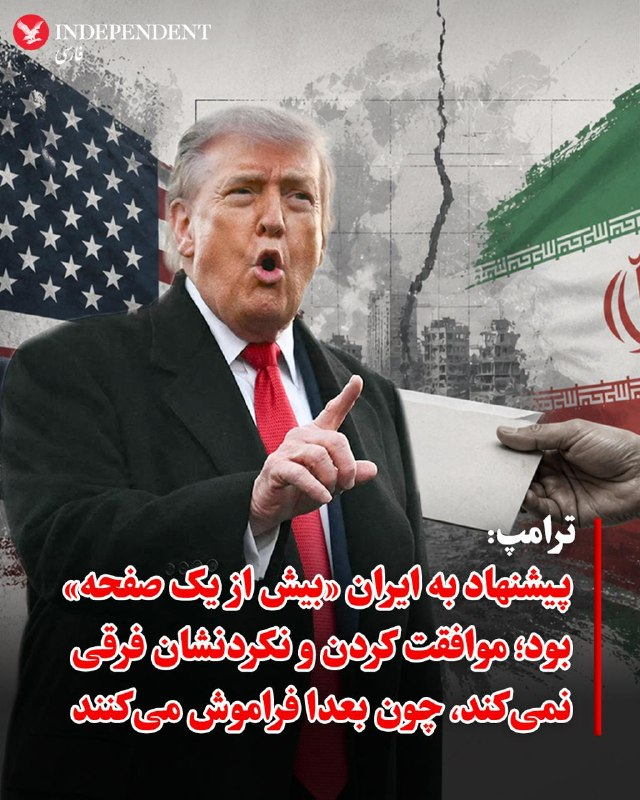

♦️دونالد ترامپ، رئیس‌جمهوری آمریکا، روز پنج‌شنبه گفت پیشنهاد واشنگتن برای پایان دادن به درگیری با ایران، بسیار فراتر از یک «پیشنهاد یک‌صفحه‌ای» بوده است. سی‌ان‌ان نوشت، تهران همچنان در حال بررسی پیام‌های ارسال‌شده از سوی آمریکا از طریق میانجی‌های پاکستان است.
ترامپ در پاسخ به پرسشی درباره اینکه آیا ایران به آنچه «پیشنهاد یک‌صفحه‌ای» توصیف شده پاسخ داده است یا نه، این توصیف را رد کرد.
او به خبرنگاران گفت: «خب، این بیشتر از یک پیشنهاد یک‌صفحه‌ای است. این پیشنهادی بود که اساسا می‌گفت آنها سلاح هسته‌ای نخواهند داشت، گردوغبار هسته‌ای را به ما تحویل خواهند داد و بسیاری چیزهای دیگری را که ما می‌خواهیم.»
وقتی از او پرسیده شد آیا ایران با این شروط موافقت کرده است، ترامپ گفت: «آنها موافقت کرده‌اند. اما وقتی موافقت می‌کنند، خیلی معنا ندارد، چون روز بعد فراموش می‌کنند که موافقت کرده بودند.»
او افزود: «و می‌دانید، ما با مجموعه‌های متفاوتی از رهبران طرف هستیم.»
رسانه‌های جمهوری اسلامی گزارش داده‌اند که تهران هنوز پاسخ نهایی خود به پیشنهاد آمریکا را نهایی نکرده و همچنان در حال بررسی «پیام‌های» آمریکاست که از طریق میانجی‌های پاکستان منتقل شده‌اند.
‌🇸🇦 Indypersian

🤖 @VahidOOnLine

## VahidOOnLine — post 238792

  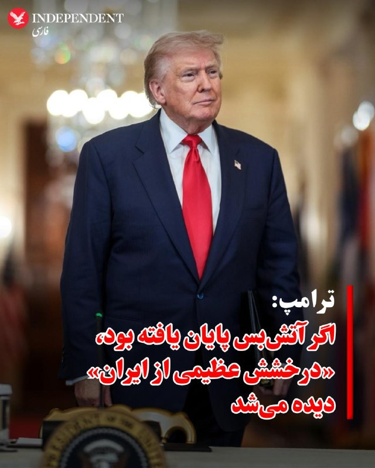

♦️ دونالد ترامپ، رئیس‌جمهوری آمریکا، روز پنج‌شنبه گفت آتش‌بس با ایران همچنان برقرار است. او گفت، اگر آتش‌بس پایان یافته بود، این موضوع کاملا آشکار می‌شد.
ترامپ در پاسخ به پرسش خبرنگاران در توقفی کوتاه نزدیک استخر یادبود لینکلن در واشنگتن گفت: «اگر آتش‌بسی در کار نباشد، لازم نیست کسی به شما بگوید. کافی است به یک درخشش عظیم که از ایران بیرون می‌آید نگاه کنید.»
رئیس‌جمهور آمریکا هم‌زمان تنش‌های اخیر را کم‌اهمیت جلوه داد و از واکنش نظامی آمریکا تمجید کرد.
او گفت: «آنها امروز با ما درگیر شدند. ما هم نابودشان کردیم. آنها مزاحم شدند؛ من اسمش را یک مزاحمت کوچک می‌گذارم.»
ترامپ سپس گفت مذاکرات با ایران همچنان ادامه دارد، هرچند نتیجه آن نامشخص است.
او افزود: «ممکن است توافق با ایران انجام نشود، اما ممکن هم هست هر روزی اتفاق بیفتد.»
اظهارات ترامپ پس از آن مطرح شد که فرماندهی مرکزی آمریکا (سنتکام) اعلام کرد نیروهای آمریکایی تأسیسات نظامی جمهوری اسلامی را که مسئول حملات موشکی، پهپادی و قایق‌های تندرو علیه ناوشکن‌های نیروی دریایی آمریکا در حال عبور از تنگه هرمز بودند، هدف قرار داده‌اند.
‌🇸🇦 Indypersian

🤖 @VahidOOnLine

---
📅 بروزرسانی: 1405/02/18 04:55
---

## mwarmonitor — post 8666

🇺🇸سنتکام از کشتی‌های جنگی ایالات متحده در حین عبور از تنگه هرمز محافظت می‌کند
فرماندهی مرکزی ایالات متحده (U.S. Central Command)

🔴تامپا، فلوریدا — نیروهای ایالات متحده حملات بی‌دلیل ایران را دفع کردند و در حالی که ناوشکن‌های موشک‌انداز نیروی دریایی آمریکا در تاریخ ۷ می (۱۷ اردیبهشت) در حال عبور از تنگه هرمز به سمت دریای عمان بودند، با حملات دفاع از خود به آن‌ها پاسخ دادند.
🔸نیروهای ایرانی همزمان با عبور کشتی‌های USS Truxtun (DDG 103)، USS Rafael Peralta (DDG 115) و USS Mason (DDG 87) از این آبراه بین‌المللی، چندین موشک، پهپاد و قایق‌های کوچک را به کار گرفتند. به هیچ‌یک از دارایی‌های ایالات متحده آسیبی وارد نشد.
🔸فرماندهی مرکزی ایالات متحده (سنتکام) تهدیدات ورودی را از بین برد و تأسیسات نظامی ایران که مسئول حمله به نیروهای آمریکایی بودند، از جمله سایت‌های پرتاب موشک و پهپاد، مراکز فرماندهی و کنترل، و گره‌های اطلاعاتی، نظارتی و شناسایی را هدف قرار داد.
🔸سنتکام به دنبال تشدید تنش نیست، اما همچنان مستقر و آماده محافظت از نیروهای آمریکایی باقی می‌ماند.

@mwarmonitor

---
📅 بروزرسانی: 1405/02/18 04:52
---

## VahidOOnLine — post 238791

♦️دونالد ترامپ، رئیس‌جمهوری آمریکا، بامداد جمعه ۱۸ اردیبهشت‌ماه، ساعاتی پس از تبادل آتش با جمهوری اسلامی گفت افرادی که موشک‌ها و پهپادها را به سمت ناوشکن‌های آمریکا شلیک کرده بودند، «دیگر زنده نیستند.»

ترامپ گفت سه ناوشکن آمریکا بدون آسیب از تنگه هرمز عبور کرده‌اند، همه موشک‌ها رهگیری و همه پهپادها منهدم شده‌اند و قایق‌های تندروی ایرانی نیز «ظرف حدود دو دقیقه» نابود شدند. او همچنین گفت آمریکا با هدف قرار دادن سکان یک نفتکش، آن را از کنترل خارج کرده است.

ترامپ افزود: «آن‌ها نباید امروز این کار را می‌کردند. فکر می‌کردیم ممکن است چنین کاری بکنند؛ مطمئن نبودیم، اما آماده بودیم.»
‌🇸🇦 Indypersian

🤖 @VahidOOnLine

## VahidOOnLine — post 238790

  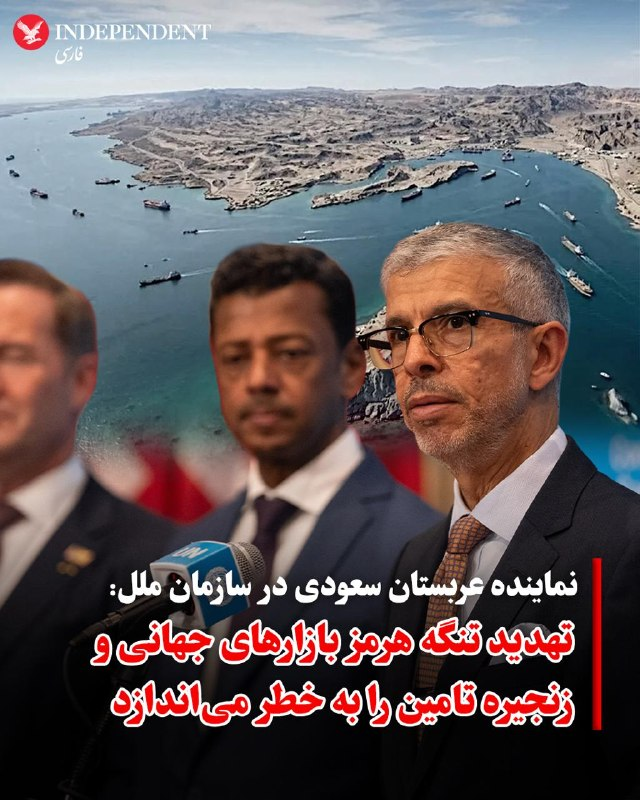

♦️عبدالعزیز الواصل، نماینده دائم عربستان سعودی در سازمان ملل، هشدار داد هرگونه تهدید علیه کشتیرانی در تنگه هرمز مستقیما بر ثبات بازارهای جهانی و زنجیره‌های تامین بین‌المللی تاثیر می‌گذارد.
او در نشست مشترک کشورهای شورای همکاری خلیج فارس و ایالات متحده آمریکا تاکید کرد تنگه هرمز یکی از حیاتی‌ترین مسیرهای دریایی برای تجارت بین‌المللی و امنیت انرژی جهانی است.
الواصل همچنین گفت اختلال در عبور و مرور دریایی، بازار جهانی انرژی و انتقال کالاهای اساسی، از جمله مواد غذایی، دارو و کمک‌های بشردوستانه را تحت تاثیر قرار داده و می‌تواند برای کشورهای وابسته به واردات پیامدهای جدی داشته باشد.
کشورهای شورای همکاری خلیج فارس و آمریکا همزمان در سازمان ملل خواستار حمایت از پیش‌نویس قطعنامه‌ای شدند که از جمهوری اسلامی می‌خواهد حملات و مین‌گذاری در تنگه هرمز را متوقف کند.
‌🇸🇦 Indypersian

🤖 @VahidOOnLine

## VahidOOnLine — post 238789

♦️کارولین لویت، سخنگوی کاخ سفید، روز پنجشنبه از تولد دخترش «ویویانا» خبر داد. پیش از این،آز پرلمن، ذهن‌خوان مشهور اسراییلی-آمریکایی در جریان ضیافت شام خبرنگاران کاخ سفید نام این نوزاد را به درستی حدس زده بود. این پیش‌بینی درست در لحظاتی انجام شد که با ورود یک فرد مسلح به سالن، دونالد ترامپ و مقام‌های دولت از محل خارج شدند. پرلمن تاکید کرد که نام را روی کاغذ درست نوشته بود اما به دلیل شباهت با نام دختر خودش، آن را اشتباه تلفظ کرد.
لویت که از ۴ اردیبهشت به مرخصی زایمان رفته بود، پس از حادثه تیراندازی در مراسم شام خبرنگاران کاخ سفید در ۷ اردیبهشت، بار دیگر در جمع خبرنگاران حاضر شد. او در آن زمان گفته بود امیدوار است آن نشست آخرین حضورش پیش از پایان مرخصی زایمان باشد. در غیاب لیویت، اعضای کابینه از جمله مارکو روبیو مسئولیت پاسخگویی به رسانه‌ها را بر عهده گرفته‌اند.
‌🇸🇦 Indypersian

🤖 @VahidOOnLine

## mwarmonitor — post 8665

سه ناوشکن آمریکایی تراز اول، همین حالا با موفقیت کامل و در حالی که زیر آتش بودند، از تنگه هرمز عبور کردند. هیچ آسیبی به این سه ناوشکن وارد نشد، اما آسیب شدیدی به مهاجمان ایرانی وارد گشت. آن‌ها به همراه تعداد بی‌شماری از قایق‌های کوچک که برای جایگزینی نیروی دریایی کاملاً از هم پاشیده‌شان استفاده می‌شوند، به‌طور کامل نابود شدند. این قایق‌ها سریع و بااقتدار به قعر دریا رفتند.
موشک‌هایی به سمت ناوشکن‌های ما شلیک شد که به سادگی ساقط شدند. به همین ترتیب، پهپادها آمدند و در میان زمین و آسمان خاکستر شدند. آن‌ها بسیار زیبا به درون اقیانوس سقوط کردند، درست مانند سقوط یک پروانه به سمت گورش! یک کشور معمولی اجازه می‌داد این ناوشکن‌ها عبور کنند، اما ایران یک کشور معمولی نیست. آن‌ها توسط دیوانگان رهبری می‌شوند و اگر فرصت استفاده از سلاح هسته‌ای را داشتند، بدون تردید این کار را می‌کردند — اما آن‌ها هرگز چنین فرصتی نخواهند داشت.
همان‌طور که امروز دوباره آن‌ها را از پا درآوردیم، اگر توافق‌نامه‌شان را سریعاً امضا نکنند، در آینده آن‌ها را بسیار سخت‌تر و با خشونت بسیار بیشتر در هم خواهیم کوبید! سه ناوشکن ما با خدمه فوق‌العاده‌شان، اکنون به محاصره دریایی ما که به راستی یک «دیوار فولادی» است، ملحق خواهند شد.

رئیس‌جمهور دونالد جی. ترامپ

@mwarmonitor

---
📅 بروزرسانی: 1405/02/18 04:42
---

## VahidOOnLine — post 238788

  

ترامپ پنج‌شنبه در واشینگتن‌دی‌سی به خبرنگاران گفت از وزیرخارجه آمریکا خواسته است در دیدار با پاپ خیلی محترمانه به او بگوید که اگر می‌خواهد از جمهوری اسلامی دفاع کند، باید بداند که حکومت ایران ۴۲ هزار معترض بی‌گناه را کشته است و همچنین باید بداند که تهران نباید سلاح هسته‌ای داشته باشد.
‌🏁 🇬🇧 IranintlTV

🤖 @VahidOOnLine

## IranIntlTV — post 336066

  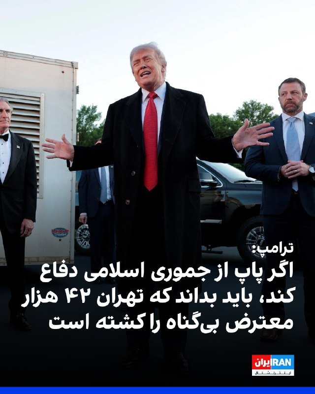

ترامپ پنج‌شنبه در واشینگتن‌دی‌سی به خبرنگاران گفت از وزیرخارجه آمریکا خواسته است در دیدار با پاپ خیلی محترمانه به او بگوید که اگر می‌خواهد از جمهوری اسلامی دفاع کند، باید بداند که حکومت ایران ۴۲ هزار معترض بی‌گناه را کشته است و همچنین باید بداند که تهران نباید سلاح هسته‌ای داشته باشد.
https://iranintl.com/202605081601

## FarsiVOA — post 217159

  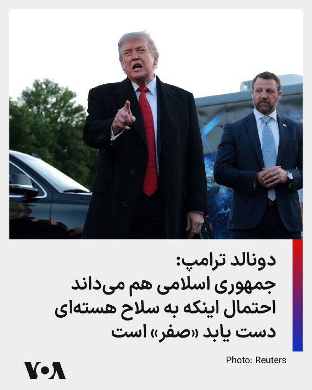

⚡️دونالد ترامپ عصر پنج‌شنبه گفت: «ما هرگز اجازه نخواهیم داد» جمهوری اسلامی به سلاح هسته‌ای دست پیدا کند. آقای ترامپ گفت: «احتمال آن صفر است. خودشان هم این را می‌دانند و با آن موافقت کرده‌اند. حالا باید ببینیم آیا حاضرند توافق را امضا کنند یا نه.»
@FarsiVOA

---
📅 بروزرسانی: 1405/02/18 04:32
---

## FarsiVOA — post 217158

🔺دونالد ترامپ: نیروی دریایی جمهوری اسلامی زمانی ۱۵۹ کشتی داشت حالا چند قایق‌ تندرو دارد که مقداری سلاح جلوی آن‌ها نصب شده است

▪️دونالد ترامپ، رئیس جمهوری آمریکا، عصر پنج‌شنبه ۱۷ اردیبهشت، ساعاتی پس از حمله نیروهای جمهوری اسلامی به سه کشتی آمریکایی گفت «ارتش ما در سراسر جهان فوق‌العاده عمل می‌کند. آن‌ها کارشان را به شکل باورنکردنی انجام می‌دهند. ما در حال مذاکره با ایرانی‌ها هستیم. احتمالاً شنیدید که امروز سه ناوشکن خودمان را از میان شرایط بسیار سخت عبور دادیم و حسابی آن‌ها (نیروهای جمهوری اسلامی) را در هم کوبیدیم.»

⬇️ بیشتر بخوانید:
https://ir.voanews.com/a/8147948.html
@FarsiVOA

---
📅 بروزرسانی: 1405/02/18 04:22
---

## VahidOOnLine — post 238787

  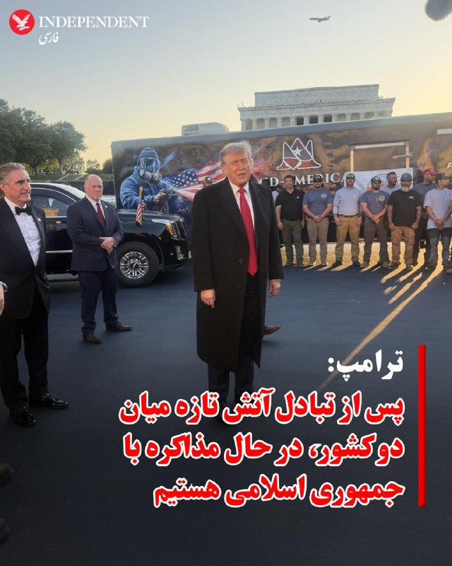

♦️دونالد ترامپ، رئیس‌جمهوری آمریکا، بامداد جمعه ۱۸ اردیبهشت‌ماه پس از حمله به اهداف و تاسیسات نظامی جمهوری اسلامی، در پاسخ به خبرنگاران گفت آمریکا همچنان با جمهوری اسلامی در حال مذاکره است.

او همچنین گفت سه ناوشکن آمریکایی از میان «درگیری‌های سنگین» در تنگه هرمز عبور کرده‌اند و هیچ آسیبی به ناوشکن‌ها و نیروهای آمریکایی وارد نشده است.

ترامپ افزود نیروهای جمهوری اسلامی به سمت ناوشکن‌ها شلیک کرده‌اند و آمریکا نیز پاسخ داده است. او گفت: «قدرت آتش ما خیلی بیشتر از آن‌ها بود و حسابی نابودشان کردیم.» ترامپ همچنین گفت تعداد زیادی از قایق‌های کوچک و تندروی ایرانی که به گفته او روی آن‌ها سلاح نصب شده بود، منهدم شدند.
‌🇸🇦 Indypersian

🤖 @VahidOOnLine

---
📅 بروزرسانی: 1405/02/18 04:12
---

---
📅 بروزرسانی: 1405/02/18 04:02
---

## VahidOOnLine — post 238786

  

ترامپ پنج‌شنبه به خبرنگاران گفت آمریکا با وجود تازه‌ترین تبادل آتش با جمهوری‌اسلامی در نزدیکی تنگه هرمز، در حال مذاکره با حکومت ایران است و افزود پاکستان از واشینگتن خواسته است در طول این گفت‌وگوها، طرح او برای اسکورت کشتی‌ها به خارج از این آبراه را دنبال نکند.
‌🏁 🇬🇧 IranintlTV

🤖 @VahidOOnLine

## IranIntlTV — post 336065

  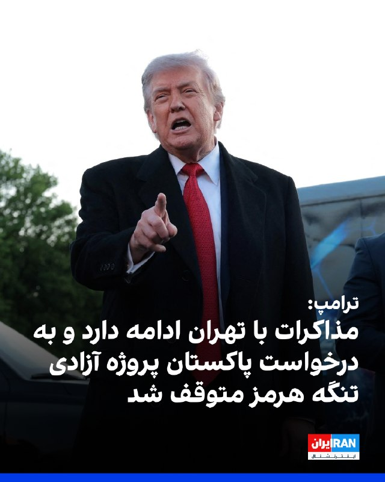

ترامپ پنج‌شنبه به خبرنگاران گفت آمریکا با وجود تازه‌ترین تبادل آتش با جمهوری‌اسلامی در نزدیکی تنگه هرمز، در حال مذاکره با حکومت ایران است و افزود پاکستان از واشینگتن خواسته است در طول این گفت‌وگوها، طرح او برای اسکورت کشتی‌ها به خارج از این آبراه را دنبال نکند.
https://iranintl.com/202605088751

## BBCPersian — post 280447

💢این یک تشدید تنش جدی پس از چهار هفته آتش‌بس است حتی با وجود تاکید ترامپ بر حفظ آتش‌بس
🖌تام بیتمن - خبرنگار بی‌‌بی‌سی در امور وزارت خارجه آمریکا

اين يک تشديد تنش قابل توجه است که آتش‌بس چهار هفته‌ای ميان ايالات متحده امريکا و ايران را بيش از پيش در معرض خطر قرار داده، هرچند هنوز مشخص نيست چه طرفی نخستين شليک را انجام داده است.

پنتاگون می‌گويد ناوشکن‌های نيروی دريايی آمريکا که در حال خروج از خليج فارس از طريق تنگه هرمز بودند، هدف حمله «تحريک‌نشده» موشک‌ها، پهپادها و قايق‌های کوچک ايرانی قرار گرفتند. آمريکا در پاسخ، تاسيسات نظامی ايران از جمله محل‌های پرتاب موشک و مراکز فرماندهی را هدف قرار داده است.

اين موضوع احتمالا توضيح‌دهنده گزارش‌های ايران درباره انفجارها در جزيره قشم و شهر بندری بندرعباس است.

اما نيروی دريايی سپاه پاسداران انقلاب اسلامی روايت متفاوتی ارائه داده و می‌گويد امريکا با آنچه «تجاوز» به يک نفتکش ايرانی و يک شناور ديگر خوانده، آغازگر درگيری بوده و ايران در واکنش، به سمت کشتی‌های امريکايی موشک و پهپاد شليک کرده است.

مقام‌های آمريکايی تلاش می‌کنند اين حادثه را يک تبادل آتش محدود جلوه دهند که به معنای از سرگيری جنگ نيست، اما تهران آن را نقض آتش‌بس از سوی امريکا توصيف می‌کند.

اين دور جديد درگيری‌ها پس از افزايش تنش ميان واشنگتن و متحدان عرب آن در خليج فارس رخ داده است؛ برخی از اين کشورها معتقدند امريکا در برابر حملات ايران به امارات متحده عربی در اوايل هفته جاری، واکنش به اندازه کافی شديدی نشان نداده است. اين حملات در پاسخ به عمليات نظامی — که اکنون متوقف شده — از سوی دونالد ترامپ برای بازگشايی اجباری تنگه هرمز انجام شده بود.

https://bbc.in/4tlxV6Q
@BBCPersian

---
📅 بروزرسانی: 1405/02/18 03:52
---

## BBCPersian — post 280446

  <a href="telegram/content/BBCPersian_280446_1778199750.mp4">🎬 Download video</a>

🔻خبرگزاری های فارس و تسنیم، نزدیک به سپاه پاسداران، بامداد جمعه تصاویری ویدیویی از لحظه شلیک موشک‌هایی را منتشر کردند که به ادعای آنها به سوی ناوهای آمریکایی در تنگه هرمز و سواحل مجاور قشم و بندرعباس شلیک شده است.

بی‌بی‌سی قادر به تایید درستی و تاریخ دقیق ین تصاویر نیست اما سنتکام مدعی شده است که سه ناو درگیر آن در این منازعه، آسیبی ندیده‌اند.

📸FARS
@BBCPersian

---
📅 بروزرسانی: 1405/02/18 03:42
---

---
📅 بروزرسانی: 1405/02/18 03:33
---

## VahidOOnLine — post 238777

بعضی اسم‌ها را فقط خانواده‌ها صدا نمی‌زنند؛ خیابان هم آن‌ها را به خاطر می‌سپارد.
از اسلامشهر تا اصفهان، از کرمانشاه تا گلستان، ۸ جوان دیگر که در انقلاب ملی کشته شدند؛
یکی در راه رسیدن به مادرش،
یکی روبه‌روی مقر سپاه،
یکی با گلوله‌ای به پشت سر،
و یکی با صدایی که دیگر به ترانه نرسید.
مهدی خلیلی، علیرضا قلعه‌قافی، آرمین عباسی، ارمیا لاچیانی، پویا رستمی، سامان نظری، ماهان قدمی، امیرارسلان قهرمانی
جاویدنامان انقلاب ملی ایرانیان؛
نام‌هایی که حکومت خواست در آمار گم شوند، اما در حافظه مردم ماندند.
#جاویدنامان_انقلاب_ملی_ایرانیان
‌🏁 🇬🇧 IranintlTV

🤖 @VahidOOnLine

## IranIntlTV — post 336056

بعضی اسم‌ها را فقط خانواده‌ها صدا نمی‌زنند؛ خیابان هم آن‌ها را به خاطر می‌سپارد.
از اسلامشهر تا اصفهان، از کرمانشاه تا گلستان، ۸ جوان دیگر که در انقلاب ملی کشته شدند؛
یکی در راه رسیدن به مادرش،
یکی روبه‌روی مقر سپاه،
یکی با گلوله‌ای به پشت سر،
و یکی با صدایی که دیگر به ترانه نرسید.
مهدی خلیلی، علیرضا قلعه‌قافی، آرمین عباسی، ارمیا لاچیانی، پویا رستمی، سامان نظری، ماهان قدمی، امیرارسلان قهرمانی
جاویدنامان انقلاب ملی ایرانیان؛
نام‌هایی که حکومت خواست در آمار گم شوند، اما در حافظه مردم ماندند.
#جاویدنامان_انقلاب_ملی_ایرانیان

---
📅 بروزرسانی: 1405/02/18 03:22
---

## VahidOOnLine — post 238776

  <a href="telegram/content/VahidOOnLine_238776_1778197965.mp4">🎬 Download video</a>

♦️خبرگزاری تسنیم، وابسته به سپاه پاسداران، بامداد جمعه ۱۸ اردیبهشت‌ماه تصاویری از شلیک موشک‌ به سمت ناو آمریکا منتشر کرد.

دونالد ترامپ، رئیس‌جمهوری آمریکا، همزمان اعلام کرد سه ناوشکن آمریکایی در حالی که زیر آتش موشک و پهپاد قرار داشتند، بدون آسیب از تنگه هرمز عبور کردند و موشک‌ها و پهپادهای شلیک‌شده به سمت آن‌ها رهگیری و منهدم شدند. او همچنین گفت قایق‌های تندروی ایرانی در جریان این درگیری‌ها غرق شدند و سه ناوشکن آمریکایی دوباره به محاصره دریایی آمریکا در منطقه بازخواهند گشت.
‌🇸🇦 Indypersian

🤖 @VahidOOnLine

## VahidOOnLine — post 238775

  

سخنگوی وزارت خارجه جمهوری اسلامی با انتشار فیلمی از بازسازی پل بی-۱ کرج که در جنگ کنونی تخریب شد، ابیاتی از شعر «دوباره می‌سازمت وطن» سیمین بهبهانی را بازنویسی کرد. آثار بهبهانی تحت حاکمیت جمهوری اسلامی با ممنوعیت مواجه بود و او به‌طور مداوم مورد احضار و بازجویی قرار می‌گرفت.
‌🏁 🇬🇧 IranintlTV

🤖 @VahidOOnLine

## IranIntlTV — post 336055

  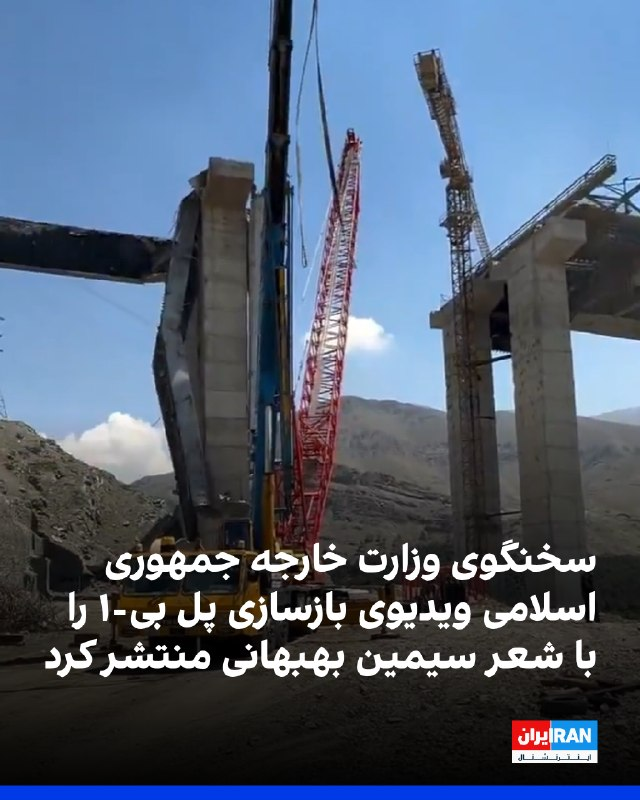

سخنگوی وزارت خارجه جمهوری اسلامی با انتشار فیلمی از بازسازی پل بی-۱ کرج که در جنگ کنونی تخریب شد، ابیاتی از شعر «دوباره می‌سازمت وطن» سیمین بهبهانی را بازنویسی کرد. آثار بهبهانی تحت حاکمیت جمهوری اسلامی با ممنوعیت مواجه بود و او به‌طور مداوم مورد احضار و بازجویی قرار می‌گرفت.
https://iranintl.com/202605073608

---
📅 بروزرسانی: 1405/02/18 03:12
---

## Iliaen — post 4433

نیروی دریایی سپاه بندر خمیر (هرمزگان)، شرکت و مجموعه کشتی‌سازی جزیره قشم، ساختمان هماهنگی سپاه در اسکله بهمن جزیره قشم، سایت موشکی سیریک هرمزگان و پایگاه هوایی بندرعباس هدف حملات ایالات متحده در حملات ساعات گذشته بودند.

همچنین تا این لحظه (ساعت ۰۳:۰۷ صبح جمعه)، گزارش‌ها از مشاهده و تداوم حضور پهپادهای شناسایی در خط ساحلی جنوب (بندرعباس، سیریک و بندر جاسک) حکایت دارد.

@iliaen

---
📅 بروزرسانی: 1405/02/18 03:02
---

## IranIntlTV — post 336054

  <a href="telegram/content/IranIntlTV_336054_1778196753.mp4">🎬 Download video</a>

بی‌عدالتی؛ میراث ۴۷ سالهٔ جمهوری اسلامی

مردم ایران در ۴۷ سال گذشته، هرگز طعم یک دستگاه قضایی عادل و حامی مردم را نچشیده‌اند و امروز، بی‌عدالتی را در همه‌چیز می‌بینند؛ از اینترنت طبقاتی و گرانی افسارگسیخته گرفته تا بیکاری، فروش وسایل خانه برای بقا و نابودی بازار کار.

کامبیز حسینی در «برنامه» نگاهی گذرا به این موضوع دارد.

«یک ایران صدای شما را می‌شنود»
دوشنبه تا پنجشنبه ۱۱ شب تهران
از تلویزیون ایران اینترنشنال

تماشای نسخه کامل این قسمت از «برنامه» در یوتیوب:
https://youtu.be/bCVx3k3JBjA
@iranintltv

## IranIntlTV — post 336053

  <a href="telegram/content/IranIntlTV_336053_1778196754.mp4">🎬 Download video</a>

آریا از تهران: خانوادهٔ جان‌فداها را حمایت کنیم؛ بیشتر آن‌ها نان‌آور خانواده بودند

«یک ایران صدای شما را می‌شنود»
دوشنبه تا پنجشنبه ۱۱ شب تهران
از تلویزیون ایران اینترنشنال

تماشای نسخه کامل این قسمت از «برنامه» در یوتیوب:
https://youtu.be/bCVx3k3JBjA
@iranintltv

## IranIntlTV — post 336052

  <a href="telegram/content/IranIntlTV_336052_1778196756.mp4">🎬 Download video</a>

مراد ویسی: حملهٔ آمریکا یعنی می‌خواهد به جمهوری اسلامی بگوید فقط تو نیستی که شلیک می‌کنی

«یک ایران صدای شما را می‌شنود»
دوشنبه تا پنجشنبه ۱۱ شب تهران
از تلویزیون ایران اینترنشنال

تماشای نسخه کامل این قسمت از «برنامه» در یوتیوب:
https://youtu.be/bCVx3k3JBjA
@iranintltv

## FarsiVOA — post 217157

  <a href="telegram/content/FarsiVOA_217157_1778196757.mp4">🎬 Download video</a>

⚡️گزارش‌ها از انفجارها در غرب تهران
@FarsiVOA

## BBCPersian — post 280445

  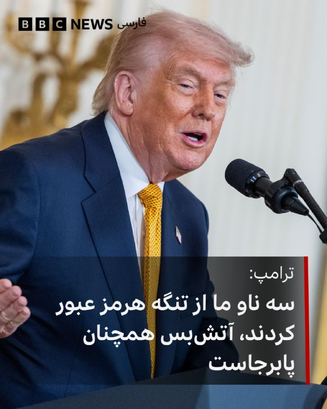

🔻دونالد ترامپ، رئیس جمهور آمریکا، در نخستین واکنش به درگیری ساعاتی پیش در تنگه هرمز، اعلام کرد «سه ناوشکن «در کلاس جهانی» امريکا با موفقيت از تنگه هرمز عبور کرده‌اند، آن هم در حالی که تحت آتش قرار داشتند.»

آقای ترامپ مدعی شد «هيچ آسيبی به اين سه ناوشکن وارد نشده، اما «خسارات بزرگی» به مهاجمان ايرانی وارد شده است.»

رئیس جمهور آمریکا همچنین تاکید کرده با وجود این درگیری دریایی، از نظر او آتش‌بس میان این کشور و ایران همچنان پابرجاست.

این در حالی است که ایران می‌گوید توانسته «خسارات جدی» به نیروهای آمریکایی وارد کند.

با این حال دونالد ترامپ در پستی که پنجشنبه شب در شبکه اجتماعی خود منتشر کرد گفت «نيروهای ايرانی «به طور کامل نابود شدند»، همراه با شمار زيادی از قايق‌های کوچک که به گفته او برای جايگزينی نيروی دريايی «کاملا از بين رفته» ايران استفاده می‌شوند.

📸EPA/Shutterstock
https://bbc.in/4cVMhGi
@BBCPersian

---
📅 بروزرسانی: 1405/02/18 02:52
---

## IranIntlTV — post 336051

  <a href="telegram/content/IranIntlTV_336051_1778196144.mp4">🎬 Download video</a>

مهدی از مازندران: بسیجی‌ها، قیمت اجناس را نمی‌بینید؟ واکنش شما نسبت به گرانی چیست؟

«یک ایران صدای شما را می‌شنود»
دوشنبه تا پنجشنبه ۱۱ شب تهران
از تلویزیون ایران اینترنشنال

تماشای نسخه کامل این قسمت از «برنامه» در یوتیوب:
https://youtu.be/bCVx3k3JBjA
@iranintltv

## IranIntlTV — post 336050

  <a href="telegram/content/IranIntlTV_336050_1778196146.mp4">🎬 Download video</a>

بهمن از بندرعباس: نیم ساعت پیش صدای آخرین انفجار آمد، در دوران جنگ هم پدافند چیزی نزد

«یک ایران صدای شما را می‌شنود»
دوشنبه تا پنجشنبه ۱۱ شب تهران
از تلویزیون ایران اینترنشنال

تماشای نسخه کامل این قسمت از «برنامه» در یوتیوب:
https://youtu.be/bCVx3k3JBjA
@iranintltv

## IranIntlTV — post 336049

  <a href="telegram/content/IranIntlTV_336049_1778196147.mp4">🎬 Download video</a>

مراد ویسی: دیپلمات‌های ایران و آمریکا با هم حرف می‌زنند، اما نظامی‌ها به هم موشک می‌زنند

«یک ایران صدای شما را می‌شنود»
دوشنبه تا پنجشنبه ۱۱ شب تهران
از تلویزیون ایران اینترنشنال

تماشای نسخه کامل این قسمت از «برنامه» در یوتیوب:
https://youtu.be/bCVx3k3JBjA
@iranintltv

## IranIntlTV — post 336048

  <a href="telegram/content/IranIntlTV_336048_1778196148.mp4">🎬 Download video</a>

سنتکام اعلام کرد نیروهای آمریکایی حملات موشکی، پهپادی و قایق‌های کوچک جمهوری اسلامی را رهگیری کرده و به منابع این حمله‌ها در ایران حمله کرده‌اند.

سنتکام تاکید کرد به‌دنبال تشدید تنش نیست، اما همچنان در موقعیت مناسب قرار دارد.

گزارش نیلوفر منصوری، خبرنگار ایران‌اینترنشنال
@iranintltv

## FarsiVOA — post 217156

⚡️در روزگاری که اینترنت دیگر فقط ابزار ارتباط نیست و به ستون اصلی کار، آموزش، درمان و بقا تبدیل شده، قطع طولانی‌مدت اینترنت بین‌المللی در ایران، موج تازه‌ای از مهاجرت را شکل داده است. مهاجرتی برای وصل ماندن به جهان.
@FarsiVOA

## configx2ray — post 38616

  <a href="https://t.me/ConfigX2ray/38616">📎 Download file</a>

کانفیگ برای Npv tunnel ⭕️

به هیچ وج دانلود نزنید باهاش
❤️

رمز فایل : @ConfigX2ray

Channel : https://t.me/ConfigX2ray

---
📅 بروزرسانی: 1405/02/18 02:42
---

## VahidOOnLine — post 238774

  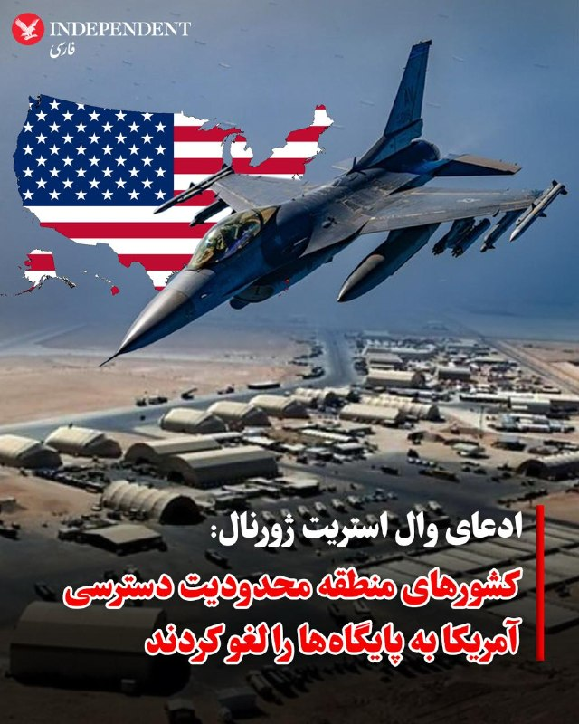

♦️به گزارش وال استریت ژورنال، عربستان سعودی و کویت محدودیت‌هایی را که پس از آغاز عملیات آمریکا برای بازگشایی تنگه هرمز بر استفاده ارتش آمریکا از پایگاه‌ها و حریم هوایی این دو کشور اعمال شده بود، لغو کردند.
به نوشته وال استریت ژورنال، این اقدام مانعی را که تلاش دونالد ترامپ برای عبور دادن کشتی‌ها از این آبراه حیاتی با مشکل روبه‌رو کرده بود، برطرف کرده است.این در حالی است که عربستان سعودی ادعاهای قبلی رسانه ها مبنی بر اینکه چنین محدودیت هایی اعمال شده را تایید یا تکذیب نکرده است.
به گزارش این روزنامه آمریکایی، مقام‌های آمریکایی گفتند دولت ترامپ اکنون در پی ازسرگیری عملیاتی است که هدف آن هدایت کشتی‌های تجاری با پشتیبانی دریایی و هوایی بود؛ عملیاتی که این هفته پس از ۳۶ ساعت متوقف شد. با این حال هنوز مشخص نیست این عملیات چه زمانی از سر گرفته خواهد شد، هرچند مقام‌های پنتاگون گفته‌اند این کار ممکن است از همین هفته آغاز شود.
عملیات آمریکا برای باز نگه داشتن تنگه متکی به ناوگانی عظیم از هواپیماها بود که وظیفه حفاظت از کشتی‌های تجاری در برابر موشک‌ها و پهپادهای ایران را بر عهده داشتند؛ موضوعی که پایگاه‌ها و حریم هوایی عربستان سعودی و کویت را برای اجرای این ماموریت به عنصری حیاتی تبدیل می‌کرد.
‌🇸🇦 Indypersian

🤖 @VahidOOnLine

## VahidOOnLine — post 238773

  

ترامپ در تروث سوشال با اشاره به حمله جدید جمهوری اسلامی به سه ‌ناوشکن آمریکا گفت: «یک کشور عادی اجازه می‌داد این ناوشکن‌ها عبور کنند، اما ایران یک کشور عادی نیست. آن‌ها توسط دیوانگانی هدایت می‌شوند و اگر فرصت استفاده از سلاح هسته‌ای را داشته باشند، حتما این کار را خواهند کرد.»
او تاکید کرد: جمهوری اسلامی «هرگز چنین فرصتی نخواهد داشت و همان‌طور که امروز دوباره آن‌ها را از پا درآوردیم، اگر توافق خود را سریع امضا نکنند، در آینده بسیار شدیدتر و با خشونت بیشتری آن‌ها را از پا درخواهیم آورد.»
ترامپ گفت: «سه ناوشکن ما با خدمه عالی خود اکنون به محاصره دریایی ما بازخواهند گشت؛ محاصره‌ای که واقعا یک دیوار فولادی است.»

‌🏁 🇬🇧 IranintlTV

🤖 @VahidOOnLine

## IranIntlTV — post 336047

  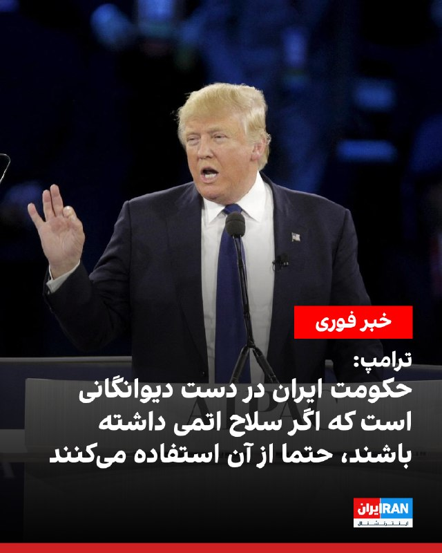

ترامپ در تروث سوشال با اشاره به حمله جدید جمهوری اسلامی به سه ‌ناوشکن آمریکا گفت: «یک کشور عادی اجازه می‌داد این ناوشکن‌ها عبور کنند، اما ایران یک کشور عادی نیست. آن‌ها توسط دیوانگانی هدایت می‌شوند و اگر فرصت استفاده از سلاح هسته‌ای را داشته باشند، حتما این کار را خواهند کرد.»
او تاکید کرد: جمهوری اسلامی «هرگز چنین فرصتی نخواهد داشت و همان‌طور که امروز دوباره آن‌ها را از پا درآوردیم، اگر توافق خود را سریع امضا نکنند، در آینده بسیار شدیدتر و با خشونت بیشتری آن‌ها را از پا درخواهیم آورد.»
ترامپ گفت: «سه ناوشکن ما با خدمه عالی خود اکنون به محاصره دریایی ما بازخواهند گشت؛ محاصره‌ای که واقعا یک دیوار فولادی است.»

https://iranintl.com/202605073527

## Shin_Persian — post 5885

  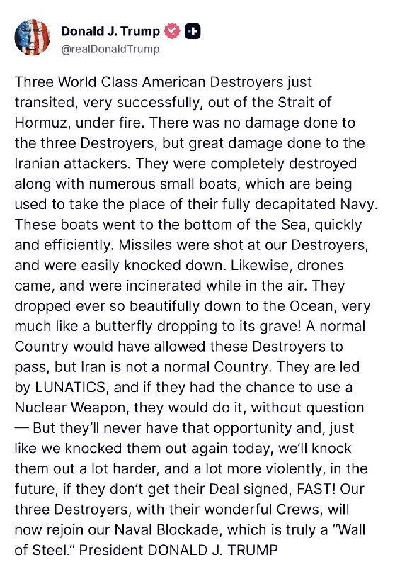

Rapid Response 47 ✓ @RapidResponse47
Thu, 07 May 2026 22:35:05 UTC

𝕏 · @shin_persian

## FarsiVOA — post 217155

  <a href="telegram/content/FarsiVOA_217155_1778195568.mp4">🎬 Download video</a>

⚡️اقدام نظامی سنتکام در پاسخ به حملات جمهوری اسلامی به ناوهای آمریکایی در تنگه هرمز
@FarsiVOA

## FarsiVOA — post 217154

⚡️توقیف اموال و تهدید به اعدام؛ فاز تازه برخورد قضایی در ایران
@FarsiVOA

## DW_Farsi — post 124417

  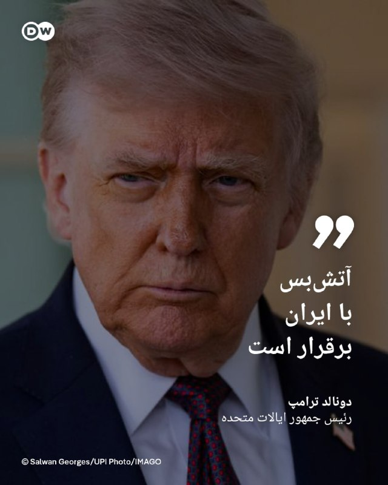

🔶 ترامپ: آتش‌بس با ایران برقرار است

دونالد ترامپ، رئیس جمهور ایالات متحده، در ساعات پایانی پنجشنبه ۷ مه (۱۷ اردیبهشت) گفت، آتش‌بس با ایران علیرغم حملات جدید همچنان پابرجاست.

ترامپ در یک تماس تلفنی به شبکه آمریکایی ABC News ا‌‌ظهار داشت، حملات علیه اهدافی در ایران فقط "یک ضربه محدود" بوده است.

رئیس جمهور آمریکا همچنین افزود: «آتش‌بس ادامه دارد و برقرار است.»

او همچنین در پستی در شبکه اجتماعی تروث سوشال نوشت: «سه ناوشکن آمریکایی درجه یک زیر آتش، با موفقیت بسیار زیاد، از تنگه هرمز خارج شدند. هیچ آسیبی به این سه ناوشکن وارد نشد، اما خسارات زیادی به مهاجمان ایرانی وارد شد. آنها به همراه تعداد زیادی قایق کوچک کاملا منهدم شدند.»

رئیس جمهور آمریکا در بخش دیگری از پیام خود نوشت: «اگر ایرانی‌ها فرصت استفاده از سلاح هسته‌ای را پیدا می‌کردند، بدون کوچک‌ترین تردیدی از آن استفاده می‌کردند اما هرگز چنین فرصتی به دست نخواهند آورد.»

ترامپ در انتهای پست خود همچنین نوشته است "همانطور که امروز ایرانی‌ها را در هم شکستیم، اگر به‌سرعت توافق را امضا نکنند، در آینده با قدرت و شدت بیشتری آن‌ها را سرکوب خواهیم کرد".
@dw_farsi

## BBCPersian — post 280444

  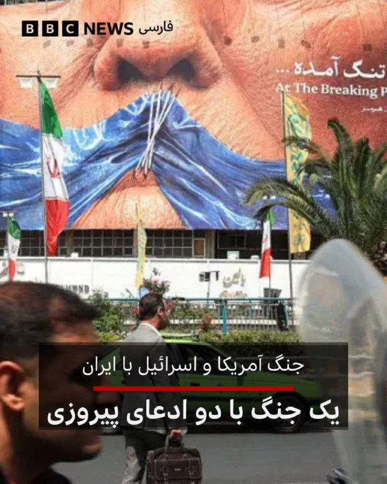

🖋امیر عظیمی
بی‌بی‌سی فارسی

این دور از جنگ آمریکا و اسرائیل با ایران شاید فعلا پایان یافته باشد؛ دست‌کم این پیامی است که از واشنگتن مخابره می‌شود.

مارکو روبیو، وزیر خارجه آمریکا، روز سه‌شنبه ۵ مه، پس از چند هفته آتش‌بس، گفت عملیات «خشم حماسی» عملا به پایان رسیده است؛ هرچند او موضوعی چنین مهم را نه در صدر صحبت‌هایش، که در میان بخش‌های دیگر سخنرانی‌اش گفت.

حالا و با این فرض که این جنگ تمام شده، پرسش اصلی این است: چه کسی پیروز شد؟

پاسخ این سوال بستگی دارد به این‌که داستان را از زبان چه کسی بشنوید.

در ایران، صدا و سیما و سایر رسانه‌های نزدیک به حکومت، جنگ را سند ایستادگی این کشور در برابر قدرتمندترین ائتلاف نظامی جهان و شکست دادن آن توصیف می‌کنند.
ادامه مطلب⬇️

📸AFP via Getty Images
https://bbc.in/4utPwdQ
@BBCPersian

---
📅 بروزرسانی: 1405/02/18 02:32
---

## VahidOOnLine — post 238772

  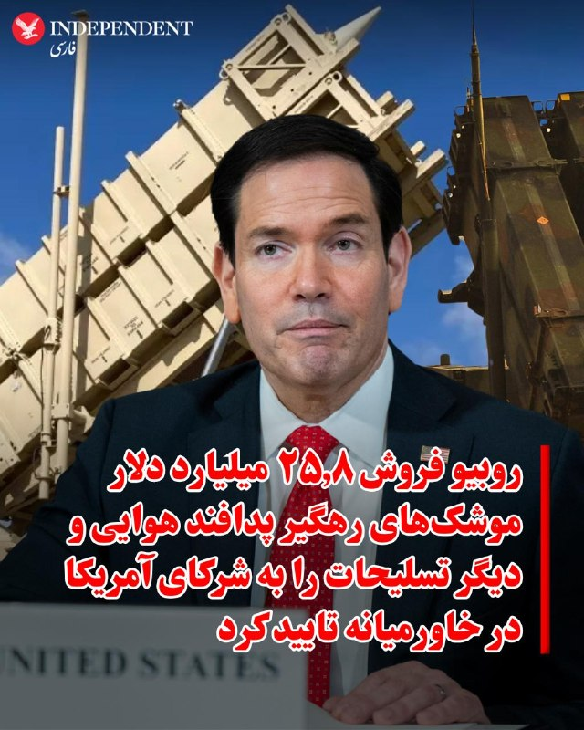

♦️به گزارش بلومبرگ، مارکو روبیو، وزیر خارجه آمریکا، فروش صدها موشک رهگیر پیشرفته پدافند هوایی و دیگر تسلیحات به شرکای آمریکا در خاورمیانه را در قالب قراردادهایی به ارزش ۲۵.۸ میلیارد دلار تأیید کرد؛ رقمی که سه برابر مبلغی است که دولت آمریکا هفته گذشته هنگام اعلام اولیه این توافق‌ها منتشر کرده بود.
به گفته سخنگوی وزارت خارجه آمریکا، روبیو اول مه با استفاده از اختیارات اضطراری، فروش این تسلیحات به بحرین، اسرائیل، کویت، قطر و امارات متحده عربی را تصویب کرد. یک دستیار کنگره آمریکا نیز که نخواست نامش فاش شود، تأیید کرد که قانونگذاران در جریان اقدام وزارت خارجه قرار گرفته‌اند.
‌🇸🇦 Indypersian

🤖 @VahidOOnLine

## VahidOOnLine — post 238771

  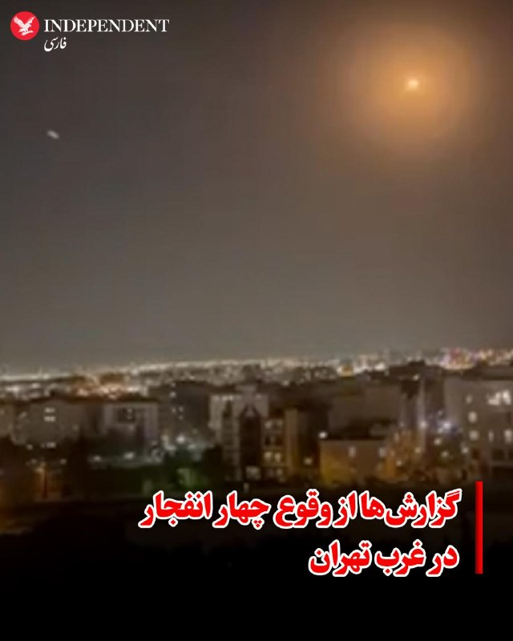

♦️ کانال تلگرامی اسکان‌نیوز حدود ساعت یک‌و‌نیم صبح جمعه، از وقوع چهار انفجار در غرب تهران خبر داد. در ساعات گذشته گزارش‌های دیگری نیز از انفجار درغرب تهران و فعالیت ممتد پدافند هوایی منتشر شده بود.
‌🇸🇦 Indypersian

🤖 @VahidOOnLine

## VahidOOnLine — post 238770

  

ترامپ در تروث سوشال گفت سه ناوشکن نیروی دریایی آمریکا در حالی که هدف آتش قرار داشتند از تنگه هرمز عبور کردند و افزود این ناوشکن‌ها آسیبی ندیدند، اما «خسارت زیادی به مهاجمان ایرانی وارد شد.»
ترامپ نوشت: «سه ناوشکن درجه‌یک آمریکایی به‌تازگی با موفقیت بسیار در حالی که هدف آتش بودند از تنگه هرمز عبور کردند. هیچ آسیبی به این سه ناوشکن وارد نشد، اما خسارت زیادی به مهاجمان ایرانی وارد شد.»
او گفت: «آن‌ها به‌طور کامل نابود شدند، همراه با شمار زیادی قایق کوچک.»

‌🏁 🇬🇧 IranintlTV

🤖 @VahidOOnLine

## kianmeli1 — post 87266

  <a href="telegram/content/kianmeli1_87266_1778194982.mp4">🎬 Download video</a>

🔴سپاه فیلمی از لحظه شلیک موشک به ناوشکن های امریکا منتشر کرد

همزمان دقایقی پیش ترامپ گفت هیچ صدمه ای به ناوشکن ها نرسیده است
https://t.me/kianmeli1

## IranIntlTV — post 336046

  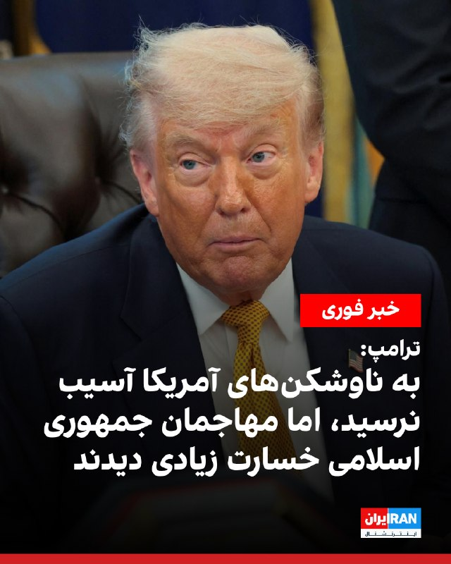

ترامپ در تروث سوشال گفت سه ناوشکن نیروی دریایی آمریکا در حالی که هدف آتش قرار داشتند از تنگه هرمز عبور کردند و افزود این ناوشکن‌ها آسیبی ندیدند، اما «خسارت زیادی به مهاجمان ایرانی وارد شد.»
ترامپ نوشت: «سه ناوشکن درجه‌یک آمریکایی به‌تازگی با موفقیت بسیار در حالی که هدف آتش بودند از تنگه هرمز عبور کردند. هیچ آسیبی به این سه ناوشکن وارد نشد، اما خسارت زیادی به مهاجمان ایرانی وارد شد.»
او گفت: «آن‌ها به‌طور کامل نابود شدند، همراه با شمار زیادی قایق کوچک.»

https://iranintl.com/202605077977

## IranIntlTV — post 336045

  <a href="telegram/content/IranIntlTV_336045_1778194984.mp4">🎬 Download video</a>

وال‌استریت ژورنال گزارش داد دونالد ترامپ در حال بررسی ازسرگیری «پروژه آزادی» برای هدایت کشتی‌های تجاری از تنگه هرمز است و این اقدام ممکن است از اوایل همین هفته آغاز شود.

گزارش مرضیه حسینی، خبرنگار ایران‌اینترنشنال
@iranintltv

## FarsiVOA — post 217153

🔺واکنش ترامپ به حمله جمهوری اسلامی به ناوهای آمریکایی: رژیم اگر سریعتر توافق را امضا نکند با خشونت بیشتری از میدان به ‌در می‌شود

▪️دونالد ترامپ، رئیس جمهوری آمریکا، پنج‌شنبه ۱۷ اردیبهشت گفت «سه ناوشکن آمریکایی در کلاس جهانی، با موفقیت بسیار زیاد، از تنگه هرمز، زیر آتش دشمن، عبور کردند.»

⬇️ بیشتر بخوانید:
https://ir.voanews.com/a/8147729.html
@FarsiVOA

## FarsiVOA — post 217152

⚡️کاهش کشت خشخاش در افغانستان؛ نگرانی‌ها در ایران از قاچاق مواد مخدر
@FarsiVOA

## IranianMinds — post 19776

  

🔴 خلاصه حرف های ترامپ :

ایران اومد یه سری کار ها کرد که ما هم برای تلافی امشب بهشون حمله کردیم که چیزه خاصی نیست و آتش بس هنوز برقراره

رهبر های ایران همشون دیوانه ان و این دیوانه ها اصلا نباید به سلاح هسته ای برسن

اگه به جایی نرسیم حملاتمون شدیدتر و نابود کننده تر خواهد شد , پس بهتره هرچه زودتر سر عقل بیان و با ما به توافق برسن !

@IranianMinds

## IranianMinds — post 19775

فقط کافیه مرغ از خیابون رد کنی و‌پولت چند برابر کنی
💵👌

## IranianMinds — post 19774

  <a href="telegram/content/IranianMinds_19774_1778194987.mp4">🎬 Download video</a>

بچه ها اسم این بازی عبور مرغ از خیابون  هست ویدئو نگاه کنید خیلی راحت 8 میلیون ازش سود گرفتیم😍

😤اگ توم دوس داری خیلی راحت از بازی های انلاین پول در بیاری حتما عضو کازینو شبانه شو
✅

توی کازینو شبانه بهت اموزش میدیم از بازی های انلاین پول دربیاری👌

کازینو شبانه راهی برای چند برابر کردن سرمایت 🤷‍♂

کسب درامد انلاین با یه ادم حرفه ای یاد بگیر و‌ پول دربیار 
💵
ae17
🎯همین حالا عضو شو و شروع کن👇
https://t.me/+OS-QBvyDO4M2ZGY0
https://t.me/+OS-QBvyDO4M2ZGY0

---
📅 بروزرسانی: 1405/02/18 02:22
---

## VahidOOnLine — post 238769

  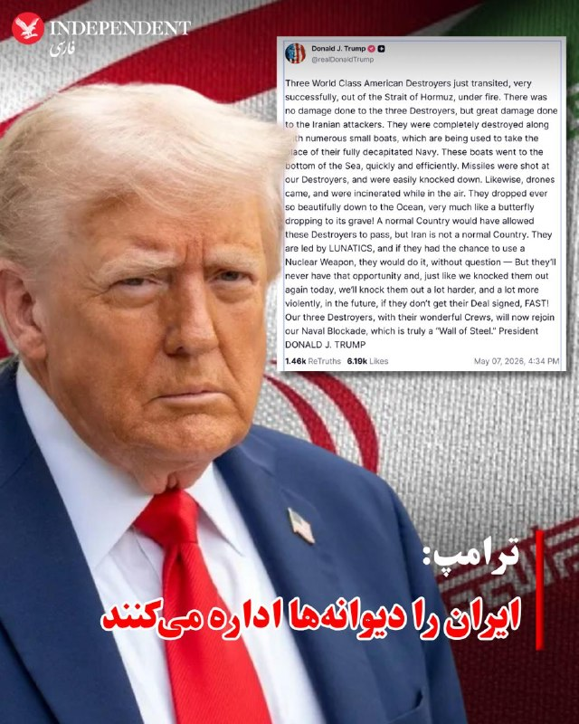

♦️دونالد ترامپ، رئیس‌جمهوری آمریکا در پیامی در تروث سوشال نوشت: «سه ناوشکن کلاس‌جهانی آمریکایی با موفقیت کامل و در حالی که زیر آتش بودند، از تنگه هرمز عبور کردند. هیچ آسیبی به این سه ناوشکن وارد نشد، اما خسارت سنگینی به مهاجمان ایرانی وارد شد. آنها به‌طور کامل نابود شدند، همراه با شمار زیادی قایق کوچک که برای جایگزینی نیروی دریایی کاملا نابودشده ایران استفاده می‌شوند. این قایق‌ها به‌سرعت و با کارآمدی کامل به قعر دریا فرستاده شدند.»
ترامپ افزود: «موشک‌هایی به سمت ناوشکن‌های ما شلیک شد، اما به‌آسانی رهگیری و منهدم شدند. همچنین پهپادها به پرواز درآمدند، اما در آسمان سوزانده شدند.»
رئیس‌جمهوری آمریکا تاکید کرد: یک کشور عادی اجازه می‌داد این ناوشکن‌ها عبور کنند، اما ایران یک کشور عادی نیست. این کشور توسط دیوانه‌ها اداره می‌شود و اگر فرصتی برای استفاده از سلاح هسته‌ای داشته باشند، بدون تردید از آن استفاده خواهند کرد — اما آنها هرگز چنین فرصتی نخواهند داشت. همان‌طور که امروز آنها را از پا درآوردیم، اگر خیلی سریع توافقشان را امضا نکنند، در آینده بسیار شدیدتر و خشن‌تر آنها را درهم خواهیم کوبید.»
ترامپ در پایان تاکید کرد: «سه ناوشکن ما، همراه با خدمه فوق‌العاده‌شان، اکنون به محاصره دریایی ما بازخواهند گشت؛ محاصره‌ای که واقعا یک «دیوار فولادی» است.»
‌🇸🇦 Indypersian

🤖 @VahidOOnLine

## VahidOOnLine — post 238768

  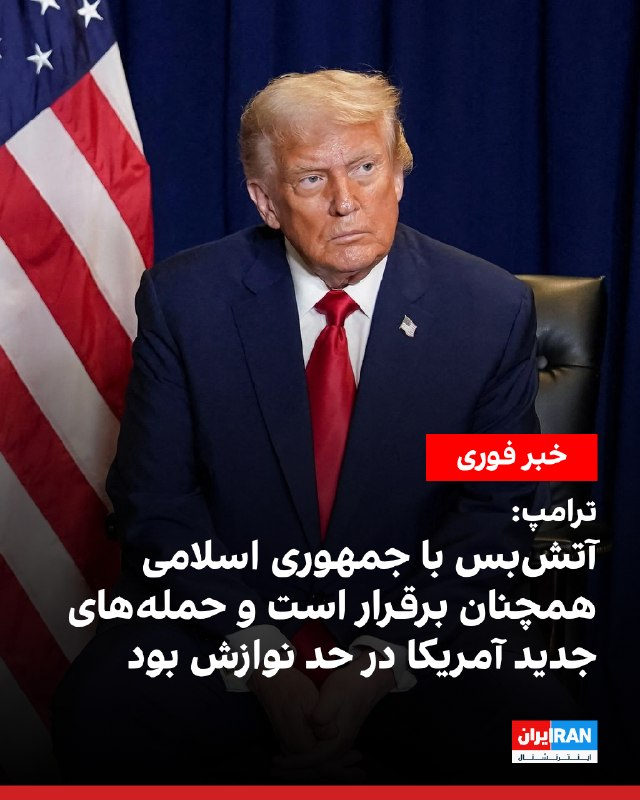

ترامپ درباره درگیری جدید آمریکا و جمهوری اسلامی در تنگه هرمز به شبکه ای‌بی‌سی نیوز گفت: «آتش‌بس پایان نیافته و همچنان برقرار است.» ترامپ حمله‌های جدید آمریکا به جمهوری اسلامی را «ضربه‌ای در حد نوازش» خواند.
ستاد فرماندهی مرکزی آمریکا، سنتکام، اعلام کرد نیروهای آمریکایی ۱۷ اردیبهشت همزمان با عبور ناوشکن‌های مجهز به موشک هدایت‌شونده آمریکا از تنگه هرمز به سوی دریای عمان، حملات موشکی، پهپادی و قایق‌های کوچک جمهوری اسلامی را رهگیری و به منابع این حمله‌ها در ایران حمله کردند.
‌🏁 🇬🇧 IranintlTV

🤖 @VahidOOnLine

## VahidOOnLine — post 238767

  <a href="telegram/content/VahidOOnLine_238767_1778194329.mp4">🎬 Download video</a>

‌
سنتکام، فرماندهی مرکزی آمریکا، اعلام کرد نیروهای این کشور در جریان عبور ناوشکن‌های نیروی دریایی آمریکا از تنگه هرمز، حملات «بدون تحریک» جمهوری اسلامی را رهگیری کرده و در پاسخ، حملات «دفاعی» انجام داده‌اند.

در بیانیه سنتکام آمده است که روز ۷ مه، هم‌زمان با عبور ناوشکن‌های «یو‌اس‌اس تروکستون»، «یو‌اس‌اس رافائل پرالتا» و «یو‌اس‌اس میسون» از این گذرگاه بین‌المللی به سمت دریای عمان، نیروهای جمهوری اسلامی با شلیک «چندین موشک، پهپاد و قایق‌های تندرو» این شناورها را هدف قرار دادند.

سنتکام تأکید کرده است که «هیچ‌یک از تجهیزات آمریکا هدف اصابت قرار نگرفت» و نیروهای آمریکایی تمامی تهدیدهای ورودی را منهدم کردند.

این فرماندهی همچنین اعلام کرد در واکنش، تأسیسات نظامی جمهوری اسلامی که به گفته آن در حمله به نیروهای آمریکایی نقش داشته‌اند، از جمله «سایت‌های پرتاب موشک و پهپاد، مراکز فرماندهی و کنترل و همچنین مراکز اطلاعاتی، نظارتی و شناسایی» هدف قرار گرفته‌اند.
‌🏁 🇬🇧 ManotoTV

🤖 @VahidOOnLine

## VahidOOnLine — post 238766

  <a href="telegram/content/VahidOOnLine_238766_1778194330.mp4">🎬 Download video</a>

‌
یک مقام آمریکایی به شبکه «ان‌بی‌سی نیوز» گفته نیروهای نظامی این کشور دست‌کم دو نقطه در ایران را هدف حمله قرار داده‌اند.

به گفته این مقام، این حملات در بندرعباس و جزیره قشم انجام شده و «ماهیت دفاعی» داشته است. او تأکید کرده این اقدام «به‌معنای ازسرگیری عملیات گسترده نظامی علیه ایران نیست».

این در حالی است که دونالد ترامپ پیش‌تر طرح «پروژه آزادی» برای اسکورت کشتی‌ها در تنگه هرمز را متوقف کرده بود. به گفته این مقام، با توجه به تداوم نگرانی‌های عربستان سعودی و دیگر متحدان منطقه‌ای، انتظار نمی‌رود این عملیات به‌زودی از سر گرفته شود.
‌🏁 🇬🇧 ManotoTV

🤖 @VahidOOnLine

## VahidOOnLine — post 238765

  <a href="telegram/content/VahidOOnLine_238765_1778194330.mp4">🎬 Download video</a>

فعالیت پدافند هوایی تهران، شامگاه پنجشنبه، ۱۷ اردیبهشت ۱۴۰۵
‌🏁 🇬🇧 ManotoTV

🤖 @VahidOOnLine

## VahidOOnLine — post 238764

  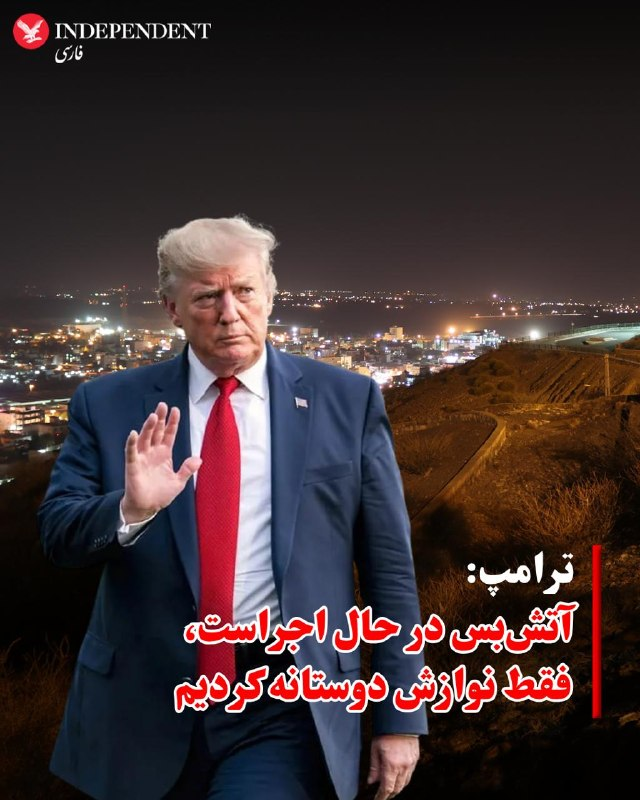

♦️دونالد ترامپ، رئیس‌جمهوری آمریکا در پی حمله‌ها به بنادر جنوبی ایران و شنیده شدن صدای انفجار در غرب تهران به ای‌بی‌سی گفت که ارتش آمریکا در اقدامی دفاعی به رژیم ایران یک «نوازش دوستانه» داده است و آتش‌بس همچنان در حال اجراست. او گفت حمله‌های متقابل به ایران فقط یک نوازش دوستانه بوده است.
‌🇸🇦 Indypersian

🤖 @VahidOOnLine

## VahidOnline — post 75314

  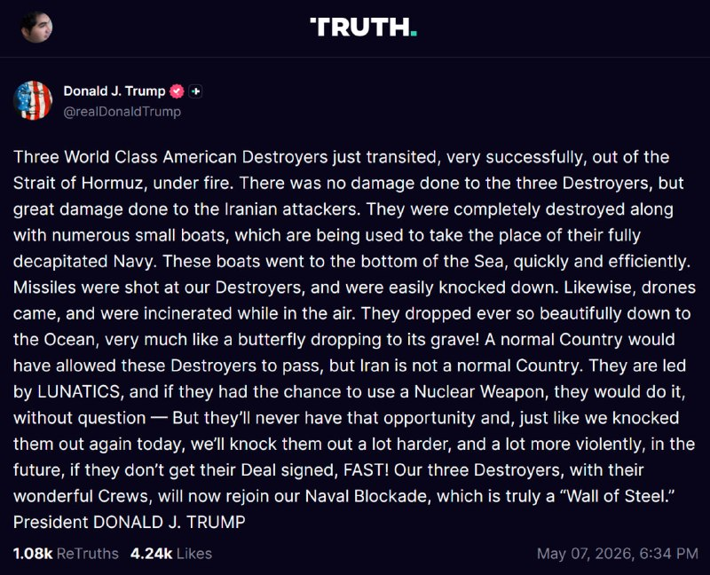

ترامپ: ایران را دیوانگان هدایت می‌کنند

پست ترامپ، ترجمه ماشین:
سه ناوشکن درجه‌یک آمریکایی به‌تازگی، با موفقیت کامل و در حالی که زیر آتش بودند، از تنگه هرمز خارج شدند. هیچ آسیبی به این سه ناوشکن وارد نشد، اما به مهاجمان ایرانی آسیب سنگینی وارد شد. آن‌ها به‌طور کامل نابود شدند، همراه با شمار زیادی قایق کوچک که اکنون برای جایگزینی نیروی دریایی کاملاً از سر بریده‌شده‌شان استفاده می‌شوند. این قایق‌ها به‌سرعت و با کارایی کامل به قعر دریا رفتند.

به‌سوی ناوشکن‌های ما موشک شلیک شد و به‌راحتی سرنگون شدند. پهپادها نیز آمدند و در هوا سوزانده شدند. آن‌ها به‌شکلی بسیار زیبا به سوی اقیانوس سقوط کردند؛ درست مانند پروانه‌ای که به سوی گور خود فرو می‌افتد!

یک کشور عادی اجازه می‌داد این ناوشکن‌ها عبور کنند، اما ایران یک کشور عادی نیست. آن‌ها را دیوانگانی هدایت می‌کنند و اگر فرصت استفاده از سلاح هسته‌ای را داشتند، بی‌تردید این کار را می‌کردند — اما هرگز چنین فرصتی نخواهند داشت و همان‌طور که امروز دوباره آن‌ها را از پا درآوردیم، اگر توافق خود را سریع امضا نکنند، در آینده بسیار سخت‌تر و بسیار خشن‌تر آن‌ها را از پا درخواهیم آورد!

سه ناوشکن ما، همراه با خدمه فوق‌العاده‌شان، اکنون دوباره به محاصره دریایی ما خواهند پیوست؛ محاصره‌ای که واقعاً یک «دیوار فولادین» است.

رئیس‌جمهور دونالد جی. ترامپ
realDonaldTrump

📡 @VahidOnline

## VahidOnline — post 75313

  

♦️دونالد ترامپ، رئیس‌جمهوری آمریکا در پی حمله‌ها به بنادر جنوبی ایران و شنیده شدن صدای انفجار در غرب تهران به ای‌بی‌سی گفت که ارتش آمریکا در اقدامی دفاعی به رژیم ایران یک «نوازش دوستانه» داده است و آتش‌بس همچنان در حال اجراست. او گفت حمله‌های متقابل به ایران فقط یک نوازش دوستانه بوده است.
@VahidOOnLine

📡 @VahidOnline

## IranIntlTV — post 336044

  

ترامپ درباره درگیری جدید آمریکا و جمهوری اسلامی در تنگه هرمز به شبکه ای‌بی‌سی نیوز گفت: «آتش‌بس پایان نیافته و همچنان برقرار است.» ترامپ حمله‌های جدید آمریکا به جمهوری اسلامی را «ضربه‌ای در حد نوازش» خواند.
ستاد فرماندهی مرکزی آمریکا، سنتکام، اعلام کرد نیروهای آمریکایی ۱۷ اردیبهشت همزمان با عبور ناوشکن‌های مجهز به موشک هدایت‌شونده آمریکا از تنگه هرمز به سوی دریای عمان، حملات موشکی، پهپادی و قایق‌های کوچک جمهوری اسلامی را رهگیری و به منابع این حمله‌ها در ایران حمله کردند.
https://iranintl.com/202605073051

## IranIntlTV — post 336043

  <a href="telegram/content/IranIntlTV_336043_1778194332.mp4">🎬 Download video</a>

در جریان «هفته پاسخگو کردن جمهوری اسلامی» که از سال ۲۰۱۳ در کانادا برگزار می‌شود، گروه‌هایی از ایرانیان با شماری از نمایندگان مجلس عوام و سنای این کشور دیدار کردند تا حمایت قانون‌گذاران کانادا را برای افزایش فشارها بر جمهوری اسلامی جلب کنند.

گفت‌وگو با اردشیر زارع‌زاده، حقوقدان
@iranintltv

## ManotoTV — post 105115

  <a href="telegram/content/ManotoTV_105115_1778194334.mp4">🎬 Download video</a>

‌
سنتکام، فرماندهی مرکزی آمریکا، اعلام کرد نیروهای این کشور در جریان عبور ناوشکن‌های نیروی دریایی آمریکا از تنگه هرمز، حملات «بدون تحریک» جمهوری اسلامی را رهگیری کرده و در پاسخ، حملات «دفاعی» انجام داده‌اند.

در بیانیه سنتکام آمده است که روز ۷ مه، هم‌زمان با عبور ناوشکن‌های «یو‌اس‌اس تروکستون»، «یو‌اس‌اس رافائل پرالتا» و «یو‌اس‌اس میسون» از این گذرگاه بین‌المللی به سمت دریای عمان، نیروهای جمهوری اسلامی با شلیک «چندین موشک، پهپاد و قایق‌های تندرو» این شناورها را هدف قرار دادند.

سنتکام تأکید کرده است که «هیچ‌یک از تجهیزات آمریکا هدف اصابت قرار نگرفت» و نیروهای آمریکایی تمامی تهدیدهای ورودی را منهدم کردند.

این فرماندهی همچنین اعلام کرد در واکنش، تأسیسات نظامی جمهوری اسلامی که به گفته آن در حمله به نیروهای آمریکایی نقش داشته‌اند، از جمله «سایت‌های پرتاب موشک و پهپاد، مراکز فرماندهی و کنترل و همچنین مراکز اطلاعاتی، نظارتی و شناسایی» هدف قرار گرفته‌اند.

## ManotoTV — post 105114

  <a href="telegram/content/ManotoTV_105114_1778194334.mp4">🎬 Download video</a>

‌
یک مقام آمریکایی به شبکه «ان‌بی‌سی نیوز» گفته نیروهای نظامی این کشور دست‌کم دو نقطه در ایران را هدف حمله قرار داده‌اند.

به گفته این مقام، این حملات در بندرعباس و جزیره قشم انجام شده و «ماهیت دفاعی» داشته است. او تأکید کرده این اقدام «به‌معنای ازسرگیری عملیات گسترده نظامی علیه ایران نیست».

این در حالی است که دونالد ترامپ پیش‌تر طرح «پروژه آزادی» برای اسکورت کشتی‌ها در تنگه هرمز را متوقف کرده بود. به گفته این مقام، با توجه به تداوم نگرانی‌های عربستان سعودی و دیگر متحدان منطقه‌ای، انتظار نمی‌رود این عملیات به‌زودی از سر گرفته شود.

## ManotoTV — post 105113

  <a href="telegram/content/ManotoTV_105113_1778194335.mp4">🎬 Download video</a>

فعالیت پدافند هوایی تهران، شامگاه پنجشنبه، ۱۷ اردیبهشت ۱۴۰۵

## FarsiVOA — post 217151

🔺سفیر آمریکا تائید کرد: جمهوری اسلامی به یک نفتکش چینی هم حمله کرد

▪️مایک والتز، سفیر آمریکا در سازمان ملل متحد روز پنج‌شنبه ۱۷ اردیبهشت تایید کرد که یک نفتکش متعلق به چین در تنگه هرمز ساعاتی قبل هدف حمله موشکی جمهوری اسلامی ایران قرار گرفت.

⬇️ بیشتر بخوانید:
https://ir.voanews.com/a/8147728.html
@FarsiVOA

## FarsiVOA — post 217150

  <a href="telegram/content/FarsiVOA_217150_1778194335.mp4">🎬 Download video</a>

⚡️ساعاتی قبل «حزب دموکرات کردستان ایران» و«حزب پاک» در اقلیم کردستان عراق هدف حمله پهپادی قرار گرفتند
@FarsiVOA

## DW_Farsi — post 124416

  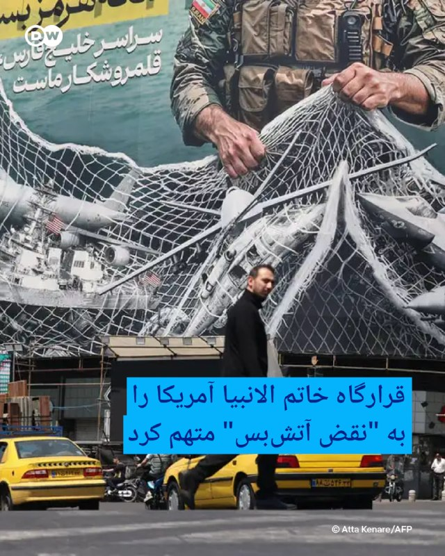

🔴 قرارگاه خاتم الانبیا آمریکا را به "نقض آتش‌بس" متهم کرد

قرارگاه مرکزی خاتم الانبیا با انتشار بیانیه‌ای که دقایقی پس از انتشار گزارش‌‌ها مبنی بر حملات متقابل ایران و آمریکا منتشر شد، ایالات متحده را به "نقض آتش‌بس و حمله به نفتکش‌های ایرانی" متهم کرد.

در این بیانیه به نقل از سخنگوی قرارگاه مرکزی خاتم الانبیا آمده است، "آمریکا با نقض آتش‌بس، یک کشتی نفتکش ایرانی در حال حرکت از آب‌های ساحلی ایران در منطقه جاسک به سمت تنگه هرمز و همچنین یک کشتی دیگر در حال ورود به تنگه هرمز را روبه‌روی بندر فجیره امارات هدف قرار داد".

همچنین در بخش دیگری از این بیانیه نوشته شده است، همزمان "مناطق غیرنظامی" در سواحل بندر خمیر، سیریک و جزیره قشم، "با همکاری برخی کشورهای منطقه هدف تعرض قرار گرفته‌اند".

قرارگاه خاتم‌الانبیا همچنین تهدید کرده است، "جمهوری اسلامی ایران پرقدرت و بدون کوچکترین تردید به هرگونه تعرض و تجاوز پاسخی کوبنده می‌دهد."
@dw_farsi

## Persian_Trend_Official — post 13660

یک شب معمولی در خاورمیانه: 📝 Nick 📌 @persian_trend_official پرشین ترند | متفاوت‌ترین کانال نظامی

## IranianMinds — post 19773

  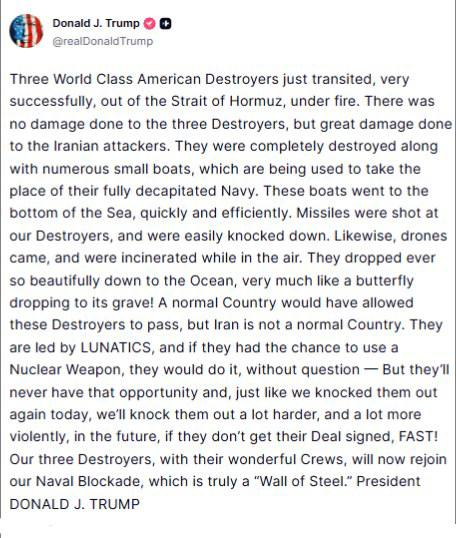

🔴 ترامپ :

سه ناوشکن آمریکایی کلاس آرلی برک با موفقیت از تنگه هرمز عبور کردن و زیر آتش ایران قرار گرفتن، اما هیچ آسیبی ندیدن. در عوض، مهاجمان ایرانی قایق‌های کوچک کاملاً نابود شدن. موشک‌ها و پهپادها هم به راحتی خنثی شدن.

- سه ناوشکن آمریکایی بدون خسارت از تنگه هرمز خارج شدن و به "دیوار فولادی" دریایی آمریکا برمی‌گردن.

قایق‌های کوچک ایرانی "به سرعت به قعر دریا رفتن" و پهپادها در هوا "سوزانده شدن" مثل پروانه‌ای که به قبرش می‌ریزه!

رهبران ایران دیوانه اند و اگر سلاح هسته‌ای داشت بدون تردید استفاده میکنن، اما آمریکا دوباره "ناک اوت‌شون کرد" و در آینده "سخت‌تر و خشن‌تر" برخورد می‌کنه مگر اینکه "سریع" توافق امضا کنن !

@IranianMinds

## BBCPersian — post 280443

🔻مقام‌های نظامی آمریکا به ان‌بی‌سی: دو هدف را در قشم و بندرعباس هدف قرار دادیم اما اقدام ما دفاعی بود

مقام‌های نظامی آمریکا به شبکه ان‌بی‌سی این کشور گفته‌اند که دو نقطه در قشم و بندرعباس را هدف قرار داده‌اند اما این یک اقدام دفاعی بود و به معنای آغاز مجدد جنگ با ایران نیست.

شبکه ان‌بی‌سی در گزارشی فوری به نقل از مقام‌های پنتاگون خبر داده که ناوهای آمریکایی در پاسخ به حملاتی که ایران آغاز کرده بوده، وارد عمل شده‌اند.

این در حالی است که ایران می‌گوید تنها هنگامی وارد عمل شده که نیروهای آمریکایی قصد تصرف یک نفتکش این کشور را داشته‌اند.

قرارگاه خاتم‌الانبیاء که فرماندهی جنگ در ایران را بر عهده دارد مدعی شده که نیروهای نظامی ایران به حملات آمریکا واکنش نشان داده‌اند: «نیروهای مسلح جمهوری اسلامی ایران نیز بلافاصله و در اقدامی متقابل شناورهای نظامی آمریکا در شرق تنگه هرمز و جنوب بندر چابهار را مورد هجوم قرار داده و خسارات قابل توجهی به‌ آنها وارد نمودند.»

https://bbc.in/3QVj3yI
@BBCPersian

## configx2ray — post 38614

  <a href="https://t.me/ConfigX2ray/38614">📎 Download file</a>

کانفیگ برای Npv tunnel ⭕️

به هیچ وج دانلود نزنید باهاش
❤️

رمز فایل : @ConfigX2ray

Channel : https://t.me/ConfigX2ray

## manototv — post 105115

  <a href="telegram/content/manototv_105115_1778194337.mp4">🎬 Download video</a>

‌
سنتکام، فرماندهی مرکزی آمریکا، اعلام کرد نیروهای این کشور در جریان عبور ناوشکن‌های نیروی دریایی آمریکا از تنگه هرمز، حملات «بدون تحریک» جمهوری اسلامی را رهگیری کرده و در پاسخ، حملات «دفاعی» انجام داده‌اند.

در بیانیه سنتکام آمده است که روز ۷ مه، هم‌زمان با عبور ناوشکن‌های «یو‌اس‌اس تروکستون»، «یو‌اس‌اس رافائل پرالتا» و «یو‌اس‌اس میسون» از این گذرگاه بین‌المللی به سمت دریای عمان، نیروهای جمهوری اسلامی با شلیک «چندین موشک، پهپاد و قایق‌های تندرو» این شناورها را هدف قرار دادند.

سنتکام تأکید کرده است که «هیچ‌یک از تجهیزات آمریکا هدف اصابت قرار نگرفت» و نیروهای آمریکایی تمامی تهدیدهای ورودی را منهدم کردند.

این فرماندهی همچنین اعلام کرد در واکنش، تأسیسات نظامی جمهوری اسلامی که به گفته آن در حمله به نیروهای آمریکایی نقش داشته‌اند، از جمله «سایت‌های پرتاب موشک و پهپاد، مراکز فرماندهی و کنترل و همچنین مراکز اطلاعاتی، نظارتی و شناسایی» هدف قرار گرفته‌اند.

## manototv — post 105114

  <a href="telegram/content/manototv_105114_1778194338.mp4">🎬 Download video</a>

‌
یک مقام آمریکایی به شبکه «ان‌بی‌سی نیوز» گفته نیروهای نظامی این کشور دست‌کم دو نقطه در ایران را هدف حمله قرار داده‌اند.

به گفته این مقام، این حملات در بندرعباس و جزیره قشم انجام شده و «ماهیت دفاعی» داشته است. او تأکید کرده این اقدام «به‌معنای ازسرگیری عملیات گسترده نظامی علیه ایران نیست».

این در حالی است که دونالد ترامپ پیش‌تر طرح «پروژه آزادی» برای اسکورت کشتی‌ها در تنگه هرمز را متوقف کرده بود. به گفته این مقام، با توجه به تداوم نگرانی‌های عربستان سعودی و دیگر متحدان منطقه‌ای، انتظار نمی‌رود این عملیات به‌زودی از سر گرفته شود.

## manototv — post 105113

  <a href="telegram/content/manototv_105113_1778194338.mp4">🎬 Download video</a>

فعالیت پدافند هوایی تهران، شامگاه پنجشنبه، ۱۷ اردیبهشت ۱۴۰۵

## alonews — post 118560

  

🔥
🔥هر گیگ فقط 200هزار تومان
🔥
🔥

💥
🔝تخفیف ویژه به مناسبت 100کا شدن مون از دست ندین
💰

🔍دنبال یه خرید مطمئن و ارزونی؟

🔄
💯فقط با 200 تومن، مستقیم و بدون واسطه خرید کن.

📣
💎ما ۲۴ ساعته پشتت هستیم و اگه راضی نبودی، وجهت رو برمی‌گردونیم.
بزن رو لینک و امتحان کن:

🎮
🛡@PremiumVpn6bot

🎮
🛡@PremiumVpn6bot

---
📅 بروزرسانی: 1405/02/18 02:12
---

## VahidOOnLine — post 238763

♦️پیش‌نویس قطعنامه مشترک درباره حفاظت از کشتیرانی در تنگه هرمز، گفت جمع‌آوری مین‌ها از یک آبراه بین‌المللی «درخواستی ساده» است و جمهوری اسلامی نمی‌تواند برای عبور کشتی‌ها عوارض غیرقانونی دریافت کند.

والتز همچنین گفت: «اگر کشوری با چنین درخواست ساده‌ای مخالفت کند، آیا واقعا خواهان صلح است؟» او افزود ادامه تهدیدها در تنگه هرمز باعث افزایش هزینه انرژی و غذا برای مردم جهان شده و مانع رسیدن کمک‌ها به کشورهای نیازمند می‌شود.

سفیر آمریکا در سازمان ملل گفت جمهوری اسلامی اقتصاد جهانی و همسایگان خود را تحت فشار قرار داده و اکنون زمان انتخاب برای کشورهای شورای امنیت است؛ اینکه در کنار «حکومتی که اقتصاد جهان را خفه می‌کند» بایستند یا از آزادی کشتیرانی و قوانین بین‌المللی حمایت کنند.

او تاکید کرد آمریکا در کنار آزادی کشتیرانی، قوانین بین‌المللی و شرکای منطقه‌ای خود ایستاده است و از شورای امنیت خواست بر اساس قطعنامه ۲۸۱۷ سازمان ملل اقدام کند.

این تحرکات همزمان با ارائه پیش‌نویس قطعنامه مشترک آمریکا و کشورهای خلیج فارس انجام شده که بر حفاظت از کشتیرانی بین‌المللی و مخالفت با هر اقدامی که مانع عبور کشتی‌ها در تنگه هرمز شود، تاکید دارد.
‌🇸🇦 Indypersian

🤖 @VahidOOnLine

## VahidOOnLine — post 238762

  <a href="telegram/content/VahidOOnLine_238762_1778193745.mp4">🎬 Download video</a>

♦️ویدیوی رسیده به ایندیپندنت فارسی، صدای انفجارهای ناشی از حملات آمریکا به بندرعباس را در بامداد جمعه ۱۸ اردیبهشت نشان می‌دهد.
همزمان خبرگزاری‌های دولتی ایران از شنیده شدن انفجارهای جدید در سیریک در شرق استان هرمزگان خبر می‌دهند.
‌🇸🇦 Indypersian

🤖 @VahidOOnLine

## VahidOOnLine — post 238761

  

مایک والتز، سفیر آمریکا در سازمان ملل، تایید کرد یک کشتی متعلق به چین دوشنبه در حمله جمهوری اسلامی در تنگه هرمز مورد اصابت قرار گرفت. به گزارش رسانه‌های چینی، این اولین بار از آغاز درگیری‌ها در منطقه است که یک کشتی چینی هدف قرار می‌گیرد.
‌🏁 🇬🇧 IranintlTV

🤖 @VahidOOnLine

## IranIntlTV — post 336042

  <a href="telegram/content/IranIntlTV_336042_1778193748.mp4">🎬 Download video</a>

نشست غیرعلنی شورای امنیت سازمان ملل با محوریت حملات اخیر جمهوری اسلامی به امارات متحده عربی، وضعیت امنیتی در تنگه هرمز و خطر گسترش درگیری‌ها برگزار شد.

پیش‌نویس قطعنامه الزام ایران به بازگشایی تنگه هرمز نیز اوایل هفته آینده به رای گذاشته می‌شود.

گفت‌وگو با هوشنگ حسن‌یاری، کارشناس خاورمیانه و امور نظامی
@iranintltv

## IranIntlTV — post 336041

  <a href="telegram/content/IranIntlTV_336041_1778193751.mp4">🎬 Download video</a>

عباس عراقچی گفت در صورت توقف دائمی جنگ، رفع محاصره و لغو تحریم‌ها، تنگه هرمز باز خواهد شد. بنابر برخی گزارش‌ها کاخ سفید انتظار دارد فردا پاسخ ایران به آخرین پیشنهاد آمریکا را دریافت کند و واشینگتن در حال بررسی آغاز «پروژه آزادی» است.

گفت‌وگو با شایان سمیعی، کارشناس امنیت ملی
@iranintltv

## IranIntlTV — post 336040

  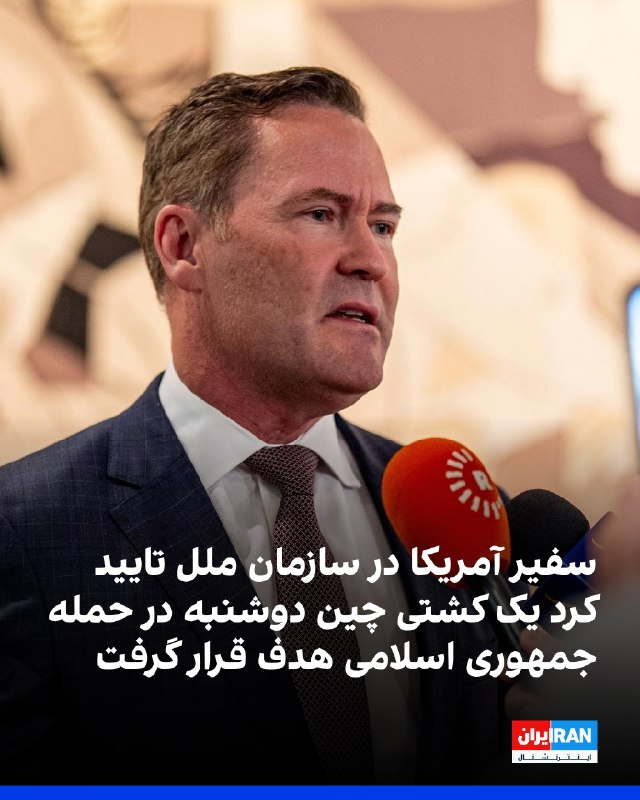

مایک والتز، سفیر آمریکا در سازمان ملل، تایید کرد یک کشتی متعلق به چین دوشنبه در حمله جمهوری اسلامی در تنگه هرمز مورد اصابت قرار گرفت. به گزارش رسانه‌های چینی، این اولین بار از آغاز درگیری‌ها در منطقه است که یک کشتی چینی هدف قرار می‌گیرد.
https://iranintl.com/202605074835

## FarsiVOA — post 217149

  <a href="telegram/content/FarsiVOA_217149_1778193755.mp4">🎬 Download video</a>

⚡️ویدیوی منتسب به حمله پهپادی به احزاب «حزب دموکرات کردستان ایران» و «حزب پاک» در اقلیم کردستان عراق
@FarsiVOA

## FarsiVOA — post 217148

  <a href="telegram/content/FarsiVOA_217148_1778193755.mp4">🎬 Download video</a>

⚡️بندرعباس پنج‌شنبه ۱۷ اردیبهشت؛ سنتکام: نیروهای آمریکایی به حملات جمهوری اسلامی پاسخ دفاعی دادند
@FarsiVOA

## FarsiVOA — post 217147

🔺گزارش‌ها از حمله نیروهای‌ آمریکایی به ایست بازرسی دریایی بندر کرگان

▪️درگیری‌ها و انفجارهایی که اواخر شامگاه پنج‌شنبه در بخش‌های جنوبی ایران آغاز شده بود بامداد جمعه نیز ادامه یافت.

⬇️ بیشتر بخوانید:
https://ir.voanews.com/a/8147722.html
@FarsiVOA

## Persian_Trend_Official — post 13659

  <a href="telegram/content/Persian_Trend_Official_13659_1778193756.jpg">🎬 Download video</a>

⭕️ توییت جدید ترامپ در تروث سوشال:

سه ناوشکن جهانی آمریکایی با موفقیت کامل از تنگه هرمز عبور کردند، در حالی که زیر آتش دشمن بودند. هیچ آسیبی به این سه ناوشکن وارد نشد، اما آسیب بزرگی به مهاجمان ایرانی زده شد. آن‌ها کاملاً منهدم شدند، همراه با تعداد زیادی قایق کوچک که برای جایگزینی نیروی دریایی کاملاً از پای درآمده ایران استفاده می‌شوند. این قایق‌ها سریع و مؤثر به قعر دریا فرستاده شدند. موشک‌هایی به سمت ناوشکن‌های ما شلیک شد که به‌راحتی سرنگون گشتند. همچنین پهپادهایی آمدند که در هوا سوختند. آن‌ها بسیار زیبا به سمت اقیانوس سقوط کردند، درست مانند پروانه‌ای که به سمت قبرش فرومی‌رود! یک کشور عادی اجازه می‌داد این ناوشکن‌ها عبور کنند، اما ایران یک کشور عادی نیست. آن‌ها توسط دیوانگان رهبری می‌شوند، و اگر فرصت استفاده از سلاح هسته‌ای را داشته باشند، بدون تردید این کار را می‌کنند — اما هرگز آن فرصت را نخواهند یافت و همان‌طور که امروز دوباره آن‌ها را از پا درآوردیم، در آینده خیلی سخت‌تر و خیلی شدیدتر آن‌ها را از پا درخواهیم آورد، اگر قرارداد خود را سریع امضا نکنند! سه ناوشکن ما، با خدمه فوق‌العاده خود، اکنون به محاصره دریایی ما خواهند پیوست، که واقعاً یک «دیوار فولادی» است.

رئیس‌جمهور دونالد جی. ترامپ

📝 Nick

📌 @persian_trend_official
پرشین ترند | متفاوت‌ترین کانال نظامی

## Persian_Trend_Official — post 13658

  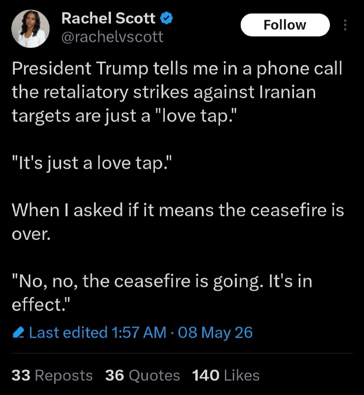

⭕️ ترامپ: آتش بس برقرار است و نقض نشده است. 📝 Nick 📌 @persian_trend_official پرشین ترند | متفاوت‌ترین کانال نظامی

## Dirty_Kids — post 389084

  <a href="https://t.me/Dirty_Kids/389084">📎 Download file</a>

✅ اپلیکیشن اندروید سایت جهانی دربی بت

💰اولین سایت جهانی با امکان شارژ و برداشت ریالی(کارت به کارت)

🔗 برای ورود فیلترشکن روی کشور مناسب قرار دهید مانند فنلاند و المان و....

😀Telegram Channel
👇
https://t.me/+bcynkEgSW2dlYTc0

## Dirty_Kids — post 389083

  

😤دنبال یه سایت شرط بندی بین المللی بودی که به ایرانیا خدمات بده؟!
⛔

👍دربی بت همون انتخاب  100%

💎ویژگی های سایت جهانی Derby Bet:

⬅️امکان شارژ امن با کارت بانکی

⬅️واریز اول دوبل شارژ می شوید(بونوس۱۰۰٪)

⬅️پر اپشن ترین سایت فعال در ایران

⬅️تسویه حساب کمتر از 5 دقیقه

⬅️برگشت بخشی از باخت به صورت هفتگی

🚨کد هدیه ثبت نام:GG007

⚠️برای دانلود اپلکیشن کلیک کنید
👉

🔔کانال دربی بت :

🪙https://t.me/+bcynkEgSW2dlYTc0

## Dirty_Kids — post 389082

  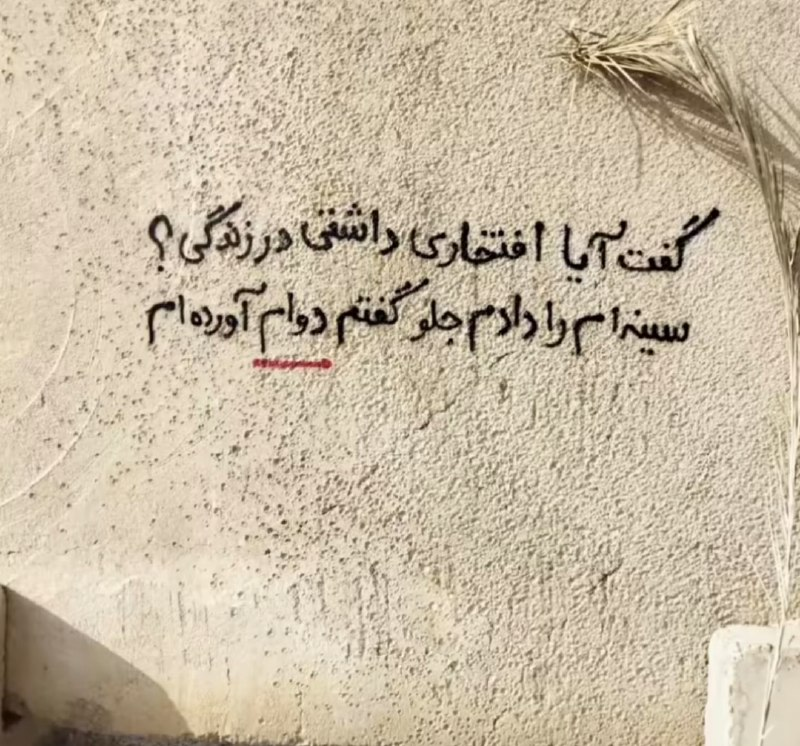

#بخوابیم

@Dirty_Kids 👻

## Dirty_Kids — post 389081

  

این وسط یکی بیاد منو چال کنه:)))

@Dirty_Kids 👻

## Dirty_Kids — post 389080

دونالد ترامپ در‌ گفتوگو با ای‌بی‌سی: «حملات تلافی‌جویانه پس از حملات ایران، تنها یک سیلی سبک بود و آتش‌بس همچنان ادامه دارد.»

‏(اصلا باشه، تو قول بده وحیدی و قالیباف و عراقچی رو هم بزنی، ما همه‌جا میگیم آتش‌بس هنوز نقض نشده)

@Dirty_Kids 👻

## Dirty_Kids — post 389079

پس خامنه‌ای گفت جنگ منطقه‌ای منظورش این بود کل منطقه خارتون رو میگان.

@Dirty_Kids 👻

## alonews — post 118559

  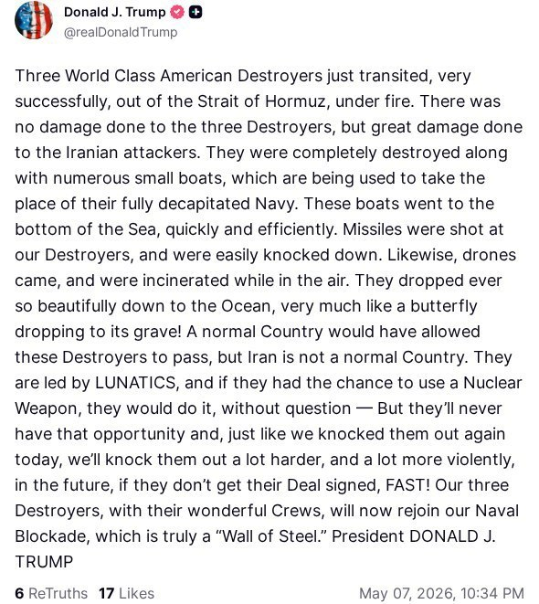

👈توییت ترامپ در خصوص اتفاقات چند ساعت اخیر: سه ناوشکن آمریکایی درجه یک جهان همین الان با موفقیت زیاد از تنگه هرمز عبور کردند در حالی که زیر آتش بودند. به این سه ناوشکن هیچ آسیبی نرسید، اما به مهاجمان ایرانی خسارت عظیمی وارد شد.

🔴آنها به طور کامل همراه با قایق‌های کوچک متعدد که برای جایگزینی نیروی دریایی کاملاً سرکوب شده‌شان استفاده می‌شوند، نابود شدند.

🔴این قایق‌ها به سرعت و به طور مؤثر به ته دریا رفتند. به ناوشکن‌های ما موشک شلیک شد که به راحتی سرنگون شدند. همچنین پهپادهایی آمدند که در هوا سوختند. آنها به زیبایی در اقیانوس سقوط کردند، مثل پروانه‌ای که به قبرش فرود می‌آید!

🔴یک کشور عادی اجازه می‌داد این ناوشکن‌ها عبور کنند، اما ایران کشور عادی نیست. آنها توسط دیوانگان اداره می‌شوند و اگر فرصتی برای استفاده از سلاح هسته‌ای داشتند، بدون تردید این کار را می‌کردند — اما هرگز چنین فرصتی نخواهند داشت و همانطور که امروز دوباره آنها را شکست دادیم، در آینده بسیار سخت‌تر و بی‌رحمانه‌تر شکستشان خواهیم داد اگر سریعاً توافق خود را امضا نکنند!

🔴سه ناوشکن ما با خدمه‌های شگفت‌انگیزشان اکنون به محاصره دریایی ما می‌پیوندند که واقعاً «دیوار فولادی» است.



✅ @AloNews خبر جنگ

## alonews — post 118558

  <a href="telegram/content/alonews_118558_1778193760.jpg">🎬 Download video</a>

👈ترامپ: ناوشکن آمریکایی در سطح جهانی با موفقیت از تنگه هرمز زیر آتش عبور کرد 
✅ @AloNews خبر جنگ

## alonews — post 118557

  <a href="telegram/content/alonews_118557_1778193760.jpg">🎬 Download video</a>

👈ترامپ: ناوشکن آمریکایی در سطح جهانی با موفقیت از تنگه هرمز زیر آتش عبور کرد

✅ @AloNews خبر جنگ

## alonews — post 118556

  <a href="telegram/content/alonews_118556_1778193760.jpg">🎬 Download video</a>

👈دونالد ترامپ به ABC News گفته حملات تلافی‌جویانه علیه اهداف ایرانی فقط «یک ضربه کوچک» بوده است. 
✅ @AloNews خبر جنگ

---
📅 بروزرسانی: 1405/02/18 02:02
---

## IranIntlTV — post 336039

  <a href="telegram/content/IranIntlTV_336039_1778193145.mp4">🎬 Download video</a>

فاکس‌نیوز به نقل از یک مقام ارشد آمریکایی گزارش داد نیروهای ایالات متحده حملاتی را در قشم و بندرعباس انجام داده‌اند.

این مقام آمریکایی تاکید کرده این اقدام به معنای آغاز دوباره جنگ نیست.

گفت‌وگو با محسن مهیمنی، خبرنگار ایران‌اینترنشنال
@iranintltv

## Persian_Trend_Official — post 13657

⭕️ ترامپ: آتش بس برقرار است و نقض نشده است.

📝 Nick

📌 @persian_trend_official
پرشین ترند | متفاوت‌ترین کانال نظامی

## Persian_Trend_Official — post 13656

  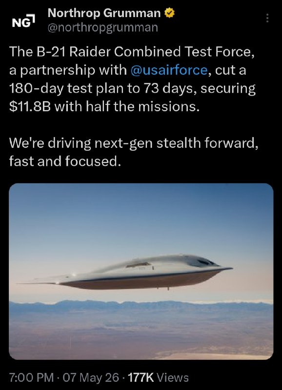

🔥 نورثروپ گرومن (Northrop Grumman):

نیروی آزمایش مشترک B-21 ریدر (B-21 Raider)، در همکاری با نیروی هوایی ایالات متحده (usairforce)، یک برنامه آزمایشی ۱۸۰ روزه را به ۷۳ روز کاهش داد و با انجام تنها نیمی از مأموریت‌ها، ۱۱.۸ میلیارد دلار بودجه را تضمین کرد.

ما در حال پیشبرد سریع و متمرکزِ فناوری رادارگریزی (پنهان‌کاری) نسل آینده هستیم.

📝 Nick

📌 @persian_trend_official
پرشین ترند | متفاوت‌ترین کانال نظامی

## IranianMinds — post 19772

🔴 ترامپ به ای بی سی نیوز :

آتش بس ادامه دارد و درحال اجراست هنوز حملات امشب فقط عشقی برای تلافی کاراشون بود

@IranianMinds

## alonews — post 118555

  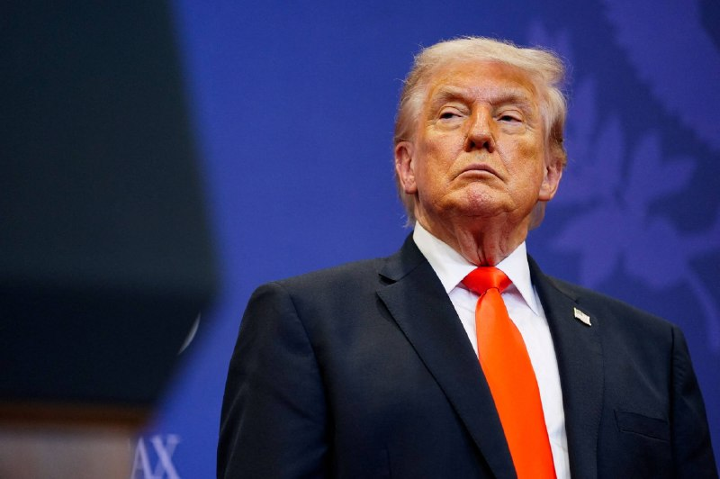

👈دونالد ترامپ به ABC News گفته حملات تلافی‌جویانه علیه اهداف ایرانی فقط «یک ضربه کوچک» بوده است.

✅ @AloNews خبر جنگ

## alonews — post 118554

  <a href="telegram/content/alonews_118554_1778193147.jpg">🎬 Download video</a>

🔴فوری/ترامپ: آتش بس برقراره و نقض نشده.

✅ @AloNews خبر جنگ

---
📅 بروزرسانی: 1405/02/18 01:52
---

## DEJradio — post 4507

  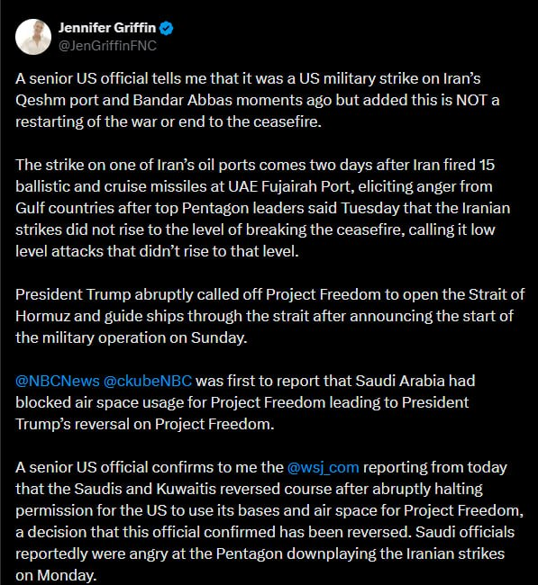

📱 
⭕️ جنیفر گریفین، خبرنگار فاکس نیوز، به نقل از یک مقام ارشد آمریکایی نوشت حمله‌ای که لحظاتی پیش به بندر قشم و بندرعباس انجام شد، یک عملیات نظامی آمریکا بوده است. این مقام تأکید کرده که این حمله به معنای آغاز دوبارۀ جنگ یا پایان آتش‌بس نیست.
به گفتۀ این مقام آمریکایی، حمله به یکی از بنادر نفتی ایران دو روز پس از آن انجام شد که جمهوری اسلامی ۱۵ موشک بالستیک و کروز به سمت بندر فجیره در امارات شلیک کرد؛ حمله‌ای که خشم کشورهای حاشیۀ خلیج فارس را برانگیخت. این در حالی است که مقام‌های پنتاگون روز سه‌شنبه گفته بودند حملات جمهوری اسلامی در حدی نبوده که نقض آتش‌بس تلقی شود و آن را حملاتی «سطح پایین» توصیف کرده بودند.
جنیفر گریفین همچنین نوشت دونالد ترامپ پس از اعلام آغاز عملیات نظامی «پروژۀ آزادی» برای بازگشایی تنگۀ هرمز و هدایت کشتی‌ها، به‌طور ناگهانی این عملیات را متوقف کرد.
او به نقل از یک مقام ارشد آمریکایی افزود عربستان سعودی و کویت نیز به‌طور ناگهانی مجوز استفاده آمریکا از پایگاه‌ها و حریم هوایی خود برای اجرای «پروژۀ آزادی» را متوقف کرده بودند؛ تصمیمی که به گفتۀ این مقام، بعداً لغو شد. بر اساس این گزارش، مقام‌های سعودی از کم‌اهمیت جلوه دادن حملات جمهوری اسلامی از سوی پنتاگون خشمگین شده بودند.

#پروژه_آزادی #ترامپ #تنگه_هرمز
@DEJradio

## IranIntlTV — post 336038

  <a href="https://t.me/IranintlTV/336038">📎 Download file</a>

🎧نسخه صوتی «برنامه با کامبیز حسینی»؛ تبادل آتش در تنگهٔ هرمز؛ حملات آمریکا به قشم و بندرعباس
@iranintlTV

## Persian_Trend_Official — post 13655

  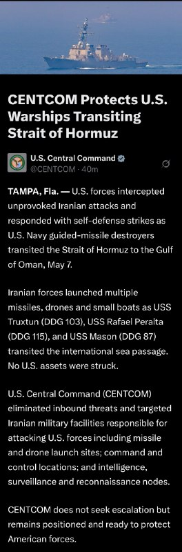

حفاظت سنتکام از ناوهای جنگی ایالات متحده در حین عبور از تنگه هرمز

تامپا، فلوریدا — در روز ۷ مه، نیروهای آمریکایی حملات بدون دلیل (تحریک‌نشده) ایران را رهگیری کرده و همزمان با عبور ناوشکن‌های موشک‌انداز نیروی دریایی ایالات متحده از تنگه هرمز به سمت دریای عمان، با حملات مبتنی بر دفاع از خود به آن‌ها پاسخ دادند.

نیروهای ایرانی چندین موشک، پهپاد و قایق کوچک را همزمان با عبور ناوهای «یو‌اس‌اس تراکستون» (DDG 103)، «یو‌اس‌اس رافائل پرالتا» (DDG 115) و «یو‌اس‌اس میسون» (DDG 87) از این آبراه بین‌المللی روانه کردند. هیچ‌یک از تجهیزات یا دارایی‌های آمریکایی مورد اصابت قرار نگرفتند.

فرماندهی مرکزی ایالات متحده (سنتکام) تهدیدات ورودی را خنثی کرد و تأسیسات نظامی ایران را که مسئول حمله به نیروهای آمریکایی بودند، هدف قرار داد؛ از جمله سایت‌های پرتاب موشک و پهپاد، مراکز فرماندهی و کنترل، و پایگاه‌های اطلاعاتی، نظارتی و شناسایی.

سنتکام به دنبال تشدید تنش‌ها نیست، اما برای محافظت از نیروهای آمریکایی در موضع خود مستقر و آماده می‌ماند.

📝 Nick

📌 @persian_trend_official
پرشین ترند | متفاوت‌ترین کانال نظامی

## IranianMinds — post 19771

ولی من فکر نمیکنم درگیری جدی بشه و جنگ دوباره بد شروع شه تهش میان میگن یه هشداری بود یا برای تلافی بود چون موج حملاتشون جوری نیست که بگیم بخوان درگیریو از سر بگیرن اینا

## IranianMinds — post 19770

🔴 ان بی سی نیوز به نقل از مقام بالا رده آمریکایی :

حملات به ایران دفاعی ان و اصلا برای شروع دوباره درگیری ها نیست

@IranianMinds

## BBCPersian — post 280442

  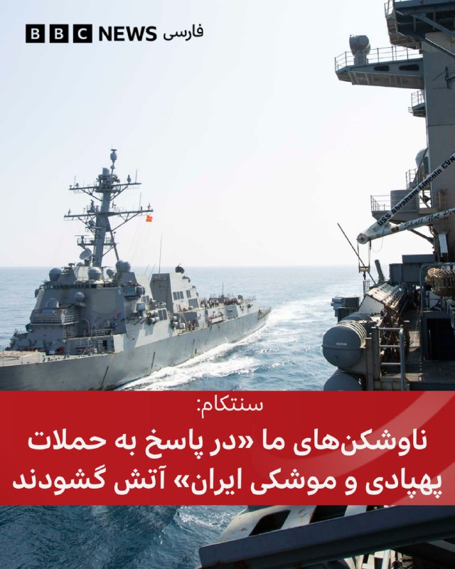

🔴به گزارش شبکه سی‌بی‌اس، شریک کاری ما در آمریکا، فرماندهی مرکزی ايالات متحده - سنتکام - اعلام کرد نيروهای امريکايی پس از آنکه دو ناوشکن نيروی دريايی اين کشور هدف حملات موشکی و پهپادی قرار گرفتند، «در دفاع از خود» اهدافی در ايران را هدف قرار دادند، هرچند اين ناوشکن‌ها مورد اصابت قرار نگرفتند.

به گفته سنتکام، ناوشکن‌های يو‌اس‌اس تراکستون، يو‌اس‌اس ميسن و يو‌اس‌اس رافائل پرالتا هدف موشک‌ها، پهپادها و قايق‌های کوچک قرار گرفتند.

ارتش امريکا گفته در پاسخ، تاسيسات ايرانی از جمله محل‌های پرتاب موشک و پهپاد را هدف قرار داده است.

این در حالی است که ایران می‌گوید در پاسخ به حملات آمریکا به سوی ناوهای نظامی این کشور آتش گشوده است.

📸U.S. Central Command
https://bbc.in/4ddOfAA
@BBCPersian

## Dirty_Kids — post 389078

خبرگزاری‌های دولتی ایران، هم‌اکنون از حملات جدید به مراکز نظامی سیریک در شرق هرمزگان و ساحل دریای عمان خبر می‌دهند.

@Dirty_Kids 👻

## alonews — post 118553

  <a href="telegram/content/alonews_118553_1778192543.mp4">🎬 Download video</a>

👈رئیس‌جمهور برزیل لولا:
ترامپ فکر می‌کند جنگ ایران قبلاً تمام شده است.

🔴این یک واقعیت نیست، اما او به آن باور دارد و من به خاطر دیدگاهش درباره جنگ، با او بحث نخواهم کرد.

✅ @AloNews خبر جنگ

---
📅 بروزرسانی: 1405/02/18 01:42
---

## DEJradio — post 4506

  <a href="telegram/content/DEJradio_4506_1778191949.jpg">🎬 Download video</a>

🧨
🚨 خبرگزاری‌های داخلی از انفجارهای تازه در سیریک خبر می‎دهند.

#انفجار #سیریک
@DEJradio

## Shin_Persian — post 5882

  

Faytuks News ✓ @Faytuks
Thu, 07 May 2026 22:04:11 UTC

Iran's state Mehr News agency is reporting a new explosion in Sirik, southern Iran.

فارسی

خبرگزاری دولتی مهر ایران از وقوع انفجاری جدید در سیریک، واقع در جنوب ایران خبر می‌دهد.

𝕏 · @shin_persian

## DW_Farsi — post 124415

  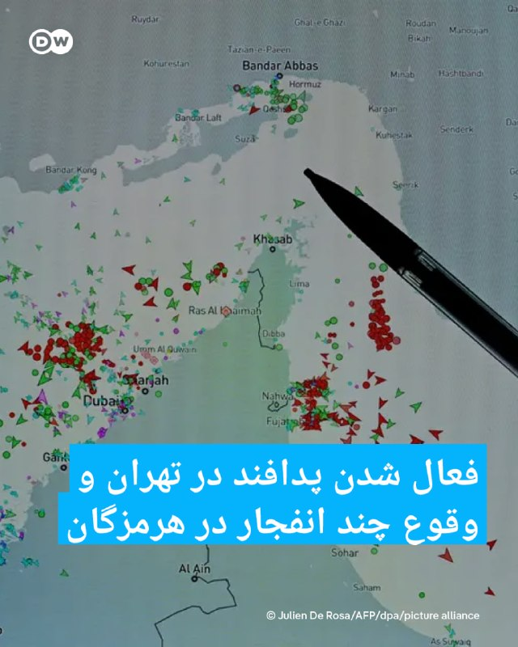

🔴 فعال شدن پدافند هوایی در تهران و وقوع چند انفجار در هرمزگان

بنا بر گزارش‌های منتشر شده توسط رسانه‌های داخلی ایران، پس از وقوع دو انفجار مهیب در تهران، پدافند هوایی در غرب پایتخت فعال شده است. همچنین گزارش‌ها از صدای چندین انفجار در استان هرمزگان خبر می‌دهند.

فرماندهی نیروی دریایی سپاه در بیانیه‌‌ای اعلام کرد، پس از حمله ارتش آمریکا به یک نفتکش ایرانی، ناوشکن‌های آمریکایی "هدف موشک‌های بالستیک و کروز ضد کشتی و پهپادهای انهدامی با سر جنگی شدید الانفجار" قرار گرفتند و مجبور به عقب‌نشینی شدند.

یک مقام آمریکایی نیز به شبکه خبری فاکس نیوز گفت، "ارتش آمریکا پس از گزارش رسانه‌های ایرانی مبنی بر شنیده شدن صدای انفجار در بندرعباس و جزیره قشم در تنگه هرمز، حملاتی را علیه این دو شهر انجام داد."

این مقام در عین حال گفته است، "این حملات به معنای از سرگیری جنگ نیست."

فرماندهی مرکزی ارتش آمریکا، سنتکام، با انتشار پستی در شبکه اجتماعی ایکس ضمن تایید تبادل آتش بین دو طرف نوشت، نیروهای آمریکایی "حملات بی‌دلیل ایران" را رهگیری کردند و در دفاع به آنها پاسخ دادند.
@dw_farsi

## Persian_Trend_Official — post 13654

🔴هم اکنون صدای انفجار مجدد در سیریک هرمزگان شنیده شد/ مهر

🫆:Tony

📌 @persian_trend_official
پرشین ترند | متفاوت‌ترین کانال نظامی

## IranianMinds — post 19769

🔴 رادیو ارتش اسرائیل :

مقامات اسرائیلی ارزیابی کردن که تبادل آتش اخیر بین آمریکا و جمهوری اسلامی در منطقه خلیج فارس به پایان رسیده و هر دو طرف از حملات بیشتر خودداری کردن.

@IranianMinds

## IranianMinds — post 19768

خبری که بعضی کانالا میزارن از حمله به اسرائیل کذبه

@IranianMinds

## BBCPersian — post 280441

🔻خبرگزاری صدا و سیما: نیروهای ایران به سوی نظامیان آمریکایی که قصد تصرف یک نفتکش ایرانی را داشتند موشک شلیک کردند

خبرگزاری صدا و سیما در ایران در خبری فوری به نقل از مقام‌های نظامی گزارش کرده است که نیروهای نظامی ایران به سوی نیروهای آمریکایی که قصد تصرف یک نفتکش ایرانی را داشتند موشک شلیک کرده‌اند.

https://bbc.in/4eAncBV
@BBCPersian

## BBCPersian — post 280440

🔻نیروی دریایی سپاه مدعی «عملیات ترکیبی» علیه ناوهای آمریکایی شد

پس از آن که قرارگاه خاتم الانبیاء به عنوان مرکز فرماندهی جنگ در ایران از حملات و رد و بدل شدن آتش میان نیروهای این کشور و آمریکا خبر داد، نیروی دریایی سپاه پاسداران هم در اطلاعیه‌ای مدعی رویارویی با ناوهای آمریکایی شده است.

در اطلاعیه نیروی دریایی سپاه که بامداد جمعه به وقت تهران منتشر شده است آمده: «درپی نقض آتش‌بس و تجاوز ارتش تروریستی امریکا به یک فروند نفتکش جمهوری اسلامی ایران در حوالی بندر جاسک و نزدیک شدن ناوشکن های ارتش تروریستی امریکا به تنگۀ هرمز، طی یک عملیات ترکیبی بسیار پرحجم و دقیق با بکارگیری انواع موشک‌های بالستیک و کروز ضدکشتی و پهپادهای انهدامی با سر جنگی شدید الانفجار به سمت ناوشکن‌های دشمن آتش گشود.»

در این اطلاعیه ادعا شده که «۳ ناو» آمریکایی در پی این رویاروی با «خسارات قابل توجه» روبرو و سپس محدوده تنگه هرمز را «به سرعت» ترک کرده‌اند.

https://bbc.in/42iIn4f
@BBCPersian

## alonews — post 118552

  <a href="telegram/content/alonews_118552_1778191951.jpg">🎬 Download video</a>

👈هم اکنون صدای انفجار مجدد در سیریک بندرعباس شنیده شد

✅ @AloNews خبر جنگ

---
📅 بروزرسانی: 1405/02/18 01:32
---

## VahidOOnLine — post 238760

  

♦️جنیفر گریفین، خبرنگار فاکس‌نیوز، در شبکه اجتماعی اکس به نقل از یک مقام ارشد ایالات متحده از حملات نظامی این کشور به بندر قشم و بندرعباس خبر داد. این مقام آمریکایی تاکید کرد که این اقدام به معنای شروع دوباره جنگ یا پایان آتش‌بس نیست. این حملات دو روز پس از شلیک موشک‌های بالستیک ایران به بندر فجیره امارات صورت می‌گیرد. گزارش‌ها همچنین از حمله به ایستگاه بازرسی دریایی بندر کرگان در میناب حکایت دارد.
‌🇸🇦 Indypersian

🤖 @VahidOOnLine

## VahidOOnLine — post 238759

  

ستاد فرماندهی مرکزی آمریکا، سنتکام، اعلام کرد نیروهای آمریکایی ۱۷ اردیبهشت همزمان با عبور ناوشکن‌های مجهز به موشک هدایت‌شونده آمریکا از تنگه هرمز به سوی دریای عمان، حملات موشکی، پهپادی و قایق‌های کوچک جمهوری اسلامی را رهگیری و به منابع این حمله‌ها در ایران حمله کردند.

طبق اعلام سنتکام، نیروهای جمهوری اسلامی در حالی این حمله‌ها را با چندین موشک، پهپاد و قایق‌های کوچک انجام دادند که ناوهای یواس‌اس تراکستون، یواس‌اس رافائل پرالتا و یواس‌اس میسون از این گذرگاه بین‌المللی دریایی عبور می‌کردند و هیچ‌یک از تجهیزات یا دارایی‌های آمریکا هدف قرار نگرفت.

سنتکام گفت نیروهای آمریکا ضمن دفع این تهدیدها، تاسیسات نظامی ایران را که مسئول حمله به نیروهای آمریکایی بودند، از جمله محل‌های پرتاب موشک و پهپاد، مراکز فرماندهی و کنترل و گره‌های اطلاعاتی، نظارتی و شناسایی، هدف قرار دادند.

سنتکام تاکید کرد که به دنبال تشدید تنش نیست، اما همچنان در موقعیت مناسب قرار دارد و آماده حفاظت از نیروهای آمریکایی است.
‌🏁 🇬🇧 IranintlTV

🤖 @VahidOOnLine

## DEJradio — post 4505

  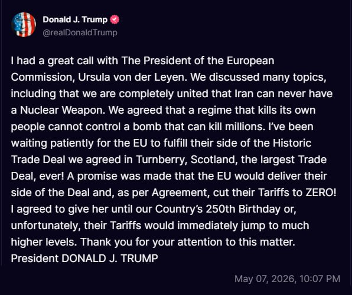

🇺🇸 
⭕️ دونالد ترامپ، رئیس جمهوری ایالات متحده، اعلام کرد در گفت‌وگویی تلفنی با اورزولا فون در لاین، رئیس کمیسیون اروپا، درباره موضوعات مختلف از جمله جمهوری اسلامی و روابط تجاری آمریکا و اتحادیه اروپا رایزنی کرده است.
ترامپ در پیامی در شبکه اجتماعی تروث سوشال تأکید کرد واشینگتن و اتحادیه اروپا در این موضوع هم‌نظر هستند که جمهوری اسلامی هرگز نباید به سلاح هسته‌ای دست پیدا کند. او همچنین نوشت رژیمی که مردم خود را می‌کشد، نباید به سلاحی دسترسی داشته باشد که توان نابودی میلیون‌ها نفر را دارد.
رئیس جمهوری آمریکا در بخش دیگری از پیام خود، از اتحادیه اروپا خواست به تعهداتش در توافق تجاری «تاریخی» دو طرف که در ترنبری اسکاتلند مورد توافق قرار گرفته بود، عمل کند. ترامپ مدعی شد اتحادیه اروپا متعهد شده بود تعرفه‌های خود را به صفر کاهش دهد.
او هشدار داد در صورتی که اتحادیه اروپا تا دویست‌وپنجاهمین سالگرد استقلال آمریکا به تعهدات خود عمل نکند، واشینگتن تعرفه‌های جدید و بسیار بالاتری علیه کالاهای اروپایی اعمال خواهد کرد.

#ترامپ #اروپا
@DEJradio

## VahidOnline — post 75312

  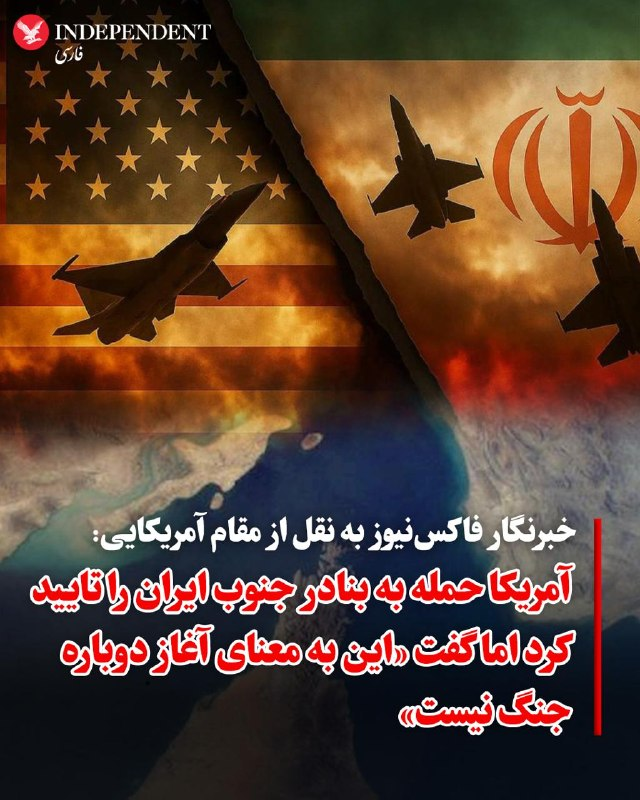

♦️جنیفر گریفین، خبرنگار فاکس‌نیوز، در شبکه اجتماعی اکس به نقل از یک مقام ارشد ایالات متحده از حملات نظامی این کشور به بندر قشم و بندرعباس خبر داد. این مقام آمریکایی تاکید کرد که این اقدام به معنای شروع دوباره جنگ یا پایان آتش‌بس نیست. این حملات دو روز پس از شلیک موشک‌های بالستیک ایران به بندر فجیره امارات صورت می‌گیرد. گزارش‌ها همچنین از حمله به ایستگاه بازرسی دریایی بندر کرگان در میناب حکایت دارد.
@VahidOOnLine

📡 @VahidOnline

## VahidOnline — post 75311

  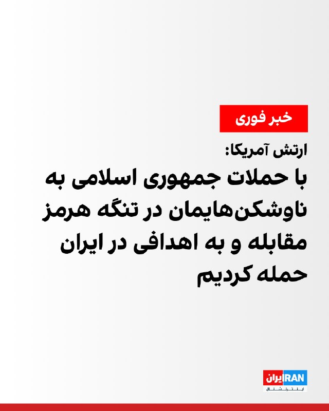

ستاد فرماندهی مرکزی آمریکا، سنتکام، اعلام کرد نیروهای آمریکایی ۱۷ اردیبهشت همزمان با عبور ناوشکن‌های مجهز به موشک هدایت‌شونده آمریکا از تنگه هرمز به سوی دریای عمان، حملات موشکی، پهپادی و قایق‌های کوچک جمهوری اسلامی را رهگیری و به منابع این حمله‌ها در ایران حمله کردند.

طبق اعلام سنتکام، نیروهای جمهوری اسلامی در حالی این حمله‌ها را با چندین موشک، پهپاد و قایق‌های کوچک انجام دادند که ناوهای یواس‌اس تراکستون، یواس‌اس رافائل پرالتا و یواس‌اس میسون از این گذرگاه بین‌المللی دریایی عبور می‌کردند و هیچ‌یک از تجهیزات یا دارایی‌های آمریکا هدف قرار نگرفت.

سنتکام گفت نیروهای آمریکا ضمن دفع این تهدیدها، تاسیسات نظامی ایران را که مسئول حمله به نیروهای آمریکایی بودند، از جمله محل‌های پرتاب موشک و پهپاد، مراکز فرماندهی و کنترل و گره‌های اطلاعاتی، نظارتی و شناسایی، هدف قرار دادند.

سنتکام تاکید کرد که به دنبال تشدید تنش نیست، اما همچنان در موقعیت مناسب قرار دارد و آماده حفاظت از نیروهای آمریکایی است.
@VahidOOnLine

📡 @VahidOnline

## IranIntlTV — post 336037

  

ستاد فرماندهی مرکزی آمریکا، سنتکام، اعلام کرد نیروهای آمریکایی ۱۷ اردیبهشت همزمان با عبور ناوشکن‌های مجهز به موشک هدایت‌شونده آمریکا از تنگه هرمز به سوی دریای عمان، حملات موشکی، پهپادی و قایق‌های کوچک جمهوری اسلامی را رهگیری و به منابع این حمله‌ها در ایران حمله کردند.

طبق اعلام سنتکام، نیروهای جمهوری اسلامی در حالی این حمله‌ها را با چندین موشک، پهپاد و قایق‌های کوچک انجام دادند که ناوهای یواس‌اس تراکستون، یواس‌اس رافائل پرالتا و یواس‌اس میسون از این گذرگاه بین‌المللی دریایی عبور می‌کردند و هیچ‌یک از تجهیزات یا دارایی‌های آمریکا هدف قرار نگرفت.

سنتکام گفت نیروهای آمریکا ضمن دفع این تهدیدها، تاسیسات نظامی ایران را که مسئول حمله به نیروهای آمریکایی بودند، از جمله محل‌های پرتاب موشک و پهپاد، مراکز فرماندهی و کنترل و گره‌های اطلاعاتی، نظارتی و شناسایی، هدف قرار دادند.

سنتکام تاکید کرد که به دنبال تشدید تنش نیست، اما همچنان در موقعیت مناسب قرار دارد و آماده حفاظت از نیروهای آمریکایی است.
https://iranintl.com/202605073769

## Persian_Trend_Official — post 13653

لینک داخلی لایو اول 17 اردیبهشت برای دانلود: https://dl.persiantrend.com/PersianTrendLives/PersianTrend.1405.02.17.Live1.mp4 نسخه 1080 🔥: https://dl.persiantrend.com/PersianTrendLives/PersianTrend.1405.02.17.Live1.1080p.mp4 ⚠️ نسخه 1080 بعد از 24 ساعت…

## RadioFarda — post 156949

  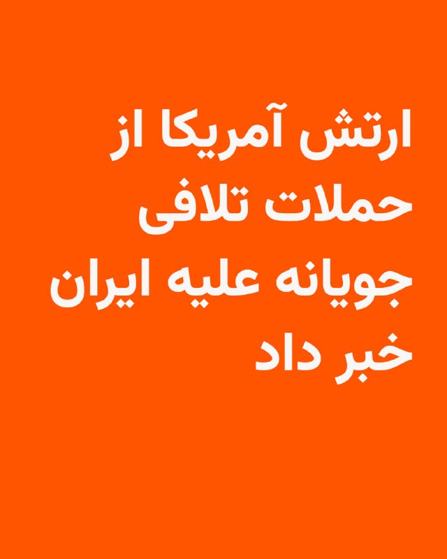

🔸ارتش آمریکا اعلام کرد روز پنج‌شنبه حملات تلافی‌جویانه‌ای علیه ایران انجام داده و مکان‌هایی را هدف قرار داده است که به گفته واشینگتن مسئول حمله به نیروهای آمریکایی بوده‌اند.

🔸فرماندهی مرکزی آمریکا، سنتکام در بیانیه‌ای اعلام کرد در جریان عبور چند ناوشکن نیروی دریایی ایالات متحده از تنگه هرمز به سمت دریای عمان، حملات موشکی، پهپادی و دریایی ایران را رهگیری کرده‌ است.

🔸فرماندهی مرکزی آمریکا، سنتکام در بیانیه‌ای اعلام کرد، «سنتکام این تهدیدها را منهدم کرد و تأسیسات نظامی ایران را که مسئول حمله به نیروهای آمریکایی بودند هدف قرار داد.»

🔸به گفته فرماندهی مرکزی آمریکا، سایت‌های پرتاب موشک و پهپاد، مراکز فرماندهی و کنترل، و مراکز اطلاعاتی، شناسایی و نظارتی از جمله این اهداف بوده‌اند.

@RadioFarda

## IranianMinds — post 19767

🔴 این جنگ 2 ساعته هم تموم شد انگاری

@IranianMinds

## Dirty_Kids — post 389077

  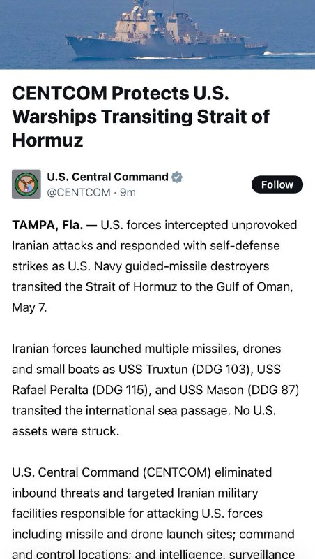

سنتکام: مراکز پرتاب موشک و پهپاد، مراکز فرماندهی و سامانه‌های اطلاعاتی ایران را هدف قرار دادیم

فرماندهی مرکزی ایالات متحده آمریکا، دقایقی قبل اعلام کرد آنان در پاسخ به حملات جمهوری اسلامی، «مراکز نظامی مرتبط با این حملات، از جمله مراکز پرتاب موشک و پهپاد، مراکز فرماندهی و سامانه‌های اطلاعاتی و شناسایی ایران» را هدف قرار داده‌اند.

در این بیانیه آمده است که دلیل این حملات، آن بوده که روز پنجشنبه و هنگام عبور چند ناوشکن موشک‌انداز آمریکا از تنگه هرمز به سمت دریای عمان، جمهوری اسلامی بدون هیچ دلیلی، «با موشک، پهپاد و قایق‌های تندرو» به سه ناوشکن آمریکایی حمله کرده بود.

سنتکام افزود «تمامی این حملات دفع شدند و هیچ آسیبی به نیروها و تجهیزات آمریکا وارد نشد.»

@Dirty_Kids 👻

## configx2ray — post 38613

  <a href="https://t.me/ConfigX2ray/38613">📎 Download file</a>

کانفیگ برای Npv tunnel ⭕️

به هیچ وج دانلود نزنید باهاش
❤️

رمز فایل : @ConfigX2ray

Channel : https://t.me/ConfigX2ray

## alonews — post 118551

  <a href="telegram/content/alonews_118551_1778191348.jpg">🎬 Download video</a>

👈ان بی سی به نقل از یک مقام آمریکایی: حملات در بندرعباس و قشم دفاعی است و از سرگیری عملیات بزرگ رزمی علیه ایران نیست

✅ @AloNews خبر جنگ

## alonews — post 118550

  <a href="telegram/content/alonews_118550_1778191349.jpg">🎬 Download video</a>

👈مقامات اسرائیلی ارزیابی می‌کنند که تبادل اخیر حملات بین ایران و ایالات متحده در منطقه خلیج فارس به پایان رسیده است و هر دو طرف از ادامه حملات بیشتر خودداری کرده‌اند، طبق گزارش رادیو ارتش اسرائیل.

🔴نیروهای آمریکایی پس از پاسخ به آتش ایران و انجام حملات به اهداف ایرانی، ناوهای خود را از تنگه هرمز خارج کردند.

🔴یک منبع اسرائیلی گفت که به نظر می‌رسد هر دو طرف قصد دارند درگیری را محدود نگه دارند و از تشدید گسترده‌تر جلوگیری کنند.

✅ @AloNews خبر جنگ

## alonews — post 118549

  <a href="telegram/content/alonews_118549_1778191349.jpg">🎬 Download video</a>

👈صدای جنگنده‌ها در بصره، عراق، نزدیک مرز ایران

✅ @AloNews خبر جنگ

## alonews — post 118548

  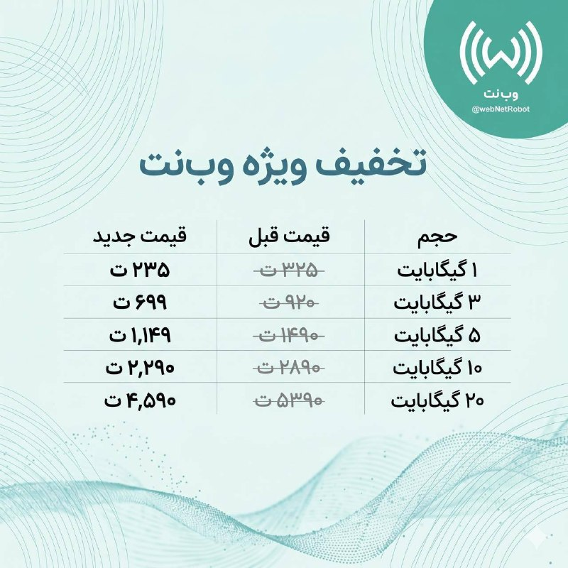

🕺 قبل از افزایش قیمت به خاطر جنگ،

🕊 کف قیمت ایران از وب‌نت کانفیگ سوپرسرعتی بخر 
🤑

حجم بالا بخر که زمان جنگ مجبور نشی گرون بخری 
❗️

🌐وب‌نت؛ بهترین سرویس با کف‌ترین قیمت ایران :
@WebNetRoBot @WebNetRoBot
@WebNetRoBot @WebNetRoBot

## alonews — post 118547

  <a href="telegram/content/alonews_118547_1778191350.jpg">🎬 Download video</a>

👈زد و خورد در خلیج فارس بدون تلفات انسانی گزارش شده است

✅ @AloNews خبر جنگ

---
📅 بروزرسانی: 1405/02/18 01:22
---

## VahidOOnLine — post 238758

  <a href="telegram/content/VahidOOnLine_238758_1778190744.mp4">🎬 Download video</a>

‌
سخنگوی قرارگاه مرکزی «خاتم‌الانبیا» در بیانیه‌ای مدعی شد ارتش آمریکا با «نقض آتش‌بس» یک نفتکش ایرانی را در مسیر حرکت از آب‌های ساحلی ایران در منطقه جاسک به سمت تنگه هرمز هدف قرار داده است.

او همچنین مدعی شد یک کشتی دیگر در حال ورود به تنگه هرمز در نزدیکی بندر فجیره امارات نیز هدف حمله قرار گرفته و هم‌زمان «مناطق غیرنظامی» در سواحل بندر خمیر، سیریک و جزیره قشم با «همکاری برخی کشورهای منطقه» مورد تعرض هوایی قرار گرفته‌اند.

او افزود نیروهای مسلح ایران نیز «بلافاصله» در اقدامی متقابل، شناورهای نظامی آمریکا در شرق تنگه هرمز و جنوب بندر چابهار را هدف قرار داده و «خسارات قابل توجهی» به آن‌ها وارد کرده‌اند.
‌🏁 🇬🇧 ManotoTV

🤖 @VahidOOnLine

## VahidOOnLine — post 238757

  <a href="telegram/content/VahidOOnLine_238757_1778190745.mp4">🎬 Download video</a>

فعال شدن پدافند هوایی در محدوده شهران، غرب تهران ـ پنجشنبه ۱۷ اردیبهشت ساعت ۲۳:۵۷
‌🏁 🇬🇧 ManotoTV

🤖 @VahidOOnLine

## VahidOOnLine — post 238756

  <a href="telegram/content/VahidOOnLine_238756_1778190746.mp4">🎬 Download video</a>

خبرگزاری حکومتی تسنیم مدعی شده سه ناوشکن نیروی دریایی آمریکا در نزدیکی تنگه هرمز هدف حمله نیروی دریایی سپاه قرار گرفته‌اند.

رسانه‌های حکومتی نیز گزارش داده‌اند یگان‌های دریایی آمریکا در تنگه هرمز پس از حمله ارتش آمریکا به یک نفتکش ایرانی، هدف «حملات موشکی» قرار گرفتند و به گفته این منابع، ناوهای آمریکایی پس از وارد آمدن «آسیب»، مجبور به عقب‌نشینی شدند.

در همین حال، گزارش شده یک جنگنده آمریکایی روز گذشته یک نفتکش ایرانی را که قصد عبور از محاصره دریایی و حرکت به‌سوی یکی از بنادر ایران را داشت، از کار انداخته است.

مقام‌های آمریکایی تاکنون به این ادعاها واکنشی نشان نداده‌اند و امکان تأیید مستقل این گزارش‌ها وجود ندارد.
‌🏁 🇬🇧 ManotoTV

🤖 @VahidOOnLine

## VahidOOnLine — post 238755

  <a href="telegram/content/VahidOOnLine_238755_1778190747.mp4">🎬 Download video</a>

‌
خبرنگار آکسیوس به نقل از یک مقام آمریکایی گزارش داده ارتش ایالات متحده روز پنج‌شنبه اهدافی را در منطقه تنگه هرمز هدف حمله قرار داده است.

این مقام تأکید کرده این حملات «به‌معنای ازسرگیری جنگ با ایران نیست» و در چارچوب درگیری‌های محدود اخیر ارزیابی می‌شود.
‌🏁 🇬🇧 ManotoTV

🤖 @VahidOOnLine

## VahidOOnLine — post 238754

  <a href="telegram/content/VahidOOnLine_238754_1778190748.mp4">🎬 Download video</a>

صداوسیما به نقل از یک «مقام آگاه نظامی» گزارش داد:
«به دنبال تعرض ارتش آمریکا به یک نفتکش ایرانی یگان‌های متعرض دشمن در محدوده تنگه هرمز زیر آتش موشکی ایران قرار گرفتند که پس از تحمل خسارت مجبور به فرار شدند.»
‌🏁 🇬🇧 ManotoTV

🤖 @VahidOOnLine

## VahidOOnLine — post 238753

  <a href="telegram/content/VahidOOnLine_238753_1778190749.mp4">🎬 Download video</a>

‌
گزارش‌های رسیده به منوتو از شنیده شدن صدای انفجار در غرب و شمال‌ غرب تهران حکایت دارد.
‌🏁 🇬🇧 ManotoTV

🤖 @VahidOOnLine

## VahidOOnLine — post 238752

  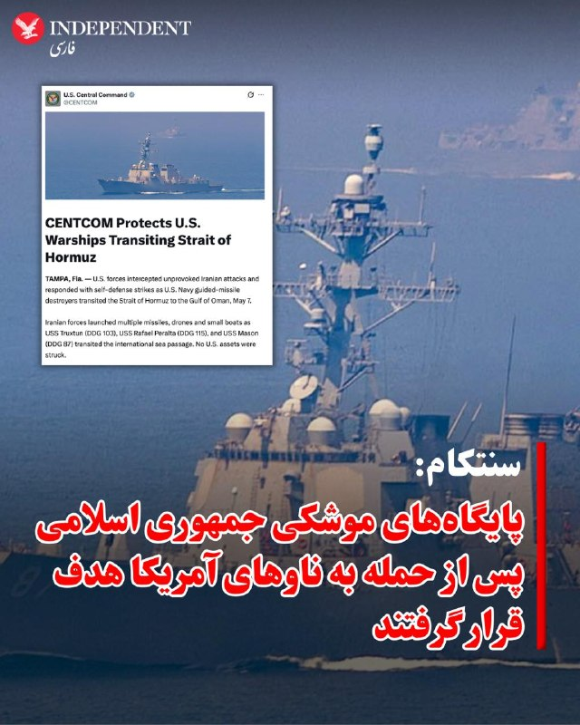

♦️فرماندهی مرکزی ایالات متحده، سنتکام، بامداد جمعه ۱۸ اردیبهشت‌ماه اعلام کرد نیروهای آمریکایی حملات «بدون تحریک» جمهوری اسلامی را در جریان عبور ناوشکن‌های نیروی دریایی آمریکا از تنگه هرمز رهگیری کرده‌اند.

بر اساس بیانیه سنتکام، نیروهای جمهوری اسلامی چندین موشک، پهپاد و قایق تندرو را به سمت یواس‌اس تراکستون، یواس‌اس رافائل پرالتا و یواس‌اس میسون شلیک کردند، اما هیچ‌یک از ناوهای آمریکایی هدف اصابت قرار نگرفتند.

سنتکام اعلام کرد آمریکا در پاسخ، پایگاه‌های موشکی و پهپادی جمهوری اسلامی، مراکز فرماندهی و کنترل و تاسیسات اطلاعاتی و شناسایی مرتبط با این حملات را هدف قرار داده است.

در این بیانیه تاکید شده است که آمریکا به دنبال تشدید تنش نیست، اما آماده حفاظت از نیروهای خود در منطقه باقی خواهد ماند.

رسانه‌های اسرائیلی و آمریکایی پیش‌تر گزارش داده بودند پس از جلوگیری یک ناو آمریکایی از عبور یک نفتکش ایرانی در تنگه هرمز، میان نیروهای جمهوری اسلامی و آمریکا درگیری رخ داده و همزمان حملاتی به قشم و بندرعباس انجام شده است.
‌🇸🇦 Indypersian

🤖 @VahidOOnLine

## DEJradio — post 4504

  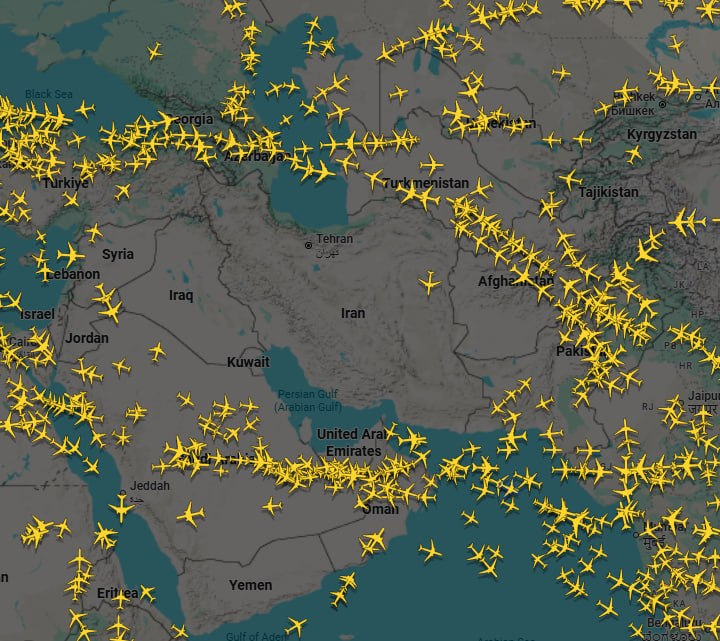

📡
🚨 آخرین شرایط ترافیک هوایی بر فراز منطقه

#ترافیک_هوایی #خاورمیانه
@DEJradio

## Iliaen — post 4432

  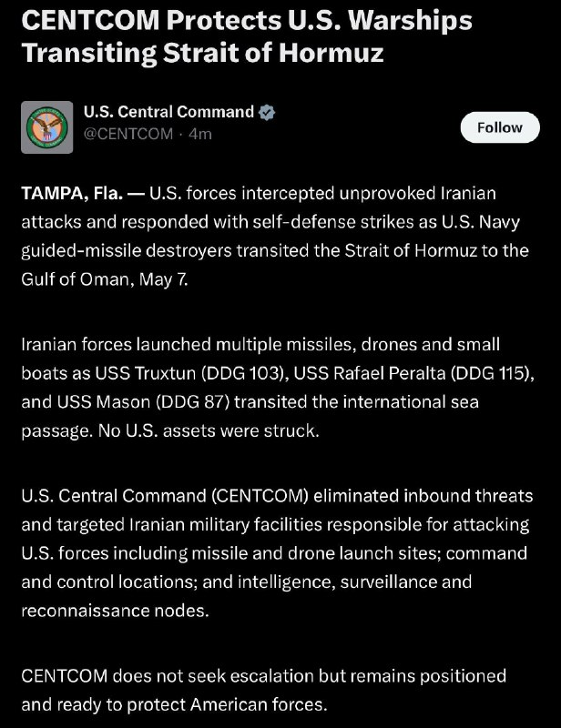

سنتکام در یک اطلاعیه رسمی اعلام کرد:

سایت‌های پرتاب موشک و پهپاد، همچنین مراکز فرماندهی، مرکز کنترل و گره‌های اطلاعاتی، نظارتی و شناسایی جمهوری اسلامی که از آن‌ها جهت حمله به نیروی دریایی ایالات متحده استفاده می‌شد را مورد هدف قرار داد.

@iliaen

## ManotoTV — post 105112

  <a href="telegram/content/ManotoTV_105112_1778190752.mp4">🎬 Download video</a>

‌
سخنگوی قرارگاه مرکزی «خاتم‌الانبیا» در بیانیه‌ای مدعی شد ارتش آمریکا با «نقض آتش‌بس» یک نفتکش ایرانی را در مسیر حرکت از آب‌های ساحلی ایران در منطقه جاسک به سمت تنگه هرمز هدف قرار داده است.

او همچنین مدعی شد یک کشتی دیگر در حال ورود به تنگه هرمز در نزدیکی بندر فجیره امارات نیز هدف حمله قرار گرفته و هم‌زمان «مناطق غیرنظامی» در سواحل بندر خمیر، سیریک و جزیره قشم با «همکاری برخی کشورهای منطقه» مورد تعرض هوایی قرار گرفته‌اند.

او افزود نیروهای مسلح ایران نیز «بلافاصله» در اقدامی متقابل، شناورهای نظامی آمریکا در شرق تنگه هرمز و جنوب بندر چابهار را هدف قرار داده و «خسارات قابل توجهی» به آن‌ها وارد کرده‌اند.

## ManotoTV — post 105111

  <a href="telegram/content/ManotoTV_105111_1778190753.mp4">🎬 Download video</a>

فعال شدن پدافند هوایی در محدوده شهران، غرب تهران ـ پنجشنبه ۱۷ اردیبهشت ساعت ۲۳:۵۷

## ManotoTV — post 105110

  <a href="telegram/content/ManotoTV_105110_1778190754.mp4">🎬 Download video</a>

خبرگزاری حکومتی تسنیم مدعی شده سه ناوشکن نیروی دریایی آمریکا در نزدیکی تنگه هرمز هدف حمله نیروی دریایی سپاه قرار گرفته‌اند.

رسانه‌های حکومتی نیز گزارش داده‌اند یگان‌های دریایی آمریکا در تنگه هرمز پس از حمله ارتش آمریکا به یک نفتکش ایرانی، هدف «حملات موشکی» قرار گرفتند و به گفته این منابع، ناوهای آمریکایی پس از وارد آمدن «آسیب»، مجبور به عقب‌نشینی شدند.

در همین حال، گزارش شده یک جنگنده آمریکایی روز گذشته یک نفتکش ایرانی را که قصد عبور از محاصره دریایی و حرکت به‌سوی یکی از بنادر ایران را داشت، از کار انداخته است.

مقام‌های آمریکایی تاکنون به این ادعاها واکنشی نشان نداده‌اند و امکان تأیید مستقل این گزارش‌ها وجود ندارد.

## ManotoTV — post 105109

  <a href="telegram/content/ManotoTV_105109_1778190755.mp4">🎬 Download video</a>

‌
خبرنگار آکسیوس به نقل از یک مقام آمریکایی گزارش داده ارتش ایالات متحده روز پنج‌شنبه اهدافی را در منطقه تنگه هرمز هدف حمله قرار داده است.

این مقام تأکید کرده این حملات «به‌معنای ازسرگیری جنگ با ایران نیست» و در چارچوب درگیری‌های محدود اخیر ارزیابی می‌شود.

## ManotoTV — post 105108

  <a href="telegram/content/ManotoTV_105108_1778190755.mp4">🎬 Download video</a>

صداوسیما به نقل از یک «مقام آگاه نظامی» گزارش داد:
«به دنبال تعرض ارتش آمریکا به یک نفتکش ایرانی یگان‌های متعرض دشمن در محدوده تنگه هرمز زیر آتش موشکی ایران قرار گرفتند که پس از تحمل خسارت مجبور به فرار شدند.»

## ManotoTV — post 105107

  <a href="telegram/content/ManotoTV_105107_1778190757.mp4">🎬 Download video</a>

‌
گزارش‌های رسیده به منوتو از شنیده شدن صدای انفجار در غرب و شمال‌ غرب تهران حکایت دارد.

## FarsiVOA — post 217146

🔺سنتکام: نیروهای آمریکایی به «حملات بی‌دلیل» جمهوری اسلامی پاسخ دادند و تهدیدات را منهدم کردند

▪️ستاد فرماندهی مرکزی آمریکا، سنتکام، دقایقی قبل در بیانیه‌ای گفت که نیروهای آمریکایی روز ۱۷ اردیبهشت هنگام عبور ناوشکن‌های موشک‌انداز نیروی دریایی آمریکا از تنگه هرمز به سمت دریای عمان، «حملات بی‌دلیل» جمهوری اسلامی ایران را رهگیری کردند و در پاسخ، حملات دفاعی انجام دادند.

⬇️ بیشتر بخوانید:
https://ir.voanews.com/a/8147718.html
@FarsiVOA

## Persian_Trend_Official — post 13652

https://youtube.com/live/f_XbdlsXjOY?feature=share تا 10 دقیقه دیگه لایو آغاز میشه

## RadioFarda — post 156948

  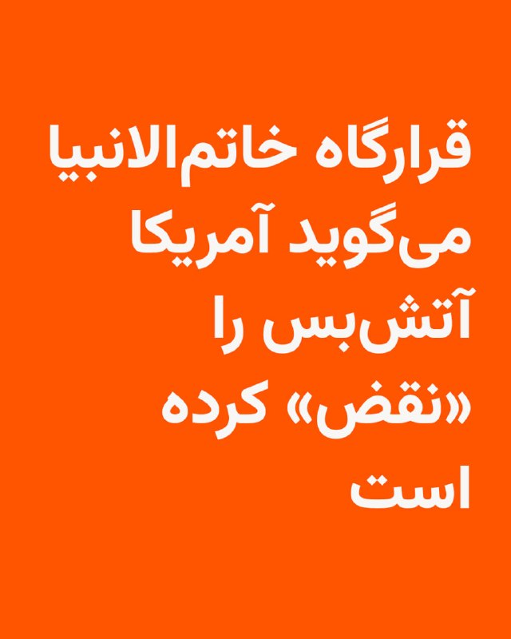

🔸قرارگاه خاتم‌الانبیا سپاه پاسدران جمهوری اسلام بامداد جمعه ایالات متحده را به نقض آتش‌بس متهم کرد و گفت «آمریکا دو کشتی را در تنگه هرمز هدف قرار داده و به مناطق غیرنظامی حمله کرده است.»

🔸سخنگوی قرارگاه مرکزی خاتم‌الانبیا در بیانیه‌ای که رسانه‌های دولتی منتشر کردند، اضافه کرد که
«آمریکا یک نفتکش ایرانی را که از آب‌های ساحلی ایران در نزدیکی جاسک به سمت تنگه هرمز در حرکت بود، هدف قرار داد. همچنین یک شناور دیگر را که در نزدیکی بندر فجیره امارات وارد تنگه هرمز می‌شد، مورد حمله قرار داد.»

🔸این درحالی است که فرماندهی مرکزی آمریکا (سنتکام) در بیانیه‌ای اعلام کرد سه ناو این کشور در جریان عبور از تنگه هرمز به سمت دریای عمان، هدف حملات ایران قرار گرفتند، اما هیچ‌یک از تجهیزات یا نیروهای آمریکایی آسیب ندیدند.

🔸به گفته سنتکام، نیروهای آمریکایی در پاسخ، سایت‌های نظامی ایران از جمله محل‌های پرتاب موشک و پهپاد، مراکز فرماندهی و مراکز اطلاعاتی و شناسایی را هدف قرار داده‌اند.

@RadioFarda

## manototv — post 105112

  <a href="telegram/content/manototv_105112_1778190758.mp4">🎬 Download video</a>

‌
سخنگوی قرارگاه مرکزی «خاتم‌الانبیا» در بیانیه‌ای مدعی شد ارتش آمریکا با «نقض آتش‌بس» یک نفتکش ایرانی را در مسیر حرکت از آب‌های ساحلی ایران در منطقه جاسک به سمت تنگه هرمز هدف قرار داده است.

او همچنین مدعی شد یک کشتی دیگر در حال ورود به تنگه هرمز در نزدیکی بندر فجیره امارات نیز هدف حمله قرار گرفته و هم‌زمان «مناطق غیرنظامی» در سواحل بندر خمیر، سیریک و جزیره قشم با «همکاری برخی کشورهای منطقه» مورد تعرض هوایی قرار گرفته‌اند.

او افزود نیروهای مسلح ایران نیز «بلافاصله» در اقدامی متقابل، شناورهای نظامی آمریکا در شرق تنگه هرمز و جنوب بندر چابهار را هدف قرار داده و «خسارات قابل توجهی» به آن‌ها وارد کرده‌اند.

## manototv — post 105111

  <a href="telegram/content/manototv_105111_1778190759.mp4">🎬 Download video</a>

فعال شدن پدافند هوایی در محدوده شهران، غرب تهران ـ پنجشنبه ۱۷ اردیبهشت ساعت ۲۳:۵۷

## manototv — post 105110

  <a href="telegram/content/manototv_105110_1778190760.mp4">🎬 Download video</a>

خبرگزاری حکومتی تسنیم مدعی شده سه ناوشکن نیروی دریایی آمریکا در نزدیکی تنگه هرمز هدف حمله نیروی دریایی سپاه قرار گرفته‌اند.

رسانه‌های حکومتی نیز گزارش داده‌اند یگان‌های دریایی آمریکا در تنگه هرمز پس از حمله ارتش آمریکا به یک نفتکش ایرانی، هدف «حملات موشکی» قرار گرفتند و به گفته این منابع، ناوهای آمریکایی پس از وارد آمدن «آسیب»، مجبور به عقب‌نشینی شدند.

در همین حال، گزارش شده یک جنگنده آمریکایی روز گذشته یک نفتکش ایرانی را که قصد عبور از محاصره دریایی و حرکت به‌سوی یکی از بنادر ایران را داشت، از کار انداخته است.

مقام‌های آمریکایی تاکنون به این ادعاها واکنشی نشان نداده‌اند و امکان تأیید مستقل این گزارش‌ها وجود ندارد.

## manototv — post 105109

  <a href="telegram/content/manototv_105109_1778190761.mp4">🎬 Download video</a>

‌
خبرنگار آکسیوس به نقل از یک مقام آمریکایی گزارش داده ارتش ایالات متحده روز پنج‌شنبه اهدافی را در منطقه تنگه هرمز هدف حمله قرار داده است.

این مقام تأکید کرده این حملات «به‌معنای ازسرگیری جنگ با ایران نیست» و در چارچوب درگیری‌های محدود اخیر ارزیابی می‌شود.

## manototv — post 105108

  <a href="telegram/content/manototv_105108_1778190762.mp4">🎬 Download video</a>

صداوسیما به نقل از یک «مقام آگاه نظامی» گزارش داد:
«به دنبال تعرض ارتش آمریکا به یک نفتکش ایرانی یگان‌های متعرض دشمن در محدوده تنگه هرمز زیر آتش موشکی ایران قرار گرفتند که پس از تحمل خسارت مجبور به فرار شدند.»

## manototv — post 105107

  <a href="telegram/content/manototv_105107_1778190763.mp4">🎬 Download video</a>

‌
گزارش‌های رسیده به منوتو از شنیده شدن صدای انفجار در غرب و شمال‌ غرب تهران حکایت دارد.

## alonews — post 118546

  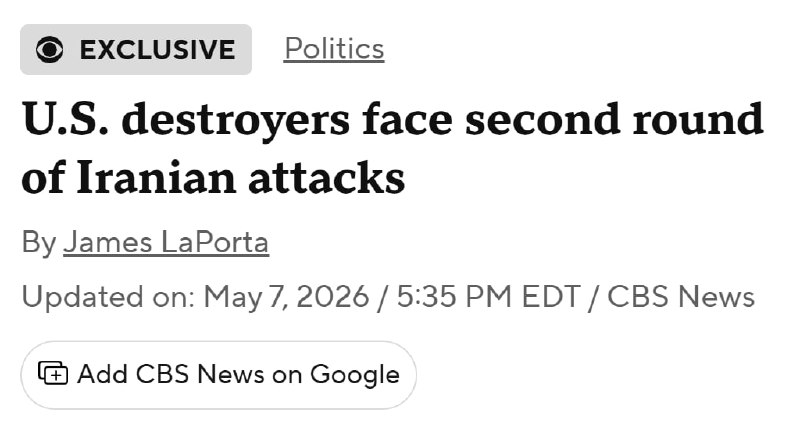

👈گزارش شده (به نقل از CBS News) که ناوشکن‌های آمریکایی USS Truxtun و USS Mason هدف یک حمله شدید ایران قرار گرفتند؛ حمله‌ای که مقام‌های آمریکایی آن را شدیدتر و طولانی‌تر از درگیری چند روز قبل توصیف کرده‌اند.

به گفته مقام‌های آمریکا، قایق‌های تندروی ایرانی آن‌قدر نزدیک شدند که ناوشکن‌ها مجبور شدند با توپ‌های دریایی، سامانه‌های دفاع نزدیک و سلاح‌های نصب‌شده روی عرشه شلیک کنند.
همچنین هواپیماهای پشتیبانی و بالگردهای AH-64 Apache با موشک‌های Hellfire و تیربار اهداف را هدف قرار دادند.
مقام‌ها گفته‌اند ایران در جریان این درگیری از پهپاد و موشک هم استفاده کرده، اما هیچ آسیبی به کشتی‌های آمریکایی وارد نشده و تلفاتی گزارش نشده است.

✅ @AloNews خبر جنگ

## alonews — post 118545

  <a href="telegram/content/alonews_118545_1778190765.mp4">🎬 Download video</a>

🔴همان‌گونه که قبلاً نیز اطلاع‌رسانی شده بود، رژیم دیگر عملاً ظرفیت کافی برای ذخیره‌سازی و تخلیه کامل نفت استخراج‌شده را ندارد.

🔴لذا چند روزی است که ظاهراً وانمود می‌کند در حال انتقال نفت به نفت‌کش‌هاست، اما در واقع بخش قابل‌توجهی از نفت را مستقیماً وارد دریا می‌کند.

✅@AloNews

## alonews — post 118544

  <a href="telegram/content/alonews_118544_1778190767.jpg">🎬 Download video</a>

👈خبرنگار صدا و سیما : مردم در ساحل تنگه هرمز، بساط شیرینی و تخمه پهن کرده‌اند

✅ @AloNews خبر جنگ

---
📅 بروزرسانی: 1405/02/18 01:12
---

## DEJradio — post 4503

  <a href="telegram/content/DEJradio_4503_1778190167.jpg">🎬 Download video</a>

🚨
🔺 سنتکام: مواضع نظامی و تاسیسات اطلاعاتی و نظامی جمهوری اسلامی هدف قرار گرفتند.

در پی درگیری شامگاه پنج‌شنبه در منطقع تنگه هرمز، سنتکام اعلام کرد نیروهای آمریکایی شامگاه هفتم مه، حملات جمهوری اسلامی علیه ناوشکن‌های نیروی دریایی آمریکا در حال عبور از تنگۀ هرمز به سمت دریای عمان را رهگیری کرده و در پاسخ، حملات دفاعی انجام داده‌اند.
بر اساس بیانیۀ فرماندهی مرکزی ایالات متحده، نیروهای جمهوری اسلامی چندین موشک، پهپاد و شناور تندرو را به سمت ناوشکن‌های «یواس‌اس تراکستون»، «یواس‌اس رافائل پرالتا» و «یواس‌اس میسن» شلیک کردند، اما هیچ‌یک از شناورهای آمریکایی هدف قرار نگرفتند.
سنتکام اعلام کرد در پاسخ به این حملات، مواضع نظامی جمهوری اسلامی شامل پایگاه‌های پرتاب موشک و پهپاد، مراکز فرماندهی و کنترل، و تأسیسات اطلاعاتی و شناسایی را هدف قرار داده است.

#سنتکام #تنگه_هرمز
@DEJradio

## Shin_Persian — post 5881

  <a href="telegram/content/Shin_Persian_5881_1778190168.mp4">🎬 Download video</a>

Shin ✓ @hey_itsmyturn
Thu, 07 May 2026 21:40:45 UTC

𝕏 · @shin_persian

## Shin_Persian — post 5880

U.S. Central Command ✓ @CENTCOM
Thu, 07 May 2026 21:33:12 UTC

http://x.com/i/article/2052495597194936320

𝕏 · @shin_persian

## Persian_Trend_Official — post 13651

  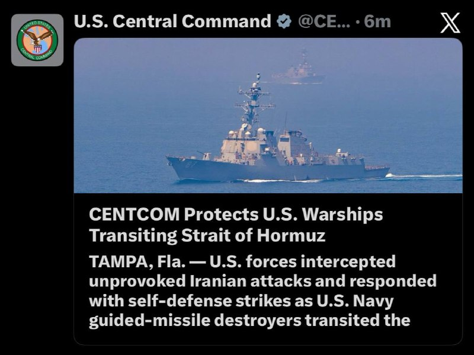

🔴سنتکام

💢نیروهای ایالات متحده حملات بی‌دلیل ایرانی را رهگیری کردند و با حملات دفاع شخصی پاسخ دادند، در حالی که ناوشکن‌های موشک‌دار نیروی دریایی آمریکا در حال عبور از تنگه هرمز به سمت خلیج عمان بودند (۷ مه).

💢نیروهای ایرانی چندین موشک، پهپاد و قایق کوچک را هنگام عبور ناو USS Truxtun (DDG 103)**، **USS Rafael Peralta (DDG 115) و�سنتکام

💢نیروهای ایالاز این گذرگاه بین‌المللی دریایی شلیک کردند. هیچ یک از دارایی‌های آمریکایی مورد اصابت قرار نگرفت.

▪️فرماندهی مرکزی ایالات متحده (CENTCOM) تهدیدهای ورودی را خنثی کرد و تأسیسات نظامی ایرانی مسئول حمله به نیروهای آمریکایی را هدف قرار داد؛ از جمله سایت‌های پرتاب موشک و پهپاد، مراکز فرماندهی و کنترل، و گره‌های اطلاعات، نظارت و شناسایی.

سنتکام به دنبال تشدید تنش نیست، اما آماده و موقعیت‌دار است تا از نیروهای آمریکایی حفاظت کند.

🫆:Tony

📌 @persian_trend_official
پرشین ترند | متفاوت‌ترین کانال نظامی

## Persian_Trend_Official — post 13650

  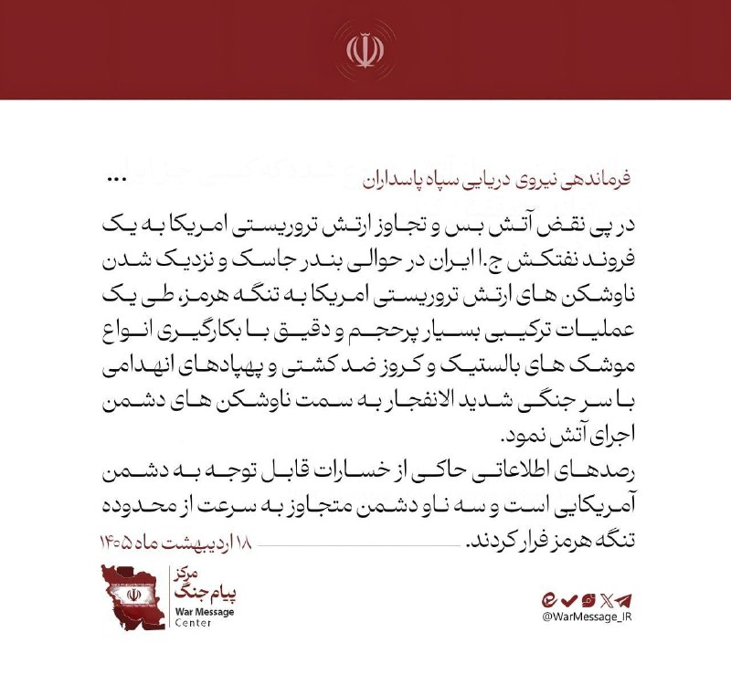

بیانیه رسمی نیروی دریایی سپاه در باره نقض آتش بس و حمله به ناوهای امریکایی

☆Phantom☆

📌 @persian_trend_official
پرشین ترند | متفاوت‌ترین کانال نظامی

## IranianMinds — post 19766

🔴کانال ۱۴ اسرائیل:

اتش‌بس فروریخت.

@IranianMinds

## IranianMinds — post 19765

بابا میگم اینا تو خاورمیانه عادیه قبول نمیکنید

هر موقع زدن 100 تا فرمانده سپاهو همزمان کتلت کردن بدونید برا یه دو سه روزی آتش بس تمومه

## IranianMinds — post 19764

🔴 سنتکام :

قایق های تندروی رژیم ایران در دریا و سایت های پرتاب موشک و پهپاد را در خاک ایران نابود کردیم !

@IranianMinds

## Dirty_Kids — post 389076

جمهوری‌اسلامی اینقد کمدیه که یه کشور بهت حمله میکنه ولی نمیدونی کی بود!

@Dirty_Kids 👻

## alonews — post 118543

  <a href="telegram/content/alonews_118543_1778190172.jpg">🎬 Download video</a>

👈گویا فیتیله تنش‌ها پایین کشیده شد

✅ @AloNews خبر جنگ

---
📅 بروزرسانی: 1405/02/18 01:07
---

## DEJradio — post 4502

  <a href="telegram/content/DEJradio_4502_1778189866.jpg">🎬 Download video</a>

🔺
⭕️ شبکۀ فاکس نیوز به نقل از یک مقام آمریکایی گزارش داد حملات ایالات متحده در واکنش به شلیک ۱۵ موشک بالستیک، موشک کروز و پهپاد از سوی جمهوری اسلامی به سمت بندر فجیره در امارات انجام شده است.

#تنگه_هرمز #فجیره
@DEJradio

## kianmeli1 — post 87265

  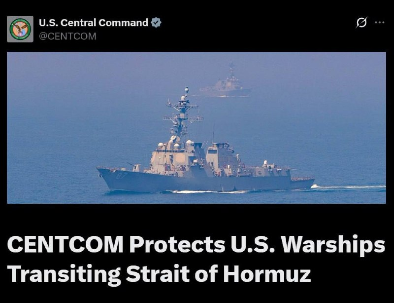

🔴فوری

بیانیه سنتکام:

«ایالات متحده تأسیسات نظامی ایران، از جمله سایت‌های پرتاب موشک و پهپاد؛ مکان‌های فرماندهی و کنترل؛ و مراکز اطلاعاتی، نظارتی و شناسایی را هدف قرار داد.»
https://t.me/kianmeli1

## kianmeli1 — post 87264

🔴فوری-انبار قایق های تندرو سپاه هدف حمله آمریکا قرار گرفته است
https://t.me/kianmeli1

## kianmeli1 — post 87263

🔴فوری-جت‌های جنگنده بر فراز کویت و بغداد مشاهده شدند.
https://t.me/kianmeli1

## Persian_Trend_Official — post 13649

  <a href="telegram/content/Persian_Trend_Official_13649_1778189868.jpg">🎬 Download video</a>

فایل صوتی لایو اول
نسخه کم حجم - 11.64 مگابایت

اتاق جنگ پنجشنبه 17 اردیبهشت | فارس از تبادل آتش خبر داد | آیا حمله شروع شد؟

📝 Nick

📌 @persian_trend_official
پرشین ترند | متفاوت‌ترین کانال نظامی

## IranianMinds — post 19763

  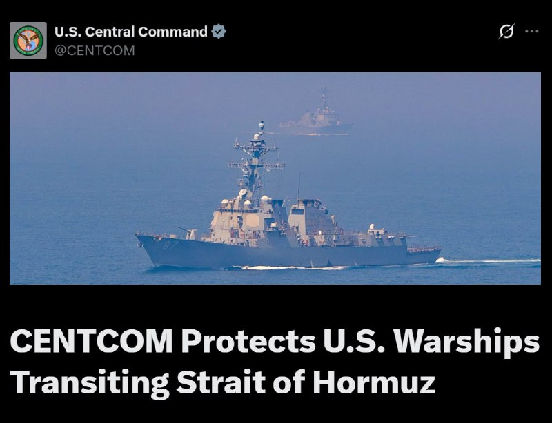

🔴 بیانیه سنتکام :

نیروهای آمریکایی حملات بی‌دلیل ایرانیان را رهگیری کرده و با حملات دفاعی پاسخ دادند در حالی که ناوشکن‌های موشک‌انداز نیروی دریایی آمریکا از تنگه هرمز به خلیج عمان عبور می‌کردند، ۷ مه.

نیروهای ایرانی چندین موشک، پهپاد و قایق کوچک را به سمت ناوشکن‌های USS Truxtun (DDG 103)، USS Rafael Peralta (DDG 115) و USS Mason (DDG 87) که از مسیر دریایی بین‌المللی عبور می‌کردند، پرتاب کردند. هیچ دارایی آمریکایی مورد اصابت قرار نگرفت.

فرماندهی مرکزی ایالات متحده (CENTCOM) تهدیدهای ورودی را از بین برد و تأسیسات نظامی ایرانی مسئول حمله به نیروهای آمریکایی از جمله سایت‌های پرتاب موشک و پهپاد؛ مکان‌های فرماندهی و کنترل؛ و گره‌های اطلاعاتی، نظارتی و شناسایی را هدف قرار داد.

@IranianMinds

## IranianMinds — post 19762

هر موقع اسرائیل هم اومد زد من باورم میشه جنگ شروع شده دوباره

## IranianMinds — post 19761

هر موقع اسرائیل هم اومد زد من باورم میشه جنگ شروع شده دوباره

## IranianMinds — post 19760

🔴 قرارگاه خاتم الانبیا:

آمریکا حملاتشو با همکاری کشور های منطقه انجام داد

@IranianMinds

## alonews — post 118542

  

🔴فوری/سنتکام:

نیروهای آمریکایی حملات بی‌دلیل ایرانیان را رهگیری کرده و با حملات دفاعی پاسخ دادند در حالی که ناوشکن‌های موشک‌انداز نیروی دریایی آمریکا از تنگه هرمز به خلیج عمان عبور می‌کردند، ۷ مه.

نیروهای ایرانی چندین موشک، پهپاد و قایق کوچک را به سمت ناوشکن‌های USS Truxtun (DDG 103)، USS Rafael Peralta (DDG 115) و USS Mason (DDG 87) که از مسیر دریایی بین‌المللی عبور می‌کردند، پرتاب کردند. هیچ دارایی آمریکایی مورد اصابت قرار نگرفت.

فرماندهی مرکزی ایالات متحده (CENTCOM) تهدیدهای ورودی را از بین برد و تأسیسات نظامی ایرانی مسئول حمله به نیروهای آمریکایی از جمله سایت‌های پرتاب موشک و پهپاد؛ مکان‌های فرماندهی و کنترل؛ و گره‌های اطلاعاتی، نظارتی و شناسایی را هدف قرار داد.

سنتکام به دنبال تشدید تنش نیست اما آماده و مستقر برای حفاظت از نیروهای آمریکایی باقی

✅ @AloNews خبر جنگ

---
📅 بروزرسانی: 1405/02/18 01:02
---

## VahidOOnLine — post 238751

  

♦️خبرگزاری مهر بامداد جمعه ۱۸ اردیبهشت‌ماه به نقل از محمد رادمهر، معاون استاندار و فرماندار ویژه میناب، گزارش داد یک پایگاه دریابانی در این شهرستان هدف حمله قرار گرفته است.

به گفته رادمهر، این حمله ساعت ۰۰:۱۰ توسط اسرائیل و آمریکا انجام شده است.

همزمان فاکس‌نیوز گزارش داد آمریکا حملاتی را به جزیره قشم و بندرعباس در جنوب ایران انجام داده است.
‌🇸🇦 Indypersian

🤖 @VahidOOnLine

## VahidOOnLine — post 238750

  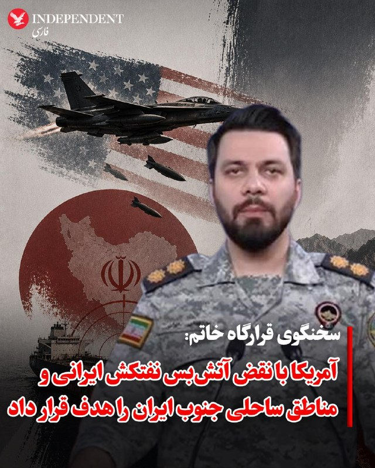

♦️سخنگوی قرارگاه مرکزی خاتم‌الانبیا در بیانیه‌ای اعلام کرد ارتش ایالات متحده آمریکا با نقص آتش‌بس یک نفتکش ایرانی در مسیر جاسک به تنگه هرمز و همچنین یک کشتی دیگر در نزدیکی فجیره را هدف قرار داده است.
بر اساس این بیانیه، مناطقی در سواحل بندر خمیر، سیریک و قشم نیز هدف حملات هوایی قرار گرفته‌اند.
سخنگوی قرارگاه خاتم‌الانبیا همچنین اعلام کرد نیروهای مسلح جمهوری اسلامی در پاسخ، شناورهای نظامی آمریکا در شرق تنگه هرمز و جنوب چابهار را هدف قرار داده‌اند.
‌🇸🇦 Indypersian

🤖 @VahidOOnLine

## VahidOOnLine — post 238749

  

سخنگوی قرارگاه مرکزی حضرت خاتم‌الانبیا اعلام کرد ارتش آمریکا یک کشتی نفتکش جمهوری اسلامی در حال حرکت از آب‌های ساحلی ایران در منطقه جاسک به سمت تنگه هرمز و همچنین یک کشتی دیگر در حال ورود به این تنگه را هدف قرار داد. به گفته او، همزمان مناطق غیرنظامی در سواحل بندر خمیر، سیریک و جزیره قشم نیز با همکاری برخی کشورهای منطقه هدف حمله هوایی قرار گرفت.

سخنگوی قرارگاه مرکزی حضرت خاتم‌الانبیا گفت: «نیروهای مسلح جمهوری اسلامی نیز بلافاصله و در اقدامی متقابل شناورهای نظامی آمریکا در شرق تنگه هرمز و جنوب بندر چابهار را مورد هجوم قرار دادند و خسارات قابل توجهی به آنها وارد کردند.»
‌🏁 🇬🇧 IranintlTV

🤖 @VahidOOnLine

## mwarmonitor — post 8664

🔴یک مقام آمریکایی در گفتگو با اکسیوس تأیید کرد که روز پنجشنبه نیروهای ایالات متحده و ایران در تنگه هرمز به تبادل آتش پرداختند.

🔰گزارش رسانه‌های ایران: رسانه‌های دولتی ایران اعلام کردند که نیروی دریایی این کشور سه ناوشکن آمریکایی را هدف قرار داده است.

🔸گزارش مقام آمریکایی: این مقام مسئول اظهار داشت که ایالات متحده حملاتی را علیه اهدافی در تنگه هرمز انجام داده است.
🔸تصویر کلی (The Big Picture)
به گفته مقام آمریکایی، این درگیری به معنای ازسرگیری جنگ نیست؛ با این حال، ارتش ایران حملات ایالات متحده را نقض آتش‌بس توصیف کرده و تهدید به انتقام‌جویی نموده است. در حال حاضر میزان دقیق حملات و خسارات وارده مشخص نیست.
🔸ارتش ایران مدعی شد که ایالات متحده یک نفتکش و یک کشتی دیگر را در هنگام ورود به تنگه هدف قرار داده است.
🔸رئیس‌جمهور ترامپ روز سه‌شنبه دستور توقف عملیات نیروی دریایی برای تسهیل کشتی‌رانی را صادر کرد، اما محاصره دریایی ایالات متحده همچنان پابرجاست.
🔸به نظر می‌رسد این تقابل زمانی رخ داده که ایالات متحده قصد داشته این محاصره را اعمال کند.
🔰مروری بر رویدادهای اخیر
ایران روز دوشنبه در واکنش به عملیاتی از سوی آمریکا (که اکنون متوقف شده)، به شناورهای نیروی دریایی آمریکا، کشتی‌های تجاری و امارات متحده عربی شلیک کرده بود.
🔸عقب‌نشینی ترامپ در حالی صورت گرفت که ایالات متحده و ایران در حال مذاکره بر سر یک یادداشت تفاهم یک‌صفحه‌ای هستند؛ سندی که هدف آن پایان دادن به خصومت‌ها و زمینه‌سازی برای مذاکرات دقیق‌تر و گسترده‌تر است.

@mwarmonitor

## DEJradio — post 4501

⭕️
💣 خبرگزاری های رسمی داخلی از شنیده شدن صدای انفجار در میناب خبر میدهند. #میناب #انفجار @DEJradio

## VahidOnline — post 75310

  <a href="telegram/content/VahidOnline_75310_1778189544.mp4">🎬 Download video</a>

🔴قرارگاه خاتم النبیاء که مدیریت جنگ در ایران را بر عهده دارد، ساعتی بعد از گزارش‌ها از حملات و رد و بدل شدن آتش در حوالی تنگه هرمز، با انتشار بیانیه‌ای این حملات را «نقض اتش‌بس» و در پی «همکاری چند کشور منطقه با آمریکا» ارزیابی کرده و گفته است: «ارتش متجاوز، تروریست و راهزن آمریکا با نقض آتش‌بس یک کشتی نفتکش ایرانی و در حال حرکت از آبهای ساحلی ایران در منطقه جاسک به سمت تنگه هرمز و همچنین یک کشتی دیگر در حال ورود به تنگه هرمز را روبروی بندر فجیره امارات مورد هدف قرار دادند و همزمان مناطق غیرنظامی را با همکاری برخی از کشورهای منطقه در سواحل بندر خمیر، سیریک و جزیره قشم مورد تعرض هوایی خود قرار دادند.»

این قرارگاه در ادامه مدعی شده که نیروهای نظامی ایران به این حملات واکنش نشان داده‌اند: «نیروهای مسلح جمهوری اسلامی ایران نیز بلافاصله و در اقدامی متقابل شناورهای نظامی آمریکا در شرق تنگه هرمز و جنوب بندر چابهار را مورد هجوم قرار داده و خسارات قابل توجهی به‌ آنها وارد نمودند.»

bbc.in
@VahidHeadline

📡 @VahidOnline

## VahidOnline — post 75309

  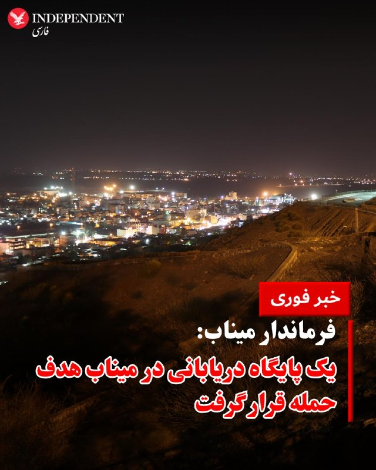

♦️خبرگزاری مهر بامداد جمعه ۱۸ اردیبهشت‌ماه به نقل از محمد رادمهر، معاون استاندار و فرماندار ویژه میناب، گزارش داد یک پایگاه دریابانی در این شهرستان هدف حمله قرار گرفته است.

به گفته رادمهر، این حمله ساعت ۰۰:۱۰ توسط اسرائیل و آمریکا انجام شده است.

همزمان فاکس‌نیوز گزارش داد آمریکا حملاتی را به جزیره قشم و بندرعباس در جنوب ایران انجام داده است.
@VahidOOnLine

📡 @VahidOnline

## kianmeli1 — post 87262

  

🔴فوری- فرماندهی دریایی سپاه

سه ناوشکن امریکا را در تنگه هرمز با موشک بالستیک و کروز هدف قرار داده ایم و فرار کردند
https://t.me/kianmeli1

## kianmeli1 — post 87261

🔴فوری-اسراییل
آتش بس فرو پاشید
https://t.me/kianmeli1

## kianmeli1 — post 87260

🔴فوری-ایست بازرسی دریایی بندر کرگان در میناب بمباران شد
https://t.me/kianmeli1

## IranIntlTV — post 336036

  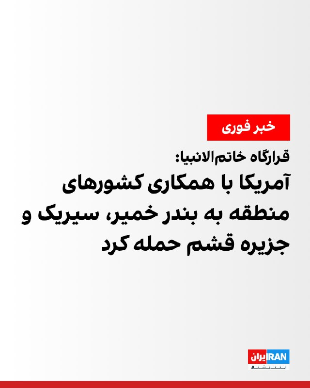

سخنگوی قرارگاه مرکزی حضرت خاتم‌الانبیا اعلام کرد ارتش آمریکا یک کشتی نفتکش جمهوری اسلامی در حال حرکت از آب‌های ساحلی ایران در منطقه جاسک به سمت تنگه هرمز و همچنین یک کشتی دیگر در حال ورود به این تنگه را هدف قرار داد. به گفته او، همزمان مناطق غیرنظامی در سواحل بندر خمیر، سیریک و جزیره قشم نیز با همکاری برخی کشورهای منطقه هدف حمله هوایی قرار گرفت.

سخنگوی قرارگاه مرکزی حضرت خاتم‌الانبیا گفت: «نیروهای مسلح جمهوری اسلامی نیز بلافاصله و در اقدامی متقابل شناورهای نظامی آمریکا در شرق تنگه هرمز و جنوب بندر چابهار را مورد هجوم قرار دادند و خسارات قابل توجهی به آنها وارد کردند.»
https://iranintl.com/202605074483

## Shin_Persian — post 5879

Shin ✓ @hey_itsmyturn
Thu, 07 May 2026 21:30:48 UTC

Jet activity over #Kuwait 🇰🇼

فارسی

فعالیت جنگنده‌ها برفراز #Kuwait 🇰🇼

𝕏 · @shin_persian

## Persian_Trend_Official — post 13648

  <a href="telegram/content/Persian_Trend_Official_13648_1778189547.jpg">🎬 Download video</a>

🔴خبرنگار صداوسیما:

💢 صداهایی که در جنوب شنیده
شد مربوط به دفاع قدرتمندانه ایران بود

🫆:Tony

📌 @persian_trend_official
پرشین ترند | متفاوت‌ترین کانال نظامی

## IranianMinds — post 19759

  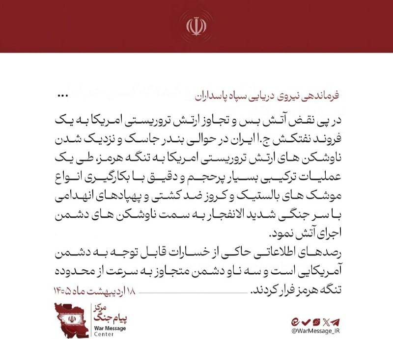

🔴 سپاه :

سه ناوشکن امریکا را در تنگه هرمز با موشک بالستیک و کروز هدف قرار داده ایم !

@IranianMinds

## IranianMinds — post 19758

🔴 فوری فاکس نیوز :

پایگاه دریابانی میناب توسط ارتش آمریکا هدف قرار گرفت

@IranianMinds

## IranianMinds — post 19757

🔴 قرارگاه خاتم الانبیا:

نیروهای ما در حمله به ناوهای نظامی آمریکایی در شرق تنگه هرمز و جنوب بندر چابهار خسارات قابل توجهی به آنها وارد کردند.

@IranianMinds

## IranianMinds — post 19756

🔴عرزشی ‌ها همه فرار، رفتن سوراخ موش.

## IranianMinds — post 19755

🔴 خبرگزاری مهر :

پدافند غرب تهران فعال شده

@IranianMinds

## BBCPersian — post 280439

🔻ایران می‌گوید در حال بررسی «نقش احتمالی امارات» در حملات به قشم و حوالی تنگه هرمز است

رسانه‌های نزدیک به سپاه پاسداران در ایران می‌گویند این کشور در حال بررسی نقش احتمالی امارات در درگیری‌هایی است که طی چند ساعت گذشته در جزیره قشم، بندر عباس و حوالی تنگه هرمز گزارش شده است.

خبرگزاری فارس - نزدیک به سپاه پاسداران - همچنین به نقل از منابع عربی از شنیده شدن صدای انفجار در ابوظبی خبر داده است.

تنش میان تهران و ابوظبی طی چند روز گذشته شدت یافته است. این تنش در پی گزارش‌هایی در رسانه‌های ایران مبنی بر «مشارکت مستقیم» امارات در جنگ آمریکا و اسرائیل با ایران و همچنین آتش‌سوزی چند روز پیش در تاسیسات نفتی فجیره امارات بالا گرفت که امارات مدعی شد ناشی از حمله ایران بوده است اما ایران رسما هر‌گونه حمله به امارات در روزهای اخیر را رد کرد.

https://bbc.in/4uGerv3
@BBCPersian

## configx2ray — post 38612

  <a href="telegram/content/configx2ray_38612_1778189548.jpg">🎬 Download video</a>

vless://9d0b7f4e-b0fe-42bf-a550-31b7ecb0e053@2.144.4.245:23176?encryption=none&type=tcp&headerType=none#https://t.me/ConfigX2ray

socks://Og@62.220.126.56:26132#https://t.me/ConfigX2ray

hysteria2://Kz0JGcGICb@srm.kishonline.online:443?obfs=salamander&obfs-password=kish-data-center&sni=srm.kishonline.online&insecure=0#https://t.me/ConfigX2ray

vless://7fc9a955-4910-5b53-f516-0af48ec30de0@meli.masterdadeh.ir:80?encryption=none&type=ws&path=%2F#https://t.me/ConfigX2ray

ترکیبی با سایفون وصله 
✅

آموزش استفادع : 
👇
https://t.me/ConfigX2ray0/1665

Channel : https://t.me/ConfigX2ray

## alonews — post 118541

  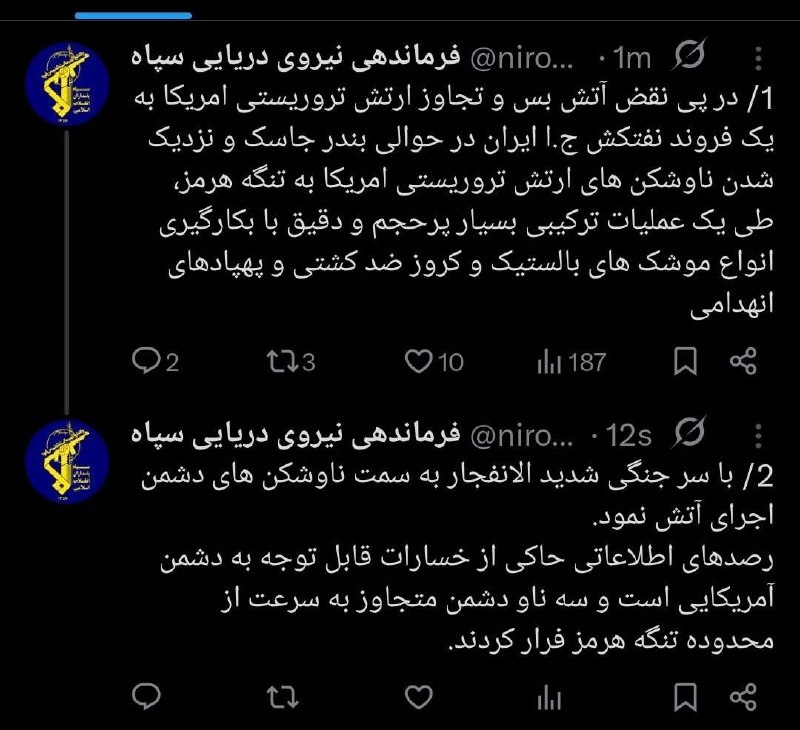

👈فرماندهی نیروی دریایی سپاه:

💢‏1- در پی نقض آتش بس و تجاوز ارتش تروریستی امریکا به یک فروند نفتکش ج.ا ایران در حوالی بندر جاسک و نزدیک شدن ناوشکن های ارتش تروریستی امریکا به تنگه هرمز، طی یک عملیات ترکیبی بسیار پرحجم و دقیق با بکارگیری انواع موشک های بالستیک و کروز ضد کشتی و پهپادهای انهدامی

🔴‏2- با سر جنگی شدید الانفجار به سمت ناوشکن های دشمن اجرای آتش نمود.

🔴رصدهای اطلاعاتی حاکی از خسارات قابل توجه به دشمن آمریکایی است و سه ناو دشمن متجاوز به سرعت از محدوده تنگه هرمز فرار کردند.

✅ @AloNews خبر جنگ

## alonews — post 118540

  <a href="telegram/content/alonews_118540_1778189549.mp4">🎬 Download video</a>

🔴فوری/فعالیت پدافند تو شرق تهران

✅ @AloNews خبر جنگ

## alonews — post 118539

  <a href="telegram/content/alonews_118539_1778189550.jpg">🎬 Download video</a>

🔴فوری/کانال 14 اسرائیل: آتش بس فروپاشید!!

✅ @AloNews خبر جنگ

---
📅 بروزرسانی: 1405/02/18 00:52
---

## VahidOOnLine — post 238748

  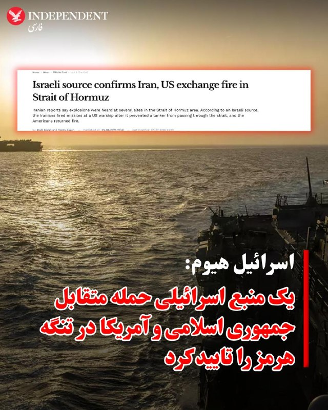

♦️روزنامه اسرائیل هیوم بامداد جمعه ۱۸ اردیبهشت‌ماه، به نقل از یک منبع اسرائیلی گزارش داد که جمهوری اسلامی و آمریکا در تنگه هرمز به یکدیگر حمله کرده‌اند.

بر اساس این گزارش، پس از آنکه یک ناو جنگی آمریکا مانع عبور یک نفتکش ایرانی از تنگه هرمز شد، نیروهای جمهوری اسلامی به سمت این ناو موشک شلیک کردند و آمریکا نیز متقابلا حمله کرد.

همزمان فاکس‌نیوز اعلام کرد ارتش آمریکا حملاتی را به بندر قشم و بندرعباس انجام داده است.

خبرگزاری فارس، وابسته به سپاه پاسداران، نیز گزارش داد در جریان این درگیری‌ها بخش‌هایی از منطقه تجاری بندری در جزیره قشم هدف قرار گرفت.

رسانه‌های جمهوری اسلامی پیش‌تر از شنیده شدن صدای انفجار در بندرعباس، قشم و برخی مناطق اطراف تنگه هرمز خبر داده بودند.
‌🇸🇦 Indypersian

🤖 @VahidOOnLine

## mwarmonitor — post 8663

🇮🇷🇺🇸ایران: واشنگتن آتش‌بس را نقض کرده است. الجزیره

@mwarmonitor

## mwarmonitor — post 8662

🇮🇷ستاد کل مشترک نیروهای مسلح ایران: ایالات متحده با همکاری برخی کشورهای منطقه، حملات هوایی علیه مناطق غیرنظامی انجام داده است — به نقل از پرس‌تی‌وی.

@mwarmonitor

## DEJradio — post 4500

🔸
⭕️ سخنگوی ستاد کل قرارگاه خاتم‌الانبیا، ایالات متحده را به نقض آتش‌بس متهم کرد. او مدعی شد نیروهای آمریکایی یک نفتکش ایرانی را در نزدیکی جاسک و یک کشتی دیگر را در سواحل فجیره هدف قرار داده‌اند.
این مقام نظامی جمهوری اسلامی همچنین ادعا کرد هم‌زمان حملات هوایی به مناطقی در بندر خمیر، سیرک و جزیرۀ قشم با هماهنگی چند کشور منطقه انجام شده است.
به ادعای سخنگوی قرارگاه خاتم‌الانبیا، در واکنش به این حملات، نیروهای مسلح جمهوری اسلامی شناورهای نظامی آمریکا را در شرق تنگۀ هرمز و جنوب بندر چابهار هدف قرار داده‌اند.

#تنگه_هرمز #جنگ
@DEJradio

## kianmeli1 — post 87259

🔴فوری-فرماندار میناب

پایگاه دریابانی میناب زیر آتش امریکاست
https://t.me/kianmeli1

## kianmeli1 — post 87258

🔴فوری- پدافند تهران مجددا فعال شد
https://t.me/kianmeli1

## kianmeli1 — post 87257

🔴فوری-رویترز- چندین ناو امریکا آسیب جدی دیده اند و همچنان زیر آتش اند
https://t.me/kianmeli1

## kianmeli1 — post 87256

  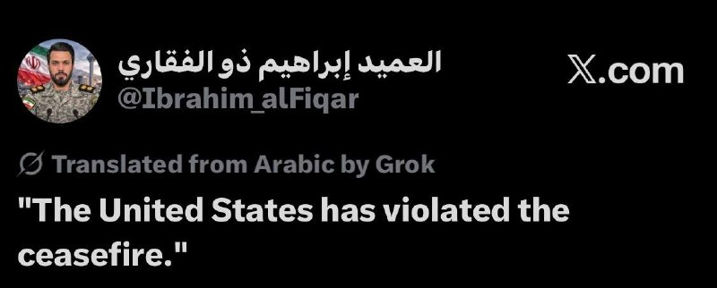

🔴فوری-سخنگو خاتم

آمریکا آتش‌بس را نقض کرده است.
https://t.me/kianmeli1

## kianmeli1 — post 87255

🔴فوری-پایگاه دریابانی میناب بمباران شد
https://t.me/kianmeli1

## Shin_Persian — post 5878

Shin ✓ @hey_itsmyturn
Thu, 07 May 2026 21:18:24 UTC

Aerial activity in Shiraz, Fars Province, #Iran

فارسی

فعالیت هوایی در شیراز، استان فارس، #Iran

𝕏 · @shin_persian

## Shin_Persian — post 5877

  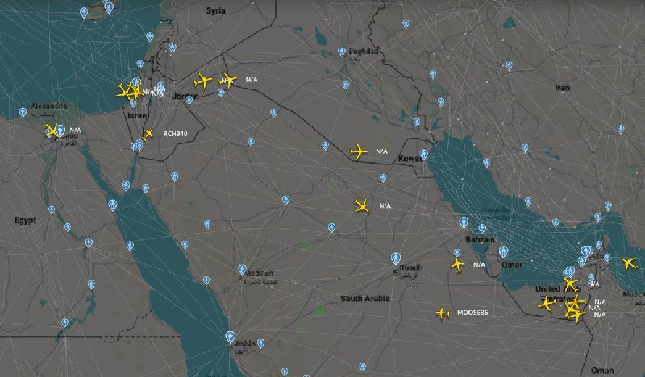

Shin ✓ @hey_itsmyturn
Thu, 07 May 2026 21:12:30 UTC

well..

فارسی

خب..

𝕏 · @shin_persian

## FarsiVOA — post 217145

🔺گزارش کانال تلگرامی وحیدآنلاین از صداهای انفجار در غرب تهران؛ خبرنگار فاکس‌ نیوز: ارتش آمریکا به بندر قشم و بندرعباس حمله کرد

▪️کانال تلگرامی وحیدآنلاین شامگاه پنجشنبه ۱۷ اردیبهشت به نقل از گزارش‌های مردمی از شنیده شدن صدای چندین انفجار در مناطق غربی تهران خبر داد.

⬇️ بیشتر بخوانید:
https://ir.voanews.com/a/8147707.html
@FarsiVOA

## Persian_Trend_Official — post 13647

Live stream finished (1 hour)

## Persian_Trend_Official — post 13646

🔴 درباره «تحرکات لانچرهای موشک بالستیک در ایران» و شایعاتی که در تلگرام پخش می‌شود:

▪️بخش زیادی از تصاویر و ویدیوهای منتشرشده قدیمی، بازنشر شده یا حتی ساختگی هستند و فعلاً هیچ نشانه‌ تأییدشده‌ای از تحرکات نظامی گسترده و غیرعادی دیده نمی‌شود.

▪️در دقایق اخیر موجی از اخبار هیجانی و بدون منبع معتبر در کانال‌های تلگرامی در حال انتشار است که بسیاری از آن‌ها تا این لحظه 00:47 توسط منابع مستقل تأیید نشده‌اند.

🫆:Tony

📌 @persian_trend_official
پرشین ترند | متفاوت‌ترین ک

## Persian_Trend_Official — post 13645

🔴فعالیت مجدد پدافند هوایی در مناطق غربی تهران/ مهر نیوز

🫆:Tony

📌 @persian_trend_official
پرشین ترند | متفاوت‌ترین کانال نظامی

## Persian_Trend_Official — post 13644

اکنون حداقل ۱۵ تانکر سوخت رسان نیروی هوایی ایالات متحده با ADS-B فعال هستند، بیشتر آن‌ها در نزدیکی فضای هوایی امارات قرار دارند.

📝 Nick

📌 @persian_trend_official
پرشین ترند | متفاوت‌ترین کانال نظامی

## Persian_Trend_Official — post 13643

  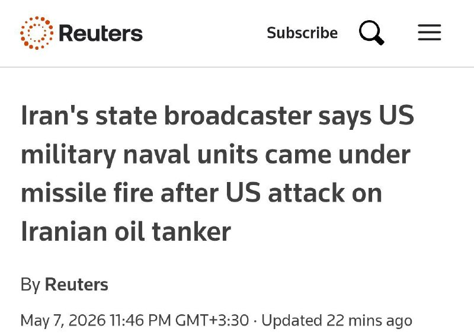

⭕️ خبرگزاری رویترز:
تلویزیون دولتی ایران می گوید که یگان های نیروی دریایی ارتش آمریکا پس از حمله آمریکا به نفتکش ایرانی مورد شلیک موشک قرار گرفتند.

📝 Nick

📌 @persian_trend_official
پرشین ترند | متفاوت‌ترین کانال نظامی

## IranianMinds — post 19754

🔴 جمهوری اسلامی :

واشنگتن آتش بس را نقض کرد !

@IranianMinds

## IranianMinds — post 19753

این ترامپ هر وقت گفت به توافق خیلی نزدیکیم جنگ شد

## IranianMinds — post 19752

🔴 پدافند تهران دوباره فعال شد

@IranianMinds

## IranianMinds — post 19751

🔴 قرارگاه خاتم الانبیا:

ارتش آمریکا با نقض آتش بس، یک نفتکش ایرانی و یک کشتی ایرانی دیگر را در تنگه هرمز هدف قرار داد.

@IranianMinds

## BBCPersian — post 280438

  <a href="telegram/content/BBCPersian_280438_1778188967.mp4">🎬 Download video</a>

🔴قرارگاه خاتم النبیاء که مدیریت جنگ در ایران را بر عهده دارد، ساعتی بعد از گزارش‌ها از حملات و رد و بدل شدن آتش در حوالی تنگه هرمز، با انتشار بیانیه‌ای این حملات را «نقض اتش‌بس» و در پی «همکاری چند کشور منطقه با آمریکا» ارزیابی کرده و گفته است: «ارتش متجاوز، تروریست و راهزن آمریکا با نقض آتش‌بس یک کشتی نفتکش ایرانی و در حال حرکت از آبهای ساحلی ایران در منطقه جاسک به سمت تنگه هرمز و همچنین یک کشتی دیگر در حال ورود به تنگه هرمز را روبروی بندر فجیره امارات مورد هدف قرار دادند و همزمان مناطق غیرنظامی را با همکاری برخی از کشورهای منطقه در سواحل بندر خمیر، سیریک و جزیره قشم مورد تعرض هوایی خود قرار دادند.»

این قرارگاه در ادامه مدعی شده که نیروهای نظامی ایران به این حملات واکنش نشان داده‌اند: «نیروهای مسلح جمهوری اسلامی ایران نیز بلافاصله و در اقدامی متقابل شناورهای نظامی آمریکا در شرق تنگه هرمز و جنوب بندر چابهار را مورد هجوم قرار داده و خسارات قابل توجهی به‌ آنها وارد نمودند.»

https://bbc.in/4cWxUS2
@BBCPersian

## Dirty_Kids — post 389075

سخنگوی قرارگاه خاتم‌الانبیای سپاه پاسداران اعلام کرد:

«ارتش متجاوز، تروریست و راهزن آمریکا با نقض آتش بس یک کشتی نفتکش ایرانی و در حال حرکت از آبهای ساحلی ایران در منطقه جاسک به سمت تنگه هرمز و همچنین یک کشتی دیگر در حال ورود به تنگه هرمز را روبروی بندر فجیره امارات مورد هدف قرار دادند و همزمان مناطق غیرنظامی را با همکاری برخی از کشورهای منطقه در سواحل بندر خمیر، سیریک و جزیره قشم مورد تعرض هوایی خود قرار دادند.

نیروهای مسلح جمهوری اسلامی ایران نیز بلافاصله و در اقدامی متقابل شناورهای نظامی آمریکا در شرق تنگه هرمز و جنوب بندر چابهار را مورد هجوم قرار داده و خسارات قابل توجهی به‌ آنها وارد نمودند.

آمریکای جنایتکار و متجاوز و کشورهای حامی آن باید بدانند که جمهوری اسلامی ایران همچون گذشته پرقدرت و بدون کوچکترین تردید به هرگونه تعرض و تجاوز پاسخی کوبنده می دهد.»

@Dirty_Kids 👻

## alonews — post 118538

  <a href="telegram/content/alonews_118538_1778188969.jpg">🎬 Download video</a>

🔴فوووووووووووووووووووووری

## alonews — post 118537

🔴فوووووووووووووووووووووری

## alonews — post 118536

  <a href="telegram/content/alonews_118536_1778188970.jpg">🎬 Download video</a>

👈گزارش کاربران از اختلال شدید در اینترنت

✅ @AloNews خبر جنگ

## alonews — post 118535

  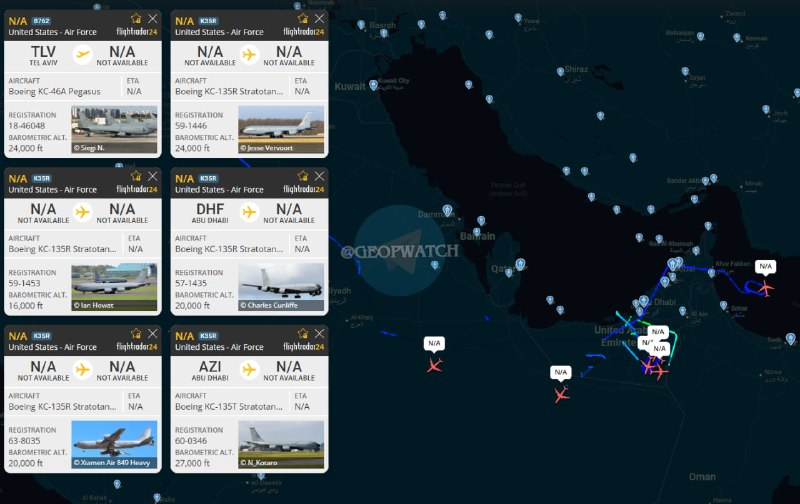

👈اکنون حداقل ۱۵ تانکر سوخت رسان نیروی هوایی ایالات متحده با ADS-B فعال هستند، بیشتر آن‌ها در نزدیکی فضای هوایی امارات قرار دارند.

✅ @AloNews خبر جنگ

## alonews — post 118534

  <a href="telegram/content/alonews_118534_1778188971.jpg">🎬 Download video</a>

🔴فوری/شلیک موشک به سوی امارات

✅ @AloNews خبر جنگ

## alonews — post 118533

  <a href="telegram/content/alonews_118533_1778188971.jpg">🎬 Download video</a>

🔴فوری/فعالیت مجدد پدافند هوایی در مناطق غربی تهران

✅ @AloNews خبر جنگ

## alonews — post 118532

  <a href="telegram/content/alonews_118532_1778188971.jpg">🎬 Download video</a>

🔴فوری/هم اکنون حملات امریکا به بندر خمیر و سیریک

✅ @AloNews خبر جنگ

---
📅 بروزرسانی: 1405/02/18 00:42
---

## VahidOOnLine — post 238747

  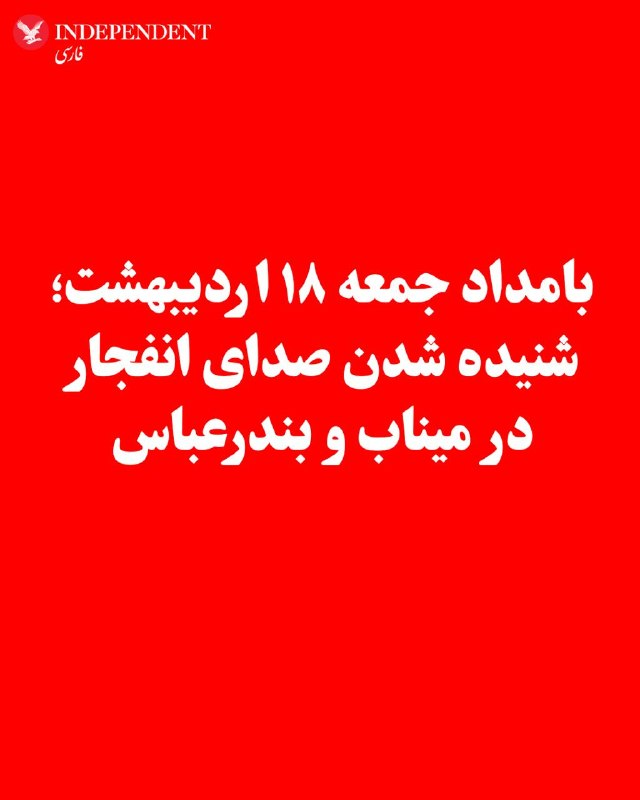

♦️رسانه‌های ایران، از جمله خبرگزاری مهر، بامداد جمعه ۱۸ اردیبهشت از شنیده شدن صدای انفجار در میناب و بندرعباس خبر دادند.
‌🇸🇦 Indypersian

🤖 @VahidOOnLine

## pm_afshaa — post 90346

🔴فاکس‌نیوز:بیش از 15 موشک به بندر نفتی فجیره امارات شلیک شده

💧 Rainbet.com the #1 Non-KYC Crypto Casino & Sportsbook @rainbetcom

😁 @Pm_Afshaa

## pm_afshaa — post 90345

تسنیم :3 تا ناوشکن آمریکایی رو زدیم

💧 Rainbet.com the #1 Non-KYC Crypto Casino & Sportsbook @rainbetcom

😁 @Pm_Afshaa

## pm_afshaa — post 90344

انفجار در دبی

## pm_afshaa — post 90343

🔴دو موشک کروز که به سمت ناوشکن آمریکایی که در سواحل ابوظبی لنگر انداخته بود شلیک شدن

💧 Rainbet.com the #1 Non-KYC Crypto Casino & Sportsbook @rainbetcom

😁 @Pm_Afshaa

## DEJradio — post 4499

💣 خبرگزاری‌های محلی از وقوع انفجار در شهر ابوظبی خبر میدهند. #انفجار #ابوظبی @DEJradio

## DEJradio — post 4498

  <a href="telegram/content/DEJradio_4498_1778188344.mp4">🎬 Download video</a>

🚨🎥 صدای انفجارها در منطقه بندرعباس همچنان ادامه دارد.

#انفجار #بندرعباس
@DEJradio

## kianmeli1 — post 87254

🔴فوری-موج دیگری از پهپادها و موشک‌های ضد کشتی ایران به سمت ناوهای جنگی آمریکا مستقر در نزدیکی ساحل امارات شلیک شد.
https://t.me/kianmeli1

## kianmeli1 — post 87253

🔴فوری-حمله امریکا به بندر خمیر و سیریک
https://t.me/kianmeli1

## kianmeli1 — post 87252

🔴فوری-دو نفتکش ایران هدف قرار گرفته شد در بندر جاسک و نزدیک فجیره
https://t.me/kianmeli1

## kianmeli1 — post 87251

  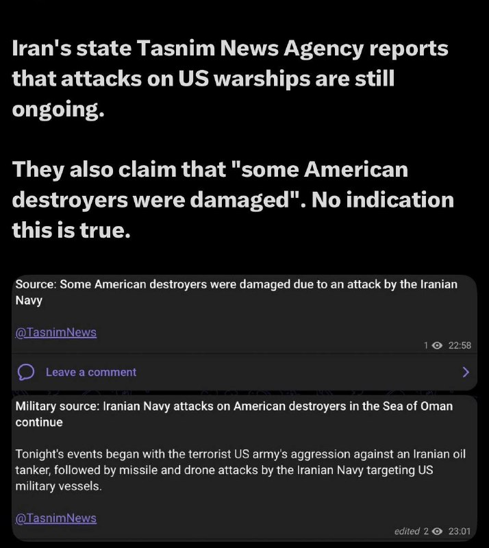

🔴فوری-تسنیم

حملات به ناوهای امریکا ادامه دارد-خسارت سنگین وارد شده است
https://t.me/kianmeli1

## kianmeli1 — post 87250

🔴فوری-فاکس نیوز

بیش از ۱۵ موشک به بندر نفتی فجیره امارات شلیک شده است
https://t.me/kianmeli1

## Shin_Persian — post 5876

Shin ✓ @hey_itsmyturn
Thu, 07 May 2026 21:10:52 UTC

Intense jet activity over Baghdad
#Iraq 🇮🇶

فارسی

فعالیت شدید جنگنده‌ها بر فراز بغداد
#Iraq 🇮🇶

𝕏 · @shin_persian

## Persian_Trend_Official — post 13642

🔴آژیر هشدار و پدافند دبی و ابوظبی فعال شد

🫆:Tony

📌 @persian_trend_official
پرشین ترند | متفاوت‌ترین کانال نظامی

## Persian_Trend_Official — post 13641

گزارش شده است که تعدادی موشک ضد کشتی دیگر از سواحل ایران به سمت شناورهایی در اطراف تنگه هرمز شلیک شده است.

📝 Nick

📌 @persian_trend_official
پرشین ترند | متفاوت‌ترین کانال نظامی

## Persian_Trend_Official — post 13640

سخنگوی قرارگاه مرکزی حضرت خاتم‌الانبیا:

🔹ارتش متجاوز آمریکا با نقض آتش بس یک کشتی نفتکش ایرانی و در حال حرکت از آبهای ساحلی ایران در منطقه جاسک به سمت تنگه هرمز و همچنین یک کشتی دیگر در حال ورود به تنگه هرمز را روبروی بندر فجیره امارات مورد هدف قرار دادند و همزمان مناطق غیرنظامی را با همکاری برخی از کشورهای منطقه در سواحل بندر خمیر، سیریک و جزیره قشم مورد تعرض هوایی خود قرار دادند.

🔹نیروهای مسلح جمهوری اسلامی ایران نیز بلافاصله و در اقدامی متقابل شناورهای نظامی آمریکا در شرق تنگه هرمز و جنوب بندر چابهار را مورد هجوم قرار داده و خسارات قابل توجهی به‌ آنها وارد نمودند.

🔹آمریکای متجاوز و کشورهای حامی آن باید بدانند که جمهوری اسلامی ایران همچون گذشته پرقدرت و بدون کوچکترین تردید به هرگونه تعرض و تجاوز پاسخی کوبیده می دهد.

🫆:Tony

📌 @persian_trend_official
پرشین ترند | متفاوت‌ترین کانال نظامی

## Persian_Trend_Official — post 13639

🔴گزارش تایید نشده از رسانه های عربی

💢صدای انفجار در دبی

🫆:Tony

📌 @persian_trend_official
پرشین ترند | متفاوت‌ترین کانال نظامی

## Persian_Trend_Official — post 13638

🔴فاکس نیوز

«این حملات در پاسخ به پرتاب موشک بالستیک و کروز و پهپاد های ایران به سمت بندر فجیره در امارات صورت گرفت»

🫆:Tony

📌 @persian_trend_official
پرشین ترند | متفاوت‌ترین کانال نظامی

## IranianMinds — post 19750

این ترامپ هر وقت گفت به توافق خیلی نزدیکیم جنگ شد

## IranianMinds — post 19749

🔴فوری:

حمله آمریکا به بندر خمیر و سیریک.

@IranianMinds

## IranianMinds — post 19748

🔴 دو نفتکش جمهوری اسلامی هدف قرار گرفتن

@IranianMinds

## IranianMinds — post 19747

🔴فاکس‌نیوز:

بیش از ۱۵ موشک به بندر نفتی فجیره امارات شلیک شده است.

@IranianMinds

## IranianMinds — post 19746

🔴 انفجار در دبی

@IranianMinds

## IranianMinds — post 19745

🔴 خبرگزاری تسنیم :

3 تا ناوشکن آمریکایی رو زدیم بمولا

@IranianMinds

## BBCPersian — post 280437

  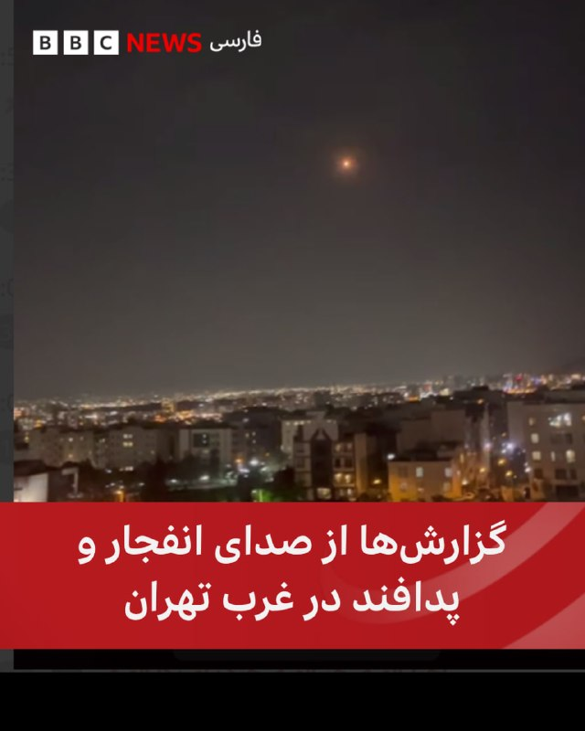

🔴س از آن که چند گزارش از سوی شهروندان تهرانی مبنی بر شنیدن صدای انفجار و شلیک ضدهوایی در حوالی نیمه شب پنجشنبه گزارش شد،

خبرگزاری دولتی ایرنا نوشته است: «بعد از دو صدای مهیب، برای چندین دقیقه صدای شلیک ممتد پدافند در غرب تهران شنیده شد.»

📸UGC
https://bbc.in/3Rd3AKp
@BBCPersian

## Dirty_Kids — post 389074

فاکس نیوز نوشته آمریکا حملاتی را به قشم و بندرعباس انجام داده، اما یک مقام ارشد آمریکایی گفته این به معنای از سرگیری جنگ نیست.

نه بابا جنگ چیه دیوونه، اینا نمک زندگیه.

@Dirty_Kids 👻

## Dirty_Kids — post 389073

  <a href="telegram/content/Dirty_Kids_389073_1778188347.jpg">🎬 Download video</a>

در میناب هم صدای انفجار شدید شنیده شد. همزمان اخباری در رسانه‌های ایران درباره حملات موشکی سپاه به ابوظبی منتشر شده است.

🔴رسانه‌های ایران از حملات موشکی سپاه به ابوظبی خبر می‌دهند. همزمان در میناب هرمزگان هم صدای انفجار شدید شنیده شد. همچنین منابع حکومتی در ایران می‌گویند جنگنده‌های خارجی امشب به کشتی‌سازی قشم، اسکه بهمن قشم، چندساختمان اداری در بندرعباس و پایگاه هوایی بندرعباس حمله کرده‌اند.

@Dirty_Kids 👻

## configx2ray — post 38611

صف پمپ بنزین کیلومتری شد دوباره 
😋

## alonews — post 118531

  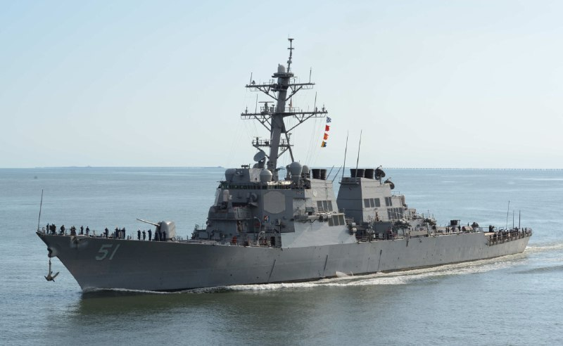

🔴فووووووووووووووووووووری

## alonews — post 118530

🔴فووووووووووووووووووووری

## alonews — post 118529

  <a href="telegram/content/alonews_118529_1778188348.jpg">🎬 Download video</a>

🔴فوری/رویترز: ناوهای امریکا در تنگه هرمز موشکباران شده اند

✅ @AloNews خبر جنگ

## alonews — post 118528

  <a href="telegram/content/alonews_118528_1778188348.jpg">🎬 Download video</a>

👈سخنگوی خاتم‌الانبیا:
ارتش متجاوز، تروریست و راهزن آمریکا با نقض آتش بس یک کشتی نفتکش ایرانی و در حال حرکت از آبهای ساحلی ایران در منطقه جاسک به سمت تنگه هرمز و همچنین یک کشتی دیگر در حال ورود به تنگه هرمز را روبروی بندر فجیره امارات مورد هدف قرار دادند و همزمان مناطق غیرنظامی را با همکاری برخی از کشورهای منطقه در سواحل بندر خمیر، سیریک و جزیره قشم مورد تعرض هوایی خود قرار دادند.

🔴نیروهای مسلح جمهوری اسلامی ایران نیز بلافاصله و در اقدامی متقابل شناورهای نظامی آمریکا در شرق تنگه هرمز و جنوب بندر چابهار را مورد هجوم قرار داده و خسارات قابل توجهی به‌ آنها وارد نمودند.

🔴آمریکای جنایتکار و متجاوز و کشورهای حامی آن باید بدانند که جمهوری اسلامی ایران همچون گذشته پرقدرت و بدون کوچکترین تردید به هرگونه تعرض و تجاوز پاسخی کوبیده می دهد.

✅ @AloNews خبر جنگ

## alonews — post 118527

✅ فروش فیلترشکن اختصاصی، قوی، بدون قطعی و از همه مهمتر بدون ضریب، با لینک ساب، آیپی ثابت استارلینک 
🌟 
💫 
🤔 در جهت افزایش کیفیت، کانفیگ ها بصورت محدود ارائه میشود و الویت با واریزی میباشد❤️ 
🤔1 گیگ : 400/000 تومان 
🤔3 گیگ : 1/200/000 تومان 
🤔 5 گیگ: 1/900/000 …

## alonews — post 118526

✅ فروش فیلترشکن اختصاصی، قوی، بدون قطعی و از همه مهمتر بدون ضریب، با لینک ساب، آیپی ثابت استارلینک 
🌟 
💫

🤔 در جهت افزایش کیفیت، کانفیگ ها بصورت محدود ارائه میشود و الویت با واریزی میباشد❤️

🤔1 گیگ : 400/000 تومان

🤔3 گیگ : 1/200/000 تومان

🤔 5 گیگ: 1/900/000 تومان

🤔 10 گیگ: 3/500/000 تومان

⭐️ پیوی و پشتیبانی جهت خرید:

✅ @expressuport

کانال رضایت مشتری :

⭐️ @vpn_express_supp

کانال اصلی :

🏠 @vpn_express_sup

## alonews — post 118525

  <a href="telegram/content/alonews_118525_1778188348.jpg">🎬 Download video</a>

🔴فوری/انفجار در دبی

✅ @AloNews خبر جنگ

---
📅 بروزرسانی: 1405/02/18 00:32
---

## VahidOOnLine — post 238746

  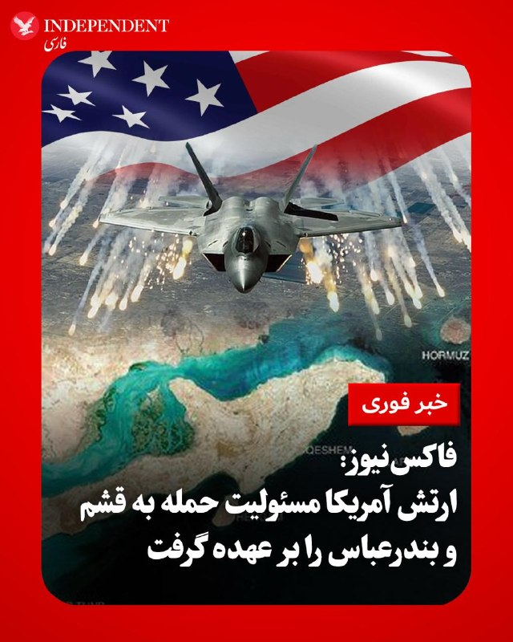

♦️ بامداد جمعه ۱۸ اردیبهشت‌ماه گزارش داد ارتش آمریکا مسئولیت حمله به بندر قشم و بندرعباس را بر عهده گرفته است.

بر اساس گزارش فاکس‌نیوز، یک مقام ارشد آمریکایی گفته است پایان آتش‌بس با جمهوری اسلامی اعلام نشده و وضعیت آتش‌بس همچنان ادامه دارد

جزئیات بیشتری درباره ابعاد این حملات و خسارت‌های احتمالی منتشر نشده است.
‌🇸🇦 Indypersian

🤖 @VahidOOnLine

## mwarmonitor — post 8661

📝آتش‌بسِ پوشالی: از بوسه تا گاز ! 📌این دو هفته آتش‌بس، چیزی جز یک «تنفسِ مصنوعی» وسطِ یک دعوای ناموسی نیست. همه‌چیز دقیقاً مثل همین ویدیو شروع می‌شود؛ با بوسه‌هایی که بوی خیانت می‌دهند و آغوش‌هایی که فقط برای پیدا کردنِ جای چاقو باز شده‌اند. درست در لحظه‌ای…

## pm_afshaa — post 90342

حملات موشکی سپاه به سمت ناو های آمریکا در تنگه هرمز

💧 Rainbet.com the #1 Non-KYC Crypto Casino & Sportsbook @rainbetcom

😁 @Pm_Afshaa

## pm_afshaa — post 90341

انفجار در ابوظبی

💧 Rainbet.com the #1 Non-KYC Crypto Casino & Sportsbook @rainbetcom

😁 @Pm_Afshaa

## pm_afshaa — post 90340

محمود آباد اصفهانو زدن

## pm_afshaa — post 90339

صداسیمای گنده گوز جمهوری اسهالی:آمریکا برای خارج کردن دو فروند کشتی خود اقدام به ضربه زدن به برخی نقاط کرد اما بلافاصله با واکنش محکم نیروهای ما مواجه شد

💧 Rainbet.com the #1 Non-KYC Crypto Casino & Sportsbook @rainbetcom

😁 @Pm_Afshaa

## pm_afshaa — post 90338

امریکا اعلام کرد حملات امشب در پاسخ حمله جمهوری اسلامی به امارات بوده

💧 Rainbet.com the #1 Non-KYC Crypto Casino & Sportsbook @rainbetcom

😁 @Pm_Afshaa

## pm_afshaa — post 90337

انفجار در میناب

💧 Rainbet.com the #1 Non-KYC Crypto Casino & Sportsbook @rainbetcom

😁 @Pm_Afshaa

## pm_afshaa — post 90336

🔴سنتکام مسئولیت حمله به بندرعباس، قشم و تهران را برعهده گرفت

💧 Rainbet.com the #1 Non-KYC Crypto Casino & Sportsbook @rainbetcom

😁 @Pm_Afshaa

## DEJradio — post 4497

💣 خبرگزاری‌های محلی از وقوع انفجار در شهر ابوظبی خبر میدهند.
#انفجار #ابوظبی
@DEJradio

## DEJradio — post 4496

⭕️
💣 خبرگزاری های رسمی داخلی از شنیده شدن صدای انفجار در میناب خبر میدهند.

#میناب #انفجار
@DEJradio

## kianmeli1 — post 87249

🔴فوری-رویترز

ناوهای امریکا در تنگه هرمز موشکباران شده اند

US naval units near the Strait of Hormuz came under Iranian missile fire and were forced to retreat after sustaining damage - Reuters
https://t.me/kianmeli1

## kianmeli1 — post 87248

🔴فوری

انفجار در ابوظبی، امارات
https://t.me/kianmeli1

## kianmeli1 — post 87247

🔴فوری-سه ناوشکن امریکا هدف موشک سپاه قرار گرفت
https://t.me/kianmeli1

## Persian_Trend_Official — post 13637

⭕️ آکسیوس:
ارتش آمریکا به اهداف ایرانی در «منطقه تنگه هرمز» حمله کرده.

📝 Nick

📌 @persian_trend_official
پرشین ترند | متفاوت‌ترین کانال نظامی

## Persian_Trend_Official — post 13636

🔴گزارش‌های تایید نشده از شنیده‌شدن انفجارهای شدید در میناب و ابوظبی خبر می‌دهند.

🫆:Tony

📌 @persian_trend_official
پرشین ترند | متفاوت‌ترین کانا

## IranianMinds — post 19744

🔴 آکسیوس :

ارتش آمریکا داره در تنگه هرمز به اهداف ایرانی حمله میکنه

@IranianMinds

## IranianMinds — post 19743

🔴 صدای انفجار شدید در میناب

@IranianMinds

## Dirty_Kids — post 389072

فاکس‌نیوز اعلام کرد که ارتش آمریکا حملاتی را به بندر قشم و بندرعباس در ایران انجام داده است. اسرائیل هیوم نیز به نقل از یک منبع اسرائیلی تایید کرد که تهران و واشینگتن در تنگه هرمز تبادل آتش داشته‌اند.

پ‌ن: جدی منتظر بودن ناو باکسر برسه مراد انقد گفت جدی نگرفتید

@Dirty_Kids 👻

## alonews — post 118524

  <a href="telegram/content/alonews_118524_1778187756.jpg">🎬 Download video</a>

👈تسنیم: ۳ ناوشکن آمریکایی در نزدیکی تنگه هرمز هدف حمله نیروی دریایی ایران قرار گرفت

✅ @AloNews خبر جنگ

## alonews — post 118523

  <a href="telegram/content/alonews_118523_1778187756.jpg">🎬 Download video</a>

👈شاخص صف پمپ بنزین برای بار Nام در ایران بالا زد

✅ @AloNews خبر جنگ

## alonews — post 118522

  <a href="telegram/content/alonews_118522_1778187757.jpg">🎬 Download video</a>

👈اکسیوس گزارش می‌دهد که ارتش ایالات متحده حملاتی را به اهداف ایرانی در «منطقه تنگه هرمز» انجام داده است.

✅ @AloNews خبر جنگ

## alonews — post 118521

  <a href="telegram/content/alonews_118521_1778187757.jpg">🎬 Download video</a>

👈گزارشات ضد و نقیض از انفجار در اصفهان

✅ @AloNews خبر جنگ

## alonews — post 118520

  <a href="telegram/content/alonews_118520_1778187757.jpg">🎬 Download video</a>

👈شبکه خبر: آمریکا برای خارج کردن دو فروند کشتی خود اقدام به ضربه زدن به برخی نقاط کرد اما بلافاصله با واکنش محکم نیروهای ما مواجه شد

✅ @AloNews خبر جنگ

## alonews — post 118519

  <a href="telegram/content/alonews_118519_1778187757.jpg">🎬 Download video</a>

👈امریکا اعلام کرد حملات امشب در پاسخ حمله ایران به امارات بوده

✅ @AloNews خبر جنگ

## alonews — post 118518

  <a href="telegram/content/alonews_118518_1778187757.jpg">🎬 Download video</a>

🔴فوری/سنتکام مسئولیت حمله به بندرعباس، قشم و تهران را برعهده گرفت 
✅ @AloNews خبر جنگ

---
📅 بروزرسانی: 1405/02/18 00:22
---

## VahidOOnLine — post 238745

  <a href="telegram/content/VahidOOnLine_238745_1778187142.mp4">🎬 Download video</a>

♦️تصاویر رسیده به ایندیپندنت فارسی، صدای انفجار و فعالیت پدافند هوایی در غرب تهران را بامداد جمعه ۱۸ اردیبهشت نشان می‌دهد.
‌🇸🇦 Indypersian

🤖 @VahidOOnLine

## VahidOOnLine — post 238744

  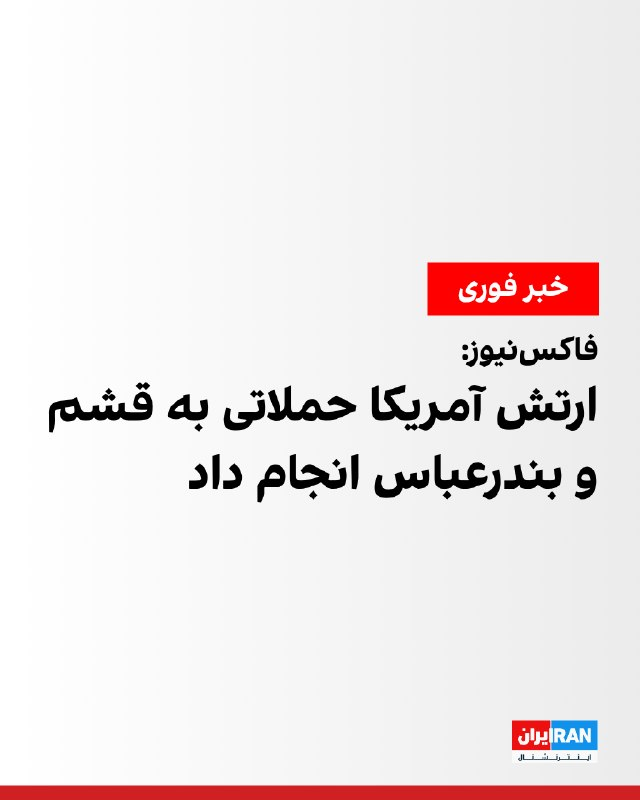

فاکس‌نیوز اعلام کرد که ارتش آمریکا حملاتی را به بندر قشم و بندرعباس در ایران انجام داده است.

پیش‌تر صداوسیما گزارش داد: «انفجار در اسکله بهمن قشم در جریان تبادل آتش میان نیروهای مسلح ایران و دشمن رخ داده است.»

اسرائیل هیوم نیز به نقل از یک منبع اسرائیلی تایید کرد که تهران و واشینگتن در تنگه هرمز تبادل آتش داشته‌اند.
‌🏁 🇬🇧 IranintlTV

🤖 @VahidOOnLine

## mwarmonitor — post 8660

⚠️خبر فوری: به گفته یک مقام ارشد آمریکایی، ارتش ایالات متحده حملاتی را علیه جزیره قشم و بندرعباس ایران انجام داده است — به نقل از فاکس نیوز. @mwarmonitor

## pm_afshaa — post 90335

🔴فاکس نیوز تایید کرد حملات به قشم و بندرعباس توسط امریکا انجام شده 
💧 Rainbet.com the #1 Non-KYC Crypto Casino & Sportsbook @rainbetcom 
😁 @Pm_Afshaa

## pm_afshaa — post 90334

🔴فاکس نیوز تایید کرد حملات به قشم و بندرعباس توسط امریکا انجام شده

💧 Rainbet.com the #1 Non-KYC Crypto Casino & Sportsbook @rainbetcom

😁 @Pm_Afshaa

## DEJradio — post 4495

🚨
🚨فاکس نیوز در خبری اعلام کرد ایالات متحده حملاتی به بندر قشم و بندرعباس در ایران انجام داده است. #آمریکا #قشم @DEJradio

## DEJradio — post 4494

  <a href="telegram/content/DEJradio_4494_1778187143.jpg">🎬 Download video</a>

🚨
⭕️ صدای انفجارها در مناطق بندرعباس و قشم ادامه دارد. #انفجار @DEJradio

## kianmeli1 — post 87246

🔴فوری-حمله هوایی به میناب
https://t.me/kianmeli1

## kianmeli1 — post 87245

  <a href="telegram/content/kianmeli1_87245_1778187144.mp4">🎬 Download video</a>

🔴فوری-ریزپرنده های بسیاری به تهران حمله کرده اند
https://t.me/kianmeli1

## IranIntlTV — post 336035

  

فاکس‌نیوز اعلام کرد که ارتش آمریکا حملاتی را به بندر قشم و بندرعباس در ایران انجام داده است.

پیش‌تر صداوسیما گزارش داد: «انفجار در اسکله بهمن قشم در جریان تبادل آتش میان نیروهای مسلح ایران و دشمن رخ داده است.»

اسرائیل هیوم نیز به نقل از یک منبع اسرائیلی تایید کرد که تهران و واشینگتن در تنگه هرمز تبادل آتش داشته‌اند.
https://iranintl.com/202605075930

## Shin_Persian — post 5874

Jennifer Griffin ✓ @JenGriffinFNC
Thu, 07 May 2026 20:36:57 UTC

NEW: US military just carried out strikes on Iran’s Qeshm Port and Bandar Abbas: Senior US official tells me, but this is NOT a restarting of the war.

MORE

فارسی

جدید: ارتش ایالات متحده به تازگی حملاتی را علیه بندر قشم و بندرعباس ایران انجام داده است: یک مقام ارشد آمریکایی به من گفت، اما این به معنای شروع مجدد جنگ نیست.

بیشتر (MORE)

𝕏 · @shin_persian

## Shin_Persian — post 5873

Shin ✓ @hey_itsmyturn
Thu, 07 May 2026 20:47:54 UTC

NOW @ 2047Z
AA activity, western Tehran
#Tehran Province, #Iran

فارسی

هم‌اکنون در ۲۰۴۷ زولو (۰۰:۱۷ به وقت تهران)
فعالیت پدافند هوایی، غرب تهران
#استان_تهران، #ایران

𝕏 · @shin_persian

## Persian_Trend_Official — post 13635

#فوری

🔴فاکس نیوز

ایالات متحده حملاتی را به بندر قشم و بندرعباس ایران انجام داده است، اما یک مقام ارشد آمریکایی می‌گوید این به معنای از سرگیری جنگ نیست

🫆:Tony

📌 @persian_trend_official
پرشین ترند | متفاوت‌ترین کانال نظامی

## IranianMinds — post 19742

فک کنم این آتش بس فقط با بمب هسته ای میشکنه

## IranianMinds — post 19741

🔴 خبرگزاری مهر :

صدای انفجار دیگری در بندرعباس شنیده شد

@IranianMinds

## IranianMinds — post 19740

🔴 انفجار مجدد در بندرعباس

@IranianMinds

## IranianMinds — post 19739

🔴 فاکس نیوز :

دلیل حمله ی ایالات متحده هنوز مشخص نیست

@IranianMinds

## Dirty_Kids — post 389071

لطفا فعلا مجتبی خامنه‌ای رو تا کنید بذارید یه گوشه تا ببینیم چی میشه.

@Dirty_Kids 👻

## Dirty_Kids — post 389070

  <a href="telegram/content/Dirty_Kids_389070_1778187145.mp4">🎬 Download video</a>

غرب تهران، ساعت ۱۲.۰۵ بامداد جمعه؛ فعالیت شدید پدافند دیده می‌شود.

@Dirty_Kids 👻

## alonews — post 118517

  <a href="telegram/content/alonews_118517_1778187146.jpg">🎬 Download video</a>

👈انفجار در میناب

✅ @AloNews خبر جنگ

## alonews — post 118516

  <a href="telegram/content/alonews_118516_1778187146.jpg">🎬 Download video</a>

🔴فووووووووووووووووووووووووووووووووووووووووووووووووووووووووووووووری

## alonews — post 118515

🔴فووووووووووووووووووووووووووووووووووووووووووووووووووووووووووووووری

## alonews — post 118514

  <a href="telegram/content/alonews_118514_1778187147.mp4">🎬 Download video</a>

👈فیلمی از سیریک، جنوب غربی ایران. حدود ۸ دقیقه پیش یک جسم ناشناس در آسمان پرواز می‌کرد.

✅ @AloNews خبر جنگ

## alonews — post 118513

  <a href="telegram/content/alonews_118513_1778187147.jpg">🎬 Download video</a>

👈انفجار در بندرعباس

✅ @AloNews خبر جنگ

## alonews — post 118512

  <a href="telegram/content/alonews_118512_1778187148.jpg">🎬 Download video</a>

🔴فوری/سنتکام مسئولیت حمله به بندرعباس، قشم و تهران را برعهده گرفت

✅ @AloNews خبر جنگ

## alonews — post 118511

  <a href="telegram/content/alonews_118511_1778187148.mp4">🎬 Download video</a>

🔴گزارش مردمی: غرب تهران، محدوده فردوس غرب. صدا شدید درگیری پدافند

✅@AloNews

## alonews — post 118510

  <a href="telegram/content/alonews_118510_1778187149.jpg">🎬 Download video</a>

👈فاکس نیوز تایید کرد حملات به قشم و بندرعباس توسط امریکا انجام شده 
✅ @AloNews خبر جنگ

## alonews — post 118509

  <a href="telegram/content/alonews_118509_1778187149.jpg">🎬 Download video</a>

👈هم اکنون فعالیت پدافند در غرب تهران

✅ @AloNews خبر جنگ

---
📅 بروزرسانی: 1405/02/18 00:12
---

## VahidOOnLine — post 238743

  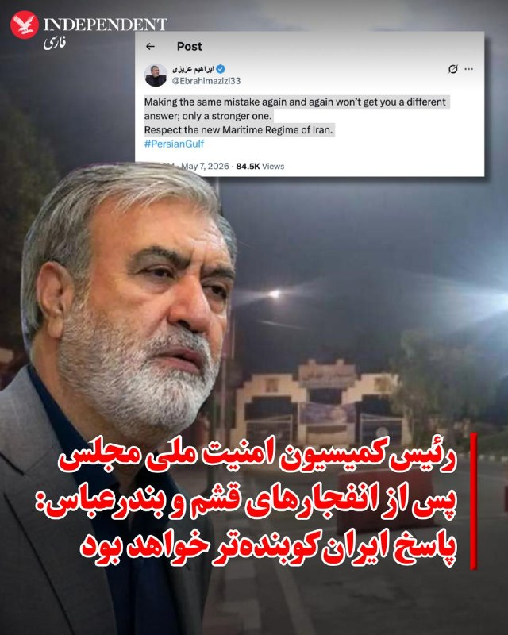

♦️ابراهیم عزیزی، رئیس کمیسیون امنیت ملی مجلس، پنجشنبه شب ۱۷ اردیبهشت و همزمان با انتشار گزارش‌هایی درباره شنیده شدن صدای انفجار در بندرعباس و جزیره قشم، در اکس نوشت که تکرار اشتباهات با پاسخ شدیدتر و کوبنده‌تری روبه‌رو خواهد شد و باید به «نظم جدید دریایی ایران» احترام گذاشته شود.
‌🇸🇦 Indypersian

🤖 @VahidOOnLine

## VahidOOnLine — post 238742

  

رسانه‌های ایران از شنیده‌شدن صدای «فعالیت شدید پدافند هوایی» در غرب تهران در شامگاه پنجشنبه خبر دادند.

ایرنا، خبرگزاری دولت جمهوری اسلامی، اعلام کرد: «ساعت ۲۳:۵۲ پنجشنبه شب، بعد از دو صدای مهیب، برای چندین دقیقه صدای شلیک ممتد پدافند در غرب تهران شنیده شد.»

همزمان خبرگزاری مهر گزارش داد «پدافند موفق به سرنگونی دو هواگرد متخاصم بر روی آسمان بندرعباس و قشم شده است.»
‌🏁 🇬🇧 IranintlTV

🤖 @VahidOOnLine

## mwarmonitor — post 8659

⚠️خبر فوری: به گفته یک مقام ارشد آمریکایی، ارتش ایالات متحده حملاتی را علیه جزیره قشم و بندرعباس ایران انجام داده است — به نقل از فاکس نیوز.

@mwarmonitor

## pm_afshaa — post 90333

♨️
♨️
♨️

## DEJradio — post 4493

  <a href="telegram/content/DEJradio_4493_1778186550.jpg">🎬 Download video</a>

⭕️
🧨 
🚨 خبرگزاری‌های رسمی جمهوری اسلامی در آخرین دقایق پنجشنبه گزارش دادند که پس بعد دو صدای مهیب، برای چندین دقیقه صدای شلیک ممتد پدافند در غرب تهران شنیده شده است. پیش از این خبرهای غیر رسمی از فعالیت پدافند هوایی و انفجار در منطقه بیدگنه خبر داده بودند. …

## kianmeli1 — post 87244

🔴فوری-فاکس نیوز

ایالات متحده حملاتی را به بندر قشم و بندرعباس ایران انجام داده است
https://t.me/kianmeli1

## Iliaen — post 4431

  <a href="telegram/content/Iliaen_4431_1778186550.mp4">🎬 Download video</a>

مشاهده یک شی نورانی در آسمان سیریک (هرمزگان)؛ پس از چند دقیقه صدای انفجار شنیده شد.

@iliaen

## IranianMinds — post 19738

🔴 فاکس نیوز : ایالات متحده در حال حمله ی هوایی به بندر عباس و قشم است @IranianMinds

## IranianMinds — post 19737

🔴 فاکس نیوز :

ایالات متحده در حال حمله ی هوایی به بندر عباس و قشم است

@IranianMinds

## IranianMinds — post 19736

فوری

## Dirty_Kids — post 389069

  <a href="telegram/content/Dirty_Kids_389069_1778186551.mp4">🎬 Download video</a>

مشاهده یک شی نورانی در آسمان سیریک (هرمزگان)؛ پس از چند دقیقه صدای انفجار شنیده شد.

@Dirty_Kids 👻

## alonews — post 118508

  <a href="telegram/content/alonews_118508_1778186551.jpg">🎬 Download video</a>

👈فاکس نیوز تایید کرد حملات به قشم و بندرعباس توسط امریکا انجام شده

✅ @AloNews خبر جنگ

## alonews — post 118507

  <a href="telegram/content/alonews_118507_1778186552.jpg">🎬 Download video</a>

👈وزارت امور خارجه ایالات متحده شروع به لغو گذرنامه‌های آمریکایی‌هایی خواهد کرد که بدهی‌های زیادی بابت نفقه کودک پرداخت نشده دارند، ابتدا افرادی که بدهی‌های ۱۰۰٬۰۰۰ دلار یا بیشتر دارند را هدف قرار می‌دهد و به زودی شامل کسانی می‌شود که بیش از ۲٬۵۰۰ دلار بدهکارند، گزارش AP.

🔴 این سیاست که از جمعه آغاز می‌شود، می‌تواند حدود ۲٬۷۰۰ دارنده گذرنامه آمریکایی را تحت تأثیر قرار دهد.

✅ @AloNews خبر جنگ

## alonews — post 118506

  <a href="telegram/content/alonews_118506_1778186552.mp4">🎬 Download video</a>

🔴راه‌های دسترسی به برنامه‌های رادیو و تلویزیون انقلاب ملی ایران:

ماهواره: یوتلست 7B · 7° غربی
IRNR TV: 11304 H 29700
IRNRTV : 11262 H 27500

🔴رادیو انقلاب ملی ایران که بدون اینترنت و برق فقط با یه رادیو باتری ای یا شارژی ساده میشه دسترسی پیدا کرد.

🔴موج متوسط AM فرکانس 864 کیلوهرتز
هر شب ساعت هشت شب به وقت ایران

✅@AloNews

---
📅 بروزرسانی: 1405/02/18 00:08
---

## VahidOOnLine — post 238741

  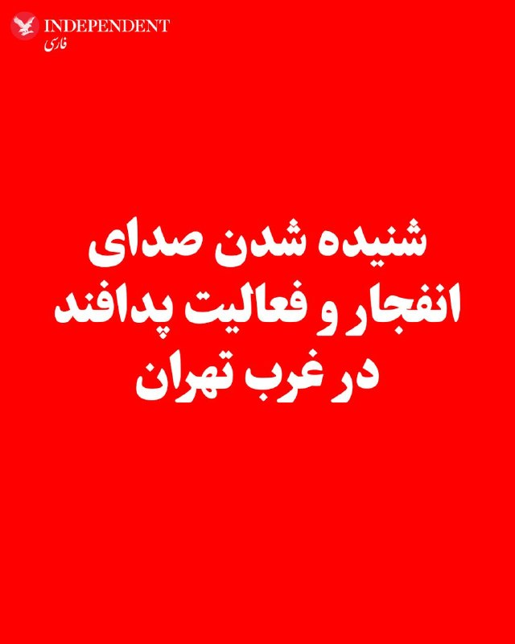

♦️به گزارش خبرگزاری مهر، در نخستین ساعت بامداد جمعه ۱۸ اردیبهشت، صدای چند انفجار و فعالیت پدافند در غرب تهران شنیده شد.
‌🇸🇦 Indypersian

🤖 @VahidOOnLine

## mwarmonitor — post 8658

📝 ترامپ احتمالاً تهش توئیت می‌زنه: «اصلاً برخورد فیزیکی در کار نبوده، فقط داشتیم با برادران ایرانی روی ناوشکن، تست مقاومت بدنه و کیفیت رنگ بدنه انجام می‌دادیم؛ عالی بود، ۱۰ از ۱۰!»
از توجه شما سپاسگزارم دونالد جی ترامپ

@mwarmonitor

## pm_afshaa — post 90332

من بخابم جنگ میشه

## pm_afshaa — post 90331

  <a href="telegram/content/pm_afshaa_90331_1778186328.mp4">🎬 Download video</a>

غرب تهران هم اکنون

💧 Rainbet.com the #1 Non-KYC Crypto Casino & Sportsbook @rainbetcom

😁 @Pm_Afshaa

## DEJradio — post 4492

  <a href="telegram/content/DEJradio_4492_1778186330.jpg">🎬 Download video</a>

⭕️
🧨 
🚨 خبرگزاری‌های رسمی جمهوری اسلامی در آخرین دقایق پنجشنبه گزارش دادند که پس بعد دو صدای مهیب، برای چندین دقیقه صدای شلیک ممتد پدافند در غرب تهران شنیده شده است.
پیش از این خبرهای غیر رسمی از فعالیت پدافند هوایی و انفجار در منطقه بیدگنه خبر داده بودند.

#تهران #انفجار
@DEJradio

## DEJradio — post 4491

  <a href="telegram/content/DEJradio_4491_1778186331.jpg">🎬 Download video</a>

🚨
🔸 سامان شریفیان کارآفرین و فعال بازارهای مالی در برنامه «پرتوی دیگر» عنوان کرد جنگ به مردم ایران یاد داد جمهوری اسلامی ظرفیت فروپاشی دارد.

برنامه پرتوی دیگر هر آدینه از یوتیوب کیهان لندن و شبکه دژ ساعت ۱۹:۰۰ به‌وقت تهران پخش می‌شود.

#پرتوی_دیگر #جمهوری_اسلامی
@DEJradio

## VahidOnline — post 75308

هرمزگان:

وحید بندر [عباس؟] صدای انفجار اومد الان

الان ساعت دوازده شب صدای دو انفجار دیگه در بندرعباس شنیده شد

همین الان بندرعباس صدای انفجار اومد

سلام بندرعباس ۰۰:۰۰ یک صدا اومد

۰۰:۰۲ بامداد جمعه ۱۸ اردیبهشت صدای تک انفجار این دفعه از فاصله بسیار دورتر ظاهرا از مناطقی در نزدیکی جزیره لارک یا هرمز بود.
خودم همچنان در همین محدوده نزدیک اسکله بهمن، محله دوحه و چابهار هستم

📡 @VahidOnline

## kianmeli1 — post 87243

🔴فوری- گچین بندرعباس هدف حمله هوایی قرار گرفت
https://t.me/kianmeli1

## kianmeli1 — post 87242

🔴فوری

امیرحاتمی،فرمانده کل ارتش

پشیمان خواهند شد
https://t.me/kianmeli1

## IranIntlTV — post 336034

  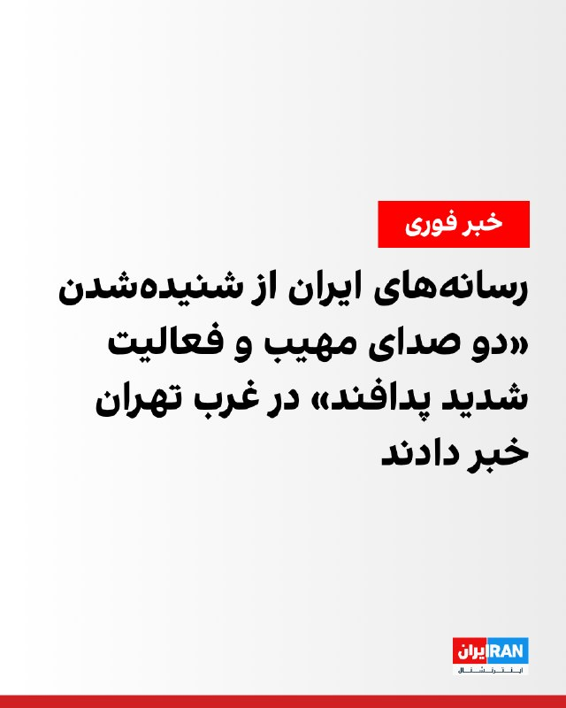

رسانه‌های ایران از شنیده‌شدن صدای «فعالیت شدید پدافند هوایی» در غرب تهران در شامگاه پنجشنبه خبر دادند.

ایرنا، خبرگزاری دولت جمهوری اسلامی، اعلام کرد: «ساعت ۲۳:۵۲ پنجشنبه شب، بعد از دو صدای مهیب، برای چندین دقیقه صدای شلیک ممتد پدافند در غرب تهران شنیده شد.»

همزمان خبرگزاری مهر گزارش داد «پدافند موفق به سرنگونی دو هواگرد متخاصم بر روی آسمان بندرعباس و قشم شده است.»
https://iranintl.com/202605074267

## FarsiVOA — post 217144

🔺گزارش‌های متفاوت رسانه‌های حکومتی در ایران از انفجارها در بندرعباس و جزیره قشم

▪️رسانه‌های حکومتی در ایران شامگاه پنجشنبه ۱۷ اردیبهشت از شنیده شدن چند صدای انفجار در بندرعباس و جزیره قشم خبر دادند.

⬇️ بیشتر بخوانید:
https://ir.voanews.com/a/8147702.html
@FarsiVOA

## Persian_Trend_Official — post 13634

  <a href="telegram/content/Persian_Trend_Official_13634_1778186332.mp4">🎬 Download video</a>

🔴فعالیت پدافند در آسمان تهران

🫆:Tony

📌 @persian_trend_official
پرشین ترند | متفاوت‌ترین کانال نظامی

## IranianMinds — post 19735

  <a href="telegram/content/IranianMinds_19735_1778186333.mp4">🎬 Download video</a>

🔴 تهران

@IranianMinds

## Dirty_Kids — post 389068

  <a href="telegram/content/Dirty_Kids_389068_1778186335.mp4">🎬 Download video</a>

ساعت ۲۳:۵۷ پنجشنبه؛ تهران محدوده‌ی شهران

@Dirty_Kids 👻

## alonews — post 118504

  <a href="telegram/content/alonews_118504_1778186336.jpg">🎬 Download video</a>

🔴فوری / ایرنا: دفاع هوایی ایران در حال مقابله با پرتابه‌های خصمانه بالای تهران است.

✅ @AloNews خبر جنگ

## alonews — post 118503

  <a href="telegram/content/alonews_118503_1778186336.jpg">🎬 Download video</a>

👈صدای انفجار در غرب تهران

✅ @AloNews خبر جنگ

## alonews — post 118502

  <a href="telegram/content/alonews_118502_1778186337.mp4">🎬 Download video</a>

🔴فوری/خبرهایی از حمله به محدوده شهران تهران

✅ @AloNews خبر جنگ

## alonews — post 118501

👈جهت رزرو تبلیغات برای VPN در کانال #الونیوز به کانال زیر مراجعه کنید👇

📃https://t.me/ads_alonews

📃https://t.me/ads_alonews

---
📅 بروزرسانی: 1405/02/18 00:02
---

## VahidOOnLine — post 238740

  <a href="telegram/content/VahidOOnLine_238740_1778185944.mp4">🎬 Download video</a>

خبرگزاری حکومتی تسنیم به نقل از منابعی گزارش داده «نشانه‌هایی از اقدام خصمانه امارات» در محدوده اسکله بهمن قشم مشاهده شده است؛ ادعایی که تاکنون به‌طور رسمی تأیید نشده است.

این خبرگزاری نوشت در صورتی که این مساله تایید شود «امارات هزینه اقدام خصمانه خود را خواهد پرداخت.»

بر اساس این گزارش، هم‌زمان در بندرعباس نیز صدای چند انفجار شنیده شده که به گفته منابع، ناشی از «مقابله پدافند با دو ریزپرنده» بوده و «دو پهپادها منهدم شده‌اند.»

تسنیم تأکید کرده صدای انفجارهای بندرعباس «مرتبط با عملکرد پدافند» بوده و موضوع انفجارهای اطراف اسکله بهمن قشم «جدا از این رویداد» عنوان شده است.

تا این لحظه، مقام‌های رسمی جزئیات بیشتری درباره این گزارش‌ها منتشر نکرده‌اند.
‌🏁 🇬🇧 ManotoTV

🤖 @VahidOOnLine

## VahidOOnLine — post 238739

  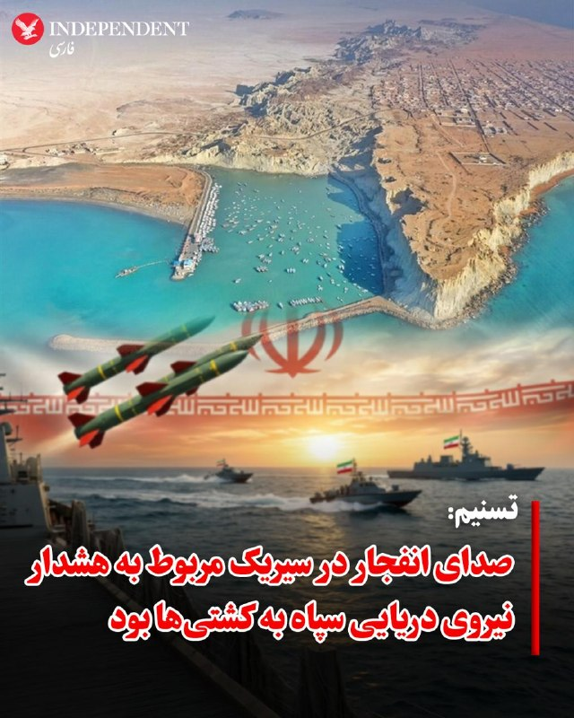

♦️خبرگزاری تسنیم، وابسته به سپاه پاسداران، پنجشنبه ۱۷ اردیبهشت وقوع هرگونه انفجار در شهرستان سیریک را تکذیب کرد.
بر اساس این گزارش، صداهای شنیده‌شده در نزدیکی تنگه هرمز مربوط به هشدارهای نیروی دریایی سپاه پاسداران به برخی کشتی‌ها برای «تردد غیرمجاز» است.
سیریک شهرستانی در شرق استان هرمزگان و در سواحل دریای عمان است. این منطقه در نزدیکی تنگه هرمز قرار دارد.
‌🇸🇦 Indypersian

🤖 @VahidOOnLine

## pm_afshaa — post 90330

انفجار در غرب تهران

😁 @Pm_Afshaa

## pm_afshaa — post 90329

انفجار مجدد در قشم

## pm_afshaa — post 90328

🔴فعالیت شدید پدافند در غرب تهران

💧 Rainbet.com the #1 Non-KYC Crypto Casino & Sportsbook @rainbetcom

😁 @Pm_Afshaa

## pm_afshaa — post 90327

🔴اسرائیل هیوم: یک منبع اسرائیلی تأیید کرد که تبادل آتش بین ایران و ایالات متحده در تنگه هرمز رخ داده

💧 Rainbet.com the #1 Non-KYC Crypto Casino & Sportsbook @rainbetcom

😁 @Pm_Afshaa

## DEJradio — post 4490

  <a href="telegram/content/DEJradio_4490_1778185945.jpg">🎬 Download video</a>

🚨
🔸 شهرام آریان، ایران‌شناس، در برنامه «پرتوی دیگر» می‌گوید جهان فرنگ خودش دچار فروپاشی فضیلت‌ها شده و سلامتی ارزیابی‌ها را از دست داده است، نسبت به سرنوشت ایران بی‌تفاوت است.

او تأکید می‌کند «مردم ایران خودشان باید خواسته‌های خود را مطرح کنند.» به باور او «ملت‌های بزرگ در یک نبرد داخلی خود را بازتعریف می‌کنند.»

برنامه پرتوی دیگر هر آدینه از یوتیوب کیهان لندن و شبکه دژ ساعت ۱۹:۰۰ به‌وقت تهران پخش می‌شود.

#پرتوی_دیگر #جمهوری_اسلامی
@DEJradio

## VahidOnline — post 75307

پیام‌های دریافتی:

وحید جان سلام ۲۳:۵۳ غرب تهران فعالیت پدافند

غرب تهران نمی‌فهمم صدای پدافنده یا انفجار ۱۱:۵۳

سلام غرب تهران چنتا صدای انفجار و پدافند ۲۳:۵۲
صدا ها مرتب و پشت سر هم نیست

وحید من غرب تهرانم، ازادی. ساعت ۱۱:۵۳ صدای انفجار دور میاد
چندتا پشت هم

ساعت ۲۳:۵۰ امشب ۱۷ اردیبهشت صدای انفجار یا پدافند محدوده غرب تهران.

۱۱:۵۳ تهران شهرک اکباتان ۴ افنجار دور شنیده شد
مطمعنم صدا پدافند نبود انفجار دور بود
۱۱:۵۴ صدای پدافند به صدای انفجار ها اضافه شد شهرک اکباتان

ساعت 23:53، ممتد صدهای پدافند و مشابه انفجار باغ فیض غرب تهران

صدای چندین انفجار الان سمت شهران ۲۳:۵۴

سلام ساعت ۲۳:۵۲ دقیقه صدای چندین وحشتناک انفجار سمت غرب تهران شهران

پدافند غرب تهران داره میزنه

از غرب، جنت اباد نمی دونم پدافندها فعال شده یا داره می زنه

غرب تهران بلوار فردوس ساعت ۱۱:۵۴
صداهای متعدد میاد
شبیه پدافند

صدای انفجار و پدافند
جنت آباد ساعت 1154 شب
امشب

سلام وحید همین الان دوتا صدای انفجار اومد سمت بلوار فردوس غرب صدای پندافند هم میاد به شدت

چند تا صدای انفجار و پدافند میاد سمت غرب
منطقه ۵ ساعت ۱۱:۵۲ دقیقه

بلوار فردوس شرق، غرب تهران از ساعت ۲۳:۵۰ دقیقه صداهای ممتد شبیه فعالیت پدافند میاد، و یا حتی شلیک یه چیزی فراتر از پدافند

سلام محدوده چیتگر فعالیت شدید پدافند ساعت ۲۳:۵۴

وحید ۱۱:۴۵ شب، جنت‌اباد مرکزی تهران، یه عالمه صدا که فک میکنم پدافند بودن

وحید جان همین الان غرب تهران (سمت میدون آزادی) صدای پدافند شدید میاد
سمت شهرک نفت هم همینطور...

صدای پدافند از دور در مرکز تهران ساعت ۲۳:۵۵ شنیده میشه

صدای ضد هوایی بوضوح در جنت‌آباد شنیده میشه

سلام وحید همین الان کلی صدای پدافند تو تهرانسر اومد ساعت ۲۳:۵۰

وحید سلام شهرک غرب ۲۳ و ۵۳ پدافند فعال شد.

سلام وحید جان ۲۳:۵۵ منطقه ۱۰ صدای بم عجیبی اومد چند بار پشت سر هم. شک دارم چی بود.

وحید جان ساعت ۱۱:۵۴ جنت آباد مرکزی بنظر صدای پدافند میاد چندتا پشت سر هم

سلام وحید جان ما تهران، جنت آبادیم، پدافند فعال شده، انفجار نیست

۱۱:۵۷ دو مرتبه صدای انفجار و پدافند شدید غرب تهران شهرک اکباتان

ساعت ۱۱:۵۷ باز صدای پدافند شدید و صدای انفجار. جنگ اینجوری صدای پدافند نبود.

غرب تهران، ساعت 23:57 تشخیص نمی‌دم صدای انفجاره یا پدافند، اما صدا مهیبه

وحید جان ساعت ۱۱:۵۷ جنت آباد مرکزی بنظر صدای پدافند میاد چندتا پشت سر هم

صدای ممتد پدافند غرب تهران ۲۳:۵۷ همچنان ادامه داره

۲۳:۵۷ سمت مرزداران غرب تهران صدای پیدافند میاد همینجوری

ساعت ۱۱:۵۷ باز صدای پدافند شدید و صدای انفجار.

غرب تهران، ساعت 23:57 تشخیص نمی‌دم صدای انفجاره یا پدافند، اما صدا مهیبه

11:57 صدای انفجار میاد بعید میدونم پدافند باشه جنت آباد مرکزی

صداها وحشتناکه ۱۱:۵۷غرب تهران جنت اباد مثل زمان جنگ

الان صدای خیلی شدید تر میاد ۲۳:۵۷

جردن ۲۳:۵۵ صدای پدافند میاد

سلام وحید همین الان دوتا صدای انفجار اومد سمت بلوار فردوس غرب صدای پندافند هم میاد به شدت

ساعت ۱۱:۵۷ بازم صدای انفجار و پدافند، انفجار هم هست ولی انفجارهای بزرگی نیستن

📡 @VahidOnline

## kianmeli1 — post 87241

  <a href="telegram/content/kianmeli1_87241_1778185945.mp4">🎬 Download video</a>

🔴فوری-خبرهایی از حمله به محدوده شهران تهران

پدافند فعال شده
https://t.me/kianmeli1

## kianmeli1 — post 87240

  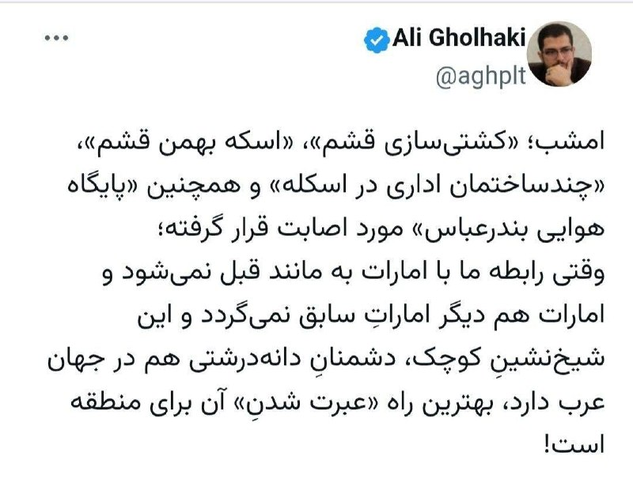

🔴فوری-خبرهای نهایی از بمباران کشتی سازی قشم و اسکله بهمن قشم و ساختمان های اداری در اسکله توسط امارات
https://t.me/kianmeli1

## kianmeli1 — post 87239

🔴فوری-پدافند هوایی غرب تهران فعال شد
https://t.me/kianmeli1

## kianmeli1 — post 87238

🔴فوری

رادیو ارتش اسرائیل

پس از هدف قرار گرفتن یک تانکر ایرانی توسط آمریکا، ایران ناوشکن آمریکایی را هدف قرار داد
https://t.me/kianmeli1

## Shin_Persian — post 5872

Shin ✓ @hey_itsmyturn
Thu, 07 May 2026 20:29:08 UTC

NOW @ 2028Z
Renewed AA activity in western Tehran
#Tehran Province, #Iran

فارسی

هم‌اکنون @ ۲۰۲۸ زولو (ساعت ۲۳:۵۸ به وقت تهران)
فعالیت مجدد پدافند هوایی در غرب تهران
#Tehran Province, #Iran

𝕏 · @shin_persian

## Shin_Persian — post 5871

Shin ✓ @hey_itsmyturn
Thu, 07 May 2026 20:24:29 UTC

AA activity western Tehran
Tehran Province, #Iran

فارسی

فعالیت پدافند هوایی در غرب تهران
استان تهران، #Iran

𝕏 · @shin_persian

## Shin_Persian — post 5870

Shin ✓ @hey_itsmyturn
Thu, 07 May 2026 20:24:10 UTC

NOW -
3 blast sounds in western Tehran
#Tehran Province, #Iran

فارسی

فوری -
شنیده شدن صدای ۳ انفجار در غرب تهران
#Tehran Province, #Iran

𝕏 · @shin_persian

## Iliaen — post 4430

  <a href="telegram/content/Iliaen_4430_1778185947.mp4">🎬 Download video</a>

ساعت ۲۳:۵۷ پنجشنبه؛ تهران محدوده‌ی شهران

@iliaen

## Iliaen — post 4429

ساعت ۲۳:۵۵ پنجشنبه؛ پدافند غرب تهران فعال شد.

@iliaen

## Iliaen — post 4428

  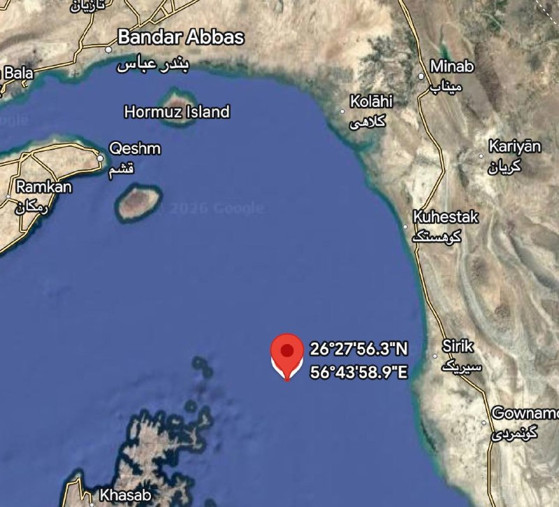

یک موشک از مبدا ناشناس در دریا منفجر شد؛ ممکن است به یک کشتی یا قایق اصابت کرده باشد.

محدوده‌ تصویر و همچنین مختصات زیر محل تقریبی برخورد براساس مشاهده شاهدان است:

26.4656409, 56.7330182

@iliaen

## ManotoTV — post 105106

  <a href="telegram/content/ManotoTV_105106_1778185948.mp4">🎬 Download video</a>

خبرگزاری حکومتی تسنیم به نقل از منابعی گزارش داده «نشانه‌هایی از اقدام خصمانه امارات» در محدوده اسکله بهمن قشم مشاهده شده است؛ ادعایی که تاکنون به‌طور رسمی تأیید نشده است.

این خبرگزاری نوشت در صورتی که این مساله تایید شود «امارات هزینه اقدام خصمانه خود را خواهد پرداخت.»

بر اساس این گزارش، هم‌زمان در بندرعباس نیز صدای چند انفجار شنیده شده که به گفته منابع، ناشی از «مقابله پدافند با دو ریزپرنده» بوده و «دو پهپادها منهدم شده‌اند.»

تسنیم تأکید کرده صدای انفجارهای بندرعباس «مرتبط با عملکرد پدافند» بوده و موضوع انفجارهای اطراف اسکله بهمن قشم «جدا از این رویداد» عنوان شده است.

تا این لحظه، مقام‌های رسمی جزئیات بیشتری درباره این گزارش‌ها منتشر نکرده‌اند.

## Persian_Trend_Official — post 13633

🔴گزارشات مردمی تایید نشده از صدای پدافند در غرب تهران.

🫆:Tony

📌 @persian_trend_official
پرشین ترند | متفاوت‌ترین کانال نظامی

## IranianMinds — post 19734

🔴 پدافند غرب تهران فعال شد

@IranianMinds

## BBCPersian — post 280436

🔻ایران از «تبادل آتش بین نیروهای مسلح ایران و دشمن» در قشم خبر داد

پس از آن که گزارش‌هایی در مورد شنیده شدن صدای انفجارهایی در حوالی بندرعباس و جزیره قشم در رسانه‌های ایران منتشر شد، خبرگزاری فارس اکنون می‌گوید که بررسی‌هایش نشان می‌دهد «در جریان تبادل آتش میان نیروهای مسلح ایران و دشمن بخش‌هایی تجاری اسکله بهمن قشم هدف قرار گرفته است.»

خبرگزاری صدا و سیما هم گزارش کرده «انفجار در اسکله بهمن قشم در جریان تبادل آتش میان نیروهای مسلح ایران و دشمن رخ داده است.»

به گزارش صدا و سیما، ساختمان اداری این اسکله هدف حمله بود.

خبرگزاری فارس همچنین به نقل از «یک مقام نظامی آگاه» عصر پنجشنبه نوشت: «به‌دنبال تعرض ارتش متجاوز آمریکا به یک نفتکش ایرانی، یگان‌های متعرض دشمن در محدوده تنگهٔ هرمز زیر آتش موشکی ایران قرار گرفتند که پس از تحمل خسارت مجبور به فرار شدند.»

https://bbc.in/4tY9QnJ
@BBCPersian

## Dirty_Kids — post 389067

گزارش‌های مردمی و خبرگزاری حکومتی از فعالیت شدید پدافند در نقاط مختلف تهران خبر می‌دهند.

@Dirty_Kids 👻

## Dirty_Kids — post 389066

پدافند غرب تهران فعال شد 23:53 مشخص نیست انفجار بود یا چی

@Dirty_Kids 👻

## Dirty_Kids — post 389065

  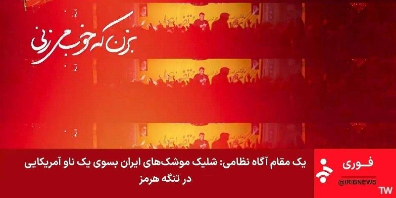

صداوسیما هم‌اکنون از «شلیک موشک‌های ایران به سوی یک ناو آمریکایی در تنگه هرمز» خبر می‌دهد.

@Dirty_Kids 👻

## Dirty_Kids — post 389064

  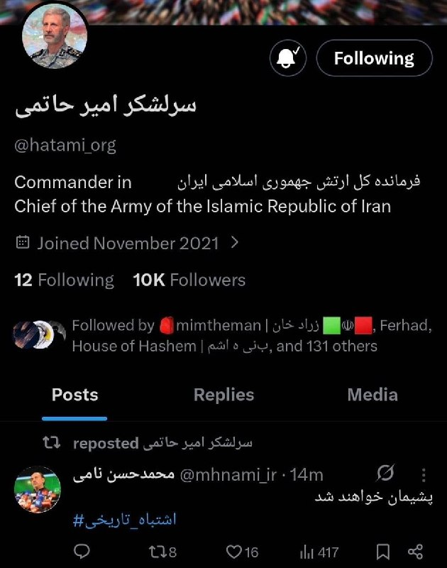

فرمانده کل ارتش جمهوری اسلامی با ریتوییت یک پیام: پشیمان خواهند شد

@Dirty_Kids 👻

## configx2ray — post 38610

جنگه؟!
😋

## manototv — post 105106

  <a href="telegram/content/manototv_105106_1778185950.mp4">🎬 Download video</a>

خبرگزاری حکومتی تسنیم به نقل از منابعی گزارش داده «نشانه‌هایی از اقدام خصمانه امارات» در محدوده اسکله بهمن قشم مشاهده شده است؛ ادعایی که تاکنون به‌طور رسمی تأیید نشده است.

این خبرگزاری نوشت در صورتی که این مساله تایید شود «امارات هزینه اقدام خصمانه خود را خواهد پرداخت.»

بر اساس این گزارش، هم‌زمان در بندرعباس نیز صدای چند انفجار شنیده شده که به گفته منابع، ناشی از «مقابله پدافند با دو ریزپرنده» بوده و «دو پهپادها منهدم شده‌اند.»

تسنیم تأکید کرده صدای انفجارهای بندرعباس «مرتبط با عملکرد پدافند» بوده و موضوع انفجارهای اطراف اسکله بهمن قشم «جدا از این رویداد» عنوان شده است.

تا این لحظه، مقام‌های رسمی جزئیات بیشتری درباره این گزارش‌ها منتشر نکرده‌اند.

## alonews — post 118500

  <a href="telegram/content/alonews_118500_1778185950.jpg">🎬 Download video</a>

👈فعالیت پدافند در غرب تهران 
✅ @AloNews خبر جنگ

## alonews — post 118499

  <a href="telegram/content/alonews_118499_1778185950.jpg">🎬 Download video</a>

🚨جنگ شروع شد

## alonews — post 118498

  <a href="telegram/content/alonews_118498_1778185951.jpg">🎬 Download video</a>

🔴فوووووووووووووووووووووری

## alonews — post 118497

🔴فوووووووووووووووووووووری

## alonews — post 118496

  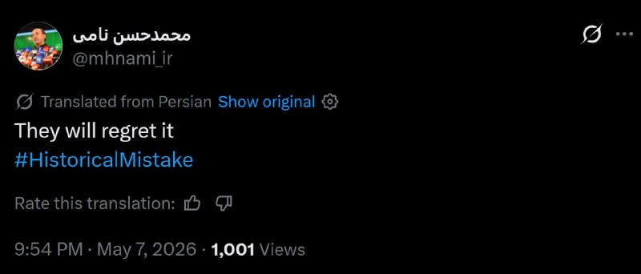

👈فرمانده کل نیروهای مسلح ایران، امیر حاتمی: آنها پشیمان خواهند شد.

✅ @AloNews خبر جنگ

## alonews — post 118495

  <a href="telegram/content/alonews_118495_1778185951.jpg">🎬 Download video</a>

👈طبق گزارش رادیو ارتش اسرائیل، ایران به ناوشکن‌های موشکی آمریکا در تنگه هرمز هنگام خروج از منطقه حمله کرد.

🔴 اسرائیل به دقت تحولات خلیج فارس را زیر نظر دارد

✅ @AloNews خبر جنگ

---
📅 بروزرسانی: 1405/02/17 23:52
---

## VahidOOnLine — post 238738

  <a href="telegram/content/VahidOOnLine_238738_1778185354.mp4">🎬 Download video</a>

♦️صدا و سیمای جمهوری اسلامی پنجشنبه شب ۱۷ اردیبهشت به نقل از یک «مقام آگاه نظامی» گزارش داد که پس از آنچه «تعرض ارتش متجاوز آمریکا به یک نفت‌کش ایرانی» خوانده شد، یگان‌های آمریکایی در محدوده تنگه هرمز هدف حمله موشکی قرار گرفتند.

این مقام مدعی شد نیروهای آمریکایی پس از «تحمل خسارت» ناچار به عقب‌نشینی و فرار شدند.

مقام‌های آمریکایی و ستاد فرماندهی مرکزی ارتش آمریکا، سنتکام، تاکنون واکنشی به این ادعا نشان نداده‌اند.
‌🇸🇦 Indypersian

🤖 @VahidOOnLine

## VahidOOnLine — post 238737

  <a href="telegram/content/VahidOOnLine_238737_1778185355.mp4">🎬 Download video</a>

دونالد ترامپ، رئیس‌جمهور آمریکا، اعلام کرد در گفت‌وگوی تلفنی با اورزولا فون‌درلاین، رئیس کمیسیون اروپا، دو طرف بر جلوگیری از دستیابی جمهوری اسلامی به سلاح هسته‌ای تأکید کرده‌اند.

او در تروث‌سوشال نوشت: «کاملاً متحد هستیم که ایران هرگز نباید به سلاح هسته‌ای دست پیدا کند.»

ترامپ در ادامه افزود: «ما توافق داریم رژیمی که مردم خود را می‌کشد، نمی‌تواند بمبی را در اختیار داشته باشد که قادر است میلیون‌ها نفر را از بین ببرد.»
‌🏁 🇬🇧 ManotoTV

🤖 @VahidOOnLine

## mwarmonitor — post 8657

🔴 تبادل آتش بین ایران و ایالات متحده در تنگه هرمز، به نقل از روزنامه «Israel Hayom» و با استناد به منابع اسرائیلی.

@mwarmonitor

## mwarmonitor — post 8656

🇮🇱دورون کادوش از رادیو نظامی ارتش اسرائیل می‌گوید: تا جایی که آن‌ها مطلع هستند، ایران اخیراً پس از حمله آمریکا به یک نفتکش ایرانی، به ناوشکن‌های موشکی آمریکا حمله کرده است.

اسرائیل «تحولات را به‌دقت زیر نظر دارد».

@mwarmonitor

## pm_afshaa — post 90326

خبرگزاری های داخلی:2 تا پهپاد سرنگون کردیم

💧 Rainbet.com the #1 Non-KYC Crypto Casino & Sportsbook @rainbetcom

😁 @Pm_Afshaa

## pm_afshaa — post 90325

🔴صداوسیما : بعد اینکه موشکارو شلیک کردیم ناو آمریکایی از ترس قدرت ویران کننده موژک هامون فرار کرد

💧 Rainbet.com the #1 Non-KYC Crypto Casino & Sportsbook @rainbetcom

😁 @Pm_Afshaa

## DEJradio — post 4489

  <a href="telegram/content/DEJradio_4489_1778185356.jpg">🎬 Download video</a>

🚨
🔸 مجید محمدی، جامعه‌شناس، در سومین برنامه «پرتوی دیگر» تأکید کرد سی-چهل سال گذشته تمام مدافعان جمهوری اسلامی و لابیست‌ها ادعا کردند که اگر جنگی اتفاق بیافتد مردم پشت جمهوری اسلامی خواهند ایستاد اما اینطور نشد.

او تأکید کرد «جامعه هیچ وقت اشغال ایران توسط جمهوری اسلامی را نپذیرفت.»

برنامه پرتوی دیگر هر آدینه از یوتیوب کیهان لندن و شبکه دژ ساعت ۱۹:۰۰ به‌وقت تهران پخش می‌شود.

#پرتوی_دیگر #جمهوری_اسلامی
@DEJradio

## kianmeli1 — post 87237

🔴فوری-اسراییل هیوم

تبادل آتش بین ایران و آمریکا در تنگه هرمز
https://t.me/kianmeli1

## IranIntlTV — post 336033

  <a href="telegram/content/IranIntlTV_336033_1778185357.mp4">🎬 Download video</a>

تهران گفته در حال بررسی پیام‌ها و پیشنهادهای آمریکا با میانجیگری پاکستان است. در همین حال، ترامپ از پیشرفت مذاکرات ابراز امیدواری کرده اما تأکید کرده هر توافقی مشروط به محدودیت‌های جدی در برنامه هسته‌ای ایران خواهد بود. وزارت خزانه‌داری آمریکا نیز از اعمال تحریم‌های جدید علیه تهران خبر داد.
@iranintltv

## Shin_Persian — post 5869

  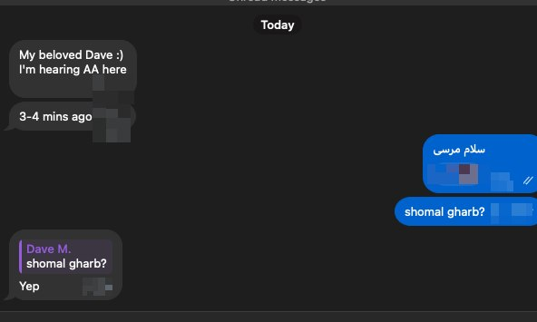

Shin ✓ @hey_itsmyturn
Thu, 07 May 2026 20:14:45 UTC

AA activity, northwestern Tehran
#Tehran Province, #Iran

فارسی

فعالیت پدافند هوایی، شمال غربی تهران
#Tehran Province, #Iran

𝕏 · @shin_persian

## FarsiVOA — post 217143

  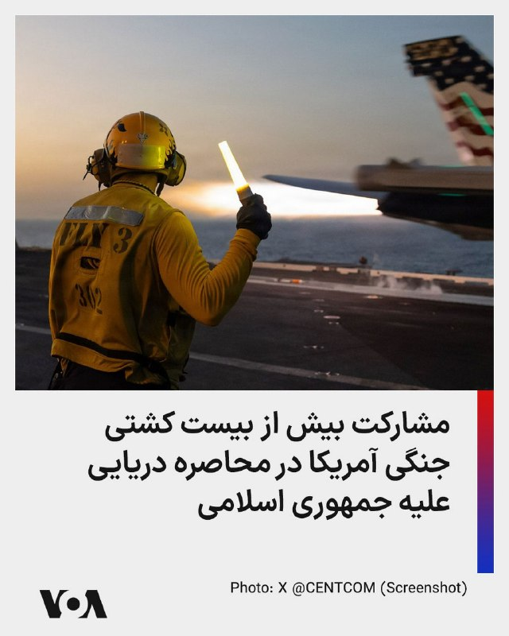

⚡️ستاد فرماندهی مرکزی آمریکا، پنج‌شنبه عصر به وقت واشنگتن با انتشار این تصویر اعلام کرد که ناو هواپیمابر جورج اچ‌. دبلیو. بوش به همراه بیش از ۲۰ کشتی جنگی آمریکایی در حال اجرای محاصره دریایی جمهوری اسلامی هستند.
@FarsiVOA

## FarsiVOA — post 217142

  <a href="telegram/content/FarsiVOA_217142_1778185361.mp4">🎬 Download video</a>

⚡️منشه امیر در برنامه تفسیر خبر: اسرائیل بر این باور است که تا هنگامی که رژیم ایران عوض نشود منطقه روی آرامش نخواهد دید
@FarsiVOA

## FarsiVOA — post 217141

  <a href="telegram/content/FarsiVOA_217141_1778185362.mp4">🎬 Download video</a>

⚡️حسن اعتمادی در برنامه تفسیر خبر: توافق خوب آن است که هر سه طرف احساس برنده بودن داشته باشند
@FarsiVOA

## Persian_Trend_Official — post 13632

🔴اسرائیل هیوم

💢پس از هدف قرار گرفتن یک تانکر جمهوری اسلامی توسط آمریکا، آنها به سمت ناوشکن آمریکایی موشک شلیک کرده اند و تبادل آتش رخ داده است
🫆:Tony

📌 @persian_trend_official
پرشین ترند | متفاوت‌ترین کانال نظامی

## Persian_Trend_Official — post 13631

  

⭕️ شبکه خبر:

📝 Nick

📌 @persian_trend_official
پرشین ترند | متفاوت‌ترین کانال نظامی

## Persian_Trend_Official — post 13630

  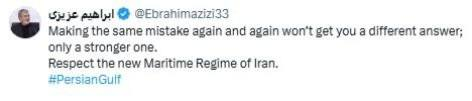

🔴ابراهیم عزیزی، رئیس کمیسیون امنیت ملی مجلس جمهوری اسلامی‌

💢تکرار همان اشتباه بارها و بارها پاسخ متفاوتی به شما نمی‌دهد؛ فقط پاسخی قوی‌تر خواهد بود.

▪️به رژیم جدید دریایی ایران احترام بگذارید

🫆:Tony

📌 @persian_trend_official
پرشین ترند | متفاوت‌ترین کانال نظامی

## IranianMinds — post 19733

🔴 صداوسیما : ناوگان آمریکایی به یک نفتکش ما تعرض کرد و ما هم در پاسخ بهش حمله ی موشکی کردیم. @IranianMinds

## IranianMinds — post 19732

🔴صدا‌و‌سیما:

اماراتو دیدید بزنید.

## Dirty_Kids — post 389063

کانال وابسته به سپاه در روبیکا: آغاز شمارش معکوس برای فرستادن امارات به عصر شترسواری

بنظر سپاه میخواد پاسخ سنگین به حملات امارات بده

@Dirty_Kids 👻

## configx2ray — post 38609

رفقا فروش بازه گیگی 380 هزار تومان با ساب اطلاع وضعیت 
⚡️ بدونه محدودیت کاربر و بدونه ضریب یک‌گیگ واقعی فقط پنجاه نفر اول 
❤️ جهت خرید به ربات زیر مراجعه کنید 
❤️ Bot : @netmeli1bot 
🌟

## configx2ray — post 38608

رفقا فروش بازه گیگی 380 هزار تومان با ساب اطلاع وضعیت 
⚡️

بدونه محدودیت کاربر و بدونه ضریب یک‌گیگ واقعی فقط پنجاه نفر اول 
❤️

جهت خرید به ربات زیر مراجعه کنید 
❤️

Bot : @netmeli1bot 
🌟

## alonews — post 118494

  <a href="telegram/content/alonews_118494_1778185365.jpg">🎬 Download video</a>

🔴فوری / اسرائیل هیوم: یک منبع اسرائیلی تأیید کرده است که تبادل آتش بین ایران و ایالات متحده در تنگه هرمز رخ داده است.

✅ @AloNews خبر جنگ

## alonews — post 118493

  <a href="telegram/content/alonews_118493_1778185365.jpg">🎬 Download video</a>

👈انفجار مجدد در قشم

✅ @AloNews خبر جنگ

## alonews — post 118492

  <a href="telegram/content/alonews_118492_1778185365.mp4">🎬 Download video</a>

👈صداوسیما: ناو امریکایی را هدف قرار دادیم و فرار کرد

✅ @AloNews خبر جنگ

## alonews — post 118491

  <a href="telegram/content/alonews_118491_1778185367.jpg">🎬 Download video</a>

👈خبرگزاری مهر نوشت که پدافند ایران موفق به سرنگونی دو هواگرد متخاصم بر روی آسمان بندرعباس و قشم شده است. این خبرگزاری به نوع هواگردها اشاره نکرده است.

✅ @AloNews خبر جنگ

## alonews — post 118490

  <a href="telegram/content/alonews_118490_1778185368.jpg">🎬 Download video</a>

🔴فوری/گویا حمله امارات تایید شده

✅ @AloNews خبر جنگ

## alonews — post 118489

  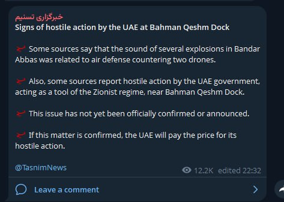

👈خبرگزاری تسنیم وابسته به سپاه پاسداران تهدید می‌کند که اگر تأیید شود نیروی هوایی امارات جزیره قشم را بمباران کرده است، «بهای سنگینی» خواهد پرداخت

✅ @AloNews خبر جنگ

## alonews — post 118488

🔥 پیشنهاد استثنایی، زیر قیمت کل ایران 🔥

🚀 ۱۰ گیگ پرسرعت + ساب
💰 فقط 1,000,000 تومان

⏳ فقط تا ۲۴ ساعت (فرصت محدود برای استقبال از شما)

⚡ بدون قطعی و افت سرعت
🛡 بدون ضریب
📞 پشتیبانی واقعی ۲۴ ساعته

❗ این قیمت تکرار نمیشه، از دستش نده

ثبت سفارش🟢✔️:
🆔 @Cocsell_Admin
🤖 @captainconfbot

---
📅 بروزرسانی: 1405/02/17 23:42
---

## VahidOOnLine — post 238736

🗣روایت شما از زندگی در آتش‌بس- پنجشنبه ۱۷ اردیبهشت ۱۴۰۵

🔹در غرب جزیره قشم، چندین صدای انفجار در فاصله‌های کوتاه، حدود ساعت ۹:۲۵ تا ۱۰:۰۲ شب، شنیده شده و بعضی ساکنان از لرزش شیشه‌ها و احساس موج انفجار گفتن
🔹در بندرعباس، چند مورد صدای انفجار حوالی ساعت ۲۱:۳۰ تا ۲۲:۰۴ گزارش شده
🔹در بندر خمیر هم انفجارهای پیاپی و نسبتاً شدید حدود ساعت ۲۱:۳۰ شنیده شده
🔹در بندر کنگ، بعضی‌ها از شنیدن صداهای متعدد و احتمال پرتاب یا لانچ شیء ناشناس حوالی ساعت ۲۱:۵۰ گفتن
🔹در محدوده‌های ساحلی قشم، از جمله حوالی اسکله‌ها، چند صدای انفجار و نور در آسمان دیده شده
🔹در مناطق سیریک و میناب هم صداهای انفجار و مشاهده نور یا حرکت جسم نورانی در آسمان گزارش شده
‌🏁 🇬🇧 IranintlTV

🤖 @VahidOOnLine

## VahidOOnLine — post 238735

  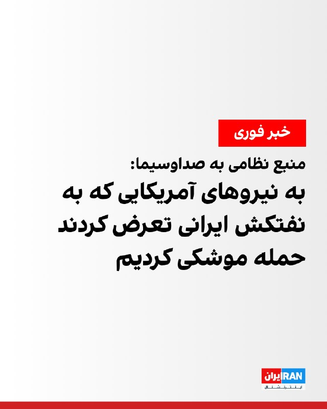

خبرگزاری صداوسیما به نقل از یک مقام آگاه نظامی گزارش داد «به دنبال تعرض ارتش آمریکا به یک نفت‌کش ایرانی، یگان‌های متعرض دشمن در محدوده تنگه هرمز زیر آتش موشکی جمهوری اسلامی قرار گرفتند که پس از تحمل خسارت مجبور به فرار شدند.»
‌🏁 🇬🇧 IranintlTV

🤖 @VahidOOnLine

## VahidOOnLine — post 238734

  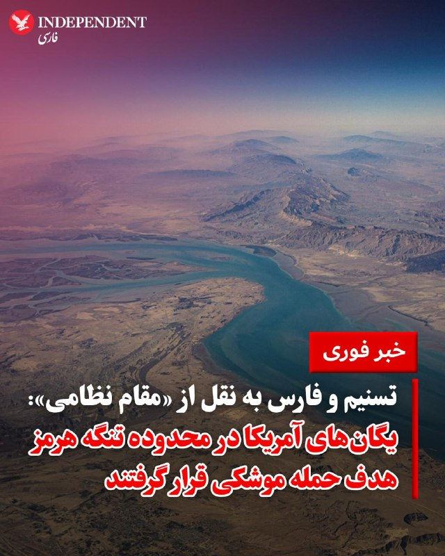

♦️دو خبرگزاری تسنیم و فارس که هر دو به سپاه پاسداران وابسته‌اند، پنجشنبه‌شب، ۱۷ اردیبهشت و همزمان با گزارش‌ها از شنیده شدن صدای انفجار در جزیره قشم و بندرعباس، به نقل از یک «مقام آگاه نظامی» اعلام کردند که نیروهای نظامی جمهوری اسلامی، یگان‌های آمریکایی در محدوده تنگه هرمز را هدف حمله موشکی قرار دادند. این مقام مدعی شد که این نیروها به یک نفتکش ایرانی «تجاوز» کرده بودند و پس از این حمله موشکی «متحمل خسارت شده» و عقب‌نشینی کرده‌اند.

ستاد فرماندهی مرکزی ارتش آمریکا، سنتکام واکنشی به این ادعا نشان نداده است.
‌🇸🇦 Indypersian

🤖 @VahidOOnLine

## mwarmonitor — post 8655

  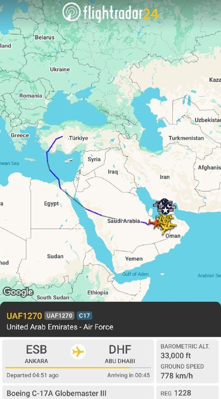

✈️🇦🇪نیروی هوایی امارات (UAE) یک فروند C-17A از آنکارا بازگشته که در آنجا تجهیزات نظامی (احتمالاً پهپاد) را تحویل گرفته است.

✈️در همین حال، ۶ فروند تانکر سوخت‌رسان نیروی هوایی آمریکا (USAF) در آسمان امارات فعال هستند و در حال سوخت‌رسانی به جنگنده‌ها می‌باشند.

@mwarmonitor

## pm_afshaa — post 90324

صداوسیما : ناوگان آمریکایی به یک نفتکش ما تعرض کرد و ما هم در پاسخ بهش حمله ی موشکی کردیم

💧 Rainbet.com the #1 Non-KYC Crypto Casino & Sportsbook @rainbetcom

😁 @Pm_Afshaa

## pm_afshaa — post 90323

🔴یک نفتکش سپاه در تنگه هرمز هدف گرفت

💧 Rainbet.com the #1 Non-KYC Crypto Casino & Sportsbook @rainbetcom

😁 @Pm_Afshaa

## pm_afshaa — post 90322

  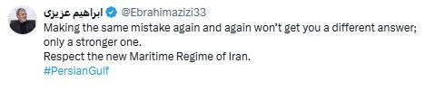

ابراهیم عزیزی : مرتکب شدن دوباره و دوباره همان اشتباه، پاسخ متفاوتی به شما نخواهد داد.

به رژیم جدید دریایی ایران احترام بگذارید

💧 Rainbet.com the #1 Non-KYC Crypto Casino & Sportsbook @rainbetcom

😁 @Pm_Afshaa

## iaghapour — post 2589

🔻اطلاعیه مهم: معرفی فروشندگان کانفیگ

طبق نتایج نظرسنجی اخیر، قصد داریم فروشندگان قدیمی و معتبری که از قبل می‌شناسیم را یکی‌یکی برای خرید به شما معرفی کنیم.

📌 قوانین و شرایط مربوط به فروشندگان:

— عدم پذیرش فروشنده جدید: در حال حاضر شخص جدیدی معرفی نمی‌شود؛ بنابراین لطفاً در قسمت «تماس با ما» برای معرفی خود پیام ندهید. افرادی که معرفی می‌شوند، همگی پیش‌تر در کانال ما سابقه تبلیغ داشته‌اند.

— تضمین خرید شما: مبلغی از پول این افراد نزد ما به عنوان امانت می‌ماند تا در صورت بروز هرگونه مشکل، بتوانیم مطالبات شما کاربران عزیز را پیگیری کنیم.

— ضمانت بازگشت وجه: این فروشندگان موظف‌اند در صورت لزوم (بسته به شرایطی که خودشان به شما اعلام می‌کنند)، بین ۴۸ تا ۷۲ ساعت امکان عودت وجه را فراهم کنند.

— قیمت منصفانه: تمامی این افراد تعهد داده‌اند که نسبت به شرایط بازار، قیمت‌های منصفانه‌تری برای کاربران کانال ما در نظر بگیرند.

⚠️ نکات مهم برای کاربران عزیز:

— انتظارات از کیفیت: کانفیگ‌ها باید بتوانند تلگرام، اینستاگرام و یوتیوب را به راحتی باز کنند. با توجه به شرایط فعلی اینترنت، داشتن سرعت‌های بسیار بالایِ گذشته کمی دور از انتظار است (هرچند ممکن است کیفیت سرویس‌ها عالی باشد)، پس لطفاً واقع‌بین باشید.

— اختلال و پشتیبانی: ممکن است در طول هفته، گاهی با اختلال مواجه شوید. پشتیبان‌ها موظف‌اند در سریع‌ترین زمان ممکن مشکل را حل کنند؛ اما لطفاً صبور باشید، حداقل یک ساعت به آن‌ها فرصت دهید و از ایجاد فشار زودهنگام به پشتیبانی کانال‌ها خودداری کنید.

— در ضمن، توجه داشته باشید که ما ذی‌نفع این کانال‌ها نیستیم و فقط به دلیل درخواست‌های زیاد شما این دوستان را معرفی می‌کنیم.

## VahidOnline — post 75306

  <a href="telegram/content/VahidOnline_75306_1778184740.mp4">🎬 Download video</a>

صداوسیما به نقل از یک مقام آگاه نظامی گزارش داد «به دنبال تعرض ارتش آمریکا به یک نفت‌کش ایرانی، یگان‌های متعرض دشمن در محدوده تنگه هرمز زیر آتش موشکی جمهوری اسلامی قرار گرفتند که پس از تحمل خسارت مجبور به فرار شدند.»
@VahidOOnLine

📡 @VahidOnline

## kianmeli1 — post 87236

  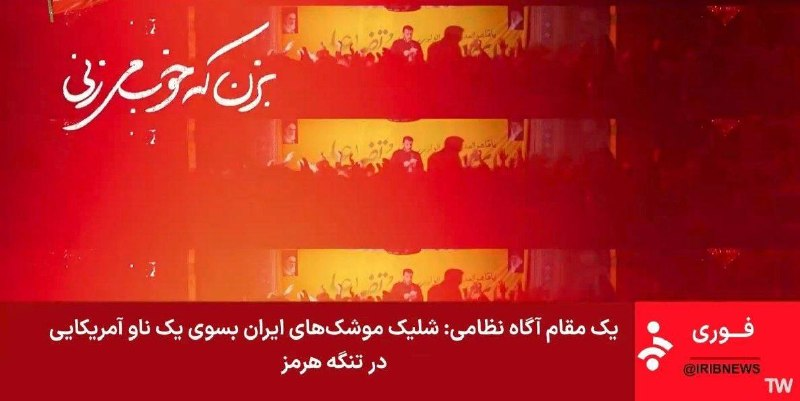

🔴فوری-زیرنویس شبکه خبر

به ناو امریکایی موشک زده ایم
https://t.me/kianmeli1

## kianmeli1 — post 87235

  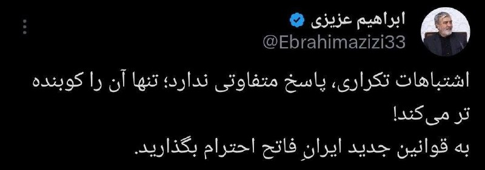

🔴فوری-رئیس کمیسیون امنیت ملی در پاسخ به حملات امشب

حمله کوبنده میکنیم
https://t.me/kianmeli1

## kianmeli1 — post 87234

  <a href="telegram/content/kianmeli1_87234_1778184742.mp4">🎬 Download video</a>

🔴فوری-صدا و سیما جمهوری اسلامی

ناو امریکایی را هدف قرار دادیم و فرار کرد
https://t.me/kianmeli1

## IranIntlTV — post 336032

🗣روایت شما از زندگی در آتش‌بس- پنجشنبه ۱۷ اردیبهشت ۱۴۰۵

🔹در غرب جزیره قشم، چندین صدای انفجار در فاصله‌های کوتاه، حدود ساعت ۹:۲۵ تا ۱۰:۰۲ شب، شنیده شده و بعضی ساکنان از لرزش شیشه‌ها و احساس موج انفجار گفتن
🔹در بندرعباس، چند مورد صدای انفجار حوالی ساعت ۲۱:۳۰ تا ۲۲:۰۴ گزارش شده
🔹در بندر خمیر هم انفجارهای پیاپی و نسبتاً شدید حدود ساعت ۲۱:۳۰ شنیده شده
🔹در بندر کنگ، بعضی‌ها از شنیدن صداهای متعدد و احتمال پرتاب یا لانچ شیء ناشناس حوالی ساعت ۲۱:۵۰ گفتن
🔹در محدوده‌های ساحلی قشم، از جمله حوالی اسکله‌ها، چند صدای انفجار و نور در آسمان دیده شده
🔹در مناطق سیریک و میناب هم صداهای انفجار و مشاهده نور یا حرکت جسم نورانی در آسمان گزارش شده

## IranIntlTV — post 336031

  

خبرگزاری صداوسیما به نقل از یک مقام آگاه نظامی گزارش داد «به دنبال تعرض ارتش آمریکا به یک نفت‌کش ایرانی، یگان‌های متعرض دشمن در محدوده تنگه هرمز زیر آتش موشکی جمهوری اسلامی قرار گرفتند که پس از تحمل خسارت مجبور به فرار شدند.»
https://iranintl.com/202605074827

## IranIntlTV — post 336030

  <a href="telegram/content/IranIntlTV_336030_1778184744.mp4">🎬 Download video</a>

بر اساس اطلاعات رسیده به ایران‌اینترنشنال، خبر دیدار مسعود پزشکیان با مجتبی خامنه‌ای جعلی بوده و چنین ملاقاتی انجام نشده است.

منابع ایران‌اینترنشنال می‌گویند درخواست ملاقات پزشکیان پنج بار از سوی دفتر خامنه‌ای رد شده است. پزشکیان ساعاتی پیش گفته بود این نشست در فضایی «صمیمی» برگزار شده و حدود دو ساعت و نیم طول کشیده است.
@iranintltv

## ManotoTV — post 105105

  <a href="telegram/content/ManotoTV_105105_1778184745.mp4">🎬 Download video</a>

دونالد ترامپ، رئیس‌جمهور آمریکا، اعلام کرد در گفت‌وگوی تلفنی با اورزولا فون‌درلاین، رئیس کمیسیون اروپا، دو طرف بر جلوگیری از دستیابی جمهوری اسلامی به سلاح هسته‌ای تأکید کرده‌اند.

او در تروث‌سوشال نوشت: «کاملاً متحد هستیم که ایران هرگز نباید به سلاح هسته‌ای دست پیدا کند.»

ترامپ در ادامه افزود: «ما توافق داریم رژیمی که مردم خود را می‌کشد، نمی‌تواند بمبی را در اختیار داشته باشد که قادر است میلیون‌ها نفر را از بین ببرد.»

## FarsiVOA — post 217140

  <a href="telegram/content/FarsiVOA_217140_1778184746.mp4">🎬 Download video</a>

⚡️شکریا برادوست در برنامه تفسیر خبر: پرزیدنت ترامپ توپ را در داخل زمین جمهوری اسلامی انداخته است
@FarsiVOA

## Persian_Trend_Official — post 13629

  <a href="telegram/content/Persian_Trend_Official_13629_1778184747.jpg">🎬 Download video</a>

🔴شبکه خبر

💢اخبار مربوط به حمله هوایی به اسکله‌ای در قشم هنوز تایید نشده است.

🫆:Tony

📌 @persian_trend_official
پرشین ترند | متفاوت‌ترین کانال نظامی

## Persian_Trend_Official — post 13628

🔴تسنیم

تکذیب انفجار در سیریک/ صدای شنیده شده در سیریک مربوط به هشدار نیروی دریایی سپاه به برخی کشتی‌ها برای تردد غیرمجاز است

💢 براساس پیگیری خبرنگار تسنیم، تاکنون هیچ انفجار و برخوردی در سیریک گزارش نشده و شهر در امنیت کامل قرار دارد.

💢 طبق اعلام منابع مطلع صداهای انفجار در این شهر مربوط به هشدارهای نیروی دریایی سپاه به برخی کشتی‌ها برای تردد غیرمجاز است.

🫆:Tony

📌 @persian_trend_official
پرشین ترند | متفاوت‌ترین کانال نظامی

## IranianMinds — post 19731

🔴 صداوسیما : ناوگان آمریکایی به یک نفتکش ما تعرض کرد و ما هم در پاسخ بهش حمله ی موشکی کردیم. @IranianMinds

## Dirty_Kids — post 389062

امارات واستاد پدافند لیزری و گنبد آهنین از اسرائیل بگیره بعد حمله کنه

همه‌جا اول دفاع مهمه بعد حمله الا جمهوری اسلامی چون ما مردم بتخمشونیم

@Dirty_Kids 👻

## manototv — post 105105

  <a href="telegram/content/manototv_105105_1778184747.mp4">🎬 Download video</a>

دونالد ترامپ، رئیس‌جمهور آمریکا، اعلام کرد در گفت‌وگوی تلفنی با اورزولا فون‌درلاین، رئیس کمیسیون اروپا، دو طرف بر جلوگیری از دستیابی جمهوری اسلامی به سلاح هسته‌ای تأکید کرده‌اند.

او در تروث‌سوشال نوشت: «کاملاً متحد هستیم که ایران هرگز نباید به سلاح هسته‌ای دست پیدا کند.»

ترامپ در ادامه افزود: «ما توافق داریم رژیمی که مردم خود را می‌کشد، نمی‌تواند بمبی را در اختیار داشته باشد که قادر است میلیون‌ها نفر را از بین ببرد.»

## alonews — post 118487

  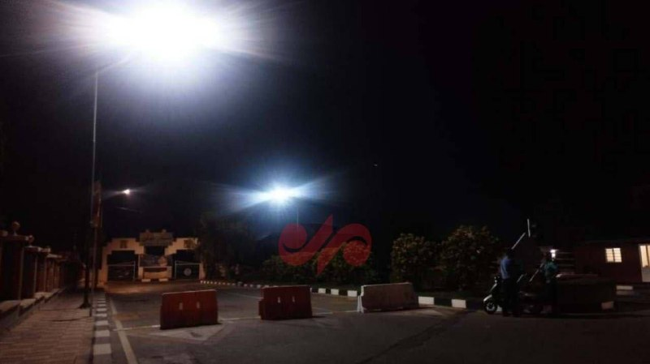

👈هم اکنون اسکله بهمن قشم

✅ @AloNews خبر جنگ

## alonews — post 118486

  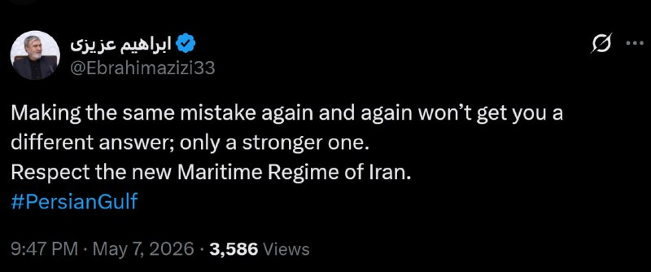

👈رئیس کمیسیون امنیت ملی مجلس، ابراهیم عزیزی: تکرار همان اشتباه بارها و بارها پاسخ متفاوتی به شما نخواهد داد؛ فقط پاسخی قوی‌تر خواهد بود.

🔴به رژیم جدید دریایی ایران احترام بگذارید.

✅ @AloNews خبر جنگ

---
📅 بروزرسانی: 1405/02/17 23:32
---

## VahidOOnLine — post 238733

  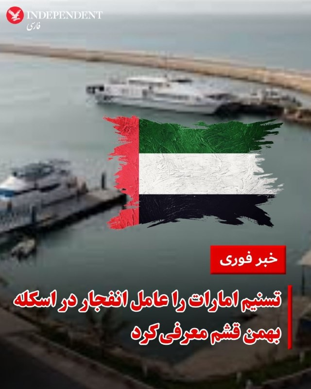

♦️خبرگزاری تسنیم، وابسته به سپاه پاسداران شامگاه پنجشنبه ۱۷ اردیبهشت با متهم کردن امارات متحده عربی درباره انفجارهای قشم اعلام کرد: «نشانه‌هایی از اقدام خصمانه امارات در اسکله بهمن قشم وجود دارد.»

این رسانه با تاکید بر اینکه «صدای چند انفجار در بندرعباس مربوط به مقابله پدافند با دو ریزپرنده بوده است» نوشت: «برخی منابع از اقدام خصمانه دولت امارات، به عنوان آلت دست اسرائیل، در اسکله بهمن قشم خبر می‌دهند.»

رسانه نزدیک به سپاه پاسداران امارات را تهدید و نوشته است «در صورتی که این مساله تایید شود امارات هزینه اقدام خصمانه خود را خواهد پرداخت.»
هنوز هیچ منبع رسمی این موضوع را تایید نکرده است.

پیشتر علی خضریان نماینده مجلس شورای اسلامی در یک برنامه تلویزیونی گفته بود: «نگاه ایران به امارات تغییر کرده و این کشور را دیگر همسایه نمی‌داند بلکه پایگاه متخاصم دشمن می‌داند.»
‌🇸🇦 Indypersian

🤖 @VahidOOnLine

## VahidOOnLine — post 238732

  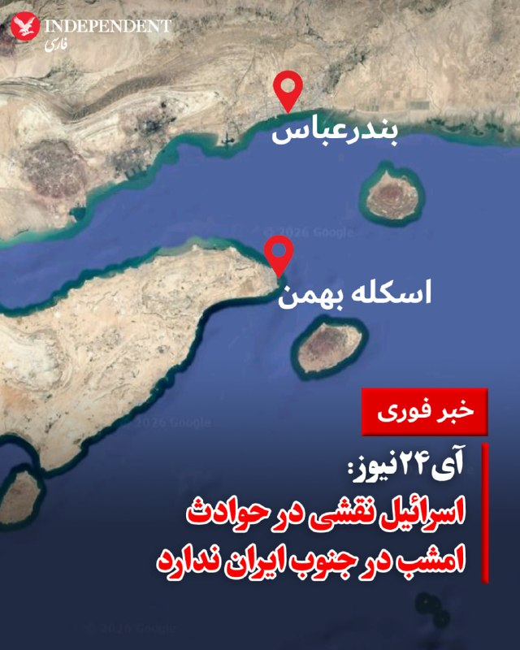

♦️ شبکه خبری آی۲۴ نیوز به نقل از منابع اسرائیلی اعلام کرد که این کشور در حوادث پنجشنبه‌شب، ۱۷ اردیبهشت در جنوب ایران نقشی نداشته است. خبرگزاری فارس، وابسته به سپاه پاسداران اعلام کرد که صداهای انفجار در حوالی بندرعباس شنیده شده که مربوط به تبادل آتش «با دشمن» بوده است. به گفته فارس، در این تبادل آتش، اسکله بهمن در جزیره قشم که فاصله زیادی با بندرعباس ندارد، هدف قرار گرفته است.
‌🇸🇦 Indypersian

🤖 @VahidOOnLine

## mwarmonitor — post 8654

  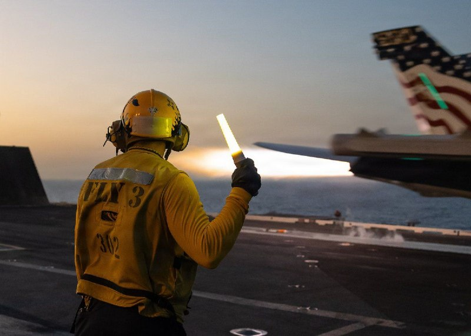

🇺🇸یک ملوان نیروی دریایی آمریکا علامت می‌دهد در حالی که یک هواپیمای EA-18G Growler از عرشه پرواز ناو USS George H.W. Bush (CVN 77) برخاسته است. این ناو در حال فعالیت در کنار بیش از ۲۰ کشتی جنگی آمریکا است که برای اجرای محاصره علیه ایران به‌کار گرفته شده‌اند.

@mwarmonitor

## pm_afshaa — post 90321

🔴حمله موشکی جمهوری اسلامی به ناو های آمریکا

💧 Rainbet.com the #1 Non-KYC Crypto Casino & Sportsbook @rainbetcom

😁 @Pm_Afshaa

## pm_afshaa — post 90320

پرتاب چندین موشک از هرمزگان

💧 Rainbet.com the #1 Non-KYC Crypto Casino & Sportsbook @rainbetcom

😁 @Pm_Afshaa

## pm_afshaa — post 90319

خار عرب و عرب پرستو گاییدم بزنین ننه همو بگایین کیرم تو جفتتون بره

## pm_afshaa — post 90318

🔴میدل ایست: امارات متحده عربی به ایران حمله کرده

💧 Rainbet.com the #1 Non-KYC Crypto Casino & Sportsbook @rainbetcom

😁 @Pm_Afshaa

## DEJradio — post 4488

  <a href="telegram/content/DEJradio_4488_1778184161.mp4">🎬 Download video</a>

🎥
🚨 تصاویری از حضور پهپادهای شناسایی در آسمان بندرعباس در شامگاه پنجشنبه ۱۷ اردیبهشت.

#بندرعباس #پهپاد
@DEJradio

## DEJradio — post 4487

🔸
⭕️ نشریه میدل ایست مدعی شد که حملات اخیر به قشم توسط امارات صورت گرفته است. #انفجار #قشم #امارات @DEJradio

## kianmeli1 — post 87233

🔴فوری-برخورد موشک سپاه به ناو امریکا در تنگه هرمز
https://t.me/kianmeli1

## kianmeli1 — post 87232

🔴فوری-حمله موشکی سپاه به ناو امریکایی
https://t.me/kianmeli1

## kianmeli1 — post 87231

🔴فوری-نفتکش سپاه در تنگه هرمز هدف گرفته شد
https://t.me/kianmeli1

## kianmeli1 — post 87230

‏🔴فوری-خبرگزاری تسنیم، وابسته به سپاه، گزارش داد که برخی منابع از «اقدام خصمانه» امارات متحده عربی در اسکله بهمن در جزیره قشم خبر می‌دهند
https://t.me/kianmeli1

## IranIntlTV — post 336029

  <a href="telegram/content/IranIntlTV_336029_1778184162.mp4">🎬 Download video</a>

سازمان همبستگی ملی برای ایران از برگزاری تجمعی اعتراضی در حمایت از مردم ایران در روز شنبه ۹ مه ساعت ۲ بعدازظهر مقابل کاخ سفید خبر داد. محورهای این تجمع آزادی زندانیان سیاسی، اینترنت آزاد و مخالفت با اعدام اعلام شده است.

گفت‌وگو با سیامک آرام، تحلیل‌گر سیاسی و مدرس دانشگاه
@iranintltv

## IranIntlTV — post 336028

  <a href="telegram/content/IranIntlTV_336028_1778184164.mp4">🎬 Download video</a>

نماینده آمریکا در سازمان ملل در نشست خبری مشترک با مقام‌های کشورهای عربی گفت ایران باید مین‌های تنگه هرمز را جمع‌آوری و دریافت عوارض از کشتی‌ها را متوقف کند. او تاکید کرد اقدام‌های تهران زمینه‌ساز نابودی تجارت جهانی است.

گفت‌وگو با علیرضا نامور حقیقی، تحلیل‌گر سیاسی
@iranintltv

## IranIntlTV — post 336027

  <a href="https://t.me/IranintlTV/336027">📎 Download file</a>

🎧نسخه صوتی ‌‌‏۲۴ با فرداد فرحزاد: خبر فوری: احتمال ازسرگیری پروژه آزادی تنگه هرمز با چراغ سبز ریاض
@iranintlTV

## FarsiVOA — post 217139

⚡️در گفت‌وگو با ابراهیم روشندل، دیپلمات پیشین ساکن مریلند، به توافق «بسیار محتمل» میان ایران و آمریکا پرداختیم؛ به گفته ابراهیم روشندل، تأخیر جمهوری اسلامی در پاسخ رسمی به آمریکا، بیش از هر چیز ناشی از اختلافات داخلی و تلاش برای مدیریت بحران است.
@FarsiVOA

## Persian_Trend_Official — post 13627

  <a href="telegram/content/Persian_Trend_Official_13627_1778184167.jpg">🎬 Download video</a>

🔴صدا و سیما جمهوری اسلامی مدعی است سپاه پاسداران به سمت ناوگان نیروی دریایی امریکا که در تلاش برای حمله به یک نفتکش ایرانی بوده اند شلیک کرده است

🫆:Tony

📌 @persian_trend_official
پرشین ترند | متفاوت‌ترین کانال نظامی

## Persian_Trend_Official — post 13626

یک شب معمولی در خاورمیانه:

📝 Nick

📌 @persian_trend_official
پرشین ترند | متفاوت‌ترین کانال نظامی

## RadioFarda — post 156947

  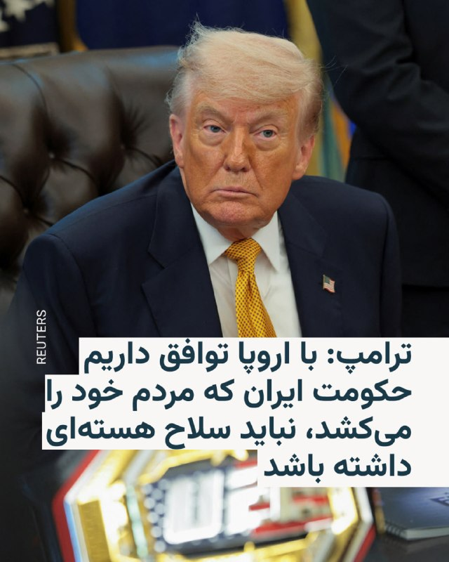

🔸دونالد ترامپ، رئیس‌جمهور آمریکا، روز پنجشنبه گفت که با اورسولا فون در لاین، رئیس کمیسیون اروپا، دربارهٔ ایران و مذاکرات تجاری جاری با اتحادیه اروپا گفت‌وگو کرده است.

🔸او در پستی در شبکه اجتماعی تروث سوشال نوشت: «ما دربارهٔ موضوعات بسیاری گفت‌وگو کردیم، از جمله این‌که کاملاً متحد هستیم که ایران هرگز نباید به سلاح هسته‌ای دست پیدا کند.»

🔸او افزود: «ما توافق داریم که رژیمی که مردم خودش را می‌کشد، نمی‌تواند بمبی را در اختیار داشته باشد که قادر است میلیون‌ها نفر را بکشد.»

🔸این در حالی است که ایران همچنان در حال بررسی طرح آمریکا است که از طریق میانجی‌گران پاکستانی دریافت کرده و هنوز پاسخ خود به پیشنهاد آمریکا برای پایان دادن به جنگ را نهایی نکرده است.

🔸ساعتی پیش عباس عراقچی، در نامه‌ای به دبیرکل سازمان ملل و و رئیس شورای امنیت این نهاد اعلام کرد «تردد عادی دریایی» در تنگه هرمز مشروط به «توقف دائمی جنگ و رفع محاصره و تحریم‌های غیرقانونی علیه ایران» است.

🔸او در این نامه از قطعنامه پیشنهادی آمریکا و بحرین به شورای امنیت سازمان ملل انتقاد کرد.

@RadioFarda

## IranianMinds — post 19730

🔴 حرومزاده های دروغگو سه ساعت سرکارمون گذاشتن

خبرگزاری تسنیم :

صدای انفجارهای شنیده شده در شهرستان سیریک، جنوب ایران، ناشی از عملیات کشتی‌های هشدار نیروی دریایی سپاه پاسداران بود که هشدار دادند بدون مجوز از تنگه هرمز عبور نکنند !

@IranianMinds

## IranianMinds — post 19729

  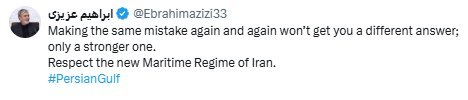

🔴 ابراهیم عزیزی :

مرتکب شدن دوباره و دوباره همان اشتباه، پاسخ متفاوتی به شما نخواهد داد.

به رژیم جدید دریایی ایران احترام بگذارید.

@IranianMinds

## IranianMinds — post 19728

🔴 صداوسیما :

ناوگان آمریکایی به یک نفتکش ما تعرض کرد و ما هم در پاسخ بهش حمله ی موشکی کردیم.

@IranianMinds

## IranianMinds — post 19727

🔴 صداوسیما :

به ناوهای آمریکایی حمله کردیم.

@IranianMinds

## IranianMinds — post 19726

جمهوری اسلامی حدود 7 - 8 موشک به سمت خلیج فارس شلیک کرد !

@IranianMinds

## BBCPersian — post 280435

🔻واشنگتن‌پست: منابع اطلاعاتی آمریکا می‌گویند ایران ماه‌ها می‌تواند در برابر محاصره بنادرش مقاومت کند

روزنامه واشنگتن‌پست طی گزارشی اختصاصی از مفاد یک تحلیل سازمان اطلاعات مرکزی آمریکا، سیا، گزارش کرده منابع اطلاعاتی آمریکا بر این باورند که ایران می‌تواند تا ۹۰ روز یا بیشتر در برابر محاصره دریایی بنادرش مقاومت کند.

گزارش واشنگتن پست بر اساس چهار منبع آگاه از محتوای یک سند محرمانه سیا تهیه شده است که این هفته در اختیار تصمیم‌گیرندگان در واشنگتن قرار گرفته است. به گفته این روزنامه، این ارزیابی، خوش‌بینی‌های دونالد ترامپ، رئیس‌جمهور آمریکا، درباره توانایی محاصره دریایی برای وادار کردن ایران به سازش را زیر سوال می‌برد.

به گزارش واشنگتن پست، سند سیا همچنین حاکی از آن است که ایران هنوز حدود ۷۵ درصد از پرتابگرهای موشکی خود را که پیش از جنگ داشت و همچنین حدود ۷۰ درصد از موشک‌های خود را در اختیار دارد.

این منبع افزود که شواهدی وجود دارد مبنی بر اینکه حکومت ایران موفق شده «تقریباً تمام» تأسیسات زیرزمینی‌ای را که اسرائیل و آمریکا ورودی آنها را بمباران کرده بودند دوباره بازگشایی کند و برخی از موشک‌های آسیب‌دیده در حملات را تعمیر کند.

https://bbc.in/4u0pRd3
@BBCPersian

## Dirty_Kids — post 389061

فارس: حملهٔ موشکی به ناوگان آمریکایی پس از تعرض به نفتکش ایرانی

@Dirty_Kids 👻

## alonews — post 118485

  <a href="telegram/content/alonews_118485_1778184169.jpg">🎬 Download video</a>

👈گویا ۷-۸ موشک از استان هرمزگان در جنوب ایران به سمت منطقه تنگه هرمز شلیک شد. 
✅ @AloNews خبر جنگ

## alonews — post 118484

  <a href="telegram/content/alonews_118484_1778184169.jpg">🎬 Download video</a>

👈صدا سیما: اخبار مربوط به حمله هوایی به اسکله‌ای در قشم هنوز تایید نشده است

✅ @AloNews خبر جنگ

## alonews — post 118483

  <a href="telegram/content/alonews_118483_1778184169.jpg">🎬 Download video</a>

👈تسنیم تکذیب کرد: صدای انفجارهای شنیده شده در شهرستان سیریک، جنوب ایران، ناشی از عملیات کشتی‌های هشدار نیروی دریایی سپاه پاسداران بود که هشدار دادند بدون مجوز از تنگه هرمز عبور نکنند

✅ @AloNews خبر جنگ

## alonews — post 118482

  <a href="telegram/content/alonews_118482_1778184169.jpg">🎬 Download video</a>

🔴فوری / به گفته برخی منابع، چندین موشک از جنوب ایران به سمت تنگه هرمز شلیک شده است. 
✅ @AloNews خبر جنگ

## alonews — post 118481

  <a href="telegram/content/alonews_118481_1778184170.jpg">🎬 Download video</a>

👈رئیس کمیسیون امنیت ملی مجلس در پاسخ به حملات امشب: منتظر پاسخ کوبنده‌تر باشید!

✅ @AloNews خبر جنگ

## alonews — post 118480

  <a href="telegram/content/alonews_118480_1778184170.jpg">🎬 Download video</a>

🔴فوری / به گفته برخی منابع، چندین موشک از جنوب ایران به سمت تنگه هرمز شلیک شده است.

✅ @AloNews خبر جنگ

---
📅 بروزرسانی: 1405/02/17 23:22
---

## VahidOOnLine — post 238731

  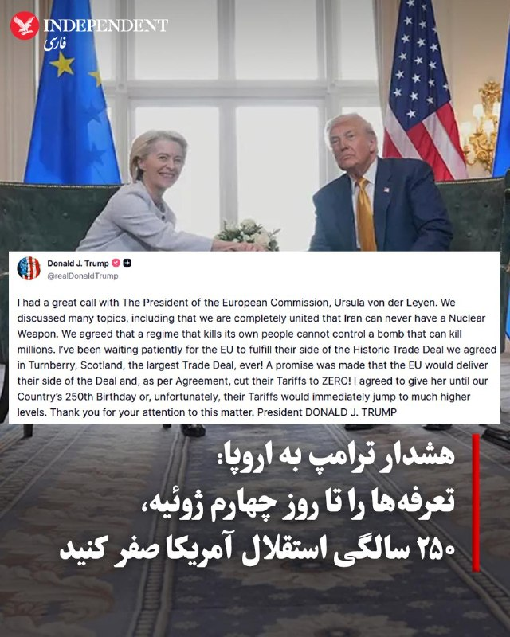

♦️دونالد ترامپ، رئیس‌جمهوری آمریکا، روز پنجشنبه ۱۷ اردیبهشت در پیامی در شبکه اجتماعی تروث سوشال از گفتگوی تلفنی با اورزولا فون در لاین، رئیس کمیسیون اروپا، خبر داد. ترامپ اعلام کرد که دو طرف بر سر جلوگیری قاطع از دستیابی جمهوری اسلامی به سلاح هسته‌ای توافق نظر کامل دارند و تاکید کردند رژیمی که مردم خود را می‌کشد، نباید به بمبی دست یابد که می‌تواند میلیون‌ها نفر را به کام مرگ بکشد.

ترامپ در بخش دیگری از پیام خود، با اشاره به توافق تجاری تاریخی «ترنبری»، به اتحادیه اروپا هشدار داد که باید به وعده خود مبنی بر صفر کردن تعرفه‌های گمرکی عمل کند. او تصریح کرد که تا سالگرد ۲۵۰ سالگی استقلال آمریکا (۴ ژوئیه ۲۰۲۶) به اروپا فرصت می‌دهد تا این تعهد را اجرایی کند؛ در غیر این صورت، تعرفه‌های واردات از اتحادیه اروپا بلافاصله به سطوح بسیار بالاتری افزایش خواهد یافت.
‌🇸🇦 Indypersian

🤖 @VahidOOnLine

## mwarmonitor — post 8653

جمهوری اسلامی اعلام کرده امارات به بندرعباس و قشم حمله کرده

## pm_afshaa — post 90317

صدا سیما : امارات جرات نداره بهمون حمله کنه

💧 Rainbet.com the #1 Non-KYC Crypto Casino & Sportsbook @rainbetcom

😁 @Pm_Afshaa

## pm_afshaa — post 90315

فعالیت شدید سوخت رسان ها در خاورمیانه

💧 Rainbet.com the #1 Non-KYC Crypto Casino & Sportsbook @rainbetcom

😁 @Pm_Afshaa

## pm_afshaa — post 90314

صداوسیما: اسکله مسافربری بهمن در جزیره قشم هدف حمله دشمن قرار گرفت

ساختمان اداری این اسکله هدف حمله بود

💧 Rainbet.com the #1 Non-KYC Crypto Casino & Sportsbook @rainbetcom

😁 @Pm_Afshaa

## DEJradio — post 4486

  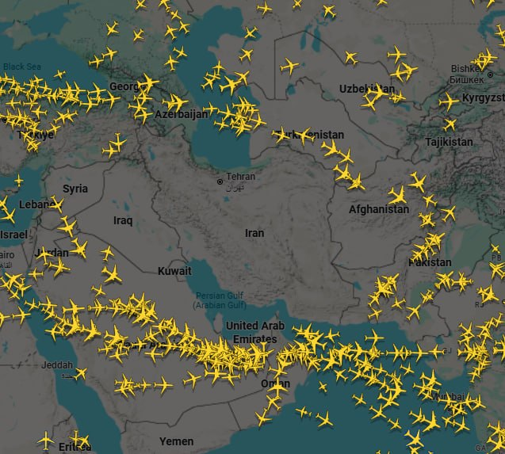

🚨
⭕️ آخرین شرایط ترافیک هوایی در منطقه
#خاورمیانه
@DEJradio

## kianmeli1 — post 87229

🔴فوری-میدل ایست: امارات متحده عربی به ایران حمله کرده
https://t.me/kianmeli1

## kianmeli1 — post 87228

🔴ساعت حدود ۲۳:۱۵ پنجشنبه؛ تعداد ۷ یا ۸ موشک از جنوب هرمزگان به سمت محدوده‌ی تنگه هرمز شلیک شد.
https://t.me/kianmeli1

## Shin_Persian — post 5867

Shin ✓ @hey_itsmyturn
Thu, 07 May 2026 19:50:09 UTC

Earlier: AA activity in Bidganeh (Bidkaneh), West of Tehran
Regime confirms, adds that it was "due to testing the air defense systems"

فارسی

پیش‌تر: فعالیت پدافند هوایی در بیدگنه، غرب تهران
رژیم تایید کرد و افزود که این موضوع «به دلیل آزمایش سامانه‌های پدافند هوایی» بوده است.

𝕏 · @shin_persian

## Shin_Persian — post 5866

↩️ Quoted tweet: Josh Young ✓ @JoshYoung Thu, 07 May 2026 19:43:33 UTC "Peace" in the Middle East sure is different! https://x.com/i/status/2052467946404950427 ↩️ توییت نقل‌قول شده — برای پاسخ، پست زیر را ببینید. فارسی «صلح» در خاورمیانه واقعاً متفاوت…

## Shin_Persian — post 5865

↩️ Quoted tweet:
Josh Young ✓ @JoshYoung
Thu, 07 May 2026 19:43:33 UTC

"Peace" in the Middle East sure is different!
https://x.com/i/status/2052467946404950427

↩️ توییت نقل‌قول شده — برای پاسخ، پست زیر را ببینید.

فارسی

«صلح» در خاورمیانه واقعاً متفاوت است!
https://x.com/i/status/2052467946404950427

𝕏 · @shin_persian

## Iliaen — post 4427

ساعت حدود ۲۳:۱۵ پنجشنبه؛ تعداد ۷ یا ۸ موشک از جنوب هرمزگان به سمت محدوده‌ی تنگه هرمز شلیک شد.

@iliaen

## FarsiVOA — post 217138

🔺دونالد ترامپ: جمهوری اسلامی «که مردم خودش را می‌کشد نباید کنترل بمبی را داشته باشد که می‌تواند میلیون‌ها نفر را بکشد»

▪️دونالد ترامپ، رئیس جمهوری آمریکا روز پنجشنبه در تروت‌سوشال اعلام کرد که با اورزولا فون در لاین، رئیس کمیسیون اروپا «تماس بسیار خوبی» داشت و در این تماس در مورد ایران گفت‌وگو کرد.

⬇️ بیشتر بخوانید:
https://ir.voanews.com/a/8147693.html
@FarsiVOA

## FarsiVOA — post 217137

  <a href="telegram/content/FarsiVOA_217137_1778183549.mp4">🎬 Download video</a>

⚡️بن‌بست تجاری اروپا و آمریکا در کنار نشست بروکسل‌؛ چالش‌های جدید اقتصاد و رقابت جهانی
@FarsiVOA

## Persian_Trend_Official — post 13625

همراهان پرشین ترند که فیلم یا عکسی از حملات امشب دارند به پی وی من ارسال کنند 🫶🙏

@Tony_Soprano007

## BBCPersian — post 280434

  <a href="telegram/content/BBCPersian_280434_1778183550.mp4">🎬 Download video</a>

🔴 از آن که گزارش‌هایی در مورد شنیده شدن صدای انفجارهایی در حوالی بندرعباس و جزیره قشم در رسانه‌های ایران منتشر شد، خبرگزاری فارس اکنون می‌گوید که بررسی‌هایش نشان می‌دهد «در جریان تبادل آتش میان نیروهای مسلح ایران و دشمن بخش‌هایی تجاری اسکله بهمن قشم هدف قرار گرفته است.»
خبرگزاری صدا و سیما هم گزارش کرده «انفجار در اسکله بهمن قشم در جریان تبادل آتش میان نیروهای مسلح ایران و دشمن رخ داده است.»
به گزارش صدا و سیما، ساختمان اداری این اسکله هدف حمله بود.

https://bbc.in/4etLM7w
@BBCPersian

## Dirty_Kids — post 389060

ساعت حدود ۲۳:۱۵ پنجشنبه؛ تعداد ۷ یا ۸ موشک از جنوب هرمزگان به سمت محدوده‌ی تنگه هرمز شلیک شد.

@Dirty_Kids 👻

## alonews — post 118479

  <a href="telegram/content/alonews_118479_1778183551.jpg">🎬 Download video</a>

👈یک مقام آگاه نظامی: به دنبال تعرض ارتش متجاوز آمریکا به یک نفت کش ایرانی یگان های متعرض دشمن در محدوده تنگه هرمز زیر آتش موشکی ایران قرار گرفتند که پس از تحمل خسارت مجبور به فرار شدند

✅ @AloNews خبر جنگ

## alonews — post 118478

  <a href="telegram/content/alonews_118478_1778183551.mp4">🎬 Download video</a>

👈دقایقی پیش، آسمان بندرعباس

✅ @AloNews خبر جنگ

## alonews — post 118477

  <a href="telegram/content/alonews_118477_1778183552.jpg">🎬 Download video</a>

👈علت شلیک پدافند هوایی در غرب کشور، ورود ریز پرنده های شناسایی بوده است

✅ @AloNews خبر جنگ

## alonews — post 118475

  <a href="telegram/content/alonews_118475_1778183552.jpg">🎬 Download video</a>

👈آسمان خاورمیانه هم اکنون !

✅ @AloNews خبر جنگ

---
📅 بروزرسانی: 1405/02/17 23:12
---

## VahidOOnLine — post 238730

  

نماینده کویت در سازمان ملل در نشست شورای امنیت گفت حمایت گسترده از پیش‌نویس قطعنامه تنگه هرمز بیانگر تعهد مشترک کشورها به آزادی ناوبری، امنیت مسیرهای دریایی و احترام به حقوق بین‌الملل است. او تاکید کرد این اصول مسئولیت‌هایی جمعی هستند که مستقیما با حفظ صلح و امنیت بین‌المللی ارتباط دارند.

نماینده کویت افزود اهمیت این پیش‌نویس در تاکید دوباره بر اصل بنیادین نظم بین‌المللی است؛ اینکه آبراه‌های بین‌المللی باید باز و امن باقی بمانند و نباید تحت تهدید یا محدودیت‌های غیرقانونی قرار گیرند.

او گفت هرگونه تلاش برای جلوگیری از عبور قانونی از تنگه هرمز پیامدهایی فراتر از منطقه دارد و بر چارچوب قواعد حاکم بر ناوبری بین‌المللی تاثیر می‌گذارد. به گفته او، این پیش‌نویس با هدف تشدید تنش‌ها ارائه نشده، بلکه بر توازن میان حقوق کشورهای ساحلی و حقوق جامعه بین‌المللی برای ناوبری ایمن تاکید می‌کند و هر اقدام تهدیدکننده کشتیرانی را رد می‌کند.
‌🏁 🇬🇧 IranintlTV

🤖 @VahidOOnLine

## VahidOOnLine — post 238729

  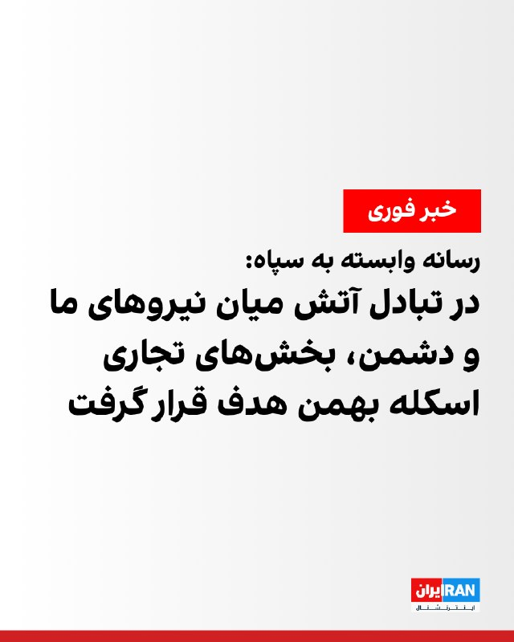

خبرگزاری فارس، وابسته به سپاه پاسداران، گزارش داد بررسی‌ها در بندرعباس نشان می‌دهد در جریان تبادل آتش میان نیروهای مسلح جمهوری اسلامی و دشمن، بخش‌های تجاری اسکله بهمن هدف قرار گرفته است.

همزمان گزارش‌های رسیده به ایران اینترنشنال حاکی است ساعت ۲۲:۱۵ در قشم و بندرعباس صدای چندین انفجار شنیده شده و پدافندها فعال بوده‌اند.

براساس گزارش‌های رسیده به ایران اینترنشنال، در ساعت ۲۲:۲۷ نیز در شهرستان سیریک شلیک موشک گزارش شده است.
‌🏁 🇬🇧 IranintlTV

🤖 @VahidOOnLine

## VahidOOnLine — post 238728

  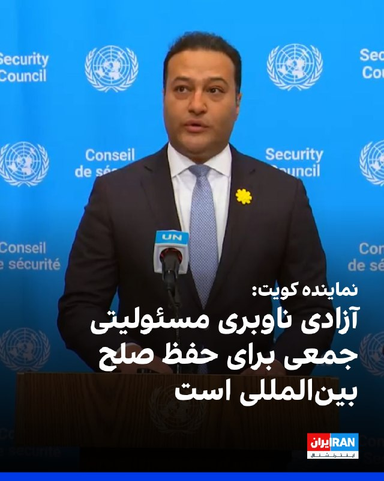

نماینده کویت در سازمان ملل در نشست شورای امنیت گفت حمایت گسترده از پیش‌نویس قطعنامه تنگه هرمز بیانگر تعهد مشترک کشورها به آزادی ناوبری، امنیت مسیرهای دریایی و احترام به حقوق بین‌الملل است. او تاکید کرد این اصول مسئولیت‌هایی جمعی هستند که مستقیما با حفظ صلح و امنیت بین‌المللی ارتباط دارند.

نماینده کویت افزود اهمیت این پیش‌نویس در تاکید دوباره بر اصل بنیادین نظم بین‌المللی است؛ اینکه آبراه‌های بین‌المللی باید باز و امن باقی بمانند و نباید تحت تهدید یا محدودیت‌های غیرقانونی قرار گیرند.

او گفت هرگونه تلاش برای جلوگیری از عبور قانونی از تنگه هرمز پیامدهایی فراتر از منطقه دارد و بر چارچوب قواعد حاکم بر ناوبری بین‌المللی تاثیر می‌گذارد. به گفته او، این پیش‌نویس با هدف تشدید تنش‌ها ارائه نشده، بلکه بر توازن میان حقوق کشورهای ساحلی و حقوق جامعه بین‌المللی برای ناوبری ایمن تاکید می‌کند و هر اقدام تهدیدکننده کشتیرانی را رد می‌کند.
‌🏁 🇬🇧 IranintlTV

🤖 @VahidOOnLine

## VahidOOnLine — post 238727

  

نماینده کویت در سازمان ملل در نشست شورای امنیت گفت حمایت گسترده از پیش‌نویس قطعنامه تنگه هرمز بیانگر تعهد مشترک کشورها به آزادی ناوبری، امنیت مسیرهای دریایی و احترام به حقوق بین‌الملل است. او تاکید کرد این اصول مسئولیت‌هایی جمعی هستند که مستقیما با حفظ صلح و امنیت بین‌المللی ارتباط دارند.

نماینده کویت افزود اهمیت این پیش‌نویس در تاکید دوباره بر اصل بنیادین نظم بین‌المللی است؛ اینکه آبراه‌های بین‌المللی باید باز و امن باقی بمانند و نباید تحت تهدید یا محدودیت‌های غیرقانونی قرار گیرند.

او گفت هرگونه تلاش برای جلوگیری از عبور قانونی از تنگه هرمز پیامدهایی فراتر از منطقه دارد و بر چارچوب قواعد حاکم بر ناوبری بین‌المللی تاثیر می‌گذارد. به گفته او، این پیش‌نویس با هدف تشدید تنش‌ها ارائه نشده، بلکه بر توازن میان حقوق کشورهای ساحلی و حقوق جامعه بین‌المللی برای ناوبری ایمن تاکید می‌کند و هر اقدام تهدیدکننده کشتیرانی را رد می‌کند.
‌🏁 🇬🇧 IranintlTV

🤖 @VahidOOnLine

## VahidOOnLine — post 238726

♦️علی خضریان نماینده مجلس شورای اسلامی در یک برنامه تلویزیونی گفت: «نگاه ایران به امارات تغییر کرده و این کشور را دیگر همسایه نمی‌داند بلکه پایگاه متخاصم دشمن می‌داند.»

خضریان در برنامه «جان فدا» از شبکه سوم صداوسیما با اشاره به جنگ ۴۰ روزه تاکید کرد که «دکترین جدید نظامی و دفاعی ایران در خصوص امارات به مانند اقلیم کردستان عراق است و امارات را پایگاه متخاصم دشمن می داند.»

او اضافه کرد: «تنها در شرایطی که تصمیم بگیرد دیگر با کشورهای دشمن ایران همکاری نکند این شرایط می‌تواند تغییر کند.»

این اظهارات در حالی مطرح شده است که جاسم محمد البدیوی، دبیرکل شورای همکاری خلیج فارس، پنجشنبه‌شب ۱۷ اردیبهشت‌ماه، اظهارات مطرح‌شده در بیانیه وزارت خارجه جمهوری اسلامی علیه امارات متحده عربی را به‌شدت محکوم کرد و گفت شورای همکاری در برابر این «ادعاهای باطل و تجاوزها» کاملا در کنار ابوظبی ایستاده است.

روز سه‌شنبه ۱۵ اردیبهشت، قرارگاه خاتم‌الانبیا ادعاهای امارات درباره حملات موشکی و پهپادی از مبدا ایران را تکذیب کرد و گفت جمهوری اسلامی در روزهای اخیر حمله‌ای علیه خاک امارات انجام نداده است.
‌🇸🇦 Indypersian

🤖 @VahidOOnLine

## VahidOOnLine — post 238725

  <a href="telegram/content/VahidOOnLine_238725_1778182941.mp4">🎬 Download video</a>

تماسی از تهران:
«با همه سختی‌ها، هنوز باید پشت هم باشیم؛
هیچ‌کس از بیرون قرار نیست نجاتمون بده، خودمون باید به هم کمک کنیم و بایستیم.»
‌🏁 🇬🇧 ManotoTV

🤖 @VahidOOnLine

## mwarmonitor — post 8652

  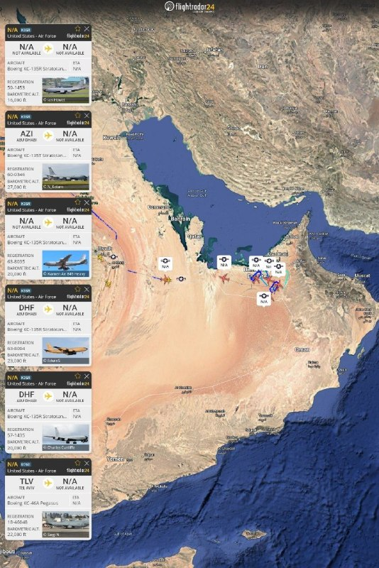

✈️فقط تانکرهای سوخت‌رسان نیروی هوایی آمریکا (USAF) قابل مشاهده هستند که از پایگاه هوایی الظفره و تل‌آویو برخاسته‌اند.

@mwarmonitor

## mwarmonitor — post 8651

🇺🇸آمریکا شروع به لغو گذرنامه والدینی خواهد کرد که بیش از ۱۰۰٬۰۰۰ دلار بدهی پرداخت‌نشده نفقه فرزند دارند و به‌زودی این سقف را به ۲٬۵۰۰ دلار نیز گسترش خواهد داد — آسوشیتدپرس

@mwarmonitor

## pm_afshaa — post 90313

  

فیلترشکن v2rayپرسرعت ‼️
                                                    

✅ مناسب برای تمام اینترنت‌ها (همراه اول ایرانسل رایتل اینترنت خانگی و ..)

✅ قابل استفاده برای تمام سیستم عامل ها 

😎 ضمانت بازگشت وجه در صورت عدم اتصال

✅ پشتیبانی ۲۴ ساعته تا آخرین مدت اعتبار اشتراک   
  

😎 اشتراک 10 گیگ 😎

✅ فقط و فقط 1/500/000 ✅

👩‍💻 آیدی ثبت سفارش✨پشتیبانی #خریدوفروش : 👇
@SuportSevenStarsVpn

لینک ورود به کانال اصلی:
            
 https://t.me/sevenstars_VPN

## pm_afshaa — post 90312

🔴مصر از استقرار یک اسکادران جنگنده رافائل در امارات خبر داد.

+این جنگنده‌ها به رهگیری پهپادهای سپاه و دفاع از امارات کمک خواهند کرد

💧 Rainbet.com the #1 Non-KYC Crypto Casino & Sportsbook @rainbetcom

😁 @Pm_Afshaa

## pm_afshaa — post 90311

تسنیم: اگه امارات زده باشه ماهم میزنیمش

💧 Rainbet.com the #1 Non-KYC Crypto Casino & Sportsbook @rainbetcom

😁 @Pm_Afshaa

## pm_afshaa — post 90310

🔴کانال 12 اسرائیل : اسرائیل هیچ نقشی در اتفاقات امشب ایران نداره

💧 Rainbet.com the #1 Non-KYC Crypto Casino & Sportsbook @rainbetcom

😁 @Pm_Afshaa

## DEJradio — post 4485

  <a href="telegram/content/DEJradio_4485_1778182945.jpg">🎬 Download video</a>

🚨
⭕️ صدای انفجارها در مناطق بندرعباس و قشم ادامه دارد. #انفجار @DEJradio

## mamlekate — post 103470

📝 آیا ترامپ پیروزی در جنگ ایران را با شکست عوض می‌کند؟

مارک ای. تیسن، ستون‌نویس روزنامه واشینگتن‌پست در تحلیلی به تصمیمات و اقدامات اخیر دونالد ترامپ، رییس‌جمهوری آمریکا، پرداخته و هشدار داده که او در آستانه آن است که پیروزی در جنگ ایران را با شکست معاوضه کند زیرا نحوه پایان دادن به جنگ، به اندازه نحوه آغاز آن اهمیت دارد.

@mamlekate

## kianmeli1 — post 87227

🔴فوری-صداسیما: امیدواریم امارات به ایران حمله کند اما جرات ندارد
https://t.me/kianmeli1

## IranIntlTV — post 336026

  <a href="https://t.me/IranintlTV/336026">📎 Download file</a>

🎧نسخه صوتی دومینو: یک ملت در گروگان
@iranintlTV

## IranIntlTV — post 336025

  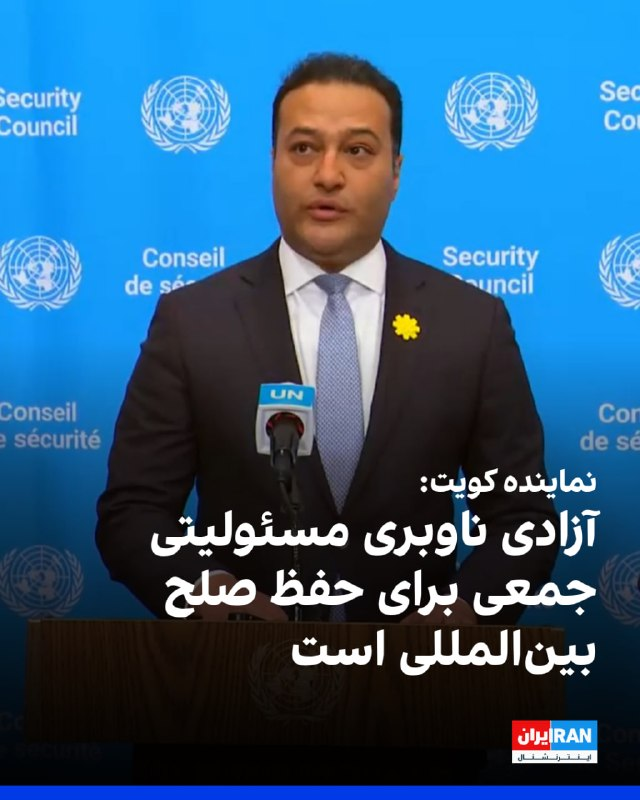

نماینده کویت در سازمان ملل در نشست شورای امنیت گفت حمایت گسترده از پیش‌نویس قطعنامه تنگه هرمز بیانگر تعهد مشترک کشورها به آزادی ناوبری، امنیت مسیرهای دریایی و احترام به حقوق بین‌الملل است. او تاکید کرد این اصول مسئولیت‌هایی جمعی هستند که مستقیما با حفظ صلح و امنیت بین‌المللی ارتباط دارند.

نماینده کویت افزود اهمیت این پیش‌نویس در تاکید دوباره بر اصل بنیادین نظم بین‌المللی است؛ اینکه آبراه‌های بین‌المللی باید باز و امن باقی بمانند و نباید تحت تهدید یا محدودیت‌های غیرقانونی قرار گیرند.

او گفت هرگونه تلاش برای جلوگیری از عبور قانونی از تنگه هرمز پیامدهایی فراتر از منطقه دارد و بر چارچوب قواعد حاکم بر ناوبری بین‌المللی تاثیر می‌گذارد. به گفته او، این پیش‌نویس با هدف تشدید تنش‌ها ارائه نشده، بلکه بر توازن میان حقوق کشورهای ساحلی و حقوق جامعه بین‌المللی برای ناوبری ایمن تاکید می‌کند و هر اقدام تهدیدکننده کشتیرانی را رد می‌کند.
https://iranintl.com/202605073148

## IranIntlTV — post 336024

  

خبرگزاری فارس، وابسته به سپاه پاسداران، گزارش داد بررسی‌ها در بندرعباس نشان می‌دهد در جریان تبادل آتش میان نیروهای مسلح جمهوری اسلامی و دشمن، بخش‌های تجاری اسکله بهمن هدف قرار گرفته است.

همزمان گزارش‌های رسیده به ایران اینترنشنال حاکی است ساعت ۲۲:۱۵ در قشم و بندرعباس صدای چندین انفجار شنیده شده و پدافندها فعال بوده‌اند.

براساس گزارش‌های رسیده به ایران اینترنشنال، در ساعت ۲۲:۲۷ نیز در شهرستان سیریک شلیک موشک گزارش شده است.
https://iranintl.com/202605076548

## Shin_Persian — post 5863

Shin ✓ @hey_itsmyturn
Thu, 07 May 2026 19:38:37 UTC

It's raining tankers in the Middle East.

فارسی

باران تانکرها در خاورمیانه در حال باریدن است.

𝕏 · @shin_persian

## Shin_Persian — post 5861

Shin ✓ @hey_itsmyturn Thu, 07 May 2026 19:35:08 UTC IRGC-owned Tasnim News cites "sources" regarding the explosions in Qeshm: "Some sources report that the sounds of several explosions in Bandar Abbas were related to air defense engaging two micro-drones…

## Shin_Persian — post 5860

Shin ✓ @hey_itsmyturn
Thu, 07 May 2026 19:35:08 UTC

IRGC-owned Tasnim News cites "sources" regarding the explosions in Qeshm:

"Some sources report that the sounds of several explosions in Bandar Abbas were related to air defense engaging two micro-drones (quadcopters).

Additionally, some sources report hostile action by the UAE government acting as a tool of the Zionist regime at Bahman Pier in Qeshm.

This matter has not yet been officially confirmed or announced.

Should this issue be confirmed, the UAE will pay the price for its hostile action."

فارسی

خبرگزاری تسنیم متعلق به سپاه پاسداران انقلاب اسلامی (IRGC) با استناد به «منابع آگاه» درباره انفجارهای قشم گزارش داد:

«برخی منابع گزارش می‌دهند که صدای چندین انفجار در بندرعباس مربوط به درگیری پدافند هوایی با دو ریزپرنده (کواڈکوپتر) بوده است.

علاوه بر این، برخی منابع از اقدام خصمانه دولت امارات متحده عربی به عنوان ابزار رژیم صهیونیستی در اسکله بهمن قشم خبر می‌دهند.

این موضوع هنوز به طور رسمی تایید یا اعلام نشده است.

در صورت تایید این موضوع، امارات هزینه اقدام خصمانه خود را پرداخت خواهد کرد.»

𝕏 · @shin_persian

## ManotoTV — post 105104

  <a href="telegram/content/ManotoTV_105104_1778182947.mp4">🎬 Download video</a>

تماسی از تهران:
«با همه سختی‌ها، هنوز باید پشت هم باشیم؛
هیچ‌کس از بیرون قرار نیست نجاتمون بده، خودمون باید به هم کمک کنیم و بایستیم.»

## FarsiVOA — post 217136

⚡️بحران مسکن و اجاره بها، یکی از نگرانی‌های بی‌پایان مردم ایران؛ نگاه کاربران شبکه‌های اجتماعی
@FarsiVOA

## Persian_Trend_Official — post 13624

🔴میدل ایست

هم اکنون امارات متحده عربی به ایران حمله کرده است/مهر

## Persian_Trend_Official — post 13623

Live stream started

## Persian_Trend_Official — post 13622

کانال رسمی پرشین ترند pinned «https://youtube.com/live/f_XbdlsXjOY?feature=share تا 10 دقیقه دیگه لایو آغاز میشه»

## Persian_Trend_Official — post 13621

گزارشات غیر رسمی از شلیک موشک به سمت امارات خبر میدهند......

## IranianMinds — post 19725

🔴 صداوسیما : امارات جرات نداره بهمون حمله کنه @IranianMinds

## IranianMinds — post 19724

🔴 صداوسیما : امارات جرات نداره بهمون حمله کنه

@IranianMinds

## IranianMinds — post 19723

زدن هم زدنای قدیم ...

## BBCPersian — post 280433

  <a href="telegram/content/BBCPersian_280433_1778182949.mp4">🎬 Download video</a>

🔻آخرین خبرهای مهم روز پنج‌شنبه ۱۷ اردیبهشت ۱۴۰۵

@BBCPersian

## Dirty_Kids — post 389059

تسنیم گفته احتمالا انفجارا تو بندر بهمن کار امارات بود

@Dirty_Kids 👻

## Dirty_Kids — post 389058

‏کرونا رو هم اولش گفتیم کسشره بابا، یهو دیدیم داریم چیپس میشوریم

@Dirty_Kids 👻

## alonews — post 118473

  <a href="telegram/content/alonews_118473_1778182951.jpg">🎬 Download video</a>

👈صداوسیما: انفجار در اسکله بهمن قشم در جریان تبادل آتش میان نیروهای مسلح ایران و دشمن رخ داده است

✅ @AloNews خبر جنگ

## alonews — post 118472

  <a href="telegram/content/alonews_118472_1778182951.jpg">🎬 Download video</a>

👈تسنیم: اگه امارات زده باشه ماهم میزنیمش

✅ @AloNews خبر جنگ

## alonews — post 118471

  <a href="telegram/content/alonews_118471_1778182952.jpg">🎬 Download video</a>

👈صدای چند انفجار در بندرعباس، جنوب ایران، مربوط به مقابله پدافند هوایی با دو پهپاد بود، به گزارش تسنیم و به نقل از منابع.

✅ @AloNews خبر جنگ

## alonews — post 118470

  <a href="telegram/content/alonews_118470_1778182952.jpg">🎬 Download video</a>

👈مهر : سپاه داره بررسی میکنه ببینه کار اماراته یا نه

✅ @AloNews خبر جنگ

---
📅 بروزرسانی: 1405/02/17 23:02
---

## VahidOOnLine — post 238724

  <a href="telegram/content/VahidOOnLine_238724_1778182357.mp4">🎬 Download video</a>

‌
رسانه‌های داخلی ایران از شنیده شدن چندین صدای انفجار در مناطق جنوبی کشور از جمله بندرعباس، قشم و سیرک خبر داده‌اند.

بر اساس گزارش‌ها، شهروندان بندرعباس دقایقی پیش چند صدای «شبیه به انفجار» در اطراف این شهر شنیده‌اند. به نوشته رسانه‌ها، هنوز منشا و محل دقیق این صداها مشخص نیست و بررسی‌ها برای روشن شدن ابعاد ماجرا ادامه دارد.

همزمان برخی گزارش‌ها حاکی از شنیده شدن صدای انفجار در جزیره قشم، از جمله در محدوده اسکله مسافربری بهمن، و همچنین در شهرستان سیرک است.

خبرگزاری حکومتی تسنیم به نقل از منابعی اعلام کرده برخی از این صداها «مرتبط با عملیات نیروی دریایی سپاه پاسداران» بوده و با هدف هشدار به کشتی‌ها درباره عبور از تنگه هرمز انجام شده است.

با این حال، جزئیات بیشتری درباره ماهیت دقیق این انفجارها منتشر نشده و مقام‌های رسمی تاکنون توضیح شفافی در این‌باره ارائه نکرده‌اند.
‌🏁 🇬🇧 ManotoTV

🤖 @VahidOOnLine

## VahidOOnLine — post 238723

  <a href="telegram/content/VahidOOnLine_238723_1778182358.mp4">🎬 Download video</a>

تماس یک دختر ۹ ساله از رفسنجان
‌🏁 🇬🇧 ManotoTV

🤖 @VahidOOnLine

## VahidOOnLine — post 238722

  

♦️ خبرگزاری فارس، وابسته به سپاه پاسداران، در خبری اختصاصی اعلام کرد که صداهای انفجار که پنجشنبه‌شب، ۱۷ اردیبهشت در حوالی بندرعباس شنیده شد، مربوط به «تبادل آتش» میان نیروهای مسلح جمهوری اسلامی و ایالات متحده بوده است. به گفته فارس، در جریان این تبادل آتش، بخش‌هایی از اسکله بهمن در جزیره قشم هدف قرار گرفته است.
‌🇸🇦 Indypersian

🤖 @VahidOOnLine

## pm_afshaa — post 90309

🔴العربیه:حملات از طرف اسرائیل و امریکا نبوده

💧 Rainbet.com the #1 Non-KYC Crypto Casino & Sportsbook @rainbetcom

😁 @Pm_Afshaa

## pm_afshaa — post 90308

فارس:بررسی‌ها در بندرعباس نشان می‌دهد در جریان تبادل آتش میان نیروهای مسلح جمهوری اسلامی و دشمن بخش‌های تجاری اسکله بهمن هدف قرار گرفته

💧 Rainbet.com the #1 Non-KYC Crypto Casino & Sportsbook @rainbetcom

😁 @Pm_Afshaa

## pm_afshaa — post 90307

🔴خبرگزاری مهر حمله جنگنده های امارات عربی متحده به بنادر جنوبی ایران را تایید کرد

💧 Rainbet.com the #1 Non-KYC Crypto Casino & Sportsbook @rainbetcom

😁 @Pm_Afshaa

## pm_afshaa — post 90306

🔴صدای انفجار در قشم و بندر عباس 
💧 Rainbet.com the #1 Non-KYC Crypto Casino & Sportsbook @rainbetcom 
😁 @Pm_Afshaa

## pm_afshaa — post 90305

🔴صدای انفجار در قشم و بندر عباس

💧 Rainbet.com the #1 Non-KYC Crypto Casino & Sportsbook @rainbetcom

😁 @Pm_Afshaa

## pm_afshaa — post 90304

  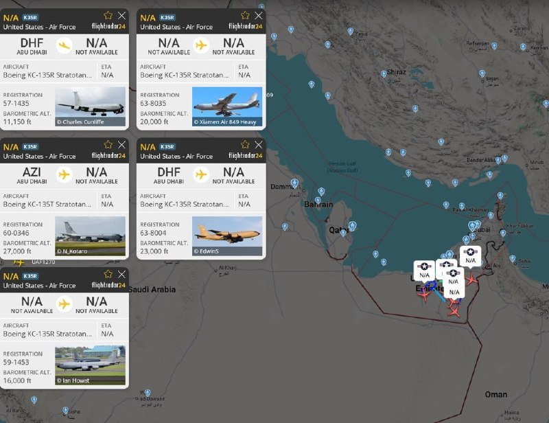

چندین هواپیمای سوخت‌رسان KC-135 نیروی هوایی ایالات متحده از امارات متحده عربی برخاستن

💧 Rainbet.com the #1 Non-KYC Crypto Casino & Sportsbook @rainbetcom

😁 @Pm_Afshaa

## DEJradio — post 4484

  <a href="telegram/content/DEJradio_4484_1778182362.jpg">🎬 Download video</a>

🚨
⭕️ صدای انفجارها در مناطق بندرعباس و قشم ادامه دارد.

#انفجار
@DEJradio

## DEJradio — post 4483

  <a href="telegram/content/DEJradio_4483_1778182363.mp4">🎬 Download video</a>

🎥
🔸 علی رضوانی؛ بازجو-خبرنگار و قطعه‌ای از پازل سپاه و وزارت اطلاعات

#اطلاعات #IRGCterrorists
@DEJradio

## VahidOnline — post 75305

  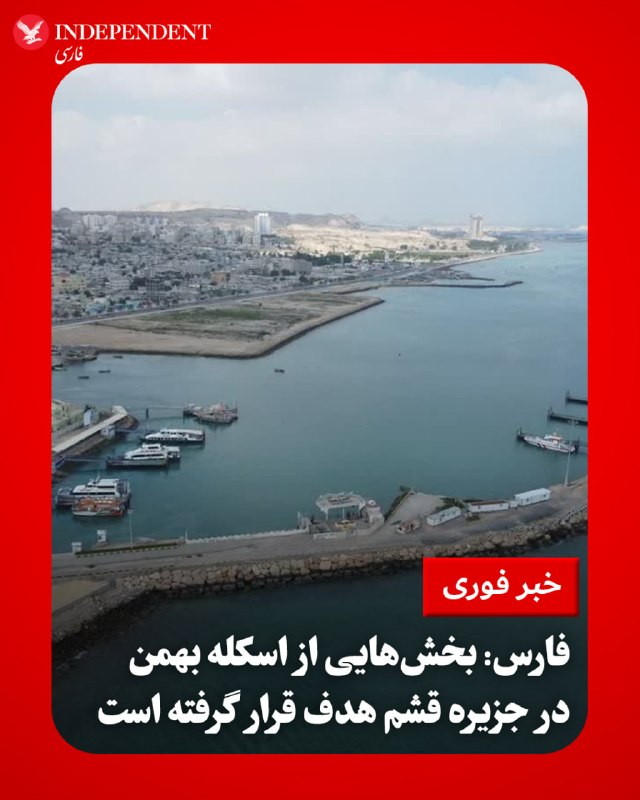

خبرگزاری فارس، وابسته به سپاه پاسداران، در خبری اختصاصی اعلام کرد که صداهای انفجار که پنجشنبه‌شب، ۱۷ اردیبهشت در حوالی بندرعباس شنیده شد، مربوط به «تبادل آتش» میان نیروهای مسلح جمهوری اسلامی و ایالات متحده بوده است.
به گفته فارس، در جریان این تبادل آتش، بخش‌هایی از اسکله بهمن در جزیره قشم هدف قرار گرفته است.
@VahidOOnLine

📡 @VahidOnline

## Shin_Persian — post 5859

  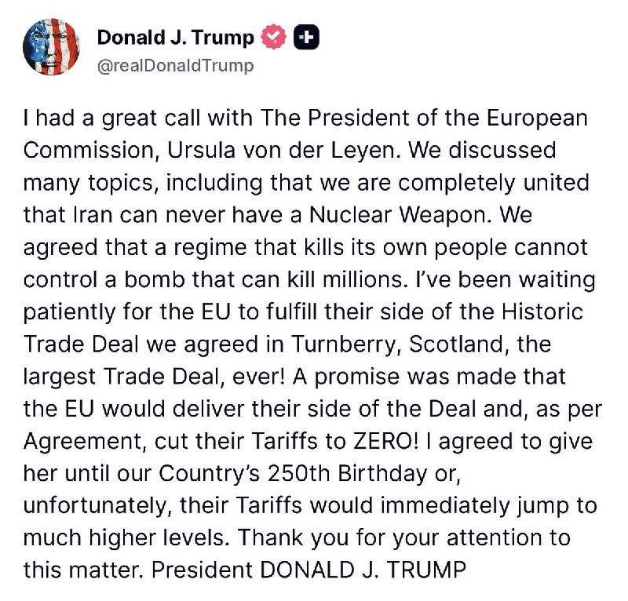

Rapid Response 47 ✓ @RapidResponse47
Thu, 07 May 2026 19:09:01 UTC

𝕏 · @shin_persian

## ManotoTV — post 105103

  <a href="telegram/content/ManotoTV_105103_1778182368.mp4">🎬 Download video</a>

‌
رسانه‌های داخلی ایران از شنیده شدن چندین صدای انفجار در مناطق جنوبی کشور از جمله بندرعباس، قشم و سیرک خبر داده‌اند.

بر اساس گزارش‌ها، شهروندان بندرعباس دقایقی پیش چند صدای «شبیه به انفجار» در اطراف این شهر شنیده‌اند. به نوشته رسانه‌ها، هنوز منشا و محل دقیق این صداها مشخص نیست و بررسی‌ها برای روشن شدن ابعاد ماجرا ادامه دارد.

همزمان برخی گزارش‌ها حاکی از شنیده شدن صدای انفجار در جزیره قشم، از جمله در محدوده اسکله مسافربری بهمن، و همچنین در شهرستان سیرک است.

خبرگزاری حکومتی تسنیم به نقل از منابعی اعلام کرده برخی از این صداها «مرتبط با عملیات نیروی دریایی سپاه پاسداران» بوده و با هدف هشدار به کشتی‌ها درباره عبور از تنگه هرمز انجام شده است.

با این حال، جزئیات بیشتری درباره ماهیت دقیق این انفجارها منتشر نشده و مقام‌های رسمی تاکنون توضیح شفافی در این‌باره ارائه نکرده‌اند.

## ManotoTV — post 105102

  <a href="telegram/content/ManotoTV_105102_1778182369.mp4">🎬 Download video</a>

تماس یک دختر ۹ ساله از رفسنجان

## FarsiVOA — post 217135

⚡️ماهیت ارائه اینترنت به گروههای خاص و برنامه‌های حکومت برای بسته نگه‌داشتن ارتباط دیجیتال عموم مردم؛ گفت‌وگو با امیر رشیدی
@FarsiVOA

## Persian_Trend_Official — post 13620

https://youtube.com/live/f_XbdlsXjOY?feature=share

تا 10 دقیقه دیگه لایو آغاز میشه

## Persian_Trend_Official — post 13619

  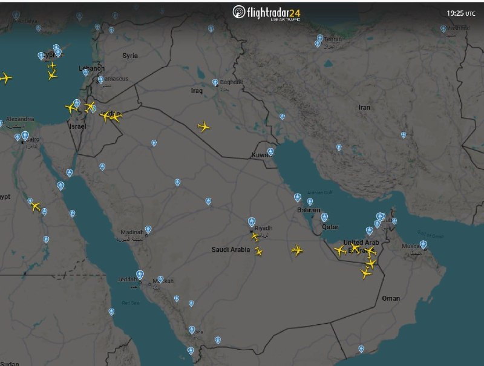

آخرین بروز رسانی فلایت رادار ....
پرواز سوخت رسان های آمریکایی از فرودگاه های اسرائیلی به سوی خلیج فارس

## IranianMinds — post 19722

🔴 کانال 12 اسرائیل :

اسرائیل هیچ نقشی در اتفاقات امشب ایران نداره

@IranianMinds

## IranianMinds — post 19721

🔴 خبرگزاری مهر :

داریم تحقیق میکنیم ببینیم امارات زده یا نه

@IranianMinds

## IranianMinds — post 19720

🔴 صدای انفجار مجدد در قشم

@IranianMinds

## IranianMinds — post 19719

🔴العربیه:

حملات از طرف اسرائیل و امریکا نبوده است.

@IranianMinds

## IranianMinds — post 19718

🔴 خبرگزاری فارس :

اسرائیل میگه ما نزدیم احتمالا کار امارات بوده داریم تحقیق میکنیم ببینیم کی زده

@IranianMinds

## IranianMinds — post 19717

🔴 5 تا هواپیمای سوخت رسان از امارات بلند شدن @IranianMinds

## Dirty_Kids — post 389057

  <a href="telegram/content/Dirty_Kids_389057_1778182372.jpg">🎬 Download video</a>

🔴خبرگزاری فارس نوشت:
بررسی‌ها در بندرعباس نشان می‌دهد در جریان تبادل آتش میان نیروهای مسلح جمهوری اسلامی ایران و دشمن بخش‌های تجاری اسکله بهمن هدف قرار گرفته است.

🔴العربیه به نقل از یک مقام اسرائیلی:
اسرائیل هیچ نقشی در انفجارهای اخیر ایران نداشته است.

@Dirty_Kids 👻

## manototv — post 105104

  <a href="telegram/content/manototv_105104_1778182373.mp4">🎬 Download video</a>

تماسی از تهران:
«با همه سختی‌ها، هنوز باید پشت هم باشیم؛
هیچ‌کس از بیرون قرار نیست نجاتمون بده، خودمون باید به هم کمک کنیم و بایستیم.»

## manototv — post 105103

  <a href="telegram/content/manototv_105103_1778182376.mp4">🎬 Download video</a>

‌
رسانه‌های داخلی ایران از شنیده شدن چندین صدای انفجار در مناطق جنوبی کشور از جمله بندرعباس، قشم و سیرک خبر داده‌اند.

بر اساس گزارش‌ها، شهروندان بندرعباس دقایقی پیش چند صدای «شبیه به انفجار» در اطراف این شهر شنیده‌اند. به نوشته رسانه‌ها، هنوز منشا و محل دقیق این صداها مشخص نیست و بررسی‌ها برای روشن شدن ابعاد ماجرا ادامه دارد.

همزمان برخی گزارش‌ها حاکی از شنیده شدن صدای انفجار در جزیره قشم، از جمله در محدوده اسکله مسافربری بهمن، و همچنین در شهرستان سیرک است.

خبرگزاری حکومتی تسنیم به نقل از منابعی اعلام کرده برخی از این صداها «مرتبط با عملیات نیروی دریایی سپاه پاسداران» بوده و با هدف هشدار به کشتی‌ها درباره عبور از تنگه هرمز انجام شده است.

با این حال، جزئیات بیشتری درباره ماهیت دقیق این انفجارها منتشر نشده و مقام‌های رسمی تاکنون توضیح شفافی در این‌باره ارائه نکرده‌اند.

## manototv — post 105102

  <a href="telegram/content/manototv_105102_1778182377.mp4">🎬 Download video</a>

تماس یک دختر ۹ ساله از رفسنجان

## alonews — post 118469

  

👈ارسالی از سیریک و گزارش شلیک و صدای جنگنده

✅ @AloNews خبر جنگ

## alonews — post 118468

  <a href="telegram/content/alonews_118468_1778182381.jpg">🎬 Download video</a>

👈منابع محلی: در اسکله مسافربری بهمن در قشم دود سیاه دیده می‌شود

✅ @AloNews خبر جنگ

## alonews — post 118467

  <a href="telegram/content/alonews_118467_1778182381.jpg">🎬 Download video</a>

🔴فوووووووووووووووووووری

## alonews — post 118466

🔴فوووووووووووووووووووری

## alonews — post 118465

  <a href="telegram/content/alonews_118465_1778182382.jpg">🎬 Download video</a>

👈میدل ایست : امارات متحده عربی به ایران حمله کرده

✅ @AloNews خبر جنگ

## alonews — post 118464

  <a href="telegram/content/alonews_118464_1778182382.jpg">🎬 Download video</a>

👈دوباره شنیده شدن صدای انفجار در بندر عباس و قشم

✅ @AloNews خبر جنگ

## alonews — post 118463

  <a href="telegram/content/alonews_118463_1778182382.jpg">🎬 Download video</a>

👈فارس نیز به خبر برخی منابع اسراییلی اشاره کرده و از احتمال نقش داشتن امارات در حوادث امشب را مطرح کرده

✅ @AloNews خبر جنگ

## alonews — post 118462

  <a href="telegram/content/alonews_118462_1778182383.jpg">🎬 Download video</a>

👈العربیه: اسرائیل و آمریکا حمله نکردن

✅ @AloNews خبر جنگ

---
📅 بروزرسانی: 1405/02/17 22:52
---

## VahidOOnLine — post 238721

  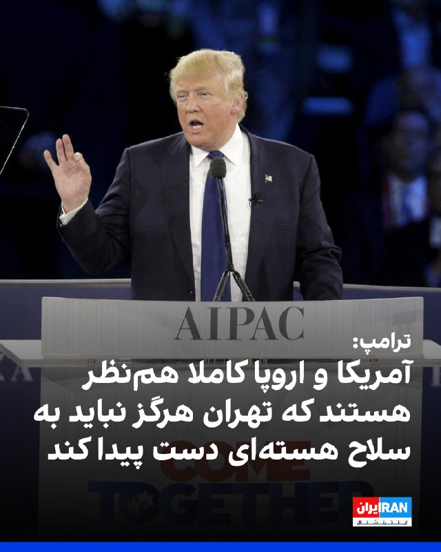

دونالد ترامپ، رییس جمهوری آمریکا در تروث سوشال نوشت که گفت‌وگوی «بسیار خوبی» با اورزولا فون‌درلاین، رییس کمیسیون اروپا، داشته است. او افزود در این تماس درباره موضوعات مختلفی گفت‌وگو شده و دو طرف کاملا هم‌نظر هستند که تهران هرگز نباید به سلاح هسته‌ای دست پیدا کند.
‌🏁 🇬🇧 IranintlTV

🤖 @VahidOOnLine

## VahidOOnLine — post 238720

  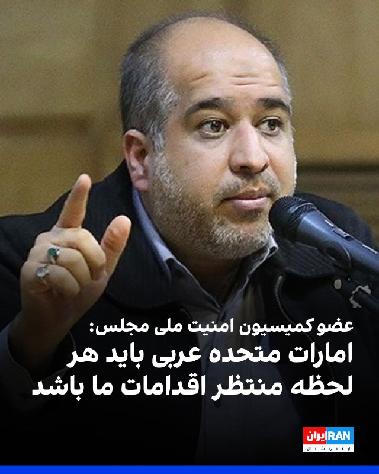

علی خضریان، عضو کمیسیون امنیت ملی مجلس، گفت اگر تنگه هرمز از دست برود، حاکمیت تحریم‌ها علیه کشور دوباره برقرار می‌شود.

او افزود امارات متحده عربی حکم پایگاه متخاصم را دارد و باید هر لحظه منتظر اقدامات پیش‌گیرانه جمهوری اسلامی باشد.

خضریان همچنین گفت به نظر او معادله امنیتی جمهوری اسلامی درباره اقلیم کردستان عراق، شامل امارات متحده عربی نیز خواهد شد.
‌🏁 🇬🇧 IranintlTV

🤖 @VahidOOnLine

## mwarmonitor — post 8650

🇮🇱یک مقام اسرائیلی: اسرائیل هیچ ارتباطی با صدای انفجارها در ایران ندارد — العربیه

@mwarmonitor

## pm_afshaa — post 90303

🔴صداوسیما : صدای انفجار از اسکله ی بهمن در جزیره ی قشم اومده

💧 Rainbet.com the #1 Non-KYC Crypto Casino & Sportsbook @rainbetcom

😁 @Pm_Afshaa

## DEJradio — post 4482

  <a href="telegram/content/DEJradio_4482_1778181743.jpg">🎬 Download video</a>

🟥
🚨 خبرگزاری‌های داخلی گزارش دادند که انفجارها از اسکله بهمن قشم به گوش رسیده است. همچنان منبع این صداها نا مشخص است. #انفجار #قشم @DEJradio

## DEJradio — post 4481

  <a href="telegram/content/DEJradio_4481_1778181744.jpg">🎬 Download video</a>

🧨
🟥
🚨 گزارش‌ها همچنین از شنیده شدن چند صدای انفجار در جزیرۀ قشم حکایت دارد. منابع محلی می‌گویند شدت صداها در بخش‌هایی از جزیره احساس شده، اما هنوز جزئیات دقیقی از محل و علت حادثه منتشر نشده است. مقام‌های رژیم تاکنون توضیحی درباره ماهیت این رویداد ارائه نکرده‌اند…

## VahidOnline — post 75304

  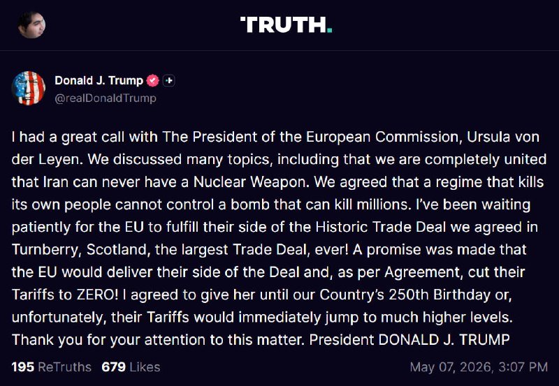

پست ترامپ ترجمه ماشین:
تماس بسیار خوبی با رئیس کمیسیون اروپا، اورزولا فون در لاین، داشتم. درباره موضوعات زیادی گفت‌وگو کردیم؛ از جمله اینکه
کاملاً در این موضوع متحد هستیم که ایران هرگز نباید سلاح هسته‌ای داشته باشد.
توافق داشتیم که رژیمی که مردم خودش را می‌کشد، نمی‌تواند کنترل بمبی را در دست داشته باشد که قادر است میلیون‌ها نفر را بکشد.
من با صبر و حوصله منتظر بوده‌ام که اتحادیه اروپا به سهم خود از توافق تاریخی تجاری‌ای که در ترنبریِ اسکاتلند بر سر آن توافق کردیم، عمل کند؛ بزرگ‌ترین توافق تجاری تاریخ! وعده داده شد که اتحادیه اروپا سهم خود از این توافق را اجرا کند و طبق توافق، تعرفه‌های خود را به صفر برساند!

من موافقت کردم که تا دویست‌وپنجاهمین سالروز تولد کشورمان به او فرصت بدهم؛ وگرنه، متأسفانه، تعرفه‌های آن‌ها فوراً به سطوح بسیار بالاتری افزایش خواهد یافت.

از توجه شما به این موضوع سپاسگزارم.
رئیس‌جمهور دونالد جی. ترامپ
realDonaldTrump

📡 @VahidOnline

## kianmeli1 — post 87226

‏خبرگزاری فارس وابسته به سپاه پاسداران: بررسی‌ها در بندرعباس نشان می‌دهد در جریان تبادل آتش میان نیروهای مسلح جمهوری اسلامی و دشمن بخش‌های تجاری اسکله بهمن هدف قرار گرفته است
https://t.me/kianmeli1

## IranIntlTV — post 336021

  

دونالد ترامپ، رییس جمهوری آمریکا در تروث سوشال نوشت که گفت‌وگوی «بسیار خوبی» با اورزولا فون‌درلاین، رییس کمیسیون اروپا، داشته است. او افزود در این تماس درباره موضوعات مختلفی گفت‌وگو شده و دو طرف کاملا هم‌نظر هستند که تهران هرگز نباید به سلاح هسته‌ای دست پیدا کند.
https://iranintl.com/202605072808

## IranIntlTV — post 336020

  

علی خضریان، عضو کمیسیون امنیت ملی مجلس، گفت اگر تنگه هرمز از دست برود، حاکمیت تحریم‌ها علیه کشور دوباره برقرار می‌شود.

او افزود امارات متحده عربی حکم پایگاه متخاصم را دارد و باید هر لحظه منتظر اقدامات پیش‌گیرانه جمهوری اسلامی باشد.

خضریان همچنین گفت به نظر او معادله امنیتی جمهوری اسلامی درباره اقلیم کردستان عراق، شامل امارات متحده عربی نیز خواهد شد.
https://iranintl.com/202605070828

## Shin_Persian — post 5858

  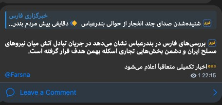

Shin ✓ @hey_itsmyturn
Thu, 07 May 2026 19:17:46 UTC

IRGC-owned Fars News reports - Fire exchange between the Islamic Regime forces and unknown sources (Fars mentions "Enemy") at Bahman Commercial Dock in Bandar Abbas. Commercial sections targeted.

Hormozgan Province, #Iran

فارسی

خبرگزاری فارس متعلق به سپاه پاسداران (IRGC) گزارش می‌دهد - تبادل آتش میان نیروهای رژیم اسلامی و منابع ناشناس (فارس از واژه «دشمن» استفاده کرده است) در اسکله تجاری بهمن در بندرعباس. بخش‌های تجاری هدف قرار گرفته‌اند.

استان هرمزگان، #Iran_

𝕏 · @shin_persian

## Shin_Persian — post 5856

Shin ✓ @hey_itsmyturn
Thu, 07 May 2026 19:14:20 UTC

IRGC-owned Tasnim News confirms the blast[s] in Qeshm.
Hormozgan Province, #Iran

فارسی

خبرگزاری تسنیم وابسته به سپاه پاسداران انقلاب اسلامی (IRGC)، وقوع انفجار(ها) در قشم را تایید کرد.
استان هرمزگان، #Iran_

𝕏 · @shin_persian

## FarsiVOA — post 217134

⚡️در برنامه تفسیر خبر امروز، مهدی آقازمانی با کارشناسان مهمان، درباره روند دیپلماتیک در جریان بین جمهوری اسلامی و آمریکا و منافع و خواسته های همه طرف‌های درگیر در بحران خاورمیانه از جمله کشورهای عربی، اسرائیل و و اروپایی‌ها از هر توافق احتمالی، گفتگو میکند ؟
@FarsiVOA

## FarsiVOA — post 217133

🔺تغییر قانون اسکار فیلم بین‌المللی؛ پایان انحصار وزارت ارشاد

▪️با خبر تغییر قوانین آکادمی اسکار می‌شود گفت که یکی دیگر از اهرم‌های سانسور از چنگال جمهوری اسلامی به در آمد. حالا کابوس تازه‌تر وزارت ارشاد جمهوری اسلامی، معرفی فیلم‌های مستقل به نمایندگی از سرزمینی است که به آن تعلق و در قبال حق و زیست و احوال مردمانش، دغدغه دارند: ایران.

⬇️ بیشتر بخوانید:
https://ir.voanews.com/a/iran-ministry-of-cultural-heritage-exclusive-cinema-oscar/8147583.html
@FarsiVOA

## FarsiVOA — post 217132

  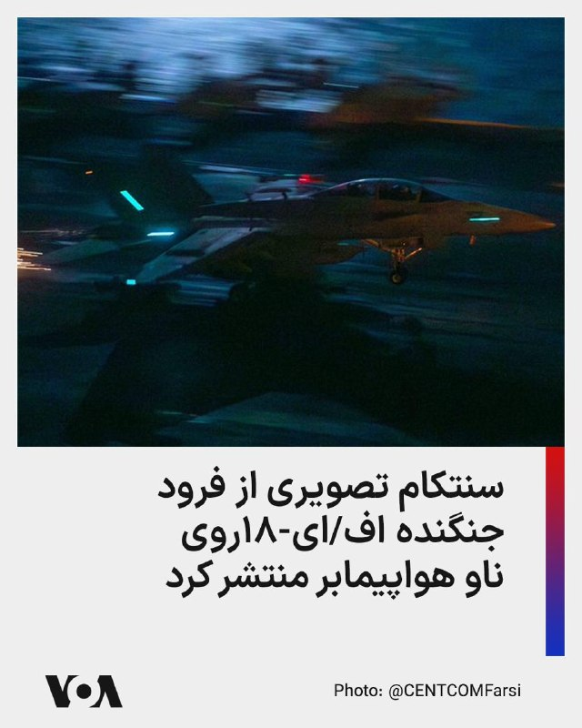

حساب فارسی فرماندهی مرکزی ایالات متحده، سنتکام در شبکه اجتماعی ایکس تصویری از فرود یک جنگنده اف/ای-‌۱۸ روی ناو هواپیمابر آبراهام لینکلن منتشر کرد. سنتکام در توضیح این تصویر نوشت جنگنده‌ها هنگام فرود روی ناو، با استفاده از کابل‌های مخصوص روی عرشه متوقف می‌شوند.

## Persian_Trend_Official — post 13618

یک اسکادران رافال مصری در حال اعزام به امارات هستند...

## Persian_Trend_Official — post 13617

جنگنده های اماراتی بندر عباس و قشم را هدف قرار داده اند......

## Persian_Trend_Official — post 13616

🔴گزارش از صدای انفجار هایی دیگر در بندر عباس/تسنیم

🫆:Tony

📌 @persian_trend_official
پرشین ترند | متفاوت‌ترین کانال نظامی

## Persian_Trend_Official — post 13615

🔴خبرگزاری فارس

بررسی‌های فارس در بندرعباس نشان می‌دهد در جریان تبادل آتش میان نیروهای مسلح ایران و دشمن بخش‌هایی تجاری اسکله بهمن هدف قرار گرفته است.

🫆:Tony

📌 @persian_trend_official
پرشین ترند | متفاوت‌ترین کانال نظامی

## RadioFarda — post 156946

  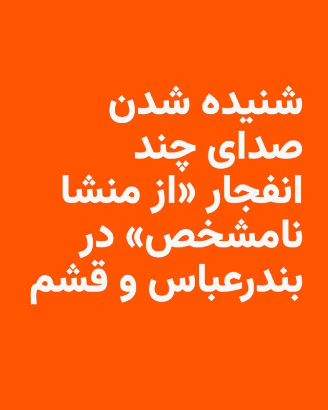

🔸گزارش‌های رسانه‌ها و برخی کاربران شبکه‌های اجتماعی در ایران از شنیده شدن صدای چند انفجار در بندرعباس و جزیره قشم در شامگاه پنجشنبه ۱۷ اردیبهشت حکایت دارند.

🔸خبرگزاری فارس، نزدیک به سپاه پاسداران، نوشته که هنوز منشا و محل دقیق این انفجارها مشخص نیست. تسنیم، دیگر خبرگزاری نزدیک به سپاه، اعلام کرده صدای چند انفجار در بندرعباس و جزیره قشم شنیده شده است.

🔸خبرگزاری نیمه‌رسمی مهر نیز با اشاره به شنیده شدن صدای انفجارها در سیریک، نزدیک به بندرعباس، نوشته است: «به نظر می‌رسد صداها مربوط به درگیری‌هایی در پهنه آبی شهرستان سیریک باشد.»

🔸خبرگزاری صداوسیما نیز از شنیده شدن صدای انفجار در «اسکله مسافربری بهمن در جزیره قشم» خبر داده است.

🔸گزارش‌های شهروندان در شبکه‌های اجتماعی هم از شنیده شدن چند صدای انفجار «از دریا» حکایت دارند. بر اساس این گزارش‌ها صداهای انفجار در قشم، بندرعباس و سیریک شنیده شده است.

@RadioFarda

## IranianMinds — post 19716

🔴 فوری خبرگزاری فارس :

بخش های تجاری اسکله قشم هدف دشمن قرار گرفته است !

@IranianMinds

## IranianMinds — post 19715

  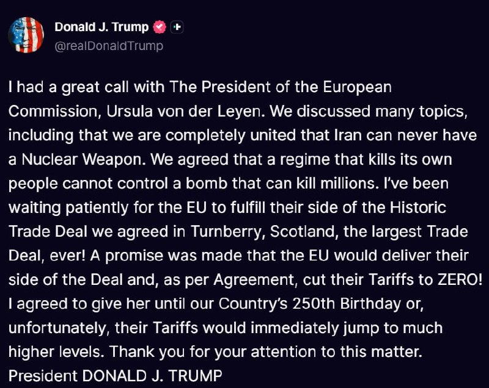

🔴 ترامپ در تروث سوشیال در مورد تماس اخیرش با اورزولا فون در لاین، رئیس کمیسیون اروپا حرف زد. نکات اصلیش اینا هستن:

- اتحاد در مورد ایران: هر دو رهبر توافق کردن که ایران هیچ‌وقت نباید به سلاح هسته‌ای دست پیدا کنه، و گفتن رژیمی که به مردم خودش آسیب می‌زنه، نمی‌تونه با بمبی که میلیون‌ها نفر رو بکشه، درست برخورد کنه.

- فشار روی توافق تجاری: ترامپ به یه توافق تجاری "تاریخی" بین آمریکا و اتحادیه اروپا در تُرنبری، اسکاتلند اشاره کرد و اتحادیه اروپا رو ترغیب کرد که طبق قولشون تعرفه‌ها رو صفر کنن. بهشون تا دویست و پنجاهمین سالگرد استقلال آمریکا (۴ ژوئیه ۲۰۲۶) مهلت داد، وگرنه تعرفه‌های آمریکا رو خیلی بالاتر میبره.

@IranianMinds

## IranianMinds — post 19714

🔴 اسرائیل : ما امشب هیچ حمله به ایران نکردیم

@IranianMinds

## BBCPersian — post 280431

🔻گزارش رسانه‌های ایران از شنیده شدن صدای انفجار در بندرعباس و قشم

خبرگزاری‌های فارس و تسنیم از شنیده شدن صدای انفجارهایی در حوالی قشم و بندرعباس در استان هرمزگان خبر داده‌اند.

صدا و سیما هم شنیده شدن صدای انفجار در اسکله مسافربری بهمن در جزیره قشم را گزارش کرده است.

خبرگزاری مهر نوشته «ابعاد و ماهیت این حادثه هنوز مشخص نیست و مسئولان در حال بررسی موضوع هستند.»

خبرگزاری تسنیم هم نوشته «بعضی منابع می‌گویند که برخی از این صداها در حوالی بندرعباس مربوط به عملیات‌های نیروی دریایی سپاه برای اخطار به بعضی کشتی‌ها درباره عبور غیرمجاز از تنگه هرمز است.»

هنوز اطلاعات بیشتری در مورد ماهیت و منشا این انفجارها منتشر نشده است.

https://bbc.in/48Pa2gK
@BBCPersian

## Dirty_Kids — post 389056

  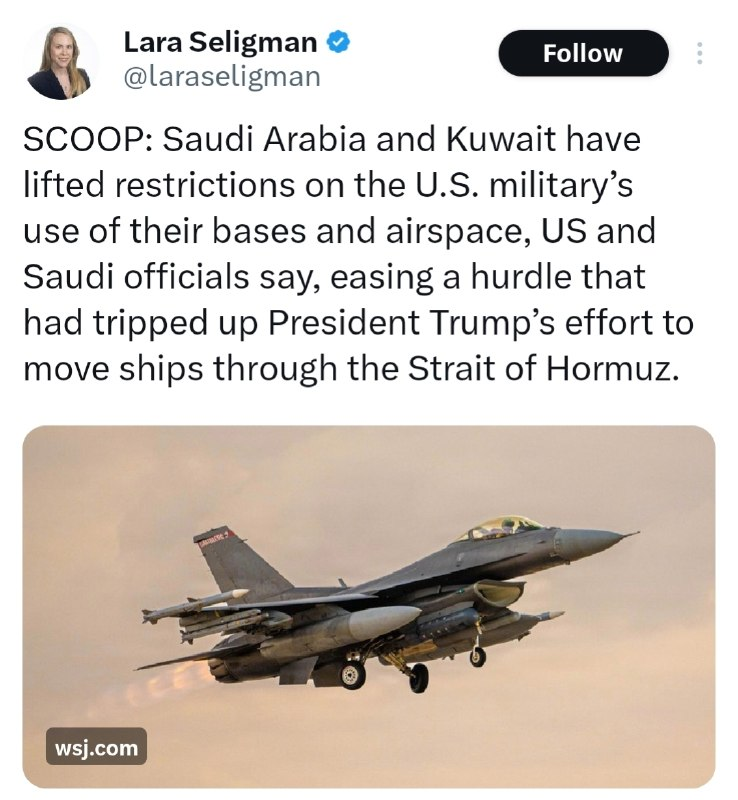

وقتی عرض می‌کنم تا جای ممکن باید از اخبار کسشر فاصله گرفت به این دلیله،

از صبح کلی رسانه این خبر رو کار کردن که عربستان و کویت آسمان و پایگاه‌هاشون رو به روی آمریکا بستن،

بعد الان خبر وال‌استریت‌ژورنال در خبری اختصاصی نوشته که به گفته‌ی مقامات آمریکایی و سعودی، عربستان و کویت محدودیت‌های استفاده ارتش آمریکا از پایگاه‌ها و حریم هوایی خودشون رو لغو کردند و این اقدام مانع بزرگی رو که بر سر راه تلاش‌های ترامپ شیر خدا برای عبور کشتی‌ها از تنگه‌ی هرمز قرار داشت رو از میان برداشت.

@Dirty_Kids 👻

## Dirty_Kids — post 389055

در زمانی که نمیشه توی ایتا ثبت نام جدید انجام داد و توی روبیکا نمیتونی کانال رسمی روبیکا رو ترک کنی تلگرام آپدیت خفن داده

تلگرام آپدیت جدید داد؛با ۱۱ قابلیت تازه
تلگرام در آپدیت جدید خودش، تمرکز ویژه‌ای روی هوش مصنوعی و ربات‌ها گذاشته؛

• صدا زدن ربات‌های هوش مصنوعی داخل هر چت
• گفتگو و همکاری ربات‌ها با همدیگر
• نمایش زنده جواب ربات هنگام تایپ‌شدن
• اتصال ربات به پروفایل برای پاسخ‌گویی خودکار
• ساخت سبک اختصاصی برای ویرایش متن با هوش مصنوعی
• جست‌وجو بین بیش از ۱۰۰ میلیون استیکر و ایموجی
• پشتیبانی جست‌وجوی استیکر در ۳۶ زبان
• محدود کردن رأی‌گیری بر اساس کشور یا عضویت در کانال
• آمار پیشرفته نظرسنجی‌ها برای مدیران
• ارسال پیام زمان‌بندی‌شده به‌صورت بی‌صدا
• حذف ری‌اکشن کاربران توسط مدیران گروه
• بیش از ۲۰۰ بهبود و رفع باگ

@Dirty_Kids 👻

## Hranews — post 112826

  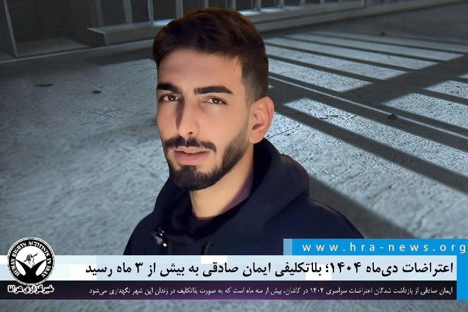

اعتراضات دی‌ماه ۱۴۰۴؛ بلاتکلیفی ایمان صادقی به بیش از ۳ ماه رسید

❗️
❗️
❗️
❗️
❗️– ایمان صادقی از بازداشت‌شدگان اعتراضات سراسری ۱۴۰۴ در کاشان، بیش از سه ماه است که به‌ صورت بلاتکلیف در زندان این شهر نگهداری می‌شود.

به گزارش خبرگزاری هرانا، ارگان خبری مجموعه فعالان حقوق بشر در ایران، ایمان صادقی کماکان در بازداشت به سر می برد.

براساس اطلاعات دریافتی هرانا؛ ایمان صادقی مورخ ۱۱ بهمن ماه سال گذشته در جریان اعتراضات سراسری دی ماه ۱۴۰۴ در منزل خانوادگی خود در کاشان بازداشت شد. وی پس از بازداشت به زندان کاشان منتقل شده و علیرغم گذشت بیش از سه ماه از زمان دستگیری کماکان در این زندان به صورت بلاتکلیف نگهداری می شود.

ادامه مطلب

#ایمان_صادقی

↘️
@hranews_bot تماس ✉️ -  @Hranews  کانال هرانا 🆑

## alonews — post 118461

  <a href="telegram/content/alonews_118461_1778181749.jpg">🎬 Download video</a>

👈گویا حمله توسط امارات بوده

✅ @AloNews خبر جنگ

## alonews — post 118460

  

👈ترامپ از طریق Truth Social:
من یک تماس عالی با رئیس کمیسیون اروپا، اورسولا فون در لاین داشتم.

🔴ما درباره موضوعات زیادی بحث کردیم، از جمله اینکه کاملاً متحد هستیم که ایران هرگز نمی‌تواند سلاح هسته‌ای داشته باشد. ما توافق کردیم که رژیمی که مردم خود را می‌کشد نمی‌تواند بمبی را کنترل کند که می‌تواند میلیون‌ها نفر را بکشد.

🔴من صبورانه منتظر بودم که اتحادیه اروپا بخش خود از توافق تجاری تاریخی که در ترن‌بری، اسکاتلند، بزرگ‌ترین توافق تجاری تا به حال، را انجام دهد! وعده داده شده بود که اتحادیه اروپا بخش خود از توافق را اجرا کند و طبق توافق، تعرفه‌های خود را به صفر برساند!

🔴من موافقت کردم که به او تا ۲۵۰مین سالگرد کشورمان فرصت بدهم وگرنه متأسفانه تعرفه‌های آنها فوراً به سطوح بسیار بالاتری افزایش خواهد یافت.

✅ @AloNews خبر جنگ

## alonews — post 118459

  <a href="telegram/content/alonews_118459_1778181750.jpg">🎬 Download video</a>

👈یک منبع اسرائیلی به i24NEWS: اسرائیل هیچ ارتباطی با رویدادهای امشب در ایران ندارد

✅ @AloNews خبر جنگ

## alonews — post 118458

  <a href="telegram/content/alonews_118458_1778181750.jpg">🎬 Download video</a>

👈گزارش‌ها از شنیده شدن صدای ۶ انفجار با فاصله ۴۰ ثانیه از یکدیگر در سیریک (هرمزگان) خبر می‌دهند

✅ @AloNews خبر جنگ

---
📅 بروزرسانی: 1405/02/17 22:42
---

## VahidOOnLine — post 238719

  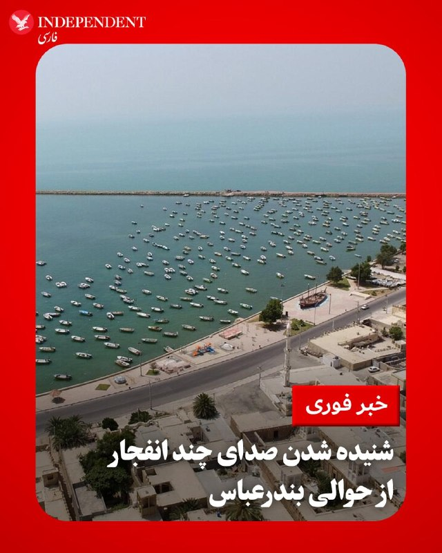

♦️خبرگزاری فارس، وابسته به سپاه پاسداران، پنجشنبه‌شب ۱۷ اردیبهشت از شنیده شدن صدای چند انفجار از حوالی بندرعباس خبر داد. منشا و محل دقیق این انفجارها هنوز مشخص نشده است.

فارس مدعی شد که در دو شب گذشته، «دو قایق صیادی» ایرانی از سوی نیروهای آمریکا در محدوده تنگه هرمز هدف قرار گرفته‌اند اما انفجارهای پنجشنبه‌شب را مستقیما به این نیروها نسبت نداد.
‌🇸🇦 Indypersian

🤖 @VahidOOnLine

## VahidOOnLine — post 238718

  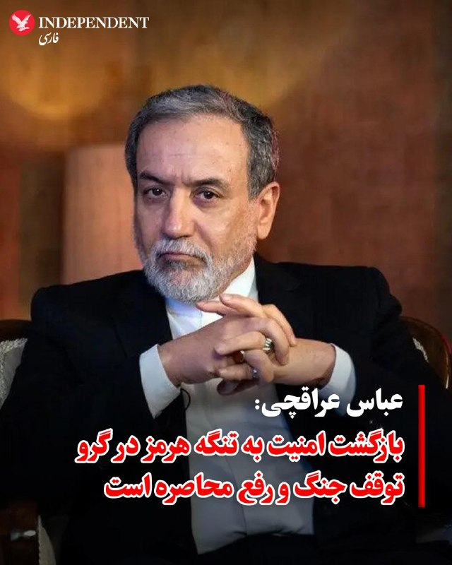

♦️عباس عراقچی، وزیر امور خارجه جمهوری اسلامی، در نامه‌ای به اعضای شورای امنیت سازمان ملل، پیش‌نویس قطعنامه پیشنهادی آمریکا و بحرین درباره امنیت دریانوردی را «یک‌سویه و ناقص» خواند. او تاکید کرد که وضعیت کنونی در تنگه هرمز نتیجه مستقیم حمله نظامی و «استفاده غیرقانونی از زور توسط آمریکا و اسرائیل علیه ایران» است.

عراقچی در این نامه هشدار داد که هدف واقعی این پیش‌نویس، «تحریف واقعیت‌ها و مشروعیت‌بخشی به اقدامات غیرقانونی آمریکا از جمله محاصره دریایی ایران» است. او استناد به فصل هفتم منشور سازمان ملل در این قطعنامه را غیرموجه دانست و نوشت در صورت تصویب، اعتبار شورای امنیت را به‌شدت تضعیف خواهد کرد.

وزیر امور خارجه جمهوری اسلامی، درباره عادی‌سازی تردد در تنگه هرمز نوشت: «تنها در صورت توقف دائمی جنگ و رفع کامل محاصره و تحریم‌های غیرقانونی، تردد عادی دریایی به تنگه هرمز بازخواهد گشت.» عراقچی از کشورهای عضو خواست تا اجازه ندهند شورای امنیت به ابزاری برای توجیه «اقدامات قهری یک‌جانبه آمریکا» تبدیل شود.
‌🇸🇦 Indypersian

🤖 @VahidOOnLine

## VahidOOnLine — post 238717

  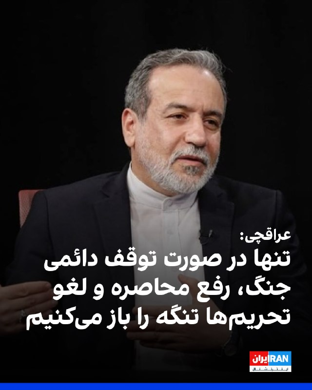

همزمان با تلاش‌های ایالات متحده و بحرین برای پیشبرد قطعنامه‌ای در شورای امنیت درباره بازگشایی تنگه هرمز و آزادی کشتیرانی، عباس عراقچی، وزیر امور خارجه جمهوری اسلامی، این قطعنامه را «یک‌سویه و تحریک‌آمیز» و روایت‌های مندرج در آن را «گزینشی و جانبدارانه» خواند.

عراقچی در نامه‌ای به دبیرکل سازمان ملل و رهبران کشورهای عضو، محدودیت‌های کنونی در تنگه هرمز را ناشی از «جنگ تجاوزکارانه، غیرموجه و غیرقانونی» آمریکا و اسرائیل علیه جمهوری اسلامی خواند و به جامعه جهانی هشدار داد که نباید اجازه دهند شورای امنیت به گفته او مورد «سوءاستفاده متجاوزان» قرار گیرد.

او در این نامه تاکید می‌کند که تردد در تنگه هرمز تنها در صورت «توقف دائمی جنگ و رفع محاصره و تحریم‌های غیرقانونی» علیه جمهوری اسلامی به حالت «عادی» بازخواهد گشت.
‌🏁 🇬🇧 IranintlTV

🤖 @VahidOOnLine

## VahidOOnLine — post 238716

🗣روایت شما از شنیدن صدای انفجار- پنجشنبه ۱۷ اردیبهشت ۱۴۰۵

🔹در جزیره قشم صدای انفجار به گوش می‌رسه

🔹من از بندرعباس گزارش می‌دم. همین نیم ساعت پیش، شامگاه پنجشنبه، صدای انفجاری مهیب شنیدیم اما مشخص نیست از کجا بود

🔹در ساعت ۱۰:۰۶ شب، در قشم اسکله ۲۲ بهمن، صدای انفجار اومد و هوا کامل روشن شد

🔹الان، شامگاه پنجشنبه حدود ساعت ۱۰ شب، صدای سه انفجار در جزیره قشم شنیده شد. کل خونه‌ها دارن می‌لرزن
‌🏁 🇬🇧 IranintlTV

🤖 @VahidOOnLine

## mwarmonitor — post 8649

  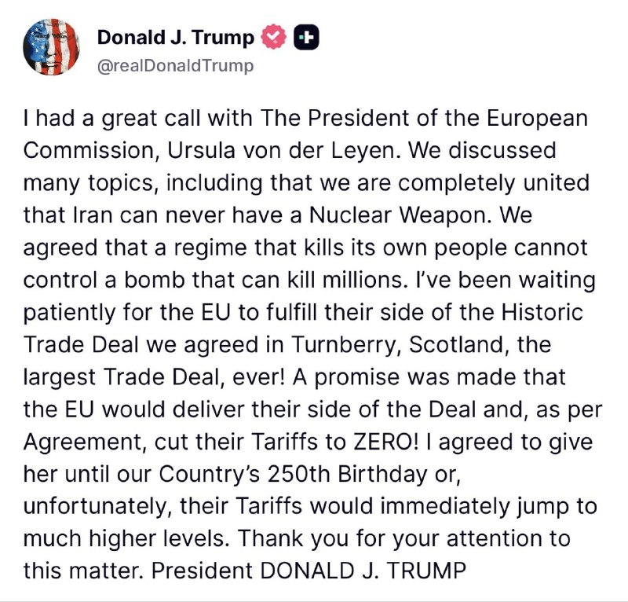

من تماس بسیار خوبی با رئیس کمیسیون اروپا، اورسولا فون در لاین داشتم. ما درباره موضوعات متعددی گفتگو کردیم، از جمله اینکه ما کاملاً با هم متحد هستیم که ایران هرگز نباید به سلاح هسته‌ای دست یابد.
ما توافق داشتیم رژیمی که مردم خودش را می‌کشد، نمی‌تواند کنترلی بر بمبی داشته باشد که می‌تواند میلیون‌ها نفر را بکشد.
من صبورانه منتظر بوده‌ام تا اتحادیه اروپا سهم خود را از توافق تجاری تاریخی که در ترنبریِ اسکاتلند بر سر آن توافق کردیم (بزرگترین توافق تجاری تاریخ!) اجرا کند. وعده داده شده بود که اتحادیه اروپا سهم خود از این معامله را ایفا کرده و طبق توافق، تعرفه‌های خود را به صفر برساند!
من موافقت کردم که تا دویست و پنجاهمین سالگرد تولد کشورمان به او مهلت بدهم، در غیر این صورت متأسفانه تعرفه‌های آن‌ها بلافاصله به سطوح بسیار بالاتری جهش خواهد کرد. از توجه شما به این موضوع سپاسگزارم.

رئیس‌جمهور دونالد جی. ترامپ

@mwarmonitor

## mwarmonitor — post 8648

  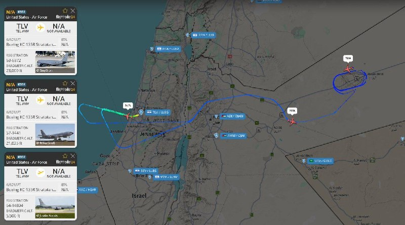

✈️حداقل ۴ هواپیمای سوخت‌رسان اکنون بر فراز اسرائیل/اردن هستند (یکی از آن‌ها ترانسپوندر خود را خاموش کرده است).

@mwarmonitor

## DEJradio — post 4480

  <a href="telegram/content/DEJradio_4480_1778181137.mp4">🎬 Download video</a>

🔺🎥 پرواز ریزپرنده‌های ناشناس در آسمان تهران
پنجشنبه ۱۷ اردیبهشت

#ریزپرنده #تهران
@DEJradio

## mamlekate — post 103469

📝 عربستان و کویت محدودیت‌های دسترسی نظامی آمریکا به پایگاه‌ها و حریم هوایی خود را لغو کردند

روزنامه وال‌استریت ژورنال گزارش داد که عربستان سعودی و کویت محدودیت‌های دسترسی نظامی آمریکا به پایگاه‌ها و حریم هوایی خود را لغو کردند. این اقدام راه را برای ازسرگیری «پروژه آزادی» آمریکا برای باز کردن تنگه هرمز را هموار می‌کند.

@mamlekate

## mamlekate — post 103468

❓ الو پنج‌شنبه ۱۷ اردیبهشت ۱۴۰۵ ساعت ۲۲:۳۴ پنج تا صدای انفجار شنیدم. بندرعباس.

@mamlekate

## VahidOnline — post 75303

  

همزمان با تلاش‌های ایالات متحده و بحرین برای پیشبرد قطعنامه‌ای در شورای امنیت درباره بازگشایی تنگه هرمز و آزادی کشتیرانی، عباس عراقچی، وزیر امور خارجه جمهوری اسلامی، این قطعنامه را «یک‌سویه و تحریک‌آمیز» و روایت‌های مندرج در آن را «گزینشی و جانبدارانه» خواند.

عراقچی در نامه‌ای به دبیرکل سازمان ملل و رهبران کشورهای عضو، محدودیت‌های کنونی در تنگه هرمز را ناشی از «جنگ تجاوزکارانه، غیرموجه و غیرقانونی» آمریکا و اسرائیل علیه جمهوری اسلامی خواند و به جامعه جهانی هشدار داد که نباید اجازه دهند شورای امنیت به گفته او مورد «سوءاستفاده متجاوزان» قرار گیرد.

او در این نامه تاکید می‌کند که تردد در تنگه هرمز تنها در صورت «توقف دائمی جنگ و رفع محاصره و تحریم‌های غیرقانونی» علیه جمهوری اسلامی به حالت «عادی» بازخواهد گشت.
@VahidOOnLine

📡 @VahidOnline

## kianmeli1 — post 87225

🔴فوری-منابع محلی: در اسکله مسافربری بهمن در قشم دود سیاه دیده میشود
https://t.me/kianmeli1

## kianmeli1 — post 87224

🔴فوری-سپاه: امارات جرات حمله ندارد ، شنیده شدن انفجارها در دست بررسی است
https://t.me/kianmeli1

## IranIntlTV — post 336019

  

🔻رسانه‌ اکیپ فرانسه گزارش داد در آستانه دیدار حساس رئال مادرید و بارسلونا در ال‌کلاسیکو، تنش‌ها در رختکن رئال مادرید افزایش یافته و در تمرین روز چهارشنبه درگیری فیزیکی میان اورلین شوامنی و فدریکو والورده رخ داده است.

🔹بر اساس این گزارش، ماجرا از برخورد شدید والورده با شوامنی در تمرین روز سه‌شنبه آغاز شد. پس از رد و بدل شدن توهین میان دو بازیکن، تنش‌ها در تمرین پنج‌شنبه شدت گرفت؛ جایی که والورده از دست دادن با شوامنی خودداری کرد و مشاجره میان دو بازیکن بالا گرفت.

🔹گزارش‌ها حاکی است پس از بالا گرفتن درگیری لفظی، شوامنی به والورده سیلی زد و او را هل داد. والورده پس از برخورد با یک میز تعادل خود را از دست داد و برای لحظاتی بیهوش شد.

🔹این اتفاق در شرایطی رخ داده که رئال مادرید شامگاه یکشنبه، مهمان بارسلونا خواهد بود.

🔹همچنین برخی از هواداران رئال مادرید یک صفحه‌ آنلاین راه‌اندازی کرده‌اند که در آن خواستار فروش کیلیان امباپه هستند و کاربران می‌توانند این درخواست را امضا کنند. جالب‌تر اینکه این درخواست تا الان توسط ۳۰ میلیون نفر امضا شده است.

🔹جزییات بیشتر را در سایت بخوانید

@iranintltvsport

## IranIntlTV — post 336018

  

همزمان با تلاش‌های ایالات متحده و بحرین برای پیشبرد قطعنامه‌ای در شورای امنیت درباره بازگشایی تنگه هرمز و آزادی کشتیرانی، عباس عراقچی، وزیر امور خارجه جمهوری اسلامی، این قطعنامه را «یک‌سویه و تحریک‌آمیز» و روایت‌های مندرج در آن را «گزینشی و جانبدارانه» خواند.

عراقچی در نامه‌ای به دبیرکل سازمان ملل و رهبران کشورهای عضو، محدودیت‌های کنونی در تنگه هرمز را ناشی از «جنگ تجاوزکارانه، غیرموجه و غیرقانونی» آمریکا و اسرائیل علیه جمهوری اسلامی خواند و به جامعه جهانی هشدار داد که نباید اجازه دهند شورای امنیت به گفته او مورد «سوءاستفاده متجاوزان» قرار گیرد.

او در این نامه تاکید می‌کند که تردد در تنگه هرمز تنها در صورت «توقف دائمی جنگ و رفع محاصره و تحریم‌های غیرقانونی» علیه جمهوری اسلامی به حالت «عادی» بازخواهد گشت.
https://iranintl.com/202605072728

## Shin_Persian — post 5855

Shin ✓ @hey_itsmyturn
Thu, 07 May 2026 19:11:11 UTC

Several airstrikes on Nabatieh Governorate, southern #Lebanon.

فارسی

چندین حمله هوایی به استان نبطیه در جنوب #Lebanon صورت گرفت.

𝕏 · @shin_persian

## Shin_Persian — post 5854

Shin ✓ @hey_itsmyturn
Thu, 07 May 2026 19:09:11 UTC

Intense jet activity over Baghdad, #Iraq 🇮🇶

فارسی

فعالیت شدید جنگنده‌ها برفراز بغداد، #Iraq 🇮🇶

𝕏 · @shin_persian

## Shin_Persian — post 5853

  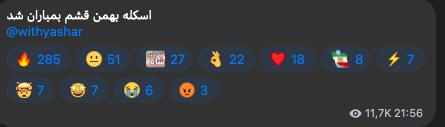

این کونکش قبلا سایت آهنگ رپ داشت الان جنگ گزارش می کنه :)) درد من یکی دو تا نیست که آخه :))

## Shin_Persian — post 5851

Shin ✓ @hey_itsmyturn
Thu, 07 May 2026 19:02:56 UTC

IRGC-owned Fars News confirms:

فارسی

خبرگزاری فارس متعلق به سپاه پاسداران تایید کرد:

𝕏 · @shin_persian

## DW_Farsi — post 124414

🔶 آمریکا معاون وزیر نفت عراق را به دلیل کمک به دور زدن تحریم‌های ایران تحریم کرد

وزارت خزانه‌داری آمریکا علی معارج البهادلی، معاون وزیر نفت عراق و چند تن از اعضای ارشد گروه‌های شبه‌نظامی این کشور را به دلیل حمایت از حکومت ایران تحریم کرد.

به گزارش رویترز، آمریکا البهادلی را متهم کرده که از موقعیت خود برای تسهیل انتقال و فروش نفت به نفع جمهوری اسلامی و گروه‌های عراقی همسو با آن سوءاستفاده کرده است.

حیان عبدالغنی، وزیر نفت عراق دو ماه پیش گفته بود که نفتکش‌های ایرانی که توسط نیروهای آمریکایی در خلیج فارس متوقف شده‌اند برای دور زدن تحریم‌ها از "اسناد جعلی عراقی" استفاده می‌کردند. تهران استفاده از چنین اسنادی را تکذیب کرده است.

وزارت خزانه‌داری آمریکا همچنین اعلام کرده که سه تن از اعضای ارشد گروه‌های شبه‌نظامی "عصائب اهل الحق" و "کتائب سیدالشهدا" عراق را نیز به دلیل ارتباط با جمهوری اسلامی تحریم کرده است.

رویترز می‌نویسد که تا کنون وزارت نفت عراق و همچنین البهادلی به درخواست‌ها برای ابراز نظر پاسخی نداده‌اند.

این تحریم‌ها دارایی این افراد در ایالات متحده را مسدود و به طور کلی آمریکایی‌ها را از معامله با آن‌ها منع می‌کند.
@dw_farsi

## Persian_Trend_Official — post 13614

💢 ۵ عدد سوخت رسان های آمریکایی در امارات بلنده شده اند و مشغول عملیات هستند

## IranianMinds — post 19713

🔴 فوری

شاخص کتلت در اطراف بیت رهبری به شدت صعودی شده

@IranianMinds

## IranianMinds — post 19712

🔴 صداوسیما : صدای انفجار از اسکله ی بهمن در جزیره ی قشم اومده

@IranianMinds

## IranianMinds — post 19711

سلام از نیویورک صدا انفجار میاد
زدن فک کنم

## Dirty_Kids — post 389054

  <a href="telegram/content/Dirty_Kids_389054_1778181139.mp4">🎬 Download video</a>

تهرانپارس؛ یک شی نورانی مانند پهپاد در فاصله‌ی چند صدمتری از سطح زمین پرواز می‌کند.

@Dirty_Kids 👻

## Dirty_Kids — post 389053

  <a href="telegram/content/Dirty_Kids_389053_1778181141.jpg">🎬 Download video</a>

🔴ساعت ۲۲:۰۵ پنجشنبه؛ ساکنان نزدیک به اسکله‌ی بندرعباس از شنیده شدن صدای انفجار در دریا خبر می‌دهند.

🔴ساعت ۲۲:۰۷ پنجشنبه؛ تعداد ۶ انفجار با فاصله ۴۰ ثانیه از یکدیگر در سیریک (هرمزگان) شنیده شد.

🔴ساعت ۲۲:۱۴ پنجشنبه؛ انفجار بسیار مهیب در سیریک هرمزگان گزارش می‌شود.

@Dirty_Kids 👻

## Dirty_Kids — post 389052

  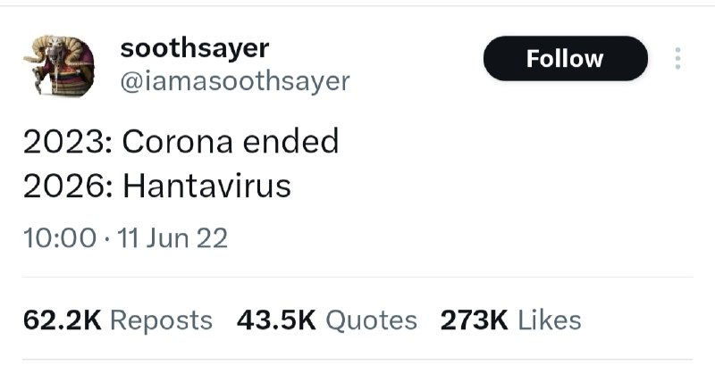

خبر اینکه، یک نفتکش بزرگ حامل فرآورده‌های پالایش‌شده متعلق به یک شرکت چینی در نزدیکی بندر القیر امارات و در ورودی تنگه‌ی هرمز، هدف حمله قرار گرفته و عرشه‌ش آتیش گرفته. @Dirty_Kids 👻

## Hranews — post 112825

معوقات مزدی معدنکاران کرمان/ بحران تعدیل کارگران در اصفهان و آذربایجان شرقی

❗️
❗️
❗️
❗️
❗️– کارگران معادن زغال‌سنگ کرمان نیمی از حقوق‌‌های اسفند سال گذشته و فروردین امسال را دریافت نکرده‌اند. از سوی دیگر، حملات موشکی به مجتمع فولاد مبارکه اصفهان در جنگ اخیر، فعالیت بزرگ‌ترین کارخانه فولاد ایران را با بحران جدی مواجه کرده است. از میان بیش از ۲۷ هزار نیروی شاغل این مجموعه، تنها حدود دو هزار نفر به محل کار بازگشته‌اند. استاندار آذربایجان شرقی نیز اعلام کرد که حدود دو هزار نفر در واحد‌های تولیدی استان به دلیل خسارت‌های ناشی از جنگ، شغل خود را از دست داده یا با تهدید شغلی مواجه شده‌اند.

ادامه مطلب

↘️
@hranews_bot تماس ✉️ -  @Hranews  کانال هرانا 🆑

## alonews — post 118457

  <a href="telegram/content/alonews_118457_1778181141.jpg">🎬 Download video</a>

👈فعالیت پهپادهای اسرائیلی در بکاء غربی

✅ @AloNews خبر جنگ

## alonews — post 118456

  <a href="telegram/content/alonews_118456_1778181141.jpg">🎬 Download video</a>

👈مهر: شنیده شدن صدای چند انفجار در محدوده شهرستان سیریک بندرعباس

✅ @AloNews خبر جنگ

## alonews — post 118455

  <a href="telegram/content/alonews_118455_1778181142.jpg">🎬 Download video</a>

👈صداوسیما: شنیده شدن صدای انفجار در اسکله مسافربری بهمن در جزیره قشم

✅ @AloNews خبر جنگ

---
📅 بروزرسانی: 1405/02/17 22:33
---

## VahidOOnLine — post 238715

  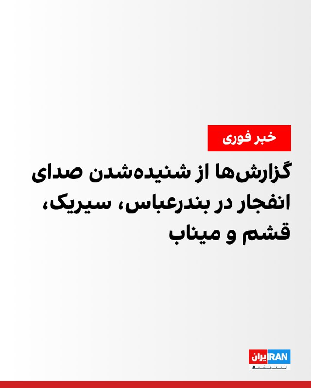

خبرگزاری فارس، وابسته به سپاه پاسداران، از شنیده شدن صدای چند انفجار در بندرعباس در شامگاه پنجشنبه خبر داد و اعلام کرد که هنوز منشا و محل دقیق این صداها مشخص نیست.
همزمان اسکان‌نیوز نوشت گزارش‌ها از شنیده‌شدن صدای ۶ انفجار با فاصله ۴۰ ثانیه از یکدیگر در سیریک در استان هرمزگان خبر می‌دهند.
وحید آنلاین نیز از شنیده شدن صداهای انفجار در قشم، میناب، بندرعباس، بندر خمیر، چابهار و سیریک در شامگاه پنجشنبه خبر داد.
‌🏁 🇬🇧 IranintlTV

🤖 @VahidOOnLine

## mwarmonitor — post 8647

  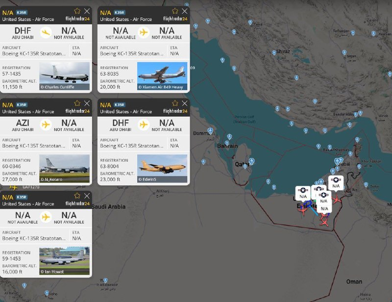

✈️برخاست سریع تانکرها؟

🔰با گزارش‌هایی که از شنیده شدن انفجار در بندرعباس ایران منتشر شده، ناوگان هواپیماهای سوخت‌رسان مستقر در امارات متحده عربی به‌صورت گروهی به پرواز درآمده‌اند؛ این اقدام ممکن است به دلیل نگرانی امارات از حملات بیشتر ایران باشد، یا احتمالاً در راستای حمایت از یک پاسخ تلافی‌جویانه امارات (در حال حاضر هیچ تأیید رسمی در این مورد وجود ندارد، اما امارات اعلام کرده که حق پاسخ به حملات اخیر ایران را برای خود محفوظ می‌داند).

@mwarmonitor

## mwarmonitor — post 8646

ظاهراً اتفاقاتی در حال رخ دادن

## DEJradio — post 4479

  <a href="telegram/content/DEJradio_4479_1778180584.jpg">🎬 Download video</a>

⭕️
🧨
🚨 منابع محلی و گزارش‌های داخلی از وقوع چندین انفجار در منطقه بندرعباس حکایت دارند. #انفجار #بندرعباس @DEJradio

## kianmeli1 — post 87223

  <a href="telegram/content/kianmeli1_87223_1778180584.mp4">🎬 Download video</a>

🔴 فوری-تهرانپارس؛ یک شی نورانی مانند پهپاد در فاصله‌ی چند صدمتری از سطح زمین پرواز می‌کند.
https://t.me/kianmeli1

## kianmeli1 — post 87222

🔴فوری-سپاه در حالت آماده باش جنگی قرار گرفت
https://t.me/kianmeli1

## kianmeli1 — post 87221

  

🔴فوری-برخاستن تانکرهای سوخت‌رسان از امارات
https://t.me/kianmeli1

## kianmeli1 — post 87220

🔴فوری-یک منبع اسراییلی نوشت

جنگنده های امارات ٫ اسکله بهمن قشم را بمباران کرد
https://t.me/kianmeli1

## IranIntlTV — post 336017

🗣روایت شما از شنیدن صدای انفجار- پنجشنبه ۱۷ اردیبهشت ۱۴۰۵

🔹در جزیره قشم صدای انفجار به گوش می‌رسه

🔹من از بندرعباس گزارش می‌دم. همین نیم ساعت پیش، شامگاه پنجشنبه، صدای انفجاری مهیب شنیدیم اما مشخص نیست از کجا بود

🔹در ساعت ۱۰:۰۶ شب، در قشم اسکله ۲۲ بهمن، صدای انفجار اومد و هوا کامل روشن شد

🔹الان، شامگاه پنجشنبه حدود ساعت ۱۰ شب، صدای سه انفجار در جزیره قشم شنیده شد. کل خونه‌ها دارن می‌لرزن

## Shin_Persian — post 5850

  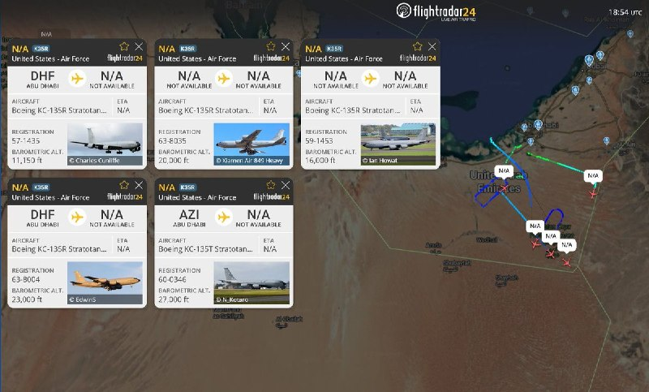

DefenceGeek 🇬🇧 ✓ @DefenceGeek Thu, 07 May 2026 18:56:55 UTC Tankers Scramble? #FreeIran‌ --- Operation EPIC FURY / Project FREEDOM --- With reports coming in of explosions heard in Bandar Abbas in Iran, the fleet of tankers stationed in the UAE have gotten…

## Shin_Persian — post 5849

DefenceGeek 🇬🇧 ✓ @DefenceGeek
Thu, 07 May 2026 18:56:55 UTC

Tankers Scramble? #FreeIran‌
--- Operation EPIC FURY / Project FREEDOM ---

With reports coming in of explosions heard in Bandar Abbas in Iran, the fleet of tankers stationed in the UAE have gotten airborne as a group, potentially with the UAE either fearing further Iranian attacks, or supporting a potential UAE retaliation (there is no confirmation of this presently, but the UAE have said they reserve the right to respond for recent Iranian attacks)

@MATA_osint

فارسی

تکاپوی تانکرها؟ #FreeIran
--- عملیات خشم حماسی / پروژه آزادی ---

با انتشار گزارش‌هایی از شنیده شدن صدای انفجار در بندرعباس ایران، ناوگان تانکرهای مستقر در امارات متحده عربی به‌صورت گروهی به پرواز درآمده‌اند؛ این اقدام احتمالاً ناشی از ترس امارات از حملات بیشتر ایران، یا در راستای حمایت از پاسخ احتمالی امارات است (در حال حاضر تأییدی در این باره وجود ندارد، اما امارات پیش‌تر اعلام کرده است که حق پاسخگویی به حملات اخیر ایران را برای خود محفوظ می‌دارد).

@MATA_osint

𝕏 · @shin_persian

## Shin_Persian — post 5845

Shin ✓ @hey_itsmyturn
Thu, 07 May 2026 18:52:12 UTC

State-owned MehrNews confirms the explosion sounds in Qeshm and Bandar Abbas, Hormozgan Province, #Iran

فارسی

خبرگزاری دولتی مهر صدای انفجار در قشم و بندرعباس در استان هرمزگان، #Iran را تأیید کرد.

𝕏 · @shin_persian

## FarsiVOA — post 217131

تصمیم عجیب «چین» برای عدم ارائه تسهیلات بانکی به پتروشیمی‌هایی که با «جمهوری اسلامی» مراوده اقتصادی دارند؛ گفت گو با مهدی مصلحی

## IranianMinds — post 19710

🔴در اسکله‌های قشم هم چندین انفجار شنیده شد.

@IranianMinds

## IranianMinds — post 19709

  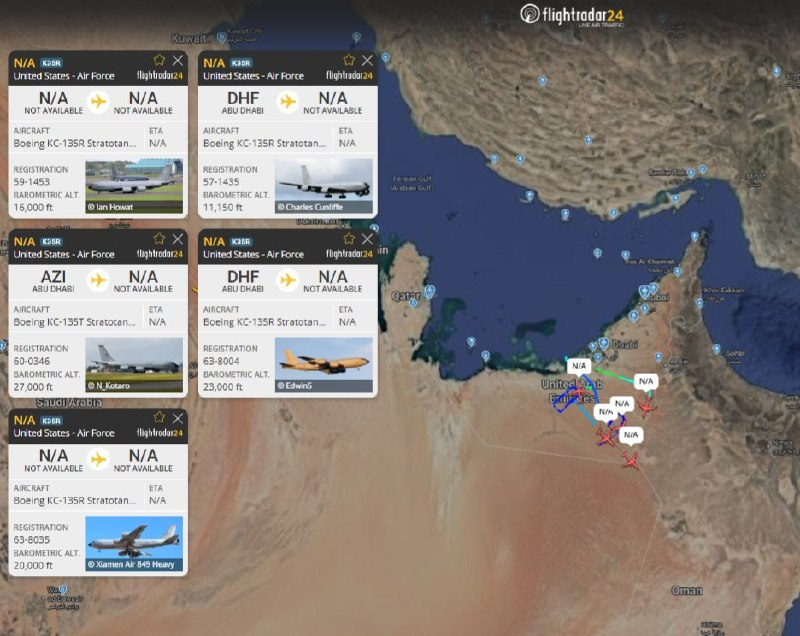

🔴 5 تا هواپیمای سوخت رسان از امارات بلند شدن

@IranianMinds

## IranianMinds — post 19708

به نظر من تنها حالتی که بخواد باشه ، ( تازه اگر باشه ) اینه که امارات برای انتقام یک حمله کوچیک به یک اسلکه ایران کرده باشه

وگرنه اگر کار اسرائیل و آمریکا بود اعلام میشد و عکس و فیلم هاش همون لحظه میومد

تجربه اینو ثابت کرده

## IranianMinds — post 19707

یه صدا اومده باز همه شروع کردن جو دادن
تو بعضی چنلا آمریکا نیروی زمینیشم از مرز وارد کرده دارن میجنگن

## IranianMinds — post 19706

🔴 خبرگزاری فارس : دقایقی پیش مردم بندرعباس چند صدای شبیه به انفجار از حوالی این شهر شنیدند. @IranianMinds

## officialrezapahlavi — post 1828

در روز جهانی کارگر، به همه‌ی شما کارگران زحمتکش و شجاع ایران درود می‌فرستم.

در این روزهای سخت و طاقت‌فرسا -حاصل عملکرد ویرانگر چهل‌وهفت‌ساله‌ی جمهوری اسلامی- در کنار شما ایستاده‌ام. می‌دانم که شما کارگران و زحمت‌کشان، همچون اکثر هم‌میهنان، زیر فشار سنگین اقتصادی و تنگنای معیشتی هستید؛ سفره‌های‌تان هر روز کوچک‌تر و خالی‌تر می‌شود، در حالی که جمهوری اسلامی ثروت ملی ما را صرف جنگ‌افروزی و حمایت از گروه‌های تروریستی می‌کند.

این وضعیت شایسته‌ی کارگر و شهروند ایرانی نیست؛ و با سرنگونی این رژیم و به ثمر نشستن جان‌فشانی‌ها و خون پاک ده‌ها هزار جان‌فدای راه آزادی ایران، پایان خواهد یافت.

رسیدن به این هدف، به مشارکت تک‌تک ما نیاز دارد. در هر لحظه و هر قدم، از خود بپرسیم: آیا این اقدام بر عمر رژیم می‌افزاید یا اینکه به پیروزی انقلاب شیروخورشید کمک می‌کند؟ هر اقدام، هرچند کوچک، در از کار انداختن دستگاه سرکوب رژیم، در تعیین سرنوشت یک ملت بزرگ و تاریخی موثر است.

از آموزه‌های زرتشت تا دوران پرافتخار هخامنشیان، جایگاه کار و کارگر، به عنوان یکی از اصلی‌ترین بازوان توسعه، آبادانی و رفاه، همواره در تاریخ و فرهنگ ایرانی گرامی و ارجمند بوده است. داریوش بزرگ بیش از ۲۵۰۰ سال پیش شخصا به امور کارگران و کارمندان زن و مرد شاغل در تخت‌جمشید رسیدگی می‌کرد و دستور پرداخت مستقیم حق و حقوق‌شان را می‌داد. در دوران معاصر نیز شاهد بازیابی این فرهنگ کهن بودیم. پدربزرگ و پدرم همواره توجه ویژه‌ای به کار و کارگران داشتند. در زمان پدرم با انقلاب سفید شاه و ملت، رفاه و معیشت کارگران در کانون توجه قرار گرفت: از سهیم کردن کارگران در سود کارخانه‌ها، تا تسهیل خرید مسکن، و ایجاد امکانات آموزشی، رفاهی و ورزشی برای کارگران و خانواده‌هایشان.

موضوع توسعه‌ی اقتصادی و صنعتی، کار و کارآفرینی با محوریت رفاه، آسایش و زندگی شرافتمندانه‌ی کارگران، برای من نیز اهمیتی ویژه و اساسی دارد. از این‌رو، تیم من در پروژه‌ی شکوفایی ایران، به‌طور کامل و هدفمند بر این موضوع متمرکز شده و ایده‌ها و راهکارهای متناسب با شرایط ایران را به‌صورت دقیق مطالعه، بررسی و ارائه کرده است.

باور دارم که با قرار گرفتن دوباره ایران بر ریل ترقی و‌ توسعه، و بازگشت رونق و آبادانی، کارگران کشور و خانواده‌های شریف آنان بار دیگر از احترام، رفاه، و کرامتی که شایسته همه ایرانیان است برخوردار خواهند شد.

پاینده ایران،
رضا پهلوی

@OfficialRezaPahlavi

## officialrezapahlavi — post 1827

  <a href="telegram/content/officialrezapahlavi_1827_1778180587.mp4">🎬 Download video</a>

ساختار رژیم را هدف بگیرید و فشار بر آن را ادامه دهید تا مردم فرصت بازگشت به خیابان‌ها را به دست آورند.

مصاحبه با شان هنیتی در فاکس‌نیوز، با زیرنویس فارسی

۲۸ آوریل ۲۰۲۶ (۸ اردیبهشت ۱۴۰۵/۲۵۸۵)

@OfficialRezaPahlavi

## officialrezapahlavi — post 1826

سخنرانی در کنفرانس مطبوعاتی فدرال آلمان

برلین - ۳ اردیبهشت ۱۴۰۵/۲۵۸۵

Remarks at the Federal Press Conference (Bundespressekonferenz)
Berlin – April 23, 2026

@OfficialRezaPahlavi

## officialrezapahlavi — post 1825

  <a href="telegram/content/officialrezapahlavi_1825_1778180588.mp4">🎬 Download video</a>

در چند هفته اخیر در سفر به دور اروپا با اعضای پارلمان‌ها، دولت‌ها و رسانه‌ها گفت‌وگو کرده‌ام.

سفر من یک هدف داشت: این که صدای میلیون‌ها ایرانی باشم که تحت سلطه جمهوری اسلامی، ترورهای آن و قطع اینترنت، گروگان گرفته شده‌اند؛ میلیون‌ها ایرانی که صدایشان خاموش شده است.

اما اکنون با اطمینان می‌توانم بگویم این سکوت، این سانسور، نه‌تنها توسط رژیم در ایران، بلکه توسط رسانه‌های بین‌المللی و به‌ویژه اروپایی انجام می‌شود.

بنابراین، می‌خواهم به طور مستقیم با مردم اروپا صحبت کنم.

I have spent the past several weeks traveling across Europe, speaking to members of parliaments, governments, and the press.

My visit had one objective: to give a voice to the millions of Iranians held hostage by the Islamic Republic, its terror, and its Internet blackout. The millions of Iranians who have been silenced.

But I can now say with confidence that that silencing, that censorship, is not just happening at the hands of the regime in Iran, but by the international, and particularly the European, media.

So I want to speak directly to the people of Europe.

@OfficialRezaPahlavi

## officialrezapahlavi — post 1824

گفتگو با برنامه پورتا پورتا، شبکه رای-۱ ایتالیا

با زیرنویس فارسی
آوریل ۲۰۲۶ (فروردین ۱۴۰۵/۲۵۸۵)

@OfficialRezaPahlavi
https://youtu.be/DYnFKU782n8

## officialrezapahlavi — post 1816

در جریان سفر به ایتالیا با شماری از سناتورها و نمایندگان مجلس این کشور از احزاب مختلف دیدار و درباره جنگ جمهوری اسلامی علیه ملت ایران، و مسئولیت اخلاقی ایتالیا و اروپا بر پشتیبانی از انقلاب ملی ایرانیان با هدف پایان دادن به جمهوری اسلامی و رسیدن به آزادی و دموکراسی گفتگو کردیم.

من در این دیدارها بر لزوم فشار دیپلماتیک بر جمهوری اسلامی برای برقراری اینترنت، آزادی زندانیان سیاسی، و توقف فوری اعدام‌ها تاکید کردم.

ازجمله این دیدارها، دیدار با سناتور مائوریتزیو گاسپاری، رئیس کمیته امور خارجی و دفاع سنای ایتالیا بود.

@OfficialRezaPahlavi

## officialrezapahlavi — post 1815

نسخه کامل سخنرانی در پارلمان سوئد (با زیرنویس فارسی)

دوشنبه ١٣ آوریل ٢٠٢۶
٢۴ فروردین ١۴٠۵/٢۵٨۵

نسخه با کیفیت بهتر در یوتیوب

@OfficialRezaPahlavi

## officialrezapahlavi — post 1811

از کشور سوئد به خاطر استقبال گرم در جریان سفرم به استکهلم و پارلمان این کشور صمیمانه سپاسگزارم.

I would like to extend my sincere thanks to Sweden for the warm welcome during my visit to Stockholm and the Parliament.

@OfficialRezaPahlavi

## configx2ray — post 38607

🚨خبرگزاری فارس :
چند صدای انفجار حوالی بندرعباس شنیده شده؛
مردم بندرعباس دقایقی پیش چند صدای شبیه انفجار از اطراف شهر شنیدن.
هنوز معلوم نیست دقیقاً صداها از کجا بوده و ماجرا چی بوده، ولی پیگیری‌ها ادامه داره.

## configx2ray — post 38606

دوستان اینجا کسی کانال تلگرامی با ممبر های واقعی برا فروش داره بیاد پیوی

ترجیحا چنل بالای ده کا باشه ممنون

@Mehrabhabo

## configx2ray — post 38605

  <a href="https://t.me/ConfigX2ray/38605">📎 Download file</a>

کانفیگ برای Npv tunnel ⭕️

به هیچ وج دانلود نزنید باهاش
❤️

رمز فایل : @ConfigX2ray

Channel : https://t.me/ConfigX2ray

## configx2ray — post 38604

https://t.me/socks?server=api.nirvana-smoke.com&port=443&user=Azir_0a7948188115c46e86&pass=Azir_0a7948188115c46e86 https://t.me/socks?server=api.nirvana-smoke.com&port=443&user=Azir_0a7948188115c46e86&pass=Azir_0a7948188115c46e86 https://t.me/socks?server=api.nirvana…

## configx2ray — post 38603

https://t.me/socks?server=api.nirvana-smoke.com&port=443&user=Azir_0a7948188115c46e86&pass=Azir_0a7948188115c46e86

https://t.me/socks?server=api.nirvana-smoke.com&port=443&user=Azir_0a7948188115c46e86&pass=Azir_0a7948188115c46e86

https://t.me/socks?server=api.nirvana-smoke.com&port=443&user=Azir_0a7948188115c46e86&pass=Azir_0a7948188115c46e86

هرسه پروکسی بالا وصله بدونه ویپین وصل بشید یک دقیقه‌ زمان بدید راحت وصله 
❤️
Channel : https://t.me/ConfigX2ray

## configx2ray — post 38602

  <a href="https://t.me/ConfigX2ray/38602">📎 Download file</a>

کانفیگ برای Npv tunnel ⭕️

به هیچ وج دانلود نزنید باهاش
❤️

رمز فایل : @ConfigX2ray

Channel : https://t.me/ConfigX2ray

## configx2ray — post 38599

  <a href="telegram/content/configx2ray_38599_1778180589.jpg">🎬 Download video</a>

socks://Og@5.190.247.76:1080#https://t.me/ConfigX2ray

ترکیبی با سایفون وصله 
✅

آموزش استفادع : 
👇
https://t.me/ConfigX2ray0/1665

Channel : https://t.me/ConfigX2ray

## configx2ray — post 38598

  <a href="https://t.me/ConfigX2ray/38598">📎 Download file</a>

کانفیگ برای Npv tunnel ⭕️

به هیچ وج دانلود نزنید باهاش
❤️

رمز فایل : @ConfigX2ray

Channel : https://t.me/ConfigX2ray

## configx2ray — post 38596

  <a href="telegram/content/configx2ray_38596_1778180590.jpg">🎬 Download video</a>

socks://Og@45.94.213.213:443#https://t.me/ConfigX2ray

ترکیبی با سایفون وصله 
✅

آموزش استفادع : 
👇
https://t.me/ConfigX2ray0/1665

Channel : https://t.me/ConfigX2ray

## configx2ray — post 38593

  <a href="https://t.me/ConfigX2ray/38593">📎 Download file</a>

کانفیگ برای Npv tunnel ⭕️

به هیچ وج دانلود نزنید باهاش
❤️

رمز فایل : @ConfigX2ray

Channel : https://t.me/ConfigX2ray

## configx2ray — post 38592

  <a href="https://t.me/ConfigX2ray/38592">📎 Download file</a>

کانفیگ برای Npv tunnel ⭕️

به هیچ وج دانلود نزنید باهاش
❤️

رمز فایل : @ConfigX2ray

Channel : https://t.me/ConfigX2ray

## configx2ray — post 38591

  <a href="https://t.me/ConfigX2ray/38591">📎 Download file</a>

کانفیگ برای Npv tunnel ⭕️

به هیچ وج دانلود نزنید باهاش
❤️

رمز فایل : @ConfigX2ray

Channel : https://t.me/ConfigX2ray

## configx2ray — post 38590

  <a href="https://t.me/ConfigX2ray/38590">📎 Download file</a>

کانفیگ برای Npv tunnel ⭕️

به هیچ وج دانلود نزنید باهاش
❤️

رمز فایل : @ConfigX2ray

Channel : https://t.me/ConfigX2ray

## configx2ray — post 38589

🛜 پروکسی مخصوص اینترنت ملی؛ متصل بر روی وایفای(مخابرات)

پروکسی - پروکسی

Channel : https://t.me/ConfigX2ray

## configx2ray — post 38585

  <a href="https://t.me/ConfigX2ray/38585">📎 Download file</a>

کانفیگ برای Npv tunnel ⭕️

به هیچ وج دانلود نزنید باهاش
❤️

رمز فایل : @ConfigX2ray

Channel : https://t.me/ConfigX2ray

## configx2ray — post 38584

  <a href="telegram/content/configx2ray_38584_1778180592.jpg">🎬 Download video</a>

ss://Y2hhY2hhMjAtaWV0Zi1wb2x5MTMwNTpsWE16VFlyUmw4TGU1Mnk2aDZmcU5pakJNdkhXQVR0NQ%3D%3D@vip3.myspacex.shop:80#https://t.me/ConfigX2ray

ترکیبی با سایفون وصله 
✅

آموزش استفادع : 
👇
https://t.me/ConfigX2ray0/1665

Channel : https://t.me/ConfigX2ray

## configx2ray — post 38583

  <a href="telegram/content/configx2ray_38583_1778180592.jpg">🎬 Download video</a>

socks://Og@45.94.213.213:443#https://t.me/ConfigX2ray

ترکیبی با سایفون وصله 
✅

آموزش استفادع : 
👇
https://t.me/ConfigX2ray0/1665

Channel : https://t.me/ConfigX2ray

## configx2ray — post 38580

  <a href="telegram/content/configx2ray_38580_1778180593.jpg">🎬 Download video</a>

vless://4ea381a1-6af5-4d2f-af08-4ba432fd7210@79.143.85.9:4430?mode=auto&path=%2F&security=none&encryption=none&host=varzesh3.com&type=xhttp#https://t.me/ConfigX2ray

ترکیبی با سایفون وصله 
✅

آموزش استفادع : 
👇
https://t.me/ConfigX2ray0/1665

Channel : https://t.me/ConfigX2ray

## configx2ray — post 38576

  <a href="https://t.me/ConfigX2ray/38576">📎 Download file</a>

کانفیگ برای Npv tunnel ⭕️

به هیچ وج دانلود نزنید باهاش
❤️

رمز فایل : @ConfigX2ray

Channel : https://t.me/ConfigX2ray

## configx2ray — post 38575

  <a href="telegram/content/configx2ray_38575_1778180594.jpg">🎬 Download video</a>

vless://9692c29e-f714-44a5-abef-430d1169635a@45.90.75.168:2015?security=none&encryption=none&headerType=none&type=tcp#https://t.me/ConfigX2ray

vmess://eyJhZGQiOiIxODUuMjM2LjM4LjQ0IiwiYWlkIjoiMCIsImFscG4iOiIiLCJmcCI6IiIsImhvc3QiOiIiLCJpZCI6ImM5ZTQyNTM3LTg2NTItNGE0Yy04NWQzLTBkMzZhYmYzOGY4OCIsIm5ldCI6InRjcCIsInBhdGgiOiIiLCJwb3J0IjoiMTk5NDYiLCJwcyI6IkBDb25maWdYMnJheSDwn5GI8J+PliDaqdin2YbYp9mEINiq2YTar9ix2KfZhduMINmF2KciLCJzY3kiOiJhdXRvIiwic25pIjoiIiwidGxzIjoiIiwidHlwZSI6Im5vbmUiLCJ2IjoiMiJ9

ترکیبی با سایفون وصله 
✅

آموزش استفادع : 
👇
https://t.me/ConfigX2ray0/1665

Channel : https://t.me/ConfigX2ray

## manototv — post 105101

  <a href="telegram/content/manototv_105101_1778180594.mp4">🎬 Download video</a>

در تجمعات شرکت کنید و نمره ۲۰ بگیرید٬ تماس یک معلم از درون وطن

## manototv — post 105100

  <a href="telegram/content/manototv_105100_1778180596.mp4">🎬 Download video</a>

فایننشال‌تایمز گزارش داد دونالد ترامپ، رئیس‌جمهور آمریکا، پس از مخالفت عربستان سعودی با همکاری در طرح نظامی برای هدایت و اسکورت کشتی‌های تجاری در تنگه هرمز ، تنها یک روز پس از آغاز عملیات آن را متوقف کرد.

بر اساس این گزارش، ریاض به واشینگتن اعلام کرده اجازه استفاده از پایگاه‌ها و حریم هوایی خود را برای اجرای این طرح — موسوم به «پروژه آزادی» — نخواهد داد و آن را «تنش‌زا و فاقد برنامه‌ریزی دقیق» ارزیابی کرده است. کاخ سفید در این‌باره اظهار نظری نکرده است.

این تصمیم، نشانه‌ای از افزایش نارضایتی برخی متحدان عرب آمریکا از نحوه مدیریت جنگ از سوی ترامپ تلقی می‌شود.

مخالفت ریاض با این طرح، که نخستین‌بار توسط رسانه‌های آمریکایی گزارش شد، نشان‌دهنده افزایش نگرانی عربستان از رویکرد غیرقابل پیش‌بینی ترامپ در مدیریت جنگ است؛ به‌ویژه در شرایطی که کشورهای حاشیه خلیج فارس هدف حملات تلافی‌جویانه ایران قرار گرفته‌اند.

عربستان پیش‌تر با برخی کشورهای عربی دیگر نسبت به آغاز جنگ هشدار داده و بر لزوم پیگیری راه‌حل دیپلماتیک تأکید کرده بود. با وجود آن‌که ریاض در ابتدا از تضعیف توان موشکی و پهپادی جمهوری اسلامی استقبال کرده بود، اکنون نسبت به نبود یک راهبرد مشخص و تهدیدهای ترامپ برای حمله به زیرساخت‌های غیرنظامی، از جمله نیروگاه‌های برق، ابراز نگرانی کرده است.

این کشور در حال حاضر از تلاش‌های میانجی‌گرانه پاکستان برای پایان دادن به جنگ و بازگشایی تنگه هرمز حمایت می‌کند.

## manototv — post 105099

  <a href="telegram/content/manototv_105099_1778180597.mp4">🎬 Download video</a>

‌
مایک والتز، نماینده آمریکا در سازمان ملل، گفت اقدام جمهوری اسلامی در بستن تنگه هرمز نقض اصول پایه حقوق دریاها و قوانین بین‌المللی است.

او همچنین گزارش‌ها درباره ایجاد نهادی با عنوان «مرجع تنگه خلیج فارس» برای دریافت عوارض از کشتی‌ها را محکوم کرد و آن را «تلاشی فرصت‌طلبانه برای کسب اهرم فشار» خواند.

والتز گفت: «مجازات جمعی کل جهان برای حل یک اختلاف، غیرقابل قبول، غیراخلاقی و برخلاف حقوق بین‌الملل است.»

او افزود: «این باید یک خواسته ساده باشد؛ پاک‌سازی مین‌ها از یک آبراه بین‌المللی و عدم تحمیل عوارض غیرقانونی.»

نماینده آمریکا در سازمان ملل تأکید کرد این موارد باید در شورای امنیت بررسی شود و افزود: «اگر کشوری با چنین خواسته ساده‌ای مخالفت کند، باید پرسید آیا واقعاً به‌دنبال صلح است یا نه.»

## manototv — post 105098

  <a href="telegram/content/manototv_105098_1778180597.mp4">🎬 Download video</a>

تعدادی از جاویدنامان اصفهان (چمگردان)٬ اگر اطلاعات بیشتری از این عزیزان دارید با ما به اشترک بگذارید.

## manototv — post 105097

  <a href="telegram/content/manototv_105097_1778180599.mp4">🎬 Download video</a>

‌
نماینده امارات متحده عربی در سازمان ملل از ارائه پیش‌نویس قطعنامه‌ای خبر داد که بر ضرورت حفاظت از آبراه‌های بین‌المللی در پی افزایش تهدیدها در تنگه هرمز تأکید دارد.
محمد عیسی ابوشهاب گفت این قطعنامه بر اصول تثبیت‌شده حقوق بین‌الملل استوار است و تأکید می‌کند «آبراه‌های بین‌المللی را نمی‌توان از طریق اجبار، حمله یا تهدید علیه کشتیرانی غیرنظامی و تجاری کنترل کرد.»
او افزود جمهوری اسلامی طی ماه‌های گذشته «به حملات و تهدیدها علیه کشتی‌های تجاری ادامه داده، در ناوبری قانونی اختلال ایجاد کرده، در اطراف تنگه هرمز مین‌گذاری کرده و تلاش کرده عوارض غیرقانونی بر کشتیرانی بین‌المللی تحمیل کند.»
نماینده امارات گفت این قطعنامه خواستار افشای محل مین‌های دریایی و پاک‌سازی آن‌ها در تنگه هرمز است و هرگونه تحمیل عوارض غیرقانونی و مداخله در آزادی کشتیرانی را رد می‌کند.
او همچنین تأکید کرد این طرح از ایجاد یک کریدور بشردوستانه برای تسهیل انتقال کمک‌های انسانی، کود شیمیایی و سایر کالاهای اساسی از طریق این آبراه حمایت می‌کند.

## manototv — post 105096

  <a href="telegram/content/manototv_105096_1778180599.mp4">🎬 Download video</a>

آرسنیو دومینگز، دبیرکل سازمان بین‌المللی دریانوردی سازمان ملل، گفته است به‌دلیل اختلال‌ها در تنگه هرمز، حدود ۱۵۰۰ کشتی در خلیج فارس متوقف شده‌اند. او که در کنوانسیون دریایی قاره آمریکا در پاناما سخن می‌گفت، افزود حدود ۲۰ هزار خدمه نیز همراه این کشتی‌ها سرگردان مانده‌اند.

## manototv — post 105095

  <a href="telegram/content/manototv_105095_1778180600.mp4">🎬 Download video</a>

مقام‌های آمریکایی اعلام کرده‌اند اسرائیل و لبنان هفته آینده دور تازه‌ای از مذاکرات را در واشنگتن برگزار خواهند کرد.
به گزارش الجزیره عربی به نقل از یک منبع لبنانی، دو کشور قرار است هیئت‌هایی را برای این گفت‌وگوها به واشنگتن اعزام کنند.
بر اساس این گزارش، مذاکرات بر موضوعاتی از جمله خروج کامل نیروهای اسرائیلی از لبنان، وضعیت آوارگان و روند بازسازی متمرکز خواهد بود.
رویترز و خبرگزاری فرانسه نیز به نقل از یک مقام وزارت خارجه آمریکا گزارش داده‌اند این مذاکرات در روزهای ۱۴ و ۱۵ مه برگزار می‌شود.
این گفت‌وگوها در حالی انجام می‌شود که آتش‌بس میان اسرائیل و حزب‌الله لبنان طی هفته‌های اخیر بارها از سوی دو طرف نقض شده است.

## manototv — post 105094

  <a href="telegram/content/manototv_105094_1778180600.mp4">🎬 Download video</a>

کریس رایت، وزیر انرژی آمریکا، گفته است به نظر می‌رسد ایران تولید نفت خود را روزانه حدود ۴۰۰ هزار بشکه کاهش داده باشد.
او در گفت‌وگو با شبکه «فاکس نیوز» افزود که احتمال می‌رود تولید نفت ایران باز هم کاهش پیدا کند.

## manototv — post 105093

  <a href="telegram/content/manototv_105093_1778180601.mp4">🎬 Download video</a>

‌
سخنگوی وزارت خارجه جمهوری اسلامی اعلام کرد تهران هنوز به جمع‌بندی نرسیده و پاسخی به آمریکا ارائه نکرده است.

خبرگزاری حکومتی تسنیم با انتشار این نقل قول از اسماعیل بقایی نوشت جمهوری اسلامی در حال بررسی پیام‌ها با میانجیگری طرف پاکستانی است.

## manototv — post 105092

  <a href="telegram/content/manototv_105092_1778180601.mp4">🎬 Download video</a>

‌
وزارت خزانه‌داری ایالات متحده آمریکا اعلام کرد در ادامه فشار بر ایران، چند مقام و نهاد مرتبط با شبکه‌های نفتی و شبه‌نظامیان در عراق را تحریم کرده است.

بر اساس این بیانیه، علی معارج البهادلی، معاون وزیر نفت عراق، به‌دلیل کمک به انتقال و فروش نفت به نفع جمهوری اسلامی و گروه‌های همسو با آن، در فهرست تحریم‌ها قرار گرفته است.

هم‌زمان، چند عضو ارشد گروه‌های عصائب اهل الحق و کتائب سیدالشهدا نیز به‌اتهام قاچاق نفت، تامین مالی و همکاری با سپاه پاسداران انقلاب اسلامی و حزب‌الله لبنان تحریم شده‌اند.

به گفته وزارت خزانه‌داری، این شبکه با جعل اسناد و مخلوط کردن نفت ایران با نفت عراق، آن را به بازار جهانی عرضه می‌کرد.

واشینگتن تاکید کرده دارایی‌های افراد تحریم‌شده مسدود می‌شود و هرگونه همکاری با آنها، از جمله برای نهادهای مالی خارجی، می‌تواند منجر به تحریم‌های ثانویه شود.

## manototv — post 105091

  <a href="telegram/content/manototv_105091_1778180602.mp4">🎬 Download video</a>

هم‌زمان با آماده‌سازی برای دور دوم مذاکرات لبنان و اسرائیل در واشنگتن؛ یک مقام لبنانی به الجزیره عربی گفته است آمریکا تلاش کرده تنش‌ها و اقدامات اسرائیل در لبنان را کاهش دهد.
به گفته این مقام، مذاکرات هفته آینده بر مسائل امنیتی و سیاسی، از جمله خروج کامل نیروهای اسرائیلی از لبنان، آزادی زندانیان و بازسازی متمرکز خواهد بود.
او همچنین حمله روز گذشته اسرائیل به ضاحیه جنوبی بیروت، که یکی از فرماندهان نیروی رضوان حزب‌الله را هدف قرار داد، «پیامی برای برهم زدن مذاکرات» توصیف کرد.
این مقام لبنانی تأکید کرد لبنان به دنبال امضای توافق صلح با اسرائیل نیست، بلکه خواهان «بازگرداندن حقوق در برابر توافق عدم تجاوز» است.
او همچنین گفت تلاش‌های جمهوری‌اسلامی برای حمایت از موضع لبنان در صورتی قابل تقدیر است که به برقراری آتش‌بس منجر شود و از طریق نهادهای رسمی لبنان دنبال شود.

## manototv — post 105090

  <a href="telegram/content/manototv_105090_1778180602.mp4">🎬 Download video</a>

«قطع اینترنت خاموش کردن صدای مردم است»

## manototv — post 105089

  <a href="telegram/content/manototv_105089_1778180603.mp4">🎬 Download video</a>

مسعود پزشکیان در نشست اصناف و بازاریان مدعی شد با مجتبی خامنه‌ای دیدار داشته است.

پزشکیان گفت آن‌چه در دیدار با مجتبی خامنه‌ای بیش از هر موضوع دیگری برای او برجسته شد، برخورد «متواضعانه و صمیمی رهبر» بوده است .

## manototv — post 105088

  <a href="telegram/content/manototv_105088_1778180604.mp4">🎬 Download video</a>

رسانه‌های حکومتی گزارش داده‌اند عباس عراقچی، وزیر امور خارجه جمهوری‌اسلامی، و محمد اسحاق دار، وزیر خارجه پاکستان، عصر پنج‌شنبه در تماس تلفنی درباره آخرین تحولات منطقه گفت‌وگو کردند.
در این گزارش‌ها آمده، دو طرف بر اهمیت ادامه مسیر گفت‌وگو و دیپلماسی تأکید کرده و خواستار گسترش همکاری‌های منطقه‌ای برای حفظ ثبات و جلوگیری از تشدید تنش‌ها شدند.

## manototv — post 105087

  <a href="telegram/content/manototv_105087_1778180605.mp4">🎬 Download video</a>

ای۲۴ نیوز اسرائیل از قول منابعی در خلیج فارس گزارش داده عربستان سعودی اعلام کرده تا زمانی که ایالات متحده «حفاظت مناسب» در برابر حملات جمهوری‌اسلامی را تضمین نکند، دسترسی ارتش آمریکا به پایگاه‌ها و حریم هوایی این کشور محدود خواهد شد.
بر اساس این گزارش، ریاض به واشنگتن اطلاع داده که استفاده از پایگاه‌های نظامی و همچنین عبور هواپیماهای آمریکایی از حریم هوایی عربستان برای عملیات‌های مرتبط با جنگ در منطقه، متوقف یا محدود می‌شود.منابع این رسانه اسرائیلی گفته‌اند عربستان خواستار «تضمین امنیتی جدی‌تر» از سوی آمریکا در برابر تهدیدات جمهوری‌اسلامی شده و تا زمان دریافت این تضمین‌ها، همکاری‌های نظامی را کاهش می‌دهد.

## manototv — post 105086

  <a href="telegram/content/manototv_105086_1778180605.mp4">🎬 Download video</a>

رویترز در گزارشی اختصاصی نوشته منابع کشتیرانی می‌گویند امارات همچنان بخشی از نفت خود را از تنگه هرمز عبور می‌دهد؛ آن هم با کشتی‌هایی که برای جلوگیری از هدف قرار گرفتن، سیستم‌های ردیابی‌شان خاموش شده است.
بر اساس داده‌های ردیابی، شرکت ملی نفت ابوظبی در ماه آوریل چندین میلیون بشکه نفت خام را از پایانه‌های داخل خلیج فارس صادر کرده که بخشی از آن از طریق انتقال کشتی‌به‌کشتی یا تخلیه در عمان به مقصد پالایشگاه‌های آسیایی منتقل شده است.
این روش صادراتی در حالی انجام می‌شود که صادرات نفت امارات از آغاز جنگ کاهش یافته و ریسک حمل‌ونقل دریایی در منطقه به‌شدت افزایش پیدا کرده است.

## manototv — post 105085

  <a href="telegram/content/manototv_105085_1778180606.mp4">🎬 Download video</a>

قیمت نفت کاهش یافت و بازارهای جهانی سهام در معاملات روز پنج‌شنبه عملکردی متضاد داشتند؛ در حالی که سرمایه‌گذاران در انتظار به‌روزرسانی درباره طرح آمریکا برای پایان جنگ با ایران و بازگشایی تنگه هرمز هستند.
پس از آنکه قیمت نفت روز چهارشنبه در پی امید به صلح تا بیش از ۱۰ درصد سقوط کرده بود، روز پنج‌شنبه افت آن ملایم‌تر شد و حدود ۲ درصد کاهش ثبت کرد. در بازارهای سهام، بورس‌های اروپایی پس از رشد قابل توجه روز قبل کاهش یافتند، در حالی که بازارهای اصلی آسیا روند صعودی داشتند.
استراتژیست‌ها باور دارند هیجان شدیدی که با امید به کاهش تنش‌ها در بازارها ایجاد شده بود، در حال فروکش کردن است و این واقعیت در حال شکل‌گیری است که برای رسیدن به یک توافق پایدار، موانع بیشتری وجود دارد؛ حتی با وجود اینکه گزارش شده جمهوری‌اسلامی در حال بررسی یک پیشنهاد صلح آمریکا برای پایان رسمی درگیری است.

## manototv — post 105084

  <a href="telegram/content/manototv_105084_1778180606.mp4">🎬 Download video</a>

استاندار تهران اعلام کرد از روز شنبه ۱۹ اردیبهشت ۱۴۰۵، حضور کارکنان همه وزارتخانه‌ها، سازمان‌ها و دستگاه‌های اجرایی مستقر در استان تهران به‌صورت ۱۰۰ درصدی خواهد بود.
محمدصادق معتمدیان همچنین گفت فعالیت مدارس و دانشگاه‌ها نیز طبق تصمیم وزارت آموزش و پرورش و وزارت علوم، به شکل حضوری و طبق روال اعلام‌شده ادامه خواهد داشت.

## manototv — post 105083

  

https://youtube.com/live/cPjJ1JkeQaw?feature=share

## manototv — post 105082

  <a href="telegram/content/manototv_105082_1778180607.mp4">🎬 Download video</a>

پاکستان اعلام کرده است که انتظار دارد توافقی میان آمریکا و جمهوری‌اسلامی در آینده نزدیک حاصل شود؛ در حالی که این کشور در طول جنگ علیه ایران نقش میانجی میان واشنگتن و تهران را ایفا کرده است.
وزارت خارجه پاکستان با انتشار بیانیه‌ای جدید بر خوش‌بینی خود تأکید کرده است. تَحیر اندرابی، سخنگوی وزارت خارجه پاکستان، گفت: «انتظار داریم هرچه زودتر توافقی حاصل شود.»
او افزود: «امیدواریم طرف‌ها به یک راه‌حل مسالمت‌آمیز و پایدار برسند که نه‌تنها به صلح در منطقه ما، بلکه به صلح بین‌المللی نیز کمک کند.»
با این حال، او از ارائه زمان‌بندی خودداری کرد و گفت پاکستان جزئیات تلاش‌های دیپلماتیک در حال انجام را منتشر نخواهد کرد.
او تأکید کرد: «آنچه می‌توانم بگویم این است که ما همچنان امیدوار و خوش‌بین هستیم و امیدواریم این توافق هرچه زودتر حاصل شود.»
این موضع‌گیری در ادامه گزارش‌هایی است که از پیشرفت مذاکرات غیرمستقیم میان آمریکا و جمهوری‌اسلامی حکایت دارد؛ مذاکراتی که گفته می‌شود بر موضوع هسته‌ای و تنگه هرمز متمرکز است.

## alonews — post 118454

  

👈پنج هواپیمای سوخت‌رسان KC-135 استراتوتانکر نیروی هوایی ایالات متحده از امارات متحده عربی برخاستند

✅ @AloNews خبر جنگ

## alonews — post 118453

  <a href="telegram/content/alonews_118453_1778180609.jpg">🎬 Download video</a>

👈الو امارات خودتی... ؟

✅ @AloNews خبر جنگ

## alonews — post 118452

  <a href="telegram/content/alonews_118452_1778180609.jpg">🎬 Download video</a>

👈تسنیم: بعضی منابع می‌گویند که برخی از این صداها مربوط به عملیاتهای نیروی دریایی سپاه برای اخطار به بعضی کشتی‌ها درباره عبور غیرمجاز از تنگه هرمز است.

✅ @AloNews خبر جنگ

## alonews — post 118451

  <a href="telegram/content/alonews_118451_1778180609.jpg">🎬 Download video</a>

👈فعالیت سنگین هواپیماهای نظامی در آسمان عراق گزارش شده است

✅ @AloNews خبر جنگ

## alonews — post 118450

  <a href="telegram/content/alonews_118450_1778180609.jpg">🎬 Download video</a>

👈انفجارهای مجدد در جزیره قشم گزارش شد

✅ @AloNews خبر جنگ

## alonews — post 118449

  <a href="telegram/content/alonews_118449_1778180609.jpg">🎬 Download video</a>

👈خبرهایی از هدف قرار گرفتن اسکله بهمن قشم است!

✅ @AloNews خبر جنگ

## alonews — post 118448

  <a href="telegram/content/alonews_118448_1778180609.mp4">🎬 Download video</a>

👈تصاویر تکمیلی از پرنده ناشناس بر فراز تهران

✅ @AloNews خبر جنگ

## alonews — post 118447

  <a href="telegram/content/alonews_118447_1778180611.jpg">🎬 Download video</a>

👈منابع محلی گزارش می‌دهند که حداقل چند انفجار از بندر بهمن و اسکله‌های مجاور در جزیره قشم شنیده شد. صدای جنگنده‌ها نشنیده است

✅ @AloNews خبر جنگ

## alonews — post 118446

  <a href="telegram/content/alonews_118446_1778180611.jpg">🎬 Download video</a>

👈اهالی استان هرمزگان از شنیده شدن صدای سه انفجار خبر می دهند

✅ @AloNews خبر جنگ

## alonews — post 118445

  <a href="telegram/content/alonews_118445_1778180611.jpg">🎬 Download video</a>

👈فارس: هنوز منشأ و محل دقیق این صداها مشخص نیست

✅ @AloNews خبر جنگ

## alonews — post 118444

  <a href="telegram/content/alonews_118444_1778180611.jpg">🎬 Download video</a>

👈ساعت ۲۲:۰۵ پنجشنبه؛ ساکنان نزدیک به اسکله‌ی بندرعباس از شنیده شدن صدای انفجار در دریا خبر می‌دهند. 
✅ @AloNews خبر جنگ

## alonews — post 118443

  <a href="telegram/content/alonews_118443_1778180611.jpg">🎬 Download video</a>

👈ساعت ۲۲:۰۵ پنجشنبه؛ ساکنان نزدیک به اسکله‌ی بندرعباس از شنیده شدن صدای انفجار در دریا خبر می‌دهند.

✅ @AloNews خبر جنگ

## alonews — post 118442

  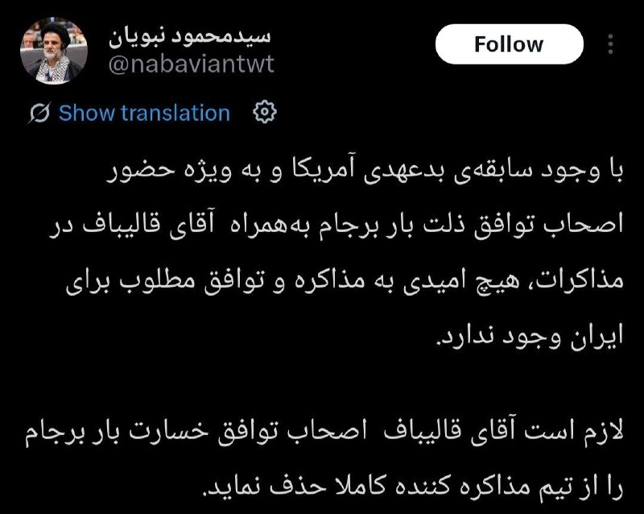

👈بازگشت نبویانِ تندرو به تنظیمات کارخانه!

🔴 عراقچی را از مذاکره بیرون کنید!

✅ @AloNews خبر جنگ

## alonews — post 118441

  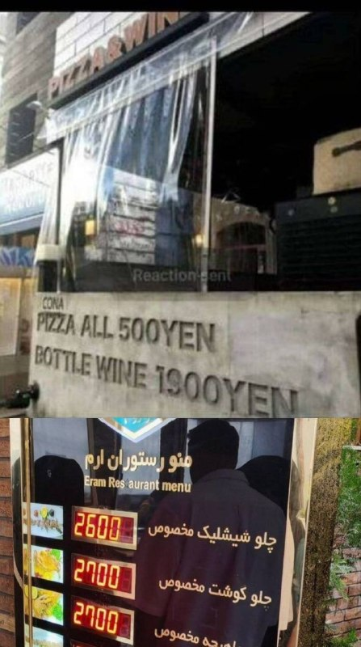

ژاپن: حک قیمت منو غذا روی بتن
ایران: استفاده از تابلوی قیمت لحظه‌ای

[@AloTweet]

## alonews — post 118440

  <a href="telegram/content/alonews_118440_1778180612.jpg">🎬 Download video</a>

تخفیف ویژه هر‌گیگ فقط 200 هزار تومان

🚀اینترنت پرسرعت بدون محدودیت! 
📶

❌بدون فیلتر، قطعی و کندی 
📶
🎮 مناسب بازی | 
🎬 استریم | 
⬇️دانلود سریع

💎مزایا:

✔️سرعت پایدار

✔️بدون ضریب

✔️ پشتیبانی ۲۴ ساعته

✔️تحویل فوری

💵پلن‌ها:
۱ گیگ ➜ 200 هزار
۵ گیگ ➜ 1000
۱۰ گیگ ➜,2000 تومان
💳پرداخت: کارت‌به‌کارت و رمز ارز

⚡سفارش سریع:
👇

👉 https://t.me/+yzgejJG2S8o0OTlk

⏳ظرفیت محدود همین الان اقدام کن
👆
تخفیف 24 ساعت رو هر کانفینگ 20 درصد تخفیف ب مناسبت 100 کای شدنمون

## alonews — post 118439

  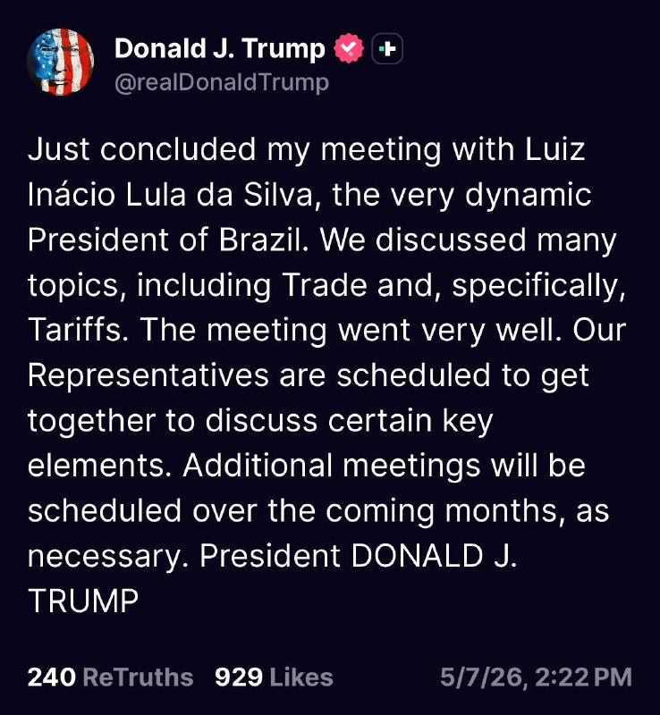

👈 ترامپ در تروث‌سوشال: «همین‌اکنون جلسه‌ام با لوئیز ایناسیو لولا دا سیلوا، رئیس‌جمهور بسیار پویای برزیل را به پایان رساندم. در مورد موضوعات متعددی از جمله تجارت و به‌طور خاص تعرفه‌ها گفت‌وگو کردیم. جلسه بسیار خوب پیش رفت. نمایندگان برنامه‌ریزی کرده‌اند تا برای بحث در مورد برخی عناصر کلیدی گرد هم آیند. جلسات اضافی در ماه‌های آینده، در صورت نیاز، برنامه‌ریزی خواهند شد. دونالد جی. ترامپ»

✅ @AloNews خبر جنگ

## alonews — post 118437

  <a href="telegram/content/alonews_118437_1778180613.jpg">🎬 Download video</a>

👈عراقچی: بخاطر تنگه هرمز کشورهایی بهمون زنگ میزنن که سالی یکبار هم حال مارو نمیپرسیدن

✅ @AloNews خبر جنگ

## alonews — post 118436

  <a href="telegram/content/alonews_118436_1778180613.jpg">🎬 Download video</a>

✅ از ساعاتی پیش گسیل گسترده پروازهای ترابری نظامی ایالات متحده به سمت منطقه برای انتقال نیروها،‌ مهمات و تجهیزات نظامی آغاز شده است. 
✅ @AkhbareFouri

## alonews — post 118435

  <a href="telegram/content/alonews_118435_1778180613.jpg">🎬 Download video</a>

🔴فوری / کنفرانس خبری پرزیدنت ترامپ و رئیس‌جمهور برزیل لغو شد

✅ @AloNews خبر جنگ

## alonews — post 118434

  <a href="telegram/content/alonews_118434_1778180614.jpg">🎬 Download video</a>

👈اسرائیل در حالت آماده‌باش بالا برای احتمال حمله تلافی‌جویانه از حزب‌الله پس از ترور فرمانده نیروی رضوان این گروه در حومه جنوبی بیروت دیشب قرار دارد، طبق گزارش کانال ۱۲ اسرائیل.

🔴 فرماندهی شمالی ارتش اسرائیل برای حملات احتمالی از لبنان در ساعات آینده آماده می‌شود، در حالی که مقامات در شمال اسرائیل به عنوان اقدام احتیاطی رویدادها و تجمعات عمومی را لغو کرده‌اند

✅ @AloNews خبر جنگ

---
📅 بروزرسانی: 1405/02/17 22:22
---

## VahidOOnLine — post 238714

  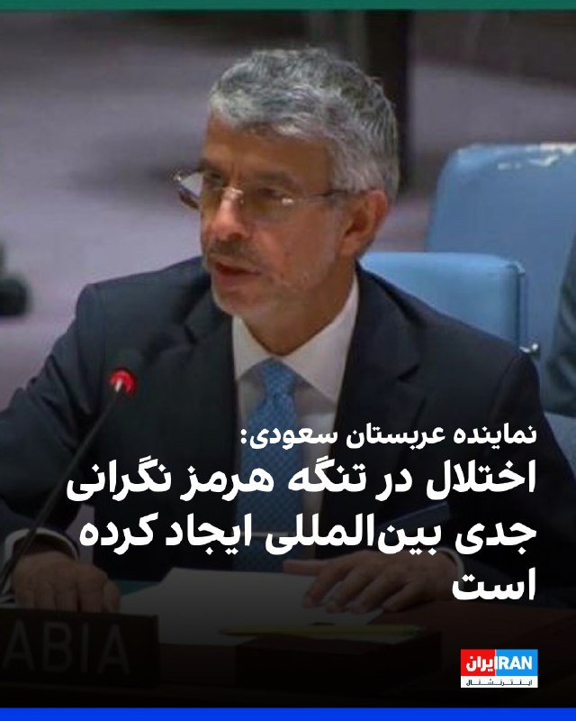

عبدالعزیز بن محمد الواصل، نماینده عربستان سعودی در سازمان ملل در نشست شورای امنیت گفت تنگه هرمز همچنان شریان حیاتی تجارت جهانی است و هرگونه اختلال در امنیت آن موجب نگرانی جدی بین‌المللی می‌شود. او افزود تحولات اخیر در این تنگه تنش‌ها را افزایش داده و خطر پیامدهای انسانی، اقتصادی و امنیتی قابل توجهی را به همراه داشته است.

نماینده عربستان سعودی گفت اختلال در عبور و مرور دریایی بازارهای جهانی انرژی را تحت تاثیر قرار داده و روند تحویل کالاهای اساسی از جمله مواد غذایی، تجهیزات پزشکی و کمک‌های بشردوستانه را با مشکل مواجه کرده است. به گفته او، این وضعیت پیامدهای سنگینی برای کشورهای آسیب‌پذیر و وابسته به واردات دارد.

او تاکید کرد این تحولات ضرورت فوری جلوگیری از تشدید تنش‌ها و حفاظت از ثبات و امنیت این آبراه راهبردی را نشان می‌دهد. به گفته نماینده عربستان، پیش‌نویس قطعنامه خواستار اقدام فوری و هماهنگ بین‌المللی برای تضمین جریان آزاد و ایمن تجارت دریایی، انتقال کمک‌های بشردوستانه و بازگرداندن ثبات به بازارهای جهانی است.
‌🏁 🇬🇧 IranintlTV

🤖 @VahidOOnLine

## VahidOOnLine — post 238713

  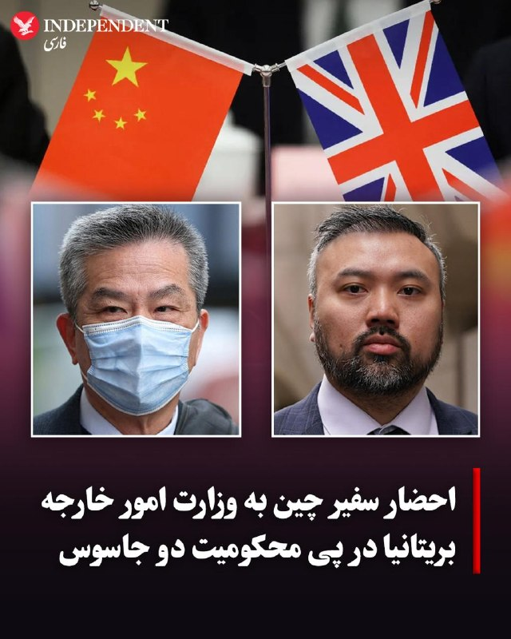

♦️دن جارویس، وزیر امنیت بریتانیا، روز پنجشنبه ۱۷ اردیبهشت در بیانیه‌ای اعلام کرد که در پی محکومیت دو مرد به اتهام جاسوسی برای هنگ‌کنگ و در نهایت برای دولت چین، سفیر این کشور به وزارت امور خارجه احضار خواهد شد.

جارویس در این باره گفت: «فعالیت‌های انجام شده توسط این افراد به نیابت از چین، نقض حاکمیت ملی ماست و هرگز تحمل نخواهد شد.»

او افزود: «ما به پاسخگو کردن چین ادامه می‌دهیم و به‌طور مستقیم با اقداماتی که امنیت مردم کشورمان را به خطر می‌اندازد، مقابله خواهیم کرد. به همین دلیل، وزارت امور خارجه سفیر چین را احضار می‌کند تا به روشنی اعلام کند که چنین فعالیت‌هایی در خاک بریتانیا غیرقابل قبول بوده است و همیشه نیز خواهد بود.»

محکومیت این دو مرد هنگ‌کنگی که به نیابت از دولت چین، مخالفان هنگ‌کنگی در بریتانیا را تهدید کرده و اطلاعاتی درباره آن‌ها به پکن می‌دادند، اولین مورد از محکومیت جاسوسان چین در تاریخ بریتانیا است.
‌🇸🇦 Indypersian

🤖 @VahidOOnLine

## VahidOOnLine — post 238712

  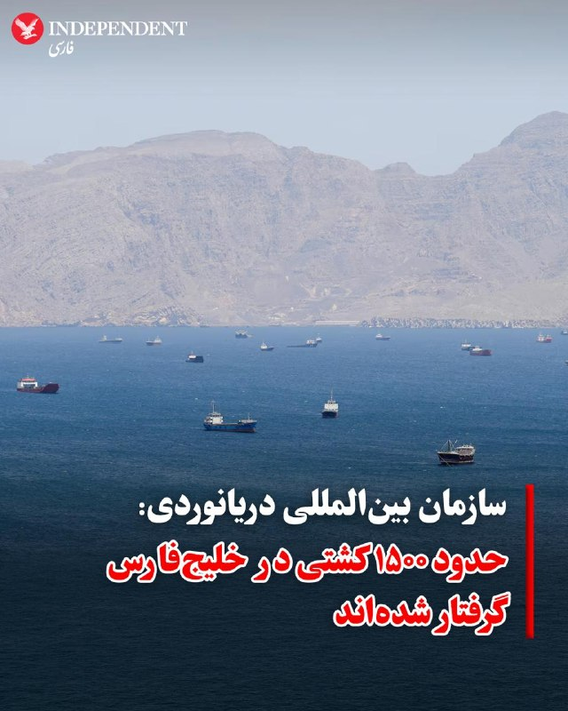

♦️دبیرکل سازمان بین‌المللی دریانوردی (IMO) روز پنجشنبه، ۱۷ اردیبهشت در پاناما اعلام کرد که در پی مسدود شدن تنگه هرمز توسط جمهوری اسلامی، حدود ۱۵۰۰ کشتی و خدمه آن‌ها در خلیج‌فارس گرفتار شده‌اند.

آرسنیو دومینگز در جریان کنفرانس دریانوردی قاره آمریکا گفت: «در حال حاضر تقریبا ۲۰ هزار دریانورد و حدود ۱۵۰۰ کشتی در منطقه گرفتار هستند.»

دومینگز در جمع مدیران صنعت دریانوردی و نمایندگان این سازمان تاکید کرد که خدمه این کشتی‌ها «افراد بی‌گناهی هستند که هر روز برای منافع کشورهای دیگر تلاش می‌کنند، اما اکنون در دام موقعیت‌های ژئوپلیتیکی افتاده‌اند که خارج از کنترل آن‌هاست.»
‌🇸🇦 Indypersian

🤖 @VahidOOnLine

## pm_afshaa — post 90302

🔴شبکه 14 اسرائیل: بعد از اینکه ایران پیشنهاد آمریکا رو رد کنه، ترامپ دوباره پروژه «آزادی» رو راه میندازه

💧 Rainbet.com the #1 Non-KYC Crypto Casino & Sportsbook @rainbetcom

😁 @Pm_Afshaa

## DEJradio — post 4478

  <a href="telegram/content/DEJradio_4478_1778179976.jpg">🎬 Download video</a>

⭕️
🚨 منابع محلی و گزارش‌های داخلی از وقوع چندین انفجار در منطقه بندرعباس حکایت دارند.

#انفجار #بندرعباس
@DEJradio

## VahidOnline — post 75302

هرمزگان
پیام‌های دریافتی با جزئیات تایید نشده از ساعت ۹:۲۵:
درود
ما غرب جزیره قشمیم. از ساعت ۹:۲۵ به فاصله چند دقیقه ۴ بار صدای انفجار اومد و موجش شیشه ها رو لرزوند.
ساعت ۹:۴۸ یه صدای انفجار و ۱۰:۰۲ صدای دو انفجار دیگه. صدای جنگنده نیومده ولی

صدای چندین انفجار پیاپی قشم همین الان

بندرعباس همین الان صدای انفجار اومد مثل صدای برخورد بمب بود

بندرعباس صدای انفجار اومد حدود ساعت ۹ و نیم شب

سلام، ساعت 21:30 بندر خمیر استان هرمزگان انفجارهای پیاپی و شدید

سلام وحید جان قشم صدای پنج انفجار

سلام وحید جان بندر کنگ ساعت 21:50 صدای چندین لانچ موشک شنیده شد

ساعت 22:01 شهر قشم در محدوده [محله‌های] دوحه و چابهار صدای دو انفجار پشت هم شنیده شد
ظاهرا انفجار ها از سمت اسکله بهمن شهر قشم بوده
خودم حاضر بودم و شنیدم
صدا بسیار بلند بود و موج انفجار هم حس شد
امروز ۱۷ اردیبهشت ۱۴۰۵

سلام داداش
قشم دقیقا الان ساعت ۱۰
دوتا موشک زدن اسکله دوحه
خیلی وحشتناک بود کل آسمون قرمز شد

همین الان بندرعباس صدای دوتا انفجار پشت سر هم از سمت دریا اومد نمیدونم لانچ بود یا برخورد ولی هم صدا داشت هم پنجره ها لرزید

درود بر آقا وحید گل
بندرعباس ، الان ساعت ده و دو دقیقه شب صدای دو انفجار پشت سر هم آمد
ساعات پایانی روز پنجشنبه

سلام آقا وحید. قشم همین چند دقیقه پیش ساعت ۱۰ شب دوتا صدای انفجار اومد همراه یا نور روی دریا. چیزی رو توی دریا زدن

همین الان ۲۲:۰۴ دقیقه
صدای سه تا انفجار سمت دریا میاد
سمت سیریک استان هزمزگان
یه موشک هم بلند شد
با فاصله نورش دیده میشد
به سمت دریا رفت

الان سمت میناب دوبار صدای انفجار اومد
با شهر فاصله داره

📡 @VahidOnline

## kianmeli1 — post 87219

🔴خبرهایی از هدف قرار گرفتن اسکله بهمن قشم است!
https://t.me/kianmeli1

## kianmeli1 — post 87218

  <a href="telegram/content/kianmeli1_87218_1778179977.mp4">🎬 Download video</a>

⚠️فوری-بر اساس این گزارش‌ها

در غرب جزیره قشم، چندین صدای انفجار در فاصله‌های کوتاه (حدود ساعت ۹:۲۵ تا ۱۰:۰۲ شب) شنیده شده که برخی ساکنان از لرزش شیشه‌ها و احساس موج انفجار خبر داده‌اند.
در بندرعباس، چند مورد صدای انفجار در حوالی ساعت ۲۱:۳۰ تا ۲۲:۰۴ گزارش شده است.
در بندر خمیر نیز انفجارهای پیاپی و نسبتاً شدید در حدود ساعت ۲۱:۳۰ گزارش شده است.
در بندر کنگ، برخی افراد از شنیدن صداهای متعدد و احتمال پرتاب یا لانچ شئ ناشناس در حوالی ساعت ۲۱:۵۰ خبر داده‌اند.
در محدوده‌های ساحلی قشم (از جمله حوالی اسکله‌ها)، گزارش‌هایی از شنیده شدن چند صدای انفجار و مشاهده نور در آسمان منتشر شده است.
در مناطق سیریک و میناب نیز صداهای انفجار و مشاهده نور یا حرکت جسم نورانی در آسمان گزارش شده است
https://t.me/kianmeli1

## kianmeli1 — post 87217

🔴دقایقی پیش صدای چندین انفجار در بندرعباس شنیده شد

دلیل اصلی مشخص نیست
https://t.me/kianmeli1

## IranIntlTV — post 336016

  

خبرگزاری فارس، وابسته به سپاه پاسداران، از شنیده شدن صدای چند انفجار در بندرعباس در شامگاه پنجشنبه خبر داد و اعلام کرد که هنوز منشا و محل دقیق این صداها مشخص نیست.
همزمان اسکان‌نیوز نوشت گزارش‌ها از شنیده‌شدن صدای ۶ انفجار با فاصله ۴۰ ثانیه از یکدیگر در سیریک در استان هرمزگان خبر می‌دهند.
وحید آنلاین نیز از شنیده شدن صداهای انفجار در قشم، میناب، بندرعباس، بندر خمیر، چابهار و سیریک در شامگاه پنجشنبه خبر داد.
https://iranintl.com/202605074248

## IranIntlTV — post 336015

  

عبدالعزیز بن محمد الواصل، نماینده عربستان سعودی در سازمان ملل در نشست شورای امنیت گفت تنگه هرمز همچنان شریان حیاتی تجارت جهانی است و هرگونه اختلال در امنیت آن موجب نگرانی جدی بین‌المللی می‌شود. او افزود تحولات اخیر در این تنگه تنش‌ها را افزایش داده و خطر پیامدهای انسانی، اقتصادی و امنیتی قابل توجهی را به همراه داشته است.

نماینده عربستان سعودی گفت اختلال در عبور و مرور دریایی بازارهای جهانی انرژی را تحت تاثیر قرار داده و روند تحویل کالاهای اساسی از جمله مواد غذایی، تجهیزات پزشکی و کمک‌های بشردوستانه را با مشکل مواجه کرده است. به گفته او، این وضعیت پیامدهای سنگینی برای کشورهای آسیب‌پذیر و وابسته به واردات دارد.

او تاکید کرد این تحولات ضرورت فوری جلوگیری از تشدید تنش‌ها و حفاظت از ثبات و امنیت این آبراه راهبردی را نشان می‌دهد. به گفته نماینده عربستان، پیش‌نویس قطعنامه خواستار اقدام فوری و هماهنگ بین‌المللی برای تضمین جریان آزاد و ایمن تجارت دریایی، انتقال کمک‌های بشردوستانه و بازگرداندن ثبات به بازارهای جهانی است.
https://iranintl.com/202605079251

## Iliaen — post 4426

ساعت ۲۲:۱۴ پنجشنبه؛ انفجار بسیار مهیب در سیریک هرمزگان گزارش می‌شود.

@iliaen

## Iliaen — post 4425

  <a href="telegram/content/Iliaen_4425_1778179978.mp4">🎬 Download video</a>

تهرانپارس؛ یک شی نورانی مانند پهپاد در فاصله‌ی چند صدمتری از سطح زمین پرواز می‌کند.

@iliaen

## FarsiVOA — post 217130

  <a href="telegram/content/FarsiVOA_217130_1778179979.mp4">🎬 Download video</a>

یکی از مخاطبان صدای آمریکا با ارسال ویدئویی از یک سوپرمارکت در ایران، از گرانی، کمبود کالا و فشار اقتصادی گلایه می‌کند و می‌گوید: مردم به خاطر جنگ و جدال سپاه پاسداران بیکارند. خودشان هر چی پول هست را زدند به جیب‌شان و ما اینجا برای یک تیکه نان خشک می‌میریم.

🔴ویدئوی ارسالی یکی از مخاطبان صدای آمریکا (صدا تغییر داده شده است)

## FarsiVOA — post 217129

انتخابات محلی و شورای شهر در بریتانیا، آزمون سیاسی سخت برای دولت حزب کارگر

## Persian_Trend_Official — post 13613

چندین انفجار با فاصله کم در بندر سیریک استان هرمزگان گزارش شده است.

☆Phantom☆

📌 @persian_trend_official
پرشین ترند | متفاوت‌ترین کانال نظامی

## IranianMinds — post 19705

🔴شبکه ۱۴ اسرائیل:

بعد از اینکه ایران پیشنهاد آمریکا را رد کند، ترامپ مجددأ پروژه آزادی تنگه هرمز را راه می‌اندازد .

@IranianMinds

## IranianMinds — post 19704

🔴 خبرگزاری فارس :

دقایقی پیش مردم بندرعباس چند صدای شبیه به انفجار از حوالی این شهر شنیدند.

@IranianMinds

## Dirty_Kids — post 389051

دوست دخترم چهار روز خونمون بود فهمیدم چرا همه ازدواج میکنن، یبار هم دو هفته با هم زندگی کردیم فهمیدم چرا همه طلاق میگیرن❤️

@Dirty_Kids 👻

## Dirty_Kids — post 389050

  

آیا انقدری پیر هستی که به اینا بگی شلوار دمپا گشاد؟

@Dirty_Kids 👻

---
📅 بروزرسانی: 1405/02/17 22:13
---

## VahidOOnLine — post 238711

  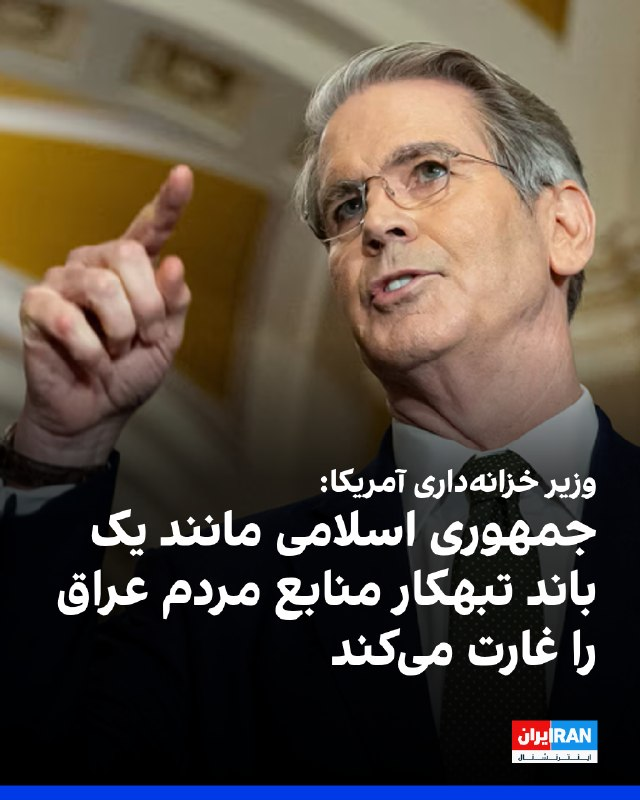

اسکات بسنت، وزیر خزانه‌داری ایالات متحده، بخشی از بیانیه این وزارت‌خانه درباره تحریم گروه‌های شبه‌نظامی و نیابتی مورد حمایت جمهوری اسلامی را در شبکه اجتماعی ایکس بازنشر داد که در آن رفتار حکومت ایران به رفتار یک «باند تبهکار» تشبیه و این حکومت به «غارت منابع متعلق به مردم عراق» متهم شده است.

در این پست آمده است: «رژیم ایران مانند یک باند تبهکار، منابعی را که حق مسلم مردم عراق است، غارت می‌کند. وزارت خزانه‌داری در برابر سوءاستفاده نظامیان ایران از نفت عراق برای تامین مالی تروریسم علیه ایالات متحده و شرکای ما، بی‌تفاوت نخواهد ماند.»

وزارت خزانه‌داری آمریکا امروز پنج فرد و چهار شرکت عراقی را به دلیل ارتباط با جمهوری اسلامی و سوءاستفاده از صنایع نفتی عراق برای تضعیف امنیت این کشور را تحریم کرد.
‌🏁 🇬🇧 IranintlTV

🤖 @VahidOOnLine

## VahidOOnLine — post 238710

  

علیا احمد بن سیف آل‌ثانی، نماینده قطر در سازمان ملل در نشست شورای امنیت گفت پیش‌نویس قطعنامه مربوط به تنگه هرمز از اهمیت بالایی برخوردار است و برای پاسخ به بسته شدن این آبراه از ماه مارس از سوی جمهوری اسلامی ایران ضروری است. او افزود این اقدام پیامدهای اقتصادی شدیدی در کشورهای شورای همکاری خلیج فارس و در سطح جهانی ایجاد کرده است.

نماینده قطر گفت دولت این کشور پیش‌تر هشدار داده بود که بسته شدن تنگه هرمز می‌تواند بحران را از سطح منطقه‌ای به بحرانی جهانی تبدیل کند و آنچه اکنون رخ داده تحقق همان هشدار است. به گفته او، این وضعیت حدود ۲۰ درصد از تجارت جهانی نفت و گاز طبیعی مایع را مختل کرده است.

او افزود بیش از ۲۰ هزار دریانورد در دریا گرفتار شده‌اند و این شرایط نه‌تنها ثبات اقتصادی جهانی و امنیت انرژی را به خطر انداخته، بلکه بحران‌های انسانی را تشدید و ثبات منطقه‌ای را تضعیف کرده است.

نماینده قطر تاکید کرد این تحولات تهدیدی واقعی برای صلح و امنیت بین‌المللی محسوب می‌شود.
‌🏁 🇬🇧 IranintlTV

🤖 @VahidOOnLine

## VahidOOnLine — post 238709

  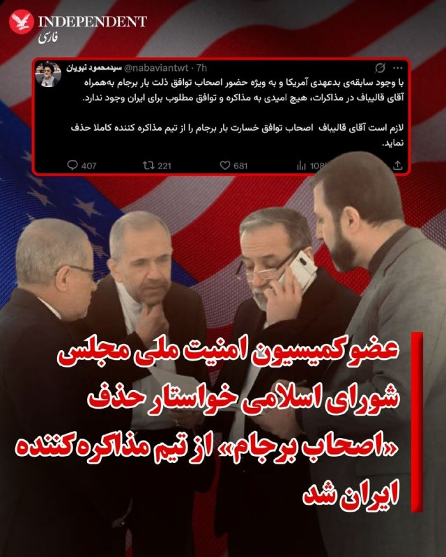

♦️محمود نبویان عضو کمیسیون امنیت ملی مجلس شورای اسلامی روز پنجشنبه ۱۷ اردیبهشت خواستار تغییر در تیم مذاکره کننده ایران با آمریکا شد.

نبویان با انتشار پیامی در شبکه اجتماعی ایکس با انتقاد از ایالات متحده و کنایه به تیم وزارت خارجه نوشت: «با وجود سابقه‌ی بدعهدی آمریکا و به ویژه حضور اصحاب توافق ذلت بار برجام به‌همراه آقای قالیباف در مذاکرات، هیچ امیدی به مذاکره و توافق مطلوب برای ایران وجود ندارد.»

او تاکید کرد که «لازم است آقای قالیباف اصحاب توافق خسارت بار برجام را از تیم مذاکره کننده کاملا حذف نماید.»

منظور محمود نبویان عضو کمیسیون امنیت ملی مجلس از «اصحاب توافق ذلت بار برجام»، عباس عراقچی، وزیر خارجه جمهوری اسلامی و معاونان او مجید تخت‌روانچی، کاظم غریب‌آبادی و علی باقری کنی است که پیش از این همراه با جواد ظریف در مذاکرات برجام حضور داشتند.

در روزهای گذشته اخباری درباره تلاشها برای حذف عباس عراقچی از مذاکرات با آمریکا منتشر شده بود.
‌🇸🇦 Indypersian

🤖 @VahidOOnLine

## VahidOOnLine — post 238708

  <a href="telegram/content/VahidOOnLine_238708_1778179384.mp4">🎬 Download video</a>

در تجمعات شرکت کنید و نمره ۲۰ بگیرید٬ تماس یک معلم از درون وطن
‌🏁 🇬🇧 ManotoTV

🤖 @VahidOOnLine

## VahidOOnLine — post 238707

  <a href="telegram/content/VahidOOnLine_238707_1778179386.mp4">🎬 Download video</a>

فایننشال‌تایمز گزارش داد دونالد ترامپ، رئیس‌جمهور آمریکا، پس از مخالفت عربستان سعودی با همکاری در طرح نظامی برای هدایت و اسکورت کشتی‌های تجاری در تنگه هرمز ، تنها یک روز پس از آغاز عملیات آن را متوقف کرد.

بر اساس این گزارش، ریاض به واشینگتن اعلام کرده اجازه استفاده از پایگاه‌ها و حریم هوایی خود را برای اجرای این طرح — موسوم به «پروژه آزادی» — نخواهد داد و آن را «تنش‌زا و فاقد برنامه‌ریزی دقیق» ارزیابی کرده است. کاخ سفید در این‌باره اظهار نظری نکرده است.

این تصمیم، نشانه‌ای از افزایش نارضایتی برخی متحدان عرب آمریکا از نحوه مدیریت جنگ از سوی ترامپ تلقی می‌شود.

مخالفت ریاض با این طرح، که نخستین‌بار توسط رسانه‌های آمریکایی گزارش شد، نشان‌دهنده افزایش نگرانی عربستان از رویکرد غیرقابل پیش‌بینی ترامپ در مدیریت جنگ است؛ به‌ویژه در شرایطی که کشورهای حاشیه خلیج فارس هدف حملات تلافی‌جویانه ایران قرار گرفته‌اند.

عربستان پیش‌تر با برخی کشورهای عربی دیگر نسبت به آغاز جنگ هشدار داده و بر لزوم پیگیری راه‌حل دیپلماتیک تأکید کرده بود. با وجود آن‌که ریاض در ابتدا از تضعیف توان موشکی و پهپادی جمهوری اسلامی استقبال کرده بود، اکنون نسبت به نبود یک راهبرد مشخص و تهدیدهای ترامپ برای حمله به زیرساخت‌های غیرنظامی، از جمله نیروگاه‌های برق، ابراز نگرانی کرده است.

این کشور در حال حاضر از تلاش‌های میانجی‌گرانه پاکستان برای پایان دادن به جنگ و بازگشایی تنگه هرمز حمایت می‌کند.
‌🏁 🇬🇧 ManotoTV

🤖 @VahidOOnLine

## VahidOOnLine — post 238706

  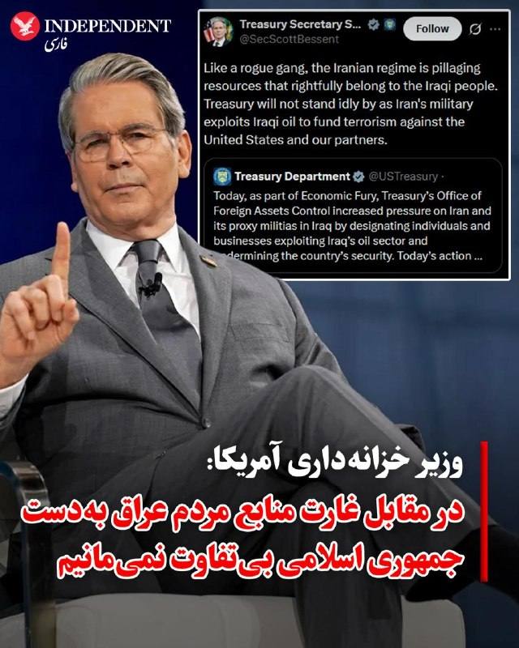

♦️اسکات بسنت، وزیر خزانه‌داری ایالات متحده، روز پنجشنبه ۱۷ اردیبهشت، با انتشار پیامی در شبکه اجتماعی ایکس، رژیم ایران را به «یک باند تبهکار» تشبیه کرد که در حال غارت منابع متعلق به مردم عراق است. او تاکید کرد که وزارت خزانه‌داری در برابر بهره‌برداری نظامی جمهوری اسلامی از نفت عراق برای تامین مالی تروریسم علیه آمریکا و شرکای منطقه‌ای‌اش، بی‌تفاوت نخواهد ماند.

این اظهارات هم‌زمان با دور جدید تحریم‌ها تحت عنوان عملیات «خشم اقتصادی» (Economic Fury) مطرح شد. در این اقدام، دفتر کنترل دارایی‌های خارجی (OFAC) علی معارج البهادلی، معاون وزیر نفت عراق، را به همراه سه تن از سران شبه‌نظامیان وابسته به جمهوری اسلامی تحریم کرد. این افراد متهم هستند که با سوءاستفاده از جایگاه خود، نفت عراق را به نفع رژیم ایران منحرف کرده و امنیت و حاکمیت اقتصادی این کشور را تضعیف کرده‌اند.
‌🇸🇦 Indypersian

🤖 @VahidOOnLine

## VahidOOnLine — post 238705

  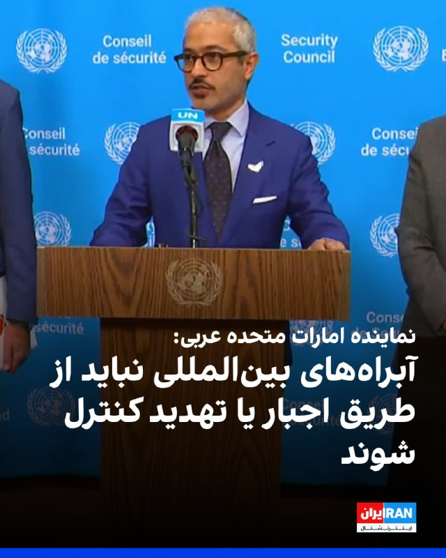

نماینده امارات متحده عربی در سازمان ملل در نشست شورای امنیت گفت پیش‌نویس قطعنامه درباره تنگه هرمز در مقطعی حساس ارائه شده و با تقویت حقوق بین‌الملل تاکید می‌کند آبراه‌های بین‌المللی نباید از طریق اجبار یا تهدید کنترل شوند. او افزود تحولات این گذرگاه بر تجارت جهانی و بازارهای انرژی تاثیر مستقیم دارد.

او گفت تهران ماه‌ها به حملات و تهدیدها علیه کشتی‌های تجاری ادامه داده و در اطراف تنگه مین‌گذاری کرده است. به گفته او، از ۲۸ فوریه دست‌کم ۳۲ کشتی هدف قرار گرفته‌اند که به کشته شدن دریانوردان و بلاتکلیفی هزاران نفر انجامیده است.

نماینده امارات افزود این اقدامات پس از تصویب قطعنامه ۲۸۱۷ نیز متوقف نشده است. او تاکید کرد پیش‌نویس خواستار جمع‌آوری مین‌ها، توقف عوارض غیرقانونی و ایجاد کریدور بشردوستانه در تنگه است.

به گفته او، این متن با استناد به فصل هفتم منشور سازمان ملل بر الزام‌آور بودن مفاد آن تاکید دارد و در صورت اجرا نشدن، شورای امنیت ممکن است اقدامات بیشتری را بررسی کند.
‌🏁 🇬🇧 IranintlTV

🤖 @VahidOOnLine

## VahidOOnLine — post 238704

  

نماینده امارات متحده عربی در سازمان ملل در نشست شورای امنیت گفت پیش‌نویس قطعنامه درباره تنگه هرمز در مقطعی حساس ارائه شده و با تقویت حقوق بین‌الملل تاکید می‌کند آبراه‌های بین‌المللی نباید از طریق اجبار یا تهدید کنترل شوند. او افزود تحولات این گذرگاه بر تجارت جهانی و بازارهای انرژی تاثیر مستقیم دارد.

او گفت تهران ماه‌ها به حملات و تهدیدها علیه کشتی‌های تجاری ادامه داده و در اطراف تنگه مین‌گذاری کرده است. به گفته او، از ۲۸ فوریه دست‌کم ۳۲ کشتی هدف قرار گرفته‌اند که به کشته شدن دریانوردان و بلاتکلیفی هزاران نفر انجامیده است.

نماینده امارات افزود این اقدامات پس از تصویب قطعنامه ۲۸۱۷ نیز متوقف نشده است. او تاکید کرد پیش‌نویس خواستار جمع‌آوری مین‌ها، توقف عوارض غیرقانونی و ایجاد کریدور بشردوستانه در تنگه است.

به گفته او، این متن با استناد به فصل هفتم منشور سازمان ملل بر الزام‌آور بودن مفاد آن تاکید دارد و در صورت اجرا نشدن، شورای امنیت ممکن است اقدامات بیشتری را بررسی کند.
‌🏁 🇬🇧 IranintlTV

🤖 @VahidOOnLine

## VahidOOnLine — post 238703

  

وال‌استریت ژورنال گزارش داد عربستان سعودی و کویت پس از آنکه مقام‌های آمریکایی حملات جمهوری اسلامی را کم‌اهمیت جلوه دادند و کشورهای حاشیه خلیج فارس نسبت به کاهش حمایت آمریکا ابراز نگرانی کردند، برخی محدودیت‌ها را اعمال کرده بودند.

این روزنامه همچنین گزارش داد عربستان سعودی و کویت اکنون محدودیت‌های اعمال‌شده بر استفاده ارتش آمریکا از پایگاه‌ها و حریم هوایی خود را لغو کرده‌اند؛ محدودیت‌هایی که پس از آغاز عملیات آمریکا برای بازگشایی تنگه هرمز وضع شده بود.
‌🏁 🇬🇧 IranintlTV

🤖 @VahidOOnLine

## VahidOOnLine — post 238702

  <a href="telegram/content/VahidOOnLine_238702_1778179389.mp4">🎬 Download video</a>

‌
مایک والتز، نماینده آمریکا در سازمان ملل، گفت اقدام جمهوری اسلامی در بستن تنگه هرمز نقض اصول پایه حقوق دریاها و قوانین بین‌المللی است.

او همچنین گزارش‌ها درباره ایجاد نهادی با عنوان «مرجع تنگه خلیج فارس» برای دریافت عوارض از کشتی‌ها را محکوم کرد و آن را «تلاشی فرصت‌طلبانه برای کسب اهرم فشار» خواند.

والتز گفت: «مجازات جمعی کل جهان برای حل یک اختلاف، غیرقابل قبول، غیراخلاقی و برخلاف حقوق بین‌الملل است.»

او افزود: «این باید یک خواسته ساده باشد؛ پاک‌سازی مین‌ها از یک آبراه بین‌المللی و عدم تحمیل عوارض غیرقانونی.»

نماینده آمریکا در سازمان ملل تأکید کرد این موارد باید در شورای امنیت بررسی شود و افزود: «اگر کشوری با چنین خواسته ساده‌ای مخالفت کند، باید پرسید آیا واقعاً به‌دنبال صلح است یا نه.»
‌🏁 🇬🇧 ManotoTV

🤖 @VahidOOnLine

## VahidOOnLine — post 238701

  

ابراهیم رضایی، سخنگوی کمیسیون امنیت ملی مجلس، گفت: «کنترل تنگه هرمز را نمی‌توانند از ما بگیرند و ما اجازه نمی‌دهیم و نمی‌توانند بدون اجازه جمهوری اسلامی حتی یک لیتر نفت از تنگه هرمز عبور بدهند.» او افزود: «تنگه هرمز را باز نمی کنیم.»

سخنگوی کمیسیون امنیت ملی و سیاست خارجی مجلس گفت: «اگر آمریکایی‌ها کوچکترین کرنش و عقب‌نشینی از طرف ما ببینند حتما جری‌تر می‌شوند و گستاخانه‌تر با ما برخورد خواهند کرد.»
‌🏁 🇬🇧 IranintlTV

🤖 @VahidOOnLine

## VahidOOnLine — post 238700

  <a href="telegram/content/VahidOOnLine_238700_1778179390.mp4">🎬 Download video</a>

تعدادی از جاویدنامان اصفهان (چمگردان)٬ اگر اطلاعات بیشتری از این عزیزان دارید با ما به اشترک بگذارید.
‌🏁 🇬🇧 ManotoTV

🤖 @VahidOOnLine

## VahidOOnLine — post 238699

  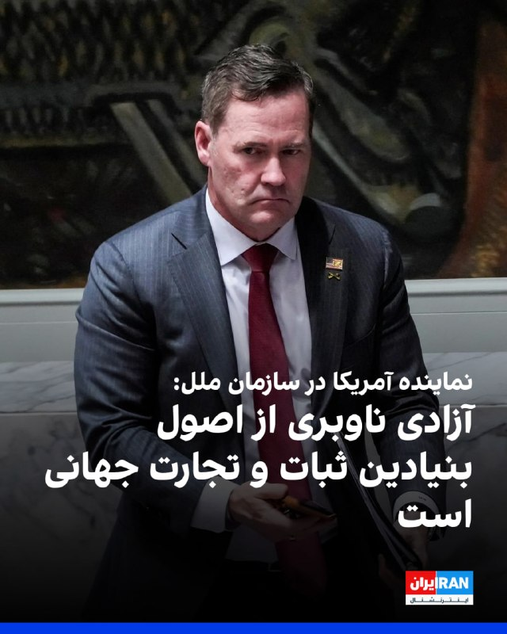

مایک والتز، نماینده ایالات متحده در نشست شورای امنیت گفت واشینگتن این قطعنامه را مشترکا با بحرین و با همکاری شرکای خود در خلیج فارس تدوین کرده است. او تاکید کرد آزادی ناوبری یکی از اصول بنیادین ثبات و تجارت جهانی است و نقض آن سابقه‌ای خطرناک ایجاد می‌کند.

والتز گفت این قطعنامه از ایران می‌خواهد حملات به کشتی‌های تجاری را متوقف کند، مین‌گذاری را پایان دهد و مین‌ها را از تنگه هرمز جمع‌آوری کند. این متن همچنین خواستار توقف دریافت عوارض غیرقانونی و انتقال کمک‌های بشردوستانه از این آبراه است.

او با اشاره به اعلام رسانه‌های دولتی جمهوری اسلامی درباره راه‌اندازی «سازمان تنگه‌های خلیج فارس»، گفت دریافت عوارض از کشتی‌های بین‌المللی بر اساس حقوق بین‌الملل غیرقانونی است.

نماینده آمریکا افزود اکنون زمان انتخاب برای اعضای شورای امنیت فرا رسیده و ایالات متحده در کنار آزادی ناوبری و حقوق بین‌الملل ایستاده است.
‌🏁 🇬🇧 IranintlTV

🤖 @VahidOOnLine

## VahidOOnLine — post 238697

  <a href="telegram/content/VahidOOnLine_238697_1778179392.mp4">🎬 Download video</a>

♦️دونالد ترامپ، رئیس جمهوری آمریکا روز پنجشنبه ۱۷ اردیبهشت در کاخ سفید از لولا داسیلوا، رئیس جمهوری برزیل استقبال کرد.

رئیس جمهوری برزیل در حالی وارد واشنگتن شده است که در ماه‌های گذشته، به سیاست‌های یک‌جانبه‌گرایانه دونالد ترامپ طعنه زده و بر استقلال رای برزیل تأکید کرده است.

این دیدار پس از آن صورت می‌گیرد که ترامپ اخیرا لحن خود را نسبت به لولا داسیلوا تغییر داده و حتی حکم زندان قبلی او در برزیل را مشابه آنچه برای خودش اتفاق افتاد توصیف کرده است.
‌🇸🇦 Indypersian

🤖 @VahidOOnLine

## VahidOOnLine — post 238696

  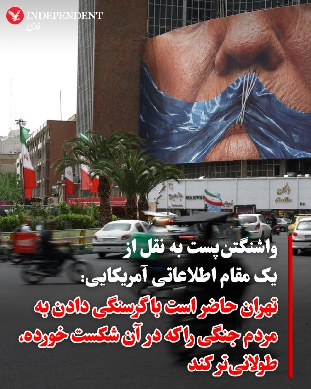

♦️واشنگتن‌پست روز پنجشنبه گزارش داد که ارزیابی‌های سازمان مرکزی اطلاعات آمریکا، سیا، نشان می‌دهد تهران هنوز می‌تواند تا سه یا چهار ماه دیگر مقابل محاصره دریایی دوام بیاورد اما یک مقام ارشد اطلاعاتی ایالات متحده در گفتگو با این نشریه، تاکید کرد که این، به معنی موفق نبودن محاصره دریایی نیست. این مقام اطلاعاتی که به دلیل حساسیت مسئله، نخواست نامش فاش شود، اعلام کرد که این اقدام ضربات جبران‌ناپذیری به اقتصاد ایران وارد کرده و منجر به سقوط درآمدها و فروپاشی سازمان‌یافته اقتصادی شده است.

به گفته او، توان نظامی جمهوری اسلامی به‌شدت تحلیل رفته و رژیم تهران اکنون تنها با تکیه بر «تحمیل رنج به غیرنظامیان» در حال پیشبرد اهداف خود است. او گفت که مقامات ایران با گرسنگی دادن به مردم خود، صرفا سعی دارند جنگی را که پیش از این در آن شکست خورده‌اند، طولانی‌تر کنند.
‌🇸🇦 Indypersian

🤖 @VahidOOnLine

## VahidOOnLine — post 238695

  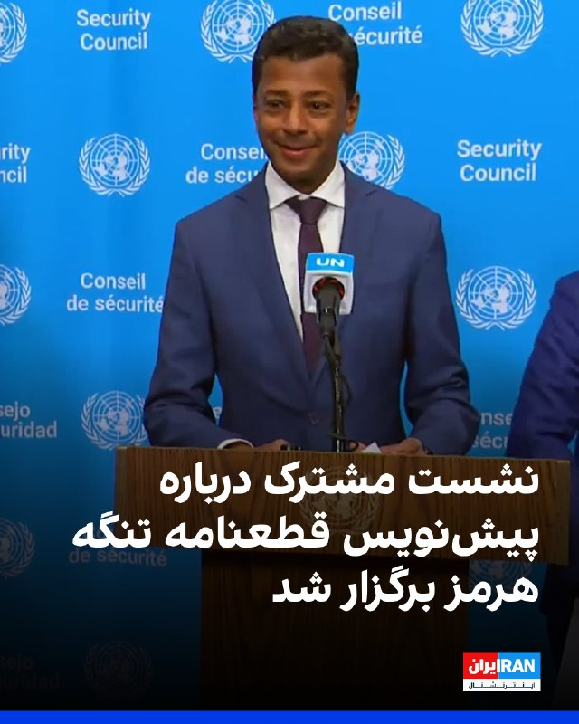

نشست مشترک نمایندگان آمریکا و چند کشور عربی درباره پیش‌نویس قطعنامه مربوط به تنگه هرمز آغاز شد. در بیانیه این نشست آمده است پادشاهی بحرین به همراه ایالات متحده و با حمایت کویت، قطر، عربستان سعودی و امارات متحده عربی، این پیش‌نویس را به شورای امنیت ارائه کرده است.

در بیانیه تاکید شده تنگه هرمز یکی از حیاتی‌ترین گذرگاه‌های دریایی جهان است که برای ثبات منطقه خلیج فارس و اقتصاد جهانی اهمیت دارد و تحولات اخیر ضرورت حفظ امنیت و باز بودن کامل این آبراه را برجسته کرده است.

نماینده بحرین گفت این پیش‌نویس، در ادامه قطعنامه ۲۸۱۷ شورای امنیت، از ایران می‌خواهد فورا تمامی حملات و تهدیدها علیه کشتی‌های تجاری را متوقف کند و به موضوع مین‌گذاری و یدک‌کشی غیرقانونی نیز می‌پردازد.

به گفته نماینده بحرین، این متن بر آزادی ناوبری مطابق حقوق بین‌الملل استوار است و از تلاش‌ها برای دستیابی به صلحی پایدار در منطقه و تشویق گفت‌وگو حمایت می‌کند.
‌🏁 🇬🇧 IranintlTV

🤖 @VahidOOnLine

## VahidOOnLine — post 238694

  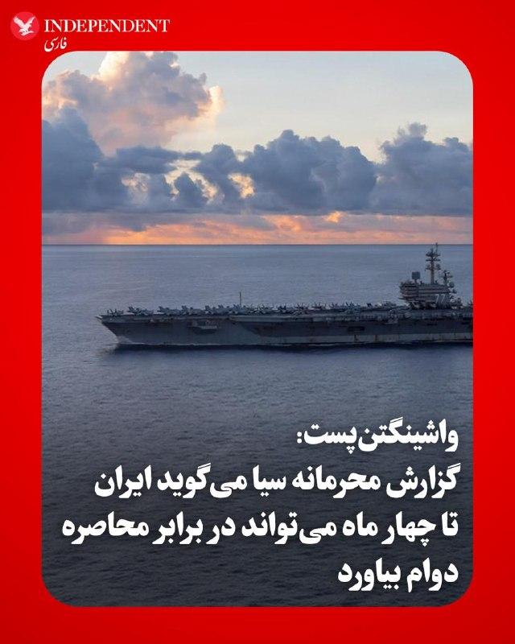

♦️واشنگتن‌پست روز پنجشنبه ۱۷ اردیبهشت گزارش داد که به تحلیل محرمانه سازمان سیا که به‌تازگی در اختیار سیاست‌گذاران آمریکایی دست یافته است و این تحلیل نشان می‌دهد که ایران می‌تواند علی‌رغم محاصره دریایی، ۹۰ تا ۱۲۰ روز و حتی بیشتر، در برابر فشارهای اقتصادی مقاومت کند. به گزارش واشنگتن‌پست داده‌های این تحلیل حاکی از آن است که وضعیت اقتصادی ایران آن‌طور که برخی ادعا می‌کنند «وخیم» نیست.

بر اساس این ارزیابی، تهران برای مقابله با پر شدن مخازن، بخشی از نفت خود را در نفتکش‌های خالی ذخیره کرده و جریان استخراج در میادین نفتی را کاهش داده تا چاه‌ها عملکرد خود را حفظ کنند. علاوه بر این، احتمال قاچاق نفت از طریق مسیرهای زمینی، از جمله شبکه ریلی آسیای مرکزی، می‌تواند به عنوان یک ضربه‌گیر اقتصادی عمل کند. این گزارش همچنین هشدار می‌دهد که توان موشکی ایران همچنان «سهمگین» باقی مانده است؛ به‌طوری که تهران حدود ۷۵ درصد از پرتابگرهای متحرک و ۷۰ درصد از ذخایر موشکی خود را حفظ کرده و حتی موفق به بازسازی برخی تاسیسات زیرزمینی آسیب‌دیده شده است.
‌🇸🇦 Indypersian

🤖 @VahidOOnLine

## VahidOOnLine — post 238693

  <a href="telegram/content/VahidOOnLine_238693_1778179395.mp4">🎬 Download video</a>

‌
نماینده امارات متحده عربی در سازمان ملل از ارائه پیش‌نویس قطعنامه‌ای خبر داد که بر ضرورت حفاظت از آبراه‌های بین‌المللی در پی افزایش تهدیدها در تنگه هرمز تأکید دارد.
محمد عیسی ابوشهاب گفت این قطعنامه بر اصول تثبیت‌شده حقوق بین‌الملل استوار است و تأکید می‌کند «آبراه‌های بین‌المللی را نمی‌توان از طریق اجبار، حمله یا تهدید علیه کشتیرانی غیرنظامی و تجاری کنترل کرد.»
او افزود جمهوری اسلامی طی ماه‌های گذشته «به حملات و تهدیدها علیه کشتی‌های تجاری ادامه داده، در ناوبری قانونی اختلال ایجاد کرده، در اطراف تنگه هرمز مین‌گذاری کرده و تلاش کرده عوارض غیرقانونی بر کشتیرانی بین‌المللی تحمیل کند.»
نماینده امارات گفت این قطعنامه خواستار افشای محل مین‌های دریایی و پاک‌سازی آن‌ها در تنگه هرمز است و هرگونه تحمیل عوارض غیرقانونی و مداخله در آزادی کشتیرانی را رد می‌کند.
او همچنین تأکید کرد این طرح از ایجاد یک کریدور بشردوستانه برای تسهیل انتقال کمک‌های انسانی، کود شیمیایی و سایر کالاهای اساسی از طریق این آبراه حمایت می‌کند.
‌🏁 🇬🇧 ManotoTV

🤖 @VahidOOnLine

## VahidOOnLine — post 238692

  <a href="telegram/content/VahidOOnLine_238692_1778179396.mp4">🎬 Download video</a>

آرسنیو دومینگز، دبیرکل سازمان بین‌المللی دریانوردی سازمان ملل، گفته است به‌دلیل اختلال‌ها در تنگه هرمز، حدود ۱۵۰۰ کشتی در خلیج فارس متوقف شده‌اند. او که در کنوانسیون دریایی قاره آمریکا در پاناما سخن می‌گفت، افزود حدود ۲۰ هزار خدمه نیز همراه این کشتی‌ها سرگردان مانده‌اند.
‌🏁 🇬🇧 ManotoTV

🤖 @VahidOOnLine

## VahidOOnLine — post 238691

  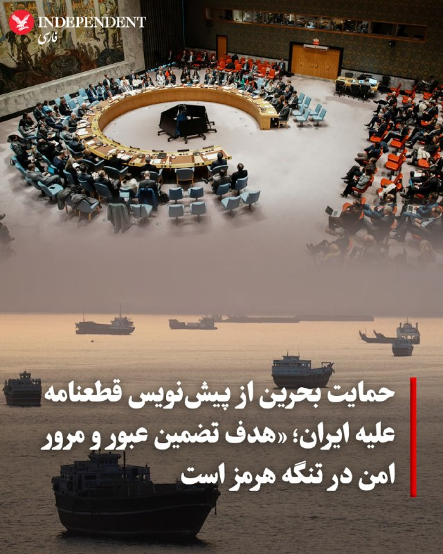

♦️ جمال الروئیعی، نماینده بحرین در سازمان ملل متحد، از پیش‌نویس قطعنامه‌ای که با حمایت مشترک ایالات متحده و کشورهای حاشیه خلیج فارس تدوین شده است، حمایت کرد و گفت هدف این قطعنامه تضمین عبور و مرور ایمن در تنگه هرمز و مقابله با تهدیدهای اخیر در این آبراه راهبردی است.

الروئیعی روز پنجشنبه، ۱۷ اردیبهشت در سخنرانی خود در سازمان ملل تاکید کرد که این پیش‌نویس از جمهوری اسلامی می‌خواهد فورا تمامی حملات و تهدیدها علیه کشتی‌های تجاری را متوقف کند. او همچنین به موضوعاتی نظیر مین‌گذاری و اخاذی غیرقانونی (دریافت عوارض) در این تنگه اشاره کرد و گفت: «نباید اجازه داد چنین اقداماتی به یک رویه عادی تبدیل شود.»

نماینده بحرین با تاکید بر لزوم «اقدام دسته‌جمعی» برای باز نگه داشتن تنگه هرمز، خاطرنشان کرد که این قطعنامه بر پایه اصل آزادی کشتیرانی مطابق با قوانین بین‌المللی تنظیم شده است. به گفته او، تحولات اخیر نشان داد که حفظ امنیت و ثبات این مسیر حیاتی نیازمند همکاری‌های بین‌المللی است.

این پیش‌نویس قطعنامه در حالی به شورای امنیت ارائه شده که قطعنامه‌های پیشین درباره تنگه هرمز، با وتوی چین و روسیه رد شده بودند.
‌🇸🇦 Indypersian

🤖 @VahidOOnLine

## mwarmonitor — post 8645

  <a href="telegram/content/mwarmonitor_8645_1778179397.mp4">🎬 Download video</a>

📝 قله‌نشینانِ بی‌غیرتی که در لجن‌زارِ پول‌های بادآورده غوطه‌ورند، چنان با وقاحت از خوشبختیِ مصنوعی‌شان رونمایی می‌کنند که انگار در جزیره‌ای دورافتاده از این فلاکتِ عمومی زندگی می‌کنند. این جنازه‌های متحرکِ شیک‌پوش، با آن لبخندهای مهندسی‌شده و کافه‌گردی‌های تهوع‌آور، چیزی جز «توالت‌شورهای فرهنگی» نیستند که وظیفه‌شان صیقل دادن به چهره‌ی کریهِ عادی‌سازی است. در حالی که استخوانِ مردم زیر چرخ‌دنده‌های فقر خرد می‌شود، این انگل‌های لاکچری با وقاحتی تمام‌عیار، شکم‌بارگی‌شان را به رخ می‌کشند؛ موجوداتی که شرف را به قیمت یک «بالِ مرغِ کنجدی» فروخته‌اند و از هر دشمنِ تابلویی خطرناک‌ترند، چرا که با هر استوری، نمک بر زخمِ ملتی می‌پاشند که نان را به نرخِ جان می‌خرند. این سیرهایِ مست، هارتر از هر سرکوبگری، بر ویرانه‌های آرزوی یک ملت می‌رقصند و بوی تعفنِ بی‌خیالی‌شان تمام فضای مجازی را برداشته است.

@mwarmonitor

## mwarmonitor — post 8644

🇺🇸🇮🇶وزارت خزانه‌داری آمریکا معاون وزیر نفت عراق را تحریم کرده و می‌گوید او «از موقعیت خود سوءاستفاده می‌کند تا انتقال و انحراف نفت را تسهیل کند؛ نفتی که برای فروش به نفع رژیم ایران و شبه‌نظامیان نیابتی آن در عراق استفاده می‌شود.» @mwarmonitor

## mwarmonitor — post 8643

🔴«(رویترز) — مجموعه‌ای از معاملات بزرگ و به‌موقع روی کاهش قیمت نفت، به ارزش مجموعاً تا ۷ میلیارد دلار، در ماه‌های مارس و آوریل در چندین بازار و در انواع مختلف سوخت و ابزارهای مشتقه انجام شد؛ درست پیش از آنکه رئیس‌جمهور آمریکا، ترامپ، اعلامیه‌های مهمی درباره سیاست ایران منتشر کند.»

@mwarmonitor

## mwarmonitor — post 8642

🔻سناتور لیندسی گراهام

🔸«بی‌اعتنایی آشکار چین کمونیستی به تحریم‌های آمریکا علیه محصولات نفت و گاز ایران باید به چالش کشیده شود.

🔸چین بزرگ‌ترین خریدار نفت و گاز روسیه است. همچنین چین به‌طور علنی با خرید نفت ایران، تحریم‌ها را دور می‌زند و از این طریق از رژیم تروریستی حمایت می‌کند. در حالی که همه امیدوار به روابط بهتر با چین هستند، این سوءاستفاده از سوی چین باید مورد رسیدگی قرار گیرد.

🔸من از رئیس‌جمهور آمریکا و تیم او می‌خواهم که به چین هشدار دهند رفتارشان در قبال روسیه و ایران غیرقابل قبول است.»

🔹«در حالی که من همچنان به یک راه‌حل دیپلماتیک امیدوار هستم که بتواند ایران را مهار کند — نه تنها در مسیر دستیابی به سلاح هسته‌ای، بلکه در رابطه با توانایی آن برای ادامه دادن به عنوان بزرگ‌ترین حامی دولتی تروریسم در جهان — جزئیات یک توافق اهمیت دارد.»

@mwarmonitor

## mwarmonitor — post 8641

🔴«یک مقام آمریکایی گفت که ایران حدود ۷۵ درصد از موجودی پیش از جنگِ پرتابگرهای متحرک خود و حدود ۷۰ درصد از ذخایر موشکی پیش از جنگ خود را همچنان حفظ کرده است.» واشنگتن پست

@mwarmonitor

## mwarmonitor — post 8640

✈️هیچ هواگردی را ندیده‌ام که در جریان عملیات «Project Freedom» از پایگاه هوایی Prince Sultan AB فعالیت کند. با این حال، هواپیماهای سوخت‌رسان نیروی هوایی آمریکا همچنان از تل‌آویو به سمت خلیج فارس و از طریق حریم هوایی عربستان در حال پرواز هستند، در حالی که ترنسپوندرهای…

## mwarmonitor — post 8639

  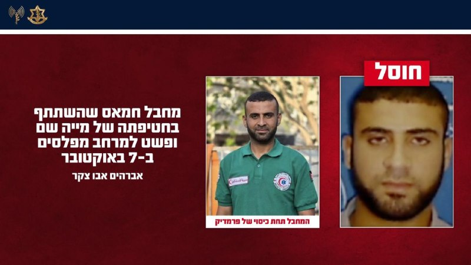

🇮🇱پس از تحقیقات اطلاعاتی، ارتش اسرائیل (IDF) تأیید کرد که یکی از تروریست‌هایی که در ربودن «مایا شم» در کشتار خونین ۷ اکتبر مشارکت داشت، کشته شده است.

❌این تروریست، ابراهیم ابو زَکَر، که عضو حماس بود و هم‌زمان به‌عنوان امدادگر فعالیت می‌کرد، در یک حمله هوایی از پای درآمد.

🔸به گفته ارتش اسرائیل، ابو زکر در جریان کشتار خونین ۷ اکتبر وارد خاک اسرائیل شد و پس از آنکه مایا شم از جشنواره نووا گریخته بود، در منطقه پَلسیم در ربودن او مشارکت داشت.

@mwarmonitor

## mwarmonitor — post 8638

  <a href="telegram/content/mwarmonitor_8638_1778179399.mp4">🎬 Download video</a>

✈️🇺🇸عملیات بسیار گسترده ترابری هوایی نیروی هوایی ایالات متحده برای انتقال نیروهای بیشتر، مهمات و تجهیزات به خاورمیانه، امروز نیز با شدت بالا ادامه یافت؛ آن هم با وجود مطرح شدن صحبت‌ها درباره صلح و مذاکرات.

@mwarmonitor

## mwarmonitor — post 8637

🔴واشنگتن‌پست:
ارزیابی‌های اطلاعاتی آمریکا می‌گویند ایران می‌تواند محاصره اعمال‌شده از سوی ترامپ را برای ماه‌ها دوام بیاورد.

@mwarmonitor

## mwarmonitor — post 8636

🇺🇸🇮🇱🇱🇧 یک مقام وزارت خارجه آمریکا تأیید کرده است که مذاکرات بعدی لبنان و اسرائیل روزهای پنج‌شنبه و جمعه آینده در واشنگتن برگزار خواهد شد.

@mwarmonitor

## mwarmonitor — post 8635

🇺🇸روبیو تحریم‌های جدیدی را علیه کوبا اعلام کرد

📝مارک کاپوتو AXIOS

🔰مارکو روبیو، وزیر امور خارجه، روز پنجشنبه تحریم‌های جدیدی را علیه شرکت‌های صنایع نظامی کوبا، رهبر آن و یک شرکت دولتی منابع طبیعی اعلام کرد.

چرا این موضوع مهم است؟
این تحریم‌های جدید نشان‌دهنده آن است که دولت ترامپ در حال پیشبرد هدف «تغییر رژیم» در کوباست؛ هدفی که مدت‌هاست مورد حمایت روبیو و پرزیدنت ترامپ بوده است.
جزئیات تحریم‌ها
روبیو این تحریم‌ها را تحت فرمان اجرایی اول ماه مه ترامپ، که «مسئولین سرکوب در کوبا و تهدیدکنندگان امنیت ملی و سیاست خارجی ایالات متحده» را هدف قرار می‌دهد، اعمال کرد.
فهرست تحریم‌شدگان:
گروه مدیریت تجاری (GAESA): این سازمان، مجموعه چتری تحت کنترل ارتش کوبا است که روبیو آن را «قلب تپنده سیستم کمونیستی و غارتگر کوبا» نامید. این نهاد بخش‌های عمده‌ای از اقتصاد کشور، از جمله هتل‌ها را در کنترل دارد.
آنیا گی‌یرمینا لاسترس موررا: لاسترس یکی از رهبران ارشد یا اعضای هیئت مدیره GAESA است (یا بوده است).
شرکت نیکل موآ (MNSA): این شرکت در بخش فلزات و معدن اقتصاد کوبا فعالیت می‌کند. روبیو گفت این شرکت «از منابع طبیعی کوبا برای نفع رساندن به رژیم و به قیمت آسیب به مردم کوبا بهره‌برداری کرده است. این شرکت از دارایی‌هایی سود می‌برد که در اصل توسط رژیم کوبا از اشخاص و شرکت‌های آمریکایی مصادره شده بود.»
نگاه کلی
طبق گفته یک منبع آگاه، اعلامیه روبیو تنها چند روز پس از آن صادر شد که وزارت امور خارجه فرستادن پرسنل خود به «فرماندهی جنوبی ایالات متحده» در میامی را آغاز کرد؛ اقدامی که در پیش‌بینی درگیری‌های احتمالی بیشتر با کوبا صورت گرفته است. همچنین وزارت امور خارجه در حال تقویت مرکز تدارکات آمادگی در برابر بلایا در جنوب فلوریدا است.
آنچه گفته شده است
در بیانیه روبیو آمده است: «این تحریم‌ها بخشی از کارزار جامع دولت ترامپ برای مقابله با تهدیدات مبرم امنیت ملی از سوی رژیم کمونیستی کوبا و پاسخگو کردن رژیم و حامیان مالی و مادی آن است.»
وی افزود: «تنها در ۹۰ مایلی خاک آمریکا، رژیم کوبا جزیره را به ویرانی کشانده و آن را به عنوان بستری برای عملیات‌های اطلاعاتی، نظامی و تروریستی خارجی به حراج گذاشته است.»

🔸گام بعدی چیست؟
ترامپ و روبیو گزینه نظامی را رد نکرده‌اند و روبیو اظهار داشت: «می‌توان در روزها و هفته‌های آینده انتظار تعیین تحریم‌های بیشتری را داشت.»

@mwarmonitor

## mwarmonitor — post 8634

  

🇺🇸🇮🇶وزارت خزانه‌داری آمریکا معاون وزیر نفت عراق را تحریم کرده و می‌گوید او «از موقعیت خود سوءاستفاده می‌کند تا انتقال و انحراف نفت را تسهیل کند؛ نفتی که برای فروش به نفع رژیم ایران و شبه‌نظامیان نیابتی آن در عراق استفاده می‌شود.»

@mwarmonitor

## mwarmonitor — post 8633

  <a href="telegram/content/mwarmonitor_8633_1778179401.mp4">🎬 Download video</a>

🇺🇸با تشکر از بودجه دفاعی ۱.۵ تریلیون دلاری رئیس‌جمهور ترامپ، این وزارت جنگ از یک ساختار بوروکراتیک به یک ساختار تجاری تبدیل شده است.

📈این یک سرمایه‌گذاری از نظر مالی مسئولانه در «زرادخانه آزادی» ما است—که تضمین می‌کند ارتش ما همچنان مرگبارترین نیروی رزمی در جهان باقی بماند.

@mwarmonitor

## mwarmonitor — post 8632

  

📝خیلی ها نگران خانم کرولاین لویت بودن

در ۱ مه، ویویانا (که ما به او «ویوی» می‌گوییم) به خانواده‌مان اضافه شد و قلب‌های ما همان لحظه از عشق سرشار شد. 💕

او کاملاً سالم و بی‌نقص است و برادر بزرگ‌ترش هم با شادی در حال عادت کردن به زندگی با خواهر کوچکش است. ما از تمام لحظات این دنیای آرام و شیرینِ نوزادی لذت می‌بریم.

از همه کسانی که در طول دوران بارداری برایم دعا کردند و پیام محبت‌آمیز فرستادند سپاسگزارم—واقعاً حضورشان را در تمام این مسیر احساس کردم. خداوند خوب است. 🙏

@mwarmonitor

## mwarmonitor — post 8631

🔴 صحبت‌های دکتر تدروس، مدیرکل سازمان جهانی بهداشت (WHO) 🔹«هشت مورد گزارش شده است که شامل سه مورد مرگ می‌شود. پنج مورد از این هشت مورد به عنوان هانت‌ویروس تایید شده‌اند و سه مورد دیگر مشکوک هستند. هانت‌ویروس‌ها گروهی از ویروس‌ها هستند که توسط جوندگان منتقل…

## mwarmonitor — post 8630

🔴 صحبت‌های دکتر تدروس، مدیرکل سازمان جهانی بهداشت (WHO)

🔹«هشت مورد گزارش شده است که شامل سه مورد مرگ می‌شود. پنج مورد از این هشت مورد به عنوان هانت‌ویروس تایید شده‌اند و سه مورد دیگر مشکوک هستند.
هانت‌ویروس‌ها گروهی از ویروس‌ها هستند که توسط جوندگان منتقل می‌شوند و می‌توانند باعث بیماری‌های شدید در انسان شوند. افراد معمولاً از طریق تماس با جوندگان آلوده یا ادرار، فضولات و بزاق آن‌ها مبتلا می‌شوند. گونه‌ی هانت‌ویروس درگیر در این پرونده، ویروس آند (Andes virus) است که در آمریکای لاتین یافت می‌شود و تنها گونه‌ی شناخته شده‌ای است که توانایی انتقال محدود بین انسان‌ها را دارد.
🔹در شیوع‌های قبلی ویروس آند، انتقال بین افراد با تماس نزدیک و طولانی‌مدت، به‌ویژه میان اعضای خانواده، شریک‌های زندگی و افرادی که مراقبت‌های پزشکی ارائه می‌دهند، مرتبط بوده است. به نظر می‌رسد در وضعیت فعلی نیز همین‌طور باشد.
🔸اولین مورد مربوط به مردی بود که در تاریخ ۶ آوریل علائم بیماری در او بروز کرد و در تاریخ ۱۱ آوریل روی کشتی درگذشت. هیچ نمونه‌ای از او گرفته نشد و چون علائم او مشابه سایر بیماری‌های تنفسی بود، به هانت‌ویروس مشکوک نشدند.
🔸همسر این مرد زمانی که کشتی در جزیره سنت هلن پهلو گرفت، به ساحل رفت و او نیز دارای علائم بود. وضعیت او در حین پرواز به ژوهانسبورگ در ۲۵ آوریل رو به وخامت گذاشت و روز بعد درگذشت. نمونه‌هایی از او گرفته شد که در مؤسسه ملی بیماری‌های واگیر آفریقای جنوبی آزمایش و ابتلای او به هانت‌ویروس تایید شد.
🔹سومین مورد مرگ مربوط به زنی در همان کشتی بود که علائمش در ۲۸ آوریل ظاهر شد و در تاریخ ۲ می درگذشت.»

@mwarmonitor

## mwarmonitor — post 8629

  <a href="telegram/content/mwarmonitor_8629_1778179404.mp4">🎬 Download video</a>

🚨فوری: مدیرکل World Health Organization (WHO) سازمان جهانی بهداشت امروز یک نشست خبری درباره ویروس هانتاویروس برگزار خواهد کرد. قضیه داره جدی میشه @mwarmonitor

## mwarmonitor — post 8628

  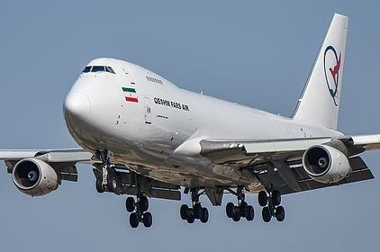

✈️🇮🇷«هواپیمای تسلیحاتی» ایران از نوع بوئینگ ۷۴۷ (جامبو)، با رجیستر EP-FAB، که درست پیش از آغاز عملیات در ماه فوریه در چارچوب «عملیات غرش شیران» از تهران به سمت مسکو پرواز کرده بود، امروز به فرودگاه مهرآباد تهران بازگشت.

✈️این هواپیما سال‌ها توسط نیروی قدس سپاه پاسداران استفاده می‌شد و محموله‌های تسلیحاتی را از ایران به نیروهای وابسته‌اش در منطقه منتقل می‌کرد: در عراق، لبنان و سوریه (پیش از سقوط حکومت اسد).

❗️به یاد می‌آید که اسرائیل در جریان عملیات اخیر، ناوگان هواپیماهای نیروی قدس سپاه پاسداران را که حدود ۲۰ فروند هواپیمای ایرانی بودند، منهدم کرد؛ اما این هواپیما که در مسکو بود، سالم باقی ماند.

🔸اکنون و در سایه مذاکرات میان آمریکا و ایران، این هواپیمای ترابری ایران به تهران بازگشته است.

@mwarmonitor

## mwarmonitor — post 8627

🔘یک اختلاف شدید بین ارتش و موساد بر سر هدف نهایی جنگ در ایران شکل گرفته و همچنان ادامه دارد. ارتش اسرائیل (IDF) حذف اورانیوم از خاک ایران را دستاورد نهایی می‌داند. اما موساد معتقد است هدف باید سرنگونی حکومت باشد. حتی امروز نیز، برخلاف فرهنگ «توجیه و بازنویسی گذشته» که در منطقه رایج است، موساد همچنان بر این دیدگاه پافشاری می‌کند. در حالی که ارتش به تعریف مبهم «ایجاد شرایط برای سرنگونی حکومت» بسنده کرده، موساد چهار کلمه اول را حذف کرده و مستقیماً بر هدف سرنگونی تأکید دارد.

🔸از اینجا به بعد، واقعیت به دو دیدگاه متفاوت و گاهی کاملاً متضاد تقسیم می‌شود. برخی مقامات ارشد ارتش اسرائیل از تصمیم آمریکا برای عدم تصرف اورانیوم غنی‌شده در یک عملیات نظامی به‌شدت ناراضی هستند. به همین دلیل، عملیات «Roaring Lion» با تقریباً هیچ پیشرفت قابل توجهی نسبت به برنامه هسته‌ای ایران در مقایسه با عملیات «Rising Lion» متوقف شد. آن‌ها مدام تکرار می‌کنند: «اورانیوم، اورانیوم، اورانیوم؛ اگر آن را بگیری، برنامه هسته‌ای را از بین برده‌ای.»

🔹دیدگاه دوم این است که: چه فایده‌ای دارد اورانیوم را از طریق عملیات یا توافق خارج کنیم؟ اگر حکومت باقی بماند، حتی با وجود باقی ماندن چند تن اورانیوم ۳ درصدی، تنها چند سال تأخیر ایجاد شده—در مقیاس ژئوپولیتیک، یک چشم به هم زدن. حکومتی که تحت تحریم نباشد، ثروتمندتر و خطرناک‌تر خواهد شد و همچنان مانند قبل خواهان نابودی اسرائیل خواهد بود. تنها تغییر حکومت می‌تواند این هدف را از ریشه از بین ببرد. این دیدگاه در مقابل برخی مقامات امنیتی است که هرچند از آزادی میلیون‌ها ایرانی از دیکتاتوری استقبال می‌کنند، اما اولویت اصلی‌شان همچنان «اسرائیل در اولویت اول» است.

🔸تجلی عملی این اختلاف در یک سؤال فرضی دیده می‌شود: اگر رئیس‌جمهور ترامپ به اسرائیل بگوید «برای یک عملیات چراغ سبز دارید»، چه می‌شود؟ بیشتر ساختار دفاعی می‌گویند تشکر کرده و نیروی هوایی را برای حمله به ذخایر اورانیوم اعزام می‌کنند. اما موساد احتمالاً از نابودی زیرساخت‌های انرژی و پالایشگاه‌ها حمایت می‌کند تا ایران را عملاً در تاریکی کامل فرو ببرد. این کار می‌تواند روند شورش داخلی را به‌طور چشمگیری تسریع کند. آستانه خشم مردم از سطح اعتراضات ژانویه عبور کرده، اما هم‌زمان ترس نیز افزایش یافته است. وقتی برق نباشد—و انتظار می‌رود ظرف دو ماه در ایران کمبود غذا آغاز شود—این دیوار ترس فرو خواهد ریخت.

🔘کدام هدف بلندپروازانه‌تر است؟ در نگاه اول، سرنگونی حکومت یک هدف بسیار بزرگ به نظر می‌رسد، در حالی که نابودی اورانیوم یک اقدام محدود و قابل مدیریت است. اما تاریخ نشان می‌دهد حکومت‌ها در طول زمان سقوط کرده‌اند، در حالی که هیچ کشوری هرگز داوطلبانه مواد هسته‌ای غنی‌شده خود را در حالی که حکومتش پابرجاست واگذار نکرده است. همان‌طور که در یک مثل قدیمی تلمودی آمده، این یک انتخاب بین «راه کوتاهی که طولانی است»—یک ضربه سریع که مشکل ریشه‌ای را حل نمی‌کند—و «راه طولانی که کوتاه است»—مسیر دشوار تغییر حکومت که تهدید را برای همیشه از بین می‌برد.
( آمیت سیگال تحلیل‌گر ارشد سیاسی کانال ۱۲ اسرائیل)

@mwarmonitor

## mwarmonitor — post 8626

  

🔸ترامپ در سوشال تروث

🔹«یک نمایش بسیار دقیق از دولت جو بایدنِ خواب‌آلود. آسیب‌های فوق‌العاده‌ای وارد شده اما، ما برگشتیم!!! رئیس‌جمهور (دونالد جی. ترامپ)»

@mwarmonitor

## pm_afshaa — post 90301

عراقچی: درصورت پایان دائمی جنگ، رفع محاصره دریایی و لغو تحریم‌ها، کشتیرانی در هرمز به حالت عادی بازخواهد گشت

💧 Rainbet.com the #1 Non-KYC Crypto Casino & Sportsbook @rainbetcom

😁 @Pm_Afshaa

## pm_afshaa — post 90300

🔴وال استریت ژورنال: عربستان و کویت دوباره دسترسی نظامی آمریکا را باز کردن

💧 Rainbet.com the #1 Non-KYC Crypto Casino & Sportsbook @rainbetcom

😁 @Pm_Afshaa

## pm_afshaa — post 90299

🔴کانال 12 اسرائیل:جمهوری اسلامی تصمیم گرفت به ترور فرمانده مهم‌ترین واحد حزب‌الله، نیروی رضوان در بیروت پاسخ نده

💧 Rainbet.com the #1 Non-KYC Crypto Casino & Sportsbook @rainbetcom

😁 @Pm_Afshaa

## pm_afshaa — post 90298

🔴کانال 12 اسرائیل: نخست‌وزیر نتانیاهو امشب یه جلسه‌ی اضطراری با محوریت ایران در مقر کریا (وزارت دفاع) برگزار میکنه

💧 Rainbet.com the #1 Non-KYC Crypto Casino & Sportsbook @rainbetcom

😁 @Pm_Afshaa

## pm_afshaa — post 90297

🔴یک مقام آمریکایی به اکسیوس: ایران فردا پاسخ خود را ارائه خواهد کرد

💧 Rainbet.com the #1 Non-KYC Crypto Casino & Sportsbook @rainbetcom

😁 @Pm_Afshaa

## pm_afshaa — post 90294

  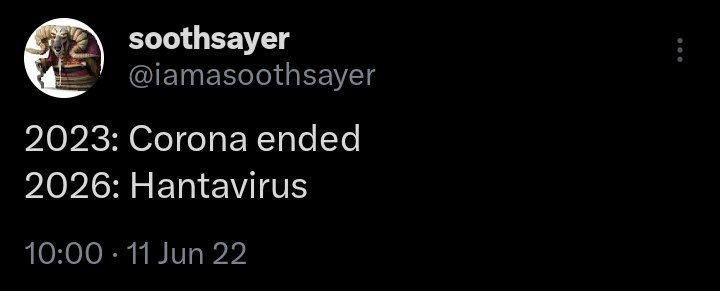

یه اکانت تو توییتر سال 2022 یعنی چهار سال قبل نوشته بود:
سال 2023: کرونا تموم شد
سال 2026: هانتا ویروس [شروع میشه].

از وقتی اخبار هانتا ویروس اومده این توییت میلیون‌ها بازدید گرفته و در سطح جهانی پخش شده

💧 Rainbet.com the #1 Non-KYC Crypto Casino & Sportsbook @rainbetcom

😁 @Pm_Afshaa

## pm_afshaa — post 90293

منبع این ویروس چینه و اگه این ویروس کنترل نشه از کرونا بیشتر کشته میده

## pm_afshaa — post 90292

⭕️ویروس جدید هانتا (از منشا موش) در جهان شروع شده و تا کنون به اسرائیل، سوئیس، آرژانتین و هلند رسیده و نکته ترسناک این ویروس، طبق گزارشات درصد مرگ 40 درصدیشه که از هر 100 نفر 40 نفرو میکشه

💧 Rainbet.com the #1 Non-KYC Crypto Casino & Sportsbook @rainbetcom

😁 @Pm_Afshaa

## pm_afshaa — post 90290

میدونم هزینه اینترنتتون بالاست خیلیاتون به سختی وصل شدین ولی خب من سعی میکنم به روز باشم همه چیو اپدیت کنم

اسریالای ایرانی رو میزارم او کانال زیر اگه دوست داشتین میتونین از کانال سریالمون دنبال کنین
👇
👇
👇

https://t.me/pm_seriesi
https://t.me/pm_seriesi

## pm_afshaa — post 90289

🔴محمد علی بازی، رئیس اطلاعات منطقه‌ای نصر حزب‌الله و حسین حسن رمانی، فرمانده پدافند هوایی گروه تروریستی حزب الله توسط ارتش اسرائیل به هلاکت رسیدن

💧 Rainbet.com the #1 Non-KYC Crypto Casino & Sportsbook @rainbetcom

😁 @Pm_Afshaa

## pm_afshaa — post 90288

خداروشکر یه جوری کون بعضیا رو سوزوندیم هیترمون شدن😂😂

## pm_afshaa — post 90287

🔴رویترز: توقف حملات اسرائیل در لبنان یکی از خواسته‌های کلیدی ایران در مذاکرات با واشنگتن است

💧 Rainbet.com the #1 Non-KYC Crypto Casino & Sportsbook @rainbetcom

😁 @Pm_Afshaa

## pm_afshaa — post 90286

🔴وزارت خزانه‌داری آمریکا: محاصره دریایی به ما اجازه می‌دهد تا مستقیماً منبع اصلی درآمد رژیم ایران را هدف قرار دهیم

💧 Rainbet.com the #1 Non-KYC Crypto Casino & Sportsbook @rainbetcom

😁 @Pm_Afshaa

## pm_afshaa — post 90285

🔴وزیر انرژی آمریکا : ایران تولید نفتش رو حدود 400 هزار بشکه در روز کم کرده

💧 Rainbet.com the #1 Non-KYC Crypto Casino & Sportsbook @rainbetcom

😁 @Pm_Afshaa

## pm_afshaa — post 90283

از چنل خوب و مردمی FIGHTER RADAR حمایت کنید

@Fighter_Radar
@Fighter_Radar

حتما جوین باشید !

## pm_afshaa — post 90282

  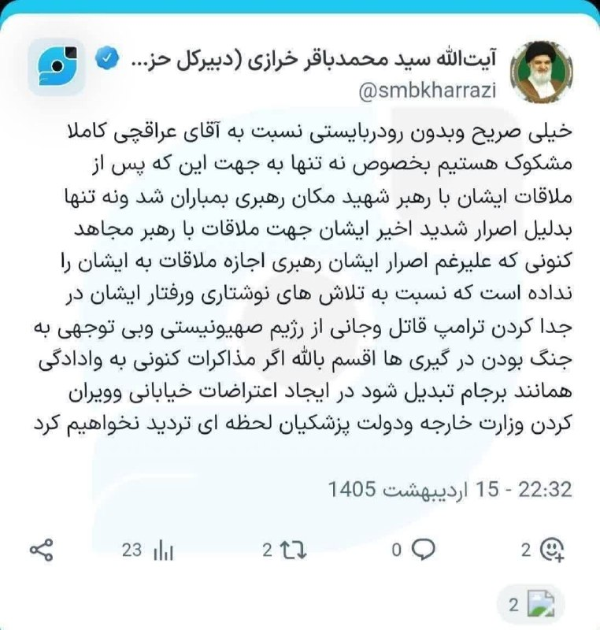

آیت الله خرازی: عراقچی مکان آقا رو لو داده

💧 Rainbet.com the #1 Non-KYC Crypto Casino & Sportsbook @rainbetcom

😁 @Pm_Afshaa

## pm_afshaa — post 90281

🔴یک منبع پاکستانی به العربیه : ترامپ خواستار پاسخ فوری ایران است

💧 Rainbet.com the #1 Non-KYC Crypto Casino & Sportsbook @rainbetcom

😁 @Pm_Afshaa

## pm_afshaa — post 90277

  <a href="telegram/content/pm_afshaa_90277_1778179407.mp4">🎬 Download video</a>

حملات سنگین اسراییل به جنوب لبنان

💧 Rainbet.com the #1 Non-KYC Crypto Casino & Sportsbook @rainbetcom

😁 @Pm_Afshaa

## iaghapour — post 2588

  

💢 سخنگو وزارت خارجه حذف تیک آبی خود در شبکه X را (سرکوب حقیقت) خواند.

68 روزه اینترنت مردم ایران رو قطع کردن، بعد یه تیک آبی‌شو گرفتن میگه حقیقت سرکوب شد.

🆔 @iaghapour

## iaghapour — post 2587

🔻 تسنیم: درآمد طرح اینترنت «پرو» در سال به ۹۶ هزار میلیارد تومن می‌رسه!

🔹خب با این رقم‌های نجومی و پول هنگفتی که درمیاد، معلومه که از این تبعیضی که راه انداختن حسابی راضی‌ان. وقتی محدودیت و فیلترینگ این‌قدر براشون سود داره، چرا نباید اینترنت داخلی و بسته رو بیشتر تحویل بگیرن؟

🔸این وسط یه تشکر ویژه و خسته نباشید هم باید بگیم به اون دسته از دوستانی که رفتن تو صف اینترنت پرو و این سیستم طبقاتی رو خیلی راحت پذیرفتن. از رئیس فلان اتحادیه و مدیر فلان اداره بگیر تا نماینده صنف لاستیک‌فروش‌ها و یه سری کسب‌وکارهایی که واقعاً بدون اینترنت آزاد هم کارشون لنگ نمی‌موند. تو شرایطی که ۹۹ درصد مردم هیچ دسترسیِ عادی به اینترنت آزاد ندارن، مرسی از شماها که رفتین این اینترنت رو گرفتین و با این کارتون، قشنگ به این تبعیض و نابرابری رسمیت دادین!

پ.ن: البته به این نکته هم توجه کنید که خبرگذاری داخلی اینو گفته و ممکنه دقیقا مقصودشون از این حرف هم همین باشه که بگن چقدر این طرح خوب و سودآور هستش و...

🆔 @iaghapour

## iaghapour — post 2585

⭕️ وعده بازگشت به وضعیت عادی؛ توجیه محدودیت‌ها یا امید به بهبود اینترنت؟

معاون ارتباطات دفتر رئیس‌جمهور به تازگی اعلام کرده که وضعیت فعلی اینترنت مورد تایید دولت نیست و رئیس‌جمهور، محمدرضا عارف را مامور ساماندهی این شرایط کرده است. به گفته او، این محدودیت‌های شدید و قطعی‌ها صرفا تصمیماتی از سوی شورای عالی امنیت ملی و به دلیل شرایط خاص امنیتی و جنگی بوده‌اند.

🔹 وعده روزهای بهتر: این مقام مسئول قول داده که با عبور از این شرایط ویژه، اینترنت نه تنها به حالت قبل برمی‌گردد، بلکه وضعیتی بهتر از گذشته پیدا خواهد کرد و وعده‌های انتخاباتی رئیس‌جمهور در این زمینه همچنان پیگیری می‌شوند.

🔸 دفاع از اینترنت پرو: در واکنش به انتقادات، دولت ادعا می‌کند طرح «اینترنت پرو» صرفا برای نجات کسب‌وکارها در روزهای محدودیت ایجاد شده و نباید به آن برچسب اینترنت طبقاتی زد؛ چرا که به گفته آن‌ها، در شرایط عادی اصلا نیازی به چنین طرحی نخواهد بود.

🔹 کاهش محدودیت‌های عمومی: خبر دیگر این است که قرار شده تدابیر جدیدی برای دسترسی بهتر سایر شهروندان به اینترنت اتخاذ شود تا فشار محدودیت‌های فعلی روی مردم کاهش یابد.

در حالی که دولت تلاش می‌کند قطعی‌ها و طرح‌های بحث‌برانگیزی مثل اینترنت پرو را صرفا به شرایط اضطراری گره بزند، کاربران و کسب‌وکارها همچنان منتظرند تا ببینند آیا این وعده‌ها در عمل به یک اینترنت آزاد و بدون محدودیت ختم می‌شود یا صرفا وعده‌ای برای کنترل نارضایتی‌های فعلی است.

🆔 @iaghapour

## iaghapour — post 2584

⭕️ ایده عجیب در مجلس: تاسیس «اینستاگرام دولتی» و مدیریت کامل اینترنت!

نمایندگان مجلس در تازه‌ترین نشست خود با وزیر ارتباطات، از طرح‌ها و نگاه‌های جدیدی برای کنترل بیشتر فضای مجازی پرده برداشتند. در این جلسه، پیشنهاد ایجاد یک پلتفرم کاملا دولتی مشابه اینستاگرام مطرح شد تا به زعم آن‌ها، نیاز کشور برطرف شود.

🔹 اینستاگرام دولتی: یکی از نمایندگان با اشاره به بازار سیاه و چند میلیونی فیلترشکن‌ها، رسما پیشنهاد ساخت یک سکوی دولتی شبیه اینستاگرام را برای پر کردن جای خالی این پلتفرم ارائه داده است.

🔸 رویای مدیریت اینترنت: نایب رئیس مجلس تاکید کرده که مشکل آن‌ها اصل اینترنت نیست، بلکه می‌خواهند در صحنه بین‌المللی، مدیریت اینترنت کاملا در دست خودشان باشد و این فضا را به یک جبهه تقابل تشبیه کرده است.

🔹 فرصت‌سازی از بحران: بخش قابل توجهی از صحبت‌های نمایندگان، حسرت خوردن برای از دست رفتن فرصت در شرایط ملتهب و جنگی است؛ آن‌ها معتقدند باید از این شرایط استفاده می‌کردند تا مردم و کسب‌وکارها به اجبار به سمت سکوهای داخلی کوچ کنند.

این صحبت‌ها به وضوح نشان می‌دهد که دغدغه اصلی، کاهش نارضایتی مردم از قیمت و کیفیت اینترنت نیست؛ بلکه تلاش برای بومی‌سازی اجباری، قطع ارتباط با شبکه‌های اجتماعی بین‌المللی و کشاندن کاربران به پلتفرم‌های تحت کنترل و نظارت است. / زومیت

✍🏻 پ.ن: از سوپر اپلیکیشن های ایتا و سروش و گپ و بله که از تلگرام کپی کردین مشخصه توانایی اینکار رو دارید.

🆔 @iaghapour

## iaghapour — post 2583

⭕️ مرگ خاموش اقتصاد خرد: نابودی ۴۰ درصد از کسب‌وکارهای اینستاگرامی!

قطعی‌ها و محدودیت‌های اینترنتی فقط حق دسترسی آزاد ما به شبکه‌های اجتماعی را سلب نکرده، بلکه تیشه به ریشه‌ی اقتصاد خرد و معیشت مردم زده است. طبق اعلام پشوتن پورپزشک، عضو هیئت‌مدیره اتحادیه کسب‌وکارهای مجازی، فیلترینگ و اختلالات باعث نابودی بخش عظیمی از مشاغل آنلاین شده است.

🔹 فاجعه‌ی آماری: نزدیک به ۴۰ درصد از کسب‌وکارهای اینستاگرامی برای همیشه از بین رفته‌اند؛ این یعنی مرگ مستقیم بیش از ۴۰۰ هزار شغل!

🔸 دومینوی ویرانی: وقتی شوکی مثل محدودیت اینترنت وارد می‌شود، ابتدا کسب‌وکارهای کوچک و آسیب‌پذیر می‌میرند، اما این نابودی با کمی تاخیر گریبان شرکت‌های بزرگ اقتصادی را هم خواهد گرفت.

🔹 زنجیره‌ی به هم پیوسته: کسب‌وکارهای بزرگ در تولید، تامین و توزیع به شدت به همین کسب‌وکارهای خرد وابسته‌اند. توهم مصونیت برای شرکت‌های بزرگ، در نهایت منجر به فروپاشی خود آن‌ها می‌شود. منبع: زومیت

🆔 @iaghapour

## iaghapour — post 2581

اسم این زندگــــــی نبود
یک مبارزه تمام عیار بود...

#جوانی #زندگی #جنگ #اینترنت

## iaghapour — post 2580

⭕️ حل مشکل دانلود از ریلیز گیت‌هاب با LatestReleaseMirror

اگر در دانلود فایل‌ها از بخش ریلیزهای (Releases) گیت‌هاب به دلیل محدودیت‌های اینترنت مشکل دارید، این اسکریپت کاربردی دقیقاً برای شما ساخته شده است!

ابزار LatestReleaseMirror به صورت خودکار فایل‌های آخرین آپدیتِ ریپازیتوری‌های دلخواه شما را دریافت کرده و آن‌ها را به عنوان فایل‌های عادی در ساختار پوشه‌های گیت‌هاب ذخیره می‌کند؛ در نتیجه می‌توانید آن‌ها را به راحتی و حتی با اینترنت داخلی دانلود کنید.

🔹 دریافت و آپدیت خودکار آخرین نسخه با استفاده از GitHub Actions.
🔸 امکان فیلتر کردن فایل‌های مورد نیاز (مثلاً فقط نسخه‌های ویندوز یا اندروید)
🔹 دسته‌بندی تمیز فایل‌های خروجی در مسیرهای مشخص.

🔗 لینک ریپازیتوری و راهنمای استفاده

🆔 @iaghapour

## iaghapour — post 2579

ركورد جديد سرعت اينترنت ژاپن:

با سرعت 1.02 پتابيت بر ثانيه، كل نتفليكس را در 1 ثانيه دانلود مى‌كند.

✍ ما هم اینجا باید با DNStt وصل بشیم تا بزور بتونیم فقط این خبر رو بخونیم...

🆔 @iaghapour

## iaghapour — post 2578

⭕️ اسکریپت بهینه شده XHTTP Relay ECO برای Vercel Pro

🔹 نسخه ECO طوری تیون شده که علاوه بر امنیت سفت‌وسخت v1.3، کم‌هزینه‌ترین رفتار ممکن روی Vercel Pro رو داشته باشه؛ یعنی با کنترل هوشمند Timeout، Inflight، Throttle و Logها، مصرف منابع و هزینه نهایی تا جای ممکن پایین نگه داشته میشه.

🔸فقط با GET، HEAD و POST کار می‌کنه تا امنیت بالاتر بره.
🔹 احراز هویت فقط از طریق هدر x-relay-key انجام میشه
🔸هدرهای اضافی پلتفرم و hop-by-hop رو بی‌رحمانه فیلتر می‌کنیم.
🔹روی آپلود و دانلود محدودیت سرعت (Throttling) واقعی گذاشتیم.
🔸بردیمش روی Node runtime با لیمیت ۱۲۸ مگابایت رم و مدیریت کانکشن‌های همزمان.

🔗 اطلاعات بیشتر در گیت‌هاب پروژه

🆔 @iaghapour

## iaghapour — post 2577

⭕️ ورژن جدید کلاینت اندروید GooseRelayVPN منتشر شد

کلاینت اندروید GooseRelayVPN که هسته GooseRelay را از طریق Go mobile اجرا می‌کند و رابط کاربری کامل برای مدیریت VPN، پروفایل‌ها، لاگ‌ها و تنظیمات ارائه می‌دهد. این اپ یک SOCKS5 محلی روی اندروید ایجاد می‌کند و ترافیک TCP را از معماری GooseRelay عبور می‌دهد.

🔹هسته پروژه به ورژن 1.5.0 آپدیت شد.
🔸قابلیت fake dns اضافه شد.
🔹باگ ها در این نسخه برطرف شدن.

🔗 آدرس گیت‌هاب پروژه

🆔 @iaghapour

## iaghapour — post 2576

  

⭕️ آموزش ساخت فیلترشکن رایگان و شخصی به 2 روش با نت ملی

🔹با استفاده از دو ابزار قدرتمند MHRV و Nova-Proxy، دیگه نیازی به خرید کانفیگ‌ها و سرورهای گرون‌قیمت ندارید. تو این آموزش قدم‌به‌قدم به ۲ روش مختلف پیش میریم تا بتونید یه اتصال پایدار و بدون قطعی داشته باشید. حتماً تا آخر ویدیو همراه من باشید.

🔗 لینک ویدیو در یوتیوب

🔗 دانلود ویدیو با لینک مستقیم

🔹 دانلود کلاینت ویندوز

🔸 دانلود کلاینت اندروید

#آموزش #فیلترشکن #mhrv #novaproxy #رایگان
برای دور زدن فیلترینگ و آموزش تکنولوژی و هوش مصنوعی ما رو دنبال کنید 💚
🆔@iaghapour

## iaghapour — post 2575

  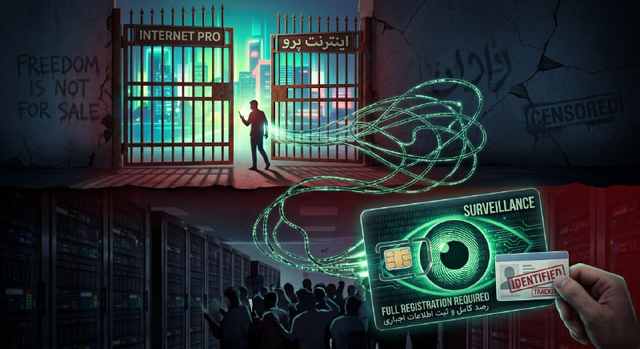

⭕️ پشت‌پرده‌ی «اینترنت پرو»؛ امتیاز ویژه یا تله‌ی نظارتی؟

این روزها سیم‌کارت‌های بدون فیلتر با نام «اینترنت پرو» در ازای دریافت هزینه و ثبت کامل مشخصات هویتی به فروش می‌رسند. اما هدف اصلی این طرح، دلسوزی برای نیاز اینترنتی اقشار مختلف نیست.

هدف اصلی و پنهان این ماجرا، چیزی جز «تشخیص هویت دقیق و رصد لحظه‌ایِ کاربر» نیست. 👁‍🗨

وقتی اینترنت آزاد را مستقیماً با نام و کد ملی خودتان دریافت می‌کنید دقیقاً چه اتفاقی می‌افتد؟

🔹 پایان گمنامی: تمام سایت‌هایی که سر می‌زنید و محتوایی که می‌بینید، مستقیماً و شفاف روی نام خودتان ثبت و مانیتور می‌شود.

🔸 تزریق خودسانسوری: وقتی می‌دانید هر کلیک شما رصد می‌شود، ناخودآگاه وارد یک «زندان شیشه‌ای» می‌شوید که خودتان هزینه‌اش را داده‌اید!

🔹 تجارت با حقوق اولیه: حق بدیهی دسترسی به اینترنت آزاد را مسدود کرده‌اند و حالا همان را به قیمت نقض حریم خصوصی، به عنوان یک «آپشن ویژه» به خودمان می‌فروشند.

«اینترنت پرو» یک امکان رفاهی نیست؛ ابزاری برای کنترل نقطه‌ای و عادی‌سازیِ اینترنت طبقاتی است. بهای اصلی این سیم‌کارت‌ها پول نیست؛ حریم خصوصی ماست.

🆔 @iaghapour

## iaghapour — post 2573

  

⭕️ کلاینت اندروید GooseRelayVPN

🔹کلاینت اندروید GooseRelayVPN که هسته GooseRelay را از طریق Go mobile اجرا می‌کند و رابط کاربری کامل برای مدیریت VPN، پروفایل‌ها، لاگ‌ها و تنظیمات ارائه می‌دهد. این اپ یک SOCKS5 محلی روی اندروید ایجاد می‌کند و ترافیک TCP را از معماری GooseRelay عبور می‌دهد.

🔹پیکربندی مبتنی بر پروفایل
🔸وضعیت و تله‌متری در صفحه Home
🔹تب Logs برای عیب‌یابی Android/Core
🔸قابلیت Split Tunneling و Internet Sharing

🔗 آدرس گیت‌هاب پروژه

🆔 @iaghapour

## iaghapour — post 2572

💢 رئیس اتحادیه کسب‌وکارهای مجازی:
به شرکت‌ها زنگ می‌زنند و پیشنهاد فروش اینترنت بدون فیلتر(پرو) برای کارمندانشان را می‌دهند.

⁉️ اگر موضوع واقعاً امنیت ملی است، چطور با پرداخت پول، امنیت تأمین می‌شود؟!

منبع: کانال خبری

🆔 @iaghapour

## iaghapour — post 2571

## iaghapour — post 2570

✍🏻 دوستان، همان‌طور که خودتون در جریان هستید، من در این چند ماه حتی یک مورد تبلیغ فیلترشکن، اوتباند و موارد مشابه قرار ندادم. الان هم واقعاً تمایلی به این کار ندارم، چون شرایط اصلاً به‌گونه‌ای نیست که بشه کسی را معرفی کرد.

با این حال، در همین چند ماه پیام‌های بسیار زیادی داشتیم که درخواست می‌کردند حتماً یک شخص معتبر را معرفی کنیم؛ چرا که خیلی‌ها از کلاهبرداری‌های پیاپی خسته شدن و ارسال این دست پیام‌ها تا به همین امروز هم ادامه داره.

به همین دلیل، اگه خودتون موافق باشید، افرادی رو که از قبل با ما همکاری می‌کردند و تا حدودی قابل‌اطمینان هستند، یکی‌یکی به شما معرفی کنیم. در این مورد ذکر چند نکته ضروری هستش:

🔸عدم تضمین صددرصدی: ناگفته نماند ما واقعاً نمیتونیم کسی را با اطمینان ۱۰۰ درصدی تأیید کنیم، اما افرادی که معرفی میشن همگی سابقه همکاری با ما را دارن.

🔹عدم پذیرش تبلیغ جدید و اوتباند: تا زمانی که شرایط استیبل و پایدار نشود، تبلیغ هیچ فرد جدیدی را قبول نمی‌کنیم. در ضمن، تبلیغ فروش اوتباند هم به‌هیچ‌وجه پذیرفته نمی‌شود.

🔸قیمت‌های منصفانه: تمام سعی ما بر اینه افرادی را معرفی کنیم که در این زمینه منصف باشند و قیمت‌های بالایی ارائه ندهند. ولی خب، طبیعتاً نمیشه انتظار قیمت‌های قدیمی را داشت؛ چون همان‌طور که خودتون میدونید در حال حاضر هیچ‌کس با اون قیمت‌های قبلی فروشی نداره.

اگه تمایل دارید، لطفاً در نظرسنجی زیر شرکت کنید. البته نظر شخصی خودم اینه که اگه در حال حاضر واقعاً مشکل خاصی ندارید، در نظرسنجی همان گزینه (خیر) را انتخاب کنید.

## iaghapour — post 2569

⚠️ هشدار مهم درباره اسکریپت VPN Over GitHub

▪️لطفاً از این ابزار به عنوان فیلترشکن استفاده نکنید!

🚫 بن شدن اکانت: تبدیل گیت‌هاب به تونل ترافیک، خلاف قوانین این سایت است و خیلی زود باعث مسدود شدن حساب شما می‌شود.

🐢 سرعت بسیار پایین: برای هر ارتباط به یک بار push و pull نیاز دارد که آن را عملاً غیرقابل استفاده می‌کند.

🔻خطر برای برنامه‌نویس‌ها: گیت‌هاب یک سایت حیاتی برای توسعه‌دهندگان است؛ سوءاستفاده از آن ممکن است باعث حساسیت شده و دسترسی به این پلتفرم مهم را دوباره از کار بیندازد. (خارج شدن از لیست سفید و...)

🆔@iaghapour

## iaghapour — post 2567

ای بابا روش Vercel چرا بسته شد؟ هنوز آموزش نداده بودم که.😁

سازمان فیلترینگ زرنگ شده ها. فک کنم خودشون رو آپدیت کردن دیگه به کانال من نگاه نمیکنن :)

## iaghapour — post 2566

‼️دلار 177 و طلا 19,400,000

شب میخوابی صبح بلند میشی یه پله بدبخت تر میشی!

## iaghapour — post 2565

حالا نیاز نیست پول بدین ری اکشن فیک بزنید.😁

## DEJradio — post 4477

  <a href="telegram/content/DEJradio_4477_1778179411.jpg">🎬 Download video</a>

🔺📢 چشم‌انداز توافق هسته‌ای ایران برای آمریکا

*روح‌الله رحیم‌پور، تحلیلگر سیاسی

#توافق #مذاکرات
@DEJradio

## DEJradio — post 4476

  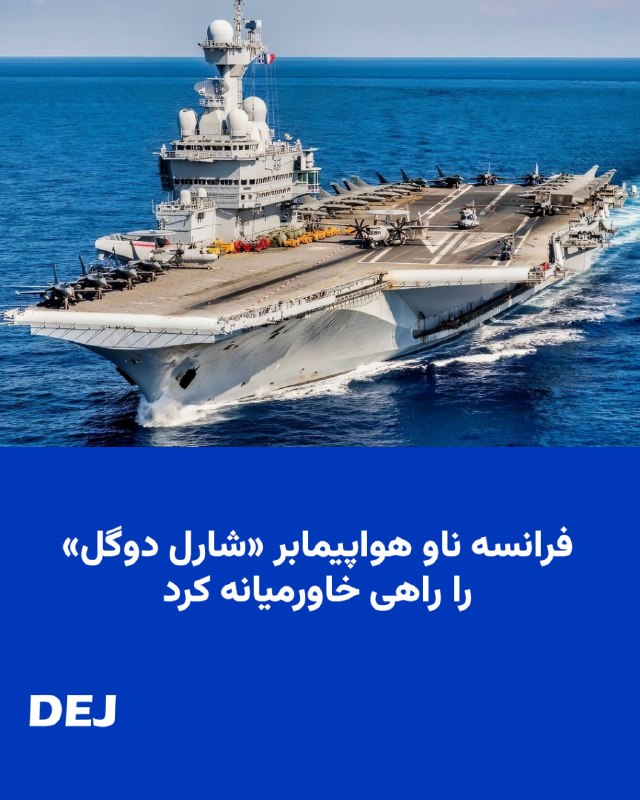

🚨📢 فرانسه ناو هواپیمابر «شارل دوگل» را راهی خاورمیانه کرد

فرانسه اعلام کرد که با توجه به ادامه بسته نگه داشتن تنگه هرمز و طرح اخذ عوارض توسط جمهوری اسلامی، ناو هواپیمابر این کشور، موسوم به «شارل دوگل» را برای هر گونه واکنش لازم به منطقه خاورمیانه اعزام کرده است.

#فرانسه #تنگه_هرمز
@DEJradio

## DEJradio — post 4475

  <a href="telegram/content/DEJradio_4475_1778179412.mp4">🎬 Download video</a>

🔺📢 شرایط اقتصادی غیر قابل تحمل است؛
دیگر ساکت نمی‌نشینیم!

#تورم #اعتراضات_سراسری
@DEJradio

## DEJradio — post 4474

  <a href="telegram/content/DEJradio_4474_1778179413.mp4">🎬 Download video</a>

🤡
🔺 خاطرات آخوند آشپز از گعده‌های شبانه؛ بزن که خوب می‌زنی!

#آخوند #شیفت_شب
@DEJradio

## DEJradio — post 4473

  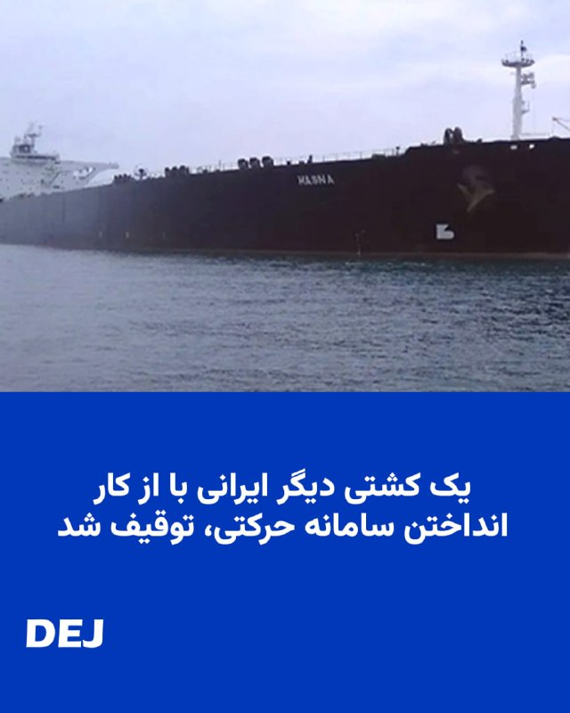

🚨
⭕️ یک کشتی دیگر ایرانی با از کار انداختن سامانه حرکتی، توقیف شد

ستاد فرماندهی مرکزی ایالات متحده، سنتکام، اعلام کرد نیروهای آمریکایی روز سه‌شنبه یک نفتکش با پرچم جمهوری اسلامی را که در مسیر یکی از بنادر ایران در دریای عمان در حرکت بود، متوقف کردند.

بر اساس بیانیۀ سنتکام، نیروهای آمریکایی پس از شناسایی نفت‌کش «ام‌تی حسنا» در آب‌های بین‌المللی، چندین بار به این شناور هشدار دادند و اعلام کردند که در حال نقض محاصرۀ دریایی ایالات متحده علیه بنادر جمهوری اسلامی است. سنتکام مدعی شد پس از بی‌توجهی خدمۀ کشتی به هشدارها، جنگنده اف-۱۸ سوپر هورنت نیروی دریایی آمریکا که از ناو هواپیمابر آبراهام لینکلن به پرواز درآمده بود، با شلیک گلولۀ ۲۰میلی‌متری، سامانه هدایت کشتی را هدف قرار داد و آن را از حرکت به سمت ایران بازداشت.

سنتکام تأکید کرد محاصرۀ دریایی علیه شناورهایی که قصد ورود یا خروج از بنادر ایران را دارند همچنان برقرار است و نیروهای آمریکایی به اجرای آن ادامه می‌دهند.

#تنگه_هرمز #سنتکام
@DEJradio

## DEJradio — post 4472

  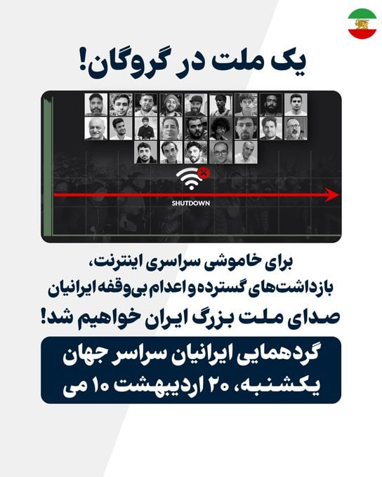

🚨
👑 یک ملت در گروگان!

همزمان با قطع اینترنت، بازداشت‌های گسترده و اعدام‌های بی‌وقفه به دست رژیم، آزادی‌خواهان در شهرهای مختلف جهان برای رساندن صدای ایرانیان به جامعه بین‌المللی گرد هم می‌آیند.

گردهمایی ایرانیان در سراسر جهان
یکشنبه ۲۰ اردیبهشت

#ایران_را_پس_میگیریم
@DEJradio

## DEJradio — post 4471

  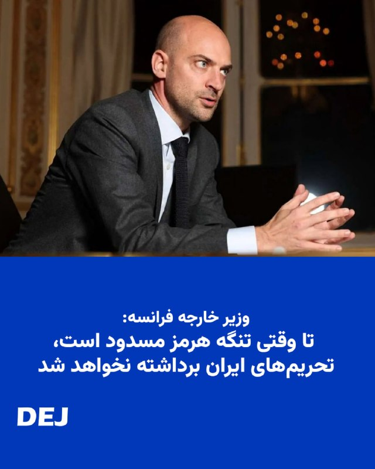

🔺📢 وزیر خارجه فرانسه: تا وقتی تنگه هرمز مسدود است، تحریم‌های ایران برداشته نخواهد شد

ژان‌نوئل بارو وزیر خارجه فرانسه اعلام کرد تا زمانی که تنگه هرمز مسدود است، «حتی کوچک‌ترین تحریم» مرتبط با ایران لغو نخواهد شد.

پیش‌تر امانوئل ماکرون رئیس جمهوری فرانسه در گفت‌وگو با مسعود پزشکیان رئیس جمهور ایران خواستار رفع فوری محاصره تنگه شده بود.

فرانسه روز چهارشنبه ناوگروه هواپیمابر «شارل دوگل» را به دریای سرخ اعزام کرد. این اقدام بخشی از برنامه‌ریزی اروپا برای انجام یک مأموریت چندملیتی جهت تأمین امنیت تردد کشتی‌ها در تنگه هرمز به شمار می‌رود.

به گزارش «رویترز»، این اقدام در حالی صورت می‌گیرد که تنش میان ایران و آمریکا بر سر کنترل این آبراه راهبردی همچنان ادامه دارد، و تبادل آتش‌های اخیر نشان داده که آتش‌بس شکننده موجود می‌تواند به‌سرعت فروبپاشد.

#تنگه_هرمز #تحریم
@DEJradio

## DEJradio — post 4470

  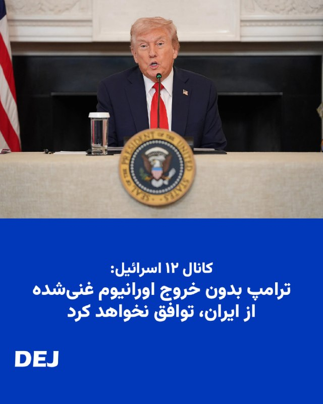

🚨📢 کانال ۱۲ اسرائیل:
ترامپ بدون خروج اورانیوم غنی‌شده از ایران، توافق نخواهد کرد

کانال ۱۲ اسرائیل نوشت که بر اساس ارزیابی مقامات این کشور، ترامپ بر یکی از اصلی‌ترین خواسته‌های خود یعنی خروج اورانیوم غنی‌شده از ایران پافشاری خواهد کرد و بدون اجرای این شرط، توافقی در کار نخواهد بود.

بنا بر این گزارش ترامپ به نتانیاهو اعلام کرده بدون خروج اورانیوم غنی‌شده از ایران، هیچ توافقی را امضا نخواهد کرد.

کانال ۱۲ اسرائیل همچنین نوشت که بر اساس ارزیابی‌های امنیتی در این کشور، جمهوری اسلامی درباره انتقال ذخایر اورانیوم ۶۰ درصدی به کشور ثالث، تا حدی انعطاف نشان داده اما هنوز اختلاف بر سر این است که این مواد به کدام کشور منتقل شوند.

#مذاکرات #ترامپ
@DEJradio

## DEJradio — post 4469

  <a href="telegram/content/DEJradio_4469_1778179417.mp4">🎬 Download video</a>

🔺🎥 استقرار سامانه‌های پدافندی چینی در امارات

سامانه پدافند هوایی لیزری Light Arrow-21A ساخت چین در امارات متحده عربی دیده شده است. این کلاس از سیستم های پدافندی بیشتر برای مقابله با پهپادهای انتحاری کاربرد دارند.

#پدافند_هوایی #امارات
@DEJradio

## DEJradio — post 4468

  

💀
🚨 حذف هدفمند فرمانده تیپ «رضوان» توسط اسرائیل

ارتش اسرائیل اعلام کرد احمد غالب بلوط، فرمانده واحد «نیروی رضوان» وابسته به گروه حـ.زب‌الله لبنان، در حمله‌ای در ضاحیه بیروت کشته شده است. ارتش اسرائیل اعلام کرد او از فرماندهان ارشد عملیاتی این واحد کماندویی بوده و در سال‌های گذشته مسئولیت‌هایی از جمله فرماندهی عملیات و آمادگی نیروها برای مقابله با ارتش اسرائیل را برعهده داشته است.
بر اساس گزارش ارتش اسرائیل، احمد غالب بلوط علاوه بر فرمانده عملیات‌های اخیر این گروه تحت هدایت، حمایت و آموزش سپـ.اه پاسـ.داران، در بازسازی توان رزمی «نیروی رضوان» و پیشبرد «طرح تصرف الجلیل» نقش کلیدی ایفا می‌کرد.

#حذف_هدفمند #لبنان
@DEJradio

## DEJradio — post 4467

  

🔺📢 “من معلم هستم، ۱۸ دی در غرب تهران به هر دو زانوم شلیک شد، ساچمه‌ها را درآوردیم اما چهار ماهه زانو خم نمیشود و فقط با عصا میتوانم راه بروم، اما دردم این است که سر بار خانواده‌ شده‌ام.

پیام دریافتی

#دی۱۴۰۴ #جمهوری_اسلامی
@DEJradio

## DEJradio — post 4466

  <a href="telegram/content/DEJradio_4466_1778179419.mp4">🎬 Download video</a>

🎥
🚨 تعدادی از دریانوردان و ملوان که تجربه مزاحمت قایق‌های تندرو سـ.ـپاه پاسداران در تنگه هرمز برای کشتی‌های تجاری را دارند، ویدیوهای خود را در اینستاگرام به اشتراک گذاشته‌اند.
آمریکا طی قطعنامه‌ای که پیش‌نویس آن به شورای امنیت ارائه شده است از جمهوری اسلامی خواسته انسداد تنگه هرمز و مین ریزی در بستر دریا را متوقف کند.

#تنگه_هرمز #محاصره_دریایی
@DEJradio

## DEJradio — post 4465

  

🔸
🔺 روزنامه «اشتاندارد» اتریش چهارشنبه ۱۶اردیبهشت ۱۴۰۵ در گزارشی مدعی شد که شرکت هلندی «هینیکن»، دومین شرکت بزرگ آبجوسازی جهان، چند سال پیش تلاش داشته با کمک یکی از بستگان علی لاریجانی وارد بازار ایران شود.
محمد محقق داماد، خواهرزاده علی لاریجانی، در پروژه‌ای مشترک میان هینیکن و یک شرکت ایرانی نقش مشاور اصلی را برعهده داشته و قرار بوده زمینه ورود این برند مشهور آبجو به بازار ایران را فراهم کند.
اشتاندارد نوشته است که این همکاری در قالب یک مشارکت اقتصادی مشترک طراحی شده بود.
این روزنامه اتریشی در گزارش خود، خانواده لاریجانی را یکی از بانفوذترین خانواده‌های جمهوری اسلامی توصیف کرده و نوشته است که اعضای این خاندان طی دهه‌های گذشته در بخش‌های کلیدی حکومت حضور داشته‌اند.
علی لاریجانی از چهره های قدرتمند جمهوری اسلامی و با خانواده پرنفوذی است که برادرش «صادق لاریجانی» نیز ریاست قوه قضاییه را برعهده داشت و هم اکنون رئیس مجمع تشخیص مصلحت است.
برخی اعضای خانواده لاریجانی در کشورهای غربی فعالیت حرفه‌ای دارند.
از جمله دختر علی لاریجانی که در آمریکا به عنوان پزشک کار می‌کرده ولی به ایران برگردانده شده، و دختر دیگر او که هنوز یک استارت‌آپ پزشکی را در لندن اداره می‌کند.
مشخص نیست این فرد به دنبال واردات آبجوی بدون الکل بوده یا مصمم بوده از مجاری خاص آبجوی الکی برای بازار خاص در ایران وارد کند.

#لاریجانی
@DEJradio

## DEJradio — post 4464

  <a href="telegram/content/DEJradio_4464_1778179421.jpg">🎬 Download video</a>

🔺🎤 آیا توان دفاعی امارات پاسخگوی تهدیدات جمهوری اسلامی خواهد بود؟

گفت‌وگو با شایان سمیعی، کارشناس امنیت ملی

#امارات #جمهوری_اسلامی
@DEJradio

## DEJradio — post 4463

  <a href="telegram/content/DEJradio_4463_1778179421.jpg">🎬 Download video</a>

🚨
🔸 خبر ۲۱
چهارشنبه ۱۶ اردیبهشت ۱۴۰۵

#خبر۲۱
@DEJradio

## DEJradio — post 4462

  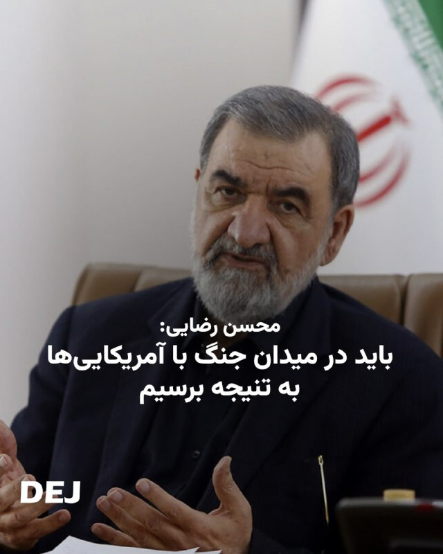

🤡
🔺 محسن رضایی: باید در میدان جنگ با آمریکایی‌ها به تنیجه برسیم

محسن رضایی در گفتگویی با اشاره به تحولات اخیر منطقه، مدعی شد که جمهوری اسلامی اجازه نخواهد داد واشنگتن بدون پرداخت هزینه از بحران خارج شود.

رضایی افزود: «اینجا میدان جنگ است و باید در مواجهه با آمریکایی‌ها به نتیجه نهایی برسیم و دستاوردهای خود را از این جنگ برداشت کنیم.»

پیش از این ترامپ گفته بود لحن و گفتار مقامات جمهوری اسلامی در صحبت‌های تلفنی با او بسیار متفاوت از حرف های آنها در رسانه هاست. او تاکید کرده بود که مقامات جمهوری اسلامی از هر راهی تلاش می‌کنند تا با دولت ترامپ به توافق برسند.

#حملات_هدفمند #جمهوری_اسلامی
@DEJradio

## DEJradio — post 4461

  <a href="telegram/content/DEJradio_4461_1778179422.jpg">🎬 Download video</a>

🚨
⭕️ دونالد ترامپ، رئیس جمهوری آمریکا به شبکه PBS:
«اورانیوم غنی‌شده در چارچوب توافق احتمالی به آمریکا منتقل خواهد شد و جمهوری اسلامی از تأسیسات زیرزمینی استفاده نخواهد کرد. اما اگر توافقی حاصل نشود، جهنم را به روی آنها باز خواهیم کرد.»

#مذاکرات #ترامپ
@DEJradio

## DEJradio — post 4460

  

🛩️
🔥 فرمانده ارتش اسرائیل: در صورت حمله به جمهوری اسلامی، لیست جدیدی از اهداف داریم

ژنرال ایال زمیر، فرمانده ارتش اسرائیل، در جریان بازدید از نیروهای مستقر در جنوب لبنان اعلام کرد اسرائیل در بحبوحه نبرد چندجبهه‌ای، فرصتی تاریخی برای تغییر معادلات منطقه‌ای در اختیار دارد.
او با اشاره به ادامه هماهنگی و همکاری نظامی با ایالات متحده گفت ارتش اسرائیل همچنان اهدافی آماده برای حمله در داخل ایران در اختیار دارد و در آمادگی کامل برای ازسرگیری عملیات گسترده و پرقدرت علیه جمهوری اسلامی قرار دارد.

به گفته زمیر، چنین عملیاتی می‌تواند دستاوردهای اسرائیل را گسترش داده و حکومت ایران را بیش از پیش تضعیف کند.

#حملات_هدفمند #جمهوری_اسلامی
@DEJradio

## DEJradio — post 4459

  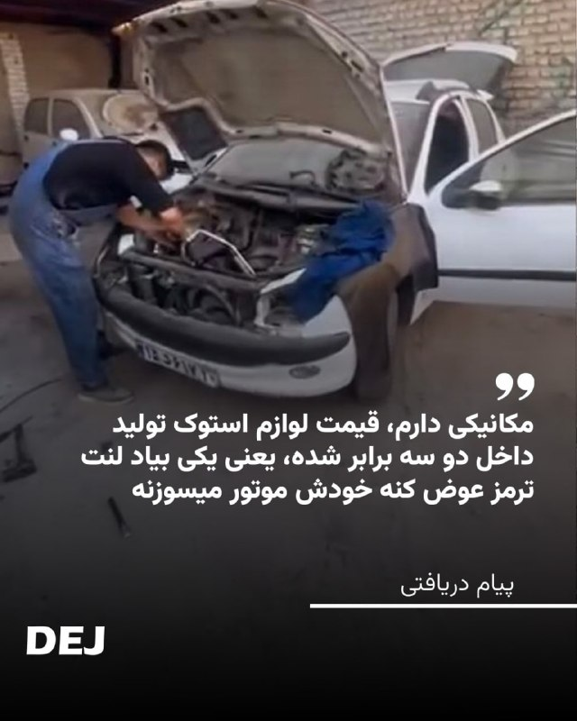

🔺📢 “مکانیکی دارم، قیمت لوازم استوک تازه‌تولید داخلی دو-سه برابر شده، یعنی یکی بیاد لنت‌ترمز عوض کنه خودش موتور می‌سوزنه...

پیام دریافتی

#تورم #جمهوری_اسلامی
@DEJradio

## DEJradio — post 4458

  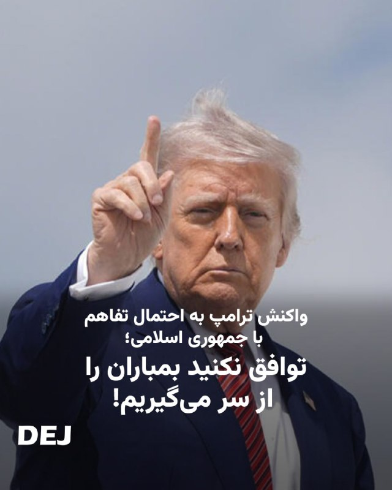

🚨
⭕️ واکنش ترامپ به احتمال تفاهم با جمهوری اسلامی؛ توافق نکنید بمباران را از سر می‌گیریم!

دونالد ترامپ، رئیس‌جمهوری ایالات متحده، با انتشار پیامی تازه در تروث سوشال، جمهوری اسلامی را میان پذیرش توافق یا روبه‌رو شدن با دور تازه‌ای از حملات سنگین قرار داد. ترامپ اعلام کرد اگر تهران با مفادی که به گفته او پیش‌تر مورد توافق قرار گرفته موافقت کند، عملیات نظامی آمریکا موسوم به «خشم حماسی» پایان خواهد یافت و مسیر بازگشایی تنگه هرمز برای همۀ کشورها، از جمله ایران، فراهم می‌شود.
ترامپ در عین حال هشدار داد که مخالفت جمهوری اسلامی با این شروط، به ازسرگیری بمباران‌ها منجر خواهد شد؛ حملاتی که به گفتۀ او این بار «بسیار شدیدتر» از مراحل پیشین خواهد بود.
این اظهارات در حالی مطرح می‌شود که رسانه اکسیوس گزارش داده کاخ سفید و جمهوری اسلامی به یک تفاهم‌نامۀ ۱۴بندی نزدیک شده‌اند.

#ترامپ #مذاکرات #جمهوری_اسلامی
@DEJradio

## mamlekate — post 103467

📝 استاندار تهران اعلام کرد از روز شنبه ۱۹ اردیبهشت ۱۴۰۵، حضور کارکنان همه وزارتخانه‌ها، سازمان‌ها و دستگاه‌های اجرایی مستقر در استان تهران به‌صورت ۱۰۰ درصدی خواهد بود.

محمدصادق معتمدیان همچنین گفت فعالیت مدارس و دانشگاه‌ها نیز طبق تصمیم وزارت آموزش و پرورش و وزارت علوم، به شکل حضوری و طبق روال اعلام‌شده ادامه خواهد داشت.

ManotoTV
@mamlekate

## mamlekate — post 103466

  <a href="telegram/content/mamlekate_103466_1778179424.mp4">🎬 Download video</a>

📊 وقتی این سری هم جون سالم دربردی

📝 مسعود پزشکیان، رئیس‌جمهور ایران، شامگاه ۱۶ اردیبهشت  با حضور در  نشستی با نمایندگان اصناف و بازاریان در وزارت صنعت، معدن و تجارت با اشاره به دیدار خود با مجتبی خامنه‌‌ای، رهبر سوم جمهوری اسلامی او را «صمیمی و متواضع» توصیف کرد.

او در بخش دیگری از سخنانش گفت که با «وحدت و تحمل دیدگاه‌های متفاوت» ایران می‌تواند بر تمامی مشکلات و فشارها غلبه کند. او در ادامه گفت: «الان می‌بینید کسانی در خیابان‌ها از ایران دفاع می‌کنند که قبلا ما می‌خواستیم آنها را جریمه کنیم.» به‌نظر می رسد اشاره او به تجمعات شبانه و حضور طرفداران غیر سنتی جمهوری اسلامی با پوشش‌هایی کاملا دور از چارچوب‌های حکومت درباره حجاب باشد.

مشخص نیست که این نخستین دیدار آقای پزشکیان با مجتبی خامنه‌ای پس از رهبری  باشد اما این نخستین‌بار است که او درباره آن به‌طور علنی سخن گفته است.
bbcpersian

📝 ترامپ به پی‌بی‌اس: توافق با جمهوری اسلامی شامل انتقال اورانیوم غنی‌شده به آمریکا می‌شود؛ غنی‌سازی ۳.۶۷ در توافق نخواهد بود

@mamlekate

## mamlekate — post 103465

  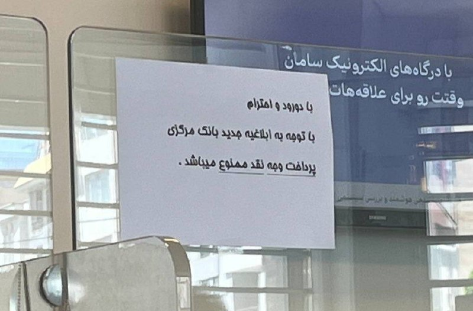

سلام ۱۷ اردیبهشت ۱۴۰۵ به بانک سامان سعادت اباد مراجعه کردم ۲ میلیون تومان معادل یک کیلو گوشت پول بگیرم. پشت باجه کاغذ زدن طبق ابلاغیه بانک مرکزی پرداخت وجه نقد ممنوع است!

فکر کن نهادی که وظیفه‌ش تضمین اعتبار به پول کشوره، خودش ابلاغ کرده که پول کشور را نمی‌دهم! حتی به مقدار یک کیلو گوشت!

@mamlekate

## mamlekate — post 103464

📝 وال‌استریت ژورنال جزئیات تازه‌ای از چارچوب پیشنهادی آمریکا به جمهوری اسلامی منتشر کرد

وال‌استریت ژورنال جزئیات تازه‌ای از چارچوب پیشنهادی آمریکا به جمهوری اسلامی منتشر کرد که به نوشته این روزنامه، در صورت پذیرش تهران، به مذاکرات ۳۰ روزه برای توافق نهایی منجر خواهد شد.

📝 سی‌ان‌ان: ایران پنجشنبه پاسخ خود به پیشنهاد آمریکا را ارائه می‌کند

یک منبع منطقه‌ای به خبرگزاری سی‌اِن‌اِن گفته است که انتظار می‌رود جمهوری اسلامی روز پنجشنبه پاسخ خود به پیشنهاد ایالات متحده برای پایان دادن به جنگ را به میانجی‌ها ارائه کند.

@mamlekate

## mamlekate — post 103463

📝 بلومبرگ: چین از بانک‌هایش خواست اعطای وام‌های جدید به پالایشگاه‌های تحریم‌شده را متوقف کنند

در آستانه سفر ترامپ به چین، بلومبرگ بر اساس اظهارات منابع آگاه گزارش داد که نهاد ناظر مالی چین به بزرگ‌ترین بانک‌های این کشور توصیه کرده است که به طور موقت اعطای وام‌های جدید به پنج پالایشگاهی را که اخیراً به دلیل ارتباطشان با نفت ایران از سوی آمریکا تحریم شده‌اند، متوقف کنند.

@mamlekate

## mamlekate — post 103461

  <a href="telegram/content/mamlekate_103461_1778179426.mp4">🎬 Download video</a>

📝 در حالی که گمانه‌زنی‌ها درباره محتوای پیشنهادهای متقابل تهران و واشنگتن برای ازسرگیری مذاکرات ادامه دارد، دونالد ترامپ در پاسخ به خبرنگاران تاکید کرد که جمهوری اسلامی با دست نیافتن به سلاح هسته‌ای «موافقت کرده است». او تاکید کرد که ایران «نمی‌تواند و نخواهد توانست» به سلاح هسته‌ای دست یابد و این موضوع را بخشی از تفاهمات مطرح‌شده دانست، هرچند جزئیات بیشتری ارائه نکرد.

آکسیوس پیش‌تر گزارش داده بود که در یکی از بندهای پیشنهاد آمریکا، توقف غنی‌سازی در مقابل رفع تدریجی تحریم‌ها مطرح شده است. این در حالی است که پیش‌تر مقامات جمهوری اسلامی هرگونه مذاکره درباره توقف غنی‌سازی را رد کرده بودند و بر ادامه این برنامه در چارچوب سیاست‌های اعلامی تاکید داشتند.

📝 دونالد ترامپ، رئیس‌جمهوری آمریکا، روز چهارشنبه ۱۶ اردیبهشت، در دفتر بیضی کاخ سفید با ابراز خوش‌بینی نسبت به پایان جنگ، از پیشرفت جدی در روند مذاکرات خبر داد. او تاکید کرد که در ۴۴ ساعت گذشته گفتگوهای بسیار مثبتی با مقام‌های جمهوری اسلامی انجام شده و دستیابی به یک توافق نهایی «بسیار محتمل» است.

ترامپ با اشاره به وضعیت نظامی کنونی گفت که توان دفاعی ایران به‌شدت کاهش یافته و نیروهای هوایی و دریایی این کشور عملا از کار افتاده‌اند. او با بیان اینکه «ما پیروز شده‌ایم»، اعلام کرد که جمهوری اسلامی اکنون تمایل زیادی برای دستیابی به توافق دارد.

رئیس‌جمهوری آمریکا شرط اصلی هرگونه توافق را دست نیافتن ایران به سلاح هسته‌ای و خروج ذخایر اورانیوم غنی‌شده از این کشور عنوان کرد. او هشدار داد که اگرچه به دیپلماسی امیدوار است، اما در صورت شکست مذاکرات، ایالات متحده آماده است تا گام‌های نظامی بسیار بزرگ‌تری بردارد.

indypersian
@mamlekate

## mamlekate — post 103460

  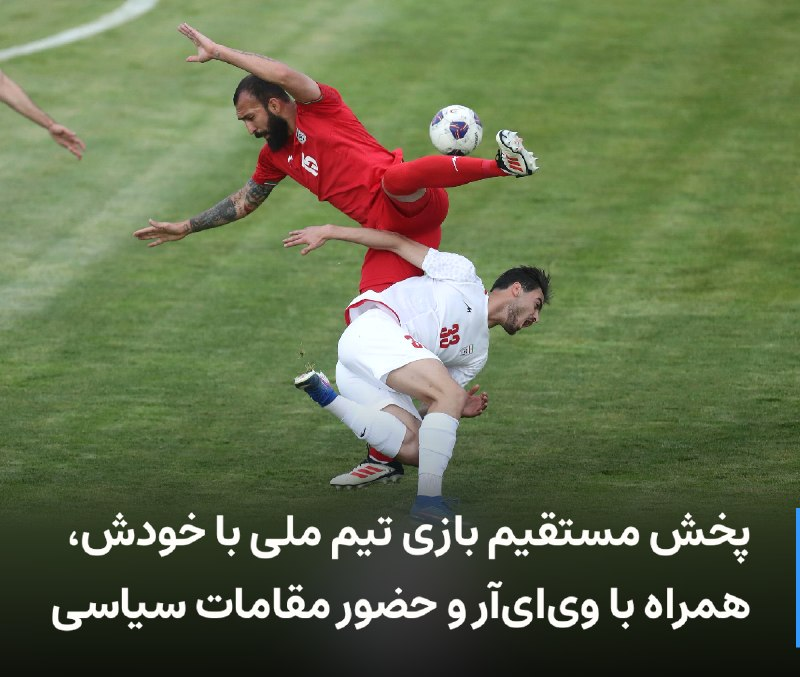

📝 پخش مستقیم بازی تیم ملی با خودش، همراه با وی‌ای‌آر و حضور مقامات سیاسی

در حالی که فوتبال ایران در تعطیلی مطلق به سر می‌برد و حریفان تدارکاتی تیم ملی، در آستانه جام جهانی، بازی با ایران را لغو کرده‌اند، تیم ملی فوتبال دومین بازی‌ تدارکاتی درون تیمی را در استادیوم پاس قوامین، وابسته به نیروی انتظامی، برگزار کرد.

این دیدار علاوه بر اینکه از صدا و سیمای جمهوری اسلامی به طور مستقیم پخش شد، وی ای آر هم داشت.

اسماعیل بقایی، سخنگوی وزارت امور خارجه، این بازی بدون تماشاگر را که با نتیجه سه بر یک به سود تیم سفید به پایان رسید، از نزدیک تماشا کرد.

قرار بود تیم ملی فوتبال در اردوی ترکیه با تیم های مقدونیه و آنگولا دیدار کند که این دو تیم به دلیل شرایط فعلی در ایران از بازی با تیم ملی انصراف دادند.

@mamlekate

## mamlekate — post 103459

📝 عراقچی در چین: توافقی جامع با آمریکا می‌خواهیم

عباس عراقچی، وزیر امور خارجه جمهوری اسلامی، که به پکن رفته است، روز چهارشنبه اعلام کرد در مذاکرات با ایالات متحده، تنها «یک توافق عادلانه و جامع» را خواهد پذیرفت. این در حالی است که دونالد ترامپ، رئیس‌جمهوری آمریکا، از «پیشرفت بزرگ» در این روند خبر داده است.

عراقچی پس از دیدار با وانگ یی، همتای چینی‌اش در پکن، به رسانه‌های ایرانی گفت: «ما تمام تلاشمان را برای حفظ حقوق و منافع مشروعمان در مذاکرات به کار خواهیم گرفت و فقط یک توافق عادلانه و جامع را می‌پذیریم.»

📝 منابع آمریکایی و پاکستانی: واشینگتن و تهران به چارچوبی برای پایان جنگ نزدیک شده‌اند

📝 جزئیات تفاهم احتمالی یک‌صفحه‌ای آمریکا و ایران برای پایان جنگ به روایت اکسیوس

هم‌زمان با اعلام تعلیق «پروژه آزادی» و اظهارات دونالد ترامپ درباره این توقف کوتاه‌مدت این طرح به منظور مشخص شدن اینکه تهران و واشنگتن به توافق نهایی می‌رسند یا نه، برخی رسانه‌ها از نزدیک شدن دو کشور به تفاهم برای پایان جنگ خبر دادند.

رسانه آمریکایی اکسیوس روز چهارشنبه به نقل از منابع آگاه نوشت که ایالات متحده و جمهوری اسلامی به یک «یادداشت تفاهم کوتاه» نزدیک شده‌اند که هدفش توقف جنگ و شروع مذاکرات گسترده‌تر است، هرچند هنوز توافق نهایی نشده است.

@mamlekate

## mamlekate — post 103458

  <a href="telegram/content/mamlekate_103458_1778179428.mp4">🎬 Download video</a>

📝 دونالد ترامپ: «پروژه آزادی» مدت کوتاهی متوقف می‌شود؛ محاصره دریایی جمهوری اسلامی ادامه دارد

دونالد ترامپ، رئیس‌جمهوری آمریکا عصر سه‌شنبه اعلام کرد که به دلیل دستیابی به «پیشرفت بزرگ» در مذاکرات با ایران در جهت حصول توافق برای پایان دادن به جنگ و بازگشایی تنگه هرمز، عملیات نظامی جدید آمریکا، موسوم به «پروژه آزادی» را که در این تنگه در حال اجرا بود، موقتا تعلیق می‌کند.

آقای ترامپ در شبکه اجتماعی «تروت‌سوشال» نوشت: «بنا بر درخواست پاکستان و دیگر کشورها و با توجه به موفقیت نظامی چشمگیری که در جریان کارزار علیه کشور ایران داشته‌ایم و همچنین با توجه به این واقعیت که پیشرفت بزرگی در مسیر دستیابی به توافق کامل و نهایی با نمایندگان ایران حاصل شده است، ما متقابلا توافق کرده‌ایم که در حالی که محاصره با قوت کامل برقرار خواهد بود، «پروژه آزادی» برای مدت کوتاهی متوقف شود تا مشخص شود آیا توافق می‌تواند نهایی و امضا شود یا نه.»

euronewspe
@mamlekate

## mamlekate — post 103457

📝 الو قشم ۱۶ اردیبهشت ساعد ۰۱:۲۷ دو انفجار کم صدا در مدت زمان ۳۰ ثانیه ولی پرلرزش شنیده شد

❓ آپدیت: استانداری هرمزگان می‌گوید ریز‌پرنده‌ها رهگیری شدند

 @mamlekate

## mamlekate — post 103456

  <a href="telegram/content/mamlekate_103456_1778179429.mp4">🎬 Download video</a>

مهدی تاج، رییس فدراسیون فوتبال در گفتگویی با صدا و سیمای جمهوری اسلامی که ۱۵ اردیبهشت در حاشیه تجمعات شبانه هواداران حکومت در تهران انجام شده است، گفت که جیانی اینفانتینو، رییس فیفا باید تضمین بدهد که مشابه اتفاقی که برای او در فرودگاه ونکوور کانادا افتاد، برای تیم ملی نیفتد: «اینفانتینو باید تضمین جدی به ما بدهد؛ حق توهین به سپاه پاسداران ندارند. ضمانتی به ما داده شود که ماجرایی مثل کانادا پیش نیاید، اگر توهین کنند، تیم ممکن است برگردد.»
IranintlTV

از حضور پرتعداد مردم ایران با پرچم شیروخورشید توی پر بیننده ترین رخداد ورزشی جهان بشدت وحشت دارند. چون خوب می‌دونن اون بخش بزرگی از مردم جهان که پیگیر مسائل سیاسی نیستن، از این طریق می‌فهمن که مردم ایران این حکومت اسلامی رو نمی‌خوان. این دست و پا زدن و "تضمین" خواستن، فقط واسه اینه که نذارن صدای مردم در پرایم‌تایم رسانه‌ای به گوش دنیا برسه. انگار جام جهانی لیگ آزادگانه بدون تماشاگر برگزار کنند.

@mamlekate

## mamlekate — post 103455

  

ساعت ۰۰:۲۳ بامداد زلزله در کرمانشاه (۵ ریشتری ثبت شده که زلزله قابل توجهی محسوب میشه)

@mamlekate

## mamlekate — post 103454

  <a href="telegram/content/mamlekate_103454_1778179431.mp4">🎬 Download video</a>

طبق پیام‌های توی الو متاسفانه توی حادثه آتش‌سوزی امروز تعداد زیادی از جمله چند زن داخل یکی از باشگاه‌های ورزشی زنانه برج ارغوان کشته شدند. پاساژ ۶ تا باشگاه بزرگ داره. «الکی میگن کسی نمرده.»

@mamlekate

## mamlekate — post 103453

  <a href="telegram/content/mamlekate_103453_1778179432.mp4">🎬 Download video</a>

🔥 علی انصاری، جوان ۲۵ ساله ایرانی، از برکت AI میلیاردر شد.

او زاده ایران ، بنیان‌گذار micro1 هست. شرکتش داده‌های تخصصی را برای آموزش مدل‌های هوش مصنوعی لیبل می‌زند و سریع رشد کرد.

اکنون شرکت اش در حال مذاکره برای ارزش ۲.۵ میلیارد دالری هست.

DaneshParwar_
@mamlekate

## mamlekate — post 103452

  <a href="telegram/content/mamlekate_103452_1778179434.mp4">🎬 Download video</a>

‌
دونالد ترامپ، رئیس‌جمهور آمریکا، در پاسخ به پرسشی درباره احتمال مسلح‌کردن معترضان در ایران گفت آن‌ها «می‌خواهند اعتراض کنند، اما سلاحی ندارند».

او گفت در تجمع‌های گسترده، حضور چند فرد مسلح می‌تواند باعث شود معترضان غیرمسلح با مشاهده کشته‌شدن افراد «عقب‌نشینی کنند».

ترامپ همچنین با اشاره به اعتراضات دیماه گفت «۴۲ هزار معترض غیرمسلح» در یک ماه کشته شده‌اند و افزود در این تجمع‌ها از تک‌تیراندازها استفاده شده است.

او در عین حال گفت نمی‌خواهد چنین شرایطی تکرار شود، اما تاکید کرد نبود سلاح یکی از دلایل کاهش تداوم اعتراضات است.

ManotoTV
@mamlekate

## mamlekate — post 103451

  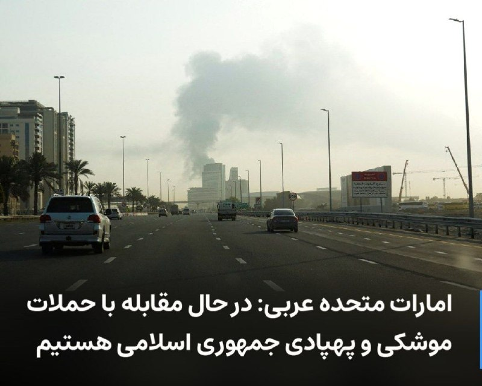

📝 امارات متحده عربی: در حال مقابله با حملات موشکی و پهپادی جمهوری اسلامی هستیم

وزارت دفاع امارات متحده عربی اعلام کرد سامانه های پدافند هوایی این کشور در حال مقابله با حملات موشکی و پهپادی هستند که از سوی ایران انجام می شود و صداهای شنیده شده در سراسر کشور ناشی از عملیات سامانه های پدافندی امارات برای مقابله با موشک های بالستیک، کروز و پهپادها است.

@mamlekate

## mamlekate — post 103448

  <a href="telegram/content/mamlekate_103448_1778179436.mp4">🎬 Download video</a>

پاساژ تجاری ارغوان فاز۴ اندیشه

@mamlekate مملکته

## VahidOnline — post 75301

  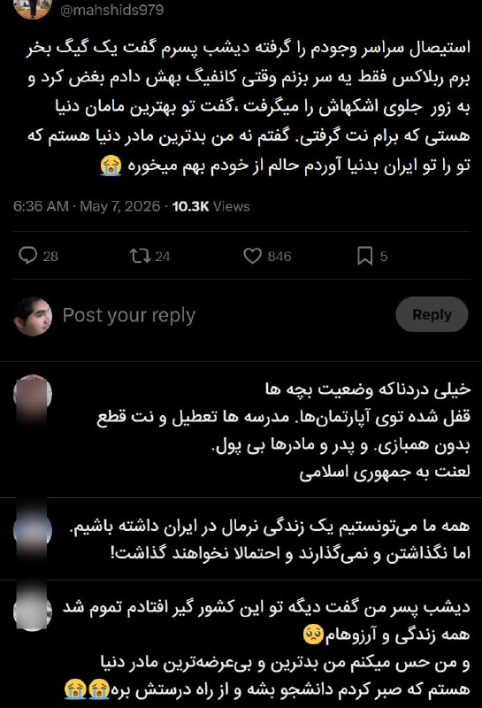

mahshids979

📡 @VahidOnline

## VahidOnline — post 75300

  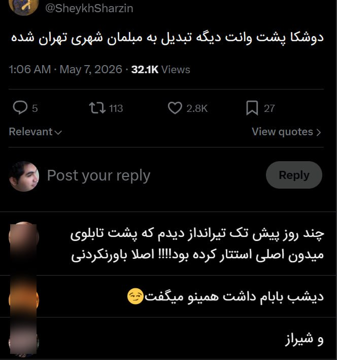

SheykhSharzin

📡 @VahidOnline

## VahidOnline — post 75299

  

t_golpoone

📡 @VahidOnline

## VahidOnline — post 75298

  

محمود نبویان، عضو کمیسیون امنیت ملی مجلس، در شبکه ایکس نوشت: «با وجود سابقه بدعهدی آمریکا و به ویژه حضور اصحاب توافق ذلت بار برجام به‌همراه قالیباف در مذاکرات، هیچ امیدی به مذاکره و توافق مطلوب برای ایران وجود ندارد.»

او افزود: «لازم است قالیباف اصحاب توافق خسارت‌بار برجام را از تیم مذاکره‌کننده کاملا حذف نماید.»

نبویان در پست دیگری نیز نوشت که برخی از «مسئولین و سیاسیون ترسو و غیرهمسو با ملت مقاوم ایران»، به دنبال آمارسازی‌های غلط برای تسلیم هستند، اگر اصلاح نکنند، اسامی‌شان افشا خواهد شد.
@VahidOOnLine

📡 @VahidOnline

## VahidOnline — post 75297

  

ژان-نوئل بارو، وزیر خارجه فرانسه اعلام کرد تا زمانی که تنگه هرمز توسط نیروهای جمهوری اسلامی مسدود باشد، هیچ تحریمی علیه تهران لغو نخواهد شد.

او در گفت‌وگو با شبکه «آر‌ال‌تی» گفت: «ما خودمان تحریم‌های مهمی علیه ایران اعمال کرده‌ایم. اما تا زمانی که تنگه هرمز مسدود باشد، لغو هیچ‌گونه تحریمی قابل تصور نیست.»
بارو افزود: «این تنگه نمی‌تواند بسته شود، مشمول عوارض گردد یا به‌عنوان ابزار فشار و باج‌گیری استفاده شود.»

او همچنین تأکید کرد فرانسه نباید دوباره در موقعیتی قرار بگیرد که مجبور شود هزینه جنگ‌هایی را بپردازد که خود آغاز نکرده است.
به گفته او، اروپا باید وابستگی خود به نفت، هیدروکربن‌ها و فناوری‌های دیجیتال را کاهش دهد تا کمتر درگیر بحران‌ها و درگیری‌هایی شود که مستقیماً طرف آن نیست.
@VahidOOnLine

📡 @VahidOnline

## VahidOnline — post 75296

  

مسعود پزشکیان، رئیس‌جمهور ایران، از ملاقات اخیر خود با مجتبی خامنه‌ای، رهبر جمهوری اسلامی، خبر داد و گفت با گفت‌وگوی مفصلی داشته است.

مسعود پزشکیان که روز پنجشنبه ۱۷ اردیبهشت در نشستی در وزارت صمت سخن می‌گفت، به ملاقات دو ساعت و نیمه با مجتبی خامنه‌ای اشاره کرد اما در مورد موضوع و جزئیات ملاقات و اظهارات مطرح‌شده چیزی نگفت و صرفاً او را به‌دلیل «صمیمی و متواضع بودن»، «الگویی برای نظام مدیریتی و اداری» کشور توصیف کرد.

پس از کشته شدن علی خامنه‌ای، رهبر پیشین جمهوری اسلامی، در روز نخست جنگ با آمریکا و اسرائیل، مجلس خبرگان رهبری پسرش مجتبی را به‌عنوان رهبر جدید معرفی کرد. با این حال از آن زمان هیچ تصویر، صوت یا دستخطی از او منتشر نشده و رسانه‌های ایران فقط شماری پیام مکتوب منسوب به او را منتشر کرده‌اند.
@VahidHeadline

📡 @VahidOnline

## VahidOnline — post 75295

  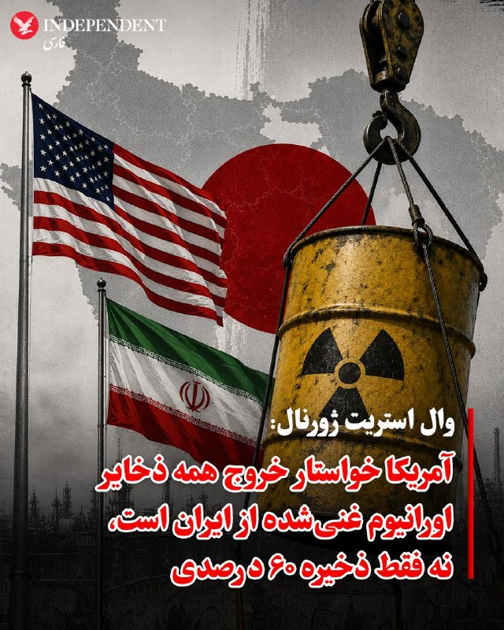

♦️وال استریت ژورنال در گزارشی درباره توافق آمریکا با رژیم ایران نوشت که ایالات متحده می‌خواهد همه ذخایر اورانیوم غنی‌شده از ایران خارج شود. به این معنی که هم ذخایر اورانیوم با غنای ۶۰ درصد و هم ۲۰ درصد و هر میزان اورانیوم غنی‌شده دیگری که ایران در اختیار دارد نیز باید تحویل دهد. این در حالی است که مفامات تهران همچنان می‌گویند موضوع خروج ذخایر اورانیوم غنی‌شده از ایران، از دستور کار خارج شده است.
@VahidOOnLine

📡 @VahidOnline

## VahidOnline — post 75294

  

ان‌بی‌سی نیوز به نقل از دو مقام آمریکایی گزارش داد چرخش ناگهانی ترامپ از «پروژه آزادی» تنگه هرمز پس از آن رخ داد که متحدان خلیج فارس از این تصمیم غافلگیر شدند و عربستان سعودی امکان استفاده ارتش آمریکا از پایگاه‌ها و حریم هوایی خود جهت اجرای این عملیات را به حالت تعلیق درآورد.
به گفته این مقام‌ها، ترامپ بعدازظهر یکشنبه با اعلام «پروژه آزادی» در شبکه‌های اجتماعی، متحدان خلیج فارس را غافلگیر کرد و این اقدام موجب نارضایتی رهبران عربستان سعودی شد. در واکنش، عربستان سعودی به آمریکا اطلاع داد که اجازه نخواهد داد ارتش آمریکا از پایگاه هوایی پرنس سلطان در جنوب‌شرقی ریاض پرواز کند یا برای پشتیبانی از این تلاش از حریم هوایی عربستان عبور کند.
این دو مقام آمریکایی گفتند تماس تلفنی میان ترامپ و محمد بن سلمان، ولیعهد عربستان سعودی، این اختلاف را حل نکرد و رییس‌جمهوری آمریکا ناچار شد «پروژه آزادی» را متوقف کند تا دسترسی ارتش آمریکا به این حریم هوایی حیاتی را احیا کند.
دیگر متحدان نزدیک خلیج فارس نیز غافلگیر شدند؛ رییس‌جمهوری آمریکا پس از آغاز این اقدام با رهبران قطر گفت‌وگو کرد.

@VahidOOnLine

📡 @VahidOnline

## VahidOnline — post 75293

  

دونالد ترامپ چهارشنبه شب در تروث‌سوشال تصویری منتشر کرد که مدت‌زمان جنگ‌های مختلف در آن نشان داده شده و از مخاطبانش خواست آن را ببینند.
او بارها به کسانی که مدعی‌شده‌اند عملیات نظامی علیه جمهوری اسلامی «طولانی» شده، پاسخ داده‌است آن را با جنگ‌های پیشین آمریکا مقایسه کنند.
@VahidHeadline

📡 @VahidOnline

## VahidOnline — post 75292

غرب تهران
پیام‌های دریافتی:

صدای انفجار 2:38 دقیقه جنت اباد تهران

شهران صدای انفجار وحشتناک اومد ساعت ۲:۴۰

یک صدای انفجار خیلی بلند سمت شهرزیبا (غرب تهران) ، شبیه موشک نبود بیشتر انگار یه چیزی ترکید

پونک تهران
دو صدای انفجار شنیدیم

همین چند دقیقه پیش غرب تهران یه صدای خیلی بلندی از انفجار اومد

سلام وحید جان دادش غرب تهران ۲:۳۸ اینا صدای یک تک انفجار اما سنگین اومد ولی هیچ جا نگفته کس دیگه!

چند دقیقه اخیر راجع به صدای انفجار توی جنت اباد پیامی دریافت نکردید؟
صدا شبیه انفجار پهپاد بود. موج نداشت اما شدید بود.
[دریافت کرده بودم ولی چون تعدادشون کم بود صبر کرده بودم تا پیام‌‌های بیشتری برسه. چون پیام‌هایی که بعد از انتشار پست ارسال بشن اعتبار زیادی نخواهند داشت.]

سلام منزل ما جنت آباد مرکزی هست محدوده خیابان بصارتی
حدود ساعت ۲.۴۰ صدای انفجار شنیدم اما دقیق نمی دونم چی بود

شهران صدای انفجار بلندی اومد ولی یه دونه انفجار بیشتر نبود.

ما سمت باغ‌فیض هستیم؛ ساعت ۲:۴۰ صدای انفجار اومد، آنچنان نزدیک نبود اما بلند بود؛ بنظر نمیرسید شبیه به صدای برخورد باشه؛
اما همین یکم پیش هم حدود ساعت ۳:۰۵ صداهایی شبیه به موتور اما تیزتر و ممتد اومد که حدود ۳،۴ دقیقه طول کشید؛ فکرمیکنم شاید پهباد بوده باشه؛ با صدای جگنده که در زمان جنگ میومد متفاوت بود.

📡 @VahidOnline

## VahidOnline — post 75290

  <a href="telegram/content/VahidOnline_75290_1778179440.mp4">🎬 Download video</a>

دونالد ترامپ، رئیس‌جمهور ایالات متحده، شامگاه چهارشنبه گفت که پس از «گفت‌وگوهای بسیار خوب» در ۲۴ ساعت گذشته، دستیابی به توافقی با ایران برای پایان دادن به جنگ «بسیار محتمل» است.
@VahidHeadline
ترامپ با اشاره به وضعیت نظامی کنونی گفت که توان دفاعی ایران به‌شدت کاهش یافته و نیروهای هوایی و دریایی این کشور عملا از کار افتاده‌اند. او با بیان اینکه «ما پیروز شده‌ایم»، اعلام کرد که جمهوری اسلامی اکنون تمایل زیادی برای دستیابی به توافق دارد.
رئیس‌جمهوری آمریکا شرط اصلی هرگونه توافق را دست نیافتن ایران به سلاح هسته‌ای و خروج ذخایر اورانیوم غنی‌شده از این کشور عنوان کرد.
@VahidOOnLine
او تاکید کرد که ایران «نمی‌تواند و نخواهد توانست» به سلاح هسته‌ای دست یابد و این موضوع را بخشی از تفاهمات مطرح‌شده دانست، هرچند جزئیات بیشتری ارائه نکرد.
آکسیوس پیش‌تر گزارش داده بود که در یکی از بندهای پیشنهاد آمریکا، توقف غنی‌سازی در مقابل رفع تدریجی تحریم‌ها مطرح شده است.
این در حالی است که پیش‌تر مقامات جمهوری اسلامی هرگونه مذاکره درباره توقف غنی‌سازی را رد کرده بودند و بر ادامه این برنامه در چارچوب سیاست‌های اعلامی تاکید داشتند.
@VahidOOnLine
ترامپ گفت: «ما در وضعیت خوبی هستیم و حالا باید آنچه را می‌خواهیم به دست بیاوریم؛ اگر این اتفاق نیفتد، باید یک گام بزرگ‌تر برداریم.»
@VahidOOnLine

📡 @VahidOnline

## VahidOnline — post 75289

  

ارتش اسرائیل عصر روز چهارشنبه در حمله هوایی به منطقه ضاحیه، حومه جنوبی بیروت، که تحت نفوذ حزب‌الله است، فرمانده یگان نخبه «رضوان» این گروه را هدف قرار داد.

این نخستین حمله به حومه بیروت از زمان آتش‌بسی بود که روز ۲۷ فروردین بین اسرائیل و حزب‌الله برقرار شد، هرچند درگیری‌ها در جنوب لبنان متوقف نشده است.

در بیانیه مشترک بنیامین نتانیاهو، نخست‌وزیر اسرائیل، و یسرائیل کاتس، وزیر دفاع، آمده است: «عوامل رضوان به رهبری این فرمانده مسئول شلیک به مناطق مسکونی اسرائیل و آسیب رساندن به نیروهای ارتش اسرائیل بودند.»
خبرگزاری فرانسه به نقل از یک منبع نزدیک به حزب‌الله اعلام کرد که «مالک بلّوط، فرمانده عملیات در یگان رضوان» در این حمله کشته شده است.
@VahidHeadline

📡 @VahidOnline

## VahidOnline — post 75287

بنیامین نتانیاهو، نخست‌وزیر اسرائیل در آغاز جلسه کابینه خود امروز(چهارشنبه) به موضوع ایران و همکاری با آمریکا در این زمینه اشاره کرده است.
آقای نتانیاهو درباره ارتباط با ایالات متحده گفته است: «هماهنگی کاملی بین ما وجود دارد؛ هیچ غافلگیری وجود ندارد. ما اهداف مشترکی داریم و مهمترین هدف، خارج کردن تمام مواد غنی‌شده از ایران و برچیدن قابلیت‌های غنی‌سازی ایران است.»
نخست وزیر اسرائیل گفته است:«رئیس جمهور ترامپ معتقد است که می‌تواند به هر طریقی به این هدف دست یابد. با این حال، ما برای هر سناریویی آماده هستیم و این دستورالعملی است که من به ارتش اسرائیل و سازمان‌های امنیتی‌مان داده‌ام. اسرائیل از همیشه قوی‌تر است؛ ایران و نیروهای نیابتی آن از همیشه ضعیف‌تر هستند.»
او گفته است: «ما در حال حفظ ارتباط مداوم با دوستانمان در ایالات متحده هستیم. من تقریبا هر روز با رئیس جمهور ترامپ صحبت می‌کنم. مردم من و مردم او روزانه، از جمله امروز، با هم صحبت می‌کنند. و من امشب دوباره با رئیس جمهور ترامپ صحبت خواهم کرد.»
@VahidHeadline
دونالد ترامپ، رئیس‌جمهور ایالات متحده، روز چهارشنبه و همزمان با تلاش‌ها برای دستیابی به توافق پایان جنگ در خاورمیانه، بار دیگر تأکید کرد که آمریکا اورانیوم غنی‌شده ایران را خواهد گرفت.
او هنگام ترک یک رویداد در کاخ سفید به خبرنگاران گفت: «ما آن را خواهیم گرفت.»
آقای ترامپ در جریان سخنرانی خود در کاخ سفید همچنین گفت «ما در ایران خیلی خوب عمل می‌کنیم. همه‌چیز خیلی روان پیش می‌رود و خواهیم دید چه اتفاقی می‌افتد. آن‌ها می‌خواهند به توافق برسند، می‌خواهند مذاکره کنند.»
رئیس‌جمهور آمریکا درباره وضعیت مذاکرات توضیح داد: «ما با افرادی سر و کار داریم که بسیار خواهان رسیدن به توافق هستند و خواهیم دید آیا می‌توانند توافقی ارائه دهند که برای ما رضایت‌بخش باشد یا نه.»
@VahidHeadline

📡 @VahidOnline

## VahidOnline — post 75286

  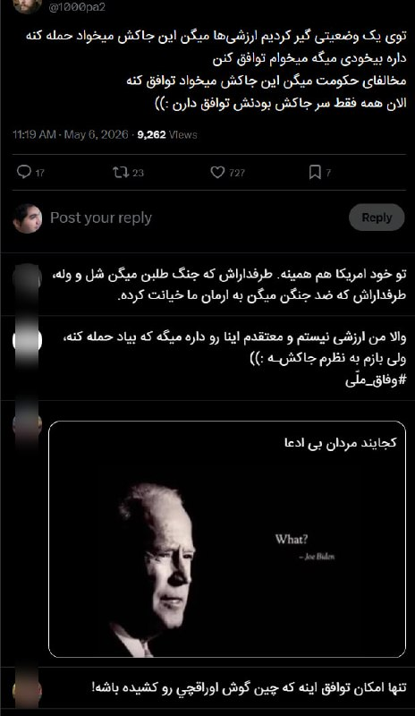

1000pa2

📡 @VahidOnline

## VahidOnline — post 75285

  

سنتکام در بیانیه‌ای اعلام کرده نیروهای آمریکایی در دریای عمان «در چارچوب اجرای محاصره»، یک نفتکش خالی با پرچم ایران را که در حال حرکت به سمت یکی از بنادر ایران بود، از کار انداختند.
سنتکام اعلام کرد پیش از این اقدام، چندین هشدار به این نفتکش داده شده، اما خدمه از دستورات تبعیت نکرده‌اند.
در ادامه آمده است که نیروهای آمریکایی با شلیک چند گلوله از توپ ۲۰ میلی‌متری یک جنگنده اف/ای-۱۸ سوپر هورنت سکان نفتکش را از کار انداختند.
@VahidOOnLine
فکر کنم ترامپ قانون گذاشته از یه حدی بیشتر نباید خرج محاصره دریایی بشه. نفتکش قبلی را با توپ ناوشکن متوقف کردند این یکی را با تیربار اف-۱۸ زدند به سکانش.
_KhodaBiamorz

📡 @VahidOnline

## VahidOnline — post 75283

خواهر مصطفی حیدری‌تبار: Akitakii731

📡 @VahidOnline

## VahidOnline — post 75282

  <a href="telegram/content/VahidOnline_75282_1778179442.mp4">🎬 Download video</a>

'یکشنبه ۱۰ اسفند'
ویدیوی دریافتی با شرح: 'انفجار حمله به سپاه کهنز #شهریار از دوربین ماشین. تازه تونستم به اینترنت وصل بشم.'
Vahid

📡 @VahidOnline

## kianmeli1 — post 87216

🔴عربستان سعودی و کویت تصمیم خود برای محدود کردن استفاده نظامی آمریکا از پایگاه‌ها و فضای هوایی‌شان برای «پروژه آزادی» را بر اساس گزارش WSJ لغو کرده‌اند.

جزئیات شامل:

1. اوایل این هفته، گزارش شده بود که عربستان سعودی و کویت استفاده آمریکا از پایگاه‌ها و فضای هوایی‌شان برای عملیات نظامی به منظور بازگشایی تنگه هرمز را مسدود کرده‌اند

2. اکنون که این تصمیم لغو شده، رئیس‌جمهور ترامپ به دنبال «راه‌اندازی مجدد» پروژه آزادی است

3. عملیات آمریکا به ناوگان بزرگی از هواپیماها برای حفاظت از کشتی‌های تجاری متکی است که پایگاه‌ها و فضای هوایی عربستان و کویت برای اجرای آن حیاتی است

⚠️قیمت نفت آمریکا در پی این خبر افزایش یافته است.
https://t.me/kianmeli1

## kianmeli1 — post 87215

  <a href="telegram/content/kianmeli1_87215_1778179442.mp4">🎬 Download video</a>

🔴فرمانده ارشد سپاه : ما از موشک‌های ده سال پیش استفاده کردیم
https://t.me/kianmeli1

## kianmeli1 — post 87214

⚠️سازمان بهداشت جهانی به دلیل احتمال ابتلا به هانتاویروس با ۱۲ کشور تماس گرفته است.

آلمان
دانمارک
کانادا
ترکیه
هلند
نیوزیلند
سوئد
سوئیس
انگلستان
ایالات متحده آمریکا
سنگاپور
سنت کیتس و نویس
https://t.me/kianmeli1

## kianmeli1 — post 87213

  

🔴سازمان بهداشت جهانی اعلام کرد که تاکنون ۵ مورد ابتلا به هانتاویروس تایید شده است.
https://t.me/kianmeli1

## kianmeli1 — post 87212

  

🔴تنها ٢ هزار نفر از ٢٧ هزار نيروي كار فولاد به كار بازكشتند

پس از حملات آمریکا و اسرائیل به فولاد مبارکه اصفهان، از بیش از ۲۷ هزار نیروی این مجموعه تنها حدود دو هزار نفر، عمدتا در بخش‌های اداری و مدیریتی، به محل کار بازگشته‌اند و بخش تولید همچنان در توقف به‌سر می‌برد.

بر اساس این گزارش، بخشی از کارگران و نیروهای سابق فولاد مبارکه پس از توقف تولید، به رانندگی در اسنپ و تپسی روی آورده‌اند و برخی نیروهای فنی به دلیل کاهش حقوق یا بلاتکلیفی در روند بازسازی، به کارخانه‌های فولاد یزد و خراسان مهاجرت کرده‌اند
https://t.me/kianmeli1

## kianmeli1 — post 87211

  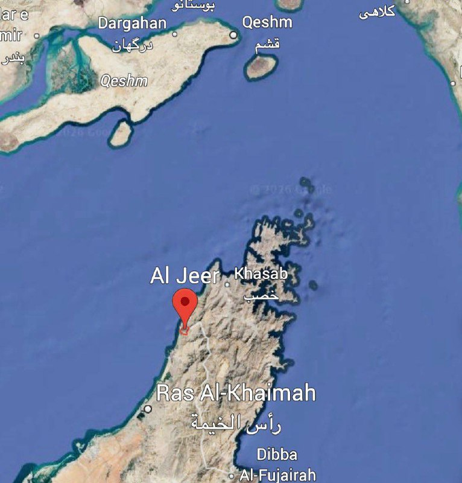

🔴به گزارش رویترز، به نقل از گزارش رسانه چینی سیاشین، یک نفتکش بزرگ چینی حامل فرآورده‌های نفتی، دوشنبه گذشته در نزدیکی بندر الجیر امارات متحده عربی مورد اصابت یک موشک ایرانی قرار گرفت.

به گفته منبعی از مالک کشتی، این اولین بار است که از زمان آغاز درگیری، یک کشتی چینی مورد اصابت آتش ایرانی‌ها قرار می‌گیرد.

طبق گزارش‌ها، این کشتی با عنوان «مالک و خدمه چینی» علامت‌گذاری شده بود و همچنان هدف قرار گرفته است.
https://t.me/kianmeli1

## kianmeli1 — post 87210

  

🔴مرندی در پاسخ به ترامپ که گفته بود اگر توافق نشود بمباران بزرگتر در راه است نوشت

هشدار نهایی. اگر نتانیاهو و دستیارش ترامپ حمله نسل‌کشی دیگری را علیه ایران آغاز کنند، پاسخ جمهوری اسلامی بی‌رحمانه خواهد بود. اقتصاد جهانی فرو می‌پاشد. و در سراسر جهان، مردم به دنبال افرادی مانند اپستین خواهند گشت.
https://t.me/kianmeli1

## kianmeli1 — post 87209

‏🔴شرق الاوسط:

‏«تصویر جسد علی خامنه‌ای، رهبر جمهوری اسلامی ، ساعاتی پیش از اعلام رسمی خبر کشته شدنش توسط دونالد ترامپ، به تلفن همراه رهبران چارچوب هماهنگی وابستە بە جمهوری اسلامی در عراق ارسال شده بود».
https://t.me/kianmeli1

## kianmeli1 — post 87208

  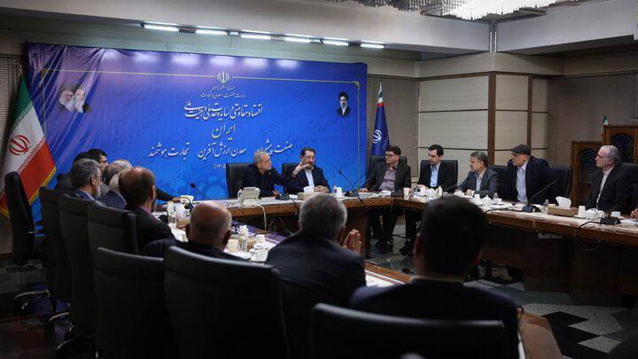

🔴مسعود پزشکیان:
با مجتبی خامنه ای دیدار کردم
https://t.me/kianmeli1

## kianmeli1 — post 87207

  <a href="telegram/content/kianmeli1_87207_1778179446.mp4">🎬 Download video</a>

🔴نتانیاهو : فرمانده نیروی رضوان که دیروز کشته شد،طراح نقشه حمله و تصرف شمال اسرائیل بود

فکر می‌کرد می‌تونه از یه مقر مخفی تو بیروت حمله‌ها رو هدایت کنه

ظاهراً تو خبرا خونده بود که تو بیروت در امانه؛ ولی هیچ تروریستی مصونیت نداره
https://t.me/kianmeli1

## kianmeli1 — post 87206

🔴دادگاه عالی چین، برای دو وزیر دفاع سابق این کشور بنام‌های وی پنگ و لی شانگفو پس از محکومیت به دریافت رشوه حکم اعدام صادر کرد.
https://t.me/kianmeli1

## kianmeli1 — post 87205

🔴شبکه CNN به نقل از سازمان دریانوردی بین‌المللی گزارش داد حدود 1600 کشتی هنوز در نزدیکی تنگه هرمز گرفتار هستند.
https://t.me/kianmeli1

## kianmeli1 — post 87204

  <a href="telegram/content/kianmeli1_87204_1778179448.mp4">🎬 Download video</a>

🔴حملات شدید ارتش اسراییل به جنوب لبنان
https://t.me/kianmeli1

## kianmeli1 — post 87203

🔴خبرگزاری کایشین چین گزارش داد که یک نفتکش چینی اوایل این هفته در تنگه هرمز مورد حمله قرار گرفته است.
https://t.me/kianmeli1

## kianmeli1 — post 87202

🔴وال استریت ژورنال به نقل از مقامات آمریکایی لیست درخواست های جدید آمریکایی ها را برای توافق با ایران منتشر کرد:

1- ممنوعیت غنی‌سازی اورانیوم به مدت 20 سال

2- تحویل تمام مواد غنی‌شده (یعنی نه فقط 400 کیلوگرم با غلظت 60٪، بلکه صدها کیلوگرم با غلظت 20٪)

3- اعلام رسمی اینکه ایران به دنبال دستیابی به سلاح‌های هسته‌ای نیست

4- تعطیلی تأسیسات هسته‌ای فردو، نطنز و اصفهان

5- ممنوعیت تمام فعالیت‌های هسته‌ای زیرزمینی

6- بازرسی های فوری به درخواست‌های آژانس بین‌المللی انرژی اتمی
https://t.me/kianmeli1

## kianmeli1 — post 87201

🔴گزارش‌های متعدد از غرب تهران؛
از دقایقی پیش کاربران در جنت‌آباد، شهران، پونک و شهرزیبا از شنیده‌شدن صدای یک انفجار شدید حوالی ساعت ۲:۳۸ تا ۲:۴۰ بامداد خبر می‌دهند.

بر اساس پیام‌های دریافتی، شدت صدا بالا بوده اما تنها یک انفجار شنیده شده و هنوز توضیح درباره منشأ آن منتشر نشده
https://t.me/kianmeli1

## kianmeli1 — post 87200

  

🔴قالیباف در حال مسخره کردن ترامپ

‏عملیات «به من اعتماد کن برادر» شکست خورد. حالا با عملیات فاکسیوس به روال عادی برمی‌گردیم.
https://t.me/kianmeli1

## kianmeli1 — post 87199

‏🔴رضایی، سخنگوی کمیسیون امنیت ملی مجلس: تمرکز ما بر مذاکرات نیست، بلکه بر قوی‌تر شدن است که اگر مجددا جنگی صورت گیرد، بتوانیم در کمترین زمان بیشترین آسیب را به «دشمن» بزنیم
https://t.me/kianmeli1

## kianmeli1 — post 87198

‏🔴وال‌استریت ژورنال گزارش داد دیپلمات‌های آمریکایی درباره استفاده از بازارهای پیش‌بینی آنلاین در بحبوحه مذاکرات غیرقابل‌پیش‌بینی با ایران هشدار دریافت کرده‌اند
https://t.me/kianmeli1

## kianmeli1 — post 87197

🔴آکسیوس به نقل از مقامات آمریکایی: ما انتظار داریم ظرف 24 تا 48 ساعت آینده از تهران پاسخی دریافت کنیم

ترامپ ممکن است در صورت عدم دستیابی به توافق تا پایان سفرش به چین، دستور اقدام نظامی را دوباره صادر کند.
https://t.me/kianmeli1

## IranIntlTV — post 336014

  

اسکات بسنت، وزیر خزانه‌داری ایالات متحده، بخشی از بیانیه این وزارت‌خانه درباره تحریم گروه‌های شبه‌نظامی و نیابتی مورد حمایت جمهوری اسلامی را در شبکه اجتماعی ایکس بازنشر داد که در آن رفتار حکومت ایران به رفتار یک «باند تبهکار» تشبیه و این حکومت به «غارت منابع متعلق به مردم عراق» متهم شده است.

در این پست آمده است: «رژیم ایران مانند یک باند تبهکار، منابعی را که حق مسلم مردم عراق است، غارت می‌کند. وزارت خزانه‌داری در برابر سوءاستفاده نظامیان ایران از نفت عراق برای تامین مالی تروریسم علیه ایالات متحده و شرکای ما، بی‌تفاوت نخواهد ماند.»

وزارت خزانه‌داری آمریکا امروز پنج فرد و چهار شرکت عراقی را به دلیل ارتباط با جمهوری اسلامی و سوءاستفاده از صنایع نفتی عراق برای تضعیف امنیت این کشور را تحریم کرد.
https://iranintl.com/202605077528

## IranIntlTV — post 336013

  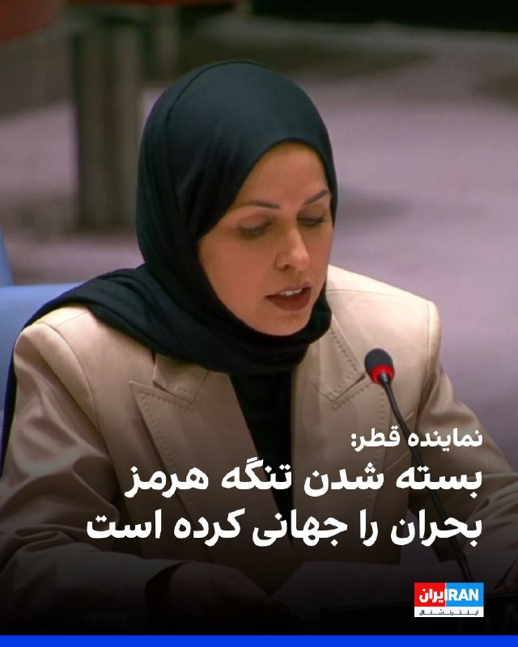

علیا احمد بن سیف آل‌ثانی، نماینده قطر در سازمان ملل در نشست شورای امنیت گفت پیش‌نویس قطعنامه مربوط به تنگه هرمز از اهمیت بالایی برخوردار است و برای پاسخ به بسته شدن این آبراه از ماه مارس از سوی جمهوری اسلامی ایران ضروری است. او افزود این اقدام پیامدهای اقتصادی شدیدی در کشورهای شورای همکاری خلیج فارس و در سطح جهانی ایجاد کرده است.

نماینده قطر گفت دولت این کشور پیش‌تر هشدار داده بود که بسته شدن تنگه هرمز می‌تواند بحران را از سطح منطقه‌ای به بحرانی جهانی تبدیل کند و آنچه اکنون رخ داده تحقق همان هشدار است. به گفته او، این وضعیت حدود ۲۰ درصد از تجارت جهانی نفت و گاز طبیعی مایع را مختل کرده است.

او افزود بیش از ۲۰ هزار دریانورد در دریا گرفتار شده‌اند و این شرایط نه‌تنها ثبات اقتصادی جهانی و امنیت انرژی را به خطر انداخته، بلکه بحران‌های انسانی را تشدید و ثبات منطقه‌ای را تضعیف کرده است.

نماینده قطر تاکید کرد این تحولات تهدیدی واقعی برای صلح و امنیت بین‌المللی محسوب می‌شود.
https://iranintl.com/202605074778

## IranIntlTV — post 336012

  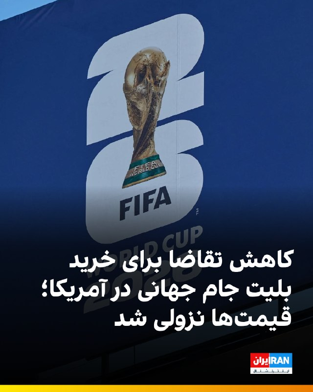

🔻نشریه اتلتیک گزارش داده که قیمت بلیت برخی بازی‌های جام جهانی ۲۰۲۶ در بازار فروش مجدد کاهش یافته و نشانه‌هایی از افت تقاضا، به‌ویژه برای بازی‌های مرحله گروهی، دیده می‌شود.

🔹بر اساس این گزارش، فروش بلیت دیدار افتتاحیه تیم ملی آمریکا برابر پاراگوئه در لس‌آنجلس کمتر از انتظار بوده است. تا اواخر فروردین حدود ۴۰ هزار بلیت برای این مسابقه فروخته شده است؛ رقمی که از برخی بازی‌های دیگر جام جهانی پایین‌تر است.

🔹اتلتیک نوشته قیمت بالای بلیت‌ها یکی از دلایل اصلی کاهش تقاضا است. بلیت‌های برخی مسابقات با قیمت چند هزار دلار عرضه شده‌اند و بسیاری از هواداران در شبکه‌های اجتماعی از هزینه بالای حضور در مسابقات انتقاد کرده‌اند. داده‌های سایت‌های فروش مجدد نیز نشان می‌دهد برخی فروشندگان مجبور شده‌اند بلیت‌ها را پایین‌تر از قیمت اولیه عرضه کنند.

🔹با وجود کاهش تقاضا برای برخی بازی‌ها، مسابقات بزرگ‌تر و دیدار فینال همچنان با استقبال بالا روبه‌رو هستند. فیفا تاکنون از سیاست قیمت‌گذاری خود دفاع کرده و جیانی اینفانتینو، رییس فیفا، گفته قیمت‌ها متناسب با شرایط بازار آمریکا تعیین شده است.

@iranintltvsport

## IranIntlTV — post 336010

  

نماینده امارات متحده عربی در سازمان ملل در نشست شورای امنیت گفت پیش‌نویس قطعنامه درباره تنگه هرمز در مقطعی حساس ارائه شده و با تقویت حقوق بین‌الملل تاکید می‌کند آبراه‌های بین‌المللی نباید از طریق اجبار یا تهدید کنترل شوند. او افزود تحولات این گذرگاه بر تجارت جهانی و بازارهای انرژی تاثیر مستقیم دارد.

او گفت تهران ماه‌ها به حملات و تهدیدها علیه کشتی‌های تجاری ادامه داده و در اطراف تنگه مین‌گذاری کرده است. به گفته او، از ۲۸ فوریه دست‌کم ۳۲ کشتی هدف قرار گرفته‌اند که به کشته شدن دریانوردان و بلاتکلیفی هزاران نفر انجامیده است.

نماینده امارات افزود این اقدامات پس از تصویب قطعنامه ۲۸۱۷ نیز متوقف نشده است. او تاکید کرد پیش‌نویس خواستار جمع‌آوری مین‌ها، توقف عوارض غیرقانونی و ایجاد کریدور بشردوستانه در تنگه است.

به گفته او، این متن با استناد به فصل هفتم منشور سازمان ملل بر الزام‌آور بودن مفاد آن تاکید دارد و در صورت اجرا نشدن، شورای امنیت ممکن است اقدامات بیشتری را بررسی کند.
https://iranintl.com/202605072945

## IranIntlTV — post 336009

  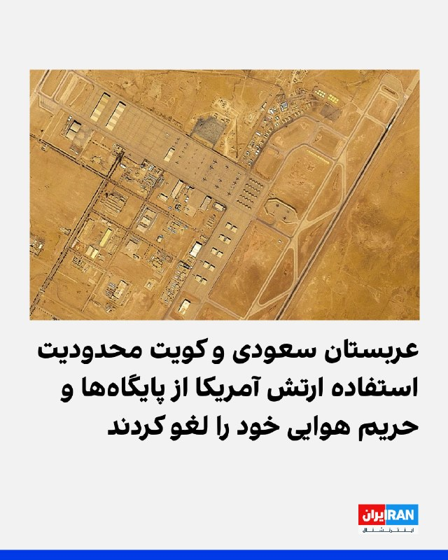

وال‌استریت ژورنال گزارش داد عربستان سعودی و کویت پس از آنکه مقام‌های آمریکایی حملات جمهوری اسلامی را کم‌اهمیت جلوه دادند و کشورهای حاشیه خلیج فارس نسبت به کاهش حمایت آمریکا ابراز نگرانی کردند، برخی محدودیت‌ها را اعمال کرده بودند.

این روزنامه همچنین گزارش داد عربستان سعودی و کویت اکنون محدودیت‌های اعمال‌شده بر استفاده ارتش آمریکا از پایگاه‌ها و حریم هوایی خود را لغو کرده‌اند؛ محدودیت‌هایی که پس از آغاز عملیات آمریکا برای بازگشایی تنگه هرمز وضع شده بود.
https://iranintl.com/202605071034

## IranIntlTV — post 336008

  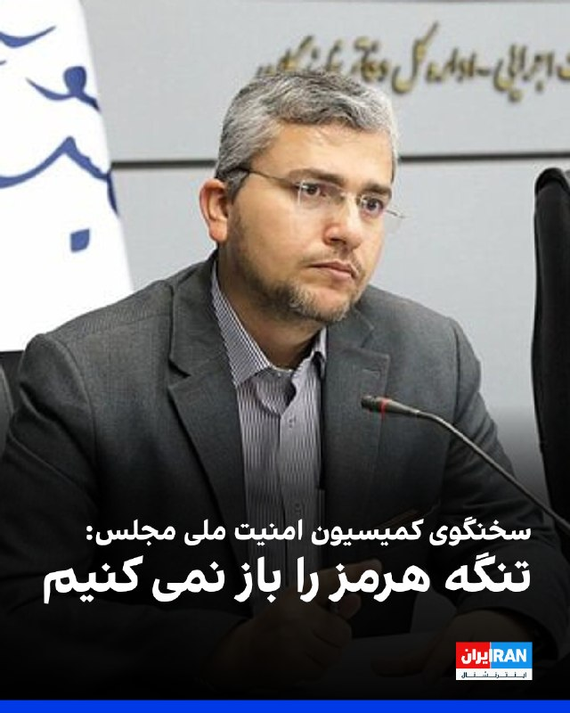

ابراهیم رضایی، سخنگوی کمیسیون امنیت ملی مجلس، گفت: «کنترل تنگه هرمز را نمی‌توانند از ما بگیرند و ما اجازه نمی‌دهیم و نمی‌توانند بدون اجازه جمهوری اسلامی حتی یک لیتر نفت از تنگه هرمز عبور بدهند.» او افزود: «تنگه هرمز را باز نمی کنیم.»

سخنگوی کمیسیون امنیت ملی و سیاست خارجی مجلس گفت: «اگر آمریکایی‌ها کوچکترین کرنش و عقب‌نشینی از طرف ما ببینند حتما جری‌تر می‌شوند و گستاخانه‌تر با ما برخورد خواهند کرد.»
https://iranintl.com/202605075105

## IranIntlTV — post 336007

  

مایک والتز، نماینده ایالات متحده در نشست شورای امنیت گفت واشینگتن این قطعنامه را مشترکا با بحرین و با همکاری شرکای خود در خلیج فارس تدوین کرده است. او تاکید کرد آزادی ناوبری یکی از اصول بنیادین ثبات و تجارت جهانی است و نقض آن سابقه‌ای خطرناک ایجاد می‌کند.

والتز گفت این قطعنامه از ایران می‌خواهد حملات به کشتی‌های تجاری را متوقف کند، مین‌گذاری را پایان دهد و مین‌ها را از تنگه هرمز جمع‌آوری کند. این متن همچنین خواستار توقف دریافت عوارض غیرقانونی و انتقال کمک‌های بشردوستانه از این آبراه است.

او با اشاره به اعلام رسانه‌های دولتی جمهوری اسلامی درباره راه‌اندازی «سازمان تنگه‌های خلیج فارس»، گفت دریافت عوارض از کشتی‌های بین‌المللی بر اساس حقوق بین‌الملل غیرقانونی است.

نماینده آمریکا افزود اکنون زمان انتخاب برای اعضای شورای امنیت فرا رسیده و ایالات متحده در کنار آزادی ناوبری و حقوق بین‌الملل ایستاده است.
https://iranintl.com/202605073517

## IranIntlTV — post 336005

  

نشست مشترک نمایندگان آمریکا و چند کشور عربی درباره پیش‌نویس قطعنامه مربوط به تنگه هرمز آغاز شد. در بیانیه این نشست آمده است پادشاهی بحرین به همراه ایالات متحده و با حمایت کویت، قطر، عربستان سعودی و امارات متحده عربی، این پیش‌نویس را به شورای امنیت ارائه کرده است.

در بیانیه تاکید شده تنگه هرمز یکی از حیاتی‌ترین گذرگاه‌های دریایی جهان است که برای ثبات منطقه خلیج فارس و اقتصاد جهانی اهمیت دارد و تحولات اخیر ضرورت حفظ امنیت و باز بودن کامل این آبراه را برجسته کرده است.

نماینده بحرین گفت این پیش‌نویس، در ادامه قطعنامه ۲۸۱۷ شورای امنیت، از ایران می‌خواهد فورا تمامی حملات و تهدیدها علیه کشتی‌های تجاری را متوقف کند و به موضوع مین‌گذاری و یدک‌کشی غیرقانونی نیز می‌پردازد.

به گفته نماینده بحرین، این متن بر آزادی ناوبری مطابق حقوق بین‌الملل استوار است و از تلاش‌ها برای دستیابی به صلحی پایدار در منطقه و تشویق گفت‌وگو حمایت می‌کند.
https://iranintl.com/202605076924

## IranIntlTV — post 336004

  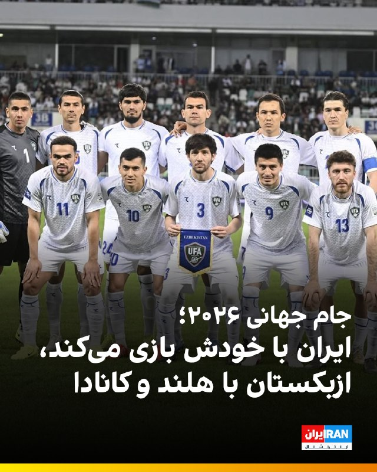

🔻در حالی که تیم ملی فوتبال ایران در آستانه جام جهانی نتوانسته حریفی پیدا کند و با خودش بازی می‌کند، فدراسیون فوتبال ازبکستان اعلام کرد که تیم ملی فوتبال این کشور پیش از جام جهانی ۲۰۲۶ دو بازی تدارکاتی با تیم‌های ملی هلند و کانادا برگزار خواهد کرد.

🔹تیم ملی فوتبال ایران قرار بود در اردوی ترکیه با تیم‌های مقدونیه و آنگولا دیدار کند که این دو تیم از بازی با تیم ایران منصرف شدند.

🔹امیر قلعه‌نویی، سرمربی تیم ملی، روز گذشته و پس از بازی تیم ملی با خودش، درباره لغو شدن این دو بازی تدارکاتی گفت: «بازی‌های تدارکاتی هماهنگ شده بود و قرارداد بستند؛ ولی در دقیقه ۹۰ کنسل شد.»

@iranintltvsport

## IranIntlTV — post 336001

  <a href="https://t.me/IranintlTV/336001">📎 Download file</a>

🎧نسخه صوتی اخبار شبانگاهی | پنجشنبه ۱۷ اردیبهشت
@iranintlTV

## IranIntlTV — post 336000

🔻توافق موقت به جای صلح جامع؛ شکاف‌ها میان تهران و واشینگتن همچنان باقی است

با آنکه واشینگتن و تهران تلاش برای یک توافق جامع را به گفت‌وگو درباره یک پیمان موقت متمرکز بر پایان جنگ، حل بحران تنگه هرمز و گشودن یک بازه ۳۰ روزه برای حصول توافقی گسترده‌تر محدود کرده‌اند، منابع آگاه به رویترز گفتند که حتی بر سر همین طرح محدود نیز شکاف‌هایی جدی باقی مانده است.

خبرگزاری رویترز در گزارشی که پنج‌شنبه ۱۷ اردیبهشت منتشر شد، به نقل از منابع آگاه نزدیک به دولت‌های هر دو کشور نوشت که تلاش‌های جاری با هدف رسیدن به یک یادداشت تفاهم موقت انجام می‌شود و چارچوب پیشنهادی قرار است در سه مرحله پایان رسمی جنگ، حل بحران در تنگه هرمز و آغاز یک بازه ۳۰ روزه برای مذاکره با هدف رسیدن به یک توافق گسترده‌تر پیش برود.

به گفته منابع، حتی بر سر همین طرح محدود نیز هنوز شکاف‌هایی باقی مانده است. این رسانه نوشته است که هر توافق گسترده‌تری باید به اختلاف‌های طولانی‌مدت و حل‌نشده‌ای مانند برنامه هسته‌ای جمهوری اسلامی بپردازد.

پایان دادن به جنگ

دونالد ترامپ، رییس‌جمهوری آمریکا، در دو روز گذشته بارها تکرار کرده که جنگ به پایان خود نزدیک شده است و اگر جمهوری اسلامی شرط‌های آمریکا را بپذیرد، چالش‌ها حل‌وفصل خواهد شد.

از سوی دیگر مقام‌های جمهوری اسلامی نیز بر ابراز بی‌اعتمادی خود نسبت به دولت ترامپ و متحد او، بنیامین نتانیاهو، نخست‌وزیر اسرائیل، افزوده‌اند.

🔗ادامه این گزارش را اینجا بخوانید

@iranintlTV

## IranIntlTV — post 335999

  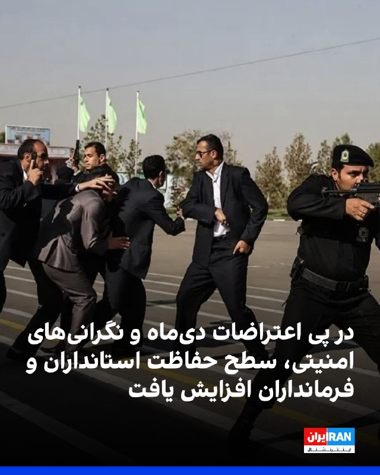

بنا به اطلاعات و گزارش‌های رسیده به ایران اینترنشنال، سپاه پاسداران سطح حفاظت استانداران و فرمانداران را در سراسر کشور در پی اعتراضات انقلاب ملی دی‌ماه و همچنین نگرانی ناشی از دور جدید اعتراضات افزایش داده است.

طبق این اطلاعات، تعداد نیرو، سطح مراقبت و ساعات پوشش حفاظت استانداران در استان‌ها افزایش یافته است.

همچنین برای فرمانداران تعداد محافظان در برخی موارد به دست کم دو نفر افزایش یافته است.

این مسئله در مراسم و برنامه‌های عمومی که شهروندان در آن حضور داشته‌اند، مورد توجه قرار گرفته و واکنش داشته است.

در جریان سرکوب‌های انقلاب دی‌ماه و شلیک ماموران به مردم از درون ساختمان‌های دولتی و عمومی، تعدادی از فرمانداری‌ها از جمله در گرگان، طارم، رامهرمز و آشخانه به آتش کشیده شدند.
https://iranintl.com/202605079830

## IranIntlTV — post 335998

  <a href="https://t.me/IranintlTV/335998">📎 Download file</a>

🎧نسخه صوتی اخبار نیم‌روزی | پنجشنبه ۱۷ اردیبهشت
@iranintlTV

## IranIntlTV — post 335997

  

کریس رایت، وزیر انرژی آمریکا، در مصاحبه با فاکس نیوز اعلام کرد به نظر می‌رسد ایران تولید نفت خود را روزانه ۴۰۰ هزار بشکه کاهش داده است.

پیشتر مارکو روبیو، وزیر خارجه آمریکا اعلام کرد که اقدامات این کشور علیه جمهوری اسلامی مستقیما منابع اصلی درآمدی رژیم را هدف قرار می‌دهد.

او درباره محاصره دریایی علیه جمهوری اسلامی گفت که این کار «به‌تنهایی روزانه تا ۵۰۰ میلیون دلار از درآمد ایران را از بین می‌برد.»
https://iranintl.com/202605074916

## IranIntlTV — post 335996

  

کریس رایت، وزیر انرژی آمریکا، در مصاحبه با فاکس نیوز اعلام کرد به نظر می‌رسد ایران تولید نفت خود را روزانه ۴۰۰ هزار بشکه کاهش داده است.

پیشتر مارکو روبیو، وزیر خارجه آمریکا اعلام کرد که اقدامات این کشور علیه جمهوری اسلامی مستقیما منابع اصلی درآمدی رژیم را هدف قرار می‌دهد.

او درباره محاصره دریایی علیه جمهوری اسلامی گفت که این کار «به‌تنهایی روزانه تا ۵۰۰ میلیون دلار از درآمد ایران را از بین می‌برد.»
https://iranintl.com/202605074916

## IranIntlTV — post 335995

  

واشینگتن‌پست گزارش داد که یک ارزیابی محرمانه جامعه اطلاعاتی که به کاخ سفید ارائه شده، نتیجه گرفته که جمهوری اسلامی می‌تواند ماه‌ها در برابر محاصره دوام بیاورد و همچنان زرادخانه قابل‌توجهی از موشک‌ها و پهپادها را حفظ کرده است.

چهار فرد آگاه به این روزنامه گفته‌اند که یک تحلیل محرمانه سازمان سیا که این هفته به سیاست‌گذاران دولت آمریکا ارائه شد، نتیجه گرفته است که ایران می‌تواند دست‌کم سه تا چهار ماه در برابر محاصره دریایی آمریکا دوام بیاورد، پیش از آنکه با دشواری‌های اقتصادی شدیدتر روبه‌رو شود.

واشینگتن‌پست نوشت که این ارزیابی ظاهرا پرسش‌های تازه‌ای درباره خوش‌بینی دونالد ترامپ، رییس‌جمهور آمریکا نسبت به پایان دادن به جنگ مطرح می‌کند.

یک مقام آمریکایی گفت جمهوری اسلامی حدود ۷۵ درصد از موجودی پرتابگرهای متحرک خود و حدود ۷۰ درصد از ذخایر موشکی پیش از جنگش را حفظ کرده است.

این مقام گفت شواهدی وجود دارد که حکومت ایران توانسته تقریبا همه تاسیسات ذخیره‌سازی زیرزمینی خود را بازیابی و بازگشایی کند، برخی موشک‌های آسیب‌دیده را تعمیر کند و حتی تعدادی موشک جدید را که هنگام آغاز جنگ تقریبا تکمیل شده بودند، مونتاژ کند.

## IranIntlTV — post 335994

  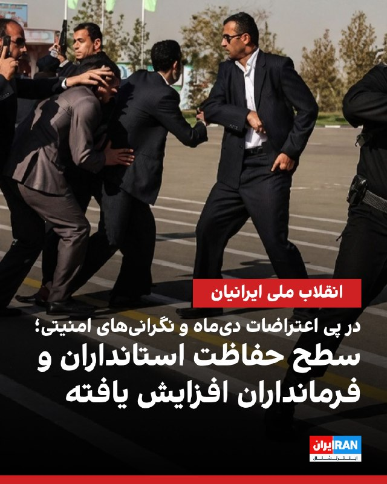

بنا به اطلاعات و گزارش‌های رسیده به ایران اینترنشنال، سپاه پاسداران سطح حفاظت استانداران و فرمانداران را در سراسر کشور در پی اعتراضات انقلاب ملی دی‌ماه و همچنین نگرانی ناشی از دور جدید اعتراضات افزایش داده است.
طبق این اطلاعات، تعداد نیرو، سطح مراقبت و ساعات پوشش حفاظت استانداران در استان‌ها افزایش یافته است. همچنین برای فرمانداران تعداد محافظان در برخی موارد به دست کم دو نفر افزایش یافته است. این مسئله در مراسم و برنامه‌های عمومی که شهروندان در آن حضور داشته‌اند، مورد توجه قرار گرفته و واکنش داشته است.
در جریان سرکوب‌های انقلاب دی‌ماه و شلیک ماموران به مردم از درون ساختمان‌های دولتی و عمومی، تعدادی از فرمانداری‌ها از جمله در گرگان، طارم، رامهرمز و آشخانه به آتش کشیده شدند.
https://iranintl.com/202605078132

## IranIntlTV — post 335993

  <a href="telegram/content/IranIntlTV_335993_1778179456.mp4">🎬 Download video</a>

منابع دیپلماتیک به نقل از مقام‌های عربستان سعودی گزارش دادند ریاض تا زمانی که آمریکا حفاظت کافی در برابر حملات جمهوری اسلامی فراهم نکند، دسترسی واشینگتن به پایگاه‌ها و حریم هوایی خود را محدود خواهد کرد.
گفت‌وگو با علی‌ صدرزاده، تحلیل‌گر مسایل خاورمیانه
@iranintltv

## IranIntlTV — post 335992

  <a href="telegram/content/IranIntlTV_335992_1778179458.mp4">🎬 Download video</a>

رسانه‌های اسرائیلی گزارش دادند دونالد ترامپ، رییس‌جمهوری آمریکا، به بنیامین نتانیاهو گفته بدون خروج اورانیوم غنی‌شده از ایران، هیچ توافقی با جمهوری اسلامی امضا نخواهد شد.
سمیرا قرایی، خبرنگار ایران‌اینترنشنال، گزارش می‌دهد
@iranintltv

## IranIntlTV — post 335990

  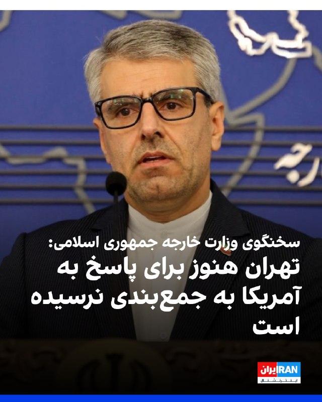

اسماعیل بقائی، سخنگوی وزارت امور خارجه جمهوری اسلامی، با توضیح اینکه جمهوری اسلامی در حال بررسی پیام‌ها با میانجیگری طرف پاکستانی است، به ایرنا گفت که تهران هنوز به جمع‌بندی نرسیده و پاسخی به طرف آمریکایی داده نشده است.

بقائی گفت: «به محض اینکه جمع‌بندی صورت بگیرد، به میانجی پاکستانی منعکس خواهد شد و بر اساس نتایج تبادل پیام‌ها، در مورد گام بعدی تصمیم‌گیری خواهد شد.»
https://iranintl.com/202605074838

## FoxNewsChannel — post 3

Channel photo removed

## FoxNewsChannel — post 1

Channel created

## Shin_Persian — post 5844

  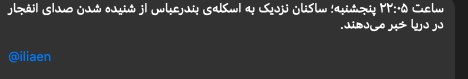

Shin ✓ @hey_itsmyturn
Thu, 07 May 2026 18:36:36 UTC

1835Z
Explosion was heard from the sea side in Bandar Abbas, Hormozgan Province, #Iran

فارسی

۱۸۳۵ زولو (۲۲:۰۵ به وقت تهران)
صدای انفجار از سمت دریا در بندرعباس، استان هرمزگان، #Iran شنیده شد.

𝕏 · @shin_persian

## Shin_Persian — post 5843

  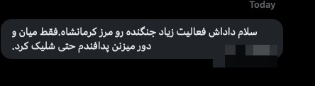

Shin ✓ @hey_itsmyturn
Thu, 07 May 2026 18:33:48 UTC

Fighter jet activity over Kermanshah, reportedly over the border areas + AA activity.
Kermanshah Province, #Iran

فارسی

فعالیت جنگنده‌ها برفراز کرمانشاه، طبق گزارش‌ها برفراز مناطق مرزی + فعالیت پدافند هوایی.
استان کرمانشاه، #Iran_

𝕏 · @shin_persian

## Shin_Persian — post 5842

Shin ✓ @hey_itsmyturn
Thu, 07 May 2026 18:32:33 UTC

NOW @ 1832Z -
2 Loud blasts in Qeshm, Hormozgan Province, #Iran

فارسی

هم‌اکنون در ۱۸۳۲ زولو (۲۲:۰۲ به وقت تهران) -
۲ صدای انفجار مهیب در قشم، استان هرمزگان، #Iran

𝕏 · @shin_persian

## Shin_Persian — post 5841

📦 mhrv-rs v1.9.17 released

• Inject CORS response headers after relay (in addition to the existing preflight short-circuit)

Files (Android APKs, Windows, macOS, Linux, OpenWRT) on the files channel:

👉 v1.9.17 — all files with SHA-256

Channel:
https://t.me/mhrv_rs
or: https://t.me/+R1OyoHX2boA1ZDgx

#v1917

## Shin_Persian — post 5840

📦 mhrv-rs v1.9.16 released

• Fix Full mode large-download truncation at exactly 50 MiB (#863)

Files (Android APKs, Windows, macOS, Linux, OpenWRT) on the files channel:

👉 v1.9.16 — all files with SHA-256

Channel:
https://t.me/mhrv_rs
or: https://t.me/+R1OyoHX2boA1ZDgx

#v1916

## Shin_Persian — post 5839

Shin ✓ @hey_itsmyturn
Thu, 07 May 2026 16:27:46 UTC

NOW @ 1627Z -
Jet activity over Baghdad, #Iraq 🇮🇶

فارسی

هم‌اکنون در ۱۶۲۷ زولو (۱۹:۵۷ به وقت تهران) -
فعالیت جت‌ها بر فراز بغداد، #Iraq 🇮🇶

𝕏 · @shin_persian

## Shin_Persian — post 5838

  

DefenceGeek 🇬🇧 ✓ @DefenceGeek Thu, 07 May 2026 12:08:11 UTC Search Continues for missing US troops off coast of Morocco Two US troops who went missing while on leave from Exercise AFRICAN LION 2026 are still unaccounted for, with P-8A "Poseidon" maritime…

## Shin_Persian — post 5837

DefenceGeek 🇬🇧 ✓ @DefenceGeek
Thu, 07 May 2026 12:08:11 UTC

Search Continues for missing US troops off coast of Morocco

Two US troops who went missing while on leave from Exercise AFRICAN LION 2026 are still unaccounted for, with P-8A "Poseidon" maritime patrol aircraft flying from Sigonella NAS still being used to search the coastline and waters for the personnel.

The P-8A is designed for search and rescue operations at sea as part of the maritime patrol role

@MATA_osint
https://www.independent.co.uk/bulletin/news/missing-soldiers-us-army-morocco-b2970928.html

فارسی

تداوم جستجو برای نیروهای مفقود شده آمریکایی در سواحل مراکش

دو نیروی آمریکایی که در زمان مرخصی از رزمایش «شیر آفریقا ۲۰۲۶» (AFRICAN LION 2026) ناپدید شده‌اند، همچنان مفقودالاثر هستند. هواپیماهای گشت دریایی P-8A «پوسایدون» که از پایگاه هوایی سیگونلا (Sigonella NAS) به پرواز درآمده‌اند، همچنان برای جستجوی خط ساحلی و آب‌ها جهت یافتن این پرسنل مورد استفاده قرار می‌گیرند.

هواپیمای P-8A به عنوان بخشی از نقش گشت‌زنی دریایی، برای عملیات جستجو و نجات در دریا طراحی شده است.

@MATA_osint
https://www.independent.co.uk/bulletin/news/missing-soldiers-us-army-morocco-b2970928.html

𝕏 · @shin_persian

## Shin_Persian — post 5836

  

Emanuel (Mannie) Fabian ✓ @manniefabian Thu, 07 May 2026 12:05:17 UTC The chief of the Ground Forces, Maj. Gen. Nadav Lotan has appointed a senior officer to be responsible for finding solutions for the drone threat troops are facing in southern Lebanon.…

## Shin_Persian — post 5835

Emanuel (Mannie) Fabian ✓ @manniefabian
Thu, 07 May 2026 12:05:17 UTC

The chief of the Ground Forces, Maj. Gen. Nadav Lotan has appointed a senior officer to be responsible for finding solutions for the drone threat troops are facing in southern Lebanon.

The officer, a brigadier general and a pilot, heads the Ground Forces' Strike Division, which is normally tasked with developing doctrine for combined air, intelligence, and ground operations.

Several officers are working under the general to find solutions for first-person view (FPV) drones, especially those guided by fiber-optic cables, which are immune to electronic jamming and difficult to detect.

To counter the fiber optic FPV drones, the IDF has deployed passive physical defenses in southern Lebanon, such as netting above troops, vehicles, and outposts. According to the military, these measures have proven effective when troops "maintain operational discipline."

The IDF has also deployed mobile radars to southern Lebanon, which are adapted to identify drones flying at different ranges and alert forces, who can then attempt to shoot them down.

The military is examining and implementing several methods of shooting down the drones by ground troops, including shotguns at short ranges, special ammunition that disperses in the air, and automated turrets.

The Ground Forces is also experimenting with other technological solutions for the drones, and cooperating with international partners as part of the effort, according to the military.

ترجمه فارسی در بخش نظرات

𝕏 · @shin_persian

## Shin_Persian — post 5834

Shin ✓ @hey_itsmyturn
Thu, 07 May 2026 12:01:47 UTC

Jet activity over Shiraz, #Fars Province, #Iran

فارسی

فعالیت جنگنده‌ها بر فراز شیراز، استان #فارس، #ایران

𝕏 · @shin_persian

## Shin_Persian — post 5833

  

Shin ✓ @hey_itsmyturn
Wed, 06 May 2026 23:52:32 UTC

Earlier @ ~ 2310Z
Single blast was heard in western Tehran, #Tehran Province, #Iran

@Vahid also reports a loud blast sound.

فارسی

پیش‌تر در حدود ۲۳۱۰ زولو (۰۲:۴۰ به وقت تهران)
صدای یک انفجار در غرب تهران، استان #تهران، #ایران شنیده شد.

@Vahid نیز گزارش یک صدای انفجار بلند را داده است.

𝕏 · @shin_persian

## Shin_Persian — post 5831

📦 mhrv-rs v1.9.15 released

• HTTP/2 multiplexing on relay leg (#799)
• Block QUIC by default (#805): QUIC over the TCP-based tunnel was causing TCP-over-TCP meltdown (<1 Mbps)
• UI accessibility: enabled the accesskit feature on eframe
• GitHub Actions Full tunnel docs (#783)
• Tests: 197 lib + 35 tunnel-node tests passing.

Files (Android APKs, Windows, macOS, Linux, OpenWRT) on the files channel:

👉 v1.9.15 — all files with SHA-256

Channel:
https://t.me/mhrv_rs
or: https://t.me/+R1OyoHX2boA1ZDgx

#v1915

## Shin_Persian — post 5830

Shin ✓ @hey_itsmyturn
Wed, 06 May 2026 20:06:55 UTC

Jet activity over Baghdad #Iraq 🇮🇶

فارسی

فعالیت جت‌ها بر فراز بغداد #Iraq 🇮🇶

𝕏 · @shin_persian

## Shin_Persian — post 5827

U.S. Central Command ✓ @CENTCOM Wed, 06 May 2026 14:35:13 UTC Aircraft carrier USS George H.W. Bush (CVN 77) is among the large contingent of U.S. warships, aircraft, and personnel fully enforcing the U.S. naval blockade against Iran. So far, 52 commercial…

## Shin_Persian — post 5826

U.S. Central Command ✓ @CENTCOM
Wed, 06 May 2026 14:35:13 UTC

Aircraft carrier USS George H.W. Bush (CVN 77) is among the large contingent of U.S. warships, aircraft, and personnel fully enforcing the U.S. naval blockade against Iran. So far, 52 commercial vessels have been directed to turn around or return to port in order to comply.

فارسی

ناو هواپیمابر یواس‌اس جورج اچ. دبلیو. بوش (CVN 77) در میان گروه بزرگی از کشتی‌های جنگی، هواپیماها و پرسنل ایالات متحده است که به‌طور کامل در حال اجرای محاصره دریایی آمریکا علیه ایران هستند. تا این لحظه، به ۵۲ شناور تجاری دستور داده شده است تا جهت پایبندی [به این محاصره]، تغییر مسیر داده یا به بندر بازگردند.

𝕏 · @shin_persian

## Shin_Persian — post 5825

ایران اینترنشنال - خبر فوری ✓ @IranIntlbrk
Wed, 06 May 2026 10:03:09 UTC

سخنگوی وزارت خارجه جمهوری اسلامی گفت که تهران در حال بررسی پیشنهاد صلح ۱۴ بندی آمریکا است

English

The spokesperson for the Ministry of Foreign Affairs of the Islamic Republic stated that Tehran is reviewing the U.S. 14-point peace proposal.

𝕏 · @shin_persian

## Shin_Persian — post 5824

Emanuel (Mannie) Fabian ✓ @manniefabian
Wed, 06 May 2026 10:10:29 UTC

The IDF says it has launched a wave of airstrikes on Hezbollah infrastructure sites in several areas of southern Lebanon.

فارسی

ارتش دفاعی اسرائیل اعلام کرد که موجی از حملات هوایی را علیه سایت‌های زیرساختی حزب‌الله در چندین منطقه در جنوب لبنان آغاز کرده است.

𝕏 · @shin_persian

## Iliaen — post 4424

ساعت ۲۲:۰۷ پنجشنبه؛ تعداد ۶ انفجار با فاصله ۴۰ ثانیه از یکدیگر در سیریک (هرمزگان) شنیده شد.

@iliaen

## Iliaen — post 4423

ساعت ۲۲:۰۵ پنجشنبه؛ ساکنان نزدیک به اسکله‌ی بندرعباس از شنیده شدن صدای انفجار در دریا خبر می‌دهند.

@iliaen

## Iliaen — post 4422

سنتکام: نیروی دریایی ایالات متحده ۶ قایق کوچک (تندرو) جمهوری اسلامی را غرق کرد.

@iliaen

## Iliaen — post 4421

ساعت ۱۹:۴۳ دوشنبه؛ چند موشک دیگر از جنوب هرمزگان به سمت خلیج فارس شلیک شد.

@iliaen

## Iliaen — post 4420

آماده دور جدید حملات باشید.

## Iliaen — post 4419

ساعت ۱۹:۱۹ دوشنبه؛ ساکنان دوبی از دریافت پیام هشدار چهارم خبر می‌دهند.

@iliaen

## Iliaen — post 4418

  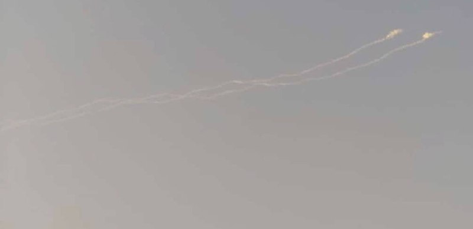

دو موشک در آسمان سیریک (هرمزگان)

@iliaen

## Iliaen — post 4417

ساعت حدود ۱۹:۰۰ دوشنبه؛ یک موشک شلیک شده از سمت سیریک (هرمزگان) چند لحظه بعد در آسمان ایران منفجر شد.

همچنین گزارش‌ها از شنیده شدن یک انفجار مهیب از سمت دریای عمان حکایت دارد.

@iliaen

## Iliaen — post 4416

جمهوری اسلامی درحال حمله پهپادی و موشکی به مکانی در نزدیک دوبی است.

تاکنون ۴ موشک کروز توسط پدافند امارات رهگیری و خنثی شدند؛ همچنین یک نقطه در منطقه نفت فجیره (امارات) هدف اصابت پهپاد قرار گرفت.

@iliaen

## Iliaen — post 4415

ساعت ۱۸:۵۰ دوشنبه؛ برای سومین بار در یک ساعت اخیر هشدار حملات موشکی به ساکنان دوبی ارسال شد.

@iliaen

## Iliaen — post 4414

ساعت حدود ۱۸:۲۰ دوشنبه؛ یک موشک از سمت روستای کرپان (جنوب هرمزگان) به سمت مکانی در خلیج فارس شلیک شد.

@iliaen

## Iliaen — post 4413

  

به تلفن‌های همراه ساکنان امارات، پیام هشدار احتمال حملات موشکی و حضور در پناهگاه ارسال شد.

@iliaen

## Iliaen — post 4412

ساعت حدود ۱۶:۲۰ دوشنبه؛ ساکنان جزیره قشم یک جنگنده را در آسمان مشاهده کردند.

@iliaen

## Iliaen — post 4411

سنتکام از ورود ۲ کشتی آمریکا به تنگه هرمز خبر داد.

@iliaen

## Iliaen — post 4410

از دقایقی دیگر، عملیات نیروی دریایی ایالات متحده تحت عنوان “پروژه آزادی” با بیش از ۱۵۰۰۰ نیرو نظامی و ۱۰۰ هواپیما در تنگه هرمز آغاز خواهد شد.

این عملیات جهت کمک به عبور امن کشتی‌هایی است که این مدت و پس از مسدود شدن تنگه هرمز در خلیج فارس گیر کردند.

سپاه پاسداران نیز تهدید کرد هرگونه عبور هماهنگ نشده و حضور نظامی برای عبور از تنگه هرمز را با موشک و پهپاد پاسخ خواهد داد.

قیمت جهانی نفت درحال افزایش است و ساکنان نزدیک به خط ساحلی هرمزگان همچنان از شنیده شدن صداهایی مانند شلیک رگبار در دریا خبر می‌دهند.

@iliaen

## Iliaen — post 4409

سپاه پاسداران یک نفتکش متعلق به امارات را با دو پهپاد هدف قرار داد.

@iliaen

## Iliaen — post 4408

  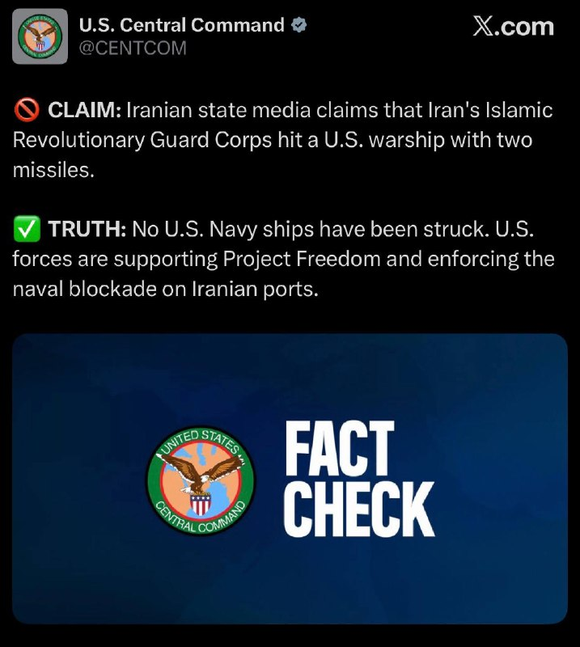

رسانه‌های جمهوری اسلامی ادعا کردند تعداد ۲ موشک با یک ناوچه متعلق به ارتش آمریکا برخورد کرد، اما سنتکام با انتشار یک پیام رسمی، تاکید کرد هیچکدام از موشک‌ها با ناوگان ایالات متحده برخورد نکردند.

@iliaen

## Iliaen — post 4407

ساعت ۱۳:۴۹ دوشنبه؛ ساکنان در نوار ساحلی جنوب استان هرمزگان از شنیده شدن صدایی مانند تیراندازی (اما بسیار بلندتر) از داخل آب‌های خلیج فارس (محدوده‌ی تنگه هرمز) گزارش می‌دهند.

@iliaen

## Iliaen — post 4406

ساعت ۱۳:۴۱ دوشنبه؛ گزارش‌ها از شلیک موشک دوم و سوم از سایت موشکی سپاه در سیریک (هرمزگان) به سمت تنگه هرمز حکایت دارد.

@iliaen

## Iliaen — post 4405

ساعت حدود ۱۳:۳۰ دوشنبه؛ گزارش‌ها از شلیک یک موشک از سایت نظامی سیریک (هرمزگان) به سمت خلیج فارس در موقعیت تنگه هرمز حکایت دارد.

@iliaen

## CnnBrk — post 247615

For sale. From $50 in USDT to the best and first offer I get

## CnnBrk — post 247614

A Russian court extends US journalist Evan Gershkovich's pre-trial detention by three months, state media reports. Follow live updates. https://t.co/1kSWVjtS7s — CNN Breaking News (@cnnbrk) May 23, 2023

May 23, 2023 at 04:43PM
via Twitter https://twitter.com/cnnbrk

## CnnBrk — post 247613

Prince Harry cannot pay for his own police security while in the UK, after losing High Court challengehttps://t.co/AWMBnitDaO — CNN Breaking News (@cnnbrk) May 23, 2023

May 23, 2023 at 11:39AM
via Twitter https://twitter.com/cnnbrk

## CnnBrk — post 247612

E. Jean Carroll asks judge to amend her initial defamation case to seek further damages for what Donald Trump said at a CNN town hall https://t.co/FnCHP34sKr — CNN Breaking News (@cnnbrk) May 22, 2023

May 22, 2023 at 10:50PM
via Twitter https://twitter.com/cnnbrk

## CnnBrk — post 247611

Treasury Secretary Janet Yellen reinforces her warning to Congress that it has only a little time left to address the debt ceiling https://t.co/KyjRZSLsds — CNN Breaking News (@cnnbrk) May 22, 2023

May 22, 2023 at 09:39PM
via Twitter https://twitter.com/cnnbrk

## CnnBrk — post 247610

TikTok sues Montana over a bill that would ban the popular short-form video app in the state starting early next year, alleging the state's ban violates the US Constitution, including the First Amendment, as well as other federal laws https://t.co/6wrmVVsLeE — CNN Breaking News (@cnnbrk) May 22, 2023

May 22, 2023 at 09:25PM
via Twitter https://twitter.com/cnnbrk

## CnnBrk — post 247609

Nebraska bill that bans most abortions at 12 weeks and gender-affirming care for those under 19 is signed into law by Republican Gov. Jim Pillen https://t.co/9Ri72Vtv4o — CNN Breaking News (@cnnbrk) May 22, 2023

May 22, 2023 at 07:26PM
via Twitter https://twitter.com/cnnbrk

## CnnBrk — post 247608

Judge enters not guilty pleas on behalf of Bryan Kohberger, the man charged with first-degree murder in the fatal stabbings of four Idaho college students https://t.co/4rTXSb8PDY — CNN Breaking News (@cnnbrk) May 22, 2023

May 22, 2023 at 05:35PM
via Twitter https://twitter.com/cnnbrk

## CnnBrk — post 247607

Longtime Democratic Sen. Tom Carper of Delaware announces he won't seek reelection in 2024, says it's an "opportune time to step aside"https://t.co/6FvQuhUfv3 — CNN Breaking News (@cnnbrk) May 22, 2023

May 22, 2023 at 04:55PM
via Twitter https://twitter.com/cnnbrk

## CnnBrk — post 247606

Turkey's third-placed presidential election candidate backs frontrunner Erdogan in a boost ahead of crucial second-round votehttps://t.co/CBMZE80jnv — CNN Breaking News (@cnnbrk) May 22, 2023

May 22, 2023 at 04:01PM
via Twitter https://twitter.com/cnnbrk

## CnnBrk — post 247605

At least 20 people have been killed and several others injured in a school dormitory fire in Guyana, officials sayhttps://t.co/OMIiXXJKDO — CNN Breaking News (@cnnbrk) May 22, 2023

May 22, 2023 at 11:05AM
via Twitter https://twitter.com/cnnbrk

## CnnBrk — post 247604

Meta receives a record-breaking $1.3 billion fine from European regulators for transferring Facebook's EU user data to servers in the UShttps://t.co/I9Po2ZgjtU — CNN Breaking News (@cnnbrk) May 22, 2023

May 22, 2023 at 10:46AM
via Twitter https://twitter.com/cnnbrk

## CnnBrk — post 247603

President Biden and House Speaker McCarthy are set to meet Monday to discuss the debt ceiling as staff-level talks resume https://t.co/qg1bRjJArf — CNN Breaking News (@cnnbrk) May 21, 2023

May 21, 2023 at 06:51PM
via Twitter https://twitter.com/cnnbrk

## CnnBrk — post 247602

National Treasure was first across the finish line in the 2023 Preakness Stakeshttps://t.co/ZPxpOShkHY — CNN Breaking News (@cnnbrk) May 20, 2023

May 21, 2023 at 12:13AM
via Twitter https://twitter.com/cnnbrk

## CnnBrk — post 247601

Head of Russian private military group Wagner claims complete capture of embattled eastern Ukrainian city of Bakhmut. Ukraine partially disputed it. https://t.co/UCZMdTb9ce — CNN Breaking News (@cnnbrk) May 20, 2023

May 20, 2023 at 03:31PM
via Twitter https://twitter.com/cnnbrk

## CnnBrk — post 247600

Nebraska lawmakers pass a 12-week abortion ban and restrictions on gender-affirming care for those under 19. The governor has said he'll sign the bill. https://t.co/1GTrCBgjFQ — CNN Breaking News (@cnnbrk) May 19, 2023

May 19, 2023 at 11:11PM
via Twitter https://twitter.com/cnnbrk

## CnnBrk — post 247599

The Justice Department wins its antitrust lawsuit that sought to end an alliance between JetBlue and American Airlines https://t.co/pUnXCCNOtN — CNN Breaking News (@cnnbrk) May 19, 2023

May 19, 2023 at 09:27PM
via Twitter https://twitter.com/cnnbrk

## CnnBrk — post 247598

Jim Brown, former fullback for the Cleveland Browns and a prominent activist in the civil rights movement, has died at age 87, his former team tweeted https://t.co/zyICI3bBYA — CNN Breaking News (@cnnbrk) May 19, 2023

May 19, 2023 at 09:16PM
via Twitter https://twitter.com/cnnbrk

## CnnBrk — post 247597

Republican Sen. Tim Scott of South Carolina has filed to run for president in 2024, according to the FEC website https://t.co/aGPEBzzHBu — CNN Breaking News (@cnnbrk) May 19, 2023

May 19, 2023 at 04:43PM
via Twitter https://twitter.com/cnnbrk

## CnnBrk — post 247596

A DC metro police officer is accused of misleading investigators about communications with Proud Boys leader Enrique Tarrio and tipping him off about his arrest https://t.co/KsCYVBHB64 — CNN Breaking News (@cnnbrk) May 19, 2023

May 19, 2023 at 03:57PM
via Twitter https://twitter.com/cnnbrk

## reutersworldchannel — post 151524

  

Iran confirms supreme leader Khamenei is dead after US, Israeli attacks

Iranian state media reported that Khamenei "was carrying out his assigned duties and was present at his workplace (his office)".

"This cowardly attack occurred in the early hours of Saturday morning", state media said.

"We have lost a great leader and we are mourning him, a leader who was unique in in terms of purity of spirit, strength of faith, resourcefulness in affairs, courage in the face of the arrogant, and jihad in the path of God", a statement from Iran's Revolutionary Guards said. read more

## reutersworldchannel — post 151523

  

Exclusive: Iran nears deal to buy supersonic anti-ship missiles from China

Iran is close to a deal with China to purchase anti‑ship cruise missiles, according to six people with knowledge of the negotiations, just as the United States deploys a vast naval force near the Iranian coast ahead of possible strikes on the Islamic Republic.

The deal for the Chinese‑made CM‑302 missiles is near completion, though no delivery date has been agreed, the people said. The supersonic missiles have a range of about 290 kilometres and are designed to evade shipborne defences by flying low and fast. Their deployment would significantly enhance Iran’s strike capabilities and pose a threat to U.S. naval forces in the region, two weapons experts said. read more

## reutersworldchannel — post 151522

  

Police arrest King Charles' brother Andrew over misconduct relating to Epstein

King Charles' younger brother Andrew Mountbatten-Windsor was on Thursday arrested on suspicion of misconduct in public office over allegations he sent confidential government documents to Jeffrey Epstein.

Mountbatten-Windsor, celebrating his 66th birthday on Thursday, was arrested and questioned by detectives from Thames Valley Police, which this month said it was looking into allegations that he had passed documents to the late convicted sex offender while working as a trade envoy. read more

## reutersworldchannel — post 151521

  

North Korea says South Korea should take steps to prevent violation of its sovereignty

The sister of North Korea's ruler said on Friday that South Korean authorities should take steps to prevent "reoccurrence of provocative sovereignty violation," state media KCNA reported, referring to a drone flown into its airspace recently.

Kim Yo Jong, the powerful sister of North Korean leader Kim Jong Un, said in a statement she appreciates the South Korean Unification Minister Chung Dong-young's expression of his regret over the "drone intrusion" as "sensible behavior," KCNA reported. read more

## reutersworldchannel — post 151520

  

Iran, US to negotiate in Oman amid deep rifts and mounting war fears

Iran and the United States are set to hold high-stakes negotiations in Oman on Friday over Tehran's nuclear programme, but a dispute over the agenda suggests progress will be hard won amid the threat of a regional Middle East war.

While both sides have signalled readiness to revive diplomacy over Tehran's long-running nuclear dispute with the West, Washington wants the talks to cover Iran's nuclear programme, its ballistic missiles, support for armed groups around the region and its "treatment of their own people", U.S. Secretary of State Marco Rubio said on Wednesday. read more

## reutersworldchannel — post 151519

  

Paris prosecutor's cybercrime unit searches X office, Musk summoned

French police raided the offices of Elon Musk's social media network X and prosecutors ordered the tech billionaire to face questions in April related to a widening investigation into the platform, the Paris prosecutor's office said on Tuesday.

The raid and the summoning of Musk - which could further increase tensions between Europe and the U.S. over big tech and free speech - are linked to a year-long investigation into suspected abuse of algorithms and fraudulent data extraction by X or its executives. read more

## reutersworldchannel — post 151518

  

Thousands demonstrate in Minnesota and across US to protest ICE

Thousands of protesters took to the streets in Minneapolis and students across the United States staged walkouts on Friday to demand the withdrawal of federal immigration agents from Minnesota following the fatal shootings of two U.S. citizens.

Students and teachers abandoned classes from California to New York on a national day of protest, which came amid mixed messages from the Trump administration about whether it would de-escalate Operation Metro Surge. read more

## reutersworldchannel — post 151517

  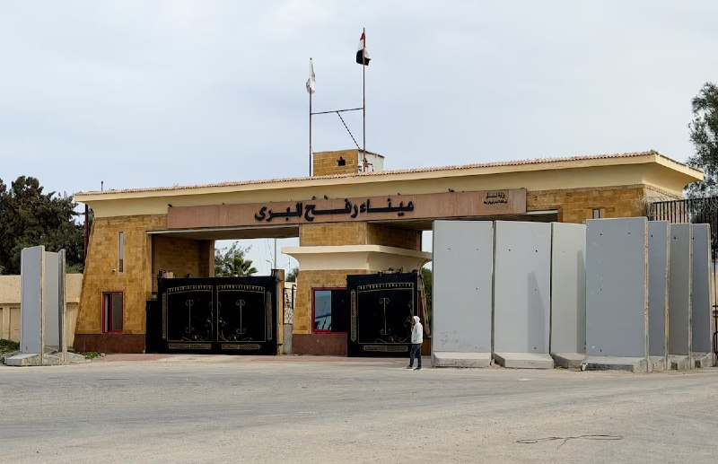

Gaza’s Rafah crossing with Egypt to reopen on Sunday, Israel says

Israel will reopen the Rafah border crossing on Sunday for people to travel between Gaza and Egypt, a government agency said, the first opening of effectively the sole route in or out of the Palestinian territory since May 2024.

The Israeli government agency that coordinates civilian policy in Gaza, COGAT, did not say how many of Gaza's more than 2 million people would be allowed to cross the border per day. read more

## reutersworldchannel — post 151516

  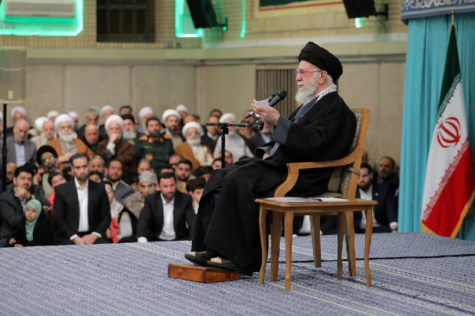

Iran's leader Khamenei blames Trump for inciting deadly protests

Iran's Supreme Leader Ayatollah Ali Khamenei on Saturday blamed President Donald Trump for weeks of protests after rights groups said a violent crackdown by security forces had claimed thousands of lives.

The protests erupted on December 28 over economic hardship and swelled into widespread demonstrations calling for the end of clerical rule in the Islamic Republic. read more

## reutersworldchannel — post 151513

  

Exclusive: US military to establish presence at Damascus airbase, sources say

The United States is preparing to establish a military presence at an airbase in Damascus to help enable a security pact that Washington is brokering between Syria and Israel, six sources familiar with the matter told Reuters.

The U.S. plans for the presence in the Syrian capital, which have not previously been reported, would be a sign of Syria's strategic realignment with the U.S. following the fall last year of longtime leader Bashar al-Assad, an ally of Iran. read more

## reutersworldchannel — post 151511

  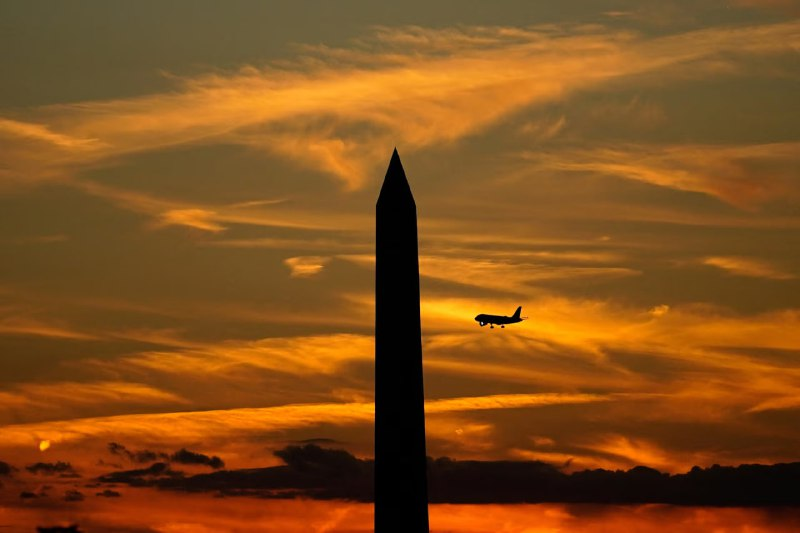

US orders 10% flights cut at major US airports due to shutdown

U.S. Transportation Secretary Sean Duffy said on Wednesday that he would order a 10% cut in flights at 40 major U.S. airports, citing air traffic control safety concerns as a government shutdown hit a record 36th day.

The drastic plan sent airlines scrambling to make significant reductions in flights in just 36 hours and passengers flooded airline customer service hotlines with concerns about air travel in the coming days. read more

## reutersworldchannel — post 151510

  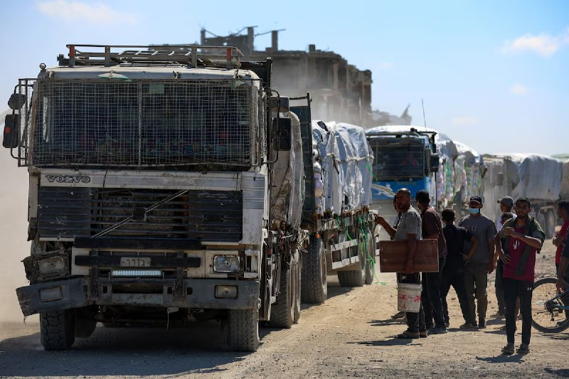

Aid trucks roll into Gaza as dispute over hostage bodies is paused

Aid trucks rolled into Gaza on Wednesday and Israel resumed preparations to open the main Rafah crossing after a dispute over the return of the bodies of dead hostages that had threatened to derail the fragile ceasefire deal with Hamas.

Israel had threatened to keep Rafah shut and reduce aid supplies because Hamas was returning bodies too slowly, showing the risks to a truce that has stopped two years of devastating warfare in Gaza and freed all living hostages held by Hamas. read more

## reutersworldchannel — post 151509

  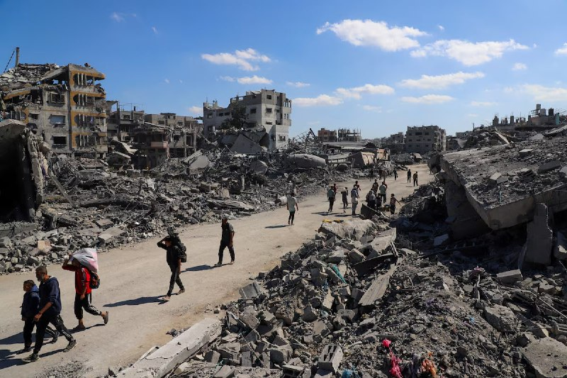

Hamas fighters tighten grip in Gaza, clouding future of ceasefire

Hamas fighters tightened their grip in Gaza on Tuesday after carrying out public executions, defying Israel's assertion that war cannot end under U.S. President Donald Trump's plan until the militants are disarmed.

In a stark assertion of the group's return, fighters executed men they accused of collaborating with Israeli forces. In one video circulated late on Monday, Hamas fighters dragged seven men into a circle of people in Gaza City, forced them to their knees and shot them from behind. A Hamas source confirmed the authenticity of the video. read more

## reutersworldchannel — post 151508

  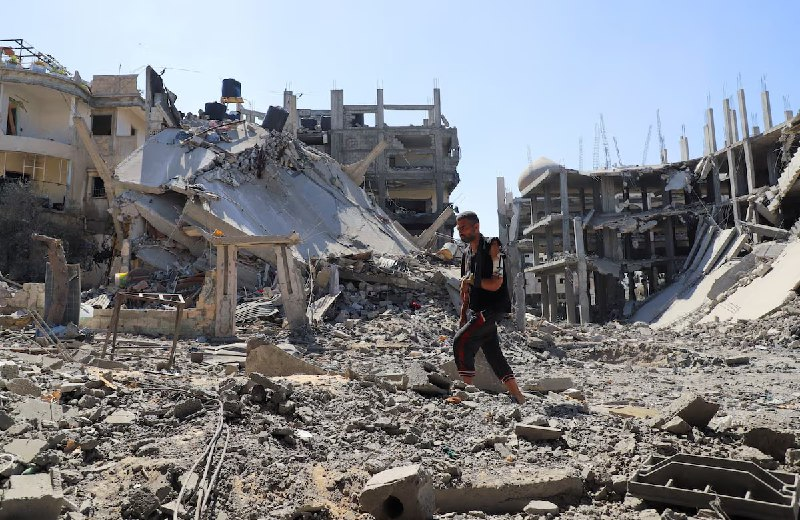

Israel and Hamas agree to Gaza ceasefire and return of hostages

Israel and Hamas said they had agreed to a long-awaited ceasefire and hostage deal, the first phase of U.S. President Donald Trump's plan to end a war in Gaza that has killed more than 67,000 people and reshaped the Middle East.

Just a day after the second anniversary of Hamas militants' cross-border attack that triggered Israel's devastating assault on Gaza, indirect talks in Egypt yielded an agreement on the initial stage of Trump’s 20-point framework to bring peace to the Palestinian enclave. read more

## reutersworldchannel — post 151507

  

Gaza aid flotilla says Israeli forces intercepted its boats

A group of vessels attempting to deliver aid to the war-ravaged Gaza Strip was intercepted by Israeli forces in international waters on Wednesday, the coalition behind the convoy said, the second such interception in the past week.

The Freedom Flotilla Coalition (FFC) is an international network of pro-Palestinian activist groups that organises civilian maritime missions aimed at breaking Israel's blockade of Gaza to deliver humanitarian aid to Palestinians in the enclave. read more

## reutersworldchannel — post 151506

  

Trio win Nobel prize for revealing quantum physics in action

U.S.-based scientists John Clarke, Michel Devoret and John Martinis won the 2025 Nobel Prize in Physics for "experiments that revealed quantum physics in action", paving the way for the development of the next generation of digital technologies.

"My feelings are that I'm completely stunned. Of course it had never occurred to me in any way that this might be the basis of a Nobel Prize," Clarke told the Nobel press conference by telephone on Tuesday. read more

## reutersworldchannel — post 151505

  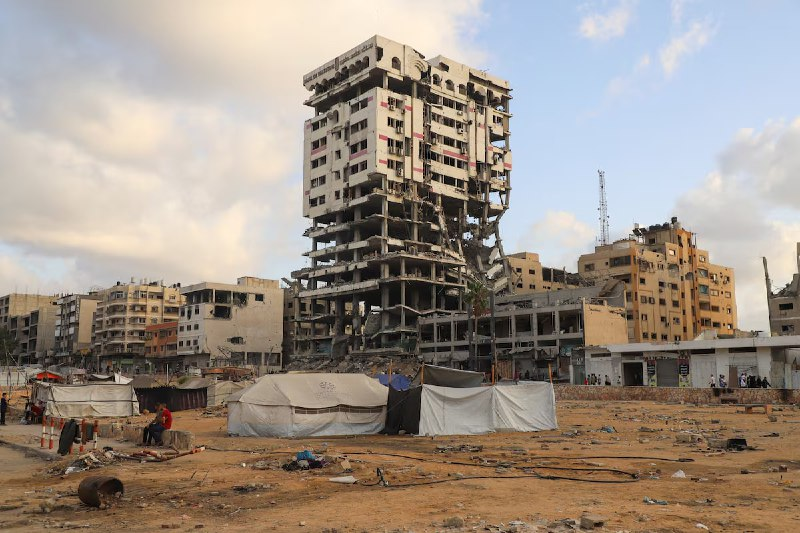

Hamas readies for Gaza talks that US hopes will halt war, free hostages

Hamas officials arrived in Egypt on Sunday ahead of talks with Israel that the U.S. hopes will lead to a halt in fighting and the freeing of hostages in Gaza, with Washington's top diplomat saying the next days are critical.

Israeli negotiators led by Strategic Affairs Minister Ron Dermer were to travel to Egypt on Monday for negotiations in the Red Sea resort of Sharm el-Sheikh about the release of hostages, part of U.S. President Donald Trump's plan to end the nearly two-year Gaza war. read more

## reutersworldchannel — post 151504

  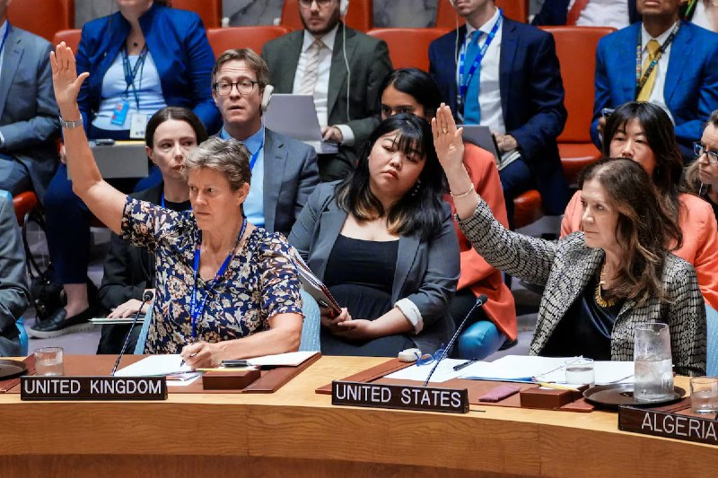

UN arms embargo, other sanctions reimposed on Iran over nuclear programme

The United Nations has reinstated an arms embargo and other sanctions on Iran over its nuclear programme following a process triggered by European powers that Tehran has warned will be met with a harsh response.

Britain, France and Germany initiated the return of sanctions on Iran at the U.N. Security Council over accusations it had violated a 2015 deal that aimed to stop it developing a nuclear bomb. Iran denies seeking nuclear weapons. read more

## reutersworldchannel — post 151503

  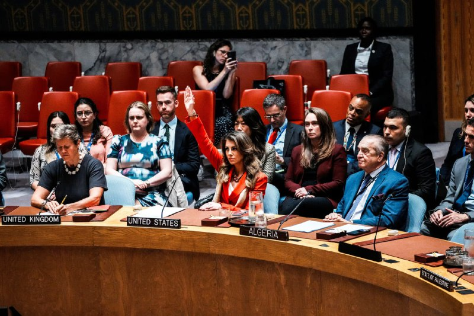

US casts 6th veto at United Nations over war in Gaza

The United States vetoed on Thursday a draft United Nations Security Council resolution that would have demanded an immediate, unconditional and permanent ceasefire in Gaza and that Israel lift all restrictions on aid deliveries to the Palestinian enclave.

The text, drafted by the elected 10 members of the 15-member council, would also have demanded the immediate, dignified and unconditional release of all hostages held by Hamas and other groups. read more

## reutersworldchannel — post 151502

  

Families leave Gaza City after night of bombardment, Israelis protest

More Palestinian families left Gaza City on Tuesday after a night of Israeli shelling on its outskirts, as Israelis launched a day of nationwide protests calling for hostages to be released and the war in Gaza to end.

Residents said Israeli aerial and tank shelling continued throughout the night and early on Tuesday in the eastern Gaza City suburbs of Sabra, Shejaia, and Tuffah, as well as in Jabalia town to the north, destroying roads and houses. read more

## ManotoTV — post 105101

  <a href="telegram/content/ManotoTV_105101_1778179499.mp4">🎬 Download video</a>

در تجمعات شرکت کنید و نمره ۲۰ بگیرید٬ تماس یک معلم از درون وطن

## ManotoTV — post 105100

  <a href="telegram/content/ManotoTV_105100_1778179501.mp4">🎬 Download video</a>

فایننشال‌تایمز گزارش داد دونالد ترامپ، رئیس‌جمهور آمریکا، پس از مخالفت عربستان سعودی با همکاری در طرح نظامی برای هدایت و اسکورت کشتی‌های تجاری در تنگه هرمز ، تنها یک روز پس از آغاز عملیات آن را متوقف کرد.

بر اساس این گزارش، ریاض به واشینگتن اعلام کرده اجازه استفاده از پایگاه‌ها و حریم هوایی خود را برای اجرای این طرح — موسوم به «پروژه آزادی» — نخواهد داد و آن را «تنش‌زا و فاقد برنامه‌ریزی دقیق» ارزیابی کرده است. کاخ سفید در این‌باره اظهار نظری نکرده است.

این تصمیم، نشانه‌ای از افزایش نارضایتی برخی متحدان عرب آمریکا از نحوه مدیریت جنگ از سوی ترامپ تلقی می‌شود.

مخالفت ریاض با این طرح، که نخستین‌بار توسط رسانه‌های آمریکایی گزارش شد، نشان‌دهنده افزایش نگرانی عربستان از رویکرد غیرقابل پیش‌بینی ترامپ در مدیریت جنگ است؛ به‌ویژه در شرایطی که کشورهای حاشیه خلیج فارس هدف حملات تلافی‌جویانه ایران قرار گرفته‌اند.

عربستان پیش‌تر با برخی کشورهای عربی دیگر نسبت به آغاز جنگ هشدار داده و بر لزوم پیگیری راه‌حل دیپلماتیک تأکید کرده بود. با وجود آن‌که ریاض در ابتدا از تضعیف توان موشکی و پهپادی جمهوری اسلامی استقبال کرده بود، اکنون نسبت به نبود یک راهبرد مشخص و تهدیدهای ترامپ برای حمله به زیرساخت‌های غیرنظامی، از جمله نیروگاه‌های برق، ابراز نگرانی کرده است.

این کشور در حال حاضر از تلاش‌های میانجی‌گرانه پاکستان برای پایان دادن به جنگ و بازگشایی تنگه هرمز حمایت می‌کند.

## ManotoTV — post 105099

  <a href="telegram/content/ManotoTV_105099_1778179502.mp4">🎬 Download video</a>

‌
مایک والتز، نماینده آمریکا در سازمان ملل، گفت اقدام جمهوری اسلامی در بستن تنگه هرمز نقض اصول پایه حقوق دریاها و قوانین بین‌المللی است.

او همچنین گزارش‌ها درباره ایجاد نهادی با عنوان «مرجع تنگه خلیج فارس» برای دریافت عوارض از کشتی‌ها را محکوم کرد و آن را «تلاشی فرصت‌طلبانه برای کسب اهرم فشار» خواند.

والتز گفت: «مجازات جمعی کل جهان برای حل یک اختلاف، غیرقابل قبول، غیراخلاقی و برخلاف حقوق بین‌الملل است.»

او افزود: «این باید یک خواسته ساده باشد؛ پاک‌سازی مین‌ها از یک آبراه بین‌المللی و عدم تحمیل عوارض غیرقانونی.»

نماینده آمریکا در سازمان ملل تأکید کرد این موارد باید در شورای امنیت بررسی شود و افزود: «اگر کشوری با چنین خواسته ساده‌ای مخالفت کند، باید پرسید آیا واقعاً به‌دنبال صلح است یا نه.»

## ManotoTV — post 105098

  <a href="telegram/content/ManotoTV_105098_1778179502.mp4">🎬 Download video</a>

تعدادی از جاویدنامان اصفهان (چمگردان)٬ اگر اطلاعات بیشتری از این عزیزان دارید با ما به اشترک بگذارید.

## ManotoTV — post 105097

  <a href="telegram/content/ManotoTV_105097_1778179503.mp4">🎬 Download video</a>

‌
نماینده امارات متحده عربی در سازمان ملل از ارائه پیش‌نویس قطعنامه‌ای خبر داد که بر ضرورت حفاظت از آبراه‌های بین‌المللی در پی افزایش تهدیدها در تنگه هرمز تأکید دارد.
محمد عیسی ابوشهاب گفت این قطعنامه بر اصول تثبیت‌شده حقوق بین‌الملل استوار است و تأکید می‌کند «آبراه‌های بین‌المللی را نمی‌توان از طریق اجبار، حمله یا تهدید علیه کشتیرانی غیرنظامی و تجاری کنترل کرد.»
او افزود جمهوری اسلامی طی ماه‌های گذشته «به حملات و تهدیدها علیه کشتی‌های تجاری ادامه داده، در ناوبری قانونی اختلال ایجاد کرده، در اطراف تنگه هرمز مین‌گذاری کرده و تلاش کرده عوارض غیرقانونی بر کشتیرانی بین‌المللی تحمیل کند.»
نماینده امارات گفت این قطعنامه خواستار افشای محل مین‌های دریایی و پاک‌سازی آن‌ها در تنگه هرمز است و هرگونه تحمیل عوارض غیرقانونی و مداخله در آزادی کشتیرانی را رد می‌کند.
او همچنین تأکید کرد این طرح از ایجاد یک کریدور بشردوستانه برای تسهیل انتقال کمک‌های انسانی، کود شیمیایی و سایر کالاهای اساسی از طریق این آبراه حمایت می‌کند.

## ManotoTV — post 105096

  <a href="telegram/content/ManotoTV_105096_1778179504.mp4">🎬 Download video</a>

آرسنیو دومینگز، دبیرکل سازمان بین‌المللی دریانوردی سازمان ملل، گفته است به‌دلیل اختلال‌ها در تنگه هرمز، حدود ۱۵۰۰ کشتی در خلیج فارس متوقف شده‌اند. او که در کنوانسیون دریایی قاره آمریکا در پاناما سخن می‌گفت، افزود حدود ۲۰ هزار خدمه نیز همراه این کشتی‌ها سرگردان مانده‌اند.

## ManotoTV — post 105095

  <a href="telegram/content/ManotoTV_105095_1778179505.mp4">🎬 Download video</a>

مقام‌های آمریکایی اعلام کرده‌اند اسرائیل و لبنان هفته آینده دور تازه‌ای از مذاکرات را در واشنگتن برگزار خواهند کرد.
به گزارش الجزیره عربی به نقل از یک منبع لبنانی، دو کشور قرار است هیئت‌هایی را برای این گفت‌وگوها به واشنگتن اعزام کنند.
بر اساس این گزارش، مذاکرات بر موضوعاتی از جمله خروج کامل نیروهای اسرائیلی از لبنان، وضعیت آوارگان و روند بازسازی متمرکز خواهد بود.
رویترز و خبرگزاری فرانسه نیز به نقل از یک مقام وزارت خارجه آمریکا گزارش داده‌اند این مذاکرات در روزهای ۱۴ و ۱۵ مه برگزار می‌شود.
این گفت‌وگوها در حالی انجام می‌شود که آتش‌بس میان اسرائیل و حزب‌الله لبنان طی هفته‌های اخیر بارها از سوی دو طرف نقض شده است.

## ManotoTV — post 105094

  <a href="telegram/content/ManotoTV_105094_1778179505.mp4">🎬 Download video</a>

کریس رایت، وزیر انرژی آمریکا، گفته است به نظر می‌رسد ایران تولید نفت خود را روزانه حدود ۴۰۰ هزار بشکه کاهش داده باشد.
او در گفت‌وگو با شبکه «فاکس نیوز» افزود که احتمال می‌رود تولید نفت ایران باز هم کاهش پیدا کند.

## ManotoTV — post 105093

  <a href="telegram/content/ManotoTV_105093_1778179506.mp4">🎬 Download video</a>

‌
سخنگوی وزارت خارجه جمهوری اسلامی اعلام کرد تهران هنوز به جمع‌بندی نرسیده و پاسخی به آمریکا ارائه نکرده است.

خبرگزاری حکومتی تسنیم با انتشار این نقل قول از اسماعیل بقایی نوشت جمهوری اسلامی در حال بررسی پیام‌ها با میانجیگری طرف پاکستانی است.

## ManotoTV — post 105092

  <a href="telegram/content/ManotoTV_105092_1778179506.mp4">🎬 Download video</a>

‌
وزارت خزانه‌داری ایالات متحده آمریکا اعلام کرد در ادامه فشار بر ایران، چند مقام و نهاد مرتبط با شبکه‌های نفتی و شبه‌نظامیان در عراق را تحریم کرده است.

بر اساس این بیانیه، علی معارج البهادلی، معاون وزیر نفت عراق، به‌دلیل کمک به انتقال و فروش نفت به نفع جمهوری اسلامی و گروه‌های همسو با آن، در فهرست تحریم‌ها قرار گرفته است.

هم‌زمان، چند عضو ارشد گروه‌های عصائب اهل الحق و کتائب سیدالشهدا نیز به‌اتهام قاچاق نفت، تامین مالی و همکاری با سپاه پاسداران انقلاب اسلامی و حزب‌الله لبنان تحریم شده‌اند.

به گفته وزارت خزانه‌داری، این شبکه با جعل اسناد و مخلوط کردن نفت ایران با نفت عراق، آن را به بازار جهانی عرضه می‌کرد.

واشینگتن تاکید کرده دارایی‌های افراد تحریم‌شده مسدود می‌شود و هرگونه همکاری با آنها، از جمله برای نهادهای مالی خارجی، می‌تواند منجر به تحریم‌های ثانویه شود.

## ManotoTV — post 105091

  <a href="telegram/content/ManotoTV_105091_1778179507.mp4">🎬 Download video</a>

هم‌زمان با آماده‌سازی برای دور دوم مذاکرات لبنان و اسرائیل در واشنگتن؛ یک مقام لبنانی به الجزیره عربی گفته است آمریکا تلاش کرده تنش‌ها و اقدامات اسرائیل در لبنان را کاهش دهد.
به گفته این مقام، مذاکرات هفته آینده بر مسائل امنیتی و سیاسی، از جمله خروج کامل نیروهای اسرائیلی از لبنان، آزادی زندانیان و بازسازی متمرکز خواهد بود.
او همچنین حمله روز گذشته اسرائیل به ضاحیه جنوبی بیروت، که یکی از فرماندهان نیروی رضوان حزب‌الله را هدف قرار داد، «پیامی برای برهم زدن مذاکرات» توصیف کرد.
این مقام لبنانی تأکید کرد لبنان به دنبال امضای توافق صلح با اسرائیل نیست، بلکه خواهان «بازگرداندن حقوق در برابر توافق عدم تجاوز» است.
او همچنین گفت تلاش‌های جمهوری‌اسلامی برای حمایت از موضع لبنان در صورتی قابل تقدیر است که به برقراری آتش‌بس منجر شود و از طریق نهادهای رسمی لبنان دنبال شود.

## ManotoTV — post 105090

  <a href="telegram/content/ManotoTV_105090_1778179508.mp4">🎬 Download video</a>

«قطع اینترنت خاموش کردن صدای مردم است»

## ManotoTV — post 105089

  <a href="telegram/content/ManotoTV_105089_1778179509.mp4">🎬 Download video</a>

مسعود پزشکیان در نشست اصناف و بازاریان مدعی شد با مجتبی خامنه‌ای دیدار داشته است.

پزشکیان گفت آن‌چه در دیدار با مجتبی خامنه‌ای بیش از هر موضوع دیگری برای او برجسته شد، برخورد «متواضعانه و صمیمی رهبر» بوده است .

## ManotoTV — post 105088

  <a href="telegram/content/ManotoTV_105088_1778179510.mp4">🎬 Download video</a>

رسانه‌های حکومتی گزارش داده‌اند عباس عراقچی، وزیر امور خارجه جمهوری‌اسلامی، و محمد اسحاق دار، وزیر خارجه پاکستان، عصر پنج‌شنبه در تماس تلفنی درباره آخرین تحولات منطقه گفت‌وگو کردند.
در این گزارش‌ها آمده، دو طرف بر اهمیت ادامه مسیر گفت‌وگو و دیپلماسی تأکید کرده و خواستار گسترش همکاری‌های منطقه‌ای برای حفظ ثبات و جلوگیری از تشدید تنش‌ها شدند.

## ManotoTV — post 105087

  <a href="telegram/content/ManotoTV_105087_1778179510.mp4">🎬 Download video</a>

ای۲۴ نیوز اسرائیل از قول منابعی در خلیج فارس گزارش داده عربستان سعودی اعلام کرده تا زمانی که ایالات متحده «حفاظت مناسب» در برابر حملات جمهوری‌اسلامی را تضمین نکند، دسترسی ارتش آمریکا به پایگاه‌ها و حریم هوایی این کشور محدود خواهد شد.
بر اساس این گزارش، ریاض به واشنگتن اطلاع داده که استفاده از پایگاه‌های نظامی و همچنین عبور هواپیماهای آمریکایی از حریم هوایی عربستان برای عملیات‌های مرتبط با جنگ در منطقه، متوقف یا محدود می‌شود.منابع این رسانه اسرائیلی گفته‌اند عربستان خواستار «تضمین امنیتی جدی‌تر» از سوی آمریکا در برابر تهدیدات جمهوری‌اسلامی شده و تا زمان دریافت این تضمین‌ها، همکاری‌های نظامی را کاهش می‌دهد.

## ManotoTV — post 105086

  <a href="telegram/content/ManotoTV_105086_1778179511.mp4">🎬 Download video</a>

رویترز در گزارشی اختصاصی نوشته منابع کشتیرانی می‌گویند امارات همچنان بخشی از نفت خود را از تنگه هرمز عبور می‌دهد؛ آن هم با کشتی‌هایی که برای جلوگیری از هدف قرار گرفتن، سیستم‌های ردیابی‌شان خاموش شده است.
بر اساس داده‌های ردیابی، شرکت ملی نفت ابوظبی در ماه آوریل چندین میلیون بشکه نفت خام را از پایانه‌های داخل خلیج فارس صادر کرده که بخشی از آن از طریق انتقال کشتی‌به‌کشتی یا تخلیه در عمان به مقصد پالایشگاه‌های آسیایی منتقل شده است.
این روش صادراتی در حالی انجام می‌شود که صادرات نفت امارات از آغاز جنگ کاهش یافته و ریسک حمل‌ونقل دریایی در منطقه به‌شدت افزایش پیدا کرده است.

## ManotoTV — post 105085

  <a href="telegram/content/ManotoTV_105085_1778179511.mp4">🎬 Download video</a>

قیمت نفت کاهش یافت و بازارهای جهانی سهام در معاملات روز پنج‌شنبه عملکردی متضاد داشتند؛ در حالی که سرمایه‌گذاران در انتظار به‌روزرسانی درباره طرح آمریکا برای پایان جنگ با ایران و بازگشایی تنگه هرمز هستند.
پس از آنکه قیمت نفت روز چهارشنبه در پی امید به صلح تا بیش از ۱۰ درصد سقوط کرده بود، روز پنج‌شنبه افت آن ملایم‌تر شد و حدود ۲ درصد کاهش ثبت کرد. در بازارهای سهام، بورس‌های اروپایی پس از رشد قابل توجه روز قبل کاهش یافتند، در حالی که بازارهای اصلی آسیا روند صعودی داشتند.
استراتژیست‌ها باور دارند هیجان شدیدی که با امید به کاهش تنش‌ها در بازارها ایجاد شده بود، در حال فروکش کردن است و این واقعیت در حال شکل‌گیری است که برای رسیدن به یک توافق پایدار، موانع بیشتری وجود دارد؛ حتی با وجود اینکه گزارش شده جمهوری‌اسلامی در حال بررسی یک پیشنهاد صلح آمریکا برای پایان رسمی درگیری است.

## ManotoTV — post 105084

  <a href="telegram/content/ManotoTV_105084_1778179512.mp4">🎬 Download video</a>

استاندار تهران اعلام کرد از روز شنبه ۱۹ اردیبهشت ۱۴۰۵، حضور کارکنان همه وزارتخانه‌ها، سازمان‌ها و دستگاه‌های اجرایی مستقر در استان تهران به‌صورت ۱۰۰ درصدی خواهد بود.
محمدصادق معتمدیان همچنین گفت فعالیت مدارس و دانشگاه‌ها نیز طبق تصمیم وزارت آموزش و پرورش و وزارت علوم، به شکل حضوری و طبق روال اعلام‌شده ادامه خواهد داشت.

## ManotoTV — post 105083

  

https://youtube.com/live/cPjJ1JkeQaw?feature=share

## ManotoTV — post 105082

  <a href="telegram/content/ManotoTV_105082_1778179513.mp4">🎬 Download video</a>

پاکستان اعلام کرده است که انتظار دارد توافقی میان آمریکا و جمهوری‌اسلامی در آینده نزدیک حاصل شود؛ در حالی که این کشور در طول جنگ علیه ایران نقش میانجی میان واشنگتن و تهران را ایفا کرده است.
وزارت خارجه پاکستان با انتشار بیانیه‌ای جدید بر خوش‌بینی خود تأکید کرده است. تَحیر اندرابی، سخنگوی وزارت خارجه پاکستان، گفت: «انتظار داریم هرچه زودتر توافقی حاصل شود.»
او افزود: «امیدواریم طرف‌ها به یک راه‌حل مسالمت‌آمیز و پایدار برسند که نه‌تنها به صلح در منطقه ما، بلکه به صلح بین‌المللی نیز کمک کند.»
با این حال، او از ارائه زمان‌بندی خودداری کرد و گفت پاکستان جزئیات تلاش‌های دیپلماتیک در حال انجام را منتشر نخواهد کرد.
او تأکید کرد: «آنچه می‌توانم بگویم این است که ما همچنان امیدوار و خوش‌بین هستیم و امیدواریم این توافق هرچه زودتر حاصل شود.»
این موضع‌گیری در ادامه گزارش‌هایی است که از پیشرفت مذاکرات غیرمستقیم میان آمریکا و جمهوری‌اسلامی حکایت دارد؛ مذاکراتی که گفته می‌شود بر موضوع هسته‌ای و تنگه هرمز متمرکز است.

## FarsiVOA — post 217128

فرانسه کاهش یا لغو تحریم‌ها علیه جمهوری اسلامی را به بازگشایی کامل تنگه هرمز مشروط کرد

## FarsiVOA — post 217127

🔺آمریکا خواستار آزادی فوری نرگس محمدی شد؛ هشدار پزشکان نسبت به خطر سکته مغزی

▪️رایلی بارنز، معاون وزیر خارجه ایالات متحده، روز پنجشنبه ۱۷ اردیبهشت از رژیم ایران خواست نرگس محمدی، فعال حقوق بشر و برنده جایزه نوبل صلح، را فوراً آزاد کرده و امکان دسترسی او به خدمات درمانی مناسب را فراهم کند.

⬇️ بیشتر بخوانید:

https://ir.voanews.com/a/riley-barnes-narges-mohammadi-release/8147638.html?withmediaplayer=1%2F%3Fnocach%3D1

## FarsiVOA — post 217126

در گفت‌وگو با حسن هاشمیان، به کاهش توان عملیانی سپاه پاسداران پس از محاصره دریایی و محدودیت‌های اینترنتی پرداختیم؛ از تضعیف شبکه‌های نیابتی تا پیامد قطع اینترنت برای ایران در جریان جنگ سرد دیجیتال جاری در منطقه خلیج فارس گفتیم

## FarsiVOA — post 217125

ویدئویی از وحید بنی‌عامریان منتشر شده که در زندان با شجاعتی کم‌نظیر خطاب به علی خامنه‌ای، رهبر آن زمان جمهوری اسلامی می‌گوید که از اعدام نمی‌ترسد و رژیم پایانی جز سرنگونی ندارد. این عضو سازمان مجاهدین خلق در تاریخ ۱۵ فروردین ۱۴۰۵ اعدام شد.

## FarsiVOA — post 217124

در گفت‌وگو با سعید پیوندی، به تغییر موضع محمدباقر قالیباف درباره محاصره دریایی و فشارهای آمریکا پرداختیم؛ از پیام‌های درونی این تغییر لحن گفتیم و بررسی کردیم آیا قالیباف در حال آماده‌سازی هسته‌های درونی قدرت برای توافق است یا در حال زمینه‌سازی جامعه برای مواجهه با بحرانهای شدید اقتصادی و اجتماعی؟

## FarsiVOA — post 217123

🔺برکناری سه نماینده پارلمان بحرین به دلیل حمایت از جمهوری اسلامی ایران

◾️رسانه‌های بحرینی روز پنجشنبه ۱۷ اردبیهشت، گزارش دادند که پارلمان بحرین سه نفر از نمایندگان خود را به اتهام «حمایت از [رژیم] ایران و ستایش حملات آن» برکنار کرده است. به گزارش روزنامه الایام بحرین مجلس نمایندگان «درخواست لغو عضویت سه نماینده مجلس عبدالنبی سلمان، مهدی الشویخ و ممدوح الصالح» را تصویب کرد.

⬇️ بیشتر بخوانید:

https://ir.voanews.com/a/bahrain-iran-proxy-war-irgc/8147579.html

## FarsiVOA — post 217122

وزارت خارجه آمریکا اعلام کرد مارکو روبیو در دیدار با پاپ لئو چهاردهم درباره تحولات خاورمیانه و موضوعات مورد علاقه مشترک گفت‌وگو و بر تعهد مشترک واشنگتن و واتیکان به ترویج صلح و کرامت انسانی تأکید کردند .

## FarsiVOA — post 217121

تیم ملی فوتبال جمهوری اسلامی در حالی خودش را برای جام جهانی ۲۰۲۶ آماده می‌کند که هیچ تیمی حاضر به برگزاری دیدار تدارکاتی با این تیم نیست و مجبور به برگزاری دیدار تدارکاتی با خودش شده است. امیر قلعه نوعی سرمربی تیم می‌گوید تیم‌ها باوجود بستن قرارداد دقیقه ۹۰ بازیهای تدارکاتی را لغو می‌کنند

## FarsiVOA — post 217120

  

کارولین لیویت سخنگوی کاخ سفید، اعلام کرد دخترش «ویویانا» اول ماه مه، یازده اردیبهشت، به دنیا آمده است. او در پیامی در شبکه ایکس نوشت نوزادش سالم است و خانواده‌اش روزهای شادی را با عضو جدید خانواده سپری می‌کنند. لیویت همچنین از افرادی که در دوران بارداری برای او دعا کرده بودند قدردانی کرد.

## FarsiVOA — post 217119

بسیاری از ناظران و تحلیلگران روسیه را از منتفعان و برندگانِ بحران میان ایران و آمریکا و وضعیت جنگی و ابهام سیاسی موجود در ایران می‌دانند. ‌آیا روسیه برنده این جنگ است؟

## FarsiVOA — post 217118

🔺آمریکا فشار اقتصادی بر رژیم ایران و شبه‌نظامیان وابسته‌اش در عراق را افزایش داد

▪️وزارت خزانه‌داری ایالات متحده روز پنجشنبه ۱۷ اردیبهشت از دور تازه‌ای از تحریم‌ها علیه افراد و شرکت‌های مرتبط با رژیم ایران و شبه‌نظامیان مورد حمایت جمهوری اسلامی در عراق خبر داد؛ اقدامی که بخشی از کارزار «فشار حداکثری» و برنامه «خشم اقتصادی» دولت ترامپ علیه جمهوری اسلامی است.

⬇️ بیشتر بخوانید:

https://ir.voanews.com/a/ofac-treasury-iran-iraq-oil-sanction-economic-fury/8147596.html/?nocach=1

## FarsiVOA — post 217117

در ادامه بازداشت و سرکوب شهروندان، قوه قضاییه برای معترضان دی و زندانیان سیاسی احکام سنگین صادر می‌کند. چهار معترض دیگر در خطر اعدام‌اند.

## FarsiVOA — post 217116

دونالد ترامپ: پیش‌بینی میکنم که جنگ در ایران به سرعت پایان خواهد یافت

## FarsiVOA — post 217115

🔺مارکو روبیو با پاپ دیدار کرد؛ تاکید بر رابطه قوی و تعهد مشترک به صلح

▪️مارکو روبیو، وزیر خارجه آمریکا پنجشنبه ۱۷ اردیبهشت در آغاز سفر خود به ایتالیا پیش از دیدار با جورجیا ملونی نخست وزیر ایتالیا، با پاپ چهاردهم لئو، در واتیکان دیدار کرد.

⬇️ بیشتر بخوانید:

https://ir.voanews.com/a/iran-us-rubio-italy-pop-leo-melony-trump-/8147578.html/?nocach=1

## FarsiVOA — post 217114

🔺جمهوری اسلامی در کمین جان‏ سه تن دیگر از بازداشت‌شدگان اعتراضات دی‌ ۱۴۰۴

▪️وب‌سایت حقوقی دادبان روز پنجشنبه ۱۷ اردیبهشت، اعلام کرد که ‏برای سه تن از بازداشت‌شدگان خیزش دی‌ماه ۱۴۰۴ که در زندان قزل‌حصار محبوس هستند ‏حکم اعدام صادر و این حکم در شعبه نهم دیوان عالی کشور به ریاست قاسم مزینانی تأیید شده است.

⬇️ بیشتر بخوانید:

https://ir.voanews.com/a/dey-protests-ghezal-hesar-prisoners-execution-of-protesters-iran/8147589.html/?nocach=1

## FarsiVOA — post 217113

مارکو روبیو، وزیر خارجه آمریکا، در سفر به ایتالیا با پاپ لئو چهاردهم در واتیکان دیدار کرد و قرار است با مقام‌های ارشد دولت ایتالیا نیز گفت‌وگو کند

## FarsiVOA — post 217112

🔺گزارش ویژه | عرفان کیانی، روایتی از یک اعدام سیاسی در سایه ابهامات بی‌شمار

▪️نامش‌ عرفان کیانی بود، از معترضان اعتراضات دی‌ماه ۱۴۰۴ که شنبه پنجم اردیبهشت ۱۴۰۵ در ایران اعدام شد. خبر اعدام عرفان کیانی در اطلاعیه‌ای از سوی قوه قضاییه جمهوری اسلامی ایران منتشر شد.

⬇️ بیشتر بخوانید:

https://ir.voanews.com/a/erfan-kiani-political-execution-aegean/8147304.html/?nocach=1

## FarsiVOA — post 217111

جمهوری اسلامی در جریان جنگ اخیر با وعده‌های مالی، فشارهای امنیتی و اسکان جنگ‌زدگان در هتل‌ها، عده‌ای را برای شبگردی‌ها و تجمعات خیابانی بسیج کرده؛ تجمعاتی که به‌جای نمایش وحدت، به ابزاری برای تسویه‌حساب‌های سیاسی و حمله به صداهای منتقد و حامیان دیپلماسی تبدیل شده است.

## FarsiVOA — post 217108

مارکو روبیو، وزیر امور خارجه ایالات متحده، با پاپ لئو چهاردهم دیدار و گفتگو کرد. او این دیدار را فرصتی برای هم‌سویی بیشتر میان واشینگتن و واتیکان در مقابله با چالش‌های جهانی توصیف کرد. روبیو تأکید کرد که ترویج ارزش‌های بنیادین و حقوق بشر، هسته اصلی گفتگوهای او با رهبر کاتولیک‌های جهان را تشکیل داده است.

## DW_Farsi — post 124413

  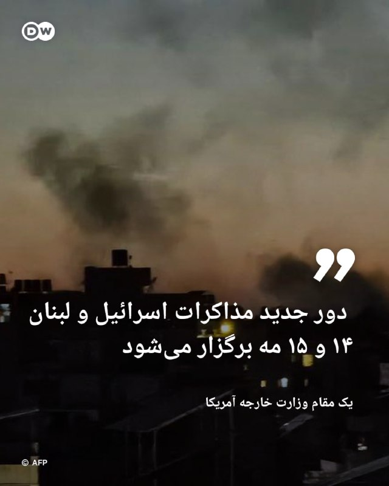

🔶 یک مقام آمریکایی: دور جدید مذاکرات اسرائيل و لبنان ۱۴ و ۱۵ مه برگزار می‌شود

یک مقام وزارت خارجه آمریکا روز پنج‌شنبه هفتم مه (۱۷ اردیبهشت) از سومین دور مذاکرات صلح میان اسرائيل و لبنان در روزهای پنج‌شنبه و جمعه ۱۴ و ۱۵ مه در واشنگتن خبر داد.

به گزارش خبرگزاری رویترز، این خبر در حالی اعلام می‌شود که ایالات متحده این دو کشور را برای دستیابی به توافق صلح پایدار تحت فشار قرار داده است و حملات اسرائيل به حزب‌الله لبنان نیز همچنان ادامه دارد.

این خبر یک روز پس از اولین حمله اسرائيل به بیروت از زمان توافق بر سر آتش‌بس در اواسط آوریل منتشر شده است؛ توافقی که پس از گردهم آوردن سفرای دو کشور توسط دولت دونالد ترامپ، رئیس‌جمهور آمریکا برای گفت‌وگوهای مستقیم و کم‌سابقه حاصل شده بود.

رویترز می‌نویسد، این مقام وزارت خارجه آمریکا اعلام نکرد که چه کسانی در سومین دور مذاکرات شرکت خواهند داشت.

مارکو روبیو، وزیر خارجه آمریکا روز سه‌شنبه دستیابی به صلح میان اسرائيل و لبنان را امکان‌پذیر دانسته، اما تأکید کرده بود که این امر مستلزم آن است که دولت لبنان توانایی مقابله با گروه تروریستی حزب‌الله را داشته باشد.
@dw_farsi

## DW_Farsi — post 124412

  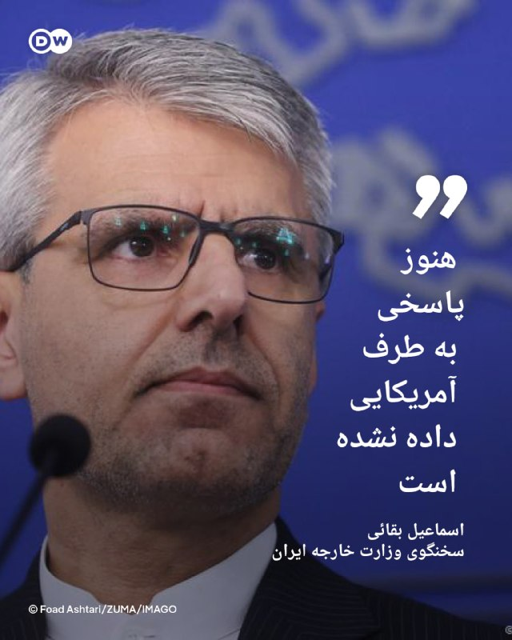

🔶 بقائی: هنوز پاسخی به طرف آمریکایی داده نشده است

اسماعیل بقائی، سخنگوی وزارت خارجه ایران، می‌گوید تهران همچنان مشغول بررسی پیام‌های ایالات متحده با میانجی‌گری پاکستان است.

به گزارش تسنیم، بقائی روز پنج‌شنبه ۱۷ اردیبهشت افزود: «هنوز ایران به جمع‌بندی نرسیده و پاسخی به طرف آمریکایی داده نشده است.»

شبکه "سی‌ان‌ان" پیش‌تر به نقل از یک منبع منطقه‌ای نوشته بود، انتظار می‌رود تهران پاسخ خود به پیشنهاد آمریکا را روز پنج‌شنبه تحویل میانجی‌ها بدهد.

طبق این گزارش، برداشت‌ها حاکی از آن است که هر دو طرف به سمت رسیدن به یک توافق پیش می‌روند.

"سی‌ان‌ان" نوشته بود که پیشنهاد یک‌صفحه‌ای آمریکا شامل اعلام پایان جنگ و هم‌زمان آغاز یک دوره ۳۰روزه مذاکره برای حل‌وفصل مسائل مورد اختلاف باقیمانده شامل موضوعات هسته‌ای، دارایی‌های مسدودشده ایران و امنیت در تنگه هرمز می‌شود.
@dw_farsi

## DW_Farsi — post 124411

  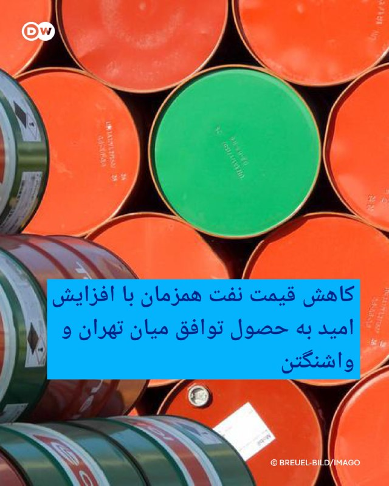

🔶 کاهش قیمت نفت همزمان با افزایش امید به حصول توافق میان تهران و واشنگتن

قیمت جهانی نفت روز پنج‌شنبه ۱۷ اردیبهشت همزمان با افزایش امید به دسترسی به توافق در مذاکرات ایران و آمریکا و بازگشایی تنگه هرمز کاهش یافت.

به گزارش خبرگزاری فرانسه، بازارهای سهام جهانی نیز روز پنج‌شنبه در انتظار به‌روزرسانی طرح آمریکا برای پایان دادن به جنگ ایران با روندی نوسانی در معاملات خود روبرو بودند.

مطابق این گزارش، قیمت نفت خام برنت با ۳.۸ درصد کاهش به ۹۷.۳۸ دلار در هر بشکه رسید. این در حالیست که در ابتدای این هفته این قیمت بیش از ۱۱۵ دلار بود.

در همین حال در بازار سهام وال‌استریت نیز شاخص "ا‌س‌اندپی ۵۰۰" (S&P 500) که از معتبرترین معیارهای سنجش وضعیت اقتصادی در سطح بین‌المللی به شمار می‌رود با ۰.۱ درصد افزایش، رکورد تاریخی خود را که روز قبل ثبت کرده بود، شکست.

افزون بر این، شاخص میانگین صنعتی "داوجونز" تا ساعت ۹ و ۳۵ دقیقه صبح به وقت شرق آمریکا ۵۹ واحد معادل ۰.۱درصد رشد داشت و شاخص "نزدک کامپوزیت" نیز که یک شاخص بازار سهام مهم در ایالات متحده به شمار می‌رود ۰.۲درصد افزایش نشان داد.
@dw_farsi

## DW_Farsi — post 124410

🔶 سی‌‌ان‌ان: ایران برای عبور از تنگه هرمز قوانین جدیدی وضع کرده است

"سی‌ان‌ان" می‌گوید، بنا بر سندی که به رؤیت این شبکه خبری آمریکایی رسیده، ایران دستورالعمل و قوانین جدیدی را برای کشتی‌هایی که قصد عبور از تنگه هرمز دارند وضع کرده است.

طبق خبری که سی‌ان‌ان روز پنج‌شنبه ۱۷ اردیبهشت منتشر کرده، این سند شامل یک فرم درخواستی است که توسط مرجع تنگه خلیج فارس (Persian Gulf Strait Authority - PGSA) صادر شده و تمام کشتی‌های عبوری از این تنگه را ملزم می‌کند، به منظور تضمین تردد ایمن آن را پر کنند.

سی‌ان‌ان می‌گوید، این سند را از ریچارد مید، سردبیر خبرگزاری تحلیل داده‌های دریایی "لویدز لیست" و یک منبع دیگر که نخواست نامش فاش شود دریافت کرده است.

این فرم شامل بیش از ۴۰ پرسش است و هر کشتی را ملزم می‌کند تا علاوه بر برخی جزئیات، نام، شماره شناسایی، نام قبلی و کشور مبدأ و مقصد خود را اعلام کند. همچنین در مورد ملیت مالک ثبت‌شده، مدیر و خدمه کشتی نیز سئوالاتی مطرح شده است.

در پی دور دوم حملات اسرائيل و آمریکا که از نهم اسفند در ایران آغاز شد جمهوری اسلامی اعلام کرد که عبور از تنگه هرمز را برای کشتی‌های مرتبط با این دو کشور محدود خواهد کرد.

ریچارد مید با اشاره به فهرست پرسش‌های مندرج در فرم یادشده به سی‌ان‌‌ان گفت، این فهرست "بسیار شبیه به سئوالاتی است که می‌دانستیم، پیش از این هم از مالکان کشتی‌ها پرسیده می‌شد."

او ادامه داد: «اما این اقدام به این ساختار رسمیت می‌بخشد و به نظر می‌رسد حرکتی از سوی ایران برای عادی‌سازی اقتدار خود بر رفت‌وآمدهای دریایی باشد.»

این در حالیست که پیش از نهم اسفند و شروع دور دوم جنگ اسرائيل و آمریکا علیه جمهوری اسلامی، کشتی‌ها برای عبور از تنگه هرمز مجبور به اشتراک‌گذاری هیچ‌گونه اطلاعاتی نبودند.

سی‌ان‌ان با اشاره به این که مرجع تنگه خلیج فارس (PGSA) به‌تازگی راه‌اندازی شده به گزارش شبکه "پرس‌تی‌وی" ایران اشاره می‌کند که در آن گفته شده که تحت این سیستم جدید، تمامی کشتی‌های عبوری از تنگه هرمز ایمیلی از آدرسی متعلق به PGSA دریافت می‌کنند که آن‌ها را از مقررات عبور مطلع می‌سازد.

در این ایمیل که توسط مید و یک منبع دیگر در اختیار سی‌ان‌ان گذاشته شده به کشتی‌های عبوری هشدار داده شده است که "ارائه اطلاعات کامل و دقیق برای پردازش درخواست عبور کشتی ضروری است" و "دستورالعمل‌های بعدی از طریق ایمیل ابلاغ خواهد شد."
@dw_farsi

## DW_Farsi — post 124409

🎥 کارل مارکس و انگلس در هند؛ کودکان روستایی با نام رهبران کمونیست

در روستای وانی‌ولامپاتی در جنوب هند، برخی روستاییان نام چهره‌های مشهور کمونیست، از کارل مارکس و انگلس تا فیدل کاسترو و چه‌گوارا را روی فرزندان خود می‌گذارند. این سنت نسل‌هاست در روستا ادامه دارد و به گفته ساکنان آن، ریشه در جنبشی محلی علیه تبعیض طبقاتی و نظام کاستی در هند دارد.

@dw_farsi

## DW_Farsi — post 124408

🔶 ابراز آمادگی سه‌چهارم مردان ۱۸ ساله آلمانی برای خدمت سربازی

از میان مردان ۱۸ ساله‌ای که در چارچوب مدل جدیدخدمت سربازی در آلمان از سوی ارتش نامه دریافت کرده‌اند، حدود ۷۲ درصد پرسش‌نامه مربوط به آمادگی و تمایل برای خدمت را تکمیل کرده‌اند. در مقابل، ۲۸ درصد به این نامه پاسخ نداده‌اند؛ این در حالی است که برای مردان متولد سال ۲۰۰۸، پاسخ‌دادن به این پرسش‌نامه الزامی است.

این پرسش‌نامه شامل سوال‌هایی درباره آمادگی جسمی، صلاحیت و تمایل افراد برای خدمت در ارتش است. زنان، برخلاف مردان، ملزم به پاسخ‌گویی نیستند.

بر اساس اطلاعات منتشرشده از محافل ارتش، حدود نیمی از کسانی که پاسخ داده‌اند، به انجام خدمت داوطلبانه حداقل شش‌ماهه ابراز علاقه کرده‌اند. با این حال، ارتش آلمان تاکید کرده این به آن معنا نیست که همه این افراد در نهایت وارد خدمت خواهند شد. یکی از عوامل مهم، امکان ارائه محل خدمت نزدیک به محل زندگی داوطلبان است، زیرا فاصله بیشتر می‌تواند احتمال پیوستن آن‌ها را کاهش دهد.

وزارت دفاع آلمان گفته است نادیده گرفتن این الزام بدون پیامد نخواهد بود و موارد عدم پاسخ‌گویی پیگیری خواهد شد. برای کسانی که به‌طور مداوم از پاسخ دادن خودداری کنند، احتمال جریمه نقدی وجود دارد.

افرادی که این نامه را دریافت کرده‌اند، یک ماه فرصت دارند پرسش‌نامه را تکمیل کنند. وزارت دفاع پیش‌تر اعلام کرده بود در چهار ماهه نخست سال ۲۰۲۶، حدود ۱۹۴ هزار مرد و زن این نامه را همراه با اطلاعات دسترسی به فرم دریافت کرده‌اند.
@dw_farsi

## DW_Farsi — post 124407

  

🔶 ۶۹ روز قطعی اینترنت در ایران

نت بلاکس روز پنج‌شنبه ۱۷ اردیبهشت گزارش داد ۶۹ روز از قطعی سراسری اینترنت در ایران می‌گذرد.

به گفته این نهاد ناظر بر وضعیت دسترسی به اینترنت در جهان، این وضعیت که سبب قطع دسترسی بخش بزرگی در ایران به شبکه‌های بین‌المللی شده تا کنون دست کم ۱۶۳۲ ساعت را دربر گرفته است.

نت بلاکس در پیامی در حساب کاربری خود در شبکه ایکس نوشت این خاموشی دیجیتال "باعث از دست رفتن گسترده مشاغل در ایران شده و تأثیر ناعادلانه شدیدی بر صاحبان مشاغل مستقل [آزاد] گذاشته، روندی که در عمل ثروت را به سوی گروه‌های وابسته به رژیم [ایران] سوق داده است."
@dw_farsi

## DW_Farsi — post 124406

🔶 پزشکیان از "دیدار دو و نیم ساعته" خود با مجتبی خامنه‌ای خبر داد

مسعود پزشکیان، رئیس‌جمهور ایران، در نشستی با نمایندگان اصناف از دیدار اخیرش با مجتبی‌ خامنه‌ای، رهبر جدید جمهوری اسلامی، خبر داد.

به گزارش رسانه‌های ایران پزشکیان روز پنج‌شنبه ۱۷ اردیبهشت گفت در این دیدار که "نزدیک به دو و نیم ساعت" طول کشیده، از ضرورت "وحدت و انسجام" در ساختار رهبری کشور با مجتبی خامنه‌ای سخن گفته است.

او با این حال به زمان دقیق این ملاقات اشاره‌ای نکرد.

مجتبی خامنه‌ای در پی کشته شدن پدرش علی خامنه‌ای در حملات اسرائيل و آمریکا به رهبری رسید اما از آن زمان تا کنون در انظار عمومی ظاهر نشده و در رسانه‌ها نیز تنها پیام‌های کتبی منتسب به او منتشر شده‌اند.

مقام‌های ایرانی می‌گویند، او نهم اسفند ۱۴۰۴ در زمان حمله هوایی به بیت رهبری در این مکان حضور داشت، اما از حمله جان سالم بدر برد و تنها به‌شدت زخمی شده است. با این حال عدم پخش تصاویر زنده یا پیام صوتی از مجتبی خامنه‌ای به گمانه‌زنی‌ها در مورد سلامتی‌ و وخامت وضعیت جسمانی‌اش دامن زده است. این نخستین بار است که گفته می‌شود، یک مقام عالی‌رتبه دولت ایران با او ملاقات کرده است.

شبکه سی‌ان‌ان در خبری که درباره "دیدار" پزشکیان با مجتبی خامنه‌ای منتشر کرده، زمان پخش چنین خبری را با توجه به احتمال رسیدن به توافق در مذاکرات ایران و آمریکا، مهم دانسته است.

پزشکیان گفته است که مجتبی خامنه‌ای در این ملاقات با روحیه "مبتنی بر سادگی، تواضع، صمیمیت و احترام متقابل خود" باعث می‌شد که "فضای گفت‌وگو کاملا بی‌واسطه، صریح و همراه با احساس نزدیکی و اعتماد باشد."

او افزود: «وقتی عالی‌ترین مقام کشور با چنین منش اخلاقی، تواضع و روحیه مردمی با مسئولان و افراد مواجه می‌شود، این رفتار به‌صورت طبیعی می‌تواند الگویی برای نظام مدیریتی و اداری کشور نیز باشد.»

@dw_farsi

## DW_Farsi — post 124405

🔶 حماس از کشته شدن پسر خلیل الحیه، یکی از رهبران ارشد این گروه، خبر داد

عزام الحیه، پسر خلیل الحیه، مذاکره‌کننده ارشد حماس در امور نوار غزه در حمله هوایی اسرائيل به محله‌ای در غزه کشته شد.

در حالی‌که پیش‌تر خبر زخمی‌ شدن عزام الحیه منتشر شده بود، گروه تروریستی حماس روز پنج‌شنبه هفتم مه (۱۷ اردیبهشت) کشته شدن او را تأیید کرد.

باسم نعیم، سخنگوی دفتر سیاسی حماس اعلام کرد که عزام الحیه بر اثر شدت جراحات وارده ناشی از حمله‌ای که شامگاه چهارشنبه صورت گرفت، جان باخته است.

ارتش اسرائيل هنوز به درخواست برای اظهارنظر در این باره پاسخی نداده است.

خلیل الحیه هدایت مذاکرات حماس با اسرائیل درباره آینده نوار غزه را که با میانجی‌گری آمریکا انجام می‌شود، بر عهده دارد. او که پدر هفت فرزند است سال گذشته سه پسر دیگر خود را در حملات اسرائيل از دست داده بود.

اسرائيل بارها برای ترور خلیل الحیه اقدام کرده است که این تلاش‌ها ناموفق مانده‌اند. سال گذشته این مقام حماس که در تبعید زندگی می‌کند از حمله‌ای در دوحه، پایتخت قطر جان سالم به در برد. در آن حمله یکی از پسرانش کشته شد. دو پسر دیگر خلیل الحیه پیش‌تر کشته شده بودند.

طبق گزارش رسانه‌ها، در حملات مختلف، چند عضو دیگر این خانواده، از جمله همسر او نیز جان خود را از دست داده‌اند.

@dw_farsi

## DW_Farsi — post 124404

  <a href="telegram/content/DW_Farsi_124404_1778179516.mp4">🎬 Download video</a>

🎥 سایه جنگ خاورمیانه بر صنعت هوانوردی؛ پارک هواپیماها در اسپانیا

یک فرودگاه نظامی سابق در اسپانیا، نشان می‌دهد چطور خطوط هوایی به جنگ خاورمیانه واکنش نشان داده‌اند. فرودگاه تروئل یکی از بزرگ‌ترین مراکز نگهداری هواپیماهای زمین‌گیرشده در اروپاست.

@dw_farsi

## DW_Farsi — post 124403

🔶 گزارش نیویورک تایمز از فشار محاصره آمریکا بر اقتصاد ایران

یکی از اصلی‌ترین انگیزه‌های تهران برای پیشبرد گفت‌‌وگوها با آمریکا، رفع محاصره بنادر و کاهش فشار بر صنعت نفت ایران است. محاصره دریایی آمریکا علیه بنادر ایران عملا صادرات نفت را متوقف کرده، درآمدهای حیاتی کشور را کاهش داده و خطر پر شدن کامل ظرفیت ذخیره‌سازی نفت را بالا برده است؛ وضعیتی که در کنار اختلال در واردات و تشدید بحران معیشتی، فشار اقتصادی بر جمهوری اسلامی را به‌مراتب سنگین‌تر کرده است.

نیویورک‌تایمز روز چهارشنبه ششم مه (۱۶ اردیبهشت) در گزارشی به قلم فرناز فصیحی نوشت، پیش از آغاز محاصره، حدود ۹۸ درصد صادرات نفت ایران از تنگه هرمز عبور می‌کرد. با این حال، از زمان آغاز محاصره آمریکا، نفتکش‌های حامل نفت ایران دیگر نتوانسته‌اند از این مسیر خارج شوند.

ایران به‌طور معمول روزانه حدود ۴ میلیون بشکه نفت تولید می‌کند که نزدیک به نیمی از آن در داخل مصرف و بقیه صادر می‌شود. نفت آماده صادرات در مخازن زمینی و نفتکش‌های مستقر در خلیج فارس ذخیره می‌شود، اما حالا این ظرفیت به‌سرعت در حال پر شدن است. در گزارش آمده که اگر محاصره ادامه پیدا کند، ایران ممکن است ظرف چند هفته آینده با کمبود جدی فضای ذخیره‌سازی روبه‌رو شود.

این وضعیت تهران را ناچار کرده تولید برخی چاه‌ها را کاهش دهد. در صورت ادامه فشار، احتمال بسته شدن بعضی چاه‌های قدیمی نیز وجود دارد؛ اقدامی که بازگرداندن آنها به مدار تولید، پرهزینه و در برخی موارد حتی غیراقتصادی خواهد بود.
@dw_farsi

## DW_Farsi — post 124402

🔶 آوار گرانی بر مردم؛ جهنم معیشتی در ایران

🔻 گزارشی از آبان سرایی

امیر ۵۱ ساله تا دو ماه پیش در یک شرکت نرم‌افزاری برنامه‌نویس شاغل بود، حالا بیشتر ساعات روز پشت فرمان پرایدی است که با آن در اسنپ کار می‌کند. امیر می‌گوید: "با مدرک فوق‌لیسانس، روزی ده ساعت مسافربری می‌کنم تا فقط اجاره خانه در بیاید. اقتصاد ایران شبیه آسانسوری شده که با سرعت فقط به سمت پایین می‌رود."

این تصویر در ایرانِ امروز، دیگر یک استثنا نیست؛ آمارها به‌وضوح حاکی از عقب‌نشینی تدریجی زندگی روزمره مردم از شرایط معمول معیشتی هستند. تورم مواد غذایی از ۱۱۰ درصد عبور کرده، قیمت برخی اقلام خوراکی طی چند ماه بیش از دو برابر شده و بهای گوشت قرمز در تهران از یک میلیون و چهارصد هزار تومان گذشته است.

حداقل دستمزد رسمی، تنها کفاف بخشی از هزینه خوراک یک خانواده را می‌دهد و هم‌زمان سقوط ارزش ریال، موج تازه‌ای از گرانی در بازار دارو، اجاره، حمل‌ونقل و کالاهای مصرفی ایجاد کرده است.

در این شرایط امنیت روانی، ثبات اجتماعی و تصور زندگی عادی برای بخش بزرگی از جامعه در حال محو شدن است. از رانندگان تاکسی اینترنتی تا نیروهای متخصص، از کارگران تا صاحبان کسب‌وکارهای کوچک، روایتی مشترک در حال شکل‌گیری است: تلاش بیشتر، درآمد بی‌ارزش‌تر و آینده‌ای که هر روز تاریک‌تر و هراس‌آورتر به نظر می‌رسد.
@dw_farsi

## DW_Farsi — post 124401

  <a href="telegram/content/DW_Farsi_124401_1778179518.mp4">🎬 Download video</a>

🎥 بازسازی پل B1 در شرایط ناپایدار جنگی و اقتصادی

ویدئویی از آغاز بازسازی پل بی‌یک (B1) یا پل بیلقان در عظیمیه کرج در شبکه‌های اجتماعی منتشر شده که در جریان جنگ با ایالات متحده و اسرائيل مورد هدف قرار گرفته بود. هوشنگ بازوند، مدیرعامل شرکت ساخت و توسعه زیربناهای حمل‌ونقل، مدعی شده بازسازی این پل کمتر از یک سال زمان می‌برد و حدود ۳.۷ هزار میلیارد تومان هزینه خواهد داشت.

بازسازی سریع این پل در حالی مطرح می‌شود که جمهوری اسلامی همچنان در شرایط ناپایدار و تنش‌های جنگی قرار دارد و هم‌زمان کشور دستخوش بحران اقتصادی گسترده است. همین موضوع این پرسش را مطرح می‌کند که بازسازی زیرساخت‌های تخریب‌شده تا چه اندازه در عمل امکان‌پذیر است و چه میزان از این وعده‌ها ممکن است در حد برنامه‌ها و برآوردهای اولیه باقی بمانند.

@dw_farsi

## DW_Farsi — post 124400

🔶 پافشاری روسیه بر تخلیه سفارت‌خانه‌های خارجی در کی‌یف

روسیه از سفارت‌خانه‌های واقع در کی‌یف، پایتخت اوکراین خواسته تا در صورت حمله این کشور به این شهر کارکنان خود را به مکان‌های امن منتقل کنند.

وزارت خارجه روسیه روز پنج‌شنبه هفتم مه با ارسال یادداشتی به سفارت‌خانه‌های واقع در کی‌یف اعلام کرد که باید "تخلیه‌ به‌هنگام کارکنان نمایندگانی‌های دیپلماتیک و سایر نهادها و همچنین شهروندان خود را از کی‌یف تضمین کنند."

این وزارت‌خانه هشدار داد، در صورتی که روسیه در مراسم یادبود پیروزی این کشور بر آلمان نازی در روز شنبه نهم مه از سوی اوکراین هدف حمله قرار گیرد ممکن است دست به اقدامی تلافی‌جویانه بزند.

روسیه پیش از این به صورت یک‌جانبه پیشنهاد آتش‌بس در جنگ اوکراین داده و خواسته بود تا این آتش‌بس در روزهای هشتم و نهم مه برقرار شود.

پیش از این وزارت دفاع روسیه تهدید کرده بود که در صورت نقض آتش‌بس در این روزها از سوی اوکراین، شهر کی‌یف را هدف حملات تلافی‌جویانه خود قرار خواهد داد.

اوکراین نیز در مقابل، از تاریخی متفاوت (ششم مه) اعلام آتش‌بس یک‌سویه کرده بود که به گفته این کشور، با حملات پیاپی روسیه نقض شد.
@dw_farsi

## DW_Farsi — post 124399

🔶 وزیر خارجه اسرائیل: سرنوشت ایران را مردم این کشور رقم می‌زنند نه اسرائیل

گیدئون ساعر، وزیر خارجه اسرائیل در مصاحبه با رسانه‌ آلمانی "دی ولت" در پاسخ به پرسشی در خصوص هدف جنگآمریکا و اسرائیل علیه جمهوری اسلامی گفت: «ما در وضعیت آتش‌بس قرار داریم، اما همزمان برای هر وضعیتی آماده هستیم. مهم‌ترین موضوع این است که مانع از آن شویم که ایران به سلاح هسته‌ای دست پیدا کند.»

ساعر با اشاره به مسیر دیپلماسی کنونی و مذاکرات جاری بین آمریکا و جمهوری اسلامی گفت: «ما از تلاش‌های دیپلماتیک دونالد ترامپ، رئیس ‌جمهور ایالات متحده آمریکا، حمایت می‌کنیم. مهم‌ترین خواسته‌ها این است که ایران تمام مواد غنی‌شده را از کشور خارج کند و متعهد شود که در خاک ایران هیچ اورانیومی غنی‌سازی نکند. اما تا این لحظه هیچ آمادگی‌ای در این زمینه نمی‌بینم. اشتباه ایرانی‌ها این است که فکر می‌کنند مسلح شدن به سلاح هسته‌ای می‌تواند بقای حکومت آن‌ها را تضمین کند.»

وزیر خارجه اسرائیل در پاسخ به پرسشی مبنی بر این که آتش‌بس از نظر او تا چه مدت می‌تواند دوام داشته باشد گفت: «سقوط حکومت در دست مردم ایران است، نه در دست ما. ما از همان ابتدا این را می‌دانستیم. حکومت ایران اعتراض‌ها مردم را به‌طرزی وحشیانه سرکوب کرده است. آن‌ها ده‌ها هزار نفر را کشته‌اند و حدود ۱۰۰ هزار نفر را بازداشت کرده‌اند.»

ساعر افزود: «بخش بزرگی از مردم شجاعی که در ماه ژانویه به خیابان‌ها آمدند، اکنون یا کشته شده‌اند یا در زندان هستند. بنابراین در حال حاضر برای مردم ایران دشوار است که دوباره برای آزادی خود مبارزه کنند. اما من احتمال واکنش با تأخیر را رد نمی‌کنم. معمولا مردم در میانه بحران به خیابان‌ها نمی‌آیند. ما معتقدیم که حکومت‌های استبدادی دوام همیشگی ندارند. و ایران به‌سمت یک بحران اقتصادی عظیم حرکت می‌کند.»

او در پاسخ به سوالی مبنی بر این که در این جنگ، غرب نیز از نظر اقتصادی تحت فشار قرار دارد و آیا اسرائیل نگران است که این فشار آن‌قدر بزرگ شود که متحدانش دیگر از تقابل با ایران حمایت نکنند، گفت: «افکار عمومی در اروپا از همان ابتدا نگاه چندان مثبتی به این جنگ نداشت. اما این اشتباه است. من معتقدم مقابله با این حکومت دیوانه‌وار در راستای منافع دنیای آزاد است.»

وزیر خارجه اسرائیل افزود: «نگاه کنید که ایران چگونه بدون هیچ تحریک قبلی به امارات متحده عربی حمله کرد. ایران فقط تهدیدی برای موجودیت اسرائیل نیست. بسیاری از کشورهای عربی، به‌ویژه کشورهای حاشیه خلیج فارس، این موضوع را به‌روشنی درک کرده‌اند. در ضمن، این جنگ، اسرائیل و امارات متحده عربی را بسیار به یکدیگر نزدیک‌تر کرده است.»
@dw_farsi

## DW_Farsi — post 124398

🔶چین اعطای وام به خریداران نفت ایران را متوقف کرد

"اداره ملی تنظیم مقررات مالی چین" به بزرگ‌ترین بانک‌های این کشور گفته است در انتظار دستورالعمل بعدی، وام‌های تازه یوانی به پنج پالایشگاه تحریم‌شده را متوقف کنند. این دستور شامل شرکت‌هایی مانند "هنگلی پتروشیمی" می‌شود، اما به بانک‌ها گفته شده وام‌های موجود را فعلا پس نگیرند. بلومبرگ به‌نقل از منابع آگاه نوشت این تصمیم در تضاد با دستور ۲ مه وزارت بازرگانی چین قرار دارد که به شرکت‌ها گفته بود تحریم‌های آمریکا را نادیده بگیرند.

این در حالی است که وزارت بازرگانی چینروز شنبه ۲ مه (۱۲ اردیبهشت) اعلام کرد پکن از تحریم‌های آمریکا علیه پنج شرکت که به دلیل خرید نفت ایران هدف قرار گرفته‌اند، تبعیت نخواهد کرد.

این وزارتخانه اعلام کرد که این تحریم‌ها "به شکلی غیرمجاز، فعالیت‌های عادی اقتصادی، تجاری و دیگر فعالیت‌های شرکت‌های چینی با کشورهای ثالث را ممنوع یا محدود می‌کنند" و "ناقض حقوق بین‌الملل و اصول بنیادینی هستند که روابط بین‌المللی را تنظیم می‌کنند."

@dw_farsi

## DW_Farsi — post 124397

  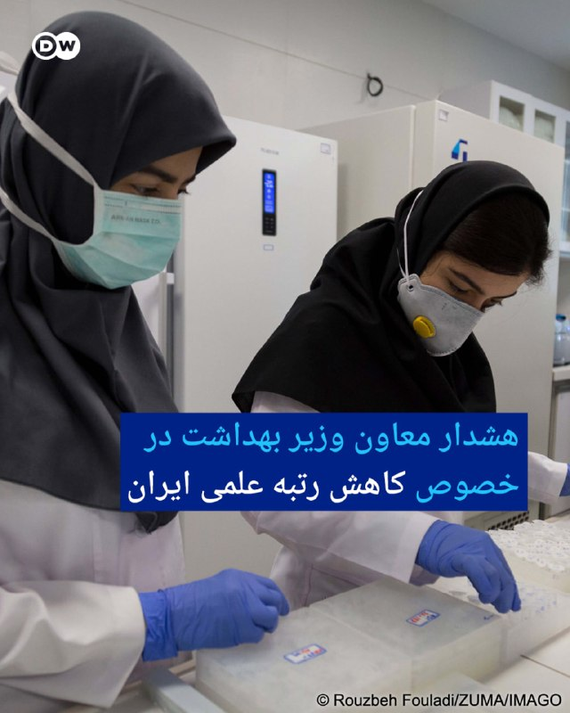

🔸 هشدار معاون وزیر بهداشت در خصوص کاهش رتبه علمی ایران

معاون تحقیقات و فناوری وزیر بهداشت با انتشار پیامی در کانال شخصی خود ضمن انتقاد از "محدودیت دسترسی پژوهشگران به اینترنت و پایگاه‌های علمی"، در خصوص کاهش رتبه علمی کشور هشدار داد.

او در این یادداشت با اشاره به این که در حال حاضر "عدم دسترسی به اینترنتبین‌المللی امکان انجام امور علمی را از محققین و به‌خصوص دانشجویان تحصیلات تکمیلی سلب کرده" گفت: «حتی با اینترنت پرو (Pro) دسترسی به "پابمد" (Pubmed) مسدود است.»

معاون تحقیقات و فناوری وزیر بهداشت همچنین نسبت به "از دست رفتن نمایه‌های بین‌المللی نشریات داخلی" نیز هشدار داده است.

او در ادامه افزود: «ما حتی قادر نیستیم مجلات داخلی نمایه شده در نمایه‌نامه‌های بین‌المللی را حفظ کنیم و مقالات پذیرفته‌شده را بارگذاری کنیم. با این وضع سال آینده اندونزی نیز از ما پیشی خواهد گرفت.»

@dw_farsi

## DW_Farsi — post 124396

  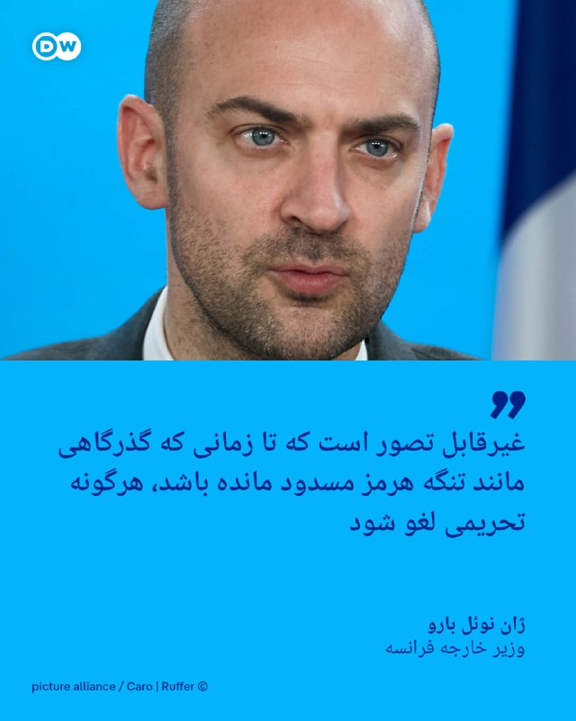

🔸 فرانسه: کاهش تحریم‌‌ها تا زمانی که تنگه هرمز مسدود است مطرح نیست

ژان نوئل بارو، وزیر خارجه فرانسه، گفت تا زمانی که تنگه هرمز مسدود باقی بماند، لغو هرگونه تحریم بین‌المللی علیه ایران "غیرقابل تصور" است.

بارو در گفت‌وگو با رادیو فرانسوی RTL گفت "ایران، یا دست‌کم رژیم ایران"، در ازای امتیازدهی درباره برنامه هسته‌ای خود، به دنبال کاهش تحریم‌ها از سوی ایالات متحده آمریکا است.

با این حال، ژان نوئل بارو گفت در شرایط کنونی نباید هیچ تحریمی کاهش یابد. او افزود: «این غیرقابل تصور است که تا زمانی که گذرگاهی مانند تنگه هرمز مسدود باقی مانده، هرگونه تحریمی لغو شود.»

تنگه هرمز یکی از مهم‌ترین مسیرهای دریایی جهان برای انتقال نفت و گاز است و اختلال در تردد از طریق این آبراه تا کنون پیامدهای بزرگی برای بازارهای جهانی انرژی و امنیت بین‌المللی داشته است.

@dw_farsi

## DW_Farsi — post 124395

  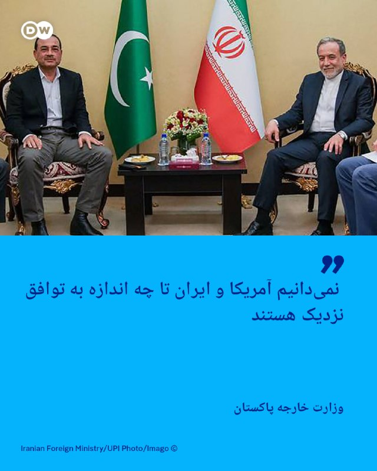

🔶پاکستان: نمی‌دانیم آمریکا و ایران تا چه اندازه به توافق نزدیک هستند

وزارت خارجه پاکستان درباره تماس‌های جاری میان ایالات متحده و جمهوری اسلامی اظهارنظر کرد. با این حال مقام‌های پاکستانی از ارائه جزئیات درباره توافقی که گفته می‌شود در حال شکل‌گیری است، خودداری کردند.

وزارت خارجه پاکستان در عین حال اعلام کرد: «ما از خبر احتمال دستیابی به توافق استقبال می‌کنیم، اما به عنوان میانجی، با افشای جزئیات، اعتماد طرف‌ها را به خطر نمی‌اندازیم.»

در بیانیه وزارت خارجه پاکستان همچنین آمده است: «غیرممکن است بدانیم دو طرف تا چه اندازه به امضای توافق نزدیک یا از آن دور هستند، اما ما خوش‌بین هستیم.»

این در حالی است که یک منبع منطقه‌ای به خبرگزاری سی‌اِن‌اِن گفته است که انتظار می‌رود جمهوری اسلامی روز پنجشنبه پاسخ خود به پیشنهاد ایالات متحده برای پایان دادن به جنگ را به میانجی‌ها ارائه کند.

دونالد ترامپ، رئیس جمهور آمریکا در تازه‌ترین موضع‌گیری خود گفته است که در صورت دستیابی به یک توافق احتمالی، ایران اورانیوم با غنای بالای خود را تحویل خواهد داد تا به ایالات متحده منتقل شود.

@dw_farsi

## DW_Farsi — post 124394

  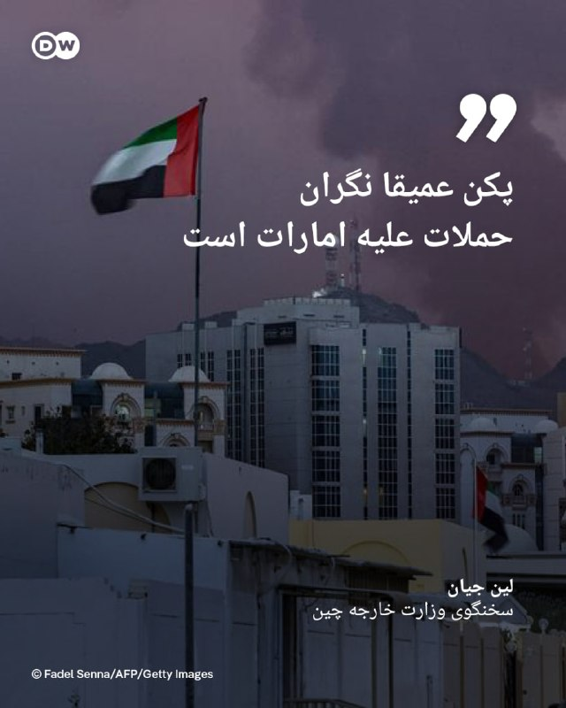

🔶 سخنگوی وزارت خارجه چین: پکن عمیقا نگران حملات علیه امارات است

یک سخنگوی وزارت امور خارجه چین روز پنج‌شنبه گفت پکن عمیقا نگران حملات علیه امارات متحده عربی است و قاطعانه با اقداماتی که تنش‌ها در منطقه را تشدید می‌کنند، مخالفت می‌کند.

لین جیان، سخنگوی وزارت امور خارجه چین، این اظهارات را در یک نشست خبری روزانه و در پاسخ به پرسشی درباره وضعیت در تنگه هرمز مطرح کرد.

لین گفت چین بر این باور است که حاکمیت، امنیت و تمامیت ارضی کشورهای خاورمیانه و منطقه خلیج فارس باید با جدیت مورد احترام قرار گیرد و غیرنظامیان و اهداف غیرنظامی باید محافظت شوند. او همچنین بر ضرورت دستیابی به یک آتش‌بس فوری و جامع و جلوگیری از گسترش بیشتر درگیری، تاکید کرد.

@dw_farsi

## Persian_Trend_Official — post 13612

به نقل از خبرگزاری فارس

💢 شنیده‌شدن صدای چند انفجار از حوالی بندرعباس

🔹دقایقی پیش مردم بندرعباس چند صدای شبیه به انفجار از حوالی این شهر شنیدند.

🔹هنوز منشأ و محل دقیق این صداها مشخص نیست و پیگیری‌های فارس برای مشخص‌شدن ابعاد ماجرا ادامه دارد.

▪️اخبار تکمیلی متعاقبا اعلام می‌شود

🫆:Tony

📌 @persian_trend_official
پرشین ترند | متفاوت‌ترین کانال نظامی

## Persian_Trend_Official — post 13611

  <a href="telegram/content/Persian_Trend_Official_13611_1778179522.mp4">🎬 Download video</a>

🔴خضریان، عضو کمیسیون امنیت ملی مجلس:

🔹شائبه جدی وجود دارد که هواپیماهای امارات با پاک کردن پرچم این کشور، مستقیم به خاک ایران حمله کرده‌اند

🔹جمهوری اسلامی دیگر امارات را به عنوان همسایه نمی‌بینید و این کشور پایگاه متخاصم دشمن است

🔹 از این پس با امارات به مانند اقلیم کردستان رفتار می‌شود و هر لحظه لازم باشد به امارات حمله می‌کنیم

🫆:Tony

📌 @persian_trend_official
پرشین ترند | متفاوت‌ترین کانال نظامی

## Persian_Trend_Official — post 13610

پیش‌نویس قطعنامه جدید سازمان ملل با تمرکز بر مین‌گذاری و عوارض عبور در تنگه هرمز

آمریکا به همراه بحرین، کویت، قطر، عربستان سعودی و امارات متحده عربی در حال تدوین پیش‌نویس قطعنامه‌ای جدید در شورای امنیت سازمان ملل هستند که هدف آن وادار کردن ایران به توقف حملات علیه کشتی‌های تجاری در تنگه هرمز و پایان دادن به تلاش‌ها برای دریافت عوارض عبور از این گذرگاه راهبردی است.

این اقدام پس از آن صورت می‌گیرد که تلاش‌های ماه گذشته واشنگتن ناکام ماند؛ زمانی که روسیه و چین به‌عنوان اعضای دائم شورای امنیت، قطعنامه‌ای را که با هدف حفاظت از کشتی‌رانی تجاری در این آبراه طراحی شده بود، وتو و مسدود کردند.

نماینده آمریکا در سازمان ملل روز دوشنبه اعلام کرد که پیش‌نویس جدید علاوه بر مسئله حملات دریایی، از ایران خواهد خواست مین‌گذاری دریایی در تنگه هرمز را متوقف کرده و محل مین‌های کارگذاری‌شده را نیز افشا کند.

او توضیح داد که این پیش‌نویس نسبت به قطعنامه قبلی «محدودتر و متمرکزتر» طراحی شده و تمرکز اصلی آن بر دو محور است:

دریافت عوارض از کشتی‌ها در تنگه هرمز
مین‌گذاری دریایی و تهدید امنیت کشتیرانی

این تغییر رویکرد نشان می‌دهد که آمریکا پس از شکست تلاش قبلی، اکنون سعی کرده متن جدید را به‌گونه‌ای تنظیم کند که مخالفت روسیه و چین را دشوارتر کند و همزمان اجماع منطقه‌ای بیشتری از کشورهای عربی خلیج فارس به‌دست آورد.

📌 @persian_trend_official
پرشین ترند | متفاوت‌ترین کانال نظامی

## Persian_Trend_Official — post 13609

  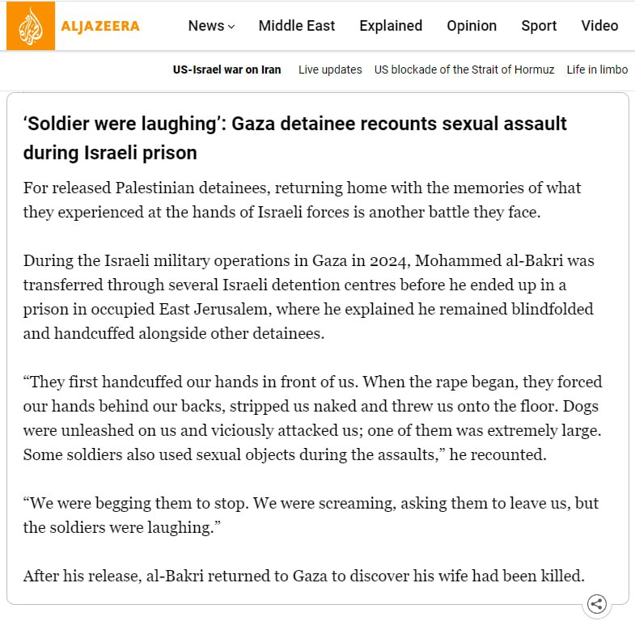

گزارش الجزیره از تجاوز جنسی به اسرای حماس !

در جریان عملیات نظامی اسرائیل در غزه در سال ۲۰۲۴، محمد البکری میان چندین مرکز بازداشت اسرائیلی منتقل شد تا سرانجام به زندانی در قدس شرقی اشغالی رسید؛ جایی که به گفته خودش، او و دیگر بازداشت‌شدگان در تمام مدت با چشم‌بند و دست‌بند نگهداری می‌شدند.

او روایت می‌کند:

«ابتدا دست‌هایمان را از جلو بستند. وقتی تجاوزها شروع شد، دست‌هایمان را از پشت بستند، ما را کاملاً برهنه کردند و روی زمین انداختند. سگ‌ها را به جانمان انداختند و به‌شدت به ما حمله کردند؛ یکی از آن‌ها بسیار بزرگ بود. بعضی از سربازها هم در جریان این تعرض‌ها از اشیای جنسی استفاده می‌کردند.»

او ادامه می‌دهد:

«ما التماس می‌کردیم که متوقف شوند. فریاد می‌زدیم و از آن‌ها می‌خواستیم رهایمان کنند، اما سربازها می‌خندیدند.»

📌 @persian_trend_official
پرشین ترند | متفاوت‌ترین کانال نظامی

## Persian_Trend_Official — post 13608

  <a href="telegram/content/Persian_Trend_Official_13608_1778179524.mp4">🎬 Download video</a>

💢انهدام پهپاد انتحاری «شاهد» با لیزر؛ نمایش توان جدید دفاعی ترکیه

🔹سامانه لیزری «ALKA» ساخت راکتسان در یک آزمایش موفق، یک پهپاد انتحاری از نوع «شاهد» را منهدم کرد؛ اقدامی که نشان‌دهنده پیشرفت قابل توجه ترکیه در مقابله با تهدیدات پهپادی ارزیابی می‌شود.

🔹تصاویر منتشرشده از این آزمایش نشان می‌دهد که این سامانه با دقت بالا و در زمان کوتاه توانسته هدف را شناسایی و نابود کند. این موضوع به‌ویژه در شرایطی اهمیت دارد که پهپادهای انتحاری ارزان‌قیمت به یکی از ابزارهای اصلی در جنگ‌های منطقه‌ای تبدیل شده‌اند.

▪️بر اساس این گزارش، تحلیلگران معتقدند این دستاورد می‌تواند معادلات میدانی را تغییر دهد و نشان می‌دهد ترکیه در برابر تهدیدات پهپادی کم‌هزینه یا جنگ‌های نامتقارن سعی در کاهش آسیب‌پذیری است

🫆:Tony

📌 @persian_trend_official
پرشین ترند | متفاوت‌ترین کانال نظامی

## Persian_Trend_Official — post 13607

  

🔴 شیوع مرموز هانتاویروس در کشتی کروز؛ نگرانی از انتقال انسان‌به‌انسان رسانه‌های بین‌المللی گزارش داده‌اند شیوع یک سویه خطرناک هانتاویروس در کشتی کروز «MV Hondius» در اقیانوس اطلس تاکنون دست‌کم ۳ کشته و چندین مبتلا بر جای گذاشته است. حدود ۱۵۰ نفر در این کشتی…

## Persian_Trend_Official — post 13606

🔴آتش‌سوزی در پاساژ ارغوان فاز ۴ اندیشه 🔹دود ناشی از این آتش‌سوزی از سمت غرب تهران و حوالی کرج قابل رویت است. 🫆:PM 📌 @persian_trend_official پرشین ترند | متفاوت‌ترین کانال نظامی

## Persian_Trend_Official — post 13605

⭕️المیادین به نقل از وزارت دفاع روسیه گزارش داد

🔹 ولادیمیر پوتین رئیس‌جمهور روسیه به مناسبت روز پیروزی بر نازیسم از ۸تا ۱۰ می آتش‌بس موقت اعلام کرد.

🫆:Tony

📌 @persian_trend_official
پرشین ترند | متفاوت‌ترین کانال نظامی

## Persian_Trend_Official — post 13603

  <a href="telegram/content/Persian_Trend_Official_13603_1778179526.jpg">🎬 Download video</a>

نایا🔴 نخستین مورد ابتلا به ویروس هانتا در اسرائیل ثبت شد مقام‌های اسرائیلی اعلام کردند نخستین مورد ابتلا به ویروس «هانتا» در این کشور شناسایی شده است. بر اساس گزارش‌ها، فرد مبتلا اخیراً به اروپای شرقی سفر کرده بود و نتیجه آزمایش او برای این ویروس مثبت اعلام…

## Persian_Trend_Official — post 13602

  <a href="telegram/content/Persian_Trend_Official_13602_1778179527.mp4">🎬 Download video</a>

💢استقبال دونالد ترامپ از رئیس حمهور برزیل در کاخ سفید

🫆:Tony

📌 @persian_trend_official
پرشین ترند | متفاوت‌ترین کانال نظامی

## Persian_Trend_Official — post 13601

🔴سید محمود نبویان عضو کمیسیون امنیت ملی مجلس:

🔹با وجود سابقه‌ی بدعهدی آمریکا و به ویژه حضور اصحاب توافق ذلت بار برجام به‌همراه آقای قالیباف در مذاکرات، هیچ امیدی به مذاکره و توافق مطلوب برای ایران وجود ندارد.

🔹لازم است آقای قالیباف اصحاب توافق خسارت بار برجام را از تیم مذاکره کننده کاملا حذف نماید.

🫆:Tony

📌 @persian_trend_official
پرشین ترند | متفاوت‌ترین کانال نظامی

## Persian_Trend_Official — post 13600

🔴 شیوع مرموز هانتاویروس در کشتی کروز؛ نگرانی از انتقال انسان‌به‌انسان رسانه‌های بین‌المللی گزارش داده‌اند شیوع یک سویه خطرناک هانتاویروس در کشتی کروز «MV Hondius» در اقیانوس اطلس تاکنون دست‌کم ۳ کشته و چندین مبتلا بر جای گذاشته است. حدود ۱۵۰ نفر در این کشتی…

## Persian_Trend_Official — post 13597

🔴 شیوع مرموز هانتاویروس در کشتی کروز؛ نگرانی از انتقال انسان‌به‌انسان

رسانه‌های بین‌المللی گزارش داده‌اند شیوع یک سویه خطرناک هانتاویروس در کشتی کروز «MV Hondius» در اقیانوس اطلس تاکنون دست‌کم ۳ کشته و چندین مبتلا بر جای گذاشته است. حدود ۱۵۰ نفر در این کشتی حضور داشته‌اند.

بر اساس گزارش WHO و منابع درمانی:

▪️ سویه شناسایی‌شده احتمالاً «Andes hantavirus» است؛ نادرترین و خطرناک‌ترین نوع هانتا که برخلاف اغلب سویه‌ها، در موارد محدود قابلیت انتقال انسان‌به‌انسان دارد.

▪️ بازرسی‌های اولیه روی کشتی تاکنون شواهد مشخصی از حضور جوندگان پیدا نکرده؛ موضوعی که فرضیه انتقال مستقیم میان افراد را تقویت کرده است.

▪️ چند کشور از پهلوگیری کامل کشتی جلوگیری کرده‌اند و عملیات ردیابی مسافران در چندین کشور آغاز شده است.

▪️ سازمان جهانی بهداشت تأکید کرده خطر برای عموم مردم فعلاً «پایین» ارزیابی می‌شود و این وضعیت در حد یک پاندمی شبیه کووید نیست.

🫆:Tony

📌 @persian_trend_official
پرشین ترند | متفاوت‌ترین کانال نظامی

## Persian_Trend_Official — post 13596

🔴 حزب‌الله مدعی انهدام سامانه گنبد آهنین شد

🔹حزب‌الله اعلام کرد با استفاده از یک پهپاد انتحاری، یک سکوی تازه‌استقرار‌یافته «گنبد آهنین» را در نزدیکی موضع «جلّ العلّام» هدف قرار داده و منهدم کرده است.

🔹تا این لحظه ارتش اسرائیل واکنشی رسمی به این ادعا منتشر نکرده و امکان تأیید مستقل جزئیات حمله وجود ندارد.

🫆:Tony

📌 @persian_trend_official
پرشین ترند | متفاوت‌ترین کانال نظامی

## Persian_Trend_Official — post 13595

  <a href="telegram/content/Persian_Trend_Official_13595_1778179528.mp4">🎬 Download video</a>

💢ویدئویی جذاب از رهگیری یک فروند پهپاد انتحاری شاهد-۱۳۶/گران-۲ روسیه توسط جنگنده میگ-۲۹ نیروی هوایی اوکراین در منطقه Rivne در غرب اوکراین

🫆:Tony

📌 @persian_trend_official
پرشین ترند | متفاوت‌ترین کانال نظامی

## Persian_Trend_Official — post 13594

⭕️سخنگوی وزارت امور خارجه اسماعیل بقائی:

▪️ایران در حال بررسی پیام‌ها از طریق میانجی‌گری پاکستان است.

▪️ایران هنوز به نتیجه‌ای نرسیده و پاسخی به طرف آمریکایی نداده است.

🫆:Tony

📌 @persian_trend_official
پرشین ترند | متفاوت‌ترین کانال نظامی

## Persian_Trend_Official — post 13593

  <a href="telegram/content/Persian_Trend_Official_13593_1778179529.jpg">🎬 Download video</a>

💢رویترز:

🔹ایالات متحده و ایران در حال حرکت به سمت یک توافق موقت برای توقف درگیری‌ها هستند، اگرچه اختلافات عمده‌ای هنوز حل نشده باقی مانده‌اند.

🔹 تهران در حال بررسی یک پیشنهاد یک صفحه‌ای است که بر پایان جنگ، بازگشایی تنگه هرمز و آغاز ۳۰ روز مذاکرات گسترده‌تر تمرکز دارد.

🔹پیش‌نویس از خواسته‌های کلیدی آمریکا درباره برنامه هسته‌ای ایران، موشک‌ها و نیروهای نیابتی منطقه‌ای اجتناب می‌کند.

🔹مقامات ایرانی همچنان بدبین هستند و این پیشنهاد را بیشتر «فهرست آرزوهای آمریکایی تا واقعیت» می‌نامند.

🫆:Tony

📌 @persian_trend_official
پرشین ترند | متفاوت‌ترین کانال نظامی

## Persian_Trend_Official — post 13592

  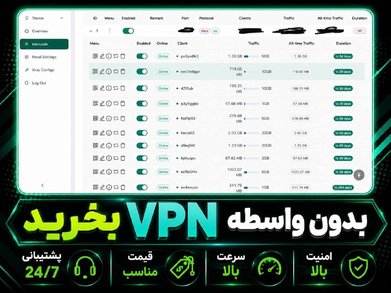

🔥 چندین بار تراست VPN رو معرفی کردیم و بازخورد کاربرا واقعاً عالی بوده 🙌

اگر دنبال یه VPN سریع، پایدار و بدون دردسر هستین، تراست VPN یکی از بهترین انتخاب‌هاست 👌

📱 سرعتش واقعاً خوراک اینستاگرام و یوتیوبه

✅ تمامی سرورهاشون به‌صورت کامل ارتقا پیدا کرده
⚡️ سرعت فوق‌العاده بالا
🛡 پایداری عالی بدون قطعی
💸قیمت مناسب نسبت به کیفیتی که ارائه میدن

اگر خواستین استعلام بگیرین یا اطلاعات بیشتری بخواین، بهشون پیام بدین

👇👇
@trusstvpnn_admin
@trusstvpnn_admin

## RadioFarda — post 156945

سازمان بهداشت جهانی اعلام کرد شیوع ویروس «هانتا» می‌تواند محدود شود

🔸سازمان بهداشت جهانی روز پنج‌شنبه ۱۷ اردیبهشت در پی افزایش نگرانی‌ها از احتمال همه‌گیری گونه نادری از ویروس «هانتا» با مشاهده مواردی از ابتلا به بیماری ناشی از آن، گفت در صورت انجام اقدامات احتیاطی، شیوع این بیماری می‌تواند «محدود» باشد.

🔸هانتا، ویروسی است که از جوندگان منتقل و می‌تواند باعث بیماری تنفسی کشنده‌ای شود.

🔸روز ۱۳ اردیبهشت با اعلام مرگ سه نفر از مسافران یک کشتی تفریحی متعلق به یک شرکت هلندی در آب‌های اقیانوس اطلس، ناشی از ویروس هانتا، نگرانی‌ها درباره احتمال همه‌گیری این بیماری زنگ خطر بین المللی را به صدا درآورد. همان روز اعلام شد سه نفر دیگر از مسافران کشتی هم به بیماری ناشی از این ویروس مبتلا شده‌اند.

🔸تدروس آدهانوم، رئیس سازمان بهداشت جهانی، روز پنجشنبه در ژنو به خبرنگاران گفت که در مجموع پنج مورد تایید شدۀ ابتلا به ویروس و سه مورد مشکوک به ابتلا، گزارش شده است.

🔸او با اشاره به سویه نادری با نام «آند» که از ویروس هانتا در کشتی تفریحی مشاهده شده، گفت: «با توجه به دوره کمون ویروس هانتا که می‌تواند تا شش هفته طول بکشد، ممکن است موارد بیشتری گزارش شود.»

🔸این سویه نادر می‌تواند بین انسان‌ها منتقل شود و از جمله عوامل افزایش نگرانی‌ها درباره همه‌گیری بیماری ناشی از آن بوده است.

🔸اما عبدی رحمان محمود، مدیر هشدار و واکنش اضطراری سازمان بهداشت جهانی، تأکید کرد: «اگر اقدامات مربوط به بهداشت عمومی همراه با همبستگی جهانی در این زمینه نشان داده شود، این یک همه‌گیری محدود خواهد بود.»

🔸گزارش کامل را در وب‌سایت رادیوفردا بخوانید.

@RadioFarda

## RadioFarda — post 156944

🔸روزنامه وال‌استریت‌جورنال روز پنجشنبه به نقل از مقام‌هایی در دولت آمریکا خبر داد که دولت دونالد ترامپ اکنون به دنبال از سرگیری عملیات هدایت کشتی‌های تجاری با پشتیبانی دریایی و هوایی در تنگه هرمز است. 🔸به نوشته این روزنامه مشخص نیست که این اتفاق چه زمانی…

## RadioFarda — post 156943

  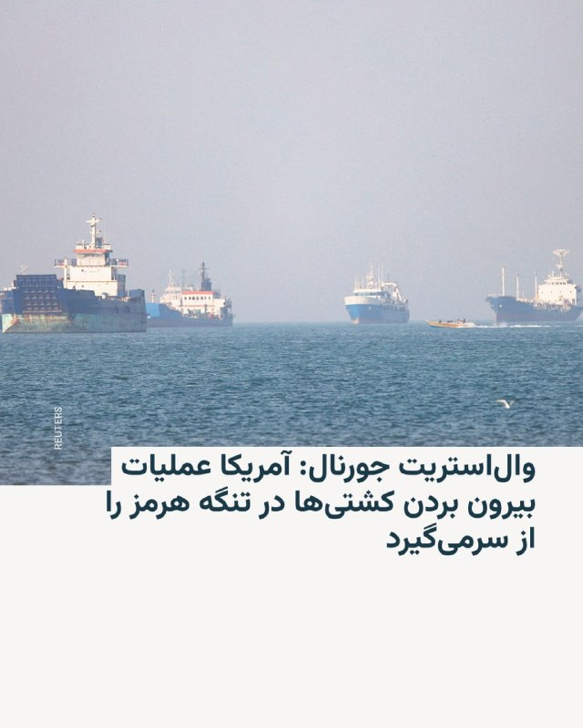

🔸روزنامه وال‌استریت‌جورنال روز پنجشنبه به نقل از مقام‌هایی در دولت آمریکا خبر داد که دولت دونالد ترامپ اکنون به دنبال از سرگیری عملیات هدایت کشتی‌های تجاری با پشتیبانی دریایی و هوایی در تنگه هرمز است.

🔸به نوشته این روزنامه مشخص نیست که این اتفاق چه زمانی ممکن است رخ دهد، با این همه مقامات پنتاگون جدول زمانی اجرای آن را تا قبل از روز یکشنبه هفته آینده، آخرهفته در آمریکا، در نظر گرفته‌اند.

🔸در گزارش وال‌استریت‌جورنال بر اساس گفته‌های مقام‌های آمریکایی و سعودی همچنین خبر داده شده است که عربستان سعودی و کویت محدودیت‌های استفاده ارتش ایالات متحده از پایگاه‌ها و حریم هوایی خود را لغو کرده‌اند و راه را برای اجرای دوباره مأموریت موسوم به «پروژه آزادی» گشوده‌اند.

🔸آمریکا روز ۱۴ اردیبهشت اجرای عملیاتی برای هدایت عبور کشتی‌ها در تنگه هرمز با نام «پروژه آزادی» را آغاز کرد اما اجرای این عملیات پس از ۳۶ ساعت به دستور دونالد ترامپ متوقف شد.

@RadioFarda

## RadioFarda — post 156942

افزایش اجاره‌خانه در پی جنگ چگونه هنجارها و سبک زندگی در ایران را تغییر می‌دهد؟

🔸یک ماه پس از برقراری آتش‌بس در جنگ آمریکا و اسرائیل علیه ایران، رسانه‌های داخل کشور از جهش شدید اجاره‌خانه و در پی آن، فشار بی‌سابقه‌ای بر معیشت مستأجران خبر داده‌اند.

🔸در این شرایط، کارشناسان هشدار می‌دهند که اجاره‌نشینی، میلیون‌ها خانوار ایرانی را به مرز ناتوانی اقتصادی و «فروپاشی هنجارهای زندگی» می‌کشاند.

🔸خبرگزاری ایسنا در گزارشی نوشت که در اواسط دهه ۸۰، سهم اجاره در شهرهای بزرگ بین ۲۵ تا ۴۰ درصد، و در شهرهای کوچک بین ۱۵ تا ۲۵ درصد درآمد خانوارها را شامل می‌شد. این خبرگزاری افزود که بر اساس داده‌های سال ۱۴۰۴ اکنون این رقم در شهرهای بزرگ به ۵۰ تا ۷۰ درصد رسیده و در شهرهای کوچک نیز بین ۲۰ تا ۵۰ درصد نوسان دارد.

🔸به نوشته این خبرگزاری، در نتیجه، مسکن به یکی از اصلی‌ترین عوامل فقر شهری تبدیل شده و به‌ویژه دهک‌های پایین، خانوارهای تک‌سرپرست و زوج‌های جوان بیشترین آسیب را متحمل می‌شوند.

🔸روشنک آسترکی، کارشناس اقتصادی نیز در گفت‌وگو با رادیو فردا، به آثار جنگ اخیر بر حوزه مسکن نیز اشاره می‌کند و می‌گوید که حملات به زیرساخت‌های ایران در جریان جنگ اخیر منجر به کمبود و گرانی مصالح ساختمانی شده است.

🔸گزارش کامل را در وب‌سایت رادیوفردا بخوانید.

@RadioFarda

## RadioFarda — post 156941

  <a href="https://t.me/radiofarda/156941">📎 Download file</a>

📻بشنوید: ایستگاه ۱۹ با رادیوفردا، ۱۷ اردیبهشت ۱۴۰۵

@RadioFarda

## RadioFarda — post 156940

🔸روزنامه واشینگتن‌پست روز پنجشنبه با انتشار گزارشی اعلام کرد که ارزیابی محرمانه سازمان اطلاعات مرکزی آمریکا (سی‌آی‌ای) نشان می‌دهد ایران پیش از آن که با مشکلات اقتصادی شدیدی روبرو شود، می‌تواند دست‌کم سه تا چهار ماه محاصره دریایی ایالات متحده را تحمل کند.…

## RadioFarda — post 156939

  

🔸روزنامه واشینگتن‌پست روز پنجشنبه با انتشار گزارشی اعلام کرد که ارزیابی محرمانه سازمان اطلاعات مرکزی آمریکا (سی‌آی‌ای) نشان می‌دهد ایران پیش از آن که با مشکلات اقتصادی شدیدی روبرو شود، می‌تواند دست‌کم سه تا چهار ماه محاصره دریایی ایالات متحده را تحمل کند.

🔸این روزنامه به نقل از چهار منبع مطلع از جمله تعدادی از مقام‌های دولت آمریکا گفته است که این ارزیابی هفته جاری به دولت آمریکا ارائه شده است.

🔸سه نفر از افراد مطلع گفتند که در این ارزیابی گفته شده است که تهران به رغم هفته‌ها بمباران شدید ایالات متحده و اسرائیل، تا حد قابل توجهی قابلیت‌های موشکی بالستیک خود را حفظ کرده است.

🔸یک مقام آمریکایی به واشینگتن‌پست گفته است که ایران حدود ۷۵ درصد از موجودی پرتابگرهای متحرک موشکی خود و حدود ۷۰ درصد از ذخایر موشکی‌اش را که از قبل از جنگ داشته، حفظ کرده است.

@RadioFarda

## RadioFarda — post 156938

  

🔸خبرگزاری رسمی امارات متحده عربی روز پنج‌شنبه خبر داد که این کشور کمیته‌ای را برای مستندسازی حملات ایران علیه خود برای «اقدامات قانونی» تشکیل داده است.

🔸خبرگزاری وام اعلام کرد که یک کمیته ملی جدید وظیفه «مستندسازی تمام حملات و اقدامات نظامی مرتبط با تجاوز ایران» را بر عهده گرفته است.

🔸این خبرگزاری افزود: «نتایج کار این کمیته با تهیه یک پرونده مستندسازی جامع، به حمایت از تلاش‌های قانونی امارات متحده عربی در سطح ملی و بین‌المللی کمک خواهد کرد.»

🔸امارات متحده عربی در طول جنگ اخیر در خاورمیانه هدف بیش از ۲۸۰۰ حمله پهپادی و موشکی از جانب ایران قرار گرفت. اتفاقی که باعث تیرگی شدید روابط این کشور حاشیه خلیج فارس با ایران شده است. اماکن مهم از جمله مجتمع لوکس پالم دبی و همچنین فرودگاه‌ها و تأسیسات انرژی، از جمله مکان‌هایی بودند که هدف حملات ایران قرار گرفتند.

🔸امارات متحده عربی پیشتر خواستار دریافت غرامت از ایران شده بود.

@RadioFarda

## RadioFarda — post 156937

  <a href="https://t.me/radiofarda/156937">📎 Download file</a>

🔸 در این کافه فردا به حمله امام جمعه رشت به حضور زنان بی‌حجاب در تجمعات حکومتی، صحبت‌های عجیب کارشناسان صدا و سیما در مورد شکست آمریکا و اسراییل، حواشی آخرین اثر هنری بنکسی در لندن، زندگی و هنر مایکل جکسون به بهانه اکران فیلم زندگی‌اش و صحبت‌های جالب عضو بیت رهبری در مورد وضعیت مجتبی خامنه‌ای می‌پردازیم.

🔸 برای تماس با ما می‌توانید به شناسه کافه فردا در تلگرام صوت و متن بفرستید.

📻 کافه فردا

## RadioFarda — post 156936

آمریکا معاون وزیر نفت عراق و شبه‌نظامیان شیعه را به اتهام کمک به ایران تحریم کرد

🔸وزارت خزانه‌داری و وزارت امور خارجه ایالات متحده روز پنجشنبه ۱۷ اردیبهشت اعلام کردند که واشینگتن معاون وزیر نفت عراق و چند شبه‌نظامی شیعه را به‌دلیل حمایت از حکومت ایران تحریم کرده است.

🔸وزارتخانه خزانه‌داری علی معارج البهادلی، معاون وزیر نفت عراق، را متهم کرد که از «موقعیت خود برای تسهیل انتقال نفت به‌منظور فروش به نفع حکومت ایران و شبه‌نظامیان نیابتی آن در عراق» سوءاستفاده کرده است.

🔸این وزارتخانه همچنین اعلام کرد که سه تن از رهبران ارشد شبه‌نظامیان همسو با ایران، یعنی «کتائب سید الشهداء» و «عصائب اهل الحق»، را نیز تحریم می‌کند.

🔸اسکات بسنت، وزیر خزانه‌داری آمریکا، در بیانیه‌ای گفت: «حکومت ایران مانند یک باند یاغی، منابعی را که به‌حق متعلق به مردم عراق است غارت می‌کند. وزارت خزانه‌داری دست روی دست نخواهد گذاشت در حالی که ارتش ایران از نفت عراق برای تأمین مالی تروریسم علیه ایالات متحده و شرکای ما سوءاستفاده می‌کند.»

🔸این تحریم‌ها هرگونه دارایی این افراد در آمریکا را مسدود می‌کند و به‌طور کلی آمریکایی‌ها را از معامله با آن‌ها منع می‌کند.

🔸وزارت خارجه آمریکا نیز در بیانیه جداگانه‌ای اعلام کرد معاون وزیر نفت عراق در طرحی دست داشته که بر اساس آن «برای دور زدن تحریم‌ها، نفت ایران به‌طور متقلبانه با نفت عراق مخلوط و به سود ایران فروخته می‌شد».

🔸در این بیانیه همچنین «کتائب سید الشهداء» و «عصائب اهل الحق» و شرکت‌های فعال در بخش نفت که از این شبه‌نظامیان حمایت می‌کنند و تحریم شده‌اند، متهم به «سوءاستفاده از اقتصاد عراق برای تأمین مالی فعالیت‌های تروریستی خود» شده‌اند.

🔸گزارش کامل را در وب‌سایت رادیوفردا بخوانید.

@RadioFarda

## RadioFarda — post 156935

  <a href="https://t.me/radiofarda/156935">📎 Download file</a>

الفک: ریاض با احیای اعتماد از سوی تهران آماده برقراری توازن قوا در خاورمیانه است

🔸نقش عربستان سعودی در دستیابی تهران و واشینگتن به یک تفاهم برای پایان جنگ چیست و این کشور چه اهرم‌هایی برای استفاده در این عرصه دارد؟ شبکه ان‌بی‌سی نیوز می‌گوید «پروژه آزادی» دونالد ترامپ در تنگه هرمز پس از آن متوقف شد که عربستان سعودی اجازهٔ‌ استفاده از پایگاه هوایی و حریم هوایی این کشور برای پشتیبانی از عملیات را نداد. این گزارش که هنوز مقام‌های رسمی این کشورها اظهارنظر درباره آن نکرده‌اند، یک روز پس از آن منتشر شده که عباس عراقچی، وزیر امور خارجه ایران، از پکن به صورت تلفنی با همتای عربستانی خود به صورت تلفنی گفت‌وگو کرده بود. ارزیابی مسعود الفک، تحلیلگر امور خاورمیانه در ریاض، را درباره نقش‌آفرینی عربستان و فرصت‌های در اختیار این کشور در این عرصه بشنوید.

@RadioFarda

## RadioFarda — post 156934

  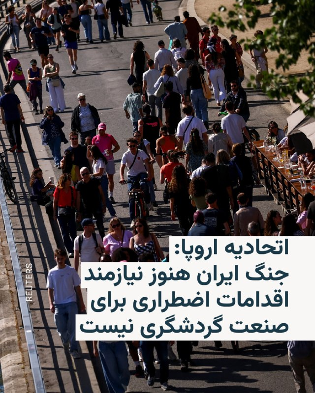

🔸بر اساس پیش‌نویس دستورالعمل‌های اتحادیه اروپا که خبرگزاری رویترز مشاهده کرده، بروکسل معتقد است پیامدهای جنگ ایران برای صنعت گردشگری هنوز به حدی نرسیده که اقدامات اضطراری، مانند معاف کردن شرکت‌های هواپیمایی از پرداخت غرامت بابت لغو پروازها، ضروری باشد.

🔸در این سند آمده است که برخلاف دوران همه‌گیری کووید-۱۹، داده‌های موجود نشان می‌دهد تأثیر کلی بحران بر گردشگری «محدود» بوده و تقاضا برای سفر همچنان تا حد زیادی حفظ شده است.

🔸این دستورالعمل‌ها همچنین تأکید می‌کند افزایش قیمت سوخت هواپیما به‌تنهایی «شرایط فوق‌العاده» محسوب نمی‌شود که شرکت‌های هواپیمایی بتوانند با استناد به آن از پرداخت غرامت به مسافران خودداری کنند؛ هرچند کمبود واقعی سوخت ممکن است شامل این استثنا شود.

🔸به نوشته رویترز، قیمت سوخت جت از زمان آغاز جنگ آمریکا و اسرائیل با ایران در ۹ اسفند ۱۴۰۴ حدود ۸۴ درصد افزایش یافته، اما تاکنون کمبودی در سوخت هواپیما در کشورهای اتحادیه اروپا گزارش نشده است.

@RadioFarda

## RadioFarda — post 156933

  

🔸به دنبال افزایش خوش‌بینی‌ها در بازارهای مالی نسبت به دستیابی ایران و آمریکا به توافقی دربارهٔ پایان جنگ و بازگشایی تنگه هرمز، قیمت نفت خام روز پنج‌شنبه ۱۷ اردیبهشت برای دومین روز پیاپی کاهش یافت و شاخص سهام کشورهای مختلف افزایش پیدا کرد.

🔸قیمت نفت روز پنج‌شنبه حدود پنج درصد دیگر کاهش یافت و قیمت نفت خام برنت به زیر ۱۰۰ دلار در هر بشکه رسید. قیمت نفت روز چهارشنبه هم حدود ۱۰ درصد کم شده بود.

🔸ارزش سهام نیز در بازارهای مختلف آسیا و اروپا افزایش یافت. این در حالی است که شاخص‌های عمده سهام بازار بورس نیویورک از جمله ای اند پی و داوجونز تا حد رسیدن به رکوردهای پیشین افزایش یافتند.

🔸دونالد ترامپ، رئیس‌جمهور ایالات متحده، شامگاه چهارشنبه اعلام کرد که پس از «گفت‌وگوهای بسیار خوب» در ۲۴ ساعت گذشته، دستیابی به توافقی با ایران برای پایان دادن به جنگ «بسیار محتمل» است.

🔸پیش‌تر رسانه‌هایی مانند اکسیوس و رویترز خبر داده بودند واشینگتن و تهران به یک یادداشت تفاهم یک‌صفحه‌ای برای پایان دادن به جنگ نزدیک شده‌اند.

@RadioFarda

## RadioFarda — post 156932

  

🔸بنیاد نرگس محمدی اعلام کرد پزشکان معالج این فعال حقوق بشر و برنده جایزه صلح نوبل، احتمال داده‌اند او به «آنژین پرینزمتال» یا اسپاسم عروق کرونر مبتلا شده باشد؛ عارضه‌ای قلبی که می‌تواند باعث اختلال جدی در خون‌رسانی به قلب شود.

🔸بر اساس بیانیه بنیاد نرگس، خانم محمدی در هفتمین روز بستری در بخش مراقبت‌های ویژه قلب بیمارستانی در زنجان همچنان در وضعیت جسمانی ناپایدار قرار دارد و نگرانی‌ها درباره شرایط قلبی او افزایش یافته است.

🔸در این بیانیه آمده است که آنژین پرینزمتال ناشی از گرفتگی یا اسپاسم شریان‌های کرونری است و می‌تواند عوارضی مانند حملات شدید قلبی، آریتمی‌های خطرناک، نوسانات شدید فشار خون و کاهش اکسیژن‌رسانی به عضله قلب ایجاد کند.

🔸به گفته بنیاد نرگس، او از پنجم اردیبهشت تقریباً هر روز با درد شدید قفسه سینه، تپش قلب، اضطراب و افت‌وخیز شدید فشار خون از خواب بیدار شده و پزشکان انجام فوری آنژیوگرافی تخصصی را ضروری دانسته‌اند.

🔸این بنیاد همچنین اعلام کرد خانواده و پزشکان خواهان انتقال فوری نرگس محمدی به تهران هستند، اما دادستان تهران همچنان با این درخواست مخالفت کرده است.

@RadioFarda

## RadioFarda — post 156931

دیدار روبیو و پاپ لئو؛ آمریکا می‌گوید رابطه‌اش با واتیکان «قوی» است

🔸پاپ لئو، رهبر کاتولیک‌های جهان، و مارکو روبیو، وزیر خارجه آمریکا، روز پنج‌شنبه ۱۷ اردیبهشت در واتیکان با یکدیگر دیدار کردند.

🔸این دیدار پس از هفته‌ها تنش بین واتیکان و کاخ سفید بر سر جنگ با ایران انجام شد و وزارت خارجه آمریکا گفته است که دو طرف در این دیدار درباره «وضعیت خاورمیانه» بحث و گفت‌وگو کردند.

🔸پاپ لئو، منتقد صریح جنگ آمریکا و اسرائیل با ایران بوده و خواستار آتش‌بس شده است. دونالد ترامپ در پاسخ، پاپِ متولد آمریکا را به حمایت از تلاش تهران برای دستیابی به سلاح‌های هسته‌ای متهم کرد و او را «ضعیف در برابر جرم و جنایت» خواند.

🔸رئیس‌جمهور آمریکا همچنین از رهبر کاتولیک‌های جهان انتقاد کرد که کشتار معترضان ایرانی در دی‌ماه توسط نیروهای امنیتی جمهوری اسلامی را محکوم نکرد.

🔸در پی این انتقادها، پاپ لئو با تأخیر زیاد و در اوایل اردیبهشت این کشتار را محکوم کرد و دربارهٔ گزارش‌ها مبنی بر کشته شدن هزاران معترض در ایران گفت: «من همه اقداماتی را که ناعادلانه هستند محکوم می‌کنم. من گرفتن جان انسان‌ها را محکوم می‌کنم.»

🔸تامی پیگوت، سخنگوی وزارت امور خارجه آمریکا، روز پنجشنبه دیدار آقای روبیو و پاپ را نشان دهنده رابطه «قوی» بین واتیکان و ایالات متحده دانست و گفت: «این دیدار بر روابط قوی بین ایالات متحده و واتیکان و تعهد مشترک آنها به ترویج صلح و کرامت انسانی تأکید کرد.»

🔸او گفت که وزیر خارجه آمریکا با پی‌یترو پارولین، وزیر امور خارجه واتیکان، درباره «تلاش‌ها برای دستیابی به صلح پایدار در خاورمیانه» گفت‌وگو کرد. به گفته سخنگوی وزارت خارجه آمریکا «این بحث منعکس کننده همکاری پایدار بین ایالات متحده و واتیکان در پیشبرد آزادی مذهبی بود.»

🔸خبرگزاری فرانسه به نقل از یک مقام وزارت امور خارجه گفت که «گفتگوهای روبیو و پاپ دوستانه و سازنده بود».

🔸گزارش کامل را در وب‌سایت رادیوفردا بخوانید.

@RadioFarda

## RadioFarda — post 156930

شناسایی جو در یک جرم آسمانی در دورترین منطقهٔ منظومهٔ شمسی

🔸در دورترین منطقهٔ منظومهٔ شمسی، یعنی فراتر از نپتون به عنوان دورترین سیاره، مجموعه‌ای از اجرام آسمانی یخی و متروک قرار دارند. تا پیش از این تصور می‌شد که فقط سیارهٔ کوتولهٔ پلوتون دارای جو است. اما اکنون این تصور تغییر کرده است.

🔸ستاره‌شناسان جرم دیگری در این ناحیه شناسایی کرده‌اند که قطری حدود ۵۰۰ کیلومتر دارد و دارای جو است، هرچند جوی بسیار رقیق. این کشف نشان می‌دهد برخی از این اجرام منزوی ممکن است پویاتر از آن چیزی باشند که قبلاً تصور می‌شد. پژوهشگران اکنون در تلاش‌اند بفهمند چه عاملی باعث ایجاد این جو شده است.

🔸این اجرام، «اجسام فرانپتونی» نام دارند و این جرم خاص با نام (612533) 2002 XV93 شناخته می‌شود. این جرم تقریباً در همان فاصلهٔ پلوتون از خورشید قرار دارد. اندازهٔ آن بسیار کوچک‌تر از دو جسم بزرگ فرانپتونی یعنی پلوتون (با قطر ۲۳۷۰ کیلومتر) و اِریس (با قطر ۲۳۲۶ کیلومتر) است که هر دو در رده سیارات کوتوله قرار می‌گیرند.

🔸به نظر می‌رسد جو این جرم حدود پنج تا ۱۰ میلیون بار رقیق‌تر از جو زمین و حدود ۵۰ تا ۱۰۰ برابر رقیق‌تر از جو نازک پلوتون باشد. پژوهشگران گفته‌اند این جو احتمالاً از متان، نیتروژن یا مونوکسید کربن تشکیل شده است.

🔸کو آریماتسو، اخترشناس و سرپرست این پژوهش، گفت: «این کشف نشان می‌دهد که برخلاف آنچه پیش‌تر تصور می‌شد، برخی از اجرام کوچک یخی در بخش بیرونی منظومهٔ شمسی ممکن است کاملاً غیرفعال یا بدون تغییر نباشند».

🔸جون‌ایچی واتانابه، همکار این پژوهش، نیز گفت: «به‌طور کلی تصور می‌شد چنین جرم کوچکی نمی‌تواند جو داشته باشد. این نشان می‌دهد حتی در جهان‌های سرد و دوردست هم پویایی‌هایی وجود دارد که قبلاً به آن‌ها فکر نکرده بودیم».

🔸گزارش کامل را در وب‌سایت رادیوفردا بخوانید.

@RadioFarda

## RadioFarda — post 156929

🔸شهرداری تهران، دربارهٔ تجمعاتی که بیش از دو ماه است به‌طور شبانه در حمایت از حکومت برگزار می‌شود، اعلام کرد در حال حاضر «۱۲۰ اجتماع بزرگ و ۴۰۰ اجتماع محلی و ۴۰۰ کاروان خودرویی در سطح شهر تهران داریم». 🔸این تجمعات شبانه که از اواخر اسفند و پس از شروع جنگ…

## RadioFarda — post 156928

  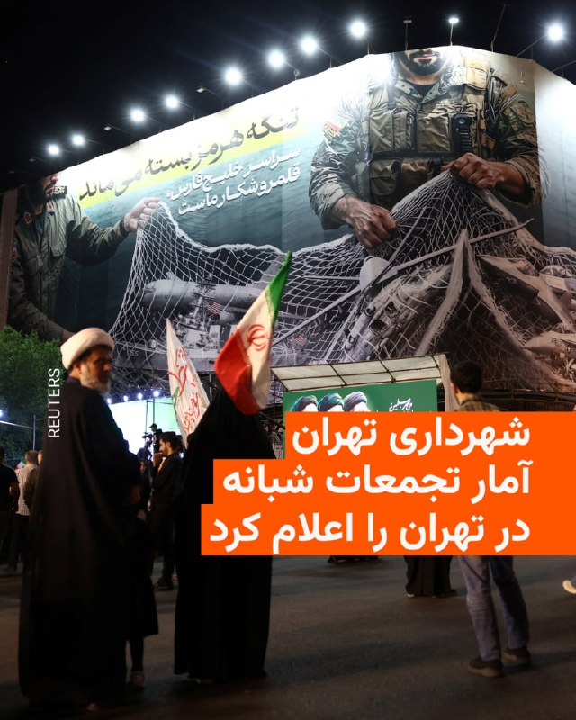

🔸شهرداری تهران، دربارهٔ تجمعاتی که بیش از دو ماه است به‌طور شبانه در حمایت از حکومت برگزار می‌شود، اعلام کرد در حال حاضر «۱۲۰ اجتماع بزرگ و ۴۰۰ اجتماع محلی و ۴۰۰ کاروان خودرویی در سطح شهر تهران داریم».

🔸این تجمعات شبانه که از اواخر اسفند و پس از شروع جنگ آمریکا و اسرائیل با ایران آغاز شد، به‌طور پیوسته همچنان ادامه داشته و مقامات ارشد جمهوری اسلامی بارها بر ضرورت برگزاری و ادامه یافتن آن تأکید کرده‌اند.

🔸به‌دلیل قطع اینترنت در ایران، دسترسی به واکنش عموم شهروندان به این تجمعات شبانه میسر نیست، اما برخی کاربران که موفق به حضور در شبکه‌های اجتماعی شده‌اند، این تجمعات را «تشکیلاتی، پرسروصدا و مزاحم آرامش و آسایش دیگران» خوانده‌اند.

🔸صداوسیما و رسانه‌های نزدیک به حکومت به‌طور روزانه گزارش‌های متعدد از این تجمعات شبانه و کاروان‌های خودرویی منتشر و آن را «تجمعات خودش مردمی برای دفاع از کشور» توصیف می‌کنند؛ ادعایی که با اعلام معاونت فرهنگی شهرداری تهران منافات دارد.

🔸به‌رغم سانسور شدید رسانه‌ها، این تجمعات در عین حال برخی واکنش‌های منفی در میان برخی رسانه‌های داخل کشور را هم برانگیخته است.

@RadioFarda

## RadioFarda — post 156927

  <a href="https://t.me/radiofarda/156927">📎 Download file</a>

📻بشنوید: ساعت ۱۴ با رادیوفردا،۱۷ اردیبهشت ۱۴۰۵‌

@Radiofarda

## RadioFarda — post 156926

🔸مسعود پزشکیان، رئیس‌جمهور ایران، از ملاقات اخیر خود با مجتبی خامنه‌ای، رهبر جمهوری اسلامی، خبر داد و گفت با گفت‌وگوی مفصلی داشته است. اما هیچ تصویر یا عکسی از این دیدار منتشر نشده است. 🔸مسعود پزشکیان که روز پنجشنبه ۱۷ اردیبهشت در نشستی در وزارت صمت سخن می‌گفت،…

## IranianMinds — post 19703

🔴 شنیده شدن انفجار مهیب در بندرعباس

@IranianMinds

## IranianMinds — post 19702

🔴وال‌استریت‌ژورنال:

دولت ترامپ، هفته جاری از سرگیری پروژه آزادی در تنگه هرمز را بررسی می‌کند.

@IranianMinds

## IranianMinds — post 19701

🔴کانال ۱۲ اسرائیل:

نخست‌وزیر نتانیاهو امشب جلسه‌ی با محوریت ایران، در مقر کریا (وزارت دفاع) برگزار می‌کند.

@IranianMinds

## IranianMinds — post 19700

  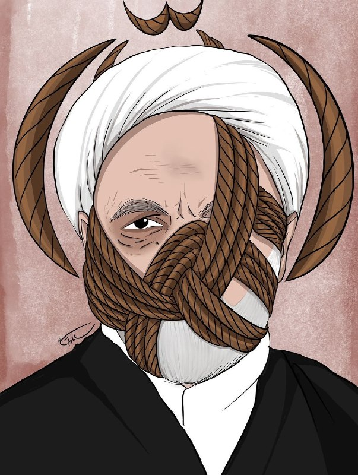

اژه‌ای، قصاب مردم ایران!
ماشین اعدامها همچنان مشغول بکار است.

@IranianMinds

## IranianMinds — post 19699

🔴واشینگتن‌پست به نقل از یک گزارش:

ایران بیش از ۴ ماه قادر به تحمل محاصره نخواهد بود.

@IranianMinds

## IranianMinds — post 19698

  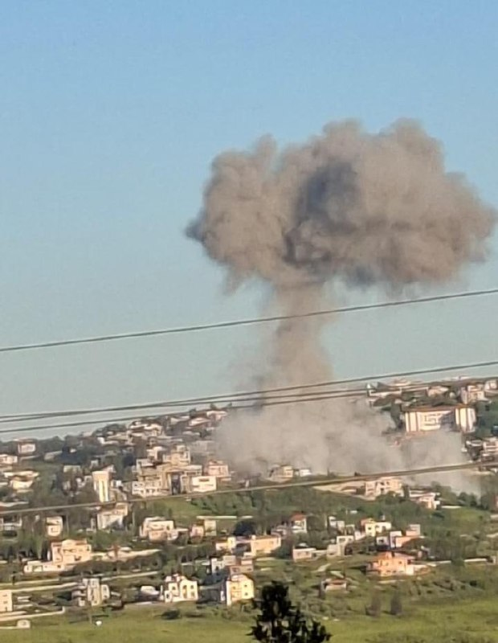

🔴 حملات اسرائیل به جنوب لبنان

@IranianMinds

## IranianMinds — post 19697

🔴 سخنگوی وزارت خارجه :

پیام ‌هایی که از طریق میانجی‌گری طرف پاکستانی به ما ارسال شده، در حال بررسی است.

ما هنوز به نتیجه‌ای نرسیدیم و پاسخی به طرف آمریکایی ندادیم!

@IranianMinds

## IranianMinds — post 19695

🔴 حملات ارتش اسرائیل به لبنان امروز خیلی شدید شده و بد داره میزنه لبنانو

@IranianMinds

## IranianMinds — post 19694

  

🔴 کارولین لیویت سخنگوی کاخ سفید هم یه پست گذاشت و گفت بچم صحیح و سالم به دنیا اومده و اسمشم ویویانا

@IranianMinds

## IranianMinds — post 19693

  

🔴 پست جدید ترامپ که دوباره اومده گرفته رو این بایدن یتیم :

تصویری بسیار دقیق از دولت جو بایدن خواب‌آلود. خسارت عظیم وارد شده، اما ما برگشتیم!

@IranianMinds

## IranianMinds — post 19692

🔴 صداوسیما :

اکثر مردم همیشه خبرهای مارو میبینن حدود 75 درصد و هیچکس به شبکه های دیگه اعتمادی نداره !

@IranianMinds

## IranianMinds — post 19691

  

🔴 رویترز :

ایالات متحده و ایران در حال نزدیک شدن به یک توافق موقت برای توقف درگیری‌ها هستند، هرچند اختلافات عمده همچنان حل‌نشده باقی مانده‌اند. تهران در حال بررسی یک پیشنهاد یک‌صفحه‌ای است که بر پایان جنگ، بازگشایی تنگه هرمز، و شروع ۳۰ روز مذاکرات گسترده‌تر تمرکز دارد.

پیش‌نویس از خواسته‌های کلیدی آمریکا در مورد برنامه هسته‌ای ایران، موشک‌ها، و نیروهای نیابتی منطقه‌ای اجتناب می‌کند.

مسئولان ایرانی همچنان مشکوک هستند و پیشنهاد را بیشتر «فهرست آرزوهای آمریکایی» تا «واقعیت» میبینن.

@IranianMinds

## IranianMinds — post 19690

  <a href="https://t.me/IranianMinds/19690">📎 Download file</a>

📲#اپلیکیشن اندروید سایت جهانی دربی بت

👍اسپانسر لیگ انگلیس
👍
🔥امکان شارژ امن از طریق کارت بانکی
➖➖➖➖➖➖➖➖➖

🪙همین حالا عضو شوید 👇
https://t.me/+aCbq7yy8QY80NzQ0

## IranianMinds — post 19689

  

😤دنبال یه سایت شرط بندی بین المللی بودی که به ایرانیا خدمات بده؟!
⛔

👍دربی بت همون انتخاب  100%

💎ویژگی های سایت جهانی Derby Bet:

⬅️امکان شارژ امن با کارت بانکی

⬅️واریز اول دوبل شارژ می شوید(بونوس۱۰۰٪)

⬅️پر اپشن ترین سایت فعال در ایران

⬅️تسویه حساب کمتر از 5 دقیقه

⬅️برگشت بخشی از باخت به صورت هفتگی

🚨کد هدیه ثبت نام:GG007

⚠️برای دانلود اپلکیشن کلیک کنید
👉
ge17

🔔کانال دربی بت :

🪙https://t.me/+aCbq7yy8QY80NzQ0

## IranianMinds — post 19688

  

🖤اسامی هزار نفر دیگر از جاویدنامان ‌دی‌ماه، روز جمعه از ساعت ۸ توسط مراد ویسی خوانده می‌شود.

@IranianMinds

## IranianMinds — post 19686

  <a href="telegram/content/IranianMinds_19686_1778179540.mp4">🎬 Download video</a>

🔴سقوط خودرو روی سر پلیس روسی، حین اجرای نمایش.

@IranianMinds

## IranianMinds — post 19685

🔴کانال ۱۲ اسرائیل:

ترامپ بدون خروج اورانیوم غنی‌شده از ایران، توافق نخواهد کرد.

@IranianMinds

## IranianMinds — post 19684

  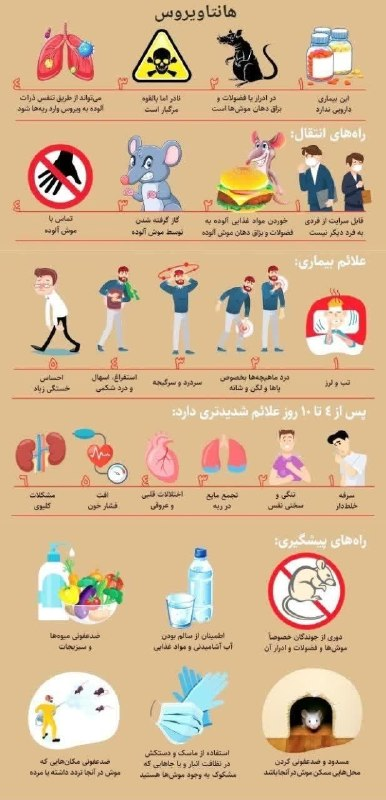

🔴مدیر کل سازمان بهداشت WHO امروز یک نشست خبری درباره ویروس هانتاویروس برگزار خواهد کرد.

خامنه‌ای هنوز دفن نشده.

@IranianMinds

## IranianMinds — post 19683

🔴یدالله جوانی، معاون سیاسی سپاه پاسداران:

ما پیروز شدیم ولی جنگ تمام نشده.

@IranianMinds

## BBCPersian — post 280430

  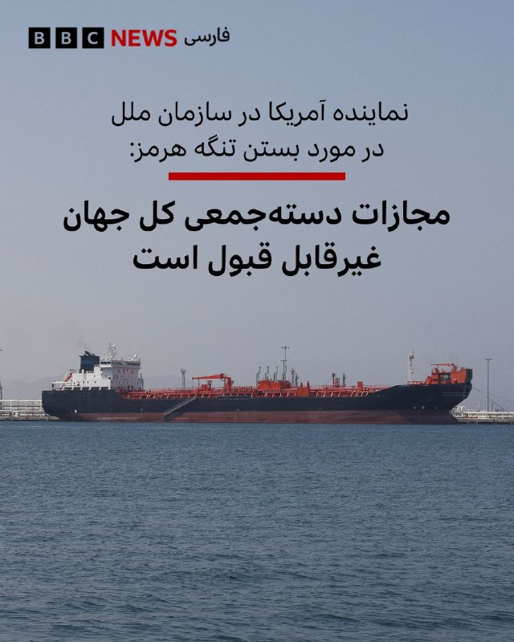

🔻اعضای شورای امنیت سازمان ملل از روز سه‌شنبه مذاکرات غیرعلنی خود را درباره قطعنامه‌ای آغاز کردند که ایالات متحده آمریکا به همراه بحرین، عربستان سعودی، امارات متحده عربی، کویت و قطر پیش‌نویس آن را تهیه کرده است.

روز پنجشنبه در یک کنفرانس خبری که در محل شورای امنیت سازمان ملل در حال برگزاری است، نمایندگان آمریکا، امارات، قطر، بحرین و عربستان خواستار توقف تهدیدهای ایران علیه عبور و مرور تجاری در این تنگه شدند.

مایک والتز، نماینده آمریکا در سازمان ملل، گزارش‌ها درباره تشکیل «اداره تنگه خلیج فارس» توسط ایران که به دنبال وضع عوارض برای کشتی‌های عبوری از این آبراه است را محکوم کرد.

او در حالی که کنار نمایندگان کشورهای عربی حاشیه خلیج فارس ایستاده بود، به خبرنگاران گفت: «مجازات دسته‌جمعی کل جهان برای حل و فصل نوعی اختلاف، غیرقابل قبول، غیراخلاقی و در حقوق بین‌الملل غیرقانونی است.»

📸 Reuters

https://bbc.in/496G5Jl
@BBCPersian

## BBCPersian — post 280429

  <a href="https://t.me/bbcpersian/280429">📎 Download file</a>

در برنامه رادیویی جام‌جهان‌نمای امروز می‌شنوید؛

انتظار برای پاسخ تهران به توافق پیشنهادی واشنگتن؛ منابع پاکستانی می‌گویند ایران به‌زودی پاسخ می‌دهد، اما تهران تأکید کرده برای جلوگیری از تکرار «اقدامات خصمانه» به تضمین نیاز دارد. آیا دو طرف به نقطه توافق نزدیک شده‌اند؟

در داخل ایران، وزیر علوم می‌گوید ادامه اختلال اینترنت برای عموم مردم، ضد امنیت ملی است. در این برنامه می‌پرسیم آیا دولت می‌خواهد یا اصلاً می‌تواند میان خواست اکثریت مردم و انتظارات نهادهای امنیتی توازن برقرار کند؟

همزمان، بنیاد نرگس محمدی از احتمال ابتلای این فعال حقوق بشر به یک عارضه جدی قلبی خبر داده؛ موضوعی که نگرانی‌ها درباره وضعیت او را افزایش داده است.

و در «گپ روز» امشب می‌شنوید:
روابط ایران با کشورهای عرب منطقه در جنگ اخیر چه تفاوتی داشته؟ چرا تهران با عربستان مسیر مذاکره را باز گذاشت، اما امارات را هدف حمله قرار داد؟
@bbcpersian

## BBCPersian — post 280428

🔻دیدار ترامپ و لولا در کاخ سفید با محوریت تنش‌های تجاری و امنیتی

دونالد ترامپ از لوئیز ایناسیو لولا دا سیلوا، رئیس‌جمهور برزیل، در کاخ سفید استقبال کرد.

این دیدار که به‌عنوان نشست کاری میان دو چهره با دیدگاه‌های سیاسی کاملا متفاوت توصیف شده است، با هدف تثبیت آتش‌بس شکننده‌ای برگزار می‌شود که پس از اعمال تعرفه ۵۰ درصدی دونالد ترامپ بر بیشتر کالاهای برزیلی شکل گرفت.

آقای ترامپ این اقدام را پاسخی به پیگرد قضایی متحدش، ژائیر بولسونارو، رئیس‌جمهور راست‌گرای پیشین برزیل، دانسته بود؛ کسی که بعدها به اتهام تلاش برای کودتا علیه لولا محکوم شد.

انتظار می‌رود که مسائل امنیتی، تجاری و مواد معدنی راهبردی در صدر دستور کار این دیدار قرار داشته باشد.

قرار بود این دو بعد از دیدار با خبرنگاران دیدار کنند اما با گذشت یک ساعت از ورود لولا به دفتر کار بیضی رئیس‌جمهور در کاخ سفید، به خبرنگاران گفته شد که فعلا متفرق شوند و پس از آن اعلام شد ترامپ و لولا در حال صرف ناهار هستند.

https://bbc.in/496G5Jl
@BBCPersian

## BBCPersian — post 280427

  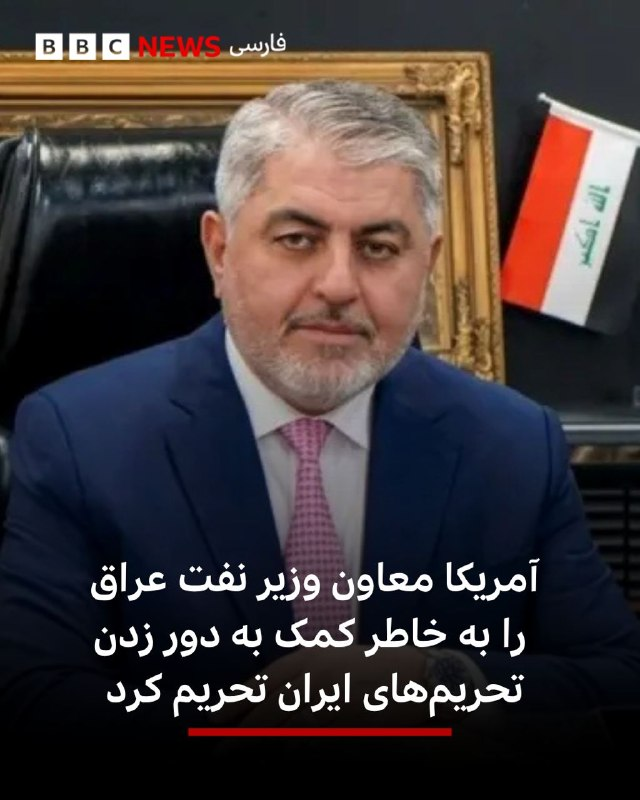

🔻ایالات متحده روز پنج‌شنبه معاون وزیر نفت عراق را به دلیل حمایت از ایران تحریم کرد؛ اقدامی که اعمال فشار شدید واشنگتن بر دولت جدید این کشور برای قطع روابط با تهران را نشان می‌دهد.

تامی پیگت، سخنگوی وزارت امور خارجه آمریکا گفت: «علی معارج البهادلی، معاون وزیر نفت، از جایگاه دولتی خود سوءاستفاده کرده تا نفت عراق را به نفع حمایت از رژیم ایران و گروه‌های تروریستی نیابتی آن منحرف کند.»

به گفته این سخنگو، «در چارچوب طرحی برای دور زدن تحریم‌ها، نفت ایران به طور متقلبانه با نفت عراق مخلوط و به نفع ایران فروخته می‌شد.»

ایالات متحده تحریم‌های یکجانبه‌ای علیه نفت ایران اعمال کرده و به دنبال مجازات هر کشور یا شرکتی است که آن را خریداری کند.

آمریکا طی ماه‌های اخیر فشار بر دولت عراق را برای قطع همکاری‌ با گروه‌های مسلح شیعه عراقی مرتبط با ایران افزایش داده است.

به گفته یک مقام‌ آمریکایی، از زمان حمله ایالات متحده و اسرائیل به ایران، گروه‌های مسلح عراقی پیش از اعلام آتش‌بس بیش از ۶۰۰ بار به تأسیسات آمریکا در عراق حمله کرده‌اند.

📸 Facebook/Ali.Maareg

https://bbc.in/496G5Jl
@BBCPersian

## BBCPersian — post 280426

  <a href="telegram/content/BBCPersian_280426_1778179543.mp4">🎬 Download video</a>

🔻مسعود پزشکیان، رئیس‌جمهور ایران، شامگاه ۱۶ اردیبهشت  با حضور در  نشستی با نمایندگان اصناف و بازاریان در وزارت صنعت، معدن و تجارت با اشاره به دیدار خود با مجتبی خامنه‌‌ای، رهبر سوم جمهوری اسلامی او را «صمیمی و متواضع» توصیف کرد.

او در بخش دیگری از سخنانش گفت که با «وحدت و تحمل دیدگاه‌های متفاوت» ایران می‌تواند بر تمامی مشکلات و فشارها غلبه کند. او در ادامه گفت: «الان می‌بینید کسانی در خیابان‌ها از ایران دفاع می‌کنند که قبلا ما می‌خواستیم آنها را جریمه کنیم.» به‌نظر می رسد اشاره او به تجمعات شبانه و حضور طرفداران غیر سنتی جمهوری اسلامی با پوشش‌هایی کاملا دور از چارچوب‌های حکومت درباره حجاب باشد.

آقای پزشکیان همچنین گفت: «هیچ ایرانی تحمل نمی‌کند بچه‌های ما را این گونه بمباران کنند و او توجیه‌گر باشد، اما عده‌ای در تلویزیون‌ها نشستند و حرف‌های مفت می‌زنند و تفسیرهای به اصطلاح روشنفکرانه می‌کنند.»

مشخص نیست که این نخستین دیدار آقای پزشکیان با مجتبی خامنه‌ای پس از رهبری  باشد اما این نخستین‌بار است که او درباره آن به‌طور علنی سخن گفته است.

https://bbc.in/4ugo3gh
@BBCPersian

## BBCPersian — post 280425

🔻دور سوم مذاکرات اسرائیل و لبنان هفته آینده در واشنگتن برگزار می‌شود

یک مقام وزارت خارجه آمریکا روز پنجشنبه اعلام کرد که نمایندگان اسرائیل و لبنان در روزهای ۱۴ و ۱۵ مه، سومین دور مذاکرات خود را در واشنگتن برگزار خواهند کرد.

این مذاکرات در حالی انجام می‌شود که آمریکا دو کشور را برای دستیابی به یک توافق صلح پایدار تحت فشار قرار داده، حتی با وجود ادامه حملات اسرائیل به نیروهای حزب‌الله در لبنان.

این اعلام یک روز پس از نخستین حمله اسرائیل به بیروت از زمان توافق آتش‌بس شکننده میان دو کشور در اواسط آوریل صورت گرفت؛ توافقی که پس از گفت‌وگوهای مستقیم کم‌سابقه میان سفیران اسرائیل و لبنان با میانجی‌گری دولت آقای ترامپ حاصل شد.

این مقام آمریکایی جزئیاتی درباره شرکت‌کنندگان در نشست ارائه نکرد.

مارکو روبیو، وزیر خارجه آمریکا، نیز روز سه‌شنبه گفته بود صلح دست‌یافتنی است، اما دولت لبنان باید توان مقابله با حزب‌الله را داشته باشد.

https://bbc.in/496G5Jl
@BBCPersian

## BBCPersian — post 280424

🔻دیدار «دوستانه» روبیو با پاپ لئون پس از هفته‌ها تنش کاخ سفید با واتیکان بر سر جنگ ایران

مارکو روبیو، وزیر خارجه آمریکا که برای یک سفر دو روزه وارد رم شد در ابتدای سفرش در میان تدابیر شدید امنیتی به واتیکان رفت و با پاپ لئون چهاردهم،‌ رهبر کاتولیک‌های جهان گفت‌وگو کرد. کاخ سفید این دیدار را که در پی هفته‌ها تنش میان کاخ سفید و واتیکان بود،‌ «دوستانه و سازنده» توصیف کرد. واتیکان هم در یک بیانیه اعلام کرد که پاپ لئون و آقای روبیو بر «تعهد مشترک برای حفظ روابط دوجانبه خوب میان آمریکا و واتیکان» تاکید کردند.

https://bbc.in/4tjJdZu
@BBCPersian

## BBCPersian — post 280423

  

⭕️دیروز و امروز صفحه اینستاگرام بسیاری از چهره‌های پرطرفدار و حساب‌های پرمخاطب شاهد افت میلیونی دنبال‌کننده بود.

‏اینستاگرام کریستیانو رونالدو که با ۶۶۶ میلیون دنبال‌کننده، پرطرفدارترین چهره در اینستاگرام است با افت بیش از ۶ میلیون فالوور و لیونل مسی و سلنا گومز پس از او هر کدام با ریزش حدود ۵ و ۶ میلیون فالوور روبرو شدند.

‏بی‌بی سی درباره این تغییرات با متا، شرکت مادر اینستاگرام تماس گرفته است. میزان فالوورهای حساب خود اینستاگرام در این پلتفرم که پردنبال‌کننده‌ترین صفحه در اینستاگرام است، حدود ۱۱ میلیون ریزش کرده است.

‏اینستاگرام دو روز پیش طرح بزرگی برای معرفی حساب‌های ویژه نوجوانان را راه‌ انداخت. این اقدام، همزمان شد با فشار ناشی از حکم «قانون خدمات دیجیتال» اتحادیه اروپا، ممنوعیت استفاده زیر ۱۶ سال در استرالیا و همچنین قطع دسترسی ده‌ها میلیون کاربر ایرانی و گزارش درآمد سه‌ماهه اول متا که نشان‌دهنده اولین کاهش کاربران روزانه در تاریخ این شرکت بود.

‏به نظر می‌رسد این تحولات موجب شده تا متا یک پاکسازی گسترده انجام دهد و حساب‌های کاربری زیر سن، غیرفعال، بات و غیرواقعی را حذف کند.
@bbcpersian

## BBCPersian — post 280422

🔻اخراج سه عضو شیعه پارلمان بحرین به‌‎خاطر مخالفت با سلب تابعیت بعد از حمایت از ایران

پارلمان بحرین روز پنج‌شنبه سه نماینده را که با فرمان سلطنتی در مورد پرونده‌های تابعیت مخالفت کرده بودند، اخراج کرد.

این اقدام پس از آن صورت گرفت که ده‌ها نفر در جریان جنگ خاورمیانه به دلیل حمایت از ایران از تابعیت خود محروم شده بودند.

مجلس نمایندگان بحرین به اتفاق آراء به اخراج عبدالنبی سلمان، ممدوح الصالح و مهدی الشویخ رای داد. این سه نماینده در زمان رای‌گیری حضور نداشتند.

بحرین که کشوری با حاکمیت سنی و جمعیت قابل توجه شیعه است، در ماه مارس (اسفند-فروردین) به شدت از حملات ایران آسیب دید.

ماه گذشته، این کشور ۶۹ نفر را به دلیل ابراز حمایت از تهران از تابعیت خود محروم کرد.

این سه قانونگذار که همگی شیعه هستند، از رای‌دادن به فرمان سلطنتی لغو حق اعتراض به تصمیمات دولت در مورد تابعیت خودداری کردند.

به گزارش خبرگزاری رسمی بحرین، حمد بن عیسی آل خلیفه، پادشاه بحرین، پیشتر از «برخی از اعضای قوه مقننه که با خائنان همسو شده‌اند» به شدت انتقاد کرده بود، بدون اینکه نامی از آنها ببرد.

رأی‌گیری روز پنج‌شنبه به‌رغم نامه عذرخواهی این سه نماینده به پادشاه انجام شد.

سید احمد الوداعی، مدیر بخش حمایت از حقوق در موسسه حقوق و دموکراسی بحرین مستقر در بریتانیا، این اقدام را محکوم کرد. او گفت: «این که آنها مجبور شدند از پادشاه عذرخواهی کنند و اینکه عذرخواهی‌شان آنها را از نابودی حرفه و آینده‌شان نجات نداد، واقعیت زندگی سیاسی در بحرین را نشان می‌دهد.»

https://bbc.in/496G5Jl
@BBCPersian

## BBCPersian — post 280421

🔻وزارت خارجه ایران: هنوز پاسخی به طرف آمریکایی داده نشده است

اسماعیل بقایی، سخنگوی وزارت خارجه ایران به خبرگزاری ایرنا گفت که ایران در حال بررسی پیام‌ها با میانجیگری پاکستان است و «هنوز ایران به جمع‌بندی نرسیده و پاسخی به طرف آمریکایی داده نشده است.»

مقام‌های پاکستانی پیش از این اعلام کرده بودند در انتظار پاسخ ایران به آخرین پیشنهادات آمریکا هستند.

طاهر اندرآبی، سخنگوی وزارت خارجه پاکستان امروز ابراز امیدواری کرده بود که توافق میان آمریکا و ایران به‌زودی اعلام خواهد شد.

پیشتر دونالد ترامپ گفته بود که دولتش گفت‌وگوهای «بسیار خوبی» با ایران داشته است. اما مسعود پزشکیان، گفت که اقدامات آمریکا مسیر دیپلماسی را به سمت «تهدید و تحریم منحرف کرده است.»

https://bbc.in/496G5Jl
@BBCPersian

## BBCPersian — post 280420

  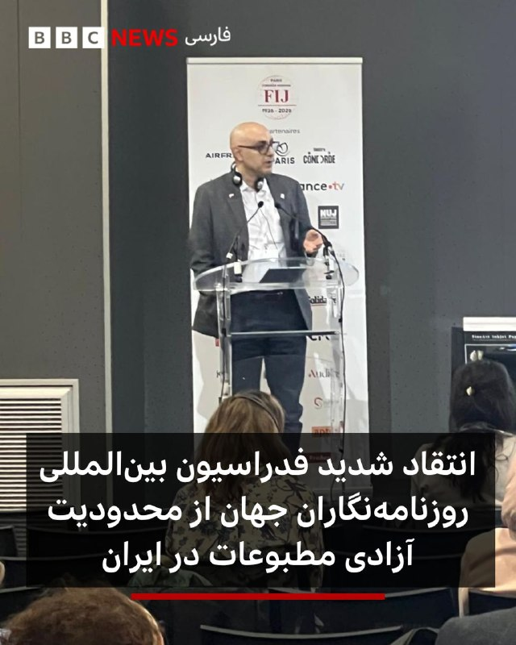

🔻فدراسیون بین‌المللی روزنامه‌نگاران، فشارهای جمهوری اسلامی بر خبرنگاران در داخل و خارج از ایران را محکوم کرد و خواهان رفع محدودیت فعالیت‌ صنفی روزنامه‌نگاران در ایران شد.

در قطعنامه‌ای که در کنگره جهانی این نهاد به مناسبت صد سالگی تأسیس آن در پاریس به تصویب رسید، با انتقاد شدید از کارنامه جمهوری اسلامی در محدود کردن آزادی مطبوعات، گفته شده «خبرنگاران در موج‌های پیاپی زندانی شده‌اند و خیلی‌ها هم مجبور به ترک کشور شده‌اند. مقام‌ها ده‌ها روزنامه و مجله را توقیف کرده‌اند و در نتیجه صدها روزنامه‌نگار شغلشان را از دست داده‌اند.»

در این قطعنامه با اشاره به ممنوعیت فعالیت انجمن صنفی روزنامه‌نگاران ایران از سال ۱۳۸۸ و مانع‌تراشی برای یک نهاد صنفی جایگزین آن در سال‌های اخیر، از هیئت مدیره فدراسیون بین‌المللی روزنامه‌نگاران خواسته شد که از طریق سازمان ملل و نهادهای بین‌المللی، تلاش کند راه را برای فعالیت یک نهاد صنفی نماینده روزنامه‌نگاران در ایران باز کند.

📸 BBC

@BBCPersian

## BBCPersian — post 280419

🔻آلمان جنگ ایران را عامل خسارت به اقتصادش می‌داند

آلمان روز پنجشنبه در پی پیش‌بینی کاهش درآمدهای مالیاتی چهار سال آینده، با فشار مالی بیشتری روبه‌رو شد.

شورای کارشناسان مالیاتی آلمان پیش‌بینی درآمدهای مالیاتی برای دوره ۲۰۲۶ تا ۲۰۳۰ را نسبت به برآورد اکتبر، ۸۷/۵ میلیارد یورو کاهش داد.

این کاهش در حالی است که دولت آلمان همزمان با کسری بودجه، با شوک انرژی ناشی از جنگ ایران و افزایش هزینه‌های دفاعی، دست‌وپنجه نرم می‌کند.

بر اساس این گزارش، درآمد مالیاتی دولت فدرال در سال ۲۰۲۷ حدود ۳۹۵ میلیارد یورو پیش‌بینی شده که ۱۰/۱ میلیارد یورو کمتر از برآورد قبلی است.

لارس کلینگبایل، وزیر دارایی آلمان، گفت که این پیش‌بینی نشان می‌دهد، جنگ ایران چه میزان آسیب اقتصادی ایجاد کرده است.

او در بیانیه‌ای افزود: «جنگ غیرمسئولانه ترامپ و شوک ناشی از افزایش جهانی قیمت انرژی، به‌طور موقت روند مثبت اقتصاد را کند کرده است.»

این کاهش پیش‌بینی تنها یک هفته پس از تصویب اهداف اصلی بودجه ۲۰۲۷ است؛ بودجه‌ای که شامل ۱۹۶/۵ میلیارد یورو بدهی جدید، افزایش هزینه‌های دفاعی به ۳/۱ درصد تولید ناخالص داخلی و سرمایه‌گذاری بی‌سابقه در حمل‌ونقل، دیجیتالی‌سازی و بیمارستان‌هاست.

دولت آلمان همچنین رشد اقتصادی سال ۲۰۲۶ را تنها ۰/۵ درصد پیش‌بینی کرده است و شمار بیکاران از ۳ میلیون نفر فراتر رفته است؛ موضوعی که می‌تواند توافق بر سر اصلاحات مالیاتی، رفاهی و هزینه‌های دولتی را دشوارتر کند.

https://bbc.in/496G5Jl
@BBCPersian

## BBCPersian — post 280418

🔻دو وزیر دفاع سابق چین به اعدام تعلیقی محکوم شدند

به گزارش رسانه‌های دولتی چین، دو وزیر دفاع سابق آن کشور به جرم رشوه خواری و فساد به اعدام تعلیقی محکوم شدند. وی فنگه و لی شانگفو که در دادگاه نظامی چین، محاکمه شدند روز پنجشنبه به اعدام با دو سال تعلیق محکوم شدند.

https://bbc.in/4tTt6CT
@BBCPersian

## BBCPersian — post 280417

🔻اولین کنسرت رسمی تهران پس از جنگ؛ چرا اجرای کینگ‌رام بحث‌برانگیز شد؟

🖌حسام گرشاسبی، بی‌بی‌سی

پس از ماه‌ها سکوت موسیقایی در تهران در سایه جنگ و پیامدهای آن، در اردیبهشت ماه ۱۴۰۵ چراغ اجراهای زنده بار دیگر روشن شد؛ بازگشتی که با کنسرت رامین سیدامامی، معروف به «کینگ رام» در مجموعه تئاتر لبخند، به‌عنوان اولین اجرای رسمی پس از جنگ رقم خورد.

https://bbc.in/42lcqIw
@BBCPersian

## BBCPersian — post 280416

🔻منبع سعودی: آمریکا همچنان به پایگاه‌ها و حریم هوایی عربستان دسترسی دارد

یک منبع سعودی روز پنجشنبه گزارش رسانه‌های آمریکایی در مورد نقش ریاض در دستور توقف عملیات نظامی آمریکا در تنگه هرمز را رد کرد.

پیشتر رسانه‌های آمریکایی گزارش دادند که دونالد ترامپ پس از دخالت عربستان سعودی، دستور توقف عملیات نظامی آمریکا برای هدایت کشتی‌های سرگردان در تنگه هرمز را صادر کرده است.

بر اساس گزارشی از شبکه خبری ان‌بی‌سی، این عقب‌نشینی آقای ترامپ پس از آن بود که گفته می‌شود محمد بن سلمان در تماس مستقیم با دونالد ترامپ، اجازه استفاده از حریم هوایی و پایگاه‌های خود را برای این عملیات به نیروهای آمریکایی نداد.

اما یک منبع نزدیک به دولت عربستان به خبرگزاری فرانسه گفت: «این موضوع صحت ندارد.»

این منبع می‌گوید که آمریکا همچنان به‌طور معمول به پایگاه‌ها و حریم هوایی عربستان دسترسی دارد.

https://bbc.in/496G5Jl
@BBCPersian

## BBCPersian — post 280415

🔻گفت‌وگوی تلفنی وزرای خارجه عمان و روسیه درباره تحولات منطقه

🔻وزارت خارجه عمان از گفت‌وگوی تلفنی بدر بوسعیدی،‌ وزیر خارجه عمان و سرگئی لاوروف، وزیر خارجه روسیه خبر داد.

بر اساس این گزارش در این تماس تلفنی که روز پنجشنبه ۱۷ اردیبهشت ماه انجام شد دو طرف درباره راه‌های کنترل تنش‌های موجود و پیشبرد رویکردهای سیاسی و راه حل‌های سیاسی و دیپلماتیک برای رسیدگی به مسائل و بحران‌ها تبادل نظر کردند.

عمان در مذاکرات پیشین ایران و آمریکا نقش میانجی داشت و آقای بوسعیدی در چند جلسه پیام‌های هیئت ایرانی را به هیئت آمریکایی منتقل می‌کرد.

وزارت خارجه عمان می‌گوید که تاکید دو طرف بر یافتن راه حل‌های توافقی است که باعث تقویت پایه‌های امنیت و ثبات شود و منطقه و جهان را از پیامدها و تنش‌های بیشتر دور نگه دارد.

https://bbc.in/496G5Jl
@BBCPersian

## BBCPersian — post 280414

🔻احضار یکی از اپراتورها برای ارائه توضیحات در مورد تخلفات در اجرای «اینترنت پرو»

🔻سازمان بازرسی ایران، مدیرعامل یکی از اپراتورها رابرای ارائه توضیحات در مورد روند اجرای «اینترنت پرو» احضار کرده است.

شورای عالی امنیت ملی اخیرا طرحی موسوم به «اینترنت پرو» را تصویب کرده است. براساس این طرح، اهالی کسب‌وکار یا دانشگاهیان می‌توانند با پرداخت مبلغی بیشتر، با دسترسی محدود به اینترنت بین‌المللی وصل شوند.

به گزارش فارس در زمان اجرای این طرح دو تخلف از سوی اپراتورها باعث شده که این طرح از مسیر خود منحرف شود.

براساس این گزارش تخلف اول مربوط به افزایش قیمت اینترنت به میزان هر گیگ، ۴۰ هزار تومان و تخلف دوم هم ارائه این نوع اینترنت به افرادی در کسب و کارهای غیرضروری است.

گفته شده است که ارائه این طرح با انتقادات گسترده‌ای روبرو شده است.

گروهی دسترسی آزاد به اینترنت را «حق مسلم»‌ همه شهروندان می‌دانند و می‌گویند که این حق نباید به ابزار تشویق و تنبیه بدل شود.

گروهی نیز این طرح را ابزاری برای اعمال کنترل بیشتر روی مردم و محدود کردن آزادی بیان می‌دانند.

https://bbc.in/4to91no
@BBCPersian

## BBCPersian — post 280413

  <a href="telegram/content/BBCPersian_280413_1778179545.mp4">🎬 Download video</a>

🔻سرخط خبرهای روز پنجشنبه ۱۷ اردیبهشت ۱۴۰۵
@BBCPersian

## BBCPersian — post 280412

🔻هشدار کمیسیون فدرال برق سوئیس در مورد تاثیر احتمالی جنگ ایران در تامین گاز و برق اروپا

🔻کمیسیون فدرال برق سوئیس روز پنجشنبه اعلام کرد که جنگ در ایران باعث ایجاد عدم اطمینان در مورد تامین گاز برای زمستان پیش رو شده است.

این کمیسیون می‌گوید که این اوضاع در بدترین حالت ممکن است حتی بر ثبات تامین برق اروپا و سوئیس نیز تأثیر بگذارد.

جنگ آمریکا و اسرائیل علیه ایران و بسته شدن تنگه هرمز باعث مختل شدن کشتیرانی در خلیج فارس شد و قیمت نفت به بالاترین سطح خود از زمان جنگ اوکراین در سال ۲۰۲۲ رسید.

پیش از این هم کارشناسان هشدار داده‌اند که ادامه اختلال در تحویل سوخت به دلیل جنگ ایران می‌تواند ظرف چند هفته کمبود سوخت را به همراه داشته باشد.

آژانس بین‌المللی انرژی هشدار داده است که اگر سوخت بیشتری از جای دیگری وارد نشود، کل اروپا تا ماه ژوئن با کمبود سوخت مواجه خواهد شد.

https://bbc.in/496G5Jl
@BBCPersian

## BBCPersian — post 280411

  <a href="telegram/content/BBCPersian_280411_1778179547.mp4">🎬 Download video</a>

🔻در پی حملات هوایی اسرائیل به مناطق جنوبی لبنان، دود غلیظی از مناطق شهری و روستایی به آسمان برخاست. بنابر گزارش‌‌ها مناطقی مانند نبطیه فوقا، زوطر شرقی و یوحمر در این حملات هدف قرار گرفته‌اند.

این حملات در حالی ادامه دارد که با پافشاری ایران، از ۱۷ آوریل ۲۰۲۶ (۲۸ فروردین ۱۴۰۵) آتش‌بسی میان اسرائیل و حزب‌الله اعلام شده بود اما به گفته منابع محلی، اسرائیل همچنان به حملات هوایی به مناطق مختلف لبنان به‌ویژه در جنوب این کشور ادامه داده است. در مقابل، حزب‌الله هم که گفته بود آتش‌بس را مشروط پذیرفته است، با انجام حملاتی به این اقدامات پاسخ داده است.

بر اساس آمار منتشرشده، از دوم مارس ۲۰۲۶ (۱۱ اسفند ۱۴۰۴) تاکنون بیش از ۲۷۰۰ نفر در لبنان نتیجه حملات اسرائیل کشته و بیش از یک میلیون نفر آواره شده‌اند. بخش قابل توجهی از این آوارگان از مناطق جنوبی و شرقی لبنان و همچنین حومه جنوبی بیروت هستند.

ادامه درگیری‌ها نگرانی‌ها درباره تشدید بحران انسانی و گسترش تنش در منطقه را افزایش داده است.

پیشتر و در آستانه مذاکرات در پاکستان، ایران، صلح با آمریکا را به آتش‌بس در لبنان گره زده بود.

https://bbc.in/4usmfAe
@BBCPersian

## IranWire — post 65

قیمت بیت کوین به ۷۲ هزار دلار کاهش یافت، زیرا نرخ تورم شاخص قیمت تولیدکننده در ایالات متحده بسیار بالا بود - بیت کوین خبر
https://btckhabar.com/395/

## IranWire — post 64

https://khabarkhan.com/article/7203

## IranWire — post 63

https://khabarkhan.com/article/4956

## IranWire — post 62

https://khabarkhan.com/article/4567

## IranWire — post 61

https://khabarkhan.com/article/3318

## IranWire — post 60

وضعیت بازار رمز ارز
https://khabarkhan.com/crypto

## IranWire — post 59

https://khabarkhan.com/article/1804

## IranWire — post 58

https://khabarkhan.com/article/1638

## IranWire — post 57

اولین خبرخوان مبتنی بر هوش مصنوعی
https://khabarkhan.com/

## IranWire — post 56

https://khabarkhan.com/article/558

## IranWire — post 55

https://khabarkhan.com/article/496

## IranWire — post 54

https://khabarkhan.com/article/200

## IranWire — post 53

https://khabarkhan.com/article/184

## IranWire — post 52

https://khabarkhan.com/article/150

## IranWire — post 51

https://khabarkhan.com/article/147

## IranWire — post 50

https://khabarkhan.com/article/90

## IranWire — post 49

https://khabarkhan.com/article/78

## IranWire — post 48

Channel name was changed to «خبرخوان»

## IranWire — post 46

Channel photo removed

## IranWire — post 45

Channel name was changed to «Khabarkhan»

## idfinfarsi — post 11556

  <a href="telegram/content/idfinfarsi_11556_1778179548.mp4">🎬 Download video</a>

در هفته گذشته: نیروهای لشکر ۱۴۶ حدود ۲۰ تروریست را به هلاکت رسانده و بیش از ۲۰۰ زیرساخت تروریستی مورد استفاده نظامی سازمان تروریستی حزب‌الله را در جنوب لبنان منهدم کردند

🔸نیروهای لشکر ۱۴۶ به فعالیت خود برای رفع تهدیدها در منطقه خط دفاعی پیشرو در جنوب لبنان ادامه می‌دهند.

🔸در حملات هدفمند، نیروی هوایی با هدایت نیروهای زمینی حدود ۲۰ تروریست از سازمان تروریستی حزب‌الله را که در راستای پیشبرد طرح‌های تروریستی علیه نیروهای ما در جنوب لبنان فعالیت می‌کردند، به هلاکت رساند.
🔸در کنار آن، بیش از ۲۰۰ زیرساخت تروریستی متعلق به حزب‌الله در جنوب لبنان منهدم شد.

🔸در چارچوب یورش‌های هدفمند، نیروهای تیپ ۴۰۱ انبارهای تسلیحاتی را در مراکز فرماندهی حزب‌الله در جنوب لبنان شناسایی کردند. از جمله تسلیحات کشف‌شده می‌توان به سلاح‌ها، جلیقه‌ها، خشاب‌ها و موشک‌های ضدتانک اشاره کرد.

## idfinfarsi — post 11546

  <a href="telegram/content/idfinfarsi_11546_1778179550.mp4">🎬 Download video</a>

بیش از ۲۰۰ زیرساخت تروریستی منهدم شد و بیش از ۱٬۰۰۰ قلم سلاح کشف گردید: فعالیت نیروهای تیپ گیوعاتی در جنوب لبنان

⭕️نیروهای تیم رزمی تیپ گیوعاتی، تحت فرماندهی لشکر ۹۱، به فعالیت خود در جنوب خط دفاعی پیشرو با هدف رفع تهدیدها علیه شهروندان اسرائیل ادامه می‌دهند.

⭕️از آغاز عملیات، نیروها بیش از ۲۰۰ زیرساخت تروریستی را منهدم کرده، حدود ۹۰ تروریست را به هلاکت رسانده و بیش از ۱٬۰۰۰ قلم سلاح را کشف کرده‌اند؛ از جمله: نارنجک‌ها، پرتابگرهای «RPG»، خشاب‌ها، سلاح‌های کلاشنیکف، تیربارها، موشک‌های ضدتانک، مواد منفجره و سرجنگی راکت‌های «RPG».

⭕️ارتش اسرائیل به اقدام علیه تهدیدات علیه شهروندان این کشور و نیروهای خود ادامه خواهد داد و مطابق با دستورالعمل‌های سطوح سیاسی عمل می‌کند.

## idfinfarsi — post 11545

  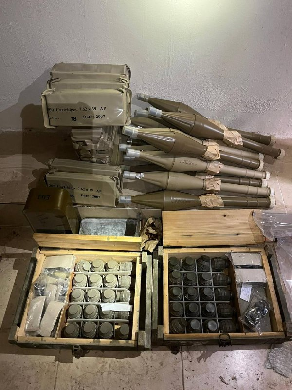

📷 Photo

## idfinfarsi — post 11543

  <a href="telegram/content/idfinfarsi_11543_1778179552.mp4">🎬 Download video</a>

‼️از زمان آغاز تفاهمات آتش‌بس: ارتش اسرائیل بیش از ۲۲۰ تروریست سازمان تروریستی حزب‌الله را به هلاکت رسانده

⭕️ارتش اسرائیل به فعالیت خود برای رفع تهدیدها علیه شهروندان اسرائیل و نیروهای ارتش اسرائیل در جنوب لبنان ادامه می‌دهد.
⭕️از زمان آغاز تفاهمات آتش‌بس، بیش از ۲۲۰ عضو و فرمانده از سازمان تروریستی حزب‌الله که تهدیدی علیه نیروهای ارتش اسرائیل و شهروندان این کشور بودند، به هلاکت رسیدند.

⭕️در چارچوب فعالیت مشترک نیروی هوایی و نیروهای رزمی، طی هفته گذشته بیش از ۸۵ عضو از سازمان تروریستی حزب‌الله به هلاکت رسیدند.

⭕️علاوه بر حذف فرمانده یروی رضوان در روز گذشته (چهارشنبه)، دیگر تروریست های کلیدی نیز در این حملات به هلاکت رسیدند، از جمله:
❌محمد علی بزی – فرمانده بخش اطلاعات در واحد نصر در سال‌های اخیر
❌حسین حسن رومانی – مسئول پدافند هوایی در حزب‌الله

⭕️این فرماندهان در پیشبرد و اجرای طرح‌های تروریستی علیه نیروهای ارتش اسرائیل و شهروندان این کشور نقش داشتند.

⭕️همچنین، از ابتدای هفته گذشته بیش از ۱۸۰ زیرساخت نظامی حزب‌الله، از جمله مراکز فرماندهی، انبارهای تسلیحات و سکوهای پرتاب آماده شلیک در سراسر جنوب لبنان هدف حمله قرار گرفته‌اند.

## idfinfarsi — post 11541

  <a href="telegram/content/idfinfarsi_11541_1778179553.mp4">🎬 Download video</a>

در یک حمله دقیق در ضاحیه بیروت: ارتش اسرائیل فرمانده نیروی رضوان در سازمان تروریستی حزب‌الله را به هلاکت رساند

⭕️ارتش اسرائیل روز گذشته (چهارشنبه) احمد غالب بلوط، فرمانده نیروی رضوان – واحد کماندویی نخبه سازمان تروریستی حزب‌الله – را در ضاحیه بیروت هدف قرار داده و به هلاکت رساند.

⭕️در طول سال‌ها، غالب بلوط مسئولیت‌های متعددی در نیروی رضوان بر عهده داشت، از جمله فرماندهی عملیات این واحد. در چارچوب وظایف خود، او مسئول آمادگی و حالت آماده‌باش این واحد برای نبرد علیه نیروهای ارتش اسرائیل و کشور اسرائیل بود.

⭕️در طول جنگ و به‌ویژه در دوره اخیر، غالب بلوط هدایت تروریست های نیروی رضوان را بر عهده داشت و ده‌ها طرح تروریستی علیه نیروهای ارتش اسرائیل در جنوب لبنان را فرماندهی کرد، از جمله شلیک موشک‌های ضدتانک و استفاده از مواد منفجره.

⭕️همچنین، غالب بلوط اقداماتی را برای بازسازی توانمندی‌های واحد نیروی رضوان پیش برد، به‌ویژه اجرای «طرح اشغال الجلیل» که این واحد طی سال‌ها آن را طراحی و توسعه داده بود.

⭕️نیروی رضوان با تأمین مالی و هدایت رژیم ایران فعالیت می‌کند و هدف آن آسیب رساندن به نیروهای ارتش اسرائیل و شهروندان این کشور است.

‼️ارتش اسرائیل به اقدام در برابر تهدیدات علیه شهروندان خود و نیروهایش ادامه خواهد داد و با تلاش‌های واحد نیروی رضوان برای بازسازی و تقویت مجدد توان خود مقابله می‌کند.

## Dirty_Kids — post 389049

  

مهمان بعدی مجید واشقانی
دکتر آتوسا لطیفی بورد تخصصی اورولوژی و مامایی در آب

@Dirty_Kids 👻

## Dirty_Kids — post 389048

  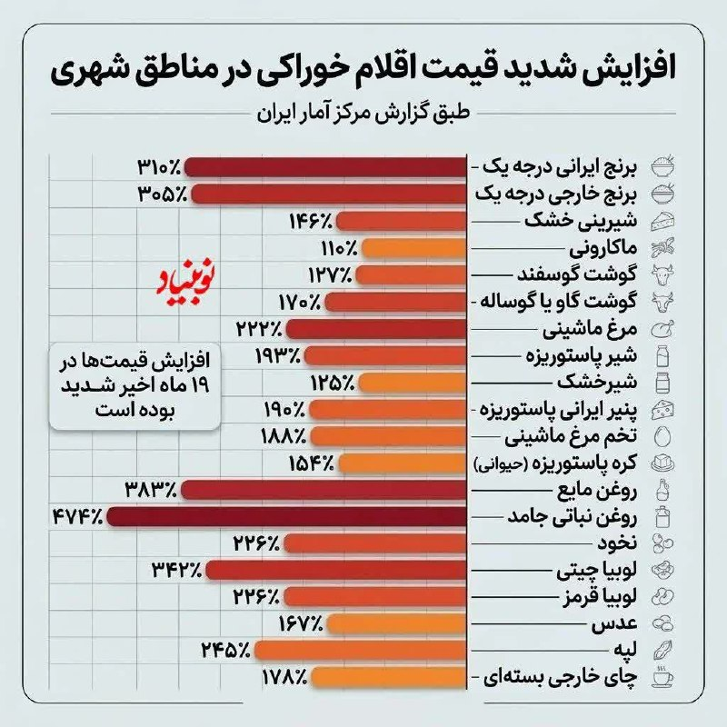

جهش های قیمتی مواد غذایی وحشتناک است این گزارش امروز بیرون امده تقریبا از سال گذشته تا به الان قیمت اکثر موادغذایی در سوپرمارکتها ۵ برابر شده است.

@Dirty_Kids 👻

## Dirty_Kids — post 389047

  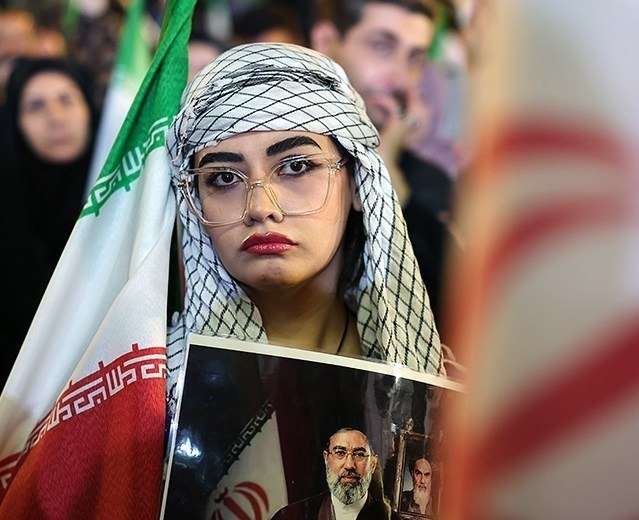

جنده ولایی واقعی یعنی چفیه به سر، پرچم خرچنگ رو شونه، عکس خامنه‌ای بغل.

@Dirty_Kids 👻

## Dirty_Kids — post 389046

استاندار تهران اعلام کرد از روز شنبه ۱۹ اردیبهشت ۱۴۰۵، حضور کارکنان همه وزارتخانه‌ها، سازمان‌ها و دستگاه‌های اجرایی مستقر در استان تهران به‌صورت ۱۰۰ درصدی خواهد بود.

محمدصادق معتمدیان همچنین گفت فعالیت مدارس و دانشگاه‌ها نیز طبق تصمیم وزارت آموزش و پرورش و وزارت علوم، به شکل حضوری و طبق روال اعلام‌شده ادامه خواهد داشت.

@Dirty_Kids 👻

## Dirty_Kids — post 389045

خبر اینکه، یک نفتکش بزرگ حامل فرآورده‌های پالایش‌شده متعلق به یک شرکت چینی در نزدیکی بندر القیر امارات و در ورودی تنگه‌ی هرمز، هدف حمله قرار گرفته و عرشه‌ش آتیش گرفته. @Dirty_Kids 👻

## Dirty_Kids — post 389044

  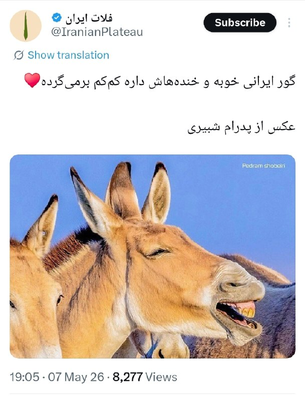

بالاخره یه خبر خوب توی این روزای طاقت‌فرسا✨ نذاریم بی پولی حواسمون رو از خنده‌های امیر پارسا پرت کنه. سلام وحیدجان، سمت شهرک غرب همین الان صدای خنده‌های امیرپارسا اومد. ‏ @Dirty_Kids 👻

## Dirty_Kids — post 389043

  

وینستون چرچیل وقتی حال روحیش خوب نبود، روزی حدود ۲۰۰ تا آجر می‌چید تا ذهنش مشغول بمونه.

وقتی فعالیت بدنی داری، افسردگی کمتر میاد سراغت.

@Dirty_Kids 👻

## Dirty_Kids — post 389042

  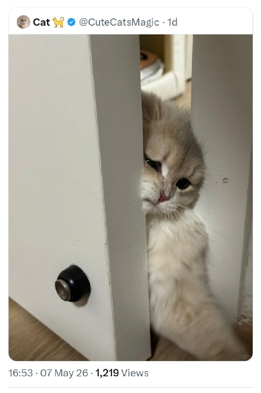

‏فاطمه زهرا

@Dirty_Kids 👻

## Dirty_Kids — post 389041

بسیجیا هروقت به مذاکره فکر کردین یادتون باشه هنوز یخ توافق قبلی باز نشده.

@Dirty_Kids 👻

## Dirty_Kids — post 389040

  

بالاخره یه خبر خوب توی این روزای طاقت‌فرسا✨

نذاریم بی پولی حواسمون رو از خنده‌های امیر پارسا پرت کنه.
سلام وحیدجان، سمت شهرک غرب همین الان صدای خنده‌های امیرپارسا اومد.

‏
@Dirty_Kids 👻

## Dirty_Kids — post 389039

  <a href="telegram/content/Dirty_Kids_389039_1778179557.mp4">🎬 Download video</a>

تحت هر شرایطی باید ساقی این خوش‌چشم رو زنده پیدا کنیم و ازش تقدیر کنیم،
واقعا حلا‌ل‌خورترینه.

@Dirty_Kids 👻

## Dirty_Kids — post 389038

بچه ها اسم این بازی عبور مرغ از خیابون  هست ویدئو نگاه کنید خیلی راحت 8 میلیون ازش سود گرفتیم😍 
😤اگ توم دوس داری خیلی راحت از بازی های انلاین پول در بیاری حتما عضو کازینو شبانه شو
✅ توی کازینو شبانه بهت اموزش میدیم از بازی های انلاین پول دربیاری👌 کانال کازینو…

## Dirty_Kids — post 389037

  <a href="telegram/content/Dirty_Kids_389037_1778179558.mp4">🎬 Download video</a>

بچه ها اسم این بازی عبور مرغ از خیابون  هست ویدئو نگاه کنید خیلی راحت 8 میلیون ازش سود گرفتیم😍

😤اگ توم دوس داری خیلی راحت از بازی های انلاین پول در بیاری حتما عضو کازینو شبانه شو
✅

توی کازینو شبانه بهت اموزش میدیم از بازی های انلاین پول دربیاری👌

کانال کازینو شبانه راهی برای چند برابر کردن سرمایت 🤷‍♂

کسب درامد انلاین با یه ادم حرفه ای یاد بگیر و‌ پول دربیار 
💵
G17
🎯همین حالا عضو شو و شروع کن👇N
https://t.me/+6ckCmywafrxiYzk0
https://t.me/+6ckCmywafrxiYzk0

## Dirty_Kids — post 389036

  <a href="telegram/content/Dirty_Kids_389036_1778179559.mp4">🎬 Download video</a>

چقــدر کُشتید بیشرفااااا؟؟؟

@Dirty_Kids 👻

## Dirty_Kids — post 389035

  <a href="telegram/content/Dirty_Kids_389035_1778179561.mp4">🎬 Download video</a>

این گوزو رو هم تو اوج جنگ آزاد کردن که بیاد کسشرای آخوند رو برامون تکرار کنه

@Dirty_Kids 👻

## Dirty_Kids — post 389034

  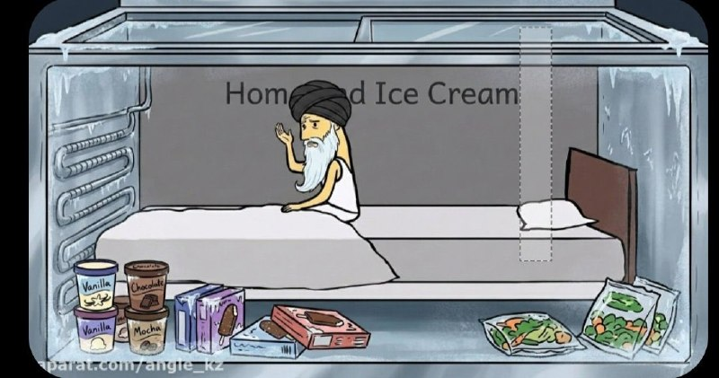

پس این قبر ما چی شد خارکصده‌ها؟!

@Dirty_Kids 👻

## Dirty_Kids — post 389033

  <a href="telegram/content/Dirty_Kids_389033_1778179563.mp4">🎬 Download video</a>

دوستان عزیزم وقت بزارین تا آخر ببینین شاید بدردتون بخوره
و عرزشیای بی مخ …
البته اگه عرزشی مغز نخودی بفهمه که بعید میدونم شاید یذاره دیدش باز شه😂😂

پ‌ن: تازه همه اونا یا پیر شدن یا مردن نسل عوض شده

@Dirty_Kids 👻

## Dirty_Kids — post 389031

بعد میگین جورجینا چرا از حصارک لباس گرفته رفته مت‌گالا!
بابا خونواده رونالدو خودشون از کوچه برلن لباس می‌گیرن میرن کردان مشتی

@Dirty_Kids 👻

## Dirty_Kids — post 389030

  <a href="telegram/content/Dirty_Kids_389030_1778179564.mp4">🎬 Download video</a>

هرچقد از کودن و کصمغز بودن این چادری‌های حکومتی بگم کم گفتم، خب عقب‌افتاده آمریکا و اسرائیل چه‌ربطی به این بدبخت چینی داره😂😂

@Dirty_Kids 👻

## Hranews — post 112824

  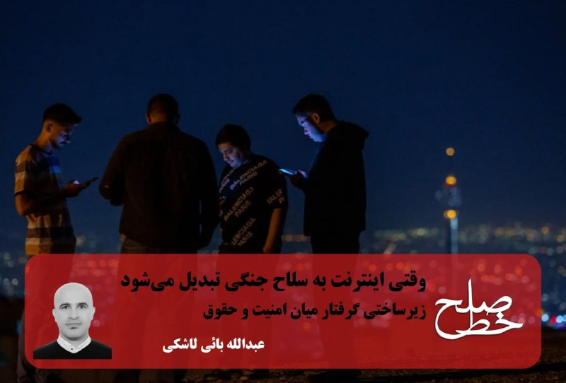

وقتی اینترنت به سلاح جنگی تبدیل می‌شود/ عبدالله بائی لاشکی

📡
📡
📡
📡
📡– در جهان معاصر، اینترنت دیگر صرفاً یک ابزار ارتباطی نیست، بلکه به یکی از ارکان اساسی سازمان‌یابی اجتماعی، اقتصادی و سیاسی تبدیل شده است. زیرساخت‌های حیاتی، از نظام‌های بانکی و بهداشتی گرفته تا رسانه‌ها، آموزش و حتی سازوکارهای امدادرسانی، به درجات مختلف به دسترسی پایدار به اینترنت وابسته‌اند. با این حال، در شرایط مخاصمات مسلحانه، همین زیرساخت حیاتی به‌طور فزاینده‌ای به موضوع یا ابزار مداخله‌ی امنیتی دولت‌ها تبدیل می‌شود. یکی از برجسته‌ترین نمودهای این تحول، توسل به قطع یا محدودسازی گسترده‌ی #اینترنت در زمان جنگ است؛ اقدامی که اگرچه اغلب با استناد به ضرورت‌های امنیت ملی توجیه می‌شود، اما از منظر حقوق بین‌الملل با چالش‌های جدی مواجه است.

در سطح تحلیلی، مسئله‌ی قطع اینترنت در زمان #جنگ را باید در نقطه‌ی تلاقی دو حوزه‌ی مهم از حقوق بین‌الملل بررسی کرد: حقوق بین‌الملل حقوق بشر و حقوق بین‌الملل بشردوستانه. هر یک از این دو نظام حقوقی، مجموعه‌ای از اصول و قواعد را ارائه می‌دهند که به‌طور مستقیم یا غیرمستقیم بر مشروعیت چنین اقداماتی تاثیر می‌گذارند. فهم دقیق این مسئله مستلزم درک این نکته است که جنگ، برخلاف برخی برداشت‌های ساده‌انگارانه، به معنای تعلیق کامل حقوق نیست، بلکه به معنای تغییر در نحوه‌ی اعمال و تفسیر آن‌هاست.

از منظر حقوق بشر، اگرچه اینترنت به‌طور صریح در اسناد کلاسیک مانند میثاق بین‌المللی حقوق مدنی و سیاسی ذکر نشده، اما تفسیرهای نهادهای بین‌المللی –به‌ویژه در دو دهه‌ی اخیر—، به‌روشنی نشان می‌دهند که حقوقی مانند آزادی بیان و دسترسی به اطلاعات، که در ماده‌ی ۱۹ این میثاق تضمین شده‌اند، در فضای آنلاین نیز به همان اندازه قابل اعمال هستند. این تحول تفسیری اهمیت بنیادینی دارد، زیرا به این معناست که اینترنت نه صرفاً یک ابزار فنی، بلکه بستری برای اعمال حقوق بنیادین تلقی می‌شود. در نتیجه، محدودسازی یا قطع آن می‌تواند تاثیراتی چندلایه بر حقوق مختلف داشته باشد؛ از جمله آزادی بیان، حق دسترسی به اطلاعات، مشارکت سیاسی و حتی در برخی شرایط، حقوقی مانند سلامت و امنیت شخصی.

ادامه مطلب

ادامه و لینک به مطلب در وبسایت خط صلح

#عبدالله_بائی_لاشکی

↘️
@hranews_bot تماس ✉️ - @Hranews کانال هرانا 🆑

## Hranews — post 112823

دو زندانی در زندان قزوین اعدام شدند/ رهایی یک تن از چوبه‌دار

❗️
❗️
❗️
❗️
❗️– حکم دو زندانی که پیشتر از بابت اتهامات مرتبط با جرائم مواد مخدر و قتل به اعدام محکوم شده بودند، در زندان چوبیندر قزوین اجرا شد. همچنین، یک زندانی محکوم به #اعدام در استان گیلان، با گذشت اولیای دم از مجازات مرگ رهایی یافت.

ادامه مطلب

#سجاد_حسینی
#بهنام_عبدی
↘️
@hranews_bot تماس ✉️ -  @Hranews  کانال هرانا 🆑

## Hranews — post 112822

گزارشی از تجمع اعتراضی نانوایان در کرمانشاه

❗️
❗️
❗️
❗️
❗️– شماری از نانوایان در شهرستان کرمانشاه، روز جاری با برگزاری #تجمع اعتراضی خواستار رسیدگی به مطالبات خود در رابطه با افزایش هزینه‌های این صنف و نحوه تعیین قیمت نان شدند.

ادامه مطلب

↘️
@hranews_bot تماس ✉️ -  @Hranews  کانال هرانا 🆑

## Hranews — post 112821

  

عضو شورای عالی فضای مجازی، در برنامه «منشور» که با اجرای بهاره افشاری از شبکه نمایش خانگی پخش می‌شود، از عدم صدور گواهینامه موتورسیکلت برای زنان انتقاد کرد.

عزت‌الله ضرغامی، با اشاره به ممنوعیت صدور گواهینامه موتورسیکلت برای زنان اظهار داشت که در نتیجه این محدودیت، زنان مسافر ناچارند از موتورسیکلت‌هایی استفاده کنند که راکب آن مرد است؛ وضعیتی که به گفته وی، با معیارهای مورد استناد مخالفان #موتورسواری_زنان در تعارض قرار دارد و عملاً به انجام آنچه «غیرشرعی» خوانده می‌شود، منجر شده است.

↘️
@hranews_bot تماس ✉️ - @Hranews کانال هرانا 🆑

## Hranews — post 112820

سقز؛ یک جوان ۲۱ ساله در پی انفجار مین جان‌باخت

❗️
❗️
❗️
❗️
❗️– انفجار یک مین برجای مانده از جنگ ایران و عراق در یکی از روستاهای شهرستان سقز، منجر به کشته شدن یک جوان ۲۱ ساله شد.

ادامه مطلب

#انفجار_مین

↘️
@hranews_bot تماس ✉️ - @Hranews کانال هرانا 🆑

## Hranews — post 112819

  

اعتراضات دی‌ماه ۱۴۰۴؛ تداوم بازداشت سمیرا رضوانی‌فر در زندان وکیل‌آباد مشهد

❗️
❗️
❗️
❗️
❗️– سمیرا (فاطمه) رضوانی‌فر، از بازداشت شدگان اعتراضات سراسری ۱۴۰۴ در مشهد، نزدیک به چهار ماه است که به‌ صورت بلاتکلیف در زندان وکیل‌آباد این شهر نگهداری می‌شود.

به گزارش خبرگزاری هرانا، ارگان خبری مجموعه فعالان حقوق بشر در ایران، سمیرا (فاطمه) رضوانی‌فر در #بازداشت است.

بر اساس اطلاعات دریافتی هرانا، خانم رضوانی‌فر در تاریخ ۲۷ دی‌ماه ۱۴۰۴، در جریان اعتراضات سراسری در مشهد توسط نیروهای امنیتی بازداشت شد. او پس از دستگیری به قرنطینه زندان وکیل‌آباد مشهد منتقل شده و با گذشت ۱۱۱ روز، همچنان در بلاتکلیفی قضایی به‌سر می‌برد.

ادامه مطلب

#سمیرا_رضوانی‌فر #فاطمه_رضوانی‌فر

↘️
@hranews_bot تماس ✉️ - @Hranews کانال هرانا 🆑

## Hranews — post 112818

شناسایی و توقیف اموال ۲۰ شهروند در مازندران

❗️
❗️
❗️
❗️
❗️– دادستان ساری از شناسایی و #توقیف_اموال ۲۰ شهروند در استان مازندران به دلیل آنچه «همکاری با دولت‌های آمریکا و اسرائیل در مسیر براندازی نظام جمهوری اسلامی ایران» عنوان کرده، خبر داد. به گفته او، حساب‌های بانکی این افراد نیز مسدود شده و مراحل پرونده در حال پیگیری است.

ادامه مطلب

↘️
@hranews_bot تماس ✉️ - @Hranews کانال هرانا 🆑

## Hranews — post 112817

استان سمنان؛ ۱۲ متهم به تحمل ضربات شلاق محکوم شدند

❗️
❗️
❗️
❗️
❗️– ۱۲ متهم در یک پرونده مشترک مرتبط با سرقت مسلحانه از خطوط لوله نفت در محدوده شهرستان‌های ایوانکی و آرادان، با حکم شعبه اول دادگاه کیفری یک استان سمنان علاوه بر حبس، به تحمل ضربات #شلاق محکوم شدند. حکم صادره در دیوان عالی کشور نیز به تایید رسیده است.

ادامه مطلب

↘️
@hranews_bot تماس ✉️ - @Hranews کانال هرانا 🆑

## Hranews — post 112816

  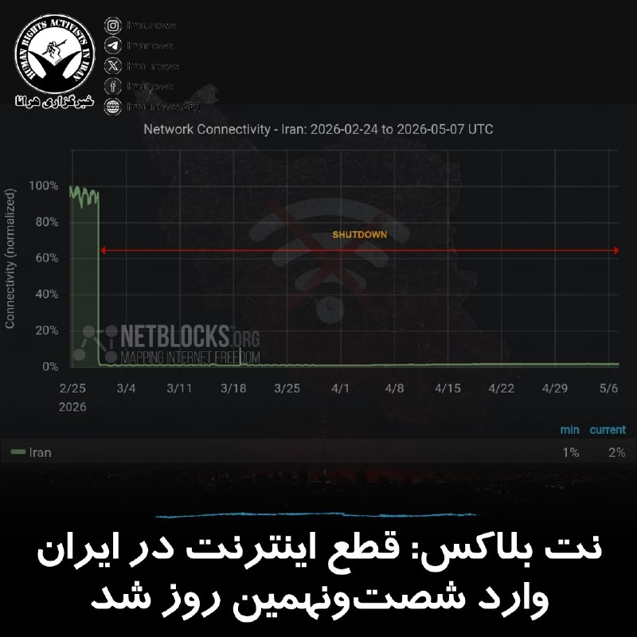

آخرین داده‌های نت‌ بلاکس نشان می‌دهد که #قطع_اینترنت در ایران، پس از گذشت ۱۶۳۲ ساعت محدودیت گسترده در دسترسی به شبکه‌های بین‌المللی، وارد شصت‌ونهمین روز خود شده است. این نهاد ناظر بر وضعیت دسترسی به اینترنت در جهان اعلام کرد که تداوم این اختلال‌ها، موجب افزایش بیکاری و آسیب گسترده به معیشت شهروندان، به‌ویژه کسب‌وکارهای مستقل شده است.

نت‌ بلاکس همچنین تاکید کرد که ادامه خاموشی اینترنت، با ایجاد محدودیت برای فعالیت آزاد اقتصادی و دیجیتال، عملا به «بازتوزیع منابع و فرصت‌های اقتصادی به سود گروه‌های نزدیک به حاکمیت» منجر شده است.

↘️
@hranews_bot تماس ✉️ - @Hranews کانال هرانا 🆑

## Hranews — post 112815

گزارشی از بازداشت و پخش اعترافات اجباری یک زن در زنجان

❗️
❗️
❗️
❗️
❗️– زنی در زنجان به اتهامات توهین به مقدسات، ارتباط با رسانه‌های خارج از کشور و ارسال تصاویر و اطلاعات نظامی به این رسانه‌ ها، #بازداشت شد. هم‌زمان ویدئویی از اعترافات اجباری این شهروند منتشر شده که مشخص نیست در چه شرایطی ضبط شده است.

ادامه مطلب

↘️
@hranews_bot تماس ✉️ - @Hranews کانال هرانا 🆑

## Hranews — post 112814

  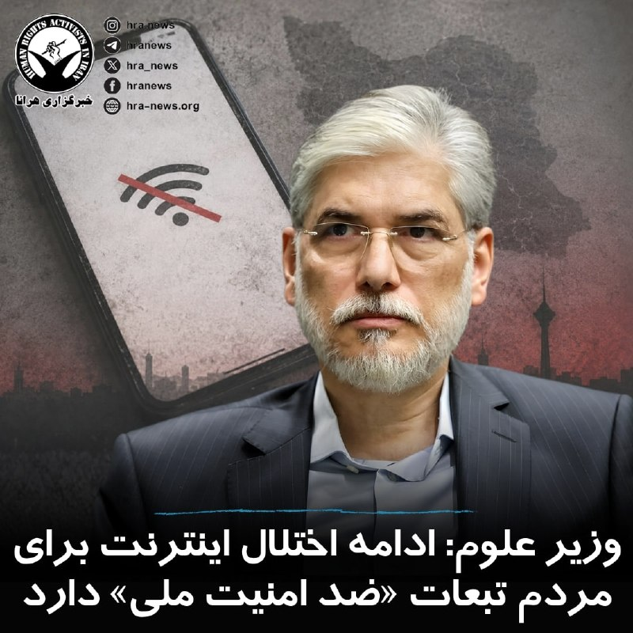

وزیر علوم، تحقیقات و فناوری، با انتقاد از تداوم قطع اینترنت اعلام کرد که کاهش دسترسی به اینترنت، ارتباطات علمی و پژوهشی کشور را مختل کرده و تداوم اختلال اینترنت برای عموم مردم، «ضد امنیت ملی» است. حسین سیمایی، خواستار بازگشت هرچه سریع‌تر شرایط به وضعیت عادی و فراهم شدن دسترسی آزاد و پایدار به #اینترنت برای دانشگاهیان و شهروندان شد.

وزیر علوم همچنین با اشاره به پیامدهای تبعیض در دسترسی به اینترنت گفت که ایجاد اینترنت‌های طبقاتی و محدود، احساس نابرابری و نارضایتی اجتماعی را تشدید می‌کند. سیمایی در ادامه هشدار داد که محدودیت‌های اینترنتی علاوه بر آسیب به فعالیت‌های علمی و پژوهشی، تبعات اجتماعی گسترده‌ای نیز به همراه دارد.

↘️
@hranews_bot تماس ✉️ - @Hranews کانال هرانا 🆑

## Hranews — post 112813

دادستان همدان از مصادره اموال ۵۲ نفر خبر داد

❗️
❗️
❗️
❗️
❗️– دادستان عمومی و انقلاب همدان از توقیف اموال ۵۲ نفر در این استان خبر داد. دستگاه قضایی این افراد را به «ارتباط با جریان اسرائیلی و آمریکایی» و همکاری با «شبکه‌های وابسته به دشمن» متهم کرده است.

ادامه مطلب

#مصادره_اموال

↘️
@hranews_bot تماس ✉️ - @Hranews کانال هرانا 🆑

## Hranews — post 112812

  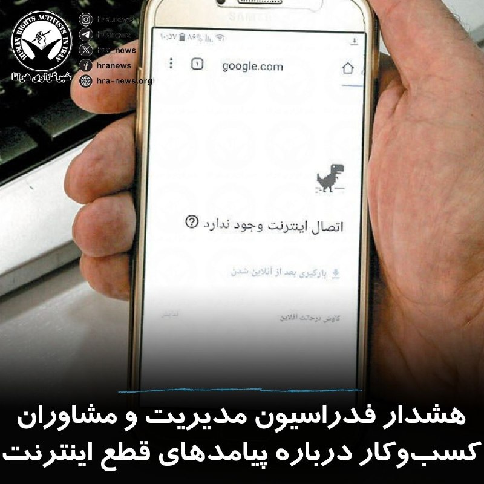

فدراسیون مدیریت و مشاوران کسب‌وکار ایران با انتشار بیانیه‌ای نسبت به تداوم محدودیت‌ها و سیاست‌های تبعیض‌آمیز اینترنتی هشدار داد و اعلام کرد که اینترنت دیگر صرفاً یک ابزار ارتباطی نیست، بلکه زیرساخت حیاتی اقتصاد دیجیتال محسوب می‌شود. در این بیانیه تأکید شده که اختلال و بی‌ثباتی در دسترسی به #اینترنت، مستقیماً بر تولید، اشتغال، سرمایه‌گذاری و رقابت‌پذیری اقتصاد کشور تأثیر می‌گذارد و بسیاری از کسب‌وکارهای دیجیتال را با کوچک شدن یا نابودی مواجه کرده است. به گفته این فدراسیون، وضعیت موجود می‌تواند به شکل‌گیری موجی از بیکاری تدریجی منجر شود که از لایه‌های پنهان آغاز شده و به‌مرور به سطح جامعه منتقل می‌شود.

در بخش دیگری از این بیانیه، نسبت به پیامدهای بلندمدت این وضعیت بر سرمایه انسانی هشدار داده شده و آمده است که بی‌ثباتی مداوم اینترنت، فعالیت نیروهای متخصص را مختل کرده و تصمیم آنها برای ماندن در کشور را تغییر می‌دهد. این فدراسیون همچنین تأکید کرده که سیاست‌هایی مانند «اینترنت طبقاتی» نه‌تنها مشکلات موجود را حل نمی‌کند، بلکه به تشدید نابرابری، افزایش رانت و تضعیف رقابت در اقتصاد دیجیتال منجر خواهد شد.

↘️
@hranews_bot تماس ✉️ -  @Hranews  کانال هرانا 🆑

## Hranews — post 112811

اجرای حکم اعدام یک زندانی در زندان کرمانشاه

❗️
❗️
❗️
❗️
❗️– سحرگاه امروز چهارشنبه ۱۶ اردیبهشت ماه، حکم یک زندانی که پیشتر از بابت اتهام قتل به #اعدام محکوم شده بود، در زندان کرمانشاه به اجرا درآمد.

ادامه مطلب

#محمدتقی_شاه‌ویسی

↘️
@hranews_bot تماس ✉️ -  @Hranews  کانال هرانا 🆑

## Hranews — post 112810

گزارشی از قطع بیمه بازنشستگان فولاد و ۴۰ هزار کارگر ساختمانی

❗️
❗️
❗️
❗️
❗️– کارگران بازنشسته صنعت فولاد در اصفهان و تهران نسبت به قطع بیمه درمان تکمیلی خود اعتراض دارند. همچنین، رئیس انجمن صنفی #کارگران ساختمانی آمل از قطع بیمه ۴۰ هزار کارگر ساختمانی در استان مازندران خبر داد.

ادامه مطلب
↘️
@hranews_bot تماس ✉️ -  @Hranews  کانال هرانا 🆑

## Hranews — post 112809

مرگ دو کارگر در سایه فقدان ایمنی کار

❗️
❗️
❗️
❗️
❗️– در سایه فقدان ایمنی محیط و شرایط نامناسب کار، دو #کارگر در مشهد و اراک حین انجام کار طی حوادثی جان خود را از دست دادند.

ادامه مطلب

↘️
@hranews_bot تماس ✉️ -  @Hranews  کانال هرانا 🆑

## Hranews — post 112808

گزارشی از اعدام یک زندانی در زندان دستگرد اصفهان/ تایید یک حکم اعدام در تهران

❗️
❗️
❗️
❗️
❗️– سحرگاه روز دوشنبه، حکم یک زندانی که پیشتر از بابت اتهامات مرتبط با جرائم مواد مخدر به #اعدام محکوم شده بود، در زندان دستگرد اصفهان به اجرا درآمد. از سوی دیگر، حکم اعدام مردی که متهم به قتل یک مرد دیگر بود، توسط دیوان عالی کشور تایید شد.

ادامه مطلب

#مسعود_شیرزاد

↘️
@hranews_bot تماس ✉️ -  @Hranews  کانال هرانا 🆑

## Hranews — post 112807

زرندیه؛ ۵ شهروند توسط نیروی انتظامی بازداشت شدند

❗️
❗️
❗️
❗️
❗️– فرمانده انتظامی شهرستان زرندیه از بازداشت پنج شهروند به دلیل آنچه «ارسال اطلاعات و همکاری با شبکه معاند» عنوان کرده است، خبر داد.

ادامه مطلب

↘️
@hranews_bot تماس ✉️ - @Hranews کانال هرانا 🆑

## Hranews — post 112806

  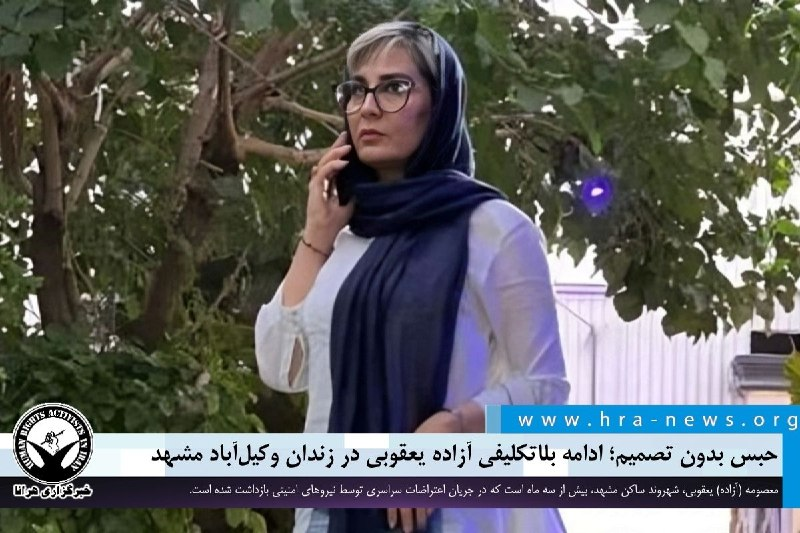

حبس بدون تصمیم؛ ادامه بلاتکلیفی آزاده یعقوبی در زندان وکیل‌آباد مشهد

❗️
❗️
❗️
❗️
❗️– آزاده (معصومه) یعقوبی، شهروند ساکن مشهد، بیش از سه ماه است که در جریان اعتراضات سراسری توسط نیروهای امنیتی بازداشت شده و همچنان به‌ صورت بلاتکلیف در زندان وکیل‌آباد مشهد نگهداری می‌شود.

به گزارش خبرگزاری هرانا، ارگان خبری مجموعه فعالان حقوق بشر در ایران، آزاده (معصومه) یعقوبی کماکان در بازداشت به‌سر می‌برد.

بر اساس اطلاعات دریافتی هرانا، بازداشت آزاده یعقوبی در تاریخ ۱۴ بهمن ماه ۱۴۰۴، توسط نیروهای امنیتی در مشهد صورت گرفته است. او هم اکنون در قرنطینه زندان وکیل‌آباد مشهد نگهداری می‌شود.

#آزاده_یعقوبی #معصومه_یعقوبی
#اعتراضات۱۴۰۴ #اعتراضات_بازار

ادامه مطلب

↘️
@hranews_bot تماس ✉️ - @Hranews کانال هرانا 🆑

## Hranews — post 112805

حامد دلاوری به زندان قروه منتقل شد

❗️
❗️
❗️
❗️
❗️– حامد دلاوری، شهروند بازداشتی اهل سقز، از یکی از بازداشتگاه‌های امنیتی در این شهر به زندان قروه منتقل شد.

#حامد_دلاوری

ادامه مطلب

↘️
@hranews_bot تماس ✉️ - @Hranews کانال هرانا 🆑

<!-- MSG END -->
<!-- NAV START -->
*پایان پیام‌ها*
<!-- NAV END -->
