# خواننده تلگرام

<!-- MSG START -->
## ???-??-?? ??:?? (post 238653) — VahidOOnLine
[🎬 Video](telegram/content/VahidOOnLine_238653_1778160945.mp4)

> رویترز در گزارشی اختصاصی نوشته منابع کشتیرانی می‌گویند امارات همچنان بخشی از نفت خود را از تنگه هرمز عبور می‌دهد؛ آن هم با کشتی‌هایی که برای جلوگیری از هدف قرار گرفتن، سیستم‌های ردیابی‌شان خاموش شده است.
> بر اساس داده‌های ردیابی، شرکت ملی نفت ابوظبی در ماه آوریل چندین میلیون بشکه نفت خام را از پایانه‌های داخل خلیج فارس صادر کرده که بخشی از آن از طریق انتقال کشتی‌به‌کشتی یا تخلیه در عمان به مقصد پالایشگاه‌های آسیایی منتقل شده است.
> این روش صادراتی در حالی انجام می‌شود که صادرات نفت امارات از آغاز جنگ کاهش یافته و ریسک حمل‌ونقل دریایی در منطقه به‌شدت افزایش پیدا کرده است.
> ‌🏁 🇬🇧 ManotoTV
> 
> 🤖 @VahidOOnLine

## ???-??-?? ??:?? (post 238652) — VahidOOnLine
[🎬 Video](telegram/content/VahidOOnLine_238652_1778160946.mp4)

> قیمت نفت کاهش یافت و بازارهای جهانی سهام در معاملات روز پنج‌شنبه عملکردی متضاد داشتند؛ در حالی که سرمایه‌گذاران در انتظار به‌روزرسانی درباره طرح آمریکا برای پایان جنگ با ایران و بازگشایی تنگه هرمز هستند.
> پس از آنکه قیمت نفت روز چهارشنبه در پی امید به صلح تا بیش از ۱۰ درصد سقوط کرده بود، روز پنج‌شنبه افت آن ملایم‌تر شد و حدود ۲ درصد کاهش ثبت کرد. در بازارهای سهام، بورس‌های اروپایی پس از رشد قابل توجه روز قبل کاهش یافتند، در حالی که بازارهای اصلی آسیا روند صعودی داشتند.
> استراتژیست‌ها باور دارند هیجان شدیدی که با امید به کاهش تنش‌ها در بازارها ایجاد شده بود، در حال فروکش کردن است و این واقعیت در حال شکل‌گیری است که برای رسیدن به یک توافق پایدار، موانع بیشتری وجود دارد؛ حتی با وجود اینکه گزارش شده جمهوری‌اسلامی در حال بررسی یک پیشنهاد صلح آمریکا برای پایان رسمی درگیری است.
> ‌🏁 🇬🇧 ManotoTV
> 
> 🤖 @VahidOOnLine

## ???-??-?? ??:?? (post 238651) — VahidOOnLine
[🎬 Video](telegram/content/VahidOOnLine_238651_1778160946.mp4)

> استاندار تهران اعلام کرد از روز شنبه ۱۹ اردیبهشت ۱۴۰۵، حضور کارکنان همه وزارتخانه‌ها، سازمان‌ها و دستگاه‌های اجرایی مستقر در استان تهران به‌صورت ۱۰۰ درصدی خواهد بود.
> محمدصادق معتمدیان همچنین گفت فعالیت مدارس و دانشگاه‌ها نیز طبق تصمیم وزارت آموزش و پرورش و وزارت علوم، به شکل حضوری و طبق روال اعلام‌شده ادامه خواهد داشت.
> ‌🏁 🇬🇧 ManotoTV
> 
> 🤖 @VahidOOnLine

## 1405/02/17 16:55 — VahidOOnLine
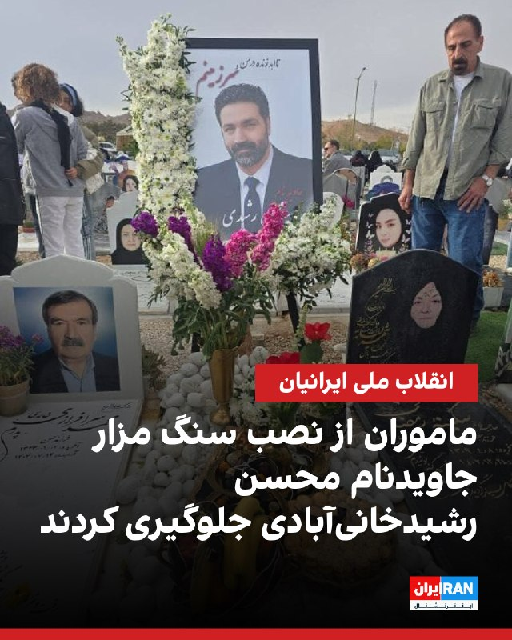

> گزارش‌های رسیده به ایران‌اینترنشنال نشان می‌دهد ماموران حکومت از نصب سنگ بر مزار جاویدنام محسن رشیدی خانی‌آبادی در مراسم چهلم او جلوگیری کرده‌اند.
> 
> محسن ۴۲ ساله شامگاه ۱۹‌ دی در اعتراضات منطقه بهارستان شهر اصفهان کشته شد. به‌گفته بستگان این جاویدنام، اگرچه سنگ قبر او برای نصب در باغ رضوان آماده بود، اما ماموران به بهانه درج بیت شعری مشابه آنچه بر مزار پدرش نوشته شده بود، جلوگیری کردند.
> 
> نوشتن عبارتی با عنوان «تا ابد در من و سرزمینم» بر بالای این سنگ، از دیگر دلایل مخالفت با نصب آن بود.
> 
> پیکر محسن اکنون در قبری دوطبقه به همراه مادربزرگش به خاک سپرده شده است.
> 
> روی این سنگ مزار پیش‌تر عبارت «مگر کانون مهرماه می‌شود خاموش بماند»، نوشته شده بود اما اکنون با وجود مخالفت اعضای خانواده، ماموران امنیتی اجازه ندادند بار دیگر این عبارت را بر سنگ مزار دو نفره آنان حک کنند.
> 
> با گذشت حدود چهار ماه از کشته شدن محسن، همچنان سنگی بر مزار او نصب نشده است.
> ‌🏁 🇬🇧 IranintlTV
> 
> 🤖 @VahidOOnLine

## 1405/02/17 16:53 — VahidOOnLine
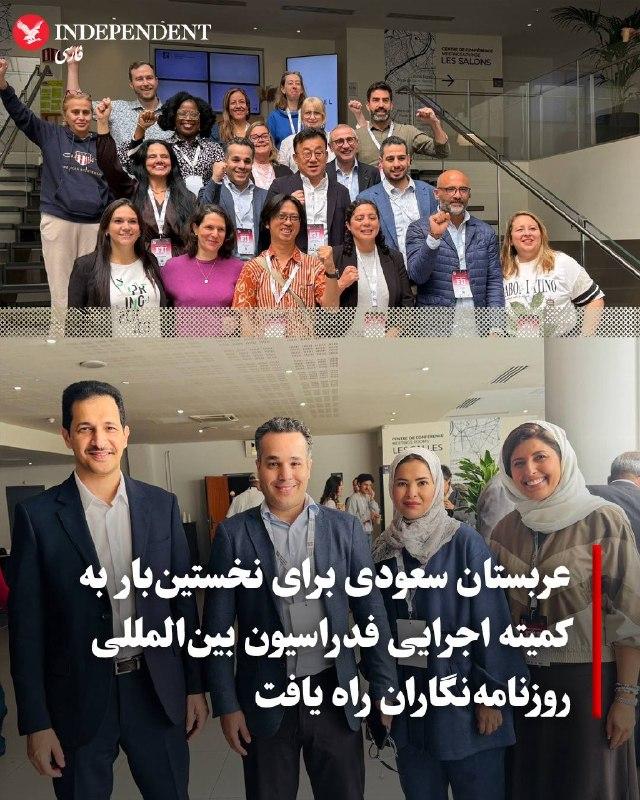

> ♦️عدوان الأحمری، رئیس انجمن روزنامه‌نگاران عربستان سعودی، در کنگره بین‌المللی مطبوعات در پاریس به‌عنوان عضو کمیته اجرایی فدراسیون بین‌المللی روزنامه‌نگاران انتخاب شد؛ رخدادی که نخستین حضور عربستان سعودی در این نهاد جهانی به شمار می‌رود.
> 
> الأحمری این انتخاب را نشانه اعتماد اتحادیه‌ها و نهادهای حرفه‌ای بین‌المللی به انجمن روزنامه‌نگاران عربستان سعودی دانست و گفت این موفقیت حاصل تلاش اعضای هیئت‌مدیره و دبیرخانه انجمن است.
> 
> او افزود عربستان سعودی پیش‌تر نیز از طریق ریاست دفتر اجرایی روزنامه‌نگاران غرب آسیا حضور بین‌المللی خود را تقویت کرده بود و اکنون این حضور وارد مرحله تازه‌ای شده است.
> 
> کمیته اجرایی این فدراسیون از میان نمایندگان بیش از ۱۴۸ کشور انتخاب شد و تنها ۱۶ نامزد موفق به کسب کرسی شدند.
> 
> فدراسیون بین‌المللی روزنامه‌نگاران که در سال ۱۹۲۶ تاسیس شده، بزرگ‌ترین نهاد جهانی روزنامه‌نگاران است و حدود ۶۰۰ هزار فعال رسانه‌ای را در بیش از ۱۴۰ کشور نمایندگی می‌کند.
> ‌🇸🇦 Indypersian
> 
> 🤖 @VahidOOnLine

## 1405/02/17 16:55 — mwarmonitor
> 🔘یک اختلاف شدید بین ارتش و موساد بر سر هدف نهایی جنگ در ایران شکل گرفته و همچنان ادامه دارد. ارتش اسرائیل (IDF) حذف اورانیوم از خاک ایران را دستاورد نهایی می‌داند. اما موساد معتقد است هدف باید سرنگونی حکومت باشد. حتی امروز نیز، برخلاف فرهنگ «توجیه و بازنویسی گذشته» که در منطقه رایج است، موساد همچنان بر این دیدگاه پافشاری می‌کند. در حالی که ارتش به تعریف مبهم «ایجاد شرایط برای سرنگونی حکومت» بسنده کرده، موساد چهار کلمه اول را حذف کرده و مستقیماً بر هدف سرنگونی تأکید دارد.
> 
> 🔸از اینجا به بعد، واقعیت به دو دیدگاه متفاوت و گاهی کاملاً متضاد تقسیم می‌شود. برخی مقامات ارشد ارتش اسرائیل از تصمیم آمریکا برای عدم تصرف اورانیوم غنی‌شده در یک عملیات نظامی به‌شدت ناراضی هستند. به همین دلیل، عملیات «Roaring Lion» با تقریباً هیچ پیشرفت قابل توجهی نسبت به برنامه هسته‌ای ایران در مقایسه با عملیات «Rising Lion» متوقف شد. آن‌ها مدام تکرار می‌کنند: «اورانیوم، اورانیوم، اورانیوم؛ اگر آن را بگیری، برنامه هسته‌ای را از بین برده‌ای.»
> 
> 🔹دیدگاه دوم این است که: چه فایده‌ای دارد اورانیوم را از طریق عملیات یا توافق خارج کنیم؟ اگر حکومت باقی بماند، حتی با وجود باقی ماندن چند تن اورانیوم ۳ درصدی، تنها چند سال تأخیر ایجاد شده—در مقیاس ژئوپولیتیک، یک چشم به هم زدن. حکومتی که تحت تحریم نباشد، ثروتمندتر و خطرناک‌تر خواهد شد و همچنان مانند قبل خواهان نابودی اسرائیل خواهد بود. تنها تغییر حکومت می‌تواند این هدف را از ریشه از بین ببرد. این دیدگاه در مقابل برخی مقامات امنیتی است که هرچند از آزادی میلیون‌ها ایرانی از دیکتاتوری استقبال می‌کنند، اما اولویت اصلی‌شان همچنان «اسرائیل در اولویت اول» است.
> 
> 🔸تجلی عملی این اختلاف در یک سؤال فرضی دیده می‌شود: اگر رئیس‌جمهور ترامپ به اسرائیل بگوید «برای یک عملیات چراغ سبز دارید»، چه می‌شود؟ بیشتر ساختار دفاعی می‌گویند تشکر کرده و نیروی هوایی را برای حمله به ذخایر اورانیوم اعزام می‌کنند. اما موساد احتمالاً از نابودی زیرساخت‌های انرژی و پالایشگاه‌ها حمایت می‌کند تا ایران را عملاً در تاریکی کامل فرو ببرد. این کار می‌تواند روند شورش داخلی را به‌طور چشمگیری تسریع کند. آستانه خشم مردم از سطح اعتراضات ژانویه عبور کرده، اما هم‌زمان ترس نیز افزایش یافته است. وقتی برق نباشد—و انتظار می‌رود ظرف دو ماه در ایران کمبود غذا آغاز شود—این دیوار ترس فرو خواهد ریخت.
> 
> 🔘کدام هدف بلندپروازانه‌تر است؟ در نگاه اول، سرنگونی حکومت یک هدف بسیار بزرگ به نظر می‌رسد، در حالی که نابودی اورانیوم یک اقدام محدود و قابل مدیریت است. اما تاریخ نشان می‌دهد حکومت‌ها در طول زمان سقوط کرده‌اند، در حالی که هیچ کشوری هرگز داوطلبانه مواد هسته‌ای غنی‌شده خود را در حالی که حکومتش پابرجاست واگذار نکرده است. همان‌طور که در یک مثل قدیمی تلمودی آمده، این یک انتخاب بین «راه کوتاهی که طولانی است»—یک ضربه سریع که مشکل ریشه‌ای را حل نمی‌کند—و «راه طولانی که کوتاه است»—مسیر دشوار تغییر حکومت که تهدید را برای همیشه از بین می‌برد.
> ( آمیت سیگال خبرنگار کانال ۱۲ اسرائیل)
> 
> 
> @mwarmonitor

## ???-??-?? ??:?? (post 335974) — IranIntlTV
[🎬 Video](telegram/content/IranIntlTV_335974_1778160948.mp4)

> در حالی که بحث احتمال مذاکره میان تهران و واشینگتن دوباره مطرح شده است، بسیاری از کاربران ایرانی در شبکه‌های اجتماعی این روند را با نگرانی دنبال می‌کنند.
> عادله بورنگ، عضو تحریریه ایران‌اینترنشنال، از واکنش کاربران رسانه‌های اجتماعی می‌گوید
> @iranintltv

## ???-??-?? ??:?? (post 335973) — IranIntlTV
> یک شهروند از بابلسر با ارسال پیامی به ایران اینترنشنال از افزایش اجاره خانه‌ها به میزان دو تا سه برابر می‌گوید و خواستار همکاری بیشتر شهروندان بایکدیگر در اوضاع بد اقتصادی می‌شود.

## 1405/02/17 16:55 — IranIntlTV

> گزارش‌های رسیده به ایران‌اینترنشنال نشان می‌دهد ماموران حکومت از نصب سنگ بر مزار جاویدنام محسن رشیدی خانی‌آبادی در مراسم چهلم او جلوگیری کرده‌اند.
> 
> محسن ۴۲ ساله شامگاه ۱۹‌ دی در اعتراضات منطقه بهارستان شهر اصفهان کشته شد. به‌گفته بستگان این جاویدنام، اگرچه سنگ قبر او برای نصب در باغ رضوان آماده بود، اما ماموران به بهانه درج بیت شعری مشابه آنچه بر مزار پدرش نوشته شده بود، جلوگیری کردند.
> 
> نوشتن عبارتی با عنوان «تا ابد در من و سرزمینم» بر بالای این سنگ، از دیگر دلایل مخالفت با نصب آن بود.
> 
> پیکر محسن اکنون در قبری دوطبقه به همراه مادربزرگش به خاک سپرده شده است.
> 
> روی این سنگ مزار پیش‌تر عبارت «مگر کانون مهرماه می‌شود خاموش بماند»، نوشته شده بود اما اکنون با وجود مخالفت اعضای خانواده، ماموران امنیتی اجازه ندادند بار دیگر این عبارت را بر سنگ مزار دو نفره آنان حک کنند.
> 
> با گذشت حدود چهار ماه از کشته شدن محسن، همچنان سنگی بر مزار او نصب نشده است.
> https://iranintl.com/202605073178

## ???-??-?? ??:?? (post 105086) — ManotoTV
[🎬 Video](telegram/content/ManotoTV_105086_1778160950.mp4)

> رویترز در گزارشی اختصاصی نوشته منابع کشتیرانی می‌گویند امارات همچنان بخشی از نفت خود را از تنگه هرمز عبور می‌دهد؛ آن هم با کشتی‌هایی که برای جلوگیری از هدف قرار گرفتن، سیستم‌های ردیابی‌شان خاموش شده است.
> بر اساس داده‌های ردیابی، شرکت ملی نفت ابوظبی در ماه آوریل چندین میلیون بشکه نفت خام را از پایانه‌های داخل خلیج فارس صادر کرده که بخشی از آن از طریق انتقال کشتی‌به‌کشتی یا تخلیه در عمان به مقصد پالایشگاه‌های آسیایی منتقل شده است.
> این روش صادراتی در حالی انجام می‌شود که صادرات نفت امارات از آغاز جنگ کاهش یافته و ریسک حمل‌ونقل دریایی در منطقه به‌شدت افزایش پیدا کرده است.

## ???-??-?? ??:?? (post 105085) — ManotoTV
[🎬 Video](telegram/content/ManotoTV_105085_1778160951.mp4)

> قیمت نفت کاهش یافت و بازارهای جهانی سهام در معاملات روز پنج‌شنبه عملکردی متضاد داشتند؛ در حالی که سرمایه‌گذاران در انتظار به‌روزرسانی درباره طرح آمریکا برای پایان جنگ با ایران و بازگشایی تنگه هرمز هستند.
> پس از آنکه قیمت نفت روز چهارشنبه در پی امید به صلح تا بیش از ۱۰ درصد سقوط کرده بود، روز پنج‌شنبه افت آن ملایم‌تر شد و حدود ۲ درصد کاهش ثبت کرد. در بازارهای سهام، بورس‌های اروپایی پس از رشد قابل توجه روز قبل کاهش یافتند، در حالی که بازارهای اصلی آسیا روند صعودی داشتند.
> استراتژیست‌ها باور دارند هیجان شدیدی که با امید به کاهش تنش‌ها در بازارها ایجاد شده بود، در حال فروکش کردن است و این واقعیت در حال شکل‌گیری است که برای رسیدن به یک توافق پایدار، موانع بیشتری وجود دارد؛ حتی با وجود اینکه گزارش شده جمهوری‌اسلامی در حال بررسی یک پیشنهاد صلح آمریکا برای پایان رسمی درگیری است.

## ???-??-?? ??:?? (post 105084) — ManotoTV
[🎬 Video](telegram/content/ManotoTV_105084_1778160951.mp4)

> استاندار تهران اعلام کرد از روز شنبه ۱۹ اردیبهشت ۱۴۰۵، حضور کارکنان همه وزارتخانه‌ها، سازمان‌ها و دستگاه‌های اجرایی مستقر در استان تهران به‌صورت ۱۰۰ درصدی خواهد بود.
> محمدصادق معتمدیان همچنین گفت فعالیت مدارس و دانشگاه‌ها نیز طبق تصمیم وزارت آموزش و پرورش و وزارت علوم، به شکل حضوری و طبق روال اعلام‌شده ادامه خواهد داشت.

## 1405/02/17 16:51 — ManotoTV
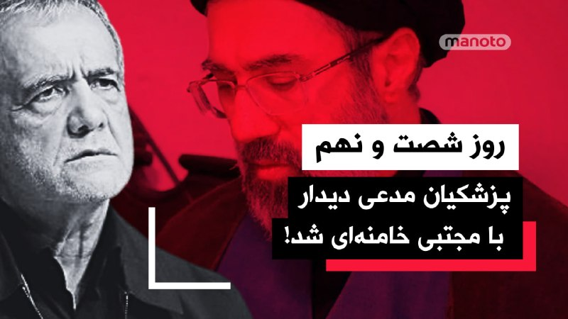

> https://youtube.com/live/cPjJ1JkeQaw?feature=share

## ???-??-?? ??:?? (post 124401) — DW_Farsi
[🎬 Video](telegram/content/DW_Farsi_124401_1778160952.mp4)

> 🎥 بازسازی پل B1 در شرایط ناپایدار جنگی و اقتصادی
> 
> ویدئویی از آغاز بازسازی پل بی‌یک (B1) یا پل بیلقان در عظیمیه کرج در شبکه‌های اجتماعی منتشر شده که در جریان جنگ با ایالات متحده و اسرائيل مورد هدف قرار گرفته بود. هوشنگ بازوند، مدیرعامل شرکت ساخت و توسعه زیربناهای حمل‌ونقل، مدعی شده بازسازی این پل کمتر از یک سال زمان می‌برد و حدود ۳.۷ هزار میلیارد تومان هزینه خواهد داشت.
> 
> بازسازی سریع این پل در حالی مطرح می‌شود که جمهوری اسلامی همچنان در شرایط ناپایدار و تنش‌های جنگی قرار دارد و هم‌زمان کشور دستخوش بحران اقتصادی گسترده است. همین موضوع این پرسش را مطرح می‌کند که بازسازی زیرساخت‌های تخریب‌شده تا چه اندازه در عمل امکان‌پذیر است و چه میزان از این وعده‌ها ممکن است در حد برنامه‌ها و برآوردهای اولیه باقی بمانند.
> 
> 
> @dw_farsi

## 1405/02/17 16:52 — Persian_Trend_Official
> 🔴 گزارش‌ها از سفر احتمالی عراقچی به اسلام‌آباد در مسیر بازگشت از چین
> 
> 🔹برخی منابع در پاکستان گزارش می‌دهند عباس عراقچی، وزیر خارجه ایران، ممکن است در مسیر بازگشت از چین وارد اسلام‌آباد شود.
> 
> 🔹تا این لحظه مقام‌های رسمی ایران یا پاکستان جزئیاتی درباره هدف احتمالی این سفر یا دیدارهای برنامه‌ریزی‌شده منتشر نکرده‌اند.
> 
> 🫆:Tony
> 
> 📌 @persian_trend_official
> پرشین ترند | متفاوت‌ترین کانال نظامی

## 1405/02/17 16:56 — BBCPersian
> 🔻هشدار کمیسیون فدرال برق سوئیس در مورد تاثیر احتمالی جنگ ایران در تامین گاز و برق اروپا
> 
> کمیسیون فدرال برق سوئیس روز پنجشنبه اعلام کرد که جنگ در ایران باعث ایجاد عدم اطمینان در مورد تامین گاز برای زمستان پیش رو شده است.
> 
> این کمیسیون می‌گوید که این اوضاع در بدترین حالت ممکن است حتی بر ثبات تامین برق اروپا و سوئیس نیز تأثیر بگذارد.
> 
> جنگ آمریکا و اسرائیل علیه ایران و بسته شدن تنگه هرمز باعث مختل شدن کشتیرانی در خلیج فارس شد و قیمت نفت به بالاترین سطح خود از زمان جنگ اوکراین در سال ۲۰۲۲ رسید.
> 
> پیش از این هم کارشناسان هشدار داده‌اند که ادامه اختلال در تحویل سوخت به دلیل جنگ ایران می‌تواند ظرف چند هفته کمبود سوخت را به همراه داشته باشد.
> 
> آژانس بین‌المللی انرژی هشدار داده است که اگر سوخت بیشتری از جای دیگری وارد نشود، کل اروپا تا ماه ژوئن با کمبود سوخت مواجه خواهد شد.
> 
> https://bbc.in/496G5Jl
> @BBCPersian

## ???-??-?? ??:?? (post 238648) — VahidOOnLine
[🎬 Video](telegram/content/VahidOOnLine_238648_1778160135.mp4)

> پاکستان اعلام کرده است که انتظار دارد توافقی میان آمریکا و جمهوری‌اسلامی در آینده نزدیک حاصل شود؛ در حالی که این کشور در طول جنگ علیه ایران نقش میانجی میان واشنگتن و تهران را ایفا کرده است.
> وزارت خارجه پاکستان با انتشار بیانیه‌ای جدید بر خوش‌بینی خود تأکید کرده است. تَحیر اندرابی، سخنگوی وزارت خارجه پاکستان، گفت: «انتظار داریم هرچه زودتر توافقی حاصل شود.»
> او افزود: «امیدواریم طرف‌ها به یک راه‌حل مسالمت‌آمیز و پایدار برسند که نه‌تنها به صلح در منطقه ما، بلکه به صلح بین‌المللی نیز کمک کند.»
> با این حال، او از ارائه زمان‌بندی خودداری کرد و گفت پاکستان جزئیات تلاش‌های دیپلماتیک در حال انجام را منتشر نخواهد کرد.
> او تأکید کرد: «آنچه می‌توانم بگویم این است که ما همچنان امیدوار و خوش‌بین هستیم و امیدواریم این توافق هرچه زودتر حاصل شود.»
> این موضع‌گیری در ادامه گزارش‌هایی است که از پیشرفت مذاکرات غیرمستقیم میان آمریکا و جمهوری‌اسلامی حکایت دارد؛ مذاکراتی که گفته می‌شود بر موضوع هسته‌ای و تنگه هرمز متمرکز است.
> ‌🏁 🇬🇧 ManotoTV
> 
> 🤖 @VahidOOnLine

## ???-??-?? ??:?? (post 105082) — ManotoTV
[🎬 Video](telegram/content/ManotoTV_105082_1778160136.mp4)

> پاکستان اعلام کرده است که انتظار دارد توافقی میان آمریکا و جمهوری‌اسلامی در آینده نزدیک حاصل شود؛ در حالی که این کشور در طول جنگ علیه ایران نقش میانجی میان واشنگتن و تهران را ایفا کرده است.
> وزارت خارجه پاکستان با انتشار بیانیه‌ای جدید بر خوش‌بینی خود تأکید کرده است. تَحیر اندرابی، سخنگوی وزارت خارجه پاکستان، گفت: «انتظار داریم هرچه زودتر توافقی حاصل شود.»
> او افزود: «امیدواریم طرف‌ها به یک راه‌حل مسالمت‌آمیز و پایدار برسند که نه‌تنها به صلح در منطقه ما، بلکه به صلح بین‌المللی نیز کمک کند.»
> با این حال، او از ارائه زمان‌بندی خودداری کرد و گفت پاکستان جزئیات تلاش‌های دیپلماتیک در حال انجام را منتشر نخواهد کرد.
> او تأکید کرد: «آنچه می‌توانم بگویم این است که ما همچنان امیدوار و خوش‌بین هستیم و امیدواریم این توافق هرچه زودتر حاصل شود.»
> این موضع‌گیری در ادامه گزارش‌هایی است که از پیشرفت مذاکرات غیرمستقیم میان آمریکا و جمهوری‌اسلامی حکایت دارد؛ مذاکراتی که گفته می‌شود بر موضوع هسته‌ای و تنگه هرمز متمرکز است.

## ???-??-?? ??:?? (post 19687) — IranianMinds
[🎬 Video](telegram/content/IranianMinds_19687_1778160137.mp4)

> 🤣🤣🤣
> 
> @IranianMinds

## ???-??-?? ??:?? (post 280411) — BBCPersian
[🎬 Video](telegram/content/BBCPersian_280411_1778160138.mp4)

> 🔻در پی حملات هوایی اسرائیل به مناطق جنوبی لبنان، دود غلیظی از مناطق شهری و روستایی به آسمان برخاست. بنابر گزارش‌‌ها مناطقی مانند نبطیه فوقا، زوطر شرقی و یوحمر در این حملات هدف قرار گرفته‌اند.
> 
> این حملات در حالی ادامه دارد که با پافشاری ایران، از ۱۷ آوریل ۲۰۲۶ (۲۸ فروردین ۱۴۰۵) آتش‌بسی میان اسرائیل و حزب‌الله اعلام شده بود اما به گفته منابع محلی، اسرائیل همچنان به حملات هوایی به مناطق مختلف لبنان به‌ویژه در جنوب این کشور ادامه داده است. در مقابل، حزب‌الله هم که گفته بود آتش‌بس را مشروط پذیرفته است، با انجام حملاتی به این اقدامات پاسخ داده است.
> 
> بر اساس آمار منتشرشده، از دوم مارس ۲۰۲۶ (۱۱ اسفند ۱۴۰۴) تاکنون بیش از ۲۷۰۰ نفر در لبنان نتیجه حملات اسرائیل کشته و بیش از یک میلیون نفر آواره شده‌اند. بخش قابل توجهی از این آوارگان از مناطق جنوبی و شرقی لبنان و همچنین حومه جنوبی بیروت هستند.
> 
> ادامه درگیری‌ها نگرانی‌ها درباره تشدید بحران انسانی و گسترش تنش در منطقه را افزایش داده است.
> 
> پیشتر و در آستانه مذاکرات در پاکستان، ایران، صلح با آمریکا را به آتش‌بس در لبنان گره زده بود.
> 
> https://bbc.in/4usmfAe
> @BBCPersian

## 1405/02/17 16:50 — BBCPersian
> 🔻حضور ۱۰۰ درصدی کارکنان وزراتخانه و سازمان‌ها از روز شنبه
> 
> محمدصادق معتمدیان، استاندارتهران گفته است که فعالیت تمامی وزارتخانه‌ها، سازمان‌ها و دستگاه‌های اجرایی مستقر در استان تهران از روز شنبه ۱۹ اردیبهشت‌ تا اطلاع ثانوی با حضور همۀ کارکنان، به‌صورت ۱۰۰ درصدی، انجام خواهد شد.
> 
> براساس این گزارش فعالیت آموزشی مدارس و دانشگاه‌ها هم مطابق اعلام وزارتخانه های آموزش و پرورش و علوم خواهد بود.
> 
> https://bbc.in/496G5Jl
> @BBCPersian

## ???-??-?? ??:?? (post 238647) — VahidOOnLine
[🎬 Video](telegram/content/VahidOOnLine_238647_1778159549.mp4)

> ♦️مسعود پزشکیان، رئیس جمهوری اسلامی، روز پنجشنبه ۱۷ اردیبهشت در نشستی با صناف و بازاریان از دیدار خود با مجتبی خامنه‌ای، رهبر جدید جمهوری اسلامی خبر داد و گفت: «این دیدار نزدیک به دو ساعت و نیم ادامه داشت.»
> پزشکیان گفت: «نحوه مواجهه، نوع نگاه و شیوه برخورد مجتبی خامنه‌ای متواضعانه و عمیقا صمیمی» بود.
> او به زمان دیدار با مجتبی خامنه‌ای اشاره‌ای نکرده است.
> مجتبی خامنه‌ای ۹ روز پس از کشته شدن علی خامنه‌ای در موج اول حملات آمریکا و اسرائیل، به‌عنوان رهبر جدید جمهوری اسلامی منصوب شد و گزارش‌های غیررسمی حاکی از مجروحیت شدید او در ناحیه پا و صورت است.
> این اظهارات در حالی مطرح می‌شود که از زمان انتصاب مجتبی خامنه‌ای به جانشینی پدرش، هیچ تصویر یا صدایی از او منتشر نشده است.
> ‌🇸🇦 Indypersian
> 
> 🤖 @VahidOOnLine

## 1405/02/17 16:38 — VahidOOnLine

> بنیاد نرگس اعلام کرد نرگس محمدی، برنده جایزه صلح نوبل و زندانی سیاسی، در هفتمین روز بستری در بخش مراقبت‌های ویژه قلب بیمارستانی در زنجان، همچنان در وضعیت جسمانی ناپایدار قرار دارد و نگرانی‌ها درباره وضعیت قلبی او افزایش یافته است.
> 
> بر اساس گزارش بنیاد نرگس، تشخیص محتمل تیم پزشکی درباره نرگس محمدی «پرینزمتال آنژینا» عنوان شده؛ وضعیتی ناشی از اسپاسم شریان‌های کرونری که می‌تواند باعث حملات شدید قلبی، آریتمی‌های مرگ‌بار، نوسانات جدی فشار خون و اختلال در خون‌رسانی به قلب شود.
> 
> بنیاد نرگس افزود پزشکانی که پیش از بستری وضعیت او را بررسی کرده بودند، انجام فوری آنژیوگرافی تخصصی را ضروری دانسته‌اند و خانواده و پزشکان خواستار انتقال فوری نرگس محمدی به تهران هستند، اما دادستان تهران همچنان با این انتقال مخالفت کرده است.
> ‌🏁 🇬🇧 IranintlTV
> 
> 🤖 @VahidOOnLine

## ???-??-?? ??:?? (post 335971) — IranIntlTV
[🎬 Video](telegram/content/IranIntlTV_335971_1778159553.mp4)

> مسعود پزشکیان از دیدار خود با مجتبی خامنه‌ای، رهبر سوم جمهوری اسلامی خبر داد و گفت این نشست در فضایی صمیمی، صریح و همراه با احساس نزدیکی و اعتماد برگزار شده و نزدیک به دو ساعت و نیم ادامه داشته است.
> گفت‌وگو با محمدجواد اکبرین، عضو تحریریه ایران‌اینترنشنال
> @iranintltv

## 1405/02/17 16:37 — IranIntlTV
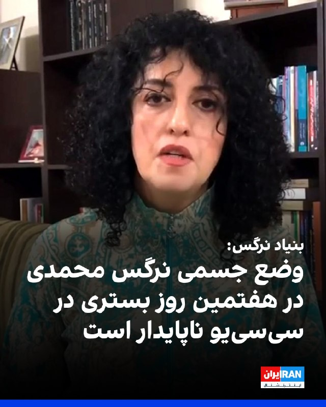

> بنیاد نرگس اعلام کرد نرگس محمدی، برنده جایزه صلح نوبل و زندانی سیاسی، در هفتمین روز بستری در بخش مراقبت‌های ویژه قلب بیمارستانی در زنجان، همچنان در وضعیت جسمانی ناپایدار قرار دارد و نگرانی‌ها درباره وضعیت قلبی او افزایش یافته است.
> 
> بر اساس گزارش بنیاد نرگس، تشخیص محتمل تیم پزشکی درباره نرگس محمدی «پرینزمتال آنژینا» عنوان شده؛ وضعیتی ناشی از اسپاسم شریان‌های کرونری که می‌تواند باعث حملات شدید قلبی، آریتمی‌های مرگ‌بار، نوسانات جدی فشار خون و اختلال در خون‌رسانی به قلب شود.
> 
> بنیاد نرگس افزود پزشکانی که پیش از بستری وضعیت او را بررسی کرده بودند، انجام فوری آنژیوگرافی تخصصی را ضروری دانسته‌اند و خانواده و پزشکان خواستار انتقال فوری نرگس محمدی به تهران هستند، اما دادستان تهران همچنان با این انتقال مخالفت کرده است.
> https://iranintl.com/202605077561

## ???-??-?? ??:?? (post 217106) — FarsiVOA
> آیا لغو تابعیت ایرانی برای ایرانیان مخالف «جمهوری اسلامی» ممکن و قانونی است؟ گفت‌وگو با حسین رئیسی، حقوقدان

## 1405/02/17 16:35 — DW_Farsi
> 🔶 پافشاری روسیه بر تخلیه سفارت‌خانه‌های خارجی در کی‌یف
> 
> روسیه از سفارت‌خانه‌های واقع در کی‌یف، پایتخت اوکراین خواسته تا در صورت حمله این کشور به این شهر کارکنان خود را به مکان‌های امن منتقل کنند.
> 
> وزارت خارجه روسیه روز پنج‌شنبه هفتم مه با ارسال یادداشتی به سفارت‌خانه‌های واقع در کی‌یف اعلام کرد که باید "تخلیه‌ به‌هنگام کارکنان نمایندگانی‌های دیپلماتیک و سایر نهادها و همچنین شهروندان خود را از کی‌یف تضمین کنند."
> 
> این وزارت‌خانه هشدار داد، در صورتی که روسیه در مراسم یادبود پیروزی این کشور بر آلمان نازی در روز شنبه نهم مه از سوی اوکراین هدف حمله قرار گیرد ممکن است دست به اقدامی تلافی‌جویانه بزند.
> 
> روسیه پیش از این به صورت یک‌جانبه پیشنهاد آتش‌بس در جنگ اوکراین داده و خواسته بود تا این آتش‌بس در روزهای هشتم و نهم مه برقرار شود.
> 
> پیش از این وزارت دفاع روسیه تهدید کرده بود که در صورت نقض آتش‌بس در این روزها از سوی اوکراین، شهر کی‌یف را هدف حملات تلافی‌جویانه خود قرار خواهد داد.
> 
> اوکراین نیز در مقابل، از تاریخی متفاوت (ششم مه) اعلام آتش‌بس یک‌سویه کرده بود که به گفته این کشور، با حملات پیاپی روسیه نقض شد.
> @dw_farsi

## ???-??-?? ??:?? (post 19686) — IranianMinds
[🎬 Video](telegram/content/IranianMinds_19686_1778159557.mp4)

> 🔴سقوط خودرو روی سر پلیس روسی، حین اجرای نمایش.
> 
> @IranianMinds

## 1405/02/17 16:28 — VahidOOnLine

> رویترز خبر داد که امارات متحده عربی با استفاده از تاکتیک‌هایی مانند خاموش کردن ردیاب‌های موقعیت مکانی برای جلوگیری از حمله‌های جمهوری اسلامی، اخیرا چند نفتکش را از تنگه هرمز عبور داده است.
> 
> رویترز نوشت که حجم این صادرات تنها بخشی از میزان معمول صادرات امارات متحده عربی پیش از جنگ است، اما نشان می‌دهد تولیدکننده و خریداران حاضرند برای خرید و فروش نفت ریسک کنند.
> ‌🏁 🇬🇧 IranintlTV
> 
> 🤖 @VahidOOnLine

## 1405/02/17 16:24 — VahidOOnLine
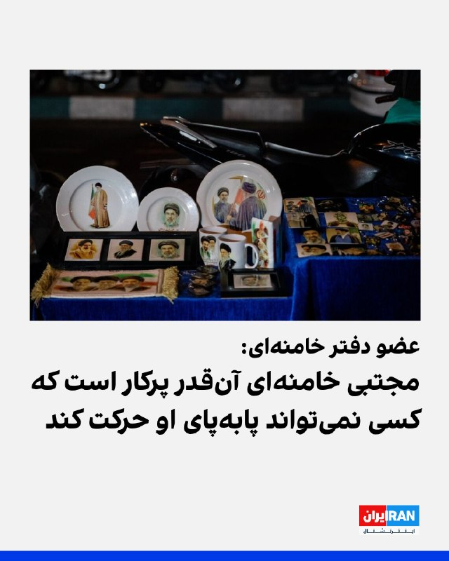

> مهدی فضائلی، عضو دفتر علی خامنه‌ای، گفت: «مجتبی خامنه‌ای به‌قدری مشغول پیگیری مسائل و موضوعات مختلف کشور است که افرادی که برای پیگیری امور در کنار او هستند، جا می‌مانند. او آن‌قدر پرکار است که مسئولان پیگیری این امور نمی‌توانند پا‌به‌پای او حرکت کنند.»
> 
> فضائلی افزود: «باید مطمئن باشید که مجتبی خامنه‌ای در ادامه راه پدرش، با انرژی، انگیزه، اراده‌ای قوی و اشراف بر مسائل مختلف کشور، کشور را هدایت می‌کند.»
> ‌🏁 🇬🇧 IranintlTV
> 
> 🤖 @VahidOOnLine

## 1405/02/17 16:27 — IranIntlTV
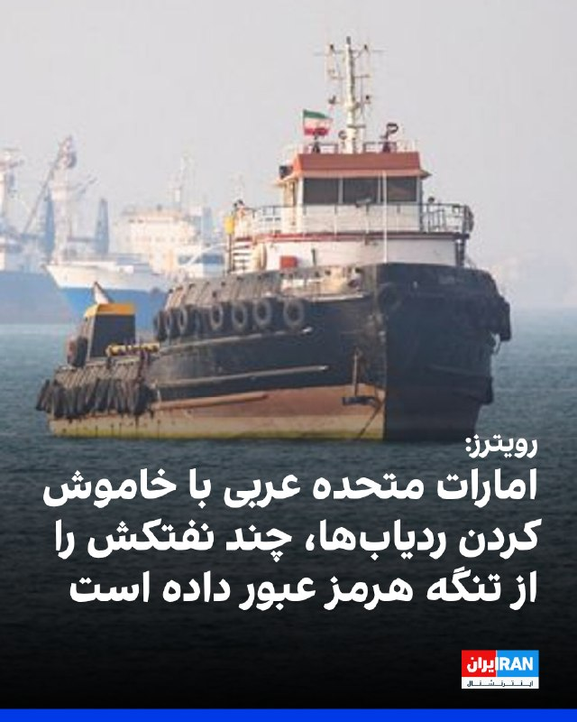

> رویترز خبر داد که امارات متحده عربی با استفاده از تاکتیک‌هایی مانند خاموش کردن ردیاب‌های موقعیت مکانی برای جلوگیری از حمله‌های جمهوری اسلامی، اخیرا چند نفتکش را از تنگه هرمز عبور داده است.
> 
> رویترز نوشت که حجم این صادرات تنها بخشی از میزان معمول صادرات امارات متحده عربی پیش از جنگ است، اما نشان می‌دهد تولیدکننده و خریداران حاضرند برای خرید و فروش نفت ریسک کنند.
> https://iranintl.com/202605074906

## 1405/02/17 16:23 — IranIntlTV

> مهدی فضائلی، عضو دفتر علی خامنه‌ای، گفت: «مجتبی خامنه‌ای به‌قدری مشغول پیگیری مسائل و موضوعات مختلف کشور است که افرادی که برای پیگیری امور در کنار او هستند، جا می‌مانند. او آن‌قدر پرکار است که مسئولان پیگیری این امور نمی‌توانند پا‌به‌پای او حرکت کنند.»
> 
> فضائلی افزود: «باید مطمئن باشید که مجتبی خامنه‌ای در ادامه راه پدرش، با انرژی، انگیزه، اراده‌ای قوی و اشراف بر مسائل مختلف کشور، کشور را هدایت می‌کند.»
> https://iranintl.com/202605075974

## ???-??-?? ??:?? (post 335967) — IranIntlTV
[🎬 Video](telegram/content/IranIntlTV_335967_1778158931.mp4)

> وزیر خارجه فرانسه اعلام کرد تا زمانی که تنگه هرمز مسدود باقی بماند هیچ‌ یک از تحریم‌های بین‌المللی علیه جمهوری اسلامی لغو نخواهد شد.
> جزییات بیشتر با نیلوفر پورابراهیم، خبرنگار ایران‌اینترنشنال
> @iranintltv

## 1405/02/17 16:23 — Persian_Trend_Official
> سلام به همراهان عزیز کانال پرشین ترند! ✌️ ​امروز قصد دارم یک پروژه فوق‌العاده و کاربردی رو برای گذر از فیلترینگ بهتون معرفی کنم. یکی از پروژه‌هایی که خودم شخصاً تست کردم و در حال حاضر داره کار می‌کنه، پروژه mhr-cfw هست. با راه‌اندازی این ابزار می‌تونید با…

## 1405/02/17 16:23 — BBCPersian
> 🔻شصت و نهمین روز قطع اینترنت در ایران
> 
> اکنون در شصت و نهمین روز قطع اینترنت، مردم در داخل ایران ۱۶۳۲ ساعت است که به طور گسترده امکان دسترسی به اینترنت بین‌المللی را ندارند.
> 
> نت‌بلاکس که وضعیت اینترنت در جهان را بررسی می‌کند گفته است که قطعی اینترنت باعث از دست رفتن مشاغل وتوقف کسب و کارهای مردم عادی شده و فرصت‌های اقتصادی بیشتری را به نهادهای نزدیک به حکومت می‌دهد.
> 
> حکومت ایران از زمان شروع جنگ در نهم اسفند ماه سال گذشته اینترنت بین المللی را قطع کرده است.
> 
> اخیرا مقامات و نهادهای ایران طرح «اینترنت پرو» را فعال کرده‌اند که اهالی کسب‌وکار یا دانشگاهیان بتوانند با پرداخت مبلغی بیشتر، با دسترسی محدود به اینترنت بین‌المللی وصل شوند.
> 
> این موضوع واکنش‌ کاربران شبکه‌های اجتماعی را به دنبال داشته است.
> 
> https://bbc.in/496G5Jl
> @BBCPersian

## 1405/02/17 16:09 — VahidOOnLine
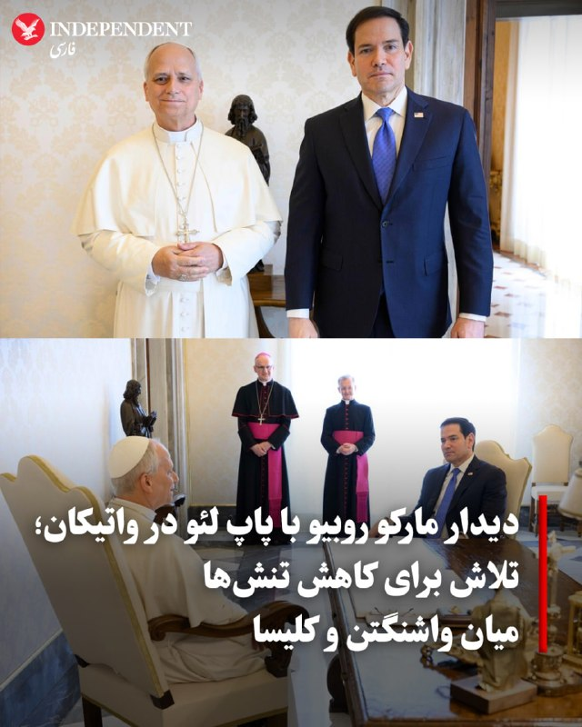

> ♦️ مارکو روبیو، وزیر امور خارجه ایالات متحده، روز پنجشنبه ۱۷ اردیبهشت، در واتیکان با پاپ لئو چهاردهم، نخستین پاپ آمریکایی تاریخ، دیدار و گفتگو کرد. این نشست پشت درهای بسته در حالی برگزار شد که روابط میان کاخ سفید و واتیکان به دلیل انتقادهای تند دونالد ترامپ از مواضع پاپ در قبال جنگ ایران، به پایین‌ترین سطح خود رسیده است.
> 
> روبیو که خود یک کاتولیک است، پیش از این دیدار اعلام کرده بود که اگرچه این سفر از قبل برنامه‌ریزی شده بود، اما «اتفاقات اخیر» موضوعات زیادی را برای بحث ایجاد کرده است. علاوه بر تنش‌های مربوط به جنگ، طرفین درباره موضوعاتی نظیر آزادی‌های مذهبی در جهان و ارسال کمک‌های بشردوستانه به کوبا از طریق کانال‌های کلیسا گفتگو کردند.
> 
> این دیدار نخستین ملاقات یک مقام ارشد کابینه ترامپ با پاپ در یک سال گذشته محسوب می‌شود. در حالی که پاپ لئو به عنوان منتقد جدی جنگ و سیاست‌های مهاجرتی واشنگتن شناخته می‌شود، سفیر آمریکا در واتیکان این گفتگوها را «صریح» توصیف کرد.
> ‌🇸🇦 Indypersian
> 
> 🤖 @VahidOOnLine

## ???-??-?? ??:?? (post 238642) — VahidOOnLine
[🎬 Video](telegram/content/VahidOOnLine_238642_1778158257.mp4)

> رسانه‌های دولتی چین گزارش داده‌اند که دو وزیر پیشین دفاع این کشور در پرونده‌های فساد مالی به اعدام با تعلیق دو ساله محکوم شده‌اند.
> یک دادگاه نظامی روز پنج‌شنبه «وی فنگه» و «لی شانگ‌فو» را به اعدام با تعلیق دو‌ساله محکوم کرد؛ به این معنا که در صورت عدم ارتکاب جرم جدید طی این مدت، حکم آن‌ها به حبس ابد تبدیل می‌شود، بدون امکان تخفیف یا آزادی مشروط.
> به گزارش شینهوا، هر دو مقام به دریافت رشوه مجرم شناخته شده و تمامی دارایی‌های شخصی آن‌ها نیز مصادره شده است.
> این حکم در ادامه موج گسترده پاکسازی در ارتش چین و در چارچوب کارزار ضدفساد دولت پکن صادر شده است؛ کارزاری که طی آن چندین مقام ارشد نظامی از سمت خود برکنار شده‌اند.
> شی از زمان به قدرت رسیدن، چندین موج گسترده مبارزه با فساد را آغاز کرده است؛ اقداماتی که منتقدان می‌گویند گاهی برای حذف رقبای سیاسی نیز به کار رفته است.
> ‌🏁 🇬🇧 ManotoTV
> 
> 🤖 @VahidOOnLine

## ???-??-?? ??:?? (post 238641) — VahidOOnLine
[🎬 Video](telegram/content/VahidOOnLine_238641_1778158258.mp4)

> مارکو روبیو، وزیر امور خارجه آمریکا، با پاپ لئون چهاردهم؛ اولین پاپ آمریکایی؛ در واتیکان دیدار کرد. ملاقات ساعت ۱۱:۳۰ صبح به وقت رم در کاخ آپوستولیک واتیکان برگزار شد. این دیدار در حالی انجام شد که اخیرا تنش‌هایی بین دولت دونالد ترامپ و واتیکان به وجود آمده بود. پاپ لئون از جنگ آمریکا و اسرائیل علیه ایران انتقاد کرده بود و ترامپ هم به او حمله کرده بود. روبیو که خودش کاتولیک است پیش از این دیدار گفته بود این ملاقات صریح خواهد بود. جزئیات بیش‌تری از این دیدار تا کنون منتشر نشده است.
> ‌🏁 🇬🇧 ManotoTV
> 
> 🤖 @VahidOOnLine

## 1405/02/17 15:56 — VahidOOnLine

> محمود نبویان، عضو کمیسیون امنیت ملی مجلس، در شبکه ایکس نوشت: «با وجود سابقه بدعهدی آمریکا و به ویژه حضور اصحاب توافق ذلت بار برجام به‌همراه قالیباف در مذاکرات، هیچ امیدی به مذاکره و توافق مطلوب برای ایران وجود ندارد.»
> 
> او افزود: «لازم است قالیباف اصحاب توافق خسارت‌بار برجام را از تیم مذاکره‌کننده کاملا حذف نماید.»
> 
> نبویان در پست دیگری نیز نوشت که برخی از «مسئولین و سیاسیون ترسو و غیرهمسو با ملت مقاوم ایران»، به دنبال آمارسازی‌های غلط برای تسلیم هستند، اگر اصلاح نکنند، اسامی‌شان افشا خواهد شد.
> ‌🏁 🇬🇧 IranintlTV
> 
> 🤖 @VahidOOnLine

## 1405/02/17 15:56 — VahidOOnLine
> 🗣روایت شما از اقتصاد و زندگی در آتش‌بس- پنج‌شنبه ۱۷ اردیبهشت:
> 
> 🔹حیوانات هم در ایران بدبخت هستن، لطفا کسانی که می‌تونن به پناهگاه حیوانات که با کمک مردمی اداره می‌شن کمک کنن. قیمت اسکلت و غذای خشک برای سگ و گربه به شدت گرون شده، از وقتی اینترنت قطع شده کمکی بهشون نشده. خیلی‌هاشون نیاز به درمان دارند!
> 
> 🔹قطعات یدکی خودرو به راحتی پیدا نمی‌شه، اگه پیدا بشه هم قیمتش خیلی زیاده. چهار حلقه لاستیک پراید ۱۶ میلیون شده، فوم صندلی خودرو از ۲۰۰ الی ۳۰۰ هزار تومان شده ۲ میلیون تومان.
> 
> 🔹من پژوهشگر حوزه بیولوژی در دانشگاه شیراز هستم. متاسفانه تمام فعالیت‌های پژوهشی ما به خاطر نبود اینترنت آزاد کاملا تعطیل شده.
> 
> 🔹از تهران پیام می‌دم: اینترنت گیگی ۵۰۰ تومانه، اونم کند و با قطع و وصلیِ شدید. قیمت اجناس نجومی شده؛ یک بطری روغن سرخ‌کردنی ۹۰۰ هزار تومان.
> 
> 🔹با این گرانی و فقر نبود اینترنت و قطعی آب و برق، زندگی واقعا سخت شده. امیدوارم که واقعا نور بر تاریکی پیروز بشه، چون دیگه چیزی برای از دست دادن نداریم.
> 
> 🔹باوجود تعطیلی مدارس از ۹ اسفند و برگزاری مجازی کلاس‌ها، مدارس غیرانتفاعی کل شهریه‌ سال را یک‌جا می‌گیرند. در حالی‌که والدین برای جلوگیری از افت تحصیلی فرزندانشان بعضی از دروس را سمت معلم یا آموزشگاه خصوصی برده‌اند.
> 
> 🔹از بندرعباس پیام می‌دم: خیلی از کارگرهای بندر رجایی بیکار شدن و کسانی که موندن هم هنوز حقوق نگرفتن. جایی که از مهم‌ترین بنادر ایرانه، خیلی خلوت شده.
> 
> 🔹از سیرجان پیام می‌دم: یک کیلو تخمه کدو برشته شده ۸۰۰ هزار تومان، یک کیلو تخمه آفتاب‌گردان برشته شده ۶۰۰ هزار تومن.
> ‌🏁 🇬🇧 IranintlTV
> 
> 🤖 @VahidOOnLine

## 1405/02/17 16:16 — mwarmonitor

> 🔸ترامپ در سوشال تروث
> 
> 🔹«یک نمایش بسیار دقیق از دولت جو بایدنِ خواب‌آلود. آسیب‌های فوق‌العاده‌ای وارد شده اما، ما برگشتیم!!! رئیس‌جمهور (دونالد جی. ترامپ)»
> 
> @mwarmonitor

## 1405/02/17 16:14 — mwarmonitor
> 🔰وزارت دادگستری آمریکا در حال بررسی ۲.۶ میلیارد دلار معاملات نفتی مرتبط با جنگ ایران است - ABC News
> 
> @mwarmonitor

## 1405/02/17 16:13 — mwarmonitor
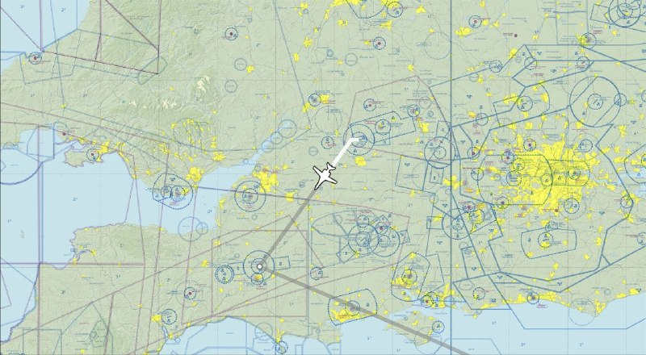

> ⏱ساعت 13:26 — یک فروند بمب‌افکن استراتژیک FONDU 11 x1 USAF B-1/B Lancer
> از پایگاه RAF Fairford برای یک مأموریت جهت آمادگی به پرواز درآمده است.
> 
> FONDU11 در حال تماس با Swanwick
> Military روی فرکانس 278.600
> 
> @mwarmonitor

## 1405/02/17 16:10 — mwarmonitor
> 🔴(رویترز) - یک مقام ارشد حماس روز پنج‌شنبه اعلام کرد که در یک حمله هوایی اسرائیل، پسر «مذاکره‌کننده ارشد حماس» در گفت‌وگوهای تحت میانجی‌گری آمریکا درباره آینده غزه کشته شده است؛ در حالی که رهبران این گروه شبه‌نظامی در قاهره برای حفظ آتش‌بس با اسرائیل در حال مذاکره بودند.
> 
> «باسم نعیم»، مقام ارشد حماس، گفت «عزام الحیه»، فرزند «خلیل الحیه»، روز پنج‌شنبه بر اثر جراحات وارده در حمله اسرائیل در شب چهارشنبه جان باخته است. او چهارمین پسر از رئیس تبعیدی حماس در غزه است که در حملات اسرائیل کشته می‌شود.
> 
> @mwarmonitor

## 1405/02/17 15:46 — mwarmonitor
> 🔴(رویترز) - به گفته یک منبع آگاه، مسعود پزشکیان، رئیس‌جمهور ایران، روز پنج‌شنبه در گزارش رسانه‌های دولتی اعلام کرد که اخیراً با مجتبی خامنه‌ای، رهبر عالی، دیدار کرده است؛ این نخستین گزارش علنی از دیدار او با خامنه‌ای پس از آن است که گفته می‌شود وی در آغاز جنگ ایران و اسرائیل-آمریکا دچار جراحات شدید شده بود.
> 
> 🔸پزشکیان گفته است که این دیدار در فضایی «متواضعانه و بسیار صمیمی» انجام شده است.
> 
> @mwarmonitor

## 1405/02/17 15:45 — mwarmonitor
> 🔴(رویترز) - یک منبع آگاه به رویترز گفته است که «رستم عمروف»، مذاکره‌کننده ارشد اوکراین، برای گفت‌وگو با نمایندگان ایالات متحده درباره پایان دادن به جنگ روسیه در اوکراین، وارد میامی شده است.
> 
> @mwarmonitor

## 1405/02/17 15:52 — pm_afshaa
> 🔴کانال 12 اسرائیل: ترامپ بدون خروج اورانیوم غنی‌شده از ایران، توافق نخواهد کرد
> 
> 
> 💧 Rainbet.com the #1 Non-KYC Crypto Casino & Sportsbook @rainbetcom
> 
> 😁 @Pm_Afshaa

## 1405/02/17 15:56 — IranIntlTV
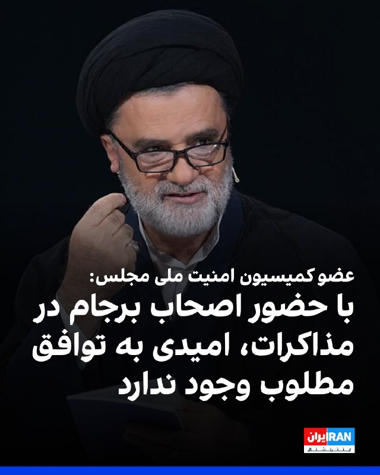

> محمود نبویان، عضو کمیسیون امنیت ملی مجلس، در شبکه ایکس نوشت: «با وجود سابقه بدعهدی آمریکا و به ویژه حضور اصحاب توافق ذلت بار برجام به‌همراه قالیباف در مذاکرات، هیچ امیدی به مذاکره و توافق مطلوب برای ایران وجود ندارد.»
> 
> او افزود: «لازم است قالیباف اصحاب توافق خسارت‌بار برجام را از تیم مذاکره‌کننده کاملا حذف نماید.»
> 
> نبویان در پست دیگری نیز نوشت که برخی از «مسئولین و سیاسیون ترسو و غیرهمسو با ملت مقاوم ایران»، به دنبال آمارسازی‌های غلط برای تسلیم هستند، اگر اصلاح نکنند، اسامی‌شان افشا خواهد شد.
> https://iranintl.com/202605073172

## 1405/02/17 15:56 — IranIntlTV
> 🗣روایت شما از اقتصاد و زندگی در آتش‌بس- پنج‌شنبه ۱۷ اردیبهشت:
> 
> 🔹حیوانات هم در ایران بدبخت هستن، لطفا کسانی که می‌تونن به پناهگاه حیوانات که با کمک مردمی اداره می‌شن کمک کنن. قیمت اسکلت و غذای خشک برای سگ و گربه به شدت گرون شده، از وقتی اینترنت قطع شده کمکی بهشون نشده. خیلی‌هاشون نیاز به درمان دارند!
> 
> 🔹قطعات یدکی خودرو به راحتی پیدا نمی‌شه، اگه پیدا بشه هم قیمتش خیلی زیاده. چهار حلقه لاستیک پراید ۱۶ میلیون شده، فوم صندلی خودرو از ۲۰۰ الی ۳۰۰ هزار تومان شده ۲ میلیون تومان.
> 
> 🔹من پژوهشگر حوزه بیولوژی در دانشگاه شیراز هستم. متاسفانه تمام فعالیت‌های پژوهشی ما به خاطر نبود اینترنت آزاد کاملا تعطیل شده.
> 
> 🔹از تهران پیام می‌دم: اینترنت گیگی ۵۰۰ تومانه، اونم کند و با قطع و وصلیِ شدید. قیمت اجناس نجومی شده؛ یک بطری روغن سرخ‌کردنی ۹۰۰ هزار تومان.
> 
> 🔹با این گرانی و فقر نبود اینترنت و قطعی آب و برق، زندگی واقعا سخت شده. امیدوارم که واقعا نور بر تاریکی پیروز بشه، چون دیگه چیزی برای از دست دادن نداریم.
> 
> 🔹باوجود تعطیلی مدارس از ۹ اسفند و برگزاری مجازی کلاس‌ها، مدارس غیرانتفاعی کل شهریه‌ سال را یک‌جا می‌گیرند. در حالی‌که والدین برای جلوگیری از افت تحصیلی فرزندانشان بعضی از دروس را سمت معلم یا آموزشگاه خصوصی برده‌اند.
> 
> 🔹از بندرعباس پیام می‌دم: خیلی از کارگرهای بندر رجایی بیکار شدن و کسانی که موندن هم هنوز حقوق نگرفتن. جایی که از مهم‌ترین بنادر ایرانه، خیلی خلوت شده.
> 
> 🔹از سیرجان پیام می‌دم: یک کیلو تخمه کدو برشته شده ۸۰۰ هزار تومان، یک کیلو تخمه آفتاب‌گردان برشته شده ۶۰۰ هزار تومن.

## 1405/02/17 15:44 — Shin_Persian
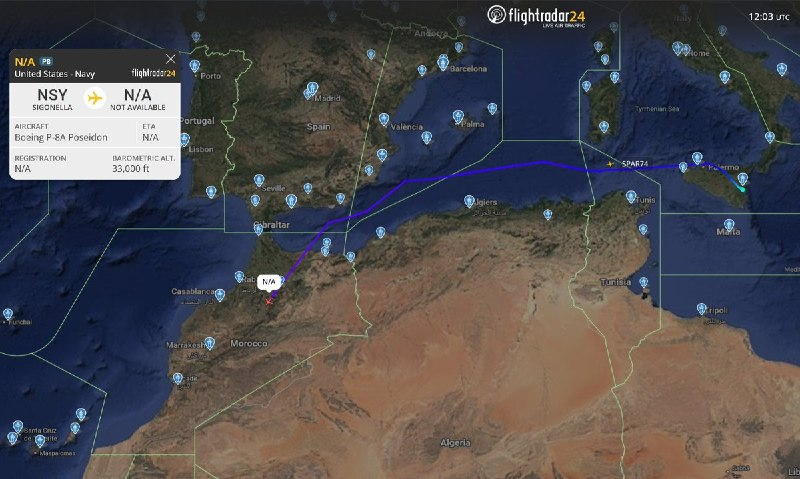

> DefenceGeek 🇬🇧 ✓ @DefenceGeek Thu, 07 May 2026 12:08:11 UTC Search Continues for missing US troops off coast of Morocco Two US troops who went missing while on leave from Exercise AFRICAN LION 2026 are still unaccounted for, with P-8A "Poseidon" maritime…

## 1405/02/17 15:44 — Shin_Persian
> DefenceGeek 🇬🇧 ✓ @DefenceGeek
> Thu, 07 May 2026 12:08:11 UTC
> 
> Search Continues for missing US troops off coast of Morocco
> 
> Two US troops who went missing while on leave from Exercise AFRICAN LION 2026 are still unaccounted for, with P-8A "Poseidon" maritime patrol aircraft flying from Sigonella NAS still being used to search the coastline and waters for the personnel.
> 
> The P-8A is designed for search and rescue operations at sea as part of the maritime patrol role
> 
> @MATA_osint
> https://www.independent.co.uk/bulletin/news/missing-soldiers-us-army-morocco-b2970928.html
> 
> فارسی
> 
> تداوم جستجو برای نیروهای مفقود شده آمریکایی در سواحل مراکش
> 
> دو نیروی آمریکایی که در زمان مرخصی از رزمایش «شیر آفریقا ۲۰۲۶» (AFRICAN LION 2026) ناپدید شده‌اند، همچنان مفقودالاثر هستند. هواپیماهای گشت دریایی P-8A «پوسایدون» که از پایگاه هوایی سیگونلا (Sigonella NAS) به پرواز درآمده‌اند، همچنان برای جستجوی خط ساحلی و آب‌ها جهت یافتن این پرسنل مورد استفاده قرار می‌گیرند.
> 
> هواپیمای P-8A به عنوان بخشی از نقش گشت‌زنی دریایی، برای عملیات جستجو و نجات در دریا طراحی شده است.
> 
> @MATA_osint
> https://www.independent.co.uk/bulletin/news/missing-soldiers-us-army-morocco-b2970928.html
> 
> 𝕏 · @shin_persian

## 1405/02/17 15:43 — Shin_Persian
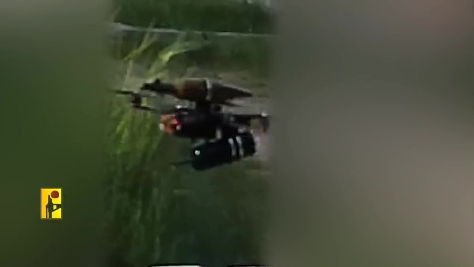

> Emanuel (Mannie) Fabian ✓ @manniefabian Thu, 07 May 2026 12:05:17 UTC The chief of the Ground Forces, Maj. Gen. Nadav Lotan has appointed a senior officer to be responsible for finding solutions for the drone threat troops are facing in southern Lebanon.…

## 1405/02/17 15:43 — Shin_Persian
> Emanuel (Mannie) Fabian ✓ @manniefabian
> Thu, 07 May 2026 12:05:17 UTC
> 
> The chief of the Ground Forces, Maj. Gen. Nadav Lotan has appointed a senior officer to be responsible for finding solutions for the drone threat troops are facing in southern Lebanon.
> 
> The officer, a brigadier general and a pilot, heads the Ground Forces' Strike Division, which is normally tasked with developing doctrine for combined air, intelligence, and ground operations.
> 
> Several officers are working under the general to find solutions for first-person view (FPV) drones, especially those guided by fiber-optic cables, which are immune to electronic jamming and difficult to detect.
> 
> To counter the fiber optic FPV drones, the IDF has deployed passive physical defenses in southern Lebanon, such as netting above troops, vehicles, and outposts. According to the military, these measures have proven effective when troops "maintain operational discipline."
> 
> The IDF has also deployed mobile radars to southern Lebanon, which are adapted to identify drones flying at different ranges and alert forces, who can then attempt to shoot them down.
> 
> The military is examining and implementing several methods of shooting down the drones by ground troops, including shotguns at short ranges, special ammunition that disperses in the air, and automated turrets.
> 
> The Ground Forces is also experimenting with other technological solutions for the drones, and cooperating with international partners as part of the effort, according to the military.
> 
> ترجمه فارسی در بخش نظرات
> 
> 𝕏 · @shin_persian

## ???-??-?? ??:?? (post 105081) — ManotoTV
[🎬 Video](telegram/content/ManotoTV_105081_1778158263.mp4)

> رسانه‌های دولتی چین گزارش داده‌اند که دو وزیر پیشین دفاع این کشور در پرونده‌های فساد مالی به اعدام با تعلیق دو ساله محکوم شده‌اند.
> یک دادگاه نظامی روز پنج‌شنبه «وی فنگه» و «لی شانگ‌فو» را به اعدام با تعلیق دو‌ساله محکوم کرد؛ به این معنا که در صورت عدم ارتکاب جرم جدید طی این مدت، حکم آن‌ها به حبس ابد تبدیل می‌شود، بدون امکان تخفیف یا آزادی مشروط.
> به گزارش شینهوا، هر دو مقام به دریافت رشوه مجرم شناخته شده و تمامی دارایی‌های شخصی آن‌ها نیز مصادره شده است.
> این حکم در ادامه موج گسترده پاکسازی در ارتش چین و در چارچوب کارزار ضدفساد دولت پکن صادر شده است؛ کارزاری که طی آن چندین مقام ارشد نظامی از سمت خود برکنار شده‌اند.
> شی از زمان به قدرت رسیدن، چندین موج گسترده مبارزه با فساد را آغاز کرده است؛ اقداماتی که منتقدان می‌گویند گاهی برای حذف رقبای سیاسی نیز به کار رفته است.

## ???-??-?? ??:?? (post 105080) — ManotoTV
[🎬 Video](telegram/content/ManotoTV_105080_1778158264.mp4)

> مارکو روبیو، وزیر امور خارجه آمریکا، با پاپ لئون چهاردهم؛ اولین پاپ آمریکایی؛ در واتیکان دیدار کرد. ملاقات ساعت ۱۱:۳۰ صبح به وقت رم در کاخ آپوستولیک واتیکان برگزار شد. این دیدار در حالی انجام شد که اخیرا تنش‌هایی بین دولت دونالد ترامپ و واتیکان به وجود آمده بود. پاپ لئون از جنگ آمریکا و اسرائیل علیه ایران انتقاد کرده بود و ترامپ هم به او حمله کرده بود. روبیو که خودش کاتولیک است پیش از این دیدار گفته بود این ملاقات صریح خواهد بود. جزئیات بیش‌تری از این دیدار تا کنون منتشر نشده است.

## 1405/02/17 15:51 — DW_Farsi
> 🔶 وزیر خارجه اسرائیل: سرنوشت ایران را مردم این کشور رقم می‌زنند نه اسرائیل
> 
> گیدئون ساعر، وزیر خارجه اسرائیل در مصاحبه با رسانه‌ آلمانی "دی ولت" در پاسخ به پرسشی در خصوص هدف جنگآمریکا و اسرائیل علیه جمهوری اسلامی گفت: «ما در وضعیت آتش‌بس قرار داریم، اما همزمان برای هر وضعیتی آماده هستیم. مهم‌ترین موضوع این است که مانع از آن شویم که ایران به سلاح هسته‌ای دست پیدا کند.»
> 
> ساعر با اشاره به مسیر دیپلماسی کنونی و مذاکرات جاری بین آمریکا و جمهوری اسلامی گفت: «ما از تلاش‌های دیپلماتیک دونالد ترامپ، رئیس ‌جمهور ایالات متحده آمریکا، حمایت می‌کنیم. مهم‌ترین خواسته‌ها این است که ایران تمام مواد غنی‌شده را از کشور خارج کند و متعهد شود که در خاک ایران هیچ اورانیومی غنی‌سازی نکند. اما تا این لحظه هیچ آمادگی‌ای در این زمینه نمی‌بینم. اشتباه ایرانی‌ها این است که فکر می‌کنند مسلح شدن به سلاح هسته‌ای می‌تواند بقای حکومت آن‌ها را تضمین کند.»
> 
> وزیر خارجه اسرائیل در پاسخ به پرسشی مبنی بر این که آتش‌بس از نظر او تا چه مدت می‌تواند دوام داشته باشد گفت: «سقوط حکومت در دست مردم ایران است، نه در دست ما. ما از همان ابتدا این را می‌دانستیم. حکومت ایران اعتراض‌ها مردم را به‌طرزی وحشیانه سرکوب کرده است. آن‌ها ده‌ها هزار نفر را کشته‌اند و حدود ۱۰۰ هزار نفر را بازداشت کرده‌اند.»
> 
> ساعر افزود: «بخش بزرگی از مردم شجاعی که در ماه ژانویه به خیابان‌ها آمدند، اکنون یا کشته شده‌اند یا در زندان هستند. بنابراین در حال حاضر برای مردم ایران دشوار است که دوباره برای آزادی خود مبارزه کنند. اما من احتمال واکنش با تأخیر را رد نمی‌کنم. معمولا مردم در میانه بحران به خیابان‌ها نمی‌آیند. ما معتقدیم که حکومت‌های استبدادی دوام همیشگی ندارند. و ایران به‌سمت یک بحران اقتصادی عظیم حرکت می‌کند.»
> 
> او در پاسخ به سوالی مبنی بر این که در این جنگ، غرب نیز از نظر اقتصادی تحت فشار قرار دارد و آیا اسرائیل نگران است که این فشار آن‌قدر بزرگ شود که متحدانش دیگر از تقابل با ایران حمایت نکنند، گفت: «افکار عمومی در اروپا از همان ابتدا نگاه چندان مثبتی به این جنگ نداشت. اما این اشتباه است. من معتقدم مقابله با این حکومت دیوانه‌وار در راستای منافع دنیای آزاد است.»
> 
> وزیر خارجه اسرائیل افزود: «نگاه کنید که ایران چگونه بدون هیچ تحریک قبلی به امارات متحده عربی حمله کرد. ایران فقط تهدیدی برای موجودیت اسرائیل نیست. بسیاری از کشورهای عربی، به‌ویژه کشورهای حاشیه خلیج فارس، این موضوع را به‌روشنی درک کرده‌اند. در ضمن، این جنگ، اسرائیل و امارات متحده عربی را بسیار به یکدیگر نزدیک‌تر کرده است.»
> @dw_farsi

## 1405/02/17 16:19 — Persian_Trend_Official
> ⚠️ حتمی پیام بعد که یک سری نکات بسیار مهم رو میخوام بگم رو با دقت مطالعه کنید.

## 1405/02/17 16:19 — Persian_Trend_Official
> سلام به همراهان عزیز کانال پرشین ترند! ✌️
> 
> ​امروز قصد دارم یک پروژه فوق‌العاده و کاربردی رو برای گذر از فیلترینگ بهتون معرفی کنم.
> 
> یکی از پروژه‌هایی که خودم شخصاً تست کردم و در حال حاضر داره کار می‌کنه، پروژه mhr-cfw هست. با راه‌اندازی این ابزار می‌تونید با سرعت خوب به یوتیوب و سایر سرویس‌ها دسترسی داشته باشید.
> 
> ​🔗 منابع اصلی پروژه:
> 
> 🌐 لینک پروژه در گیت‌هاب:
> github.com/denuitt1/mhr-cfw
> 
> ​🎥 لینک ویدئوی اصلی سازنده (آموزش جامع متد MHR-CFW از Matin SenPai):
> youtu.be/L3lJZrAqqUQ
> 
> ​📂 فایل‌ها و پیش‌نیازهای پروژه (آپلود شده روی هاست داخلی)
> 
> ​برای راحتی شما عزیزان، ویدیو و تمامی پیش‌نیازها رو روی هاست خودمون آپلود کردم تا بتوانید بدون دردسر و مستقیماً دانلود کنید:
> 
> ​🎬 ویدیوی آموزش mhr-cfw:
> 👉 dl.persiantrend.com/MHR-CFW/MHR-CFW.mp4
> 
> ​🐍 دانلود پایتون (نسخه ۶۴ بیت):
> 👉 dl.persiantrend.com/MHR-CFW/python-3.13.13-amd64.exe
> 
> ​🐍 دانلود پایتون (نسخه ۳۲ بیت):
> 👉 dl.persiantrend.com/MHR-CFW/python-3.13.13-32bit.exe
> 
> ​📦 فایل مورد نیاز برای پروژه:
> 👉 dl.persiantrend.com/MHR-CFW/mhr-cfw-main.zip
> 
> ​📑 مستندات گیت‌هاب پروژه:
> 👉 dl.persiantrend.com/MHR-CFW/mhr-cfw%20-%20GitHub.pdf
> 
> ​⚠️ حتمی پیام بعد که یک سری نکات بسیار مهم رو میخوام بگم رو با دقت مطالعه کنید.
> 
> 📝 Nick
> 
> 📌 @persian_trend_official
> پرشین ترند | متفاوت‌ترین کانال نظامی

## 1405/02/17 15:38 — Persian_Trend_Official

> 💢پست جدید دونالد ترامپ در تروث
> 
> «تصویری بسیار دقیق از دولت خواب‌آلود جو بایدن.
> خسارت عظیمی وارد شد، اما ما برگشته‌ایم!!!»
> 
> — دونالد جی. ترامپ
> 
> 🫆:Tony
> 
> 📌 @persian_trend_official
> پرشین ترند | متفاوت‌ترین کانال نظامی

## 1405/02/17 16:06 — IranianMinds
> 🔴کانال ۱۲ اسرائیل:
> 
> ترامپ بدون خروج اورانیوم غنی‌شده از ایران، توافق نخواهد کرد.
> 
> @IranianMinds

## 1405/02/17 15:49 — IranianMinds

> 🔴مدیر کل سازمان بهداشت WHO امروز یک نشست خبری درباره ویروس هانتاویروس برگزار خواهد کرد.
> 
> خامنه‌ای هنوز دفن نشده.
> 
> @IranianMinds

## 1405/02/17 16:01 — BBCPersian
> 🔻در نبود اینترنت کسب و کارهای آنلاین در ایران به روش قدیمی ارسال پیامک روی آورده‌اند
> 
> سایت اقتصادنیوز در ایران در گزارشی درباره تاثیر قطعی دو ماه و نیم اینترنت می‌گوید که «بسیاری از فروشگاه‌ها، رستوران‌ها، کافه‌ها، مراکز آموزشی، آرایشگاه‌ها، داروخانه‌ها، کلینیک‌ها و کسب‌وکارهای خدماتی»دوباره سراغ روش قدیمی ارسال «پیامک تبلیغاتی» رفتند.
> 
> در این گزارش به قلم مطهره خردمندان، این یک نوع «عقبگرد اجباری بازار» در ایران توصیف شده و آمده: «فقط بازگشت به یک ابزار بازاریابی نیست؛ تصویری از عقب‌گرد اجباری بازاردر شرایطی است که اینترنت، به جای یک امکان اضافه، به زیرساخت حیاتی کسب‌وکار تبدیل شده بود.»
> 
> در این گزارش از «تهدید معیشت» مردم نوشته شده و آمده: «کسب‌وکاری که با مشتری بین‌المللی کار می‌کند، فروشنده‌ای که روی اینستاگرام زندگی اقتصادی ساخته، معلمی که کلاس آنلاین دارد، پزشکی که نوبت‌دهی دیجیتال کرده و تولیدکننده‌ای که بازارش را از شبکه‌های اجتماعی پیدا کرده، در چنین شرایطی فقط با کندی اینترنت مواجه نیست؛ با قطعی اینترنت و در نتیجه آن تهدید معیشت روبه‌روست.»
> 
> در این گزارش آمده که پیامک تبلیغاتی نمی‌تواند جایگزین ارتباط از طریق شبکه‌های اجتماعی با مشتریان شود: «بسیاری از کاربران، پیامک‌های ناشناس یا تبلیغاتی را حتی باز نمی‌کنند. بخشی از شماره‌ها در فهرست سیاه تبلیغاتی قرار دارند. بخشی از مخاطبان از دریافت پیامک‌های ناخواسته ناراضی‌اند و بخشی دیگر اساساً اعتماد چندانی به متن‌های کوتاه تبلیغاتی ندارند.»
> 
> https://bbc.in/496G5Jl
> @BBCPersian

## 1405/02/17 15:58 — BBCPersian
> 🔻بازسازی پل «بی‌۱» کرج آغاز شد
> 
> هوشنگ بازوند، مدیرعامل شرکت ساخت و توسعه حمل و نقل ایران اعلام کرد که بازسازی پل بی‌۱ کرج، امروز ۱۷ اردیبهشت آغاز شده است. او گفت که بازسازی این پل «کمتر از یک سال» زمان خواهد برد و هزینۀ بازسازی حدود ۳/۷ هزار میلیارد تومان برآورد شده است.
> 
> در جریان جنگ آمریکا و اسرائیل با ایران، پل بی‌۱ کرج، در ۱۳ فروردین ۱۴۰۵، دو بار هدف حمله هوایی قرار گرفت و بخش‌هایی از آن فروریخت.
> 
> بر اساس گزارش‌ها، در هنگام حمله عده زیادی در فضاهای سبز زیر و اطراف این پل مرتفع در حال گردش و گذراندن روز سیزده‌بدر بوده‌اند. بنا بر اعلام بنیاد شهید و ایثارگران در ایران در این حمله «۱۳ نفر کشته و ۹۵ نفر زخمی» شدند.
> 
> این پل که جاده چالوس را به آزادراه تهران-شمال متصل می‌کند، قرار بود که رکورددار «بلندترین» پل خاورمیانه باشد و اواخر فروردین و اوایل اردیبهشت امسال افتتاح شود.
> 
> https://bbc.in/496G5Jl
> @BBCPersian

## 1405/02/17 15:59 — Hranews
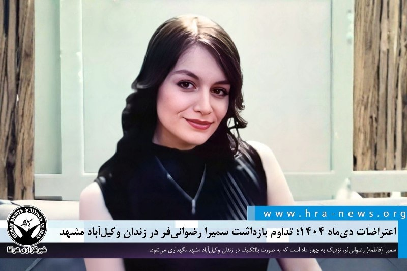

> اعتراضات دی‌ماه ۱۴۰۴؛ تداوم بازداشت سمیرا رضوانی‌فر در زندان وکیل‌آباد مشهد
> 
> 
> ❗️
> ❗️
> ❗️
> ❗️
> ❗️– سمیرا (فاطمه) رضوانی‌فر، از بازداشت شدگان اعتراضات سراسری ۱۴۰۴ در مشهد، نزدیک به چهار ماه است که به‌ صورت بلاتکلیف در زندان وکیل‌آباد این شهر نگهداری می‌شود.
> 
> به گزارش خبرگزاری هرانا، ارگان خبری مجموعه فعالان حقوق بشر در ایران، سمیرا (فاطمه) رضوانی‌فر در #بازداشت است.
> 
> بر اساس اطلاعات دریافتی هرانا، خانم رضوانی‌فر در تاریخ ۲۷ دی‌ماه ۱۴۰۴، در جریان اعتراضات سراسری در مشهد توسط نیروهای امنیتی بازداشت شد. او پس از دستگیری به قرنطینه زندان وکیل‌آباد مشهد منتقل شده و با گذشت ۱۱۱ روز، همچنان در بلاتکلیفی قضایی به‌سر می‌برد.
> 
> ادامه مطلب
> 
> #سمیرا_رضوانی‌فر #فاطمه_رضوانی‌فر
> 
> ↘️
> @hranews_bot تماس ✉️ - @Hranews کانال هرانا 🆑
<!-- MSG END -->
<!-- NAV START -->
*پایان پیام‌ها*
<!-- NAV END -->
