# خواننده تلگرام

<!-- TOP_NAV START -->

<a href="https://github.com/ali-exifit/aio-downloader/blob/main/telegram/content/archive_1.md" style="display:inline-block; padding:6px 12px; margin:0 4px; background-color:#2ea44f; color:white; text-decoration:none; border-radius:4px; font-weight:bold;">صفحه بعد</a>

<!-- TOP_NAV END -->

<!-- MSG START -->

---
📅 بروزرسانی: 1405/02/23 13:08
---

## VahidOOnLine — post 239870

  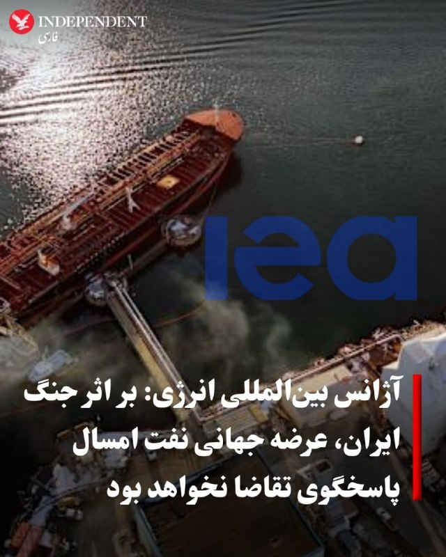

♦️آژانس بین‌المللی انرژی روز چهارشنبه ۲۳ اردیبهشت در گزارش ماهانه بازار نفت خود اعلام کرد که عرضه جهانی نفت امسال پاسخگوی کل تقاضا نخواهد بود، زیرا جنگ ایران تولید نفت خاورمیانه را مختل کرده است.

این نهاد بین‌المللی اعلام کرد: «با توجه به محدودیت تردد نفتکش‌ها در تنگه هرمز، مجموع کاهش عرضه از سوی تولیدکنندگان خلیج فارس در حال حاضر از یک میلیارد بشکه فراتر رفته و بیش از ۱۴ میلیون بشکه در روز نفت اکنون مسدود شده است که یک شوک عرضه بی‌سابقه است.»

به گزارش رویترز، آژانس بین‌المللی انرژی اعلام کرد که پیش‌بینی اولیه آن از سرگیری تدریجی تردد از طریق تنگه هرمز از سه ماهه سوم (ژوئیه/مرداد) به بعد است.

پیش‌بینی‌های آژانس بین‌المللی انرژی حاکی از آن است که عرضه در سال نزدیک به یک میلیون و هشتصد هزار بشکه در روز کمتر از کل تقاضا خواهد بود.
‌🇸🇦 Indypersian

🤖 @VahidOOnLine

## pm_afshaa — post 90675

🔴دیو دی‌کمپ، روزنامه نگار آمریکایی: شاید ظرف یک هفته آینده شاهد بازگشت به عملیات نظامی بزرگ آمریکا علیه ایران باشیم

💧 Rainbet.com the #1 Non-KYC Crypto Casino & Sportsbook @rainbetcom

😁 @Pm_Afshaa

## pm_afshaa — post 90674

🔴کانال 13 اسرائیل:نتانیاهو امشب جلسه امنیتی ویژه در مورد ایران برگزار خواهد کر‌د

💧 Rainbet.com the #1 Non-KYC Crypto Casino & Sportsbook @rainbetcom

😁 @Pm_Afshaa

## mamlekate — post 103519

❓ ساعت ۹:۰۲ دقیقه امروز یه صدای خیلی بلند با ارتعاش زیاد اومد سمت چیذر شنیدیم ما. انگار ۷،۸ کیلومتر فاصله داشت باهامون. ۹:۶ دقیقه و ۹:۱۱ دقیقه هم‌ اومد. آسمون ابری نیست که بگم‌صدای رعد و برقه

❗️ الو این صدا رو ما هم تو جردن شنیدیم فکر کردیم رعد و برقه. سمت کوه های تهران اره ابریه و هوا ابری بود احتمالا همون رعد و برق بود

❗️ این سه تا صدا رو همه شنیدیم. از شرق تا غرب.. لرزه نداشت من که یوسف ابادم ولی صدای مهیبی بود. هوا هم از این بهاری/گرم/ابری طوریاست که همه جوره تو اسمون بود. ولی صدای مهیبی بود همه مون به هم زنگ زدیم.

@mamlekate

## IranIntlTV — post 336953

  <a href="telegram/content/IranIntlTV_336953_1778665092.mp4" target="_blank">🎬 Download video</a>

یک شهروند اهل سیستان و بلوجستان با ارسال پیامی به ایران‌اینترنشنال می‌گوید: «ما همیشه محروم و گرسنه بودیم، ولی این روزها محروم‌تر و گرسنه‌تر هم شده‌ایم. گالن ۷۰ لیتری بنزین شده پنج میلیون تومان، در حالی که برای رسیدن به بیمارستان باید ۴۰ تا ۶۰ لیتر بنزین مصرف کنیم.»

## IranIntlTV — post 336952

  <a href="telegram/content/IranIntlTV_336952_1778665094.mp4" target="_blank">🎬 Download video</a>

یک شهروند با ارسال ویدیویی به ایران‌اینترنشنال می‌گوید: «امروز چیزی بخری، فردا ده برابر می‌شود. دیگر هیچ‌چیز نمی‌شود خرید. تا یک ماه پیش، بیشتر دغدغه‌ها روغن، تخم‌مرغ و کانفیگ بود، الان همه‌چیز هر روز چند برابر گران‌تر می‌شود.»

## FarsiVOA — post 217601

  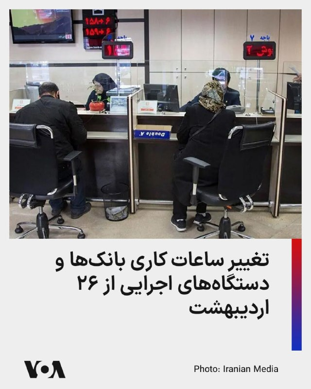

ساعات کاری بانک‌ها، ادارات و دستگاه‌های اجرایی از ۲۶ اردیبهشت تا ۱۵ شهریور به ۷ تا ۱۳ تغییر کرد. این تصمیم با هدف «مدیریت مصرف انرژی و پایداری شبکه برق» اعلام شده است.

براساس ابلاغ سازمان اداری و استخدامی کشور، تمامی بانک‌ها، ادارات، شهرداری‌ها، مؤسسات عمومی دولتی و غیردولتی و سایر دستگاه‌های اجرایی موظف‌اند فعالیت روزانه خود را از ساعت ۷ صبح آغاز کرده و در ساعت ۱۳ به پایان برسانند. همچنین دستگاه‌ها ملزم هستند یک ساعت پیش از پایان وقت اداری، سامانه‌های سرمایشی خود را خاموش کنند.

این تغییر شامل واحدهای قضایی و اداری قوه قضائیه نیز می‌شود.

ساعات کاری در سال‌های اخیر نیز برای مدیریت مصرف برق در فصل‌های گرم، به ‌صورت مقطعی تغییر کرده است؛ از جمله از زمان لغو تغییر ساعت رسمی در شش ماه اول سال، ساعت کاری بانک‌ها و دستگاه‌های اجرایی جلوتر کشیده شد.

این رویکرد در عمل به ‌عنوان جایگزینی برای تغییر ساعت رسمی است که از سال ۱۴۰۲ و با مصوبه مجلس شورای اسلامی لغو شد.
@FarsiVOA

## RadioFarda — post 157123

حضور کم کارگردانان زن و جنگ ایران؛ چالش‌های فستیوال کن ۲۰۲۶ چیست؟

🔸جشنواره کن، از معتبرترین فستیوال‌های سینمایی جهان، در حالی در فرانسه گشایش یافته که تازه‌ترین فیلم اصغر فرهادی، کارگردان ایرانی، در بخش رقابتی این جشنواره در کنار آثار برخی از بزرگان سینمای جهان حضور دارد و همچنین انتظار می‌رود جنگ ایران موجب بحث‌های سیاسی در این جشنواره شود.

🔸هفتادونهمین دوره جشنواره فیلم کن از روز سه‌شنبه ۲۲ اردیبهشت آغاز شد. فیلم افتتاحیهٔ امسال، «بوسهٔ آذرخش‌گون» ساخته کارگردان پی‌یر سالوادوری، یک درام عاشقانه فرانسوی‌زبان بود که داستانش در پاریس در فاصلهٔ میان دو جنگ جهانی می‌گذرد.

🔸قرار است در دو هفته آینده، ابرستارهایی از جمله جان تراولتا، آدام درایور و باربارا استرایسند روی فرش قرمز این جشنواره قدم بگذارند.

🔸 گزارش کامل را در وب‌سایت رادیوفردا بخوانید.

@RadioFarda

## IranianMinds — post 20061

🔴 ان‌بی‌سی نیوز و نیویورک تایمز به نقل از منابع پنتاگون: آمریکا درصورت شکست مطلق مذاکرات، اسم حمله به ایران رو به «چکش سنگین» تغییر می‌ده و یکبار دیگه به ایران حمله می‌کنه.

@IranianMinds

## IranianMinds — post 20060

🔴 کانال 13 اسرائیل:
نتانیاهو امشب جلسه امنیتی ویژه در مورد ایران برگزار خواهد کر‌د

@IranianMinds

## BBCPersian — post 280900

  <a href="telegram/content/BBCPersian_280900_1778665096.mp4" target="_blank">🎬 Download video</a>

🔻‌‌ویروس هانتا از جمله ویروس‌هایی است که توسط جوندگان منتقل می‌شود، در حالی که ویروس کرونا عمدتا از انسان به انسان انتقال پیدا می‌کند.

سازمان بهداشت جهانی‌تاکید کرده که شیوع ویروس هانتا که در یک کشتی تفریحی اتفاق افتاد و باعث مرگ چند مسافر شد، شروع یک همه‌گیری جهانی نیست.

با این حال، پس از آنکه آخرین مسافران این کشتی تفریحی را ترک کردند، سه مورد جدید دیگر و‌مرتبط با این بیماری مرگبار شناسایی شده‌است.

دامینیک هیوز، خبرنگار بخش سلامت بی‌بی‌سی، در این ویدیو درباره تفاوت این دو ویروس و نحوه انتقال آن‌ها توضیح می‌دهد.

https://bbc.in/4ntA6Ee
@BBCPersian

## alonews — post 119686

  <a href="telegram/content/alonews_119686_1778665098.mp4" target="_blank">🎬 Download video</a>

👈اسرائیل به بیش از ۴۰ موضع حزب‌الله تو جنوب لبنان حمله کرده

✅ @AloNews خبر جنگ

## alonews — post 119685

  <a href="telegram/content/alonews_119685_1778665099.webm" target="_blank">🎬 Download video</a>

👈دیو دی‌کمپ، روزنامه نگار آمریکایی: شاید ظرف یک هفته آینده شاهد بازگشت به عملیات نظامی بزرگ آمریکا علیه ایران باشیم. جنگ تمام نشده است، با وجود آنچه مقامات دولت ترامپ سعی می‌کنند بگویند. منظور من از «بازگشت به جنگ» هم بازگشت به یک جنگ تمام‌عیار در سراسر منطقه است!

✅ @AloNews خبر جنگ

## alonews — post 119684

  <a href="telegram/content/alonews_119684_1778665099.webm" target="_blank">🎬 Download video</a>

👈سی‌ان‌ان: هزینه جنگ ایران یک تریلیون دلار است نه ۲۹ میلیارد

✅ @AloNews خبر جنگ

---
📅 بروزرسانی: 1405/02/23 12:55
---

## farsi_fox_news — post 89281

♦️ همه بانک‌ها مجاز به خرید و فروش ارز تا سقف ۱۰۰۰ یورو شدند

🔹 براساس دستورالعمل بانک مرکزی، هر فردی می‌تواند تا سقف ۱۰۰۰ یورو (یا معادل آن به دلار) در سال، ارز اسکناس برای نیازهای ضروری خرد از شعب بانکی خریداری کند.
🔹 منبع این اسکناس‌ها، خرید از صادرکنندگان است و کاملاً از منابع ارزی حواله‌ای که برای واردات کالاهای اساسی و مواد اولیه استفاده می‌شود؛ جداست.
🔹 بانکها موظفند ضمن الزام به رعایت سایر ضوابط و مقررات ارزی در اجرای این بخشنامه، مراتب را به تمامی شعب و واحدهاي ارزي ذي‌ربط ابلاغ و بر حسن اجراي آن نيز نظارت کنند.‌‌‌‌‌‌‌‌‌‏
🌐 @farsi_fox_news

## IranIntlTV — post 336951

  <a href="telegram/content/IranIntlTV_336951_1778664318.mp4" target="_blank">🎬 Download video</a>

یک شهروند با ارسال پیام به ایران‌اینترنشنال می‌گوید: «داروهای اساسی، هم گران و هم نایاب شده‌اند. یک جعبه قرص مُداسین که قیمتش ۳۶۰ هزار تومان است را چون در داروخانه‌ها پیدا نمی‌شود، در بازار آزاد به قیمت پنج میلیون تومان خریدم.»

## FarsiVOA — post 217600

🔺حصر دیجیتال ۷۵ روزه شد؛ قیمت «سیم‌کارت سفید» تا ۱۲۰ میلیون تومان رسید

▪️نت‌بلاکس، اعلام کرد خاموشی اینترنت در ایران از مرز هزار و ۷۷۶ ساعت گذشته و وارد هفتاد و پنجمین روز شده است.

▪️به گفته این نهاد، این اقدام سانسور دیجیتال به سودجویی و کاهش امنیت دیجیتال منجر شده؛ زیرا طرح‌های حکومتی موسوم به «اینترنت پرو» و سفیدسازی گزینشی دسترسی‌ها، زمینه نظارت، فساد و کلاهبرداری را فراهم کرده است.

▪️منتقدان می‌گویند مسئله فقط فروش غیرقانونی اینترنت پرو یا سیم‌کارت سفید نیست؛ بلکه اصل سیاستی است که دسترسی به اینترنت را از یک حق عمومی به امتیازی طبقاتی، پولی و امنیتی تبدیل کرده است.

▪️گزارش شده قیمت «سیم‌کارت‌های سفید» با وعده دسترسی نامحدود و بدون فیلتر بین ۴۴ تا ۱۲۰ میلیون تومان است.

⬇️ بیشتر بخوانید:
https://ir.voanews.com/a/8149522.html

## Persian_Trend_Official — post 14041

کانال رسمی پرشین ترند pinned a file

## Persian_Trend_Official — post 14040

  <a href="https://t.me/persian_trend_official/14040" target="_blank">📎 Download file</a>

🚀تصمیم گرفتم پیش‌بینی‌ها و تحلیل‌هایی را که از بهمن‌ماه تا شب ۸ اسفند درباره احتمال جنگ ایران و آمریکا مطرح کرده بودم، دوباره بررسی کنم تا ببینم عملکرد تحلیلی‌ام در این بازه چطور بوده است.

برای اینکه بررسی دقیق‌تر و بی‌طرفانه‌تر باشد، فایل زیرنویس لایوها را به هوش مصنوعی دادم و از آن خواستم تمام پیش‌بینی‌ها، سناریوها و تحلیل‌هایی را که در آن لایوها مطرح کرده بودم، استخراج و به‌ترتیب زمانی دسته‌بندی کند.

نتیجه برای خودم هم جالب بود. بر اساس مواردی که در فایل استخراج‌شده آمده، و تأکید می‌کنم چیزی سانسور یا حذف نشده، بیش از ۹۰ درصد تحلیل‌ها و پیش‌بینی‌هایی که مطرح کرده بودم با روند بعدی تحولات همخوانی داشته است.

من این متن را برای شما هم می‌گذارم تا خودتان بررسی کنید. طبیعتاً تحلیل سیاسی و نظامی همیشه درصدی از خطا و عدم قطعیت دارد، اما مهم این است که ببینیم چارچوب تحلیلی، نشانه‌خوانی‌ها، سناریوسازی‌ها و هشدارهایی که در آن زمان مطرح شده بود، تا چه اندازه به واقعیت نزدیک بوده است.

این بررسی برای من فقط جنبه دفاع از گذشته ندارد؛ بیشتر یک ارزیابی جدی از کیفیت تحلیل‌هاست. اینکه کجا درست دیدیم، کجا زودتر از دیگران نشانه‌ها را تشخیص دادیم، و کجا باید در آینده با احتیاط یا دقت بیشتری تحلیل کنیم.

متن کامل استخراج‌شده را در ادامه می‌گذارم تا شما هم قضاوت کنید.

📌 @persian_trend_official
پرشین ترند | متفاوت‌ترین کانال نظامی

## RadioFarda — post 157122

قطع ۷۵ روزۀ اینترنت در ایران؛ محمدرضا عارف رئیس «ستاد ویژه» برای رسیدگی به اینترنت شد

🔸همزمان با عبور زمان قطع اینترنت در ایران از ۱۷۷۶ ساعت، مسعود پزشکیان، رئیس‌جمهور ایران، محمدرضا عارف معاون اول خود را با حفظ سمت به عنوان رئیس «ستاد ویژه ساماندهی و راهبری فضای مجازی کشور» منصوب کرد.

🔸در حکم پزشکیان آمده که این انتصاب «نظر به ضرورت فوری استقرار حکمرانی یکپارچه، منسجم و کارآمد در فضای مجازی» صورت می‌گیرد.

🔸پزشکیان یک روز پیش از این نیز در شبکه ایکس با اشاره به اینکه «ارتباطات مبتنی بر فناوری اطلاعات و اینترنت به بخش جدانشدنی زندگی مردم تبدیل شده»، نوشته بود به عارف مأموریت داده «با لحاظ حساسیت‌های حکمرانی، نظر رهبری و وعده‌ای که به مردم داده بودم، در قالب ساختاری چابک موجبات خدمت‌رسانی بهتر دولت و تحقق انتظارات عمومی را فراهم سازند.»

🔸رئیس‌جمهور ایران توضیح نداده است در حالی که زیرساخت‌های ارتباطی زیر نظر دولت فعالیت می‌کنند، ضرورت تشکیل ستاد ویژه برای باز کردن اینترنت چیست.

🔸مسعود پزشکیان در دوران انتخابات ریاست‌جمهوری ۱۴۰۳، وعده صریح «رفع فیلترینگ»، «اصلاح نظام ناکارآمد فیلترینگ» و «آزاد‌سازی اینترنت» را داده و با تأکید بر تأثیر منفی فیلترینگ بر کسب‌وکارها و زندگی مردم متعهد شده بود که تمام تلاش خود را برای پایان دادن به این وضعیت و فراهم کردن دسترسی آزاد به فضای مجازی به کار گیرد.

🔸این وعده اما نه تنها محقق نشد که قطع کامل اینترنت هم از زمان شروع جنگ با آمریکا و اسرائیل به آن افزوده شد.
فاطمه مهاجرانی، سخنگوی دولت پزشکیان، نیز در نشست خبری سه‌شنبه ۲۲ اردیبهشت، به صراحت از قطع اینترنت «به دلیل فضای جنگی» دفاع کرد و در پاسخ به خبرنگاران معترض به این موضوع گفت که «چه انتظاری دارید؟»

🔸دولت جمهوری اسلامی چند روز پس از حملات مشترک آمریکا و اسرائیل به ایران در نهم اسفند ۱۴۰۴ و قطع‌کردن اینترنت، اعلام کرد تنها به خبرنگاران و فعالان رسانه‌ای هم‌صدا با خود اجازه دسترسی به اینترنت جهانی را می‌دهد.

🔸طی این مدت شماری از خبرنگاران، فعالان رسانه‌ای نزدیک به حکومت با استفاده از اینترنت «سفید» در شبکه‌های اجتماعی به حمایت از عملکرد جمهوری اسلامی پرداخته‌اند.

🔸در هفته‌های اخیر نیز برخی اپراتورها اقدام به تبلیغ و واگذاری اینترنت موسوم به «طبقاتی» و فروش اینترنت به بهای گزاف به‌عنوان اینترنت ویژهٔ «کسب‌وکارها» کرده‌اند.

🔸با این حال واگذاری این نوع از از اینترنت نیز به‌دلیل سازوکار نامشخص آن و همچنین جنبه‌های درآمدزایی گستردهٔ آن برای اپراتورها جنجال‌برانگیز شده است.

🔸علی قلهکی، فعال رسانه‌ای نزدیک به حکومت، در شبکه ایکس با ذکر آمار فعال شدن ۴۵۰ هزار سیم‌کارت پرو در اپراتور همراه اول، نوشت سرمایه اجتماعی کشور که به‌گفتهٔ او «بابت جنگ تقویت شده»، نباید «دستمایه اقدامات مشکوک و منفعت‌محور مدیرانِ اِبن‌الوقت قرار گیرد».

🔸به‌گفتهٔ این فعال رسانه‌ای نزدیک به حکومت، «طرح‌های تبعیض‌آمیزی چون «اینترنت پرو» این انگاره را در جامعه جا می‌اندازد که هزینه‌های اقداماتی چون «تحریم» و «جنگ» از جیب مردم باید پرداخت شود».

🔸این فعال رسانه‌ای اضافه کرده «به ازای یک میلیون نفر عضویتِ در اینترنت پرو ۵۰ گیگابایتی (هدف‌گذاری اولیه)، بیش از دو هزار میلیارد تومان نصیب اپراتورها _بخوانید یک اپراتور_ می‌شود».

🔸انتقادها از این وضعیت به اندازه‌ای گسترش یافته که مدتی پیش غلامحسین محسنی اژه‌ای، رئیس قوه قضائیه دستور بررسی این موضوع توسط این نهاد را صادر کرد.

@RadioFarda

## IranianMinds — post 20059

🔴 فایننشال تایمز:

پوتین مطمئن است که ارتشش می‌تواند منطقه دونباس در اوکراین را فتح کند و فرماندهان نظامی روسیه او را متقاعد کرده‌اند که فتح این منطقه می‌تواند تا پاییز تکمیل شود. پس از آن، طبق این گزارش، پوتین قصد دارد مطالبات ارضی خود را مطرح کند و کنترل مناطق بیشتری در اوکراین را به دست گیرد.

@IranianMinds

## IranianMinds — post 20058

🔴 کامران غضنفری، نماینده مجلس: شواهد و قرائن نشان می‌دهد که آمریکا و اسرائیل قصد انجام یک عملیات گسترده برای تصرف برخی از جزایر جنوب رو دارن.

@IranianMinds

## Hranews — post 112922

تهران؛ مرد جوان به اتهام قتل برادر معشوقه‌اش محاکمه شد

❗️
❗️
❗️
❗️
❗️– جلسه رسیدگی به اتهام جوانی که در سن ۱۸ سالگی برادر دختر مورد علاقه خود را به #قتل رسانده، در دادگاه کیفری استان تهران برگزار شد.

ادامه مطلب

↘️
@hranews_bot تماس ✉️ - @Hranews کانال هرانا 🆑

## alonews — post 119683

  <a href="telegram/content/alonews_119683_1778664321.webm" target="_blank">🎬 Download video</a>

👈سخنگوی کمیسیون فرهنگی مجلس: تعداد کاربران در پیام رسان های داخلی از مرز ۱۰۰ میلیون کاربر عبور کرده است

✅ @AloNews خبر جنگ

## alonews — post 119682

  <a href="telegram/content/alonews_119682_1778664321.webm" target="_blank">🎬 Download video</a>

👈بقائی: تا زمانی که عضو ان‌پی‌تی هستیم حق استفاده از انرژی هسته‌ای را داریم

✅ @AloNews خبر جنگ

---
📅 بروزرسانی: 1405/02/23 12:45
---

## VahidOOnLine — post 239869

  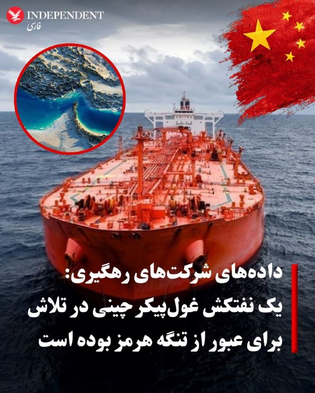

♦️همزمان با سفر دونالد ترامپ، رئیس جمهوری آمریکا به چین، خبرگزاری رویترز روز چهارشنبه ۲۳ اردیبهشت به‌نقل از داده‌های شرکت‌های «ال‌اس‌ای‌جی» و «کپلر» که تردد کشتی‌ها را رصد می‌کنند، گزارش داد یک نفتکش غول‌پیکر چینی حامل دو میلیون بشکه نفت خام عراق در تلاش برای عبور از تنگه هرمز بوده است.
بر اساس داده‌های این شرکت‌ نفتکش «یوآن هوا هو» از نزدیکی جزیره لارک ایران عبور کرده و در بخش شرقی تنگه هرمز به سمت جنوب در حال حرکت است.
بر اساس این گزارش، اگر این سفر با موفقیت انجام شود، این سومین مورد شناسایی شده عبور یک نفتکش چینی از تنگه هرمز از زمان آغاز جنگ آمریکا و اسرائیل با ایران در اسفند ۱۴۰۴خواهد بود.
داده‌های رهگیری کشتی‌ها نشان می‌دهد نفتکش «یوآن هوا هو» اوایل ماه مارس نزدیک به دو میلیون بشکه نفت خام «بصره مدیوم» را در پایانه بصره عراق بارگیری کرده بود و از آن زمان در خلیج فارس مانده بود.
‌🇸🇦 Indypersian

🤖 @VahidOOnLine

## VahidOOnLine — post 239868

  <a href="telegram/content/VahidOOnLine_239868_1778663701.mp4" target="_blank">🎬 Download video</a>

♦️علیرضا رئیسی، معاون وزیر بهداشت جمهوری اسلامی ایران روز چهارشنبه ۲۳ اردیبهشت در نشتی خبری، با «غیرممکن خواندن» ورود ویروس هانتا به ایران از طریق مرزهای دریایی گفت: «از تنگه هرمز یک قایق بادی هم رد نمی‌شود چه برسد به کشتی کروز.»

نخستین نشانه‌های ابتلا به ویروس هانتا حدود دو هفته پیش در یک کشتی تفریحی (کروز) متعلق به یک شرکت هلندی در راه جزایر قناری شناسایی شد.
‌🇸🇦 Indypersian

🤖 @VahidOOnLine

## IranIntlTV — post 336950

  <a href="telegram/content/IranIntlTV_336950_1778663704.mp4" target="_blank">🎬 Download video</a>

در پیام‌هایی که به مدیا بات ایران‌اینترنشنال رسیده، شماری از دانش‌آموزان از افت کیفیت آموزش در دوران کلاس‌های آنلاین گلایه کرده‌اند. یک نوجوان ۱۳ ساله با اشاره به تجربه روزهای همراه با قطعی اینترنت و گرانی، گفته است در این شرایط از مطرح کردن خواسته‌های شخصی با خانواده احساس خجالت می‌کند.
گفت‌وگو با لیلا سعادتی، عضو تحریریه ایران‌اینترنشنال
@iranintltv

## IranIntlTV — post 336949

نشست وزیران خارجه بریکس در دهلی تحت‌الشعاع «جنگ ایران»

جنگ آمریکا و اسرائیل با حکومت ایران بر نشست دو روزه وزیران خارجه گروه بریکس که از پنج‌شنبه در دهلی نو آغاز می‌شود، سایه انداخته است. این نشست توانایی این بلوک را برای رسیدن به موضعی مشترک در این زمینه و انتشار بیانیه نهایی، محک خواهد زد.

گروه بریکس که در ابتدا شامل آفریقای جنوبی، برزیل، چین، روسیه و هند بود، در سال‌های اخیر با پیوستن اتیوپی، امارات متحده عربی، اندونزی، ایران و مصر، گسترش یافته است.

خبرگزاری رویترز چهارشنبه ۲۳ اردیبهشت خبر داد که تهران از هند، رییس دوره‌ای بریکس در سال ۲۰۲۶، خواسته است از این سازوکار برای «ایجاد اجماع در محکوم کرد اقدامات آمریکا و اسرائیل در جنگ و تنش در خلیج فارس» استفاده کند.

اختلاف میان تهران و ابوظبی
اصلی‌ترین اختلاف‌ها میان جمهوری اسلامی ایران و امارات متحده عربی شکل گرفته است. دو کشوری که در دو سوی جبهه جنگی قرار دارند که آمریکا و اسرائیل از ۹ اسفند ۱۴۰۴ علیه جمهوری اسلامی آغاز کردند.

عباس عراقچی، وزیر امور خارجه جمهوری اسلامی، احتمالا اواخر روز چهارشنبه برای شرکت در این نشست وارد دهلی خواهد شد. این نشست روزهای ۲۴ و ۲۵ اردیبهشت برگزار می‌شود.

سرگئی لاوروف، وزیر خارجه روسیه، نیز قرار است در این نشست حضور داشته باشد.

هنوز مشخص نیست چه کسی نمایندگی امارات را در این نشست بر عهده خواهد داشت.

رویترز نوشت: «دور جدید مذاکرات می‌تواند پرتنش باشد؛ به‌ویژه پس از گزارش‌هایی مبنی بر اینکه امارات و عربستان سعودی در واکنش به حملات ایران، حملاتی نظامی علیه جمهوری اسلامی انجام داده‌اند.»

رندهیر جایسوال، سخنگوی وزارت خارجه هند، پیش از این گفته بود برخی اعضای بریکس مستقیما در این جنگ درگیر هستند و به همین دلیل «رسیدن به اجماع برای ما دشوار بوده» است.

با این حال، یکی دیگر از مقام‌های وزارت خارجه هند به رویترز گفت دهلی امیدوار است پس از این دور از نشست‌ها، بیانیه‌ای مشترک صادر شود.

تلاش برای حفظ انسجام بریکس
مانجیو سینگ پوری، دیپلمات پیشین هند، گفت: «خوشحال‌کننده است که وزیران خارجه همه کشورهای بریکس، به‌جز چین که به‌دلیل دیگری درگیر است، در نشست حضور پیدا می‌کنند.»

اشاره سینگ پوری به درگیری وزیر خارجه چین احتمالا به سفر پیش روی دونالد ترامپ، رییس‌جمهوری آمریکا، به چین برمی‌گردد.

او افزود: «این نشانه مثبتی برای تلاش‌ها به منظور ایجاد ائتلافی در بریکس حول موضوعات مهم برای اقتصادهای نوظهور و کشورهای جنوب جهانی است.»

پوری گفت: «البته رسیدن به راه‌حل سیاسی دشوار است، اما همین که آن‌ها دور هم جمع می‌شوند اتفاق مثبتی است و امیدواریم راهی رو به جلو ایجاد کند.»

افزایش شدید قیمت انرژی ناشی از جنگ با حکومت ایران باعث شده است بسیاری از کشورهای بریکس، از جمله هند، اقدام‌های اضطراری برای حفاظت از اقتصاد و مصرف‌کنندگان خود انجام دهند.

موضع محتاطانه چین
چین تاکنون موضعی ظاهرا بی‌طرفانه اتخاذ کرده است. موضوعی که به روابط نزدیک پکن هم با تهران و هم با کشورهای عرب سنی‌مذهب مرتبط دانسته می‌شود.

قرار است شو فیهونگ، سفیر چین در هند، به‌جای وانگ یی، وزیر خارجه چین، در نشست وزیران خارجه بریکس شرکت کند، چون وانگ احتمالا همزمان با سفر ترامپ به پکن، امکان حضور در دهلی را نخواهد داشت.

🔗وب‌سایت ایران‌اینترنشنال
@iranintltv

## Shin_Persian — post 5987

  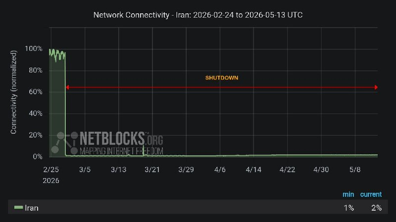

NetBlocks ✓ @netblocks
Wed, 13 May 2026 07:50:00 UTC

💸 #Iran's internet blackout is now past hour 1776, entering its 75th day. The digital censorship measure has led to profiteering and a decline in digital security as government-backed "pro" internet schemes and selective whitelisting result in surveillance, corruption and scams.

فارسی

💸 قطعی اینترنت #ایران اکنون از ساعت ۱۷۷۶ فراتر رفته و وارد هفتاد و پنجمین روز خود شده است. این اقدام در راستای سانسور دیجیتال منجر به سودجویی و کاهش امنیت دیجیتال شده است، چرا که طرح‌های اینترنت «طبقاتی» تحت حمایت دولت و لیست‌های سفید گزینشی، منجر به نظارت، فساد و کلاهبرداری شده است.

𝕏 · @shin_persian

## Persian_Trend_Official — post 14039

  <a href="telegram/content/Persian_Trend_Official_14039_1778663708.webm" target="_blank">🎬 Download video</a>

⭕️ مارکو روبیو همان لباس ورزشی خاکستری Nike را پوشیده که نیکلاس مادورو در عکس‌های دستگیری‌اش به تن داشت.

📝 Nick

📌 @persian_trend_official
پرشین ترند | متفاوت‌ترین کانال نظامی

## BBCPersian — post 280899

🔻اعتراض ایران به لغو مجوز فعالیت مدارس ایرانی در امارات متحده عربی

ستاد حقوق بشر ایران با انتشار بیانیه‌ای به لغو مجوز فعالیت مدارس ایرانی در امارات متحده عربی اعتراض کرده است.

در بخشی از این بیانیه آمده است که قدام اخیر دولت امارات متحده عربی «در سایه تنش‌های سیاسی و با انگیزه‌های خصمانه صورت پذیرفته، تنها یک اقدام اداری ساده نیست، بلکه مصداق بارز نقض سیستماتیک تعهدات بین‌المللی دولت امارات ذیل معاهدات حقوق بشری، مشخصاً کنوانسیون حقوق کودک و میثاق بین‌المللی حقوق اقتصادی، اجتماعی و فرهنگی است.»

ستاد حقوق بشر ایران از زیرمجموعه‌های شورای عالی امنیت ملی و به لحاظ اداری بخشی از قوه قضائیه است.

بر اساس گزارش‌ها، با آغاز جنگ آمریکا و اسرائیل با ایران و حملات تلافی‌جویانه ایران به امارات متحده عربی، تعدادی از ایرانیان مقیم این کشور با مشکلات اقامتی هم مواجه شده‌اند.

بی‌بی‌سی فارسی درباره این مشکلات با اداره کل مهاجرت، هویت و مرزبانی امارات، اداره کل اقامت و امور خارجیان دبی و وزارت کار امارات تماس گرفته اما هنوز پاسخی دریافت نکرده است.

https://bbc.in/4tAXKjn
@BBCPersian

## alonews — post 119681

  <a href="telegram/content/alonews_119681_1778663708.webm" target="_blank">🎬 Download video</a>

👈نائب رئیس اتحادیه مشاوران املاک تهران در برنامه صداوسیما: وام مسکنی که همین الان در حال ارائه هست آن‌قدر ارزش پایینی دارد که در بعضی از مناطق تهران نمی‌شود با آن یک متر خانه خرید!

✅ @AloNews خبر جنگ

---
📅 بروزرسانی: 1405/02/23 12:34
---

## VahidOOnLine — post 239867

  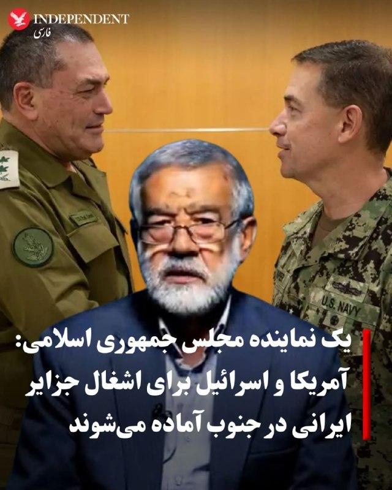

♦️کامران غضنفری، نماینده مجلس شورای اسلامی روز چهارشنبه ۲۳ اردیبهشت گفت آمریکا و اسرائیل می‌خواهند با یک عملیات گسترده، «احتمالا برخی از جزایر ما را در جنوب اشغال کنند. این نماینده مجلس گفت «انتقال سنگین تجهیزات و نیرو به منطقه» با همین هدف انجام می‌شود.
دونالد ترامپ در هفته‌های نخست جنگ احتمال ورود محدود نیروی نظامی به خاک ایران را رد نکرده بود. اما این سناریو در هفته‌های بعد کمرنگ‌تر شد. با این حال گزارش‌ها حاکی از تجمع گسترده نیروهای آمریکایی در منطقه است.
غضنفری در گفتگو به خبرآنلاین گفت ما هنوز وسط جنگ هستیم و در همین هفته گذشته «دو عملیات علیه ما انجام دادند و با ناوهایشان به برخی مراکز ما حمله کردند.»
‌🇸🇦 Indypersian

🤖 @VahidOOnLine

## DEJradio — post 4610

  <a href="telegram/content/DEJradio_4610_1778663095.webm" target="_blank">🎬 Download video</a>

🔺📢 یک نماینده مجلس:
دولت میزان خسارت در جنگ را ۲۸.۵ میلیارد دلار اعلام کرده است

میثم ظهوریان، عضو کمیسیون اقتصادی مجلس شواری اسلامی، اعلام کرد گزارش رسمی که دولت مبنا قرار داده و به رهبر جمهوری اسلامی ارائه کرده، میزان خسارت ناشی از جنگ را ۲۸.۵ میلیارد دلار برآورد کرده است.
او با اشاره به جزئیات این گزارش گفت: «حدود ۱۴ میلیارد دلار از این خسارت مربوط به بخش انرژی است.»
به گفته عضو کمیسیون اقتصادی مجلس، از این میزان، حدود هشت میلیارد دلار به بخش گاز مربوط می‌شود که در پی آن ظرفیت تولید کاهش یافته است. همچنین بین پنج تا شش میلیارد دلار به بخش پتروشیمی‌ها آسیب وارد شده است.
میثم ظهوریان افزود: «حدود یک میلیارد دلار از خسارت‌ها نیز به مخازن و خود فرآورده‌ها مربوط است.»

#جنگ۴۰روزه #جمهوری_اسلامی
@DEJradio

## FarsiVOA — post 217599

🔺توماس راخل کفالت سیاسی پیوند و برنا نعیمی را به عهده گرفت

▪️توماس راخل، نماینده دولت فدرال آلمان در امور آزادی دین و جهان‌بینی و عضو پارلمان آلمان، با پذیرش کفالت سیاسی پیوند نعیمی و برنا نعیمی، خواستار آزادی فوری این دو شهروند بهائی شد.

▪️پیوند و برنا نعیمی، دو ورزشکار جوان از شهروندان بهائی، پس از بازداشت، تحت فشار شدید، بدرفتاری، شکنجه، اعدام نمایشی و تهدید قرار گرفته‌اند تا اعترافاتی علیه خود و یکدیگر امضا کنند؛ اعترافاتی که می‌تواند برای صدور احکام سنگین و حتی اعدام به‌کار گرفته شود.

▪️سازمان بین‌المللی دفاع از حقوق بشر در آلمان، با پیگیری پرونده پیوند و برنا نعیمی، درباره خطر احکام سنگین و بهره‌برداری جمهوری اسلامی از اعترافات اجباری هشدار داده است.

⬇️ بیشتر بخوانید:
https://ir.voanews.com/a/8149521.html

## RadioFarda — post 157121

🔸داده‌های رهگیری کشتی‌ها نشان می‌دهد یک نفتکش غول‌پیکر چینی حامل دو میلیون بشکه نفت خام عراق، روز چهارشنبه ۲۳ اردیبهشت، در تلاش برای عبور از تنگه هرمز بوده است. 🔸خبرگزاری رویترز روز چهارشنبه ۲۳ اردیبهشت به‌نقل از داده‌های شرکت‌های رهگیری گزارش داد یک نفتکش…

## RadioFarda — post 157120

  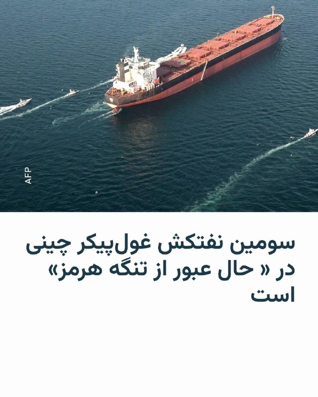

🔸داده‌های رهگیری کشتی‌ها نشان می‌دهد یک نفتکش غول‌پیکر چینی حامل دو میلیون بشکه نفت خام عراق، روز چهارشنبه ۲۳ اردیبهشت، در تلاش برای عبور از تنگه هرمز بوده است.

🔸خبرگزاری رویترز روز چهارشنبه ۲۳ اردیبهشت به‌نقل از داده‌های شرکت‌های رهگیری گزارش داد یک نفتکش غول‌پیکر چینی حامل دو میلیون بشکه نفت خام عراق در تلاش برای عبور از تنگه هرمز بوده است.

🔸بر اساس داده‌های شرکت‌های «ال‌اس‌ای‌جی» و «کپلر»، نفتکش «یوآن هوا هو» از نزدیکی جزیره لارک ایران عبور کرده و در بخش شرقی تنگه هرمز به سمت جنوب در حال حرکت است.

@RadioFarda

## Hranews — post 112921

  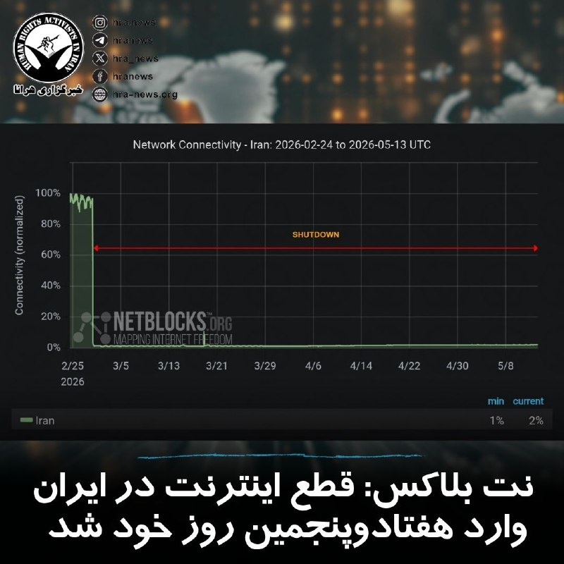

نت‌بلاکس، که محدودیت دسترسی به اینترنت در جهان را رصد می‌کند، اعلام کرد که قطع اینترنت در ایران اکنون از ۱۷۷۶ ساعت گذشته و وارد هفتاد و پنجمین روز خود شده است. این نهاد تاکید کرد که این اقدام سانسور دیجیتال، به سودجویی و کاهش امنیت دیجیتال منجر شده و طرح‌های موسوم به «اینترنت پرو» با حمایت حکومت و فهرست سفید گزینشی، زمینه‌ساز نظارت، فساد و کلاهبرداری شده‌اند.
#قطع_اینترنت

↘️
@hranews_bot تماس ✉️ - @Hranews کانال هرانا 🆑

## alonews — post 119680

  <a href="telegram/content/alonews_119680_1778663097.webm" target="_blank">🎬 Download video</a>

👈تهران تا یک‌شنبه خنک می‌شود

✅ @AloNews خبر جنگ

---
📅 بروزرسانی: 1405/02/23 12:29
---

## mwarmonitor — post 9021

  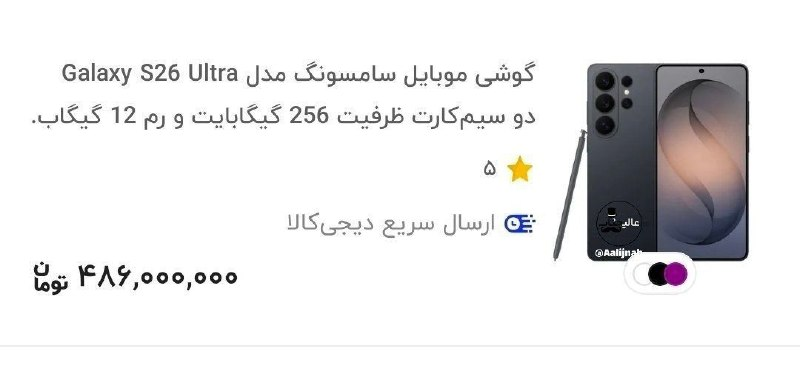

📝 قیمت ۴۸۶ میلیون تومان ، تصویرِ عریانِ غارتگری در حکومتی است که فساد را از ۱۴۰۰ سال پیش به ارث برده و با برچسب «اسلام ناب محمدی» به خورد ملت می‌دهد. این فرقه با حرامزادگیِ تمام، گوشی ۱۱۰۰ دلاری را به قیمت ۳۰۰۰ دلار در حلقوم مردم می‌چپاند تا هزینه انگل‌وار زندگی خود و مزدورانشان را تأمین کنند. در این لجن‌زارِ جمهوری اسلامی، هر گجت ساده تبدیل به ابزارِ اخاذی شده است؛ دزدانی که با وقاحتِ تمام، جیب مردم را به اسم رجیستری و گمرک می‌زنند تا ثابت کنند در مرام این نظام، چیزی جز چپاول، دروغ و نابودیِ رفاهِ شهروندان وجود ندارد. این ننگِ اقتصادی، نمادِ کاملِ حکومتی است که پایه و اساسش بر حرامی‌گری و مکیدنِ خونِ ملتی بنا شده که تنها جرمشان زندگی زیر سایه‌ی این فرقه‌ی تبهکار است.

@mwarmonitor

## farsi_fox_news — post 89280

♦️ مدیرعامل یک مؤسسهٔ‌ مالی با ۱۳ هزار شاکی دستگیر شد

🔹 دادستان مرکز استان کهگیلویه‌وبویراحمد از بازداشت مدیرعامل یک مؤسسهٔ مالی به‌اتهام کلاهبرداری و فعالیت غیرمجاز خبر داد و گفت: در این پرونده بیش از ۱۳ هزار نفر مال‌باخته شناسایی شده است.
🔹 این مؤسسه در ابتدا مجوز بانک مرکزی را داشته اما از سال ۱۴۰۲ بدون تمدید یا دریافت مجوز به فعالیت خود ادامه داده و این تخلف با گزارش پرداخت‌های گزینشی احراز شده است.
🔹 براساس نظریهٔ اولیهٔ کارشناس رسمی، ماندهٔ اصل سپرده‌ها حدود ۱۶۵ میلیارد تومان و مانده تسهیلات پرداختی در اختیار اشخاص حدود ۸۵ میلیارد تومان براورد شده است.
🌐 @farsi_fox_news

## farsi_fox_news — post 89279

♦️ رئیس روابط عمومی وزارت بهداشت: ۴۰ هزار نفر در جنگ رمضان مجروح شدند
🌐 @farsi_fox_news

## farsi_fox_news — post 89278

  <a href="telegram/content/farsi_fox_news_89278_1778662782.mp4" target="_blank">🎬 Download video</a>

♦️ شوخی معاون وزیر بهداشت با هانتاویروس و تنگه هرمز

🔹 رئیسی: کشتی کروز که هیچی یک کشتی بادی هم نمی‌تواند از تنگه هرمز رد بشه نیروهای ما سریع می‌زننش و هانتاویروس هوا میشه
🌐 @farsi_fox_news

## pm_afshaa — post 90673

🔴یک مقام ارشد سابق موساد: ایران ممکن است ظرف چند ماه از نظر اقتصادی سقوط کند اگر محاصره ادامه یابد

💧 Rainbet.com the #1 Non-KYC Crypto Casino & Sportsbook @rainbetcom

😁 @Pm_Afshaa

## pm_afshaa — post 90672

🔴سخنگوی ارتش اسرائیل: ارتش اسرائیل حمله به زیرساخت‌های سازمان تروریستی حزب‌الله را در چندین منطقه در جنوب لبنان آغاز کرده

💧 Rainbet.com the #1 Non-KYC Crypto Casino & Sportsbook @rainbetcom

😁 @Pm_Afshaa

## IranIntlTV — post 336948

  <a href="telegram/content/IranIntlTV_336948_1778662784.mp4" target="_blank">🎬 Download video</a>

دونالد ترامپ، رییس‌جمهوری آمریکا، پیش از سفر رسمی به پکن، با اشاره به نابودی توان نظامی جمهوری اسلامی گفت برای مهار حکومت ایران هیچ نیازی به کمک چین ندارد.

گفت‌وگو با هوشنگ حسن‌یاری، کارشناس خاورمیانه و امور نظامی
@iranintltv

## Shin_Persian — post 5986

  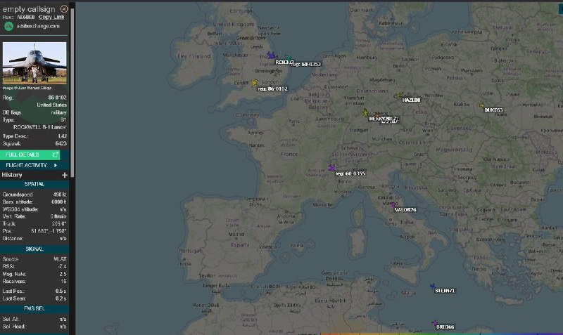

DefenceGeek 🇬🇧 ✓ @DefenceGeek Wed, 13 May 2026 08:39:27 UTC Running Visible again - B-1 training flight! #FreeIran‌ --- Operation EPIC FURY / Project FREEDOM --- Another B-1 training sortie launching this morning from RAF Fairford (EGVA) is pinging on…

## Shin_Persian — post 5985

DefenceGeek 🇬🇧 ✓ @DefenceGeek
Wed, 13 May 2026 08:39:27 UTC

Running Visible again - B-1 training flight! #FreeIran‌
--- Operation EPIC FURY / Project FREEDOM ---

Another B-1 training sortie launching this morning from RAF Fairford (EGVA) is pinging on FR24/ADSB.

B-1B "MISS40" 85-0060 #AE6BD1 "Doolittle Raiders"
B-1B "MISS41" 86-0102 #AE6BEB "Bad Moon Rising" (visible)

@MATA_osint @LHA2709 @Andyyyyrrrr @ArmchairAdml @jamjake01 @vcdgf555

فارسی

دوباره در حالت مرئی در حال اجرا - پرواز آموزشی B-1! #FreeIran‌
--- عملیات خشم حماسی (EPIC FURY) / پروژه آزادی (Project FREEDOM) ---

یک سورتی پرواز آموزشی دیگر از بمب‌افکن‌های B-1 که امروز صبح از پایگاه هوایی Fairford نیروی هوایی سلطنتی بریتانیا (EGVA) برخاسته است، در FR24/ADSB در حال سیگنال‌دهی است.

B-1B "MISS40" 85-0060 #AE6BD1 "Doolittle Raiders"
B-1B "MISS41" 86-0102 #AE6BEB "Bad Moon Rising" (مرئی)

@MATA_osint @LHA2709 @Andyyyyrrrr @ArmchairAdml @jamjake01 @vcdgf555

𝕏 · @shin_persian

## DW_Farsi — post 124639

  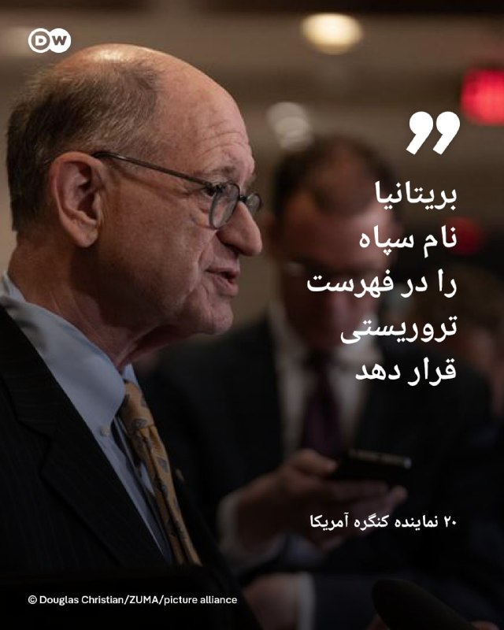

🔶 ۲۰ نماینده کنگره آمریکا: بریتانیا نام سپاه را در فهرست تروریستی قرار دهد
 
گروهی متشکل از ۲۰ عضو جمهوری‌خواه و دموکرات در مجلس نمایندگان ایالات متحده در نامه‌ای به دولت بریتانیا خواستار سرعت بخشیدن به روند تصویب قانونی قرار گرفتن سپاه پاسداران انقلاب اسلامی در فهرست تروریستی این کشور شدند.
 
برد شرمن، عضو حزب دموکرات و عالی‌ترین مقام کمیسیون امور خاورمیانه و شمال آفریقا در مجلس نمایندگان که از مبتکران تهیه این نامه بوده، تصریح کرد: «هر روزی که پارلمان بریتانیا [در تروریستی نامیدن سپاه] تأخیر می‌کند، سپاه پاسداران یک روز دیگر از شعاع و تأثیر کامل تحریم‌های مشترک ما می‌گریزد.»
 
کلودیا تنی، عضو جمهوری‌خواه مجلس نمایندگان و یکی دیگر از مبتکران این نامه، سپاه پاسداران را "یکی از خطرناک‌ترین سازمان‌های تروریستی جهان" خواند که "دستش به خون غیرنظامیان بی‌گناه، آمریکایی‌ها و مخالفان آلوده است".
 
ایالات متحده سپاه پاسداران را در سال ۲۰۱۹ میلادی در فهرست سازمان‌های تروریستی قرار داد. همچنین کانادا در سال ۲۰۲۴، استرالیا در سال ۲۰۲۵ و اتحادیه اروپا در فوریه سال جاری میلادی (۲۰۲۶) دست به این اقدام زدند.
 
@dw_farsi

## Persian_Trend_Official — post 14038

  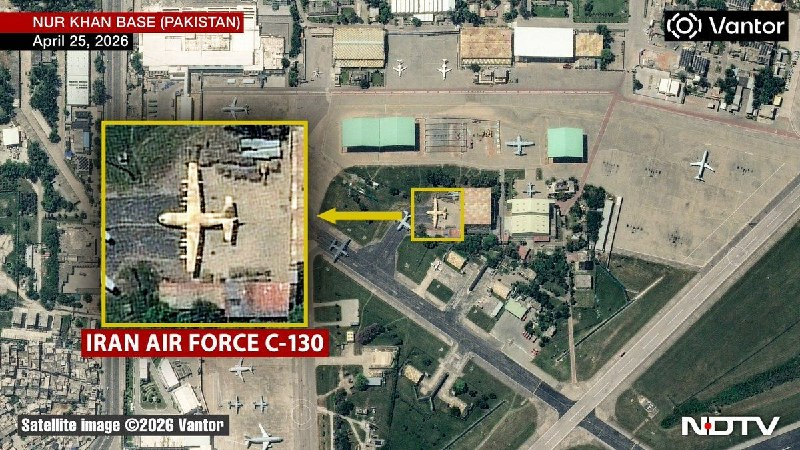

شبکه تلویزیونی NDTV تصاویر ماهواره‌ای با وضوح بالا را که از پایگاه هوایی ونتور گرفته شده، منتشر کرده است که ظاهراً گزارش‌های مبنی بر پناه دادن حداقل یک هواپیمای ترابری نظامی C-130H نیروی هوایی ایران در پایگاه هوایی نورخان پاکستان را تأیید می‌کند.

📝 Nick

📌 @persian_trend_official
پرشین ترند | متفاوت‌ترین کانال نظامی

## Hranews — post 112920

سیدیاسین حسن‌زاده، دانشجوی دانشگاه تهران آزاد شد

❗️
❗️
❗️
❗️
❗️– سیدیاسین حسن‌زاده، دبیر انجمن اسلامی دانشجویان دانشگاه تهران که روز گذشته توسط ماموران امنیتی بازداشت شده بود، آزاد شد.

ادامه مطلب

#سیدیاسین_حسن‌زاده

↘️
@hranews_bot تماس ✉️ - @Hranews کانال هرانا 🆑

## alonews — post 119679

  <a href="telegram/content/alonews_119679_1778662787.webm" target="_blank">🎬 Download video</a>

👈وزیر رفاه: داریم تمام وقت تلاش میکنیم که مبلغ کالابرگ رو افزایش بدیم

✅ @AloNews خبر جنگ

## alonews — post 119678

  <a href="telegram/content/alonews_119678_1778662787.webm" target="_blank">🎬 Download video</a>

👈گفتگوی تلفنی وزرای خارجه ایران و جمهوری آذربایجان

✅ @AloNews خبر جنگ

---
📅 بروزرسانی: 1405/02/23 12:15
---

## mwarmonitor — post 9020

✈️ساعت 09:31 ـ 09:35 به وقت گرینویچ MISS 40 | 41 دو فروند بمب‌افکن استراتژیک B-1B از پایگاه Fairford به پرواز درآمده و با Brize در فرکانس 231.950 در حال ارتباط است.

@mwarmonitor

## FarsiVOA — post 217598

  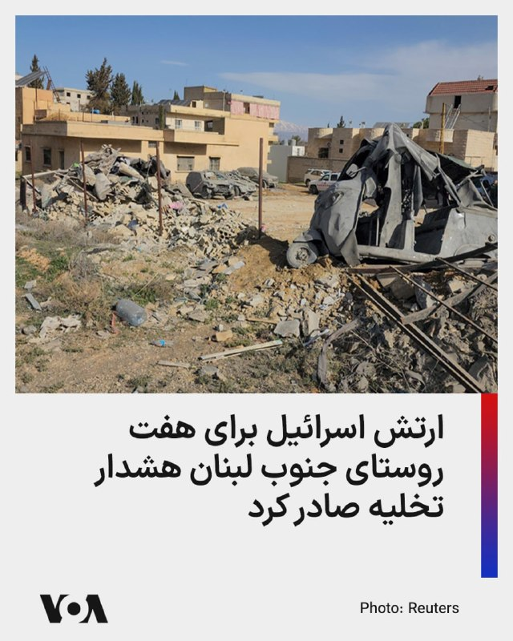

ارتش اسرائیل روز چهارشنبه هم برای ساکنان هفت روستا در جنوب لبنان که در محدوده حملات هوایی علیه مواضع حزب‌الله قرار دارند، هشدار تخلیه صادر کرد.

بر اساس این اعلام کرد این هشدار روستاهای معشوق، جرجوع، یانوح، برج الشمالی، حلوسیه الفوقا، دبعال و العباسیه را شامل می‌شود.

ارتش اسرائیل از ساکنان این مناطق خواسته است تا دست‌کم یک کیلومتر از محل‌های هدف فاصله بگیرند و گفته است که این اقدام در واکنش به نقض توافق آتش‌بس از سوی حزب‌الله انجام می‌شود.

ساعاتی پیش ارتش اسرائیل اعلام کرد که گروه حزب‌الله صبح روز چهارشنبه چند راکت به سوی نیروهای اسرائیلی در جنوب لبنان شلیک کرده است. این حمله باعث فعال شدن آژیر هشدار در منطقه مرزی زرعیت شد، اما به گفته ارتش اسرائیل، راکت‌ها در نزدیکی نیروها فرود آمدند و تلفاتی برجای نگذاشتند.

اسرائیل در کنار آمریکا و بسیاری از کشورهای دیگر، گروه شبه‌نظامی حزب‌الله را که مورد حمایت جمهوری اسلامی است، گروهی تروریستی می‌داند.
@FarsiVOA

## Persian_Trend_Official — post 14037

  <a href="telegram/content/Persian_Trend_Official_14037_1778661917.mp4" target="_blank">🎬 Download video</a>

🔴مجری صدا‌وسیما :

💢اگر اینترنت و مستر کارت برایتان مهم است بروید افغانستان و سوریه زندگی کنید ...❗️

🫆:Tony

📌 @persian_trend_official
پرشین ترند | متفاوت‌ترین کانال نظامی

## RadioFarda — post 157119

موریاسو: اولویت راهبردی پکن در دیدار سران آمریکا و چین، بقای حکومت ایران است

🔸جنگ آمریکا با ایران و تنش‌های بعدی آن در خاورمیانه بر دیدار حساس و تعیین‌کنندهٔ دونالد ترامپ، رئیس‌جمهور آمریکا، با شی جین‌پینگ، رهبر چین، که اواخر این هفته در پکن برگزار می‌شود، سایه انداخته است. انتظار می‌رود موضوع ایران به یکی از چالش‌برانگیزترین سرفصل‌های دستور کار این نشست بدل شود.

🔸طبق برنامه، دونالد ترامپ روز ۲۳ اردیبهشت وارد پکن خواهد شد و در روزهای ۲۴ و ۲۵ اردیبهشت با شی جین‌پینگ دیدار خواهد کرد. این سفر پیش‌تر در سال جاری به‌دلیل جنگ ایران به تعویق افتاده بود. مقامات ارشد ایالات متحده می‌گویند ترامپ قصد دارد مستقیماً همتای چینی خود را در خصوص پیوندهای اقتصادی و فناورانهٔ پکن با تهران، از جمله خرید نفت و ادعای انتقال کالاهای دارای کاربرد دوگانه، تحت فشار بگذارد.

🔸کن موریاسو، پژوهشگر ارشد اندیشکدهٔ هادسون، در گفت‌وگو با رادیو اروپای آزاد/رادیو آزادی می‌گوید پکن ممکن است برای کاهش تنش‌ها دست به مانورهای تاکتیکی بزند، اما در برابر هر اقدامی که بقای حکومت جمهوری اسلامی ایران را تهدید کند، ایستادگی خواهد کرد؛ چرا که از دید او، ایران نقشی کلیدی و محوری در استراتژی بلندمدت چین در منطقه اوراسیا ایفا می‌کند.

🔸 گزارش کامل را در وب‌سایت رادیوفردا بخوانید.

@RadioFarda

## Dirty_Kids — post 389362

مشتی یه دونه سیب کندیم دیگه کون باغبون نذاشتیم که این کارا چیه

@Dirty_Kids 👻

## Dirty_Kids — post 389361

  

پرچم شیروخورشید انقدر قشنگه که جشن قهرمانی یکی از بزرگترین تیم‌های دنیا رو به حاشیه برده. 
👑🫶

@Dirty_Kids 👻

## alonews — post 119677

  <a href="telegram/content/alonews_119677_1778661921.webm" target="_blank">🎬 Download video</a>

👈الشرق الاوسط: چین نام روبیو را تغییر داد تا او بتواند وارد خاک این کشور شود

🔴 مارکو روبیو، وزیر خارجه آمریکا، روز چهارشنبه همراه با دونالد ترامپ، رئیس‌جمهور آمریکا، به پکن سفر خواهد کرد؛ این در حالی است که او همچنان تحت تحریم‌های چین قرار دارد، اما به نظر می‌رسد پکن با تغییر شیوه نگارش نام او، راهکاری جدید برای مواجهه با این موضوع پیدا کرده است.

🔴 روبیو در دوران عضویت خود در سنای آمریکا، از منتقدان سرسخت وضعیت حقوق بشر در چین بود و پکن نیز در واکنش به این موضوع، دو بار علیه او تحریم اعمال کرد؛ اقدامی که آمریکا نیز اغلب علیه رقبای خود به کار می‌برد.

🔴 چین روز سه‌شنبه اعلام کرد که مانع همراهی روبیوی ۵۴ ساله با ترامپ در سفر به چین نخواهد شد. این نخستین سفر روبیو به چین است و همچنین اولین سفر یک رئیس‌ جمهور آمریکا به پکن در حدود یک دهه گذشته محسوب می‌شود

✅ @AloNews خبر جنگ

## alonews — post 119675

  <a href="telegram/content/alonews_119675_1778661921.webm" target="_blank">🎬 Download video</a>

👈حمله جنگنده‌های اسرائیلی به دو منطقه در جنوب لبنان

✅ @AloNews خبر جنگ

## alonews — post 119674

  <a href="telegram/content/alonews_119674_1778661921.webm" target="_blank">🎬 Download video</a>

👈الجزیره: وزیر دفاع کره جنوبی اعلام کرد ، حمایت از تلاش‌های آمریکا برای تأمین امنیت هرمز را بررسی می‌کنیم

✅ @AloNews خبر جنگ

---
📅 بروزرسانی: 1405/02/23 12:04
---

## VahidOOnLine — post 239866

  <a href="telegram/content/VahidOOnLine_239866_1778661285.mp4" target="_blank">🎬 Download video</a>

⭕️دو حمله هوایی اسرائیل به جنوب بیروت دست‌کم یک کشته برجا گذاشت

♦️خبرگزاری دولتی لبنان روز چهارشنبه ۲۳ اردیبهشت‌ماه گزارش کرد روز چهارشنبه دو خودرو در بزرگراه اصلی میان بیروت و جنوب لبنان، در نزدیکی منطقه جیه، هدف حمله قرار دادند.

خبرگزاری فرانسه ویدیویی را از خودروی سوخته و انتقال دست‌کم یک پیکر توسط نیروهای امدادی منتشر کرد.

خبرگزاری رویترز نوشت هنوز اسرائیل بیانیه‌ای درباره این حمله و اهداف آن منتشر نکرده است.
‌🇸🇦 Indypersian

🤖 @VahidOOnLine

## mwarmonitor — post 9018

🔴شبکه NDTV تصاویر ماهواره‌ای با وضوح بالا (تهیه‌شده از شرکت Vantor) منتشر کرده است که به‌نظر می‌رسد گزارش‌ها مبنی بر پناه دادن پاکستان به دست‌کم یک فروند هواپیمای ترابری نظامی C-130H نیروی هوایی ایران در پایگاه هوایی نورخانِ نیروی هوایی پاکستان (PAF) را تأیید…

## pm_afshaa — post 90671

نیویورک تایمز: قصد ترامپ از تغییر نام عملیات «خشم حماسی» به «چکش سنگین» این است که یک عملیات جدید 60 روزه حمله به ایران شروع کند

💧 Rainbet.com the #1 Non-KYC Crypto Casino & Sportsbook @rainbetcom

😁 @Pm_Afshaa

## IranIntlTV — post 336947

  <a href="telegram/content/IranIntlTV_336947_1778661287.mp4" target="_blank">🎬 Download video</a>

فدراسیون فوتبال اعلام کرد مراسم بدرقه «تیم ملی» به جام جهانی، چهارشنبه‌شب در یک تجمع حکومتی برگزار می‌شود و قرار است در این مراسم از پیراهن «تیم ملی» نیز رونمایی شود.

گفت‌وگو با رها پوربخش، عضو تحریریه ایران‌اینترنشنال
@iranintltv

## alonews — post 119673

  <a href="telegram/content/alonews_119673_1778661289.webm" target="_blank">🎬 Download video</a>

👈سخنگوی شرکت آب و فاضلاب استان تهران: مصرف آب تهران به مرز ۳ میلیارد لیتر در شبانه روز رسید

✅ @AloNews خبر جنگ

## alonews — post 119672

  <a href="telegram/content/alonews_119672_1778661289.webm" target="_blank">🎬 Download video</a>

👈نیویورک تایمز: قصد ترامپ از تغییر نام عملیات «خشم حماسی» به «چکش سنگین» این است که یک عملیات جدید ۶۰ روزه حمله به ایران شروع کند

✅ @AloNews خبر جنگ

## alonews — post 119671

  <a href="telegram/content/alonews_119671_1778661289.webm" target="_blank">🎬 Download video</a>

👈آژانس بین‌المللی انرژی: جهان ذخایر نفت خود را با سرعت بی‌سابقه در پرتو جنگ «خاورمیانه» مصرف می‌کند.

✅ @AloNews خبر جنگ

## alonews — post 119670

  <a href="telegram/content/alonews_119670_1778661289.webm" target="_blank">🎬 Download video</a>

👈رویترز: قیمت نفت روز چهارشنبه پس از سه روز افزایش شدید، کاهش یافت، در حالی که قیمت طلا ثابت ماند

✅ @AloNews خبر جنگ

---
📅 بروزرسانی: 1405/02/23 11:54
---

## VahidOOnLine — post 239865

  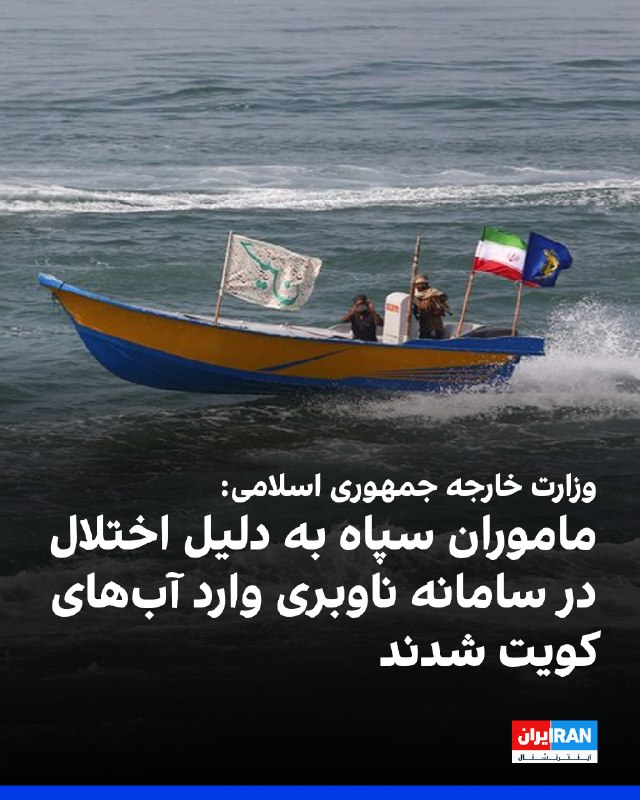

وزارت خارجه جمهوری اسلامی بازداشت چهار عضو سپاه پاسداران در کویت را تایید کرد و گفت این ماموران به دلیل «اختلال ایجاد شده در سامانه ناوبری»، وارد آب‌های کویت شده بودند. این وزارتخانه اعلام کویت مبنی بر نفوذ این ماموران برای انجام «اقدام خصمانه» را بی‌اساس خواند و خواستار آزادی آن‌ها شد.
‌🏁 🇬🇧 IranintlTV

🤖 @VahidOOnLine

## VahidOOnLine — post 239864

  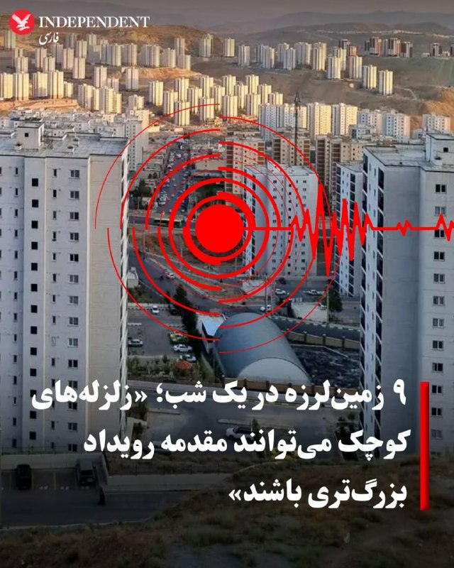

♦️یک روز پس از وقوع ۹ زمین‌لرزه و پس‌لرزه در شرق تهران، یک کارشناس زمین‌شناسی گفت این لرزه‌های کوچک، ممکن است مقدمه رویداد بزرگ‌تری باشند.

به گزارش خبرگزاری مهر، وابسته به سازمان تبلیغات اسلامی، مهدی زارع، زلزله‌شناس و استاد پژوهشگاه بین‌المللی زلزله‌شناسی و مهندسی زلزله با اشاره به زمین‌لرزه به بزرگی ۷.۱ در قرن نوزدهم در گسل شرق تهران گفت: «وقوع زلزله‌های ۴ ریشتری اخیر در ۲۸ فروردین و ۲۲ اردیبهشت در پردیس نشان از تخلیه انرژی دارد. وقوع زمین‌لرزه‌های کوچک به صورت مستمر، بخشی از انرژی گسل را تخلیه می‌کند، ولی این لرزه‌ها می‌توانند نشانه‌ای از ناپایداری در پهنه‌ای وسیع‌تر باشند که مقدمه رویداد بزرگتری است.

به عبارت دیگر، لرزه‌های خرد و متوسط، هرچند تا حدی تنش را کاهش می‌دهند، اما نمی‌توانند به طور قطع احتمال وقوع یک زلزله بزرگ را منتفی کنند. در برخی موارد، چنین توالی‌هایی می‌توانند پیش‌لرزه (foreshock) باشند.»
‌🇸🇦 Indypersian

🤖 @VahidOOnLine

## mwarmonitor — post 9017

  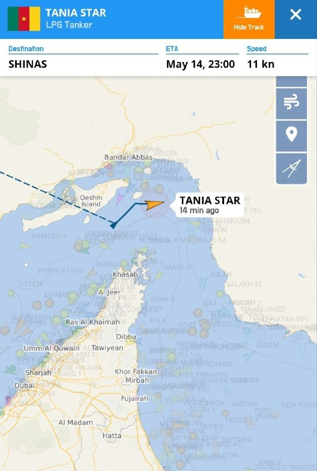

🚢کشتی گاز مایع (LPG) تحریم‌شده از سوی آمریکا با نام «TANIA STAR» (شماره IMO: 9134165) در حال عبور از تنگه هرمز است.

🔸این کشتی به‌دلیل تحویل گاز ایران به سری‌لانکا تحریم شده است.

@mwarmonitor

## DEJradio — post 4606

  <a href="telegram/content/DEJradio_4606_1778660697.webm" target="_blank">🎬 Download video</a>

🔺📷 پیامدهای جنگ ۴۰ روزه؛ انهدام بوئینگ‌های نیروی هوایی ارتش و ایلیوشین‌های سـ.ـپاه در فرودگاه مهرآباد

طی جنگ ۴۰ روزه بارها به آشیانه و هواپیماهای ارتش و سـ.ـپاه حمله شد. به گفته حمیدرضا صناعی، معاون سازمان هواپیمایی کشوری بیشتر فرودگاه‌های ایران در جنگ آسیب دیدند. او همچنین گفت که ۱۵ هواپیمای مسافربری به طور مستقیم هدف حملات قرار گرفتند و نابود شدند و حدود ۲۰ درصد از ناوگان هوایی فعال کشور کاملا از چرخه خدمت‌رسانی خارج شدند.

همچنین بنابر گزارش‌های منتشرشده، دست‌کم حدود ۳۹ فروند هواپیمای نظامی و ترابری نظامی ایران نیز در این حملات منهدم شدند یا به شدت آسیب دیدند.

#جنگ۴۰روزه #فرودگاه_مهرآباد
@DEJradio

## DEJradio — post 4604

  <a href="telegram/content/DEJradio_4604_1778660698.webm" target="_blank">🎬 Download video</a>

🔺📷 در پی وقوع زمین‌لرزه‌ای به‌نسبت قوی در تهران، البرز و سمنان شماری از شهروندان ترجح دادند شب در خیابان بخوابند. به گزارش مرکز لرزه‌نگاری ایران، در نخستین ساعت بامداد چهارشنبه، ۲۳ اردیبهشت‌ماه، وقوع دو پس‌لرزه به‌ترتیب به بزرگی ۴ و ۳.۴ در پردیس، تهران را لرزاند. براساس گزارش فارس، این پس‌لرزه‌ها در ورامین، پاکدشت، پردیس و بخش‌هایی از شمیرانات حس شده است. پیش از این، زلزله به بزرگی ۴.۶ در مرز تهران و مازندران رخ داد که پردیس مرکز آن اعلام شد.

#زلزله #تهران
@DEJradio

## DEJradio — post 4603

  <a href="telegram/content/DEJradio_4603_1778660699.webm" target="_blank">🎬 Download video</a>

🚨
⭕️ در نشست سیاسی- امنیتی سالانه «پولیتیکو» که سه‌شنبه ۱۲ ما مه (۲۳ اردیبهشت به‌وقت ایران) برگزار شد، مجری از شاهزاده رضا پهلوی پرسید «ترامپ می‌گوید مطمئن نیست شما حمایت کافی داخل ایران داشته باشید... منتقدان هم ادعا می‌کنند شما توسط آمریکا و اسرائیل حمایت می‌شوید» که او پاسخ داد «میلیون‌ها ایرانی که به فراخوان من پاسخ دادند، سند زنده هستند که من حمایت عظیمی داخل ایران دارم. به محض اینکه رژیم فیلترینگ و قطعی اینترنت را بردارد، دنیا دقیقا خواهد شنید که مردم ایران چه می‌گویند.»

او افزود: «دقیقا قبل از آخرین قطعی اینترنت، پیام آخر من به میلیون‌ها نفر در داخل کشور رسید. فقط یک ویدیو اینستاگرامی بیش از ۹۰ میلیون بازدید داشت و بعد از قطع اینترنت به ۵-۶ میلیون رسید. هیچ دولت خارجی حق ندارد برای آینده ایران تصمیم بگیرد. این تصمیم تنها به عهده مردم ایران است. ما گروگان‌های زندانی هستیم که این رژیم برای ما ساخته. گاهی اوقات گروگان‌ها برای آزادی به کمک خارجی نیاز دارند. ما را حمایت کنید و ما خودمان کار را تمام می‌کنیم.»

#ترامپ #شاهزاده_رضا_پهلوی
@DEJradio

## IranIntlTV — post 336946

  

🔻باشگاه ممفیس گریزلیز اعلام کرد که برندون کلارک، بازیکن این تیم، در ۲۹ سالگی درگذشت. علت مرگ او هنوز اعلام نشده است.

🔹کلارک که متولد ونکوور کانادا بود، در سال ۲۰۱۹ در دور نخست درفت ان‌بی‌ای انتخاب شد و از آن زمان برای ممفیس گریزلیز بازی می‌کرد. او در این فصل به دلیل مصدومیت تنها در دو مسابقه به میدان رفت.

🔹باشگاه ممفیس گریزلیز در بیانیه‌ای اعلام کرد: «برندون نه‌تنها هم‌تیمی فوق‌العاده‌ای بود، بلکه شخصیتی تاثیرگذار در باشگاه و جامعه ممفیس داشت و هرگز فراموش نخواهد شد.»

🔹کلارک در مجموع ۳۰۹ بازی در ان‌بی‌ای انجام داد و میانگین ۱۰.۲ امتیاز در هر مسابقه را ثبت کرد. او در سال ۲۰۲۰ نیز در تیم منتخب بازیکنان تازه‌وارد ان‌بی‌ای قرار گرفت.

🔹آدام سیلور، رییس ان‌بی‌ای، در واکنش به درگذشت کلارک گفت او یکی از محبوب‌ترین بازیکنان ممفیس گریزلیز بود و با «انرژی، اشتیاق و روحیه جنگندگی» بازی می‌کرد.

@iranintltvsport

## IranIntlTV — post 336945

  

وزارت خارجه جمهوری اسلامی بازداشت چهار عضو سپاه پاسداران در کویت را تایید کرد و گفت این ماموران به دلیل «اختلال ایجاد شده در سامانه ناوبری»، وارد آب‌های کویت شده بودند. این وزارتخانه اعلام کویت مبنی بر نفوذ این ماموران برای انجام «اقدام خصمانه» را بی‌اساس خواند و خواستار آزادی آن‌ها شد.
https://iranintl.com/202605131167

## IranIntlTV — post 336944

  <a href="telegram/content/IranIntlTV_336944_1778660702.mp4" target="_blank">🎬 Download video</a>

قوه قضاییه جمهوری اسلامی از اعدام احسان افراشته به اتهام «جاسوسی برای اسرائیل» خبر داد. اعدام افراشته در حالی انجام شده که پرونده او با گزارش‌هایی درباره فشارهای امنیتی، اعترافات اجباری و ابهام در روند دادرسی همراه بود.
گفت‌وگو با محمد مقیمی، وکیل دادگستری و کارشناس ارشد حقوق بشر
@iranintltv

## FarsiVOA — post 217597

  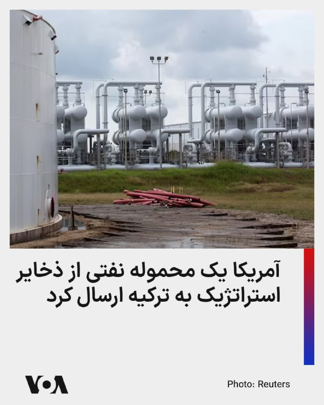

داده‌های کشتی‌رانی نشان می‌دهد یک محموله نفتی ۶۸۰ هزار بشکه‌ای آزاد شده از ذخایر استراتژیک نفت آمریکا به مقصد ترکیه، وارد دریای مدیترانه شده است.

برای اولین بار است که ترکیه محموله نفتی آزاد شده از ذخایر استراتژیک نفت آمریکا را دریافت می‌کند.

آمریکا در قالب توافق با کشورهای عضو آژانس بین‌المللی انرژی متعهد به آزادسازی ۱۷۲ میلیون بشکه نفت از ذخایر استراتژیک خود برای مقابله با تبعات انسداد تنگه هرمز توسط جمهوری اسلامی شده است. در همین چهارچوب، تاکنون محموله‌هایی به ایتالیا و هلند ارسال شده است.
@FarsiVOA

## DW_Farsi — post 124638

  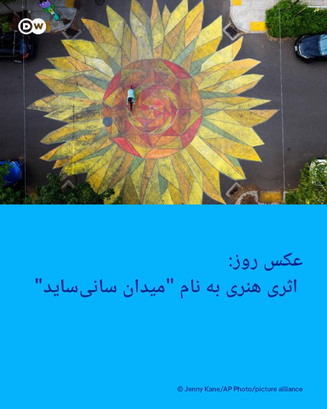

📸 عکس روز: اثری هنری به نام "میدان سانی‌ساید"
 
ساکنان محلی در تقاطعی در پورتلند ایالت اورگن آمریکا اثری هنری آفریده‌اند به نام "میدان سانی‌ساید." این اثر که از بالا نشان داده شده خورشیدی است که انسان را به یاد گل آفتابگردان می‌اندازد. این هنر محله‌محور که نمونه‌ای از نقاشی کف خیابان است علاوه بر خلق زیبایی رانندگان را به کاهش سرعت ترغیب می‌کند تا محیطی ایمن‌تر برای عابران و دوچرخه‌سواران ایجاد شود و میزان سوانح و تنش‌های روزمره پایین بیاید.

@dw_farsi

## RadioFarda — post 157118

🔸عضو کمیسیون اقتصادی مجلس شورای اسلامی اعلام کرد برآوردهای اولیه از خسارت‌های صنعتی ناشی از جنگ اخیر آمریکا و اسرائیل با ایران نشان می‌دهد خسارت واردشده فقط در دو استان تهران و اصفهان، بدون در نظر گرفتن صنایع بزرگ آسیب‌دیده، حدود ۲۰۰ هزار میلیارد تومان بوده است.

🔸مهدی طغیانی در گفت‌وگو با صداوسیما گفت این رقم بر اساس خوداظهاری واحدها برآورد شده و شامل خسارت صنایع بزرگ، واحدهایی که زنجیرهٔ تولید آن‌ها آسیب دیده و همچنین بنگاه‌هایی که در پی جنگ دچار رکود شده‌اند، نمی‌شود.

🔸در جریان جنگ دو شرکت فولاد خوزستان و فولاد مبارکه نیز که از صنایع بزرگ ایران محسوب می‌شوند، در نیمه اول فروردین هدف حملات هوایی اسرائیل قرار گرفتند که در پی آن، براساس اعلام رسانه‌های اقتصادی ایران، «معادل ۲۵ تا ۳۰ درصد ظرفیت تولید فولاد در ایران از دست رفت».

🔸استان‌های تهران و اصفهان بیشترین آسیب‌های صنعتی را در جریان جنگ متحمل شدند. به‌گفتهٔ مهدی طغیانی، خسارت ۲۰۰ هزار میلیاردی در مقایسه با تولید ناخالص داخلی ایران عدد بزرگی نیست، اما برای واحدهای درگیر و آسیب‌دیده خسارت قابل‌توجهی به شمار می‌رود.

@RadioFarda

## Hranews — post 112919

  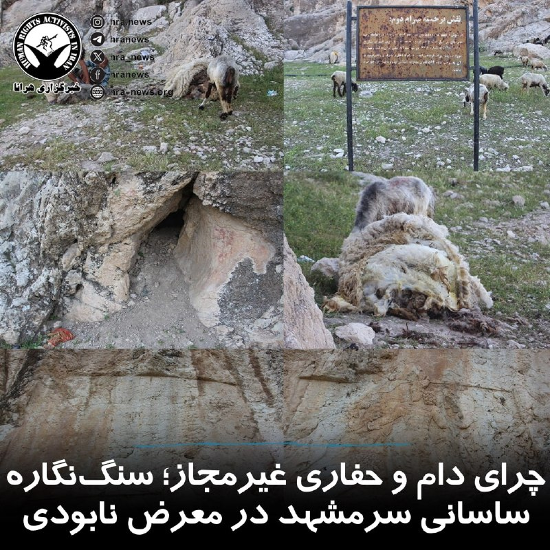

یک کنشگر و پژوهشگر میراث فرهنگی، در گفت‌وگو با خبرگزاری ایسنا، از وضعیت نامناسب نگهداری سنگ‌نگاره و سنگ‌نبشته ساسانی سرمشهد در شهرستان کازرون خبر داد. سیاوش آریا اعلام کرد که چوپانان محلی گوسفندان خود را برای چرا و پشم‌چینی به داخل محوطه این اثر تاریخی منتقل می‌کنند. وی با اشاره به بازدید میدانی خود از این محوطه، گفت که شکسته شدن بخشی از فنس حفاظتی باعث ورود دام‌ها به عرصه تاریخی شده و آثار پشم‌چینی و آلودگی در کنار این یادمان ساسانی باقی مانده است.

این پژوهشگر #میراث_فرهنگی همچنین با اشاره به فرسودگی شدید این اثر تاریخی، از تداوم ساخت‌وساز در حریم محوطه، یادگاری‌نویسی، حفاری‌های غیرمجاز و نبود حفاظت موثر انتقاد کرد. به گفته او، سنگ‌نگاره و سنگ‌نبشته سرمشهد که از مهم‌ترین آثار به‌جامانده از دوره ساسانیان به شمار می‌رود، در حال محو شدن است و بی‌توجهی نهادهای مسئول، روند تخریب آن را تشدید کرده است.
#سنگ‌نگاره_سرمشهد

↘️
@hranews_bot تماس ✉️ - @Hranews کانال هرانا 🆑

## alonews — post 119666

  <a href="telegram/content/alonews_119666_1778660706.webm" target="_blank">🎬 Download video</a>

⭕️یک اعدام دیگر

🔴میزان خبرگزاری قوه قضاییه جمهوری اسلامی با انتشار تصاویر بالا نوشت: احسان افرشته اعدام شد

🔴قوه قضاییه مدعی شده که: افرشته در نپال از سوی موساد آموزش جاسوسی دیده و اطلاعات حساس کشور را به اسرائیل می‌فروخت.

✅@AloNews

## alonews — post 119665

  <a href="telegram/content/alonews_119665_1778660707.webm" target="_blank">🎬 Download video</a>

👈به گزارش رسانه های عبری : نتانیاهو امشب جلسه‌‌ی امنیتی محدود برگزار میکنه

✅ @AloNews خبر جنگ

---
📅 بروزرسانی: 1405/02/23 11:44
---

## mwarmonitor — post 9016

✈️ساعت ۰۹:۰۷ به وقت گرینویچ — TULLY 34 یک فروند بمب‌افکن B-52H به‌صورت تکی از RAF Fairford به پرواز درآمد.
در حال کار روی فرکانس Brize با 231.950 (ارتباط با RAF Brize Norton).

@mwarmonitor

## DEJradio — post 4602

  <a href="telegram/content/DEJradio_4602_1778660056.webm" target="_blank">🎬 Download video</a>

🚨📢 شبکه «فاکس‌نیوز» سه‌شنبه ۲۲ اردیبهشت ۱۴۰۵ در گزارشی با اشاره به بن‌بست مذاکرات تهران و واشنگتن، پیش‌بینی کرد اگر ترامپ تصمیم بگیرد حملات به ایران از سر گرفته شود یا خیزش در داخل ایران بار دیگر شروع شود، بعضی از مقام‌های ارشد حکومت ایران به روسیه فرار کنند؛ مشابه کاری که برخی اطرافیان بشار اسد در سوریه انجام دادند.

فاکس‌نیوز در بخشی از این گزارش به وضعیت تقسیم قدرت در داخل ایران و موضوع جانشینی علی خامنه‌ای اشاره و این ایده را مطرح می‌کند که ساختار سیاسی جمهوری اسلامی طوری طراحی شده است که حتی در بحران‌های شدید هم بتواند ادامه پیدا کند، هرچند اختلاف و ابهام درباره آینده رهبری ممکن است بعضی جریان‌ها را به فکر خروج از کشور بیندازد.

بر اساس این تحلیل، مقام‌های رده‌بالای جمهوری اسلامی ممکن است به روسیه بروند، اما افراد رده‌پایین‌تر به کشورهایی مثل عراق یا افغانستان فرار کنند. در صورت فروپاشی احتمالی جمهوری اسلامی، شبکه‌های منطقه‌ای این رژیم از جمله گروه‌های نیابتی هم تضعیف خواهند شد.

#مذاکرات #جمهوری_اسلامی
@DEJradio

## FarsiVOA — post 217596

  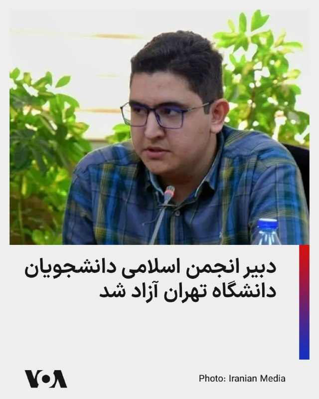

خبرگزاری ایسنا از آزادی دبیر انجمن اسلامی دانشجویان دانشگاه تهران، پس از چند ساعت بازداشت خبر داد.

یاسین حسن‌زاده، دانشجوی ورودی ۱۴۰۰ مهندسی صنایع دانشگاه تهران و دبیر انجمن اسلامی دانشجویان دانشگاه تهران، ظهر روز سه‌شنبه ۲۲ اردیبهشت و با مراجعه‌ مأموران امنیتی به منزل خود بازداشت شده بود.

منابع حقوق بشری اعلام کردند که این بازداشت پس از انتشار بیانیه انتقادی انجمن اسلامی دانشجویان دانشگاه تهران نسبت به روند اعدام‌ها در ایران صورت گرفت.

در بخشی از این بیانیه، با انتقاد از «نبود شفافیت در روند قضایی» و «اجرای بی‌سر‌وصدای احکام اعدام»، از دستگاه قضایی خواسته شده بود تا اجرای احکام اعدام مرتبط با اعتراضات سیاسی متوقف شود.

خبرگزاری ایسنا، بدون ارائه توضیحاتی از زمان دقیق دستگیری و اتهامات این دانشجو، صبح چهارشنبه ۲۳ اردیبهشت اعلام کرد که خبرهای دریافتی از آزادی یاسین حسن‌زاده، دبیر انجمن اسلامی دانشجویان دانشگاه تهران و علوم پزشکی تهران حکایت می‌کند.
@FarsiVOA

---
📅 بروزرسانی: 1405/02/23 11:35
---

## Persian_Trend_Official — post 14036

  

🚀 اینترنت پرسرعت و پایدار،
💰 قیمت هر گیگ ۲۵۰ تومن!
🎁 تخفیف ویژه: ۱۰٪ تخفیف اختصاصی برای اعضای پرشین ترند
⚡ پایداری بالا: کمترین قطعی ممکن در بدترین شرایط
🛡️ تضمین کیفیت: پشتیبانی ۲۴ ساعته + گارانتی بازگشت وجه

🛒 جهت خرید و مشاوره پیام دهید:

🆔 @shayan1057

🆔 @shayan1057

🆔 @shayan1057

## alonews — post 119664

  <a href="telegram/content/alonews_119664_1778659513.webm" target="_blank">🎬 Download video</a>

👈رویترز: قیمت نفت روز چهارشنبه پس از سه روز افزایش شدید، کاهش یافت، در حالی که قیمت طلا ثابت ماند، زیرا سرمایه‌گذاران در انتظار نشست مورد انتظار ترامپ و شی جین پینگ، همتای چینی او در پکن، در بحبوحه تنش‌های مداوم مربوط به جنگ در ایران و بسته شدن تنگه هرمز هستند

✅ @AloNews خبر جنگ

---
📅 بروزرسانی: 1405/02/23 11:26
---

## mwarmonitor — post 9015

  

🔴شبکه NDTV تصاویر ماهواره‌ای با وضوح بالا (تهیه‌شده از شرکت Vantor) منتشر کرده است که به‌نظر می‌رسد گزارش‌ها مبنی بر پناه دادن پاکستان به دست‌کم یک فروند هواپیمای ترابری نظامی C-130H نیروی هوایی ایران در پایگاه هوایی نورخانِ نیروی هوایی پاکستان (PAF) را تأیید…

## mwarmonitor — post 9014

  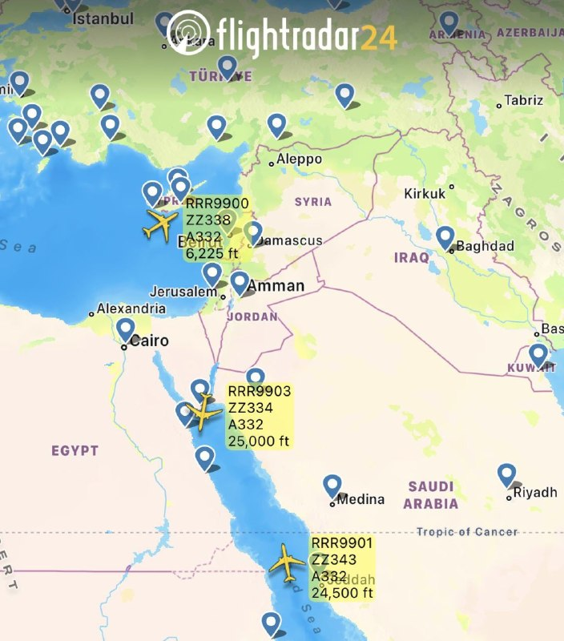

✈️🇬🇧نیروی هوایی سلطنتی بریتانیا (RAF)

ایرباس KC.2 Voyager ×۳
43C6FB ZZ338 – ASCOT 9900
43C700 ZZ343 – ASCOT 9901
43C6F7 ZZ334 – ASCOT 9902

✈️صبح امروز یک عملیات سوخت‌رسانی غیرمعمول از سوی نیروی هوایی سلطنتی بریتانیا در جریان است. سه فروند هواپیمای «ویجر» RAF با علائم پروازی متوالی در حال فعالیت بر فراز دریای سرخ هستند.

✈️پرواز ASCOT 9900 حدود ۸ ساعت پیش انجام شده و به نقطه‌ای نزدیک جده بر فراز دریای سرخ رسیده و برای مدت کوتاهی سیگنال خود را ارسال کرده است؛ هرچند ممکن است مسیر خود را فراتر از این نقطه ادامه داده باشد.

✈️به نظر می‌رسد ASCOT 9901 که حدود ۵ ساعت پیش به پرواز درآمده، جای آن را گرفته و پس از آن ASCOT 9902 که یک ساعت پیش برخاسته، به سمت محدوده‌ای حرکت می‌کند که 9901 در آن در حال ارسال سیگنال است.

📌هر آنچه در جریان است، طی ۸ ساعت گذشته به حضور مداوم هواپیماهای سوخت‌رسان بر فراز دریای سرخ نیاز داشته است.

@mwarmonitor

## IranIntlTV — post 336943

  <a href="telegram/content/IranIntlTV_336943_1778658986.mp4" target="_blank">🎬 Download video</a>

همزمان با رد پیشنهاد ۱۴ ماده‌ای جمهوری اسلامی از سوی دونالد ترامپ، رییس‌جمهوری آمریکا و ادامه بسته ماندن تنگه هرمز، رسانه‌ها از افزایش احتمال درگیری نظامی دوباره میان تهران و واشینگتن خبر می‌دهند.
گفت‌وگو با روح‌الله رحیم‌پور، روزنامه‌نگار و تحلیل‌گر سیاسی
@iranintltv

## idfinfarsi — post 11571

  <a href="telegram/content/idfinfarsi_11571_1778658988.mp4" target="_blank">🎬 Download video</a>

در طول شبانه‌روز گذشته: ارتش اسرائیل بیش از ۴۰ زیرساخت سازمان تروریستی حزب‌الله را در جنوب لبنان مورد حمله قرار داد

در طول شبانه‌روز گذشته، ارتش اسرائیل بیش از ۴۰ زیرساخت سازمان تروریستی حزب‌الله را در چندین منطقه در جنوب لبنان هدف قرار داد.

از جمله زیرساخت‌های هدف قرار گرفته: انبارهای تسلیحاتی و ساختمان‌های مورد استفاده نظامی که تروریست‌های حزب‌الله از آن‌ها برای پیشبرد طرح‌های تروریستی علیه نیروهای ارتش اسرائیل و شهروندان این کشور استفاده می‌کردند.

همچنین، تروریست‌هایی که تهدیدی برای نیروهای ما بودند به هلاکت رسیدند و پرتابگرهای آماده شلیک که به سمت خاک اسرائیل هدف‌گیری شده بودند، مورد حمله قرار گرفتند.

## alonews — post 119663

  <a href="telegram/content/alonews_119663_1778658989.mp4" target="_blank">🎬 Download video</a>

👈فرودِ هواپیمای ترامپ تو الاسکا برای استراحت و پرواز مجدد

✅ @AloNews خبر جنگ

---
📅 بروزرسانی: 1405/02/23 11:15
---

## VahidOOnLine — post 239863

⭕️اجرای هنری «سوگ سیاوش» در اعتراض به اعدام جوانان ایران‌زمین در شهر کلن

♦️تصاویری که روز سه‌شنبه ۲۲ اردیبهشت برای ایندیپندنت فارسی ارسال شده نشان می‌دهد، جانان الماسی، شاعر حماسی و رقصنده، در گردهمایی سراسری ایرانیان در شهر کلن، غم‌نامه «سوگ سیاوش» فردوسی را همراه با رقصی در اعتراض به اعدام معترضان در ایران اجرا کرد.

این برنامه روز یکشنبه ۲۰ اردیبهشت‌ماه در شهر کلن آلمان برگزار شد.
‌🇸🇦 Indypersian

🤖 @VahidOOnLine

## IranIntlTV — post 336942

  <a href="telegram/content/IranIntlTV_336942_1778658331.mp4" target="_blank">🎬 Download video</a>

میزان، خبرگزاری قوه قضاییه جمهوری اسلامی، از اجرای حکم اعدام احسان افرشته خبر داد.
کانون حقوق بشر ایران پیش‌تر اعلام کرده بود اتهام «همکاری با اسرائیل» علیه احسان افرشته بر پایه اعترافات اجباری تحت شکنجه مطرح شده و هیچ مدرک معتبری در پرونده او وجود ندارد.

گفت‌وگو با مجتبی هاشمی، روزنامه‌نگار و تحلیل‌گر سیاسی
@iranintltv

## IranIntlTV — post 336941

  <a href="telegram/content/IranIntlTV_336941_1778658333.mp4" target="_blank">🎬 Download video</a>

دولت پاکستان با صدور بیانیه‌ای گزارش‌ها درباره حضور هواپیماهای جمهوری اسلامی در پایگاه نورخان را تایید کرد، اما گفت: «ماموریت این هواپیماها نظامی نیست.»

جواد همدانی، خبرنگار ایران‌اینترنشنال، گزارش می‌دهد
@iranintltv

## FarsiVOA — post 217595

🔺جمهوری اسلامی بازداشت چهار مأمور خود در کویت را تأیید کرد

▪️وزارت امور خارجه جمهوری اسلامی بازداشت چهار مأمور ایرانی در کویت را تأیید کرد، اما اتهام‌های مطرح‌شده از سوی دولت کویت درباره «تلاش برای انجام اقدامات خصمانه» را «مطلقاً بی‌اساس» خواند.

▪️ادعا شده این چهار نفر «در چارچوب مأموریت مرسوم گشت‌زنی دریایی» فعالیت می‌کردند و به دلیل «اختلال در سامانه ناوبری» وارد آب‌های سرزمینی کویت شده‌اند.

▪️کویت اعلام کرده این گروه قصد نفوذ به جزیره بوبیان را داشته و مأموریت آنها انجام اقدامات «خصمانه» علیه این کشور بوده است.

▪️مقام‌های کویتی گفته‌اند این افراد قصد داشتند از طریق دریا وارد کویت شوند و در بازجویی‌ها ارتباط خود با سپاه پاسداران را پذیرفته‌اند.

⬇️ بیشتر بخوانید:
https://ir.voanews.com/a/8149520.html

## DW_Farsi — post 124637

🔶 زلزله ۴.۶ ریشتری، پس‌لرزه‌ها و طوفان در تهران
 
به گزارش خبرگزاری‌های داخلی ایران، یک زمین‌لرزه نسبتا شدید و پس‌لرز‌هایی آن تهران و مناطق پیرامونی را لرزاند. 
 
بنا بر گزارش‌های رسمی، این زلزله ساعت ۲۳ و ۴۶ دقیقه شامگاه سه‌شنبه ۲۲ اردیبهشت (۱۲ مه) به شدت ۴.۶ ریشتر در عمق ده کیلومتری زمین در حوالی بومهن روی داد. شهرستان‌های شمیرانات، پردیس و دماوند نیز تحت تأثیر این زمین‌لرزه قرار داشتند.
 
مرتضی رضایی، معاون امداد و نجات جمعیت هلال‌احمر استان تهران، به خبرگزاری ایسنا گفت، بامداد امروز چهارشنبه نیز دو پس‌لرزه به ثبت رسید که یکی از آنها به بزرگی ۴ ریشتر و دیگری ۲ ریشتر بود.
 
به گفته این مقام، بخش لواسانات بیشترین تأثیر را از این زمین‌لرزه داشته و بلافاصله پس از وقوع زلزله، تیم‌های عملیاتی و ارزیاب هلال‌احمر به مناطق اعزام شدند. به گفته او، تیم‌های عملیاتی همچنان در حال ارزیابی و پایش مناطق هستند.
 
رضایی اضافه کرد که "تاکنون هیچ‌گونه گزارشی مبنی بر تخریب، خسارت یا آسیب جانی دریافت نشده و مسیرهای ارتباطی در مناطق بومهن و لواسانات نیز بررسی شده که هیچ محدودیت یا مشکلی در تردد وجود ندارد".
 
بنا بر گزارش رسانه‌ها، رئیس اورژانس تهران و همچنین رئیس جمعیت هلال احمر پایتخت نیز بعد از وقوع حادثه به خبرگزاری‌ها گفتند که زلزله تاکنون مصدومی در پی نداشته است.
 
@dw_farsi

## Dirty_Kids — post 389360

  <a href="telegram/content/Dirty_Kids_389360_1778658335.mp4" target="_blank">🎬 Download video</a>

قشنگ زنده یاد ۱۰۰ سال از زمان خودش جلوتر بود پپ

زنده‌یاد فریدون فرخزاد در سال ۱۹۹۰ میلادی، در گفت‌وگو با «رادیو سیدنی» در استرالیا

@Dirty_Kids 👻

## Hranews — post 112918

بازداشت یک فرد در تهران؛ پلیس مدعی استفاده از استارلینک برای «انتقال اطلاعات» شد

❗️
❗️
❗️
❗️
❗️– فرماندهی انتظامی تهران بزرگ از #بازداشت یک نفر در محدوده چیتگر تهران خبر داد. پلیس مدعی شده است که این فرد از طریق تجهیزات اینترنت ماهواره‌ای استارلینک، اطلاعات مربوط به محل‌های اصابت در جریان درگیری ‌های نظامی اخیر را به شبکه‌های مخالف حکومت منتقل می‌کرده است.

ادامه مطلب

↘️
@hranews_bot تماس ✉️ - @Hranews کانال هرانا 🆑

## alonews — post 119662

  <a href="telegram/content/alonews_119662_1778658337.webm" target="_blank">🎬 Download video</a>

👈با اعلام قوه قضاییه جمهوری اسلامی، احسان افرشته به اتهام «همکاری با اسرائیل»، بامداد چهارشنبه اعدام شد.

✅ @AloNews خبر جنگ

---
📅 بروزرسانی: 1405/02/23 11:04
---

## VahidOOnLine — post 239862

  

♦️پس از ۷۵ روز قطعی اینترنت در ایران و در حالیکه اعتراض‌ها به این رکوردشکنی جمهوری اسلامی بالا گرفته است، مسعود پزشکیان روز چهارشنبه ۲۳ اردیبهشت، محمدرضا عارف را به‌عنوان «رئیس ستاد ویژه ساماندهی و راهبری فضای مجازی» منصوب کرد.

پزشکیان ساعاتی پیش از این با انتشار پیامی در اکس نوشته بود «با در نظر گرفتن «حساسیت‌های حکمرانی و نظر رهبری»، در قالب «ساختاری چابک»، موجبات خدمت‌رسانی بهتر دولت و تحقق انتظارات عمومی را فراهم کند.»

پزشکیان توضیح نداد که ساختار چابک مورد نظر او، شامل وصل کامل اینترنت و ارتباطات می‌شود یا قصد دارد خدمات الکترونیکی دولت را روی شبکه ملی اینترنت (نسخه محدود داخلی) گسترده‌تر کند.
‌🇸🇦 Indypersian

🤖 @VahidOOnLine

## VahidOOnLine — post 239861

  

هم‌زمان با سفر دونالد ترامپ به چین و آغاز گفت‌وگوها درباره جنگ جمهوری اسلامی و اسرائیل، مقام‌های آمریکایی پکن را متهم کردند که با خرید گسترده نفت ایران، به «بزرگ‌ترین حامی دولتی تروریسم» کمک مالی می‌کند.

دونالد ترامپ امروز برای دیدار با شی جین‌پینگ، رئیس‌جمهوری چین، راهی پکن شد؛ دیداری که جنگ جمهوری اسلامی و اسرائیل و بحران تنگه هرمز از محورهای اصلی آن عنوان شده است.

در آستانه این سفر، اسکات بسنت، وزیر خزانه‌داری آمریکا، از چین خواست جمهوری اسلامی را برای بازگشایی تنگه هرمز تحت فشار قرار دهد و گفت پکن با خرید نفت ایران، «بزرگ‌ترین حامی دولتی تروریسم» را تأمین مالی می‌کند.

وزیر خزانه‌داری آمریکا در گفت‌وگو با فاکس‌نیوز گفت: «ببینیم آیا چین حاضر است از دیپلماسی استفاده کند و جمهوری اسلامی را وادار به باز کردن تنگه کند یا نه.»

چین تاکنون در قبال جنگ موضعی محتاطانه اتخاذ کرده و فراتر از انتقاد از آمریکا و اسرائیل، نقش مستقیمی در حل بحران ایفا نکرده است.
این دیدار در شرایطی برگزار می‌شود که تنش‌ها در منطقه، امنیت انرژی چین و تجارت جهانی از مسیر تنگه هرمز را تحت تأثیر قرار داده است.
‌🏁 🇬🇧 ManotoTV

🤖 @VahidOOnLine

## ManotoTV — post 105387

  

هم‌زمان با سفر دونالد ترامپ به چین و آغاز گفت‌وگوها درباره جنگ جمهوری اسلامی و اسرائیل، مقام‌های آمریکایی پکن را متهم کردند که با خرید گسترده نفت ایران، به «بزرگ‌ترین حامی دولتی تروریسم» کمک مالی می‌کند.

دونالد ترامپ امروز برای دیدار با شی جین‌پینگ، رئیس‌جمهوری چین، راهی پکن شد؛ دیداری که جنگ جمهوری اسلامی و اسرائیل و بحران تنگه هرمز از محورهای اصلی آن عنوان شده است.

در آستانه این سفر، اسکات بسنت، وزیر خزانه‌داری آمریکا، از چین خواست جمهوری اسلامی را برای بازگشایی تنگه هرمز تحت فشار قرار دهد و گفت پکن با خرید نفت ایران، «بزرگ‌ترین حامی دولتی تروریسم» را تأمین مالی می‌کند.

وزیر خزانه‌داری آمریکا در گفت‌وگو با فاکس‌نیوز گفت: «ببینیم آیا چین حاضر است از دیپلماسی استفاده کند و جمهوری اسلامی را وادار به باز کردن تنگه کند یا نه.»

چین تاکنون در قبال جنگ موضعی محتاطانه اتخاذ کرده و فراتر از انتقاد از آمریکا و اسرائیل، نقش مستقیمی در حل بحران ایفا نکرده است.
این دیدار در شرایطی برگزار می‌شود که تنش‌ها در منطقه، امنیت انرژی چین و تجارت جهانی از مسیر تنگه هرمز را تحت تأثیر قرار داده است.

## manototv — post 105387

  

هم‌زمان با سفر دونالد ترامپ به چین و آغاز گفت‌وگوها درباره جنگ جمهوری اسلامی و اسرائیل، مقام‌های آمریکایی پکن را متهم کردند که با خرید گسترده نفت ایران، به «بزرگ‌ترین حامی دولتی تروریسم» کمک مالی می‌کند.

دونالد ترامپ امروز برای دیدار با شی جین‌پینگ، رئیس‌جمهوری چین، راهی پکن شد؛ دیداری که جنگ جمهوری اسلامی و اسرائیل و بحران تنگه هرمز از محورهای اصلی آن عنوان شده است.

در آستانه این سفر، اسکات بسنت، وزیر خزانه‌داری آمریکا، از چین خواست جمهوری اسلامی را برای بازگشایی تنگه هرمز تحت فشار قرار دهد و گفت پکن با خرید نفت ایران، «بزرگ‌ترین حامی دولتی تروریسم» را تأمین مالی می‌کند.

وزیر خزانه‌داری آمریکا در گفت‌وگو با فاکس‌نیوز گفت: «ببینیم آیا چین حاضر است از دیپلماسی استفاده کند و جمهوری اسلامی را وادار به باز کردن تنگه کند یا نه.»

چین تاکنون در قبال جنگ موضعی محتاطانه اتخاذ کرده و فراتر از انتقاد از آمریکا و اسرائیل، نقش مستقیمی در حل بحران ایفا نکرده است.
این دیدار در شرایطی برگزار می‌شود که تنش‌ها در منطقه، امنیت انرژی چین و تجارت جهانی از مسیر تنگه هرمز را تحت تأثیر قرار داده است.

---
📅 بروزرسانی: 1405/02/23 10:57
---

## VahidOOnLine — post 239860

  

کامران غضنفری، نماینده مجلس، آمارهای مربوط به خسارت‌های قطع اینترنت در ایران را «جوسازی» خواند و گفت: «۵۰ میلیون نفر در پلتفرم‌های ایرانی هستند و هیچ مشکلی ندارند.»

او گفت: «قطع اینترنت اصلا مختص ایران نیست. ترکیه و کشورهای اروپایی که مانند ما درگیر جنگ نشده‌اند، به محض کوچک‌ترین مشکل امنیتی اینترنت بین‌الملل مردم خود را قطع می‌کنند.»
‌🏁 🇬🇧 IranintlTV

🤖 @VahidOOnLine

## VahidOOnLine — post 239859

  

رویترز به نقل از مقام‌های غربی و جمهوری اسلامی گزارش داد عربستان سعودی در جریان گسترش جنگ منطقه‌ای، در واکنش به حملاتی در خاک این کشور، چندین حمله اعلام‌نشده علیه جمهوری اسلامی انجام داده است.

رویترز در گزارشی اختصاصی نوشت عربستان سعودی، در اقدامی بی‌سابقه، حملات محرمانه‌ای را علیه جمهوری اسلامی انجام داده است.

به گفته دو مقام غربی مطلع و دو مقام جمهوری اسلامی، این حملات در واکنش به حملاتی صورت گرفته که در جریان جنگ در خاک عربستان انجام شده بود.

این حملات که پیش‌تر رسانه‌ای نشده بود، نخستین مورد شناخته‌شده از اقدام مستقیم نظامی عربستان در خاک ایران به شمار می‌رود؛ اقدامی که به نوشته رویترز نشان می‌دهد ریاض در دفاع از خود در برابر جمهوری اسلامی، رویکردی تهاجمی‌تر در پیش گرفته است.
‌🏁 🇬🇧 ManotoTV

🤖 @VahidOOnLine

## farsi_fox_news — post 89277

♦️ رهایی ۳ گروگان و دستگیری گروگانگیران در خاش

🔹 فرمانده انتظامی خاش: در پی گروگانگیری به قصد اخاذی، پیگیری موضوع به صورت ویژه در دستور کار پلیس قرار گرفت.
🔹 کارآگاهان پلیس شهرستان خاش موفق شدند با انجام اقدامات تخصصی و شگردهای پلیسی محل نگهداری گروگان ها را شناسایی و در عملیاتی منسجم و غافلگیرانه ۱نفر از گروگانگیران را دستگیر، ۳نفر از افراد گرو رفته را آزاد نمایند.
🔹 افراد گروگان گرفته شده از شهرستان های مشهد، ایرانشهر و خاش بودند.
🔹 یک قبضه اسلحه کلاشینکف به همراه ۳ تیغه خشاب حاوی مهمات مربوطه، یک جفت پلاک خودروی سرقتی از متهمان کشف و دستگیری سایر گروگانگیران نیز در دستور کار می باشد.
🌐 @farsi_fox_news

## pm_afshaa — post 90670

غضنفری:شواهد و قرائن نشان می‌دهد که آمریکا و اسرائیل قصد انجام یک عملیات گسترده برای تصرف برخی از جزایر جنوب را دارند

💧 Rainbet.com the #1 Non-KYC Crypto Casino & Sportsbook @rainbetcom

😁 @Pm_Afshaa

## IranIntlTV — post 336940

  

کامران غضنفری، نماینده مجلس، آمارهای مربوط به خسارت‌های قطع اینترنت در ایران را «جوسازی» خواند و گفت: «۵۰ میلیون نفر در پلتفرم‌های ایرانی هستند و هیچ مشکلی ندارند.»

او گفت: «قطع اینترنت اصلا مختص ایران نیست. ترکیه و کشورهای اروپایی که مانند ما درگیر جنگ نشده‌اند، به محض کوچک‌ترین مشکل امنیتی اینترنت بین‌الملل مردم خود را قطع می‌کنند.»
https://iranintl.com/202605131903

## IranIntlTV — post 336939

  <a href="telegram/content/IranIntlTV_336939_1778657259.mp4" target="_blank">🎬 Download video</a>

رهبران آمریکا و چین در حالی در پکن دیدار می‌کنند که پیامدهای جنگ ایران و حمایت‌های پکن از جمهوری اسلامی بر این نشست سایه انداخته است. آیا دو طرف در مورد ایران تعاملاتی خواهند کرد؟

گزارش توماج طاهباز، خبرنگار ایران‌اینترنشنال
@iranintltv

## Persian_Trend_Official — post 14035

  

شات گان اون هم با لوله کروم که زیر نور آفتاب طوری برق میزنه که از یک کیلومتری دیده میشه. تو آمریکا حتی غیر نظامی هایی که عشق اسلحه هستن و سرشون در میاد هم اگر اسلحه با لوله کروم بخری مسخرت میکنن میگن باربی جواهرآلات جدید خریده!

سپاه روز به روز از یک نیروی نظامی داره به یک باند گانگستری شبیه تر میشه. امروز فردا فرماندهانش هم کلت با بدنه آب طلا خواهند بست.

📌 @persian_trend_official
پرشین ترند | متفاوت‌ترین کانال نظامی

## BBCPersian — post 280898

🔻نماینده مجلس ایران: آمریکا و اسرائیل بنای یک عملیات گسترده علیه ایران را دارند

کامران غضنفری، نماینده مجلس ایران با اشاره به ادامه انتقال تجهیزات و نیرو از سوی آمریکا به خاورمیانه، می‌گوید «آمریکا و اسرائیل بنای یک عملیات گسترده» علیه ایران را دارند.

آقای غضنفری به خبرآنلاین گفته آمریکا و اسرائیل «احتمالاً قصد تصرف برخی از جزایر ما در جنوب را دارند.»

او با اشاره به خواسته‌های آمریکا از ایران در مورد تعطیلی غنی‌سازی، خروج اورانیوم غنی‌شده و توقف حمایت از گروه‌های موسوم به «محور مقاومت» گفته «جمهوری اسلامی قاعدتاً زیر بار این خواسته‌ها نمی‌رود.»

به گفته این نماینده مجلس، «ما وسط جنگ هستیم و اکنون در حال جنگ با دشمن هستیم. در همین یک هفته اخیر، دو عملیات علیه ما انجام دادند و با ناوهایشان به برخی مراکز ما حمله کردند.»~

https://bbc.in/4tAXKjn
@BBCPersian

## BBCPersian — post 280897

🔻سامانه دفاع موشکی «گنبد طلایی» ترامپ هزار و دویست میلیارد دلار خرج دارد

بر اساس برآورد دفتر بودجه کنگره امريکا، سامانه دفاع موشکی آينده‌نگر «گنبد طلایی» دونالد ترامپ حدود ۱/۲ تريليون دلار (۱۲۰۰ میلیارد دلار) هزينه خواهد داشت تا طی دو دهه تولید، استقرار و بهره‌برداری شود.

اين رقم به‌مراتب بيشتر از بودجه اوليه ۱۷۵ ميليارد دلاری است که پيش‌تر برای اين پروژه در نظر گرفته شده بود.

با اين حال، سامانه‌ای که برای محافظت از ايالات متحده امريکا در برابر موشک‌های بالستيک و کروز طراحی شده، ممکن است حتی کارايی کامل نداشته باشد.

گزارش جديد دفتر بودجه کنگره هشدار می‌دهد «گلدن دوم - گنبد طلایی» می‌تواند در برابر حمله گسترده از سوی روسيه يا چين آسيب‌پذير باشد.

اين نهاد غيرحزبی اعلام کرده تنها هزينه‌های تامين تجهيزات از ۱ تريليون دلار فراتر خواهد رفت؛ از جمله برای لايه‌های رهگير موشکی و سامانه هشدار و رهگيری موشک مبتنی بر فضا.

عبور برخی از پهپادها و موشک‌های ایرانی از گنبد آهنین اسرائیل و همچنین پوشش پدافندی آمریکا در کشورهای حوزه خلیج فارس، ارزیابی‌ها درباره کارآمدی کامل این طرح را هم تحت تاثیر قرار داده است.

https://bbc.in/4tAXKjn
@BBCPersian

## BBCPersian — post 280896

🔻ترامپ نقشه ونزوئلا را با عنوان «ایالت ۵۱» منتشر کرد

دونالد ترامپ که در حال عزیمت به چین برای دیدار با شی جین پینگ است، سه شنبه شب در شبکه اجتماعی خود - تروث سوشال - نقشه ونزوئلا در حالی که روی آن با پرچم آمریکا پوشانده شده بود را منتشر کرد و بالای آن نوشت:‌ «ایالت ۵۱».

روز دوشنبه -۲۱ اردیبهشت - هم یک خبرنگار فاکس نیوز گفت که آقای ترامپ در تماس تلفنی با او گفته به انضمام ونزوئلا تحت عنوان ایالت پنجاه و یکم آمریکا «فکر می‌کند».

کانادا و گرینلند هم پیش از این القاب مشابهی از سوی رئیس جمهور آمریکا دریافت کرده بودند که با اعتراض جدی دولت و شهروندان این کشورها روبرو شده بود.

https://bbc.in/4tAXKjn
@BBCPersian

## BBCPersian — post 280895

🔻اکبر عبدی به علت عارضه قلبی در بیمارستان بستری شد

بنابر گزارش رسانه‌های ایران، اکبر عبدی، بازیگر و کمدین سرشناس ایرانی، به علت عارضه قلبی در بخش مراقبت‌های ویژه بستری شده است.

مهران غفوریان، بازیگر و کمدین با انتشار ویدیویی در مقابل بیمارستان محل بستری آقای عبدی این خبر را تایید کرده است.

آقای عبدی در دهها فیلم سینمایی و مجموعه‌های تلویزیونی ایران ایفای نقش کرده و یکی از کمدین‌های سرشناس نیم قرن گذشته در این کشور است.
https://bbc.in/4tAXKjn
@BBCPersian

## Hranews — post 112917

  

احسان افرشته به اتهام «جاسوسی» اعدام شد

❗️
❗️
❗️
❗️
❗️– مرکز رسانه قوه قضاییه از اجرای حکم اعدام احسان افرشته، دانش‌آموخته مهندسی عمران در مقطع کارشناسی ارشد و متخصص شبکه و فناوری اطلاعات، خبر داد. آقای افرشته پیشتر به اتهام «جاسوسی برای اسرائیل» به مجازات مرگ محکوم شده بود و این حکم سحرگاه امروز به مرحله اجرا درآمد. بر اساس داده‌های گردآوری‌شده توسط هرانا، همزمان با آغاز درگیری‌های نظامی، روند صدور و اجرای احکام اعدام در پرونده‌های سیاسی و امنیتی افزایش یافته و تاکنون ۳۱ زندانی با این اتهامات در این بازه زمانی اعدام شده‌اند.

ادامه مطلب

#احسان_افرشته #اعدام

↘️
@hranews_bot تماس ✉️ - @Hranews کانال هرانا 🆑

## alonews — post 119661

  <a href="telegram/content/alonews_119661_1778657264.webm" target="_blank">🎬 Download video</a>

👈بلومبرگ: نرخ بیکاری در فرانسه برای اولین بار در 5 سال گذشته از 8 درصد گذشت.

✅ @AloMews خبر جنگ

## alonews — post 119660

  <a href="telegram/content/alonews_119660_1778657264.webm" target="_blank">🎬 Download video</a>

👈بلومبرگ: یک نفتکش بزرگ چینی در حال عبور از تنگه هرمز شناسایی شده است

✅ @AloNews خبر جنگ

## alonews — post 119659

  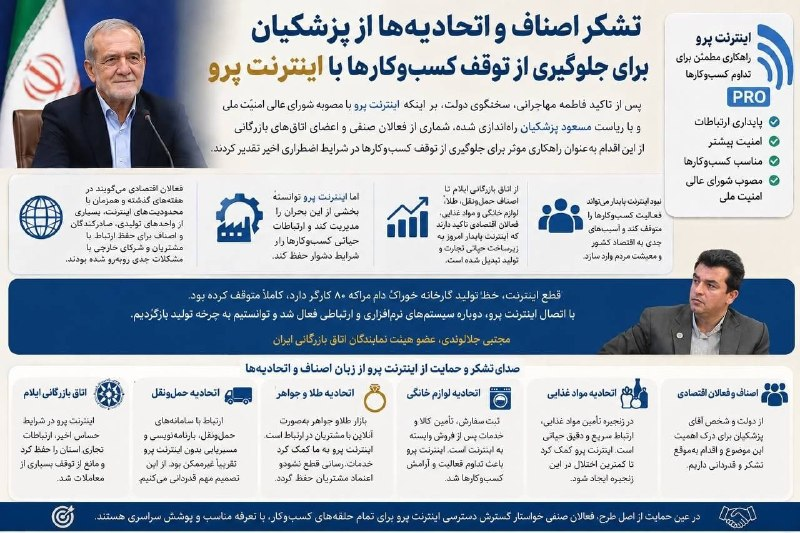

👈تشکر اصناف و اتحادیه‌ها از پزشکیان برای جلوگیری از توقف کسب‌وکارها با اینترنت پرو

✅ @AloNews خبر جنگ

## alonews — post 119658

  <a href="telegram/content/alonews_119658_1778657265.webm" target="_blank">🎬 Download video</a>

👈وزیر اقتصاد: انتقال کریدورها به بنادر شمالی و مرزهای زمینی در دستور کار است

✅ @AloNews خبر جنگ

## alonews — post 119657

  <a href="telegram/content/alonews_119657_1778657265.webm" target="_blank">🎬 Download video</a>

👈المیادین به نقل از لاوروف: روسیه پیشنهاد تهیه پیش نویس بیانیه ای از سوی گروه بریکس در مورد وضعیت تنگه هرمز را ارائه کرد، اما اختلافات ایران و امارات مانع از آن شد.

✅ @AloNews خبر جنگ

---
📅 بروزرسانی: 1405/02/23 10:35
---

## farsi_fox_news — post 89276

  <a href="telegram/content/farsi_fox_news_89276_1778655903.mp4" target="_blank">🎬 Download video</a>

♦️اعترافات هولناک جاسوس موساد!

🔹با جانورانی کار میکردم که آدمکشی برایشان مثل آب خوردن است!
🌐 @farsi_fox_news

## IranIntlTV — post 336937

  <a href="https://t.me/IranintlTV/336937" target="_blank">📎 Download file</a>

🎧نسخه صوتی اخبار بامدادی | چهارشنبه ۲۳ اردیبهشت
@iranintlTV

## ManotoTV — post 105386

  

رویترز به نقل از مقام‌های غربی و جمهوری اسلامی گزارش داد عربستان سعودی در جریان گسترش جنگ منطقه‌ای، در واکنش به حملاتی در خاک این کشور، چندین حمله اعلام‌نشده علیه جمهوری اسلامی انجام داده است.

رویترز در گزارشی اختصاصی نوشت عربستان سعودی، در اقدامی بی‌سابقه، حملات محرمانه‌ای را علیه جمهوری اسلامی انجام داده است.

به گفته دو مقام غربی مطلع و دو مقام جمهوری اسلامی، این حملات در واکنش به حملاتی صورت گرفته که در جریان جنگ در خاک عربستان انجام شده بود.

این حملات که پیش‌تر رسانه‌ای نشده بود، نخستین مورد شناخته‌شده از اقدام مستقیم نظامی عربستان در خاک ایران به شمار می‌رود؛ اقدامی که به نوشته رویترز نشان می‌دهد ریاض در دفاع از خود در برابر جمهوری اسلامی، رویکردی تهاجمی‌تر در پیش گرفته است.

## FarsiVOA — post 217594

  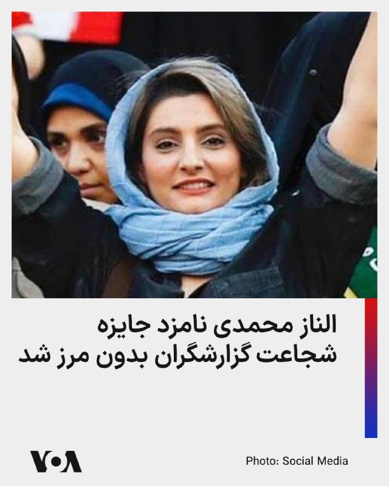

سازمان گزارشگران بدون مرز اعلام کرد «الناز محمدی»، روزنامه‌نگار ایرانی و دبیر گروه اجتماعی روزنامه «هم‌میهن»، در فهرست نامزدهای جایزه شجاعت این نهاد برای سال ۲۰۲۶ قرار گرفته است.

الناز محمدی به عنوان دبیر گروه اجتماعی روزنامه هم‌میهن، نقش مهمی در پوشش پیامدهای اجتماعی جنبش «زن، زندگی، آزادی» پس از جان باختن «مهسا امینی» در سال ۱۴۰۱ داشت، و گزارشگران بدون مرز او را نماد شجاعت در برابر سرکوب سیستماتیک آزادی مطبوعات در ایران توصیف کرده است.

خانم محمدی در بهمن ماه ۱۴۰۱ به اتهام «توطئه» و «تبانی» بازداشت و به سه سال زندان محکوم شد. گزارشگران بدون مرز همچنین اشاره کرده که او، همانند خواهر دوقلویش الهه محمدی، به دلیل فعالیت حرفه‌ای و بازتاب صدای مردم هدف فشارهای قضایی قرار گرفته است. الهه محمدی پس از انتشار گزارشی از کشته شدن مهسا امینی در بازداشت گشت ارشاد، بازداشت شده بود.

به گفته این سازمان، الناز محمدی با وجود زندان، فشارهای حقوقی و مجبور شدن به ترک شغل خود، همچنان به فعالیت حرفه‌ ای و دفاع از حق دسترسی آزاد به اطلاعات ادامه داده است.
@FarsiVOA

## FarsiVOA — post 217593

  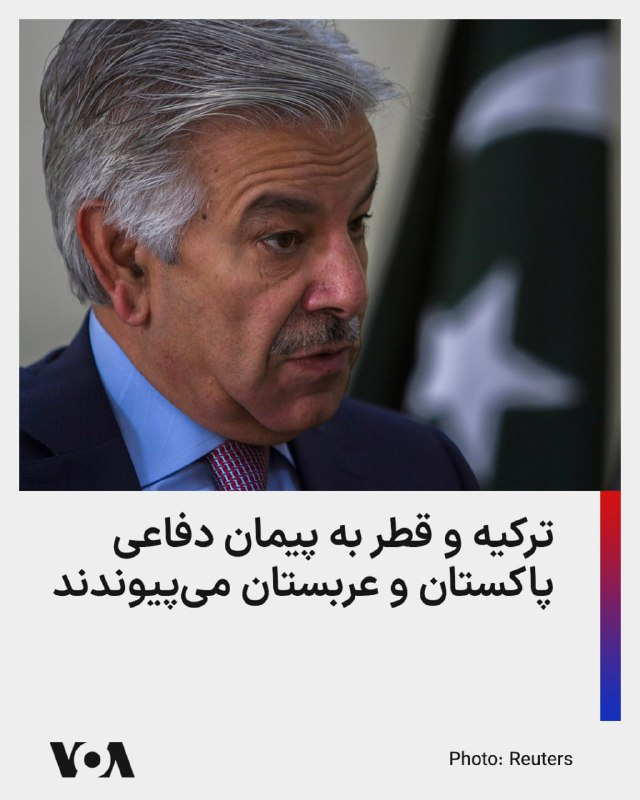

پاکستان می‌گوید ترکیه و قطر ممکن است به پیمان همکاری دفاعی متقابل میان اسلام‌آباد و ریاض بپیوندند؛ پیمانی که با توجه به جنگ ایران و آمریکا، می‌تواند آرایش امنیتی خاورمیانه و جنوب آسیا را تغییر دهد.

به گزارش بلومبرگ، خواجه آصف وزیر دفاع پاکستان، دوشنبه‌شب در یک برنامه تلویزیونی گفت این سازوکار دفاعی در حال نهایی شدن است و افزود اگر قطر و ترکیه نیز به توافق موجود بپیوندند، «تحولی خوشایند» خواهد بود.

پاکستان و عربستان سعودی پیش‌تر توافقی دفاعی امضا کرده بودند که بر اساس آن، هرگونه حمله به یکی از دو کشور، حمله به هر دو تلقی می‌شود. این توافق از زمان تشدید جنگ آمریکا با جمهوری اسلامی اهمیت بیشتری یافته و نگرانی‌ها درباره گسترش دامنه درگیری در خلیج فارس را افزایش داده است.

در چارچوب همین توافق، در شرایطی که پاکستان نقش میانجی را برای گفت‌وگوهای تهران و واشنگتن به دوش گرفته است، همزمان با مذاکرات اسلام‌آباد در ۲۲ فروردین یک نیروی نظامی پاکستانی، شامل جنگنده‌ها، در پایگاه هوایی ملک عبدالعزیز مستقر شد.
@FarsiVOA

## manototv — post 105386

  

رویترز به نقل از مقام‌های غربی و جمهوری اسلامی گزارش داد عربستان سعودی در جریان گسترش جنگ منطقه‌ای، در واکنش به حملاتی در خاک این کشور، چندین حمله اعلام‌نشده علیه جمهوری اسلامی انجام داده است.

رویترز در گزارشی اختصاصی نوشت عربستان سعودی، در اقدامی بی‌سابقه، حملات محرمانه‌ای را علیه جمهوری اسلامی انجام داده است.

به گفته دو مقام غربی مطلع و دو مقام جمهوری اسلامی، این حملات در واکنش به حملاتی صورت گرفته که در جریان جنگ در خاک عربستان انجام شده بود.

این حملات که پیش‌تر رسانه‌ای نشده بود، نخستین مورد شناخته‌شده از اقدام مستقیم نظامی عربستان در خاک ایران به شمار می‌رود؛ اقدامی که به نوشته رویترز نشان می‌دهد ریاض در دفاع از خود در برابر جمهوری اسلامی، رویکردی تهاجمی‌تر در پیش گرفته است.

## alonews — post 119656

  <a href="telegram/content/alonews_119656_1778655908.webm" target="_blank">🎬 Download video</a>

👈شبکه NDTV تصاویر ماهواره‌ای با وضوح بالا (تهیه‌شده از شرکت Vantor) منتشر کرده است که به‌نظر می‌رسد گزارش‌ها مبنی بر پناه دادن پاکستان به دست‌کم یک فروند هواپیمای ترابری نظامی C-130H نیروی هوایی ایران در پایگاه هوایی نورخانِ نیروی هوایی پاکستان (PAF) را تأیید می‌کند.

✅ @AloNews خبر جنگ

## alonews — post 119655

  <a href="telegram/content/alonews_119655_1778655908.webm" target="_blank">🎬 Download video</a>

👈روزنامه نیویورک تایمز با استناد به ارزیابی‌های اطلاعاتی طبقه‌بندی‌شده آمریکا: ایران به بیشتر سایت‌های موشکی و سکوهای پرتاب خود دسترسی مجدد پیدا کرده است

✅ @AloNews خبر جنگ

---
📅 بروزرسانی: 1405/02/23 10:24
---

## VahidOOnLine — post 239858

  <a href="telegram/content/VahidOOnLine_239858_1778655297.mp4" target="_blank">🎬 Download video</a>

ویدیوهای ارسال‌شده به ایران‌اینترنشنال نشان می‌دهند گروهی از ایرانیان مقیم آلمان سه‌شنبه ۲۲ اردیبهشت‌ماه در اعتراض به اعدام‌های جمهوری اسلامی، در شهر هانوفر پرفورمنس اعتراضی برگزار کردند.
‌🏁 🇬🇧 IranintlTV

🤖 @VahidOOnLine

## VahidOOnLine — post 239857

  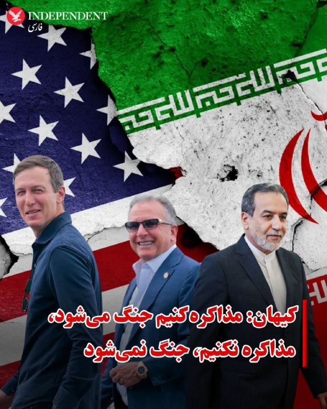

♦️روزنامه کیهان تهران روز چهارشنبه ۲۳ اردیبهشت در یادداشتی نوشت پذیرش دوباره مذاکره با آمریکا، «پالس ضعف به دشمن» می‌فرستد و باعث از سرگیری جنگ می‌شود.
کیهان در این یادداشت ادعا کرد که با وجود ضربات سنگین آمریکا و اسرائیل و کشته شدن بخش بزرگی از رهبران سیاسی و نظامی جمهوری اسلامی، «ایران برخلاف پیش‌بینی‌ها، تسلیم نشد.»
این روزنامه تحت نظر حسین شریعتمداری نوشت: «ایران نه‌تنها تسلیم نشد بلکه گلوی ترامپ را در تنگه هرمز بیشتر فشرد و فشار اقتصادی علیه محاسبات او را شدت بخشید.
تنها چیزی که آمریکا را عقب می‌راند، ماندگاری عبرت‌های دردناک جنگ اخیر و احتمال تکرار شدیدتر آن در آینده است
آنها می‌دانند زدن زیرساخت‌های ایران یعنی انهدام آرامکوی عربستان، فجیره امارات و دیگر تاسیسات منطقه.»
‌🇸🇦 Indypersian

🤖 @VahidOOnLine

## mwarmonitor — post 9013

  <a href="telegram/content/mwarmonitor_9013_1778655301.mp4" target="_blank">🎬 Download video</a>

🐒 میمون سخنگو

📝 این دلقکِ رانتی که تخصصش «واپاشی عصبی» مخاطب است، پیشنهاد هجرت به افغانستان و سوریه را می‌دهد؛ انگار که ارث پدرش را از ما طلبکار است! اما زهی خیال باطل. ما جایی نمی‌رویم، اما برای تو برنامه‌ی ویژه‌ای داریم: در فردای آزادی، قفسی در باغ‌وحش ارم رزرو شده تا به عنوان تنها «میمون سخنگوی دست‌آموز»، به جای آنتن صداوسیما، در زادگاه اصلی‌ات به اجرای برنامه بپردازی.
🔹آنجا می‌توانی با همان لبخند کذایی، برای بازدیدکنندگانی که برایت موز پرت می‌کنند، از مزایای اینترنتِ نداشته‌ات بگویی و موجبات شادی ملت را در محلی که واقعاً به آن تعلق داری فراهم کنی. شک نکن که تماشای لرزشِ غبغب و واق‌واق کردن‌های نمایشی‌ات برای یک تکه نانِ رانتی، بهترین سوژه‌ی کمدی سیاه برای نسل‌های آینده خواهد بود. تو نه یک مجری، که یک زایده‌ی بدخیم در گلوی این سرزمینی که باید در همان قفسِ حقارت، درس عبرتی شوی برای هر که خیال می‌کند می‌تواند با وقاحت، نمک بر زخم ملت بپاشد. آن روز، مستر کارت و ویزا کارتی که به رُخ می‌کشی، تنها برای خریدن بلیت تماشای سقوطِ ذلت‌بار خودت در قعر زباله‌دان تاریخ به کارت خواهد آمد.

@mwarmonitor

## farsi_fox_news — post 89275

🔹لاوروف: اگر درگیری در تنگه باب المندب رخ دهد، بخش انرژی جهان آسیب زیادی خواهد دید.
🌐 @farsi_fox_news

## IranIntlTV — post 336936

  <a href="telegram/content/IranIntlTV_336936_1778655303.mp4" target="_blank">🎬 Download video</a>

جاویدنامان انقلاب ملی ایرانیان
«محمد نوری» نوجوان ۱۷ ساله اهل قم، ۱۲ دی‌ماه در جریان یورش نیروهای سرکوبگر خامنه‌ای به معترضان در میدان توحید این شهر، هدف شلیک مستقیم قرار گرفت و جان باخت. نامش در حافظه‌ این سرزمین می‌ماند و یادش چراغ راه آزادی‌خواهان است.
@iranintltv

## IranIntlTV — post 336935

  <a href="telegram/content/IranIntlTV_336935_1778655305.mp4" target="_blank">🎬 Download video</a>

ویدیوهای ارسال‌شده به ایران‌اینترنشنال نشان می‌دهند گروهی از ایرانیان مقیم آلمان سه‌شنبه ۲۲ اردیبهشت‌ماه در اعتراض به اعدام‌های جمهوری اسلامی، در شهر هانوفر پرفورمنس اعتراضی برگزار کردند.

## DW_Farsi — post 124636

🔶 جام ۱۹۵۰؛ خوآن شیافینو، جادوگری که کابوس برزیل شد
 
خوآن آلبرتو شیافینو در جام جهانى ۱۹۵۰ در برزیل کارگردان و گلزن تیم ملی فوتبال اورگوئه بود و همچنین یکى از ستارگان درخشان آن دوره.

این مهاجم اورگوئه‌اى اگر چه در دیدار تیم ملى کشورش در مقابل بولیوى در دور اول ۴ گل از هشت گل اروگوئه را وارد دروازه حریف کرد، اما گل سرنوشت‌سازش را در  روز ۱۶ ژوئیه سال ۱۹۵۰ به ثمر رساند.

در این روز ۲۰۰ هزار نفر در استادیوم عظیم "ماراکانا" جمع شده بودند تا شاهد پیروزى تیم ملى برزیل بر اروگوئه در دیدار نهایی جام جهانى باشند.

تا دقیقه ۶۶ هم همه چیز بر وقف مراد پیش مى‌رفت، چون تا آن لحظه برزیل با تک‌گل فریاسا از اروگوئه جلو بود. در دقیقه ۶۶ شیافینو گل تساوى را به ثمر رساند و استادیوم را با این گل غرق در سکوت کرد.

۵ دقیقه بعد گیگیا، یکى از دیگر ستارگان اروگوئه گل دوم این تیم را به ثمر رساند و شکست برزیل را قطعى کرد. میزبان این بازی‌ها در غم و ماتم فرو رفت و اروگوئه با درخشش شیافینو عنوان قهرمانى جهان را جشن گرفت.
 
@dw_farsi

## Persian_Trend_Official — post 14034

  

فیک نیوز در یک کانال مثلا خبری با بیش از چهارصد هزار دنبال کننده در پیام‌رسان بله!
اگر اینترنت در ایران مثل کره شمالی بود و شبکه های ماهواه ای فارسی زبان وجود نداشتن، آخوندها به مراتب از کره شمالی میتونستن دروغگوتر باشن به شکلی که تا الان نتانیاهو و ترامپ هم اسیر شده بودند !
خاطرتون هست میگفتن نتانیاهو کشته شده و اسرائیل تصاویرش رو با هوش مصنوعی میسازه !

پ.ن : خدایا ما رو با طرفدارات تنها نزار ...

📌 @persian_trend_official
پرشین ترند | متفاوت‌ترین کانال نظامی

## Dirty_Kids — post 389358

  

می‌بینی مارکو؟ کاراشو می‌بینی؟
به ابالفضل ما هم همینیم.

@Dirty_Kids 👻

## Dirty_Kids — post 389357

هنوز چین نرسیده سر شوخیو باز کردن. :)))))))

روبیوی دل‌ها همون ست نایکی که مادورو موقع هشتک‌پشتک شدن پوشیده بودو پوشیدو آتش به همه عالم زد! :)))

@Dirty_Kids 👻

## alonews — post 119653

  <a href="telegram/content/alonews_119653_1778655309.webm" target="_blank">🎬 Download video</a>

👈مارکو روبیو توی هواپیما برای سفر به چین مشابه ست نایکی رو پوشیده که که مادورو هنگام دستگیری پوشیده بود !

✅ @AloNews خبر جنگ

## alonews — post 119652

  <a href="telegram/content/alonews_119652_1778655309.webm" target="_blank">🎬 Download video</a>

👈حمله پهپادی اسرائیل به یک خودرو در جاده ساحلی جنوب بیروت

✅ @AloNews خبر جنگ

## alonews — post 119651

  <a href="telegram/content/alonews_119651_1778655309.webm" target="_blank">🎬 Download video</a>

👈 سی‌ان‌ان گزارش داده، یک کشتی باری روسی که دو رآکتور هسته‌ای حمل می‌کرد و احتمال داده می‌شود مقصد آن کره شمالی بوده باشد، در شرایطی نامشخص در سواحل اسپانیا غرق شده است

✅ @AloNews خبر جنگ

## alonews — post 119650

  <a href="telegram/content/alonews_119650_1778655310.webm" target="_blank">🎬 Download video</a>

👈دلار هم اکنون 182,000 تومان

✅ @AloNews خبر جنگ

## alonews — post 119649

  <a href="telegram/content/alonews_119649_1778655310.webm" target="_blank">🎬 Download video</a>

👈لاوروف: اگر درگیری در تنگه باب المندب رخ دهد، بخش انرژی جهان آسیب زیادی خواهد دید

✅ @AloNews خبر جنگ

---
📅 بروزرسانی: 1405/02/23 10:04
---

## IranIntlTV — post 336934

  <a href="telegram/content/IranIntlTV_336934_1778654077.mp4" target="_blank">🎬 Download video</a>

محمدرضا شهبازی، مجری صداوسیمای جمهوری اسلامی، در واکنش به مقایسه‌ای که برخی شهروندان میان وضعیت اینترنت در ایران با اینترنت پرسرعت در افغانستان و آغاز استفاده از کارت‌های اعتباری بین‌المللی در سوریه انجام دادند، گفت: «اگر این چیزها برایتان مهم است، بروید در افغانستان و سوریه زندگی کنید.»

گفت‌وگو با رضا حاجی‌حسینی، روزنامه‌نگار
@iranintltv

## DW_Farsi — post 124635

  

🔶 احسان افراشته به اتهام "جاسوسی برای اسرائیل" اعدام شد
 
به گزارش خبرگزاری "میزان"، وابسته به قوه قضائیه جمهوری اسلامی، حکم اعدام حسان افراشته، زندانی متهم به "جاسوسی برای اسرائیل" صبح روز چهارشنبه ۲۳ اردیبهشت به اجرا درآمد.
 
دستگاه قضایی ایران او را متهم کرده که "در نپال از سوی سازمان اطلاعات خارجی اسرائیل (موساد) مورد آموزش قرار گرفته و اطلاعاتی حساس در باره جمهوری اسلامی را در اختیار این کشور قرار می‌داده است."
 
حکم اعدام در مورد این زندانی در حالی به اجرا گذاشته شده که به گفته نهادهای حقوق بشری، پرونده او با ابهامات و گزارش‌هایی متعدد در مورد فشارهای امنیتی، اعترافات اجباری و نقض روند رسیدگی به اتهامات همراه بوده است.
 
احسان افراشته که متولد ۱۳۷۲ و دانش‌آموخته کارشناسی ارشد مهندسی عمران و متخصص فناوری اطلاعات بود، در اوایل سال ۱۴۰۳ پس از بازگشت از ترکیه بازداشت شد و مدت‌ها در حبس انفرادی به سر برد.
 
او در خرداد همان سال از سوی شعبه ۱۵ دادگاه انقلاب تهران به ریاست قاضی ابوالقاسم صلواتی به اتهام "جاسوسی" به اعدام محکوم شد.
 
افراشته اتهام‌های مطرح‌شده و اعترافات منتسب به خود را رد کرده بود.
@dw_farsi

## Persian_Trend_Official — post 14033

  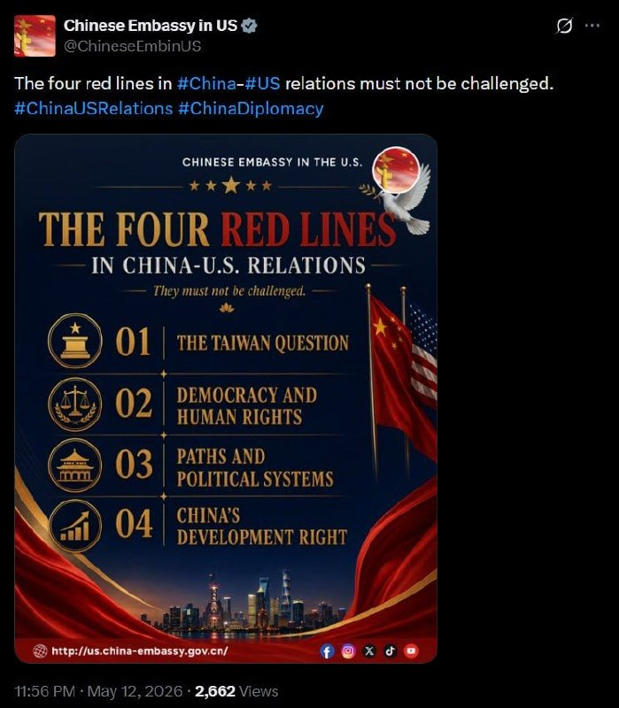

🔴 سفارت چین در آمریکا چهار خط قرمز پکن را اعلام کرد
این اعلام در آستانه سفر ترامپ به پکن و دیدار با شی جین‌پینگ مطرح شد:
▪️ مسئله تایوان
▪️ دموکراسی و حقوق بشر
▪️ مسیرها و نظام‌های سیاسی
▪️ حق توسعه چین
💢 پیام پکن به واشنگتن روشن است: روی این چهار خط حساب باز نکنید.
📌 @persian_trend_official
پرشین ترند | متفاوت‌ترین کانال نظامی

## BBCPersian — post 280887

🖋 الکسی کالمیکوف، بی‌بی‌سی روسی

🔻جنگ آمریکا و اسرائیل با ایران منجر به بحران انرژی شده است؛ بحرانی که از آسیا آغاز شد و به تدریج به اروپا نزدیک می‌شود. نخستین ضربه را کشورهای فقیر متحمل شدند، اما در میان کشورهای ثروتمند نیز قربانیانی وجود دارد. بریتانیا نخستین کشوری خواهد بود که بیش از دیگران آسیب می‌بیند. دلیل این امر چیست؟

نخست به این دلیل که بریتانیا بیش از دیگر کشورهای گروه هفت به واردات منابع انرژی وابسته است و به همین دلیل، هرگونه کمبود انرژی بلافاصله بر قیمت‌ها در داخل این کشور تاثیر می‌گذارد.

آلمان، ژاپن و فرانسه نیز واردکننده انرژی هستند، اما برخلاف بریتانیا ذخایر گاز دارند و می‌توانند موقتا بخشی از نیاز خود را با زغال‌سنگ تامین کنند. آمریکا و کانادا هم نه‌تنها در زمینه انرژی خودکفا هستند، بلکه مازاد تولید خود را صادر می‌کنند.

بیشتر بخوانید:
https://bbc.in/4d8oV0h
📸GettyImages/ EPA/Shutterstock/ In Pictures via Getty Images/ AFP via Getty Images/ Bloomberg via Getty Images/ NurPhoto via Getty Images
@BBCPersian

## alonews — post 119648

  <a href="telegram/content/alonews_119648_1778654080.webm" target="_blank">🎬 Download video</a>

👈احتمال شنیده شدن صدای انفجار در محدوده بهارستان اصفهان

✅ @AloNews خبر جنگ

## alonews — post 119647

  <a href="telegram/content/alonews_119647_1778654080.webm" target="_blank">🎬 Download video</a>

👈ژانگ هان‌هویی، سفیر چین در روسیه، اعلام کرد که در 7 آوریل، شورای امنیت سازمان ملل قطعنامه‌ای درباره تأمین امنیت کشتیرانی در تنگه هرمز را به رأی گذاشت.

🔴 چین و روسیه به دلیل نامتعادل بودن سند، به آن رأی منفی (وتو) دادند که از تشدید تنش در منطقه جلوگیری کرد و شرایط مساعدی برای دستیابی به آتش‌بس موقت و آغاز روند مذاکرات فراهم نمود.

✅ @AloNews خبر جنگ

## alonews — post 119646

  <a href="telegram/content/alonews_119646_1778654081.webm" target="_blank">🎬 Download video</a>

👈ترامپ نسخه‌ای از پوستر نمادین جنگ جهانی اول «من تو را برای ارتش ایالات متحده می‌خواهم» اثر جیمز مونتگومری فلاگ را منتشر کرده است که خودش جایگزین او شده است: «من تو را می‌خواهم!»

✅ @AloNews خبر جنگ

---
📅 بروزرسانی: 1405/02/23 09:54
---

## VahidOOnLine — post 239856

♦️گفتگوی جنجالی سه تن از ملی‌پوشان فوتبال ایران درباره میزان تحصیلات دانشگاهی که روز دوشنبه ۲۱ اردیبهشت از صداوسیما پخش شد، دست‌مایه طنز کاربران شبکه‌های اجتماعی قرار گرفت.

در این گفتگو، یکی از ملی‌پوشان در پاسخ به سوال مجری که پرسیده بود «در کدام دانشگاه درس می‌خوانی؟» گفت: «نمی‌دانم، الان حضور ذهن ندارم».

در دوره قبلی جام جهانی نیز انتشار ویدیویی از دروازه‌بان تیم ملی فوتبال ایران که گفته بود «من دکترا دارم»، بحث‌برانگیز شده بود؛ دکترایی که بعدها مشخص شد به‌صورت غیرحضوری در رشته تربیت بدنی دانشگاه پیام نور اخذ شده است.
‌🇸🇦 Indypersian

🤖 @VahidOOnLine

## mwarmonitor — post 9012

🔴گزارش‌های اطلاعاتی ایالات متحده نشان می‌دهد که ایران، برخلاف ادعاهای رئیس‌جمهور ترامپ، همچنان از ظرفیت قابل‌توجهی در حوزه موشکی برخوردار است. نیویورک تایمز

@mwarmonitor

## pm_afshaa — post 90668

احسان افرشته امروز صبح توسط جمهوری تروریستی اسلامی اعدام شد

💧 Rainbet.com the #1 Non-KYC Crypto Casino & Sportsbook @rainbetcom

😁 @Pm_Afshaa

## pm_afshaa — post 90667

🔴ترامپ دوباره تأکید کرد که آمریکا برای پایان دادن به جنگ ایران نیازی به کمک ندارد و تأکید کرد که آمریکا یا به‌صورت مسالمت‌آمیز یا به روش‌های دیگر پیروز خواهد شد

💧 Rainbet.com the #1 Non-KYC Crypto Casino & Sportsbook @rainbetcom

😁 @Pm_Afshaa

## IranIntlTV — post 336933

  <a href="telegram/content/IranIntlTV_336933_1778653470.mp4" target="_blank">🎬 Download video</a>

نمایندگان کنگره آمریکا در نامه‌ای دوحزبی از دولت بریتانیا خواستند روند به‌رسمیت شناختن سپاه پاسداران به‌عنوان یک سازمان تروریستی را تسریع کند.

گفت‌وگو با امیر گیتی، عضو تحریریه ایران‌اینترنشنال
@iranintltv

## FarsiVOA — post 217592

  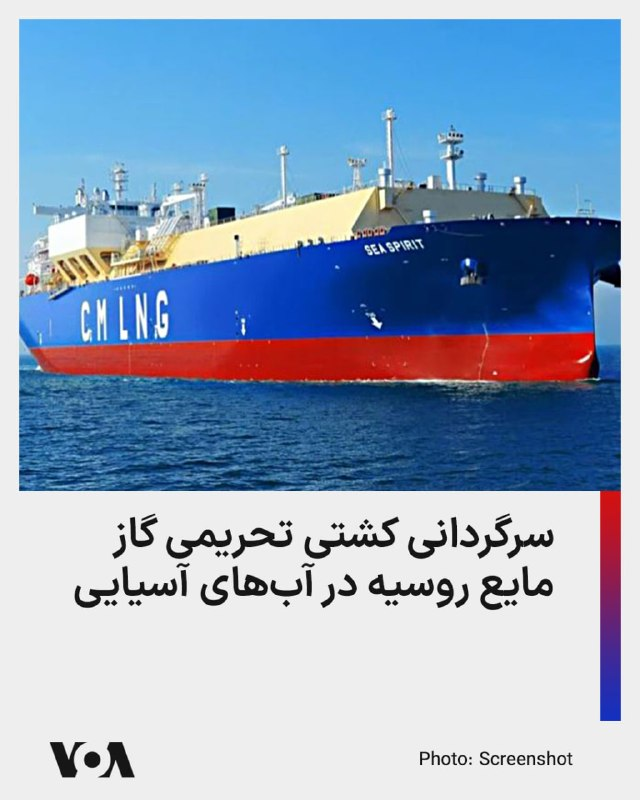

داده‌های شرکت دریانوردی «مرین ترفیک» حاکی از سرگردانی یک کشتی حامل گاز مایع (ال‌ان‌جی) روسیه در آب‌های آسیایی سرگردان شده است.

بر اساس این گزارش، حدود یک ماه پیش کشتی «کونپنگ» روسیه که تحت تحریم بریتانیا و اوکراین قرار دارد، مسیر خود را از هنگ‌کنگ به هند تغییر داد، اما با امتناع هند از دریافت این محموله به خاطر تحریم‌ها، دوباره از آب‌های سنگاپور به مقاصد نامعلوم حرکت کرده است.

این گزارش نشان می‌دهد چگونه ریسک‌های مرتبط با رعایت تحریم‌ها حتی در شرایط کسری گسترده عرضه، بر جریان تجارت انرژی اثر می‌گذارد.
@FarsiVOA

## FarsiVOA — post 217591

  

جمهوری دومینیکن روز سه‌شنبه اعلام کرد که در چارچوب «تعهد به مبارزه با تروریسم»، سپاه پاسداران انقلاب اسلامی و گروه حزب‌الله لبنان را به‌عنوان سازمان‌های تروریستی طبقه‌بندی کرده است.

دومینیکن همچنین بر تعهد خود مبنی بر اجرای قطعنامه‌های شورای امنیت سازمان ملل متحد و همچنین گسترش همکاری‌ها با ایالات متحده آمریکا با هدف برقراری امنیت و ثبات تأکید کرده است.

ساعاتی پس از این اعلام گیدئون سعار، وزیر خارجه اسرائیل، با استقبال از این اقدام، آن را «پیامی روشن علیه سیاست‌های تروریستی جمهوری اسلامی و نیروهای نیابتی رژیم» توصیف کرد. دنی دانون، نماینده اسرائیل در سازمان ملل نیز با از جمهوری دومینیکن، در شبکه اجتماعی ایکس نوشت: «جهان به طور فزاینده‌ای درک می‌کند که تروریسم به رهبری جمهوری اسلامی، تهدیدی برای تمام جهان است.»

در هفته‌های گذشته، چند کشور دیگر از جمله آرژانتین، ترینیداد و توباگو و کاستاریکا، به جمع کشورهایی که سپاه پاسداران را یک سازمان تروریستی می‌دانند، اضافه شدند. ایالات متحده پیشتر در دور نخست ریاست‌جمهوری ترامپ در فروردین ۱۳۹۸، سپاه پاسداران را در فهرست گروه‌های تروریستی قرار داده بود.
@FarsiVOA

## RadioFarda — post 157117

🔸قوه قضائیه ایران یک زندانی دیگر به نام احسان افرشته را به اتهام «جاسوسی» برای اسرائیل اعدام کرد. 🔸میزان‌نیوز نوشته که افراشته که «در نپال توسط موساد آموزش دیده بود و اطلاعات حساس کشور را به اسرائیل می‌فروخت»، بامداد چهارشنبه ۲۳ اردیبهشت اعدام شد. 🔸در بخشی…

## RadioFarda — post 157116

  

🔸قوه قضائیه ایران یک زندانی دیگر به نام احسان افرشته را به اتهام «جاسوسی» برای اسرائیل اعدام کرد.

🔸میزان‌نیوز نوشته که افراشته که «در نپال توسط موساد آموزش دیده بود و اطلاعات حساس کشور را به اسرائیل می‌فروخت»، بامداد چهارشنبه ۲۳ اردیبهشت اعدام شد.

🔸در بخشی از گزارش بدون اشاره به جزئیات آمده که او «به عنوان کارشناس سایبری در یک شرکت وابسته نهاد نظامی مشغول به فعالیت» بود.

🔸میزان ادعا کرده که «با دستور افسر موساد، افراشته تلاش می‌کند اطلاعات مختلفی را درباره شرکت و افراد شاغل در آن منتقل کند. هویت و مشخصات کارکنان، سلسله مراتب و چارت دقیق سازمانی و ماموریت‌های شرکت از جمله اطلاعاتی بوده که افرشته تلاش داشته به سرویس موساد منتقل کند.»

@RadioFarda

## IranianMinds — post 20056

شما فک کنید یه جوون بی گناه که نه پستی داشته و نه مقامی تو کشور رو دی ماه دستگیر کردن بعدشم اعدامش کردن گفتن جاسوس موساد بوده رفته نپال آموزش دیده ! @IranianMinds

## IranianMinds — post 20055

  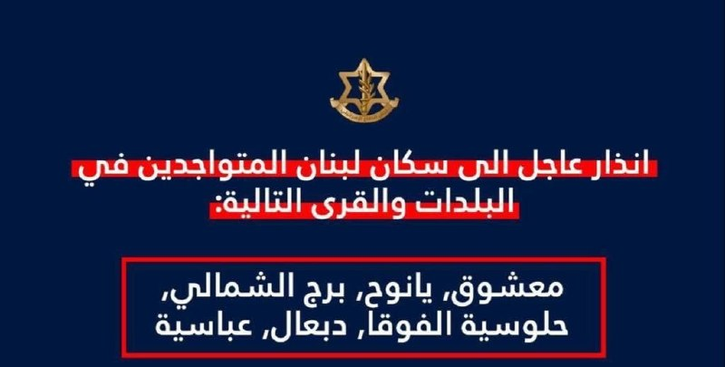

🔴 ارتش اسرائیل دستور تخلیه 6 روستای دیگه در جنوب لبنان رو داد

ارتش اسرائیل از ساکنان این روستاها خواست که حدود 1 کیلومتر از این مناطق فاصله بگیرند

ارتش اسرائیل در حال پیشروی زمینی سریع در جنوب لبنان هست

@IranianMinds

## alonews — post 119645

  <a href="telegram/content/alonews_119645_1778653475.mp4" target="_blank">🎬 Download video</a>

👈 براثر بارش شدید باران و وقوع سیل در استان سامسون ترکیه حداقل ۱۲ نفر زخمی شدند.

✅ @AloNews خبر جنگ

## alonews — post 119644

  <a href="telegram/content/alonews_119644_1778653476.webm" target="_blank">🎬 Download video</a>

👈احتمال شنیده شدن صداهای شدید انفجار در بندرعباس

✅ @AloNews خبر جنگ

## alonews — post 119643

  <a href="telegram/content/alonews_119643_1778653476.webm" target="_blank">🎬 Download video</a>

👈الجزیره: ۱۱۲ کشور از قطعنامه آمریکا درباره تنگه هرمز حمایت می‌کنند

✅ @AloNews خبر جنگ

---
📅 بروزرسانی: 1405/02/23 09:44
---

## VahidOOnLine — post 239855

  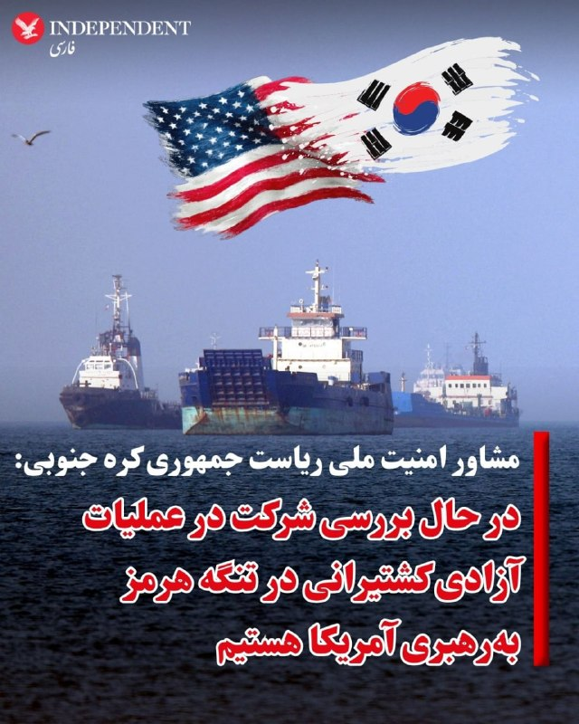

♦️کیم یونگ هیون، مشاور امنیت ملی ریاست جمهوری کره جنوبی، روز چهارشنبه ۲۳ اردیبهشت ماه اعلام کرد این کشور در حال بررسی شرکت در عملیات بازگشایی تنگه هرمز و آزادی کشتیرانی در این آبراهه راهبردی به رهبری ایالات متحده آمریکا است.

این موضع در حالی اظهار می‌شود که هفته گذشته و پس از برخورد دو پهپاد به یک کشتی باری کره جنوبی در زمان عبور از تنگه هرمز، دونالد ترامپ به سئول پیشنهاد کرد تا به «پروژه آزادی» تنگه هرمز بپیوندد.

وزارت امور خارجه کره جنوبی دو روز پیش با انتشار گزارشی اعلام کرد هنوز نمی‌تواند با اطمینان بگوید که این پهپادها از سوی ایران شلیک شده بودند یا نه.
‌🇸🇦 Indypersian

🤖 @VahidOOnLine

## IranIntlTV — post 336932

  <a href="telegram/content/IranIntlTV_336932_1778652866.mp4" target="_blank">🎬 Download video</a>

امیر حمیدی، متخصص امنیت ملی، گفت تهران برای پکن یک متحد ایدئولوژیک نیست و چین از جمهوری اسلامی در روابط خود با ایالات متحده به‌عنوان یک کارت راهبردی استفاده می‌کند. او تاکید کرد چین حاضر نخواهد شد به‌خاطر جمهوری اسلامی وارد رویارویی خصمانه با آمریکا شود.
@iranintltv

## DW_Farsi — post 124634

  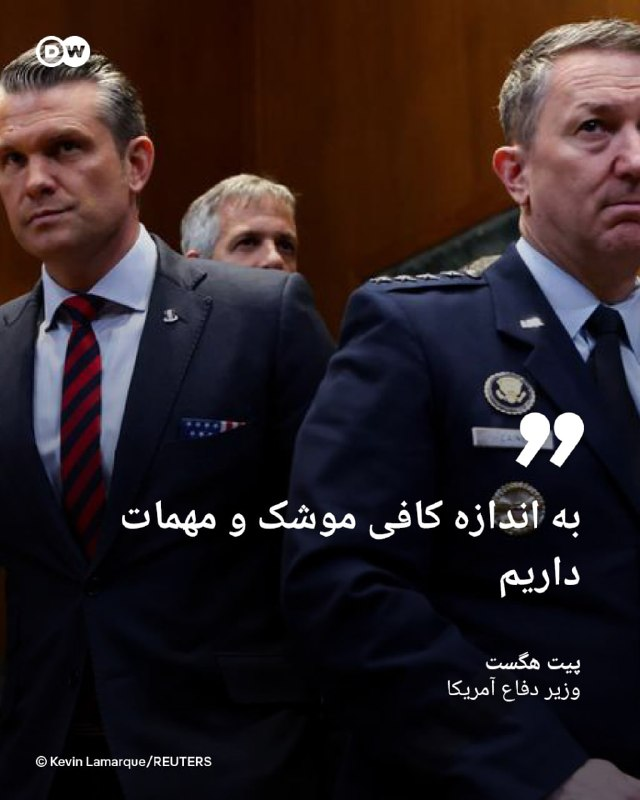

🔶 وزیر دفاع آمریکا: به اندازه کافی موشک و مهمات داریم
 
پیت هگست، وزیر دفاع آمریکا گمانه‌زنی‌ها در مورد "کاهش شدید" ذخایر موشکی و مهمات ایالات متحده را کم‌اهمیت جلوه داد.
 
او روز سه‌شنبه ۱۲ مه (۲۲ اردیبهشت) در جلسه استماع بودجه در کنگره این کشور تصریح کرد: «ما دقیقا می‌دانیم که از چه [تسلیحاتی] برخوردار هستیم. ما به اندازه کافی آنچه را که به آن نیازمندیم در دست داریم.»
 
رئیس پنتاگون بحث و گمانه‌زنی‌ها در مورد میزان ذخایر تسلیحاتی آمریکا را "ناسودمند و مبالغه‌آمیز" دانست.
 
ژنرال دن کین، رئیس ستاد مشترک نیروهای مسلح آمریکا که در جلسه استماع حضور داشت نیز تأکید کرد که مراکز فرماندهی‌ منطقه‌ای ارتش ایالات متحده میزان ذخایر جنگی و مهمات برای انجام مأموریت کنونی را "کافی" اعلام کرد‌ه‌اند.
 
مارک کلی، سناتور دموکرات آمریکایی، به تازگی تصریح کرده بود که جنگ ایران باعث تضعیف ایالات متحده شده و ذخایر مهمات و موشک‌های ارتش این کشور به‌شدت کاهش یافته است.
 
این فضانورد پیشین و کهنه‌سرباز جنگ عراق افزود که دونالد ترامپ ایالات متحده را وارد جنگی "بدون هدف راهبردی، بی‌‌برنامه و بدون جدول زمانی" کرده است.
@dw_farsi

## IranianMinds — post 20054

  

😤دنبال یه سایت شرط بندی بین المللی بودی که به ایرانیا خدمات بده؟!
⛔

👍دربی بت همون انتخاب  100%

💎ویژگی های سایت جهانی Derby Bet:

⬅️امکان شارژ امن با کارت بانکی

⬅️واریز اول دوبل شارژ می شوید(بونوس۱۰۰٪)

⬅️پر اپشن ترین سایت فعال در ایران

⬅️تسویه حساب کمتر از 5 دقیقه

⬅️برگشت بخشی از باخت به صورت هفتگی

🚨کد هدیه ثبت نام:GG007

⚠️برای دانلود اپلکیشن کلیک کنید
👉
re23

🔔کانال دربی بت :

🪙https://t.me/+aCbq7yy8QY80NzQ0

## idfinfarsi — post 11565

  <a href="telegram/content/idfinfarsi_11565_1778652869.mp4" target="_blank">🎬 Download video</a>

سخنگوی ارتش اسرائیل:

⭕️مستندی از داخل تانک تیپ ۴۰۱: به هلاکت رساندن یک تروریست که تجهیزات دیده‌بانی علیه نیروهای ما را به‌کار گرفته بود

⭕️نیروهای تیم رزمی تیپ ۴۰۱ تحت فرماندهی لشکر ۱۴۶، به عملیات خود در جنوب خط دفاعی مقدم ادامه می‌دهند تا زیرساخت‌های تروریستی سازمان تروریستی حزب‌الله را نابود کنند، با هدف رفع تهدیدها علیه شهروندان کشور اسرائیل.

⭕️در جریان این فعالیت، نیروها یک تروریست را شناسایی کردند که در حال به‌کارگیری تجهیزات دیده‌بانی علیه نیروهای ما بود. در یک واکنش سریع، تروریست با شلیک تانک به هلاکت رسید.

## alonews — post 119642

  <a href="telegram/content/alonews_119642_1778652870.mp4" target="_blank">🎬 Download video</a>

👈ارتش دفاعی اسرائیل فیلمی منتشر کرد که در آن نیروهایی که در جنوب خط دفاعی پیشرو فعالیت می‌کردند، یک شبه‌نظامی حزب‌الله را مشاهده کردند که از تجهیزات نظارتی علیه نیروهای اسرائیلی استفاده می‌کرد و طبق بیانیه رسمی ارتش دفاعی اسرائیل، این فرد با آتش تانک هدف قرار گرفته و از بین رفته است.

✅ @AloNews خبر جنگ

## alonews — post 119641

  <a href="telegram/content/alonews_119641_1778652872.webm" target="_blank">🎬 Download video</a>

👈کاخ سفید در ابتدا فهرست مهمانان رسمی را منتشر کرد که مدیرعامل انویدیا، جنسن هوانگ، در آن نبود، اما طبق گزارش پولیتیکو، رئیس‌جمهور ترامپ در توقف سوخت‌گیری در آلاسکا دعوتی در آخرین لحظه به او داد.

✅ @AloNews خبر جنگ

## alonews — post 119640

  <a href="telegram/content/alonews_119640_1778652872.webm" target="_blank">🎬 Download video</a>

👈سخنگوی CIA، لیز لایونز، گزارش سی‌ان‌ان مبنی بر اینکه سیا مستقیماً در ترورهای هدفمند عوامل کارتل‌ها در مکزیک درگیر است را رد کرد.

🔴این گزارش کذب و توهین‌آمیز است و هیچ‌چیز جز یک کمپین روابط عمومی برای کارتل‌ها نیست و جان آمریکایی‌ها را به خطر می‌اندازد.

✅ @AloNews خبر جنگ

---
📅 بروزرسانی: 1405/02/23 09:34
---

## VahidOOnLine — post 239854

  

رسانه‌های حکومتی بامداد امروز از اعدام احسان افراشته خبر دادند.

قوه قضاییه جمهوری اسلامی اعلام کرده احسان افراشته، فرزند مصطفی، با اتهام‌هایی از جمله «جاسوسی» و «همکاری اطلاعاتی به نفع اسرائیل» بازداشت، محاکمه و پس از تایید حکم در دیوان عالی کشور اعدام شده است.

با این حال، نهادهای حقوق بشری و منابع مستقل پیش‌تر گزارش داده بودند که احسان افراشته ماه‌ها در سلول انفرادی نگهداری شده و اعترافات او تحت فشار و در شرایطی غیرشفاف اخذ شده است. همچنین گزارش‌هایی درباره محرومیت او از دسترسی مؤثر به وکیل مستقل و وجود فشارهای امنیتی در روند پرونده منتشر شده بود.

بر اساس اصول دادرسی عادلانه، هر اعترافی که تحت فشار، تهدید یا شکنجه گرفته شود فاقد اعتبار حقوقی است و متهم، به‌ویژه در پرونده‌های منتهی به مجازات اعدام، باید از حق دسترسی کامل به وکیل مستقل و دادگاه بی‌طرف برخوردار باشد.

پرونده احسان افراشته از سوی نهادهای حقوق بشری نمونه‌ای از استفاده از اتهام‌های امنیتی و مجازات اعدام در فضایی غیرشفاف توصیف شده؛ روندی که سال‌هاست درباره عملکرد دادگاه‌های انقلاب جمهوری اسلامی مورد انتقاد قرار دارد.
‌🏁 🇬🇧 ManotoTV

🤖 @VahidOOnLine

## kianmeli1 — post 87375

‏🔴قوه قضاییه جمهوری اسلامی اعلام کرد که احسان افرشته به اتهام «همکاری با اسرائیل»، بامداد چهارشنبه اعدام شد
https://t.me/kianmeli1

## IranIntlTV — post 336931

  <a href="telegram/content/IranIntlTV_336931_1778652297.mp4" target="_blank">🎬 Download video</a>

وزارت کشور کویت اعلام کرد ۴ عضو سپاه پاسداران را هنگام تلاش برای ورود دریایی به این کشور بازداشت کرده است. وزارت خارجه کویت نیز اعلام کرد در همین رابطه، سفیر جمهوری اسلامی را احضار کرده است.

تروسکه صادقی، خبرنگار ایران‌اینترنشنال، گزارش می‌دهد
@iranintltv

## IranIntlTV — post 336930

  <a href="telegram/content/IranIntlTV_336930_1778652299.mp4" target="_blank">🎬 Download video</a>

دونالد ترامپ، رییس‌جمهوری آمریکا، پس از ۹ سال وارد چین می‌شود تا با شی جین‌پینگ، رهبر این کشور، دیدار و گفت‌وگو کند. بسیاری از تحلیل‌گران و رسانه‌های بین‌المللی می‌گویند پیامدهای جنگ با جمهوری اسلامی، به‌صورت مستقیم و غیرمستقیم، بر این دیدار سایه انداخته است.

توماج طاهباز ، خبرنگار ایران‌اینترنشنال، گزارش می‌دهد
@iranintltv

## IranIntlTV — post 336929

  <a href="telegram/content/IranIntlTV_336929_1778652302.mp4" target="_blank">🎬 Download video</a>

استرالیا هم‌زمان با افزایش تنش‌ها در خاورمیانه، از آغاز یک مشارکت نظامی تازه برای حفاظت از حریم هوایی و امنیت کشتیرانی در منطقه خبر داد. وزیر دفاع استرالیا گفت اعزام هواپیمای پیشرفته «آواکس» می‌تواند به تضمین آزادی کشتیرانی در تنگه هرمز و امنیت تجارت بین‌المللی کمک کند.

علیرضا محبی، خبرنگار ایران‌اینترنشنال، گزارش می‌دهد
@iranintltv

## ManotoTV — post 105385

  

رسانه‌های حکومتی بامداد امروز از اعدام احسان افراشته خبر دادند.

قوه قضاییه جمهوری اسلامی اعلام کرده احسان افراشته، فرزند مصطفی، با اتهام‌هایی از جمله «جاسوسی» و «همکاری اطلاعاتی به نفع اسرائیل» بازداشت، محاکمه و پس از تایید حکم در دیوان عالی کشور اعدام شده است.

با این حال، نهادهای حقوق بشری و منابع مستقل پیش‌تر گزارش داده بودند که احسان افراشته ماه‌ها در سلول انفرادی نگهداری شده و اعترافات او تحت فشار و در شرایطی غیرشفاف اخذ شده است. همچنین گزارش‌هایی درباره محرومیت او از دسترسی مؤثر به وکیل مستقل و وجود فشارهای امنیتی در روند پرونده منتشر شده بود.

بر اساس اصول دادرسی عادلانه، هر اعترافی که تحت فشار، تهدید یا شکنجه گرفته شود فاقد اعتبار حقوقی است و متهم، به‌ویژه در پرونده‌های منتهی به مجازات اعدام، باید از حق دسترسی کامل به وکیل مستقل و دادگاه بی‌طرف برخوردار باشد.

پرونده احسان افراشته از سوی نهادهای حقوق بشری نمونه‌ای از استفاده از اتهام‌های امنیتی و مجازات اعدام در فضایی غیرشفاف توصیف شده؛ روندی که سال‌هاست درباره عملکرد دادگاه‌های انقلاب جمهوری اسلامی مورد انتقاد قرار دارد.

## DW_Farsi — post 124633

  

🔶 چین خواهان افزایش تلاش‌های میانجی‌گرانه پاکستان در جنگ ایران شد
 
به گزارش شین‌هوا، خبرگزاری دولتی چین، وانگ یی، وزیر امور خارجه این کشور در گفت‌وگو با اسحاق دار، همتای پاکستانی خود از اسلام‌آباد خواست تا تلاش‌های میانجی‌گرانه خود میان تهران و واشنگتن برای فیصله دادن به جنگ ایران را افزایش دهد.
 
وزیر خارجه چین این خواست را سه‌شنبه ۱۲ مه (۲۲ اردیبهشت) پیش از سفر دونالد ترامپ، رئیس جمهور آمریکا به پکن مطرح کرد.
 
بنا بر این گزارش، وانگ یی در دیدار با وزیر خارجه پاکستان همچنین تصریح کرد، اسلام‌آباد باید به طور شایسته و مناسب به مسائل مربوط به بازگشایی تنگه هرمز بپردازد.
 
شین‌هوا همچنین گزارش داد که وزیر خارجه چین در تماس تلفنی خود با اسحاق دار تصریح کرد که پکن از اسلام‌آباد در راستای تلاش‌های میانجی‌گرانه پاکستان پشتیبانی خواهد کرد.
 
چین که از خریداران مهم نفت جمهوری اسلامی است، خواهان یافتن راه‌حلی دائمی برای پایان جنگ ایران است.
 
@dw_farsi

## RadioFarda — post 157115

  

🔸در پی زمین‌لرزه‌ها و پس‌لرزه‌هایی که شامگاه سه‌شنبه ۲۲ اردیبهشت در شرق تهران رخ داد، یک استاد پژوهشکدهٔ زلزله‌شناسی در مورد فعال بودن گسل‌های نزدیک پردیس و بومهن هشدار داد.

🔸مهدی زارع به خبرگزاری خبرآنلاین گفت: «وقوع دومین زمین‌لرزه با بزرگای بیش از ۴ از ابتدای سال ۱۴۰۵، نشان‌دهندهٔ تداوم آزادسازی انرژی در محل تلاقی ساختارهای مهم زمین‌ساختی است.»

🔸این زلزله‌شناس همچنین تأکید کرد که منطقهٔ پردیس و بومهن در پهنهٔ برخورد البرز مرکزی قرار دارد و «تحت تأثیر مستقیم فعالیت گسل بسیار مهم و خطرناک شمال تهران و گسل مُشا است».

🔸مهدی زارع همچنین گفت «با توجه به بارگذاری جمعیتی بالا در مسکن مهر پردیس و ساخت‌وسازهای گسترده در ارتفاعات، تاب‌آوری لرزه‌ای سازه‌ها در برابر شتاب‌های افقی و قائم ناشی از فعالیت گسل مشا بسیار حائز اهمیت است».

🔸براساس سرشماری سال ۱۳۹۵ و تخمین‌های پس از آن، جمعیت دو شهر پردیس و بوهمن نزدیک به ۲۰۰ هزار نفر اعلام شده است.

@RadioFarda

## BBCPersian — post 280886

  

🔻رسانه‌های دولتی لبنان می‌گویند حملات هوایی اسرائیل حداقل ۱۳ نفر را در جنوب لبنان کشته است که دو نفرشان از کارکنان اورژانس بوده‌اند.

به گزارش خبرگزاری ملی لبنان، طی ۲۴ ساعت گذشته، شش نفر در اثر اصابت گلوله به خانه‌ای در کفر دونین کشته و هفت نفر دیگر زخمی شدند.

بعد از ظهر سه‌شنبه، وزارت بهداشت لبنان اعلام کرد که دو امدادگر از سرویس اورژانس دفاع مدنی لبنان که توسط دولت اداره می‌شود، در حمله اسرائیل به نبطیه کشته و یک نفر دیگر زخمی شده است. بر اساس این گزارش، آنها در حال انجام ماموریتی در پاسخ به حمله قبلی بودند که منجر به کشته شدن یک نفر شد.

ارتش اسرائیل اعلام کرد که در حال بررسی گزارش‌ها است.

جوزف عون، رئیس جمهور لبنان، «غم و اندوه و تأسف خود را از کشته شدن دو عضو دفاع مدنی» در نبطیه به نام‌های حسین جابر و احمد نوره ابراز کرد و تأکید کرد که «تجاوز مداوم اسرائیل مانع تلاش‌ها برای برقراری آرامش می‌شود».

وزارت بهداشت لبنان نیروهای اسرائیلی را به هدف قرار دادن عمدی امدادگران متهم کرد.

📷EPA
@BBCPersian

## manototv — post 105385

  

رسانه‌های حکومتی بامداد امروز از اعدام احسان افراشته خبر دادند.

قوه قضاییه جمهوری اسلامی اعلام کرده احسان افراشته، فرزند مصطفی، با اتهام‌هایی از جمله «جاسوسی» و «همکاری اطلاعاتی به نفع اسرائیل» بازداشت، محاکمه و پس از تایید حکم در دیوان عالی کشور اعدام شده است.

با این حال، نهادهای حقوق بشری و منابع مستقل پیش‌تر گزارش داده بودند که احسان افراشته ماه‌ها در سلول انفرادی نگهداری شده و اعترافات او تحت فشار و در شرایطی غیرشفاف اخذ شده است. همچنین گزارش‌هایی درباره محرومیت او از دسترسی مؤثر به وکیل مستقل و وجود فشارهای امنیتی در روند پرونده منتشر شده بود.

بر اساس اصول دادرسی عادلانه، هر اعترافی که تحت فشار، تهدید یا شکنجه گرفته شود فاقد اعتبار حقوقی است و متهم، به‌ویژه در پرونده‌های منتهی به مجازات اعدام، باید از حق دسترسی کامل به وکیل مستقل و دادگاه بی‌طرف برخوردار باشد.

پرونده احسان افراشته از سوی نهادهای حقوق بشری نمونه‌ای از استفاده از اتهام‌های امنیتی و مجازات اعدام در فضایی غیرشفاف توصیف شده؛ روندی که سال‌هاست درباره عملکرد دادگاه‌های انقلاب جمهوری اسلامی مورد انتقاد قرار دارد.

## alonews — post 119639

  <a href="telegram/content/alonews_119639_1778652308.webm" target="_blank">🎬 Download video</a>

👈ترامپ مجدداً تأکید کرد که آمریکا برای پایان دادن به جنگ ایران نیازی به کمک ندارد و تأکید کرد که آمریکا یا به‌صورت مسالمت‌آمیز یا به روش‌های دیگر پیروز خواهد شد.

✅ @AloNews خبر جنگ

## alonews — post 119638

  <a href="telegram/content/alonews_119638_1778652309.webm" target="_blank">🎬 Download video</a>

👈آواکس امریکا درحال رصد مرزهای جنوبی و خلیج فارس

✅ @AloNews خبر جنگ

---
📅 بروزرسانی: 1405/02/23 09:24
---

## DW_Farsi — post 124632

  

🔶 وزارت دفاع آمریکا: هزینه جنگ با ایران به حدود ۲۹ میلیارد دلار رسیده است
 
وزارت دفاع ایالات متحده، پنتاگون، در تازه‌ترین ارزیابی خود هزینه‌ آمریکا در جنگ با ایران را ۲۹ میلیارد دلار اعلام کرد.
 
مقامات این وزارتخانه این آمار جدید را سه‌شنبه ۱۲ مه (۲۲ اردیبهشت) در جلسه استماع بودجه در کنگره ارائه کردند. این رقم اعلام شد، حدود ۴ میلیارد دلار بیشتر از مبلغی است که پیت هگست، وزیر دفاع آمریکا پیشتر در اواخر ماه آوریل اعلام کرده بود.
 
جولز هرست، رئیس امور مالی وزارت دفاع آمریکا که در این جلسه حضور داشت ضمن اشاره به ارزیابی اولیه هگست در کنگره گفت، تخمین نخستین که در ۲۹ آوریل اعلام شد، بر ۲۵ میلیارد دلار بالغ می‌شده، اما این رقم با توجه به به‌روزرسانی‌ "هزینه‌های تعمیرات و جایگزینی تجهیزات" اکنون ۲۹ میلیارد دلار برآورد می‌شود.
 
پنتاگون در حال حاضر تلاش می‌کند افزایش قابل‌توجهی را برای بودجه دفاعی به تصویب برساند. لایحه بودجه دولت ترامپ برای سال مالی ۲۰۲۷ حدود یک و نیم تریلیون دلار هزینه دفاعی پیش‌بینی کرده است.
@dw_farsi

## alonews — post 119637

  <a href="telegram/content/alonews_119637_1778651673.webm" target="_blank">🎬 Download video</a>

👈آخرین قیمت نفت ۱۰۶.۳۰ دلار

✅ @AloNews خبر جنگ

## alonews — post 119636

  <a href="telegram/content/alonews_119636_1778651673.webm" target="_blank">🎬 Download video</a>

👈سی‌ان‌ان: اختلال در تأسیسات نفتی خاورمیانه تهدیدی جدید برای جیب مالیات‌دهندگان آمریکایی

🔴مقامات وزارت انرژی آمریکا پیش‌بینی کرده‌اند که قیمت نفت احتمالاً در هفته‌های آینده بالای ۱۰۰ دلار در هر بشکه باقی خواهد ماند. طبق جدیدترین برآورد اداره اطلاعات انرژی آمریکا (EIA)، میانگین قیمت خرده‌فروشی بنزین امسال به ۳.۸۸ دلار در هر گالن خواهد رسید و سال آینده ۳.۶۲ دلار پیش‌بینی می‌شود

✅ @AloNews خبر جنگ

## alonews — post 119635

  <a href="telegram/content/alonews_119635_1778651674.mp4" target="_blank">🎬 Download video</a>

👈لحظه فرود هواپیمای غول‌پیکر نظامی سی-۱۷ آمریکا در پکن در آستانه سفر ترامپ به چین

🔴احتمال این هواپیما حامل تجهیزات امنیتی، تیم‌های حفاظتی و دیگر دستگاه‌ها و موارد پشتیبانی برای  آماده‌سازی‌های ویژه برای این سفر دیپلماتیک ایجاد کرده است.

🔴هواپیمای سی-۱۷ یکی از بزرگ‌ترین هواپیماهای ترابری راهبردی ارتش آمریکا به‌شمار می‌رود و توانایی حمل تجهیزات سنگین نظامی، نیرو و سامانه‌های پشتیبانی ویژه را دارد.

✅ @AloNews خبر جنگ

---
📅 بروزرسانی: 1405/02/23 09:14
---

## VahidOOnLine — post 239853

  <a href="telegram/content/VahidOOnLine_239853_1778651077.mp4" target="_blank">🎬 Download video</a>

یک مقام ارشد نیروی دریایی سپاه پاسداران اعلام کرد جمهوری اسلامی تعریف خود از تنگه هرمز را گسترش داده و این منطقه اکنون به یک «محدوده عملیاتی وسیع» تبدیل شده است.

به گفته این مقام نظامی، محدوده عملیاتی تنگه هرمز دیگر تنها به آبراه باریک میان ایران و عمان محدود نیست و اکنون بخش گسترده‌ای از آب‌های اطراف، از جاسک تا جزایر تنب را شامل می‌شود.

رسانه‌های حکومتی گزارش داده‌اند محدوده‌ای که جمهوری اسلامی آن را منطقه عملیاتی تنگه هرمز می‌داند، از حدود ۲۰ تا ۳۰ مایل دریایی در گذشته، به ۲۰۰ تا ۳۰۰ مایل افزایش یافته است.

این اظهارات در حالی مطرح می‌شود که تنش‌ها در خلیج فارس ادامه دارد و نگرانی‌ها درباره امنیت عبور نفتکش‌ها و کشتی‌های تجاری از تنگه هرمز افزایش یافته است.
‌🏁 🇬🇧 ManotoTV

🤖 @VahidOOnLine

## VahidOOnLine — post 239852

  <a href="telegram/content/VahidOOnLine_239852_1778651078.mp4" target="_blank">🎬 Download video</a>

هم‌زمان با سفر رسمی دونالد ترامپ به چین، گروهی از مدیران ارشد بزرگ‌ترین شرکت‌های فناوری، مالی و صنعتی آمریکا نیز او را در این سفر همراهی می‌کنند. کاخ سفید اعلام کرده ایلان ماسک نیز در هواپیمای ریاست‌جمهوری آمریکا حضور دارد و همراه هیئت آمریکایی راهی پکن شده است.
در میان چهره‌های حاضر در این سفر، نام تیم کوک مدیرعامل اپل، جنسن هوانگ مدیرعامل انویدیا، لری فینک مدیرعامل بلک‌راک، دیوید سولومون مدیرعامل گلدمن ساکس و مدیران شرکت‌هایی چون بوئینگ، کوالکام، ویزا، مسترکارت، متا، مایکرون و سیتی‌گروپ دیده می‌شود.
رسانه‌های آمریکایی گزارش داده‌اند که محور اصلی این سفر، گفت‌وگو درباره روابط تجاری، فناوری، هوش مصنوعی، زنجیره تأمین جهانی و همکاری‌های اقتصادی میان آمریکا و چین است.
این سفر در حالی انجام می‌شود که روابط واشینگتن و پکن در ماه‌های اخیر بر سر مسائل تجاری، رقابت فناوری و تنش‌های ژئوپولیتیکی با چالش‌های گسترده‌ای روبه‌رو بوده است.
‌🏁 🇬🇧 ManotoTV

🤖 @VahidOOnLine

## ManotoTV — post 105384

  <a href="telegram/content/ManotoTV_105384_1778651079.mp4" target="_blank">🎬 Download video</a>

یک مقام ارشد نیروی دریایی سپاه پاسداران اعلام کرد جمهوری اسلامی تعریف خود از تنگه هرمز را گسترش داده و این منطقه اکنون به یک «محدوده عملیاتی وسیع» تبدیل شده است.

به گفته این مقام نظامی، محدوده عملیاتی تنگه هرمز دیگر تنها به آبراه باریک میان ایران و عمان محدود نیست و اکنون بخش گسترده‌ای از آب‌های اطراف، از جاسک تا جزایر تنب را شامل می‌شود.

رسانه‌های حکومتی گزارش داده‌اند محدوده‌ای که جمهوری اسلامی آن را منطقه عملیاتی تنگه هرمز می‌داند، از حدود ۲۰ تا ۳۰ مایل دریایی در گذشته، به ۲۰۰ تا ۳۰۰ مایل افزایش یافته است.

این اظهارات در حالی مطرح می‌شود که تنش‌ها در خلیج فارس ادامه دارد و نگرانی‌ها درباره امنیت عبور نفتکش‌ها و کشتی‌های تجاری از تنگه هرمز افزایش یافته است.

## ManotoTV — post 105383

  <a href="telegram/content/ManotoTV_105383_1778651080.mp4" target="_blank">🎬 Download video</a>

هم‌زمان با سفر رسمی دونالد ترامپ به چین، گروهی از مدیران ارشد بزرگ‌ترین شرکت‌های فناوری، مالی و صنعتی آمریکا نیز او را در این سفر همراهی می‌کنند. کاخ سفید اعلام کرده ایلان ماسک نیز در هواپیمای ریاست‌جمهوری آمریکا حضور دارد و همراه هیئت آمریکایی راهی پکن شده است.
در میان چهره‌های حاضر در این سفر، نام تیم کوک مدیرعامل اپل، جنسن هوانگ مدیرعامل انویدیا، لری فینک مدیرعامل بلک‌راک، دیوید سولومون مدیرعامل گلدمن ساکس و مدیران شرکت‌هایی چون بوئینگ، کوالکام، ویزا، مسترکارت، متا، مایکرون و سیتی‌گروپ دیده می‌شود.
رسانه‌های آمریکایی گزارش داده‌اند که محور اصلی این سفر، گفت‌وگو درباره روابط تجاری، فناوری، هوش مصنوعی، زنجیره تأمین جهانی و همکاری‌های اقتصادی میان آمریکا و چین است.
این سفر در حالی انجام می‌شود که روابط واشینگتن و پکن در ماه‌های اخیر بر سر مسائل تجاری، رقابت فناوری و تنش‌های ژئوپولیتیکی با چالش‌های گسترده‌ای روبه‌رو بوده است.

## FarsiVOA — post 217590

  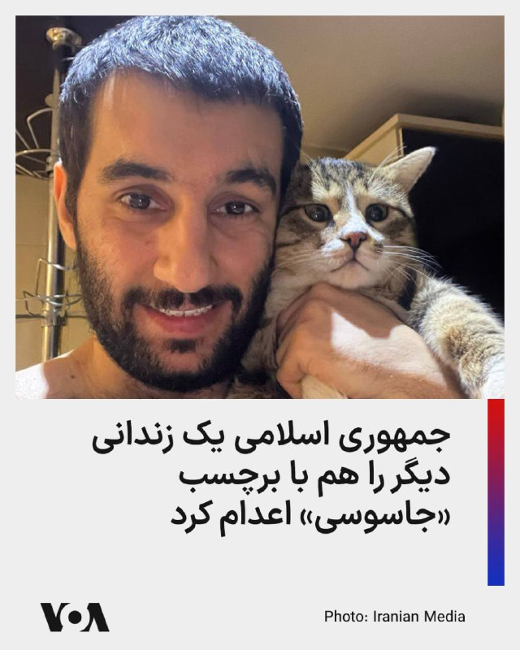

خبرگزاری میزان، وابسته به قوه قضائیه جمهوری اسلامی، اعلام کرد حکم اعدام احسان افرشته، فرزند مصطفی، بامداد چهارشنبه به اتهام «جاسوسی و همکاری اطلاعاتی» با موساد اجرا شده است.

قوه قضائیه مدعی شده افرشته پس از ارتباط اولیه در ترکیه، از سوی افسران موساد آموزش دیده و در نپال نیز آموزش حضوری دریافت کرده است.

بنابر ادعای خبرگزاری قوه قضائیه، او پس از بازگشت به ایران، به عنوان کارشناس سایبری در شرکتی وابسته به یک نهاد نظامی مشغول شده و اطلاعات مربوط به کارکنان، ساختار سازمانی و مأموریت‌های آن مجموعه را در اختیار عوامل اسرائیلی قرار داده بود.

قوه قضائیه می‌گوید حکم او پس از محاکمه و تأیید دیوان عالی کشور اجرا شده است. جزئیات مستقل درباره روند دادرسی و نحوه اخذ اعترافات منتشر نشده است.
@FarsiVOA

## DW_Farsi — post 124631

  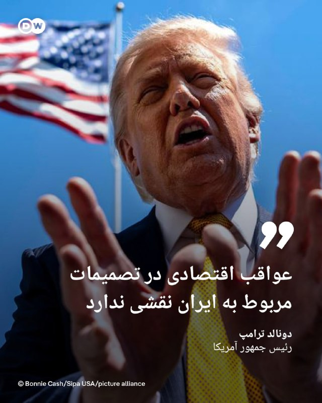

🔶 ترامپ: عواقب اقتصادی در تصمیمات مربوط به ایران نقشی ندارد
 
دونالد ترامپ در حاشیه سفرش به چین در پاسخ به پرسش یکی از خبرنگاران در این مورد که آیا وضعیت اقتصادی و مالی شهروندان آمریکایی انگیزه‌ای برای او به منظور رسیدن توافق با ایران است گفت، نگرانی‌های اقتصادی آمریکایی‌ها تصمیم‌گیری‌های او درباره جنگ ایران را تغییر نمی‌دهد.

رئيس‌ جمهور آمریکا تأکید کرد، جلوگیری از دستیابی جمهوری اسلامی به سلاح هسته‌ای از "اولویت مطلق" برخوردار است و مسئله عواقب اقتصادی "حتی ذره‌ای" نقش بازی نمی‌کند.

ترامپ تصریح کرد: «من فقط به یک مسئله فکر می‌کنم و آن اینکه نمی‌توانیم به ایران اجازه دسترسی به سلاح هسته‌ای را بدهیم.»

آمریکا در ماه آوریل شاهد بیشترین افزایش قیمت‌ها در طی سه سال گذشته بوده است. 

بنا بر داده‌های سازمان‌های اطلاعاتی آمریکا، مدت زمانی که جمهوری اسلامی برای ساخت سلاح هسته‌ای به آن نیاز دارد، کماکان بر ۹ ماه تا یک سال بالغ می‌شود.

ترامپ پیش از آن آغاز سفرش به چین تصریح کرده بود، فکر نمی‌کند که آمریکا "در خصوص ایران به کمکی نیاز داشته باشد.»
@dw_farsi

## manototv — post 105384

  <a href="telegram/content/manototv_105384_1778651083.mp4" target="_blank">🎬 Download video</a>

یک مقام ارشد نیروی دریایی سپاه پاسداران اعلام کرد جمهوری اسلامی تعریف خود از تنگه هرمز را گسترش داده و این منطقه اکنون به یک «محدوده عملیاتی وسیع» تبدیل شده است.

به گفته این مقام نظامی، محدوده عملیاتی تنگه هرمز دیگر تنها به آبراه باریک میان ایران و عمان محدود نیست و اکنون بخش گسترده‌ای از آب‌های اطراف، از جاسک تا جزایر تنب را شامل می‌شود.

رسانه‌های حکومتی گزارش داده‌اند محدوده‌ای که جمهوری اسلامی آن را منطقه عملیاتی تنگه هرمز می‌داند، از حدود ۲۰ تا ۳۰ مایل دریایی در گذشته، به ۲۰۰ تا ۳۰۰ مایل افزایش یافته است.

این اظهارات در حالی مطرح می‌شود که تنش‌ها در خلیج فارس ادامه دارد و نگرانی‌ها درباره امنیت عبور نفتکش‌ها و کشتی‌های تجاری از تنگه هرمز افزایش یافته است.

## manototv — post 105383

  <a href="telegram/content/manototv_105383_1778651084.mp4" target="_blank">🎬 Download video</a>

هم‌زمان با سفر رسمی دونالد ترامپ به چین، گروهی از مدیران ارشد بزرگ‌ترین شرکت‌های فناوری، مالی و صنعتی آمریکا نیز او را در این سفر همراهی می‌کنند. کاخ سفید اعلام کرده ایلان ماسک نیز در هواپیمای ریاست‌جمهوری آمریکا حضور دارد و همراه هیئت آمریکایی راهی پکن شده است.
در میان چهره‌های حاضر در این سفر، نام تیم کوک مدیرعامل اپل، جنسن هوانگ مدیرعامل انویدیا، لری فینک مدیرعامل بلک‌راک، دیوید سولومون مدیرعامل گلدمن ساکس و مدیران شرکت‌هایی چون بوئینگ، کوالکام، ویزا، مسترکارت، متا، مایکرون و سیتی‌گروپ دیده می‌شود.
رسانه‌های آمریکایی گزارش داده‌اند که محور اصلی این سفر، گفت‌وگو درباره روابط تجاری، فناوری، هوش مصنوعی، زنجیره تأمین جهانی و همکاری‌های اقتصادی میان آمریکا و چین است.
این سفر در حالی انجام می‌شود که روابط واشینگتن و پکن در ماه‌های اخیر بر سر مسائل تجاری، رقابت فناوری و تنش‌های ژئوپولیتیکی با چالش‌های گسترده‌ای روبه‌رو بوده است.

## alonews — post 119634

  <a href="telegram/content/alonews_119634_1778651085.webm" target="_blank">🎬 Download video</a>

👈ترامپ ساعاتی پیش، نقشه کشور ونزوئلا را با طرح پرچم آمریکا و تیترِ «پنجاه‌و‌یکمین ایالت» پست کرد و سپس به یک خبرنگار فاکس نیوز گفت که در نظر دارد ونزوئلا را به عنوان ایالت 51ام آمریکا در سالگرد 250 سالگی آمریکا معرفی کند!

✅ @AloNews خبر جنگ

## alonews — post 119633

  <a href="telegram/content/alonews_119633_1778651085.webm" target="_blank">🎬 Download video</a>

👈کیهان : مذاکره کنیم جنگ میشه ، مذاکره نکنیم جنگ نمیشه!

✅ @AloNews خبر جنگ

---
📅 بروزرسانی: 1405/02/23 09:05
---

## VahidOOnLine — post 239851

  

♦️قوه قضائیه جمهوری اسلامی روز چهارشنبه ۲۳ اردیبهشت ماه اعلام کرد احسان افرشته را «به‌جرم» جاسوسی برای موساد، سازمان اطلاعات خارجی اسرائیل اعدام کرده است.

برخی نهادهای حقوق بشری گزارش کرده‌اند که احسان افرشته ۳۱ ساله، فارغ‌التحصیل مهندسی عمران و کارشناس فناوری اطلاعات و ساکن ترکیه بوده است.

قوه قضائیه ادعا کرده است  که احسان افرشته پس از تماس با ماموران موساد ابتدا در یک تاکسی اینترنتی و پس از آن با شروع به‌کار در یک شرکت وابسته به صنایع دفاع برای اسرائیل جاسوسی می‌کرده است.

از زمان آغاز جنگ اخیر آمریکا و اسرائیل با جمهوری اسلامی، بیش از ۲۰ نفر به اتهام‌های همکاری با سرویس‌های امنیتی بیگانه، شرکت در انقلاب ملی ایرانیان و عضویت در گروه‌های «تروریستی» اعدام شده‌اند.
‌🇸🇦 Indypersian

🤖 @VahidOOnLine

## VahidOOnLine — post 239850

  

خبرگزاری میزان، رسانه قوه قضاییه جمهوری اسلامی، اعلام کرد حکم اعدام احسان افرشته، زندانی سیاسی، به اتهام «جاسوسی و همکاری اطلاعاتی به نفع اسرائیل» صادر شده است.

احسان افرشته، متولد ۱۳۷۲ و اهل اصفهان، دانش‌آموخته کارشناسی ارشد مهندسی عمران و متخصص شبکه و فناوری اطلاعات بود. او اوایل سال ۱۴۰۳، پس از بازگشت از ترکیه به ایران، از سوی نیروهای امنیتی بازداشت شد.

او چندین ماه در سلول انفرادی بازداشتگاه‌های امنیتی تحت بازجویی و فشار روانی قرار داشت و در مهر همان سال به بند عمومی زندان اوین منتقل شد.

کانون حقوق بشر ایران پیشتر اعلام کرده بود که اتهام «جاسوسی برای اسرائیل» علیه احسان افرشته بر پایه اعترافات اجباری تحت شکنجه طرح شده و هیچ مدرک معتبری در پرونده وجود ندارد.
‌🏁 🇬🇧 IranintlTV

🤖 @VahidOOnLine

## IranIntlTV — post 336928

  <a href="telegram/content/IranIntlTV_336928_1778650541.mp4" target="_blank">🎬 Download video</a>

سرخط خبرهای چهارشنبه ۲۳ اردیبهشت
@iranintltv

## IranIntlTV — post 336927

  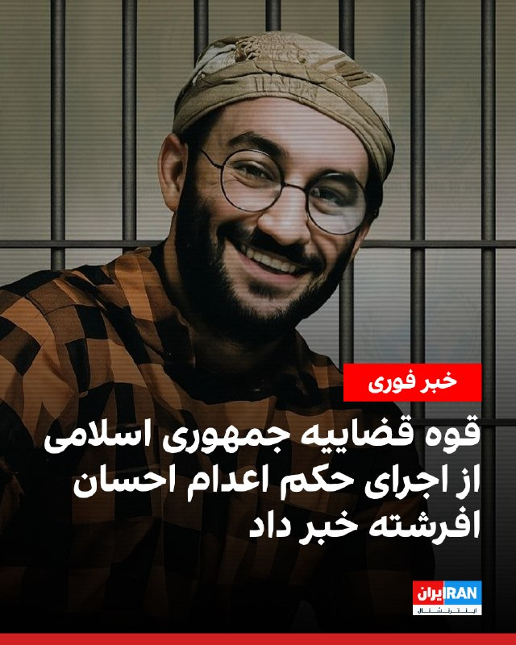

خبرگزاری میزان، رسانه قوه قضاییه جمهوری اسلامی، اعلام کرد حکم اعدام احسان افرشته، زندانی سیاسی، به اتهام «جاسوسی و همکاری اطلاعاتی به نفع اسرائیل» صادر شده است.

احسان افرشته، متولد ۱۳۷۲ و اهل اصفهان، دانش‌آموخته کارشناسی ارشد مهندسی عمران و متخصص شبکه و فناوری اطلاعات بود. او اوایل سال ۱۴۰۳، پس از بازگشت از ترکیه به ایران، از سوی نیروهای امنیتی بازداشت شد.

او چندین ماه در سلول انفرادی بازداشتگاه‌های امنیتی تحت بازجویی و فشار روانی قرار داشت و در مهر همان سال به بند عمومی زندان اوین منتقل شد.

کانون حقوق بشر ایران پیشتر اعلام کرده بود که اتهام «جاسوسی برای اسرائیل» علیه احسان افرشته بر پایه اعترافات اجباری تحت شکنجه طرح شده و هیچ مدرک معتبری در پرونده وجود ندارد.
https://iranintl.com/202605131420

## Persian_Trend_Official — post 14026

احسان افرشته اعدام شد؛

بامداد امروز چهارشنبه خبرگزاری میزان وابسته به قوه قضائیه در خبری مدعی شد که احسان افرشته به اتهام جاسوسی برای موساد اعدام شد. جمهوری اسلامی او را جاسوسی توصیف می‌کند که اطلاعات حساس کشور را می‌فروخت.

اما سوالاتی که بی‌پاسخ مانده‌اند:

محاکمه به صورت کامل علنی برگزار نشد
هیچ وکیل مستقلی امکان دسترسی کامل به پرونده را نداشت

اتهامات صرفاً بر اساس روایت یک‌طرفه دستگاه قضایی مطرح شده

جمهوری اسلامی مدعی است افرشته در نپال توسط موساد آموزش دیده، به سه زبان مسلط شده و با نام سازمانی «جیمز» بیش از ۳۰۰ پیام با افسران اسرائیلی رد و بدل کرده است.

در کشوری که شفافیت قضایی وجود ندارد، مرز میان جاسوس واقعی و قربانی یک پرونده‌سازی را چه کسی می‌تواند تشخیص دهد؟

☆Phantom☆

📌 @persian_trend_official
پرشین ترند | متفاوت‌ترین کانال نظامی

## alonews — post 119632

  <a href="telegram/content/alonews_119632_1778650543.webm" target="_blank">🎬 Download video</a>

👈نیویورک تایمز: ایران هنوز به ۳۰ سکوی موشکی از مجموع ۳۳ سکوی خود در حاشیه خلیج فارس دسترسی دارد

✅ @AloNews خبر جنگ

---
📅 بروزرسانی: 1405/02/23 08:54
---

## VahidOOnLine — post 239849

♦️در حالیکه اعتراض‌های گسترده به بیش از ۷۰ روز قطعی اینترنت در ایران ادامه دارد، علی کیافی‌فر، متخصص امنیت اطلاعات در نشستی درباره تاثیرات خاموشی دیجیتال بر کسب و کارها، رابطه میان این روند با امنیت را به‌شدت رد کرد.

کیایی فر که در میزگرد رسانه‌ آنلاین روزنامه دنیای اقتصاد صحبت می‌کرد با تاکید بر اینکه «قطع اینترنت امنیت را کمتر می‌کند و نه بیشتر»، گفت: «در جنگ ۱۲ روزه، نوبیتکس، بانک پاسارگاد، بانک سپه و بانک مرکزی از داخل خود ایران هک شدند. مثلا نوبیتکس توسط یک سرور زامبی تو یک مدرسه‌ی علمیه خواهران در قم هک شد.»

جمهوری اسلامی همزمان با حمله آمریکا و اسرائیل به ایران و آغاز جنگ، دسترسی کاربران به اینترنت بین‌المللی را قطع کرد.
همزمان با هفتادوسومین روز قطع اینترنت جهانی در ایران، حسین افشین، معاون علمی و فناوری مسعود پزشکیان، در مصاحبه‌ با خبرگزاری جوان با اشاره به اینکه «در شرایط جنگی هم بستن اینترنت نمی‌تواند راهکار باشد» گفت: «دیدیم وقتی اینترنت کاملا بسته بود، ترورها همچنان وجود داشت.»
‌🇸🇦 Indypersian

🤖 @VahidOOnLine

## DW_Farsi — post 124630

🔶 ترامپ میان فشار و جنگ؛ گزینه‌های بعدی آمریکا علیه ایران چیست
 
🔻 گزارشی از دانیال بابایانی

"کاملا غیرقابل قبول است". دونالد ترامپ، رئیس جمهور آمریکا با همین چند کلمه، آخرین پاسخ جمهوری اسلامی به طرح آمریکا برای پایان جنگ و کاهش تنش را رد کرد؛ واکنشی که فضای خوش‌بینی روزهای گذشته را فرو ریخت و بار دیگر احتمال بازگشت درگیری‌های گسترده‌تر را مطرح کرد.
 
رئیس‌جمهور آمریکا روز دوشنبه ۱۱ مه در گفت‌وگو با شبکه فاکس‌نیوز و همچنین در دفتر بیضی کاخ سفید، لحنی تندتر از هفته‌های گذشته اتخاذ کرد.
 
او گفت آتش‌بس میان واشنگتن و تهران اکنون "در وضعیت احتضار" قرار دارد و شرایط را به بیماری تشبیه کرد که پزشکان تنها "یک درصد شانس زنده ماندن" برای او قائل هستند.
 
ترامپ همچنین اعلام کرد در حال بررسی ازسرگیری پروژه "آزادی" است؛ عملیاتی که ابتدا برای اسکورت کشتی‌ها در تنگه هرمز طراحی شده بود، اما به گفته او در صورت اجرا این بار "فراتر از همراهی کشتی‌ها" خواهد رفت.
 
او هنوز تصمیم نهایی خود را اعلام نکرده، اما همین ابهام، گمانه‌زنی‌ها درباره گزینه‌های بعدی آمریکا را افزایش داده است.
 
اظهارات تازه ترامپ نشان می‌دهد واشنگتن فعلا میان دو مسیر حرکت می‌کند؛ فشار برای توافق یا آماده‌سازی برای تشدید تنش.
 
 گفت‌وگو با مهدی نخل احمدی و رضا طالبی.
@dw_farsi

## IranianMinds — post 20053

  <a href="telegram/content/IranianMinds_20053_1778649865.mp4" target="_blank">🎬 Download video</a>

🔴 پست جدید اکانت کاخ سفید :

@IranianMinds

## BBCPersian — post 280885

  

🔻مرکز رسانه‌ای قوه قضائیه ایران اعلام کرده است که احسان افرشته به جرم «جاسوسی برای اسرائیل» بامداد امروز (چهارشنبه) اعدام شده است.

آقای افرشته متهم شده بود که ابتدا «در پوشش راننده تاکسی اینترنتی» دستورات ماموران موساد را اجرا می‌کرده و سپس با استخدام در یک شرکت وابسته به یک نهاد نظامی اطلاعات حساسی را به اسرائیل منتقل کرده است.
با پایان جنگ ایران با آمریکا و اسرائیل، قوه قضائیه اجرای احکام اعدام تسریع و تشدید کرده است.

به گفته گزارشگر ویژه شورای حقوق بشر سازمان ملل متحد در یک سال اخیر تعداد اعدام‌ها در ایران به شکل کم‌سابقه‌ای افزایش یافته، این روند پس از جنگ اخیر که نهم اسفند (۲۸ فوریه) با حملات اسرائیل و آمریکا آغاز شد، شتاب بیشتری گرفته است.

نهادهای حقوق بشر از دادرسی‌های ناعادلانه، نقض حقوق متهم و موج اعدام‌ها بر اساس «اعترافات» زیر شکنجه و فشار ابراز نگرانی کرده‌اند.

📷MIZAN
@BBCPersian

---
📅 بروزرسانی: 1405/02/23 08:46
---

## VahidOOnLine — post 239848

  

دادستانی آمریکا اعلام کرد شارون گوهری، شهروند ایرانی-آمریکایی، در دادگاه بروکلین به اتهام قاچاق غیرقانونی افراد به آمریکا و دریافت محتوای حاوی سوءاستفاده جنسی از کودکان اعتراف کرده است.

بر اساس این پرونده، او با دریافت پول از اتباع ایرانی، قاچاق غیرقانونی به آمریکا را از مسیرهایی از جمله مکزیک سازماندهی کرده و ورود دست‌کم یک فرد مرتبط با سپاه پاسداران را نیز تسهیل کرده است.

مقام‌های فدرال آمریکا می‌گویند در تحقیقات، ویدیوهای حاوی آزار کودکان خردسال و تصاویر تعقیب پنهانی زنان در شهر نیویورک نیز در دستگاه‌های متهم کشف شده است.

گوهری در صورت محکومیت با حداقل پنج سال و حداکثر ۲۰ سال زندان برای اتهام محتوای سوءاستفاده جنسی از کودک و همچنین تا ۱۰ سال زندان برای قاچاق انسان روبه‌رو است.
‌🏁 🇬🇧 IranintlTV

🤖 @VahidOOnLine

## VahidOOnLine — post 239847

  <a href="telegram/content/VahidOOnLine_239847_1778649383.mp4" target="_blank">🎬 Download video</a>

⭕️هواپیمای غول‌پیکر نظامی سی-۱۷ آمریکا در آستانه سفر ترامپ در پکن فرود آمد

♦️یک فروند هواپیمای ترابری نظامی سی-۱۷ متعلق به نیروی هوایی ارتش ایالات متحده در آستانه سفر دونالد ترامپ در پکن فرود آمد. احتمال این هواپیما حامل تجهیزات امنیتی، تیم‌های حفاظتی و دیگر دستگاه‌ها و موارد پشتیبانی برای  آماده‌سازی‌های ویژه برای این سفر دیپلماتیک ایجاد کرده است.

هواپیمای سی-۱۷ یکی از بزرگ‌ترین هواپیماهای ترابری راهبردی ارتش آمریکا به‌شمار می‌رود و توانایی حمل تجهیزات سنگین نظامی، نیرو و سامانه‌های پشتیبانی ویژه را دارد.
‌🇸🇦 Indypersian

🤖 @VahidOOnLine

## VahidOnline — post 75439

یک اعدام دیگر
میزان خبرگزاری قوه قضاییه جمهوری اسلامی با انتشار تصاویر بالا نوشت: احسان افرشته اعدام شد
قوه قضاییه مدعی شده که: افرشته در نپال از سوی موساد آموزش جاسوسی دیده و اطلاعات حساس کشور را به اسرائیل می‌فروخت.

📡 @VahidOnline

## IranIntlTV — post 336926

  

دادستانی آمریکا اعلام کرد شارون گوهری، شهروند ایرانی-آمریکایی، در دادگاه بروکلین به اتهام قاچاق غیرقانونی افراد به آمریکا و دریافت محتوای حاوی سوءاستفاده جنسی از کودکان اعتراف کرده است.

بر اساس این پرونده، او با دریافت پول از اتباع ایرانی، قاچاق غیرقانونی به آمریکا را از مسیرهایی از جمله مکزیک سازماندهی کرده و ورود دست‌کم یک فرد مرتبط با سپاه پاسداران را نیز تسهیل کرده است.

مقام‌های فدرال آمریکا می‌گویند در تحقیقات، ویدیوهای حاوی آزار کودکان خردسال و تصاویر تعقیب پنهانی زنان در شهر نیویورک نیز در دستگاه‌های متهم کشف شده است.

گوهری در صورت محکومیت با حداقل پنج سال و حداکثر ۲۰ سال زندان برای اتهام محتوای سوءاستفاده جنسی از کودک و همچنین تا ۱۰ سال زندان برای قاچاق انسان روبه‌رو است.
https://iranintl.com/202605134047

## IranianMinds — post 20052

🔴 صداوسیما :

اگه اینترنت میخواید میتونید از کشور برید یه جای دیگه زندگی کنید

@IranianMinds

---
📅 بروزرسانی: 1405/02/23 08:34
---

## farsi_fox_news — post 89274

  

♦️ ترامپ:

🔹 وقتی اخبار جعلی می‌گویند که دشمن ایرانی از نظر نظامی علیه ما خوب عمل می‌کند، این عملاً خیانت است، چون چنین ادعایی کاملاً دروغ و حتی مضحک است. آنها در حال کمک و دلگرمی دادن به دشمن هستند! تمام کاری که می‌کند این است که به ایران امیدواریِ دروغین می‌دهد در حالی که نباید هیچ امیدی وجود داشته باشد.
🔹 این افراد، ترسوهای آمریکایی‌ای هستند که علیه کشور خود ریشه می‌زنند. ایران ۱۵۹ فروند کشتی در نیروی دریایی خود داشت — اکنون هر یک از آن کشتی‌ها در کف دریا آرام گرفته‌اند.
🌐 @farsi_fox_news

## farsi_fox_news — post 89273

  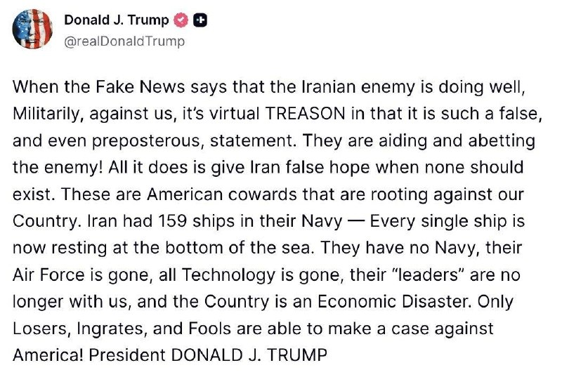

♦️ ترامپ:

🔹 وقتی اخبار جعلی می‌گویند که دشمن ایرانی از نظر نظامی علیه ما خوب عمل می‌کند، این عملاً خیانت است، چون چنین ادعایی کاملاً دروغ و حتی مضحک است. آنها در حال کمک و دلگرمی دادن به دشمن هستند! تمام کاری که می‌کند این است که به ایران امیدواریِ دروغین می‌دهد در حالی که نباید هیچ امیدی وجود داشته باشد.
🔹 این افراد، ترسوهای آمریکایی‌ای هستند که علیه کشور خود ریشه می‌زنند. ایران ۱۵۹ فروند کشتی در نیروی دریایی خود داشت — اکنون هر یک از آن کشتی‌ها در کف دریا آرام گرفته‌اند.
🌐 @farsi_fox_news

## farsi_fox_news — post 89272

  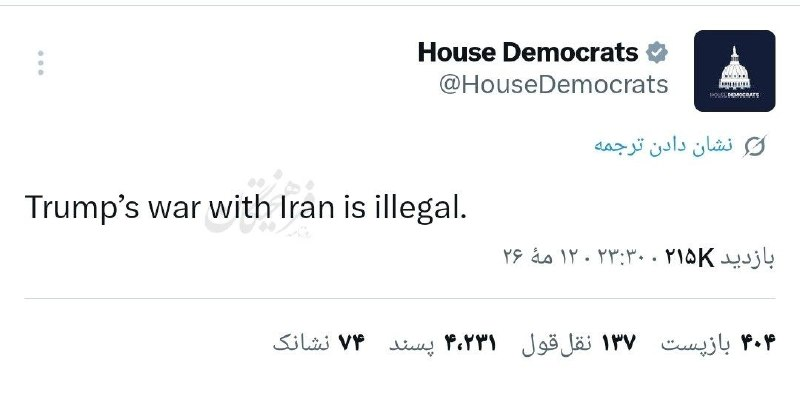

♦️ دموکرات‌های آمریکا: جنگ ترامپ با ایران غیرقانونی است
🌐 @farsi_fox_news

## farsi_fox_news — post 89271

♦️ احسان افرشته، جاسوسی که در نپال توسط موساد آموزش دیده بود و اطلاعات حساس کشور را به اسرائیل می‌فروخت اعدام شد
🌐 @farsi_fox_news

## IranianMinds — post 20051

  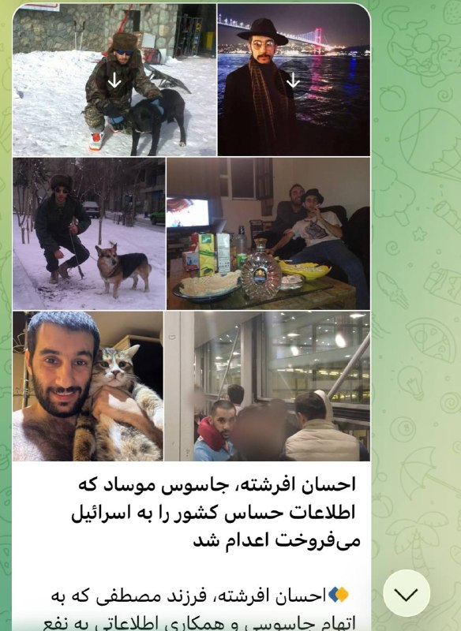

شما فک کنید یه جوون بی گناه که نه پستی داشته و نه مقامی تو کشور رو دی ماه دستگیر کردن بعدشم اعدامش کردن گفتن جاسوس موساد بوده رفته نپال آموزش دیده !

@IranianMinds

---
📅 بروزرسانی: 1405/02/23 08:24
---

## Shin_Persian — post 5984

Shin ✓ @hey_itsmyturn
Wed, 13 May 2026 04:53:24 UTC

Ehsan Afreshte has been executed by Islamic Regime today. Regime claims he was trained by Mossad in Nepal and sold intelligence to Israel.
#Iran

فارسی

احسان افراشته امروز توسط رژیم اسلامی اعدام شد. رژیم مدعی است که او توسط موساد در نپال آموزش دیده و اطلاعات را به اسرائیل فروخته است.
#Iran

𝕏 · @shin_persian

## RadioFarda — post 157114

  <a href="https://t.me/radiofarda/157114" target="_blank">📎 Download file</a>

📻بشنوید: سرخط خبرها با رادیوفردا، ۲۳ اردیبهشت ۱۴۰۵‌

@RadioFarda

## RadioFarda — post 157113

🔸دونالد ترامپ، رئیس‌جمهور آمریکا، گزارش شماری از رسانه‌های غربی درباره عملکرد نظامی «خوب» ایران مقابل آمریکا را «خیانت» عنوان کرد. 🔸او از این رسانه‌ها با عنوان «فیک‌نیوز» نام برد و در شبکه اجتماعی خود، تروث‌سوشال نوشت: «وقتی رسانه‌های جعلی می‌گویند که دشمن…

## RadioFarda — post 157112

  

🔸دونالد ترامپ، رئیس‌جمهور آمریکا، گزارش شماری از رسانه‌های غربی درباره عملکرد نظامی «خوب» ایران مقابل آمریکا را «خیانت» عنوان کرد.

🔸او از این رسانه‌ها با عنوان «فیک‌نیوز» نام برد و در شبکه اجتماعی خود، تروث‌سوشال نوشت: «وقتی رسانه‌های جعلی می‌گویند که دشمن ایرانی از نظر نظامی در برابر ما عملکرد خوبی دارد، این عملاً خیانت محسوب می‌شود، چون چنین ادعایی کاملاً دروغ و حتی مضحک است.»

🔸ترامپ اضافه کرد که این رسانه‌ها با این نوع اخبار «دارند به دشمن کمک و از او حمایت می‌کنند!»

@RadioFarda

## IranianMinds — post 20050

  

🔴 ترامپ :

افتخار بزرگی است که ایلان ماسک، تیم کوک، لری فینک، و دیگران به چین میروند. من از رئیس‌جمهور شی می‌خواهم چین را باز کند تا این افراد نابغه بتوانند کارهای شگفت‌انگیز انجام دهند و کشورشان را به سطح بالاتری برسانند. این اولین چیزی است که هنگام دیدار از ایشان درخواست خواهم کرد.

@IranianMinds

## BBCPersian — post 280884

🔻ان‌بی‌سی؛ ترامپ به دنبال تغییر نام عملیات نظامی علیه ایران است تا از محدودیت ۶۰ روزه کنگره پرهیز کند

رسانه‌های آمریکا می‌گویند به گفته دو مقام امريکايی، پنتاگون در حال بررسی اين موضوع است که اگر آتش‌بس کنونی با ايران فروبپاشد و دونالد ترامپ تصميم به ازسرگيری عمليات گسترده نظامی بگيرد، نام جنگ رسما به «عمليات پتک‌ سنگین» تغيير يابد.

بحث‌ها درباره احتمال جايگزينی نام «عمليات خشم حماسی» با «عمليات پتک سنگین» نشان می‌دهد دولت امريکا تا چه اندازه احتمال ازسرگيری جنگی را که در ۲۸ فوريه آغاز شد، جدی می‌گيرد.

اين تغيير نام همچنين می‌تواند به آقای ترامپ امکان دهد استدلال کند که با آغاز عمليات جديد، مهلت ۶۰ روزه مورد نياز برای دريافت مجوز جنگ از کنگره دوباره از نو آغاز می‌شود.

در چند هفته گذشته و در خلال حضور مقام‌های دولت آمریکا در کنگره، نمایندگان به مفاد قانونی اشاره کردند که به موجب آن دولت آمریکا حتی در پی عملیات نظامی به بهانه «تهدید فوری» باید پس از ۶۰ روز از آغاز این حملات، برای ادامه جنگ از کنگره که قانونا حق تصمیم‌گیری درباره اعلان و آغاز جنگ را دارد، مجوز بگیرد.

https://bbc.in/4tAXKjn
@BBCPersian

<!-- MSG END -->

<!-- NAV START -->

<a href="https://github.com/ali-exifit/aio-downloader/blob/main/telegram/content/archive_1.md" style="display:inline-block; padding:6px 12px; margin:0 4px; background-color:#2ea44f; color:white; text-decoration:none; border-radius:4px; font-weight:bold;">صفحه بعد</a>

<!-- NAV END -->
